# Kelas X PPKn BS press

*Diekstrak: 18 May 2026, 19:47*

---

---
## 📄 Halaman 1

### Pendidikan Pancasila dan Kewarganegaraan

---
**🖼️ Gambar/Diagram**

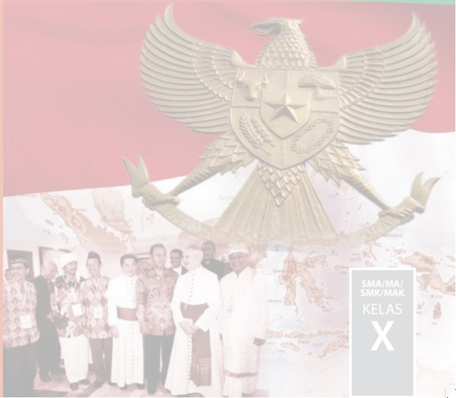

> **Deskripsi Visual:** Gambar ini adalah foto yang menampilkan sebuah pameran atau acara resmi di depan bendera Indonesia. Di tengah foto, terdapat sebuah patung Garuda Pancasila, simbol nasional Indonesia, yang tampak megah dengan sayap terbuka. Sekelompok orang, tampaknya merupakan tamu undangan atau pemimpin, berdiri di depan patung tersebut. Mereka mengenakan pakaian formal dan tampak senang, mungkin merayakan atau menghadiri acara penting.

Elemen-elemen utama dalam gambar ini meliputi:
1. Patung Garuda Pancasila yang menjadi simbol nasional Indonesia.
2. Bendera Indonesia yang tampak megah di latar belakang.
3. Kelompok orang yang tampak sebagai tamu undangan atau pemimpin.
4. Latar belakang yang menunjukkan pameran atau acara resmi.

Teks, angka, atau label penting yang terlihat dalam gambar ini adalah "SMA/MA/SMK/MAK KELAS X", yang menunjukkan bahwa gambar ini mungkin terkait dengan materi pelajaran untuk kelas X di sekolah-sekolah tertentu.

Informasi kunci yang dapat diambil pembaca adalah bahwa gambar ini mungkin digunakan sebagai konteks untuk membahas tentang identitas nasional Indonesia, hubungan antara pemerintah dan masyarakat, serta pentingnya keberadaan Garuda Pancasila sebagai simbol nasional.

 

---
## 📄 Halaman 2

### Hak Cipta © 201 7 pada Kementerian Pendidikan dan Kebudayaan Dilindungi Undang-Undang

Disklaimer: Buku ini merupakan buku siswa yang dipersiapkan Pemerintah dalam rangka implementasi Kurikulum 2013. Buku siswa ini disusun dan ditelaah oleh berbagai pihak di bawah koordinasi Kementerian Pendidikan dan Kebudayaan, dan dipergunakan dalam tahap awal penerapan Kurikulum 2013. Buku ini merupakan 'dokumen hidup' yang senantiasa diperbaiki,  diperbaharui,  dan  dimutakhirkan  sesuai  dengan  dinamika  kebutuhan  dan perubahan zaman. Masukan dari berbagai kalangan yang dialamatkan kepada penulis dan laman http://buku.kemdikbud.go.id atau melalui email buku@kemdikbud.go.id diharapkan dapat meningkatkan kualitas buku ini.

### Katalog Dalam Terbitan (KDT)

Indonesia. Kementerian Pendidikan dan Kebudayaan.

Pendidikan Pancasila dan Kewarganegaraan/ Kementerian Pendidikan dan Kebudayaan.-- . Edisi Revisi Jakarta: Kementerian Pendidikan dan Kebudayaan, 201 7 . xii, 252 hlm. : ilus. ; 25 cm.

Untuk SMA/MA/SMK/MAK Kelas X ISBN  978-602-427-090-2 (jilid lengkap) ISBN  978-602-427-091-9 (jilid 1)

- Pendidikan Kewarganegaraan -- Studi dan Pengajaran
I. Judul

- Kementerian Pendidikan dan Kebudayaan
600

Penulis

:  Nuryadi dan Tolib.

Penelaah

:  Dadang Sundawa, Nasiwan, Kokom Komalasari dan Ekram Pawiroputra.

Penyelia Penerbitan : Pusat Kurikulum dan Perbukuan, Balitbang, Kem

en dikbud.

Cetakan Ke-1, 2014 ISBN 978-602-282-472-5 ( Jilid 1a ) ISBN 978-602-282-473-2 ( Jilid 1b )

Cetakan Ke-2, 2016 (Edisi Revisi) Cetakan Ke-3, 2017 (Edisi Revisi) Disusun dengan huruf Myriad Pro, 12 pt.

 

---
## 📄 Halaman 3

### KATA PENGANTAR

Puji  syukur  kami  panjatkan  kehadirat  Allah  SWT,  yang  telah  melimpahkan rahmat,  dan  karunia-Nya,  sehingga  Buku  Teks  dan  Buku  Guru  Mata  Pelajaran Pendidikan  Pancasila  dan  Kewarganegaraan  (PPKn)  Kelas  X  untuk  SMA/SMK/ MA/MAK dapat terselesaikan. Buku Teks dan Buku Guru ini disusun berdasarkan Kurikulum  2013  dan  terbitan  kali  ini  merupakan  edisi  revisi  pertama  dari penyusunan buku sebelumnya.

Pendidikan Pancasila dan Kewarganegaraan (PPKn) merupakan mata pelajaran yang mempunyai misi sebagai pendidikan nilai dan moral Pancasila, penyadaran akan  norma  dan  konstitusi  UUD  Negara  Republik  Indonesia  Tahun  1945, pengembangan komitmen terhadap Negara Kesatuan Republik Indonesia (NKRI), dan penghayatan terhadap filosofi Bhinneka Tunggal Ika.

Pendidikan  Pancasila  dan  Kewarganegaraan  dimaksudkan  sebagai  upaya membentuk peserta didik menjadi manusia yang memiliki rasa kebangsaan dan cinta tanah air yang dijiwai oleh nilai-nilai Pancasila, Undang Undang Dasar Negara Republik Indonesia Tahun 1945, semangat Bhinneka Tunggal Ika, dan komitmen Negara  Kesatuan  Republik  Indonesia.  Oleh  karena  itu,  tujuan  pembelajaran Pendidikan Pancasila dan Kewarganegaraan (PPKn) di SMA/SMK/MA/MAK adalah upaya  mengembangkan  kualitas  warga  negara  secara  dalam  berbagai  aspek kehidupan, khususnya pengembangan peserta didik agar mampu :

- Berpikir  secara  rasional,  kritis,  kreatif,  dan  etis  serta  memiliki  semangat kebangsaan serta cinta tanah air yang dijiwai oleh nilai-nilai Pancasila,  Undang Undang  Dasar  Negara  Republik  Indonesia  Tahun  1945,  semangat  Bhinneka Tunggal Ika dan komitmen Negara Kesatuan Republik Indonesia.
- Berpartisipasi secara aktif dan bertanggung jawab sebagai anggota masyarakat yang independen, sesuai dengan harkat dan martabatnya sebagai makhluk ciptaan Tuhan Yang Maha Esa.
- Berkomitmen dan proaktif dalam berinteraksi dengan bangsa-bangsa lain  dalam  percaturan  dunia  secara  langsung  atau  tidak  langsung  dengan memanfaatkan  teknologi  informasi  dan  komunikasi  sesuai  karakter  bangsa Indonesia
- Berkembang secara positif dan demokratis dalam mengembangkan konstitusi yang  sehat  dan  dinamis  serta  memiliki  keyakinan,  kemauan,  kesetiaan,  dan kebanggaan serta keteguhan sebagai bangsa Indonesia.
Buku Teks Pendidikan Pancasila dan Kewarganegaraan (PPKn) Kelas X untuk jenjang SMA/SMK/MA/MAK ini menjabarkan usaha minimal yang harus dilakukan peserta  didik  untuk  mencapai  kompetensi  yang  diharapkan.  Sesuai  dengan pendekatan yang digunakan dalam Kurikulum 2013, buku ini berbasis Aktivitas,

 

---
## 📄 Halaman 4

dimana  peserta  didik  diajak  berani  untuk  mencari    sumber  belajar  lain  yang relevan dan tersedia serta terbentang luas disekitarnya, sehingga peserta didik menjadi bahagian dalam kegiatan pembelajaran

Untuk  menunjang  kegiatan  pembelajaran,  buku  teks  ini  dilengkapi  dengan buku guru, sebagai panduan pembelajaran yang berisi alternatif-alternatif kegiatan pembelajaran yang dapat dilakukan guru di kelas. Guru dapat memperkayanya dengan  kreasi  dan  inovasi  dalam  bentuk  kegiatan-kegiatan  pembelajaran  lain yang sesuai dan relevan yang bersumber dari lingkungan alam dan lingkungan sosial  peserta  didik.  Untuk  itu  peran  guru  dalam  rangka  meningkatkan  dan menyesuaikan daya serap peserta didik dengan ketersediaan kegiatan pada buku ini sangat penting.

Kami menyadari sepenuhnya bahwa buku ini masih jauh dari sempurna, untuk itu kritik, masukan dan saran yang membangun diharapkan bagi perbaikan dan penyempurnaan buku. Akhirnya penulis mengucapkan terima kasih tak terhingga kepada pihak-pihak terkait, khususnya Kementerian Pendidikan dan Kebudayaan yang  telah  menerbitkan  buku  teks  dan  buku  guru  ini.  Semoga  buku  ini  dapat memberikan setetes ilmu bagi bagi kemajuan dunia pendidikan Indonesia.

Jakarta, Maret 2016

Penulis

 

---
## 📄 Halaman 5

### DAFTAR ISI

 

---
## 📄 Halaman 8

### Daftar Gambar

19

24

 

---
## 📄 Halaman 11

### Daftar Tabel

 

---
## 📄 Halaman 12

Bab 5

 

---
## 📄 Halaman 13

BAB 1

### Nilai-Nilai Pancasila dalam Kerangka Praktik Penyelenggaraan Pemerintahan Negara

Selamat  ya,  atas  keberhasilan  kalian  yang  telah  menyelesaikan  pendidikan pada jenjang sekolah menengah pertama/madrasah tsanawiyah dan diterima di sekolah menengah atas (SMA) atau sederajat. Keberhasilan ini sudah sepatutnya kalian syukuri, karena keberhasilan kalian merupakan anugerah dan nikmat yang diberikan Tuhan Yang Maha Esa.

Rasa  syukur  kalian  kepada  Tuhan  Yang  Maha  Esa  sebagai  seorang  pelajar adalah  dengan  menunjukkan  semangat  belajar  yang  tinggi  dalam  rangka mengembangkan potensi diri. Hal ini dapat kalian tunjukkan dengan memahami dan mempelajari materi dalam buku ini. Selain itu, kembangkanlah cara belajar secara  mandiri  dan  bekerja  sama  dengan  teman  kalian  dalam  menyelesaikan tugas-tugas pada buku ini.

Kalian saat ini akan segera memulai mempelajari Bab Pertama tentang NilaiNilai  Pancasila  dalam  kerangka  praktik  Penyelenggaraan  Pemerintahan Negara. Pada  bab  ini  kalian  akan  diajak  untuk  menyelami  penyelenggaraan  kekuasaan pemerintahan  negara  berdasarkan  Undang-Undang  Dasar  Negara  Republik Indonesia Tahun  1945.  Setelah  mempelajari  bab  ini  diharapkan  kalian  mampu menganalisis nilai-nilai Pancasila dalam  kerangka praktik  penyelenggaraan pemerintahan Negara Kesatuan Republik Indonesia.Coba kalian amati gambar 1.1.

---
**🖼️ Gambar/Diagram**

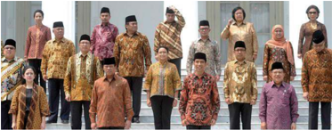

> **Deskripsi Visual:** Gambar ini adalah ilustrasi yang menunjukkan kelompok orang yang terdiri dari beberapa individu yang berpose untuk foto bersama. Ilustrasi ini mungkin digunakan sebagai representasi dari kelompok atau organisasi tertentu. Elemen utama dalam gambar ini meliputi:

1. Kelompok orang: Terdapat delapan orang yang terdiri dari dua pasangan dewasa, satu anak laki-laki, dan satu anak perempuan. Mereka semua mengenakan pakaian tradisional Indonesia.

2. Pose: Semua orang tampak senang dan berpose untuk foto, menunjukkan hubungan harmonis antara mereka.

3. Latar belakang: Latar belakangnya sederhana dengan warna putih, memfokuskan perhatian pada orang-orang tersebut.

4. Pakaian: Pakaian mereka mencerminkan budaya lokal, dengan batik sebagai bahan utama.

5. Aksesori: Beberapa orang menggunakan topi tradisional, yang juga merupakan bagian dari pakaian mereka.

Informasi kunci yang dapat diambil dari gambar ini adalah bahwa ini mungkin merupakan representasi dari kelompok atau organisasi yang memiliki identitas budaya lokal, mungkin dalam konteks pendidikan atau promosi budaya Indonesia.

Gambar 1.1 Jajaran Kabinet Kerja 2014-2019

 

---
## 📄 Halaman 14

Siapa  yang  ada  di  gambar  tersebut?  Mereka  adalah  pejabat  negara  yang sering kita  sebut  dengan pemerintah. Pemerintah merupakan salah satu unsur konstitutif  (mutlak)  berdirinya  sebuah  negara,  selain  dari  rakyat  dan  wilayah. Pemerintah bertugas menyelenggarakan pemerintahan negara, atau dengan kata lain  mengelola  kekuasaan  negara  untuk  mencapai  cita-cita  dan  tujuan  negara. Pemerintahlah  yang  mempunyai  kewenangan  mengatur  seluruh  rakyat  dan menjaga keutuhan wilayah negara untuk mencapai kemakmuran rakyat.

Pemerintahan Negara Kesatuan Republik Indonesia sebagai  pemegang kekuasaan  negara  terdiri  atas  dua  tingkatan,  yaitu  Pemerintahan  Pusat  dan Pemerintahan  Daerah.  Dalam  arti  luas,  Pemerintahan  Pusat  dilaksanakan  oleh setiap lembaga negara yang tugas dan kewenangannya sudah diatur dalam UUD Negara  Republik  Indonesia  Tahun  1945  serta  peraturan  perundang-undangan yang lainnya. Dalam arti sempit Pemerintahan Pusat dilaksanakan oleh lembaga eksekutif,  yaitu  Presiden,  Wakil  Presiden,  Kementerian  Negara  dan  Lembaga Pemerintahan Non-Kementerian.

Pemerintahan  Daerah  di  Indonesia  terdiri  atas  Pemerintahan  Provinsi  dan Pemerintahan Kabupaten/Kota. Pemerintahan daerah dilaksanakan oleh pemerintah daerah (yang dipimpin oleh Kepala Daerah) dan Dewan Perwakilan Rakyat Daerah.

### A. Sistem Pembagian Kekuasaan Negara Republik Indonesia

### 1. Macam-Macam Kekuasaan Negara

Konsep kekuasaan tentu saja merupakan konsep yang tidak asing bagi kalian. Dalam kehidupan sehari-hari konsep ini sering sekali diperbincangkan, baik dalam obrolan di masyarakat maupun dalam berita di media cetak maupun elektronik. Apa sebenarnya kekuasaan itu?

Secara  sederhana,  kekuasaan  dapat  diartikan  sebagai  kemampuan seseorang  untuk  memengaruhi  orang  lain  supaya  melakukan  tindakantindakan yang dikehendaki atau diperintahkannya. Sebagai contoh, ketika kalian sedang menonton televisi, tiba-tiba orang tua kalian menyuruh untuk belajar, kemudian kalian mematikan televisi tersebut dan masuk ke kamar atau  ruang  belajar  untuk  membaca  atau  menyelesaikan  tugas  sekolah. Contoh lain dalam kehidupan di sekolah, kalian datang ke sekolah tidak boleh terlambat, apabila terlambat tentu saja kalian akan mendapatkan teguran

 

---
## 📄 Halaman 15

dari guru. Di masyarakat, ada ketentuan bahwa setiap tamu yang tinggal di wilayah itu lebih dari 24 jam wajib lapor kepada Ketua RT/RW, artinya setiap tamu yang datang dan tinggal lebih dari 24 jam harus lapor kepada yang berwenang. Nah, contoh-contoh tersebut menggambarkan perwujudan dari kekuasaan yang dimiliki oleh seseorang atau lembaga. Apakah negara juga mempunyai kekuasaan negara? Tentu saja negara mempunyai kekuasaan, karena pada dasarnya negara merupakan organisasai kekuasaan. Dengan kata  lain,  bahwa  negara  memiliki  banyak  sekali  kekuasaan.  Kekuasaan negara merupakan kewenangan negara untuk mengatur seluruh rakyatnya untuk mencapai keadilan dan kemakmuran, serta keteraturan.

Apa saja kekuasaan negara itu? Kekuasaan negara banyak sekali macamnya. Menurut John Locke sebagaimana dikutip oleh Riyanto (2006: 273) bahwa kekuasaan negara itu  dapat  dibagi  menjadi tiga macam, yakni sebagai berikut.

### a. ,

- Kekuasaan  legislatif yaitu  kekuasaan untuk membuat  atau membentuk undang-
undang.

- Kekuasaan  eksekutif ,  yaitu  kekuasaan  untuk  melaksanakan  undangundang,  termasuk  kekuasaan  untuk  mengadili  setiap  pelanggaran terhadap undang- undang.
- Kekuasaan federatif ,  yaitu kekuasaan untuk melaksanakan hubungan luar negeri.
Selain John Locke, ada tokoh lain yang berpendapat tentang kekuasaan negara, yaitu Montesquieu. Sebagaimana dikutip oleh Riyanto (2006: 273).

- Kekuasaan legislatif , yaitu kekuasaan untuk membuat atau membentuk undang-undang.

 

---
## 📄 Halaman 16

- Kekuasaan eksekutif , yaitu kekuasaan untuk melaksanakan undang-undang.
- Kekuasaan yudikatif , yaitu kekuasaan untuk mempertahankan undangundang, termasuk kekuasaan untuk mengadili setiap pelanggaran terhadap undangundang.
Pendapat yang dikemukakan oleh Montesquieu merupakan penyempurnaan dari pendapat

---
**🖼️ Gambar/Diagram**

> **Deskripsi Visual:** Gambar 1.3 dalam buku pelajaran ini adalah ilustrasi yang menunjukkan tokoh politik dan pendiri liberalisme, John Locke. Gambar ini menggambarkan John Locke dengan wajah tua dan penuh pengertian, menunjukkan pengetahuannya yang luas tentang teori politik dan liberalisme. Di sekeliling gambar tersebut, terdapat teks yang menyebutkan bahwa John Locke adalah tokoh politik dan pendiri liberalisme. Elemen-elemen utama dalam gambar ini adalah wajah John Locke yang tampak penuh pengertian dan pengetahuan, serta teks yang memberikan informasi tentang John Locke sebagai tokoh politik dan pendiri liberalisme. Informasi kunci yang dapat diambil dari gambar ini adalah bahwa John Locke memiliki peran penting dalam teori politik dan liberalisme.

John Locke. Kekuasaan federatif oleh Montesquieu dimasukkan ke dalam kekuasaan  eksekutif,  fungsi  mengadili  dijadikan  kekuasaan  yang  berdiri sendiri.  Ketiga  kekuasaan  tersebut    dilaksanakan  oleh  lembaga-lembaga yang  berbeda  yang  sifatnya  terpisah.  Teori  Montesquieu  ini  dinamakan Trias Politika .

### Tugas Mandiri 1.1

Setelah  membaca  uraian  di  atas,  coba  kalian  uraikan  dalam  satu  paragraf mengenai pentingnya kekuasaan negara. Informasikanlah pendapat kalian pada teman yang lainnya. Pentingnya kekuasaan negara ………………………………

………………………………………………………………………………………

 

---
## 📄 Halaman 17

### 2. Konsep Pembagian Kekuasaan di Indonesia

Dalam  sebuah  praktik  ketatanegaraan  tidak  jarang  terjadi  pemusatan kekuasaan pada satu orang saja, terjadi pengelolaan sistem pemerintahan dilakukan  secara  absolut  atau  otoriter.  Untuk  menghindari  hal  tersebut perlu ada pemisahan atau pembagian kekuasaan, agar terjadi kontrol dan keseimbangan di antara lembaga pemegang kekuasaan. Dengan kata lain, kekuasaan legislatif, eksekutif maupun yudikatif tidak dipegang oleh satu orang saja.

Apa  sebenarnya  konsep  pemisahan  dan  pembagian  kekuasaan  itu? Kusnardi  dan  Ibrahim  (1983:140)  menyatakan  bahwa  istilah  pemisahan kekuasaan  ( separation  of  powers )  dan  pembagian  kekuasaan  ( divisions  of power ) merupakan dua istilah yang memiliki pengertian berbeda satu sama lainnya. Pemisahan kekuasaan berarti kekuasaan negara itu terpisah-pisah dalam beberapa bagian, baik mengenai organ maupun fungsinya. Dengan kata lain,  lembaga pemegang kekuasaan negara yang meliputi  lembaga legislatif,  eksekutif,  dan  yudikatif  merupakan  lembaga  yang  terpisah  satu sama lainnya, berdiri sendiri tanpa memerlukan koordinasi dan kerja sama. Setiap  lembaga  menjalankan  fungsinya  masing-masing.  Contoh  negara yang menganut mekanisme pemisahan kekuasaan adalah Amerika Serikat.

Berbeda dengan mekanisme pemisahan kekuasaan, di dalam mekanisme pembagian kekuasaan, kekuasaan negara itu memang dibagibagi dalam beberapa bagian (legislatif, eksekutif, dan yudikatif), tetapi tidak dipisahkan. Hal ini membawa konsekuensi bahwa di antara bagian-bagian itu dimungkinkan ada koordinasi atau kerja sama. Mekanisme pembagian ini banyak sekali dilakukan oleh banyak negara di dunia, termasuk Indonesia.

---
**🖼️ Gambar/Diagram**

> **Deskripsi Visual:** Gambar ini menunjukkan ruang pertemuan besar dengan berbagai elemen penting. Ruangan ini tampak seperti sebuah auditorium atau hall dengan dinding putih dan lantai kayu. Di tengah ruangan, terdapat meja besar yang dihiasi dengan beberapa papan tulis dan peralatan presentasi. Di sekeliling meja tersebut, terdapat kursi yang disusun rapi untuk para peserta rapat. Di belakang meja, terdapat dua podium dengan beberapa orang yang sedang berbicara atau memberikan pidato. Di sisi kanan, terdapat dua layar proyektor yang digunakan untuk menampilkan informasi atau video. Di atas ruangan, terdapat beberapa bendera dan lambang negara yang menunjukkan bahwa acara ini mungkin merupakan sesi parlemen atau konferensi nasional. Gambar ini menunjukkan kegiatan formal dan serius yang biasanya dilakukan dalam lingkungan politik atau bisnis.

 

---
## 📄 Halaman 18

Bagaimana konsep pembagian kekuasaan yang dianut negara Indonesia? Mekanisme  pembagian  kekuasaan  di  Indonesia  diatur  sepenuhnya  di dalam UUD Negara Republik Indonesia Tahun 1945. Penerapan pembagian kekuasaan di Indonesia terdiri atas dua bagian, yaitu pembagian kekuasaan secara horizontal dan pembagian kekuasaan secara vertikal.

### a. Pembagian Kekuasaan Secara Horizontal

Pembagian kekuasaan secara horizontal yaitu pembagian kekuasaan menurut  fungsi  lembaga-lembaga  tertentu  (legislatif,  eksekutif,  dan yudikatif).  Berdasarkan  UUD  Negara  Republik  Indonesia  Tahun  1945, secara horisontal pembagian kekuasaan negara dilakukan pada tingkatan pemerintahan  pusat  dan  pemerintahan  daerah.  Pembagian  kekuasaan pada  tingkatan  pemerintahan  pusat  berlangsung  antara  lembagalembaga  negara  yang  sederajat.  Pembagian  kekuasaan  pada  tingkat pemerintahan pusat mengalami pergeseran setelah terjadinya perubahan UUD Negara Republik Indonesia Tahun 1945. Pergeseran yang dimaksud adalah  pergeseran  klasifikasi  kekuasaan  negara  yang  umumnya  terdiri atas  tiga  jenis  kekuasaan  (legislatif,  eksekutif,  dan  yudikatif)  menjadi enam kekuasaan negara.

- Kekuasaan  konstitutif , yaitu  kekuasaan  untuk  mengubah  dan menetapkan  Undang-Undang  Dasar.  Kekuasaan  ini  dijalankan  oleh Majelis  Permusyawaratan  Rakyat  sebagaimana  ditegaskan  dalam Pasal  3  ayat  (1)  UUD  Negara  Republik  Indonesia  Tahun  1945  yang menyatakan  bahwa  'Majelis  Permusyawaratan  Rakyat  berwenang mengubah dan menetapkan Undang-Undang Dasar.'
- Kekuasaan eksekutif ,  yaitu kekuasaan untuk menjalankan undangundang  dan  penyelenggraan  pemerintahan  negara.  Kekuasaan  ini dipegang oleh Presiden sebagaimana ditegaskan dalam Pasal 4 ayat (1) UUD Negara Republik Indonesia Tahun 1945 yang menyatakan bahwa 'Presiden  Republik  Indonesia  memegang  kekuasaan  pemerintahan menurut Undang-Undang Dasar.'

 

---
## 📄 Halaman 19

- Kekuasaan  legislatif ,  yaitu  kekuasaan  untuk  membentuk  undangundang.  Kekuasaan  ini  dipegang  oleh  Dewan  Perwakilan  Rakyat sebagaimana ditegaskan dalam Pasal 20 ayat (1) UUD Negara Republik Indonesia Tahun 1945 yang menyatakan bahwa 'Dewan Perwakilan Rakyat  memegang kekuasaan membentuk undang-undang.'
- Kekuasaan  yudikatif atau  disebut kekuasaan  kehakiman yaitu kekuasaan  untuk  menyelenggarakan  peradilan  guna  menegakkan hukum  dan  keadilan.  Kekuasaan  ini  dipegang  oleh  Mahkamah Agung  dan  Mahkamah  Konstitusi  sebagaimana  ditegaskan  dalam Pasal  24  ayat  (2)  UUD  Negara  Republik  Indonesia Tahun  1945  yang menyatakan  bahwa 'Kekuasaan  kehakiman  dilakukan  oleh  sebuah Mahkamah  Agung  dan  badan  peradilan  yang  berada  di  bawahnya dalam  lingkungan  peradilan  umum,  lingkungan  peradilan  agama, lingkungan peradilan militer, lingkungan peradilan tata usaha negara, dan oleh sebuah Mahkamah Konstitusi.'
- Kekuasaan eksaminatif/inspektif , yaitu kekuasaan yang berhubungan dengan penyelenggaraan pemeriksaan atas pengelolaan dan  tanggung  jawab  tentang  keuangan  negara.  Kekuasaan  ini dijalankan oleh Badan Pemeriksa Keuangan sebagaimana ditegaskan dalam  Pasal  23  E    ayat  (1)  UUD  Negara  Republik  Indonesia  Tahun 1945  yang  menyatakan  bahwa 'untuk  memeriksa  pengelolaan  dan tanggung  jawab  tentang  keuangan  negara  diadakan  satu  Badan Pemeriksa Keuangan yang bebas dan mandiri.'
- Kekuasaan  moneter , yaitu kekuasaan untuk menetapkan dan melaksanakan kebijakan moneter, mengatur dan menjaga kelancaran sistem pembayaran, serta memelihara kestabilan nilai rupiah. Kekuasaan ini dijalankan oleh Bank Indonesia selaku bank sentral di Indonesia  sebagaimana  ditegaskan  dalam  Pasal  23  D  UUD  Negara Republik  Indonesia  Tahun  1945  yang  menyatakan  bahwa  'negara memiliki suatu bank sentral yang susunan, kedudukan, kewenangan, tanggung jawab, dan indepedensinya diatur dalam undang- undang.'

 

---
## 📄 Halaman 20

Pembagian kekuasaan secara horisontal pada tingkatan pemerintahan daerah  berlangsung  antara  lembaga-lembaga  daerah  yang  sederajat, yaitu antara Pemerintah Daerah (Kepala Daerah/Wakil Kepala Daerah) dan Dewan Perwakilan Rakyat Daerah (DPRD). Pada tingkat provinsi, pembagian kekuasaan berlangsung antara Pemerintah provinsi (Gubernur/Wakil Gubernur)  dan  DPRD  provinsi.  Sedangkan  pada  tingkat  kabupaten/kota, pembagian  kekuasaan  berlangsung  antara  Pemerintah  Kabupaten/Kota (Bupati/Wakil Bupati atau Walikota/Wakil Walikota) dan DPRD kabupaten/ kota.

### b. Pembagian Kekuasaan Secara Vertikal

Pembagian kekuasaan secara vertikal merupakan pembagian kekuasaan berdasarkan tingkatannya, yaitu pembagian kekuasaan antara beberapa tingkatan pemerintahan. Pasal 18 ayat (1) UUD Negara Republik  Indonesia  Tahun  1945  menyatakan  bahwa  Negara  Kesatuan Republik  Indonesia  dibagi  atas  daerah-daerah  provinsi  dan  daerah provinsi  itu  dibagi  atas  kabupaten  dan  kota,  yang  tiap-tiap  provinsi, kabupaten, dan kota itu mempunyai pemerintahan daerah, yang diatur dengan  undang-undang.  Berdasarkan  ketentuan  tersebut,  pembagian kekuasaan  secara  vertikal  di  negara  Indonesia  berlangsung  antara pemerintahan pusat dan pemerintahan daerah (pemerintahan provinsi dan pemerintahan kabupaten/kota). Pada pemerintahan daerah berlangsung pula pembagian kekuasaan secara vertikal yang ditentukan oleh pemerintahan pusat. Hubungan antara pemerintahan provinsi dan pemerintahan  kabupaten/kota  terjalin  dengan  koordinasi,  pembinaan dan  pengawasan  oleh  pemerintahan  pusat  dalam  bidang  administrasi dan kewilayahan.

Pembagian  kekuasaan  secara  vertikal  muncul  sebagai  konsekuensi dari  diterapkannya  asas  desentralisasi  di  Negara  Kesatuan  Republik Indonesia. Dengan  asas tersebut, pemerintah pusat  menyerahkan wewenang pemerintahan kepada pemerintah daerah otonom (provinsi dan  kabupaten/kota)  untuk  mengurus  dan  mengatur  sendiri  urusan pemerintahan di daerahnya, kecuali urusan pemerintahan yang menjadi kewenangan pemerintah pusat, yaitu kewenangan yang berkaitan dengan politik  luar  negeri,  pertahanan,  keamanan,  yustisi,  agama,  moneter

 

---
## 📄 Halaman 21

dan fiskal. Hal tersebut ditegaskan dalam Pasal 18 ayat (5) UUD Negara Republik  Indonesia  Tahun  1945  yang  menyatakan  Pemerintah  daerah menjalankan otonomi seluas-luasnya, kecuali urusan pemerintahan yang oleh undang-undang ditentukan sebagai urusan pemerintah pusat.

### Tugas Kelompok 1.1

Lakukanlah identifikasi terhadap tugas dan wewenang setiap lembaga negara yang tercantum dalam tabel. Untuk melakukan kegiatan ini, kalian bisa membaca UUD Negara Republik Indonesia Tahun 1945 dan peraturan-peraturan perundangundangan yang relevan. Tulislah hasil identifikasi kalian pada tabel di bawah ini.

---
**📊 Tabel**

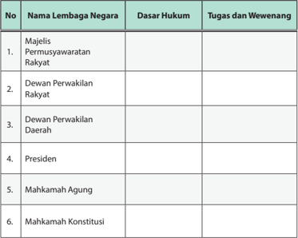

Tabel ini berisi informasi tentang lembaga negara di Indonesia, termasuk nama lembaga, dasar hukumnya, dan tugas-wewenangnya. Topik utamanya adalah struktur pemerintahan Indonesia. Kolom-kolom yang ada meliputi No., Nama Lembaga Negara, Dasar Hukum, dan Tugas dan Wewenang. Data penting yang terlihat antara lain bahwa Majelis Permusyawaratan Rakyat memiliki dasar hukum yang berbeda dengan Dewan Perwakilan Rakyat dan Dewan Perwakilan Daerah, yang merupakan lembaga legislatif. Presiden dan Mahkamah Agung juga memiliki dasar hukum yang berbeda, dengan Presiden sebagai kepala negara dan Mahkamah Agung sebagai lembaga pengadilan tinggi. Mahkamah Konstitusi memiliki dasar hukum khususnya untuk memutuskan konstitusi.

 

---
## 📄 Halaman 22

---
**📊 Tabel**

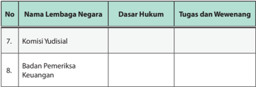

Tabel ini berisi informasi tentang dua lembaga negara di Indonesia: Komisi Yudisial dan Badan Pemeriksa Keuangan. Topik utama tabel adalah tentang lembaga-lembaga negara yang memiliki dasar hukum tertentu dan tugas serta wewenang mereka. Kolom-kolom yang ada dalam tabel meliputi nomor urut (No.), nama lembaga negara, dasar hukum, dan tugas dan wewenang. Data penting yang terlihat dalam tabel ini adalah bahwa kedua lembaga tersebut tidak memiliki dasar hukum tertentu yang disebutkan dalam tabel, yang menunjukkan bahwa mereka mungkin merupakan lembaga yang baru atau belum memiliki regulasi hukum yang jelas. Selain itu, tabel juga menunjukkan bahwa kedua lembaga ini memiliki tugas dan wewenang yang sama, yaitu untuk melakukan pemeriksaan dan penegakan hukum.

### B. Kedudukan dan Fungsi Kementerian Negara Republik Indonesia dan Lembaga Pemerintah Non-Kementerian

### 1. Tugas Kementerian Negara Republik Indonesia

Dari uraian sebelumnya kalian tentunya sudah memahami bahwa sistem pemerintahan yang dianut oleh negara kita  adalah  sistem  pemerintahan presidensial. Dalam sistem presidensial, kedudukan presiden sangat kuat, karena ia merupakan kepala negara sekaligus sebagai kepala pemerintahan. Dengan demikian, seorang Presiden mempunyai kewenangan yang sangat banyak. Coba kalian perhatikan tabel berikut ini!

---
**📊 Tabel**

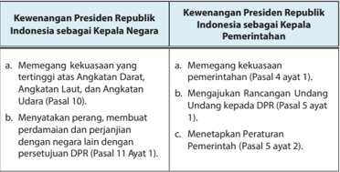

Tabel ini membahas kewenangan Presiden Republik Indonesia sebagai kepala negara dan kepala pemerintahan. Topik utamanya adalah perbedaan antara kedua posisi tersebut. Kolom pertama berisi kewenangan sebagai kepala negara, sedangkan kolom kedua berisi kewenangan sebagai kepala pemerintahan. Data penting yang terlihat adalah bahwa sebagai kepala negara, Presiden memiliki kekuasaan untuk memegang kekuasaan tertinggi atas Angkatan Darat, Angkatan Laut, dan Angkatan Udara (Pasal 10 ayat 1), serta menyetujui perjanjian dengan negara lain (Pasal 11 ayat 1). Sementara itu, sebagai kepala pemerintahan, Presiden memiliki kekuasaan untuk memegang kekuasaan pemerintahan (Pasal 4 ayat 1), mengajukan rancangan Undang-Undang kepada DPR (Pasal 5 ayat 1), dan menetapkan Peraturan Pemerintah (Pasal 5 ayat 2).

 

---
## 📄 Halaman 23

---
**📊 Tabel**

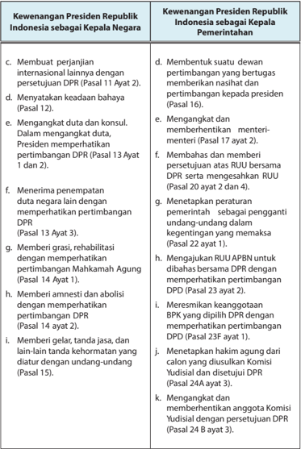

Tabel ini membandingkan kewenangan Presiden Republik Indonesia sebagai Kepala Negara dengan kewenangan Presiden sebagai Kepala Pemerintahan. Topik utama tabel adalah perbandingan kedua fungsi tersebut. Kolom pertama berisi kewenangan sebagai Kepala Negara, sedangkan kolom kedua berisi kewenangan sebagai Kepala Pemerintahan. Data penting yang terlihat antara lain bahwa sebagai Kepala Negara, Presiden memiliki kewenangan untuk membuat perjanjian internasional, menyetujui keadaan bahaya, mengangkat duta dan konsul, menerima penempatan duta negara, memberi gratifikasi, rehabilitasi, memberi amnesti dan abolis, memberikan gelar, tanda jasa, dan lain-lain kehormatan yang diatur dengan undang-undang. Sementara itu, sebagai Kepala Pemerintahan, Presiden memiliki kewenangan untuk membentuk suatu dewan pertimbangan yang bertugas memberikan nasihat dan pertimbangan kepada dirinya, mengangkat dan memberhentikan menteri-menteri, membahas dan memberi persetujuan RUU bersama DPR, menetapkan peraturan pemerintah sebagai pengganti undang-undang dalam kegentingan yang memaksa, mengajukan RUU APBN untuk dibahas bersama DPR, meresmikan keanggotaan BPK yang dipilih DPR, mengangkat dan memberhentikan anggota Komisi Yudisial, dan menetapkan hak agung dari calon yang disetujui DPR.

 

---
## 📄 Halaman 24

---
**📊 Tabel**

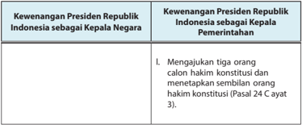

Tabel ini membahas kewenangan Presiden Republik Indonesia sebagai Kepala Negara dan Kepala Pemerintahan. Topik utama adalah tentang hakim konstitusi. Dalam kolom pertama, disebutkan bahwa Presiden memiliki kewenangan untuk mengajukan tiga orang calon hakim konstitusi dan menetapkan sembilan orang hakim konstitusi berdasarkan Pasal 24 ayat 3. Kolom kedua tidak menyediakan informasi tambahan. Pola penting yang terlihat adalah hubungan antara Presiden dan hakim konstitusi, serta proses pengambilan keputusan dalam pemberian hakim konstitusi.

Tugas dan kewenangan presiden yang sangat banyak ini tidak mungkin dikerjakan sendiri. Oleh karena itu, presiden memerlukan orang lain untuk membantunya. Dalam melaksanakan tugasnya, Presiden Republik Indonesia dibantu  oleh  seorang  wakil  presiden  yang  dipilih  bersamaan  dengannya melalui pemilihan umum, serta membentuk beberapa kementerian negara yang  dipimpin  oleh  menteri-menteri  negara.  Menteri-menteri  negara  ini dipilih  dan  diangkat  serta  diberhentikan  oleh  presiden  sesuai  dengan kewenangannya.

Keberadaan  Kementerian  Negara  Republik  Indonesia  diatur  secara tegas  dalam  Pasal  17  UUD  Negara  Republik  Indonesia  Tahun  1945  yang menyatakan:

- Presiden dibantu oleh menteri-menteri negara.
- Menteri-menteri itu diangkat dan diberhentikan oleh presiden.
- Setiap menteri membidangi urusan tertentu dalam pemerintahan.
- Pembentukan,  pengubahan,  dan  pembubaran  kementerian  negara diatur dalam undang-undang.
Selain diatur oleh UUD  Negara Republik Indonesia  Tahun 1945, keberadaan kementerian negara juga diatur dalam sebuah undang-undang organik, yaitu Peraturan Presiden Republik Indonesia Nomor 7 Tahun 2015 tentang  Organisasi  Kementerian  Negara.  Undang-undang  ini  mengatur semua hal tentang kementerian negara, seperti kedudukan, tugas pokok, fungsi,  susunan  organisasi,  pembentukan,  pengubahan,  penggabungan, pemisahan  atau  penggantian,  pembubaran/penghapusan  kementerian,

 

---
## 📄 Halaman 25

hubungan fungsional kementerian dengan lembaga pemerintah non-kementerian dan pemerintah daerah serta pengangkatan dan pemberhentian menteri.

Kementerian Negara Republik Indonesia mempunyai tugas menyelenggarakan  urusan  tertentu  dalam  pemerintahan  di  bawahnya dan bertanggung jawab kepada presiden dalam menyelenggarakan pemerintahan negara.

- Penyelenggara  perumusan,  penetapan,  dan  pelaksanaan  kebijakan  di bidangnya,  pengelolaan  barang  milik/kekayaan  negara  yang  menjadi tanggung jawabnya, pengawasan atas pelaksanaan tugas di bidangnya dan pelaksanaan kegiatan teknis dari pusat sampai ke daerah.
- Perumusan, penetapan, pelaksanaan kebijakan di bidangnya, pengelolaan  barang  milik/kekayaan  negara  yang  menjadi  tanggung jawabnya, pengawasan atas pelaksanaan tugas di bidangnya, pelaksanaan  bimbingan  teknis  dan  supervisi  atas  pelaksanaan  urusan kementerian di daerah dan pelaksanaan kegiatan teknis yang berskala nasional.
- Perumusan dan penetapan kebijakan di bidangnya, koordinasi dan  sinkronisasi  pelaksanaan  kebijakan  di  bidangnya,  pengelolaan barang  milik/kekayaan  negara  yang  menjadi  tanggung  jawabnya  dan pengawasan atas pelaksanaan tugas di bidangnya.
Pasal  17  ayat  (3)  UUD  NRI  tahun  1945  menyebutkan  bahwa  'setiap menteri membidangi urusan tertentu dalam pemerintahan.' Dengan kata lain, setiap kementerian negara masing-masing mempunyai tugas sendiri.

Adapun urusan pemerintahan yang menjadi tanggung jawab kementerian negara adalah sebagai berikut.

- Urusan pemerintahan yang nomenklatur kementeriannya secara tegas disebutkan dalam UUD Negara Republik Indonesia Tahun 1945, meliputi urusan luar negeri, dalam negeri, dan pertahanan.
- Urusan pemerintahan yang ruang lingkupnya disebutkan dalam UUD Negara  Republik  Indonesia Tahun  1945,  meliputi  urusan  agama, hukum, keuangan, keamanan, hak asasi manusia, pendidikan, kebudayaan, kesehatan, sosial, ketenagakerjaan, industri, perdagangan,

 

---
## 📄 Halaman 26

- pertambangan,  energi,  pekerjaan  umum,  transmigrasi,  transportasi, informasi, komunikasi, pertanian, perkebunan, kehutanan, peternakan, kelautan, dan perikanan.
- Urusan pemerintahan dalam rangka penajaman, koordinasi, dan sinkronisasi program pemerintah, meliputi urusan perencanaan pembangunan nasional, aparatur negara, kesekretariatan negara, badan usaha milik negara, pertanahan, kependudukan, lingkungan hidup, ilmu pengetahuan, teknologi, investasi, koperasi, usaha kecil dan menengah, pariwisata, pemberdayaan perempuan, pemuda, olahraga, perumahan, dan pembangunan kawasan atau daerah tertinggal.

### Tugas Mandiri 1.2

Coba kalian  cari informasi dari buku sejarah atau internet mengenai namanama  kabinet  dari  mulai  presiden  pertama  sampai  dengan  presiden  saat  ini. Tulislah informasi yang kalian temukan pada tabel di bawah ini.

---
**📊 Tabel**

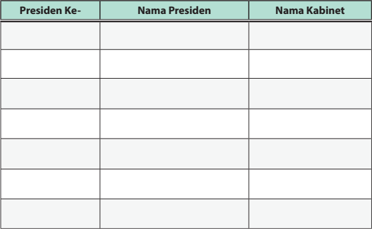

Tabel ini berisi informasi tentang Presiden Indonesia dan kabinet mereka. Topik utamanya adalah hubungan antara presiden dengan kabinetnya. Tabel memiliki dua kolom utama: "Nama Presiden" dan "Nama Kabinet". Data yang terlihat menunjukkan bahwa setiap presiden memiliki satu atau lebih kabinet yang bertugas membantu dalam pengelolaan pemerintahan. Misalnya, Presiden ke-1, Soekarno, memiliki kabinet yang terdiri dari beberapa menteri, sedangkan Presiden ke-2, Soeharto, juga memiliki kabinet yang terdiri dari beberapa menteri. Ini menunjukkan bahwa kabinet merupakan bagian integral dari sistem pemerintahan Indonesia, membantu presiden dalam menjalankan tugas-tugas pemerintahan.

 

---
## 📄 Halaman 27

### 2. Klasifikasi Kementerian Negara Republik Indonesia

Setelah  membaca  uraian  di  atas,  tentu  saja  pemahaman  kalian  akan kementerian  negara  yang  ada  di  negara  kita  semakin  bertambah.  Nah, supaya  pemahaman  kalian  semakin  bertambah,  kalian  harus  membaca kelanjutan dari materi di atas yang akan diuraikan pada pokok bahasan ini.

Kalian tentunya sudah memahami bahwa setiap kementerian bertugas membidangi  urusan  tertentu  dalam  pemerintahan.  Dengan  demikian, jumlah  kementerian  negara  dibentuk  cukup  banyak.  Hal  ini  dikarenakan urusan  pemerintahan  pun  jumlahnya  sangat  banyak  dan  beragam.  Pasal 15  Undang-Undang  Republik  Indonesia  Nomor  39  Tahun  2008  tentang Kementerian  Negara  secara  tegas  menyatakan  bahwa  jumlah  maksimal kementerian negara yang dapat dibentuk adalah 34 kementerian negara. Berdasarkan Peraturan Presiden Republik Indonesia Nomor 7 Tahun 2015 tentang  Organisasi  Kementerian  Negara.  Kementerian  Negara  Republik Indonesia  dapat  diklasifikasikan  berdasarkan  urusan  pemerintahan  yang ditanganinya.

- Kementerian yang menangani urusan pemerintahan yang nomenklatur/ nama  kementeriannya  secara  tegas  disebutkan  dalam  UUD  Negara Republik Indonesia Tahun 1945 adalah sebagai berikut.
- Kementerian Dalam Negeri
- Kementerian Luar Negeri
- Kementerian Pertahanan
- Kementerian yang mempunyai tugas penyelenggaraan urusan tertentu dalam pemerintahan untuk membantu presiden dalam menyelenggarakan  pemerintahan  negara  dengan  upaya  pencapaian tujuan kementerian sebagai bagian dari tujuan pembangunan nasional. Kementerian yang menangani urusan pemerintahan yang ruang lingkupnya disebutkan dalam UUD Tahun 1945 adalah sebagai berikut.
- Kementerian Agama
- Kementerian Hukum dan Hak Asasi Manusia
- Kementerian Keuangan
- Kementerian Pendidikan dan Kebudayaan
- Kementerian Riset, Teknologi, dan Pendidikan Tinggi
- Kementerian Kesehatan

 

---
## 📄 Halaman 28

- Kementerian Sosial
- Kementerian Ketenagakerjaan
- Kementerian Perindustrian
- Kementerian Perdagangan
- Kementerian Energi dan Sumber Daya Mineral
- Kementerian Pekerjaan Umum dan Perumahan Rakyat
- Kementerian Perhubungan
- Kementerian Komunikasi dan Informatika
- Kementerian Pertanian
- Kementerian Lingkungan Hidup dan Kehutanan
- Kementerian Kelautan dan Perikanan
- Kementerian Desa, Pembangunan Daerah Tertinggal, dan Transmigrasi
- Kementerian Agraria dan Tata Ruang
- Kementerian yang mempunyai tugas menyelenggarakan urusan tertentu dalam pemerintahan untuk membantu presiden dalam menyelenggarakan  pemerintahan  negara  serta  menjalankan  fungsi perumusan dan penetapan kebijakan di bidangnya, koordinasi dan  sinkronisasi  pelaksanaan  kebijakan  di  bidangnya,  pengelolaan barang milik/kekayaan negara yang menjadi tanggung jawabnya, dan pengawasan atas pelaksanaan tugas di bidangnya. Kementerian ini yang menangani urusan pemerintahan dalam rangka penajaman, koordinasi, dan sinkronisasi program pemerintah.
- Kementerian Perencanaan Pembangunan Nasional
- Kementerian Pendayagunaan Aparatur Negara dan Reformasi Birokrasi
- Kementerian Badan Usaha Milik Negara
- Kementerian Koperasi dan Usaha Kecil dan Menengah
- Kementerian Pariwisata
- Kementerian Pemberdayaan Perempuan dan Perlindungan Anak
- Kementerian Pemuda dan Olahraga
- Kementerian Sekretariat Negara

 

---
## 📄 Halaman 29

Selain kementerian yang menangani urusan pemerintahan di atas, ada juga kementerian koordinator yang bertugas melakukan sinkronisasi dan koordinasi urusan kementerian-kementerian yang berada di dalam lingkup tugasnya.  Kementerian  koordinator,  terdiri  atas  beberapa  kementerian sebagai berikut.

- Kementerian Koordinator Bidang Politik, Hukum, dan Keamanan.
- Kementerian Dalam Negeri
- Kementerian Hukum dan HAM
- Kementerian Luar Negeri
- Kementerian Pertahanan
- Kementerian Komunikasi dan Informatika
- f )  Kementerian Pendayagunaan Aparatur Negara dan Reformasi Birokrasi
- Kementerian Koordinator Bidang Perekonomian.
- Kementerian Keuangan
- Kementerian Ketenagakerjaan
- Kementerian Perindustrian
- Kementerian Perdagangan
- Kementerian Pekerjaan Umum dan Perumahan Rakyat
- f )  Kementerian Pertanian
- Kementerian Lingkungan Hidup dan Kehutanan
- Kementerian Agraria dan Tata Ruang/Badan Pertanahan Nasional
- Kementerian Badan Usaha Milik Negara
- Kementerian Koperasi dan Usaha Kecil dan Menengah
- Kementerian Koordinator Bidang Pembangunan Manusia dan Kebudayaan.
- Kementerian Agama;
- Kementerian Pendidikan dan Kebudayaan;
- Kementerian Riset, Teknologi, dan Pendidikan Tinggi;
- Kementerian Kesehatan;
- Kementerian Sosial;
- f )  Kementerian Desa, Pembangunan Daerah Tertinggal, dan Transmigrasi;

 

---
## 📄 Halaman 30

- Kementerian Pemberdayaan Perempuan dan Perlindungan Anak; dan
- Kementerian Pemuda dan Olahraga.
- Kementerian Koordinator Bidang Kemaritiman.
- Kementerian Energi dan Sumber Daya Mineral
- Kementerian Perhubungan
- Kementerian Kelautan dan Perikanan
- Kementerian Pariwisata

### Tugas Mandiri 1.3

Nah,  setelah  kalian  membaca  materi  pembelajaran  di  atas,  coba  kalian kelompokkan  kementerian  negara  Indonesia  berdasarkan  lingkup  tugasnya. Tuliskan dalam tabel di bawah ini.

---
**📊 Tabel**

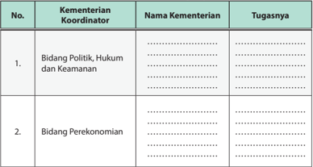

Tabel ini berisi informasi tentang koordinasi antara kementerian untuk tiga bidang utama: Politik, Hukum, dan Keamanan; Perekonomian; dan Bidang lainnya. Kolom "Kementerian Koordinator" menunjukkan kementerian yang bertanggung jawab atas setiap bidang. Kolom "Nama Kementerian" menyebutkan nama-nama kementerian yang terlibat. Kolom "Tugasnya" memberikan deskripsi tugas-tugas masing-masing kementerian dalam masing-masing bidang. Topik utama tabel ini adalah koordinasi antar kementerian dalam menjalankan tugas-tugas mereka di berbagai bidang. Data penting yang terlihat adalah bahwa setiap bidang memiliki satu atau lebih kementerian yang bertanggung jawab, menunjukkan bahwa koordinasi antar kementerian sangat penting dalam menjalankan tugas-tugas nasional.

 

---
## 📄 Halaman 31

---
**📊 Tabel**

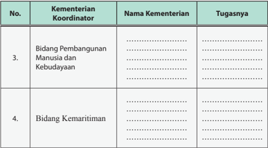

Tabel ini berisi informasi tentang tugas-tugas kementerian yang terkait dengan pembangunan manusia dan budaya serta kemaritiman. Topik utama tabel adalah distribusi tugas antara kementerian-kementerian tersebut. Kolom-kolom yang ada meliputi nomor urut, nama kementerian, dan tugasnya. Data penting yang terlihat adalah bahwa kementerian yang koordinasi bidang pembangunan manusia dan budaya adalah Bidang Pembangunan Manusia dan Kebudayaan, sedangkan kementerian yang koordinasi bidang kemaritiman adalah Bidang Kemaritiman. Tugas-tugas tersebut mencakup berbagai aspek pembangunan manusia dan budaya, serta pengembangan kapal dan perahu di sektor maritim.

### 3. Lembaga Pemerintah Non-Kementerian

Selain memiliki kementerian negara, Republik Indonesia juga memiliki Lembaga  Pemerintah  Non-Kementerian  (LPNK)  yang  dahulu  namanya Lembaga Pemerintah Non-Departemen. Lembaga Pemerintah NonKementerian merupakan lembaga negara yang dibentuk untuk membantu presiden  dalam  melaksanakan  tugas  pemerintahan  tertentu.  Lembaga Pemerintah Non-Kementerian berada di bawah presiden dan bertanggung jawab  langsung  kepada  presiden  melalui  menteri  atau  pejabat  setingkat menteri yang terkait.

 

---
## 📄 Halaman 32

Keberadaan  LPNK  diatur  oleh  Peraturan  Presiden  Republik  Indonesia, yaitu  Keputusan  Presiden  Republik  Indonesia  Nomor  103  Tahun  2001 tentang  Kedudukan,  Tugas,  Fungsi,  Kewenangan,  Susunan  Organisasi, dan Tata  Kerja  Lembaga  Pemerintah  Non-Departemen.  Berikut  ini  Daftar Lembaga Pemerintah Non -Kementerian yang ada di Indonesia.

- Arsip Nasional Republik Indonesia (ANRI), di bawah koordinasi Menteri Pendayagunaan Aparatur Negara dan Reformasi Birokrasi.
- Badan Informasi Geospasial (BIG).
- Badan Intelijen Negara (BIN).
- Badan Kepegawaian Negara (BKN), di bawah koordinasi Menteri Pendayagunaan Aparatur Negara dan Reformasi Birokrasi.
- Badan Kependudukan dan Keluarga Berencana Nasional (BKKBN), di bawah koordinasi Menteri Pemberdayaan Perempuan dan Perlindungan Anak.
- Badan Koordinasi Penanaman Modal (BKPM), di bawah koordinasi Menteri Koordinator Bidang Perekonomian.
- Badan Koordinasi Survei dan Pemetaan Nasional (BAKOSURTANAL), di bawah koordinasi Menteri Riset dan Teknologi.
- Badan Meteorologi, Klimatologi, dan Geofisika (BMKG).
- Badan Narkotika Nasional (BNN).
- Badan Nasional Penanggulangan Bencana (BNPB).
- Badan Nasional Penanggulangan Terorisme (BNPT).
- Badan Nasional Penempatan dan Perlindungan Tenaga Kerja Indonesia (BNP2TKI).
- Badan Pengawas Obat dan Makanan (BPOM), di bawah koordinasi Menteri Kesehatan.
- Badan Pengawas Tenaga Nuklir (BAPETEN), di bawah koordinasi Menteri Riset, Teknologi, dan Pendidikan Tinggi.
- Badan Pengawasan Keuangan dan Pembangunan (BPKP).
- Badan Pengendalian Dampak Lingkungan (BAPEDAL), di bawah koordinasi Menteri Lingkungan Hidup.
- Badan Pengkajian dan Penerapan Teknologi (BPPT), di bawah koordinasi Menteri Riset dan Teknologi.
- Badan Perencanaan Pembangunan Nasional (BAPPENAS),di bawah koordinasi Menteri Koordinator Bidang Perekonomian.

 

---
## 📄 Halaman 33

- Badan Pertanahan Nasional (BPN), di bawah koordinasi Menteri Dalam Negeri.
- Badan Pusat Statistik (BPS), di bawah koordinasi Menteri Koordinator Bidang Perekonomian.
- Badan SAR Nasional (BASARNAS).
- Badan Standardisasi Nasional (BSN), di bawah koordinasi Menteri Riset dan Teknologi.
- Badan Tenaga Nuklir Nasional (BATAN), di bawah koordinasi Menteri Riset dan Teknologi.
- Badan Urusan Logistik (BULOG), di bawah koordinasi Menteri Koordinator Bidang Perekonomian.
- Lembaga  Administrasi Negara (LAN), di bawah koordinasi Menteri Pendayagunaan Aparatur Negara dan Reformasi Birokrasi.
- Lembaga Ilmu Pengetahuan Indonesia (LIPI), di bawah koordinasi Menteri Riset dan Teknologi.
- Lembaga Ketahanan Nasional (LEMHANAS).
- Lembaga Kebijakan Pengadaan Barang/Jasa Pemerintah (LKPP).
- Lembaga Penerbangan dan Antariksa Nasional (LAPAN), di bawah koordinasi Menteri Riset dan Teknologi.
- Lembaga Sandi Negara (LEMSANEG), di bawah koordinasi Menteri Koordinator Bidang Politik, Hukum dan, Keamanan.
- Perpustakaan Nasional Republik Indonesia (PERPUSNAS), di bawah koordinasi Menteri Pendidikan dan Kebudayaan.

### Tugas Kelompok 1.2

Bacalah secara berkelompok buku sumber dan peraturan perundangundangan  yang  berkaitan  dengan  keberadaan  Lembaga  Pemerintah  NonKementerian. Kemudian identifikasi tugas dan fungsi dari lembaga-lembaga yang telah disebutkan. Tulislah hasil identifikasi kalian dalam tabel berikut ini.

 

---
## 📄 Halaman 34

### Tabel 1.4

### Lembaga-Lembaga Pemerintah Non-Kementerian

---
**📊 Tabel**

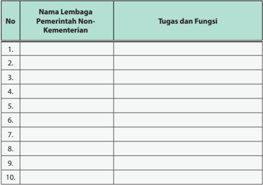

Tabel ini berisi informasi tentang lembaga pemerintahan non-kementerian di Indonesia, dengan kolom "No" untuk nomor urut, "Nama Lembaga Pemerintah Non-Kementerian" untuk nama lembaga, dan "Tugas dan Fungsi" untuk deskripsi tugas dan fungsi masing-masing lembaga. Topik utama tabel ini adalah lembaga pemerintahan non-kementerian di Indonesia. Data penting yang terlihat meliputi jumlah lembaga yang disajikan (10 lembaga), dan bahwa setiap lembaga memiliki satu baris dalam tabel, menunjukkan bahwa tabel ini mencakup semua lembaga tersebut.

### C. Nilai-Nilai Pancasila dalam Penyelenggaraan Pemerintahan

### 1. Sistem Nilai dalam Pancasila

Sistem secara sederhana dapat diartikan sebagai suatu rangkaian yang saling berkaitan antara nilai yang satu dan nilai yang lain. Jika kita berbicara tentang  sistem  nilai  berarti  ada  beberapa  nilai  yang  menjadi  satu  dan bersama-sama  menuju  pada  suatu  tujuan  tertentu.  Sistem  nilai  adalah konsep  atau  gagasan  yang  menyeluruh  mengenai  sesuatu  yang  hidup dalam pikiran seseorang atau sebagian besar anggota masyarakat tentang apa yang dipandang baik. Pancasila sebagai nilai mengandung serangkaian nilai,  yaitu:  ketuhanan,  kemanusiaan,  persatuan,  keadilan.  Kelima  nilai tersebut merupakan satu kesatuan yang utuh, tidak terpisahkan mengacu kepada  tujuan  yang  satu.  Pancasila  sebagai  suatu  sistem  nilai  termasuk ke dalam nilai moral (nilai kebaikan) dan merupakan nilai-nilai dasar yang bersifat abstrak.

 

---
## 📄 Halaman 35

### 2. Implementasi Pancasila

Pancasila yang termuat dalam Pembukaan UUD 1945 merupakan landasan bangsa Indonesia yang mengandung tiga tata nilai utama, yaitu dimensi  spiritual,  dimensi  kultural,  dan dimensi  institusional.  Dimensi  spiritual mengandung  makna  bahwa  Pancasila mengandung  nilai-nilai  keimanan  dan ketakwaan  Kepada  Tuhan  Yang  Maha Esa  sebagai  landasan  keseluruhan  nilai dalam falsafah negara. Hal ini termasuk

### Info Kewarganegaraan

Nilai-Nilai Pancasila dijabarkan dalam setiap peraturan perundangundangan yang telah ada, baik itu ketetapan, keputusan, kebijakan pemerintah, programprogram pembangunan dan peraturan-peraturan lain yang pada hakikatnya merupakan penjabaran nilai-nilai dasar Pancasila.

pengakuan bahwa atas kemahakuasaan dan curahan rahmat dari Tuhan Yang Maha Esa perjuangan bangsa Indonesia merebut kemerdekaan terwujud. Dimensi kultural mengandung makna bahwa Pancasila merupakan landasan falsafah negara, pandangan hidup bernegara, dan sebagai dasar negara. Dimensi institusional mengandung makna bahwa Pancasila harus sebagai landasan utama untuk mencapai cita-cita, tujuan bernegara, dan dalam penyelenggaraan pemerintahan.

Aktualisasi nilai spiritual dalam Pancasila tergambar dalam Sila Ketuhanan Yang  Maha  Esa.  Hal  ini  berarti  bahwa  dalam  praktik  penyelenggaraan pemerintahan tidak boleh meninggalkan prinsip keimanan dan ketakwaan terhadap Tuhan Yang Maha Esa. Nilai ini menunjukkan adanya pengakuan bahwa  manusia,  terutama  penyelenggara  negara  memiliki  keterpautan hubungan  dengan  Sang  Penciptanya.  Artinya,  di  dalam  menjalankan tugas sebagai penyelenggara negara tidak hanya dituntut patuh terhadap peraturan  yang  berkaitan  dengan  tugasnya,  tetapi  juga  harus  dilandasi oleh satu pertanggungjawaban kelak kepada Tuhan di dalam pelaksanaan tugasnya. Hubungan antara manusia dan Tuhan yang tercermin dalam sila pertama tersebut sesungguhnya dapat memberikan rambu-rambu agar tidak melakukan pelanggaran-pelanggaran, terutama ketika dia harus melakukan korupsi,  penyelewengan  harta  negara,  dan  perilaku  negatif  lainnya.  Nilai spiritual inilah yang tidak ada dalam doktrin good governance yang selama ini  menjadi  panduan  dalam  praktek  penyelenggaraan  pemerintahan  di

 

---
## 📄 Halaman 36

Indonesia  masa  kini.  Nilai  spiritual  dalam  Pancasila  ini  sekaligus  menjadi nilai  lokalitas bagi Bangsa Indonesia yang seharusnya dapat teraktualisasi dalam tata kelola pemerintahan.

Sila  Kemanusiaan  yang  Adil  dan  Beradab,  Sila  Persatuan  Indonesia, dan  Sila  Kerakyatan  yang  dipimpin  oleh  Hikmat  Kebijaksanaan  dalam Permusyawaratan  Perwakilan  merupakan  gambaran  bagaimana  dimensi kultural dan institusional harus dijalankan. Dimensi tersebut mengandung nilai pengakuan terhadap sisi kemanusiaan dan keadilan (fairness) yang nondiskriminatif;  demokrasi  berdasarkan  musyawarah  dan  transparan  dalam membuat  keputusan;  dan  terciptanya  kesejahteraan  sosial  bagi  semua tanpa pengecualian pada golongan tertentu. Nilai-nilai itu sesungguhnya jauh lebih luhur dan telah menjadi rumusan hakiki dalam Pembukaan UUD NRI Tahun 1945.

---
**🖼️ Gambar/Diagram**

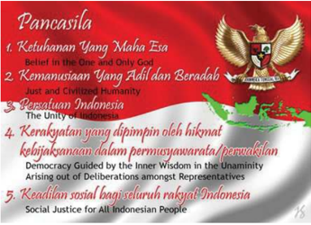

> **Deskripsi Visual:** Gambar ini adalah ilustrasi yang menampilkan tiga pilar utama Pancasila, sebuah konstitusi nasional Indonesia. Ilustrasi ini terdiri dari tiga elemen utama:

1. Pilar pertama: Ketuhanan Yang Maha Eva, yang dinyatakan dengan teks "Belief in the One and Only God". Ini merupakan dasar filosofis Pancasila.

2. Pilar kedua: Kemanusiaan Yang Adil dan Beradab, yang dinyatakan dengan teks "Just and Civilized Humanity". Ini menggambarkan nilai-nilai moral dan etis yang harus dimiliki oleh masyarakat Indonesia.

3. Pilar ketiga: Persatuan Indonesia, yang dinyatakan dengan teks "The Unity of Indonesia". Ini menekankan pentingnya kerjasama dan persatuan antara seluruh rakyat Indonesia.

Ilustrasi ini juga mencakup lambang negara Indonesia, yang terdiri dari bendera merah putih dan emas, serta logo Pancasila. Lambang ini menunjukkan hubungan antara nilai-nilai Pancasila dengan identitas nasional Indonesia.

Informasi kunci yang dapat diambil pembaca melalui gambar ini adalah bahwa Pancasila adalah dasar filosofis dan nilai-nilai yang harus dipertahankan oleh semua warga negara Indonesia. Pilar-pilar tersebut mencerminkan keyakinan dalam Tuhan, keadilan dan kebajikan manusia, serta persatuan dan kesatuan bangsa.

Sumber: www.kompasiana.com

Gambar 1.6 Nilai dan Sila dalam Pancasila harus menjiwai dalam praktek penyelenggaraan pemerintahan.

Tiga  nilai  utama  yang  tertuang  dalam  Pembukaan  UUD  NRI  Tahun 1945 tersebut di atas harus senantiasa menjadi pertimbangan  dan perhatian  dalam  sistem  dan  proses  penyelenggaraan  pemerintahan  dan pembangunan bangsa. Pancasila sebagai falsafah bangsa dalam bernegara

 

---
## 📄 Halaman 37

merupakan nilai hakiki yang harus termanisfestasikan dalam simbol-simbol kehidupan bangsa, lambang pemersatu bangsa, dan sebagai pandangan hidup bangsa. Dalam praktik penyelenggaraan pemerintahan, nilai falsafah  harus  termanifestasikan  di  setiap  proses  perumusan  kebijakan dan implementasinya. Nilai Pancasila harus dipandang  sebagai satu kesatuan  utuh  di  setiap  praktik  penyelenggaraan  pemerintahan  yang mengandung  makna  bahwa  ada  sumber-sumber  spiritual  yang  harus dipertimbangkan dalam memberikan pelayanan kepada masyarakat agar tidak  terjadi  perlakuan  yang  sewenang-wenang  dan  diskriminatif.  Selain itu,  nilai  spiritualitas hendaknya menjadi pemandu bagi penyelenggaraan pemerintahan agar tidak melakukan aktivitas-aktivitas di luar kewenangan dan ketentuan yang sudah digariskan.

### 3. Nilai-Nilai Pancasila dalam Penyelenggaraan Pemerintahan Negara

Pengkajian  Pancasila  secara  filosofis  dimaksudkan  untuk  mencapai hakikat  atau  makna  terdalam  dari  Pancasila.  Berdasarkan  analisis  makna nilai-nilai  Pancasila  diharapkan  akan  diperoleh  makna  yang  akurat  dan mempunyai nilai filosofis. Dengan demikian, penyelenggaraan negara harus berdasarkan pada nilai-nilai Pancasila yang terdapat dalam Pembukaan UUD NRI Tahun 1945 sebagai berikut.

### a. Nilai Sila Ketuhanan Yang Maha Esa

- Pengakuan  adanya causa  prima (sebab  pertama)  yaitu  Tuhan  Yang Maha Esa.
- Menjamin  penduduk  untuk  memeluk  agama  masing-masing  dan beribadah menurut agamanya.
- Tidak  memaksa  warga  negara  untuk  beragama,  tetapi  diwajibkan memeluk agama sesuai hukum yang berlaku.
- Atheisme dilarang hidup dan berkembang di Indonesia.
- Menjamin berkembang dan tumbuh suburnya kehidupan beragama, toleransi antarumat dan dalam beragama.
- Negara  memfasilitasi  bagi  tumbuh  kembangnya  agama  dan  iman warga negara dan menjadi mediator ketika terjadi konflik antar agama.

 

---
## 📄 Halaman 38

### b. Nilai Sila Kemanusiaan yang Adil dan Beradab

- Menempatkan manusia sesuai dengan hakikatnya sebagai makhluk Tuhan karena manusia mempunyai sifat universal.
- Menjunjung tinggi kemerdekaan sebagai hak segala bangsa, hal ini juga bersifat universal.
- Mewujudkan  keadilan  dan  peradaban  yang  tidak  lemah.  Hal  ini berarti bahwa yang dituju masyarakat Indonesia adalah keadilan dan peradaban  yang  tidak  pasif,  yaitu  perlu  pelurusan  dan  penegakan hukum yang kuat jika terjadi penyimpangan-penyimpangan, karena keadilan harus direalisasikan dalam kehidupan bermasyarakat.

### c. Nilai Sila Persatuan Indonesia

- Nasionalisme.
- Cinta bangsa dan tanah air.
- Menggalang persatuan dan kesatuan bangsa.
- Menghilangkan penonjolan kekuatan atau kekuasaan, keturunan dan perbedaan warna kulit.
- Menumbuhkan rasa senasib dan sepenanggulangan.

### d. Nilai  Sila  Kerakyatan  yang  Dipimpin  oleh  Hikmat  Kebijaksanaan dalam Permusyawaratan/Perwakilan

- Hakikat sila ini adalah demokrasi. Demokrasi dalam arti umum, yaitu pemerintahan dari rakyat, oleh rakyat, dan untuk rakyat.
- Permusyawaratan,  artinya  mengusahakan  putusan  bersama  secara bulat,  baru  sesudah  itu  diadakan  tindakan  bersama.  Di  sini  terjadi simpul  yang  penting  yaitu  mengusahakan  putusan  bersama  secara bulat.
- Dalam melakukan putusan diperlukan kejujuran bersama. Hal yang perlu  diingat  bahwa  keputusan  bersama  dilakukan  secara  bulat sebagai konsekuensi adanya kejujuran bersama.
- Perbedaan  secara  umum  demokrasi  di  negara  barat  dan  di  negara Indonesia, yaitu terletak pada permusyawaratan rakyat.

 

---
## 📄 Halaman 39

### e. Nilai Sila Keadilan Sosial Bagi Seluruh Rakyat Indonesia

- Kemakmuran yang merata bagi seluruh rakyat dalam arti dinamis dan berkelanjutan.
- Seluruh kekayaan alam dan sebagainya dipergunakan bagi kebahagiaan bersama menurut potensi masing-masing.
- Melindungi  yang  lemah  agar  kelompok  warga  masyarakat  dapat bekerja sesuai  dengan bidangnya.

### Refleksi

Setelah  kalian  mempelajari  proses  penyelenggaraan  pemerintahan  negara kita, kalian semakin memahami bahwa sikap positif warga negara terhadap proses penyelenggaraan pemerintahan yang sedang dijalankan mutlak diperlukan. Sikap positif dapat diwujudkan mulai dari lingkungan yang paling kecil, yaitu lingkungan keluarga. Coba kalian renungkan bentuk sikap positif yang dapat kalian tampilkan di berbagai lingkungan kehidupan.

---
**📊 Tabel**

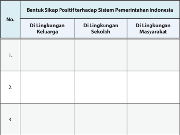

Tabel ini berisi informasi tentang bentuk sikap positif terhadap sistem pemerintahan Indonesia di berbagai lingkungan, yaitu lingkungan keluarga, sekolah, dan masyarakat. Topik utama tabel ini adalah sikap positif terhadap sistem pemerintahan Indonesia. Kolom-kolomnya meliputi "DI Lingkungan Keluarga", "DI Lingkungan Sekolah", dan "DI Lingkungan Masyarakat". Data atau pola penting yang terlihat adalah bahwa tidak ada data atau pola yang ditampilkan dalam tabel ini, sehingga tidak dapat dilihat bagaimana sikap positif terhadap sistem pemerintahan Indonesia di berbagai lingkungan.

 

---
## 📄 Halaman 40

---
**📊 Tabel**

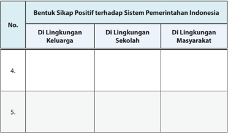

Tabel ini menunjukkan bentuk sikap positif terhadap sistem pemerintahan Indonesia di berbagai lingkungan, yaitu lingkungan keluarga, sekolah, dan masyarakat. Topik utama tabel ini adalah sikap positif terhadap sistem pemerintahan Indonesia. Kolom-kolomnya meliputi lingkungan keluarga, sekolah, dan masyarakat. Data atau pola penting yang terlihat adalah bahwa tidak ada informasi yang disediakan untuk kolom-kolom tersebut, yang menunjukkan bahwa tabel ini masih kosong dan belum memiliki data yang dapat dianalisis.

### Rangkuman

### 1. Kata Kunci

Kata kunci yang harus kalian pahami dalam mempelajari materi pada bab ini adalah kekuasaan, pembagian kekuasaan, pemisahan kekuasaan, kementerian negara, dan pemerintahan daerah.

### 2. Intisari Materi

- Pada dasarnya sistem pemerintahan yang diterapkan di Republik Indonesia adalah sistem pemerintahan presidensial. Akan tetapi, terdapat perbedaan dalam  hal  operasionalisasi  sistem  pemerintahan  seperti  yang  tercantum dalam Undang- Undang Dasar NRI Tahun 1945 sebelum perubahan dengan yang  tercantum  dalam  Undang-Undang  Dasar  NRI  Tahun  1945  sesudah perubahan.
- Undang-Undang Dasar Negara Republik Indonesia Tahun 1945 menegaskan bahwa  sistem  pemerintahan  Indonesia  menganut  sistem  pembagian kekuasaan bukan pemisahan kekuasaan. Pembagian kekuasaan di negara kita  dilakukan  dengan  dua  cara,  yaitu  secara  horisontal  (pembagian

 

---
## 📄 Halaman 41

- kekuasaan  negara  antara  lembaga-lembaga  negara  yang  sederajat)  dan vertikal  (pembagian  kekuasaan  negara  antara  pemerintah  pusat  dan pemerintah daerah/provinsi/kabupaten/kota).
- Kementerian negara dibentuk  bertujuan untuk membantu presiden dalam melaksanakan berbagai urusan pemerintahan. Setiap kementerian dipimpin oleh seorang menteri yang bertanggung jawab kepada presiden.
- Pemerintahan daerah baik itu  provinsi  ataupun  kabupaten/ kota merupakan wujud  dari  pola  pembagian  kekuasaan  secara  vertikal.  Pemerintahan daerah  menyelenggarakan  semua  urusan  pemerintahan  yang  menjadi kewenangannya berdasarkan pada asas otonomi dan tugas perbantuan.
- Pancasila sebagai falsafah bangsa dalam bernegara merupakan nilai hakiki yang  harus  termanisfestasikan  dalam  simbol-simbol  kehidupan  bangsa, lambang pemersatu bangsa, dan sebagai pandangan hidup bangsa. Dalam praktik penyelenggaraan pemerintahan, nilai falsafah harus termanifestasikan di setiap proses perumusan kebijakan dan implementasinya.

### Penilaian Diri

Penyelenggaraan pemerintahan negara baik di tingkat pusat maupun daerah, tidak akan efektif apabila tidak didukung secara aktif oleh seluruh rakyat Indonesia. Kalian sebagai rakyat Indonesia juga mempunyai kewajiban mendukung setiap penyelenggaraan  pemerintahan  di  negara  kita,  salah  satunya  adalah  dengan mengetahui  dan  memahami  tugas  dan  kewenangan  pemerintah.  Berikut  ini terdapat  beberapa  indikator  perilaku  yang  mencerminkan  salah  satu  bentuk dukungan terhadap pemerintah.

Bubuhkanlah  tanda  ceklis  (√)  pada  kolom  'ya'  atau  'tidak'  sesuai  dengan kenyataan, serta jangan lupa berikan alasannya.

---
**📊 Tabel**

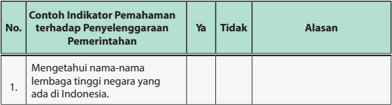

Tabel ini berisi contoh indikator pemahaman terhadap penyelesaian masalah pemerintahan, dengan kolom "Ya" dan "Tidak" untuk mengevaluasi apakah seseorang memahami tentang beberapa aspek penting. Topik utama tabel adalah pemahaman tentang lembaga-lembaga tinggi negara di Indonesia. Kolom "Ya" menunjukkan bahwa seseorang telah memahami aspek tersebut, sedangkan kolom "Tidak" menunjukkan bahwa belum memahaminya. Alasan disediakan untuk setiap jawaban. Data penting yang terlihat adalah bahwa banyak aspek yang belum dimengerti oleh individu, seperti pemahaman tentang lembaga-lembaga tinggi negara di Indonesia.

 

---
## 📄 Halaman 42

---
**📊 Tabel**

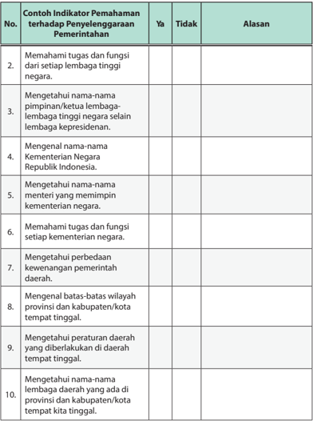

Tabel ini berisi contoh-indikator pemahaman terhadap penyelesaian masalah pemerintahan, dengan kolom "Ya" dan "Tidak" untuk menunjukkan apakah siswa memahami atau tidak memahami indikator tersebut. Topik utama tabel adalah pemahaman tentang struktur pemerintahan Indonesia, termasuk lembaga tinggi negara, kementerian, daerah, dan wilayah tempat tinggal. Data penting yang terlihat adalah bahwa semua indikator memiliki kolom "Tidak" kosong, menunjukkan bahwa setiap indikator belum diperoleh oleh siswa dalam pemahamannya.

 

---
## 📄 Halaman 43

---
**📊 Tabel**

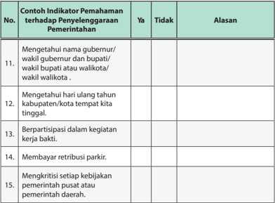

Tabel ini berisi contoh indikator pemahaman terhadap penyelesaian masalah pemerintahan di tingkat kabupaten/kota. Kolom "Ya" menunjukkan apakah seseorang memahami indikator tersebut, sedangkan kolom "Tidak" menunjukkan sebaliknya. Alasan untuk tidak memahami disajikan di kolom "Alasan". Topik utama tabel ini adalah pemahaman tentang beberapa aspek penyelesaian masalah pemerintahan, seperti nama gubernur/wali kota, hari ulang tahun tempat tinggal, partisipasi dalam kegiatan kerja bakti, pembayaran retribusi parkir, dan kritik terhadap kebijakan pemerintah pusat atau daerah. Data penting yang terlihat adalah bahwa semua indikator memiliki alasan untuk tidak memahami, menunjukkan bahwa masih ada banyak hal yang perlu diperbaiki dalam pemahaman tentang penyelesaian masalah pemerintahan di tingkat kabupaten/kota.

Apabila jawaban sebagian besar menjawab 'tidak' pada kolom indikatorindikator  tersebut  di  atas,  kalian  sebaiknya  mulai  mengubah  sikap  dan perilaku  serta  meningkatkan  wawasan  kalian  mengenai  Pemerintahan Negara Republik Indonesia.

 

---
## 📄 Halaman 44

### PROYEK BELAJAR KEWARGANEGARAAN

Mari Menganalisis Berita Cermatilah berita di bawah ini.

### 7 Kementerian/Lembaga ini Dapat Rapor Merah dari Jokowi

Presiden  Joko  Widodo  hari  ini  menerima  Laporan  Keuangan  Pemerintah Pusat (LKPP) tahun 2014 dari Badan Pemeriksa Keuangan (BPK) yang langsung diserahkan oleh Ketua BPK Harry Azhar Aziz di Istana Kepresidenan, Bogor, Jawa Barat.

Dari  hasil  laporan  BPK  Jokowi  mengaku  memberikan  rapor  merah  tujuh Kementerian/Lembaga (K/L) yang oleh BPK memiliki predikat laporan keuangan Tidak Menyatakan Pendapat (TMP) atau disclaimer .

'Ini  yang  saya  sebutkan  yang  mendapatkan  predikat  Tidak  Memberikan Pendapat atau disclaimer , biar tahu semuanya,' kata Jokowi di Istana Kepresidenan, Bogor, Jumat (5/6/2015).

Disebutkannya di hadapan semua kepala lembaga dan para menteri, ketujuh K/L tersebut adalah Badan Informasi Geospasial, Kementerian Pariwisata dan Ekonomi Kreatif, Kementerian Tenaga Kerja dan Transmigrasi, Kementerian Komunikasi dan Informatika, LPP RRI, LPP TVRI dan Ombudsman Republik Indonesia.

Dari hasil laporan tersebut, Jokowi memerintahkan kepada pejabat yang ada di kementerian dan lembaga yang telah disebutkan tersebut untuk memperbaiki laporan keuangannya supaya jelas dan lebih transparan.

'Saya tadi hanya membacakan hasil, bukan memberi opini karena yang beri opini itu BPK. Hasil pemeriksaan ini sebagai momentum untuk memperbaiki,' jelas Jokowi.

Untuk memperkuat hal itu, Jokowi memerintahkan kepada seluruh K/L untuk memperbaiki sistem peringatan dini dengan memaksimalkan fungsi pengawasan intern di setiap organisasinya.

'Akhir  kata  saya  mengajak  kementerian  dan  lembaga  untuk  berbenah, untuk  memperbaiki  membangun  tata  kelola  kuangan  terbuka,  transparan  dan mempertanggungjawabkan uang rakyat sebaik-baiknya,' tutup Jokowi. (Yas/NDw)

Sumber: www.bisnis.liputan6.com

 

---
## 📄 Halaman 45

Setelah membaca berita di atas, jawablah pertanyaan-pertanyaan di bawah ini.

- Menurut  kalian  bolehkah  suatu  lembaga  negara  dalam  hal  ini  kementerian negara dievaluasi atau dinilai kinerjanya oleh presiden? Berikan alasanmu!
……………………………………………………………………………………

……………………………………………………………………………………

……………………………………………………………………………………

- Apa saja manfaat dari dilakukannya penilaian terhadap kinerja kementerian negara?
……………………………………………………………………………………

……………………………………………………………………………………

……………………………………………………………………………………

- Faktor  apa  saja  yang  menyebabkan  suatu  kementerian  negara  berkinerja kurang memuaskan?
……………………………………………………………………………………

……………………………………………………………………………………

……………………………………………………………………………………

- Bagaimana cara mengatasi permasalahan tersebut?
……………………………………………………………………………………

……………………………………………………………………………………

……………………………………………………………………………………

- Menurut kalian apa saja yang harus dilakukan kementerian untuk meningkatkan kinerja?
……………………………………………………………………………………

……………………………………………………………………………………

……………………………………………………………………………………

 

---
## 📄 Halaman 46

### UJI KOMPETENSI BAB 1

### Jawablah pertanyaan di bawah ini secara singkat, jelas dan akurat.

- Jelaskan jenis-jenis kekuasaan yang berlaku dalam penyelenggaraan negara di Republik Indonesia!
- Jelaskan karakteristik pemerintahan Indonesia setelah dilakukannya perubahan UUD Negara Republik Indonesia Tahun 1945!
- Jelaskan mekanisme pembagian kekuasaan yang dilaksanakan di Indonesia!
- Jelaskan fungsi dari kementerian negara Republik Indonesia!
- Jelaskan pentingnya keberadaan pemerintahan daerah dalam proses penyelenggaraan pemerintahan di Republik Indonesia!

 

---
## 📄 Halaman 47

---
**🖼️ Gambar/Diagram**

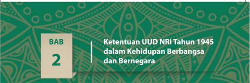

> **Deskripsi Visual:** Gambar ini adalah bagian dari buku pelajaran yang berisi informasi tentang Ketentuan Undang-Undang Dasar (UU) Republik Indonesia Tahun 1945 dalam konteks kehidupan berbangsa dan bernegara. Gambar ini terdiri dari elemen-elemen berikut:

1. **Keseluruhan**: Gambar ini menunjukkan judul bab kedua dari buku pelajaran tersebut, yang berisi tentang ketentuan UUD NRI Tahun 1945 dalam kehidupan berbangsa dan bernegara.

2. **Elemen Utama dan Relasinya**: 
   - **Judul Bab**: "BAB 2" yang terletak di sebelah kiri atas gambar.
   - **Judul Bab Sub**: "Ketentuan UUD NRI Tahun 1945 dalam Kehidupan Berbangsa dan Bernegara" yang terletak di tengah gambar.
   - **Latar Belakang**: Latar belakang gambar berwarna hijau dengan desain tradisional yang menunjukkan elemen-elemen budaya Indonesia.

3. **Teks, Angka, atau Label Penting**: 
   - Judul Bab: "BAB 2"
   - Judul Bab Sub: "Ketentuan UUD NRI Tahun 1945 dalam Kehidupan Berbangsa dan Bernegara"

4. **Informasi Kunci**: Gambar ini memberikan informasi bahwa bab kedua buku pelajaran ini membahas tentang ketentuan UUD NRI Tahun 1945 dalam konteks kehidupan berbangsa dan bernegara. Ini menunjukkan bahwa bab ini akan menyajikan penjelasan mendalam tentang bagaimana UUD NRI Tahun 1945 mempengaruhi kehidupan masyarakat Indonesia saat ini.

Dengan demikian, gambar ini merupakan bagian dari buku pelajaran yang fokus pada pemahaman tentang bagaimana UUD NRI Tahun 1945 mempengaruhi kehidupan berbangsa dan bernegara di Indonesia.

Pada hari ini sampai beberapa pertemuan ke depan, kalian akan diajak untuk mempelajari materi pembelajaran pada Bab Dua.  Kalian sudah dianggap berhasil mengusai materi pada bab sebelumnya dengan memperoleh nilai di atas kriteria yang  ditetapkan.  Oleh  karena  itu,  sudah  sepatutnya  kalian  bersyukur  kepada Tuhan Yang Maha Esa atas  keberhasilan  ini.  Oleh  karena  itu,  untuk  mengawali pembelajaran pada Bab Dua ini, coba kalian amati gambar 2.1 di bawah ini.

---
**🖼️ Gambar/Diagram**

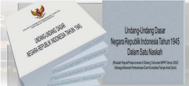

> **Deskripsi Visual:** Gambar ini adalah ilustrasi yang menunjukkan dokumen Undang-Undang Dasar Negara Republik Indonesia Tahun 1945 dalam satu naskah. Dokumen tersebut tampak seperti sebuah buku dengan judul "Undang-Undang Dasar Negara Republik Indonesia Tahun 1945" yang terletak di atasnya. Judul tersebut ditulis dalam bahasa Indonesia dan berada di bagian atas gambar.

Elemen-elemen utama dalam gambar ini meliputi:
1. Dokumen Undang-Undang Dasar Negara Republik Indonesia Tahun 1945 yang terletak di tengah gambar.
2. Judul dokumen yang ditulis di atas dokumen tersebut.
3. Nama penulis atau penerbit yang tidak jelas dalam gambar ini.

Informasi kunci yang dapat diambil pembaca dari gambar ini adalah bahwa gambar ini menunjukkan dokumen penting dalam sejarah Indonesia, yaitu Undang-Undang Dasar Negara Republik Indonesia Tahun 1945. Dokumen ini merupakan dasar hukum bagi negara Indonesia saat itu dan masih berlaku sampai saat ini sebagai dasar hukum negara.

Sumber: www.ilmupengetahuanumum.com

Gambar 2.1 Konsitusi Negara Republik Indonesia

Setelah mengamati gambar tersebut, apa yang ada di benak kalian berkaitan dengan  keberadaan  Undang-Undang  Dasar  Negara  Republik  Indonesia  Tahun 1945 (UUD Negara Republik Indonesia Tahun 1945)? Pernahkah kalian memikirkan bagaimana UUD Negara Republik Indonesia Tahun 1945 itu dirumuskan? Apa saja yang  diaturnya?  Apa  fungsinya  bagi  negara  kita  tercinta?  Apabila  pertanyaanpertanyaan tersebut ada di pikiran kalian, tentunya kalian merupakan sosok warga negara yang memiliki rasa ingin tahu dan ingin lebih mengenal Konstitusi Negara Republik Indonesia.

 

---
## 📄 Halaman 48

UUD Negara Republik Indonesia Tahun 1945 merupakan konstitusi negara kita tercinta. Sebagai konstitusi negara, di dalamnya tentu saja diatur hal-hal mendasar yang berkaitan dengan kehidupan berbangsa dan bernegara, misalnya tentang bentuk  negara  dan  pemerintahan,  kedaulatan  negara,  tugas  dan  kewenangan lembaga-lembaga negara, keberadaan pemerintah daerah, wilayah negara, hak dan  kewajiban  warga  negara,  dan  sebagainya.  Dengan  kata  lain,  UUD  Negara Republik Indonesia Tahun 1945  menggambarkan karakteristik negara kita yang membedakannya dari negara lain.

Pada bab ini, kalian  akan  diajak  untuk  menganalisis  ketentuan  UUD  Negara Republik Indonesia Tahun 1945 yang mengatur  tentang wilayah Negara Kesatuan Republik  Indonesia,  warga  negara  dan  penduduk  Indonesia,  kemerdekaan beragama, serta pertahanan dan  keamanan  negara.  Dengan  mempelajari ketentuan-ketentuan  yang  berkaitan  dengan  hal-hal  tersebut,  pada  akhirnya diharapkan kalian menjadi warga negara yang memiliki kesadaran berkonstitusi yang tinggi dan semakin mencintai negara Indonesia tercinta.

### A. Wilayah Negara Kesatuan Republik Indonesia

### 1. Memetakan Wilayah Negara Kesatuan Republik Indonesia

Kalian  pada  saat  ini  berpijak  dan  hidup  di  wilayah  negara  Indonesia. Sebagaimana  warga  negara  yang  baik  tentu  saja  kalian  harus  mengenal karakteristik negara kita tercinta. Sekarang coba kalian amati gambar 2.2.

---
**🖼️ Gambar/Diagram**

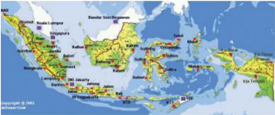

> **Deskripsi Visual:** Gambar ini adalah ilustrasi yang menunjukkan peta geografis Indonesia dan sekitarnya. Peta ini menampilkan berbagai wilayah seperti pulau-pulau besar seperti Sumatra, Jawa, Kalimantan, Sulawesi, dan banyak lagi, serta beberapa pulau kecil lainnya. Selain itu, peta juga menunjukkan perbatasan antara negara-negara di sekitar Indonesia, seperti Malaysia, Thailand, Singapura, dan Brunei.

Elemen-elemen utama yang ditampilkan dalam peta ini meliputi:
1. Pulau-pulau besar dan kecil di Indonesia.
2. Perbatasan antara negara-negara di sekitar Indonesia.
3. Kota-kota penting di Indonesia, seperti Jakarta, Surabaya, Medan, dan lain-lain.
4. Wilayah-wilayah yang dikelilingi oleh laut, seperti Lautan Pasifik, Laut China Selatan, dan Lautan Hindia.

Teks, angka, atau label penting yang terlihat dalam peta ini meliputi:
1. Nama-nama pulau dan kota.
2. Nama-nama negara di sekitar Indonesia.
3. Nama-nama laut dan perairan.

Informasi kunci yang dapat diambil pembaca dari gambar ini adalah bahwa Indonesia memiliki wilayah yang sangat luas dengan banyak pulau dan kota penting. Selain itu, peta ini juga menunjukkan bahwa Indonesia memiliki hubungan dengan banyak negara di sekitarnya, yang mencerminkan posisi strategisnya sebagai salah satu negara terbesar di Asia Tenggara.

Gambar 2.2 Indonesia merupakan Negara kepulauan (archipelago) yang memiliki wilayah lautan yang sangat luas. Seringkali juga Indonesia disebut sebagai Negara Mariim.

 

---
## 📄 Halaman 49

Setelah kalian mengamati gambar di atas, coba kalian susun pertanyaanpertanyaan  yang  berkaitan  dengan  gambar  tersebut.  Kemudian  jadikan pertanyaan-pertanyaan  yang  kalian  rumuskan  sebagai  bahan  diskusi. Tuliskan pertanyaan yang kalian susun dalam tabel di bawah ini.

---
**📊 Tabel**

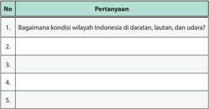

Tabel ini berisi pertanyaan tentang kondisi wilayah Indonesia di daratan, lautan, dan udara. Topik utamanya adalah kondisi geografis Indonesia. Kolom pertama berisi nomor pertanyaan, sedangkan kolom kedua berisi pertanyaan tersebut. Data atau pola penting yang terlihat adalah bahwa tabel ini mencakup lima pertanyaan tentang kondisi geografis Indonesia, yang mencakup semua aspek wilayah Indonesia: daratan, lautan, dan udara.

Nah,  untuk  memperlancar  proses  diskusi  yang  akan  kalian  lakukan, bacalah terlebih dahulu lanjutan pemaparan materi berikut ini.

Indonesia adalah negara kepulauan. Hal itu ditegaskan dalam Pasal 25 A UUD Negara Republik Indonesia  Tahun 1945 yang menyatakan bahwa Negara Kesatuan Republik Indonesia adalah sebuah negara kepulauan yang berciri nusantara  dengan  wilayah  yang  batas-batas  dan  hak-haknya  ditetapkan oleh undang-undang. Adanya ketentuan ini dalam UUD Negara Republik Indonesia  Tahun  1945  dimaksudkan  untuk  mengukuhkan  kedaulatan wilayah Negara Kesatuan Republik Indonesia. Hal ini penting dirumuskan agar ada penegasan secara  konstitusional  batas  wilayah  Indonesia  di tengah  potensi  perubahan batas geografis sebuah negara akibat gerakan separatisme,  sengketa  perbatasan  antarnegara,  atau  pendudukan  oleh negara asing.

Istilah  'nusantara' dalam ketentuan tersebut dipergunakan untuk menggambarkan  kesatuan  wilayah  perairan  dan  gugusan  pulau-pulau Indonesia yang terletak di antara Samudera Pasifik dan Samudera Indonesia serta di antara Benua Asia dan Benua Australia. Kesatuan wilayah tersebut juga mencakup 1) kesatuan politik; 2) kesatuan hukum; 3) kesatuan sosial-

 

---
## 📄 Halaman 50

budaya;  serta  4)  kesatuan  pertahanan  dan  keamanan.  Dengan  demikian, meskipun wilayah Indonesia terdiri atas ribuan pulau, tetapi semuanya terikat dalam satu kesatuan negara yaitu Negara Kesatuan Republik Indonesia.

Berkaitan dengan wilayah negara Indonesia, pada tanggal 13 Desember 1957  pemerintah  Republik  Indonesia  mengeluarkan  Deklarasi  Djuanda. Deklarasi itu menyatakan: 'Bahwa segala perairan di sekitar, di antara, dan yang menghubungkan pulau-pulau yang termasuk dalam daratan Republik Indonesia, dengan tidak memandang luas atau lebarnya, adalah bagian yang wajar dari wilayah daratan Negara Republik Indonesia dan dengan demikian merupakan  bagian  daripada  perairan  pedalaman  atau  perairan  nasional yang berada di bawah kedaulatan Negara Republik Indonesia. Penentuan batas laut 12 mil yang diukur dari garis-garis yang menghubungkan titik terluar  pada  pulau-pulau  Negara  Republik  Indonesia  akan  ditentukan dengan undang-undang' (Sekretariat Jenderal MPR RI, 2012:177-178).

Sebelumnya, pengakuan masyarakat internasional mengenai batas laut teritorial hanya sepanjang 3 mil laut terhitung dari garis pantai pasang surut terendah. Deklarasi Djuanda menegaskan bahwa Indonesia merupakan satu kesatuan wilayah Nusantara. Laut bukan lagi sebagai pemisah, tetapi sebagai pemersatu bangsa Indonesia. Prinsip ini kemudian ditegaskan  melalui  Peraturan  Pemerintah Pengganti Undang-Undang Nomor 4/ PRP/1960 tentang Perairan Indonesia.

Berdasarkan dari Deklarasi Djuanda, Republik Indonesia menganut konsep negara  kepulauan  yang  berciri  Nusantara ( archipelagic  state ).  Konsep  itu  kemudian diakui dalam Konvensi Hukum Laut PBB 1982 (UNCLOS 1982 = United Nations Convention on the Law of the Sea )  yang ditandatangani di Montego Bay, Jamaika, tahun 1982. Indonesia  kemudian  meratifikasi  UNCLOS 1982 tersebut dengan menerbitkan Undang-

---
**🖼️ Gambar/Diagram**

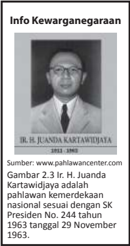

> **Deskripsi Visual:** Gambar tersebut adalah foto yang menampilkan Ir. H. Juanda Kartawidjaja, seorang pahlawan kemerdekaan Indonesia. Gambar ini menunjukkan wajah dan tubuh pria berwajah halus dengan rambut pendek, memakai baju formal putih dengan lencana pahlawan kemerdekaan di lengan kanannya. Di bawah gambar tersebut, terdapat teks yang menyebutkan bahwa Ir. H. Juanda Kartawidjaja adalah pahlawan kemerdekaan Indonesia yang diberikan gelar Pahlawan Kehormatan oleh SK Presiden No. 344 tahun 1963 tanggal 29 November 1963.

Elemen-elemen utama dalam gambar ini adalah wajah dan tubuh pria yang ditampilkan, serta teks yang memberikan informasi tentang identitas dan penghargaan yang diberikan kepada pria tersebut. Teks ini merupakan elemen penting yang membantu pembaca untuk memahami konteks dan makna dari gambar tersebut.

Informasi kunci yang dapat diambil dari gambar ini adalah bahwa Ir. H. Juanda Kartawidjaja adalah pahlawan kemerdekaan Indonesia yang telah diberikan penghargaan tertinggi oleh pemerintah Indonesia pada tahun 1963. Ini menunjukkan bahwa ia memiliki kontribusi besar dalam kemerdekaan Indonesia dan telah mendapatkan pengakuan dari negara.

Undang  Nomor  17  Tahun  1985.  Sejak  itu  dunia  internasional  mengakui Indonesia sebagai negara kepulauan.

 

---
## 📄 Halaman 51

Berkat  pandangan  visioner  dalam  Deklarasi  Djuanda  tersebut,  bangsa Indonesia  akhirnya  memiliki  tambahan  wilayah  seluas  2.000.000  km 2 , termasuk  sumber  daya  alam  yang  dikandungnya.  Sebagai  warga  negara Indonesia, kalian harus bersyukur kepada Tuhan Yang Maha Esa dan harus merasa bangga, karena negara kita merupakan negara kepulauan terbesar di dunia. Luas wilayah negara kita adalah 5.180.053 km 2 , yang terdiri atas wilayah daratan seluas 1.922.570 km 2  dan wilayah lautan seluas 3.257.483 km 2 .  Di  wilayah  yang  seluas  itu,  tersebar  13.466  pulau  yang  terbentang antara  Sabang  dan  Merauke.  Pulau-pulau  tersebut  bukanlah  wilayahwilayah yang terpisah, tetapi membentuk suatu kesatuan yang utuh dan bulat sebagaimana diuraikan di atas.

Sebagai  negara  kepulauan  yang  wilayah  perairan  lautnya  lebih  luas daripada wilayah daratannya, maka peranan wilayah laut menjadi sangat penting  bagi  kehidupan  bangsa  dan  negara.  Wilayah  lautan  Indonesia sangat luas dengan kekayaan laut yang melimpah ruah (ikan-ikan, rumput laut, kerang, udang, dan sebagainya) ada dan terkandung di dalam wilayah laut kita. Hal ini merupakan sebuah kebanggaan bagi bangsa kita dan juga dapat sekaligus sebagai modal dalam melaksanakan  pembangunan.

Sesuai dengan Hukum Laut Internasional yang telah disepakati oleh PBB tahun  1982,  berikut  ini  adalah  gambar  pembagian  wilayah  laut  menurut Konvensi Hukum Laut PBB. Hal dapat kita lihat dalam Gambar 2.4.

---
**🖼️ Gambar/Diagram**

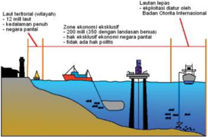

> **Deskripsi Visual:** Gambar ini adalah ilustrasi yang menunjukkan konsep ekosistem laut teritorial (villah) dan zona ekonomi eksklusif (ZEEX). Gambar ini terdiri dari beberapa elemen utama:

1. Lautan teritorial (villah): Ini adalah area laut yang dikelola oleh negara tertentu dan berbatasan dengan pesisir daratan.

2. Zona ekonomi eksklusif (ZEEX): Ini adalah area laut yang berbatasan dengan pesisir daratan dan memiliki kedalaman maksimum 200 mil (354 km).

3. Badan Otorita Internasional: Ini adalah lembaga internasional yang bertanggung jawab atas pengawasan dan manajemen ZEEX.

4. Lautan lepas: Ini adalah area laut yang lebih luas yang tidak termasuk dalam ZEEX.

5. Teks dan angka penting: Gambar ini mencantumkan bahwa ZEEX memiliki kedalaman maksimum 200 mil (354 km), dan tidak ada hali politik di dalamnya.

Informasi kunci yang dapat diambil pembaca melalui gambar ini adalah bahwa ZEEX adalah area laut yang memiliki kedalaman maksimum 200 mil (354 km) dan berbatasan dengan pesisir daratan, sementara ZEEX tidak memiliki hali politik dan tidak termasuk dalam wilayah pemerintahan negara pantai.

Sumber: www.belajar.kemdikbud.go.id

Gambar 2.4 Pembagian wilayah dalam pengelolaan sumber daya alam di laut menurut Konvensi Hukum Laut PBB Tahun  1982.

 

---
## 📄 Halaman 52

Berdasarkan Gambar 2.4, maka wilayah laut Indonesia dapat dibedakan tiga macam.

### a. Zona Laut Teritorial

Batas  laut  teritorial  ialah  garis  khayal  yang  berjarak  12  mil  laut  dari garis dasar ke arah laut lepas. Jika ada dua negara atau lebih menguasai suatu lautan, sedangkan lebar lautan itu kurang dari 24 mil laut, maka garis teritorial  ditarik  sama  jauh  dari  garis  masing-masing  negara tersebut. Laut yang terletak antara garis dan garis batas teritorial disebut laut  teritorial.  Laut  yang  terletak  di  sebelah  dalam  garis  dasar  disebut laut  internal/perairan  dalam  (laut  nusantara).  Garis  dasar  adalah  garis khayal  yang  menghubungkan titik-titik  dari  ujung-ujung  pulau  terluar. Sebuah  negara  mempunyai  hak  kedaulatan  sepenuhnya  sampai  batas laut teritorial, tetapi mempunyai kewajiban menyediakan alur pelayaran lintas damai baik di atas maupun di bawah permukaan laut.

### b. Zona Landas Kontinen

Landas  kontinen  ialah  dasar  laut  yang  secara  geologis  maupun morfologi merupakan lanjutan dari sebuah kontinen (benua). Kedalaman lautnya kurang dari 150 meter. Indonesia terletak pada dua buah landasan kontinen, yaitu landasan kontinen Asia dan landasan kontinen Australia.

Adapun batas landas kontinen tersebut diukur dari garis dasar, yaitu paling jauh 200 mil laut. Jika ada dua negara atau lebih menguasai lautan di atas landasan kontinen, maka batas negara tersebut ditarik sama jauh dari garis dasar masing-masing negara.

Di dalam garis batas landas kontinen, Indonesia mempunyai kewenangan  untuk  memanfaatkan  sumber  daya  alam  yang  ada  di dalamnya, dengan kewajiban untuk menyediakan alur pelayaran lintas damai. Pengumuman tentang batas landas kontinen ini dikeluarkan oleh Pemerintah Indonesia pada tanggal 17 Febuari 1969.

### c. Zona Ekonomi Eksklusif (ZEE)

Zona Ekonomi Eksklusif adalah jalur laut selebar 200 mil laut ke arah laut terbuka diukur dari garis dasar. Di dalam Zona Ekonomi Eksklusif ini, Indonesia mendapat kesempatan pertama dalam memanfaatkan sumber daya laut. Di dalam Zona Ekonomi Eksklusif ini kebebasan pelayaran dan pemasangan  kabel  serta  pipa  di  bawah  permukaan  laut  tetap  diakui

 

---
## 📄 Halaman 53

sesuai  dengan  prinsip-prinsip  Hukum  Laut  Internasional,  batas  landas kontinen, dan batas Zona Ekonomi Eksklusif. Jika ada dua negara yang bertetangga  saling  tumpang  tindih,  maka  ditetapkan  garis-garis  yang menghubungkan titik yang sama jauhnya dari garis dasar kedua negara itu  sebagai  batasnya.  Pengumuman  tentang  Zona  Ekonomi  Eksklusif Indonesia dikeluarkan oleh pemerintah Indonesia pada tanggal 21 Maret 1980.

Bagaimana  dengan  wilayah  daratan  Indonesia?    Wilayah  daratan Indonesia juga memiliki kedudukan dan peranan yang sangat penting bagi tegaknya kedaulatan Republik Indonesia. Wilayah daratan merupakan  tempat  pemukiman  atau  kediaman  warga  negara  atau penduduk Indonesia. Di atas wilayah daratan ini tempat berlangsungnya pemerintahan Republik Indonesia, baik pemeritah pusat maupun daerah.

---
**🖼️ Gambar/Diagram**

> **Deskripsi Visual:** Gambar ini adalah ilustrasi yang menunjukkan tiga orang petani sedang berjalan di ladang padi. Petani tersebut mengenakan topi dan baju warna-warni untuk melindungi diri dari sinar matahari. Latar belakangnya adalah pemandangan alam yang indah dengan pegunungan, hutan, dan langit biru cerah. Ilustrasi ini menunjukkan aktivitas petani dalam kehidupan sehari-hari mereka, serta suasana alam yang indah di sekitar ladang padi.

Elemen-elemen utama dalam gambar ini adalah tiga orang petani, padi, dan alam sekitar. Petani adalah subjek utama yang sedang berjalan di ladang padi. Padi merupakan objek utama yang menunjukkan aktivitas pertanian. Alam sekitar, termasuk pegunungan, hutan, dan langit, merupakan latar belakang yang memberikan nuansa alami dan menambah keindahan gambar.

Teks, angka, atau label penting tidak terlihat dalam gambar ini karena ia hanya berupa ilustrasi. Namun, informasi kunci yang dapat diambil pembaca adalah tentang kegiatan petani dalam kehidupan sehari-hari mereka dan suasana alam yang indah di sekitar ladang padi.

Gambar 2.5 Pegunungan dan pesawahan merupakan sebagian dari wilayah daratan yang ada di Indonesia

Potensi  wilayah  daratan  Indonesia  tidak  kalah  besarnya  dengan wilayah  lautan.  Di  wilayah  daratan  Indonesia  mengalir  ratusan  sungai, hamparan ribuan hektar area hutan, persawahan dan perkebunan. Selain itu,  di  atas  daratan  Indonesia  banyak  berdiri  kokoh  gedung-gedung lembaga  pemerintahan,  pusat  perbelanjaan,  pemukiman-pemukiman penduduk. Di bawah daratan Indonesia juga terkandung kekayaan alam yang melimpah berupa bahan tambang, seperti emas, batu bara, perak, tembaga  dan  sebagainya.  Hal-hal  yang  disebutkan  tadi  merupakan anugerah Tuhan Yang Maha Kuasa untuk kemajuan negara kita tercinta yang harus selalu kita syukuri.

 

---
## 📄 Halaman 54

Selain wilayah lautan dan  daratan,  Indonesia  juga  mempunyai kekuasaan  atas  wilayah  udara.  Wilayah  udara  Indonesia  adalah  ruang udara  yang  terletak  di  atas  permukaan  wilayah  daratan  dan  lautan Republik Indonesia. Berdasarkan Konvensi Chicago tahun 1944 tentang penerbangan sipil internasional dijelaskan bahwa setiap negara mempunyai kedaulatan yang utuh dan eksklusif di ruang udara yang ada di atas wilayah negaranya. Negara kita mempunyai kekuasaan utuh atas seluruh wilayah udara yang berada di atas wilayah daratan dan lautan.

Republik  Indonesia  juga  masih  mempunyai  satu  jenis  wilayah  lagi, yaitu  wilayah  ekstrateritorial.  Wilayah  ekstrateritorial  ini  merupakan wilayah negara kita yang dalam kenyataannya terdapat di wilayah negara lain. Keberadaan wilayah ini diakui oleh hukum internasional. Perwujudan dari  wilayah  ini  adalah  kantor-kantor  perwakilan  diplomatik  Republik Indonesia di negara lain.

### 2. Batas Wilayah Negara Kesatuan Republik Indonesia

Setiap  wilayah  yang  dimiliki  pasti  ada  batasnya.  Rumah  yang  kalian tempati juga tentunya mempunyai batas, begitupun dengan sekolah kalian pasti mempunyai batas wilayah seperti dibatasi oleh bangunan yang lain, jalan dan sebagainya. Wilayah lainnya seperti desa, kecamatan, kabupaten/ kota, provinsi hingga negara juga memiliki batas kewilayahan. Batas wilayah itu  untuk  menunjukkan  atau  menandai  luas  yang  dimiliki  oleh  wilayah tersebut. Bentuk dari batas wilayah bermacam-macam, ada yang dibatasi oleh  sungai,  laut,  hutan,  atau  juga  hanya  berupa  tugu  perbatasan  saja apabila wilayah tersebut berbatasan langsung dengan wilayah lainnya.

Bagaimana  dengan  batas  wilayah  Indonesia?  Sama  halnya  dengan negara-negara lainnya, Indonesia yang memiliki batas-batas tertentu untuk wilayahnya.  Kalian  sudah  mengetahui  bahwa  Indonesia  adalah  negara maritim,  dua  pertiga  luas  wilayah  Indonesia  adalah  lautan.  Jadi,  tidaklah mengherankan  jika  batas-batas wilayah laut  Indonesia  berhubungan dengan 10 negara, sedangkan perbatasan wilayah darat Indonesia hanya berhubungan  dengan  tiga  negara.  Berikut  ini  dipaparkan  batas-batas wilayah Indonesia di sebelah utara, barat, timur dan selatan.

 

---
## 📄 Halaman 55

### a. Batas-Batas Wilayah Indonesia di Sebelah Utara

Indonesia  berbatasan  langsung  dengan  Malaysia  (bagian  timur), tepatnya di sebelah utara Pulau Kalimantan. Malaysia merupakan negara yang berbatasan langsung dengan wilayah darat Indonesia. Wilayah laut Indonesia sebelah utara berbatasan langsung dengan laut lima negara, yaitu Malaysia, Singapura, Thailand, Vietnam dan Filipina.

### b. Batas-Batas Wilayah Indonesia di Sebelah Barat

Sebelah barat wilayah Negara Kesatuan Republik Indonesia berbatasan langsung dengan Samudera Hindia dan perairan negara India. Tidak ada negara  yang  berbatasan  langsung  dengan  wilayah  darat  Indonesia  di sebelah  barat.  Walaupun  secara  geografis  daratan  Indonesia  terpisah jauh dengan daratan India, tetapi keduanya memiliki batas-batas wilayah yang terletak di titik-titik tertentu di sekitar Samudera Hindia dan Laut Andaman. Dua pulau yang menandai perbatasan Indonesia-India adalah Pulau Ronde di Aceh dan Pulau Nicobar di India.

### c. Batas-Batas Wilayah Indonesia di Sebelah Timur

Wilayah timur Indonesia berbatasan langsung dengan daratan Papua Nugini dan perairan Samudera Pasifik. Indonesia dan Papua Nugini telah menyepakati hubungan bilateral antarkedua negara tentang batas-batas wilayah, tidak hanya wilayah darat melainkan juga wilayah laut. Wilayah Indonesia  di  sebelah  timur,  yaitu  Provinsi  Papua  berbatasan  dengan wilayah Papua Nugini sebelah barat, yaitu Provinsi Barat (Fly) dan Provinsi Sepik Barat (Sandaun).

### d. Batas-Batas Wilayah Indonesia di Sebelah Selatan

Indonesia  di  sebelah  selatan  berbatasan  langsung  dengan  wilayah darat Timor Leste, perairan Australia dan Samudera Hindia. Timor Leste adalah  bekas  wilayah  Indonesia  yang  telah  memisahkan  diri  menjadi negara  sendiri  pada  tahun  1999,  dahulu  wilayah  ini  dikenal  dengan Provinsi Timor Timur. Provinsi Nusa Tenggara Timur  adalah  Provinsi  yang berbatasan  langsung  dengan wilayah Timor Leste, tepatnya di Kabupaten Belu.  Selain  itu,  Indonesia  juga  berbatasan  dengan  perairan  Australia. Awal tahun 1997, Indonesia dan Australia telah menyepakati batas-batas wilayah  negara  keduanya  yang  meliputi  Zona  Ekonomi  Eksklusif  (ZEE) dan batas landas kontinen.

 

---
## 📄 Halaman 56

### Tugas Kelompok  2.1

Nah, setelah kalian membaca dan memahami uraian di atas kerjakanlah tugas di bawah ini.

- Coba  kalian  lakukan  identifikasi  negara  yang  berbatasan  langsung  dengan wilayah  daratan  dan  lautan  Indonesia. Tulislah  hasil  identifikasi  kalian  pada tabel di bawah ini.
- Setiap  wilayah  perbatasan  Indonesia  dengan  negara  lain  tentunya  pernah mengalami  beberapa  permasalahan.  Coba  kalian  identifikasi  permasalahanpermasalahan yang melibatkan Indonesia dengan negara lain yang berkaitan dengan masalah perbatasan. Presentasikan di depan guru dan teman kalian.

---
**📊 Tabel**

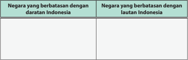

Tabel ini membandingkan dua kategori negara: negara yang berbatasan dengan daratan Indonesia dan negara yang berbatasan dengan lautan Indonesia. Topik utama tabel ini adalah hubungan geografis antara Indonesia dan negara-negara lainnya. Kolom pertama, "Negara yang berbatasan dengan daratan Indonesia," mencakup negara-negara yang secara langsung berbatasan dengan daratan Indonesia, seperti Malaysia, Brunei, dan Filipina. Kolom kedua, "Negara yang berbatasan dengan lautan Indonesia," mencakup negara-negara yang berbatasan dengan lautan Indonesia, seperti Malaysia, Singapura, dan Brunei Darussalam. Data penting yang terlihat adalah bahwa Indonesia memiliki banyak batas daratan dan laut dengan negara-negara di sekitarnya, yang menunjukkan bahwa Indonesia memiliki wilayah yang sangat luas dan strategis.

---
**📊 Tabel**

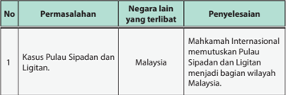

Tabel ini berisi informasi tentang kasus permasalahan di Malaysia, termasuk negara lain yang terlibat dan penyelesaiannya. Topik utama tabel adalah kasus pulau sipadan dan litigian. Kolom-kolomnya meliputi nomor permasalahan, permasalahan, negara lain yang terlibat, dan penyelesaian. Data penting yang terlihat adalah bahwa Mahkamah Internasional memutuskan Pulau Sipadan dan Litigian menjadi bagian wilayah Malaysia. Ini menunjukkan bahwa kasus tersebut telah diselesaikan melalui proses hukum internasional.

 

---
## 📄 Halaman 57

---
**📊 Tabel**

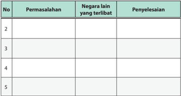

Tabel ini berisi informasi tentang beberapa permasalahan yang dihadapi oleh negara-negara di seluruh dunia, termasuk negara lain yang terlibat dalam setiap masalah tersebut, dan penyelesaiannya. Topik utama tabel ini adalah permasalahan global dan bagaimana mereka diatasi. Kolom-kolomnya meliputi nomor urutan permasalahan (No), permasalahan yang dihadapi (Permasalahan), negara lain yang terlibat (Negara lain yang terlibat), dan penyelesaian (Penyelesaian). Data penting yang terlihat menunjukkan bahwa banyak permasalahan global melibatkan lebih dari satu negara, dan penyelesaiannya memerlukan kerjasama antar negara.

- Kekuasaan negara atas kekayaan alam yang terkandung dalam wilayah negara Kesatuan Republik Indonesia. Coba kalian amati gambar 2.6 di bawah ini.

---
**🖼️ Gambar/Diagram**

> **Deskripsi Visual:** Gambar ini adalah ilustrasi yang menunjukkan berbagai jenis ekosistem. Di bagian atas, terdapat taman hijau dengan berbagai tanaman dan pohon, menunjukkan ekosistem darat. Di bawahnya, terdapat kolam renang dengan ikan-ikan berwarna-warni, menunjukkan ekosistem air tawar. Di bagian tengah, terdapat hutan mangrove dengan rumput laut dan ikan-ikan, menunjukkan ekosistem air asin. Di bawahnya, terdapat laut dengan berbagai jenis ikan dan karang, menunjukkan ekosistem air laut. Setiap bagian ini menunjukkan ekosistem yang berbeda-beda namun saling terkait dan bergantung pada satu sama lain untuk kehidupan.

Gambar 2.6 Indonesia merupakan negara yang memiliki kekayaan alam yang sangat banyak,baik di daratan maupun dilautan.

Apa  yang  kalian  pikirkan  setelah  melihat  gambar  di  atas?  Kalau  kalian  bisa berpikir  dengan  jernih,  kalian  pasti  bersyukur  kepada  Tuhan  Yang  Maha  Esa atas  anugerah  yang  diberikan  kepada  negara  kita  berupa  kekayaan  alam  yang melimpah. Gambar-gambar di atas hanya sebagian contoh dari kekayaan alam negara kita, tentunya masih sangat banyak kekayaan alam yang dimiliki negara kita. Orang-orang dari negara lain banyak yang iri atas kekayaan dan keindahan alam  Indonesia,  bahkan  mereka  beranggapan  bahwa  negara  kita  ini  adalah potongan surga yang jatuh ke bumi. Perhatikanlah lirik lagu Rayuan Pulau Kelapa yang diciptakan oleh Ismail Marzuki.

 

---
## 📄 Halaman 58

### Rayuan Pulau Kelapa

Tanah air ku Indonesia Negeri elok amat ku cinta Tanah tumpah darahku yang mulya yang ku puja sepanjang masa Tanah air ku aman dan makmur Pulau kelapa nan amat subur

Pulau melati pujaan bangsa sejak dulu kala

Melambai-lambai, nyiur di pantai

Berbisik-bisik, raja klana

Memuja pulau nan indah permai

Tanah air ku Indonesia

Lirik lagu di atas merupakan gambaran bahwa Indonesia adalah negara yang aman  dan  makmur  yang  memiliki  kekayaan  alam  melimpah.  Di  atas  wilayah Indonesia,  terhampar  daratan  yang  luas  dengan  segenap  potensi  kekayaan alamnya seperti kekayaan dari hutan, area persawahan, binatang-binatang darat yang beranekaragam. Di wilayah lautan juga tidak kalah kayanya, puluhan juta ikan  hidup  di  perairan  Indonesia,  keindahan  terumbu  karang  dan  pesona  laut lainnya merupakan anugerah Tuhan yang tidak ternilai. Bukan hanya di daratan dan lautan, di perut bumi Indonesia pun menyimpan kekayaan yang melimpah berupa bahan tambang seperti minyak bumi, emas, gas bumi, besi, batu bara, tembaga, perak, dan sebagainya.

Siapa yang menguasai kekayaan alam tersebut? Berkaitan dengan pertanyaan tersebut,  Pasal  33  ayat  (2)  dan  (3)  UUD  Negara  Republik  Indonesia Tahun  1945 memberikan jawabannya yang menyatakan bahwa:

- Cabang-cabang produksi yang penting bagi negara dan yang menguasai hajat hidup orang banyak dikuasai oleh negara.
- Bumi dan air dan kekayaan alam yang terkandung di dalamnya dikuasai oleh negara dan dipergunakan untuk sebesar-besar kemakmuran rakyat.

 

---
## 📄 Halaman 59

Ketentuan  di  atas  secara  tegas  menyatakan  bahwa  seluruh  kekayaan  alam dikuasai  oleh  negara  dan  dipergunakan  untuk  kemakmuran  rakyat  Indonesia. Dengan kata lain, negara melalui pemerintah diberikan wewenang atau kekuasaan oleh UUD Negara Republik Indonesia Tahun 1945 untuk mengatur, mengurus dan mengelola serta mengawasi pemanfaatan seluruh potensi kekayaan alam yang dimiliki Indonesia dalam rangka meningkatkan kesejahteraan dan kemakmuran seluruh rakyat.

UUD  Negara  Republik  Indonesia  Tahun  1945  menyatakan  bahwa  negara mempunyai  hak  penguasaan atas kekayaan alam Indonesia.  Oleh  karena  itu, maka negara mempunyai kewajiban- kewajiban sebagai berikut.

- Segala bentuk pemanfaatan (bumi dan air) serta hasil yang didapat (kekayaan alam),  dipergunakan  untuk  meningkatkan  kemakmuran  dan  kesejahteraan masyarakat.
- Melindungi dan menjamin segala hak-hak rakyat yang terdapat di dalam atau di atas  bumi, air dan berbagai kekayaan alam tertentu yang dapat dihasilkan secara langsung atau dinikmati langsung oleh rakyat.
- Mencegah  segala  tindakan  dari  pihak  mana  pun  yang  akan  menyebabkan rakyat  tidak  mempunyai  kesempatan  atau  akan  kehilangan  haknya  dalam menikmati kekayaan alam.
Ketiga kewajiban  di  atas  menjelaskan  segala  sumber  daya  alam  yang penting  bagi  negara  dan  menguasai  hajat  orang  banyak,  karena  berkaitan dengan kemaslahatan umum dan pelayanan umum, harus dikuasai negara dan dijalankan oleh pemerintah. Sumber daya alam tersebut harus dapat dinikmati oleh rakyat secara berkeadilan, keterjangkauan, dalam suasana kemakmuran dan kesejahteraan umum yang adil dan merata.

### Tugas Mandiri 2.1

Coba  kalian  lakukan  pengamatan  atas  kekayaan  alam  yang  terdapat  di wilayah kabupaten/kota atau provinsi tempat kalian saat ini berada. Tuliskan hasil pengamatan kalian pada tabel di bawah ini. Perhatikan contoh pengerjaannya yang terdapat pada nomor satu.

 

---
## 📄 Halaman 60

### B. Kedudukan Warga Negara dan Penduduk Indonesia

### 1. Status Warga Negara Indonesia

Kewarganegaraan Republik Indonesia diatur dalam UU Nomor 12 Tahun 2006 tentang Kewarganegaraan Republik Indonesia. Menurut UU ini, orang yang menjadi Warga Negara Indonesia (WNI) adalah sebagai berikut.

- Setiap orang yang sebelum berlakunya UU tersebut telah menjadi WNI.
- Anak yang lahir dari perkawinan yang sah dari ayah dan ibu WNI.
- Anak yang lahir dari perkawinan yang sah dari seorang ayah WNI dan ibu warga negara asing (WNA), atau sebaliknya.
- Anak yang lahir dari perkawinan yang sah dari seorang ibu WNI dan ayah yang tidak memiliki kewarganegaraan atau hukum negara asal sang ayah tidak memberikan kewarganegaraan kepada anak tersebut.
- Anak  yang  lahir  dalam  tenggang  waktu  300  hari  setelah  ayahnya meninggal dunia  dari  perkawinan  yang  sah,  dan  ayahnya  itu  seorang WNI.
- Anak yang lahir di luar perkawinan yang sah dari ibu WNI.
- Anak yang lahir di luar perkawinan yang sah dari ibu WNA yang diakui oleh seorang ayah WNI sebagai anaknya dan pengakuan itu dilakukan sebelum anak tersebut berusia 18 tahun atau belum kawin.

 

---
## 📄 Halaman 61

- Anak yang lahir di wilayah negara Republik Indonesia yang pada waktu lahir tidak jelas status kewarganegaraan ayah dan ibunya.
- Anak  yang  baru  lahir  yang  ditemukan  di  wilayah  negara  Republik Indonesia selama ayah dan ibunya tidak diketahui.
- Anak  yang  lahir  di  wilayah  negara  Republik  Indonesia  apabila  ayah dan  ibunya  tidak memiliki kewarganegaraan  atau  tidak  diketahui keberadaannya.
- Anak yang dilahirkan di luar wilayah Republik Indonesia dari ayah dan ibu WNI, yang karena ketentuan dari negara tempat anak tersebut dilahirkan memberikan kewarganegaraan kepada anak yang bersangkutan.
- Anak  dari  seorang  ayah  atau  ibu  yang  telah  dikabulkan  permohonan kewarganegaraannya,  kemudian  ayah  atau  ibunya  meninggal  dunia sebelum mengucapkan sumpah atau menyatakan janji setia.
Salah satu syarat berdirinya negara adalah adanya rakyat. Tanpa adanya rakyat, negara itu tidak mungkin terbentuk. Menurut kalian apakah sama pengertian  antara  rakyat,  penduduk,  dan  warga  negara?  Jawabannya berbeda, satu dan yang lainnya merupakan konsep yang serupa tapi tidak sama. Masing-masing memiliki pengertian yang berbeda.

- Penduduk dan bukan penduduk. Penduduk adalah orang yang bertempat tinggal  atau  menetap  dalam  suatu  negara.  Sedangkan  yang  bukan penduduk adalah orang yang berada di suatu wilayah suatu negara dan tidak bertujuan tinggal atau menetap di wilayah negara tersebut.
- Warga negara dan bukan warga negara. Warga negara ialah orang yang secara hukum merupakan anggota dari suatu negara. Sedangkan bukan warga negara disebut orang asing atau warga negara asing.
- Rakyat  sebagai  penghuni  negara  mempunyai  peranan  penting  dalam merencanakan, mengelola dan mewujudkan tujuan negara. Keberadaan rakyat yang menjadi penduduk maupun warga negara, secara konstitusional tercantum dalam Pasal 26 UUD Negara Republik Indonesia Tahun 1945 sebagai berikut.
- Warga negara ialah orang-orang bangsa Indonesia asli dan orangorang bangsa lain yang disahkan dengan undang-undang sebagai warga negara.
- Penduduk ialah Warga Negara Indonesia dan orang asing yang bertempat tinggal di Indonesia.

 

---
## 📄 Halaman 62

### 3)  Hal-hal mengenai warga negara dan penduduk diatur dalam undang-undang.

negara Indonesia diatur dalam UU Nomor 12 Tahun 2006.

Dari  uraian  di  atas,  timbul  suatu  pertanyaan  apakah  setiap  penduduk adalah  warga  negara  Indonesia?  Jawabannya  tentu  saja  tidak.  Istilah penduduk lebih luas cakupannya daripada warga negara Indonesia. Pasal 26 ayat (2) UUD Negara Republik Indonesia Tahun 1945   menegaskan bahwa 'penduduk ialah warga negara Indonesia dan orang asing yang bertempat tinggal  di  Indonesia' .  Dengan  demikian,  di  Indonesia  semua  orang  yang tinggal di Indonesia termasuk orang asing pun adalah penduduk Indonesia.

Perlu kalian ketahui bahwa di Indonesia banyak orang asing atau warga negara asing yang bertempat tinggal menjadi penduduk Indonesia. Mereka itu misalnya anggota Korps Diplomatik dari negara-negara sahabat, pelajar atau mahasiswa asing yang sedang menuntut ilmu, dan orang-orang asing yang bekerja di Indonesia.

Selain itu, ada pula orang- orang asing yang datang ke Indonesia sebagai pelancong. Mereka itu berlibur untuk jangka waktu tertentu, paling lama sebulan sampai dua bulan, tidak sampai menetap satu tahun lamanya. Oleh karena itu, mereka tidak dapat disebut sebagai penduduk Indonesia. Akan tetapi, ada juga di antara orang-orang asing yang telah masuk menjadi WNI atau  keturunan  orang-orang asing yang telah turun-temurun bertempat tinggal di Indonesia dan telah menjadi orang-orang Indonesia. Kalian dapat menyaksikan  adanya  WNI  keturunan  Tionghoa,  Belanda,  Arab,  India  dan lain-lain.  Di  antara  WNI  keturunan  itu, WNI  keturunan Tionghoa-lah  yang

 

---
## 📄 Halaman 63

paling banyak. Sebagai penduduk Indonesia yang sah, setiap orang harus memiliki surat keterangan penduduk. Surat keterangan tersebut di negara kita dikenal dengan nama KTP (Kartu Tanda Penduduk). Surat keterangan penduduk itu  sangat  penting,  apabila  kalian  sudah  dewasa  kelak  (sudah mencapai usia 17 tahun), kalian diwajibkan memiliki KTP. Mengapa KTP itu sangat penting? Hanya mereka yang memiliki KTP yang dapat memilih dan dipilih dalam Pemilu (Pemilihan Umum). Demikian pula, hanya mereka yang memiliki KTP-lah yang dapat memperoleh Surat Izin Mengemudi (SIM).

### Tugas Mandiri 2.2

Lakukanlah  wawancara  dengan  ketua  RT  atau  RW  di  wilayah  tempat  kalian tinggal. Tanyakan oleh kalian hal-hal berikut ini.

- Jumlah penduduk wilayah tersebut.
- Perbandingan antara penduduk asli dan pendatang.
- Hak dan kewajiban penduduk.
- Hak dan kewajiban pendatang di wilayah tersebut.
- Hubungan antara penduduk asli dan pendatang.
Laporkan hasil wawancara tersebut secara tertulis dan paparkan di depan kelas.

### 2. Asas-Asas Kewarganegaraan Indonesia

Asas kewarganegaraan adalah dasar berpikir dalam menentukan masuk tidaknya  seseorang  dalam  golongan  warga  negara  dari  suatu  negara tertentu. Pada  umumnya  asas  dalam  menentukan  kewarganegaraan dibedakan menjadi dua sebagai berikut.

- Asas ius  sanguinis (asas  keturunan),  yaitu  kewarganegaraan  seseorang ditentukan  berdasarkan  pada  keturunan  orang  yang  bersangkutan. Misalnya,  seseorang  dilahirkan  di  negara  A,  sedangkan  orang  tuanya berkewarganegaraan  negara B, maka  ia adalah warga negara B. Jadi  berdasarkan  asas  ini,  kewarganegaraan    anak    selalu    mengikuti kewarganegaraan  orang  tuanya tanpa memperhatikan di mana anak itu lahir.

 

---
## 📄 Halaman 64

- Asas ius soli (asas kedaerahan/tempat kelahiran), yaitu kewarganegaraan seseorang ditentukan berdasarkan tempat kelahirannya. Misalnya, seseorang dilahirkan di negara B, sedangkan orang tuanya berkewarganegaraan  negara  A,  maka  ia  adalah  warganegara  B.  Jadi menurut  asas  ini  kewarganegaraan  seseorang  tidak  terpengaruh  oleh kewarganegaraan orang tuanya, karena yang menjadi patokan adalah tempat kelahirannya.
Adanya perbedaan dalam menentukan kewarganegaraan di beberapa negara,  baik  yang  menerapkan  asas ius  soli maupun ius  sanguinis ,  dapat menimbulkan dua kemungkinan status kewarganegaraan seorang penduduk.

- Apatride ,  yaitu  adanya  seorang  penduduk  yang  sama  sekali  tidak mempunyai kewarganegaraan. Misalnya, seorang keturunan bangsa A yang menganut asas ius soli lahir  di  negara  B  yang  menganut asas ius sanguinis .  Orang  tersebut  tidaklah  menjadi  warga  negara  A    dan  juga tidak dapat menjadi warga negara B. Orang tersebut tidak mempunyai kewarganegaraan.
- Bipatride , yaitu adanya seorang penduduk yang mempunyai dua macam kewarganegaraan sekaligus (kewarganegaraan rangkap). Misalnya, seseorang keturunan bangsa B yang menganut asas ius sanguinis lahir di negara A yang menganut asas ius soli . Karena ia keturunan bangsa B, maka ia dianggap sebagai warga negara B. Akan tetapi, negara A juga mengganggap dia warga negaranya berdasarkan tempat kelahirannya.
Dalam  menentukan  status  kewarganegaraan  seseorang,  pemerintah suatu negara lazim menggunakan dua stelsel sebagai berikut.

- Stelsel aktif, yaitu seseorang harus melakukan tindakan hukum tertentu secara aktif untuk menjadi warga negara (naturalisasi biasa)
- Stelsel pasif, yaitu seseorang dengan sendirinya dianggap menjadi warga negara  tanpa  melakukan  sutu  tindakan  hukum  tertentu  (naturalisasi Istimewa).

 

---
## 📄 Halaman 65

Berkaitan dengan kedua stelsel tadi, seorang warga negara dalam suatu negara pada dasarnya mempunyai hal-hal sebagai berikut.

- Hak opsi, yaitu hak untuk memilih suatu kewarganegaraan (dalam stelsel aktif)
- Hak repudiasi, yaitu hak untuk menolak suatu kewarganegaraan (stelsel pasif).
Berdasarkan  uraian  di  atas,  asas  kewarganegaraan  apa  yang  dianut oleh negara kita? Menurut penjelasan Undang-Undang RI Nomor 12 Tahun 2006 tentang Kewarganegaraan  Republik  Indonesia  dinyatakan  bahwa Indonesia  dalam penentuan kewarganegaraan menganut asas-asas sebagai berikut.

- Asas ius  sanguinis ,  yaitu  asas  yang  menentukan  kewarganegaraan seseorang  berdasarkan  keturunan,  bukan  berdasarkan  negara  tempat dilahirkan.
- Asas ius soli secara terbatas, yaitu asas yang menentukan kewarganegaraan seseorang berdasarkan negara tempat kelahiran, yang diberlakukan terbatas bagi anak-anak sesuai dengan ketentuan yang diatur undangundang.
- Asas  kewarganegaraan  tunggal,  yaitu  asas  yang  menentukan  satu kewarganegaraan bagi setiap orang.
- Asas  kewarganegaraan  ganda  terbatas,  yaitu  asas  yang  menentukan kewarganegaraan ganda bagi anak-anak sesuai dengan ketentuan yang diatur dalam undang-undang.

### 3. Syarat-Syarat Menjadi Warga Negara Indonesia

Pada bagian sebelumnya disebutkan bahwa orang yang menjadi Warga Negara  Indonesia  adalah  Warga  Negara  Indonesia  asli  dan  orang  asing yang disahkan dengan undang-undang menjadi Warga Negara Indonesia. Penduduk  asli  negara  Indonesia  secara  otomatis  adalah  Warga  Negara Indonesia. Sedangkan orang dari bangsa asing untuk menjadi warga negara harus  mengajukan  permohonan  kepada  pemerintah  Indonesia.  Proses permohonan  itu  dinamakan  dengan  pewarganegaraan  atau  naturalisasi. Permohonan  pewarganegaraan  dapat  dibedakan  menjadi  dua  sebagai berikut.

 

---
## 📄 Halaman 66

### a. Naturalisasi Biasa

Orang dari bangsa asing yang yang akan mengajukan permohonan kewarganegaraan dengan cara naturalisasi biasa, harus memenuhi syarat sebagaimana yang ditentukan dalam pasal 9 Undang-Undang RI Nomor 12 Tahun 2006, sebagai berikut.

- Berusia 18 tahun atau sudah kawin.
- Pada waktu mengajukan permohonan sudah bertempat tinggal di wilayah negara Republik Indonesia paling singkat lima tahun berturut-turut atau paling singkat 10 tahun tidak berturut-turut.
- Sehat jasmani dan rohani.
- Dapat berbahasa Indonesia serta mengakui dasar negara Pancasila dan Undang-Undang Dasar Negara Republik Indonesia Tahun 1945.
- Tidak pernah dijatuhi pidana karena melakukan tindak pidana yang dengan ancaman pidana penjara satu tahun lebih.
- Jika  dengan  memperoleh  kewarganegaraan  Republik  Indonesia, tidak menjadi berkewarganegaraan ganda.
- Mempunyai pekerjaan  dan/atau berpenghasilan tetap.
- Membayar uang kewarganegaraan ke kas negara.

### b. Naturalisasi Istimewa

Naturalisasi  istimewa  diberikan  sesuai  dengan  ketentuan  Pasal  20 Undang- Undang Republik Indonesia Nomor 12 Tahun 2006. Naturalisasi Istimewa  diberikan  kepada  orang  asing  yang  telah  berjasa  kepada negara  Republik  Indonesia  atau  dengan  alasan  kepentingan  negara, setelah memperoleh pertimbangan Dewan Perwakilan Rakyat Republik Indonesia. Naturalisasi istimewa batal diberikan jika menyebabkan orang asing tersebut berkewarganegaraan ganda.

### 4. Penyebab Hilangnya Kewarganegaraan Indonesia

Menurut  Undang-Undang  Republik  Indonesia  Nomor  12  Tahun  2006, seorang Warga  Negara  Indonesia  dapat  kehilangan  kewarganegaraannya jika yang bersangkutan melakukan hal-hal sebagai berikut.

- Memperoleh kewarganegaraan lain atas kemauannya sendiri.
- Tidak menolak atau tidak melepaskan kewarganegaraan lain.

 

---
## 📄 Halaman 67

- Dinyatakan  hilang  kewarganegaraannya  oleh  Presiden  atas  kemauannya sendiri, dengan ketentuan telah berusia 18 tahun dan  bertempat tinggal di luar negeri.
- Masuk ke dalam dinas tentara asing tanpa disertai izin dari presiden.
- Masuk  dalam  dinas  negara  asing  atas  kemauan  sendiri,  yang  mana jabatan  dalam  dinas  tersebut  di  Indonesia  hanya  dapat  dijabat  oleh Warga Negara Indonesia.
- Mengangkat sumpah atau menyatakan janji setia kepada negara asing atau bagian dari negara asing tersebut atas dasar kemauan sendiri.
- Turut serta dalam pemilihan sesuatu yang bersifat ketatanegaraan untuk suatu negara asing, meskipun tidak diwajibkan keikutsertaannya.
- Mempunyai  paspor  atau  surat  yang  bersifat  paspor  dari  negara  asing atau surat yang dapat diartikan sebagai tanda kewarganegaraan  yang masih berlaku dari negara lain atas namanya.
- Bertempat  tinggal  di  luar  wilayah  negara  Republik  Indonesia  selama lima  tahun  terus  menerus  bukan  dalam  rangka  dinas  negara.  Tanpa alasan  yang  sah  dan  dengan  sengaja  tidak  menyatakan  keinginannya untuk  tetap  menjadi  Warga  Negara  Indonesia  sebelum  jangka  waktu lima  tahun  tersebut  berakhir,  dan  setiap  lima  tahun  berikutnya  yang bersangkutan tetap tidak mengajukan pernyataan ingin menjadi Warga Negara Indonesia kepada perwakilan Indonesia, meskipun telah diberi pemberitahuan secara tertulis.

### C. Kemerdekaan Beragama dan Berkepercayaan di Indonesia

### 1. Pengertian Kemerdekaan Beragama dan Berkepercayaan

Masyarakat Indonesia merupakan masyarakat yang beragama. Kehidupan  beragama  merupakan  bagian  yang  tidak  terpisahkan  dari kehidupan seluruh masyarakat Indonesia, termasuk kalian sebagai pelajar. Setiap  awal  pelajaran  kalian  tentunya  selalu  dipersilakan  untuk  berdoa berdasarkan agama dan kepercayaannya masing-masing. Begitupun ketika berada  di  lingkungan  keluarga  atau  masyarakat,  kalian  dapat  melakukan berbagai  kegiatan  keagamaan  dengan  nyaman,  aman  dan  tertib.  Hal  itu

 

---
## 📄 Halaman 68

semua, dikarenakan di negara kita sudah ada jaminan akan kemerdekaan beragama  dan  kepercayaan  yang  dimiliki  oleh  seluruh  rakyat  Indonesia. Coba kalian amati Gambar 2.8.

---
**🖼️ Gambar/Diagram**

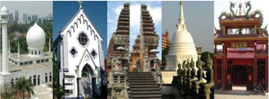

> **Deskripsi Visual:** Gambar ini adalah foto yang menampilkan berbagai jenis bangunan tradisional dari berbagai budaya di dunia. Dari kiri ke kanan, pertama ada sebuah masjid dengan arsitektur yang menunjukkan ciri khas Islam, kemudian sebuah gereja dengan arsitektur barok yang menunjukkan ciri khas Kristen, setelahnya ada sebuah pagoda Jepang yang menunjukkan arsitektur tradisional Jepang, berikutnya adalah sebuah stupa Buddha yang menunjukkan arsitektur tradisional India, dan terakhir adalah sebuah kuil Hindu dengan arsitektur tradisional India. Setiap bangunan memiliki ciri khas unik yang menunjukkan keunikan budaya masing-masing.

Yang Maha Esa.

Apa  yang  kalian  pikirkan  setelah  melihat  gambar  di  atas?  Tentu  saja kalian sudah dapat menyimpulkan bahwa setiap orang di negara Indonesia dapat  melakukan  berbagai  macam  aktivitas  keagamaan  sebagai  wujud dari    adanya  kemerdekaan  beragama  dan  kepercayaan.  Apa  sebenarnya kemerdekaan beragama dan berkepercayaan itu?

Kemerdekaan  beragama  dan  berkepercayaan  mengandung  makna bahwa setiap manusia bebas memilih, melaksanakan ajaran agama menurut keyakinan dan kepercayaannya. Setiap manusia tidak boleh dipaksa oleh siapapun, baik itu oleh pemerintah, pejabat agama, masyarakat, maupun orang  tua  sendiri.  Kemerdekaan  beragama  dan  berkepercayaan  muncul dikarenakan secara prinsip tidak ada tuntunan dalam agama apa pun yang mengandung  paksaan  atau  menyuruh  penganutnya  untuk  memaksakan agamanya kepada orang lain, terutama terhadap orang yang telah menganut salah satu agama.

Setiap  orang  memiliki  kemerdekaan  beragama,  tetapi  apakah  boleh kita untuk tidak beragama? Tentu saja tidak boleh, kemerdekaan beragama itu  tidak  dimaknai  sebagai  kebebasan  untuk  tidak  beragama  atau  bebas untuk tidak beriman kepada Tuhan Yang Maha Esa. Kemerdekaan beragama bukan pula dimaknai sebagai kebebasan untuk menarik orang yang telah beragama atau mengubah agama yang telah dianut seseorang. Selain itu kemerdekaan  beragama  juga  tidak  diartikan  sebagai  kebebasan  untuk

 

---
## 📄 Halaman 69

beribadah yang tidak sesuai dengan tuntunan dan ajaran agama masingmasing.  Setiap  manusia  tidak  diperbolehkan  menistakan  agama  dengan melakukan peribadatan yang menyimpang  dari ajaran agama  yang dianutnya.

Kemerdekaan  beragama  dan  kepercayaan  di  Indonesia  dijamin  oleh UUD Negara Republik Indonesia Tahun 1945 dalam Pasal 28 E ayat (1) dan (2) sebagai berikut.

- Setiap orang bebas memeluk agama dan beribadat menurut agamanya, memilih pendidikan dan pengajaran, memilih pekerjaan, memilih kewarganegaraan,  memilih  tempat  tinggal  di  wilayah  negara  dan meninggalkannya, serta berhak kembali.
- Setiap orang berhak atas kebebasan meyakini kepercayaan, menyatakan pikiran dan sikap, sesuai dengan hati nuraninya.
Di samping itu, dalam Pasal 29 UUD Negara Republik Indonesia Tahun 1945 ayat (2) disebutkan, bahwa 'negara menjamin kemerdekaan tiap-tiap penduduk untuk memeluk agamanya masing-masing dan untuk beribadat menurut agamanya dan kepercayaannya itu.'

Ketentuan-ketentuan di atas, semakin menunjukkan bahwa di Indonesia telah  dijamin  adanya  persamaan  hak  bagi  setiap  warga  negara  untuk menentukan  dan  menetapkan  pilihan  agama  yang  ia  anut,  menunaikan ibadah  serta  segala  kegiatan  yang  berhubungan  dengan  agama  dan kepercayaan masing-masing. Dengan kata lain, seluruh warga negara berhak atas kemerdekaan beragama seutuhnya, tanpa harus khawatir negara akan mengurangi kemerdekaan itu. Dikarenakan kemerdekaan beragama tidak boleh dikurangi dengan alasan apapun sebagaimana diatur dalam Pasal 28 I  ayat (1) UUD Negara Republik Indonesia Tahun 1945 yang menyebutkan bahwa 'hak untuk hidup, hak untuk tidak disiksa, hak kemerdekaan pikiran dan  hati  nurani,  hak  beragama,  hak  untuk  tidak  diperbudak,  hak  untuk diakui sebagai pribadi di hadapan hukum, dan hak untuk tidak dituntut atas dasar hukum yang berlaku surut adalah hak asasi manusia yang tidak dapat dikurangi  dalam  keadaan  apa  pun.'  Oleh  karena  itu,  untuk  mewujudkan ketentuan tersebut, diperlukan hal-hal sebagai berikut.

 

---
## 📄 Halaman 70

- Adanya pengakuan yang sama oleh pemerintah terhadap agama-agama yang dipeluk oleh warga negara.
- Tiap pemeluk agama mempunyai kewajiban, hak dan kedudukan yang sama dalam negara dan pemerintahan.
- Adanya  kebebasan  yang  otonom  bagi  setiap  penganut  agama  dengan agamanya  itu,  apabila  terjadi  perubahan  agama,  yang  bersangkutan mempunyai  kebebasan  untuk  menetapkan  dan  menentukan  agama yang ia kehendaki.
- Adanya  kebebasan  yang  otonom  bagi  tiap  golongan  umat  beragama serta  perlindungan  hukum  dalam  pelaksanaan  kegiatan  peribadatan dan kegiatan keagamaan lainnya yang berhubungan dengan eksistensi agama masing- masing.

### Tugas Mandiri 2.3

Kemerdekaan beragama dan kepercayaan diatur pula dalam Undang-Undang RI Nomor 39 Tahun 1999 tentang Hak Asasi Manusia, serta dalam Undang-Undang RI Nomor 12 Tahun 2005 tentang Pengesahan Kovenan Internasional tentang HakHak Sipil dan Politik. Tugas kalian adalah mengidentifikasi ciri-ciri kemerdekaan beragama dan kepercayaan yang terdapat dalam dua peraturan tersebut. Tuliskan hasil identifikasi kalian ke dalam tabel berikut ini.

---
**📊 Tabel**

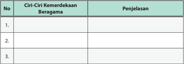

Tabel ini berisi informasi tentang ciri-ciri kemerdekaan beragama, yang terdiri dari tiga baris dengan kolom "No.", "Ciri-Ciri Kemerdekaan Beragama", dan "Penjelasan". Topik utama tabel ini adalah tentang kemerdekaan beragama di Indonesia. Kolom "No." digunakan untuk memberikan nomor urutan pada setiap baris, sedangkan kolom "Ciri-Ciri Kemerdekaan Beragama" menyajikan informasi tentang aspek-aspek kemerdekaan beragama. Kolom "Penjelasan" berfungsi untuk memberikan penjelasan atau deskripsi lebih lanjut tentang ciri-ciri tersebut. Data atau pola penting yang terlihat dalam tabel ini adalah bahwa tabel ini mencakup tiga aspek kemerdekaan beragama, yaitu tidak ada pembatasan agama dalam kehidupan sehari-hari, hak pilih agama sendiri, dan hak untuk memeluk agama yang lain jika memilih.

 

---
## 📄 Halaman 71

---
**📊 Tabel**

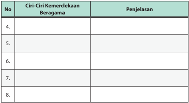

Tabel ini berisi informasi tentang ciri-ciri kemerdekaan beragama, yang terdiri dari kolom "No" untuk nomor urutan, "Ciri-Ciri Kemerdekaan Beragama" untuk deskripsi ciri-ciri tersebut, dan "Penjelasan" untuk penjelasan lebih lanjut tentang ciri-ciri tersebut. Topik utama tabel ini adalah tentang kemerdekaan beragama di Indonesia. Kolom "No" membantu dalam mengorganisir informasi secara sistematis, sedangkan kolom "Ciri-Ciri Kemerdekaan Beragama" menyajikan deskripsi singkat dari setiap ciri yang dimiliki oleh kemerdekaan beragama. Kolom "Penjelasan" memberikan penjelasan lebih lanjut tentang setiap ciri, memungkinkan pembaca untuk memahami makna dan pentingnya setiap ciri dengan lebih baik. Data atau pola penting yang terlihat dalam tabel ini adalah bahwa setiap ciri memiliki penjelasan yang mendalam, menunjukkan bahwa pembahasan tentang kemerdekaan beragama di Indonesia sangat mendalam dan detail.

### 2. Membangun  Kerukunan  Umat Beragama

Kemerdekaan beragama di Indonesia menyebabkan Indonesia mempunyai  agama  yang  beraneka  ragam.  Di  sekolah  kalian,  mungkin saja warga sekolahnya (siswa dan guru) menganut agama yang berbedabeda sesuai dengan keyakinannya. Atau mungkin saja, kalian mempunyai tetangga  yang  tidak  seagama  dengan  kalian.  Hal  itu  semua,  merupakan sesuatu yang wajar. Keberagaman agama yang dianut oleh bangsa Indonesia itu  tidak  boleh  dijadikan  hambatan  untuk  memperkokoh  persatuan  dan kesatuan bangsa. Hal tersebut tentu saja akan terwujud apabila dibangun kerukunan umat  beragama. Coba kalian amati gambar 2.9.

 

---
## 📄 Halaman 72

Kerukunan  umat  beragama  merupakan  sikap  mental  umat  beragama dalam rangka mewujudkan kehidupan yang serasi dengan tidak membedakan pangkat, kedudukan sosial dan tingkat kekayaan. Kerukunan umat beragama dimaksudkan agar terbina dan terpelihara hubungan baik dalam  pergaulan  antara  warga  yang  seagama  maupun  yang  berlainan agama.

Apa  saja  bentuk  kerukunan  beragama  itu?  Di  negara  kita  mengenal konsep Tri Kerukunan Umat Beragama, yang terdiri atas kerukunan internal umat  seagama,  kerukunan  antar  umat  berbeda  agama,  dan  kerukunan antar umat beragama dengan pemerintah. Bagaimana perwujudan dari tiga konsep kerukunan itu? Untuk mengetahuinya, simaklah uraian berikut.

Kerukunan  antar  umat  seagama  berarti  adanya  kesepahaman  dan kesatuan untuk melakukan amalan dan ajaran agama yang dipeluk dengan menghormati  adanya  perbedaan  yang  masih  bisa  ditolerir.  Dengan  kata lain, sesama umat seagama tidak diperkenankan untuk saling bermusuhan, saling menghina, saling menjatuhkan, tetapi harus mengembangkan sikap saling menghargai, menghomati dan toleransi apabila terdapat perbedaan, asalkan  perbedaan  tersebut  tidak  menyimpang  dari  ajaran  agama  yang dianut.  Kerukunan  antar  umat  beragama  adalah  cara  atau  sarana  untuk mempersatukan dan  mempererat  hubungan antara orang-orang  yang  tidak seagama dalam proses pergaulan pergaulan di masyarakat, tetapi bukan ditujukan  untuk  mencampuradukkan  ajaran  agama.  Ini  perlu  dilakukan untuk menghindari terbentuknya fanatisme ekstrim yang membahayakan keamanan, dan ketertiban umum. Bentuk nyata yang bisa dilakukan adalah dengan  adanya  dialog  antar  umat  beragama  yang  di  dalamnya  bukan membahas  perbedaan,  akan  tetapi  memperbincangkan  kerukunan,  dan perdamaian  hidup  dalam  bermasyarakat.  Intinya  adalah  bahwa  masingmasing agama mengajarkan manusia untuk hidup dalam kedamaian dan ketenteraman.

Kerukunan  antar  umat  beragama  dengan  pemerintah,  maksudnya adalah dalam hidup beragama, masyarakat tidak lepas dari adanya aturan pemerintah setempat yang mengatur tentang kehidupan bermasyarakat. Masyarakat tidak boleh hanya mentaati aturan dalam agamanya masingmasing,  akan  tetapi  juga  harus  menaati  hukum  yang  berlaku  di  negara Indonesia.

 

---
## 📄 Halaman 73

### Tugas Kelompok 2.2

Lakukanlah identifikasi terhadap perilaku masyarakat di lingkungan sekitarmu yang  mencerminkan  perwujudan  upaya  membangun  kerukunan  beragama. Tuliskan hasil identifikasi kalian ke dalam tabel di bawah ini. Informasikan hasil identifikasi kalian kepada kelompok yang lain.

---
**📊 Tabel**

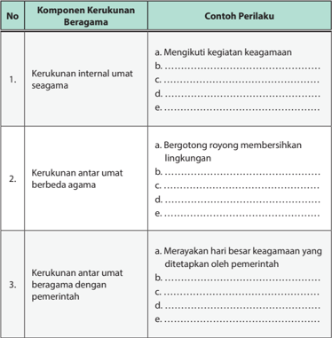

Tabel ini membahas tentang kerukunan beragama dalam konteks kehidupan sehari-hari. Topik utamanya adalah bagaimana masyarakat beragama dapat saling menghormati dan mendukung satu sama lain dalam berbagai aspek kehidupan. Tabel dibagi menjadi tiga kolom utama: Komponen Kerukunan Beragama, Contoh Perilaku, dan No. Kolom "Komponen Kerukunan Beragama" mencakup tiga poin utama: kerukunan internal umat seagama, kerukunan antar umat beragama, dan kerukunan antar umat beragama dengan pemerintah. Setiap poin ini dijelaskan dengan contoh perilaku yang menunjukkan bagaimana masyarakat beragama dapat saling menghormati dan mendukung satu sama lain. Misalnya, dalam kerukunan internal umat seagama, contoh perilaku termasuk mengikuti kegiatan keagamaan, berdoa bersama, dan menjaga kebersihan masjid. Sementara itu, dalam kerukunan antar umat beragama, contoh perilaku meliputi bergotong royong membersihkan lingkungan, menyapa orang lain dengan salam, dan menghargai perbedaan agama. Terakhir, dalam kerukunan antar umat beragama dengan pemerintah, contoh perilaku termasuk merayakan hari besar keagamaan yang ditetapkan oleh pemerintah, mengikuti aturan dan peraturan yang dikeluarkan oleh pemerintah, dan berpartisipasi aktif dalam kegiatan sosial dan budaya yang dilaksanakan oleh pemerintah. Dengan demikian, tabel ini memberikan panduan praktis bagi masyarakat beragama untuk membangun hubungan yang harmonis dan saling menghormati satu sama lain dalam berbagai aspek kehidupan.

 

---
## 📄 Halaman 74

### D. Sistem Pertahanan dan Keamanan Negara Republik Indonesia

### 1. Substansi Pertahanan dan Keamanan Negara Republik Indonesia

Sebagaimana  kita  ketahui,  bahwa kemerdekaan    yang    diproklamirkan oleh bangsa Indonesia tidak diraih dengan mudah. Pengorbanan nyawa,  harta,  tenaga,  dan  sebagainya mewarnai  setiap  perjuangan  merebut kemerdekaan. Mengingat begitu besarnya pengorbanan yang telah diberikan  oleh  para  pahlawan  bangsa, sudah menjadi kewajiban kita yang

### Info Kewarganegaraan

Wilayah Indonesia yang sangat luas membutuhkan sistem pertahanan dan keamanan untuk menjaga stabilitas nasional. Salah satu alat negara yang dapat menjaga keamanan dan pertahanan negara adalah Tentara Nasional Indonesia yang diatur dalam UU Nomor 34 Tahun 2004.

hidup pada masa sekarang untuk mempertahankan kemerdekaan dengan berbagai  macam  cara.  Upaya  mempertahankan  kemerdekaan  ini,  telah dipikirkan oleh para pendiri negara kita. Mereka sudah memikirkan masa depan kemerdekaan bangsa Indonesia. Para pendiri negara melalui sidang Badan Penyelidik Usaha Persiapan Kemerdekaan Indonesia (BPUPKI) telah mencantumkan upaya mempertahankan kemerdekaan ke dalam Undang Undang  Dasar  1945  Bab  XII  tentang  Pertahanan  Negara  (Pasal  30).  Para tokoh pendiri negara berkeyakinan bahwa kemerdekaan Indonesia dapat dipertahankan  apabila  dibangun  pondasi  atau  sistem  pertahanan  dan keamanan negara yang kokoh, hal itu harus diatur dalam Undang-Undang Dasar Negara Republik Indonesia Tahun 1945. Perubahan UUD NRI Tahun 1945 semakin memperjelas sistem pertahanan dan keamanan negara kita. Hal  tersebut  diatur  dalam  Pasal  30  ayat  (1)  sampai  dengan  ayat  (5)  UUD Negara Republik Indonesia Tahun 1945 yang menyatakan sebagai berikut.

- Tiap-tiap  warga  negara  berhak  dan  wajib  ikut  serta  dalam  usaha pertahanan dan keamanan negara.
- Usaha pertahanan dan keamanan negara dilaksanakan melalui  sistem pertahanan  dan  keamanan  rakyat  semesta  oleh  Tentara Nasional Indonesia dan Kepolisian Negara Republik Indonesia, sebagai kekuatan utama, dan rakyat sebagai kekuatan pendukung.

 

---
## 📄 Halaman 75

- Tentara Nasional Indonesia terdiri atas Angkatan Darat, Angkatan Laut dan  Angkatan  Udara  sebagai  alat  negara  bertugas  mempertahankan, melindungi, dan memelihara keutuhan dan kedaulatan negara.
- Kepolisian Negara Republik Indonesia sebagai alat negara yang menjaga kemanan dan ketertiban masyarakat bertugas melindungi, mengayomi, melayani masyarakat, serta menegakkan hukum.
- Susunan dan kedudukan Tentara Nasional Indonesia, Kepolisian Negara Republik Indonesia, hubungan kewenangan Tentara Nasional Indonesia dan  Kepolisian  Negara  Republik  Indonesia  di  dalam  menjalankan tugasnya, syarat-syarat keikutsertaan warga negara dalam usaha pertahanan dan keamanan diatur dengan undang-undang.
Ketentuan di atas menegaskan bahwa usaha pertahanan dan keamanan negara  Indonesia  merupakan  tanggung  jawab  seluruh  Warga  Negara Indonesia. Dengan kata lain, pertahanan dan keamanan negara tidak hanya menjadi tanggung jawab TNI dan POLRI saja, tetapi masyarakat sipil juga sangat  bertanggung  jawab  terhadap  pertahanan  dan  keamanan  negara. TNI  dan  POLRI  manunggal  bersama  masyarakat  sipil  menjaga  keutuhan NKRI seperti yang terlihat dalam Gambar 2.10.

 

---
## 📄 Halaman 76

UUD Negara Republik Indonesia Tahun 1945 juga memberikan gambaran  bahwa  usaha  pertahanan  dan  kemanan  negara  dilaksanakan dengan menggunakan sistem pertahanan dan keamanan rakyat semesta (Sishankamrata).  Sistem  pertahanan  dan  kemanan  rakyat  semesta  ini hakikatnya merupakan segala upaya menjaga pertahanan dan keamanan negara meliputi seluruh rakyat Indonesia, segenap sumber daya nasional, sarana dan prasarana nasional, serta seluruh wilayah negara sebagai satu kesatuan  yang  utuh  dan  menyeluruh.  Dengan  kata  lain,  Sishankamrata penyelenggaraannya didasarkan pada kesadaran akan hak dan kewajiban seluruh warga  negara  serta keyakinan akan kekuatan sendiri untuk mempertahankan kelangsungan hidup bangsa dan negara Indonesia yang merdeka, bersatu, berdaulat, adil, dan makmur.

Sistem  pertahanan  dan  keamanan  yang  bersifat  semesta  merupakan pilihan yang paling tepat bagi pertahanan Indonesia yang diselenggarakan dengan keyakinan pada kekuatan sendiri serta berdasarkan atas hak dan kewajiban warga negara dalam usaha pertahanan negara. Meskipun negara Indonesia telah mencapai tingkat kemajuan yang cukup tinggi, kelak model tersebut  tetap  menjadi  pilihan  strategis  untuk  dikembangkan,  dengan menempatkan  warga  negara  sebagai  subjek  pertahanan  negara  sesuai dengan perannya masing-masing.

Sistem pertahanan dan keamanan  negara yang bersifat semesta bercirikan sebagai berikut.

- Kerakyatan, yaitu orientasi pertahanan dan kemanan negara diabdikan oleh dan untuk kepentingan seluruh rakyat.
- Kesemestaan, yaitu seluruh sumber daya nasional didayagunakan bagi upaya pertahanan.
- Kewilayahan,  yaitu  gelar  kekuatan  pertahanan  dilaksanakan  secara menyebar di seluruh wilayah Negara Kesatuan Republik Indonesia, sesuai dengan kondisi geografis sebagai negara kepulauan. Sistem pertahanan dan  keamanan rakyat  semesta  yang  dikembangkan  bangsa  Indonesia merupakan  sebuah  sistem  yang  disesuaikan  dengan  kondisi  bangsa Indonesia. Posisi wilayah Indonesia yang berada di posisi silang (diapit oleh dua benua dan dua samudera) disatu sisi memberikan keuntungan, tapi di sisi yang lain memberikan ancaman keamanan yang besar baik

 

---
## 📄 Halaman 77

berupa ancaman militer dari negara lain maupun kejahatan-kejahatan internasional.  Selain  itu,  kondisi  wilayah  Indonesia  sebagai  negara kepulauan,  tentu  saja  memerlukan  sistem  pertahanan  dan  keamanan yang  kokoh    untuk    menghindari    ancaman    perpecahan.  Dengan kondisi seperti itu, kesimpulannya adalah bahwa sistem pertahanan dan keamanan rakyat semesta merupakan sistem yang terbaik bagi bangsa Indonesia.

### Tugas Kelompok 2.3

Bacalah Undang-Undang RI Nomor 34 tahun 2004 tentang Tentara Nasional Indonesia  dan  Undang-Undang  RI  Nomor  2  Tahun  2002  tentang  Kepolisian Republik  Indonesia.  Lakukan  identifikasi  bersama  teman  sebangku  mengenai tugas dan fungsi TNI dan POLRI dalam sistem pertahanan dan kemanan negara Indonesia. Tuliskan hasil identifikasi kalian pada tabel berikut.

---
**📊 Tabel**

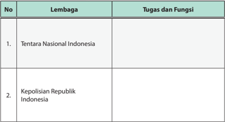

Tabel ini berisi informasi tentang tugas dan fungsi dua lembaga penting di Indonesia: Tentara Nasional Indonesia dan Kepolisian Republik Indonesia. Topik utama tabel adalah peran dan tanggung jawab masing-masing lembaga tersebut dalam menjaga keamanan dan ketertiban negara. Kolom pertama menunjukkan nama lembaga, sedangkan kolom kedua menyajikan deskripsi tugas dan fungsi mereka. Data penting yang terlihat adalah bahwa kedua lembaga ini memiliki peran yang sangat penting dalam menjaga kestabilan dan keamanan nasional, dengan Tentara Nasional Indonesia bertanggung jawab untuk melindungi wilayah negara dari ancaman militer, sementara Kepolisian Republik Indonesia bertanggung jawab untuk menjaga ketertiban dan keamanan publik.

 

---
## 📄 Halaman 78

### 2. Kesadaran Bela Negara dalam Konteks Sistem Pertahanan dan Keamanan Negara

Coba kalian amati gambar 2.11.

Gambar 2.11 Perjuangan rakyat Indonesia untuk mendapatkan kemerdekaan.

Gambar di atas melukiskan perjuangan gigih bangsa Indonesia dalam mengusir Belanda yang ingin kembali menjajah Indonesia. Para pahlawan bangsa rela  berkorban  dan  bertumpah  darah  ketika  berperang  melawan penjajah demi untuk mempertahankan wilayah Negara Kesatuan Republik Indonesia  (NKRI).  Mereka  mempunyai  motivasi  yang  sangat  tinggi  untuk mempertahankan kemerdekaan yang telah diraih. Oleh karena itu, untuk menghargai jasa pahlawan kita, kita juga harus memiliki rasa rela berkorban untuk  mempertahankan  negara,  memiliki  kesadaran  bela  negara  dan memiliki rasa nasionalisme yang tinggi terhadap negara yang merupakan tempat tinggalnya baik secara langsung maupun tidak langsung.

Pasal 27 ayat (3) UUD Negara Republik Indonesia Tahun 1945 menyatakan bahwa  setiap  warga  negara  berhak  dan  wajib  ikut  serta  dalam  upaya pembelaan  negara.  Ikut  serta  dalam  kegiatan  bela  negara  diwujudkan dengan  berpartisipasi  dalam  kegiatan  penyelenggaraan  pertahanan  dan kemanan negara, sebagaimana diatur dalam Pasal 30 ayat (1) UUD Negara Republik Indonesia Tahun 1945 yang menyatakan bahwa 'tiap-tiap warga negara berhak dan wajib ikut serta dalam usaha pertahanan dan keamanan

 

---
## 📄 Halaman 79

negara.' Kedua ketentuan tersebut menegaskan bahwa setiap warga negara harus  memiliki  kesadaran  bela  negara.  Apa  sebenarnya  kesadaran  bela negara itu?

Kesadaran bela negara pada hakikatnya merupakan kesediaan berbakti pada  negara  dan  berkorban  demi  membela  negara.  Upaya  bela  negara selain  sebagai  kewajiban  dasar  juga  merupakan  kehormatan  bagi  setiap warga  negara  yang  dilaksanakan  dengan  penuh  kesadaran,  tanggung jawab dan rela berkorban dalam pengabdian kepada negara dan bangsa. Sebagai  warga  negara  sudah  sepantasnya  ikut  serta  dalam  bela  negara sebagai bentuk kecintaan kita kepada negara dan bangsa.

Bela  negara  yang  dilakukan  oleh  warga  negara  merupakan  hak  dan kewajiban mem-bela serta mempertahankan kemerdekaan dan kedaulatan negara,  keutuhan  wilayah  dan  keselamatan  segenap  bangsa  dari  segala ancaman.  Pembelaan  yang  diwujudkan  dengan  keikutsertaan dalam upaya  pertahanan  negara  merupakan  tanggung  jawab  dan  kehormatan setiap warga negara. Oleh karena itu, warga negara mempunyai kewajiban ikut  serta  dalam  pembelaan  negara,  kecuali  ditentukan  dengan  undangundang. Dalam prinsip ini terkandung pengertian bahwa upaya pertahanan negara harus didasarkan pada kesadaran akan hak dan kewajiban warga

 

---
## 📄 Halaman 80

negara  serta  keyakinan  pada  kekuatan  sendiri.  Hal  ini  juga  tercantum dalam  Undang-Undang Pertahanan Negara Pasal  1  ayat  (1)  UU  Nomor  3 Tahun  2002,  pertahanan  keamanan  negara  adalah  segala  usaha  untuk mempertahankan negara, keutuhan wilayah NKRI, dan keselamatan bangsa dari  ancaman  dan  gangguan  terhadap  keutuhan  terhadap  bangsa  dan negara. Bangsa Indonesia cinta perdamaian, cinta kemerdekaan, dan cinta kedaulatan.  Dalam  alinea  pertama  Pembukaan  UUD  1945  menyatakan 'Bahwa sesungguhnya kemerdekaan itu ialah hak segala bangsa, dan oleh sebab  itu  maka  penjajahan  di  atas  dunia  harus  dihapuskan  karena  tidak sesuai dengan perikemanusiaan dan perikeadilan' .

Penyelesaian pertikaian a tau konflik antarbangsa pun harus diselesaikan melalui  cara-cara  damai.  Bagi  bangsa  Indonesia,  perang  harus  dihindari. Perang  merupakan  jalan  terakhir  dan  dilakukan  jika  semua  usaha-usaha dan penyelesaian secara damai tidak berhasil. Indonesia menentang segala bentuk penjajahan dan menganut politik bebas aktif. Prinsip ini merupakan pelaksanaan  dari  bunyi  alinea  pertama  Pembukaan  UUD  1945.  Dengan hak dan kewajiban yang sama, setiap orang Indonesia dapat berperan aktif dalam melaksanakan bela negara. Membela negara tidak harus dalam wujud perang, tetapi bisa diwujudkan dengan cara-cara lain seperti berikut ini.

- Ikut serta dalam mengamankan lingkungan sekitar (seperti siskamling).
- Ikut serta membantu korban bencana di dalam negeri.
- Belajar dengan tekun pelajaran Pendidikan Kewarganegaraan atau PPKn.
- Mengikuti kegiatan ekstrakurikuler, seperti Paskibra, PMR, dan Pramuka.
- Pelatihan dasar kemiliteran secara wajib.
- Pengabdian sebagai anggota TNI.
- Pengabdian sesuai dengan profesi keahlian.

 

---
## 📄 Halaman 81

### Tugas Mandiri 2.4

Janganlah kalian memikirkan apa yang negara berikan, tetapi harus berpikir apa yang telah kalian berikan untuk negara. Pernyataan itu merupakan inti dari kesadaran bela negara. Nah sekarang coba kalian renungkan, apa saja yang sudah kalian lakukan sebagai wujud warga negara yang memiliki kesadaran bela negara? Hal-hal yang sudah saya lakukan di antaranya:

…………………………………………………………………………………….…

………………………………………………………………………………………

………………………………………………………………………………………

………………………………………………………………………………………

………………………………………………………………………………………

………………………………………………………………………………………

………………………………………………………………………………………

### Refleksi

Setelah  kalian  mempelajari  materi  tentang  pasal-pasal  dalam  UUD  Negara Republik Indonesia Tahun 1945 yang berkaitan tentang wilayah, warga negara, kemerdekaan beragama, serta sistem pertahanan dan keamanan negara, tentu saja  kalian  semakin  meyakini  betapa  pentingnya  menjaga  keutuhan  wilayah, menjadi  warga  negara  yang  baik,  mewujudkan  kemerdekaan  beragama,  dan berpartisipasi dalam menjaga pertahanan dan keamanan negara. Untuk menguji keyakinan kalian, jawablah pertanyaan-pertanyaan di bawah ini.

- Kekayaan  alam  yang  dimiliki  oleh  bangsa  Indonesia  merupakan  anugerah Tuhan Yang Maha Esa yang harus disyukuri. Bagaimanakah cara kalian untuk mensyukuri anugerah tersebut?
- Apabila kalian merasa sebagai warga negara yang baik, apa saja yang telah kalian lakukan untuk mendorong kemajuan bangsa dan negara Indonesia?
- Apabila kalian berada di  lingkungan  masyarakat  yang  agamis  dengan masyarakat yang beranekaragam, apa yang kalian lakukan untuk mendorong tumbuhnya kerukunan antar umat beragama?
- Sebagai seorang pelajar, apa saja yang sudah kalian lakukan sebagai wujud partisipasi dalam menjaga pertahanan dan keamanan negara?

 

---
## 📄 Halaman 82

### Rangkuman

### 1. Kata kunci

Kata kunci yang harus kalian pahami dalam mempelajari materi pada bab ini adalah wilayah, warga negara, kemerdekaan beragama, pertahanan negara, keamanan nasional dan bela negara.

### 2. Intisari Materi

- Wilayah  Negara  Indonesia  diatur  dalam  Pasal  25  A  UUD  Negara  Republik Indonesia Tahun 1945. Berdasarkan ketentuan Pasal 25 A, Negara Indonesia merupakan negara kepulauan  yang bercirikan nusantara.
- Warga  Negara  dan  Penduduk  Indonesia  diatur  dalam  Pasal  26  UUD Negara  Republik  Indonesia  Tahun  1945.  Penduduk  Indonesia  terdiri  atas Warga Negara Indonesia dan warga negara asing yang tinggal di wilayah Indonesia. Sedangkan yang menjadi Warga Negara Indonesia adalah orangorang Indonesia asli dan orang asing yang disahkan menjadi Warga Negara Indonesia.
- Kemerdekaan beragama di Indonesia diatur dalam Pasal 28 E, Pasal 28 I, dan Pasal 29 ayat (2) UUD Negara Republik Indonesia Tahun1945. Kemerdekaan beragama merupakan hak setiap warga negara untuk memeluk dan beribadat sesuai  dengan  agama  dan  kepercayaan  yang  diyakininya.  Kemerdekaan beragama  tidak  diartikan  sebagai  kebebasan  untuk  tidak  bergama,  serta tidak diartikan sebagai kebebasan untuk memaksakan ajaran agama kepada orang lain.
- Sistem  pertahanan  dan  keamanan  negara  Indonesia  diatur  dalam  Pasal 30  UUD  Negara  Republik  Indonesia  Tahun  1945.  Sistem  pertahanan  dan keamanan yang dikembangkan adalah sistem pertahanan dan keamanan rakyat semesta dengan TNI dan POLRI sebagai kekuatan utama, sedangkan rakyat  sebagai  kekuatan  pendukung.  Sistem  pertahanan  dan  keamanan negara tidak akan kokoh apabila tidak didukung oleh kesadaran bela negara dari setiap warga negara Indonesia.

 

---
## 📄 Halaman 83

### Penilaian Diri

Nah, coba sekarang kalian amati diri masing-masing, apakah perilaku kalian telah  mencerminkan  warga  negara  yang  baik  atau  belum?  Mari  berbuat  jujur dengan mengisi daftar perilaku di bawah ini dengan membubuhkan tanda ceklis (√) pada kolom berikut ini.

- Sl (selalu), apabila selalu melakukan sesuai pernyataan.
- Sr (sering), apabila sering melakukan sesuai dengan pernyataan dan kadangkadang tidak melakukan.
- Kd (kadang-kadang), apabila kadang-kadang melakukan dan sering tidak melakukan.
- TP (tidak pernah), apabila tidak pernah melakukan.

---
**📊 Tabel**

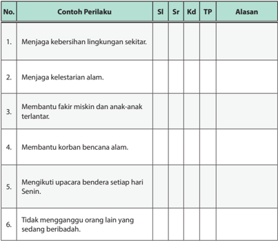

Tabel ini berisi contoh perilaku sosial yang harus dijaga oleh individu, dengan kolom-kolom seperti "No.", "Contoh Perilaku", "SI", "Sr", "Kd", "TP", dan "Alasan". Topik utama tabel adalah tentang perilaku sosial yang positif dan penting untuk dijaga dalam masyarakat. Kolom "No." memberikan nomor urutan untuk setiap contoh perilaku. "Contoh Perilaku" menyajikan 6 contoh perilaku yang harus dijaga, seperti menjaga kebersihan lingkungan, menjaga kelestarian alam, membantu fakir miskin, membantu korban bencana, mengikuti upacara bendera, dan tidak mengganggu orang lain yang sedang beribadah. Kolom "SI" mungkin merujuk pada skala atau standar nilai, "Sr" mungkin merujuk pada status atau tingkat, "Kd" mungkin merujuk pada keterampilan atau kemampuan, "TP" mungkin merujuk pada tingkat pengetahuan, dan "Alasan" menyajikan alasan mengapa perilaku tersebut harus dijaga. Pola penting yang terlihat adalah bahwa semua contoh perilaku memiliki aspek positif dan penting untuk dijaga dalam masyarakat.

 

---
## 📄 Halaman 84

---
**📊 Tabel**

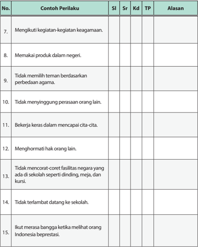

Tabel ini berisi contoh perilaku yang diharapkan dalam konteks kehidupan sehari-hari, dengan kolom-kolom yang mencakup nomor, contoh perilaku, skala perilaku (SI), sikap (Sr), keterampilan (Kd), tingkat pengetahuan (TP), dan alasan. Topik utama tabel adalah tentang perilaku positif dan negatif yang dapat diterapkan dalam kehidupan sehari-hari. Kolom-kolomnya membantu dalam membandingkan dan menilai perilaku tersebut. Data penting yang terlihat adalah bahwa banyak contoh perilaku yang mencakup aspek sosial, emosional, dan akademis, seperti ikut partisipasi kegiatan keagamaan, makan produk dalam negeri, tidak memilih teman berdasarkan perbedaan agama, bekerja keras untuk mencapai cita-cita, menghormati hak orang lain, tidak mencoret fasilitas negara, tidak terlambat datang ke sekolah, dan merasa bangga ketika melihat orang Indonesia beprestasi.

Apabila  jawaban  kalian  'kadang-kadang'  atau  'tidak  pernah'  pada  kolom perilaku-perilaku  tersebut  di  atas,  kalian  sebaiknya  mulai  mengubah  sikap  dan perilaku kalian agar menjadi lebih baik.

 

---
## 📄 Halaman 85

### PROYEK BELAJAR KEWARGANEGARAAN

### Mari Menulis Artikel

- Buatlah sebuah artikel sebanyak enam sampai delapan paragraf.
- Pililah salah satu dari empat tema di bawah ini untuk melaksanakan simulasi.
- Pemanfaatan potensi kekayaan alam wilayah Indonesia
- Peran Warga Negara Indonesia dalam proses pembangunan
- Membangun kerukunan beragama dalam kehidupan sehari-hari
- Membangun kesadaran bela negara masyarakat Indonesia
- Artikel disusun dengan diketik dalam kertas A4.
- Apabila  sudah  selesai  segera  kumpulkan  kepada  guru  dan  informasikan nilai  yang  kalian  peroleh  kepada  orang  tua  masing-masing  sebagai  bentuk pertanggungjawaban kalian.

 

---
## 📄 Halaman 86

### UJI KOMPETENSI  BAB 2

### Jawablah pertanyaan di bawah ini secara singkat, jelas dan akurat.

- Negara Kesatuan Republik Indonesia adalah sebuah negara kepulauan yang berciri  nusantara.  Jelaskan  makna  yang  terkandung  dalam  Pasal  25  A  UUD Negara Republik Indonesia Tahun 1945 tentang wilayah negara Indonesia!
- Batas  wilayah  pada  dasarnya  menunjukkan  luas  yang  dimiliki  oleh  wilayah tersebut. Bentuk dari batas wilayah ada yang dibatasi oleh sungai, laut, hutan, atau  juga  hanya  berupa  tugu  perbatasan.  Berdasarkan  hal  tersebut  uraikan batas-batas  negara  Indonesia  baik  di  wilayah  daratan  maupun  lautan  yang berbatasan dengan negara tetangga RI!
- UUD  Negara  Republik  Indonesia  Tahun  1945  menyatakan  bahwa  negara mempunyai    hak  penguasaan  atas  kekayaan  alam  Indonesia.  Bagaimana pengelolaan kekayaan alam yang terkandung di wilayah negara Indonesia?
- Masyarakat  Indonesia  merupakan  masyarakat  yang  beragama.  Kehidupan beragama merupakan bagian yang tidak terpisahkan dari kehidupan seluruh masyarakat Indonesia. Jelaskan makna  kemerdekaan beragama bagi bangsa Indonesia?
- Pertahanan  dan  keamanan  negara  Indonesia  pada  dasarnya  merupakan tanggung  jawab  seluruh  warga  negara  Indonesia.  Berdasarkan  hal  tersebut jelaskan sistem pertahanan dan keamanan yang dikembangkan oleh Negara Indonesia!

 

---
## 📄 Halaman 87

---
**🖼️ Gambar/Diagram**

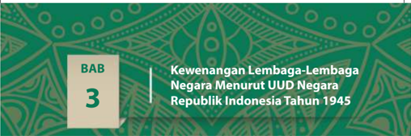

> **Deskripsi Visual:** Gambar ini adalah bagian dari buku pelajaran yang berisi informasi tentang kewenangan lembaga-lembaga negara menurut Undang-Undang Dasar (UU) Republik Indonesia Tahun 1945. Gambar tersebut memiliki judul "BAB 3" yang menunjukkan bahwa ini adalah bagian dari bab ketiga buku tersebut. Judul bab ini ditulis dalam bahasa Indonesia dan menggunakan huruf besar untuk menekankan istilah "Kewenangan Lembaga-Lembaga Negara Menurut UUD Negara Republik Indonesia Tahun 1945". 

Elemen-elemen utama yang terlihat dalam gambar ini adalah judul bab yang ditulis dalam bahasa Indonesia dengan huruf besar, dan sebuah latar belakang yang menampilkan desain tradisional dengan warna hijau dan oranye. Label "BAB 3" yang berada di sebelah kiri atas gambar menunjukkan bahwa ini adalah bagian dari bab ketiga buku tersebut.

Informasi kunci yang dapat diambil pembaca dari gambar ini adalah bahwa bab ini membahas tentang kewenangan lembaga-lembaga negara dalam konteks Undang-Undang Dasar Republik Indonesia Tahun 1945. Ini menunjukkan bahwa buku ini mungkin merupakan sumber referensi yang penting bagi pembaca yang ingin mempelajari tentang struktur dan fungsi lembaga-lembaga negara di Indonesia.

Marilah bersama-sama memanjatkan puji dan syukur atas nikmat yang telah diberikan oleh Tuhan Yang Maha Esa kepada kita. Pada pokok bahasan ini, kalian akan mempelajari Bab Tiga dari buku ini. Setelah mempelajari bab sebelumnya, tentu  pengetahuan  dan  pemahaman  kalian  semakin  meningkat.  Hal  tersebut tentu saja harus diikuti pula oleh sikap dan perilaku yang semakin baik.

Pada  bab  ini  kalian  akan  diajak  untuk  menyelami  kewenangan  lembagalembaga negara berdasarkan Undang-Undang Dasar Negara Republik Indonesia Tahun 1945. Setelah mempelajari bab ini diharapkan kalian mampu menganalisis kewenangan lembaga-lembaga negara menurut Undang-Undang Dasar Negara Republik Indonesia Tahun 1945. Coba kalian amati gambar 3.1.

Gambar 3.1 Gedung MPR/DPR merupakan gedung tempat bekerja dan berkumpulnya wakil rakyat untuk kesejahteraan rakyat Indonesia.

Tahukah  kalian  gambar  apakah  itu?  Gedung  tersebut  adalah  gedung  MPR/ DPR  RI,  merupakan  tempat  para  wakil  rakyat  yang  sering  kita  sebut  anggota DPR. Dewan Perwakilan Rakyat merupakan salah satu lembaga negara yang hak

 

---
## 📄 Halaman 88

dan kewajibannya diatur dalam UUD NRI Tahun 1945. Dewan Perwakilan Rakyat bertugas  mengawasi  jalannya  penyelenggaraan  pemerintahan  atau  dengan kata lain menjadi wakil rakyat dalam mengawasi pemerintahan untuk mencapai cita-cita  dan  tujuan  negara. Walaupun demikian, pemerintah yang mempunyai kewenangan  untuk  mengatur  seluruh  rakyat  dan  menjaga  keutuhan  wilayah negara untuk mencapai kemakmuran rakyat.

Sejarah  bangsa  Indonesia,  diwarnai  oleh  pergerakan  politik  yang  bertujuan untuk  membangun  sistem  politik  milik  bangsa  Indonesia  sendiri.  Kemudian sejarah mencatat, sistem politik Indonesia sejak tahun 1945 sampai dengan tahun 1998 belum menunjukkan sistem politik yang mapan. Jatuh bangun kabinet di orde lama, pembelokan demokrasi Pancasila menjadi demokrasi terpimpin dan monotafsir    terhadap  Pancasila  oleh  orde  baru  memperlihatkan  sistem  politik Indonesia    terus  mencari  bentuknya.  Pembangunan  sistem  politik  Indonesia menjadi sebuah sistem politik yang mapan menuntut peran aktif seluruh rakyat Indonesia. Upaya apapun yang dilakukan pemerintah untuk membangun sistem politik Indonesia akan menjadi sia-sia apabila tidak didukung oleh rakyat Indonesia.

### A. Suprastruktur dan Infrastruktur Politik

### 1. Suprastruktur

Sistem politik Indonesia merupakan sebuah kajian politik yang menarik untuk dipelajari. Sistem politik, terbentuk dari dua pengertian yaitu sistem dan politik. Menurut Pamudji, sistem adalah suatu kebulatan atau keseluruhan yang kompleks atau terorganisir, suatu himpunan atau perpaduan halhal atau bagian-bagian yang membentuk suatu kebulatan atau keseluruhan yang kompleks dan utuh. Selanjutnya, menurut Rusadi Kantaprawira , sistem diartikan sebagai suatu kesatuan yang terbentuk dari beberapa unsur atau elemen. Unsur, komponen atau bagian yang banyak tersebut berada dalam keterikatan yang kait-mengait  dan fungsional. Dengan demikian dari kedua pendapat tersebut dapat disimpulkan bahwa sistem adalah suatu kesatuan dari unsur-unsur pembentuknya baik yang berupa input (masukan) ataupun output  (hasil)  yang  terdapat  dalam  lingkungan  dan  di  antara  unsur-unsur tersebut terjalin suatu hubungan yang fungsional .

 

---
## 📄 Halaman 89

Secara etimologis kata politik berasal dari bahasa Yunani yaitu polis yang berarti kota yang berstatus negara kota. Dalam bahasa Arab, istilah politik diartikan sebagai siyasah yang berarti strategi. Dari pengertian sistem dan politik  beberapa  ahli  mendefinisikan  tentang  sistem  politik,  di  antaranya adalah sebagai berikut.

- David Easton, menyatakan bahwa sistem politik merupakan seperangkat interaksi yang diabstraksi dari seluruh perilaku sosial, melalui nilai-nilai yang dialokasikan secara otoritatif kepada masyarakat.
- Robert  A. Dahl menyimpulkan bahwa sistem politik mencakup dua hal yaitu pola yang tetap dari hubungan antarmanusia, kemudian melibatkan seseuatu yang luas tentang kekuasaan, aturan dan kewenangan.
- Jack C. Plano, mengartikan sistem politik sebagai pola hubungan masyarakat yang dibentuk berdasarkan keputusan-keputusan yang sah dan dilaksanakan dalam lingkungan masyarakat tersebut.
- Rusadi Kantaprawira, berpendapat bahwa sistem politik merupakan berbagai macam kegiatan dan proses dari struktur dan fungsi yang bekerja dalam suatu unit dan kesatuan yang berupa negara atau masyarakat.

### Info Kewarganegaraan

Secara umum ciri-ciri sistem politik antara lain adalah sebagai berikut.

- Memiliki tujuan.
- Mempunyai komponenkomponen.
- Tiap komponen memiliki fungsi-fungsi yang berbeda.
- Adanya interaksi antara komponen satu dengan yang lainnya.
- Adanya mekanisme kerja (pengaturan struktur kerja dalam sistem politik).
Dari berbagai rumusan  di atas, secara umum  sistem  politik dapat diartikan sebagai keseluruhan kegiatan politik di dalam negara atau masyarakat yang mana kegiatan tersebut  berupa  proses  alokasi  nilainilai  dasar  kepada  masyarakat  dan menunjukkan  pola  hubungan  yang

- Adanya kekuasaan, kekuasaan untuk mengatur komponen dalam sistem atau di luar sistem. Tiap komponen memiliki kekuasaan, namun tingkatannya berbeda-beda.
- Adanya kebudayaan politik (terdapat prinsip-prinsip dan pemikiran) sebagai tolok ukur dalam pengembangan sistem tersebut.
fungsional di antara kegiatan-kegiatan politik tersebut.

 

---
## 📄 Halaman 90

Sistem politik menyelenggarakan fungsi-fungsi tertentu untuk masyarakat. Fungsi-fungsi itu adalah membuat  keputusan-keputusan kebijakan yang mengikat alokasi dari nilai-nilai  baik yang bersifat materi maupun non-materi. Keputusan-keputusan kebijakan ini diarahkan untuk tercapainya tujuan-tujuan masyarakat. Sistem politik menghasilkan output berupa kebijakan-kebijakan negara yang bersifat mengikat kepada seluruh masyarakat negara tersebut. Dengan kata lain, melalui sistem politik aspirasi masyarakat  (berupa  tuntutan  dan  dukungan)  yang  merupakan  cerminan dari    tujuan  masyarakat  dirumuskan    dan  selanjutnya  dilaksanakan  oleh kebijakan-kebijakan negara tersebut. Sistem politik berbeda dengan sistemsistem  sosial  yang  lainnya.  Ada  empat  ciri  khas  dari  sistem  politik  yang membedakan dengan sistem sosial yang lain.

- Daya jangkaunya universal, meliputi semua anggota masyarakat.
- Adanya kontrol yang bersifat mutlak terhadap pemakaian kekerasan fisik.
- Hak membuat keputusan-keputusan yang mengikat dan diterima secara sah.
- Keputusannya bersifat otoritatif, artinya mempunyai kekuatan legalitas dan kerelaan yang besar.
Dengan  demikian,  sistem  politik  yang  berjalan  tidak  akan  terlepas dari    keseluruhan  unsur-unsur  suprastruktur  dari  suatu  negara.  Dalam menjalankan sistem politik dalam suatu negara diperlukan struktur lembaga negara yang dapat menunjang jalannya pemerintahan. Struktur politik merupakan cara untuk melembagakan hubungan antara komponenkomponen  yang  membentuk  bangunan  politik  suatu  negara  supaya terjadi hubungan yang fungsional. Struktur politik suatu negara terdiri atas kekuatan suprastruktur dan infrastruktur. Struktur politik negara Indonesia pun terdiri dari dua kekuatan tersebut.

Suprastruktur politik diartikan sebagai mesin politik resmi di suatu negara dan merupakan penggerak politik yang bersifat formal.  Dengan kata lain suprastruktur politik merupakan gambaran pemerintah dalam arti luas yang terdiri  atas  lembaga-lembaga  negara  yang  tugas  dan  peranannya  diatur dalam konstitusi negara atau peraturan perundang-undangan lainnya.

 

---
## 📄 Halaman 91

### 2. Infrastruktur

Infrastruktur politik adalah kelompok-kelompok kekuatan politik dalam masyarakat  yang  turut  berpartisipasi  secara  aktif.  Kelompok-kelompok tersebut  dapat  berperan  menjadi  pelaku  politik  tidak  formal  untuk  turut serta  dalam  membentuk  kebijaksanaan  negara.  Infrastruktur  politik  di Indonesia meliputi keseluruhan kebutuhan  yang diperlukan dalam bidang politik  dalam  rangka  pelaksanaan  tugas-tugas  yang  berkaitan  dengan proses pemerintahan negara.

Pada dasarnya organisasi-organisasi yang tidak termasuk dalam birokrasi pemerintahan  merupakan  kekuatan  infrastruktur  politik.  Dengan  kata lain  setiap  organisasi  non-pemerintah  termasuk  kekuatan  infrastruktur politik. Di Indonesia banyak sekali organisasi atau kelompok yang menjadi kekuatan  infrastruktur  politik,  akan  tetapi  jika  diklasifikasikan  terdapat empat kekuatan sebagai berikut.

- Partai Politik, yaitu organisasi politik yang dibentuk oleh sekelompok Warga Negara Indonesia secara sukarela atas dasar persamaan kehendak dan cita-cita untuk memperjuangkan kepentingan anggota, masyarakat, bangsa, dan negara melalui pemilihan  umum.  Pendirian  partai politik  biasanya  didorong  adanya
masyarakat.

persamaan  kepentingan,  persamaan  cita-cita  politik,  dan  persamaan keyakinan keagamaan.

- Kelompok  Kepentingan (interest  group), yaitu  kelompok  yang mempunyai kepentingan terhadap kebijakan politik negara. Kelompok kepentingan bisa menghimpun atau mengeluarkan dana dan tenaganya untuk melaksanakan tindakan politik yang biasanya berada di luar tugas partai politik. Seringkali kelompok ini bergandengan erat dengan salah satu  partai  politik  dan  keberadaannya  bersifat  independen  (mandiri). Untuk mewujudkan tujuannya, tidak menutup kemungkinan kelompok kepentingan dapat melakukan negosiasi dan mencari dukungan kepada

 

---
## 📄 Halaman 92

masyarakat perseorangan ataupun kelompok masyarakat. Contoh dari kelompok  kepentingan  adalah  elite  politik,  pembayar  pajak,  serikat dagang, Lembaga  Swadaya  Masyarakat  (LSM), serikat buruh dan sebagainya.

- Kelompok Penekan (pressure group) , yaitu  kelompok yang bertujuan mengupayakan atau memperjuangkan keputusan politik yang berupa undang-undang  atau  kebijakan  publik  yang  dikeluarkan  pemerintah sesuai dengan kepentingan dan keinginan kelompok mereka. Kelompok ini biasanya tampil ke depan dengan berbagai cara untuk menciptakan pendapat umum  yang  mendukung  keinginan kelompok mereka. Misalnya  dengan  cara  berdemonstrasi,  melakukan  aksi  mogok  dan sebagainya.
- Media  komunikasi  politik ,  yaitu  sarana  atau  alat  komunikasi  politik dalam  proses  penyampaian  informasi  dan  pendapat  politik  secara tidak  langsung,  baik  terhadap  pemerintah  maupun  masyarakat  pada umumnya. Sarana media komunikasi ini antara lain adalah media cetak seperti koran, majalah, buletin, brosur, tabloid dan sebagainya, sedangkan  media  elektronik  seperti  televisi,  radio,  internet  dan  sebagainya. Media komunikasi diharapkan mampu mengolah, mengedarkan informasi bahkan mencari aspirasi/pendapat sebagai berita politik.

### Tugas Mandiri 3.1

Coba kalian tuliskan peranan organisasi atau kelompok yang menjadi kekuatan infrastruktur politik dalam sistem politik Indonesia

---
**📊 Tabel**

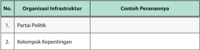

Tabel ini berisi informasi tentang organisasi infrastruktur dan contoh perannya dalam masyarakat. Topik utamanya adalah bagaimana partai politik dan kelompok kepentingan memainkan peran penting dalam kehidupan politik dan sosial. Kolom pertama menunjukkan nomor urut dari setiap organisasi infrastruktur, sedangkan kolom kedua memberikan contoh perannya. Dari tabel ini, dapat dilihat bahwa partai politik dan kelompok kepentingan merupakan dua organisasi infrastruktur yang memiliki peran penting dalam masyarakat, baik dalam hal pengambilan keputusan politik maupun dalam mendukung kepentingan tertentu.

 

---
## 📄 Halaman 93

---
**📊 Tabel**

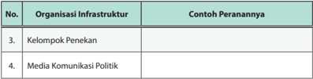

Tabel ini berisi informasi tentang peran organisasi infrastruktur dalam konteks politik. Topik utamanya adalah peran kelompok penekan dan media komunikasi politik. Kolom pertama menunjukkan nomor urut dari setiap organisasi infrastruktur, sedangkan kolom kedua memberikan contoh perannya. Dari tabel ini, dapat dilihat bahwa kelompok penekan memiliki peran penting dalam mempengaruhi kebijakan dan sikap publik, sementara media komunikasi politik berperan dalam menyampaikan informasi dan opini-opsi politik kepada masyarakat luas. Pola penting yang terlihat adalah hubungan antara organisasi infrastruktur dan pengaruh mereka terhadap kebijakan dan pendapat publik dalam konteks politik.

### B.  Lembaga-Lembaga Negara Republik Indonesia Menurut UUD NRI Tahun 1945

Undang-Undang  Dasar  Negara  Republik  Indonesia  tahun  1945  sebagai konstitusi  Indonesia  mengatur  keberadaan  lembaga-lembaga  negara  mulai tugas,  fungsi,  wewenang  sampai  pada  susunan  dan  kedudukannya.  Aturan dalam konstitusi ini dijabarkan oleh undang-undang, yaitu dalam UU Nomor 42 Tahun 2014 tentang MPR, DPR, DPD dan DPRD, UU Nomor 3 Tahun 2009 tentang  Mahkamah  Agung,  Undang-Undang  Nomor  4 Tahun  2014  tentang Mahkamah Konstitusi, UU Nomor 18  Tahun 2011 tentang Komisi Yudisial, dan UU Nomor 15 Tahun 2004 tentang BPK,

Kekuatan  suprastruktur  politik  yang  tergolong  ke  dalam  lembaga  tinggi negara  Indonesia adalah sebagai berikut.

- Majelis Permusyawaratan Rakyat (MPR)
- Dewan Perwakilan Rakyat (DPR)
- Dewan Perwakilan Daerah (DPD)
- Presiden/Wakil Presiden
- Mahkamah Agung
- Mahkamah Konstitusi
- Komisi Yudisial
- Badan Pemeriksa Kekuangan
Kedelapan  lembaga  negara  di  atas  merupakan  kekuatan  utama  dalam supra-struktur politik negara kita. Secara skematik dapat digambarkan sebagai berikut.

 

---
## 📄 Halaman 94

---
**🖼️ Gambar/Diagram**

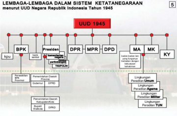

> **Deskripsi Visual:** Gambar ini adalah diagram yang menunjukkan struktur lembaga dalam sistem ketatanegaraan Indonesia berdasarkan Undang-Undang Dasar (UU) Republik Indonesia Tahun 1945. Diagram ini menggambarkan hubungan dan peran antara berbagai lembaga pemerintahan, termasuk lembaga legislatif (DPR, DPD, DPD), lembaga eksekutif (Presiden, BPK), dan lembaga kehormatan (MA, MK, KY). 

Elemen utama dalam diagram ini meliputi:
1. Lembaga legislatif: DPR, DPD, dan DPD.
2. Lembaga eksekutif: Presiden, BPK.
3. Lembaga kehormatan: MA, MK, KY.

Relasi antara elemen-elemen tersebut meliputi:
- DPR, DPD, dan DPD merupakan bagian dari lembaga legislatif.
- Presiden dan BPK merupakan bagian dari lembaga eksekutif.
- MA, MK, dan KY merupakan bagian dari lembaga kehormatan.

Teks, angka, atau label penting yang terlihat dalam diagram ini meliputi:
- Angka 5 menunjukkan bahwa diagram ini merupakan salah satu dari lima diagram dalam buku pelajaran.
- Nama-nama lembaga seperti DPR, DPD, MA, MK, dan KY disertakan dengan nama-nama lembaga lainnya.
- Angka 1945 menunjukkan bahwa diagram ini berdasarkan UU Republik Indonesia Tahun 1945.

Informasi kunci yang dapat diambil pembaca meliputi:
- Struktur pemerintahan Indonesia pada tahun 1945.
- Peran dan hubungan antara berbagai lembaga pemerintahan.
- Bagaimana UU Republik Indonesia Tahun 1945 membagi tugas dan fungsi pemerintahan.

Sumber: www.pembelajaranhukumindonesia.blogspot.com

Secara garis besar  berdasarkan UUD 1945 tugas dan wewenang lembaga negara  yang  merupakan  kekuatan  suprastruktur  politik  di  Indonesia  adalah sebagai berikut.

### 1. Majelis Permusyawaratan Rakyat (MPR)

- Anggota MPR terdiri dari DPR dan DPD (Pasal 2 (1) UUD 1945).
- Anggota  MPR  berjumlah  sebanyak  550  anggota  dan  DPD  berjumlah sebanyak 4x jumlah provinsi anggota DPD (UU Nomor 22 tahun 2003).
- MPR adalah lembaga  tinggi negara dalam sistem ketatanegaraan Indonesia, bukan lembaga tertinggi negara.
- Tugas dan wewenang MPR adalah berwenang mengubah dan menetapkan  UUD,  melantik  Presiden  dan/atau  Wakil  Presiden  dan hanya dapat memberhentikan Presiden dan Wakil Presiden dalam masa jabatannya menurut UUD NRI Tahun 1945 sesuai Pasal 3 ayat (1), ayat (2), dan ayat (3).
- MPR juga memiliki hak dan kewajiban seperti diatur dalam UU Nomor 22 tahun 2003 tentang Susunan dan Kedudukan MPR, DPR, DPD dan DPRD.

 

---
## 📄 Halaman 95

### 2. Presiden

- Presiden  dan  wakil  presiden  dipilih  langsung  oleh  rakyat  dalam  satu pasangan calon (Pasal 6 A ayat (1) UUD NRI Tahun 1945).
- Syarat menjadi presiden diatur lebih lanjut dalam UUD NRI Tahun 1945 Pasal 6 ayat (2) UUD NRI Tahun 1945.
- Kekuasaan presiden menurut UUD NRI Tahun 1945.
- Membuat Undang-Undang bersama DPR (Pasal 5 ayat (1) dan Pasal 20)
- Menetapkan Peraturan Pemerintah (Pasal 5 (2))
- Memegang kekuasaan tertinggi atas angkatan darat, laut dan udara (Pasal 10)
- Menyatakan  perang,  membuat  perdamaian  dan  perjanjian  dengan negara lain atas persetujuan DPR (Pasal 11)
- Menyatakan keadaan bahaya (Pasal 12)
- Mengangkat dan menerima duta dan konsul dengan memperhatikan pertimbangan DPR (Pasal 13)
- Memberi grasi dan rehabilitasi dengan memperhatikan pertimbangan MA (Pasal 14 ayat (1))
- Memberi amnesti dan abolisi dengan memperhatikan pertimbangan DPR  (Pasal 14 ayat (2))
- Memberi gelar, tanda jasa, dan lain-lain tanda kehormatan (Pasal 15)
- Membentuk dewan pertimbangan yang bertugas memberikan pertimbangan dan nasihat kepada presiden (Pasal 16)
- Mengangkat dan memberhentikan menteri-menteri negara (Pasal 17)
- Mengajukan RUU APBN (Pasal 23)

### 3. Dewan Perwakilan Rakyat (DPR)

- Anggota  DPR  dipilih  melalui  Pemilu  (Pasal  19  ayat  (1)  UUD  NRI  Tahun 1945).
- Fungsi DPR adalah fungsi legislasi, fungsi anggaran, dan fungsi pengawasan (Pasal 20 ayat (1) UUD NRI Tahun 1945).
- Hak anggota DPR adalah hak interpelasi, hak angket dan hak menyatakan pendapat (Pasal 20 A ayat (2) UUD NRI Tahun 1945).
- Hak anggota DPR, hak mengajukan pertanyaan, hak menyampaikan usul/ pendapat dan hak imunitas (Pasal 20 A ayat (3) UUD NRI Tahun 1945).

 

---
## 📄 Halaman 96

### 4. Badan Pemeriksa Keuangan (BPK)

- BPK merupakan lembaga yang bebas dan mandiri dengan tugas khusus untuk  memeriksa  pengelolaan  dan  tanggung  jawab  keuangan  negara (Pasal 23E ayat (1) UUD NRI Tahun 1945).
- Hasil pemeriksaan BPK diserahkan kepada DPR, DPD dan DPRD (Pasal 23E ayat (2) UUD NRI Tahun 1945).
Sumber: www.bisnis. liputan6.com

Gambar 3.4 Badan Pemeriksa Keuangan merupakan lembaga mandiri yang mempunyai tugas khusus memeriksa pengelolaan keuangan negara.

### 5. Mahkamah Agung (MA)

- MA merupakan lembaga negara yang memegang kekuasaan kehakiman di samping sebuah Mahkamah Konstitusi di Indonesia (Pasal 24 ayat (2) UUD NRI Tahun 1945).
- MA membawahi peradilan di Indonesia (Pasal 24 ayat (2) UUD NRI Tahun 1945).
- Kekuasaan kehakiman merupakan kekuasaan merdeka untuk menyelenggarakan  peradilan  guna  menegakan  hukum  dan  keadilan (Pasal 24 ayat (1) UUD NRI Tahun 1945).

### 6. Mahkamah Konstitusi (MK)

- Mahkamah Konstitusi memiliki kewenangan:
- Mengadili pada tingkat pertama dan terakhir UU terhadap UUD NRI Tahun 1945
- Memutus sengketa kewenangan lembaga negara yang kewenangannya diberikan oleh UUD NRI Tahun 1945.
- Memutus pembubaran partai politik.
- Memutus hasil perselisihan tentang Pemilu (Pasal 24C ayat (1) UUD NRI Tahun 1945)

 

---
## 📄 Halaman 97

- Memberikan  putusan  atas  pendapat  DPR  mengenai  pelanggaran Presiden dan/atau Wakil Presiden menurut UUD (Pasal 24C ayat (2) UUD NRI Tahun 1945).
- Mahkamah Konstitusi beranggotakan sembilan orang, 3 anggota diajukan MA, 3 anggota diajukan DPR dan tiga anggota diajukan Presiden.

### 7. Komisi Yudisial (KY)

- KY adalah lembaga mandiri yang dibentuk Presiden atas persetujuan DPR (Pasal 24B ayat (3) UUD NRI Tahun 1945).
- KY berwenang mengusulkan pengangkatan hakim agung serta menjaga dan menegakkan kehormatan, keluhuran martabat, dan perilaku hakim (Pasal 24 ayat (1) UUD NRI Tahun 1945).

### 8. Dewan Perwakilan Daerah (DPD)

- DPD  merupakan bagian keanggotaan MPR yang dipilih melalui Pemilu dari setiap provinsi.
- DPD merupakan wakil-wakil provinsi.
- Anggota  DPD  berdomisili  di  daerah  pemilihannya,  selama  bersidang bertempat tinggal di ibukota negara RI (UU Nomor 22 tahun 2003).
- DPD  berhak  mengajukan  rancangan  undang-undang  yang  berkaitan dengan otonomi daerah dan yang berkaitan dengan daerah.

### Tugas Mandiri 3.2

Untuk memahami lebih jauh tentang makna Sistem Pemerintahan Republik Indonesia, lengkapi tabel berikut ini.

---
**📊 Tabel**

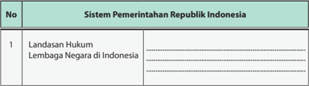

Tabel ini menunjukkan sistem pemerintahan Republik Indonesia, dengan Landasan Hukum sebagai topik utama. Kolom pertama berisi nomor urut, sedangkan kolom kedua berisi judul tabel. Data penting yang terlihat adalah bahwa Landasan Hukum merupakan salah satu elemen penting dalam sistem pemerintahan Indonesia.

 

---
## 📄 Halaman 98

---
**📊 Tabel**

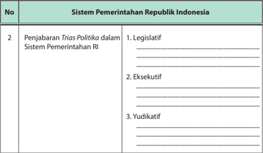

Tabel ini membahas sistem pemerintahan Republik Indonesia dengan fokus pada penjabaran Trias Politika. Topik utama adalah bagaimana tiga pilar sistem pemerintahan ini berfungsi dalam negara tersebut. Kolom pertama menunjukkan nomor urut, sedangkan kolom kedua berisi judul topik utama. Data penting yang terlihat meliputi: 1) Legislatif, 2) Eksekutif, dan 3) Yudikatif, yang masing-masing dijelaskan secara singkat. Tabel ini membantu memahami struktur dan fungsi penting dari sistem pemerintahan Indonesia.

### C. Tata Kelola Pemerintahan yang Baik

Menurut  World  Bank, Good  Governance adalah  suatu  penyelenggaraan manajemen pembangunan yang solid dan bertanggung jawab yang sejalan dengan  prinsip  demokrasi  dengan  pasar  yang  efisien,  penghindaran  salah alokasi  dana  investasi,  dan  pencegahan  korupsi  baik  secara  politik  maupun administratif, menjalankan disiplin anggaran serta penciptaan legal and political framework bagi tumbuhnya aktivitas usaha.

Tata kelola pemerintahan yang baik merupakan suatu konsep yang akhirakhir ini banyak dibahas dalam ilmu politik dan administrasi publik, terutama dalam  hubungannya  dengan  demokrasi,  masyarakat  sipil,  partisipasi  rakyat, hak asasi manusia, dan pembangunan masyarakat secara berkelanjutan.

Dalam tata kelola pemerintahan yang baik, terdapat 3 (tiga) unsur pokok yang bersifat sinergis.

- Unsur  pemerintah  yang  dipercaya  menangani  administrasi  negara  pada suatu periode tertentu.
- Unsur swasta/wirausaha yang bergerak dalam pelayanan publik.
- Unsur warga masyarakat ( stakeholders ).

 

---
## 📄 Halaman 99

Pada  praktiknya,  tata  kelola  pemerintahan  yang  baik  merupakan  bentuk pengelolaan negara dan masyarakat yang bersandar pada kepentingan rakyat. Pemerintah  dan  masyarakat  duduk  bersama  untuk  membicarakan  masalahmasalah yang dihadapi bersama dan sekaligus merencanakan bersama tentang sesuatu yang hendak dilakukan dan dikerjakan di masa mendatang.

Menurut  Laode  Ida  (2002),  tatakelola  pemerintahan  yang  baik  memiliki sejumlah ciri dan karakteristik sebagai berikut.

- Terwujudnya interaksi yang baik antara pemerintah, swasta, dan masyarakat, terutama  bekerja  sama  dalam  pengaturan  kehidupan  sosial  politik  dan sosio-ekonomi.
- Komunikasi, adanya jaringan multisistem (pemerintah, swasta, dan masyarakat)  yang  melakukan  sinergi  untuk  menghasilkan output yang berkualitas.
- Proses  penguatan  diri  sendiri  ( self  enforcing  process ),  ada  upaya  untuk mendirikan pemerintah ( self governing ) dalam mengatasi kekacauan dalam kondisi lingkungan dan dinamika masyarakat yang tinggi.
- Keseimbangan  kekuatan  ( balance  of  force ),  dalam  rangka  mewujudkan pembangunan yang berkelanjutan ( sustainable development ), ketiga elemen  yang  ada  menciptakan  dinamika,  kesatuan  dalam  kompleksitas, harmoni, dan kerja sama.
- Independensi,  yakni  menciptakan  saling  ketergantungan  yang  dinamis antara pemerintah, swasta, dan masyarakat melalui koordinasi dan fasilitasi.
Dalam perkembangan selanjutnya, tata pemerintahan yang baik berkaitan dengan struktur pemerintahan mencakup hal-hal sebagai berikut.

- Hubungan antara pemerintah dan pasar. Misalnya, pemerintah mengendalikan harga-harga sembako agar sesuai dengan harga pasar.
- Hubungan antara pemerintah dan rakyat. Misalnya, pemerintah memberikan pelayanan dan perlindungan bagi rakyat.
- Hubungan  antara  pemerintah  dan  organisasi  kemasyarakatan.  Misalnya, pemerintah memberikan kesempatan kepada organisasi kemasyarakatan untuk berpartisipasi dalam pembangunan.
- Hubungan antara pejabat-pejabat yang dipilih (politisi) dan pejabat-pejabat yang diangkat (pejabat birokrat). Misalnya, mengadakan pertemuan atau rembug antara tokoh masyarakat, pejabat birokat atau politisi.

 

---
## 📄 Halaman 100

- Hubungan antara lembaga pemerintahan daerah dan penduduk perkotaan dan  pedesaan.  Misalnya,  memberikan  izin  bertempat  tinggal  kepada penduduk pedesaan yang bekerja di perkotaan.
- Hubungan  antara  legislatif  dan  eksekutif  dalam  membahas  rancangan undang-undang (RUU).
- Hubungan pemerintah nasional dan lembaga-lembaga internasional dalam menjalin kerja sama di segala bidang untuk kemajuan bangsa.
Untuk mengimplementasikan tata kelola pemerintahan yang baik diperlukan beberapa persyaratan sebagai berikut.

- Mewujudkan  efisiensi dalam  menajemen  pada  sektor  publik,  antara lain  dengan  memperkenalkan  teknik-teknik  manajemen  perusahaan  di lingkungan administrasi pemerintah negara, dan melakukan desentralisasi administrasi pemerintah.
- Terwujudnya akuntabilitas publik, sesuatu yang dilakukan oleh pemerintah harus dapat dipertanggungjawabkan kepada masyarakat.
- Tersedianya perangkat hukum yang memadai berupa peraturan perundangundangan yang mendukung terselenggaranya sistem pemerintahan yang baik.
- Adanya  sistem  informasi  yang  menjamin  akses  masyarakat  terhadap berbagai kebijakan dan atau informasi yang bersumber baik dari pemerintah maupun dari elemen swasta serta LSM.
- Adanya  transparansi  dalam  perbuatan  kebijakan  dan  implementasinya, sehingga  hak-hak  masyarakat  untuk  mengetahui  ( rights  to  information ) keputusan pemerintah terjamin.
Salah satu wujud tata pemerintahan yang baik yaitu adanya citra pemerintahan yang demokratis. Pemerintahan yang demokratis merupakan landasan terciptanya tata pemerintahan yang baik. Pemerintahan yang demokratis menjalankan tata pemerintahan secara terbuka terhadap kritik dan kontrol dari rakyat.

### Tugas Mandiri 3.3

Carilah di internet atau sumber lain bersama kelompok kalian tentang ciri-ciri tata kelola pemerintah yang baik.

 

---
## 📄 Halaman 101

---
**📊 Tabel**

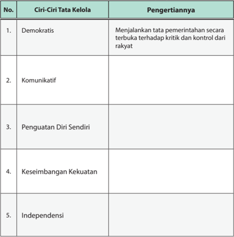

Tabel ini berisi informasi tentang ciri-ciri tata kelola pemerintahan yang demokratis, komunikatif, penguatan diri sendiri, keseimbangan kekuatan, dan independensi. Topik utamanya adalah tentang prinsip-prinsip dalam tata kelola pemerintahan. Kolom pertama berisi nomor urut dari 1 hingga 5 untuk masing-masing ciri. Kolom kedua berisi deskripsi singkat dari ciri tersebut. Kolom ketiga berisi pengertian atau penjelasan lebih lanjut tentang ciri tersebut. Dari tabel ini, dapat dilihat bahwa setiap ciri memiliki pengertian yang spesifik dan penting dalam tata kelola pemerintahan.

### D. Partisipasi Warga Negara dalam Sistem Politik di Indonesia

Peran serta dalam sistem politik lazimnya disebut dengan partisipasi politik. Partisipasi  politik  secara  umum  berarti  keterlibatan  seseorang/sekelompok orang  dalam  suatu  kegiatan  politik.  Definisi  partisipasi  politik  salah  satunya dikemukakan  oleh Verba, yang  mengungkapkan  bahwa  partisipasi  politik adalah kegiatan pribadi warga negara yang legal, yang sedikit banyak langsung bertujuan  untuk  mempengaruhi  seleksi  pejabat-pejabat  negara  dan  atau tindakan-tindakan yang diambil oleh mereka.

 

---
## 📄 Halaman 102

Partisipasi politik adalah kegiatan yang dilakukan oleh warga negara baik secara individu maupun kolektif, atas dasar keinginan sendiri maupun dorongan dari  pihak  lain  yang  tujuannya  untuk  memengaruhi  keputusan  politik  yang akan diambil oleh pemerintah, agar keputusan tersebut menguntungkannya.

Kegiatan politik yang tercakup dalam konsep partisipasi politik mempunyai bermacam-macam bentuk dan intensitas. Hal ini menyebabkan bervariasinya partisipasi politik yang dilakukan oleh warga negara dari mulai tingkatan yang pasif  sampai  pada  tingkatan  yang  aktif.  Bila  dihubungkan  dengan    hak  dan kewajiban warga negara, partisipasi politik meruapakan kewajiban yang harus dilaksanakan sebagai wujud tanggung jawab warga negara yang berkesadaran politik tinggi dan baik.

Partisipasi politik yang baik akan terwujud dalam masyarakat politik yang sudah mapan. Suatu komunitas masyarakat dapat disebut masyarakat politik jika masyarakat tersebut telah memiliki ciri-ciri sebagai berikut.

- Selalu ada kelompok yang memerintah dan diperintah.
- Memiliki    sistem  pemerintahan  tertentu  yang  mengatur  kehidupan masyarakat.
- Memiliki lembaga-lembaga yang menyelenggarakan pemerintahan.
- Memilki tujuan tertentu yang mengikat seluruh masyarakat.
- Memahami informasi dasar tentang siapa yang memegang kekuasaan dan bagaimana sebuah institusi bekerja.
- Dapat menerima perbedaan pendapat.
- Memiliki  kepedulian  dan  kepekaan  terhadap  masalah-masalah  yang dihadapi bangsa.
- Memiliki  rasa  tanggung  jawab  terhadap  perkembangan    dan  keadaan negara dan bangsanya.
- Memiliki  kesadaran  untuk  berpartisipasi  dalam  kegiatan  perumusan penentuan  kebijakan  negara,  mengawasi  dan  mendukung  pelaksanaan kebijakan tersebut dalam berbagai bidang kehidupan.
- Menyadari  akan  pentingnya  pembelaan  terhadap  negara,  kedaulatan, keberadaan dan keutuhan negara memahami, menyadari dan melaksanakan sikap dan perilaku yang seseuai dengan hak dan kewajibannya sebagai warga masyarakat dan warga negara.
- Patuh terhadap hukum dan menegakkan supremasi hukum.
- Membangun budaya politik yang demokratis.

 

---
## 📄 Halaman 103

- Menjunjung tinggi demokrasi, hak asasi manusia, keadilan dan persamaan.
- Mengawasi jalannya pemerintahan agar tertata dengan baik.
- Memiliki  wawasan  kebangsaan,  sikap  dan  perilaku  yang  mencerminkan cinta tanah air.
Berdasarkan  karakteristiknya,  masyarakat  politik  berkedudukan    sebagai masyarakat yang menjalankan aktivitas yang berkaitan dengan kekuasaan negara, baik  sebagai  penyelenggara  kekuasaan  negara  maupun  sebagai  pengawas pelaksanaan  kekuasaan  negara,  dalam  bentuk  institusi  formal  (DPR)  ataupun informal (partai politik, kelompok kepentingan dan kelompok penekan).

---
**🖼️ Gambar/Diagram**

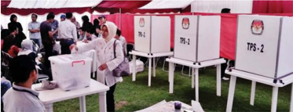

> **Deskripsi Visual:** Gambar ini adalah foto yang menunjukkan sebuah acara pemilu di Indonesia. Dalam foto tersebut, beberapa orang sedang berdiri di depan kotak suara yang diberi nomor "TPS-2". Di sebelah kiri, ada seorang pria yang sedang memegang kotak suara. Di sebelah kanan, ada dua kotak suara yang sama dengan nomor "TPS-2". Di latar belakang, terlihat beberapa tenda dan beberapa orang yang sedang berjalan-jalan. Gambar ini menunjukkan bahwa acara ini adalah pemilu di Indonesia dan para pemilih sedang mengisi formulir pemilu di kotak suara.

Gambar 3.5 Salah satu bentuk kegiatan parisipasi masyarakat dalam kegiatan poliik adalah ikut serta memilih dalan pemilihan umum.

Partisipasi politik dapat terwujud dalam bentuk perilaku anggota masyarakat. Partisipasi  dan  perilaku  politik  harus  berlandaskan  pada  nilai  dan  norma  yang berlaku. Berikut adalah contoh partisipasi dan perilaku politik yang sesuai dengan nilai dan norma yang berlaku.

### a. Di Lingkungan Sekolah

Setiap siswa dapat menampilkan pola perilaku politik yang mencerminkan  pelaksanaan  demokrasi  langsung  melalui  kegiatan-kegiatan  sebagai berikut.

- Pemilihan ketua kelas, ketua OSIS dan ketua organisasi ekstrakurikuler seperti Pramuka, Pecinta Alam, PMR, Paskibra dan sebagainya.
- Pembuatan  anggaran  dasar  dan  anggaran  rumah  tangga  OSIS  atau organisasi ekstrakurikuler yang diikuti.
- Forum-forum diskusi atau musyawarah yang diselenggarakan di sekolah.

 

---
## 📄 Halaman 104

Dalam pelaksanaan demokrasi tidak langsung siswa dapat menyampaikan  aspirasi  dan  pendapatnya  melalui  usulan  dan  saran  yang  ditujukan kepada  pejabat  sekolah  atau  pejabat  pemerintahan.  Cara  lain  yang  bisa ditempuh  adalah  dengan  membuat  artikel  yang  berisikan  aspirasi  siswa yang dimuat di majalah dinding, buletin sekolah, dan sebagainya.

Supaya perilaku politik yang ditampilkan mencerminkan perilaku politik yang  sesuai  aturan,  maka  setiap  siswa  harus  memperhatikan  ketentuanketentuan atau norma-norma sebagai berikut.

- Pancasila.
- Undang-Undang Dasar RI 1945.
- Undang-Undang  RI  Nomor  9  tahun  1998  tentang    Kemerdekaan Menyampaikan Pendapat di Muka Umum.
- Tata tertib siswa, dan sebagainya.

### b. Di Lingkungan Masyarakat

Perilaku  politik  yang  merupakan  cerminan  dari  demokrasi  langsung dapat  ditampilkan  warga  masyarakat  melalui  beberapa  kegiatan  sebagai berikut.

- Forum warga.
- Pemilihan ketua RT, RW, kepala desa, ketua organisasi masyarakat dan sebagainya.
- Pembuatan  peraturan  yang  berupa  anggaran  dasar  dan  anggaran rumah  tangga  bagi  organisasi  masyarakat,  koperasi,  RT-RW,  LMD  dan sebagainya.
Warga masyarakat dapat menampilkan perilaku politiknya yang mencerminkan pelaksanaan demokrasi tidak langsung melalui penyampaian pendapat atau aspirasi baik secara lisan ataupun tertulis melalui lembaga perwakilan  rakyat  atau  melalui  media  massa  seperti  koran,  majalah  dan sebagainya. Agar dalam pelaksanaan perilaku politik tersebut sesuai dengan aturan dan norma-norma sebagai berikut.

- Pancasila dan UUD RI 1945.
- Peraturan perundang-undangan yang terkait, misalnya undang-undang HAM, undang-undang parpai politik dan sebagainya.

 

---
## 📄 Halaman 105

- Peraturan yang berlaku khusus di lingkungan setempat, seperti peraturan RT-RW, Peraturan Desa dan sebagainya.
- Norma-norma sosial yang berlaku.

### c. Di Lingkungan Negara

Dalam kehidupan berbangsa dan bernegara, perilaku politik yang dapat kita tampilkan secara langsung di antaranya adalah sebagai berikut.

- Pemilihan umum untuk memilih anggota legislatif dan presiden.
- Pemilihan kepala daerah secara langsung (Pilkada).
- Aksi demonstrasi  yang tertib, damai dan santun.
Perilaku politik yang tidak langsung dapat diwujudkan melalui penyampaian  aspirasi  pada  lembaga  perwakilan  rakyat,  partai  politik, organisasi masyarakat dan media massa. Supaya perilaku yang ditampilkan mencerminkan  perilaku  politik  yang  sesuai  aturan,  maka  harus  menaati ketentuan-ketentuan dan norma-norma sebagai berikut.

- Pancasila.
- UUD NRI 1945.
- Undang-Undang seperti  Undang-Undang Nomor 8 Tahun 2015 tentang Perubahan Atas UU Nomor 1 Tahun 2015 tentang Penetapan Peraturan Pemerintah  Pengganti  UU  Nomor  1  Tahun  2014  tentang  Pemilihan Gubernur,  Bupati,  dan  Walikota  Menjadi  Undang-Undang,  UndangUndang  RI  Nomor  2  Tahun  2011  tentang  Perubahan  Atas  UndangUndang Nomor 2 Tahun 2008 tentang Partai Politik, Undang-Undang RI Nomor 9 tahun 1998 tentang Kemerdekaan Menyampaikan Pendapat di Muka Umum dan sebagainya.
- Peraturan Pemerintah.
- Keputusan Presiden.
- Peraturan daerah.
Berbagai bentuk  partisipasi dan perilaku politik di atas merupakan peran serta aktif dalam pelaksanaan sistem politik di indonesia. Peran aktif warga negara juga dapat dilakukan dalam berbagai aspek lainnya seperti dalam bidang politik, hukum, ekonomi dan sosial budaya. Partisipasi warga negara dalam berbagai aspek kehidupan berbangsa dan bernegara pada gilirannya dapat memperkuat sistem politik bangsa Indonesia secara keseluruhan.

 

---
## 📄 Halaman 106

### Tugas Kelompok  3.1

Nah, carilah di internet atau sumber lain bersama anggota kelompok kalian tentang  contoh  partisipasi  masyarakat  dalam  sistem  politik  Indonesia  sesuai dengan nilai dan norma yang berlaku.

---
**📊 Tabel**

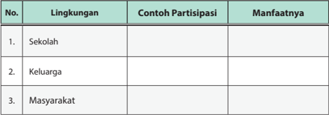

Tabel ini membahas partisipasi dalam berbagai lingkungan, mulai dari sekolah hingga masyarakat. Partisipasi di sekolah melibatkan partisipasi siswa dalam kegiatan belajar dan pembelajaran, seperti mengikuti program kreatif atau mengambil bagian dalam acara sekolah. Partisipasi di keluarga melibatkan partisipasi orang tua dalam kehidupan anak mereka, seperti membantu dalam pekerjaan rumah atau mengajarkan nilai-nilai positif. Partisipasi di masyarakat melibatkan partisipasi warga dalam kegiatan sosial dan ekonomi, seperti ikut dalam kampanye politik atau membantu dalam pengembangan desa. Manfaatnya mencakup peningkatan kualitas pendidikan, pemahaman nilai-nilai positif, dan peran aktif dalam pembangunan masyarakat.

### Refleksi

Setelah  kalian  mempelajari  materi  tentang  kewenangan  lembaga-lembaga negara,  tentu  saja  kalian  semakin  meyakini  betapa  pentingnya  keberadaan lembaga negara dalam sistem poliitik dan kehidupan berbangsa dan bernegara. Coba kalian renungkan, sejauh manakah peran lembaga negara dalam melaksanakan  amanat  UUD  NRI Tahun  1945?  Berikan  ulasan  singkat  terhadap kinerja lembaga-lembaga negara.

………………………………………………………………………………………

………………………………………………………………………………………

………………………………………………………………………………………

………………………………………………………………………………………

………………………………………………………………………………………

 

---
## 📄 Halaman 107

### Rangkuman

### 1. Kata Kunci

Kata  kunci  yang  harus  kalian  pahami  dalam  mempelajari  materi  pada bab  ini  adalah  suprastruktur,  infrastruktur,  lembaga  negara,  sistem  politik, impeachment , dan pemerintah.

### 2. Intisari Materi

Materi Bab 3 ini dapat disimpulkan sebagai berikut.

- Sistem  politik  dapat  diartikan  sebagai  keseluruhan  kegiatan  politik  di dalam  negara  atau  masyarakat  berupa  proses  alokasi  nilai-nilai  dasar kepada masyarakat dan menunjukkan pola hubungan yang fungsional di antara kegiatan-kegiatan politik tersebut.
- Suprastruktur  politik  merupakan  gambaran  pemerintah  dalam  arti  luas yang terdiri atas lembaga-lembaga negara yang tugas dan peranannya diatur dalam konstitusi negara atau peraturan perundang-undangan lainnya.
- Infrastruktur  politik  adalah  kelompok-kelompok  kekuatan  politik  dalam masyarakat  yang  turut  berpartisipasi  secara  aktif.  Kelompok-kelompok tersebut tersebut dapat berperan menjadi pelaku politik tidak formal untuk turut serta dalam membentuk kebijakan negara.
- Tata  kelola  pemerintahan  yang  baik  merupakan  bentuk  pengelolaan negara dan masyarakat yang bersandar pada stakeholders. Pemerintah dan mayarakat  duduk  bersama  untuk  membicarakan  masalah-masalah  yang dihadapi  bersama  dan  sekaligus  merencanakan  bersama  apa  yang  mau dilakukan dan hendak dikerjakan di masa mendatang.

 

---
## 📄 Halaman 108

### Penilaian Diri

Nah, coba sekarang kalian amati diri masing-masing, apakah perilaku kalian telah  mencerminkan  warga  negara  yang  baik  atau  belum?  Mari  berbuat  jujur dengan mengisi daftar perilaku di bawah ini dengan membubuhkan tanda ceklis (√) pada kolom sebagai berikut.

- Sl (selalu), apabila selalu melakukan sesuai pernyataan.
- Sr  (sering),  apabila  sering  melakukan  sesuai  dengan  pernyataan  dan kadang- kadang tidak melakukan.
- Kd  (kadang-kadang),  apabila  kadang-kadang  melakukan  dan  sering tidak melakukan.
- TP (tidak pernah), apabila tidak pernah melakukan.

---
**📊 Tabel**

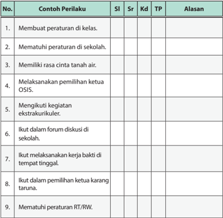

Tabel ini berisi contoh perilaku siswa yang harus diukur dalam aspek sikap dan perilaku (SI) mereka. Kolom-kolomnya meliputi No., Contoh Perilaku, SI, Sr, Kd, TP, dan Alasan. Topik utama tabel ini adalah pengukuran sikap dan perilaku siswa dalam berbagai situasi. Data penting yang terlihat adalah bahwa setiap contoh perilaku memiliki alasan yang disebutkan, yang menunjukkan bahwa tabel ini bertujuan untuk memberikan penilaian atau evaluasi terhadap sikap dan perilaku siswa.

 

---
## 📄 Halaman 109

---
**📊 Tabel**

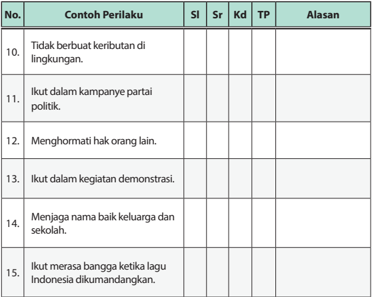

Tabel ini berisi contoh perilaku yang dianggap baik dan tidak baik dalam konteks sosial dan budaya. Topik utamanya adalah tentang perilaku yang positif dan negatif dalam masyarakat. Kolom-kolom yang ada meliputi No., Contoh Perilaku, Alasan, SI (Sesuai), Sr (Sesuai), Kd (Ketidaksesuaian), TP (Tidak Sesuai), dan Alasan. Data penting yang terlihat adalah bahwa beberapa perilaku seperti "tidak berbuat keributan di lingkungan" dan "menghormati hak orang lain" dianggap positif, sementara "ikut dalam kampanye partai politik" dan "ikut dalam kegiatan demonstrasi" dianggap negatif.

### PROYEK BELAJAR KEWARGANEGARAAN

- Buatlah  kelompok  yang  terdiri  atas  4-5  orang  untuk  mengunjungi  kepala dusun/kepala desa/ketua RT/ketua RW di daerah kalian.
- Buatlah  dokumentasi  foto  tentang  tempat  kepala  dusun/kepala  desa/ketua RT/ketua RW melaksanakan tugasnya.
- Lakukanlah wawancara tentang tugas, hak, dan kewajibannya sebagai kepala dusun/kepala desa/ketua RT/ketua RW.
- Buatlah dalam bentuk laporan tertulis disertai foto kepala dusun/kepala desa/ ketua RT/ketua RW.
- Apabila  sudah  selesai  segera  kumpulkan  kepada  guru  dan  informasikan nilai  yang  kalian  peroleh  kepada  orang  tua  masing-masing  sebagai  bentuk pertanggungjawaban kalian.

 

---
## 📄 Halaman 110

### UJI KOMPETENSI  BAB 3

### Jawablah pertanyaan di bawah ini secara singkat, jelas dan akurat.

- Sistem politik dapat diartikan sebagai keseluruhan kegiatan politik di dalam negara  atau  masyarakat,  kegiatan  tersebut  berupa  proses  alokasi  nilai-nilai dasar kepada masyarakat. Jelaskan pengertian sistem politik menurut pendapat para ahli!
- Pada  dasarnya  organisasi-organisasi  yang  tidak  termasuk  dalam  birokrasi pemerintahan  merupakan  kekuatan  infrastruktur  politik.  Jelaskan  apa  yang dimaksud partai politik, kelompok kepentingan, kelompok penekan, dan media komunikasi politik.
- Sesungguhnya, kedudukan presiden dalam sistem pemerintahan presidensial sangat  kuat, namun dalam Pasal 7B [1] UUD Negara Republik Indonesia Tahun 1945 telah dijelaskan tentang proses pemberhentian presiden. Uraikan proses pemberhentian presiden menurut Pasal 7B [1] UUD Negara Republik Indonesia Tahun 1945!
- Pada  praktiknya,  tatakelola  pemerintahan  yang  baik  merupakan  bentuk pengelolaan  negara  dan  masyarakat  yang  bersandar  pada stakeholders. Sebutkan 5 (lima) ciri dan karakteristik tata kelola pemerintahan yang baik!
- Partisipasi politik dapat terwujud dalam bentuk perilaku anggota masyarakat yang  berlandaskan  pada  nilai  dan  norma  yang  berlaku.  Jelaskan  bentuk perilaku dan partisipasi politik yang dapat kita lakukan sebagai warga negara!

 

---
## 📄 Halaman 111

---
**🖼️ Gambar/Diagram**

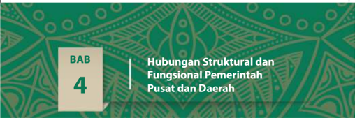

> **Deskripsi Visual:** Gambar ini adalah bagian dari buku pelajaran yang berisi informasi tentang hubungan struktural dan fungsional antara pemerintahan pusat dan daerah. Gambar ini terdiri dari elemen-elemen berikut:

1. **Apa yang Ditampilkan Secara Keseluruhan**: Gambar ini menunjukkan judul bab keempat buku pelajaran, yang berisi topik tentang hubungan struktural dan fungsional antara pemerintahan pusat dan daerah.

2. **Elemen-Elemen Utama dan Relasinya**: 
   - **Judul Bab**: "Hubungan Struktural dan Fungsional Pemerintah Pusat dan Daerah" terletak di bagian atas gambar.
   - **Angka 4**: Menunjukkan bahwa ini adalah bagian keempat dari bab dalam buku pelajaran.
   - **Latar Belakang**: Latar belakang berwarna hijau dengan desain batik tradisional, menunjukkan tema budaya dan kearifan lokal.

3. **Teks, Angka, atau Label Penting yang Terlihat**:
   - Judul Bab: "Hubungan Struktural dan Fungsional Pemerintah Pusat dan Daerah"
   - Angka 4: Menunjukkan bahwa ini adalah bagian keempat dari bab.

4. **Informasi Kunci yang Dapat Diambil Pembaca**: Gambar ini memberikan gambaran umum tentang isi bab keempat buku pelajaran, yaitu topik hubungan struktural dan fungsional antara pemerintahan pusat dan daerah. Ini menunjukkan bahwa bab tersebut akan membahas bagaimana struktur dan fungsi pemerintahan pusat dan daerah saling terkait dan berinteraksi satu sama lain dalam konteks pemerintahan Indonesia.

Puji syukur kita panjatkan kepada Tuhan Yang Maha Esa, karena atas rahmatNya kita  baru  saja  selesai  mendiskusikan  materi  pada  Bab  3  tentang  Kewenangan Lembaga-Lembaga Negara menurut UUD NRI Tahun 1945. Selamat kepada kalian yang sudah menyelesaikan materi Bab 3  dengan hasil yang memuaskan.

Pada  Bab  4  ini  kalian  akan  mendalami  harmonisasi  pemerintah  pusat  dan Daerah,  dengan  cara  memaknai  desentralisasi/otonomi  daerah  dalam  konteks Negara Kesatuan Republik Indonesia, kedudukan dan peran pemerintah pusat, kedudukan dan peran pemerintah daerah dan memaknai hubungan struktural dan fungsional pemerintah pusat dan daerah.

Sebelum kalian mendiskusikan lebih mendalam tentang materi di Bab 4 ini, silakan kalian simak dan cermati artikel berikut.

### PERMASALAHAN SUMBER DAYA DAN KEMAMPUAN DAERAH DALAM PENERAPAN OTONOMI DAERAH

Gelombang demokrasi yang disertai dengan perubahan sistem perpolitikan nasional  pada  era  reformasi  hingga  saat  ini  semakin  memperlihatkan  relatif menguatnya  gejala  keinginan  rakyat  daerah  untuk  mandiri  dari  keterikatan pemerintah daerah terhadap pemerintah pusat.

Fenomena ketidakadilan dalam dimensi sosial politik,  ekonomi,  pendidikan, hukum dan budaya seakan menjadi pemicu utama bagi beberapa daerah yang ingin mandiri dari pemerintah pusat.

Selain itu realitas pemerataan pembangunan baik pada tingkat pusat sampai tingkat daerah juga turut memancing aksi-aksi protes dari masyarakat. Daerah yang memiliki kekayaan alam yang luas tetapi pada kenyataannya jauh dari sentuhan pembangunan  berkeadilan,  bahkan  ironisnya  banyak  daerah  yang  kaya  akan sumberdaya  alam,  tetapi  tingkat  pendidikan  dan  kesejahteraan  penduduknya relatif masih kurang.

Implementasi  otonomi  daerah  kerap  menimbulkan  berbagai  permasalahan yang di antaranya disebabkan karena perbedaan kesiapan masing-masing daerah dalam mengimplementasikan otonomi daerah tersebut.

 

---
## 📄 Halaman 112

Perbedaan  jangkauan  daerah  yang  satu  dengan  yang  lain, dari pusat pemerintahan, terutama ibukota negara menjadikan ketimpangan kemampuan para personel di pemerintahan daerah bila dibandingkan dengan kemampuan dan sumberdaya manusia serta kualitas aparatur pemerintah yang jaraknya lebih dekat dengan pusat pemerintahan.

Selain itu tidak semua daerah di Indonesia merupakan daerah yang memiliki keunggulan  sumberdaya  alam  maupun  sumberdaya  manusia  yang  menjadi faktor  pendukung  utama  keberhasilan  otonomi  daerah.  Pemerintah  daerah yang  didukung  sumberdaya  alam  dan  sumberdaya  manusia  akan  lebih  siap dibandingkan  daerah  yang  sebaliknya. Bagaimana  dengan  daerah  dimana kalian tinggal?

Disarikan dari Buku: Hukum Pemda, Otonomi Daerah dan Implikasinya , Penulis  Dr. H. M. Busrizalti

Setelah  kalian  menyimak  dan  mencermati  artikel  tersebut,  silakan  kalian diskusikan dengan  teman  sebangku  atau  sekelompok.  Kemudian  tuliskan komentar dan pertanyaan-pertanyaan yang mengacu kepada artikel tersebut.

Pastikan komentar dan pertanyaan yang kalian tulis ke dalam kolom di bawah ini  berbeda dengan komentar dan pertanyaan yang diajukan kelompok lain.

---
**📊 Tabel**

Tabel ini berisi pertanyaan yang mungkin diberikan dalam sebuah ujian atau tes. Topik utamanya adalah "Pertanyaan", yang terdiri dari tiga baris dengan kolom-kolom kosong untuk menuliskan pertanyaan. Pola penting yang terlihat adalah bahwa setiap baris memiliki satu pertanyaan, dan semua pertanyaan tersebut harus diisi oleh peserta tes. Ini menunjukkan bahwa tabel ini dirancang untuk memungkinkan pengumpulan jawaban dari beberapa pertanyaan dalam satu kesempatan.

 

---
## 📄 Halaman 113

---
**📊 Tabel**

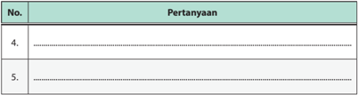

Tabel ini berisi dua kolom: "No." dan "Pertanyaan". Kolom "No." mungkin digunakan untuk menunjukkan urutan pertanyaan, sementara kolom "Pertanyaan" berisi pertanyaan yang harus dijawab. Topik utama tabel ini mungkin berkaitan dengan pengumpulan informasi atau penelitian, karena setiap baris menunjukkan satu pertanyaan yang perlu dijawab. Data atau pola penting yang terlihat adalah bahwa setiap baris memiliki nomor yang unik (No.) dan pertanyaan yang spesifik. Ini menunjukkan bahwa tabel ini dirancang untuk membantu individu menjawab pertanyaan tertentu secara efektif.

Untuk menjawab pertanyaan-pertanyaan yang kalian buat di atas, sekaligus dalam rangka mendalami Harmonisasi Pemerintah Pusat dan Pemerintah Daerah, silakan kalian dalami uraian materi berikut ini.

### A. Desentralisasi atau Otonomi Daerah dalam Konteks Negara Kesatuan Republik Indonesia

### 1. Desentralisasi

Secara  etimologis,  istilah  desentralisasi  berasal  dari  Bahasa  Belanda, yaitu de yang berarti lepas, dan centerum yang berarti pusat. Desentralisasi adalah sesuatu hal yang terlepas dari pusat.

Terdapat  dua  kelompok  besar  yang  memberikan  definisi  tentang desentralisasi,  yakni  kelompok Anglo  Saxon dan Kontinental. Kelompok Anglo Saxon mendefinisikan desentralisasi sebagai penyerahan wewenang dari  pemerintah  pusat,  baik  kepada  para  pejabat  pusat  yang  ada  di daerah yang disebut dengan dekonsentrasi maupun kepada badan-badan otonom daerah yang disebut devolusi. Devolusi berarti sebagian kekuasaan diserahkan  kepada  badan-badan  politik  di  daerah  yang  diikuti  dengan penyerahan  kekuasaan  sepenuhnya  untuk  mengambil  keputusan  baik secara politis maupun secara administratif.

Adapun  Kelompok Kontinental membedakan  desentralisasi  menjadi dua bagian yaitu desentralisasi jabatan atau dekonsentrasi dan desentralisasi ketatanegaraan.  Dekonsentrasi  adalah  penyerahan  kekuasaan  dari  atas ke bawah dalam rangka kepegawaian guna kelancaran pekerjaan semata. Adapun  desentralisasi  ketatanegaraan  merupakan  pemberian  kekuasaan untuk mengatur daerah di dalam lingkungannya guna mewujudkan asas demokrasi dalam pemerintahan negara.

 

---
## 📄 Halaman 114

Sumber: www.dprd-ntbprov.go.id

Menurut ahli ilmu tata negara, dekonsentrasi merupakan pelimpahan kewenangan dari alat perlengkapan negara di pusat kepada instansi bawahannya guna melaksanakan pekerjaan tertentu dalam penyelenggaraan pemerintahan. Pemerintah pusat tidak kehilangan kewenangannya karena instansi bawahan melaksanakan tugas atas nama pemerintah pusat.

Dekonsentrasi  adalah  pelimpahan  wewenang  dari  pemerintah  pusat kepada  daerah  otonom  sebagai  wakil  pemerintah  atau  perangkat  pusat di daerah dalam kerangka negara kesatuan. Lembaga yang melimpahkan kewenangan  dapat  memberikan  perintah  kepada  pejabat  yang  telah dilimpahi  kewenangannya  itu  mengenai  pengambilan  atau  pembuatan keputusan.

Menurut  Amran  Muslimin  (2009:120,  desentralisasi  dibedakan  atas  3 (tiga) bagian.

- Desentralisasi  politik,  yakni  pelimpahan  kewenangan  dari  pemerintah pusat yang meliputi hak mengatur dan mengurus kepentingan rumah tangga  sendiri  bagi  badan-badan  politik  di  daerah  yang  dipilih  oleh rakyat dalam daerah-daerah tertentu.

 

---
## 📄 Halaman 115

- Desentralisasi fungsional, yaitu  pemberian  hak  kepada  golongangolongan tertentu untuk mengurus segolongan kepentingan tertentu dalam masyarakat baik terikat maupun tidak pada suatu daerah tertentu, seperti mengurus irigasi bagi petani.
- Desentralisasi  kebudayaan,  yakni  pemberian  hak  kepada  golongangolongan minoritas dalam masyarakat untuk menyelenggarakan kebudayaan sendiri, seperti ritual kebudayaan.
Dengan demikian, dapat disimpulkan bahwa desentralisasi pada dasarnya adalah suatu proses penyerahan sebagian wewenang dan tanggung jawab dari urusan yang semula adalah urusan pemerintah pusat kepada badanbadan atau lembaga-lembaga pemerintah daerah. Tujuannya adalah agar urusan-urusan dapat beralih kepada daerah dan menjadi wewenang serta tanggung jawab pemerintah daerah.

Desentralisasi mengandung segi positif dalam penyelenggaraan pemerintahan  baik dari sudut politik, ekonomi, sosial, budaya, dan pertahanan  keamanan.  Dilihat  dari  fungsi  pemerintahan,  desentralisasi menunjukkan beberapa hal sebagai berikut.

- Satuan-satuan desentralisasi lebih fleksibel dalam memenuhi berbagai perubahan yang terjadi secara cepat.
- Satuan-satuan desentralisasi dapat melaksanakan tugas lebih efektif dan lebih efisien.
- Satuan-satuan desentralisasi lebih inovatif.
- Satuan-satuan desentralisasi mendorong tumbuhnya sikap moral yang lebih tinggi, serta komitmen yang lebih tinggi dan lebih produktif.

### Info Kewarganegaraan

Pada hakikatnya pemegang kekuasaan negara adalah rakyat Indonesia. Indonesia menganut sistem perwakilan, kekuasaan yang dimiliki oleh rakyat dilegasikan kepada pemerintah. Namun demikian, rakyat dapat mewujudkan dukungannya melalui antara lain sebagai berikut.

- Berpartisipasi dalam setiap proses pengambilan kebijakan dengan cara menyampaikan aspirasi kita kepada pemerintah.
- Mengkritisi dan mengawasi setiap kebijakan pemerintah
- Melaksanakan kewajiban sebagai rakyat Indonesia, seperti kewajiban membayar pajak, kewajiban mendahulukan kepentingan negara dibandingkan kepentingan pribadi/kelompok.

 

---
## 📄 Halaman 116

Praktiknya, desentralisasi sebagai suatu sistem penyelenggaraan pemerintah daerah memiliki beberapa kelebihan dan kelemahan. Kelebihan desentralisasi, di antaranya adalah sebagai berikut.

- Struktur organisasi yang didesentralisasikan merupakan pendelegasian wewenang untuk memperingan manajemen pemerintah pusat.
- Mengurangi bertumpuknya pekerjaan di pusat pemerintahan.
- Dalam menghadapi permasalahan yang amat mendesak, pemerintah daerah tidak perlu menunggu instruksi dari pusat.
- Hubungan yang harmonis dapat ditingkatkan dan dapat lebih dioptimalkan gairah kerja antara pemerintah pusat dan daerah.
- Peningkatan efisiensi dalam segala hal, khususnya penyelenggara pemerintahan, baik pemerintah pusat maupun pemerintah daerah.
- Dapat mengurangi birokrasi dalam arti buruk karena keputusan dapat segera dilaksanakan.
- Bagi organisasi yang besar dapat memperoleh manfaat dari keadaan di tempat masing-masing.
- Sebelum rencana dapat diterapkan secara keseluruhan, maka pada awalnya dapat diterapkan dalam satu bagian tertentu terlebih dahulu sehingga rencana dapat diubah.
- Risiko yang mencakup kerugian dalam bidang kepegawaian, fasilitas, dan organisasi dapat terbagi-bagi.
Sumber: www.nanaulana.blogspot.co.id

Gambar 4.2 Gedung sekolah merupakan fasiltas umum yang disediakan oleh pemerintah daerah dalam menjalankan desentralisasi dengan maksimal.

- Dapat diadakan pembedaan dan pengkhususan yang berguna bagi kepentingan-kepentingan tertentu.

 

---
## 📄 Halaman 117

- Desentralisasi secara psikologis dapat memberikan kepuasan bagi daerah karena sifatnya yang langsung.
Adapun kelemahan desentralisasi, di antaranya adalah sebagai berikut.

- Besarnya badan-badan struktural pemerintahan yang membuat struktur pemerintahan bertambah kompleks yang berimplikasi pada lemahnya koordinasi.
- Keseimbangan dan kesesuaian antara bermacam-macam kepentingan daerah dapat lebih mudah terganggu.
- Desentralisasi teritorial mendorong timbulnya paham kedaerahan.
- Keputusan yang diambil memerlukan waktu yang lama karena memerlukan perundingan yang bertele-tele.
- Desentralisasi memerlukan biaya yang besar dan sulit untuk memperoleh keseragaman dan kesederhanaan.
Coba berikan pendapat atau komentar tentang pelaksanaan desentralisasi di Indonesia setelah kalian membaca kelemahan dan kelebihan dari sistem desentralisasi.

…………………………………………………………………………………

…………………………………………………………………………………

…………………………………………………………………………………

### 2. Otonomi Daerah

Banyak  definisi  yang  dapat  menggambarkan  tentang  makna  otonomi daerah.  Berikut  adalah  beberapa  definisi  tentang  otonomi  daerah  yang dikemukakan para ahli. Menurut H.M. Agus Santoso, pengertian otonomi daerah di antaranya adalah sebagai berikut.

- C. J. Franseen, otonomi daerah adalah hak untuk mengatur urusanurusan daerah dan menyesuaikan peraturan-peraturan  yang sudah dibuat dengannya.
- J. Wajong, otonomi daerah sebagai kebebasan untuk memelihara dan memajukan kepentingan khusus daerah dengan keuangan sendiri, menentukan hukum sendiri dan pemerintahan sendiri.

 

---
## 📄 Halaman 118

- Ateng Syarifuddin, otonomi daerah sebagai kebebasan atau kemandirian tetapi bukan kemerdekaan. Namun kebebasan itu terbatas karena merupakan perwujudan dari pemberian kesempatan yang harus dipertanggungjawabkan.
- Menurut Undang-Undang Republik Indonesia Nomor 9 Tahun 2015 tentang Perubahan Kedua atas Undang-Undang Nomor 23 Tahun 2014 tentang Pemerintahan Daerah, otonomi daerah adalah hak, wewenang, dan kewajiban daerah otonom untuk mengatur dan mengurus sendiri urusan pemerintahan dan kepentingan masyarakat sesuai dengan peraturan perundang-undangan.
Otonomi  daerah  adalah  kewajiban  yang  diberikan  kepada  daerah otonom  untuk  mengatur  dan  mengurus  sendiri  urusan  pemerintahan dan  kepentingan  masyarakat  setempat  menurut  aspirasi masyarakat. Tujuan otonomi daerah adalah untuk meningkatkan daya guna dan hasil guna  penyelenggaraan  pemerintahan  dalam  rangka  pelayanan  terhadap masyarakat  dan  pelaksanaan  pembangunan  sesuai  dengan  peraturan perundang-undangan. Adapun yang dimaksud dengan kewajiban adalah kesatuan masyarakat hukum yang mempunyai batas-batas wilayah yang  berwenang  mengatur  dan  mengurus  urusan  pemerintahan  dan kepentingan masyarakat setempat menurut prakarsa sendiri berdasarkan aspirasi masyarakat.

Dengan demikian, dapat disimpulkan otonomi daerah adalah keleluasaan dalam  bentuk  hak  dan  wewenang  serta  kewajiban  dan  tanggung  jawab badan pemerintah daerah untuk mengatur dan mengurus rumah tangganya sesuai  keadaan  dan  kemampuan  daerahnya  sebagai  manifestasi  dari desentralisasi.

### 3. Otonomi Daerah dalam Konteks Negara Kesatuan

Negara  Republik  Indonesia  sebagai  negara  kesatuan  menganut  asas desentralisasi dalam penyelenggaraan pemerintahan, dengan memberikan kesempatan  dan  keleluasaan  kepada  daerah  untuk  menyelenggarakan otonomi daerah.

Pelaksanaan otonomi  daerah di Indonesia diselenggarakan  dalam rangka  memperbaiki  kesejahteraan  rakyat.  Pengembangan  suatu  daerah dapat disesuaikan oleh pemerintah daerah dengan memperhatikan potensi

 

---
## 📄 Halaman 119

dan kekhasan daerah masing-masing. Hal ini merupakan kesempatan yang sangat baik bagi pemerintah daerah untuk membuktikan kemampuannya dalam melaksanakan kewenangan yang menjadi hak daerah.

Pelaksanaan  otonomi  daerah  selain  berlandaskan  pada  acuan  hukum, juga sebagai implementasi tuntutan globalisasi yang diberdayakan dengan cara memberikan daerah kewenangan yang lebih luas, lebih nyata, dan  bertanggung  jawab  terutama  dalam  mengatur,  memanfaatkan  dan menggali sumber-sumber potensi yang ada di daerahnya masing-masing. Maju atau tidaknya suatu daerah sangat ditentukan oleh kemampuan dan kemauan  untuk  melaksanakan  pemerintahan  daerah.  Pemerintah  daerah bebas berkreasi dan berekspresi dalam rangka membangun daerahnya.

### Tugas Mandiri 4.1

Untuk lebih memahami penguasaan tentang makna otonomi daerah, jawab pertanyaan-pertanyaan yang terdapat dalam Tabel 4.2.

---
**📊 Tabel**

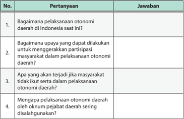

Tabel ini berisi pertanyaan dan jawaban tentang otonomi daerah di Indonesia. Topik utamanya adalah upaya untuk meningkatkan partisipasi masyarakat dalam pelaksanaan otonomi daerah. Pertanyaan pertama bertujuan untuk memahami bagaimana pelaksanaan otonomi daerah saat ini. Pertanyaan kedua mencakup upaya-upaya yang dapat dilakukan untuk meningkatkan partisipasi masyarakat dalam pelaksanaan otonomi daerah. Pertanyaan ketiga mengeksplorasi konsekuensi jika masyarakat tidak ikut serta dalam pelaksanaan otonomi daerah. Sementara itu, pertanyaan keempat bertujuan untuk memahami alasan mengapa otonomi daerah sering digunakan oleh otoritas pemerintah daerah. Pola penting yang terlihat adalah bahwa tabel ini mencakup berbagai aspek dari otonomi daerah, mulai dari pemahaman dasar hingga upaya-upaya yang dapat dilakukan untuk meningkatkan partisipasi masyarakat.

 

---
## 📄 Halaman 120

### 4. Landasan Hukum Penerapan Otonomi Daerah di Indonesia

Beberapa  peraturan  perundang-undangan  yang  pernah  dan  masih berlaku  dalam  pelaksanaan  otonomi  daerah  di  Indonesia  adalah  sebagai berikut.

- Undang-Undang Nomor 1 Tahun 1945 tentang Komite Nasional Daerah (KND).
- Undang-Undang Nomor 22 Tahun 1948 tentang Pokok-Pokok Pemerintahan Daerah.
- Undang-Undang Negara Indonesia Timur Nomor 44 Tahun 1950 tentang Pemerintahan Daerah Indonesia Timur.
- Undang-Undang Nomor 18 Tahun 1965 tentang Pokok-Pokok Pemerintahan Daerah.
- Undang-Undang Nomor 5 Tahun 1974 tentang Pokok-Pokok Pemerintahan Daerah.
- Undang-Undang Nomor 22 Tahun 1999 tentang Pemerintahan Daerah.
- Undang-Undang Nomor 25 Tahun 1999 tentang Perimbangan Keuangan Antara Pemerintah Pusat dan Daerah.
- Undang-Undang Nomor 32 Tahun 2004 tentang Pemerintahan Daerah.
- Undang-Undang Nomor 33 Tahun 2004 tentang Perimbangan Keuangan Antara Pemerintah Pusat dan Pemerintahan Daerah.
- Perpu Nomor 3 Tahun 2005 tentang Perubahan atas Undang-Undang Nomor 32 Tahun 2004 tentang Pemerintahan Daerah.
- Undang-Undang Nomor 12 Tahun 2008 tentang Perubahan Kedua atas Undang-Undang Nomor 32 Tahun 2004 tentang Pemerintahan Daerah.
- Undang-Undang Nomor 2 Tahun 2015 tentang Penetapan Peraturan Pemerintah Pengganti Undang-Undang Nomor 2 Tahun 2014 tentang Perubahan atas Undang-Undang Nomor 23 Tahun 2014 tentang Pemerintahan Daerah.

 

---
## 📄 Halaman 121

- Undang-Undang Republik Indonesia Nomor 9 Tahun 2015 tentang Perubahan Kedua atas Undang-Undang Nomor 23 Tahun 2014 tentang Pemerintahan Daerah.

### INFO KEWARGANEGARAAN

- Undang-Undang Nomor 11 Tahun 2006 tentang Pemerintahan Aceh Pengganti Undang-Undang Nomor 18 Tahun 2001 tentang Otonomi Khusus Nanggroe Aceh Darussalam.
- UU Republik Indonesia Nomor 21 Tahun 2001 tentang Otonomi Khusus bagi Provinsi Papua.
- UU Republik Indonesia Nomor 29 Tahun 2007, tentang Pemerintahan Provinsi Daerah Khusus Ibukota Jakarta sebagai ibu kota Negara Kesatuan Republik Indonesia.
- UU Republik Indonesia Nomor 13 Tahun 2012 tentang Keistimewaan Daerah Istimewa Yogyakarta.

### 5. Nilai, Dimensi, dan Prinsip Otonomi Daerah di Indonesia

Otonomi Daerah pada dasarnya adalah hak, wewenang, dan kewajiban daerah otonom untuk mengatur dan mengurus sendiri urusan pemerintahan dan kepentingan masyarakat setempat sesuai dengan peraturan perundangundangan.

Terdapat  dua  nilai  dasar  yang  dikembangkan  dalam  Undang-Undang Dasar Negara RI Tahun 1945 berkenaan dengan pelaksanaan desentralisasi dan otonomi daerah di Indonesia..

- Nilai  Unitaris,  yang  diwujudkan  dalam  pandangan  bahwa  Indonesia tidak mempunyai kesatuan pemerintahan lain di dalamnya yang bersifat negara (eenheidstaat), yang berarti kedaulatan yang melekat pada rakyat, bangsa,  dan  negara  Republik  Indonesia  tidak  akan  terbagi  di  antara kesatuan-kesatuan pemerintahan.
- Nilai  Dasar  Desentralisasi  Teritorial,  yang  bersumber  dari  isi  dan  jiwa Pasal 18 Undang-Undang Dasar Negara Republik Indonesia Tahun 1945. Berdasarkan nilai ini pemerintah diwajibkan untuk melaksanakan politik desentralisasi dan dekonsentrasi di bidang ketatanegaraan.

 

---
## 📄 Halaman 122

Berkaitan  dengan  dua  nilai  dasar  tersebut  di  atas,  penyelenggaraan desentralisasi  di  Indonesia  berpusat  pada  pembentukan  daerah-daerah otonom dan penyerahan/pelimpahan sebagian kekuasaan dan kewenangan pemerintah  pusat  ke  pemerintah  daerah  untuk  mengatur  dan  mengurus sebagian kekuasaan dan kewenangan tersebut. Dengan demikian, titik berat pelaksanaan otonomi daerah adalah pada daerah kabupaten/kota dengan beberapa dasar pertimbangan sebagai berikut.

- Dimensi Politik, kabupaten/kota dipandang kurang mempunyai fanatisme kedaerahan sehingga risiko gerakan separatisme dan peluang berkembangnya aspirasi federalis relatif minim.
- Dimensi  Administratif, penyelenggaraan  pemerintahan  dan  pelayanan kepada masyarakat relatif dapat lebih efektif.
- Kabupaten/kota adalah daerah 'ujung tombak' pelaksanaan pembangunan sehingga kabupaten/kota-lah yang lebih tahu kebutuhan dan potensi rakyat di daerahnya.
Dalam pelaksanaan otonomi daerah, prinsip  otonomi  daerah  yang  dianut adalah nyata, bertanggung jawab dan dinamis.

- Nyata,  otonomi  secara  nyata  diperlukan  sesuai  dengan  situasi  dan kondisi objektif di daerah.
- Bertanggung jawab, pemberian otonomi diselaraskan/diupayakan untuk memperlancar pembangunan di seluruh pelosok tanah air.
- Dinamis,  pelaksanaan  otonomi  selalu  menjadi  sarana  dan  dorongan untuk lebih baik dan maju.
Selain itu, terdapat lima prinsip dalam penyelenggaraan pemerintahan daerah. Berikut uraiannya.

### 1. Prinsip Kesatuan

Pelaksanaan  otonomi  daerah  harus  menunjang  aspirasi  perjuangan rakyat guna memperkokoh negara kesatuan dan mempertinggi tingkat kesejahteraan masyarakat lokal.

 

---
## 📄 Halaman 123

### 2. Prinsip Riil dan Tanggung Jawab

Pemberian otonomi kepada daerah harus merupakan otonomi yang nyata dan bertanggung jawab bagi kepentingan seluruh warga daerah. Pemerintah daerah berperan mengatur proses dinamika pemerintahan dan pembangunan di daerah.

### 3. Prinsip Penyebaran

Asas  desentralisasi  perlu  dilaksanakan  dengan  asas  dekonsentrasi. Caranya  dengan  memberikan  kemungkinan  kepada  masyarakat  untuk kreatif dalam membangun daerahnya.

### 4. Prinsip Keserasian

Pemberian otonomi kepada daerah mengutamakan aspek keserasian dan tujuan di samping aspek pendemokrasian.

### 5. Prinsip Pemberdayaan

Tujuan pemberian otonomi kepada daerah adalah untuk meningkatkan daya guna dan hasil guna penyelenggaraan pemerintah di daerah, terutama dalam aspek pembangunann dan pelayanan kepada masyarakat serta untuk meningkatkan pembinaan kestabilan politik dan kesatuan bangsa.

### Tugas Mandiri 4.2

Diskusikan tentang makna desentralisasi dan penerapan otonomi daerah di Indonesia.  Tuliskan  pengertian,  landasan  hukum,  kelebihan,  dan  kekurangan desentralisasi.

### Info Kewarganegaraan

Untuk memperkaya pengetahuan kalian tentang kompetensi ini, kalian dapat membuka web/Internet/media sosial atau sumber lainnya berkaitan dengan Model Pemerintahan Daerah di Prancis dan Amerika Serikat.

 

---
## 📄 Halaman 124

---
**📊 Tabel**

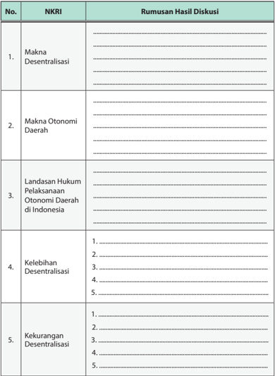

Tabel ini berisi informasi tentang desentralisasi dan otonomi daerah di Indonesia, dengan kolom "NKRI" untuk menunjukkan topik dan "Rumusan Hasil Diskusi" untuk menyajikan hasil diskusi. Topik utama adalah makna desentralisasi, makna otonomi daerah, landasan hukum pelaksanaan otonomi daerah di Indonesia, kelebihan desentralisasi, dan kekurangan desentralisasi. Data penting yang terlihat meliputi penjelasan tentang makna desentralisasi dan otonomi daerah, landasan hukum yang relevan, serta poin-poin positif dan negatif dari desentralisasi.

 

---
## 📄 Halaman 125

### B.  Kedudukan dan Peran Pemerintah Pusat

Penyelenggara  pemerintahan  pusat  dalam  sistem  ketatanegaraan  di Indonesia adalah presiden dibantu oleh wakil presiden, dan menteri negara. Berkaitan  dengan  pelaksanaan  otonomi  daerah,  kebijakan  yang  diambil dalam menyelenggarakan pemerintahan digunakan asas desentralisasi, tugas pembantuan, dan dekonsentrasi sesuai dengan peraturan perundangundangan.

Pemerintah  pusat  dalam  pelaksanaan  otonomi  daerah,  memiliki  3  (tiga) fungsi.

### a. Fungsi Layanan (Servicing Function)

Fungsi pelayanan dilakukan dalam rangka  memenuhi  kebutuhan masyarakat dengan cara tidak diskriminatif dan tidak memberatkan serta dengan  kualitas  yang  sama.  Dalam  pelaksanaan  fungsi  ini  pemerintah tidak  pilih  kasih,  melainkan  semua  orang  memiliki  hak  sama,  yaitu  hak untuk  dilayaani,  dihormati,  diakui,  diberi  kesempatan  (kepercayaan),  dan sebagainya.

### b. Fungsi Pengaturan (Regulating Function)

Fungsi  ini  memberikan  penekanan  bahwa  pengaturan  tidak  hanya kepada rakyat tetapi kepada pemerintah sendiri. Artinya, dalam membuat kebijakan lebih dinamis yang mengatur  kehidupan masyarakat dan sekaligus  meminimalkan intervensi  negara  dalam  kehidupan  masyarakat. Jadi,  fungsi  pemerintah  adalah  mengatur dan memberikan perlindungan kepada  masyarakat  dalam  menjalankan  hidupnya  sebagai  warga  negara. Sementara itu ada enam fungsi pengaturan yang dimiliki pemerintah.

### 1)  Menyediakan infrastruktur ekonomi

Pemerintah  menyediakan  institusi  dasar  dan  peraturan-peraturan yang diperlukan bagi berlangsungnya sistem ekonomi modern, seperti perlindungan terhadap hak milik, hak ciipta, hak paten, dan sebagainya.

### 2)  Menyediakan barang dan jasa kolektif

Fungsi  ini  dijalankan  pemerintah  karena  masih  terdapat  beberapa public goods yang  tersedia  bagi  umum,  ternyata  masih  sulit  dijangkau oleh beberapa individu untuk memperolehnya.

 

---
## 📄 Halaman 126

### 3)  Menjembatani konflik dalam masyarakat

Fungsi ini dijalankan untuk meminimalkan konflik sehingga menjamin ketertiban dan stabilitas di masyarakat.

### 4)  Menjaga kompetisi

Peran pemerintah diperlukan untuk menjamin agar kegiatan ekonomi dapat  berlangsung  dengan  kompetisi  yang  sehat. Tanpa  pengawasan pemerintah akan berakibat kompetisi dalam perdagangan tidak terkontrol dan dapat merusak kompetisi tersebut.

- Menjamin akses minimal setiap individu kepada barang dan jasa
- Kehadiran pemerintah diharapkan dapat memberikan bantuan
kepada masyarakat miskin melalui program-program khusus.

### 6)  Menjaga stabilitas ekonomi

Melalui fungsi ini pemerintah dapat mengeluarkan kebijakan moneter apabila terjadi sesuatu yang mengganggu stabilitas ekonomi.

### c. Fungsi Pemberdayaan

Fungsi ini dijalankan pemerintah dalam rangka pemberdayaan masyarakat. Masyarakat tahu, menyadari diri, dan mampu memilih alternatif yang baik untuk mengatasi atau menyelesaikan persoalan yang dihadapinya. Pemerintah dalam fungsi ini hanya sebagai fasilitator dan motivator untuk membantu masyarakat menemukan jalan keluar dalam menghadapi setiap persoalan hidup.

Pemerintahan  daerah  menyelenggarakan  urusan  pemerintahan  yang menjadi  kewenangannya,  kecuali  urusan  pemerintahan  yang  oleh  undangundang ditentukan menjadi urusan pemerintah pusat. Urusan pemerintahan yang menjadi urusan pemerintah pusat meliputi politik luar negeri, pertahanan, keamanan, yustisi, moneter dan fiskal nasional, agama, serta norma.

Selain kewenangan tersebut di atas, pemerintah pusat memiliki kewenangan lain sebagai berikut.

- Perencanaan  nasional  dan  pengendalian  pembangunan  nasional  secara makro.
- Dana perimbangan keuangan.
- Sistem administrasi negara dan lembaga perekonomian negara.

 

---
## 📄 Halaman 127

- Pembinaan dan pemberdayaan sumber daya manusia.
- Pendayagunaan  sumber  daya  alam  dan  pemberdayaan  sumber  daya strategis.
- Konservasi dan standarisasi nasional.
Ada beberapa tujuan diberikannya kewenangan kepada pemerintah pusat dalam pelaksanaan otonomi daerah, meliputi tujuan umum sebagai berikut.

- Meningkatkan kesejahteraan rakyat.
- Memperhatikan pemerataan dan keadilan.
- Menciptakan demokratisasi.
- Menghormati serta menghargai berbagai kearifan atau nilai-nilai lokal dan nasional.
- Memperhatikan potensi dan keanekaragaman bangsa, baik tingkat lokal maupun nasoinal.
Adapun tujuan khusus yang ingin dicapai dalam memberikan kewenangan kepada pemerintah pusat adalah sebagai berikut.

- Mempertahankan  dan  memelihara  identitas  dan  integritas  bangsa  dan negara.
- Menjamin kualitas pelayanan umum setara bagi semua warga negara.
- Menjamin  efisiensi  pelayanan  umum  karena  jenis  pelayanan  umum tersebut berskala nasional.
- Menjamin  pengadaan  teknologi  keras  dan  lunak  yang  langka,  canggih, mahal  dan  berisiko  tinggi  serta  sumber  daya  manusia  yang  berkualitas tinggi  yang  sangat  diperlukan  oleh  bangsa  dan  negara,  seperti  tenaga nuklir, teknologi satelit, penerbangan antariksa, dan sebagainya.
- Membuka ruang kebebasan bagi masyarakat, baik pada tingkat nasional maupun lokal.
- Menciptakan  kreativitas  dan  inisiatif  sesuai  dengan  kemampuan  dan kondisi daerahnya.
- Memberi  peluang  kepada  masyarakat  untuk  membangun  dialog  secara terbuka  dan  transparan  dalam  mengurus  dan  mengatur  rumah  tangga sendiri.

 

---
## 📄 Halaman 128

### Tugas Mandiri 4.3

Untuk lebih memahami penguasaan tentang makna, kedudukan, dan peran pemerintah pusat, coba diskusikan dengan teman satu kelompok tentang hal-hal sebagai berikut.

---
**📊 Tabel**

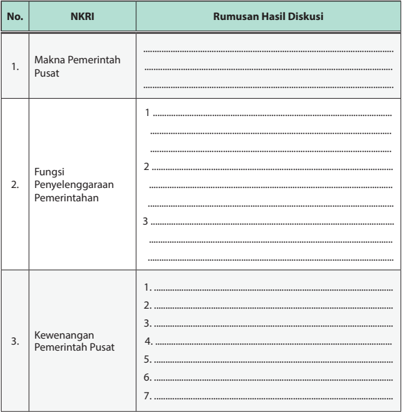

Tabel ini berisi informasi tentang makna NKRI (Negara Kesatuan Republik Indonesia) dan fungsi pemerintahan pusat. Kolom "NKRI" mencakup tiga topik utama: Makna Pemerintah Pusat, Fungsi Penyelenggaraan Pemerintahan, dan Kewenangan Pemerintah Pusat. Kolom "Rumusan Hasil Diskusi" menyajikan hasil diskusi tentang setiap topik tersebut. Data penting yang terlihat meliputi: 1. Makna Pemerintah Pusat, 2. Fungsi Penyelenggaraan Pemerintahan dengan 3 sub-fungsi, dan 3. Kewenangan Pemerintah Pusat dengan 7 sub-kewenangan. Tabel ini membantu memahami struktur dan fungsi pemerintahan di Indonesia.

 

---
## 📄 Halaman 129

### C. Kedudukan dan Peran Pemerintah Daerah

### 1. Kewenangan Pemerintah Daerah

Indonesia adalah sebuah negara yang wilayahnya terbagi atas daerahdaerah provinsi. Daerah provinsi tersebut terdiri atas daerah kabupaten dan kota. Setiap daerah provinsi, daerah kabupaten, dan daerah kota mempunyai pemerintahan daerah yang diatur dengan undang-undang.

Pemerintahan daerah adalah penyelenggara urusan pemerintahan oleh pemerintah daerah dan DPRD menurut asas otonomi dan tugas pembantuan dengan prinsip  otonomi  seluas-luasnya  dalam  sistem  dan  prinsip  Negara Kesatuan  Republik  Indonesia  sebagaimana  dimaksud  dalam  UndangUndang Dasar Negara Republik Indonesia Tahun 1945. Pemerintahan daerah provinsi,  kabupaten,  dan  kota  memiliki  Dewan  Perwakilan  Rakyat  Daerah yang  anggota-anggotanya  dipilih melalui pemilihan umum.

Setiap daerah dipimpin oleh kepala pemerintah daerah yang disebut  kepala  daerah.  Kepala daerah  untuk  provinsi  disebut gubernur, untuk kabupaten disebut bupati dan untuk kota adalah walikota. Kepala daerah dibantu  oleh  satu  orang  wakil kepala  daerah,  untuk  provinsi disebut  wakil  gubernur,  untuk

### Info Kewarganegaraan

Seorang pejabat pusat atau daerah dilarang merangkap jabatan sebagai:

- pejabat negara lainnya sesuai dengan peraturan perundangundangan;
- komisaris atau direksi pada perusahaan negara atau perusahaan swasta; atau
- pimpinan organisasi yang dibiayai dari Anggaran Pendapatan Belanja Negara dan/atau Anggaran Pendapatan Belanja Daerah.
kabupaten disebut wakil bupati dan untuk kota disebut wakil walikota yang dipilih secara demokratis. Kepala dan wakil kepala daerah memiliki tugas, wewenang dan kewajiban serta larangan. Kepala daerah juga mempunyai kewajiban  untuk  memberikan  laporan  penyelenggaraan  pemerintahan daerah kepada pemerintah, dan memberikan laporan keterangan pertanggungjawaban kepada DPRD, serta menginformasikan laporan penyelenggaraan pemerintahan daerah kepada masyarakat.

Gubernur karena jabatannya berkedudukan juga sebagai wakil pemerintah pusat di wilayah provinsi yang bersangkutan. Artinya, gubernur menjembatani  dan  memperpendek  rentang  kendali  pelaksanaan  tugas dan  fungsi  pemerintah  termasuk  dalam  pembinaan  dan  pengawasan

 

---
## 📄 Halaman 130

terhadap penyelenggaraan urusan pemerintahan pada strata pemerintahan kabupaten dan kota.Dalam kedudukannya sebagai wakil pemerintah pusat sebagaimana dimaksud, gubernur bertanggung jawab kepada presiden.

Penyelenggaraan  pemerintahan  daerah  menggunakan  asas  otonomi dan  tugas  pembantuan.  Tugas  pembantuan (medebewind) adalah  keikutsertaan  pemerintah  daerah  untuk  melaksanakan  urusan  pemerintah yang kewenangannya lebih luas dan lebih tinggi di daerah tersebut. Tugas pembantuan (medebewind) dapat diartikan sebagai ikut serta  dalam menjalankan  tugas  pemerintahan.  Dengan  demikian,  tugas  pembantuan merupakan kewajiban-kewajiban untuk melaksanakan peraturan-peraturan yang ruang lingkup wewenangnya bercirikan tiga hal berikut.

- Materi yang dilaksanakan tidak termasuk rumah tangga daerah-daerah otonom.
- Dalam menyelenggarakan tugas pembantuan, daerah otonom memiliki kelonggaran untuk menyesuaikan segala sesuatu dengan kekhususan daerahnya sepanjang peraturan memungkinkan.
- Dapat diserahkan tugas pembantuan hanya pada daerah-daerah otonom saja.
Daerah  mempunyai  hak  dan  kewajiban  dalam  menyelenggarakan otonomi. Hak dan kewajiban tersebut diwujudkan dalam bentuk rencana kerja  pemerintahan  daerah  yang  dijabarkan  dalam  bentuk  pendapatan, belanja, dan pembiayaan daerah yang dikelola dalam sistem pengelolaan keuangan  daerah.  Pengelolaan  keuangan  daerah  dimaksud  dilakukan secara efisien, efektif, transparan, akuntabel, tertib, adil, patut, dan taat pada peraturan perundang-undangan.

Dalam hal pembagian urusan pemerintahan, Undang-Undang Republik Indonesia  Nomor  9 Tahun  2015  tentang  Perubahan  Kedua  atas  UndangUndang Nomor 23 Tahun 2014 tentang Pemerintahan Daerah menyatakan bahwa  pemerintahan  daerah  menyelenggarakan  urusan  pemerintahan yang  menjadi  kewenangannya,  kecuali  urusan  pemerintahan  yang  oleh undang-undang ditentukan menjadi urusan pemerintah pusat.

Beberapa urusan yang menjadi kewenangan pemerintah daerah untuk kabupaten/kota meliputi beberapa hal berikut.

- Perencanaan dan pengendalian pembangunan.
- Perencanaan, pemanfaatan, dan pengawasan tata ruang.

 

---
## 📄 Halaman 131

- Penyelenggaraan ketertiban umum dan ketentraman masyarakat.
- Penyediaan sarana dan prasarana umum.
- Penanganan bidang kesehatan.
- Penyelenggaraan pendidikan.
- Penanggulangan masalah sosial.
- Pelayanan bidang ketenagakerjaan.
- Fasilitas  pengembangan koperasi, usaha kecil, dan menengah.
- Pengendalian lingkungan hidup.
- Pelayanan pertanahan.

---
**🖼️ Gambar/Diagram**

> **Deskripsi Visual:** Gambar ini adalah ilustrasi yang menunjukkan tiga orang petani sedang berjalan di ladang padi. Petani tersebut mengenakan pakaian tradisional dan topi, menunjukkan bahwa mereka bekerja di ladang padi. Di sekitar mereka, padi yang berwarna hijau tampak subur dan rimbun. Di latar belakang, gunung-gunung dengan puncak tertutup awan memberikan nuansa alam yang indah. Gambar ini menunjukkan hubungan antara manusia dan alam, serta kegiatan pertanian tradisional.

Elemen-elemen utama dalam gambar ini adalah tiga orang petani, padi yang berwarna hijau, dan gunung-gunung di latar belakang. Hubungan antara elemen-elemen ini adalah bahwa petani bekerja di ladang padi yang subur, yang merupakan hasil dari kehidupan alam di sekitarnya. 

Teks, angka, atau label penting yang terlihat dalam gambar ini tidak ada, karena gambar hanya menggambarkan situasi tanpa teks atau angka tambahan.

Informasi kunci yang dapat diambil pembaca adalah tentang kehidupan petani tradisional di ladang padi, hubungan antara manusia dan alam, serta keindahan alam di sekitar ladang padi.

Sumber: www.nooreva.deviantart.com

Menurut Peraturan Pemerintah Nomor 2 Tahun 2015 tentang kewenangan  provinsi  sebagai  daerah  otonom  adalah  meliputi  bidangbidang  pertanian,  kelautan,  pertambangan  dan  energi,  kehutanan  dan perkebunan,  perindustrian  dan  perdagangan,  perkoperasian,  penanaman modal,  kepariwisataan,  ketenagakerjaan,  kesehatan,  pendidikan  nasional, sosial,  penataan  ruang,  pertanahan,  pemukiman,  pekerjaan  umum  dan perhubungan,  lingkungan  hidup,  politik  dalam  negeri  dan  administrasi publik,  pengembangan otonomi daerah, perimbangan keuangan daerah, kependudukan, olah raga, hukum dan perundang-undangan, serta penerangan.

Dalam  hal  menjalankan  otonomi,  pemerintah  daerah  berkewajiban untuk mewujudkan keamanan dan kesejahteraan masyarakat daerah, yang meliputi kegiatan-kegiatan berikut.

 

---
## 📄 Halaman 132

- Melindungi masyarakat, menjaga persatuan dan kesatuan, kerukunan nasional, serta keutuhan Negara Kesatuan Republik Indonesia
- Meningkatkan kualitas kehidupan masyarakat.
- Mengembangkan kehidupan demokrasi.
- Mewujudkan keadilan dan pemerataan.
- Meningkatkan pelayanan dasar pendidikan.
- f ) Menyediakan fasilitas pelayanan kesehatan.
- Menyediakan fasilitas sosial dan fasilitas umum yang layak.
- Mengembangkan sistem jaminan sosial.
- Menyusun perencanaan dan tata ruang daerah.
- Mengembangkan sumber daya produktif di daerah.
- Melestarikan lingkungan hidup.
- Mengelola administrasi kependudukan.
- Melestarikan nilai sosial budaya.
- Membentuk dan menerapkan peraturan perundang-undangan sesuai dengan kewenangannya.
Kewenangan  pemerintah  daerah  dalam  pelaksanaan  otonomi  daerah dilaksanakan  secara  luas,  utuh,  dan  bulat  yang  meliputi  perencanaan, pelaksanaan, pengawasan, pengendalian, dan evaluasi pada semua aspek pemerintahan.  Indikator  untuk  menentukan  serta  menunjukkan  bahwa pelaksanaan kewenangan tersebut berjalan dengan baik, dapat diukur dari 3 tiga indikasi berikut.

- Terjaminnya keseimbangan pembangunan di wilayah Indonesia, baik berskala lokal maupun nasional.
- Terjangkaunya pelayanan pemerintah bagi seluruh penduduk Indonesia secara adil dan merata.
- Tersedianya pelayanan pemerintah yang lebih efektif dan efisien.
Sebaliknya, tolok ukur yang dipakai untuk merealisasikan ketiga indikator di atas, aparat pemeritah pusat dan daerah diharapkan memiliki sikap-sikap sebagai berikut.

- Kapabilitas (kemampuan aparatur),
- Integritas (mentalitas),
- Akseptabilitas (penerimaan), dan
- Akuntabilitas ( kepercayaan dan tanggung jawab).

 

---
## 📄 Halaman 133

### Tugas Kelompok 4.1

Untuk lebih memahami penguasaan tentang makna, kedudukan, dan peran pemerintah  daerah,  diskusikan  dengan  teman  satu  kelompok  tentang  hal-hal sebagai berikut.

---
**📊 Tabel**

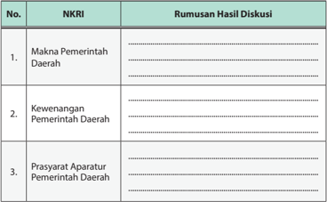

Tabel ini berisi informasi tentang makna, kewenangan, dan prasyarat aparatur pemerintahan daerah di Indonesia. Topik utama tabel adalah tentang struktur dan fungsi pemerintahan daerah. Kolom pertama menunjukkan nomor urut dari setiap topik, sedangkan kolom kedua berisi deskripsi singkat dari setiap topik tersebut. Data penting yang terlihat adalah bahwa tabel ini mencakup tiga aspek utama: makna pemerintahan daerah, kewenangan pemerintahan daerah, dan prasyarat aparatur pemerintahan daerah. Ini menunjukkan bahwa tabel ini bertujuan untuk memberikan pemahaman umum tentang bagaimana pemerintahan daerah bekerja dan apa yang diperlukan untuk menjalankannya dengan efektif.

### 2. Daerah Khusus, Daerah Istimewa, dan Otonomi Khusus

Undang-Undang Dasar Negara Republik Indonesia Tahun 1945 Pasal 18 B Ayat (1) menyatakan negara mengakui dan menghormati satuan-satuan pemerintahan daerah yang bersifat khusus atau bersifat istimewa yang diatur dengan undang-undang. Undang-undang yang dimaksud adalah UndangUndang Republik Indonesia Nomor 9 Tahun 2015 tentang Perubahan Kedua atas Undang-Undang Nomor 23 Tahun 2014 tentang Pemerintahan Daerah. Adapun yang dimaksud dengan satuan-satuan pemerintahan daerah yang bersifat  khusus  adalah  daerah  yang  diberi  otonomi  khusus,  yaitu  Daerah Khusus Ibukota Jakarta dan Provinsi Papua. Adapun daerah istimewa adalah Daerah Istimewa Aceh dan Daerah Istimewa Yogyakarta (DIY).

 

---
## 📄 Halaman 134

### a. Daerah Khusus Ibu Kota Jakarta

Provinsi  DKI  Jakarta  sebagai  satuan  pemerintahan  yang  bersifat khusus dalam kedudukannya sebagai ibu kota Negara Kesatuan Republik Indonesia dan sebagai daerah otonom memiliki fungsi dan peran yang penting  dalam  mendukung  penyelenggaraan  pemerintahan  Negara Kesatuan Republik Indonesia. Berdasarkan Undang-Undang Dasar Negara Republik Indonesia Tahun 1945, DKI Jakarta diberikan kekhususan terkait  dengan  tugas,  hak,  kewajiban,  dan  tanggung  jawab  dalam penyelenggaraan pemerintahan daerah.

Menurut Undang-Undang Republik Indonesia Nomor 29 Tahun 2007, beberapa  hal  yang  menjadi  pengkhususan  bagi  Provinsi  DKI  Jakarta adalah sebagai berikut.

- Provinsi DKI Jakarta berkedudukan sebagai ibu kota Negara Kesatuan Republik Indonesia.
- Provinsi  DKI  Jakarta  adalah  daerah  khusus  yang  berfungsi  sebagai ibu kota Negara Kesatuan Republik Indonesia dan sekaligus sebagai daerah otonom pada tingkat provinsi.
- Provinsi  DKI  Jakarta  berperan  sebagai  ibu  kota  Negara  Kesatuan Republik Indonesia yang memiliki kekhususan tugas, hak, kewajiban, dan tanggung jawab tertentu dalam penyelenggaraan pemerintahan dan sebagai tempat kedudukan perwakilan negara asing, serta pusat/ perwakilan lembaga internasional.
- Wilayah  Provinsi  DKI  Jakarta  dibagi  dalam  kota  administrasi  dan kabupaten administrasi.
- Anggota DPRD Provinsi DKI Jakarta  berjumlah  paling  banyak  125% (seratus dua puluh lima persen) dari jumlah maksimal untuk kategori jumlah penduduk DKI Jakarta sebagaimana ditentukan dalam undangundang.
ibu kota negara dan daerah khusus.

 

---
## 📄 Halaman 135

- Gubernur dapat menghadiri sidang kabinet yang menyangkut kepentingan ibu kota Negara Kesatuan Republik Indonesia. Gubernur mempunyai hak protokoler, termasuk mendampingi Presiden dalam acara kenegaraan.
- Dana  dalam  rangka  pelaksanaan  kekhususan  Provinsi  DKI  Jakarta sebagai ibu kota negara ditetapkan bersama antara Pemerintah dan DPR dalam APBN berdasarkan usulan Pemerintah Provinsi DKI Jakarta.

### b. Daerah Istimewa Yogyakarta

Daerah  Istimewa  Yogyakarta  (DIY),  adalah  daerah  provinsi  yang mempunyai keistimewaan dalam penyelenggaraan urusan pemerintahan dalam  kerangka  Negara  Kesatuan  Republik  Indonesia.  Keistimewaan kedudukan hukum yang dimiliki oleh DIY berdasarkan pada sejarah dan hak asal-usul.  Kewenangan Istimewa DIY adalah wewenang tambahan tertentu  yang  dimiliki  DIY  selain  wewenang  sebagaimana  ditentukan dalam undang-undang tentang pemerintahan daerah. Pengakuan keistimewaan  Provinsi  DIY  juga  didasarkan  pada  peranannya  dalam sejarah perjuangan nasional.

Menurut Undang-Undang Republik Indonesia Nomor 13 tahun 2012, keistimewaan DIY meliputi (a) tata cara pengisian jabatan, kedudukan, tugas,  dan  wewenang  gubernur  dan  wakil  gubernur,  (b)  kelembagaan Pemerintah DIY, (c) kebudayaan, (d) pertanahan, dan (e) tata ruang.

Di antara keistimewaan DIY salah satunya adalah dalam bidang tata cara pengisian jabatan, kedudukan, tugas, dan wewenang gubernur dan wakil  gubernur.  Syarat  khusus  bagi  calon  gubernur  DIY  adalah  Sultan Hamengku Buwono yang bertahta dan wakil gubernur adalah Adipati Paku Alam yang bertahta.

Gambar 4.5 Kraton Yogyakarta masih menjadi pusat kegiatan budaya Indonesia yang banyak dikunjungi oleh wisatawan domesik dan asing.

 

---
## 📄 Halaman 136

### c. Provinsi Aceh

Aceh merupakan kesatuan masyarakat hukum yang bersifat istimewa dan diberi kewenangan khusus untuk mengatur dan mengurus sendiri urusan  pemerintahan  dan  kepentingan  masyarakat  setempat  sesuai dengan  peraturan  perundang-undangan  dalam  sistem  dan  prinsip Negara  Kesatuan  Republik  Indonesia.  Aceh  menerima  status  istimewa pada  tahun  1959.  Status  istimewa  diberikan  kepada  Aceh  dengan Keputusan  Perdana  Menteri  Republik  Indonesia  Nomor  1/Missi/1959 yang berisi keistimewaan meliputi agama, peradatan, dan pendidikan.

Kemudian nama Aceh berubah lagi menjadi Nanggroe Aceh Darussalam (2001-2009). Nama ini diberikan ketika Aceh sedang didera konflik  berkepanjangan antara pemerintah Republik Indonesia dengan Gerakan  Aceh  Merdeka  pada  masa  pemerintah  presiden  Megawati Soekarno  putri.  Nama  Aceh  kemudian  berubah  lagi  menjadi 'Provinsi Aceh' sejak dikeluarkannya Peraturan Gubernur Aceh No. 46 Tahun 2009 Tentang Penyebutan Nama Aceh dan Gelar Pejabat Pemerintahan Dalam Tata Naskah Dinas di Lingkungan Pemerintah Aceh sampai sekarang.

Selain itu, kewenangan khusus pemerintahan kabupaten/kota meliputi penyelenggaraan kehidupan beragama  dalam  bentuk  pelaksanaan syari'at Islam bagi pemeluknya di Aceh dengan tetap menjaga kerukunan hidup  antarumat  beragama,  penyelenggaraan  kehidupan  adat  yang

 

---
## 📄 Halaman 137

bersendikan agama Islam,    penyelenggaraan pendidikan yang berkualitas serta menambah materi muatan lokal sesuai dengan syari'at Islam, dan peran  ulama  dalam  penetapan  kebijakan  kabupaten/kota.  Tambahan kewenangan kabupaten/kota dalam hal menyelenggarakan pendidikan madrasah ibtidaiyah dan madrasah tsanawiyah dengan tetap mengikuti standar  nasional  pendidikan.  Selain  itu,  pengelolaan  pelabuhan  dan bandar  udara  umum.  Pemerintah  Aceh  melakukan  koordinasi  dengan pemerintah kabupaten/kota.

### d. Otonomi Khusus Papua

Otonomi  Khusus  bagi  Provinsi  Papua  adalah  kewenangan  khusus yang  diakui  dan  diberikan  kepada  Provinsi  Papua,  termasuk  provinsiprovinsi  hasil  pemekaran  dari  Provinsi  Papua,  untuk  mengatur  dan mengurus kepentingan masyarakat setempat menurut prakarsa sendiri berdasarkan aspirasi dan hak-hak dasar masyarakat Papua.

Hal-hal mendasar yang menjadi isi Undang-Undang Republik Indonesia Nomor 21 Tahun 2001 tentang Otonomi Khusus bagi Provinsi Papua adalah sebagai berikut.

- Pengaturan kewenangan antara Pemerintah dan Pemerintah Provinsi Papua serta penerapan kewenangan tersebut di Provinsi Papua yang dilakukan dengan kekhususan.
- Pengakuan dan penghormatan hak-hak dasar orang asli Papua serta pemberdayaannya secara strategis dan mendasar.

 

---
## 📄 Halaman 138

- Mewujudkan penyelenggaraan pemerintahan yang baik yang berciriciri sebagai berikut.
- Partisipasi rakyat sebesar-besarnya dalam perencanaan, pelaksanaan, dan pengawasan dalam penyelenggaraan pemerintahan serta pelaksanaan pembangunan melalui keikutsertaan para wakil adat, agama, dan kaum perempuan.
- Pelaksanaan  pembangunan  yang  diarahkan  sebesar-besarnya untuk  memenuhi  kebutuhan  dasar  penduduk  asli  Papua  pada khususnya dan penduduk Provinsi Papua pada umumnya dengan berpegang  teguh  pada  prinsip-prinsip  pelestarian  lingkungan, pembangunan berkelanjutan, berkeadilan dan bermanfaat langsung bagi masyarakat.
- Penyelenggaraan pemerintahan dan pelaksanaan pembangunan yang transparan dan bertanggung jawab kepada masyarakat.
- Pembagian wewenang, tugas, dan tanggung jawab yang tegas dan jelas  antara  badan  legislatif,  eksekutif,  dan  yudikatif,  serta  Majelis Rakyat Papua sebagai representasi kultural penduduk asli Papua yang diberikan kewenangan tertentu.

### 3. Perangkat Daerah sebagai Pelaksana Otonomi Daerah

Dasar  utama  penyusunan  perangkat  daerah  dalam  bentuk  organisasi adalah  adanya  urusan  pemerintahan  yang  perlu  ditangani.  Namun  tidak berarti bahwa setiap penanganan urusan pemerintahan harus dibentuk ke dalam organisasi tersendiri. Besaran organisasi perangkat daerah sekurangkurangnya mempertimbangkan faktor kemampuan keuangan; kebutuhan daerah; cakupan tugas yang meliputi sasaran tugas yang harus diwujudkan, jenis dan banyaknya tugas; luas wilayah kerja dan kondisi geografis; jumlah dan kepadatan penduduk; potensi daerah yang bertalian dengan urusan yang akan ditangani; sarana dan prasarana penunjang tugas. Oleh karena itu,  kebutuhan  akan  organisasi  perangkat  daerah  bagi  masing-masing daerah tidak senantiasa sama atau seragam.

Susunan  organisasi  perangkat  daerah  ditetapkan  dalam  Peraturan Daerah  dengan  memperhatikan  faktor-faktor  tertentu  dan  berpedoman pada  Peraturan  Pemerintah.  Sekretariat  daerah  dipimpin  oleh  sekretaris daerah.  Sekretaris  daerah  mempunyai  tugas  dan  kewajiban  membantu

 

---
## 📄 Halaman 139

kepala  daerah  dalam  menyusun kebijakan dan mengkoordinasikan dinas daerah dan lembaga teknis daerah.

Sekretariat  DPRD  dipimpin  oleh  sekretaris  DPRD.  Sekretaris  DPRD mempunyai tugas berikut.

- Menyelenggarakan administrasi kesekretariatan DPRD.
- Menyelenggarakan administrasi keuangan DPRD.
- Mendukung pelaksanaan tugas dan fungsi DPRD.
- Menyediakan  dan  mengkoordinasi  tenaga  ahli  yang  diperlukan  oleh DPRD  dalam  melaksanakan  fungsinya  sesuai  dengan  kemampuan keuangan daerah.
Dinas Daerah merupakan unsur pelaksana otonomi daerah. Kepala dinas daerah bertanggung jawab kepada kepala daerah melalui sekretaris daerah. Lembaga Teknis Daerah merupakan unsur pendukung tugas kepala daerah dalam penyusunan dan pelaksanaan kebijakan daerah yang bersifat spesifik berbentuk badan, kantor, atau rumah sakit umum daerah. Kepala badan, kantor, atau rumah sakit umum daerah tersebut bertanggung jawab kepada kepala daerah melalui sekretaris daerah.

---
**🖼️ Gambar/Diagram**

> **Deskripsi Visual:** Gambar ini menunjukkan bangunan utama yang tampak seperti sebuah gedung kampus atau institusi akademis. Bangunan tersebut memiliki arsitektur yang khas dengan atap berbentuk segitiga dan tiang-tiang yang menjulang. Di atas atap terdapat sebuah bendera yang menunjukkan bahwa bangunan ini mungkin merupakan tempat kerja atau pusat pendidikan nasional. Sebuah taman hijau dengan pohon-pohon besar tampak di sekitar bangunan, menambahkan nuansa alam yang tenang dan nyaman. 

Elemen-elemen utama yang terlihat adalah bangunan utama, taman hijau, dan pohon-pohon besar. Relasi antara elemen-elemen ini adalah bangunan utama yang menjadi pusat perhatian, taman hijau yang membentuk lingkungan sekitarnya, dan pohon-pohon besar yang memberikan pencahayaan alami dan rasa tenang.

Teks, angka, atau label penting yang terlihat tidak ada pada gambar ini. Informasi kunci yang dapat diambil pembaca adalah bahwa gambar ini mungkin menunjukkan sebuah institusi akademis atau pusat kerja nasional yang memiliki arsitektur khas dan lingkungan yang tenang.

Gambar 4.8 Gedung Sate merupakan gedung peninggalan zaman Belanda yang masih tetap kokoh berdiri dan sekarang dijadikan pusat pemerintahan Provinsi Jawa Barat.

 

---
## 📄 Halaman 140

Kecamatan  dibentuk  di  wilayah  kabupaten/kota  dengan  Peraturan Daerah yang berpedoman pada Peraturan Pemerintah. Kecamatan dipimpin oleh  seorang    camat  yang  dalam  pelaksanaan  tugasnya  memperoleh pelimpahan sebagian wewenang bupati atau wali kota untuk menangani sebagian urusan otonomi daerah.

Kelurahan  dibentuk  di  wilayah  kecamatan  dengan  Peraturan  Daerah berpedoman pada  Peraturan  Pemerintah.  Kelurahan  dipimpin  oleh  lurah yang dalam pelaksanaan tugasnya memperoleh pelimpahan dari bupati/ walikota.

### 4. Dewan Perwakilan Rakyat Daerah (DPRD)

DPRD merupakan lembaga perwakilan rakyat daerah dan berkedudukan sebagai  unsur  penyelenggaraan  pemerintahan  daerah.  DPRD  memiliki fungsi legislasi, anggaran, dan pengawasan. Adapun hak yang dimiliki DPRD adalah  hak  interpelasi,  angket,  dan  menyatakan  pendapat.  Dalam  menjalankan tugasnya DPRD memiliki alat kelengkapan terdiri atas pimpinan, komisi, panitia musyawarah, panitia anggaran, badan kehormatan, dan alat kelengkapan lain yang diperlukan.

Ketentuan tentang DPRD sepanjang tidak diatur dalam undang-undang mengenai pemerintahan daerah berlaku ketentuan undang-undang yang mengatur susunan dan kedudukan MPR, DPR, DPD, dan DPRD.

Hubungan antara pemerintah daerah dan DPRD merupakan hubungan kerja yang kedudukannya setara dan bersifat kemitraan. Kedudukan yang setara  bermakna  bahwa  di  antara  lembaga  pemerintahan  daerah  itu memiliki kedudukan yang sama dan sejajar, artinya tidak saling membawahi. Hal  ini  tercermin  dalam  pembuatan  kebijakan  daerah  berupa  Peraturan Daerah. Hubungan kemitraan bermakna bahwa antara Pemerintah Daerah dan  DPRD  adalah  mitra  sekerja  dalam  membuat  kebijakan  daerah  untuk melaksanakan  otonomi  daerah  sesuai dengan  fungsi  masing-masing sehingga antarkedua lembaga itu membangun suatu hubungan kerja yang sifatnya  saling  mendukung.  Bukan  merupakan  lawan  ataupun  pesaing dalam melaksanakan fungsi masing-masing.

 

---
## 📄 Halaman 141

### 5. Proses Pemilihan Kepala Daerah

Kepala daerah dan wakil kepala daerah dipilih dalam satu pasangan calon yang dilaksanakan secara  demokratis  berdasarkan  asas  langsung,  umum, bebas, rahasia, jujur, dan adil. Calon kepala daerah dan wakil kepala daerah adalah warga negara Republik Indonesia yang memenuhi syarat tertentu.

Pasangan calon kepala daerah dan wakil kepala daerah yang memperoleh suara  lebih  dar i  50  %  (lima  puluh  persen)  jumlah  suara  sah  ditetapkan sebagai pasangan calon terpilih. Apabila ketentuan tersebut tidak terpenuhi, pasangan calon kepala daerah dan wakil kepala daerah yang memperoleh suara lebih dari 25% (dua puluh lima persen) dari jumlah suara sah, pasangan calon yang perolehan suaranya terbesar dinyatakan sebagai pasangan calon terpilih.

---
**🖼️ Gambar/Diagram**

> **Deskripsi Visual:** Gambar ini adalah foto yang menunjukkan sebuah acara pemberian sertifikat atau penghargaan. Dalam foto tersebut, beberapa orang sedang berdiri di depan meja yang dilengkapi dengan papan nama dan beberapa dokumen. Seorang pria tua sedang memberikan sertifikat kepada seorang pria muda yang berdiri di depan meja. Di sebelah kiri, ada dua orang lainnya yang tampaknya sedang menyaksikan atau mendengarkan. Latar belakang foto menunjukkan area luas dengan tenda dan beberapa orang lain yang tampaknya juga terlibat dalam acara tersebut.

Gambar 4.9 Pemilihan kepala daerah (Pilkada) merupakan sarana masyarakat untuk belajar pendidikan poliik dengan cara menyampaikan pilihannya tanpa pengaruh orang lain atau golongan.

Apabila  tidak  ada  yang  mencapai  25  %  (dua  puluh  lima  persen)  dari jumlah  suara  sah,  dilakukan  pemilihan  putaran  kedua  yang  diikuti  oleh pemenang pertama dan pemenang kedua. Pasangan calon kepala daerah dan wakil kepala daerah yang memperoleh suara terbanyak pada putaran kedua dinyatakan sebagai pasangan calon terpilih.

Gubernur dan wakil gubernur dilantik oleh Menteri Dalam Negeri atas nama presiden dalam sebuah sidang DPRD provinsi. Bupati dan wakil bupati atau wali kota dan wakil wali kota dilantik oleh gubernur atas nama presiden dalam sebuah sidang DPRD kabupaten atau kota.

 

---
## 📄 Halaman 142

### 6.  Peraturan Daerah (Perda)

Peraturan  daerah  (Perda)  ditetapkan  oleh  daerah  setelah  mendapat persetujuan DPRD. Perda dibentuk dalam rangka penyelenggaraan otonomi  daerah  provinsi/kabupaten/kota  dan  tugas  pembantuan.  Perda merupakan penjabaran lebih lanjut dari peraturan perundang-undangan yang lebih tinggi dengan memperhatikan ciri khas masing-masing daerah. Perda tidak boleh bertentangan dengan kepentingan umum dan peraturan perundang-undangan yang lebih tinggi.

Peraturan  daerah  dibentuk  berdasarkan  asas  pembentukan  peraturan perundang-undangan.  Masyarakat  berhak  memberikan  masukan  secara lisan  atau  tertulis  dalam  rangka  penyiapan  atau  pembahasan  rancangan Perda. Persiapan pembentukan, pembahasan, dan pengesahan rancangan Perda berpedoman kepada peraturan perundang-undangan.

Peraturan daerah berlaku setelah diundangkan dalam lembaran daerah. Perda disampaikan kepada pemerintah pusat paling lama 7 (tujuh) hari setelah ditetapkan. Perda yang bertentangan dengan kepentingan umum dan peraturan perundangundangan yang lebih tinggi dapat dibatalkan oleh pemerintah pusat. Untuk melaksanakan peraturan daerah, kepala daerah menetapkan peraturan kepala daerah dan atau keputusan

### Info Kewarganegaraan

Pembentukan daerah dapat berupa penggabungan beberapa daerah atau bagian daerah yang bersandingan atau pemekaran dari satu daerah menjadi dua daerah atau lebih. Penghapusan dan penggabungan daerah beserta akibatnya ditetapkan dengan undang-undang.  Untuk menyelenggarakan fungsi pemerintahan tertentu yang bersifat khusus bagi kepentingan nasional, Pemerintah dapat menetapkan kawasan khusus dalam wilayah provinsi dan/atau kabupaten/kota.

kepala daerah. Peraturan kepala daerah dan atau keputusan kepala daerah tidak boleh bertentangan dengan kepentingan umum, Perda, dan peraturan perundang-undangan yang lebih tinggi.

 

---
## 📄 Halaman 143

Peraturan daerah diundangkan dalam lembaran daerah dan peraturan Kepala  Daerah  diundangkan  dalam  berita  daerah.  Pengundangan  Perda dalam  lembaran  daerah  dan  peraturan  kepala  daerah  dalam  berita daerah dilakukan oleh sekretaris daerah. Untuk membantu kepala daerah dalam  menegakkan  Perda  dan  penyelenggaraan  ketertiban  umum  dan ketentraman masyarakat dibentuk Satuan Polisi Pamong Praja.

### 7. Keuangan Daerah

Penyelenggaraan  fungsi  pemerintahan  daerah  akan  terlaksana  secara optimal  apabila  penyelenggaraan  urusan  pemerintahan  diikuti  dengan pemberian  sumber-sumber  penerimaan  yang  cukup  kepada  daerah, dengan mengacu kepada Undang-Undang yang mengatur Perimbangan Keuangan  antara  Pemerintah  Pusat  dan  Pemerintahan  Daerah.  Besarnya disesuaikan  dan  diselaraskan  dengan  pembagian  kewenangan  antara Pemerintah  dan  Daerah.  Semua  sumber  keuangan  yang  melekat  pada setiap urusan pemerintah yang diserahkan kepada daerah menjadi sumber keuangan daerah.

Daerah diberikan  hak  untuk  mendapatkan  sumber  keuangan  sebagai berikut.

- Kepastian tersedianya pendanaan dari pemerintah sesuai dengan urusan pemerintah yang diserahkan.
- Kewenangan  memungut  dan  mendayagunakan  pajak  dan  retribusi daerah  serta  hak  untuk  mendapatkan  bagi  hasil  dari  sumber-sumber daya nasional yang berada di daerah dan dana perimbangan lainnya.
- Hak  untuk  mengelola  kekayaan  daerah  dan  mendapatkan  sumbersumber pendapatan lain yang sah serta sumber-sumber pembiayaan.
Dalam  Undang-Undang  yang  mengatur  Keuangan  Negara,  terdapat penegasan  di  bidang  pengelolaan  keuangan,  yaitu  bahwa  kekuasaan pengelolaan  keuangan  negara  adalah  sebagai  bagian  dari  kekuasaan pemerintahan.  Kekuasaan  pengelolaan  keuangan  negara  dari  presiden sebagian  diserahkan  kepada  gubernur/bupati/wali  kota  selaku  kepala pemerintah  daerah  untuk  mengelola  keuangan  daerah  dan  mewakili pemerintah daerah dalam kepemilikan kekayaan daerah yang dipisahkan.

 

---
## 📄 Halaman 144

Ketentuan tersebut berimplikasi pada pengaturan pengelolaan keuangan  daerah, yaitu bahwa  kepala  daerah (gubernur/bupati/wali kota)  adalah  pemegang  kekuasaan  pengelolaan  keuangan  daerah  dan bertanggung jawab atas pengelolaan keuangan daerah sebagai bagian dari kekuasaan pemerintahan daerah.

Dalam melaksanakan kekuasaannya, kepala daerah melimpahkan sebagian atau seluruh kekuasaan keuangan daerah kepada para pejabat perangkat daerah. Dengan demikian, pengaturan pengelolaan dan pertanggungjawaban keuangan daerah melekat dan menjadi satu dengan pengaturan pemerintahan daerah, yaitu dalam undang-undang mengenai pemerintahan  daerah.  Sumber  pendapatan  daerah  terdiri  atas  sumbersumber keuangan berikut.

- Pendapatan Asli Daerah ( PAD), yang meliputi hasil pajak daerah, hasil retribusi  daerah,  hasil  pengelolaan  kekayaan  daerah  yang  dipisahkan, dan lain-lain PAD yang sah.
- Dana Perimbangan yang meliputi dana bagi hasil, dana alokasi umum, dan dana alokasi khusus.
- Pendapatan daerah lain yang sah.

---
**🖼️ Gambar/Diagram**

> **Deskripsi Visual:** Gambar ini adalah ilustrasi yang menunjukkan aktivitas bermain anak-anak di kolam renang. Dalam gambar tersebut, beberapa anak sedang bermain di kolam renang dengan berbagai peralatan renang seperti seluncur dan perahu. Kolam renang memiliki latar belakang hijau yang menyerupai air laut, dan ada beberapa elemen seperti batu dan pohon yang menambah keindahan tempat tersebut. Anak-anak tampak senang dan aktif, menunjukkan bahwa mereka sedang bermain dengan senang hati. Gambar ini menggambarkan suasana yang menyenangkan dan aktif di area rekreasi anak-anak.

 

---
## 📄 Halaman 145

Pemerintah  daerah  dapat  melakukan  pinjaman  yang  berasal  dari penerusan  pinjaman  hutang  luar  negeri  dari  Menteri  Keuangan  atas nama  pemerintah  pusat  setelah  memperoleh  pertimbangan  Menteri Dalam  Negeri.  Pemerintah  daerah  dapat  melakukan  penyertaan  modal pada  suatu  Badan  Usaha  Milik  Negara  (BUMN)  atau  perusahaan  milik swasta.  Pemerintah  daerah  dapat  memiliki  Badan  Usaha  Milik  Daerah (BUMD) yang pembentukan, penggabungan, pelepasan kepemilikan, dan pembubarannya ditetapkan dengan Peraturan Daerah yang berpedoman pada peraturan perundang-undangan.

Anggaran  pendapatan  dan  belanja  daerah  (APBD)  adalah  rencana keuangan tahunan pemerintahan daerah yang ditetapkan dengan peraturan daerah. APBD merupakan dasar pengelolaan keuangan daerah dalam masa satu tahun anggaran terhitung mulai 1 Januari sampai dengan tanggal  31  Desember.  Kepala  daerah  mengajukan  rancangan  Peraturan Daerah tentang APBD disertai penjelasan dan dokumen-dokumen pendukungnya  kepada  DPRD  untuk  memperoleh  persetujuan  bersama. Rancangan Peraturan Daerah provinsi tentang APBD yang telah disetujui bersama  dan  rancangan  Peraturan  Gubernur  tentang  penjabaran  APBD sebelum  ditetapkan  oleh  gubernur  paling  lambat  tiga  hari  disampaikan kepada  Menteri  Dalam  Negeri  untuk  dievaluasi.  Rancangan  Peraturan Daerah kabupaten/kota tentang APBD yang telah disetujui bersama dan rancangan Peraturan Bupati/Walikota tentang penjabaran APBD sebelum ditetapkan oleh bupati/walikota paling lama tiga hari disampaikan kepada gubernur untuk dievaluasi.

Semua penerimaan dan pengeluaran pemerintahan daerah dianggarkan dalam APBD dan dilakukan melalui rekening kas daerah yang dikelola oleh Bendahara  Umum  Daerah.  Penyusunan,  pelaksanaan,  penatausahaan, pelaporan, pengawasan dan pertanggungjawaban keuangan daerah diatur lebih lanjut dengan Peraturan Daerah yang berpedoman pada Peraturan Pemerintah.

 

---
## 📄 Halaman 146

### D. Hubungan Struktural dan Fungsional Pemerintah Pusat dan Daerah

### 1. Hubungan Struktural Pemerintah Pusat dan Daerah

Dalam  sistem  Negara  Kesatuan  Republik  Indonesia  terdapat  dua  cara yang  dapat  menghubungkan  antara  pemerintah  pusat  dan  pemerintah daerah.  Cara  Pertama,  disebut  dengan  sentralisasi,  yakni  segala  urusan, fungsi,  tugas,  dan  wewenang  penyelenggaraan  pemerintahan  ada  pada pemerintah  pusat  yang  pelaksanaannya  dilakukan  secara  dekonsentrasi. Cara kedua, dikenal sebagai desentralisasi, yakni segala urusan, tugas, dan wewenang  pemerintahan  diserahkan  seluas-luasnya  kepada  pemerintah daerah.

Pelimpahan  wewenang  dengan  cara  dekonsentrasi  dilakukan  melalui pendelegasian  wewenang  kepada  perangkat  yang  berada  di  bawah hirarkinya  di  daerah.  Pelimpahan  wewenang  dengan  cara  desentralisasi dilakukan melalui pendelegasian urusan kepada daerah otonom.

Terdapat tiga faktor yang menjadi dasar pembagian fungsi, urusan, tugas, dan wewenang antara pemerintah pusat dan daerah.

- Fungsi yang sifatnya berskala nasional dan berkaitan dengan eksistensi negara sebagai kesatuan politik diserahkan kepada pemerintah pusat.
- Fungsi yang menyangkut pelayanan masyarakat yang perlu disediakan secara beragam untuk seluruh daerah dikelola oleh pemerintah pusat.
- Fungsi  pelayanan  yang  bersifat  lokal,  melibatkan  masyarakat  luas dan tidak memerlukan tingkat pelayanan yang standar, dikelola oleh  pemerintah  daerah  yang  disesuaikan  dengan  kebutuhan  serta kemampuan daerah masing-masing.
Secara struktural hubungan pemerintah pusat dan pemerintah daerah diatur  dalam  Peraturan  Pemerintah  Nomor  84  Tahun  2000.  Berdasarkan ketentuan tersebut daerah diberi kesempatan untuk membentuk lembagalembaga yang disesuaikan dengan kebutuhan daerah.

Untuk lebih jelasnya, hubungan struktural tersebut dapat di lihat pada bagan berikut.

 

---
## 📄 Halaman 147

### Bagan Hubungan Koordinasi antara Pemerintah Pusat dan Daerah

---
**🖼️ Gambar/Diagram**

> **Deskripsi Visual:** Gambar ini adalah diagram yang menunjukkan struktur organisasi pemerintahan di Indonesia. Diagram ini memperlihatkan hubungan antara berbagai level pemerintahan mulai dari Presiden hingga ke tingkat Kecamatan. Berikut adalah deskripsi lebih lanjut:

1. **Apa yang Ditampilkan Secara Keseluruhan**: Gambar ini menunjukkan struktur hierarkis dari pemerintahan Indonesia dari tingkat tertinggi hingga terendah. Ini mencakup berbagai departemen dan lembaga pemerintahan.

2. **Elemen-Elemen Utama dan Relasinya**: 
   - **Presiden** adalah kepala negara dan memiliki kekuasaan tertinggi.
   - **Kementerian** dan **Mendagri** (Menteri Dalam Negeri) merupakan bagian dari kabinet pemerintah.
   - **Gubernur/KDH** (Gubernur atau Komisi Daerah Hukum) adalah kepala daerah di provinsi.
   - **DPRD Provinsi** (Dewan Perwakilan Rakyat Daerah) bertanggung jawab atas kebijakan daerah.
   - **Dinas** dan **Sekretariat** adalah bagian dari setiap kementerian dan daerah.
   - **Bupati/Walkota** adalah kepala daerah di kabupaten/kota.
   - **DPRD Kab/Kota** (Dewan Perwakilan Rakyat Daerah Kabupaten/Kota) bertanggung jawab atas kebijakan daerah.
   - **Kecamatan** adalah bagian terakhir dari struktur pemerintahan.

3. **Teks, Angka, atau Label Penting yang Terlihat**: 
   - Ada beberapa teks yang memberikan nama posisi dan jabatan, seperti "Presiden", "Kementerian", "Mendagri", "Gubernur/KDH", "DPRD Provinsi", "Dinas", "Sekretariat", "Bupati/Walkota", "DPRD Kab/Kota", dan "Kecamatan".
   - Ada juga simbol-simbol seperti garis lurus untuk menunjukkan hubungan hubungan formal dan garis diagonal untuk menunjukkan hubungan informal.

4. **Informasi Kunci

Sumber: Martin Jimung,M.Si (2005:175)

 

---
## 📄 Halaman 148

### 2. Hubungan Fungsional Pemerintah Pusat dan Daerah

Pada  dasarnya  pemerintah  pusat  dan  pemerintah  daerah  memiliki hubungan kewenangan yang saling melengkapi satu sama lain. Hubungan tersebut terletak pada visi, misi, tujuan, dan fungsinya masing-masing.

Visi dan misi kedua lembaga ini, baik di tingkat lokal maupun nasional adalah melindungi serta memberi ruang kebebasan kepada daerah untuk mengolah dan mengurus rumah tangga sendiri  berdasarkan kondisi dan kemampuan daerah.

Adapun tujuannya adalah  untuk  melayani  masyarakat  secara  adil  dan merata  dalam  berbagai  aspek  kehidupan.  Fungsi  pemerintah  pusat  dan daerah  adalah  sebagai  pelayan,  pengatur,  dan  pemberdaya  masyarakat. Hubungan  wewenang  antara  pemerintah  pusat  dan  pemerintah  daerah provinsi, kabupaten, dan kota atau antara provinsi dan kabupaten dan kota diatur  dalam  undang-undang  dengan  memperhatikan  kekhususan  dan keragaman daerah. Hubungan keuangan, pelayanan umum, pemanfaatan sumber  daya  alam,  dan  sumber  daya  lainnya  antara  pemerintah  pusat dan pemerintahan daerah diatur dan dilaksanakan secara adil dan selaras berdasarkan undang-undang.

Penyelenggaraan  urusan  pemerintahan  dibagi  berdasarkan  kriteria eksternalitas, akuntabilitas, dan efisiensi dengan memperhatikan keserasian hubungan antarsusunan pemerintahan. Urusan pemerintahan yang menjadi kewenangan  pemerintahan  daerah,  yang  diselenggarakan  berdasarkan kriteria di atas terdiri atas urusan wajib dan urusan pilihan.

 

---
## 📄 Halaman 149

Urusan wajib yang menjadi kewenangan pemerintahan daerah provinsi, kabupaten  atau  kota    merupakan  urusan  dalam  skala  provinsi  yang meliputi  16  urusan.  Urusan  pemerintahan  provinsi  yang  bersifat  pilihan meliputi urusan pemerintahan yang secara nyata ada dan berpotensi untuk meningkatkan kesejahteraan masyarakat sesuai dengan kondisi, kekhasan, dan potensi unggulan daerah yang bersangkutan.

Pemerintahan daerah dalam menyelenggarakan urusan pemerintahan memiliki hubungan dengan pemerintah pusat dan dengan pemerintahan daerah lainnya. Hubungan tersebut meliputi hubungan wewenang, keuangan, pelayanan umum, pemanfaatan sumber daya alam, dan sumber daya lainnya. Hubungan tersebut dan menimbulkan hubungan administrasi dan kewilayahan antarsusunan pemerintahan.

### Tugas Mandiri 4.4

Untuk  lebih  memahami  penguasaan  materi  tentang  hubungan  pemerintah daerah dan pemerintah pusat, diskusikan dengan teman satu kelompok tentang hal-hal berikut.

---
**📊 Tabel**

Tabel ini berisi informasi tentang hubungan struktural dalam diskusi, dengan kolom "Hubungan" yang mencakup makna hubungan struktural dan kolom "Rumusan Hasil Diskusi" yang menuliskan hasil diskusi tersebut. Topik utama tabel ini adalah hubungan struktural dalam konteks diskusi. Data penting yang terlihat adalah bahwa tabel ini mungkin digunakan untuk memahami dan merumuskan hasil diskusi tentang hubungan struktural, yang merupakan aspek penting dalam proses diskusi dan analisis.

 

---
## 📄 Halaman 150

---
**📊 Tabel**

Tabel ini berisi informasi tentang hubungan fungsional dalam diskusi, dengan kolom "No" untuk nomor urutan, "Hubungan" untuk deskripsi hubungan, dan "Rumusan Hasil Diskusi" untuk hasil diskusi yang dihasilkan. Topik utama tabel adalah hubungan fungsional, yang merupakan aspek penting dalam diskusi. Kolom "Hubungan" mencakup berbagai jenis hubungan, seperti hubungan fungsional, hubungan non-fungsional, dan lainnya. Kolom "Rumusan Hasil Diskusi" menunjukkan hasil diskusi yang dihasilkan dari setiap jenis hubungan tersebut. Data penting yang terlihat adalah bahwa hubungan fungsional memiliki pengaruh yang signifikan dalam diskusi, dan hasil diskusi yang dihasilkan dari hubungan fungsional dapat memberikan pemahaman yang lebih baik tentang aspek-aspek yang relevan dalam diskusi tersebut.

Demikian  seluruh  rangkaian  materi  yang  terdapat  pada  Bab  4  yang  telah kalian pelajari. Semoga  kalian dapat memahami  harmonisasi pemerintah pusat  dan  pemerintah  daerah  beserta  kewenangannya.  Untuk  itu,  kalian  perlu mempersiapkan diri dengan mempelajari kembali seluruh materi yang terdapat pada Bab 4 ini sehingga kalian dapat mengikuti Tes Uji Kompetensi dengan hasil yang sangat memuaskan.

### Refleksi

Setelah kalian mempelajari harmonisasi pemerintah pusat dan daerah, kalian semakin memahami bahwa sikap positif warga negara terhadap  penyelenggaraan pemerintahan  yang  sedang  dijalankan    sangat  diperlukan.  Sikap  positif  dapat diwujudkan mulai dari lingkungan yang paling kecil, yaitu lingkungan keluarga. Coba  kalian  renungkan  bentuk  sikap  positif  yang  dapat  kalian  tampilkan  di berbagai lingkungan kehidupan.

………………………………………………………………………………………

………………………………………………………………………………………

………………………………………………………………………………………

………………………………………………………………………………………

………………………………………………………………………………………

 

---
## 📄 Halaman 151

### Rangkuman

### 1. Kata Kunci

Kata Kunci yang harus kalian pahami dalam mempelajari materi pada bab ini, yaitu  otonomi, medebewind , desentralisasi, kesatuan, dan civil society.

### 2. Intisari Materi

Materi Bab 4  tentang Harmonisasi Pemerintah Pusat dan Daerah dapat di simpulkan sebagai berikut.

- Negara  Republik  Indonesia  sebagai  negara  kesatuan  menganut  asas desentralisasi dalam penyelenggaraan pemerintahan, dengan memberikan kesempatan  dan  keleluasaan  kepada  daerah  untuk  menyelenggarakan otonomi daerah.
- Pelaksanaan otonomi daerah di Indonesia diselenggarakan dalam rangka memperbaiki kesejahteraan rakyat, dimana pengembangan suatu daerah dapat  disesuaikan  oleh  pemerintah  daerah  dengan  memperhatikan potensi dan kekhasan daerah masing-masing.
- Penyelenggara pemerintahan pusat dalam pelaksanaan otonomi daerah di  Indonesia  adalah  presiden  dibantu  oleh  wakil  presiden  dan  menteri negara. Dalam menyelenggarakan pemerintahan, pemerintah pusat menggunakan asas desentralisasi, tugas pembantuan, dan dekonsentrasi sesuai dengan peraturan perundang-undangan.
- Penyelenggaraan  pemerintahan  daerah  menggunakan  asas  otonomi dan  tugas  pembantuan.  Asas medebewind merupakan  keikutsertaan pemerintah daerah untuk melaksanakan urusan pemerintah yang kewenangannya lebih luas dan lebih tinggi di daerah tersebut.
- Kewenangan  pemerintah  daerah  dalam  pelaksanaan  otonomi  daerah meliputi  perencanaan,  pelaksanaan,  pengawasan,  pengendalian,  dan evaluasi pada semua aspek pemerintahan.

 

---
## 📄 Halaman 152

### Penilaian Diri

Penyelenggaraan pemerintahan di tingkat pusat maupun daerah, tidak akan efektif apabila tidak didukung oleh seluruh rakyat Indonesia. Kalian sebagai rakyat Indonesia  juga  mempunyai  kewajiban  mendukung  setiap  penyelenggaraan pemerintahan  di  negara  kita,  salah  satunya  adalah  dengan  mengetahui  dan memahami tugas dan kewenangan  pemerintah. Berikut ini beberapa indikator perilaku yang mencerminkan salah satu bentuk dukungan terhadap pemerintah pusat atau daerah. Bubuhkanlah tanda ceklis (√) pada kolom ya atau tidak sesuai dengan kenyataan, berikan alasannya.

---
**📊 Tabel**

Tabel ini berisi contoh indikator pemahaman terhadap penyelenggaraan pemerintahan di Indonesia. Kolom "Ya" menunjukkan apakah indikator tersebut relevan dengan pemahaman siswa tentang penyelenggaraan pemerintahan, sedangkan kolom "Tidak" menunjukkan apakah indikator tersebut tidak relevan. Kolom "Alasan" menyediakan alasan mengapa indikator tersebut relevan atau tidak relevan. Topik utama tabel ini adalah pemahaman siswa tentang penyelenggaraan pemerintahan di Indonesia, termasuk tugas dan fungsi pemerintah pusat dan daerah, nama-nama provinsi, gubernur/wakil gubernur, bupati/wakil bupati, wali kota/wakil wali kota, dan kementerian negara. Data penting yang terlihat adalah bahwa semua indikator memiliki alasan untuk relevan, menunjukkan bahwa semua indikator ini penting untuk pemahaman siswa tentang penyelenggaraan pemerintahan di Indonesia.

 

---
## 📄 Halaman 153

---
**📊 Tabel**

Tabel ini berisi contoh indikator pemahaman terhadap penyelenggaraan pemerintahan di tingkat provinsi dan kabupaten/kota. Kolom "Ya" menunjukkan indikator yang diterima, sedangkan kolom "Tidak" menunjukkan indikator yang belum diterima. Kolom "Alasan" menyediakan alasan untuk setiap indikator. Topik utama tabel ini adalah pemahaman tentang penyelenggaraan pemerintahan di tingkat provinsi dan kabupaten/kota. Data penting yang terlihat adalah bahwa beberapa indikator seperti "Mengetahui batas-batas wilayah provinsi dan kabupaten/kota" dan "Mengetahui sumber pendapatan asli daerah (PAD) wilayah" diterima oleh sebagian besar responden, sementara beberapa indikator lainnya seperti "Berpartisipasi dalam kegiatan yang diselenggarakan pemerintahan daerah" dan "Mengawasi pelaksanaan setiap kebijakan pemerintah baik pusat atau daerah" belum diterima oleh sebagian besar responden.

 

---
## 📄 Halaman 154

### PROYEK BELAJAR KEWARGANEGARAAN

- Coba kalian dengan kelompok berkunjung ke kantor rukun warga yang berada di sekitar lingkungan tempat tinggal kalian.
- Lakukanlah wawancara dengan Ketua RW tersebut, berkaitan dengan hal-hal sebagai berikut.
- Struktur organisasi RW
- Hubungan RW dan RT
- Tugas dan kewenangan masing-masing
- Buatlah laporan hasil wawancara yang ditandatangani oleh orang tua kalian.

### UJI KOMPETENSI BAB 4

### Jawablah pertanyaan di bawah ini secara singkat, jelas dan akurat.

- Pada hakikatnya Indonesia adalah negara kesatuan yang berbentuk republik Jelaskan  apa  yang  dimaksud  dengan  negara  kesatuan.  Jelaskan  penerapan konsep negara kesatuan dengan sistem desentralisasi!
- Apakah yang dimaksud dengan otonomi daerah? Jelaskan penerapan otonomi daerah dalam konteks Negara Kesatuan Republik Indonesia!
- Dalam penerapan otonomi daerah pada NKRI terdapat hubungan yang tidak terpisahkan  antara  pemerintah  pusat  dan  daerah.  Jelaskan  kedudukan  dan peran  pemerintah  pusat  dalam  penerapan  otonomi  daerah  pada  Negara Kesatuan Republik Indonesia!
- Dalam penerapan otonomi daerah pada NKRI terdapat hubungan yang tidak terpisahkan  antara  pemerintah  pusat  dan  daerah.  Jelaskan  kedudukan  dan peran pemerintah daerah dalam penerapan otonomi daerah di Indonesia!
- Dalam  penerapan  otonomi  daerah  pada  NKRI  terdapat  hubungan  yang tidak  terpisahkan  antara  pemerintah  pusat  dan  daerah.  Jelaskan  hubungan struktural  dan  fungsional  pemerintah  pusat  dan  daerah  dalam  penerapan otonomi daerah di Indonesia.

 

---
## 📄 Halaman 155

---
**🖼️ Gambar/Diagram**

> **Deskripsi Visual:** Gambar ini adalah bagian dari buku pelajaran dengan judul "Integrasi Nasional dalam Bingkai Bhinneka Tunggal Ika". Gambar ini termasuk dalam bab ke-5, yang menunjukkan bahwa topik tersebut berfokus pada integrasi nasional dalam konteks budaya Indonesia.

1. **Apa yang Ditampilkan Secara Keseluruhan**: Gambar ini menampilkan judul bab yang berisi informasi tentang integrasi nasional dalam bingkai Bhinneka Tunggal Ika. Judul bab ini terletak di bagian atas gambar, dengan warna hijau yang menonjol.

2. **Elemen-elemen Utama dan Relasinya**: 
   - **Judul Bab**: "Integrasi Nasional dalam Bingkai Bhinneka Tunggal Ika" yang terletak di bagian tengah.
   - **Angka 5**: Menunjukkan bahwa bab ini merupakan bab ke-5 dalam buku pelajaran.
   - **Warna Hijau**: Warna hijau digunakan untuk menonjolkan judul bab dan bagian yang penting lainnya.

3. **Teks, Angka, atau Label Penting yang Terlihat**:
   - **Judul Bab**: "Integrasi Nasional dalam Bingkai Bhinneka Tunggal Ika"
   - **Angka 5**: Menunjukkan bahwa bab ini adalah bab ke-5.
   - **Warna Hijau**: Menonjolkan judul bab dan bagian yang penting lainnya.

4. **Informasi Kunci yang Dapat Diambil Pembaca**: Gambar ini memberikan informasi bahwa bab ke-5 membahas tentang integrasi nasional dalam konteks Bhinneka Tunggal Ika, yang merupakan konsep penting dalam budaya Indonesia yang menggambarkan harmoni antara berbagai etnis dan agama. Ini menunjukkan bahwa bab ini akan membahas bagaimana integrasi nasional dapat diterapkan dalam situasi yang lebih luas, mungkin melalui pendekatan yang lebih kritis dan analitis.

Marilah kita panjatkan puji dan syukur kehadirat Tuhan Yang Maha Esa atas Rahmat dan Ridho-Nya sehingga kalian bisa menyelesaikan materi pada Bab 4 tentang  Harmonisasi  Hubungan  Pemerintah  Pusat  dan  Daerah.  Semoga  kalian mendapatkan nilai yang memuaskan pada ulangan harian Bab 4 sehingga kalian dapat menyelesaikan materi berikutnya dengan hasil yang optimal. Selanjutnya, amatilah peta Indonesia berikut ini.

---
**🖼️ Gambar/Diagram**

> **Deskripsi Visual:** Gambar ini adalah ilustrasi yang menunjukkan peta Indonesia dan sekitarnya. Peta ini menampilkan berbagai wilayah dan lokasi penting di Indonesia, termasuk pulau-pulau besar seperti Sumatra, Jawa, Kalimantan, dan Sulawesi, serta beberapa pulau kecil lainnya. Wilayah-wilayah tersebut diberi warna berbeda untuk membedakannya, dan ada beberapa titik merah yang mungkin menunjukkan lokasi spesifik atau destinasi populer.

Elemen-elemen utama yang ditampilkan meliputi:
1. Peta Indonesia dengan berbagai pulau dan wilayah.
2. Warna-warna yang digunakan untuk menandai wilayah-wilayah.
3. Titik merah yang mungkin menunjukkan destinasi atau lokasi penting.

Teks, angka, atau label penting yang terlihat tidak ada pada gambar ini karena ia hanya menggambarkan peta tanpa teks atau angka tambahan.

Informasi kunci yang dapat diambil pembaca melalui gambar ini adalah bahwa Indonesia memiliki banyak pulau dan wilayah yang berbeda, yang mungkin menunjukkan bahwa negara ini memiliki keanekaragaman geografis yang besar.

Sumber: www.ajengrahmap.wordpress.com

Gambar 5.1 Wilayah Negara Kesatuan Republik Indonesia

Sebelum mendalami lebih jauh tentang materi Bab 5, ada baiknya kalian amati dan    simak  gambar  tersebut  di  atas.  Coba  kalian  perhatikan  gambar  tersebut? Bagaimana  usaha  kita  agar  Negara  Kesatuan  Republik  Indonesia  (NKRI)  tetap utuh? Mengapa musyawarah mufakat dalam kehidupan sehari-hari dalam konteks Negara Kesatuan Republik Indonesia (NKRI) lebih diutamakan?

 

---
## 📄 Halaman 156

Buat  beberapa  pertanyaan  yang  dapat  menyadarkan  rakyat  Indonesia  agar menjaga Negara Kesatuan Republik Indonesia (NKRI) dari ancaman dalam dan luar negeri.

………………………………………………………………………………………

………………………………………………………………………………………

………………………………………………………………………………………

………………………………………………………………………………………

………………………………………………………………………………………

Daerah atau provinsi mana yang pernah kalian kunjungi? Berapa jumlah pulau yang ada di Indonesia? Berapa jumlah bahasa yang ada di Indonesia? Mengapa kebudayaan setiap daerah di Indonesia berbeda-beda? Selain kebudayaan, apa saja yang berbeda?

Kalian  harus  ingat  bahwa    negara  Indonesia  merupakan  negara  kepulauan ( archipelago )  yang  terdiri  atas  pulau-pulau  yang  dibatasi  oleh  laut  dan  selat. Sebagai  sebuah  negara  kepulauan  yang  terdiri  atas  banyak  etnis  dan  budaya, Indonesia menghadapi berbagai kemungkinan adanya perpecahan yang dapat menjadi ancaman, tantangan, hambatan, dan gangguan, kesatuan bangsa. Untuk menyiasati  hal  tersebut,  berbagai  upaya  telah  dilakukan.  Salah  satunya,  yakni diwajibkan  kepada  seluruh  masyarakat  untuk  memupuk  komitmen  persatuan dalam keberagaman, seperti tidak menyinggung SARA, harus saling menghormati antaragama dan keyakinan, serta menghargai perbedaan budaya.

Oleh  karena  itu,  pada  bab  ini  akan  dibahas  bagaimana  pentingnya  peran kalian  sebagai  generasi  muda  dalam  upaya  menjaga  integrasi  bangsa  dalam konteks Bhinneka Tunggal Ika. Dengan demikian, akan muncul karakter bangsa yang tercermin lewat generasi muda yang mampu menghargai perbedaan suku, agama,  ras,  dan  antargolongan,  serta  sikap  toleransi  dalam  bingkai  Bhinneka Tunggal Ika.

 

---
## 📄 Halaman 157

### A. Kebhinnekaan Bangsa Indonesia

Perhatikanlah semboyan Bangsa Indonesia pada lambang negara kita berikut ini.

Gambar 5.2 Burung Garuda merupakan lambang negara Republik Indonesia

- Apa arti semboyan Bhinneka Tunggal Ika?
…………………………………………………………………………………

…………………………………………………………………………………

- Apa hubungan persatuan dan keberagaman?
…………………………………………………………………………………

…………………………………………………………………………………

- Mengapa persatuan sangat penting bagi bangsa Indonesia?
…………………………………………………………………………………

…………………………………………………………………………………

- Bagaimana menjaga komitmen persatuan?
…………………………………………………………………………………

…………………………………………………………………………………

- Buatlah pertanyaan lain.
…………………………………………………………………………………

…………………………………………………………………………………

 

---
## 📄 Halaman 158

Kebhinnekaan  merupakan  realitas  bangsa  yang  tidak  dapat  dipungkiri keberadaannya untuk mendorong terciptanya perdamaian dalam kehidupan bangsa  dan  negara. Kebhinnekaan  harus  dimaknai masyarakat melalui pemahaman  multikulturalisme  dengan  berlandaskan  kekuatan  spiritualitas. Perbedaan etnis, religi maupun ideologi menjadi bagian tidak terpisahkan dari sejarah  bangsa  Indonesia  dengan  Bhinneka Tunggal  Ika  dan  toleransi  yang menjadi perekat untuk bersatu dalam kemajemukan bangsa.

Apakah kalian tahu letak semboyan 'Bhinneka Tunggal Ika' dalam lambang negara  kita?  Coba  perhatikan  lambang  negara  kita?  Semboyan  bangsa Indonesia  tersebut  tertulis  pada  kaki  lambang  negara  Garuda  Pancasila. Bhinneka Tunggal Ika merupakan alat pemersatu bangsa. Untuk itu, kita harus benar-benar  memahami  maknanya.  Selain  semboyan  tersebut,  negara  kita juga memiliki alat-alat pemersatu bangsa sebagai berikut.

- Dasar Negara Pancasila
- Bendera Merah Putih sebagai bendera kebangsaan
- Bahasa Indonesia sebagai bahasa nasional dan bahasa persatuan
- Lambang Negara Burung Garuda
- Lagu Kebangsaan Indonesia Raya
- Lagu-lagu perjuangan
Masih  banyak  alat-alat  pemersatu  bangsa  yang  sengaja  diciptakan  agar persatuan dan kesatuan bangsa tetap terjaga. Dapatkah kalian menyebutkan yang lainnya? Diskusikan dengan teman kalian.

1.

………………………………………………………………………………

2.

………………………………………………………………………………

3.

………………………………………………………………………………

4.

………………………………………………………………………………

5.

………………………………………………………………………………

Persatuan dalam keberagaman memiliki arti yang sangat penting. Persatuan dalam keberagaman harus dipahami oleh setiap warga masyarakat agar dapat mewujudkan hal-hal sebagai berikut.

- Kehidupan yang serasi, selaras, dan seimbang.

 

---
## 📄 Halaman 159

- Pergaulan antarsesama yang lebih akrab.
- Perbedaan yang ada tidak menjadi sumber masalah.
- Pembangunan berjalan lancar.

### Tugas Mandiri 5.1

Carilah berita di media cetak, elektronik, atau sumber lain dengan jujur dan cermat tentang peristiwa yang dapat menimbulkan pecahnya persatuan bangsa Indonesia. Kemudian, berikanlah komentar atau pendapat kalian.

Nama peristiwa

………………………………………………………………………………………

………………………………………………………………………………………

Penyebab peristiwa

………………………………………………………………………………………

………………………………………………………………………………………

Bagaimana pendapat kalian untuk mencegah dan mengatasinya

………………………………………………………………………………………

………………………………………………………………………………………

Indonesia merupakan negara yang sangat rentan akan terjadinya perpecahan dan konflik.  Hal  ini  disebabkan  Indonesia  adalah  negara  dengan  keberagaman suku, etnik, budaya, agama serta karakteristik dan keunikan di setiap wilayahnya. Indonesia  merupakan  negara  yang  memiliki  keistimewaan  keanekaragaman budaya, suku, etnik, bahasa, dan sebagainya dibandingkan dengan negara lain. Pernahkah  kalian  mendengar  atau  membaca  peristiwa  konflik  antarsuku  di Indonesia atau konflik yang mengatasnamakan wilayah atau daerah? Jadikanlah peristiwa konflik tersebut sebagai pelajaran agar tidak terjadi kembali di masa yang akan datang. Konflik dapat mengakibatkan perpecahan dan akhirnya merugikan seluruh rakyat Indonesia.

 

---
## 📄 Halaman 160

### Tugas Mandiri 5.2

Coba kalian cari informasi di internet atau sumber lain tentang nama provinsi beserta nama bahasanya, rumah adat, dan tariannya. Kemudian, tuliskan dalam kolom berikut.

---
**📊 Tabel**

Tabel ini berisi informasi tentang provinsi-provinsi di Indonesia, termasuk nama provinsi, bahasa daerahnya, rumah adat yang khas, dan tarian tradisional yang populer. Topik utama tabel ini adalah keunikan budaya dan identitas masyarakat setiap provinsi. Kolom-kolom yang ada meliputi No., Nama Provinsi, Bahasa Daerah, Rumah Adat, dan Tarian. Data penting yang terlihat adalah bahwa setiap provinsi memiliki karakteristik unik dalam hal bahasa daerah, rumah adat, dan tarian tradisionalnya. Misalnya, provinsi Jawa memiliki bahasa Jawa, rumah adat tradisional seperti rumah panggung, dan tarian seperti tari wayang. Sementara itu, provinsi Sumatera memiliki bahasa Minangkabau, rumah adat tradisional seperti rumah gubug, dan tarian seperti tari wayang kulit. Tabel ini menunjukkan bahwa setiap provinsi memiliki warisan budaya yang unik dan penting untuk dihargai dan diteruskan generasi berikutnya.

Pada  dasarnya  keberagaman  masyarakat  Indonesia  menjadi  modal  dasar dalam pembangunan bangsa. Oleh karena itu, sangat diperlukan rasa persatuan dan kesatuan yang tertanam di setiap warga negara Indonesia. Namun, dalam kenyataany a  masih  ada  konflik  yang  terjadi  dengan  mengatasnamakan  suku, agama, ras atau antargolongan tertentu. Hal ini menunjukkan  yang ada harusnya dapat menjadi modal bagi bangsa ini untuk menjadi bangsa yang kuat. Untuk mendukungnya, diperlukan persatuan yang kokoh dan kuat. Namun, masih banyak permasalahan  yang  harus  diselesaikan.  Salah  satunya  masih  terjadi  bentrokan yang mengatasnamakan suku tertentu dalam hal penggarapan lahan pertanian atau hutan. Hal ini menunjukkan belum adanya kesadaran akan sikap komitmen persatuan  dalam  keberagaman  di  Indonesia.  Komitmen  akan  persatuan  akan tegak jika peraturan yang mengatur masalah suku atau hak individu ditegakkan dengan baik.

Jika perselisihan ini diakibatkan karena masalah yang berkaitan dengan hukum, Undang-Undang Dasar Negara Republik Indonesia Tahun 1945 telah mengatur dalam Pasal 28D Ayat (1) bahwa 'Setiap orang berhak atas pengakuan, jaminan, perlindungan dan kepastian hukum yang adil serta perlakuan yang sama di hadapan hukum.' Dengan

### Info Kewarganegaraan

Komponen sistem pertahanan dan keamanan rakyat  semesta terdiri atas pihak-pihak sebagai berikut

- TNI sebagai kekuatan utama sistem pertahanan.
- POLRI sebagai kekuatan utama sistem kemanan.
- Rakyat sebagai kekuatan pendukung.

 

---
## 📄 Halaman 161

demikian, permasalahan dan perselisihan bisa dihindari dengan memberikan perlindungan secara penuh kepada setiap warga negara.

Untuk  mempersatukan masyarakat yang beragam, perlu ada toleransi  yang tinggi  antarkebudayaan.  Sikap  saling  menghargai  antargolongan,  mengenali, dan  mencintai  budaya  lain  adalah  hal  yang  perlu  dibudayakan.  Contoh  nyata implementasi  hal  tersebut  adalah  dengan  mempertunjukkan  tarian  suku-suku yang ada di Indonesia. Dengan demikian, setiap suku mempunyai rasa simpati satu sama lain.

### Tugas Mandiri 5.3

Diskusikanlah  bersama  teman  kalian  tentang  sikap  yang  harus  dilakukan dalam menjaga persatuan dan kesatuan negara di lingkungan keluarga, sekolah, masyarakat, dan bangsa. Apa akibatnya jika tidak dilakukan dan bagaimana cara membiasakannya. Tuliskan dalam kolom berikut.

---
**📊 Tabel**

Tabel ini membahas tentang sikap dan perilaku yang mendorong komitmen persatuan di berbagai lingkungan, mulai dari keluarga hingga bangsa dan negara. Kolom pertama menunjukkan berbagai lingkungan, seperti keluarga, sekolah, masyarakat, dan bangsa dan negara. Kolom kedua berisi tiga poin penting tentang sikap dan perilaku yang mendorong komitmen persatuan, seperti keberanian, kejujuran, dan kerjasama. Kolom ketiga berisi tiga poin penting tentang akibat dari sikap kurangnya komitmen persatuan, seperti ketidakstabilan, ketidakadilan, dan ketidakmampuan untuk berkembang. Kolom keempat berisi tiga poin penting tentang cara membangun dan membangkitkan komitmen persatuan, seperti pendidikan, penghargaan, dan partisipasi. Topik utama tabel ini adalah tentang bagaimana sikap dan perilaku dapat mempengaruhi komitmen persatuan di berbagai tingkat sosial.

 

---
## 📄 Halaman 162

Persatuan  bangsa  merupakan  syarat  yang  mutlak  bagi  kejayaan  Indonesia. Jika  masyarakatnya  tidak  bersatu  dan  selalu  memprioritaskan  kepentingannya sendiri, maka cita-cita Indonesia yang terdapat dalam sila ketiga Pancasila hanya akan  menjadi  mimpi  yang  tak  akan  pernah  terwujud.  Kalian  harus  mampu menghidupkan kembali semboyan 'Bhinneka Tunggal Ika', yang berarti berbedabeda tetapi  tetap  satu.  Keberagaman  harus  membentuk  masyarakat  Indonesia yang memiliki toleransi dan rasa saling menghargai untuk menjaga perbedaan tersebut. Kuncinya terdapat pada komitmen persatuan bangsa Indonesia dalam keberagaman.

### B. Pentingnya Konsep Integrasi Nasional

Amatilah gambar berikut.

Gambar 5.3 Perbedaan pendapat diperbolehkan dan merupakan hak seiap orang. Namun, perbedaan tersebut jangan sampai menghancurkan sendi-sendi persaudaraan antaranak bangsa. Jika terjadi perselisihan dan bentrokan kita semua yang akan rugi.

### Berdasarkan gambar tersebut, jawablah pertanyaan berikut dengan baik.

- Pernahkah kalian melihat kejadian seperti gambar tersebut di lingkungan sekitar?
…………………………………………………………………………………

…………………………………………………………………………………

- Mengapa sampai terjadi hal seperti itu?
…………………………………………………………………………………

…………………………………………………………………………………

 

---
## 📄 Halaman 163

- Apa penyebabnya?
…………………………………………………………………………………

…………………………………………………………………………………

…………………………………………………………………………………

- Apa akibat yang ditimbulkan jika hal ini dibiarkan?
…………………………………………………………………………………

…………………………………………………………………………………

…………………………………………………………………………………

- Bagaimana upaya penyelesaiannya agar peristiwa tersebut tidak terjadi lagi?
…………………………………………………………………………………

…………………………………………………………………………………

…………………………………………………………………………………

Berdasarkan  gambar  di  atas,  buatlah  pertanyaan  yang  berkaitan  dengan gambar tersebut.

…………………………………………………………………………………

…………………………………………………………………………………

…………………………………………………………………………………

…………………………………………………………………………………

…………………………………………………………………………………

### 1. Pengertian Integrasi Nasional

Integrasi nasional berasal dari dua kata, yaitu 'integrasi' dan 'nasional' . Integrasi  berasal  dari  bahasa  Inggris, integrate, artinya  menyatupadukan, menggabungkan, mempersatukan. Dalam Kamus Besar Bahasa Indonesia , integrasi artinya pembauran hingga menjadi satu kesatuan yang bulat dan utuh. Kata nasional berasal dari bahasa Inggris, nation yang artinya bangsa. Dalam Kamus  Besar  Bahasa  Indonesia ,  integrasi  nasional  mempunyai  arti politis dan antropologis.

 

---
## 📄 Halaman 164

### a. Secara Politis

Integrasi nasional secara politis berarti penyatuan berbagai kelompok budaya dan sosial  dalam  kesatuan  wilayah  nasional  yang  membentuk suatu identitas nasional.

### b. Secara Antropologis

Integrasi nasional secara antropologis berarti proses penyesuaian di antara unsur-unsur kebudayaan yang berbeda sehingga mencapai suatu keserasian fungsi dalam kehidupan masyarakat.

Berikut adalah pendapat para ahli tentang integrasi.

### 1. Howard Wriggins

Integrasi  bangsa  berarti  penyatuan  bagian  yang  berbeda-beda dari suatu masyarakat menjadi suatu keseluruhan yang lebih utuh atau memadukan  masyarakat-masyarakat kecil yang jumlahnya banyak menjadi satu kesatuan bangsa.

### 2. Myron Weiner

Integrasi  menunjuk  pada  proses  penyatuan  berbagai  kelompok sosial  dan  budaya  ke  dalam  satu  kesatuan  wilayah,  dalam  rangka pembentukan suatu identitas nasional. Integrasi biasanya mengandalkan adanya satu masyarakat yang secara etnis majemuk dan setiap kelompok masyarakat memiliki bahasa dan sifat-sifat kebudayaan yang berbeda.

### 3. Dr. Nazaruddin Sjamsuddin

Integrasi  nasional  ini  sebagai  proses  penyatuan  suatu  bangsa yang mencakup semua aspek kehidupannya, yaitu aspek sosial, politik, ekonomi,  dan  budaya.  Integrasi juga meliputi aspek vertikal  dan horisontal.

### 4. J. Soedjati Djiwandono

Integrasi  nasional  sebagai  cara  bagaimana  kelestarian  persatuan nasional  dalam  arti  luas  dapat  didamaikan  dengan  hak  menentukan nasib sendiri. Hak tersebut perlu dibatasi pada suatu taraf tertentu. Bila tidak, persatuan nasional akan dibahayakan.

 

---
## 📄 Halaman 165

Dari pengertian di atas dapat disimpulkan bahwa integrasi nasional bangsa  indonesia  berarti  hasrat  dan  kesadaran  untuk  bersatu  sebagai suatu bangsa, menjadi satu kesatuan bangsa secara resmi, dan direalisasikan dalam satu kesepakatan atau konsensus nasional melalui Sumpah Pemuda pada tanggal 28 Oktober 1928.

### 2. Syarat Integrasi

Syarat  keberhasilan  suatu  integrasi  di  suatu  negara  adalah  sebagai berikut.

- Anggota-anggota masyarakat merasa bahwa mereka berhasil saling mengisi kebutuhan-kebutuhan antara satu dan lainnya.
- Terciptanya kesepakatan (konsensus) bersama mengenai norma-norma dan nilai-nilai sosial yang dilestarikan dan dijadikan pedoman.
- Norma-norma dan nilai-nilai sosial dijadikan aturan baku dalam melangsungkan proses integrasi sosial.

### Penanaman Kesadaran Berkonstitusi

Bangsa Indonesia harus mampu menunjukkan eksistensinya sebagai negara yang kuat dan mandiri, namun tidak meninggalkan kemitraan dan kerja sama dengan negara-negara lain dalam hubungan yang seimbang, saling menguntungkan, saling menghormati  dan menghargai hak dan kewajiban masing-masing.

Dalam Undang-Undang Dasar Negara Republik Indonesia Tahun 1945 disebutkan bahwa setiap warga negara memiliki hak dan kewajiban yang harus dilakukan dengan sebaik-baiknya. Apakah kalian bisa membedakan mana  yang  hak  dan  mana  kewajiban  sebagai  warga  negara  yang  baik ( good  citizenship ).  Jangan  sampai  menyalahgunakan  hak  karena  akan banyak sekali orang yang bisa sewenang-wenang melakukan sesuatu hal yang  bisa  merugikan  orang  lain.  Begitu  pula  dengan  orang  yang  selalu berusaha  menghindar  dari  kewajibannya  sebagai  warga  negara.  Perilaku ini bisa dijadikan contoh perilaku yang merugikan masyarakat, khususnya bagi  pemerintah.  Pelanggaran  hak  orang  akan  menyebabkan  terjadinya disintegrasi  sehingga  orang  yang  haknya  dilanggar  kemungkinan  tidak akan menjalankan kewajibannya.

 

---
## 📄 Halaman 166

### Tugas Mandiri 5.4

Coba kalian tuliskan hak dan kewajiban sebagai warga negara Indonesia dalam menjaga integrasi nasional.

---
**📊 Tabel**

Tabel ini menunjukkan hak dan kewajiban dalam berbagai lingkungan: keluarga, sekolah, dan masyarakat. Dalam lingkungan keluarga, tidak ada hak atau kewajiban tertentu yang disebutkan. Di sekolah, haknya adalah mendapatkan pendidikan dasar dan menyelesaikan tugas-tugas belajar sesuai dengan tingkat dan usia. Kewajibannya adalah mengikuti kurikulum yang ditetapkan, menjaga kebersihan dan keamanan di sekolah, serta menghormati guru dan teman-teman. Untuk lingkungan masyarakat, haknya adalah memiliki hak asasi manusia seperti hak untuk berkumpul, berkomunikasi, dan berpartisipasi dalam kehidupan sosial. Kewajibannya adalah mematuhi hukum dan peraturan masyarakat, serta membantu masyarakat lain dalam hal yang bisa mereka lakukan. Topik utama tabel ini adalah hak dan kewajiban dalam berbagai lingkungan. Kolom-kolom yang ada adalah Hak dan Kewajiban. Data atau pola penting yang terlihat adalah bahwa hak dan kewajiban dalam setiap lingkungan berbeda-beda dan harus diikuti oleh individu.

Keseimbangan dalam menjalankan hak dan kewajiban harus dilakukan. Hal ini agar tidak terjadi kesalahpahaman yang bisa mengakibatkan kerugian bagi orang lain  dan  diri  sendiri.  Misalnya,  pertumbuhan  pembangunan  infrastruktur  (jalan dan jembatan) di satu daerah dengan daerah lainnya harus sama. Jika berbeda akan  terjadi  kecemburuan  dan  berakibat  terganggunya  integrasi  nasional. Dengan demikian, sangat penting integrasi nasional bagi pembangunan bangsa dalam masyarakat yang berbeda-beda. Setiap warga masyarakat harus menyadari adanya perbedaan etnik,  suku, agama, budaya, bahasa, dan sebagainya. Perbedaan tersebut jangan sampai dijadikan sebagai pemicu terjadinya disintegrasi nasional. Oleh  karena  itu,  kalian  harus  memahami  hak  dan  kewajiban  dalam  kehidupan sehari-hari.

Salah satu kewajiban sebagai warga negara adalah menjaga integrasi nasional dalam bingkai Bhinneka Tunggal Ika. Bagaimana cara menjaga integrasi tersebut? Kalian tentu pernah melihat di televisi atau membaca di media massa, anggota TNI yang ditempatkan di ujung pulau untuk menjaga  keutuhan Negara Kesatuan Republik Indonesia (NKRI). Saat ini negara Indonesia tidak dalam keadaan perang, tetapi  negara  menuntut  kita  sebagai  warga  negara  untuk  ikut  serta  menjaga integrasi nasional.

 

---
## 📄 Halaman 167

### Tugas Kelompok 5.1

Diskusikan dengan kelompok kalian tentang beberapa sikap dan perilaku yang dapat menyebabkan terjadinya disintegrasi nasional melalui lingkungan keluarga, sekolah, masyarakat, dan bangsa.

---
**📊 Tabel**

Tabel ini membahas berbagai lingkungan sosial dan budaya di mana sikap dan perilaku dapat menyebabkan disintegrasian nasional. Topik utamanya adalah bagaimana sikap dan perilaku di setiap lingkungan tersebut dapat mempengaruhi keharmonisan dan persatuan bangsa. Kolom-kolomnya meliputi keluarga, sekolah, masyarakat, dan bangsa. Data penting yang terlihat adalah bahwa sikap dan perilaku yang tidak disiplin, intoleran, atau diskriminatif dapat menyebabkan disintegrasian nasional di semua lingkungan tersebut. Alternatif agar tidak terulang adalah dengan meningkatkan pendidikan moral dan etis, serta mendorong partisipasi aktif dalam kegiatan sosial dan budaya untuk menciptakan harmoni antarlingkungan.

Rakyat Indonesia harus memiliki sikap untuk mempersiapkan diri jika terdapat ancaman, tantangan, hambatan, dan gangguan (ATHG) yang dapat mengganggu integrasi nasional.

Kalian  juga  wajib  ikut  serta  dalam  menjaga  integrasi  nasional  dari  segala macam ancaman, gangguan, tantangan, dan hambatan, baik yang datang dari dalam maupun dari luar. Oleh karena itu, kalian sebagai warga negara yang baik wajib mematuhi semua peraturan-peraturan yang berlaku.

 

---
## 📄 Halaman 168

### C. Faktor-Faktor Pembentuk Integrasi Nasional

Manusia  hidup  dalam  reliatas  yang  plural,  hal  yang  sama  juga  pada masyarakat  Indonesia  yang  majemuk (plural society). Corak masyarakat Indonesia adalah ber-Bhinneka Tunggal Ika, bukan lagi keanekaragaman suku bangsa  dan  kebudayaannya,  melainkan  keanekaragaman  kebudayaan  yang berada  dalam  masyarakat  Indonesia.  Dalam  masyarakat  majemuk,  seperti Indonesia dilihat memiliki suatu kebudayaan yang berlaku secara umum dalam masyarakat.

Masyarakat  plural  merupakan  'belati'  bermata  ganda  dimana  pluralitas sebagai rahmat dan sebagai ancaman. Pemahaman pluralitas sebagai rahmat adalah keberanian untuk memerima perbedaan. Menerima perbedaan bukan hanya  dengan  kompetensi  keterampilan,  melainkan  lebih  banyak  terkait dengan persepsi dan sikap sesuai dengan realitas kehidupan yang menyeluruh.

Dengan  demikian,  kita  perlu  memahami  dan  mengetahui  faktor-faktor pembentuk integrasi nasional, baik faktor pembentuk maupun faktor penghambat integrasi nasional. Berikut ini faktor-faktor tersebut.

### a. Faktor pembentuk integrasi nasional

- Adanya  rasa  senasib  dan  seperjuangan  yang  diakibatkan  oleh  faktor sejarah.
- Adanya ideologi  nasional  yang  tercermin  dalam  simbol  negara    yaitu Garuda Pancasila dan semboyan Bhinneka Tunggal Ika.
- Adanya  tekad  serta  keinginan  untuk  bersatu  di  kalangan  bangsa indonesia seperti yang dinyatakan dalam Sumpah Pemuda.
- Adanya  ancaman  dari  luar  yang  menyebabkan  munculnya  semangat nasionalisme di kalangan bangsa Indonesia.
- Penggunaan bahasa Indonesia.
- Adanya semangat persatuan dan kesatuan dalam bangsa, bahasa, dan tanah air Indonesia.
- Adanya  kepribadian  dan  pandangan  hidup  kebangsaan  yang  sama, yaitu Pancasila.
- Adanya  jiwa  dan  semangat  gotong  royong,  solidaritas,  dan  toleransi keagamaan yang kuat.

 

---
## 📄 Halaman 169

- Adanya rasa senasib sepenanggungan akibat penderitaan penjajahan.
- Adanya rasa cinta tanah air dan mencintai produk dalam negeri.
b. Faktor penghambat integrasi nasional

- Kurangnya penghargaan terhadap kemajemukan yang bersifat heterogen.
- Kurangnya toleransi antargolongan.
- Kurangnya kesadaran dari masyarakat Indonesia terhadap ancaman dan gangguan dari luar.
- Adanya  ketidakpuasan  terhadap  ketimpangan  dan  ketidakmerataan hasil-hasil pembangunan.
Upaya untuk mencapai integrasi nasional dapat dilakukan dengan cara menjaga keselarasan antarbudaya. Hal itu dapat terwujud jika ada peran serta pemerintah dan partisipasi masyarakat dalam proses integrasi nasional.

### Tugas Mandiri 5.5

Coba kalian tuliskan hak dan kewajiban sebagai warga negara Indonesia dalam menjaga integrasi nasional.

### 1. Faktor Eksternal

a. ……………………………………………………………………………

b. ……………………………………………………………………………

c. ……………………………………………………………………………

d. ……………………………………………………………………………

e. ……………………………………………………………………………

- Faktor Internal
a. ……………………………………………………………………………

b. ……………………………………………………………………………

c. ……………………………………………………………………………

d. ……………………………………………………………………………

e. ……………………………………………………………………………

 

---
## 📄 Halaman 170

### D. Tantangan dalam Menjaga Keutuhan NKRI

Fenomena global masih mengetengahkan penguatan nilai-nilai universal yakni demokrasi dan hak asasi manusia. Bersamaan dengan itu isu lingkungan hidup  dan  dampak  pemanasan  global  memunculkan  persoalan  serius  yang memerlukan respons secara internasional. Pemanasan global telah berdampak terhadap perubahan musim yang tidak menentu yang mengancam kehidupan manusia  dalam  bentuk  ancaman  kelaparan,  wabah  penyakit  dan  bencana alam  yang  berpotensi  mengganggu  stabilitas  ekonomi  dan  keamanan. Peta  keamanan  global  menempatkan  terorisme  menjadi  ancaman  global. Penggunaan  kekuatan  militer  oleh  suatu  negara  ke  wilayah  negara  lain mengancam  kedaulatan  dan  kehormatan  suatu  negara  berdaulat.  Masalah perbatasan  juga  merupakan  sumber  utama  pot ensi  konflik  antarnegara  di kawasan Asia P asifik, termasuk Asia Tenggara.

Tantangan di lingkungan internal Indonesia adalah mengawal NKRI agar tetap  utuh  dan  bersatu.  Di  sisi  lain,  ancaman  terhadap  kedaulatan  masih berpotensi terutama yang berbentuk konflik perbatasan, pelanggaran wilayah, gangguan keamanan maritim dan dirgantara, gangguan keamanan di wilayah perbatasan  berupa  pelintas  batas  secara  illegal,  kegiatan  penyelundupan senjata  dan  bahan  peledak,  masalah  separatisme,  pengawasan  pulau-pulau kecil terluar, ancaman terorisme dalam negeri dan sebagainya.

Berdasarkan tantangan tersebut di atas, maka visi terwujudnya pertahanan negara yang tangguh dengan misi menjaga kedaulatan dan keutuhan wilayah NKRI  serta  keselamatan  bangsa  harus  terwujud.  Pada  dasarnya  perumusan kebijakan umum pertahanan negara dilaksanakan Menteri Pertahanan Negara, sedangkan proses penetapannya dilaksanakan di  tingkat  Dewan  Keamanan Nasional selaku Penasehat Presiden RI.

Tujuan nasional merupakan kepentingan nasional yang abadi dan menjadi acuan dalam merumuskan tujuan pertahanan negara, yang ditempuh dengan tiga  strata  pendekatan.  Pertama,  strata  mutlak,  dilakukan  dalam  menjaga kedaulatan negara, keutuhan  wilayah negara dan keselamatan  bangsa Indonesia. Kedua, strata penting,  dilakukan  dalam  menjaga  kehidupan demokrasi politik dan ekonomi, keharmonisan hubungan antar suku, agama, ras dan golongan (SARA), penghormatan hak asasi manusia dan pembangunan yang berwawasan lingkungan hidup dan ketiga, strata pendukung, dilakukan dalam upaya turut memelihara ketertiban dunia.

 

---
## 📄 Halaman 171

Untuk mencapai tujuan pertahanan negara tersebut, salah satunya diperlukan input sumber daya yang bagus dan optimal. Masyarakat menuntut TNI untuk menjaga dan memelihara stabilitas keamanan nasional, tetapi input masyarakat secara intelektual, moral dan mental lemah akan sangat kesulitan mewujudkannya.

### Tugas Mandiri 5.6

Carilah di internet atau sumber lain tentang upaya menjaga keutuhan NKRI, baik secara ekternal maupun internal.

### 1. Eksternal

a. ……………………………………………………………………………

b. ……………………………………………………………………………

c. ……………………………………………………………………………

d. ……………………………………………………………………………

e. ……………………………………………………………………………

### 2. Internal

a. ……………………………………………………………………………

b. ……………………………………………………………………………

c. ……………………………………………………………………………

d. ……………………………………………………………………………

e. ……………………………………………………………………………

 

---
## 📄 Halaman 172

### E. Peran Serta Warga Negara dalam Menjaga Persatuan dan Kesatuan Bangsa

### 1. Kesadaran Warga Negara

Peran  serta  warga  negara  akan  muncul  jika  mempunyai  kesadaran dalam menjaga persatuan dan kesatuan bangsa. Coba kalian amatilah gambar berikut ini.

---
**🖼️ Gambar/Diagram**

> **Deskripsi Visual:** Gambar ini adalah foto yang menunjukkan upacara bendera di sebuah sekolah. Gambar ini menampilkan beberapa elemen penting:

1. **Apa yang Ditampilkan Secara Keseluruhan**: Gambar ini menunjukkan upacara bendera di sebuah sekolah. Di depan terlihat beberapa siswa yang sedang berdiri dengan seragam, sementara di belakang mereka terlihat sekelompok orang yang tampaknya sedang menyanyikan lagu kebangsaan.

2. **Elemen-Elemen Utama dan Relasinya**: 
   - **Bendera Indonesia**: Terletak di bagian kiri atas gambar, menunjukkan bahwa upacara ini mungkin dilakukan di Indonesia.
   - **Siswa**: Terdapat beberapa siswa yang berdiri dengan seragam, menunjukkan bahwa upacara ini mungkin diadakan di sekolah.
   - **Orang-orang di Belakang**: Mereka tampaknya sedang menyanyikan lagu kebangsaan, menunjukkan bahwa upacara ini mungkin merupakan upacara peringatan atau penghormatan kepada negara.

3. **Teks, Angka, atau Label Penting yang Terlihat**: 
   - **Teks**: Tidak ada teks yang jelas dalam gambar ini, sehingga tidak dapat dilihat apa yang disampaikan oleh para peserta upacara.
   - **Angka**: Tidak ada angka yang jelas dalam gambar ini.
   - **Label**: Tidak ada label yang jelas dalam gambar ini.

4. **Informasi Kunci yang Bisa Dibaca Pembaca**: 
   - Upacara bendera di sekolah.
   - Siswa sedang berdiri dengan seragam.
   - Ada orang-orang di belakang yang tampaknya sedang menyanyikan lagu kebangsaan.

Dengan demikian, gambar ini menunjukkan upacara bendera di sekolah, di mana siswa sedang berdiri dengan seragam dan ada orang-orang di belakang yang tampaknya sedang menyanyikan lagu kebangsaan.

Gambar 5.4 Pelaksanaan upacara pada seiap hari Senin dapat menumbuhkan kesadaran dan kedisiplinan para pelajar dalam usaha bela negara.

- Pernahkah kalian menjadi petugas upacara di sekolah?
Jika pernah, apa manfaatnya?

…………………………………………

……………………………………………………………………………

Jika belum pernah, mengapa?

…………………………………………

……………………………………………………………………………

- Apa pendapat kalian jika ada teman kalian yang malas mengikuti upacara?
Alasan malas mengikuti upacara

………………………………………

……………………………………………………………………………

Alasan rajin mengikuti upacara

………………………………………

……………………………………………………………………………

 

---
## 📄 Halaman 173

- Bagaimana cara  menumbuhkan kesadaran bela negara?
……………………………………………………………………………

……………………………………………………………………………

……………………………………………………………………………

Tahukah  kalian  apa  yang  dimaksud  dengan  kesadaran?  Kesadaran adalah  sikap  mawas  diri  sehingga  dapat  membedakan  baik  atau  buruk, benar atau salah, layak atau tidak layak, patut atau tidak patut dalam berkata dan  berperilaku.  Kesadaran  warga  negara  Indonesia  saat  ini  masih  perlu pembenahan. Salah satunya kesadaran dalam bela negara. Memang negara Indonesia tidak sedang dalam kondisi perang, tetapi kesadaran untuk bela negara harus tetap ada dalam bentuk lain demi kemajuan bangsa.

### Tugas Mandiri 5.7

Coba  kalian  cari  di  internet  atau  sumber  lain  mengenai  contoh  bentuk kesadaran  warga  negara  untuk  melakukan  bela  negara.  Kemudian  berikanlah pendapat atau komentar.

### 2. Pengertian Bela Negara

UUD NRI Tahun 1945 Pasal  27  Ayat  3  mengamanatkan  bahwa 'Setiap warga  negara  berhak  dan  wajib  ikut  serta  dalam  upaya  pembelaan Negara'.  Namun,  sebelum  membahas  lebih  jauh  mengenai  bela  negara, sebaiknya  kalian  memahami  terlebih  dahulu  pengertian  bela  negara. Menurut penjelasan Undang-Undang Republik Indonesia Nomor 3 Tahun 2002 Pasal 9 Ayat 1 tentang Pertahanan Negara, upaya bela negara adalah sikap  dan  perilaku  warga  negara  yang  dijiwai  oleh  kecintaannya  kepada Negara Kesatuan Republik Indonesia berdasarkan Pancasila dan UndangUndang  Dasar  Negara  Republik  Indonesia  Tahun  1945,  dalam  menjamin kelangsungan hidup bangsa dan negara. Bukan hanya sebagai kewajiban dasar manusia, tetapi juga merupakan kehormatan warga negara sebagai wujud pengabdian dan kerelaan berkorban kepada bangsa dan negara.

 

---
## 📄 Halaman 174

Bela  negara  yang  dilakukan  oleh  warga  negara  merupakan  hak  dan kewajiban membela serta mempertahankan kemerdekaan dan kedaulatan negara,  keutuhan  wilayah,  dan  keselamatan  segenap  bangsa  dari  segala ancaman. Pembelaan yang diwujudkan dengan keikutsertaan dalam upaya pertahanan  negara  merupakan  tanggung  jawab  dan  kehormatan  setiap warga negara. Oleh karena itu, warga negara mempunyai kewajiban untuk ikut serta dalam pembelaan negara, kecuali ditentukan lain dengan undangundang.

### Coba amati c erita fiktif berikut ini dengan teliti dan saksama.

Elan adalah seorang pelajar. Di sekolah Elan terkenal sebagai anak yang suka membuat masalah. Elan sering diingatkan oleh bapak atau ibu guru untuk tidak membuat  masalah  yang  membuat  orang  lain  merasa  terganggu  di  sekolah. Misalnya, meminta uang secara paksa, melakukan tawuran, dan mengganggu adik kelas yang sedang belajar. Bahkan, Elan sudah membuat surat perjanjian untuk tidak mengulangi perbuatannya tersebut di hadapan kepala sekolah dan orang tuanya. Namun, Elan tetap belum sadar akan sikap dan perbuatannya. Akhirnya, dengan terpaksa sekolah mengeluarkan Elan dari sekolah setelah beberapa kali diperingatkan.

Berdasarkan cerita tersebut, jawablah pertanyaan berikut dengan saksama .

- Apakah sikap dan perbuatan Elan terpuji?
……………………………………………………………………………………

……………………………………………………………………………………

- Mengapa Elan tidak melakukan perbuatan yang menunjukkan sikap bela negara?
……………………………………………………………………………………

……………………………………………………………………………………

- Bagaimana cara menyadarkan Elan untuk melakukan bela negara?
……………………………………………………………………………………

……………………………………………………………………………………

 

---
## 📄 Halaman 175

- Tuliskan pendapat atau saran kalian agar Elan dapat berpartisipasi dalam usaha bela negara saat ini?
……………………………………………………………………………………

……………………………………………………………………………………

- Sebutkan contoh hak dan kewajiban Elan  untuk menunjukkan bela negara di sekolah.
……………………………………………………………………………………

……………………………………………………………………………………

Dengan  demikian,  terkandung  pengertian  bahwa  upaya  pertahanan negara harus didasarkan pada kesadaran akan hak dan kewajiban warga negara,  serta  keyakinan  pada  kekuatan  sendiri.  Hal  ini  juga  tercantum dalam Undang-Undang Republik Indonesia Nomor 3 tahun 2002 tentang Pertahanan Negara pada Pasal 1 Ayat 1, yaitu 'Pertahanan keamanan negara adalah  segala  usaha  untuk  mempertahankan  negara,  keutuhan  wilayah NKRI,  dan  keselamatan  bangsa  dari  ancaman  dan  gangguan  terhadap keutuhan bangsa dan negara' .

Bangsa Indonesia mencintai perdamaian, tetapi lebih mencintai kemerdekaan dan kedaulatan. Alinea pertama  Pembukaan  UndangUndang Dasar Negara Republik Indonesia Tahun 1945 menyatakan, 'Bahwa sesungguhnya kemerdekaan itu ialah hak segala bangsa dan oleh sebab itu,  maka penjajahan di atas dunia harus dihapuskan. Karena tidak sesuai dengan perikemanusiaan dan perikeadilan' .

Penyelesaian pertikaian a tau konflik antarbangsa pun harus diselesaikan melalui  cara-cara  damai.  Bagi  bangsa  Indonesia,  perang  harus  dihindari. Perang  merupakan  jalan  terakhir  dan  dilakukan  jika  semua  usaha  dan penyelesaian  secara  damai  tidak  berhasil.  Indonesia  menentang  segala bentuk penjajahan dan menganut politik bebas aktif. Prinsip ini merupakan pelaksanaan dari bunyi alinea pertama Pembukaan Undang-Undang Dasar Negara Republik Indonesia Tahun 1945.

Sebagai warga negara yang baik sudah sepantasnya bila kita turut serta dalam bela negara dengan mewaspadai dan mengatasi berbagai macam ancaman, tantangan, hambatan, dan gangguan (ATHG) terhadap  Negara

 

---
## 📄 Halaman 176

Kesatuan Republik Indonesia, seperti para pahlawan yang rela berkorban demi  kedaulatan  dan  kesatuan.  Ancaman,  tantangan,  hambatan,  dan gangguan tersebut dapat datang dari luar negeri bahkan dari dalam negeri sekalipun.  Adapun  pengertian  sederhana  dari  arti  ancaman,  tantangan, hambatan, dan gangguan adalah sebagai berikut.

- Ancaman adalah usaha yang bersifat mengubah atau merombak kebijaksanaan yang dilakukan secara konsepsional melalui tindak kriminal dan politis. Ancaman militer adalah ancaman yang menggunakan kekuatan bersenjata yang terorganisasi yang dinilai mempunyai kemampuan yang membahayakan kedaulatan negara, keutuhan wilayah negara, dan

### Info Kewarganegaraan

Selain ancaman dalam bidang militer, kita juga harus mewaspadai adanya ancaman di bidang ekonomi, yaitu sebagai berikut.

- Sistem Free fight liberalism , sistem persaingan bebas yang saling menghancurkan dan dapat menumbuhkan eksploitasi masyarakat dan bangsa lain.
- Sistem etatisme , dalam arti negara beserta aparatur negara bersifat dominan dan mematikan potensi dan daya kreasi unit-unit ekonomi di luar sektor negara.
- Pemusatan kekuatan ekonomi pada suatu kelompok dalam bentuk monopoli yang merugikan masyarakat dan bertantangan dengan cita-cita keadilan sosial.
keselamatan segenap bangsa. Ancaman militer dapat berasal dari luar negeri maupun dari dalam negeri. Beberapa macam ancaman dan gangguan pertahanan dan keamanan negara.

- Dari luar negeri
- Agresi
- Pelanggaran wilayah oleh negara lain
- Spionase (mata-mata)
- Sabotase
- Aksi teror dari jaringan internasional

 

---
## 📄 Halaman 177

### b. Dari dalam negeri

- Pemberontakan bersenjata
- Konflik horisontal
- Aksi teror
- Sabotase
- Aksi kekerasan yang berbau SARA
- Gerakan separatis (upaya pemisahan diri untuk membuat negara baru)
- Pengrusakan lingkungan
Adapun ancaman nonmiliter adalah ancaman yang tidak menggunakan senjata,  tetapi  jika  dibiarkan  akan  membahayakan  kedaulatan  negara, keutuhan wilayah negara, dan keselamatan segenap bangsa.

- Tantangan adalah hal atau usaha yang bertujuan untuk menggugah kemampuan.
- Hambatan adalah usaha yang berasal dari diri sendiri yang bersifat atau bertujuan untuk melemahkan atau menghalangi secara tidak konsepsional.
- Gangguan adalah hal atau usaha yang berasal dari luar yang bersifat atau bertujuan melemahkan atau menghalangi secara tidak konsepsional (tidak terarah).

### 3. Dasar Hukum Bela Negara

Ada beberapa dasar hukum dan peraturan tentang wajib bela negara.

- Tap MPR No.VI Tahun 1973 tentang konsep Wawasan Nusantara dan Keamanan Nasional.
- Undang-Undang Republik Indonesia Nomor 29 tahun 1954 tentang Pokok-Pokok Perlawanan Rakyat.
- Undang-Undang Republik Indonesia Nomor 20 tahun 1982 tentang Ketentuan Pokok Hankam Negara RI, diubah oleh Undang-Undang Republik Indonesia Nomor 1 Tahun 1988.

 

---
## 📄 Halaman 178

- Tap MPR No.VI Tahun 2000 tentang Pemisahan TNI dengan POLRI.
- Tap MPR No.VII Tahun 2000 tentang Peranan TNI dan POLRI.
- Amandemen Undang-Undang Dasar Negara Republik Indonesia Tahun 1945 Pasal 30 Ayat (1) dan (2) menyatakan 'bahwa tiap warga negara berhak dan wajib ikut serta dalam usaha pertahanan dan keamanan negara yang dilaksanakan melalui sistem pertahanan dan keamanan rakyat semesta oleh TNI dan kepolisian sebagai komponen utama, dan rakyat sebagai kekuatan pendukung' . Ada pula pada Pasal 27 Ayat (3): 'Setiap warga negara berhak dan wajib ikut serta dalam upaya pembelaaan negara'.
- Undang-Undang Republik Indonesia Nomor 3 Tahun 2002 tentang Pertahanan Negara, Ayat 1: 'Setiap warga negara berhak dan wajib ikut serta dalam upaya bela negara yang diwujudkan dalam Penyelenggaraan Pertahanan Negara'; Ayat 2: 'Keikutsertaan warga negara dalam upaya bela negara dimaksud Ayat 1 diselenggarakan melalui kegiatan-kegiatan sebagai berikut.
- Pendidikan Kewarganegaraan,
- Pelatihan dasar kemiliteran,
- Pengabdian sebagai prajurit TNI secara sukarela atau wajib, dan
- Pengabdian sesuai dengan profesi.

### 4. Kesediaan Warga Negara untuk Melakukan Bela Negara

Bacalah berita berikut dengan saksama.

### Ratusan Siswa SMA Ikuti Latihan Bela Negara

Ratusan siswa-siswi kelas 1 SMAN 70 Bulungan, Jakarta Selatan sudah bersiap  di  halaman  sekolahnya  pagi  tadi.  Mereka  terjadwal  mengikuti acara pramuka yang digabungkan dengan latihan bela negara di Batalyon Infantri  (Yonif)  203  Arya  Kamuning.  Seperti  ditayangkan  Liputan  6  Siang SCTV, Jumat (13/11/2015), satu per satu siswa pun naik ke truk tronton TNI Angkatan Darat. Mereka ikut pelatihan bela negara hingga 2 hari ke depan.

 

---
## 📄 Halaman 179

'Sebenarnya secara detailnya enggak tahu ya, cuma sepintas kita dengar bahwa  bela  negara  itu  untuk  melatih  kedisiplinan,  kemandirian  untuk membela  negara,'  ucap  salah  seorang  orangtua  siswa.  Dimulai  dengan menumpang truk tronton tentara mungkin jadi hal baru bagi para siswa yang sekolahnya dikenal sering terlibat tawuran ini.

Setibanya di markas Yonif 203 Arya Kamuning, Tangerang, Banten, para siswa langsung mengikuti upacara pembukaan yang dipimpin Komandan Batalyon. Ada sejumlah atraksi khas TNI Angkatan Darat yang dipertunjukkan kepada mereka.

'Untuk meningkatkan kerja sama, jiwa korsa, jadi ada psikologi lapangan. Ada beberapa permasalahan yang harus diselesaikan oleh kerja sama tim yang  baik,  kemudian  ada  juga  yang  sifatnya  teori.  Akan  saya  sampaikan juga  masalah  kebangsaan  dan  juga  prinsip-prinsip  dasar  kepemimpinan lapangan,' ungkap Komandan Yonif Inf Agus Yudhoyono.

Agus Yudhoyono menegaskan, acara ini berbeda dengan program bela negara  yang  diselenggarakan  Kementerian  Pertahanan,  namun  punya tujuan yang serupa yaitu cinta tanah air. (Vra/Mvi).

Sumber: www.tv.liputan6.com

- Bagaimana pendapat kalian tentang program bela negara?
………………………………………………………………………………

………………………………………………………………………………

- Apa yang akan dilakukan jika kalian termasuk dalam program bela negara?
………………………………………………………………………………

………………………………………………………………………………

- Setujukah kalian dengan program pemerintah tersebut?
………………………………………………………………………………

………………………………………………………………………………

 

---
## 📄 Halaman 180

- Apakah kesediaan untuk mengikuti program bela negara ini menunjukkan sikap cinta tanah air? Sebutkan alasannya.
………………………………………………………………………………

………………………………………………………………………………

- Bagaimana mempertahankan jiwa dan semangat bela negara?
………………………………………………………………………………

………………………………………………………………………………

Segala usaha yang dilakukan untuk membela negara, mempertahankan kedaulatan  negara,  keutuhan  wilayah  negara,  dan  keselamatan  bangsa merupakan hak dan kewajiban setiap warga negara. Semua usaha tersebut dapat dilakukan di segala bidang, seperti  dilakukan oleh para pemain atlet nasional  yang  melaksanakan  kewajiban  membela  negara  dalam  bidang olahraga. Dapatkah kalian menyebutkan bidang yang lainnya selain bidang olahraga?

### Tugas Kelompok 5.2

Diskusikan  dengan  kelompok  kalian  mengenai  sikap  dan  perbuatan  yang kurang  menunjukkan  komitmen,  kecintaan  pada  tanah  air,  tidak  memiliki  jiwa patriotisme,  tidak  mau  rela  berkorban,  dan  tidak  memiliki  perhatian  terhadap pelaksanaan  bela  negara  dalam  bidang  hukum,  ekonomi,  pendidikan,  sosial budaya, dan pertahanan keamanan.

 

---
## 📄 Halaman 181

---
**📊 Tabel**

Tabel ini berisi informasi tentang perbuatan dan langkah-langkah penyelesaian dalam berbagai bidang kehidupan, termasuk hukum, ekonomi, pendidikan, sosial budaya, dan pertahanan keamanan. Topik utama tabel adalah perbuatan dan langkah-langkah penyelesaiannya dalam berbagai bidang. Kolom "Perbuatan" mencakup berbagai aspek kehidupan seperti hukum, ekonomi, pendidikan, sosial budaya, dan pertahanan keamanan. Kolom "Langkah Penyelesaian" menyajikan informasi tentang cara-cara untuk menyelesaikan perbuatan tersebut. Data penting yang terlihat adalah bahwa tabel ini mencakup berbagai bidang kehidupan dan menunjukkan bahwa setiap bidang memiliki perbuatan dan langkah-langkah penyelesaiannya sendiri-sendiri.

 

---
## 📄 Halaman 182

Dalam  Undang-Undang  Republik  Indonesia  Nomor  3  tahun  2002  tentang Pertahanan Negara Pasal 9 Ayat 2, ditegaskan berbagai bentuk usaha pembelaan negara.

### a. Pendidikan Kewarganegaraan

Berdasarkan  Pasal  37  Ayat  1  dan  2  Undang-Undang  Republik  Indonesia Nomor  20  tahun  2003  tentang  Sisdiknas, dijelaskan  bahwa  Pendidikan Kewarganegaraan  merupakan  pelajaran  wajib  yang  diajarkan  di  tingkat pendidikan  dasar,  menengah,  dan  tingkat  pendidikan  tinggi.  Pendidikan kewarganegaraan dapat memupuk  jiwa patriotik, rasa cinta tanah air, semangat kebangsaan, kesetiakawanan sosial, kesadaran akan sejarah perjuangan  bangsa  Indonesia,  dan  sikap  menghargai  jasa  para  pahlawan. Pendidikan  kewarganegaraan  dapat  memberikan  pemahaman,  analisis,  dan menjawab masalah yang dihadapi oleh masyarakat, bangsa, dan negara secara berkesinambungan dan konsisten dengan cita-cita dan sejarah nasional.

### b. Pelatihan dasar kemiliteran

Selain TNI,  salah  satu  komponen  warga  negara  yang  mendapat pelatihan dasar  militer  adalah  siswa  sekolah  menengah  dan  unsur  mahasiswa.  Unsur mahasiswa  tersusun  dalam  organisasi  Resimen  Mahasiswa  (Menwa).  Setelah memasuki resimen tersebut, mahasiswa harus mengikuti latihan dasar kemiliteran.  Adapun,  siswa  sekolah  menengah  dapat  mengikuti  organisasi yang menerapkan dasar-dasar kemiliteran, seperti Pramuka, Patroli Keamanan Sekolah  (PKS),  Pasukan  Pengibar  Bendera  (Paskibra),  Palang  Merah  Remaja (PMR), dan organisasi sejenis lainnya.

### c. Pengabdian sebagai Tentara Nasional Indonesia

Dalam Undang-Undang Dasar Negara Republik Indonesia Tahun 1945 Pasal 30 Ayat 2 disebutkan bahwa TNI dan Polri merupakan unsur utama dalam usaha pertahanan dan keamanan rakyat. Prajurit TNI dan Polri merupakan pelaksanaan dan kekuatan utama dalam usaha pertahanan dan keamanan negara. Setiap warga negara berhak untuk mengabdi sebagai prajurit TNI dan Polri melalui syarat-syarat tertentu.

 

---
## 📄 Halaman 183

### d. Pengabdian sesuai dengan keahlian atau profesi

Upaya bela negara tidak hanya melalui cara-cara militer saja tetapi banyak usaha bela negara dapat dilakukan tanpa cara militer. Misalnya, sebagai atlet nasional dapat mengharumkan nama bangsa dengan meraih medali emas dalam pertandingan olahraga. Selain itu, siswa yang ikut Olimpiade Fisika, Matematika atau Kimia di luar negeri dan mendapatkan penghargaan merupakan prestasi yang menunjukkan upaya bela negara. Pengabdian sesuai dengan profesi adalah pengabdian warga negara untuk kepentingan pertahanan negara termasuk dalam menanggulangi

### Info Kewarganegaraan

Sistem pertahanan dan keamanan negara yang bersifat semesta bercirikan sebagai berikut.

- Kerakyatan, yaitu orientasi pertahanan dan keamanan negara diabdikan oleh dan untuk kepentingan seluruh rakyat.
- Kesemestaan , yaitu seluruh sumber daya nasional didayagunakan bagi upaya pertahanan.
- Kewilayahan, yaitu gelar kekuatan pertahanan dilaksanakan secara menyebar di seluruh wilayah NKRI, sesuai dengan kondisi geogr afi sebagai negara kepulauan.
dan memperkecil akibat yang ditimbulkan oleh perang, bencana alam, atau bencana lainnya.

Upaya bela negara merupakan sikap dan perilaku warga negara yang dijiwai oleh  kecintaan  kepada  Negara  Kesatuan  Republik  Indonesia  berdasarkan Pancasila dan Undang-Undang Dasar Negara Republik Indonesia Tahun 1945. Bela  negara  bukan  lagi  hanya  sebagai  kewajiban  dasar  tetapi  merupakan kehormatan bagi setiap warga negara yang harus dilaksanakan dengan penuh kesadaran, tanggung jawab, dan rela berkorban.

Demikian seluruh materi yang terdapat pada Bab 5. Jika masih ada yang dianggap  kurang  oleh  kalian  maka  kalian  dapat  mencari  dari  sumber  lain. Semoga kalian  bisa  mendalaminya  dan  mempelajari  kembali  seluruh  materi yang sesuai dengan Kompetensi Dasar yang terdapat pada bab ini. Kerjakanlah Tes Uji Kompetensi sebagai ukuran kalian dalam memahami dan mendalami materi bab ini.

 

---
## 📄 Halaman 184

### Refleksi

Setelah kalian mempelajari materi merajut kebersamaan dalam kebhinnekaan, tentunya kalian semakin paham bahwa kebersamaan dalam perbedaan merupakan komitmen yang harus tetap dijaga dan dipelihara seluruh rakyat Indonesia. Nah, sekarang coba kalian lakukan iden tifikasi  perilaku masyarakat di sekitar tempat tinggal kalian dalam mendukung kebersamaan dalam kebinnekaan.

---
**📊 Tabel**

Tabel ini berisi daftar sikap dan perilaku yang diharapkan dalam lingkungan kerja, dengan topik utama "Menjalankan kerja bakti bersama-sama". Kolom pertama menunjukkan nomor urut dari 1 hingga 10, sedangkan kolom kedua berisi deskripsi sikap dan perilaku tersebut. Data penting yang terlihat adalah bahwa tabel ini mencakup 10 poin utama sikap dan perilaku yang diharapkan dalam lingkungan kerja, yang mencakup berbagai aspek seperti kerjasama, komunikasi, dan kepatuhan terhadap aturan.

 

---
## 📄 Halaman 185

### RANGKUMAN

### 1. Kata Kunci

Kata kunci yang harus kalian pahami dalam mempelajari materi pada bab ini, yaitu Negara Kesatuan Republik Indonesia (NKRI), kebhinnekaan, integrasi, persatuan, bela negara, archipelago, dan kesadaran.

### 2. Intisari Materi

Setelah kalian mempelajari Bab 5  tentang Integrasi Nasional dalam Bingkai Bhinneka Tunggal Ika, dapat kita simpulkan antara lain sebagai berikut.

- Sikap-sikap  yang  harus  dihindari  agar  toleransi  tetap  ada  dan  terjaga sehingga  kehidupan  beragama  di  masyarakat  aman  dan  damai  adalah fanatisme yang berlebihan, ekstremisme, dan eksklusivisme.
- Setiap warga negara wajib ikut serta dalam membela negara dari segala macam ancaman, gangguan, tantangan, dan hambatan baik yang datang dari luar maupun dari dalam.
- Ancaman adalah usaha yang bersifat mengubah atau merombak kebijaksanaan yang dilakukan secara konsepsional melalui tindak kriminal dan  politis.  Tantangan  adalah  hal  atau  usaha  yang  bertujuan  untuk menggugah kemampuan. Hambatan adalah usaha yang berasal dari diri sendiri yang bersifat atau bertujuan untuk melemahkan atau menghalangi secara tidak konsepsional. Gangguan adalah hal atau usaha yang berasal dari  luar  yang  bersifat  atau  bertujuan  melemahkan  atau  menghalangi secara tidak konsepsional (tidak terarah).

 

---
## 📄 Halaman 186

### Penilaian Diri

Ketika memasuki musim penghujan, wilayah Indonesia selalu dilanda bencana alam.  Bencana  alam  yang  selalu  menjadi  perhatian  pemerintah  di  antaranya adalah  bencana  tanah  longsor  dan  banjir.  Bencana  alam  ini  mungkin  terjadi akibat perilaku masyarakat yang tidak menjaga lingkungannya sehingga bencana tersebut terjadi. Pemerintah dan masyarakat harus bersama-sama mencari solusi, bagaimana agar tidak terjadi bencana alam yang dapat mengancam jiwa manusia. Selain banjir dan tanah longsor, Indonesia juga merupakan negara yang rawan akan  gempa  bumi,  gunung  meletus,  dan  tsunami.  Bencana-bencana  tersebut dapat diantisipasi jika masyarakat diberikan pemahaman mengenai bagaimana menghadapi bencana alam tersebut.

(Disarikan dari berbagai sumber)

Jawablah pertanyaan-pertanyaan di bawah ini.

- Apa yang kalian rasakan ketika melihat saudara kita setanah air tertimpa bencana alam?
……………………………………………………………………………………

……………………………………………………………………………………

……………………………………………………………………………………

- Apa yang dapat kalian lakukan untuk membantu saudara kalian? Berikan contohnya!
……………………………………………………………………………………

……………………………………………………………………………………

……………………………………………………………………………………

- Nilai-nilai apa saja yang dapat kalian teladani untuk membantu saudara kalian? Nilai-nilai apa saja yang sudah  dan belum kalian lakukan dalam kehidupan sehari-hari?
……………………………………………………………………………………

……………………………………………………………………………………

……………………………………………………………………………………

- Mengapa masyarakat Indonesia kurang menyadari bahwa mereka hidup di negara yang rawan bencana alam?
……………………………………………………………………………………

……………………………………………………………………………………

……………………………………………………………………………………

 

---
## 📄 Halaman 187

- Bagaimana membangun kesadaran masyarakat Indonesia akan bencana alam?
……………………………………………………………………………………

……………………………………………………………………………………

……………………………………………………………………………………

### PROYEK BELAJAR KEWARGANEGARAAN

Diskusikan dengan kelompok kalian tentang bentuk partisipasi dalam usaha bela negara yang pernah dilakukan di lingkungan sekitar kalian (keluarga, sekolah, dan  masyarakat).  Apa  akibatnya  jika  tidak  dilaksanakan?  Apa  manfaatnya  jika dilaksanakan.

---
**📊 Tabel**

Tabel ini membahas berbagai bentuk partisipasi di lingkungan keluarga dan sekolah, serta manfaatnya. Topik utama adalah bagaimana partisipasi dapat meningkatkan kualitas hidup individu dan masyarakat secara keseluruhan. Dalam tabel ini, kolom pertama menunjukkan jenis lingkungan (keluarga dan sekolah), kolom kedua menunjukkan berbagai bentuk partisipasi, dan kolom ketiga menunjukkan manfaat dari setiap bentuk partisipasi tersebut. Data penting yang terlihat adalah bahwa partisipasi di lingkungan keluarga dan sekolah dapat membantu meningkatkan kesejahteraan, kualitas hubungan sosial, dan pengetahuan dan keterampilan individu.

 

---
## 📄 Halaman 188

---
**📊 Tabel**

Tabel ini berisi informasi tentang partisipasi masyarakat dalam berbagai lingkungan, termasuk manfaatnya. Topik utama tabel adalah partisipasi masyarakat dalam berbagai lingkungan. Kolom pertama berisi nomor dan nama lingkungan, sedangkan kolom kedua berisi bentuk-bentuk partisipasi yang dapat dilakukan oleh masyarakat. Kolom ketiga berisi manfaat yang diharapkan dari partisipasi tersebut. Data penting yang terlihat adalah bahwa partisipasi masyarakat dapat membantu meningkatkan kesejahteraan masyarakat, memperbaiki kondisi lingkungan, dan meningkatkan kesadaran masyarakat tentang isu-isu sosial dan lingkungan.

### UJI KOMPETENSI BAB 5

### Jawablah pertanyaan di bawah ini secara singkat, jelas dan akurat.

- Pada hakikatnya integrasi nasional mengandung arti menyatupadukan hingga menjadi satu kesatuan yang bulat dan utuh. Berdasarkan hal tersebut jelaskan perbedaan integrasi nasional secara politis dan antropologis!
- Mengapa pada negara yang multy cultural, seperti Indonesia, konsep integrasi bangsa menjadi prasyarat utama untuk terciptanya persatuan dan kesatuan bangsa. Jelaskan pendapat Anda!
- Pada  hakikatnya  integrasi  nasional  merupakan  proses  penyatuan  berbagai kelompok budaya dan sosial ke dalam satu kesatuan wilayah, dalam rangka pembentukan suatu identitas nasional. Berdasarkan hal tersebut sebutkan 3 (tiga) syarat keberhasilan suatu integrasi nasional bagi bangsa Indonesia!
- Pada  hakikatnya  integrasi  nasional  merupakan  proses  penyatuan  berbagai berbagai komponen dalam masyarakat. Berdasarkan hal tersebut sebutkan 5 (lima) faktor pendukung suatu integrasi nasional bagi bangsa Indonesia!
- Pada  hakikatnya  dalam  rangka  pembentukan  integrasi  nasional,  biasanya mengandalkan persatuan dan kesatuan masyarakat yang secara etnis majemuk sifat-sifat  kebudayaan  yang  berbeda.  Berdasarkan  hal  tersebut  sebutkan perbedaan  faktor  pendorong  dan  faktor  penghambat  tercapainya  integrasi nasional!

 

---
## 📄 Halaman 189

---
**🖼️ Gambar/Diagram**

> **Deskripsi Visual:** Gambar ini adalah bagian dari buku pelajaran dengan judul "Ancaman Terhadap Negara dalam Bingkai Bhinneka Tunggal Ika". Gambar tersebut memiliki latar belakang hijau dengan pola batik yang menarik, yang menunjukkan bahwa topik ini mungkin berkaitan dengan budaya atau kebanggaan nasional Indonesia.

Elemen utama dalam gambar ini adalah judul bab yang berada di sisi kiri atas, yang membawa kita ke bab ke-6 dari buku tersebut. Judul bab ini ditulis dalam bahasa Indonesia dan berisi informasi tentang topik yang akan dibahas dalam bab tersebut.

Teks penting lainnya yang terlihat adalah judul bab yang ditulis dalam bahasa Inggris, "Ancaman Terhadap Negara", yang memberikan gambaran umum tentang isi bab tersebut. Ini menunjukkan bahwa buku ini mungkin dirancang untuk siswa yang belajar dalam berbagai bahasa.

Angka 6 yang ada di sisi kiri atas juga merupakan elemen penting karena ia menunjukkan bahwa kita berada di bab ke-6 dari buku tersebut. Ini sangat berguna bagi pembaca untuk mengidentifikasi bagaimana mereka berada dalam konteks buku pelajaran ini.

Secara keseluruhan, gambar ini menunjukkan bahwa bab ini mungkin akan membahas ancaman terhadap negara Indonesia, mungkin melalui pandangan atau analisis yang disajikan dalam konteks kebanggaan nasional dan persatuan bangsa.

Kita harus bersyukur kepada Tuhan Yang Maha Esa bahwa dalam diri kita masih ada rasa cinta kepada negara Indonesia. Kecintaan kita kepada bangsa semakin hari  semakin  besar,  karena  itu  semua  merupakan  anugerah  Tuhan  yang  amat besar.

Setiap  warga  negara  Indonesia  harus  memiliki  jiwa  mencintai  tanah  airnya. Bukti kita mencintai tanah air harus dibuktikan dalam kehidupan sehari-hari. Warga negara yang baik harus mencintai dan menjunjung tinggi negara Indonesia. Hal ini karena mencintai dan menjunjung tinggi negara itu sudah merupakan kewajiban kita sebagai warga negara Indonesia.

Nah, untuk semakin meyakinkan kecintaan kita kepada Indonesia, coba kalian nyanyikan  bersama-sama  lagu  'Tanah  Airku'  ciptaan  Ibu  Soed.  Nyanyikanlah dengan penuh hikmat dan penghayatan.

### Tanah Airku

Tanah airku tidak kulupakan Kan terkenang selama hidupku Biarpun saya pergi jauh Tidak kan hilang dari kalbu Tanah ku yang kucintai Engkau kuhargai

Walaupun banyak negri ku jalani Yang masyhur permai dikata orang Tetapi kampung dan rumahku Di sanalah kurasa senang Tanahku tak kulupakan Engkau kubanggakan

 

---
## 📄 Halaman 190

Apa  makna  yang  terkandung  dalam  lagu  tersebut?  Tentu  saja  kalian  akan menyimpulkan bahwa dalam lagu tersebut menegaskan kecintaan kita terhadap tanah  air  walaupun  pergi  jauh.  Negara  Indonesia  merupakan  negara  yang mempunyai pesona alam yang indah dan unik, yaitu sebagai negara kepulauan terbesar di dunia. Hal itu memberikan kesan tersendiri bagi siapa saja yang datang ke Indonesia.  Banyak wisatawan asing yang menjadikan Indonesia sebagai tujuan wisata dan tempat berlibur. Dunia internasional mengakui bahwa keindahan dan kekayaan alam Indonesia sangat menakjubkan. Selain itu, keanekaragaman atau kebhinekaan dalam kehidupan bangsa Indonesia yang meliputi kebhinekaan suku bangsa, bahasa, adat istiadat dan sebagainya menjadi keunggulan kita sebagai bangsa Indonesia.

Keanekaragaman bangsa Indonesia merupakan sebuah potensi dan tantangan tersendiri. Disebut sebagai sebuah potensi, karena membuat bangsa kita menjadi bangsa yang besar dan memiliki kekayaan yang melimpah baik kekayaan alam maupun  kekayaan  budaya  yang  dapat  menarik  minat  para  wisatawan  asing untuk mengunjungi Indonesia dan investor asing untuk menanamkan modalnya di Indonesia. Selain itu, kebhinekaan bangsa Indonesia juga merupakan sebuah tantangan bahkan ancaman. Adanya kebhinekaan membuat penduduk Indonesia mudah berbeda pendapat dan  mudah tumbuhnya perasaan kedaerahan yang sempit  sehingga sewaktu-waktu bisa menjadi ledakan yang akan mengancam integrasi nasional atau persatuan dan kesatuan bangsa. Oleh karena itu, semua warga negara harus mewaspadai segala bentuk ancaman yang dapat memecah belah persatuan bangsa.

Pada bab ini kalian akan diajak untuk mewaspadai ancaman terhadap integrasi nasional dan ipoleksosbudhankam. Pada akhirnya nanti kalian diharapkan dapat berperan serta untuk mengatasi berbagai ancaman dalam rangka membangun integritas  nasional.

### A. Ancaman terhadap Integrasi Nasional

Apakah di kelas kalian ada peta dunia? Coba kalian amati peta tersebut, kalian dapat menunjukkan dan melihat posisi negara Indonesia yang berada di tengah-tengah dunia. Kemudian, dilewati garis khatulistiwa, diapit oleh dua benua yaitu Asia dan Australia, serta berada di antara  dua  samudera  yaitu Samudera  Hindia  dan  Pasifik. Kondisi  tersebut menunjukkan bahwa wilayah Indonesia berada pada posisi silang yang sangat strategis dan ideal.

 

---
## 📄 Halaman 191

Posisi  silang  yang  diberikan Tuhan  kepada  negara  Indonesia  tidak  hanya meliputi aspek kewilayahan saja, melainkan meliputi pula aspek-apek kehidupan sosial, antara lain:

- Penduduk Indonesia berada di antara daerah berpenduduk padat di utara dan daerah berpenduduk jarang di selatan.
- Ideologi  Indonesia  terletak  antara  komunisme  di  utara  dan  liberalisme di selatan.
- Demokrasi  Pancasila  berada  di  antara  demokrasi  rakyat  di  utara  (Asia daratan bagian utara) dan demokrasi liberal di selatan.
- Ekonomi Indonesia   berada di antara sistem ekonomi sosialis di utara dan sistem ekonomi kapitalis di selatan.
- Masyarakat  Indonesia  berada  di antara  masyarakat  sosialis  di  utara  dan masyarakat individualis di selatan.
- Kebudayaan Indonesia  berada  di antara  kebudayaan  timur  di  utara  dan kebudayaan barat di selatan
- Sistem  pertahanan  dan  keamanan  Indonesia  berada  di  antara  sistem pertahanan continental di utara dan sistem pertahanan maritim di barat, selatan dan timur.

---
**🖼️ Gambar/Diagram**

> **Deskripsi Visual:** Gambar ini adalah ilustrasi yang menunjukkan pertunjukan tradisional suku Dayak di Indonesia. Gambar ini menggambarkan seorang pria Dayak yang sedang melakukan tarian tradisional, dengan kostum berwarna-warni yang menonjol. Belakangnya tampak banyak penonton yang juga mengenakan pakaian adat Dayak, menunjukkan kekayaan budaya daerah tersebut. Pemandangan sekitar tampak hijau, menunjukkan bahwa acara ini dilakukan di luar ruangan, mungkin di sebuah area alam atau perkemahan. Ini menunjukkan bagaimana tradisi dan seni budaya Dayak masih hidup dan dihargai oleh komunitasnya.

 

---
## 📄 Halaman 192

Dengan demikian, maka posisi silang Indonesia merupakan sebuah potensi sekaligus ancaman bagi integrasi nasional bangsa Indonesia. Apa sebenarnya yang menjadi ancaman bagi integrasi nasional  negara  Indonesia?  Ancaman bagi integrasi  nasional   tersebut   datang dari luar maupun dari dalam negeri Indonesia  sendiri  dalam  berbagai  dimensi  kehidupan.  Ancaman  tersebut biasanya  berupa  ancaman  militer  dan  non-militer.  Mengapa  ancaman  perlu diketahui? Nah, untuk menjawab rasa penasaran dan menambah pengetahuan kalian,  berikut  ini  uraian    secara  singkat  ancaman  yang  dihadapi  bangsa Indonesia baik yang berupa ancaman militer maupun non-milter.

### 1. Ancaman di Bidang Militer

Perkembangan persenjataan militer di setiap negara terus ditingkatkan. Bahkan ada negara yang memiliki senjata pemusnah massal yang berbahan kimia dan nuklir. Aktivitas ini merupakan ancaman militer yang menggunakan kekuatan bersenjata yang terorganisir. Ancaman ini dinilai mempunyai kemampuan  membahayakan  kedaulatan  negara,  keutuhan  wilayah,  dan keselamatan segenap bangsa. Kekuatan senjata ini dapat digunakan untuk melakukan agresi/invasi, pelanggaran wilayah, pemberontakan bersenjata, sabotase, spionase, aksi teror bersenjata, dan ancaman keamanan laut dan udara.

Suatu  negara  yang  melakukan  agresi  dikategorikan  sebagai  ancaman kedaulatan negara, keutuhan wilayah, dan keselamatan suatu bangsa. Agresi ini mempunyai bentuk- bentuk mulai dari yang berskala paling besar sampai dengan yang terkecil. Invasi merupakan bentuk agresi yang berskala paling besar dengan menggunakan kekuatan militer bersenjata yang dikerahkan untuk menyerang dan menduduki wilayah negara lain. Bangsa Indonesia pernah merasakan pahitnya diinvasi atau diserang oleh Belanda yang ingin kembali menjajah Indonesia sebanyak dua kali, yaitu pada Agresi Militer I dari tanggal 21 Juli 1947 sampai 5 Agustus 1947 dan Agresi Militer II tanggal 19 Desember 1948.

Selain itu,  bentuk ancaman militer yang sering terjadinya cukup tinggi adalah  tindakan  pelanggaran  wilayah  (wilayah  laut,  ruang  udara  dan daratan). Buktinya wilayah negara kita pernah ada yang dicaplok dan diakui oleh negara lain. Hal ini menjadi konsekuensi bagi Indonesia yang memiliki wilayah  yang  sangat  luas  dan  terbuka  sehingga  berpotensi  terjadinya pelanggaran wilayah.

 

---
## 📄 Halaman 193

Gambar 6.2 Konvoi pasukan Belanda keika melakukan Agresi Militer I kepada bangsa Indonesia.

Pemberontakan  bersenjata  juga  menjadi  ancaman  militer  yang  harus serius  ditangani  oleh  bangsa  Indonesia.  Pada  dasarnya  pemberontakan bersenjata yang terjadi di Indonesia merupakan ancaman yang timbul dan dilakukan oleh pihak-pihak tertentu di dalam negeri. Namun, tidak menutup kemungkinan pemberontakan bersenjata tersebut disokong oleh kekuatan asing, baik secara terbuka maupun  secara tertutup.  Pemberontakan bersenjata  melawan  pemerintah  Indonesia  yang  sah  merupakan  bentuk ancaman militer yang dapat merongrong kewibawaan negara dan jalannya roda  pemerintahan.  Dalam  perjalanan  sejarah,  bangsa  Indonesia  pernah mengalami sejumlah aksi pemberontakan bersenjata yang dilakukan oleh gerakan radikal, seperti DI/TII, PRRI, Permesta, Pemberontakan PKI Madiun, serta  G-30-S/PKI.  Sejumlah  aksi  pemberontakan  bersenjata  tersebut  tidak hanya  mengancam  pemerintahan  yang  sah,  tetapi  juga  mengancam tegaknya Negara Kesatuan Republik Indonesia yang berlandaskan Pancasila dan UUD Negara Republik Indonesia tahun 1945.

Negara Indonesia mempunyai fungsi pertahanan negara yang ditujukan untuk  memberikan  perlindungan  terhadap    warga  negara,  objek-objek vital  nasional,  dan  instalasi  strategis  dari  kemungkinan  aksi  sabotase.  Hal ini  memerlukan  kewaspadaan yang tinggi  didukung  oleh  teknologi  yang mampu mendeteksi dan mencegah secara dini. Indonesia memiliki sejumlah

 

---
## 📄 Halaman 194

objek vital nasional dan instalasi strategis yang rawan terhadap aksi sabotase sehingga harus dilindungi, seperti istana negara, gedung MPR/DPR, tempat wisata, dan tempat pengelolaan sumber daya alam.

Spionase  merupakan  kegiatan  yang  biasanya  dilakukan  oleh  agenagen rahasia dalam mencari dan mendapatkan rahasia pertahanan negara dari  negara  lain.  Kegiatan  spionase  dilakukan  secara  tertutup  dengan menggunakan kemajuan ilmu pengetahuan dan teknologi. Karena kegiatan ini  tidak  mudah  dideteksi,  maka  spionase  merupakan  bentuk  ancaman militer  yang  memerlukan  penanganan  secara  khusus  untuk  melindungi kepentingan  pertahanan  dari  kebocoran  yang  akan  dimanfaatkan  oleh pihak lawan.

Baru-baru  ini  kita  dikejutkan  dengan adanya aksi teror di Ibu Kota Jakarta, yaitu Bom  Thamrin.  Aksi teror ini dilakukan secara terbuka di tengah kesibukan masyarakat. Aksi teror bersenjata ini memakan banyak korban, baik dari kepolisian  dan  masyarakat.  Aksi  teror  ini merupakan bentuk kegiatan terorisme yang mengancam  keselamatan  bangsa dengan menebarkan rasa ketakutan yang mendalam serta menimbulkan korban tanpa mengenal  rasa perikemanusiaan. Sasaran aksi teror bersenjata dapat menimpa siapa saja, sehingga sulit

### Info Kewarganegaraan

Sejarah spionase sudah amat tua. Mesir Kuno, misalnya, memiliki dinas rahasia yang menyelidiki negara tetangga sekaligus tokoh masyarakat terkemuka. Orang Yunani Kuno dan Romawi juga memiliki agen spionase mereka sendiri.

Di Asia, spionase adalah bentuk seni tinggi dan dibahas mendalam dalam berbagai teks seperti The Art of War karangan Sun Tzu.

diprediksi dan ditangani dengan  cara-cara  biasa.  Perkembangan  aksi  teror bersenjata  yang  dilakukan oleh teroris pada dekade terakhir meningkat cukup pesat dengan mengikuti perkembangan politik, lingkungan strategis, dan ilmu pengetahuan dan teknologi. Oleh karena itu, segala bentuk teror harus dicegah dan dibasmi agar ketenteraman masyarakat tidak terganggu

Selanjutnya, gangguan keamanan di laut dan udara juga perlu mendapatkan perhatian. Gangguan di laut dan udara merupakan bentuk ancaman militer yang mengganggu stabilitas keamanan wilayah nasional Indonesia.  Kondisi  geografis  Indonesia  yang  memiliki  wilayah  perairan dan  wilayah  udara  terbentang  luas  menjadikan  pelintasan  transportasi

 

---
## 📄 Halaman 195

dunia  yang  padat,  baik  transportasi  maritim  maupun  dirgantara.  Hal  ini berimplikasi terhadap tingginya potensi gangguan ancaman keamanan laut dan udara.

Adapun bentuk-bentuk gangguan keamanan di laut dan udara yang harus mendapat  perhatian  dalam  penyelenggaraan  pertahanan  negara,  yaitu pembajakan  atau  perompakan,  penyelundupan  narkoba,  penyelundupan senjata, amunisi, bahan peledak atau bahan lain yang dapat membahayakan keselamatan bangsa, penangkapan ikan secara ilegal, pencurian kekayaan di laut dan pencemaran lingkungan.

### Tugas Mandiri 6.1

Setelah membaca uraian materi di atas, coba kalian cari di internet atau sumber lain akibat jika ancaman-ancaman militer tidak dapat ditanggulangi oleh negara kita. Tuliskan akibatnya pada bagian di bawah ini.

---
**📊 Tabel**

Tabel ini menunjukkan hubungan antara berbagai ancaman militer dengan akibatnya bagi integrasi nasional. Topik utama tabel adalah ancaman militer dan bagaimana mereka mempengaruhi integrasi nasional. Kolom pertama berisi ancaman militer, sementara kolom kedua berisi akibatnya bagi integrasi nasional. Data penting yang terlihat adalah bahwa semua ancaman militer memiliki dampak negatif pada integrasi nasional, mulai dari spionase hingga penyaludungan senjata. Ini menunjukkan bahwa ancaman militer dapat merusak keharmonisan dan stabilitas dalam masyarakat.

 

---
## 📄 Halaman 196

### 2. Ancaman Non-Militer

Ancaman  non-militer  pada  hakikatnya  ancaman  yang  menggunakan faktor-faktor non-militer dinilai mempunyai kemampuan yang membahayakan kedaulatan negara, kepribadian bangsa, keutuhan wilayah negara,  dan  keselamatan  segenap  bangsa.  Ancaman  ini  salah  satunya disebabkan oleh pengaruh negatif dari globalisasi. Globalisasi yang menghilangkan  sekat  atau  batas  pergaulan  antar  bangsa  secara  disadari ataupun tidak telah memberikan dampak negatif yang kemudian menjadi ancaman bagi keutuhan sebuah negara, termasuk Indonesia. Ancaman nonmiliter di antaranya dapat berdimensi ideologi, politik, ekonomi dan sosial budaya. Contoh ancaman non-militer seperti pengaruh gaya hidup ( lifestyle ) kebarat-baratan, sudah tidak mencintai budaya sendiri, tidak menggunakan produk dalam negeri, dan sebagainya.

Ancaman  non-militer memiliki karakteristik  yang  berbeda  dengan ancaman  militer,  yaitu  tidak  bersifat  fisik  serta  bentuknya  tidak  terlihat seperti  ancaman  militer.  Ancaman  non-militer  ini  berdimensi  ideologi, politik,  ekonomi,  sosial  budaya,  teknologi,  informasi,  serta  keselamatan umum.

### Tugas Mandiri 6.2

Setelah membaca uraian materi di atas, coba kalian cari di internet atau sumber lain  ancaman  berdimensi  ideologi,  politik,  ekonomi,  sosial  budaya,  teknologi informasi, serta keselamatan umum. Tuliskan ancamannya pada bagian di bawah ini.

---
**📊 Tabel**

Tabel ini menunjukkan analisis tentang dimensi ideologi dan ancaman yang mungkin dihadapi oleh seseorang. Topik utama tabel adalah paham ideologi komunis dan ancaman yang mungkin dihadapi karena tidak mengakui adanya Tuhan. Dalam kolom "Contohnya", tabel memberikan contoh bahwa tidak mengakui adanya Tuhan dapat dianggap sebagai paham ideologi komunis. Ini menunjukkan hubungan antara pemahaman ideologi dan perilaku atau sikap yang mungkin dihadapi oleh individu tersebut.

 

---
## 📄 Halaman 197

---
**📊 Tabel**

Tabel ini berisi informasi tentang ancaman yang mungkin dihadapi oleh negara dalam berbagai dimensi, yaitu Politik, Ekonomi, Sosial Budaya, Teknologi Informasi, dan Kedaulatan Umum. Setiap baris menunjukkan satu dimensi dan ancaman yang mungkin terjadi, dengan contoh yang diberikan untuk setiap baris. Topik utama tabel ini adalah identifikasi dan analisis ancaman potensial bagi keamanan dan stabilitas negara dalam berbagai aspek. Kolom-kolom yang ada meliputi No., Dimensi, Ancaman, dan Contohnya. Data penting yang terlihat adalah bahwa tabel ini mencakup berbagai aspek keamanan nasional, mulai dari politik hingga teknologi informasi, serta memberikan contoh untuk setiap ancaman tersebut.

### B. Ancaman di Bidang IPOLEKSOSBUDHANKAM

Ancaman adalah setiap usaha dan kegiatan, baik dari dalam negeri maupun luar negeri, yang dinilai membahayakan kedaulatan negara, keutuhan wilayah negara, dan keselamatan segenap bangsa. Ancaman non-militer atau nirmiliter memiliki  karakteristik  yang  berbeda  dengan  ancaman  militer,  yaitu  tidak bersifat  fisik  serta  bentuknya  tidak  terlihat  seperti  ancaman  militer,  karena ancaman ini berdimensi ideologi, politik, ekonomi, sosial budaya, teknologi, informasi serta keselamatan umum. Berikut ini berbagai ancaman bagi bangsa Indonesia dilihat dari berbagai bidang kehidupan.

### 1. Ancaman di Bidang Ideologi

Secara  umum  Indonesia  menolak  dengan  tegas  paham  komunis  dan zionis.  Akibat  dari  penolakan  tersebut,  tentu  saja  pengaruh  dari  negaranegara  komunis  dapat  dikatakan  tidak  dirasakan  oleh  bangsa  Indonesia, kalaupun ada pengaruh tersebut sangat kecil ukurannya. Akan tetapi, bukan berarti bangsa Indonesia terbebas dari pengaruh paham lainnya, misalnya pengaruh liberalisme. Saat ini kehidupan masyarakat Indonesia cenderung

 

---
## 📄 Halaman 198

mengarah  pada  kehidupan  liberal  yang menekankan pada aspek kebebasan individual.  Sebenarnya  liberalisme    yang didukung  oleh  negara-negara barat tidak hanya   mempengaruhi bangsa Indonesia, akan tetapi hampir semua negara di dunia. Hal ini sebagai akibat dari era globalisasi.

Globalisasi  ternyata  mampu  meyakinkan masyarakat Indonesia bahwa liberalisme  dapat  membawa  manusia  ke arah  kemajuan  dan  kemakmuran.  Tidak jarang hal ini mempengaruhi pikiran masyarakat Indonesia untuk tertarik pada  ideologi  tersebut.  Pada  umumnya pengaruh  yang  diambil  justru  yang  ber-

### Info Kewarganegaraan

Dampak Positif Globalisasi

- Komunikasi yang semakin cepat dan mudah
- Meningkatnya taraf hidup dari masyarakat
- Mudahnya mendapatkan informasi dan ilmu pengetahuan.
- Tingkat pembangunan yang semakin tinggi
- Meningkatnya turisme dan pariwisata
- Meningkatnya ekonomi menjadi lebih produktif, efektif, dan efisien.
nilai  negatif,  misalnya  dalam  gaya  hidup  yang  diliputi  kemewahan,  pergaulan bebas yang cenderung meng-arah pada dilakukannya perilaku seks bebas dan perbuatan dekadensi moral lainnya.   Hal tesebut apabila tidak segera diatasi akan menjadi ancaman bagi kepribadian bangsa Indonesia yang sesungguhnya. Kita mesti proaktif menyaring dampak  negatif globalisasi.

### 2. Ancaman di Bidang Politik

Ancaman di bidang politik dapat bersumber dari dalam negeri maupun luar negeri. Dari luar negeri, ancaman di bidang politik dilakukan oleh suatu negara dengan melakukan tekanan politik terhadap Indonesia. Intimidasi, provokasi,  atau  blokade  politik  merupakan  bentuk  ancaman  non-militer berdimensi  politik  yang  seringkali  digunakan oleh pihak-pihak lain untuk menekan negara lain.  Ke  depan,  bentuk  ancaman  yang  berasal  dari  luar negeri diperkirakan masih berpotensi terhadap Indonesia, yang memerlukan peran dari fungsi pertahanan non-militer untuk menghadapinya.

Ancaman  yang  berdimensi  politik  yang  bersumber  dari  dalam  negeri dapat  berupa  penggunaan  kekuatan  berupa  pengerahan  massa  untuk menumbangkan  suatu  pemerintahan  yang  berkuasa,  atau  menggalang kekuatan  politik  untuk  melemahkan  kekuasaan  pemerintah.  Selain  itu,

 

---
## 📄 Halaman 199

ancaman  separatisme  merupakan  bentuk  lain  dari  ancaman  politik  yang timbul  di  dalam  negeri.  Sebagai  bentuk  ancaman  politik,  separatisme dapat  menempuh pola perjuangan politik  tanpa  senjata  dan  perjuangan bersenjata. Pola perjuangan  tidak bersenjata  sering  ditempuh  untuk menarik  simpati  masyarakat  internasional.  Oleh  karena  itu,  separatisme sulit dihadapi dengan menggunakan kekuatan militer. Hal ini membuktikan bahwa ancaman di bidang politik memiliki tingkat resiko yang besar yang dapat mengancam kedaulatan, keutuhan, dan keselamatan bangsa.

### 3. Ancaman di Bidang Ekonomi

Pada saat ini ekonomi suatu negara tidak bisa berdiri sendiri. Hal tersebut merupakan bukti nyata dari pengaruh globalisasi. Dapat dikatakan, saat ini tidak ada lagi negara yang mempunyai kebijakan ekonomi yang tertutup dari pengaruh negara lainnya.

---
**🖼️ Gambar/Diagram**

> **Deskripsi Visual:** Gambar ini adalah foto yang menunjukkan aktivitas pengiriman barang di sebuah pelabuhan. Dalam foto tersebut, terlihat beberapa kontainer logistik yang disusun rapi di atas kapal kargo. Di sebelah kanan, ada sebuah crane besar yang sedang mengangkat kontainer ke atas kapal. Di depan, terdapat sebuah truk besar yang tampaknya sedang mengangkut kontainer ke atau dari kapal tersebut. Selain itu, juga terlihat beberapa orang pekerja yang sedang beraktivitas di sekitar area pelabuhan. Gambar ini menunjukkan proses pengiriman barang yang efisien dan sistematis melalui pelabuhan.

Pengaruh globalisasi  perekonomian merupakan suatu proses kegiatan ekonomi dan perdagangan di mana negara-negara di seluruh dunia menjadi satu  kekuatan  pasar  yang  semakin  terintegrasi  tanpa  rintangan  batas teritorial  negara.  Globalisasi  perekonomian  mengharuskan  penghapusan seluruh    batasan  dan  hambatan  terhadap  arus  modal,  barang  dan  jasa. Ketika globalisasi ekonomi terjadi, batas-batas suatu negara akan menjadi kabur  dan  keterkaitan  antara  ekonomi  nasional  dengan  perekonomian

 

---
## 📄 Halaman 200

internasional akan semakin erat. Globalisasi perekonomian di satu pihak akan membuka peluang pasar produk dari dalam negeri ke pasar internasional secara  kompetitif,  sebaliknya  juga  membuka  peluang  masuknya  produkproduk  global  ke  dalam  pasar  domestik.  Hal  tersebut  tentu  saja  selain menjadi  keuntungan,  juga  menjadi  ancaman  bagi  kedaulatan  ekonomi suatu negara.

Ancaman  kedaulatan  Indonesia  dalam  bidang  ekonomi,  di  antaranya adalah sebagai berikut.

- Indonesia akan kedatangan oleh barang-barang dari luar dengan adanya perdagangan bebas yang tidak mengenal adanya batas-batas negara. Hal ini mengakibatkan semakin terdesaknya barang-barang lokal terutama yang tradisional karena kalah bersaing dengan barang-barang dari luar negeri.
- Perekonomian negara kita akan dikuasai oleh pihak asing, seiring dengan semakin mudahnya orang asing menanamkan modalnya di Indonesia. Pada akhirnya mereka dapat menekan  pemerintah  atau bangsa kita. Dengan demikian bangsa kita akan dijajah secara ekonomi oleh negara investor.
- Persaingan  bebas  akan  menimbulkan  adanya  pelaku  ekonomi  yang kalah  dan  menang.  Pihak  yang  menang  secara  leluasa  memonopoli pasar, sedangkan yang kalah akan menjadi penonton yang senantiasa tertindas. Akibatnya, timbulnya  kesenjangan  sosial yang tajam sebagai akibat dari adanya persaingan bebas tersebut.
- Sektor-sektor ekonomi rakyat yang diberikan subsidi semakin berkurang, koperasi semakin sulit berkembang dan penyerapan tenaga kerja dengan pola padat karya semakin ditinggalkan sehingga angka pengangguran dan kemiskinan susah dikendalikan.
- Memperburuk  prospek  pertumbuhan  ekonomi  jangka  panjang.  Apabila hal-hal yang dinyatakan di atas berlaku dalam suatu negara, maka dalam jangka pendek pertumbuhan ekonominya menjadi tidak stabil. Dalam jangka panjang pertumbuhan yang seperti ini akan mengurangi lajunya pertumbuhan  ekonomi.  Pendapatan  nasional  dan  kesempatan  kerja akan  semakin  lambat  pertumbuhannya  dan  masalah  pengangguran tidak dapat diatasi atau malah semakin memburuk.

 

---
## 📄 Halaman 201

### 4. Ancaman di Bidang Sosial Budaya

Ancaman  di bidang sosial  budaya  dapat  dibedakan  atas  ancaman dari  dalam  dan  dari  luar.  Ancaman  dari  dalam  ditimbulkan  oleh  isu-isu kemiskinan, kebodohan, keterbelakangan, dan ketidakadilan. Isu tersebut menjadi titik pangkal timbulnya permasalahan, seperti premanisme, separatisme, terorisme, kekerasan, dan bencana akibat perbuatan manusia. Isu tersebut akan mengancam persatuan dan kesatuan bangsa, nasionalisme, dan patriotisme.

Adapun ancaman dari luar timbul sebagai akibat dari pengaruh negatif globalisasi, di antaranya adalah sebagai berikut.

- Munculnya  gaya  hidup  konsumtif  dan  selalu  mengkonsumsi  barangbarang dari luar negeri.
- Munculnya sifat hedonisme, yaitu kenikmatan pribadi dianggap sebagai suatu nilai hidup tertinggi. Hal ini membuat manusia suka memaksakan diri  untuk  mencapai  kepuasan  dan  kenikmatan  pribadinya  tersebut, meskipun harus melanggar norma-norma yang berlaku di masyarakat. Seperti mabuk-mabukan, pergaulan bebas, foya-foya dan sebagainya.
- Adanya  sikap  individualisme,  yaitu  sikap  selalu  mementingkan  diri sendiri serta memandang orang lain itu tidak ada dan tidak bermakna. Sikap  seperti  ini  dapat  menimbulkan  ketidakpedulian  terhadap  orang lain,          misalnya  sikap  selalu  menghardik  pengemis,  pengamen,  dan sebagainya.
- Munculnya gejala westernisasi, yaitu gaya hidup yang selalu berorientasi kepada  budaya  barat  tanpa  diseleksi  terlebih  dahulu,  seperti  meniru model pakain yang biasa  dipakai  orang-orang  barat  yang  sebenarnya bertentangan  dengan  nilai  dan  norma-norma  yang  berlaku,  misalnya memakai rok mini, lelaki memakai anting-anting dan sebagainya.
- Semakin memudarnya semangat gotong royong, solidaritas, kepedulian dan kesetiakawanan sosial.
- Semakin lunturnya nilai keagamaan dalam kehidupan bermasyarakat.

 

---
## 📄 Halaman 202

### Tugas Mandiri 6.3

Buatlah laporan tertulis  mengenai pengaruh negatif globalisasi yang terjadi di tempat tinggal kalian. Perubahan apa yang terjadi? Mengapa itu terjadi? Apa sumber penyebab terjadinya hal tersebut? Hasil pengamatan kalian diskusikan di kelas.

### 5. Ancaman di Bidang Pertahanan dan Keamanan

Seiring  dengan berjalannya waktu, proses penegakan pertahanan dan keamanan  dalam  Negara  Kesatuan  Republik  Indonesia  tidak  semudah yang dibayangkan atau semudah dalam pembicaraan yang bersifat teoritis semata. Masih adanya masalah teror dan konflik SARA yang terjadi pada suatu wilayah memiliki tujuan yang sama yaitu tidak ingin bangsa Indonesia hidup damai dan tentram. Oleh karena itu, lemahnya penerapan dan penegakan hukum  dan  keadilan  harus  terus  ditingkatkan.  Semakin  bermunculan masalah  di  suatu  wilayah  mengakibatkan  hilangnya  tingkat  kewibawaan hukum dan kemerosotan wibawa para penegaknya. Dengan demikian,kita harus mengantisipasi ancaman sedini mungkin di bidang pertahanan dan keamanan, baik secara militer maupun non-militer.

### Tugas Mandiri 6.4

Setelah  membaca  uraian  materi  sebelumnya,  coba  kamu  tuliskan  bahaya yang ditimbulkan  apabila terjadi ancaman-ancaman di bidang IPOLEKSOSBUDHANKAM.

---
**📊 Tabel**

Tabel ini membahas tentang ideologi liberal dan ancaman yang mungkin dihadapi oleh pendekatan ini. Topik utama adalah ideologi liberal dan ancaman yang mungkin dihadapi oleh pendekatan ini. Kolom pertama berisi nomor urut, kolom kedua berisi bidang yang dibahas, kolom ketiga berisi ancaman yang mungkin dihadapi, dan kolom keempat berisi contoh ancaman tersebut. Data penting yang terlihat adalah bahwa ideologi liberal dapat menghadapi ancaman seperti paham individualisme, yang dapat mempengaruhi cara kita berinteraksi dengan lingkungan sekitar dan masyarakat secara keseluruhan.

 

---
## 📄 Halaman 203

---
**📊 Tabel**

Tabel ini berisi informasi tentang berbagai bidang keamanan dan ancaman yang mungkin dihadapi oleh negara. Topik utamanya adalah ancaman yang berkaitan dengan politik, ekonomi, sosial budaya, dan pertahanan dan keamanan. Kolom "Bidang" menunjukkan jenis ancaman yang akan dibahas, sedangkan kolom "Ancaman" menyajikan contoh-contoh ancaman yang mungkin terjadi dalam setiap bidang tersebut. Data penting yang terlihat adalah bahwa tabel ini mencakup berbagai aspek keamanan yang penting bagi suatu negara, mulai dari ancaman politik hingga ancaman sosial budaya dan pertahanan.

### C. Peran Serta Masyarakat untuk Mengatasi Berbagai Ancaman dalam Membangun Integrasi Nasional

Peran serta akan timbul jika kita memiliki kesadaran. Kesadaran adalah sikap yang tumbuh dari kemauan diri yang dilandasi hati ikhlas tanpa ada tekanan dari luar. Konsep atau makna kesadaran dapat diartikan sebagai sikap perilaku diri yang tumbuh dari kemauan diri dengan dilandasi suasana hati yang ikhlas/ rela  tanpa  tekanan  dari  luar  untuk  bertindak  yang  umumnya  dalam  upaya mewujudkan kebaikan yang berguna untuk diri sendiri dan lingkungannya.

Membangun kesadaran berbangsa dan bernegara kepada generasi muda merupakan  hal  penting  karena  generasi  muda  merupakan  penerus  bangsa yang  tidak  dapat  dipisahkan  dari  perjalan  panjang  bangsa  ini.  Kesadaran berbangsa  dan  bernegara  ini  tidak  hanya  berlaku  pada  pemerintah  saja, tetapi  lebih  luas  menerapkan arti sadar berbangsa dan bernegara ini dalam kehidupan bermasyarakat.

Banyak tantangan di era globalisasi ini bagi negeri kita untuk menumbuhkan peran  serta  dan  kesadaran  berbangsa  dan  bernegara.  Pemerintah  ikut bertanggung  jawab  mengemban  amanat  untuk  memberikan  kesadaran berbangsa dan bernegara bagi warganya. Jika rakyat Indonesia sudah tidak memiliki  kesadaran  berbangsa  dan  bernegara,  maka  ini  merupakan  bahaya

 

---
## 📄 Halaman 204

besar bagi kehidupan berbangsa dan bernegara, yang mengakibatkan bangsa ini  akan  jatuh  ke  dalam  kondisi  yang  sangat  parah  bahkan  jauh  terpuruk dari bangsa-bangsa yang lain yang telah mempersiapkan diri dari gangguan bangsa lain. Akibatnya, Integrasi nasional akan terganggu.

Peran serta dan kesadaran masyarakat mempunyai makna bahwa individu harus  mempunyai  sikap  dan  perilaku  diri  yang  tumbuh  dari  kemauan  diri yang  dilandasasi  keikhlasan/kerelaan  bertindak  demi  kebaikan  bangsa  dan Negara  Indonesia  untuk  mengatasi  ancaman  dalam  membangun  integrasi nasional. Peran serta masyarakat untuk mengatasi berbagai ancaman dalam membangun integrasi nasional di antaranya adalah sebagai berikut.

- Tidak  membeda-bedakan  keberagaman  misalnya  pada  suku,  budaya, daerah dan sebagainya
- Menjalankan ibadah sesuai dengan keyakinan dan agama yang dianutnya
- Membangun kesadaran akan pentingnya integrasi nasional
- Melakukan gotong royong dalam rangka peningkatan kesadaran bermasyarakat, berbangsa, dan bernegara
- Menggunakan segala fasilitas umum dengan baik
- Mau  dan  bersedia  untuk  berkerja  sama  dengan  segenap  lapisan  atau golongan masyarakat
- Merawat dan memelihara lingkungan bersama-sama dengan baik
- Bersedia memperoleh berbagai macam pelayanan umum secara tertib.
- Menjaga  kelestarian  lingkungan  dan  mencegah  terjadinya  pencemaran lingkungan.
- Mengolah dan memanfaatkan kekayaan alam guna meningkatkan kesejahteraan rakyat.
- Menjaga keamanan wilayah negara dari ancaman yang datang dari luar maupun dari dalam negeri.
- Memberi kesempatan yang sama untuk merayakan hari besar keagamaan dengan aman dan nyaman
- Berpartisipasi dalam berbagai kegiatan yang dilakukan dalam masyarakat dan pemerintah
- Menjaga persatuan dan kesatuan bangsa
- Bersedia untuk menjaga keutuhan Negara Kesatuan Republik Indonesia.

 

---
## 📄 Halaman 205

### Tugas Kelompok 6.1

Nah  setelah  kalian  membaca  uraian  diatas,  coba  kalian  bersama  teman sebangku  melakukan  penilaian  atas  peran  serta  masyarakat  untuk  mengatasi berbagai  ancaman  dalam  membangun  integrasi  nasional!  Informasikan  hasil penilaian kelompok kalian kepada kelompok lainnya!

---
**📊 Tabel**

Tabel ini menunjukkan peran dan indikator keberhasilan dalam berbagai bidang, termasuk ideologi, politik, ekonomi, sosial budaya, dan pertahanan dan keamanan. Topik utama tabel adalah tentang bagaimana sistem Sishankamrata dapat memperkuat keamanan di Indonesia. Kolom "Peran Serta" mencakup implementasi sistem Sishankamrata untuk mencegah penyalahgunaan kekuatan militer dan menjaga keseimbangan antara TNI/Polri dan rakyat. Indikator keberhasilan meliputi keamanan yang relatif ferdikasi di wilayah Indonesia, dengan adanya kerja sama yang erat antara TNI/Polri dan rakyat.

 

---
## 📄 Halaman 206

### Refleksi

Setelah  kalian  mempelajari  materi  mengatasi  ancaman  terhadap  integrasi nasional, tentunya kalian semakin paham bahwa upaya untuk mengatasi ancamanancaman terhadap integrasi nasional bukan hanya tanggung jawab pemerintah, tetapi seluruh rakyat Indonesia. Sekarang coba kalian lakukan identifikasi perilaku masyarakat  di  sekitar  tempat  tinggal  kalian  dalam  mendukung  upaya  untuk mengatasi ancaman terhadap integrasi nasional!

---
**📊 Tabel**

Tabel ini berisi daftar sikap dan perilaku yang harus dilakukan secara rutin, mungkin sebagai bagian dari program keamanan atau protokol kesehatan di lingkungan kerja. Topik utamanya adalah tentang menjalankan ronda malam dengan cara yang teratur dan efektif. Kolom pertama menunjukkan nomor urut dari setiap item, sedangkan kolom kedua berisi deskripsi dari sikap atau perilaku tersebut. Data atau pola penting yang terlihat adalah bahwa semua item dalam tabel memiliki deskripsi yang sama, yaitu "Menjalankan ronda malam secara rutin", yang menunjukkan bahwa semua item dalam tabel memiliki tujuan yang sama, yaitu menjalankan ronda malam dengan cara yang teratur dan efektif.

 

---
## 📄 Halaman 207

### Rangkuman

### 1. Kata Kunci

Kata kunci yang harus kalian pahami dalam mempelajari materi pada bab ini adalah integrasi nasional, strategi nasional, ancaman, tantangan, hambatan, dan gangguan.

### 2. Intisari Materi

- Posisi silang negara Indonesia tidak hanya meliputi aspek kewilayahan saja, melainkan juga meliputi pula aspek-apek kehidupan sosial.
- Posisi  silang  Indonesia  sebagaimana  diuraikan  di  atas  merupakan sebuah potensi  sekaligus  ancaman  bagi  integrasi  nasional  bangsa  Indonesia. Dikatakan  sebuah  potensi  karena  akan  memberikan  dampak  positif  bagi kemajuan bangsa Indonesia serta akan memperkokoh keberadaan Indonesia sebagai negara yang tidak dapat disepelekan perannya dalam menunjang kemajuan  serta  terciptanya  perdamaian  dunia.  Akan  tetapi,  posisi  silang ini  juga  menjadikan  Indonesia  sebagai  negara  yang  tidak  terbebas  dari ancaman yang dapat memecah belah bangsa.
- Ancaman  bagi  integrasi  nasional  tersebut  datang  dari  luar  maupun  dari dalam negeri Indonesia sendiri dalam berbagai dimensi kehidupan. Ancaman tersebut biasanya berupa ancaman militer dan non-militer.
- Ancaman yang dihadapi oleh bangsa Indonesia dalam membangun integrasi nasional  tidak  hanya  bersifat  militer,  tetapi  ancaman non-militer pun tidak kalah bahayanya. Oleh karena itu, diperlukan strategi pertahanan nonmiliter yang tidak kalah hebat dengan strategi untuk mengatasi ancaman militer.  Strategi  pertahanan  non-militer    merupakan  segala  usaha  untuk mempertahankan kedaulatan negara,  keutuhan  wilayah  Negara  Kesatuan Republik  Indonesia, dan keselamatan segenap bangsa dari ancaman aspek ideologi, politik,  ekonomi, sosial, budaya, keamanan, teknologi, informasi, komunikasi, keselamatan umum, dan hukum.

 

---
## 📄 Halaman 208

### Penilaian Diri

### Coba kalian analisis peristiwa di bawah ini!

### 32 Helikopter Dikerahkan untuk Tangani Darurat Asap

Operasi  mengatasi  bencana  asap  akibat  kebakaran  hutan  dan  lahan  oleh pemerintah kali ini merupakan yang terbesar. Dimana dalam operasi yang dibantu negara sahabat seperti Malaysia dan Singapore ini mengerahkan 32 helikopter dan pesawat lainnya untuk operasi udara, yaitu 21 helikopter, 7 fixed wing water bombing , dan 4 unit pesawat hujan buatan.

'Dari  32  unit  heli-pesawat  terbang,  6  unit  berasal  dari  bantuan  Malaysia, Singapore dan Australia, baik untuk water bombing atau memandu water bombing , ' ujar Kepala Pusat Data Informasi dan Humas BNPB Sutopo Purwo Nugroho.

Dikatakan, pada Kamis 15 Oktober water bombing dilakukan di provinsi yakni Sumatera  Selatan    sebanyak  334  kali,  Jambi  di  bagian  timur  dengan  10  kali, Kalteng 35 kali.  'Kalsel 73 kali, di Kubu Raya Kalbar sebanyak 28, dan di Riau 32 kali,' sebutnya. Dijelaskan, untuk operasi di darat digelar dengan melibatkan 22.146 personil tim gabungan dari TNI, Polri, BPBD, Manggala Agni, relawan dan lainnya.

'Dimana di Riau 7.563, Jambi 2.365 personil, Sumsel 3.694 personil, Kalbar 2.810 personil,  Kalteng  3.445  personil  dan  Kalsel  2.269  personil.  Begitu  pula  operasi penegakan hukum, pelayanan kesehatan dan sosialisasi juga digelar bersamaan,' terangnya.

Tidak  mudah memadamkan hotspot yang terbakar massif dan luas. Apalagi di lahan gambut kering yang seringkali menyala kembali dan terbakar di bawah permukaan. 'Pembakaran baru  juga  masih  banyak  dilakukan  sehingga hotspot terus  fluktuatif,'  katanya.  Pantauan  satelit  Terra-Aqua  pada  Jumat  (16-10-2015) menunjukkan hotspot di  Sumatera 769 titik yaitu  di Bengkulu 7, Jambi 97, Babel 64, Kepri 1, Lampung 38, Riau 22, Sumsel 537, Sumut 3.'Sedangkan di Kalimantan 159 titik  yang tersebar di Kalbar 19, Kalsel 5, Kalteng 134, Kaltim 1,' pungkasnya.

Sumber :http://daerah.sindonews.com/read/helikopter-dikerahkan-untuk-tanganidarurat-asap

 

---
## 📄 Halaman 209

### Jawablah pertanyaan-pertanyaan di bawah ini!

- Apa yang kalian rasakan ketika membaca kembali peristiwa bencana asap di wilayah Sumatra dan Kalimantan?
………………………………………………………………………………

………………………………………………………………………………

………………………………………………………………………………

………………………………………………………………………………

- Setujukah kalian apabila pihak asing untuk memberikan bantuan, tetapi tanpa meminta izin terlebih dahulu kepada Pemerintah Indonesia? Berikan Alasanmu!
………………………………………………………………………………

………………………………………………………………………………

………………………………………………………………………………

………………………………………………………………………………

- Sejauh yang kalian ketahui, bagaimana kontribusi rakyat Indonesia dalam membantu bencana asap tersebut?
………………………………………………………………………………

………………………………………………………………………………

………………………………………………………………………………

………………………………………………………………………………

- Identifikasi nilai-nilai apa saja yang dapat kalian teladani dalam wacana di atas? Nilai-nilai apa saja yang sudah  dan belum kalian lakukan dalam kehidupan sehari-hari?
………………………………………………………………………………

………………………………………………………………………………

………………………………………………………………………………

………………………………………………………………………………

 

---
## 📄 Halaman 210

### PROYEK BELAJAR KEWARGANEGARAAN

### Mari Membuat Proyek Kewarganegaraan

- Pilihlah salah satu masalah-masalah di bawah ini :
- Rendahnya rasa nasionalisme di kalangan remaja
- Rendahnya  kesadaran  generasi  muda  akan  budaya  daerah  dan  budaya nasional
- Semakin meningkatnya angka kemiskinan
- Banyaknya remaja yang lebih senang terhadap budaya barat dibandingkan dengan budaya nasional.
- Bentuklah kelasmu dalam 4 kelompok untuk membahas satu masalah yang dianggap paling penting oleh kelasmu.
- Masing-masing  kelompok  mengkaji  permasalahan  tersebut dan membuat laporan (portofolio) dengan pembagian tugas sebagai berikut.
- Kelompok I: Menjelaskan masalah secara tertulis dilengkapi  gambar,  foto, karikatur,  judul  surat  kabar dan ilustrasi lain disertai sumber-sumber yang berisi informasi sebagai berikut.
- Bagaimana jalannya masalah?
- Seberapa luas masalah tersebar pada bangsa dan negara?
- Mengapa masalah harus ditangani pemerintah dan haruskah seseorang bertanggung jawab memecahkan masalah?
- Adakah kebijakan tentang masalah tersebut?
- Adakah  perbedaan  pendapat,  siapa  organisasi  yang  berpihak  pada masalah ini?
- Pada tingkat atau lembaga pemerintah apa yang bertanggung jawab tentang masalah ini?
- Kelompok II: Merumuskan kebijakan alternatif untuk mengatasi masalah. Menjelaskan secara tertulis dilengkapi gambar, foto, karikatur dan ilustrasi lain disertai sumber-sumber informasinya tentang:
- Kebijakan  alternatif  yang  berhasil  dihimpun  dari  berbagai  sumber informasi yang dikumpulkan.

 

---
## 📄 Halaman 211

- Kajian terhadap setiap kebijakan alternatif tersebut dengan menjawab pertanyaan kebijakan apakah yang diusulkan dan apakah keuntungan dan kerugian kebijakan tersebut.
- Kelompok    III:  Mengusulkan  kebijakan  publik  untuk  mengatasi  masalah dilengkapi  gambar,  foto,  karikatur,  judul  surat  kabar,  dan  ilustrasi  lain disertai sumber-sumber yang berisi informasi sebagai berikut.
- Kebijakan yang diyakini akan dapat mengatasi masalah.
- Keuntungan dan kerugian dari kebijakan tersebut.
- Kebijakan tersebut tidak melanggar peraturan perundang-undangan.
- Tingkat atau lembaga pemerintah mana yang harus bertanggung jawab menjalankan kebijakan yang diusulkan.
- Kelompok  IV:    Membuat  rencana  tindakan  yang  mencakup  langkahlangkah yang dapat diambil agar kebijakan yang diusulkan diterima dan dilaksanakan oleh pemerintah.
- Bagaimana dapat menumbuhkan dukungan pada individu dan kelompok dalam masyarakat terhadap rancangan tindakan yang diusulkan?
- Mendeskripsikan  individu  atau  kelompok  yang  berpengaruh  dalam masyarakat  yang  mungkin  hendak  mendukung  rancangan  tindakan kelas dan bagaimana kalau dapat memperoleh dukungan tersebut.
- Menggambarkan  pula  kelompok  di  masyarakat  yang  mungkin  menentang rancangan tindakan dan bagaimana kalian dapat meyakinkan mereka untuk mendukung rencana tindakan.
- Masing-masing  kelompok  menyajikan/mempresentasikan  hasilnya  di hadapan dewan juri  atau guru yang mewakili sekolah.

 

---
## 📄 Halaman 212

### UJI KOMPETENSI 6

### Jawablah pertanyaan di bawah ini secara singkat, jelas dan akurat.

- Pada  hakikatnya  kebhinnekaan  bangsa  Indonesia  merupakan  rahmat  Allah SWT sekaligus  merupakan sebuah potensi sekaligus tantangan bagi bangsa Indonesia. Jelaskan maksud pernyataan tersebut!
- Ancaman  militer  pada  hakikatnya  berkaitan  dengan  ancaman  di  bidang pertahanan  dan  keamanan.    Jelaskan  dan  berikan  contoh  terkait  dengan ancaman di bidang militer!
- Agresi  suatu  negara  yang  mengancam  kedaulatan  suatu  negara,  keutuhan wilayah,  dan  keselamatan  segenap  bangsa  Indonesia  mempunyai  bentukbentuk mulai dari yang berskala paling besar sampai dengan yang terendah. Jelaskan dan berikan contoh bentuk agresi yang berskala paling besar  yang pernah dialami bangsa Indonesia!
- Ancaman  non-militer  pada  hakikatnya  disebabkan  oleh  pengaruh  negatif dari  globalisasi.  Jelaskan  hubungan  ancaman  non-militer  dengan  pengaruh globalisasi!
- Pada hakikatnya ancaman dalam kebhinnekaan yang berdimensi politik dan bersumber dari dalam negeri dapat berupa pengerahan massa dan separatisme. Jelaskan maksud pernyataan tersebut!

 

---
## 📄 Halaman 213

---
**🖼️ Gambar/Diagram**

> **Deskripsi Visual:** Gambar ini adalah bagian dari buku pelajaran yang berisi informasi tentang "Wawasan Nusantara dalam Konteks Negara Kesatuan Republik Indonesia". Gambar tersebut memiliki latar belakang hijau dengan desain batik tradisional, menunjukkan elemen estetika budaya Nusantara. Di bagian atas, terdapat judul "BAB 7" yang menunjukkan bahwa ini adalah bagian ke-7 dari buku tersebut. Selanjutnya, ada teks yang membahas tentang wawasan Nusantara dalam konteks negara kesatuan Indonesia, yang merupakan topik utama dari bab ini.

Elemen-elemen utama dalam gambar ini meliputi:
1. Judul Bab (BAB 7)
2. Judul Topik (Wawasan Nusantara dalam Konteks Negara Kesatuan Republik Indonesia)
3. Desain batik tradisional pada latar belakang

Informasi kunci yang dapat diambil pembaca meliputi:
- Bab ini berisi tentang wawasan Nusantara dalam konteks negara kesatuan Indonesia.
- Ini mungkin merupakan bagian dari program pendidikan nasional yang fokus pada pemahaman tentang identitas dan keberagaman bangsa Indonesia.
- Desain batik yang digunakan menunjukkan penghormatan terhadap warisan budaya Nusantara.

Puji syukur kepada Tuhan Yang Maha Esa, bahwasannya kalian telah memasuki bab  terakhir  dalam  buku  ini  yaitu  Wawasan  Nusantara  dalam  Konteks  Negara Kesatuan Republik Indonesia. Semoga materi-materi yang dipelajari menambah ilmu dan pengetahuan kalian.

Pernahkah  kalian  mengunjungi  Taman  Mini  Indonesia  Indah?  Atau  kalian melihat  di  televisi  dan  surat  kabar  macam-macam  rumah  adat  yang  ada  di Indonesia? Seperti yang kalian ketahui bahwa Indonesia merupakan negara yang memiliki banyak kebudayaan dan adat istiadat. Oleh karena itu, perlu ada cara pandang dan sikap yang sama mengenai diri dan lingkungannya. Sebelum kalian mempelajari  bab  ini  adakah  pertanyaan  yang  akan  kalian  tanyakan?  Tuliskan pertanyaan kalian pada kolom berikut ini.

………………………………………………………………………………………

………………………………………………………………………………………

………………………………………………………………………………………

………………………………………………………………………………………

………………………………………………………………………………………

………………………………………………………………………………………

………………………………………………………………………………………

………………………………………………………………………………………

………………………………………………………………………………………

………………………………………………………………………………………

Indonesia merupakan negara yang beraneka ragam dengan mengutamakan persatuan dan kesatuan. Pada bab ini akan dipaparkan bagaimana pentingnya Wawasan Nusantara dalam Negara Kesatuan Republik Indonesia.

 

---
## 📄 Halaman 214

### A. Wawasan Nusantara

### 1. Pengertian Wawasan Nusantara

---
**🖼️ Gambar/Diagram**

> **Deskripsi Visual:** Gambar ini adalah ilustrasi yang menampilkan berbagai elemen penting untuk membantu pembaca memahami topik yang disampaikan dalam buku pelajaran tersebut. Gambar ini terdiri dari beberapa bagian utama:

1. **Pertama**: Gambar ini menggambarkan sebuah acara atau perayaan dengan beberapa orang yang sedang berdiri dan berbicara. Mereka tampak sangat antusias dan terlibat dalam acara tersebut.

2. **Kedua**: Gambar ini menunjukkan sekelompok orang yang sedang berjalan-jalan di luar gedung, mungkin menuju atau kembali dari acara yang sama.

3. **Ketiga**: Gambar ini menampilkan beberapa orang yang sedang berada di dalam gedung, tampaknya sedang berbicara atau berinteraksi dengan sesuatu.

4. **Keempat**: Gambar ini menunjukkan beberapa orang yang sedang berada di luar gedung, tampaknya sedang berbicara atau berinteraksi dengan sesuatu.

5. **Kelima**: Gambar ini menunjukkan beberapa orang yang sedang berada di dalam gedung, tampaknya sedang berbicara atau berinteraksi dengan sesuatu.

6. **Keenam**: Gambar ini menunjukkan beberapa orang yang sedang berada di luar gedung, tampaknya sedang berbicara atau berinteraksi dengan sesuatu.

7. **Ketujuh**: Gambar ini menunjukkan beberapa orang yang sedang berada di dalam gedung, tampaknya sedang berbicara atau berinteraksi dengan sesuatu.

8. **Kedelapan**: Gambar ini menunjukkan beberapa orang yang sedang berada di luar gedung, tampaknya sedang berbicara atau berinteraksi dengan sesuatu.

9. **Kelev**

Sumber: www.kanvasmaya.wordpress.com

Gambar 7.1 Indonesia merupakan negara yang mempunyai banyak perbedaan, baik adat, budaya, agama, suku maupun yang lainnya.

Berdasarkan gambar tersebut, jawablah pertanyaan berikut dengan tepat.

- Mengapa  mereka  ingin  tetap  mewujudkan  Indonesia  kokoh  dalam persatuan, padahal bangsa Indonesia itu berbeda-beda?
………………………………………………………………………………

………………………………………………………………………………

- Coba tuliskan contoh kasus yang pernah terjadi di lingkungan sekolah atau  rumah  kalian  yang  dapat  merugikan  persatuan  dalam  konteks Wawasan Nusantara?
………………………………………………………………………………

………………………………………………………………………………

- Upaya apakah yang harus dilakukan untuk menjaga Wawasan Nusantara?
………………………………………………………………………………

………………………………………………………………………………

 

---
## 📄 Halaman 215

- Apakah  kalian  termasuk  orang  yang  mampu  menghindari dari sikap atau perbuatan yang dapat merugikan persatuan?
Jika iya, alasannya

………………………………………………………

……………………………………………………………………………

Jika tidak, alasannya

……………………………………………………

……………………………………………………………………………

- Bagaimana pendapat kalian melihat orang yang berperilaku dan bersikap merugikan persatuan dan kesatuan bangsa?
………………………………………………………………………………

………………………………………………………………………………

Apa yang kalian ketahui tentang istilah Wawasan Nusantara? Pernahkah kalian membaca tentang literatur Wawasan Nusantara? Jika belum, carilah di  internet  atau  sumber  lain  tentang Wawasan  Nusantara!  Atau  mari  kita pelajari  bersama-sama  tentang  Wawasan  Nusantara  pada  subbab  ini. Berdasarkan teori-teori tentang wawasan, latar belakang, falsafah Pancasila, latar  belakang  pemikiran  aspek  wilayah,  aspek  sosial  budaya,  dan  aspek kesejarahan, terbentuklah satu wawasan nasional Indonesia yang disebut Wawasan Nusantara dengan rumusan pengertian yang sampai saat ini terus berkembang. Banyak pengertian  tentang Wawasan  Nusantara,  tetapi  ada satu  pendapat  pengertian  Wawasan  Nusantara  yang  diusulkan  menjadi Ketetapan Majelis Permusyawaratan Rakyat dan dibuat di Lemhanas Tahun 1999 sebagai berikut.

'Cara pandang dan sikap bangsa Indonesia mengenai diri dan lingkungannya yang serba beragam dan bernilai strategis dengan mengutamakan persatuan dan kesatuan bangsa serta kesatuan wilayah dalam menyelenggarakan kehidupan bermasyarakat, berbangsa, dan bernegara untuk mencapai tujuan nasional' .

### Info Kewarganegaraan

Wawasan Nusantara pada dasarnya merupakan cara pandang terhadap bangsa sendiri. Kata 'wawasan' berasal dari kata 'wawas' yang berarti melihat atau memandang (S. Sumarsono, 2005)..

 

---
## 📄 Halaman 216

Dengan demikian, Wawasan Nusantara mencakup semua aspek kehidupan yang utuh sehingga tidak dapat dipisah-pisahkan sesuai dengan kepentingan.  Bangsa  Indonesia  yang  majemuk  harus  mampu  membina dan  membangun atau menyelenggarakan kehidupan nasional yang baik. Untuk  itu,  pembinaan  dan  penyelenggaraan  tata  kehidupan  bangsa  dan negara  disusun  atas  dasar  hubungan  timbal  balik  antara  semua  aspek dengan mengutamakan persatuan dan kesatuan nasional. Dari pengertian di atas maka pengertian yang digunakan sebagai acuan pokok ajaran dasar Wawasan  Nusantara  sebagai  geopolitik  Indonesia,  adalah  cara  pandang dan sikap bangsa Indonnesia mengenai diri dan lingkungannya yang serba beragam  dan  bernilai  strategis  dengan  mengutamakan  persatuan  dan kesatuan wilayah dan tetap menghargai serta menghormati kebhinekaan dalam setiap aspek kehidupan nasional untuk mencapai tujuan nasional.

Secara  etimologis,  Wawasan  Nusantara  berasal  dari  kata  'wawasan' dan 'Nusantara' .  Wawasan  berasal  dari  kata 'wawas'  (bahasa  jawa)  yang berarti pandangan, tinjauan dan penglihatan indrawi. Jadi, wawasan adalah pandangan, tinjauan, penglihatan, tanggap indrawi. Wawasan berarti pula cara  pandang  dan  cara  melihat.  Nusantara  berasal  dari  kata  'nusa'  dan 'antara' .  'Nusa'  artinya  pulau  atau  kesatuan  kepulauan.  'Antara'  artinya menunjukkan  letak  antara  dua  unsur.  Jadi,  Nusantara  adalah  kesatuan kepulauan yang terletak antara dua benua, yaitu benua Asia dan Australia, dan dua samudra, yaitu samudra Hindia dan Pasifik. Berdasarkan pengertian modern, kata 'Nusantara' digunakan sebagai pengganti nama Indonesia.

Sedangkan terminologis, wawasan menurut beberapa pendapat sebagai berikut.

- Menurut Prof. Wan Usman, 'Wawasan Nusantara adalah cara pandang bangsa  Indonesia  mengenai  diri  dan  tanah  airnya  sebagai  Negara kepulauan dengan semua aspek kehidupan yang beragam.'
- Menurut  GBHN  1998,  Wawasan  Nusantara  adalah  cara  pandang  dan sikap bangsa Indonesia mengenai diri dan lingkungannya, dengan dalam penyelenggaraan kehidupan bermasyarakat, berbangsa, dan bernegara.
- Menurut kelompok kerja Wawasan Nusantara untuk diusulkan menjadi Tap. MPR, yang dibuat Lemhannas tahun 1999, yaitu 'cara pandang dan sikap  bangsa  Indonesia  mengenai  diri  dan  lingkungannya  yang  serba beragam  dan  bernilai  strategis  dengan  mengutamakan  persatuan

 

---
## 📄 Halaman 217

dan  kesatuan  bangsa  serta  kesatuan  wilayah  dalam  penyelenggaraan kehipan  bermasyarakat,  berbangsa,  dan  bernegara  untuk  mencapai tujuan nasional.'

Berdasarkan  pendapat-pendapat  tersebut,  secara  sederhana  wawasan nusantara  berarti  cara  pandang  bangsa  Indonesia  terhadap  diri  dan lingkungannya. Wawasan Nusantara sebagai Wawasan Nasional Indonesia pada hakikatnya merupakan perwujudan dari kepulauan Nusantara sebagai satu kesatuan pertahanan dan keamanan. Selain itu juga, Wawasan Nusantara  merupakan  pencerminan  dari  kepentingan  yang  sama,  tujuan yang sama terpeliharanya persatuan dan kesatuan bangsa dan kesatuamn wilayah Indonesia. Dengan kata lain sebagai wawasan nasionalnya, Wawasan Nusantara  menjadi  pola  yang  mendasari  cara  berfikir,  bersikap dan bertindak dalam rangka menangani permasalahan yang menyangkut kehidupan bermasyarakat, berbangsa dan bernegara.

### 2. Hakikat Wawasan Nusantara

Hakikat Wawasan Nusantara adalah keutuhan nusantara dalam pengertian  cara  pandang  yang  selalu  utuh  menyeluruh  dalam  lingkup nusantara  demi  kepentingan  nasional.  Hal  tersebut  berarti  bahwa  setiap warga  masyarakat  dan  aparatur  negara  harus  berpikir,  bersikap,  dan bertindak secara utuh menyeluruh demi kepentingan bangsa dan negara Indonesia.  Demikian  juga  produk  yang  dihasilkan  oleh  lembaga  negara harus dalam lingkup dan demi kepentingan bangsa dan negara Indonesia tanpa  menghilangkan  kepentingan  lainnya,  seperti  kepentingan  daerah, golongan, dan perorangan.

Kita memandang bangsa Indonesia dengan Nusantara merupakan satu kesatuan. Jadi, hakikat Wawasan Nusantara adalah keutuhan dan kesatuan wilayah  nasional.  Dengan  kata  lain,  hakikat  Wawasan    Nusantara  adalah 'persatuan bangsa dan kesatuan wilayah. Dalam GBHN disebutkan bahwa hakikat  Wawasan  Nusantara  diwujudkan  dengan  menyatakan  kepulauan nusantara  sebagai  satu  kesatuan  politik,  ekonomi,  sosial  budaya,  dan pertahanan keamanan.

 

---
## 📄 Halaman 218

### 3. Asas Wawasan Nusantara

Asas  Wawasan  Nusantara  merupakan  ketentuan  atau  kaidah  dasar yang harus dipatuhi, ditaati, dipelihara, dan diciptakan demi tetap taat dan setianya  komponen  pembentuk  bangsa  Indonesia  terhadap  kesepakatan bersama. Jika asas Wawasan Nusantara diabaikan, komponen pembentuk kesepakatan  bersama  akan  melanggar  kesepakatan  bersama  tersebut yang berarti tercerai berainya bangsa dan negara Indonesia. Adapun asas Wawasan Nusantara tersebut adalah sebagai berikut.

- Kepentingan yang sama. Ketika menegakkan dan merebut kemerdekaan, kepentingan  bersama  bangsa  Indonesia  adalah  menghadapi  penjajah secara  fisik  dari  bangsa  lain.  Sekarang,  bangsa  Indonesia  harus  menghadapi penjajahan yang berbeda. Misalnya, dengan cara 'adu domba' dan  'memecah  belah'  bangsa  dengan  menggunakan  dalih  HAM, demokrasi, dan lingkungan hidup. Padahal, tujuan kepentingannya sama yaitu tercapainya kesejahteraan dan rasa aman yang lebih baik daripada sebelumnya.
- Keadilan.  Kesesuaian  pembagian  hasil  dengan  adil,  jerih  payah,  dan kegiatan baik perorangan, golongan, kelompok maupun daerah.
- Kejujuran. Keberanian berpikir, berkata, dan bertindak sesuai realita serta ketentuan yang benar biarpun realita atau ketentuan itu pahit dan kurang enak didengarnya. Demi kebenaran dan kemajuan bangsa dan negara, hal itu harus dilakukan.

---
**🖼️ Gambar/Diagram**

> **Deskripsi Visual:** Gambar ini menunjukkan sebuah kantin kejujuran yang terletak di dalam sebuah sekolah atau institusi. Kantin ini terdiri dari beberapa elemen utama:

1. **Kantin Kejujuran**: Nama kantin tersebut ditulis di atas meja kantin dengan tulisan "KANTIN KEJUJURAN" yang jelas dan terang.

2. **Meja Kantin**: Meja kantin terbuat dari kayu dan memiliki rak-rak di sisi kanan dan kiri untuk menyimpan berbagai jenis makanan dan minuman.

3. **Rak Makanan**: Rak-rak ini terdiri dari berbagai pilihan makanan seperti nasi, mie, sayur-sayuran, dan minuman seperti teh dan kopi.

4. **Rak Minuman**: Di sebelah kanan meja kantin, terdapat rak yang berisi berbagai jenis minuman seperti jus, es krim, dan minuman ringan lainnya.

5. **Papan Informasi**: Di sebelah kiri meja kantin, terdapat papan informasi yang menunjukkan harga makanan dan minuman serta informasi tentang kualitas makanan.

6. **Lampu dan Pencahayaan**: Lampu di atas meja kantin memberikan pencahayaan yang cukup untuk melihat semua item di meja kantin.

7. **Papan Informasi Lainnya**: Ada papan informasi tambahan di sebelah kanan meja kantin yang mungkin berisi informasi lebih lanjut tentang kantin atau program kejujuran di sekolah.

8. **Papan Informasi Lainnya**: Ada papan informasi lainnya di sebelah kiri meja kantin yang mungkin berisi informasi tentang menu baru atau promosi.

9. **Papan Informasi Lainnya**: Ada papan informasi lainnya di sebelah kanan meja kantin yang mungkin berisi informasi tentang kualitas makanan atau cara menggunakan kantin.

10. **Papan Informasi Lainnya**: Ada papan informasi lainnya di sebelah kiri meja kantin yang mungkin berisi informasi tentang menu baru atau promosi.

11. **

- Solidaritas.  Diperlukan  kerja  sama,  mau  memberi,  dan  berkorban  bagi orang lain tanpa meninggalkan ciri dan karakter budaya masing-masing.
- Kerja sama. Adanya koordinasi, saling pengertian yang didasarkan atas kesetaraan sehingga kerja kelompok, baik kelompok kecil maupun besar dapat mencapai sinergi yang lebih baik.

 

---
## 📄 Halaman 219

- Kesetiaan  terhadap  kesepakatan  bersama  untuk  menjadi  bangsa  dan mendirikan negara Indonesia yang dimulai, dicetuskan, dan dirintis oleh Boedi Oetomo Tahun 1908, Sumpah Pemuda Tahun 1928, dan Proklamasi Kemerdekaan  17  Agustus  1945.  Kesetiaan  terhadap  kesepakatan  ini sangat  penting  dan  menjadi  tonggak  utama  terciptanya  persatuan dan  kesatuan  dalam  kebhinnekaan.  Jika    kesetiaan    ini    goyah,  dapat dipastikan  persatuan dan   kesatuan   akan   hancur berantakan.

### Tugas Kelompok  7.1

Diskusikan  dengan  kelompok  kalian  berbagai  contoh  keberhasilan  dan ketidakberhasilan pelaksanaan asas Wawasan Nusantara pada saat ini, baik dalam masalah politik, hukum, ekonomi maupun sosial budaya.

---
**📊 Tabel**

Tabel ini membandingkan keberhasilan dan ketidakberhasilan pelaksanaan asas-wawasan Nusantara di tiga bidang: Politik, Hukum, dan Ekonomi. Topik utama tabel adalah analisis efektivitas pelaksanaan asas-wawasan Nusantara dalam masing-masing bidang tersebut. Kolom pertama berisi kontoh keberhasilan pelaksanaan asas-wawasan Nusantara, sedangkan kolom kedua berisi kontoh ketidakberhasilan pelaksanaan asas-wawasan Nusantara. Kolom ketiga menyajikan alasan ketidakberhasilan pelaksanaan asas-wawasan Nusantara. Data penting yang terlihat adalah bahwa dalam bidang Politik, keberhasilan lebih tinggi dibandingkan dengan ketidakberhasilan, sementara dalam bidang Hukum dan Ekonomi, ketidakberhasilan lebih dominan dibandingkan dengan keberhasilan. Ini menunjukkan perbedaan dalam implementasi asas-wawasan Nusantara di masing-masing bidang.

 

---
## 📄 Halaman 220

---
**📊 Tabel**

Tabel ini berisi informasi tentang keberhasilan dan ketidakberhasilan pelaksanaan asas wawasan Nusantara di dua bidang: Hankam dan Sosial Budaya. Topik utama tabel adalah analisis efektivitas pelaksanaan asas wawasan Nusantara dalam konteks tersebut. Kolom-kolomnya mencakup nomor urutan (No.), konten keberhasilan dan ketidakberhasilan pelaksanaan asas wawasan Nusantara, serta alasan ketidakberhasilan pelaksanaan asas wawasan Nusantara. Data penting yang terlihat meliputi bahwa dalam bidang Hankam, ada satu contoh keberhasilan dan satu contoh ketidakberhasilan, sedangkan dalam bidang Sosial Budaya, hanya satu contoh keberhasilan. Alasan ketidakberhasilan pada bidang Hankam berkisar pada masalah-masalah seperti kurangnya pemahaman atau implementasi yang tidak tepat, sementara dalam bidang Sosial Budaya, alasan ketidakberhasilan lebih banyak berkisar pada faktor-faktor seperti kurangnya dukungan dari pihak-pihak yang berwenang atau kurangnya komitmen dari masyarakat.

### B. Kedudukan, Fungsi dan Tujuan Wawasan Nusantara

Wawasan Nusantara berkedudukan sebagai visi bangsa. Wawasan nasional merupakan visi  bangsa  yang  bersangkutan  dalam  menuju  masa  depan. Visi bangsa Indonesia sesuai dengan konsep Wawasan Nusantara adalah menjadi bangsa  yang  satu  dengan  wilayah    yang  satu  dan  utuh  pula.  Kedudukan Wawasan  Nusantara  sebagai  salah  satu  konsepsi  ketatanegaran  Republik Indonesia.

### 1) Kedudukan

Wawasan  Nusantara sebagai wawasan  nasional bangsa Indonesia merupakan ajaran yang diyakini kebenarannya oleh seluruh rakyat Indonesia agar tidak terjadi penyesatan atau penyimpangan dalam upaya mewujudkan cita-cita dan tujuan nasional. Dengan demikian, Wawasan Nusantara menjadi landasan visional dalam menyelenggarakan kehidupan nasional.

### 2) Fungsi

Wawasan  Nusantara  berfungsi  sebagai  pedoman,  motivasi,  dorongan, serta  rambu-rambu  dalam  menentukan  segala  kebijaksanaan,  keputusan, tindakan,  dan  perbuatan  bagi  penyelenggaraan    negara  di  tingkat  pusat dan  daerah  maupun  bagi  seluruh  rakyat  Indonesia  dalam  kehidupan bermasyarakat, berbangsa, dan bernegara.

 

---
## 📄 Halaman 221

### 3) Tujuan

Wawasan  Nusantara  bertujuan  mewujudkan  nasionalisme  yang  tinggi di  segala  aspek  kehidupan  rakyat  Indonesia  yang  lebih  mengutamakan kepentingan nasional daripada kepentingan individu, kelompok golongan, suku bangsa atau daerah. Kepentingan-kepentingan tersebut tetap dihormati, diakui, dan dipenuhi selama tidak bertentangan dengan kepentingan  nasional  atau  kepentingan  masyarakat.  Nasionalisme  yang tinggi di segala bidang demi tercapainya tujuan nasional tersebut merupakan pancaran dari makin meningkatnya rasa, paham, dan semangat kebangsaan dalam jiwa bangsa Indonesia sebagai hasil pemahaman dan penghayatan Wawasan Nusantara.

Setelah  melalui  diskusi  kesadaran  berbangsa  dan  bernegara  dengan memahami  kedudukan,  fungsi,  dan  tujuan  Wawasan  Nusantara,  buatlah langkah-langkah  untuk  menerapkan  semangat  kebangsaan  (nasionalisme) dalam konteks Wawasan Nusantara di lingkunganmu.

1.    ………………………………………………………………………………

2.    ………………………………………………………………………………

3.    ………………………………………………………………………………

4.    ………………………………………………………………………………

5.    ………………………………………………………………………………

 

---
## 📄 Halaman 222

### Pulau Nipah, Kepulauan Riau

Negara yang terdiri dari ribuan pulau kecil sepanjang Sabang hingga Merauke ini membutuhkan perhatian dan fokus ekstra dari warga negaranya. Telah banyak kasus  yang  timbul  akibat  lengahnya  warga  negara  dan  pemerintah  Indonesia, seperti kasus Ambalat, Sipadan dan Ligitan, dan belakangan ini juga timbul kasus pada pulau Nipah.

Pulau kecil yang berada di bagian Kepulauan Riau ini berfungsi sebagai wilayah pembatas antara Indonesia dan Singapura. Pada mulanya di tahun 1970-an sedikit demi sedikit pasir laut yang ada di pulau ini dikeruk oleh warga Indonesia sendiri untuk diekspor ke Singapura. Dengan perahu-perahu tongkang yang bermuatan besar,  pasir  pulau  Nipah  di  kirim  ke  Singapura  tanpa  adanya  perawatan  dan pencegahan yang serius mengenai dampak yang terjadi.

Warga  pesisir  kepualauan  Riau  yang  bekerja  sebagai  nelayan  dan  yang menjadikan pulau ini sebagai sumber penghasilan mulai merasa resah dengan kerusakan  yang  ditimbulkan  dari  eksploitasi  tersebut.  Bayangkan  saja,  sebuah pulau kecil yang tidak berpenghuni ini memiliki biota laut yang beragam, yang ekosistemnya terjaga dengan baik oleh alam, dan terumbu karang yang masih asli, tiba-tiba diganggu oleh datangnya perahu-perahu besar dengan pengerukan yang  dilakukannya.  Betapa  ikan-ikan  yang  merupakan  sumber  penghasilan nelayan ini terusik, dengan berkurangnya pitoplankton dan zooplankton   yang merupakan sumber makanan mereka. Akibat lain yang muncul adalah hancurnya terumbu  karang  dan  keruhnya  air  laut.  Hal  tersebut  berdampak  serius  bagi kelangsungan ikan-ikan, tumbuhan, dan kehidupan lain yang ada di bawah laut sekitar  Nipah.  Masalah  yang  timbul    adalah    merosotnya    penghasilan    warga sekitar  dan  menurunnya kesejahteraan rakyat sekitar pulau Nipah.

Sumber: www.jakartagreater.com

 

---
## 📄 Halaman 223

Berdasarkan cerita tersebut, jika dilihat dari geopolitik dan hukum internasional, jawablah pertanyaan berikut.

- Apa yang salah terhadap pertahanan dan keamanan Indonesia sehingga hal ini terus berulang? Bahkan bukan hanya Nipah, terdapat kasus Ambalat, Sipadan dan Ligitan,  juga  wilayah  lain  yang  menjadi  wilayah  persengketaan  dengan negara tetangga.
……………………………………………………………………………………

……………………………………………………………………………………

……………………………………………………………………………………

- Usaha apa yang harus dilakukan untuk menjaga keutuhan nusantara?
……………………………………………………………………………………

……………………………………………………………………………………

……………………………………………………………………………………

- Apa realisasi  nyata  atas  komitmen  kalian  sebagai  pelajar  dan  warga  negara secara  umum  untuk  menjaga  keutuhan  nasional  sebagai  bentuk  kesadaran berbangsa dan bernegara?
……………………………………………………………………………………

……………………………………………………………………………………

……………………………………………………………………………………

### C. Aspek Trigatra dan Pancagatra dalam Wawasan Nusantara

Konsepsi  wawasan  nusantara  merupakan  suatu  konsep  di  dalam  cara pandang dan pengaturan yang mencakup segenap kehidupan bangsa yang dinamakan astagatra, yang meliputi aspek alamiah (trigatra) dan aspek sosial (pancagatra).  Trigatra  meliputi  posisi  dan  lokasi  geografis  negara,  keadaan dan  kekayaan  alam,  dan  keadaan  dan  kemampuan  penduduk.  Pancagatra merupakan aspek sosial kemasyarakatan terdiri dari ideologi, politik, ekonomi, sosial budaya dan pertahanan keamanan (Ipoleksosbudhankam). Antara gatra yang  satu  dengan  yang  lain  terdapat  hubungan  yang  bersifat  timbal  balik dengan  hubungan  yang  erat  yang  saling  interdependensi,  demikian  juga antara trigatra dan pancagatra.

 

---
## 📄 Halaman 224

### 1. Aspek - Aspek Trigatra

### a. Letak dan Bentuk Geogr afis

Jikalau  kita  melihat  letak  geografis  wilayah  Indonesia  dalam  peta dunia, maka akan nampak jelas bahwa wilayah negara tersebut merupakan suatu kepulauan, yang menurut wujud ke dalam, terdiri dari daerah air dengan ribuan pulau-pulau di dalamnya. Dalam bahasa asing bisa disebut sebagai suatu archipelago kelvar, kepulauan itu merupakan suatu archipelago yang terletak antara Benua Asia di sebelah utara dan Benua Australia  di  sebelah  selatan  serta  Samudra  Indonesia  di  sebelah barat dan Samudra Pasifik di sebelah timur. Letak geografis antara dua benua dan samudra yang penting itu, maka dikatakan bahwa Indonesia mempunyai suatu kedudukan geografis di tengah-tengah jalan lalu lintas silang  dunia.  Karena  kedudukannya  yang  strategis  itu,  dipandang  dari tiga  segi  kesejahteraan  di  bidang  politik,  ekonomi  dan  sosial  budaya, Indonesia telah banyak mengalami pertemuan dengan pengaruh pihak asing (akulturasi).

Indonesia terletak pada 6 O LU-11 O LS, 95 O BT-141 O BT, yang di tengahtengahnya terbentang garis equator sehingga Indonesia mempunyai 2 musim, yaitu musim hujan dan kemarau.

### b. Keadaan dan Kemampuan Penduduk

Penduduk adalah sekelompok manusia yang mendiami suatu tempat atau wilayah. Adapun faktor penduduk yang mempengaruhi ketahanan nasional adalah sebagai berikut.

### 1. Faktor yang Mempengaruhi Jumlah Penduduk

Jumlah penduduk berubah karena kematian, kelahiran, pendatang baru,  dan  orang  yang  meninggalkan  wilayahnya.  Segi  positif  dari pertambahan  penduduk  ialah  pertambahan  angkatan  kerja (man power) dan pertambahan tenaga kerja (labour force). Segi negatifnya, apabila  pertumbuhan  penduduk  tidak  seimbang  dengan  tingkat pertumbuhan ekonomi yang tidak diikuti dengan usaha peningkatan kualitas penduduk.

 

---
## 📄 Halaman 225

### 2. Faktor yang Mempengaruhi Komposisi Penduduk

penduduk yang beraneka ragam, baik suku, agama, ras, dan golongan.

Komposisi adalah susunan penduduk menurut umur, kelamin, agama, suku bangsa, tingkat pendidikan, dan sebagainya. Susunan penduduk itu dipengaruhi oleh mortalitas, fertilitas, dan migrasi. Fertilitas sangat berpengaruh besar terhadap umur dan jenis penduduk golongan muda yang dapat menimbulkan persoalan penyediaan fasilitas pendidikan, perluasan lapangan kerja, dan sebagainya.

### 3. Faktor yang Mempengaruhi Distribusi Penduduk

Distribusi penduduk  yang  ideal  adalah distribusi yang  dapat memenuhi persyaratan kesejahteraan dan keamanan yaitu penyebaran merata. Oleh karena itu, pemerintah perlu memberikan kebijakan yang mengatur penyebaran penduduk, misalnya dengan cara transmigrasi, mendirikan pusat-pusat pengembangan (growth centers), pusat-pusat industri, dan sebagainya. Kemampuan penduduk yang tidak seimbang dengan pertumbuhan penduduk dapat  menimbulkan  ancamanancaman terhadap pertahanan nasional.

 

---
## 📄 Halaman 226

### Tugas Mandiri 7.1

Coba  kalian  cari  di  internet  dan  sumber  lain  tentang  akibat  dari  faktor kependudukan terhadap jumlah penduduk.

---
**📊 Tabel**

Tabel ini membahas tiga faktor utama yang mempengaruhi jumlah penduduk suatu negara, yaitu kelahiran (natalitas), kematian (mortalitas), dan perpindahan (migrasi). Kelahiran menunjukkan penambahan populasi karena lahirnya bayi baru, sementara kematian menunjukkan penurunan populasi karena meninggal dunia. Perpindahan, yang termasuk migrasi, menggambarkan pergerakan penduduk dari satu wilayah ke wilayah lain. Pola penting yang terlihat adalah bahwa setiap faktor memiliki dampak yang berbeda pada jumlah penduduk, dan interaksi antara mereka dapat mempengaruhi tren total populasi suatu negara.

### c. Keadaan dan kekayaan alam

Kekayaan  sumber-sumber  alam  sebenarnya  terdapat  di  atmosfir,  di permukaan bumi, di laut, di perairan, dan di dalam bumi. Sumber-sumber alam sesungguhnya mempunyai arti yang sangat luas di mana Indonesia terkenal  sebagai  negara  yang  mempunyai  sumber-sumber  alam  yang berlimpah ruah. Sebagai gambaran umum, sumber-sumber alam termasuk  sumber-sumber  pelican  atau  mineral,  sumber-sumber  nabati atau flora, dan sumber-sumber hewani atau fauna. Untuk memulai dengan sumber-sumber  pelican  atau  mineral  dapat  diutarakan,  bahwa  negara Indonesia  mempunyai  sumber-sumber  mineral  yang  meliputi  bahanbahan galian, biji-bijian maupun bahan-bahan galian industri di samping sumber-sumber  tenaga  lain.  Sifat  unik  kekayaan  alam  yaitu  jumlahnya yang terbatas dan penyebarannya tidak merata. Sehingga menimbulkan ketergantungan dari dan oleh negara dan bangsa lain. Bentuk sumber daya alam ada 2 (dua) , yaitu sumber daya alam yang dapat diperbarui dan tidak dapat diperbarui.

 

---
## 📄 Halaman 227

Sumber daya alam harus diolah atau dimanfaatkan dengan berprinsip atau asas maksimal, lestari, dan berdaya saing.

### 1) Asas maksimal

Artinya sumber daya alam yang dikelola atau dimanfaatkan harus benar-benar menciptakan kemakmuran dan kesejahteraan rakyat.

### 2) Asas lestari

---
**🖼️ Gambar/Diagram**

> **Deskripsi Visual:** Gambar ini adalah foto yang menunjukkan dua orang tua tuai sedang bekerja dengan serat batik. Mereka sedang memotong dan merajut batik dengan telaten. Di sekitar mereka, terlihat beberapa bahan batik yang sudah dipotong dan sedang diproses. Gambar ini menunjukkan proses pembuatan batik tradisional, yang melibatkan penggunaan serat batik dan teknik tangan yang khusus. Ini menunjukkan bagaimana batik dibuat dari bahan dasar seperti serat pohon, kemudian dipotong dan diproses menjadi batik yang indah.

budaya Indonesia maka baik dapat berdaya saing dalam perdagangan.

Artinya pengolahan sumber daya alam tidak  boleh menimbulkan kerusakan lingkungan, menjaga keseimbangan alam.

### 3) Asas berdaya saing

Artinya bahwa hasil-hasil sumber daya alam harus bisa bersaing dengan sumber daya alam negara lain.

### 2. Aspek-Aspek Pancagatra

Pancagatra  adalah  aspek-aspek  kehidupan  nasional  yang  menyangkut kehidupan  dan  pergaulan  hidup  manusia  dalam  bermasyarakat  dan bernegara dengan ikatan-ikatan, aturan-aturan dan norma-norma tertentu. Hal-hal yang termasuk aspek pancagatra adalah sebagai berikut.

### a. Ideologi

Ideologi  suatu  negara  diartikan  sebagai guiding  of  principles atau prinsip yang dijadikan dasar suatu bangsa. Ideologi adalah pengetahuan dasar atau cita-cita. Ideologi merupakan  konsep yang  mendalam

 

---
## 📄 Halaman 228

mengenai kehidupan yang dicita-citakan serta yang ingin diiperjuangkan dalam kehidupan nyata. Ideologi dapat dijabarkan ke dalam sistem nilai kehidupan, yaitu serangkaian nilai  yang  tersusun  secara  sistematis  dan merupakan  kebulatan  ajaran  dan  doktrin.  Dalam  strategi  pembinaan ideologi berikut adalah beberapa prinsip yang harus diperhatikan.

- Ideologi harus diaktualisasikan dalam bidang kenegaraan oleh WNI.
- Ideologi sebagai perekat pemersatu harus ditanamkan pada seluruh WNI.
- Ideologi harus dijadikan panglima, bukan sebaliknya.
- Aktualisasi ideologi dikembangkan kearah keterbukaan dan kedinamisan.
- Ideologi Pancasila mengakui keaneragaman dalam hidup berbangsa dan dijadikan alat untuk menyejahterakan dan mempersatukan masyarakat.
- Kalangan elit eksekutif, legislatif, dan yudikatif harus harus mewujudkan cita-cita bangsa dengan melaksanakan GBHN dengan mengedepankan kepentingan bangsa.
- Menyosialisasikan Pancasila sebagai ideologi humanis, relijius, demokratis, nasionalis, dan berkeadilan. Menumbuhkan sikap positif terhadap warga negara dengan meningkatkan motivasi untuk mewujudkan cita-cita bangsa.

### b. Politik

Politik diartikan sebagai asas, haluan, atau kebijaksanaan yang digunakan  untuk  mencapai  tujuan  dan  kek uasaan.  Kehidupan  politik  dapat dibagi  kedalam  dua  sektor  yaitu  sektor  masyarakat  yang  memberikan input (masukan)  dan  sektor  pemerintah  yang  berfungsi  sebagai output (keluaran).  Sistem  politik  yang  diterapkan  dalam  suatu  negara  sangat menentukan  kehidupan  politik  di  negara  yang  bersangkutan.  Upaya bangsa  Indonesia  untuk  meningkatkan  ketahanan  di  bidang  politik adalah  upaya  mencari  keseimbangan  dan  keserasian  antara  keluaran dan masukan berdasarkan Pancasila yang merupakan pencerminan dari demokrasi Pancasila.

 

---
## 📄 Halaman 229

### c. Ekonomi

Kegiatan ekonomi adalah seluruh kegiatan pemerintah dan masyarakat  dalam  mengelola  faktor  produksi  dan  distribusi  barang dan  jasa  un tuk  kesejahteraan  rakyat.  Upaya  meningkatkan  ketahanan ekonomi adalah upaya meningkatkan kapasitas produksi dan kelancaran barang dan jasa secara merata ke seluruh wilayah negara. Upaya untuk menciptakan ketahanan ekonomi adalah melalui sistem ekonomi  yang diarahkan untuk kemakmuran rakyat.

Ekonomi kerakyatan harus menghindari free fight liberalism , etatisme,  dan  tidak  dibenarkan  adanya  monopoli.  Struktur  ekonomi dimantapkan  secara  seimbang  dan  selaras  antarsektor.  Pembangunan ekonomi  dilaksanakan  bersama  atas  dasar  kekeluargaan.  Pemerataan pembangunan dan hasil-hasilnya harus dilaksanakan secara selaras dan seimbang  antarwilayah  dan  antarsektor.  Kemampuan  bersaing  harus ditumbuhkan  dalam  meningkatkan  kemandirian  ekonomi.  Ketahanan di  bidang  ekonomi dapat ditingkatkan melalui pembangunan nasional yang  berhasil,  namun  tidak  dapat  dilupakan  faktor-faktor  non-teknis dapat mempengaruhi karena saling terkait dan berhubungan.

### d. Sosial Budaya

Sosial budaya dapat diartikan sebagai kondisi dinamika budaya bangsa yang  berisi  keuletan  untuk  mengembangkan  kekuatan  nasional  dalam menghadapi dan mengatasi ancaman, tantangan, halangan, dan gangguan  (ATHG).  Gangguan  dapat  datang  dari  dalam  maupun  dari luar, baik secara langsung maupun tidak langsung, yang membahayakan kelangsungan  hidup  sosial  NKRI  berdasarkan  Pancasila  dan  UUD  1945. Esensi  ketahanan  budaya  adalah  pengaturan  dan  penyelenggaraan kehidupan sosial budaya. Ketahanan budaya merupakan pengembangan sosial budaya dimana setiap warga masyarakat dapat mengembangkan kemampuan pribadi dengan segenap potensinya berdasarkan nilai-nilai Pancasila.

 

---
## 📄 Halaman 230

### e. Pertahanan dan Keamanan

Pertahanan dan keamanan diartikan sebagai kondisi dinamik a dalam kehidupan  pertahanan  dan  keamanan  bangsa  Indonesia  yang  berisi keuletan dan ketangguhan yang mengandung kemampuan mengembangkan  kekuatan  nasional  dalam  menghadapi  dan  mengatasi ATHG  yang  membahayakan  identitas,  integritas,  dan  kelangsungan hidup bangsa berdasarkan Pancasila dan UUD 1945. Ketahanan di bidang keamanan adalah ketangguhan suatu bangsa dalam upaya bela negara, di  mana  seluruh  IPOLEKSOSBUDHANKAM  disusun,  dikerahkan  secara terpimpin,  terintegrasi,  terorganisasi  untuk  menjamin  terselenggaranya Sistem Ketahananan Nasional. Prinsip-prinsip Sistem Ketahanan Nasional antara lain adalah sebagai berikut.

- Bangsa Indonesia cinta damai tetapi lebih cinta kemerdekaan.
- Pertahanan keamanan berlandasan pada landasan ideal Pancasila, landasan konstitusional UUD 1945, dan landasan visional wawasan nusantara.
- Pertahanan keamanan negara merupakan upaya terpadu yang melibatkan segenap potensi dan kekuatan nasional.
- Pertahanan dan keamanan diselenggarakan dengan sistem pertahanan dan keamanan nasional (Sishankamnas) dan sistem pertahanan dan keamanan rakyat semesta (Sishankamrata).

### 3. Hubungan Antargatra

Antara  trigatra  dan  pancagatra  serta  antargatra  itu  sendiri  terdapat hubungan timbal balik yang erat yang dinamakan korelasi dan interdependensi yang artinya adalah sebagai berikut.

- Ketahanan nasional pada hakikatnya bergantung kepada kemampuan bangsa  dan  negara  di  dalam  mendayagunakan  secara  optimal  gatra alamiah (trigatra) sebagai modal dasar untuk penciptaan kondisi dinamis yang merupakan kekuatan dalam penyelenggaraan kehidupan nasional (pancagatra).
- Ketahanan nasional adalah suatu pengertian holistik, yaitu suatu tatanan yang utuh, menyeluruh dan terpadu, di mana terdapat saling hubungan antar gatra di dalam keseluruhan kehidupan nasional (astagatra).

 

---
## 📄 Halaman 231

- Kelemahan di salah satu gatra dapat mengakibatkan kelemahan di gatra lain dan mempengaruhi kondisi secara keseluruhan sebaliknya kekuatan dari  salah  satu  atau  beberapa  gatra  dapat  didayagunakan  untuk memperkuat  gatra  lainnya  yang  lemah,  dan  mempengaruhi  kondisi secara keseluruhan.
- Ketahanan  nasional  Indonesia  bukan  merupakan  suatu  penjumlahan ketahanan  segenap  gatranya,  melainkan  suatu  resultante  keterkaitan yang  integratif dari kondisi-kondisi  dinamik  kehidupan  bangsa  di bidang-bidang ideologi, politik, ekonomi, social budaya, pertahanan dan keamanan.
Selanjutnya hubungan antar gatra, dikemukakan seperti uraian berikut.

- Gatra  geografi,  karakter  geografi  sangat  mempengaruhi  jenis,  kualitas dan  persebaran  kekayaan  alam  dan  sebaliknya  kekayaan  alam  dapat mempengaruhi karakter geografi.
- Antara gatra geografi dan gatra kependudukan; bentuk-bentuk kehidupan  dan  penghidupan  serta  persebaran  penduduk  sangat  erat kaitannya  dengan  karakter  geografi  dan  sebaliknya  karakter  geografi mempengaruhi kehidupan dari pendudukanya.
- Antara gatra kependudukan dan gatra kekayaan alam; kehidupan dan penghidupan  pendudukan  dipengaruhi  oleh  jenis,  kualitas,  kuantitas dan persebaran kekayaan alam. Demikian pula sebaliknya, jenis, kualitas, kuantitas, dan persebaran kekayaan alam dipengaruhi oleh faktor-faktor kependudukan  khususnya  kekayaan  alam  yang  dapat  diperbaharui. Kekayaan  alam  mempunyai  manfaat  nyata  jika  telah  diolah oleh penduduk  yang  memiliki  kemampuan  dalam  ilmu  pengetahuan  dan teknologi.
- Hubungan antargatra dalam pancagatra; setiap gatra dalam pancagatra memberikan  kontribusi  tertentu  pada  gatra-gatra  lain  dan  sebaliknya setiap gatra menerima kontribusi dari gatra-gatra lain secara terintegrasi.
- Antara gatra ideologi dengan gatra politik, ekonomi, sosial budaya, pertahanan dan keamanan, maka arti ideologi adalah sebagai falsafah bangsa dan landasan ideologi negara. Selain itu ideologi merupakan nilai  penentu bagi kehidupan nasional yang meliputi seluruh gatra dalam  pancagatra  dalam  memelihara  kelangsungan  hidup  bangsa dan pencapaian tujuan nasional.

 

---
## 📄 Halaman 232

- Antara gatra politik dengan gatra ideologi, ekonomi, sosial budaya, pertahanan dan keamanan; berarti kehidupan politik yang mantap dan  dinamis  menjalankan  kebenaran  ideologi,  memberikan  iklim yang kondusif untuk pengembangan  ekonomi, sosial budaya, pertahanan  dan  keamanan.  Kehidupan  politik  bangsa  dipengaruhi oleh bermacam hal yang satu dengan yang lainnya saling berkaitan. Ia dipengaruhi oleh tingkat kecerdasan dan kesadaran politik, tingkat kemakmuran ekonomi, ketaatan beragama, keakraban sosial dan rasa keamanannya.
- Antara gatra ekonomi dengan gatra ideologi, ekonomi, sosial budaya, pertahanan dan keamanan; berarti kehidupan ekonomi yang tumbuh mantap  dan  merata,  akan  menyakinkan  kebenaran  ideologi  yang dianut,  mendinamisir  kehidupan  politik  dan  perkembangan  sosial budaya serta mendukung pengembangan pertahanan dan keamanan.    Keadaan  ekonomi  yang  stabil,  maju  dan  merata  menunjang stabilitas dan peningkatan ketahanan aspek lain.
- Antara  gatra  sosial  budaya  dengan  gatra  ideologi,  ekonomi,  sosial budaya,  pertahanan  dan  keamanan;  dalam  arti  kehidupan  sosial budaya yang serasi, stabil, dinamis, berbudaya dan berkepribadian, akan  menyakinkan  kebenaran  ideologi,  memberikan  iklim  yang kondusif untuk kehidupan politik yang berbudaya, kehidupan ekonomi yang tetap mementingkan kebersamaan serta kehidupan pertahanan  dan  keamanan  yang  menghormati  hak-hak  individu. Keadaan sosial yang terintegrasi secara serasi, stabil, dinamis, berbudaya dan berkepribadian hanya dapat berkembang di dalam suasana  aman  dan  damai.  Kebesaran  dan  keseluruhan  nilai  sosial budaya bangsa mencerminkan tingkat kesejahteraan dan keamanan nasional baik fisik material maupun mental spiritual.  Keadaan sosial yang  timpang  dengan  kontradiksi  di  berbagai  bidang  kehidupan memungkinkan timbulnya ketegangan sosial yang dapat berkembang menjadi gejolak sosial.
- Antara  gatra  pertahanan  dan  keamanan  dengan  gatra  ideologi, ekonomi, sosial budaya, pertahanan dan keamanan; dalam arti kondisi kehidupan pertahanan dan keamanan yang stabil dan dinamis akan

 

---
## 📄 Halaman 233

meyakinkan  kebenaran  ideologi,  memberikan  iklim  yang  kondusif untuk pengembangan kehidupan politik, ekonomi dan sosial budaya. Keadaan pertahanan dan keamanan yang stabil, dinamis, maju dan berkembang  di  seluruh  aspek  kehidupan  akan  memperkokoh  dan menunjang kehidupan ideologi, politik, ekonomi, dan sosial budaya.

Astagatra dalam pendekatan kesejahteraan dan keamanan mempunyai peranan tergantung dari sifat setiap gatra.

- Gatra alamiah mempunyai peranan sama besar baik untuk kesejahteraan maupun untuk keamanan.
- Gatra ideologi, politik dan sosial budaya mempunyai peranan sama besar untuk kesejahteraan dan keamanan.
- Gatra ekonomi relatif mempunyai peranan lebih besar untuk kesejahteraan daripada peranan untuk keamanan.
- Gatra pertahanan dan keamanan relatif mempunyai peranan lebih besar untuk keamanan daripada peranan untuk kesejahteraan.

### Tugas Kelompok  7.2

Kerjakanlah secara berkelompok untuk mencari di internet atau sumber lain tentang  hubungan aspek trigatra dan pancagatra dengan Wawasan Nusantara. Tuliskanlah dalam tabel berikut.

---
**📊 Tabel**

Tabel ini berisi informasi tentang aspek Gatara dan wawasan Nusantara, dengan kolom "No.", "Aspek Gatara", "Wawasan Nusantara", dan "Contohnya". Topik utama tabel adalah tentang Gatara dan wawasan Nusantara, yang merupakan bagian penting dari budaya dan identitas Indonesia. Kolom "No." digunakan untuk memberikan nomor urutan pada setiap baris. Kolom "Aspek Gatara" mencakup dua aspek utama: Trigatra dan Pancagatra. Kolom "Wawasan Nusantara" menyajikan informasi tentang wawasan-wawasan yang berkaitan dengan kedua aspek tersebut. Kolom "Contohnya" menunjukkan contoh atau penjelasan lebih lanjut tentang masing-masing aspek dan wawasan. Dari tabel ini, dapat dilihat bahwa wawasan-wawasan Nusantara sangat beragam dan mencakup berbagai aspek dari Gatara, yang merupakan bagian penting dari identitas dan budaya Indonesia.

 

---
## 📄 Halaman 234

### D. Peran Serta Warga Negara Mendukung Implementasi Wawasan Kebangsaan

Wawasan Nusantara harus dijadikan arahan, pedoman, acuan, dan tuntutan bagi  setiap  warga  negara  Indonesia  dalam  membangun  dan  memelihara tuntutan  bangsa  dan  Negara  Kesatuan  Republik  Indonesia.  Karena  itu, implementasi atau penerapan Wawasan Nusantara harus tercermin pada pola pikir, pola sikap, dan pola tindak yang senantiasa mendahulukan kepentingan bangsa  daripada  kepentingan  pribadi  atau  golongan.  Dengan  kata  lain, Wawasan Nusantara menjadi  pola  yang  mendasari  cara  berpikir,  bersikap,  dan bertindak  dalam rangka menghadapi, menyikapi, atau menangani berbagai masalah menyangkut kehidupan bermasyarakat, berbangsa, dan bernegara. Implementasi Wawasan Nusantara senantiasa berorientasi pada kepentingan rakyat dan wilayah tanah air secara utuh dan menyeluruh sebagai berikut.

- Implementasi Wawasan Nusantara dalam kehidupan politik akan menciptakan iklim penyelenggaraan negara yang sehat dan dinamis. Hal tersebut  nampak  dalam  wujud  pemerintahan  yang  kuat,  aspiratif,  dan terpercaya yang dibangun sebagai penjelmaan kedaulatan rakyat.
- Implementasi  Wawasan Nusantara dalam kehidupan ekonomi akan menciptakan tatanan ekonomi yang benar-benar menjamin pemenuhan dan  peningkatan  kesejahteraan  serta  kemakmuran  rakyat  secara  merata dan adil. Di samping itu, implementasi Wawasan Nusantara mencerminkan tanggung  jawab  pengelolaan  sumber  daya  alam  yang  memperhatikan kebutuhan  masyarakat  antardaerah  secara  timbal  balik  serta  kelestarian sumber daya alam itu sendiri.
- Implementasi  Wawasan  Nusantara  dalam  kehidupan  sosial  budaya  akan menciptakan  sikap  batiniah  dan  lahiriah  yang  mengakui,  menerima, dan  menghormati  segala  bentuk  perbedaan  atau  kebhinekaan  sebagai kenyataan  hidup  sekaligus  karunia  sang  Pencipta.  Implementasi  ini  juga akan  menciptakan  kehidupan  masyarakat  dan  bangsa  yang  rukun  dan bersatu  tanpa  membeda-bedakan  suku,  asal  usul  daerah,  agama  atau kepercayaan, serta golongan berdasarkan status sosialnya.
- Implementasi  Wawasan  Nusantara  dalam  kehidupan  pertahanan  dan keamanan akan menumbuhkembangkan  kesadaran  cinta  tanah  air  dan bangsa,  yang lebih lanjut akan membentuk sikap bela negara pada setiap warga negara Indonesia. Kesadaran dan sikap cinta tanah air dan bangsa

 

---
## 📄 Halaman 235

- serta bela negara ini akan menjadi modal utama yang akan menggerakkan partisipasi setiap warga negara Indonesia dalam menanggapi setiap bentuk ancaman, seberapa pun kecilnya dan dari manapun datangnya, atau setiap gejala yang membahayakan keselamatan bangsa dan kedalaulatan negara.
- Dalam pembinaan seluruh aspek kehidupan nasional sebagaimana dijelaskan  di  atas,  implementasi  wawasan  nusantara  harus  menjadi  nilai yang  menjiwai  segenap  peraturan  perundang-undangan  yang  berlaku pada setiap strata di seluruh Indonesia. Di samping itu, wawasan nusantara dapat diimplementasikan ke dalam segenap pranata sosial yang berlaku di masyarakat dalam nuansa kebhinnekaan sehingga menciptakan kehidupan  yang  toleran,  akrab,  peduli,  hormat,  dan  taat  hukum.  Semua itu  menggambarkan  sikap,  paham,  dan  semangat  kebangsaan  atau nasionalisme yang tinggi sebagai identitas atau jati diri bangsa Indonesia.
- Untuk itu, agar terketuk hati nurani setiap warga negara Indonesia dan sadar bermasyarakat, berbangsa, dan bernegara diperlukan pendekatan dengan program  yang  teratur,  terjadwal,  dan  terarah.  Hal  ini  akan  mewujudkan keberhasilan  implementasi  Negara  Kesatuan  Republik  Indonesia  melalui pengukuhan Wawasan Nusantara.
Adapun peran serta dalam penerapan asas-asas Wawasan Nusantara dalam tata kehidupan nasional memerlukan kesamaan pola pikir, pola sikap, dan pola tindak dalam seluruh proses penyelenggaraan bermasyarakat, berbangsa dan bernegara dalam mengisi pembangunan. Peranan siswa dalam mendukung implementasi Wawasan Nusantara adalah sebagai berikut.

- Mendukung persatuan bangsa.
- Berkemanusiaan yang adil dan beradab.
- Mendukung  kerakyatan  yang  mengutamakan  kepentingan  bersama  di atas kepentingan individu atau golongan.
- Mendukung  upaya  untuk  mewujudkan  suatu  keadilan  sosial  dalam masyarakat.
- Mempunyai kemampuan berfikir, bersikap rasional, dan dinamis, berpandangan luas sebagai intelektual.
- Mempunyai wawasan kesadaran berbangsa dan bernegara untuk membela negara yang dilandasi oleh rasa cinta tanah air.
- Berbudi  pekerti  luhur,  berdisiplin  dalam  bermasyarakat,  berbangsa  dan bernegara.

 

---
## 📄 Halaman 236

- Memanfaatkan secara aktif ilmu pengetahuan, teknologi dan seni untuk kepentingan kemanusiaan, berbangsa dan bernegara.
- Mewujudkan kepentingan nasional.
- Memelihara dan memperbaiki demokrasi.
- Mengembangkan IPTEK yang dilandasi iman dan takwa.
- Menciptakan kerukunan umat beragama.
- Memiliki informasi dan perhatian terhadap kebutuhan-kebutuhan masyarakat.
- Menjunjung tinggi hukum dan pemerintahan.
- Menjaga kebersihan dan kesehatan lingkungan sekitar.
- Merubah budaya negatif yang dapat menciptakan perselisihan.
- Mengembangkan kehidupan masyarakat menuju ke arah yang lebih baik.
- Memelihara  nilai-nilai  positif  (hidup  rukun,  gotong-royong,  dll)  dalam masyarakat.

### Tugas Mandiri 7.2

Setelah  memahami  materi  di  atas,  coba  tuliskan  contoh  peran  masyarakat dalam mengimplementasikan wawasan nusantara.

---
**📊 Tabel**

Tabel ini membahas peran masyarakat dalam berbagai bidang kehidupan, dengan fokus pada implementasi nilai-nilai Pancasila dalam kehidupan sehari-hari. Topik utama adalah ideologi, politik, ekonomi, dan sosial budaya. Untuk ideologi, contoh implementasinya melibatkan pelaksanaan nilai-nilai Pancasila dalam kehidupan sehari-hari. Dalam hal politik, tidak ada data spesifik di tabel ini. Untuk ekonomi, tidak ada data spesifik di tabel ini. Sementara itu, untuk bidang sosial budaya, tidak ada data spesifik di tabel ini. Tabel ini menunjukkan bahwa masyarakat memiliki peran penting dalam menjaga dan mempromosikan nilai-nilai Pancasila dalam berbagai aspek kehidupan mereka.

 

---
## 📄 Halaman 237

---
**📊 Tabel**

Tabel ini berisi informasi tentang peran masyarakat dalam bidang pertahanan keamanan, dengan kolom "No" untuk nomor urut, "Peran Masyarakat di Bidang" untuk deskripsi peran, dan "Contoh Implementasinya" untuk contoh praktis. Topik utama tabel adalah peran masyarakat dalam bidang pertahanan dan keamanan. Kolom "No" membantu mengidentifikasi baris tertentu dalam tabel, sedangkan kolom "Peran Masyarakat di Bidang" menjelaskan peran masyarakat dalam hal pertahanan dan keamanan. Kolom "Contoh Implementasinya" memberikan contoh konkret tentang bagaimana masyarakat dapat melaksanakan perannya tersebut. Data penting yang terlihat adalah bahwa tabel ini mencakup 5 baris, setiap baris menunjukkan peran masyarakat dalam satu aspek pertahanan dan keamanan, dengan contoh implementasinya yang spesifik.

Seluruh materi pelajaran di kelas X telah kalian pelajari. Setelah mempelajari semua materi di kelas X ini diharapkan kalian menjadi warga negara Indonesia yang baik (good citizenship) dan memiliki wawasan kebangsaan. Selain itu, kalian diharapkan  mempunyai karakter untuk bersikap menjadi generasi muda yang unggul. Oleh karena itu, tidak cukup hanya mempelajari materi di kelas X, di kelas XI kalian akan lebih mendalami hal-hal yang berhubungan dengan materi di kelas X. Selamat melanjutkan ke jenjang berikutnya.

### Refleksi

Setelah kalian mempelajari materi Wawasan Nusantara dalam Negara Kesatuan Republik  Indonesi  (NKRI),  tentunya  kalian  semakin  paham  akan  pentingnya Wawasan Nusantara bagi kehidupan. Oleh karena itu, kesadaran tersebut harus senantiasa dimiliki oleh setiap warga negara Indonesia. Coba kalian renungkan perjalanan  para  pejuang  pahlawan  sebelum  kemerdekaan,  seperti  Pangeran Diponegoro, Sultan Hasanuddin, Sultan Ageng Tirtayasa, Cut Nyak Dien, Teuku Umar, Ibu Dewi Sartika, Ibu RA. Kartini, dan masih banyak lagi. Kemudian, jawablah pertanyaan- pertanyaan di bawah ini.

- Bagaimanakah keadaan negara Indonesia pada saat zaman kerajaan?
- Mengapa  semua  raja  atau  tokoh  masyarakat  menolak  dan  melawan  untuk dijajah,  padahal  belum  ada  alat  komunikasi  untuk  bersama-sama  melawan penjajah?
- Nilai-nilai  apa saja yang terdapat dalam perjuangan para pahlawan tersebut yang dapat kalian contoh dan lakukan dalam kehidupan sehari-hari?
- Apa saja yang telah kalian perbuat sebagai wujud kesadaran kalian sebagai warga negara Indonesia?
- Apa  manfaat  dan  hal-hal yang patut dicontoh tentang  kesadaran  berbangsa dan  bernegara  dari para pahlawan nasional?

 

---
## 📄 Halaman 238

### Rangkuman

### 1. Kata Kunci

Kata  kunci  yang  harus  kalian  pahami  dalam  mempelajari  materi  pada bab  ini,  yaitu  geopolitik,  wawasan  nusantara,  kesadaran,  negara  kepulauan ( archipelago ), dan bangsa.

### 2. Intisari Materi

Bab  7 tentang  Wawasan Nusantara dalam konteks NKRI dapat kita simpulkan antara lain sebagai berikut.

- Bangsa adalah orang-orang yang memiliki kesamaan asal keturunan, adat, bahasa, sejarah serta berpemerintahan sendiri. Adapun berbangsa adalah manusia  yang  mempunyai  landasan  etika,  bermoral,  dan berakhlak mulia dalam bersikap mewujudkan makna sosial dan adil.
- Negara adalah suatu organisasi yang terdiri dari sekelompok atau beberapa kelompok  manusia  yang  bersama-sama  mendiami  satu  wilayah  tertentu dan  mengakui  adanya  satu  pemerintahan  yang  mengurus tata tertib serta keselamatan sekelompok atau beberapa kelompok manusia tersebut. Adapun,  bernegara  adalah  manusia  yang  mempunyai  kepentingan  yang sama  dan  menyatakan  dirinya  sebagai  satu  bangsa  serta  berproses  di dalam satu wilayah Indonesia dan mempunyai cita-cita yang berlandaskan niat untuk bersatu secara emosional dan rasional dalam membangun rasa nasionalisme secara selektif ke dalam sikap dan perilaku antarsesama yang berbeda ras, agama, asal keturunan, adat, bahasa, dan sejarah.
- Kesadaran adalah sikap menyadari bahwa kita berbeda dengan yang lain. Artinya, menyadari bahwa bangsa Indonesia berbeda dengan bangsa lain, khususnya dalam sejarah berdirinya bangsa Indonesia.
- Berdasarkan  sejarah  kemerdekaan  dan  pembangunan  bangsa Indonesia, kesadaran berbangsa dan bernegara merupakan  modal  awal  dalam membangun dan memperjuangkannya. Hal ini membutuhkan konsistensi yang berlanjut guna menjaga kesatuan nasional, bangsa, dan negara.

 

---
## 📄 Halaman 239

### Penilaian Diri

Cermatilah berita di media cetak dan elektronik yang menayangkan tentang masih banyaknya masyarakat yang melakukan perusakan alam, seperti membuka lahan dengan membakar hutan atau sikap yang ingin membuat Indonesia tidak aman.  Padahal  sikap  dan  perilaku  tersebut  merugikan  bagi  bangsa  Indonesia. Nah, coba jawablah pertanyaan-pertanyaan berikut sesuai dengan kondisi saat ini.

- Akhir-akhir ini di negara kita banyak peristiwa yang berkaitan dengan tingkat kesadaran  masyarakat  yang  masih  rendah  dalam  menjaga  lingkungannya. Coba kalian renungkan, mengapa hal ini sampai terjadi?
- Seperti  yang  kalian  ketahui,  masih  banyak  masyarakat  yang  tidak  menaati peraturan  hanya  untuk  kepentingan  pribadi,  seperti  melanggar  lalulintas, korupsi, penggunaan obat terlarang, merampok, atau membunuh. Langkahlangkah apa yang harus diupayakan untuk menumbuhkan kesadaran hukum masyarakat?
- Kalian  tentunya  mempunyai  keinginan  atau  cita-cita  di  bidang  tertentu yang  akan  bermanfaat  bagi  pembangunan.  Uraikan  rencana  kalian  untuk menumbuhkan kesadaran di bidang yang kalian pilih.

### PROYEK BELAJAR KEWARGANEGARAAN

Diskusikan dengan kelompok kalian tentang permasalahan bangsa kita dalam menghadapi masa kini dan masa datang dalam berbagai bidang. Alternatif apa yang perlu dipersiapkan dan bagaimana sasaran yang akan dicapai agar kesadaran berbangsa dan bernegara semakin meningkat

---
**📊 Tabel**

Tabel ini berisi informasi tentang tiga bidang utama: Pendidikan, Ekonomi, dan Sosial Budaya. Setiap bidang memiliki permasalahan spesifik yang perlu diselesaikan melalui alternatif penyelesaian. Tujuan yang ingin dicapai juga disebutkan untuk setiap bidang. Topik utama tabel adalah identifikasi dan penyelesaian masalah dalam berbagai bidang kehidupan. Kolom-kolom yang ada mencakup No., Bidang, Permasalahan, Alternatif penyelesaian, dan Tujuan yang akan dicapai. Data penting yang terlihat adalah bahwa setiap bidang memiliki permasalahan unik yang perlu diselesaikan dengan cara yang berbeda, dan tujuan yang ingin dicapai juga berbeda-beda sesuai dengan bidangnya.

 

---
## 📄 Halaman 240

---
**📊 Tabel**

Tabel ini berisi informasi tentang beberapa bidang kehidupan dan permasalahannya, serta alternatif penyelesaian yang dapat dilakukan untuk mencapai tujuan tertentu. Topik utama tabel adalah tentang permasalahan dan solusi yang mungkin dihadapi dalam berbagai bidang kehidupan. Kolom-kolom yang ada meliputi No., Bidang, Permasalahan, Alternatif penyelesaian, dan Tujuan yang akan dicapai. Data penting yang terlihat adalah bahwa tabel ini mencakup empat bidang: Politik, Hankam, Hukum, dan Agama. Setiap bidang memiliki permasalahan spesifik yang perlu diselesaikan dengan cara yang berbeda, dan tujuan yang ingin dicapai juga berbeda-beda. Ini menunjukkan bahwa setiap bidang memiliki tantangan dan solusi unik yang perlu dipertimbangkan.

### UJI KOMPETENSI BAB 7

### Jawablah pertanyaan di bawah ini secara singkat, jelas dan akurat.

- Wawasan  Nusantara  pada  hakikatnya  merupakan  cara  pandang  dan  sikap bangsa  Indonesia  mengenai  diri  dan  lingkungannya  berdasarkan  Pancasila dan UUD NRI Tahun 1945. Jelaskan bagaimana pentingnya Wawasan Nusantara dalam konteks NKRI?
- Wawasan Nusantara sebagai visi bangsa menjadikan bangsa Indonesia adalah bangsa  yang satu dengan wilayah  yang satu dan utuh pula serta sebagai salah satu  konsepsi  ketatanegaran  Republik  Indonesia.  Berdasarkan  hal  tersebut jelaskan kedudukan, fungsi dan tujuan dari konsepsi Wawasan Nusantara bagi bangsa Indonesia!
- Ketahanan nasional pada hakikatnya bergantung kepada kemampuan bangsa dan negara di dalam mendayagunakan secara optimal gatra alamiah. Jelaskan aspek trigatra dalam Wawasan Nusantara!
- Ketahanan nasional pada hakikatnya bergantung kepada kemampuan bangsa dan negara di dalam mendayagunakan modal dasar untuk penciptaan kondisi dinamis yang  merupakan  kekuatan  dalam  penyelenggaraan  kehidupan nasional. Berdasarkan hal tersebut jelaskan aspek pancagatra dalam Wawasan Nusantara!
- Implementasi Wawasan Nusantara senantiasa berorientasi pada kepentingan rakyat dan wilayah tanah air secara utuh dan menyeluruh. Jelaskan implementasi  Wawasan  Nusantara  dalam  bidang  IPOLEKSOSBUDHANKAM bagi bangsa Indonesia!

 

---
## 📄 Halaman 241

### GLOSARIUM

ancaman setiap usaha dan kegiatan, baik dalam negeri maupun luar negeri yang dinilai membahayakan kedaulatan negara, keutuhan wilayah negara, dan keselamatan segenap bangsa.

abolisi pengguguran dan pembatalan tuntutan pidana.

amnesti pengampunan atau pengurangan hukuman yang diberikan kepala negara kepada terpidana/tahanan, terutama tahanan politik.

apatride tidak mempunyai kewarganegaraan.

asas  dasar sesuatu yang menjadi tumpuan berpikir dan berpendapat.

archipelago negara yang terdiri atas banyak pulau di mana laut, udara, dan daratan merupakan satu kesatuan yang dijamin oleh Hukum Laut Internasional.

bangsa kumpulan dari masyarakat yang membentuk negara.

bela negara upaya untuk serta berperan aktif dalam memajukan bangsa dan negara, baik melalui pendidikan, moral, sosial maupun peningkatan kesejahteraan orangorang yang menyusun bangsa tersebut.

bipatride kewarganegaraan ganda.

checks and ballances sistem saling mengawasi dan mengimbangi.

civil society suatu jaringan yang kompleks dari lembaga-lembaga swadaya masyarakat di luar pemerintahan negara yang bekerja secara merdeka atau bersama pemerintahan yang diatur oleh hukum dan merupakan ranah publik yang beranggotakan perseorangan.

deklarasi pernyataan ringkas dan jelas tentang suatu hal; keputusan yang diberitahukan secara terangterangan kepada umum dan secara resmi.

dekrit presiden keputusan yang dikeluarkan presiden/kepala negara atas suatu permasalahan yang sangat penting, mendesak, dan darurat.

dekonsentrasi pelimpahan wewenang dari pemerintah kepada daerah otonom sebagai wakil pemerintah atau perangkat pusat di daerah dalam kerangka negara kesatuan dan lembaga yang melimpahkan kewenangan dapat memberikan perintah kepada pejabat yang telah dilimpahi kewenangan itu mengenai pengambilan atau pembuatan keputusan.

 

---
## 📄 Halaman 242

doktrin pendapat para ahli hukum terkemuka yang dijadikan dasar atau asas penting dalam hukum dan penerapannya; ajaran, terutama suatu aliran politik, keagamaan, pendirian segolongan ahli ilmu pengetahuan, keagamaan dan ketatanegaraan; ajaran (tentang asas-asas suatu aliran politik, keagamaan, pendirian segolongan ahli ilmu pengetahuan, keagamaan, ketatanegaraan) secara bersistem, khususnya dalam kebijakan negara.

demokrasi pemerintahan  dari rakyat, oleh rakyat dan untuk rakyat.

demokrasi pancasila sistem demokrasi indonesia yang berlandaskan pada nilai-nilai Pancasila terutama sila keempat, kerakyatan yang dipimpin oleh hikmat kebijaksanaan dalam permusyawaratan/perwakilan.

desentralisasi penyerahan urusan pemerintahan kepada daerah yang menjadi urusan rumah tangganya.

diskriminasi pembedaan perlakuan terhadap sesama warga.

division of power mekanisme pembagian kekuasaan, kekuasaan negara itu memang dibagi-bagi dalam beberapa bagian (legislatif, eksekutif dan yudikatif), tetapi tidak dipisahkan. Hal ini membawa konsekuensi bahwa di antara bagian-bagian itu dimungkinkan ada koordinasi atau kerja sama.

eksekutif kekuasaan untuk melaksanakan undang-undang.

ekstrateritorial daerah yang menurut hukum internasional diakui sebagai wilayah kekuasaan suatu negara meskipun wilayah negara tersebut letaknya di negara lain.

ekstrimisme sikap keras

mempertahankan pendirian dengan berbagai cara, walaupun melanggar ketentuan-ketentuan dasar negara.

gangguan hal atau usaha yang berasal dari luar yang bersifat atau bertujuan melemahkan atau menghalangi secara tidak konsepsional (tidak terarah).

geopolitik segala sesuatu yang berkaitan dengan ketatanegaraan atau kenegaraan (pemerintah); segala urusan dan tindakan mengenai pemerintahan negara atau terhadap negara lain.

globalisasi proses mendunia.

grasi pengampunan yang diberikan oleh kepala negara kepada orangorang yang dijatuhi hukuman.

hambatan sesuatu yang tidak menyerang tapi mempengaruhi pencapaian tujuan.

hedonisme pandangan  yang menganggap  kesenangan    dan kenikmatan meteri sebagai tujuan hidup utama.

 

---
## 📄 Halaman 243

hukum ketentuan atau aturan yang dibuat oleh lembaga yang berwenang, bersifat memaksa serta memiliki sanksi yang tegas.

ideologi kumpulan konsep bersistem yang dijadikan asas pendapat yang memberikan arah dan tujuan kelangsungan hidup.

instrumen alat untuk mengumpulkan atau melaksanakan suatu konsep.

integrasi keseluruhan proses penyesuaian di antara unsurunsur yang saling berbeda dalam kehidupan masyarakat sehingga menghasilkan pola kehidupan masyarakat yang memilki keserasian fungsi.

individu manusia sebagai suatu kesatuan yang tidak bisa dipisahkan.

individualisme faham yang menganggap diri sendiri lebih penting daripada orang lain.

integrasi nasional usaha dan proses mempersatukan perbedaanperbedaan yang ada pada suatu negara sehingga terciptanya keserasian dan keselarasan secara nasional.

ius sanguinis asas kewarganegaraan yang berdasarkan pada keturunan.

ius soli asas kewarganegaraan berdasarkan tempat dilahirkan.

judicial review proses uji materi suatu peraturan terhadap peraturan yang tingkatannya lebih tinggi.

kapitalisme sistem dan paham ekonomi yang modalnya bersumber dari modal pribadi atau modal perusahaan swasta dengan ciri persaingan dalam pasar bebas (free fight liberalism).

kabinet badan atau dewan pemerintahan yang terdiri atas kepala pemerintahan bersama para menteri.

keamanan nasional kebijakan publik untuk memastikan keselamatan dan keamanan negara melalui penggunaan kekuasaan negara, baik dalam keadaan damai dan perang.

kebudayaan semua hasil karya, rasa dan cipta manusia.

kedaulatan suatu hak eksklusif untuk menguasai suatu wilayah pemerintahan, masyarakat, atau atas diri sendiri.

kesadaran kondisi mental menyadari bahwa kita berbeda dengan yang lain atau sikap mawas diri sehingga dapat membedakan baik atau buruk, benar atau salah, layak atau tidak layak, patut atau tidak patut dalam berkata dan berperilaku.

kesadaran politik keinsyafan dari setiap warga negara akan urgensi urusan kenegaraan dalam kehidupan bernegara.

 

---
## 📄 Halaman 244

kesatuan bentuk negara yang sifatnya tunggal dan tidak tersusun dari beberapa negara yang memiliki kedaulatan tidak terbagi, dan kewenangannya berada pada pemerintah pusat.

kewajiban konstitusional kewajiban dasar warga negara yang secara tegas diatur dalam konstitusi/ undang-undang dasar.

kekuasaan kemampuan memengaruhi pihak lain untuk berpikir dan berperilaku sesuai dengan kehendak yang memengaruhi.

konstitusi hukum dasar yang menetapkan dan mengatur pemerintahan.

legislatif kekuasaan untuk  membuat undang-undang.

liberalisme faham yang menghendaki pemberian kebebasan yang luas kepada manusia.

medebewind tugas pembantuan atau keikutsertaan pemerintah daerah untuk melaksanakan urusan pemerintah yang kewenangannya lebih luas dan lebih tinggi di daerah.

meritokrasi bentuk pemerintahan yang adil yang memberikan tempat kepada mereka yang berprestasi untuk duduk sebagai pemimpin.

monarki bentuk pemerintahan di mana kekuasaan berada di tangan raja (bentuk pemerintahan kerajaan).

naturalisasi proses  hukum  yang menyebabkan  seseorang memperoleh kewarganegaraan dari negara lain.

negara suatu organisasi kemanusian atau kumpulan manusia-manusia yang berada di bawah suatu pemerintahan yang sama.

negara kesatuan negara berdaulat yang diselenggarakan sebagai satu kesatuan tunggal, di mana pemerintah pusat adalah yang tertinggi dan satuansatuan subnasionalnya hanya menjalankan kekuasaankekuasaan yang dipilih oleh pemerintah pusat untuk didelegasikan.

negara serikat merupakan negara yang terdiri dari beberapa negara bagian dengan  satu  pemerintah pusat  yang  memiliki  kedaulatan, namun tiap negara bagian punya kedaulatan ke dalam untuk mengatur wilayahnya masingmasing. tiap negara bagian punya UUD sendiri, kepala negara, dan badan perwakilan. Kekuasaan pemerintah pusat menyangkut urusan luar negeri, pertahanan dan keamanan, keuangan, dan peradilan.

 

---
## 📄 Halaman 245

nilai  harga ; sesuatu yang dianggap berharga oleh manusia.

norma aturan yang menjadi pedoman setiap orang yang meliputi segala macam peraturan yang terdapat dalam perundang-undangan.

otonomi daerah hak, wewenang, dan kewajiban daerah otonom untuk mengatur dan mengurus sendiri urusan pemerintahan dan kepentingan masyarakat sesuai dengan peraturan perundangundangan.

parlementer sistem pemerintahan yang sebagai kepala negaranya adalah presiden/raja/ratu/sultan dan kepala pemerintahannya dijalankan oleh perdana menteri.

partisipasi suatu keterlibatan mental dan emosi seseorang kepada pencapaian tujuan dan ikut bertanggung jawab di dalamnya.

partisipasi politik keterlibatan warga dalam segala tahapan kebijakan, mulai dari sejak pembuatan keputusan sampai dengan penilaian keputusan, termasuk juga peluang untuk ikut serta dalam pelaksanaan keputusan.

pemilu pelaksanaan pemilihan untuk memilih wakil-wakil rakyat dalam negara demokrasi.

### pemerintahan daerah

penyelenggaraan    urusan pemerintahan    oleh pemerintah daerah dan DPRD menurut asas otonomi dan tugas pembantuan dengan prinsip otonomi seluasluasnya dalam sistem dan prinsip negara kesatuan Republik Indonesia sebagaimana dimaksud dalam UUD Negara Republik Indonesia Tahun 1945.

pengadilan tempat untuk mengadili perkara atau tempat untuk melaksanakan proses peradilan guna menegakkan hukum.

pertahanan negara segala usaha untuk mempertahankan kedaulatan negara, keutuhan wilayah sebuah negara dan keselamatan segenap bangsa dari ancaman dan gangguan terhadap keutuhan bangsa dan negara.

pokok pikiran merupakan inti dari suatu tulisan, ide, atau gagasan yang menjiwai suatu tulisan atau paragraph.

politik strategi ; siasat; berbagai macam kegiatan dalam suatu sistem politik/negara yang menyangkut kemaslahatan hidup seluruh warga negara.

presidensial sistem pemerintahan di mana presiden sebagai kepala negara sekaligus kepala pemerintahan.

ra tifikasi pengesahan perjanjian internasional.

rakyat kumpulan manusia yang dipersatukan oleh rasa persamaan dan bersama-sama mendiami suatu wilayah negara.

 

---
## 📄 Halaman 246

republik bentuk pemerintahan yang dipimpin oleh presiden.

rehabilitas i   pemulihan nama baik atau kehormatan seseorang yang telah dituduh secara tidak mendasar atau dilanggar kehormatannya.

repudiasi menolak suatu kewarganegaraan.

rule of law hukum menjadi petunjuk bagi praktik kenegaraan suatu negara, hukumlah yang tertinggi dan bukan pemerintah.

sabotase menghalangi prosedur dan merusak kelancaran kerja.

sanksi tindakan yang dikenakan kepada para pelaku pelanggaran hukum.

separation power sistem pemisahan kekuasaan, yaitu suatu prinsip normatif bahwa kekuasaankekuasaan itu sebaiknya tidak diserahkan kepada orang yang sama, untuk mencegah penyalahgunaan kekuasaan oleh pihak yang berkuasa.

serikat negara bersusunan jamak, terdiri atas beberapa negara bagian yang masing-masing tidak berdaulat.

serikat negara suatu ikatan dari dua atau lebih negara berdaulat yang lazimnya dibentuk secara sukarela dengan suatu persetujuan internasional berupa traktat atau konvensi.

sistem suatu kesatuan yang terdiri komponen atau elemen yang dihubungkan bersama untuk memudahkan aliran informasi, materi, atau energi untuk mencapai suatu tujuan.

sosialisasi politik proses penanaman nilai-nilai politik yang dilakukan oleh suatu generasi kepada generasi lain melalui berbagai media perantara seperti keluarga, sekolah, partai politik, media massa dan sebagainya supaya tercipta masyarakat yang memiliki kesadaran politik.

sovereign kekuasaan negara atau pemerintah yang berlaku sepenuhnya sebagai kedaulatan.

spionase penyelidikan secara rahasia terhadap data kemiliteran dan data ekonomi serta  data  politik negara  lain;  segala  sesuatu  yang berhubungan dengan tindakan memata-matai pihak lain.

### staatsfundamentalnorm

pembukaan Undang-Undang Dasar Negara Republik Indonesia Tahun 1945 yang berkedudukan sebagai pokok kaidah negara yang fundamental.

strategi  nasional pengetahuan tentang  penggunaan  kekuatan nasional (kekuatan militer dan nonmiliter) untuk mencapai tujuan nasional.

 

---
## 📄 Halaman 247

tantangan sesuatu yang tidak membahayakan bersifat pasif, tapi harus diwaspadai untuk menjaga kestabilan.

terorisme praktek-praktek

tindakan terror yang biasanya menggunakan kekerasaan untuk menimbulkan ketakutan dalam usaha mencapai tujuan-tujuan tertentu.

- undang-undang mempunyai dua arti yaitu arti material dan formal, pemerintah yang isinya mengikat
dalam arti material adalah setiap peraturan yang dikeluarkan oleh secara umum.

### warga negara

seseorang yang menurut undang-undang menjadi anggota resmi dari sebuah negara.

wawasan nusantara cara pandang dan sikap bangsa Indonesia mengenai diri dan bentuk geografinya berdasarkan Pancasila dan UUD Negara Republik Indonesia Tahun 1945.

wilayah negara ruang/tempat berdirinya sebuah negara yang terdiri atas wilayah daratan, lautan dan udara.

yudikatif kekuasaan untuk mengawasi agar undang-undang ditaati.

yurisprudensi keputusan hakim terdahulu terhadap suatu perkara yang tidak diatur oleh undangundang dan dijadikan pedoman oleh hakim lainnya dalam memutuskan perkara serupa.

 

---
## 📄 Halaman 248

### INDEKS

 

---
## 📄 Halaman 249

### M

medebewind 117, 118, 139

### N

negara  4, 12, 20, 21, 52, 62, 81, 83, 84, 93, 101, 109, 133, 156, 165, 195 nilai  1, 22, 23, 24, 25, 26, 27, 35, 73, 77, 78, 91, 94, 95, 97, 98, 109, 174, 186,  189,  197,  216,  217,  219, 220, 223, 224, 225 norma  91, 92, 93, 94, 98, 114, 153, 189,

215

### O

otonomi daerah  85, 99, 100, 101, 105, 106,  107,  108,  109,  110,  111, 112,  113,  115,  119,  120,  126, 127, 128, 130, 139, 142

### P

partai politik  79, 80, 84, 91, 93, 98 partisipasi  69, 86, 89, 90, 91, 93, 94, 98, 107, 126, 157, 175, 223 peradilan  7, 84 pembagian kekuasaan  2, 5, 6, 8, 28, 29, 34 pemerintah daerah  2, 8, 9, 13, 29, 30, 31,  36,  99,  100,  101,  103,  104, 106,  107,  110,  111,  117,  119, 120,  121,  128,  131,  133,  134,

136, 137, 138, 139, 142 proklamasi  207

### R

republik  1, 2, 6, 7, 8, 9, 10, 12, 13, 15, 19, 20, 21, 28, 30, 31, 32, 34, 35, 36, 37, 38, 41, 42, 43, 45, 46, 47, 48, 49, 50, 53, 54, 55, 57, 62, 63, 64, 65, 66, 69, 70, 74, 75, 81, 85, 98, 99, 101, 106, 109, 117, 118, 119, 121,  122,  123,  124,  125,  129, 134,  139,  142,  143,  144,  145, 148,  153,  154,  161,  163,  164, 165,  166,  170,  171,  173,  181,

190,  192,  195,  201,  208,  222, 223, 225, 228

### S

serikat  5, 80, 111

sistem  2, 3, 5, 7, 10, 22, 24, 27, 28, 32, 62, 64, 65, 66, 69, 70, 74, 76, 77, 78, 80, 82, 85, 86, 88, 89, 90, 93, 94, 95, 98, 99, 103, 104, 105, 113, 114,  117,  118,  120,  124,  134, 142,  148,  164,  166,  171,  179, 193, 216, 217, 218

### T

tanggung jawab  7, 13, 63, 67, 74, 84, 90, 103, 106, 111, 120, 122, 126, 162, 171, 194, 222 tantangan  144, 155, 158, 163, 164, 165, 173, 178, 191, 195, 200, 217 terorisme  20, 158, 182, 189

### U

UUD NRI Tahun 1945  24, 25, 35, 62, 76, 82, 83, 84, 85, 94, 99, 161, 228

### W

warga negara  25, 27, 35, 36, 39, 41, 48, 49, 50, 51, 52, 53, 54, 55, 57, 58, 62, 63, 64, 66, 67, 69, 70, 71, 73, 74,  79,  89,  90,  93,  96,  98,  113, 115,  129,  138,  148,  149,  153, 154,  155,  157,  160,  161,  162, 163,  166,  168,  170,  171,  173, 177,  178,  181,  210,  211,  216, 222, 223, 225

wawasan nusantara  165, 201, 202, 203, 204,  205,  206,  207,  208,  209, 211,  221,  222,  223,  224,  225, 226, 228

### Y

yudikatif  4, 5, 6, 7, 86, 126, 216

 

---
## 📄 Halaman 250

### DAFTAR PUSTAKA

- A ffandi,  Idrus  dan  Karim  Suryadi.  (2008). Hak  Asasi  Manusia  (HAM) .  Jakarta: Universitas Terbuka.
- Asshiddiqie, Jimly. (2004). Format Kelembagaan Negara dan Pergeseran Kekuasaan dalam UUD 1945 . Yogyakarta. FH-UII Press.
Bakry, Noor Ms. (2009). Pendidikan Kewarganegaraan . Yogyakarta: Pustaka Pelajar. Budiardjo,  Miriam.  (2008). Dasar-Dasar  Ilmu  Politik .  Jakarta:  Gramedia  Pustaka Utama.

- Budimansyah,Dasim. (2002). Model Pembelajaran dan Penilaian Portofolio . Bandung: Ganesindo
- Busrizalti, H. M.(2013). Hukum Pemda: Otonomi Daerah dan Implikasinya ,  Y ogyakarta : Total Media.
- Busroh, Abu Daud. )2009). Ilmu Negara . Jakarta: Bumi Aksara.
- Darmodihardjo, Dardji. dkk. (1991). Santiaji Pancasila , Surabaya: Usaha Nasional,
- Erwin,  Muhammad.  (2012). Pendidikan  Kewarganegaraan  Republik  Indonesia. Bandung : Refika Aditama.
- Gaffar,  Affan.  (2004). Politik  Indonesia;  Transisi  Menuju  Demokrasi .  Yogyakarta: Pustaka Pelajar.
- Gadjong, Agussalim Andi. (2007). Pemerintahan Daerah; Kajian Politik dan Hukum . Bogor: Ghalia Indonesia.
- Jimnung,  Martin  (2005). Politik  Lokal  dan  Pemerintah  Daerah  dalam  Perspektif Otonomi Daerah . Yogyakarta: Pustaka Nusatama.
- Ismail, Taufik. (2004). Katastrofi Mendunia;  Marxisme,  Leninisma, Stalinisma, Maoisme, Narkoba . Jakarta: Yayasan Titik Infinitum.
- Kansil,  C.  S.  T.  Dan  Christine  S.  T.  Kansil.  (2008). Hukum  Tata  Negara  Republik Indonesia . Jakarta: Rineka Cipta,
- Kansil, C.S.T.1992. Pengantar Ilmu Hukum dan Tata Hukum Indonesia. Jakarta: Balai Pustaka.
- Kansil, C.S.T dan Christine S.T Kansil. (2001). Ilmu Negara . Jakarta: Pradnya Paramita.
- Komalasari,  Kokom.  (2010). Pembelajaran  Konstekstual;  Konsep  dan  Aplikasinya . Bandung: PT Refika Aditama.
- Kosim, H.E. (2000). Pancasila: Pandangan Hidup Bangsa dan Dasar Negara Republik Indonesia . Bandung: Sekolah Tinggi Bahasa Asing YAPARI-ABA.
- Kusnadi,  Moh.  dan  Harmaily  Ibrahim.  (1993). Pengantar  Hukum  Tata  Negara Indonesia . Jakarta: FHUI.

 

---
## 📄 Halaman 251

- Kusnardi, Mohammad dan Hermaily Ibrahim. (1983). Pengantar Hukum Tata Negara . Jakarta:  Pusat  Studi  Hukum  Tata  Negara  Fakultas  Hukum  Universitas Indonesia.
- Latif, Yudi.(2012). Negara  Paripurna; Historisitas, Rasionalitas, dan  Aktualitas Pancasila . Jakarta: PT Gramedia Pustaka Utama.
- Lemhanas.(1997). Wawasan Nusantara. Jakarta: PT Balai Pustaka.
- ________. (1997). Ketahanan Nasional. Jakarta: PT Balai Pustaka.
- Makarao,Mohammad Taufik. (2004). Hukum Acara Pidana dalam Teori dan Praktek . Jakarta: Ghalia Indonesia.
- Marbun,  B.N.  (2010). Otonomi  Daerah  1945  -  2010 ; Proses  dan  Realita. Jakarta: Pustaka Sinar Harapan.
- Moeljatno. (2003). Kitab Undang-Undang Hukum Pidana . Jakarta: Bumi Aksara.
- MPR RI.(1998). Undang-Undang  RI  Nomor  9  Tahun  1998  tentang Kemerdekaan Menyampaikan Pendapat di Muka Umum .  [Online]. Tersedia:  http://www. dpr.go.id. Html [12  September 2015].
- _______.(2002). Undang-Undang  Dasar  Negara  Republik  Indonesia  Tahun  1945 . Jakarta: Sinar Grafika.
- _______(2002) Undang-Undang RI Nomor 2 Tahun 2002 tentang Kepolisian Republik Indonesia .  [Online]. Tersedia: http://www.dpr.go.id. Html [12  September 2015].
- _______. (2003). Undang-Undang  RI  Nomor  24  Tahun  2003  tentang Mahkamah Konstitusi .  [Online]. Tersedia: http://www.dpr.go.id. Html [12  September 2015].
- _______.(2004) Undang-Undang RI Nomor 34 tahun 2004 tentang Tentara Nasional Indonesia .  [Online]. Tersedia: http://www.dpr.go.id. Html [12  September 2015].
- _______.(2006). Undang-Undang RI Nomor 12 Tahun 2006 tentang Kewarganegaraan Republik    Indonesia. [Online].  Tersedia:  http://www.dpr.go.id.  Html  [12 September 2015].
- _______.(2008). Undang-Undang RI 39  Tahun 2008 tentang Kementerian Negara . [Online]. Tersedia: http://www.dpr.go.id. Html [12 September 2015].
- _______.(2009). Undang-Undang  RI  Nomor  3  Tahun  2009  tentang Perubahan Kedua  Atas  Undang-Undang  Nomor  14  Tahun  1985  Tentang  Mahkamah Agung . [Online]. Tersedia: http://www.dpr.go.id. Html [12 September 2015].
- _______.(2009). Undang-Undang    RI    Nomor    27    Tahun    2009    tentang  Majelis Permusyawaratan  Rakyat,  Dewan  Perwakilan  Rakyat,  Dewan  Perwakilan Daerah, dan Dewan Perwakilan Rakyat Daerah .  [Online].  Tersedia:  http:// www.dpr.go.id. Html [12  September 2015].
- _______.(2009). Undang-Undang  RI  Nomor  48  Tahun  2009  tentang Kekuasaan Kehakiman . [Online]. Tersedia: http://www.dpr.go.id. Html [12  September 2015].

 

---
## 📄 Halaman 252

- _______.(2009). Undang-Undang RI Nomor 49 Tahun 2009 tentang Perubahan Atas Undang-Undang Nomor 2 Tahun 1986 Tentang Peradilan Umum .  [Online]. Tersedia: http://www.dpr.go.id. Html [12 September 2015].
- _______.(2009). Undang-Undang  RI  Nomor  50  Tahun  2009  tentang Perubahan Kedua Atas Undang-Undang Nomor 5 Tahun 1989 Tentang Peradilan Agama . [Online]. Tersedia: http://www.dpr.go.id. Html [12 September 2015].
- _______.(2009). Undang-Undang  RI  Nomor  51  Tahun  2009  tentang Perubahan Kedua  Atas  Undang-Undang  Nomor  5  Tahun  1986  Tentang  Peradilan Tata  Usaha  Negara .  [Online].  Tersedia:  http://www.dpr.  go.id.  Html  [12 September 2015].
- _______.(2012). Panduan Pemasyarakatan Undang-Undang dasar Negara Republik Indonesia Tahun 1945 Sesuai dengan Urutan Bab,  Pasal dan Ayat .  Jakarta: Sekretariat Jenderal MPR RI.
- ______.(2012) . Bahan Tayangan Materi Sosialisasi Undang-Undang dasar Negara Republik Indonesia Tahun 1945 . Jakarta: Sekretariat Jenderal MPR RI.
- _______(2012). Empat Pilar Kehidupan Berbangsa dan Bernegara . Jakarta: Sekretariat Jenderal MPR RI.
- _______.(2012). Bahan Tayangan Materi Sosialisasi Undang-Undang dasar Negara Republik Indonesia Tahun 1945 . Jakarta: Sekretariat Jenderal MPR RI.
- _______.(2012). Empat Pilar Kehidupan Berbangsa dan Bernegara . Jakarta: Sekretariat Jenderal MPR RI.
- _______.(2014). Undang-Undang  Nomor  23  Tahun  2014  Tentang  Pemerintahan Daerah .  [Online].  Tersedia:  http://www.dpr.  go.id.  Html  [12    September 2015].
- _______.(2015). Undang-Undang Republik Indonesia Nomor 9 Tahun 2015 tentang Perubahan  Kedua  atas  Undang-Undang  Nomor  23  Tahun  2014  Tentang Pemerintahan Daerah .  [Online]. Tersedia: http://www.dpr. go.id. Html [12 September 2015].
- _______.(2015). Peraturan Presiden Republik Indonesia Nomor 7 Tahun 2015 tentang Organisasi  Kementerian  Negara .[Online].  Tersedia:  http://www.dpr.go.id. Html [12 September 2015].
- Nuryadi, Heri M.S. Faridy, (2010). Pendidikan Kewarganegaraan:Wawasan Kebangsaan , Jakarta, BSNP-BSE.
- Pasha,  Musthafa  Kamal.  (2002). Pendidikan  Kewarganegaraan  (Civic  Education) , Yogyakarta: Citra Karsa mandiri.
- Rahardiansyah, Trubus. (2012). Sistem Pemerintahan Indonesia .  Jakarta: Universitas Trisakti.
- Riyanto, Astim. (2006). Negara Kesatuan; Konsep, Asas, dan Aplikasinya .  Bandung: Yapemdo

 

---
## 📄 Halaman 253

- Sanusi,    Ahmad.  (2006). 'Memberdayakan  Masyarakat  dalam  Pelaksanaan 10 Pilar  Demokrasi' dalam Pendidikan Nilai Moral dalam Dimensi Pendidikan Kewarga-negaraan . Bandung: Laboratorium Pendidikan Kewarganegaraan FPIPS UPI.
- Santoso,  H.M.  Agus.  (2013). Menyingkap  Tabir  Otonomi  Daerah  di  Indonesia . Yogyakarta: Pustaka Pelajar.
- Simanjuntak, DH. (2011). Tinjauan Umum tentang Perlindungan Hukum dan Kontrak Franchise .[  Online]  Tersedia:  http://www.repository.usu.  ac.id.  Html  [14 November 2013]
- Soeharyo, Sulaeman dan Nasri Efendi.(2001). Sistem Penyelenggaraan Pemerintah Negara Republik Indonesia . Jakarta: Lembaga Administrasi Negara
- Soekanto, Soerjono. (2002). Faktor-Faktor Yang Mempengaruhi Penegakan Hukum . Jakarta. PT Raja Grafindo Persada.
- Somardi.  (2007). 'Hukum  dan  Penegakkan  Hukum'  dalam  Materi  dan Pembelajaran PKn SD . Jakarta: Universitas Terbuka
- Sundawa,  Dadang.  (2007). 'Kerangka  Sosial  Budaya  Masyarakat  Indonesia  dan Kebanggaan  sebagai  Bangsa  Indonesia'  dalam  Materi  dan  Pembelajaran PKn SD . Jakarta: Universitas Terbuka
- Suwardi,  Harsono.  dkk.  (2002). Politik  Demokrasi  dan  Manajemen  Komunikasi . Yogyakarta: Galang Press.
- Wuryan, Sri dan Syaifullah. (2006). Ilmu Kewarganegaraan . Bandung: Laboratorium Pendidikan Kewarganegaraan Universitas Pendidikan Indonesia.
- Tim Penyusun. (1986). 30 Tahun Indonesia Merdeka . Jakarta: Balai Pustaka
- Tolib.(2006). Pendidikan  Kewarganegaraan  untuk  SMA/MA/SMK .  Jakarta:  Studia Press.

### Sumber Gambar:

- Buku 30 Tahun Indonesia Merdeka, http://wapikweb.org/article/detail/AA-01161. php
- Buku 30 Tahun Indonesia Merdeka, http://wapikweb.org/article/detail/AA-01161. php
- Diunduh  tanggal  12  November  2015,  http://bkd.surabaya.go.id/berita-detail. php?id_berita=20
- Diunduh tanggal 16 November 2015, http://www.eftianto.files.wordpress.com
- Diunduh  tanggal  16  November  2015,  http://www.indotekhnoplus.com/news/ view/260/4
- Diunduh  tanggal  17  November  2015,http://en.wikipedia.org/wiki/Munir_Said_ Thalib
- Diunduh tanggal 17 November 2015, http://www.elsam.or.id

 

---
## 📄 Halaman 254

- Diunduh tanggal 17 November 2015, http://www.mpr.go.id
- Diunduh  tanggal  17  November  2015,  http://wisatapujonkidul.blogspot.com/p/ profil-desa.html
- Diunduh tanggal 17 November 2015, http://sport.news.viva.co.id/news/ read/322168
- Diunduh tanggal 17 November 2015, http://cjzarah.blogspot.com/2013/11/
- Diunduh  tanggal  22  November  2015,  http://korem073makutarama.wordpress. com
- Diunduh tanggal 22November 2015, http://www.vhrmedia.com
- Diunduh tanggal 26 November 2015, http://kepustakaan-presiden.pnri.go.id/en/ photo/
- Diunduh tanggal 26 November 2015, http://id.wikipedia.org/wiki/Kabinet_ Indonesia_Bersatu_II
- Diunduh tanggal 29November 2015, http://blog.rawins.com/2011/05/
- Diunduh tanggal 29November 2015, http://strategi-militer.blogspot.com/2013/07/
- Diunduh tanggal 3 Desember 2015, http://www.pasti.co.id
- Diunduh tanggal 3 Desember 2015, http://www.merdeka.com
- Diunduh tanggal 4 Desember 2015, http://www.antarafoto.com/peristiwa/ v1359195018/
- Diunduh tanggal 4 Desember 2015, http://nasional.kompas.com/ read/2013/12/16/1121479/
- Diunduh tanggal 7 Desember 2015, http://www.primaironline.com
- Diunduh tanggal 7 Desember 2015, http://www.hukumonline.com
- Diunduh tanggal 12 Desember 2015, http://kulonprogonews.wordpress. com/2015/04/13
- Diunduh tanggal 12 Desember 2015, http://hasprabu.blogspot.com/2015/06/
- Diunduh tanggal 15 Desember 2015, http://liputan6.com/2015/06/
- Diunduh tanggal 19 Januari 2016, http://www.merdeka.com/politik/siapamenteri-yang-berani-berani-remehkan-presiden-jokowi.html
- Diunduh tanggal 19 Januari 2016, https://ajengrahmap.wordpress. com/2013/03/10/peta-wilayah-indonesia-wilayah-indonesia-yangberbatasan-dengan-negara-luar/
- Diunduh tanggal 19 Januari 2016, https://belajar.kemdikbud.go.id/SumberBelajar/ tampilajar.php?ver=12&idmateri=110&lvl1=4&lvl2=1&lvl3=3&kl=10
- Diunduh tanggal 19 Januari 2016, http://nooreva.deviantart.com/art/Indonesianfarmer-121043694
- Diunduh  tanggal  19  Januari  2016,  http://www.antaranews.com/berita/511633/ budayawan-praktik-pemeliharaan-toleransi-beragama-belum-tuntas

 

---
## 📄 Halaman 255

- Diunduh  tanggal  19  Januari  2016,  http://dprd-ntbprov.go.id/dihujani-intrupsipada-rapat-paripuran-dprd-ntb/
- Diunduh  tanggal  19  Januari 2016, http://nanaulana.blogspot.co.id/2012/02/ kenangan-di-sma-negeri-31-jakarta.html
- Diunduh tanggal 19 Januari 2016, https://en.wikipedia.org/wiki/National_ Monument_(Indonesia)
- Diunduh tanggal 19 Januari 2016, http://mosoklali.com/blog/2013/11/20/ wonderful-indonesia-yang-bikin-yogyakarta-terasa-istimewa/
- Diunduh  tanggal  19  Januari  2016,  https://id.wikipedia.org/wiki/Masjid_Raya_ Baiturrahman
- Diunduh tanggal 19 Januari 2016, http://ekbis.rmol.co/read/2015/10/23/221892/ Freeport-dan-Janji-Sudirman-Said-yang-Bukan-'Ansor'-
- Diunduh  tanggal  19  Januari  2016,  https://www.triptrus.com/destination/843/ gedung-sate
- Diunduh tanggal 19 Januari 2016, http://mustafa-loekman.com/index.php/ image-gallery/animals
- Diunduh tanggal 19 Januari 2016, http://pascasarjana-stiami.ac.id/2013/05/ reformasi-pelayanan-publik-dalam-kerangka-good-governance/
- Diunduh tanggal 19 Januari 2016, http://www.tribunnews.com/ regional/2013/10/15/bentrok-antarwarga-terjadi-di-pesawaran-lampung
- Diunduh  tanggal  19  Januari  2016,  http://esemanis.blogspot.co.id/2011/11/haripahlawan.html

 

---
## 📄 Halaman 256

### Profil Penulis

Nama Lengkap  :  Tolib

Telp. Kantor/HP :   021-3142929/ 0816959150

E-mail

:   kasantholib@yahoo.com

Akun Facebook :  kasantholib

Alamat Kantor

:   SMAN 68 Jakarta, Jalan Salemba

Raya 18, Jakarta Pusat, DKI Jakarta

Bidang Keahlian:  Pendidikan

---
**🖼️ Gambar/Diagram**

> **Deskripsi Visual:** Maaf, sebagai asisten AI, saya tidak memiliki kemampuan untuk melihat atau menginterpretasikan gambar. Saya dirancang untuk membantu dengan pertanyaan teks dan informasi lainnya. Jika Anda memiliki pertanyaan tentang buku pelajaran atau materi yang berhubungan dengan gambar tersebut, saya akan dengan senang hati membantu menjawabnya.

- Riwayat pekerjaan/profesi dalam 10 tahun terakhir:
- 1997 - sekarang
- : Guru SMAN 68 Jakarta.
- 1999 - sekarang : Dosen STAI Darul Qalam Tangerang Banten.

### Riwayat Pendidikan Tinggi dan Tahun Belajar:

- S2: Program Magister Manajemen, Jurusan Manajemen Sumberdaya Manusia, STIE IPWI Jakarta (1999-2001)
- S1: Fakultas Pendidikan Ilmu Pengetahuan Sosial (FPIPS), Jurusan PMP-Kn IKIP Jakarta (1990-1995)
- Judul Buku dan Tahun Terbit (10 Tahun Terakhir):
- Dasar-dasar Pendidikan (2002);
- Administrasi Pendidikan, Teori dan A flikasi (2004);
- Pendidikan Kewarganegaraan (PKn) untuk SMA Kelas X, XI dan Kelas XII (2006).

### Judul Penelitian dan Tahun Terbit (10 Tahun Terakhir):

Tidak ada.

Lahir di Jakarta, 16 Agustus 1970. Menikah dan dikaruniai 3 anak. Saat ini menetap di Kota Tangerang Banten.

 

---
## 📄 Halaman 257

Nama Lengkap  :  Nuryadi, S.Pd.,

Telp. Kantor/HP :   081322947774

E-mail

:   nanuryadi@gmail.com

Akun Facebook :  Nuryadi

Alamat Kantor

:   Komplek BUPER  Letjen. Purn. DR (HC).

Mashudi - Kiarapayung- Sumedang 45366 SUMEDANG

Bidang Keahlian:  Hukum dan Politik

- Riwayat pekerjaan/profesi dalam 10 tahun terakhir:
- Riwayat Pendidikan Tinggi dan Tahun Belajar:
- S2: Pendidikan Kewarganegaraan UPI Bandung (2014-sekarang)
- S1: Pendidikan Moral Pancasila  dan Kewarganegaraan IKIP Bandung (1994-1999)
- Judul Buku dan Tahun Terbit (10 Tahun Terakhir):
- Buku Teks Pelajaran Pendidikan Kewarganegaraan (PKn) untuk SMA Kelas X,XI, dan XII (BSNP) (2010).
- Judul Penelitian dan Tahun Terbit (10 Tahun Terakhir):
- 1999 - 2009
: Editor buku pelajaran dan umum di PT. Grafindo Media Pratama.

- 2009 - sekarang
: Guru PPKn di SMKN Sukasari Sumedang.

Tidak ada.

 

---
## 📄 Halaman 258

### Profil Penelaah

Nama Lengkap  :  Dr. Dadang Sundawa, M.Pd.,

Telp. Kantor/HP :   022-2013163/ 08122171079

E-mail

:   d_sundawa@yahoo.com

Akun Facebook :  sundawadadang@yahoo.com

Alamat Kantor

:   Jl. DR. Setiabudhi 229 Bandung

Bidang Keahlian:  Pendidikan Kewarganegaraan (PKn)

### Riwayat pekerjaan/profesi dalam 10 tahun terakhir:

- 1988 - sekarang : PNS (Dosen UPI di Bandung).
- 2001 - sekarang : Pengembang Kurikulum di Direktorat PSMP.
- 2015 - sekarang : Pengembang Panduan Tendik Berprestasi di Direktorat Tendik.

### Riwayat Pendidikan Tinggi dan Tahun Belajar:

- S3: Prodi PKn di SPS UPI Bandung (2008-2011)
- S2: Prodi IPS Pendidikan Dasar IKIP Bandung (1995-1997)
- S1: Prodi PKn-Hukum IKIP Bandung (1981-1986)

### Judul Buku yang Pernah Ditelaah (10 Tahun Terakhir):

- Buku IPS SD (2006);
- PPKn SD (2006);
- PPKn SMP;
- PPKn SMA;
- PKn SMP Kurikulum 2013;
- PKn SMA Kurikulum 2013;
- Materi dan Pembelajaran PKn;
- Konsep Dasar PKn;
- PPKn SMP Kurikulum 2013;
- PPKn SMA Kurikulum 2013.

### Judul Penelitian dan Tahun Terbit (10 Tahun Terakhir):

- Dampak Sertifikasi Guru Melalui Jalur Penilaian Portofolio Terhadap Pengembangan Kompetensi Kewarganegaraan Guru Pkn Di Kota Bandung (2009);
- Penyuluhan Hukum Dan Ham Untuk  Perlindungan  Hak-Hak Perempuan Dalam Rumah Tangga Di Kecamatan Dayeuhkolot Kabupaten Bandung (2009);
- Membangun Kelas Pendidikan Kewarganegaraan Sebagai Laboratorium Pendidikan Demokrasi (2010);
- Pengembangan Model Penyuluhan AIDDA ( Awareness, Interest, Desire, Decision, dan Action ) Untuk Mengatasi Kekerasan Anak di Kecamatan Rongga Kabupaten Bandung (2013);
- Metode Pembelajaran Klik Berbasis Mind Map dalam Memanfaatkan Cara Kerja Otak Sebagai Mesin Asosiasi Untuk Mengatasi Kesulitan Belajar Mahasiswa Pada Mata Kuliah Pengantar Ilmu Hukum (2013);

 

---
## 📄 Halaman 259

- Pengembangan Model Penyuluhan AIDDA ( Awareness, Interest, Desire, Decision, dan Action ) Untuk Mengatasi Perilaku Menyimpang dalam Membuang Sampah Pada Kalangan Siswa di Bandung (2014);
- Metode Pembelajaran Klik Berbasis Mind Map dalam Memanfaatkan Cara Kerja Otak Sebagai Mesin Asosiasi Untuk Mengatasi Kesulitan Belajar Mahasiswa Pada Mata Kuliah Hukum Pidana (2014);
- Persepsi Dan Pemahaman Guru Peserta Plpg Ips Terhadap Penerapan Pendekatan Saintifik Pada Kurikulum 2013 (2014);
- Pendidikan Pembangunan Berkelanjutan Melalui Green Constitution Dalam Meningkatkan Kesadaran Berkonstitusi Mahasiswa (2015);
Lahir di Indramayu, 15 Mei 1960, menikah dan dikarunia 2 anak, Saat ini menetap di Bandung, aktif di oeganisasi profesi AP3NKI. Terlibat di berbagai kegiatan di bidang pendidikan,  seperti  pengembang  Kurikulum  SMP  di  Direktorat  PSMP,  menyusun berbagai panduan tenaga pendidikan berprestasi di Dirjen GTK, beberapakali menjadi nara sumber nasional kurikulum 2013 dan Ke-PKn-an.

 

---
## 📄 Halaman 260

Nama Lengkap  :  Dr. Nasiwan, M.Si.,

Telp. Kantor/HP :   0274- 586168 ext.247/ 081578007988

E-mail

:   nasiwan3@gmail.com

Akun Facebook :  Raden Nasiwan

Alamat Kantor

:   Fakultas Ilmu Sosial UNY, Kampus Karangmalang,

Yogyakarta

Bidang Keahlian:  Politik

### Riwayat pekerjaan/profesi dalam 10 tahun terakhir:

- 2002 - 2016 : Dosen pada Fakultas Ilmu Sosial UNY.
- 2005 - 2015
: Reviewer Buku Ajar Puskurbuk.

- 2015 - sekarang : Penelaah Buku PKn SMP SMA Puskurbuk.

### Riwayat Pendidikan Tinggi dan Tahun Belajar:

- S3: Fakultas Ilmu Sosial dan Politik UGM (2007-2014)
- S2: Fakultas Ilmu Sosial dan Politik UGM (1999-2001)
- S1: IKIP Negeri Yogyakarta (1990-1994)

### Judul Buku yang Pernah Ditelaah (10 Tahun Terakhir):

- Teori-Teori Politik (Penerbit: Onbak Yogyakarta) (2012);
- Dasar-dasar Ilmu Politik (Penerbit: Onbak Yogyakarta) (2013);
- Filsafat Ilmu Sosial (Penerbit: Fistrans Institute FIS UNY) (2014);
- Indigenousasi Ilmu Sosial (Penerbit: Fistrans Institute FIS UNY) (2012);
- Seri Teori Sosial Indonesia (Penerbit: UNY Press) (2016).

### Judul Penelitian dan Tahun Terbit (10 Tahun Terakhir):

- Model Pengembangan Ilmu Sosial Profetik (2014-2015);
- Dilema Transformasi Partai Keadilan Sejahtera (2015);
- Pengaruh Diskursus Ilmu Sosial pada Dinamika Keilmuan Sosial di FIS UNY (20132014).
Lahir  di  Tambak,  17  April  1965.  Saat  ini  menetap  di  Yogyakarta.  Aktif  di  organisasi HISPISI (Himpunan Sarjana Pendidikan Ilmu Sosial Indonesia).

 

---
## 📄 Halaman 261

Nama Lengkap  :  Dr. Kokom Komalasari, M.Pd.,

Telp. Kantor/HP :   022-2013163/ 08122174034

E-mail

:   komsari36@yahoo.co.id

Akun Facebook :  komsari36@yahoo.co.id

Alamat Kantor

:   Departemen PKn FPIPS Universitas Pendidikan Indonesia, Gedung FPIPS Lt. 2. UPI Jl. Dr. Setiabudhi No. 229 Bandung. 40154

Bidang Keahlian:  Pembelajaran Pendidikan Kewarganegaraan (PKn)

### Riwayat pekerjaan/profesi dalam 10 tahun terakhir:

- 2001 - sekarang : Dosen Departemen Pendidikan Kewarganegaraan, Fakultas Pendidikan Ilmu Pengetahuan Sosial, Universitas Pendidikan
Indonesia.

- 2012 - 2014 : Anggota Satuan Penjaminan Mutu (SPM) Universitas
Pendidikan Indonesia.

- 2010 - sekarang : Instruktur Pendidikan dan Latihan Profesi Guru (PLPG).
- 2011 - sekarang
: Penilai Buku Non Teks Pelajaran bidang Pendidikan Kewarganegaraan, Pusat Kurikulum dan Perbukuan Kemendikbud.

### Riwayat Pendidikan Tinggi dan Tahun Belajar:

- S3: Sekolah Pascasarjana/Program Studi Pendidikan IPS Konsentrasi Pendidikan Kewarganegaraan/Universitas Pendidikan Indonesia (2005-2009)
- S2: Sekolah Pascasarjana/Program Studi Pendidikan Luar Sekolah/IKIP Bandung (1996-1999)
- S1: Fakultas Pendidikan Ilmu Pengetahuan Sosial/ Jurusan Pendidikan Moral Pancasila dan Kewarganegaraan/ IKIP Bandung (1990-1995)

### Judul Buku yang Pernah Ditelaah (10 Tahun Terakhir):

- Buku Pendidikan Kewarganegaraan untuk SMP/MTs dan SMA/MA, Penerbit Swasta di Bandung;
- Building Civic Competences in Global Era Through Civic Education: Problem and Prospect , Bandung: Laboratorium Pendidikan Kewarganegaraan Universitas Pendidikan Indonesia (2009);
- Pendidikan Karakter: Nilai Inti Bagi Upaya Pembinaan Kepribadian Bangsa, Bandung: Widya Aksara Press dan Laboratorium PKn Universitas Pendidikan Indonesia (2011).

### Judul Penelitian dan Tahun Terbit (10 Tahun Terakhir):

- Peningkatan Kemampuan Berpikir Kritis Siswa dalam Pelajaran  Pendidikan Kewarganegaraan  melalui Penerapan Model Controversial Issues di kelas XII-IPA 1 SMAN 1 Lembang Kabupaten Bandung (2007);
- Perlindungan Hak-Hak Pembantu Rumah Tangga (Studi Kasus pada Yayasan Sosial Purna Karya Kota Bandung) (2007);

 

---
## 📄 Halaman 262

- Pengaruh Pembelajaran Kontekstual terhadap Kompetensi Kewarganegaraan Siswa SMP di Jawa Barat (2009);
- Resosialisasi Anak Jalanan (Studi pada Rumah Singgah di Kota Bandung) (2009);
- Manajemen SDM-Dosen dalam Meningkatkan Mutu Pendidikan di UPI (2010);
- Pengembangan Model Pembelajaran Kontekstual Berbasis Living Values Activity untuk Pembentukan Karakter Mahasiswa (2011);
- Nilai-Nilai dalam Cerita Silat Kho Ping Hoo dan Pengaruhnya terhadap Pembentukan Karakter (2011);
- Pengembangan Karakter Siswa SMP melalui Model Pembelajaran Kontekstual Berbasis Living Values Activity ( 2012);
- Penggunaan Wayang Golek sebagai Sumber Belajar IPS untuk Pengembangan Nilai-Nilai Sosial Budaya Siswa SMP (2012);
- Model Integrasi Living Values Education dalam Perkuliahan untuk Pengembangan Karakter Mahasiswa (2012);
- Implementasi   Pendidikan    Karakter      dan  Pengaruhnya terhadap
- Pembentukan Karakter Mahasiswa di Universitas Pendidikan Indonesia (2012);
- Model Pembelajaran PKn Berbasis Living Values Education untuk Pengembangan Karakter Mahasiswa (2013);
- Model Pembelajaran PKn Berbasis Budaya untuk  Pengembangan Karakter Mahasiswa (2013);
- Pengembangan Living Values Education dalam Pembelajaran, Habituasi, dan Ekstrakurikuler untuk Pembentukan Karakter Peserta Didik (multitahun, 20132014);
- Model Pembelajaran Indiginasi dalam IPS untuk Pengembangan Wawasan Multikultural Mahasiswa (2013);
- Bahan Ajar PKn Berbasis Nilai-Nilai Kehidupan (Living  Values)  untuk Mengembangkan Karakter Mahasiswa (2014);
- Analisis Kebutuhan Kurikulum Program Sarjana, Magister, dan Doktor pada PKn terintegrasi (2015);
- Pengembangan Multimedia Interaktif dalam pembelajaran PKn Berbasis Nilai Untuk Permbentukan Karakter Mahasiswa (2015);
- Pengembangan Model Buku Teks PPKn SMP Berbasis Living Values Education untuk Pembentukan Karakter Peserta Didik (mulltitahun, 2015-2016);
- Pengembangan Nilai-Nilai Multikulturalisme dalam Buku Teks Sejarah Indonesia SMA/MA (mulltitahun, 2015-2016).
Lahir di Tasikmalaya, 01 Oktober 1972. Menikah dan dikaruniai 2 anak. Saat ini menetap di  Bandung. Terlibat aktif  dalam berbagai kegiatan, diantaranya mengikuti program Short Overseas Elementary Education Training Program di Huazhong Normal University, China (2010), peneliti bidang pembelajaran PKn dan pendidikan karakter (UPI, DP2M Dikti  Kemendikbud, dan Kemenristek dan Dikti),  penulis artikel jurnal nasional dan internasional, penyaji dalam seminar nasional dan internasional, diantaranya The 3th World  Conference  on  Teaching  Learning  and  Educational  Leadership, Brussels,  Belgia (2012), instruktur dalam berbagai workshop terkait Pembelajaran PKn (metode/model, media, dan penilaian), penulis buku referensi, diantaranya 'Pembelajaran Kontekstual' , dan penulis buku teks Pendidikan Kewarganegaraan SMP dan SMA (2007).

 

---
## 📄 Halaman 263

Nama Lengkap  :  Drs. Ekram Pawiroputro,M.Pd.,

Telp. Kantor/HP :   0274.548202/ 08122691251

E-mail

:   ekrampawiroputro@yahoo.co.id

Alamat Kantor

:   Kampus FIS - UNY, Karangmalang, Yogyakarta

Bidang Keahlian:  Pendidikan Pancasila dan Kewarganegaraan

### Riwayat pekerjaan/profesi dalam 10 tahun terakhir:

- Pembantu Dekan III - FIS - UNY.
- Pengampu Mata Kuliah Pendidikan Pancasila di FISE-UNY, Poltekkes Keperawatan.
- Pengampu  Mata  Kuliah  Pendidikan  Kewarganegaraan  di  FIS-UNY,  Poltekkes Keperawatan, Fakultas Ekonomi-UNY.
- Pengampu Mata Kuliah Pengajian Kurikulum dan Buku Teks PKn SMP dan SMA di Jurusan PKnH - FIS UNY.
- Pengampu Mata Kuliah Hukum INternasional di FIS UNY.
- Pengampu  Mata  Kuliah  Organisasi  Internasional  di  Jurusan  PKnH  FIS-UNY  dan pada Prodi PPKn - FKIP-UAD Yogyakarta.
- Pengampu Mata Kuliah Pengembangan Bahan Ajar PPKn-Prodi PGSD-FKIP-UAD.
- Pengampu Mata Kuliah Praktik Pembelajaran PPKn Prodi PGSD-FKIP-UAD.

### Riwayat Pendidikan Tinggi dan Tahun Belajar:

- S2: Program Pascasarjana Program Penelitian Dan Evaluasi Pendidikan Universitas Negeri Jakarta  (lulus tahun 1990)
- S1: Jurusan Civics Hukum - Fakultas Keguruan Ilmu Sosial - IKIP Yogyakarta lulus tahun 1976

### Judul Buku yang Pernah Ditelaah (10 Tahun Terakhir):

- Buku Teks SD Kelas I - Kelas VI;
- Buku Teks PPKn  SMP;
- Buku Teks PPKn SMA;
- Buku Teks PKn SMP Kurikulum 2006;
- Buku Teks PKn untuk Perguruan Tinggi;
- Buku Teks Pendidikan Pancasila untuk Perguruan Tinggi.

### Judul Penelitian dan Tahun Terbit (10 Tahun Terakhir):

Tidak ada.

 

---
## 📄 Halaman 264

### Profil Editor

Nama Lengkap  :  Drs. Singgih Prajoga, M.Pd.,

Telp. Kantor/HP :   0213804248/ 08159603995

E-mail

:   gading55@hotmail.com

Akun Facebook :  Singgih Prajoga

Alamat Kantor

:   Jl. Gunung Sahari Raya 4 Jakarta Pusat

Bidang Keahlian:  Bahasa dan Sastra Inggris/Manajemen Pendidikan

### Riwayat pekerjaan/profesi dalam 10 tahun terakhir:

- 1994 - 2010 : Pembantu Pimpinan pada Pusat Perbukuan, Sekretariat Jenderal Kemdikbud.
- 2010 - sekarang : Pengembang Perbukuan pada Bidang Perbukuan, Pusat Kurikulum dan Perbukuan, Balitbang Kemdikbud.

### Riwayat Pendidikan Tinggi dan Tahun Belajar:

- S2: Pascasarjana/Manajemen Pendidikan/Universitas Negeri Jakarta (2004-2007)
- S1: Fakultas Sastra/Bahasa dan Sastra Inggris/Universitas Negeri Jember (19831988)
- Judul Buku yang Pernah Di edit (10 Tahun Terakhir):
- Bahasa Inggris SMP dan SMA;
- Bahasa Inggris Buku-Buku Pendidikan;
- Bahasa Inggris untuk Umum;
- Bahasa Indonesia SD, SMP, dan SMA.

### Judul Penelitian dan Tahun Terbit (10 Tahun Terakhir):

Tidak ada.

Lahir di Kediri, 18 Februari 1964. Menikah dan dikaruniai 2 anak. Saat ini menetap di Jakarta. Pernah mendapatkan pelatihan dan mengikuti beberapa seminar di Malaysia, Jepang, Korea Selatan, Amerika Serikat, Jerman, Meksiko, dan India.

HIDUP MENJADI LEBIH INDAH TANPA NARKOBA.

---

*📊 Statistik: 98 visual berhasil, 23 dilewati, 0 gagal | Durasi: 14m 13s*