# Kelas X Prakarya dan Kewirausahaan BG press

*Diekstrak: 18 May 2026, 20:02*

---

---
## 📄 Halaman 1

2014

Prakarya dan

Kewirausahaan

### Buku Guru Prakarya dan Kewirausahaan

Prakarya da

Kewirausah

MA

KEL

SMA/MA/

SMK/MAK

KELAS

X

 

---
## 📄 Halaman 2

### Hak Cipta © 201 7 pada Kementerian Pendidikan dan Kebudayaan Dilindungi Undang-Undang

Disklaimer: Buku ini merupakan buku guru yang dipersiapkan Pemerintah dalam rangka implementasi Kurikulum 2013. Buku guru ini disusun dan ditelaah oleh berbagai pihak di bawah koordinasi Kementerian Pendidikan dan Kebudayaan, dan dipergunakan dalam tahap awal penerapan Kurikulum 2013. Buku ini merupakan 'dokumen hidup' yang senantiasa diperbaiki,  diperbaharui,  dan  dimutakhirkan  sesuai  dengan  dinamika  kebutuhan  dan perubahan zaman. Masukan dari berbagai kalangan yang dialamatkan kepada penulis dan laman http://buku.kemdikbud.go.id atau melalui email buku@kemdikbud.go.id diharapkan dapat meningkatkan kualitas buku ini.

### Katalog Dalam Terbitan (KDT)

Indonesia. Kementerian Pendidikan dan Kebudayaan.

Prakarya dan Kewirausahaan : buku guru/ Kementerian Pendidikan dan

Kebudayaan.--  . Edisi Revisi Jakarta : Kementerian Pendidikan dan Kebudayaan, 201

7

.

viii, 256 hlm. : ilus. ; 25 cm.

Untuk SMA/MA/SMK/MAK Kelas X

ISBN  978-602-427-160-2 (jilid lengkap) ISBN  978-602-427-161-9 (jilid 1)

- Prakarya -- Studi dan Pengajaran
I. Judul

- Kementerian Pendidikan dan Kebudayaan
600

Penulis

:  Hendriana Werdhaningsih, Alberta Haryudanti, Rinrin Jamrianti dan Desta Wirmas

Penelaah

:  Rozmita Dewi, Wahyu Prihatini, Caecilia Tridjata, Latif Sahubawa, Djoko Adi Widodo, Suci Rahayu, Danik Diani Asadayani, Cahyana Yuni Asmara

Penyelia Penerbitan : Pusat Kurikulum dan Perbukuan, Balitbang, Kem

en dikbud.

Cetakan Ke-1, 2014 ISBN 978-602-282-455-8 ( Jilid 1

)

Cetakan Ke-2, 2016 (Edisi Revisi)

Cetakan Ke-3, 2017 (Edisi Revisi)

Disusun dengan huruf Myriad Pro, 11 pt.

 

---
## 📄 Halaman 3

### Kata Pengantar

Buku Guru ini disusun untuk menjadi panduan  dasar dalam proses pembelajaran,  evaluasi,  pengayaan,  remedial  dan  interaksi  dengan  orang  tua. Guru dapat memperkaya materi dan proses pembelajaran secara kreatif dengan memanfaatkan data, informasi maupun situasi lingkungan tempat pembelajaran berlangsung.

Kreativitas  dan  keterampilan  peserta  didik  dalam  menghasilkan  produk kerajinan, produk rekayasa, produk budidaya maupun produk pengolahan sudah dilatihkan melalui Mata Pelajaran Prakarya sejak di Sekolah Menengah Kelas VII, VIII dan Kelas IX. Pada Sekolah Menengah Kelas X, XI dan XII pembelajaran Prakarya disinergikan dengan kompetensi Kewirausahaan secara bertahap. Pada Kelas X peserta didik telah mulai dikenalkan kepada konsep wirausaha dan sikap dasar seorang wirausahawan, berpikir kreatif, merancang, memproduksi, mengemas dan memasarkan produk secara sederhana. Ide produk, perancangan, pengemasan dan pemasaran yang dikembangkan dapat memanfaatkan pengetahuan yang telah diperoleh  pada  Mata  Pelajaran  Prakarya  maupun  Prakarya  dan  Kewirausahaan pada kelas-kelas yang sebelumnya.

Kegiatan  pembelajaran  pada  buku  ini  menekankan  kepada  kemampuan bekerja  di  dalam  kelompok,  sehingga  peserta  didik  memiliki  keterampilan untuk bekerjasama. Pembelajaran Prakarya dan Kewirausahaan Kelas X melatih sikap,  memberikan  pengetahuan,  dan  mengasah  keterampilan  peserta  didik untuk siap  menjalankan  wirausaha  sesuai  bidang  prakarya  yang  diminati  serta sesuai dengan potensi khas daerah masing-masing. Peserta didik diperkenankan secara  aktif  memperkaya  pengetahuan  dengan  mencari  data  dan  informasi dari  berbagai  sumber  lain  di  luar  buku  ini.    Peserta  didik  juga  diperkenankan mengembangkan ide sesuai dengan ciri khas dan potensi daerahnya agar kegiatan yang  dilakukan  dalam  proses  pembelajaran  menjadi  nyata  dan  sesuai  dengan peluang dan kebutuhan yang ada. Kelancaran peserta didik dalam menjalankan proses  pembelajaran  serta  keberhasilan  peserta  didik  dalam  mewujudkan  ide wirausaha, akan tercapai dengan motivasi, semangat, kesabaran, bimbingan serta kepercayaan yang diberikan oleh pendidiknya.

Tim Penulis

 

---
## 📄 Halaman 4

### Daftar Isi

 

---
## 📄 Halaman 8

viii

Kelas X SMA/MA/SMK/MAK

 

---
## 📄 Halaman 9

### Bagian I Petunjuk Umum Proses Pembelajaran

 

---
## 📄 Halaman 10

### A.  Kurikulum 2013

### 1. Karakteristik Kurikulum 2013

Kurikulum 2013 dibangun berlandaskan filosofi yang memberikan fondasi bagi optimalisasi potensi peserta didik untuk  menjadi manusia Indonesia berkualitas. Kurikulum dikembangkan berdasarkan akar budaya bangsa Indonesia yang beragam, yang diarahkan untuk membangun kehidupan bangsa masa kini dan membangun dasar bagi kehidupan bangsa yang lebih baik di masa depan.

Pendidikan  merupakan  kebutuhan  seluruh  manusia  dan  sebagai  jem­ batan masa depan, nilai antargenerasi dan peradaban. Sebagai jembatan, pendidikan berperan  mentransformasikan aset bangsa menuju cita­cita bangsa. Peran pendidikan dalam mendukung kemajuan bangsa melalui pembangunan  kualitas  sumber  daya  manusia  melaksanakan  fungsi institusi sekolah, terutama dalam sikap dan kompetensinya. Pendidikan dapat  menanamkan  sikap/nilai  yang  sesuai  dan  memberikan  bekal kompetensi yang diperlukan oleh generasi penerus bangsa.

Tantangan internal dan eksternal yang dihadapi bangsa saat ini dan ke depan juga menjadi pertimbangan dalam mengembangkan Kurikulum 2013. Tantangan internal yang dihadapi bangsa terutama makin meningkatnya  jumlah  penduduk  usia  produktif  yang  akan  mencapai puncaknya pada tahun 2020­2035 pada saat angkanya mencapai 70%. Pertumbuhan  penduduk  ini  merupakan  bonus  demografi  yang  harus dimanfaatkan menjadi sumber daya manusia Indonesia yang memiliki kompetensi dalam hal penguasaan pengetahuan, keterampilan dan  sikap  religius  sehingga  membentuk  karakter  generasi  penerus bangsa menjadi warga negara yang mandiri dalam meniti masa depan kehidupan berbangsa dan bernegara.  Tantangan eksternal terkait dengan  arus  globalisasi  dan  berbagai  isu  masalah  lingkungan  hidup, kemajuan  teknologi  dan  informasi,  serta  kebangkitan  industri  kreatif. Kedua tantangan ini hendaknya dapat dikelola untuk dapat menguatkan budaya lokal ( local genius dan local wisdom ),  nilai­nilai karakter sebagai pembangunan kembali potensi lokal, pemanfaatan sumber daya alam secara seimbang dan dasar pengembangan kewirausahaan dan ekonomi kreatif sehingga mampu membangun citra dan identitas bangsa, serta memberikan dampak ekonomi dan sosial yang positif. Dengan penguatan tersebut, diharapkan nantinya peserta didik mampu menciptakan ide­ide kreatif dan kritis.

 

---
## 📄 Halaman 11

Implementasi  Kurikulum  2013  mengharapkan  perubahan  pola  pikir dalam praktik pendidikan dan proses pembelajaran, bukan hanya untuk mengejar pencapaian kesejajaran dengan negara­negara lain, tetapi juga untuk mencerdaskan kehidupan bangsa dan memberikan bekal kepada generasi penerus bangsa agar mampu beradaptasi dengan perubahan yang  berlangsung  di  lingkungan  sekitar  dan  pada  akhirnya  mandiri. Oleh  karena  itu,  pola  berpikir  kreatif  perlu  ditumbuhkembangkan selama proses pembelajaran, melalui pendekatan saintifik. Hal ini sangat sesuai  dengan  peran  mata  pelajaran  Prakarya  dan  Kewirausahaan yang  mengembangkan keseimbangan antara pencapaian penguasaan pengetahuan, keterampilan dan sikap spiritual dan sosial.

Sejarah Prakarya dan Kewirausahaan di Indonesia dimulai dari kegiatan nonformal  yang  bersinggungan  dengan  tradisi  lokal  yang  memuat sistem budaya, teknologi lokal, serta nilai­nilai  sosial  dalam  kehidupan yang mempunyai tujuan dan landasan kependidikan agar mata pelajaran Prakarya  dan  Kewirausahaan  pada    Kurikulum  2013  merupakan  mata pelajaran  baru  yang    mempunyai  tujuan  dan  landasan  kependidikan agar menumbuhkan kepekaaan terhadap produk kearifan lokal, perkembangan teknologi dan terbangunnya jiwa kewirausahaan sesuai dengan orientasi dan misi kurikulum 2013. Untuk mencapai tujuan mata pelajaran  Prakarya  dan  Kewirausahaan,  peserta  didik  akan  diberikan dua  bidang  ilmu,  yaitu  Prakarya  dan  Kewirausahaan.  Kedua  bidang ilmu tersebut saling bersinergi untuk menghasilkan suatu produk yang memiliki nilai ekonomis.

Prakarya merupakan proses bekerja menghasilkan suatu karya (produk). Produk prakarya masih bersifat dami (masih diproduksi dalam satuan). Kewirausahaan merupakan usaha yang dilakukan secara mandiri. Produk yang  diusahakan  dapat  berupa  produk  prakarya  yang  dikembangkan dalam skala usaha yang memiliki nilai ekonomis ( profit oriented ). Sasaran pembinaan  bidang  ilmu  kewirausahaan  adalah  penanaman  karakter wirausaha  yang  kreatif,  inovatif,  mandiri,  bekerja  sama,  percaya  diri, pantang menyerah, dan kemampuan  berkomunikasi. Faktor­faktor tersebut  penting  untuk  meraih  suatu  keberhasilan  dalam  menembus pasar lokal, regional dan internasional.  Dari kedua pengertian tersebut, arah pembelajaran mata pelajaran Prakarya dan Kewirausahaan adalah memfasilitasi  peserta  didik  mengembangkan  diri  dengan  kecakapan hidup ( education for life ) dan sekaligus membangun jiwa mandiri untuk hidup ( education for earning living ).

Penataan  konten  mata  pelajaran  Prakarya  dan  Kewirausahaan  disusun mengikuti perkembangan ilmu pengetahuan dan teknologi serta berdasarkan pada budaya lokal. Kekuatan 'local genius' dan 'local wisdom'

 

---
## 📄 Halaman 12

masih unggul dan menjadi sistem nilai kerja pada setiap daerah sebagai potensi  lokal.  Konteks  pendidikan  kearifan  lokal  (berbasis  budaya) diselenggarakan  pada  tingkat  pendidikan  dasar  sampai  pendidikan menengah,  meliputi:  (1)  tata  nilai  dan  sumber  etika  dan  moral  dalam kearifan lokal, sekaligus sebagai sumber pendidikan karakter bangsa; (2) karya teknologi dengan konsep sistem teknik dan konversi energi yang dapat diterapkan untuk menumbuhkan kreatifitas dan inovasi; (3) materi kearifan lokal.

Dasar pembelajaran berbasis budaya ini diharapkan dapat menumbuhkan nilai kearifan lokal dan  nilai  jati  diri  sehingga  tumbuh  semangat kemandirian, kewirausahaan dan sekaligus kesediaan melestarikan potensi dan nilai­nilai kearifan lokal. Hal ini didasari oleh kondisi nyata bahwa pengaruh kuat budaya luar masih perlu mendapat perhatian atas pengaruhnya pada budaya peserta didik. Prakarya dan Kewirausahaan juga memperhatikan wawasan memasarkan, dengan mendasarkan pada prinsip pendidikan dan latihan ( diklat ).

Berdasarkan hal tersebut, tujuan kurikulum ini adalah untuk mempersiapkan  manusia  Indonesia  agar  memiliki  kemampuan  hidup sebagai  pribadi  dan  warga  negara  yang  beriman,  produktif,  kreatif, inovatif, dan afektif, serta mampu  berkontribusi pada kehidupan bermasyarakat, berbangsa, bernegara, dan peradaban dunia.

### 2. Kompetensi Inti (KI)

Tujuan  kurikulum  mencakup  empat  kompetensi,  yaitu  (1)  kompetensi sikap  spiritual,  (2)  sikap  sosial,  (3)  pengetahuan,  dan  (4)  keterampilan. Kompetensi tersebut dicapai melalui proses pembelajaran intrakurikuler, kokurikuler, dan ekstrakurikuler.

Rumusan kompetensi sikap spiritual yaitu, 'Menerima dan menjalankan ajaran  agama  yang  dianutnya' .  Sedangkan  rumusan  kompetensi  sikap sosial yaitu,  'Menghayati dan  mengamalkan  perilaku  jujur, disiplin, tanggung  jawab,  peduli  (gotong  royong,  kerja  sama,  toleran,  damai), santun,  responsif  dan  proaktif  dan  menunjukkan  sikap  sebagai  bagian dari  solusi  atas  berbagai  permasalahan dalam berinteraksi secara efektif dengan lingkungan sosial dan alam serta dalam menempatkan diri sebagai cerminan  bangsa  dalam  pergaulan  dunia' .  Kedua  kompetensi  tersebut dicapai  melalui  pembelajaran  tidak  langsung  (indirect  teaching)  yaitu keteladanan, pembiasaan, dan budaya sekolah, dengan memperhatikan

 

---
## 📄 Halaman 13

karakteristik mata  pelajaran serta kebutuhan  dan  kondisi peserta didik.  Penumbuhan  dan  pengembangan  kompetensi  sikap  dilakukan sepanjang    proses  pembelajaran  berlangsung,  dan  dapat  digunakan sebagai  pertimbangan  guru  dalam  mengembangkan  karakter  peserta didik lebih lanjut.

### KERAJINAN

---
**📊 Tabel**

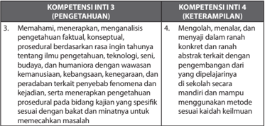

Tabel ini membahas dua kompetensi inti: Pengetahuan dan Keterampilan. Topik utama adalah pemahaman, penalaran, analisis, dan pengembangan rasa intinya tentang ilmu pengetahuan, teknologi, seni, budaya, dan humaniora dengan wawasan kemanusiaan, kebangsaan, kesejahteraan, dan keadilan sosial. Kompetensi ini mencakup memahami, menalar, dan menjalani dalam ranah konkrit dan ranah abstrak terkait dengan pengembangan diri yang dipelajari dalam pendidikan mandiri dan mampu menggunakan metode sesuai keadaan.

### REKAYASA

### KOMPETENSI INTI 3 (PENGETAHUAN)

- Memahami, menerapkan, menganalisis pengetahuan faktual, konseptual, prosedural berdasarkan rasa ingin tahunya tentang ilmu pengetahuan, teknologi, seni, budaya, dan humaniora dengan wawasan kemanusiaan, kebangsaan, kenegaraan, dan peradaban terkait penyebab fenomena dan kejadian, serta menerapkan pengetahuan prosedural pada bidang kajian yang spesifik sesuai dengan bakat dan minatnya untuk memecahkan masalah

### KOMPETENSI INTI 4 (KETERAMPILAN)

- Mengolah, menalar, dan menyaji dalam ranah konkret dan ranah abstrak terkait dengan pengembangan dari yang dipelajarinya di sekolah secara mandiri dan mampu menggunakan metode sesuai kaidah keilmuan

 

---
## 📄 Halaman 14

### BUDIDAYA

### KOMPETENSI INTI 3 (PENGETAHUAN)

- Memahami, menerapkan, menganalisis pengetahuan faktual, konseptual, prosedural berdasarkan rasa ingin tahunya tentang ilmu pengetahuan, teknologi, seni, budaya, dan humaniora dengan wawasan kemanusiaan, kebangsaan, kenegaraan, dan peradaban terkait penyebab fenomena dan kejadian, serta menerapkan pengetahuan prosedural pada bidang kajian yang spesifik sesuai dengan bakat dan minatnya untuk memecahkan masalah

### PENGOLAHAN

### KOMPETENSI INTI 3 (PENGETAHUAN)

- Memahami, menerapkan, menganalisis pengetahuan faktual, konseptual, prosedural berdasarkan rasa ingin tahunya tentang ilmu pengetahuan, teknologi, seni, budaya, dan humaniora dengan wawasan kemanusiaan, kebangsaan, kenegaraan, dan peradaban terkait penyebab fenomena dan kejadian, serta menerapkan pengetahuan prosedural pada bidang kajian yang spesifik sesuai dengan bakat dan minatnya untuk memecahkan masalah

### KOMPETENSI INTI 4 (KETERAMPILAN)

- Mengolah, menalar, dan menyaji dalam ranah konkret dan ranah abstrak terkait dengan pengembangan dari yang dipelajarinya di sekolah secara mandiri dan mampu menggunakan metode sesuai kaidah keilmuan

### KOMPETENSI INTI 4 (KETERAMPILAN)

- Mengolah, menalar, dan menyaji dalam ranah konkret dan ranah abstrak terkait dengan pengembangan dari yang dipelajarinya di sekolah secara mandiri dan mampu menggunakan metode sesuai kaidah keilmuan

 

---
## 📄 Halaman 15

### 3. Kompetensi Dasar (KD)

### KERAJINAN

---
**📊 Tabel**

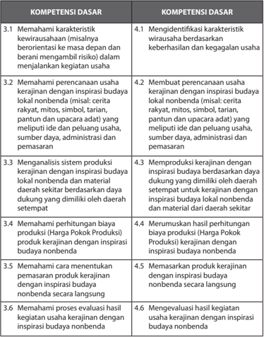

Tabel ini memperlihatkan dua kolom utama: Kompetensi Dasar dan Kompetensi Dasar. Kolom Kompetensi Dasar mencakup empat baris, masing-masing menunjukkan tiga kompetensi dasar yang berbeda. Kolom Kompetensi Dasar juga memiliki empat baris yang sama, masing-masing menunjukkan tiga kompetensi dasar yang berbeda. Topik utama tabel ini adalah tentang kompetensi dasar dalam konteks usaha kerajinan dengan inspirasi budaya nonbenda. Data penting yang terlihat adalah bahwa setiap baris dalam kedua kolom memiliki tiga kompetensi dasar yang berbeda, yang menunjukkan bahwa tabel ini merangkum empat pasang kompetensi dasar yang berbeda.

 

---
## 📄 Halaman 16

---
**📊 Tabel**

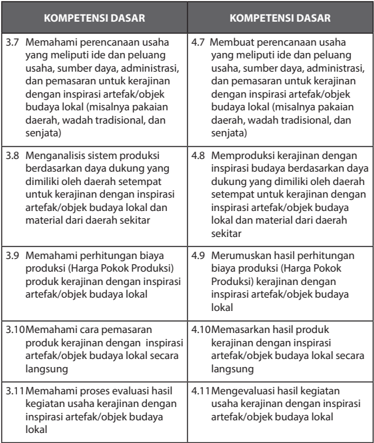

Tabel ini berisi informasi tentang kompetensi dasar yang harus dipenuhi oleh individu dalam konteks pengembangan usaha kreatif dengan inspirasi dari artefak atau objek budaya lokal. Topik utama tabel adalah pembangunan usaha kreatif yang berbasis budaya lokal, termasuk pemahaman perencanaan usaha, analisis sistem produksi, perhitungan biaya produk, dan proses evaluasi kegiatan usaha. Kolom-kolomnya mencakup berbagai aspek kompetensi dasar, mulai dari pemahaman ide usaha hingga evaluasi hasil kegiatan usaha. Data penting yang terlihat adalah bahwa setiap kompetensi dasar memiliki dua poin, masing-masing menunjukkan dua tingkat atau tahap dalam proses pembangunan usaha tersebut. Ini menunjukkan bahwa pembangunan usaha kreatif berbasis budaya lokal memerlukan pemahaman dan pengetahuan yang mendalam dan terstruktur.

 

---
## 📄 Halaman 17

### REKAYASA

---
**📊 Tabel**

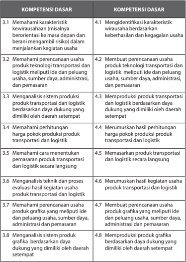

Tabel ini berisi informasi tentang kompetensi dasar yang harus dipenuhi oleh individu dalam bidang produk transportasi dan logistik. Topik utamanya adalah tentang pemahaman karakteristik usaha, perencanaan usaha, manajemen sistem produksi, penentuan harga produk, analisis teknis dan proses evaluasi, serta pengembangan produk grafika. Kolom pertama berisi nomor urut dari 1 sampai 8 untuk setiap kompetensi dasar, sedangkan kolom kedua berisi deskripsi singkat tentang apa yang harus dilakukan untuk mencapai kompetensi tersebut. Data penting yang terlihat adalah bahwa setiap kompetensi dasar memiliki beberapa subkompetensi yang harus dipenuhi, seperti memahami karakteristik usaha, membuat perencanaan usaha, manajemen sistem produksi, dan lainnya. Ini menunjukkan bahwa pembelajaran dan pengembangan kompetensi dasar ini melibatkan banyak aspek yang berbeda.

 

---
## 📄 Halaman 18

---
**📊 Tabel**

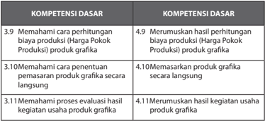

Tabel ini berisi informasi tentang kompetensi dasar yang berkaitan dengan produk grafika. Topik utamanya adalah tentang pengetahuan dan keterampilan dasar yang diperlukan untuk mengelola dan menghasilkan produk grafika. Kolom pertama berisi nomor urut dari 3.9 hingga 4.11, yang menunjukkan bahwa setiap baris mewakili satu kompetensi dasar. Kolom kedua berisi deskripsi singkat dari setiap kompetensi dasar tersebut. Data penting yang terlihat adalah bahwa setiap kompetensi dasar memiliki dua bagian: satu bagian yang berfokus pada perhitungan biaya produksi dan satu bagian yang berfokus pada manajemen produk secara langsung. Ini menunjukkan bahwa tabel ini mencakup aspek finansial dan operasional dalam pengelolaan produk grafika.

### BUDIDAYA

---
**📊 Tabel**

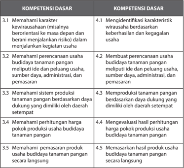

Tabel ini berisi informasi tentang kompetensi dasar yang harus dipelajari dalam bidang budidaya tanaman pangan. Topik utamanya adalah tentang pemahaman karakteristik usaha, perencanaan usaha, sistem produksi, perhitungan harga, dan pemasaran produk. Kolom pertama menunjukkan kompetensi dasar yang harus dipelajari, sedangkan kolom kedua menunjukkan detail lebih lanjut tentang setiap kompetensi dasar tersebut. Data penting yang terlihat adalah bahwa setiap kompetensi dasar memiliki beberapa subkompetensi yang harus dipelajari, seperti memahami karakteristik usaha, membuat perencanaan usaha, memproduksi tanaman pangan, memahami perhitungan harga, dan memasarkan produk. Ini menunjukkan bahwa pembelajaran di bidang ini melibatkan pemahaman dan praktik yang luas.

 

---
## 📄 Halaman 19

---
**📊 Tabel**

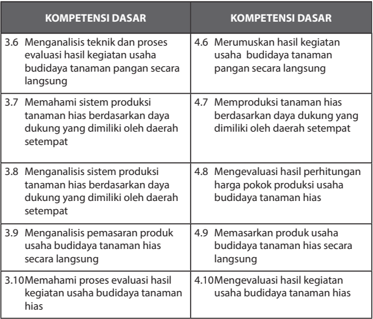

Tabel ini berisi informasi tentang kompetensi dasar yang harus dipenuhi oleh individu dalam bidang budidaya tanaman hias secara langsung. Topik utama tabel adalah tentang pengetahuan dan keterampilan dasar yang diperlukan untuk memulai dan mengelola usaha budidaya tanaman hias. Kolom pertama berisi nomor urut dari 3.6 sampai 10, yang menunjukkan nomor urut dari setiap kompetensi dasar. Kolom kedua berisi deskripsi singkat dari setiap kompetensi dasar tersebut. Data penting yang terlihat adalah bahwa semua kompetensi dasar memiliki angka yang sama di kolom kedua, yang menunjukkan bahwa setiap kompetensi dasar memiliki tujuan yang sama yaitu untuk memenuhi kebutuhan dasar dalam bidang budidaya tanaman hias secara langsung.

### PENGOLAHAN

---
**📊 Tabel**

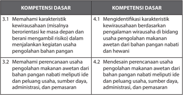

Tabel ini berisi informasi tentang kompetensi dasar yang harus dipenuhi oleh individu dalam mengelola usaha makanan awetan. Topik utamanya adalah tentang pemahaman karakteristik usaha makanan awetan, termasuk risiko dan tanggung jawabnya, serta perencanaan usaha tersebut. Kolom pertama berisi kompetensi dasar yang harus dipenuhi, sementara kolom kedua berisi kompetensi dasar yang relevan dengan usaha makanan awetan. Data penting yang terlihat adalah bahwa individu harus memahami karakteristik usaha makanan awetan, termasuk risiko dan tanggung jawabnya, serta memiliki kemampuan untuk merencanakan usaha tersebut, termasuk memilih ide dan peluang usaha, sumber daya, administrasi, dan pemasaran. Ini menunjukkan bahwa individu harus memiliki pengetahuan dan keterampilan yang cukup untuk mengelola usaha makanan awetan dengan efektif.

 

---
## 📄 Halaman 20

---
**📊 Tabel**

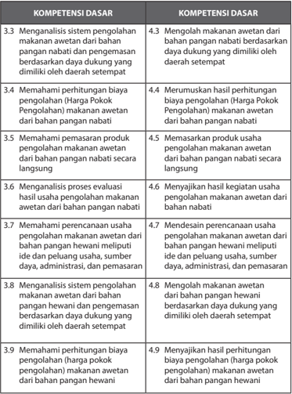

Tabel ini berisi informasi tentang kompetensi dasar yang berkaitan dengan pengolahan makanan awetan dari bahan pangan nabiati dan hewani. Topik utamanya adalah analisis sistem pengolahan makanan awetan dan perhitungan biaya pengolahan. Tabel dibagi menjadi dua kolom: Kompetensi Dasar 3.3 untuk makanan nabiati dan Kompetensi Dasar 4.3 untuk makanan hewani. Setiap baris menunjukkan satu kompetensi dasar yang harus dipelajari, termasuk analisis sistem pengolahan, perhitungan biaya, memproduksi produk, evaluasi usaha, pemantauan usaha, dan perhitungan biaya pengolahan. Data penting yang terlihat adalah bahwa setiap kompetensi dasar memiliki tujuan yang spesifik, seperti menghasilkan awetan dari bahan pangan nabiati atau hewani, memeriksa hasil usaha, dan menyesuaikan biaya pengolahan. Ini membantu siswa memahami proses pengolahan makanan awetan secara lebih mendalam dan dapat menerapkannya dalam praktik.

 

---
## 📄 Halaman 21

---
**📊 Tabel**

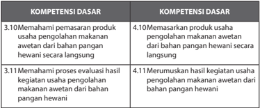

Tabel ini berisi informasi tentang kompetensi dasar yang berkaitan dengan pengolahan makanan awetan dari bahan pangan hewani secara langsung. Topik utama tabel adalah tentang pemahaman dan pengetahuan tentang proses pengolahan makanan awetan tersebut. Kolom pertama berisi nomor urut dari 3.10 sampai 4.11, sedangkan kolom kedua berisi deskripsi tentang kompetensi dasar tersebut. Data penting yang terlihat adalah bahwa setiap nomor urut memiliki dua kompetensi dasar yang berbeda, yang menunjukkan bahwa setiap proses pengolahan makanan awetan dari bahan pangan hewani memerlukan pemahaman dan pengetahuan yang berbeda-beda.

### 4. Struktur KI dan KD Prakarya dan Kewirausahaan Kelas X

### KERAJINAN

---
**📊 Tabel**

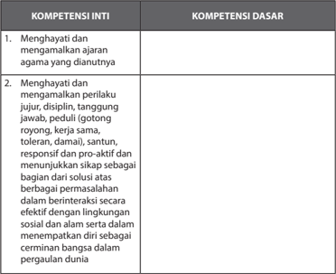

Tabel ini berisi dua kolom utama: Kompetensi Inti dan Kompetensi Dasar. Topik utama tabel adalah tentang pengembangan karakter dan kompetensi dasar yang relevan dengan kehidupan sehari-hari. Dalam kolom Kompetensi Inti, terdapat dua poin utama yang membahas pentingnya menghormati dan mengamalkan ajaran agama yang dianutnya, serta menghargai dan mempraktikkan perilaku jujur, disiplin, tanggung jawab, peduli, santun, responsif, dan proaktif dalam berbagai situasi. Sedangkan dalam kolom Kompetensi Dasar, terdapat poin-poin yang lebih spesifik tentang bagaimana menjalankan kompetensi inti tersebut, seperti berinteraksi secara efektif dengan lingkungan sosial dan alam serta menempatkan diri sebagai cerminan bangsa dalam pergaulan dunia. Pola penting yang terlihat adalah bahwa tabel ini mencakup dua aspek utama dari pembelajaran, yaitu kompetensi inti dan dasar, serta menekankan pentingnya mengembangkan karakter dan sikap yang positif dalam kehidupan sehari-hari.

 

---
## 📄 Halaman 22

---
**📊 Tabel**

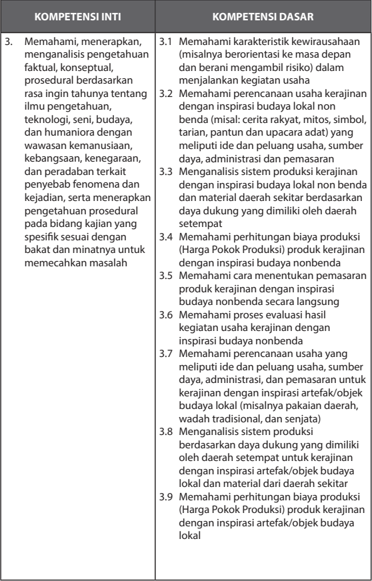

Tabel ini berisi informasi tentang kompetensi inti dan dasar yang harus dipenuhi oleh individu dalam konteks pengembangan usaha kreatif. Topik utama tabel adalah tentang pemahaman dan pengetahuan tentang budaya lokal, teknologi, dan peranannya dalam proses produksi produk kreatif. Kolom-kolomnya mencakup berbagai aspek seperti pemahaman karakteristik kewirausahaan, pemahaman perencanaan usaha, pemahaman sistem produksi, dan pemahaman perhitungan biaya produksi. Data penting yang terlihat adalah bahwa individu harus memiliki pemahaman mendalam tentang budaya lokal, teknologi, dan peranannya dalam proses produksi produk kreatif, serta kemampuan untuk memanfaatkan inspirasi budaya lokal dan daerah sekitar untuk meningkatkan efisiensi dan produktivitas usaha mereka.

 

---
## 📄 Halaman 23

---
**📊 Tabel**

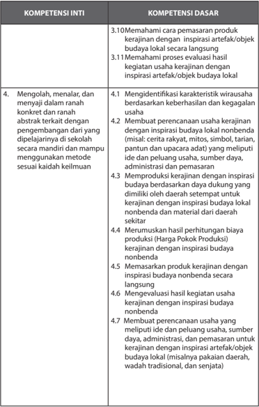

Tabel ini berisi informasi tentang kompetensi inti dan dasar yang berkaitan dengan pengembangan usaha kerajinan lokal. Topik utama adalah menggali inspirasi dari artefak atau objek budaya lokal untuk memproduksi produk kerajinan. Kolom-kolomnya mencakup 4 kompetensi inti dan 10 kompetensi dasar. Kompetensi inti meliputi mengolah, menalar, dan menyajikan hasil kerajinan secara konkret dan abstrak. Kompetensi dasar mencakup identifikasi karakteristik wirausaha, membuat perencanaan usaha, produksi kerajinan dengan inspirasi budaya nonbenda, merumuskan harga produk, memasarkan produk, evaluasi hasil kerajinan, dan membuat perencanaan usaha dengan inspirasi budaya nonbenda. Data penting yang terlihat adalah bahwa setiap kompetensi inti memiliki beberapa kompetensi dasar yang relevan, menunjukkan bahwa pembelajaran harus mencakup berbagai aspek dari proses pengembangan usaha kerajinan.

 

---
## 📄 Halaman 24

---
**📊 Tabel**

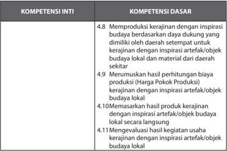

Tabel ini berisi informasi tentang kompetensi inti dan dasar dalam bidang kerajinan dengan inspirasi budaya lokal. Topik utamanya adalah tentang pengembangan produk kerajinan yang unik dan berkualitas tinggi. Kolom-kolomnya mencakup: 4.8 Memproduksi kerajinan dengan inspirasi budaya berdasarkan daya dukung yang dimiliki oleh daerah setempat untuk kerajinan dengan inspirasi artefak/objek budaya lokal dan material dari daerah setempat; 4.9 Menetapkan harga pokok produksi kerajinan dengan inspirasi artefak/objek budaya lokal; 4.10 Memasarkan hasil produk kerajinan dengan inspirasi artefak/objek budaya lokal secara langsung; dan 4.11 Mengevaluasi hasil kegiatan usaha kerajinan dengan inspirasi artefak/objek budaya lokal. Data penting yang terlihat adalah bahwa semua kompetensi ini berkaitan erat dengan pengembangan dan penjualan produk kerajinan lokal yang unik dan berkualitas tinggi, dengan fokus pada inspirasi budaya lokal dan penggunaan bahan-bahan dari daerah setempat.

### REKAYASA

---
**📊 Tabel**

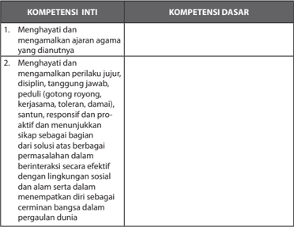

Tabel ini berisi dua kolom utama: Kompetensi Inti dan Kompetensi Dasar. Topik utama tabel adalah tentang kompetensi yang harus dimiliki oleh individu dalam konteks kehidupan sehari-hari. Kolom Kompetensi Inti mencakup dua poin utama: menghargai dan mengamalkan ajaran agama yang dianutnya, serta menghargai dan mengamalkan perilaku jujur, disiplin, tanggung jawab, peduli, dan berbagai karakteristik lainnya seperti gotong royong, kerjasama, toleransi, damai, santun, responsif, proaktif, dan menunjukkan sikap sebagai bagian dari masyarakat. Sementara itu, kolom Kompetensi Dasar mencakup berbagai aspek interaksi sosial dan lingkungan, termasuk berinteraksi secara efektif dengan lingkungan sosial dan alam, serta menempatkan diri sebagai cermat bangsa dalam pergaulan dunia. Data atau pola penting yang terlihat adalah bahwa tabel ini mencakup berbagai aspek dari kompetensi dasar dan inti yang harus dimiliki oleh individu dalam konteks kehidupan sehari-hari.

 

---
## 📄 Halaman 25

---
**📊 Tabel**

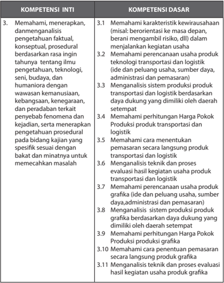

Tabel ini berisi informasi tentang kompetensi inti dan kompetensi dasar yang relevan dengan bidang usaha transportasi dan logistik. Topik utama tabel adalah pengetahuan dan keterampilan yang diperlukan untuk memahami, menerapkan, dan mengevaluasi produk transportasi dan logistik. Kolom-kolomnya mencakup 3.1 hingga 3.11, yang masing-masing menunjukkan kompetensi dasar yang berkaitan dengan pemahaman karakteristik usaha, perencanaan produk, analisis sistem produksi, dan penentuan harga produk. Data penting yang terlihat adalah bahwa tabel ini mencakup berbagai aspek dari usaha transportasi dan logistik, mulai dari pemahaman teknologi dan budaya hingga penentuan harga produk.

 

---
## 📄 Halaman 26

---
**📊 Tabel**

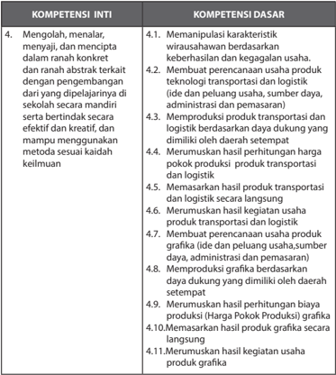

Tabel ini menunjukkan dua kumpulan kompetensi: Kompetensi Inti dan Kompetensi Dasar. Kompetensi Inti mencakup empat poin utama, yaitu mengolah, menyalurkan, dan menciptakan dalam ranah konkrit dan ranah abstrak terkait dengan pengembangan di sekolah secara mandiri serta bertindak secara efektif dan kreatif, dan mampu menggunakan metode sesuai keadaan kemuluan. Kompetensi Dasar mencakup delapan poin, termasuk memanipulasi karakteristik viraus/usaha berdasarkan keberhasilan dan kegagalan usaha, membuat perencanaan usaha produk transportasi dan logistik, memproduksi produk transportasi dan logistik berdasarkan daerah dukung yang dimiliki oleh daerah setempat, merumuskan hasil perhitungan harga pokok produk-produk transportasi dan logistik, memasarkan hasil produk transportasi dan logistik secara langsung, merumuskan hasil kegiatan usaha produk grafika, membuat perencanaan usaha produk grafika, memproduksi grafika berdasarkan daerah dukung yang dimiliki oleh daerah setempat, merumuskan hasil perhitungan biaya produksi (harga pokok) produk grafika, dan memasarkan hasil produk grafika secara langsung. Topik utama tabel ini adalah tentang pembelajaran dan pengembangan keterampilan dalam bidang transportasi dan logistik, transportasi dan logistik, transportasi dan logistik, transportasi dan logistik, transportasi dan logistik, transportasi dan logistik, transportasi dan logistik, transportasi dan logistik, transportasi dan logistik, transportasi dan logistik, transportasi dan logistik, transportasi dan logistik, transportasi dan logistik, transportasi dan logistik, transportasi dan logistik, transportasi dan logistik, transportasi dan logistik, transportasi dan logistik, transportasi dan logistik, transportasi dan logistik, transportasi dan logistik, transportasi dan logistik, transportasi dan logistik, transportasi dan logistik, transportasi dan logistik, transportasi dan logistik, transportasi dan logistik, transportasi dan logistik, transportasi dan logistik, transportasi dan logistik, transportasi dan logistik,

 

---
## 📄 Halaman 27

### BUDIDAYA

---
**📊 Tabel**

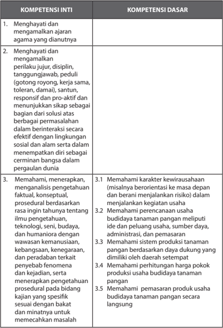

Tabel ini berisi informasi tentang kompetensi inti dan kompetensi dasar yang terkait dengan pengembangan keterampilan dan pengetahuan dalam bidang agama, interaksi sosial, dan manajemen usaha budidaya tanaman pangan. Topik utama tabel adalah pengembangan keterampilan dan pengetahuan yang diperlukan untuk menjalankan kegiatan usaha budidaya tanaman pangan secara efektif. Kolom-kolom yang ada meliputi 1. Menghayati dan mengamalkan ajaran agama yang dianutnya, 2. Menghayati dan mengamalkan perilaku jujur, disiplin, tanggungjawab, dan responsif sebagai bagian dari solusi berbagai permasalahan dalam berinteraksi dengan lingkungan sosial dan alam, serta 3. Memahami, menerapkan, dan menganalisis pengetahuan faktil, konseptual, dan prosedural berdasarkan ragin tahuna tentang ilmu pengetahuan, teknologi, seni, budaya, dan humaniora dengan wawasan kemanusiaan, kebangsaan, keagamaan, dan peradaban tertentu. Data atau pola penting yang terlihat adalah bahwa tabel ini mencakup berbagai aspek dari pengembangan keterampilan dan pengetahuan, mulai dari penghayatan ajaran agama, hingga menerapkan pengetahuan faktil, konseptual, dan prosedural dalam berbagai aspek kehidupan.

 

---
## 📄 Halaman 28

---
**📊 Tabel**

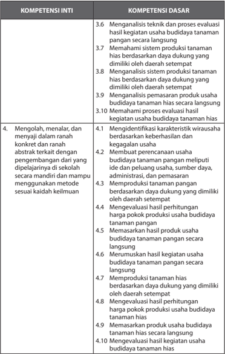

Tabel ini berisi informasi tentang kompetensi inti dan dasar dalam bidang usaha budidaya tanaman hias. Topik utama adalah mengolah, menanam, dan merawat tanaman hias secara efektif. Kolom-kolomnya meliputi kompetensi inti (6.3-6.10) dan kompetensi dasar (4.1-4.10). Data penting yang terlihat antara lain: analisis teknik dan proses evaluasi usaha budidaya tanaman hias, pemahaman sistem produksi tanaman hias berdasarkan daya dukung daerah setempat, analisis sistem produksi tanaman hias berdasarkan daya dukung daerah setempat, pemahaman proses evaluasi usaha budidaya tanaman hias secara langsung, identifikasi karakteristik wirausaha, membuat perencanaan usaha, memproduksi tanaman hias berdasarkan daya dukung daerah setempat, evaluasi hasil perhitungan harga produk, memasarkan hasil produk usaha secara langsung, merumuskan hasil usaha secara langsung, memproduksi tanaman hias berdasarkan daya dukung daerah setempat, evaluasi hasil perhitungan harga produk, dan memasarkan usaha secara langsung. Pola informasi ini membantu mengukur kemampuan individu dalam mengelola dan mengembangkan usaha budidaya tanaman hias dengan baik.

 

---
## 📄 Halaman 29

### PENGOLAHAN

---
**📊 Tabel**

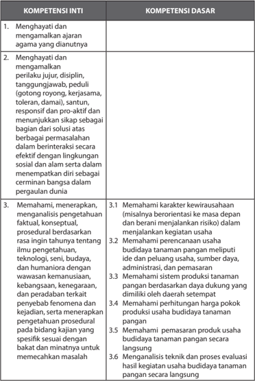

Tabel ini berisi informasi tentang kompetensi inti dan kompetensi dasar yang harus dipenuhi oleh individu dalam konteks pendidikan agama dan sosial. Topik utama tabel adalah tentang keterampilan dan pengetahuan yang diperlukan untuk menjalani kehidupan sehari-hari dengan baik. Kolom pertama berisi kompetensi inti, yang meliputi: 1) menghargai dan mematuhi ajaran agama yang dianutnya; 2) menghargai dan mematuhi perilaku jujur, disiplin, tanggung jawab, peduli (gotong royong, kerjasama, toleran, damai), santun, responsif, pro-aktif, dan menunjukkan sikap sebagai bagian dari solusi; dan 3) memahami, menerapkan, dan menganalisis pengetahuan faktil, konseptual, prosedural berdasarkan rasa ingin tahu tentang ilmu pengetahuan, teknologi, seni, budaya, dan humaniora dengan wawasan kemanusiaan, kebangsaan, keberagaman, keadilan, dan keadilan sosial. Kolom kedua berisi kompetensi dasar, yang mencakup: 3.1) memahami karakter kewirausahaan; 3.2) memahami perencanaan usaha budidaya tanaman pangan; 3.3) memahami sistem produksi pangan; 3.4) memahami perhitungan harga pokok produk; 3.5) memahami pemasaran produk; dan 3.6) menganalisis teknik dan proses evaluasi hasil kegiatan usaha budidaya pangan secara langsung. Pola penting yang terlihat adalah bahwa tabel ini mencakup berbagai aspek dari kehidupan sehari-hari, termasuk agama, perilaku sosial, pengetahuan faktil, teknologi, budaya, dan manajemen usaha.

 

---
## 📄 Halaman 30

---
**📊 Tabel**

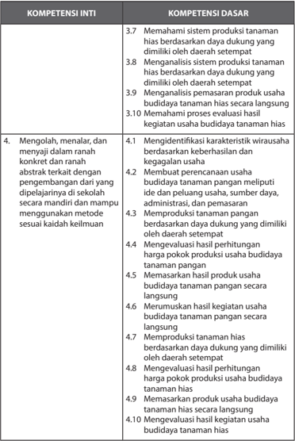

Tabel ini menunjukkan kompetensi inti dan dasar yang relevan dengan budidaya tanaman hias. Topik utama adalah pengembangan usaha budidaya tanaman hias, yang melibatkan pemahaman sistem produksi, analisis daya dukung, pemasaran produk, dan evaluasi hasil kegiatan. Kolom-kolom utama adalah Kompetensi Inti dan Kompetensi Dasar. Data penting mencakup identifikasi karakteristik wirausaha, membuat perencanaan usaha, memproduksi tanaman hias berdasarkan dukungan, merumuskan hasil kegiatan, memasarkan produk secara lansung, dan evaluasi hasil kegiatan. Pola penting adalah bahwa setiap kompetensi inti memiliki beberapa kompetensi dasar yang berkaitan, menunjukkan struktur kompetensi yang mendalam dan terstruktur.

 

---
## 📄 Halaman 31

### B.  Karakteristik Mata Pelajaran Prakarya dan Kewirausahaan

### 1. Hakikat Mata Pelajaran Prakarya dan Kewirausahaan

Prakarya dapat dipahami sebagai pra­karya, yaitu sebuah proses sebelum terjadinya sebuah karya, termasuk di dalamnya pembinaan apresiasi dan produksi karya. Prakarya melatih keterampilan dan kecakapan hidup, yang dalam mata pelajaran ini dibagi menjadi 4 cabang/jalur, yaitu kerajinan, rekayasa,  budidaya  dan  pengolahan.  Setiap  cabang/jalur  pengajaran meliputi pengetahuan dan keterampilan membuat serta memproduksi dengan beragam teknik dan material.

Kewirausahaan  sebelumnya  dikenal  dengan  kewiraswastaan.  Kewira­ swastaan  terbentuk  dari  kata wira :  utama,  gagah  berani,  luhur; swa : sendiri; sta : berdiri; usaha : kegiatan produktif. Di Indonesia, kata wiraswasta  sering  diartikan  sebagai  orang­orang  yang  tidak  bekerja pada sektor pemerintah, yaitu para pedagang, pengusaha, dan orang­ orang yang bekerja di perusahaan swasta. Adapun wirausahawan adalah orang­orang  yang    mempunyai  usaha  sendiri.  Wirausahawan  adalah orang yang berani membuka kegiatan produktif yang mandiri. Pada mata pelajaran prakarya dan kewirausahaan, peserta diarahkan untuk memiliki keberanian dalam menggunakan daya kreatif, produktif dan mandiri agar pada saatnya mampu membuat usaha mandiri atau berwirausaha.

Mata  pelajaran  Prakarya  dan  Kewirausahaan  akan  menumbuhkan  dan mendorong  peserta  didik  melakukan  proses  mengapresiasi,  belajar dan  berkarya,  serta  membekali  peserta  didik  dengan  pengetahuan berwirausaha yang didasari dengan kreativitasnya melihat potensi dan peluang  yang  khas  yang  ada  di  lingkungan  daerah  setempat.  Setiap daerah  memiliki  karakter,  peluang  serta  potensi  yang  berbeda­beda dan  unik.  Pada  pembelajaran  Prakarya  dan  Kewirausahaan,  satuan pendidikan dapat memilih 2 (dua) cabang/jalur saja yang sesuai dengan potensi  lingkungan  daerah  setempat.  Dua  cabang  atau  jalur  tersebut diwajibkan untuk digunakan dalam satu tahun ajaran. Satuan pendidikan diperkenankan pula untuk menerapkan 4 (empat) cabang/jalur, selama satuan pendidikan mampu menyediakan jam tambahan.

Keempat  cabang  dari  mata  pelajaran  Prakarya  dan  Kewirausahaan memiliki  karakteristik  pembelajaran  yang  berbeda  sehingga  meme­ ngaruhi  kebutuhan  waktu  (durasi)  pembelajaran/jam  pertemuan  dari setiap  cabang.  Cabang  Budidaya  memerlukan  jangka  waktu  tertentu

 

---
## 📄 Halaman 32

untuk pertumbuhan atau perkembangbiakan. Sementara cabang kerajinan,  rekayasa  dan  pengolahan  memerlukan  jangka  waktu  yang relatif lebih singkat dalam setiap tahapan prosesnya. Jika cabang Budidaya merupakan salah satu yang dipilih, pada pelaksanaan pembelajarannya, dapat dilakukan secara berselang­seling dengan cabang lainnya. Pengaturan waktu dilakukan oleh satuan pendidikan, sesuai karakteristik pembelajarannya,  agar  tujuan  pembelajaran  dari  kedua  cabang  yang dipilih dapat tercapai.

---
**🖼️ Gambar/Diagram**

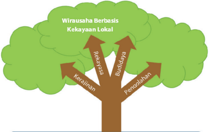

> **Deskripsi Visual:** Gambar ini adalah ilustrasi yang menunjukkan hubungan antara wirausaha berbasis kekayaan lokal dengan empat aspek utama: rekreasi, budaya, penelitian, dan kerajinan. Pohon besar dengan daun hijau menggambarkan wirausaha berbasis kekayaan lokal sebagai pohon yang tumbuh dan berkembang. Daun-daun pohon tersebut membentuk empat cabang yang masing-masing menunjukkan satu aspek utama:

1. Cabang pertama, yang terletak di bagian kiri atas, menunjukkan "Rekreasi" sebagai salah satu aspek dari wirausaha berbasis kekayaan lokal.
2. Cabang kedua, yang terletak di bagian kanan atas, menunjukkan "Budaya" sebagai aspek lain dari wirausaha berbasis kekayaan lokal.
3. Cabang ketiga, yang terletak di bagian bawah kiri, menunjukkan "Penelitian" sebagai aspek yang terlibat dalam wirausaha berbasis kekayaan lokal.
4. Cabang keempat, yang terletak di bagian bawah kanan, menunjukkan "Kerajinan" sebagai aspek yang terlibat dalam wirausaha berbasis kekayaan lokal.

Teks, angka, atau label penting yang terlihat pada gambar ini adalah "Wirausaha Berbasis Kekayaan Lokal", "Rekreasi", "Budaya", "Penelitian", dan "Kerajinan". Informasi kunci yang dapat diambil pembaca adalah bahwa wirausaha berbasis kekayaan lokal melibatkan empat aspek utama: rekreasi, budaya, penelitian, dan kerajinan. Gambar ini menunjukkan hubungan antara wirausaha berbasis kekayaan lokal dengan empat aspek tersebut, menunjukkan bahwa semua aspek ini saling terkait dan mempengaruhi wirausaha berbasis kekayaan lokal.

Potensi Daerah dan Lingkungan Sekitar

Sumber: Dokumen Kemdikbud

Pada buku ini, terdapat prinsip­prinsip  dasar  dari  pengenalan  material dan  proses  produksi.  Materi  yang  terdapat  pada  buku  teks  ini  sangat memungkinkan  untuk  diperkaya  dan  dikembangkan  sesuai  dengan potensi lokal daerah setempat yang terkait dengan ketersediaan bahan, keberadaan industri atau sentra industri, teknik tradisional setempat dan lain­lain.  Proses  pembelajaran  Prakarya  dan  Kewirausahaan  mengatur lingkungan  yang  ada  di sekitar,    memfasilitasi  dan  membimbing peserta  didik  sehingga  terdorong  untuk  memperoleh  pengetahuan, keterampilan, daya kreatif, disiplin, serta keberanian mengambil keputusan dan kemampuan bekerja mandiri maupun dalam kelompok.

 

---
## 📄 Halaman 33

### 2. Fungsi dan Tujuan Mata Pelajaran Prakarya dan Kewirausahaan

Mata  pelajaran  Prakarya  dan  Kewirausahaan  dapat  digolongkan  ke dalam pengetahuan transcience-knowledge , yaitu  mengembangkan pengetahuan  dan  melatih  keterampilan  kecakapan  hidup  berbasis seni, teknologi dan ekonomi. Pembelajaran ini berawal dengan melatih kemampuan ekspresi­kreatif untuk menuangkan ide dan gagasan agar menyenangkan orang lain. Kemudian, dirasionalisasikan secara teknologis sehingga keterampilan tersebut bermuara apresiasi teknologi terbarukan, hasil  ergonomis dan aplikatif dalam memanfaatkan lingkungan sekitar dengan  memperhatikan  dampaknya  terhadap  ekosistem,  manajemen dan ekonomis.

### a. Fungsi

Kehidupan dan berkehidupan manusia membutuhkan keterampilan tangan  untuk  memenuhi  standar  minimal  dan  kehidupan  sehari­ hari  sebagai  kecakapan  hidup.  Keterampilan  harus  menghasilkan karya yang menyenangkan bagi dirinya maupun orang lain serta  mempunyai  nilai  kemanfaatan  yang  sesungguhnya.  Maka, pelatihan  berkarya  dengan  menyenangkan  harus  dimulai  dengan memahami  estetika  (keindahan)  sebagai  dasar  penciptaan  karya selanjutnya.  Pelatihan  mencipta,  memproduksi  dan  memelihara karya dalam memperoleh nilai kebaruan (novelty) akan bermanfaat untuk  kehidupan  manusia  selanjutnya.  Prinsip  mencipta,  yaitu memproduksi  (membuat)  dan  mereproduksi  (membuat  ulang) diharapkan  meningkatkan  kepekaan  terhadap  kemajuan  zaman sekaligus mengapresiasi teknologi kearifan lokal yang telah mampu mengantarkan  manusia  Indonesia  mengalami  kejayaan  di  masa lalu. Oleh karenanya, pembelajaran Prakarya dan Kewirausahaan di tingkat  sekolah  lanjutan  atas  didahului  dengan  wawasan  tentang kearifan  lokal  di  lingkungan  sekitar  menuju  teknologi  terbarukan. Pembelajaran  dimulai  dengan  memahami  fakta,  prosedur,  konsep maupun teori yang ada melalui studi perorangan, kelompok maupun projek  agar  memberi  dampak  kepada  pendidikan  karakter  yang berupa  kecerdasan  kolektif.  Hasil  pembelajaran  melalui  eksplorasi alami  maupun  buatan  ( artificial )  ini  akan  memanfaatkan  sebagai media sekaligus bahan pelajaran.

 

---
## 📄 Halaman 34

### b. Tujuan

Tujuan Prakarya dan Kewirausahaan dapat diuraikan sebagai berikut:

- Memfasilitasi peserta didik berekspresi kreatif melalui keterampilan teknik berkarya ergonomis, teknologi dan ekonomis.
- Melatih keterampilan mencipta karya berbasis estetika, artistik, ekosistem dan teknologis.
- Melatih  memanfaatkan  media  dan  bahan  berkarya  seni  dan teknologi  melalui  prinsip  kreatif,  ergonomis,  higienis,  tepat­ cekat­cepat, dan berwawasan lingkungan.
- Menghasilkan karya yang siap dimanfaatkan dalam kehidupan, bersifat  pengetahuan  maupun  landasan  pengembangan  ber­ dasarkan teknologi kearifan lokal maupun teknologi terbarukan.
- Menumbuh kembangkan jiwa wirausaha melalui melatih dan  mengelola  penciptaan  karya  (produksi),  mengemas,  dan usaha  menjual  berdasarkan  prinsip  ekonomis,  ergonomis  dan berwawasan lingkungan.

---
**🖼️ Gambar/Diagram**

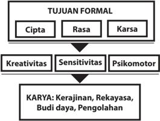

> **Deskripsi Visual:** Gambar ini adalah diagram yang menunjukkan tujuan formal dan karya yang berkaitan dengan kreativitas, sensitivitas, dan psikomotor. Diagram ini terdiri dari empat bagian utama:

1. Tujuan Formal: Ini terdiri dari tiga pilar utama - Cipta, Rasa, dan Karsa.

2. Kreativitas, Sensitivitas, dan Psikomotor: Ini merupakan elemen-elemen yang menghubungkan tujuan formal ke karya.

3. Karya: Ini mencakup lima jenis karya, yaitu Kerajinan, Rekayasa, Budi Daya, Pengolahan.

Elemen-elemen utama ini saling terkait melalui hubungan yang jelas, menunjukkan bahwa tujuan formal tersebut mempengaruhi karya yang dilakukan oleh individu. Teks, angka, atau label penting yang terlihat dalam diagram ini adalah nama-nama tujuan formal dan jenis karya tersebut.

Informasi kunci yang dapat diambil pembaca adalah bahwa tujuan formal yang ditetapkan dalam buku pelajaran ini adalah untuk mengembangkan kreativitas, sensitivitas, dan psikomotor seseorang, dan bahwa ada lima jenis karya yang dapat dilakukan sebagai hasil dari pengembangan tersebut.

Sumber: Dokumen Kemdikbud

### 3. Ruang Lingkup Mata Pelajaran Prakarya dan Kewirausahaan pada Jenjang SMA/MA

Lingkup  materi  pelajaran  Prakarya  dan  Kewirausahaan  di  SMA  dan sederajat  disesuaikan  dengan  potensi  sekolah  dan  daerah  setempat karena sifat mata pelajaran ini menyesuaikan dengan kondisi dan potensi yang ada di daerah tersebut. Penyesuaian ini berangkat dari pemikiran

 

---
## 📄 Halaman 35

ekonomis,  budaya  dan  sosiologis.  Ekonomis,  karena  pada  tingkat  usia remaja sudah harus dibekali dengan prinsip kewirausahaan agar dapat tercapai  kemandirian  paska  sekolah.  Budaya,  karena  pengembangan materi kearifan lokal melalui prakarya. Sosiologis, karena teknologi tradisi mempunyai nilai­nilai kecerdasan kolektif bangsa Indonesia. Pada mata pelajaran Prakarya dan Kewirausahaan terdapat empat (4) cabang yaitu Kerajinan, Rekayasa, Budidaya dan Pengolahan. Penjelasan ruang lingkup dari setiap cabang tersebut adalah sebagai berikut,

### a. Kerajinan dan Kewirausahaan

Kerajinan mengandalkan keterampilan tangan dan keunikan karakter material yang digunakan untuk menghasilkan produk dengan nilai estetis dan berfungsi dengan baik. Potensi Indonesia dalam bidang kerajinan  sangatlah  besar,  hal  tersebut  membuka  peluang  bagi peserta  didik  untuk  mengembangkan  wirausaha  kerajinan  saat sudah lepas dari bangku sekolah.

Wirausaha selalu menuntut kebaruan dan kreativitas dalam berkarya. Oleh  karena  itu,  pendidikan  Prakarya  dan  Kewirausahaan  cabang kerajinan,  melatih  peserta  didik  untuk  jeli  melihat  peluang  pasar dan berpikir kreatif dalam pengembangan teknik keterampilan dan mengolah  material  lokal.  Kerajinan  erat  pula  terkait  dengan  nilai pendidikan yang diwujudkan dalam prosedur pembuatan.

Prosedur memproduksi  dilalui dengan berbagai tahapan dan beberapa  langkah  yang  dilakukan  oleh  beberapa  orang.  Kinerja ini  menumbuhkan  wawasan,  toleransi  sosial  serta  kemampuan bersosialisasi  memulai  pemahaman  karya  orang  lain.  Contohnya, pada pembuatan karya kerajinan, pembuat pola menggambarkan dikerjakan oleh perancang gambar dilanjutkan dengan pewarnaan sesuai dengan  warna  lokal  (kearifan lokal)  merupakan  proses berangkai dan membutuhkan kesabaran dan ketelitian serta penuh toleransi.  Jika  salah  seorang  membuat  kesalahan,  hasil  akhir  tidak akan seperti yang diharapkan oleh pembuat pola dan motif hiasnya. Prosedur semacam ini memberikan nilai edukatif jika dilaksanakan di sekolah. Kerajinan yang diproduksi maupun direproduksi dikemas ulang dengan sistem teknologi dan ekosistem agar efektif dan efisien berdasarkan potensi lingkungan yang ada.

### b. Rekayasa dan Kewirausahaan

Rekayasa diartikan sebagai usaha  memecahkan  permasalahan kehidupan sehari­hari dengan berpikir rasional dan kritis sehingga menemukan solusi melalui kerangka kerja yang efektif dan efisien.

 

---
## 📄 Halaman 36

Kegiatan pemecahan masalah diawali dengan kepekaan melihat ma­ salah yang ada di lingkungan sekitar dan me  mahami prin  sip­prinsip rekayasa. Ide kreatif dan kemampuan merekayasa penggabungkan prinsip­prinsip rekayasa tersebut untuk  memecahkan  masalah yang  ada.  Produk  hasil  rekayasa  selain  berfungsi  baik,  juga  harus memperhatikan unsur manusia sebagai penggunanya oleh karena itu  produk  rekayasa  harus  aman  dan  nyaman  digunakan  oleh penggunanya.

Kata 'rekayasa' merupakan terjemahan bebas dari kata engineering yaitu perancangan dan rekonstruksi benda atau pun produk untuk memungkinkan penemuan produk baru yang lebih berperan  dan berkegunaan. Prinsip rekayasa adalah menggunakan prinsip­ prinsip sistem, bahan serta ide yang disesuaikan dengan kebutuhan pemecahan  masalah  dan  perkembangan  jaman.  Oleh  karenanya rekayasa  harus  seimbang  dan  selaras  dengan  kondisi  dan  potensi daerah  setempat  menuju  karya  inovatif  yang  mempunyai  nilai manfaat  dan  keterjualan  yang  tinggi.  Kemampuan  berpikir  secara rekayasa yang merupakan paduan berpikir kreatif­kritis dan rasional­ sistematis akan memberikan bekal kepada peserta didik untuk kelak menjadi wirausahawan di bidang produksi atau penyedia jasa bidang rekayasa.

### c. Budidaya dan Kewirausahaan

Budidaya  berpangkal  pada  kultivasi  ( cultivation ),  yaitu  suatu  kerja yang berusaha untuk menambah, menumbuhkan, dan mewujudkan benda ataupun makhluk agar lebih besar (tumbuh), dan berkembang (menjadi banyak). Kinerja ini membutuhkan perasaan seolah dirinya (pembudidaya) hidup, tumbuh dan berkembang. Prinsip pembinaan rasa  dalam  kinerja  budidaya  ini  akan  memberikan  hidup  pada tumbuhan atau hewan, tetapi dalam bekerja dibutuhkan sistem yang berjalan rutinitas, seperti kebiasaan hidup orang: makan, minum dan bergerak. Maka, seorang pembudidaya harus memahami kartakter tumbuhan atau hewan yang di'budidaya'kan.

Konsep cultivation tampak  pada  penyatuan  diri  dengan  alam  dan pemahaman tumbuhan atau binatang. Pemikiran ekosistem menjadi langkah  yang  selalu  dipikirkan  keseimbangan  hidupnya.  Manfaat edukatif  budidaya  ini  adalah  pembinaan  perasaan,  pembinaan kemampuan  memahami  pertumbuhan  dan  menyatukan  dengan alam ( echosystem ) menjadikan anak dan tenaga kerja yang berpikir sistematis, tetapi manusiawi dan kesabaran.

Hasil  budidaya  tidak  akan  dapat  dipetik  dalam  waktu  singkat melainkan membutuhkan waktu dan harus diawasi dengan penuh kesabaran. Bahan dan perlengkapan teknologi budidaya sebenarnya

 

---
## 📄 Halaman 37

dapat diangkat dari kehidupan sehari­hari yang variatif karena setiap daerah mempunyai potensi kearifan yang berbeda. Budidaya telah dilakukan  oleh  pendahulu  bangsa  ini  dengan  teknologi  tradisi, tetapi telah menunjukkan konsep budidaya yang memperhitungkan musim, tetapi belum mempunyai standar ketepatan dengan suasana/iklim  cuaca  maupun  ekonomi  yang  sedang  berkembang, maka pembelajaran prakarya­budidaya diharapkan mampu menemukan  ide  pengembangan  berbasis  bahan  tradisi  dengan memperhitungkan kebelanjutan materi atau bahan tersebut. Keterampilan melakukan budidaya dan menghayati proses kultivasi memberikan  bekal  kepada  peserta  didik  untuk  mampu  menjadi wirausahawan di bidang budidaya yang sesuai dengan kondisi alam dan lingkungan sekitarnya.

### d. Pengolahan dan Kewirausahaan

Pengolahan  artinya  membuat,  menciptakan  bahan  dasar  menjadi benda produk jadi agar dapat digunakan untuk kegiatan produksi dan  bermanfaat  secara  luas.  Pada  prinsipnya,  kerja  pengolahan adalah mengubah benda mentah menjadi produk matang dengan mencampur,  memodifikasi  bahan  tersebut.  Oleh  karenanya,  kerja pengolahan menggunakan sistem desain, yaitu mengubah masukan menjadi  keluaran  sesuai  dengan  rancangan  yang  dibuat.  Sebagai contoh: membuat  makanan atau memasak makanan; kinerja ini  membutuhkan  desain  atau  rancangan  secara  tepat  dan  juga membutuhkan perasaan  terutama  rasa  lidah  dan  bau­bauan  agar sedap. Kerja ini akan melatih rasa, dan kesabaran maupun berpikiran praktis  serta  tepat.  Kognisi  untuk  menghafalkan  rasa  bumbu  dan racikan akan membutuhkan ketelitian dan kesabaran.

Manfaat  pendidikan  teknologi  pengolahan  bagi  pengembangan kepribadian peserta didik adalah: pelatihan rasa yang dapat dikorelasikan dalam kehidupan sehari­hari. Pengolahan telah dilakukan  oleh  pendahulu  bangsa  kita  dengan  teknologi  tradisi yang sederhana, dan menunjukkan  konsep  pengolahan  yang dapat  diaplikasikan,  tetapi  belum  mempunyai  standar  ketepatan dengan suasana/iklim cuaca maupun ekonomi yang sedang berkembang, pembelajaran prakarya­budidaya diharapkan mampu me  nemukan  ide  pengem  bangan  berbasis  bahan  tradisi  dengan memperhitungkan ke  belanjutan materi atau bahan tersebut. Keterampilan dan pengetahuan teknik pengolahan serta kepekaan rasa  yang  dilatihkan  pada  pembelajaran  cabang  pengolahan akan menjadi dasar dari peserta didik untuk mencari peluang wirausaha dalam  bidang pengolahan  sesuai dengan  potensi lingkungan sekitarnya.

 

---
## 📄 Halaman 38

### C.  Pembelajaran Prakarya dan Kewirausahaan Kelas X

### 1. Persyaratan Pelaksanaan Proses Pembelajaran

Persyaratan pelaksanaan proses pembelajaran Prakarya dan Kewirausahaan  disesuaikan  dengan  potensi  dan  kondisi  lingkungan sekitar, dan mendukung prinsip mata pelajaran Prakarya dan Kewirausahaan  dengan  penyelenggaraan  proses  pembelajaran  yang menyenangkan, mendorong munculnya ide­ide kreatif sekaligus mendukung disiplin berkarya. Pada dasarnya, pembelajaran Prakarya dan Kewirausahaan adalah mengembangkan potensi yang ada di lingkungan sekitar  secara  kreatif  untuk  menghasilkan  karya  inovatif  (baru)  yang berpotensi  untuk  dikembangkan  menjadi  kegiatan  wirausaha.  Oleh karena  itu,  baik  pemilihan  cabang/jalur  maupun  materi  pembelajaran diupayakan berdasar pada potensi dan kondisi lingkungan sekitar. Prinsip Prakarya  dan  Kewirausahaan  adalah  proses  pembuatan  karya  yang mempunyai nilai  keterjualan.  Karya  tersebut  harus  memenuhi  standar pasar,  yaitu:  menyenangkan  pembeli,  nilai  kemanfaatan,  kreatif  serta bertanggung jawab terhadap ciptaannya berdasarkan logika matematis maupun pengetahuan estetis. Secara garis besar dapat dilakukan melalui hal­hal berikut.

- Mengamati lingkungan sekitar baik fisik maupun pasar yang menjadi bahan eksplorasi (pencarian), eksperimentasi (percobaan) dan eksperiensi  (memperoleh  pengalaman),  melalui  kegiatan  melihat, membaca,  mendengar,  mencermatinya,  meneliti  berbagai  objek alami maupun buatan (artifisial) dengan kunjungan lapangan, kajian pustaka, dan mencipta karya visual.
- Mendorong keingintahuan peserta didik setelah melakukan pengamatan berbagai gejala alami, artifisial maupun sosial dengan merumuskan pertanyaan berdasarkan kaitan, pengaruh dan kecenderungannya.
- Mengumpulkan data dan menciptakan karya dengan merumuskan daftar pertanyaan berdasarkan hasil identifikasi, menentukan indikator keterjualan,  kelayakan  penampilan  (estetik­ergonomis) dengan melakukan wawancara dan atau mengeksplorasi alam dan gejala  preferensi  pasar  ( marketable) sebagai  inspriasi  menciptakan karya.
- Menampilkan kembali hasil ciptaannya secara oral dan karya secara protofolio  berdasarkan  hasil  olahan  secara  pribadi  atau  kelompok sehingga  mempunyai  nilai  keterjualan  serta  mempunyai  wawasan pasar yang sesuai dengan lingkungan daerah maupun nasional dan global.
- Merekonstruksi karya Prakarya secara teknologi, seni dan ekonomis (efisiensi  dan  efektivitas)  yang  dapat  dimanfaatkan  untuk  meng­ apresiasi karya teknologi terbarukan dan keterjualan.

 

---
## 📄 Halaman 39

Proses pembelajaran pada setiap semester dapat dibagi atas 4 (empat) tahapan;  pencarian  data,  analisis  data,  berkarya  dan  presentasi  karya. Pencarian data dapat dilakukan melalui buku, kunjungan lapangan (ke tempat  wirausaha  kerajinan,  rekayasa,  budidaya  atau  pengolahan), wawancara,  atau  pun  melalui  pencarian  dengan  internet.  Metode pencarian  data  dipilih  yang  sesuai  dengan  kebutuhan  berkarya  dan potensi  lingkungan  sekitar  karena  tujuan  pembelajaran  Prakarya  dan Kewirausahaan  adalah  mengembangkan  potensi  yang  ada  di  daerah sekitar. Tahap analisis data dilakukan di kelas berupa aktivitas diskusi dan membuat rancangan produk. Tahapan berkarya atau membuat produk dilakukan  di  kelas  atau  di  lingkungan  sekitar  sesuai  dengan  potensi yang  ada  di  daerah  masing­masing.  Tahap  terakhir  adalah  presentasi hasil yang dapat dilakukan di sekolah dengan melibatkan guru, peserta didik maupun orang tua dan pihak lain di luar sekolah agar terjadi proses apresiasi terhadap karya yang telah dihasilkan dari proses pembelajaran Prakarya  dan  Kewirausahaan.  Presentasi  dapat  berupa  presentasi  oral, demontrasi penggunaan produk, pameran ataupun penjualan karya.

Sumber: Dokumen Kemendikbud

### 2. Pelaksanaan Pembelajaran

Pelaksanaan pembelajaran pada Prakarya dan Kewirausahaan memanfaatkan multimodel. Pembelajaran multimodel dilakukan dengan maksud untuk mendapatkan hasil yang optimal dibandingkan dengan  hanya  satu  model.  Metode  yang  dapat  dikembangkan  dalam

 

---
## 📄 Halaman 40

pembelajaran ini adalah proyek, modifikasi, simulasi, interaktif, elaboratif, partisipatif, magang ( cooperative study ), integratif, produksi, demonstrasi, imitasi, eksperiensial, kolaboratif.

### a. Kegiatan Pendahuluan

### Kegiatan Model Pembelajaran Bermain untuk Membuka Simpul Kreativitas

Permainan ( game ) sangat berguna untuk membentuk kesan dramatis yang jarang peserta didik lupakan. Humor atau kejenakaan merupakan pintu pembuka simpul­simpul kreativitas, dengan latihan lucu,  tertawa,  tersenyum,  peserta  didik  akan  mudah  menyerap pengetahuan  yang  diberikan.  Permainan  akan  membangkitkan energi  dan  keterlibatan  belajar  peserta  didik.  Metode  yang  dapat diterapkan  antara  lain:  tebak  gambar,  tebak  kata,  tebak  benda dengan  stiker  yang  ditempel  dipunggung  lawan,  teka­teki,  sosio drama, dan bermain peran.

### Persiapan Bahan, Alat dan Tempat Bekerja

Kegiatan pembelajaran Prakarya dan Kewirausahaan banyak menggunakan  bahan,  material,  alat  dan  tempat  kerja.  Pada  awal pembelajaran peserta didik dibantu oleh guru mempersiapkan alat dan  sisa  bahan/material  serta  tempat  kerja  yang  akan  digunakan pada sesi pembelajaran tersebut. Tempat kerja serta bahan/material dan peralatan yang ditata rapi akan memudahkan untuk pelaksanaan proses pembelajaran. Kerapian dan kebersihan mendukung mencapaian hasil kerja yang maksimal dan efisien serta kesehatan dan  keselamatan  kerja.  Kegiatan  ini  dilakukan  bersama­sama  oleh peserta didik dan dapat dibantu oleh guru.

### Pengingat Kesehatan dan Keselamatan Kerja (K3) Guru kelas

Kegiatan utama dalam pembelajaran Prakarya dan Kewirausahaan adalah praktik dan pelibatan peserta didik secara aktif  dan kreatif dengan  bimbingan  dari guru. Guru dan peserta didik dapat menggunakan  material  dan  media  yang  terdapat  di  lingkungan sekitar.  Peralatan  yang  digunakan  dapat  menggunakan  material sederhana, tetapi tidak menutup kemungkinan digunakan alat bantu modern. Penggunaan bahan dan alat membutuhkan pengetahuan dan  kesiapan  untuk  Kesehatan  dan  Keselamatan  Kerja  (K3)  dapat dijelaskan  guru  pada  awal  pembelajaran  untuk  materi  persiapan bahan dan material, ekspolasi material dan produksi.

Pemanfaatan  media  pembelajaran  mendidik  siswa  untuk  membi­ asakan diri dengan cara kerja yang memperhatikan keselamatan dan kesehatan kerja (K3).  Guru maupun peserta didik harus mengetahui prosedur keselamatan sebelum belajar­mengajar berlangsung.

 

---
## 📄 Halaman 41

Prosedur penjelasan yang bersumber dari pertanyaan apa, mengapa, bagaimana,  di  mana, dan kapan dalam  memperlakukan  sebuah karya harus disampaikan di awal pembelajaran. Biasanya bahaya atas bahan­bahan yang dapat merusak lingkungan maupun kesehatan terdiri dari cairan yang berupa getah ( resin ), asam ( acid ), cairan yang disemprotkan  ( licquers ),  ampas/kotoran  ( dirt ),  dan  bahan  pelarut ( solven ).  Bahan­bahan tersebut dikhawatirkan dapat menjadi racun bagi  kesehatan  jika  pemakaiannya  tidak  mengikuti  petunjuk  yang benar. Bahaya yang biasa muncul pada penggunaan alat disebabkan karena benda tajam, benda tumpul, alat pemukul, alat pemanas, alat listrik, alat pendingin, alat penekan, dan lain sebagainya.

Pada kegiatan pembelajaran, guru maupun peserta didik menggunakan peralatan keselamatan yang tepat. Untuk kepentingan semua,  sebaiknya  di  dalam  kelas  saat  mata  pelajaran  Prakarya dan  Kewirausahaan  hendaknya  selalu  disiapkan  kotak  P3K  untuk membantu prosedur kesehatan. Selain itu, selalu siapkan wadah daur ulang untuk setiap material yang tersisa dan masih dapat digunakan, serta  tong  sampah  yang  cukup  untuk  membuang  semua  limbah proses pembuatan karya. Dengan demikian, prosedur keselamatan kerja  dan  pelestarian  lingkungan  dapat  dikondisikan  lebih  awal sehingga segala resiko dapat diminimalkan dengan sebaik­baiknya.

Prosedur pembelian material dan bahan, adalah (1) lihat label kadaluarsa pada  produk,  atau  tanyakan  kepada  produsen/penjual  material,  (2) perhatikan  petunjuk  pemakaian  dan  penyimpanan.  Informasi  yang disampaikan  pada  sebuah  material  bahan  biasanya  berkaitan  pula dengan penggunaan peralatan untuk keselamatan kerja.

Perhatian  dan  peralatan  yang  digunakan  untuk  prosedur  keselamatan disesuaikan dengan kegunaannya, yaitu sebagai berikut.

- 1.
- 2.
- 3.
- Menghindari penghirupan zat beracun/berbahaya mulut.
Dalam melakukan pekerjaan budidaya, seringkali kita menggunakan zat­zat  tertentu  yang  kadang  beracun/berbahaya.  Maka,  gunakan masker  dengan  ukuran  yang  tepat  untuk  menutup  hidung  dan

- Menghindari keracunan
Cegahlah bahan masuk melalui mulut.

Beberapa  orang  kadang  alergi  terhadap  cairan  tertentu  sehingga menimbulkan iritasi pada kulit. Maka, gunakan celemek/baju kerja,

- Menghindari penyerapan cairan sarung tangan, kacamata, atau pelindung kepala.

 

---
## 📄 Halaman 42

- Menghindari setrum listrik
Tutup kabel listrik dengan isolasi, hindari tangan dari keadaan basah, gunakan  sarung  tangan  jika  ingin  memasang/mencabut  kontak aliran listrik.

- Menghindari bahaya terbakar
Gunakan  pelindung  wajah/kepala  dan  tameng  badan,  gunakan sarung tangan tebal dan celemek/baju kerja

### b. Kegiatan Inti

Kegiatan inti pada Prakarya dan Kewirusahaan adalah melaksanakan tahapan berkarya. Tahapan berkarya adalah mencari data, menganalisis, membuat karya dan presentasi. Ada beberapa model pembelajaran yang cocok untuk dilakukan dalam kegiatan inti untuk mata pelajaran ini.

### Kegiatan Model Pembelajaran Kelompok dan Kolaborasi

Model pembelajaran kelompok ( cooperative learning) sering digunakan  pada  setiap  kegiatan  belajar­mengajar  karena  selain hemat  waktu  juga  efektif,  apalagi  jika  metode  yang  diterapkan sangat memadai untuk perkembangan peserta didik. Metode yang dapat  diterapkan  antara  lain  proyek  kelompok,  diskusi  terbuka, bermain peran. Pada Prakarya dan Kewirausahaan, metode ini banyak digunakan karena merupakan simulasi dari kegiatan wirausaha, yaitu kelompok peserta didik berperan sebagai kelompok wirausahawan, yang akan berbagi tugas berdasarkan kompetensinya.

Pembelajaran kolaborasi ( collaboration learning ) menempatkan peserta  didik  dalam  kelompok  kecil  dan  memberinya  tugas  di mana  mereka  saling  membantu  untuk  menyelesaikan  tugas  atau pekerjaan  kelompok.  Dukungan  sejawat,  keragaman  pandangan, pengetahuan dan keahlian sangat membantu mewujudkan belajar kolaboratif.  Metode  yang  dapat  diterapkan  antara  lain  mencari informasi, proyek, kartu sortir, turnamen, tim quiz. Pada Prakarya dan Kewirusahaan, peserta didik mencari data dan melaksanakan proyek dalam kelompok, maka pembelajaran kolaborasi akan terjadi dengan efektif  dan  mendukung  tujuan  pembelajaran  untuk  kemampuan bekerjasama.

### Model  Pembelajaran Individual dan Mandiri sesuai Minat Peserta Didik

Pembelajaran individu ( individual learning ) memberikan kesempatan kepada  peserta  didik  secara  mandiri  untuk  dapat  berkembang dengan baik sesuai dengan kebutuhan peserta didik. Metode yang dapat diterapkan antara lain tugas mandiri, penilaian diri, portofolio,

 

---
## 📄 Halaman 43

galeri  proses.  Pada  Prakarya  dan  Kewirausahaan,  peserta  didik diperkenankan  untuk  melakukan  proses  mandiri  dalam  pencarian data  dan  berkarya  sejauh  dorongan  minatnya  terhadap  materi pembelajaran yang diberikan. Makin luas wawasan seseorang yang didukung  dengan  memikiran  kritis  dapat  mendorong  kreativitas dan membuka peluang berinovasi. Pengetahuan dan keterampilan individu  peserta  didik  akan  meningkatkan  pengetahuan  anggota kelompoknya melalui pembelajaran sejawat.

Model  pembelajaran  mandiri  ( independent  learning )  peserta  didik belajar  atas  dasar  kemauan  sendiri  dengan  mempertimbangkan kemampuan yang dimiliki dengan memfokuskan dan merefleksikan keinginan.  Teknik  yang  dapat  diterapkan  antara  lain  apresiasi­ tanggapan, asumsi presumsi, visualisasi mimpi atau imajinasi, hingga cakap memperlakukan alat/bahan berdasarkan temuan sendiri atau modifikasi dan imitasi, refleksi karya, melalui kontrak belajar, maupun terstruktur  berdasarkan  tugas  yang  diberikan  (pertanyaan­inquiry, penemuan­discovery, penemuan kembali­recovery).

### Kegiatan Model Pembelajaran Teman Sebaya

Beberapa  ahli  percaya  bahwa  satu  mata  pelajaran  benar­benar dikuasai hanya apabila seorang peserta didik mampu mengajarkan kepada  peserta  didik  lain.  Mengajar  teman  sebaya  ( peer  learning ) memberikan kesempatan kepada peserta didik untuk mempelajari sesuatu dengan baik. Pada waktu yang sama, ia menjadi narasumber bagi temannya. Metode yang dapat diterapkan antara lain: pertukar­ an dari kelompok ke kelompok, belajar melalui jigso ( jigsaw ),  studi kasus  dan  proyek,  pembacaan  berita,  penggunaan  lembar  kerja, dll. Metode ini dapat didapat digunakan karena adanya keragaman pengetahuan,  keterampilan  maupun  bakat  setiap  peserta  didik dalam  satu  kelompok.  Seorang  peserta  didik  dapat  belajar  dari peserta  didik  lainnya  untuk  memiliki  kekayaan  pengetahuan  dan keterampilan dalam Prakarya dan Kewirausahaan.

### Kegiatan Model Pembelajaran Sikap

Aktivitas belajar afektif ( affective learning )  membantu peserta didik untuk  menguji  perasaan,  nilai,  dan  sikap­sikapnya.  Strategi  yang dikembangkan  dalam  model  pembelajaran  ini  dirancang  untuk menumbuhkan  kesadaran  akan  perasaan,  nilai  dan  sikap  peserta didik. Metode  yang  dapat  diterapkan  antara lain:  mengamati sebuah  alat  bekerja  atau  bahan  dipergunakan,  penilaian  diri  dan teman,  demonstrasi,  mengenal  diri  sendiri,  posisi  penasihat.  Sikap sangat  dipentingkan  dalam  Prakarya  dan  Kewirausahaan  untuk mendapatkan  hasil  kerja  yang  optimal.  Peserta  didik  diberikan kesempatan untuk menguji perasaan, nilai dan sikap­sikapnya dalam bekerja selama proses berkarya.

 

---
## 📄 Halaman 44

### c. Kegiatan Penutup

### Kegiatan Evaluasi Kinerja dan Hasil Kerja

Pembelajaran  Prakarya  dan  Kewirausahaan  mementingkan  displin dalam pelaksanaan proses berkarya. Setiap tahapan harus dilakukan dengan efektif dan efisien, serta mencapai kualitas tertentu, sesuai dengan  prinsip  wirausaha.  Pada  kegiatan  penutup  pembelajaran, guru dan peserta didik melakukan evaluasi umum  tentang ketercapaian tujuan dari sesi pembelajaran tersebut. Proses evaluasi itu dilanjutkan dengan perencanaan kegiatan dan target kerja pada sesi  selanjutnya.  Pada  tahap  evaluasi  ini,  guru  dapat  menanyakan kesan

### Merapikan Bahan, Alat dan Tempat Bekerja

Kegiatan pembelajaran Prakarya dan Kewirausahaan banyak menggunakan  bahan,  material,  alat  dan  tempat  kerja.  Pada  akhir pembelajaran,  harus  dilakukan  kegiatan  merapikan,  menyimpan alat dan sisa bahan/material pada tempatnya  serta membersihkan tempat kerja.  Kondisi  tempat  kerja  yang  bersih  serta  penempatan bahan/material dan peralatan yang rapi akan memudahkan untuk pelaksanaan  kerja  pada  sesi  selanjutnya.  Kerapian  dan  kebersihan mendukung mencapaian hasil kerja yang maksimal dan efisien serta kesehatan dan keselamatan kerja. Kegiatan ini dilakukan bersama­ sama oleh peserta didik dan dapat dibantu oleh guru.

### 3. Pengawasan Proses Pembelajaran

Pengalaman  belajar  yang  paling  efektif  adalah  apabila  peserta  didik/ seseorang mengalami/berbuat secara langsung dan aktif di lingkungan belajarnya.  Pemberian kesempatan yang luas bagi peserta didik untuk melihat, memegang, merasakan, dan mengaktifkan lebih banyak indra  yang  dimilikinya,  serta  mengekspresikan  diri  akan  membangun pemahaman pengetahuan, perilaku, dan keterampilannya. Oleh karena itu,  tugas  utama  pendidik/guru adalah mengondisikan situasi pengalaman belajar  yang  dapat  menstimulasi  atau  merangsang  indra  dan  keingin tahuan peserta didik. Hal ini perlu didukung dengan pengetahuan guru akan  perkembangan  psikologis  peserta  didik  dan  kurikulum  di  mana keduanya harus saling terkait.

Saat pembelajaran, guru hendaknya peka akan gaya belajar peserta didik di kelas. Dengan mengetahui gaya belajar peserta didik di kelas secara umum,  guru  dapat  menentukan  strategi  pembelajaran  yang  tepat. Pendidik/guru hendaknya menyiapkan kegiatan belajar mengajar yang melibatkan mental peserta didik secara aktif melalui beragam kegiatan, seperti: kegiatan mengamati, bertanya/ mempertanyakan, menjelaskan,

 

---
## 📄 Halaman 45

berkomentar, mengajukan hipotesis, mengumpulkan data, dan sejumlah kegiatan  mental  lainnya.  Guru  hendaknya  tidak  memberikan  bantuan secara dini dan selalu menghargai usaha peserta didik meskipun hasilnya belum sempurna. Selain itu, guru perlu mendorong peserta didik supaya peserta  didik  berbuat/berpikir  lebih  baik,  misalnya  melalui  pengajuan pertanyaan  menantang  yang 'menggelitik'  sikap  ingin  tahu  dan  sikap kreativitas  peserta  didik.  Dengan  cara  ini,  guru  selalu  mengupayakan agar peserta didik terlatih dan terbiasa menjadi pelajar sepanjang hayat.

### D.  Penilaian Prakarya dan Kewirausahaan

### 1. Konsep Penilaian dalam Pembelajaran Prakarya dan Kewirausahaan

Berdasarkan  Kurikulum  2013,  kompetensi  yang  harus  dicapai  pada tiap  akhir  jenjang  kelas  dinamakan  kompetensi  inti.  Kompetensi  inti merupakan anak tangga yang harus ditapak peserta didik untuk sampai pada  kompetensi  lulusan  jenjang  SMA  dan  sederajat.  Kompetensi  inti bukan untuk diajarkan melainkan untuk dibentuk melalui pembelajaran berbagai kompetensi dasar dari sejumlah mata pelajaran yang relevan. Rumusan Kompetensi Inti (KI) dari setiap mata pelajaran, sebagai berikut:

- KI­1 untuk Kompetensi Inti sikap spiritual,
- KI­2 untuk Kompetensi Inti sikap sosial
- KI­3 untuk Kompetensi Inti pengetahuan
- KI­4 untuk Kompetensi Inti keterampilan
Urutan tersebut mengacu pada urutan yang disebutkan dalam Undang­ undang Sistem Pendidikan Nasional No. 20 Tahun 2003 yang menyatakan bahwa  kompetensi  terdiri  atas  kompetensi  sikap,  pengetahuan,  dan keterampilan.  Hal  ini  sesuai  dengan  orientasi  pembelajaran  Prakarya dan Kewirausahaan yang memfasilitasi pengalaman emosi, intelektual, fisik,  persepsi,  sosial,  estetik,  artistik  dan  kreativitas  kepada  peserta didik dengan melakukan aktivitas apresiasi dan kreasi terhadap berbagai produk keterampilan dan teknologi. Kegiatan ini dimulai dari mengidentifikasi potensi di sekitar peserta didik diubah menjadi produk yang bermanfaat bagi kehidupan manusia, mencakup antara lain; jenis, bentuk,  fungsi,  manfaat,  tema,  struktur,  sifat,  komposisi,  bahan  baku, bahan  pembantu,  peralatan,  teknik  kelebihan  dan  keterbatasannya. Selain itu, peserta didik juga melakukan aktivitas memproduksi berbagai produk  benda  kerajinan  maupun  produk  teknologi  yang  sistematis dengan berbagai cara misalnya: meniru, memodifikasi, mengubah fungsi produk yang ada menuju produk baru yang lebih bermanfaat. Selain itu, karakteristik pembelajaran Prakarya dam Kewirausahaan memiliki tujuan melatih koordinasi otak melalui apresiasi dan keterampilan teknis.

 

---
## 📄 Halaman 46

### 2. Karakteristik Penilaian Pembelajaran Prakarya dan Kewirausahaan

Evaluasi  atau  penilaian  mata  pelajaran  lebih  kepada  penilaian  proses, selain  penilaian  hasil  karya  agar  pendidikan  dapat  dimaknai  sebagai lifeskill di mana dalam pelaksanaannya terdapat penerapan pendidikan afektif karakter di sekolah.  Penilaian pada mata pelajaran Prakarya dan Kewirausahaan  melalui  produk  dan  proses,  menggunakan  tes  yang disiapkan  berdasarkan  standar  penciptaan  atau  indikator  lapangan ( criterion refference test ) maupun non tes melalui asesmen proses ( norm refference test ) sebagai authentic-asessment.

Tujuan  penilaian  adalah  untuk  mengetahui  tingkat  wawasan  serta produksi dan kreasi Prakarya dan Kewirausahaan bagi peserta didik telah menguasai kompetensi dasar tertentu sesuai dengan Kompetensi Dasar berdasarkan indikator ketercapaian. Selain itu, penilaian juga bertujuan:

- mengetahui tingkat pencapaian hasil belajar peserta didik;
- mengukur perkembangan kompetensi peserta didik; mendiagnosis kesulitan belajar peserta didik;
- mengetahui hasil pembelajaran; mengetahui pencapaian kurikulum;
- mendorong peserta didik belajar dan mengembangkan diri;
- sebagai  umpan  balik  bagi  guru  untuk  memperbaiki  proses  pem­ belajaran

### 3. Teknik dan Instrumen Penilaian

Pembelajaran  Prakarya  dan  Kewirausahaan  ini  dapat  memanfaatkan berbagai bentuk instrumen penilaian yang disesuaikan dengan metode, strategi  pembelajaran  dan  ketercapaian  kompetensi  yang  didasarkan pada indikator yang telah ditentukan sebelumnya. Untuk mengumpulkan informasi  tentang  kemajuan  peserta  didik  dapat  dilakukan  berbagai teknik,  baik  berhubungan  dengan  proses  maupun hasil  belajar. Teknik mengumpulkan informasi tersebut pada prinsipnya adalah cara penilaian kemajuan belajar peserta didik terhadap pencapaian kompetensi. Penilaian  dilakukan  berdasarkan  indikator­indikator  pencapaian  hasil belajar,  baik  pada  domain  kognitif,  afektif,  maupun  psikomotor.    Pada mata pelajaran Prakarya dan Kewirausahaan, beberapa teknik penilaian yang  dapat  digunakan  adalah  Penilaian  Unjuk  Kerja,  Penilaian  Sikap, Penilaian Produk dan Penilaian Konsep Diri.

### a. Penilaian Unjuk Kerja

Penilaian unjuk kerja merupakan penilaian yang dilakukan dengan mengamati  kegiatan peserta didik dalam melakukan  sesuatu. Penilaian unjuk kerja perlu mempertimbangkan hal­hal berikut:

 

---
## 📄 Halaman 47

- Langkah­langkah  kinerja  yang  diharapkan  dilakukan  peserta didik untuk menunjukkan kinerja dari suatu kompetensi.
- Kelengkapan  dan  ketepatan  aspek  yang  akan  dinilai  dalam kinerja tersebut.
- Kemampuan­kemampuan khusus yang diperlukan untuk menyelesaikan tugas.
- Upayakan  kemampuan  yang  akan  dinilai  tidak  terlalu  banyak, sehingga semua dapat diamati.
- Kemampuan  yang  akan  dinilai  diurutkan  berdasarkan  urutan pengamatan.
Penilaian  unjuk  kerja  dapat  menggunakan  daftar  cek  dan  skala penilaian.

### 1) Daftar Cek

Daftar cek dipilih jika unjuk kerja yang dinilai relatif sederhana sehingga kinerja peserta didik representatif untuk diklasifikasikan menjadi dua kategori saja, ya atau tidak.

### 2) Skala Penilaian

Ada kalanya kinerja peserta didik cukup kompleks sehingga sulit atau merasa tidak adil kalau hanya diklasifikasikan menjadi dua kategori, ya atau tidak, memenuhi atau tidak memenuhi. Oleh karena itu, dapat dipilih skala penilaian lebih dari dua kategori, misalnya 1, 2, dan 3. Namun, setiap kategori harus dirumuskan deskriptornya sehingga penilai mengetahui  kriteria secara akurat kapan mendapat skor 1, 2, atau 3. Daftar kategori beserta deskriptor kriterianya itu disebut rubrik.

### Contoh 1. Teknik Penilaian Tugas Eksperimen/Percobaan

Mata Pelajaran

: Prakarya dan Kewirausahaan

Nama Proyek :

Alokasi Waktu :

Guru Pembimbing :

Nama :

NIS :

Kelas :

---
**📊 Tabel**

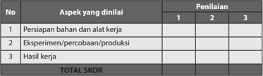

Tabel ini menunjukkan aspek-aspek yang dianalisis dalam sebuah penilaian, dengan penilaian dilakukan oleh tiga orang penilai. Topik utama tabel adalah "Aspek yang dianalisis" dan "Penilaian". Kolom pertama berisi nomor urut dari 1 hingga 3 untuk setiap aspek yang dianalisis. Kolom kedua berisi deskripsi aspek yang dianalisis, seperti persiapan bahan dan alat kerja, eksperimen/percobaan/produksi, dan hasil kerja. Kolom ketiga berisi skor yang diberikan oleh tiga penilai untuk setiap aspek. Total skor dihitung melalui penggabungan nilai dari tiga penilai untuk setiap aspek. Pola penting yang terlihat adalah bahwa setiap aspek dianalisis oleh tiga penilai, dan total skor ditentukan berdasarkan rata-rata dari nilai tiga penilai.

 

---
## 📄 Halaman 48

### Contoh Rubrik Penilaian Tugas Eksperimen/Percobaan:

---
**📊 Tabel**

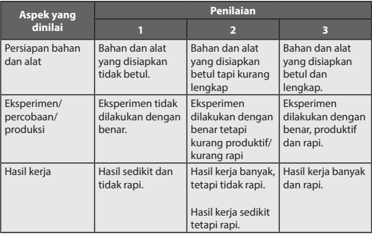

Tabel ini menunjukkan penilaian berdasarkan tiga aspek: persiapan bahan dan alat, eksperimen/percobaan/produksi, dan hasil kerja. Topik utama adalah proses penilaian dalam sebuah kegiatan laboratorium atau eksperimen. Kolom pertama menunjukkan aspek-aspek yang dinaikkan, sedangkan kolom kedua dan ketiga menunjukkan tingkat penilaian yang diberikan oleh penilai. Data penting yang terlihat adalah bahwa penilaian berkisar dari "bahan dan alat yang disiapkan betul" hingga "hasil kerja banyak tetapi tidak rapi". Ini menunjukkan bahwa penilaian dapat berbeda-beda tergantung pada kualitas persiapan, kualitas eksperimen, dan kualitas hasil kerja.

### Contoh 2. Teknik Penilaian Proyek

Mata Pelajaran

: Prakarya dan Kewirausahaan

Nama Proyek :

Alokasi Waktu :

Guru Pembimbing :

Nama :

NIS :

Kelas :

---
**📊 Tabel**

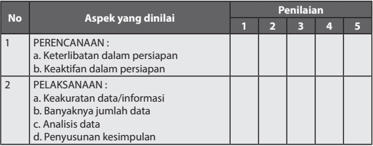

Tabel ini menunjukkan aspek-aspek yang dianalisis dalam proses penelitian, dengan penilaian berdasarkan skala 1 hingga 5. Topik utama adalah "PERENCANAAN" dan "PELAKSANAAN". Dalam aspek PERENCANAAN, ada dua sub-aspek: keterlibatan dalam persiapan dan keaktifan dalam persiapan. Untuk aspek PELAKSANAAN, ada empat sub-aspek: keakuratan data/informasi, banyaknya jumlah data, analisis data, dan penyusunan kesimpulan. Data atau pola penting yang terlihat adalah bahwa setiap aspek memiliki empat poin penilaian, dan skala penilaian mencakup nilai dari 1 hingga 5.

 

---
## 📄 Halaman 49

---
**📊 Tabel**

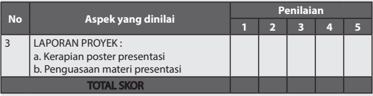

Tabel ini menunjukkan aspek-aspek yang dianalisis dalam proyek, dengan penilaian berdasarkan skor 1 hingga 5. Topik utama adalah "Laporan Proyek", yang terdiri dari dua aspek utama: "Kerapian poster presentasi" dan "Penguasaan materi presentasi". Setiap aspek tersebut diukur melalui penilaian yang dilakukan oleh para penilai, yang kemudian ditotal untuk mendapatkan skor akhir. Data yang penting yang terlihat adalah bahwa setiap aspek memiliki skor yang berbeda-beda, menunjukkan bahwa penilaian ini cukup detail dan mendalam.

### b. Penilaian Sikap

Teknik Penilaian Sikap

Penilaian sikap dapat dilakukan dengan beberapa cara atau teknik. Teknik­teknik  tersebut  antara  lain:  observasi  perilaku,  pertanyaan langsung, dan laporan pribadi. Teknik­teknik tersebut secara ringkas dapat diuraikan sebagai berikut,

### 1) Observasi perilaku

Perilaku  seseorang  pada  umumnya  menunjukkan  kecenderungan seseorang dalam sesuatu hal. Guru dapat melakukan observasi terhadap  peserta  didiknya.  Hasil  observasi  dapat  dijadikan sebagai  umpan balik dalam pembinaan. Observasi perilaku di sekolah  dapat  dilakukan  dengan  menggunakan  buku  catatan khusus  tentang  kejadian­kejadian  berkaitan  dengan  peserta didik selama di sekolah.

### 2) Pertanyaan langsung

Guru  juga  dapat  menanyakan  secara  langsung  tentang  sikap peserta didik berkaitan dengan sesuatu hal. Misalnya, bagaimana tanggapan peserta didik tentang kebijakan pemerintah tentang Standar  Nasional  Indonesia  (SNI).  Berdasarkan  jawaban  dan reaksi lain yang tampil dalam memberi jawaban, dapat dipahami sikap  peserta  didik  itu  terhadap  objek  sikap.  Dalam  penilaian sikap peserta didik di sekolah, guru juga dapat menggunakan teknik ini dalam menilai sikap dan membina peserta didik.

### 3) Laporan pribadi

Teknik ini  meminta peserta didik membuat ulasan yang berisi pandangan atau tanggapannya tentang suatu masalah, keadaan, atau  hal  yang  menjadi  objek  sikap.  Dari  ulasan  yang  dibuat peserta didik, dapat dibaca dan dipahami kecenderungan sikap yang dimilikinya.

 

---
## 📄 Halaman 50

---
**🖼️ Gambar/Diagram**

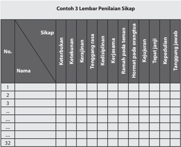

> **Deskripsi Visual:** Gambar ini adalah lembaran penilaian sikap yang berisi kolom-kolom berisi nama-nama siswa dan baris-baris berisi berbagai sikap yang harus diperiksa. Kolom pertama berisi nomor urut, kolom kedua berisi nama-nama siswa, kolom ketiga hingga ke kolom ke-32 berisi berbagai sikap yang harus diperiksa oleh guru. Teks, angka, atau label penting yang terlihat pada gambar ini adalah nama-nama siswa, nomor urut, dan berbagai sikap yang harus diperiksa. Informasi kunci yang dapat diambil pembaca adalah bahwa ini adalah lembaran penilaian sikap yang digunakan untuk menilai sikap-sikap siswa dalam berbagai aspek.

---
**📊 Tabel**

Tabel ini merupakan lembaran penilaian sikap yang digunakan untuk mengukur tingkat keterampilan dan perilaku individu dalam berbagai aspek sosial dan profesional. Topik utama tabel adalah "Sikap", yang mencakup berbagai karakteristik seperti ketekunan, kerja keras, tanggung jawab, dan kepemimpinan. Tabel ini memiliki 32 baris, masing-masing menunjukkan nama individu yang akan diuji. Kolom-kolom lainnya mencakup berbagai aspek sikap, seperti ketekunan, kerja keras, tanggung jawab, dan kepemimpinan. Data penting yang terlihat adalah bahwa tabel ini dirancang untuk membandingkan dan menilai sikap individu dalam berbagai situasi dan konteks.

Keterangan Lembar Penilaian SIkap:

Skala penilaian sikap dibuat dengan rentang antara 1 s.d 5.

- 1 = sangat kurang;
- 2 = kurang konsisten;
- 3 = mulai konsisten;
- 4 = konsisten; dan
- 5 = selalu konsisten

### c. Penilaian Produk

Teknik  Penilaian  Produk  biasanya  menggunakan  cara  holistik  atau analitik.

- Cara holistik, yaitu berdasarkan kesan keseluruhan dari produk, biasanya dilakukan pada tahap penilaian akhir.
- Cara  analitik,  yaitu  berdasarkan  aspek­aspek  produk,  biasanya dilakukan  terhadap  semua  kriteria  yang  terdapat  pada  semua tahap proses pengembangan.

 

---
## 📄 Halaman 51

Bentuk penilaiannya dapat digunakan skala penilaian dengan tabel serupa dengan penilaian unjuk kerja, tetapi dengan kriteria penilaian yang  berbeda.  Pada  sebuah  produk,  penilaian  pada  dasarnya kualitas produk. Untuk produk kerajinan dan rekayasa, kebaruan ide, originalitas (asli/tidak meniru) atau keunikan produk menjadi salah satu  kriteria  penting,  sedangkan  pada  produk  hasil  budidaya  dan pengolahan konsistensi hasil produksi merupakan kriteria terpenting.

### d. Penilaian Konsep Diri

Penilaian  diri  adalah  suatu  teknik  penilaian  di  mana  peserta  didik diminta  untuk  menilai  dirinya  sendiri  berkaitan  dengan  status, proses  dan  tingkat  pencapaian  kompetensi  yang  dipelajarinya. Teknik penilaian diri dapat digunakan untuk mengukur kompetensi kognitif,  afektif  dan  psikomotor.  Penilaian  konpetensi  kognitif  di kelas,  misalnya:  peserta  didik  diminta  untuk  menilai  penguasaan pengetahuan dan keterampilan berpikirnya sebagai hasil belajar dari suatu  mata  pelajaran  tertentu.  Inventori  digunakan  untuk  menilai konsep diri peserta didik dengan tujuan untuk mengetahui kekuatan dan kelemahan diri peserta didik. Rentangan nilai yang digunakan antara 1 dan 2. Jika jawaban YA maka diberi skor 2, dan jika jawaban TIDAK  maka  diberi  skor  1.  Kriteria  penilaianya  adalah  jika  rentang nilai antara 0-5 dikategorikan tidak positif; 6-10, kurang positif; 115 positif dan 16-20 sangat positif.

### Contoh 4 Format Penilaian Konsep Diri Peserta Didik (dalam konteks Kewirausahaan)

---
**📊 Tabel**

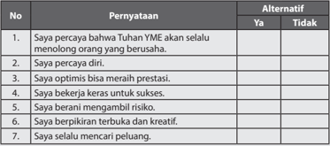

Tabel ini berisi pernyataan yang dianggap penting oleh individu, dengan alternatif "Ya" atau "Tidak". Topik utama tabel adalah tentang sikap dan nilai-nilai pribadi yang dianggap positif. Kolom pertama berisi nomor pernyataan, sedangkan kolom kedua berisi alternatif jawaban. Data penting yang terlihat adalah bahwa sebagian besar pernyataan memiliki alternatif "Ya", menunjukkan bahwa individu tersebut memiliki sikap dan nilai-nilai yang dianggap positif.

 

---
## 📄 Halaman 52

---
**📊 Tabel**

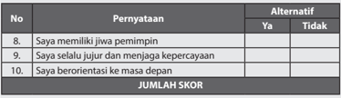

Tabel ini berisi pertanyaan-pertanyaan yang bertujuan untuk mengukur tingkat kepuasan atau kepercayaan seseorang terhadap dirinya sendiri dan lingkungan kerja mereka. Topik utamanya adalah tentang aspek-aspek yang mempengaruhi kinerja dan kepuasan kerja. Kolom "Pernyataan" berisi pertanyaan-pertanyaan yang harus dijawab dengan alternatif "Ya" atau "Tidak". Kolom "Alternatif" menyediakan opsi jawaban untuk setiap pertanyaan. Data atau pola penting yang terlihat adalah bahwa setiap pertanyaan memiliki dua pilihan jawaban, yang menunjukkan bahwa responden harus memilih antara "Ya" atau "Tidak" untuk setiap pertanyaan. Ini membantu dalam analisis dan pengumpulan data yang akurat dan efektif.

### E.  Remedial

Pembelajaran remedial adalah pembelajaran yang diberikan kepada peserta didik yang belum mencapai ketuntasan kompetensi. Remedial menggunakan berbagai metode yang diakhiri dengan penilaian untuk mengukur kembali tingkat  ketuntasan  belajar  peserta  didik.  Pembelajaran  remedial  diberikan kepada peserta didik bersifat terpadu. Artinya, guru memberikan pengulangan materi  dan  terapi  masalah  pribadi  ataupun  kesulitan  belajar  yang  dialami oleh  peserta  didik.  Remedial  bukan  merupakan  pengulangan  kegiatan tes  dengan  soal  yang  sama,  melainkan  proses  identifikasi  masalah  belajar dan  metode  pembelajaran  agar  peserta  didik  dapat  mencapai  ketuntasan kompetensi. Remedial didasari dengan keyakinan bahwa setiap peserta didik mampu mencapai ketuntasan kompetensi, dengan perbedaan pada cara dan kecepatan belajar.

### 1. Prinsip­Prinsip Kegiatan Remedial

### · Adaptif

Peserta  didik  memiliki  keunikan  dan  kondisi  yang  berbeda­beda diantaranya cara belajar dan kondisi psikologisnya. Kegiatan remedial harus sesuai dengan  peserta  didik  untuk  mencapai  efektifitas pembelajaran.

### · Interaktif

Pada pembelajaran remedial interaksi dan komunikasi antara guru dengan peserta didik harus terjalin baik agar guru mengetahui secara pasti bentuk hambatan yang dialami peserta didik, dan sebaliknya peserta didik akan merasa lebih termotivasi.

- Fleksibilitas pembelajaran dan penilaian
Pengajaran  remedial  menggunakan  metode  pembelajaran  yang disesuaikan  dengan  keunikan  dan  kondisi  individu  peserta  didik. Metode  pembelajaran  yang  digunakan  disusun  berdasarkan  hasil diagnosis kesulitan belajar peserta didik. Penilaian dilakukan terhadap

 

---
## 📄 Halaman 53

hasil  pembelajaran  untuk  mencapai  ketuntasan  kompetensi.  Cara penilaian lebih fleksibel, tidak harus sama dengan soal ulangan yang digunakan di pada pembelajaran reguler.

- Umpan balik sesegera mungkin
Keberhasilan pengajaran remedial ditentukan upaya oleh guru dan peserta  didik.  Peserta  didik  sebaiknya  dapat  segera  mengetahui keberhasilan  atau  kekurangannya  segera  setelah  pembelajaran dilaksanakan  agar  dapat  segera  melakukan  upaya  lanjutan  untuk memperoleh ketuntasan kompetensi.

- Kesinambungan dan ketersediaan pengajaran remedial
Peserta didik hendaknya  dapat mengikuti pengajaran reguler maupun pengajaran remedial secara berkesinambungan agar proses pembelajaran secara keseluruhan dapat berjalan lancar dan tuntas.

### 2. Langkah­Langkah Kegiatan Remedial

Remedial berasal dari kata remedy (Inggris) yang artinya penyembuhan. Proses penyembuhan, seperti pada kesehatan, diawali dengan identikasi masalah.  Pada  remedial  pembelajaran,  guru  mengidentifikasi  masalah belajar pada peserta didik melalui pengamatan proses pembelajaran di kelas  dan  hasil  ulangan.  Kesulitan  belajar  yang  dihadapi  oleh  peserta didik dapat berasal dari faktor eksternal dan internal dirinya, di antaranya faktor psikologis, metode mengajaran yang tidak sesuai dengan peserta didik.  Hasil  diagnostik  kesulitan  belajar  peserta  didik  menjadi  dasar dari    penyusunan  rencana  kegiatan  pembelajaran  remedial.  Rencana pembelajaran dilaksanakan dalam bentuk pembelajaran remedial yang diikuti dengan proses penilaian hasil pembelajaran remedial.

 

---
## 📄 Halaman 54

---
**🖼️ Gambar/Diagram**

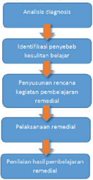

> **Deskripsi Visual:** Gambar ini adalah diagram yang menunjukkan proses analisis diagnosis dan penanganan masalah belajar. Diagram ini terdiri dari empat langkah utama:

1. **Analisis Diagnosis**: Langkah pertama yang menunjukkan bahwa proses dimulai dengan analisis penyebab masalah belajar.

2. **Identifikasi Penyebab Kesulitan Belajar**: Langkah kedua yang menunjukkan identifikasi faktor-faktor yang menyebabkan masalah belajar.

3. **Penyusunan Rencana Kegiatan Pembebanan Remedi**: Langkah ketiga yang menunjukkan pengembangan rencana untuk membantu individu mengatasi masalah belajar.

4. **Pelaksanaan Remedi**: Langkah keempat yang menunjukkan implementasi rencana pembebanan remedi.

Elemen-elemen utama dalam diagram ini adalah langkah-langkah yang disusun secara horizontal dan terhubung oleh garis panah yang menunjukkan arah proses. Teks, angka, atau label penting yang terlihat meliputi nama-nama langkah-langkah (Analisis Diagnosis, Identifikasi Penyebab Kesulitan Belajar, Penyusunan Rencana Kegiatan Pembebanan Remedi, Pelaksanaan Remedi) serta informasi tentang proses yang harus dilalui untuk mengatasi masalah belajar. 

Informasi kunci yang dapat diambil pembaca adalah bahwa proses ini melibatkan analisis penyebab masalah belajar, identifikasi faktor-faktor yang menyebabkan masalah, pengembangan rencana untuk membantu individu mengatasi masalah, dan implementasi rencana tersebut.

Sumber: Dokumen Kemdikbud

### C.  Pengayaan

Pengayaan  adalah  kegiatan  yang  diberikan  kepada  peserta  didik  atau kelompok  yang  lebih  cepat  dalam  mencapai  kompetensi  dibandingkan dengan peserta didik lain agar mereka dapat memperdalam kecakapannya atau dapat mengembangkan potensinya secara optimal. Tugas yang diberikan guru  kepada  peserta  didik  dapat  berupa  tutor  sebaya,  mengembangkan latihan  secara  lebih  mendalam,  membuat  karya  baru  ataupun  melakukan suatu proyek. Kegiatan pengayaan hendaknya menyenangkan dan mengembangkan kemampuan kognitif tinggi sehingga mendorong peserta didik  untuk  mengerjakan tugas yang diberikan. Berbeda dengan remedial, pengayaan  tidak  bertujuan  untuk  menghasilkan  penilaian  berdasarkan ketuntasan kompetensi melainkan untuk menambahkan kompetensi peserta didik dalam bentuk portofolio.

 

---
## 📄 Halaman 55

---
**🖼️ Gambar/Diagram**

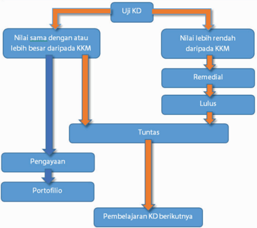

> **Deskripsi Visual:** Gambar ini adalah diagram alur yang menunjukkan prosedur evaluasi dan pembelajaran berdasarkan nilai KKM (Kesesuaian Minimun Kurikulum). Diagram ini terdiri dari beberapa tahap yang saling terkait:

1. **Uji KD** - Ini adalah langkah awal di mana nilai siswa dibandingkan dengan KKM.
2. Jika nilai sama atau lebih besar daripada KKM:
   - Siswa dinyatakan "Tuntas" dan proses berakhir.
   - Jika nilai lebih rendah daripada KKM:
     - Siswa harus mengikuti program remedial.
     - Setelah program remedial, jika nilai masih rendah, siswa dinyatakan "Lulus".
     - Jika nilai setelah program remedial sudah mencapai atau melebihi KKM, siswa dinyatakan "Tuntas".

3. **Pengayaan** - Siswa yang belum mencapai KKM akan menerima pengajaran tambahan.
4. **Portofolio** - Siswa yang telah mencapai KKM akan membuat portofolio untuk menunjukkan kemampuan mereka.
5. **Pembelajaran KD berikutnya** - Siswa yang belum mencapai KKM akan melanjutkan pembelajaran ke level berikutnya.

Elemen-elemen utama dalam diagram ini adalah langkah-langkah evaluasi dan pembelajaran, serta relasi antara setiap langkah. Teks penting dalam diagram ini adalah "Tuntas", "Remedial", dan "Lulus", yang menunjukkan hasil akhir setiap tahap. Informasi kunci yang dapat diambil pembaca adalah prosedur evaluasi dan pembelajaran yang digunakan dalam kurikulum tersebut, serta bagaimana siswa diarahkan sesuai dengan hasil ujian mereka.

Sumber: Dokumen Kemdikbud

### 1. Prinsip­Prinsip Kegiatan Pengayaan

Kegiatan pengayaan dan remedial memiliki perbedaan dalam tujuannya. Remedial bertujuan agar peserta didik mencapai ketuntasan kompetensi, sedangkan pengayaan bertujuan untuk memberikan kesempatan peserta didik  menambah pengetahuan dan keterampilan. Persamaan remedial dengan pengayaan adalah perencanaan kegiatan baik remedial maupun pengayaan berdasar pada keunikan, cara belajar dan ketertarikan peserta didik. Prinsip­prinsip kegiatan pengayaan adalah,

- Inovatif
Kegiatan pengayaan mendorong peserta didik untuk berpikir kreatif dan inovatif.

 

---
## 📄 Halaman 56

- Memperkaya
Kegiatan pengayaan mendorong peserta didik untuk bertanya dan mencari  jawaban  dari  berbagai  sumber  yang  bervariasi  sehingga memperoleh kekayaan informasi.

- Metode pembelajaran yang luas dan bervariasi
Metode  pembelajaran    yang  digunakan  dapat  sangat  bervariasi dengan tujuan mengembangkan minat peserta didik secara

- maksimal.
- Berdasar pada keunikan, kemampuan dan minat individu

### 2. Ragam Kegiatan Pengayaan

Ragam kegiatan pengayaan dikelompokan menjadi 3 (tiga) jenis:

- Eksplorasi pengetahuan
- Keterampilan proses
- Pemecahan masalah

### 3. Langkah­Langkah Kegiatan Pengayaan

Langkah  pengayaan  serupa  dengan  remedial,  yaitu  diawali  dengan identifikasi  keunikan  peserta  didik,  dilanjutkan  dengan  perencanaan kegiatan  pengayaan  dan  pelaksanaan  kegiatan  pengayaan.  Pada  akhir kegiatan pengayaan, tidak dilakukan penilaian untuk ketuntasan kompetensi  melainkan  penambahan  kepemilikan  portofolio  peserta didik. Pada kegiatan pengayaan identifikasi dilakukan terhadap tingkat kelebihan kemampuan belajar, yaitu,

- Belajar lebih cepat
- Menyimpan informasi lebih mudah
- Keingintahuan yang tinggi
- Berpikir mandiri
- Superioritas dalam berpikir abstrak
- Memiliki banyak minat

### D.  Interaksi dengan Orang Tua

Pembelajaran peserta didik di sekolah merupakan tanggung jawab bersama antara warga sekolah, yaitu kepala sekolah, guru, dan tenaga kependidikan kepada orang tua. Oleh karena itu, pihak sekolah perlu mengomunikasikan kegiatan pembelajaran peserta didik dengan orang tua. Orang tua dapat  berperan  sebagai  partner  sekolah  dalam  menunjang  keberhasilan pembelajaran peserta didik.

 

---
## 📄 Halaman 57

### Bagian II Petunjuk Khusus Proses Pembelajaran Semester 1

Buku Guru Prakarya dan Kewirausahaan 49

 

---
## 📄 Halaman 58

50

Kelas X SMA/MA/SMK/MAK

Semester 1

 

---
## 📄 Halaman 59

### KERAJINAN

### BAB I Wirausaha Kerajinan dengan Inspirasi Budaya Non Benda

- Kompetensi Inti (KI) dan Kompetensi Dasar (KD)
- Peta Konsep
- Tujuan Pembelajaran
- Proses Pembelajaran
- Evaluasi
- Pengayaan
- Remedial
- Interaksi dengan Orang Tua Peserta Didik

 

---
## 📄 Halaman 60

### A.  Kompetensi Inti (KI) dan Kompetensi Dasar (KD)

Tujuan  kurikulum  mencakup  empat  kompetensi,  yaitu  (1)  kompetensi  sikap spiritual,  (2)  sikap  sosial,  (3)  pengetahuan, dan (4) keterampilan. Kompetensi tersebut dicapai melalui proses pembelajaran  intrakurikuler, kokurikuler, dan  ekstrakurikuler.  Rumusan  kompetensi  sikap  spiritual  yaitu,  'Menerima dan menjalankan ajaran agama yang dianutnya' . Rumusan kompetensi sikap sosial, yaitu 'Menghayati dan mengamalkan perilaku jujur, disiplin, tanggung jawab, peduli (gotong royong, kerja sama, toleran, damai), santun, responsif dan proaktif dan menunjukkan sikap sebagai bagian dari solusi atas berbagai permasalahan  dalam  berinteraksi  secara  efektif  dengan  lingkungan  sosial dan  alam  serta  dalam  menempatkan  diri  sebagai  cerminan  bangsa  dalam pergaulan  dunia' .  Kedua  kompetensi  tersebut  dicapai  melalui  pembelajaran tidak langsung ( indirect teaching ) yaitu keteladanan, pembiasaan, dan budaya sekolah, dengan memperhatikan karakteristik mata pelajaran serta kebutuhan dan kondisi peserta didik. Penumbuhan dan pengembangan kompetensi sikap dilakukan sepanjang  proses pembelajaran berlangsung, dan dapat digunakan sebagai  pertimbangan  guru  dalam  mengembangkan  karakter  peserta  didik lebih lanjut.

Kompetensi pengetahuan dan keterampilan dikembangkan melalui kegiatan pembelajaran  dengan  Kompetensi  Inti  dan  Kompetensi  Dasar  untuk  materi Kerajinan dan Kewirausahaan Kelas X yang tercantum dalam tabel di bawah ini,

---
**📊 Tabel**

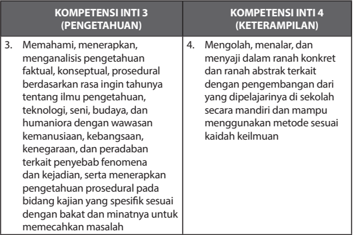

Tabel ini membandingkan dua kompetensi inti: Inti 3 (pengetahuan) dan Inti 4 (keterampilan). Topik utama tabel adalah tentang bagaimana seseorang dapat memahami dan menerapkan pengetahuan ilmu pengetahuan, konseptual, prosedural, dan teknologi dengan baik. Untuk Inti 3, tabel menunjukkan bahwa seseorang harus mampu memahami, menerapkan, dan menganalisis pengetahuan faktil, konseptual, prosedural, dan teknologi secara rinci setiap tahunnya. Sedangkan untuk Inti 4, tabel menunjukkan bahwa seseorang harus mampu mengolah, menalar, dan merenji dalam ranah konkret dan abstrakt berdasarkan pengembangan yang diperoleh di sekolah secara mandiri dan mampu menggunakan metode sesuai keadaan kesehatan. Dalam tabel ini, kolom pertama adalah topik utama, sedangkan kolom kedua adalah kompetensi inti yang dimaksud. Data atau pola penting yang terlihat adalah bahwa Inti 3 lebih fokus pada pengetahuan, sedangkan Inti 4 lebih fokus pada keterampilan.

 

---
## 📄 Halaman 61

---
**📊 Tabel**

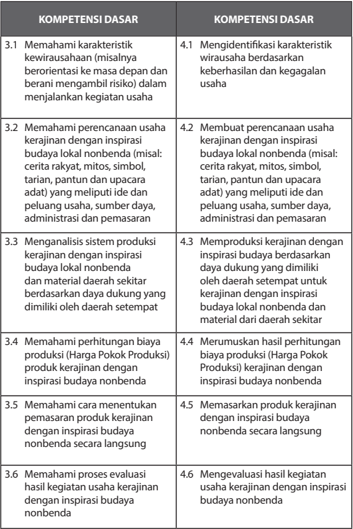

Tabel ini berisi informasi tentang kompetensi dasar yang harus dipenuhi oleh individu dalam konteks kerajinan budaya lokal nonbenda. Topik utamanya adalah tentang memahami dan menerapkan prinsip-prinsip kerajinan dengan inspirasi budaya nonbenda. Kolom pertama berisi nomor urut dari 1 sampai 6 untuk setiap kompetensi dasar, sedangkan kolom kedua berisi deskripsi singkat tentang kompetensi tersebut. Data penting yang terlihat adalah bahwa setiap kompetensi dasar memiliki dua poin yang berbeda, yang menunjukkan bahwa setiap kompetensi dasar memiliki dua aspek yang harus dipahami dan diimplementasikan dalam praktik kerajinan. Ini menunjukkan bahwa pembelajaran dan pengembangan kompetensi dasar ini harus dilakukan secara holistik dan mendalam.

 

---
## 📄 Halaman 62

---
**📊 Tabel**

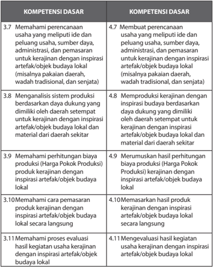

Tabel ini berisi informasi tentang kompetensi dasar yang harus dipenuhi oleh individu dalam mengembangkan dan memproduksi kerajinan dengan inspirasi artefak/objek budaya lokal. Topik utama tabel ini adalah tentang proses perencanaan, produksi, dan pemasaran kerajinan lokal. Kolom pertama berisi nomor urut dari 3.7 hingga 11.1, yang menunjukkan nomor urut dari setiap kompetensi dasar. Kolom kedua berisi deskripsi singkat dari setiap kompetensi dasar tersebut. Data penting yang terlihat adalah bahwa semua kompetensi dasar ini berkaitan erat dengan pengembangan dan pemanfaatan artefak/objek budaya lokal sebagai inspirasi dalam proses perencanaan, produksi, dan pemasaran kerajinan. Ini menunjukkan bahwa pembelajaran dan pengembangan kerajinan lokal sangat penting untuk menerapkan nilai-nilai budaya lokal dalam konteks industri.

 

---
## 📄 Halaman 63

### B.  Peta Konsep

---
**🖼️ Gambar/Diagram**

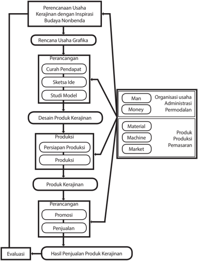

> **Deskripsi Visual:** Gambar ini adalah diagram yang menunjukkan proses perencanaan dan implementasi usaha kerajinan dengan inspirasi budaya nonbenda. Diagram ini terdiri dari berbagai tahap yang saling terkait, mulai dari perencanaan usaha hingga evaluasi hasil penjualan produk kerajinan.

Elemen utama dalam diagram ini meliputi:
1. Perencanaan Usaha Kerajinan dengan Inspirasi Budaya Nonbenda
2. Rencana Usaha Grafika
3. Desain Produk Kerajinan
4. Produksi
5. Produk Kerajinan
6. Perancangan
7. Evaluasi

Relasi antara elemen-elemen tersebut sangat jelas, dengan setiap tahap mempengaruhi tahap berikutnya. Misalnya, hasil dari perencanaan usaha dan rancangan grafik menjadi dasar untuk desain produk kerajinan, yang kemudian dikembangkan dalam produksi. Proses ini berlanjut hingga produk kerajinan siap dijual dan diuji dengan evaluasi penjualan.

Teks, angka, atau label penting yang terlihat dalam diagram ini mencakup:
- "Man" (Organisasi usaha)
- "Money" (Administrasi)
- "Permodalan"
- "Material"
- "Machine"
- "Market"
- "Produk Produksi"
- "Pemasaran"

Informasi kunci yang dapat diambil pembaca meliputi:
1. Proses komprehensif dari perencanaan hingga penjualan produk kerajinan.
2. Pentingnya setiap tahap dalam menghasilkan produk yang berkualitas.
3. Keterkaitan antara berbagai aspek bisnis seperti manajemen, permodalan, material, mesin, pasar, dan pemasaran.
4. Nilai-nilai budaya nonbenda dalam proses perencanaan dan implementasi usaha kerajinan.

 

---
## 📄 Halaman 64

### C.  Tujuan Pembelajaran

Setelah mempelajari Wirausaha Kerajinan dengan inspirasi budaya nonbenda, peserta didik mampu:

- Menghayati bahwa akal pikiran dan kemampuan manusia dalam berpikir kreatif untuk membuat kerajinan, ragam budaya nonbenda serta keberhasilan wirausaha adalah anugerah Tuhan.
- Menghayati  perilaku  jujur,  percaya  diri,  dan  mandiri  serta  sikap  bekerja sama,  gotong  royong,  bertoleransi,  disiplin,  bertanggung  jawab,  kreatif, dan inovatif dalam membuat kerajinan dengan inspirasi budaya nonbenda guna membangun semangat usaha.
- Mendesain dan membuat kerajinan dengan insprisai budaya nonbenda berdasarkan identifikasi kebutuhan sumber daya, teknologi, danprosedur berkarya.
- Mempresentasikan dan memasarkan kerajinan dengan inspirasi budaya nonbenda dengan perilaku jujur dan percaya diri.
- Melakukan  evaluasi  pembelajaran  wirausaha  kerajinan  dengan  inspirasi budaya nonbenda.

### D.  Proses Pembelajaran

### 1. Karakteristik Kewirausahaan

Pembelajaran Wirausaha Kerajinan dengan inspirasi budaya non benda diawali dengan  materi karakteristik kewirausahaan, yang meliputi pengertian wirausaha dan kewirausahaan, sifat-sifat wirausahawan, dan faktor  penyebab  keberhasilan  dan  kegagalan  berwirausaha.  Kurikulum 2013  bersifat  interaktif  dan  memberikan  banyak  kesempatan  kepada peserta didik untuk peserta didik untuk mengungkapkan pendapatnya dengan  bimbingan  guru.  Beberapa  hal  tang  dapat  dilakukan  Guru untuk  membuat  suasana  interaktif  dalam  pembelajaran  Karakteristik Kewirausahaan di antaranya sebagai berikut.

- Guru  dapat  memberikan  paparan  dan  mengajak  peserta  didik untuk memahami materi karakteristik kewirausahaan dalam konteks kehidupan sehari-hari.
- Guru dapat meminta peserta didik untuk mengemukakan pendapatnya tentang contoh penerapan sifat seorang wirausahawan dalam pelaksanaan kegiatan usaha.
- Guru juga dapat meminta peserta didik untuk menilai dirinya sendiri tentang  sifat-sifat  apa  yang  sudah  dimiliki  dirinya  untuk  menjadi seorang wirausahawan.
Pada pembelajaran ini, terdapat Tugas 1, yaitu penugasan kepada peserta didik untuk melakukan pencarian data tentang seorang atau sekelompok wirausahawan  sukses.  Peserta  didik  diminta  untuk  mempelajari  kisah-

 

---
## 📄 Halaman 65

kisah sukses dan menganalisis faktor penyebab kesuksesan wirausahawan tersebut. Luaran dari Tugas 1 adalah presentasi di depan kelas. Peserta didik  akan  mendengarkan  presentasi  teman  sekelasnya.  Guru  dapat meminta peserta didik untuk mencatat poin-poin penting dari presentasi temannya untuk melengkapi temuannya.

### 2. Perencanaan Usaha Kerajinan dengan Inspirasi Budaya Nonbenda

Pembelajaran diawali dengan paparan tentang kekayaan budaya tradisional Indonesia yang merupakan sumber inspirasi yang tak akan ada habisnya sebagai inspirasi berkarya. Budaya tradisi dapat dikelompokkan menjadi budaya nonbenda dan artefak/objek budaya. Budaya non benda diantaranya pantun, cerita rakyat, tarian, dan upacara adat. Sedangkan Artefak/objek  budaya  di  antaranya  pakaian  daerah,  wadah  tradisional, senjata  dan  rumah  adat.  Pada  kehidupan  sehari-hari,  produk  budaya tradisional nonbenda maupun artefak tidak dipisah-pisahkan melainkan menjadi satu kesatuan dan saling melengkapi.  Paparan sisertai dengan contoh-contoh produk kerajinan yang mengambil inspirasi dari budaya non  benda.  Gambar-gambar  yang  ditampilkan  merupakan  kerajinan yang  sederhana,  guru  dapat  menambahkan  contoh-contoh  kerajinan lain yang ada di daerah, atau diperoleh dari sumber lain seperti buku dan internet.

Bagan  jenis  produk  budaya  tradisional  berupa  benda  dan  nonbenda terdapat  dalam  buku  siswa  untuk  memudahkan  peserta  didik  dalam memahami pembagian antara budaya non benda dengan artefak/objek budaya. Guru dapat membuat tanya-jawab di kelas untuk memastikan peserta didik memahami perbedaannya, diantaranya dengan pertanyaan sebagai berikut.

- Menurut  pendapatmu,  apa  pengertian/definisi/ciri-ciri  dari  hasil budaya non benda? Jelaskan dengan kata-katamu sendiri
- Menurut  pendapatmu,  apa  pengertian/definisi/ciri-ciri  dari  hasil budaya benda/artefak? Jelaskan dengan kata-katamu sendiri
Pengenalan  tentang  ragam  budaya  nonbenda,  dilanjutkan  dengan pembuatan  Tugas  2.  Pada  tugas  ini,  peserta  didik  mencari  informasi tentang ragam budaya nonbenda yang terdapat di daerah lingkungan tempat  tinggal,  kabupaten/kota  maupun  provinsi.  Peserta  didik  akan mendiskusikannya di dalam kelompok dan penuliskannya dalam bentuk Lembar Kerja seperti contoh. Guru juga dapat memotivasi peserta didik untuk membuat bentuk presentasi yang lebih menarik tentang Ragam Budaya Nonbenda tersebut, disertai foto, gambar atau sketsa.

 

---
## 📄 Halaman 66

Kegiatan wirausaha adalah pengelolaan sumber daya. Sumber daya yang dikelola dalam sebuah wirausaha dikenal dengan sebutan 6M, yakni Man (manusia), Money (uang), Material (bahan), Machine (peralatan), Method (cara kerja), dan Market (pasar). Sumber daya yang menjadi pertimbangan utama dalam pembuatan kerajinan adalah ketersediaan material. Sumber daya  material  terkait  erat  dengan  teknik  atau  metode  produksi.  Pada Tugas 3, peserta didik akan mencari informasi tentang ragam material dan  teknik  pengolahan  material  yang  ada  di  lingkungan  sekitar.  Guru dapat memotivasi peserta didik untuk mencari tahu kemungkinan adalah teknik khas daerah yang juga merupakan kearifan lokal daerah, misalnya teknik  anyam,  teknik  pengawetan  bahan,  teknik  pewarnaan  dengan bahan perwarna alami dan lain-lain. Pembuatan tugas ini memberikan kesempatan  kepada  peserta  didik  untuk  melakukan  kegiatan  di  luar sekolah dan bertemu langsung dengan para perajin yang ada di daerah. Kegiatan  sedapat  mungkin  dilakukan  dengan  menyenangkan  dan membangkitkan keingin tahuan peserta didik.

### 3. Perancangan dan Produksi Kerajinan dengan Inspirasi Budaya Nonbenda

Peserta didik telah mengidentifikasi ragam  potensi material serta teknik produksi yang ada di lingkungan sekitar. Peserta didik kemudian mempelajari proses perancangan dengan mempelajari paparan tentang  tahapan  proses  perancangan.  Guru  dapat  menyampaikan paparan tersebut dalam bentuk ceramah dan diskusi yang memberikan kesempatan kepada peserta didik untuk terlibat aktif dalam memberikan contoh atau mengemukakan pendapatnya tentang proses perancangan. Materi teori tentang tahapan proses perancangan yang telah dipaparkan guru  dan  didiskusikan,  akan  dilaksanakan  oleh  peserta  didik  dalam bentuk proyek dan unjuk kerja. Secara berkelompok, peserta didik akan praktik melakukan proses perancangan dan produksi kerajinan dengan inspirasi budaya non benda  melalui pelaksanaan Tugas 4 dan Tugas 5.

Proses perancangan terdiri dari beberapa tahapan yang akan dilakukan peserta didik dengan bimbingan dan arahan dari guru. Tahapan proses perancangan sebagai berikut.

- Pencarian ide produk
- Membuat gambar/sketsa
- Pemilihan ide terbaik
- Prototyping atau membuat studi model
- Perencanaan produksi

 

---
## 📄 Halaman 67

Tahapan  proses  tersebut  akan  menghasilkan  desain  atau  rancangan kerajinan  dengan  inspirasi  budaya  nonbenda  serta  petunjuk  teknis untuk  tahapan  proses  produksi.  Tahapan-tahapan  perancangan  harus dilakukan  dengan  tepat  agar  menghasilkan  rancangan  produk  yang berfungsi baik, menarik dan inovatif. Guru mendampingi setiap tahapan proses  perancangan  dari  setiap  kelompok,  memberikan  motivasi  dan memastikan  suasana  aktif  dan  kreatif  terbangun  agar  terjadi  proses kreatif.  Proses  kreatif  memungkinkan  peserta  didik  menghasilkan  ideide  yang  baru,  unik  dan  menarik.  Apabila  hal  itu  terjadi,  guru  dapat memberikan  pertimbangan  yang  lebih  bersifat  teknis  terkait  teknis dan kerangka waktu. Namun, apabila proses kreatif tidak terjadi dalam kelompok,  guru  dapat  memberikan  ide  atau  melontarkan  pertanyaan yang sekiranya dapat mendorong peserta didik untuk memunculkan ide. Ide dapat dikembangkan dari tugas-tugas yang telah dibuat sebelumnya.

Pada  buku  siswa  terdapat  beberapa  contoh  ide  untuk  dirancang, diproduksi dan dijual pada akhir semester di antaranya sebagai berikut.

- Kain batik atau lukisan pada pakaian/sepatu (produk fashion) yang menggambarkan cerita rakyat
- Diorama cerita rakyat
- Hiasan  dinding  dengan  pantun  yang  bermakna  perdamaian  dan kesejahteraan
- Wadah-wadah makanan dan minuman yang diberi simbol kemakmuran
- Kalender dengan 12 ilustrasi cerita rakyat/pantun dengan penjelasan maknanya
Sumber: http://artisenivisual.blogspot.co.id/2013/02/kalender-meja-3d.html

Pada  pelaksanaan  pembelajaran,  produk  yang  dibuat  dapat  berupa kerajinan  yang  berasal  dari  ide  kreatif  para  peserta  didik,  berdasarkan potensi budaya nonbenda dan material yang ada di lingkungan sekitar.

 

---
## 📄 Halaman 68

Berikan  motivasi  peserta  didik  untuk  melakukan  inovasi  kreatif  dan melakukan disiplin kerja yang baik untuk menghasilkan produk kerajinan yang berkualitas.

Perancangan dan rencana produksi dilanjutkan dengan tahap persiapan produksi. Pada tahapan persiapan produksi, peserta didik akan melakukan  praktik  persiapan  produksi  sesuai  dengan  rancangan  dan rencana produksi yang sudah dibuat. Guru mengarahkan peserta didik agar  membuat  pembagian  kerja  dalam  kelompok  yang  mendukung kinerja yang efektif dan efisien, serta menghasilkan produk berkualitas tinggi. Proses perencanaan proses produksi yang dilakukan peserta didik bergantung  pada  rancangan  produk  yang  sudah  dibuat  oleh  masingmasing kelompok, tidak harus sama dengan yang terdapat pada Buku Siswa. Secara umum, tahapan produksi kerajinan terdiri atas:

- pembahanan
- pembentukan
- perakitan
- finishing
Perencanaan tahapan proses produksi akan diuraikan dalam Tugas 5 yang merupakan  tugas  kelompok  dari  peserta  didik.  Perencanaan  tersebut akan dipraktikkan pada Tugas 6, yaitu kegiatan produksi hasil rancangan yang telah dibuat pada Tugas 4. Pada praktik produksi, guru harus dengan tegas selalu mengingatkan pentingnya kesehatan dan keselamatan kerja (K3). Disiplin dalam menerapkan prosedur K3 merupakan salah satu kunci keberhasilan kegiatan produksi.

Kerajinan  yang  dihasilkan  oleh  peserta  didik  membutuhkan  kemasan dan label untuk menjaga keutuhan produk pada saat distribusi. Selain kemasan  dan  label  untuk  keperluan  distribusi,  kemasan  produk  juga hendaknya  memiliki  identitas  agar  konsumen  dengan  mudah  dapat mengenali produk kerajinan tersebut. Materi tentang kemasan produk kerajinan  dapat  disampaikan  dalam  bentuk  paparan  dan  diskusi,  yang dilanjutkan  dengan  pelaksanaan  Tugas  7.  Tugas  ini  secara  khusus melibatkan peserta didik dalam upaya mengetahui dan memahami fungsi dari  identitas  produk  atau  yang  dikenal  pula  dengan  sebutan  merek atau brand .  Guru dapat memberikan kesempatan kepada peserta didik untuk menyebutkan beberapa merek produk lokal yang dikenal. Produk tersebut tidak harus kerajinan, dan sebaiknya produk yang dikenal baik oleh peserta didik agar peserta didik mampu menjelaskan alasan merek tersebut dianggap bagus dan berhasil.

 

---
## 📄 Halaman 69

### 4. Penghitungan Harga Pokok Produksi Kerajinan dengan Inspirasi Budaya Nonbenda

Peserta didik telah melakukan persiapan produksi dan produksi. Maka, mereka  telah  mengetahui  biaya  yang  dikeluarkan  untuk  pembelian bahan  baku  dan  biaya  overhead  yang  dikeluarkan  untuk  produksi. Pekerjaan produksi dilakukan oleh peserta didik, maka biaya tenaga kerja dapat disimulasikan. Guru dapat memberikan bimbingan penghitungan biaya  tenaga  kerja,  dengan  meminta  peserta  didik  untuk  menghitung jumlah jam kerja dari setiap peserta didik dalam melaksanakan produksi. Jumlah  total  jam  kerja  dikalikan  dengan  upah  per  jam.  Besaran  upah per  jam  dapat  dihitung  dari  upah  minimun  regional  yang  berlaku  di propinsi atau yang disebut dengan Upah Minimun Propinsi (UMP). UMP setiap propinsi bervariasi. Rata-rata UMP tahun 2014 di Indonesia adalah Rp1.595.900, bila dibagi jam kerja, sekitar Rp9.225/jam. Apabila seorang peserta didik bekerja selama 3 jam/minggu selama 2 minggu, upah akan dihitung sebagai 3 x 2 x 9225. Upah yang diterimanya adalah Rp55.350. Mintalah pesera didik untuk membuat daftar kehadiran dan waktu kerja, untuk dapat dijadikan landasan penentuan upah. Contoh penghitungan biaya produksi dapat dilihat pada contoh kasus di bawah ini.

### Contoh Khusus:

Satu  kelompok  beranggotakan  5  peserta  didik.  Setiap  peserta  didik terlibat  dalam proses perancangan, produksi dan persiapan penjualan. Perancangan dilakukan selama 1 minggu, produksi dilakukan selama 2 minggu dan persiapan penjualan dilakukan selama 1 minggu. Peserta didik A dan B bekerja selama 3 pada minggu pertama, peserta didik C, D dan E bekerja selama 2 jam pada minggu pertama. Pada minggu kedua, kelimanya bekerja selama 3 jam. Pada minggu keempat C, D dan E bekerja selama 3 jam, sedangkan peserta didik A dan B bekerja selama 2 jam.

---
**📊 Tabel**

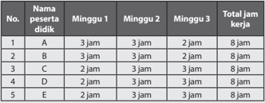

Tabel ini menunjukkan informasi tentang jam kerja siswa-siswa di seluruh minggu pertama dan kedua, dengan total jam kerja setiap minggu mencapai 8 jam. Topik utama tabel adalah jam kerja siswa-siswa. Kolom-kolomnya meliputi nama peserta didik, Minggu 1, Minggu 2, dan Minggu 3. Data penting yang terlihat adalah bahwa semua siswa memiliki jam kerja yang sama setiap minggu, yaitu 8 jam, dan tidak ada perbedaan jumlah jam kerja antara minggu pertama dan kedua.

 

---
## 📄 Halaman 70

### Upah tenaga kerja untuk kelompok ini adalah,

---
**📊 Tabel**

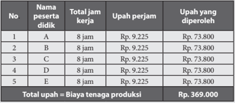

Tabel ini menunjukkan informasi tentang upah pekerjaan bagi lima peserta didik yang bekerja selama 8 jam per hari. Setiap peserta didik mendapatkan upah Rp. 9.225 per jam kerja, sehingga total upah yang diperoleh setiap peserta didik sebesar Rp. 73.800. Total upah semua peserta didik mencapai Rp. 369.000, yang merupakan biaya tenaga produksi untuk kegiatan tersebut. Topik utama tabel ini adalah upah pekerjaan peserta didik dan total biaya tenaga produksi. Kolom-kolom yang ada meliputi nomor peserta didik, nama peserta didik, total jam kerja, upah perjam, dan upah yang diperoleh. Data penting yang terlihat adalah bahwa semua peserta didik mendapatkan upah yang sama, yaitu Rp. 9.225 per jam kerja, dan total upah mereka mencapai Rp. 73.800.

Bila produk kerajinan yang diproduksi oleh kelompok ini membutuhkan bahan  baku  total  seharga  Rp350.000,  bahan  baku  kemasan  yang digunakan adalah karton gelombang total seharga Rp15.000 dan biaya overhead untuk produksi ini total seharga Rp20.000. Penghitungan Biaya Produksinya adalah sebagai berikut.

---
**📊 Tabel**

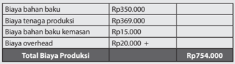

Tabel ini menunjukkan detail biaya produksi untuk suatu produk atau usaha. Topik utamanya adalah biaya produksi total yang mencapai Rp754.000. Tabel ini terdiri dari dua kolom: "Biaya Bahan Baku" dan "Biaya Tenaga Produksi". Biaya bahan baku mencakup Rp350.000 dan biaya tenaga produksi mencakup Rp369.000. Selain itu, tabel juga mencakup biaya bahan baku kemasan sebesar Rp15.000 dan overhead sebesar Rp20.000. Total biaya produksi mencapai Rp754.000, yang merupakan jumlah akhir dari semua biaya tersebut.

### 5. Pemasaran Langsung Kerajinan dengan Inspirasi Budaya Non Benda

Pemasaran  langsung  merupakan  kegiatan  pembelajaran  akhir  dari rangkaian  kegiatan  pembelajaran  yang  telah  dilakukan  sebelumnya. Peserta didik akan membuat rencana pemasaran serta praktik melakukan pemasaran  langsung  dari  kerajinan yang  sudah  dibuatnya.  Target penjualan dan strategi pemasaran didiskusikan dalam kelompok, serta dikonsultasikan dan dilaporkan kepada guru sebelum dilaksanakan. Guru memberikan ruang kreativitas kepada peserta didik untuk ide-ide cara pemasaran  langsung  yang  menarik  dan  inovatif.  Pemasaran  langsung dapat  dilakukan  di  sekolah  dalam  kegiatan  bazar  sekolah  atau  di  luar sekolah.  Penjualan  di  luar  sekolah,  sedapat  mungkin  juga  mendapat mengawasan  dari  guru  agar  peserta  didik  menjalankan  penjualan langsung dengan baik dan jujur sebagai bagian dari proses pembelajaran. Untuk  kegiatan  pemasaran,  peserta  didik  juga  membuat  pembagian

 

---
## 📄 Halaman 71

tugas dalam kelompoknya. Pembagian tugas dapat disesuaikan dengan bakat  dan  minat  anggota  kelompok.  Misalnya  peserta  didik  yang pandai  bicara  akan  melakukan  promosi  dengan  presentasi  sedangkan peserta  didik  yang  teliti  untuk  pembukuan  ditugasi  menjadi  kasir  dan administrasi keuangan. Inisiatif setiap anggota kelompok dalam rangka meningkatkan penjualan akan dihargai. Pada prinsipnya semua anggota kelompok harus terlibat aktif dan mendapat beban tanggung jawab yang setara.

### E.  Evaluasi

### 1. Karakteristik Kewirausahaan

Materi tentang Wirausaha Kerajinan dengan Inspirasi Budaya Nonbenda diawali dengan Karakteristik Kewirausahaan, sifat-sifat seorang wirausahawan dan faktor penyebab keberhasilan dan kegagalan. Evaluasi  dapat  dilakukan  untuk  mengukur  pemahaman  peserta  didik tentang  kewirausahaan  dengan  memberikan  kuis  berisi  pertanyaan tentang pengertian Kewirausahaan dan sifat-sifat wirausahawan. Evaluasi  juga  dapat  dilakukan  untuk  memberikan  kesempatan  peserta didik melakukan evaluasi diri, dengan Penilaian Diri. Penilaian diri adalah suatu  teknik  penilaian  di  mana  peserta  didik  diminta  untuk  menilai dirinya sendiri berkaitan dengan status, proses dan tingkat pencapaian kompetensi  yang  dipelajarinya.  Teknik  penilaian  diri  dapat  digunakan untuk mengukur kompetensi kognitif, afektif dan psikomotor. Inventori digunakan untuk menilai konsep diri peserta didik dengan tujuan untuk mengetahui kekuatan dan kelemahan diri peserta didik. Rentangan nilai yang digunakan antara 1 dan 2. Jika jawaban YA, diberi skor 2, dan jika jawaban TIDAK, diberi skor 1. Kriteria penilaianya adalah jika total nilai memiliki rentang nilai antara 0-5 dikategorikan tidak positif; 6-10, kurang positif; 11- 5 positif dan 16-20 sangat positif.

### Contoh Format Penilaian Konsep Diri Peserta Didik (dalam konteks Kewirausahaan)

---
**📊 Tabel**

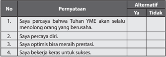

Tabel ini berisi pertanyaan-pertanyaan tentang kepercayaan dan sikap individu terhadap diri sendiri dan orang lain. Topik utamanya adalah tentang kepercayaan, optimisme, dan motivasi. Kolom "Pernyataan" berisi tiga pertanyaan yang masing-masing diikuti oleh alternatif jawaban "Ya" atau "Tidak". Data penting yang terlihat adalah bahwa semua pertanyaan memiliki alternatif jawaban "Ya", menunjukkan bahwa individu yang menjawab tabel tersebut memiliki kepercayaan yang kuat terhadap diri sendiri, orang lain, dan kemampuan untuk mencapai prestasi dan sukses. Ini menunjukkan bahwa individu tersebut memiliki sikap positif dan optimis dalam menghadapi tantangan hidup.

 

---
## 📄 Halaman 72

---
**📊 Tabel**

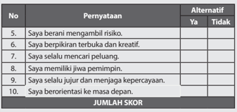

Tabel ini berisi pertanyaan-pertanyaan tentang sikap dan perilaku individu, dengan alternatif jawaban "Ya" atau "Tidak". Topik utama tabel adalah tentang sikap dan perilaku yang positif dan berorientasi pada masa depan. Kolom-kolomnya meliputi nomor pertanyaan (No.), pernyataan, dan alternatif jawaban. Data penting yang terlihat adalah bahwa sebagian besar pertanyaan memiliki alternatif jawaban "Ya", menunjukkan bahwa responden umumnya memiliki sikap dan perilaku yang positif dan berorientasi pada masa depan.

Pada pembelajaran ini terdapat Tugas 1, yaitu penugasan kepada peserta didik untuk melakukan pencarian data tentang seorang atau sekelompok wirausahawan  sukses.  Peserta  didik  diminta  untuk  mempelajari  kisahkisah sukses dan menganalisis faktor penyebab kesuksesan wirausahawan tersebut. Luaran dari Tugas 1 adalah presentasi di depan kelas. Evaluasi Tugas 1 dapat menggunakan penilaian proyek pada halaman.

### Contoh Lembar Penilaian Proyek

Mata Pelajaran

: Prakarya dan Kewirausahaan

Nama Proyek :

Alokasi Waktu :

Guru Pembimbing :

Nama/NIS :

Kelas :

---
**📊 Tabel**

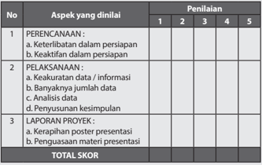

Tabel ini menunjukkan skor penilaian untuk tiga aspek utama dalam sebuah proyek: Perencanaan, Pelaksanaan, dan Laporan Proyek. Topik utama adalah aspek-aspek tersebut, yang diukur melalui penilaian dari lima penilai berdasarkan skala 1 hingga 5. Kolom-kolomnya mencakup keterlibatan dalam persiapan, keaktifan dalam persiapan, akuratnya data/informasi, banyaknya jumlah data, analisis data, penyusunan kesimpulan, kerapuhan poster presentasi, dan penggunaan materi presentasi. Data penting yang terlihat adalah bahwa semua aspek memiliki penilaian dari lima penilai, dan setiap penilai memberikan skor untuk setiap aspek.

 

---
## 📄 Halaman 73

### 2. Perencanaan Usaha Kerajinan dengan Inspirasi Budaya Nonbenda

Pembelajaran diawali dengan paparan tentang kekayaan budaya tradisional Indonesia yang merupakan sumber inspirasi yang tak akan ada habisnya sebagai inspirasi berkarya. Budaya tradisi dapat dikelompokan menjadi  budaya  nonbenda  dan  artefak/objek  budaya.  Peserta  didik hendaknya  mengenali  keragaman  budaya  benda  maupun  nonbenda yang ada di  daerahnya.  Pemahaman peserta  didik  budaya  dan  filosofi yang  terkandung  di  dalamnya  akan  memudahkannya  dalam  kegiatan pembelajaran  berikutnya  terutama  saat  berpikir  kreatif  dalam  proses perancangan kerajinan dengan inspirasi budaya nonbenda. Guru dapat mengevaluasi  pemahaman  peserta  didik  tentang  budaya  benda  dan budaya  nonbenda  melalui  kuis  ataupun  meminta  peserta  didik  untuk mengemukakan  pendapatnya  mengenai  apa  hal  yang  menarik  dari paparan pada buku siswa tentang budaya sebagai sumber inspirasi.

Pada pembelajaran ini, peserta didik melaksanakan Tugas 2 dan Tugas 3. Kedua tugas ini dapat dievaluasi dengan menggunakan Penilaian Proyek seperti yang digunakan dalam penilaian Tugas 1.

### 3. Perancangan dan Produksi Kerajinan dengan Inspirasi Budaya Non Benda

Pada pembelajaran ini, peserta didik melaksanakan proses perancangan dalam kelompok. Hasil dari proses perancangan adalah sebuah desain kerajinan dengan inspirasi budaya yang akan diproduksi. Peserta didik juga akan melakukan proses produksi.

Proses  perancangan  terdiri  atas  beberapa  langkah  yaitu  pencarian  ide produk, membuat gambar/sketsa, pilihan ide terbaik, studi model dan perencanaan produksi. Pada proses perancangan penilaian yang dapat dilakukan  adalah  penilaian  sikap  peserta  didik  berperilaku  sebagai anggota kelompok. Penilaian dapat dilakukan secara menyeluruh terhadap kinerja setiap peserta didik, sehingga peserta didik yang aktif dan penuh inisiatif serta ide kreatif dapat memperoleh poin lebih tinggi.

Proses  perancangan  dilanjutkan  dengan  proses  produksi,  yang  secara langsung membuktikan bahwa ide rancangan dapat diwujudkan menjadi sebuah produk. Secara umum,  tahapan produksi kerajinan terdiri atas:

- Pembahanan
- Pembentukan
- Perakitan
- Finishing

 

---
## 📄 Halaman 74

Teknik  dan  instrumen  yang  dapat  digunakan  untuk  penilaian  proses persiapan  dan  kegiatan  produksi  di  antaranya  adalah  penilaian  unjuk kerja. Gunakan format penilaian pada Contoh 1 halaman 39 dan 40.

Tugas perancangan dan produksi dilakukan dalam kelompok. Sebaiknya dilakukan  juga  penilaian  sikap.  Dalam  kerja  kelompok,  peserta  didik akan menunjukkan sikap kerja dan cara komunikasi serta menyelesaikan persoalan  dalam  kelompok.  Penilaian  sikap  dapat  dilakukan  dengan beberapa cara atau teknik. Teknik-teknik tersebut antara lain: observasi perilaku,  pertanyaan  langsung,  dan  laporan  pribadi.  Penilaian  menggunakan format Contoh 3 halaman 42.

Produk  yang  dihasilkan  dari  proses  kreatif  dan  proses  produksi  dari kelompok  peserta  didik  berhak  mendapatkan  apresiasi  dan  penilaian. Teknik dan instrumen penilaian yang dapat digunakan adalah penilaian produk  contoh  1  pada  halaman  39-40  dengan  kriteria  penilaian  yang berbeda. Pada sebuah produk penilaian pada dasarnya kualitas produk. Untuk  produk  kerajinan  dan  rekayasa,  kebaruan  ide,  originalitas  (asli/ tidak meniru) atau keunikan produk menjadi salah satu kriteria penting.

### 4. Penghitungan Biaya Produksi Kerajinan dengan Inspirasi Budaya Nonbenda

Evaluasi dan penilaian penghitungan biaya produksi memiliki parameter yang jelas, yaitu betul atau salah . Hasil penghitungan biaya produksi dari setiap  kelompok  peserta  didik  berbeda-beda  sesuai  dengan  material, produk  dan  proses  produksi  yang  dilakukan.  Guru  dapat  memeriksa penghitungan biaya dari setiap kelompok atau meminta peserta didik untuk  mempresentasikan  penghitungannya  di  depan  kelas  sehingga rekan sekelas dapat turut mengevaluasi.

Teknik dan instrumen penilaian yang dapat digunakan untuk unjuk kerja penghitungan biaya produksi kerajinan dengan inspirasi adalah dengan daftar cek. Daftar cek dipilih jika unjuk kerja yang dinilai relatif sederhana sehingga kinerja peserta didik representatif untuk diklasifikasikan menjadi dua kategorikan saja, misalnya betul atau salah.

### 5. Pemasaran Langsung Kerajinan dengan Inspirasi Budaya Nonbenda

Target  dari  pemasaran  langsung  adalah  hasil  penjualan.  Peserta  didik akan  melakukan  penjualan  langsung  kerajinan  yang  telah  dihasilkan setiap kelompok. Pada tahap pemasaran, peserta didik akan melakukan pembagian  tugas  dalam  kelompok  agar  upaya  pemasaran  berhasil dengan  baik.  Guru  mengamati    setiap  proses  yang  terjadi  dalam

 

---
## 📄 Halaman 75

kelompok,  mulai  dari  pembagian  tugas  hingga  pelaksanaannya.  Hasil pengamatan  digunakan  untuk  evaluasi  dan  penilaian  kinerja  peserta didik dalam proses pemasaran.

Teknik  penilaian  dan  instrumen  yang  digunakan  untuk  evaluasi  dan penilaian kinerja pemasaran dapat menggunakan tabel penilaian seperti contoh.

### Contoh Teknik Penilaian Tugas Pemasaran

Mata Pelajaran

: Prakarya dan Kewirausahaan

Nama Proyek :

Alokasi Waktu :

Guru Pembimbing :

Nama :

NIS :

Kelas :

---
**📊 Tabel**

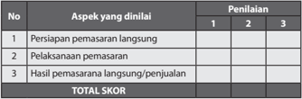

Tabel ini menunjukkan aspek-aspek yang dianalisis dalam sebuah penilaian, dengan penilaian berdasarkan skor 1 hingga 3. Topik utama tabel adalah "Aspek yang dianalisis" dan "Penilaian". Kolom-kolomnya meliputi: Persiapan pemasaran langsung, Pelaksanaan pemasaran, Hasil pemasaran langsung/penjualan, dan Total Skor. Data penting yang terlihat adalah bahwa semua aspek memiliki penilaian sebanyak tiga skor, namun tidak semua aspek memiliki penilaian untuk setiap skor. Ini menunjukkan bahwa penilaian ini mungkin belum lengkap atau masih dalam tahap awal.

### Contoh Rubrik Penilaian Tugas Pemasaran:

---
**📊 Tabel**

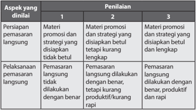

Tabel ini menunjukkan penilaian atas dua aspek utama: persiapan pemasaran langsung dan pelaksanaan pemasaran langsung. Topik utama adalah evaluasi kinerja pemasaran langsung. Kolom pertama berisi deskripsi aspek yang dinilai, sedangkan kolom kedua dan ketiga berisi penilaian yang diberikan kepada materi promosi dan strategi. Data penting yang terlihat adalah bahwa materi promosi dan strategi harus disiapkan dengan baik dan lengkap untuk mendukung pelaksanaan pemasaran langsung yang dilakukan dengan benar, produktif, dan rapi. Ini menunjukkan bahwa penilaian fokus pada kualitas dan efektivitas pemasaran langsung.

 

---
## 📄 Halaman 76

---
**📊 Tabel**

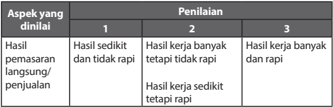

Tabel ini menunjukkan penilaian hasil pekerjaan dalam dua aspek utama: hasil pesanan/langsung penjualan dan hasil penjualan. Dalam kolom 1, ada tiga tingkat penilaian berdasarkan kualitas hasil pekerjaan, yaitu hasil sedikit dan tidak rapi, hasil kerja banyak tetapi tidak rapi, dan hasil kerja banyak dan rapi. Kolom 2 dan 3 masing-masing menunjukkan bahwa penilaian tingkat 2 dan 3 lebih baik daripada penilaian tingkat 1. Ini menunjukkan bahwa penilaian yang lebih tinggi diberikan pada hasil pekerjaan yang lebih baik dan rapi.

Pembelajaran  wirausaha  kerajinan  dengan  inspirasi  budaya  nonbenda secara umum merupakan pembelajaran berbasis proyek. Maka, penilaian kinerja  peserta  didik  dapat  dinilai  secara  holistik.  Penilaian  holistik mengevaluasi dan penilai ketepatan teknik dan sikap kerja peserta didik selama proses pembelajaran. Penilaian proyek dapat dibuat dalam 5 skor. Masing-masing skor dijelaskan dalam rubrik. Gunakan format penilaian contoh 2 halaman 41.

### F.  Pengayaan

### 1. Karakteristik Kewirausahaan

Materi tentang Wirausaha Kerajinan dengan Inspirasi Nonbenda diawali dengan Karakteristik Kewirausahaan, sifat-sifat seorang wirausahawan dan faktor penyebab keberhasilan dan kegagalan. Pengayaan dapat diberikan kepada  peserta  didik  yang  meraih  hasil  Penilaian  Konsep  Diri  sangat positif  (skor  16-20).  Pengayaan  dapat  berupa  tugas  untuk  menuliskan pemikirannya tentang wirausaha yang ingin dibuatnya suatu saat nanti yang sesuai dengan minat dan bakatnya. Tema tulisan dapat dibebaskan atau  diarahkan  agar  menjadi  pengembangan  dari  pengembangan potensi  daerah.  Pengayaan  sedapat  mungkin  memberikan  peluang peserta didik untuk mengembangkan kemampuan dirinya, sesuai minat dan bakatnya. Guru memberikan motivasi agar peserta didik berani untuk mengemukakan pemikirannya.

### 2. Perencanaan Usaha Kerajinan dengan Inspirasi Budaya Nonbenda

Pembelajaran  diawali  dengan  paparan  tentang  kekayaan  budaya  tradisional  Indonesia  yang  merupakan  sumber  inspirasi  yang  tak  akan ada  habisnya  sebagai  inspirasi  berkarya.  Materi  ini  memungkinkan dikembangkan dalam bentuk pengayaan dengan mempersilakan peserta didik  mencari  informasi  lebih  jauh  tentang  suatu  budaya  tradisional baik  di  tanah  air  maupun  di  dunia.  Model  pembelajaran  pengayaan

 

---
## 📄 Halaman 77

dapat  dilakukan  dengan  memperoleh  informasi  dari  beragam  sumber dan mendiskusikannya di kelas serta menganalisis tentang persamaan dan perbedaan budaya suatu daerah dengan daerah lainnya. Keluasan wawasan  tentang  ragam  ragam  budaya  tradisional  dan  filosofinya dapat  mendukung  proses  kreatif  peserta  didik  dalam  pengembangan ide  produk  pada  pembelajaran  berikutnya.  Materi  pengayaan  dapat disesuaikan dengan potensi lingkungan sekitar.s

Beberapa materi pengayaan yang dapat dilakukan berdasarkan potensi lingkungan sekitar di antaranya,

---
**📊 Tabel**

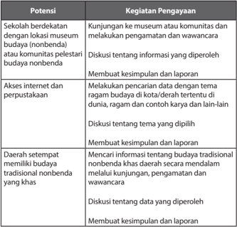

Tabel ini menunjukkan potensi kegiatan pengayaan yang dapat dilakukan oleh sekolah berdasarkan lokasi museum budaya nonbenda (nonbenda) atau komunitas pelestari budaya nonbenda. Topik utamanya adalah penggunaan akses internet dan perpustakaan untuk mencari informasi tentang budaya tradisional nonbenda di daerah setempat. Kolom-kolomnya meliputi potensi, kegiatan pengayaan, dan proses penulisan kesimpulan dan laporan. Data penting yang terlihat adalah bahwa semua kegiatan pengayaan melibatkan kunjungan ke museum atau komunitas, melakukan pengamatan dan wawancara, diskusi tentang informasi yang diperoleh, dan membuat kesimpulan dan laporan. Ini menunjukkan bahwa kegiatan pengayaan ini sangat bergantung pada interaksi langsung dengan sumber daya lokal dan komunitas, serta pengumpulan data melalui berbagai metode seperti kunjungan, pengamatan, dan wawancara.

Perencanaan  usaha  kerajinan  secara  umum  terdiri  atas  persiapan  organisasi/kelompok  usaha  dan  rencana  pembuatan  produk  kerajinan. Pengayaan dapat diberikan untuk memberikan  wawasan  tentang organisasi wirausaha.

 

---
## 📄 Halaman 78

---
**🖼️ Gambar/Diagram**

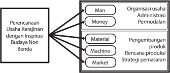

> **Deskripsi Visual:** Gambar ini adalah diagram yang menunjukkan struktur organisasi dalam perencanaan usaha kerajinan dengan inspirasi budaya non-benda. Diagram ini terdiri dari tiga bagian utama:

1. Bagian pertama menunjukkan "Perencanaan Usaha Kerajinan dengan Inspirasi Budaya Non-Benda" sebagai topik utama.
2. Bagian kedua menggambarkan empat elemen utama yang terkait dengan usaha kerajinan tersebut, yaitu Man (Manajemen), Money (Uang), Material (Bahan), dan Machine (Mesin).
3. Bagian ketiga menjelaskan lebih lanjut tentang setiap elemen tersebut:
   - Man (Manajemen): Organisasi usaha, administrasi, dan permodalan.
   - Money (Uang): Pengembangan produk, rencana produksi, dan strategi pemasaran.

Teks, angka, atau label penting yang terlihat dalam gambar meliputi:
- Judul topik: Perencanaan Usaha Kerajinan dengan Inspirasi Budaya Non-Benda
- Nama-nama elemen utama: Man, Money, Material, Machine
- Deskripsi singkat untuk setiap elemen: Organisasi usaha, administrasi, permodalan; Uang; Bahan; Mesin

Informasi kunci yang dapat diambil pembaca meliputi:
- Struktur organisasi dalam perencanaan usaha kerajinan
- Keterkaitan antara elemen-elemen dalam proses pengembangan usaha kerajinan
- Pentingnya manajemen, uang, bahan, dan mesin dalam suksesnya usaha kerajinan dengan inspirasi budaya non-benda

Pengayaan dapat diberikan pada materi tentang hal-hal yang dipentingkan  dalam  pembentukan  organisasi  usaha,  administrasi  dan peluang permodalan. Pengayaan pengetahuan tentang organisasi usaha,  administrasi  dan  permodalan  ditujukan  untuk  meningkatkan kepercayaan diri peserta didik dalam memulai sebuah usaha di kemudian hari.

Proses perencanaan produk kerajinan dengan inspirasi budaya nonbenda,  terfokus pada budaya non benda yang menjadi inspirasi serta ketersediaan material, teknik dan proses produksi. Proses ini merupakan kegiatan yang berkesinambungan dengan materi pembelajaran selanjutnya yaitu perancangan dan produksi kerajinan. Pengayaan dapat diberikan  pada  pembelajaran  berikutnya,  yaitu  tentang  perancangan dan produksi kerajinan.

### 3. Perancangan dan Produksi Kerajinan dengan Inspirasi Budaya Nonbenda

Pengayaan  untuk  materi  pembelajaran  perancangan  dan  produksi kerajinan dapat diberikan pada tahapan-tahapan proses atau pengayaan dengan target produk akhir. Pengayaan pada tahapan proses, contohnya apabila  pada  tahapan  perancangan  produk  sebuah  kelompok  peserta didik menjalankan proses tersebut dalam waktu yang lebih singkat dari waktu yang tersedia, maka kelompok tersebut diperkenankan merancang lebih  dari  satu  buah  produk  kerajinan.  Contoh  lain  adalah  kelompok yang memiliki kemampuan lebih dalam pengolahan teknik dan material diperkenankan membuat produk kerajinan dengan teknik yang berbeda sebagai varian produknya.

 

---
## 📄 Halaman 79

Pengayaan  pada  tahapan  proses  produksi  dapat  diberikan  berupa praktek penggunaan salah satu teknik tertentu atau kunjungan ke tempat produksi  kerajinan  yang  ada  di  daerah  sekitar.  Pengayaan  diberikan pada tahapanan ini apabila peserta didik mampu menuntaskan target pembelajaran lebih cepat daripada waktu yang tersedia.

### 4. Penghitungan Biaya Produksi Kerajinan dengan Inspirasi Budaya Non Benda

Pembelajaran penghitungan biaya produksi memiliki target agar peserta didik dapat menghitung jumlah biaya produksi yang merupakan modal yang  telah  dikeluarkan  untuk  memproduksi  produk  kerajinan.  Jumlah dari biaya produksi menjadi dasar penetapan harga jual produk. Peserta didik  dapat  menentukan  harga  jual  secara  sederhana,  yaitu  biaya produksi sebuah produk ditambah dengan laba yang diinginkan dari satu buah produk. Pengayaan dapat diberikan pada pembelajaran ini adalah memberikan kesempatan kepada peserta didik yang memiliki ketertarikan dalam  keuangan  dan  bisnis  untuk  mencari  tahu  lebih  jauh  strategi perencanaan  biaya  produksi  dan  penetapan  harga  jual  agar  menarik pembeli sekaligus memberikan keuntungan yang berkesinambungan.

### 5. Pemasaran Langsung Kerajinan dengan Inspirasi Budaya Non Benda

Pembelajaran  pemasaran  langsung  pada  prinsipnya  adalah  praktek penjualan  yang  dilakukan  oleh  peserta  didik  secara  nyata.  Penjualan bergantung pada perencanaan yang telah dibuat peserta didik, dengan disesuaikan  dengan  kondisi  dan  potensi  lingkungan  sekitar.  Apabila kegiatan  pemasaran  langsung  telah  tuntas  dilaksanakan  oleh  peserta didik,  pengayaan  yang  dapat  dilakukan  adalah  dengan  memberikan tugas  berupa  evaluasi  proses  dan  hasil  dari  pelaksanaan  pemasaran langsung secara mendalam, dan membuat rekomendasi dari perbaikan apa yang harus dilakukan agar hasil wirausaha kerajinan dengan inspirasi budaya lebih optimal.

### G.  Remedial

### 1. Karakteristik Kewirausahaan

Materi  tentang  Wirausaha  Kerajinan    dengan  Inspirasi  Budaya  Non Benda  diawali  dengan  Karakteristik  Kewirausahaan,  sifat-sifat  seorang wirausahawan dan faktor penyebab keberhasilan dan kegagalan.

 

---
## 📄 Halaman 80

Remedial diberikan apabila peserta didik belum tuntas dalam memahami sifat-sifat seorang wirausahawan  maupun  faktor keberhasilan dan kegagalan dalam berusaha.

Remedial juga dapat diberikan kepada peserta didik yang meraih hasil Penilaian  Konsep  Diri  tidak  positif  (skor  0-5).  Remedial  dapat  serupa dengan Tugas 1, tetapi dengan memberikan peserta didik sebuah buku atau  artikel  biografi/kisah  sukses  seorang  pengusaha.  Peserta  didik diminta  untuk  membuat  rangkuman  dengan  mengidentifikasi  sifatsifat  wirausahawan  tersebut.  Peserta  didik  juga  dapat  diminta  untuk mengenali apakah sifat-sifat tersebut dapat ditumbuhkan pada dirinya. Guru memberikan motivasi agar peserta didik mengenali potensi diri dan kekhasannya masing-masing.

### 2. Perencanaan Usaha Kerajinan dengan Inspirasi Budaya Non Benda

Materi  pembelajaran  perancangan  usaha  kerajinan  dengan  inspirasi budaya  nonbenda  diawali  dengan  potensi  budaya  nonbenda  sebagai sumber inspirasi dan diikuti dengan aktifitas mencari informasi tentang potensi budaya nonbenda material dan material serta teknik yang ada di daerah melalui Tugas 2 dan Tugas 3. Remedial dapat diberikan apabila peserta didik belum tuntas dalam materi yang meliputi wawasan ataupun materi yang tersifat teknis dalam pelaksanaan Tugas 2 dan Tugas 3.

### 3. Perancangan dan Produksi Kerajinan dengan Inspirasi Budaya Nonbenda

Pembelajaran perancangan dan produksi kerajinan saling berkesinambungan. Remedial untuk materi pembelajaran ini dapat dilaksanakan  sesuai  evaluasi  yang  dilakukan  secara  bertahap  melalui pengamatan  guru  terhadap  kinerja  peserta  didik.  Evaluasi  dilakukan setidaknya dua kali yaitu setelah proses perancangan dan setelah proses produksi.  Evaluasi  kinerja  peserta  didik  juga  dapat  dilakukan  selama proses  perancangan  maupun  proses  produksi.  Hasil  evaluasi  menjadi dasar  dilaksanakannya  pembelajaran  remendial.  Remedial  dapat  diadakan pada tahapan-tahapan tertentu bergantung pada ketersediaan waktu pembelajaran, seperti contoh pada bagan di bawah ini.

 

---
## 📄 Halaman 81

### Contoh Tahapan Kemungkinan Remedial

---
**🖼️ Gambar/Diagram**

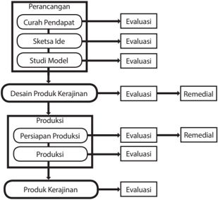

> **Deskripsi Visual:** Gambar ini adalah diagram yang menunjukkan proses perancangan dan produksi produk kerajinan. Diagram ini terdiri dari beberapa tahap utama yang disusun secara hierarkis:

1. **Perancangan**:
   - **Curah Pendapat**: Ini mungkin merujuk pada pendapat awal atau ide awal.
   - **Sketsa Ide**: Ini adalah langkah selanjutnya untuk mengembangkan ide menjadi sketsa.
   - **Studi Model**: Langkah ini mungkin melibatkan pengujian atau penelitian model untuk memastikan konsep berfungsi dengan baik.

2. **Desain Produk Kerajinan**:
   - Setelah studi model, produk kerajinan dibuat.

3. **Produksi**:
   - Ada dua tahap produksi yang ditunjukkan: persiapan produksi dan produksi langsung.

4. **Evaluasi**:
   - Setelah produk kerajinan selesai, ia akan dilakukan evaluasi untuk memastikan kualitas dan efektivitasnya.

5. **Remedial**:
   - Jika ada masalah, ada langkah-langkah untuk melakukan perbaikan (remedial).

Elemen-elemen utama dalam diagram ini adalah tahap-tahap perancangan, desain, produksi, evaluasi, dan remedial. Relasi antara elemen-elemen ini adalah bahwa setiap tahap harus diselesaikan sebelum tahap berikutnya dimulai. Teks, angka, atau label penting yang terlihat mencakup nama-nama tahap seperti "Curah Pendapat", "Sketsa Ide", "Studi Model", "Produksi", "Evaluasi", dan "Remedial". Informasi kunci yang dapat diambil pembaca adalah bahwa proses ini melibatkan banyak tahap dan perhatian detail dalam setiap tahap untuk memastikan produk kerajinan berkualitas tinggi.

### 4. Penghitungan Biaya Produksi Kerajinan dengan Inspirasi Budaya Nonbenda

Pembelajaran penghitungan biaya produksi kerajinan dengan inspirasi budaya  nonbenda  bertujuan  agar  peserta  didik  mampu  melakukan penghitungan  terhadap  biaya  produksi  dari  kerajinan  secara  umum. Peserta didik secara khusus akan menghitung biaya produksi untuk produk yang dirancang dan diproduksi oleh kelompok. Instrumen evaluasi yang digunakan parameter betul atau salah , karena penghitungan ini bersifat matematis. Remedial dapat diberikan apabila peserta didik menghasilkan penghitungan  yang  salah.  Kesalahan  dapat  terjadi  disebabkan  oleh kurangnya pemahaman tentang penghitungan biaya tenaga kerja, biaya material dan overhead . Proses pembelajaran remedial dapat menelusuri lagi setiap faktor pembiayaan hingga peserta didik mampu menghitung biaya produksi dengan tepat.

 

---
## 📄 Halaman 82

### 5. Pemasaran Langsung Produk Kerajinan dengan Inspirasi Budaya Nonbenda

Materi  pembelajaran  pemasaran  langsung  terdiri  atas  persiapan  pemasaran dan pelaksanaan pemasaran langsung. Persiapan pelaksanaan adalah berupa pembuatan strategi dan rencana pemasaran. Guru dapat mengevaluasi pada tahapan ini, untuk mengetahui sejauh mana peserta didik terlah berhasil membuat strategi dan rencana pemasaran. Apabila peserta  didik  belum  tuntas  dalam  membuat  perencanaan  pemasaran, remedial dapat dilaksanakan.

Tahapan  berikutnya  pada  pembelajaran  ini  adalah  praktek  penjualan langsung.  Evaluasi  dari  kegiatan  ini  adalah  keberhasilan  peserta  didik dalam melakukan pemasaran dan menjual produk kerajinan yang telah dibuat.  Para  tahapan  ini,  pembelajaran  remedial  tidak  dapat  berupa kegiatan  penjualan  karena  kegiatan  penjualan  memerlukan  alokasi waktu yang khusus.

### H.  Interaksi dengan Orang Tua Peserta Didik

### 1. Perencanaan Usaha Kerajinan dengan Inspirasi Budaya Nonbenda

Model interaksi dengan orang tua pada pembelajaran perencanaan usaha kerajinan  dengan  inspirasi  budaya  nonbenda,  bergantung  pada  orang tua peserta didik. Salah satu interaksi orang tua yang secara umum dapat dilakukan adalah peserta didik menanyakan pendapat orang tua tentang ragam budaya nonbenda masih ada di daerah setempat atau pernah ada namun sudah tidak ada. Apabila orang tua dari peserta didik merupakan pelestari budaya nonbenda atau pengrajin yang menguasai material dan teknik khas daerah, dapat dilibatkan lebih jauh dalam pembelajaran di kelas.

### 2. Perancangan dan Produksi Kerajinan dengan Inspirasi Budaya Nonbenda

Pada pembelajaran perancangan dan produksi kerajinan dengan inspirasi non  benda,  interaksi  dengan  orang  tua  yang  dapat  dilakukan  adalah dengan  melibatkan  orang  tua  dalam  mengapresiasi  dan  memberikan komentar  terhadap  ide  dan  rancangan  kerajinan  yang  dibuat  oleh peserta didik. Orang tua dalam hal ini dapat menjadi representasi dari

 

---
## 📄 Halaman 83

pasar sasaran atau calon pembeli produk, yang memberikan komentar, masukan  dan  saran  sesuai  berdasarkan  kebutuhan  dan  keinginannya. Orang tua juga dapat dilibatkan untuk memberikan masukan dan saran tentang  proses  produksi  kerajinan  agar  kegiatan  produksi  berjalan dengan efisien dan produk yang dihasilkan berkualitas baik.

### 3. Penghitungan Biaya Produksi Kerajinan dengan Inspirasi Budaya Nonbenda

Pada pembelajaran penghitungan biaya produksi kerajinan, peserta didik juga harus menetapkan harga jual produk. Interaksi dengan orang tua yang dapat dilakukan untuk mendukung pembelajaran ini di antaranya dengan meminta pendapat kepada orang tua tentang harga jual atau laba  yang  sesuai  untuk  produk  yang  telah  dibuat.  Orang  tua  dapat menempatkan diri sebagai konsumen yang menilai apakah harga jual tersebut sesuai dengan kualitas, nilai inovatif dan estetis dari kerajinan yang dibuat.

### 4. Pemasaran Langsung Produk Kerajinan dengan Inspirasi Budaya Nonbenda

Pembelajaran tentang pemasaran langsung akan menugaskan peserta didik  untuk  melakukan  promosi  dan  penjualan.  Pemasaran  langsung dapat  dilakukan  dengan  diadakannya  bazar  di  sekolah  atau  datang langsung  kepada  calon  konsumen.  Pada  pembelajaran  ini,  orang  tua dapat diundang menghadiri bazar di sekolah untuk dapat memberikan apresiasi kepada para peserta didik dari seluruh kelompok yang menjadi peserta dalam bazar tersebut.

 

---
## 📄 Halaman 84

---
**🖼️ Gambar/Diagram**

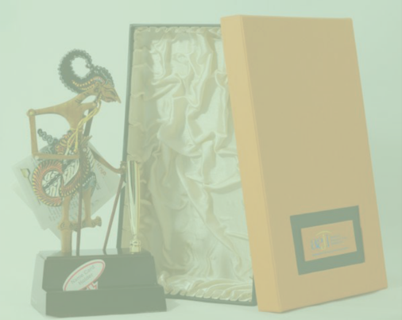

> **Deskripsi Visual:** Gambar ini menunjukkan dua objek utama: sebuah patung dan sebuah buku. Patung tersebut tampak seperti seorang dewi atau tokoh mitologi, didekorasi dengan detail yang rumit dan warna-warna cerah. Patung tersebut diletakkan di atas sebuah papan berwarna hitam, yang tampaknya berisi informasi tentang patung tersebut.

Buku yang ada di samping patung memiliki cover kuning dengan logo yang tampak kecil di bagian bawah. Cover buku tersebut tampaknya menunjukkan judul atau konten yang terkait dengan patung tersebut. 

Elemen-elemen lain yang tampak adalah tinta yang digunakan untuk menggambar patung, warna-warna yang digunakan dalam menggambar, dan detail detil pada patung itu sendiri. 

Informasi kunci yang dapat diambil dari gambar ini adalah bahwa ada hubungan antara patung dan buku, mungkin karena buku tersebut berisi informasi tentang patung tersebut.

76

Kelas X SMA/MA/SMK/MAK

Semester 1

 

---
## 📄 Halaman 85

### REKAYASA

### BAB II

### Wirausaha Produk Teknologi Transportasi dan Logistik

- Kompetensi Inti (KI) dan Kompetensi Dasar (KD)
- Peta Konsep
- Tujuan Pembelajaran
- Proses Pembelajaran
- Evaluasi
- Pengayaan
- Remedial
- Interaksi dengan Orang Tua Peserta Didik

 

---
## 📄 Halaman 86

### A.  Kompetensi Inti (KI) dan Kompetensi Dasar (KD)

Tujuan kurikulum mencakup empat kompetensi, yaitu (1) kompetensi sikap spiritual, (2) sikap sosial, (3) pengetahuan, dan (4) keterampilan. Kompetensi tersebut dicapai melalui proses pembelajaran intrakurikuler, kokurikuler, dan ekstrakurikuler.  Rumusan  kompetensi  sikap  spiritual  yaitu, 'Menerima  dan menjalankan ajaran agama yang dianutnya' . Sedangkan rumusan kompetensi sikap  sosial  yaitu,  'Menghayati  dan  mengamalkan  perilaku  jujur,  disiplin, tanggung jawab, peduli (gotong royong, kerja sama, toleran, damai), santun, responsif dan proaktif dan menunjukkan sikap sebagai bagian dari solusi atas berbagai permasalahan dalam berinteraksi secara efektif dengan lingkungan sosial dan alam serta dalam menempatkan diri sebagai cerminan bangsa dalam pergaulan dunia' . Kedua kompetensi tersebut dicapai melalui pembelajaran tidak  langsung  (indirect  teaching)  yaitu  keteladanan,  pembiasaan,  dan budaya sekolah, dengan memperhatikan karakteristik mata pelajaran serta kebutuhan  dan  kondisi  peserta  didik.  Penumbuhan  dan  pengembangan kompetensi sikap dilakukan sepanjang  proses pembelajaran berlangsung, dan dapat digunakan sebagai pertimbangan guru dalam mengembangkan karakter peserta didik lebih lanjut.

Kompetensi pengetahuan dan keterampilan dikembangkan melalui kegiatan pembelajaran dengan Kompetensi Inti dan Kompetensi Dasar untuk materi Rekayasa dan Kewirausahaan Kelas X yang tercantum dalam tabel di bawah ini,

---
**📊 Tabel**

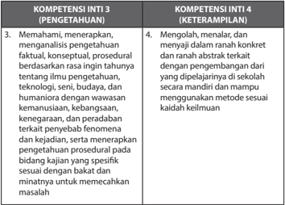

Tabel ini berisi dua kolom utama: "KOMPETENSI INTI 3 (PENGETAHUAN)" dan "KOMPETENSI INTI 4 (KETERampilan)". Kolom pertama mencakup empat poin pengetahuan yang harus dipelajari, yaitu:
1. Memahami, menerekap, dan menganalisis pengetahuan faktil, konseptual, prosedural berdasarkan rasa ingin tahu tentang ilmu pengetahuan, teknologi, seni, budaya, dan humaniora dengan wawasan kemanusiaan, kebangsaan, kenegaraan, dan peradaban terkait fenomena dan kejadian.
2. Mengolah, menalar, dan menyaji dalam ranah konkrit dan ranah abstrakt berdasarkan pengembangan dari yang dipelajariya di sekolah secara mandiri dan mampu menggunakan metode sesuai keilmuan.

Kolom kedua mencakup empat poin keterampilan yang harus dipelajari, yaitu:
1. Mengolah, menalar, dan menyaji dalam ranah konkrit dan ranah abstrakt berdasarkan pengembangan dari yang dipelajariya di sekolah secara mandiri dan mampu menggunakan metode sesuai keilmuan.
2. Mengolah, menalar, dan menyaji dalam ranah konkrit dan ranah abstrakt berdasarkan pengembangan dari yang dipelajariya di sekolah secara mandiri dan mampu menggunakan metode sesuai keilmuan.

Data atau pola penting yang terlihat adalah bahwa setiap kolom memiliki empat poin yang harus dipelajari, dan setiap poin tersebut memiliki tujuan yang sama, yaitu untuk mempelajari dan menerapkan pengetahuan dan keterampilan dalam berbagai bidang.

 

---
## 📄 Halaman 87

---
**📊 Tabel**

Tabel ini berisi informasi tentang kompetensi dasar yang harus dipenuhi oleh individu dalam bidang transportasi dan logistik. Topik utamanya adalah tentang pemahaman dan pengetahuan dasar tentang usaha transportasi dan logistik, termasuk identifikasi karakteristik usaha, perencanaan usaha, analisis sistem produksi, manajemen harga, manajemen teknik dan proses, serta manajemen grafika. Kolom pertama berisi nama-nama kompetensi dasar, sedangkan kolom kedua berisi deskripsi singkat tentang setiap kompetensi. Data penting yang terlihat adalah bahwa setiap kompetensi dasar memiliki beberapa subkompetensi yang harus dipenuhi, menunjukkan bahwa pembelajaran dan pengembangan kompetensi ini melibatkan banyak aspek dan tahap.

 

---
## 📄 Halaman 88

### B.  Peta Konsep

---
**🖼️ Gambar/Diagram**

> **Deskripsi Visual:** Gambar ini adalah diagram yang menunjukkan proses perencanaan dan implementasi produk teknologi transportasi dan logistik. Diagram ini terdiri dari beberapa tahap utama yang saling terkait:

1. **Perencanaan Usaha Produk Teknologi Transportasi dan Logistik**:
   - Mulai dari Rencana Usaha Grafika, melibatkan perancangan, curah pendapat, sketsa ide, dan rasionalisasi.

2. **Desain Produk Transportasi & Logistik**:
   - Ini mencakup persiapan produksi dan produksi, yang kemudian menghasilkan produk transportasi dan logistik.

3. **Produk Transportasi & Logistik**:
   - Setelah produk dibuat, ada perencanaan promosi dan penjualan untuk memasarkan produk tersebut.

4. **Evaluasi**:
   - Akhirnya, hasil penjualan produk transportasi dan logistik akan dianalisis.

Elemen-elemen utama dalam diagram ini meliputi:
- **Organisasi Usaha**: Menunjukkan bagaimana manajemen, administrasi, dan permodalan berinteraksi.
- **Material**: Menunjukkan sumber daya seperti produk, mesin, dan pasokan.
- **Produk Produksi**: Menunjukkan produk yang diproduksi.
- **Pemasaran**: Menunjukkan strategi promosi dan penjualan.

Informasi kunci yang dapat diambil pembaca meliputi:
- Proses komprehensif dari perencanaan hingga evaluasi produk transportasi dan logistik.
- Pentingnya manajemen, administrasi, dan permodalan dalam suksesnya usaha ini.
- Peran material dan pemasaran dalam suksesnya produk yang diproduksi.

 

---
## 📄 Halaman 89

### C.  Tujuan Pembelajaran

Setelah mempelajari Wirausaha Produk Teknologi Transportasi dan Logistik, peserta didik mampu:

- Menghayati bahwa akal pikiran dan kemampuan manusia dalam berpikir kreatif untuk membuat produk teknologi transportasi dan logistik serta keberhasilan wirausaha adalah anugerah Tuhan.
- Menghayati perilaku jujur, percaya diri, dan mandiri serta sikap bekerja sama, gotong royong, bertoleransi, disiplin, bertanggung jawab, kreatif, dan inovatif dalam membuat produk teknologi transportasi dan logistik guna membangun semangat usaha.
- Mendesain,  membuat  mengemas  produk  teknologi  transportasi  dan logistik berdasarkan identifikasi kebutuhan sumber daya, teknologi, dan prosedur berkarya.
- Mempresentasikan dan memasarkan produk teknologi transportasi dan logistik dengan perilaku jujur dan percaya diri.
- Melakukan  evaluasi  pembelajaran  wirausaha  produk  teknologi  trans­ portasi dan logistik.

### D.  Proses Pembelajaran

### 1. Karakteristik Kewirausahaan

Pembelajaran  Wirausaha  Produk  Teknologi  Transportasi  dan  Logistik diawali dengan  materi karakteristik kewirausahaan, yang meliputi pengertian wirausaha dan kewirausahaan, sifat­sifat wirausahawan, dan faktor  penyebab  keberhasilan  dan  kegagalan  berwirausaha.  Kurikulum 2013  bersifat  interaktif  dan  memberikan  banyak  kesempatan  kepada peserta didik untuk peserta didik untuk mengungkapkan pendapatnya dengan  bimbingan  guru.  Beberapa  hal  tang  dapat  dilakukan  Guru untuk  membuat  suasana  interaktif  dalam  pembelajaran  Karakteristik Kewirausahaan di antaranya sebagai berikut.

- Guru  dapat  memberikan  paparan  dan  mengajak  peserta  didik untuk memahami materi karakteristik kewirausahaan dalam konteks kehidupan sehari­hari.
- Guru dapat meminta peserta didik untuk mengemukakan pendapatnya tentang contoh penerapan sifat seorang wirausahawan dalam pelaksanaan kegiatan usaha.
- Guru juga dapat meminta peserta didik untuk menilai dirinya sendiri tentang  sifat­sifat  apa  yang  sudah  dimiliki  dirinya  untuk  menjadi seorang wirausahawan.

 

---
## 📄 Halaman 90

Pada pembelajaran ini, terdapat Tugas 1, yaitu penugasan kepada peserta didik untuk melakukan pencarian data tentang seorang atau sekelompok wirausahawan  sukses.  Peserta  didik  diminta  untuk  mempelajari  kisah­ kisah sukses dan menganalisis faktor penyebab kesuksesan wirausahawan tersebut. Luaran dari Tugas 1 adalah presentasi di depan kelas. Peserta didik  akan  mendengarkan  presentasi  teman  sekelasnya.  Guru  dapat meminta peserta didik untuk mencatat poin­poin penting dari presentasi temannya untuk melengkapi temuannya.

### 2. Perencanaan Usaha Produk Teknologi Transportasi dan Logistik

Pembelajaran  diawali  dengan  nateri  tentang  pengertian  transportasi, sejarah  singkat  dan  transportasi  pada  konteks  yang  paling  sederhana dalam  kehidupan  sehari  hari.  Sejarah  transportasi  dipaparkan  secara singkat, tetapi tidak menutup kemungkinan untuk dilakukan pengayaan apabila  materi  utama  sudah  tuntas  dan  masih  tersedia  waktu.  Pada pembelajaran ini, juga terdapat peta pikiran tentang faktor­faktor yang menjadi  pertimbangan  pada  perancangan  alat  transportasi  barang. Peta pikiran  ini  menjadi  dasar  berpikir  peserta  didik  dalam  melakukan pengamatan  tentang  tranportasi  jarak  dekat  yang  ada  di  lingkungan sekitarnya,  yaitu  pada  Tugas  2.  Melalui  tugas  ini,  peserta  didik  akan memahami secara lebih mendalam tentang beragam perpindahan jarah dekat yang dapat difasilitasi oleh produk transportasi agar perpindahan dapat  dilakukan  dengan  lebih  mudah.  Guru  dapat  mengajak  peserta didik  untuk  memikirkan  perpindahan  paling  sederhana  yang  terjadi sehari­hari. Pembelajaran dapat dilakukan dengan bermain dan suasana yang  menyenangkan.  Guru  memberikan  kesempatan  kepada  peserta didik untuk mengungkapkan pendapatnya secara bebas tanpa batasan salah atau benar. Peserta didik diajak untuk membayangkan,

- Perpindahan apa saja yang terjadi di dalam rumah?
- Perpindahan apa saja yang mungkin terjadi di sekolah, di lapangan olahraga dan di perpustakaan?
- Pedagang di pasar memindahkan barang dagangan, atar berdagang, sampah  maupun  barang  pribadinya.  Perpindahan  apa  saja  yang terjadi?
- Perpindahan apa saja saat kegiatan panen di ladang?
- Perpindahan  apa  saja  yang  terjadi  saat  persiapan  sebuah  pesta? Apakah bergantung pada tema pestanya?
- Dan lain­lain
Kegiatan transportasi merupakan bagian dari kegiatan logistik. Setelah peserta  didik  memahami  secara  tepat  tentang  transportasi,  materi pembelajaran  masuk  ke  pengertian  logistik.  Paparan  tentang  logistik dilengkapi  dengan  contoh  dalam  kehidupan  sehari­hari.  Pemahaman peserta  didik  tentang  kegiatan  logistik  diperkuat  dengan  pelaksanaan

 

---
## 📄 Halaman 91

Tugas 3, yaitu pencarian data, diskusi dan presentasi tentang Kegiatan Logistik. Tugas 3 memberikan kesempatan kepada peserta didik untuk melakukan kegiatan di luar sekolah, seperti melakukan pengamatan di pasar,  pelelangan  ikan  atau  tempat­tempat  lain  yang  menjadi  tempat terjadinya kegiatan logistik. Kegiatan sedapat mungkin dilakukan dengan menyenangkan dan membangkitkan keingin tahuan peserta didik.

Akhir dari pembelajaran wirausaha produk teknologi transportasi dan logistik adalah melakukan penjualan langsung produk yang dibuat  oleh  peserta  didik.  Pengembangan  produk  wirausaha  harus mempertimbangkan  target  pasar  sasaran,  bahan  baku  dan  material yang  ada  di  lingkungan  sekitar,  teknik  dan  alat  serta  keterampilan produksi. Sedangkan perancangan sebuah produk transportasi mempertimbangkan faktor­faktor: fungsi; pengguna produk, ergonomi, estetis, material dan teknik produksi dan faktor ekonomi.

### 3. Perancangan dan Produksi Produk  Teknologi Trasnportasi dan Logistik

Peserta didik telah mengidentifikasi ragam kegiatan transportasi, potensi  bahan  serta  teknik  produksi  yang  ada  di  lingkungan  sekitar. Peserta didik kemudian  mempelajari proses  perancangan  dengan mempelajari paparan tentang tahapan proses perancangan. Guru dapat menyampaikan  paparan  tersebut  dalam  bentuk  ceramah  dan  diskusi yang memberikan kesempatan kepada peserta didik untuk terlibat aktif dalam memberikan contoh atau mengemukakan pendapatnya tentang proses perancangan. Materi teori tentang tahapan proses perancangan yang  telah  dipaparkan  guru  dan  didiskusikan  akan  dilaksanakan  oleh peserta didik dalam bentuk proyek dan unjuk kerja. Secara berkelompok, peserta didik akan praktik melakukan proses perancangan dan produksi produk teknologi transportasi dan logistik melalui pelaksaaan Tugas 5.

Proses perancangan terdiri dari beberapa tahapan yang akan dilakukan peserta didik dengan bimbingan dan arahan dari guru. Tahapan proses perancangan, yaitu:

- identifikasi masalah
- mencari solusi dengan curah pendapat
- rasionalisasi
- prototyping atau membuat studi model
Tahapan  proses  tersebut  akan  menghasilkan  desain  atau  rancangan produk teknologi transportasi dan logistik serta petunjuk teknis untuk  tahapan  proses  produksi.  Ketiga  tahapan  perancangan  harus dilakukan  dengan  tepat  agar  menghasilkan  rancangan  produk  yang

 

---
## 📄 Halaman 92

berfungsi baik, menarik dan inovatif. Guru mendampingi setiap tahapan proses  perancangan  dari  setiap  kelompok,  memberikan  motivasi  dan memastikan  suasana  aktif  dan  kreatif  terbangun  agar  terjadi  proses kreatif.  Proses  kreatif  memungkinkan  peserta  didik  menghasilkan  ide­ ide  yang  baru,  unik  dan  menarik.  Apabila  hal  itu  terjadi,  guru  dapat memberikan  pertimbangan  yang  lebih  bersifat  teknis  terkait  teknis dan kerangka waktu. Namun, apabila proses kreatif tidak terjadi dalam kelompok,  guru  dapat  memberikan  ide  atau  melontarkan  pertanyaan yang sekiranya dapat mendorong peserta didik untuk memunculkan ide. Ide dapat dikembangkan dari tugas­tugas yang telah dibuat sebelumnya.

Pada  buku  siswa  terdapat  beberapa  contoh  ide  untuk  dirancang, diproduksi dan dijual pada akhir semester yaitu,

- Produk alat bawa untuk 4 buah gelas plastik berisi jus buah
- Produk transportasi dan logistik untuk 100 buah piring makan dan 100 pasang sendok garpu
- Produk transportasi dan logistik untuk panen jamur
Pada  pelaksanaan  pembelajaran,  produk  yang  dibuat  dapat  berupa produk transportasi lain yang muncul dari ide kreatif para peserta didik atau  berdasarkan  pada  pengamatan  terhadap  kebutuhan  transportasi dan  logistik  yang  ada  di  lingkungan  sekitar.  Berikan  motivasi  peserta didik untuk melakukan inovasi kreatif dan melakukan dispilin kerja yang baik untuk menghasilkan produk teknologi transportasi dan logistik yang berkualitas.

Perancangan dan rencana produksi dilanjutkan dengan tahap persiapan produksi. Pada tahap persiapan produksi, peserta didik akan pelakukan praktik  persiapan  produksi  sesuai  dengan  rancangan  dan  rencana produksi  yang  sudah  dibuat.  Guru  mengarahkan  peserta  didik  agar membuat pembagian kerja dalam kelompok yang mendukung kinerja yang efektif dan efisien, serta menghasilkan produk berkualitas tinggi. Proses  perencanaan  proses  produksi  yang  dilakukan  peserta  didik bergantung  pada  rancangan  produk  yang  sudah  dibuat  oleh  setiap kelompok,  tidak  harus  sama  dengan  yang  terdapat  pada  Buku  Siswa. Secara  umum,  tahapan  produksi  produk  teknologi  transportasi  dan logistik terdiri dari,

- Pembahanan
- Pembentukan
- Perakitan
- Finishing
Perencanaan tahapan proses produksi akan diuraikan dalam Tugas 6 yang merupakan  tugas  kelompok  dari  peserta  didik.  Perencanaan  tersebut akan dipraktikan pada Tugas 7 yaitu kegiatan produksi hasil rancangan

 

---
## 📄 Halaman 93

yang telah dibuat pada Tugas 5. Pada praktik produksi, guru harus dengan tegas selalu mengingatkan pentingnya Kesehatan dan Keselamatan Kerja (K3). Disiplin dalam menerapkan prosedur K3 merupakan salah satu kunci keberhasilan kegiatan produksi.

Produk  teknologi  yang  dihasilkan  oleh  peserta  didik  membutuhkan kemasan dan label untuk menjaga keutuhan produk pada saat distribusi. Selain  kemasan  dan  label  untuk  keperluan  distribusi,  kemasan  produk juga  hendaknya  memiliki  identitas.  Materi  tentang  kemasan  produk transportasi  dan  logistik  dapat  disampaikan  dalam  bentuk  paparan dan  diskusi,  yang  dilanjutkan  dengan  pelaksanaan  Tugas  8.  Tugas  ini secara  khusus  melibatkan  peserta  didik  dalam  upaya  mengetahui  dan memahami fungsi dari identitas produk atau yang dikenal pula dengan sebutan  merek  atau brand .  Guru  memberikan  kesempatan  kepada peserta  didik  untuk  menyebutkan  beberapa  merk  produk  lokal  yang dikenal. Produk tersebut tidak harus produk teknologi transportasi, dan sebaiknya produk yang dikenal baik oleh peserta didik agar peserta didik mampu menjelaskan alasan merk tersebut dianggap bagus dan berhasil.

### 5. Penghitungan Harga Pokok Produksi Produk Teknologi Transportasi dan Logistik

Peserta didik telah melakukan persiapan produksi dan produksi. Maka, mereka telah mengetahui biaya yang dikeluarkan untuk pembelian bahan baku  dan  biaya  overhead  yang  dikeluarkan  untuk  produksi.  Pekerjaan produksi  dilakukan  oleh  peserta  didik,  maka  biaya  tenaga  kerja  dapat disimulasikan. Guru dapat memberikan bimbingan penghitungan biaya tenaga kerja, dengan meminta peserta didik untuk menghitung jumlah jam kerja dari setiap peserta didik dalam melaksanakan produksi. Jumlah total  jam  kerja  dikalikan  dengan  upah  perjam.  Besaran  upah  per  jam dapat dihitung dari upah minimun regional yang berlaku di propinsi atau yang disebut dengan Upah Minimun Propinsi (UMP). UMP setiap propinsi bervariasi. Rata­rata UMP tahun 2014 di Indonesia adalah Rp1.595.900, jika  dibagi  jam  kerja  sekitar  Rp9.225/jam.  Apabila  seorang  peserta didik bekerja selama 3 jam/minggu selama 2 minggu, maka upah akan dihitung sebagai 3 x 2 x 9225. Upah yang diterimanya adalah Rp55.350. Mintalah pesera didik untuk membuat daftar kehadiran dan waktu kerja, untuk dapat dijadikan landasan penentuan upah. Contoh penghitungan biaya produksi dapat dilihat pada contoh kasus pada halaman 61­62.

 

---
## 📄 Halaman 94

### 6. Pemasaran Langsung Produk Teknologi Transportasi dan Logistik

Pemasaran  langsung  merupakan  kegiatan  pembelajaran  akhir  dari rangkaian  kegiatan  pembelajaran  yang  telah  dilakukan  sebelumnya. Peserta didik akan membuat rencana pemasaran serta praktek melakukan pemasaran langsung dari produk teknologi trasnportasi dan logistik yang sudah dibuatnya. Target penjualan dan strategi pemasaran didiskusikan dalam  kelompok,  serta  dikonsultasikan  dan  dilaporkan  kepada  guru sebelum  dilaksanakan.  Guru  memberikan  ruang  kreativitas  kepada peserta didik untuk ide­ide cara pemasaran langsung yang menarik dan inovatif.

Pemasaran langsung dapat dilakukan di sekolah dalam kegiatan bazar sekolah atau di luar sekolah. Penjualan di luar sekolah sedapat mungkin juga mendapat mengawasan dari guru agar peserta didik menjalankan penjualan langsung dengan baik dan jujur sebagai bagian dari proses pembelajaran.

Untuk  kegiatan  pemasaran,  peserta  didik  juga  membuat  pembagian tugas dalam kelompoknya. Pembagian tugas dapat disesuaikan dengan bakat  dan  minat  anggota  kelompok.  Misalnya  peserta  didik  yang pandai  bicara  akan  melakukan  promosi  dengan  presentasi  sedangkan peserta  didik  yang  teliti  untuk  pembukuan  ditugasi  menjadi  kasir  dan administrasi keuangan. Inisiatif setiap anggota kelompok dalam rangka meningkatkan penjualan akan dihargai. Pada prinsipnya semua anggota kelompok harus terlibat aktif dan mendapat beban tanggung jawab yang setara.

### E.  Evaluasi

### 1. Karakteristik Kewirausahaan

Materi  tentang  Wirausaha  Produk  Teknologi  Transportasi  dan  Logistik diawali dengan Karakteristik Kewirausahaan, sifat­sifat seorang wirausahawan dan faktor penyebab keberhasilan dan kegagalan. Evaluasi  dapat  dilakukan  untuk  mengukur  pemahaman  peserta  didik tentang  kewirausahaan  dengan  memberikan  kuis  berisi  pertanyaan tentang pengertian Kewirausahaan dan sifat­sifat wirausahawan. Evaluasi  juga  dapat  dilakukan  untuk  memberikan  kesempatan  peserta didik melakukan evaluasi diri, dengan Penilaian Konsep Diri. Penilaian diri

 

---
## 📄 Halaman 95

adalah suatu teknik penilaian di mana peserta didik diminta untuk menilai dirinya sendiri berkaitan dengan status, proses dan tingkat pencapaian kompetensi  yang  dipelajarinya.  Teknik  penilaian  diri  dapat  digunakan untuk mengukur kompetensi kognitif, afektif dan psikomotor. Inventori digunakan untuk menilai konsep diri peserta didik dengan tujuan untuk mengetahui kekuatan dan kelemahan diri peserta didik. Rentangan nilai yang digunakan antara 1 dan 2. Jika jawaban YA maka diberi skor 2, dan jika  jawaban TIDAK maka diberi skor 1. Kriteria penilaianya adalah jika total  nilai  memiliki  rentang nilai antara 0-5 dikategorikan tidak positif; 6-10,  kurang  positif;  11-  5  positif  dan  16-20  sangat  positif.  Contoh penilaian diri lihat pada halaman 62­63.

Pada pembelajaran ini terdapat Tugas 1, yaitu penugasan kepada peserta didik untuk melakukan pencarian data tentang seorang atau sekelompok wirausahawan  sukses.  Peserta  didik  diminta  untuk  mempelajari  kisah­ kisah sukses dan menganalisis faktor penyebab kesuksesan wirausahawan tersebut. Luaran dari Tugas 1 adalah presentasi di depan kelas. Evaluasi Tugas 1 dapat menggunakan penilaian proyek.

### 2. Perencanaan Usaha Produk Teknologi Transportasi dan Logistik

Pembelajaran tentang perencanaan produk diawali dengan pengertian dan  sejarah  singkat  tentang  perkembangan  teknologi  transportasi dan  logistik,  kaitannya  dengan  kehidupan  manusia  sehari­hari  dari masa  prasejarah  hingga  saat  ini.  Peserta  didik  hendaknya  memahami produk  transportasi  dan  logistik  dalam  konteks  kehidupan  sehari­hari manusia.  Pemahaman  peserta  didik  terhadap  peranan  dan  konteks produk  transportasi  dan  logistik  dalam  kehidupan  sehari­hari  akan memudahkannya dalam kegiatan pembelajaran berikutnya terutama saat berpikir kreatif dalam proses perancangan produk teknologi transportasi dan logistik. Guru dapat mengevaluasi pemahaman peserta didik tentang produk  transportasi  dan  logistik  dalam  konteks  kehidupan  manusia melalui  kuis  ataupun  meminta  peserta  didik  untuk  mengemukakan pendapatnya mengenai apa hal yang menarik dari paparan pada Buku Siswa tentang sejarah perkembangan teknologi transportasi dan logistik.

 

---
## 📄 Halaman 96

### Contoh kuis dan penilaian

---
**📊 Tabel**

Tabel ini berisi pertanyaan-pertanyaan tentang transportasi dan logistik, dengan jawaban yang disediakan dan rubrik/indikator untuk menilai kualitas jawaban. Topik utama tabel adalah transportasi dan logistik, dengan kolom-kolom yang mencakup jenis produk transportasi, faktor-faktor yang menjadi pertimbangan dalam perancangan alat transportasi barang, dan kegiatan logistik yang disekat. Data penting yang terlihat adalah bahwa setiap pertanyaan memiliki beberapa pilihan jawaban dengan skor tertentu, yang mencakup penggunaan kata kunci seperti "5", "2-4", dan "0-1". Ini menunjukkan bahwa tabel ini dirancang untuk membantu siswa memahami konsep-konsep transportasi dan logistik, serta bagaimana mereka dapat menilai kualitas jawaban mereka.

Pada pembelajaran ini, peserta didik melaksanakan Tugas 2 dan Tugas 3. Kedua tugas ini dapat dievaluasi dengan menggunakan Penilaian Proyek seperti yang digunakan dalam penilaian Tugas 1.

 

---
## 📄 Halaman 97

### 3. Perancangan dan Produksi Produk Teknologi Transportasi dan Logistik

Pada pembelajaran ini, peserta didik melaksanakan proses perancangan dalam kelompok. Hasil dari proses perancangan adalah sebuah desain produk teknologi transportasi dan logistik yang akan diproduksi. Peserta didik juga akan melakukan proses produksi.

Proses  perancangan  terdiri  atas  beberapa  langkah  yaitu  identifikasi masalah, curah pendapat untuk memperoleh solusi, rasionalisasi ide,  dan  studi  model  untuk  menghasilkan  sebuah  rancangan  produk tarknologi transportasi dan logistik. Pada proses perancangan penilaian yang dapat dilakukan adalah penilaian sikap peserta didik berperilaku sebagaianggota kelompok. Penilaian dapat dilakukan secara menyeluruh terhadap kinerja setiap peserta didik, sehingga peserta didik yang aktif dan penuh inisiatif serta ide kreatif dapat memperoleh poin lebih tinggi.

Proses  perancangan  dilanjutkan  dengan  proses  produksi,  yang  secara langsung membuktikan bahwa ide rancangan dapat diwujudkan menjadi sebuah  produk.  Secara  umum,  tahapan  produksi  produk  teknologi transportasi dan logistik terdiri atas:

- Pembahanan
- Pembentukan
- Perakitan
- Finishing
Teknik  dan  instrumen  yang  dapat  digunakan  untuk  penilaian  proses persiapan  dan  kegiatan  produksi  di  antaranya  adalah  penilaian  unjuk kerja, pada halaman 39­40.

Produk  yang  dihasilkan  dari  proses  kreatif  dan  proses  produksi  dari kelompok  peserta  didik  berhak  mendapatkan  apresiasi  dan  penilaian. Teknik dan instrumen penilaian yang dapat digunakan adalah penilaian produk  pada  halaman  kriteria  penilaian  yang  berbeda.  Pada  sebuah produk penilaian pada dasarnya kualitas produk. Untuk produk kerajinan dan rekayasa, kebaruan ide, originalitas (asli/tidak meniru) atau keunikan produk menjadi salah satu kriteria penting.

 

---
## 📄 Halaman 98

### 4. Penghitungan Biaya Produksi Produk Teknologi Transportasi dan Logistik

Evaluasi dan penilaian penghitungan biaya produksi memiliki parameter yang jelas yaitu betul atau salah. Hasil penghitungan biaya produksi dari setiap  kelompok  peserta  didik  berbeda­beda  sesuai  dengan  material, produk  dan  proses  produksi  yang  dilakukan.  Guru  dapat  memeriksa penghitungan biaya dari setiap kelompok atau meminta peserta didik untuk  mempresentasikan  penghitungannya  di  depan  kelas  sehingga rekan sekelas dapat turut mengevaluasi.

Teknik  dan  instrumen  penilaian  yang  dapat  digunakan  untuk  unjuk kerja  penghitungan biaya adalah dengan daftar cek. Daftar cek dipilih jika  unjuk  kerja  yang  dinilai  relatif  sederhana  sehingga  kinerja  peserta didik representatif untuk diklasifikasikan menjadi dua kategorikan saja, misalnya betul atau salah.

### 5. Pemasaran Langsung Produk Teknologi Transportasi dan Logistik

Target  dari  pemasaran  langsung  adalah  hasil  penjualan.  Peserta  didik akan melakukan penjualan langsung produk teknologi transportasi yang dihasilkan dari proses produksi yang telah dilaksanakan dalam kelompok. Pada tahap pemasaran, peserta didik akan melakukan pembagian tugas dalam  kelompok,  agar  upaya  pemasaran  berhasil  dengan  baik.  Guru mengamati    setiap  proses  yang  terjadi  dalam  kelompok,  mulai  dari pembagian tugas hingga pelaksanaannya. Hasil pengamatan digunakan untuk evaluasi dan penilaian kinerja peserta didik dalam proses pemasaran.

Teknik  penilaian  dan  instrumen  yang  digunakan  untuk  evaluasi  dan penilaian kinerja pemasaran dapat menggunakan tabel penilaian seperti contoh, pada halaman 69­70.

Pembelajaran wirausaha transportasi dan logistik secara umum merupakan  pembelajaran  berbasis  proyek.  Maka,  penilaian  kinerja peserta didik dapat dinilai secara holistik. Penilaian holistik mengevaluasi dan penilai ketepatan teknik dan sikap kerja peserta didik selama proses pembelajaran. Penilaian proyek dapat dibuat dalam 5 skor. Setiap skor dijelaskan dalam rubrik. Gunakan contoh 2 pada halaman 40.

 

---
## 📄 Halaman 99

### F.  Pengayaan

### 1. Karakteristik Kewirausahaan

Materi  tentang  Wirausaha  Produk  Teknologi  Transportasi  dan  Logistik diawali dengan Karakteristik Kewirausahaan, sifat­sifat seorang wirausahawan dan faktor penyebab keberhasilan dan kegagalan. Pengayaan  dapat  diberikan  kepada  peserta  didik  yang  meraih  hasil Penilaian Konsep Diri sangat positif (skor 16­20). Pengayaan dapat berupa tugas  untuk  menuliskan  pemikirannya  tentang  wirausaha  yang  ingin dibuatnya suatu saat nanti yang sesuai dengan minat dan bakatnya. Tema tulisan dapat dibebaskan atau diarahkan agar menjadi pengembangan dari  pengembangan  potensi  daerah.  Pengayaan  sedapat  mungkin memberikan peluang peserta didik untuk mengembangkan kemampuan dirinya,  sesuai  minat  dan  bakatnya.  Guru  memberikan  motivasi  agar peserta didik berani untuk mengemukakan pemikirannya.

### 2. Perencanaan Usaha Produk Teknologi Transportasi dan Logistik

Pada  bagian  awal  terdapat  sejarah  singkat  tentang  perkembangan transportasi sejak prasejarah hingga saat ini. Materi ini memungkinkan dikembangkan  dalam  bentuk  pengayaan  dengan  mempersilahkan peserta  didik  mencari  informasi  lebih  jauh  tentang  perkembangan transportasi  dan  logistik  baik  di  tanah  air  maupun  di  dunia.  Model pembelajaran pengayaan dapat dilakukan dengan memperoleh informasi dari beragam sumber dan mendiskusikannya di kelas. Keluasan wawasan  tentang  ragam  transportasi  dan  logistik  dapat  mendukung proses  kreatif  peserta  didik  dalam  pengembangan  ide  produk  pada pembelajaran berikutnya. Materi pengayaan dapat disesuaikan dengan potensi lingkungan sekitar.

Beberapa materi pengayaan yang dapat dilakukan berdasarkan potensi lingkungan sekitar di antaranya seperti berikut.

---
**📊 Tabel**

Tabel ini berisi informasi tentang potensi sekolah dalam bidang transportasi dan logistik, serta kegiatan pengayaan yang dapat dilakukan untuk meningkatkan pemahaman siswa tentang topik tersebut. Topik utama tabel adalah potensi sekolah dalam hal berdekatan dengan lokasi industri transportasi, seperti bengkel pembuatan bentor (beacar motor), gudang penyimpanan logistik, dan tempat-tempat lain yang berkaitan dengan transportasi dan logistik. Kolom-kolom yang ada dalam tabel meliputi "Potensi" dan "Kegiatan Pengayaan". Data atau pola penting yang terlihat dalam tabel adalah bahwa sekolah harus berdekatan dengan lokasi industri transportasi dan logistik untuk memperoleh pengetahuan yang lebih baik. Selain itu, kegiatan pengayaan yang dilakukan oleh sekolah termasuk kunjungan ke lokasi dan melakukan pemantauan, diskusi tentang fungsi, jenis transportasi, dan teknik pembuatan bentor, serta membuat kesimpulan dan laporan.

 

---
## 📄 Halaman 100

---
**📊 Tabel**

Tabel ini berisi instruksi untuk melakukan penelitian tentang transportasi dan logistik di kota atau daerah tertentu. Topik utama adalah analisis data internet dan perpustakaan, diskusi tentang tema yang dipilih, dan pengumpulan informasi tentang alat transportasi dan logistik di daerah tersebut. Kolom pertama menjelaskan tugas-tugas dasar seperti mencari data, diskusi, membuat kesimpulan, dan laporan. Kolom kedua menyajikan detail tugas-tugas tersebut, misalnya melakukan pencarian data dengan menggunakan internet dan perpustakaan, diskusi tentang transportasi dan logistik di kota atau daerah tertentu, dan mencari informasi tentang alat transportasi dan logistik di daerah tersebut. Pola penting yang terlihat adalah bahwa setiap tugas memiliki langkah-langkah yang jelas dan sistematis untuk dilakukan.

Perencanaan  usaha  produk  teknologi  transportasi  dan  logistik  secara umum  terdiri  atas  persiapan  organisasi/kelompok  usaha  dan  rencana pembuatan  produk  grafika.  Pengayaan  dapat  diberikan  untuk  mem­ berikan wawasan tentang organisasi wirausaha.

---
**🖼️ Gambar/Diagram**

> **Deskripsi Visual:** Gambar ini adalah diagram yang menunjukkan struktur organisasi perencanaan usaha. Diagram ini terdiri dari tiga bagian utama:

1. Bagian kiri: Menunjukkan "Perencanaan Usaha" sebagai titik awal yang mengarah ke empat subbagian berikutnya.
2. Bagian kanan atas: Menunjukkan "Organisasi Usaha", "Administrasi", dan "Permodalan".
3. Bagian kanan bawah: Menunjukkan "Pengembangan produk", "Rencana produksi", dan "Strategi pemasaran".

Elemen-elemen utama dalam diagram ini adalah:
- "Perencanaan Usaha" sebagai titik awal yang mengarah ke empat subbagian.
- "Organisasi Usaha", "Administrasi", dan "Permodalan" yang merupakan elemen utama di bagian kanan atas.
- "Pengembangan produk", "Rencana produksi", dan "Strategi pemasaran" yang merupakan elemen utama di bagian kanan bawah.

Teks, angka, atau label penting yang terlihat dalam diagram ini adalah:
- "Perencanaan Usaha"
- "Organisasi Usaha", "Administrasi", dan "Permodalan" (di bagian kanan atas)
- "Pengembangan produk", "Rencana produksi", dan "Strategi pemasaran" (di bagian kanan bawah)

Informasi kunci yang dapat diambil pembaca dari gambar ini adalah bahwa struktur perencanaan usaha melibatkan beberapa aspek utama seperti organisasi, administrasi, permodalan, pengembangan produk, rencana produksi, dan strategi pemasaran.

Pengayaan dapat diberikan pada materi tentang hal­hal yang dipentingkan  dalam  pembentukan  organisasi  usaha,  administrasi  dan peluang permodalan. Pengayaan pengetahuan tentang organisasi usaha,  administrasi  dan  permodalan  ditujukan  untuk  meningkatkan kepercayaan diri peserta didik dalam memulai sebuah usaha di kemudian hari.

 

---
## 📄 Halaman 101

Proses  perencanaan  produk  teknologi  transportasi  dan  logistik  lebih terfokus  pada  ketersediaan  material,  teknik  dan  proses  produksi  serta pertimbangan  pasar  sasaran.  Proses  ini  merupakan  kegiatan  yang berkesinambungan  dengan  materi pembelajaran selanjutnya yaitu perancangan dan produksi produk teknologi  transportasi  dan  logistik. Pengayaan dapat diberikan pada pembelajaran berikutnya, yaitu tentang perancangan dan produksi produk teknologi transportasi dan logistik.

### 3. Perancangan dan Produksi Produk  Teknologi Transportasi dan Logisktik

Pengayaan untuk materi pembelajaran perancangan dan produksi produk teknologi  transportasi  dapat  diberikan  pada  tahapan­tahapan  proses atau pengayaan dengan target produk akhir. Pengayaan pada tahapan proses,  contohnya  apabila  pada  tahapan  perancangan  produk  sebuah kelompok  peserta  didik  menjalankan  proses  tersebut  dalam  waktu yang lebih  singkat  dari  waktu  yang  tersedia,  maka  kelompok  tersebut diperkenankan  merancang  lebih  dari  satu  buah  produk.  Contoh  lain adalah  kelompok yang memiliki kemampuan lebih dalam pengolahan teknik dan material diperkenankan membuat lebih daripada satu produk transportasi atau logistik.

Pengayaan  pada  tahapan  proses  produksi  dapat  diberikan  berupa praktik  penggunaan  salah  satu  teknik  tertentu  atau  kunjungan  ke tempat produksi produk teknologi transportasi dan logistik. Pengayaan diberikan pada tahapan ini apabila peserta didik mampu menuntaskan target pembelajaran lebih cepat daripada waktu yang tersedia.

### 4. Penghitungan Biaya Produksi Produk Teknologi Transportasi dan Logistik

Pembelajaran penghitungan biaya produksi memiliki target agar peserta didik dapat menghitung jumlah biaya produksi yang merupakan modal yang telah dikeluarkan untuk memproduksi produk teknologi transportasi dan  logistik.  Jumlah  dari  biaya  produksi  menjadi  dasar  penetapan harga  jual  produk.  Peserta  didik  dapat  menentukan  harga  jual  secara sederhana, yaitu biaya produksi sebuah produk ditambah dengan laba yang diinginkan dari satu buah produk. Pengayaan dapat diberikan pada pembelajaran ini adalah memberikan kesempatan kepada peserta didik yang memiliki  ketertarikan  dalam  keuangan  dan  bisnis  untuk  mencari tahu  lebih  jauh  strategi  perencanaan  biaya  produksi  dan  penetapan harga  jual  agar  menarik  pembeli  sekaligus  memberikan  keuntungan yang berkesinambungan.

 

---
## 📄 Halaman 102

### 5. Pemasaran Langsung Produk Teknologi Transportasi dan Logistik

Pembelajaran  pemasaran  langsung  pada  prinsipnya  adalah  praktek penjualan  yang  dilakukan  oleh  peserta  didik  secara  nyata.  Penjualan bergantung pada perencanaan yang telah dibuat peserta didik, dengan disesuaikan  dengan  kondisi  dan  potensi  lingkungan  sekitar.  Apabila kegiatan  pemasaran  langsung  telah  tuntas  dilaksanakan  oleh  peserta didik, pengayaan yang dapat dilakukan adalah dengan memberikan tugas berupa evaluasi proses dan hasil dari pelaksanaan pemasaran langsung secara mendalam, dan membuat rekomendasi dari perbaikan apa yang harus dilakukan agar hasil wirausaha produk teknologi transportasi dan logistik lebih optimal.

### G.  Remedial

### 1. Karakteristik Kewirausahaan

Materi  tentang  Wirausaha  Produk  Teknologi  Transportasi  dan  Logistik diawali dengan Karakteristik Kewirausahaan, sifat­sifat seorang wirausahawan dan faktor penyebab keberhasilan dan kegagalan. Remedial diberikan apabila peserta didik belum tuntas dalam memahami sifat­sifat seorang wirausahawan  maupun  faktor keberhasilan dan kegagalan dalam berusaha.

Remedial juga dapat diberikan kepada peserta didik yang meraih hasil Penilaian  Konsep  Diri  tidak  positif  (skor  0­5).  Remedial  dapat  serupa dengan Tugas 1, tetapi dengan memberikan peserta didik sebuah buku atau  artikel  biografi/kisah  sukses  seorang  pengusaha.  Peserta  didik diminta  untuk  membuat  rangkuman  dengan  mengidentifikasi  sifat­ sifat  wirausahawan  tersebut.  Peserta  didik  juga  dapat  diminta  untuk mengenali apakah sifat­sifat tersebut dapat ditumbuhkan pada dirinya. Guru memberikan motivasi agar peserta didik mengenali potensi diri dan kekhasannya masing­masing.

### 2. Perencanaan Usaha Produk Teknologi Transportasi dan Logistik

Materi pembelajaran perancangan usaha produk teknologi transportasi dan  logistik  diawali  dengan  wawasan  mengenai  sejarah  dan  teknik produksi, dan diikuti dengan aktifitas mencari informasi tentang potensi material  dan  kebutuhan  sarana  transportasi  dan  logistik  yang  ada  di lingkungan sekitar melalui Tugas 2, Tugas 3 dan Tugas 4. Remedial dapat diberikan apabila peserta didik belum tuntas dalam materi yang meliputi wawasan ataupun materi yang tersifat teknis dalam pelaksanaan Tugas 2, Tugas 3 dan Tugas 4.

 

---
## 📄 Halaman 103

### 3. Perancangan dan Produksi Produk  Teknologi Transportasi dan Logistik

Pembelajaran  perancangan  dan  produksi  teknologi  transportasi  dan logistik saling berkesinambungan. Remedial untuk materi pembelajaran ini  dapat  dilaksanakan  sesuai  evaluasi  yang  dilakukan  secara  bertahap melalui  pengamatan  guru  terhadap  kinerja  peserta  didik.  Evaluasi dilakukan  setidaknya  dua  kali  yaitu  setelah  proses  perancangan  dan setelah proses  produksi.  Evaluasi  kinerja  peserta  didik  juga  dapat dilakukan  selama  proses  perancangan  maupun  proses  produksi.  Hasil evaluasi menjadi dasar dilaksanakannya pembelajaran remendial. Remedial  dapat  diadakan  pada  tahapan­tahapan  tertentu  bergantung ketersediaan waktu pembelajaran, seperti contoh pada bagan di bawah ini.

---
**🖼️ Gambar/Diagram**

> **Deskripsi Visual:** Gambar ini adalah diagram yang menunjukkan proses perencanaan dan produksi produk. Diagram ini terdiri dari empat tahap utama: Perencanaan, Desain Produk, Produksi, dan Produk, Teknologi, dan Logistik. Setiap tahap memiliki elemen-elemen yang terkait dengan evaluasi dan remedial.

1. **Apa yang Ditampilkan Secara Keseluruhan**: Gambar ini menunjukkan proses perencanaan dan produksi produk dalam bentuk diagram, yang mencakup semua tahap dari ide awal hingga produk selesai diproduksi dan siap untuk distribusi.

2. **Elemen-Elemen Utama dan Relasinya**: 
   - **Perencanaan** melibatkan curah pendapat, sketsa ide, dan studi model.
   - **Desain Produk** melibatkan evaluasi dan kemungkinan remedial jika diperlukan.
   - **Produksi** melibatkan persiapan produksi dan produksi langsung.
   - **Produk, Teknologi, dan Logistik** melibatkan evaluasi dan kemungkinan remedial untuk memastikan produk siap untuk distribusi.

3. **Teks, Angka, atau Label Penting yang Terlihat**: 
   - **Curah Pendapat**, **Sketsa Ide**, dan **Studi Model** dalam tahap Perencanaan.
   - **Evaluasi** dan **Remedial** dalam tahap Desain Produk.
   - **Persiapan Produksi** dan **Produksi** dalam tahap Produksi.
   - **Produk, Teknologi, dan Logistik** dalam tahap akhir.

4. **Informasi Kunci yang Dapat Diambil Pembaca**: 
   - Proses perencanaan produk melibatkan banyak tahap yang harus dilalui untuk menghasilkan produk yang siap.
   - Evaluasi dan remedial sangat penting dalam setiap tahap untuk memastikan produk berkualitas dan sesuai dengan kebutuhan.
   - Produksi yang efisien dan tepat waktu sangat penting untuk memastikan produk tersedia dan siap untuk distribusi.

Dengan demikian, gambar ini memberikan gambaran yang jelas tentang proses perencanaan dan produksi produk, serta fokus pada pentingnya

### 4. Penghitungan Biaya Produksi Produk Teknologi Transportasi dan Logistik

Pembelajaran  penghitungan  biaya  produksi  produk  teknologi  trans­ portasi  dan  logistik  bertujuan  agar  peserta  didik  mampu  melakukan penghitungan  terhadap  biaya  produksi  dari  produk  teknologi  trans­ portasi  dan  logistik  secara  umum.  Peserta  didik  secara  khusus  akan

 

---
## 📄 Halaman 104

menghitung biaya produksi untuk produk yang dirancang dan diproduksi oleh  kelompok.  Instrumen  evaluasi  yang  digunakan  parameter betul atau salah , karena penghitungan ini bersifat matematis. Remedial dapat diberikan apabila peserta didik menghasilkan penghitungan yang salah. Kesalahan dapat terjadi disebabkan oleh kurangnya pemahaman tentang penghitungan biaya tenaga kerja, biaya material dan overhead. Proses pembelajaran remedial dapat menelusuri lagi setiap faktor pembiayaan hingga peserta didik mampu menghitung biaya produksi dengan tepat.

### 5. Pemasaran Langsung Produk Teknologi Transportasi dan Logistik

Materi  pembelajaran  pemasaran  langsung  terdiri  atas  persiapan  pe­ masaran dan pelaksanaan pemasaran langsung. Persiapan pelaksanaan adalah berupa pembuatan strategi dan rencana pemasaran. Guru dapat mengevaluasi pada tahapan ini, untuk mengetahui sejauh mana peserta didik terlah berhasil membuat strategi dan rencana pemasaran. Apabila peserta  didik  belum  tuntas  dalam  membuat  perencanaan  pemasaran, remedial dapat dilaksanakan.

Tahapan  berikutnya  pada  pembelajaran  ini  adalah  praktik  penjualan langsung.  Evaluasi  dari  kegiatan  ini  adalah  keberhasilan  peserta  didik dalam  melakukan  pemasaran  dan  menjual  produk  grafika  yang  telah dibuat.  Para  tahapan  ini,  pembelajaran  remedial  tidak  dapat  berupa kegiatan penjualan karena kegiatan penjualan produk transportasi dan logistik memerlukan alokasi waktu yang khusus.

### H.  Interaksi dengan Orang Tua Peserta Didik

### 1. Perencanaan Usaha Produk Teknologi Transportasi dan Logistik

Model  interaksi  dengan  orang  tua  pada  pembelajaran  perencanaan produk teknologi transportasi dan logistik, bergantung pada orang tua peserta didik.  Salah  satu  interaksi  orang  tua  yang  secara  umum  dapat dilakukan adalah peserta didik menanyakan pendapat orang tua tentang kebutuhan  transportasi  dan  logistik,  tentang  teknologi  transportasi dan logistik yang ada atau tentang usaha transportasi dan logistik yang pernah ada di daerah setempat

 

---
## 📄 Halaman 105

### 2. Perancangan dan Produksi Produk  Teknologi Transportasi dan Logistik

Pada pembelajaran perancangan dan produksi produk teknologi transportasi dan  logistik, interaksi  dengan  orang  tua  yang  dapat dilakukan adalah dengan melibatkan orang tua dalam mengapresiasi dan memberikan komentar terhadap ide dan rancangan produk yang dibuat oleh peserta didik. Orang tua dalam hal ini dapat menjadi representasi dari pasar sasaran atau calon pembeli produk, yang memberikan komentar, masukan  dan  saran  sesuai  berdasarkan  kebutuhan  dan  keinginannya. Orang tua juga dapat dilibatkan untuk memberikan masukan dan saran tentang proses produksi agar kegiatan produksi berjalan dengan efisien dan produk yang dihasilkan berkualitas baik.

### 3. Penghitungan Biaya Produksi Produk Teknologi Transportasi dan Logistik

Pada pembelajaran penghitungan biaya produksi teknologi transportasi dan  logistik,  peserta  didik  juga  harus  menetapkan  harga  jual  produk. Interaksi  dengan  orang  tua  yang  dapat  dilakukan  untuk  mendukung pembelajaran  ini  di  antaranya  dengan  meminta  pendapat  kepada orang tua tentang harga jual atau laba yang sesuai untuk produk yang telah  dibuat.  Orang  tua  dapat  menempatkan  diri  sebagai  konsumen yang menilai apakah harga jual tersebut sesuai dengan kualitas produk teknologi transportasi dan logistik yang dibuat.

### 4. Pemasaran Langsung Produk Teknologi Transportasi dan Logistik

Pembelajaran tentang pemasaran langsung akan menugaskan peserta didik  untuk  melakukan  promosi  dan  penjualan.  Pemasaran  langsung dapat  dilakukan  dengan  diadakannya  bazar  di  sekolah  atau  datang langsung  kepada  calon  konsumen.  Pada  pembelajaran  ini,  orang  tua dapat diundang menghadiri bazar di sekolah untuk dapat memberikan apresiasi kepada para peserta didik dari seluruh kelompok yang menjadi peserta dalam bazar tersebut.

 

---
## 📄 Halaman 106

---
**🖼️ Gambar/Diagram**

> **Deskripsi Visual:** Gambar ini menunjukkan sebuah buku pelajaran yang terbuka di halaman dengan ilustrasi. Ilustrasi tersebut menggambarkan seorang tokoh tradisional Jawa yang dikenal sebagai Wayang, yang biasanya digunakan dalam pertunjukan wayang kulit. Wayang tersebut duduk di atas sepeda gantung, yang merupakan alat khusus untuk memainkan wayang. Di samping ilustrasi, terdapat sebuah sampul buku yang tampak seperti kain emas dengan gambar Wayang yang sama. Sampul tersebut memiliki tulisan "Wayang" pada bagian bawahnya. Ilustrasi dan sampul ini mungkin digunakan untuk membantu pembaca memahami konsep atau cerita yang dibahas dalam buku pelajaran tersebut.

98

Kelas X SMA/MA/SMK/MAK

Semester 1

 

---
## 📄 Halaman 107

### BUDI DAYA

Kewirausahaan Pengolahan Budi

### BAB III daya Tanaman Pangan

- Kompetensi Inti (KI) dan Kompetensi Dasar (KD)
- Tujuan Pembelajaran
- Peta Konsep
- Proses Pembelajaran
- Evaluasi
- Pengayaan
- Remedial
- Interaksi dengan Orang Tua Peserta Didik

 

---
## 📄 Halaman 108

### A.  Kompetensi Inti (KI) dan Kompetensi Dasar (KD)

Mempelajari dan memahami Kompetensi Inti (KI) dan Kompetensi Dasar (KD) dari buku Prakarya dan Kewirausahaan adalah suatu keharusan bagi setiap guru,  sebelum  memulai  interaksi  pembelajaran  dengan  peserta  didiknya. Guru juga sebaiknya membaca dan memahami terlebih dahulu keseluruhan dari Buku Siswa untuk Prakarya dan Kewirausahaan untuk Kelas X, semester 1, Bab Budi daya.

Kurukulum  2013  mempunyai  tujuan  yang  mencakup  empat  kompetensi, yaitu  (1)  kompetensi  sikap  spiritual,  (2)  sikap  sosial,  (3)  pengetahuan,  dan (4) keterampilan. Kompetensi tersebut dicapai melalui proses pembelajaran intrakurikuler, kokurikuler, dan ekstrakurikuler.

Rumusan  kompetensi  sikap  spiritual  yaitu,  'Menerima  dan  menjalankan ajaran agama yang dianutnya' . Sedangkan rumusan kompetensi sikap sosial yaitu,  'Menghayati  dan  mengamalkan  perilaku  jujur,  disiplin,  tanggung jawab, peduli (gotong royong, kerja sama, toleran, damai), santun, responsif dan proaktif dan menunjukkan sikap sebagai bagian dari solusi atas berbagai permasalahan  dalam  berinteraksi  secara  efektif  dengan  lingkungan  sosial dan  alam  serta  dalam  menempatkan  diri  sebagai  cerminan  bangsa  dalam pergaulan dunia' . Kedua kompetensi tersebut dicapai melalui pembelajaran tidak langsung ( indirect teaching ) yaitu keteladanan, pembiasaan, dan budaya sekolah, dengan memperhatikan karakteristik mata pelajaran serta kebutuhan dan kondisi peserta didik.

Motivasi dan pengembangan kompetensi sikap dilakukan sepanjang  proses pembelajaran berlangsung. Setelah dibaca dan dipahami, guru harus mengingat betul, bahwa semua materi yang nanti akan disampaikan pada peserta  didiknya,  harus  selalu  berpatokan  pada  KI  da  KD  yang  ada  pada buku ini dan Buku Siswa untuk Prakarya dan Kewirausahaan untuk Kelas X, semester  I,  Bab  3  Budi  daya.  Sehingga  tujuan  dari  pembelajaran  terhadap mata pelajaran ini bisa tercapai.

 

---
## 📄 Halaman 109

---
**📊 Tabel**

Tabel ini memperlihatkan dua kompetensi inti penting: Inti 3 (Pengetahuan) dan Inti 4 (Keterampilan). Topik utama tabel adalah tentang bagaimana seseorang dapat memahami, menerapkan, dan mengevaluasi pengetahuan berdasarkan imun pengetahuan, teknologi, seni, budaya, dan humaniora dengan wawasan kemanusiaan, kebangsaan, keagamaan, dan peradaban. Untuk Inti 3, data penting adalah bahwa seseorang harus memahami, menerapkan, dan menganalisis pengetahuan faktil, konseptual, prosedural berdasarkan imun pengetahuan tersebut. Sedangkan untuk Inti 4, data penting adalah bahwa seseorang harus mengolah, menalar, dan menyajikan dalam ranah kontekstual dan ranah abstrak terkait dengan pengembangan bidang ilmu pengetahuan yang dipelajari di sekolah secara mandiri dan mampu menggunakan metode sesuai keadaan.

---
**📊 Tabel**

Tabel ini berisi informasi tentang kompetensi inti dan dasar yang berkaitan dengan usaha budi daya tanaman pangan. Topik utamanya adalah tentang pemahaman karakter wirausaha, perencanaan usaha, sistem produksi, dan perhitungan harga produk. Kolom pertama berisi kompetensi inti, yang meliputi pemahaman karakter wirausaha, perencanaan usaha, sistem produksi, dan perhitungan harga produk. Kolom kedua berisi kompetensi dasar, yang mencakup identifikasi karakteristik keberhasilan dan kegagalan usaha, memproduksi tanaman pangan berdasarkan daurahid yang dimiliki, memahami perencanaan usaha, dan mengevaluasi hasil perhitungan harga produk. Data penting yang terlihat adalah bahwa semua kompetensi inti dan dasar memiliki tujuan untuk meningkatkan keterampilan dan pengetahuan tentang usaha budi daya tanaman pangan.

 

---
## 📄 Halaman 110

---
**📊 Tabel**

Tabel ini memperlihatkan dua kompetensi inti yang terkait dengan usaha budi daya tanaman pangan secara langsung. Kompetensi inti pertama adalah "Memahami pemasaran produk usaha budi daya tanaman pangan secara langsung" (3.5) dan kompetensi inti kedua adalah "Memanfaatkan analisis teknis dan proses evaluasi hasil kegiatan usaha budi daya tanaman pangan secara langsung" (3.6). Sedangkan kompetensi dasar yang terkait adalah "Memasarkan hasil produk usaha budi daya tanaman pangan secara langsung" (4.5) dan "Merumuskan hasil kegiatan usaha budi daya tanaman pangan secara langsung" (4.6). Pola penting yang terlihat adalah bahwa setiap kompetensi inti memiliki dua kompetensi dasar yang terkait, menunjukkan hubungan antara kompetensi inti dan dasar dalam pembelajaran.

### B.  Tujuan Pembelajaran

Mata Pelajaran Prakarya dan Kewirausahaan diwajibkan untuk semua Siswa Menengah Atas  (SMA)  kelas  X,  baik  semester  1  maupun  semester  2,  yang di  dalamnya  terdapat  empat  bab,  termasuk  bab  Budi  daya.  Dalam  proses memberikan  dan/atau  menyampaikan  materi  pada  peserta  didiknya  guru harus  senantiasa  mengacu  pada  tujuan  pembelajaran.    Dengan  demikian, semua  proses  yang  berlangsung  mengacu  pada  pencapaian  tujuan  yang sudah ditetapkan. Adapaun tujuan pembelajaran dari Mata Pelajaran Prakarya dan Kewirausahaan Kelas X, semester I, Bab Budi daya adalah selangkapnya seperti pada Gambar 4.1.

Pemberian materi dan/atau cerita tambahan harus senantiasa mengacu pada tujuan  pembelajaran,  sehingga  semua  terarah,  mempunyai  kesepahaman dan keseragaman tujuan, di mana pun sekolahnya berada.

 

---
## 📄 Halaman 111

Menghayati bahwa begitu banyak keanekaragaman tanaman pangan di Indonesia, setiap daerah mempunyai jenis tanaman pangan, terkadang sama atau tidak sama dengan daerah lainnya

Menghayati, percaya diri bertanggung jawab, kratif dan inovatif dalam membuat analisis kebutuhan akan adanya teknologi produksi yang baik dan tepat untuk setiap usaha dalam bidang budi daya tanaman pangan

### Menyajikan simulasi

wirausaha budi daya tanaman pangan, sesuai dengan jenis tanaman pangan yang ada di daerahnya masing-masing, berdasarkan analisis keberadaan sumber daya yang ada di lingkungan sekitar

Mengidentifikasi dan memproduksi budi daya tanaman pangan sesuai dengan jenis yang ada di daerahnya masingmasing meliputi:

- Teknik Produksi
- Perhitungan biaya
- Sistem Pemanasan
- Model Promosi

### Mempresentasikan

- Peluang dan perencanaan usaha sesuai pilihan budi daya tanaman pangan yang dipilihnya dengan sungguh-sungguh dan percaya diri.
- Pengembangan bisnis budi daya tanaman pangan, meliputi teknik produksi, perhitungan harga, promosi dan pemasaran, sesuai dengan produk yang dipilihnya.

 

---
## 📄 Halaman 112

### C.  Peta Konsep

Peta konsep untuk Mata Pelajaran Prakarya dan Kewirausahaan pada kelas X semester 1 Bab Budi daya ini dibuat, dengan tujuan agar semua materi sampai pada peserta didiknya dengan terstruktur dan tepat sasaran.

Sehingga  dalam  proses  pembelajarannya,  diharapkan  para  guru  untuk selalu memperhatikan dan mengikuti peta konsep seperti pada Gambar 4.2 dibawah ini :

### Wirausaha Produk Budi Daya Tanaman Pangan

- Perencanaan Usaha Budi Daya Tanaman Pangan
- Potensi makanan awetan nabati
- Teknologi sederhana
- Bibit melimpah
- Proses Produksi Budi Daya Tanaman Pangan
- Jenis produksi
- Pemilihan lahan
- Pemilihan bibit
- Pemilihan pupuk
- Pengendalian hama
- Proses panen dan pascapanen
- Penghitungan Harga Pokok Budi Daya Tanaman Pangan
- Penentuan biaya investasi
- Penentuan biaya tetap dan tidak tetap
- Penentuan Harga Pokok Produksi (HPP)
- Penentuan harga jual
- Perhitungan Laba/Rugi

### Pemasaran Langsung Budi Daya

- Tanaman Pangan
- Pengenalan ke lingkungan terdekat
- Melalui acara rutin (arisan,
- pertemuan, rapat, dll)
- Melalui media sosial (fb, twitter, dll)
- Penjualan kreatif (car free day, dll)
- Membuka outlet sendiri
Gambar 3.2 Peta Konsep Budi daya Tanaman Pangan

- Hasil Kegiatan Usaha Budi Daya Tanaman Pangan
- Jenis usaha terpilih
- Sistem pengolahan terpilih
- Sistem pemasaran terpilih
- Pemberian rewards dan bonus

 

---
## 📄 Halaman 113

### D.  Proses Pembelajaran

Tahap  awal  pelaksanaan  proses  pembelajaran  mata  pelajaran  Prakarya dan Kewirausahaan untuk kelas X pada semester 1, bab Budi daya ini, guru menjelaskan  terlebih  dahulu  tahapan  dalam  wirausaha  bidang  Budi  daya tersebut.    Dengan  demikian,  peserta  didik  mempunyai  gambaran  secara umum apa yang akan dipelajarinya dalam satu semester kedepan.

Tahapan tersebut terdiri atas lima bagian. Dengan kelima tahap ini, diharapkan peserta didik mendapatkan pembekalan dan pemahaman yang cukup akan wirausaha  di  bidang  budi  daya  tanaman  pangan  yang  ada  di  daerahnya. Kelima tahap itu meliputi perencanaa, pemilihan teknik produksi, perhitungan biaya, strategi pemasaran, serta perumusan hasil akhir.

Melalui proses pembelajaran yang disampaikan guru terhadap peserta didik, diharapkan  dapat  menjadikan  peserta  didik  mempunyai  sifat  dan  karakter yang baik, memberikan motivasi untuk makin menumbuhkan jiwa wirausaha, seperti beberapa sasaran pencapaian di bawah ini.

- Menciptakan rasa ingin tahu yang besar, terhadap jenis tanaman pangan yang ada di daerahnya, terutama yang ada di sekitar sekolah dan tempat tinggalnya.
- Mempunyai sifat santun, gemar membaca dan peduli pada hal-hal yang berhubungan dengan budi daya tanaman pangan yang ada di daerahnya.
- Mempunyai  sifat  jujur  dan  disiplin  untuk  sejak  dini  memulai  dan menumbuhkan keinginan berwirausaha  di  bidang  budi  daya  tanaman pangan yang ada di daerahnya.
- Mempunyai  karakter  yang  kreatif  dan  apresiatif,  untuk  menumbuhkan potensi  Budi  daya  tanaman  pangan  yang  ada  di  daerahnya  masingmasing.
- Menumbuhkan jiwa yang inovatif dan responsif, untuk terus mengembangkan dan memperbaiki mutu budi daya tanaman pangan yang ada di daerahnya masing-masing.
- Tercipta sifat yang selalu bersahabat dan kooperatif dalam bekerjasama dan  membina  hubungan  dengan  semua  pihak,  untuk  terus  dapat mengembangkan wirausaha di bidang budi daya tanaman pangan yang ada di daerahnya masing-masing.
- Mempunyai sifat pekerja keras dan bertanggung jawab, satu hal mendasar yang  harus  dimiliki  oleh  wirausahawan  sehingga  hal  ini  harus  terus dipupuk sejak di bangku sekolah.
- Mempunyai  sifat  yang  toleran  dan  mandiri.  Rasa  sosial  tetap  harus ditumbuhkan, dan kemandirian hal yang harus dibiasakan.

 

---
## 📄 Halaman 114

- Menciptakan jiwa mudah bermasyarakat dan berkebangsaan. Berwirausaha  tidak  bisa  sendiri  dan  tak  peduli  dengan  sekitar,  tetapi harus  berkelompok  dan  bermasyarakat  sehingga  saling  menguatkan dan  tumbuh  menjadi  jiwa  yang  senantiasa  memberi  manfaat  untuk masyarakat sekitar pada khususnya dan Negara Republik Indonesia pada umumnya.
Tujuan  dari  pembelajaran  budi  daya  tanaman  pangan  ini  adalah  memberi arahan  pada peserta didik untuk mengembangkan sikap, pengetahuan dan keterampilan  dalam  bidang  proses  budi  daya  tanaman  pangan  yang  ada di  daerahnya  yang  utamanya  terdapat  di  sekitar  lingkungan  sekolah  dan/ atau tempat tinggalnya. Pemaparan dan pembahasan pada buku ini terkait dengan proses budi daya tanaman pangan yang ada di daerahnya. Pada buku teks pelajaran dijelaskan proses wirausaha budi daya tanaman pangan, sejak mulai pemilihan lokasi, pemilihan benih, pupuk, bagimana mengolah lahan, pemeliharaan, pemupukan, dan lainnya.

Guru dapat mendorong peserta didik untuk mengembangkan wirausaha budi daya tanaman pangan yang terkenal dan/atau banyak disukai di daerahnya masing-masing  yang  sesuai  dengan  peminatan,  potensi  alam  di  daerah sekitar yang memungkinkan dapat dilakukan, prosesnya bisa dilakukan, dan pasarnya baik. Konsep dasar ini diharapkan menjadi arahan bagi peserta didik untuk melakukan pengamatan dan pengembangan serta peningkatan rasa kepekaan terhadap keinginan wirausaha sesuai dengan potensi  yang ada, terutama potensi tanaman pangan yang ada di daerahnya masing-masing.

Proses  belajar  pada  mata  pelajaran  Prakarya  dan  Kewirausahaan  bidang Budi  daya  diharapkan  bisa  menjadi  kegiatan  yang  menyenangkan  dalam menggali  sumber  daya  alam  yang  ada  di  lingkungan  sekitarnya  masingmasing dan menjadikan ide kreatifitas dalam pengembangan kewirausahaan dalam bentuk  budi daya tanaman pangan yang ada di daerahnya. Hal ini bisa menjadi bekal untuk kehidupan setiap peserta didik di kemudian hari.

Penjelasan pada setiap pokok bahasan mengarahkan bagaimana melakukan kegiatan proses wirausaha budi daya tanaman pangan, baik teori maupun praktik  akan  disajikan  berikutnya.  Peserta  didik  diberi  kebebasan  untuk memilih  jenis  budi  daya  tanaman  pangan  yang  disukai  dan/atau  ada  di daerahnya masing-masing, yang bisa diimplementasikan dengan cara membuat  kelompok  kerja.  Setiap  kelompok  bisa  terdiri  atas  5-8  orang,  melalui pengarahan dan bimbingan dari guru.

 

---
## 📄 Halaman 115

### 1. Perencanaan Usaha Budi daya Tanaman Pangan

Penyampaian  materi pada subbab  perencanaan  usaha  budi daya tanaman  pangan  yang  ada  di  daerahnya,  guru  menjelaskan  terlebih dahulu secara umum tentang potensi budi daya tanaman pangan yang ada di daerahnya masing-masing. Menjelaskan bahwa potensi itu sangat besar  dan  prospektif;  potensi  itu  akan  menjadi  peluang  yang  sangat besar untuk dijadikan ide dalam memilih wirausaha.

Kewirausahaan,  seperti  tercantum  dalam  lampiran  Keputusan  Menteri Koperasi dan Pembinaan Pengusahan Kecil Nomor 961/KEP/M/XI/1995, adalah  semangat,  sikap,  perilaku  dan  kemampuan  seseorang  dalam menangani  usaha  atau  kegiatan  yangmengarah  pada  upaya  mencari, menciptakan serta menerapkan cara kerja, teknologi dan produk baru dengan  meningkatkan  efisiensi  dalam  rangka  memberikan  pelayanan yang  lebih  baik  dan  atamemperoleh  keuntungan  yang  lebih  besar. Entrepreneurship adalah sikap dan perilaku yang melibatkan keberanian mengambil resiko, kemampuan berpikir kreatif dan inovatif.

Kewirausahaan  adalah  kemampuan  menciptakan  sesuatu  yang  baru secara  kreatif  dan  inovatif  untuk  mewujudkan  nilai  tambah  (Overton, 2002). Kreatif berarti menghasilkan sesuatu yang belum pernah ada sebelumnya. Inovatif berarti memperbaiki, memodifikasi, dan mengembangkan sesuatu yang sudah ada. Nilai tambah berarti memiliki nilai lebih dari sebelumnya.

Indonesia  adalah  negara  berpenduduk  besar  sehingga  kebutuhan pangannya  sangat besar.  Hal ini telah menjadikan Indonesia sebagai salah satu  konsumen pangan terbesar produk pangan hasil pertanian. Usaha  untuk  memproduksi  pangan  sendiri  sangat  penting  dilakukan agar terpenuhinya kebutuhan pangan bangsa Indonesia.

Guru bisa menjelaskan bahwa Indonesia dikenal sebagai negara agraris, yaitu  negara  yang  sebagian  besar  penduduknya  mempunyai  mata pencaharian di berbagai bidang pertanian, seperti  budi daya tanaman pangan. Kelompok tanaman yang termasuk komoditas pangan adalah  tanaman  pangan,  tanaman  hortikultura  nontanaman  hias  dan kelompok tanaman lain penghasil bahan baku produk pangan.  Dalam pembelajaran kali ini, kita akan mempelajari tentang tanaman pangan utama, yaitu tanaman yang menjadi sumber utama bagi karbohidrat dan protein untuk memenuhi kebutuhan tubuh manusia.

Selanjutnya,  guru  bisa  memberikan  gambaran  bahwa  hasil  budi  daya tanaman pangan bisa dimanfaatkan untuk memenuhi kebutuhan pangan sendiri.    Hasil  budi  daya  tanaman  pangan  juga  dapat  diperdagangkan

 

---
## 📄 Halaman 116

sehingga dapat menjadi mata pencaharian dan/atau sumber penghasilan. Hal ini menjadikan tanaman pangan sebagai komoditas pertanian  yang sangat penting bagi bangsa Indonesia.

Indonesia  memiliki  berbagai  jenis  tanaman  pangan.    Keberagaman jenis  tanaman pangan yang kita miliki merupakan anugerah dari Yang Mahakuasa sehingga kita harus bersyukur kepada-Nya.  Bentuk syukur kepada  yang  Mahakuasa  dapat  diwujudkan    dengan  memanfaatkan produk pangan yang dihasilkan oleh petani dengan sebaik-baiknya.

Kemudian,  guru  bisa  menggiring  peserta  didiknya  untuk  bisa  lebih memahami,  bahwa  pelestarian  dan  pemanfaatan  sumber  daya  alam (SDA)  yang  melimpah  ini,  bisa  dengan  menjadikannya  sebagai  pilihan dalam berwirausaha, yaitu wirausaha di bidang tanaman pangan.

Guru sebaiknya juga menjelaskan tentang apa yang dimaksud tanaman pangan, seperti penjelasan pada halaman 75.

Kemudian  guru  juga  bisa  memberikan  gambaran  tentang  pentingnya ketersediaan satu tempat/area yang menyediakan produk-produk yang menjual hasil budi daya tanaman pangan, tentu ini memerlukan dukungan dari berbagai pihak, termasuk harus juga menjadi perhatian Pemerintah  Daerah.  Dorongan  menghasilkan  produk  yang  baik  akan menjadi  kurang  optimal  jika  tidak  didukung  oleh  ketersediaan  outlet yang  mudah  dijangkau  dan/atau  strategis;  Oleh  karena  itu,  setiap Pemerintah Daerah sebaiknya menyediakan area tersebut, yang dikelola secara  professional.  Area  tersebut  diharapkan  bisa  terpadu,  antara tempat wisata,  tempat  kuliner,  penginapan/hotel  dan outlet oleh-oleh. Pemerintah  daerah  juga  bisa  mengeluarkan  kebijakan,  untuk  toko/ swalayan yang ada di daerah tersebut, untuk mengambil hasil tanaman pangan  dari  pengusaha  setempat,  tidak  dari  luar.    Ini  sejalan  dengan program pemerintang tentang kearifan lokal.

Guru  bisa  terus  memberikan  motivasi  bahwa  wirausaha  budi  daya tanaman pangan ini, selain dapat membuka peluang usaha yang cukup besar, juga otomatis dapat memperluas lapangan pekerjaan, peningkatan penghasilan dan kesempatan berusaha masyarakat khususnya di daerah, sehingga akan mendorong dan menumbuhkan  perekonomian masyarakat daerah.

Guru harus terus mendukung dan menumbuhkan  motivasi dan semangat. Motivasi dan semangat dibutuhkan terus oleh peserta didik, untuk mendorong ke arah wirausaha budi daya tanaman pangan, yang

 

---
## 📄 Halaman 117

bisa  juga  dilakukan  modifikasi  dari  pengusaha  sebelumnya.  Modifikasi dapat  memanfaatkan  metode  produksi  dan  teknologi  baru,  sehingga bisa memperbaiki kualitas dan kuantitas hasilnya.

Guru diharapkan untuk  terus  membimbing  peserta  didiknya  dalam  menuju wirausaha  karena  banyak  orang  yang  mengungkapkan  keinginannya untuk mempunyai usaha sendiri, tetapi tak kunjung juga menemukan ide wirausaha yang pas. Padahal ide wirausaha bisa diperoleh dari mana saja mulai dari apa yang kita lihat di lingkungan sekitar, apa yang kita dengar sehari-hari, melihat potensi diri sendiri, mengamati lingkungan sampai dengan meniru wirausaha orang lain yang sudah sukses.

Guru bisa menjelaskan juga bahwa intinya, ide wirausaha bisa dipilih dari upaya pemenuhan apa yang dibutuhkan manusia, mulai dari kebutuhan primer,  sekunder  dan  kebutuhan  akan  barang  mewah.  Perlu  diingat bahwa berwirausaha  sesuai  dengan  karakter  dan  hobi  kita  akan  lebih menyenangkan,  dibandingkan  dengan  berwirausaha  yang  tidak  kita sukai, contohnya wirausaha budi daya tanaman pangan.

Guru  menyiapkan  jurnal  pengamatan,  untuk  meilihat  dan  mengamati peserta didik selama proses pembelajaran, lalu dilakukan proses identifikasi. Guru mencatat keaktifan dan partisipasi peserta didik dalam proses belajar mengajar di kelas maupun di luar kelas.

### 2. Proses Produksi Budi Daya Tanaman Pangan

Proses produksi untuk budi daya tanaman pangan tentu mempunya teknik masing-masing untuk setiap jenisnya.  Tetapi, guru bisa membimbing dan mengarahkan para peserta didiknya untuk mengetahui dan memahami prinsip dasar dari semua proses produksi. Tahapan khusus selanjutnya untuk setiap jenis tanaman pangan bisa dijadikan tugas pada peserta didik, yang selanjutnya hasilnya bisa dibahas bersama guru.

Guru  sejak  awal  menekankan  pada  peserta  didiknya,  bahwa  budi daya  tanaman  pangan  membutuhkan  lahan  atau  media  tanam,  bibit, nutrisi dan air serta pelindung tanaman untuk pengendalian hama dan organisma lain sebagai sarana budi daya. Seluruh sarana budi daya harus sesuai dengan pedoman yang dibuat oleh pemerintah untuk menjamin standar mutu produk yang dihasilkan sesuai dengan standar dan target yang ditentukan.

 

---
## 📄 Halaman 118

Budi daya tanaman pangan  dilakukan pada hamparan lahan. Teknik budi daya yang digunakan sangat menentukan keberhasilan usaha budi daya. Kemudian, guru bisa menjelaskan serangkaian proses dan teknik budi daya tanaman pangan pada umumnya, seperti di bawah ini :

### a. Pengolahan lahan

Guru  harus  menjelaskan  tentang  pentingnya  pengolahan  lahan, serta bagaimana mengolah yang baik kepada peserta didiknya.  Guru menjelaskan  terlebih  dahulu  bahwa  pengolahan  lahan  dilakukan untuk menyiapkan lahan sampai siap ditanami. Pengolahan dilakukan  dengan  cara  dibajak  atau  dicangkul,  lalu  dihaluskan  hingga gembur.  Pembajakan  dapat  dilakukan  dengan  cara  tradisional ataupun mekanisasi.

Selanjutnya,  guru  bisa  memberikan  penjelasan  kepada  peserta didiknya,  tentang  standar  penyiapan  lahan,  di  antaranya  seperti berikut.

- Lahan  petani  yang  digunakan  harus  bebas  dari  pencemaran limbah beracun.
- Penyiapan  lahan/media  tanam  dilakukan  dengan  baik  agar struktur  tanah  menjadi  gembur  dan  beraerasi  baik  sehingga perakaran dapat berkembang secara optimal.
- Penyiapan lahan harus menghindarkan terjadinya erosi permukaan  tanah,  kelongsoran  tanah,  dan  atau  kerusakan sumber daya lahan.
- Penyiapan lahan merupakan bagian integral dari upaya pelestarian sumber daya lahan dan sekaligus sebagai tindakan sanitasi dan penyehatan lahan.
- Apabila diperlukan, penyiapan lahan disertai dengan pengapuran, penambahan bahan organik, pembenahan tanah ( soil amelioration ), dan atau teknik perbaikan kesuburan tanah.
- Penyiapan lahan dapat dilakukan dengan cara manual maupun dengan alat mesin pertanian.

### b. Persiapan Benih dan Penanaman

Guru menjelaskan, bahwa benih yang akan ditanam sudah disiapkan sebelumnya. Umumnya, benih tanaman pangan ditanam langsung tanpa didahului dengan penyemaian, kecuali untuk budi daya padi di lahan sawah.

 

---
## 📄 Halaman 119

Guru  menggiring  peserta  didiknya  untuk  memilih    benih    yang memiliki vigor (sifat-sifat  benih) baik  serta  ditanam  sesuai  dengan jarak  tanam  yang  dianjurkan  untuk  setiap  jenis  tanaman  pangan. Benih ditanam dengan cara di tugal (pelubangan pada tanah) sesuai jarak tanam yang dianjurkan untuk tanaman.

Kemudian, guru menjelaskan bahwa penanaman benih atau bahan tanaman  dilakukan  dengan  mengikuti  teknik  budi  daya  yang dianjurkan dalam hal jarak tanam dan kebutuhan benih per hektar yang  disesuaikan  dengan  persyaratan  spesifik  bagi  setiap  jenis tanaman,  varietas,  dan  tujuan  penanaman.  Penanaman  dilakukan pada  musim  tanam  yang  tepat  atau  sesuai  dengan  jadwal  tanam dalam manejemen produksi tanaman yang bersangkutan.

Guru  juga  harus  mengingatkan  bahwa  pada  saat  penanaman, diantisipasi  agar  tanaman  tidak  menderita  cekaman  kekeringan, kebanjiran,  tergenang,  atau  cekaman  faktor  abiotik  lainnya.  Untuk menghindari  serangan  OPT  pada  daerah  endemis  dan  eksplosif, benih  atau  bahan  tanaman  dapat  diberi  perlakuan  yang  sesuai sebelum ditanam.

Selanjutnya, guru mengingatkan untuk dilakukan pencatatan tanggal  penanaman  pada  buku  kerja,  guna  memudahkan  jadwal pemeliharaan, penyulaman, pemanenan, dan hal-hal lainnya. Apabila benih memiliki label, maka label harus disimpan.

### c. Pemupukan

Guru  menjelaskan  terlebih  dahulu  bahwa  tujuan  dari  pemupukan ialah  memberikan  nutrisi  yang  cukup  bagi  pertumbuhan  dan perkembangan  tanaman.  Pemupukan  dilakukan setelah benih ditanam.  Pupuk  dapat  diberikan  sekaligus  pada  saat  tanam    atau sebagian  diberikan saat  tanam dan sebagian lagi pada beberapa minggu setelah tanam.  Oleh karena itu, pemupukan harus dilakukan dengan tepat baik cara, jenis, dosis dan waktu aplikasi.

Guru  memberikan  penjelasan,  bahwa  standar  pemupukan  harus tepat  waktu,  yaitu  diaplikasikan  sesuai  dengan  kebutuhan,  stadia tumbuh  tanaman,  serta  kondisi  lapangan  yang  tepat.    Kemudian harus tepat dosis, yaitu jumlah yang diberikan sesuai dengan anjuran/ rekomendasi  spesifik  lokasi.  Serta  harus  tepat  cara  aplikasi,  yaitu disesuaikan  dengan  jenis  pupuk,  tanaman  dan  kondisi  lapangan. Pemberian pupuk mengacu pada hasil analisis kesuburan tanah dan kebutuhan tanaman yang dilakukan oleh Balai Pengkajian Teknologi Pertanian (BPTP) setempat.

 

---
## 📄 Halaman 120

### d. Pemeliharaan

Pada  tahap  ini,  guru  menjelaskan  bahwa  kegiatan  pemeliharaan meliputi penyulaman, penyiraman, dan pembumbunan.  Penyiraman dilakukan  untuk  menjaga  agar  tanah  tetap  lembab.    Penyulaman adalah  kegiatan  menanam  kembali  untuk  mengganti  benih  yang tidak tumbuh atau tumbuh tidak normal.  Pembumbunan dilakukan untuk menutup pangkal batang dengan tanah.

Kemudian, guru menjelaskan tentang standar pemeliharaan tanaman. Tanaman pangan harus dipelihara sesuai karakteristik dan kebutuhan  spesifik  tanaman  agar  dapat  tumbuh  dan  berproduksi optimal serta menghasilkan produk pangan bermutu tinggi.  Selain itu  tanaman  harus  dijaga  agar  terlindung  dari  gangguan  hewan ternak, binatang liar dan/atau hewan lainnya.

### e. Pengendalian OPT (Organisme Pengganggu Tanaman)

Sejak  awal,  guru  harus  memperingatkan  peserta  didiknya  bahwa pengendalian  OPT  harus  disesuaikan  dengan  tingkat  serangan. Pengendalian OPT dapat dilakukan secara manual maupun dengan pestisida.    Jika  menggunakan  pestisida,  maka  harus  dilakukan dengan tepat jenis, tepat mutu, tepat dosis, tepat konsentrasi/dosis, tepat  waktu,  tepat  sasaran  (OPT  target  dan  komoditi),  serta  tepat cara dan alat aplikasi

Guru harus memperingatkan peserta didiknya, bahwa penggunaan pestisida harus diusahakan untuk memperoleh  manfaat  yang sebesarnya dengan dampak sekecil-kecilnya. Penggunaan pestisida harus sesuai standar berikut ini, yaitu  memenuhi 6 (enam) kriteria tepat  serta  memenuhi  ketentuan  baku  lainnya  sesuai  dengan 'Pedoman  Umum  Penggunaan  Pestisida',  yaitu:  tepat  jenis,  tepat mutu, tepat dosis, tepat konsentrasi/dosis, tepat waktu, tepat sasaran (OPT target dan komoditi), serta tepat cara dan alat aplikasi.

Kemudian, guru juga mengingatkan bahwa penggunaan pestisida diupayakan  seminimal  mungkin  meninggalkan  residu  pada  hasil panen, sesuai dengan 'Keputusan Bersama Menteri Kesehatan dan Menteri Pertanian Nomor 881/Menkes/SKB/VIII/1996 dan 771/Kpts/ TP.270/8/1996 tentang Batas Maksimum Residu Pestisida Pada Hasil Pertanian' .  Selanjutnya,  harus  selalu  mengutamakan  penggunaan pestisida hayati, pestisida yang mudah terurai, pestisida yang tidak meninggalkan residu pada hasil panen, serta pestisida yang kurang berbahaya terhadap manusia dan ramah lilngkungan.

Guru juga harus menyarankan pada peserta didiknya agar penggunaan pestisida tidak menimbulkan dampak negatif terhadap kesehatan pekerja (misalnya dengan menggunakan pakaian

 

---
## 📄 Halaman 121

perlindungan)  atau  apliikator  pestisida.  Kemudian,  penggunaan pestisida tidak menimbulkan dampak negatif terhadap lingkungan hidup  terutama  terhadap  biota  tanah  dan  biota  air.  Selanjutnya, harus diperhatikan bahwa tata cara aplikasi pestisida harus mengikuti aturan  yang  tertera  pada  label,  serta  pestisida  yang  residunya berbahaya bagi manusia tidak boleh diaplikasikan menjelang panen dan saat panen.

### f. Panen dan Pascapanen

Pada tahap akhir standar proses produksi budi daya tanaman pangan, guru  menjelaskan  tentang  panen  dan  pascapanen.  Panen  adalah tahap terakhir dari budi daya tanaman pangan. Setelah panen hasil panen akan memasuki tahapan pasca panen.

Guru  harus  menekankan  pada  peserta  didiknya,  bahwa  standar panen  harus dilakukan pada umur/waktu yang tepat, sehingga mutu hasil produk tanaman pangan dapat optimal pada saat dikonsumsi. Kemudian, penentuan saat panen yang tepat untuk masing-masing komoditi  tanaman  pangan  mengikuti  standar  yang  berlaku.  Cara pemanenan tanaman pangan harus sesuai dengan teknik dan anjuran baku untuk masing-masing jenis tanaman, sehingga diperoleh mutu hasil panen yang tinggi, tidak rusak, tetap segar dalam waktu lama, dan meminimalkan tingkat kehilangan hasil.

Selanjutnya,  guru  bisa  menjelaskan  bahwa  panen  bisa  dilakukan secara  manual  maupun  dengan  alat  mesin  pertanian.    Kemudian penggunaan kemasan (wadah) yang akan digunakan harus disimpan (diletakkan)  di  tempat  yang  aman  untuk  menghindari  terjadinya kontaminasi.

### 3. Perhitungan Biaya Budi daya Tanaman Pangan

Pada tahap ketiga tentang perhitungan biaya untuk budi daya tanaman pangan  ini,  guru  menjelaskan  pada  peserta  didiknya,  tahapan  ketiga dari  proses  wirausaha  Budi  daya  Tanaman  Pangan,  yaitu  perhitungan biaya. Perhitungan biaya merupakan bagian yang tidak terpisahkan dari perencanaan bisnis keseluruhan.

Perhitungan biaya harus dilakukan secara cermat dan tepat karena saat memilih jalan menjadi pengusaha, tujuan akhirnya adalah tentu untuk mendapatkan laba.  Guru sejak  awal  harus  menekankan  pada  peserta didiknya  untuk  selalu  melakukan  perencanaan  yang  baik  dan  matang, saat  memutuskan  memulai  wirausaha  agar  tujuan  akhirnya  tersebut tercapai.

 

---
## 📄 Halaman 122

Guru  harus  selelu  menekankan  bahwa  perencanaan  wirausaha  harus dibuat  sebelum  memulai  usaha,  sebagai  langkah  awal  untuk  memulai usaha yang baik.  Bila akan mengadakan kegiatan, biasanya dibuat satu proposal, sebagai pengajuan rencana kegiatan.  Begitu pula dalam bisnis, harus dibuat suatu perencanana dan dituangkan dalam bentuk sebuah proposal.

Guru  harus  menekankan  pada  peserta  didiknya,  bahwa  dalam  suatu perencanaan  usaha,  selalu  dibutuhkan  perencanaan  bisnis  yang  baik, agar usaha yang dijalankan bisa berhasil dengan baik.  Dimulai dengan pencarian  ide,  penentuan  jenis  usaha,  lokasi  usaha,  kapan  memulai usaha, target pasar, sampai strategi pemasarannya.  Satu hal yang juga tidak  kalah  penting  adalah  masalah  pengelolaan  keuangan,  termasuk didalamnya  perhitungan  dari  besaran  biaya  investasi  dan  operasional, sampai ketemu harga pokok produksinya, kemudian penentuan besaran margin, sehingga bisa ditentukan berapa harga jualnya.

Kemudian,  guru  juga  bisa  memberi  penjelasan  bahwa  perhitungan biaya produksi budi daya tanaman pangan pada dasarnya sama dengan perhitungan  biaya  suatu  usaha  pada  umumnya.    Biaya  yang  harus dimasukkan  ke  dalam  perhitungan  penentuan  harga  pokok  produksi yaitu  biaya  investasi,  biaya  tetap  (listrik,  air,  penyusutan  alat,  dll),  serta biaya tidak tetap (bahan baku, tenaga kerja dan overhead ).  Biaya bahan baku adalah  biaya  yang  dikeluarkan  untuk  membeli  bahan  baku,  baik bahan baku utama, bahan tambahan maupun bahan kemasan.

Semua biaya tersebut adalah komponen yang akan menentukan harga pokok produksi suatu produk.  Kuantitas produksi sangat memengaruhi harga pokok produksi, makin besar kuantitasnya, efesiensi akan makin bisa ditekan, dan biaya yang dikeluarkan akan makin kecil.

Guru  harus  menjelaskan  pada  peserta  didiknya  tentang  perencanaan usaha, termasuk didalamnya penentuan Harga Pokok Produksi (HPP) dan Harga Jual (HJ). Saat penentuan margin keuntungan, guru menekankan bahwa besar keuntungan yang didapatkan harus berdasarkan studi pasar terhadap produk pesaingnya jika sudah ada, atau produk yang sejenis jika belum ada yang sama.  Walaupun besaran keuntungan tidak ada batasan, tetapi harus diperhatikan tingkat penerimaan dan persaingan di pasar.

Guru  harus  menjelaskan  dengan  terperinci  dalam  hal  penentuan  HPP , hal  apa  saja  yang  harus  diperhatikan  tidak  boleh  ada  yang  terlewat sehingga tidak ada kekeliruan dalam penentuan HPP tersebut.  Semua biaya tetap dan biaya tidak tetap harus dimasukkan dalam perhitungan HPP,  termasuk  yang  harus  terus  diingatkan  adalah  memasukkan  biaya

 

---
## 📄 Halaman 123

penyusutan alat dan mesin karena ini juga termasuk dalam komponen HPP.  Jika ada hal yang terlewat untuk dimasukkan ke dalam komponen HPP, ini bisa menjadi penyebab pada akhirnya bisnis yang dilakukan tidak menghasilkan laba.

Pembuatan tugas dilakukan secara berkelompok 5-8 orang, tetapi guru harus terus mengamati aktivitas setiap individu, untuk catatan penilaian. Dengan  demikian,  dalam  setiap  kelompok,  tidak  ada  yang  menonjol sendirian dan/atau mengerjakannya saling mengandalkan. Hal ini harus disampaikan sejak awal pembelajaran, bahwa walaupun satu kelompok, nilai  belum  tentu  sama.  Sistem  kompetisi  yang  positif  harus  terus ditanamkan karena hal ini juga menjadi bekal karakter yang baik untuk masuk dunia usaha.

Guru juga bisa melakukan pengamatan saat proses pembuatan laporan dan  saat  persentasi.  Pengamatan  baik  pada  individu  maupun  pada kekompakan dan kerja sama dari setiap kelompok.

### 4. Pemasaran Langsung Budi Daya Tanaman Pangan

Pada  tahap  keempat,  guru  menjelaskan  tentang  konsep  dan  strategi pemasaran untuk produk budi daya tanaman pangan.  Pada tahap awal, guru  bisa  menjelaskan  tentang  konsep  pemasaran  secara  umum,  apa manfaat dari pemasaran dan bagaimana pemasaran yang baik.  Dengan demikian, peserta didik memahami betul kepentingan untuk membuat strategi  untuk  pemasaran  produk  yang  menjadi  andalannya  dalam wirausaha sehingga bisa diterima di pasar dengan baik.

Kemudian,  guru  menggiring  peserta  didik  untuk  memahami  karakter dari  produk-produk  yang  termasuk  pada  Budi  daya  tanaman  pangan sehingga peserta didik memahami sistem pemasaran seperti apa yang cocok digunakan untuk Budi daya Tanaman Pangan tersebut. Kemudian, dipastikan  bahwa  sistem  pemasaran  yang  dipilih  adalah  pemasaran langsung.  Selanjutnya,  guru  menjelaskan  tentang  apa  itu  pemasaran langsung,  yaitu  pemasaran  yang  dilakukan  langsung  pada  konsumen, tanpa melalui perantara, sehingga rantang distribusinya cukup pendek, dan peredaran barang bisa dengan mudah diawasi.

Banyak  strategi  pemasaran  yang  bisa  digunakan  untuk  memasarkan produk  budi  daya  tanaman  pangan.    Pada  tahap  awal,  pemilihan pemasaran secara langsung disarankan karena masih terbatasnya jangkauan  pasar  yang  ada.    Ke  depannya,  bisa  dikembangkan  sistem pemasaran lainnya.

 

---
## 📄 Halaman 124

Kemudian,  guru  bisa  menjelaskan  beberapa  konsep  dari  pemasaran langsung. Guru juga bisa menekankan pada peserta didiknya tentang sisi positif dari sistem pemasaran langsung, di antaranya penghematan waktu dan bisa memperkenalkan langsung produk kita kepada konsumen, tidak ketergantungan dengan pihak lain, serta waktu yang fleksibel.

Berbicara mengenai pasar, sebaiknya  dengan  mempertimbangkan jarak  antara  sentral  produksi  dengan  pasar  atau  konsumen  tujuan. Pertimbangan ini didasarkan pada sifat dari produk budi daya tanaman pangan  yang  secara  umum  bukan  merupakan  komoditas  yang  tahan lama.  Karena  sifat  inilah,  pasar  relatif  tidak  boleh  terlalu  jauh  dengan sentral produksi. Kalaupun terpaksa memperoleh pasar yang jauh, maka harus diimbangi dengan kelancaran transportasi dan sistem pengemasan yang aman, sehingga pemilihan sistem pemasaran langsung lebih tepat untuk produk budi daya tanaman pangan.

Bagian  yang  tidak  terpisahkan  dari  suatu  proses  pemasaran  adalah promosi. Guru bisa menjelaskan kepada peserta didiknya berbagai jenis media promosi yang bisa digunakan, untuk membantu proses pemasaran yang  dilakukan.  Tentu  pemilihan  media  promosi  harus  disesuaikan dengan kondisi dan kebutuhan, yang juga mendukung proses pemasaran produk budi daya tanaman pangan tersebut.

Pada  subbab  sebelumnya,  peserta  didik  diberi  tugas  membuat  suatu perencanaan bisnis, dan mereka diharapkan sudah paham betul tentang usaha yang akan mereka jalankan, proses produksi dan perhitungan biaya produk budi daya tanaman pangan yang ada di daerahnya pilihannya. Guru kemudian membimbing untuk melakukan analisis dan diskusi yang baik di setiap kelompoknya, untuk memilih strategi pemasaran yang baik yang diharapkan dapat membantu penjualan produknya masing-masing.

### 5. Hasil Kegiatan Usaha Budi Daya Tanaman Pangan

Setelah  empat  tahap  sebelumnya,  pada  tahapan  akhir  dari  bab  budi daya semester ini, guru diharapkan dapat bersama-sama dengan peserta didiknya  merumuskan  hasil  dari  empat  tahap  sebelumnya,  terkait proses wirausaha untuk produk budi daya tanaman pangan yang ada di daerahnya. Guru bersama dengan peserta didik kembali melakukan review terhadap semua tahapan proses untuk produk setiap kelompoknya, pada tahap  mana  mereka  mengalami  kesulitan,  dan  bagaimana  mengatasi kesulitan tersebut.

 

---
## 📄 Halaman 125

Setiap kelompok membuat laporan atas kegiatan yang dilakukan selama satu semester, dan mempersentasikan hasilnya di depan kelas. Diharapkan guru  bisa  membimbing  peserta  didiknya  untuk  diskusi  dengan  baik, dimana  satu  sama  lain  bisa  memberikan  masukan  untuk  perbaikan produk wirausaha Budi daya Tanaman Pangan untuk setiap kelompoknya. Setelah masukan dan kritikan disampaikan, guru meminta kepada setiap kelompok untuk memperbaiki laporannya sehingga menjadi lebih baik, sesuai dengan masukan dan kritikan yang sudah diterima.

Pada akhir dari pembelajaran di kelas X semester I Bab Budi daya, para peserta  didik  sudah  diberikan  tugas,  seperti  yang  tercantum  pada Buku Siswa, yaitu Tugas 5. Diharapkan peserta didik setelah mengikuti pembelajaran  satu  semester  tersebut,  dapat  lebih  memahami  dan mampu  membuat  perencanaan  bisnis  usaha  lengkap,  untuk  bekal memasuki  kehidupannya  di  masyarakat.  Akhirnya,  saat  pilihan  untuk menjadi seorang pengusaha sudah ditentukan, tahapan apa yang harus dilakukan dan bagaimana melakukannya, sudah dipahami oleh peserta didik.

### E.  Evaluasi

Setelah semua pembelajaran tentang budi daya tanaman pangan diberikan, sebagai  bahan  acuan  untuk  mengetahui  penerimaan  peserta  didik  akan materi yang sudah disampaikan, guru diharuskan melakukan evaluasi untuk setiap subbabnya.  Tujuan dari evaluasi ini untuk menjadi acuan pada proses pembelajaran  berikutnya.,  sejauh  mana  kemampuan  dari  peserta  didik menyerap  semua  materi  yang  sudah  disampaikan.  Proses  evaluasi  ini  bisa dilakukan para guru sejak awal semester dalam proses pembelajaran, dengan mengamati dan memperhatikan aktivitas dan antusiasme para peserta didik selama mengikuti materi, praktik, mengerjakan tugas, persentasi dan lainnya.

Guru  sejak  awal  sudah  memahami,  bahwa  penilaian  bukan  hanya  sekadar kemampuan  dalam  menjawab  lembaran  pertanyaan,  tetapi  untuk  mata pelajaran Prakarya dan Kewirausahaan penekanan pada yang bersifat sikap, kemampuan teknis dan daya analisis adalah menjadi lebih utama.

### 1. Perencanaan Usaha Budi Daya Tanaman Pangan

Mengacu pada buku siswa subbab Perencanaan Usaha Budi Daya  Tanaman Pangan peserta didik diberikan Tugas 1, 2, dan 3, yang bertujuan untuk memahami terlebih dahulu ciri-ciri tanaman pangan dan jenis lahan yang digunakan untuk menanam tanaman pangan tersebut, terkait wirausaha budi  daya  tanaman  pangan. Tugas  tersebut  harus  dibuat  oleh  peserta

 

---
## 📄 Halaman 126

didik, yang diharapkan selain menyebutkan nama dan informasi tentang ciri-ciri tanaman dan jenis lahan Budi daya Tanaman Pangan yang dipilih, juga  menyertakan  foto  atau  gambar  dari  produk  budi  daya  tanaman pangan tersebut.  Hal itu akan lebih mudah untuk dipahami dan diingat, baik oleh kelompoknya maupun oleh kelompok lainnya.

Penilaian  penugasan  dapat  dibuat  berdasarkan  format  penilaian  yang sudah dibuat guru sebelumnya agar penilaian bisa dilakukan sejak awal proses pembelajaran dimulai.

Penilain  yang  diamati  dari  tugas  mengukur  pengetahuan  dari  peserta didik meliputi kemampuan dalam bersosialisasi mencari sumber referensi dan kreativitas bentuk tulisan dan pemilihan gambar, serta kemampuan dalam  persentasi.  Penilaian  penugasan  sebagai  bagian  dari    penilaian portofolio  dapat  dilakukan  dengan  membuat  lembaran  seperti  pada Gambar 3.3.

Mata Pelajaran

: Prakarya dan Kewirausahaan

Tugas

: 1, 2 dan 3

Alokasi Waktu :

Guru Pembimbing :

Nama :

NIS :

Kelas :

---
**📊 Tabel**

Tabel ini menunjukkan skor penilaian untuk tiga aspek utama dalam proses penulisan dan presentasi: perencanaan, pelaksanaan, dan laporan dan presentasi. Setiap aspek dibagi menjadi beberapa sub-aspek dengan skor 1 hingga 5. Topik utama adalah penilaian kualitas materi tulis dan presentasi. Kolom-kolomnya mencakup aspek-aspek tersebut, sementara baris menyediakan skor untuk setiap sub-aspek. Data penting yang terlihat adalah bahwa setiap aspek memiliki empat sub-aspek yang dianalisis, dan setiap sub-aspek memiliki skor yang berbeda-beda.

 

---
## 📄 Halaman 127

Setiap  poin  seperti  pada  Gambar  3.3  tersebut,  guru  bisa  memberikan nilai antara 1-5 untuk setiap peserta didiknya: nilai satu untuk hasil yang sangat kurang baik, nilai  dua  kurang  baik,  nilai  tiga  untuk  cukup,  nilai empat untuk baik, dan nilai lima untu hasil sangat baik.

Walaupun  dikerjakan  berkelompok,  tetapi  lembar  penilaian  tugas  ini dibuatkan  untuk  setiap  siswa.  Jadi,  satu  siswa  satu  lembar  penilaian sehingga  nilai  untuk  setiap  peserta  didik  pada  kelompok  yang  sama, belum tentu mendapat nilai yang sama.

### 2. Proses Produksi Budi Daya Tanaman Pangan

Proses  penilaian  untuk  subbab  Proses  Produksi  Budi  Daya  Tanaman pangan dapat dilakukan dari mulai perencanaan usaha, pada saat proses atau  setelah  kegiatan  pembelajaran  berlangsung,  serta  pada  waktu melakukan praktik. Mengukur kemampuan peserta didik dapat dilakukan dengan memberikan pertanyaan lisan atau tertulis. Penilaian dapat  juga dilakukan dengan melihat hasil kerja peserta didik pada materi yang baru saja dikaji.

Proses penilaian pada tugas subbab  proses produksi budi daya tanaman pangan, seperti tugas 4 ini diberikan dengan harapan dapat terbangun rasa ingin tahu dan motivasi untuk memilih wirausaha di bidang budi daya tanaman pangan. Pemberian tugas ini diharapkan dapat lebih menggiring peserta didik untuk lebih kritis, terhadap peluang dan tantangan.  Jadi, bukan hanya mengetahui dan mempelajari tentang suatu produk Budi daya Tanaman Pangan yang banyak ditemukan di sekitarnya, tetapi juga diharapkan  terlahir  ide  untuk  melakukan  wirausaha  produk  budi  daya tanaman pangan yang sudah peserta didik ketahui dan pelajari.

 

---
## 📄 Halaman 128

Penilaian untuk tugas 4 dapat dilakukan dengan menggunakan format penilaian seperti pada Gambar 3.4.

Mata Pelajaran

: Prakarya dan Kewirausahaan

Tugas :

Alokasi Waktu :

Guru Pembimbing :

Nama :

NIS :

Kelas :

---
**📊 Tabel**

Tabel ini menunjukkan aspek-aspek yang dianalisis dalam penilaian tugas, dengan penilaian berdasarkan skala 1 hingga 5. Topik utama tabel adalah "Aspek yang dianalisis" dan "Penilaian". Kolom-kolomnya meliputi: Perencanaan (dengan sub-aspek seperti persiapan tugas, narasumber dan literatur, pengembangan ide), Pelaksanaan (dengan sub-aspek seperti inovasi dan kreativitas, pengisian tabel, penyusunan tugas), dan Laporan dan presentasi (dengan sub-aspek seperti kualitas materi tulisan, penguasaan materi presentasi). Data atau pola penting yang terlihat adalah bahwa setiap aspek memiliki 5 sub-aspek yang dapat dianalisis, dan setiap sub-aspek memiliki skor yang dapat ditentukan oleh penilai.

Setiap  poin  seperti  pada  Gambar  4.8.  tersebut,  guru  bisa  memberikan nilai antara 1-5 untuk setiap peserta didiknya: nilai satu untuk hasil yang sangat kurang baik, nilai dua kurang baik, nilai tiga untuk cukup, nilai 4 untuk baik, dan nilai lima untu hasil sangat baik. Walaupun dikerjakan berkelompok,  tapi  lembar  penilaian  tugas  ini  dibuatkan  untuk  setiap siswa, jadi satu siswa satu lembar penilaian.

 

---
## 📄 Halaman 129

### 3. Perhitungan Biaya Budi Daya Tanaman Pangan

Perhitungan  biaya  adalah  bagian  yang  sangat  penting  dari  suatu rangkaian  perencanaan  bisnis.  Guru  harus  melakukan  penilaian  akan pemahaman peserta didik terhadap perhitungan biaya untuk wirausaha budi daya tanaman pangan dengan baik sehingga bisa dipastikan peserta didik sudah sangat memahaminya.

Dengan  Tugas  5,  diharapkan  peserta  dapat  memahami  pentingnya perhitungan  biaya  termasuk  perhitungan  harga  pokok  produksi  dan harga  jual,  juga  peserta  didik  dapat  melakukan  perhitungan  sendiri terhadap  HPP  dan  HJ  dari  produk  olahan  budi  daya  tanaman  pangan yang menjadi pilihannya.

Penilaian  pada  tugas  5  dapat  dilakukan  dengan  menggunakan  format penilaian  seperti  pada  Gambar  5.  Sistem  penilaian  ini  diharapkan dapat memicu dan memacu motivasi untuk berkompetisi dengan baik, terutama dalam pengembangan usaha Budi daya Tanaman Pangan.

Guru  juga  harus  memberikan  penilaian  proses  perhitungan  biaya, bukan  hanya  melihat  dalam  bentuk  laporan  tugas,  tetapi  juga  dalam proses pembuatan tugas dan saat persentasi sehingga dipastikan semua anggota kelompok memahami terhadap cara perhitungan biaya.  Hal ini untuk menghindarkan peserta didik yang mencotek dan/atau tidak turut serta membuat tugasnya.

Mata Pelajaran : Prakarya dan Kewirausahaan

Tugas :

Alokasi Waktu :

Guru Pembimbing :

Nama :

NIS :

Kelas :

- Berikan  penilaian  dengan  menggunakan  kriteria  huruf  mutu  A-C, dimana A adalah Sangat Baik, B adalah Baik dan C adalah Cukup.  Nilai tersebut nantinya bisa dikonversi ke angka, A = 90, B = 80 dan C = 70
- Penilaian  bersifat  keseluruhan  pengerjaan  tugas  dari  awal  sampai akhir,  terutama  lebih  ditekankan  pada  ketepatan  menghitung HPP dan penentuan HJ
- Guru  selain  memberikan  nilai  bisa  memberikan  peringkat  juara, untuk kelompok terbaik, sebai motivasi
- Juara bisa diumumkan dikelas dan./atau saat upacara bendera

 

---
## 📄 Halaman 130

### 4. Pemasaran Langsung Budi Daya Tanaman Pangan

Penilaian pada subbab Pemasaran Langsung Budi Daya Tanaman Pangan ini bertujuan untuk mengasah kemampuan peserta didik dalam proses pemasaran produk yang dihasilkannya serta penentuan media promosi yang  tepat  untuk  produk  budi  daya  tanaman  pangan  yang  menjadi pilihannya. Guru melakukan identifikasi semua peserta didiknya terhadap pemilihan model media promosi budi daya tanaman pangan yang ada di  daerahnya yang diminatinya untuk memulai wirausaha.  Hal ini bisa dilakukan dengan menggunakan lembar evaluasi seperti pada Gambar 3.6.

---
**📊 Tabel**

Tabel ini berisi informasi tentang proyek Prakarya dan Kewirausahaan yang sedang dijalankan oleh seorang siswa. Topik utama tabel adalah proyek tersebut, yang dikenal sebagai "Nama Proyek". Informasi lainnya meliputi alokasi waktu proyek, nama guru pembimbing, NIS (Nomor Induk Siswa), dan kelas. Data penting yang terlihat antara lain bahwa proyek ini sedang dilakukan oleh seorang siswa, dengan nama proyek yang belum disebutkan, dan telah ditetapkan oleh guru pembimbing.

---
**📊 Tabel**

Tabel ini menunjukkan aspek-aspek yang dilinai dalam sebuah penilaian, dengan 3 penilai yang memberikan nilai untuk setiap aspek. Topik utama tabel adalah penilaian strategi pemasaran, termasuk penentuan strategi pemasaran, penentuan jenis pemasaran, pemilihan media promosi, dan pelaksanaan presentasi. Kolom-kolomnya mencakup nomor urut (No.), aspek yang dilinai, dan nilai dari 3 penilai. Data penting yang terlihat adalah bahwa semua aspek memiliki 3 penilai, dan tidak ada aspek yang diberikan nilai oleh semua penilai. Ini menunjukkan bahwa penilaian ini mungkin sangat ketat dan mendalam dalam memeriksa setiap aspek strategi pemasaran.

Setiap  poin  seperti  pada  Gambar  3.6.  tersebut,  guru  bisa  memberikan nilai antara 1-3 untuk setiap peserta didiknya: nilai satu untuk hasil yang kurang baik, nilai dua untuk cukup, dan nilai tiga untuk hasil baik.

Walaupun  dikerjakan  berkelompok,  tapi  lembar  penilaian  tugas  ini dibuatkan untuk setiap siswa, jadi satu siswa satu lembar penilaian.

 

---
## 📄 Halaman 131

### 5. Hasil Kegiatan Usaha Budi Daya Tanaman Pangan

Guru membimbing para peserta didiknya untuk sama-sama merumuskan  hasil  dari  kegiatan  selama  satu  semester,  sesuai  dengan jenis  Budi  daya  Tanaman  Pangan  yang  dipilih  oleh  kelompoknya masing-masing. Kemudian setelah terpilih produk yang akan dijadikan pilihan wirausahanya, guru membimbing  peserta didiknya untuk membuat perencanaan bisnisnya, bagaimana proses produksinya, serta perhitungan biaya yang dibutuhkan, termasuk penentuan Harga Pokok Produksi  (HPP)  dan  Harga  Jual  (HJ).  Selanjutnya,  juga  memilih  strategi pemasaran yang tepat untuk produk pilihannya.

Persiapan  wirausaha  adalah  hal  penting  untuk  dilakukan  agar  semua terencana  dengan  baik.    Sebagai  bahan  evaluasi  atas  kegiatan  selama satu semester ke belakang, guru membimbing peserta didiknya untuk mengerjakan Tugas 6.  Dengan mengerjakan Tugas 6, diharapkan peserta didik sudah sangat menguasai dan memahami keseluruhan proses dalam berwirausaha Budi daya Tanaman Pangan.

Mata Pelajaran

: Prakarya dan Kewirausahaan Kelas XII, Semester I

Nama Proyek :

Alokasi Waktu :

Guru Pembimbing :

Nama :

NIS :

Kelas :

---
**📊 Tabel**

Tabel ini menunjukkan aspek-aspek yang dianalisis dalam penilaian, yaitu pembuatan laporan, kualitas materi pelaporan, dan kualitas penyajian pelaporan. Ada tiga penilaian yang dilakukan, masing-masing dengan skor 1 hingga 3. Total nilai untuk setiap aspek ditampilkan di bawahnya. Topik utama tabel ini adalah analisis kualitas laporan, dengan kolom-kolom yang mencakup aspek-aspek tersebut dan skor penilaian. Data penting yang terlihat adalah bahwa setiap aspek memiliki skor tertentu yang dapat digunakan untuk mengukur kualitas laporan.

Setelah  penilaian  setiap  subbab  dilakukan,  maka  guru  bisa  membuat rekapitulasi dari keseluruha nilai, ditambah dengan evaluasi belajar yang dilakukan  tengah  semester  dan  akhir  semester.  Guru  bisa  membuat rekapitulasi penilaian, berdasarkan persentase.  Karena ini mata pelajaran

 

---
## 📄 Halaman 132

yang  mengharapkan  lebih  banyak output berbetuk  hasil  nyata,  maka disarankan persentase terhadap tugas praktik lebih besar. Sebagai contoh komposisi nilai bisa seperti pada Tabel 3.

Sebagai  bahan  acuan  untuk  mengetahui  penerimaan  peserta  didik akan materi yang disampaikan, setelah peserta didik mengikuti proses pembelajaran, guru diharuskan melakukan evaluasi untuk setiap subbab. Tujuan dari evaluasi ini untuk menjadi acuan pada proses pembelajaran berikutnya.

---
**📊 Tabel**

Tabel ini menunjukkan bagaimana distribusi nilai untuk setiap komponen dalam sebuah mata pelajaran. Topik utamanya adalah evaluasi akhir semester, yang mencakup tiga komponen utama: tugas perseorangan, tugas kelompok, dan sikap dan kemampuan persentasi. Setiap komponen diberi persentase tertentu, dengan tugas perseorangan dan tugas kelompok masing-masing 20%. Sikap dan kemampuan persentasi mendominasi dengan 30%, sementara evaluasi tengah semester dan akhir semester masing-masing 15%. Total nilai yang diperoleh untuk setiap siswa adalah 100%.

### F.  Pengayaan

Pada  proses  pembelajaran  dan  pembahasan  tentang  wirausaha  budi  daya tanaman  pangan,  guru  sejak  awal  sudah  senantiasa  menekankan  pada peserta didiknya prospek dan peluang usaha akan produk Budi daya Tanaman Pangan  ini,  yang  begitu  baik  untuk  bisa  dijadikan  sebagai  pilihan  dalam wirausaha,  baik  secara  perorangan  maupun  berkelompok.  Berbagai  materi sudah diberikan yang terbagi dalam lima subbab, tugas sudah disampaikan dan dikerjakan oleh peserta didik, juga berbagai bekal lainnya untuk lebih memperkaya  khazanah  keilmuan  peserta  didik  akan  budi  daya  tanaman pangan, terutama yang banyak tumbuh di daerahnya.

Namun, jika hasil evaluasi menunjukkan masih ada hal yang perlu ditambahkan  untuk  dijelaskan  pada  peserta  didik,  sangat  memungkinkan diberikan tambahan materi. Materi dikembangkan dalam bentuk pengayaan dengan mempersilahkan peserta didik mencari informasi lebih jauh tentang perkembangan  budi  daya  tanaman  pangan,  baik  di  daerahnya,  di  daerah Indonesia bagian lainnya, maupun di dunia.

 

---
## 📄 Halaman 133

Guru bisa memberikan pilihan untuk bentuk pengayaan. Pengayaan dapat dilakukan  dengan  memperoleh  informasi  dari  beragam  sumber  sesuai dengan  kemudahan  peserta  didik  mendapatkannya  dan  kemudian  bisa mendisukusikannya  di  kelas.  Keluasan  wawasan  peserta  didik  akan  budi daya tanaman pangan dapat mendukung proses kreatif dan inovatif dalam pengembangan ide produk budi daya tanaman pangan yang ada di daerahnya pada  pembelajaran  berikutnya.  Materi  pengayaan  juga  dapat  disesuaikan dengan potensi lingkungan yang ada di sekitarnya.

Guru juga bisa membantu peserta didik untuk memberikan materi tambahan dan/atau penjelasan tambahan, jika dirasa diperlukan, sehingga peserta didik paham betul atas semua materi yang sudah diberikan. Guru bisa memberikan pengayaan untuk semua materi, mulai dari perencanaan usaha, model budi daya,  perhitungan  biaya,  sistem  pemasaran,  sampai  penyajian  hasil  akhir dari semua rangkaian kegiatan. Pengayaan juga bisa diberikan dalam bentuk tugas, yang terkait dengan materi yang dirasa kurang, kemudian guru bisa melakukan  review  terhadap  hasil  tugas  yang  diberikan,  untuk  kemudian diberikan penjelasan atas hasil tugas tersebut kepada peserta didiknya.

### G.  Interaksi dengan Orang Tua Peserta Didik

Dalam pencapaian tujuan proses pembelajaran yang diberikan guru kepada peserta  didiknya,  tentu  dibutuhkan  dukungan  dan  kerja  sama  dari  pihak orang  tua.  Beberapa  hal  tentang  proses  pembelajaran  di  sekolah,  tentu bukan hanya dilakukan di sekolah, tetapi juga harus diterapkan di rumah dan pada kehidupan bermasyarakat. Dengan demikian, interaksi dengan orang tua  dari  peserta  didik  sangat  disarankan.    Terutama  untuk  mata  pelajaran Prakarya  dan  Kewirausahaan  karena  sifatnya  langsung  praktik  sehingga setiap  pembelajaran  dan  tugas  tentu  bisa  dikomunikasikan  dengan  orang tua, sehingga bisa berkesinambungan dalam hal praktiknya. Juga senantiasa mendapat dukungan dan motivasi yang kuat dari para orang tua.

Interaksi ini bisa terjalin dengan adanya komunikasi yang baik antarsekolah dengan  pihak  orang  tua  dan/atau  wali  peserta  didik.  Orang  tua  berhak mengetahui  semua  proses  pembelajaran  yang  terjadi  di  sekolah,  dan diharapkan bisa diselaraskan sehingga turut membantu mencapai tujuan dari pembelajaran.

### 1. Perencanaan Usaha Budi Daya Tanaman Pangan

Guru sejak awal sudah membangun proses komunikasi dengan orangtua, yaitu sejak awal proses pembelajaran, mulai dari subbab pertama tentang perencanaan usaha. Peserta didik didorong untuk menceritakan tentang aktifitasnya di sekolah, dan keputusannya dalam pemilihan jenis usaha

 

---
## 📄 Halaman 134

budi daya tanaman pangan yang ada di daerahnya pada orangtuanya. Orang tua sebaiknya dilibatkan dalam proses pemilihan tersebut, serta diminta pendapatnya atas apa yang menjadi keputusan anaknya.

Pemberian semangat dan dukungan orang tua terhadap anaknya, akan sangat berpengaruh positif pada pembentukan karakter dan keyakinan peserta  didik  untuk  memilih  menjadi  wirausaha  pada  kehidupannya setelah  lulus  sekolah.  Diharapkan  orang  tua  untuk  terus  terlibat  aktif dengan  memberikan  saran  dan  pendapat  dalam  perencanaan  usaha yang dilakukan anaknya, sehingga anaknya merasa mendapat perhatian dan dukungan dari pihak orangtua.

Komunikasi  yang  baik  terjadi  tidak  sepihak  sehingga  harus  dijaga komunikasi berjalan melibatkan semua pihak dengan baik.  Baik guru, peserta  didik  maupun  orang  tua  harus  mempunyai  pemahaman  yang sama, bahwa komunikasi itu harus berjalan lancar dan setiap pihak punya komitmen yang besar untuk menjaga proses komunikasi ini tetap baik.

### 2. Proses Produksi Budi Daya Tanaman Pangan

Pada tahap kedua, yaitu pemilihan teknik proses produksi yang digunakan untuk membuat produk Budi daya Tanaman Pangan yang dipilih pada tahap pertama, komunikasi dengan orang tua terus didorong untuk bisa dilakukan  sehingga  orang  tua  terus  bisa  mengikuti  tahap  demi  tahap dari proses kewirausahaan anaknya. Guru bisa terus mendorong peserta didiknya  untuk  selalu  berkomunikasi  dengan  orang  tua,  dalam  setiap proses  pembelajarannya.  Apalagi  untuk  wirausaha  tanaman  pangan, banyak orangtua di Indonesia terutama di perkampungan, yang punya pengalaman  lebih  baik  dalam  hal  budi  daya  tanaman  pangan  karena banyak yang mempunyai mata pencaharian sebagai petani.

Orang tua  bisa  terlibat  aktif  dengan  memberikan  saran  dan  pendapat dalam  pemilihan  teknik  budi  daya  untuk  yang  dipilih  anaknya  agar tepat dan sesuai sehingga menghasilkan produk yang berkualitas baik dan  produktivitasnya  tinggi.    Keilmuan  dan  pengalaman  yang  dimiliki orang tua diharapkan dapat diberikan pada anaknya untuk bisa memulai wirausaha budi daya tanaman pangan yang ada di daerahnya dengan baik.

### 3. Perhitungan Biaya Budi Daya Tanaman Pangan

Tahap  ketiga,  yaitu  penentuan  biaya,  dimana  peserta  didik  sudah melakukan  perhitungan  seperti  pada  tugas  yang  ada  pada  buku siswa Prakarya dan Kewirausaan, untuk setiap produk  pilihannya.

 

---
## 📄 Halaman 135

Tugas  tersebut  tentunya  sudah  diperiksa  oleh  guru  sehingga  saran perbaiakan diharapkan sudah diberikan. Untuk hasil yang lebih baik, bisa memperlihatkan pada orang tuanya.

Selain  bisa  memberikan  masukan,  orang  tua  juga  bisa  mempunyai gambaran tentang hasil perhitungan biaya yang dilakukan putranya. Jika anaknya  akan  menjalankan  wirausaha  itu,  orang  tua  bisa  mengetahui berapa besaran biaya yang diperlukan, berapa harga  pokok  dan harga  jualnya,  berapa  keuntungan,  serta  berapa  lama  kira-kira  waktu pengembalian  modalnya.    Hal  ini  sangat  baik  untuk  diketahui  agar bentuk dukungan finansial pun bisa juga diberikan oleh orangtua, untuk mendukung putranya berwirausaha.

Orang tua bisa memberikan saran juga, terutama di penentuan harga jual karena kemungkinan orang tua mempunyai pengetahuan akan hargaharga produk kompetitor putranya yang beredar di pasaran. Penentuan harga  adalah  hal  yang  sensitif.  Kemurahan  dan  kemahalan  semua berdampak  pada  perkembangan  produk  itu  selanjutnya.    Jika  terlalu murah dikhawatirkan ada kesalahan dalam perhitungan HPP, sedangkan jika  kemahalan,  akan  sulit  bersaing  dengan  kompetitornya,  sehingga diperlukan evaluasi dan diskusi dengan berbagai pihak, termasuk orang tua.  Orang  tua  diharapkan  dapat  memberikan  saran  besaran  harga yang ditetapkan oleh anaknya untuk produk olahan budi daya tanaman pangan yang ada di daerahnya yang sudah dipilih.

### 4. Pemasaran Langsung Budi Daya Tanaman Pangan

Setelah  tiga  tahapan  sebelumnya  dilakukan,  dimana  produk  dari  budi daya  tanaman  pangan  yang  akan  dijadikan  pilihan  dalam  wirausaha sudah terpilih. Kemudian, tahap selanjutnya, pemilihan sistem pemasaran. Sistem  pemasaran  yang  terpilih  digunakan  untuk  pemasaran  produk budi daya tanaman pangan ini adalah sistem pemasaran langsung.

Seperti  pada  tahap  sebelumnya,  pada  tahap  ini,  komunikasi  dengan orang tua terus dilakukan.  Jadi, guru selalu mendorong peserta didiknya untuk menyampaikan  perkembangan  pembelajaran  kewirausahaan pada orangtuanya.

Diharapkan, orang tua terlibat aktif terus dengan memberikan saran dan pendapat dalam proses pemasaran, serta bisa terlibat langsung untuk ikut serta memasarkan produknya pada orang-orang di sekitarnya, bisa di sekitar tempat tinggalnya dan/atau di sekitar tempat bekerjanya, dengan sistem pemasaran langsung.

 

---
## 📄 Halaman 136

Model pemasaran langsung makin efektif jika kita mempunyai networking yang besar dan baik.  Maka, keterlibatan orang tua sangat diperlukan, karena diharapkan networking yang dimiliki orang tua bisa dimanfaatkan untuk mendukung proses pemasaran.

### 5. Hasil Kegiatan Usaha Budi Daya Tanaman Pangan

Tahapan  akhir  dari  kewirausahaan  budi  daya  tanaman  pangan  ini adalah  penyelarasan  hasil  kegiatan  usaha  yang  sudah  dilakukan  pada tahap-tahap sebelumnya.  Pada tahap ini, peran orang tua makin besar diharapkan sehingga peserta didik akan makin meyakini pilihannya, dan mendapatkan banyak masukan dari berbagai pihak.

Orangtua bisa terlibat  aktif  dalam  penyusunan  hasil  akhir  olahan  budi daya  tanaman  pangan  yang  ada  di  daerahnya  anaknya,  dengan  ikut membaca laporan  yang  dibuat  putranya.  Kemudian,  berikan  masukan yang sifatnya membangun dan memberikan semangat.

Keterlibatan  orang  tua  ini  diharapkan  dapat  terus  memacu  motivasi peserta didik dalam melakukan wirausaha.  Hal ini juga sebagai bentuk dukungan, untuk tidak  ada  keraguan,  saat  lulus  nantinya  bisa  dengan yakin memilih dunia wirausaha, yaitu dunia yang menciptakan lapangan kerja, bukan dunia mencari pekerjaan.

 

---
## 📄 Halaman 137

### PENGOLAHAN

### BAB IV Kewirausahaan Pengolahan Makanan Awetan dari Bahan Nabati

- Kompetensi Inti (KI) dan Kompetensi Dasar (KD)
- Tujuan Pembelajaran
- Peta Konsep
- Tujuan Pembelajaran
- Proses Pembelajaran
- Evaluasi
- Pengayaan
- Remedial
- Interaksi dengan Orang Tua Peserta Didik

 

---
## 📄 Halaman 138

### A.  Kompetensi Inti (KI) dan Kompetensi Dasar (KD)

Kompetensi  Inti  (KI)  dan  Kompetensi  Dasar  (KD)  dari  buku  Prakarya  dan Kewirausahaan  diwajibkan  dibaca  terlebih  dahulu,  sebelum  seorang  guru memulai interaksi pembelajaran dengan peserta didiknya. Guru juga sebaiknya  membaca  dan  memahami  terlebih  dahulu  keseluruhan  dari  isi Buku Siswa untuk Prakarya dan Kewirausahaan untuk Kelas X, semester I.

Pada  kurukulum  2013  tujuan  yang  tercakup  adalah  empat  kompetensi, yaitu  (1)  kompetensi  sikap  spiritual,  (2)  sikap  sosial,  (3)  pengetahuan,  dan (4) keterampilan. Kompetensi tersebut dicapai melalui proses pembelajaran intrakurikuler, kokurikuler, dan ekstrakurikuler.

Isi dari rumusan kompetensi sikap spiritual yaitu, 'Menerima dan menjalankan ajaran agama yang dianutnya' . Sedangkan rumusan kompetensi sikap sosial yaitu,  'Menghayati  dan  mengamalkan  perilaku  jujur,  disiplin,  tanggung jawab, peduli (gotong royong, kerja sama, toleran, damai), santun, responsif dan proaktif dan menunjukkan sikap sebagai bagian dari solusi atas berbagai permasalahan  dalam  berinteraksi  secara  efektif  dengan  lingkungan  sosial dan  alam  serta  dalam  menempatkan  diri  sebagai  cerminan  bangsa  dalam pergaulan dunia' . Kedua kompetensi tersebut dicapai melalui pembelajaran tidak  langsung  (indirect  teaching)  yaitu  keteladanan,  pembiasaan,  dan budaya sekolah, dengan memperhatikan karakteristik mata pelajaran serta kebutuhan dan kondisi peserta didik.

Motivasi dan pengembangan kompetensi sikap dilakukan sepanjang proses pembelajaran berlangsung. Setelah dibaca dan dipahami, guru harus mengingat betul, bahwa semua materi yang nanti akan disampaikan pada peserta  didiknya,  harus  selalu  berpatokan  pada  KI  da  KD  yang  ada  pada buku ini dan Buku Siswa untuk Prakarya dan Kewirausahaan untuk Kelas X, semester I.. Sehingga tujuan dari pembelajaran terhadap mata pelajaran ini bisa tercapai.

 

---
## 📄 Halaman 139

---
**📊 Tabel**

Tabel ini membahas dua kompetensi inti penting: Pengetahuan (INTI 3) dan Keterampilan (INTI 4). INTI 3 fokus pada pemahaman, pengetahuan, dan analisis berdasarkan rasa ingin tahu tentang ilmu pengetahuan, teknologi, seni, budaya, dan humaniora dengan wawasan kemanusiaan, kebangsaan, kenegaraan, dan peradaban. INTI 4 berfokus pada kemampuan untuk mengolah, menalar, dan menyajikan informasi dalam berbagai rilis, baik teks maupun visual, dengan pengembangan dari bidang ilmu pengetahuan. Data penting yang terlihat adalah bahwa kedua kompetensi ini membutuhkan pemahaman mendalam tentang berbagai aspek kehidupan dan kemampuan untuk menerapkan pengetahuan tersebut dalam konteks yang relevan.

---
**📊 Tabel**

Tabel ini berisi informasi tentang kompetensi inti dan dasar dalam bidang pengolahan bahan pangan, dengan fokus pada usaha makanan awetan. Topik utama adalah pemahaman karakteristik usaha makanan awetan, termasuk keberlanjutan dan risiko, serta perencanaan usaha yang mempertimbangkan faktor-faktor seperti sumber daya, administrasi, dan pemasaran. Kompetensi dasar meliputi identifikasi karakteristik usaha, membuat perencanaan usaha, dan mengelola sistem pengolahan bahan pangan awetan berdasarkan dukungan daerah. Data penting menunjukkan bahwa pembelajaran diarahkan pada pemahaman dasar dan inti usaha makanan awetan, serta pengetahuan tentang bagaimana mengelola usaha tersebut secara efektif.

 

---
## 📄 Halaman 140

---
**📊 Tabel**

Tabel ini menunjukkan dua kolom utama: Kompetensi Inti dan Kompetensi Dasar. Kolom Kompetensi Inti berisi tiga poin utama yang melibatkan pemahaman dan penggunaan perhitungan biaya pengolahan makanan avetan dari bahan pangan nabati. Kolom Kompetensi Dasar juga memiliki tiga poin yang berkaitan dengan pemahaman dan penggunaan perhitungan biaya tersebut. Data penting yang terlihat adalah bahwa setiap kompetensi inti memiliki satu atau lebih kompetensi dasar yang relevan, menunjukkan hubungan antara keduanya dalam proses pembelajaran.

### B.  Tujuan Pembelajaran

Mata  Pelajaran Prakarya dan  Kewirausahaan  Kelas  X,  semester  I,  Bab Pengolahan diwajibkan untuk Siswa Menengah Atas, dimana dalam proses memberikan  dan/atau  menyampaikan  materi  pada  peserta  didikna  guru mengacu pada tujuan pembelajaran.

Sehingga semua proses yang berlangsung mengacu pada pencapaian tujuan yang sudah ditetapkan. Adapaun tujuan pembelajaran dari Mata Pelajaran Prakarya  dan  Kewirausahaan  Kelas  X,  semester  I,  Bab  Pengolahan  adalah selangkapnya seperti pada Gambar 4.1.

Pemberian materi dan/atau cerita tambahan harus senantiasa mengacu pada tujuan  pembelajaran,  sehingga  semua  terarah,  mempunyai  kesepahaman dan keseragaman tujuan, dimanapun sekolahnya berada.

 

---
## 📄 Halaman 141

Menghayati bahwa begitu banyak keanekaragaman makanan awetan yang berbahan baku nabati di Indonesia, dimana setiap daerah masing-masing mempunyai ciri dan citarasa yang khas.

Menghayati, percaya diri bertanggung jawab, kratif dan inovatif dalam membuat analisis kebutuhan akan adanya teknologi produksi pengolahan yang baik dan tepat untuk setiap makanan awetan yang berbahan baku nabati tersebut

Menyajikan simulasi wirausaha pengolahan makanan awetan berbahan baku nabati, khas daerahnya masingmasing, berdasarkan analisi keberadaan sumber daya yang ada di lingkungan sekitar

Mendesain dan membuat produk makanan awetan berbahan baku nabati, khas daerahnya masingmasing, meliputi:

- Teknik Pengolahan
- Kemasan dan pelabelan
- Perhitungan biaya
- Sistem Pemanasan
- Model Promosi

### Mempresentasikan

- Peluang dan perencanaan usaha sesuai pilihan makanan awetan yang dipilihnya dengan sungguhsungguh dan percaya diri.
- Pengembangan bisnis makanan awetan, meliputi teknik produksi, perhitungan harga, promosi dan pemasaran, sesuai dengan produk yang dipilihnya.

 

---
## 📄 Halaman 142

### C.  Peta Konsep

Peta konsep untuk Mata Pelajaran Prakarya dan Kewirausahaan pada kelas X semester 1 Bab pengolahan ini dibuat, dengan tujuan agar semua materi sampai pada peserta didiknya dengan terstruktur dan tepat sasaran.

Sehingga dalam proses pembelajarannya, diharapkan para guru untuk selalu memperhatikan dan mengikuti peta konsep seperti pada Gambar 4.2 dibawah ini :

Wirausaha Produk Pengolahan Makanan Awetan dari Bahan Nabati

- Perencanaan Usaha Pengolahan Makanan Awetan Nabati
- Potensi makanan awetan nabati
- Teknologi sederhana
- Bahan baku melimpah
- Sistem Pengolahan Makanan Awetan Nabati
- Jenis olahan
- Model olahan
- Contoh olahan : minuman lidah buaya
- Penghitungan Biaya Makanan Awetan Nabati
- Penentuan biaya investasi
- Penentuan biaya tetap dan tidak tetap
- Penentuan Harga Pokok Produksi (HPP)
- Penentuan harga jual
- Perhitungan Laba/Rugi
- Pemasaran Langsung Makanan Awetan Nabati
- Pengenalan ke lingkungan terdekat
- Melalui acara rutin (arisan,
- pertemuan, rapat, dll)
- Melalui media social (fb, twitter, dll)
- Penjualan kreatif (car free day, dll)
- Membuka outlet sendiri
Gambar 4.2. Peta Konsep Budidaya Tanaman Pangan

- Perumusan Hasil Kegiatan Usaha Makanan Awetan Nabati
- Jenis usaha terpilih
- Sistem pengolahan terpilih
- Sistem pemasaran terpilih
- Pemberian rewards dan bonus

 

---
## 📄 Halaman 143

### D.  Proses Pembelajaran

Tahap awal pelaksanaan proses pembelajaran mata pelajaran Prakarya dan Kewirausahaan  untuk  kelas  X  pada  semester  1,  bab  Pengolahan  ini,  guru menjelaskan terlebih dahulu tahapan dalam wirausaha bidang pengolahan tersebut.  Dengan  demikian,  peserta  didik  mempunyai  gambaran  secara umum apa yang akan dipelajarinya dalam satu semester kedepan.

Tahapan tersebut terdiri atas lima bagian. Dengan kelima tahap ini, diharapkan peserta didik mendapatkan pembekalan dan pemahaman yang cukup akan wirausaha di bidang pengolahan makanan tradisional khas daerah.

Proses pembelajaran yang disampaikan diharapkan dapat menjadikan peserta didik mempunyai sifat dan karakter yang baik, memberikan motivasi untuk makin menumbuhkan jiwa wirausaha, seperti beberapa sasaran pencapaian di bawah ini.

- Mempunyai  rasa  ingin  tahu  yang  besar,  terhadap  proses  pengolahan makanan awetan dari bahan baku nabati, terutama yang ada di sekitar sekolah dan tempat tinggalnya.
- Mempunyai sifat santun, gemar membaca dan peduli pada hal-hal yang berhubungan  dengan  pengolahan  makanan  awetan  dari  bahan  baku nabati.
- Mempunyai  sifat  jujur  dan  disiplin  untuk  sedari  dini  memulai  dan menumbuhkan keingininan berwirausaha di bidang pengolahan makanan awetan dari bahan nabati.
- Mempunyai  karakter  yang  kreatif  dan  apresiatif,  untuk  menumbuhkan potensi  makanan  awetan  dari  bahan  nabati  yang  ada  di  daerahnya masing-masing.
- Menumbuhkan  jiwa  yang  inovatif  dan  responsif,  untuk  terus  mengembangkan  dan  memperbaiki  mutu  pengolahan  makanan  awetan dari bahan nabati yang ada di daerahnya masing-masing.
- Tercipta  sifat  yang  selalu  bersahabat  dan  kooperatif  dalam  bekerja sama dan membina hubungan dengan semua pihak, untuk terus dapat mengembangkan wirausaha di bidang pengolahan makanan awetan dari bahan nabati di daerahnya masing-masing.
- Mempunyai sifat pekerja keras dan bertanggung jawab, satu hal mendasar yang  harus  dimiliki  oleh  wirausahawan  sehingga  hal  ini  harus  terus dipupuk sejak di bangku sekolah.
- Mempunyai sifat yang toleran dan mandiri, dimana rasa social tetap harus ditumbuhkan, dan kemandirian hal yang harus dibiasakan.

 

---
## 📄 Halaman 144

- Mempunyai jiwa mudah ermasyarakat dan berkebangsaan. Berwirausaha tidak bisa sendiri dan tak peduli dengan sekitar, tetapi harus berkelompok dan bermasyarakat sehingga saling menguatkan dan tumbuh menjadi jiwa  yang  senantiasa  memberi  manfaat  untuk  masyarakat  sekitar  pada khususnya dan Negara Republik Indonesia pada umumnya.
Tujuan dari pembelajaran Pengolahan Makanan Awetan dari Bahan Nabati untuk SMA kelas X, semester I, Bab Pengolahan ini adalah memberi arahan pada peserta didik untuk mengembangkan  sikap, pengetahuan dan keterampilan dalam bidang proses pengolahan makanan awetan dari bahan baku  nabati  yang  utamanya  terdapat  di  sekitar  lingkungan  sekolah  dan/ atau tempat tinggalnya. Pemaparan dan pembahasan pada buku ini terkait dengan proses pengolahan makanan awetan dari bahan baku nabati, dimana pada buku teks pelajaran dimunculkan contoh produk makanan awetan dari bahan baku nabati, yaitu lidah buaya.

Guru dapat mengembangkan jenis pengolahan makanan awetan dari bahan nabati lainnya, yang terkenal dan/atau banyak disukai di daerahnya masingmasing yang sesuai dengan peminatan, potensi alam di daerah sekitar yang memungkinkan dapat dilakukan, dimana bahan bakunya mudah, prosesnya bisa dilakukan, dan pasarnya baik. Konsep dasar ini diharapkan menjadi arahan bagi peserta   didik   untuk   melakukan   pengamatan   dan   pengembangan serta  peningkatan  rasa  kepekaan  terhadap  keinginan  wirausaha  sesuai dengan potensi yang ada, terutama potensi yang ada di daerahnya masingmasing.

Proses  belajar  pada  mata  pelajaran  Prakarya  dan  Kewirausahaan  bidang pengolahan diharapkan bisa menjadi kegiatan yang menyenangkan dalam menggali  sumber  daya  alam  yang  ada  di  lingkungan  sekitarnya  masingmasing dan menjadikan ide kreativitas dalam pengembangan kewirausahaan dalam bentuk produk olahan makanan awetan dari bahan nabati. Hal ini bisa menjadi bekal untuk kehidupan setiap peserta didik di kemudian hari.

Penjelasan pada setiap pokok bahasan mengarahkan bagaimana melakukan kegiatan  praktik  dan/atau  pembuatan  model  produk  olahan  Makanan Awetan  dari  Bahan  Nabati  akan  disajikan  berikutnya.  Peserta  didik  diberi kebebasan  untuk  memilih  jenis  makanan  awetan  dari  bahan  nabati  yang khas  di  daerahnya  masing-masing,  sesuai  dengan  minatnya,  yang  bisa diimplementasikan dengan cara membuat kelompok kerja. Setiap kelompok bisa terdiri atas 4-8 orang, melalui pengarahan dan bimbingan dari guru.

 

---
## 📄 Halaman 145

### 1. Perencanaan Usaha Makanan Awetan dari Bahan Baku Nabati

Penyampaian materi pada subbab Perencanaan Usaha Makanan Awetan dari  Bahan  Nabati,  guru  menjelaskan  terlebih  dahulu  secara  umum tentang  potensi  Makanan  Awetan  dari  Bahan  Nabati  yang  khas  dari daerah  masing-masing.  Menjelaskan  dimana  potensi  itu  sangat  besar dan  prospektif;  potensi  itu  akan  menjadi  peluang  yang  sangat  besar untuk dijadikan ide dalam memilih wirausaha.

Guru  bisa  menjelaskan  tentang  potensi  makanan  awetan  dari  nabati, dengan menjelaskan bahwa Indonesia dikenal sebagai negara kepulauan, yang  sangat  majemuk,  terdiri  dari  berbagai  suku  bangsa,  bahasa  dan budaya.  Keberagaman  ini  tentu  sangat  berkorelasi positif  dengan keberagaman  sumber  daya  alamnya,  baik  nabati  maupun  hewani. Sumber Daya Alam (SDA) yang beragam ini mendorong harus diciptakan beragam produk makanan awetan, untuk membantu stabilitas harga di saat panen raya dan juga menjaga agar sampai tidak ada yang terbuang saat  musim  panen  tiba,  seperti  beberapa  kasus  yang  sering  terjadi  di negeri ini.

Kemudian, guru juga bisa memberikan gambaran tentang pengolahan yang digunakan, dimana teknologi pengolahan digunakan untuk bisa  memberikan  nilai  tambah  pada  SDA  tersebut,  lebih  memperluas pendistribusiannya karena keawetan produknya yang lebih baik. Hal ini juga berkorelasi positif dengan penyerapan tenaga kerja dan peningkatan devisa negara.

Guru  memberikan  penjelasan  dan  batasan  tentang  yang  dimaksud makana  awetan  dari  bahan  nabati,  seperti  yang  terdapat  pada  buku siswa halaman 105.

Kemudian  guru  juga  bisa  memberikan  gambaran  tentang  pentingnya ketersediaan satu tempat/area yang menyediakan produk-produk yang menjual  makanan  awetan  dari  bahan  nabati,  seperti  penjelasan  pada buku siswa halaman 105.

Guru harus terus mendukung dan menumbuhkan inovasi dan kreativitas dari  peserta  didiknya.  Guru  juga  memaparkan,  bahwa  berbagai  jenis wirausaha  bisa  menjadi  alternatif  dalam  pemilihan  ide,  bagi  calon wirausahawan. Jenis wirausaha ini disesuaikan dengan banyak hal, baik keahlian, minat dan kesukaan, maupun berdasarkan ketersediaan bahan baku yang ada disekitarnya, dan peluang yang ada.

 

---
## 📄 Halaman 146

Selanjutnya, guru menjelaskan bahwa kewirausahaan bidang makanan awetan  dari  bahan  nabati  bisa  menjadi  ide  alternatif  yang  sangat menjanjikan.  Bisa  disampaikan  pesan  moral  dan  motivasi  yang  sangat kuat dan melekat dari seorang dosen kewirausahaan senior di Fakultas Teknologi Pertanian IPB, Ir Soesarsono Wijandi, MSc (Alm) yaitu : 'selama manusia masih makan, maka bisnis makanan dan minuman tidak akan pernah mati.'

Guru  menyiapkan  jurnal  pengamatan,  untuk  meilihat  dan  mengamati peserta didik selama proses pembelajaran, lalu dilakukan proses identifikasi. Guru mencatat keaktifan dan partisipasi peserta didik dalam proses belajar-mengajar di kelas maupun di luar kelas.

### 2. Sistem Pengolahan Makanan Awetan dari Bahan Baku Nabati

Sebelum menjelaskan tentang sistem pengolahan makanan khas daerah,  guru  terlebih  dahulu  menjelaskan  tentang  kategori  makanan secara  umum.  Dimana  bisa  dijelaskan,  makanan  dapat  dibagi  menjadi makanan kering dan makanan basah, serta produk makanan dapat juga dikelompokkan menjadi makanan jadi dan makanan setengah jadi.

Dijelaskan juga bahwa kategori makanan dapat dilihat dari sumber bahan bakunya,  yaitu  makanan  yang  berbahan  nabati  dan  yang  berbahan hewani. Dimana bisa dijelaskan bahwa bahan nabati berasal dari tumbuhtumbuhan, dan hewani dari daging, ikan dan sejenisnya.

Berbagai makanan awetan dari bahan nabati di Indonesia menjadi ciri khas daerah tersebut. Wirausaha di bidang makanan awetan dari bahan nabatisendiri, dapat menjadi pilihan yang sangat tepat karena kita lebih banyak mengenal produk makanan awetan dari bahan nabati daripada daerah lainnya.

Selanjutnya,  bisa  dijelaskan  tentang  sistem  pengolahan  yang  bisa dilakukan untuk mengolah Makanan Awetan dari Bahan Nabati ini. Bisa dijelaskan bahwa sistem pengolahan bisa digunakan sesuai dengan jenis produknya. Pada Buku Siswa diberikan contoh untuk produk makanan awetan  dari  bahan  nabati  adalah  proses  pengolahan  minuman  lidah buaya, yaitu minuman yang berasal dari bahan nabati pelepah lidah buaya, kemudian dilakukan proses pengolahan dengan menggunakan prinsip pengolahan  dengan  suhu  panas  sehingga  produk  tersebut  menjadi awet. Guru menjelaskan juga mengapa produk dengan pengolahan suhu panas bisa awet.

 

---
## 📄 Halaman 147

### 3. Perhitungan Biaya Makanan Awetan dari Bahan Baku Nabati

Guru  menjelaskan  pada  peserta  didiknya,  tahapan  ketiga  dari  proses wirausaha makanan  awetan  dari nabati, yaitu perhitungan biaya. Perhitungan  biaya  merupakan  bagian  yang  tidak  terpisahkan  dari perencanaan bisnis keseluruhan.

Perhitungan biaya harus dilakukan secara cermat dan tepat karena saat memilih jalan menjadi pengusaha, tujuan akhirnya adalah tentu untuk mendapatkan  laba. Guru  sejak  awal  harus  menekankan  pada peserta didiknya  untuk  selalu  melakukan  perencanaan  yang  baik  dan  matang, saat  memutuskan  memulai  wirausaha,  agar  tujuan  akhirnya  tersebut tercapai.

Guru  harus  selalu  menekankan  bahwa  perencanaan  wirausaha  harus dibuat  sebelum  memulai  usaha,  sebagai  langkah  awal  untuk  memulai usaha yang baik. Bila akan mengadakan kegiatan, biasanya dibuat satu proposal, sebagai pengajuan rencana kegiatan. Begitu pula dalam bisnis, harus dibuat suatu perencanana dan dituangkan dalam bentuk sebuah proposal.

Perencanaan usaha meliputi berbagai hal yang terkait dengan usaha atau bisnis tersebut, di antaranya jenis produk yang dipilih, kapasitas produksi, alat  dan  mesin,  bahan  bakunya,  proses  produksi  dan  pengemasan, hitungan  harga  pokok  produksi  dan  harga  jual,  perkiraan  keuntungan dan  berapa  lama  modal  akan  kembali,  serta  perencanaan  pemasaran. Mengapa  calon  wirausaha  harus  membuat  perencanaan  usaha?  Oleh karena, perencanaan usaha merupakan alat yang paling ampuh untuk menentukan prioritas, mengukur kemampuan, mengukur keberhasilan, dan kegagalan usaha.

Guru  harus  menjelaskan  pada  peserta  didiknya  tentang  perencanaan usaha, termasuk di dalamnya penentuan Harga Pokok Produksi (HPP) dan Harga Jual (HJ). Saat penentuan margin keuntungan, guru menekankan bahwa besar keuntungan yang didapatkan harus berdasarkan studi pasar terhadap produk pesaingnya jika sudah ada, atau produk yang sejenis jika belum ada yang sama. Walaupun besaran keuntungan tidak ada batasan, tetapi harus diperhatikan tingkat penerimaan dan persaingan di pasar.

Guru harus menjelaskan dengan terperinci dalam hal penentuan HPP, hal apa saja yang harus diperhatikan tidak boleh ada yang terlewat sehingga tidak ada kekeliruan dalam penentuan HPP tersebut. Semua biaya tetap dan biaya tidak tetap harus dimasukkan dalam perhitungan HPP. Termasuk

 

---
## 📄 Halaman 148

di dalamnya adalah biaya penyusutan alat dan mesin. Jika ada hal yang terlewat  untuk  dimasukkan ke dalam komponen HPP, ini bisa menjadi penyebab pada akhirnya bisnis yang dilakukan tidak menghasilkan laba.

Jika  pada  buku  siswa  Prakarya  dan  Kewirausahaan  Kelas  X  semester  1 diberikan  contoh  perhitungan  biaya  untuk  produksi  minuman  lidah buaya,  maka  guru  bisa  membimbing  peserta  didiknya  untuk  memilih jenis usaha makanan awetan dari  bahan nabati  lainnya yang  mudah dipraktikkan,  mudah  bahan  bakunya,  tersedia  alatnya  dan  nantinya disukai  oleh  konsumen  sekitarnya.  Kemudian,  dibuatkan  perencanaan usahanya dan perhitungan biaya yang diperlukan.

Pembuatan tugas dilakukan secara berkelompok 5-8 orang, tetapi guru harus terus mengamati aktivitas setiap individu, untuk catatan penilaian. Dengan  demikian,  dalam  setiap  kelompok  tidak  ada  yang  menonjol sendirian dan/atau mengerjakannya saling mengandalkan. Hal ini harus disampaikan sejak awal pemebelajaran, bahwa walaupun satu kelompok, nilai  belum  tentu  sama.  Sistem  kompetisi  yang  positif  harus  terus ditanamkan karena hal ini juga menjadi bekal karakter yang baik untuk masuk dunia usaha. Guru juga bisa melakukan pengamatan saat proses pembuatan  laporan  dan  saat  persentasi,  baik  pada  individu  maupun pada kekompakan dan kerja sama dari setiap kelompok.

### 4. Pemasaran Langsung Makanan Awetan dari Bahan Nabati

Guru  menjelaskan  tentang  tahap  keempat,  yaitu  pemasaran  makanan awetan  dari  bahan  nabati.  Pada  tahap  awal,  guru  bisa  menjelaskan tentang konsep pemasaran secara umum, apa manfaat dari pemasaran dan bagaimana pemasaran yang baik.

Kemudian,  guru  menggiring  peserta  didik  untuk  memahami  karakter dari makanan awetan dari bahan nabati. Dengan demikian, peserta didik memahami sistem pemasaran seperti apa yang cocok digunakan untuk makanan awetan dari bahan nabati tersebut, yaitu pemasaran langsung.

Selanjutnya,  guru  menjelaskan  tentang  apa  itu  pemasaran  langsung, yaitu pemasaran yang dilakukan langsung pada konsumen, tanpa melalui perantara.  Sehingga  ranta  distribusinya  cukup  pendek,  dan  peredaran barang bisa dengan mudah diawasi.

Bagian  yang  tidak  terpisahkan  dari  suatu  proses  pemasaran  adalah promosi.  Guru  bisa  menjelaskan  kepada  peserta  didiknya  berbagai jenis  media  promosi  yang  bisa  digunakan,  untuk  membantu  proses

 

---
## 📄 Halaman 149

pemasaran  yang  dilakukan.  Tentu  pemilihan  media  promosi  harus disesuaikan  dengan    kondisi dan  kebutuhan,  yang  juga  mendukung proses pemasaran produk makanan awetan dari bahan nabati tersebut.

Pada  subbab  sebelumnya,  peserta  didik  diberi  tugas  membuat  suatu perencanaan bisnis, dan mereka diharapkan sudah paham betul tentang usaha  yang  akan  mereka  jalankan,  proses  produksi  dan  perhitungan biaya  produksi  makanan  awetan  dari  bahan  nabati  pilihannya.  Guru kemudian membimbing untuk melakukan analisis dan diskusi yang baik di setiap kelompoknya, untuk memilih strategi pemasaran yang baik yang diharapkan dapat membantu penjualan produknya masing-masing.

Sejalan  dengan Tugas  5  pada  Buku  Siswa  Prakarya  da  Kewirausahaan Kelas X semester 1, guru bisa bekerja sama dengan pihak sekolah, untuk menjelang  akhir  semester  bisa  dilakukan  sejenis  kegiatan market  day atau pameran, untuk menampilkan produk kewirausahaan dari berbagai tingkatan kelas, dengan berbagai bidang usaha di sekolah tersebut. Acara tersebut  sekaligus  bisa  menjadi  ajang  dalam  latihan  mempraktikkan sistem  pemasaran  langsung  yang  baik  untuk  karya  peserta  didiknya masing-masing.

Pelaksanaan  market  day  atau  pameran  juga  bisa  dilakukan  saat  ada acara  khusus,  misalnya  pembagian  rapor  siswa,  pertemuan  orang  tua murid,  penerimaan  siswa  baru,  atau  acara  lainnya  yang  kemungkinan dihadiri oleh pihak lain, bukan hanya siswa dan keluarga besar sekolah tersebut, tetapi juga ada pengunjung dari luar sekolah sehingga jumlah pengunjung diharapkan lebih banyak. Hal ini dilakukan untuk menguji para peserta didik, apakah karya mereka bisa diterima dengan baik oleh khalayak,  sebelum  betul-betul  menjadikan  pilihan  usahanya.  Dengan demikian mereka betul-betul memahami konsep pemasaran langsung dan  langsung  mempraktikannya  sehingga  bisa  merasakan  suka  dan dukanya.

### 5. Hasil Kegiatan Usaha Makanan Awetan dari Bahan Baku Nabati

Pada tahapan akhir dari bab pengolahan semester ini, guru diharapkan dapat bersama-sama dengan peserta didiknya merumuskan  hasil dari  empat  tahap  sebelumnya,  terkait  proses  wirausaha  untuk  produk makanan awetan dari bahan nabati.

Guru bersama dengan peserta didik kembali melakukan review terhadap semua tahapan proses untuk produk setiap kelompoknya, pada tahap mana mereka mengalami kesulitan, dan bagaimana mengatasi kesulitan tersebut.

 

---
## 📄 Halaman 150

Setiap kelompok membuat laporan atas kegiatan yang dilakukan selama satu semester, dan mempersentasikan hasilnya di depan kelas. Diharapkan guru bisa membimbing peserta didiknya untuk diskusi dengan baik, di mana satu sama lain bisa memberikan masukan untuk perbaikan produk wirausaha makanan awetan dari nabati untuk setiap kelompoknya.

Setelah masukan dan kritikan disampaikan, guru meminta kepada setiap kelompok untuk memperbaiki laporannya sehingga menjadi lebih baik, sesuai dengan masukan dan kritikan yang sudah diterima.

Pada  akhir  dari  pembelajaran  di  kelas  X  semester  I  Bab  Pengolahan, para peserta didik sudah diberikan tugas, seperti yang tercantum pada Buku Siswa, yaitu Tugas 6. Diharapkan peserta didik setelah mengikuti pembelajaran  satu  semester  tersebut,  dapat  lebih  memahami  dan mampu  membuat  perencanaan  bisnis  usaha  lengkap,  untuk  bekal memasuki kehidupannya di masyarakat.

### E.  Evaluasi

Setelah semua pembelajaran diberikan, sebagai bahan acuan untuk mengetahui penerimaan peserta didik akan materi yang disampaikan, setelah peserta  didik  mengikuti  proses  pembelajaran,  guru  diharuskan  melakukan evaluasi untuk setiap subbab. Tujuan dari evaluasi ini untuk menjadi acuan pada  proses  pembelajaran  berikutnya.  Proses  evaluasi  ini  bisa  dilakukan para  guru  sejak  saat  dalam  proses  pembelajaran,  dengan  mengamati  dan memperhatikan aktivitas dan antusiasme para peserta didik selama mengikuti materi, praktik, mengerjakan tugas, persentasi dan lainnya.

### 1. Perencanaan Usaha Makanan Awetan dari Bahan Nabati

Mengacu pada buku siswa sub bab perencanaan usaha makanan awetan dari bahan nabati, peserta didik diberikan Tugas 1 yang bertujuan untuk memahami terlebih dahulu apa yang dimaksud dengan makanan awetan dari bahan nabati, dan apa saja contohnya yang termasuk pada makanan awetan dari bahan nabati yang ada di sekitarnya.

Tugas  1  harus  dibuat  dengan  harapan  selain  menyebutkan  nama  dan informasi tentang makanan awetan dari nabati yang dipilih, peserta didik juga  menyertakan  foto  atau  gambar  dari  makanan  tersebut.  Dengan demikian,  akan  lebih  mudah  untuk  dipahami  dan  diingat,  baik  oleh kelompoknya maupun oleh kelompok lainnya.

 

---
## 📄 Halaman 151

Penilaian Tugas 1 dapat dibuat berdasarkan format penilaian yang sudah dibuat guru sebelumnya, agar penilaian bisa dilakukan sejak awal proses pembelajaran dimulai.

Penilain  yang  diamati  dari  tugas  mengukur  pengetahuan  dari  peserta didik meliputi kemampuan dalam bersosialisasi mencari sumber referensi dan kreativitas bentuk tulisan dan pemilihan gambar, serta kemampuan dalam  persentasi.  Penilaian  penugasan  sebagai  bagian  dari  penilaian portofolio  dapat  dilakukan  dengan  membuat  lembaran  seperti  pada Gambar 3.3 halaman 118.

### 2. Sistem Pengolahan Makanan Awetan dari Bahan Nabati

Penilaian  untuk  subbab  sistem  pengolahan  makanan  awetan  dari bahan nabati dapat dilakukan dari mulai perencanaan, pada saat proses atau  setelah  kegiatan  pembelajaran  berlangsung  ataupun  pada  waktu melakukan praktik. Mengukur kemampuan peserta didik dapat dilakukan dengan memberikan pertanyaan lisan atau tertulis. Penilaian dapat juga dilakukan dengan melihat hasil kerja peserta didik pada materi yang baru saja dikaji.

Guru  harus  menjelaskan  perbedaan  pada Tugas  2  dan  3,  yaitu  bahwa pada  Tugas  2  dikerjakan  secara  berkelompok,  sedangkan  pada  Tugas 3  dikerjakanan  secara  perorangan  dan  hanya  berdasarkan  hasil  pengamatan  dan  studi  literatur.  Pemberian  tugas  ini  diharapkan  dapat lebih menggiring peserta didik untuk lebih kritis, terhadap peluang dan tantangan. Jadi, bukan hanya mengetahui dan mempelajari tentang suatu produk makanan awetan dari bahan nabati yang banyak ditemukan di sekitarnya, tetapi juga diharapkan terlahir ide untuk melakukan wirausaha produk  makanan  awetan  dari  bahan  nabati  yang  sudah  peserta  didik ketahui dan pelajari.

Penilaian pada Tugas 2 dan tugas 3 ini diberikan dengan harapan dapat terbangun  rasa  ingin  tahu  dan  motivasi  untuk  memilih  wirausaha makanan awetan dari bahan nabati.

Penilaian pada Tugas 2 dan 3 dilakukan dengan menggunakan format penilaian seperti pada Gambar 3.4 halaman 120.

 

---
## 📄 Halaman 152

### 3. Perhitungan Biaya Makanan Awetan dari Bahan Nabati

Guru harus melakukan  penilaian akan pemahaman  peserta  didik terhadap  perhitungan  biaya  makanan  awetan  dari  bahan  nabati  yang dipetakan pada Tugas 4 melalui lembar penilian seperti pada Gambar 3.5 halaman 121.

Dengan  tugas  ini,  diharapkan  peserta  dapat  memahami  pentingnya perhitungan  biaya  termasuk  perhitungan  harga  pokok  produksi  dan harga  jual,  juga  peserta  didik  dapat  melakukan  perhitungan  sendiri terhadap HPP dan HJ dari produk olahan Makanan Awetan dari Bahan Baku Nabati yang menjadi pilihannya.

Penilaian pada Tugas 4. Sistem penilaian ini diharapkan dapat memicu dan  memacu  motivasi  untuk  berkompetisi  dengan  baik,  terutama dalam pengembangan usaha makanan awetan dari bahan nabatiyang dimodifikasi. Guru juga harus memberikan penilaian proses perhitungan biaya,  bukan  hanya  melihat  dalam  bentuk  laporan  tugas  sehingga dipastikan semua anggota kelompok memahami terhadap cara perhitungan  biaya.  Hal  ini  untuk  menghindarkan  peserta  didik  yang mencotek dan/atau tidak turut serta membuat tugasnya.

### 4. Pemasaran Langsung Makanan Awetan dari Bahan Baku Nabati

Penilaian pada subbab Pemasaran Langsung Makanan Awetan dari Bahan Nabati ini bertujuan untuk mengasah kemampuan peserta didik dalam proses  penentuan  media  promosi  yang  tepat  untuk  produk  makanan awetan dari bahan nabati yang dipilihnya.

Guru melakukan identifikasi terhadap semua peserta didiknya terhadap pemilihan  model  media  promosi  makanan  awetan  dari  bahan  baku nabati yang diminatinya untuk memulai wirausaha. Hal ini bisa dilakukan dengan  lembar  evaluasi  berdasarkan  Tugas  5,  menggunakan  lembar evaluasi seperti pada Gambar 3.6 pada halaman 122.

### 5. Hasil Kegiatan Usaha Makanan Awetan dari Bahan Nabati

Guru membimbing para peserta didiknya untuk sama-sama merumuskan hasil dari kegiatan selama satu semester, sesuai dengan jenis makanan awetan  dari  nabati  yang  dipilih  oleh  kelompoknya  masing-masing. Guru bisa kembali mengingatkan contoh produk yang diangkat pada  pembelajaran  semester  ini,  yaitu  pengolahan  minuman  lidah buaya.  Pengolahan  lidah  buaya  hanya  satu  contoh  usaha  yang  bisa dikembangkan dengan mudah dan murah.

 

---
## 📄 Halaman 153

Kemudian, setelah terpilih produk yang akan dijadikan pilihan wirausahanya,  guru  membimbing  peserta  didiknya  untuk  membuat perencanaan bisnisnya, sistem pengolahan yang dipilih, serta perhitungan biaya yang dibutuhkan, termasuk penentuan Harga Pokok Produksi (HPP) dan Harga Jual (HJ).

Persiapan  wirausaha  adalah  hal  penting  untuk  dilakukan  agar  semua terencana  dengan  baik.  Sebagai  bahan  evaluasi  atas  kegiatan  selama satu semester ke belakang, guru membimbing peserta didiknya untuk mengerjakan Tugas 6. Dengan mengerjakan Tugas 6, diharapkan peserta didik sudah sangat menguasai dan memahami keseluruhan proses dalam berwirausaha  makanan  awetan  dari  bahan  nabati.  Tugas  6  ini  dinilai dengan format seperti pada gambar 3.7 pada halaman 123.

Setelah penilaian setiap subbab dilakukan, guru bisa membuat rekapitulasi dari keseluruha nilai, ditambah dengan evaluasi belajar yang dilakukan  tengah  semester  dan  akhir  semester.  Guru  bisa  membuat rekapitulasi penilaian, berdasarkan persentase. Karena ini mata pelajaran yang  mengharapkan  lebih  banyak  output  berbetuk  hasil  nyata,  maka disarankan  persentase  terhadap  tugas  praktek  lebih  besar.  Sebagai contoh komposisi nilai bisa seperti pada Tabel 3 pada halaman 124.

Sebagai  bahan  acuan  untuk  mengetahui  penerimaan  peserta  didik akan materi yang disampaikan, setelah peserta didik mengikuti proses pembelajaran, guru diharuskan melakukan evaluasi untuk setiap subbab. Tujuan dari evaluasi ini untuk menjadi acuan pada proses pembelajaran berikutnya.

### F.  Pengayaan

Pada  pembelajaran  dan  pembahasan  tentang  makanan  awetan  dari bahan nabati, guru sejak awal selalu menekankan pada peserta didiknya prospek  dan  peluang  usaha  akan  produk  olahan  makanan  awetan dari  bahan  nabati  ini,  yang  begitu  baik  untuk  bisa  dijadikan  sebagai pilihan dalam wirausaha. Berbagai materi sudah diberikan, tugas sudah disampaikan,  juga  berbagai  bekal  lainnya  untuk  lebih  memperkaya khazanah  keilmuan  peserta  didik  akan  makanan  awetan  dari  bahan nabati.

Jika  dirasa  kurang,  materi  ini  memungkinkan  dikembangkan  dalam bentuk pengayaan. Peserta didik mencari informasi lebih jauh tentang perkembangan makanan awetan dari bahan nabati baik di daerahnya, di daerah Indonesia bagian lainnya, maupun di dunia.

 

---
## 📄 Halaman 154

Model pembelajaran pengayaan dapat dilakukan dengan memperoleh informasi  dari  beragam  sumber  sesuai  dengan  kemudahan  peserta didik mendapatkannya dan kemudian bisa mendisukusikannya di kelas. Keluasan wawasan peserta didik akan makanan awetan dari bahan nabati dapat  mendukung  proses  kreatif  dan  inovatif  dalam  pengembangan ide  produk  makanan  awetan  dari  bahan  nabati  pada  pembelajaran berikutnya.  Materi  pengayaan  juga  dapat  disesuaikan  dengan  potensi lingkungan yang ada di sekitarnya.

Guru  juga  bisa  membantu  peserta  didik  untuk  memberikan  materi tambahan dan/atau penjelasan tambahan, jika dirasa diperlukan, sehingga  peserta  didik  paham  betul  atas  semua  materi  yang  sudah diberikan. Guru bisa memberikan pengayaan untuk semua materi, mulai dari perencanaan usaha, model pengolahan, perhitungan biaya, sistem pemasaran, sampai penyajian hasil akhir dari semua rangkaian kegiatan. Pengayaan juga bisa diberikan dalam bentuk tugas, yang terkait dengan materi  yang  dirasa  kurang,  dimana  kemudian  guru  bisa  melakukan review terhadap hasil tugas yang diberikan, untuk kemudian diberikan penjelasan atas hasil tugas tersebut kepada peserta didiknya.

### G.  Interaksi dengan Orang Tua Peserta Didik

Dalam pencapaian tujuan proses pembelajaran yang diberikan guru kepada peserta didiknya, tentu dibutuhkan dukungan dan kerja sama dari pihak orang tua. Hal-hal pembelajaran di sekolah, tentu bukan hanya dilakukan di sekolah, tetapi juga harus diterapkan di rumah dan pada kehidupan bermasyarakat. Dengan  demikian,  interaksi  dengan  orang  tua  dari  peserta  didik  sangat disarankan.  Terutama  untuk  mata  pelajaran  Prakarya  dan  Kewirausahaan karena sifatnya langsung praktik sehingga setiap pembelajaran dan tugas tentu bisa  dikomunikasikan  dengan  orangtua  sehingga  bisa  berkesinambungan dalam hal praktiknya.

Interaksi ini bisa terjalin dengan adanya komunikasi yang baik antarsekolah dengan  pihak  orang  tua  dan/atau  wali  peserta  didik.  Orang  tua  berhak mengetahui  semua  proses  pembelajaran  yang  terjadi  di  sekolah,  dan diharapkan bisa diselaraskan sehingga turut membantu mencapai tujuan dari pembelajaran.

### 1. Perencanaan Usaha Makanan Awetan dari Bahan Baku Nabati

Komunikasi pada orang tua harus dimulai sejak awal proses pembelajaran, yaitu  sejak  subbab  pertama tentang perencanaan usaha. Peserta didik didorong  untuk  menceritakan  tentang  aktivitasnya  di  sekolah,  dan

 

---
## 📄 Halaman 155

keputusannya dalam pemilihan jenis usaha makanan awetan dari bahan nabati pada orang tuanya. Orang tua sebaiknya dilibatkan dalam proses pemilihan tersebut, serta diminta pendapatnya atas apa yang menjadi keputusan anaknya.

Dorongan orang tua terhadap anaknya akan sangat berpengaruh positif pada pembentukan karakter dan keyakinan peserta didik untuk memilih menjadi wirausaha pada kehidupannya setelah lulus sekolah. Diharapkan orang  tua  untuk  terus  terlibat  aktif,  dengan  memberikan  saran  dan pendapat dalam perencanaan usaha yang dilakukan anaknya, sehingga anaknya merasa mendapat perhatian dan dukungan dari pihak orang tua.

### 2. Sistem Pengolahan Makanan Awetan dari Bahan Baku Nabati

Pada tahap kedua, yaitu pemilihan sistem pengolahan yang digunakan untuk membuat produk makanan awetan dari nabati yang dipilih pada tahap pertama, komunikasi dengan orang tua terus didorong untuk bisa dilakukan,  sehingga  orang  tua  terus  bisa  mengikuti  tahap  demi  tahap dari proses kewirausahaan anaknya.

Orang tua  bisa  terlibat  aktif  dengan  memberikan  saran  dan  pendapat dalam sistem pengolahan yang dipilih anaknya untuk membuat produk olahan makanan awetan dari bahan nabati. Keilmuan dan pengalaman yang dimiliki orang tua diharapkan dapat diberikan pada anaknya, untuk bisa memulai wirausaha makanan awetan dari bahan nabati dengan baik.

### 3. Penentuan Biaya Makanan Awetan dari Bahan Nabati

Pada tahap ketiga, yaitu penentuan biaya, peserta didik setelah melakukan perhitungan dan diperiksa oleh guru, bisa memperlihatkan pada orang tuanya. Orang tua bisa mempunyai gambaran jika anaknya akan menjalankan wirausaha itu, berapa besaran biaya yang diperlukan, berapa harga pokok dan harga jualnya, berapa keuntungan, serta berapa lama kira-kira waktu pengembalian modalnya.

Orang tua bisa memberikan saran juga, terutama di penentuan harga jual, karena kemungkinan orang tua mempunyai pengetahuan akan hargaharga produk kompetitor putranya yang beredar di pasaran. Penentuan harga  adalah  hal  yang  sensitif.  Kemurahan  dan  kemahalan  semua berdampak  pada  perkembangan  produk  itu  selanjutnya.  Jika  terlalu murah, dikhawatirkan ada kesalahan dalam perhitungan HPP, sedangkan jika kemahalan maka akan sulit bersaing dengan kompetitornya. Sehingga diperlukan evaluasi dan diskusi dengan berbagai pihak, termasuk orang

 

---
## 📄 Halaman 156

tua. Orang tua diharapkan dapat memberikan saran besaran harga yang ditetapkan  oleh  anaknya  untuk  produk  olahan  Makanan  Awetan  dari Bahan Baku Nabati yang sudah dipilih.

### 4. Pemasaran Langsung Makanan Awetan dari Bahan Nabati

Setelah tiga tahapan sebelumnya dilakukan, produknya sudah terpilih, tahap selanjutnya yaitu pemilihan sistem pemasaran. Sistem pemasaran yang terpilih digunakan untuk pemasaran produk makanan awetan dari bahan nabati ini adalah sistem pemasaran langsung.

Seperti  pada  tahap  sebelumnya,  pada  tahap  ini,  komunikasi  dengan orang tua terus dilakukan. Jadi, guru selalu mendorong peserta didiknya untuk menyampaikan  perkembangan  pembelajaran  kewirausahaan pada orangtuanya.

Diharapkan, orang tua terlibat aktif terus dengan memberikan saran dan pendapat dalam proses pemasaran, serta bisa terlibat langsung untuk ikut serta memasarkan produknya pada orang-orang di sekitarnya, bisa di sekitar tempat tinggalnya dan/atau di sekitar tempat bekerjanya.

### 5. Hasil Kegiatan Akhir Makanan Awetan dari Bahan Baku Nabati

Tahap  akhir  adalah  penyelarasan  hasil  kegiatan  yang  sudah  dilakukan sebelumnya.  Pada  tahap  ini,  peran  orang  tua  makin  besar  diharapkan sehingga peserta didik akan makin meyakini pilihannya, dan mendapatkan banyak masukan dari berbagai pihak.

Orang  tua  bisa  terlibat  aktif  dalam  penyusunan  hasil  akhir  olahan Makanan Awetan dari Bahan Baku Nabati anaknya, dengan ikut membaca laporan yang dibuat putranya. Kemudian, berikan masukan yang sifatnya membangun dan memberikan semangat.

Keterlibatan  orang  tua  ini  diharapkan  dapat  terus  memacu  motivasi peserta didik dalam melakukan wirausaha. Hal ini juga sebagai bentuk dukungan, untuk tidak  ada  keraguan,  saat  lulus  nantinya  bisa  dengan yakin memilih dunia wirausaha, yaitu dunia yang menciptakan lapangan kerja, bukan dunia mencari pekerjaan.

 

---
## 📄 Halaman 157

### Bagian II Petunjuk Khusus Proses Pembelajaran Semester 2

Prakarya dan Kewirausahaan

149

 

---
## 📄 Halaman 158

150

Kelas X SMA/MA/SMK/MAK

Semester 2

 

---
## 📄 Halaman 159

### KERAJINAN

### BAB I

Wirausaha Kerajinan dengan Inspirasi Objek Budaya Lokal

- Kompetensi Inti (KI) dan Kompetensi Dasar (KD)
- Peta Konsep
- Tujuan Pembelajaran
- Proses Pembelajaran
- Evaluasi
- Pengayaan
- Remedial
- Interaksi dengan Orang Tua Peserta Didik

 

---
## 📄 Halaman 160

### A.  Kompetensi Inti (KI) dan Kompetensi Dasar (KD)

Tujuan kurikulum mencakup empat kompetensi, yaitu (1) kompetensi sikap spiritual, (2) sikap sosial, (3) pengetahuan, dan (4) keterampilan. Kompetensi tersebut dicapai melalui proses pembelajaran intrakurikuler, kokurikuler, dan ekstrakurikuler.  Rumusan  kompetensi  sikap  spiritual  yaitu, 'Menerima  dan menjalankan ajaran agama yang dianutnya' . Sedangkan rumusan kompetensi sikap  sosial  yaitu,  'Menghayati  dan  mengamalkan  perilaku  jujur,  disiplin, tanggung jawab, peduli (gotong royong, kerja sama, toleran, damai), santun, responsif dan proaktif dan menunjukkan sikap sebagai bagian dari solusi atas berbagai permasalahan dalam berinteraksi secara efektif dengan lingkungan sosial dan alam serta dalam menempatkan diri sebagai cerminan bangsa dalam pergaulan dunia' . Kedua kompetensi tersebut dicapai melalui pembelajaran tidak langsung  ( indirect  teaching ) yaitu keteladanan,  pembiasaan,  dan budaya sekolah, dengan memperhatikan karakteristik mata pelajaran serta kebutuhan  dan  kondisi  peserta  didik.  Penumbuhan  dan  pengembangan kompetensi sikap dilakukan sepanjang  proses pembelajaran berlangsung, dan dapat digunakan sebagai pertimbangan guru dalam mengembangkan karakter peserta didik lebih lanjut.

Kompetensi pengetahuan dan keterampilan dikembangkan melalui kegiatan pembelajaran dengan Kompetensi Inti dan Kompetensi Dasar untuk materi Kerajinan dan Kewirausahaan Kelas X yang tercantum dalam tabel di bawah ini,

---
**📊 Tabel**

Tabel ini membahas dua kompetensi inti penting: Pengetahuan (KOMPETENSI INTI 3) dan Keterampilan (KOMPETENSI INTI 4). Topik utama adalah bagaimana memahami dan menerapkan pengetahuan faktil, konseptual, prosedural berdasarkan ranah ilmu seperti pergetahan, teknologi, seni, budaya, dan humaniora. Kompetensi ini mencakup pemahaman tentang wawasan kemanusiaan, kebangsaan, keberagaman, dan peradaban terkait penyebab fenomena dan kejadian. Selain itu, tabel juga menunjukkan bagaimana mengolah, menalar, dan menjaii ranah konkret dan abstrakt berdasarkan pengembangan yang dilakukan di sekolah secara mandiri dan mampu menggunakan metode sesuai keadaan.

 

---
## 📄 Halaman 161

---
**📊 Tabel**

Tabel ini berisi informasi tentang kompetensi dasar yang harus dipenuhi oleh individu dalam konteks kerajinan dengan inspirasi budaya nonbenda. Topik utamanya adalah pengetahuan dan keterampilan dasar yang diperlukan untuk membangun dan mengembangkan produk kerajinan dengan inspirasi budaya nonbenda. Kolom pertama berisi nomor urut dari 1 sampai 6, masing-masing menunjukkan topik kompetensi dasar. Kolom kedua juga berisi nomor urut dari 1 sampai 6, menunjukkan kompetensi dasar yang relevan dengan topik kompetensi dasar di kolom pertama. Data penting yang terlihat adalah bahwa setiap topik kompetensi dasar memiliki dua kompetensi dasar yang berbeda, yang menunjukkan bahwa individu harus memiliki pemahaman mendalam tentang karakteristik wirausaha, perencanaan usaha, analisis produksi, perhitungan biaya, manajemen pemasaran, dan evaluasi hasil kerajinan dengan inspirasi budaya nonbenda. Ini menunjukkan bahwa individu harus memiliki keterampilan dan pengetahuan yang luas dan kompleks dalam bidang ini.

 

---
## 📄 Halaman 162

---
**📊 Tabel**

Tabel ini berisi informasi tentang kompetensi dasar yang harus dipenuhi oleh individu dalam konteks kerajinan dengan inspirasi artefak/objek budaya lokal. Topik utama tabel adalah tentang memahami dan menerapkan berbagai aspek kerajinan lokal, mulai dari perencanaan usaha hingga evaluasi hasil kerja. Kolom-kolomnya mencakup berbagai aspek seperti memahami proses produksi, analisis sistem produksi, pemahaman biaya produk, dan evaluasi hasil kerja. Data penting yang terlihat adalah bahwa setiap kompetensi dasar memiliki tujuan yang spesifik, seperti membuat perencanaan usaha yang melibatkan ide dan peluang usaha, administrasi, dan pemasaran untuk kerajinan dengan inspirasi budaya lokal. Selain itu, tabel juga menunjukkan bahwa setiap kompetensi dasar memiliki tujuan yang spesifik, seperti membuat perencanaan usaha yang melibatkan ide dan peluang usaha, administrasi, dan pemasaran untuk kerajinan dengan inspirasi budaya lokal. Ini menunjukkan bahwa setiap kompetensi dasar memiliki tujuan yang spesifik, seperti membuat perencanaan usaha yang melibatkan ide dan peluang usaha, administrasi, dan pemasaran untuk kerajinan dengan inspirasi budaya lokal.

 

---
## 📄 Halaman 163

### B.  Peta Konsep

---
**🖼️ Gambar/Diagram**

> **Deskripsi Visual:** Gambar ini adalah diagram yang menunjukkan proses perencanaan usaha kerajinan dengan inspirasi objek budaya lokal. Diagram ini terdiri dari beberapa tahap utama yang saling terkait:

1. **Rencana Usaha** - Ini adalah tahap awal yang melibatkan penentuan tujuan dan visi usaha.
2. **Perancangan** - Terdiri dari tiga sub-tahap: Curah Pendapat (Penilaian Pendapat), Sketsa Ide, dan Studi Model. Setiap sub-tahap memiliki peran yang spesifik dalam proses perencanaan.
3. **Desain Produk Kerajinan** - Ini melibatkan penggunaan material, mesin, dan pasar untuk menciptakan produk kerajinan.
4. **Produksi** - Terdiri dari persiapan produksi dan produksi langsung.
5. **Produk Kerajinan** - Ini adalah hasil dari proses produksi.
6. **Promosi** - Tahap ini melibatkan strategi promosi untuk memasarkan produk kerajinan.
7. **Penjualan** - Terakhir, tahap ini melibatkan penjualan produk kerajinan kepada konsumen.
8. **Evaluasi** - Tahap ini mengevaluasi hasil penjualan produk kerajinan.

Setiap tahap memiliki hubungan dengan tahap-tahap lainnya, membentuk suatu jalur yang mengarah ke hasil akhir, yaitu produk kerajinan yang telah berhasil dijual. Label-label seperti "Man", "Money", "Material", "Machine", "Market", dan "Produk Produksi Pemasaran" menunjukkan elemen-elemen penting yang harus dipertimbangkan dalam setiap tahap.

 

---
## 📄 Halaman 164

### C.  Tujuan Pembelajaran

Setelah  mempelajari  Wirausaha  Kerajinan  dengan  inspirasi  objek  budaya lokal, peserta didik mampu:

- -Menghayati bahwa akal pikiran dan kemampuan manusia dalam berpikir kreatif  untuk  membuat  kerajinan,  ragam  objek  budaya  lokal  serta keberhasilan wirausaha adalah anugerah Tuhan.
- -Menghayati perilaku jujur, percaya diri, dan mandiri serta sikap bekerja sama,gotong royong, bertoleransi, disiplin,  bertanggung jawab, kreatif, dan  inovatif  dalam  membuat  kerajinan  dengan  inspirasi  objek  budaya lokal  guna membangun semangat usaha.
- -Mendesain dan membuat kerajinan dengan inspirasi objek budaya lokal berdasarkan identifikasi kebutuhan sumber daya, teknologi, dan prosedur berkarya.
- -Mempresentasikan  dan  memasarkan  kerajinan  dengan  inspirasi  objek budaya lokal dengan perilaku jujur dan percaya diri.
- -Melakukan evaluasi pembelajaran wirausaha kerajinan dengan inspirasi objek budaya lokal.

### D.  Proses Pembelajaran

### 1. Perencanaan Usaha Kerajinan dengan Inspirasi Objek Budaya Lokal

Pembelajaran diawali dengan paparan tentang kekayaan budaya tradisional Indonesia yang merupakan sumber inspirasi yang tak akan ada habisnya sebagai inspirasi berkarya. Budaya tradisi dapat dikelompokan menjadi  budaya  nonbenda  dan  artefak/objek  budaya.  Artefak/objek budaya  di  antaranya  pakaian  daerah,  wadah  tradisional,  senjata  dan rumah  adat.  Pada  kehidupan  sehari-hari,  produk  budaya  tradisional nonbenda  maupun  artefak  tidak  dipisah-pisahkan  melainkan  menjadi satu  kesatuan  dan  saling  melengkapi.  Guru  dapat  menambahkan contoh-contoh kerajinan terinspirasi dari objek budaya lokal yang berada di daerah atau diperoleh dari sumber lain seperti buku dan internet.

Pengenalan  tentang  ragam  objek  budaya  lokal,  dilanjutkan  dengan pembuatan  Tugas  1.  Pada  tugas  ini,  peserta  didik  mencari  informasi tentang ragam objek budaya lokal yang terdapat di daerah lingkungan tempat  tinggal,  kabupaten/kota  maupun  propinsi.  Peserta  didik  akan mendiskusikannya di dalam kelompok dan menuliskannya dalam bentuk Lembar Kerja seperti contoh. Guru juga dapat memotivasi peserta didik untuk membuat bentuk presentasi yang lebih menarik tentang ragam objek budaya lokal tersebut, disertai foto, gambar atau sketsa.

 

---
## 📄 Halaman 165

Kegiatan wirausaha adalah pengelolaan sumber daya. Sumber daya yang dikelola dalam sebuah wirausaha dikenal dengan sebutan 6M, yakni Man (manusia), Money (uang), Material (bahan), Machine (peralatan), Method (cara kerja), dan Market (pasar). Sumber daya yang menjadi pertimbangan utama dalam pembuatan kerajinan adalah ketersediaan material. Sumber daya  material  terkait  erat  dengan  teknik  atau  metode  produksi.  Pada Tugas 2, peserta didik akan mencari informasi tentang ragam material dan  teknik  pengolahan  material  yang  ada  di  lingkungan  sekitar.  Guru dapat memotivasi peserta didik untuk mencari tahu kemungkinan adalah teknik khas daerah yang juga merupakan kearifan lokal daerah, misalnya teknik  anyam,  teknik  pengawetan  bahan,  teknik  pewarnaan  dengan bahan perwarna alami dan lain-lain. Pembuatan tugas ini memberikan kesempatan  kepada  peserta  didik  untuk  melakukan  kegiatan  di  luar sekolah dan bertemu langsung dengan para perajin yang ada di daerah. Kegiatan  sedapat  mungkin  dilakukan  dengan  menyenangkan  dan membangkitkan keingintahuan peserta didik.

### 3. Perancangan dan Produksi Kerajinan dengan Objek Budaya Lokal

Peserta didik telah mengidentifikasi ragam  potensi material serta teknik produksi yang ada di lingkungan sekitar. Peserta didik kemudian mempelajari proses perancangan dengan mempelajari paparan tentang  tahapan  proses  perancangan.  Guru  dapat  menyampaikan paparan tersebut dalam bentuk ceramah dan diskusi yang memberikan kesempatan kepada peserta didik untuk terlibat aktif dalam memberikan contoh atau mengemukakan pendapatnya tentang proses perancangan. Materi teori tentang tahapan proses perancangan yang telah dipaparkan guru  dan  didiskusikan,  akan  dilaksanakan  oleh  peserta  didik  dalam bentuk proyek dan unjuk kerja. Secara berkelompok peserta didik akan praktik melakukan proses perancangan dan produksi kerajinan dengan inspirasi objek budaya lokal  melalui pelaksanaan Tugas 3 dan Tugas 4.

Proses perancangan terdiri dari beberapa tahapan yang akan dilakukan peserta didik dengan bimbingan dan arahan dari guru. Tahapan proses perancangan sebagai berikut.

- -Pencarian ide produk
- -Membuat gambar/sketsa
- -Pemilihan ide terbaik
- -Prototyping atau membuat studi model
- -Perencanaan produksi
Tahapan  proses  tersebut  akan  menghasilkan  desain  atau  rancangan kerajinan  dengan  inspirasi  objek  budaya  lokal  serta  petunjuk  teknis untuk  tahapan  proses  produksi.  Tahapan-tahapan  perancangan  harus

 

---
## 📄 Halaman 166

dilakukan  dengan  tepat  agar  menghasilkan  rancangan  produk  yang berfungsi baik, menarik dan inovatif. Guru mendampingi setiap tahapan proses  perancangan  dari  setiap  kelompok,  memberikan  motivasi  dan memastikan  suasana  aktif  dan  kreatif  terbangun  agar  terjadi  proses kreatif.  Proses  kreatif  memungkinkan  peserta  didik  menghasilkan  ideide  yang  baru,  unik  dan  menarik.  Apabila  hal  itu  terjadi,  guru  dapat memberikan  pertimbangan  yang  lebih  bersifat  teknis  terkait  teknis dan kerangka waktu. Namun, apabila proses kreatif tidak terjadi dalam kelompok,  guru  dapat  memberikan  ide  atau  melontarkan  pertanyaan yang sekiranya dapat mendorong peserta didik untuk memunculkan ide. Ide dapat dikembangkan dari tugas-tugas yang telah dibuat sebelumnya.

Pada  buku  siswa,  terdapat  beberapa  contoh  ide  untuk  dirancang, diproduksi dan dijual pada akhir semester di antaranya sebagai berikut.

- -Miniatur rumah tradisional
- -Wadah perhiasan yang mengambil ide dari wadah tradisional
- -Wadah makanan yang mengambil ide dari wadah sirih atau makanan tradisional
- -Tatakan gelas, wadah tisu, dan perlengkapan meja dengan inspirasi objek budaya lokal
- -Boneka atau mainan dengan pakaian adat
Pada  pelaksanaan  pembelajaran,  produk  yang  dibuat  dapat  berupa kerajinan  yang  berasal  dari  ide  kreatif  para  peserta  didik,  berdasarkan potensi  keragaman  objek  budaya  lokal  dan  material  yang  ada  di lingkungan  sekitar.  Berikan  motivasi  peserta  didik  untuk  melakukan inovasi  kreatif  dan  melakukan  disiplin  kerja  yang  baik  untuk  menghasilkan produk kerajinan yang berkualitas.

Perancangan dan rencana produksi dilanjutkan dengan tahap persiapan produksi. Pada tahapan persiapan produksi, peserta didik akan melakukan  praktik  persiapan  produksi  sesuai  dengan  rancangan  dan rencana produksi yang sudah dibuat. Guru mengarahkan peserta didik agar  membuat  pembagian  kerja  dalam  kelompok  yang  mendukung kinerja yang efektif dan efisien, serta menghasilkan produk berkualitas tinggi. Proses perencanaan proses produksi yang dilakukan peserta didik bergantung  pada  rancangan  produk  yang  sudah  dibuat  oleh  setiap kelompok,  tidak  harus  sama  dengan  yang  terdapat  pada  buku  siswa. Secara umum, tahapan produksi kerajinan terdiri atas:

- pembahanan
- pembentukan
- perakitan
- finishing

 

---
## 📄 Halaman 167

Perencanaan tahapan proses produksi akan diuraikan dalam Tugas 4 yang merupakan  tugas  kelompok  dari  peserta  didik.  Perencanaan  tersebut akan dipraktikkan pada Tugas 5, yaitu kegiatan produksi hasil rancangan yang telah dibuat pada Tugas 3. Pada praktik produksi, guru harus dengan tegas selalu mengingatkan pentingnya kesehatan dan keselamatan kerja (K3). Disiplin dalam menerapkan prosedur K3 merupakan salah satu kunci keberhasilan kegiatan produksi.

Kerajinan  yang  dihasilkan  oleh  peserta  didik  membutuhkan  kemasan dan label untuk menjaga keutuhan produk pada saat distribusi. Selain kemasan  dan  label  untuk  keperluan  distribusi,  kemasan  produk  juga hendaknya  memiliki  identitas  agar  konsumen  dengan  mudah  dapat mengenali produk kerajinan tersebut. Materi tentang kemasan produk kerajinan  dapat  disampaikan  dalam  bentuk  paparan  dan  diskusi,  yang dilanjutkan  dengan  pelaksanaan  Tugas  7.  Tugas  ini  secara  khusus melibatkan  peserta  didik  dalam  upaya  mengetahui  dan  memahami fungsi  dari  identitas  produk  atau  yang  dikenal  pula  dengan  sebutan merek atau brand . Guru dapat memberikan kesempatan kepada peserta didik  untuk  menyebutkan  beberapa  merek  produk  lokal  yang  dikenal. Produk  tersebut  tidak  harus  kerajinan,  dan  sebaiknya  produk  yang dikenal baik oleh peserta didik agar peserta didik mampu menjelaskan alasan merek tersebut dianggap bagus dan berhasil.

### 4. Penghitungan  Harga  Pokok  Produksi  Kerajinan  dengan  Inspirasi Objek Budaya

Peserta didik telah melakukan persiapan produksi dan produksi. Maka, mereka  telah  mengetahui  biaya  yang  dikeluarkan  untuk  pembelian bahan  baku  dan  biaya overhead yang  dikeluarkan  untuk  produksi. Pekerjaan produksi dilakukan oleh peserta didik, maka biaya tenaga kerja dapat disimulasikan. Guru dapat memberikan bimbingan penghitungan biaya  tenaga  kerja,  dengan  meminta  peserta  didik  untuk  menghitung jumlah jam kerja dari setiap peserta didik dalam melaksanakan produksi. Jumlah  total  jam  kerja  dikalikan  dengan  upah  per  jam.  Besaran  upah per  jam  dapat  dihitung  dari  upah  minimun  regional  yang  berlaku  di propinsi atau yang disebut dengan Upah Minimun Propinsi (UMP). UMP setiap propinsi bervariasi. Rata-rata UMP tahun 2014 di Indonesia adalah Rp.1.595.900, bila dibagi jam kerja sekitar Rp.9.225/jam. Apabila seorang peserta  didik  bekerja  selama  3  jam/minggu  selama  2  minggu,  maka upah akan dihitung sebagai 3 x 2 x 9225. Upah yang diterimanya adalah Rp.55.350. Mintalah pesera didik untuk membuat daftar kehadiran dan waktu kerja,  untuk  dapat  dijadikan  landasan  penentuan  upah.  Contoh penghitungan  biaya  produksi  dapat  dilihat  pada  contoh  kasus  pada halaman 61-62.

 

---
## 📄 Halaman 168

### 5. Pemasaran  Langsung  Kerajinan  dengan  Inspirasi  Objek  Budaya Lokal

Pemasaran  langsung  merupakan  kegiatan  pembelajaran  akhir  dari rangkaian  kegiatan  pembelajaran  yang  telah  dilakukan  sebelumnya. Peserta didik akan membuat rencana pemasaran serta praktik melakukan pemasaran  langsung  dari  kerajinan yang  sudah  dibuatnya.  Target penjualan dan strategi pemasaran didiskusikan dalam kelompok, serta dikonsultasikan dan dilaporkan kepada guru sebelum dilaksanakan. Guru memberikan ruang kreativitas kepada peserta didik untuk ide-ide cara pemasaran  langsung  yang  menarik  dan  inovatif.  Pemasaran  langsung dapat  dilakukan  di  sekolah  dalam  kegiatan  bazar  sekolah  atau  di  luar sekolah.  Penjualan  di  luar  sekolah  sedapat  mungkin  juga  mendapat mengawasan  dari  guru  agar  peserta  didik  menjalankan  penjualan langsung dengan baik dan jujur sebagai bagian dari proses pembelajaran. Untuk  kegiatan  pemasaran,  peserta  didik  juga  membuat  pembagian tugas dalam kelompoknya. Pembagian tugas dapat disesuaikan dengan bakat  dan  minat  anggota  kelompok.  Misalnya  peserta  didik  yang pandai  bicara  akan  melakukan  promosi  dengan  presentasi  sedangkan peserta  didik  yang  teliti  untuk  pembukuan  ditugasi  menjadi  kasir  dan administrasi keuangan. Inisiatif setiap anggota kelompok dalam rangka meningkatkan penjualan akan dihargai. Pada prinsipnya semua anggota kelompok harus terlibat aktif dan mendapat beban tanggung jawab yang setara.

### E.  Evaluasi

### 1. Perencanaan Usaha Kerajinan dengan Inspirasi Objek Budaya Lokal

Pembelajaran diawali dengan paparan tentang kekayaan budaya tradisional Indonesia yang merupakan  sumber  inspirasi yang tak akan  ada  habisnya  sebagai  inspirasi  berkarya.  Budaya  tradisi  dapat dikelompokkan  menjadi  budaya  nonbenda  dan  artefak/objek  budaya. Peserta didik hendaknya mengenali keragaman budaya benda maupun nonbenda yang ada daerahnya. Pemahaman peserta didik budaya dan filosofi  yang  terkandung  di  dalamnya  akan  memudahkannya  dalam kegiatan pembelajaran berikutnya terutama saat berpikir kreatif dalam proses perancangan kerajinan dengan inspirasi  objek budaya lokal. Guru dapat mengevaluasi pemahaman peserta didik tentang budaya benda dan  budaya  nonbenda  melalui  kuis  ataupun  meminta  peserta  didik untuk  mengemukakan  pendapatnya  mengenai  apa  hal  yang  menarik dari paparan pada buku siswa tentang budaya sebagai sumber inspirasi.

Pada Tugas 2, evaluasi dan penilaian dilakukan terhadap proses peserta didik dalam mencari informasi tentang ragam material dan teknik yang ada di lingkungan sekitar. Proses pencarian informasi dilakukan peserta

 

---
## 📄 Halaman 169

didik melalui pengamatan, literatur, wawacara dan dari berbagai sumber informasi. Pada Tugas 2, peserta didik juga diminta mempresentasikan temuannya  tentang  ragam  material  dan  teknik  yang  ada  dan  dapat dikembangkan  untuk  wirausaha  kerajinan.  Evaluasi  dan  penilain  juga dilakukan untuk kegiatan presentasi.

Teknik dan instrumen penilaian yang dapat digunakan untuk Tugas 1 dan Tugas 2 adalah Penilaian Proyek seperti pada contoh 2 halaman 40-41.

### 2. Perancangan  dan  Produksi  Kerajinan dengan  Inspirasi  Objek Budaya Lokal

Pada pembelajaran ini, peserta didik melaksanakan proses perancangan dalam kelompok. Hasil dari proses perancangan adalah sebuah desain kerajinan dengan inspirasi budaya yang akan diproduksi. Peserta didik juga akan melakukan proses produksi.

Proses  perancangan  terdiri  atas  beberapa  langkah  yaitu  pencarian  ide produk, membuat gambar/sketsa, pilihan ide terbaik, studi model dan perencanaan produksi. Pada proses perancangan penilaian yang dapat dilakukan  adalah  penilaian  sikap  peserta  didik  berperilaku  sebagai anggota kelompok. Penilaian dapat dilakukan secara menyeluruh terhadap kinerja setiap peserta didik, sehingga peserta didik yang aktif dan penuh inisiatif serta ide kreatif dapat memperoleh poin lebih tinggi.

Proses  perancangan  dilanjutkan  dengan  proses  produksi,  yang  secara langsung membuktikan bahwa ide rancangan dapat diwujudkan menjadi sebuah produk. Secara umum, tahapan produksi kerajinan terdiri atas:

- pembahanan
- pembentukan
- perakitan
- finishing
Teknik  dan  instrumen  yang  dapat  digunakan  untuk  penilaian  proses persiapan  dan  kegiatan  produksi  di  antaranya  adalah  penilaian  unjuk kerja. Gunakan format penilaian contoh 1 pada halaman 39-40.

Tugas  perancangan  dan  produksi  dilakukan  dalam  kelompok,  maka sebaiknya dilakukan juga penilaian sikap. Dalam  kerja kelompok, peserta didik akan menunjukkan sikap kerja dan cara komunikasi serta menyelesaikan persoalan dalam kelompok. Penilaian sikap dapat dilakukan  dengan  beberapa  cara  atau  teknik.  Teknik-teknik  tersebut antara lain: observasi perilaku, pertanyaan langsung, dan laporan pribadi. Penilaian menggunakan format penilaian contoh 3 pada halaman 42.

 

---
## 📄 Halaman 170

Produk  yang  dihasilkan  dari  proses  kreatif  dan  proses  produksi  dari kelompok  peserta  didik  berhak  mendapatkan  apresiasi  dan  penilaian. Teknik dan instrumen penilaian yang dapat digunakan adalah penilaian produk  pada  contoh  1  halaman  39-40  dengan  kriteria  penilaian  yang berbeda. Pada sebuah produk penilaian pada dasarnya kualitas produk. Untuk  produk  kerajinan  dan  rekayasa,  kebaruan  ide,  originalitas  (asli/ tidak meniru) atau keunikan produk menjadi salah satu kriteria penting.

### 3. Penghitungan  Biaya  Produksi  Kerajinan  dengan  Inspirasi  Objek Budaya Lokal

Evaluasi dan penilaian penghitungan biaya produksi memiliki parameter yang jelas, yaitu betul atau salah. Hasil penghitungan biaya produksi dari setiap  kelompok  peserta  didik  berbeda-beda  sesuai  dengan  material, produk  dan  proses  produksi  yang  dilakukan.  Guru  dapat  memeriksa penghitungan biaya dari setiap kelompok atau meminta peserta didik untuk  mempresentasikan  penghitungannya  di  depan  kelas  sehingga rekan sekelas dapat turut mengevaluasi.

Teknik dan instrumen penilaian yang dapat digunakan untuk unjuk kerja penghitungan biaya produksi kerajinan dengan insipirasi objek budaya lokal adalah dengan daftar cek. Daftar cek dipilih jika unjuk kerja yang dinilai  relatif  sederhana  sehingga  kinerja  peserta  didik  representatif untuk diklasifikasikan menjadi dua kategorikan saja, misalnya betul atau salah .

### 4. Pemasaran  Langsung  Kerajinan  dengan  Inspirasi  Objek  Budaya Lokal

Target  dari  pemasaran  langsung  adalah  hasil  penjualan.  Peserta  didik akan  melakukan  penjualan  langsung  kerajinan  yang  telah  dihasilkan setiap kelompok. Pada tahap pemasaran, peserta didik akan melakukan pembagian  tugas  dalam  kelompok  agar  upaya  pemasaran  berhasil dengan  baik.  Guru  mengamati    setiap  proses  yang  terjadi  dalam kelompok,  mulai  dari  pembagian  tugas  hingga  pelaksanaannya.  Hasil pengamatan  digunakan  untuk  evaluasi  dan  penilaian  kinerja  peserta didik dalam proses pemasaran.

Teknik  penilaian  dan  instrumen  yang  digunakan  untuk  evaluasi  dan penilaian kinerja pemasaran dapat menggunakan tabel penilaian seperti contoh pada halaman 67-68.

Pembelajaran  wirausaha  kerajinan  dengan  inspirasi  budaya  nonbenda secara umum merupakan pembelajaran berbasis proyek, maka penilaian kinerja  peserta  didik  dapat  dinilai  secara  holistik.  Penilaian  holistik mengevaluasi dan penilai ketepatan teknik dan sikap kerja peserta didik

 

---
## 📄 Halaman 171

selama proses pembelajaran. Penilaian proyek dapat dibuat dalam 5 skor. Masing-masing skor dijelaskan dalam rubrik. Gunakan format penilaian contoh 2 pada halaman 40-41.

### F. Pengayaan

### 1. Perencanaan Usaha Kerajinan dengan Inspirasi Objek Budaya Lokal

Pembelajaran diawali dengan paparan tentang kekayaan budaya tradisional  Indonesia  yang  merupakan  sumber  inspirasi  yang  tak  akan ada  habisnya  sebagai  inspirasi  berkarya.  Materi  ini  memungkinkan dikembangkan dalam bentuk pengayaan dengan mempersilakan peserta didik  mencari  informasi  lebih  jauh  tentang  suatu  budaya  tradisional baik  di  tanah  air  maupun  di  dunia.  Model  pembelajaran  pengayaan dapat  dilakukan  dengan  memperoleh  informasi  dari  beragam  sumber dan mendiskusikannya di kelas serta menganalisis tentang persamaan dan perbedaan budaya suatu daerah dengan daerah lainnya. Keluasan wawasan  tentang  ragam  ragam  budaya  tradisional  dan  filosofinya dapat  mendukung  proses  kreatif  peserta  didik  dalam  pengembangan ide  produk  pada  pembelajaran  berikutnya.  Materi  pengayaan  dapat disesuaikan dengan potensi lingkungan sekitar.

Beberapa materi pengayaan yang dapat dilakukan berdasarkan potensi lingkungan sekitar di antaranya,

---
**📊 Tabel**

Tabel ini berisi informasi tentang potensi dan kegiatan pengayaan yang dapat dilakukan oleh sekolah yang berdekatan dengan lokasi museum objek budaya atau komunitas pelestari objek budaya. Topik utamanya adalah bagaimana sekolah dapat meningkatkan pemahaman dan penghargaan terhadap objek budaya melalui berbagai aktivitas. Kolom pertama menunjukkan potensi, sementara kolom kedua menunjukkan kegiatan pengayaan yang dapat dilakukan. Data penting yang terlihat antara lain: kunjungan ke museum atau komunitas pelestari objek budaya, diskusi tentang informasi yang diperoleh, membuat kesimpulan dan laporan, melakukan pencarian data dengan tema ragam objek budaya di kota/derah tertentu di dunia, ragam karya dan lain-lain, diskusi tentang tema yang dipilih, membuat kesimpulan dan laporan.

 

---
## 📄 Halaman 172

---
**📊 Tabel**

Tabel ini berisi instruksi tentang cara mendapatkan informasi tentang objek budaya tradisional khas daerah setempat melalui kunjungan, pengamatan, dan wawancara. Topik utama tabel adalah proses penelitian dan pengumpulan data tentang budaya tradisional. Kolom-kolomnya mencakup: mencari informasi tentang objek budaya tradisional khas daerah setempat, mencari informasi tentang objek budaya tradisional khas daerah setempat melalui kunjungan, pengamatan, dan wawancara, diskusi tentang data yang diperoleh, membuat kesimpulan dan laporan. Data penting yang terlihat adalah bahwa proses ini melibatkan banyak langkah, mulai dari mencari informasi hingga membuat laporan akhir.

Perencanaan  usaha kerajinan secara umum  terdiri atas persiapan organisasi/kelompok usaha dan rencana pembuatan produk kerajinan. Pengayaan dapat diberikan untuk memberikan  wawasan  tentang organisasi wirausaha.

---
**🖼️ Gambar/Diagram**

> **Deskripsi Visual:** Gambar ini adalah diagram yang menunjukkan struktur perencanaan usaha kerajinan dengan inspirasi objek budaya lokal. Diagram ini terdiri dari dua bagian utama: bagian kiri berisi elemen-elemen organisasi usaha (Man, Money, Organisasi usaha, Administrasi, Permodalan), dan bagian kanan berisi elemen-elemen pengembangan produk (Material, Machine, Market). Setiap elemen tersebut memiliki ikatan horizontal yang menghubungkannya ke bagian atas, yang disebut "Perencanaan Usaha Kerajinan dengan Inspirasi Objek Budaya Lokal". Ini menunjukkan bahwa semua elemen harus saling terkait untuk mencapai tujuan perencanaan usaha tersebut. Label penting lainnya termasuk "Rencana produksi" dan "Strategi pemasaran", yang menunjukkan bagaimana elemen-elemen tersebut dapat digunakan dalam proses perencanaan. Gambar ini memberikan gambaran jelas tentang struktur dan hubungan antara elemen-elemen yang terlibat dalam perencanaan usaha kerajinan dengan inspirasi objek budaya lokal.

 

---
## 📄 Halaman 173

Pengayaan dapat diberikan pada materi tentang hal-hal yang dipentingkan  dalam  pembentukan  organisasi  usaha,  administrasi  dan peluang permodalan. Pengayaan pengetahuan tentang organisasi usaha,  administrasi  dan  permodalan  ditujukan  untuk  meningkatkan kepercayaan diri peserta didik dalam memulai sebuah usaha di kemudian hari.

Proses  perencanaan  produk  kerajinan  dengan  inspirasi  objek  budaya lokal,    terfokus  pada  objek  budaya  lokal  yang  menjadi  inspirasi  serta ketersediaan material, teknik dan proses produksi. Proses ini merupakan kegiatan yang berkesinambungan dengan materi pembelajaran selanjutnya yaitu perancangan dan produksi kerajinan. Pengayaan dapat diberikan  pada  pembelajaran  berikutnya,  yaitu  tentang  perancangan dan produksi kerajinan.

### 2. Perancangan  dan  Produksi  Kerajinan dengan  Inspirasi  Objek Budaya Lokal

Pengayaan  untuk  materi  pembelajaran  perancangan  dan  produksi kerajinan dapat diberikan pada tahapan-tahapan proses atau pengayaan dengan target produk akhir. Pengayaan pada tahapan proses, contohnya apabila  pada  tahapan  perancangan  produk  sebuah  kelompok  peserta didik menjalankan proses tersebut dalam waktu yang lebih singkat dari waktu yang tersedia, maka kelompok tersebut diperkenankan merancang lebih  dari  satu  buah  produk  kerajinan.  Contoh  lain  adalah  kelompok yang memiliki kemampuan lebih dalam pengolahan teknik dan material diperkenankan membuat produk kerajinan dengan teknik yang berbeda sebagai varian produknya.

Pengayaan  pada  tahapan  proses  produksi  dapat  diberikan  berupa praktik penggunaan salah satu teknik tertentu atau kunjungan ke tempat produksi  kerajinan  yang  ada  di  daerah  sekitar.  Pengayaan  diberikan pada  tahapan  ini  apabila  peserta  didik  mampu  menuntaskan  target pembelajaran lebih cepat daripada waktu yang tersedia.

### 3. Penghitungan  Biaya  Produksi  Kerajinan  dengan  Inspirasi  Objek Budaya Lokal

Pembelajaran penghitungan biaya produksi memiliki target agar peserta didik dapat menghitung jumlah biaya produksi yang merupakan modal yang  telah  dikeluarkan  untuk  memproduksi  produk  kerajinan.  Jumlah dari biaya produksi menjadi dasar penetapan harga jual produk. Peserta didik  dapat  menentukan  harga  jual  secara  sederhana,  yaitu  biaya produksi sebuah produk ditambah dengan laba yang diinginkan dari satu buah produk. Pengayaan dapat diberikan pada pembelajaran ini adalah

 

---
## 📄 Halaman 174

memberikan kesempatan kepada peserta didik yang memiliki ketertarikan dalam  keuangan  dan  bisnis  untuk  mencari  tahu  lebih  jauh  strategi perencanaan  biaya  produksi  dan  penetapan  harga  jual  agar  menarik pembeli sekaligus memberikan keuntungan yang berkesinambungan.

### 4. Pemasaran  Langsung  Kerajinan  dengan  Inspirasi  Objek  Budaya Lokal

Pembelajaran  pemasaran  langsung  pada  prinsipnya  adalah  praktik penjualan  yang  dilakukan  oleh  peserta  didik  secara  nyata.  Penjualan bergantung pada perencanaan yang telah dibuat peserta didik, dengan disesuaikan  dengan  kondisi  dan  potensi  lingkungan  sekitar.  Apabila kegiatan  pemasaran  langsung  telah  tuntas  dilaksanakan  oleh  peserta didik,  pengayaan  yang  dapat  dilakukan  adalah  dengan  memberikan tugas  berupa  evaluasi  proses  dan  hasil  dari  pelaksaaan  pemasaran langsung secara mendalam, dan membuat rekomendasi dari perbaikan apa yang harus dilakukan agar hasil wirausaha kerajinan dengan inspirasi budaya lebih optimal.

### G.  Remedial

### 1. Perencanaan Usaha Kerajinan dengan Inspirasi Objek Budaya Lokal

Materi  pembelajaran  perancangan  usaha  kerajinan  dengan  inspirasi objek  budaya  lokal  diawali  dengan  potensi  ragam  objek  budaya  lokal sebagai sumber inspirasi dan diikuti dengan aktifitas mencari informasi tentang  potensi  objek  budaya  lokal,  material  serta  teknik  yang  ada  di daerah melalui Tugas 1 dan Tugas 2. Remedial dapat diberikan apabila peserta  didik  belum  tuntas  dalam  materi  yang  meliputi  wawasan ataupun  materi  yang  tersifat  teknis  dalam  pelaksanaan  Tugas  1  dan Tugas 2.

### 2. Perancangan  dan  Produksi  Kerajinan dengan  Inspirasi  Objek Budaya Lokal

Pembelajaran perancangan dan produksi kerajinan saling berkesinambungan. Remedial untuk materi pembelajaran ini dapat dilaksanakan  sesuai  evaluasi  yang  dilakukan  secara  bertahap  melalui pengamatan  guru  terhadap  kinerja  peserta  didik.  Evaluasi  dilakukan setidaknya dua kali yaitu setelah proses perancangan dan setelah proses produksi.  Evaluasi  kinerja  peserta  didik  juga  dapat  dilakukan  selama proses  perancangan  maupun  proses  produksi.  Hasil  evaluasi  menjadi dasar dilaksanakannya pembelajaran remendial. Remedial dapat diadakan pada tahapan-tahapan tertentu tergantung ketersediaan waktu pembelajaran, seperti contoh pada bagan di halaman 73.

 

---
## 📄 Halaman 175

### 3. Penghitungan  Biaya  Produksi  Kerajinan  dengan  Inspirasi  Objek Budaya Lokal

Pembelajaran penghitungan biaya produksi kerajinan dengan inspirasi objek  budaya  lokal  bertujuan  agar  peserta  didik  mampu  melakukan penghitungan  terhadap  biaya  produksi  dari  kerajinan  secara  umum. Peserta didik secara khusus akan menghitung biaya produksi untuk produk yang dirancang dan diproduksi oleh kelompok. Instrumen evaluasi yang digunakan parameter betul atau salah , karena penghitungan ini bersifat matematis. Remedial dapat diberikan apabila peserta didik menghasilkan penghitungan  yang  salah.  Kesalahan  dapat  terjadi  disebabkan  oleh kurangnya pemahaman tentang penghitungan biaya tenaga kerja, biaya material dan overhead . Proses pembelajaran remedial dapat menelusuri lagi setiap faktor pembiayaan hingga peserta didik mampu menghitung biaya produksi dengan tepat.

### 4. Pemasaran  Langsung  Produk  Kerajinan  dengan  Inspirasi  Objek Budaya Lokal

Materi pembelajaran pemasaran langsung terdiri atas persiapan pemasaran dan pelaksanaan pemasaran langsung. Persiapan pelaksanaan adalah berupa pembuatan strategi dan rencana pemasaran. Guru dapat mengevaluasi pada tahapan ini, untuk mengetahui sejauh mana peserta didik terlah berhasil membuat strategi dan rencana pemasaran. Apabila peserta  didik  belum  tuntas  dalam  membuat  perencanaan  pemasaran, remedial dapat dilaksanakan.

Tahapan  berikutnya  pada  pembelajaran  ini  adalah  praktik  penjualan langsung.  Evaluasi  dari  kegiatan  ini  adalah  keberhasilan  peserta  didik dalam melakukan pemasaran dan menjual produk kerajinan yang telah dibuat.  Para  tahapan  ini  pembelajaran  remedial  tidak  dapat  berupa kegiatan  penjualan,  karena  kegiatan  penjualan  memerlukan  alokasi waktu yang khusus.

### H.  Interaksi dengan Orang Tua Peserta Didik

### 1. Perencanaan Usaha Kerajinan dengan Inspirasi Objek Budaya Lokal

Model interaksi dengan orang tua pada pembelajaran perencanaan usaha kerajinan dengan inspirasi objek budaya lokal, bergantung pada orang tua peserta didik. Salah satu interaksi orang tua yang secara umum dapat dilakukan adalah peserta didik menanyakan pendapat orang tua tentang ragam objek budaya lokal masih ada di daerah setempat. Apabila orang tua dari peserta didik merupakan pelestari cagar budaya atau pengrajin yang menguasai material dan teknik khas daerah, dapat dilibatkan lebih jauh dalam pembelajaran di kelas.

 

---
## 📄 Halaman 176

### 2. Perancangan  dan  Produksi  Kerajinan dengan  Inspirasi  Objek Budaya Lokal

Pada pembelajaran perancangan dan produksi kerajinan dengan inspirasi  objek  budaya  lokal,  interaksi  dengan  orang  tua  yang  dapat dilakukan adalah dengan melibatkan orang tua dalam mengapresiasi dan memberikan komentar terhadap ide dan rancangan kerajinan yang dibuat oleh peserta didik. Orang tua dalam hal ini dapat menjadi representasi dari pasar sasaran atau calon pembeli produk, yang memberikan komentar, masukan  dan  saran  sesuai  berdasarkan  kebutuhan  dan  keinginannya. Orang tua juga dapat dilibatkan untuk memberikan masukan dan saran tentang  proses  produksi  kerajinan  agar  kegiatan  produksi  berjalan dengan efisien dan produk yang dihasilkan berkualitas baik.

### 3. Penghitungan  Biaya  Produksi  Kerajinan  dengan  Inspirasi  Objek Budaya Lokal

Pada pembelajaran penghitungan biaya produksi kerajinan, peserta didik juga harus menetapkan harga jual produk. Interaksi dengan orang tua yang dapat dilakukan untuk mendukung pembelajaran ini di antaranya dengan meminta pendapat kepada orang tua tentang harga jual atau laba  yang  sesuai  untuk  produk  yang  telah  dibuat.  Orang  tua  dapat menempatkan diri sebagai konsumen yang menilai apakah harga jual tersebut sesuai dengan kualitas, nilai inovatif dan estetis dari kerajinan yang dibuat.

### 4. Pemasaran  Langsung  Produk  Kerajinan  dengan  Inspirasi  Objek Budaya Lokal

Pembelajaran tentang pemasaran langsung akan menugaskan peserta didik  untuk  melakukan  promosi  dan  penjualan.  Pemasaran  langsung dapat  dilakukan  dengan  diadakannya  bazar  di  sekolah  atau  datang langsung  kepada  calon  konsumen.  Pada  pembelajaran  ini,  orang  tua dapat diundang menghadiri bazar di sekolah untuk dapat memberikan apresiasi kepada para peserta didik dari seluruh kelompok yang menjadi peserta dalam bazar tersebut.

 

---
## 📄 Halaman 177

### REKAYASA

### BAB II Wirausaha Produk Grafika

- Kompetensi Inti (KI) dan Kompetensi Dasar (KD)
- Peta Konsep
- Tujuan Pembelajaran
- Proses Pembelajaran
- Evaluasi
- Pengayaan
- Remedial
- Interaksi dengan Orang Tua Peserta Didik

 

---
## 📄 Halaman 178

### A.  Kompetensi Inti (KI) dan Kompetensi Dasar (KD)

Tujuan kurikulum mencakup empat kompetensi, yaitu (1) kompetensi sikap spiritual, (2) sikap sosial, (3) pengetahuan, dan (4) keterampilan. Kompetensi tersebut dicapai melalui proses pembelajaran intrakurikuler, kokurikuler, dan ekstrakurikuler.  Rumusan  kompetensi  sikap  spiritual  yaitu, 'Menerima  dan menjalankan ajaran agama yang dianutnya' . Sedangkan rumusan kompetensi sikap  sosial  yaitu,  'Menghayati  dan  mengamalkan  perilaku  jujur,  disiplin, tanggung jawab, peduli (gotong royong, kerja sama, toleran, damai), santun, responsif dan proaktif dan menunjukkan sikap sebagai bagian dari solusi atas berbagai permasalahan dalam berinteraksi secara efektif dengan lingkungan sosial dan alam serta dalam menempatkan diri sebagai cerminan bangsa dalam pergaulan dunia' . Kedua kompetensi tersebut dicapai melalui pembelajaran tidak langsung  ( indirect  teaching ) yaitu keteladanan,  pembiasaan,  dan budaya sekolah, dengan memperhatikan karakteristik mata pelajaran serta kebutuhan  dan  kondisi  peserta  didik.  Penumbuhan  dan  pengembangan kompetensi sikap dilakukan sepanjang  proses pembelajaran berlangsung, dan dapat digunakan sebagai pertimbangan guru dalam mengembangkan karakter peserta didik lebih lanjut.

Kompetensi pengetahuan dan keterampilan dikembangkan melalui kegiatan pembelajaran dengan Kompetensi Inti dan Kompetensi Dasar untuk materi Rekayasa dan Kewirausahaan Kelas X yang tercantum dalam tabel di bawah ini.

---
**📊 Tabel**

Tabel ini membandingkan dua kompetensi pendidikan: Kompetensi Inti 3 (Pengetahuan) dan Kompetensi Inti 4 (Keterampilan). Topik utama tabel ini adalah bagaimana pengetahuan dan keterampilan saling berkaitan dalam pembelajaran. Kolom pertama berisi deskripsi tentang pengetahuan, sementara kolom kedua berisi deskripsi tentang keterampilan. Data penting yang terlihat adalah bahwa untuk meningkatkan pengetahuan, diperlukan pemahaman dan menerapkan pengetahuan secara konkrit dan abstrak. Sementara itu, untuk meningkatkan keterampilan, diperlukan kemampuan menalar, menguasai metode, dan mampu menggunakan keterampilan secara mandiri. Ini menunjukkan hubungan antara pengetahuan dan keterampilan dalam proses pembelajaran.

 

---
## 📄 Halaman 179

---
**📊 Tabel**

Tabel ini membandingkan dua kumpulan kompetensi dasar (KOMPETENSI DASAR) dalam konteks manajemen usaha transportasi dan logistik. Topik utama tabel adalah tentang pemahaman dan pengetahuan dasar tentang berbagai aspek manajemen usaha transportasi dan logistik, termasuk identifikasi karakteristik wirausaha, perencanaan usaha, manajemen sistem produksi, perhitungan harga, manajemen produk transportasi dan logistik secara langsung, analisis sistem produksi grafika, dan evaluasi hasil kegiatan usaha. Kolom pertama menunjukkan KOMPETENSI DASAR yang harus dipahami, sedangkan kolom kedua menunjukkan KOMPETENSI DASAR yang harus dipelajari. Data penting yang terlihat adalah bahwa setiap kompetensi dasar di tabel memiliki dua poin yang harus dipahami atau dipelajari, yang mencakup identifikasi karakteristik wirausaha, membuat perencanaan usaha, manajemen sistem produksi, perhitungan harga, manajemen produk transportasi dan logistik secara langsung, analisis sistem produksi grafika, dan evaluasi hasil kegiatan usaha.

 

---
## 📄 Halaman 180

### B.  Peta Konsep

---
**🖼️ Gambar/Diagram**

> **Deskripsi Visual:** Gambar ini adalah diagram yang menunjukkan proses perencanaan dan implementasi produk grafika. Diagram ini terdiri dari beberapa tahap utama yang saling terkait, mulai dari perencanaan usaha hingga evaluasi hasil penjualan produk grafika.

Elemen utama dalam diagram ini meliputi:
1. Perencanaan Usaha Produk Grafika: Ini mencakup tahapan seperti Rencana Usaha, Perancangan, Desain Produk Grafika, Produksi, dan Promosi.
2. Organisasi Usaha: Ini mencakup Manajemen, Money (dalam konteks ini mungkin merujuk pada aspek keuangan), Administrasi, dan Permodalan.
3. Material, Machine, dan Market: Ini menunjukkan aspek-aspek produksi dan pemasaran.
4. Evaluasi: Ini mencakup hasil penjualan produk grafika.

Teks, angka, atau label penting yang terlihat dalam diagram ini meliputi:
- "Perencanaan Usaha Produk Grafika" sebagai titik awal.
- "Rencana Usaha", "Curah Pendapat", "Sketsa Ide", dan "Racionalisasi" sebagai bagian dari tahap Perancangan.
- "Desain Produk Grafika", "Produksi Persiapan", dan "Produksi" sebagai bagian dari tahap Produksi.
- "Promosi" dan "Penjualan" sebagai bagian dari tahap Promosi.
- "Hasil penjualan Produk Grafika" sebagai titik akhir.

Informasi kunci yang dapat diambil pembaca meliputi:
- Proses komprehensif dari perencanaan hingga implementasi produk grafika.
- Pentingnya manajemen, aspek keuangan, administrasi, dan permodalan dalam proses ini.
- Aspek-aspek produksi dan pemasaran yang relevan dengan produk grafika.
- Tahap-tahap evaluasi hasil penjualan produk grafika.

 

---
## 📄 Halaman 181

### C.  Tujuan Pembelajaran

Setelah mempelajari Wirausaha Produk Grafika, peserta didik mampu:

- -Menghayati bahwa  akal pikiran dan  kemampuan  manusia  dalam berpikirkreatif untuk membuat produk grafika serta keberhasilan wirausaha adalah anugerah Tuhan.
- -Menghayati perilaku jujur, percaya diri, dan mandiri serta sikap bekerja sama,gotong royong, bertoleransi, disiplin,  bertanggung jawab, kreatif, dan inovatif dalam membuat produk grafika guna membangun semangat usaha.
- -Mendesain,  membuat,  dan  mengemas  produk  grafika  berdasarkan identifikasi kebutuhan sumber daya, teknologi, dan prosedur berkarya.
- -Mempresentasikan  dan  memasarkan  produk  grafika  dengan  perilaku jujur dan percaya diri.
- -Melakukan evaluasi pembelajaran wirausaha produk grafika.

### D.  Proses Pembelajaran

Pembelajaran  Wirausaha  Grafika  diawali  dengan  mengenali  pengertian dan sejarah grafika. Guru dapat memberikan paparan dan mengajak peserta didik  untuk  memahami  grafika  dalam  konteks  kehidupan  sehari-hari  sejak jaman prasejarah. Grafika sebagai alat komunikasi maupun sebagai ekspresi keindahan  telah menjadi  bagian  dari kehidupan  manusia.  Pada  akhir paparan, guru dapat meminta peserta didik untuk mengemukakan pendapatnya  tentang  contoh  dan  fungsi  produk  grafika  yang  ada  pada kehidupan sehari-hari. Paparan dan diskusi tersebut bertujuan untuk memberikan pemahaman dasar tentang grafika kepada peserta didik.

### 1. Perencanaan Usaha Produk Grafika

Akhir dari pembelajaran wirausaha grafika adalah melakukan penjualan langsung produk grafika yang dibuat oleh peserta didik. Pengembangan produk wirausaha harus mempertimbangkan target pasar sasaran, bahan baku dan material yang ada di lingkungan sekitar, teknik dan alat serta keterampilan  produksi.  Perencanaan  usaha  memperhitungkan  sumber daya  yang  dikenal  dengan  sebutan  5  M.  Penjelasan  tentang  5  M  ada pada Buku Siswa Semester 1. Guru dapat meminta peseta didik untuk melihat  kembali  materi  paparan  tentang  5  M  pada  Semester  1  untuk memantapkan lagi pemahaman tentang sumber daya wirausaha.

Pembelajaran tentang perencanaan usaha produk grafika diawali dengan Tugas 1 mengamati keragaman produk grafika yang ada di lingkungan sekitar.  Peserta  didik  dapat  melakukan  pencarian  informasi  melalui pengamatan terhadap lingkungan sekitar, membaca buku dan melihat internet  maupun  melakukan  wawancara  kepada  wirusahawan  grafika.

 

---
## 📄 Halaman 182

Informasi  yang  terkumpul  didiskusikan  dengan  teman  sejawat  atau dalam kelompok, untuk menghasilkan analisis peluang pengembangan produk grafika. Guru memberikan bimbingan dengan cara bertanya agar peserta  didik  memfokuskan  pikirannya  tentang  produk  grafika  yang sudah ditemuinya dalam kehidupan sehari-hari. Contoh pertanyaan yang dapat diajukan adalah sebagai berikut.

- -Produk grafika apa saja yang ada di sekolah?
- -Produk  grafika  apa  yang  ditemui  sepanjang  jalan  dari  rumah  ke sekolah?
- -Siapa  yang  pernah  berkirim  kartu  ucapan?  Ingatkah  gambar  dan tulisan  yang  ada  di  dalamnya?  Mengapa  gambar  dan  teksnya demikian? Apa fungsinya?
- -Siapa yang pernah membuat produk grafika?
- -Siapa yang pernah datang ke tempat pembuatan produk grafika?
Peserta  didik  dapat  menuliskan  hasil  pencarian  data  dan  diskusinya pada tabel seperti yang dicontohkan pada LK 1, dapat pula membuatkan dalam  bentuk  presentasi  lain  yang  lebih  menarik  dan  infomatif.  Pada pembelajaran  Prakarya  dan  Kewirausahaan,  peserta  didik  diberikan kesempatan untuk mengutarakan pemikirannya melalui diskusi maupun karya.  Tugas  ini  bertujuan  untuk  menggugah  kesadaran  peserta  didik atas  keragaman  peluang  pengembangan  produk  grafika.  Keragaman peluang  akan  memotivasi  peserta  didik  untuk  berkarya  dalam  bidang grafika.  Guru  dapat  menegaskan  bahwa  wirausaha  grafika  merupakan peluang usaha yang potensial untuk dikembangkan.

Perencanaan  wirausaha  grafika  di  antaranya  harus  memahami  teknikteknik dasar produksi grafika. Pada buku siswa, dipaparkan 5 (lima) jenis teknik cetak berdasarkan prinsipnya, yaitu cetak tinggi, cetak dalam, cetak datar,  cetak  saring  dan  cetak  digital.  Paparan  yang  ada  kemungkinan akan memancing pertanyaan teknis lebih detail dari peserta didik. Guru dapat  memberikan  apresiasi  untuk  setiap  pertanyaan  yang  diajukan dan  meminta  peserta  didik  untuk  mencari  informasi  tambahan  dari buku lain, internet maupun wawancara.

Setiap  jenis  teknik  cetak  tersebut  memiliki  ragam  tingkat  kerumitan proses,  dari  yang  paling  sederhana  (manual  dengan  bahan  yang sederhana) hingga yang rumit dengan penggunaan mesin. Guru dapat memulainya dengan memfokuskan perhatian peserta didik pada teknik yang  paling  sederhana  dengan  bahan  yang  terdapat  di  lingkungan sekitar,  agar  dapat  mendorong  peserta  didik  untuk  berani  melakukan eksperimen teknik secara kreatif dan inovatif. Guru juga dapat memberikan paparan tentang teknik cetak yang berkembang di daerah

 

---
## 📄 Halaman 183

sekitar  jika  memiliki  sentra  industri  cetak  seperti  contohnya  Sentra Sablon di Jalan Suci-Bandung atau wirausahawan grafika seperti Dagadu di Jogja.

Wirausaha  dapat  dilakukan  dengan  mengenali  potensi  material  dan teknik  produksi  yang  ada  di  lingkungan  sekitar.  Peserta  didik  diminta untuk mengidentifikasi potensi material dan teknik produksi yang ada di lingkungan sekitar dengan melakukan Tugas 2. Tugas ini diharapkan akan memberikan gambaran kepada peserta didik tentang produk grafika dan teknik yang dapat dikembangkan dan diproduksi pada Semester 2 ini.

### 2. Perancangan dan Produksi Produk  Grafika

Peserta  didik  telah  mengidentifikasi  ragam  produk  grafika,  potensi bahan serta teknik produksi yang ada di lingkungan sekitar. Peserta didik kemudian mempelajari proses perancangan dengan mempelajari paparan tentang  tahapan  proses  perancangan.  Guru  dapat  menyampaikan paparan tersebut dalam bentuk ceramah dengan  menambahkan contoh-contoh  sesuai  dengan  temuan  peserta  didik  yang  dituangkan pada LK 1 dan LK2. Materi teori tentang tahapan proses perancangan, akan  dilaksanakan  oleh  peserta  didik  dalam  bentuk  proyek  dan  unjuk kerja.  Secara berkelompok peserta didik akan praktik melakukan proses perancangan dan produksi produk grafika melalui pelaksaaan Tugas 3. Proses perancangan terdiri atas beberapa tahapan yang akan dilakukan peserta didik dengan bimbingan dan arahan dari guru. Tahapan proses perancangan, yaitu:

- -identifikasi masalah
- -mencari solusi dengan curah pendapat
- -rasionalisasi
Tahapan  proses  tersebut  akan  menghasilkan  desain  atau  rancangan produk  grafika  serta  petunjuk  teknis  untuk  tahapan  proses  produksi. Ketiga tahapan perancangan harus dilakukan dengan  tepat agar menghasilkan rancangan produk grafika yang berfungsi baik, menarik dan  inovatif.  Guru  mendampingi  setiap  tahapan  proses  perancangan dari  setiap  kelompok,  memberikan  motivasi  dan  memastikan  suasana aktif  dan  kreatif  terbangun  agar  terjadi  proses  kreatif.  Proses  kreatif memungkinkan peserta didik menghasilkan ide-ide yang baru, unik dan menarik. Apabila hal itu terjadi, guru dapat memberikan pertimbangan yang  lebih  bersifat  teknis  terkait  teknis  dan  kerangka  waktu.  Namun apabila proses kreatif tidak terjadi dalam kelompok, Guru dapat memberikan ide atau melontarkan pertanyaan yang sekiranya dapat  mendorong  peserta  didik  untuk  memunculkan  ide.  Ide  dapat dikembangkan dari Tugas 1 dan Tugas 2 yang telah dibuat sebelumnya.

 

---
## 📄 Halaman 184

Beberapa ide yang dapat diberikan kepada peserta didik untuk dirancang, diproduksi dan dijual pada akhir semester adalah kartu ucapan dan label kemasan  makanan.  Kartu  ucapan  yang  dibuat  dapat  mengandalkan kepada nilai estetik dan keindahan kata-kata yang tertera di dalamnya. Label  kemasan  menitikberatkan  pada  daya  tarik  bagi  pembeli  serta informasi tentang makanan yang dikemas. Teknik yang digunakan dapat dipilih  teknik  yang  paling  sederhana  seperti  stensil  atau  cap.  Teknik sederhana  dengan  disiplin  menjalankan  prosedur  berkarya  yang  baik akan menghasilkan produk grafika yang bernilai jual dan diminati pasar. Guru mengingatkan peserta didik untuk memikirkan target pasar sasaran dari kartu produk grafika yang akan dibuat. Berikan motivasi peserta didik untuk melakukan inovasi kreatif dan melakukan dispilin kerja yang baik untuk menghasilkan produk grafika yang berkualitas.

---
**🖼️ Gambar/Diagram**

> **Deskripsi Visual:** Gambar ini adalah ilustrasi yang menunjukkan berbagai jenis kartu ucapan dengan desain bunga mawar. Gambar tersebut terdiri dari beberapa elemen utama:

1. **Kartu Ucapan**: Terdapat beberapa kartu ucapan dengan desain bunga mawar yang unik dan menarik. Kartu-kartu ini memiliki warna-warna cerah seperti merah, putih, dan pink.

2. **Bunga Mawar**: Bunga-bunga mawar yang digunakan sebagai desain utama pada kartu-kartu tersebut. Bunga-bunga ini tampak sangat realistis dan detail, menunjukkan bahwa mereka dibuat dengan teknik cetak atau tinta.

3. **Papan Tulis**: Ada papan tulis di salah satu sudut gambar, yang tampaknya digunakan untuk menulis pesan atau pesan spesifik.

4. **Lembar Kertas**: Beberapa lembar kertas tampaknya telah dipotong dan digunakan untuk membuat kartu-kartu tersebut. Lembar kertas ini memiliki warna-warna yang kontras dengan kartu-kartu yang ada.

5. **Penggunaan Warna**: Warna-warna yang digunakan dalam gambar ini mencerminkan tema utama yaitu bunga mawar, yang diterapkan pada semua elemen dalam gambar tersebut.

Informasi kunci yang dapat diambil pembaca dari gambar ini adalah bahwa ini adalah ilustrasi tentang berbagai jenis kartu ucapan dengan desain bunga mawar yang menarik dan unik. Ini menunjukkan kemampuan dalam menciptakan desain yang menarik dan menarik perhatian pembaca.

Sumber: topdreamer.com

---
**🖼️ Gambar/Diagram**

> **Deskripsi Visual:** Gambar ini menunjukkan tiga lembar kartu ucapan yang diletakkan di atas meja kayu. Kartu pertama berwarna biru dengan gambar selembar kertas putih dan tulisan "DAYS" di atasnya. Kartu kedua berwarna putih dengan gambar sebuah kucing berwarna abu-abu dan tulisan "going". Kartu ketiga berwarna hijau dengan gambar sebuah buah apel merah dan tulisan "PREMIUM". Semua kartu memiliki desain sederhana dan minimalis, dengan warna-warna cerah yang menarik perhatian. Teks, angka, atau label penting yang terlihat adalah nama-nama produk atau layanan yang mungkin disajikan dalam konteks ini. Informasi kunci yang dapat diambil pembaca adalah bahwa gambar ini mungkin digunakan untuk menunjukkan produk atau layanan yang tersedia, mungkin dalam konteks penjualan atau promosi.

Sumber: m.dhgate.com

Gambar 2.2 Kartu ucapan dengan teknik sablon pada bagian dalam dan variasi lubang.

 

---
## 📄 Halaman 185

---
**🖼️ Gambar/Diagram**

> **Deskripsi Visual:** Gambar ini menunjukkan sebuah buku dengan latar belakang merah yang dibuka untuk menampilkan tulisan "HAPPY FATHER'S DAY!" dalam huruf besar putih. Buku tersebut tampak seperti buku almanak atau buku pustaka, dengan lembaran dalam warna putih yang terbuka. Di sisi kiri buku, ada tulisan "FATHER'S DAY" dalam huruf besar hitam, yang tampak seperti sebuah logo atau simbol. Teks dan elemen-elemen ini disusun secara rapi dan teratur, menunjukkan bahwa gambar ini mungkin digunakan sebagai ilustrasi atau representasi dari tema Hari Ayah.

 

---
## 📄 Halaman 186

---
**🖼️ Gambar/Diagram**

> **Deskripsi Visual:** Gambar ini adalah ilustrasi yang menampilkan pemandangan kota Paris. Ilustrasi ini mencakup beberapa elemen penting seperti Menara Eiffel, Arc de Triomphe, Notre-Dame Cathedral, dan beberapa bangunan lainnya yang terkenal di Paris. Menara Eiffel, yang merupakan ikon Paris, terletak di bagian kanan atas ilustrasi. Arc de Triomphe, sebuah monumen bersejarah, terletak di bagian kiri atas ilustrasi. Notre-Dame Cathedral, gereja yang terkenal dengan arsitektur klasik, terletak di bagian tengah atas ilustrasi. Beberapa mobil dan sepeda juga diperlihatkan di sepanjang jalan, menunjukkan kehidupan sehari-hari di Paris. Di bagian atas ilustrasi, ada teks "Paris" yang ditulis dengan huruf besar dan warna kuning, serta nama pencipta ilustrasi "JOSÉ".

Sumber: madebyjoel.com

---
**🖼️ Gambar/Diagram**

> **Deskripsi Visual:** Gambar ini adalah foto yang menampilkan berbagai jenis makanan ringan dalam kotak plastik. Setiap kotak memiliki label warna-warni dengan tulisan yang menunjukkan nama makanan tersebut. Kotak pertama berisi popcorn dengan label biru, kotak kedua berisi kacang-kacangan dengan label merah, kotak ketiga berisi kacang-kacangan dengan label hijau, kotak keempat berisi kacang-kacangan dengan label kuning, kotak kelima berisi kacang-kacangan dengan label biru, dan kotak keenam berisi kacang-kacangan dengan label merah. Setiap kotak memiliki tekstur dan warna yang unik, menunjukkan variasi dalam jenis makanan ringan yang tersedia. Label pada setiap kotak memberikan informasi tentang jenis makanan tersebut, menjadikannya mudah untuk dibeli dan dikonsumsi.

Sumber: www.minted.com

 

---
## 📄 Halaman 187

---
**🖼️ Gambar/Diagram**

> **Deskripsi Visual:** Gambar ini adalah ilustrasi yang menampilkan berbagai jenis kue dan permen dalam paket plastik. Setiap paket memiliki desain unik dengan gambar dan warna yang mencerminkan tema makanan tersebut. Paket pertama menampilkan kue coklat dengan gambar coklat dan biskuit, paket kedua menampilkan permen berbentuk bunga dengan warna-warna cerah, paket ketiga menampilkan kue coklat dengan gambar coklat dan biskuit, paket keempat menampilkan permen berbentuk bunga dengan warna-warna cerah, dan paket kelima menampilkan kue coklat dengan gambar coklat dan biskuit. Setiap paket memiliki label yang memberikan informasi tentang jenis makanan tersebut. Gambar ini menunjukkan bahwa kue dan permen ini disajikan dalam bentuk yang menarik dan menarik untuk dibeli.

Sumber: blog.uprinting.com

Gambar 2.8 Label kemasan makanan dengan teknik cetak digital.

Sumber: www.workdesigngroup.com

Gambar 2.8 Label kemasan makanan untuk botol.

 

---
## 📄 Halaman 188

Perancangan dan rencana produksi dilanjutkan dengan tahap persiapan produksi. Pada tahan persiapan produksi, peserta didik akan pelakukan praktik  persiapan  produksi  sesuai  dengan  rancangan  dan  rencana produksi  yang  sudah  dibuat.  Guru  mengarahkan  peserta  didik  agar membuat pembagian kerja dalam kelompok yang mendukung kinerja yang efektif dan efisien, serta menghasilkan produk berkualitas tinggi. Pada buku siswa terdapat contoh persiapan produksi untuk Poster Cinta Lingkungan.  Proses  persiapan  produksi  yang  dilakukan  peserta  didik bergantung  pada  rancangan  produk  grafika  yang  sudah  dibuat  oleh masing-masing kelompok, tidak harus sama dengan yang terdapat pada Buku Siswa. Secara umum  tahapan produksi produk grafika terdiri seperti:

- Persiapan
- Persiapan bahan
- Persiapan alat kerja
- Persiapan tempat kerja
- Kegiatan Produksi
- Pembuatan acuan cetakan
- Pencetakan
- Pascaproduksi
- Pemeriksaan kualitas ( Quality Control )
- Pengemasan
- Perapian bahan, alat dan tempat kerja
- Persiapan penjualan
- Penjualan

### 3. Penghitungan Harga Pokok Produksi Produksi Produk Grafika

Peserta didik telah melakukan persiapan produksi dan produksi. Maka, mereka  telah  mengetahui  biaya  yang  dikeluarkan  untuk  pembelian bahan  baku  dan  biaya overhead yang  dikeluarkan  untuk  produksi. Pekerjaan  produksi  dilakukan  oleh  peserta  didik,  biaya  tenaga  kerja dapat disimulasikan. Guru dapat memberikan bimbingan penghitungan biaya  tenaga  kerja,  dengan  meminta  peserta  didik  untuk  menghitung jumlah jam kerja dari setiap peserta didik dalam melaksanakan produksi. Jumlah total jam kerja dikalikan dengan upah perjam. Besaran upah per jam dapat dihitung dari upah minimun regional yang berlaku di propinsi atau  yang  disebut  dengan  Upah  Minimun  Propinsi  (UMP).  UMP  setiap propinsi  bervariasi.  Rata-rata  UMP  tahun  2014  di  Indonesia  adalah Rp.1.595.900, jika dibagi jam kerja sekitar Rp.9.225/jam. Apabila seorang peserta didik bekerja selama 3 jam/minggu selama 2 minggu, upah akan

 

---
## 📄 Halaman 189

dihitung sebagai 3 x 2 x 9225. Upah yang diterimanya adalah Rp.55.350. Mintalah pesera didik untuk membuat daftar kehadiran dan waktu kerja, untuk dapat dijadikan landasan penentuan upah. Contoh penghitungan biaya produksi dapat dilihat pada contoh kasus pada halam 61-62.

### 4. Pemasaran Langsung Produk Grafika

Pemasaran  langsung  merupakan  kegiatan  pembelajaran  akhir  dari rangkaian  kegiatan  pembelajaran  yang  telah  dilakukan  sebelumnya. Peserta didik akan membuat rencana pemasaran serta praktik melakukan pemasaran langsung dari produk grafika yang sudah dibuatnya. Target penjualan dan strategi pemasaran didiskusikan dalam kelompok, serta dikonsultasikan dan dilaporkan kepada guru sebelum dilaksanakan. Guru memberikan ruang kreativitas kepada peserta didik untuk ide-ide cara pemasaran langsung yang menarik dan inovatif.

Pemasaran langsung dapat dilakukan di sekolah dalam kegiatan bazar sekolah atau di luar sekolah. Penjualan di luar sekolah sedapat mungkin juga mendapat mengawasan dari guru agar peserta didik menjalankan penjualan langsung dengan baik dan jujur sebagai bagian dari proses pembelajaran.

Untuk  kegiatan  pemasaran,  peserta  didik  juga  membuat  pembagian tugas dalam kelompoknya. Pembagian tugas dapat disesuaikan dengan bakat  dan  minat  anggota  kelompok.  Misalnya  peserta  didik  yang pandai  bicara  akan  melakukan  promosi  dengan  presentasi  sedangkan peserta  didik  yang  teliti  untuk  pembukuan  ditugasi  menjadi  kasir  dan administrasi keuangan. Inisiatif setiap anggota kelompok dalam rangka meningkatkan penjualan akan dihargai. Pada prinsipnya semua anggota kelompok harus terlibat aktif dan mendapat beban tanggung jawab yang setara.

Produk  grafika  berupa  aneka  kartu  ucapan  atau  poster  dapat  dijual langsung  dalam  bazar  atau  ditawarkan  dengan  cara  datang  langsung kepada  konsumen.  Untuk  produk  grafika  yang  berupa  label  kemasan makanan  atau  minuman,  pemasaran  yang  dapat  dilakukan  adalah penjualan langsung makanan atau minuman yang sudah diberi kemasan. Target  penjualan  adalah  penjualan  makanan  dan  minuman.  Kegiatan pemasaran  ini  akan  menunjukkan  berapa  besar  pengaruh  kemasan sebagai  karya  grafika  untuk  meningkatkan  daya  jual  produk  makanan dan minuman. Makanan dan minuman tanpa kemasan yang baik, kurang memiliki daya jual. Sebaliknya, makanan dan minuman dengan kemasan yang didesain menarik akan dapat dijual dengan harga lebih tinggi.

 

---
## 📄 Halaman 190

### E.  Evaluasi

Materi  tentang  Wirausaha  Produk  Grafika  diawali  dengan  sejarah  singkat tentang perkembangan teknologi grafika kaitannya dengan perkembangan kehidupan manusia serta fungsi grafika pada kehidupan sehari-hari dari masa prasejarah hingga saat ini. Peserta didik hendaknya memahami produk grafika dalam  konteks  kehidupan  sehari-hari  manusia.  Pemahaman  peserta  didik terhadap peranan dan konteks produk grafika dalam kehidupan sehari-hari akan  memudahkannya  dalam  kegiatan  pembelajaran  berikutnya  terutama saat  berpikir  kreatif  dalam  proses  perancangan  produk  grafika.  Produk grafika menjadi merupakan salah satu produk rekayasa untuk menyampaikan pesan maupun berekspresi. Guru dapat mengevaluasi pemahaman peserta didik  tentang  produk  grafika  dalam  konteks  kehidupan  manusia  melalui kuis  ataupun  meminta  peserta  didik  untuk  mengemukakan  pendapatnya mengenai  apa  hal  yang  menarik  dari  paparan  pada  Buku  Siswa  tentang sejarah perkembangan teknologi grafika.

### Contoh kuis dan penilaian

---
**📊 Tabel**

Tabel ini berisi pertanyaan-pertanyaan yang berkaitan dengan produk grafika dan sumber gambar atau tulisan pada produk tersebut. Kolom pertama berisi pertanyaan, kolom kedua berisi jawaban yang mungkin, dan kolom ketiga berisi rubrik atau indikator untuk menilai kualitas jawaban. Topik utama tabel adalah analisis produk grafika dan sumbernya. Data penting yang terlihat adalah bahwa jawaban yang memenuhi kriteria tertinggi (5 atau lebih) diberi nilai pengayaan, sedangkan jawaban yang memenuhi kriteria terendah (0-1) diberi nilai remedial. Rubrik ini membantu dalam menilai kualitas jawaban dan memberikan panduan tentang bagaimana menjawab pertanyaan dengan tepat.

 

---
## 📄 Halaman 191

---
**📊 Tabel**

Tabel ini menunjukkan kriteria evaluasi gambar atau paparan tertulis tentang prinsip kerja mesin cetak Guttenberg. Topik utama tabel adalah kualitas gambar atau paparan tersebut dalam menerangkan prinsip kerja mesin cetak Guttenberg. Kolom-kolomnya meliputi:

1. Gambar informatif lengkap & detail: Menunjukkan apakah gambar atau paparan memberikan informasi yang cukup dan detail tentang prinsip kerja mesin cetak Guttenberg.
2. Gambar betul secara prinsip: Menunjukkan apakah gambar atau paparan benar-benar menggambarkan prinsip kerja mesin cetak Guttenberg dengan tepat.
3. Tidak dapat menggambarkan remedial: Menunjukkan apakah gambar atau paparan tidak dapat digunakan untuk membantu memahami prinsip kerja mesin cetak Guttenberg.

Data atau pola penting yang terlihat adalah bahwa kualitas gambar atau paparan harus mencakup informasi yang lengkap dan detail tentang prinsip kerja mesin cetak Guttenberg, serta harus benar-benar menggambarkan prinsip tersebut. Jika gambar atau paparan tidak dapat menggambarkan prinsip kerja mesin cetak Guttenberg dengan tepat, maka mereka tidak layak untuk digunakan sebagai bahan evaluasi.

### 1. Perencanaan Usaha Produk Grafika

Pada  Perencanaan  Usaha  Produk  Grafika  terdapat  dua  (2)  buah  tugas kelompok, yaitu Tugas 1 dan Tugas 2. Tugas 1 bertujuan agar peserta didik melihat  beragam  peluang  usaha  produk  grafika,  melalui  pengamatan lingkungan sekitar, pencarian data dari berbagai sumber, wawancara dan diskusi.

Pada Tugas 1, evaluasi dan penilaian dilakukan terhadap proses peserta didik dalam mencari informasi tentang peluang usaha. Proses pencarian informasi dilakukan peserta didik melalui pengamatan, literatur, wawacara dan  dari  berbagai  sumber  informasi.  Pada Tugas  1,  peserta  didik  juga diminta mempresentasikan pemikirannya tentang peluang usaha produk grafika. Evaluasi dan penilain juga dilakukan untuk kegiatan presentasi.

Pada Tugas 2, evaluasi dan penilaian dilakukan terhadap proses peserta didik dalam mencari informasi tentang ragam bahan dan teknik cetak di lingkungan sekitar.  Proses  pencarian  informasi  dilakukan  peserta  didik melalui  pengamatan,  literatur,  wawacara  dan  dari  berbagai  sumber informasi. Pada Tugas 2, peserta didik juga diminta mempresentasikan temuannya  tentang  ragam  bahan  dan  teknik  yang  ada  dan  dapat dikembangkan  untuk  wirausaha  produk  grafika.  Evaluasi  dan  penilain juga dilakukan untuk kegiatan presentasi. Teknik dan instrumen penilaian  yang  dapat  digunakan  untuk  Tugas  1  dan  Tugas  2  adalah Penilaian Proyek pada halaman 40-41.

### 2. Perancangan dan Produksi Produk  Grafika

Pada pembelajaran ini, peserta didik melaksanakan proses perancangan dalam kelompok. Hasil dari proses perancangan adalah sebuah desain produk grafika yang akan diproduksi. Peserta didik juga akan melakukan proses produksi.

Proses  perancangan  terdiri  atas  beberapa  langkah  yaitu  identifikasi masalah,  curah  pendapat  untuk  memperoleh  solusi,  dan  rasionalisasi ide untuk menghasilkan sebuah rancangan produk grafika. Pada proses

 

---
## 📄 Halaman 192

perancangan  penilaian  yang  dapat  dilakukan  adalah  penilaian  sikap peserta  didik  berperilaku  sebagai  anggota  kelompok.  Penilaian  dapat dilakukan  secara  menyeluruh  terhadap  kinerja  setiap  peserta  didik, sehingga  peserta  didik  yang  aktif  dan  penuh  inisiatif  serta  ide  kreatif dapat memperoleh poin lebih tinggi.

Proses  perancangan  dilanjutkan  dengan  proses  produksi,  yang  secara langsung membuktikan bahwa ide rancangan dapat diwujudkan menjadi sebuah produk.

### Tahapan produksi terdiri atas

### 1. Persiapan

- -Persiapan bahan
- -Persiapan alat kerja
- -Persiapan tempat kerja

### 2. Kegiatan Produksi

- -Pembuatan acuan cetakan
- -Pencetakan

### 3. Pasca produksi

- -Pemeriksaan kualitas ( Quality Control )
- Pengemasan
- -Perapian bahan, alat dan tempat kerja
- -Persiapan penjualan
- -Penjualan
Teknik  dan  instrumen  yang  dapat  digunakan  untuk  penilaian  proses persiapan  dan  kegiatan  produksi  di  antaranya  adalah  penilaian  unjuk kerja pada halaman 39-40.

Tugas  perancangan  dan  produksi  dilakukan  dalam  kelompok,  maka sebaiknya dilakukan juga penilaian sikap. Dalam  kerja kelompok, peserta  didik  akan  menunjukan  sikap  kerja  dan  cara  komunikasi  serta menyelesaikan persoalan dalam kelompok. Penilaian sikap dapat dilakukan  dengan  beberapa  cara  atau  teknik.  Teknik-teknik  tersebut antara lain: observasi perilaku, pertanyaan langsung, dan laporan pribadi. Penilaian menggunakan format penilaian sikap pada halaman 42.

Produk  yang  dihasilkan  dari  proses  kreatif  dan  proses  produksi  dari kelompok  peserta  didik  berhak  mendapatkan  apresiasi  dan  penilaian. Teknik dan instrumen penilaian yang dapat digunakan adalah penilaian produk pada halaman 39 dengan kriteria penilaian yang berbeda. Pada

 

---
## 📄 Halaman 193

sebuah produk penilaian pada dasarnya kualitas produk. Untuk produk kerajinan dan rekayasa, kebaruan ide, originalitas (asli/tidak meniru) atau keunikan produk menjadi salah satu kriteria penting.

### 3. Penghitungan Biaya Produksi Produk Grafika

Evaluasi  dan  penilaian  penghitungan  biaya  produksi  produk  grafika memiliki parameter yang jelas yaitu betul atau salah. Hasil penghitungan biaya produksi dari setiap kelompok peserta didik berbeda-beda sesuai dengan material, produk dan proses produksi yang dilakukan. Guru dapat memeriksa  penghitungan  biaya  dari  setiap  kelompok  atau  meminta peserta didik untuk mempresentasikan penghitungannya di depan kelas sehingga rekan sekelas dapat turut mengevaluasi.

Teknik  dan  instrumen  penilaian  yang  dapat  digunakan  untuk  unjuk kerja  penghitungan biaya adalah dengan daftar  cek.  Daftar  cek  dipilih jika  unjuk  kerja  yang  dinilai  relatif  sederhana  sehingga  kinerja  peserta didik representatif untuk diklasifikasikan menjadi dua kategorikan saja, misalnya betul atau salah.

### 4. Pemasaran Langsung Produk Grafika

Target  dari  pemasaran  langsung  adalah  hasil  penjualan.  Peserta  didik akan melakukan penjualan langsung produk grafika yang dihasilkan dari proses produksi yang telah dilaksanakan dalam kelompok. Pada tahap pemasaran,  peserta  didik  akan  melakukan  pembagian  tugas  dalam kelompok, agar upaya pemasaran berhasil dengan baik. Guru mengamati setiap proses yang terjadi dalam kelompok, mulai dari pembagian tugas hingga  pelaksanaannya.  Hasil  pengamatan  digunakan  untuk  evaluasi dan penilaian kinerja peserta didik dalam proses pemasaran.

Teknik  penilaian  dan  instrumen  yang  digunakan  untuk  evaluasi  dan penilaian kinerja pemasaran dapat menggunakan tabel penilaian seperti contoh pada halaman 67-68.

Pembelajaran wirausaha produk grafika  secara  umum  merupakan pembelajan  berbasis  proyek,  maka  penilaian  kinerja  peserta didik dapat dinilai secara holistik. Penilaian holistik mengevaluasi dan penilai  ketepatan  teknik  dan  sikap  kerja  peserta  didik  selama  proses pembelajaran. Penilaian proyek dapat dibuat dalam 5 skor. Setiap skor dijelaskan  dalam  rubrik.  Penilaian  menggunakan  format  contoh  2 halaman 40.

 

---
## 📄 Halaman 194

### F.  Pengayaan

Pada bagian awal, terdapat sejarah singkat tentang perkembangan grafika sejak  prasejarah  hingga  saat  ini.  Materi  ini  memungkinkan  dikembangkan dalam  bentuk  pengayaan  dengan  mempersilahkan  peserta  didik  mencari informasi  lebih  jauh  tentang  perkembangan  grafika  baik  di  tanah  air maupun di dunia. Model pembelajaran pengayaan dapat dilakukan dengan memperoleh  informasi  dari  beragam  sumber  dan  mendiskusikannya  di kelas.  Keluasan  wawasan  tentang  grafika  dapat  mendukung  proses  kreatif peserta didik dalam pengembangan ide produk grafika pada pembelajaran berikutnya. Materi pengayaan dapat disesuaikan dengan potensi lingkungan sekitar.

Beberapa  materi  pengayaan  yang  dapat  dilakukan  berdasarkan  potensi lingkungan sekitar di antaranya seperti berikut.

---
**📊 Tabel**

Tabel ini berisi informasi tentang potensi dan kegiatan pengayaan yang dapat dilakukan dalam konteks pembelajaran grafika. Topik utamanya adalah pengembangan keterampilan dan pemahaman siswa tentang produk grafika melalui berbagai aktivitas. Kolom "Potensi" mencakup lokasi seperti lukisan gua, museum grafika, industri grafika, toko grafika, galeri pameran, dan tempat-tempat lain yang menampilkan produk grafika. Kolom "Kegiatan Pengayaan" mencakup berbagai tindakan seperti kunjungan ke lokasi, diskusi tentang fungsi produk grafika, membuat kesimpulan dan laporan. Data penting yang terlihat adalah bahwa siswa dapat belajar melalui pengalaman langsung di lokasi, diskusi dengan ahli grafika, dan penelitian online. Selain itu, tabel juga menunjukkan bagaimana siswa dapat memanfaatkan daerah setempat untuk mendapatkan informasi tentang produk grafika lokal.

 

---
## 📄 Halaman 195

### 1. Perencanaan Usaha Produk Grafika

Perencanaan usaha produk grafika secara umum terdiri dari persiapan organisasi/kelompok  usaha  dan  rencana  pembuatan  produk  grafika. Pengayaan dapat diberikan untuk memberikan  wawasan  tentang organisasi wirausaha.

---
**🖼️ Gambar/Diagram**

> **Deskripsi Visual:** Gambar ini adalah diagram yang menunjukkan struktur perencanaan usaha produk grafika. Diagram ini terdiri dari dua bagian utama: bagian kiri berisi elemen-elemen organisasi usaha (Man, Money, Permodalan) dan bagian kanan berisi elemen-elemen pengembangan produk (Material, Machine, Market), serta elemen-elemen lain seperti Rencana produksi dan Strategi pemasaran. Setiap elemen ini terhubung oleh garis yang menghubungkan mereka ke titik pusat yang disebut "Perencanaan Usaha Produk Grafika". Ini menunjukkan hubungan antara semua elemen dalam perencanaan usaha tersebut. Label penting yang terlihat pada elemen-elemen tersebut adalah "Organisasi usaha", "Administrasi", "Permodalan", "Material", "Machine", "Market", "Rencana produksi", dan "Strategi pemasaran". Informasi kunci yang dapat diambil pembaca adalah bahwa perencanaan usaha produk grafika melibatkan berbagai aspek yang saling berkaitan, termasuk organisasi, administrasi, pengembangan produk, dan strategi pemasaran.

Pengayaan dapat diberikan pada materi tentang hal-hal yang dipentingkan  dalam  pembentukan  organisasi  usaha,  administrasi  dan peluang permodalan. Pengayaan pengetahuan tentang organisasi usaha,  administrasi  dan  permodalan  ditujukan  untuk  meningkatkan kepercayaan diri peserta didik dalam memulai sebuah usaha di kemudian hari.

 

---
## 📄 Halaman 196

Proses  perencanaan  produk  grafika,  lebih  terfokus  pada  ketersediaan material, teknik dan proses produksi serta pertimbangan pasar sasaran. Proses ini merupakan kegiatan yang berkesinambungan dengan materi pembelajaran  selanjutnya  yaitu  perancangan  dan  produksi  produk grafika. Pengayaan dapat diberikan pada pembelajaran berikutnya, yaitu tentang perancangan dan produksi grafika.

### 2. Perancangan dan Produksi Produk  Grafika

Pengayaan untuk materi pembelajaran perancangan dan produksi grafika dapat diberikan pada tahapan-tahapan proses atau pengayaan dengan target produk akhir. Pengayaan pada tahapan proses, contohnya apabila pada  tahapan  perancangan  produk  sebuah  kelompok  peserta  didik menjalankan proses tersebut dalam waktu yang lebih singkat dari waktu yang tersedia, kelompok tersebut diperkenankan merancang lebih dari satu buah produk grafika. Contoh lain adalah kelompok yang memiliki kemampuan lebih dalam pengolahan teknik dan material diperkenankan membuat lebih daripada satu produk grafika.

Pengayaan  pada  tahapan  proses  produksi  dapat  diberikan  berupa praktik penggunaan salah satu teknik tertentu atau kunjungan ke tempat produksi grafika. Pengayaan diberikan pada tahapan ini apabila peserta didik  mampu  menuntaskan  target  pembelajaran  lebih  cepat  daripada waktu yang tersedia.

Pengayaan  juga  dapat  diberikan  berupa  penambahan  target  akhir perancangan  dan  produksi,  yaitu  produk  grafika.  Penambahan  target dapat  secara  jumlah  ragam  produk  atau  jumlah  produk  grafika  yang diproduksi.

### 3. Penghitungan Biaya Produksi Produk Grafika

Pembelajaran  penghitungan  biaya  produksi  produk  grafika  memiliki target  agar  peserta  didik  dapat  menghitung  jumlah  biaya  produksi yang  merupakan  modal  yang  telah  dikeluarkan  untuk  memproduksi produk  grafika.  Jumlah  dari  biaya  produksi  menjadi  dasar  penetapan harga  jual  produk.  Peserta  didik  dapat  menentukan  harga  jual  secara sederhana, yaitu biaya produksi sebuah produk ditambah dengan laba yang diinginkan dari satu buah produk. Pengayaan dapat diberikan pada pembelajaran ini adalah memberikan kesempatan kepada peserta didik yang memiliki  ketertarikan  dalam  keuangan  dan  bisnis  untuk  mencari tahu  lebih  jauh  strategi  perencanaan  biaya  produksi  dan  penetapan harga  jual  agar  menarik  pembeli  sekaligus  memberikan  keuntungan yang berkesinambungan.

 

---
## 📄 Halaman 197

### 4. Pemasaran Langsung Produk Grafika

Pembelajaran  pemasaran  langsung  pada  prinsipnya  adalah  praktik penjualan  yang  dilakukan  oleh  peserta  didik  secara  nyata.  Penjualan bergantung pada perencanaan yang telah dibuat peserta didik, dengan disesuaikan  dengan  kondisi  dan  potensi  lingkungan  sekitar.  Apabila kegiatan  pemasaran  langsung  telah  tuntas  dilaksanakan  oleh  peserta didik, pengayaan yang dapat dilakukan adalah dengan memberikan tugas berupa evaluasi proses dan hasil dari pelaksanaan pemasaran langsung secara mendalam, dan membuat rekomendasi dari perbaikan apa yang harus dilakukan agar hasil wirausaha produk grafika lebih optimal.

### G.  Remedial

### 1. Perencanaan Usaha Produk Grafika

Materi pembelajaran perancangan usaha produk grafika diawali dengan wawasan  mengenai  sejarah  dan  teknik  produksi  grafika,  dan  diikuti dengan aktifitas mencari informasi tentang potensi material dan pasar yang ada di lingkungan sekitar melalui Tugas 1 dan 2. Remedial dapat diberikan apabila peserta didik belum tuntas dalam materi yang meliputi wawasan ataupun materi yang tersifat teknis dalam pelaksanaan Tugas 1 dan Tugas 2.

### 2 Perancangan dan Produksi Produk  Grafika

Pembelajaran perancangan dan produksi grafika saling berkesinambungan. Remedial untuk materi pembelajaran ini dapat dilaksanakan  sesuai  evaluasi  yang  dilakukan  secara  bertahap  melalui pengamatan  guru  terhadap  kinerja  peserta  didik.  Evaluasi  dilakukan setidaknya dua kali yaitu setelah proses perancangan dan setelah proses produksi.  Evaluasi  kinerja  peserta  didik  juga  dapat  dilakukan  selama proses  perancangan  maupun  proses  produksi.  Hasil  evaluasi  menjadi dasar dilaksanakannya pembelajaran remendial. Remedial dapat diadakan pada tahapan-tahapan tertentu tergantung ketersediaan waktu pembelajaran, seperti contoh pada bagan di halaman berikut.

 

---
## 📄 Halaman 198

---
**🖼️ Gambar/Diagram**

> **Deskripsi Visual:** Gambar ini adalah diagram yang menunjukkan proses perancangan produk grafika. Diagram ini terdiri dari empat tahap utama: Perancangan, Desain Produk Grafika, Produksi, dan Evaluasi. Setiap tahap memiliki sub-tahap yang disertai dengan evaluasi dan remedial jika diperlukan.

1. **Apa yang Ditampilkan Secara Keseluruhan**: Gambar ini menunjukkan sebuah proses yang melibatkan berbagai tahap dalam perancangan produk grafika, mulai dari ide awal hingga produk yang akhirnya siap untuk digunakan.

2. **Elemen-Elemen Utama dan Relasinya**: 
   - **Perancangan** meliputi tahap Curah Pendapatat (mengumpulkan pendapat), Sketsa Ide (menyusun ide), dan Rasionalisasi (memeriksa kebenaran ide).
   - **Desain Produk Grafika** melibatkan Persiapan Produksi dan Produksi.
   - **Produksi** menghasilkan Produk Grafika yang kemudian dilakukan Evaluasi.
   - **Evaluasi** dan **Remedial** mungkin melibatkan pengecekan kualitas dan perbaikan jika diperlukan.

3. **Teks, Angka, atau Label Penting yang Terlihat**: 
   - Ada beberapa teks yang menunjukkan tahap-tahap dalam proses, seperti "Curah Pendapatat", "Sketsa Ide", "Rasionalisasi", "Persiapan Produksi", "Produksi", "Evaluasi", dan "Remedial".
   - Angka tidak ada dalam gambar ini.

4. **Informasi Kunci yang Dapat Diambil Pembaca**: 
   - Proses perancangan produk grafika melibatkan banyak tahap yang harus dilalui, mulai dari ide awal hingga produk yang siap.
   - Evaluasi dan remedial sangat penting untuk memastikan produk grafika berkualitas tinggi.
   - Proses ini menunjukkan bahwa perancangan produk grafika memerlukan kerja keras dan perhatian detail dari awal hingga akhir.

Dengan demikian, gambar ini memberikan gambaran yang jelas tentang proses perancangan produk grafika, menekankan penting

### 3. Penghitungan Biaya Produksi Produk Grafika

Pembelajaran  penghitungan  biaya  produksi  produk  grafika  bertujuan agar  peserta  didik  mampu  melakukan  penghitungan  terhadap  biaya produksi dari produk grafika secara umum. Peserta didik secara khusus akan menghitung biaya produksi untuk produk grafika yang dirancang dan  diproduksi  oleh  kelompok.  Instrumen  evaluasi  yang  digunakan parameter betul atau salah ,  karena penghitungan ini bersifat matetatis. Remedial dapat diberikan apabila peserta didik menghasilkan penghitungan  yang  salah.  Kesalahan  dapat  terjadi  disebabkan  oleh

 

---
## 📄 Halaman 199

kurangnya pemahaman tentang penghitungan biaya tenaga kerja, biaya material dan overhead . Proses pembelajaran remedial dapat menelusuri lagi setiap faktor pembiayaan hingga peserta didik mampu menghitung biaya produksi dengan tepat.

### 4. Pemasaran Langsung Produk Grafika

Materi pembelajaran pemasaran langsung terdiri dari persiapan pemasaran dan pelaksanaan pemasaran langsung. Persiapan pelaksanaan adalah berupa pembuatan strategi dan rencana pemasaran. Guru dapat mengevaluasi pada tahapan ini, untuk mengetahui sejauh mana peserta didik terlah berhasil membuat setrategi dan rencana pemasaran. Apabila peserta  didik  belum  tuntas  dalam  membuat  perencanaan  pemasaran, remedial dapat dilaksanakan.

Tahapan  berikutnya  pada  pembelajaran  ini  adalah  praktik  penjualan langsung. Evaluasi dari kegiatan ini adalah keberhasilan peserta didik  dalam  melakukan  pemasaran  dan  menjual  produk  grafika  yang telah  dibuat.  Para  tahapan  ini  pembelajaran  remedial  tidak  dapat berupa  kegiatan  penjualan,  karena  kegiatan  penjualan  produk  grafika memerlukan alokasi waktu yang khusus.

### H.  Interaksi dengan Orang Tua Peserta Didik

### 1. Perencanaan Usaha Produk Grafika

Model  interaksi  dengan  orang  tua  pada  pembelajaran  perencanaan produk  grafika  beragam,  bergantung  pada  orang  tua  peserta  didik. Salah satu interaksi orang tua yang secara umum dapat dilakukan adalah peserta didik menanyakan pendapat orang tua tentang potensi grafika yang ada atau tentang usaha grafika yang pernah ada di daerah setempat

### 2. Perancangan dan Produksi Produk  Grafika

Pada pembelajaran perancangan dan produksi grafika, interaksi dengan  orang  tua  yang  dapat  dilakukan  adalah  dengan  melibatkan orang  tua  dalam  mengapresiasi  dan  memberikan  komentar  terhadap rancangan  produk  grafika  yang  dibuat  oleh  peserta  didik.  Orang  tua dalam hal ini dapat menjadi representasi dari pasar sasaran atau calon pembeli  produk  grafika,  yang  memberikan  komentar,  masukan  dan saran sesuai berdasarkan kebutuhan dan keinginannya. Orang tua juga dapat dilibatkan untuk memberikan masukan dan saran tentang proses produksi  agar  kegiatan  produksi  berjalan  dengan  efisien  dan  produk yang dihasilkan berkualitas baik.

 

---
## 📄 Halaman 200

### 3. Penghitungan Biaya Produksi Produk Grafika

Pada pembelajaran penghitungan biaya produksi grafika, peserta didik juga harus menetapkan harga jual produk. Interaksi dengan orang tua yang dapat dilakukan untuk mendukung pembelajaran ini di antaranya dengan meminta pendapat kepada orang tua tentang harga jual atau laba yang sesuai untuk produk grafika yang telah dibuat. Orang tua dapat menempatkan diri sebagai konsumen yang menilai apakah harga jual tersebut sesuai dengan kualitas produk grafika yang dibuat.

### 4. Pemasaran Langsung Produk Grafika

Pembelajaran tentang pemasaran langsung akan menugaskan peserta didik  untuk  melakukan  promosi  dan  penjualan.  Pemasaran  langsung dapat  dilakukan  dengan  diadakannya  bazar  di  sekolah  atau  datang langsung  kepada  calon  konsumen.  Pada  pembelajaran  ini,  orang  tua dapat diundang menghadiri bazar di sekolah untuk dapat memberikan apresiasi kepada para peserta didik dari seluruh kelompok yang menjadi peserta dalam bazar tersebut.

 

---
## 📄 Halaman 201

### BUDIDAYA

### Wirausaha Produk Budidaya

### BAB III Tanaman Hias

- Kompetensi Inti (KI) dan Kompetensi Dasar (KD)
- Peta Konsep
- Tujuan Pembelajaran
- Proses Pembelajaran
- Evaluasi
- Pengayaan
- Remedial
- Interaksi dengan Orang Tua Peserta Didik

 

---
## 📄 Halaman 202

### A.  Kompetensi Inti (KI) dan Kompetensi Dasar (KD)

Setiap  awal  materi  guru  wajib  membaca  dan  memahami  terlebih  dahulu Kompetensi  Inti  (KI)  dan  Kompetensi  Dasar  (KD)  dari  buku  Prakarya  dan Kewirausahaan yang akan diajarkannya pada satu semester kedepan.  Selain itu  guru  juga  diwajibkan  sudah  membaca  dan  memahami  terlebih  dahulu keseluruhan  dari  isi  Buku  Siswa  untuk  Prakarya  dan  Kewirausahaan  untuk Kelas X, semester 2, Bab Budidaya.

Tujuan kurikulum mencakup empat kompetensi, yaitu (1) kompetensi sikap spiritual, (2) sikap sosial, (3) pengetahuan, dan (4) keterampilan. Kompetensi tersebut dicapai melalui proses pembelajaran intrakurikuler, kokurikuler, dan ekstrakurikuler.

Rumusan  kompetensi  sikap  spiritual  yaitu,  'Menerima  dan  menjalankan ajaran agama yang dianutnya' . Sedangkan rumusan kompetensi sikap sosial yaitu,  'Menghayati  dan  mengamalkan  perilaku  jujur,  disiplin,  tanggung jawab, peduli (gotong royong, kerja sama, toleran, damai), santun, responsif dan proaktif dan menunjukkan sikap sebagai bagian dari solusi atas berbagai permasalahan  dalam  berinteraksi  secara  efektif  dengan  lingkungan  sosial dan  alam  serta  dalam  menempatkan  diri  sebagai  cerminan  bangsa  dalam pergaulan dunia' . Kedua kompetensi tersebut dicapai melalui pembelajaran tidak langsung ( indirect teaching ) yaitu keteladanan, pembiasaan, dan budaya sekolah, dengan memperhatikan karakteristik mata pelajaran serta kebutuhan dan kondisi peserta didik.

Pembelajaran  dan  pengembangan  kompetensi  sikap  dilakukan  sepanjang proses pembelajaran berlangsung. Setelah dibaca dan dipahami, guru harus mengingat betul, bahwa semua materi yang nanti akan disampaikan pada peserta  didiknya,  harus  selalu  berpatokan  pada  KI  da  KD  yang  ada  pada buku ini dan Buku Siswa untuk Prakarya dan Kewirausahaan untuk Kelas X, semester  I,  Bab  3  Budidaya.  Sehingga  tujuan  dari  pembelajaran  terhadap mata pelajaran ini bisa tercapai.

 

---
## 📄 Halaman 203

---
**📊 Tabel**

Tabel ini berisi dua kompetensi inti: Kompetensi Inti 3 (Pengetahuan) dan Kompetensi Inti 4 (Keterampilan). Topik utama tabel adalah tentang pengetahuan dan keterampilan dalam bidang ilmu pengetahuan, teknologi, seni, budaya, dan humaniora. Kolom pertama berisi informasi tentang pengetahuan, seperti memahami, menerapkan, dan analisis pengetahuan faktil, konseptual, prosedural berdasarkan rincian tahunnya. Kolom kedua berisi informasi tentang keterampilan, seperti mengolah, menalar, dan menjalani dari ranah konkrit dan ranah abstrak terkait dengan pengembangan dari yang dipelajari di sekolah secara mandiri dan mampu menggunakan metode sesuai keadaan. Data penting yang terlihat adalah bahwa tabel ini mencakup dua aspek utama dari pembelajaran, yaitu pengetahuan dan keterampilan, serta bagaimana mereka saling berkaitan dalam pembelajaran.

---
**📊 Tabel**

Tabel ini memperlihatkan dua kolom utama: Kompetensi Inti dan Kompetensi Dasar. Kolom Kompetensi Inti mencakup empat poin utama yang melibatkan pemahaman karakter keberhasilan usaha, perencanaan usaha budidaya tanaman hias, sistem produksi tanaman hias, dan analisis sistem produksi berdasarkan daya dukung. Sementara itu, Kolom Kompetensi Dasar mencakup identifikasi karakteristik usaha, membuat perencanaan usaha, produksi tanaman hias, dan evaluasi hasil perhitungan harga pokok produksi. Pola penting yang terlihat adalah bahwa setiap kompetensi inti memiliki satu atau lebih kompetensi dasar yang relevan untuk mendukung pemahaman dan pengetahuan tentang usaha budidaya tanaman hias.

 

---
## 📄 Halaman 204

---
**📊 Tabel**

Tabel ini memperlihatkan dua kompetensi inti yang terkait dengan budidaya tanaman hias: 3.9 Menganalisis pemasaran produk usaha budidaya tanaman hias secara langsung dan 3.10 Memahami proses evaluasi hasil kegiatan usaha budidaya tanaman hias. Kompetensi dasar yang terkait adalah 4.9 Menasarkan produk usaha budidaya tanaman hias secara langsung dan 4.10 Mengevaluasi hasil kegiatan usaha budidaya tanaman hias. Data penting yang terlihat adalah bahwa kedua kompetensi inti memiliki hubungan dengan budidaya tanaman hias, sedangkan kompetensi dasar lebih fokus pada aspek pemasaran dan evaluasi. Ini menunjukkan bahwa pembelajaran di bidang ini mencakup berbagai aspek, mulai dari pemahaman tentang bagaimana produk ditasarkan hingga proses evaluasi hasil kegiatan.

### B.  Tujuan Pembelajaran

Mata pelajaran ini diwajibkan untuk siswa menengah atas, dengan mengacu pada tujuan pembelajaran. Tujuan pembelajaran tersebut yang harus menjadi acuan untuk para guru dalam memberikan dan/atau menyampaikan materi pada murid-muridnya.

Adapun tujuan pembelajaran dari mata pelajaran Prakarya dan Kewirausahaan Kelas X, semester 2, Bab Budidaya adalah seperti pada Gambar 3.1.  Semua  proses  yang  berlangsung  mengacu  pada  pencapaian  tujuan yang sudah ditetapkan. Pemberian materi dan/atau cerita tambahan harus senantiasa  mengacu  pada  tujuan  pembelajaran,  sehingga  semua  terarah, mempunyai kesepahaman dan keseragaman tujuan, dimanapun sekolahnya berada.

 

---
## 📄 Halaman 205

Menghayati bahwa begitu banyak keanekaragaman tanaman hias di Indonesia, setiap daerah mempunyai jenis tanaman hias, terkadang sama atau tidak sama dengan daerah lainnya

Menghayati , percaya diri, bertanggung jawab, kreatif dan inovatif dalam membuat analisis kebutuhan akan adanya teknologi produksi yang baik dan tepat untuk setiap usaha dalam bidang budidaya tanaman hias

### Menyajikan simulasi

wirausaha budidaya tanaman hias, sesuai dengan jenis tanaman hias yang ada di daerahnya masing-masing, berdasarkan analisis keberadaan sumber daya yang ada di lingkungan sekitar

### Mengidentifikasi dan memproduksi ,

budidaya tanaman hias, sesuai dengan jenis yang ada di daerahnya masingmasing, meliputi:

- -teknik produksi
- perhitungan biaya
- sistem pemasaran
- model Promosi

### Mempresentasikan

- Peluang dan perencanaan usaha sesuai pilihan budidaya tanaman hias yang dipilihnya dengan sungguh-sungguh dan percaya diri.
- Pengembangan bisnis budidaya tanaman hias, meliputi teknik produksi, perhitungan harga, promosi dan pemasaran, sesuai dengan produk yang dipilihnya

### C.  Peta Konsep

Seperti pada semester lalu, peta konsep untuk mata pelajaran Prakarya dan Kewirausahaan  pada  kelas  X  semester  2,  Bab  Budidaya  ini  dibuat  dengan tujuan agar semua materi sampai pada peserta didiknya dengan terstruktur dan  tepat sasaran.  Dengan  demikian,  dalam  proses  pembelajarannya, diharapkan  para  guru  untuk  selalu  memperhatikan  dan  mengikuti  peta konsep seperti pada Gambar 3.2 berikut.

 

---
## 📄 Halaman 206

### Wirausaha Produk Budidaya Tanaman Hias

- -Potensi Budidaya Tanaman Hias
- -Jenis beragam
- -Teknologi sederhana
- -Bibit melimpah
- Proses Produksi Budidaya Tanaman Hias
- -Jenis produksi
- -Pemilihan lahan
- -Pemilihan bibit
- -Pemilihan pupuk
- -Pengendalian hama
- -Proses panen dan pascapanen
- Penghitungan Harga Pokok Budidaya Tanaman Hias
- Penentuan biaya investasi
- Penentuan biaya tetap dan tidak tetap
- Penentuan Harga Pokok Produksi (HPP)
- Penentuan harga jual
- Perhitungan Laba/Rugi
- Pemasaran Langsung Budidaya Tanaman Hias
- Pengenalan ke lingkungan terdekat
- Melalui acara rutin (arisan, pertemuan, rapat, dll)
- Melalui media social (fb, twitter, dll)
- Penjualan kreatif (car free day, dll)
- Membuka toko sendiri
- Hasil Kegiatan Usaha Budidaya Tanaman Hias
- Jenis usaha terpilih
- Sistem produksi terpilih
- Sistem pemasaran terpilih
- Pemberian rewards dan bonus

 

---
## 📄 Halaman 207

### D.  Proses Pembelajaran

Pelaksanaan proses pembelajaran mata pelajaran Prakarya dan Kewirausahaan  untuk  kelas  X  pada  semester  2,  bab  Budidaya  ini,  meliputi empat  tahapan  proses  yang  harus  disampaikan  oleh  para  guru  dengan sistematis  dan  berurutan.    Dengan  keempat  tahap  ini,  diharapkan  peserta didik mendapatkan pembekalan dan pemahaman yang cukup akan wirausaha di bidang budi daya tanaman hias yang ada di daerahnya.

Keempat  tahap  meliputi  pemilihan  teknik  produksi,  perhitungan  biaya, strategi pemasaran, serta perumusan hasil akhir.

Melalui  proses  pembelajaran  yang  disampaikan  guru,  diharapkan  dapat menjadikan peserta didik mempunyai sifat dan karakter yang baik, memberikan motivasi untuk makin menumbuhkan jiwa wirausaha, seperti beberapa sasaran pencapaian di bawah ini.

- Mempunyai rasa ingin tahu yang besar terhadap jenis tanaman hias yang ada di daerahnya, terutama yang ada di sekitar sekolah dan/atau tempat tinggalnya masing-masing.
- Menumbuhkan  sifat  santun,  gemar  membaca  dan  peduli  pada  halhal  yang  berhubungan  dengan  budidaya  tanaman  hias  yang  ada  di daerahnya.
- Menguatkan  sifat  jujur  dan  disiplin  untuk  sejak  dini  memulai  dan menumbuhkan  keinginan  berwirausaha  di  bidang  budidaya  tanaman hias yang ada di daerahnya.
- Mengembangkan karakter yang kreatif dan apresiatif untuk menumbuhkan potensi budidaya tanaman hias yang ada di daerahnya masing-masing.
- Menumbuhkan jiwa yang inovatif dan responsif, untuk terus mengembangkan dan memperbaiki mutu budidaya tanaman hias yang ada di daerahnya masing-masing.
- Menciptakan sifat yang selalu bersahabat dan kooperatif dalam bekerja sama dan membina hubungan dengan semua pihak, untuk terus dapat mengembangkan wirausaha di bidang budidaya tanaman hias yang ada di daerahnya masing-masing.
- Menumbuhkan  sifat  pekerja  keras  dan  bertanggung  jawab,  satu  hal mendasar yang harus dimiliki oleh wirausahawan sehingga hal ini harus terus dipupuk sejak di bangku sekolah.
- Mempunyai  sifat  yang  toleran  dan  mandiri.  Rasa  sosial  tetap  harus ditumbuhkan dan kemandirian hal yang harus dibiasakan.
- Mempunyai jiwa mudah bermasyarakat dan berkebangsaan. Berwirausaha  tidak  bisa  sendiri  dan  tak  peduli  dengan  sekitar,  tetapi harus  berkelompok  dan  bermasyarakat  sehingga  saling  menguatkan dan  tumbuh  menjadi  jiwa  yang  senantiasa  memberi  manfaat  untuk masyarakat sekitar pada khususnya dan Negara Republik Indonesia pada umumnya.

 

---
## 📄 Halaman 208

Tujuan dari pembelajaran  proses budidaya tanaman hias  ini adalah memberi arahan  pada  peserta  didik  untuk  mengembangkan  sikap,  pengetahuan dan keterampilan dalam bidang proses budidaya tanaman hias yang ada di daerahnya yang utamanya terdapat di sekitar lingkungan sekolah dan/atau tempat tinggalnya. Pemaparan dan pembahasan pada buku ini menjelaskan tentang  proses  wirausaha  budidaya  tanaman  hias,  sejak  mulai  pemilihan lokasi, pemilihan benih, pupuk, bagaimana mengolah lahan, pemeliharaan, pemupukan, dan lainnya.

Guru  dapat  mendorong  peserta  didik  untuk  mengembangkan  wirausaha budidaya tanaman hias yang terkenal dan/atau banyak disukai di daerahnya masing-masing  yang  sesuai  dengan  peminatan,  potensi  alam  di  daerah sekitar yang memungkinkan dapat dilakukan, prosesnya bisa dilakukan, dan pasarnya baik. Konsep dasar ini diharapkan menjadi arahan bagi peserta didik untuk melakukan pengamatan dan pengembangan serta peningkatan rasa kepekaan terhadap keinginan wirausaha sesuai dengan potensi  yang ada, terutama potensi tanaman hias yang ada di daerahnya masing-masing.

Proses belajar pada mata pelajaran Prakarya dan Kewirausahaan bidang Budi daya diharapkan bisa menjadi kegiatan yang menyenangkan dalam menggali sumber daya alam yang ada di  lingkungan  sekitarnya  masing-masing  dan menjadikan  ide  kreativitas  dalam  pengembangan  kewirausahaan  dalam bentuk  budidaya tanaman hias yang ada di daerahnya. Hal ini bisa menjadi bekal untuk kehidupan setiap peserta didik di kemudian hari.

Penjelasan pada setiap pokok bahasan mengarahkan bagaimana melakukan kegiatan proses wirausaha budidaya tanaman hias, baik teori maupun praktik, akan disajikan berikutnya. Peserta didik diberi kebebasan untuk memilih jenis budidaya  tanaman  hias  yang  disukai  dan/atau  ada  di  daerahnya  masingmasing,  yang  bisa  diimplementasikan  dengan  cara  membuat  kelompok kerja.  Setiap  kelompok bisa terdiri atas 5-8 orang, melalui pengarahan dan bimbingan dari guru.

### 1. Proses Produksi Budidaya Tanaman Hias

Guru  menjelaskan  terlebih  dahulu  tentang  budidaya  tanaman  secara umum, seperti yang terdapat dalam buku siswa halaman 72.

Selanjutnya  guru  menjelaskan,  bahwa  materi  tentang  budidaya  akan mengajak  siswa  mengenal  jenis  tanaman  pangan  dan  tanaman  hias, produk hasil budidayanya serta cara budidayanya.  Di akhir pembelajaran siswa, diajak untuk melakukan praktik budidaya tanaman serta diperkenalkan  juga  dengan  wirausaha  di  bidang  budidaya.  Budidaya tanaman  harus  dilakukan  dengan  cara  yang  baik  agar  menghasilkan produk budidaya bermutu sehingga dapat diterima oleh konsumen.

 

---
## 📄 Halaman 209

Kemudian,  guru  menumbuhkan  motivasi  kepada  peserta  didiknya, dengan menjelaskan tentang permintaan masyarakat terhadap produk budidaya  tanaman  hias  makin  hari  makin  meningkat.  Guru  harus memberikan  gambaran  sifat  dan  karakter  dari  tanaman  hias,  dimana tanaman hias merupakan kebutuhan tersier bagi masyarakat. Kemudian guru juga memaparkan tentang wirausaha di bidang budidaya hias.

Setelah  menjelaskan  secara  umum,  kemudian  guru  bisa  membimbing peserta didiknya untuk memilih teknik produksi yang baik untuk budidaya produknya. Secara umum, teknik budidaya tanaman hias hampir sama dengan teknik  budidaya  tanaman  pangan. Teknik  budidaya  yang  baik menentukan  kualitas  produk  tanaman  hias  yang  dihasilkan.    Berikut dijelaskan sarana produksi dan teknik budidaya tanaman hias.

Indonesia  memiliki  berbagai  jenis  tanaman  hias.  Keberagaman  jenis tanaman hias yang kita miliki merupakan anugerah dari Yang MahaKuasa sehingga kita harus bersyukur kepada-Nya.  Bentuk syukur kepada yang MahaKuasa  dapat  diwujudkan  dengan  memanfaatkan  produk  yang dihasilkan oleh petani dengan sebaik-baiknya.

Kemudian,  guru  bisa  menggiring  peserta  didiknya  untuk  bisa  lebih memahami,  bahwa  pelestarian  dan  pemanfaatan  sumber  daya  alam (SDA)  yang  melimpah  ini,  bisa  dengan  menjadikannya  sebagai  pilihan dalam berwirausaha, yaitu wirausaha di bidang tanaman hias.

Guru bisa menjelaskan juga bahwa intinya, ide wirausaha bisa dipilih dari upaya pemenuhan apa yang dibutuhkan manusia, mulai dari kebutuhan primer,  sekunder  dan  kebutuhan  akan  barang  mewah.  Perlu  diingat bahwa berwirausaha  sesuai  dengan  karakter  dan  hobi  kita  akan  lebih menyenangkan,  dibandingkan  dengan  berwirausaha  yang  tidak  kita sukai, contohnya wirausaha budidaya tanaman hias. Walaupun tanaman hias  ini  bukan  merupakan  kebutuhan  pokok,  tetapi  permintaan  akan produk ini dari hari ke hari menunjukkan peningkatan yang cukup tinggi

Proses produksi untuk budidaya tanaman hias, tentu mempunya teknik masing-masing untuk setiap jenisnya.  Tetapi guru bisa membimbing dan mengarahkan para peserta didiknya untuk mengetahui dan memahami prinsip dasar dari semua proses produksi.  Tahapan khusus selanjutnya untuk setiap jenis tanaman hias, bisa dijadikan tugas pada peserta didik, yang selanjutnya  hasilnya bisa dibahas bersama guru.

Guru  sejak  awal  menekankan  pada  peserta  didiknya,  bahwa  budidaya tanaman hias membutuhkan lahan atau media tanam, bibit, nutrisi dan air serta pelindung tanaman untuk pengendalian hama dan organisme lain  sebagai  sarana  budidaya.  Seluruh  sarana  budidaya  harus  sesuai

 

---
## 📄 Halaman 210

dengan pedoman yang dibuat oleh pemerintah untuk menjamin standar mutu  produk  yang  dihasilkan  sesuai  dengan  standar  dan  target  yang ditentukan.

Budidaya  tanaman  hias dilakukan pada  hamparan  lahan.  Teknik budidaya  yang  digunakan  sangat  menentukan  keberhasilan  usaha budidaya.  Kemudian,  guru  bisa  menjelaskan  serangkaian  proses  dan teknik budidaya tanaman hias pada umumnya, seperti pada Buku Siswa Prakarya dan Kewirausahaan Kelas X, Semester 2, Bab Budidaya.

### 2. Perhitungan Biaya Budidaya Tanaman Hias

Saat  menentukan  pilihan  menjadi  pengusaha,  tujuan  akhirnya  adalah untuk  mendapatkan  laba.  Guru  sejak  awal  harus  menekankan  pada peserta  didiknya  untuk  selalu  melakukan  perencanaan  yang  baik  dan matang, saat memutuskan memulai wirausaha karena tujuan akhir dari penjualan produk itu bukan hanya laku, tapi harus mendapatkan laba.

Guru menjelaskan bahwa perencanaan wirausaha adalah langkah awal untuk memulai usaha.  Jika akan mengadakan kegiatan, biasanya dibuat satu proposal, sebagai pengajuan rencana kegiatan.  Begitu pula dalam bisnis,  harus  dibuat  suatu  perencanaan  dan  dituangkan  dalam  bentuk sebuah proposal.

Kemudian,  guru  membimbing  peserta  didiknya  untuk  menjelaskan tentang ruang lingkup proposal usaha, yaitu meliputi berbagai hal yang terkait  dengan  usaha  atau  bisnis  tersebut,  di  antaranya  jenis  produk yang dipilih, kapasitas produksi, alat dan mesin, bahan bakunya, proses produksi,  hitungan  harga  pokok  produksi  dan  harga  jual,  perkiraan keuntungan dan berapa lama modal akan kembali, serta perencanaan pemasaran.  Guru  menjelaskan  bahwa  pada  tahap  awal  berwirausaha diperlukan suatu Perencanaan Wirausaha atau Business Plan . Perencanaan Wirausaha berisi tahapan yang harus dilakukan dalam menjalankan suatu usaha.

Guru  harus  menjelaskan  pada  peserta  didiknya  tentang  perencanaan usaha,  termasuk  di  dalamnya  penentuan  Harga  Pokok  Produksi  (HPP) dan  Harga  Jual  (HJ).  Guru  menekankan  kembali  bahwa  saat  hendak menentukan  berapa  keuntungan  yang  ingin  didapat,  harus  dihitung dulu HPP-nya, setelah ketemu HPP, ditambahkan persentase keuntungan yang diharapkan, itulah Harga Jual.

Saat  penentuan  margin  keuntungan,  guru  menekankan  bahwa  besar keuntungan  yang  didapatkan  harus  berdasarkan  studi  pasar  terhadap produk pesaingnya jika sudah ada, atau produk yang sejenis jika belum

 

---
## 📄 Halaman 211

ada  yang  sama.  Walaupun  besaran  keuntungan  tidak  ada  batasan, tetapi harus diperhatikan tingkat penerimaan dan persaingan di pasar. Khusus untuk produk tanaman hias, besar margin sebaiknya agak besar karena  tanaman  hias  termasuk  tanaman  yang  berisiko  tinggi.  Risiko tinggi tanaman hias mempunyai keawetan yang lebih rendah sehingga kemungkinan rusak lebih tinggi.

Guru  harus  menjelaskan  dengan  terperinci  dalam  hal  penentuan  HPP , hal  apa  saja  yang  harus  diperhatikan,  tidak  boleh  ada  yang  terlewat sehingga  tidak  ada  kekeliruan  dalam  penentuan  HPP  tersebut.  Semua biaya tetap dan biaya tidak tetap harus dimasukkan ke dalam perhitungan HPP,  termasuk  yang  harus  terus  diingatkan  adalah  memasukkan  biaya penyusutan alat dan mesin, karena ini juga termasuk dalam komponen HPP.  Jika ada hal yang terlewat untuk dimasukkan ke dalam komponen HPP, ini bisa menjadi penyebab pada akhirnya bisnis yang dilakukan tidak menghasilkan laba.

Pembuatan tugas dilakukan secara berkelompok 5-8 orang, tetapi guru harus terus mengamati aktifitas setiap individu, untuk catatan penilaian. Dengan  demikian,  dalam  setiap  kelompok,  tidak  ada  yang  menonjol sendirian dan/atau mengerjakannya saling mengandalkan. Hal ini harus disampaikan sejak awal pembelajaran, bahwa walaupun satu kelompok, nilai  belum  tentu  sama.  Sistem  kompetisi  yang  positif  harus  terus ditanamkan karena hal ini juga menjadi bekal karakter yang baik untuk masuk dunia usaha.

Guru juga bisa melakukan pengamatan saat proses pembuatan laporan dan  saat  persentasi.  Pengamatan  baik  pada  individu  maupun  pada kekompakan dan kerjasama dari setiap kelompok.

### 3. Pemasaran Langsung Budidaya Tanaman Hias

Pada  tahap  ini,  guru  menjelaskan  tentang  model  pemasaran  untuk produk  budidaya  tanaman  hias.    Pada  tahap  awal,  guru  bisa  terlebih dahulu  menjelaskan  tentang  konsep  pemasaran  secara  umum,  apa manfaat dari pemasaran dan bagaimana pemasaran yang baik.  Dengan demikian,  peserta  didik  memahami  betul  kepentingan  memahami tentang pemasaran, sebagai bagian dari keberhasilan suatu usaha.

Pada  subbab  sebelumnya,  peserta  didik  diberi  tugas  membuat  suatu perencanaan bisnis, dan mereka diharapkan sudah paham betul tentang usaha  yang  akan  mereka  jalankan,  proses  produksi  dan  perhitungan biaya produk budidaya tanaman  hias pilihannya.  Guru  kemudian membimbing untuk melakukan analisis dan diskusi yang baik di setiap kelompoknya, untuk memilih strategi pemasaran yang diharapkan tepat untuk memasarkan produknya masing-masing.

 

---
## 📄 Halaman 212

Guru harus selalu menekankan bahwa pemasaran merupakan salah satu faktor yang sangat penting untuk mencapai tujuan usaha dalam rangka mendapatkan  laba  yang  direncanakan.  Beberapa  faktor  yang  harus diperhatikan  dalam  menjalankan  kegiatan  pemasaran  suatu  produk antara  lain  jenis  produk,  persaingan  produk,  kebutuhan  pasar,  tujuan pemasaran dan hal lain yang berhubungan dengan produk itu sendiri, seperti harga jual, kualitas dan kemasannya.

Selanjutnya, guru juga bisa menjelaskan terlebih dahulu tentang pentingnya strategi pemasaran, dimana bisa dengan memberikan contoh strategi pemasaran yang bisa digunakan untuk produk budidaya tanaman hias, misalnya, yaitu Product (Produk), Price (Harga), Place (Tempat) dan Promotion (Promosi). Masih banyak strategi pemasaran lainnya yang bisa dipelajari peserta didik di luar kelas, dengan dukungan dari para guru.

Setelah itu, guru bisa menjelaskan tentang bentuk pemasaran, yaitu bisa pemasaran langsung atau  tidak  langsung,  disesuaikan  kebutuhan  dan kondisi.

Guru bisa memberikan  contoh  berbagai jenis saluran  pemasaran langsung  untuk  produk  makanan  awetan  dari  hewani,  bisa  dijelaskan contoh-contoh seperti di bawah ini .

- Penjualan tatap muka: adalah kunjungan penjualan lapangan.
- Pemasaran surat langsung: terdiri atas pengiriman tawaran, pemberitahun, pengingat, atau barang-barang lain kepada seseorang di alamat tertentu. Pengiriman surat bisa berupa: fax mail, e-mail , dan voice mail.
- Pemasaran melalui katalog: terjadi ketika perusahaan mengirimkan satu atau lebih katalog produk kepada penerima yang terpilih
- Telemarketing: menggambarkan penggunaan operator telepon untuk  pelanggan  baru,  untuk  berkontak  dengan  pelanggan  yang ada guna mengetahui dengan pasti level kepuasan pelanggan, atau untuk mengambil pesanan
- TV dan media dengan tanggapan langsung lain: tiga cara tv dalam mempromosikan  penjualan  langsung:  iklan  tanggapan  langsung, saluran belanja di rumah, dan videotxt dan tv interaktif.
- Pemasaran melalui kios: berupa mesin penerima pesanan pelanggan.
- Saluran online
Bisa  ditambahkan  oleh  guru,  tentang  saluran  terbaru  dari  pemasaran langsung  adalah  saluran  elektronik. Istilah  perdagangan  elektronik ( e-commerce )  menggambarkan satu varietas  luas  dari  perangkat  lunak atau sistem komputer elektronik, seperti pengiriman pesanan pembelian kepada pemasok melalui Elektronik Data Interchange (EDI), penggunaan

 

---
## 📄 Halaman 213

faks  dan  e-mail  untuk  melakukan  transaksi;  penggunaan  ATM,  kartu smart untuk memudahkan pembayaran dan mendapatkan uang tunai secara digital; dan penggunaan internet dan layanan online .

Sejalan dengan  Tugas 5 dan 6 pada Buku Siswa Prakarya dan Kewirausahaan  Kelas  X  semester  2,  Bab  Budidaya,  guru  bisa  bekerja sama  dengan  pihak  sekolah,  untuk  menjelang  akhir  semester  bisa dilakukan sejenis kegiatan market day atau pameran, untuk menampilkan produk kewirausahaan dari berbagai tingkatan kelas, dengan berbagai bidang usaha di sekolah tersebut.  Acara itu sekaligus bisa menjadi ajang dalam latihan membuat media promosi yang baik untuk karya peserta didiknya masing-masing.

Pada pelaksanaan market day atau pameran juga bisa dilakukan saat ada acara  khusus  tertentu,  misalnya  pembagian  raport  siswa,  pertemuan orang  tua  murid,  penerimaan  siswa  baru,  atau  acara  lainnya  yang kemungkinan dihadiri oleh pihak bukan hanya siswa dan keluarga besar sekolah tersebut, tetapi juga ada pengunjung dari luar sekolah, sehingga jumlah pengunjung diharapkan lebih banyak.  Hal ini dilakukan untuk menguji para peserta didik, apakah karya mereka bisa diterima dengan baik oleh khalayak, sebelum betul-betul menjadikan pilihan usahanya.

### 4. Hasil Kegiatan Usaha Budidaya Tanaman Hias

Pada  tiga  bab  sebelumnya,  sudah  dibahas  berbagai  hal  yang  terkait dengan kewirausahaan produk budidaya tanaman hias.  Penarikan suatu kesimpulan atas semua yang sudah dilakukan sangat penting dilakukan agar  semua  pembelajaran  dan  praktik  sebelumnya  terintegrasi  untuk bisa diaplikasikan menjadi usaha nyata.

Guru  pada  subbab  sebelumnya  sudah  memaparkan  materi  tentang wirausaha budidaya tanaman hias dengan lengkap, yang didukung oleh hasil pengerjaan tugas dari setiap kelompok. Presentasi kelompok akan produk  budidaya  tanaman  hias  juga  memberikan  khazanah  kekayaan keilmuan  dan  pengalaman  pada  teman-temannya  di  kelompok  lain. Setelah guru menyampaikan rangkaian pembelajaran, diharapkan semua peserta didik memahami dengan baik apa yang dimaksud dengan tanaman  hiasi,  dan  meyakini  peluang  akan  usaha  tentang  budidaya tanaman hias yang cukup baik.

Setiap kelompok sudah mempunyai produk unggulan yang akan dijadikan tonggak  sejarah  memulai  masuk  dunia  wirausaha.  Setiap  kelompok sudah  sangat  mengetahui  dan  menguasai  produknya  masing-masing, sudah  membuat  perencanaan  usahanya  dengan  baik,  sudah  memilih

 

---
## 📄 Halaman 214

sistem  pengolahan  yang  tepat,  dan  sudah  melakukan  perhitungan biaa yang lengkap. Selain itu juga, setiap kelompok sudah mempunyai strategi pemasaran yang terpilih.

Guru bersama dengan peserta didik kembali melakukan review terhadap semua tahapan proses untuk produk setiap kelompoknya: pada tahap mana mereka mengalami kesulitan, dan bagaimana mengatasi kesulitan tersebut. Setiap kelompok membuat  laporan atas kegiatan yang dilakukan  selama  satu  semester,  dan  mempersentasikan  hasilnya  di depan  kelas.  Diharapkan,  guru  bisa  membimbing  peserta  didiknya untuk  diskusi  dengan  baik,  satu  sama  lain  bisa  memberikan  masukan untuk  perbaikan  produk  wirausaha  budidaya  tanaman  hias  untuk setiap  kelompoknya.  Setelah  masukan  dan  kritikan  disampaikan,  guru meminta  kepada  setiap  kelompok  untuk  memperbaiki  laporannya sehingga menjadi lebih baik, sesuai dengan masukan dan kritikan yang sudah diterima.

Pada akhir dari pembelajaran di kelas X semester 2 Bab Budidaya, para peserta  didik  sudah  diberikan  tugas,  seperti  yang  tercantum  pada Buku Siswa. Diharapkan peserta didik setelah mengikuti pembelajaran satu  semester  tersebut  dapat  lebih  memahami  dan  mampu  membuat perencanaan bisnis usaha lengkap, untuk bekal memasuki kehidupannya di masyarakat. Akhirnya, saat pilihan untuk menjadi seorang pengusaha sudah  ditentukan,  tahapan  apa  yang  harus  dilakukan  dan  bagaimana melakukannya, sudah dipahami oleh peserta didik.

### E.  Evaluasi

Pemberian  evaluasi  atas  materi  yang  sudah  disampaikan  adalah  suatuh keharusan.    Evaluasi  digunakan  sebagai  bahan  acuan  untuk  mengetahui penerimaan  peserta  didik  akan  materi  yang  disampaikan,  setelah  peserta didik mengikuti proses pembelajaran untuk setiap sub bab nya.  Tujuan dari evaluasi ini juga untuk menjadi acuan pada proses pembelajaran berikutnya.

Proses evaluasi ini bisa dilakukan para guru secara berkesinambungan, sejak saat  dalam  proses  pembelajaran,  dengan  mengamati  dan  memperhatikan aktifitas dan antusiasme para peserta didik selama mengikuti materi, praktik, mengerjakan tugas, persentasi dan lainnya.

Guru  sejak  awal  sudah  memahami,  bahwa  penilaian  bukan  hanya  sekedar kemampuan  dalam  menjawab  lembaran  pertanyaan,  tetapi  untuk  mata pelajaran prakarya dan kewirausahaan penekanan pada yang bersifat sikap, kemampuan teknis dan daya analisis adalah menjadi lebih utama.

 

---
## 📄 Halaman 215

### 1. Proses Produksi Budidaya Tanaman Hias

Mengacu pada buku siswa subbab Proses Produksi Budidaya Tanaman Hias  yang  menjadi  pilihannya  masing-masing,  peserta  didik  diberikan tugas 2, 3, 4 yang bertujuan untuk memahami terlebih dahulu apa yang dimaksud dengan tanaman hias, ciri-ciri  tanaman  hias  dan  jenis  lahan yang digunakan, erta bagaimana teknik budidayanya, tersebut, terkait wirausaha budidaya tanaman hias.

Penilaian  penugasan  dapat  dibuat  berdasarkan  format  penilaian  yang sudah dibuat guru sebelumnya, agar penilaian bisa dilakukan sejak awal proses pembelajaran dimulai.

Penilain  yang  diamati  dari  tugas  mengukur  pengetahuan  dari  peserta didik meliputi kemampuan dalam bersosialisasi mencari sumber referensi dan kreativitas bentuk tulisan dan pemilihan gambar, serta kemampuan dalam  persentasi.  Penilaian  penugasan  sebagai  bagian  dari    penilaian portofolio  dapat  dilakukan  dengan  membuat  lembaran  seperti  pada Gambar 3.3 halaman 118 berikut penjelasannya.

Guru dapat melakukan proses penilaian kepada peserta didiknya untuk subbab proses produksi budidaya tanaman hias dari mulai perencanaan usaha, pada saat proses atau setelah kegiatan pembelajaran berlangsung, serta pada waktu melakukan praktik. Guru dapat mengukur kemampuan peserta didik dengan  memberikan  pertanyaan  lisan atau tertulis. Penilaian dapat  juga dilakukan dengan melihat hasil kerja peserta didik pada materi yang baru saja dikaji.

### 2. Perhitungan Biaya Budidaya Tanaman hias

Perhitungan  biaya  adalah  bagian  yang  sangat  penting  dari  suatu rangkaian  perencanaan  bisnis.  Guru  harus  melakukan  penilaian  akan pemahaman peserta didik terhadap perhitungan biaya untuk wirausaha budidaya tanaman hias dengan baik, sehingga bisa dipastikan peserta didik sudah sangat memahaminya.

Dengan  tugas  ini,  diharapkan  peserta  dapat  memahami  pentingnya perhitungan  biaya  termasuk  perhitungan  harga  pokok  produksi  dan harga  jual.  Peserta  didik  juga  dapat  melakukan  perhitungan  sendiri terhadap HPP dan HJ dari produk olahan budidaya tanaman hias yang menjadi pilihannya.

Penilaian  Tugas 5 dapat dilakukan  dengan  menggunakan  format penilaian  seperti  pada  Gambar  3.5  halaman  120.  Sistem  penilaian  ini diharapkan  dapat  memicu  dan  memacu  motivasi  untuk  berkompetisi dengan baik, terutama dalam pengembangan usaha budidaya tanaman hias.

 

---
## 📄 Halaman 216

Guru  juga  harus  memberikan  penilaian  proses  perhitungan  biaya, bukan  hanya  melihat  dalam  bentuk  laporan  tugas,  tetapi  juga  dalam proses pembuatan tugas dan saat persentasi sehingga dipastikan semua anggota  kelompok  memahami  cara  perhitungan  biaya.  Hal  ini  untuk menghindarkan peserta didik yang mencotek dan/atau tidak turut serta membuat tugasnya.

### 3. Pemasaran Langsung Budidaya Tanaman hias

Penilaian  pada  subbab  Pemasaran  Langsung  Budidaya  Tanaman  Hias ini bertujuan untuk mengasah kemampuan peserta didik dalam proses pemasaran produk yang dihasilkannya serta penentuan media promosi yang tepat untuk produk budidaya tanaman hias yang menjadi pilihannya.

Guru melakukan identifikasi terhadap semua peserta didiknya terhadap pemilihan  model  pemasaran  budidaya  tanaman  hias  yang  ada  di daerahnya  yang  diminatinya  untuk  memulai  wirausaha.  Hal  ini  bisa dilakukan  dengan  mengacu  pada  Tugas  6  pada  Buku  Siswa  Prakarya dan Kewirausahaan Kelas X, semester 2, bab Budidaya, dengan menggunakan lembar evaluasi seperti pada Gambar 3.6 halaman 122.

### 4. Hasil Kegiatan Usaha Budidaya Tanaman Hias

Guru membimbing para peserta didiknya untuk sama-sama merumuskan hasil dari kegiatan selama satu semester, sesuai dengan jenis budidaya tanaman hias yang dipilih oleh kelompoknya masing-masing. Kemudian, setelah terpilih  produk  yang  akan  dijadikan  pilihan  wirausahanya, guru  membimbing  peserta  didiknya  untuk  membuat  perencanaan bisnisnya, bagaimana proses produksinya, serta perhitungan biaya yang dibutuhkan, termasuk penentuan Harga Pokok Produksi (HPP) dan Harga Jual (HJ). Selanjutnya juga memilih strategi pemasaran yang tepat untuk produk pilihannya.

Persiapan  wirausaha  adalah  hal  penting  untuk  dilakukan,  agar  semua terencana  dengan  baik.  Sebagai  bahan  evaluasi  atas  kegiatan  selama satu semester ke belakang, guru membimbing peserta didiknya untuk mengerjakan Tugas 6 dan dinilai dengan format penilaian Gambar 3.7 halaman 123.

Setelah penilaian setiap subbab dilakukan, guru bisa membuat rekapitulasi  dari  keseluruha  nilai,  ditambah  dengan  evaluasi  belajar yang dilakukan tengah semester dan akhir semester. Guru bisa membuat  rekapitulasi  penilaian,  berdasarkan  persentase.    Karena  ini

 

---
## 📄 Halaman 217

mata pelajaran yang mengharapkan lebih banyak output berbetuk hasil nyata, disarankan persentase terhadap tugas praktik lebih besar. Sebagai contoh komposisi nilai bisa seperti pada Tabel 3.1 halaman 124.

Sebagai  bahan  acuan  untuk  mengetahui  penerimaan  peserta  didik akan materi yang disampaikan, setelah peserta didik mengikuti proses pembelajaran, guru diharuskan melakukan evaluasi untuk setiap subbab.  Tujuan  dari  evaluasi  ini  untuk  menjadi  acuan  pada  proses pembelajaran berikutnya.

### F.  Pengayaan

Pada  proses  pembelajaran  dan  pembahasan  tentang  wirausaha  budidaya tanaman hias, guru sejak awal sudah senantiasa menekankan pada peserta didiknya prospek dan peluang usaha akan produk budidaya tanaman hias ini, yang begitu baik untuk bisa dijadikan sebagai pilihan dalam wirausaha, baik secara perorangan maupun berkelompok. Berbagai materi sudah diberikan yang terbagi dalam lima subbab, tugas sudah disampaikan dan dikerjakan oleh  peserta  didik,  juga  berbagai  bekal  lainnya  untuk  lebih  memperkaya khazanah  keilmuan  peserta  didik  akan  budidaya  tanaman  hias,  terutama yang banyak tumbuh di daerahnya.

Namun,  jika  hasil  evaluasi  menunjukkan  masih  ada  hal  yang  perlu  ditambahkan untuk dijelaskan pada peserta didik, maka sangat memungkinkan diberikan tambahan materi. Materi dikembangkan dalam bentuk pengayaan dengan mempersilakan peserta didik mencari informasi lebih jauh tentang perkembangan  budidaya  tanaman  hias,  baik  di  daerahnya,  di  daerah Indonesia bagian lainnya, maupun di dunia.

Guru bisa memberikan pilihan untuk bentuk pengayaan. Pengayaan dapat  dilakukan  dengan  memperoleh  informasi  dari  beragam  sumber sesuai  dengan  kemudahan  peserta  didik  mendapatkannya  dan  kemudian bisa  mendisukusikannya  di  kelas.  Keluasan  wawasan  peserta  didik  akan budidaya tanaman hias dapat mendukung proses kreatif dan inovatif dalam pengembangan ide produk budidaya tanaman hias yang ada di daerahnya pada  pembelajaran  berikutnya.  Materi  pengayaan  juga  dapat  disesuaikan dengan potensi lingkungan yang ada di sekitarnya.

Guru juga bisa membantu peserta didik untuk memberikan materi tambahan dan/atau penjelasan tambahan, jika dirasa diperlukan, sehingga peserta didik paham betul atas semua materi yang sudah diberikan. Guru bisa memberikan pengayaan  untuk  semua  materi,  mulai  dari  perencanaan  usaha,  model budidaya, perhitungan biaya, sistem pemasaran, sampai penyajian hasil akhir dari semua rangkaian kegiatan.

 

---
## 📄 Halaman 218

Pengayaan  juga  bisa  diberikan  dalam  bentuk  tugas,  yang  terkait  dengan materi yang dirasa kurang, kemudian guru bisa melakukan review terhadap hasil  tugas yang diberikan, untuk kemudian diberikan penjelasan atas hasil tugas tersebut kepada peserta didiknya.

### G.  Interaksi dengan Orang Tua Peserta Didik

Sebagai bentuk dukungan dalam proses pencapaian tujuan  pembelajaran yang diberikan guru kepada peserta didiknya, tentu dibutuhkan dukungan dan kerja sama dari berbagai pihak, termasuk harapan akan dukungan yang besar  dari  pihak  orang  tua.  Beberapa  hal  tentang  proses  pembelajaran  di sekolah, tentu bukan hanya dilakukan di sekolah, tetapi juga harus diterapkan di  rumah  dan  pada  kehidupan  bermasyarakat.  Dengan  demikian,  interaksi dengan orangtua dari peserta didik sangat disarankan.  Terutama untuk mata pelajaran  Prakarya  dan  Kewirausahaan,  karena  sifatnya  langsung  praktik, sehingga setiap pembelajaran dan tugas tentu bisa dikomunikasikan dengan orangtua,  sehingga  bisa  berkesinambungan  dalam  hal  praktiknya.  Juga senantiasa mendapat dukungan dan motivasi yang kuat dari para orang tua.

Interaksi ini bisa terjalin dengan adanya komunikasi yang baik antarsekolah dengan  pihak  orang  tua  dan/atau  wali  peserta  didik.  Orangtua  berhak mengetahui  semua  proses  pembelajaran  yang  terjadi  di  sekolah,  dan diharapkan  bisa  diselaraskan  sehingga  turut  membantu  mencapai  tujuan dari pembelajaran.

### 1. Perencanaan Usaha Budidaya Tanaman Hias

Guru sejak awal sudah membangun proses komunikasi dengan orangtua, yaitu sejak awal proses pembelajaran, mulai dari subbab pertama tentang perencanaan usaha. Peserta didik didorong untuk menceritakan tentang aktivitasnya di sekolah, dan keputusannya dalam pemilihan jenis usaha budidaya tanaman hias yang ada di daerahnya pada orang tuanya.  Orang tua sebaiknya dilibatkan dalam proses pemilihan tersebut, serta diminta pendapatnya atas apa yang menjadi keputusan anaknya.

Pemberian semangat dan dukungan orang tua terhadap anaknya, akan sangat berpengaruh positif pada pembentukan karakter dan keyakinan peserta  didik  untuk  memilih  menjadi  wirausaha  pada  kehidupannya setelah  lulus  sekolah.  Diharapkan  orang  tua  untuk  terus  terlibat  aktif dengan  memberikan  saran  dan  pendapat  dalam  perencanaan  usaha yang dilakukan anaknya sehingga anaknya merasa mendapat perhatian dan dukungan dari pihak orang tua.

 

---
## 📄 Halaman 219

Komunikasi  yang  baik  terjadi  tidak  sepihak  sehingga  harus  dijaga komunikasi berjalan melibatkan semua pihak dengan baik.  Baik guru, peserta  didik  maupun  orangtua  harus  mempunyai  pemahaman  yang sama, bahwa komunikasi itu harus berjalan lancar dan setiap pihak punya komitmen yang besar untuk menjaga proses komunikasi ini tetap baik.

### 2. Proses Produksi Budidaya Tanaman Hias

Pada tahap kedua, yaitu pemilihan teknik proses produksi yang digunakan untuk membuat produk budidaya tanaman hias yang dipilih pada tahap pertama, komunikasi dengan orang tua terus didorong untuk bisa  dilakukan,  sehingga  orang  tua  terus  bisa  mengikuti  tahap  demi tahap dari proses kewirausahaan anaknya. Guru bisa terus mendorong peserta didiknya untuk selalu berkomunikasi dengan orang tua, dalam setiap proses pembelajarannya. Apalagi untuk wirausaha tanaman hias, banyak orangtua di Indonesia terutama di perkampungan, yang punya pengalaman lebih baik dalam hal budidaya tanaman hias karena banyak yang mempunyai mata pencaharian sebagai petani.

Orang tua  bisa  terlibat  aktif  dengan  memberikan  saran  dan  pendapat dalam  pemilihan  teknik  budidaya  untuk  yang  dipilih  anaknya,  agar tepat dan sesuai sehingga menghasilkan produk yang berkualitas baik dan  produktivitasnya  tinggi.  Keilmuan  dan  pengalaman  yang  dimiliki orangtua diharapkan dapat diberikan pada anaknya untuk bisa memulai wirausaha budidaya tanaman hias yang ada di daerahnya dengan baik.

### 3. Perhitungan Biaya Budidaya Tanaman Hias

Tahap  ketiga,  yaitu  penentuan  biaya,  dimana  peserta  didik  sudah melakukan  perhitungan  seperti  pada  tugas  yang  ada  pada  buku siswa Prakarya dan Kewirausaan, untuk setiap produk  pilihannya. Tugas  tersebut  tentunya  sudah  diperiksa  oleh  guru,  sehingga  saran perbaiakan diharapkan sudah diberikan.  Untuk hasil yang lebih baik, bisa memperlihatkan pada orang tuanya.

Selain  bisa  memberikan  masukan,  orang  tua  juga  bisa  mempunyai gambaran tentang hasil perhitungan biaya yang dilakukan putranya. Jika anaknya  akan  menjalankan  wirausaha  itu,  orang  tua  bisa  mengetahui berapa besaran biaya yang diperlukan, berapa harga  pokok  dan harga  jualnya,  berapa  keuntungan,  serta  berapa  lama  kira-kira  waktu pengembalian  modalnya.  Hal  ini  sangat  baik  untuk  diketahui  agar bentuk dukungan finansial pun bisa juga diberikan oleh orang tua, untuk mendukung putranya berwirausaha.

 

---
## 📄 Halaman 220

Orang tua bisa memberikan saran juga, terutama di penentuan harga jual, karena kemungkinan orang tua mempunyai pengetahuan akan hargaharga produk kompetitor putranya yang beredar di pasaran. Penentuan harga  adalah  hal  yang  sensitif.  Kemurahan  dan  kemahalan  semua berdampak  pada  perkembangan  produk  itu  selanjutnya.  Jika  terlalu murah dikhawatirkan ada kesalahan dalam perhitungan HPP, sedangkan jika kemahalan maka akan sulit bersaing dengan kompetitornya, sehingga diperlukan evaluasi dan diskusi dengan berbagai pihak, termasuk orang tua. Orang tua diharapkan dapat memberikan saran besaran harga yang ditetapkan oleh anaknya untuk produk olahan budi daya tanaman hias yang ada di daerahnya yang sudah dipilih.

### 4. Pemasaran Langsung Budidaya Tanaman Hias

Setelah tiga tahapan sebelumnya dilakukan, dimana produk dari budidaya  tanaman  hias  yang  akan  dijadikan  pilihan  dalam  wirausaha sudah terpilih. Kemudian, tahap selanjutnya pemilihan sistem pemasaran. Sistem  pemasaran  yang  terpilih  digunakan  untuk  pemasaran  produk budidaya tanaman hias ini adalah sistem pemasaran langsung.

Seperti  pada  tahap  sebelumnya,  pada  tahap  ini,  komunikasi  dengan orang tua terus dilakukan.  Jadi, guru selalu mendorong peserta didiknya untuk menyampaikan  perkembangan  pembelajaran  kewirausahaan pada orangtuanya.

Diharapkan, orang tua terlibat aktif terus dengan memberikan saran dan pendapat  dalam  proses  pemasaran  serta  bisa  terlibat  langsung  untuk ikut serta memasarkan produknya pada orang-orang di sekitarnya, bisa di sekitar tempat tinggalnya dan/atau di sekitar tempat bekerjanya, dengan sistem pemasaran langsung.

Model pemasaran langsung makin efektif jika kita mempunyai networking yang  besar  dan  baik.  Maka,  keterlibatan  orang  tua  sangat  diperlukan karena diharapkan networking yang dimiliki orang tua bisa dimanfaatkan untuk mendukung proses pemasaran.

### 5. Hasil Kegiatan Usaha Budidaya Tanaman Hias

Tahapan  akhir  dari  kewirausahaan  budidaya  tanaman  hias  ini  adalah penyelarasan  hasil  kegiatan  usaha  yang  sudah  dilakukan  pada  tahaptahap  sebelumnya.  Pada  tahap  ini,  peran  orang  tua  makin  besar diharapkan sehingga peserta didik akan makin meyakini pilihannya, dan mendapatkan banyak masukan dari berbagai pihak.

 

---
## 📄 Halaman 221

Orang tua bisa terlibat aktif dalam penyusunan hasil akhir olahan budi daya tanaman hias yang ada di daerahnya anaknya, dengan ikut membaca laporan yang dibuat putranya. Kemudian, berikan masukan yang sifatnya membangun dan memberikan semangat.

Keterlibatan  orang  tua  ini  diharapkan  dapat  terus  memacu  motivasi peserta didik dalam melakukan wirausaha.  Hal ini juga sebagai bentuk dukungan, untuk tidak  ada  keraguan,  saat  lulus  nantinya  bisa  dengan yakin memilih dunia wirausaha, yaitu dunia yang menciptakan lapangan kerja, bukan dunia mencari pekerjaan.

 

---
## 📄 Halaman 222

214

Kelas X SMA/MA/SMK/MAK

Semester 2

 

---
## 📄 Halaman 223

### PENGOLAHAN

### BAB IV Kewirausahaan Pengolahan Makanan Awetan dari Bahan Hewani

- Kompetensi Inti (KI) dan Kompetensi Dasar (KD)
- Peta Konsep
- Tujuan Pembelajaran
- Proses Pembelajaran
- Evaluasi
- Pengayaan
- Remedial
- Interaksi dengan Orang Tua Peserta Didik

 

---
## 📄 Halaman 224

### A.  Kompetensi Inti (KI) dan Kompetensi Dasar (KD)

Membaca dan memahami Kompetensi Inti (KI) dan Kompetensi Dasar (KD) dari buku Prakarya dan Kewirausahaan adalah suatu keharusan bagi setiap guru,  sebelum  memulai  interaksi  pembelajaran  dengan  peserta  didiknya. Guru juga sebaiknya membaca dan memahami terlebih dahulu keseluruhan dari Buku Siswa untuk Prakarya dan Kewirausahaan untuk Kelas X, semester 2. Kurukulum 2013 mempunyai tujuan yang mencakup empat kompetensi, yaitu  (1)  kompetensi  sikap  spiritual,  (2)  sikap  sosial,  (3)  pengetahuan,  dan (4) keterampilan. Kompetensi tersebut dicapai melalui proses pembelajaran intrakurikuler, kokurikuler, dan ekstrakurikuler.

Rumusan  kompetensi  sikap  spiritual  yaitu,  'Menerima  dan  menjalankan ajaran agama yang dianutnya' . Sedangkan rumusan kompetensi sikap sosial yaitu,  'Menghayati  dan  mengamalkan  perilaku  jujur,  disiplin,  tanggung jawab, peduli (gotong royong, kerja sama, toleran, damai), santun, responsif dan proaktif dan menunjukkan sikap sebagai bagian dari solusi atas berbagai permasalahan  dalam  berinteraksi  secara  efektif  dengan  lingkungan  sosial dan  alam  serta  dalam  menempatkan  diri  sebagai  cerminan  bangsa  dalam pergaulan dunia' . Kedua kompetensi tersebut dicapai melalui pembelajaran tidak  langsung  (indirect  teaching)  yaitu  keteladanan,  pembiasaan,  dan budaya sekolah, dengan memperhatikan karakteristik mata pelajaran serta kebutuhan dan kondisi peserta didik.

Penumbuhan  dan  pengembangan  kompetensi  sikap  dilakukan  sepanjang proses pembelajaran berlangsung. Setelah dibaca dan dipahami, guru harus mengingat betul, bahwa semua materi yang nanti akan disampaikan pada peserta  didiknya,  harus  selalu  berpatokan  pada  KI  da  KD  yang  ada  pada buku ini dan Buku Siswa untuk Prakarya dan Kewirausahaan untuk Kelas X, semester 2. Sehingga tujuan dari pembelajaran terhadap mata pelajaran ini bisa tercapai.

---
**📊 Tabel**

Tabel ini membandingkan dua kompetensi inti: Kompetensi Inti 3 (Pengetahuan) dan Kompetensi Inti 4 (Keterampilan). Topik utama tabel adalah tentang pengetahuan dan keterampilan dalam konteks pendidikan. Kolom pertama berisi informasi tentang pengetahuan, seperti memahami, menerangkan, dan analisis pengetahuan faktil, konseptual, dan prosedural. Kolom kedua berisi informasi tentang keterampilan, seperti mengolah, menalar, dan menjalani rancangan. Data penting yang terlihat adalah bahwa Kompetensi Inti 3 lebih fokus pada pengetahuan, sementara Kompetensi Inti 4 lebih fokus pada keterampilan. Ini menunjukkan bahwa pembelajaran di sekolah harus mencakup kedua aspek tersebut untuk mencapai tujuan pendidikan yang lebih luas.

 

---
## 📄 Halaman 225

---
**📊 Tabel**

Tabel ini berisi informasi tentang kompetensi inti dan dasar dalam pengolahan makanan awetan dari bahan pangan hewani. Topik utamanya adalah tentang pemahaman dan pengolahan makanan awetan, termasuk analisis sistem pengolahan, perhitungan biaya, dan pemasaran produk. Kolom-kolomnya mencakup 10 kompetensi inti dan 4 kompetensi dasar. Data penting yang terlihat adalah bahwa setiap kompetensi inti memiliki satu atau lebih kompetensi dasar yang berkaitan dengan pemahaman dan pengolahan makanan awetan. Ini menunjukkan bahwa pembelajaran harus mencakup pemahaman dasar sebelum kemampuan praktis dalam pengolahan makanan awetan dapat diperoleh.

### B.  Tujuan Pembelajaran

Mata pelajaran ini diwajibkan untuk Siswa Menengah Atas, dengan mengacu pada  tujuan  pembelajaran.  Tujuan  pembelajaran  tersebut  harus  menjadi acuan untuk para guru dalam memberikan dan/atau menyampaikan materi pada murid-muridnya.

Adapun  tujuan  pembelajaran  Mata  Pelajaran  Prakarya  dan  Kewirausahaan Kelas X, semester 2, Bab Pengolahan adalah seperti pada Gambar 4.1.

 

---
## 📄 Halaman 226

Menghayati dan memahami bahwa begitu banyak keanekaragaman makanan awetan yang berbahan baku hewani di Indonesia, dimana setiap daerah masing-masing mempunyai ciri dan citarasa yang khas

Menghayati dan memupuk , percaya diri, tanggung jawab, kreatif dan inovatif dalam membuat analisis kebutuhan akan adanya teknologi pengolahan dan pengemasan yang baik dan tepat untuk setiap makanan awetan yang berbahan baku hewani tersebut

Menyajikan simulasi kewirausahaan bidang pengolahan makanan awetan berbahan baku hewani, khas daerahnya masing-masing, berdasarkan analisis keberadaan sumber daya yang ada di lingkungan sekitarnya

Merencanakan dan membuat produk makanan awetan berbahan baku hewani, khas daerahnya masing-masing, meliputi :

- -Metode pengolahan
- -Teknik pengemasan
- -Business Plan
- -Konsep pemasaran -Model Promosi

### Mempresentasikan

- Ide dan perencanaan usaha sesuai pilihan makanan awetan yang dipilihnya dengan sungguh-sungguh dan percaya diri.
- -Business plan untuk makanan awetan, meliputi teknik pengolahan dan pengemasan yang baik, promosi dan pemasaran, sesuai dengan produk yang dipilihnya

### C.  Peta Konsep

Pada proses pencapaian tujuan dari pelajaran Prakarya dan Kewirausahaan pada  kelas  X,  semester  2,  Bab  Pengolahan  ini,  agar  tujuan  sampai  pada murid- murid dengan tepat, diharapkan para guru untuk memperhatikan dan mengikuti peta konsep seperti pada Gambar 4.2 pada halaman berikut.

 

---
## 📄 Halaman 227

---
**🖼️ Gambar/Diagram**

> **Deskripsi Visual:** Gambar ini adalah diagram yang menunjukkan struktur dan proses dalam wirausaha produk pengolahan makanan awetan dari bahan hewani. Diagram ini dibagi menjadi empat bagian utama:

1. **A. Perencanaan Usaha Pengolahan Makanan Awetan dari Bahan Hewani**:
   - Ini mencakup tiga poin utama:
     1. Metode pengolahan makanan awetan dari bahan hewani.
     2. Metode pengolahan sederhana.
     3. Sumber bahan baku melimpah.

2. **B. Sistem Pengolahan Makanan Awetan dari Bahan Hewani**:
   - Ini juga dibagi menjadi tiga poin utama:
     1. Prinsip pengolahan.
     2. Teknik pengemasan dan pelabuhan.
     3. Contoh olahan: ikan asin.

3. **C. Perhitungan Biaya Makanan Awetan dari Bahan Hewani**:
   - Ini mencakup empat poin utama:
     1. Penentuan biaya investasi.
     2. Penentuan harga tetap dan tidak tetap.
     3. Penentuan Harga Pokok Produksi (HPP).
     4. Penentuan harga jual.
     5. Perhitungan Laba/Rugi.

4. **D. Pemasaran Langsung Makanan Awetan dari Bahan Hewani**:
   - Ini mencakup dua poin utama:
     1. Pengenalan ke lingkungan terdekat, seperti melalui acara rutin (arsenal, pasar, dan rapat).
     2. Pemasaran kreatif (car free day, dll).

5. **E. Hasil Kegiatan Usaha Makanan Awetan dari Bahan Hewani**:
   - Ini mencakup dua poin utama:
     1. Jenis usaha terpilih.
     2. Sistem pengolahan terpilih.
     3. Sistem pemasaran terpilih.

Informasi kunci yang dapat diambil pembaca adalah bahwa struktur ini membahas berbagai aspek dari wirausaha pengolahan makan

 

---
## 📄 Halaman 228

### D.  Proses Pembelajaran

Pada pelaksanaan proses pembelajaran mata pelajaran Prakarya dan Kewirausahaan untuk kelas X pada semester 2, bab Pengolahan ini meliputi lima  tahapan  proses  yang  harus  disampaikan  oleh  para  guru  dengan sistematis dan berurutan. Melalui kelima tahap ini, diharapkan peserta didik mendapatkan pembekalan dan pemahaman yang cukup akan wirausaha di bidang pengolahan makanan tradisional khas daerah.

Proses pembelajaran  yang  disampaikan  diharapkan dapat  menjadikan peserta didik mempunyai sifat dan karakter yang baik, menumbuhkan jiwa wirausaha, seperti beberapa tujuan di bawah ini.

- Mempunyai rasa ingin tahu akan yang besar, terhadap proses pengolahan makanan  awetan  dari  bahan  hewani,  terutama  yang  ada  di  sekitar sekolah dan tempat tinggalnya.
- Mempunyai sifat santun, gemar membaca dan peduli pada hal-hal yang berhubungan dengan pengolahan makanan awetan dari bahan hewani.
- Mempunyai  sifat  jujur  dan  disiplin  untuk  sedari  dini  memulai  dan menumbuhkan keingininan berwirausaha di bidang pengolahan makanan awetan dari bahan hewani.
- Mempunyai karakter  yang  kreatif  dan  apresiatif,  untuk  menumbuhkan potensi  makanan  awetan  dari  bahan  hewani  yang  ada  di  daerahnya masing-masing.
- Mempunyai jiwa yang inovatif dan responsif, untuk terus me  ngembangkan dan memperbaiki mutu pengolahan makanan awetan dari bahan hewani yang ada di daerahnya masing-masing.
- Tercipta sifat yang selalu bersahabat dan kooperatif dalam bekerjasama dan  membina  hubungan  dengan  semua  pihak,  untuk  terus  dapat mengembangkan wirausaha di bidang pengolahan makanan awetan dari bahan hewani di daerahnya masing-masing.
- Mempunyai  sifat pekerja keras dan bertanggung  jawab, satu hal mendasar yang harus dimiliki oleh wirausahawan sehingga hal ini harus terus dipupuk sejak di bangku sekolah.
- Mempunyai sifat yang toleran dan mandiri, dimana rasa sosial tetap harus ditumbuhkan, dan kemandirian hal yang harus dibiasakan.
- Mempunyai jiwa mudah ermasyarakat dan berkebangsaan. Berwirausaha tidak bisa sendiri dan tak peduli dengan sekitar, tetapi harus berkelompok dan bermasyarakat sehingga saling menguatkan dan tumbuh menjadi jiwa  yang  senantiasa  memberi  manfaat  untuk  masyarakat  sekitar  pada khususnya dan Negara Republik Indonesia pada umumnya.

 

---
## 📄 Halaman 229

Tujuan dari pembelajaran proses Pengolahan Makanan Awetan dari Bahan  Baku  Hewani  untuk  SMA  kelas  X,  semester  2,  Bab    Pengolahan  ini adalah  memberi  arahan  pada  peserta  didik  untuk  mengembangkan  sikap, pengetahuan dan keterampilan dalam bidang proses pengolahan makanan awetan dari bahan hewani yang utamanya terdapat  di sekitar lingkungan sekolah dan/atau tempat tinggalnya. Pemaparan dan pembahasan pada buku ini terkait dengan proses pengolahan makanan awetan dari bahan hewani, dimana  pada  buku  teks  pelajaran  dimunculkan  beberapa  contoh  produk makanan awetan dari bahan hewani, baik dari bahan nabati maupun hewani, seperti dadih, rendang, mochi dan lainnya.

Guru dapat mengembangkan jenis pengolahan makanan awetan dari bahan hewani lainnya, yang terkenal dan/atau banyak disukai di daerahnya masingmasing yang sesuai dengan peminatan, potensi alam di daerah sekitar yang memungkinkan dapat dilakukan, dimana bahan bakunya mudah, prosesnya bisa dilakukan, dan pasarnya baik. Konsep dasar ini diharapkan menjadi arahan bagi peserta didik untuk melakukan pengamatan dan pengembangan serta peningkatan  rasa  kepekaan  terhadap  keinginan  wirausaha  sesuai  dengan potensi yang ada, terutama potensi yang ada di daerahnya masing-masing.

Proses  belajar  pada  mata  pelajaran  Prakarya  dan  Kewirausahaan  bidang pengolahan  diharapkan  bisa  menjadi  kegiatan  yang  menyenangkan    dalam menggali sumber daya alam yang ada di lingkungan sekitarnya masing-masing dan menjadikan ide kreativitas dalam pengembangan kewirausahaan dalam bentuk produk olahan makanan awetan dari bahan hewani di daerahnya. Hal ini bisa menjadi bekal untuk kehidupan setiap peserta didik di kemudian hari.

Penjelasan pada setiap pokok bahasan mengarahkan bagaimana melakukan kegiatan  praktik/pembuatan  model  produk  olahan  makanan  awetan  dari bahan  hewani,  akan  disajikan  berikutnya.  Peserta  didik  diberi  kebebasan untuk  memilih  jenis  makanan  awetan  dari  bahan  hewani  yang  khas  didaerahnya masing-masing, sesuai dengan minatnya, yang bisa diimplementasi  kan  dengan  cara  membuat  kelompok  kerja,  dimana  setiap kelompok bisa terdiri atas 4-8 orang, melalui pengarahan dan bimbingan dari guru.

### 1. Perencanaan Usaha Makanan Awetan dari Bahan Baku Hewani

Guru bisa  menjelaskan  pada  peserta  didiknya,  mulai  dari  memberikan gambaran  industri  produk  makanan  awetan  dari  hewani  yang  ada di  Indonesia.  Industri  makanan  pada  umumnya  adalah  industri  yang terkait dengan ketersediaan makanan dan minuman, untuk memenuhi kebutuhan energi dan nutrisi bagi kehidupan manusia. Jadi, guru bisa

 

---
## 📄 Halaman 230

memberikan  gambaran  awal  bahwa  pemilihan  produk  yang  akan dijadikan pilihan dalam wirausaha harus sangat memperhatikan sumber daya alam (SDA) yang ada di sekitar sekolah dan/atau tempat tinggalnya.

Pada  semester  1,  guru  sudah  memaparkan  tentang  makanan  awetan dari nabati. Agar tidak bingung, guru perlu menjelaskan terlebih dahulu tentang klasifikasi makanan. Guru kemudian menjelaskan materi dalam buku siswa halaman 111.

Saat  penjelasan  pemasaran,  guru  harus  menjelaskan  dengan  lebih banyak hal yang berhubungan dengan prospektif dan peluang pasar  sehingga  akan  menjadi  motivasi  yang  baik  untuk  para  peserta didiknya,  memilih  wirausaha  dibidang  pengolahan  makanan  awetan dari  bahan  hewani.  Guru  menjelaskan  bahwa  makanan  awetan  dari bahan  hewani  ini  selain  sebagai  pemenuhan  kebutuhan  akan  makan, juga  mempunyai  ciri  khas  yang  akan  menjadi  daya  tarik  sehingga penjualannya bisa diperluas ke tempat wisata dan/atau sentra oleh-oleh. Tentu dengan menuliskan pada label kemasannya, sebagai produk oleholeh. Contoh rendang, bisa dituliskan : 'Oleh-oleh Khas Kota Padang' .

Motivasi  harus  terus  diberikan  pada  setiap  kesempatan,  untuk  terus menyemangati dan meyakinkan peserta didik, bahwa pilihan wirausaha itu pilihan yang sangat tepat. Guru harus terus mengajak peserta didik untuk  mengemukakan  pendapat  tentang  berbagai  hal  yang  terkait dengan prospektif wirausaha makanan awetan dari bahan hewani, untuk dijadikan pilihan dalam memilih jenis wirausaha bagi peserta didiknya.

Peserta didik digiring untuk terus melakukan pengamatan akan hal-hal yang terkait dengan makanan awetan dari bahan hewani di sekitarnya. Bisa digiring untuk melihat perkembangan makanan awetan dari bahan hewani di  toko-toko  dan  swalayan,  di  restoran-restoran,  juga  di  hotelhotel,  serta  yang  juga  cukup  berkembang adalah di sentra wisata dan oleh-oleh.  Perkembangan  pemasaran  makanan  awetan  dari  bahan hewani  yang  cukup  baik  ini  diharapkan  dapat  memacu  dan  memicu peserta didik untuk makin tertarik dan meyakini untuk memilih wirausaha di bidangan pengolahan makanan awetan dari bahan hewani, terutama yang khas yang ada di daerahnya masing-masing.

Berdasarkan Buku Siswa Prakarya dan Kewirausahaan Kelas X semester II  Bab  pengolahan,  guru  bisa  memberikan contoh wirausaha makanan awetan  dari  bahan  hewani,  yaitu  ikan  asin.  Mengapa  ikan  asin?  Yak arena  ikan  asin  adalah  produk  makanan  awetan  dari  bahan  hewani yang disukai oleh hampir semua orang, bahan bakunya melimpah serta prosesnya pun mudah. Pengembangan produk ikan asin menjadi produk

 

---
## 📄 Halaman 231

yang  mempunyai  kualitas  yang  lebih  baik,  aman  bagi  kesehatan  dan pengemasan yang baik, bisa dijelaskan oleh guru pada peserta didiknya, bisa menjadi pilihan wirausaha yang menarik.

Guru  menyiapkan  jurnal  pengamatan,  untuk  meilihat  dan  mengamati peserta didik selama proses pembelajaran, lalu dilakukan proses identifikasi. Guru mencatat keaktifan dan partisipasi peserta didik dalam proses belajar-mengajar di kelas maupun di luar kelas.

Penilaian autentik dilakukan dengan mengamati bagaimana peserta didik menjelaskan, menafsirkan, mensintesis, menganalisis, mengorganisasikan,  mengkonstruksikan  dan  mengevaluasi  informasi yang didapatkannya, terkait kewirausahaan pengolahan makanan awetan dari bahan hewani yang dipelajari dan diamatinya.

### 2. Sistem Pengolahan Makanan Awetan dari Bahan Baku Hewani

Sebelum memaparkan tahap pemilihan sistem pengolahan dari makanan awetan dari bahan hewani, guru terlebih dahulu menjelaskan tentang kategori  makanan  secara  umum.  Dimana  bisa  dijelaskan,  makanan dapat dibagi menjadi makanan kering dan makanan basah, serta produk makanan dapat juga dikelompokan menjadi makanan jadi dan makanan setengah jadi. Agar peserta didik mempunyai gambaran secara umum terlebih dahulu.

Guru bisa  menjelaskan  apa  yang  dimaksud  dengan  makanan  jadi  dan makanan  setengah  jadi,  yaitu  makanan  jadi  adalah  makanan  yang dapat  langsung  disajikan  dan  dimakan.  Adapun  makanan  setengah jadi membutuhkan proses untuk mematangkannya sebelum siap untuk disajikan dan dimakan,  misalnya kerupuk udang sidoarjo dan dendeng sapi aceh.

Dijelaskan juga oleh guru pada peserta didiknya bahwa kategori makanan dapat dilihat dari sumber bahan bakunya, yaitu makanan yang berbahan baku nabati dan yang berbahan hewani. Dimana bisa dijelaskan bahwa bahan nabati berasal dari tumbuh-tumbuhan, dan hewani dari daging, ikan dan sejenisnya.

Selanjutnya,  guru  menjelaskan  tentang  makanan  awetan  dari  bahan hewani  yang  sudah  dikembangkan  lebih  lanjut,  yaitu  makanan  atau minuman yang diproduksi di suatu daerah, yang merupakan identitas daerah tersebut, dan menjadi pembeda  dengan daerah lainnya, kemudian dilakukan  sentuhan  inovasi  pada  produk  tersebut  sehingga mempunyai mutu yang lebih baik. Berbagai makanan awetan dari bahan hewani di Indonesia menjadi ciri khas daerahnya. Wirausaha di bidang

 

---
## 📄 Halaman 232

makanan  awetan  dari  bahan  hewani  sendiri,  dapat  menjadi  pilihan yang sangat tepat karena kita lebih banyak mengenal produk makanan awetan dari bahan hewani kita daripada daerah lainnya.

Selanjutnya bisa dijelaskan tentang sistem  pengolahan  yang  bisa dilakukan untuk mengolah Makanan Awetan dari Bahan Baku Hewani ini. Bisa dijelaskan bahwa sistem pengolahan bisa digunakan sesuai dengan jenis  produknya.  Pada  Buku  Siswa  diberikan  contoh  untuk  produk makanan awetan dari bahan hewani adalah ikan asin.

Guru juga bisa memberikan  dorongan, untuk peserta didik bisa melakukan  kunjungan  ke  Usaha  Mikro  Kecil  dan  Menengah  (UMKM) yang terkait pengolahan makanan awetan dari bahan hewani, yang ada di sekitar sekolah atau tempat tinggalnya.

Kunjungan ini bisa dikaitkan dengan Tugas 1, 2 dan 3 yang diberikan pada Buku  Siswa  Prakarya  dan  Kewirausahaan  Kelas  X  semester  2.  Dengan demikian,  kunjungan  tersebut  memberikan  pembelajaran  yang  lebih baik,  bukan  sekadar  melihat  dan  menyimak,  tetapi  juga  peserta  didik dapat menganalisis dan mendeskripsikan hasil kunjungannya.

Guru bisa juga meminta para peserta didiknya untuk melakukan studi literatur, baik dari koran, majalah, buku, maupun internet, segala hal yang berhubungan  dengan  kewirausahaan,  terutama  wirausaha  makanan awetan dari  hewani.  Dengan  tugas  tersebut,  diharapkan  peserta  didik akan makin memahami dan mempunyai gambaran yang baik tentang wirausaha ini.

### 3. Perhitungan Biaya Makanan Awetan dari Bahan Hewani

Apa pun pilihan profesi atau pekerjaan seseorang, tentu tujuan akhirnya adalah  untuk  mendapatkan  penghasilan,  termasuk  dalam  memilih profesi  sebagai  pengusaha,  tujuan  akhirnya  agar  ia  mendapatkan keuntungan. Guru sejak awal harus menekankan pada peserta didiknya untuk  selalu  melakukan  perencanaan  yang  baik  dan  matang,  saat memutuskan  memulai  wirausaha.  Karena  tujuan  akhir  dari  penjualan produk itu bukan hanya laku, tetapi harus mendapatkan laba. Laba atau keuntungan  ini  akan  menjadi  motivasi  besar  untuk  seseorang  terus berada di jalan kewirausahaan.

Guru menjelaskan bahwa perencanaan wirausaha adalah langkah awal untuk memulai usaha. Jika akan mengadakan kegiatan, biasanya dibuat satu proposal, sebagai pengajuan rencana kegiatan. Begitu pula dalam bisnis,  harus  dibuat  suatu  perencanana  dan  dituangkan  dalam  bentuk sebuah  proposal.  Proposal  usaha  meliputi  berbagai  hal  yang  terkait

 

---
## 📄 Halaman 233

dengan usaha atau bisnis tersebut, di antaranya jenis produk yang dipilih, kapasitas produksi, alat dan mesin, bahan bakunya, proses produksi dan pengemasan, hitungan harga pokok produksi dan harga jual, perkiraan keuntungan dan berapa lama modal akan kembali, serta perencanaan pemasaran.

Kemudian,  guru  menjelaskan  bahwa  pada  tahap  awal  berwirausaha diperlukan suatu perencanaan wirausaha atau business plan . Perencanaan  wirausaha  berisi  tahapan  yang  harus  dilakukan  dalam menjalankan suatu usaha.

Saat  mempersiapkan  pendirian  usaha,  seorang  calon  wirausaha  akan lebih  baik  dengan  pembuatan perencanaan terlebih dahulu. Mengapa calon  wirausaha  harus  membuat  perencanaan  usaha?  Oleh  karena perencanaan usaha merupakan alat yang paling ampuh untuk menentukan prioritas, mengukur kemampuan, mengukur keberhasilan, dan kegagalan usaha.

Saat  penentuan  margin  keuntungan,  guru  menekankan  bahwa  besar keuntungan  yang  didapatkan  harus  berdasarkan  studi  pasar  terhadap produk pesaingnya jika sudah ada, atau produk yang sejenis jika belum ada yang sama. Walaupun besaran keuntungan tidak ada batasan, tetapi harus diperhatikan tingkat penerimaan dan persaingan di pasar.

Guru  harus  menjelaskan  dengan  terperinci  dalam  hal  perhitungan biaya,  terutama  saat  penentuan  penentuan  HPP.  Pada  penentuan HPP,  guru  harus  menjelaskan  hal  apa  saja  yang  harus  diperhatikan tidak  boleh  ada  yang  terlewat  sehingga  tidak  ada  kekeliruan  dalam penentuan HPP tersebut. Semua biaya tetap dan biaya tidak tetap harus dimasukkan  dalam  perhitungan  HPP.  Termasuk  di  dalamnya  adalah biaya  penyusutan  alat  dan  mesin.  Jika  ada  hal  yang  terlewat  untuk dimasukkan ke dalam komponen HPP, ini bisa menjadi penyebab pada akhirnya bisnis yang dilakukan tidak menghasilkan laba.

Guru  juga  harus  terus  mengingatkan  kepada  peserta  didiknya,  bahwa perhitungan  biaya  itu  tidak  bisa  dipisahkan  dari  suatu  proposal  bisnis sehingga saat peserta didik sudah menentukan jenis usaha yang dipilih, maka seperti pada Tugas 4 pada Buku Siswa Prakarya da Kewirausahaan Kelas X semester 2, harus dibuat proposal bisnisnya, termasuk penentuan HPP.

Pembuatan  tugas  dilakukan  secara  berkelompok  5-8  orang,  tetapi guru  harus  terus  mengamati  aktivitas  setiap  individu,  untuk  catatan penilaian.  Dengan  demikian,  dalam  setiap  kelompok,  tidak  ada  yang menonjol  sendirian  dan/atau  mengerjakannya  saling  mengandalkan.

 

---
## 📄 Halaman 234

Hal ini harus disampaikan sejak awal pemebelajaran,  bahwa  walaupun satu  kelompok  nilai  belum  tentu sama. Sistem kompetisi yang positif harus terus ditanamkan karena hal ini juga menjadi bekal karakter yang baik untuk masuk dunia usaha. Guru juga bisa melakukan pengamatan saat proses pembuatan laporan dan saat persentasi, baik pada individu maupun pada kekompakan dan kerja sama dari setiap kelompok.

### 4. Pemasaran Langsung Makanan Awetan dari Bahan Hewani

Pada  subbab  sebelumnya,  peserta  didik  diberi  tugas  membuat  suatu perencanaan  bisnis.  Mereka  diharapkan  sudah  paham  betul  tentang usaha  yang  akan  mereka  jalankan,  proses  produksi  dan  perhitungan biaya  produksi  makanan  awetan  dari  bahan  hewani  pilihannya.  Guru kemudian  membimbing  untuk  melakukan  analisis  dan  diskusi  yang baik  di  setiap  kelompoknya,  untuk  memilih  strategi  pemasaran  yang diharapkan tepat untuk memasarkan produknya masing-masing.

Guru harus selalu menekankan bahwa pemasaran merupakan salah satu faktor yang sangat penting untuk mencapai tujuan usaha dalam rangka mendapatkan  laba  yang  direncanakan.  Beberapa  faktor  yang  harus diperhatikan  dalam  menjalankan  kegiatan  pemasaran  suatu  produk antara  lain  jenis  produk,  persaingan  produk,  kebutuhan  pasar,  tujuan pemasaran dan hal lain yang berhubungan dengan produk itu sendiri, seperti harga jual, kualitas dan kemasannya.

Guru juga bisa menjelaskan terlebih dahulu tentang pentingnya strategi pemasaran.  Guru  memberikan  contoh  strategi  pemasaran  yang  bisa digunakan  untuk  produk  makanan  awetan  dari  bahan  hewan  adalah 4P,  yaitu Product (Produk), Price (Harga), Place (Tempat)  dan Promotion (Promosi).

Setelah itu, guru bisa menjelaskan tentang bentuk pemasaran, yaitu bisa pemasaran langsung atau  tidak  langsung,  disesuaikan  kebutuhan  dan kondisi.

Guru bisa memberikan  contoh  berbagai jenis saluran  pemasaran langsung  untuk  produk  makanan  awetan  dari  hewani,  seperti  yang dijelaskan di buku siswa.

Sejalan dengan  Tugas 5 dan 6 pada buku siswa Prakarya dan Kewirausahaan  Kelas  X  semester  2,  guru  bisa  bekerja  sama  dengan pihak sekolah. Menjelang akhir semester bisa dilakukan sejenis kegiatan market day atau  pameran,  untuk  menampilkan  produk  kewirausahaan dari berbagai tingkatan kelas, dengan berbagai bidang usaha di sekolah tersebut. Acara itu, sekaligus bisa menjadi ajang dalam latihan membuat media promosi yang baik untuk karya peserta didiknya masing-masing.

 

---
## 📄 Halaman 235

Pelaksanaan market  day atau  pameran  juga  bisa  dilakukan  saat  ada acara  khusus,  misalnya  pembagian  rapor  siswa,  pertemuan  orang  tua murid,  penerimaan  siswa  baru,  atau  acara  lainnya  yang  kemungkinan dihadiri oleh pihak lain bukan hanya siswa dan keluarga besar sekolah tersebut, tetapi juga ada pengunjung dari luar sekolah sehingga jumlah pengunjung diharapkan lebih banyak. Hal ini dilakukan untuk menguji para peserta didik, apakah karya mereka bisa diterima dengan baik oleh khalayak sebelum betul-betul menjadikan pilihan usahanya.

### 5. Hasil Kegiatan Usaha Makanan Awetan dari Bahan Baku Hewani

Pada empat subbab sebelumnya, sudah dibahas berbagai hal yang terkait dengan  kewirausahaan  produk  makanan  awetan  dari  bahan  hewani. Penarikan  suatu  kesimpulan  atas  semua  yang  sudah  dilakukan  sangat penting  dilakukan  agar  semua  pembelajaran  dan  praktik  sebelumnya terintegrasi untuk bisa diaplikasikan menjadi usaha nyata.

Guru  pada  subbab  sebelumnya  sudah  memaparkan  materi  tentang wirausaha makanan awetan dari bahan hewani dengan lengkap, yang didukung oleh hasil pengerjaan tugas dari setiap kelompok. Persentasi kelompok  akan  produk  makanan  awetan  dari  bahan  hewani  juga memberika khazanah kekayaan keilmuan dan pengalaman pada temantemannya  di  kelompok  lain.  Setelah  guru  menyampaikan  rangkaian pembelajaran, diharapkan semua peserta didik memahami dengan baik apa yang dimaksud dengan makanan awetan dari bahan hewani, dan meyakini peluang akan usaha ini yang cukup baik.

Setiap kelompok sudah mempunyai produk unggulan yang akan dijadikan tonggak  sejarah  memulai  masuk  dunia  wirausaha.  Setiap  kelompok sudah  sangat  mengetahui  dan  menguasai  produknya  masing-masing, sudah  membuat  perencanaan  usahanya  dengan  baik,  sudah  memilih sistem pengolahan yang tepat, dan sudah melakukan perhitungan biaya yang lengkap. Selain itu juga, setiap kelompok sudah mempunyai strategi pemasaran yang terpilih.

Pada subbab terakhir ini, guru bisa memberikan penekanan lebih terkait dengan strategi pemasaran. Strategi pemasaran ini tidak bisa dipisahkan dari pemilihan model distribusi produk karena salah satu bagian penting dari sistem pemasaran produk. Pemilihan model distribusi produk yang tepat  akan  sangat  menentukan  keberhasilan  penjualan  produk  ke pasaran. Guru bisa memberikan penjelasan tambahan tentang konsep distribusi, agar peserta didik mempunyai gambaran dalam memasarkan produknya dengan baik. Banyak calon wirausaha sangat ketakutan dalam memulai usaha karena khawatir tidak mendapatkan pasar.

 

---
## 📄 Halaman 236

Guru bisa menekankan bahwa saluran distribusi menjadi bagian penting dalam  proses  penyampaian  produk  dari  produsen  kepada  konsumen akhir. Sebagus apa pun produknya dan segencar apa pun promosinya, tanpa  pemilihan  saluran  distribusi  yang  tepat,  tidak  akan  membuat produk tersebut bisa sampai pada konsumen dan diterima dengan baik oleh konsumen.

Selanjutnya,  guru  bisa  menyampaikan  bahwa  pemasaran  produk  juga selain  bisa  dilakukan  pada  toko/warung/ outlet .  Pemasaran  bisa  juga dilakukan dengan model kerja sama dengan produsen (UMKM) lainnya, yaitu  dengan  model  barter  produk.  Model  ini  sudah  dikenalkan  oleh Rinrin  Jamrianti  (2013),  melalui  penelitian  yang  sudah  dilakukannya pada UMKM, dan dinamakan Model Distribusi Ukhuwah atau MDU. Guru harus menjelaskan tujuan penggunaan dari Model Distribusi Ukhuwah (MDU) ini dibuat, yaitu dengan dasar membantu memecahkan masalah distribusi  produk  UMKM  dan  konsep  tolong  menolong  antar  sesama UMKM.

Berikutnya,  guru  bisa  memberikan  penjelasan  bahwa  pertemuan  rutin dari para pelaku usaha ini menjadi kunci awal terbukanya kesempatan untuk  saling  bersinergi.  Pada  satu  sisi,  mereka  sebagai  pesaing,  tetapi keberadaan mereka yang mayoritas dari berbagai daerah yang berbeda dan produk yang berbeda pula, peluang untuk melakukan kerja sama cukup terbuka dengan baik. Konsep MDU selengkapnya pada Gambar 4.3.

---
**🖼️ Gambar/Diagram**

> **Deskripsi Visual:** Gambar ini adalah diagram yang menunjukkan struktur saluran distribusi untuk UMKM (Usaha Mikro, Kecil, dan Menengah) di berbagai daerah. Diagram ini terdiri dari empat saluran distribusi yang masing-masing dihubungkan dengan UMKM A, B, C, dan D. Setiap saluran distribusi memiliki warna yang berbeda, yaitu merah, hijau, biru, dan ungu, masing-masing menunjukkan distribusi UMKM yang berbeda.

Elemen utama dalam diagram ini adalah saluran distribusi dan UMKM. Saluran distribusi menghubungkan UMKM dengan alat-alat yang digunakan untuk mendistribusikan produk mereka. Setiap saluran distribusi memiliki label yang menjelaskan jenis alat yang digunakan, seperti "Saluran Distribusi UMKM A", "Saluran Distribusi UMKM B", dll.

Teks, angka, atau label penting yang terlihat dalam diagram ini meliputi nama saluran distribusi, nama UMKM, dan jenis alat yang digunakan. Informasi kunci yang dapat diambil pembaca meliputi jumlah saluran distribusi, jumlah UMKM yang terlibat, dan jenis alat yang digunakan untuk mendistribusikan produk UMKM.

Secara keseluruhan, gambar ini menunjukkan struktur saluran distribusi untuk UMKM di berbagai daerah, serta jenis alat yang digunakan untuk mendistribusikan produk mereka. Ini membantu pembaca memahami bagaimana UMKM dapat mendapatkan akses ke pasar dan mendistribusikan produk mereka.

 

---
## 📄 Halaman 237

Pada  Gambar  4.3,  tampak  bahwa  UMKM  A  yang  mempunyai  saluran distribusi  A,  melakukan  barter  produk  dan  barter  jaringan  distribusi dengan UMKM B, C dan D. Begitupun dengan UMKM B, C dan D, juga melakukan  hal  yang  sama  dengan  UMKM  lainnya.  Pemilihan  mitra kerja sama antara UMKM A dengan B,C dan D berdasarkan seleksi yang dilakukan  setiap  UMKM  terhadap  UMKM  lainnya.  Pada  tahap  awal penulis disarankan melakukan kerja sama dengan 1-3 UMKM saja, sampai berjalan  dengan  baik,  baru  kemudian  dikembangkan  lagi  kerja  sama dengan UMKM lainnya.

### E.  Evaluasi

Pemberian  evaluasi  atas  materi  yang  sudah  disampaikan  adalah  suatu keharusan.  Evaluasi  digunakan  sebagai  bahan  acuan  untuk  mengetahui penerimaan  peserta  didik  akan  materi  yang  disampaikan,  setelah  peserta didik  mengikuti  proses  pembelajaran  untuk  setiap  subbab.  Tujuan  dari evaluasi  ini juga untuk menjadi acuan pada proses pembelajaran berikutnya.

Proses  evaluasi  ini  dilakukan  para  guru  secara  berkesinambungan,  sejak saat  dalam  proses  pembelajaran,  dengan  mengamati  dan  memperhatikan aktivitas dan antusiasme para peserta didik selama mengikuti materi, praktik, mengerjakan tugas, persentasi dan lainnya. Berbagai bentuk evaluasi guru pada  peserta  didiknya  bisa  dilakukan,  baik  dengan  diskusi,  tanya-jawab secara lisan, pemberian tugas, maupun berbentuk ujian.

### 1. Perencanaan Usaha Makanan Awetan dari Bahan Hewani

Pada  buku  siswa  subbab  Perencanaan  Usaha  Makanan  Awetan  dari Bahan  Hewani,  peserta  didik  diberikan Tugas  1  yang  bertujuan  untuk memahami terlebih dahulu apa yang dimaksud dengan makanan awetan dari bahan baku hewani, dan apa saja contohnya yang termasuk pada makanan awetan dari bahan baku hewani yang ada disekitarnya.

Tugas 1 harus dibuat dalam suatu tulisan, yang kemudian di  presentasikan di depan kelas. Hal ini untuk membuat peserta didik lebih memahami dan mengerti tentang yang dimaksud makanan awetan dari bahan hewani, dan mulai peka terhadap jenis makanan khas modifikasi daerah yang ada disekitarnya.

Penilaian  penugasan  dapat  dibuat  berdasarkan  format  penilaian  yang sudah dibuat guru sebelumnya, agar penilaian bisa dilakukan sejak awal proses pembelajaran dimulai.

Penilain  yang  diamati  dari  tugas  mengukur  pengetahuan  dari  peserta didik meliputi kemampuan dalam bersosialisasi mencari sumber referensi dan kreativitas bentuk tulisan dan pemilihan gambar, serta kemampuan

 

---
## 📄 Halaman 238

dalam  persentasi.  Penilaian  penugasan  sebagai  bagian  dari  penilaian portofolio  dapat  dilakukan  dengan  membuat  lembaran  seperti  pada Gambar 3.3 halaman 118.

### 2. Sistem Pengolahan Makanan Awetan dari Bahan Hewani

Penilaian  untuk  subbab  sistem  pengolahan  Makanan  Awetan  dari Bahan Hewani dapat dilakukan dari mulai perencanaa, pada saat proses atau  setelah  kegiatan  pembelajaran  berlangsung  ataupun  pada  waktu melakukan praktik. Mengukur kemampuan peserta didik dapat dilakukan dengan memberikan pertanyaan lisan atau tertulis. Penilaian dapat juga dilakukan dengan melihat hasil kerja peserta didik pada materi yang baru saja dikaji.

Proses  penilaian  guru  pada  peserta  didiknya  pada  Tugas  2  dan  3  ini diberikan dengan harapan dapat terbangun rasa ingin tahu dan motivasi untuk memilih wirausaha makanan awetan dari bahan baku hewani.

Selanjutnya,  guru  harus  menjelaskan  perbedaan  pada  Tugas  2  dan  3, yaitu  bahwa  pada Tugas  2  dikerjakan  secara  berkelompok,  sedangkan pada Tugas  3  dikerjakanan  secara  perorangan  dan  hanya  berdasarkan hasil  pengamatan  dan  studi  literatur.  Pemberian  tugas  ini  diharapkan dapat  lebih  menggiring  peserta  didik  untuk  lebih  kritis,  terhadap peluang dan tantangan. Jadi, bukan hanya mengetahui dan mempelajari tentang suatu produk makanan awetan dari bahan hewani yang banyak ditemukan  di  sekitarnya,  tetapi  juga  diharapkan  terlahir  ide  untuk melakukan wirausaha produk makanan awetan dari bahan hewani yang sudah peserta didik ketahui dan pelajari.

Penilaian  pada Tugas  1  dan  2  dapat  dilakukan  dengan  menggunakan format penilaian seperti pada Gambar 3.4 halaman 120.

### 3. Perhitungan Biaya Makanan Awetan dari Bahan Hewani

Setiap guru harus melakukan penilaian akan pemahaman peserta didik terhadap perhitungan biaya makanan awetan dari bahan baku hewani yang  dipetakan  pada  Tugas  4,  melalui  lembar  penilian  seperti  pada Gambar 3.5 halaman 121.

Dengan tugas ini,  diharapkan  peserta  dapat  membuat  suatu  proposal usaha,  dimana  didalamnya  termasuk  perhitungan  biaya  dari  produk olahan makanan  awetan  dari bahan  baku hewani yang menjadi pilihannya.

 

---
## 📄 Halaman 239

Sistem  penilaian  ini  diharapkan  dapat  memicu  dan  memacu  motivasi untuk berkompetisi dengan baik, terutama dalam pengembangan usaha makanan awetan dari bahan hewaniyang dimodifikasi.

Guru juga harus memberikan penilaian proses perhitungan biaya, bukan hanya melihat dalam bentuk laporan tugas, sehingga dipastikan semua anggota kelompok memahami terhadap cara perhitungan biaya. Hal ini untuk menghindarkan peserta didik yang mencotek dan/atau tidak turut serta membuat tugasnya.

### 4. Pemasaran Langsung Makanan Awetan dari Bahan Hewani

Evaluasi  untuk  pada  subbab  Pemasaran  Langsung  Makanan  Awetan dari Bahan Hewani ini bertujuan untuk mengasah kemampuan peserta didik dalam proses penentuan media promosi yang tepat untuk produk makanan awetan dari bahan hewani yang dipilihnya. Guru melakukan identifikasi terhadap semua peserta didiknya terhadap pemilihan model media promosi Makanan awetan dari bahan hewani yang diminatinya untuk memulai wirausaha. Hal ini bisa dilakukan dengan lembar evaluasi berdasarkan Tugas 5, menggunakan lembar evaluasi seperti pada Gambar 3.6 pada halaman 122.

Adapun  evaluasi  dinilai  dengan  format  penilaian  gambar  3.7  pada halaman 123.

### 5. Hasil Kegiatan Usaha Makanan Awetan dari Bahan Hewani

Guru membimbing para peserta didiknya untuk sama-sama merumuskan hasil dari kegiatan selama satu semester, sesuai dengan jenis makanan awetan  dari  nabati  yang  dipilih  oleh  kelompoknya  masing-masing. Guru  bisa  kembali  mengingatkan  contoh  produk  yang  diangkat  pada pembelajaran semester ini, yaitu pengolahan ikan asin bahwa pengolahan ikan  asin  satu  contoh  usaha  yang  bisa  dikembangkan  dengan  mudah dan  murah.  Ikan  asin  sebagai  produk  makanan  awetan  dari  hewani yang sangat sederhana, hampir semua orang suka, bahan baku mudah, serta  pembuatannya  pun  mudah,  bisa  dikembangkan  menjadi  salah satu produk untuk wirausaha. Beberapa modifikasi dan pengembangan produk serta kemasan ikan asin ini, bisa diterapkan untuk meningkatkan nilai jual produk tersebut.

Setiap  kelompok  sudah  mempunyai  produk  unggulannya,  pemilihan proses  pembuatannya,  perhitungan  biaya,  sampai  strategi  pemasaran yang akan dilakukan. Semua tahapan proses pada subbab sebelumnya, guru  bisa  memberikan  tugas  pada  setiap  kelompok,  untuk  membuat laporan hasil kegiatan, sesuai produk pilihannya masing-masing.

 

---
## 📄 Halaman 240

Adapun  evaluasi  dinilai  dengan  format  penilaian  gambar  3.7  pada halaman 123.

Setelah  penilaian  setiap  subbab  dilakukan,  maka  guru  bisa  membuat rekapitulasi  dari  keseluruha  nilai,  ditambah  dengan  evaluasi  belajar  yang dilakukan tengah semester dan akhir semester.

Guru bisa membuat rekapitulasi penilaian, berdasarkan persentase. Karena ini mata pelajaran yang mengharapkan lebih banyak output berbetuk hasil nyata,  maka  disarankan  persentase  terhadap  tugas  praktek  lebih  besar. Sebagai contoh komposisi nilai bisa seperti pada Tabel 3.1 halaman 124.

Sebagai  bahan  acuan  untuk  mengetahui  penerimaan  peserta  didik  akan materi yang disampaikan, setelah peserta didik mengikuti proses pembelajaran, guru diharuskan melakukan evaluasi untuk setiap subbabnya. Tujuan  dari  evaluasi  ini  untuk  menjadi  acuan  pada  proses  pembelajaran berikutnya.

### F.  Pengayaan

Berbagai  materi  sudah  diberikan,  tugas  sudah  disampaikan,  juga  berbagai bekal lainnya untuk lebih memperkaya khazanah keilmuan peserta didik akan makanan awetan dari bahan hewani. Namun, penerimaan peserta didik akan materi yang disampaikan tentu tidak semuanya bisa menyerap dengan baik.

Untuk  pemantapan  materi  yang  dirasa  kurang,  bisa  dikembangkan  dalam bentuk  pengayaan.  Peserta  didik  mencari  informasi  lebih  jauh  tentang perkembangan makanan awetan dari bahan hewani baik di daerahnya,  di daerah Indonesia bagian lainnya, maupun di dunia.

Model  pembelajaran  pengayaan  dapat  dilakukan  dengan  memperoleh informasi  dari  beragam  sumber  sesuai  dengan  kemudahan  peserta  didik mendapatkannya dan kemudian bisa mendisukusikannya di kelas. Keluasan wawasan  peserta  didik  akan  makanan  awetan  dari  bahan  hewani  dapat mendukung proses  kreatif  dan  inovatif  dalam  pengembangan  ide  produk Makanan  awetan  dari  bahan  baku  hewani  pada  pembelajaran  berikutnya. Materi pengayaan juga dapat disesuaikan dengan potensi lingkungan yang ada di sekitarnya.

Guru juga bisa membantu peserta didik untuk memberikan materi tambahan dan/atau  penjelasan  tambahan,  jika  dirasa  diperlukan,  sehingga  peserta didik  paham  betul  atas  semua  materi  yang  sudah  diberikan.  Guru  bisa memberikan pengayaan untuk semua materi, mulai dari perencanaan usaha, model pengolahan, perhitungan biaya, sistem pemasaran, sampai penyajian hasil  akhir  dari  semua  rangkaian  kegiatan.  Pengayaan  juga  bisa  diberikan

 

---
## 📄 Halaman 241

dalam bentuk tugas, yang terkait dengan materi yang dirasa kurang, dimana kemudian guru bisa melakukan review terhadap hasil tugas yang diberikan, untuk  kemudian  diberikan  penjelasan  atas  hasil  tugas  tersebut  kepada peserta didiknya.

### G.  Interaksi dengan Orang Tua Peserta Didik

Komunikasi  antara  pihak  sekolah  dan  orang  tua  sebaiknya  sudah  terjalin dengan baik, bukan hanya untuk mata pelajaran Prakarya dan Kewirausahaan. Semua  proses  pembelajaran  di  sekolah  patut  diketahui  oleh  orang  tua, sehingga orang tua pun bisa menyelaraskan untuk turut membimbing peserta didik agar sampai pada tujuan akhir dari proses pembelajaran tersebut.

Dalam pencapaian tujuan proses pembelajaran yang diberikan guru kepada peserta didiknya, tentu dibutuhkan dukungan dan kerja sama dari pihak orang tua. Hal-hal pembelajaran di sekolah, tentu bukan hanya dilakukan di sekolah, tetapi juga harus diterapkan di rumah dan pada kehidupan bermasyarakat. Dengan  demikian,  interaksi  dengan  orang  tua  dari  peserta  didik  sangat disarankan. Terutama untuk mata pelajaran Prakarya dan Kewirausahaan ini, karena  sifatnya  langsung  praktik  sehingga  setiap  pembelajaran  dan  tugas tentu bisa dikomunikasikan dengan orang tua, sehingga bisa berkesinambungan dalam hal praktiknya.

Interaksi ini bisa terjalin dengan adanya komunikasi yang baik antarsekolah dengan  pihak  orang  tua  dan/atau  wali  peserta  didik.  Orang  tua  berhak mengetahui  semua  proses  pembelajaran  yang  terjadi  di  sekolah,  dan diharapkan  bisa  diselaraskan,  sehingga  turut  membantu  mencapai  tujuan dari pembelajaran.

### 1. Perencanaan Usaha Makanan awetan dari bahan baku hewani

Hubungan dengan orang tua harus dimulai sejak awal proses pembelajaran, yaitu sejak subbab pertama tentang perencanaan usaha. Peserta  didik  didorong  untuk  menceritakan  tentang  aktivitasnya  di sekolah,  dan  keputusannya  dalam  pemilihan  jenis  usaha  makanan awetan dari bahan baku hewani pada orang tuanya. Orang tua sebaiknya dilibatkan dalam proses pemilihan tersebut, serta diminta pendapatnya atas apa yang menjadi keputusan anaknya.

Dorongan orang tua terhadap anaknya, akan sangat berpengaruh positif pada pembentukan karakter dan keyakinan peserta didik untuk memilih menjadi wirausaha pada kehidupannya setelah lulus sekolah. Diharapkan orang  tua  untuk  terus  terlibat  aktif  dengan  memberikan  saran  dan pendapat dalam perencanaan usaha yang dilakukan anaknya, sehingga anaknya merasa mendapat perhatian dan dukungan dari pihak orangtua.

 

---
## 📄 Halaman 242

### 2. Sistem Pengolahan Makanan Awetan dari Bahan Hewani

Tahap kedua, yaitu pemilihan sistem pengolahan yang digunakan untuk membuat produk makanan awetan dari nabati yang dipilih pada tahap pertama,  komunikasi  dengan  orang  tua  terus  didorong  untuk  bisa dilakukan sehingga orang tua terus bisa mengikuti tahap demi tahap dari proses kewirausahaan anaknya.

Orang tua  bisa  terlibat  aktif  dengan  memberikan  saran  dan  pendapat dalam sistem pengolahan yang dipilih anaknya untuk membuat produk olahan makanan awetan dari bahan hewani. Keilmuan dan pengalaman yang dimiliki orangtua diharapkan dapat diberikan pada anaknya, untuk bisa  memulai  wirausaha  makanan  awetan  dari  bahan  hewani  dengan baik.

### 3. Penentuan Biaya Makanan Awetan dari Bahan Hewani

Tahap  ketiga,  yaitu  penentuan  biaya,  peserta  didik  setelah  melakukan perhitungan dan diperiksa oleh guru, bisa memperlihatkan pada orang tuanya.  Orang  tua  bisa  mempunyai  gambaran,  jika  anaknya  akan menjalankan  wirausaha  itu,  berapa  besaran  biaya  yang  diperlukan, berapa harga pokok dan harga jualnya, berapa keuntungan, serta berapa lama kira- kira waktu pengembalian modalnya.

Orang tua bisa memberikan saran juga, terutama di penentuan harga jual, karena kemungkinan orang tua mempunyai pengetahuan akan hargaharga produk kompetitor putranya yang beredar di pasaran. Penentuan harga  adalah  hal  yang  sensitif.  Jika  kemurahan  dan  kemahalan  semua berdampak  pada  perkembangan  produk  itu  selanjutnya.  Jika  terlalu murah, dikhawatirkan ada kesalahan dalam perhitungan HPP, sedangkan jika  kemahalan,  akan  sulit  bersaing  dengan  kompetitornya,  sehingga diperlukan  evaluasi  dan  diskusi  dengan  berbagai  pihak,  termasuk orangtua. Orang tua diharapkan dapat memberikan saran besaran harga yang  ditetapkan  oleh  anaknya  untuk  produk  olahan  makanan  awetan dari bahan hewani yang sudah dipilih.

### 4. Pemasaran Langsung Makanan Awetan dari Bahan Hewani

Setelah tiga tahapan sebelumnya dilakukan, produknya sudah terpilih, tahap selanjutnya pemilihan sistem pemasaran. Sistem pemasaran yang terpilih digunakan untuk pemasaran produk makanan awetan dari bahan hewani ini adalah sistem pemasaran langsung.

Seperti  pada  tahap  sebelumnya,  pada  tahap  ini,  komunikasi  dengan orang tua terus dilakukan. Jadi, guru selalu mendorong peserta didiknya untuk menyampaikan  perkembangan  pembelajaran  kewirausahaan pada orang tuanya.

 

---
## 📄 Halaman 243

Diharapkan, orang tua terlibat aktif terus dengan memberikan saran dan pendapat dalam proses pemasaran, serta bisa terlibat langsung untuk ikut serta memasarkan produknya pada orang-orang di sekitarnya, bisa di sekitar tempat tinggalnya dan/atau di sekitar tempat bekerjanya.

### 5. Hasil Kegiatan Akhir Makanan Awetan dari Bahan Hewani

Tahap kelima adalah penyelarasan hasil kegiatan yang sudah dilakukan sebelumnya. Pada tahap ini, peran orang tua semakin besar diharapkan sehingga peserta didik akan makin meyakini pilihannya, dan mendapatkan banyak masukan dari berbagai pihak.

Orang tua bisa terlibat aktif dalam penyusunan hasil akhir olahan makanan awetan dari bahan baku hewani anaknya, dengan ikut membaca laporan yang  dibuat  putranya.  Kemudian,  diberikan  masukan  yang  sifatnya membangun dan memberikan semangat.

Keterlibatan  orang  tua  ini  diharapkan  dapat  terus  memacu  motivasi peserta didik dalam melakukan wirausaha. Hal ini juga sebagai bentuk dukungan, untuk tidak  ada  keraguan,  saat  lulus  nantinya  bisa  dengan yakin memilih dunia wirausaha, yaitu dunia yang menciptakan lapangan kerja, bukan dunia mencari pekerjaan.

 

---
## 📄 Halaman 244

---
**🖼️ Gambar/Diagram**

> **Deskripsi Visual:** Gambar ini menunjukkan sebuah buku pelajaran yang terbuka pada halaman dengan ilustrasi. Ilustrasi tersebut menggambarkan dua karakter yang tampaknya berasal dari budaya tradisional. Karakter pertama adalah seorang pria dengan rambut panjang, berdiri di atas sepeda gantung, dan mengenakan pakaian tradisional yang kompleks dengan detail yang rumit. Karakter kedua adalah seorang wanita yang duduk di atas sepeda gantung, juga mengenakan pakaian tradisional yang sama. Kedua karakter tersebut tampaknya sedang berbicara atau berinteraksi dengan satu sama lain. Di samping ilustrasi, terdapat tulisan yang mungkin merupakan judul atau deskripsi tentang konten buku tersebut.

236

Kelas X SMA/MA/SMK/MAK

Semester 2

 

---
## 📄 Halaman 245

### KERAJINAN

-

### REKAYASA

-

### BUDIDAYA

- Mattjik, NA. 2010. Budidaya Bunga Potong dan Hanaman Hias . Bogor: IPB Press. 451 hal.
- Bank Indonesia. 2008. Pola Pembiayaan Usaha Kecil Industri Tanaman Hias . Jakarta: Bank Indonesia. 79 hal.
- Deptan. 2008. Buku pedoman budidaya tanaman hias yang baik dan Benar (Good Agricultural Practices) . Direktorat Budidaya Tanaman Hias, Directorat jenderal Hotikultura.
- Jessica  Mahoney.  2013.  Uses  of  Ornamental  Plants.  Demand  Media.  http:// homeguides.sfgate.com/uses-ornamental-plants-22328.html [28 October 2013].
- http://euphorbiaclub.blogspot.com/2011/01/cara-menyemai-biji-adenium.html [28 October 2013].
- Direktorat  Budidaya  dan  Pascapanen,  Kementrian  Pertanian.  Florikultura.  2013. Buku Pintar Seri Pot Lansekap. http//:[florikultura.org/unduhan/Buku_Pintar_ Seri_PotLansekap.pdf [28 October 2013]
- http://id.wikipedia.org/wiki/Tanaman_hias [28 October 2013]
- http://rianiflower.wordpress.com/jenis-tanaman-hias/ [28 October 2013]
- Balithi. Panduan  karakteriasasi Aglonema.  http://balithi.litbang.deptan.go.id/ siplasmaok/referensi/Pand%20Karakter%20Aglaonema.pdf [28 October 2013]
- Balithi.  2004.  Panduan  karakteriasasi  Anggrek  dan  Anthurium.  Departemen Pertanian. Badan Penelitian dan Pengembangan Pertanian. Komisi Nasional Plasma Nutfah
- http://indoplasma.or.id/publikasi/pdf/guidebook_hs.pdf [28 October 2013]

### Daftar Pustaka

 

---
## 📄 Halaman 246

- http://jakarta.litbang.deptan.go.id [28 October 2013]
- Tim PRIMATANI Jakarta Barat. 2010. Budidaya Adenium. BPTP Jakarta, Departemen Pertanian. [http://epetani.deptan.go.id/budidaya/budidaya-adenium-1451 [1 Desember 2013]
- http://jakarta.litbang.deptan.go.id  [28  October  2013]  Tim  PRIMATANI  Jakarta Barat. 2010. Budidaya Adenium. BPTP Jakarta, Departemen Pertanian. [http:// epetani.deptan.go.id/budidaya/budidaya-adenium-1451 [1 Desember 2013] Assauri. 1990. Manajemen Pemasaran : Dasar, Konsep dan Strategi. Jakarta : Rajawali Pers.

### PENGOLAHAN

- Azima,  Fauzan.,  Hasbullah,  dan  Is  Yulaini.  1999. Penentuan  Batas  Kadaluwarsa Dadih Susu Kedelai . Jurnal Andalas No. 29 Tahun XI 1999 (135, 136).
- Burhanuddi,  R.  1999. Kajian  tentang  Daya  Saing  Pedagang  Eceran  Kecil .  Jakarta Bogor: Badan Litbang Koperasi dan PKM RI.
- Haryadi, P.  (ed).  2000. Dasar-dasar Teori dan Praktek Proses Termal. Bogot:  Pusat Studi Pangan dan Gizi, IPB.
- Soedirman, Suma'mur. 2014. Kesehatan Kerja dalam Perspektif Hiperkes & Keselamatan Kerja . , Jakarta: Penerbit Erlangga.
- Sunarlim, Roswita. 2009. Potensi Lactobacillus, spAsal dari  Dadih  Sebagai Starter Pada Pembuatan Susu Fermentasi Khas Indonesia. Buletin Teknologi Pascapanen Pertanian, Vol. 5 2009 (72).
- Tambunan, T. 2012. Usaha Mikro Kecil dan Menengah di Indonesia. Jakarta: Penerbit LP3ES.
- Widyani,  R.  dan  Suciaty, T.  2008. Prinsip  Pengawetan Pangan .  Cirebon:  Penerbis Swagati Press, Cirebon.
- Wijaya, C.H. dan Mulyono, N. 2013. Bahan Tambahan Pangan Pengawet . Bogor: IPB Press, Bogor.
- Yuyun dan Gunarsa, D. 2011. Cerdas Mengemas Produk Makanan dan Minuman. Bogor: Agro Media Pustaka.

 

---
## 📄 Halaman 247

### Daftar Istilah

- break even point disebut juga titik impas, yaitu jumlah seluruh biaya modal yang telah dikeluarkan bisa kembali, tanpa mengalami kerugian, tetapi juga belum menghasilkan keuntungan
- btp bahan  tambahan  pangan,  yaitu  bahan  tambahan  yang  ditambahkan pada  pangan,  tapi  bukan  merupakan  bahan  baku,  dengan  tujuan  untuk memperbaiki mutu bahan pangan tersebut
- business plan perencanaan bisnis, yaitu perencanaan yang dilakukan sebelum melakukan  bisnis,  baik  perencanaan  investasi,  produksi,  pemasaran  dan lainnya
- car free day hari di mana di wilayah tersebut dilarang menggunakan kendaraan bermotor
- filling sealing machine mesin pengisian cairan/padatan ke dalam kemasan cup/ botol
- flavor penguat rasa/aroma
- hewani berasal dari hewan, seperti dari sapi, ayam, ikan, dan lainnya
- iradiasi salah satu jenis pengolahan bahan makanan  yang menerapkan gelombang elektromagnetik, dengan tujuan mengurangi kehilangan akibat kerusakan dan pembusukan, serta membasmi mikroba dan organisme lain yang menimbulkan penyakit terbawa makanan
- junk food istilah yang mendeskripsikan makanan yang tidak sehat atau memiliki sedikit kandungan nutrisi, tetapi mengandung jumlah lemak yang besar
- makanan awetan makanan yang secara alamiah maupun telah melalui proses, mengandung satu atau lebih senyawa yang berdasarkan kajian-kajian ilmiah dianggap mempunyai fungsi-fungsi fisiologis tertentu yang bermanfaat bagi kesehatan serta dikonsumsi sebagaimana layaknya makanan atau minuman yang mempunyai karakteristik sensori berupa penampakan, warna, tekstur dan cita rasa yang dapat diterima oleh konsumen
- malnutrisi kekurangan gizi
- md izin  produksi  untuk  produksi  pangan  dalam  negeri,  yang  dikeluarkan  oleh bpom
- ml izin produksi untuk produksi pangan dari luar negeri, yang dikeluarkan oleh bpom

 

---
## 📄 Halaman 248

- modifikasi cara mengubah bentuk suatu produk/barang agar tidak monoton dan mempunyai mutu yang lebih baik
- mulsa plastik plastik penutup media tanam
- nabati berasal dari tumbuh-tumbuhan
- networking jaringan pertemanan, persahabatan, ataupun hubungan tertentu
- over  supply kelebihan  suplai,  hasil  panen  jauh  lebih  banyak  dibandingkan dengan kebutuhan
- over cooking waktu masak yang terlalu lama (kelebihan)
- overhead biaya pengeluaran yang diperlukan untuk operasional perusahaan
- over  supply kelebihan  suplai,  hasil  panen  jauh  lebih  banyak  dibandingkan kebutuhan
- pasteurisasi pemanasan dengan suhu 70-80°c, selama 15-30 menit
- p-irt ijin produksi untuk industri rumah tangga dan/atau industri kecil-me  nengah, yang dikeluarkan oleh dinas kesehatan kota/kabupaten
- polybag pot yang terbuat dari plastik
- refraktometer alat pengukur kadar gula
- ready to eat (rte) bahan pangan yang sudah siap untuk dimakan (dikonsumsi), tanpa harus melewati proses penyajian/pemasakan terlebih dahulu
- social  network jaringan  komunikasi  melalui  media  internet,  seperti  facebook, twitter, dan lainnya
- sni standar nasional indonesia
- sterilisasi pemanasan dengan suhu di atas 100 °C, selama 5-10 detik
- sungkup plastik penutup bunga/daun
- wellcome drink minuman pembuka, yang biasa diberikan saat kita baru dating pada sebuah penginapan/hotel

 

---
## 📄 Halaman 249

### Profil Penulis

Nama Lengkap  :  Dr Desta Wirnas

Telp. Kantor/HP :   02518629353/081315519287

E-mail

:   desta.wirnas@yahoo.com

Akun Facebook :  Rinrin Jamrianti

Alamat Kantor

:   Kampus IPB, Jl. Raya Darmaga, Bogor,

16680 Jawa Barat

Bidang Keahlian:  Pertanian/Pemuliaan Tanaman

- Riwayat pekerjaan/profesi dalam 10 tahun terakhir:
- 2010 - 2016: Dosen Fakultas Pertanian, IPB
- Riwayat Pendidikan Tinggi dan Tahun Belajar:
- Judul Buku dan Tahun Terbit (10 Tahun Terakhir):
- S3:  Program studi: Pemuliaan Tanaman/IPB/2003/2007
- S2:  Program studi : Pemuliaan Tanaman/IPB/1996/1999
- S1:  Fakultas Pertanian/jurusan Budidaya pertanian/program studi Ilmu dan Teknologi Benih/IPB/1990/1995
1.

-

- Judul Penelitian dan Tahun Terbit (10 Tahun Terakhir):
Tidak ada

 

---
## 📄 Halaman 250

Nama Lengkap  :  Alberta Haryudanti S.Sn,MA

Telp. Kantor/HP :   081221709710

E-mail

:   haryudanti@gmail.com

Akun Facebook :  -

Alamat Kantor :   -

Bidang Keahlian:  Budaya Material ( Tekstil dan Keramik)

### Riwayat pekerjaan/profesi dalam 10 tahun terakhir:

- 2016 : Instruktur Batik Tulis Sanggar TIARA, Bandung
- 2014 - 2015: Instruktur Desain Mode LKP Ganessama, Bandung
- 2013 - 2015: Dosen Luar Biasa UNIKOM, Bandung.
- 2010 - 2013: Ketua Program Studi Kriya Tekstil STISI TELKOM
- 2005 - 2010: Ketua Lab. Kriya Keramik, FSRD ITB, Bandung.

### Riwayat Pendidikan Tinggi dan Tahun Belajar:

- S3: Fakultas/jurusan/program studi/bagian dan nama lembaga  (tahun masuk tahun lulus)
- S2: Fakultas Desain/jurusan Product Communication Design/program studi Kriya Tradisional Jepang/Kyoto Seika University (2001 - 2003)
- S1: Fakultas Desain/jurusan Desain Tekstil/FSRD ITB (1992 - 1996)

### Judul Buku dan Tahun Terbit (10 Tahun Terakhir):

- Buku Panduan Menggambar Mode Untuk Usia Remaja dan Pemula, Diktat Sanggar Kursus Fashion TIARA, 2016

### Judul Penelitian dan Tahun Terbit (10 Tahun Terakhir):

Tidak ada.

 

---
## 📄 Halaman 251

Nama Lengkap  :  Hendriana Werdhaningsih, M.Ds

Telp. Kantor/HP :   0818627690

E-mail

:   hendriana@paramadina.ac.id

Akun Facebook :  Hendriana Werdhaningsih

Alamat Kantor

:   Program Studi Desain Produk Industri

Fakultas Ilmu Rekayasa

Universitas Paramadina

Jalan Gatot Subroto kav. 97,

Mampang, Jakarta Selatan

Bidang Keahlian:  Desain Produk

### Riwayat pekerjaan/profesi dalam 10 tahun terakhir:

- 2006-2016 Staf Pengajar Desain Produk Industri, Fakultas Ilmu Rekayasa, Universitas Paramadina
- 2013-2016 Instruktur Desain, PPEI, Kementerian Perdagangan

### Riwayat Pendidikan Tinggi dan Tahun Belajar:

- S2: Program Studi Desain, Fakultas Seni Rupa dan Desain, Institut Teknologi Bandung  (Agustus 2002 - Juni 2005)
- S1: Program Studi Desain Produk, Fakultas Seni Rupa dan Desain, Institut Teknologi Bandung  (Agustus 1992 - Januari 1998)

### Judul Buku dan Tahun Terbit (10 Tahun Terakhir):

- Buku Siswa & Buku Guru, Prakarya dan Kewirausahaan Kelas X (edisi thn 2013)
- Buku Siswa & Buku Guru, Prakarya dan Kewirausahaan Kelas XII (edisi thn 2014)
- Buku Siswa & Buku Guru, Prakarya dan Kewirausahaan Kelas X (edisi thn 2016)
- Buku Siswa & Buku Guru, Prakarya dan Kewirausahaan Kelas X (edisi thn 2016)

### Judul Penelitian dan Tahun Terbit (10 Tahun Terakhir):

- Aplikasi Ergonomi dan Pengembagan Desain Furnitur Bambu Vernakular,  Studi Kasus: Sentra Kerajinan Bambu di Kampung Cilaja Muncang, Kabupaten Bandung, Penelitian Hibah Bersaing DIKTI, 2015-2016
- Batik Nusantara untuk Diplomasi Budaya, Paper, 2013
- Batik Grows in Number Shrink in Values, Paper, 2013
- Universitas sebagai Model Keempat dari Triple Helix, Paper, 2010
- Alat Bawa dalam Budaya Tradisional dan Kontemporer, Paper, 2009
- Pengaruh Layout Ruang Kelas Studio terhadap Kinerja Mahasiswa, Hibah Peneliti Dosen Muda DIKTI, 2008

 

---
## 📄 Halaman 252

Nama Lengkap  :  Rinrin Jamrianti

Telp. Kantor/HP :   0811110855

E-mail

:   rinrin.jamrianti@gmail.com

Akun Facebook :  Rinrin Jamrianti

Alamat Kantor

:   Universitas Bakrie, Jakarta

Bidang Keahlian:  Wirausaha, Dosen, Trainer dan

Konsultan di bidang pangan (makanan dan minuman)

### Riwayat pekerjaan/profesi dalam 10 tahun terakhir:

- 2015-sekarang: Dosen di Program Studi Ilmu dan Teknologi Pangan, Universitas Bakrie, Jakarta
- 2009-sekarang: Direktur PT. SMEES (Small Medium Enterprise and Empowerment Services), Bogor
- 2009-sekarang:   Dosen di Program Studi Teknik Kemasan, Politeknik Negeri Media Kreatif (Polimedia), Jakarta
- 2009-2011 : Dewan Redaksi Majalah Eko Yustisia, Kementrian Lingkungan Hidup RI, Jakarta
- 2008-2011 : Komisaris Utama CV. Jaya Abadi Motor, Bogor
- 2006-2008 :  Dosen di Program Studi Supervisor Jaminan Mutu Pangan, IPB, Bogor
- 2006-sekarang  : Owner Tambak Ikan - Jatiluhur, Purwakarta
- 2006-sekarang  : Owner TFI Café - Bogor

### Riwayat Pendidikan Tinggi dan Tahun Belajar:

- S2 : Program Studi Islamic Wealth Management, Jurusan Ekonomi Syariah, STEI Tazkia, lulus tahun 2014
- S1 : Jurusan Teknologi Pangan dan Gizi, Fakultas Teknologi Pertanian, lulus tahun 1998

### Judul Buku dan Tahun Terbit (10 Tahun Terakhir):

- Aplikasi Teknologi Proses Thermal untuk Meningkatkan Mutu, Keamanan dan Keawetan Asinan Bogor, 2008
- Model Saluran Distribusi Produk Usaha Mikro, Kecil Dan Menengah (UMKM), dalam Konsep Pemasaran Islam, 2014

### Judul Penelitian dan Tahun Terbit (10 Tahun Terakhir):

-

 

---
## 📄 Halaman 253

### Profil Penelaah

Nama Lengkap  :  Dr. Rozmita Dewi Yuniarti R.S.Pd.M.Si

Telp. Kantor/HP :   0817617939/081234507939

E-mail

:   rozmita.dyr@upi.edu/rozmitadewi.upi@gmail.com

Akun Facebook :  Rozmita Dewi Yuniarti

Alamat Kantor

:   UPI, Jl. Dr. Setiabudi 229 Bandung

Bidang Keahlian:  Ekonomi, Akuntansi

### Riwayat pekerjaan/profesi dalam 10 tahun terakhir:

- 2006-sekarang: Dosen tetap prodi Akuntansi UPI
- 2012-sekarang: Dosen tidak tetap Magister Akuntansi Trisakti

### Riwayat Pendidikan Tinggi dan Tahun Belajar:

- S3 : Fakultas Ekonomi, program studi Akuntansi Unpad 2007-2011
- S2 : Fakultas Ekonomi, program studi Akuntansi Unpad 2003-2005
- S1 : FKIP , program studi pendidikan Akuntansi Unpas 1998-2000
- D3 : Akuntansi UGM 1988-1991

### Judul Buku dan Tahun Terbit (10 Tahun Terakhir):

- Buku teks pengayaan ekonomi akuntansi SMA SMK (2012-sekarang)
- Buku teks Prakarya dan Kewirausahaan SMA (2013-sekarang)

### Judul Penelitian dan Tahun Terbit (10 Tahun Terakhir):

- Fenomenologi Fraud dalam kajian holistik tahun kedua (2016)
- Fenomenologi fraud dalam kajian Holistik (2015)
- Studi fenomenologis fraud, prevention dan detection
- Edukasi Early Warning Fraud Dalam Upaya mewujudkan Akuntabilitas dan Transparansi Bank Perkreditan Rakyat (2014)
- Studi fenomenologis fraud, prevention dan detection (2014)
- Edukasi Early warning Fraud untuk BPR (2013)
- Model Audit Internal Sekolah untuk Mengevaluasidan Meningkatkan Efektifitas Risk Management, Pengendalian dan Proses School Governance (Studi Pada SMK Bersertifikasi ISO 9001:2008 di Bandung dan Cimahi) (2013)
- Metode Participant Centered Learning Dengan Strategi Pailkem Pada Mata Kuliah Manajemen Keuangan (2013)
- Analisis Faktor-Faktor Yang Dapat Mencegah Fraud di Lingkungan Perguruan Tinggi Dalam Upaya Menciptakan Good University Governance (2012)
- Peningkatan Kualitas Pemahaman Materi Ajar Dasar Akuntansi Keuangan Melalui Pendekatan Contextual Teaching and Learning Dengan Media Kartu Alir (Flow Chart) (Penelitian pada mahasiswa Program Studi Pendidikan Manajemen Bisnis FPEB) (2011)
- Integrasi Aspek Pedagogi dan Teknologi dalam Hybrid Learning, Pengembangan Hybrid - Learning pada Prodi Pendidikan Manajemen Bisnis (2009)
- Analisis kompetensi Individu Sebagai Upaya Untuk Meningkatkan Komitmen Organisasional dan Implikasinya pada Pencapaian Kinerja Perguruan Tinggi (2009)

 

---
## 📄 Halaman 254

- Pengembangan Ensiklopedi Digital Bidang Bisnis Untuk (2009)
- Meningkatkan Kualitas Pembelajaran Manajemen Keuangan Dengan Metode Participant Centered Learning ( Penelitian Pada Mahasiswa Program Studi Tata Niaga UPI ) (2008)
- Potensi E-learning Melalui Sistem Kuliah On-Line dalam Meningkatkan Kualitas Pembelajaran di Prodi tata Niaga Jurusan Pendidikan Ekonomi FPEB-UPI (2007)
Nama Lengkap  :  Dr. Caecilia Tridjata Suprabanindya

Telp. Kantor/HP :   0251-8375547 / 08159684030, 082112656610.

E-mail

:   wahyu.prihatini@unpak.ac.id;  wahyu_prihatini@yahoo.co.id

Akun Facebook :  -

Alamat Kantor

:   Biologi FMIPA Universitas Pakuan. Jl. Pakuan No.1. Ciheuleut, Bogor.

Bidang Keahlian:  Biologi (bidang Zoologi)

### Riwayat pekerjaan/profesi dalam 10 tahun terakhir:

- 2010 - 2016 : Dosen di Jurusan Seni Rupa, Fakultas Bahasa dan Seni  Universitas Negeri Jakarta.

### Riwayat Pendidikan Tinggi dan Tahun Belajar:

- S3:  Fakultas Seni Rupa dan Desain/Prodi Ilmu Seni dan Desain/Institut Teknologi Bandung  (2010 - 2015)
- S2:  Fakultas Seni Rupa dan Desain/Prodi Seni Murni/ Institut Teknologi Bandung (1993 - 1998)
- S1:  Fakultas Bahasa dan Seni/Jurusan Seni Rupa/Prodi Pendidikan Seni Rupa/IKIP Jakarta  (1982 - 1988)

### Judul Buku dan Tahun Terbit (10 Tahun Terakhir):

- Buku Teks Pelajaran Kerajinan SD/MI (2007)
- Buku Teks Pelajaran Kerajinan SMP/MTs (2007)
- Buku Teks Pelajaran Kerajinan SMA/MA (2007)
- Buku Teks Pelajaran Keterampilan Kelas VII, VIII, IX, X, XI, XII (2013)
- Buku Teks Pelajaran Prakarya dan Kewirausahaan Kelas VII, VIII, IX, X, XI, XII (2014, 2015)

### Judul Penelitian dan Tahun Terbit (10 Tahun Terakhir):

- Penelitian Disertasi (2015) : 'Tinjauan Estetik Psikosis pada Karya Lukis Penyandang Skizofrenia' (Studi Kasus di Komunitas Peduli Skizofrenia Indonesia)
- Penelitian Kelompok: Pemberdayaan Perempuan melalui Life Skill Pengolahan Limbah Menjadi Karya Seni, Lemlit-UNJ, Jakarta, Juni , 2004.

 

---
## 📄 Halaman 255

- Penelitian Kelompok: Pengembangan Model Pembelajaran Seni Terpadu di SD Cipinang 01 Jakarta, Lemlit-UNJ, Jakarta, Oktober 2004.
- Penelitian Kelompok: Pembelajaran Teknik Ikat Celup dalam Upaya Meningkatkan Kualitas Hidup Lanjut Usia (Suatu Studi Kasus di Sasana Tresna Werdha, Ria Pembangunan, Cibubur, Jakarta Timur), Jakarta, November,  2007.
- Penelitian Tesis (1998) : 'Mainan Pendidikan sebagai Media Ekspresi Kemampuan Kreatif Anak' (Studi Korelasi antara Kemampuan Kreatif Bermain Balok Konstruksi dengan Kemampuan Berpikir)
- Penelitian Skripsi (1988): 'Pengaruh Pendidikan Seni Rupa terhadap Siswa-Siswa Lambat Belajar di Sekolah Dasar Luar Biasa C di Yayasan Budi Waluyo Jakarta Selatan' .
Nama Lengkap  :  Dr. Wahyu Prihatini, M.Si.

Telp. Kantor/HP :   021-4895124

E-mail

:   suprabanindya@yahoo.com

Akun Facebook :  suprabanindya@yahoo.com

Alamat Kantor :   Gedung F, Kampus A  Univ. Negeri  Jakarta Jl.Rawamangun Muka Jakarta Timur

Bidang Keahlian:  Seni Rupa dan Kriya

### Riwayat pekerjaan/profesi dalam 10 tahun terakhir:

- 1988-sekarang: dosen PNS Kopertis Wil. IV Jabar dan Banten dpk. FMIPA Universitas Pakuan.
- 1990-1993
: Sekretaris Jurusan Biologi FMIPA Universitas Pakuan.

- 1996-1999 : Pembantu Dekan II FMIPA Universitas Pakuan.
- 1999-2003
: Pembantu Dekan I FMIPA Universitas Pakuan.

- 2002-2005 : Commitee of Nagao Natural Environment Foundation, Scholarship Programme.
- 2003-2005 : Penanggungjawab Kerjasama Praktikum FMIPA Universitas Terbuka & FMIPA Universitas Pakuan
- 2004-2006 Universitas Pakuan
- : Kapuslitbang Sumberdaya & Iptek, Lembaga Penelitian

 

---
## 📄 Halaman 256

- 2006-2008 : Kepala Lembaga Pengembangan dan Peningkatan Aktivitas
Instruksional Universitas Pakuan.

- 2008-2012 : Kepala Kantor Penjaminan Mutu Universitas Pakuan.
- 2016 : Anggota Juri Nasional Quarry Life Awards ¬Heidellberg Indocement 2016.

### Riwayat Pendidikan Tinggi dan Tahun Belajar:

- S3:  Mayor Biosains Hewan, Sekolah Pascasarjana IPB (2008-2013).
- S2:  Program Studi Biologi, Program Pascasarjana IPB (1995-1999).
- S1:  Jurusan Biologi, FMIPA Universitas Padjadjaran (1982-1987).

### Judul Buku dan Tahun Terbit (10 Tahun Terakhir):

- Buku Teks Pelajaran Prakarya dan Kewirausahaan kelas VII, VIII, dan IX.
- Buku Teks Pelajaran Prakarya dan Kewirausahaan kelas X, XI, dan XII.
- Buku Teks Pelajaran untuk SMALB kelas X, dan XI.
- Buku Non Teks Pelajaran Budidaya

### Judul Penelitian dan Tahun Terbit (10 Tahun Terakhir):

- Bioaccumulation and Distribution of 137Cesium in the Humpback Grouper Fish (Cromileptes altivelis). Jurnal Nusantara Bioscience Vol. 7. No. 2.Indexed by Web of Science/ISI Thompson Reuters. 2015.
- Kemampuan Bioakumulasi dan Adaptasi Molekuler Kerang Bulu Anadara antiquata terhadap Cemaran Merkuri. Jurnal BioWallacea Vol. 1. No. 2. 2015.
- Ekobiologi Kerang Bulu Anadara antiquata di Perairan Tercemar Logam Berat. Jurnal Teknologi Pengelolaan Limbah, BATAN (Terakreditasi Nasional). Vol 16. Edisi Supplemen. 2013.
- Effect of Concentration and Body Size on the Bioaccumulation of Mercury in the Ark Cockles Anadara antiquata. Jurnal Teknologi Pengelolaan Limbah, BATAN (Terakreditasi Nasional) Vol.16. No.2. 2013.
- Bioekologi, Biokinetika, Respon Histologis dan  Molekuler Anadara antiquata terhadap cemaran merkuri. Disertasi Doktor, pada Mayor Biosains Hewan Sekolah Pascasarjana IPB. 2013.
- Optimalisasi Pemanfaatan Kerang Bulu (Anadara antiquata) melalui Uji Depurasi Logam Berat untuk Keamanan Bahan Pangan (Tahun ke 2). Laporan Penelitian Hibah Bersaing DP2M Dikti. 2013.
- Optimalisasi Pemanfaatan Kerang Bulu (Anadara antiquata) melalui Uji Depurasi Logam Berat untuk Keamanan Bahan Pangan (Tahun ke 1). Laporan Penelitian Hibah Bersaing DP2M Dikti. 2012.
- Karakteristik Anadara antiquata di perairan tercemar logam berat. Laporan Hasil Penelitian Lembaga Penelitian Universitas Pakuan. 2011.
- Konservasi genetik untuk pengendalian penurunan populasi dan keragaman Amphibia. Jurnal Ilmu Pengetahuan dan Teknologi Vol. 10. No. 2. ISSN 1412-6850. 2011

 

---
## 📄 Halaman 257

Nama Lengkap  :  Dr.Ir. Danik Dania Asadayanti, MP

Telp. Kantor/HP :   081572677909

E-mail

:   ddasadayanti@gmail.com

Akun Facebook :  Danik Dania

Alamat Kantor

:   PPPPTK Pertanian, Jl. Jangari KM 14,  Cianjur, Jawa Barat

Bidang Keahlian:  Ilmu Pangan

### Riwayat pekerjaan/profesi dalam 10 tahun terakhir:

- 2006- 2016: Widyaiswara di PPPPTK Pertanian Cianjur, Jawa Barat.
- Auditor Sistem Manajemen Mutu ISO 9001

### Riwayat Pendidikan Tinggi dan Tahun Belajar:

- S3: Fak:Pasca Sarjana/Ilmu Pangan (IPN)/IPB, Bogor (2004 - 2011)
- S2: Fak:Pertanian/Teknologi Pasca Panen/Universitas Brawijaya, Malang (1992 - 1995)
- S1: Fak: Teknologi Pertanian /Pengolahan Hasil Pertanian/UGM, Yogyakarta (1984 -   1989)

### Judul Buku dan Tahun Terbit (10 Tahun Terakhir):

1. -

### Judul Penelitian dan Tahun Terbit (10 Tahun Terakhir):

Peningkatan Intensitas Pigmen dan Kadar Lovastatin Angkak oleh Monascus purpureus Ko-Kultur Dengan Khamir Amilolitik Indigenus

 

---
## 📄 Halaman 258

Nama Lengkap  :  Dra. Suci Rahayu. M.Pd

Telp. Kantor/HP :   08158721336

E-mail

:   rahayu_suci58@yahoo.co.id

Akun Facebook :  -

Alamat Kantor

:   Kampus A Universitas Negeri Jakarta.

Jl. Rawamangun Muka Raya

Bidang Keahlian:  Tata Boga

### Riwayat pekerjaan/profesi dalam 10 tahun terakhir:

- 2006- 2016: Widyaiswara di PPPPTK Pertanian Cianjur, Jawa Barat.
- Auditor Sistem Manajemen Mutu ISO 9001

### Riwayat Pendidikan Tinggi dan Tahun Belajar:

- S3: Fakultas/jurusan/program studi/bagian dan nama lembaga  (tahun masuk tahun lulus)
- S2: Fakultas PPS UNJ / Pendidikan Anak (2008-2011)
- S1: Fakultas Teknik UNJ/ IKK/ Tata Boga (1978-1982)

### Judul Buku dan Tahun Terbit (10 Tahun Terakhir):

- Kompetensi Pembelajaran

### Judul Penelitian dan Tahun Terbit (10 Tahun Terakhir):

Tidak Ada.

 

---
## 📄 Halaman 259

Nama Lengkap  :  Dr. Ir. Latif Sahubawa, M.Si.

Telp. Kantor/HP :   08158721336

E-mail

:   Latifsahubawa2004@yahoo.com, lsahubawa@ugm.ac.id

Akun Facebook :  Latif Sahubawa

Alamat Kantor

:   Jurusan Ilmu Perikanan, Fak. Pertanian UGM

Jl. Flora No. 01, Kampus UGM Bulaksumur

Bidang Keahlian:  Ilmu Perikanan

### Riwayat pekerjaan/profesi dalam 10 tahun terakhir:

- 2015 - 2017: Ketua Tim Proyek Pengelolaan Sumber Daya Ikan Tuna dalam Upaya Optimalisasi Pemanfaatan & Pengembangan Produk Komersial Menuju Pasar Bebas MEA.  Kerjasama Jurusan Perikanan dan Kabupaten Pacitan, Jawa Timur
- 2015-2016 : Tenaga Ahli Perikanan pada Proyek Ketahanan dan Kedaulatan Pangan. Puskapenas Fakultas Peternakan Universitas Gadjah Mada, Kerjasama dengan Kementerian Desa, Daerah Tertinggal dan Transmigrasi Jakarta.
- 2013-2016 : Tenaga Penelaah Buku Teks Prakarya & Kewirausahaan Tingkat SMP dan SMA.  Puskurkub, Diknas Jakarta.
- 2014 : Ketua Tim Penyusunan Profil Potensi Perikanan & Kelautan Kabupaten Bantul Berbasis SIG.
- 2012-2014 : Ketua Tim Penyusunan Program S2 Ilmu Kelautan & Kemaritiman, Sekolah Pascasarjana Universitas Gadjah Mada
- 2011-2012 : Pembangunan Ekonomi Kabupaten Pacitan
Ketua Tim Penyusunan Proyek Percepatan dan Perluasan

- 2010 : dengan Dikti Jakarta.
Team Taskpors Proyek PHKI Universitas Gadjah Mada, kerjasama

- 2006 - 2008:
Direktur Pusat Studi Sumberdaya & Teknologi Kelautan (PUSTEK) UGM

### Riwayat Pendidikan Tinggi dan Tahun Belajar:

- S1-Sarjana Perikanan, Universitas Pattimura Ambon
- S2- Magister Ilmu Lingkungan, Universitas Gadjah Mada
- S3-Doktor Ilmu Lingkungan, Universitas Gadjah Mada

### Judul Buku dan Tahun Terbit (10 Tahun Terakhir):

- Prakarya dan Kewirausahaan Bidang Budidaya Perikanan, Kelas X, XI, XII.
- Prakarya dan Kewirausahaan Bidang Budidaya Perikanan, Kelas X, XI, XII
- Prakarya dan Kewirausahaan Bidang Budidaya Perikanan, Kelas IX & X
- Prakarya dan Kewirausahaan Bidang Budidaya Perikanan, KelasVII & VIII

### Judul Penelitian dan Tahun Terbit (10 Tahun Terakhir):

- Inovasi Desain Model Produk Kulit Ikan Pari Komersial dalam Upaya Peningkatan Nilai Ekonomi dan Kapasitas Produk Usaha Mikro Perkulitan DIY.  Hibah PUPT Dikti Jakarta. (2016)

 

---
## 📄 Halaman 260

- Teknologi Penyamakan dan Pengolahan Produk Kulit Ikan Komersial.  Hibah Buku Teks Karya UGM, LPPM UGM. (2016)
- Inovasi Teknologi Pengolahan Limbah Kulit Ikan Kakap menjadi Produk Kulit Komersial Berbasis Ekspor. Hibah PUPT Dikti Jakarta.  (2016)
- Inovasi Teknologi Pengolahan Limbah Kulit Ikan Kakap menjadi Produk Kulit Komersial Berbasis Ekspor. Hibah PUPT Dikti Jakarta.  (2015)
- Pengembangan Citara Udang Crispy (Beragam Rasa) dalam Mendukung KUB Mina Insani Desa Keburuan, Purworejo, Jawa Tengah. Hibah Bersaing Fak. Pertanian UGM.  (2015)
- Teknikan Penanganan Hasil Perikanan.  Hibah Buku Teks Karya UGM, LPPM UGM. (2015)
- Teknologi Pengolahan dan Peningkatan Nilai Ekonomi Produk Kulit Ikan Pari Komersial sebagai Komoditas Andalan Provinsi DIY.  Hibah LPPM UGM. (2015)
- Diversifikasi Produk Kulit Ikan Kakap Komersial Dalam Meningkatkan Kapasitas Produksi dan Omset Usaha Mikro-Kecil Perkulitan Prov. DIY. Hibah LPPM UGM. (2014)
- Ekstraksi dan Karakterisasi Tepung Tulang Ikan Lele, Tuna dan Lemadang sebagai Sumber Kalsium dalam Memperkaya Gizi Produk Perikanan Turunan. Hibah Bersaing Fak. Pertanian UGM.  (2014)
- Diversifikasi dan Pengembangan Usaha Udang Crispy Kelompok Usaha Bersama Mina Insani Desa Keburuan, Kab. Purworejo, Jawa Tengah.  Hibah LPPM UGM (2014)
- Teknologi Pengawetan dan Pengolahan Hasil Perikanan.  Hibah Buku Teks Karya UGM, LPPM UGM  (2013)
- Rekayasa Teknologi Pemanfaatan Limbah Kulit Ikan Kakap Putih Jenis Green Job Fish sebagai Bahan Baku Produk Kulit Ikan Komersial (2012)
- Pemanfaatan Hasil Sampingan Pengolahan Loin Tuna (daging leresan) dalam Pengolahan Eggs Drops Biscuits.  Hibah LPPM UGM (2011)
- Kajian Potensi dan Pemanfaatan Sumberdaya Perikanan Tangkap di Sentra Pelabuhan Perikanan Sepanjang Pantai Selatan Jawa (Cilacap - Trenggalek). Hibah Kerjasama Pustek Kelautan UGM dan LPPM UGM. (2008)
- Teknik Budidaya Udang Vaname yang Ramah Lingkungan dan Berkelanjutan. Hibah Bersaing Dikti Jakarta. (2007)
- Teknik Budidaya Udang Vaname yang Ramah Lingkungan dan Berkelanjutan. Hibah Bersaing Dikti Jakarta. (2006)

 

---
## 📄 Halaman 261

Nama Lengkap  :  DRS. DJOKO ADI WIDODO, M.T.

Telp. Kantor/HP :   024-8508104/08122541733

E-mail

:   dawte_unnes@yahoo.com

Akun Facebook :  Djoko Widodo

Alamat Kantor

:   Teknik Elektro Fakultas Teknik Universitas Negeri

Semarang Gedung E11 Lantai 2.

Bidang Keahlian:  Sistem Tenaga Listrik

### Riwayat pekerjaan/profesi dalam 10 tahun terakhir:

- 2011- 2015 :
Wakil Dekan 1, Fakultas Teknik Universitas Negeri Semarang.

- 2003 - 2011:
Ketua Jurusan Teknik Elektro Fakultas Teknik Universitas Negeri Semarang.

- 2014 :
Koordinator Tim Penulisan Buku Keahlian SMK kerjasama UNNES dengan direktorat  Pembinaan PSMK DIKMEN KEMENDIKBUD.

- 2015
: Penanggung Jawab Tim Penelaahan dan Penyempurnaan Buku Peminatan SMK. Kerjasama UNNES dengan Direktorat Pembinaan PSMK DIKMEN, KEMENDIKBUD.

### Riwayat Pendidikan Tinggi dan Tahun Belajar:

- S2: Fakultas Teknik Jurusan Teknik Elektro UGM Yogyakarta (2000-2003)
- S1: FPTK Jurusan Pendidikan Teknik Elektro IKIP Semarang (1979-1983)

### Judul Buku dan Tahun Terbit (10 Tahun Terakhir):

- Buku Peminatan SMK Teknik Dasar Instrumentasi.
- Buku Peminatan SMK Teknik Kelistrikan dan Elektronika Instrumentasi.
- Buku Peminatan SMK Kontrol Refrigerasi dan Tata Udara.
- Buku Teks Pelajaran Prakarya Rekayasa Kelas X, Kelas XI, Kelas X.
- Buku Non Teks Motor Listrik Arus Searah.
- Buku Non Teks Dasar-Dasar Bengkel Elektronik.
- Buku Non Teks Instalasi Listrik Penerangan.
- Insiklopedia Listrik.

### Judul Penelitian dan Tahun Terbit (10 Tahun Terakhir):

- Evaluasi Penggunaan Photovoltaic Solar Home System Di Wilayah Jawa Tengah, Tahun 2015.
- Sitem Pemasokan Energi Ramah Lingkungan Di Sepanjang Jalan Tol, Tahun 2014.
- Prototipe Kendaraan Listrik Kampus Konservasi, Tahun 2013.

 

---
## 📄 Halaman 262

### Profil Editor

Nama Lengkap  :  Christina Tulalessy

Telp. Kantor/HP :   021-3804228/0813-8311-6399

E-mail

:   nona_tula@yahoo.com

Akun Facebook :  Christina tulalessy

Alamat Kantor

:   Pusat Kurikulum dan Perbukuan,

Jl. Gunung Sahari Raya No. 4, Jakarta

Bidang Keahlian:  Editor

### Riwayat pekerjaan/profesi dalam 10 tahun terakhir:

- 1988 - 2010
: Staf Teknis Bidang Pengembangan Naskah dan Pengendalian Mutu Buku Pusat Perbukuan Depdiknas

- 2.
2011 - sekarang : Staf Teknis (Pembantu Pimpinan) pada Pusat Kurikulum dan Perbukuan, Badan Penelitian dan Pengembangan (Balitbang), Kementerian Pendidikan dan Kebudayaan

- 2009 - 2015
: Dosen Mata Kuliah Editing pada Politeknik Media Kreatif, Jakarta

### Riwayat Pendidikan Tinggi dan Tahun Belajar:

- S3: Penelitian dan Evaluasi Pendidikan (PEP)  UNJ (2009-Disertasi)
- S2: Penelitian dan Evaluasi Pendidikan (PEP) UHAMKA Jakarta (2004-2006)
- S1: Tata Busana IKIP Jakarta (1984-1988)

### Judul Buku yang pernah diedit (10 Tahun Terakhir):

- Tujuh Pilar Pendidikan yang Produktif (2016)
- Membangun SDM Abad XXI (2015)
- PTK: Apa dan Bagaimana (2015)
- Perkembangan Teknologi dan Energi (2015)
- Jenis Energi (2015)
- Penggunaan Energi oleh Manusia (2015)
- Fauna di Indonesia (2015)
- Flora di Indonesia (2015)
- Alat dan Mesin Industri (2015)
- Mesin dan Otomotif (2015)
- Arsitektur dan Bangunan (2015)
- Tanah dan Air (2015)
- Udara dan Energi Surya (2015)
- Sejarah dan Perkembangan Industri (2015)
- Listrik dan Elektro (2015)
- Mineral, Cahaya, dan Bunyi (2015)
- Alat Transportasi (2015)
- Mesin dan Robot (2015)
- Tokoh-Tokoh Matematika (2015)
- Pahlawan Sebelum Kebangkitan Nasional (2015)
- Pahlawan Zaman Pergerakan (2015)
- Pahlawan Setelah Proklamasi Kemerdekaan (2015)

 

---
## 📄 Halaman 263

- Aspek Masyarakat dan Budaya dalam Perkembangan Anak (2015)
- Modul Komunikasi  Orangtua - Anak Panduan Teknis Pelaksanaan Pelatihan (2015)
- Aspek Masyarakat dan Budaya dalam Perkembangan Anak (2015)
- 8 Judul buku Biografi Guru Berprestasi Tingkat Nasional (2015)
- Naskah Akademik Program PNF (2014)
- Naskah Akademik Pendidikan Nonformal Program Kepemudaan (2014)
- Panduan Pengembangan Kurikulum Pendidikan Nonformal Program Kepemudaan (2014)
- Panduan Implementasi Pendidikan Nonformal Program Kepemudaan (2014)
- Naskah Akademik Pendidikan Nonformal Program Pemberdayaan Perempuan (2014)
- Aku dan Usaha Kesehatan Sekolah (2014)
- Aku Pramuka Indonesia (2014)
- Buku Teks Pelajaran K-13 Berbagai Judul berbagai Tingkatan Kelas lebih dari 20 judul (2013)
- Jurnal EvaluasiPendidikan Vol.4, No. 1, Maret 2012
- Membangun Puri Kebahagiaan: Story Of Ten Golden Journeys (2012)
- Evaluasi Bahasa Indonesia (2011)
- Evaluasi Bahasa Inggris (2011)
- Evaluasi IPA (2011)
- Evaluasi IPS (2011)
- Evaluasi Lantas (2011)
- Evaluasi PJOK (2011)
- Evaluasi PKn (2011)
- Evaluasi SBK (2011)
- Evaluasi TIK (2011)
- Evaluasi Matematika (2011)
- Media Pembelajaran Bahasa Indonesia (2011)
- Media Pembelajaran Bahasa Inggris (2011)
- Media Pembelajaran IPA (2011)
- Media Pembelajaran IPS (2011)
- Media Pembelajaran Lantas (2011)
- Media Pembelajaran PJOK (2011)
- Media Pembelajaran PKn (2011)
- Media Pembelajaran SBK (2011)
- Media Pembelajaran TIK (2011)
- Media Pembelajaran Matematika (2011)
- Puluhan judul lainnya yang tidak tercatat/tidak ada filenya (2006 - 2010)
- Buku Teks Pelajaran
- Buku terjemahan untuk perguruan tinggi
- Buku panduan pendidik
- Buku bacaan anak (Hasil sayembara, dll)
- Dan lain-lain.
- Judul Penelitian dan Tahun Terbit (10 Tahun Terakhir):
-

 

---
## 📄 Halaman 264

256

Kelas X SMA/MA/SMK/MAK

---

*📊 Statistik: 100 visual berhasil, 16 dilewati, 0 gagal | Durasi: 15m 6s*