# Kelas X Prakarya dan Kewirausahaan BS Sem 1 press

*Diekstrak: 18 May 2026, 20:17*

---

---
## 📄 Halaman 1

### Prakarya dan Kewirausahaan

美

 

---
## 📄 Halaman 2

### Hak Cipta © 201 7 pada Kementerian Pendidikan dan Kebudayaan Dilindungi Undang-Undang

Disklaimer: Buku ini merupakan buku siswa yang dipersiapkan Pemerintah dalam rangka implementasi Kurikulum 2013. Buku siswa ini disusun dan ditelaah oleh berbagai pihak di bawah koordinasi Kementerian Pendidikan dan Kebudayaan, dan dipergunakan dalam tahap awal penerapan Kurikulum 2013. Buku ini merupakan 'dokumen hidup' yang senantiasa diperbaiki,  diperbaharui,  dan  dimutakhirkan  sesuai  dengan  dinamika  kebutuhan  dan perubahan zaman. Masukan dari berbagai kalangan yang dialamatkan kepada penulis dan laman http://buku.kemdikbud.go.id atau melalui email buku@kemdikbud.go.id diharapkan dapat meningkatkan kualitas buku ini.

### Katalog Dalam Terbitan (KDT)

Indonesia. Kementerian Pendidikan dan Kebudayaan.

Prakarya dan Kewirausahaan/ Kementerian Pendidikan dan Kebudayaan.-- . Edisi Revisi Jakarta: Kementerian Pendidikan dan Kebudayaan, 201 7 .

vi, 138 hlm. : ilus. ; 25 cm.

Untuk SMA/MA/SMK/MAK Kelas X Semester 1 ISBN  978-602-427-153-4 (jilid lengkap) ISBN  978-602-427-154-1 (jilid 1a)

- Prakarya -- Studi dan Pengajaran
- Kementerian Pendidikan dan Kebudayaan
I. Judul

600

Penulis

:  Hendriana Werdhaningsih, Alberta Haryudanti, Rinrin Jamrianti, dan Desta Wirmas.

Penelaah

:  Rozmita Dewi, Wahyu Prihatini, Caecilia Tridjata, Latif Sahubawa, Djoko Adi Widodo, Suci Rahayu, Danik Diani Asadayani, dan Cahyana Yuni Asmara.

Penyelia Penerbitan : Pusat Kurikulum dan Perbukuan, Balitbang, Kem en dikbud.

Cetakan Ke-1, 2014 ISBN 978-602-282-450-3 (Jilid 1a)

Cetakan Ke-2, 2016 (Edisi Revisi)

Cetakan Ke-3, 2017 (Edisi Revisi)

Disusun dengan huruf Myriad Pro, 12 pt.

 

---
## 📄 Halaman 3

### Kata Pengantar

Kreativitas dan keterampilan peserta didik dalam menghasilkan produk kerajinan, produk rekayasa, produk budidaya maupun produk pengolahan sudah dilatihkan melalui Mata Pelajaran Prakarya sejak di Sekolah Menengah Kelas VII, VIII dan Kelas IX. Peserta didik telah diperkenalkan pada keragaman teknik untuk menghasilkan produk kerajinan, produk rekayasan, produk budidaya dan produk pengolahan. Teknik yang dilatihkan dapat dimanfaatkan sesuai dengan potensi dan kearifan lokal yang khas daerah di daerah masing-masing. Peserta didik akan dengan kreatif dan terampil mengembangkan potensi khas daerah. Produk-produk tersebut berpotensi memiliki nilai ekonomi melalui wirausaha.

Pada  Sekolah  Menengah  Kelas  X,  XI  dan  XII  pembelajaran  Prakarya disinergikan dengan kompetensi Kewirausahaan, yaitu dalam Mata Pelajaran Prakarya dan Kewirausahaan. Kewirausahaan merupakan kemampuan yang sangat penting dimiliki untuk dapat berperan di masa depan. Kewirausahaan meliputi pengolahan jiwa, semangat, pengetahuan, potensi  kreatif  dan  keterampilan.  Materi  pembelajaran  Prakarya  pada Kerajinan,  Rekayasa,  Budidaya  maupun  Pengolahan  dikaitkan  dengan konteks Kewirausahaan. Pada Kelas X peserta didik telah mulai dikenalkan kepada konsep wirausaha dan sikap dasar seorang wirausahawan.

Pada  Kelas  X  peserta  didik  akan  menjalankan  proses  pembelajaran yang lebih ditekankan kepada simulasi berwirausaha dengan memanfaatkan  keterampilan  melihat  peluang  pasar, berpikir kreatif, merancang, memproduksi, mengemas dan memasarkan secara sederhana. Kegiatan  pembelajaran  juga  menekankan  kepada  kemampuan  bekerja di dalam kelompok, sehingga peserta didik memiliki keterampilan untuk bekerjasama. Pembelajaran Prakarya dan Kewirausahaan Kelas X melatih sikap,  memberikan  pengetahuan,  dan  mengasah  keterampilan  peserta didik  untuk  siap  menjalankan  wirausaha  sesuai  bidang  prakarya  yang diminati serta sesuai dengan potensi khas daerah masing-masing.

Buku  ini  memberikan  membimbing  peserta  didik  untuk  melakukan kegiatan secara bertahap, sesuai tahapan yang dilakukan untuk memulai suatu usaha. Pada setiap Bab, diawali dengan pengetahuan tentang konteks dari bidang prakarya; kerajinan, rekayasa, budidaya dan pengolahan. Proses

 

---
## 📄 Halaman 4

pembelajaran selanjutnya terdiri dari kegiatan yang merupakan tahapan hingga pada tahap akhir adalah kegiatan simulasi wirausaha. Peserta didik dapat  secara  aktif  memperkaya  pengetahuan  dengan  mencari  data  dan informasi  dari  berbagai  sumber  lain  di  luar  buku  ini.  Peserta  didik  juga dapat mengembangkan ide sesuai dengan ciri khas dan potensi daerahnya agar kegiatan yang dilakukan dalam proses pembelajaran menjadi nyata dan sesuai dengan peluang dan kebutuhan yang ada.

Tim Penulis

 

---
## 📄 Halaman 5

### Daftar Isi

 

---
## 📄 Halaman 7

### KERAJINAN

### Peta Materi

---
**🖼️ Gambar/Diagram**

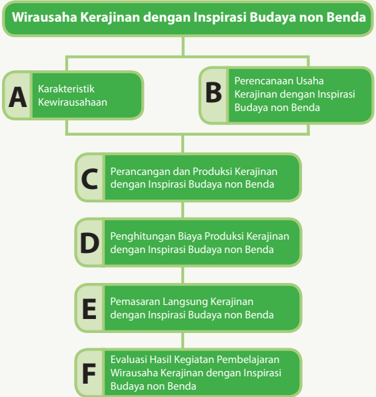

> **Deskripsi Visual:** Gambar ini adalah diagram yang menunjukkan proses wirausaha kerajinan dengan inspirasi budaya non benda. Diagram ini dibagi menjadi dua bagian utama: A dan B. Bagian A berisi karakteristik kebijaksanaan wirausaha, sedangkan bagian B berisi perencanaan usaha kerajinan dengan inspirasi budaya non benda.

Elemen utama dalam diagram ini meliputi:
1. Karakteristik Kewirausahaan (A)
   - Perancangan dan Produksi Kerajinan dengan Inspirasi Budaya non Benda (C)
   - Penghitungan Biaya Produksi Kerajinan dengan Inspirasi Budaya non Benda (D)
   - Pemasaran Langsung Kerajinan dengan Inspirasi Budaya non Benda (E)
   - Evaluasi Hasil Kegiatan Pembelajaran Wirausaha Kerajinan dengan Inspirasi Budaya non Benda (F)

Relasi antara elemen-elemen ini adalah bahwa setiap elemen dalam bagian A harus dilalui sebelum elemen-elemen dalam bagian B dapat dimulai. Ini menunjukkan langkah-langkah yang harus diikuti dalam proses wirausaha kerajinan dengan inspirasi budaya non benda.

Teks, angka, atau label penting yang terlihat dalam diagram ini adalah:
- "Karacteristik Kewirausahaan"
- "Perencanaan Usaha Kerajinan dengan Inspirasi Budaya non Benda"
- "Perancangan dan Produksi Kerajinan dengan Inspirasi Budaya non Benda"
- "Penghitungan Biaya Produksi Kerajinan dengan Inspirasi Budaya non Benda"
- "Pemasaran Langsung Kerajinan dengan Inspirasi Budaya non Benda"
- "Evaluasi Hasil Kegiatan Pembelajaran Wirausaha Kerajinan dengan Inspirasi Budaya non Benda"

Informasi kunci yang dapat diambil pembaca adalah bahwa proses wirausaha kerajinan dengan inspirasi budaya non benda melibatkan beberapa langkah yang harus diikuti, mulai dari perencanaan hingga evaluasi hasil.

Prakarya dan Kewirausahaan 1

 

---
## 📄 Halaman 8

### BAB I Wirausaha Kerajinan dengan Inspirasi Budaya Nonbenda

### Tujuan Pembelajaran

### Setelah mempelajari bab ini, peserta didik mampu:

- Menghayati  bahwa  akal  pikiran  dan  kemampuan  manusia  dalam  berpikir kreatif untuk membuat kerajinan, ragam budaya non benda  serta keberhasilan wirausaha adalah anugerah Tuhan.
- Menghayati  perilaku  jujur,  percaya  diri,  dan  mandiri  serta  sikap  bekerja sama, gotong royong, bertoleransi, disiplin, bertanggung jawab, kreatif, dan inovatif dalam membuat kerajinan dengan isnpirasi budaya non benda guna membangun semangat usaha.
- Mendesain  dan  membuat  kerajinan  dengan  insprisai  budaya  nonbenda berdasarkan  identifikasi  kebutuhan  sumber  daya,  teknologi,  dan  prosedur berkarya.
- Mempresentasikan dan memasarkan kerajinan dengan inspirasi budaya non benda dengan perilaku jujur dan percaya diri
- Melakukan  evaluasi  pembelajaran  wirausaha  kerajinan  dengan  inspirasi budaya nonbenda.

 

---
## 📄 Halaman 9

### A. Karakteristik Kewirausahaan

Wirausaha,  menurut  asal  katanya,  terdiri  atas  kata wira dan usaha .  Wira, berarti  pejuang,  pahlawan,  manusia  unggul,  teladan,  berbudi  luhur,  gagah berani dan berwatak agung. Usaha, berarti perbuatan amal, bekerja, berbuat sesuatu. Pengertian wirausaha ,  menurut Kamus Besar Bahasa Indonesia, adalah orang  yang  pandai  atau  berbakat  mengenali  produk  baru,  menentukan cara  produksi  baru,  menyusun  kegiatan  untuk  mengadakan  produk  baru, mengatur permodalan operasinya serta memasarkannya. Pelaku wirausaha, dikenal  juga  dengan  sebutan  wirausahawan  atau  entrepreneur,  adalah seseorang yang memiliki kualitas jiwa kepemimpinan dan inovator pemikiran dalam melakukan usaha. Entrepreneur dapat diartikan juga sebagai seseorang yang  mampu  mewujudkan  ide  ke  dalam  sebuah  inovasi  yang  sukses. Kewirausahaan, atau entrepreneurship, memiliki pengertian yang lebih luas lagi.  Kewirausahaan,  seperti  tercantum  dalam  lampiran  Keputusan  Menteri Koperasi dan Pembinaan Pengusahan Kecil Nomor 961/KEP/M/XI/1995, adalah semangat,  sikap,  perilaku  dan  kemampuan  seseorang  dalam  menangani usaha atau kegiatan yang mengarah pada upaya mencari, menciptakan  serta menerapkan cara kerja, teknologi, dan produk baru dengan meningkatkan efisiensi  dalam  rangka  memberikan  pelayanan  yang  lebih  baik  dan  atau memperoleh keuntungan yang lebih besar. Entrepreneurship adalah sikap dan perilaku yang melibatkan keberanian mengambil risiko, kemampuan berpikir kreatif dan inovatif.

Sifat-sifat seorang wirausahawan seperti berikut.

### 1. Percaya Diri

Kepercayaan  diri  merupakan  paduan  sikap  dan  keyakinan  seseorang dalam menghadapi tugas atau pekerjaan, yang bersifat internal, sangat relatif dan dinamis dan banyak ditentukan oleh  kemampuannya untuk  memulai,  melaksanakan  dan  menyelesaikan  suatu  pekerjaan. Kepercayaan diri akan memengaruhi gagasan, karsa, inisiatif, kreativitas, keberanian,  ketekunan,  semangat  kerja,  kegairahan  berkarya.  Kunci keberhasilan  dalam  bisnis  adalah  untuk  memahami  diri  sendiri.  Oleh karena itu, wirausaha yang sukses adalah wirausaha yang mandiri dan percaya diri.

### 2. Berorientasikan Tugas dan Hasil

Seseorang yang selalu mengutamakan tugas dan hasil adalah orang yang selalu  mengutamakan  nilai-nilai  motif  berprestasi,  berorientasi  pada laba, ketekunan, dan kerja keras. Dalam kewirausahaan, peluang hanya diperoleh apabila ada inisiatif. Perilaku inisiatif biasanya diperoleh melalui pengalaman dan pengembangannya diperoleh dengan caradisiplin diri, berpikir kritis, tanggap, bergairah, dan semangat berprestasi.

 

---
## 📄 Halaman 10

### 3. Berani Mengambil Risiko

Salah satu hal penting dalam memulai berbuat sesuatu yang baru adalah berani mengambil risiko untuk melakukan sesuatu yang belum pernah dilakukan  sebelumnya.  Inovasi  atau  kebaruan  tidak  akan  muncul  jika kita melakukan hal-hal yang sudah dilakukan oleh orang lain, dan tidak berani melakukan hal-hal yang belum pernah kita lakukan. Wirausahawan adalah orang yang lebih menyukai usaha-usaha yang lebih menantang untuk mencapai kesuksesan atau kegagalan daripada usaha yang kurang menantang.  Wirausahawan  menghindari  situasi  risiko  yang  rendah karena tidak ada tantangan dan menjauhi situasi risiko yang tinggi karena ingin berhasil. Pada situasi ini, ada dua alternatif yang harus dipilih, yaitu alternatif yang menanggung risiko dan alternatif yang konservatif.

### 4.  Kepemimpinan

Kepemimpinan  adalah  sikap  yang  dimiliki  oleh  seorang  pemimpin  di antaranya  memiliki  visi  yang  jelas,  memiliki  integritas  dan  kejujuran, mampu  berkomunikasi  dengan  baik,  menjadi  teladan,  rendah  hati, mau  mendengar,  mampu  memotivasi  orang  lain  untuk  melakukan tugasnya dan berlaku adil. Seorang wirausahawan harus memiliki sifat kepemimpinan, kepeloporan, keteladanan. Ia selalu menampilkan produk dan jasa-jasa baru dan berbeda sehingga ia menjadi pelopor baik dalam  proses  produksi  maupun  pemasaran  dan  selalu  memanfaatkan perbedaan sebagai suatu yang menambah nilai.

### 5. Keorisinalitas/Keaslian

Keaslian ide, gagasan, pemikiran dan keputusan dapat diperoleh dengan keluasan  wawasan  dan  kemampuan  berpikir  kreatif,  serta  melihat peluang  yang  ada.  Orisinalitas  muncul  dari  kemampuan  untuk  selalu menuangkan imajinasi dalam pekerjaannya, keinginan tampil berbeda atau selalu memanfaatkan perbedaan, memiliki sikap mental yang positif dan  daya  pikir  kreatif.  Karya  orisinal  juga  hanya  dapat  dihasilkan  oleh wirausahawan yang memiliki keahlian di bidangnya serta rajin mencoba hal-hal baru yang inovatif.

 

---
## 📄 Halaman 11

### 6. Berorientasi ke Masa Depan

Masa  depan  memiliki  berbagai  peluang  dan  tantangan  yang  berbeda dengan saat ini. Seorang dengan kewirausahaan berani melihat peluang dan tantangan tidak hanya di saat ini, melainkan juga di masa depan. Salah  satu  indikator  atau  tanda  seseorang  memiliki entrepreneurship atau  jiwa  kewirusahaan  adalah  mampu membuat usaha bisnis sendiri, menjadi wirausahawan. Wirausaha dalam bidang teknologi transportasi dan logistik, dapat menjadi wirausahawan yang menghasilkan produk, wirausahawan  penjual  produk  ataupun  wirausaha  yang  memberikan jasa perbaikan produk teknologi transportasi dan logistik. Keberhasilan wirausahawan  adalah  saat  usahanya  dapat  menghasilkan  keuntungan atau  laba,  mampu  mempekerjakan  banyak  orang,  memberikan  bagi lingkungan sekitarnya, serta dapat memberikan kontribusi bagi kemajuan bangsa dan negaranya.

### Faktor Penyebab Keberhasilan dan Kegagalan Berwirausaha

Memulai  sesuatu  yang  baru  pasti  tidak  mudah.  Oleh  karena  itu,  seorang wirausahawan  harus  berani  mencoba  dan  mengambil  risiko.  Gagal  dalam melakukan  suatu  hal  adalah  bagian  dari  proses  untuk  menuju  kesuksesan. Kegagalan  adalah  kesuksesan  yang  tertunda.  Jika  kamu  mencoba  wirausaha dalam  suatu  bidang,  lalu  gagal,  kamu  tidak  perlu  berkecil  hati  dan  putus  asa, cobalah kembali! Tentu sebelum memulai berwirausaha, buatlah perhitungan dan perencanaan yang matang.

Carilah  dari  berbagai  sumber  kisah-kisah  para  pengusaha  yang  sukses  dalam menjalankan usahanya. Bacalah dengan saksama, lalu ambil pelajaran dari kisah mereka dalam memulai wirausaha sehingga kamu dapat mengetahui kegagalan dan kesuksesan mereka.

### Tugas 1 (Individu)

### Wirausahawan Sukses

- Amati lingkungan sekitarmu. Cari informasi dari buku, koran, majalah atau internet  untuk  temukan  tokoh  wirausahawan  di  bidang  kerajinan  yang sukses!
- Pelajari kisah sukses dari wirausahawan tersebut.
- Tuliskan hal-hal apa saja yang membuat wirausahawan tersebut berhasil, berdasarkan kisah suksesnya.
- Presentasikan hasil pemikiranmu di depan kelas.

 

---
## 📄 Halaman 12

### B.  Perencanaan Usaha Kerajinan dengan Inspirasi Budaya Nonbenda

### Budaya Tradisional sebagai Sumber Inspirasi

Indonesia  sangat  kaya  dengan  budaya  tradisional  yang  merupakan  adat istiadat yang berlaku pada setiap kelompok etnik atau suku bangsa. Terdapat lebih dari 300 kelompok etnik atau suku bangsa di Indonesia atau tepatnya 1.340  suku  bangsa  menurut  sensus  Badan  Pusat  Statistik  tahun  2010. Indonesia memiliki jumlah suku bangsa terbanyak di Asia Tenggara. Artinya, Indonesia memiliki keragaman budaya tradisional yang merupakan potensi luar biasa untuk menjadi sumber inspirasi.

---
**🖼️ Gambar/Diagram**

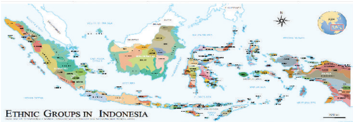

> **Deskripsi Visual:** Gambar ini adalah ilustrasi yang menunjukkan wilayah Indonesia dengan berbagai kelompok etnis yang tersebar di seluruh pulau-pulau besar dan kecil. Ilustrasi ini mencakup berbagai provinsi dan kota-kota penting di Indonesia, serta menunjukkan bagaimana berbagai kelompok etnis tersebar di setiap daerah. Elemen utama yang ditampilkan meliputi peta Indonesia, warna-warna yang berbeda untuk menunjukkan provinsi-provinsi, dan ikon-ikon yang menunjukkan kelompok etnis. Teks, angka, atau label penting yang terlihat meliputi nama-nama provinsi, nama-nama kota, dan warna-warna yang digunakan untuk menunjukkan wilayah-wilayah tertentu. Informasi kunci yang dapat diambil pembaca meliputi bahwa Indonesia memiliki banyak kelompok etnis yang tersebar di seluruh negara, dan bahwa setiap provinsi memiliki karakteristik geografis dan etnis yang unik.

Sumber: Museum Nasional Indonesia, Jakarta (digambar ulang oleh: Gunawan Kartapranata)

Gambar 1.1 Peta Suku Bangsa di Indonesia

Budaya tradisi dapat dikelompokkan menjadi budaya nonbenda dan artefak/ objek budaya. Budaya nonbenda di antaranya pantun, cerita rakyat, tarian, dan  upacara  adat.  Sedangkan  artefak/objek  budaya  diantaranya  pakaian daerah, wadah tradisional, senjata dan rumah adat. Pada kehidupan seharihari,  produk  budaya  tradisional  nonbenda  maupun  artefak  tidak  dipisahpisahkan melainkan menjadi satu kesatuan dan saling melengkapi.

Sebuah tarian tradisional bisa saja membawakan cerita tradisional, dengan menggunakan pakaian tradisional dan ditarikan pada sebuah upacara yang merupakan ritual  tradisional.  Contohnya  tarian  Burung  Enggang  dari  suku Dayak, menceritakan tentang seekor burung enggang. Burung enggang bagi masyarakat Dayak merupakan simbol dewata. Burung enggang merupakan wujud  nenek  moyang  yang  turun  ke bumi. Penari  Burung  Enggang menggunakan pakaian tradisional Dayak, dan diiringi musik tradisional yang dimainkan dengan alat musik tradisional.

Tarian, simbol, pakaian, musik dan alat musik tersebut dapat menjadi sumber inspirasi  dari  pembuatan  kerajinan.  Tarian,  simbol  dan  musik  merupakan produk budaya nonbenda, sedangkan pakaian, perlengkapan tari dan alat musik merupakan artifak/objek budaya.

 

---
## 📄 Halaman 13

---
**🖼️ Gambar/Diagram**

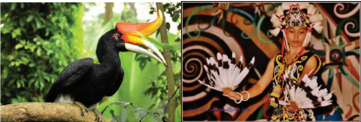

> **Deskripsi Visual:** Gambar ini adalah ilustrasi yang menampilkan dua objek utama: burung dan lukisan tradisional. Burung tersebut memiliki sayap berwarna kuning cerah dengan bulu putih di bagian tengah dan ekor berwarna merah. Kepala burung sangat besar dengan bulu berwarna oranye dan putih yang membentuk pola seperti sayap burung. Lukisan tradisional di sisi kanan gambar menampilkan karakter dengan rambut panjang dan pakaian berwarna-warni, serta elemen-elemen desain yang kompleks seperti spiral dan garis. Elemen-elemen ini menunjukkan hubungan antara keindahan alam dan budaya tradisional. Teks, angka, atau label penting tidak terlihat dalam gambar ini. Informasi kunci yang dapat diambil pembaca adalah hubungan antara keindahan alam dan budaya tradisional, serta penampilan unik dari burung dan lukisan tradisional.

Sumber: Chris Djoka & Duto Sri Cahyono

Sumber: Kemdikbud, 2016

---
**🖼️ Gambar/Diagram**

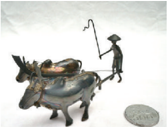

> **Deskripsi Visual:** Gambar ini adalah ilustrasi yang menunjukkan seorang petani dengan sepeda gajah (elephant bike) yang digunakan untuk membawa hasil pertanian. Petani tersebut sedang berjalan dengan sepeda gajah yang dilengkapi dengan kantong dan alat pertanian. Ilustrasi ini menunjukkan bagaimana teknologi modern seperti sepeda gajah dapat digunakan untuk meningkatkan produktivitas petani dalam mengangkut hasil pertanian mereka.

Elemen utama dalam gambar ini meliputi:
1. Petani: Ikon manusia yang sedang berjalan.
2. Sepeda Gajah: Ikon sepeda yang dilengkapi dengan kantong dan alat pertanian.
3. Latar Belakang: Tidak ada detail latar belakang yang jelas, hanya fokus pada objek utama.

Teks, angka, atau label penting yang terlihat dalam gambar ini tidak ada, sehingga informasi kunci yang dapat diambil pembaca hanya melalui visual saja.

Informasi kunci yang dapat diambil pembaca adalah bahwa sepeda gajah adalah inovasi teknologi yang dapat membantu petani dalam mengangkut hasil pertanian mereka, menunjukkan potensi penggunaan teknologi modern dalam masyarakat pedesaan.

Gambar 1.4 Kegiatan khas daerah, membajak sawah (atas) dan miniatur bermaterial logam (bawah)

 

---
## 📄 Halaman 14

Setiap jenis budaya tradisi baik nonbenda maupun artefak/objek budaya dapat menjadi  sumber  inspirasi  untuk  dikembangkan  menjadi  produk  kerajinan. Hingga saat ini, tercatat 4.156 warisan budaya nonbenda yang terdapat di seluruh  Indonesia.  Setiap  daerah  dapat  mengembangkan  kerajinan  khas daerah  yang  mengambil  inspirasi  dari  budaya  tradisi  daerahnya  masingmasing. Kekayaan budaya tradisi Indonesia adalah kearifan lokal ( local genius ) yang dapat menjadi sumber inspirasi yang tidak ada habisnya.

---
**🖼️ Gambar/Diagram**

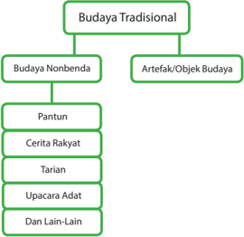

> **Deskripsi Visual:** Gambar ini adalah diagram yang menunjukkan struktur budaya tradisional dengan berbagai elemen yang terkait. Diagram ini membagi budaya tradisional menjadi dua kategori utama: Budaya Nonbenda dan Artefak/Objek Budaya. Budaya Nonbenda kemudian dibagi lagi menjadi lima sub-kategori utama, yaitu Pantun, Cerita Rakyat, Tarian, Upacara Adat, dan Dan Lain-Lain. Setiap sub-kategori memiliki hubungan hierarkis dengan kategori atasnya, menunjukkan bahwa semua sub-kategori termasuk dalam budaya nonbenda. Ini menunjukkan bahwa buku pelajaran ini mungkin sedang menjelaskan tentang bagaimana budaya tradisional dihasilkan melalui berbagai bentuk kreativitas dan ritual.

Sumber: Dokumen Kemdikbud

### Tugas 2 Ragam Budaya Nonbenda

- Buatkan kelompok dengan teman sekelas.
- Diskusikan dalam kelompok tentang budaya nonbenda apa saja yang ada di daerahmu.
- Tuliskan  jenis-jenis  budaya  nonbenda tersebut, nama atau judul disertai penjelasan singkat.

 

---
## 📄 Halaman 15

### Nama Daerah

: .......................

---
**📊 Tabel**

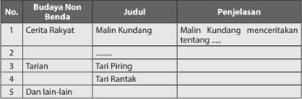

Tabel ini berisi informasi tentang budaya non-benda yang terdapat dalam beberapa cerita rakyat dan tarian tradisional di Indonesia. Topik utamanya adalah budaya non-benda, yang meliputi cerita rakyat Malin Kundang, tarian Tari Piring, dan tarian Tari Rantak. Selain itu, tabel juga mencakup budaya lainnya yang tidak disebutkan secara spesifik. Kolom-kolom yang ada dalam tabel adalah No., Budaya Non-Benda, Judul, dan Penjelasan. Data penting yang terlihat dalam tabel adalah bahwa Malin Kundang adalah cerita rakyat yang mengandung makna mendalam tentang kehidupan dan nilai-nilai masyarakat. Tarian Tari Piring dan Tari Rantak merupakan tarian tradisional yang memiliki nilai estetika dan kultural yang tinggi. Sementara itu, budaya lainnya yang tidak disebutkan mungkin merujuk pada berbagai bentuk seni dan budaya lain yang tidak termasuk dalam kategori cerita rakyat dan tarian tradisional.

### Sumber Daya, Material, Teknik dan Ide Kerajinan dengan Inspirasi Budaya Nonbenda

Kegiatan wirausaha didukung oleh ketersediaan sumber daya manusia, material, peralatan,  cara  kerja,  pasar,  dan  pendanaan.  Sumber  daya  yang  dikelola  dalam sebuah  wirausaha  dikenal  dengan  sebutan  6  M,  yakni Man (manusia), Money (uang), Material (bahan), Machine (peralatan), Method (cara  kerja),  dan Market (pasar). Wirausaha kerajinan dengan inspirasi budaya non benda dapat dimulai dengan  melihat  potensi  bahan  baku  (Material),  keterampilan  produksi  (Man  & Machine)  dan  budaya  lokal  yang  ada  di  daerah  setempat. Wirausaha  kerajinan dengan inspirasi budaya akan menawarkan karya-karya kerajinan inovatif kepada pasaran.  Pasar  sasaran  (Market)  dari  produk  kerajinan  ini  adalah  orang-orang yang menghargai dan mencintai kebudayaan tradisional. Kemampuan mengatur keuangan (Money) dalam kegiatan usaha akan menjamin keberlangsungan dan pengembangan usaha.

---
**🖼️ Gambar/Diagram**

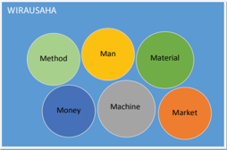

> **Deskripsi Visual:** Gambar ini adalah diagram yang menunjukkan aspek-aspek penting dalam sebuah usaha atau bisnis. Diagram ini terdiri dari enam elemen utama yang disusun dalam bentuk lingkaran, masing-masing dengan warna dan teks yang berbeda:

1. **Man** (Manusia) berada di tengah-tengah diagram, menggambarkan bahwa manusia adalah aset paling penting dalam suatu usaha.
2. **Method** (Metode) berada di sebelah kiri atas, menunjukkan bahwa metode atau cara kerja sangat penting untuk efisiensi dan hasil.
3. **Material** (Bahan-bahan) berada di sebelah kanan atas, menunjukkan bahwa bahan-bahan atau sumber daya adalah aset yang tidak bisa dipisahkan dari usaha.
4. **Machine** (Mesin) berada di sebelah kiri bawah, menunjukkan bahwa mesin atau alat-alat yang digunakan dalam proses produksi juga merupakan aset penting.
5. **Money** (Uang) berada di sebelah kanan bawah, menunjukkan bahwa uang atau sumber daya finansial adalah aset yang sangat vital.
6. **Market** (Marketed) berada di sebelah bawah, menunjukkan bahwa pasar atau konsumen adalah aset yang harus dipahami dan dikelola dengan baik.

Teks, angka, atau label penting yang terlihat pada diagram ini adalah "WIRAUSAHAH", yang mungkin merujuk pada istilah atau konsep yang digunakan dalam pembelajaran ini. Informasi kunci yang dapat diambil pembaca adalah bahwa dalam suatu usaha, semua aspek seperti manusia, metode, bahan-bahan, mesin, uang, dan pasar harus saling terkait dan dikontrol secara efektif untuk mencapai tujuan bisnis.

Sumber: Kemdikbud

 

---
## 📄 Halaman 16

Pada Tugas 2, telah dilakukan identifikasi terhadap budaya tradisional nonbenda yang terdapat di daerahmu. Ragam budaya tradisional nonbenda yang terdapat di daerah akan menjadi inspirasi untuk perancangan kerajinan yang akan dibuat. Perancangan  kerajinan  juga  harus  mempertimbangkan  ketersediaan  material/ bahan baku dan keterampilan produksi yang terdapat di daerah sekitar. Untuk itu, dapat dilakukan pencarian informasi tentang ragam jenis material khas daerah yang dapat digunakan untuk kerajinan serta perajin yang membuat kerajinan di daerah setempat.

Sumber: Kemdikbud

Gambar 1.7 Ragam Material Alam

### Tugas 3 (Kelompok)

### Identifikasi Ragam Material dan Teknik Produksi di Lingkungan Sekitar

- Amati lingkunganmu. Perhatikan ragam material atau bahan baku yang tersedia di lingkungan sekitarmu.
- Carilah  informasi  dari  buku,  internet,  maupun  dari  perajin  yang  ada di  daerahmu  tentang  ragam  material  dan  teknik  produksi  yang  dapat digunakan untuk setiap material tersebut.
- Diskusikan dalam kelompok tentang ragam material dan teknik produksi yang  dapat  digunakan  untuk  pembuatan  kerajinan  dengan  inspirasi budaya.  Tuliskan  sebanyak-banyak  tentang  ragam  bahan  baku/material dan teknik produksi yang ada di lingkungan sekitarmu.
- Presentasikan dalam bentuk tabel LK 3 atau bentuk presentasi lain yang lebih menarik dan kreatif.

 

---
## 📄 Halaman 17

---
**📊 Tabel**

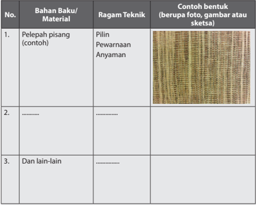

Tabel ini berisi informasi tentang bahan baku, ragam teknik, dan contoh bentuk untuk beberapa jenis pelepasan pisang. Topik utama tabel adalah proses pembuatan pelepasan pisang, yang melibatkan penggunaan bahan baku seperti pelepasan pisang dan ragam teknik seperti piling, pewarnaan, dan anyaman. Kolom-kolomnya mencakup No., Bahan Baku/Material, Ragam Teknik, dan Contoh Bentuk. Data penting yang terlihat adalah bahwa pelepasan pisang dapat dibuat dengan berbagai ragam teknik, seperti piling, pewarnaan, dan anyaman, dan contoh bentuknya dapat berupa foto, gambar, atau sketsa.

### C.  Perancangan dan Produksi Kerajinan dengan Inspirasi Budaya Nonbenda

Perancangan dan produksi didasari oleh data yang telah diperoleh melalui Tugas 2 tentang Ragam Budaya Nonbenda dan Tugas 3 tentang Identifikasi Ragam Material dan Teknik produksi di lingkungan sekitar. Budaya tradisional daerah  dan  material  serta  teknik  khas  daerah  merupakan  potensi  yang harus  dikembangkan  sehingga  lestari  dan  menjadi  manfaat  bagi  daerah. Setiap daerah di Indonesia memiliki budaya tradisional yang berbeda-beda. Pengembangan dari setiap  budaya tradisional tersebut akan menjadi kekayaan bersama yang luar biasa, yang akan memberikan warna bagi kemajuan bangsa Indonesia di masa depan. Salah satu kekayaan pengembangan budaya tradisi adalah melalui pengembangan kerajinan.

 

---
## 📄 Halaman 18

---
**🖼️ Gambar/Diagram**

> **Deskripsi Visual:** Gambar ini adalah diagram yang menunjukkan hubungan antara potensi budaya non-benda, potensi material dan teknik, serta kerajinan. Diagram ini menggunakan warna hijau untuk menunjukkan potensi budaya non-benda dan potensi material dan teknik, sementara warna hijau tua menunjukkan kerajinan. Elemen-elemen utama dalam diagram ini adalah potensi budaya non-benda, potensi material dan teknik, dan kerajinan. Relasi antara elemen-elemen ini adalah bahwa potensi budaya non-benda dan potensi material dan teknik berkontribusi pada kerajinan. Teks, angka, atau label penting yang terlihat dalam diagram ini adalah nama-nama elemen-elemen tersebut. Informasi kunci yang dapat diambil pembaca adalah bahwa kerajinan dibangun dari kombinasi potensi budaya non-benda, potensi material dan teknik.

Sumber: Kemdikbud

Proses  perancangan  kerajinan  diawali  dengan  pemilihan  sumber  inspirasi dan pencarian ide produk kerajinan, pembuatan sketsa ide, pembuatan studi model  kerajinan,  dilanjutkan  dengan  pembuatan  petunjuk  produksi.  Ide kerajinan dengan inspirasi budaya lokal akan dikembangkan menjadi produk kerajinan  yang  akan  diproduksi  dan  siap  dijual.  Dengan  demikian  produk yang dihasilkan harus memiliki nilai estetik dan inovasi agar diminati pasar.

Perancangan kerajinan dengan inspirasi budaya nonbenda akan menerjemahkan  sesuatu  yang  abstrak (tak berbenda) menjadi  benda (berwujud). Misalnya, inspirasi diambil dari sebuah cerita rakyat (tak berbenda) menjadi  sebuah  diorama  mini  yang  menggambarkan  salah  satu  adegan dalam  cerita  rakyat  tersebut.  Contoh  lain  adalah  mengambil  inspirasi  dari kepercayaan simbolis (tak berbenda), burung enggang untuk dibuat menjadi ide  untuk  tekstil  atau  busana  (benda).  Tahapan  penerjemahan  meliputi: pemahaman terhadap makna simbol; mencari kata kunci yang dapat menjadi dasar  dari  pengembangan  ide  produk;  mencari  ide-ide  fungsi  dan  bentuk kerajinan.

---
**🖼️ Gambar/Diagram**

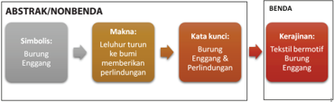

> **Deskripsi Visual:** Gambar ini adalah diagram yang menunjukkan proses analisis abstrak ke benda dalam konteks bahasa Indonesia. Diagram ini terdiri dari tiga bagian utama:

1. Simbolis: Menunjukkan simbol "Burung Enggang" sebagai titik awal.
2. Makna: Menggambarkan makna "Leluhur turun ke bumi membentuk perindungan".
3. Kata kunci: Menyajikan kata-kata kunci seperti "Burung", "Enggang", dan "Perindungan".

Pada bagian terakhir, ada dua kolom yang berbeda untuk menunjukkan kerajinan yang berkaitan dengan kata-kata tersebut. Kolom pertama berisi "Tekstil bermotif Burung Enggang", sementara kolom kedua berisi "Benda".

Informasi kunci yang dapat diambil pembaca meliputi:
- Proses analisis abstrak ke benda dalam bahasa Indonesia.
- Penjelasan tentang simbol, makna, dan kata kunci yang digunakan.
- Kerajinan yang terkait dengan kata-kata "Burung Enggang" dan "Perindungan".

Sumber: Kemdikbud

 

---
## 📄 Halaman 19

### 1. Pencarian Ide Produk

Kita  telah  mengenali  berbagai  kekayaan  budaya  non  benda  di  daerah setempat, tokoh-tokoh cerita rakyat, filosofi dari pantun, simbolsimbol,  cerita  rakyat  dan  tarian  tradisional.  Pengetahuan  dan  apresiasi kita  terhadap hal-hal tersebut dapat mendorong munculnya ide untuk pembuatan produk kerajinan.  Ide  bisa  muncul  secara  tidak  berurutan, dan tidak lengkap, tetapi dapat juga muncul secara utuh. Salah satu dari kita bisa saja memiliki ide tentang suatu bentuk unik yang akan dibuat. Ide  bentuk tersebut akan menuntut kita untuk memikirkan teknik apa yang tepat digunakan dan produk apa yang tepat untuk bentuk tersebut. Salah  satu  dari  kita  juga  bisa  saja  mendapatkan  ide    atau  bayangan tentang sebuah produk yang ingin dibuatnya, material, proses dan alat yang  akan  digunakan  secara  utuh.  Untuk  memudahkan  pencarian  ide atau gagasan  untuk rancangan kerajinan dengan inspirasi budaya non benda, mulailah dengan memikirkan hal-hal di bawah ini.

- Budaya nonbenda apa yang akan menjadi inspirasi?
- Produk kerajinan apa yang akan dibuat?
- Mengapa produk kerajinan tersebut dibuat?
- Siapa yang akan menggunakan produk kerajinan tersebut?
- Bahan/material apa yang apa saja yang akan dipakai?
- Warna dan/atau motif apa yang akan digunakan?
- Adakah teknik warna tertentu yang akan digunakan?
- Bagaimana proses pembuatan produk tersebut?
- Alat apa yang dibutuhkan?
Pertanyaan-pertanyaan  tersebut  dapat  diungkapkan  dan  didiskusikan dalam  kelompok  dalam  bentuk  curah  pendapat  ( brainstorming ).  Pada proses brainstorming ini, setiap anggota kelompok harus membebaskan diri untuk menghasilkan ide-ide yang beragam dan sebanyak-banyaknya. Beri kesempatan juga untuk munculnya ide-ide yang tidak masuk akal sekalipun.  Tuangkan  ide-ide  tersebut  ke  dalam  bentuk  tulisan  atau sketsa.  Kunci  sukses  dari  tahap brainstorming dalam  kelompok  adalah jangan  ada  perasaan  takut  salah,  setiap  orang  berhak  mengeluarkan pendapat, saling menghargai pendapat teman, boleh memberikan ide yang merupakan perkembangan dari ide sebelumnya, dan jangan lupa mencatat  setiap  ide  yang  muncul.  Curah  pendapat  dilakukan  dengan semangat  untuk  menemukan  ide  baru  dan  inovasi.  Semangat  dan keberanian  kita  untuk  mencoba  membuat  inovasi  baru  akan  menjadi bekal kita berkarya di masa depan.

 

---
## 📄 Halaman 20

---
**🖼️ Gambar/Diagram**

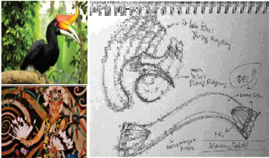

> **Deskripsi Visual:** Gambar ini adalah ilustrasi yang menunjukkan sekelompok burung raja (Buceros rhinoceros), sebuah spesies burung yang dikenal karena memiliki paruh berukuran besar dan berwarna kuning dengan ujung merah. Gambar ini juga menunjukkan sketsa detail paruh burung raja, yang mencakup bagian-bagian seperti paruh, kulit, dan tulang. Sketsa ini menunjukkan bahwa paruh burung raja sangat kompleks dan memiliki struktur yang unik untuk memungkinkannya mengambil makanan yang berbentuk bulat atau pipih. Selain itu, gambar ini juga menunjukkan gambaran dari seorang seniman yang sedang melukis gambaran burung raja menggunakan teknik batik, yang menunjukkan betapa pentingnya burung raja dalam budaya dan seni Indonesia. Gambar ini menunjukkan hubungan antara burung raja dan seni batik, serta menunjukkan betapa pentingnya burung raja dalam budaya dan seni Indonesia.

Sumber: Kemdikbud, 2015

---
**🖼️ Gambar/Diagram**

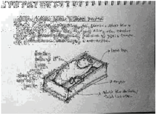

> **Deskripsi Visual:** Gambar ini adalah ilustrasi yang menunjukkan sebuah mesin penggilingan gandum. Gambar ini menggambarkan proses penggilingan gandum dengan detail. Pada bagian atas, terdapat tulisan "Grinding of wheat" yang menjelaskan tujuan dari gambar ini. Ilustrasi ini mencakup beberapa elemen utama:

1. **Mesin Penggilingan**: Mesin ini terdiri dari dua bagian utama: mesin penggilingan dan mesin pengumpul gandum. Mesin penggilingan terletak di bagian tengah dan memiliki dua roda gigi besar yang berputar untuk menggiling gandum.

2. **Gandum**: Gandum disimpan di atas mesin penggilingan dan akan dihancurkan oleh roda gigi mesin tersebut.

3. **Mesin Pengumpul Gandum**: Mesin ini terletak di bawah mesin penggilingan dan bertugas untuk mengumpulkan gandum yang telah dihancurkan.

4. **Teks dan Angka**: Terdapat beberapa teks dan angka yang memberikan informasi tentang proses penggilingan. Misalnya, "1.5 m/s" mungkin merujuk pada kecepatan putaran mesin penggilingan, sementara "10 kg" mungkin merujuk pada kapasitas penggilingan.

5. **Label Penting**: Label seperti "Grinding mill" dan "Wheat mill" membantu pembaca memahami fungsi setiap bagian mesin.

Informasi kunci yang dapat diambil dari gambar ini adalah bahwa mesin ini digunakan untuk menggiling gandum menjadi tepung, proses yang penting dalam industri pangan. Gambar ini memberikan gambaran yang jelas tentang bagaimana proses penggilingan berlangsung dan bagaimana komponen-komponennya bekerja sama untuk mencapai tujuan tersebut.

Sumber: Kemdikbud

### 2.  Membuat Gambar/Sketsa

Ide-ide produk, rencana atau rancangan dari produk kerajinan digambarkan atau dibuatkan sketsanya agar ide yang abstrak menjadi berwujud. Ide-ide rancangan dapat digambarkan pada sebuah buku atau lembaran kertas, dengan menggunakan pinsil, spidol atau bolpoin dan sebaiknya hidari penggunaan penghapus. Tariklah garis tipis-tipis dahulu. Jika ada garis yang dirasa kurang tepat, abaikan saja, buatlah garis lain pada  bidang  kertas  yang  sama.  Demikian  seterusnya  sehingga  kamu

 

---
## 📄 Halaman 21

berani  menarik  garis  dengan  tegas  dan  tebal.  Gambarkan  idemu sebanyak-banyaknya,  dapat  berupa  variasi  produk,  satu  produk  yang memiliki  fungsi  sama,  tetapi  dengan  bentuk  yang  berbeda,  produk dengan bentuk yang sama dengan warna dan motif yang berbeda.

---
**🖼️ Gambar/Diagram**

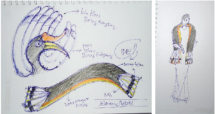

> **Deskripsi Visual:** Gambar ini adalah ilustrasi yang menunjukkan desain busana dengan detail mendalam. Gambar ini terdiri dari dua bagian utama: sebelah kiri menunjukkan detail desain topi dan sebelah kanan menunjukkan detail desain pakaian. Topi tersebut memiliki bentuk seperti bulu burung dengan penutup berbentuk bulat dan ujung yang melengkung ke arah depan. Bagian tengah topi memiliki warna putih dengan garis-garis merah dan biru yang membentuk pola. Di bagian bawah topi, ada tulisan "Bulu burung" untuk menjelaskan bentuk dan warna topi tersebut.

Pada bagian kanan, gambar menunjukkan detail desain pakaian yang terdiri dari beberapa bagian seperti lengan, pinggul, dan pergelangan tangan. Pakaian tersebut memiliki warna dasar hitam dengan garis-garis kuning dan merah yang membentuk pola. Ada juga tulisan "Bulu burung" di bagian pinggul dan pergelangan tangan untuk menjelaskan detail desain tersebut.

Teks, angka, atau label penting yang terlihat pada gambar ini adalah "Bulu burung" yang digunakan untuk menjelaskan bentuk dan warna topi serta detail desain pakaian. Informasi kunci yang dapat diambil pembaca adalah bahwa gambar ini menunjukkan desain busana yang menggunakan elemen-elemen alamiah seperti bulu burung sebagai inspirasi.

Sumber: Dokumen Kemdikbud

---
**🖼️ Gambar/Diagram**

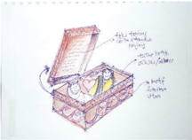

> **Deskripsi Visual:** Gambar ini adalah ilustrasi yang menunjukkan sebuah lemari pakaian dengan berbagai pakaian dan aksesori. Lemari pakaian terbuka, memperlihatkan rangkaian pakaian seperti kaos, baju, dan celana. Ada juga beberapa aksesori seperti topi, tas, dan sepatu yang disimpan dalam lemari. Ilustrasi ini menggunakan warna-warna cerah untuk menonjolkan berbagai item dalam lemari. Label pada gambar memberikan informasi tentang jenis dan warna pakaian serta aksesori tersebut. Ini menunjukkan bahwa gambar ini bertujuan untuk menggambarkan bagaimana menyimpan dan mengorganisir pakaian dan aksesori dengan efektif.

Sumber: Dokumen Kemdikbud

### 3. Pilih Ide Terbaik

Setelah kamu menghasilkan banyak ide dan menggambarkannya dengan sketsa, mulai pertimbangkan ide mana yang paling baik, menyenangkan dan memungkinkan untuk dibuat.

 

---
## 📄 Halaman 22

### 4. Prototyping atau Membuat Studi Model

Sketsa  ide  yang  dibuat  pada  tahap-tahap  sebelumnya  adalah  format dua dimensi. Artinya hanya digambarkan pada bidang datar. Kerajinan yang akan dibuat berbentuk tiga dimensi. Maka, studi bentuk selanjutnya dilakukan dalam format tiga dimensi, yaitu dengan studi model. Studi model  dapat  dilakukan  dengan  material  sebenarnya  maupun  bukan material sebenarnya.

### 5. Perencanaan Produksi

Tahap selanjutnya adalah membuat perencanaan untuk proses produksi atau  proses  pembuatan  kerajinan  tersebut.  Prosedur  dan  langkahlangkah kerja dituliskan secara jelas dan detail agar pelaksanaan produksi dapat dilakukan dengan mudah dan terencana.

### Tugas 4 (Kelompok)

Pengembangan Desain dan Persiapan Produksi Kerajinan dengan Inspirasi Budaya Nonbenda

- Carilah  ide  produk  kerajinan  dengan  inspirasi  budaya  nonbenda  yang akan  dibuat.  Pencarian  ide  dapat  dilakukan  dengan  curah  pendapat ( brainstorming ) dalam kelompok.
- Buat  beberapa  sketsa  ide  bentuk  dari  produk  tersebut.  Pertimbangkan faktor estetika dan kenyamanan penggunaan dari produk tersebut.
- Pilih salah satu ide bentuk yang paling baik.
- Pikirkan dan tentukan teknik-teknik yang akan digunakan untuk membuatnya serta bahan dan alat yang dibutuhkan.
- Buatlah  produk  tersebut.  Proses  pembuatan  model  ini  dilakukan  untuk mengetahui  bahan,  teknik  dan  alat  yang  tepat  untuk  digunakan  pada proses produksi yang sesungguhnya.
- Buat petunjuk pembuatan produk tersebut dalam bentuk tulisan maupun gambar.
- Susunlah semua sketsa, gambar, studi model, daftar bahan dan alat serta petunjuk pembuatan yang dibutuhkan ke dalam sebuah laporan portofolio yang baik dan rapi.

 

---
## 📄 Halaman 23

### Produksi Kerajinan dengan Inspirasi Budaya Nonbenda

Proses produksi kerajinan dengan inspirasi budaya lokal nonbenda berdasarkan daya dukung yang dimiliki oleh daerah setempat.

- Bahan Baku
- Teknik Produksi
- Sumber Daya Manusia
Kegiatan produksi diawali dengan persiapan produksi. Persiapan produksi dapat berupa  pembuatan  gambar  teknik  (gambar  kerja)  atau  gambar  pola.  Gambar kerja atau pola akan menjadi patokan untuk kebutuhan pembelian dan persiapan bahan. Tahap selanjutnya adalah pengerjaan. Kerjakan setiap tahap sesuai dengan perencanaan produksi yang sudah dibuat sebelumnya. Tahapan produksi secara umum terbagi atas pembahanan, pembentukan, perakitan, dan finishing.

Tahap pembahanan adalah mempersiapkan bahan atau material agar siap dibentuk. Tahapan proses pembahanan dilanjutkan dengan proses pembentukan .  Pembentukan  bahan  baku  bergantung  pada  jenis  material, bentuk  dasar  material  dan  bentuk  produk  yang  akan  dibuat.  Material  kertas dibentuk  dengan  cara  dilipat.  Kayu,  bambu  dan  rotan  lainnya  dapat  dibentuk dengan cara dipotong atau dipahat. Pemotongan bahan dibuat sesuai dengan bentuk yang direncanakan. Pemotongan dan pemahatan juga biasanya digunakan untuk membuat sambungan bahan, seperti menyambungkan bilahbilah papan atau dua batang bambu. Pembentukan besi dan rotan, selain dengan pemotongan,  dapat  menggunakan  teknik  pembengkokan.  Pembentukan  besi juga dapat menggunakan teknik las. Logam lempengan dapat dibentuk dengan cara  pengetokan.  Tahap  terakhir  adalah finishing.  Finishing dilakukan  sebagai tahap terakhir sebelum produk tersebut dimasukan ke dalam kemasan. Finishing dapat  berupa  penghalusan  dan/atau  pelapisan  permukaan. Penghalusan yang dilakukan diantaranya penghalusan permukaan kayu dengan amplas atau menghilangkan lem yang tersisa pada permukaan produk. Finishing dapat juga berupa  pelapisan  permukaan  atau  pewarnaan  agar  produk  yang  dibuat  lebih awet dan lebih menarik.

Kelancaran  produksi  juga  ditentukan  oleh  cara  kerja  yang  memperhatikan  K3 (Kesehatan dan Keselamatan Kerja). Upaya menjaga kesehatan dan keselamatan kerja  bergantung  pada  bahan,  alat  dan  proses  produksi  yang  digunakan  pada proses produksi. Proses pembahanan dan pembentukan material solid seringkali menghasilkan  sisa  potongan  atau  debu  yang  dapat  melukai  bagian  tubuh pekerjanya. Maka, dibutuhkan alat keselamatan kerja berupa kacamata melindung dan masker antidebu. Proses pembahanan dan finishing ,  apabila menggunakan bahan  kimia  yang  dapat  berbahaya  bagi  kulit  dan  pernafasan,  pekerja  harus menggunakan sarung tangan dan masker dengan filter untuk bahan kimia. Selain alat keselamatan kerja, hal yang tak kalah penting adalah sikap kerja yang rapi, hati-hati, teliti dan penuh konsentrasi. Sikap tersebut akan mendukung kesehatan dan keselamatan kerja.

 

---
## 📄 Halaman 24

Pembuatan kerajinan diakhiri dengan evaluasi terhadap produk kerajinan yang telah dibuat, apakah produk tersebut dapat berfungsi dengan baik? Apakah sudah sesuai  dengan  ide,  bayangan  dan  harapan  kita?  Apabila  belum,  perbaikan  apa yang harus kita lakukan agar produk kerajinan yang dihasilkan lebih berkualitas?

### Tugas 5 (Kelompok)

### Perencanaan Proses Produksi dan Keselamatan Kerja

- Setiap  kelompok  sudah  memiliki  rancangan  kerajinan  dengan  inspirasi budaya nonbenda yang telah dibuat pada Tugas 4.
- Tentukan jumlah produk yang akan diproduksi.
- Diskusikan  dan  tuliskan  jenis  aktivitas  pada  tahapan  pembahanan,  cara pembentukan, cara perakitan dan cara finishing dari desain kerajinan yang telah dirancang. Silakan mencari informasi dari buku, internet dan bertanya pada ahli untuk melengkapi pemikiran anggota kelompok.
- Diskusikan dan tuliskan tentang alat kerja yang dibutuhkan pada setiap  proses  dan  ketentuan  keselamatan  kerja  yang  dibutuhkan  dalam mendukung  pembuatan  produk.  Silakan  mencari  informasi  dari  buku, internet  dan  bertanya  pada  ahli  untuk  melengkapi  pemikiran  anggota kelompok.
- Susun informasi tersebut ke dalam sebuah laporan atau presentasi yang menarik  sesuai  format  LK  5.  Boleh  disertai  gambar  agar  lebih  mudah dimengerti dan tampak menarik.

---
**📊 Tabel**

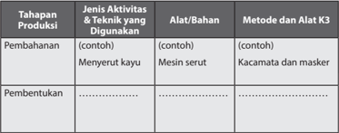

Tabel ini membahas proses produksi dengan membaginya menjadi dua tahap: pembahanan dan pembentukan. Dalam tahap pembahanan, aktivitas dan teknik yang digunakan termasuk menyerut kayu menggunakan mesin serut. Alat yang digunakan antara lain kacamata dan masker. Metode dan alat K3 yang digunakan meliputi penggunaan kacamata dan masker untuk melindungi mata dan wajah dari benda-benda yang berbahaya selama proses pembahanan.

Pada tahap pembentukan, aktivitas dan teknik yang digunakan mencakup proses pengolahan kayu yang lebih maju, seperti pemotongan, pengecoran, dan penyandingan. Alat yang digunakan termasuk mesin cor, mesin pemotong kayu, dan mesin penyanding kayu. Metode dan alat K3 yang digunakan meliputi penggunaan mesin cor untuk memotong kayu menjadi ukuran yang tepat, mesin pemotong kayu untuk memotong kayu menjadi batang, dan mesin penyanding kayu untuk menyambungkan batang-batang kayu menjadi satu kesatuan.

 

---
## 📄 Halaman 25

---
**📊 Tabel**

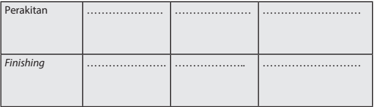

Tabel ini mungkin berisi informasi tentang proses pembuatan atau perbaikan barang atau produk. Topik utamanya adalah "Perakitan" dan "Finishing". Kolom "Perakitan" mungkin berisi informasi tentang tahap-tahap pembuatan atau perbaikan awal, seperti penggunaan bahan, proses penyusunan, dan lainnya. Sementara itu, kolom "Finishing" mungkin berisi informasi tentang tahap-tahap akhir, seperti pengecatan, pengecatan, dan pengecatan lainnya. Data atau pola penting yang terlihat adalah bahwa proses pembuatan atau perbaikan terbagi menjadi dua tahap utama: perakitan dan finishing. Ini menunjukkan bahwa setiap tahap memiliki tujuan dan fungsi yang berbeda dalam proses pembuatan atau perbaikan.

### Tugas 6 (Kelompok)

### Produksi Kerajinan dengan Inspirasi Budaya Nonbenda

Produksi  dilakukan  dalam  kelompok  sesuai  dengan  tahap  pengerjaan  yang sudah direncanakan. Tahap awal berupa persiapan bahan, tempat kerja dan peralatan, dilanjutkan dengan proses produksi.

- Pada  tugas  sebelumnya,  sudah  ditetapkan  jumlah  produk  yang  akan dibuat. Hitunglah bahan yang dibutuhkan untuk memproduksinya.
- Siapkan bahan-bahan dengan mengelompokkan berdasarkan jenis material yang akan digunakan.
- Siapkan pula tempat kerja dan peralatan yang akan digunakan.
- Tahap selanjutnya adalah pengerjaan. Kerjakan setiap tahap sesuai dengan perencanaan proses produksi yang sudah dibuat sebelumnya dan pembagian tugas yang disepakati dalam kelompok.
- Setelah bekerja, rapikan den bersihkan kembali peralatan dan tempat kerja.

### Kemasan Kerajinan dengan Inspirasi Budaya Nonbenda

Kemasan  untuk  kerajinan  berfungsi  untuk  melindungi  produk  dari  kerusakan serta  memberikan kemudahan membawa dari tempat produksi hingga sampai ke konsumen. Kemasan juga berfungsi untuk menambah daya tarik dan sebagai identitas  atau brand dari  produk  tersebut.  Fungsi  kemasan  didukung  oleh pemilihan  material,  bentuk,  warna,  teks  dan  grafis  yang  tepat.    Material  yang digunakan untuk membuat kemasan beragam bergantung pada produk yang akan dikemas. Produk yang mudah rusak harus menggunakan kemasan yang memiliki material berstruktur. Pemilihan material juga disesuaikan dengan identitas atau brand dari  produk  tersebut.  Daya  tarik  dan  identitas,  selain  ditampilkan  oleh

 

---
## 📄 Halaman 26

material kemasan, juga dapat ditampilkan melalui bentuk, warna, teks dan grafis. Pengemasan dapat dilengkapi dengan label yang memberikan informasi teknis maupun memperkuat identitas atau brand .

Kemasan dapat dibagi menjadi 3 (tiga): kemasan primer, kemasan sekunder dan kemasan tersier. Kemasan yang melekat pada produk disebut sebagai kemasan primer. Kemasan sekunder berisi beberapa kemasan primer yang berisi produk. Kemasan  untuk  distribusi  disebut  kemasan  tersier.  Kemasan  primer  produk melindungi  produk  dari  benturan  dan  kotoran,  berfungsi  menampilkan  daya tarik  dari  produk  serta  memberikan  kemudahan  untuk  distribusi  dari  tempat produksi ke tempat penjualan. Perlindungan bisa diperoleh dari kemasan tersier yang  membuat kemasan beragam bergantung pada produk yang akan dikemas. Kemasan produk sebaiknya memberikan identitas atau brand dari produk tersebut atau dari produsennya.

Material kemasan untuk melindungi dari kotoran dapat berupa lembaran kertas atau  plastik. Tidak  semua  produk  membutuhkan kemasan primer, tetapi setiap produk  membutuhkan  identitas.  Identitas  dapat  berupa  stiker  atau  selubung karton yang berisi nama dan keterangan. Pada kemasan kerajinan dengan inspirasi budaya, dapat ditambahkan label atau lembaran keterangan yang berisi informasi tentang budaya nonbenda yang menjadi inspirasi.

Sumber: www.astakria.com

---
**🖼️ Gambar/Diagram**

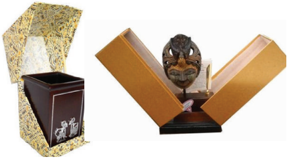

> **Deskripsi Visual:** Gambar ini adalah ilustrasi yang menunjukkan dua produk perhiasan. Pada sisi kiri, terdapat sebuah cincin berlian yang diperlihatkan dalam kotak berwarna coklat dengan lapisan emas. Cincin tersebut memiliki bentuk segi empat dengan permukaan berlian yang tampak jernih dan bersinar. Sisi kanan gambar menunjukkan sebuah perhiasan berupa topeng atau patung kecil yang diletakkan di atas kotak yang sama. Topeng tersebut tampak seperti patung kecil yang berdiri dengan posisi tangan yang menunjukkan tanda tangan atau gestur tertentu. Kotak perhiasan ini memiliki lapisan warna coklat dan emas yang mencerminkan keindahan dan keanggunan perhiasan tersebut. Dua produk ini tampak sangat menarik dan menunjukkan kemampuan desain dan kualitas perhiasan yang tinggi.

Sumber: www.astakria.com

 

---
## 📄 Halaman 27

Sumber: www.astakria.com

Gambar 1.17 Kemasan kerajinan inovatif berisi satu set yang terdiri atas beberapa buah produk.

Sumber: www.astakria.com

Gambar 1.18 Kemasan kerajinan dengan penjelasan tentang inspirasi budaya non benda.

Sumber: www.astakria.com

Gambar 1.19 Kemasan sekunder untuk kerajinan berupa tas kertas.

 

---
## 📄 Halaman 28

### Tugas 7 (Kelompok)

### Pembuatan Kemasan Kerajinan dengan Inspirasi Nonbenda

- Buatlah kemasan untuk produk jadi dengan pertimbangan fungsi pelindung produk dan identitas produk.
- Ingatlah untuk memasukkan  biaya pembuatan  kemasan ke dalam penghitungan biaya produksi.

### D. Penghitungan  Biaya  Produksi  Kerajinan  dengan Inspirasi Budaya Nonbenda

Biaya produksi adalah biaya-biaya yang harus dikeluarkan untuk terjadinya produksi barang. Unsur biaya produksi adalah biaya bahan baku, biaya tenaga kerja  dan  biaya overhead .  Biaya  yang  termasuk  ke  dalam overhead adalah biaya  listrik,  bahan  bakar  minyak,  dan  biaya-biaya  lain  yang  dikeluarkan untuk mendukung proses produksi. Biaya pembelian bahan bakar minyak, sabun pembersih untuk membersihkan bahan baku, benang, jarum, lem dan bahan-bahan  lainnya  dapat  dimasukan  ke  dalam  biaya  overhead.  Metode penghitungan biaya produksi adalah seperti pada Tabel 1.1

### Tabel 1.1 Contoh Penghitungan Biaya Produksi

### Tugas 8 (Kelompok)

### Biaya Total Produksi

- Hitunglah biaya produksi dari kerajinan dari kelompokmu.
- Hitunglah biaya produksi kemasan produk.
- Diskusikan  dalam  kelompok  berapa  perkiraan  harga  jual  produk  karya kelompokmu.

 

---
## 📄 Halaman 29

### Total Biaya Produksi

---
**📊 Tabel**

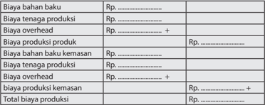

Tabel ini menunjukkan struktur biaya produksi untuk produk tertentu. Topik utamanya adalah biaya produksi, yang terdiri dari berbagai komponen seperti bahan baku, tenaga produksi, overhead, dan bahan baku kemasan. Kolom-kolomnya mencakup biaya-biaya tersebut dengan detail. Data penting yang terlihat adalah bahwa total biaya produksi mencakup semua biaya yang terkait dengan proses produksi, mulai dari bahan baku hingga overhead, dan akhirnya bahan baku kemasan. Ini membantu dalam analisis dan pengendalian biaya produksi.

### E.  Pemasaran Langsung Kerajinan dengan Inspirasi Budaya Nonbenda

Pemasaran langsung adalah promosi dan penjualan yang dilakukan langsung kepada  konsumen  tanpa  melalui  toko.  Penjualan  langsung  merupakan hasil dari promosi langsung yang dilakukan oleh penjual terhadap pembeli. Pemasaran dapat dilakukan dengan promosi dan demo penggunaan produk kepada calon konsumen. Sistem penjualan langsung dapat berupa penjualan satu tingkat ( single-level marketing ) atau multitingkat ( multi-level marketing ). Penjualan satu tingkat merupakan cara yang paling sederhana untuk menjual produk secara langsung. Wirausahawan langsung memasarkan dan menjual kepada konsumen tanpa membutuhkan toko atau pramuniaga. Pemasaran produk kerajinan dapat dilakukan dengan cara pemesanan. Konsumen dapat melihat  langsung  produk  ataupun  melalui  gambar  dari  produk  kerajinan, dan kemudian memesannya. Produsen kerajinan selain menjual produknya sendiri,  dapat  membentuk  kelompok  penjual  yang  akan  memasarkan  dan menjualkan  produknya  secara  langsung  kepada  konsumen.  Kelompok penjual  dapat  terdiri  atas  beberapa  tingkatan.  Sistem  dengan  beberapa tingkat kelompok penjual disebut multi-level marketing Produk perusahaan memiliki  usaha  di  bidang  penjualan  langsung  ( direct  selling )  baik  yang menggunakan single level maupun multi-level marketing wajib memiliki Surat Izin Usaha Penjualan Langsung yang dikeluarkan oleh BKPM sesuai dengan Peraturan Menteri Perdagangan No. 32 Tahun 2008.

 

---
## 📄 Halaman 30

### Tugas 9 (Kelompok)

### Pelaksanaan Promosi dan Penjualan Langsung

- Tentukan target pasar khusus dari produk kerajinan yang sudah dibuat
- Diskusikan dalam kelompok, materi dan cara promosi/pemasaran produk yang tepat untuk target pasar tersebut.
- Buat  pembagian  tugas  dalam  kelompok  untuk  pelaksanaan  pemasaran dan penjualan kerajinan yang sudah dibuat oleh kelompok.
- Lakukan  pemasaran  dan  penjualan  langsung  dari  kerajinan  yang  sudah dibuat oleh kelompok kalian.

---
**🖼️ Gambar/Diagram**

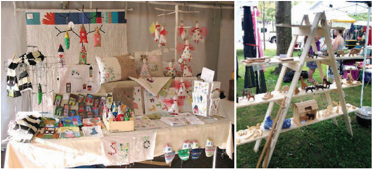

> **Deskripsi Visual:** Gambar ini adalah ilustrasi yang menunjukkan dua pameran atau stand di sebuah pameran atau festival. Pameran pertama di sebelah kiri menampilkan berbagai produk kreatif seperti kain, perhiasan, dan barang-barang lainnya yang dipajang di meja. Di atas meja tersebut, terdapat beberapa papan dengan tulisan dan gambar, mungkin menunjukkan judul atau deskripsi produk. Di sebelah kanan, ada pameran kedua yang menggunakan rak kayu untuk menampilkan berbagai barang-barang, termasuk foto-foto dan barang-barang lainnya. Kedua pameran tersebut tampak sederhana namun menarik, menunjukkan kekayaan produk lokal dan kreativitas pengunjung.

Sumber: homicraft.com & mamamadethem.wordpress.com

Gambar 1.20 Contoh penataan kerajinan pada penjualan di bazar.

 

---
## 📄 Halaman 31

### F.  Evaluasi Kegiatan Pembelajaran Wirausaha Kerajinan dengan Inspirasi Budaya Nonbenda

### Evaluasi Diri Semester 1

Evaluasi diri pada akhir semester 1 terdiri atas evaluasi individu dan evaluasi kelompok. Evaluasi individu dibuat untuk mengetahui sejauh mana efektivitas  pembelajaran  terhadap  setiap  peserta  didik.  Evaluasi  individu meliputi evaluasi sikap, pengetahuan dan keterampilan. Evaluasi kelompok untuk mengetahui interaksi dalam kelompok yang terjadi dalam kelompok, kaitannya dengan pencapaian tujuan pembelajaran.

### Evaluasi Diri (individu)

Bagian A. Berilah tanda cek (v) pada kolom kanan  sesuai penilaian dirimu.

Keterangan: 1. Sangat Tidak Setuju        2. Tidak Setuju        3. Netral

- Setuju
- Sangat Setuju
Bagian B. Tuliskan pendapatmu tentang pengalaman mengikuti pembelajaran Kerajinan di Semester 1

---
**📊 Tabel**

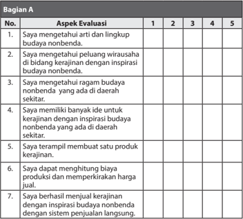

Tabel ini berisi aspek evaluasi yang melibatkan penilaian keterampilan dan pemahaman tentang budaya nonbenda di sekitar seseorang. Topik utama tabel adalah bagaimana individu dapat memahami dan menerapkan budaya nonbenda dalam konteks kerajinan dan penjualan. Kolom-kolomnya mencakup empat aspek evaluasi: 1) pemahaman tentang budaya nonbenda, 2) pengalaman dengan inspirasi budaya nonbenda, 3) kemampuan membuat produk kerajinan, dan 4) kemampuan menjual kerajinan dengan inspirasi budaya nonbenda. Data atau pola penting yang terlihat adalah bahwa setiap aspek evaluasi memiliki skala penilaian dari 1 hingga 5, menunjukkan tingkat keahlian atau pemahaman individu dalam setiap aspek tersebut.

 

---
## 📄 Halaman 32

---
**📊 Tabel**

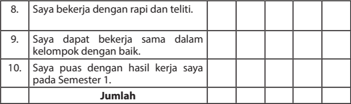

Tabel ini menunjukkan hasil evaluasi kinerja siswa dalam beberapa aspek kerja. Topik utamanya adalah kinerja kerja yang baik, termasuk kecepatan, kerjasama, dan kepuasan dengan hasil kerja. Kolom-kolomnya mencakup tiga aspek utama: "Saya bekerja dengan rapat dan teliti," "Saya dapat bekerja sama dalam kelompok dengan baik," dan "Saya puas dengan hasil kerja saya pada Semester 1." Data atau pola penting yang terlihat adalah bahwa sebagian besar siswa memiliki nilai positif di semua aspek tersebut, menunjukkan bahwa mereka mampu bekerja secara efektif dan memuaskan dalam berbagai situasi kerja.

### Bagian B

Kesan dan pesan setelah mengikuti pembelajaran Kerajinan Semester 1:

### Evaluasi Diri (Kelompok)

Bagian A. Berilah tanda cek (v) pada kolom kanan  sesuai penilaian dirimu.

- Keterangan: 1. Sangat Tidak Setuju        2. Tidak Setuju        3. Netral
- Setuju
- Sangat Setuju
Bagian B. Tuliskan pengalaman paling berkesan saat bekerja dalam kelompok.

---
**📊 Tabel**

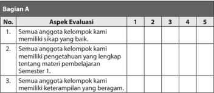

Tabel ini berisi evaluasi aspek-aspek tertentu tentang anggota kelompok. Topik utamanya adalah kualitas dan keterampilan anggota kelompok dalam pembelajaran semester pertama. Kolom-kolomnya mencakup 5 skala evaluasi dari 1 hingga 5, dengan skala 1 sebagai nilai paling rendah dan 5 sebagai nilai paling tinggi. Data penting yang terlihat adalah bahwa semua anggota kelompok memiliki keterampilan yang baik, pengetahuan yang lengkap, dan keterampilan yang beragam. Ini menunjukkan bahwa kelompok tersebut telah berhasil memenuhi standar pembelajaran semester pertama.

 

---
## 📄 Halaman 33

---
**📊 Tabel**

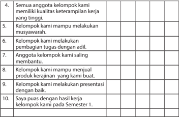

Tabel ini berisi pertanyaan-pertanyaan tentang kinerja kelompok dalam sebuah proyek atau tugas belajar. Topik utamanya adalah kualitas kerja dan komitmen anggota kelompok. Kolom-kolomnya mencakup keterampilan, kualitas kerja, musyawarah, pembagian tugas, membantu anggota lain, penjualan produk, presentasi, dan kesepakatan. Data penting yang terlihat adalah bahwa semua anggota kelompok memiliki kualitas kerja tinggi, mereka mampu melakukan musyawarah, pembagian tugas dengan adil, anggota kelompok saling membantu, mereka mampu menjual produk yang mereka buat, dan mereka melakukan presentasi dengan baik. Selain itu, semua anggota kelompok juga puas dengan hasil kerja mereka pada semester pertama.

### Bagian B

Pengalaman paling berkesan saat bekerja dalam kelompok:

 

---
## 📄 Halaman 34

### REKAYASA

### Peta Materi

---
**🖼️ Gambar/Diagram**

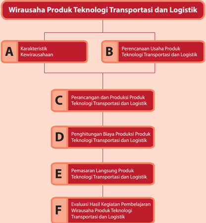

> **Deskripsi Visual:** Gambar ini adalah diagram yang menunjukkan struktur dari wirausaha produk teknologi transportasi dan logistik. Diagram ini dibagi menjadi dua bagian utama: A dan B. Bagian A berisi karakteristik kegiatan usaha, sedangkan B berisi perencanaan usaha produk teknologi transportasi dan logistik. Di bawah itu, ada empat subbagian yang menjelaskan proses-proses utama dalam wirausaha tersebut:

1. **Perancangan dan Produksi Produk Teknologi Transportasi dan Logistik** (C) - Ini melibatkan pengembangan dan produksi produk yang relevan dengan industri transportasi dan logistik.
2. **Penghitungan Biaya Produksi Produk Teknologi Transportasi dan Logistik** (D) - Proses ini melibatkan analisis dan pengukuran biaya yang diperlukan untuk memproduksi produk tersebut.
3. **Pemasaran Langsung Produk Teknologi Transportasi dan Logistik** (E) - Ini melibatkan strategi pemasaran yang efektif untuk mempromosikan produk kepada konsumen.
4. **Evaluasi Hasil Kegiatan Pembelajaran Wirausaha Produk Teknologi Transportasi dan Logistik** (F) - Proses ini melibatkan penilaian dan evaluasi hasil kerja dalam mengembangkan dan memasarkan produk.

Informasi kunci yang dapat diambil pembaca adalah bahwa struktur wirausaha ini melibatkan berbagai aspek mulai dari perencanaan dan produksi hingga pemasaran dan evaluasi hasil.

28

Kelas X SMA/MA/SMK/MAK

Semester 1

 

---
## 📄 Halaman 35

### BAB II

### Wirausaha Produk Teknologi

### Transportasi dan Logistik

### Tujuan Pembelajaran

### Setelah mempelajari bab ini, siswa mampu:

- Menghayati  bahwa  akal  pikiran  dan  kemampuan  manusia  dalam  berpikir kreatif  untuk  membuat  produk  teknologi  transportasi  dan  logistik  serta keberhasilan wirausaha adalahanugerah Tuhan.
- Menghayati perilaku jujur, percaya diri, dan mandiri serta sikap bekerja sama, gotong royong, bertoleransi, disiplin, bertanggung jawab, kreatif, dan inovatif dalam membuat produk teknologi transportasi dan logistik guna membangun semangat usaha.
- Mendesain, membuat dan mengemas produk teknologi transportasi dan  logistik  berdasarkan  identifikasi  kebutuhan  sumber  daya,  teknologi, danprosedur berkarya.
- Mempresentasikan  dan  memasarkan  produk  teknologi  transportasi  dan logistik dengan perilaku jujur dan percaya diri.
- Melakukan evaluasi pembelajaran wirausaha produk teknologi transportasi dan logistik.

 

---
## 📄 Halaman 36

### A. Karakteristik Kewirausahaan

Wirausaha,  menurut  asal  katanya,  terdiri  atas  kata wira dan usaha .  Wira, berarti  pejuang,  pahlawan,  manusia  unggul,  teladan,  berbudi  luhur,  gagah berani dan berwatak agung. Usaha, berarti perbuatan amal, bekerja, berbuat sesuatu. Pengertian wirausaha ,  menurut Kamus Besar Bahasa Indonesia, adalah orang  yang  pandai  atau  berbakat  mengenali  produk  baru,  menentukan cara  produksi  baru,  menyusun  kegiatan  untuk  mengadakan  produk  baru, mengatur permodalan operasinya serta memasarkannya. Pelaku wirausaha, dikenal  juga  dengan  sebutan  wirausahawan  atau  entrepreneur,  adalah seseorang yang memiliki kualitas jiwa kepemimpinan dan inovator pemikiran dalam melakukan usaha. Entrepreneur dapat diartikan juga sebagai seseorang yang  mampu  mewujudkan  ide  ke  dalam  sebuah  inovasi  yang  sukses. Kewirausahaan, atau entrepreneurship, memiliki pengertian yang lebih luas lagi.  Kewirausahaan,  seperti  tercantum  dalam  lampiran  Keputusan  Menteri Koperasi dan Pembinaan Pengusahan Kecil Nomor 961/KEP/M/XI/1995, adalah semangat,  sikap,  perilaku  dan  kemampuan  seseorang  dalam  menangani usaha atau kegiatan yang mengarah pada upaya mencari, menciptakan  serta menerapkan cara kerja, teknologi, dan produk baru dengan meningkatkan efisiensi  dalam  rangka  memberikan  pelayanan  yang  lebih  baik  dan  atau memperoleh keuntungan yang lebih besar. Entrepreneurship adalah sikap dan perilaku yang melibatkan keberanian mengambil risiko, kemampuan berpikir kreatif dan inovatif.

Sifat-sifat seorang wirausahawan seperti berikut.

### 1. Percaya diri

Kepercayaan  diri  merupakan  paduan  sikap  dan  keyakinan  seseorang dalam menghadapi tugas atau pekerjaan, yang bersifat internal, sangat relatif dan dinamis dan banyak ditentukan oleh  kemampuannya untuk  memulai,  melaksanakan  dan  menyelesaikan  suatu  pekerjaan. Kepercayaan diri akan memengaruhi gagasan, karsa, inisiatif, kreativitas, keberanian,  ketekunan,  semangat  kerja,  kegairahan  berkarya.  Kunci keberhasilan  dalam  bisnis  adalah  untuk  memahami  diri  sendiri.  Oleh karena itu, wirausaha yang sukses adalah wirausaha yang mandiri dan percaya diri.

### 2. Berorientasikan tugas dan hasil

Seseorang yang selalu mengutamakan tugas dan hasil adalah orang yang selalu  mengutamakan  nilai-nilai  motif  berprestasi,  berorientasi  pada laba, ketekunan, dan kerja keras. Dalam kewirausahaan, peluang hanya diperoleh apabila ada inisiatif. Perilaku inisiatif biasanya diperoleh melalui pengalaman dan pengembangannya diperoleh dengan caradisiplin diri, berpikir kritis, tanggap, bergairah, dan semangat berprestasi.

 

---
## 📄 Halaman 37

### 3. Berani mengambil risiko

Salah satu hal penting dalam memulai berbuat sesuatu yang baru adalah berani mengambil risiko untuk melakukan sesuatu yang belum pernah dilakukan  sebelumnya.  Inovasi  atau  kebaruan  tidak  akan  muncul  jika kita melakukan hal-hal yang sudah dilakukan oleh orang lain, dan tidak berani melakukan hal-hal yang belum pernah kita lakukan. Wirausahawan adalah orang yang lebih menyukai usaha-usaha yang lebih menantang untuk mencapai kesuksesan atau kegagalan daripada usaha yang kurang menantang.  Wirausahawan  menghindari  situasi  risiko  yang  rendah karena tidak ada tantangan dan menjauhi situasi risiko yang tinggi karena ingin berhasil. Pada situasi ini, ada dua alternatif yang harus dipilih, yaitu alternatif yang menanggung risiko dan alternatif yang konservatif.

### 4.  Kepemimpinan

Kepemimpinan  adalah  sikap  yang  dimiliki  oleh  seorang  pemimpin  di antaranya  memiliki  visi  yang  jelas,  memiliki  integritas  dan  kejujuran, mampu  berkomunikasi  dengan  baik,  menjadi  teladan,  rendah  hati, mau  mendengar,  mampu  memotivasi  orang  lain  untuk  melakukan tugasnya dan berlaku adil. Seorang wirausahawan harus memiliki sifat kepemimpinan, kepeloporan, keteladanan. Ia selalu menampilkan produk dan jasa-jasa baru dan berbeda sehingga ia menjadi pelopor baik dalam  proses  produksi  maupun  pemasaran  dan  selalu  memanfaatkan perbedaan sebagai suatu yang menambah nilai.

### 5. Keorisinalitas/Keaslian

Keaslian ide, gagasan, pemikiran dan keputusan dapat diperoleh dengan keluasan  wawasan  dan  kemampuan  berpikir  kreatif,  serta  melihat peluang  yang  ada.  Orisinalitas  muncul  dari  kemampuan  untuk  selalu menuangkan imajinasi dalam pekerjaannya, keinginan tampil berbeda atau selalu memanfaatkan perbedaan, memiliki sikap mental yang positif dan  daya  pikir  kreatif.  Karya  orisinal  juga  hanya  dapat  dihasilkan  oleh wirausahawan yang memiliki keahlian di bidangnya serta rajin mencoba hal-hal baru yang inovatif.

 

---
## 📄 Halaman 38

### 6. Berorientasi ke masa depan

Masa  depan  memiliki  berbagai  peluang  dan  tantangan  yang  berbeda dengan saat ini. Seorang dengan kewirausahaan berani melihat peluang dan tantangan tidak hanya di saat ini, melainkan juga di masa depan. Salah  satu  indikator  atau  tanda  seseorang  memiliki  entrepreneurship atau  jiwa  kewirusahaan  adalah  mampu membuat usaha bisnis sendiri, menjadi wirausahawan. Wirausaha dalam bidang teknologi transportasi dan logistik, dapat menjadi wirausahawan yang menghasilkan produk, wirausahawan  penjual  produk  ataupun  wirausaha  yang  memberikan jasa  perbaikan  produk  teknologi  transportasi  dan  logistik.Keberhasilan wirausahawan  adalah  saat  usahanya  dapat  menghasilkan  keuntungan atau  laba,  mampu  mempekerjakan  banyak  orang,  memberikan  bagi lingkungan sekitarnya, serta dapat memberikan kontribusi bagi kemajuan bangsa dan negaranya.

### Faktor Penyebab Keberhasilan dan Kegagalan Berwirausaha

Memulai  sesuatu  yang  baru  pasti  tidak  mudah.  Oleh  karena  itu  seorang wirausahawan  harus  berani  mencoba  dan  mengambil  risiko.  Gagal  dalam melakukan  suatu  hal  adalah  bagian  dari  proses  untuk  menuju  kesuksesan. Kegagalan  adalah  kesuksesan  yang  tertunda.  Jika  kamu  mencoba  wirausaha dalam  suatu  bidang,  lalu  gagal,  kamu  tidak  perlu  berkecil  hati  dan  putus  asa, cobalah kembali! Tentu sebelum memulai berwirausaha, buatlah perhitungan dan perencanaan yang matang.

Carilah  dari  berbagai  sumber  kisah-kisah  para  pengusaha  yang  sukses  dalam menjalankan usahanya. Bacalah dengan seksama, lalu ambil pelajaran dari kisah mereka dalam memulai wirausaha sehingga kamu dapat mengetahui kegagalan dan kesuksesan mereka.

### Tugas 1 (Individu)

### Wirausahawan Sukses

- Amati lingkungan sekitarmu, cari informasi dari buku, koran, majalah atau internet  untuk  temukan  tokoh  wirausahawan  di  bidang  rekayasa  yang sukses!
- Pelajari kisah sukses dari wirausahawan tersebut.
- Tuliskan hal-hal apa saja yang membuat wirausahawan tersebut berhasil, berdasarkan kisah suksesnya.
- Presentasikan hasil pemikiranmu di depan kelas.

 

---
## 📄 Halaman 39

### B.  Perencanaan Usaha Produk  Teknologi  Transportasi dan Logistik

Transportasi adalah proses perpindahan orang atau barang dari satu tempat ke tempat lainnya. Pada masa awal peradaban, manusia menggunakan cara paling  sederhana  untuk  transportasi  jarak  jauh.  Manusia  menggunakan kemampuan  tubuhnya  untuk  berpindah  maupun  memindahkan  barang, yaitu  dengan  berjalan  kaki  serta  menjinjing  dan  memikul  barang  bawaan di  bahunya.  Cara  bawa  tersebut  hanya  dapat  digunakan  untuk  membawa barang yang tidak terlalu berat. Pada masa itu, barang utama yang dibawa adalah  hewan  buruan.  Hewan  buruan  yang  lebih  berat  dibawa  dengan cara mengikatkan kaki hewan pada sebatang kayu, kemudian batang kayu tersebut  dipikul  oleh  dua  orang.  Cara  lain  adalah  dengan  menggunakan batang-batang kayu untuk meletakkan barang bawaan dan menarik batang kayu tersebut. Kemudian, manusia mulai menggunakan tenaga hewan untuk alat transportasi darat.

Perkembangan  peradaban  menuntut  manusia  untuk  terus  memanfaatkan pikiran  kreatifnya  dalam  membuat  berbagai  alat  transportasi  yang  sesuai dengan  kebutuhan  dan  ketersediaan  bahan  di  sekitarnya.  Pada  masa  lalu, untuk mengarungi sungai, bangsa Mesir membuat perahu yang terbuat dari batang  tumbuhan  Papyrus,  sementara  bangsa  yang  hidup  di  hutan  tropis membuat perahu dari batang pohon kayu keras, dan bangsa-bangsa di wilayah Asia menggunakan bambu untuk membuat rakit. Teknologi transportasi terus berkembang dengan ditemukannya roda pada 3.500 tahun Sebelum Masehi, teknologi layar pada 3.100 tahun Sebelum Masehi dan penemuan teknologi sambungan  kayu,  diikuti  penemuan-penemuan  baru  seperti  teknologi pembuatan jalan dan kanal laut, teknologi balon udara, teknologi mesin uap, rel kereta api, pesawat udara dan berbagai penemuan lainnya.

Pada abad ke-14, menurut Lontarak I Babad La Lagaligo, orang Ara, Tanah Lemo  dan  Bira  di    Indonesia  telah  membuat  perahu  Pinisi  yaitu  perahu layar  yang  pada  masa  itu  digunakan  untuk  perdagangan  antarpulau  serta mengarungi samudra hingga ke China dan Mesir. Awal abad ke-19, teknologi kapal uap ditemukan sehingga pergerakan kapal tidak lagi tergantung pada angin,  melainkan  bergerak  karena  tenaga  uap  yang  menggerakan  kincir pendayung. Pada masa itu pula teknologi lokomotif uap digunakan untuk transportasi bahan tambang dan manusia. Pada abad ke-19 dan awal abad ke-20,  teknologi  sepeda,  motor,  mobil  dan  pesawat  terbang  berkembang dengan  pesat.  Kebutuhan  perpindahan  manusia  yang  terus  meningkat didukung  dengan  kemajuan  teknologi  mekanik,  elektronik  dan  digital, mendorong berkembangnya sistem transportasi hingga saat ini.

 

---
## 📄 Halaman 40

---
**🖼️ Gambar/Diagram**

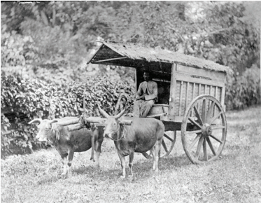

> **Deskripsi Visual:** Gambar ini adalah foto yang menunjukkan seorang pria sedang mengemudi kereta api tradisional dengan dua ekor sapi yang membawa barang. Kereta api tersebut memiliki atap sederhana dan tampak seperti bentuk awal kereta api modern. Pemandangan sekitar tampak hijau dan berbukit, menunjukkan bahwa lokasi ini mungkin berada di daerah pedesaan atau pegunungan. Elemen-elemen utama dalam gambar ini meliputi dua ekor sapi yang membawa barang, pria pengemudi, dan kereta api tradisional. Relasi antara elemen-elemen ini adalah bahwa pria pengemudi sedang mengemudi kereta api tradisional yang dibawa oleh dua ekor sapi. Teks, angka, atau label penting tidak terlihat dalam gambar ini. Informasi kunci yang dapat diambil pembaca adalah bahwa gambar ini menunjukkan aktivitas transportasi tradisional menggunakan sapi sebagai kendaraan.

Sumber: Koleksi Tropenmuseum

Sumber: www.skycrapercity.com

 

---
## 📄 Halaman 41

---
**🖼️ Gambar/Diagram**

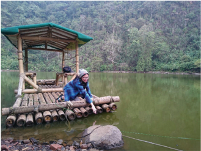

> **Deskripsi Visual:** Gambar ini adalah foto yang menunjukkan seorang individu sedang berada di sebuah platform bambu yang terletak di tepi sebuah danau. Platform bambu tersebut memiliki atap dari daun pohon dan dikelilingi oleh batu-batu besar. Di sebelah kanan platform, ada air danau yang tampak hijau kekuningan, mungkin disebabkan oleh warna air yang kaya akan tanin. Di sebelah kiri platform, terlihat pohon-pohon besar yang tumbuh di tepi danau, serta beberapa batu-batu yang berada di tepi danau. Pemandangan ini menunjukkan suasana alam yang tenang dan damai.

Gambar 2.3 Rakit untuk Transportasi di Air

Transportasi  secara  prinsip  adalah  proses  perpindahan  orang  atau  barang. Perpindahan  dapat  menempuh  jarak  yang  dekat,  sedang  maupun  jauh. Contoh-contoh  alat  transportasi  yang  telah  dibahas  adalah  perpindahan untuk jarak yang jauh, seperti dari tempat berburu ke tempat tinggal, dari satu kota ke kota lain maupun dari satu negara ke negara lain. Pada keseharian ,terdapat  alat  transportasi  atau  alat  bantu  perpindahan  jarak  sedang  di antaranya tangga berjalan (eskalator), ban berjalan (eskavator), atau papan yang dipakai untuk meluncur dari dataran yang lebih tinggi.

 

---
## 📄 Halaman 42

---
**🖼️ Gambar/Diagram**

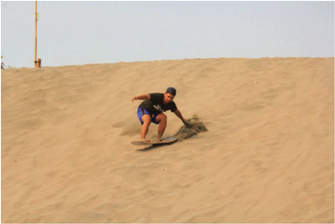

> **Deskripsi Visual:** Gambar ini menunjukkan seorang pria sedang bermain sandboarding di sebuah area berpasir. Pemandangan tampak luas dengan pasir yang lembut dan bergerigi, menunjukkan bahwa tempat ini mungkin merupakan destinasi populer untuk olahraga sandboarding. Pria tersebut mengenakan pakaian renang biru dan topi hitam, serta menggunakan sandboard yang berwarna putih dengan logo hitam. Gerakan dan posisi pria ini menunjukkan bahwa dia sedang bergerak dengan cepat dan memanfaatkan kecepatan untuk menuruni bukit pasir. Tidak ada teks, angka, atau label spesifik lainnya yang terlihat pada gambar ini. Informasi kunci yang dapat diambil dari gambar ini adalah bahwa tempat ini cocok untuk olahraga sandboarding dan pria tersebut sedang melakukan aktivitas tersebut.

Sumber: pewarta jogja.com

Gambar 2.5 Papan luncur untuk perpindahan jarak dekat.

Sekarang, mari kita perhatikan kegiatan perpindahan jarak dekat dari orang atau barang yang ada di sekitar kita. Pada perpindahan jarak pendek, manusia dapat  menempuhnya  dengan  berjalan,  sedangkan  barang  tidak  dapat berjalan sendiri. Pergerakan pada jarak yang pendek, manusia dapat bergerak sendiri dari satu titik ke titik lainnya. Berbeda dengan barang, sedekat apa pun jaraknya, dibutuhkan sarana transportasi yang dapat membantu perpindahan barang dari satu tempat ke tempat lainnya. Sebuah contoh sederhana adalah membawa beberapa buah gelas berisi air minum dari dapur ke ruang tamu dengan  menggunakan  baki.  Baki  merupakan  sarana  transportasi  yang digunakan untuk perpindahan gelas dari dapur ke ruang tamu. Pada kegiatan menimba air dari dalam sumur, wadah air yang diturunkan dengan bantuan tali  dan  katrol  dapat  disebut  sebagai  alat  transportasi.  Baki  membantu perpindahan secara horizontal sedangkan wadah air, tali dan katrol membantu perpindahan secara vertikal.

 

---
## 📄 Halaman 43

---
**🖼️ Gambar/Diagram**

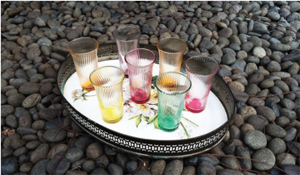

> **Deskripsi Visual:** Gambar ini adalah ilustrasi yang menunjukkan sebuah piring berwarna putih dengan ukiran bunga dan daun yang berada di atas permukaan batu-batu kecil. Piring tersebut berisi beberapa gelas berwarna-warni yang terbuat dari kaca dengan desain unik. Gelas-gelas tersebut memiliki berbagai warna seperti merah, hijau, kuning, dan biru, serta memiliki lubang di bagian atas untuk menyimpan minuman. Selain itu, ada juga beberapa buah-buahan seperti jeruk dan apel yang disajikan di sekitar gelas-gelas tersebut. Gambar ini menunjukkan konsep hidangan ringan yang bersih dan menarik, mungkin digunakan sebagai contoh dalam pembelajaran tentang penyajian makanan atau desain interior.

Sumber: pewarta jogja.com

Gambar 2.6 Beberapa gelas dipindahkan dengan sebuah baki.

---
**🖼️ Gambar/Diagram**

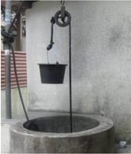

> **Deskripsi Visual:** Gambar ini adalah foto yang menunjukkan sebuah tangga air tradisional. Tangga air ini terbuat dari kayu dan ditempatkan di sekeliling lubang air beton. Di ujung bawah tangga, terdapat ember berbentuk bulat yang digunakan untuk mengambil air. Tangga air ini biasanya digunakan di daerah-daerah yang tidak memiliki sistem saluran air modern. Elemen utama dalam gambar ini adalah tangga air, lubang air beton, dan ember. Relasi antara elemen-elemen ini adalah tangga air yang menghubungkan lubang air dengan ember di bawahnya. Teks, angka, atau label penting yang terlihat pada gambar ini adalah "tangga air" dan "ember". Informasi kunci yang dapat diambil pembaca adalah bahwa tangga air ini digunakan untuk mengambil air dari lubang air beton.

Sumber: lifestyle.kompasiana.com/Gugun 7

Perpindahan objek pada prinsipnya melibatkan beberapa unsur: objek yang akan  dipindahkan,  wadah  atau  tempat  objek  berada,  medan  yang  dilalui, sistem,  sumber  tenaga  yang  menggerakkan  perpindahan  tersebut  serta pengendali perpindahan tersebut. Pada kegiatan membawa cangkir dengan baki,  objek yang dipindahkan adalah cangkir berisi air, baki adalah tempat menaruh objek, medan yang dilalui adalah lantai rumah sedangkan sumber

 

---
## 📄 Halaman 44

tenaga dan pengendali adalah orang yang membawa baki. Kegiatan menimba air sumur adalah memindahkan objek air dengan wadah air, dengan sumber tenaga dan pengendali orang yang menimba, dengan bantuan sistem tali dan katrol. Contoh lainnya seorang pedagang telur mengangkat satu peti telur dari tokonya ke dalam mobil. Pada kegiatan tersebut, telur merupakan objek yang dipindahkan, peti adalah wadah dari objek, medan yang dilalui adalah jalan yang dilalui dan sumber tenaga yang digunakan adalah tenaga manusia yaitu tenaga pedagang telur. Kemudian, telur tadi dibawa dengan mobil ke rumah pembeli. Maka, pada kegiatan transportasi ini, telur di dalam peti adalah objek yang dipindahkan, mobil adalah sarana di mana objek ditempatkan, medan yang dilalui adalah jalan dan sumber tenaga yang digunakan adalah sumber tenaga mesin mobil dengan pengendali manusia.

Karakter  atau  keadaan  dari  setiap  unsur  berpengaruh  pada  cara  kerja keseluruhan dari sistem transportasinya. Cangkir berisi air berbeda dengan air minum dalam kemasan. Maka, cara pemindahannya akan berbeda. Membawa baki  dengan  beberapa  cangkir  berisi  air  akan  lebih  berhati-hati  daripada membawa  baki  dengan  beberapa  air  minum  kemasan  karena  air  minum dalam kemasan tidak memiliki risiko tumpah. Perpindahan air minum dalam kemasan  juga  dapat  dibawa  tanpa  menggunakan  baki  melainkan  dengan ditumpuk  dalam  sebuah  kardus.  Perpindahan  telur  pun  membutuhkan pertimbangan yang matang karena telur memiliki karakter yang ringkih dan mudah rusak. Jika sejumlah telur akan dipindahkan dengan gerobak melalui jalan berbatu, telur harus disimpan pada wadah yang dapat melindungi telur dari goncangan agar telur dapat tetap utuh sampai di tempat tujuan.

---
**🖼️ Gambar/Diagram**

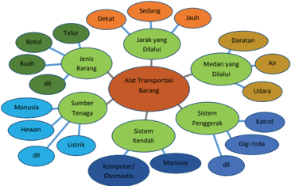

> **Deskripsi Visual:** Gambar ini adalah diagram yang menunjukkan struktur dan komponen utama dari alat transportasi barang. Diagram ini dibagi menjadi beberapa bagian utama yang saling terkait, meliputi Jenis Barang, Sumber Tenaga, Alat Transportasi Barang, Sistem Kendali, dan Sistem Penggerak.

Jenis Barang termasuk Botol, Telur, Buah, dan Manusia. Sumber Tenaga meliputi Hewan, Listrik, Komputer/Otomatis, dan Manusia. Alat Transportasi Barang meliputi Daratan, Udara, dan Medan yang Dilalui. Sistem Kendali mencakup Katrol, Gigi Roda, dan Marurol. Sementara itu, Sistem Penggerak melibatkan Dekat, Sedang, Jauh, dan Jarak yang Dilalui.

Teks, angka, atau label penting yang terlihat dalam diagram ini adalah nama-nama jenis barang, sumber tenaga, alat transportasi, sistem kendali, dan sistem penggerak. Informasi kunci yang dapat diambil pembaca adalah bahwa alat transportasi barang melibatkan berbagai jenis barang, sumber tenaga, sistem kendali, dan sistem penggerak untuk menggerakkan mereka.

Dengan demikian, diagram ini memberikan gambaran umum tentang struktur dan komponen utama dari alat transportasi barang, serta hubungan antara setiap komponen tersebut.

Sumber: Dokumen Kemdikbud

 

---
## 📄 Halaman 45

---
**🖼️ Gambar/Diagram**

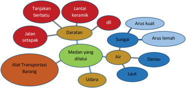

> **Deskripsi Visual:** Gambar ini adalah diagram yang menunjukkan berbagai jenis transportasi dan alat transportasi barang. Diagram ini dibagi menjadi dua bagian utama: pertama, transportasi darat; kedua, transportasi udara. 

Pertama, transportasi darat meliputi jalur setapak, tanjakan berbatu, dan lantai keramik. Setiap elemen ini memiliki label yang menjelaskan jenis transportasi tersebut.

Kedua, transportasi udara meliputi udara, laut, dan air. Setiap elemen ini juga memiliki label yang menjelaskan jenis transportasi tersebut.

Informasi kunci yang dapat diambil pembaca adalah bahwa ada berbagai jenis transportasi dan alat transportasi barang yang tersedia untuk memudahkan perjalanan.

Sumber: Dokumen Kemdikbud

### Tugas 2 (Kelompok)

### Transportasi Jarak Dekat

- Amati lingkungan sekitar kalian. Perpindahan barang apa saja yang terjadi?
- Perpindahan yang terjadi di dalam rumah.
- Perpindahan di sekolah, di lapangan olahraga dan di perpustakaan.
- Pedagang di pasar
- Perpindahan saat mengumpulkan hasil panen di ladang.
- Perpindahan saat persiapan pesta
- dan lain-lain
- Diskusikan dalam kelompok.
- Tuliskan  barang  apa  yang  dipindahkan,  karakter  barang,  berapa  jumlah barang, berapa beratnya, tempat asal perpindahan, tempat tujuan perpindahan,  medan  yang  dilalui  dan  keterangan  lain  terkait  proses perpindahan barang tersebut, pada tabel seperti contoh LK 2 atau dalam bentuk presentasi yang kreatif dan informatif
- Apakah  perpindahan  jarak  dekat  tersebut  sudah  didukung  oleh  alat transportasi yang memadai?
- Presentasikan hasil pemikiran kelompok di depan kelas.

 

---
## 📄 Halaman 46

---
**📊 Tabel**

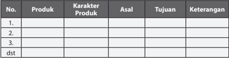

Tabel ini berisi informasi tentang produk-produk yang akan dibahas dalam buku pelajaran. Topik utamanya adalah produk-produk tersebut dan asal-usulnya. Kolom-kolom yang ada meliputi No., Produk, Karakteristik Produk, Asal, Tujuan, dan Keterangan. Data penting yang terlihat adalah bahwa tabel ini mencakup beberapa produk dengan karakteristik dan asal yang berbeda, serta tujuan dan keterangan yang relevan untuk setiap produk tersebut. Ini menunjukkan bahwa pembahasan akan mencakup berbagai produk dengan fokus pada asal, tujuan, dan karakteristik mereka.

Transportasi barang  jarak dekat merupakan  kegiatan  sehari-hari  yang kita alami dan terjadi di sekitar kita. Karena jaraknya yang dekat, seringkali permasalahan yang dialami pada kegiatan transportasi tersebut  luput  dari perhatian. Permasalahan transportasi jarak dekat dapat ditemukan jika kita berpikir kritis dan teliti mengamati. Permasalahan itu juga dapat dipecahkan dengan kreativitas dan cara berpikir inovatif.  Kegiatan transportasi barang jarak  sedang  dan  jarak  jauh  pada  umumnya  berkaitan  dengan  kegiatan yang  disebut  logistik.  Logistik  adalah  proses  perencanaan,  pelaksanaan, pengawasan  dari  transportasi  dan  penyimpanan  yang  efektif  dan  efisien. Kegiatan  logistik  yang  utama  adalah  penyimpanan  dan  transportasi.  Maka dapat  dipahami  bahwa  transportasi  adalah  bagian  dari  kegiatan  logistik. Teknologi  transportasi  dan  logistik  adalah  teknologi  yang  dikembangkan untuk  memfasilitasi  penyimpanan  dan  perpindahan  barang.  Kita  ambil contoh  kegiatan  logistik  untuk  wirausaha  telur  ayam.  Telur  ayam  adalah komoditas yang mudah rusak. Maka, kita membutuhkan pengaturan yang tepat  untuk  penyimpanan  maupun  untuk  transportasinya  agar  pedagang tidak  mengalami  kerugian  karena  kerusakan  barang,  yang  dalam  hal  ini telur  ayam.  Kemasan atau wadah khusus dirancang untuk telur ayam agar terhindar  dari  benturan.  Kemasan  telur  ayam  pun  harus  dapat  ditumpuk untuk efisiensi ruang penyimpanan. Penyimpanan dan transportasi barang harus mempertimbangkan faktor keamanan dan efisiensi ruang.

---
**🖼️ Gambar/Diagram**

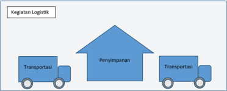

> **Deskripsi Visual:** Gambar ini adalah diagram yang menunjukkan kegiatan logistik dalam bentuk diagram lingkaran. Diagram ini terdiri dari tiga bagian utama yang masing-masing menunjukkan sektor utama dalam logistik:

1. **Pertama**: Bagian pertama menunjukkan sektor transportasi, yang terdiri dari dua truk yang bergerak dari kiri ke kanan. Ini menunjukkan bahwa transportasi adalah salah satu aspek penting dalam logistik.

2. **Kedua**: Bagian kedua menunjukkan sektor penyimpanan, yang tampak lebih besar dibandingkan dengan transportasi. Ini menunjukkan bahwa penyimpanan merupakan aspek yang sangat penting dalam logistik, mencakup ruang penyimpanan yang besar.

3. **Ketiga**: Bagian ketiga menunjukkan sektor transportasi lagi, tetapi dari arah yang berlawanan. Ini menunjukkan bahwa ada proses pengiriman barang dari penyimpanan ke tempat tujuan.

Teks, angka, atau label penting yang terlihat pada gambar ini adalah "Kegiatan Logistik" di bagian atas, dan "Transportasi" dan "Penyimpanan" di bagian bawah. Informasi kunci yang dapat diambil pembaca adalah bahwa penyimpanan adalah aspek yang paling dominan dalam logistik, sementara transportasi adalah dua aspek yang penting untuk memastikan efisiensi dan efektivitas logistik.

Sumber: Dokumen Kemdikbud

 

---
## 📄 Halaman 47

---
**🖼️ Gambar/Diagram**

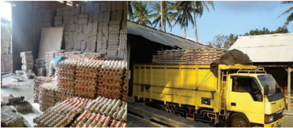

> **Deskripsi Visual:** Gambar ini adalah foto yang menunjukkan dua situasi berbeda dalam proses pengolahan kayu. Di sisi kiri, terdapat pabrik kayu dengan rak-rak kayu yang disusun rapi. Kayu-kayu tersebut tampak telah dipotong dan siap untuk proses selanjutnya. Sementara itu, di sisi kanan, terlihat truk berwarna kuning yang membawa sejumlah kayu besar ke pabrik. Truk tersebut tampak siap untuk mengangkut kayu ke pabrik untuk proses pengolahan atau penyimpanan. Gambar ini menunjukkan hubungan antara pabrik kayu dan truk dalam proses pengolahan kayu, serta menunjukkan bahwa proses ini melibatkan transportasi dan penyimpanan kayu.

Kebutuhan  logistik  di  antaranya  muncul  sebagai  kelanjutan  dari  kegiatan produksi. Kegiatan panen, misalnya, membutuhkan kegiatan logistik. Logistik pascapanen dibutuhkan untuk memindahkan produk hasil panen ke tempat penyimpanan, menyimpan produk hasil panen dan mengirim produk kepada konsumen. Transportasi dan penyimpanan produk hasil panen harus dapat menjaga kualitas produk tetap baik hingga diterima oleh konsumen.

### Tugas 3 (Kelompok)

### Kegiatan Logistik

- Amati  salah  satu  kegiatan  produksi  atau  kegiatan  pengadaan  barang  di lingkungan  kalian.  Apakah  kegiatan  produksi  dan  pengadaan  tersebut sudah memanfaatkan logistik?
- Catat barang apa yang dipindahkan dan disimpan, karakter barang, berapa jumlah  barang,  berapa  beratnya,  tempat  asal  dan  tujuan  perpindahan, tempat dan cara penyimpanan serta keterangan lain.
- Lakukan  wawancara  kepada  wirausahawan  yang  memproduksi  atau pengadaan barang, tentang upaya yang sudah dilakukan untuk menjaga kualitas barang pada saat dipindahkan dan disimpan. Catat hasil wawancara tersebut.
- Diskusikan  dalam  kelompok:  Perbaikan  dan  inovasi  apa  yang  dapat dilakukan  untuk  membuat  kegiatan  logistik  barang  tersebut  agar  lebih baik.
- Susun  informasi  yang  diperoleh  dari  hasil  pengamatan  dan  wawancara dalam LK 3 atau dalam bentuk presentasi yang kreatif dan informatif.

 

---
## 📄 Halaman 48

### LK 3

### Kegiatan Logistik

---
**📊 Tabel**

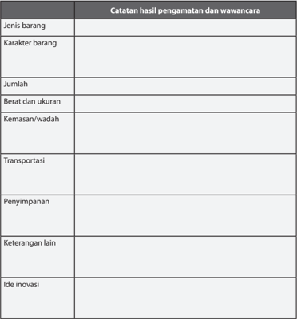

Tabel ini berisi catatan hasil pengamatan dan wawancara tentang jenis barang, karakter barang, jumlah, berat dan ukuran, kemasan/wadah, transportasi, penyimpanan, keterangan lain, dan ide inovasi. Topik utama tabel ini adalah analisis dan pemahaman tentang barang yang diperiksa. Kolom-kolomnya mencakup berbagai aspek penting seperti jenis barang, karakteristik, jumlah, ukuran fisik, cara penyimpanan, dan potensi inovasi. Data penting yang terlihat meliputi detail tentang berat dan ukuran barang, jenis kemasan yang digunakan, proses transportasi, dan ide-ide baru yang mungkin dapat dikembangkan dari penelitian ini.

### Sumber Daya, Material, Teknik dan Ide Produk Teknologi Transportasi dan Logistik

Wirausaha  produk  teknologi  transportasi  dan  logistik  dapat  dimulai  dengan melihat  kebutuhan  transportasi  dan  logistik  yang  ada  di  lingkungan  sekitar. Kebutuhan transportasi dan logistik di antaranya muncul dari kegiatan produksi, misalnya kegiatan panen buah.

 

---
## 📄 Halaman 49

### Tugas 4 (Kelompok)

### Sumber Tenaga dan Sistem pada Alat Transportasi

Pada  tugas  sebelumnya,  telah  diperoleh  data  tentang  perpindahan  yang terjadi di lingkungan sekitar. Beberapa di antara perpindahan tersebut sudah difasilitasi dengan alat transportasi.

- Amati  sumber  tenaga,  pengendali  dan  sistem  yang  digunakan  untuk perpindahan tersebut.
- Tuliskan hasil pengamatan dalam sebuah tabel seperti contoh LK 4.
- Diskusikan  hasil  pengamatan  masing-masing.  Temukan  persamaan  dan perbedaannya. Tentukan sumber tenaga, pengendali dan sistem penggerak yang paling sering digunakan.

### LK 4

### Sumber Tenaga dan Sistem pada Alat Transportasi

---
**📊 Tabel**

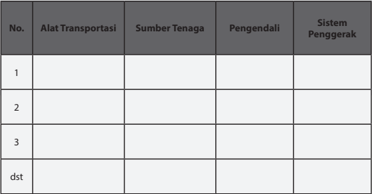

Tabel ini berisi informasi tentang berbagai alat transportasi, sumber tenaga mereka, pengendali, dan sistem penggeraknya. Topik utama tabel adalah jenis alat transportasi dan bagaimana mereka berfungsi. Kolom-kolom yang ada meliputi nomor urut, alat transportasi, sumber tenaga, pengendali, dan sistem penggerak. Data penting yang terlihat menunjukkan bahwa setiap alat transportasi memiliki sumber tenaga, pengendali, dan sistem penggerak yang berbeda-beda. Misalnya, kendaraan bermotor menggunakan mesin sebagai sumber tenaga, pengendali biasanya berupa kemudi atau rem, dan sistem penggerak melibatkan transmisi dan roda. Sementara itu, kendaraan listrik menggunakan baterai sebagai sumber tenaga, pengendali bisa berupa joystick atau kontroler, dan sistem penggerak melibatkan motor listrik. Tabel ini membantu kita memahami bagaimana berbagai alat transportasi bekerja dan berbeda-beda dalam hal sumber tenaga, pengendali, dan sistem penggeraknya.

Perancangan produk didasari beberapa faktor pertimbangan, yaitu fungsi produk, pengguna produk, material, teknik pembuatan, nilai estetis dan harga jual. Pada Tugas 2, Tugas 3, dan Tugas 4telah dilakukan identifikasi kebutuhan transportasi dan  logistik  yang  ada  di  sekitar.  Untuk  memulai  proses  perancangan,  harus dilakukan penetapan kebutuhan, objek, teknologi dan sumber tenaga yang akan digunakan dalam pengembangan produk teknologi transportasi dan logistik.

 

---
## 📄 Halaman 50

---
**🖼️ Gambar/Diagram**

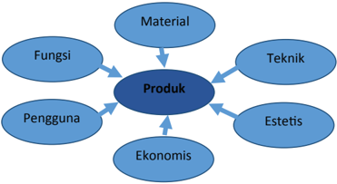

> **Deskripsi Visual:** Gambar ini adalah diagram yang menunjukkan aspek-aspek penting dari sebuah produk. Diagram ini terdiri dari beberapa elemen utama yang terhubung oleh garis, yang menunjukkan hubungan antara setiap aspek tersebut dengan produk utama.

1. **Apa yang Ditampilkan Secara Keseluruhan**: Gambar ini menunjukkan bahwa produk memiliki berbagai aspek penting, termasuk material, teknik, estetis, ekonomis, pengguna, dan fungsi.

2. **Elemen-Elemen Utama dan Relasinya**: 
   - **Produk** adalah objek utama yang mempertahankan semua aspek lainnya.
   - **Material** merujuk pada bahan-bahan yang digunakan untuk membuat produk.
   - **Teknik** mengacu pada cara-cara atau metode yang digunakan dalam pembuatan produk.
   - **Estetis** merujuk pada penampilan atau keindahan produk.
   - **Ekonomis** mengacu pada biaya produksi dan manfaat finansial dari produk.
   - **Pengguna** merujuk pada orang-orang yang menggunakan produk.
   - **Fungsi** merujuk pada tujuan atau kegunaan produk.

3. **Teks, Angka, atau Label Penting yang Terlihat**: 
   - Ada label "Produk" yang menjadi pusat diagram.
   - Setiap aspek (material, teknik, estetis, ekonomis, pengguna, fungsi) memiliki label sendiri.

4. **Informasi Kunci yang Dapat Diambil Pembaca**: 
   - Diagram ini menunjukkan bahwa produk memiliki banyak aspek yang saling berkaitan dan intergratif.
   - Setiap aspek penting memiliki peran yang berbeda dalam menciptakan produk yang baik dan efektif.
   - Pembaca dapat memahami bahwa desain produk ideal harus mencakup semua aspek ini untuk mencapai hasil yang optimal.

Dengan demikian, gambar ini memberikan gambaran yang jelas tentang bagaimana berbagai aspek penting dalam sebuah produk saling berkaitan dan berinteraksi satu sama lain.

Sumber: Dokumen Kemdikbud

### C.  Perancangan dan Produksi Produk Teknologi Transportasi dan Logistik

### Perancangan Produk Teknologi Transportasi dan Logistik

Proses perancangan produk diawali dengan identifikasi masalah, pencarian ide  solusi,  dilanjutkan  dengan  pembuatan  gambar  atau  sketsa  ide.  Ide terbaik kemudian dikembangkan menjadi produk rekayasa yang akan dibuat, dilanjutkan dengan persiapan produksi dan proses produksi. Produksi adalah membuat produk hasil rekayasa sehingga siap dijual.

### 1. Identifikasi Masalah

Perancangan  produk  bertujuan  untuk  menemukan  solusi  dari  sebuah permasalahan,  dalam  hal  ini  permasalahan  transportasi  dan  logistik. Proses  perancangan  diawali  dengan  mengidentifikasi  permasalahan transportasi  atau  logistik  yang  ada  di  sekitar  kita.  Salah  satu  contoh masalah transportasi yang sederhana,

- Konsumen membeli 4 buah jus buah dalam gelas plastik dan akan membawanya ke rumah. Bagaimana agar konsumen dapat membawa dengan nyaman dan jus buah dalam gelas tidak tumpah?

 

---
## 📄 Halaman 51

- Sebuah usaha katering harus membawa 100 buah piring makan dan 100  pasang  sendok  garpu  untuk  sebuah  pesta  kebun  atau  pesta di  lapangan  rumput.  Bagaimana  agar  piring-piring  dapat  dibawa dengan aman ke lokasi pesta yang tidak memungkinkan dijangkau mobil?
- Panen jamur pada rak jamur yang tersusun vertikal membutuhkan alat bantu bawa yang memudahkan petani membawa dan menyimpan hasil panen yang melindungi dari resiko kerusakan.

### 2. Mencari Solusi dengan Curah Pendapat

Langkah  selanjutnya  adalah  mencari  ide  sebagai  solusi  dari  masalah tersebut.  Cara  yang  dapat  dilakukan  adalah  melalui  curah  pendapat ( brainstorming ) yang dilakukan dalam kelompok. Pada proses brainstorming ini,  setiap  anggota  kelompok  harus  membebaskan  diri untuk  menghasilkan  ide-ide  yang  beragam  dan  sebanyak-banyaknya. Beri kesempatan juga untuk munculnya ide-ide yang tidak masuk akal sekalipun.Tuangkan  ide-ide  tersebut  ke  dalam  sketsa.  Kunci  sukses dari tahap brainstorming dalam kelompok adalah jangan ada perasaan takut salah, setiap orang berhak mengeluarkan pendapat, saling menghargai pendapat teman, boleh memberikan ide yang merupakan perkembangan dari ide sebelumnya, dan jangan lupa mencatat setiap ide  yang  muncul. Ide meliputi bentuk dan ukuran wadah atau tempat barang,  sumber  tenaga  dan  kendali  yang  digunakan,  sistem  mekanik yang dapat digunakan dan lain-lain. (gambar ide sketsa untuk masalah gelas jus, piring katering, panen jamur).

---
**🖼️ Gambar/Diagram**

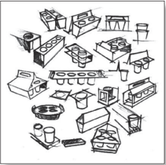

> **Deskripsi Visual:** Gambar ini adalah ilustrasi yang menunjukkan berbagai jenis peralatan dapur dan alat masak. Gambar ini mencakup berbagai elemen seperti piring, mangkuk, mangkuk, mangkuk, mangkuk, mangkuk, mangkuk, mangkuk, mangkuk, mangkuk, mangkuk, mangkuk, mangkuk, mangkuk, mangkuk, mangkuk, mangkuk, mangkuk, mangkuk, mangkuk, mangkuk, mangkuk, mangkuk, mangkuk, mangkuk, mangkuk, mangkuk, mangkuk, mangkuk, mangkuk, mangkuk, mangkuk, mangkuk, mangkuk, mangkuk, mangkuk, mangkuk, mangkuk, mangkuk, mangkuk, mangkuk, mangkuk, mangkuk, mangkuk, mangkuk, mangkuk, mangkuk, mangkuk, mangkuk, mangkuk, mangkuk, mangkuk, mangkuk, mangkuk, mangkuk, mangkuk, mangkuk, mangkuk, mangkuk, mangkuk, mangkuk, mangkuk, mangkuk, mangkuk, mangkuk, mangkuk, mangkuk, mangkuk, mangkuk, mangkuk, mangkuk, mangkuk, mangkuk, mangkuk, mangkuk, mangkuk, mangkuk, mangkuk, mangkuk, mangkuk, mangkuk, mangkuk, mangkuk, mangkuk, mangkuk, mangkuk, mangkuk, mangkuk, mangkuk, mangkuk, mangkuk, mangkuk, mangkuk, mangkuk, mangkuk, mangkuk, mangkuk, mangkuk, mangkuk, mangkuk, mangkuk, mangkuk, mangkuk, mangkuk, mangkuk, mangkuk, mangkuk, mangkuk, mangkuk, mangkuk, mangkuk, mangkuk, mangkuk, mangkuk, mangkuk, mangkuk, mangkuk, mangkuk, mangkuk, mang

 

---
## 📄 Halaman 52

---
**🖼️ Gambar/Diagram**

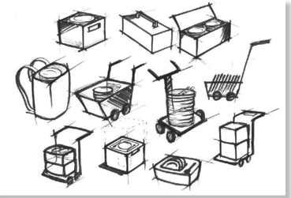

> **Deskripsi Visual:** Gambar ini adalah ilustrasi yang menunjukkan berbagai jenis alat dan peralatan yang digunakan dalam proses produksi atau pemasaran. Ilustrasi ini mencakup berbagai elemen seperti kotak, kotak dengan tutup, tas, keranjang, dan sepeda motor. Setiap elemen memiliki fungsi yang berbeda dalam konteks produksi atau pemasaran. Misalnya, kotak digunakan untuk menyimpan barang-barang, tas digunakan untuk membawa barang-barang, dan sepeda motor digunakan untuk mengangkut barang-barang. Ilustrasi ini juga menunjukkan hubungan antara elemen-elemen tersebut dalam konteks penggunaan mereka. Misalnya, kotak dan tas sering digunakan bersama-sama untuk menyimpan dan membawa barang-barang. Informasi kunci yang dapat diambil pembaca adalah bahwa ilustrasi ini menunjukkan berbagai jenis alat dan peralatan yang digunakan dalam proses produksi atau pemasaran.

Sumber: Dokumen Kemdikbud

---
**🖼️ Gambar/Diagram**

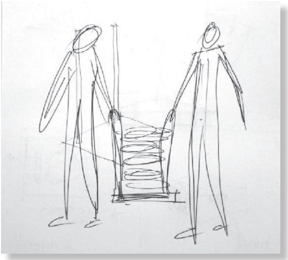

> **Deskripsi Visual:** Gambar ini adalah ilustrasi yang menunjukkan dua orang yang sedang berjalan. Pada gambar tersebut, elemen utama adalah dua orang yang memiliki bentuk manusia sederhana dengan tangan dan kaki yang jelas. Mereka sedang berjalan di atas sebuah tangga yang tampak jelas. Tangga ini memiliki tali pengaman yang menunjukkan bahwa mereka sedang berjalan dengan aman. 

Elemen-elemen lain yang penting dalam gambar ini adalah tangan kedua orang yang menunjukkan bahwa mereka sedang membawa sesuatu. Ini mungkin menunjukkan bahwa mereka sedang membawa barang atau alat yang penting untuk kegiatan mereka.

Teks, angka, atau label penting tidak ada dalam gambar ini karena gambar hanya menggambarkan dua orang yang sedang berjalan di atas tangga tanpa menggunakan bahasa atau simbol tambahan.

Informasi kunci yang dapat diambil pembaca adalah bahwa dua orang sedang berjalan di atas tangga, mungkin untuk tujuan tertentu seperti bekerja atau berolahraga.

Sumber: Dokumen Kemdikbud

 

---
## 📄 Halaman 53

---
**🖼️ Gambar/Diagram**

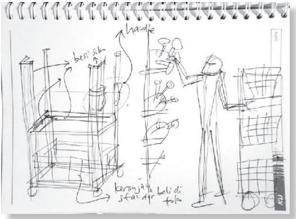

> **Deskripsi Visual:** Gambar ini adalah ilustrasi yang menunjukkan proses pembuatan sebuah produk. Gambar ini terdiri dari beberapa elemen utama:

1. **Pertama**: Gambar ini menunjukkan proses pembuatan produk dengan menggunakan mesin. Di sisi kiri, ada mesin yang sedang digunakan untuk membuat bagian-bagian produk. Mesin tersebut memiliki berbagai komponen seperti roda, papan, dan alat-alat lainnya.

2. **Elemen-elemen utama dan relasinya**: 
   - **Mesin**: Ini adalah elemen utama yang digunakan dalam proses pembuatan produk.
   - **Komponen mesin**: Ada berbagai komponen seperti roda, papan, dan alat-alat lainnya yang terhubung dan bekerja sama dalam proses pembuatan produk.
   - **Produk**: Produk yang sedang dibuat tampak di sebelah kanan gambar. Produk ini tampak telah diproduksi dan siap untuk penggunaan.

3. **Teks, angka, atau label penting yang terlihat**:
   - Ada teks yang menyebutkan "mesin" dan "komponen mesin", serta informasi tentang bagaimana komponen-komponen tersebut bekerja bersama-sama dalam proses pembuatan produk.

4. **Informasi kunci yang dapat diambil pembaca**:
   - Gambar ini memberikan gambaran tentang proses produksi produk melalui mesin dan bagaimana komponen-komponen mesin bekerja sama untuk menciptakan produk yang akhirnya siap untuk penggunaan.

Dengan demikian, gambar ini memberikan gambaran yang jelas tentang proses pembuatan produk melalui mesin dan bagaimana komponen-komponen mesin bekerja bersama-sama untuk menciptakan produk yang akhirnya siap untuk penggunaan.

Sumber: Dokumen Kemdikbud

Gambar 2.16 Contoh sketsa ide untuk keranjang panen jamur.

### 3. Rasionalisasi

Rasionalisasi adalah proses mengevaluasi ide-ide yang muncul dengan pertimbangan-pertimbangan teknis, di antaranya bagaimana cara menggunakan produk tersebut, apakah bahan dan teknik yang ada sudah tepat untuk mewujudkannya? Apakah memungkinkan untuk diproduksi dengan  teknik  produksi  yang  ada  saat  ini?  Bagaimana  proporsi  dan ukuran yang sesuai untuk produk tersebut agar mudah digunakan oleh manusia? Dan pertanyaan-pertanyaan lainnya.

Perhatikan sketsa-sketsa yang telah dibuat. Pilih ide-ide yang dianggap baik dan potensial untuk memecahkan masalah transportasi atau logistik. Kembangkan ide-ide ini dengan rasional, dan tuangkan ke dalam sketsasketsa selanjutnya.

---
**🖼️ Gambar/Diagram**

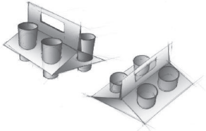

> **Deskripsi Visual:** Gambar ini adalah ilustrasi yang menunjukkan dua jenis alat pengukur panjang: kubus dan garis panjang. Ilustrasi ini memperlihatkan bagaimana kedua alat tersebut digunakan untuk mengukur panjang objek. Kubus digunakan untuk mengukur panjang segi empat, sementara garis panjang digunakan untuk mengukur panjang segi tiga. Ilustrasi ini juga menunjukkan bagaimana kedua alat tersebut harus diletakkan pada objek yang akan dikukur. Informasi penting yang dapat diambil dari gambar ini adalah bahwa kubus dan garis panjang adalah alat pengukur panjang yang berbeda dan memiliki fungsi yang berbeda.

Sumber: Dokumen Kemdikbud

 

---
## 📄 Halaman 54

---
**🖼️ Gambar/Diagram**

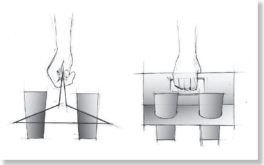

> **Deskripsi Visual:** Gambar ini adalah ilustrasi yang menunjukkan dua tangan yang sedang memegang dua cangkir. Ilustrasi ini menggunakan teknik perspektif untuk menunjukkan kedua tangan dan cangkir dari sudut pandang yang berbeda. 

1. Apa yang ditampilkan secara keseluruhan: Gambar ini menampilkan dua tangan yang sedang memegang dua cangkir. Tangan tersebut tampak seperti sedang bergerak atau melakukan tindakan tertentu.

2. Elemen-elemen utama dan relasinya: Dua tangan yang berada di kedua sisi gambar, dengan posisi yang berbeda. Cangkir yang dipegang oleh tangan tersebut tampak sama besar dan berada pada posisi yang berbeda. 

3. Teks, angka, atau label penting yang terlihat: Di bagian atas gambar, terdapat sebuah garis horizontal yang mungkin menunjukkan titik tengah atau titik fokus dari gambar ini. 

4. Informasi kunci yang dapat diambil pembaca: Gambar ini mungkin digunakan untuk menggambarkan konsep tentang gerakan tangan, posisi, atau hubungan antara tangan dan objek yang dipegang.

Sumber: Sumber Kemdikbud

---
**🖼️ Gambar/Diagram**

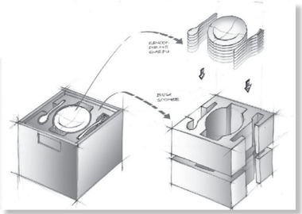

> **Deskripsi Visual:** Gambar ini adalah ilustrasi yang menunjukkan proses pembuatan suatu peralatan atau mesin. Gambar ini terdiri dari dua bagian utama: bagian depan dan bagian belakang.

Pada bagian depan, terlihat sebuah kotak dengan lubang di tengahnya, yang tampaknya merupakan bagian dasar dari mesin tersebut. Lubang ini memiliki bentuk seperti lingkaran dan berfungsi untuk memasukkan bahan-bahan atau benda-benda yang akan diproses.

Pada bagian belakang, terlihat sebuah struktur yang tampaknya merupakan bagian penyangga atau penahanan dari mesin tersebut. Struktur ini memiliki beberapa lubang kecil yang tampaknya berfungsi untuk mengatur aliran udara atau gas.

Teks, angka, atau label penting yang terlihat pada gambar ini adalah:

1. "Lubang 50 mm" - Menunjukkan ukuran lubang di bagian depan.
2. "Lubang 20 mm" - Menunjukkan ukuran lubang di bagian belakang.
3. "Bentuk Lingkaran" - Menunjukkan bentuk lubang di bagian depan.
4. "Struktur Penyangga" - Menunjukkan struktur penyangga di bagian belakang.

Informasi kunci yang dapat diambil pembaca adalah bahwa gambar ini menunjukkan proses pembuatan mesin atau peralatan dengan menggunakan lubang dan struktur penyangga. Ukuran dan bentuk lubang serta struktur penyangga sangat penting dalam proses pembuatan tersebut.

Sumber: Dokumen Kemdikbud

 

---
## 📄 Halaman 55

---
**🖼️ Gambar/Diagram**

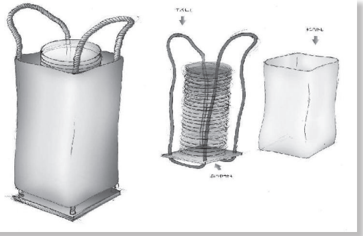

> **Deskripsi Visual:** Gambar ini adalah ilustrasi yang menunjukkan dua jenis tas plastik berbeda. Ilustrasi ini memperlihatkan tas plastik berbentuk kotak dan tas plastik berbentuk keranjang. Elemen utama dalam gambar ini adalah dua tas plastik tersebut, dengan bentuk dan ukuran yang berbeda. Label "TAS KOTAK" dan "TAS KERANJANG" diletakkan di sebelah atas masing-masing tas untuk memberikan informasi tentang jenis tas tersebut. Informasi kunci yang dapat diambil pembaca adalah bahwa gambar ini menunjukkan dua jenis tas plastik berbeda, yaitu tas kotak dan tas keranjang, serta perbedaan bentuk dan ukurannya.

Sumber: Dokumen Kemdikbud

---
**🖼️ Gambar/Diagram**

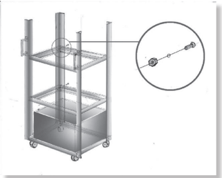

> **Deskripsi Visual:** Gambar ini adalah ilustrasi yang menunjukkan sebuah rak trolley dengan empat lapisan bawah dan satu lapisan atas. Rak trolley ini memiliki roda di setiap sisi untuk kemudahan pindahannya. Di bagian atas rak trolley, terdapat sejenis peralatan atau alat yang tampaknya berfungsi sebagai penahan atau pengikat. Peralatan ini terhubung ke rak trolley melalui sejenis kabel atau kawat yang menghubungkan kedua elemen tersebut. Ilustrasi ini mungkin digunakan untuk menjelaskan cara penggunaan atau instalasi rak trolley tersebut dalam konteks pembelajaran atau tutorial.

Sumber: Dokumen Kemdikbud

 

---
## 📄 Halaman 56

### 4. Prototyping atau Membuat Studi Model

Sketsa  ide  yang  dibuat  pada  tahap-tahap  sebelumnya  adalah  format dua  dimensi.  Artinya,  hanya  digambarkan  pada  bidang  datar.  Produk teknologi transportasi dan logistik yang akan dibuat adalah berbentuk tiga dimensi. Maka, studi bentuk selanjutnya dilakukan dalam format tiga dimensi yaitu dengan studi model. Studi model dapat dilakukan dengan material  sebenarnya  maupun  bukan  material  sebenarnya.  Material sebenarnya adalah material yang akan digunakan pada produk teknologi yang akan dibuat. Alat bantu yang dapat digunakan dalam pembuatan studi  model  adalah  gunting, cutter ,  lem,  selotip  (alat  pemotong  dan bahan perekat).

### 5. Penentuan Desain Akhir

Penetapan  desain  akhir  dapat  dilakukan  melalui  diskusi  atau  evaluasi. Proses  evaluasi  menghasilkan  umpan  balik  yang  bermanfaat  dalam menentukan desain akhir yang terpilih.

### Tugas 5 (Kelompok)

### Pengembangan Desain Produk Teknologi Transportasi dan Logistik

- Carilah  ide  produk  teknologi  transportasi  dan  logistik  yang  akan  dibuat. Pencarian  ide  dapat  dilakukan  dengan  curah  pendapat  ( brainstorming ) dalam kelompok.
- Buat  beberapa  sketsa  ide  bentuk  dari  produk  tersebut.  Pertimbangkan kenyamanan  dan  keamanan  pengguna  dalam  menggunakan  produk tersebut.
- Pilih salah satu ide bentuk yang paling baik.
- Pikirkan dan tentukan teknik-teknik yang akan digunakan untuk membuatnya serta bahan dan alat yang dibutuhkan.
- Buatlah  produk  tersebut.  Proses  pembuatan  model  ini  dilakukan  untuk mengetahui  bahan,  teknik  dan  alat  yang  tepat  untuk  digunakan  pada proses produksi yang sesungguhnya.
- Buat petunjuk pembuatan produk tersebut dalam bentuk tulisan maupun gambar.
- Susunlah semua sketsa, gambar, studi model, daftar bahan dan alat serta petunjuk pembuatan, yang dibutuhkan ke dalam sebuah laporan portofolio yang baik dan rapi.

 

---
## 📄 Halaman 57

### Produksi Produk Teknologi Transportasi dan Logistik

Kegiatan  produksi  diawali  dengan  persiapan  produksi.  Persiapan  produksi dapat berupa pembuatan gambar teknik (gambar kerja), atau gambar pola. Gambar kerja atau pola akan menjadi patokan untuk kebutuhan pembelian bahan. Produksi produk pembawa gelas jus terbuat dari satu lembar kertas karton  yang  dipotong  dan  dilipat,  membutuhkan  pola  untuk  membentuk dan melubangi kartonnya sebagai patokan produksi. Alat bantu pemindahan piring dan transportasi dapat terbuat dari beberapa bahan misalnya pipa besi, papan kayu, tali. Oleh karena itu, dibutuhkan gambar teknik untuk patokan produksi.

Tahapan produksi secara umum terbagi atas pembahanan, pembentukan, perakitan, dan finishing . Tahap pembahanan adalah mempersiapkan bahan atau material agar siap dibentuk. Pada pembuatan produk pembawa gelas jus  dengan  bahan  kertas  karton,  pembahanan  adalah  menggambarkan pola  pada  karton  dan  memotongnya  berdasarkan  pola.  Penempatan  pola pada setiap lembar karton harus mempertimbangkan efisiensi bahan. Pada produksi  dalam  jumlah  terbatas,  pemotongan  dapat  dilakukan  dengan gunting atau cutter dengan teliti agar rapi. Pada produksi dalam jumlah besar, pemotongan  dapat  dilakukan  dengan  penggunakan cutting  punch, yaitu pemotong yang sudah berbentuk pola. Cutting punch untuk pemotong kertas biasanya terbuat dari plat besi.

---
**🖼️ Gambar/Diagram**

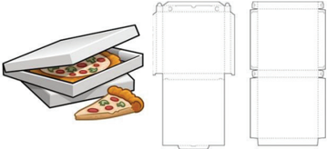

> **Deskripsi Visual:** Gambar ini adalah ilustrasi yang menunjukkan sebuah kotak pizza dengan lid terbuka. Kotak tersebut terbuat dari kertas putih dan memiliki bentuk yang mirip dengan kotak pizza tradisional. Di dalam kotak tersebut terdapat dua piring kecil yang berisi pizza dengan topping seperti keju dan brokoli. Gambar ini menunjukkan bagaimana cara membuat kotak pizza dari kertas, termasuk bagian dalam dan luar kotak.

Elemen utama dalam gambar ini adalah kotak pizza, dua piring kecil dengan pizza, dan bagian dalam dan luar kotak. Relasi antara elemen-elemen ini adalah bahwa kotak pizza adalah alat untuk menyimpan dan memperlihatkan pizza, sementara dua piring kecil dengan pizza menunjukkan contoh pizza yang bisa disimpan dalam kotak tersebut.

Teks, angka, atau label penting tidak ada dalam gambar ini karena ia hanya menggambarkan objek tanpa teks atau angka tambahan. Informasi kunci yang dapat diambil pembaca adalah bahwa gambar ini menunjukkan cara membuat kotak pizza dari kertas dan contoh pizza yang bisa disimpan dalam kotak tersebut.

Sumber: www.vectoringraphic.blogspot.com

 

---
## 📄 Halaman 58

Pada pembuatan alat bantu pemindah piring dan transportasi dengan bahan pipa  besi,  papan  kayu,  tali  dan  lain-lain,  pembahanan  yang  dilakukan  di antaranya adalah melakukan pemotongan dan penghalusan papan agar siap dibentuk serta pemotongan pipa agar sesuai dengan kebutuhan produksi.

Tahapan  proses  pembahanan  dilanjutkan  dengan proses  pembentukan . Pembentukan  bahan  baku  bergantung  pada  jenis  material,  bentuk  dasar material  dan  bentuk  produk  yang  akan  dibuat.  Material  kertas  dibentuk dengan cara dilipat. Kayu, bambu dan rotan lainnya dapat dibentuk dengan cara dipotong atau dipahat. Pemotongan bahan dibuat sesuai dengan bentuk yang direncanakan. Pemotongan dan pemahatan juga biasanya digunakan untuk  membuat  sambungan  bahan,  seperti  menyambungkan  bilah-bilah papan atau dua batang bambu. Pembentukan besi dan rotan, selain dengan pemotongan,  dapat  menggunakan  teknik  pembengkokan.  Pembentukan besi juga dapat menggunakan teknik las. Logam lempengan dapat dibentuk dengan cara pengetokan.

Tahap  berikutnya  adalah perakitan  dan  finishing .  Sebuah  produk  pada umumnya  terdiri  dari  beberapa  bagian,  misalnya  bagian  rangka,  bagian dinding  dan  roda.Perakitan  adalah  menggabungkan  bagian-bagian  dari sebuah  produk.  Perakitan  dapat  memanfaatkan  bahan  pendukung  untuk penguat  seperti  lem,  paku,  benang,  tali  atau  teknik  sambungan  tertentu. Tahap  terakhir  adalah finishing . Finishing dilakukan  sebagai  tahap  terakhir sebelum  produk  tersebut  dimasukan  ke  dalam  kemasan. Finishing dapat berupa penghalusan dan/atau pelapisan permukaan. Penghalusan yang dilakukan  diantaranya  penghalusan  permukaan  kayu  dengan  amplas  atau menghilangkan lem yang tersisa pada permukaan produk. Finishing dapat juga berupa pelapisan permukaan atau pewarnaan agar produk yang dibuat lebih awet dan lebih menarik.

Kelancaran  produksi  juga  ditentukan  oleh  cara  kerja  yang  memperhatikan K3  (Kesehatan  dan  Keselamatan  Kerja).  Upaya  menjaga  kesehatan  dan keselamatan kerja bergantung pada bahan, alat dan proses produksi yang digunakan,  pada  proses  produksi.  Proses  pembahanan  dan  pembentukan material solid seringkali menghasilkan sisa potongan atau debu yang dapat melukai bagian tubuh pekerjanya. Maka, dibutuhkan alat keselamatan kerja berupa kaca mata melindung dan masker antidebu. Proses pembahanan dan finishing, apabila menggunakan bahan kimia yang dapat berbahaya bagi kulit dan  pernapasan,  pekerja  harus  menggunakan  sarung  tangan  dan  masker dengan filter untuk bahan kimia. Selain alat keselamatan kerja, yang tak kalah penting adalah sikap kerja yang rapi, hati-hati, teliti dan penuh konsentrasi. Sikap tersebut akan mendukung kesehatan dan keselamatan kerja .

 

---
## 📄 Halaman 59

### Tugas 6 (Kelompok)

### Perencanaan Proses Produksi dan Keselamatan Kerja

- Setiap  kelompok  sudah  memiliki  rancangan  produk  trasportasi/  logistik yang telah dibuat pada Tugas 5.
- Tentukan jumlah produk yang akan diproduksi.
- Diskusikan  dan  tuliskan  jenis  aktivitas  pada  tahapan  pembahanan,  cara pembentukan,  cara  perakitan  dan  cara  finishing  dari  desain  produk teknologi  yang  telah  dirancang.  Silakan  mencari  informasi  dari  buku, internet  dan  bertanya  pada  ahli  untuk  melengkapi  pemikiran  anggota kelompok.
- Diskusikan dan tuliskan tentang alat kerja yang dibutuhkan pada setiap  proses  dan  ketentuan  keselamatan  kerja  yang  dibutuhkan  dalam mendukung  pembuatan  produk.  Silakan  mencari  informasi  dari  buku, internet  dan  bertanya  pada  ahli  untuk  melengkapi  pemikiran  anggota kelompok.
- Susun informasi tersebut ke dalam sebuah laporan atau presentasi yang menarik  sesuai  format  LK  6.  Boleh  disertai  gambar  agar  lebih  mudah dimengerti dan tampak menarik.

### LK 6. Rencana Proses Produksi dan Keselamatan Kerja

---
**📊 Tabel**

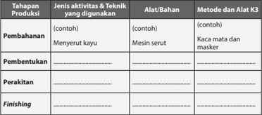

Tabel ini membahas proses produksi dengan membaginya menjadi tiga tahapan: Pembahanan, Pembentukan, dan Finishing. Setiap tahap memiliki jenis aktivitas dan teknik yang digunakan, alat/bahan yang diperlukan, serta metode dan alat K3 yang relevan. Topik utama tabel ini adalah proses produksi produk, yang melibatkan berbagai tahap dan langkah-langkah yang harus dilakukan untuk menciptakan produk yang akhirnya akan dihasilkan. Kolom-kolom yang ada dalam tabel ini adalah Pembahanan, Pembentukan, dan Finishing. Data atau pola penting yang terlihat dalam tabel ini adalah bahwa setiap tahap memiliki jenis aktivitas dan teknik yang berbeda, alat/bahan yang berbeda, dan metode dan alat K3 yang berbeda pula. Ini menunjukkan bahwa setiap tahap produksi memiliki keunikan dan peran yang berbeda dalam proses produksi keseluruhan.

 

---
## 📄 Halaman 60

### Tugas 7 (Kelompok)

### Produksi Teknologi Transportasi dan Logistik

Produksi  dilakukan  dalam  kelompok  sesuai  dengan  tahap  pengerjaan  yang sudah direncanakan. Tahap awal berupa persiapan bahan, tempat kerja dan peralatan, dilanjutkan dengan proses produksi.

- Pada  tugas  sebelumnya,  sudah  ditetapkan  jumlah  produk  yang  akan dibuat. Hitunglah bahan yang dibutuhkan untuk memproduksinya.
- Siapkan bahan-bahan dengan mengelompokkan berdasarkan jenis material yang akan digunakan.
- Siapkan pula tempat kerja dan peralatan yang akan digunakan.
- Tahap selanjutnya adalah pengerjaan. Kerjakan setiap tahap sesuai dengan perencanaan proses produksi yang sudah dibuat sebelumnya dan pembagian tugas yang disepakati dalam kelompok.
- Setelah bekerja, rapikan den bersihkan kembali peralatan dan tempat kerja.

### Kemasan Produk Transportasi dan Logistik

Kemasan  untuk  produk  teknologi  berfungsi  untuk  melindungi  produk kerusakan  serta  memberikan  kemudahan  membawa  dari  lokasi  produksi hingga sampai ke konsumen. Kemasan juga berfungsi untuk menambah daya tarik, dan sebagai identitas atau brand dari produk tersebut. Fungsi kemasan didukung oleh pemilihan material, bentuk, warna, teks dan grafis yang tepat. Material yang digunakan untuk membuat kemasan beragam bergantung dari produk yang akan dikemas. Produk yang mudah rusak harus menggunakan kemasan yang memiliki material berstruktur. Pemilihan material juga disesuaikan dengan identitas atau brand dari produk tersebut. Daya tarik dan identitas, selain ditampilkan oleh material kemasan, juga dapat ditampilkan melalui bentuk, warna, teks dan grafis. Pengemasan dapat dilengkapi dengan label yang memberikan informasi teknis maupun memperkuat identitas atau brand.

 

---
## 📄 Halaman 61

### Tugas 8 (Kelompok)

### Identitas Produk

- Carilah  informasi  dari  beberapa  literatur  tentang  berbagai  pengertian identitas produk, brand dan merek.
- Bandingkan satu informasi dan informasi lainnya.
- Paparkan  pengertian  identitas  dan  merek  produk  dengan  kata-katamu sendiri.
- Apa gunanya sebuah produk memiliki identitas?
- Carilah informasi tentang beberapa produk lokal dengan merek sudahyang terkenal.
- Pilih beberapa merek produk lokal yang menurutmu bagus dan berhasil. Paparkan alasan dari pendapatmu.
Kemasan  produk  rekayasa  berfungsi  melindungi  produk  dari  debu  dan kotoran  serta  memberikan  kemudahan  distribusi.  Kemasan  yang  melekat pada  produk  disebut  sebagai  kemasan  primer.  Kemasan  sekunder  berisi beberapa  kemasan  primer  yang  berisi  produk.  Kemasan  untuk  distribusi disebut  kemasan  tersier.  Kemasan  primer  produk  melindungi  produk  dari benturan dan kotoran serta berfungsi menampilkan daya tarik dari produk serta  memberikan  kemudahan  untuk  distribusi  dari  tempat  produksi  ke tempat  penjualan.  Perlindungan  bisa  diperoleh  dari  kemasan  tersier  yang membuat kemasan beragam bergantung dari  produk  yang  akan  dikemas. Kemasan  produk  sebaiknya  memberikan  identitas  atau  brand  dari  produk tersebut atau dari produsennya.

Material  kemasan  untuk  melindungi  dari  kotoran  dapat  berupa  lembaran kertas atau plastik. Tidak semua produk membutuhkan kemasan primer, tetapi setiap  produk  membutuhkan  identitas.  Identitas  dapat  berupa  stiker  atau selubung karton yang berisi nama dan keterangan. Pada produk fungsional dibutuhkan  keterangan  cara  penggunaan  produk.  Keterangan  lain  yang dibutuhkan  untuk  distribusi  adalah  simbol  yang  berstandar  internasional untuk penanganan kemasan distribusi.

 

---
## 📄 Halaman 62

---
**🖼️ Gambar/Diagram**

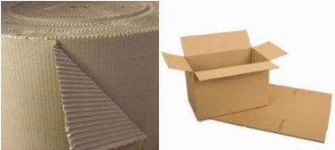

> **Deskripsi Visual:** Gambar ini adalah ilustrasi yang menunjukkan dua jenis bahan kemasan: kertas berlapis dan kotak kardus. Pada bagian kiri, terdapat roll kertas berlapis dengan lapisan-lapisan berwarna coklat yang terlihat rapi dan teratur. Pada bagian kanan, terdapat kotak kardus yang dibuka, menunjukkan struktur dasar kotak dengan lipatan yang rapi dan warna coklat yang sama seperti kertas berlapis.

Elemen-elemen utama dalam gambar ini adalah kertas berlapis dan kotak kardus. Kedua elemen ini saling berkaitan dalam konteks penggunaan sebagai bahan kemasan. Kertas berlapis digunakan untuk membuat kotak kardus, yang kemudian digunakan untuk mengemas barang-barang.

Teks, angka, atau label penting tidak terlihat dalam gambar ini karena hanya ada dua objek utama tanpa informasi tambahan.

Informasi kunci yang dapat diambil pembaca adalah bahwa kertas berlapis dan kotak kardus adalah dua jenis bahan kemasan yang sering digunakan dalam pengemasan barang. Kertas berlapis digunakan untuk membuat kotak kardus, yang kemudian digunakan untuk mengemas barang-barang.

Sumber: www.vectoringraphic.blogspot.com, packagingewarehousedirect.co.id

---
**🖼️ Gambar/Diagram**

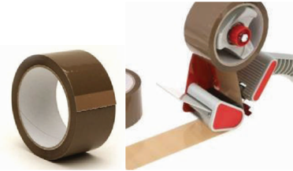

> **Deskripsi Visual:** Gambar ini adalah ilustrasi yang menunjukkan proses penggunaan kain plastik untuk mengisi lubang pada sepeda. Gambar ini terdiri dari dua bagian: bagian kiri menunjukkan kain plastik berwarna coklat dengan lubang di tengahnya, sedangkan bagian kanan menunjukkan cara penggunaan kain plastik tersebut. Kain plastik tersebut diletakkan di sekitar lubang sepeda, kemudian dipasang ke sepeda menggunakan sekrup. Ini menunjukkan bahwa kain plastik dapat digunakan sebagai alat untuk mengisi lubang pada sepeda.

Sumber: packagingewarehousedirect.co.id

Sumber: clker.com

 

---
## 📄 Halaman 63

### Tugas 9 (Kelompok)

### Pembuatan Kemasan Produk Teknologi Transportasi dan Logistik

- Buatlah kemasan untuk produk yang telah dibuat dengan pertimbangan fungsi pelindung produk dan identitas produk.
- Ingatlah untuk memasukkan  biaya pembuatan  kemasan ke dalam penghitungan biaya produksi.

### D. Penghitungan Biaya Produksi Produk Teknologi Transportasi dan Logistik

Biaya produksi adalah biaya-biaya yang harus dikeluarkan untuk terjadinya produksi barang. Unsur biaya produksi adalahbiaya bahan baku, biaya tenaga kerja  dan  biaya overhead. Biaya  yang  termasuk  ke  dalam overhead adalah biaya  listrik,  bahan  bakar  minyak,  dan  biaya-biaya  lain  yang  dikeluarkan untuk mendukung proses produksi. Biaya pembelian bahan bakar minyak, sabun pembersih untuk membersihkan bahan baku, benang, jarum, lem dan bahan bahan lainnya dapat dimasukkan ke dalam biaya overhead. Metode penghitungan biaya produksi adalah seperti pada tabel 1.1

### Tabel 1.1 Contoh penghitungan biaya Produksi

### Tugas 10 (Kelompok)

### Total Biaya Produksi

- Hitunglah biaya produksi dari produk transportasi dan logistik kelompokmu.
- Hitunglah biaya produksi kemasan produk.
- Diskusikan  dalam  kelompok  berapa  perkiraan  harga  jual  produk  karya kelompokmu.

 

---
## 📄 Halaman 64

### LK 10.Total Biaya Produksi

---
**📊 Tabel**

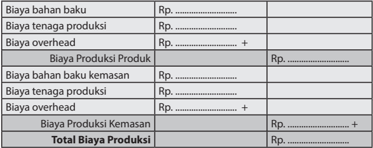

Tabel ini menunjukkan struktur biaya produksi dalam sebuah perusahaan. Topik utamanya adalah biaya produksi produk dan kemasan. Kolom-kolomnya meliputi biaya bahan baku, tenaga produksi, overhead, dan total biaya produksi. Data penting yang terlihat adalah bahwa biaya bahan baku dan tenaga produksi diperlakukan sebagai biaya langsung, sementara overhead dan biaya bahan baku kemasan diperlakukan sebagai biaya tidak langsung. Total biaya produksi mencerminkan jumlah keseluruhan biaya yang harus dibayarkan untuk memproduksi produk dan kemasan.

### E.  Pemasaran Langsung Produk Teknologi Transportasi dan Logistik

Pemasaran langsung adalah promosi dan penjualan yang dilakukan langsung kepada  konsumen  tanpa  melalui  toko.  Penjualan  langsung  merupakan hasil dari promosi langsung yang dilakukan oleh penjual terhadap pembeli. Pemasaran dapat dilakukan dengan promosi dan demo penggunaan produk kepada calon konsumen.

Pemasaran  produk  teknologi  pada  umumnya  harus  menjelaskan  cara kerja  dan  petunjuk  teknis  menggunaan  produk  tersebut.  Penjelasan  dapat dilakukan  dengan  bantuan  gambar  atau  buku  petunjuk,  maupun  dengan langsung mempraktekan cara penggunaan produk kepada konsumen.

Sistem  penjualan  langsung  dapat  berupa  penjualan  satu  tingkat  ( singlelevel  marketing )  atau  multitingkat  ( multi-level  marketing ).  Penjualan  satu tingkat  merupakan  cara  yang  paling  sederhana  untuk  menjual  produk secara langsung. Wirausahawan langsung memasarkan dan menjual kepada konsumen tanpa membutuhkan toko atau pramuniaga.

Pemasaran  produk  rekayasa  dapat  dilakukan  dengan  cara  pemesanan. Konsumen  dapat  melihat,  mengenali  dan  mencoba  contoh  produk,  serta memesannya.  Produk  rekayasa  akan  diproduksi  berdasarkan  pesanan  dan dikirimkan kepada konsumen sesuai waktu yang dijanjikan.

Produsen  selain  menjual  produknya  sendiri,  dapat  membentuk  kelompok penjual yang akan memasarkan dan menjualkan produknya secara langsung kepada konsumen. Kelompok penjual dapat terdiri dari beberapa tingkatan. Sistem dengan beberapa tingkat kelompok penjual, disebut dengan multi- level  marketing Produk  Perusahaan  memiliki  usaha  di  bidang  penjualan

 

---
## 📄 Halaman 65

---
**🖼️ Gambar/Diagram**

> **Deskripsi Visual:** Gambar ini adalah ilustrasi yang menunjukkan seorang siswa sedang berdiri di depan pameran kelas. Pameran tersebut terdiri dari berbagai jenis karya seni dan tugas belajar yang disajikan dengan rapi dan menarik. Di sebelah kiri, terdapat sebuah pot berisi tanaman hijau, sementara di sebelah kanan terdapat beberapa lembar kertas yang menunjukkan hasil tugas belajar seperti gambar dan diagram. Gambar-gambar tersebut tampak berwarna-warni dan menunjukkan kekayaan kreativitas siswa. Siswa tersebut tampak senang dan bangga dengan hasil karyanya.

Sumber: Dokumen Kemdikbud

Gambar 2.26 Kegiatan peserta didik mempresentasikan produk dan melakukan penjualan langsung.

langsung( direct selling )  baik  yang  menggunakan single level maupun multilevel  marketing wajib  memiliki  Surat  Ijin  Usaha  Penjualan  langsung  yang dikeluarkan oleh BKPM sesuai dengan Peraturan Menteri Perdagangan no. 32 Tahun 2008.

### F.  Evaluasi Kegiatan Pembelajaran Wirausaha Teknologi Transportasi dan Logistik

### Evaluasi Diri Semester 1

Evaluasi  diri  pada  akhir  semester  1  terdiri  atas  evaluasi  individu  dan  evaluasi kelompok.  Evaluasi  individu  dibuat  untuk  mengetahui  sejauh  mana  efektivitas pembelajaran terhadap setiap peserta didik. Evaluasi individu meliputi evaluasi sikap,  pengetahuan  dan  keterampilan.  Evaluasi  kelompok  untuk  mengetahui interaksi  dalam  kelompok  yang  terjadi  dalam  kelompok,  kaitannya  dengan pencapaian tujuan pembelajaran.

 

---
## 📄 Halaman 66

### Evaluasi Diri (individu)

Bagian A. Berilah tanda cek (v) pada kolom kanan  sesuai penilaian dirimu.

Keterangan:

- Sangat Tidak Setuju        2. Tidak Setuju        3. Netral
- Setuju       5. Sangat Setuju

---
**📊 Tabel**

Tabel ini merupakan evaluasi aspek-aspek keterampilan dan pengetahuan tentang transportasi dan logistik. Topik utamanya adalah keterampilan dan pengetahuan dasar tentang transportasi dan logistik, termasuk pemahaman konsep dasar, pengetahuan tentang industri, pemahaman produk, kemampuan membuat produk, kemampuan menghitung biaya, kemampuan menjual produk, kemampuan bekerja sama dalam tim, dan kepuasan dengan hasil kerja. Kolom-kolomnya mencakup 5 aspek evaluasi, yaitu pemahaman konsep dasar, pengetahuan industri, pemahaman produk, kemampuan membuat produk, dan kepuasan dengan hasil kerja. Data atau pola penting yang terlihat adalah bahwa semua aspek evaluasi memiliki nilai 0 sampai 5, menunjukkan bahwa evaluasi ini menggunakan skala bintang untuk mengukur keterampilan dan pengetahuan individu tentang transportasi dan logistik.

 

---
## 📄 Halaman 67

### Bagian B

Kesan dan pesan setelah mengikuti pembelajaran Rekayasa Semester 1:

### Evaluasi Diri (kelompok)

Bagian A. Berilah tanda cek (√) pada kolom kanan  sesuai penilaian dirimu.

Keterangan:

- Sangat Tidak Setuju        2. Tidak Setuju        3. Netral
4. Setuju       5. Sangat Setuju

Bagian B. Tuliskan pengalaman paling berkesan saat bekerja dalam kelompok

---
**📊 Tabel**

Tabel ini berisi aspek-evaluasi yang harus diisi oleh kelompok belajar untuk mengevaluasi diri mereka sendiri. Topik utamanya adalah kualitas kelompok belajar, termasuk keterampilan, pengetahuan, dan sikap. Ada 5 kolom yang masing-masing menunjukkan skor evaluasi dari 1 (kurang) hingga 5 (terbaik). Data penting yang terlihat adalah bahwa semua anggota kelompok memiliki sikap yang baik, pengetahuan yang lengkap tentang materi pembelajaran semester 1, keterampilan yang beragam, dan keterampilan kerja yang tinggi. Selain itu, kelompok belajar juga dapat melakukan musyawarah dengan baik.

 

---
## 📄 Halaman 68

---
**📊 Tabel**

Tabel ini berisi informasi tentang kemampuan dan hasil kerja kelompok dalam proyek transportasi/logistik. Topik utamanya adalah keterampilan dan pencapaian kelompok dalam berbagai aspek proyek tersebut. Kolom-kolomnya mencakup: 1) Pembagian tugas, 2) Saling membantu anggota kelompok, 3) Mampu menjual produk transportasi/logistik, 4) Melakukan presentasi dengan baik, dan 5) Kepuasan dengan hasil kerja semester pertama. Data penting yang terlihat adalah bahwa semua anggota kelompok memiliki keterampilan dan pencapaian yang baik dalam berbagai aspek proyek, termasuk pembagian tugas, saling membantu, menjual produk, dan presentasi. Selain itu, semua anggota kelompok merasa puas dengan hasil kerja mereka pada semester pertama.

### Bagian B

Pengalaman paling berkesan saat bekerja dalam kelompok:

 

---
## 📄 Halaman 69

### BUDIDAYA

---
**🖼️ Gambar/Diagram**

> **Deskripsi Visual:** Gambar ini adalah diagram yang menunjukkan struktur materi tentang wirausaha produk budidaya tanaman pangan. Diagram ini dibagi menjadi empat bagian utama, masing-masing dengan judul A, B, C, dan D. Setiap bagian memiliki sub-judul dan informasi lebih lanjut tentang topik tersebut.

1. **A. Perencanaan Usaha Budidaya Tanaman Pangan**
   - Sub-judul: Potensi Budidaya Tanaman Pangan, Teknologi sederhana, Tata letak memplan

2. **B. Proses Produksi Budidaya Tanaman Pangan**
   - Sub-judul: Jenis produksi, Pemilihan lahan, Pemilihan pupuk, Pengendalian hama, Proses panen dan pascapare

3. **C. Penghitungan Harga Pokok Budidaya Tanaman Pangan**
   - Sub-judul: Penentuan biaya investasi, Penentuan harga tetap dan tidak tetap, Penentuan Harga Pokok Produksi (HPP), Penentuan harga jual, Penentuan laba/rugi

4. **D. Pemasaran Langsung Budidaya Tanaman Pangan**
   - Sub-judul: Pengenalan ke lingkungan terdekat, Media sosial (FB, Twitter, dll), Penjualan kreatif (car free day, dll), Membuka toko sendiri

5. **E. Hasil Kegiatan Usaha Budidaya Tanaman Pangan**
   - Sub-judul: Jenis usaha terbuka, Sistem penjualan terbukti, Sistem penataan terbukti, Pemberian rewards dan bonus

Informasi kunci yang dapat diambil pembaca melalui diagram ini adalah bahwa struktur wirausaha budidaya tanaman pangan melibatkan perencanaan usaha, proses produksi, penghitungan harga pokok, pemasaran langsung, dan hasil kegiatan usaha. Setiap bagian ini memiliki sub-judul yang memberikan detail tentang aspek-aspek tertentu dari setiap aspek tersebut.

Prakarya dan Kewirausahaan 63

 

---
## 📄 Halaman 70

### Kewirausahaan Pengolahan Budi

### Tujuan Pembelajaran

### Setelah mempelajari bab ini, siswa mampu:

- Menghayati bahwa begitu banyak keanekaragaman tanaman pangan di  Indonesia,  di  mana  setiap  daerah  mempunyai  jenis  tanaman  pangan, terkadang sama atau tidak sama dengan daerah lainnya
- Menghayati,  percaya  diri,  bertanggung  jawab,  kreatif  dan  inovatif  dalam membuat analisis kebutuhan akan adanya teknologi produksi yang baik dan tepat untuk setiap usaha dalam bidang budi daya tanaman pangan
- Menyajikan simulasi wirausaha budi daya tanaman pangan, sesuai dengan jenis tanaman pangan yang ada di daerahnya masing-masing, berdasarkan analisis keberadaan sumber daya yang ada di lingkungan sekitar
- Mengidentifikasi  dan  memproduksi  budi  daya  tanaman  pangan,  sesuai dengan  jenis  yang  ada  di  daerahnya  masing-masing,  meliputi:  teknik  produksi, perhitungan biaya, sistem pemasaran, model promosi
- Mempresentasikan  peluang  dan  perencanaan  usaha  sesuai  pilihan  budi  daya tanaman pangan yang dipilihnya dengan sungguh-sungguh dan percaya diri; pengembangan  bisnis  budi  daya  tanaman  pangan,  meliputi  teknik  produksi, perhitungan  harga,  promosi  dan  pemasaran,  sesuai  dengan  produk  yang dipilihnya

### BAB III daya Tanaman Pangan

 

---
## 📄 Halaman 71

Budi  daya  berpangkal  pada cultivation, yaitu  suatu  kerja  yang  berusaha  untuk menambah,  menumbuhkan,  dan  mewujudkan  benda  ataupun  makhluk  agar lebih  besar  (tumbuh),  dan  berkembang  (banyak).  Kinerja  ini  membutuhkan perasaan seolah dirinya (pembudi daya) hidup, tumbuh dan berkembang. Prinsip pembinaan  rasa  dalam  kinerja  budi  daya  ini  akan  memberikan  hidup  pada tumbuhan atau hewan, tetapi dalam bekerja, dibutuhkan sistem yang berjalan rutinitas,  seperti  kebiasaan  hidup  orang:  makan,  minum  dan  bergerak.  Maka, seorang pembudi daya harus memahami kartakter tumbuhan atau hewan yang di'budidaya'kan.

Konsep cultivation tampak pada penyatuan diri dengan alam dan pemahaman tumbuhan  atau  binatang.  Pemikiran echosystem menjadi  langkah  yang  selalu dipikirkan  keseimbangan  hidupnya.  Manfaat  edukatif  budi  daya  ini  adalah pembinaan  perasaan,  pembinaan  kemampuan  memahami  pertumbuhan  dan menyatukan  dengan  alam  ( echosystem )  menjadi  anak  dan  tenaga  kerja  yang berpikir sistematis, tetapi manusiawi dan kesabaran. Hasil budi daya tidak akan dapat dipetik dalam waktu singkat melainkan membutuhkan waktu dan harus diawasi dengan penuh kesabaran.

Bahan dan perlengkapan teknologi budi daya sebenarnya dapat diangkat dari kehidupan  sehari-hari  yang  variatif,  karena  setiap  daerah  mempunyai  potensi kearifan  yang  berbeda.  Budi  daya  telah  dilakukan  oleh  pendahulu  bangsa  ini  dengan teknologi tradisi, telah menunjukkan konsep budi daya yang memperhitungkan musim, tetapi belum mempunyai standar ketepatan dengan suasana/iklim cuaca maupun ekonomi yang sedang berkembang. Maka, pembelajaran prakarya-budi daya diharapkan mampu menemukan ide pengembangan berbasis bahan tradisi dengan memperhitungkan kebelanjutan materi atau bahan tersebut.

Indonesia merupakan  negara yang kaya akan sumber daya alam.  Seharusnya, Indonesia  mampu  memenuhi  kebutuhan  pangannya  sendiri.  Kenyataannya, Indonesia harus mengimpor pangan.

Pertanian merupakan salah satu basis ekonomi kerakyatan di Indonesia. Pertanian pula yang menjadi penentu ketahanan, bahkan kedaulatan pangan. Namun, sektor pertanian sebagai salah satu faktor yang mengindikasikan tingkat kesejahteraan dan peradaban suatu bangsa, kini makin tidak diminati generasi muda. Banyak yang  mengidentikkan  dunia  pertanian  dengan  kelas  rendahan.    Kita  harus menyadari bahwa pangan yang kita konsumsi berasal  usaha budi daya sehingga usaha budi daya tanaman adalah usaha yang mulia.

Bangsa yang besar adalah bangsa yang dibangun dari kemandirian masyarakatnya, yaitu masyarakat yang mampu menopang dirinya sendiri tanpa bergantung pada pihak luar.  Hal  ini  bisa  dicapai  jika  warganya  mempunyai  jiwa  kewirausahaaan. Punya karakter kuat sebagai enterpreneur.

 

---
## 📄 Halaman 72

### A. Perencanaan Usaha Budi Daya Tanaman Pangan

Indonesia  dikenal  sebagai  negara  agraris,  yaitu  negara  yang  sebagian besar  penduduknya  mempunyai  mata  pencaharian  di  berbagai  bidang pertanian,  seperti    budi  daya  tanaman  pangan.    Kelompok  tanaman  yang termasuk komoditas pangan adalah tanaman pangan, tanaman hortikultura nontanaman hias dan kelompok tanaman lain penghasil bahan baku produk pangan.  Dalam pembelajaran kali ini, kita akan mempelajari tentang tanaman pangan utama, yaitu tanaman yang menjadi sumber utama bagi karbohidrat dan protein untuk memenuhi kebutuhan tubuh manusia.

Hasil budi daya tanaman pangan dimanfaatkan untuk memenuhi kebutuhan pangan  sendiri.    Hasil  budi  daya  tanaman  pangan  juga  diperdagangkan sehingga  dapat  menjadi  mata  pencaharian.    Hal  ini  menjadikan  tanaman pangan  sebagai  komoditas  pertanian    yang  sangat  penting  bagi  bangsa Indonesia.

Indonesia  memiliki  berbagai  jenis  tanaman  pangan.    Keberagaman  jenis tanaman pangan yang kita miliki merupakan anugerah dari Yang Mahakuasa sehingga  kita  harus  bersyukur  kepada-Nya.  Bentuk  syukur  kepada  Yang Mahakuasa dapat diwujudkan  dengan memanfaatkan produk pangan yang dihasilkan oleh petani dengan sebaik-baiknya. Pelestarian dan pemanfaatan sumber  daya  alam  (SDA)  yang  melimpah  ini,  bisa  dengan  menjadikannya sebagai  pilihan  dalam  berwirausaha,  yaitu  wirausaha  di  bidang  tanaman pangan.

Tanaman pangan adalah sumber kehidupan bagi manusia. Jadi, keberadaannya akan  selalu  dibutuhkan  selagi  manusia  masih  hidup.  Maka,  wirausaha  di bidang budi daya tanaman pangan akan terus menjadi peluang yang baik, selama manusia masih membutuhkan pangan untuk kehidupannya.

Tanaman pangan dikelompokkan berdasarkan umur, yaitu tanaman semusim dan  tanaman  tahunan.   Tanaman  semusim  adalah  tanaman  yang  dipanen dalam satu musim tanam, yaitu antara 3-4 bulan, misal jagung dan kedelai atau antara 6-8 bulan, seperti singkong. Tanaman tahunan adalah tanaman yang terus tumbuh setelah bereproduksi atau menyelesaikan siklus hidupnya dalam jangka waktu lebih dari dua tahun, misalnya sukun dan sagu.

Tanaman pangan  juga dibagi menjadi 3 kelompok, yaitu serealia, kacangkacangan    dan  umbi-umbian.    Kelompok  serealia  dan  kacang-kacangan menghasilkan biji sebagai produk hasil budi daya, sedangkan umbi-umbian menghasilkan umbi batang atau umbi akar sebagai produk hasil budi daya.

 

---
## 📄 Halaman 73

Berbagai jenis tanaman pangan  yang tumbuh di negeri kita tercinta Indonesia, adalah sebagai berikut  :

### 1.  Padi ( Oryza sativa L.)

Padi  memiliki  batang  yang  berbuku  dan  berongga.  Daun  dan  anakan tumbuh dari buku yang ada pada batang.  Bunga atau malai muncul dari buku yang terakhir. Akar padi berupa akar serabut. Bulir padi terdapat pada  malai  yang  dimiliki  oleh  anakan.  Budi  daya  padi  dikelompokkan menjadi padi sawah, padi gogo, dan padi rawa.   Tanaman padi diperbanyak dengan menggunakan biji.

Sumber: http://www.litbang.deptan.go.id/berita/one/412/

 

---
## 📄 Halaman 74

### 2.  Jagung ( Zea mays L.)

Jagung memiliki batang tunggal yang terdiri atas buku dan ruas.  Daun jagung terdapat pada setiap buku pada batang.  Jagung memiliki bunga jantan dan bunga betina yang terpisah, tetapi masih pada pohon yang sama. Bunga jantan  terletak di ujung batang, sedangkan bunga betina (tongkol) berada di bagian tengah batang jagung.  Jagung dapat ditanam di lahan kering maupun di lahan sawah sesudah panen padi. Tanaman jagung diperbanyak dengan biji.

### 3.  Sorgum ( Sorghum bicolor L.)

Tanaman sorgum sekilas mirip dengan jagung. Sorgum memilik batang yang berbuku-buku. Kadang-kadang sorgum juga dapat memiliki anakan. Sorgum  memiliki  bunga  yang  tersusun  dalam  malai  yang  terdapat  di ujung batang.  Sorgum diperbanyak dengan biji.   Sorgum dapat ditanam pada  berbagai  kondisi  lahan,  baik  lahan  subur  maupun  lahan  kurang subur atau lahan marjinal karena sorgum memiliki daya adaptasi yang luas.

 

---
## 📄 Halaman 75

Gambar. 3.3 Tanaman Sorgum

### 4.  Kedelai ( Glycine max L.)

Kedelai  merupakan tanaman semusim  dengan tinggi tanaman antara 40-90  cm,  memiliki  daun  tunggal  dan  daun  bertiga  ( trifoliate ).  Daun dan  polong  kedelai  memilliki  bulu.  Tanaman  kedelai  memiliki  umur antara  72-90  hari.  Polong  kedelai  yang  telah  masak  ditandai  dengan kulit  polong  yang berwarna cokelat.  Kedelai diperbanyak dengan biji. Berdasarkan warna bijinya,  kedelai  dibedakan  menjadi  kedelai  kuning, hijau  kekuningan,  cokelat,  dan  hitam.  Endosperm  kedelai  umumnya berwarna  kuning.  Kedelai dapat ditanam di lahan kering  atau di sawah sesudah panen padi.

 

---
## 📄 Halaman 76

### 5.  Kacang Tanah ( Arachis hipogeae L.)

Kacang tanah dapat ditanam di lahan kering dan lahan sawah sesudah panen  padi.    Kacang  tanah  diperbanyak  dengan  biji.  Kacang  tanah memiliki  batang  yang  bercabang  dengan  tinggi  tanaman  antara  3868 cm.  Tanaman ini memiliki tipe tumbuh dengan memanjang di atas permukaan  tanah.  Kacang  tanah  memiliki  polong  yang  tumbuh  dari ginofor di dalam  tanah. Kacang tanah dapat dipanen pada umur 90-95 hari setelah tanam.

---
**🖼️ Gambar/Diagram**

> **Deskripsi Visual:** Gambar ini adalah ilustrasi yang menunjukkan proses pertumbuhan dan hasil panen tanaman kacang polong. Gambar ini terdiri dari beberapa elemen utama:

1. **Pertumbuhan Tanaman**: Gambar ini menunjukkan daun-daun hijau yang tumbuh dari akar tanaman kacang polong. Daun-daun tersebut tampak segar dan berwarna hijau tua, menunjukkan bahwa tanaman telah tumbuh dengan baik.

2. **Hasil Panen**: Di bagian bawah gambar, terlihat beberapa buah kacang polong yang sudah matang. Kacang polong tersebut berwarna cokelat keemasan dan tampak berisi biji-bijian yang siap dikonsumsi.

3. **Bunga dan Biji**: Gambar juga menunjukkan bunga-bunga kacang polong yang sedang mekar dan beberapa biji yang sudah keluar dari bunga-bunganya. Ini menunjukkan tahap-tahap pertumbuhan dari bunga hingga hasil panen.

4. **Informasi Tambahan**: Terdapat teks di sisi kanan gambar yang membahas tentang informasi lebih lanjut tentang kacang polong, seperti jenis-jenisnya, manfaatnya, dan cara penanamannya. Teks ini memberikan konteks yang lebih luas tentang tanaman kacang polong.

5. **Label**: Terdapat label yang menunjukkan nama-nama tanaman dan hasil panennya, serta informasi tambahan yang relevan dengan topik pembelajaran.

Dengan demikian, gambar ini menggambarkan proses pertumbuhan dan hasil panen tanaman kacang polong, sementara juga menyediakan informasi tambahan yang berguna untuk pembelajaran.

Gambar. 3.5 Kacang Tanah

### 6.  Kacang Hijau ( Vigna radiata L . )

Tanaman  kacang  hijau  merupakan  tanaman  pangan  semusim  yang mempunyai umur panen antara 55-65 hari setelah tanam.  Kacang hijau memiliki tinggi tanaman antara 53-80 cm, batang bercabang serta daun dan polong yang berbulu.  Kacang hijau diperbanyak dengan biji.   Kacang hijau  dapat  ditanam  di  lahan  kering  maupun  di  lahan  sawah  sesudah panen padi.

 

---
## 📄 Halaman 77

Gambar. 3.6 Tanaman Kacang Hijau

### 7.  Singkong ( Manihot utilissima )

Tanaman  singkong  atau  ubi  kayu  merupakan  tanaman  berkayu  yang dipanen umbinya. Daun tanaman ini dapat dimanfaatkan sebagai sayuran. Tanaman ubi kayu dapat menghasilkan biji, tetapi tidak digunakan untuk perbanyakan. Tanaman ini biasanya diperbanyak dengan menggunakan stek batang.  Umur tanaman ubi kayu sekitar 8-10 bulan. Tanaman ubi kayu  mempunyai  daya  adaptasi  yang  luas,  tetapi  umumnya,  ubi  kayu ditanam di lahan kering.

Sumber: Koleksi  Bagian Genetika dan Pemuliaan Tanaman, IPB

Gambar. 3.7 Tanaman Ubi Kayu

 

---
## 📄 Halaman 78

### 8. Ubi Jalar ( Ipomoea batatas L.)

Tanaman  ubi  jalar  adalah  tanaman  pangan  yang  memiliki  batang panjang menjalar. Tipe pertumbuhannya dapat  berupa semak, semakmenjalar atau menjalar. Ubi jalar dapat diperbanyak dengan bagian ubi, pucuk batang dan setek batang.  Umur tanaman ubi jalar berkisar antara 4-4.5 bulan.  Ubi jalar umumnya ditanam  pada guludan tanah di lahan tegalan atau lahan sawah.   Warna kulit umbi maupun warna daging umbi bervariasi, mulai dari  umbi yang berwarna putih, krem, orange atau ungu.

Tanaman pangan menyebar secara merata di seluruh wilayah Indonesia dan  terdapat  beberapa  daerah  yang  menjadi  sentra  pengembangan tanaman pangan tertentu.  Hal ini disebabkan oleh kebiasan  masyarakat dalam  mengembangkan  tanaman  pangan  tertentu  dan  kesesuaian lahan. Misalnya, Provinsi Sumatra Utara, Sumatra Barat, Sulawesi Selatan, Jawa  Barat  dan  Jawa  Tengah  menjadi  sentra  produksi  beras.    Provinsi Jawa Barat, Jawa Tengah, DI. Yogyakarta, dan Jawa Timur adalah sentra produksi untuk kedelai.

 

---
## 📄 Halaman 79

### Tugas 1. Kelompok

Amatilah berbagai jenis tanaman pangan yang ada di sekitar  tempat tinggalmu! Amatilah ciri-ciri  tanamannya ! Carilah  pada  berbagai  sumber tentang umurnya !  Catatlah hasil pengamatanmu !

### Lembar Kerja 1 (LK 1)

Nama kelompok :

Nama anggota :

Kelas :

---
**📊 Tabel**

Tabel ini berisi informasi tentang tanaman, termasuk nama tanaman, ciri-ciri tanaman, umur tanaman, dan bagian tanaman yang dimakan. Topik utama tabel adalah pengetahuan dasar tentang tanaman, seperti jenis tanaman, karakteristiknya, usia, dan bagian yang dapat dimakan. Kolom-kolom yang ada mencakup nama tanaman, ciri-ciri tanaman, umur tanaman, dan bagian tanaman yang dimakan. Data atau pola penting yang terlihat meliputi variasi dalam nama tanaman, ciri-ciri yang beragam, usia yang berbeda-beda, dan bagian tanaman yang dimakan yang berbeda pula. Tabel ini membantu dalam memahami dan mengenali berbagai jenis tanaman serta bagian-bagian yang dapat dimakan.

Tanaman  serealia umumnya  diperbanyak  dengan  biji serta dapat dibudidayakan di  lahan  sawah  atau  lahan  kering,  sedangkan  tanaman pangan umbi-umbian diperbanyak dengan stek serta umumnya ditanam di lahan  kering. Berdasarkan ketinggian wilayah, tanaman pangan dapat dibudidayakan  pada  berbagai  jenis  lahan  dari  dataran  rendah  sampai dataran  tinggi.  Salah  satu  usaha  untuk  mencapai  hasil  yang  optimal adalah menanam varietas yang sesuai untuk masing-masing budi daya. Sampai saat telah banyak dihasilkan varietas untuk setiap jenis tanaman pangan.

 

---
## 📄 Halaman 80

---
**📊 Tabel**

Tabel ini menyajikan daftar variasi tanaman pangan yang digunakan di Indonesia, mencakup berbagai jenis padi, jagung, kedelai, kacang tanah, kacang hijau, singkong, ubi jalar, dan sorgum. Topik utama tabel adalah variasi tanaman pangan yang digunakan dalam pertanian tradisional di Indonesia. Kolom pertama menunjukkan nama tanaman pangan, sedangkan kolom kedua menyediakan contoh variasi untuk setiap tanaman tersebut. Data penting yang terlihat adalah bahwa banyak variasi tanaman pangan ini memiliki nama lokal yang unik, menunjukkan adanya keanekaragaman budaya dan teknologi pertanian tradisional di Indonesia.

### Tugas 2. Kelompok

Amatilah  berbagai jenis tanaman pangan yang ada di sekitar  tempat tinggalmu! Perhatikan jenis lahan untuk budi daya tanaman pangan yang ada di sekitarmu! Lakukan wawancara dengan petani untuk mengetahui varietas yang  ditanam! Catatlah hasil pengamatanmu!

### Lembar Kerja 2 (LK 2)

Nama kelompok :

Nama anggota

:

Kelas :

---
**📊 Tabel**

Tabel ini berisi informasi tentang jenis tanaman pangan yang ditanam di lahan budi daya dengan menggunakan beberapa variasi. Topik utama tabel ini adalah jenis tanaman pangan yang digunakan untuk budi daya. Kolom-kolom yang ada dalam tabel ini meliputi nama tanaman pangan, jenis lahan budi daya, dan nama variasi yang ditanam. Data penting yang terlihat dalam tabel ini adalah bahwa beberapa jenis tanaman pangan seperti sayur-sayuran dan buah-buahan ditanam di lahan budi daya dengan menggunakan beberapa variasi. Ini menunjukkan bahwa penanaman tanaman pangan di lahan budi daya memerlukan perhatian dan pengawasan yang tepat untuk mendapatkan hasil yang baik.

 

---
## 📄 Halaman 81

Diskusikan dengan teman-temanmu apakah varietas yang ditanam sudah sesuai dengan agroekosistem yang tersedia!

Hasil  budi  daya  tanaman  pangan  biasanya    berupa  biji  atau  umbi.    Hasil  budi daya  tanaman pangan dapat dimanfaatkan dengan cara langsung dimasak atau dijadikan  bahan baku industri.   Beberapa contoh pemanfaatan hasil budi daya tanaman pangan seperti pada Gambar 3.9.

---
**🖼️ Gambar/Diagram**

> **Deskripsi Visual:** Gambar ini adalah ilustrasi yang menunjukkan dua jenis makanan tradisional Indonesia: tempe dan tahu. Gambar ini dibagi menjadi dua bagian, masing-masing menampilkan satu jenis makanan.

Pertama, gambar kiri menunjukkan tempe, yang terdiri dari beberapa potongan tempe yang berwarna kekuningan dengan lapisan putih di atasnya. Tempe ini tampak lembut dan mengkilap, menunjukkan tekstur yang halus.

Kedua, gambar kanan menunjukkan tahu, yang terdiri dari beberapa potongan tahu putih yang rata dan tipis. Tahu ini tampak bersih dan tidak memiliki warna tambahan.

Elemen-elemen utama dalam gambar ini adalah dua jenis makanan tradisional Indonesia: tempe dan tahu. Tempe terletak di sebelah kiri, sedangkan tahu terletak di sebelah kanan. Kedua makanan ini diletakkan pada piring putih yang sama, menunjukkan bahwa mereka adalah dua jenis makanan yang serupa namun berbeda.

Teks, angka, atau label penting yang terlihat dalam gambar ini adalah "Tempe" di bawah gambar tempe dan "Tahu" di bawah gambar tahu. Label ini memberikan informasi tentang jenis makanan yang ditampilkan.

Informasi kunci yang dapat diambil pembaca adalah bahwa gambar ini menunjukkan dua jenis makanan tradisional Indonesia: tempe dan tahu. Tempe terlihat lebih lembut dan mengkilap, sementara tahu terlihat lebih bersih dan tipis.

---
**🖼️ Gambar/Diagram**

> **Deskripsi Visual:** Gambar ini adalah ilustrasi yang menunjukkan dua produk makanan berbasis kedelai: kecap dan susu kedelai. Gambar pertama menunjukkan kecap yang berwarna hitam dan berbentuk bulat, sementara gambar kedua menunjukkan susu kedelai dalam gelas dengan biji-bijian kedelai di sekitarnya. Kedelai adalah bahan utama kedua produk ini, yang dapat dilihat dari jumlah besar biji kedelai yang ada di setiap gambar. Keberadaan kecap dan susu kedelai menunjukkan bahwa kedelai memiliki potensi untuk digunakan sebagai bahan baku dalam membuat berbagai produk makanan.

Sumber: http://www.litbang.deptan.go.id/berita/ one/1175/

Sumber: http://www.femina.co.id/kuliner/info.kuliner/ susu.kedelai.aroma.jahe/004/002/51

Pangan  hasil  olahan    dari  hasil  budi  daya  tanaman  harus  bermutu  baik  dan memenuhi  syarat keamanan pangan mulai dari proses budi daya,  pascapanen, dan pengolahan.  Persyaratan dasar yang harus dipenuhi meliputi Good Agriculture Practices (GAP)/ Good  Farming  Practices (GFP)  untuk  budi  daya, Good  Handling Practices (GHP) untuk penanganan pascapanen serta Good Manufacturing Practices (GMP) untuk pengolahan.

 

---
## 📄 Halaman 82

### Informasi:

Good Agriculture  Practices (GAP)/ Good Farming  Practices (GFP)  adalah  suatu pedoman yang menjelaskan cara budi daya tumbuhan/ternak yang baik agar menghasilkan pangan bermutu, aman, dan layak dikonsumsi.

Good  Handling  Practices (GHP)  adalah  suatu  pedoman  yang  menjelaskan cara penanganan pascapanen hasil pertanian yang baik agar menghasilkan pangan bermutu, aman, dan layak dikonsumsi.

Good Manufacturing Practices (GMP) adalah suatu pedoman yang menjelaskan cara  pengolahan  hasil  pertanian  yang  baik  agar  menghasilkan  pangan bermutu, aman, dan layak dikonsumsi.

Wirausaha  berasal  dari  kata wira dan usaha .    Arti  kata wira adalah  pejuang, utama, gagah, berani, teladan, dan jujur, sedangkan usaha adalah kegiatan yang dilakukan.    Pengertian wirausaha adalah  orang  yang  pandai  atau  berbakat mengenali produk baru,  menentukan  cara  produksi    baru,  menyusun  kegiatan untuk mengadakan produk baru, mengatur permodalan serta memasarkannya. Pelaku wirausaha disebut wirausahawan atau entrepreneur .

Kewirausahaan , seperti tercantum dalam lampiran Keputusan Menteri Koperasi dan Pembinaan Pengusahan Kecil Nomor 961/KEP/M/XI/1995, adalah semangat, sikap,  perilaku  dan  kemampuan  seseorang  dalam  menangani  usaha  atau kegiatan  yangmengarah  pada  upaya  mencari,  menciptakan  serta  menerapkan cara  kerja,  teknologi  dan  produk  baru  dengan  meningkatkan  efisiensi  dalam rangka memberikan pelayanan yang lebih baik dan atamemperoleh keuntungan yang  lebih  besar. Entrepreneurship adalah  sikap  dan  perilaku  yang  melibatkan keberanian mengambil resiko, kemampuan berpikir kreatif dan inovatif.

Kewirausahaan adalah kemampuan menciptakan sesuatu yang baru secara kreatif dan  inovatif  untuk  mewujudkan  nilai  tambah  (Overton,  2002).  Kreatif  berarti menghasilkan  sesuatu  yang  belum  pernah  ada  sebelumnya.  Inovatif  berarti memperbaiki, memodifikasi, dan mengembangkan sesuatu yang sudah ada. Nilai tambah berarti memiliki nilai lebih dari sebelumnya.

Indonesia  adalah  negara  berpenduduk  besar  sehingga  kebutuhan  pangannya sangat besar.  Hal ini telah menjadikan Indonesia sebagai salah satu  konsumen pangan  terbesar  produk  pangan  hasil  pertanian.  Usaha  untuk  memproduksi pangan sendiri sangat penting dilakukan agar terpenuhinya kebutuhan pangan bangsa Indonesia.

Berbagai  jenis  wirausaha  bisa  dipilih,  misalnya  pilihan  wirausaha  pada  bidang budi daya pangan. Selama manusia masih ada, kebutuhan makan akan tetap ada. Artinya,  peluang  untuk  wirausaha  dibidang  pangan  selalu  terbuka.   Wirausaha juga  tidak  mengenal  usia.  Jika  ada  yang  bertanya  kapan  seseorang  sebaiknya memulai wirausaha, jawabnya adalah: sekarang.

 

---
## 📄 Halaman 83

Banyak usaha di sektor  budi daya tanaman  yang perlu dikembangkan melalui wirausaha sehingga dapat meningkatkan produksi pangan maupun meningkatkan nilai  tambah  produk  pangan  hasil  pertanian.  Berikut  adalah  contoh  beberapa contoh wirausaha di bidang budi daya tanaman pangan:

- Budi daya padi untuk menghasilkan beras
- Budi daya kedelai untuk menghasilkan biji
- Budi daya  kedelai untuk dipanen muda
- Budi daya kacang tanah untuk menghasilkan biji
- Budi daya kacang tanah untuk panen konsumsi
- Budi daya kacang hijau untuk panen biji
- Budi daya sorgum untuk panen biji
- Budi daya sorgum untuk bahan baku bioetanol
- Budi daya sorgum untuk dijadikan ikut pakan hijauan
- Budi daya jagung untuk menghasilkan biji

### Tugas 3. Individual

Cobalah kemukakan idemu tentang  berbagai jenis usaha budi daya  tanaman pangan  yang dapat menjadi pilihan bidang wirausaha sesuai dengan potensi wilayah tempat tinggalmu!

### B.  Proses Produksi Budi Daya Tanaman Pangan

Budi daya tanaman pangan membutuhkan lahan atau media tanam, bibit, nutrisi  dan  air  serta  pelindung  tanaman  untuk  pengendalian  hama  dan organisma  lain  sebagai  sarana  budi  daya.  Seluruh  sarana  budi  daya  harus sesuai  dengan  pedoman  yang  dibuat  oleh  pemerintah  untuk  menjamin standar mutu produk.

### 1.  Lahan

Pemilihan  lahan  sangat  menentukan  tingkat  keberhasilan  dari  usaha budi daya tanaman pangan yang dilakukan. Akibatnya, harus dilakukan pemilihan lahan dengan baik, sejak awal sebelum usaha tersebut dimulai. Pemilihan lahan meliputi hal-hal berikut:

### a. Pemilihan Lokasi

Pemilihan lokasi untuk budi daya tanaman pangan harus memenuhi ketentuan-ketentuan sebagai berikut.

- Penanaman  pada  lahan  kering  tidak  bertentangan  dengan Rencana  Umum  Tata  Ruang  (RUTR)  dan  Rencana  Detail  Tata Ruang Daerah (RDTRD).

 

---
## 📄 Halaman 84

- Lokasi sesuai dengan peta perwilayahan komoditas yang akan diusahakan.
- Apabila  peta  perwilayahan  komoditas  belum  tersedia,  lokasi harus sesuai dengan Agro Ecology Zone (ARZ)  untuk  menjamin produktivitas dan mutu yang tinggi.
- Lahan  sangat  dianjurkan  jelas  status  kepemilikan  dan  hak penggunaannya.
- Lahan harus jelas pengairannya.

### b. Riwayat Lokasi Diketahui

Riwayat lokasi dapat diketahui dengan mencatat riwayat penggunaan lahan.

### c. Pemetaan Lahan

Sebelum melaksanakan usaha produksi tanaman pangan, dilakukan pemetaan  penggunaan  lahan  sebagai  dasar  perencanaan  rotasi/ pergiliran pembibitan dan penanaman.

### d. Kesuburan Lahan

- Lahan untuk budi daya tanaman pangan harus memiliki kesuburan tanah yang cukup baik.
- Kesuburan tanah yang rendah dapat diatasi melalui pemupukan, menggunakan pupuk organik dan/atau pupuk anorganik.
- Untuk  mempertahankan  kesuburan  lahan,  dilakukan  rotasi/ pergiliran tanaman.

### e. Saluran drainase atau saluran air

Saluran drainase agar dibuat. Ukurannya disesuaikan dengan kondisi lahan dan komoditas yang akan diusahakan.

### f. Konservasi lahan:

- Lahan  untuk  budi  daya  tanaman  pangan,  yaitu  lahan  datar sampai  dengan  lahan  berkemiringan  kurang  dari  30%  yang diikuti dengan upaya tindakan konservasi.
- Untuk kemiringan lahan >30%, wajib dilakukan tindakan konservasi.
- Pengelolaan  lahan  dilakukan  dengan  tepat  untuk  mencegah terjadinya erosi tanah, pemadatan tanah, perusakan struktur dan drainase tanah, serta hilangnya sumber hara tanah.

 

---
## 📄 Halaman 85

### 2. Benih

Jenis  benih  juga  sangat  menentukan  kualitas  dan  produktivitas  dari usaha budi daya tanaman pangan yang dilakukan.  Dengan demikian, harus diperhatikan beberap hal penting, seperti berikut.

- Varietas  yang  dipilih  untuk  ditanam,  yaitu  varietas  unggul  atau varietas  yang telah dilepas oleh Menteri Pertanian.
- Benih atau bahan tanaman disesuaikan dengan  agroekosistem budi dayanya  serta  memiliki  sertifikat  dan  label  yang  jelas  (jelas  nama varietasnya,  daya  tumbuh,  tempat  asal  dan  tanggal  kedaluwarsa), serta berasal dari perusahaan/penangkar yang terdaftar.
- Benih  atau  bahan  tanaman  harus  sehat,  memiliki  vigor  yang  baik, tidak  membawa  dan  atau  menularkan  organisme  pengganggu tanaman (OPT) di lokasi usaha produksi.
- Apabila  diperlukan,  sebelum  ditanam,  diberikan  perlakuan  (seed treatment).
Tanaman pangan dari kelompok serealia dan kacang-kacangan diperbanyak  dengan  menggunakan benih, sedangkan tanaman umbiumbian  diperbanyak  dengan  menggunakan  stek. Benih  adalah  biji sebagai  bagian  regeneratif  tanaman  yang  digunakan  sebagai  bahan untuk  pertanaman,  sedangkan  stek  adalah  bagian  vegetatif  tanaman yang  dijadikan  bahan  perbanyakan  tanaman.    Benih  yang  digunakan harus bermutu baik  yang meliputi mutu fisik, fisiologis, maupun mutu genetik.  Sebaiknya benih yang ditanam diketahui nama varietasnya.

---
**🖼️ Gambar/Diagram**

> **Deskripsi Visual:** Gambar ini adalah ilustrasi yang menunjukkan dua jenis benih: benih padi dan benih kedelai. Gambar ini memperlihatkan dua paket benih yang diletakkan di atas meja, dengan label yang jelas menunjukkan jenis benih masing-masing. Label pada benih padi menunjukkan logo UPBBS (Universitas Pendidikan Indonesia) dan informasi tentang benih padi, sementara label pada benih kedelai menunjukkan logo Agro Invansi dan informasi tentang benih kedelai. Elemen-elemen utama dalam gambar ini adalah dua paket benih dengan label yang berbeda, yang menunjukkan perbedaan antara benih padi dan benih kedelai. Informasi kunci yang dapat diambil pembaca melalui gambar ini adalah bahwa gambar ini menunjukkan dua jenis benih yang umum digunakan dalam pertanian, yaitu benih padi dan benih kedelai.

 

---
## 📄 Halaman 86

### 3.  Pupuk

Pupuk  adalah  bahan  yang  diberikan  pada  tanaman  atau  lahan  untuk memenuhi kebutuhan nutrisi tanaman.  Pupuk terdiri atas dua jenis, yaitu pupuk organik dan anorganik.

Pupuk organik adalah pupuk yang berasal dari sisa-sisa makhluk hidup, seperti kompos atau pupuk kandang.  Saat ini, sudah tersedia berbagai pupuk organik  yang  siap  pakai.    Pupuk  anorganik  berasal  dari  bahanbahan mineral, seperti  KCL, Urea, dan TSP.  Pupuk dapat digolongkan juga ke dalam 3 jenis pupuk, yaitu :

- Pupuk anorganik yang digunakan, yaitu jenis pupuk yang terdaftar, disahkan atau direkomendasikan oleh pemerintah.
- Pupuk  organik  yaitu  pupuk  yang  sebagian  besar  atau  seluruhnya terdiri  atas  bahan  organik  yang  berasal  dari  tanaman  atau  hewan yang telah melalui proses rekayasa, dapat berbentuk padat atau cair yang digunakan untuk menyuplai bahan organik, memperbaiki sifat fisik, kimia dan biologi tanah.
- Pembenah tanah yaitu bahan-bahan sintetis atau alami, organik atau mineral berbentuk padat atau cair yang mampu memperbaiki sifat fisik kimia dan biologi tanah.
Pemupukan  diusahakan  memberikan  manfaat  yang  sebesar-besarnya dengan dampak yang sekecil-kecilnya, serta memenuhi lima tepat:

- tepat  jenis,  yaitu  jenis  pupuk  mengandung unsur hara makro atau mikro sesuai dengan kebutuhan tanaman, dengan memperhatikan kondisi kesuburan lahan;
- tepat  mutu,  yaitu  harus  menggunakan  pupuk  yang  bermutu  baik, sesuai standard yang ditetapkan;
- tepat  waktu,  yaitu  diaplikasikan  sesuai  dengan  kebutuhan,  stadia tumbuh tanaman, serta kondisi lapangan yang tepat;
- tepat  dosis,  yaitu  Jumlah  yang  diberikan  sesuai  dengan  anjuran/ rekomendasi spesifik lokasi;
- tepat cara aplikasi, yaitu disesuaikan dengan jenis pupuk, tanaman dan kondisi lapangan.

 

---
## 📄 Halaman 87

---
**🖼️ Gambar/Diagram**

> **Deskripsi Visual:** Gambar ini adalah foto yang menunjukkan tangan seseorang memegang botol obat pertanian berlabel "SNN" di atas sawah padi hijau. Gambar ini menunjukkan tiga elemen utama: tangan yang memegang botol, sawah padi hijau yang luas, dan beberapa pohon di latar belakang. Botol obat tersebut memiliki tulisan "SNN" besar di bagian atas, yang tampaknya merupakan merek atau nama produk. Sawah padi hijau yang luas menunjukkan bahwa obat tersebut digunakan untuk pertanian padi. Pohon-pohon di latar belakang menambah nuansa alami dan sejuk pada gambar. Informasi kunci yang dapat diambil dari gambar ini adalah bahwa SNN adalah produk pertanian yang digunakan untuk meningkatkan produktivitas sawah padi.

Sumber: www.indmira.com

### 4.  Pelindung Tanaman

Perlindungan tanaman harus dilaksanakan sesuai dengan sistem Pengendalian  Hama  Terpadu  (PHT),  menggunakan  sarana  dan  cara yang tidak mengganggu kesehatan manusia, serta tidak menimbulkan gangguan dan kerusakan lingkungan hidup.

Perlindungan tanaman dilaksanakan pada masa pratanam, masa pertumbuhan tanaman dan/atau masa pascapanen, disesuaikan dengan kebutuhan.  Standar  pengendalian  Organisme  Pengganggu  Tanaman (OPT) sebagai berikut.

- Tindakan pengendalian OPT dilaksanakan sesuai anjuran. Penggunaan  pestisida  merupakan  alternatif  terakhir  apabila  caracara yang lain dinilai tidak memadai.
- Tindakan pengendalian OPT dilakukan atas dasar hasil pengamatan terhadap OPT dan faktor yang memengaruhi perkembangan serta terjadinya serangan OPT.
- Penggunaan sarana pengendalian OPT (pestisida, agens hayati, serta alat dan mesin), dilaksanakan sesuai dengan anjuran baku dan dalam penerapannya  telah  mendapat  bimbingan/latihan  dari  penyuluh atau para ahli di bidangnya.
- Dalam  menggunakan  pestisida,  petani  harus  sudah  mendapat pelatihan.
Pestisida adalah pengendali OPT yang  menyebabkan penurunan hasil dan  kualitas  tanaman  baik  secara  langsung  maupun  tidak  langsung, tetapi  efektif  terhadap  OPT  yang  menyerang.  Pestisida  terdiri  dari pestisida  hayati  maupun  pestisida  buatan.    Petisida  yang  digunakan

 

---
## 📄 Halaman 88

harus  pestisida  yang  telah  terdaftar  dan  diizinkan  Menteri  Pertanian untuk tanaman yang bersangkutan. Penyimpanan pestisida pun harus memenuhi persyaratan sebagai berikut.

- Pestisida harus disimpan di tempat yang baik dan aman, berventilasi baik, dan tidak bercampur dengan material lainnya.
- Harus terdapat fasilitas yang cukup untuk menakar dan mencampur pestisida.
- Tempat penyimpanan sebaiknya mampu menahan tumpahan (antara lain untuk mencegah kontaminasi air).
- Terdapat fasilitas untuk menghadapi keadaan darurat, seperti tempat untuk mencuci mata dan anggota tubuh lainnya, persediaan air yang cukup, pasir untuk digunakan apabila terjadi kontaminasi atau terjadi kebocoran.
- Akses  ke  tempat  penyimpanan  pestisida  terbatas  hanya  kepada pemegang kunci yang telah mendapat pelatihan.
- Terdapat  pedoman  atau  tata  cara  penanggulangan  kecelakaan akibat  keracunan pestisida  yang terletak pada lokasi yang mudah dijangkau.
- Tersedia catatan tentang pestisida yang disimpan.
- Semua pestisida harus disimpan dalam kemasan aslinya.
- Tanda-tanda  peringatan  potensi  bahaya  pestisida  diletakkan  pada pintu-pintu masuk.

### 5. Pengairan

Setiap  budi  daya  tanaman  pangan  hendaknya  didukung  dengan penyediaan  air  sesuai  kebutuhan  dan  peruntukannya.  Air  hendaknya dapat  disediakan  sepanjang  tahun,  baik  bersumber  dari  air  hujan,  air tanah, air embun, tandon, bendungan ataupun sistem irigasi/pengairan.

Air  yang digunakan untuk irigasi memenuhi baku mutu air irigasi, dan tidak  menggunakan  air  limbah  berbahaya.  Air  yang  digunakan  untuk proses pascapanen dan pengolahan hasil tanaman pangan memenuhi baku mutu air yang sehat. Pemberian air untuk tanaman pangan dilakukan secara efektif, efisien, hemat air dan menfaat optimal.  Apabila air irigasi tidak mencukupi kebutuhan tanaman guna pertumbuhan optimal, harus diberikan  tambahan  air  dengan  berbagai  teknik  irigasi.  Penggunaan air  pengairan  tidak  bertentangan  dengan  kepentingan  masyarakat  di sekitarnya dan mengacu pada peraturan yang ada.

Pengairan  tidak  boleh  mengakibatkan  terjadinya  erosi  lahan  maupun tercucinya  unsur  hara,  pencemaran  lahan  oleh  bahan  berbahaya,  dan keracunan  bagi  tanaman  serta  lingkungan  hidup.  Kegiatan  pengairan sebaiknya dicatat sebagai bahan dokumentasi. Penggunaan alat dan  mesin  pertanian  untuk  irigasi/penyediaan  air  dari  sumber,  harus memenuhi ketentuan sesuai peraturan perundang-undangan dan dapat diterima oleh masyarakat.

 

---
## 📄 Halaman 89

Budi  daya  tanaman  pangan    dilakukan  pada  hamparan  lahan. Teknik  budi daya yang digunakan sangat menentukan keberhasilan usaha budi daya. Di bawah ini adalah serangkaian proses dan teknik budi daya tanaman pangan.

### 1. Pengolahan Lahan

Pengolahan  lahan  dilakukan  untuk  menyiapkan  lahan  sampai  siap ditanami.  Pengolahan dilakukan dengan cara dibajak atau dicangkul lalu dihaluskan  hingga  gembur.  Pembajakan  dapat  dilakukan  dengan  cara tradisional ataupun mekanisasi. Standar penyiapan lahan adalah sebagai berikut.

- Lahan petani yang digunakan harus bebas dari pencemaran limbah beracun.
- Penyiapan lahan/media tanam dilakukan dengan baik agar struktur tanah menjadi gembur dan beraerasi baik sehingga perakaran dapat berkembang secara optimal.
- Penyiapan lahan harus menghindarkan terjadinya erosi permukaan tanah, kelongsoran tanah, dan atau kerusakan sumber daya lahan.
- Penyiapan lahan merupakan bagian integral dari upaya pelestarian sumber  daya  lahan  dan  sekaligus  sebagai  tindakan  sanitasi  dan penyehatan lahan.
- Apabila  diperlukan,  penyiapan  lahan  disertai  dengan  pengapuran, penambahan bahan organik, pembenahan tanah ( soil amelioration ), dan atau teknik perbaikan kesuburan tanah.
- Penyiapan  lahan  dapat  dilakukan  dengan  cara  manual  maupun dengan alat mesin pertanian.

---
**🖼️ Gambar/Diagram**

> **Deskripsi Visual:** Gambar ini adalah foto yang menunjukkan seorang petani sedang memanen padi menggunakan gajah. Gambar ini menampilkan beberapa elemen penting:

1. **Pemandangan**: Gambar ini menunjukkan lapangan padi yang luas dengan tanaman padi hijau yang berwarna cerah. Terdapat juga area sawah yang sudah dipanen dan tanah yang masih berwarna cokelat.

2. **Petani**: Di sebelah kiri gambar, terlihat seorang petani yang sedang berjalan dengan posisi tubuh yang tegak. Petani tersebut mengenakan pakaian tradisional yang sesuai dengan budaya peternakan di daerah tropis.

3. **Gajah**: Gajah yang digunakan untuk membantu petani dalam memanen padi. Gajah tersebut tampak besar dan bergerak dengan tenang di atas air yang mengalir.

4. **Alat Pemotong**: Petani tersebut menggunakan alat pemotong yang terbuat dari bambu dan tali untuk memotong padi. Alat ini digunakan untuk memotong padi secara efisien.

5. **Lampiran**: Terdapat lampiran yang menunjukkan bagaimana cara penggunaan gajah dalam pertanian tradisional.

Informasi kunci yang dapat diambil dari gambar ini adalah bahwa petani menggunakan teknologi tradisional seperti gajah untuk membantu dalam proses pertanian, yang menunjukkan adanya hubungan antara manusia dan alam dalam kehidupan sehari-hari mereka.

Sumber: htn-alatpertanian.blogspot.com

 

---
## 📄 Halaman 90

---
**🖼️ Gambar/Diagram**

> **Deskripsi Visual:** Gambar ini adalah foto yang menunjukkan seorang petani sedang memanen padi menggunakan mesin pertanian. Gambar ini menampilkan beberapa elemen utama:

1. Petani: Seorang petani dengan topi berdiri di dekat mesin pertanian.
2. Mesin Pertanian: Mesin pertanian merah dengan roda depan dan alat pertanian lainnya.
3. Padi: Padi yang sedang dipanen oleh mesin pertanian.
4. Burung: Beberapa burung berlari di atas padi.
5. Latar Belakang: Sawah yang luas dengan tanaman padi hijau.

Elemen-elemen ini saling terkait dalam konteks pertanian tradisional. Petani menggunakan mesin pertanian untuk mempercepat proses panen padi, sementara burung tampaknya tidak mengganggu pekerjaan tersebut. Gambar ini menunjukkan hubungan antara teknologi pertanian modern dan praktik pertanian tradisional.

Sumber: www.metrotvnews.com

Gambar 3.13 Pembajakan dengan Alat Modern

### 2. Persiapan Benih dan Penanaman

Benih  yang  akan  ditanam  sudah  disiapkan  sebelumnya.    Umumnya, benih  tanaman  pangan  ditanam  langsung  tanpa  didahului  dengan penyemaian, kecuali untuk budi daya padi di lahan sawah.  Pilihlah  benih yang  memiliki vigor (sifat-sifat  benih) baik  serta  tanam  sesuai  dengan jarak tanam yang dianjurkan untuk setiap jenis tanaman pangan!  Benih ditanam  dengan  cara  di tugal (pelubangan  pada  tanah)  sesuai    jarak tanam  yang  dianjurkan  untuk  setiap  tanaman.  Standar  penanaman adalah sebagai berikut.

- Penanaman benih atau bahan tanaman dilakukan dengan mengikuti teknik  budi  daya  yang  dianjurkan  dalam  hal  jarak  tanam  dan kebutuhan benih per hektar yang disesuaikan dengan persyaratan spesifik bagi setiap jenis tanaman, varietas, dan tujuan penanaman.
- Penanaman  dilakukan  pada  musim  tanam  yang  tepat  atau  sesuai dengan  jadwal  tanam  dalam  manejemen  produksi  tanaman  yang bersangkutan.
- Pada  saat  penanaman,  diantisipasi  agar  tanaman  tidak  menderita cekaman  kekeringan,  kebanjiran,  tergenang,  atau  cekaman  faktor abiotik lainnya.
- Untuk menghindari serangan OPT  pada daerah endemis  dan eksplosif,  benih  atau  bahan  tanaman  dapat  diberi  perlakuan  yang sesuai sebelum ditanam.
- Dilakukan  pencatatan  tanggal  penanaman  pada  buku  kerja,  guna memudahkan jadwal pemeliharaan, penyulaman, pemanenan, dan hal-hal lainnya. Apabila benih memiliki label, maka label harus disimpan.

 

---
## 📄 Halaman 91

### 3.  Pemupukan

Pemupukan bertujuan memberikan nutrisi yang cukup bagi pertumbuhan  dan  perkembangan  tanaman.  Pemupukan  dilakukan  setelah  benih ditanam.   Pupuk dapat diberikan sekaligus pada saat tanam  atau sebagian diberikan saat  tanam dan sebagian lagi pada beberapa minggu setelah tanam.  Oleh karena itu, pemupukan harus dilakukan dengan tepat baik cara, jenis, dosis dan waktu aplikasi. Standar pemupukan seperti berikut.

- Tepat  waktu,  yaitu  diaplikasikan  sesuai  dengan  kebutuhan,  stadia tumbuh tanaman, serta kondisi lapangan yang tepat.
- Tepat  dosis,  yaitu  Jumlah  yang  diberikan  sesuai  dengan  anjuran/ rekomendasi spesifik lokasi.
- Tepat cara aplikasi, yaitu disesuaikan dengan jenis pupuk, tanaman dan kondisi lapangan.
Pemberian  pupuk  mengacu  pada  hasil  analisis  kesuburan  tanah  dan kebutuhan  tanaman  yang  dilakukan  oleh  Balai  Pengkajian  Teknologi Pertanian (BPTP) setempat.

- Penyemprotan  pupuk  cair  pada  tajuk  tanaman  ( foliar  sprays )  tidak boleh  meninggalkan  residu  zat-zat  kimia  berbahaya  pada  saat tanaman dipanen.
- Mengutamakan penggunaan pupuk organik serta disesuaikan dengan kebutuhan tanaman dan kondisi fisik tanah.
- Penggunaan pupuk tidak boleh mengakibatkan terjadinya pencemaran  air  baku  (waduk,  telaga,  embung,  empang),    atau  air tanah dan sumber air.
- Tidak  boleh  menggunakan  limbah  kotoran  manusia  yang  tidak diberikan perlakuan.

### 4. Pemeliharaan

Kegiatan pemeliharaan meliputi penyulaman, penyiraman, dan pembumbunan.    Penyiraman  dilakukan  untuk  menjaga  agar  tanah tetap  lembab.    Penyulaman  adalah  kegiatan  menanam  kembali  untuk mengganti  benih  yang  tidak  tumbuh  atau  tumbuh  tidak  normal. Pembumbunan  dilakukan    untuk  menutup  pangkal  batang  dengan tanah. Standar pemeliharaan tanaman seperti berikut.

- Tanaman pangan harus dipelihara sesuai karakteristik dan kebutuhan spesifik tanaman agar dapat tumbuh dan berproduksi optimal serta menghasilkan produk pangan bermutu tinggi.
- Tanaman harus dijaga agar terlindung dari gangguan hewan  ternak, binatang liar dan/atau hewan lainnya.

 

---
## 📄 Halaman 92

### 5. Pengendalian OPT (Organisme pengganggu tanaman)

Pengendalian OPT harus disesuaikan dengan tingkat serangan. Pengendalian  OPT  dapat  dilakukan  secara  manual  maupun  dengan pestisida.    Jika  menggunakan  pestisida,  harus  dilakukan  dengan  tepat jenis, tepat mutu, tepat dosis, tepat konsentrasi/dosis, tepat waktu, tepat sasaran (OPT target dan komoditi), serta tepat cara dan alat aplikasi

---
**🖼️ Gambar/Diagram**

> **Deskripsi Visual:** Gambar ini adalah foto yang menunjukkan seorang petani sedang memakai alat pengendali hama di sawah padi. Petani tersebut menggunakan pompa air untuk mengendalikan hama pada tanaman padi dengan mengeluarkan cairan berbahaya dari pompa tersebut. Sawah yang hijau dan subur tampak jelas, menunjukkan bahwa tanaman padi telah tumbuh dengan baik. Di latar belakang, terlihat rumah-rumah sederhana yang menunjukkan lingkungan pedesaan. Gambar ini menunjukkan proses pengendalian hama dalam pertanian tradisional, yang penting untuk menjaga produktivitas pertanian dan kesehatan tanaman.

Sumber : www.antarafoto.com

Sumber: perkakasmesinsupply. indonetwork.co.id

Gambar 3.15 untuk Pengendalian OPT

 

---
## 📄 Halaman 93

Penggunaan  pestisida  harus  diusahakan  untuk  memperoleh  manfaat yang sebesarnya dengan dampak sekecil-kecilnya. Penggunaan pestisida harus sesuai standar berikut ini.

- Penggunaan  pestisida  memenuhi  6  (enam)  kriteria  tepat  serta memenuhi ketentuan baku lainnya sesuai dengan 'Pedoman Umum Penggunaan Pestisida' ,  yaitu  :  tepat  jenis,  tepat  mutu,  tepat  dosis, tepat konsentrasi/dosis, tepat waktu, tepat sasaran (OPT target dan komoditi), serta tepat cara dan alat aplikasi.
- Penggunaan pestisida diupayakan seminimal mungkin meninggalkan residu pada hasil panen, sesuai dengan 'Keputusan Bersama Menteri Kesehatan dan Menteri Pertanian Nomor 881/Menkes/SKB/VIII/1996 dan 771/Kpts/TP.270/8/1996 tentang Batas Maksimum Residu Pestisida Pada Hasil Pertanian' .
- Mengutamakan penggunaan petisida hayati, pestisida yang mudah terurai  dan  pestisida  yang  tidak  meninggalkan  residu  pada  hasil panen, serta pestisida yang kurang berbahaya terhadap manusia dan ramah lilngkungan.
- Penggunaan pestisida tidak menimbulkan dampak negatif terhadap kesehatan pekerja (misalnya dengan menggunakan pakaian perlindungan) atau aplikator pestisida.
- Penggunaan pestisida tidak menimbulkan dampak negatif terhadap lingkungan hidup terutama terhadap biota tanah dan biota air.
- Tata cara aplikasi pestisida harus mengikuti aturan yang tertera pada label.
- Pestisida  yang  residunya  berbahaya  bagi  manusia  tidak  boleh diaplikasikan menjelang panen dan saat panen.
Berdasarkan standar pengendalian OPT, pencatatan penggunaan pestisida harus dilakukan seperti di bawah ini.

- Pestisida yang digunakan dicatat jenis, waktu, dosis, konsentrasi, dan cara aplikasinya.
- Setiap penggunaan pestisida harus selalu dicatat yang mencangkup nama pestisida,  lokasi,  tanggal  aplikasi,  nama  distributor/kios,  dan nama penyemprot (operator).
- Catatan penggunaan pestisida minimal digunakan 3 tahun.

### 6. Panen dan Pasca Panen

Panen  adalah  tahap  terakhir  dari  budi  daya  tanaman  pangan.  Setelah panen, hasil panen akan memasuki tahapan pascapanen. Standar panen seperti.

- Pemanenan harus dilakukan pada umur/waktu yang tepat sehingga mutu  hasil  produk  tanaman  pangan  dapat  optimal  pada  saat dikonsumsi.

 

---
## 📄 Halaman 94

- Penentuan saat  panen  yang  tepat  untuk  setiap  komoditi  tanaman pangan mengikuti standar yang berlaku.
- Cara pemanenan tanaman pangan harus sesuai dengan teknik dan anjuran baku untuk setiap jenis tanaman sehingga diperoleh mutu hasil panen yang tinggi, tidak rusak, tetap segar dalam waktu lama, dan meminimalkan tingkat kehilangan hasil.
- Panen  bisa  dilakukan  secara  manual  maupun  dengan  alat  mesin pertanian.
- Kemasan (wadah) yang akan digunakan harus disimpan (diletakkan) di tempat yang aman untuk menghindari terjadinya kontaminasi.

---
**🖼️ Gambar/Diagram**

> **Deskripsi Visual:** Gambar ini adalah ilustrasi yang menunjukkan berbagai jenis alat pertanian. Gambar ini memperlihatkan tiga jenis alat pertanian yang berbeda bentuk dan fungsi. Alat pertanian di sebelah kiri adalah alat tanam yang memiliki ujung tajam untuk memecah tanah dan membuka lubang untuk tanaman. Alat pertanian di tengah adalah alat pukul yang digunakan untuk menggali lubang atau memotong tanah. Alat pertanian di kanan adalah alat pemotong yang digunakan untuk memotong daun atau tanaman. Setiap alat memiliki bentuk dan fungsi yang berbeda, namun semua alat ini digunakan dalam proses pertanian untuk mempercepat pertumbuhan tanaman.

Sumber: kelompokternakpucakmanik.blogspot.com

---
**🖼️ Gambar/Diagram**

> **Deskripsi Visual:** Gambar ini adalah foto yang menunjukkan seorang petani sedang menggunakan mesin giling padi (combine harvester) untuk memanen padi di ladang. Pada bagian atas gambar, kita bisa melihat langit biru dengan beberapa awan putih, sementara pada bagian bawah, kita melihat ladang padi yang hijau keemasan dengan padi yang sudah matang dan siap dipanen. Mesin giling padi tersebut tampak besar dan berwarna merah, dengan bagian depan yang bergerigi untuk mengumpulkan padi. Petani tersebut sedang berdiri di atas mesin giling padi, menunjukkan bahwa ia sedang memanen padi tersebut. Gambar ini menunjukkan proses pertanian tradisional yang menggunakan teknologi modern seperti mesin giling padi untuk meningkatkan efisiensi dan produktivitas dalam pertanian.

Sumber: http://foto.antarajatim.com/index/lihat/22822

Gambar 3.17 Alat Panen Padi Modern

 

---
## 📄 Halaman 95

### Tugas 4. Kelompok

Observasi dan wawancara

- Kunjungilah tempat budi daya tanaman pangan!
- Lakukan wawancara dengan petani untuk mendapatkan informasi tentang hal-hal berikut.
- Jenis tanaman pangan yang mereka tanam.
- Sarana produksi yang mereka gunakan.
- Teknik budi daya yang mereka gunakan.
- Kesulitan dalam budi daya tanaman pangan.
- Alasan mereka memilih jenis tanaman pangan yang biasa mereka tanam.
- Perhatikan  sikapmu  pada  saat  melakukan  wawancara.  Hendaknya  bersikap  ramah,  sopan  serta  bekerja  sama  dan  bertoleransi  dengan  teman sekelompokmu!
- Tulislah laporan hasil wawancaramu dan presentasikan di depan kelas  dengan rasa percaya diri!
Lembar Kerja 4

Nama kelompok :

Nama anggota :

Kelas

:

Jenis tanaman yang dibudidayakan

:

Nama petani :

Lokasi :

Laporan hasil observasi

---
**📊 Tabel**

Tabel ini berisi informasi tentang teknik-teknik budi daya dan alat-alat yang digunakan dalam proses pertanian. Topik utama tabel adalah teknik budi daya, yang mencakup berbagai tahapan dalam proses pertanian seperti pengolahan lahan, penanaman, pemupukan, pemeliharaan, pengendalian hama dan penyakit, panen, dan pascapanen. Kolom "Bahan:" menyajikan teknik-teknik budi daya tersebut, sementara kolom "Alat:" menyediakan alat-alat yang diperlukan untuk setiap tahap. Data penting yang terlihat adalah bahwa setiap teknik budi daya memerlukan alat tertentu, menunjukkan hubungan antara teknik dan alat dalam proses pertanian.

Diskusikanlah dengan teman sekelompokmu apakah budi daya yang dilakukan sudah sesuai dengan standar untuk menghasilkan pangan hasil pertanian yang baik!

 

---
## 📄 Halaman 96

### C.  Perhitungan Biaya Budi Daya Tanaman Pangan

Suatu  perencanaan  dalam  usaha,  selalu  dibutuhkan  perencanaan  bisnis yang  baik  agar  usaha  yang  dijalankan  bisa  berhasil  dengan  baik.    Dimulai dengan pencarian ide, penentuan jenis usaha, lokasi usaha, kapan memulai usaha, target pasar, sampai strategi pemasarannya.  Satu hal yang juga tidak kalah penting adalah masalah pengelolaan keuangan, termasuk di dalamnya perhitungan  dari  besaran  biaya  investasi  dan  operasional,  sampai  ketemu harga  pokok  produksinya,  kemudian  penentuan  besaran  margin  sehingga bisa ditentukan berapa harga jualnya.

Perhitungan biaya produksi budi daya tanaman pangan pada dasarnya sama dengan  perhitungan  biaya  suatu  usaha  pada  umumnya.  Biaya  yang  harus dimasukkan ke dalam perhitungan penentuan harga pokok produksi, yaitu biaya investasi, biaya tetap (listrik, air, penyusutan alat, dll), serta biaya tidak tetap  (bahan  baku,  tenaga  kerja  dan overhead ).    Biaya  bahan  baku  adalah biaya yang dikeluarkan untuk membeli bahan baku, baik bahan baku utama, bahan tambahan maupun bahan kemasan.

Semua biaya tersebut adalah komponen yang akan menentukan harga pokok produksi  suatu  produk.    Kuantitas  produksi  sangat  memengaruhi  harga pokok  produksi,  semakin  besar  kuantitasnya  maka  efesiensi  akan  semakin bisa ditekan, dan biaya yang dikeluarkan akan makin kecil.

Harga jual produk adalah sejumlah harga  yang dibebankan kepada konsumen yang  dihitung  dari  biaya  produksi  dan  biaya  lain  di  luar  produksi  seperti biaya distribusi dan promosi. Biaya produksi adalah biaya-biaya yang harus dikeluarkan untuk terjadinya produksi usahan, budi daya tanaman pangan. Unsur biaya produksi adalah biaya bahan baku, biaya tenaga kerja dan biaya overhead .  Secara  umum,  biaya overhead dibedakan  atas  biaya overhead tetap yaitu biaya overhead yang jumlahnya tidak berubah walaupun jumlah produksinya berubah dan biaya overhead variabel, yaitu biaya overhead yang jumlahnya  berubah  secara  proporsional  sesuai  dengan  perubahan  jumlah produksi. Biaya yang termasuk ke dalam overhead adalah biaya listrik, bahan bakar minyak, dan biaya-biaya lain yang dikeluarkan untuk mendukung proses produksi. Jumlah biaya-biaya yang dikeluarkan tersebut menjadi Harga Pokok Produksi (HPP).

Harga  Pokok  Produksi  dihitung  dari  jumlah  biaya  yang  dikeluarkan  untuk memproduksi sejumlah produk. Penetapan Harja Jual Produk diawali dengan penetapan HPP/satuan dari setiap produksi yang dilakukan. HPP/unit adalah HPP dibagi dengan hasil produksi.  Misalnya, pada satu kali produksi, seluruh biaya yang dikeluarkan adalah Rp5.000.000, dihasilkan 5.000 kg jagung. Maka ,HPP/kg jagung adalah Rp1.000,00

Harga jual ditentukan dengan beberapa pertimbangan, yaitu bahwa harga jual harus sesuai dengan pasar sasaran yang dituju, mempertimbangkan harga jual dari pesaing dan target pencapaian Break Even Point (BEP) serta jumlah keuntungan yang didapatkan sebagai bagian dari strategi pengembangan wirausaha.

 

---
## 📄 Halaman 97

Metode Penetapan Harga Produk secara teori dapat dilakukan dengan tiga pendekatan, berikut.

- Pendekatan Permintaan dan Penawaran ( Supply Demand Approach)
Dari  tingkat  permintaan  dan  penawaran  yang  ada  ditentukan  harga keseimbangan  ( equilibrium  price )  dengan  cara  mencari  harga  yang mampu dibayar konsumen dan harga yang diterima produsen sehingga terbentuk jumlah yang diminta sama dengan jumlah yang ditawarkan.

- Pendekatan Biaya ( Cost Oriented Approach )
Menentukan  harga  dengan  cara  menghitung  biaya  yang  dikeluarkan produsen  dengan  tingkat  keuntungan  yang  diinginkan  baik  dengan markup pricing dan break even analysis.

- Pendekatan Pasar ( market approach )
Merumuskan harga untuk produk yang dipasarkan dengan cara menghitung  variabel-variabel  yang  memengaruhi  pasar  dan  harga seperti situasi dan kondisi politik, persaingan, sosial budaya, dan lain-lain.

---
**📊 Tabel**

Tabel ini berisi informasi tentang biaya produksi untuk sebuah produk atau usaha. Topik utamanya adalah biaya yang berkaitan dengan proses produksi. Kolom-kolomnya meliputi biaya bahan, biaya tenaga produksi, biaya tidak tetap lain, biaya tetap (seperti listrik, air, dll), harga pokok produksi, biaya pemasaran, dan total harian pengeluaran (HPP). Data penting yang terlihat adalah bahwa biaya bahan dan biaya tidak tetap lain merupakan bagian yang signifikan dari total HPP, sementara biaya tenaga produksi dan biaya tetap lebih kecil. Ini menunjukkan bahwa biaya-biaya tersebut mempengaruhi keputusan manajemen dalam hal penyesuaian harga produk atau strategi penghematan biaya.

---
**📊 Tabel**

Tabel ini menunjukkan informasi tentang HPP (Harga Penjualan Pasar), produksi, dan laba per unit produk. Topik utama tabel adalah analisis keuangan produk. Kolom-kolomnya meliputi Total HPP, Jumlah produksi, HPP/unit, Laba (% margin), dan Harga Jual/unit. Data penting yang terlihat adalah bahwa total HPP mencapai jumlah produksi yang signifikan, dengan HPP per unit sebesar Rp. 10.000. Selain itu, laba per unit mencapai 20%, menunjukkan bahwa produk ini memiliki potensi laba yang baik. Harga jual per unit juga ditampilkan sebagai Rp. 15.000, menunjukkan bahwa produk ini dijual dengan harga yang lebih tinggi daripada biaya produksinya.

 

---
## 📄 Halaman 98

Setelah mengetahui cara menentukan harga pokok produksi dan harga jual, maka komponen tersebut bisa dimasukkan ke dalam sebuah proposal lengkap suatu usaha, atau biasa disebut proposal bisnis (business plan). Beberapa hal yang biasa masuk pada proposal bisnis seperti berikut.

### Proposal Usaha:

### a. Deskripsi perusahaan

- Deskripsi umum
- Visi, misi dan tujuan
- Jenis usaha
- Produk yang dihasilkan

### b. Pasar dan pemasaran

- Gambaran lingkungan usaha
- Kondisi pasar (pasar sasaran, peluang pasar dan estimasi pangsa pasar)
- Rencana pemasaran (Penetapan harga, strategi pemasaran dan estimasi penjualan)

### c. Aspek produksi

- Deskripsi lokasi usaha
- Fasilitas dan peralatan produksi
- Kebutuhan bahan baku
- Kebutuhan tenaga kerja
- Proses produksi
- Kapasitas produksi
- Biaya produksi

### d. Aspek keuangan

- Biaya pemasaran, administrasi dan umum
- Sumber pembiayaan dan penggunaan dana
- Perhitungan harga pokok produksi
- Perhitungan harga jual
- Proyeksi laba rugi
Sumber: Dokumen Rinrin Jamrianti

Gambar 4.7 Komponen pada proposal Usaha

 

---
## 📄 Halaman 99

### D. Pemasaran Langsung Budi Daya Tanaman Pangan

Dalam  pengembangan  usaha  budi  daya  tanaman  pangan,  selain  aspek perencanaan usaha, produksi dan aspek perhitungan biaya, aspek pemasaran juga  perlu  mendapatkan  perhatian  agar  tingkat  keberhasilan  usaha  budi daya  tanaman  pangan  lebih  tinggi  sehingga  keuntungan  yang  diperoleh akan lebih besar. Strategi pemasaran yang tepat akan memperpendek sistem atau mata rantai perdagangan, sehingga lost of benefit atau keuntungan yang hilang akibat panjangnya tata niaga perdagangan bisa dihindari.

Proses  akhir  dari  suatu  rangkaian  perencanaan  usaha  adalah  pemasaran. Seringkali pemasaran dianggap sebagai ujung tombak suatu bisnis, walaupun semestinya  semua  tahap  pada  perencanaan  bisnis  tetap  penting.  Proses pemasaran  tentu  berhubungan  dengan  proses  sebelumnya,  seperti  pada Gambar 3.18.

---
**🖼️ Gambar/Diagram**

> **Deskripsi Visual:** Gambar ini adalah diagram yang menunjukkan hubungan antara konsep-konsep penting dalam komunikasi pemasaran. Diagram ini terdiri dari tiga titik utama yang mewakili konsep produk, konsep penjualan, dan konsep pemasaran. Setiap titik ini dihubungkan oleh garis putih yang menggambarkan hubungan antar mereka. Garis putih tersebut juga membentuk lingkaran yang mengelilingi setiap titik, menunjukkan bahwa semua konsep ini saling berkaitan dan mempengaruhi satu sama lain.

Elemen utama dalam diagram ini adalah tiga titik yang mewakili konsep-konsep pemasaran: konsep produk, konsep penjualan, dan konsep pemasaran. Titik-titik ini disusun secara horizontal dan vertikal, menunjukkan hubungan horizontal dan vertikal antara konsep-konsep tersebut. Garis putih yang menghubungkan titik-titik ini menunjukkan hubungan antar konsep-konsep tersebut.

Teks penting dalam diagram ini adalah definisi pemasaran yang diberikan di bawah diagram. Definisi ini menjelaskan bahwa pemasaran adalah proses pencarian dan pelaksanaan pikiran, penetapan harga, penawaran, serta penyebaran gagasan, barang, dan jasa untuk memenuhi kebutuhan dan permintaan yang dimiliki oleh pasar sasaran individu dan organisasi.

Informasi kunci yang dapat diambil pembaca dari gambar ini adalah bahwa pemasaran melibatkan berbagai konsep yang saling berkaitan dan mempengaruhi satu sama lain. Konsep-konsep ini termasuk konsep produk, konsep penjualan, dan konsep pemasaran. Pemasaran juga melibatkan pencarian dan pelaksanaan pikiran, penetapan harga, penawaran, serta penyebaran gagasan, barang, dan jasa untuk memenuhi kebutuhan dan permintaan pasar sasaran.

Banyak strategi pemasaran yang bisa digunakan untuk memasarkan produk Budi daya Tanaman Pangan.  Pada tahap awal, pemilihan pemasaran secara langsung disarankan karena masih terbatasnya jangkauan pasar yang ada.  Ke depannya, bisa dikembangkan sistem pemasaran lainnya.

 

---
## 📄 Halaman 100

Sistem  pemasaran  langsung,  ialah  sistem  pemasaran  tanpa  menggunakan perantara.   Penjualan langsung juga terbagi menjadi beberapa jenis, misalnya penjualan dengan mempunyai toko sendiri, atau sistem penjajaan langsung pada konsumen. Pemilihan sistem pemasaran yang tepat menjadi salah satu penentu keberhasilan dari penerimaan produk tersebut di tangan konsumen.

Banyak sisi positif dari sistem pemasaran langsung, di santaranya penghematan waktu dan bisa memperkenalkan langsung produk kita kepada konsumen, tidak kebergantungan pada pihak lain, serta waktu yang fleksibel.

Berbicara  mengenai  pasar,  sebaiknya  dengan  mempertimbangkan  jarak antara sentral produksi dengan pasar atau konsumen tujuan. Pertimbangan ini didasarkan pada sifat dari produk budi daya tanaman pangan yang secara umum bukan merupakan  komoditas  yang  tahan  lama.  Karena  sifat  inilah, pasar  relatif  tidak  boleh  terlalu  jauh  dengan  sentral  produksi.  Kalaupun terpaksa memperoleh pasar yang jauh, harus diimbangi dengan kelancaran lancar transportasi dan sistem pengemasan yang aman. Dengan demikian, pemilihan sistem pemasaran langsung lebih tepat untuk produk budi daya tanaman pangan.

Salah satu ujung tombak pemasaran adalah promosi.  Berbagai media promosi bisa  digunakan  untuk  membantu  meningkatkan  pemasaran  dari  produk Budi daya Tanaman Pangan.  Media yang bisa digunakan untuk memasarkan produk, tentu disesuaikan dengan kapasitas produksi yang sudah dibuat.

- Tahap pertama dimulai dengan yang kecil, kenalkan lidah buaya kepada teman teman dekat, teman sekolah, tetangga di sekitar komplek, atau teman bermain.  Berilah  sedikit  tes  produk  agar  mereka  bisa  mencicipi produk buah buatan Anda supaya mereka tertarik membeli.
- Bila  produk  mulai  bisa  di  terima  dan  banyak  penggemar,  mulailah merambah pasar baru dengan menitipkannya di warung, di toko, atau di kantin sekolah
- Manfaatkanlah  teknologi  internet  dan social  network seperti  facebook dan twiter sebagai sarana penjualan yang lain. Perbanyaklah teman dan follower , untuk memperluas pemasaran.  Bisa juga dengan membuat blog gratis atau website yang berbayar dengan relatif terjangkau harganya.
- Gunakan penjualan yang kreatif yang hanya sedikit orang menjalaninya. Sebagai contoh bisa memanfaatkan munculnya fenomena 'pasar kaget' di hampir setiap kota di Indonesia, juga saat ada momen 'Car free day' , atau pada kesempatan lainnya.

 

---
## 📄 Halaman 101

### E.  Hasil Kegiatan Usaha Budi Daya Tanaman Pangan

Berbagai jenis Budi Daya Tanaman Pangan sudah dijelaskan, baik oleh guru maupun oleh teman-temannya, melalui persentasi tugas yang disampaikan di depan kelas.  Diharapkan sudah mendapatkan gambaran yang baik tentang wirausaha  produk  ini.  Setiap  kelompok  juga  sudah  mempunyai  produk unggulannya,  untuk  dipilih  sebagai  produk  yang  akan  dijadikan  pilihan usaha budi daya tanaman pangan, yang sudah disepakati bersama. Setelah dipilih  produk yang akan dijadikan pilihan wirausahanya, kemudian dibuat perencanaan bisnisnya,  sistem  pengolahan  yang  dipilih,  serta  perhitungan biaya yang dibutuhkan, termasuk penentuan Harga Pokok Produksi (HPP) dan Harga Jual (HJ).

Persiapan wirausaha adalah hal penting untuk dilakukan agar semua terencana dengan baik.  Setelah semua sudah disiapkan, jangan pernah ditunda untuk segera dimulai. Hal besar itu dimulai dari hal yang kecil, dan dimulai saat ini.  Seorang wirausahan itu seorang yang bisa menangkap peluang dengan cepat, bahkan seonggok rongsokan bisa dirubah menjadi sebongkah emas oleh seorang yang mempunyai jiwa wirausaha.  Andakah satu di antaranya?

Seorang karyawan, membangun karirnya dari nol sampai puncak karir, tetapi dia tetap tidak bisa mewariskan posisinya tersebut pada keluarganya.  Namun, seorang wirausahawan, walaupun hanya mempunyai warung saja, dia adalah orang hebat karena sudah mampu memberikan warisan yang berharga untuk keluarganya.

Pilihan  berwirausaha  adalah  pilihan  cerdas.  Saat  kamu  bekerja  di  suatu perusahaan/instansi,  kamu  sedang  turut  membantu  membangun  suatu istana. Sayangnya, istana itu bukan milik kamu.  Namun, saat kita memutuskan berwirausaha, kita sedang membangun istana milik kita sendiri.

### Tugas 6.

### Laporan Hasil Kegiatan Semester I

- Buatlah kelompok, terdiri atas 5-8 orang per kelompok.
- Buatlah  laporan  hasil  kegiatan  selama  satu  semester  ini,  dalam  bentuk business  plan untuk  produk  budi  daya  tanaman  pangan  (jenis  produk boleh dipilih, sesuai kesepakatan satu kelompoknya).
- Tentukan  strategi  pemasaran  untuk  usaha  budi  daya  tanaman  pangan yang dipilih.
- Pilihlah jenis pemasaran yang cocok  untuk makanan awetan yang dipilih.
- Tentukan media promosi yang dipilih.
- Diskusikan dalam kelompok.
- Buatlah presentasi yang informatif dan menarik dari hasil kerja kelompok yang sudah dilakukan, untuk disampaikan di depan kelas pada guru dan teman-temannya.

 

---
## 📄 Halaman 102

- Mintalah masukan dan kritik terhadap tugas yang kelompok kamu buat.
- Perbaiki tugas sesuai masukan dan kritik yang diberikan.
- Susun tugas tersebut menjadi Business Plan, cetak dan jilid (hard copy).
- Serahkan pada guru.

### Evaluasi Diri Semester 1

Evaluasi diri pada akhir semester 1 terdiri dari evaluasi individu dan evaluasi kelompok. Evaluasi individu dibuat untuk mengetahui sejauh mana efektivitas pembelajaran  terhadap  setiap  peserta  didik.  Evaluasi  individu  meliputi evaluasi  sikap,  pengetahuan  dan  keterampilan.  Evaluasi  kelompok  adalah untuk mengetahui interaksi dalam kelompok yang terjadi dalam kelompok, kaitannya dengan pencapaian tujuan pembelajaran.

### Evaluasi Diri (individu)

Bagian A. Berilah tanda cek (v) pada kolom kanan  sesuai penilaian dirimu.

Keterangan: 1. Sangat Tidak Setuju        2. Tidak Setuju        3. Netral

- Setuju
- Sangat Setuju
Bagian B. Tuliskan pendapatmu tentang pengalaman mengikuti pembelajaran budi daya di Semester 1

---
**📊 Tabel**

Tabel ini berisi aspek evaluasi tentang pengetahuan dan keterampilan dalam bidang budidaya tanaman pangan. Topik utamanya adalah pengetahuan dan keterampilan dalam mengelola usaha budidaya tanaman pangan. Kolom-kolomnya mencakup empat aspek utama: pengetahuan tentang jenis tanaman pangan, pengetahuan tentang peluang usaha, keterampilan dalam melakukan budidaya, dan kemampuan untuk menentukan harga produk dan menjualnya. Data atau pola penting yang terlihat adalah bahwa setiap aspek memiliki skala evaluasi dari 1 hingga 5, dengan 5 menunjukkan tingkat tertinggi. Ini membantu dalam membandingkan sejauh mana individu memenuhi standar atau kebutuhan dalam bidang tersebut.

 

---
## 📄 Halaman 103

---
**📊 Tabel**

Tabel ini berisi tiga pertanyaan yang mungkin diberikan dalam sebuah evaluasi atau penilaian akhir semester. Topik utamanya adalah tentang kinerja dan pencapaian seseorang dalam proses belajar dan pengembangan diri. Pertanyaan pertama bertujuan untuk menilai sejauh mana individu berhasil menjual hasil budi daya tanaman pangan dengan sistem pemasaran langsung. Pertanyaan kedua bertujuan untuk menilai sejauh mana individu bekerja dengan rapi dan teliti. Pertanyaan ketiga bertujuan untuk menilai sejauh mana individu puas dengan hasil kerja mereka pada semester pertama. Kolom-kolom yang ada dalam tabel ini adalah untuk menuliskan jawaban yang diberikan oleh individu tersebut. Data atau pola penting yang terlihat dalam tabel ini adalah bahwa individu tersebut telah berhasil menjual hasil budi daya tanaman pangan, bekerja dengan rapi dan teliti, dan puas dengan hasil kerja mereka pada semester pertama.

### Bagian B

Kesan dan pesan setelah mengikuti pembelajaran Kerajinan Semester 1:

### Evaluasi Diri (kelompok)

Keterangan: 1. Sangat Tidak Setuju        2. Tidak Setuju        3. Netral

4. Setuju

- Sangat Setuju

---
**📊 Tabel**

Tabel ini menunjukkan aspek evaluasi yang harus diperiksa oleh semua anggota kelompok untuk memastikan bahwa mereka memiliki sikap yang baik dan pengetahuan lengkap tentang materi pembelajaran Semester 1. Topik utama tabel adalah "Aspek Evaluasi", dengan kolom-kolom yang mencakup 5 level evaluasi dari 1 hingga 5. Data penting yang terlihat adalah bahwa semua anggota kelompok harus memenuhi kriteria evaluasi tersebut, yang berarti mereka harus memiliki sikap yang baik dan pengetahuan lengkap tentang materi pembelajaran Semester 1. Ini menunjukkan bahwa evaluasi ini sangat penting untuk memastikan bahwa semua anggota kelompok memiliki pemahaman yang kuat tentang materi yang akan mereka belajar selanjutnya.

 

---
## 📄 Halaman 104

---
**📊 Tabel**

Tabel ini berisi 10 poin yang mungkin menjadi kriteria untuk menilai kemampuan kelompok belajar. Topik utamanya adalah keterampilan dan perilaku kelompok. Kolom-kolomnya mencakup keterampilan kerja, keterampilan musyawarah, pembagian tugas, membantu anggota, menjual hasil, presentasi, dan kesetiaan pada semester pertama. Data atau pola penting yang terlihat adalah bahwa semua poin tersebut dianggap penting oleh pembuat tabel, menunjukkan bahwa mereka memprioritaskan keterampilan dan perilaku kelompok dalam evaluasi.

### Bagian B

Pengalaman paling berkesan saat bekerja dalam kelompok:

 

---
## 📄 Halaman 105

Prakarya dan Kewirausahaan 99

 

---
## 📄 Halaman 106

### PENGOLAHAN

---
**🖼️ Gambar/Diagram**

> **Deskripsi Visual:** Gambar ini adalah diagram yang menunjukkan struktur dan elemen-elemen penting dalam proses pengolahan makanan awetan nabati. Diagram ini dibagi menjadi enam bagian utama, masing-masing dengan judul yang berbeda:

1. **Peta Materi** - Bagian ini memberikan konteks umum tentang topik yang akan dipelajari, yaitu "Wirausaha Produk Pengolahan Makanan Awetan Nabati".

2. **A. Perencanaan Usaha Pengolahan Makanan Awetan Nabati** - Ini mencakup potensi makanan awetan nabati, teknologi sederhana, dan bahan bakar melimpah.

3. **B. Sistem Pengolahan Makanan Awetan Nabati** - Menyebutkan jenis olahan dan contoh olahan seperti minuman lidah buaya.

4. **C. Penghitungan Harga Jual Makanan Awetan Nabati** - Ini mencakup perhitungan biaya investasi, penentuan harga jual, dan perhitungan laba/rugi.

5. **D. Media Promosi Makanan Awetan Nabati** - Menyebutkan pengetahuan terhadap lingkungan, penjualan warung/foko, melalui media sosial, dan penjualan kreatif.

6. **E. Konsinyasi Makanan Awetan Nabati** - Menyebutkan pemilihan warung/foko/outlet, pembinaan hubungan kerjasama dengan penasaran, pemberian rewards dan bonus.

Setiap bagian memiliki subbagian yang lebih spesifik, menjelaskan aspek-aspek penting dari proses pengolahan makanan awetan nabati. Diagram ini membantu pembaca memahami struktur dan elemen-elemen yang harus dipelajari dalam proses tersebut.

100

Kelas X SMA/MA/SMK/MAK

Semester 1

 

---
## 📄 Halaman 107

### BAB IV

### Kewirausahaan Pengolahan Makanan Awetan dari Bahan Nabati

### Tujuan Pembelajaran

### Setelah mempelajari bab ini, siswa mampu:

- Menghayati bahwa begitu banyak keanekaragaman makanan awetan yang berbahan baku nabati di  Indonesia,  dimana  setiap  daerah  mempunyai  ciri dan citarasa yang khas
- Menghayati, percaya  diri,  bertanggung  jawab,  kreatif  dan  inovatif  dalam membuat analisis kebutuhan akan adanya teknologi pengolahan yang baik dan tepat untuk setiap makanan awetan yang berbahan baku nabati tersebut
- Mendesain dan membuat produk makanan awetan berbahan baku nabati, khas daerahnya masing-masing, meliputi: teknik pengolahan, kemasan dan pelabelan, perhitungan biaya, sistem pemasaran, model promosi

### · Mempresentasikan:

- -Peluang dan perencanaan usaha sesuai pilihan makanan awetan yang dipilihnya dengan sungguh-sungguh dan percaya diri.
- -Pengembangan  bisnis  makanan  awetan,  meliputi  teknik  pengolahan, kemasan, promosi dan pemasaran, sesuai dengan produk yang dipilihnya
- Menyajikan simulasi wirausaha pengolahan makanan awetan berbahan baku nabati, khas daerahnya masing-masing, berdasarkan analisis keberadaan sumber daya yang ada di lingkungan sekitar

 

---
## 📄 Halaman 108

Bahan  makanan  yang  ada  di  alam  ini  mempunyai  sifat  dan  karakteristik  yang beragam. Tetapi banyak juga kesamaan sifat yang dimilikinya, salah satunya mudah rusak.  Misalnya  buah  mangga,  sejak  dipanen  hanya  bisa  bertahan  maksimum seminggu di suhu ruang, setelah itu mangga akan membusuk.

Bahan  makanan  setelah  dipanen  secara  fisiologis  masih  hidup.  Proses  ini berlangsung  terus  sampai  terjadi  pembusukan.  Upaya  untuk  memperlambat proses fisiologis yang bisa memperlambat proses pembusukan, yaitu teknologi pengolahan.

Sifat mudah rusak ini tentu sangat terasa berat terutama saat panen raya, dimana suatu komoditas memasuki waktu panen bersamaan sehingga suplai meningkat tajam.  Jika  hanya  mengandalkan  penjualan  segar,  tidak  akan  terserap  (terjual) semua. Hal ini berisiko akan over supply sehingga bisa menurunkan harga jual, dan tentunya akan sangat mengurangi keuntungan buat petani. Hal yang berdampak paling berat adalah terlanjur membusuk, sehingga akhirnya terbuang. Solusi akan hal ini tentu sangat diperlukan, agar kejadian seperti pada bulan Oktober 2015 dimana di beberapa daerah terjadi pembusukan tomat karena tidak terjual (jika terjual pun harganya di bawah harga pokok produksi) tidak terulang dan terulang lagi.

Teknologi pengolahan adalah salah satu solusi yang bisa digunakan, untuk keluar dari masalah ini. Teknologi pengolahan bisa membuat komoditas tersebut menjadi produk-produk  yang  mempunyai  keawetan  yang  cukup  lama.  Berbagai  jenis teknologi  pengolahan  bisa  digunakan  untuk  setiap  komoditas.  Misalnya  untuk mangga, bisa dijadikan selai, sirup, sari buah, fruit leather , manisan, dan lainnya.

Kehadiran  teknologi  pengolahan  juga  bisa  menjadi  pilihan  wirausaha  yang prospektif.  Wirausaha  pengolahan  makanan  adalah  pilihan  yang  baik,  bisa dilakukan sesuai dengan kemampuan modal yang ada, dari mulai skala rumah tangga, usaha mikro, kecil, menengah sampai besar.

### A. Perencanaan Usaha Pengolahan Makanan Awetan dari Bahan Nabati

Indonesia dikenal sebagai negara kepulauan yang sangat majemuk, terdiri dari berbagai suku bangsa, bahasa dan budaya.  Keberagaman ini tentu sangat berkorelasi positif dengan keberagaman sumber daya alamnya, baik nabati maupun hewani.  Sumber daya alam (SDA)  yang  beragam  ini  mendorong harus  diciptakan  beragam  produk  makanan  awetan  untuk  membantu stabilitas harga di saat panen raya dan juga menjaga agar sampai tidak ada yang terbuang saat musim panen tiba, seperti beberapa kasus yang sering terjadi di negeri ini.

Teknologi pengolahan juga bisa memberikan nilai tambah pada SDA tersebut, lebih  memperluas  pendistribusiannya  karena  keawetan  produknya  yang lebih baik.  Hal ini juga berkorelasi positif dengan penyerapan tenaga kerja dan peningkatan devisa negara.

 

---
## 📄 Halaman 109

Makanan awetan dari bahan nabati adalah makanan yang dibuat dari SDA nabati,  yang  sudah  melalui  proses  pengolahan  yang  tepat  sesuai  dan dikemas dengan baik, baik menggunakan pengawet (sesuai kriteria BPOM) maupun  tidak  sehingga  mempunyai  umur  simpan  yang  lebih  panjang. Makanan awetan berbahan dasar nabati yang saat ini beredar sudah cukup banyak,  tetapi  masih  dapat  dikembangkan  lebih  lanjut,  baik  kuantitas maupun  kualitasnya.  Tujuannya  untuk  memenuhi  kebutuhan  masyarakat setempat, juga untuk dijual ke daerah lain dan/atau wisatawan/pendatang. Beberapa terobosan dapat dilakukan untuk mengangkat citra dan cita rasa makanan  awetan  tersebut.  Upaya  terobosan  tersebut  diharapkan  dapat membuka peluang makanan awetan berbahan dasar nabati tersebut untuk didistribusikan ke daerah lain dan diekspor. Hal tersebut akan menjadi promosi yang positif untuk meningkatkan nilai jual makanan awetan berbahan dasar nabati dan pengembangan pariwisata daerah.

Ketersediaan  satu  tempat/area  yang  menyediakan  produk-produk  khas daerah  tentu  adalah  dukungan  akhir  yang  harus  juga  menjadi  perhatian Pemerintah Daerah.  Dorongan menghasilkan produk yang baik akan menjadi kurang  optimal  jika  tidak  didukung  oleh  ketersediaan  outlet  yang  mudah dijangkau  dan/atau  strategis.  Oleh  karena  itu,  setiap  Pemerintah  Daerah sebaiknya menyediakan area tersebut, yang dikelola secara professional.  Area tersebut diharapkan bisa terpadu, antara tempat   wisata,  tempat   k u l i n e r , penginapan/hotel dan outlet oleh-oleh.

Potensi  daerah  dari  bahan  nabati  yang kaya dan dukungan serta peluang pasar  membuat  makanan awetan  dari bahan  nabati  menjadi  pilihan  potensial bidang  yang  ditekuni  untuk  wirausaha. Pengembangan makanan awetan dari bahan nabati selain dapat membuka peluang  usaha  yang  cukup  besar,  juga otomatis dapat memperluas lapangan pekerjaan, peningkatan penghasilan dan kesempatan berusaha masyarakat khususnya di daerah sehingga akan mendorong  dan  menumbuhkan    perekonomian masyarakat daerah. Kekhasan bahan  baku,  cara  memasak,  dan  filosofi dari  makanan  awetan  berbahan  nabati selalu menjadi daya tarik bagi wisatawan lokal maupun internasional.

Mengapa wirausaha makanan awetan dari bahan nabati ?

- Produknya sangat bervariasi
- Bahan baku mudah didapat
- Teknologi pengolahan cukup sederhana dan dapat dipelajari
- Investasi alat dan mesin dapat disesuaikan dengan dana yang tersedia
- Pilihan kemasan sangat beragam dan mudah didapat
- Pasar sangat terbuka lebar
Kreativitas  dibutuhkan  dalam  pengembangan  wirausaha  makanan  awetan dari  bahan  nabati  agar  cita  rasa  lebih  bervariasi,  penampilan  produk  lebih menarik, produk lebih awet serta upaya promosi dan sosialisasi yang lebih ditingkatkan.  Pengembangan  makanan  awetan  dari  bahan  dasar  nabati dapat  dilakukan  dengan  memodifikasi  cara  pengolahan  dan  pengemasan. Modifikasi  dapat  memanfaatkan  metode  produksi  dan  teknologi  baru.

 

---
## 📄 Halaman 110

Mempertahankan  dan  mengembangkannya  adalah  menjadi  solusi  untuk tetap  menjaga  keberadaannya,  juga  tentu  menjadi  peluang  bisnis  yang sangat baik.

Berbagai jenis wirausaha bisa menjadi alternatif dalam pemilihan ide, bagi calon  wirausahawan.  Jenis  wirausaha  ini  disesuaikan  dengan  banyak  hal, baik keahlian, minat dan kesukaan, maupun berdasarkan ketersediaan bahan baku yang ada di sekitarnya, dan  peluang yang ada. Persoalan mencari ide wirausaha  seringkali  menjadi  masalah  utama  bagi  calon  wirausahawan. Banyak orang yang mengungkapkan keinginannya untuk mempunyai usaha sendiri, tetapi tak kunjung juga menemukan ide wirausaha yang pas. Padahal, ide  wirausaha  bisa  diperoleh  dari  mana  saja  mulai  dari  apa  yang  kita  lihat di lingkungan sekitar, apa yang kita dengar sehari-hari, melihat potensi diri sendiri, mengamati lingkungan sampai dengan meniru wirausaha orang lain yang sudah sukses. Intinya, ide wirausaha bisa dipilih dari upaya pemenuhan apa yang dibutuhkan manusia, mulai dari kebutuhan primer, sekunder dan kebutuhan  akan  barang  mewah.  Perlu  diingat  bahwa  berwirausaha  sesuai dengan  karakter  dan  hobi  kita  akan  lebih  menyenangkan,  dibandingkan dengan berwirausaha yang tidak kita sukai.

Kewirausahaan  bidang  makanan  awetan  dari  bahan  nabati  bisa  menjadi ide alternatif yang sangat menjanjikan.  Ada pesan moral dan motivasi yang sangat kuat dan melekat dari seorang dosen kewirausahaan senior di Fakultas Teknologi  Pertanian  IPB,  Ir  Soesarsono  Wijandi,  MSc  (Alm)  yaitu: 'selama manusia masih makan, bisnis makanan dan minuman tidak akan pernah mati.'

Pilihan  wirausaha  pada  produk  makanan awetan dari bahan nabati adalah pilihan  yang  tepat,  karena  banyak  faktor  kemudahan  dan  peluang  yang bisa didapat dari wirausaha bidang ini.  Banyak negara yang pariwisatanya sangat berkembang karena daya tarik makanan awetan khas daerahnya dan kulinernya.

Sebagai seorang wirausahawan pemula, sangat dianjurkan untuk lebih kreatif dan inovatif dengan wirausaha yang dijalankannya. Artinya, selalu melakukan diversifikasi produk atau pengembangan produk agar memiliki varian lebih dan mempunyai kelebihan dibandingkan dengan pesaingnya. Inovasi juga dilakukan  agar  konsumen  tidak  jenuh  dengan  produk  yang  sudah  ada. Walaupun produk khas daerah, inovasi tetap bisa dilakukan, baik inovasi dari sisi rasa, bentuk, maupun kemasannya.

Indonesia  adalah  negara  yang  sangat  majemuk,  beragam  daerah  dengan beragam budaya, juga beragam makanan khas daerahnya.  Hampir di setiap daerah mempunyai makanan khas, misalnya Medan dengan Bika Ambon dan Sirup Markisa; Padang dengan dadih dan rendang; Sukabumi terkenal dengan Mochi;  Yogyakarta  dengan  bakpia;  dan  lainnya.  Hal  ini  menjadi  khasanah kekayaan  tersendiri  yang  menjadi  peluang  untuk  dijadikan  ide  dalam pemilihan bidang wirausaha yang akan diambil. Persaingan bisnis makanan khas daerah juga tidak akan terlalu berat karena tidak setiap orang dan semua daerah bisa melakukan hal yang sama, dikarenakan produknya yang spesifik.

 

---
## 📄 Halaman 111

### Tugas 1

- Buatlah kelompok kecil, 3-5 orang.
- Diskusikan dengan kelompokmu, makanan awetan dari nabati, yang ada di sekitar daerah kamu tinggal.
- Adakah modifikasi yang harus dilakukan untuk makanan tersebut?
- Tempelkan  gambar  atau  gambarkan  makanan  awetan  dari  nabati  yang dipilih.
- Presentasikan kepada teman sekelas.

### B.  Sistem Pengolahan Makanan Awetan dari Bahan Nabati

Produk makanan awetan adalah produk makanan dan minuman yang sudah mengalami proses pengolahan sehingga mempunyai keawetan yang lebih tinggi.  Makanan awetan tidak identik dengan makanan yang menggunakan pengawet,  karena  untuk  mengawetkan  makanan  dan  minuman,  banyak proses yang bisa dilakukan. Proses pengolahan dan pengemasan yang baik juga dapat mengawetkan produk makanan dan minuman.

Makanan  dapat  dibagi  menjadi  makanan  kering  dan  makanan  basah. Produk  makanan  dapat  juga  dikelompokkan  menjadi  makanan  jadi  dan makanan setengah jadi. Makanan jadi adalah makanan yang dapat langsung disajikan dan dimakan. Makanan setengah jadi membutuhkan proses untuk mematangkannya  sebelum  siap  untuk  disajikan  dan  dimakan.  Makanan kering khas daerah yang dapat langsung dimakan contohnya keripik balado dari daerah Sumatera Barat dan kuku macan dari Kalimantan Timur. Makanan kering  khas  daerah  yang  tidak  dapat  langsung  dimakan  misalnya  kerupuk udang sidoarjo dan dendeng sapi aceh.

Menurut bahan baku utamanya, makanan khas daerah dikelompokkan pada makanan  khas  daerah  yang  berbahan  nabati  dan  berbahan  hewani.  Pada semester  ini,  akan  dibahas  makanan  awetan  dari  bahan  dasar  nabati,  dan semester berikutnya makanan awetan dari bahan baku hewani.

 

---
## 📄 Halaman 112

---
**🖼️ Gambar/Diagram**

> **Deskripsi Visual:** Gambar ini adalah diagram yang menunjukkan struktur makanan awetan dalam sistem makanan manusia. Diagram ini dibagi menjadi dua bagian utama: Bahan Dasar Nabati dan Bahan Dasar Hewani. Setiap bagian tersebut memiliki subbagian yang lebih spesifik, yaitu Bahan Dasar Nabati dan Bahan Dasar Hewani. Ini menunjukkan bahwa makanan awetan terdiri dari dua kategori utama, dengan setiap kategori lagi dibagi menjadi dua subkategorinya. Teks pada gambar ini memberikan informasi tentang struktur makanan awetan dalam sistem makanan manusia, yang merupakan informasi penting bagi pembaca untuk memahami konsep ini.

Sumber: Dokumen Kemdikbud

Makanan awetan dari bahan nabati ialah makanan yang awet yang berasal dari bahan baku tumbuh-tumbuhan, misalnya sayur-sayuran dan buah.  Makanan awetan dari bahan nabati, baik makanan atau minuman yang diproduksi di suatu daerah, merupakan identitas daerah tersebut, dan menjadi pembeda dengan  daerah  lainnya.  Berbagai  makanan  awetan  dari  bahan  nabati  di berbagai daerah di Indonesia menjadi ciri khas daerah tersebut. Wirausaha di bidang ini dapat menjadi pilihan yang sangat tepat karena kita lebih banyak mengenal produk makanan awetan daerah kita daripada daerah lainnya.

Cara pengolahan makanan awetan dari bahan nabati pada umumnya cukup sederhana  dengan  menggunakan  metode  dan  alat  yang  sederhana  pula. Bahan baku yang digunakan diharapkan juga adalah bahan baku lokal yang mudah didapatkan di lingkungan sekitarnya.  Sebagai contoh makanan awetan dari bahan nabati yang akan dipaparkan pada buku ini adalah minuman lidah buaya, untuk menjadi gambaran dan acuan dalam pembelajaran wirausaha makanan awetan dari bahan nabati.

### Makanan Awetan dari Bahan Baku Nabati

### Nama Daerah:

---
**📊 Tabel**

Tabel ini berisi informasi tentang makanan, minuman, atau jajanan yang dibuat menggunakan bahan baku kedelai. Topik utama tabel adalah "Bahan Baku Kedelai" dan mencakup beberapa jenis makanan, minuman, atau jajanan yang dibuat dengan menggunakan kedelai sebagai bahan utama. Kolom-kolom yang ada meliputi nomor urut (No.), nama makanan, jenis makanan/minuman/jajanan/oleh, dan bahan baku. Data penting yang terlihat adalah bahwa kedelai digunakan sebagai bahan baku untuk membuat berbagai jenis makanan, minuman, atau jajanan.

 

---
## 📄 Halaman 113

### Tugas 2

### Membuat Daftar dan Deskripsi Makanan Awetan dari Bahan Nabati

- Di daerah tempat tinggalmu, tentu ada makanan awetan yang berbahan dasar nabati. Carilah informasi melalui pengamatan, wawancara maupun dari  literatur  tentang  makanan  awetan  yang  ada  di  daerahmu.  Tuliskan menjadi sebuah daftar seperti contoh tabel di atas.
- Pilih salah satu dari jenis makanan awetan dari daftar tersebut yang paling disukai. Tulis  dan  gambarkan  informasi  tentang  makanan  tersebut  pada kertas A4 dengan 500-1.000 karakter.
Produk  minuman  dari  lidah  buaya  sudah  mulai  dikembangkan,  setelah sebelumnya lidah buaya hanya dijadikan bahan baku kosmetika.  Minuman lidah  buaya  sangat  baik  untuk  kesehatan,  mempunyai  kalori  yang  sangat rendah  (4  kal/100  g  gel)  sehingga  sangat  sesuai  untuk  program  diet.  Di Kalimantan Barat, lidah buaya sudah diolah dalam berbagai bentuk makanan dan minuman seperti jus, koktail, gel lidah buaya dalam sirup, selai, jeli, dodol, dan manisan. Untuk memperpanjang umur simpannya, telah dilakukan pula penelitian  pembuatan  tepung  lidah  buaya  dengan  penambahan  bahan pengisi.

Gel  lidah  buaya  juga  telah  dikembangkan  dalam  bentuk  sediaan  oral sebagai  minuman  kesehatan  yang  diklaim  menyegarkan  dan  memberikan efek  mendinginkan.  Secara  empiris,  lidah  buaya  digunakan  sebagai  obat luka  bakar,  panas  dalam,  asam  urat  serta  afrodisiak  dan  malnutrisi  karena kandungan asam amino dan vitaminnya. Gel lidah buaya juga memperlihatkan aktivitas  antipenuaan  karena  mampu  menghambat  proses  penipisan  kulit dan menahan kehilangan serat elastin serta menaikkan kandungan kolagen dermis yang larut air.

---
**🖼️ Gambar/Diagram**

> **Deskripsi Visual:** Gambar ini adalah foto yang menunjukkan sebuah gelas berisi air dengan daun aloe vera yang terletak di sebelah kiri. Daun aloe vera tampak hijau dan lembut, sedangkan air dalam gelas tampak jernih dan putih. Gambar ini mungkin digunakan untuk membahas manfaat air aloe vera dalam kehidupan sehari-hari, seperti penggunaannya sebagai minuman atau obat-obatan tradisional.

 

---
## 📄 Halaman 114

Lidah  buaya  bisa  digunakan  sebagai  bahan  baku  untuk  minuman  dalam kemasan. Dalam bahasan ini, akan dibuat contoh dalam kemasan mangkok plastik 240 gram.

Bahan  yang  digunakan  dalam  membuat  minuman  lidah  buaya  adalah lidah buaya segar, gula, asam sitrat dan penguat rasa (flavor). Alat-alat yang digunakan  adalah  pengemas  cup,  pisau,  talenan,  baskom,  panci stainless steel (pengganti tangki pencampuran dan tangki pasteurisasi), kompor, filling sealing  machine (boleh  menggunakan  yang  manual,  seperti  pada  Gambar 4.13), literan, timbangan, pH meter, refraktometer, dan lain-lain.

---
**🖼️ Gambar/Diagram**

> **Deskripsi Visual:** Gambar ini menunjukkan seorang individu sedang menggunakan mesin atau peralatan untuk melakukan proses tertentu. Mesin tersebut terdiri dari beberapa komponen utama, termasuk ruang pengisian, alat penggerak, dan bagian bawah yang mungkin digunakan untuk memompa atau mengambil material. Pada bagian atas mesin, terdapat dua botol minyak atau bahan kimia, yang tampaknya digunakan sebagai bahan baku dalam proses tersebut. Pada bagian tengah mesin, terdapat sebuah kotak dengan label yang tidak jelas, mungkin merujuk pada instruksi atau informasi tentang proses yang sedang dilakukan. Teks, angka, atau label penting lainnya tidak dapat dilihat dalam gambar ini. Informasi kunci yang dapat diambil pembaca adalah bahwa proses ini mungkin melibatkan penggunaan bahan kimia atau minyak dalam suatu proses industri atau laboratorium.

 

---
## 📄 Halaman 115

---
**🖼️ Gambar/Diagram**

> **Deskripsi Visual:** Gambar ini adalah diagram yang menunjukkan proses pengolahan buah untuk membuat sirup. Diagram ini terdiri dari empat langkah utama:

1. **Cuci**: Langkah pertama yang melibatkan membersihkan buah dengan air.
2. **Kupas**: Langkah kedua yang melibatkan mengangkat kulit buah.
3. **Potong**: Langkah ketiga yang melibatkan memotong buah menjadi potongan-potongan kecil.
4. **Rendam**: Langkah keempat yang melibatkan mengendapkan buah dalam air.

Setelah proses ini, hasilnya adalah "Buah + Sirup". Langkah berikutnya adalah "Pengemasan", yang tidak ditampilkan dalam gambar ini.

Elemen-elemen utama dalam diagram ini adalah langkah-langkah pengolahan buah dan hasil akhirnya, yaitu "Buah + Sirup". Relasi antara elemen-elemen ini adalah bahwa setiap langkah pengolahan buah harus dilakukan sebelum proses pengemasan.

Teks, angka, atau label penting yang terlihat dalam diagram ini adalah nama-nama langkah-langkah pengolahan buah (cuci, kupas, potong, rendam) dan hasil akhir (Buah + Sirup).

Informasi kunci yang dapat diambil pembaca dari gambar ini adalah bahwa proses pengolahan buah untuk membuat sirup melibatkan langkah-langkah cuci, kupas, potong, dan rendam, dan hasilnya adalah "Buah + Sirup" yang kemudian akan diproses dalam tahap pengemasan.

Sumber: Dokumen Kemendikbud

Pada dasarnya, pembuatan minuman lidah buaya dalam kemasan mangkok hampir  sama,  yaitu  melalui  proses  persiapan  lidah  buaya  dan  persiapan larutan sirup.

Lidah buaya yang akan digunakan, diseset kulitnya, kemudian dipotong dan dicuci.  Lakukan pencucian menggunakan air hangat untuk menghilangkan lendir.  Jika masih tersisa lendir, bisa dilakukan perendaman dalam air kapur. Selanjutnya, potongan lidah buaya dimasukkan ke dalam kemasan.

Potongan lidah buaya dan sirupnya dimasukkan ke dalam kemasan dengan perbandingan tertentu. Proses pengisian ini harus memperhatikan keseragamannya, jumlah padatan (lidah buaya) dan cairan (sirup). Keseragaman ini sangat penting untuk pencapaian proses panas yang optimal bagi  keseluruhan  produk.  Jika  pada  pengisian  ini  tidak  baik,  panas  yang diterima produk dalam tiap kemasan akan berbeda. Pada proses pengisian, sirup harus dalam keadaan panas untuk menciptakan kondisi hot filling .

 

---
## 📄 Halaman 116

---
**🖼️ Gambar/Diagram**

> **Deskripsi Visual:** Gambar ini menunjukkan proses produksi di sebuah pabrik makanan. Dalam gambar tersebut, tiga orang pekerja sedang bekerja di mesin pengemasan. Mereka menggunakan alat-alat berbeda untuk mengisi dan menutup botol. Pekerja di sebelah kiri menggunakan alat untuk mengisi botol, sementara dua pekerja di tengah dan kanan menggunakan alat untuk menutup botol. Di sebelah kanan, ada mesin pengemasan besar dengan beberapa alat tambahan. Di sebelah kiri, terdapat mesin pengemasan kecil dan beberapa alat lainnya. Semua alat dan mesin tersebut terletak di dalam ruangan pabrik yang bersih dan teratur. Gambar ini menunjukkan proses produksi yang efisien dan terorganisir.

Gambar 4.6 Pengisian dan Penutupan

Kemasan yang telah terisi harus segera ditutup untuk menghindari kontaminasi. Setelah itu, dilakukan pasteurisasi pada suhu 65  o C selama 55 menit. Untuk menghindari over cooking dan memberikan shock thermal pada bakteri termofilik, produk yang telah dipasteurisasi didinginkan dengan air mengalir sampai mencapai suhu 40  o C.

 

---
## 📄 Halaman 117

### Tugas 3

### Tantangan Makanan Awetan dari Bahan Nabati

- Carilah informasi melalui pengamatan, wawancara maupun dari literatur tentang makanan awetan dari bahan nabati yang ada di daerahmu atau daerah lain di Nusantara.
- Diskusikan dengan teman tentang sumber dan jenis bahan bakunya, jenis pengolahannya, dan tantangan yang ada saat ini.
- Tuliskan data dalam bentuk tabel seperti contoh di bawah ini.
- Buat presentasi yang informatif dan menarik dengan memanfaatkan

### Tantangan Makanan Khas Daerah

---
**📊 Tabel**

Tabel ini berisi informasi tentang makanan daerah dengan fokus pada minuman. Kolom pertama menunjukkan nama makanan daerah, kolom kedua menunjukkan jenis makanan/minuman/ajanan/oleh-oleh, dan kolom ketiga menunjukkan tantangan yang dihadapi oleh makanan tersebut. Topik utama tabel ini adalah makanan daerah yang populer dan tantangannya. Data penting yang terlihat adalah bahwa banyak makanan daerah memiliki tantangan seperti kurang awet, kurang variasi rasa, dan kurang menariknya.

Setelah  dilakukan  proses  pendinginan,  dan  diangin-anginkan  (agar  airnya kering),  dilakukan  pemberian  label,  setelah  itu  dikemas  ke  dalam  karton. Kemudian, sebelum dipasarkan, dilakukan inkubasi 2-3 hari, untuk melihat kestabilan mutu produk tersebut. Pada karton, ditulis saran cara penanganan produk  tersebut,  yaitu  harus  disimpan  di  suhu  sejuk,  tidak  boleh  terkena sinar matahari langsung,  tidak boleh langsung berhubungan dengan lantai/ dinding, dan batas maksimum penumpukan karton adalah 10 karton.

 

---
## 📄 Halaman 118

### C.  Perhitungan Biaya Makanan Awetan dari Bahan Nabati

Perhitungan  biaya  produksi  makanan  awetan  dari  bahan  nabati  pada dasarnya sama dengan cara biaya produksi lainnya. Biaya yang harus dihitung adalah biaya investasi, biaya tetap (listrik, air, penyusutan alat/gedung, dll), serta biaya tidak tetap (bahan baku, tenaga kerja dan overhead ).  Bahan baku dapat terdiri dari bahan baku utama dan bahan baku tambahan, serta bahan kemasan

Biaya bahan baku adalah biaya yang dikeluarkan untuk membeli bahan baku. Biaya  produksi  termasuk  biaya  tenaga  kerja.  Jasa  tenaga  kerja  ditetapkan sesuai  keterampilan  yang  dimiliki  pekerja  dan  sesuai  kesepakatan  antara pekerja  dan  pemilik  usaha  atau  kesepakatan  dalam  kelompok  kerja.  Biaya produksi  menentukan harga jual produk. Penentuan harga jual juga harus mempertimbangkan  modal  dan  biaya  yang  sudah  dikeluarkan untuk produksi. Pengolahan produk kesehatan membutuhkan peralatan dan mesin kerja. Biaya pembelian alat-alat kerja tersebut dihitung sebagai modal kerja. Biaya  modal  kerja  ini  akan  terbayar  dengan  laba  yang  diperoleh  dari  hasil penjualan. Titik  impas  ( Break  Even  Point )  adalah  seluruh  biaya  modal  yang telah dikeluarkan sudah kembali. Setelah mencapat titik impas, sebuah usaha akan mulai dapat menghitung keuntungan penjualan.

Harga jual produk adalah sejumlah harga  yang dibebankan kepada konsumen yang  dihitung  dari  biaya  produksi  dan  biaya  lain  di  luar  produksi  seperti biaya distribusi dan promosi. Biaya produksi adalah biaya-biaya yang harus dikeluarkan untuk terjadinya produksi barang. Unsur biaya produksi adalah biaya bahan baku, biaya tenaga kerja dan biaya overhead . Secara umum biaya overhead  dibedakan  atas  biaya overhead tetap,  yaitu  biaya overhead yang jumlahnya tidak berubah walaupun jumlah produksinya berubah dan biaya overhead variabel,  yaitu  biaya  overhead  yang  jumlahnya  berubah  secara proporsional sesuai dengan perubahan jumlah produksi. Biaya yang termasuk ke dalam overhead adalah biaya listrik, bahan bakar minyak, dan biaya-biaya lain  yang  dikeluarkan  untuk  mendukung proses  produksi.  Biaya  pembelian  bahan bakar  minyak,  sabun  pembersih  untuk membersihkan bahan baku, benang, jarum, lem dan bahan bahan lainnya dapat dimasukan ke dalam biaya overhead . Jumlah biaya-biaya yang dikeluarkan tersebut  menjadi  Harga  Pokok  Produksi (HPP).

### Unsur Biaya Produksi:

- Biaya Investasi
- Biaya Produksi
- Biaya Tetap
- Biaya Tidak Tetap
Pada  bahasan  kali  ini,  akan  dipaparkan  contoh  perhitungan  harga  untuk minuman lidah buaya.  Diasumsikan dalam satu kali proses produksi akan diproduksi 500 mangkok lidah buaya, masing-masing berisi 240 gram lidah buaya (buah dan kuah).

 

---
## 📄 Halaman 119

Perhitungan  biaya  produksi  meliputi  biaya  investasi,  biaya  tetap  dan  tidak tetap (variabel) untuk lidah buaya disajikan berikut ini. Hal ini untuk menjadi bahan  pembelajaran  jika  akan  membuat  perencanaan  kewirausaah  jenis produk lainnya.

### 1. Investasi Alat dan Mesin

Investasi alat dan mesin, yaitu pembelian perlengkapan alat dan mesin produksi  yang  dibutuhkan  untuk  proses  produksi.  Alat  dan  mesin produksi  yang  dibeli  harus  sesuai  dengan  kapasitas  produksi,  dan  hal teknis lainnya, seperti ketersediaan daya listrik, dan lainnya. Pada proses produksi lidah buaya, alat dan mesin yang dibutuhkan pada Tabel 4.

---
**📊 Tabel**

Tabel ini menyajikan detail tentang berbagai jenis alat yang diperlukan untuk proses produksi, termasuk jumlah unit per jenis, harga per unit, dan total biaya investasi bulanan. Topik utama tabel adalah inventarisasi alat produksi. Kolom-kolomnya meliputi nomor urut (No.), jenis alat, jumlah unit, harga per unit, dan total biaya investasi dalam rupiah. Data penting yang terlihat antara lain bahwa total biaya investasi bulanan adalah 5.040 ribu rupiah, dengan penyesuaian bulanan sebesar 84 ribu rupiah. Ini menunjukkan bahwa setiap jenis alat memiliki biaya investasi yang berbeda-beda, dan total biaya investasi mencakup semua jenis alat yang diperlukan untuk operasional produksi.

### 2. Biaya Tidak tetap (Variabel)

Biaya tidak tetap adalah biaya yang dikeluarkan sesuai dengan jumlah produksi. Jadi,  sifatnya  tidak  tetap,  bisa  berubah  sesuai  jumlah produksinya. Biaya tidak tetap ini, biasanya meliputi biaya bahan baku, bahan pembantu dan bahan kemasan.  Pada proses produksi minuman lidah buaya, kebutuhan bahan baku pada Tabel 2.

 

---
## 📄 Halaman 120

---
**📊 Tabel**

Tabel ini menunjukkan detail biaya produksi untuk membuat satu kuali mangkok. Topik utama tabel adalah biaya bahan baku untuk membuat mangkok. Kolom-kolomnya meliputi nomor, bahan baku, jumlah, harga per unit, dan total biaya. Data penting yang terlihat adalah bahwa lidi buaya adalah bahan baku utama dengan harga Rp 400 ribu per kg, sedangkan kardus dan sendok memiliki harga yang lebih rendah. Total biaya untuk satu kuali mangkok adalah Rp 1.039.75, sementara total biaya bulanan adalah Rp 20.795.

### 3. Biaya Tetap

Biaya tetap adalah biaya yang dikeluarkan yang jumlahnya tetap setiap bulannya,  berapa  pun  jumlah  produksinya.  Biaya  tetap  meliputi  biaya tenaga kerja, listrik/air,  gas,  penyusutan  alat,  dan  lainnya.  Pada  produk lidah buaya, biaya tetap yang dibutuhkan tersaji pada Tabel 3.

---
**📊 Tabel**

Tabel ini menunjukkan detail biaya operasional sebuah organisasi atau perusahaan selama satu bulan. Topik utamanya adalah biaya operasional yang terdiri dari beberapa komponen seperti tenaga kerja tetap, energi listrik dan air, gas, penyusutan alat, dan biaya lainnya. Kolom-kolom dalam tabel meliputi jumlah tenaga kerja tetap (6 orang dengan gaji Rp 750.000), biaya listrik dan air (Rp 1.500), biaya gas (Rp 1.200), penyusutan alat (Rp 84), dan biaya lainnya (Rp 100). Total biaya per bulan mencapai Rp 7.384 ribu, sementara total biaya per hari sebesar Rp 369,2 ribu. Data ini menunjukkan bahwa biaya operasional tersebut cukup tinggi, terutama untuk tenaga kerja tetap dan penyusutan alat.

 

---
## 📄 Halaman 121

### 4. Total Biaya

Total biaya adalah jumlah keseluruhan biaya tidak tetap dan biaya tetap. Pada proses produksi lidah buaya, total biaya yang dibutuhkan adalah

Total biaya

=   Biaya variabel + Biaya tetap

=   Rp 1.039.750 + Rp 369.200

- =   Rp 1.408.950

### 5. Harga Pokok Produksi (HPP)

Harga Pokok Produksi (HPP) adalah harga pokok dari suatu produk. Jika dijual dengan harga tersebut, produsen tidak untung dan juga tidak rugi. HPP ditentukan untuk bisa menentukan harga jual. Harga jual adalah HPP ditambah  margin  keuntungan  yang  akan  diambil.  Untuk  produk  lidah buaya ini, HPP-nya adalah

Total Biaya / Jumlah produksi

Rp 1. 408.950,- / 500 = Rp. 2.818,-

### 6. Harga Jual

Harga jual adalah harga yang harus dibayarkan pembeli untuk mendapatkan  produk  tersebut.    Harga  jual  bisa  ditentukan  dengan mempertimbangkan  HPP  dan  juga  produk  pesaing.  Harga  jual  ini meliputi harga dari pabrik dan harga konsumen.  Harga dari pabrik tentu lebih murah karena saluran distribusi (agen, toko, counter, dll) tentu juga harus mendapatkan keuntungan.

Pada produk lidah buaya dalam kemasan mangkok ini, melihat HPP-nya yaitu  Rp2.818,-  dan  produk  pesaing  dengan  volume  yang  relatif  sama dijual berkisar Rp5.000,- sampai Rp7.000,-, ditetapkan harga jual untuk minuman lidah buaya dari pabrik adalah Rp 4.000,- (pada Tabel 4), dengan harapan  di  tingkat  konsumen,  harganya  adalah  Rp  4.500,-  sampai  Rp 6.000,

 

---
## 📄 Halaman 122

### 7. Penerimaan Kotor

Penerimaan kotor adalah jumlah penerimaan uang yang didapatkan oleh perusahaan, sebelum dipotong total biaya. Pada produksi lidah buaya ini, jumlah penerimaan kotor pada Tabel 8.

### 8. Pendapatan Bersih (Laba)

Pendapatan  bersih  adalah  jumlah  penerimaan  uang  yang  didapatkan oleh perusahaan, setelah dipotong total biaya. Pada produksi lidah buaya ini, jumlah penerimaan bersih adalah:

Pendapatan Bersih   =

Penerimaan kotor - Total biaya

= Rp2.000.000 - Rp1.408.950

= Rp591.050

Jadi perkiraan pendapatan untuk satu kali produksi, yaitu sebanyak 500 mangkok lidah buaya, akan mendapatkan laba/keuntungan sebesar Rp 591.050,- (lima ratus Sembilan puluh satu ribu lima puluh rupiah).

### Tugas 4

### Membuat Perhitungan Biaya

- Buat kelompok 5-8 orang.
- Pilihlah satu jenis produk makanan awetan dari nabati yang akan dijadikan usaha kelompok kamu.
- Buatlah  perhitungan  biaya  lengkap  untuk  produk  pilihan  kelompokmu, untuk menemukan HPP dan menentukan harga jual.
- Buat perhitungan biaya tersebut dalam bentuk laporan.

 

---
## 📄 Halaman 123

### D. Pemasaran Langsung Makanan Awetan dari Bahan Nabati

Ada  banyak  strategi  pemasaran  yang  bisa  digunakan  untuk  memasarkan produk  makanan  awetan  dari  bahan  nabati.  Pada  tahap  awal,  pemilihan pemasaran secara langsung disarankan karena masih terbatasnya jangkauan pasar yang ada.  Ke depannya bisa dikembangkan sistem pemasaran lainnya.

Sistem  pemasaran  langsung  ialah  sistem  pemasaran  tanpa  menggunakan perantara.   Penjualan langsung juga terbagi menjadi beberapa jenis, misalnya penjualan dengan mempunyai outlet sendiri, atau sistem penjajaan langsung pada konsumen. Pemilihan sistem pemasaran yang tepat, menjadi salah satu penentu keberhasilan dari penerimaan produk tersebut di tangan konsumen.

---
**🖼️ Gambar/Diagram**

> **Deskripsi Visual:** Gambar ini adalah ilustrasi yang menunjukkan konsep "PEMASARAN LANGSUNG" dalam buku pelajaran. Ilustrasi ini terdiri dari beberapa elemen utama:

1. Judul: "PEMASARAN LANGSUNG" terletak di bagian atas gambar.
2. Deskripsi: Gambar ini menjelaskan tentang penggunaan saluran langsung konsumen untuk menjangkau dan mengirimkan barang dan jasa kepada pelanggan tanpa menggunakan perantara pemasaran.
3. Elemen-elemen utama: 
   - Sebuah kotak berwarna-warni yang berisi beberapa botol minuman.
   - Teks yang menjelaskan konsep "PEMASARAN LANGSUNG".
   - Gambaran visual yang menunjukkan proses pengiriman langsung dari produsen ke konsumen.

4. Informasi kunci: 
   - Konsep "PEMASARAN LANGSUNG" yang melibatkan penggunaan saluran langsung konsumen.
   - Tujuan utama adalah untuk menjangkau dan mengirimkan barang dan jasa kepada pelanggan tanpa perantara pemasaran.
   - Ini merupakan metode pemasaran yang efektif untuk meningkatkan efisiensi dan efektivitas penjualan.

Dengan demikian, gambar ini memberikan gambaran yang jelas tentang konsep "PEMASARAN LANGSUNG" dalam konteks pemasaran bisnis.

Sumber: http://www.slideshare.net/ibgww/mengelola-komunikasi-pribadi-10674947

Gambar 4.8 Pemasaran Langsung

Banyak sisi positif dari sistem pemasaran langsung, di antaranya penghematan waktu dan bisa memperkenalkan langsung produk kita kepada konsumen, tidak kebergantungan pada pihak lain, serta waktu yang fleksibel.

 

---
## 📄 Halaman 124

---
**🖼️ Gambar/Diagram**

> **Deskripsi Visual:** Gambar ini adalah ilustrasi yang menunjukkan slogan "Direct selling is rewarding, independent work." dengan elemen-elemen visual yang mencerminkan keuntungan dan kebebasan kerja dalam bisnis direct selling. Slogan tersebut disertai dengan tiga ikon yang mewakili ketiga aspek utama dari bisnis ini: fleksibilitas, usaha bisnis, dan kebebasan. Fleksibilitas dinyatakan melalui ikon garis lurus yang menggambarkan kemampuan bekerja di mana saja dan kapan saja. Usaha bisnis dinyatakan melalui ikon lingkaran bergerak, menunjukkan bahwa individu bisa membangun bisnis mereka sendiri. Kebijaksanaan dinyatakan melalui ikon pengaturan, menunjukkan bahwa individu memiliki kontrol atas keputusan dan strategi bisnis mereka. Teks "flexibility - entrepreneurship - independence" memberikan penjelasan lebih lanjut tentang aspek-aspek tersebut.

Sumber: http://www.dsa.org/

Gambar 4.9 Pemasaran Langsung

Salah  satu  ujung  tombak  pemasaran  adalah  promosi.    Berbagai  media promosi  bisa  digunakan  untuk  membantu  meningkatkan  pemasaran  dari produk makanan awetan dari bahan nabati.  Media yang bisa digunakan untuk memasarkan  produk  lidah  buaya  ini  tentu  disesuaikan  dengan  kapasitas produksi yang sudah dibuat.

- Tahap pertama dimulai dengan yang kecil, kenalkan lidah buaya kepada teman teman dekat, teman sekolah, tetangga di sekitar komplek, atau teman bermain.  Berilah  sedikit  tes  produk  agar  mereka  bisa  mencicipi lidah buaya buah buatan anda supaya mereka tertarik membeli.
- Bila  lidah  buaya  mulai  bisa  diterima  dan  banyak  penggemar,  mulailah merambah pasar baru dengan menitipkannya di warung, di toko, atau di kantin sekolah.
- Manfaatkanlah  teknologi  internet  dan social  network seperti  facebook dan twitter sebagai sarana penjualan yang lain, perbanyaklah teman dan follower , untuk memperluas pemasaran.  Bisa juga dengan membuat blog gratis atau website yang berbayar dengan relatif terjangkau harganya.
- Gunakan penjualan yang kreatif yang hanya sedikit orang menjalaninya. Sebagai contoh bisa memanfaatkan munculnya fenomena 'pasar kaget' di hampir setiap kota di Indonesia, juga saat ada momen 'Car free day' , atau pada kesempatan lainnya

 

---
## 📄 Halaman 125

### Tugas 5

### Pemasaran

- Buatlah strategi pemasaran untuk makanan awetan yang dipilih.
- Tentukan media promosi yang dipilih.
- Diskusikan dalam kelompok.
- Buatlah presentasi yang informatif dan menarik tentang strategi pemasaran yang akan dilakukan dan media promosi yang dipilih.

### Strategi Pemasaran 4P

Nama Produk:

---
**📊 Tabel**

Tabel ini berisi informasi tentang strategi pemasaran produk, dengan penjelasan yang lebih detail untuk setiap strategi. Topik utama tabel adalah strategi pemasaran produk, yang meliputi Product (Produk), Price (Harga), Place (Tempat), dan Promotion (Promosi). Setiap kolom memiliki penjelasan singkat tentang strategi tersebut. Dalam kolom "Penjelasan Strategi", terdapat beberapa contoh strategi yang diberikan, seperti menggunakan media promosi seperti iklan televisi, iklan online, dan media sosial untuk mempromosikan produk. Pola penting yang terlihat adalah bahwa tabel ini mencakup semua aspek utama strategi pemasaran produk, yaitu mengenai produk, harga, tempat, dan promosi.

### E.  Hasil Kegiatan Usaha Makanan Awetan dari Bahan Nabati

Berbagai  jenis  makanan  awetan  dari  bahan  nabati  sudah  dijelaskan,  baik oleh  guru  maupun  oleh  teman-temannya,  melalui  persentasi  tugas  yang disampaikan di depan kelas. Diharapkan, kamu sudah mendapatkan gambaran  yang  baik  tentang  wirausaha  produk  ini.  Setiap  kelompok  juga sudah mempunyai produk unggulannya, untuk dipilih sebagai produk yang akan dijadikan pilihan usahanya.

Pengolahan lidah buaya hanya satu contoh usaha yang bisa dikembangkan dengan mudah dan murah.  Usaha ini bisa dimulai saat kita masih duduk di bangku sekolah, tentu dengan mengatur jadwal sebaik mungkin sehingga kegiatan  sekolah  tidak  terganggu.  Teman  dan  guru  kita  di  sekolah  bisa

 

---
## 📄 Halaman 126

menjadi pasar kita yang utama, yang jika berkembang, bisa dilanjutkan ke sekolah  lainnya  yang  ada  dalam  satu  wilayah  tempat  kita  tinggal.  Setelah dipilih  produk yang akan dijadikan pilihan wirausahanya, kemudian dibuat perencanaan bisnisnya,  sistem  pengolahan  yang  dipilih,  serta  perhitungan biaya yang dibutuhkan, termasuk penentuan Harga Pokok Produksi (HPP) dan Harga Jual (HJ).

Persiapan wirausaha adalah hal penting untuk dilakukan agar semua terencana dengan baik.  Setelah semua sudah disiapkan, jangan pernah ditunda untuk segera dimulai. Hal besar itu dimulai dari hal yang kecil, dan dimulai saat ini.  Seorang wirausahan itu seorang yang bisa menangkap peluang dengan cepat, bahkan seonggok rongsokan bisa dirubah menjadi sebongkah emas oleh seorang yang mempunyai jiwa wirausaha.  Andakah satu diantaranya?

Seorang karyawan, membangun karirnya dari nol sampai puncak karir, tetapi dia tetap tidak bisa mewariskan posisinya tersebut pada keluarganya.  Tetapi seorang wirausahawan, walaupun hanya mempunyai warung saja, dia adalah orang  hebat,  karena  sudah  mampu  memberikan  warisan  yang  berharga untuk keluarganya.

Pilihan  berwirausaha,  adalah  pilihan  cerdas.    Saat  kamu  bekerja  di  suatu perusahaan/instansi,  kamu  sedang  turut  membantu  membangun  suatu istana. Sayangnya istana itu bukan milik kamu.  Namun, saat kita memutuskan berwirausaha, kita sedang membangun istana milik kita sendiri.

### Tugas 6

### Membuat Laporan Hasil Kegiatan Semester I

- Buatlah studi literatur singkat tentang model distribusi produk makanan yang biasa digunakan oleh para pelaku usaha mikro dan makro.
- Gunakan sumber literatur minimal dari tiga sumber (bisa dari buku, majalah, Koran atau internet).
- Tuliskan  hasil  studi  literature  kamu  dalam  bentuk  makalah  singkat  5-10 halaman, dalam kertas A4, huruf arial, ukuran 12, spasi 1,5.

 

---
## 📄 Halaman 127

### KERAJINAN

-

### REKAYASA

-

### BUDIDAYA

- Mattjik, NA. 2010. Budidaya Bunga Potong dan Hanaman Hias . Bogor: IPB Press. 451 hal.
- Bank Indonesia. 2008. Pola Pembiayaan Usaha Kecil Industri Tanaman Hias . Jakarta: Bank Indonesia. 79 hal.
- Deptan. 2008. Buku pedoman budidaya tanaman hias yang baik dan Benar (Good Agricultural Practices) . Direktorat Budidaya Tanaman Hias, Directorat jenderal Hotikultura.
- Jessica  Mahoney.  2013.  Uses  of  Ornamental  Plants.  Demand  Media.  http:// homeguides.sfgate.com/uses-ornamental-plants-22328.html [28 October 2013].
- http://euphorbiaclub.blogspot.com/2011/01/cara-menyemai-biji-adenium.html [28 October 2013].
- Direktorat  Budidaya  dan  Pascapanen,  Kementrian  Pertanian.  Florikultura.  2013. Buku Pintar Seri Pot Lansekap. http//:[florikultura.org/unduhan/Buku_Pintar_ Seri_PotLansekap.pdf [28 October 2013]
- http://id.wikipedia.org/wiki/Tanaman_hias [28 October 2013]
- http://rianiflower.wordpress.com/jenis-tanaman-hias/ [28 October 2013]
- Balithi. Panduan  karakteriasasi Aglonema.  http://balithi.litbang.deptan.go.id/ siplasmaok/referensi/Pand%20Karakter%20Aglaonema.pdf [28 October 2013]
- Balithi.  2004.  Panduan  karakteriasasi  Anggrek  dan  Anthurium.  Departemen Pertanian. Badan Penelitian dan Pengembangan Pertanian. Komisi Nasional Plasma Nutfah
- http://indoplasma.or.id/publikasi/pdf/guidebook_hs.pdf [28 October 2013]

### Daftar Pustaka

 

---
## 📄 Halaman 128

- http://jakarta.litbang.deptan.go.id [28 October 2013]
- Tim PRIMATANI Jakarta Barat. 2010. Budidaya Adenium. BPTP Jakarta, Departemen Pertanian. [http://epetani.deptan.go.id/budidaya/budidaya-adenium-1451 [1 Desember 2013]
- http://jakarta.litbang.deptan.go.id  [28  October  2013]  Tim  PRIMATANI  Jakarta Barat. 2010. Budidaya Adenium. BPTP Jakarta, Departemen Pertanian. [http:// epetani.deptan.go.id/budidaya/budidaya-adenium-1451 [1 Desember 2013] Assauri. 1990. Manajemen Pemasaran : Dasar, Konsep dan Strategi. Jakarta : Rajawali Pers.

### PENGOLAHAN

- Azima,  Fauzan.,  Hasbullah,  dan  Is  Yulaini.  1999. Penentuan  Batas  Kadaluwarsa Dadih Susu Kedelai . Jurnal Andalas No. 29 Tahun XI 1999 (135, 136).
- Burhanuddi,  R.  1999. Kajian  tentang  Daya  Saing  Pedagang  Eceran  Kecil .  Jakarta Bogor: Badan Litbang Koperasi dan PKM RI.
- Haryadi, P.  (ed).  2000. Dasar-dasar Teori dan Praktek Proses Termal. Bogot:  Pusat Studi Pangan dan Gizi, IPB.
- Soedirman, Suma'mur. 2014. Kesehatan Kerja dalam Perspektif Hiperkes & Keselamatan Kerja . , Jakarta: Penerbit Erlangga.
- Sunarlim, Roswita. 2009. Potensi Lactobacillus, spAsal dari  Dadih  Sebagai Starter Pada Pembuatan Susu Fermentasi Khas Indonesia. Buletin Teknologi Pascapanen Pertanian, Vol. 5 2009 (72).
- Tambunan, T. 2012. Usaha Mikro Kecil dan Menengah di Indonesia. Jakarta: Penerbit LP3ES.
- Widyani,  R.  dan  Suciaty, T.  2008. Prinsip  Pengawetan Pangan .  Cirebon:  Penerbis Swagati Press, Cirebon.
- Wijaya, C.H. dan Mulyono, N. 2013. Bahan Tambahan Pangan Pengawet . Bogor: IPB Press, Bogor.
- Yuyun dan Gunarsa, D. 2011. Cerdas Mengemas Produk Makanan dan Minuman. Bogor: Agro Media Pustaka.

 

---
## 📄 Halaman 129

### Glosarium

- break even point disebut juga titik impas, yaitu jumlah seluruh biaya modal yang telah dikeluarkan bisa kembali, tanpa mengalami kerugian, tetapi juga belum menghasilkan keuntungan
- btp bahan  tambahan  pangan,  yaitu  bahan  tambahan  yang  ditambahkan pada  pangan,  tapi  bukan  merupakan  bahan  baku,  dengan  tujuan  untuk memperbaiki mutu bahan pangan tersebut
- business plan perencanaan bisnis, yaitu perencanaan yang dilakukan sebelum melakukan  bisnis,  baik  perencanaan  investasi,  produksi,  pemasaran  dan lainnya
- car free day hari di mana di wilayah tersebut dilarang menggunakan kendaraan bermotor
- filling sealing machine mesin pengisian cairan/padatan ke dalam kemasan cup/ botol
- flavor penguat rasa/aroma
- hewani berasal dari hewan, seperti dari sapi, ayam, ikan, dan lainnya
- iradiasi salah satu jenis pengolahan bahan makanan  yang menerapkan gelombang elektromagnetik, dengan tujuan mengurangi kehilangan akibat kerusakan dan pembusukan, serta membasmi mikroba dan organisme lain yang menimbulkan penyakit terbawa makanan
- junk food istilah yang mendeskripsikan makanan yang tidak sehat atau memiliki sedikit kandungan nutrisi, tetapi mengandung jumlah lemak yang besar
- makanan awetan makanan yang secara alamiah maupun telah melalui proses, mengandung satu atau lebih senyawa yang berdasarkan kajian-kajian ilmiah dianggap mempunyai fungsi-fungsi fisiologis tertentu yang bermanfaat bagi kesehatan serta dikonsumsi sebagaimana layaknya makanan atau minuman yang mempunyai karakteristik sensori berupa penampakan, warna, tekstur dan cita rasa yang dapat diterima oleh konsumen
- malnutrisi kekurangan gizi
- md izin  produksi  untuk  produksi  pangan  dalam  negeri,  yang  dikeluarkan  oleh bpom
- ml izin produksi untuk produksi pangan dari luar negeri, yang dikeluarkan oleh bpom

 

---
## 📄 Halaman 130

- modifikasi cara mengubah bentuk suatu produk/barang agar tidak monoton dan mempunyai mutu yang lebih baik
- mulsa plastik plastik penutup media tanam
- nabati berasal dari tumbuh-tumbuhan
- networking jaringan pertemanan, persahabatan, ataupun hubungan tertentu
- over  supply kelebihan  suplai,  hasil  panen  jauh  lebih  banyak  dibandingkan dengan kebutuhan
- over cooking waktu masak yang terlalu lama (kelebihan)
- overhead biaya pengeluaran yang diperlukan untuk operasional perusahaan
- over  supply kelebihan  suplai,  hasil  panen  jauh  lebih  banyak  dibandingkan kebutuhan
- pasteurisasi pemanasan dengan suhu 70-80°c, selama 15-30 menit
- p-irt ijin produksi untuk industri rumah tangga dan/atau industri kecil-me  nengah, yang dikeluarkan oleh dinas kesehatan kota/kabupaten
- polybag pot yang terbuat dari plastik
- refraktometer alat pengukur kadar gula
- ready to eat (rte) bahan pangan yang sudah siap untuk dimakan (dikonsumsi), tanpa harus melewati proses penyajian/pemasakan terlebih dahulu
- social  network jaringan  komunikasi  melalui  media  internet,  seperti  facebook, twitter, dan lainnya
- sni standar nasional indonesia
- sterilisasi pemanasan dengan suhu di atas 100 °C, selama 5-10 detik
- sungkup plastik penutup bunga/daun
- wellcome drink minuman pembuka, yang biasa diberikan saat kita baru dating pada sebuah penginapan/hotel

 

---
## 📄 Halaman 131

### Profil Penulis

Nama Lengkap  :  Dr Desta Wirnas

Telp. Kantor/HP :   02518629353/081315519287

E-mail

:   desta.wirnas@yahoo.com

Akun Facebook :  Rinrin Jamrianti

Alamat Kantor

:   Kampus IPB, Jl. Raya Darmaga, Bogor, 16680 Jawa Barat

Bidang Keahlian:  Pertanian/Pemuliaan Tanaman

### Riwayat pekerjaan/profesi dalam 10 tahun terakhir:

- 2010 - 2016: Dosen Fakultas Pertanian, IPB

### Riwayat Pendidikan Tinggi dan Tahun Belajar:

- S3:  Program studi: Pemuliaan Tanaman/IPB/2003/2007
- S2:  Program studi : Pemuliaan Tanaman/IPB/1996/1999
- S1:  Fakultas Pertanian/jurusan Budidaya pertanian/program studi Ilmu dan Teknologi Benih/IPB/1990/1995

### Judul Buku dan Tahun Terbit (10 Tahun Terakhir):

1.

-

### Judul Penelitian dan Tahun Terbit (10 Tahun Terakhir):

Tidak ada

Nama Lengkap  :  Alberta Haryudanti S. Sn, MA

Telp. Kantor/HP :   081221709710

E-mail

:   haryudanti@gmail.com

Akun Facebook :  -

Alamat Kantor :   -

Bidang Keahlian:  Budaya Material ( Tekstil dan Keramik)

### Riwayat pekerjaan/profesi dalam 10 tahun terakhir:

- 2016 : Instruktur Batik Tulis Sanggar TIARA, Bandung
- 2014 - 2015: Instruktur Desain Mode LKP Ganessama, Bandung
- 2013 - 2015: Dosen Luar Biasa UNIKOM, Bandung.
- 2010 - 2013: Ketua Program Studi Kriya Tekstil STISI TELKOM
- 2005 - 2010: Ketua Lab. Kriya Keramik, FSRD ITB, Bandung.

### Riwayat Pendidikan Tinggi dan Tahun Belajar:

- S3: Fakultas/jurusan/program studi/bagian dan nama lembaga  (tahun masuk tahun lulus)
- S2: Fakultas Desain/jurusan Product Communication Design/program studi Kriya Tradisional Jepang/Kyoto Seika University (2001 - 2003)
- S1: Fakultas Desain/jurusan Desain Tekstil/FSRD ITB (1992 - 1996)

 

---
## 📄 Halaman 132

### Judul Buku dan Tahun Terbit (10 Tahun Terakhir):

- Buku Panduan Menggambar Mode Untuk Usia Remaja dan Pemula, Diktat Sanggar Kursus Fashion TIARA, 2016

### Judul Penelitian dan Tahun Terbit (10 Tahun Terakhir):

Tidak ada.

Nama Lengkap  :  Hendriana Werdhaningsih, M.Ds

Telp. Kantor/HP :   0818627690

E-mail

:   hendriana@paramadina.ac.id

Akun Facebook :  Hendriana Werdhaningsih

Alamat Kantor

:   Program Studi Desain Produk Industri

Fakultas Ilmu Rekayasa

Universitas Paramadina

Jalan Gatot Subroto kav. 97,

Mampang, Jakarta Selatan

Bidang Keahlian:  Desain Produk

### Riwayat pekerjaan/profesi dalam 10 tahun terakhir:

- 2006-2016 Staf Pengajar Desain Produk Industri, Fakultas Ilmu Rekayasa, Universitas Paramadina
- 2013-2016 Instruktur Desain, PPEI, Kementerian Perdagangan

### Riwayat Pendidikan Tinggi dan Tahun Belajar:

- S2: Program Studi Desain, Fakultas Seni Rupa dan Desain, Institut Teknologi Bandung  (Agustus 2002 - Juni 2005)
- S1: Program Studi Desain Produk, Fakultas Seni Rupa dan Desain, Institut Teknologi Bandung  (Agustus 1992 - Januari 1998)

### Judul Buku dan Tahun Terbit (10 Tahun Terakhir):

- Buku Siswa & Buku Guru, Prakarya dan Kewirausahaan Kelas X (edisi thn 2013)
- Buku Siswa & Buku Guru, Prakarya dan Kewirausahaan Kelas XII (edisi thn 2014)
- Buku Siswa & Buku Guru, Prakarya dan Kewirausahaan Kelas X (edisi thn 2016)
- Buku Siswa & Buku Guru, Prakarya dan Kewirausahaan Kelas X (edisi thn 2016)

### Judul Penelitian dan Tahun Terbit (10 Tahun Terakhir):

- Aplikasi Ergonomi dan Pengembagan Desain Furnitur Bambu Vernakular,  Studi Kasus: Sentra Kerajinan Bambu di Kampung Cilaja Muncang, Kabupaten Bandung, Penelitian Hibah Bersaing DIKTI, 2015-2016
- Batik Nusantara untuk Diplomasi Budaya, Paper, 2013
- Batik Grows in Number Shrink in Values, Paper, 2013
- Universitas sebagai Model Keempat dari Triple Helix, Paper, 2010
- Alat Bawa dalam Budaya Tradisional dan Kontemporer, Paper, 2009
- Pengaruh Layout Ruang Kelas Studio terhadap Kinerja Mahasiswa, Hibah Peneliti Dosen Muda DIKTI, 2008

 

---
## 📄 Halaman 133

Nama Lengkap  :  Rinrin Jamrianti

Telp. Kantor/HP :   0811110855

E-mail

:   rinrin.jamrianti@gmail.com

Akun Facebook :  Rinrin Jamrianti

Alamat Kantor

:   Universitas Bakrie, Jakarta

Bidang Keahlian:  Wirausaha, Dosen, Trainer dan

Konsultan di bidang pangan (makanan dan minuman)

### Riwayat pekerjaan/profesi dalam 10 tahun terakhir:

- 7.
2015-sekarang: Dosen di Program Studi Ilmu dan Teknologi Pangan, Universitas

Bakrie, Jakarta

- 8.
2009-sekarang: Direktur PT. SMEES (Small Medium Enterprise and Empowerment Services), Bogor

- 9.
2009-sekarang:   Dosen di Program Studi Teknik Kemasan, Politeknik Negeri Media Kreatif (Polimedia), Jakarta

- 2009-2011
: Dewan Redaksi Majalah Eko Yustisia, Kementrian Lingkungan Hidup RI, Jakarta

- 2008-2011
: Komisaris Utama CV. Jaya Abadi Motor, Bogor

- 2006-2008
:  Dosen di Program Studi Supervisor Jaminan Mutu Pangan, IPB, Bogor

13.  2006-sekarang  : Owner Tambak Ikan - Jatiluhur, Purwakarta

14.  2006-sekarang  : Owner TFI Café - Bogor

### Riwayat Pendidikan Tinggi dan Tahun Belajar:

- S2 : Program Studi Islamic Wealth Management, Jurusan Ekonomi Syariah, STEI Tazkia, lulus tahun 2014
- S1 : Jurusan Teknologi Pangan dan Gizi, Fakultas Teknologi Pertanian, lulus tahun 1998

### Judul Buku dan Tahun Terbit (10 Tahun Terakhir):

- Aplikasi Teknologi Proses Thermal untuk Meningkatkan Mutu, Keamanan dan Keawetan Asinan Bogor, 2008
- Model Saluran Distribusi Produk Usaha Mikro, Kecil Dan Menengah (UMKM), dalam Konsep Pemasaran Islam, 2014

### Judul Penelitian dan Tahun Terbit (10 Tahun Terakhir):

-

 

---
## 📄 Halaman 134

### Profil Penelaah

Nama Lengkap  :  Dr. Rozmita Dewi Yuniarti R.S.Pd.M.Si

Telp. Kantor/HP :   0817617939/081234507939

E-mail

:   rozmita.dyr@upi.edu/rozmitadewi.upi@gmail.com

Akun Facebook :  Rozmita Dewi Yuniarti

Alamat Kantor

:   UPI, Jl. Dr. Setiabudi 229 Bandung

Bidang Keahlian:  Ekonomi, Akuntansi

### Riwayat pekerjaan/profesi dalam 10 tahun terakhir:

- 2006-sekarang: Dosen tetap prodi Akuntansi UPI
- 2012-sekarang: Dosen tidak tetap Magister Akuntansi Trisakti

### Riwayat Pendidikan Tinggi dan Tahun Belajar:

- S3 : Fakultas Ekonomi, program studi Akuntansi Unpad 2007-2011
- S2 : Fakultas Ekonomi, program studi Akuntansi Unpad 2003-2005
- S1 : FKIP , program studi pendidikan Akuntansi Unpas 1998-2000
- D3 : Akuntansi UGM 1988-1991

### Judul Buku dan Tahun Terbit (10 Tahun Terakhir):

- Buku teks pengayaan ekonomi akuntansi SMA SMK (2012-sekarang)
- Buku teks Prakarya dan Kewirausahaan SMA (2013-sekarang)

### Judul Penelitian dan Tahun Terbit (10 Tahun Terakhir):

- Fenomenologi Fraud dalam kajian holistik tahun kedua (2016)
- Fenomenologi fraud dalam kajian Holistik (2015)
- Studi fenomenologis fraud, prevention dan detection
- Edukasi Early Warning Fraud Dalam Upaya mewujudkan Akuntabilitas dan Transparansi Bank Perkreditan Rakyat (2014)
- Studi fenomenologis fraud, prevention dan detection (2014)
- Edukasi Early warning Fraud untuk BPR (2013)
- Model Audit Internal Sekolah untuk Mengevaluasidan Meningkatkan Efektifitas Risk Management, Pengendalian dan Proses School Governance (Studi Pada SMK Bersertifikasi ISO 9001:2008 di Bandung dan Cimahi) (2013)
- Metode Participant Centered Learning Dengan Strategi Pailkem Pada Mata Kuliah Manajemen Keuangan (2013)
- Analisis Faktor-Faktor Yang Dapat Mencegah Fraud di Lingkungan Perguruan Tinggi Dalam Upaya Menciptakan Good University Governance (2012)
- Peningkatan Kualitas Pemahaman Materi Ajar Dasar Akuntansi Keuangan Melalui Pendekatan Contextual Teaching and Learning Dengan Media Kartu Alir (Flow Chart) (Penelitian pada mahasiswa Program Studi Pendidikan Manajemen Bisnis FPEB) (2011)
- Integrasi Aspek Pedagogi dan Teknologi dalam Hybrid Learning, Pengembangan Hybrid - Learning pada Prodi Pendidikan Manajemen Bisnis (2009)
- Analisis kompetensi Individu Sebagai Upaya Untuk Meningkatkan Komitmen Organisasional dan Implikasinya pada Pencapaian Kinerja Perguruan Tinggi (2009)

 

---
## 📄 Halaman 135

- Pengembangan Ensiklopedi Digital Bidang Bisnis Untuk (2009)
- Meningkatkan Kualitas Pembelajaran Manajemen Keuangan Dengan Metode Participant Centered Learning ( Penelitian Pada Mahasiswa Program Studi Tata Niaga UPI ) (2008)
- Potensi E-learning Melalui Sistem Kuliah On-Line dalam Meningkatkan Kualitas Pembelajaran di Prodi tata Niaga Jurusan Pendidikan Ekonomi FPEB-UPI (2007)
Nama Lengkap  :  Dr. Caecilia Tridjata Suprabanindya

Telp. Kantor/HP :   0251-8375547 / 08159684030, 082112656610.

E-mail

:   wahyu.prihatini@unpak.ac.id;  wahyu_prihatini@yahoo.co.id

Akun Facebook :  -

Alamat Kantor

:   Biologi FMIPA Universitas Pakuan. Jl. Pakuan No.1. Ciheuleut, Bogor.

Bidang Keahlian:  Biologi (bidang Zoologi)

### Riwayat pekerjaan/profesi dalam 10 tahun terakhir:

- 2010 - 2016 : Dosen di Jurusan Seni Rupa, Fakultas Bahasa dan Seni  Universitas Negeri Jakarta.

### Riwayat Pendidikan Tinggi dan Tahun Belajar:

- S3:  Fakultas Seni Rupa dan Desain/Prodi Ilmu Seni dan Desain/Institut Teknologi Bandung  (2010 - 2015)
- S2:  Fakultas Seni Rupa dan Desain/Prodi Seni Murni/ Institut Teknologi Bandung (1993 - 1998)
- S1:  Fakultas Bahasa dan Seni/Jurusan Seni Rupa/Prodi Pendidikan Seni Rupa/IKIP Jakarta  (1982 - 1988)

### Judul Buku dan Tahun Terbit (10 Tahun Terakhir):

- Buku Teks Pelajaran Kerajinan SD/MI (2007)
- Buku Teks Pelajaran Kerajinan SMP/MTs (2007)
- Buku Teks Pelajaran Kerajinan SMA/MA (2007)
- Buku Teks Pelajaran Keterampilan Kelas VII, VIII, IX, X, XI, XII (2013)
- Buku Teks Pelajaran Prakarya dan Kewirausahaan Kelas VII, VIII, IX, X, XI, XII (2014, 2015)

### Judul Penelitian dan Tahun Terbit (10 Tahun Terakhir):

- Penelitian Disertasi (2015) : 'Tinjauan Estetik Psikosis pada Karya Lukis Penyandang Skizofrenia' (Studi Kasus di Komunitas Peduli Skizofrenia Indonesia)
- Penelitian Kelompok: Pemberdayaan Perempuan melalui Life Skill Pengolahan Limbah Menjadi Karya Seni, Lemlit-UNJ, Jakarta, Juni , 2004.
- Penelitian Kelompok: Pengembangan Model Pembelajaran Seni Terpadu di SD Cipinang 01 Jakarta, Lemlit-UNJ, Jakarta, Oktober 2004.
- Penelitian Kelompok: Pembelajaran Teknik Ikat Celup dalam Upaya Meningkatkan Kualitas Hidup Lanjut Usia (Suatu Studi Kasus di Sasana Tresna Werdha, Ria Pembangunan, Cibubur, Jakarta Timur), Jakarta, November,  2007.

 

---
## 📄 Halaman 136

- Penelitian Tesis (1998) : 'Mainan Pendidikan sebagai Media Ekspresi Kemampuan Kreatif Anak' (Studi Korelasi antara Kemampuan Kreatif Bermain Balok Konstruksi dengan Kemampuan Berpikir)
- Penelitian Skripsi (1988): 'Pengaruh Pendidikan Seni Rupa terhadap Siswa-Siswa Lambat Belajar di Sekolah Dasar Luar Biasa C di Yayasan Budi Waluyo Jakarta Selatan' .
Nama Lengkap  :  Dr. Wahyu Prihatini, M.Si.

Telp. Kantor/HP :   021-4895124

E-mail

:   suprabanindya@yahoo.com

Akun Facebook :  suprabanindya@yahoo.com

Alamat Kantor

:   Gedung F, Kampus A  Univ. Negeri  Jakarta

Jl.Rawamangun Muka Jakarta Timur

Bidang Keahlian:  Seni Rupa dan Kriya

### Riwayat pekerjaan/profesi dalam 10 tahun terakhir:

- 1988-sekarang: dosen PNS Kopertis Wil. IV Jabar dan Banten dpk. FMIPA Universitas Pakuan.
- 1990-1993 : Sekretaris Jurusan Biologi FMIPA Universitas Pakuan.
- 1996-1999 : Pembantu Dekan II FMIPA Universitas Pakuan.
- 1999-2003 : Pembantu Dekan I FMIPA Universitas Pakuan.
- 2002-2005 : Commitee of Nagao Natural Environment Foundation, Scholarship Programme.
- 2003-2005 : Penanggungjawab Kerjasama Praktikum FMIPA Universitas Terbuka & FMIPA Universitas Pakuan
- 2004-2006 : Kapuslitbang Sumberdaya & Iptek, Lembaga Penelitian Universitas Pakuan
- 2006-2008 : Kepala Lembaga Pengembangan dan Peningkatan Aktivitas Instruksional Universitas Pakuan.
- 2008-2012 : Kepala Kantor Penjaminan Mutu Universitas Pakuan.
- 2016 : Anggota Juri Nasional Quarry Life Awards ¬Heidellberg Indocement 2016.

### Riwayat Pendidikan Tinggi dan Tahun Belajar:

- S3:  Mayor Biosains Hewan, Sekolah Pascasarjana IPB (2008-2013).
- S2:  Program Studi Biologi, Program Pascasarjana IPB (1995-1999).
- S1:  Jurusan Biologi, FMIPA Universitas Padjadjaran (1982-1987).

### Judul Buku dan Tahun Terbit (10 Tahun Terakhir):

- Buku Teks Pelajaran Prakarya dan Kewirausahaan kelas VII, VIII, dan IX.
- Buku Teks Pelajaran Prakarya dan Kewirausahaan kelas X, XI, dan XII.
- Buku Teks Pelajaran untuk SMALB kelas X, dan XI.
- Buku Non Teks Pelajaran Budidaya

 

---
## 📄 Halaman 137

### Judul Penelitian dan Tahun Terbit (10 Tahun Terakhir):

- Bioaccumulation and Distribution of 137Cesium in the Humpback Grouper Fish (Cromileptes altivelis). Jurnal Nusantara Bioscience Vol. 7. No. 2.Indexed by Web of Science/ISI Thompson Reuters. 2015.
- Kemampuan Bioakumulasi dan Adaptasi Molekuler Kerang Bulu Anadara antiquata terhadap Cemaran Merkuri. Jurnal BioWallacea Vol. 1. No. 2. 2015.
- Ekobiologi Kerang Bulu Anadara antiquata di Perairan Tercemar Logam Berat. Jurnal Teknologi Pengelolaan Limbah, BATAN (Terakreditasi Nasional). Vol 16. Edisi Supplemen. 2013.
- Effect of Concentration and Body Size on the Bioaccumulation of Mercury in the Ark Cockles Anadara antiquata. Jurnal Teknologi Pengelolaan Limbah, BATAN (Terakreditasi Nasional) Vol.16. No.2. 2013.
- Bioekologi, Biokinetika, Respon Histologis dan  Molekuler Anadara antiquata terhadap cemaran merkuri. Disertasi Doktor, pada Mayor Biosains Hewan Sekolah Pascasarjana IPB. 2013.
- Optimalisasi Pemanfaatan Kerang Bulu (Anadara antiquata) melalui Uji Depurasi Logam Berat untuk Keamanan Bahan Pangan (Tahun ke 2). Laporan Penelitian Hibah Bersaing DP2M Dikti. 2013.
- Optimalisasi Pemanfaatan Kerang Bulu (Anadara antiquata) melalui Uji Depurasi Logam Berat untuk Keamanan Bahan Pangan (Tahun ke 1). Laporan Penelitian Hibah Bersaing DP2M Dikti. 2012.
- Karakteristik Anadara antiquata di perairan tercemar logam berat. Laporan Hasil Penelitian Lembaga Penelitian Universitas Pakuan. 2011.
- Konservasi genetik untuk pengendalian penurunan populasi dan keragaman Amphibia. Jurnal Ilmu Pengetahuan dan Teknologi Vol. 10. No. 2. ISSN 1412-6850. 2011
Nama Lengkap  :  Dr.Ir. Danik Dania Asadayanti, MP

Telp. Kantor/HP :   081572677909

E-mail

:   ddasadayanti@gmail.com

Akun Facebook :  Danik Dania

Alamat Kantor

:   PPPPTK Pertanian, Jl. Jangari KM 14,  Cianjur, Jawa Barat

Bidang Keahlian:  Ilmu Pangan

### Riwayat pekerjaan/profesi dalam 10 tahun terakhir:

- 2006- 2016: Widyaiswara di PPPPTK Pertanian Cianjur, Jawa Barat.
- Auditor Sistem Manajemen Mutu ISO 9001

### Riwayat Pendidikan Tinggi dan Tahun Belajar:

- S3: Fak:Pasca Sarjana/Ilmu Pangan (IPN)/IPB, Bogor (2004 - 2011)
- S2: Fak:Pertanian/Teknologi Pasca Panen/Universitas Brawijaya, Malang (1992 - 1995)
- S1: Fak: Teknologi Pertanian /Pengolahan Hasil Pertanian/UGM, Yogyakarta (1984 -   1989)

 

---
## 📄 Halaman 138

### Judul Buku dan Tahun Terbit (10 Tahun Terakhir):

1. -

### Judul Penelitian dan Tahun Terbit (10 Tahun Terakhir):

Peningkatan Intensitas Pigmen dan Kadar Lovastatin Angkak oleh Monascus purpureus Ko-Kultur Dengan Khamir Amilolitik Indigenus

Nama Lengkap  :  Dra. Suci Rahayu. M.Pd

Telp. Kantor/HP :   08158721336

E-mail

:   rahayu_suci58@yahoo.co.id

Akun Facebook :  -

Alamat Kantor

:   Kampus A Universitas Negeri Jakarta.

Jl. Rawamangun Muka Raya

Bidang Keahlian:  Tata Boga

### Riwayat pekerjaan/profesi dalam 10 tahun terakhir:

- 2006- 2016: Widyaiswara di PPPPTK Pertanian Cianjur, Jawa Barat.
- Auditor Sistem Manajemen Mutu ISO 9001

### Riwayat Pendidikan Tinggi dan Tahun Belajar:

- S3: Fakultas/jurusan/program studi/bagian dan nama lembaga  (tahun masuk tahun lulus)
- S2: Fakultas PPS UNJ / Pendidikan Anak (2008-2011)
- S1: Fakultas Teknik UNJ/ IKK/ Tata Boga (1978-1982)

### Judul Buku dan Tahun Terbit (10 Tahun Terakhir):

- Kompetensi Pembelajaran

### Judul Penelitian dan Tahun Terbit (10 Tahun Terakhir):

Tidak Ada.

Nama Lengkap  :  Dr. Ir. Latif Sahubawa, M.Si.

Telp. Kantor/HP :   08158721336

E-mail

:   Latifsahubawa2004@yahoo.com, lsahubawa@ugm.ac.id

Akun Facebook :  Latif Sahubawa

Alamat Kantor

:   Jurusan Ilmu Perikanan, Fak. Pertanian UGM

Jl. Flora No. 01, Kampus UGM Bulaksumur

Bidang Keahlian:  Ilmu Perikanan

### Riwayat pekerjaan/profesi dalam 10 tahun terakhir:

- 2015 - 2017:
Ketua Tim Proyek Pengelolaan Sumber Daya Ikan Tuna dalam Upaya Optimalisasi Pemanfaatan & Pengembangan Produk

 

---
## 📄 Halaman 139

- Komersial Menuju Pasar Bebas MEA.  Kerjasama Jurusan Perikanan dan Kabupaten Pacitan, Jawa Timur
- 2015-2016 : Tenaga Ahli Perikanan pada Proyek Ketahanan dan Kedaulatan Pangan. Puskapenas Fakultas Peternakan Universitas Gadjah Mada, Kerjasama dengan Kementerian Desa, Daerah Tertinggal dan Transmigrasi Jakarta.
- 2013-2016 : Tenaga Penelaah Buku Teks Prakarya & Kewirausahaan Tingkat SMP dan SMA.  Puskurkub, Diknas Jakarta.
- 2014 : Ketua Tim Penyusunan Profil Potensi Perikanan & Kelautan Kabupaten Bantul Berbasis SIG.
- 2012-2014 : Ketua Tim Penyusunan Program S2 Ilmu Kelautan & Kemaritiman, Sekolah Pascasarjana Universitas Gadjah Mada
- 2011-2012 : Ketua Tim Penyusunan Proyek Percepatan dan Perluasan Pembangunan Ekonomi Kabupaten Pacitan
- 2010 : Team Taskpors Proyek PHKI Universitas Gadjah Mada, kerjasama dengan Dikti Jakarta.
- 2006 - 2008: Direktur Pusat Studi Sumberdaya & Teknologi Kelautan (PUSTEK) UGM

### Riwayat Pendidikan Tinggi dan Tahun Belajar:

- S1-Sarjana Perikanan, Universitas Pattimura Ambon
- S2- Magister Ilmu Lingkungan, Universitas Gadjah Mada
- S3-Doktor Ilmu Lingkungan, Universitas Gadjah Mada

### Judul Buku dan Tahun Terbit (10 Tahun Terakhir):

- Prakarya dan Kewirausahaan Bidang Budidaya Perikanan, Kelas X, XI, XII.
- Prakarya dan Kewirausahaan Bidang Budidaya Perikanan, Kelas X, XI, XII
- Prakarya dan Kewirausahaan Bidang Budidaya Perikanan, Kelas IX & X
- Prakarya dan Kewirausahaan Bidang Budidaya Perikanan, KelasVII & VIII

### Judul Penelitian dan Tahun Terbit (10 Tahun Terakhir):

- Inovasi Desain Model Produk Kulit Ikan Pari Komersial dalam Upaya Peningkatan Nilai Ekonomi dan Kapasitas Produk Usaha Mikro Perkulitan DIY.  Hibah PUPT Dikti Jakarta. (2016)
- Teknologi Penyamakan dan Pengolahan Produk Kulit Ikan Komersial.  Hibah Buku Teks Karya UGM, LPPM UGM. (2016)
- Inovasi Teknologi Pengolahan Limbah Kulit Ikan Kakap menjadi Produk Kulit Komersial Berbasis Ekspor. Hibah PUPT Dikti Jakarta.  (2016)
- Inovasi Teknologi Pengolahan Limbah Kulit Ikan Kakap menjadi Produk Kulit Komersial Berbasis Ekspor. Hibah PUPT Dikti Jakarta.  (2015)
- Pengembangan Citara Udang Crispy (Beragam Rasa) dalam Mendukung KUB Mina Insani Desa Keburuan, Purworejo, Jawa Tengah. Hibah Bersaing Fak. Pertanian UGM.  (2015)
- Teknikan Penanganan Hasil Perikanan.  Hibah Buku Teks Karya UGM, LPPM UGM. (2015)
- Teknologi Pengolahan dan Peningkatan Nilai Ekonomi Produk Kulit Ikan Pari Komersial sebagai Komoditas Andalan Provinsi DIY.  Hibah LPPM UGM. (2015)

 

---
## 📄 Halaman 140

- Diversifikasi Produk Kulit Ikan Kakap Komersial Dalam Meningkatkan Kapasitas Produksi dan Omset Usaha Mikro-Kecil Perkulitan Prov. DIY. Hibah LPPM UGM. (2014)
- Ekstraksi dan Karakterisasi Tepung Tulang Ikan Lele, Tuna dan Lemadang sebagai Sumber Kalsium dalam Memperkaya Gizi Produk Perikanan Turunan. Hibah Bersaing Fak. Pertanian UGM.  (2014)
- Diversifikasi dan Pengembangan Usaha Udang Crispy Kelompok Usaha Bersama Mina Insani Desa Keburuan, Kab. Purworejo, Jawa Tengah.  Hibah LPPM UGM (2014)
- Teknologi Pengawetan dan Pengolahan Hasil Perikanan.  Hibah Buku Teks Karya UGM, LPPM UGM  (2013)
- Rekayasa Teknologi Pemanfaatan Limbah Kulit Ikan Kakap Putih Jenis Green Job Fish sebagai Bahan Baku Produk Kulit Ikan Komersial (2012)
- Pemanfaatan Hasil Sampingan Pengolahan Loin Tuna (daging leresan) dalam Pengolahan Eggs Drops Biscuits.  Hibah LPPM UGM (2011)
- Kajian Potensi dan Pemanfaatan Sumberdaya Perikanan Tangkap di Sentra Pelabuhan Perikanan Sepanjang Pantai Selatan Jawa (Cilacap - Trenggalek). Hibah Kerjasama Pustek Kelautan UGM dan LPPM UGM. (2008)
- Teknik Budidaya Udang Vaname yang Ramah Lingkungan dan Berkelanjutan. Hibah Bersaing Dikti Jakarta. (2007)
- Teknik Budidaya Udang Vaname yang Ramah Lingkungan dan Berkelanjutan. Hibah Bersaing Dikti Jakarta. (2006)
Nama Lengkap  :  Drs. Djoko Adi Widodo, M.t.

Telp. Kantor/HP :   024-8508104/08122541733

E-mail

:   dawte_unnes@yahoo.com

Akun Facebook :  Djoko Widodo

Alamat Kantor

:   Teknik Elektro Fakultas Teknik Universitas Negeri Semarang Gedung E11 Lantai 2.

Bidang Keahlian:  Sistem Tenaga Listrik

### Riwayat pekerjaan/profesi dalam 10 tahun terakhir:

- 2011- 2015 :
Wakil Dekan 1, Fakultas Teknik Universitas Negeri Semarang.

- 2003 - 2011:
Ketua Jurusan Teknik Elektro Fakultas Teknik Universitas Negeri Semarang.

- 2014 :
Koordinator Tim Penulisan Buku Keahlian SMK kerjasama UNNES dengan direktorat  Pembinaan PSMK DIKMEN KEMENDIKBUD.

- 2015 :
Penanggung Jawab Tim Penelaahan dan Penyempurnaan Buku Peminatan SMK. Kerjasama UNNES dengan Direktorat Pembinaan PSMK DIKMEN, KEMENDIKBUD.

### Riwayat Pendidikan Tinggi dan Tahun Belajar:

- S2: Fakultas Teknik Jurusan Teknik Elektro UGM Yogyakarta (2000-2003)
- S1: FPTK Jurusan Pendidikan Teknik Elektro IKIP Semarang (1979-1983)

 

---
## 📄 Halaman 141

### Judul Buku dan Tahun Terbit (10 Tahun Terakhir):

- Buku Peminatan SMK Teknik Dasar Instrumentasi.
- Buku Peminatan SMK Teknik Kelistrikan dan Elektronika Instrumentasi.
- Buku Peminatan SMK Kontrol Refrigerasi dan Tata Udara.
- Buku Teks Pelajaran Prakarya Rekayasa Kelas X, Kelas XI, Kelas X.
- Buku Non Teks Motor Listrik Arus Searah.
- Buku Non Teks Dasar-Dasar Bengkel Elektronik.
- Buku Non Teks Instalasi Listrik Penerangan.
- Insiklopedia Listrik.

### Judul Penelitian dan Tahun Terbit (10 Tahun Terakhir):

- Evaluasi Penggunaan Photovoltaic Solar Home System Di Wilayah Jawa Tengah, Tahun 2015.
- Sitem Pemasokan Energi Ramah Lingkungan Di Sepanjang Jalan Tol, Tahun 2014.
- Prototipe Kendaraan Listrik Kampus Konservasi, Tahun 2013.
HIDUP MENJADI LEBIH INDAH TANPA NARKOBA.

 

---
## 📄 Halaman 142

### Profil Editor

Nama Lengkap  :  Christina Tulalessy

Telp. Kantor/HP :   021-3804228/0813-8311-6399

E-mail

:   nona_tula@yahoo.com

Akun Facebook :  Christina tulalessy

Alamat Kantor

:   Pusat Kurikulum dan Perbukuan,

Jl. Gunung Sahari Raya No. 4, Jakarta

Bidang Keahlian:  Editor

### Riwayat pekerjaan/profesi dalam 10 tahun terakhir:

1.

1988 - 2010

: Staf Teknis Bidang Pengembangan Naskah dan Pengendalian Mutu Buku Pusat Perbukuan Depdiknas

- 2.
2011 - sekarang : Staf Teknis (Pembantu Pimpinan) pada Pusat Kurikulum dan Perbukuan, Badan Penelitian dan Pengembangan (Balitbang), Kementerian Pendidikan dan Kebudayaan

- 2009 - 2015
: Dosen Mata Kuliah Editing pada Politeknik Media Kreatif, Jakarta

### Riwayat Pendidikan Tinggi dan Tahun Belajar:

- S3: Penelitian dan Evaluasi Pendidikan (PEP)  UNJ (2009-Disertasi)
- S2: Penelitian dan Evaluasi Pendidikan (PEP) UHAMKA Jakarta (2004-2006)
- S1: Tata Busana IKIP Jakarta (1984-1988)

### Judul Buku yang pernah diedit (10 Tahun Terakhir):

- Tujuh Pilar Pendidikan yang Produktif (2016)
- Membangun SDM Abad XXI (2015)
- PTK: Apa dan Bagaimana (2015)
- Perkembangan Teknologi dan Energi (2015)
- Jenis Energi (2015)
- Penggunaan Energi oleh Manusia (2015)
- Fauna di Indonesia (2015)
- Flora di Indonesia (2015)
- Alat dan Mesin Industri (2015)
- Mesin dan Otomotif (2015)
- Arsitektur dan Bangunan (2015)
- Tanah dan Air (2015)
- Udara dan Energi Surya (2015)
- Sejarah dan Perkembangan Industri (2015)
- Listrik dan Elektro (2015)
- Mineral, Cahaya, dan Bunyi (2015)
- Alat Transportasi (2015)
- Mesin dan Robot (2015)
- Tokoh-Tokoh Matematika (2015)
- Pahlawan Sebelum Kebangkitan Nasional (2015)
- Pahlawan Zaman Pergerakan (2015)
- Pahlawan Setelah Proklamasi Kemerdekaan (2015)

 

---
## 📄 Halaman 143

- Aspek Masyarakat dan Budaya dalam Perkembangan Anak (2015)
- Modul Komunikasi  Orangtua - Anak Panduan Teknis Pelaksanaan Pelatihan (2015)
- Aspek Masyarakat dan Budaya dalam Perkembangan Anak (2015)
- 8 Judul buku Biografi Guru Berprestasi Tingkat Nasional (2015)
- Naskah Akademik Program PNF (2014)
- Naskah Akademik Pendidikan Nonformal Program Kepemudaan (2014)
- Panduan Pengembangan Kurikulum Pendidikan Nonformal Program Kepemudaan (2014)
- Panduan Implementasi Pendidikan Nonformal Program Kepemudaan (2014)
- Naskah Akademik Pendidikan Nonformal Program Pemberdayaan Perempuan (2014)
- Aku dan Usaha Kesehatan Sekolah (2014)
- Aku Pramuka Indonesia (2014)
- Buku Teks Pelajaran K-13 Berbagai Judul berbagai Tingkatan Kelas lebih dari 20 judul (2013)
- Jurnal EvaluasiPendidikan Vol.4, No. 1, Maret 2012
- Membangun Puri Kebahagiaan: Story Of Ten Golden Journeys (2012)
- Evaluasi Bahasa Indonesia (2011)
- Evaluasi Bahasa Inggris (2011)
- Evaluasi IPA (2011)
- Evaluasi IPS (2011)
- Evaluasi Lantas (2011)
- Evaluasi PJOK (2011)
- Evaluasi PKn (2011)
- Evaluasi SBK (2011)
- Evaluasi TIK (2011)
- Evaluasi Matematika (2011)
- Media Pembelajaran Bahasa Indonesia (2011)
- Media Pembelajaran Bahasa Inggris (2011)
- Media Pembelajaran IPA (2011)
- Media Pembelajaran IPS (2011)
- Media Pembelajaran Lantas (2011)
- Media Pembelajaran PJOK (2011)
- Media Pembelajaran PKn (2011)
- Media Pembelajaran SBK (2011)
- Media Pembelajaran TIK (2011)
- Media Pembelajaran Matematika (2011)
- Puluhan judul lainnya yang tidak tercatat/tidak ada filenya (2006 - 2010)
- Buku Teks Pelajaran
- Buku terjemahan untuk perguruan tinggi
- Buku panduan pendidik
- Buku bacaan anak (Hasil sayembara, dll)
- Dan lain-lain.
- Judul Penelitian dan Tahun Terbit (10 Tahun Terakhir):
-

 

---
## 📄 Halaman 144

138

Kelas X SMA/MA/SMK/MAK

Semester 1

---

*📊 Statistik: 91 visual berhasil, 26 dilewati, 0 gagal | Durasi: 13m 47s*