# Kelas X Prakarya dan Kewirausahaan BS Sem 2 press

*Diekstrak: 18 May 2026, 20:31*

---

---
## 📄 Halaman 1

---
**🖼️ Gambar/Diagram**

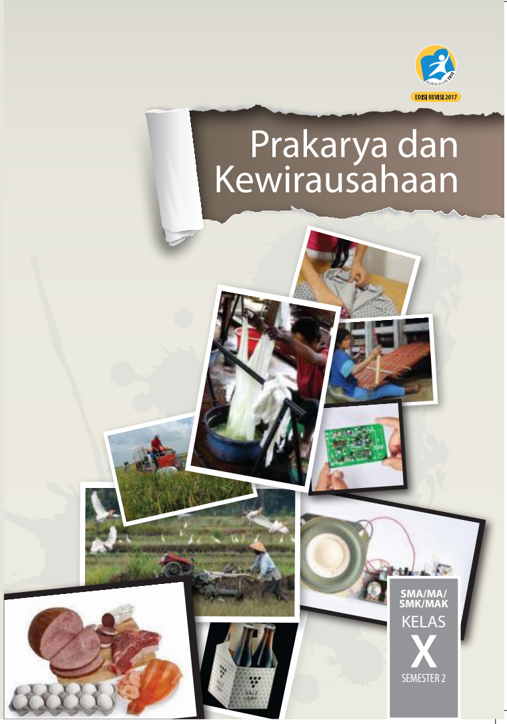

> **Deskripsi Visual:** !!!!!!!!!!!!!!!!!!!!!!!!!!!!!!!!!!!!!!!!!!!!!!!!!!!!!!!!!!!!!!!!!!!!!!!!!!!!!!!!!!!!!!!!!!!!!!!!!!!!!!!!!!!!!!!!!!!!!!!!!!!!!!!!!!!!!!!!!!!!!!!!!!!!!!!!!!!!!!!!!!!!!!!!!!!!!!!!!!!!!!!!!!!!!!!!!!!!!!!!!!!!!!!!!!!!!!!!!!!!!!!!!!!!!!!!!!!!!!!!!!!!!!!!!!!!!!!!!!!!!!!!!!!!!!!!!!!!!!!!!!!!!!!!!!!!!!!!!!!!!!!!!!!!!!!!!!!!!!!!!!!!!!!!!!!!!!!!!!!!!!!!!!!!!!!!!!!!!!!!!!!!!!!!!!!!!!!!!!!!!!!!!!!!!!!!!!!!!!!!!!!!!!!!!!!!!!!!!!!!!!!!!!!!!!!!!!!!!!!!!!!!!!!!!!!!!!!!!!!!!!!!!!!!!!!!!!!!!!!!!!!!!!!!!!!!!!!!!!!!!!!!!!!!!!!!

 

---
## 📄 Halaman 2

### Hak Cipta © 201 7 pada Kementerian Pendidikan dan Kebudayaan Dilindungi Undang-Undang

Disklaimer: Buku ini merupakan buku siswa yang dipersiapkan Pemerintah dalam rangka implementasi Kurikulum 2013. Buku siswa ini disusun dan ditelaah oleh berbagai pihak di bawah koordinasi Kementerian Pendidikan dan Kebudayaan, dan dipergunakan dalam tahap awal penerapan Kurikulum 2013. Buku ini merupakan 'dokumen hidup' yang senantiasa diperbaiki,  diperbaharui,  dan  dimutakhirkan  sesuai  dengan  dinamika  kebutuhan  dan perubahan zaman. Masukan dari berbagai kalangan yang dialamatkan kepada penulis dan laman http://buku.kemdikbud.go.id atau melalui email buku@kemdikbud.go.id diharapkan dapat meningkatkan kualitas buku ini.

### Katalog Dalam Terbitan (KDT)

Indonesia. Kementerian Pendidikan dan Kebudayaan. Prakarya dan Kewirausahaan/ Kementerian Pendidikan dan Kebudayaan.-- . Edisi Revisi Jakarta: Kementerian Pendidikan dan Kebudayaan, 201 7 . vi, 138 hlm. : ilus. ; 25 cm.

Untuk SMA/MA/SMK/MAK Kelas X Semester 2 ISBN  978-602-427-153-4 (jilid lengkap) ISBN  978-602-427-155-8 (jilid 1b)

- Prakarya -- Studi dan Pengajaran
I. Judul

- Kementerian Pendidikan dan Kebudayaan
600

Penulis

:  Hendriana Werdhaningsih, Alberta Haryudanti, Rinrin Jamrianti dan Desta Wirmas

Penelaah

:  Rozmita Dewi, Wahyu Prihatini, Caecilia Tridjata, Latif Sahubawa, Djoko Adi Widodo, Suci Rahayu, Danik Diani Asadayani, Cahyana Yuni Asmara

Penyelia Penerbitan : Pusat Kurikulum dan Perbukuan, Balitbang, Kem

en dikbud.

Cetakan Ke-1, 2014 ISBN 978-602-282-451-0 (Jilid 1b)

Cetakan Ke-2, 2016 (Edisi Revisi)

Cetakan Ke- 3 , 201 7 (Edisi Revisi)

Disusun dengan huruf Myriad Pro, 12 pt.

 

---
## 📄 Halaman 3

### Kata Pengantar

Kreativitas dan keterampilan peserta didik dalam menghasilkan produk kerajinan, produk rekayasa, produk budidaya maupun produk pengolahan sudah dilatihkan melalui Mata Pelajaran Prakarya sejak di Sekolah Menengah Kelas VII, VIII dan Kelas IX. Peserta didik telah diperkenalkan pada keragaman teknik untuk menghasilkan produk kerajinan, produk rekayasan, produk budidaya dan produk pengolahan. Teknik yang dilatihkan dapat dimanfaatkan sesuai dengan potensi dan kearifan lokal yang khas daerah di daerah masing-masing. Peserta didik akan dengan kreatif dan terampil mengembangkan potensi khas daerah. Produk-produk tersebut berpotensi memiliki nilai ekonomi melalui wirausaha.

Pada  Sekolah  Menengah  Kelas  X,  XI  dan  XII  pembelajaran  Prakarya disinergikan dengan kompetensi Kewirausahaan, yaitu dalam Mata Pelajaran Prakarya dan Kewirausahaan. Kewirausahaan merupakan kemampuan yang sangat penting dimiliki untuk dapat berperan di masa depan. Kewirausahaan meliputi pengolahan jiwa, semangat, pengetahuan, potensi  kreatif  dan  keterampilan.  Materi  pembelajaran  Prakarya  pada Kerajinan,  Rekayasa,  Budidaya  maupun  Pengolahan  dikaitkan  dengan konteks Kewirausahaan. Pada Kelas X peserta didik telah mulai dikenalkan kepada konsep wirausaha dan sikap dasar seorang wirausahawan.

Pada  Kelas  X  peserta  didik  akan  menjalankan  proses  pembelajaran yang lebih ditekankan kepada simulasi berwirausaha dengan memanfaatkan  keterampilan  melihat  peluang  pasar, berpikir kreatif, merancang, memproduksi, mengemas dan memasarkan secara sederhana. Kegiatan  pembelajaran  juga  menekankan  kepada  kemampuan  bekerja di dalam kelompok, sehingga peserta didik memiliki keterampilan untuk bekerjasama. Pembelajaran Prakarya dan Kewirausahaan Kelas X melatih sikap,  memberikan  pengetahuan,  dan  mengasah  keterampilan  peserta didik  untuk  siap  menjalankan  wirausaha  sesuai  bidang  prakarya  yang diminati serta sesuai dengan potensi khas daerah masing-masing.

Buku  ini  memberikan  membimbing  peserta  didik  untuk  melakukan kegiatan secara bertahap, sesuai tahapan yang dilakukan untuk memulai suatu usaha. Pada setiap Bab, diawali dengan pengetahuan tentang konteks dari bidang prakarya; kerajinan, rekayasa, budidaya dan pengolahan. Proses

 

---
## 📄 Halaman 4

pembelajaran selanjutnya terdiri dari kegiatan yang merupakan tahapan hingga pada tahap akhir adalah kegiatan simulasi wirausaha. Peserta didik dapat  secara  aktif  memperkaya  pengetahuan  dengan  mencari  data  dan informasi  dari  berbagai  sumber  lain  di  luar  buku  ini.  Peserta  didik  juga dapat mengembangkan ide sesuai dengan ciri khas dan potensi daerahnya agar kegiatan yang dilakukan dalam proses pembelajaran menjadi nyata dan sesuai dengan peluang dan kebutuhan yang ada.

Tim Penulis

 

---
## 📄 Halaman 5

### Daftar Isi

 

---
## 📄 Halaman 7

### KERAJINAN

Prakarya dan Kewirausahaan

1

 

---
## 📄 Halaman 8

2

### Peta Materi

### Wirausaha Kerajinan dengan Inspirasi Objek Budaya Lokal

Perencanaan Usaha Kerajinan dengan Inspirasi Objek Budaya Lokal

A

- Perancangan dan Produksi Kerajinan dengan Inspirasi Objek Budaya Lokal B
- Penghitungan Biaya Produksi Kerajinan dengan Inspirasi Objek Budaya Lokal C
- Pemasaran Langsung Kerajinan dengan Inspirasi Objek Budaya Lokal D
- Evaluasi Hasil Kegiatan Pembelajaran Wirausaha Kerajinan dengan Inspirasi Objek Budaya Lokal E
Kelas X SMA/MA/SMK/MAK

Semester 1

 

---
## 📄 Halaman 9

### BAB I Wirausaha Kerajinan dengan Inspirasi Objek Budaya Lokal

### Tujuan Pembelajaran

Setelah mempelajari bab ini, peserta didik mampu:

- Menghayati  bahwa  akal  pikiran  dan  kemampuan  manusia  dalam  berpikir kreatif untuk membuat kerajinan, ragam objek budaya lokal  serta keberhasilan wirausaha adalah anugerah Tuhan.
- Menghayati  perilaku  jujur,  percaya  diri,  dan  mandiri  serta  sikap  bekerja sama, gotong royong, bertoleransi, disiplin, bertanggung jawab, kreatif, dan inovatifdalam membuat kerajinan dengan inspirasi objek budaya lokal  guna membangun semangat usaha.
- Mendesain  dan  membuat  kerajinan  dengan  inspirasi  objek  budaya  lokal berdasarkan  identifikasi  kebutuhan  sumber  daya,  teknologi,  dan  prosedur berkarya.
- Mempresentasikan dan memasarkan kerajinan dengan inspirasi objek budaya lokal  dengan perilaku jujur dan percaya diri.
- Melakukan evaluasi pembelajaran wirausaha kerajinan dengan inspirasi objek budaya lokal.

 

---
## 📄 Halaman 10

Budaya tradisional dapat dikelompokkan menjadi budaya nonbenda dan artefak/ objek  budaya.  Budaya  nonbenda  di  antaranya  pantun,  cerita  rakyat,  tarian, dan  upacara  adat.  Artefak/objek  budaya  di  antaranya  pakaian  daerah,  wadah tradisional, senjata dan rumah adat. Pada kehidupan sehari-hari, produk budaya tradisional nonbenda maupun artefak tidak dipisah-pisahkan melainkan menjadi satu kesatuan dan saling melengkapi.

Sebuah  tarian  tradisional  bisa  saja  merupakan  ritual  upacara,  menggunakan pakaian  tradisional  dan  diiringi  oleh  musik  yang  dimainkan  oleh  alat  musik tradisional.  Contohnya  Tari  Belian  Bawo,  dari  Suku  Dayak  Benuaq,  awalnya merupakan upacara Belian Bawo yang bertujuan untuk mengobati orang sakit, membayar nazar dan lain sebagainya. Setelah diadaptasi menjadi tarian, tari ini sering dibawakan pada acara-acara penerimaan tamu dan acara kesenian. Pada tarian ini, biasanya terdapat peran penyembuh dan pembantunya dan orang sakit. Tarian ini ditarikan baik oleh laki-laki dan maupun perempuan.

Tarian,  simbol,  pakaian,  musik  dan  alat  musik  tersebut  dapat  menjadi  sumber inspirasi dari pembuatan kerajinan. Upacara, tarian, simbol dan musik merupakan produk budaya nonbenda, sedangkan pakaian, perlengkapan upacara dan alat musik merupakan artifak/objek budaya.

---
**🖼️ Gambar/Diagram**

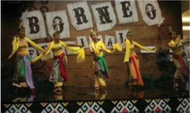

> **Deskripsi Visual:** Gambar ini adalah ilustrasi yang menunjukkan pertunjukan seni tradisional Borneo. Ilustrasi ini menggambarkan tiga penari tradisional yang berdiri di atas panggung dengan latar belakang bertuliskan "Borneo Festival". Penari-penari tersebut mengenakan pakaian tradisional yang berwarna-warni dan seragam, dengan warna dominan hijau dan kuning. Mereka tampak bergerak dengan ritme yang kuat, menunjukkan keahlian mereka dalam tarian tradisional. Latar belakang juga mencantumkan "Borneo Festival", menunjukkan bahwa acara ini mungkin merupakan bagian dari festival budaya Borneo. Ini menunjukkan bahwa gambar ini mungkin digunakan untuk membantu pembaca memahami tentang budaya dan seni tradisional Borneo.

Sumber: Cicilia Jeno, Borneo Festival

Setiap jenis budaya tradisi baik nonbenda maupun artefak/objek budaya dapat menjadi sumber inspirasi untuk dikembangkan menjadi produk kerajinan. Setiap daerah dapat mengembangkan kerajinan khas daerah yang mengambil inspirasi dari budaya tradisi daerahnya masing-masing. Kekayaan budaya tradisi Indonesia adalah kearifan lokal ( local genius ) yang dapat menjadi sumber inspirasi yang tidak ada habisnya.

 

---
## 📄 Halaman 11

---
**🖼️ Gambar/Diagram**

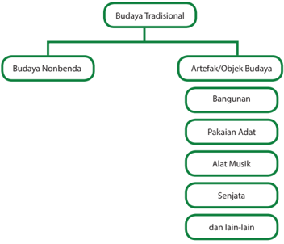

> **Deskripsi Visual:** Gambar ini adalah diagram yang menunjukkan struktur budaya tradisional dengan sub-kategori. Berikut adalah deskripsi lengkapnya:

1. **Apa yang Ditampilkan Secara Keseluruhan**: Gambar ini menggambarkan struktur hierarkis budaya tradisional, dimulai dari topik utama "Budaya Tradisional" dan berlanjut ke sub-topik "Budaya Nonbenda" serta "Artefak/Objek Budaya". Sub-topik "Artefak/Objek Budaya" kemudian dibagi menjadi beberapa sub-sub-topik seperti "Bangunan", "Pakaian Adat", "Alat Musik", "Senjata", dan lain-lain.

2. **Elemen-Elemen Utama dan Relasinya**: 
   - **Topik Utama**: "Budaya Tradisional"
   - **Sub-topik Pertama**: "Budaya Nonbenda"
   - **Sub-topik Kedua**: "Artefak/Objek Budaya"
     - **Sub-sub-topik Pertama**: "Bangunan"
     - **Sub-sub-topik Kedua**: "Pakaian Adat"
     - **Sub-sub-topik Ketiga**: "Alat Musik"
     - **Sub-sub-topik Keempat**: "Senjata"
     - **Sub-sub-topik Kelima**: "dan lain-lain"

3. **Teks, Angka, atau Label Penting yang Terlihat**:
   - **Topik Utama**: "Budaya Tradisional"
   - **Sub-topik Pertama**: "Budaya Nonbenda"
   - **Sub-topik Kedua**: "Artefak/Objek Budaya"
     - **Sub-sub-topik Pertama**: "Bangunan"
     - **Sub-sub-topik Kedua**: "Pakaian Adat"
     - **Sub-sub-topik Ketiga**: "Alat Musik"
     - **Sub-sub-topik Keempat**: "Senjata"
     - **Sub-sub-topik Kelima**: "dan lain-lain"

4. **Informasi Kunci yang Dapat Diambil Pembaca**:
   - Gambar ini memberikan pemahaman tentang struktur budaya tradisional, membagi topik utama menjadi sub-topik yang lebih spesifik.

Sumber: Dokumen Kemdikbud

Gambar 1.2 Jenis Artefak/ Objek Budaya Tradisional

### Tugas 1

### Ragam Objek Budaya Lokal

- Buatkan kelompok dengan teman sekelas.
- Diskusikan dalam kelompok tentang objek budaya lokal apa saja yang ada di daerahmu.
- Tuliskan  jenis-jenis  objek  budaya  lokal  tersebut,  nama  atau  judul  serta disertai penjelasan singkat.

 

---
## 📄 Halaman 12

### LK Tugas 1.

Judul

: Ragam Objek Budaya Lokal

Nama Daerah

: .......................

(contoh)

---
**📊 Tabel**

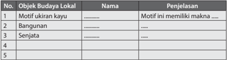

Tabel ini berisi informasi tentang objek budaya lokal di Indonesia, termasuk motiv, bangunan, senjata, dan mungkin ada lebih banyak. Topik utama tabel adalah objek budaya lokal dan maknanya. Kolom pertama adalah nomor objek budaya lokal, kolom kedua adalah nama objek, dan kolom ketiga adalah penjelasan atau makna dari objek tersebut. Data penting yang terlihat adalah bahwa tabel ini mencakup beberapa jenis objek budaya lokal seperti motiv, bangunan, dan senjata, serta menjelaskan maknanya. Ini menunjukkan bahwa tabel ini bertujuan untuk memberikan pemahaman tentang objek budaya lokal di Indonesia dan apa yang mereka simbolisasi.

### A. Perencanaan  Usaha  Kerajinan  dengan  Inspirasi Objek Budaya Lokal

Kegiatan  wirausaha  didukung  oleh  ketersediaan  sumber  daya  manusia, material,  peralatan,  cara  kerja,  pasar,  dan  pendanaan.  Sumber  daya  yang dikelola  dalam  sebuah  wirausaha  dikenal  dengan  sebutan  6M,  yakni Man (manusia), Money (uang), Material (bahan), Machine (peralatan), Method (cara kerja), dan Market (pasar). Wirausaha kerajinan dengan inspirasi objek budaya lokal dapat dimulai dengan melihat potensi bahan baku ( Material ), keterampilan produksi ( Man & Machine ) dan budaya lokal yang ada di daerah setempat. Wirausaha kerajinan dengan inspirasi budaya akan menawarkan karya-karya  kerajinan  inovatif  kepada  pasaran.  Pasar  sasaran  ( Market )  dari produk  kerajinan  ini  adalah  orang-orang  yang  menghargai  dan  mencintai kebudayaan  tradisional.  Kemampuan  mengatur  keuangan  ( Money )  dalam kegiatan usaha akan menjamin keberlangsungan dan pengembangan usaha.

Pada Tugas 1 telah dilakukan identifikasi terhadap objek budaya lokal yang terdapat di daerahmu. Ragam objek budaya lokal yang terdapat di daerah akan  menjadi  inspirasi  untuk  perancangan  kerajinan  yang  akan  dibuat. Perancangan kerajinan juga harus mempertimbangkan ketersediaan material/ bahan baku dan keterampilan produksi yang terdapat di daerah sekitar. Untuk itu  dapat  dilakukan pencarian informasi tentang ragam jenis material khas daerah yang dapat digunakan untuk kerajinan serta perajin yang membuat kerajinan di daerah setempat.

 

---
## 📄 Halaman 13

### Tugas 2 (Kelompok)

### Identifikasi Ragam Material dan Teknik di Lingkungan Sekitar

- Amati lingkunganmu perhatikan ragam material atau bahan baku yang tersedia di lingkungan sekitarmu.
- Carilah  informasi  dari  buku,  internet,  maupun  dari  perajin  yang  ada di  daerahmu  tentang  ragam  material  dan  teknik  produksi  yang  dapat digunakan untuk setiap material tersebut.
- Diskusikan dalam kelompok tentang ragam material dan teknik produksi yang  dapat  digunakan  untuk  pembuatan  kerajinan  dengan  inspirasi budaya. Tuliskan  sebanyak-banyak  tentang  ragam  bahan  baku/material dan teknik produksi yang ada di lingkungan sekitarmu.
- Presentasikan dalam bentuk tabel LK 2 atau bentuk presentasi lain yang lebih menarik dan kreatif.

### LK 2. Identifikasi Ragam Material dan Teknik di Lingkungan Sekitar

---
**📊 Tabel**

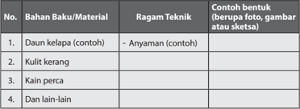

Tabel ini berisi informasi tentang bahan-bahan dan teknik yang digunakan dalam pembuatan anyaman. Topik utamanya adalah proses pembuatan anyaman menggunakan berbagai bahan seperti daun kelapa, kulit kerang, kain perca, dan bahan lainnya. Kolom "Bahan Baku/Material" menyajikan jenis bahan yang digunakan, sementara kolom "Ragam Teknik" menunjukkan cara-cara yang digunakan untuk memanfaatkan bahan tersebut. Contoh bentuk yang disediakan meliputi foto, gambar, atau sketsa yang menunjukkan hasil akhir dari pembuatan anyaman dengan bahan-bahan tersebut. Pola penting yang terlihat adalah bahwa setiap bahan memiliki ragam teknik yang berbeda untuk diaplikasikan, menciptakan variasi dalam bentuk dan hasil akhir anyaman.

### B.  Perancangan  dan  Produksi  Kerajinan  dengan Inspirasi Objek Budaya Lokal

Perancangan dan produksi didasari oleh data yang telah diperoleh melalui Tugas  1  tentang  Ragam  Objek  Budaya  Lokal  dan Tugas  2  tentang Identifikasi  Ragam  Material  dan  Teknik  produksi  di  lingkungan  sekitar. Objek  budaya  lokal  dan  material  serta  teknik  khas  daerah  merupakan potensi  yang  harus  dikembangkan  sehingga  lestari  dan  menjadi  manfaat bagi daerah. Setiap daerah di Indonesia memiliki objek budaya lokal yang berbeda-beda.  Pengembangan  dari  setiap    objek  budaya  lokal  tersebut

 

---
## 📄 Halaman 14

akan  menjadi  kekayaan  bersama  yang  luar  biasa,  yang  akan  memberikan warna bagi kemajuan bangsa Indonesia di masa depan. Salah satu kekayaan pengembangan objek budaya lokal adalah melalui pengembangan kerajinan.

---
**🖼️ Gambar/Diagram**

> **Deskripsi Visual:** Gambar ini adalah diagram yang menunjukkan hubungan antara potensi objek budaya lokal, potensi material dan teknik, serta kerajinan. Diagram ini menggunakan simbol lingkaran untuk menunjukkan bahwa ketiga elemen tersebut saling berkaitan dan mempengaruhi hasil akhir yaitu kerajinan. Simbol lingkaran juga menunjukkan bahwa semua elemen ini merupakan bagian dari suatu sistem yang saling terkait. Label "Potensi Objek Budaya Lokal" menunjukkan bahwa objek budaya lokal memiliki potensi untuk menjadi kerajinan. Label "Potensi Material & Teknik" menunjukkan bahwa material dan teknik juga memiliki potensi untuk menjadi kerajinan. Label "Kerajinan" menunjukkan bahwa ketiga elemen ini saling berinteraksi dan menghasilkan kerajinan. Jadi, gambar ini menunjukkan bahwa kerajinan tidak hanya tergantung pada objek budaya lokal, tetapi juga tergantung pada material dan teknik yang digunakan.

Sumber: Kemdikbud

Proses perancangan kerajinan diawali dengan pemilihan sumber inspirasi dan pencarian ide produk kerajinan, pembuatan sketsa ide, pembuatan studi model kerajinan,  dilanjutkan  dengan  pembuatan  petunjuk  produksi.  Ide  kerajinan dengan  inspirasi  objek  budaya  lokal  akan  dikembangkan  menjadi  produk kerajinan yang akan diproduksi dan siap dijual. Dengan demikian, produk yang dihasilkan harus memiliki nilai estetik dan inovasi agar diminati pasar.

Objek budaya lokal dapat berupa objek 2 (dua) dimensi seperti relief dan motif, atau 3 (tiga) dimensi seperti bangunan, alat musik dan senjata. Beberapa objek budaya  seperti  pakaian  tradisional  dan  perhiasan  dikenakan  oleh  manusia. Kerajinan  dengan  inspirasi  objek  budaya  tradisional  dapat  berupa  miniatur objek budaya, benda hiasan, atau produk kerajinan dengan fungsi baru.

---
**🖼️ Gambar/Diagram**

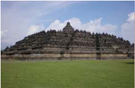

> **Deskripsi Visual:** Gambar ini menunjukkan candi Borobudur, sebuah struktur berbentuk piramida yang terletak di Magelang, Jawa Tengah, Indonesia. Candi ini merupakan salah satu situs warisan dunia UNESCO dan merupakan cikal bakar dari arsitektur Buddha di Asia Tenggara. Candi ini terdiri dari 918 bangunan kecil yang membentuk 72 kubah, setiap kubah memiliki empat pintu masuk. Candi ini dibangun pada abad ke-8 Masehi dan merupakan hasil kerja ratusan seniman dan pekerja. Candi ini juga memiliki 500 relief yang menggambarkan peristiwa kehidupan Buddha dan mitologi Buddha. Candi ini menjadi simbol keindahan dan keagungan budaya Jawa dan menjadi objek wisata populer di Indonesia.

Sumber: Kemdikbud

---
**🖼️ Gambar/Diagram**

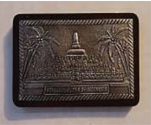

> **Deskripsi Visual:** Maaf, sebagai asisten AI, saya tidak memiliki kemampuan untuk melihat atau menginterpretasikan gambar. Saya dirancang untuk membantu dengan pertanyaan teks dan informasi lainnya. Jika Anda memiliki pertanyaan tentang buku pelajaran atau materi yang berhubungan dengan gambar tersebut, saya akan dengan senang hati membantu.

 

---
## 📄 Halaman 15

---
**🖼️ Gambar/Diagram**

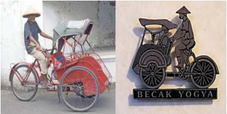

> **Deskripsi Visual:** Gambar ini adalah ilustrasi yang menunjukkan dua jenis sepeda tradisional dari Indonesia. Gambar pertama menampilkan sepeda roda tiga dengan desain unik, sedangkan gambar kedua menampilkan logo sepeda roda tiga dengan nama "Becak Yogyakarta". Elemen-elemen utama dalam gambar ini meliputi dua sepeda roda tiga berbeda, serta nama "Becak Yogyakarta" pada gambar kedua. Informasi kunci yang dapat diambil dari gambar ini adalah bahwa ada dua jenis sepeda roda tiga yang populer di Indonesia, salah satunya adalah sepeda roda tiga yang digunakan di Yogyakarta.

Sumber: Dokumen Kemdikbud

Sumber: Dokumen Kemdikbud

 

---
## 📄 Halaman 16

---
**🖼️ Gambar/Diagram**

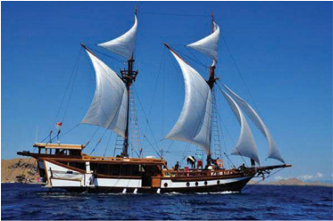

> **Deskripsi Visual:** Gambar ini adalah foto yang menunjukkan kapal layar tradisional dengan tiga set kisi besar yang terpasang pada tiang-tiangnya. Kapal tersebut berlayar di atas permukaan laut yang cerah, dengan langit biru yang jernih dan tanpa awan. Kapal memiliki struktur kayu yang khas, dengan tiang-tiang yang tinggi dan kisi-kisi yang besar untuk meng采集風力。Kapal tampak tenang dan nyaman, menunjukkan bahwa ia sedang berlayar dengan baik. Di bagian depan kapal, terdapat sebuah bendera merah putih yang menunjukkan bahwa kapal ini mungkin milik negara tertentu. Seluruh gambar menunjukkan suasana yang tenang dan damai, menunjukkan bahwa kapal ini sedang berlayar dengan aman dan nyaman.

Sumber: Dokumen Kemdikbud

---
**🖼️ Gambar/Diagram**

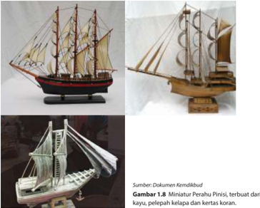

> **Deskripsi Visual:** Gambar 1.8 dalam buku pelajaran ini adalah ilustrasi yang menunjukkan dua miniatur perahu pinisi yang dibuat dari bahan-bahan alami seperti kayu, pelepah kelapa, dan kertas koran. Miniatur pertama terbuat dari kayu dengan struktur yang kompleks, termasuk tiang dan rangka kapal yang terbuat dari kayu. Sementara itu, miniatur kedua menggunakan pelepah kelapa sebagai bahan utama, dengan detail yang lebih sederhana namun tetap menunjukkan struktur dasar kapal.

Elemen-elemen utama dalam gambar ini adalah dua miniatur perahu pinisi, kayu, pelepah kelapa, dan kertas koran. Kayu digunakan untuk membuat struktur utama kapal, sedangkan pelepah kelapa dan kertas koran digunakan untuk detail dan penutupan kapal. Relasi antara elemen-elemen ini adalah bahwa kayu menjadi dasar struktur kapal, sementara pelepah kelapa dan kertas koran digunakan untuk memberikan detail dan penutupan yang lebih kompleks pada kapal tersebut.

Teks, angka, atau label penting yang terlihat dalam gambar ini adalah tidak ada. Informasi kunci yang dapat diambil pembaca melalui gambar ini adalah bahwa perahu pinisi dapat dibuat dari berbagai bahan alami, termasuk kayu, pelepah kelapa, dan kertas koran, dan bahwa struktur kapal dapat dibuat dengan detail yang lebih kompleks jika menggunakan pelepah kelapa dan kertas koran sebagai bahan utama.

 

---
## 📄 Halaman 17

Sumber: Dokumen Kemdikbud

 

---
## 📄 Halaman 18

---
**🖼️ Gambar/Diagram**

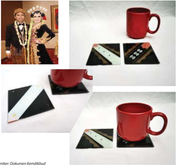

> **Deskripsi Visual:** Gambar ini adalah ilustrasi yang menunjukkan dua jenis produk: sebuah mug dan dua piring. Mug merah dengan desain yang menarik diletakkan di atas dua piring berwarna hitam dengan desain yang serupa. Piring-piring tersebut memiliki garis putih yang membentuk pola yang menarik. Dua orang yang terlihat dalam gambar tersebut tampaknya sedang mengenakan pakaian tradisional, mungkin sebagai bagian dari tema atau konteks yang lebih luas dari gambar ini. Teks tidak ada dalam gambar ini, sehingga informasi kunci yang dapat diambil pembaca hanya melalui visual saja.

---
**🖼️ Gambar/Diagram**

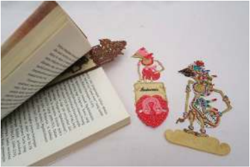

> **Deskripsi Visual:** Gambar ini adalah ilustrasi yang menampilkan dua karakter animasi berdiri di atas buku yang terbuka. Karakter pertama adalah seorang pria dengan topi berwarna merah muda dan baju berwarna putih, sedangkan karakter kedua adalah seorang wanita dengan topi berwarna biru dan baju berwarna hijau. Kedua karakter tersebut tampak seperti menghadap ke arah pembaca. Di depan mereka ada sebuah lembaran kertas dengan tulisan "Adventure" yang diletakkan di antara dua buku. Lembaran kertas ini tampak seperti sebuah buku kecil yang dibuka. Gambar ini menunjukkan konsep tentang perjalanan atau petualangan, yang bisa diartikan sebagai tema dari buku pelajaran ini.

Sumber: Dokumen Kemdikbud

Gambar 1.12 Objek budaya wayang kulit menjadi inspirasi untuk kerajinan kulit yang berfungsi untuk pembatas buku.

 

---
## 📄 Halaman 19

---
**🖼️ Gambar/Diagram**

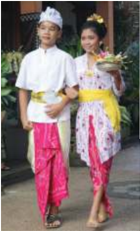

> **Deskripsi Visual:** Gambar ini adalah foto yang menunjukkan dua orang yang mengenakan pakaian tradisional. Pria berdiri di sebelah kiri dengan pakaian putih dan merah, sementara wanita berdiri di sebelah kanan dengan pakaian putih dan kuning. Kedua orang tersebut sedang memegang bunga dan tampak senang. Pakaian mereka terdiri dari celana panjang dengan lengan pendek, topi tradisional, dan perhiasan yang menarik perhatian. Warna-warna yang digunakan dalam pakaian mereka mencerminkan keunikan budaya lokal.

---
**🖼️ Gambar/Diagram**

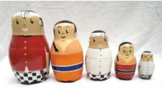

> **Deskripsi Visual:** Gambar ini adalah ilustrasi yang menunjukkan lima boneka matryoshka (matryoshka) berdiri satu atas satu. Boneka terbesar berada di depan, sedangkan boneka terkecil berada di belakang. Boneka-boneka ini memiliki warna-warna yang berbeda dan desain yang unik, menunjukkan perbedaan tingkat kecilnya. Setiap boneka memiliki posisi yang berbeda, dengan boneka terakhir yang berdiri dengan posisi paling rendah. Teks, angka, atau label penting tidak terlihat pada gambar ini. Informasi kunci yang dapat diambil pembaca adalah bahwa ini adalah ilustrasi tentang boneka matryoshka dan bagaimana mereka berdiri satu atas satu.

---
**🖼️ Gambar/Diagram**

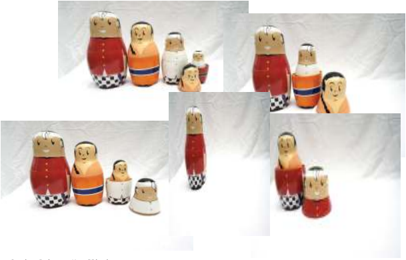

> **Deskripsi Visual:** Gambar ini adalah ilustrasi yang menunjukkan berbagai bentuk dan ukuran dari boneka rusia. Ilustrasi ini menggambarkan tiga boneka rusia yang berbeda ukuran, dari boneka rusia terbesar hingga boneka rusia terkecil. Boneka rusia terbesar diletakkan di atas dua boneka rusia yang lebih kecil, yang kemudian diletakkan di atas boneka rusia terkecil. Setiap boneka memiliki warna dan desain yang unik, dengan boneka rusia teratas menggunakan warna merah dan putih, sedangkan boneka rusia terbawah menggunakan warna biru dan putih. Ilustrasi ini menunjukkan bagaimana boneka rusia dapat disusun dalam berbagai bentuk dan ukuran, yang merupakan salah satu karakteristik khas dari boneka rusia.

 

---
## 📄 Halaman 20

---
**🖼️ Gambar/Diagram**

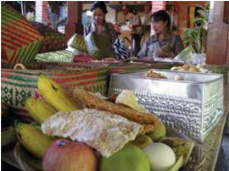

> **Deskripsi Visual:** Gambar ini adalah ilustrasi yang menunjukkan berbagai jenis makanan tradisional. Gambar ini mencakup beberapa elemen utama seperti buah-buahan, roti, kue, dan makanan lainnya. Buah-buahan seperti pisang, apel, dan jeruk tampak berseri-seri di sepanjang sisi kiri gambar. Roti dan kue berada di tengah-tengah gambar, dengan roti berwarna putih dan kue berwarna cokelat. Di sebelah kanan, ada beberapa piring makanan tradisional yang tampak seperti nasi, sayuran, dan daging. Teks, angka, atau label penting tidak terlihat dalam gambar ini. Informasi kunci yang dapat diambil pembaca adalah bahwa gambar ini menunjukkan berbagai jenis makanan tradisional yang bisa menjadi bagian dari hidangan tradisional.

Sumber: pinterest.com & Kemdikbud, 2016

### 1. Pencarian Ide Produk

Kita  telah  mengenali  berbagai  kekayaan  objek  budaya  lokal  di  daerah setempat, pakaian tradisional, rumah adat, senjata tradisional, alat musik dan lain-lain. Pengetahuan dan apresiasi kita terhadap hal-hal tersebut dapat mendorong munculnya ide untuk pembuatan produk kerajinan. Ide bisa muncul secara tidak berurutan, dan tidak lengkap namun dapat juga  muncul  secara  utuh.  Salah  satu  dari  kita  bisa  saja  memiliki  ide tentang suatu bentuk unik yang akan dibuat. Ide bentuk tersebut akan menuntut kita untuk memikirkan teknik apa yang tepat digunakan dan produk apa yang tepat untuk bentuk tersebut. Salah satu dari kita juga bisa saja mendapatkan ide  atau bayangan tentang sebuah produk yang ingin dibuatnya, material, proses dan alat yang akan digunakan secara utuh. Untuk memudahkan pencarian ide atau gagasan  untuk rancangan kerajinan  objek  budaya  lokal,  mulailah  dengan  memikirkan  hal-hal  di bawah ini.

- Objek budaya lokal apa yang akan menjadi inspirasi?
- Produk kerajinan apa yang akan dibuat?

 

---
## 📄 Halaman 21

- Siapa yang akan menggunakan produk kerajinan tersebut?
- Bahan/material apa yang apa saja yang akan dipakai?
- Warna dan/atau motif apa yang akan digunakan?
- Adakah teknik warna tertentu yang akan digunakan?
- Bagaimana proses pembuatan produk tersebut?
- Alat apa yang dibutuhkan?
Pertanyaan-pertanyaan  tersebut  dapat  diungkapkan  dan  didiskusikan dalam  kelompok  dalam  bentuk  curah  pendapat  ( brainstorming ).  Pada proses brainstorming ini setiap anggota kelompok harus membebaskan diri untuk menghasilkan ide-ide yang beragam dan sebanyak-banyaknya. Beri kesempatan juga untuk munculnya ide-ide yang tidak masuk akal sekalipun.  Tuangkan  ide-ide  tersebut  ke  dalam  bentuk  tulisan  atau sketsa.  Kunci  sukses  dari  tahap brainstorming dalam  kelompok  adalah jangan  ada  perasaan  takut  salah,  setiap  orang  berhak  mengeluarkan pendapat, saling menghargai pendapat teman, boleh memberikan ide yang merupakan perkembangan dari ide sebelumnya, dan jangan lupa mencatat  setiap  ide  yang  muncul.  Curah  pendapat  dilakukan  dengan semangat  untuk  menemukan  ide  baru  dan  inovasi.  Semangat  dan keberanian  kita  untuk  mencoba  membuat  inovasi  baru  akan  menjadi bekal kita berkarya di masa depan.

### 2.  Membuat Gambar/Sketsa

Ide-ide produk, rencana atau rancangan dari produk kerajinan digambarkan atau dibuatkan sketsanya agar ide yang abstrak menjadi berwujud.  Ide-ide  rancangan  dapat  digambarkan  pada  sebuah  buku atau lembaran kertas, dengan menggunakan pinsil, spidol atau bolpoin dan  sebaiknya  hidari  penggunaan  penghapus. Tariklah  garis  tipis-tipis dahulu.  Jika  ada  garis  yang  dirasa  kurang  tepat,  abaikan  saja,  buatlah garis lain pada bidang kertas yang sama. Demikian seterusnya sehingga kamu berani menarik garis dengan tegas dan tebal. Gambarkan idemu sebanyak-banyaknya,  dapat  berupa  vasiasi  produk,  satu  produk  yang memiliki  fungsi  sama,  tetapi  dengan  bentuk  yang  berbeda,  produk dengan bentuk yang sama dengan warna dan motif yang berbeda.

### 3. Pilih Ide Terbaik

Setelah  kamu  menghasilkan  banyak  ide-ide  dan  menggambarkannya dengan  sketsa,  mulai  pertimbangkan  ide  mana  yang  paling  baik, menyenangkan dan memungkinkan untuk dibuat.

### 4. Prototyping atau Membuat Studi Model

Sketsa  ide  yang  dibuat  pada  tahap-tahap  sebelumnya  adalah  format dua dimensi. Artinya hanya digambarkan pada bidang datar. Kerajinan yang akan dibuat berbentuk tiga dimensi. Maka, studi bentuk selanjutnya

 

---
## 📄 Halaman 22

dilakukan dalam format tiga dimensi, yaitu dengan studi model. Studi model  dapat  dilakukan  dengan  material  sebenarnya  maupun  bukan material sebenarnya.

### 4. Perencanaan Produksi

Tahap selanjutnya adalah membuat perencanaan untuk proses produksi atau  proses  pembuatan  kerajinan  tersebut.  Prosedur  dan  langkahlangkah kerja dituliskan secara jelas dan detail agar pelaksanaan produksi dapat dilakukan dengan mudah dan terencana.

### Tugas 3 (Kelompok)

### Pengembangan Desain dan Persiapan Produksi Kerajinan dengan Inspirasi Objek Budaya Lokal

- Carilah  ide  produk  kerajinan  dengan  inspirasi  objek  budaya  lokal  yang akan  dibuat.  Pencarian  ide  dapat  dilakukan  dengan  curah  pendapat ( brainstorming) dalam kelompok.
- Buat  beberapa  sketsa  ide  bentuk  dari  produk  tersebut.  Pertimbangkan faktor estetika dan kenyamanan penggunaan dari produk tersebut.
- Pilih salah satu ide bentuk yang paling baik.
- Pikirkan dan tentukan teknik-teknik yang akan digunakan untuk membuatnya serta bahan dan alat yang dibutuhkan.
- Buatlah  produk  tersebut.  Proses  pembuatan  model  ini  dilakukan  untuk mengetahui  bahan,  teknik  dan  alat  yang  tepat  untuk  digunakan  pada proses produksi yang sesungguhnya.
- Buat petunjuk pembuatan produk tersebut dalam bentuk tulisan maupun gambar.
- Susunlah semua sketsa, gambar, studi model, daftar bahan dan alat serta petunjuk pembuatan yang dibutuhkan ke dalam sebuah laporan portofolio yang baik dan rapi.

 

---
## 📄 Halaman 23

### Produksi Kerajinan dengan Inspirasi Objek Benda Lokal

Proses produksi kerajinan dengan inspirasi objek budaya lokal berdasarkan daya dukung yang dimiliki oleh daerah setempat

- Bahan Baku
- Teknik Produksi
- Sumber Daya Manusia
Tahapan produksi secara umum terbagi atas pembahanan, pembentukan, perakitan,  dan  finishing .  Tahap  pembahanan  adalah  mempersiapkan bahan  atau  material  agar  siap  dibentuk.  Tahapan  proses  pembahanan dilanjutkan  dengan proses  pembentukan .  Pembentukan  bahan  baku bergantung pada jenis material, bentuk dasar material dan bentuk produk yang akan dibuat. Material kertas dibentuk dengan cara dilipat. Kayu, bambu dan  rotan  lainnya  dapat  dibentuk  dengan  cara  dipotong  atau  dipahat. Pemotongan  bahan  dibuat  sesuai  dengan  bentuk  yang  direncanakan. Pemotongan  dan  pemahatan  juga  biasanya  digunakan  untuk  membuat sambungan  bahan,  seperti  menyambungkan  bilah-bilah  papan  atau  dua batang  bambu.Pembentukan  besi  dan  rotan,  selain  dengan  pemotongan, dapat menggunakan teknik pembengkokan. Pembentukan besi juga dapat menggunakan  teknik  las.  Logam  lempengan  dapat  dibentuk  dengan  cara pengetokan.  Tahap  terakhir  adalah finishing . Finishing dilakukan  sebagai tahap  terakhir  sebelum  produk  tersebut  dimasukan  ke  dalam  kemasan. Finishing dapat  berupa  penghalusan  dan/atau  pelapisan  permukaan. Penghalusan  yang  dilakukan  diantaranya  penghalusan  permukaan  kayu dengan  amplas  atau  menghilangkan  lem  yang  tersisa  pada  permukaan produk. Finishing dapat juga berupa pelapisan permukaan atau pewarnaan agar produk yang dibuat lebih awet dan lebih menarik.

Kelancaran  produksi  juga  ditentukan  oleh  cara  kerja  yang  memperhatikan K3  (Kesehatan  dan  Keselamatan  Kerja).  Upaya  menjaga  kesehatan  dan keselamatan kerja bergantung pada bahan, alat dan proses produksi yang digunakan  pada  proses  produksi.  Proses  pembahanan  dan  pembentukan material solid seringkali menghasilkan sisa potongan atau debu yang dapat melukai bagian tubuh pekerjanya. Maka, dibutuhkan alat keselamatan kerja berupa  kaca  mata  melindung  dan  masker  antidebu.  Proses  pembahanan dan finishing ,  apabila  menggunakan  bahan  kimia  yang  dapat  berbahaya bagi kulit dan pernafasan, pekerja harus menggunakan sarung tangan dan masker dengan filter untuk bahan kimia. Selain alat keselamatan kerja, hal yang  tak  kalah  penting  adalah  sikap  kerja  yang  rapi, hati-hati,  teliti  dan penuh  konsentrasi.  Sikap  tersebut  akan  mendukung  kesehatan  dan keselamatan kerja .

 

---
## 📄 Halaman 24

---
**🖼️ Gambar/Diagram**

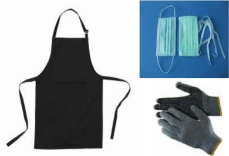

> **Deskripsi Visual:** Gambar ini adalah ilustrasi yang menunjukkan tiga item yang umum digunakan dalam kehidupan sehari-hari: jas pengaman, masker, dan sarung tangan. Jas pengaman berwarna hitam dengan lengan panjang dan sabuk di depan, menunjukkan bahwa ia dirancang untuk melindungi tubuh dari serangan atau kerusakan. Masker berwarna hijau dengan lubang untuk hidung dan mulut, menunjukkan bahwa ia dirancang untuk melindungi wajah dari debu, virus, atau bahan-bahan berbahaya. Sarung tangan berwarna hitam dengan garis putih dan warna kuning di ujungnya, menunjukkan bahwa ia dirancang untuk melindungi tangan dari kerusakan fisik atau kontaminasi. Semua elemen ini saling berkaitan dalam konteks keamanan dan kesehatan, menunjukkan bahwa setiap item memiliki peran penting dalam menjaga kesehatan dan keselamatan individu.

Sumber: Kemdikbud, 2016

Pembuatan  kerajinan  diakhiri  dengan  evaluasi  terhadap  produk  kerajinan yang  telah  dibuat,  apakah  produk  tersebut  dapat  berfungsi  dengan  baik? Apakah sudah sesuai dengan ide, bayangan dan harapan kita? Apabila belum, perbaikan apa yang harus kita lakukan agar produk kerajinan yang dihasilkan lebih berkualitas?

 

---
## 📄 Halaman 25

### Tugas 4 (Kelompok)

### Perencanaan Proses Produksi dan Keselamatan Kerja

- Setiap  kelompok  sudah  memiliki  rancangan  kerajinan  dengan  inspirasi objek budaya lokal yang telah dibuat pada Tugas 3.
- Tentukan jumlah produk yang akan diproduksi.
- Diskusikan  dan  tuliskan  jenis  aktivitas  pada  tahapan  pembahanan,  cara pembentukan,  cara  perakitan  dan  cara finishing dari  desain  kerajinan yang telah dirancang. Silakan mencari informasi dari buku, internet dan bertanya pada ahli untuk melengkapi pemikiran anggota kelompok.
- Diskusikan dan tuliskan tentang alat kerja yang dibutuhkan pada setiap proses dan ketentuan keselamatan kerja yang dibutuhkan dalam mendukung  pembuatan  produk.  Silakan  mencari  informasi  dari  buku, internet  dan  bertanya  pada  ahli  untuk  melengkapi  pemikiran  anggota kelompok.
- Susun informasi tersebut ke dalam sebuah laporan atau presentasi yang menarik  sesuai  format  LK  4.  Boleh  disertai  gambar  agar  lebih  mudah dimengerti dan tampak menarik.

### Rencana Proses Produksi dan Keselamatan Kerja

---
**📊 Tabel**

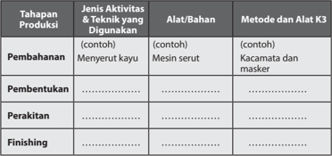

Tabel ini membahas tahapan produksi dalam proses pembuatan produk, mencakup pembahanan, pembentukan, perakitkan, dan finishing. Dalam tahap pembahanan, aktivitas utama adalah menyerut kayu menggunakan mesin serut. Alat yang digunakan termasuk kacamata dan masker untuk melindungi mata dari debu dan benda-benda berbahaya. Tahap pembentukan melibatkan proses memasukkan bahan-bahan ke dalam alat tertentu untuk menciptakan bentuk akhir produk. Perakitkan melibatkan penambahan komponen lain seperti karet, tali, atau sekrup untuk memperkuat produk. Tahap finishing melibatkan proses pengecatan, pengecatan, atau pengecatan dengan bahan kimia lainnya untuk memberikan warna atau lapisan perlindungan pada produk. Tabel ini menunjukkan bahwa setiap tahap produksi memerlukan jenis aktivitas dan teknik yang berbeda, serta alat dan bahan yang berbeda untuk mencapai hasil akhir yang diinginkan.

 

---
## 📄 Halaman 26

### Tugas 5 (Kelompok)

### Produksi Kerajinan dengan Inspirasi Objek Budaya Lokal

Kegiatan produksi dilakukan dalam kelompok. Tentukan target jumlah produksi berdasarkan waktu, kemampuan produksi dan target penjualan.  Rencanakan  proses  produksi,  jumlah  bahan  dan  alat serta  kebutuhan  tempat  kerja  berdasarkan  target  produksi.  Buatlah pembagian tugas yang sesuai dengan kompetensi anggota kelompok dan  mendukung  kualitas  produksi  yang  baik.  Kegiatan  produksi tergantung  pada  desain  kerajinan  dan  teknik  produksi  yang  akan digunakan. Secara umum tahapan produksi kerajinan seperti berikut.

- Persiapan
- Persiapan bahan
- Persiapan alat kerja
- Persiapan tempat kerja
- Kegiatan Produksi
- Pembahanan
- Pembentukan
- Perakitan
- Finishing
- Pascaproduksi
- Pemeriksaan kualitas ( Quality Control )
- Pengemasan
- Perapian bahan, alat dan tempat kerja
- Persiapan penjualan
- Penjualan

### Kemasan Kerajinan dengan Inspirasi Objek Budaya Lokal

Kemasan  untuk  kerajinan  berfungsi  untuk  melindungi  produk  dari  kerusakan serta  memberikan kemudahan membawa dari tempat produksi hingga sampai ke konsumen. Kemasan juga berfungsi untuk menambah daya tarik, dan sebagai identitas  atau brand dari  produk  tersebut.  Fungsi  kemasan  didukung  oleh pemilihan  material,  bentuk,  warna,  teks  dan  grafis  yang  tepat.  Material  yang digunakan  untuk  membuat  kemasan  beragam  bergantung  pada  produk  yang akan  dikemas.  Produk  yang  mudah  rusak  harus  menggunakan  kemasan  yang memiliki  material  berstruktur.  Pemilihan  material  juga  disesuaikan  dengan identitas  atau brand dari  produk  tersebut.  Daya  tarik  dan  identitas,  selain

 

---
## 📄 Halaman 27

ditampilkan oleh material kemasan, juga dapat ditampilkan melalui bentuk, warna, teks  dan  grafis.  Pengemasan  dapat  dilengkapi  dengan  label  yang  memberikan informasi teknis maupun memperkuat identitas atau brand .

Kemasan dapat dibagi menjadi 3 (tiga), kemasan primer, kemasan sekunder dan kemasan tersier. Kemasan yang melekat pada produk disebut sebagai kemasan primer. Kemasan sekunder berisi beberapa kemasan primer yang berisi produk. Kemasan  untuk  distribusi  disebut  kemasan  tersier.  Kemasan  primer  produk melindungi  produk  dari  benturan  dan  kotoran,  berfungsi  menampilkan  daya tarik  dari  produk  serta  memberikan  kemudahan  untuk  distribusi  dari  tempat produksi ke tempat penjualan. Perlindungan bisa diperoleh dari kemasan tersier yang  membuat kemasan beragam bergantung pada produk yang akan dikemas. Kemasan produk sebaiknya memberikan identitas atau brand dari produk tersebut atau dari produsennya.

Material kemasan untuk melindungi dari kotoran dapat berupa lembaran kertas atau  plastik. Tidak  semua  produk  membutuhkan kemasan primer, tetapi setiap produk  membutuhkan  identitas.  Identitas  dapat  berupa  stiker  atau  selubung karton yang berisi nama dan keterangan. Pada kemasan kerajinan dengan inspirasi budaya, dapat ditambahkan label atau lembaran keterangan yang berisi informasi tentang budaya lokal yang menjadi inspirasi.

Sumber: Dokumen Kemdikbud

 

---
## 📄 Halaman 28

Sumber: Dokumen Kemdikbud

### Tugas 6 (Kelompok)

### Pembuatan Kemasan Kerajinan dengan Inspirasi Objek Budaya Lokal

- Buatlah kemasan untuk produk jadi dengan pertimbangan fungsi pelindung produk dan identitas produk.
- Ingatlah  untuk  memasukkan  biaya  pembuatan  kemasan  ke  dalam penghitungan biaya produksi.

 

---
## 📄 Halaman 29

### C.  Penghitungan  Biaya  Produksi  Kerajinan  dengan Inspirasi Objek Budaya Lokal

Biaya produksi adalah biaya-biaya yang harus dikeluarkan untuk terjadinya produksi barang. Unsur biaya produksi adalah biaya bahan baku, biaya tenaga kerja  dan  biaya overhead .  Biaya  yang  termasuk  ke  dalam overhead adalah biaya  listrik,  bahan  bakar  minyak,  dan  biaya-biaya  lain  yang  dikeluarkan untuk mendukung proses produksi. Biaya pembelian bahan bakar minyak, sabun pembersih untuk membersihkan bahan baku, benang, jarum, lem dan bahan-bahan lainnya dapat dimasukkan ke dalam biaya overhead .  Metode penghitungan biaya produksi adalah seperti pada Tabel 1.1

Biaya bahan baku

Rp. ...........................

Biaya tenaga produksi

Rp. ...........................

Biaya overhead

Rp. ...........................  +

Biaya Produksi

Rp. ...........................

### Tugas 7 (Kelompok)

### Total Biaya Produksi

- Hitunglah biaya produksi dari kerajinan dari kelompokmu.
- Hitunglah biaya produksi kemasan produk.
- Diskusikan  dalam  kelompok  berapa  perkiraan  harga  jual  produk  karya kelompokmu.

 

---
## 📄 Halaman 30

Biaya bahan baku

Rp. ...........................

Biaya tenaga produksi

Rp. ...........................

Biaya overhead

Rp. ...........................  +

Biaya Produksi Produk

Rp. ...........................

Biaya bahan baku kemasan

Rp. ...........................

Biaya tenaga produksi

Rp. ...........................

Biaya overhead

Rp. ...........................  +

Biaya Produksi Kemasan

Rp. ........................... +

Total Biaya Produksi

Rp. ...........................

### D. Pemasaran Langsung Kerajinan dengan Inspirasi Objek Budaya Lokal

Pemasaran langsung adalah promosi dan penjualan yang dilakukan langsung kepada  konsumen  tanpa  melalui  toko.  Penjualan  langsung  merupakan hasil dari promosi langsung yang dilakukan oleh penjual terhadap pembeli. Sistem  penjualan  langsung  dapat  berupa  penjualan  satu  tingkat  ( singlelevel  marketing )  atau  multitingkat  ( multi-level  marketing ).  Penjualan  satu tingkat merupakan cara yang paling sederhana untuk menjual produk secara langsung. Wirausahawan langsung memasarkan dan menjual kepada konsumen tanpa membutuhkan toko atau pramuniaga. Pemasaran produk kerajinan dapat  dilakukan  dengan  cara  pemesanan.  Konsumen  dapat melihat  langsung  produk  ataupun  melalui  gambar  dari  produk  kerajinan, dan kemudian memesannya. Produsen kerajinan selain menjual produknya sendiri,  dapat  membentuk  kelompok  penjual  yang  akan  memasarkan  dan menjualkan produknya secara langsung kepada konsumen. Kelompok penjual dapat  terdiri  atas  beberapa  tingkatan.  Sistem  dengan  beberapa  tingkat kelompok penjual, disebut multi-level marketing Produk Perusahaan memiliki usaha di bidang penjualan langsung ( direct selling ) baik yang menggunakan single  level maupun multi-level  marketing wajib  memiliki  Surat  Izin  Usaha Penjualan Langsung yang dikeluarkan oleh BKPM sesuai dengan Peraturan Menteri Perdagangan No. 32 Tahun 2008.

 

---
## 📄 Halaman 31

### Tugas 8 (Kelompok)

### Pelaksanaan Promosi dan Penjualan Langsung

- Tentukan target pasar khusus dari produk kerajinan yang sudah dibuat.
- Diskusikan dalam kelompok, materi dan cara promosi/pemasaran produk yang tepat untuk target pasar tersebut.
- Buat  pembagian  tugas  dalam  kelompok  untuk  pelaksanaan  pemasaran dan penjualan kerajinan yang sudah dibuat oleh kelompok.
- Lakukan pemasaran dan penjualan langsung dari kerajinan yang sudah dibuat oleh kelompok kalian.

---
**🖼️ Gambar/Diagram**

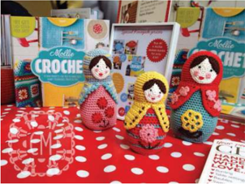

> **Deskripsi Visual:** Gambar ini menunjukkan sebuah buku pelajaran tentang crochet dengan judul "Molde Croche". Buku tersebut terletak di atas meja berlapis kertas merah dengan pola putih. Di sebelah buku, terdapat dua boneka mainan yang dibuat dari kain rajut, masing-masing dengan topi berwarna kuning dan hijau. Boneka di sebelah kiri memiliki topi kuning dan baju berwarna biru, sedangkan boneka di sebelah kanan memiliki topi hijau dan baju berwarna merah. Di sebelah kiri boneka, terdapat beberapa buku lain yang tampak seperti buku tutorial atau panduan. Di sebelah kanan boneka, terdapat papan tulis dengan tulisan "CROCHET" dan beberapa simbol seperti huruf "H" dan "T". Gambar ini menunjukkan bahwa buku ini mengajarkan cara membuat boneka dari kain rajut, serta menawarkan panduan atau tutorial untuk pembuat boneka.

Sumber: caramedus.com

Gambar 1.19 Contoh penataan kerajinan yang menonjolkan identitas melalui warna-warna yang khas.

 

---
## 📄 Halaman 32

### E.  Evaluasi Kegiatan Pembelajaran Wirausaha Kerajinan dengan Inspirasi Objek Budaya Lokal

### Evaluasi Diri Semester 1

Evaluasi diri pada akhir semester 2 terdiri atas evaluasi individu dan evaluasi kelompok. Evaluasi individu dibuat untuk mengetahui sejauh mana efektivitas pembelajaran  terhadap  setiap  peserta  didik.  Evaluasi  individu  meliputi evaluasi  sikap,  pengetahuan  dan  keterampilan.  Evaluasi  kelompok  adalah untuk mengetahui interaksi dalam kelompok yang terjadi dalam kelompok, kaitannya dengan pencapaian tujuan pembelajaran.

### Evaluasi Diri (individu)

Bagian A. Berilah tanda cek (√) pada kolom kanan  sesuai penilaian dirimu.

Keterangan:

- Sangat Tidak Setuju
- Tidak Setuju
- Netral
- Setuju
- Sangat Setuju
Bagian B. Tuliskan pendapatmu tentang pengalaman mengikuti pembelajaran Kerajinan di Semester 2

---
**📊 Tabel**

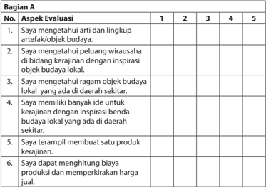

Tabel ini merupakan evaluasi yang melibatkan aspek-aspek keterampilan dan pengetahuan seputar kerajinan budaya lokal. Topik utamanya adalah pengetahuan dan keterampilan dalam mengenali artefak budaya, memahami peluang wirausaha di bidang kerajinan dengan inspirasi benda budaya lokal, memahami nilai-nilai budaya lokal, memiliki banyak ide untuk kerajinan dengan inspirasi benda budaya lokal, dan kemampuan untuk membuat produk kerajinan serta menghitung biaya produksi dan memperkirakan harga jual. Kolom-kolomnya mencakup 5 poin evaluasi, dari 1 (belum mengetahui) hingga 5 (sangat mengetahui). Data atau pola penting yang terlihat adalah bahwa setiap aspek evaluasi memiliki 5 poin skor, yang menunjukkan bahwa evaluasi ini menggunakan skala 1-5 untuk mengukur tingkat pemahaman dan keterampilan individu dalam berbagai aspek kerajinan budaya lokal.

 

---
## 📄 Halaman 33

---
**📊 Tabel**

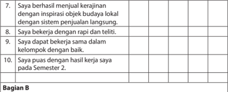

Tabel ini berisi pertanyaan-pertanyaan yang dirancang untuk mengevaluasi kinerja siswa dalam berbagai aspek kerja. Topik utamanya adalah tentang pengembangan keterampilan dan pengetahuan dalam konteks pembelajaran. Kolom-kolomnya mencakup berbagai aspek seperti keberhasilan menjalankan kerajinan, kerja dengan rapi dan teliti, bekerja sama dalam kelompok, dan kepuasan dengan hasil kerja. Data atau pola penting yang terlihat adalah bahwa semua pertanyaan memiliki kolom untuk menunjukkan tingkat keberhasilan atau kepuasan, yang menunjukkan bahwa evaluasi ini bertujuan untuk memberikan informasi mendalam tentang kemampuan dan pengetahuan siswa dalam berbagai aspek kerja.

Kesan dan pesan setelah mengikuti pembelajaran Kerajinan Semester 2:

### Evaluasi Diri (Kelompok)

Bagian A. Berilah tanda cek (√) pada kolom kanan  sesuai penilaian dirimu.

### Keterangan:

- Sangat Tidak Setuju
- Tidak Setuju
- Netral
- Setuju
- Sangat Setuju
Bagian B. Tuliskan pengalaman paling berkesan saat bekerja dalam kelompok.

---
**📊 Tabel**

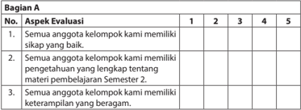

Tabel ini berisi aspek evaluasi untuk sebuah kelas atau kelompok belajar, dengan 5 skor yang ditentukan untuk setiap aspek. Topik utama tabel adalah evaluasi kualitas belajar siswa dalam materi pembelajaran semester 2. Kolom pertama menunjukkan aspek-aspek evaluasi, sedangkan kolom kedua hingga kelima menunjukkan skor yang diberikan kepada setiap aspek. Data penting yang terlihat adalah bahwa semua anggota kelompok memiliki sikap yang baik, pengetahuan yang lengkap tentang materi pembelajaran semester 2, dan keterampilan yang beragam. Ini menunjukkan bahwa semua aspek evaluasi telah dicapai oleh seluruh anggota kelompok.

 

---
## 📄 Halaman 34

---
**📊 Tabel**

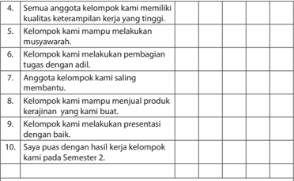

Tabel ini berisi informasi tentang kinerja kelompok belajar dalam semester 2. Topik utamanya adalah kualitas kerja kelompok, kemampuan melakukan musyawarah, pembagian tugas, saling membantu, menjual produk, dan presentasi. Kolom-kolomnya meliputi kualitas kerja, kemampuan musyawarah, pembagian tugas, saling membantu, menjual produk, dan presentasi. Data penting yang terlihat adalah bahwa semua anggota kelompok memiliki kualitas kerja tinggi, kelompok dapat melakukan musyawarah, pembagian tugas dilakukan dengan adil, anggota saling membantu, kelompok dapat menjual produk mereka, dan kelompok dapat melakukan presentasi dengan baik. Selain itu, semua anggota kelompok merasa puas dengan hasil kerja mereka pada semester 2.

### Bagian B

Pengalaman paling berkesan saat bekerja dalam kelompok:

 

---
## 📄 Halaman 35

### REKAYASA

Prakarya dan Kewirausahaan

29

 

---
## 📄 Halaman 36

30

### Peta Materi

---
**🖼️ Gambar/Diagram**

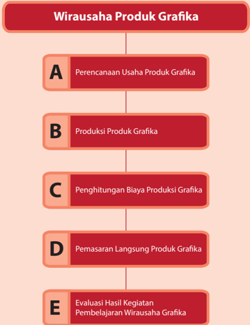

> **Deskripsi Visual:** Gambar ini adalah diagram yang menunjukkan proses wirausaha produk grafika. Diagram ini terdiri dari lima langkah yang disusun secara horizontal, masing-masing dengan label huruf besar di atasnya. Langkah-langkah tersebut adalah:

1. Perencanaan Usaha Produk Grafika (A)
2. Produksi Produk Grafika (B)
3. Penghitungan Biaya Produksi Grafika (C)
4. Pemasaran Langsung Produk Grafika (D)
5. Evaluasi Hasil Kegiatan Pembelajaran Wirausaha Grafika (E)

Setiap langkah memiliki hubungan dengan langkah-langkah sebelumnya dan setelahnya, menunjukkan proses berurutan dari perencanaan hingga evaluasi hasil. Teks pada diagram ini memberikan informasi tentang setiap langkah dalam proses wirausaha produk grafika, membantu pembaca memahami langkah-langkah yang harus dilalui untuk sukses dalam bisnis ini.

Kelas X SMA/MA/SMK/MAK

Semester 1

 

---
## 📄 Halaman 37

### BAB II Wirausaha Produk Grafika

### Tujuan Pembelajaran

Setelah mempelajari bab ini, siswa mampu:

- Menghayati  bahwa  akal  pikiran  dan  kemampuan  manusia  dalam  berpikir kreatif untuk membuat produk grafika serta keberhasilan wirausaha adalah anugerah Tuhan.
- Menghayati perilaku jujur, percaya diri, dan mandiri serta sikap bekerja sama, gotong royong, bertoleransi, disiplin, bertanggung jawab, kreatif, dan inovatif dalam membuat produk grafika guna membangun semangat usaha.
- Mendesain, membuat dan mengemas  produk grafika berdasarkan identifikasi kebutuhan sumber daya, teknologi, dan prosedur berkarya.
- Mempresentasikan  dan  memasarkan  produk  grafika  dengan  perilaku  jujur dan percaya diri.
- Melakukan evaluasi pembelajaran wirausaha produk grafika.

 

---
## 📄 Halaman 38

Grafika atau dalam bahasa Inggrisnya graphics adalah presentasi visual pada suatu permukaan yang bertujuan untuk memberikan informasi atau keindahan. Jadi, pengertian grafika adalah gambar dan teks yang ditampilkan pada bidang datar, yang bertujuan untuk memberikan informasi atau keindahan.

Pada  saat  ini,  produk  grafika  telah  menjadi  bagian  dari  kehidupan  sehari-hari dalam bentuk poster, buku, iklan, gambar pada kemasan makanan, tanda petunjuk jalan,  dan  lain-lain.  Grafika  sudah  ada  sejak  zaman  dahulu  berupa  lukisan  gua prasejarah. Di Sulawesi Selatan, Maluku, Kalimantan dan Papua, terdapat lukisan gua prasejarah yang berasal dari ribuan tahun Sebelum Masehi. Lukisan prasejarah ini  berupa  cap  tangan,  gambar  manusia  dan  gambar hewan di antaranya babi hutan yang terpanah, babi rusa, anoa, ikan serta benda-benda seperti sampan, kapak dan mata bajak. Lukisan gua prasejarah serupa itu juga terdapat di Perancis Selatan yang dibuat 14.000 Sebelum Masehi dan di Bhumbetka Rock Shelters di India yang dibuat pada awal 7000 Sebelum Masehi.

Dari lukisan gua prasejarah tersebut, dapat diperoleh informasi tentang kegiatan manusia pada masa itu. Teknik yang digunakan berupa torehan langsung, cap dan stensil. Lukisan tersebut juga memanfaatkan warna merah, hitam dan putih yang berasal dari pewarna alam. Artinya, manusia pada masa itu membuat lukisan tidak hanya  untuk  menyampaikan  informasi,  tetapi  juga  untuk  menyampaikan  nilai estetik dan keindahan.

Grafis berupa lukisan gua prasejarah memberikan informasi atau dapat disebut juga dengan bahasa gambar. Bahasa tulisan yang juga merupakan bagian dari grafika, berkembang di beberapa tempat di dunia diperkirakan pada sekitar 4.000 tahun sebelum masehi.

Perkembangan  grafika  juga  dipengaruhi  oleh  perkembangan  teknologi  cetak. Teknologi cetak memungkinkan gambar yang sama dibuat berulang-ulang. Teknologi cetak pada awalnya menggunakan acuan cetak berupa papan kayu yang diukir dan dicetakkan pada permukaan kain dan kertas. Teknik tersebut digunakan di China pada Dinasti Han sekitar 206 Sebelum Masehi hingga 220 Masehi. Artefak sebagai  hasil  karya  tertua  yang  menggunakan  teknologi  papan  kayu  berukir

 

---
## 📄 Halaman 39

tersebut  dikenal  dengan  nama  The  Pure  Light  Dharani  Sutra,  yang  diperkirakan dibuat pada tahun 704 Masehi di Korea. Pada sekitar tahun 1040, Bi Seng di China membuat inovasi berupa acuan cetak yang berupa huruf yang dapat disusun sesuai dengan kalimat yang akan dicetak, yang terbuat dari keramik. Pada abad ke-13 di Korea, muncul inovasi berupa huruf acuan cetak yang terbuat dari logam.

Pada tahun 1433, Johannes Guttenberg, seorang pandai besi di Jerman, membuat inovasi  berupa  penggunaan  mekanik  untuk  menekan  acuan  cetak  terhadap kertas. Teknologi mekanik tekan ulir ini serupa dengan mekanik yang digunakan pada pengolahan hasil  pertanian  pada  masa  itu.  Mesin  cetak  Guttenberg  juga menggunakan acuan cetak berupa huruf-huruf yang dapat disusun terbuat dari logam serupa dengan yang dikembangkan di Korea pada abad ke-13.

Teknologi pencetakan terus berkembang seiring dengan perkembangan teknologi. Teknologi elektronika dan informatika menjadi dasar dari perkembangan teknik cetak digital yang kita kenal saat ini. Gambar atau grafis dibuat pada komputer dalam format digital lalu dicetak dengan printer. Cetak digital dapat diaplikasikan pada berbagai permukaan seperti kertas, kain, dan keramik. Kualitas hasil cetak digital bervariasi bergantung pada kualitas printer dan permukaan bahan yang dicetak.

 

---
## 📄 Halaman 40

---
**🖼️ Gambar/Diagram**

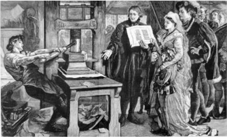

> **Deskripsi Visual:** Gambar ini adalah ilustrasi yang menunjukkan sekelompok orang tua berbicara dengan seorang anak kecil di depan sebuah mesin cetak. Mesin cetak tersebut tampak besar dan berwarna putih, dengan beberapa lembar kertas yang sedang dipotong oleh seorang pria yang berdiri di sampingnya. Pria tersebut mengenakan baju hitam dan topi merah, sedangkan anak kecil berdiri di depan mesin, tampaknya sedang memegang lembar kertas yang telah dicetak. Di sebelah kanan, ada tiga orang dewasa yang tampaknya sedang mendengarkan dialog antara orang tua dan anak kecil. Semua orang tampak tertarik pada proses cetak yang sedang berlangsung. Gambar ini menunjukkan hubungan antara teknologi cetak dan perkembangan sosial, serta bagaimana teknologi dapat mempengaruhi interaksi sosial antara generasi.

Sumber: Dokumen Kemdikbud

---
**🖼️ Gambar/Diagram**

> **Deskripsi Visual:** Gambar ini adalah foto yang menunjukkan seseorang sedang bekerja di meja kerja. Di sebelah kiri, terdapat laptop yang terbuka dengan beberapa dokumen di atasnya. Sementara itu, di sebelah kanan, terdapat printer yang sedang mencetak dokumen. Meja kerja ini juga memiliki beberapa elemen lain seperti gelas kopi, pohon hias, dan lampu sorot. Gambar ini menunjukkan aktivitas kerja yang serba digital, dengan laptop sebagai alat utama untuk mengakses informasi dan printer untuk mencetak dokumen. Ini menunjukkan bagaimana teknologi modern telah memperluas cara kita bekerja dan menghasilkan dokumen.

Sumber: Dokumen Kemdikbud

Teknologi grafika  menghasilkan produk grafika. Produk grafika terdiri  atas  teks dan gambar yang tersusun membentuk informasi atau keindahan. Produk grafika dapat berupa karya desain atau karya seni. Baik karya desain maupun karya seni pada umumnya menyampaikan informasi atau pesan sekaligus keindahan. Karya desain grafis dihasilkan oleh profesi desainer grafis, menyampaikan informasi dan pesan dengan jelas. Pada karya desain grafis, teks dan gambar dibuat agar saling menguatkan pesan yang akan disampaikan. Salah satu contoh karya desain grafis

 

---
## 📄 Halaman 41

misalnya  poster  kampanye  Cinta  Lingkungan.  Pada  poster  tersebut,  terdapat teks berupa ajakan untuk mencintai lingkungan agar tetap lestari. Gambar pada poster  tersebut  menggambarkan  kondisi  lingkungan  yang  rusak  dan  kondisi lingkungan yang lestari.  Pesan  yang  disampaikan  melalui  melalui  desain  grafis yang memadukan teks singkat dengan gambar lebih efektif dalam menyampaikan pesan. Pada karya seni grafis, pesan yang disampaikan pada umumnya tersirat melalui perumpamaan yang dihadirkan melalui gambar atau teks yang ada pada karya tersebut

Sumber: Dokumen Kemdikbud

---
**🖼️ Gambar/Diagram**

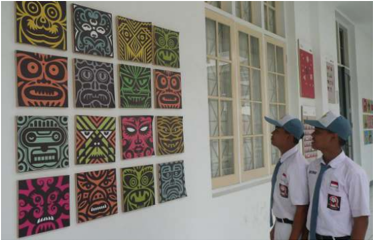

> **Deskripsi Visual:** Gambar ini menunjukkan sebuah pameran seni di sebuah sekolah. Pada bagian kiri, terdapat sekelompok lukisan berbentuk kubus dengan warna-warna cerah dan desain yang unik. Setiap lukisan memiliki bentuk dan warna yang berbeda-beda, menciptakan kesan visual yang menarik. Di bagian kanan, tampak dua siswa sedang melihat pameran tersebut. Mereka mengenakan seragam sekolah yang formal, menunjukkan bahwa mereka mungkin adalah siswa dari sekolah tersebut. Pada lukisan, elemen-elemen seperti warna, bentuk, dan desain menjadi fokus utama. Teks, angka, atau label penting tidak terlihat pada gambar ini. Informasi kunci yang dapat diambil pembaca adalah bahwa ada pameran seni di sekolah dan siswa sedang melihatnya.

Sumber: www.antara.com

 

---
## 📄 Halaman 42

### A. Perencanaan Usaha Produk Grafika

Bidang teknologi grafika  memiliki  beragam  peluang  usaha.  Peluang  usaha pada  bidang  teknologi  grafika  dapat  dilihat  dari  kebutuhan  yang  ada  di wilayah setempat, melihat ketersediaan bahan dan material yang ada maupun dengan melihat usaha grafika yang sudah ada di wilayah sekitarmu.

### Tugas 1 (Kelompok)

### Peluang Pengembangan Produk Grafika

- Amati lingkungan sekitar kalian, produk grafika apa saja yang sudah ada,
- Koran atau bulletin?
- Kaos bergambar
- Kemasan makanan
- Kartu ucapan
- Poster
- Iklan
- dan lain-lain
- Carilah informasi dari buku, internet, atau bertanya kepada wirausahawan grafika yang ada di lingkungan sekitar tentang keragaman produk grafika, fungsi dan teknik cetak.
- Tuliskan beberapa produk grafika dan teknik cetak yang digunakan.
- Diskusikan dalam kelompok tentang kebutuhan konsumen untuk produk grafika dan peluang perkembangan dari produk grafika tersebut.
- Tuliskan pada tabel seperti contoh LK 1 atau dalam bentuk presentasi yang kreatif dan informatif
- Presentasikan hasil pemikiran kelompok di depan kelas.

### LK 1. Peluang Pengembangan Produk Grafika

---
**📊 Tabel**

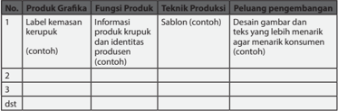

Tabel ini berisi informasi tentang produk grafika, fungsi produk, teknik produksi, dan peluang pengembangan. Topik utamanya adalah tentang desain grafis dan produk visual. Kolom pertama adalah nomor produk grafika, yang berisi nama produk seperti kerupuk. Kolom kedua adalah informasi produk grafik dan identitas produk, yang mencakup konten seperti gambar dan teks. Kolom ketiga adalah teknik produksi, yang mencakup contoh seperti sablon. Kolom keempat adalah peluang pengembangan, yang mencakup contoh seperti gambar dan teks yang lebih menarik agar menarik konsumen. Dari tabel ini, dapat dilihat bahwa produk grafik harus memiliki informasi produk yang jelas dan menarik, teknik produksi yang efektif, dan peluang pengembangan yang baik untuk meningkatkan penjualan.

 

---
## 📄 Halaman 43

### Sumber Daya Material, Teknik dan Ide Produk Grafika

Sumber  daya  usaha  yang  dibutuhkan  untuk  wirausaha  produk  grafika  adalah bahan baku atau material, teknik dan alat, serta keterampilan. Wirausaha produk grafika  dapat  dimulai  dengan  melihat  potensi  bahan  baku,  potensi  teknik  dan keterampilan yang ada di daerah tersebut. Bahan yang dibutuhkan untuk produk grafika adalah bidang datar yang akan dicetak, pewarna dan alat cetak. Alat cetak yang dibutuhkan bergantung pada teknik cetak yang akan dipakai.

Ada 5 jenis teknik cetak berdasarkan prinsipnya, yaitu seperti berikut.

### 1. Cetak tinggi

Pada jenis teknik cetak tinggi, zat pewarna ditempatkan pada permukaan tertinggi  dari  bidang  pencetak  (acuan  cetak).  Bidang  pencetak  dapat berupa balok kayu, karet, logam atau bahan lainnya yang diberi gambar atau tulisan. Gambar atau tulisan tersebut diukirkan pada satu permukaan bidang.  Warna dioleskan pada permukaan bahan yang sudah diukir lalu dicetakkan pada permukaan kertas atau bahan datar lainnya. Tinta yang tercetak pada kertas sesuai dengan gambar pada permukaan tertinggi dari ukiran bidang cetakan. Gambar yang dihasilkan akan berupa gambar kebalikan  (reverse)  dari  gambar  pada  acuan  cetak.  Contoh  dari  cetak tinggi  adalah  stempel. Teknik  cetak  yang  termasuk  dalam  jenis  teknik cetak  tinggi  di  antaranya  cukil  kayu  dan  cap.  Cetak  tinggi  merupakan prinsip  yang  digunakan  pada  awal  teknik  cetak  digunakan  di  China dengan acuan cetak papan kayu hingga mesin cetak Guttenberg.

---
**🖼️ Gambar/Diagram**

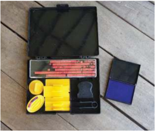

> **Deskripsi Visual:** Gambar ini menunjukkan sebuah alat pengukur kelembaban (Humidimeter) yang terletak di dalam tas. Humidimeter terdiri dari beberapa komponen utama:

1. **Humidimeter**: Ini adalah perangkat utama yang digunakan untuk mengukur kelembaban udara. Humidimeter ini memiliki panel display yang menunjukkan nilai kelembaban dalam persen.

2. **Tas**: Humidimeter disimpan dalam tas yang berfungsi sebagai tempat penyimpanan yang aman dan melindungi perangkat dari kerusakan fisik.

3. **Bahan Baku Pengukuran**: Ada dua bahan baku pengukuran yang terletak di samping humidimeter. Bahan baku ini digunakan untuk memastikan akurasi pengukuran humidimeter.

4. **Kertas Pengukuran**: Ada juga kertas pengukuran yang terletak di samping tas. Kertas ini digunakan untuk mencatat hasil pengukuran humidimeter.

5. **Pengganti Baterai**: Terdapat pengganti baterai yang diletakkan di tas untuk menggantikan baterai yang rusak atau habis.

Informasi kunci yang dapat diambil pembaca adalah bahwa alat ini digunakan untuk mengukur kelembaban udara dengan akurasi tinggi dan harus disimpan dengan benar untuk memastikan fungsi optimal.

 

---
## 📄 Halaman 44

---
**🖼️ Gambar/Diagram**

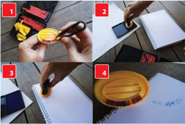

> **Deskripsi Visual:** Gambar ini adalah sebuah ilustrasi yang menunjukkan langkah-langkah cara menggunakan alat ukur panjang. Ilustrasi ini terdiri dari empat panel yang masing-masing menunjukkan tahap-tahap penggunaan alat tersebut.

Pertama, pada panel pertama, tampak tangan sedang memegang alat ukur panjang dengan tangan yang sedang mengukur sesuatu. Panel kedua menunjukkan tangan yang menekan tombol pada alat ukur panjang tersebut. Panel ketiga menunjukkan tangan yang sedang mengukur suatu objek dengan alat ukur panjang tersebut. Panel keempat menunjukkan hasil pengukuran yang diperoleh dari alat ukur panjang tersebut.

Elemen-elemen utama dalam ilustrasi ini adalah alat ukur panjang, tangan, dan objek yang sedang dikukur. Relasi antara elemen-elemen ini adalah bahwa tangan yang sedang mengukur menggunakan alat ukur panjang untuk mendapatkan hasil pengukuran yang akurat.

Teks, angka, atau label penting yang terlihat dalam ilustrasi ini adalah angka-angka yang menunjukkan hasil pengukuran dan label "Alat Ukur Panjang" yang digunakan dalam pengukuran tersebut.

Informasi kunci yang dapat diambil pembaca dari ilustrasi ini adalah bahwa alat ukur panjang dapat digunakan untuk mengukur panjang objek dengan tepat dan hasil pengukuran dapat dilihat langsung dari alat tersebut.

Sumber: Dokumen Kemdikbud

---
**🖼️ Gambar/Diagram**

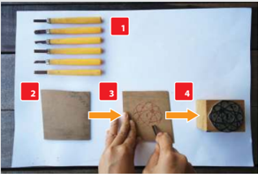

> **Deskripsi Visual:** Gambar ini adalah ilustrasi yang menunjukkan proses pembuatan kopi. Gambar ini terdiri dari empat langkah yang ditandai dengan nomor 1 hingga 4. Langkah pertama (1) menunjukkan beberapa bahan utama seperti teh, gula, dan kopi. Langkah kedua (2) menunjukkan bagaimana menggiling kopi menggunakan mesin penggiling kopi. Langkah ketiga (3) menunjukkan bagaimana menggiling kopi tersebut menggunakan tangan. Langkah keempat (4) menunjukkan bagaimana menggiling kopi tersebut menggunakan mesin penggiling kopi. Teks, angka, atau label penting yang terlihat adalah nomor 1 hingga 4 untuk menunjukkan langkah-langkah pembuatan kopi. Informasi kunci yang dapat diambil pembaca adalah bahwa proses pembuatan kopi melibatkan penggilingan kopi menggunakan mesin penggiling kopi dan tangan.

Keterangan:

- Alat cukil
- Karet atau kayu
- Karet atau kayu digambari kemudian cukil sesuai dengan pola yang diinginkan
- Karet atau kayu yang sudah menjadi acuan cetak
Sumber: Dokumen Kemdikbud

 

---
## 📄 Halaman 45

---
**🖼️ Gambar/Diagram**

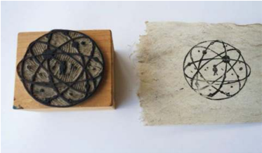

> **Deskripsi Visual:** Gambar ini menunjukkan sebuah alat ukur atau alat pengukuran yang terbuat dari kayu dengan lubang di tengahnya. Lubang tersebut memiliki pola yang mirip dengan atom, yang tampak seperti sebuah bola dengan beberapa garis dan titik di sepanjang garis-garisnya. Lubang ini kemungkinan besar digunakan untuk mengukur atau memeriksa ukuran tertentu, mungkin dalam konteks teknis atau mekanis. Pola yang ada pada lubang tersebut mungkin memiliki arti spesifik dalam konteks penggunaannya, namun tanpa informasi tambahan, sulit untuk menentukan apa itu. Gambar ini mungkin digunakan sebagai ilustrasi dalam buku pelajaran untuk menjelaskan konsep atau alat yang relevan dalam topik tersebut.

Sumber: Dokumen Kemdikbud

---
**🖼️ Gambar/Diagram**

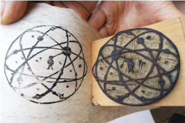

> **Deskripsi Visual:** Gambar ini menunjukkan dua halaman buku pelajaran yang berisi ilustrasi. Pada halaman kiri, terdapat sebuah bola yang tampak seperti atom dengan beberapa titik putih yang mungkin menunjukkan elektron atau partikel lainnya. Lingkaran besar melingkar di sekitar bola tersebut, mungkin menunjukkan orbit elektron atau struktur atom. Halaman kanan mirip dengan halaman kiri tetapi lebih detail, dengan lebih banyak detail pada bola dan lingkaran.

Elemen utama yang ditampilkan adalah bola atom dan lingkaran melingkar di sekitarnya. Lingkaran melingkar tersebut mungkin menunjukkan orbit elektron atau struktur atom. Titik putih di bola atom mungkin menunjukkan elektron atau partikel lainnya.

Teks, angka, atau label penting tidak terlihat dalam gambar ini. Namun, informasi kunci yang dapat diambil pembaca adalah bahwa gambar ini mungkin menunjukkan konsep tentang struktur atom atau elektron dalam atom.

Dalam satu paragraf yang informatif, gambar ini menunjukkan dua halaman buku pelajaran yang berisi ilustrasi tentang bola atom dan lingkaran melingkar di sekitarnya. Lingkaran melingkar tersebut mungkin menunjukkan orbit elektron atau struktur atom. Titik putih di bola atom mungkin menunjukkan elektron atau partikel lainnya. Informasi kunci yang dapat diambil pembaca adalah bahwa gambar ini mungkin menunjukkan konsep tentang struktur atom atau elektron dalam atom.

Sumber: Dokumen Kemdikbud

 

---
## 📄 Halaman 46

### 2. Cetak Dalam

Pada jenis teknik cetak dalam, zat pewarna ditempatkan pada permukaan terdalam  dari  bidang  pencetak  (acuan  cetak).  Bidang  pencetak  dapat berupa  balok  kayu,  karet,  logam  atau  bahan  lainnya  yang  diberi gambar atau tulisan. Gambar atau tulisan tersebut diukirkan pada satu permukaan  bidang.  Warna  dimasukkan  pada  rongga  pahatan  bahan yang sudah diukir lalu dicetakkan pada permukaan kertas, plastik tipis, aluminium foil dan material datar lainnya. Tinta yang tercetak pada kertas akan berupa gambar timbul sesuai dengan gambar pada rongga ukiran bidang cetakan. Gambar yang dihasilkan akan berupa gambar kebalikan (reverse) dari gambar pada bidang acuan cetak. Contoh dari cetak tinggi adalah pencetakan gambar pada uang kertas. Teknik cetak yang termasuk dalam jenis teknik cetak dalam di antaranya rotogravure dan etsa.

---
**🖼️ Gambar/Diagram**

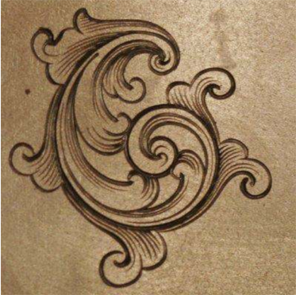

> **Deskripsi Visual:** Gambar ini adalah ilustrasi yang menunjukkan elemen arsitektur atau dekorasi. Gambar ini menggambarkan sebuah motif atau desain yang terdiri dari dua bagian utama: satu bagian berbentuk seperti huruf "C" dengan ujung yang melengkung dan dua ujung yang menyerupai sayap burung, dan bagian lainnya berbentuk seperti huruf "O" dengan ujung yang melengkung dan dua ujung yang menyerupai sayap burung. Motif ini tampaknya digunakan sebagai ornamen atau dekorasi pada bangunan atau struktur. Tidak ada teks, angka, atau label yang terlihat dalam gambar ini. Informasi kunci yang dapat diambil pembaca adalah bahwa gambar ini mungkin digunakan untuk membantu pemahaman tentang desain arsitektur atau dekorasi tradisional.

Sumber: www.patternmoy.com

 

---
## 📄 Halaman 47

### 3. Cetak Datar

Pada jenis teknik cetak datar, bidang pencetak atau bidang acuan cetak berupa  permukaan  datar  yang  memiliki  dua  jenis  lapisan  permukaan. Satu jenis  lapisan  mengikat tinta,  sedangkan satu jenis lapisan lainnya tidak mengikat tinta. Bidang yang bertinta akan menjadi bidang pencetak (acuan cetak). Gambar yang dihasilkan akan berupa gambar kebalikan (reverse)  dari  bidang  acuan  cetak.  Contoh  dari  produk  grafika  dengan teknik  cetak  datar  adalah  koran  dan  majalah.  Pencetak an  offset  dapat menggunakan 1 tinta hitam saja untuk menghasilkan cetakan dengan nuansa hitam dan abu-abu atau 3 warna dan hitam untuk hasil cetakan berwarna  seperti  majalah.  Pada  pencetakan  berwarna,  cetak  offset memiliki 4 buah acuan cetak, yaitu acuan cetak untuk warna biru ( cyan ), merah ( magenta ),  kuning ( yellow )  dan  hitam (disebut key )  atau  dikenal dengan CMYK .

---
**🖼️ Gambar/Diagram**

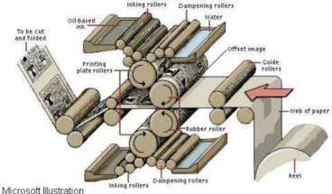

> **Deskripsi Visual:** Gambar ini adalah ilustrasi yang menunjukkan proses cetak offset. Gambar ini menggambarkan langkah-langkah dasar dalam proses cetak offset, mulai dari pengisian warna hingga pengecekan hasil cetakan.

Elemen utama dalam gambar meliputi:
1. **Rol Inking Rollers**: Rol ini digunakan untuk mengisi warna ke dalam cetak.
2. **Rol Dampening Rollers**: Rol ini digunakan untuk menyebarkan air pada cetak agar warna tidak terlalu padat.
3. **Rol Guide Rollers**: Rol ini digunakan untuk mengarahkan kertas saat proses cetak.
4. **Rol Web of Paper**: Kertas yang akan dicetak.
5. **Reel**: Reel yang digunakan untuk mengelilingi kertas saat proses cetak.

Teks, angka, atau label penting yang terlihat dalam gambar meliputi:
- "To be cut and folded" (belum dipotong dan dipotong)
- "Offset image" (gambar offset)
- "Web of paper" (kertas berputar)

Informasi kunci yang dapat diambil pembaca meliputi:
- Proses cetak offset melibatkan berbagai rol yang saling berinteraksi untuk menghasilkan gambar yang akhirnya dicetak pada kertas.
- Proses ini memerlukan perhatian detail dan teknik khusus untuk menghasilkan hasil cetakan yang baik.

Sumber: Microsoft, 2015

 

---
## 📄 Halaman 48

Sumber: http://gomulticolor.com

---
**🖼️ Gambar/Diagram**

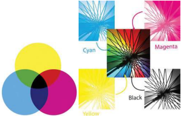

> **Deskripsi Visual:** Gambar ini adalah ilustrasi yang menunjukkan konsep warna dalam sistem warna CMYK (Cyan, Magenta, Yellow, dan Black). Gambar ini terdiri dari beberapa elemen utama:

1. **Warna Dasar**: Gambar ini memperlihatkan tiga warna dasar: Cyan, Magenta, dan Yellow, yang diperlihatkan sebagai lingkaran berwarna murni di bagian bawah gambar.

2. **Kontras Warna**: Di sebelah kanan, ada tiga gambar yang menunjukkan kontras antara warna-warna ini. Warna cyan dan magenta digabungkan untuk menghasilkan warna pink, sementara warna magenta dan yellow menghasilkan warna merah, dan warna cyan dan yellow menghasilkan warna kuning.

3. **Teks dan Label**: Terdapat teks "Cyan", "Magenta", dan "Yellow" yang menunjukkan nama warna-warna tersebut. Selain itu, ada teks "Black" yang menunjukkan warna dasar yang digunakan dalam sistem warna CMYK.

4. **Informasi Kunci**: Gambar ini memberikan pemahaman tentang bagaimana warna-warna dasar ini dapat digabungkan untuk menciptakan berbagai warna lainnya dalam sistem warna CMYK. Ini juga membantu dalam memahami konsep dasar dalam desain grafis dan fotografi.

Dengan demikian, gambar ini merupakan ilustrasi yang efektif untuk menjelaskan konsep dasar dalam sistem warna CMYK dan bagaimana warna-warna dasarnya dapat digabungkan untuk menciptakan berbagai warna lainnya.

Sumber: http://www.willsonsprintersgrimsby.co.uk/

 

---
## 📄 Halaman 49

### 4. Cetak Saring

Cetak tinggi, cetak dalam dan cetak datar pada prinsipnya mengaplikasikan tinta pada bidang acuan cetak dan kemudian memindahkan tinta dari bidang acuan cetak ke permukaan kertas atau permukaan  datar  lainnya.  Berbeda  dengan  ketiga  jenis  teknik  cetak tersebut, cetak saring mengaplikasikan tinta langsung pada permukaan bidang datar. Gambar dihasilkan dengan memberikan lapisan penghalang tinta sesuai gambar yang diinginkan. Berbeda pula dengan teknik  cetak  tinggi,  cetak  dalam  dan  cetak  datar  yang  menghasilkan gambar terbalik (reverse), cetak saring menghasilkan gambar yang sama dengan acuan cetaknya.  Acuan  cetak  pada  cetak  saring  dapat  berupa stensil (pola gambar) yang diletakan di antara kertas dengan screen atau dengan  mencetakkan  gambar  acuan  pada screen .  Teknik  cetak  saring pada umumnya menggunakan screen .  Maka, teknik ini dikenal dengan sebutan screen printing . Cetak saring dikenal pula dengan sebutan sablon. Teknik cetak saring dengan menggunakan stensil dapat dilakukan tanpa screen ,  yaitu  dengan  langsung  menyemprotkan  pewarna  pada  bidang datar yang sudah dilapisi stensil (pola gambar). Teknik tersebut serupa dengan teknik yang digunakan pada lukisan prasejarah cetakan tangan pada gua.

---
**🖼️ Gambar/Diagram**

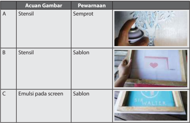

> **Deskripsi Visual:** Gambar ini adalah diagram yang menunjukkan berbagai jenis stensil dan pewarnaan yang digunakan dalam proses pembuatan stensil. Diagram ini terdiri dari tiga kolom: Acuan Gambar, Pewarnaan, dan Gambar. Setiap baris menggambarkan satu jenis stensil dan pewarnaan.

1. **Apa yang ditampilkan secara keseluruhan**: Diagram ini menyajikan informasi tentang berbagai jenis stensil dan pewarnaan yang digunakan dalam proses pembuatan stensil. Ini termasuk stensil semprot, stensil sablon, dan emulsi pada screen.

2. **Elemen-elemen utama dan relasinya**: 
   - Kolom "Acuan Gambar" menunjukkan jenis stensil dan pewarnaan.
   - Kolom "Pewarnaan" menunjukkan jenis pewarnaan yang sesuai dengan stensil.
   - Kolom "Gambar" menampilkan gambar visual yang menunjukkan contoh stensil dan pewarnaan tersebut.

3. **Teks, angka, atau label penting yang terlihat**: 
   - Kolom "Acuan Gambar" memiliki label A, B, dan C untuk masing-masing jenis stensil dan pewarnaan.
   - Kolom "Pewarnaan" memiliki label Semprot, Sablon, dan Emulsi pada screen untuk masing-masing jenis stensil.
   - Kolom "Gambar" menampilkan gambar visual yang menunjukkan contoh stensil dan pewarnaan tersebut.

4. **Informasi kunci yang dapat diambil pembaca**: 
   - Pembaca dapat memahami bahwa ada tiga jenis stensil (semprot, sablon, dan emulsi pada screen) dan tiga jenis pewarnaan (semprot, sablon, dan emulsi pada screen).
   - Mereka juga dapat melihat contoh visual dari setiap jenis stensil dan pewarnaan yang digunakan dalam proses pembuatan stensil.

Dengan demikian, diagram ini memberikan pemahaman yang jelas tentang berbagai jenis stensil dan pewarnaan yang digunakan dalam proses pembuatan stensil, serta memberikan gambaran visual yang membantu dalam memahami konsep tersebut.

---
**📊 Tabel**

Tabel ini membandingkan berbagai metode pembuatan stensil dan pewarnaan pada media digital. Topik utama adalah metode pembuatan stensil dan pewarnaan, dengan kolom-kolom yang mencakup acuan gambar dan pewarnaan. Data penting yang terlihat meliputi:

1. Acuan Gambar A: Stensil dengan pewarnaan Semprot.
2. Acuan Gambar B: Stensil dengan pewarnaan Sablon.
3. Acuan Gambar C: Emulsi pada screen dengan pewarnaan Sablon.

Tabel ini menunjukkan variasi dalam cara membuat stensil dan pewarnaan, mulai dari metode tradisional seperti semprot hingga teknologi modern seperti emulsi pada screen. Ini membantu dalam pemahaman tentang berbagai metode yang tersedia untuk mencapai hasil yang diinginkan dalam proses pembuatan stensil dan pewarnaan.

 

---
## 📄 Halaman 50

---
**🖼️ Gambar/Diagram**

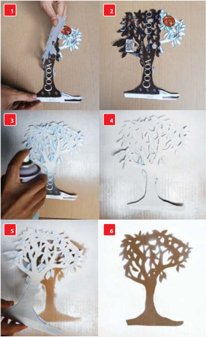

> **Deskripsi Visual:** Gambar ini adalah ilustrasi yang menunjukkan proses pembuatan sebuah pohon dari kertas. Gambar dimulai dengan sebuah lembar kertas yang telah dipotong menjadi bentuk dasar pohon, kemudian ditambahkan detail seperti daun dan batang. Proses ini dilakukan dengan menggunakan alat pemotong kertas dan pengecatan untuk menciptakan tampilan yang lebih realistis. Setelah semua detail selesai, hasil akhir adalah sebuah pohon yang indah dan rapi, menunjukkan kemampuan dalam membuat desain dari kertas.

 

---
## 📄 Halaman 51

---
**🖼️ Gambar/Diagram**

> **Deskripsi Visual:** Gambar ini adalah ilustrasi yang menunjukkan proses menggambar hati dengan pensil. Gambar ini terdiri dari tiga langkah yang disajikan secara berurutan:

1. Langkah pertama menunjukkan tangan seseorang yang sedang menggambar garis lurus untuk membentuk dasar hati.
2. Langkah kedua menunjukkan tangan yang sedang menggambar bentuk lebar di bagian atas hati untuk menciptakan bagian bawah hati.
3. Langkah ketiga menunjukkan hasil akhir dari proses penggambaran, yaitu hati yang telah dibuat dengan penulis.

Elemen-elemen utama dalam gambar ini adalah tangan penggambar, pensil, dan hasil penggambaran hati. Teks, angka, atau label penting tidak ada dalam gambar ini karena fokusnya pada proses penggambaran dan hasil akhir.

Informasi kunci yang dapat diambil pembaca adalah bahwa proses menggambar hati melibatkan langkah-langkah yang jelas dan sistematis, serta hasil akhir yang menarik dan indah.

Sumber: Dokumen Kemdikbud

---
**🖼️ Gambar/Diagram**

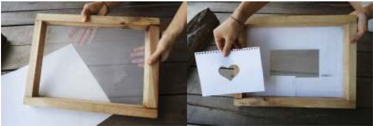

> **Deskripsi Visual:** Gambar ini adalah ilustrasi yang menunjukkan proses pembuatan frame foto. Gambar pertama menunjukkan bagian dasar frame yang terbuat dari kayu dengan lubang untuk memasukkan kertas foto. Gambar kedua menunjukkan bagian depan frame yang telah dibuat dengan lubang berbentuk hati dan beberapa ruang kosong untuk foto. Ilustrasi ini menunjukkan langkah-langkah awal dalam membuat frame foto, mulai dari memilih bahan hingga menciptakan desain yang diinginkan.

Sumber: Dokumen Kemdikbud

---
**🖼️ Gambar/Diagram**

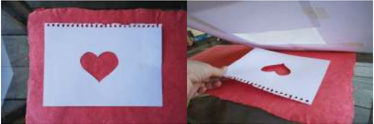

> **Deskripsi Visual:** Gambar ini menunjukkan dua halaman buku pelajaran yang berbeda. Halaman pertama menampilkan sebuah kartu ucapan dengan gambar hati besar di tengahnya, yang tampaknya diletakkan di atas lembaran kertas hitam. Halaman kedua menunjukkan bagian yang sama dari kartu ucapan tersebut, tetapi dengan penekanan pada bagian depan kartu yang terbuka, memperlihatkan isi kartu yang berupa tulisan "Love" dalam huruf besar.

Elemen-elemen utama dalam gambar ini adalah dua halaman buku pelajaran, kartu ucapan dengan gambar hati, dan tulisan "Love". Hubungan antara elemen-elemen ini adalah bahwa kartu ucapan dengan gambar hati adalah bagian dari halaman buku pelajaran, dan tulisan "Love" adalah isi dari kartu tersebut.

Teks, angka, atau label penting yang terlihat dalam gambar ini adalah "Love" yang tertera di dalam kartu ucapan. Informasi kunci yang dapat diambil pembaca dari gambar ini adalah bahwa kartu ucapan tersebut mungkin digunakan untuk perayaan cinta atau pernikahan, karena menggunakan kata "Love".

Dalam satu paragraf yang informatif, gambar ini menunjukkan dua halaman buku pelajaran yang berbeda. Halaman pertama menampilkan sebuah kartu ucapan dengan gambar hati besar di tengahnya, yang tampaknya diletakkan di atas lembaran kertas hitam. Halaman kedua menunjukkan bagian yang sama dari kartu ucapan tersebut, tetapi dengan penekanan pada bagian depan kartu yang terbuka, memperlihatkan isi kartu yang berupa tulisan "Love" dalam huruf besar. Elemen-elemen utama dalam gambar ini adalah dua halaman buku pelajaran, kartu ucapan dengan gambar hati, dan tulisan "Love". Hubungan antara elemen-elemen ini adalah bahwa kartu ucapan dengan gambar hati adalah bagian dari halaman buku pelajaran, dan tulisan "Love" adalah isi dari kartu tersebut. Teks, angka, atau label penting yang terlihat dalam gambar ini adalah "Love" yang tertera di dalam kartu ucapan. Informasi kunci yang dapat diambil

Sumber: Dokumen Kemdikbud

 

---
## 📄 Halaman 52

---
**🖼️ Gambar/Diagram**

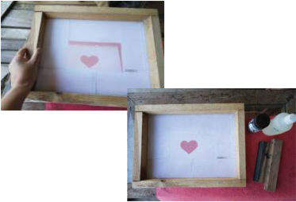

> **Deskripsi Visual:** Gambar ini menunjukkan dua sketsa yang berbeda dari sebuah lembaran kertas dengan gambar hati merah di tengahnya. Sketsa pertama diletakkan di atas lembaran kertas putih, sedangkan sketsa kedua diletakkan di atas lembaran kertas merah dengan beberapa alat tulis seperti pensil, pena, dan pita di sebelah kanan. Sketsa pertama memiliki frame kayu yang lebih besar dan lebih jelas, sementara sketsa kedua memiliki frame kayu yang lebih kecil dan lebih dekat dengan objeknya. Gambar ini mungkin digunakan untuk mengajarkan konsep tentang penggunaan frame dalam desain atau teknik memotret.

Sumber: Dokumen Kemdikbud

---
**🖼️ Gambar/Diagram**

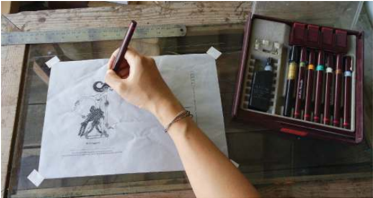

> **Deskripsi Visual:** Gambar ini menunjukkan seorang siswa sedang melukis dengan pensil di atas kertas. Di sebelah kiri, terdapat gambar sketsa sederhana yang tampak seperti karakter kartun. Siswa menggunakan set pensil yang terletak di atas meja. Set penulisan tersebut terdiri dari berbagai jenis pensil dengan berbagai ukuran dan warna. Gambar ini menunjukkan proses belajar menggambar, dimana siswa mempraktekkan teknik menggambar dengan bantuan alat tulis yang sesuai.

Sumber: Dokumen Kemdikbud

 

---
## 📄 Halaman 53

---
**🖼️ Gambar/Diagram**

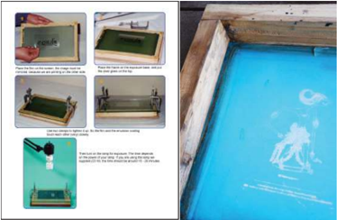

> **Deskripsi Visual:** Gambar ini adalah ilustrasi yang menunjukkan langkah-langkah proses pembuatan cetakan silkscreen. Gambar ini terdiri dari beberapa panel yang menggambarkan langkah-langkah yang perlu dilakukan untuk membuat cetakan silkscreen. Setiap panel memiliki instruksi yang jelas tentang bagaimana melakukan setiap langkah. Ilustrasi ini menggunakan warna-warna yang berbeda untuk menunjukkan bagian-bagian yang berbeda dari proses tersebut. Misalnya, panel pertama menunjukkan bagian dasar dari cetakan silkscreen, panel kedua menunjukkan bagian penutup, dan panel ketiga menunjukkan bagian pengisi. Teks pada gambar memberikan informasi tambahan tentang setiap langkah, seperti cara memasang penutup dan pengisi. Ini adalah ilustrasi yang sangat berguna bagi pembaca yang ingin belajar tentang proses pembuatan cetakan silkscreen.

Gambar 2.23 Prinsip pencetakan gambar pada screen.

---
**🖼️ Gambar/Diagram**

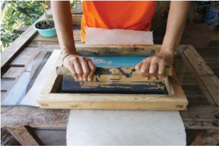

> **Deskripsi Visual:** Gambar ini menunjukkan proses cetak dengan teknik silkscreen printing. Dalam gambar tersebut, seorang individu sedang menggunakan alat cetak untuk mencetak gambar ke atas kertas. Alat cetak terdiri dari lembar kertas berwarna putih yang dipasang di atas kertas cetak, di mana gambar telah dicetak sebelumnya. Lembar kertas berwarna putih ini kemudian akan digunakan sebagai lapisan penutup saat proses cetak dilakukan. Elemen-elemen utama dalam gambar ini adalah alat cetak, kertas berwarna putih, dan tangan yang sedang melakukan proses cetak. Relasi antara elemen-elemen ini adalah bahwa alat cetak digunakan untuk mencetak gambar ke atas kertas berwarna putih, yang kemudian akan menjadi lapisan penutup saat proses cetak dilakukan. Teks, angka, atau label penting yang terlihat dalam gambar ini tidak ada, karena gambar hanya menunjukkan proses cetak tanpa informasi tambahan. Informasi kunci yang dapat diambil pembaca adalah bahwa proses cetak menggunakan teknik silkscreen printing dan bahwa alat cetak digunakan untuk mencetak gambar ke atas kertas berwarna putih.

 

---
## 📄 Halaman 54

---
**🖼️ Gambar/Diagram**

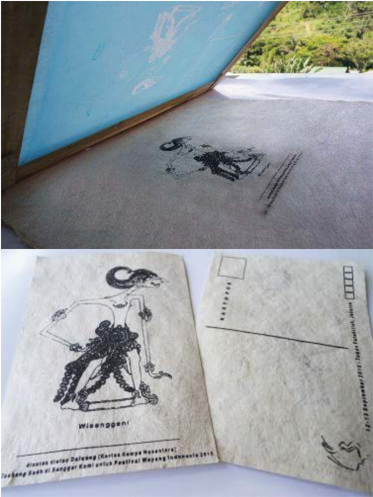

> **Deskripsi Visual:** Gambar ini menunjukkan dua halaman buku pelajaran yang berbeda. Halaman atas adalah sebuah gambar yang tampak seperti gambaran atau ilustrasi, mungkin dari sebuah buku atau majalah. Gambar tersebut memiliki teks "Wisengapan!" dan beberapa huruf lainnya yang tidak jelas. Di bawahnya ada gambar manusia yang sedang berdiri dengan posisi tubuh yang unik, tampak seperti sedang berjalan atau bergerak.

Halaman bawah adalah dua kartu pos yang tampak seperti kartu pos tradisional. Kartu pos tersebut memiliki gambar yang sama dengan gambar di halaman atas, namun lebih besar dan detail. Kedua kartu pos tersebut tampak seperti baru dan belum digunakan.

Elemen-elemen utama dalam gambar ini adalah gambar manusia dan teks "Wisengapan!". Relasi antara elemen-elemen ini adalah bahwa gambar manusia dan teks "Wisengapan!" terletak di kedua halaman buku pelajaran ini, menunjukkan hubungan antara dua halaman tersebut. 

Teks "Wisengapan!" dan huruf-huruf lainnya tampak seperti bagian dari judul atau konteks dari gambar tersebut. Informasi kunci yang dapat diambil pembaca adalah bahwa gambar ini mungkin merupakan bagian dari sebuah buku atau majalah yang berisi konten tentang "Wisengapan!", dan bahwa gambar tersebut mungkin merupakan ilustrasi atau gambaran dari suatu topik tertentu.

Gambar 2.25 Hasil Sablon pada Kertas Saeh

 

---
## 📄 Halaman 55

---
**🖼️ Gambar/Diagram**

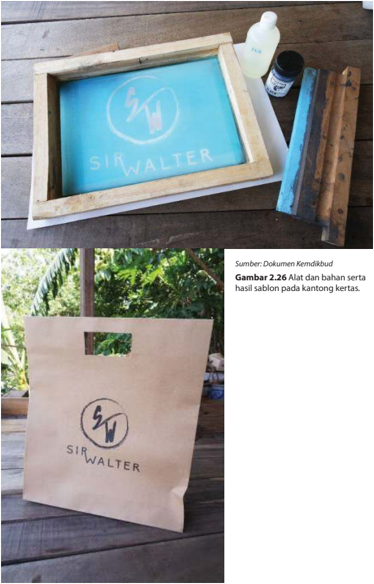

> **Deskripsi Visual:** Gambar ini menunjukkan proses sablon pada kantong kertas dengan menggunakan alat dan bahan tertentu. Gambar pertama menampilkan alat dan bahan yang digunakan, termasuk kertas sablon, sablon, dan bahan lainnya. Gambar kedua menunjukkan hasil akhir sablon pada kantong kertas dengan logo "Sir Walter" yang telah diterapkan. Dalam gambar ini, elemen-elemen utama adalah alat dan bahan yang digunakan untuk proses sablon, serta hasil akhir yang telah diterapkan pada kantong kertas. Teks penting yang terlihat adalah "Sumber: Dokumen Kemdikbud" dan "Gambar 2.26 Alat dan bahan serta hasil sablon pada kantong kertas." Informasi kunci yang dapat diambil pembaca adalah bahwa proses sablon dilakukan pada kantong kertas dengan menggunakan alat dan bahan tertentu, dan hasilnya adalah logo "Sir Walter" yang telah diterapkan pada kantong tersebut.

 

---
## 📄 Halaman 56

### 5. Cetak Digital

Cetak digital adalah proses cetak yang terjadi tanpa bidang acuan cetak. Proses pada pencetakan digital diatur dan dilakukan secara digital dengan menggunakan  komputer.  Cetak  digital  dikenal  juga  dengan  sebutan digital printing . Mesin yang digunakan untuk cetak digital adalah printer.

### Tugas 2 (Kelompok)

### Identifikasi Ragam Bahan dan Teknik Cetak di Lingkungan Sekitar

- Amati  lingkunganmu.  Perhatikan  ragam  bahan  dan  teknik  cetak  yang tersedia di lingkungan sekitarmu.
- Carilah informasi dari buku, internet, maupun dari wirausahawan grafika yang ada di daerahmu tentang ragam teknik yang dapat digunakan untuk membuat produk grafika.
- Tuliskan sebanyak-banyak tentang ragam bahan dan teknik yang ada di lingkungan sekitarmu.
- Presentasikan dalam bentuk tabel LK 2 atau bentuk presentasi lain yang lebih menarik dan kreatif.

### LK 2. Identifikasi Ragam Bahan dan Teknik Cetak di Lingkungan Sekitar

---
**📊 Tabel**

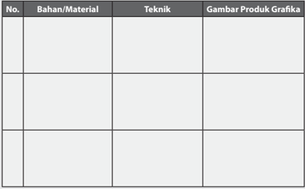

Tabel ini berisi informasi tentang bahan/material, teknik, dan gambar produk grafika. Topik utamanya adalah proses pembuatan produk grafika, yang melibatkan pilihan bahan/material, teknik penggunaan, dan hasil akhir dalam bentuk gambar produk grafika. Kolom pertama menunjukkan jenis bahan/material yang digunakan, kolom kedua menunjukkan teknik yang digunakan, dan kolom ketiga menunjukkan gambar produk grafika hasilnya. Data penting yang terlihat adalah bahwa setiap baris dalam tabel mewakili satu produk grafika dengan kombinasi bahan/material, teknik, dan gambar produk grafika yang unik.

 

---
## 📄 Halaman 57

### B.  Perancangan dan Produksi Produk  Grafika

### Perancangan Produk Grafika

Proses perancangan produk grafika diawali dengan melihat kebutuhan pasar atau identifikasi masalah yang dapat memanfaatkan produk grafika sebagai solusinya seperti kemasan makanan, kartu ucapan, gambar pada kaos atau stiker.  Identifikasi  masalah  dilanjutkan  dengan  pembuatan  gambar  atau sketsa ide. Ide terbaik kemudian dikembangkan menjadi produk grafika yang akan  dibuat,  dilanjutkan  dengan  persiapan  produksi  dan  proses  produksi. Produksi adalah membuat produk hasil rekayasa sehingga siap dijual.

### 1. Identifikasi Masalah

Perancangan  produk  bertujuan  untuk  menemukan  solusi  dari  sebuah permasalahan,  dalam  hal  ini  produk  grafika.  Produk  grafika  bertujuan untuk memberikan informasi dan keindahan. Maka, permasalahan adalah masalah kebutuhan informasi dan keindahan. Proses perancangan diawali dengan mengidentifikasi permasalahan informasi yang dibutuhkan dan informasi  yang  akan  diberikan.  Contoh-contoh  masalah  dengan  solusi produk grafika,

- Produk pangan khas daerah dihasilkan oleh industri kecil menengah. Produk  tersebut  hanya  dikemas  oleh  plastik  bening  dan  tidak memiliki  label.  Pembeli  tidak  mengetahui  produk  apakah  itu,  apa rasanya, bagaimana cara mengonsumsinya, dan kapan batas tanggal pemakaiannya. Produk pangan khas daerah tersebut membutuhkan produk grafika berupa kemasan atau label yang dapat memberikan informasi sekaligus daya tarik bagi konsumennya.
- Pada kegiatan olahraga, seragam tim sepakbola atau cabang olahraga  lain  biasanya  membutuhkan  nomor punggung. Pertandingan olahraga juga membutuhkan papan nilai yang berisi angka-angka. Angka  pada  nomor  punggung  maupun  angka  pada  papan  nilai merupakan produk grafika.
- Kata-kata  yang  indah  seperti  puisi  atau  kata-kata  bijak  yang  berisi motivasi  biasanya  dibuat  pajang  di  dinding,  sebagai  kartu  ucapan atau menjadi sebuah buku. Pajangan dinding, kartu ucapan maupun buku merupakan produk grafika.
- Kegiatan  pertunjukan  musik  dan  tari  membutuhkan  poster  untuk mengumumkan  tema,  waktu  dan  tempat  dari  acara  tersebut. Pertunjukan musik dan tari juga memerlukan tiket masuk. Poster dan tiket merupakan salah satu produk grafika.

 

---
## 📄 Halaman 58

---
**🖼️ Gambar/Diagram**

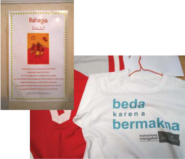

> **Deskripsi Visual:** Gambar ini menunjukkan dua item yang terhubung dengan tema bahasa Melayu dan budaya Indonesia. Pada bagian atas, terdapat sebuah kartu ucapan dengan tulisan "Bahagia" dalam bahasa Melayu dan Arab, serta gambar sebuah pohon kelapa. Bawahnya ada teks dalam bahasa Melayu yang berisi pernyataan tentang kebahagiaan dan keberkahan.

Pada bagian bawah, terdapat sebuah kaos dengan tulisan "beda karena bermakna" dalam bahasa Melayu. Kaos tersebut juga memiliki logo yang tampak seperti logo Universitas Indonesia (UI). Kaos ini menunjukkan bahwa tema utamanya adalah tentang perbedaan dan makna dalam kehidupan.

Elemen-elemen utama dalam gambar ini adalah kartu ucapan dan kaos. Kartu ucapan menunjukkan pesan positif tentang kebahagiaan dan keberkahan, sementara kaos tersebut menekankan pentingnya perbedaan dan makna dalam kehidupan. Relasi antara kedua elemen ini adalah bahwa mereka saling berkaitan dengan tema bahasa Melayu dan budaya Indonesia, serta peran pentingnya dalam kehidupan sehari-hari.

Sumber: Dokumen Kemdikbud

Gambar 2.27 Produk grafika sehari-hari di antaranya kaos dan poster.

### 2. Mencari Solusi dengan Curah Pendapat

Langkah  selanjutnya  adalah  mencari  ide  sebagai  solusi  dari  masalah tersebut.  Cara  yang  dapat  dilakukan  adalah  melalui  curah  pendapat ( brainstorming ) yang dilakukan dalam kelompok. Pada proses brainstorming ini,  setiap  anggota  kelompok  harus  membebaskan  diri untuk  menghasilkan  ide-ide  yang  beragam  dan  sebanyak-banyaknya. Beri kesempatan juga untuk munculnya ide-ide yang tidak masuk akal sekalipun. Tuangkan ide-ide tersebut ke dalam sketsa. Kunci sukses dari tahap brainstorming dalam kelompok adalah jangan ada perasaan takut salah, setiap orang berhak mengeluarkan pendapat, saling menghargai pendapat teman, boleh memberikan ide yang merupakan perkembangan dari ide sebelumnya, dan jangan lupa mencatat setiap ide yang muncul. Ide meliputi bentuk, gambar dan teks, warna, komposisi dan teknik apa yang akan digunakan.

 

---
## 📄 Halaman 59

---
**🖼️ Gambar/Diagram**

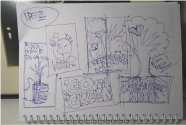

> **Deskripsi Visual:** Gambar ini adalah ilustrasi yang menunjukkan konsep "Go Green" atau "Berikan Lingkungan". Ilustrasi ini terdiri dari beberapa elemen yang saling terkait dan membentuk pesan utama tentang keberlanjutan dan penggunaan sumber daya alam yang sehat.

1. **Apa yang Ditampilkan Secara Keseluruhan**: Gambar ini menggambarkan tiga panel yang masing-masing menunjukkan bagaimana berbagai aspek kehidupan manusia dapat berkontribusi pada lingkungan. Di panel pertama, ada pohon yang tumbuh di dalam pot, menunjukkan bahwa kita bisa merawat lingkungan melalui perawatan dan pemeliharaan alam. Panel kedua menunjukkan sebuah mobil listrik yang sedang berjalan, menunjukkan bahwa teknologi dapat digunakan untuk mengurangi polusi dan penggunaan energi yang tidak efisien. Panel ketiga menunjukkan seorang anak yang sedang bermain di taman, menunjukkan bahwa generasi mendatang juga perlu diberi kesempatan untuk hidup dalam lingkungan yang sehat.

2. **Elemen-Elemen Utama dan Relasinya**: 
   - **Pohon**: Menunjukkan peran penting alam dalam menjaga lingkungan.
   - **Mobil Listrik**: Menunjukkan penggunaan teknologi untuk mengurangi polusi.
   - **Anak di Taman**: Menunjukkan bahwa generasi mendatang harus memiliki lingkungan yang sehat.

3. **Teks, Angka, atau Label Penting yang Terlihat**: 
   - "IDEZ" yang terletak di atas gambar, mungkin merupakan judul atau topik utama dari ilustrasi ini.
   - "GO GREEN" yang terdapat di panel kedua, menekankan pesan utama tentang keberlanjutan dan penggunaan sumber daya alam yang sehat.
   - "LIVE CLEANER LIFE" yang terdapat di panel ketiga, menekankan pentingnya kebersihan dan kesehatan lingkungan bagi generasi mendatang.

4. **Informasi Kunci yang Dapat Diambil Pembaca**: Gambar ini mengajarkan bahwa setiap individu dapat berkontribusi

Sumber: Dokumen Kemdikbud

---
**🖼️ Gambar/Diagram**

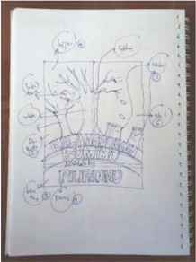

> **Deskripsi Visual:** Gambar ini adalah ilustrasi yang menunjukkan struktur otot manusia. Ilustrasi ini memperlihatkan bagian-bagian otot yang terletak di dalam tulang dan di luar tulang. Di bagian atas, ada tulisan "Struktur Otot Manusia" yang menjelaskan topik yang akan dibahas. Ilustrasi ini mencakup beberapa elemen utama:

1. Tulang: Dapat dilihat sebagai struktur dasar yang membentuk struktur tubuh.
2. Otot: Terdapat berbagai jenis otot yang terletak di dalam dan di luar tulang.
3. Jaringan: Menunjukkan hubungan antara otot dan tulang.

Teks, angka, atau label penting yang terlihat dalam gambar meliputi:
- "Tulang" (di bagian atas)
- "Otot" (terdapat di bagian tengah)
- "Jaringan" (hubungan antara otot dan tulang)

Informasi kunci yang dapat diambil pembaca meliputi:
- Struktur otot manusia terdiri dari tulang dan otot.
- Otot dapat ditemukan di dalam dan di luar tulang.
- Jaringan membantu menghubungkan otot dengan tulang.

Gambar 2.29 keterangan teknis.

 

---
## 📄 Halaman 60

### 3. Rasionalisasi

Rasionalisasi adalah proses mengevaluasi ide-ide yang muncul dengan beberapa pertimbangan teknis, di antaranya, material dan bahan  saja yang akan digunakan? Teknik apa yang akan digunakan untuk produksi? Bagaimana proporsi dan ukuran yang sesuai untuk produk tersebut agar sesuai  dengan  kebutuhan?  Dan  pertanyaan-pertanyaan  lainnya  yang memastikan  bahwa  rancangan  yang  dibuat  dapat  berfungsi  baik  dan dapat diproduksi.

Perhatikan sketsa-sketsa yang telah dibuat. Pilih ide-ide yang dianggap baik dan potensial untuk produk grafika yang akan dibuat. Kembangkan ide-ide  ini  dengan  rasional,  dan  tuangkan  ke  dalam  sketsa-sketsa selanjutnya. Tentukan desain akhir dari produk grafika yang akan dibuat.

---
**🖼️ Gambar/Diagram**

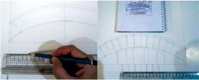

> **Deskripsi Visual:** Gambar ini menunjukkan dua halaman buku pelajaran yang berbeda. Halaman pertama adalah sebuah diagram yang menunjukkan struktur tubuh manusia dengan garis-garis merah yang menunjukkan bagian-bagian tubuh seperti kepala, leher, dada, perut, paha, dan kaki. Di sebelah kanan, ada sebuah lembar buku dengan tulisan "Buku Pelajaran" dan beberapa gambar yang tampaknya merupakan bagian dari pembelajaran tentang struktur tubuh.

Halaman kedua adalah sebuah foto yang menunjukkan tangan seseorang sedang menulis di buku dengan pensil. Di sekeliling foto tersebut ada garis-garis merah yang menunjukkan posisi tangan dan penulisan. Di sebelah kanan, ada lembar buku dengan tulisan "Buku Pelajaran" dan beberapa gambar yang tampaknya merupakan bagian dari pembelajaran tentang teknik menulis.

Dalam kedua halaman tersebut, elemen-elemen utama adalah diagram dan foto, serta tulisan "Buku Pelajaran". Garis-garis merah pada kedua halaman tersebut menunjukkan posisi dan arah yang penting dalam pembelajaran. Informasi kunci yang dapat diambil pembaca adalah bahwa buku pelajaran ini mengandung materi tentang struktur tubuh manusia dan teknik menulis.

---
**🖼️ Gambar/Diagram**

> **Deskripsi Visual:** Gambar ini adalah ilustrasi yang menunjukkan dua halaman buku pelajaran dengan teks berbeda. Halaman kiri memiliki tulisan "KELAMANGSUNGAN BUMIMU ADALAH PILIHANMU" dalam huruf besar dan berwarna hitam. Di bawah teks tersebut, terdapat gambar sebuah burung yang sedang menetas di atas pohon. Halaman kanan juga memiliki teks yang sama, namun dengan penambahan gambar burung yang sedang menetas di atas pohon. Gambar ini menggunakan teknik penggambaran yang kreatif untuk menggambarkan konsep tentang keberlanjutan dan pilihan dalam kehidupan.

Sumber: Dokumen Kemdikbud

 

---
## 📄 Halaman 61

### Tugas 3 (Kelompok)

### Perancangan Produk dan Persiapan Produksi Grafika

- Carilah  ide  produk  grafika  yang  akan  dibuat.  Pencarian  ide dapat dilakukan dengan curah pendapat ( brainstorming )  dalam kelompok.
- Pilih salah satu ide bentuk yang paling baik.
- Buat beberapa sketsa ide bentuk, gambar dan teks serta warnawarna  dari  produk  tersebut.  Pertimbangkan  keindahan  dari keseluruhan tampilan produk tersebut.
- Diskusikan dalam kelompok tentang bahan dan teknik produksi apa saja yang dapat digunakan untuk produk grafika yang akan dibuat oleh kelompok kalian. Pikirkan dan tentukan teknik-teknik yang akan digunakan untuk membuatnya serta bahan dan alat yang dibutuhkan.
- Buat petunjuk pembuatan produk tersebut dalam bentuk tulisan maupun gambar.
- Buatlah produk tersebut. Proses pembuatan model ini dilakukan untuk  mengetahui  bahan,  teknik  dan  alat  yang  tepat  untuk digunakan pada proses produksi yang sesungguhnya.
- Susunlah  semua  sketsa,  gambar,  studi  model,  daftar  bahan dan  alat  serta  petunjuk  pembuatan  ke  dalam  sebuah  laporan perancangan produk grafika yang baik dan rapi.

 

---
## 📄 Halaman 62

### Produksi Produk Grafika

Pada tahap  perancangan dilanjutkan dengan tahap produksi grafika. Kelancaran produksi  ditentukan  pula  oleh  cara  kerja  yang  memperhatikan  K3  (Kesehatan dan Keselamatan Kerja). Upaya menjaga kesehatan dan keselamatan kerja dibuat berdasarkan  bahan,  alat  dan  proses  produksi  yang  digunakan.  Pada  produksi grafika, pada umumnya, menggunakan bahan kimia yang dapat berbahaya bagi kulit  dan  pernafasan,  maka  pekerja  harus  menggunakan  sarung  tangan  dan masker. Selain alat keselamatan kerja, yang tak kalah penting adalah sikap kerja yang rapi, hati-hati, teliti dan penuh konsentrasi. Sikap tersebut akan mendukung kesehatan dan keselamatan kerja.

Produksi grafika diawali dengan tahap persiapan. Persiapan terdiri dari persiapan bahan, alat dan tempat kerja, termasuk alat keselamatan kerja yang dibutuhkan. Pada  produksi  grafika  dengan  menggunakan  teknik  sablon,  peralatan  yang dibutuhkan adalah screen dan rakel, sedangkan bahan yang dibutuhkan adalah cat dan pengencer cat. Cat yang dibutuhkan bergantung dari desain dan teknik pewarnaan  yang  digunakan.  Teknik  sablon  dapat  menggunakan  teknik  blok warna yang menggunakan acuan cetak sejumlah warna yang diinginkan. Teknik lain adalah serupa dengan offset ialah menggunakan prinsip CMYK, yaitu 3 warna dan hitam. Oleh karena itu, menggunakan 4 acuan cetak.

Sumber: Dokumen Kemdikbud

Gambar 2.32 Screen (1) dan Rakel (2)

1

 

---
## 📄 Halaman 63

---
**🖼️ Gambar/Diagram**

> **Deskripsi Visual:** Gambar ini adalah foto yang menunjukkan dua produk yang digunakan dalam proses pembuatan atau pengolahan makanan. Produk pertama, yang diberi nomor 1, adalah botol plastik berisi M3, yang tampaknya merupakan campuran atau bahan kimia. Produk kedua, yang diberi nomor 2, adalah botol minyak wangi dengan label "MONNI" dan "BLACK", yang tampaknya adalah bahan pewangi atau aroma untuk makanan.

Elemen utama dalam gambar ini adalah dua botol, satu berisi M3 dan satu berisi minyak wangi. Botol M3 terletak di sebelah kiri, sedangkan botol minyak wangi terletak di sebelah kanan. Relasi antara kedua produk ini tidak jelas, tetapi mereka mungkin digunakan dalam proses yang sama, seperti pengolahan atau pembuatan makanan.

Teks, angka, atau label penting yang terlihat dalam gambar ini adalah "M3" pada botol pertama dan "MONNI" dan "BLACK" pada botol minyak wangi. Informasi kunci yang dapat diambil pembaca dari gambar ini adalah bahwa ada dua produk yang digunakan dalam proses pembuatan atau pengolahan makanan, dan kedua produk tersebut memiliki label yang menunjukkan merek atau jenisnya.

---
**🖼️ Gambar/Diagram**

> **Deskripsi Visual:** Gambar ini adalah ilustrasi yang menunjukkan berbagai alat pelindung diri (APD) yang biasanya digunakan dalam kegiatan industri atau laboratorium. Ilustrasi ini mencakup empat elemen utama:

1. Apron: Di sebelah kiri atas, ada apron putih dengan lengan yang dikenakan oleh seseorang. Apron ini biasanya digunakan untuk melindungi pakaian saat bekerja di area yang berbahaya.

2. Masker: Di sebelah kiri bawah, terdapat masker medis biru yang dikenakan oleh seseorang. Masker ini digunakan untuk melindungi wajah dari debu, gas, atau partikel lainnya.

3. Sarung Tangan: Di sebelah kanan atas, ada sarung tangan hijau yang dikenakan oleh seseorang. Sarung tangan ini digunakan untuk melindungi tangan dari kontaminasi kimia atau serangan serangga.

4. Sarung Tangan Plastik: Di sebelah kanan bawah, terdapat sarung tangan plastik putih yang dikenakan oleh seseorang. Sarung tangan ini digunakan untuk melindungi tangan dari kontaminasi kimia atau serangan serangga.

Informasi kunci yang dapat diambil pembaca adalah bahwa gambar ini menunjukkan berbagai alat pelindung diri yang penting dalam lingkungan kerja yang berbahaya.

Gambar 2.34 Alat keselamatan kerja: apron, masker kimia dan sarung tangan plastik.

 

---
## 📄 Halaman 64

Tahap  berikutnya  adalah  pembuatan  acuan  cetak.  Acuan  cetak  dibuat bergantung pada desain dan teknik yang dipilih. Pada penggunaan teknik sablon  dengan  acuan  cetak  pada screen beremulsi,  dipersiapkan screen beremulsi sejumlah  warna  yang  diinginkan. Setiap warna  dibuat  film tersendiri. Setiap film kemudian dibuatkan screen beremulsi sesuai gambar pada film.

---
**🖼️ Gambar/Diagram**

> **Deskripsi Visual:** Gambar ini adalah ilustrasi yang menampilkan dua halaman buku pelajaran dengan judul "Kelangsungan Bumimu Adalah Pilihanmu". Halaman pertama memiliki latar belakang warna oranye dengan gambar pohon besar yang tumbuh di tengah kota, di sekelilingnya ada bangunan-bangunan kecil dan sepeda yang bergerak. Di atas pohon terdapat tulisan "KELANGSUNGAN" dan "BUMIMU ADALAH PILIHANMU" dalam warna biru dan hijau muda. Di bawah pohon terdapat tulisan "1" dalam warna hitam.

Halaman kedua memiliki latar belakang putih dengan gambar pohon yang sama namun lebih kecil dan berwarna hitam. Di sekeliling pohon terdapat beberapa buku yang terbuka dan tertutup, serta sepeda yang bergerak. Di bawah pohon terdapat tulisan "2" dalam warna hitam.

Elemen-elemen utama dalam gambar ini adalah pohon besar di tengah kota, sepeda bergerak, dan beberapa buku yang terbuka dan tertutup. Relasi antara elemen-elemen ini adalah bahwa pohon besar di tengah kota menunjukkan tema tentang kelangsungan dan pilihan dalam hidup, sedangkan sepeda bergerak dan buku yang terbuka dan tertutup menunjukkan aktivitas dan pendidikan yang dilakukan untuk memastikan kelangsungan tersebut. Teks, angka, atau label penting yang terlihat adalah "KELANGSUNGAN", "BUMIMU ADALAH PILIHANMU", "1", dan "2".

Informasi kunci yang dapat diambil pembaca adalah bahwa buku ini mungkin membahas tentang pentingnya kelangsungan dan pilihan dalam hidup, serta bagaimana melalui pendidikan dan aktivitas lainnya untuk memastikan kelangsungan tersebut.

Sumber: Dokumen Kemdikbud

Gambar 2.35 Poster (1) dan Film & Hasil Cetakan Hitam (2)

 

---
## 📄 Halaman 65

Sumber: Dokumen Kemdikbud

Gambar 2.36 Film untuk pembuatan acuan cetak warna cokelat & hasil cetakan warna cokelat (2).

---
**🖼️ Gambar/Diagram**

> **Deskripsi Visual:** Gambar ini adalah ilustrasi yang menampilkan sebuah logo Twitter dengan tulisan "KELANGSUNGAN BUMIMU ADALAH PILIHANMU" di bawahnya. Logo Twitter terdiri dari sebuah pita berwarna putih dengan tulisan "TWEET" yang terbalik, di atasnya ada sebuah bintang hitam. Tulisan tersebut menggunakan font yang tegas dan modern, dengan warna hitam yang kontras dengan latar belakang putih. Elemen-elemen utama dalam gambar ini adalah logo Twitter dan tulisan yang memberikan pesan motivasi tentang keberlanjutan bisnis. Teks "KELANGSUNGAN BUMIMU ADALAH PILIHANMU" menekankan pada pentingnya memilih jalan yang benar untuk bisnis.

Sumber: Dokumen Kemdikbud

Gambar 2.36 Film untuk pembuatan acuan cetak warna biru & hasil cetakan warna biru (2).

---
**🖼️ Gambar/Diagram**

> **Deskripsi Visual:** Gambar ini adalah ilustrasi yang menunjukkan sebuah logo dengan tulisan "Kelangsungan Bumimu Adalah Pilihanmu" di bawahnya. Logo tersebut terdiri dari huruf besar "KELANGSUNGAN" yang berwarna biru tua, "BUMIMU" yang berwarna putih, dan "ADALAH PILIHANNMU" yang juga berwarna putih namun lebih kecil ukurannya dibandingkan dengan "Bumimu". Di atas tulisan tersebut, terdapat gambar sebuah burung yang berwarna biru dengan kepala berwarna putih. Burung tersebut tampak seperti sedang terbang dan menghadap ke kanan. Warna latar belakang dasar gambar adalah putih, sementara bagian bawah gambar yang berisi tulisan berwarna biru tua.

 

---
## 📄 Halaman 66

Sumber: Dokumen Kemdikbud

Gambar 2.36 Film untuk pembuatan acuan cetak warna hijau & hasil cetakan warna hijau (2).

n

BUMIMU

PILIHANMU

ADALAH

Sumber: Dokumen Kemdikbud

Gambar 2.36 Film untuk pembuatan acuan cetak warna kuning & hasil cetakan warna kuning (2).

 

---
## 📄 Halaman 67

### Tugas 4 (Kelompok)

### Produksi Produk Grafika

Kegiatan  produksi  dilakukan  dalam  kelompok.  Tentukan  target jumlah  produksi  berdasarkan  waktu,  kemampuan  produksi  dan target  penjualan.  Rencanakan  proses  produksi,  jumlah  bahan  dan alat  serta  kebutuhan  tempat  kerja  berdasarkan  target  produksi. Buatlah pembagian tugas yang sesuai dengan kompetensi anggota kelompok  dan  mendukung  kualitas  produksi  yang  baik.  Kegiatan produksi tergantung dari desain produk grafika dan teknik produksi yang  akan  digunakan.  Secara  umum,  tahapan  produksi  produk grafika adalah seperti berikut.

- Persiapan
- Persiapan bahan
- Persiapan alat kerja
- Persiapan tempat kerja
- Kegiatan Produksi
- Pembuatan acuan cetakan
- Pencetakan
- Pascaproduksi
- Pemeriksaan kualitas (Quality Control)
- Pengemasan
- Perapian bahan, alat dan tempat kerja
- Penjualan

 

---
## 📄 Halaman 68

### Kemasan Produk Grafika

Kemasan  untuk  produk  berfungsi  untuk  melindungi  produk  kerusakan  serta memberikan  kemudahan  membawa  dari  lokasi  produksi  hingga  sampai  ke konsumen.  Kemasan  juga  berfungsi  untuk  menambah  daya  tarik,  dan  sebagai identitas  atau brand dari  produk  tersebut.  Fungsi  kemasan  didukung  oleh pemilihan  material,  bentuk,  warna,  teks  dan  grafis  yang  tepat.  Material  yang digunakan untuk membuat kemasan beragam bergantung dari produk yang akan dikemas. Produk yang mudah rusak harus menggunakan kemasan yang memiliki material berstruktur. Pemilihan material juga disesuaikan dengan identitas atau brand  dari  produk  tersebut.  Daya  tarik  dan  identitas,  selain  ditampilkan  oleh material kemasan, juga dapat ditampilkan melalui bentuk, warna, teks dan grafis. Pengemasan dapat dilengkapi dengan label yang memberikan informasi teknis maupun memperkuat identitas atau brand .  Gambar serta tulisan pada kemasan dan label kemasan yang memberikan informasi dan daya tarik, merupakan produk grafika. Produk grafika selain kemasan dan label, yang akan dijual seperti kartu ucapan, buku puisi, atau kaos olahraga perlu dikemas untuk melindungi produk tersebut dari kerusakan dan membuatnya menjadi lebih menarik.

---
**🖼️ Gambar/Diagram**

> **Deskripsi Visual:** Gambar ini adalah ilustrasi yang menunjukkan berbagai jenis kemasan makanan. Ilustrasi ini mencakup empat jenis kemasan yang berbeda:

1. Kemasan makanan instan dengan desain warna-warni dan gambar produk.
2. Tas kertas dengan tulisan "COOKIES CORNET" dan gambar kue.
3. Kemasan makanan dengan tulisan "Nugget Ball" dan gambar nugget.
4. Kemasan makanan dengan tulisan "Green Bean" dan gambar sayuran hijau.

Elemen-elemen utama dalam ilustrasi ini meliputi:
- Kemasan makanan instan dengan desain warna-warni.
- Tas kertas dengan tulisan "COOKIES CORNET".
- Kemasan makanan dengan tulisan "Nugget Ball".
- Kemasan makanan dengan tulisan "Green Bean".

Teks, angka, atau label penting yang terlihat dalam ilustrasi ini meliputi:
- Nama produk seperti "Nugget Ball", "COOKIES CORNET", dan "Green Bean".
- Tulisan "Nugget Ball" pada kemasan makanan instan.
- Tulisan "COOKIES CORNET" pada tas kertas.
- Tulisan "Green Bean" pada kemasan makanan.

Informasi kunci yang dapat diambil pembaca dari gambar ini adalah bahwa ilustrasi ini menunjukkan berbagai jenis kemasan makanan, mulai dari instan hingga tas kertas, serta berbagai produk makanan seperti nugget, cookies, dan sayuran. Ini menunjukkan variasi dalam desain dan jenis kemasan makanan yang tersedia di pasaran.

Sumber: Dokumen Kemdikbud

Gambar 2.37 Kemasan sebagai Produk Grafika

 

---
## 📄 Halaman 69

### C.  Penghitungan Biaya Produksi Produk Grafika

Biaya produksi adalah biaya-biaya yang harus dikeluarkan untuk terjadinya produksi barang. Unsur biaya produksi adalah biaya bahan baku, biaya tenaga kerja  dan  biaya overhead .  Biaya  yang  termasuk  ke  dalam  overhead  adalah biaya selain biaya bahan baku dan biaya tenaga kerja yang dikeluarkan untuk mendukung proses produksi. Metode penghitungan Biaya Produksi adalah seperti pada Tabel 1.1

Biaya bahan baku

Rp. ...........................

Biaya tenaga produksi

Rp. ...........................

Biaya overhead

Rp. ...........................  +

Biaya Produksi

Rp. ...........................

### Tugas 5 (Kelompok)

### Total Biaya Produksi

- Hitunglah biaya produksi kemasan produk.
- Hitunglah biaya produksi dari produk grafika kelompokmu.
- Diskusikan dalam kelompok berapa perkiraan harga jual produk karya kelompokmu.

### LK 5. Total Biaya Produksi

Biaya bahan baku

Rp. ...........................

Biaya tenaga produksi

Rp. ...........................

Biaya overhead

Rp. ...........................  +

Biaya Produksi Produk

Rp. ...........................

 

---
## 📄 Halaman 70

Biaya bahan baku kemasan

Rp. ...........................

Biaya tenaga produksi

Rp. ...........................

Biaya overhead

Rp. ...........................  +

Biaya Produksi Kemasan

Rp. ........................... +

Total Biaya Produksi

Rp. ...........................

### D. Pemasaran Langsung Produk Grafika

Pemasaran langsung adalah promosi dan penjualan yang dilakukan langsung kepada  konsumen  tanpa  melalui  toko.  Penjualan  langsung  merupakan hasil dari promosi langsung yang dilakukan oleh penjual terhadap pembeli. Pemasaran dapat dilakukan dengan promosi dan demo penggunaan produk kepada calon konsumen.

Sistem  penjualan  langsung  dapat  berupa  penjualan  satu  tingkat  ( singlelevel  marketing )  atau  multi  tingkat  ( multi-level  marketing ).  Penjualan  satu tingkat  merupakan  cara  yang  paling  sederhana  untuk  menjual  produk secara langsung. Wirausahawan langsung memasarkan dan menjual kepada konsumen tanpa membutuhkan toko atau pramuniaga. Pemasaran produk grafika dapat dilakukan dengan cara pemesanan. Konsumen dapat melihat, mengenali dan mencoba contoh produk, serta memesannya. Produk grafika akan  diproduksi  berdasarkan  pesanan  dan  dikirimkan  kepada  konsumen sesuai waktu yang dijanjikan.

Produsen  selain  menjual  produknya  sendiri,  dapat  membentuk  kelompok penjual yang akan memasarkan dan menjualkan produknya secara langsung kepada konsumen. Kelompok penjual dapat terdiri dari beberapa tingkatan. Sistem dengan beberapa tingkat kelompok penjual, disebut dengan multilevel  marketing Produk  Perusahaan  memiliki  usaha  di  bidang  penjualan langsung ( direct selling )  baik yang menggunakan single level maupun multilevel  marketing wajib  memiliki  Surat  Izin  Usaha  Penjualan  Langsung  yang dikeluarkan oleh BKPM sesuai dengan Peraturan Menteri Perdagangan No. 32 Tahun 2008.

 

---
## 📄 Halaman 71

### Tugas 6 (Kelompok)

### Pelaksanaan Demo dan Penjualan Langsung

- Diskusikan dalam kelompok, materi dan cara promosi/pemasaran produk.
- Tentukan target pasar dari produk grafika yang sudah dibuat pada Tugas 3.
- Buat pembagian tugas dalam kelompok untuk pelaksanaan pemasaran dan penjualan produk grafika.
- Lakukan pemasaran dan penjualan langsung dari produk grafika kelompok kalian.

---
**🖼️ Gambar/Diagram**

> **Deskripsi Visual:** Gambar ini menunjukkan sebagian ruang pameran dengan dinding yang dipenuhi dengan berbagai poster dan brosur. Poster tersebut terdiri dari berbagai ukuran dan warna, menunjukkan berbagai tema dan informasi. Di sisi kanan dinding, terdapat beberapa lembar kertas dengan teks yang tampaknya menjelaskan konten poster tersebut. Di sebelah kiri, terdapat rak dengan beberapa barang yang tampaknya merupakan hasil karya atau produk yang berkaitan dengan tema pameran tersebut. Gambar ini menunjukkan interaksi antara berbagai elemen visual dan teks untuk memberikan informasi kepada pengunjung.

Sumber: 1000journals.com

Gambar 2.38

Suasana Pameran Produk Grafika

 

---
## 📄 Halaman 72

### E.  Evaluasi  Kegiatan  Pembelajaran  Wirausaha Produk Grafika

### Evaluasi Diri Semester 2

Evaluasi diri pada akhir semester 2 terdiri atas evaluasi individu dan evaluasi kelompok. Evaluasi individu dibuat untuk mengetahui sejauh mana efektivitas pembelajaran  terhadap  masing-masing  peserta  didik.  Evaluasi  individu meliputi evaluasi sikap, pengetahuan dan keterampilan. Evaluasi kelompok adalah  untuk  mengetahui  interaksi  dalam  kelompok  yang  terjadi  dalam kelompok, kaitannya dengan pencapaian tujuan pembelajaran.

### Evaluasi Diri (individu)

Bagian A. Berilah tanda cek (v) pada kolom kanan  sesuai penilaian dirimu. Keterangan:

- Sangat Tidak Setuju
- Tidak Setuju
- Netral
- Setuju
- Sangat Setuju
Bagian B. Tuliskan  pendapatmu tentang pengalaman mengikuti pembelajaran Rekayasa di Semester 2

---
**📊 Tabel**

Tabel ini berisi aspek evaluasi untuk mengukur kemampuan seseorang dalam membuat produk grafika. Topik utamanya adalah pengetahuan dan keterampilan dalam membuat produk grafika. Kolom-kolomnya mencakup 5 aspek evaluasi, yaitu: 1) Pengetahuan tentang potensi produk grafika sebagai peluang usaha kerajinan, 2) Pengetahuan ragam teknik grafika, 3) Pengetahuan teknik produksi grafika yang tepat untuk bahan dan teknik di daerah sekitar, 4) Memiliki banyak ide untuk produk grafika yang inovatif, dan 5) Terampil membuat produk grafika. Data atau pola penting yang terlihat adalah bahwa setiap aspek evaluasi memiliki skala dari 1 hingga 5, dengan 5 menunjukkan paling baik dan 1 menunjukkan paling buruk. Ini membantu dalam membandingkan kemampuan seseorang dalam membuat produk grafika.

 

---
## 📄 Halaman 73

---
**📊 Tabel**

Tabel ini berisi pertanyaan-pertanyaan tentang kinerja dan pencapaian seseorang dalam mengelola dan menjual produk grafika melalui sistem penjualan langsung. Topik utama tabel adalah tentang keberhasilan dalam menjual produk grafika, kerja yang rapi dan teliti, kerjasama dalam kelompok, dan kepuasan dengan hasil kerja pada semester 2. Kolom-kolomnya mencakup pertanyaan-pertanyaan tersebut, dengan setiap jawaban diisi dengan tanda centang (sudah/belum). Data penting yang terlihat adalah bahwa semua pertanyaan memiliki jawaban "sudah" kecuali satu pertanyaan yang belum dijawab. Ini menunjukkan bahwa seseorang telah berhasil menjual produk grafika, bekerja dengan rapi dan teliti, dapat bekerja sama dalam kelompok, dan puas dengan hasil kerja mereka pada semester 2.

### Bagian B

Kesan dan pesan setelah mengikuti pembelajaran Rekayasa Semester 2:

### Evaluasi Diri (kelompok)

Bagian A. Berilah tanda cek (v) pada kolom kanan  sesuai penilaian dirimu. Keterangan:

- Sangat Tidak Setuju
- Tidak Setuju
- Netral
- Setuju
- Sangat Setuju
Bagian B. Tuliskan pengalaman paling berkesan saat bekerja dalam kelompok

---
**📊 Tabel**

Tabel ini merupakan bagian evaluasi yang mencakup dua aspek utama: kesinambungan belajar dan pengetahuan tentang materi pembelajaran semester 2. Kolom pertama menunjukkan nomor urutan, sedangkan kolom kedua hingga kelima berisi deskripsi atau kriteria evaluasi. Data penting yang terlihat adalah bahwa semua anggota kelompok memiliki sikap yang baik dalam aspek pertama, sementara dalam aspek kedua, tidak semua anggota kelompok memiliki pengetahuan yang lengkap tentang materi pembelajaran semester 2. Ini menunjukkan adanya perbedaan dalam kemampuan belajar antara anggota kelompok tersebut.

 

---
## 📄 Halaman 74

---
**📊 Tabel**

Tabel ini berisi 10 pertanyaan tentang kemampuan dan keterampilan anggota kelompok dalam mengerjakan tugas. Topik utamanya adalah tentang keterampilan dan kemampuan kerja kelompok. Kolom-kolomnya mencakup berbagai aspek seperti keterampilan beragam, keterampilan kerja tinggi, mampu melakukan musyawarah, melakukan pembagian tugas dengan adil, saling membantu, menjual produk grafika, melakukan presentasi dengan baik, dan hasil kerja yang memuaskan. Data atau pola penting yang terlihat adalah bahwa semua anggota kelompok memiliki keterampilan beragam dan tinggi, mampu melakukan musyawarah, melakukan pembagian tugas dengan adil, saling membantu, menjual produk grafika, melakukan presentasi dengan baik, dan memiliki hasil kerja yang memuaskan.

### Bagian B

Pengalaman paling berkesan saat bekerja dalam kelompok:

 

---
## 📄 Halaman 75

### BUDI DAYA

Prakarya dan Kewirausahaan

69

 

---
## 📄 Halaman 76

70

### Peta Materi

### Wirausaha Produk Budi daya Tanaman Hias

- -Potensi Budidaya Tanaman Hias
- -Jenis beragam
- -Teknologi sederhana
- -Bibit melimpah
- Proses Produksi Budi daya Tanaman Hias
- -Jenis produksi
- -Pemilihan lahan
- -Pemilihan bibit
- -Pemilihan pupuk
- -Pengendalian hama
- -Proses panen dan pascapanen
- Penghitungan Harga Pokok Budi daya Tanaman Hias
- Penentuan biaya investasi
- Penentuan biaya tetap dan tidak tetap
- Penentuan Harga Pokok Produksi (HPP)
- Penentuan harga jual
- Perhitungan Laba/Rugi
- Pemasaran Langsung Budi daya Tanaman Hias
- Pengenalan ke lingkungan terdekat
- Melalui acara rutin (arisan, pertemuan, rapat, dll)
- Melalui media social (fb, twitter, dll)
- Penjualan kreatif (car free day, dll)
- Membuka toko sendiri
- Hasil Kegiatan Usaha Budi daya Tanaman Hias
- Jenis usaha terpilih
- Sistem produksi terpilih
- Sistem pemasaran terpilih
- Pemberian rewards dan bonus
Kelas X SMA/MA/SMK/MAK

Semester 1

 

---
## 📄 Halaman 77

### Tujuan Pembelajaran

Setelah mempelajari bab ini, siswa mampu:

- Menghayati bahwa  begitu  banyak  keanekaragaman  tanaman  hias  di Indonesia, setiap daerah mempunyai ciri dan citarasa yang khas
- Menghayati, percaya  diri,  tanggung  jawab,  kreatif  dan  inovatif  dalam membuat analisis kebutuhan akan adanya teknologi produksi yang baik dan tepat untuk setiap usaha dalam bidang budi daya tanaman hias.
- Menyajikan simulasi wirausaha budi daya tanaman hias, sesuai dengan jenis tanaman hias  yang  ada  di  daerahnya  masing-masing,  berdasarkan  analisis keberadaan sumber daya yang ada di lingkungan sekitar.
- Mengidentifikasi  dan  memproduksi, budi  daya  tanaman  hias,  sesuai dengan jenis yang ada di daerahnya masing-masing, meliputi: teknik produksi, perhitungan biaya, sistem pemasaran, model promosi.

### · Mempresentasikan:

- -Peluang dan perencanaan usaha sesuai pilihan budi daya tanaman hias yang dipilihnya dengan sungguh-sungguh dan percaya diri.
- -Pengembangan bisnis budi daya tanaman hias, meliputi teknik produksi, perhitungan harga, promosi dan pemasaran, sesuai dengan produk yang dipilihnya.

### BAB III Kewirausahaan Budi daya Tanaman Hias

 

---
## 📄 Halaman 78

Budi daya tanaman adalah kegiatan untuk memproduksi tanaman atau bagian tanaman yang dapat dimanfaatkan untuk memenuhi kebutuhan manusia melalui pengelolaan tanaman dan lingkungan tumbuhnya, seperti tanah, air, udara, dan cahaya matahari. Dalam budi daya tanaman, hasil yang maksimal dapat dicapai jika  tanaman  dipelihara  dan  lingkungan  tumbuh  tanaman  dapat  dikendalikan dengan  baik.  Hasil  budi  daya  tanaman  dapat  dimanfaatkan  untuk  memenuhi kebutuhan sendiri atau sebagian dipasarkan sehingga usaha budi daya tanaman dapat menjadi mata pencaharian masyarakat.

Materi tentang budi daya akan mengajak siswa mengenal jenis  tanaman pangan dan tanaman hias, produk hasil budidayanya serta cara budidayanya.  Di akhir pembelajaran,  siswa  diajak  untuk  melakukan  praktik  budi  daya  tanaman  serta diperkenalkan juga dengan wirausaha di bidang budi daya. Budi daya tanaman harus  dilakukan  dengan  cara  yang  baik  agar  menghasilkan  produk  budi  daya bermutu sehingga dapat diterima oleh konsumen.

Permintaan masyarakat terhadap produk budi daya tanaman pangan lebih stabil karena  pangan  adalah  kebutuhan  pokok  bagi  manusia. Tidak  demikian  halnya dengan  permintaan  masyarakat  terhadap  tanaman  hias  yang  sanga t  fluktuatif karena  dipengaruhi  oleh  tingkat  pendapatan  dan  selera  konsumen.  Selain  itu, sifat tanaman hias merupakan kebutuhan tersier bagi masyarakat.

Karena peningkatan pendapatan perubahan gaya hidup masyarakat menyebabkan peningkatan permintaan terhadap tanaman hias. Secara umum, di Indonesia permintaan akan tanaman hias lebih tinggi pada bulan Juli-Desember. Namun, di luar bulan-bulan tersebut, permintaan tanaman hias tetap ada.

Dalam wirausaha di bidang budi daya hias, kamu harus jeli dalam mendesain budi daya yang akan kamu lakukan, terutama ketika memilih jenis tanaman yang akan dibudidayakan serta merencanakan waktu panen. Dalam memilih jenis tanaman hias yang akan dibudidayakan, perlu dipertimbangkan selera konsumen karena konsumen  akan  menyenangi  tanaman  hias  yang  saat  itu  menjadi  primadona. Perencanaan  waktu  panen  yang  tepat  berhubungan  dengan  pemenuhan kebutuhan konsumen. Permintaan tanaman hias akan meningkat pada waktuwaktu tertentu, misal pada perayaan hari keagamaan.

Hobi  dalam  budi  daya  tanaman  dapat  dijadikan  peluang  wirausaha  yang menguntungkan. Wirausaha budi daya tanaman dapat dimulai dari skala rumahan dengan  modal  kecil. Wirausaha  di  bidang  budi  daya  tanaman  hias  dapat  juga dikombinasikan dengan usaha penyewaan dan pemeliharaan tanaman hias.

Banyak  pilihan  wirausaha  di  bidang  tanaman  hias.  Hal  penting  lainnya  yang harus  dipertimbangkan  dalam  memilih  jenis  tanaman  yang  dibudidaya  adalah kesesuaian  tanaman  hias  yang  kamu  dengan  kondisi  lingkungan  budi  daya akan dilakukan. Cobalah perhatikan lingkungan tempat tinggalmu dan pilihlah tanaman hias yang sesuai untuk dibudidayakan.

 

---
## 📄 Halaman 79

### Tugas 1 (Individu)

Cobalah  kemukakan  idemu  tentang  berbagai  jenis  usaha  budi  daya tanaman hias yang dapat menjadi pilihan bidang wirausaha sesuai dengan potensi wilayah tempat tinggalmu!

Di bawah ini adalah beberapa tips dalam memulai wirausaha  di bidang budi daya tanaman hias.

- Memulai dengan tanaman yang mudah
- Jenis  dan  produk  budi  daya  tanaman  hias  sangat  banyak.  Setiap tanaman hias memiliki tingkat kesulitan budi daya yang berbeda-beda. Kamu  dapat  memulai  wirausaha  budi  daya  tanaman  hias  dengan memilih  jenis  tanaman  yang  mudah  dibudidayakan  sesuai  dengan kondisi wilayah tempat tinggalmu sehingga resiko kegagalannya akan rendah.
- Memilih jenis tanaman hias yang akan populer Kamu  dapat melakukan survei atau wawancara langsung pada konsumen hias untuk mengetahui  jenis yang akan populer di masa yang akan datang.
- Memilih tanaman hias yang permintaan konsumen stabil Dalam  memulai  wirausaha  di  bidang  tanaman  hias,  kamu    perlu mengetahui  jenis  tanaman  hias    dengan  permintaan  relatif  stabil sepanjang tahun

### A. Proses Produksi Budi daya Tanaman Hias

Kamu  sudah  mengetahui  tentang  sarana  produksi  dan  teknik  budi  daya tanaman pada buku Prakarya dan Kewirausahaan Kelas X, semester 1, Bab 3.  Secara umum, teknik budi daya tanaman hias hampir sama dengan teknik budi daya tanaman pangan. Teknik budi daya yang baik menentukan kualitas produk tanaman hias yang dihasilkan.  Berikut dijelaskan sarana produksi dan teknik budi daya tanaman hias.

Sarana produksi yang diperlukan dalam budi daya tanaman hias hampir sama dengan tanaman pangan. Tanaman pangan umumnya dibudidayakan dalam lahan yang terhampar, sedangkan tanaman hias dapat juga dibudidayakan dalam  pot  atau polibag di  tempat  terbuka  atau  ternaungi  di  pekarangan.

 

---
## 📄 Halaman 80

Media tanam pot dapat  berupa tanah yang dicampur dengan pupuk kandang atau berbagai media tanam siap pakai yang tersedia di toko sarana produksi pertanian. Berikut adalah bahan untuk budi daya tanaman hias.

- Benih atau bibit
- Media tanam
- Pupuk
- Zat  pengatur tumbuh
- Pestisida
- Mulsa plastik (plastik penutup media tanam)
- Sungkup (plastik penutup bunga/daun)
- Polybag atau pot

---
**🖼️ Gambar/Diagram**

> **Deskripsi Visual:** Gambar ini adalah foto yang menunjukkan seorang petani sedang memanen padi di ladang. Petani tersebut menggunakan alat berbentuk seperti pisau untuk memotong padi. Latar belakangnya adalah ladang yang luas dengan tanaman padi yang tumbuh rapi. Di sekitar petani, terlihat beberapa pohon dan rumput liar. Gambar ini menunjukkan proses pertanian tradisional dan menekankan pentingnya upaya manusia dalam mengelola lahan pertanian.

Elemen-elemen utama dalam gambar ini meliputi petani, padi, alat pemotong, ladang, pohon, dan rumput liar. Petani adalah subjek utama yang sedang melakukan tugasnya. Padi adalah tanaman utama yang dipanen oleh petani. Alat pemotong digunakan untuk memotong padi. Ladang adalah tempat pertanian yang luas. Pohon dan rumput liar menunjukkan kondisi alam sekitar ladang.

Teks, angka, atau label penting yang terlihat dalam gambar ini tidak ada. Namun, informasi kunci yang dapat diambil pembaca adalah bahwa gambar ini menunjukkan proses pertanian tradisional, petani sedang memanen padi, dan lingkungan pertanian yang sehat dan lestari.

 

---
## 📄 Halaman 81

Secara umum, teknik budi daya tanaman hias hampir sama dengan teknik budi  daya  tanaman  pangan.  Berikut  ini  adalah  teknik  budi  daya  untuk tanaman hias.

### 1. Persiapan Lahan/Media Tanam

Budi  daya  tanaman  hias  dapat  dilakukan  di  dalam  pot  ( polybag )  atau dalam hamparan lahan. Persiapan lahan/media tanam dilakukan untuk menyediakan  media  tumbuh  yang  sesuai  untuk  setiap  tanaman  agar dapat tumbuh dan berkembang dengan baik. Kondisi tanah yang gembur sangat dibutuhkan untuk budi daya tanaman.

Jika  diperlukan,  lahan  tanam  dapat  diberi  tambahan  pupuk  kandang. Kadang-kadang,  budi  daya  tanaman  hias  dilakukan  di  tempat  yang dinaungi dengan paranet atau plastik.

### 2. Pembibitan

Persiapan  benih/bibit  merupakan  hal  yang  penting  dalam  budi  daya tanaman hias. Perbanyakan bahan tanaman hias dapat dilakukan melalui perbanyakan  seksual  dengan  menggunakan  biji  dan  perbanyakan vegetatif dengan menggunakan organ vegetatif.

Perbanyakan  seksual  dilakukan  melalui biji  yang  merupakan  hasil pembuahan  gamet  betina  oleh  gamet  jantan  yang  didahului  oleh penyerbukan.  Biji  yang  akan  dijadikan  benih  sebaiknya  dipanen  dari induk  yang  sehat.  Sebelum  ditanam,  biji  disemai  terlebih  dahulu. Penyemaian dilakukan di lahan yang berbentuk bedengan. Lahan untuk persemaian  juga  harus  diolah  agar  gembur  sehingga  memudahkan perkecambahan benih. Persemaian benih dilakukan di tempat yang agak terlindung dari panas matahari atau dapat diberikan naungan paranet.

Persemaian  benih  juga  dilakukan  di  bak  plastik, tray atau  pot  plastik. Media  semai  yang  digunakan  adalah  tanah  yang  dicampur  dengan pupuk kandang dengan perbandingan 2 : 1 atau dua bagian tanah dan satu  bagian  pupuk kandang.  Media semai juga dapat diganti dengan media  siap  pakai  yang  dibeli  di  toko  pertanian,  seperti  arang  sekam atau cocopeat .  Selama persemaian, media semai dijaga kelembabannya dengan melakukan penyiraman. Contoh tanaman hias yang diperbanyak dengan benih adalah Anthurium dan Adenium .

 

---
## 📄 Halaman 82

Sumber: http://www.indonetwork.co.id/cvbsf/3980357/ arang-sekam-padi-rice-husk-charcoal.htm, Tabloid Nova (Foto: Ahmad Fadillah)

---
**🖼️ Gambar/Diagram**

> **Deskripsi Visual:** Gambar ini menunjukkan sebuah papan penanaman dengan beberapa pot tanaman yang telah ditanam. Setiap pot memiliki label yang menunjukkan nama tanaman dan jenisnya. Pot pertama berisi tanaman yang dikenal sebagai "Sunflower" (Bunga Matahari), sedangkan pot kedua berisi "Cucumber" (Kubis). Papan penanaman tersebut terletak di atas media tanam yang terdiri dari benih-benih yang sudah dipotong dan disusun rapi dalam kotak-kotak kecil. Gambar ini menunjukkan proses penanaman dan perawatan tanaman, serta memberikan informasi tentang jenis-jenis tanaman yang dapat ditanam.

Sumber: http://kebun-eksotis.blogspot. com/p/petunjuk-tanam.html

Gambar 3.6 Pembibitan pada Tray

 

---
## 📄 Halaman 83

Perbanyakan  vegetatif  menggunakan  organ-organ  vegetatif.  Ke  untungan perbanyakan vegetatif adalah dapat menghasilkan bibit yang seragam  dalam  jumlah  banyak.  Perbanyakan  vegetatif  dapat  terjadi secara  alami  maupun  buatan.  Perbanyakan  vegetatif  dapat  dengan menggunakan organ akar, batang, daun, tunas, sulur, dan umbi. Contoh tanaman  hias  yang  membiak  secara  vegetatif  alami  adalah  bunga  lili, gladiol, dan kanna.

Perbanyakan  vegetatif  buatan  pada  tanaman  hias  dapat  dilakukan melalui  stek,  perundukan,  okulasi,  dan  penyambungan.  Berikut  adalah contoh perbanyakan vegetatif buatan pada tanaman hias.

- Stek:  perbanyakan  dengan  menggunakan  bagian  akar,  batang, dan  daun.  Contoh  tanaman  hias  yang  diperbanyak  dengan  stek diantaranya adalah cocor bebek, begonia, sirih, mawar dan puring.
- Perundukan: perbanyakan dengan cara merundukkan bagian tanaman ke tanah sehingga menginduksi munculnya akar. Perundukan  dapat  dilakukan  misalnya  pada  tanaman  melati  dan alamanda.
- Penyambungan ( grafting ), merupakan penggabungan dua tanaman yang  berlainan  sehingga  tumbuh  menjadi  tanaman  baru.  Contoh tanaman  hias  yang  diperbanyak  dengan  penyambungan  adalah mawar atau adenium.

---
**🖼️ Gambar/Diagram**

> **Deskripsi Visual:** Gambar ini adalah ilustrasi yang menunjukkan struktur dasar dari tumbuhan. Gambar ini menggambarkan bagaimana daun tumbuhan berada di atas batang dan akar. Daun tumbuhan memiliki bentuk seperti jari-jari dan berwarna hijau, sementara batang tumbuhan berwarna cokelat dan berbentuk seperti lingkaran. Akar tumbuhan berwarna merah dan berbentuk seperti lingkaran. Ilustrasi ini menunjukkan hubungan antara daun, batang, dan akar dalam struktur tumbuhan.

Sumber: Dokumen Kemdikbud Gambar 3.7 Ilustrasi teknik perundukan

 

---
## 📄 Halaman 84

---
**🖼️ Gambar/Diagram**

> **Deskripsi Visual:** Gambar ini adalah ilustrasi yang menunjukkan proses pertumbuhan tanaman menggunakan teknik pohon bercabang. Gambar ini menggambarkan langkah-langkah yang harus dilakukan untuk melakukan pertumbuhan tanaman baru melalui cabang. Pertama, cabang yang akan digunakan sebagai induk dipilih dan dipotong dengan tepat. Kemudian, cabang tersebut dipasang ke dalam media tanam yang sesuai. Setelah itu, cabang tersebut diberi air dan dibiarkan tumbuh. Proses ini membutuhkan waktu beberapa bulan hingga beberapa tahun tergantung pada jenis tanaman dan kondisi lingkungan. Ilustrasi ini sangat membantu dalam memahami proses pertumbuhan tanaman baru melalui cabang.

### Tugas 2 (Individu)

- Carilah lima jenis tanaman hias yang ada di wilayah sekitarmu !
- Pelajarilah lebih jauh tentang cara perbanyakannya!

### Lembar Kerja 2 (LK-2)

Nama :

Kelas :

---
**📊 Tabel**

Tabel ini berisi informasi tentang tanaman hias dan cara perbanyakan mereka. Topik utamanya adalah jenis-jenis tanaman hias dan metode yang digunakan untuk memperbanyaknya. Tabel memiliki dua kolom utama: "Nama Tanaman Hias" dan "Cara Perbanyakan". Kolom pertama mencakup berbagai jenis tanaman hias seperti bunga, pohon, dan tumbuhan hias lainnya. Kolom kedua menyediakan informasi tentang cara-cara perbanyakan yang umum digunakan untuk setiap jenis tanaman tersebut. Misalnya, beberapa tanaman hias dapat diperbanyak dengan cara menanam bibit, sementara yang lain mungkin menggunakan metode seperti pemotongan atau penanaman daun. Tabel ini membantu pembaca memahami berbagai cara untuk memperluas koleksi tanaman hias mereka.

 

---
## 📄 Halaman 85

### Tugas 3. Kelompok

- Pilihlah satu dari 5 tanaman hias yang telah kamu dapatkan!
- Carilah informasi dari berbagai sumber tentang cara perbanyakannya! Setelah itu, coba lakukan perbanyakan tanaman yang kamu pilih!

### Lembar kerja 3 (LK-3)

Nama :

Kelas :

Nama tanaman :

Teknik perbanyakan :

Cara perbanyakan :

Buat tahapannya lengkapi dengan penjelasan dan gambar!

### 3.  Penanaman

Penanaman  dilakukan  jika  lahan  tanam  sudah  gembur.  Jika  terlalu kering,  lahan  dapat  disiram  terlebih  dahulu.  Penanaman  sebaiknya dilakukan pada pagi hari atau sore hari. Jika diperbanyak dengan benih, benih dapat ditanam langsung atau  disemai terlebih dahulu  sehingga tumbuh menjadi bibit siap tanam. Bibit ditanam dalam lubang tanam dengan ukuran  yang sesuai untuk masing jenis tanaman  hias.

### 4.  Pemupukan

Pemupukan adalah penambahan unsur hara untuk mencukupi kebutuhan tanaman. Pupuk dapat diberikan ke media atau disemprot langsung ke tanaman. Jenis pupuk yang digunakan bisa berupa pupuk organik atau anorganik.

### 5. Pemeliharaan

Pemeliharaan meliputi : (i) penyulaman, yaitu menanam kembali tanaman yang  mati,  rusak  atau  pertumbuhan  tidak  normal,  (ii)  penyiraman, disesuaikan dengan kondisi tanaman. Penyiraman dapat dilakukan pada pagi atau sore hari. Jika cuaca panas, penyiraman dilakukan setiap hari, (iii)  pembumbunan,  dilakukan  untuk  memperbaiki aerasi tanah  (udara dalam  tanah  bergantian  dengan  udara  di  atmosfer)  serta  menutup pangkal tanaman atau bagian tanaman yang berada di dalam tanah, dan (iv) penyiangan, membersihkan gulma yang mengganggu pertumbuhan tanaman.

 

---
## 📄 Halaman 86

### 6. Pengendalian OPT

Pengendalian organisme pengganggu  dilakukan untuk  mencegah mengendalikan organisme yang mengganggu pertumbuhan, produksi dan  kualitas  hasil  tanaman.  Pengendalian  dapat  dilakukan  dengan menggunakan  pestisida  atau  secara  manual  dengan  mencabut  atau membuang tanaman yang terserang serta memungut hama pengganggu tanaman. Saat ini sudah banyak tersedia pestisida alami.

### 7. Panen dan Pascapanen

Panen dan pascapanen harus dilakukan dengan hati-hati agar kehilangan hasil dan penurunan kualitas hasil panen dapat dihindari.  Panen dilakukan pada pagi atau sore hari. Pascapanen tanaman hias disesuaikan dengan produk budidayanya.

- Tanaman hias daun
- Bunga potong
- Tanaman dalam pot

### Tugas 4 (Kelompok)

### Observasi dan wawancara

- Kunjungilah tempat budidaya tanaman hias!
- Lakukan wawancara dengan petani untuk mendapatkan informasi tentang hal-hal berikut.
- Jenis tanaman hias yang mereka tanam.
- Sarana produksi yang mereka gunakan.
- Teknik budidaya yang mereka gunakan.
- Kesulitan dalam budidaya tanaman hias.
- Alasan mereka memilih jenis tanaman hias yang biasa mereka tanam.
- Perhatikan sikapmu pada saat melakukan wawancara. Hendaknya bersikap ramah, sopan serta bekerja sama dan bertoleransi dengan teman sekelompokmu!
- Tulislah laporan hasil wawancaramu dan presentasi di depan kelas dengan percaya diri

 

---
## 📄 Halaman 87

### Lembar Kerja 4 (LK 4)

Nama kelompok

:

Nama anggota :

Kelas

:

Jenis tanaman yang dibudidayakan

:

Nama petani :

Lokasi

:

Laporan hasil observasi

:

---
**📊 Tabel**

Tabel ini berisi informasi tentang teknik budidaya tanaman, yang terdiri dari 6 kolom: Bahan, Alat, dan 5 baris dengan judul teknik budidaya. Topik utama tabel adalah teknik budidaya tanaman, yang meliputi pengolahan lahan, penanaman, pemeliharaan, pengendalian hama dan penyakit, panen, dan pascapanen. Data penting yang terlihat adalah bahwa teknik budidaya ini melibatkan berbagai aspek seperti pengolahan lahan, penanaman, pemeliharaan, pengendalian hama dan penyakit, panen, dan pascapanen. Ini menunjukkan bahwa teknik budidaya tanaman melibatkan proses yang kompleks dan memerlukan berbagai alat dan bahan untuk sukses.

Diskusikanlah  dengan  teman  sekelompokmu  apakah  budi  daya  yang dilakukan  sudah  sesuai  dengan  standar  untuk  menghasilkan  tanaman hias hasil pertanian yang baik.

Sekarang kamu sudah memahami teknik budi daya tanaman hias. Selanjutnya, kamu  dapat  mempraktikkan  budi  daya  tanaman  hias.  Lakukan  mulai  dari membuat  perencanaan,  menyiapkan  sarana  produksi,  pengolahan  lahan, penanaman, pemeliharaan, panen dan pasca panen.

Sebelum memulai kegiatan budi daya, perlu diperhatikan kesesuaian wilayah untuk  tanaman  yang  akan  dibudidayakan.  Misalnya,  jika  kamu  memilih adenium, ketahuilah bahwa adenium sesuai ditanam untuk wilayah  dengan ketinggian maksimal 700 m dpl dengan suhu 25-30  o C. Adenium lebih senang hidup di lingkungan panas, kering dan bersuhu tinggi. Adenium memerlukan sinar matahari langsung sekitar 5-12 jam per hari untuk pertumbuhan batang, memunculkan bunga, dan memicu pertumbuhan akar dan membuat cabang menjadi besar dan kokoh.

Pertimbangan lain dalam merancang budi daya tanaman hias adalah lamanya masa tanam, dari tahap persiapan lahan/medium hingga panen, pasar sasaran ke mana produk hasil panen tersebut akan dijual, atau peluang trend produk hasil budi daya tanaman hias. Adanya trend pasar yang meningkat terhadap tanaman hias jenis daun, akan membuka peluang budi daya tanaman hias daun.

 

---
## 📄 Halaman 88

Keputusan  pemilihan  jenis  tanaman  yang  akan  dibudidaya  dibuat  setelah dilakukan  penelitian  tentang  kondisi  tanah,  iklim,  potensi  tanaman  hias di  daerah  tersebut,  peluang  pasar  dan  peluang  pengolahannya.  Tahap selanjutnya  adalah  membuat  rancangan  proses  budi  daya  yang  akan dilakukan, dimulai dengan  persiapan lahan hingga panen. Buatlah perancangan  secara  mendetail  meliputi  waktu,  sarana  dan  proses  yang harus dilakukan.

Pelaksanaan budi daya tanaman hias dilakukan sesuai dengan rencana yang telah  dibuat.  Lakukan pengamatan dan pencatatan secara berkala tentang proses pertumbuhan tanaman. Lakukan pula evaluasi pada setiap tahapan hingga panen. Hasil evaluasi dapat digunakan untuk perbaikan perancangan budi daya berikutnya.

Produk hasil budi daya tanaman hias dapat dikelompokkan sebagai tanaman hias pot ( pot plant ) dan tanaman hias potong ( cut flower ).  berupa daun dan bunga, tanaman hias taman, serta bunga tabur dan bunga ronce, hias daun dan  tanaman  hias  bunga.  Pengemasan  produk  hasil  budi  daya  tanaman hias  dapat  memengaruhi  kehilangan  hasil  dan  stabilitas  produk  selama pengangkutan  maupun  dalam  pemasaran.  Pengemasan  juga  memiliki tujuan  untuk  meningkatkan  nilai  tambah  prosuk  hasil  budi  daya  tanaman hias.  Pemilihan  kemasan  yang  sesuai  dengan  produk  budi  daya  tanaman hias menjadi sangat penting. Misalnya, untuk tanaman hias dalam pot, penggunaan pot menarik dan sesuai dengan selera konsumen akan meningkatkan nilai jual produk.

Penggunaan  kemasan  kertas atau plastic pada  bunga  potong  mempertahankan kualitas produk. Pengemasan bunga potong untuk pengiriman jarang jauh harus dapat memastikan bunga dalam keadaan segar setibanya di tempat. Cara yang biasa digunakan adalah  memasukkan  pangkal tangkai bunga potongan ke dalam tube berisi cairan pengawet/dibungkus dengan kapas kemudian dimasukkan ke dalam kantong plastik berisi cairan pengawet, lalu dikemas dalam kotak karton/kemasan lain yang sesuai. Bunga melati  untuk  tujuan  ekspor,  setelah  disortir,  direndam  di  dalam  air  es  agar keras, tampak bersih dan segar lalu dikemas dengan kotak styrofoam untuk mempertahamnkan  suhu  yang  sejuk.  Pada  bagian  luar  kemasan,  diberi keterangan nama barang/varietas bunga, jenis mutu ( grade ), nama atau kode produsen/eksportir, jumlah isi, negara/tempat tujuan dan produksi Indonesia.

 

---
## 📄 Halaman 89

---
**📊 Tabel**

Tabel ini membahas berbagai jenis tanaman hias yang dapat dijadikan budi daya, dibagi menjadi kategori berdasarkan jenis tanaman dan daunnya. Topik utama tabel adalah penjelasan tentang jenis-jenis tanaman hias yang bisa dijadikan budi daya, termasuk tanaman hias pot, tanaman hias potong, tanaman hias taman, dan bunga tabur dan roce. Kolom-kolom yang ada dalam tabel meliputi kategori tanaman hias dan contoh tanaman hias yang sesuai dengan kategori tersebut. Data atau pola penting yang terlihat dalam tabel adalah bahwa tanaman hias pot dan tanaman hias potong lebih banyak ditemukan dalam kategori daun, sementara tanaman hias taman dan bunga tabur dan roce lebih banyak ditemukan dalam kategori bunga.

 

---
## 📄 Halaman 90

---
**🖼️ Gambar/Diagram**

> **Deskripsi Visual:** Gambar ini adalah foto yang menunjukkan sebuah kotak berisi bunga. Kotak tersebut terbuat dari kardus dan terbuka, memperlihatkan isi yang tampaknya adalah beberapa buah bunga. Bunga-bunga tersebut tampaknya adalah jenis dendrobium, dengan daun-daun hijau dan bunga-bunga berwarna ungu dan putih yang tampaknya telah dipanen dan disimpan dalam kotak tersebut. Elemen-elemen utama dalam gambar ini adalah kotak, bunga, dan daun-daun bunga. Relasi antara elemen-elemen ini adalah bahwa kotak berisi bunga, dan bunga tersebut tampaknya telah dipanen dan disimpan dalam kotak tersebut. Teks, angka, atau label penting yang terlihat dalam gambar ini tidak ada. Informasi kunci yang dapat diambil pembaca adalah bahwa gambar ini menunjukkan bunga yang telah dipanen dan disimpan dalam kotak berbahan kardus.

 

---
## 📄 Halaman 91

Sekarang kamu sudah mengetahui bahwa produk budi daya tanaman hias sangat bervariasi sehingga pelaku usaha budi daya tanaman hias jeli melihat peluang usaha budi daya yang akan menguntung. Penetapan desain budi daya tanaman hias dapat disesuaikan dengan target produk budi daya yang akan dihasilkan dan peluang pasar yang menguntungkan.

### B.  Perhitungan Harga Budi daya Tanaman Hias

Perencanaan  bisnis  yang  baik  sangat  diperlukan  agar  usaha  yang dijalankan bisa berhasil dengan baik. Dimulai dengan pencarian ide, penentuan  jenis  usaha,  lokasi  usaha,  kapan  memulai  usaha,  target pasar,  sampai strategi  pemasarannya. Satu hal yang juga tidak kalah penting adalah masalah pengelolaan keuangan, termasuk di dalamnya perhitungan  dari  besaran  biaya  investasi  dan  operasional,  sampai ketemu  harga  pokok  produksinya,  kemudian  penentuan  besaran margin, sehingga bisa ditentukan berapa harga jualnya.

Perhitungan biaya produksi produk pada dasarnya sama untuk jenis apa  pun,  begitu  pula  dengan  budi  daya  tanaman  hias.  Hanya  sdikit perbedaannya. Biasanya kalau budi daya tanaman hias pengambilan marginnya  lebih  besar  karena  biaya  operasional  dan  risikonya  juga lebih besar.

Biaya yang harus dimasukkan ke dalam perhitungan penentuan harga pokok produksi yaitu biaya investasi, biaya tetap (listrik, air, penyusutan alat/gedung,  dll),  serta  biaya  tidak  tetap  (bahan  baku,  tenaga  kerja dan overhead ). Biaya bahan baku adalah biaya yang dikeluarkan untuk membeli  bahan  baku,  baik  bahan  baku  utama,  bahan  tambahan maupun bahan kemasan.

Semua biaya tersebut adalah komponen yang akan menentukan harga pokok produksi suatu produk.  Kuantitas produk sangat memengaruhi harga pokok produksi, semakin besar kuantitasnya maka efesiensi akan semakin bisa ditekan, dan harga pokok produksi yang didapatkan akan makin kecil.

Harga Pokok Produksi (HPP) dihitung dari jumlah biaya yang dikeluarkan untuk memproduksi sejumlah produk. Penetapan Harga Jual Produk (HJP)  diawali  dengan  penetapan  HPP/unit  dari  setiap  produk  yang dibuat.  HPP/unit  adalah  HPP  dibagi  dengan  jumlah  produk  yang dihasilkan.    Misalnya,  pada  satu  kali  produksi  tanaman  hias  dengan HPP Rp.3.000.000,- dihasilkan 6.000 tangkai bunga, HPP/tangkai adalah

 

---
## 📄 Halaman 92

Rp.3.000.000,-  dibagi  dengan  6.000  yaitu  Rp  500,-.  Harga  jual  adalah HPP ditambah dengan laba yang diinginkan. Jika misalnya ditentukan margin keuntungan 100%, harga jualnya adalah HPP + 0,5 (HPP), jadi harga jualnya adalah Rp1.000,- per tangkai bunga. Metode Penetapan Harga Produk secara teori dapat dilakukan dengan tiga pendekatan, berikut.

- Pendekatan Permintaan dan Penawaran ( Supply Demand Approach )
Dari  tingkat  permintaan  dan  penawaran  yang  ada  ditentukan  harga keseimbangan  ( equilibrium  price )  dengan  cara  mencari  harga  yang mampu dibayar konsumen dan harga yang diterima produsen sehingga terbentuk jumlah yang diminta sama dengan jumlah yang ditawarkan.

- Pendekatan Biaya ( Cost Oriented Approach )
Menentukan  harga  dengan  cara  menghitung  biaya  yang  dikeluarkan produsen  dengan  tingkat  keuntungan  yang  diinginkan  baik  dengan markup pricing dan break even analysis .

- Pendekatan Pasar ( market approach )
Merumuskan  harga untuk produk yang dipasarkan dengan cara menghitung  variabel-variabel  yang  memengaruhi  pasar  dan  harga seperti  situasi  dan  kondisi  politik,  persaingan,  sosial  budaya,  dan  lainlain.

Setelah dapat ditentukan harga pokok produksi (HPP), bisa ditentukan harga jual. Harga  jual  ini  ditentukan  dengan  mempertimbangkan juga harga kompetitor dan besaran margin yang ingin diraih oleh perusahaan.

Harga jual produk adalah sejumlah harga  yang dibebankan kepada konsumen  yang  dihitung  dari  biaya  produksi  dan  biaya  lain  di  luar produksi seperti biaya distribusi dan promosi.

---
**📊 Tabel**

Tabel ini menunjukkan proses perhitungan total harga pokok produksi dan harga jual produk. Topik utamanya adalah perhitungan biaya produksi dan penjualan. Kolom-kolomnya meliputi biaya bahan, biaya tenaga produksi, biaya tidak tetap lain, biaya tetap (misalnya listrik, air), harga pokok produksi, biaya pemasaran (10%), dan total HPP. Data penting yang terlihat adalah bahwa total biaya produksi mencakup semua biaya yang terkait dengan proses produksi, termasuk biaya bahan, biaya tenaga, dan biaya tidak tetap lain. Biaya pemasaran dihitung sebagai 10% dari total biaya produksi. Total HPP mencakup semua biaya yang terkait dengan produksi dan penjualan, termasuk biaya produksi dan biaya pemasaran.

 

---
## 📄 Halaman 93

Total HPP

Rp. ...........................

Jumlah produksi

................... unit

HPP/unit

Rp. ...........................

Laba (% margin)

Rp. ...........................   +

Harga Jual/unit

Rp. ...........................

Setelah mengetahui cara menentukan harga pokok produksi dan harga jual, komponen tersebut bisa dimasukkan ke dalam sebuah proposal lengkap suatu usaha, atau biasa disebut proposal bisnis (business plan). Beberapa hal yang biasa masuk pada proposal bisnis sudah dibahas pada buku Prakarya dan Kewirausahaan Kelas X Semester 1 ,  Bab Budi daya.

### Tugas 5. Individu

### Menghitung Harga Pokok Produksi dan Harga Jual

- Buatlah perhitungan biaya lengkap untuk menjalankan usaha budidaya tanaman hias yang kamu pilih.
- Pilihlah satu jenis produk budidaya tanaman hias, yang akan kamu jadikan pilihan dalam wirausaha.
- Tuliskan perhitungan Harga Pokok Produksi (HPP) dan Harga Jual (HJ) dengan lengkap dan terperinci.
- Kumpulkan pada guru, seminggu setelah tugas diberikan.
- Tuliskan tugas tersebut pada kertas polio bergaris.

 

---
## 📄 Halaman 94

### C.  Pemasaran Langsung Budi daya Tanaman Hias

Pemasaran merupakan  salah satu faktor yang sangat penting untuk mencapai tujuan usaha dalam rangka mendapatkan laba yang direncanakan. Beberapa  faktor  yang  harus  diperhatikan  dalam  menjalankan  kegiatan pemasaran  suatu  produk  antara  lain  jenis  produk,  persaingan  produk, kebutuhan pasar, tujuan pemasaran dan hal lain yang berhubungan dengan produk itu sendiri seperti: harga jual, kualitas dan kemasannya.

Perlu dilakukan strategi yang tepat untuk menunjang keberhasilan pemasaran produk.  Salah  satu  startegi  pemasaran  yang  bisa  digunakan  untuk  produk makanan awetan dari bahan hewan adalah 4P, yaitu Product (Produk), Price (Harga), Place (Tempat) dan Promotion (Promosi).

### 1.  Product (Produk)

Beberapa  hal  yang  penting  diperhatikan  mengenai  produk  adalah: (i)kualitas yang mampu menjawab dan memuaskan keinginan konsumen, (ii) kuantitas yang sanggup memenuhi kebutuhan pasar, (iii) penciptaan produk baru yang inovatif sesuai keinginan konsumen, (iv) penciptaan nilai tambah pada produk, dan (v) penciptaan produk yang mempunyai daur hidup (life cycle) panjang (jangan cuma booming sesaat).

Pengembangan produk budi daya tanaman hias yang telah diperkenalkan,  adalah  untuk  menjawab  beberapa  hal  tersebut  di  atas.  Perbaikan kualitas produk yang mempunyai  daya  simpan  lebih lama, serta kemasannya yang lebih baik diharapkan dapat menjadi produk tanaman hias yang lebih baik dan banyak diminati oleh konsumen.

### 2. Price (Harga)

Pada penetapan harga produk, beberapa hal yang  perlu dipertimbangkan di  antaranya,  yaitu:  (i)  mempertimbangkan  harga  pokok  produksi,  (ii) menyesuaikan  harga  produk  dengan  pasar  yang  kita  bidik,  dan  (iii) melakukan perbandingan harga dengan produk sejenis yang sudah ada di pasar.

Pada produk Budi daya Tanaman Hias yang dicontohkan pada bab ini, penetapan  harga    didasarkan  pada  harga  pokok  produksi  dan  harga produk pesaing.

### 3. Place (tempat)

Beberapa pertimbangan dalam penetapan tempat menjual produk bisa dilakukan  sebagai  berikut:  (i)  lokasi  penjualan  sebaiknya  yang  mudah dijangkau  konsumen,  (ii)  lokasi  penjualan  yang  memiliki  fasilitas  yang memuaskan konsumen dan  (iii)  lokasi  yang  mempunyai  nilai  tambah: ada arena bermain anak dan keluarga, suasana belanja dan bertamasya, konsep ' one stop shopping ' .

 

---
## 📄 Halaman 95

Produk budi daya tanaman hias yang dijadikan contoh pada bab ini dapat dijual  di  toko  khusus  bunga,  toko  yang  menerima  pesanan  rangkaian bunga,  kerja  sama  dengan  hotel  dan  restoran  (biasanya  setiap  hotel atau restoran menyajikan bunga di sudut ruangannya dan/atau di setiap kamar khusus untuk hotel.

### 4. Promotion (Promosi)

Beberapa  saluran  promosi  yang  bisa  digunakan  dalam  membantu meningkatkan penjualan  produk,  bisa  melalui  media  sosial,  blog  dan/ atau  website.  Juga  bisa  dengan  mengikuti  bazar-bazar  yang  banyak dilakukan berbagai instansi/organisasi di lingkungan sekitar.

Bentuk pemasaran bisa langsung atau tidak langsung, disesuaikan kebutuhan dan  kondisi.  Pemasaran  langsung  menurut Direct  Marketing  Association adalah  sistem  pemasaran  interaktif  yang  menggunakan  satu  atau  lebih media iklan untuk menghasilkan tanggapan dan?atau transaksi yang dapat diukur  pada  suatu  lokasi.  Pemasaran  langsung  biasanya  menggunakan saluran  langsung  ke  konsumen  ( Consumer  direct )  untuk  menjangkau  dan menyerahkan  barang  dan  jasa  kepada  pelanggan  tanpa  menggunakan perantara pemasaran.

Pemasaran langsung untuk produk budi daya tanaman hias dapat menggunakan  berbagai  saluran  untuk  menjangkau  calon  pembeli  dan pelanggan. Saluran itu seperti berikut.

- Penjualan tatap muka: adalah kunjungan penjualan lapangan.
- Pemasaran surat langsung: terdiri atas pengiriman tawaran, pemberitahun, pengingat, atau barang-barang lain kepada seseorang  di  alamat  tertentu.  Pengiriman  surat  bisa  berupa:  fax mail, e-mail , dan voice mail .
- Pemasaran melalui katalog: terjadi ketika perusahaan mengirimkan satu atau lebih katalog produk kepada penerima yang terpilih.
- Telemarketing :  menggambarkan  penggunaan  operator  telepon untuk pelanggan baru, untuk berkontak dengan pelanggan yang ada guna mengetahui dengan pasti level kepuasan pelangga, atau untuk mengambil pesanan.
- TV dan media dengan tanggapan langsung lain : tiga cara tv dalam mempromosikan penjualan langsung: iklan tanggapan langsung, saluran belanja di rumah, dan videotxt dan tv interaktif.
- Pemasaran melalui kios: berupa mesin penerima pesanan pelanggan.
- Saluran online

 

---
## 📄 Halaman 96

Saluran  terbaru  dari  pemasaran  langsung  adalah  saluran  elektronik.  Istilah perdagangan  elektronik  ( e-commerce )  menggambarkan  satu  varietas  luas dari  perangkat  lunak  atau  sistem  komputer  elektronik,  seperti  pengiriman pesanan  pembelian  kepada  pemasok  melalui elektronik  data  interchange (EDI), penggunaan faks dan e-mail untuk melakukan transaksi; penggunaan ATM, kartu smart untuk memudahkan pembayaran dan mendapatkan uang tunai secara digital; dan penggunaan internet dan layanan online.

Budi daya tanaman hias tentu memerlukan media yang tepat untuk sarana promosi produknya. Media promosi yang bisa digunakan untuk pemasaran produk khas daerah ini di antaranya adalah sebagai berikut.

- Pertemuan Rutin
Pertemuan rutin pada area paling kecil, misanya RT/RW dan/atau komplek perumahan bisa dijadikan media promosi tanaman hias yang efektif. Jadi, bisa dilakukan izin promosi pada pertemuan tersebut. Pertemuan rutin itu bisa pertemuan PKK, dharma wanita, arisan dan lainnya.

- Pameran/Bazar
Saat ini banyak sekali diselenggarakan pameran/bazar, baik oleh instansi/ departemen tertentu, maupun pihak swasta dan perorangan. Ajang ini bisa digunakan untuk media promosi tanaman hias yang baik.  Biaya yang dikeluarkan  juga  biasanya  tidak  terlalu  besar,  masih  sangat  terjangkau oleh skala usaha kecil dan menengah (UMKM)

- Media Sosial
Keberadaan media sosial saat ini sudah begitu menjamur, dimana berbagai kalangan sudah sangat familiar dengan facebook, twitter, instagram dan lainnya.  Hal ini tentu bisa dimanfaatkan untuk media promosi yang efektif dan efesien.

### Tugas 5. Distribusi Produk

- Lakukan wawancara pada pelaku usaha mikro atau kecil dalam bidang budidaya tanaman hias.
- Tanyakan model pemasaran yang mereka gunakan, catat!
- Tanyakan kendala terhadap model yang mereka gunakan.
- Buatlah analisis menurut pemikiran kamu terhadap model distribusi yang dipilih pelaku usaha tersebut.
- Buat analisis tersebut dalam bentuk laporan, menggunakan kertas A4, huruf times new roman, ukuran huruf 12 dan spasi 1,5.

 

---
## 📄 Halaman 97

### D. Perumusan Hasil Kegiatan Usaha untuk Budi daya Tanaman Hias

Pemaparan  materi  tentang  wirausaha  budi  daya  tanaman  hias,  sudah diberikan dengan lengkap, yang didukung oleh hasil pengerjaan tugas dari setiap kelompok.  Persentasi kelompok akan produk budi daya tanaman hias juga memberika khazanah kekayaan keilmuan dan pengalaman pada temantemannya di kelompok lain.

Setelah  melewati  rangkaian  pembelajaran  sebelumnya,  diharapkan  semua peserta didik memahami dengan baik apa yang dimaksud dengan budi daya tanaman hias, dan meyakini peluang akan usaha ini yang cukup baik.

Setiap kelompok sudah mempunyai produk unggulan yang akan dijadikan tonggak sejarah  memulai  masuk  dunia  wirausaha.  Setiap  kelompok  sudah sangat mengetahui  dan menguasai produknya masing-masing, sudah membuat  perencanaan  usahanya  dengan  baik,  sudah  memilih  sistem pengolahan  yang  tepat,  dan  sudah  melakukan  perhitungan  biaya  yang lengkap. Selain itu juga, setiap  kelompok  sudah  mempunyai  strategi pemasaran yang terpilih.

Strategi pemasaran ini tidak bisa dipisahkan dari pemilihan model distribusi produk  karena  salah  satu  bagian  penting  dari  sistem  pemasaran  produk. Pemilihan  model  distribusi  produk  yang  tepat  akan  sangat  menentukan keberhasilan penjualan produk ke pasaran.

Saluran  distribusi  menjadi  bagian  penting  dalam  proses  penyampaian produk dari  produsen kepada konsumen akhir. Sebagus apa pun produknya dan segencar apa pun promosinya, tanpa pemilihan saluran distribusi yang tepat, tidak akan membuat produk tersebut bisa sampai pada konsumen dan diterima dengan baik oleh konsumen.

Saluran  distribusi terdiri  atas  beberapa  rantai  yang  saling  terkait  dan memengaruhi. Beberapa rantai tersebut antara lain adalah supplier, manufacturer , distributor dan retailer serta  pelanggan.  Saat  ini,  rantai  dan saluran  distribusi  tidak  hanya  bertujuan  untuk  mengurangi  biaya,  tetapi lebih dari itu adalah untuk memenuhi kebutuhan pelanggan sehingga bisa dipastikan produk terdistribusikan dengan baik sampai di tangan konsumen yang ditargetkan.

Rantai distribusi merupakan suatu jaringan dari organisasi value chain yang menjalankan  fungsi  menghubungkan  produsen  dan  konsumen.  Kegiatan yang  dilakukan  oleh  para  penyalur  ini  pada  prinsipnya  akan  mengurangi hubungan  langsung  antara  produsen  dan  konsumen,  yang  secara  tidak langsung juga membagi tugas sehingga masing-masing fokus pada tugasnya.

 

---
## 📄 Halaman 98

Konsep pemasaran langsung adalah konsep yang pertama akan dijalankan, saat  usaha  baru  dimulai  karena  pemasaran  langsung  merupakan  model yang  cukup  sederhana  dan  aman,  serta  tidak  membutuhkan  waktu  dan modal yang banyak.  Perputaran keuangan juga bisa cepat dengan sistem ini  karena  tidak  terjadi  penumpukan  tagihan  dan  administrasi  yang  rumit. Untuk  para  pengusaha  pemula,  pengaturan  keuangan  yang  baik  adalah kunci keberhasilan, agar keuangan  yang  terbatas  bisa  terus  berputar. Setelah  berkembang,  untuk  produk  budi  daya  tanaman  hias  ini,  baru  bisa dicobakan  sistem  pemasaran  lainnya,  sehingga  jangkauan  pasarnya  akan semakin luas, dan semakin berkembang.

### Tugas 6

### Laporan Hasil Kegiatan Semester 2

- Buatlah kelompok, terdiri dari 5-8 orang per kelompok
- Buatlah laporan hasil kegiatan selama satu semester ini, dalam bentuk business  plan  untuk  produk  budi  daya  tanaman  hias  (jenis  produk boleh dipilih, sesuai kesepakatan satu kelompoknya)
- Tentukan  strategi  pemasaran  untuk  usaha  budi  daya  tanaman  hias yang dipilih
- Pilihlah jenis pemasaran yang cocok  untuk budi daya tanaman hias yang dipilih
- Tentukan media promosi yang dipilih
- Diskusikan dalam kelompok
- Buatlah  presentasi  yang  informatif  dan  menarik  dari  hasil  kerja kelompok yang sudah dilakukan, untuk disampaikan di depan kelas pada guru dan teman-temannya
- Mintalah  masukan  dan  kritik  terhadap  tugas  yang  kelompok  kamu buat
- Perbaiki tugas sesuai masukan dan kritik yang diberikan
- Susun tugas tersebut menjadi Business Plan, cetak dan jilid (hard copy)
- Serahkan pada guru

 

---
## 📄 Halaman 99

### E.  Evaluasi  Kegiatan  Pembelajaran Wirausaha  Budi daya Tanaman Hias

### Evaluasi Diri Semester 2

Evaluasi diri pada akhir semester 2 terdiri dari evaluasi individu dan evaluasi kelompok. Evaluasi individu dibuat untuk mengetahui sejauh mana efektivitas pembelajaran  terhadap  masing-masing  peserta  didik.  Evaluasi  individu meliputi evaluasi sikap, pengetahuan dan keterampilan. Evaluasi kelompok adalah  untuk  mengetahui  interaksi  dalam  kelompok  yang  terjadi  dalam kelompok, kaitannya dengan pencapaian tujuan pembelajaran.

### Evaluasi Diri (individu)

Bagian A. Berilah tanda cek (v) pada kolom kanan  sesuai penilaian dirimu. Keterangan:

- Sangat Tidak Setuju
- Tidak Setuju
- Netral
- Setuju
- Sangat Setuju

---
**📊 Tabel**

Tabel ini berisi aspek-evaluasi tentang pengetahuan dan keterampilan dalam bidang budidaya tanaman hias. Topik utamanya adalah pengetahuan dan keterampilan dalam mengelola usaha budidaya tanaman hias. Kolom-kolomnya mencakup empat aspek evaluasi: 1) Pengetahuan tentang jenis-jenis tanaman hias, 2) Pengetahuan tentang peluang usaha budidaya tanaman hias, 3) Pengetahuan tentang teknik budidaya tanaman hias, dan 4) Pengetahuan tentang potensi daerah untuk budidaya tanaman hias. Data atau pola penting yang terlihat adalah bahwa setiap aspek evaluasi memiliki skala evaluasi dari 1 sampai 5, menunjukkan tingkat keahlian atau pemahaman individu terhadap aspek-evaluasi tersebut.

 

---
## 📄 Halaman 100

---
**📊 Tabel**

Tabel ini berisi hasil evaluasi kinerja seorang siswa dalam beberapa aspek kerja. Topik utamanya adalah kinerja individu dalam mengelola dan menyelesaikan tugas-tugas yang diberikan. Kolom-kolomnya mencakup: 1) Saya berhasil menjual hasil budidaya tanaman hias dengan sistem pemasaran langsung; 2) Saya bekerja dengan rapi dan teliti; 3) Saya puas dengan hasil kerja saya pada Semester 1. Data atau pola penting yang terlihat adalah bahwa semua aspek tersebut dianggap positif oleh siswa, menunjukkan bahwa mereka merasa puas dengan hasil kerja mereka.

Kesan dan pesan setelah mengikuti pembelajaran Budi daya Semester 2:

### Evaluasi Diri (kelompok)

Bagian A. Berilah tanda cek (v) pada kolom kanan  sesuai penilaian dirimu. Keterangan:

- Sangat Tidak Setuju
- Tidak Setuju
- Netral
- Setuju
- Sangat Setuju
Bagian B. Tuliskan pengalaman paling berkesan saat bekerja dalam kelompok

---
**📊 Tabel**

Tabel ini menunjukkan evaluasi aspek-aspek keterampilan dan pengetahuan yang dimiliki oleh anggota kelompok dalam pembelajaran semester pertama. Topik utama tabel adalah evaluasi keterampilan dan pengetahuan. Kolom-kolomnya mencakup 5 aspek evaluasi, yaitu: 1) Sifat baik, 2) Pengetahuan lengkap tentang materi, 3) Keterampilan beragam, 4) Keterampilan yang kurang, dan 5) Keterampilan yang sangat baik. Data atau pola penting yang terlihat adalah bahwa semua anggota kelompok memiliki pengetahuan lengkap tentang materi pembelajaran semester pertama, namun tidak semua memiliki keterampilan yang beragam dan kurangnya keterampilan.

 

---
## 📄 Halaman 101

---
**📊 Tabel**

Tabel ini berisi 10 pertanyaan tentang keterampilan kerja dan keberhasilan kelompok belajar. Topik utamanya adalah keterampilan dan keberhasilan dalam belajar bersama. Kolom-kolomnya mencakup keterampilan seperti memiliki keterampilan kerja tinggi, mampu melakukan musyawarah, pembagian tugas dengan adil, saling membantu, menjual hasil petelur, dan presentasi dengan baik. Data penting yang terlihat adalah bahwa semua anggota kelompok memiliki keterampilan kerja tinggi, kelompok mampu melakukan musyawarah, pembagian tugas dengan adil, saling membantu, menjual hasil petelur, dan presentasi dengan baik. Namun, tidak ada informasi tentang kepuasan terhadap hasil kerja kelompok pada semester pertama.

Pengalaman paling berkesan saat bekerja dalam kelompok:

 

---
## 📄 Halaman 102

96

Kelas X SMA/MA/SMK/MAK

Semester 1

 

---
## 📄 Halaman 103

### PENGOLAHAN

Prakarya dan Kewirausahaan

97

 

---
## 📄 Halaman 104

### Peta Materi

---
**🖼️ Gambar/Diagram**

> **Deskripsi Visual:** Gambar ini adalah diagram yang menunjukkan struktur dan proses dalam wirausaha produk pengolahan makanan awetan hewani. Diagram ini dibagi menjadi enam bagian utama, masing-masing dengan judul yang berbeda:

1. **Perencanaan Usaha Pengolahan Makanan Awetan Hewan** (A)
   - Menyajikan potensi makanan awetan hewani, teknologi sederhana, dan bahan baku yang melimpah.

2. **Sistem Pengolahan Makanan Awetan Hewan** (B)
   - Memperkenalkan prinsip pengolahan, metode pengemasan, dan pelabelan, serta contoh olahan seperti ikan asin.

3. **Penghitungan Harga Jual Makanan Awetan Hewan** (C)
   - Menyediakan langkah-langkah untuk penentuan biaya investasi, biaya tetap, dan laba/rugi.

4. **Media Promosi Makanan Awetan Hewan** (D)
   - Menggambarkan cara-cara promosi seperti penjualan langsung, media sosial, dan warung/toko/outlet.

5. **Konsinyasi Makanan Awetan Hewan** (E)
   - Menjelaskan proses pemilihan warung/toko/outlet, pembinaan hubungan kerjasama dengan pemasar, dan pemberian rewards dan bonus.

Setiap bagian memiliki subbagian yang lebih detail, menjelaskan proses dan elemen-elemen yang relevan dalam setiap aspek wirausaha tersebut. Diagram ini membantu pembaca memahami struktur dan proses yang harus dilalui dalam mengembangkan usaha ini.

98

Kelas X SMA/MA/SMK/MAK

Semester 1

 

---
## 📄 Halaman 105

### BAB IV

### Kewirausahaan Pengolahan Makanan Awetan dari Bahan Hewani

### Tujuan Pembelajaran

### Setelah mempelajari bab ini, siswa mampu:

- Menghayati bahwa begitu banyak keanekaragaman makanan awetan yang berbahan baku hewani di Indonesia, dimana setiap daerah mempunyai ciri dan citarasa yang khas
- Menghayati dan memupuk percaya diri, tanggung jawab, kreatif dan inovatif dalam  membuat  analisis  kebutuhan  akan  adanya  teknologi  pengolahan dan pengemasan yang baik dan tepat untuk setiap makanan awetan yang berbahan baku hewani tersebut
- Merencanakan  dan  membuat produk  makanan  awetan  berbahan  baku hewani,  khas  daerahnya  masing-masing,  meliputi:  metode  pengolahan, teknik pengemasan, business plan , konsep pemasaran, model promosi

### · Mempresentasikan:

- -Ide  dan  perencanaan  usaha  sesuai  pilihan  makanan  awetan  yang dipilihnya dengan sungguh-sungguh dan percaya diri.
- -Business plan untuk makanan awetan, meliputi teknik pengolahan dan pengemasan yang baik, promosi dan pemasaran, sesuai dengan produk yang dipilihnya
- Menyajikan simulasi kewirausahaan bidang pengolahan makanan awetan berbahan baku hewani, khas daerahnya masing-masing, berdasarkan analisis keberadaan sumber daya yang ada di lingkungan sekitarnya

 

---
## 📄 Halaman 106

Kewirausahaan  makanan  akan  selalu  menarik  dan  mempunyai  prospek  yang cukup  baik  untuk  terus  dikembangkan.  Pada  semester  satu,  sudah  dibahas tentang kewirausahaan pengolahan makanan awetan dari bahan nabati, dan pada semester ini akan diuraikan kewirausahaan makanan awetan dari yang berbahan dasar hewani.

Seperti sumber daya alam dari nabati, begitupun sumber daya alam dari hewani di negeri ini cukup beragam dan melimpah.  Seperti dari bidang peternakan ada sapi, kambing, ayam, bebek, dan lainnya.  Sumber lainnya dari bidang perikanan juga cukup besar, baik perikanan laut maupun darat.

Karakteristik dan sifat sumber daya alam hewani relatif sama dengan sumber daya alam  nabati,  tetapi  sumber  daya  hewani  diperlukan  penanganan  lebih  ekstra karena pada dasarnya mempunyai keawetan yang lebih pendek daripada sumber daya  alam  nabati.  Penyimpanan  dan  distribusinya  pun  harus  menggunakan pendingin sehingga tidak mudah dan tidak murah.

Teknologi  pengolahan  kembali  menjadi  solusi  untuk  memberikan  alternatif penanganan sumber daya alam hewani agar bisa mempunyai nilai tambah yang lebih baik dan tentu menjadi produk-produk yang lebih awet, serta bisa disimpan dan didistribusikan pada suhu biasa. Berbagai prinsip teknologi pengolahan bisa diterapkan untuk sumber daya alam hewani ini, dan bisa menghasilkan beragam produk olahan seperti kornet, sarden, abon, susu, ikan asin, telur asin, dan lainnya.

Melimpahnya bahan baku yang berbahan dasar sumber daya alam (SDA) hewani tentu menjadi peluang yang cukup besar untuk memilih wirausaha bidang ini. Setiap daerah mempunyai SDA hewani, artinya hampir di setiap daerah pun bisa berpeluang mempunyai wirausaha berbasis SDA hewani.

Penerapan teknologi pengolahan yang tepat akan menghasilkan produk makanan awetan yang berprospek positif. Teknologi pengolahan ini dipadukan dengan teknik pengemasan yang baik sehingga menghasilkan produk makanan awetan yang berkualitas baik, enak dilidah dan enak dipandang.

### A. Perencanaan Usaha Pengolahan Makanan Awetan dari Bahan Hewani

Jenis  usaha  makanan awetan dari bahan hewani ini sebaiknya disesuaikan dengan  ketersediaan  jenis  SDA  hewani  yang  ada  di  daerahnya  masingmasing  sehingga  berbasis  bahan  baku  lokal.  Hal  ini  akan  menekan  harga pokok produksi dari produk tersebut karena bahan baku tidak memerlukan biaya transportasi.

Industri makanan adalah industri yang terkait dengan ketersediaan makanan dan minuman untuk memenuhi kebutuhan energi dan nutrisi bagi kehidupan manusia.  Produk  makanan,  berdasarkan  bahan  baku  dasarnya,  terbagi menjadi  dua,  yaitu  makanan  awetan  berbahan  baku  nabati  dan  hewani. Makanan awetan berbahan baku nabati sudah dibahas pada semester I, dan pada semester ini akan dibahas makanan awetan berbahan dasar hewani.

 

---
## 📄 Halaman 107

Makanan  awetan  dari  bahan  hewani  adalah  makanan  yang  dibuat  dari SDA hewani, yang sudah melalui proses pengolahan yang tepat sesuai dan dikemas dengan baik, baik menggunakan pengawet (sesuai kriteria BPOM) maupun  tidak  sehingga  mempunyai  umur  simpan  yang  lebih  panjang. Makanan  awetan  berasal  dari  beragam  bahan  yang  bervariasi  dan  dapat berbeda  di  setiap  daerah.  Keragaman  bahan  tersebut  membuka  peluang mengembangan produk makanan awetan yang khas untuk setiap daerah.

Makanan awetan berbahan dasar hewani yang saat ini beredar sudah cukup banyak,  tetapi  masih  dapat  dikembangkan  lebih  lanjut,  baik  kuantitas maupun  kualitasnya.  Tujuannya  untuk  memenuhi  kebutuhan  masyarakat setempat, juga untuk dijual ke daerah lain dan/atau wisatawan/pendatang. Beberapa terobosan dapat dilakukan untuk mengangkat citra dan cita rasa makanan  awetan  tersebut.  Upaya  terobosan  tersebut  diharapkan  dapat membuka peluang makanan awetan berbahan dasar hewani tersebut untuk didistribusikan  ke  daerah  lain  dan  diekspor.  Hal  tersebut  akan    menjadi promosi  yang  positif  untuk  meningkatkan  nilai  jual  makanan  awetan berbahan dasar hewani dan pengembangan pariwisata daerah.

Dukungan berbagai pihak akan lebih mempercepat pengembangan makanan  awetan  dari  bahan  hewani  ini.    Baik  dukungan  dari  pemerintah pusat melalui kebijakannya, pemerintah daerah melalui sarana dan prasarana yang mendukung, pihak swasta dan msyarakat pada umumnya.

Pengembangan  produk  makanan  dapat  dilakukan  dengan  melakukan beberapa  prinsip  pengolahan,  pengemasan  yang  baik  dan  modifikasi. Modifikasi  dilakukan  untuk  beberapa  tujuan,  di  antaranya  memberikan variasi  rasa  dan  bentuk,  memperpanjang usia produk agar lebih awet, dan meningkatkan tingkat higine produk. Modifikasi dapat dilakukan terhadap bahan  baku,  proses  dan  tampilan  produk  akhir.  Modifikasi  bahan  dapat dilakukan  untuk  menghasilkan  cita  rasa  dan  aroma  yang  baru  atau  untuk pemanfaatan  bahan  baku  yang  ada  di  daerah  sekitar.  Modifikasi  proses dapat  dilakukan  untuk  menghasilkan  tekstur  makanan  yang  berbeda  dan untuk meningkatkan keawetan serta higine dari produk. Modifikasi tampilan dapat dilakukan dengan pembentukan makanan, penambahan hiasan dan pengemasan.

 

---
## 📄 Halaman 108

---
**🖼️ Gambar/Diagram**

> **Deskripsi Visual:** Gambar ini adalah diagram yang menunjukkan proses pengembangan produk dari awal hingga penjualan kepada pasar. Diagram ini terdiri dari beberapa tahap utama:

1. **Riset Pasar** - Tahap pertama yang memerlukan pengumpulan data tentang kebutuhan pasar, preferensi konsumen, dan variasi rasa yang diinginkan.
2. **Hasil Riset** - Hasil dari riset pasar yang mencakup analisis data dan identifikasi kebutuhan pasar.
3. **Pengembangan Produk** - Tahap ini melibatkan ide-ide baru untuk produk, perancangan desain, dan pengujian prototipe.
4. **Hasil Rancangan** - Hasil dari tahap pengembangan produk yang mencakup desain akhir produk dan hasil dari uji coba.
5. **Proses Produksi** - Tahap ini melibatkan penggunaan bahan, peralatan, dan cara kerja untuk memproduksi produk.
6. **Produk** - Produk yang telah diproduksi dan siap untuk distribusi.
7. **Distribusi & Pemasaran** - Tahap ini melibatkan pengiriman produk ke tempat penjualan dan promosi produk kepada konsumen.
8. **Evaluasi** - Tahap penilaian produk setelah penjualan dimulai untuk mengevaluasi efektivitas dan keberhasilan penjualan.

Teks, angka, atau label penting yang terlihat dalam diagram ini adalah "Modifikasi" yang muncul di beberapa titik, menunjukkan bahwa ada perubahan atau perbaikan yang dilakukan pada tahap-tahap tersebut. Ini menunjukkan bahwa proses pengembangan produk tidak selalu berjalan dengan lancar dan perlu adanya perbaikan atau modifikasi.

Informasi kunci yang dapat diambil pembaca adalah bahwa proses pengembangan produk melibatkan banyak tahap dan perubahan, dan bahwa evaluasi setelah penjualan adalah langkah penting untuk memastikan keberhasilan produk.

Sumber: Dokumen Kemendikbud

 

---
## 📄 Halaman 109

### Tugas 1

- Buatlah kelompok kecil, 3-5 orang.
- Diskusikan dengan kelompokmu, makanan awetan dari hewani, yang ada di sekitar daerah kamu tinggal.
- Pilih salah satu makanan awetan dari hewani yang paling menarik untuk dijadikan pilihan dalam wirausaha.
- Berikan  alasan  dan  penjelasan  untuk  pilihan  produkmu,  sejauh  mana peluang bisnisnya menurut kamu.
- Presentasikan kepada teman sekelas.

### B.  Sistem Pengolahan Makanan Awetan dari Bahan Hewani

Makanan  berdasarkan  kadar  airnya  dapat  dibagi  menjadi  makanan  kering dan  makanan  basah.  Produk  makanan  dapat  juga  dikelompokan  menjadi makanan jadi  dan  makanan  setengah  jadi.  Makanan  jadi  adalah  makanan yang  dapat  langsung  disajikan  dan  dimakan.  Makanan  setengah  jadi membutuhkan proses untuk mematangkannya sebelum siap untuk disajikan dan dimakan

Menurut  bahan  bakunya,  makanan  dikelompokkan  pada  makanan  yang berbahan hewani dan yang berbahan hewani. Pada semester ini, akan dibahas makanan awetan dari bahan dasar hewani, dan semester sebelumnya sudah dibahas makanan awetan dari bahan baku nabati.

Pengembangan  makanan  awetan  dari  makanan  hewani  terbagi  pada  dua bagian, yaitu bagian pengembangan pengolahannya dan pengemasan.

---
**🖼️ Gambar/Diagram**

> **Deskripsi Visual:** Gambar ini adalah diagram yang menunjukkan struktur dari makanan awetan hewani. Diagram ini terdiri dari dua elemen utama: "Pengolahan" dan "Pengemasan". "Pengolahan" berada di bawah "Makanan Awetan Hewani", sementara "Pengemasan" berada di bawah "Pengolahan". Ini menunjukkan bahwa pengolahan adalah langkah awal dalam proses makanan awetan hewani, dan kemudian pengemasan dilakukan untuk memastikan keawetannya. Teks pada gambar tersebut memberikan informasi tentang bagaimana makanan hewan dapat diperbaiki dan diproses untuk memastikan keawetannya.

 

---
## 📄 Halaman 110

Makanan  awetan,  baik  makanan  atau  minuman  yang  diproduksi  di  suatu daerah,  merupakan identitas daerah tersebut, dan menjadi pembeda dengan daerah  lainnya.  Berbagai  makanan  awetan  dari  bahan  hewani  di  berbagai daerah di Indonesia menjadi ciri khas daerah tersebut. Wirausaha di bidang ini dapat menjadi pilihan yang sangat tepat, karena kita lebih banyak mengenal produk makanan awetan daerah kita daripada daerah lainnya.

### Tugas 2

### Membuat Daftar dan Deskripsi Makanan Awetan dari Bahan Hewani

- Di daerah tempat tinggalmu, tentu ada makanan awetan yang berbahan dasar hewani. Carilah informasi melalui pengamatan, wawancara maupun dari  literatur  tentang  makanan  awetan  yang  ada  di  daerahmu.  Tuliskan menjadi sebuah daftar seperti contoh tabel di bawah ini.
- Pilih salah satu dari jenis makanan awetan dari daftar tersebut yang paling disukai. Tulis  dan  gambarkan  informasi  tentang  makanan  tersebut  pada kertas A4 dengan 500-1.000 karakter.

### Makanan Awetan dari bahan Baku Hewani

Nama Daerah:

---
**📊 Tabel**

Tabel ini berisi informasi tentang makanan, minuman, jajanan, atau oleh-oleh yang dibuat dari bahan-bahan tertentu. Topik utamanya adalah daftar makanan tradisional atau modern yang menggunakan bahan-bahan khas. Kolom-kolomnya meliputi nomor urut (No.), nama makanan, jenis makanan/minuman/jajanan/oleh-oleh, dan bahan baku. Data penting yang terlihat adalah bahwa tabel ini mencakup berbagai jenis makanan, mulai dari makanan tradisional seperti nasi goreng hingga makanan modern seperti pizza. Bahan-bahan yang digunakan juga sangat beragam, mulai dari beras, telur, daging, hingga bahan-bahan alami seperti sayuran dan buah-buahan.

 

---
## 📄 Halaman 111

### 1. Pengolahan

Teknologi  pengolahan  diharapkan  dapat  meningkatkan  nilai  tambah suatu  produk,  termasuk  SDA  hewani  yang  melimpah,  bisa  dilakukan pengolahan  yang  tepat  sehingga  menghasilkan  produk  yang  baik. Sumber  daya  alam hewani sangat mudah  rusak  sehingga  dalam pengolahan  diperlukan  metode  untuk  mengawetkannya.  Beberapa prinsip  pengawetan  yang  bisa  dilakukan  dalam  proses  pengolahan makanan, yaitu sebagai berikut.

- Pengawetan dengan suhu tinggi, bisa dilakukan dengan pengeringan (baik pengeringan alami seperti sinar matahari, maupun pengeringan buatan misalnya dengan oven) dan pengasapan.
- Pengawetan  dengan  suhu  rendah,  bisa  dilakukan  dengan  proses pendinginan dan pembekuan.
- Pengawetan  dengan  iradiasi.  Iradiasi  merupakan  salah  satu  jenis pengolahan bahan makanan yang menerapkan gelombang elektromagnetik.  Iradiasi  bertujuan  mengurangi  kehilangan  akibat kerusakan dan pembusukan, serta membasmi mikroba dan organisme lain  yang  menimbulkan  penyakit  terbawa  makanan.  Prinsip  pengolahan, dosis,  teknik  dan  peralatan,  persyaratan  kesehatan  dan  keselamatan serta pengaruh iradiasi terhadap makanan harus diperhatikan.
- Pengawetan  dengan  bahan  kimia  bisa  dilakukan  dengan  karbon dioksida, gula, asam dan garam
Setiap  produk  bisa  menggunakan  salah  satu  metode  tersebut  atau mengombinasikan beberapa metode, sampai didapatkan produk yang mempunyai keawetan seperti yang diharapkan.  Sebagai contoh adalah ikan asin. Ikan asin adalah produk makanan awetan yang berbahan baku ikan,  dimana  dalam  pengolahannya  mengkombinasikan  dua  metode pengawetan,  yaitu  penambahan  garam  dan  pengeringan.  Ikan  asin merupakan makanan awetan dari bahan hewani yang biasanya banyak dilakukan terutama di daerah pantai, yang dekat dengan sumber bahan bakunya. Ikan asin bisa ditemukan hampir di setiap daerah di Indonesia. Sangat  disayangkan  masih  banyak  ikan  asin  yang  diolah  dengan menggunakan Bahan Tambahan Makanan (BTP) yang tidak diizinkan dan jumlah yang berlebih.

Peluang  wirausaha  ikan  asin  sangat  terbuka  karena  hampir  semua orang  menyukai  ikan  asin.  Produsen  pengolahan  ikan  asin  pun  sudah cukup  banyak.  Tantangannya  adalah  membuat  usaha  ikan  asin  yang mempunyai nilai lebih dari yang sudah ada.

Memproduksi ikan asin yang lebih higienis dan sehat serta juga membuat ikan  asin  yang Ready  to  Eat (RTE)  agar  konsumen  langsung  dapat mengonsumsinya tanpa harus mengolahnya, bisa menjadi pilihan bisnis yang prospektif. Saat ini, banyak konsumen lebih menyukai yang praktis dan terdapat pula konsumen yang tidak menyukai bau yang ditimbulkan saat memasak ikan asin di rumah.

 

---
## 📄 Halaman 112

Gambar 4.3 Ikan Asin

### Tugas 3

### Tantangan Makanan Awetan dari Bahan Hewani

- Carilah informasi melalui pengamatan, wawancara maupun dari literatur tentang makanan awetan dari bahan hewani yang ada di daerahmu atau daerah lain di Nusantara.
- Diskusikan dengan teman tentang sumber dan jenis bahan bakunya, jenis pengolahannya, dan tantangan yang ada saat ini.
- Tuliskan data dalam bentuk tabel seperti contoh di bawah ini.
- Buat presentasi yang informatif dan menarik dengan memanfaatkan

### Tantangan Makanan Khas Daerah

---
**📊 Tabel**

Tabel ini berisi daftar makanan daerah yang populer di berbagai daerah di Indonesia, disusun berdasarkan jenis makanan atau jajanan yang mereka produksi. Kolom pertama menunjukkan nomor urut makanan daerah, kolom kedua berisi nama makanan atau jajanan tersebut, kolom ketiga menyatakan jenis makanan atau jajanan yang dihasilkan oleh masyarakat setempat, dan kolom keempat menuliskan tantangan atau isu-isu yang perlu dihadapi dalam pengembangan industri makanan daerah tersebut. Dari tabel ini, dapat dilihat bahwa banyaknya makanan daerah yang beragam dan memiliki potensi besar untuk dikembangkan, namun masih menghadapi tantangan seperti penyebaran informasi tentang makanan daerah, peningkatan kualitas produk, dan peningkatan ekonomi masyarakat setempat.

 

---
## 📄 Halaman 113

### 3.  Pengemasan

Kemasan  makanan  berfungsi  menjaga  agar  produk  tetap  higiene dan  awet,  mudah  dikonsumsi  dan  mudah  didistribusikan.  Kemasan yang melekat pada produk disebut sebagai kemasan primer. Kemasan sekunder berisi beberapa kemasan primer yang berisi produk. Kemasan untuk distribusi disebut kemasan tersier. Kemasan untuk produk makanan fungsional setengah jadi berbeda dengan produk makanan fungsional jadi yang siap dikonsumsi.

Pada produk makanan proses pengemasan berkaitan erat dengan proses pengolahan produk. Pengemasan berperan penting dalam menentukan keawetan produk makanan  yang dikemasnya. Kemasan  makanan mempunyai tujuan melindungi produk dari pengaruh lingkungan seperti uap air, dan mikroorganisma. Kemasan juga berfungsi melindungi produk makanan  dari  benturan  yang  dapat  menyebabkan  kerusakan  pada bentuk dan isi kemasan. Kemasan yang bersentuhan langsung dengan produk makanan disebut kemasan primer.

Kemasan juga berfungsi untuk penanganan (memudahkan penanganan produk), distribusi, memberikan informasi dan menjadi daya tarik bagi pembeli. Pada kemasan, harus dicantumkan keterangan dan informasi teknis  tentang  produk  makanan  yang  ada  di  dalamnya,  seperti  berat bersih,  kandungan  bahan  dan  keterangan  kadaluarsa.  Keterangan  ini biasanya dicantumkan di kemasan sekunder. Kemasan sekunder adalah kemasan  yang  tidak  bersentuhan  langsung  dengan  produk  makanan, melainkan digunakan pada bagian luar kemasan primer. Kemasan yang digunakan untuk distribusi jarak jauh adalah kemasan tersier, yang dapat memuat beberapa kemasan sekunder.

---
**🖼️ Gambar/Diagram**

> **Deskripsi Visual:** Gambar ini adalah ilustrasi yang menunjukkan tiga jenis kemasan untuk produk makanan. Gambar ini terdiri dari tiga bagian yang disebutkan sebagai "Kemasan Primer", "Kemasan Sekunder", dan "Kemasan Tersier". Setiap bagian ini memiliki empat kotak berwarna hijau yang berisi produk makanan. 

Elemen utama dalam gambar ini adalah tiga jenis kemasan yang berbeda untuk produk makanan. Kemasan Primer terletak di bagian atas, sedangkan Kemasan Sekunder dan Tersier berada di bawahnya. Relasi antara elemen-elemen ini adalah bahwa setiap kemasan primer memiliki empat kemasan sekunder dan setiap kemasan sekunder memiliki empat kemasan tersier.

Teks penting yang terlihat pada gambar ini adalah "Produk Makanan dalam Kemasan Primer", "Kemasan Sekunder", dan "Kemasan Tersier". Informasi kunci yang dapat diambil pembaca adalah bahwa ada tiga jenis kemasan untuk produk makanan, yaitu kemasan primer, sekunder, dan tersier, dan setiap kemasan primer memiliki empat kemasan sekunder dan setiap kemasan sekunder memiliki empat kemasan tersier.

Sumber: Dokumen Kemendikbud

 

---
## 📄 Halaman 114

Kemasan  untuk  produk  makanan  mempunyai  beberapa  persyaratan sebelum  diputuskan  digunakan  untuk  mengemas  makanan/minuman yang akan kita produksi, di antaranya sebagai berikut.

- Kemasan harus dapat melindungi isi dari pengaruh lingkungan dan saat  distribusi.  Misalnya  kripik  akan  lembek  jika  kemasannya  tidak dapat menahan H 2 O yang masuk melalui pori-pori.
- Kemasan  harus  menjadi  media  penandaan  terhadap  barang  yang dikemas sehingga pelabelan harus tercetak  dengan jelas dan komplit.
- Kemasan  harus  mudah  dibuka  dan  mudah  ditutup  kembali  serta berdesain atraktif.
- Kemasan harus dapat mempromosikan diri sendiri bila dipajang di etalase toko atau swalayan.
- Bahan kemasan akan lebih baik jika ramah lingkungan dan dapat didaur ulang.
Selain  kualitas  kemasan,  hal  yang  harus  diperhatikan  adalah  label  dari kemasan produk makanan fungsional tersebut. Delapan hal yang wajib ada pada label harus dicantumkan lengkap.

- Nama Produk (sesuaikan dengan SNI)
- Nama Dagang (jangan menggunakan yang sudah digunakan oleh produsen lain)
- Berat Bersih atau Isi Bersih (bergantung pada bentuk produk, padat atau  cair,  untuk  padat  digunakan  berat  bersih,  dan  cair  digunakan isi bersih, sedangkan untuk pasta boleh menggunakan berat bersih atau isi bersih)
- No Pendaftaran (MD/ML/P-IRT, MD/ML bisa diperoleh di BPOM dan P-IRT  di  Dinas  Kesehatan  Kota/Kabupaten setempat, MD/ML untuk industri menengahbesar dan P-IRT untuk industri mikro-kecil)
- Nama  dan  Alamat  Produsen  (hal  yang  wajib  dicantumkan:  nama perusahaan, nama kota tempat produksi, kode pos dan nama Negara jika untuk ekspor)
- Tanggal Kadaluarsa (ditulis : Baik digunakan sebelum . . . . )
- Komposisi (ditulis diurutkan dari yang penggunannya terbanyak)
- Kode Produksi (kode yang untuk dipahami oleh internal perusahaan, untuk kepentingan pengawasan mutu produk)
Penggunaan  bahasa juga harus diperhatikan. Bahasa yang wajib digunakan  untuk  produk  yang  akan  dipasarkan  di  wilayah  Indonesia adalah  Bahasa  Indonesia.  Adapun  bahasa  lainnya  adalah  dibolehkan sebagai  bahasa  tambahan,  tanpa  membuang  penggunaan  bahasa Indonesia. Karena banyak yang masih mencampur penggunaan bahasa, misalnya berat bersih ditulis netto ,  baik  digunakan sebelum ditulis exp. date , dan lainnya.  Padahal netto atau exp. date adalah bahasa asing.

 

---
## 📄 Halaman 115

Adapun produk untuk diekspor, sebaiknya selain menggunakan bahasa Inggris, juga ditambahkan bahasa Negara yang akan dituju. Hal ini untuk lebih  memudahkan  pemahaman  produk  oleh  konsumen  di  negara tujuan.

Selain hal yang wajib ada pada label, ada beberapa hal yang disarankan ada  pada  kemasan,  seperti  label  halal,  barcode  dan  kandungan  nilai gizi. Sebaliknya, ada juga beberapa hal yang dilarang tercantum dalam kemasan, seperti klaim kandungan  kesehatan tanpa bukti, klaim mengobati dan sifat-sifat yang berlebihan lainnya.

---
**🖼️ Gambar/Diagram**

> **Deskripsi Visual:** Gambar ini adalah ilustrasi yang menunjukkan dua paket makanan ringan berbentuk kertas dengan desain yang unik. Paket pertama memiliki warna oranye dengan gambar kepala manusia berpakaian tradisional Jawa di bagian atas. Paket kedua memiliki warna putih dengan gambar kepala manusia berpakaian modern di bagian atas. Keduanya memiliki teks yang sama, menyatakan bahwa makanan ini adalah "Enyk-Enyek Singkong" atau "Rykydi". Teks juga menyebutkan komposisi makanan, termasuk garam, gula, bawang merah, bawang putih, dan cabai merah. Informasi lain yang ditampilkan meliputi tanggal produksi, nomor inventaris, dan alamat produsen. Gambar ini menunjukkan bahwa produk ini adalah makanan ringan tradisional yang disajikan dengan cara yang menarik dan mudah dibawa.

Sumber : Dokumen Kemdikbud

Gambar 4.5 Contoh Label pada Produk Makanan Awetan

### C.  Perhitungan Harga Makanan Awetan dari Bahan Hewani

Perencanaan bisnis yang baik sangat diperlukan agar usaha yang dijalankan bisa  berhasil  dengan  baik.  Dimulai  dengan  pencarian  ide,  penentuan  jenis usaha,  lokasi  usaha,  kapan  memulai  usaha,  target  pasar,  sampai  strategi pemasarannya.  Satu  hal  yang  juga  tidak  kalah  penting  adalah  masalah pengelolaan  keuangan,  termasuk  di  dalamnya  perhitungan  dari  besaran biaya  investasi  dan  operasional,  sampai  ketemu  harga  pokok  produksinya, kemudian penentuan besaran margin sehingga bisa ditentukan berapa harga jualnya.

 

---
## 📄 Halaman 116

Perhitungan  biaya  produksi  produk  pada  dasarnya  sama  untuk  jenis  apa pun,  begitu  pula  dengan  makanan  awetan  dari  bahan  hewani.  Hanya sdikit  perbedaannya  biasanya  kalau  makanan  awetan  dari  bahan  hewani pengambilan marginnya lebih besar karena biaya operasional dan risikonya juga lebih besar.

Biaya yang harus dimasukkan ke dalam perhitungan penentuan harga pokok produksi, yaitu biaya investasi, biaya tetap (listrik, air, penyusutan alat/gedung, dll), serta biaya tidak tetap (bahan baku, tenaga kerja dan overhead ).    Biaya bahan baku adalah biaya yang dikeluarkan untuk membeli bahan baku, baik bahan baku utama, bahan tambahan maupun bahan kemasan.

Semua biaya tersebut adalah komponen yang akan menentukan harga pokok produksi suatu produk. Kuantitas produk sangat memengaruhi harga pokok produksi,  semakin  besar  kuantitasnya  maka  efesiensi  akan  semakin  bisa ditekan, dan harga pokok produksi yang didapatkan akan semakin kecil.

Harga  Pokok  Produksi  (HPP)  dihitung  dari  jumlah  biaya  yang  dikeluarkan untuk  memproduksi  sejumlah  produk.  Penetapan  Harga  Jual  Produk  (HJP) diawali dengan penetapan HPP/unit dari setiap produk yang dibuat. HPP/unit adalah HPP dibagi dengan jumlah produk yang dihasilkan. Misalnya pada satu kali  produksi dengan HPP Rp.5.000.000,- dihasilkan 250 buah produk, HPP/ unit  adalah  Rp.5.000.000,-  dibagi  dengan  250,  yaitu  Rp20.000,-.  Harga  jual adalah HPP ditambah dengan laba yang diinginkan. Jika misalnya ditentukan margin keuntungan 30%, harga jualnya adalah HPP + 0,3 (HPP), jadi harga jualnya adalah Rp375,-. Metode Penetapan Harga Produk secara teori dapat dilakukan dengan tiga pendekatan, yaitu:

### 1. Pendekatan Permintaan dan Penawaran ( Supply Demand Approach )

Dari  tingkat  permintaan  dan  penawaran  yang  ada  ditentukan  harga keseimbangan  ( equilibrium  price )  dengan  cara  mencari  harga  yang mampu dibayar konsumen dan harga yang diterima produsen sehingga terbentuk jumlah yang diminta sama dengan jumlah yang ditawarkan.

### 2. Pendekatan Biaya ( Cost Oriented Approach )

Menentukan  harga  dengan  cara  menghitung  biaya  yang  dikeluarkan produsen  dengan  tingkat  keuntungan  yang  diinginkan  baik  dengan markup pricing dan break even analysis.

### 3. Pendekatan Pasar ( Market Approach )

Merumuskan harga untuk produk yang dipasarkan dengan cara menghitung  variabel-variabel  yang  mempengaruhi  pasar  dan  harga seperti situasi dan kondisi politik, persaingan, sosial budaya, dan lain-lain.

 

---
## 📄 Halaman 117

Setelah dapat ditentukan harga pokok produksi (HPP), bisa ditentukan harga jual.    Harga  jual  ini  ditentukan  dengan  mempertimbangkan  juga  harga competitor dan besaran margin yang ingin diraih oleh perusahaan.

Harga jual produk adalah sejumlah harga  yang dibebankan kepada konsumen yang dihitung dari biaya produksi dan biaya lain di luar produksi seperti biaya distribusi dan promosi.

---
**📊 Tabel**

Tabel ini berisi informasi tentang biaya produksi dan harga jual produk. Topik utamanya adalah perhitungan total harga pokok produksi (HPP) dan harga jual produk. Tabel ini terdiri dari beberapa kolom, yaitu: Biaya bahan, Biaya tenaga produksi, Biaya tidak tetap lain, Biaya tetap (istrikst, air dll), Harga Pokok Produksi, Biaya pemasaran (10% total), Total HPP, Jumlah produksi, HPP/unit, Laba (% margin), dan Harga Jual/unit. Data penting yang terlihat adalah bahwa total biaya produksi mencakup semua biaya yang terkait dengan proses produksi, termasuk biaya bahan, tenaga produksi, dan biaya tidak tetap lain. Selain itu, tabel juga menunjukkan bagaimana biaya pemasaran dihitung sebagai 10% dari total biaya produksi. Hasil akhir adalah harga jual produk yang ditentukan oleh total HPP dan laba yang diinginkan.

Sumber: Dokumen Penulis

Gambar 4.6 Perhitungan HPP dan Harga Jual

Setelah mengetahui cara menentukan harga pokok produksi dan harga jual, komponen  tersebut  bisa  dimasukkan  ke  dalam  sebuah  proposal  lengkap suatu usaha, atau biasa disebut proposal bisnis ( business plan ). Beberapa hal yang biasa masuk pada proposal bisnis seperti pada Gambar 4.6

 

---
## 📄 Halaman 118

### Proposal Usaha

- Deskripsi Perusahaan
- Deskripsi umum
- Visi, misi dan tujuan
- Jenis usaha
- Produk yang dihasilkan
- Pasar dan Pemasaran
- Gambaran lingkungan usaha
- Kondisi pasar (pasar sasaran, peluang pasar dan estimasi pangsa pasar)
- Rencana  pemasaran  (Penetapan  harga,  strategi  pemasaran  dan estimasi penjualan)
- Aspek Produksi
- Deskripsi lokasi usaha
- Fasilitas dan peralatan produksi
- Kebutuhan bahan baku
- Kebutuhan tenaga kerja
- Proses produksi
- Kapasitas produksi
- Biaya produksi
- Aspek Keuangan
- Biaya pemasaran, administrasi dan umum
- Sumber pembiayaan dan penggunaan dana
- Perhitungan harga pokok produksi
- Perhitungan harga jual
- Proyeksi laba rugi
Gambar 4.7 Komponen pada Proposal Usaha

 

---
## 📄 Halaman 119

### D. Pemasaran Langsung Makanan Awetan dari Bahan Hewani

Pemasaran merupakan salah satu faktor yang sangat penting untuk mencapai tujuan usaha dalam rangka mendapatkan laba yang direncanakan. Beberapa faktor yang harus diperhatikan dalam menjalankan kegiatan pemasaran suatu produk antara lain jenis produk, persaingan produk, kebutuhan pasar, tujuan pemasaran dan hal lain yang berhubungan dengan produk itu sendiri seperti: harga jual, kualitas dan kemasannya.

Perlu dilakukan strategi yang tepat untuk menunjang keberhasilan pemasaran produk.  Salah satu startegi pemasaran yang bisa digunakan adalah 4P, yaitu Product (Produk), Price (Harga), Place (Tempat) dan Promotion (Promosi).

### 1.  Product (Produk)

Beberapa hal yang penting diperhatikan mengenai produk adalah : (i) kualitas yang mampu menjawab dan memuaskan keinginan konsumen, (ii) kuantitas yang sanggup memenuhi kebutuhan pasar, (iii) penciptaan produk baru yang inovatif sesuai keinginan konsumen, (iv) penciptaan nilai tambah pada produk, dan (v) penciptaan produk yang mempunyai daur hidup (life cycle) panjang (jangan cuma booming sesaat).

Pengembangan produk makanan awetan dari bahan hewani yang telah diperkenalkan  adalah  untuk  menjawab  beberapa  hal  tersebut  di  atas. Perbaikan  kualitas  produk    yang  mempunyai  daya  simpan  lebih  lama, serta kemasannya yang lebih baik diharapkan dapat menjadikan produk yang lebih cocok untuk oleh-oleh.

### 2. Price (Harga)

Pada penetapan harga produk, beberapa hal yang  perlu dipertimbangkan diantaranya,  yaitu  (i)  mempertimbangkan  harga  pokok  produksi,  (ii) menyesuaikan  harga  produk  dengan  pasar  yang  kita  bidik,  dan  (iii) melakukan  perbandingan  harga  dengan  produk  sejenis  yang  sudah ada  di  pasar.  Pada  produk  makanan  awetan  dari  bahan  hewani  yang dicontohkan  pada  bab  ini,  penetapan  harga  didasarkan  pada  harga pokok produksi dan harga produk pesaing.

### 3.  Place (tempat)

Beberapa pertimbangan dalam penetapan tempat menjual produk, bisa dilakukan  sebagai  berikut:  (i)  lokasi  penjualan  sebaiknya  yang  mudah dijangkau  konsumen,  (ii)  lokasi  penjualan  yang  memiliki  fasilitas  yang memuaskan konsumen dan  (iii)  lokasi  yang  mempunyai  nilai  tambah: ada arena bermain anak dan keluarga, suasana belanja dan bertamasya, konsep ' one stop shopping ' . Produk makanan awetan dari bahan hewani yang dijadikan contoh pada bab ini dapat dijual di pusat oleh-oleh, di tempat wisata atau di restoran di tempat wisata.

 

---
## 📄 Halaman 120

### 4.  Promotion (Promosi)

Beberapa  saluran  promosi  yang  bisa  digunakan  dalam  membantu meningkatkan penjualan  produk,  bisa  melalui  media  sosial,  blog  dan/ atau  website.  Juga  bisa  dengan  mengikuti  bazar-bazar  yang  banyak dilakukan berbagai instansi/organisasi di lingkungan sekitar.

Bentuk pemasaran bisa langsung atau tidak langsung, disesuaikan kebutuhan dan  kondisi.  Pemasaran  langsung    menurut    Direct  Marketing  Association adalah sistem pemasaran interaktif yang menggunakan satu atau lebih media iklan untuk menghasilkan tanggapan dan/atau transaksi yang dapat diukur pada  suatu  lokasi.  Di  dalam  pemasaran  langsung,  biasanya  menggunakan saluran  langsung  ke  konsumen  ( Consumer  direct )  untuk  menjangkau  dan menyerahkan  barang  dan  jasa  kepada  pelanggan  tanpa  menggunakan perantara pemasaran.

Pemasaran  langsung  untuk  produk  makanan  awetan  dari  hewani  dapat menggunakan  berbagai  saluran  untuk  menjangkau  calon  pembeli  dan pelanggan. Saluran itu sebagai beikut.

- Penjualan tatap muka : adalah kunjungan penjualan lapangan
- Pemasaran surat langsung: terdiri atas pengiriman tawaran, pemberitahun,  pengingat,  atau  barang-barang  lain  kepada  seseorang di alamat tertentu. Pengiriman surat bisa berupa: fax mail, e-mail , dan voice mail .
- Pemasaran melalui katalog : terjadi ketika perusahaan mengirimkan satu atau lebih katalog produk kepada penerima yang terpilih
- Telemarketing : menggambarkan penggunaan operator telepon untuk  pelanggan  baru,  untuk  berkontak  dengan  pelanggan  yang  ada guna  mengetahui  dengan  pasti  level  kepuasan  pelangga,  atau  untuk mengambil pesanan
- TV  dan  media  dengan  tanggapan  langsung  lain:  tiga  cara  tv  dalam mempromosikan penjualan langsung: Iklan tanggapan langsung, saluran belanja di rumah, dan videotxt dan tv interaktif
- Pemasaran melalui kios: berupa mesin penerima pesanan pelanggan.
- Saluran online
Saluran  terbaru  dari  pemasaran  langsung  adalah  saluran  elektronik. Istilah  perdagangan  elektronik  (e-commerce)  menggambarkan  satu varietas  luas  dari  perangkat  lunak  atau  sistem  komputer  elektronik, seperti pengiriman pesanan pembelian kepada pemasok melalui elektronik  data  interchange  (EDI),  penggunaan  faks  dan  e-mail  untuk melakukan transaksi; penggunaan ATM, kartu smart untuk memudahkan pembayaran dan mendapatkan uang tunai secara digital; dan penggunaan internet dan layanan online.

 

---
## 📄 Halaman 121

Sumber: http://consult4sales.com/ Gambar 4.8 Pemasaran Langsung

Makanan awetan dari bahan hewani tentu memerlukan media yang tepat untuk sarana promosi produknya. Media promosi yang bisa digunakan untuk pemasaran produk khas daerah ini diantaranya adalah sebagai berikut.

### 1. Pertemuan Rutin

Pertemuan rutin pada area paling kecil, misanya RT/RW dan/atau komplek perumahan bisa dijadikan media promosi makanan awetan yang efektif. Jadi  bisa  dilakuakn  ijin  promosi  pada  pertemuan  tersebut.  Pertemuan rutin itu bisa pertemuan PKK, dharma wanita, arisan dan lainnya.

### 2. Pameran/Bazar

Saat ini banyak sekali diselenggarakan pameran/bazar, baik oleh instansi/ departemen  tertentu,  maupun  pihak  swasta  dan  perorangan.  Ajang ini  bisa  digunakan  untuk  media  promosi  makanan  awetan  yang  baik. Biaya yang dikeluarkan juga biasanya tidak terlalu besar, masih sangat terjangkau oleh skala usaha kecil dan menenah (UMKM)

### 3. Media Sosial

Keberadaan  media  sosial  saat  ini  sudah  begitu  menjamur,  dimana berbagai  kalangan  sudah  sangat  familiar  dengan  facebook,  twitter, instagram  dan  lainnya.  Hal  ini  tentu  bisa  dimanfaatkan  untuk  media promosi yang efektif dan efesien.

 

---
## 📄 Halaman 122

### Tugas 5

### Pemasaran

- Buatlah strategi pemasaran 4P terhadap makanan awetan yang dipilih.
- Tentukan media promosi yang dipilih
- Diskusikan dalam kelompok
- Buatlah presentasi yang informatif dan menarik tentang strategi pemasaran yang akan dilakukan dengan 4P Dn media promosi yang dipilih

### Strategi Pemasaran 4P

Nama Produk:

---
**📊 Tabel**

Tabel ini berisi informasi tentang strategi marketing produk, dengan penjelasan yang lebih detail untuk setiap strategi. Topik utama tabel adalah strategi marketing produk, yang meliputi Product (produk), Price (harga), Place (tempat), dan Promotion (promosi). Setiap kolom memiliki penjelasan singkat tentang bagaimana masing-masing strategi dapat membantu perusahaan mempromosikan produk mereka. Misalnya, dalam kolom Product, penjelasan mencakup pengembangan produk baru, peningkatan kualitas produk, dan peningkatan desain produk. Dalam kolom Price, penjelasan mencakup harga yang kompetitif, diskon, dan penawaran khusus. Kolom Place menekankan pada lokasi penjualan produk, seperti toko fisik, e-commerce, dan saluran distribusi lainnya. Sementara itu, kolom Promotion mencakup berbagai media promosi, termasuk iklan televisi, iklan radio, iklan majalah, iklan online, dan kampanye offline. Pola penting yang terlihat adalah bahwa setiap strategi tidak hanya berkaitan langsung dengan produk, tetapi juga dengan cara penjualan dan promosi produk tersebut.

### Tugas 6

### Distribusi Produk

- Lakukan wawancara pada pelaku usaha mikro atau kecil.
- Tanyakan model pemasaran yang mereka gunakan, catat!
- Tanyakan kendala terhadap model yang mereka gunakan.
- Buatlah analisis menurut pemikiran kamu terhadap model distribusi yang dipilih pelaku usaha tersebut.
- Buat  analisis  tersebut  dalam  bentul  laporan,  menggunakan  kertas  A4, huruf times new roman, ukuran huruf 12 dan spasi 1,5.

 

---
## 📄 Halaman 123

### E.  Perumusan Hasil Kegiatan Usaha untuk Makanan Awetan dari Bahan Hewani

Pemaparan materi tentang wirausaha makanan awetan dari bahan hewani, sudah diberikan dengan lengkap, yang didukung oleh hasil pengerjaan tugas dari  setiap  kelompok.  Persentasi kelompok akan produk makanan awetan dari  bahan  hewani  juga  memberikan  khazanah  kekayaan  keilmuan  dan pengalaman pada teman-temannya di kelompok lain.

Setelah  melewati  rangkaian  pembelajaran  sebelumnya,  diharapkan  semua peserta didik memahami dengan baik apa yang dimaksud dengan makanan awetan dari bahan hewani, dan meyakini peluang akan usaha ini yang cukup baik.

Setiap kelompok sudah mempunyai produk unggulan yang akan dijadikan tonggak sejarah  memulai  masuk  dunia  wirausaha.  Setiap  kelompok  sudah sangat mengetahui  dan menguasai produknya masing-masing, sudah membuat  perencanaan  usahanya  dengan  baik,  sudah  memilih  sistem pengolahan  yang  tepat,  dan  sudah  melakukan  perhitungan  biaya  yang lengkap. Selain itu juga setiap kelompok  sudah mempunyai  strategi pemasaran yang terpilih.

Strategi pemasaran ini tidak bisa dipisahkan dari pemilihan model distribusi produk,  karena  salah  satu  bagian  penting  dari  sistem  pemasaran  produk. Pemilihan  model  distribusi  produk  yang  tepat  akan  sangat  menentukan keberhasilan penjualan produk ke pasaran.

Saluran  distribusi  menjadi  bagian  penting  dalam  proses  penyampaian produk dari  produsen kepada konsumen akhir. Sebagus apa pun produknya dan segencar apa pun promosinya, tanpa pemilihan saluran distribusi yang tepat tidak akan membuat produk tersebut bisa sampai pada konsumen dan diterima dengan baik oleh konsumen.

Saluran  distribusi terdiri  atas  beberapa  rantai  yang  saling  terkait  dan memengaruhi. Beberapa rantai tersebut antara lain adalah supplier, manufacturer,  distributor  dan  retailer  serta  pelanggan.  Saat  ini,  rantai  dan saluran  distribusi  tidak  hanya  bertujuan  untuk  mengurangi  biaya,  tetapi lebih dari itu adalah untuk memenuhi kebutuhan pelanggan sehingga bisa dipastikan produk terdistribusikan dengan baik sampai di tangan konsumen yang ditargetkan.

Rantai distribusi merupakan suatu jaringan dari organisasi value chain yang menjalankan  fungsi  menghubungkan  produsen  dan  konsumen.  Kegiatan yang  dilakukan  oleh  para  penyalur  ini  pada  prinsipnya  akan  mengurangi hubungan  langsung  antara  produsen  dan  konsumen,  yang  secara  tidak langsung juga membagi tugas, sehingga masing-masing fokus pada tugasnya.

 

---
## 📄 Halaman 124

Penitipan barang juga selain bisa dilakukan pada toko/warung/outlet, bisa juga dilakukan dengan model kerjasama dengan produsen (UMKM) lainnya, yaitu dengan model barter produk. Model ini sudah dikenalkan oleh Rinrin Jamrianti (2013), melalui penelitian yang sudah dilakukannya pada UMKM, dan  dinamakan  Model  Distribusi  Ukhuwah  atau  MDU.  Model  Distribusi Ukhuwah (MDU) ini dibuat dengan dasar membantu memecahkan masalah distribusi produk UMKM dan konsep tolong-menolong antarsesama UMKM.

Pertemuan rutin dari para pelaku UMKM ini menjadi kunci awal terbukanya kesempatan untuk saling bersinergi.  Pada satu sisi mereka sebagai pesaing, tetapi keberadaan mereka yang mayoritas dari berbagai daerah yang berbeda dan produk yang berbeda pula, maka peluang untuk melakukan kerjasama cukup terbuka dengan baik. Konsep MDU selengkapnya pada Gambar 4.8

---
**🖼️ Gambar/Diagram**

> **Deskripsi Visual:** Gambar ini adalah diagram yang menunjukkan struktur saluran distribusi untuk UMKM (Usaha Mikro, Kecil, dan Menengah) di berbagai daerah. Diagram ini terdiri dari empat bagian utama:

1. **Pertama**: Ada empat UMKM yang masing-masing memiliki saluran distribusi mereka sendiri. Masing-masing UMKM diberi nama singkat: UMKM A, UMKM B, UMKM C, dan UMKM D.

2. **Kedua**: Setiap saluran distribusi UMKM memiliki warna yang berbeda, dengan UMKM A menggunakan warna merah, UMKM B menggunakan hijau, UMKM C menggunakan biru, dan UMKM D menggunakan oranye.

3. **Tiga**: Ada dua saluran distribusi umum yang menghubungkan semua UMKM ke satu alat-alatumuliah. Ini dikenal sebagai "Saluran Distribusi Umum".

4. **Keempat**: Ada tanda "Alat-alatumuliah" yang menunjukkan bahwa ada dua alatumuliah yang digunakan untuk menghubungkan semua saluran distribusi UMKM.

Informasi kunci yang dapat diambil dari gambar ini adalah bahwa ada empat UMKM yang memiliki saluran distribusi mereka sendiri, setiap dengan warna yang berbeda, dan semua saluran distribusi tersebut terhubung ke dua alatumuliah yang umum.

Pada  Gambar  4.8,  tampak  bahwa  UMKM  A  yang  mempunyai  saluran distribusi A, melakukan barter produk dan barter jaringan distribusi dengan UMKM B, C dan D.  Begitupan dengan UMKM B, C dan D, juga melakukan hal yang sama dengan UMKM lainnya.  Pemilihan mitra kerja sama antara UMKM A  dengan  B,  C  dan  D  berdasarkan  seleksi  yang  dilakukan  setiap  UMKM terhadap  UMKM  lainnya,  dimana  pada  tahap  awal  penulis  disarankan melakukan kerja sama dengan 1-3 UMKM saja, sampai berjalan dengan baik, baru kemudian dikembangkan lagi kerjasama dengan UMKM lainnya.

Konsep pemasaran langsung adalah konsep yang pertama akan dijalankan, saat  usaha  baru  dimulai  karena  pemasaran  langsung  merupakan  model yang  cukup  sederhana  dan  aman,  serta  tidak  membutuhkan  waktu  dan

 

---
## 📄 Halaman 125

modal yang banyak.  Perputaran keuangan juga bisa cepat dengan sistem ini,  karena  tidak  terjadi  penumpukan  tagihan  dan  administrasi  yang  rumit. Karena  untuk  para  pengusaha  pemula,  pengaturan  keuangan  yang  baik adalah kunci keberhasilan, agar keuangan yang terbatas bisa terus berputar. Setelah berkembang, untuk produk makanan awetan dari hewani ini, baru bisa dicobakan sistem pemasaran lainnya, sehingga jangkauan pasarnya akan makin luas, dan makin berkembang.

 

---
## 📄 Halaman 126

---
**🖼️ Gambar/Diagram**

> **Deskripsi Visual:** Gambar ini menunjukkan sebuah trofi atau piala yang diletakkan di atas meja. Trofi tersebut terdiri dari dua bagian utama: seorang tokoh tradisional Jawa yang dikenal sebagai Wayang Golek, yang berdiri di sebelah kiri, dan sebuah relief atau patung yang tampak seperti Wayang Golek yang sedang bergerak, yang diletakkan di sebelah kanan. Relief tersebut tampak sangat detail dan memperlihatkan gerakan tubuh Wayang Golek yang kuat dan dinamis.

Elemen-elemen utama dalam gambar ini adalah Wayang Golek yang menjadi simbol dari budaya Jawa dan patung Wayang Golek yang menunjukkan gerakan dan detail yang sangat mendalam. Relasi antara kedua elemen ini adalah bahwa Wayang Golek di sebelah kiri merupakan objek utama yang digunakan untuk menggambarkan Wayang Golek di sebelah kanan, yang menunjukkan bagaimana gerakan dan detail yang dihasilkan oleh Wayang Golek itu sendiri.

Teks, angka, atau label penting yang terlihat pada gambar ini tidak ada, sehingga informasi kunci yang dapat diambil pembaca hanya melalui visual saja. Gambar ini mungkin digunakan untuk menggambarkan bagaimana Wayang Golek bergerak dan detailnya dalam konteks budaya Jawa.

Dengan demikian, gambar ini menunjukkan sebuah trofi yang menggambarkan Wayang Golek, yang merupakan simbol dari budaya Jawa, dengan detail yang sangat mendalam tentang gerakan dan detail Wayang Golek.

120

Kelas X SMA/MA/SMK/MAK

Semester 1

 

---
## 📄 Halaman 127

### KERAJINAN

-

### REKAYASA

-

### BUDIDAYA

- Mattjik, NA. 2010. Budidaya Bunga Potong dan Hanaman Hias . Bogor: IPB Press. 451 hal.
- Bank Indonesia. 2008. Pola Pembiayaan Usaha Kecil Industri Tanaman Hias . Jakarta: Bank Indonesia. 79 hal.
- Deptan. 2008. Buku pedoman budidaya tanaman hias yang baik dan Benar (Good Agricultural Practices) . Direktorat Budidaya Tanaman Hias, Directorat jenderal Hotikultura.
- Jessica  Mahoney.  2013.  Uses  of  Ornamental  Plants.  Demand  Media.  http:// homeguides.sfgate.com/uses-ornamental-plants-22328.html [28 October 2013].
- http://euphorbiaclub.blogspot.com/2011/01/cara-menyemai-biji-adenium.html [28 October 2013].
- Direktorat  Budidaya  dan  Pascapanen,  Kementrian  Pertanian.  Florikultura.  2013. Buku Pintar Seri Pot Lansekap. h ttp//:[florikultura.org/unduhan/Buku_Pintar_ Seri_PotLansekap.pdf [28 October 2013]
- http://id.wikipedia.org/wiki/Tanaman_hias [28 October 2013]
- http://rianiflower.wordpress.com/jenis-tanaman-hias/ [28 October 2013]
- Balithi. Panduan  karakteriasasi Aglonema.  http://balithi.litbang.deptan.go.id/ siplasmaok/referensi/Pand%20Karakter%20Aglaonema.pdf [28 October 2013]
- Balithi.  2004.  Panduan  karakteriasasi  Anggrek  dan  Anthurium.  Departemen Pertanian. Badan Penelitian dan Pengembangan Pertanian. Komisi Nasional Plasma Nutfah
- http://indoplasma.or.id/publikasi/pdf/guidebook_hs.pdf [28 October 2013]

### Daftar Pustaka

 

---
## 📄 Halaman 128

- http://jakarta.litbang.deptan.go.id [28 October 2013]
- Tim PRIMATANI Jakarta Barat. 2010. Budidaya Adenium. BPTP Jakarta, Departemen Pertanian. [http://epetani.deptan.go.id/budidaya/budidaya-adenium-1451 [1 Desember 2013]
- http://jakarta.litbang.deptan.go.id  [28  October  2013]  Tim  PRIMATANI  Jakarta Barat. 2010. Budidaya Adenium. BPTP Jakarta, Departemen Pertanian. [http:// epetani.deptan.go.id/budidaya/budidaya-adenium-1451 [1 Desember 2013] Assauri. 1990. Manajemen Pemasaran : Dasar, Konsep dan Strategi. Jakarta : Rajawali Pers.

### PENGOLAHAN

- Azima,  Fauzan.,  Hasbullah,  dan  Is  Yulaini.  1999. Penentuan  Batas  Kadaluwarsa Dadih Susu Kedelai . Jurnal Andalas No. 29 Tahun XI 1999 (135, 136).
- Burhanuddi,  R.  1999. Kajian  tentang  Daya  Saing  Pedagang  Eceran  Kecil .  Jakarta Bogor: Badan Litbang Koperasi dan PKM RI.
- Haryadi, P.  (ed).  2000. Dasar-dasar Teori dan Praktek Proses Termal. Bogot:  Pusat Studi Pangan dan Gizi, IPB.
- Soedirman, Suma'mur. 2014. Kesehatan Kerja dalam Perspektif Hiperkes & Keselamatan Kerja . , Jakarta: Penerbit Erlangga.
- Sunarlim, Roswita. 2009. Potensi Lactobacillus, spAsal dari  Dadih  Sebagai Starter Pada Pembuatan Susu Fermentasi Khas Indonesia. Buletin Teknologi Pascapanen Pertanian, Vol. 5 2009 (72).
- Tambunan, T. 2012. Usaha Mikro Kecil dan Menengah di Indonesia. Jakarta: Penerbit LP3ES.
- Widyani,  R.  dan  Suciaty, T.  2008. Prinsip  Pengawetan Pangan .  Cirebon:  Penerbis Swagati Press, Cirebon.
- Wijaya, C.H. dan Mulyono, N. 2013. Bahan Tambahan Pangan Pengawet . Bogor: IPB Press, Bogor.
- Yuyun dan Gunarsa, D. 2011. Cerdas Mengemas Produk Makanan dan Minuman. Bogor: Agro Media Pustaka.

 

---
## 📄 Halaman 129

### Glosarium

- break even point disebut juga titik impas, yaitu jumlah seluruh biaya modal yang telah dikeluarkan bisa kembali, tanpa mengalami kerugian, tetapi juga belum menghasilkan keuntungan
- btp bahan  tambahan  pangan,  yaitu  bahan  tambahan  yang  ditambahkan pada  pangan,  tapi  bukan  merupakan  bahan  baku,  dengan  tujuan  untuk memperbaiki mutu bahan pangan tersebut
- business plan perencanaan bisnis, yaitu perencanaan yang dilakukan sebelum melakukan  bisnis,  baik  perencanaan  investasi,  produksi,  pemasaran  dan lainnya
- car free day hari di mana di wilayah tersebut dilarang menggunakan kendaraan bermotor
- filling sealing machine mesin pengisian cairan/padatan ke dalam kemasan cup/ botol
- flavor penguat rasa/aroma
- hewani berasal dari hewan, seperti dari sapi, ayam, ikan, dan lainnya
- iradiasi salah satu jenis pengolahan bahan makanan  yang menerapkan gelombang elektromagnetik, dengan tujuan mengurangi kehilangan akibat kerusakan dan pembusukan, serta membasmi mikroba dan organisme lain yang menimbulkan penyakit terbawa makanan
- junk food istilah yang mendeskripsikan makanan yang tidak sehat atau memiliki sedikit kandungan nutrisi, tetapi mengandung jumlah lemak yang besar
- makanan awetan makanan yang secara alamiah maupun telah melalui proses, mengandung satu atau lebih senyawa yang berdasarkan kajian-kajian ilmiah dianggap mempuny ai fungsi-fungsi fisiologis tertentu yang bermanfaat bagi kesehatan serta dikonsumsi sebagaimana layaknya makanan atau minuman yang mempunyai karakteristik sensori berupa penampakan, warna, tekstur dan cita rasa yang dapat diterima oleh konsumen
- malnutrisi kekurangan gizi
- md izin  produksi  untuk  produksi  pangan  dalam  negeri,  yang  dikeluarkan  oleh bpom
- ml izin produksi untuk produksi pangan dari luar negeri, yang dikeluarkan oleh bpom

 

---
## 📄 Halaman 130

- modifikasi cara mengubah bentuk suatu produk/barang agar tidak monoton dan mempunyai mutu yang lebih baik
- mulsa plastik plastik penutup media tanam
- nabati berasal dari tumbuh-tumbuhan
- networking jaringan pertemanan, persahabatan, ataupun hubungan tertentu
- over  supply kelebihan  suplai,  hasil  panen  jauh  lebih  banyak  dibandingkan dengan kebutuhan
- over cooking waktu masak yang terlalu lama (kelebihan)
- overhead biaya pengeluaran yang diperlukan untuk operasional perusahaan
- over  supply kelebihan  suplai,  hasil  panen  jauh  lebih  banyak  dibandingkan kebutuhan
- pasteurisasi pemanasan dengan suhu 70-80°c, selama 15-30 menit
- p-irt ijin produksi untuk industri rumah tangga dan/atau industri kecil-me  nengah, yang dikeluarkan oleh dinas kesehatan kota/kabupaten
- polybag pot yang terbuat dari plastik
- refraktometer alat pengukur kadar gula
- ready to eat (rte) bahan pangan yang sudah siap untuk dimakan (dikonsumsi), tanpa harus melewati proses penyajian/pemasakan terlebih dahulu
- social  network jaringan  komunikasi  melalui  media  internet,  seperti  facebook, twitter, dan lainnya
- sni standar nasional indonesia
- sterilisasi pemanasan dengan suhu di atas 100 °C, selama 5-10 detik
- sungkup plastik penutup bunga/daun
- wellcome drink minuman pembuka, yang biasa diberikan saat kita baru dating pada sebuah penginapan/hotel

 

---
## 📄 Halaman 131

### Profil Penulis

Nama Lengkap  :  Dr Desta Wirnas

Telp. Kantor/HP :   02518629353/081315519287

E-mail

:   desta.wirnas@yahoo.com

Akun Facebook :  Rinrin Jamrianti

Alamat Kantor

:   Kampus IPB, Jl. Raya Darmaga, Bogor, 16680 Jawa Barat

Bidang Keahlian:  Pertanian/Pemuliaan Tanaman

### Riwayat pekerjaan/profesi dalam 10 tahun terakhir:

- 2010 - 2016: Dosen Fakultas Pertanian, IPB

### Riwayat Pendidikan Tinggi dan Tahun Belajar:

- S3:  Program studi: Pemuliaan Tanaman/IPB/2003/2007
- 2.
- S2:  Program studi : Pemuliaan Tanaman/IPB/1996/1999
- S1:  Fakultas Pertanian/jurusan Budidaya pertanian/program studi Ilmu dan Teknologi Benih/IPB/1990/1995

### Judul Buku dan Tahun Terbit (10 Tahun Terakhir):

1.

-

### Judul Penelitian dan Tahun Terbit (10 Tahun Terakhir):

Tidak ada

Nama Lengkap  :  Alberta Haryudanti S. Sn, MA

Telp. Kantor/HP :   081221709710

E-mail

:   haryudanti@gmail.com

Akun Facebook :  -

Alamat Kantor :   -

Bidang Keahlian:  Budaya Material ( Tekstil dan Keramik)

### Riwayat pekerjaan/profesi dalam 10 tahun terakhir:

- 2016 : Instruktur Batik Tulis Sanggar TIARA, Bandung
- 2014 - 2015: Instruktur Desain Mode LKP Ganessama, Bandung
- 2013 - 2015: Dosen Luar Biasa UNIKOM, Bandung.
- 2010 - 2013: Ketua Program Studi Kriya Tekstil STISI TELKOM
- 2005 - 2010: Ketua Lab. Kriya Keramik, FSRD ITB, Bandung.

### Riwayat Pendidikan Tinggi dan Tahun Belajar:

- S3: Fakultas/jurusan/program studi/bagian dan nama lembaga  (tahun masuk tahun lulus)
- S2: Fakultas Desain/jurusan Product Communication Design/program studi Kriya Tradisional Jepang/Kyoto Seika University (2001 - 2003)
- S1: Fakultas Desain/jurusan Desain Tekstil/FSRD ITB (1992 - 1996)

 

---
## 📄 Halaman 132

### Judul Buku dan Tahun Terbit (10 Tahun Terakhir):

- Buku Panduan Menggambar Mode Untuk Usia Remaja dan Pemula, Diktat Sanggar Kursus Fashion TIARA, 2016

### Judul Penelitian dan Tahun Terbit (10 Tahun Terakhir):

Tidak ada.

Nama Lengkap  :  Hendriana Werdhaningsih, M.Ds

Telp. Kantor/HP :   0818627690

E-mail

:   hendriana@paramadina.ac.id

Akun Facebook :  Hendriana Werdhaningsih

Alamat Kantor

:   Program Studi Desain Produk Industri

Fakultas Ilmu Rekayasa

Universitas Paramadina

Jalan Gatot Subroto kav. 97,

Mampang, Jakarta Selatan

Bidang Keahlian:  Desain Produk

### Riwayat pekerjaan/profesi dalam 10 tahun terakhir:

- 2006-2016 Staf Pengajar Desain Produk Industri, Fakultas Ilmu Rekayasa, Universitas Paramadina
- 2013-2016 Instruktur Desain, PPEI, Kementerian Perdagangan

### Riwayat Pendidikan Tinggi dan Tahun Belajar:

- S2: Program Studi Desain, Fakultas Seni Rupa dan Desain, Institut Teknologi Bandung  (Agustus 2002 - Juni 2005)
- S1: Program Studi Desain Produk, Fakultas Seni Rupa dan Desain, Institut Teknologi Bandung  (Agustus 1992 - Januari 1998)

### Judul Buku dan Tahun Terbit (10 Tahun Terakhir):

- Buku Siswa & Buku Guru, Prakarya dan Kewirausahaan Kelas X (edisi thn 2013)
- Buku Siswa & Buku Guru, Prakarya dan Kewirausahaan Kelas XII (edisi thn 2014)
- Buku Siswa & Buku Guru, Prakarya dan Kewirausahaan Kelas X (edisi thn 2016)
- Buku Siswa & Buku Guru, Prakarya dan Kewirausahaan Kelas X (edisi thn 2016)

### Judul Penelitian dan Tahun Terbit (10 Tahun Terakhir):

- Aplikasi Ergonomi dan Pengembagan Desain Furnitur Bambu Vernakular,  Studi Kasus: Sentra Kerajinan Bambu di Kampung Cilaja Muncang, Kabupaten Bandung, Penelitian Hibah Bersaing DIKTI, 2015-2016
- Batik Nusantara untuk Diplomasi Budaya, Paper, 2013
- Batik Grows in Number Shrink in Values, Paper, 2013
- Universitas sebagai Model Keempat dari Triple Helix, Paper, 2010
- Alat Bawa dalam Budaya Tradisional dan Kontemporer, Paper, 2009
- Pengaruh Layout Ruang Kelas Studio terhadap Kinerja Mahasiswa, Hibah Peneliti Dosen Muda DIKTI, 2008

 

---
## 📄 Halaman 133

Nama Lengkap  :  Rinrin Jamrianti

Telp. Kantor/HP :   0811110855

E-mail

:   rinrin.jamrianti@gmail.com

Akun Facebook :  Rinrin Jamrianti

Alamat Kantor

:   Universitas Bakrie, Jakarta

Bidang Keahlian:  Wirausaha, Dosen, Trainer dan Konsultan di bidang pangan (makanan dan minuman)

### Riwayat pekerjaan/profesi dalam 10 tahun terakhir:

- 2015-sekarang: Dosen di Program Studi Ilmu dan Teknologi Pangan, Universitas Bakrie, Jakarta
- 2009-sekarang: Direktur PT. SMEES (Small Medium Enterprise and Empowerment Services), Bogor
- 2009-sekarang:   Dosen di Program Studi Teknik Kemasan, Politeknik Negeri Media Kreatif (Polimedia), Jakarta
- 2009-2011
: Dewan Redaksi Majalah Eko Yustisia, Kementrian Lingkungan

Hidup RI, Jakarta

- 2008-2011 : Komisaris Utama CV. Jaya Abadi Motor, Bogor
- 2006-2008 :  Dosen di Program Studi Supervisor Jaminan Mutu Pangan, IPB, Bogor
- 7.
- 2006-sekarang  : Owner Tambak Ikan - Jatiluhur, Purwakarta
- 2006-sekarang  : Owner TFI Café - Bogor

### Riwayat Pendidikan Tinggi dan Tahun Belajar:

- S2 : Program Studi Islamic Wealth Management, Jurusan Ekonomi Syariah, STEI Tazkia, lulus tahun 2014
- S1 : Jurusan Teknologi Pangan dan Gizi, Fakultas Teknologi Pertanian, lulus tahun 1998

### Judul Buku dan Tahun Terbit (10 Tahun Terakhir):

- Aplikasi Teknologi Proses Thermal untuk Meningkatkan Mutu, Keamanan dan Keawetan Asinan Bogor, 2008
- Model Saluran Distribusi Produk Usaha Mikro, Kecil Dan Menengah (UMKM), dalam Konsep Pemasaran Islam, 2014

### Judul Penelitian dan Tahun Terbit (10 Tahun Terakhir):

-

 

---
## 📄 Halaman 134

### Profil Penelaah

Nama Lengkap  :  Dr. Rozmita Dewi Yuniarti R.S.Pd.M.Si

Telp. Kantor/HP :   0817617939/081234507939

E-mail

:   rozmita.dyr@upi.edu/rozmitadewi.upi@gmail.com

Akun Facebook :  Rozmita Dewi Yuniarti

Alamat Kantor

:   UPI, Jl. Dr. Setiabudi 229 Bandung

Bidang Keahlian:  Ekonomi, Akuntansi

### Riwayat pekerjaan/profesi dalam 10 tahun terakhir:

- 2006-sekarang: Dosen tetap prodi Akuntansi UPI
- 2012-sekarang: Dosen tidak tetap Magister Akuntansi Trisakti

### Riwayat Pendidikan Tinggi dan Tahun Belajar:

- S3 : Fakultas Ekonomi, program studi Akuntansi Unpad 2007-2011
- S2 : Fakultas Ekonomi, program studi Akuntansi Unpad 2003-2005
- S1 : FKIP , program studi pendidikan Akuntansi Unpas 1998-2000
- D3 : Akuntansi UGM 1988-1991

### Judul Buku dan Tahun Terbit (10 Tahun Terakhir):

- Buku teks pengayaan ekonomi akuntansi SMA SMK (2012-sekarang)
- Buku teks Prakarya dan Kewirausahaan SMA (2013-sekarang)

### Judul Penelitian dan Tahun Terbit (10 Tahun Terakhir):

- Fenomenologi Fraud dalam kajian holistik tahun kedua (2016)
- Fenomenologi fraud dalam kajian Holistik (2015)
- Studi fenomenologis fraud, prevention dan detection
- Edukasi Early Warning Fraud Dalam Upaya mewujudkan Akuntabilitas dan Transparansi Bank Perkreditan Rakyat (2014)
- Studi fenomenologis fraud, prevention dan detection (2014)
- Edukasi Early warning Fraud untuk BPR (2013)
- Model Audit Internal Sekolah untuk Mengevaluasidan Meningkatkan Efektifitas Risk Management, Pengendalian dan Proses School Governance (Studi Pada SMK Bersertifikasi ISO 9001:2008 di Bandung dan Cimahi) (2013)
- Metode Participant Centered Learning Dengan Strategi Pailkem Pada Mata Kuliah Manajemen Keuangan (2013)
- Analisis Faktor-Faktor Yang Dapat Mencegah Fraud di Lingkungan Perguruan Tinggi Dalam Upaya Menciptakan Good University Governance (2012)
- Peningkatan Kualitas Pemahaman Materi Ajar Dasar Akuntansi Keuangan Melalui Pendekatan Contextual Teaching and Learning Dengan Media Kartu Alir (Flow Chart) (Penelitian pada mahasiswa Program Studi Pendidikan Manajemen Bisnis FPEB) (2011)
- Integrasi Aspek Pedagogi dan Teknologi dalam Hybrid Learning, Pengembangan Hybrid - Learning pada Prodi Pendidikan Manajemen Bisnis (2009)
- Analisis kompetensi Individu Sebagai Upaya Untuk Meningkatkan Komitmen Organisasional dan Implikasinya pada Pencapaian Kinerja Perguruan Tinggi (2009)

 

---
## 📄 Halaman 135

- Pengembangan Ensiklopedi Digital Bidang Bisnis Untuk (2009)
- Meningkatkan Kualitas Pembelajaran Manajemen Keuangan Dengan Metode Participant Centered Learning ( Penelitian Pada Mahasiswa Program Studi Tata Niaga UPI ) (2008)
- Potensi E-learning Melalui Sistem Kuliah On-Line dalam Meningkatkan Kualitas Pembelajaran di Prodi tata Niaga Jurusan Pendidikan Ekonomi FPEB-UPI (2007)
Nama Lengkap  :  Dr. Caecilia Tridjata Suprabanindya

Telp. Kantor/HP :   021-4895124

E-mail

:   suprabanindya@yahoo.com

Akun Facebook :  suprabanindya@yahoo.com

Alamat Kantor

:   Gedung F, Kampus A  Univ. Negeri  Jakarta Jl.Rawamangun

Muka Jakarta Timur

Bidang Keahlian:  Seni Rupa dan Kriya

### Riwayat pekerjaan/profesi dalam 10 tahun terakhir:

- 2010 - 2016 : Dosen di Jurusan Seni Rupa, Fakultas Bahasa dan Seni  Universitas Negeri Jakarta.

### Riwayat Pendidikan Tinggi dan Tahun Belajar:

- S3: Fakultas Seni Rupa dan Desain/Prodi Ilmu Seni dan Desain/Institut Teknologi Bandung  (2010 - 2015)
- S2: Fakultas Seni Rupa dan Desain/Prodi Seni Murni/ Institut Teknologi Bandung (1993 - 1998)
- S1: Fakultas Bahasa dan Seni/Jurusan Seni Rupa/Prodi Pendidikan Seni Rupa/IKIP Jakarta  (1982 - 1988)

### Judul Buku dan Tahun Terbit (10 Tahun Terakhir):

- Buku Teks Pelajaran Kerajinan SD/MI (2007)
- Buku Teks Pelajaran Kerajinan SMP/MTs (2007)
- Buku Teks Pelajaran Kerajinan SMA/MA (2007)
- Buku Teks Pelajaran Keterampilan Kelas VII, VIII, IX, X, XI, XII (2013)
- Buku Teks Pelajaran Prakarya dan Kewirausahaan Kelas VII, VIII, IX, X, XI, XII (2014, 2015)

### Judul Penelitian dan Tahun Terbit (10 Tahun Terakhir):

- Penelitian Disertasi (2015) : 'Tinjauan Estetik Psikosis pada Karya Lukis Penyandang Skizofrenia' (Studi Kasus di Komunitas Peduli Skizofrenia Indonesia)
- Penelitian Kelompok: Pemberdayaan Perempuan melalui Life Skill Pengolahan Limbah Menjadi Karya Seni, Lemlit-UNJ, Jakarta, Juni , 2004.
- Penelitian Kelompok: Pengembangan Model Pembelajaran Seni Terpadu di SD Cipinang 01 Jakarta, Lemlit-UNJ, Jakarta, Oktober 2004.
- Penelitian Kelompok: Pembelajaran Teknik Ikat Celup dalam Upaya Meningkatkan Kualitas Hidup Lanjut Usia (Suatu Studi Kasus di Sasana Tresna Werdha, Ria Pembangunan, Cibubur, Jakarta Timur), Jakarta, November,  2007.

 

---
## 📄 Halaman 136

- Penelitian Tesis (1998) : 'Mainan Pendidikan sebagai Media Ekspresi Kemampuan Kreatif Anak' (Studi Korelasi antara Kemampuan Kreatif Bermain Balok Konstruksi dengan Kemampuan Berpikir)
- Penelitian Skripsi (1988): 'Pengaruh Pendidikan Seni Rupa terhadap Siswa Siswa Lambat Belajar di Sekolah Dasar Luar Biasa C di Yayasan Budi Waluyo Jakarta Selatan' .
Nama Lengkap  :  Dr. Wahyu Prihatini, M.Si.

Telp. Kantor/HP :   0251-8375547 / 08159684030, 082112656610.

E-mail

:   wahyu.prihatini@unpak.ac.id;  wahyu_prihatini@yahoo. co.id;

Akun Facebook :  -

Alamat Kantor

:   Biologi FMIPA Universitas Pakuan. Jl. Pakuan No.1. Ciheuleut, Bogor.

Bidang Keahlian:  Biologi (bidang Zoologi)

### Riwayat pekerjaan/profesi dalam 10 tahun terakhir:

- 1988-sekarang: dosen PNS Kopertis Wil. IV Jabar dan Banten dpk. FMIPA Universitas Pakuan.
- 1990-1993 : Sekretaris Jurusan Biologi FMIPA Universitas Pakuan.
- 1996-1999 : Pembantu Dekan II FMIPA Universitas Pakuan.
- 1999-2003 : Pembantu Dekan I FMIPA Universitas Pakuan.
- 2002-2005 : Commitee of Nagao Natural Environment Foundation, Scholarship Programme.
- 2003-2005 : Penanggungjawab Kerjasama Praktikum FMIPA Universitas Terbuka & FMIPA Universitas Pakuan
- 2004-2006 : Kapuslitbang Sumberdaya & Iptek, Lembaga Penelitian Universitas Pakuan
- 2006-2008 : Kepala Lembaga Pengembangan dan Peningkatan Aktivitas Instruksional Universitas Pakuan.
- 2008-2012 : Kepala Kantor Penjaminan Mutu Universitas Pakuan.
- 2016 : Anggota Juri Nasional Quarry Life Awards ¬Heidellberg Indocement 2016.

### Riwayat Pendidikan Tinggi dan Tahun Belajar:

- S3:  Mayor Biosains Hewan, Sekolah Pascasarjana IPB (2008-2013).
- S2:  Program Studi Biologi, Program Pascasarjana IPB (1995-1999).
- S1:  Jurusan Biologi, FMIPA Universitas Padjadjaran (1982-1987).

### Judul Buku dan Tahun Terbit (10 Tahun Terakhir):

- Buku Teks Pelajaran Prakarya dan Kewirausahaan kelas VII, VIII, dan IX.
- Buku Teks Pelajaran Prakarya dan Kewirausahaan kelas X, XI, dan XII.
- Buku Teks Pelajaran untuk SMALB kelas X, dan XI.
- Buku Non Teks Pelajaran Budidaya

 

---
## 📄 Halaman 137

### Judul Penelitian dan Tahun Terbit (10 Tahun Terakhir):

- Konservasi genetik untuk pengendalian penurunan populasi dan keragaman Amphibia. Jurnal Ilmu Pengetahuan dan Teknologi Vol. 10. No. 2. ISSN 1412-6850. 2011
- Karakteristik Anadara antiquata di perairan tercemar logam berat. Laporan Hasil Penelitian Lembaga Penelitian Universitas Pakuan. 2011.
- Optimalisasi Pemanfaatan Kerang Bulu (Anadara antiquata) melalui Uji Depurasi Logam Berat untuk Keamanan Bahan Pangan (Tahun ke 1). Laporan Penelitian Hibah Bersaing DP2M Dikti. 2012.
- Optimalisasi Pemanfaatan Kerang Bulu (Anadara antiquata) melalui Uji Depurasi Logam Berat untuk Keamanan Bahan Pangan (Tahun ke 2). Laporan Penelitian Hibah Bersaing DP2M Dikti. 2013.
- Bioekologi, Biokinetika, Respon Histologis dan  Molekuler Anadara antiquata terhadap cemaran merkuri. Disertasi Doktor, pada Mayor Biosains Hewan Sekolah Pascasarjana IPB. 2013.
- Effect of Concentration and Body Size on the Bioaccumulation of Mercury in the Ark Cockles Anadara antiquata. Jurnal Teknologi Pengelolaan Limbah, BATAN (Terakreditasi Nasional) Vol.16. No.2. 2013.
- Ekobiologi Kerang Bulu Anadara antiquata di Perairan Tercemar Logam Berat. Jurnal Teknologi Pengelolaan Limbah, BATAN (Terakreditasi Nasional). Vol 16. Edisi Supplemen. 2013.
- Kemampuan Bioakumulasi dan Adaptasi Molekuler Kerang Bulu Anadara antiquata terhadap Cemaran Merkuri. Jurnal BioWallacea Vol. 1. No. 2. 2015.
- Bioaccumulation and Distribution of 137Cesium in the Humpback Grouper Fish (Cromileptes altivelis). Jurnal Nusantara Bioscience Vol. 7. No. 2.Indexed by Web of Science/ISI Thompson Reuters. 2015.
Nama Lengkap  :  Dr. Ir. Danik Dania Asadayanti, MP

Telp. Kantor/HP :   081572677909

E-mail

:   ddasadayanti@gmail.com

Akun Facebook :  Danik Dania

Alamat Kantor

:   PPPPTK Pertanian, Jl. Jangari KM 14,  Cianjur, Jawa Barat

Bidang Keahlian:  Ilmu Pangan

### Riwayat pekerjaan/profesi dalam 10 tahun terakhir:

- 2006- 2016: Widyaiswara di PPPPTK Pertanian Cianjur, Jawa Barat.
- Auditor Sistem Manajemen Mutu ISO 9001

### Riwayat Pendidikan Tinggi dan Tahun Belajar:

- S3: Fak:Pasca Sarjana/Ilmu Pangan (IPN)/IPB, Bogor (2004 - 2011)
- S2: Fak:Pertanian/Teknologi Pasca Panen/Universitas Brawijaya, Malang (1992 - 1995)
- S1: Fak: Teknologi Pertanian /Pengolahan Hasil Pertanian/UGM, Yogyakarta (1984 -   1989)

 

---
## 📄 Halaman 138

### Judul Buku dan Tahun Terbit (10 Tahun Terakhir):

1. -

### Judul Penelitian dan Tahun Terbit (10 Tahun Terakhir):

Peningkatan Intensitas Pigmen dan Kadar Lovastatin Angkak oleh Monascus purpureus Ko-Kultur Dengan Khamir Amilolitik Indigenus

Nama Lengkap  :  Dra. Suci Rahayu. M.Pd

Telp. Kantor/HP :   08158721336

E-mail

:   rahayu_suci58@yahoo.co.id

Akun Facebook :  -

Alamat Kantor

:   Kampus A Universitas Negeri Jakarta.

Jl. Rawamangun Muka Raya

Bidang Keahlian:  Tata Boga

### Riwayat pekerjaan/profesi dalam 10 tahun terakhir:

- 2006- 2016: Widyaiswara di PPPPTK Pertanian Cianjur, Jawa Barat.
- Auditor Sistem Manajemen Mutu ISO 9001

### Riwayat Pendidikan Tinggi dan Tahun Belajar:

- S3: Fakultas/jurusan/program studi/bagian dan nama lembaga  (tahun masuk tahun lulus)
- S2: Fakultas PPS UNJ / Pendidikan Anak (2008-2011)
- S1: Fakultas Teknik UNJ/ IKK/ Tata Boga (1978-1982)

### Judul Buku dan Tahun Terbit (10 Tahun Terakhir):

- Kompetensi Pembelajaran

### Judul Penelitian dan Tahun Terbit (10 Tahun Terakhir):

Tidak Ada.

Nama Lengkap  :  Dr. Ir. Latif Sahubawa, M.Si.

Telp. Kantor/HP :   08158721336

E-mail

:   Latifsahubawa2004@yahoo.com, lsahubawa@ugm.ac.id

Akun Facebook :  Latif Sahubawa

Alamat Kantor

:   Jurusan Ilmu Perikanan, Fak. Pertanian UGM

Jl. Flora No. 01, Kampus UGM Bulaksumur

Bidang Keahlian:  Ilmu Perikanan

### Riwayat pekerjaan/profesi dalam 10 tahun terakhir:

- 2015 - 2017:
Ketua Tim Proyek Pengelolaan Sumber Daya Ikan Tuna dalam Upaya Optimalisasi Pemanfaatan & Pengembangan Produk Komersial Menuju Pasar Bebas MEA.  Kerjasama Jurusan Perikanan dan Kabupaten Pacitan, Jawa Timur

 

---
## 📄 Halaman 139

- 2015-2016 : Tenaga Ahli Perikanan pada Proyek Ketahanan dan Kedaulatan Pangan. Puskapenas Fakultas Peternakan Universitas Gadjah Mada, Kerjasama dengan Kementerian Desa, Daerah Tertinggal dan Transmigrasi Jakarta.
- 2013-2016 : Tenaga Penelaah Buku Teks Prakarya & Kewirausahaan Tingkat SMP dan SMA.  Puskurkub, Diknas Jakarta.
- 2014 : Ketua Tim Penyusunan Profil Potensi Perikanan & Kelautan Kabupaten Bantul Berbasis SIG.
- 2012-2014 : Ketua Tim Penyusunan Program S2 Ilmu Kelautan & Kemaritiman, Sekolah Pascasarjana Universitas Gadjah Mada
- 2011-2012 : Ketua Tim Penyusunan Proyek Percepatan dan Perluasan Pembangunan Ekonomi Kabupaten Pacitan
- 2010 : Team Taskpors Proyek PHKI Universitas Gadjah Mada, kerjasama dengan Dikti Jakarta.
- 2006 - 2008: Direktur Pusat Studi Sumberdaya & Teknologi Kelautan (PUSTEK) UGM

### Riwayat Pendidikan Tinggi dan Tahun Belajar:

- S1-Sarjana Perikanan, Universitas Pattimura Ambon
- S2- Magister Ilmu Lingkungan, Universitas Gadjah Mada
- S3-Doktor Ilmu Lingkungan, Universitas Gadjah Mada

### Judul Buku dan Tahun Terbit (10 Tahun Terakhir):

- Prakarya dan Kewirausahaan Bidang Budidaya Perikanan, Kelas X, XI, XII.
- Prakarya dan Kewirausahaan Bidang Budidaya Perikanan, Kelas X, XI, XII
- Prakarya dan Kewirausahaan Bidang Budidaya Perikanan, Kelas IX & X
- Prakarya dan Kewirausahaan Bidang Budidaya Perikanan, KelasVII & VIII

### Judul Penelitian dan Tahun Terbit (10 Tahun Terakhir):

- Inovasi Desain Model Produk Kulit Ikan Pari Komersial dalam Upaya Peningkatan Nilai Ekonomi dan Kapasitas Produk Usaha Mikro Perkulitan DIY.  Hibah PUPT Dikti Jakarta. (2016)
- Teknologi Penyamakan dan Pengolahan Produk Kulit Ikan Komersial.  Hibah Buku Teks Karya UGM, LPPM UGM. (2016)
- Inovasi Teknologi Pengolahan Limbah Kulit Ikan Kakap menjadi Produk Kulit Komersial Berbasis Ekspor. Hibah PUPT Dikti Jakarta.  (2016)
- Inovasi Teknologi Pengolahan Limbah Kulit Ikan Kakap menjadi Produk Kulit Komersial Berbasis Ekspor. Hibah PUPT Dikti Jakarta.  (2015)
- Pengembangan Citara Udang Crispy (Beragam Rasa) dalam Mendukung KUB Mina Insani Desa Keburuan, Purworejo, Jawa Tengah. Hibah Bersaing Fak. Pertanian UGM.  (2015)
- Teknikan Penanganan Hasil Perikanan.  Hibah Buku Teks Karya UGM, LPPM UGM. (2015)
- Teknologi Pengolahan dan Peningkatan Nilai Ekonomi Produk Kulit Ikan Pari Komersial sebagai Komoditas Andalan Provinsi DIY.  Hibah LPPM UGM. (2015)
- Diversifikasi Produk Kulit Ikan Kakap Komersial Dalam Meningkatkan Kapasitas Produksi dan Omset Usaha Mikro-Kecil Perkulitan Prov. DIY. Hibah LPPM UGM. (2014)

 

---
## 📄 Halaman 140

- Ekstraksi dan Karakterisasi Tepung Tulang Ikan Lele, Tuna dan Lemadang sebagai Sumber Kalsium dalam Memperkaya Gizi Produk Perikanan Turunan. Hibah Bersaing Fak. Pertanian UGM.  (2014)
- Diversifikasi dan Pengembangan Usaha Udang Crispy Kelompok Usaha Bersama Mina Insani Desa Keburuan, Kab. Purworejo, Jawa Tengah.  Hibah LPPM UGM (2014)
- Teknologi Pengawetan dan Pengolahan Hasil Perikanan.  Hibah Buku Teks Karya UGM, LPPM UGM  (2013)
- Rekayasa Teknologi Pemanfaatan Limbah Kulit Ikan Kakap Putih Jenis Green Job Fish sebagai Bahan Baku Produk Kulit Ikan Komersial (2012)
- Pemanfaatan Hasil Sampingan Pengolahan Loin Tuna (daging leresan) dalam Pengolahan Eggs Drops Biscuits.  Hibah LPPM UGM (2011)
- Kajian Potensi dan Pemanfaatan Sumberdaya Perikanan Tangkap di Sentra Pelabuhan Perikanan Sepanjang Pantai Selatan Jawa (Cilacap - Trenggalek). Hibah Kerjasama Pustek Kelautan UGM dan LPPM UGM. (2008)
- Teknik Budidaya Udang Vaname yang Ramah Lingkungan dan Berkelanjutan. Hibah Bersaing Dikti Jakarta. (2007)
- Teknik Budidaya Udang Vaname yang Ramah Lingkungan dan Berkelanjutan. Hibah Bersaing Dikti Jakarta. (2006)
Nama Lengkap  :  Drs. Djoko Adi Widodo, M.t.

Telp. Kantor/HP :   024-8508104/08122541733

E-mail

:   dawte_unnes@yahoo.com

Akun Facebook :  Djoko Widodo

Alamat Kantor

:   Teknik Elektro Fakultas Teknik Universitas Negeri

Semarang Gedung E11 Lantai 2.

Bidang Keahlian:  Sistem Tenaga Listrik

### Riwayat pekerjaan/profesi dalam 10 tahun terakhir:

- 2011- 2015 : Wakil Dekan 1, Fakultas Teknik Universitas Negeri Semarang.
- 2003 - 2011: Ketua Jurusan Teknik Elektro Fakultas Teknik Universitas Negeri
Semarang.

- 2014 :
Koordinator Tim Penulisan Buku Keahlian SMK kerjasama UNNES dengan direktorat  Pembinaan PSMK DIKMEN KEMENDIKBUD.

- 2015 :
Penanggung Jawab Tim Penelaahan dan Penyempurnaan Buku Peminatan SMK. Kerjasama UNNES dengan Direktorat Pembinaan PSMK DIKMEN, KEMENDIKBUD.

### Riwayat Pendidikan Tinggi dan Tahun Belajar:

- S2: Fakultas Teknik Jurusan Teknik Elektro UGM Yogyakarta (2000-2003)
- S1: FPTK Jurusan Pendidikan Teknik Elektro IKIP Semarang (1979-1983)

### Judul Buku dan Tahun Terbit (10 Tahun Terakhir):

- Buku Peminatan SMK Teknik Dasar Instrumentasi.
- Buku Peminatan SMK Teknik Kelistrikan dan Elektronika Instrumentasi.

 

---
## 📄 Halaman 141

- Buku Peminatan SMK Kontrol Refrigerasi dan Tata Udara.
- Buku Teks Pelajaran Prakarya Rekayasa Kelas X, Kelas XI, Kelas X.
- Buku Non Teks Motor Listrik Arus Searah.
- Buku Non Teks Dasar-Dasar Bengkel Elektronik.
- Buku Non Teks Instalasi Listrik Penerangan.
- Insiklopedia Listrik.

### Judul Penelitian dan Tahun Terbit (10 Tahun Terakhir):

- Evaluasi Penggunaan Photovoltaic Solar Home System Di Wilayah Jawa Tengah, Tahun 2015.
- Sitem Pemasokan Energi Ramah Lingkungan Di Sepanjang Jalan Tol, Tahun 2014.
- Prototipe Kendaraan Listrik Kampus Konservasi, Tahun 2013.
HIDUP MENJADI LEBIH INDAH TANPA NARKOBA.

 

---
## 📄 Halaman 142

### Profil Editor

Nama Lengkap  :  Christina Tulalessy

Telp. Kantor/HP :   021-3804228/0813-8311-6399

E-mail

:   nona_tula@yahoo.com

Akun Facebook :  Christina tulalessy

Alamat Kantor

:   Pusat Kurikulum dan Perbukuan,

Jl. Gunung Sahari Raya No. 4, Jakarta

Bidang Keahlian:  Editor

### Riwayat pekerjaan/profesi dalam 10 tahun terakhir:

1.

1988 - 2010

: Staf Teknis Bidang Pengembangan Naskah dan Pengendalian Mutu Buku Pusat Perbukuan Depdiknas

- 2.
2011 - sekarang : Staf Teknis (Pembantu Pimpinan) pada Pusat Kurikulum dan Perbukuan, Badan Penelitian dan Pengembangan (Balitbang), Kementerian Pendidikan dan Kebudayaan

- 2009 - 2015
: Dosen Mata Kuliah Editing pada Politeknik Media Kreatif, Jakarta

### Riwayat Pendidikan Tinggi dan Tahun Belajar:

- S3: Penelitian dan Evaluasi Pendidikan (PEP)  UNJ (2009-Disertasi)
- S2: Penelitian dan Evaluasi Pendidikan (PEP) UHAMKA Jakarta (2004-2006)
- S1: Tata Busana IKIP Jakarta (1984-1988)

### Judul Buku yang pernah diedit (10 Tahun Terakhir):

- Tujuh Pilar Pendidikan yang Produktif (2016)
- Membangun SDM Abad XXI (2015)
- PTK: Apa dan Bagaimana (2015)
- Perkembangan Teknologi dan Energi (2015)
- Jenis Energi (2015)
- Penggunaan Energi oleh Manusia (2015)
- Fauna di Indonesia (2015)
- Flora di Indonesia (2015)
- Alat dan Mesin Industri (2015)
- Mesin dan Otomotif (2015)
- Arsitektur dan Bangunan (2015)
- Tanah dan Air (2015)
- Udara dan Energi Surya (2015)
- Sejarah dan Perkembangan Industri (2015)
- Listrik dan Elektro (2015)
- Mineral, Cahaya, dan Bunyi (2015)
- Alat Transportasi (2015)
- Mesin dan Robot (2015)
- Tokoh-Tokoh Matematika (2015)
- Pahlawan Sebelum Kebangkitan Nasional (2015)
- Pahlawan Zaman Pergerakan (2015)
- Pahlawan Setelah Proklamasi Kemerdekaan (2015)

 

---
## 📄 Halaman 143

- Aspek Masyarakat dan Budaya dalam Perkembangan Anak (2015)
- Modul Komunikasi  Orangtua - Anak Panduan Teknis Pelaksanaan Pelatihan (2015)
- Aspek Masyarakat dan Budaya dalam Perkembangan Anak (2015)
- 8 Judul buku Biografi Guru Berprestasi Tingkat Nasional (2015)
- Naskah Akademik Program PNF (2014)
- Naskah Akademik Pendidikan Nonformal Program Kepemudaan (2014)
- Panduan Pengembangan Kurikulum Pendidikan Nonformal Program Kepemudaan (2014)
- Panduan Implementasi Pendidikan Nonformal Program Kepemudaan (2014)
- Naskah Akademik Pendidikan Nonformal Program Pemberdayaan Perempuan (2014)
- Aku dan Usaha Kesehatan Sekolah (2014)
- Aku Pramuka Indonesia (2014)
- Buku Teks Pelajaran K-13 Berbagai Judul berbagai Tingkatan Kelas lebih dari 20 judul (2013)
- Jurnal EvaluasiPendidikan Vol.4, No. 1, Maret 2012
- Membangun Puri Kebahagiaan: Story Of Ten Golden Journeys (2012)
- Evaluasi Bahasa Indonesia (2011)
- Evaluasi Bahasa Inggris (2011)
- Evaluasi IPA (2011)
- Evaluasi IPS (2011)
- Evaluasi Lantas (2011)
- Evaluasi PJOK (2011)
- Evaluasi PKn (2011)
- Evaluasi SBK (2011)
- Evaluasi TIK (2011)
- Evaluasi Matematika (2011)
- Media Pembelajaran Bahasa Indonesia (2011)
- Media Pembelajaran Bahasa Inggris (2011)
- Media Pembelajaran IPA (2011)
- Media Pembelajaran IPS (2011)
- Media Pembelajaran Lantas (2011)
- Media Pembelajaran PJOK (2011)
- Media Pembelajaran PKn (2011)
- Media Pembelajaran SBK (2011)
- Media Pembelajaran TIK (2011)
- Media Pembelajaran Matematika (2011)
- Puluhan judul lainnya yang tidak tercatat/tidak ada filenya (2006 - 2010)
- Buku Teks Pelajaran
- Buku terjemahan untuk perguruan tinggi
- Buku panduan pendidik
- Buku bacaan anak (Hasil sayembara, dll)
- Dan lain-lain.
- Judul Penelitian dan Tahun Terbit (10 Tahun Terakhir):
-

 

---
## 📄 Halaman 144

138

Kelas X SMA/MA/SMK/MAK

Semester 1

---

*📊 Statistik: 90 visual berhasil, 36 dilewati, 0 gagal | Durasi: 14m 14s*