# Kelas X Sejarah BG press

*Diekstrak: 18 May 2026, 20:45*

---

---
## 📄 Halaman 1

### Buku Guru Sejarah Indonesia Sejarah Indonesia

三

 

---
## 📄 Halaman 2

### Hak Cipta © 201 7 pada Kementerian Pendidikan dan Kebudayaan Dilindungi Undang-Undang

Disklaimer: Buku ini merupakan buku guru yang dipersiapkan Pemerintah dalam rangka implementasi Kurikulum 2013. Buku guru ini disusun dan ditelaah oleh berbagai pihak di  bawah  koordinasi  Kementerian  Pendidikan  dan  Kebudayaan,  dan  dipergunakan dalam tahap awal penerapan Kurikulum 2013. Buku ini merupakan 'dokumen hidup' yang senantiasa diperbaiki,  diperbaharui,  dan  dimutakhirkan  sesuai  dengan  dinamika kebutuhan dan perubahan zaman. Masukan dari berbagai kalangan yang dialamatkan kepada  penulis  dan  laman  http://buku.kemdikbud.go.id  atau  melalui  email  buku@ kemdikbud.go.id diharapkan dapat meningkatkan kualitas buku ini.

### Katalog Dalam Terbitan (KDT)

Indonesia. Kementerian Pendidikan dan Kebudayaan.

Sejarah Indonesia : buku guru/ Kementerian Pendidikan dan Kebudayaan.-- .

Edisi Revisi Jakarta : Kementerian Pendidikan dan Kebudayaan, 201 7

.

viii, 384 hlm. : ilus. ; 25 cm.

Untuk SMA/MA/SMK/MAK Kelas X ISBN  978-602-427-126-8 (jilid lengkap) ISBN  978-602-427-127-5 (jilid 1)

- Sejarah -- Studi dan Pengajaran
I. Judul

- Kementerian Pendidikan dan Kebudayaan
959.8

Penulis

:  Restu Gunawan, Amurwani Dwi Lestariningsih, dan Sardiman.

Penelaah

:  Mohammad Iskandar, Hariyono, Mumuh Muhsin Z., dan Baha Uddin.

Penyelia Penerbitan :  Pusat Kurikulum dan Perbukuan, Balitbang, Kemendikbud.

Cetakan Ke-1, 2013 ISBN 978-602-282-023-9 (jilid 1) Cetakan Ke-2, 2014 ISBN 978-602-282-500-5 (jilid 1)  Edisi Revisi

Cetakan Ke-3, 2016 (Edisi Revisi)

Cetakan Ke- 4 , 201 7 (Edisi Revisi)

Disusun dengan huruf Frutiger, 11  pt.

 

---
## 📄 Halaman 3

### Kata Pengantar

Puji syukur alhamdullilah kita panjatkan ke hadirat Tuhan Yang Maha Esa karena atas berkat dan rahmatNya sehingga buku pelajaran Sejarah kelas X kurikulum 2013 dapat terselesaikan. Buku yang ada di tangan anda ini sudah beberapa kali mengalami revisi. Mungkin muncul pertanyaan dari para siswa  apa  perbedaan  buku  Kurikulum  13  (K  13)  dengan  buku  kurikulum sebelumnya? Ada beberapa hal yang perlu diketahui oleh siswa dan para pemangku kepentingan yang berhubungan dengan pembelajaran sejarah. Dalam K 13 ini diharapkan siswa tidak hanya menghafal, tetapi juga mampu melakukan  penulisan  dan  mendiskripsikan  setiap  peristiwa  sejarah  yang terjadi. Selain itu, siswa diharapkan dapat mengaitkan berbagai peristiwa di daerahnya dengan peristiwa yang terjadi tingkat nasional maupun global. Oleh karena itu kemampuan melakukan analisis berbagai peristiwa sejarah sangat  diperlukan.  Untuk  itu  siswa  diwajibkan  selain  membaca  buku  ini, juga  harus  mencari  sumber-sumber  rujukan  lain  yang  relevan.  Dengan mempelajari  sejarah,  diharapkan  siswa  bisa  mengambil  nilai-nilai  setiap peristiwa sejarah yang terjadi untuk memperkuat rasa cinta tanah air, bangga dan meningkatkan nasionalisme

Terwujudnya  buku  ini  tidak  terlepas  dari  peran  beberapa  penulis sebelumnya.  Untuk  itu  kami  mengucapkan  terima  kasih  kepada  Prof.  Dr. Wasino; Dr. Agus Mulyana; Prof, Dr. Mestika Zed, Drs. Wahdini Purba, M.Pd. Terima kasih pula kepada Prof. Dr. Hamid Hassan, Prof. Dr.Taufik Abdullah, Dr.  Anhar  Gonggong  yang  telah  membaca  draft  naskah  buku  ini  dan memberi beberapa masukan penting untuk perbaikan naskah ini. Kepada para  penelaah  Prof.  Dr.  Haryono,  Dr.  Muh.  Iskandar,  Dr.  Mumuh  Muhsin yang  ditunjuk  oleh  Pusat  Kurikulum  dan  Perbukuan  Kemendikbud  kami ucapkan terima kasih atas segala masukannya. Terima kasih kepada Tim dari Puskurbuk yang telah bekerja sejak tahun 2012 sampai dengan 2016 untuk mendampingi penyelesaian buku ini.

 

---
## 📄 Halaman 4

Buku ini sudah beberapa kali dilakukan revisi dan perbaikan. Namun demikian  masih  ada  kekurangan.  Oleh  karena  itu  masukan  dari  berbagai pihak  sangat  diharapkan  untuk  perbaikan  di  masa  mendatang.  Untuk mendiskusikan  berbagai  hal  yang  dikira  belum  jelas  atau  memerlukan klarifikasi,  kami  siap  untuk  mendiskusikan  lebih  lanjut.    Selamat  belajar sejarah, untuk merancang masa depan yang lebih baik.

Jakarta; Januari 2016

 

---
## 📄 Halaman 5

### Daftar  Isi

 

---
## 📄 Halaman 6

### BAB I

 

---
## 📄 Halaman 7

### BAB III

 

---
## 📄 Halaman 8

Gambar Prasasti Waruga.

 

---
## 📄 Halaman 9

### BAGIAN I

### Petunjuk Umum

### A.  Maksud dan Tujuan Mata Pelajaran Sejarah Indonesia

### 1. Rasional

Mata pelajaran Sejarah Indonesia merupakan  bagian yang tidak terpisahkan dalam pembentukan watak dan kepribadian bagi generasi emas. Mata pelajaran Sejarah Indonesia merupakan mata pelajaran wajib di jenjang pendidikan menengah (SMA/MA dan SMK/MAK). Sejarah memiliki makna dan posisi yang strategis, mengingat:

- Manusia hidup masa kini sebagai kelanjutan dari masa lampau sehingga pelajaran  sejarah  memberikan  dasar  pengetahuan  untuk  memahami kehidupan masa lalu, dan membangun kehidupan masa depan.
- Sejarah  mengandung  peristiwa  kehidupan  manusia  di  masa  lampau untuk dijadikan guru kehidupan ( Historia Magistra Vitae ).
- Pelajaran  Sejarah  adalah  untuk  membangun  memori  kolektif  sebagai bangsa  untuk  mengenal  bangsanya  dan  membangun  rasa  persatuan dan kesatuan.
- Sejarah memiliki arti strategis dalam pembentukan watak dan peradaban bangsa yang bermartabat serta dalam pembentukan manusia Indonesia yang memiliki rasa kebangsaan dan cinta tanah air.

 

---
## 📄 Halaman 10

Mata pelajaran Sejarah Indonesia dikembangkan atas dasar:

- Semua  wilayah/daerah  memiliki  kontribusi  terhadap  perjalanan Sejarah Indonesia hampir pada seluruh periode sejarah;
- Pemahaman  tentang masa lampau sebagai sumber inspirasi, motivasi, dan kekuatan untuk membangun semangat kebangsaan dan persatuan;
- Setiap periode Sejarah Indonesia memiliki peristiwa dan atau tokoh di tingkat nasional dan daerah serta keduanya memiliki kedudukan yang penting dalam perjalanan Sejarah Indonesia;
- Tugas  dan  tanggung  jawab    untuk  memperkenalkan  peristiwa sejarah  yang  penting  dan  terjadi  di  seluruh  wilayah  NKRI  serta seluruh periode sejarah kepada generasi muda bangsa;
- Pengembangan  cara  berpikir  sejarah  ( historical  thinking ),  konsep waktu, ruang, perubahan, dan keberlanjutan menjadi keterampilan dasar dalam mempelajari Sejarah Indonesia.

### 2. Pengertian

### a. Ilmu Sejarah

Sejarah  diartikan  secara  sederhana  sebagai  ilmu  tentang  asal  usul  dan perkembangan peristiwa yang telah terjadi. Menurut Taufik Abdullah sejarah dapat  dilihat  dalam  beberapa  sisi,  yaitu  sejarah  dapat  digunakan  sebagai nasehat  misalnya  dengan  mengutip  kata-kata  Sukarno  'jangan  sekalisekali  melupakan sejarah' ini berarti sejarah adalah sebuah kearifan yang dapat membimbing kita dalam mengarungi hidup saat ini dan merintis hari depan. Sejarah dapat juga dimaknai sebagai 'guru' seperti '....sejarah telah mengajarkan pada kita bahwa....'. Dalam bidang filsafat, Hegel mengatakan bahwa 'sejarah adalah proses ke arah cita kemanusiaan yang tertinggi'.

Kemudian bagaimanakah sejarah sebagai ilmu? Sejarah sebagai Disiplin Ilmu dapat dilihat sebagai berikut:

- Perhatian utama sejarah adalah masa lalu. Selanjutnya masa lalu barulah diangap ada, sebagai  sasaran  kajian,  kalau  terdapat  bekas  dan  bukti yang bisa diteliti.
- Kajian sejarah  hanya  akan  memperhatikan  peristiwa  yang menyangkut langsung perilaku manusia di masa lalu. Gempa, banjir,  komet  yang  jatuh  ke  bumi,  gerhana  matahari  dan

 

---
## 📄 Halaman 11

- sekian macam peristiwa berada di luar perhatian ilmu sejarah. Hal  ini  termasuk natural history .  Semua  peristiwa  alam  itu barulah dianggap penting jika langsung berkaitan dengan pola perilaku manusia (seperti usaha manusia menanggulangi banjir, kepercayaan tentang makna gerhana), atau langsung mengubah nasib  manusia.  Contohnya  meletusnya  Gunung  Vesuvius  di zaman  Eropa  Kuno  yang  menenggalamkan  Kota  Pompei, meletusnya Gunung Tambora di abad ke-9 yang melenyapkan dua kerajaan di Pulau Sumbawa.
- Secara  metodologis  dan  teknis,  sejarah  umat  manusia  dibagi atas dua zaman: zaman sejarah dan zaman praaksara. Manusia memasuki zaman sejarah bila zaman itu menghasilkan bukti-bukti tertulis.  Disebut  zaman  praaksara  karena  hanya  meninggalkan bekas-bekas tak tertulis, seperti fosil, alat-alat, dan lukisan batu.
- Secara metodologis dan teknis pula, sumber tertulis di atas kertas atau  yang  didapatkan  secara  lisan  menjadi  sasaran  penelitian calon  sejarawan.  Tulisan  tua  dan  kuno  dan  tertulis  dalam bahasa arkais yang terpahat di batu, lempengan tembaga, dan sebagainya diselenggarakan oleh ilmu arkeologi dengan segala cabangnya.
- Apakah semua tindakan manusia di masa lampau yang tertentu itu  harus  masuk  rekonstruksi  sejarah?  Konsep  'sejarah  total' hanya bertolak dari sikap yang mengharuskan sejarawan untuk memperhitungkan semua dimensi kehidupan sosial dalam usaha merekonstruksi peristiwa sejarah.
- Corak penulisan sejarah dibedakan menjadi dua:
- Penulisan sejarah umum ,  yang  menguraikan  perkembangan sejarah dari suatu bangsa atau suatu wilayah dan bahkan suatu lokalitas dari zaman ke zaman seperti 'Sejarah Indonesia' atau 'Sejarah Eropa' atau 'Jakarta di Abad ke-20'.
- Penulisan sejarah khusus , yang ditentukan oleh tema tertentu. Corak sejarah ini disebut juga sejarah tematis. Corak penulisan sejarah seperti ini umpamanya ialah 'Budaya Kuliner Zaman  Kolonial',  'Reformasi  Agraria  di  Awal  Abad  Ke-20', 'Pertempuran Lima Hari di Semarang' dan sebagainya. Dengan kata  lain,  judul-judul  ini  hanya  tertarik  pada  aspek  tertentu atau peristiwa tertentu saja; kuliner, gerakan keagamaan, dan pertempuran  yang  terjadi  pada  tempat  dan  waktu  tertentu. Bila  kita  ingin  mempelajari  sejarah  ekonomi    maka  perlu  kita membaca buku karya Anne Booth.

 

---
## 📄 Halaman 12

Ini  yang  dimaksud  dengan  pendekatan  tematik  integratif,  Sartono Kartodirdjo menyebutnya dengan ( multidimensional approach ), pendapat  Kuntowijoyo  sejalan  dengan  hal  itu.  Pendekatan  sejarah secara  tematik  integratif  berarti  mendeskripsikan  suatu  peristiwa sejarah terkait dengan konteks kekinian, dengan tidak meninggalkan prinsip-prinsip ilmu sejarah (kronologis). Untuk lebih  mudahnya dalam menjelaskan sebuah peristiwa sejarah diharapkan unsur-unsur ekonomi,  sosial,  seni,  teknologi  dapat  masuk  dalam  penjelasannya, untuk lebih lanjut dapat dibaca dalam buku Metodologi Sejarah .

Bila kita berbicara tentang rentang waktu yang lama yang berkesinambungan dengan kondisi saat ini kita dapat membaca teori Fernand Braudel, atau Le Roy Laduray, teori ini dikenal dengan sejarah total ( Total History ).

### 3) Monumen, Kronik, dan Sejarah

Sebagaimana yang disampaikan oleh Taufik Abdullah dalam makalah yang berjudul 'Nasionalisme dalam Perspektif Kesejarahan Indonesia' bahwa, selama ini pelajaran sejarah telah diredusir sebagai pelajaran yang  berusaha  memberi  pengetahuan  dan  pemahaman  tentang dinamika perjalanan kehidupan masyarakat, tidak lagi dijadikan sebagai pengetahuan  yang  diperlukan,  pelajaran  sejarah  telah  diturunkan tingkatnya menjadi menjadi sekedar pengetahuan umum belaka.

Di sekolah, tidakkah peristiwa-peristiwa penting yang terjadi di masa lalu diberitahukan dan diajarkan? Dalam  kehidupan  berbangsa, tidakkah tanggal-tanggal tertentu yang dianggap penting diperingati dan malah dirayakan juga?

Yang diperkenalkan itu sebenarnya tidak lebih dari 'kronik' dan yang diperingati  itu  adalah  peristiwa  yang  telah  dijadikan  'monumen', yang dibangun dengan kata-kata. Tetapi keduanya bukan atau lebih tepat, belum, bisa disebut sejarah. Jika kronik hanya mencatat 'apa', 'siapa',  'bila'  dan  'di  mana',  maka  monumen  adalah  tonggak peringatan untuk mengenang peristiwa yang dianggap penting dan menentukan. Jika kronik  hanyalah  rentetan  peristiwa  tanpa  makna  maka monumen adalah peristiwa dalam sejarah yang telah dijadikan sebagai mnemonic device atau alat pengingat tentang suatu peristiwa yang secara simbolik dianggap mewakili sesuatu-baik mengenai persatuan, kemenangan  atau  lainnya.  Tetapi  peristiwa  masa  lalu  yang  diwakili monumen itu tidak  memperlihatkan  dan  memang  tidak  bermaksud untuk  menunjukkan  adanya  dialog  antara  hasrat  atau  keinginan subjektif  dengan  realitas  objektif  yang  dihadapi.  Monumen  adalah hasil  pilihan  yang  bertolak  dari  keinginan  untuk  menjadikan  suatu

 

---
## 📄 Halaman 13

peristiwa sebagai mitos integratif. Peristiwa di masa lalu yang dipilih untuk  dijadikan  monumen  adalah  suatu discourse (wacana)  ketika sejarah sarat dengan hasrat mitologis. Dalam monumen ini gambarangambaran dari realitas masa lalu dan hasrat normatif yang subjektif bisa  menemukan  afinitas  yang  akrab.  Hanya  saja  andaikan  hasrat integratif terpenuhi, kearifan dari dinamika dan sifat kesejarahan, yang berusaha mengisahkan masa lalu, dalam suasana kritis dan akademis yang sesunguhnya bisa tertinggal dengan begitu saja.

Sejarah tidak sama dengan kronik, yang merupakan daftar peristiwa yang  dianggap  penting;  sejarah  berbeda  pula  dari  monumen  yang menjadi  alat  pengingat  peristiwa  yang  mempunyai  nilai  subjektif. Sebagai disiplin keilmuan, sejarah adalah hasil untuk memahami masa lalu-masa yang tidak bertepi dan tidak berbatas itu. Oleh karena itu, sejarah  baru  mungkin  bisa  didapatkan  setelah  sekian  pertanyaan diajukan. Dinamika dari aspek kehidupan apakah yang ingin diketahui dalam konteks waktu dan lokasi tertentu? Dengan demikian, dapat dikatakan bahwa sejarah, yang bertolak dari hasrat (pertanyaan) yang subjektif berusaha mendapatkan pengetahuan yang objektif tentang berbagai peristiwa yang terjadi dalam suatu rentangan waktu.

Sejarah  tidak  pernah  tampil  dalam  kepolosan  murni  seakan-akan uraiannya  hanyalah  salinan  saja  dari  apa  yang  disampaikan  sumber tentang peristiwa yang terjadi di suatu saat di lokasi tertentu. Sejarah adalah  juga  hasil  dari    pergumulan  intelektual  dan  akademis  yang dipacu oleh hasrat subjektif yang ingin tahu tentang sesuatu secara objektif. Ilmu sejarah berusaha memahami peristiwa di masa lalu itu berdasarkan    bukti  dan  kesaksian  yang  dipancarkan  peristiwa  yang menarik perhatian itu. Maka di waktu aspek-aspek kronik ( apa, siapa, di mana, dan bila) telah mendapatkan kepastian ( historical certainty ) maka  kisah  kesejarahan  pun  harus  dilakukan.  'Bagaimanakah  hal itu  terjadi?'  Tetapi  timbul  juga  masalah  ketika  peristiwa  itu  harus direkonstruksi-'bagaimana kisahnya?'-bisakah sang sejarawan mengelak dari keharusan yang terkena pada syarat-syarat pengkisahan, narasi? Jika semua harus dikisahkan, bagaimana hal itu bisa dilakukan? Dan,  tidak  kurang  pentingnya,  bagaimanakah  melakukannya  tanpa didampingi kemampuan bahasa dan kejernihan retorika?

Pengkisahan sejarah tidak bisa terlepas dari kepribadian sang pengkisah. Siapa pun bisa mengatakan kisah yang disampaikan sejarawan A lebih menarik dan lebih bisa dipercaya dari yang disampaikan sejarawan B. Jika hal ini saja belum cukup maka masalah lain akan muncul.  Bukankah setiap  peristiwa-apapun mungkin coraknya-terjadi dalam  konteks waktu, sosial dan geografis tertentu pula? Tidak ada satu peristiwa pun yang terjadi dalam suatu kevacum -an. Karena itulah setiap peristiwa

 

---
## 📄 Halaman 14

hanya  bisa  direkonstruksi  dan  dipahami  jika  struktur  dari  konteks tempat dan waktu terjadinya diketahui dan dimengerti pula. Meskipun berkaitan  dengan  dinamika    kemasyarakatan,  peristiwa  sejarah  bisa saja mempunyai corak yang berbeda-beda-mulai dari yang bersifat politik kekuasaan sampai yang bernuansa kegiatan kebudayaan yang estetik.  Peristiwa sejarah yang bersifat politik  tidak bisa direkonstruksi, apalagi  dipahami  dengan  baik,  tanpa  pengetahuan  dasar  tentang sosiologi dan ilmu politik, bahkan juga geografi. Begitu halnya dengan sejarah ekonomi tidak bisa dipahami tanpa bantuan ilmu ekonomi yang memadai. Dan begitulah seterusnya. Karena itulah sejarah dikatakan orang  juga sebagai ilmu sosial  yang  melihat  peristiwa  sosial  dalam rentangan waktu, yang diakronis (berkesinambungan).

Karena  lain  dari  kronik,  yang  hanya  mencantumkan  kejadian  tanpa pengisahan    yang  mendalam,  masa  lalu  bisa  terasa  berbeda  ketika telah  disentuh  oleh  pengkisahan  kesejarahan.  Pemahaman  tentang peristiwa terpantul dalam gaya pengisahan dan pilihan kata. Meskipun  demikian,  kisah  sejarah-apa  pun  gaya  pengkisahannya, baik  dilihat  sebagai  suatu  tragedi  maupun  komedi  atau  apa  sajabarulah  sebagian  dari  keharusan  sejarah.  Sebab  bukankah  semua peristiwa harus diterangkan juga, 'mengapa hal itu terjadi'? Ketika jawab hendak diberikan maka bukan saja pengetahuan teori tentang masyarakat dan dinamika sejarah dan sebagainya yang ikut berperan, semacam  kesadaran  filosofis  tentang  hakekat  kemanusiaan  tidak jarang diperlukan pula, betapapun mungkin hal ini tidak tampil secara jelas  dalam  pengkisahan.  Begitulah  sebuah  peristiwa  harus  dilihat dari  konteks  waktu  dan  ruang,  serta  akibat  yang  menyertainya,  itu keberlanjutan  dari  tinjauan  sejarah.  Jadi  suatu  peristiwa  sebaiknya dikaji  dengan  berbagai  pendekatan  untuk  melihat  hubungan  sebab akibat itu. Perubahan yang berkelanjutan dari hubungan sebab akibat itulah yang disebut dengan sinkronik.

Dengan pemahaman akan disiplin ilmu yang disebut sejarah seperti inilah pengertian yang mendalam tentang dinamika masyarakat lebih mungkin didapatkan. Dengan pendekatan seperti ini pula perspektif masa depan lebih mungkin bisa dibayangkan.

Sementara sejarah sebagai kisah berbentuk narasi yang bertujuan untuk memberikan pemahaman pada peserta didik. Dalam kaitannya dengan ini,  sejarah  dapat  diberikan  untuk  menanamkan  sikap  patriotisme, memberikan semangat,  keteladanan, dan inspirasi untuk memotivasi pada peserta didik. Dalam Kurikulum 2013, pengertian sejarah lebih ditekankan pada sejarah sebagai kisah, yaitu sejarah sebagai instrumen pendidikan  dalam  pembangunan  karakter  bangsa.  Dalam  konteks sejarah  sebagai  kisah,  penting  untuk  memilih  pembabakan  waktu

 

---
## 📄 Halaman 15

yang digunakan sebagai pembelajaran pada siswa namun tidak keluar dari  konteks  sejarah  sebagai  ilmu.  Karena  itulah  dalam  buku  siswa digunakan praaksara, bukan prasejarah.

### 3. Prinsip-Prinsip Pembelajaran

Beberapa  prinsip  yang  perlu  diperhatikan  dalam  pembelajaran  sejarah  di SMA/MA, SMK/MAK adalah :

- Pembelajaran Sejarah didasarkan atas kesinambungan apa yang terjadi di masa lampau dengan kehidupan masa kini, antara peristiwa sejarah tingkat nasional dan tingkat lokal, dan pemahaman peristiwa sejarah di tingkat lokal berdasarkan keutuhan suatu peristiwa sejarah.
- Dalam mengembangkan pemahaman mengenai kesinambungan antara apa yang terjadi di masa lampau dengan kehidupan masa kini, dalam  tugas  untuk  setiap  periode  sejarah  peserta  didik  diarahkan agar  mampu  menemukan  peninggalan  fisik  (terutama  foto-foto artefak,  gambar  artefak,  atau  membuat  sketsa  kawasan  bersejarah) dan  peninggalan  abstrak  (tradisi,  pikiran,  pandangan  hidup,  nilai, kebiasaan)  di  masyarakat  yang  diwarisi  dari  peristiwa  sejarah  pada suatu periode.
- Dalam mengembangkan keterkaitan antara peristiwa sejarah di tingkat nasional dan tingkat lokal, dalam tugas setiap peserta didik diarahkan untuk mengkaji peristiwa sejarah di daerahnya, sejak masa praaksara sampai masa Islam dan membuat analisis mengenai keterkaitan dan sumbangan  peristiwa  tersebut  terhadap  peristiwa  yang  terjadi  di tingkat nasional.
- Mengembangkan proses pembelajaran dalam kemampuan dan keterampilan  di  semester  awal  sehingga  peserta  didik  memahami konsep-konsep utama sejarah, menguasai keterampilan dasar sejarah, dan memantapkan penggunaan konsep utama dan keterampilan dasar ketika  mereka  mempelajari  berbagai  peristiwa  sejarah  di  semestersemester berikutnya.
- Setiap  peristiwa  sejarah  dirancang  sebagai  kegiatan  pembelajaran satu  semester  dan  bukan  kegiatan  satu  pokok  bahasan.  Untuk  itu maka  peserta  didik  secara  kelompok  atau  individual  dapat  memilih mempelajari satu atau lebih peristiwa sejarah secara mendalam. Hasil pendalaman tersebut dipaparkan di depan kelas sehingga peserta didik lain memiliki pengetahuan dan pemahaman peristiwa sejarah lainnya secara garis besar berdasarkan laporan kelas peserta didik;

 

---
## 📄 Halaman 16

- Proses  pembelajaran  sejarah  memberi  kesempatan  kepada  peserta didik untuk menggunakan berbagai sumber seperti buku teks, buku referensi,  dokumen,  narasumber,  atau  pun  artefak  serta  memberi kesempatan yang luas untuk menghasilkan 'her or his own histories' (Borries, 2000);
- Peserta didik diberi kebebasan dalam memilih peristiwa sejarah nasional dan peristiwa sejarah daerah (sejarah lokal) yang terkait dengan yang dibahas. Sejak awal tahun, guru sejarah di suatu SMA/MA, SMK/MAK sudah  harus  menentukan  berapa  banyak  peristiwa  sejarah  tingkat nasional dan tingkat daerah yang harus dipelajari peserta didik dalam satu rancangan keseluruhan pendidikan sejarah.
- Dalam  buku  pegangan  guru,  dalam  tujuan  pembelajaran  diminta untuk  memberikan  contoh  konsep  berpikir  diakronis  dan  sinkronis dalam  menulis  sejarah.  Cara  berpikir  diakronis  yaitu,  melihat  suatu peristiwa sejarah disebabkan oleh berbagai sebab, contoh keruntuhan kerajaan  Majapahit  disebabkan  oleh  berbagai  faktor,  antara  lain politik, ekonomi, dan masuknya pengaruh budaya baru. Cara berpikir sinkronis yaitu, melihat suatu peristiwa sejarah itu unik dan kronologis.

### 4.   Tujuan

Mata  pelajaran  Sejarah  Indonesia  bertujuan  agar  peserta  didik  memiliki kemampuan sebagai berikut :

- Membangun  kesadaran  peserta  didik  tentang  pentingnya  konsep waktu  dan  tempat/ruang  dalam  rangka  memahami  perubahan  dan keberlanjutan  dalam  kehidupan  bermasyarakat  dan  berbangsa  di Indonesia.
- Mengembangkan  kemampuan  berpikir  historis  ( historical thinking ) yang menjadi dasar untuk kemampuan berpikir logis, kreatif, inspiratif, dan inovatif.
- Menumbuhkan  apresiasi  dan  penghargaan  peserta  didik  terhadap peninggalan  sejarah  sebagai  bukti  peradaban  bangsa  Indonesia  di masa lampau.
- Menumbuhkan  pemahaman  peserta  didik  terhadap diri sendiri, masyarakat, dan proses terbentuknya bangsa Indonesia melalui sejarah yang panjang dan masih berproses hingga masa kini dan masa yang akan datang.

 

---
## 📄 Halaman 17

- Menumbuhkan  kesadaran  dalam  diri  peserta  didik  sebagai  bagian dari bangsa Indonesia yang memiliki rasa bangga dan cinta tanah air, melahirkan empati dan perilaku toleran yang dapat diimplementasikan dalam berbagai bidang kehidupan masyarakat dan bangsa.
- Mengembangkan perilaku yang didasarkan pada  nilai dan  moral yang mencerminkan karakter diri, masyarakat dan bangsa.
- Menanamkan sikap berorientasi kepada masa kini dan masa depan.

### 5. Ruang Lingkup

Ruang  lingkup  pada  mata  pelajaran  Sejarah  Indonesia  kelas  x  membahas materi dari zaman berikut ini.

- Masa praaksara;
- Hindu-Buddha;
- Kerajaan-kerajaan Islam.
Dari materi ini akan disajikan dalam tiga bab. Bab I, Menelusuri Peradaban Awal di Kepulauan Indonesia ; Bab II, Pedagang, Penguasa, dan Pujangga Pada Masa Klasik (Hindu-Buddha); Bab III, Islamisasi dan Silang Budaya di Nusantara.

 

---
## 📄 Halaman 18

### B.  Struktur KI dan KD Ma ta P el ajaran Sejarah Indonesia

Mata  Pelajaran Sejarah Indonesia untuk  Kelas X memiliki 4 (empat) Kompetensi  Inti  (KI)  yang  dijabarkan  dalam  21  Kompetensi  Dasar  (KD). Adapun kompetensi inti  dan kompetensi dasar itu adalah:

---
**📊 Tabel**

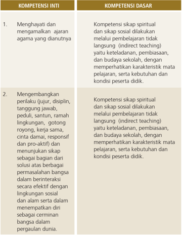

Tabel ini memperlihatkan dua kompetensi utama: Kompetensi Inti dan Kompetensi Dasar. Kompetensi Inti mencakup dua poin utama: menghargai dan mengamalkan ajaran agama yang dianutnya, serta mengembangkan perilaku yang positif seperti jujur, disiplin, tanggung jawab, peduli, santun, ramah lingkungan, gotong royong, kerja sama, cinta damai, responsif, proaktif, dan menunjukkan sikap sebagai bagian dari solusi atas berbagai permasalahan bangsa dalam berinteraksi secara efektif dengan lingkungan sosial dan alam serta dalam menempatkan diri sebagai cerminan bangsa dalam pergaulan dunia. Kompetensi Dasar melibatkan sikap spiritual dan sikap sosial dilakukan melalui pembelajaran tidak langsung (indirect teaching) yaitu keteladanan, pembiasaan, dan budaya sekolah, dengan memperhatikan karakteristik mata pelajaran, serta kebutuhan dan kondisi peserta didik. Topik utama tabel ini adalah tentang pengembangan sikap dan perilaku yang positif serta spiritualitas dan budaya sekolah dalam konteks pendidikan.

 

---
## 📄 Halaman 19

---
**📊 Tabel**

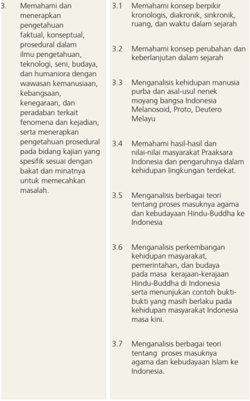

Tabel ini berisi 7 baris topik pembelajaran yang disusun secara horizontal, masing-masing dengan 3 kolom untuk deskripsi detail. Topik utama meliputi pemahaman konsep berpikir kronologis, perubahan dan keberlanjutan dalam sejarah, analisis kehidupan manusia, analisis proses masuknya agama, dan analisis perkembangan budaya. Kolom pertama menjelaskan topik umum, kolom kedua menyebutkan konsep spesifik, dan kolom ketiga memberikan contoh atau penjelasan lebih lanjut tentang topik tersebut. Pola penting yang terlihat adalah bahwa setiap topik memiliki konteks yang lebih spesifik dan detail, mencakup berbagai aspek seperti teori, proses, dan perkembangan dalam sejarah, budaya, dan kehidupan manusia di Indonesia.

 

---
## 📄 Halaman 20

---
**📊 Tabel**

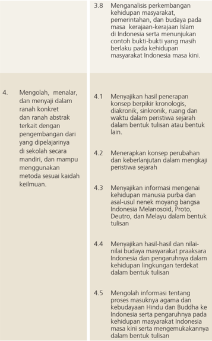

Tabel ini berisi informasi tentang proses pembelajaran dan pengetahuan yang diharapkan siswa dapat capai dalam materi sejarah Indonesia. Topik utama adalah analisis perkembangan kehidupan masyarakat, pemerintahan, dan budaya pada masa kerajaan-kerajaan Islam di Indonesia serta menunjukkan contoh bukti-bukti yang masih berlaku pada kehidupan masyarakat Indonesia masa kini. Tabel dibagi menjadi empat kolom: 4.1, 4.2, 4.3, dan 4.5. Kolom pertama menjelaskan konsep-konsep seperti perpindahan kronologis, diakronik, sinkritik, ruang, dan waktu dalam peristiwa sejarah. Kolom kedua membahas konsep perubahan dan keberlanjutan dalam mengkaji peristiwa sejarah. Kolom ketiga menyajikan informasi mengenai kehidupan manusia purba dan asal-usul nenek moyang bangsa Indonesia Melanesoid, Proto, Deutro, dan Melayu dalam bentuk tulisan. Kolom keempat menggambarkan proses masuknya agama dan budaya Hindu dan Buddha ke Indonesia serta pengaruhnya pada kehidupan masyarakat Indonesia masa kini serta mengemukakannya dalam bentuk tulisan. Pola penting yang terlihat adalah bahwa tabel ini mencakup berbagai aspek sejarah Indonesia, mulai dari peristiwa sejarah, perubahan dan keberlanjutan, hingga pengaruh budaya dan agama.

 

---
## 📄 Halaman 21

- 4.6 Menyajikan hasil penalaran dalam bentuk tulisan tentang nilai-nilai dan unsur budaya yang berkembang pada masa kerajaan Hindu dan Buddha yang masih berkelanjutan dalam kehidupan bangsa Indonesia pada masa kini
- 4.7 Mengolah informasi mengenai teori tentang masuknya dan agama kebudayaan Islam ke Indonesia dengan menerapkan cara berpikir sejarah serta mengemukakannya dalam bentuk tulisan
- 4.8    Menyajikan hasil penalaran dalam bentuk tulisan tentang nilai-nilai dan unsur budaya yang berkembang pada masa kerajaan Islam dan masih berkelanjutan dalam kehidupan bangsa Indonesia pada masa kini
Perlu diketahui, bahwa  KD-KD Sejarah Indonesia diorganisasikan ke dalam empat Kompetensi Inti (KI). KI 1 berkaitan dengan sikap diri terhadap Tuhan Yang Maha Esa. KI 2 berkaitan dengan  karakter  diri  dan  sikap  sosial.  KI  3 berisi  KD  tentang pengetahuan terhadap materi ajar, sedangkan KI 4 berisi KD tentang penyajian pengetahuan. KI 1, KI 2, dan KI 4 harus dikembangkan dan  ditumbuhkan  melalui  proses  pembelajaran  setiap  materi  pokok  yang tercantum dalam KI 3. KI 1 dan KI 2 tidak diajarkan langsung (direct  teaching), tetapi indirect    teaching pada  setiap  kegiatan pembelajaran. Demikian pula dengan KI 3, tidak diajarkan secara teoritis, akan tetapi peserta didik diajak memahami  setiap  peristiwa  sejarah  yang  berkesinambungan  dan  melatih peserta didik untuk berpikir logis dalam melihat hubungan sebab akibat dari setiap peristiwa secara multidimensional.

 

---
## 📄 Halaman 22

Empat   Kompetensi   Inti   (KI)   yang   kemudian   dijabarkan menjadi 16   Kompetensi    Dasar    (KD)    itu    merupakan    bahan    kajian  yang  akan ditransformasikan dalam kegiatan pembelajaran selama satu  tahun  (dua semester)  yang  terurai  dalam  36  pertemuan.  Agar kegiatan  pembelajaran itu  tidak  terasa  terlalu  panjang  maka  36 pertemuan  itu  dibagi  menjadi  dua semester,  semester  pertama  dan semester kedua. Setiap semester terbagi menjadi 18 pertemuan. Setiap semester  yang terdiri atas 18  pertemuan itu    dilaksanakan    ulangan/kegiatan    lain  tengah  semester  dan  ulangan akhir semester yang masing-masing diberi waktu 2 jam/pertemuan. Dengan demikian  waktu  efektif  untuk  kegiatan    pembelajaran    mata    pelajaran Sejarah  Indonesia  sebagai mata pelajaran wajib di SMA/MA dan SMK/MAK disediakan waktu 2 x 45 menit x 32 pertemuan/per tahun (16 pertemuan/ semester).

Untuk efektivitas dan optimalisasi pelaksanaan pembelajaran pihak pemerintah melalui Kementerian Pendidikan dan Kebudayaan menerbitkan buku  teks  pelajaran  untuk  mata  pelajaran  Sejarah Indonesia  Kelas  X. Berdasarkan  jumlah  KD  terutama  yang  terkait dengan penjabaran KI ke-3, buku teks pelajaran Sejarah Indonesia Kelas X disusun menjadi tiga bab.

Bab I  : Menelusuri Peradaban Awal di Kepulauan Indonesia

Bab II : Pedagang,  Penguasa,  dan  Pujangga  pada  Masa  Klasik (Hindu dan Buddha)

Bab III:  Islamisasi dan Silang Budaya di Kepulauan Indonesia

### C.   Strategi dan Model Umum Pembelajaran

### 1.    Pengembangan indikator

Penguasaan  KD  dicapai  melalui  proses  pembelajaran  dan pengembangan pengalaman belajar atas dasar indikator yang telah dirumuskan  dari  setiap KD,  terutama  KD-KD  penjabaran  dari  KI ke-3. Kompetensi dasar pada KI ke-3 untuk mata pelajaran Sejarah Indonesia  dapat  dijabarkan  menjadi beberapa  indikator  sebagai berikut.

 

---
## 📄 Halaman 23

---
**📊 Tabel**

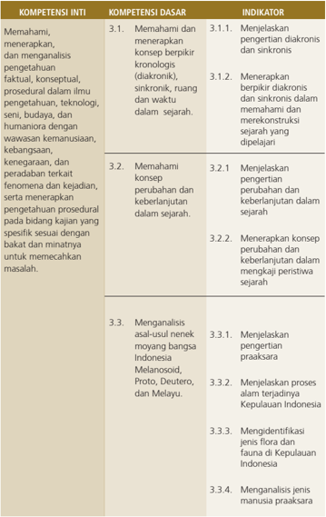

Tabel ini berisi informasi tentang kompetensi inti, dasar, dan indikator untuk pembelajaran sejarah. Topik utamanya adalah pemahaman dan analisis konteks sejarah, termasuk kronologis, perubahan, keberlanjutan, dan asal-usul nelayan. Kolom-kolomnya mencakup kompetensi inti, dasar, dan indikator. Kompetensi inti meliputi pemahaman konteks sejarah, pemahaman perubahan dan keberlanjutan, serta analisis asal-usul nelayan. Kompetensi dasar mencakup pengetahuan kronologis, perubahan, dan keberlanjutan, serta asal-usul nelayan. Indikator menunjukkan bagaimana siswa dapat memenuhi kompetensi dasar tersebut, seperti menjelaskan pengertian kronologis, mengekspresikan perubahan, dan menentukan asal-usul nelayan. Pola penting yang terlihat adalah bahwa tabel ini membahas berbagai aspek sejarah, mulai dari kronologi hingga asal-usul nelayan, dengan tujuan untuk meningkatkan pemahaman dan analisis sejarah.

 

---
## 📄 Halaman 24

---
**📊 Tabel**

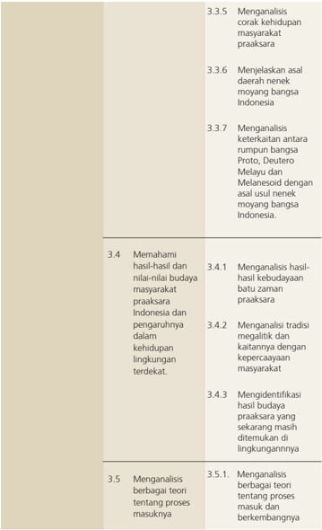

Tabel ini berisi informasi tentang analisis budaya masyarakat prakarsa di Indonesia, dengan topik utama meliputi aspek kehidupan, tradisi, nilai-nilai budaya, dan teori proses masuknya. Kolom pertama menunjukkan nomor urutan analisis, sementara kolom kedua menyajikan deskripsi singkat dari setiap analisis tersebut. Data penting yang terlihat antara lain bahwa tabel mencakup analisis kehidupan masyarakat, penjelasan asal budaya Indonesia, keterkaitan antara bangsa Proto, Deutero, dan Melanesoid, pemahaman hasil-hasil budaya, analisis tradisi megalitik, identifikasi hasil budaya praktis, dan analisis teori proses masuknya.

 

---
## 📄 Halaman 25

---
**📊 Tabel**

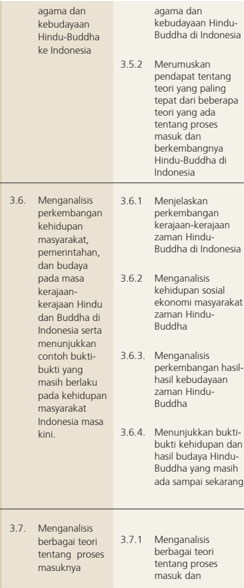

Tabel ini berisi analisis perubahan budaya Hindu-Buddha di Indonesia, mencakup perkembangan kerajaan-kerajaan zaman Hindu-Buddha, kehidupan sosial masyarakat, dan proses masuknya agama tersebut. Topik utama adalah perubahan budaya Hindu-Buddha di Indonesia, dengan kolom-kolom yang mencakup analisis perkembangan kerajaan, kehidupan sosial, dan proses masuknya agama tersebut. Data penting yang terlihat adalah bahwa kerajaan-kerajaan zaman Hindu-Buddha telah berfungsi sejak zaman Hindu-Buddha, dan kehidupan sosial masyarakat masih berlaku pada saat ini. Selain itu, proses masuknya agama tersebut juga telah berlangsung sejak zaman Hindu-Buddha.

 

---
## 📄 Halaman 26

---
**📊 Tabel**

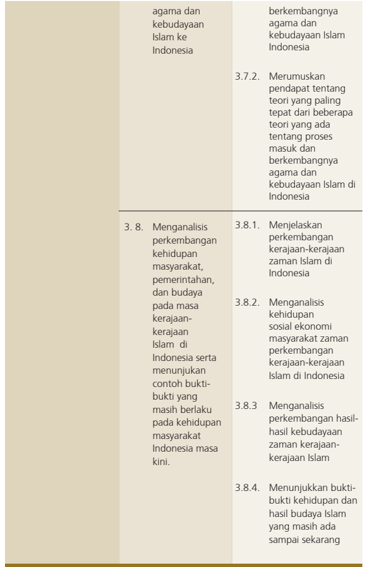

Tabel ini membahas perkembangan agama Islam di Indonesia, dengan fokus pada bagaimana agama tersebut berkembang bersamaan dengan kebudayaan lokal. Topik utama adalah perubahan dalam teori tentang perkembangan agama Islam di Indonesia, termasuk proses masuknya agama tersebut ke dalam budaya lokal. Tabel ini juga mencakup analisis perkembangan masyarakat, pemerintahan, dan budaya pada masa kerajaan-kerajaan Islam di Indonesia, serta menunjukkan hasil budaya Islam yang masih berlaku hingga saat ini. Data penting yang terlihat adalah bahwa perkembangan agama Islam di Indonesia tidak hanya melibatkan penyebaran agama, tetapi juga integrasi dengan budaya lokal, yang mempengaruhi cara masyarakat, pemerintahan, dan budaya beroperasi.

 

---
## 📄 Halaman 27

Di samping penjelasan beberapa indikator tersebut yang perlu diingat oleh guru sejarah adalah KD-KD yang terkait dengan KI pertama dan KI kedua yang harus dijadikan perspektif dalam pembelajaran Sejarah Indonesia. Atau dapat dikatakan KD-KD itu sebagai bahan untuk pengembangan nilai dan pendidikan  karakter.  Sementara  untuk  melihat  kemampuan  peserta  didik dalam memahami dan menerapkan konsep berpikir kronologis, sinkronik, dalam ruang dan waktu, guru dapat melihat dari kemampuan peserta didik dalam menjelaskan suatu peristiwa sejarah. Dalam hal ini peserta didik tidak perlu  dituntut  untuk  menerangkan  istilah  diaronik  dan  sinkronik,  karena hal itu memerlukan pemahaman filsafat dan metodologi sejarah yang lebih mendalam.  Selanjutnya  KD-KD  yang  merupakan  penjabaran  KI  keempat terkait  dengan pengembangan keterampilan dan unjuk kerja bagi peserta didik. Untuk mapel Sejarah Indonesia dapat dikembangkan kegiatan-kegiatan mengobservasi, wawancara, menulis dan mempresentasikan karya sejarah, membuat media sejarah, membuat kliping, dan lain-lain.

### 2.  Pengalaman belajar

Melalui  proses  pembelajaran,  diharapkan  indikator-indikator  yang  telah dirumuskan di atas dapat tercapai. Tercapainya indikator-indikator itu berarti tercapai  pula  KD-KD  yang  telah  ditetapkan  pada  struktur  kurikulum  pada mapel  Sejarah  Indonesia  itu.  Oleh  karena  itu,  dalam  kaitan  pencapaian indikator, guru perlu juga mengingat pengalaman belajar yang secara umum diperoleh  oleh  peserta  didik  sebagaimana  dirumuskan  dalam  KI  dan  KD. Beberapa pengalaman belajar itu terkait dengan:

- Pengembangan  ranah  kognitif,  atau  pengembangan  pengetahuan dapat  dilakukan  dalam  bentuk  penguasaan  materi  dan  pemberian tugas dengan unjuk kerja; mengetahui, memahami, menganalisis, dan mengevaluasi;
- Pengembangan  ranah afektif atau pengembangan  sikap (sikap sosial)  dapat  dilakukan  dengan  pemberian  tugas  belajar  dengan beberapa sikap dan unjuk kerja: menerima, menghargai, menghayati, menjalankan dan mengamalkan;

 

---
## 📄 Halaman 28

- Pengembangan ranah psikomotorik atau pengembangan keterampilan ( skill )  melalui  tugas  belajar  dengan  beberapa  aktivitas  mengamati, menanya, menalar, mencoba, mengolah, menyaji dan mencipta.
Terkait  dengan  beberapa  aspek  pengalaman  belajar  itu  maka  dalam setiap  pembelajaran  Sejarah  Indonesia  di  SMA/MA  dan  SMK/MAK  harus diusahakan  peserta  didik  mampu  mengembangkan  proses    kognitif  yang lebih  tinggi  dari  pemahaman  sampai  dengan  metakognitif  pendalaman pengetahuan  dari  sumber  belajar  yang  ada.  Pembelajaran  diharapkan mampu mengembangkan pengetahuan: menerapkan konsep, prinsip atau prosedur,  menganalisis  masalah,  dan  mengevaluasi  sesuatu  produk  atau mengembangkan  keterampilan,  seperti:  mencoba  membuat  sesuatu  atau mengolah informasi, menerapkan prosedur sampai mengamalkan nilai-nilai kesejarahan.

### 3.  Model dan Skenario Pembelajaran

### a. Siswa Aktif

Paradigma belajar bagi peserta didik menurut jiwa Kurikulum 2013 adalah peserta didik aktif mencari bukan lagi peserta didik menerima. Oleh karena itu,  pembelajaran  harus  dikembangkan  menjadi  pembelajaran  yang  aktif, inovatif  dan  kreatif.  Di  Indonesia  sebenarnya  sudah  lama  dikembangkan pendekatan    pembelajaran  yang  dikenal  dengan paikem. Pendekatan  ini nampaknya  sangat  relevan  dengan  kemauan  model  pembelajaran  untuk mendukung  pelaksanakan  Kurikulum  2013.  Begitu  juga  pembelajaran Sejarah indonesia sangat cocok dengan pendekatan paikem . Paikem adalah singkatan  dari  prinsip  pembelajaran: P embelajaran. A ktif, I novatif, K reatif, E fektif dan M enyenangkan.

- Aktif ,  maksudnya  agar  guru  berusaha  menciptakan  suasana sedemikian rupa agar peserta didik aktif melakukan dan mencari pengetahuan, dan pengalamannya sendiri
- Inovatif ,  pembelajaran  harus  dikembangkan  sesuai  dengan kebutuhan yang ada, tidak monoton. Guru selalu mencari model yang kontekstual yang dapat menarik peserta didik

 

---
## 📄 Halaman 29

- Kreatif , agak mirip dengan inovatif, guru harus mengembangkan kegiatan belajar yang beragam, menciptakan pembelajaran baru yang penuh tantangan, pembelajaran berbasis masalah sehingga mendorong peserta didik untuk merumuskan masalah dan cara pemecahannya
- Efektif ,  guru  harus  secara  tepat  memilih  model  dan  metode pembelajaran sesuai dengan tujuan, materi dan situasi sehingga tujuan dapat tercapai dan bermakna bagi peserta didik
- Menyenangkan ,  guru  harus  berusaha  dan  menciptakan  proses pembelajaran sejarah Indonesia itu menjadi menyenangkan bagi peserta didik. Kalau suasana menyenangkan maka peserta didik akan memperhatikan pembelajaran yang sedang berlangsung.
Melalui  pendekatan  tersebut  banyak  model  pembelajaran  yang  dapat dikembanglkan,  misalnya:  STAD  ( Student  Teams-Achievement  Divisions ) dan TGT ( Team-Game-Turnament ), TAI ( Team-Assisted Individualization ), CIRC ( Cooperative Integrated Reading and Composition) , Group Investigation , Jigsaw ,  dan  lain-lain  (selengkapnya  baca  Robert  E.  Slavin, Cooperative  Learning:  Teori,  Riset  dan  Praktik ).

Dalam  proses  pembelajaran  Sejarah  Indonesia,  untuk  kelas  X  guru  perlu memperhatikan hal-hal sebagai berikut:

- Setiap  awal  suatu  pembelajaran,  peserta  didik  harus  membaca  teks yang tersedia di buku teks pelajaran Sejarah Indonesia Kelas X.
- Peserta didik dapat diberikan petunjuk penting yang perlu mendapat perhatian  seperti  istilah,  konsep  atau  kejadian  penting  sejarah  yang pengaruhnya sangat kuat dan luas dalam peristiwa sejarah berikutnya.
- Peserta  didik  dapat  diberikan  petunjuk  untuk  mengamati  gambar, foto, peta atau ilustrasi lain yang terdapat dalam bacaan.
- Guru  dapat  menyiapkan  diri  dengan  membaca  berbagai  literatur yang berkaitan dengan materi yang disampaikan. Peserta didik dapat diberikan contoh-contoh yang terkait dengan materi yang ada di buku dengan  daerah  di  sekitarnya,  bila  di  daerah  sekitar  tidak  terdapat pengaruh Hindu-Buddha maka dapat mengambil contoh-contoh dari daerah  lain,  ataupun  lain  provinsi.  Guru  dapat  memperkaya  materi dengan  membandingkan  buku  teks  pelajaran  Sejarah Indonesia dengan buku literatur lain yang relevan.

 

---
## 📄 Halaman 30

- Untuk mendapatkan pemahaman yang lebih komprehensif ada baiknya guru dapat menampilkan foto-foto, gambar, denah, peta, dan dokumentasi audiovisual (film) yang relevan. Sebagai contoh untuk guru yang berada di Kabupaten Magelang dapat mendokumentasikan relief Candi Borobudur dan juga candi-candi di sekitarnya. Begitu pula dengan di daerah lain dapat mengambil contoh kasus di daerahnya masing-masing jika ada.

### b. Pembelajaran Berbasis Nilai

Dalam  model  pembelajaran  Kurikulum  2013  juga  perlu  dikembangkan pada  pembelajaran  berbasis  nilai.  Pembelajaran  Sejarah  Indonesia  terkait dengan pengembangan nilai-nilai kebangsaan dan nasionalisme, persatuan, patriotisme,  rela  berkorban,  suka  menolong,  dan  toleransi,  juga  perlu dikembangkan nilai-nilai kejujuran, kearifan, kedisiplinan serta nilai lainnya. Nilai-nilai tersebut  dapat dikembangkan untuk diamalkan dan dihayati dalam kehidupan sehari-hari.

### c. Pendekatan Scientific

Berdasarkan  Peraturan  Menteri  Pendidikan  dan  Kebudayaan  Nomor  68 Tahun 2013 Tentang Kerangka Dasar dan Struktur Kurikulum dikembangkan dengan  penyempurnaan  sejumlah  pola  pikir  yang  dikembangkan  pada kurikulum  sebelumnya.  Salah  satu  diantaranya  adalah  pola  pembelajaran pasif menjadi pembelajaran aktif-mencari.

Pola  pikir  yang  berubah,  menuntut  juga  perubahan  dalam  pendekatan pembelajarannya.  Pendekatan scientiic atau  pendekatan  ilmiah  dipilih sebagai  pendekatan  dalam  pembelajaran  Kurikulum  2013.  Peserta  didik secara  aktif  membangun  pengetahuannya  sendiri  melalui  aktivitas  ilmiah yaitu mengamati ( observing ), menanya ( questioning ), menalar ( associating ), mencoba ( exsperimenting ),  dan membentuk jejaring ( networking ).  Mengenai pendekatan  scientific  dapat  dilihat  dalam  Permendikbud  103  tahun  2014 yang menjelaskan adanya lima pengalaman belajar, sebagai berikut.

### 1) Mengamati (Observing)

Kegiatan mengamati dapat dilakukan dalam dua cara yaitu pengamatan langsung di lapangan atau di luar sekolah terhadap objek yang dipelajari misalnya situs dan peninggalan sejarah seperti candi, benteng, istana dan sebagainya. Kemudian pengamatan secara tidak

 

---
## 📄 Halaman 31

langsung dengan memperhatikan data, gambar, foto, tayangan film tentang objek sejarah yang sedang dipelajari. Pengamatan juga dapat dilakukan  dengan  meminta  peserta  didik  mengingat  kembali  objek atau peristiwa sejarah yang pernah terjadi.

Secara lebih luas, alat atau instrumen yang digunakan dalam melakukan observasi,  dapat  berupa  daftar  cek  ( checklist ),  skala  rentang  ( rating scale ), catatan anekdotal ( anecdotal record ), catatan berkala, dan alat mekanikal ( mechanical device ). Daftar cek dapat berupa suatu daftar yang berisikan nama-nama subjek, objek, atau faktor- faktor yang akan diobservasi.  Skala  rentang,  berupa  alat  untuk  mencatat  gejala  atau fenomena menurut tingkatannya. Catatan anekdotal berupa catatan yang dibuat oleh peserta didik dan guru mengenai kelakuan-kelakuan luar biasa yang ditampilkan oleh subjek atau objek yang diobservasi.

Praktik observasi dalam pembelajaran hanya akan efektif jika peserta didik dan guru melengkapi diri dengan dengan alat-alat pencatatan dan alat-alat lain, seperti: (1) tape recorder , untuk merekam pembicaraan; (1)  kamera,  untuk  merekam  objek/tokoh  yang  diwawancarai  atau kegiatan secara visual; (2) film atau video, untuk merekam kegiatan objek  atau  secara  audio-visual;  dan  (3)  alat-alat  lain  sesuai  dengan keperluan.

Dalam pembelajaran sejarah, kegiatan mengamati atau mengobservasi dilakukan  dengan  membaca  dan  menyimak  bahan  bacaan  atau mendengar  penjelasan  guru  atau  mengamati  foto/gambar/diagram yang  ditunjukkan  atau  ditentukan  guru.  Agar  lebih  efektif  kegiatan mengamati  ini,  tentunya  guru  sudah  menentukan  objek  dan  atau masalah dan aspek yang akan dikaji.

### 2) Menanya (Questioning)

Setelah  proses  observasi  selesai,  maka  aktivitas  berikutnya  adalah peserta  didik  mengajukan  sejumlah  pertanyaan  berdasarkan  hasil pengamatannya. Jadi, aktivitas menanya bukan aktivitas yang dilakukan oleh guru, melainkan oleh peserta didik berdasarkan hasil pengamatan yang telah mereka lakukan. Dalam pelaksanaanya:

- Guru  memberikan  motivasi  atau  dorongan  agar  peserta didik  mengajukan  pertanyaan-pertanyaan  lanjutan  dari apa yang sudah mereka baca dan simpulkan dari kegiatan di atas.

 

---
## 📄 Halaman 32

- Peserta didik dapat dilatih bertanya dari pertanyaan yang faktual sampai pertanyaan-pertanyaan yang bersifat hipotetik (bersifat kausalitas).
Aktivitas menanya merupakan keterampilan yag perlu dilatih. Kelemahan pendidikan selama ini salah satunya karena peserta didik tidak  biasa  mengemukakan  pertanyaan  sebagai  hasil  dari  proses berpikir yang mereka lakukakan. Keterampilan menyusun pertanyaan ini  sangat  penting  untuk  melatih  daya  kritisnya.  Misalnya  setelah mengamati situs/gambar candi, muncul pertanyaan dari peserta didik: kapan  candi  itu  dibangun,  termasuk  jenis  candi  apa,  candi  Hindu atau candi Buddha, peninggalan kerajaan atau raja siapa dan begitu seterusnya.

### 3) Mengumpulkan Informasi

Setelah proses menanya, aktivitas berikutnya adalah mengumpulkan data dan informasi dari berbagai sumber termasuk wawancara. Data dan  informasi  dapat  diperoleh  secara  langsung  dari  lapangan  (data primer)  maupun  dari  berbagai  bahan  bacaan  (data  sekunder).  Hasil pengumpulan  data  tersebut  kemudian  menjadi  bahan  bagi  peserta didik untuk melakukan penalaran antara satu data atau fakta degan data  atau  fakta  lainnya  untuk  dikaji  ada  tidaknya  asosiasi  diantara keduanya. Dalam kaitan ini peserta didik dapat mengkaji buku-buku yang telah ada, menganalisis dokumen.

Penalaran adalah proses berpikir yang logis dan sistematis  atas faktakata  empiris  yang  dapat  diobservasi  untuk  memperoleh  simpulan berupa  pengetahuan.  Penalaran  dimaksud  merupakan  penalaran ilmiah.  Istilah  menalar  di  sini  merupakan  padanan  dari associating, bukan  merupakan  terjemanan  dari  reasoning,  meski  istilah  ini  juga bermakna menalar atau penalaran. Karena itu, istilah aktivitas menalar dalam konteks pembelajaran pada Kurikulum 2013 dengan pendekatan ilmiah banyak merujuk pada teori belajar asosiasi atau pembelajaran asosiatif. Istilah asosiasi dalam  pembelajaran merujuk  pada  kemampuan  mengelompokkan  beragam  ide  dan mengasosiasikan beragam peristiwa untuk kemudian memasukannya menjadi penggalan memori.  Misalnya setelah memahami situs candi yang dikaji dapat mengklasifikasi jenis candi apa dengan melihat ciricirinya, dapat menyimpulkan candi-candi di Jawa Tengah Selatan dan di  Jawa  Tengah Utara ada kaitannya dengan perkembangan agama Hindu dan Buddha di Jawa Tengah pada abad ke-8 sampai abad ke-9.

 

---
## 📄 Halaman 33

### 4) Mengasosiasi/Mengolah informasi

Experimenting dalam pembelajaran Sejarah mungkin agak kesulitan. Tetapi langkah exsperimenting ini dapat digantikan tahapan mempraktikkan. Misalnya dalam kaitannya dengan hasil pengamatan tadi, peserta didik ditugasi untuk menggambarkan candi dan mendeskripsikan ciri-cirinya. Membuat laporan dalam bentuk tulisan.

Peserta didik membuktikan adanya asosiasi antara bentuk muka bumi dengan aktivitas manusia. Bukti yang dapat ditunjukkan adalah tabel hasil klasifikasi antara bentuk muka bumi dan ragam aktivitas yang ada di atasnya. Bukti juga ditunjukkan dalam bentuk gambar yang telah dikumpulkan dari berbagai sumber.

### 5) Membangun jejaring ( Networking) atau mengomunikasikan.

Membangun jejaring dalam konteks pendekatan pembelajaran scientiic dapat berupa penyampaian hasil atau temuan kepada pihak lain. Keterampilan menyajikan atau mengomunikasikan hasil temuan atau kesimpulan sangat penting dilatih sebagai bagian penting dalam proses  pembelajaran.  Dengan  kemampuan  tersebut,  peserta  didik dapat mengomunikasikan secara jelas, santun, dan beretika. Misalnya peserta  didik  membuat  tulisan  tentang  perkembangan  Kerajaan Singhasari  dengan  beberapa  peninggalan  candi  yang  ada  di  Jawa Timur kemudian dipresentasikan, atau dibuat dalam suatu ulasan dan dimuat dalam majalah dinding sekolah, atau juga dapat dimuat dalam sebuah blog yang dikelola oleh sekolah.

### d. Model dan Skenario Pembelajaran

Dalam Kurikulum 2013 beberapa model dan skenario pembelajaran dikembangkan untuk menunjang proses belajar mengajar, antara lain :

### 1. MODEL PEMBELAJARAN BERBASIS MASALAH

Model Pembelajaran Berbasis Masalah atau ( Problem Based Learning) ini  sangat  mendukung  implementasi  Kurikulum  2013, terutama yang terkait dengan tahapan proses pembelajaran. Melalui kegiatan pembelajaran berbasis masalah ini peserta didik akan mendapat pengetahuan penting yang membuat  mereka mahir

 

---
## 📄 Halaman 34

dalam memecahkan masalah dan memiliki model belajar sendiri serta memiliki kecakapan berpartisipasi dalam tim. Proses pembelajarannya menggunakan pendekatan yang sistemik untuk memecahkan masalah atau menghadapi tantangan yang nanti diperlukan dalam kehidupan sehari-hari.

### A. Pengertian

Pembelajaran berbasis masalah merupakan sebuah pendekatan dan juga model pembelajaran yang menyajikan masalah kontekstual sehingga merangsang peserta didik untuk belajar. Dalam  kelas yang menerapkan pembelajaran berbasis masalah, peserta  didik  bekerja  dalam  tim  untuk  memecahkan  masalah dunia nyata ( real world ). Pembelajaran berbasis masalah merupakan suatu metode pembelajaran yang menantang peserta didik untuk 'belajar bagaimana belajar', bekerja secara berkelompok  untuk  mencari  solusi  dari  permasalahan  dunia nyata.  Masalah  yang  diberikan  ini  digunakan  untuk  mengikat peserta  didik  pada  rasa  ingin  tahu.  Masalah  diberikan  kepada peserta  didik,  sebelum  peserta  didik  mempelajari  konsep  atau materi yang berkenaan dengan masalah yang harus dipecahkan.

### B. Tujuan dan Hasil dari Model Pembelajaran Berbasis Masalah

Tujuan dan hasil pengembangan model pembelajaran berbasis masalah antara lain:

- Mengembangkan keterampilan berpikir dan keterampilan memecahkan masalah
- Menerapkan pemodelan dalam rangka menjembatani gap antara  pembelajaran  sekolah formal  dengan  aktivitas  mental  yang  lebih  praktis yang dijumpai di luar sekolah.
- Mengembangkan pembelajaran mandiri/Belajar pengarahan sendiri ( self directed learning ). Mengingat pembelajaran berbasis masalah berpusat pada peserta didik, maka peserta didik harus dapat menentukan sendiri apa yang harus dipelajari, dan dari  mana  informasi  harus  diperoleh,  di  bawah bimbingan guru.

 

---
## 📄 Halaman 35

### C. Prinsip-Prinsip Pembelajaran Berbasis Masalah

- Menekankan pada strategi  proyek.
- Responsibility :  pembelajaran  ini  menekankan pada responsibility dan answerability para peserta didik dan panutannya.
- Realisme : kegiatan peserta didik difokuskan pada  pekerjaan  yang  serupa  dengan  situasi  yang sebenarnya.  Aktivitas  ini  mengintegrasikan  tugas autentik dan menghasilkan sikap profesional.
- Active-learning : menumbuhkan isu yang berujung  pada  pertanyaan  dan  keinginan  peserta didik  untuk  menemukan  jawaban  yang  relevan, sehingga dengan  demikian  telah terjadi proses pembelajaran yang mandiri.
- Umpan  Balik : diskusi, presentasi,  dan  evaluasi terhadap  para  peserta  didik  menghasilkan  umpan balik yang berharga. Ini mendorong ke arah pembelajaran berdasarkan pengalaman.
- Keterampilan  Umum :  model  ini  dikembangkan tidak hanya pada keterampilan pokok dan pengetahuan saja, tetapi juga mempunyai pengaruh besar  pada  keterampilan  yang  mendasar  seperti pemecahan  masalah,  kerja  kelompok,  dan selfmanagement .
- Driving Questions : PBL ( Project  Based  Learning ) difokuskan pada pertanyaan atau permasalahan yang memicu peserta didik untuk berbuat menyelesaikan permasalahan  dengan  konsep,  prinsip  dan  ilmu pengetahuan yang sesuai.
- Constructive Investigations : sebagai titik pusat, proyek harus disesuaikan dengan pengetahuan para peserta didik.
- Autonomy : proyek  menjadikan  aktivitas  peserta didik sangat penting.

 

---
## 📄 Halaman 36

### D. Langkah-Langkah Operasional

Pembelajaran  suatu  materi  pelajaran  dengan  menggunakan pembelajaran berbasis masalah sebagai basis model dilaksanakan dengan  cara mengikuti lima  langkah  dengan  bobot  atau kedalaman setiap langkahnya disesuaikan dengan mata pelajaran yang bersangkutan.

### a) Konsep Dasar ( Basic Concept )

Dalam  hal  ini  guru  atau  fasilitator  dapat  memberikan konsep dasar, petunjuk, referensi, dan keterampilan yang  diperlukan  dalam  pembelajaran  sejarah.  Hal  ini dimaksudkan agar peserta didik lebih cepat masuk dalam suasana  pembelajaran  dan  mendapatkan  'peta'  yang akurat  tentang  arah  dan  tujuan  pembelajaran.  Lebih jauh,  hal  ini  diperlukan  untuk  memastikan  peserta  didik memperoleh kunci utama materi pembelajaran, sehingga segera mendapatkan  berbagai  masalah  yang  relevan dengan topik pembelajaran.

### b) Pendefinisian Masalah ( Deining the Problem )

Dalam  langkah    ini  fasilitator  menyampaikan  skenario atau  permasalahan  dan  peserta  didik  di  masing-masing kelompok diminta melakukan berbagai kegiatan.

- Melakukan  curah  pendapat  ( brainstorming ) yang dilaksanakan dengan cara semua anggota kelompok mengungkapkan pendapat, ide, dan tanggapan terhadap skenario secara bebas, sehingga dimungkinkan muncul berbagai macam alternatif pendapat. Kalau  muncul  pendapat  atau  masalah  yang dapat dipecahkan di kelompok segera didiskusikan, sedang pendapat atau masalah yang  tidak  dapat  dipecahkan  di  kelompok dicatat sebagai masalah kelompok.
- Melakukan  seleksi  alternatif  untuk  memilih pendapat atau masalah yang lebih fokus.
- Menentukan  permasalahan  dan  melakukan pembagian  tugas  dalam  kelompok  sehingga masing-masing anggota memahami tugasnya. Fasilitator memvalidasi pilihan-pilihan yang diambil/masalah yang akan dipecahkan peserta didik.

 

---
## 📄 Halaman 37

### c) Pembelajaran Mandiri ( Self Learning )

Setelah  mengetahui  tugasnya,  masing-masing  peserta didik  mencari  berbagai  sumber  yang  dapat  memperjelas isu yang sedang diinvestigasi/ dipecahkan. Sumber yang dimaksud dapat dalam bentuk artikel tertulis yang tersimpan  di  perpustakaan,  halaman  web,  atau  bahkan pakar  dalam  bidang  yang  relevan.  Tahap  investigasi  memiliki dua  tujuan  utama,  yaitu:  (1)  agar  peserta  didik  mencari informasi dan mengembangkan pemahaman yang relevan dengan  permasalahan  yang  telah  didiskusikan  di  kelas, dan (2) informasi dikumpulkan dengan satu tujuan yaitu dipresentasikan  di  kelas  dan  informasi  tersebut  haruslah relevan dan dapat dipahami.

Di luar pertemuan dengan fasilitator, peserta didik bebas untuk mengadakan pertemuan dan melakukan berbagai kegiatan.  Dalam  pertemuan  tersebut  peserta  didik  akan saling bertukar informasi yang telah dikumpulkannya dan pengetahuan yang telah  mereka  bangun.  Peserta    didik juga  harus  mengorganisasi  informasi  yang  didiskusikan, sehingga anggota kelompok lain dapat memahami relevansi terhadap permasalahan yang dihadapi.

### d) Diskusi kelompok Pertukaran Pengetahuan ( Exchange knowledge )

Setelah  mendapatkan  sumber  untuk  keperluan  pendalaman materi dalam langkah pembelajaran mandiri, selanjutnya pada pertemuan berikutnya peserta didik berdiskusi dalam kelompoknya. Masing-masing anggota melaporkan hasil kerjanya  dan  anggota  lain  saling  memberi  masukan, sehingga menghasilkan rumusan pemecahan masalah di kelompoknya.

### e) Presentasi antar kelompok dalam pleno kelas dan merumuskan kesimpulan

Langkah  selanjutnya  presentasi  hasil  dalam  pleno  (kelas besar)  dengan  mengakomodasi  masukan  dari  pleno, menentukan kesimpulan akhir, dan dokumentasi akhir. Secara sederhana John Dewey merumuskan enam langkah dalam pembelajaran berbasis masalah sebagai berikut:

- Merumuskan masalah: guru membimbing peserta didik untuk mengidentifikasi dan merumuskan masalah yang akan akan dikaji/ dipecahkan.

 

---
## 📄 Halaman 38

- Menganalisis masalah : mendeskripsikan secara  kritis  masalah  itu  dari  berbagai  sudut pandang.
- Merumuskan hipotesis: merumuskan berbagai kemungkinan pemecahan masalah.
- Mengumpulkan data: mencari dan mengumpulkan berbagai sumber dan informasi untuk memecahkan masalah.
- Pengujian hipotesis.
- Merumuskan rekomendasi.

### E. Sistem Penilaian

Penilaian dilakukan dengan memadukan tiga aspek pengetahuan ( knowledge ),  kecakapan  ( skill ),  dan  sikap  ( attitude ).  Penilaian terhadap  penguasaan  pengetahuan  yang  mencakup  seluruh kegiatan  pembelajaran  yang  dilakukan  dengan  ujian  akhir semester (UAS), ujian tengah semester (UTS), kuis, PR, dokumen, dan  laporan.  Penilaian  terhadap  kecakapan  dapat  diukur  dari penguasaan alat bantu pembelajaran, baik software , hardware , maupun kemampuan perancangan dan pengujian. Sedangkan penilaian terhadap sikap dititikberatkan pada penguasaan soft skill, yaitu keaktifan dan partisipasi dalam diskusi, kemampuan bekerja  sama  dalam  tim,  dan  kehadiran  dalam  pembelajaran. Bobot  penilaian  untuk  ketiga  aspek  tersebut  ditentukan  oleh guru mata pelajaran yang bersangkutan.

### 2. MODEL PEMBELAJARAN BERBASIS PROYEK

### A. Pengertian

Pembelajaran Berbasis Proyek atau PBL ( Project Based Learning ) adalah model pembelajaran yang menggunakan proyek/kegiatan sebagai wahana. Peserta didik melakukan eksplorasi, penilaian tentang  sumber  sejarah,  melakukan  interpretasi,  sintesis,  dan informasi  untuk  menghasilkan  berbagai  bentuk  hasil  belajar. Pembelajaran Berbasis Proyek merupakan metode belajar yang menggunakan masalah, isu-isu actual,atau  konsep dan peristiwa yang  kontroversi  dalam    melakukan  kegiatan    pembelajaran. Dalam  pembelajaran  ini  peserta  didik  melakukan    investigasi, membuat keputusan dan  memberikan kesempatan peserta didik untuk bekerja mandiri dan mengembangkan kreativitasnya.

 

---
## 📄 Halaman 39

### B. Karakteristik

Pembelajaran  Berbasis  Proyek  memiliki  karakteristik  sebagai berikut:

- peserta didik membuat keputusan tentang sebuah kerangka kerja;
- adanya permasalahan kesejarahan atau  tantangan yang diajukan kepada peserta didik;
- peserta didik mendesain proses untuk menentukan solusi atas  permasalahan  atau  isu  aktual  atau  tantangan  yang diajukan;
- peserta didik secara kolaboratif bertanggungjawab untuk mengakses dan  mengelola informasi untuk memecahkan permasalahan;
- proses evaluasi dijalankan secara kontinu;
- peserta didik secara berkala melakukan  refleksi atas aktivitas yang sudah dijalankan;
- produk  akhir aktivitas belajar akan  dievaluasi secara kualitatif; dan
- situasi  pembelajaran  sangat  toleran  terhadap  kesalahan dan perubahan.
Peran instruktur atau guru dalam Pembelajaran Berbasis Proyek sebaiknya  sebagai  fasilitator,  pelatih,  pembimbing/penasehat dan  perantara  untuk  mendapatkan  hasil  yang  optimal  sesuai dengan daya imajinasi, kreasi, dan inovasi dari peserta didik.

### C. Langkah-Langkah  Operasional

Langkah-langkah Pembelajaran Berbasis Proyek meliputi tahapan-tahapan sebagai berikut.

- Penentuan Pertanyaan Mendasar ( Start With the Essential Question ).
Pembelajaran  dimulai  dengan  pertanyaan  esensial,  yaitu pertanyaan yang dapat memberi penugasan peserta didik dalam melakukan suatu aktivitas. Mengambil topik yang sesuai  dengan  realitas  dunia  nyata  dan  dimulai  dengan sebuah  investigasi  mendalam.  Pengajar  berusaha  agar topik yang diangkat relevan untuk para peserta didik.

- Mendesain  Perencanaan  Proyek (Design  a  Plan  for  the Project).
Perencanaan dilakukan secara kolaboratif antara pengajar dan peserta didik. Dengan    demikian peserta didik diharapkan akan merasa 'memiliki' atas proyek tersebut.

 

---
## 📄 Halaman 40

Perencanaan berisi tentang aturan main, pemilihan aktivitas yang  dapat  mendukung  dalam  menjawab  pertanyaan esensial,  dengan  cara  mengintegrasikan  berbagai  subjek yang  mungkin,  serta    mengetahui  alat  dan  bahan  yang dapat diakses untuk membantu penyelesaian proyek.

### 3) Menyusun Jadwal (Create a Schedule)

Pengajar  dan  peserta  didik  secara  kolaboratif  menyusun jadwal  aktivitas  dalam  menyelesaikan  proyek.  Aktivitas pada  tahap  ini  antara  lain:  (1)  membuat  jadwal  untuk menyelesaikan proyek, (2) membuat  tenggat waktu penyelesaian  proyek,  (3)  membawa  peserta  didik  agar merencanakan cara yang baru, (4) membimbing peserta didik ketika mereka membuat cara yang tidak berhubungan dengan  proyek,  dan  (5)  meminta  peserta  didik  untuk membuat  penjelasan  (alasan)  tentang  pemilihan  suatu cara.

- Memonitor peserta didik dan kemajuan proyek (Monitor the Students and the Progress of the Project)
Pengajar  bertanggungjawab  untuk  melakukan  monitor terhadap  aktivitas  peserta  didik  selama  menyelesaikan proyek.  Monitoring  dilakukan  dengan  cara  memfasilitasi peserta didik pada setiap proses. Dengan kata lain pengajar berperan menjadi mentor bagi aktivitas peserta didik. Agar mempermudah proses monitoring, dibuat sebuah rubrik yang dapat merekam keseluruhan aktivitas yang  penting.

- Menguji Hasil (Assess the Outcome)
Penilaian  dilakukan  untuk  membantu  pengajar  dalam mengukur ketercapaian standar, berperan dalam mengevaluasi  kemajuan  masing-masing  peserta  didik, memberi umpan balik tentang tingkat pemahaman yang sudah  dicapai  peserta  didik,  membantu  pengajar  dalam menyusun strategi pembelajaran berikutnya.

- Mengevaluasi Pengalaman (Evaluate the Experience) Pada  akhir  proses  pembelajaran,  pengajar  dan  peserta didik melakukan  refleksi  terhadap  aktivitas
dan  hasil proyek  yang  sudah  dijalankan.  Proses  refleksi  dilakukan baik  secara  individu  maupun  kelompok.  Pada  tahap  ini peserta didik diminta untuk mengungkapkan perasaan dan pengalamanya  selama  menyelesaikan  proyek.  Pengajar dan peserta didik mengembangkan diskusi dalam rangka

 

---
## 📄 Halaman 41

memperbaiki kinerja selama proses pembelajaran, sehingga pada akhirnya ditemukan suatu temuan baru ( new inquiry ) untuk menjawab permasalahan yang diajukan pada tahap pertama pembelajaran.

Peran guru dan peserta didik dalam pelaksanaan Pembelajaran Berbasis Proyek sebagai berikut.

### 1. Peran Guru

- Merencanakan dan mendesain pembelajaran.
- Membuat strategi pembelajaran.
- Membayangkan  interaksi  yang  akan  terjadi antara guru dan peserta didik.
- Mencari keunikan peserta didik.
- Menilai peserta didik dengan cara transparan dan berbagai macam penilaian.
- Membuat portofolio pekerjaan peserta didik.

### 2. Peran Peserta Didik

- Menggunakan kemampuan bertanya dan berpikir.
- Melakukan riset sederhana.
- Mempelajari ide dan konsep baru.
- Belajar mengatur waktu dengan baik.
- Melakukan kegiatan belajar sendiri/kelompok.
- Mengaplikasikan hasil belajar lewat tindakan.
- Melakukan interaksi sosial (wawancara, survey, observasi, dan lain-lain).

### 3. Sistem Penilaian

Penilaian pembelajaran dengan model Pembelajaran Berbasis Proyek harus diakukan secara menyeluruh terhadap sikap, pengetahuan  dan  keterampilan yang  diperoleh  peserta  didik  dalam  melaksanakan pembelajaran berbasis proyek. Penilaian Pembelajaran Berbasis Proyek dapat menggunakan teknik  penilaian  yang  dikembangkan  oleh  Pusat Penilaian  Pendidikan  Kementerian  Pendidikan  dan Kebudayaan  yaitu  penilaian  proyek  atau  penilaian produk. Penilaian tersebut dapat dijelaskan sebagai berikut.

 

---
## 📄 Halaman 42

### 3. MODEL PEMBELAJARAN BERBASIS PENEMUAN ( DISCOVERY BASED LEARNING )

### A. Pengertian

Model Discovery Learning adalah teori belajar yang didefinisikan sebagai  proses  pembelajaran  yang  terjadi  bila  pelajar  tidak disajikan dengan pelajaran dalam bentuk finalnya, tetapi diharapkan mengorganisasi sendiri.  Sebagaimana  pendapat Bruner,  bahwa:  ' Discovery  Learning  can  be  deined  as  the learning  that  takes  place  when  the  student  is  not  presented with  subject  matter  in  the  inal  form,  but  rather  is  required  to organize  it  him  self ' (Lefancois dalam Ametembun, 1986:103). Dasar ide Bruner ialah pendapat dari Piaget yang menyatakan bahwa anak harus berperan aktif dalam belajar di kelas. Sebagai strategi belajar, Discovery Learning mempunyai prinsip yang  sama  dengan  inkuiri (inquiry )  dan Problem Solving . Tidak ada perbedaan yang prinsipil pada ketiga istilah ini. Pada pembelajaran discovery menekankan  pada  ditemukannya konsep  atau  prinsip  atau  generalisasi  tetapi  konsep,  prinsip, atau  generalisasi  itu  sudah  diketahui  atau  direkayasa  oleh guru, sementara kalau inkuiri masalahnya bukan hasil rekayasa, sehingga peserta didik harus mengerahkan seluruh pikiran dan keterampilannya untuk mendapatkan temuan-temuan di dalam masalah itu melalui proses penelitian.

### B. Prosedur Aplikasi Metode Discovery Learning

Langkah pembelajaran dengan discovery learning , meliputi:

### 1)  Stimulation (Stimulasi/Pemberian Rangsangan)

Pertama-tama  pada  tahap  ini pelajar  dihadapkan  pada sesuatu  yang  menimbulkan  kebingungannya,  kemudian dilanjutkan  untuk  tidak  memberi  generalisasi,  agar  timbul keinginan untuk menyelidiki sendiri. Di samping itu guru  dapat  memulai  kegiatan  PBM  dengan  mengajukan pertanyaan,  anjuran  membaca  buku,  dan  aktivitas  belajar lainnya yang mengarah pada persiapan pemecahan masalah. Tema-tema yang problematik dan kontroversi cocok dengan model pembelajaran discovery , karena peserta didik dilatih untuk  menemukan  jawab  di  tengah-tengah  problem  dan kontroversial.

 

---
## 📄 Halaman 43

### 2)  Problem Statement (Pernyataan/ Identifikasi Masalah)

Setelah dilakukan stimulasi langkah selanjutnya adalah guru  memberi  kesempatan  kepada  peserta  didik  untuk mengidentifikasi sebanyak mungkin  masalah yang relevan dengan  bahan  pelajaran,  kemudian  salah  satunya  dipilih dan dirumuskan dalam bentuk rumusan masalah kemudian dirumuskan hipotesisnya (jawaban sementara atas pertanyaan masalah) (Syah 2004:244).

### 3)  Data Collection (Pengumpulan Data)

Ketika eksplorasi berlangsung guru juga memberi kesempatan kepada peserta didik untuk mengumpulkan sumber sejarah dan informasi sebanyak-banyaknya  yang  relevan untuk membuktikan  benar  atau  tidaknya  hipotesis  (Syah,  2004: 244). Pada tahap ini berfungsi untuk menjawab pertanyaan atau membuktikan benar tidaknya  hipotesis

Dengan  demikian  anak  didik diberi  kesempatan  untuk mengumpulkan ( collection ) berbagai informasi yang relevan, membaca  literatur,  mengamati  objek,  wawancara  dengan nara  sumber,  melakukan  uji  coba  sendiri  dan  sebagainya. Konsekuensi dari tahap ini adalah peserta didik belajar secara aktif untuk menemukan sesuatu yang berhubungan dengan permasalahan yang dihadapi, dengan demikian secara tidak disengaja  peserta  didik  menghubungkan  masalah  dengan pengetahuan  yang  telah  dimiliki.  Kegiatan  yang  dapat dilakukan misalnya studi pustaka, observasi, dan wawancara. Selanjutnya peserta didik juga dilatih untuk melakukan kritik sumber  atau  menyeleksi  data/informasi  yang  diperoleh, dipilih yang relevan dengan pemecahan masalah.

### 4)  Data Processing (Pengolahan Data)

Pengolahan data merupakan kegiatan mengolah data atau sumber  sejarah dan  informasi yang  telah dipilih/ telah  dilakukan  kritik  sumber  diperoleh  para  peserta  didik baik  melalui  wawancara,  observasi,  dan  sebagainya,  lalu ditafsirkan. Semua informai hasil bacaan, wawancara, observasi, dan sebagainya, semuanya diolah, diacak, diklasifikasikan, ditabulasi, bahkan bila perlu dihitung dengan cara  tertentu  serta  ditafsirkan  pada  tingkat  kepercayaan tertentu (Djamarah, 2002:22).

Data processing disebut juga dengan pengkodean coding/ kategorisasi  yang  berfungsi  sebagai  pembentukan  konsep

 

---
## 📄 Halaman 44

dan generalisasi. Dari generalisasi tersebut peserta didik akan mendapatkan pengetahuan baru tentang alternatif jawaban/ penyelesaian yang perlu mendapat pembuktian secara logis

### 5)  Veriication (Pembuktian)

Pada tahap ini peserta didik melakukan pemeriksaan secara cermat  untuk  membuktikan  benar  atau  tidaknya  hipotesis yang ditetapkan tadi dengan temuan alternatif, dihubungkan dengan hasil data processing (Syah, 2004:244). Veriication menurut Bruner, bertujuan agar proses belajar akan berjalan dengan baik dan kreatif jika guru memberikan kesempatan kepada peserta didik untuk menemukan suatu konsep, teori, aturan  atau  pemahaman  melalui  contoh-contoh  yang  ia jumpai dalam kehidupannya.

(dalam kegiatan pembelajaran sejarah dengan model discovery ,  pada  langkah  4  dan  5  sama  dengan  tahapan analisis  dan  interpretasi  dalam  kegiatan  kajian/penelitian sejarah)

### 6)  Generalization (Menarik Kesimpulan/Generalisasi)

Tahap generalisasi/ menarik kesimpulan adalah proses menarik sebuah kesimpulan yang dapat dijadikan prinsip umum dan berlaku  untuk  semua  kejadian  atau  masalah  yang  sama, dengan  memperhatikan  hasil  verifikasi  (Syah,  2004:  244). Berdasarkan hasil verifikasi maka dirumuskan prinsip-prinsip yang  mendasari  generalisasi.  Setelah  menarik  kesimpulan peserta didik harus memperhatikan proses generalisasi yang menekankan pentingnya penguasaan pelajaran  atas makna dan  kaidah  atau  prinsip-prinsip  yang  luas  yang  mendasari pengalaman seseorang, serta pentingnya proses pengaturan dan generalisasi dari pengalaman-pengalaman itu.

### C. Sistem Penilaian

Dalam Model Pembelajaran Discovery Learning , penilaian dapat dilakukan  dengan  menggunakan  tes  maupun  nontes,  terkait dengan  penilaian  kognitif,  proses,  sikap,  atau  penilaian  hasil kerja  peserta  didik.  Jika  bentuk  penilaiannya  berupa  penilaian kognitif,  maka  dalam  model  pembelajaran discovery  learning dapat menggunakan  tes  tertulis. Jika bentuk  penilaiannya menggunakan penilaian proses, sikap, atau penilaian hasil kerja peserta didik, maka pelaksanaan penilaian  dapat menggunakan

 

---
## 📄 Halaman 45

contoh-contoh format penilaian.

### 1) Penilaian Tertulis

Penilaian  tertulis merupakan tes dimana soal dan jawaban yang diberikan kepada peserta didik dalam bentuk tulisan. Dalam menjawab soal peserta didik tidak selalu merespon dalam bentuk menulis jawaban tetapi dapat juga dalam bentuk  yang  lain  seperti  memberi  tanda,  mewarnai, menggambar dan lain sebagainya. Ada dua bentuk soal tes tertulis, yaitu berikut ini.

Dari berbagai alat penilaian tertulis, tes memilih jawaban benar-salah, isian singkat, dan menjodohkan merupakan alat yang hanya menilai kemampuan berpikir rendah, yaitu kemampuan mengingat (pengetahuan). Tes pilihan ganda dapat  digunakan  untuk  menilai  kemampuan  mengingat  dan memahami. Pilihan  ganda  mempunyai  kelemahan,  yaitu peserta didik tidak mengembangkan sendiri jawabannya tetapi cenderung hanya memilih jawaban yang benar dan jika peserta didik tidak mengetahui jawaban yang benar, maka peserta didik akan menerka.

Hal  ini  menimbulkan  kecenderungan  peserta  didik  tidak belajar  untuk  memahami  pelajaran  tetapi  menghafalkan soal dan jawabannya. Alat penilaian ini kurang dianjurkan  pemakaiannya  dalam  penilaian  kelas  karena tidak  menggambarkan  kemampuan  peserta  didik  yang sesungguhnya.

Tes  tertulis  bentuk  uraian  adalah  alat  penilaian  yang menuntut  peserta  didik  untuk  mengingat,  memahami, dan  mengorganisasikan  gagasannya  atau  hal-hal  yang sudah dipelajari, dengan cara mengemukakan atau mengekspresikan gagasan tersebut dalam bentuk uraian tertulis dengan menggunakan kata-katanya sendiri. Alat ini dapat menilai berbagai jenis kemampuan, misalnya  mengemukakan  pendapat,  berpikir  logis,  dan menyimpulkan.  Kelemahan  alat  ini  antara  lain  cakupan materi yang ditanyakan terbatas.

Dalam menyusun instrumen penilaian tertulis perlu dipertimbangkan hal-hal berikut:

- materi, misalnya kesesuaian soal dengan indikator pada kurikulum;

 

---
## 📄 Halaman 46

- konstruksi, misalnya rumusan soal atau pertanyaan harus jelas dan tegas.
- bahasa, misalnya rumusan soal tidak menggunakan kata/kalimat  yang  menimbulkan penafsiran ganda.

### 2) Penilaian Diri

Penilaian diri ( self assessment ) adalah suatu teknik penilaian, subjek yang ingin dinilai diminta untuk menilai dirinya sendiri berkaitan dengan, status, proses dan tingkat pencapaian  kompetensi  yang  dipelajarinya  dalam  mata pelajaran tertentu.

Teknik penilaian diri dapat digunakan dalam berbagai aspek penilaian,  yang  berkaitan  dengan  kompetensi  kognitif, afektif  dan  psikomotor.  Dalam  proses  pembelajaran  di kelas,  berkaitan  dengan  kompetensi  kognitif,  misalnya: peserta  didik  dapat  diminta  untuk  menilai  penguasaan pengetahuan  dan  keterampilan  berpikir  sebagai  hasil belajar dalam mata pelajaran tertentu, berdasarkan kriteria atau acuan yang telah disiapkan.

Berkaitan  dengan  kompetensi  afektif,  misalnya,  peserta didik dapat diminta untuk membuat tulisan yang memuat curahan perasaannya terhadap suatu objek sikap tertentu. Selanjutnya, peserta didik diminta untuk melakukan penilaian  berdasarkan  kriteria  atau  acuan  yang  telah disiapkan.  Berkaitan  dengan  kompetensi  psikomotorik, peserta didik dapat diminta untuk menilai kecakapan atau keterampilan yang telah dikuasainya sebagai hasil belajar berdasarkan kriteria atau acuan yang telah disiapkan.

Penggunaan  teknik  ini  dapat  memberi  dampak  positif terhadap perkembangan kepribadian seseorang. Keuntungan  penggunaan  teknik  ini  dalam  penilaian  di kelas sebagai berikut:

- dapat menumbuhkan rasa percaya diri peserta didik, karena mereka diberi kepercayaan untuk menilai dirinya sendiri;
- peserta didik menyadari kekuatan dan kelemahan dirinya, karena ketika mereka melakukan penilaian, harus melakukan introspeksi terhadap kelebihan dan kelemahan yang dimilikinya;

 

---
## 📄 Halaman 47

- dapat mendorong, membiasakan, dan melatih peserta didik  untuk  berbuat  jujur,  karena mereka  dituntut untuk jujur dan  objektif dalam melakukan penilaian.

### 4. MODEL VALUES EXPLORATION (EKSPLORASI NILAI).

### 1. Pengertian.

Pengertian model values  explorasi adalah pembelajaran yang berorentasi  pada  pengembangan  nilai-nilai  Sejarah  Indonesia. Dalam model pembelajaran ini berawal dari pemikiran ' students will demontrastrate skills as they explore analyse values '. Pada model pembelajaran ini berorentasi pada pemahaman  sejarah  sosial-budaya.  Model  pembelajaran  ini sangat mendukung Kurikulum 2013. Pada model pembelajaran ini peserta didik diajak untuk mengeksplorasi sejarah Indonesia dalam  konteks  sosial-budaya  masyarakat  setempat.  Model pembelajaran  ini  sangat  cocok  untuk  mengeksplor  sejarah lokal  dalam  rangka  keindonesiaan.  Pemahaman sosial-budaya dalam pemahaman sejarah lokal diperlukan bagi peserta didik terutama  untuk  menjelaskan  tentang  perbedaan-perbedaan karakter dalam suatu peristiwa yang terjadi pada suatu daerah dalam konteks keindonesiaan, contoh seperti kasus Arupalaka. Dasawarsa terakhir ini adanya gugatan gelar pahlawan nasional dari masyarakat Sulawesi Selatan terhadap Sultan Hasanuddin, sementara  Arupalaka  tidak  mendapatkan  gelar  itu.  Dalam konteks  kerangka  keIndonesiaan  Hasanuddin  adalah  orang yang  melawan  Belanda  dan  harus  menerima  dengan  paksa perjanjian Bongaya. Sementara itu, Arupalaka adalah orang yang membantu Belanda untuk melawan Hasanuddin. Bila kita lihat dari kacamata sejarah Sulawesi Selatan, maka permasalahannya tidak  semudah  itu.  Arupakala  adalah  seorang  anak  raja  yang sudah seharusnya melawan Hasanuddin untuk melawan penyerbuan  Gowa-Tallo.  Jadi  Arupakala  berbuat  demikian karena  tugas  kultural  yang  ingin  membebaskan  kerajaannya. Sementara  itu,  perlawanan  Hasanudin  terhadap  pemerintah kolonial Belanda merupakan kesamaan historis dari komunitaskomunitas lokal yang kemudian menjadi kesadaran nasional.

and

 

---
## 📄 Halaman 48

### 2. Keterampilan yang dapat dieksplor

- Mendorong peserta didik untuk dapat menunjukkan keterampilannya dalam menggali dan menganalisis nilai-nilai sejarah Indonesia.
- Mendorong peserta didik untuk dapat mengungkapkan kemampuannya dan menjelaskan alasan-alasan  secara  konsekuen  tentang  peristiwaperistiwa sejarah yang  ada  di Indonesia sesuai dengan kondisi sosial-budaya masyarakat setempat.
- Mendorong peserta didik untuk dapat mengidentifikasi dalam memecahkan suatu masalah, atau isu-isu lain dari nilai-nilai yang berbeda sesuai dengan kondisi sosial-budaya masyarakat setempat dalam tinjauan sejarah.
- Mendorong peserta didik untuk dapat menjelaskan tentang  pentingnya  posisi  suatu  nilai-nilai  budaya pada suatu masyarakat sebagai suatu peraturan dan acuan dalam berperilaku.
Dalam  menerapkan  berbagai model  pembelajaran sejarah tersebut, guru perlu menggunakan pendekatan scientiic dengan  memperhatikan  langkah-langkah  sebagaimana  yang  telah dijelaskan di atas.

Buku teks pelajaran Sejarah Indonesia kelas X terdiri atas tiga bab. Apabila mata pelajaran itu diberikan dalam waktu satu tahun akan memerlukan waktu sekitar 32 atau 36 minggu. Untuk untuk mata pelajaran Sejarah Indonesia diberikan dua jam per minggu. Terkait dengan itu, penggunaan buku teks pelajaran Sejarah Indonesia dapat dibuat skenario sebagai berikut.

---
**📊 Tabel**

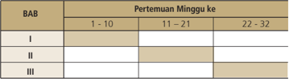

Tabel ini menunjukkan jadwal pertemuan mingguan untuk tiga bab (BAB I, BAB II, dan BAB III) dalam sebuah kursus atau program belajar. Kolom pertama berisi nomor bab, sedangkan kolom kedua berisi tiga periode waktu: 1-10, 11-21, dan 22-32. Data dalam tabel tersebut menunjukkan bahwa BAB I hanya memiliki pertemuan pada periode 1-10, BAB II tidak memiliki pertemuan di semua periode, dan BAB III memiliki pertemuan pada semua periode. Ini menunjukkan bahwaBAB I dan BAB III memiliki jadwal pertemuan yang lebih padat dibandingkan dengan BAB II.

 

---
## 📄 Halaman 49

### D.  Penilaian Hasil Belajar

### 1. PrinsipP rinsip P enilaian

Prinsip-prinsip  penilaian  dalam  mata  pelajaran  Sejarah  Indonesia kelas X antara lain:

- Menentukan aspek dari hasil belajar Sejarah yang sudah dan belum dikuasai  peserta didik sesudah suatu proses pembelajaran.
- Umpan  balik  bagi  peserta  didik  untuk  memperbaiki  hasil  belajar yang kurang atau  belum dikuasai.
- Umpan balik bagi guru untuk memberikan bantuan bagi peserta didik yang  tidak  memperlihatkan  hasil  belajar  sesuai  yang  diharapkan, guru  sudah  semestinya  melakukan  tindakan  perbaikan  berupa pembelajaran  remedial,  teguran,  dan  tugas  yang  mendidik,  atau dalam bentuk tugas.
- Apabila dari hasil belajar peserta didik berhasil menunjukkan suatu perbuatan yang positif, berikan pujian pada peserta didik.
- Lakukan penilaian  yang  bersifat  formatif  (untuk  perbaikan)  setiap saat baik ketika sedang di kelas maupun di luar kelas.
- Umpan balik bagi guru untuk memperbaiki perencanaan pembelajaran berikutnya.
- Tidak ada interpretasi tunggal dalam penilaian sejarah, sepanjang      peserta  didik  dapat  menunjukan  sumber  yang  dapat dipertanggungjawabkan.

### 2. AspekA spek yang D inilai/ D ievaluasi M encakup:

- pengetahuan dan pemahaman tentang peristiwa sejarah;
- kemampuan mengomunikasikan pemahaman mengenai peristiwa sejarah dalam bahasa lisan dan tulisan;
- c.) kemampuan menarik pelajaran/nilai dari suatu peristiwa sejarah;
- kemampuan menerapkan pelajaran/nilai yang dipelajari dari peristiwa sejarah dalam kehidupan sehari-hari;
- kemampuan melakukan kritik terhadap sumber dan mengumpulkan informasi dari sumber;

 

---
## 📄 Halaman 50

- kemampuan memberikan interpretasi terhadap sumber yang diperoleh. Dalam hal ini tidak ada kebenaran tunggal dalam sejarah, sepanjang  interpretasi  terhadap  sumber  yang  didapatkan  dapat dipertanggungjawabkan keabsahannya;
- kemampuan  berpikir  historis  dalam  mengkaji  berbagai  peristiwa sejarah dan peristiwa politik, sosial, budaya, ekonomi yang timbul dalam kehidupan keseharian masyarakat dan bangsa; pemahaman tentang semangat kebangsaan dan menerapkannya dalam kehidupan bermasyarakat, berbangsa dan bernegara.
Pendidik  melakukan  penilaian  terhadap  peserta  didik  selama  proses  dan setelah pembelajaran berlangsung. Penilaian observasi dapat dilakukan untuk menilai keefektifan peserta didik dalam: bertanya, diskusi, mengekplorasi dan menganalisis. Indikator ini digunakan untuk menilai sikap dan kemampuan peserta didik dalam memahami hakekat sejarah. Observasi dilakukan dengan tujuan yang jelas dan aspek-aspek yang menjadi tujuan observasi.

### 3. Indikator Keberhasilan Belajar Sejarah

Pendidik membuat  indikator yang jelas dalam melakukan observasi. Beberapa indikator yang digunakan dalam melakukan observasi terhadap peserta didik adalah sebagai berikut:

- Sikap  dapat  diukur  melalui  cara  kerja  sama,  perhatian  terhadap materi  yang  disampaikan,  keaktifan  bertanya,  kesopanan  dalam berbahasa, menghargai orang lain dan menunjukkan sikap terpuji.
- Bahasa dapat diukur melalui pemilihan kata-kata yang tepat, jelas, menarik, dan sesuai dengan kaidah-kaidah bahasa Indonesia yang benar.
- c.) Keaktifan peserta didik dalam memberikan masukan dapat diukur melalui relevansi dengan materi yang dibahas, sistematis, dan jelas.
- Kemampuan  mengeksplorasi  informasi  dapat  diukur  dari,  atau kemampuan  peserta  didik  untuk  mengaitkan  hubungan  antara peristiwa yang satu dengan peristiwa yang lain dengan menggunakan berbagai literatur dan sumber yang relevan.
- Kemampuan menganalisis  dapat  diukur  dari  kemampuan  peserta didik  untuk  menuangkan  gagasannya  dalam  bentuk  tulisan  dan mengaitkan  kondisi  masa  lalu  dengan  kondisi  saat  ini.  Dari  kemampuan

 

---
## 📄 Halaman 51

ini  dapat  dilihat  keterampilan  peserta  dalam  menuangkan  cara berpikir  dan  pemahaman  tentang  fakta  dan  kemampuan  berpikir sejarah, dalam mengerjakan tugas-tugas secara tertulis.

### 4. Pendekatan Penilaian Hasil Belajar Sejarah

Penilaian hasil belajar sejarah perlu mengubah tradisi yang sudah menjadi kebiasaan bagi penilaian mata pelajaran sejarah peserta didik. Pada prinsipnya penilai dalam pembelajaran sejarah tidak lagi pada intrepertasi tunggal. Akan tetapi, penilai lebih pada  prinsip penilaian kelas ( classroom  assessment ) yang menjadikan tindakan penilaian untuk mengetahui kelemahan mereka. Selain  itu,  penilaian  menjadi  dasar  bagi  guru  untuk  membantu mengatasi kelemahan peserta didik dalam belajar sejarah.

Penilaian  hasil  belajar  sejarah  lebih  difokuskan  pada  penilaian  perilaku  kejujuran dalam    menyelesaikan  tugas-tugas  yang  diberikan  (dalam  menguraikan tugas-tugas  dengan  mencantumkan  sumber-sumber  yang  jelas),  serta pertanggungjawaban terhadap keabsahan sumber yang digunakan dalam setiap menyelesaikan tugas. Penilaian juga dilakukan terhadap kemampuan berpikir, keterampilan, dan sikap peserta didik dengan pemahaman sejarah yang berkesinambungan antara masa lampau dan masa kini.

Penilaian  secara  tes  tertulis  dalam  pembelajaran  sejarah  digunakan  secara terbatas  untuk  mengetahui  penguasaan  mengenai  pengetahuan  sejarah (baik  fakta,  konsep,  maupun  prosedur).  Untuk  kemampuan  berpikir  dan keterampilan  sejarah  serta  nilai  dan  sikap  digunakan  instrumen  yang dikembangkan dengan pendekatan autentik dan instrumen lainnya.

Angka yang diberikan adalah 1-4 (D-A) di mana 1 (D) adalah angka terendah dan 4 (A) angka tertinggi. Antara D - C (digunakan D +  dan C  , antara C - B digunakan C  + dan B  , antara B-A digunakan B  + dan A  - . Keseluruhan angka tersebut adalah D, D  + , C -, C, C + , B -, B, B + , A - , dan A.

 

---
## 📄 Halaman 52

### NILAI DAN KRITERIA

---
**📊 Tabel**

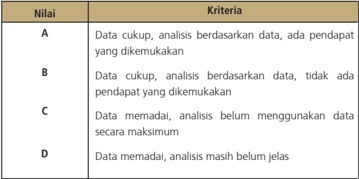

Tabel ini menunjukkan kriteria evaluasi berdasarkan data yang diberikan. Topik utamanya adalah penilaian kualitas analisis berdasarkan data. Kolom pertama berisi nilai (A, B, C, D) yang menunjukkan tingkat kepuasan atau kualitas analisis. Kolom kedua berisi deskripsi kriteria untuk setiap nilai. Data penting yang terlihat adalah bahwa nilai A memerlukan data cukup dan analisis berdasarkan data dengan pendapat yang dikemukakan, sedangkan nilai D memerlukan data memadai tetapi analisis masih belum jelas. Ini menunjukkan bahwa evaluasi ini fokus pada kualitas analisis berdasarkan data dan pendapat yang dikemukakan.

### 5. Penilaian Autentik

### a) Pengertian

Penilaian autentik ( Authentic Assessment ) adalah pengukuran yang bermakna  secara  signifikan  atas  hasil  belajar  peserta  didik  untuk ranah  sikap,  keterampilan,  dan  pengetahuan.  Istilah Assessment merupakan  sinonim  dari  penilaian,  pengukuran,  pengujian,  atau evaluasi. Istilah autentik merupakan sinonim dari  asli, nyata, valid, atau reliabel. Secara konseptual penilaian autentik lebih bermakna secara signifikan dibandingkan dengan tes pilihan ganda terstandar sekali pun. Ketika menerapkan penilaian autentik untuk mengetahui hasil dan prestasi belajar peserta didik, guru menerapkan kriteria yang berkaitan dengan konstruksi pengetahuan, aktivitas mengamati dan mencoba, dan nilai prestasi luar sekolah.

 

---
## 📄 Halaman 53

### b) Penilaian Autentik dan revelansinya dengan Kurikulum 2013

Penilaian  autentik  memiliki  relevansi  kuat  terhadap  pendekatan ilmiah dalam pembelajaran sesuai tuntutan Kurikulum 2013. Penilaian tersebut  mampu  menggambarkan  peningkatan  hasil belajar  peserta  didik,  baik  dalam  rangka  mengobservasi,  menalar, mencoba,  membangun  jejaring,  dan  lain-lain.  Penilaian  autentik cenderung  fokus  pada  tugas-tugas  kompleks  atau  kontekstual, memungkinkan  peserta  didik  untuk  menunjukkan  kompetensi mereka dalam pengaturan yang lebih autentik.

### c) Penilaian dan Pembelajaran Autentik

Penilaian autentik mengharuskan  pembelajaran yang autentik pula. Menurut Ormiston, belajar autentik mencerminkan tugas dan pemecahan masalah yang diperlukan dalam kenyataannya di luar sekolah.  Penilaian  autentik  terdiri  atas  berbagai  teknik  penilaian. Pertama ,  pengukuran  langsung  keterampilan  peserta  didik  yang berhubungan  dengan  hasil  jangka  panjang  pendidikan  seperti kesuksesan di tempat kerja. Kedua , penilaian atas tugas-tugas yang memerlukan keterlibatan luas dan kinerja kompleks. Ketiga , analisis proses  yang  digunakan  untuk  menghasilkan  respon  peserta  didik atas  perolehan  sikap,  keterampilan,  dan  pengetahuan  yang  ada. Penilaian    autentik  akan  bermakna  bagi  guru  untuk  menentukan cara-cara  terbaik  agar  semua  peserta  didik  dapat  mencapai  hasil akhir, meski dengan satuan waktu yang berbeda. Konstruksi sikap, keterampilan, dan pengetahuan dicapai melalui penyelesaian tugas di  mana  peserta  didik  telah  memainkan  peran  aktif  dan  kreatif. Keterlibatan peserta didik dalam melaksanakan tugas sangat bermakna bagi perkembangan pribadi mereka. Dalam pembelajaran autentik,  peserta  didik  diminta  mengumpulkan  informasi  dengan pendekatan scientiic , memahahi aneka fenomena atau gejala dan hubungannya satu sama lain secara mendalam, serta mengaitkan apa  yang  dipelajari  dengan  dunia  nyata  yang  luar  sekolah.  Guru dan peserta didik memiliki tanggung jawab atas apa yang terjadi. Peserta  didik  pun  tahu  apa  yang  mereka  ingin  pelajari,  memiliki parameter  waktu  yang  fleksibel,  dan  bertanggung  jawab  untuk tetap pada tugas. Penilaian autentik pun mendorong peserta didik mengkonstruksi, mengorganisasikan, menganalisis, mensintesis, menafsirkan, menjelaskan, dan mengevaluasi informasi untuk kemudian mengubahnya menjadi pengetahuan baru.

 

---
## 📄 Halaman 54

Pada  pembelajaran  autentik,  guru  harus  menjadi  'guru  autentik.'  Peran guru bukan hanya pada proses pembelajaran, melainkan juga pada penilaian. Untuk  bisa  melaksanakan  pembelajaran  autentik,  guru  harus  memenuhi kriteria tertentu seperti disajikan berikut:

- Mengetahui bagaimana menilai kekuatan dan kelemahan peserta didik serta desain pembelajaran.
- Mengetahui  bagaimana  cara  membimbing  peserta  didik  untuk mengembangkan  pengetahuan  mereka  sebelumnya  dengan  cara mengajukan pertanyaan dan menyediakan sumber daya memadai bagi peserta didik untuk melakukan akuisisi pengetahuan.
- Menjadi  pengasuh  proses  pembelajaran,  melihat  informasi  baru, dan mengasimilasikan pemahaman peserta didik.
- Menjadi  kreatif  tentang  bagaimana  proses  belajar  peserta  didik dapat  diperluas  dengan  menimba  pengalaman  dari  dunia  di  luar tembok sekolah.

### d) Proses Pengembangan

Untuk  mengetahui  kekuatan  dan  kelemahan  peserta  didik  dalam pembelajaran tentang nilai dan sikap, perlu dikembangkan prosedur pengembangan performance penilaian sebagai berikut:

- Menentukan  pengetahuan,  kemampuan  kognitif,  nilai,  sikap, yang ingin diketahui oleh guru dari peserta didik yang belajar sejarah.
- Mengembangkan  indikator  mengenai  kemampuan  dan  nilai tersebut,  kaji  dan  tentukan  tentang  indikator  yang  dianggap penting, sudah cukup, atau perlu ditambah atau dikurang.
- Mengkaji  informasi  yang  diperlukan  untuk  indikator  tersebut dalam bentuk ungkapan kalimat tertulis.
- Menuliskan  tugas-tugas  yang  harus  dikerjakan  peserta  didik seperti  halnya  guru  mengembangkan  pertanyaan  untuk  soal essay,  tetapi  cukup  satu  pertanyaan  untuk  satu  instrumen performance.
- Kembangkan rubrik: tulis kriteria yang digunakan untuk menilai informasi yang ditulis dalam menjawab peserta didik dan tingkat keberhasilannya.

 

---
## 📄 Halaman 55

### CONTOH:

### LANGKAH:

### a) Penilaian Sikap Jujur

---
**📊 Tabel**

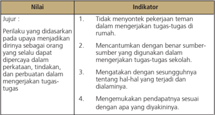

Tabel ini menunjukkan kriteria evaluasi untuk nilai yang berkaitan dengan perilaku siswa dalam menghadapi tantangan dan menyelesaikan tugas-tugas. Topik utama tabel adalah tentang bagaimana siswa dapat mengembangkan sikap dan perilaku positif dalam menghadapi tantangan dan menyelesaikan tugas-tugas. Kolom-kolom yang ada meliputi Indikator, yaitu 1. Tidak menyontek pekerjaan teman dalam mengengerjakan tugas-tugas di rumah, 2. Mencantumkan dengan benar sumber-sumber yang digunakan dalam mengengerjakan tugas-tugas sekolah, 3. Mengatakta dengan sesungguhnya tentang hal-hal yang terjadi dan dialaminya, dan 4. Mengemukakan pendapatnya sesuai dengan apa yang diyakinkannya. Data atau pola penting yang terlihat adalah bahwa setiap indikator memiliki tujuan yang spesifik untuk membantu siswa mengembangkan sikap dan perilaku yang positif dalam menghadapi tantangan dan menyelesaikan tugas-tugas.

### b) Kajian Indikator

Informasi  tentang  indikator  1-4  dapat  dikembangkan  untuk satu tugas performance  assesment, untuk indikator 1 dan 2 merupakan  alat  autentik  untuk  melakukan  penilaian,  namun demikian  guru  dapat  membuat  kesimpulan  bahwa  keempat indikator  itu  dapat  dibuat  dalam  satu  tugas performance assesment.

- Menentukan informasi yang diperlukan. Untuk indikator 1 dapat membandingkan dengan hasil jawaban tugas seorang peserta didik  dengan  peserta  didik  lainnya.  Indikator  2  mengecek  sumbersumber yang digunakan dalam menyelesaikan tugas. Indikator 3 mengemukakan fakta yang ditemukan ketika menyelesaikan tugas-tugas di rumah. Indikator 4 menyampaikan pendapatnya dengan suatu kejadian yang dialami dalam masyarakat.
- Menuliskan  tugas.  Untuk  membuat  penugasan  guru  dapat merumuskan pertanyaan yang dapat memberikan jawaban yang terkandung dalam informasi sebagaimana yang diinginkan dari setiap  indikator.  Berikut  ini  contoh  untuk  penugasan  peserta didik.

 

---
## 📄 Halaman 56

### contoh:

Jawablah pertanyaan sebagai berikut secara mandiri.

- Identifikasi dan jelaskan bentuk-bentuk alkulturasi budaya pada masa praaksara di lingkungan tempat tinggal kalian.
- Jelaskan keterkaitan antara sistem kepercayaan masa praaksara dengan sistem kepercayaan masyarakat kita pada saat ini.
- Apa  pendapat  kalian  tentang  budaya  bangsa  Indonesia  pada masa Hindu-Buddha dalam bidang arsitektur?

### e) Rubrik

Rubrik adalah skala skor penilaian yang digunakan untuk menilai jawaban  peserta  didik  terhadap  pertanyaan  atau  tugas  yang dikerjakannya (Mueller, 2011).

Sesuai yang telah disampaikan di atas, tugas penilaian autentik dapat  digunakan    untuk  menilai  pengetahuan,  kemampuan berpikir, dan menilai, serta sikap peserta didik. Dengan demikian, rubrik  yang  ditulis  dapat  meliputi  pengetahuan,  kemampuan berpikir pada jenis dan jenjang yang ingin diketahui, serta nilai dan  sikap  yang  dinyatakan  peserta  didik  dalam  memberikan jawaban.  Untuk  kepentingan  penilaian  nilai  dari  pendidikan karakter  maka  rubrik  yang  dikembangkan  berkenaan  dengan nilai kejujuran yang dinyatakan dalam indikator serta informasi yang  diperlukan  sebagaimana  dikemukakan  dalam  langkahlangkah di atas.

Contoh

Rubrik

Nama

: .....................................

-----------------------------------------------------------------------------

Soal 1

Untuk sikap jujur

### 1.  Meniru pekerjaan teman :

soal nomor 1:

hampir  seluruhnya,  sebagian  besar,  sebagian  kecil,  hampir tidak ada

 

---
## 📄 Halaman 57

### soal nomor 2:

hampir  seluruhnya,  sebagian  besar,  sebagian  kecil,  hampir seluruhnya, tidak ada soal nomor 3:

hampir  seluruhnya,  sebagian  besar,  sebagian  kecil,  hampir tidak ada

### Untuk Perubahan dan Keberlanjutan

Menemukan  bentuk-bentuk  perubahan  dan  keberlanjutan nilai-nilai kebangsaan:

- satu
- dua
- tiga
- empat
- lebih dari empat
Menjelaskan bentuk-bentuk perubahan dan berkelanjutan

- tidak berstruktur
- berstruktur, mono aspek
- berstruktur, multi aspek (lebih dari satu aspek)
- berstruktur dan komprehensif

### f) Pengolahan Jawaban

Berdasarkan jawaban dari peserta didik pada model perfomance assesment guru  dapat  mengolah  jawaban  tersebut  menjadi profil  perilaku  peserta  didik.  Profil  tersebut  menggambarkan perilaku nilai yang ditunjukkan peserta didik. Banyak kata yang berkenaan  dengan  suatu  pertanyaan  tidak  harus  diartikan bahwa perilaku nilai tersebut sudah baik. Demikian sebaliknya ketika  jumlah  kata-kata  yang  ditulis  sangat  sedikit    tidaklah memberikan makna bahwa perilaku itu belum dimiliki peserta didik.

Satu instrumen performan hanya dapat dikatakan menunjukkan ada  atau  tidak  perilaku  tersebut.  Jadi,  untuk  setiap  peristiwa penilaian,  guru  merekam  hasil  jawaban  peserta  didik  dengan suatu profil. Berdasarkan beberapa hasil dari berbagai penilaian dalam  satu  bulan,  guru  dapat  mengembangkan  keseluruhan

 

---
## 📄 Halaman 58

profil perilaku hasil belajar karakter seperti: Belum Tampak (BT), Mulai Tampak (MT), Mulai Stabil (MS), Sudah Konsisten (SK).

Pada  akhir  semester  guru  dapat  megkonversi  hasil  tersebut untuk nilai rapor sebagai berikut:

---
**📊 Tabel**

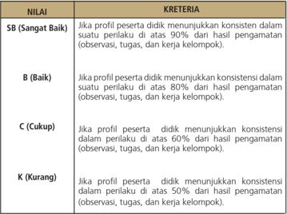

Tabel ini menunjukkan sistem penilaian kinerja peserta didik berdasarkan konsistensi perilaku mereka dalam berbagai aktivitas seperti observasi, tugas, dan kerja kelompok. Topik utama tabel adalah penilaian kinerja peserta didik berdasarkan konsistensi perilakunya. Kolom-kolomnya meliputi "NILAI" dan "KRETERIA". Data penting yang terlihat adalah bahwa nilai "SB" (Sangat Baik) diberikan jika perilaku peserta didik mencapai 90% dari hasil pengamatan, "B" (Baik) untuk 80%, "C" (Cukup) untuk 60%, dan "K" (Kurang) untuk 50% atau di bawah dari hasil pengamatan tersebut. Ini menunjukkan bahwa sistem penilaian ini sangat detail dan memperhatikan konsistensi perilaku peserta didik dalam berbagai aktivitas.

### 6. Panduan Observasi

### a.   Pengertian

Panduan observasi adalah instrumen untuk merekam berbagai perilaku peserta didik, baik perilaku ucapan, gesture, tindakan, yang  dilakukan  pada  saat  proses  belajar  mengajar  berproses di  kelas  di  luar  sekolah  sepanjang  program  itu  dilaksanakan berdasarkan  program  dari  suatu  mata  pelajaran.  Panduan observasi ini bersifat terbuka, mendiskripsikan karakter peserta didik.

 

---
## 📄 Halaman 59

Observasi dalam hal ini dilakukan secara terencana setiap hari dan  merekam  peristiwa/perilaku  muncul  atau  tidak  muncul. Suatu peristiwa/kejadian yang tidak muncul atau tidak dilakukan peserta didik tetap diperhitungkan sebagai suatu kejadian.

### b. Bentuk

Bentuk  fisik  suatu  pedoman  observasi  terdiri  atas  perilaku teramati yang diobservasi, rekaman terhadap perilaku tersebut, dan informasi mengenai peserta didik yang melakukan perilaku secara  terekam.  Berbeda  dengan  observasi  kelas  yang  tidak mementingkan  nama,  tetapi  frekuensi  perilaku  itu  sendiri, dalam observasi pendidikan karakter nama peserta didik yang melakukan  perilaku terekam. Hal tersebut penting untuk pembinaan pada yang bersangkutan selanjutnya.

### c. Guna/manfaat

Instrumen pedoman observasi membantu guru untuk merekam perilaku yang ditunjukkan peserta didik dalam bentuk rekaman yang  dapat  dipelajari  walaupun  perilaku  itu  sudah  berlalu. Dengan  demikian  ,  guru  memiliki  waktu  yang  cukup  untuk mengkaji hasil rekaman observasi dan mengulang kajian tersebut setiap  saat  diperlukan.  Dengan  cara  demikian,  pemaknaan terhadap perilaku tersebut menjadi lebih baik.

### d. Proses Pengembangan

Karena  sifat  perilaku  untuk  penilaian  hasil  belajar  pendidikan karakter  bersifat  terbuka  maka  tidak  diperlukan  item  tentang perilaku  yang ditulis  dalam  pedoman observasi. Perilaku yang ditunjukkan peserta didik yang terekam tidak dirancang sebagai sesuatu yang prespektif, tetapi terekam sebagai sesuatu yang deskriptif.  Hal  ini  disebabkan  guru  tidak  mungkin  memiliki pengetahuan mengenai apa yang akan dilakukan peserta didik atau perilaku untuk menilai apa yang dilakukan peserta didik.

Keterbukaan dalam  item ini menyebabkan  guru  memiliki kebebasan  dalam  mengembangkan  format  instrumen.  Selain aspek identitas peserta didik, tanggal/bulan yang menyatakan waktu  perekaman,  guru  hanya  perlu  menyediakan  kolom kosong untuk setiap peserta didik.

 

---
## 📄 Halaman 60

Dalam format yang demikian maka proses pengembangan pedoman observasi untuk hasil pendidikan karakter lebih sederhana. Dalam satu halaman guru dapat merekam perilaku lebih dari satu peserta didik dan lebih dari satu perilaku yang berbeda. Meskipun demikian, dalam satu halaman sebaiknya tidak digunakan lebih dari empat orang. Setiap nama peserta didik memiliki kolom kosong untuk merekam perilaku yang teramati pada hari tersebut.

### Berikut contoh panduan obsevasi Contoh

Tanggal:.............

Hari:......................

### Nama Peserta Didik

### Perilaku yang di tampilkan

Anik

Budi

Salmon

Tina

### Fransiska

Catatan : berisikan situasi/kondisi khusus (bukan yang terjadi seharihari ketika suatu perilaku muncul)

Guru  dapat  membuat  lembar  panduan  observasi  sebanyak  yang diperlukan sesuai jumlah peserta didik dalam satu kelas dibagi 4. Suatu kelas yang terdapat 40 peserta didik, maka guru akan membawa 10 lembar data panduan observasi. Guru perlu mengganti tanggal yang sesuai  hari  observasi.  Kertas  pedoman  observasi  yang  terisi  maupun yang kosong adalah data. Ketika mengolah hasil maka hari yang tidak ada kertas menunjukkan tidak ada perilaku yang ditunjukkan peserta didik.

 

---
## 📄 Halaman 61

### e. Pengolahan Jawaban Peserta Didik

Pengolahan jawaban peserta didik yang terekam dalam pedoman  observasi  bersifat  inferensial  dan  induktif.  Artinya, guru  memberikan  pertimbangan  terhadap  data  yang  telah terekam ke dalam kelompok nilai yang sesuai. Secara teknis guru menggunakan  indikator  suatu  nilai  untuk  mengelompokkan perilaku  yang  terekam.  Suatu  perilaku  yang  terekam  dapat dikelompokkan lebih dalam satu kelompok nilai, apabila dalam perilaku peserta didik benar menunjukkan perilaku lebih dari  satu  nilai.  Misalnya  peserta  didik  tidak  mempunyai  buku teks  yang  seharusnya  dibahas  untuk  pertemuan  berikutnya. Kemudian ia meminjam kepada temannya yang memiliki buku itu.  Teman  yang  memiliki  buku  itu  kemudian  meminjamkan bukunya  kepada  teman  yang  tidak  punya,  maka  perilaku  itu menunjukkan sikap peduli dan saling menolong. Ketika peserta didik menjelaskan materi dan terjadi diskusi tentang pelajaran yang  akan  dibahas  pada  pertemuan  berikutnya  maka  guru dapat mengkategorikan sikap tersebut sebagai perilaku saling membantu, bekerja sama, saling mengasihi, dan bersahabat.

Dari data jawaban peserta didik, guru dapat mengolah jawaban itu  untuk dijadikan dasar merekam perilaku peserta didik dan dapat dijadikan dasar sebagai profil peserta didik. Berdasarkan hasil  perekaman  itu  dalam  waktu-waktu  tertentu,  setiap  satu minggu  sekali  guru  kelas  membuat  daftar  pengembangan profil dari setiap peserta didik, untuk guru suatu mata pelajaran dapat membuat pengembangan profil setiap satu bulan sekali untuk melihat keseluruhan profil peserta didik. Beberapa karekter dari perserta didik itu dapat dilihat perkembangannya sebagai berikut: Belum Tampak (BT), Mulai Tampak (MT), Mulai Berkembang (MB), Mulai Konsisten (MK), Sudah Konsisten (SK).

### 7. Skala Penilaian

Dalam  penilaian  peserta  didik  digunakan  skala Likert . Skala ini dikembangkan untuk mengukur sikap seseorang terhadap suatu nilai/ atau perilaku peserta didik. Skala ini memberikan suatu dimensi proses kuantifikasi angka dalam suatu interval seraha dari yang paling rendah ke yang lebih tinggi atau sebaliknya.

 

---
## 📄 Halaman 62

Pengembangan skala Likert saat ini memiliki empat interval atau lima titik  walaupun    masih  ada  yang  mempertahankan  dua  interval  atau tiga  titik  bahkan  ada  yang  mengembangkan  sampai  dengan  enam interval hingga tujuh titik.

Bentuk skala interval yang kita gunakan dalam contoh ini adalah lima titik, yaitu:

Bentuk skala Likert sebagai berikut:

sangat tidak setuju   tidak setuju  tidak bersikap   setuju        sangat setuju

Bentuk di atas dapat dibalik menjadi:

SS

sangat setuju           setuju       tidak bersikap    tidak setuju   sangat tidak setuju

Angka 1

: sangat tidak setuju

Angka 2

: tidak setuju

Angka 3

: tidak bersikap

Angka 4

: setuju

Angka 5

: sangat setuju

Dalam pengembangan skala ini dapat dipilih bentuk yang lain, namun demikian  harus  ada  konsistensi  dalam  setiap  kelompok  pernyataan yang  mengukur  sikap  terhadap  perilaku  peserta  didik.  Pernyataan terbalik  tidak  mengubah  prinsip  konsisten  bentuk  yang  digunakan, tetapi pada cara pemberian angkanya. Kegunaan skala Linkert untuk melihat  sikap  seseorang  terhadap  suatu  nilai  atau  perilaku.  Sikap adalah kecenderungan emosi terhadap suatu nilai atau perilaku.

Proses  pengembangan  skala  Linkert  yaitu  pertama,  pengembangan pada pernyataan yang akan dijawab peserta didik, dan kedua adalah proses  penentuan  posisi  jawaban  pada  skala.  Berikut  adalah  proses yang harus dilakukan dalam menengembangkan pernyataan:

- menentukan  nilai  atau  perilaku  yang  akan  diketahui.  Untuk suatu tes Linkert dapat digunakan lebih dari satu nilai.
- perhatian indikator yang telah dikembangkan untuk setiap nilai yang akan diketahui melalui skala Linkert.

 

---
## 📄 Halaman 63

- dari indikator yang dikembangkan situasi atau bentuk perilaku yang harus dipertunjukkan sesorang.
- mengembangkan pernyataan dari situasi atau bentuk perilaku yang dikembangkan.
- penilaian terhadap kualitas pernyataan dalam kriteria pernyataan  yang  baik  adalah  yang  memungkinkan  ada  peserta  didik yang setuju, tidak setuju, dan tidak bersikap.
- revisi  pernyataan  yang  memungkinkan  semua  peserta  didik setuju, tidak setuju, atau tidak bersikap
- tentukan  pernyataan  terbalik  dari  situasi  atau  perilaku  yang telah dikembangkan
- tentukan angka untuk titik dalam skala
- tulis petunjuk cara memberikan jawaban
- tentukan bentuk jawaban untuk setiap nilai atau perilaku yang ingin diketahui dari seorang peserta didik.

### CONTOH

- Nilai yang akan diketahui adalah jujur, kerja keras, disiplin, dan toleransi
- Dari daftar nilai pada buku pedoman pendidikan karakter maka indikator setiap nilai adalah sebagai berikut:

---
**📊 Tabel**

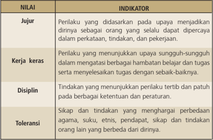

Tabel ini berisi informasi tentang empat kriteria nilai yang penting dalam kehidupan sehari-hari: jujur, kerja keras, disiplin, dan toleransi. Topik utama tabel ini adalah tentang perilaku dan sikap yang diharapkan dalam berbagai situasi. Kolom pertama berisi nama kriteria nilai, sedangkan kolom kedua berisi indikator atau tanda-tanda yang menunjukkan adanya perilaku tersebut. Data penting yang terlihat adalah bahwa setiap kriteria memiliki indikator spesifik yang harus dicapai untuk mendapatkan nilai tertinggi. Misalnya, jujur melibatkan didasarkan pada upaya menjadikan dirinya sebagai orang yang selalu dapat dipercaya dalam perkataan, tindakan, dan pekerjaan. Ini menunjukkan bahwa nilai jujur tidak hanya tentang kata-kata, tetapi juga tentang tindakan dan hasil yang dihasilkan.

 

---
## 📄 Halaman 64

- 3).   Dari indikator dikembangkan situasi atau perilaku yang menunjukkan  nilai  yang  ingin  diketahui.  Misalnya  kerja  keras  dapat diterjemahkan dalam waktu belajar dibandingkan waktu bermain, menghindari tugas yang sulit, menyelesaikan pekerjaan sebaik-baiknya, bertanya kepada teman untuk menyelesaikan tugas yang tidak diketahui dan lain-lain.
- 4).   Dari kegiatan nomor 3 untuk kerja keras maka ada pernyataan sebagai berikut:
- Mengerjakan  tugas  harus  sampai  selesai  walau  pun  harus mengambil waktu bermain
- Tugas  yang  sulit  perlu  dikerjakan  dengan  sungguh-sungguh meskipun jam tidur jadi berkurang
- Jam untuk bermain tidak boleh dikorbankan untuk mengerjakan pekerjaan rumah
- Bertanya kepada teman untuk mengetahui cara menyelesaikan tugas perlu dilakukan
- Kerja keras harus menjadi kebiasaan dalam  belajar yang menyenangkan
- 5).   Kaji  setiap  pernyataan  yang  telah  dibuat:  apakah  ada  pernyataan yang semua peserta didik akan setuju/sangat setuju dan apakah ada pernyataan  dimana  semua  peserta  didik  akan  tidak  setuju/sangat tidak setuju atau tidak bersikap. Kajian ini memang sangat subjektif tetapi perlu dilakukan.
- 6).   Dari pernyataan di atas mungkin pernyataan terakhir akan melahirkan respon setuju semua. Oleh karena itu, pernyataan itu direvisi menjadi: kerja keras harus menjadi kebiasaan belajar yang menyenangkan bagi setiap peserta didik. Setelah direvisi mungkin ada yang setuju, tidak setuju atau tidak bersikap.
- 7).   Menentukan  pernyataan  terbalik:  dari  pernyataan  pada  titik  4  dan direvisi pada titik 6 maka pernyataan ketiga adalah pernyataan terbalik. Jadi pernyataan pertama, kedua, keempat, dan kelima adalah pernyataan positif sedangkan pernyataan ketiga adalah pernyataan negatif.
- 8).   Tentukan angka untuk titik dalam skala: apakah 1 untuk paling setuju atau untuk paling tidak setuju. Misalkan guru menetapkan angka 1 adalah untuk yang paling setuju.

 

---
## 📄 Halaman 65

- 9).   Tulis petunjuk cara memberikan jawaban: lingkari atau beri tanda silang atau tulis angka di  akhir setiap pernyataan, dimana:
- 1 = sangat setuju
- 2 = setuju
- 3 = tidak bersikap
- 4 = tidak setuju
- 5 = sangat tidak setuju
- 10).   Buat format yang menggabungkan antara pernyataan dengan jawaban. Contoh
Format  lain  dapat  digunakan.  Misalkan  petunjuk  cara  menjawab  tidak menyatakan  1  =  sangat  setuju  atau  sangat  tidak  setuju  tetapi  langsung memberikan tanda lingkaran atau silang (X)  jawaban yang sesuai. Bentuk tabel di atas menjadi sebagai berikut:

 

---
## 📄 Halaman 66

---
**📊 Tabel**

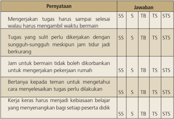

Tabel ini menunjukkan perbandingan antara pengetahuan (SS) dan keterampilan (TB) serta sikap (TS) terhadap beberapa aspek kehidupan sehari-hari. Topik utama tabel adalah tentang bagaimana menerima tugas, menjaga waktu, dan berinteraksi dengan orang lain. Kolom "Penyataan" berisi pernyataan yang harus dijawab, sedangkan kolom "Jawaban" menunjukkan kategori jawaban yang sesuai dengan pengetahuan, keterampilan, atau sikap. Data penting yang terlihat adalah bahwa pengetahuan (SS) seringkali lebih penting daripada keterampilan (TB), dan sikap (TS) juga sangat penting untuk menjaga hubungan baik dengan orang lain.

### a) Membuat petunjuk menjawab

Sebagaimana dengan alat penilaian lain petunjuk cara menjawab harus jelas dan tidak boleh ada keraguan di pihak peserta didik untuk menjawabnya. Khusus untuk skala Likert perlu ditambahkan bahwa kalimat:

- 1). Berilah jawaban yang paling sesuai dengan perasaan kalian: setuju  jika  setuju  dengan  pernyataan,  tidak  setuju  jika tidak setuju dengan pernyataan, tidak bersikap jika tidak dapat  menentukan  persetujuan  atau  ketidakpersetujuan terhadap suatu pernyataan.
- 2). Jawaban  yang  diberikan  tidak  berpengaruh  terhadap kenaikan kelas

### b) Pengolahan jawaban peserta didik

Mengolah hasil jawaban untuk skala sikap adalah dengan menambahkan angka dari setiap pernyataan untuk suatu nilai atau perilaku yang ingin diketahui. Setiap nilai dan perilaku dinamakan satu skala, jadi jika dalam satu skala sikap ada 4 nilai atau perilaku yang diukur maka ada 4 skala dan akan ada 4 angka hasil dari tambahan masing-masing skala. Dengan perkataan lain jika yang akan diketahui adalah nilai jujur, kerja keras, disiplin, dan peduli sosial  maka akan ada 4 angka yaitu satu untuk masing-masing skala.

 

---
## 📄 Halaman 67

Dalam menjumlahkan angka harus diingat ada pernyataan yang bersifat terbalik maka untuk pernyataan itu angka yang diberikan  terbalik  dari  pernyataan  lainnya.  Jika  yang  umum  skor  1 diberikan kepada sangat setuju maka pada pernyataan terbalik skor  1  diberikan  kepada  yang  sangat  tidak  setuju.  Jumlahkan skor untuk setiap skala setelah itu boleh dibagi atas banyaknya pernyataan.

Dari  pengolahan  jawaban  tersebut  terlihat  posisi  sikap  setiap peserta  didik  terhadap  suatu  nilai  atau  perbuatan.  Jawaban tersebut baru mencerminkan kecenderungan perasaan seorang peserta didik belum mencerminkan perilaku mereka. Skala Likert adalah skala mengenai kecenderungan dan bukan perilaku.

- Pelaporan Hasil Penilaian
Pada tahap pelaporan hasil penilaian, guru melakukan kegiatan sebagai berikut:

- Menghitung/menetapkan nilai mata pelajaran dari berbagai  macam  penilaian  (hasil  ulangan  harian,  tugastugas, ulangan  tengah  semester, dan  ulangan  akhir semester atau ulangan kenaikan kelas);
- Melaporkan  hasil  penilaian  mata  pelajaran  dari  setiap peserta didik pada setiap akhir semester kepada pimpinan satuan  pendidikan  melalui  wali  kelas  atau  wakil  bidang akademik  dalam  bentuk  nilai  prestasi  belajar  (meliputi aspek pengetahuan, praktik, dan sikap) disertai deskripsi singkat sebagai cerminan kompetensi yang utuh.

### E. Format Buku Teks Pelajaran Sejarah Indonesia

Dalam  rangka  membelajarkan  peserta  didik,  guru  harus  juga  memahami format buku teks pelajaran Sejarah Indonesia . Buku teks pelajaran Sejarah Indonesia disusun  dengan  format  sebagai  berikut.  Buku  teks  pelajaran Sejarah  Indonesia  Kelas  X terdiri atas tiga bab. Setiap bab terdapat sebuah pengantar. Setiap bab terdiri atas beberapa sub bab. Setiap sub bab disusun dalam tiga aktivitas: (1) mengamati lingkungan, (2) memahami teks, dan (3) uji kompetensi. Setiap bab diakhiri dengan kesimpulan.

 

---
## 📄 Halaman 68

### BAGIAN 2

### Petunjuk Khusus

### Pembelajaran Per Bab

Buku ini merupakan pedoman guru untuk mengelola pembelajaran terutama dalam memfasilitasi peserta didik untuk memahami materi dan mengamalkan pesan-pesan sejarah yang ada pada Buku Siswa. Materi ajar yang ada pada Buku Siswa akan dibelajarkan selama satu tahun ajaran. Sesuai dengan desain waktu dan materi setiap  bab  maka  bab  I  akan  diselesaikan  dalam  waktu 10 minggu pembelajaran, sedang untuk bab II dan III masing-masing dapat diselesaikan  dalam  11  minggu  pembelajaran.  Agar  pembelajaran itu  lebih efektif dan terarah, maka setiap minggu pembelajaran dirancang terdiri atas: (1) Tujuan pembelajaran, (2) Materi dan Proses pembelajaran, (3) Penilaian, (4) Pengayaan, dan (Remidial), ditambah Interaksi Guru dan orang tua.

### Pelaksanaan Pembelajaran

Berdasarkan pemahaman tentang KI dan KD, guru sejarah yang mengajarkan materi tersebut hendaknya dapat:

- Menggunakan isu-isu aktual untuk dapat mengajak peserta didik dalam mengembangkan kemampuan analisis dan evaluatif dengan mengambil contoh kasus dari situasi saat ini dengan fakta-fakta sejarah yang ada pada masa itu.
- Dalam melaksanakan pembelajaran guru harus memberikan motivasi dan mendorong peserta didik secara aktif ( active  learning )  untuk  mencari sumber  dan  contoh-contoh  konkrit  dari  lingkungan  sekitarnya.  Guru harus  menciptakan  situasi  belajar  yang  memungkinkan  peserta  didik

 

---
## 📄 Halaman 69

melakukan  observasi  dan  refleksi.  Observasi  dapat  dilakukan  dengan berbagai  cara,  misalnya  membaca  buku  dengan  kritis,  menganalisis dan  mengevaluasi  sumber-sumber  sejarah,  membuat  tulisan  sejarah secara sederhana, melakukan wawancara dengan pelaku sejarah atau ahli sejarah, menonton film atau dokumentasi sejarah dan mengunjungi situs-situs  sejarah  yang  berkaitan  dengan  pembahasan  di  lingkungan sekitar  peserta  didik  tinggal.  Dalam  pelaksanaan  kunjungan  ke  situssitus  bersejarah,  guru  dapat  melakukan  kerja  sama  dengan  lembaga kebudayaan yang menangani bidang kesejarahan setempat agar peserta didik mendapatkan informasi secara lengkap. Contohnya Balai Arkeologi, Balai Pelestarian Cagar Budaya, Balai Pelestarian Nilai Budaya, museummuseum dan lain-lain.

- Peserta  didik  harus  dirangsang  berpikir  kritis  dengan  memberikan pertanyaan-pertanyaan di setiap jam pelajaran.
- Guru  sejarah  harus  mampu  mengaitkan  konteks  lingkungan  tempat tinggal  peserta  didik  (kabupaten,  provinsi,  pulau)  dengan  konteks kesejarahan yang lebih luas, yaitu Indonesia. Bagaimana posisi daerahnya di masa lampau ketika  masa praaksara, masa klasik Hindu-Buddha, dan masa Islam.

 

---
## 📄 Halaman 70

### BAB I

### Menelusuri Peradaban Awal di Kepulauan Indonesia

### A. Peta Konsep

---
**🖼️ Gambar/Diagram**

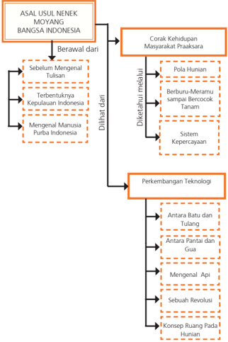

> **Deskripsi Visual:** Gambar ini adalah diagram yang menunjukkan sejarah perkembangan manusia di Indonesia dari asal-usul nenek moyang hingga perkembangan teknologi. Diagram ini dibagi menjadi tiga bagian utama:

1. **Asal-usul Nenek Moyang Bangsa Indonesia**: Menunjukkan perjalanan sejarah dari asal-usul nenek moyang hingga munculnya kepulauan Indonesia.

2. **Corak Kehidupan Masyarakat Praaksara**: Menyajikan pola hidup manusia praaksara, mulai dari berburu-memakan hingga bercocok tanam, serta sistem kepercayaan mereka.

3. **Perkembangan Teknologi**: Menggambarkan perkembangan teknologi manusia dari batu dan tulang hingga revolusi, termasuk konsep ruang pada manusia.

Elemen-elemen utama dalam diagram ini adalah:
- **Pola Hidup Manusia Praaksara**: Dibagi menjadi dua bagian: berburu-memakan hingga bercocok tanam.
- **Sistem Kepercayaan**: Dibagi menjadi dua bagian: berburu-memakan hingga bercocok tanam.
- **Perkembangan Teknologi**: Dibagi menjadi empat bagian: antara batu dan tulang, antara pantai dan gua, mengenal api, dan sebuah revolusi.

Teks, angka, atau label penting yang terlihat dalam diagram ini meliputi:
- "Berawal dari"
- "Sebelum Mengenal Tulisan"
- "Terbentuknya Kepulauan Indonesia"
- "Mengenal Manusia Purba Indonesia"
- "Dikehendaki melalui"
- "Pola Hidup Manusia"
- "Berburu-Memakan hingga Bercocok Tanam"
- "Sistem Kepercayaan"
- "Perkembangan Teknologi"
- "Antara Batu dan Tulang"
- "Antara Pantai dan Gua"
- "Mengenal Api"
- "Sebuah Revolusi"
- "Konsep Ruang Pada Manusia"

Informasi kunci yang dapat diambil pembaca meliputi:
- Perkembangan pola hidup manusia dari pra

 

---
## 📄 Halaman 71

### B.   Kompetensi Inti (KI):

- KI. 3 Memahami  dan menerapkan pengetahuan faktual, konseptual, prosedural dalam  ilmu  pengetahuan,  teknologi,  seni,  budaya,  dan humaniora dengan wawasan kemanusiaan,  kebangsaan, kenegaraan, dan  peradaban  terkait  fenomena  dan  kejadian,  serta  menerapkan pengetahuan prosedural pada bidang kajian yang spesifik sesuai dengan bakat dan minatnya untuk memecahkan masalah
- KI. 4  Mengolah,  menalar,  dan  menyaji  dalam  ranah  konkret  dan  ranah abstrak terkait dengan pengembangan dari yang dipelajarinya di sekolah secara  mandiri,  dan  mampu  menggunakan  metoda  sesuai  kaidah keilmuan.

### C.   Kompetensi Dasar (KD):

- 3.1    Memahami  dan  menerapkan  konsep  berpikir  kronologis (diakronik), sinkronik, ruang dan waktu  dalam  sejarah
- 3.2    Memahami konsep perubahan dan keberlanjutan dalam sejarah
- 3.3. Menganalisis  asal-usul    nenek  moyang  bangsa  Indonesia  (Proto, Deutero  Melayu dan Melanesoid)
- 3.4      Menganalisis  berdasarkan  tipologi  hasil  budaya  praaksara Indonesia termasuk yang berada di lingkungan terdekat
- 4.1    Menyajikan  informasi  mengenai  keterkaitan  antara  konsep berpikir kronologis (diakronik) , sinkronik, ruang, dan waktu dalam sejarah
- 4.2      Menyajikan   hasil   penalaran   mengenai   corak   kehidupan masyarakat pada masa praaksara dalam bentuk tulisan
- 4.3 Menyajikan  kesimpulan-kesimpulan  dari  informasi  mengenai  asalusul  nenek moyang  bangsa  Indonesia  (Proto,  Deutero Melayu  dan Melanesoid) dalam bentuk tulisan
- 4.4      Menalar informasi mengenai  hasil budaya  Praaksara Indonesia termasuk  yang  berada  di  lingkungan  terdekat  dan  menyajikannya dalam bentuk tertulis.

 

---
## 📄 Halaman 72

### D.   Proses Pembelajaran

### Langkah Pembelajaran umum

- Melaksanakan persiapan dan pendahuluan pembelajaran.
- Melaksanakan pembelajaran Sejarah Indonesia yang mendorong peserta didik mampu memahami terbentuknya Kepulauan Indonesia, kehidupan manusia  purba  di  Kepulauan  Indonesia,  asal  mula  nenek  moyang manusia purba di Kepulauan Indonesia, serta mampu mengidentifikasi karakteristik kehidupan kemasyarakatan, pemerintahan, dan kebudayaan masa  praaksara  dan  bukti-buktinya,  dan  nilai-nilai  dan  unsur-unsur budaya yang berlanjut dalam kehidupan masyarakat hingga saat ini.
- Model  dan  strategi  pembelajaran  Sejarah  Indonesia  yang  digunakan pendidik  disesuaikan  dengan  buku  siswa  dan  dapat  ditambahkan oleh  pendidik  dengan  model  lain  yang  dianggap  dapat  mendorong pencapaian tujuan yang sudah ditentukan.
- Pendidik mendorong terjadinya proses pembelajaran yang berpusat pada peserta didik, yaitu:
- membimbing dan memfasilitasi pembelajaran
- mendorong  peserta  didik  untuk  mampu  memahami  hayat sejarah dalam menyampaikan hasil pembelajaran peserta didik yang  dilakukan  dengan  menggunakan  media  yang  ada  dan memungkinkan di sekolah.

### Materi dan Proses Pembelajaran di Buku Teks Pelajaran Sejarah Indonesia Bab I

- Pada bab ini guru selayaknya mampu menyiapkan diri dengan membaca berbagai literatur yang berkaitan dengan peradaban awal di Kepulauan Indonesia  beserta  hasil-hasil  kebudayaannya.  Guru  dapat  mengambil contoh-contoh yang terkait dengan materi yang ada di buku yang ada di daerah di sekitarnya. Bila di daerah sekitar tidak terdapat tinggalan dari  masa  praaksara,  guru  dapat  mengambil  contoh-contoh  dari  lain kabupaten, ataupun lain provinsi. Guru dapat memperkaya materi dalam buku teks pelajaran dengan membandingkannya dengan buku lain yang relevan.

 

---
## 📄 Halaman 73

- Untuk mendapatkan pemahaman yang lebih komprehensif ada baiknya guru dapat menampilkan foto-foto, gambar, denah, peta, dan dokumentasi audiovisual (film) yang relevan.
- Membagi  peserta  didik  dalam  kelompok-kelompok  untuk  melakukan pengamatan lapangan dengan mengunjungi situs/tinggalan masa praaksara.  Setelah  melakukan  pengamatan  ke  situs  peserta  didik diwajibkan  untuk  membuat  laporan  dengan  menggunakan  metode sejarah  secara  sederhana,  misalnya  dengan  pengamatan  lapangan, mencari sumber-sumber, wawancara dengan tokoh setempat, selanjutnya  membandingkan  kenyataan  di  lapangan  dengan  bacaan yang  terdapat  di  buku-buku.  Dari  hasil  analisis  sederhana  itu  dicari makna dan relevansinya dengan kehidupan sekarang.

### Pembelajaran Pertemuan Ke-1 (90 menit)

Pertemuan pertama ini merupakan wahana dialog untuk lebih memantapkan proses  pembelajaran  Sejarah  Indonesia  yang  akan  dilakukan  pada  waktuwaktu berikutnya. Pertemuan awal ini juga menjadi wahana  untuk membangun ikatan emosional antara guru dan peserta didik, bagaimana guru dapat  mengenal  anak  didiknya,  bagaimana  guru  menjelaskan  pentingnya mata  pelajaran  Sejarah  Indonesia,  bagaimana  guru  dapat  menumbuhkan ketertarikan  peserta  didik  terhadap  materi  yang  akan  dibahas.  Dalam pertemuan ini guru juga dapat mengangkat isu aktual sebagai apersepsi.

Mengenai peradaban awal di Kepulauan Indonesia, pembagian periodisasinya dikaitkan dengan pengetahuan mengenal tulisan. Pada pertemuan pertama kali  ini  guru  akan  membahas  terlebih  dahulu  mengenai  pengertian  istilah praaksara atau 'masa sebelum manusia mengenal tulisan'.

 

---
## 📄 Halaman 74

### a. Indikator

- Menjelaskan pengertian sinkronis dan diakronis
- Menerapkan berpikir diakronis dan sinkronis dalam memahami dan merekonstruksi sejarah yang dipelajari
- Menjelaskan pengertian konsep perubahan dan keberlanjutan dalam sejarah
- Menerapkan konsep perubahan dan keberlanjutan dalam sejarah

### b. Tujuan Pembelajaran

Setelah mengikuti kegiatan pembelajaran ini peserta didik mampu:

- menjelaskan pengertian praaksara
- membandingkan pengertian praaksara dengan pengertian prasejarah, sehingga menemukan alasan buku ini menggunakan istilah praaksara, dan
- menunjukkan contoh konsep berpikir diakronis dan sinkronis dalam menulis sejarah.

### c. Materi dan Proses Pembelajaran

Materi  yang  disampaikan  pada  minggu  pertama ini  adalah  Bab  I, Subbab A. 'Sebelum Mengenal Tulisan'. Pelaksanaan pembelajaran secara umum dibagi tiga tahapan: kegiatan pendahuluan, kegiatan inti dan kegiatan penutup.

### d. Metode dan langkah-langkah pembelajaran

- Model : discovery atau project atau pembelajaran berbasis masalah. Disesuaikan kesiapan masing-masing sekolah dan kondisi lingkungan sekolah.
- Pendekatan: scientiic , dengan langkah-langkah: mengamati, menanya,  mengeksplorasi,  mengasosiasikan,  dan  mengomunikasikan.

### Kegiatan Pendahuluan (15 menit)

- Guru mempersiapkan kelas agar lebih kondusif untuk proses belajar mengajar; kerapian dan kebersihan ruang kelas, presensi (absensi, kebersihan,  kelas,  menyiapkan  media  dan  alat  serta  buku  yang diperlukan).

 

---
## 📄 Halaman 75

- Guru  menyampaikan  topik  tentang  masa  'sebelum  mengenal tulisan'.  Namun    sebelum  mengkaji  lebih  lanjut  tentang  topik itu,  secara  khusus  guru  mengadakan sesi perkenalan. Diusahakan masing-masing  peserta  didik  bisa  tampil  untuk  memperkenalkan diri (minimal sebut nama, alamat, cita-cita), terakhir guru memperkenalkan diri.
- Guru memberikan motivasi dan bersyukur bisa bersekolah, apalagi kalau dibandingkan dengan masa praaksara dulu
- Guru  menegaskan  kembali  tentang  topik  dan  menyampaikan komptensi yang akan dicapai.

### Kegiatan Inti (60 menit)

- Sebelum peserta didik mempelajari pengertian praaksara dan makna praaksara, guru dapat menunjukkan ilustrasi/gambar tentang kehidupan manusia purba. Guru dapat memulai pelajaran dengan mengemukakan penelitian-penelitian tentang peradaban awal. Salah satunya adalah Prof. Dr. Arysio Santos yang kutipannya dicantumkan pada  halaman  1.  Tulisan  Prof.  Dr.  Arysio  Santos  yang  berjudul Atlantis  The  Lost  Continent  Finally  Found mengundang sejumlah kontroversi.  Ia  mengemukakan  bahwa  di  Kepulauan  Indonesia pernah ada peradaban besar yang tiba-tiba terhapus. Dengan jelas ia  mengklaim bahwa Atlantis berada di Kepulauan Indonesia. Hal tersebut tidak bisa disebut sebagai sebuah kebenaran, karena masih bersifat spekulatif.
- Guru  menyajikan  cerita  tentang  realitas  kehidupan  masyarakat pedalaman Indonesia yang belum mengenal tulisan. Misalnya cerita Anak Suku Dalam di Jambi.
'Apa  kamu  pernah  mendengar  tentang  kisah  seorang  aktifis perempuan, Butet Manurung? Bertahun-tahun Butet mengabdikan  dirinya  keluar  masuk  hutan  untuk  mengajari menulis  dan  membaca  Suku  Anak  Dalam.  Ia  meninggalkan kehidupannya yang mapan dan memilih untuk mengabdikan diri menjadi guru. Kehidupan masyarakat Suku Anak Dalam memang masih  sangat  sederhana.  Untuk  mempertahankan  hidupnya mereka masih mengandalkan hasil hutan. Bahkan dalam hidupnya mereka masih sering berpindah-pindah dan membuka hutan yang baru, sehingga hidupnya nomaden dan subsisten. Karena hidupnya hanya mengandalkan alam maka Suku Anak

 

---
## 📄 Halaman 76

Dalam harus bisa menjaga kelestarian hutannya, karena hutan adalah rumah dan ladangnya. Untuk itulah mereka mempunyai beberapa pantangan untuk menjaga hutannya. Segala pantangan dan hal-hal yang diperbolehkan untuk menjaga alamnya, itulah kemudian  yang  disebut  sebagai  kearifan  lokal.  Karena  sifat hidupnya sering berpindah maka tinggalan peradabannya pun masih sangat sederhana. Tetapi dalam kesederhanaannya mereka mampu bersikap arif terhadap alam.'

- Guru kemudian memberikan gambaran bahwa saat ini di Indonesia masih  ada  masyarakat  yang  belum  mengenal  tulisan  (praaksara) seperti yang terjadi pada masyarakat Suku Anak Dalam. Lalu yang menjadi  pertanyaan  adalah  apa  yang  dimaksud  dengan  masa praaksara?  Jika  dikaitkan  dengan  peradaban  awal,  bagaimana cara  kita  meneliti  masa  ketika  manusia  belum  mengenal  tulisan. Pembahasan mengenai hal ini dapat dilihat pada halaman 4 sampai 7.

### Kegiatan Penutup (15 Menit)

- Peserta didik dapat ditanya apakah peserta didik sudah memahami materi tersebut.
- Peserta didik diminta untuk mengerjakan soal uji kompetensi untuk mengukur sejauh mana dapat mengerti apa yang dijelaskan oleh guru.
- Sebelum  mengakhiri  pelajaran,  peserta  didik  dapat  ditanyakan tentang nilai-nilai apa saja yang didapat dari pelajaran hari ini.

### e. Penilaian

- Penilaian terhadap peserta didik dapat dilakukan selama proses dan setelah pembelajaran berlangsung, termasuk pada saat peserta didik menjawab beberapa pertanyaan dari guru. Penilaian dapat dilakukan dengan observasi. Dalam observasi ini misalnya dilihat aktivitas dan tingkat perhatian peserta didik pada saat pembelajaran berlangsung, kemampuan menyampaikan pendapat, juga aspek kerja sama, dan tentu ketepatan peserta didik pada saat menjawab pertanyaan dari guru.

 

---
## 📄 Halaman 77

- Sebagai    uji    kompetensi,    guru    juga    mengajukan    beberapa pertanyaan yang terkait dengan materi yang baru saja dikaji.
- Mengapa    istilah    praaksara    lebih    tepat    dibandingkan dengan   istilah   prasejarah      untuk      menggambarkan kehidupan  manusia sebelum mengenal tulisan.
- Bagaimana    secara    metodologis    dapat    mengetahui kehidupan manusia padahal belum mengenal tulisan.
- Mesir    mengakhiri    masa    praaksara    sekitar    tahun 3000  S.M, tetapi  di  Indonesia  baru  abad  ke-5  M. Mengapa demikian?
- Apa  saja  pelajaran  yang  dapat  kita  peroleh  dari  belajar kehidupan pada masa praaksara?
- Penilaian terhadap peserta didik dapat diambil dari jawaban pada uji kompetensi pada halaman 8 yang baru saja dikaji.

### f. Penilaian Hasil Belajar

Penilaian  dilakukan  menggunakan  penilaian  autentik  yang  meliputi penilaian  sikap,  pengetahuan  dan  keterampilan.  Format  penilaian sebagai berikut.

### 1. Penilaian sikap

---
**📊 Tabel**

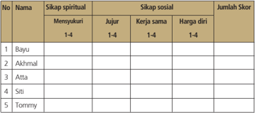

Tabel ini menunjukkan hasil evaluasi sikap spiritual dan sosial bagi lima individu: Bayu, Akhmal, Atta, Siti, dan Tommy. Setiap individu diberikan skor untuk empat kategori: mensyukuri, jujur, kerja sama, dan harga diri. Topik utama tabel adalah evaluasi sikap individu dalam berbagai aspek kehidupan. Kolom-kolomnya mencakup nama individu, skor untuk setiap kategori, dan jumlah skor keseluruhan. Data penting yang terlihat adalah bahwa semua individu memiliki skor yang berbeda-beda dalam setiap kategori, menunjukkan variasi dalam sikap mereka. Selain itu, beberapa individu seperti Bayu dan Tommy memiliki skor yang lebih tinggi di beberapa kategori dibandingkan dengan yang lain, menunjukkan potensi atau kelebihan tertentu dalam sikap mereka.

 

---
## 📄 Halaman 78

### Keterangan:

### a. Sikap Spiritual

Indikator sikap spiritual 'mensyukuri':

- Berdoa sebelum dan sesudah kegiatan pembelajaran
- Memberi  salam  pada  saat  awal  dan  akhir  presentasi  sesuai agama yang dianut
- Saling menghormati, toleransi
- Memelihara hubungan baik dengan sesama teman sekelas. Rubrik pemberian skor:
- 4 =  jika peserta didik melakukan 4 (empat) kegiatan tersebut
- 3 =  jika peserta didik melakukan 3 (tiga) kegiatan tersebut
- 2 =  jika peserta didik melakukan 2 (dua) kegiatan tersebut
- 1 =  jika peserta didik melakukan 1 (satu) kegiatan tersebut.

### b. Sikap Sosial

- Sikap jujur Indikator sikap sosial 'jujur'
- Tidak berbohong
- Mengembalikan kepada yang berhak bila  menemukan sesuatu
- Tidak nyontek, tidak plagiarism
- Terus terang.
Rubrik pemberian skor

- 4 =  jika peserta didik melakukan 4 (empat) kegiatan tersebut
- 3 =  jika peserta didik melakukan 3 (tiga) kegiatan tersebut
- 2 =  jika peserta didik melakukan 2 (dua) kegiatan tersebut
- 1 =  jika peserta didik melakukan 1 (satu) kegiatan tersebut.
- Sikap kerja sama
Indikator sikap sosial 'kerja sama'

- Peduli kepada sesama
- Saling membantu dalam hal kebaikan
- Saling menghargai/ toleran
- Ramah dengan sesama.
Rubrik pemberian skor

- 4 =  jika peserta didik melakukan 4 (empat) kegiatan tersebut
- 3 =  jika peserta didik melakukan 3 (tiga) kegiatan tersebut
- 2 =  jika peserta didik melakukan 2 (dua) kegiatan tersebut
- 1 =  jika peserta didik melakukan 1 (satu) kegiatan tersebut.

### 2)

 

---
## 📄 Halaman 79

### 3)

- Sikap Harga diri Indikator sikap sosial 'harga diri'
- Tidak suka dengan dominasi asing
- Bersikap sopan untuk menegur bagi mereka yang mengejek
- Cinta produk negeri sendiri
- Menghargai dan menjaga karya-karya sekolah dan masyarakat sendiri.

### Rubrik pemberian skor

- 4 =  jika peserta didik melakukan 4 (empat) kegiatan tersebut
- 3 =  jika peserta didik melakukan 3 (tiga) kegiatan tersebut
- 2 =  jika peserta didik melakukan 2 (dua) kegiatan tersebut
- 1 =  jika peserta didik melakukan 1 (satu) kegiatan tersebut.

### 2.    Penilaian pengetahuan

---
**📊 Tabel**

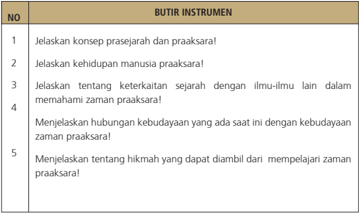

Tabel ini berisi instrumen untuk menjelaskan konsep prasejarah dan praarsara, kehidupan manusia pada masa itu, hubungan antara prasejarah dengan ilmu-ilmu lain, dan hikmah yang dapat diambil dari mempelajari prasejarah. Topik utama tabel adalah prasejarah dan praarsara. Kolom pertama menunjukkan nomor instrumen, sedangkan kolom kedua menunjukkan deskripsi instrumen tersebut. Data penting yang terlihat adalah bahwa tabel ini mencakup berbagai aspek prasejarah dan praarsara, mulai dari konsep-prasejarah dan praarsara, kehidupan manusia pada masa itu, hubungan antara prasejarah dengan ilmu-ilmu lain, hikmah yang dapat diambil dari prasejarah, sampai penjelasan tentang prasejarah dan praarsara.

Nilai = Jumlah skor

 

---
## 📄 Halaman 80

### 3.      Penilaian keterampilan

Penilaian  untuk  kegiatan  mengamati  jawaban  peserta  didik  pada  uji kompetensi yang diberikan

Nilai = Jumlah skor dibagi 3

### Keterangan :

- Kegiatan mengamati dalam hal ini dipahami sebagai cara peserta didik  mengumpulkan  informasi  faktual  dengan  memanfaatkan indera penglihat, pembau, pendengar, pengecap dan peraba. Maka secara keseluruhan yang dinilai adalah HASIL pengamatan (berupa informasi) bukan CARA mengamati.
- Relevansi,  kelengkapan,  dan  kebahasaan diperlakukan sebagai indikator penilaian kegiatan mengamati.
- Relevansi merujuk pada ketepatan atau keterhubungan fakta  yang  diamati  dengan  informasi  yang  dibutuhkan  untuk mencapai tujuan Kompetensi Dasar/Tujuan Pembelajaran (TP).
- Kelengkapan dalam arti semakin banyak komponen fakta yang terliput atau semakin sedikit sisa (residu) fakta yang tertinggal.
- Kebahasaan menunjukkan bagaimana peserta didik mendeskripsikan fakta-fakta yang dikumpulkan dalam bahasa tulis  yang efektif (tata kata atau tata kalimat yang benar dan mudah dipahami).
- Skor rentang antara 1 - 4
- 1. = Kurang
- 2. = Cukup
- 3. = Baik
- 4. = Amat Baik.

 

---
## 📄 Halaman 81

### 4.    Penilaian untuk kegiatan diskusi kelompok

---
**📊 Tabel**

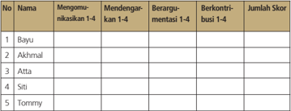

Tabel ini menunjukkan data tentang partisipan dalam sebuah diskusi atau pertemuan, dengan fokus pada tingkat partisipasi mereka dalam berbagai tahap interaksi. Kolom-kolomnya mencakup nama-nama partisipan, tingkat komunikasi mereka (mengomentari, mendengarkan, berargumen, berkontribusi), dan skor akhir mereka dalam pertemuan tersebut. Topik utama tabel adalah analisis partisipasi dan kontribusi dalam diskusi. Data penting yang terlihat adalah bahwa Bayu dan Tommy memiliki skor tertinggi, sementara Atta dan Siti memiliki skor terendah. Akhmadil tidak memenuhi semua tahap interaksi.

Nilai = Jumlah skor dibagi 4

### Keterangan :

- Keterampilan  mengomunikasikan adalah  kemampuan  peserta didik untuk mengungkapkan atau menyampaikan ide atau gagasan dengan bahasa lisan yang efektif.
- Keterampilan  mendengarkan dipahami  sebagai  kemampuan peserta didik untuk tidak menyela, memotong, atau menginterupsi pembicaraan seseorang ketika sedang mengungkapkan gagasannya.
- Kemampuan berargumentasi menunjukkan kemampuan peserta didik  dalam  mengemukakan  argumentasi  logis  ketika  ada  pihak yang bertanya atau mempertanyakan gagasannya.
- Kemampuan  berkontribusi dimaksudkan  sebagai  kemampuan peserta  didik  memberikan  gagasan-gagasan  yang  mendukung atau  mengarah  ke  penarikan  kesimpulan  termasuk  di  dalamnya menghargai perbedaan pendapat.

### e. Skor rentang antara 1 - 4

- 1. = Kurang
- 2. = Cukup
- 3. = Baik
- 4. = Amat Baik.

 

---
## 📄 Halaman 82

### 5.      Penilaian presentasi

---
**📊 Tabel**

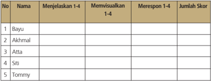

Tabel ini menunjukkan informasi tentang penilaian keterampilan visualisasi dan respons terhadap visualisasi 1-4 untuk lima orang siswa: Bayu, Akhmal, Atta, Siti, dan Tommy. Kolom-kolomnya mencakup nomor urut (No.), nama siswa, menjelaskan visualisasi 1-4, memvisualisasikan visualisasi 1-4, merespon visualisasi 1-4, dan jumlah skor. Data penting yang terlihat adalah bahwa semua siswa memiliki skor yang sama, yaitu 0, yang menunjukkan bahwa mereka belum berhasil menjelaskan, memvisualisasikan, atau merespon visualisasi 1-4 dengan baik. Ini mungkin menunjukkan bahwa mereka memerlukan lebih banyak latihan atau bantuan dalam memahami dan menggunakan teknik visualisasi ini.

Nilai= Jumlah skor dibagi 3

### Keterangan :

- Keterampilan  menjelaskan adalah  kemampuan  menyampaikan hasil observasi dan diskusi secara meyakinkan.
- Keterampilan memvisualisasikan berkaitan dengan kemampuan peserta  didik  untuk  membuat  atau  mengemas  informasi  seunik mungkin, semenarik mungkin, atau sekreatif mungkin.
- Keterampilan merespon adalah kemampuan peserta didik menyampaikan tanggapan atas pertanyaan, bantahan, sanggahan dari pihak lain secara empatik.

### d. Skor rentang antara 1 - 4

- 1. = Kurang
- 2. = Cukup
- 3. = Baik
- 4. = Amat Baik

### Pembelajaran Pertemuan Ke-2 (90 Menit)

Pada pertemuan ke-2 ini akan mengkaji proses terjadinya Kepulauan Indonesia dengan flora  dan  faunanya.  Hal  ini  untuk  memperkaya  pemahaman  para peserta didik tentang masa praaksara, termasuk pembabakan waktu masa praaksara.

 

---
## 📄 Halaman 83

### a. Indikator

- Menjelaskan pengertian praaksara
- 2 Menjelaskan proses alam terjadinya Kepulauan Indonesia
- 3 Mengidentifikasi jenis flora dan fauna di Kepulauan Indonesia

### b. Tujuan Pembelajaran

Setelah mengikuti kegiatan pembelajaran ini peserta didik diharapkan mampu:

- menjelaskan proses terjadinya Kepulauan Indonesia
- menganalisis pembabakan waktu masa praaksara.
- menganalisis kaitan antara terjadinya Paparan Sunda dan Paparan Sahul  dengan  penyebaran  jenis  flora  dan  fauna  di  Kepulauan Indonesia
- mengambil hikmah tentang letak dan kondisi geologis Kepulauan Indonesia
- meningkatkan  rasa  syukur  karena  kekayaan  flora  dan  fauna  di Kepulauan Indonesia

### c. Materi dan Proses Pembelajaran

Materi  yang  disampaikan  pada  pertemuan  ke-2  ini  adalah  Bab  I, Subbab  B.  'Terbentuknya  Kepulauan  Indonesia'.  Pelaksanakan pembelajaran secara umum dibagi tiga tahapan: kegiatan pendahuluan, kegiatan inti dan kegiatan penutup

### d. Metode dan Langkah-Langkah Pembelajaran

- Model : discovery atau project atau pembelajaran berbasis masalah. Disesuaikan kesiapan masing-masing sekolah dan kondisi lingkungan sekolah.
- Pendekatan: scientiic , dengan langkah-langkah: mengamati, menanya,  mengeksplorasi,  mengasosiasikan,  dan  mengomunikasikan.

 

---
## 📄 Halaman 84

### Kegiatan Pendahuluan (15 menit)

- Guru mempersiapkan kelas agar lebih kondusif untuk proses belajar mengajar  (kerapian  dan  kebersihan  ruang  kelas,  presensi/absensi, menyiapkan media dan alat serta buku yang diperlukan).
- Guru  menyampaikan  topik  tentang  proses  terjadinya  Kepulauan Indonesia. Pembahasan dapat dimulai dengan mengajukan pernyataan dan pertanyaan sebagai apersepsi. Indonesia merupakan negara dengan kekayaan flora dan fauna yang sangat tinggi. Menurut Prof C.C.G.J. Van Steenis, seorang ahli biologis dari Belanda dalam buku Flora  Pegunungan  Jawa ,  mengatakan  bahwa  di  Indonesia terdapat ± 4.000 jenis pohon-pohonan, 1.500 jenis pakis-pakisan, dan 5.000 jenis anggrek. Ia membagi pula tumbuhan-tumbuhan ini dalam tumbuh-tumbuhan berbunga sebanyak ± 25.000 macam dan tumbuhan yang tidak berbunga ± 1.750 macam. Keragaman flora disebabkan  oleh  kondisi  geografi  yang  dikelilingi  banyak  gunung api.
Kekayaan alam dan kondisi geografis ini telah mendorong lahirnya penelitian  dari  bangsa-bangsa  lain.  Adalah  Alfred  Russel  Wallace yang  mengungkapkan  teorinya  bahwa  ada  satu  garis  maya  yang memisahkan  Kepulauan  Indonesia  bagian  timur  dan  bagian barat.  Perbedaan  flora  dan  fauna  yang  ada  karena  mengikuti perubahan   permukaan   bumi   di   masa   lampau.   Terjadinya penurunan  permukaan  laut  dari  masa  Pliosen hingga  akhir masa Pleistosen  telah  membagi  wilayah  Kepulauan Indonesia menjadi tiga  bagian,  yaitu  Paparan  Sunda  di  bagian  barat,  Paparan Sahul  di  bagian  timur,  dan  daerah  kepulauan  di  antara Paparan Sunda  dan  Paparan  Sahul.  Zona  itulah  kemudian  dikenal  dengan wilayah Wallacea. Zona itu pertama dikenalkan oleh Alfred Russel Wallace tahun 1863.

- Guru  menegaskan  kembali  tentang  topik  dan  menyampaikan kompetensi yang akan  dicapai.
- Guru membagi kelas menjadi enam kelompok (kelompok I, II, III, IV, V, dan VI)

### Kegiatan Inti (60 menit)

- Peserta didik berkumpul di kelompok masing-masing
- Peserta didik ditugaskan:

 

---
## 📄 Halaman 85

Kelompok I dan II mendiskusikan dan membuat rumusan tentang proses terjadinya  Kepulauan Indonesia

Kelompok III dan IV mendiskusikan dan membuat rumusan tentang pembabakan waktu masa praaksara

Kelompok V dan VI mendiskusikan dan merumuskan tentang hikmah bagi  penduduk  yang  hidup  di  lingkungan  geografis  dan  geologis Kepulauan Indonesia yang rentan terjadinya gempa.

- Setelah kira-kira 20 menit diskusi kelompok diakhiri, guru kemudian meminta  peserta  didik  mempresentasikan  hasil  rumusan  masingmasing  sesuai  masalah  yang  didiskusikan.  Mengingat  waktu  dan kebetulan setiap dua kelompok mendiskusikan masalah yang sama maka guru menunjuk yang presentasi cukup satu kelompok untuk masing-masing masalah. Misalnya ditunjuk Kelompok I, III, dan VI.
- Pada saat  satu  kelompok  presentasi,  kelompok  lain  dapat  mengajukan pertanyaan, dan begitu seterusnya.

### Kegiatan Penutup (15 menit)

- Pembelajaran minggu ke-2 ini ditutup dengan memberikan komentar dan kesimpulan tentang materi yang baru saja didiskusikan.
- Guru menanyakan apakah peserta didik sudah memahami materi yang telah didiskusikan.
- Peserta didik diberikan pertanyaan lisan secara acak untuk mendapatkan umpan balik atas pembelajaran minggu ini, misalnya:
- Apa yang dimaksud dengan Paleozoikum?
- Sebutkan beberapa contoh fauna di Kepulauan Indonesia?
- Sebagai  refleksi  pada  bagian  akhir  pelajaran  ini,  peserta  didik diberikan  tugas  rumah  untuk  merumuskan  sikap  dan  tindakan sebagai  bentuk  syukur  kepada  Tuhan  Yang  Maha  Esa  yang  telah melimpahkan  kekayaan  flora  dan  fauna  di  Indonesia.  Tugas  bisa mengacu pada soal uji kompetensi di buku teks pelajaran Sejarah Indonesia.

 

---
## 📄 Halaman 86

### e. Penilaian

- Penilaian dilaksanakan selama proses dan setelah pembelajaran berlangsung,  termasuk  pada  saat  peserta  didik  menjawab beberapa pertanyaan  dari  guru.  Penilaian  dapat  dilakukan dengan observasi. Dalam observasi ini misalnya dilihat aktivitas dan tingkat perhatian peserta didik pada saat pembelajaran berlangsung, kemampuan menyampaikan pendapat,  juga  aspek  kerja  sama,  dan  tentu  ketepatan  peserta  didik pada saat menjawab pertanyaan dari guru.
- Peserta  didik  diajukan  beberapa  pertanyaan  oleh  guru  dan  diminta untuk mengerjakan soal uji kompetensi.
- Kita  wajib  bersyukur  karena  Tuhan  Yang Maha Pencipta yang telah menciptakan bumi kita ini dengan arif dan bijaksana serta penuh  kasih  sayang  kepada  makhluk  ciptaan-Nya.  Coba  beri penjelasan mengenai pernyataan di atas, kalian dapat berdiskusi dengan anggota kelompok!
- Menurut  kalian  nilai-nilai  apa  yang  dapat  dipetik  dari  proses terbentuknya pulau-pulau di Kepulauan Indonesia?
- Hikmah apa yang dapat kita peroleh dengan bertempat tinggal di wilayah yang sering terjadi bencana alam?
- Di setiap daerah tentu ada cerita rakyat ataupun dongeng yang berkaitan dengan bencana alam seperti gempa bumi maupun gunung  meletus,  coba  kalian  cari  dan  tuliskan  dalam  bentuk cerita 3 - 4 halaman, kemudian diskusikan!
- Sebutkan bencana alam yang pernah terjadi di daerahmu dan di Indonesia!
- Hasil kerja peserta didik diberi nilai dan komentar.

 

---
## 📄 Halaman 87

### f. Penilaian Hasil Belajar

Penilaian  dilakukan  menggunakan  penilaian  autentik  yang  meliputi  penilaian sikap, pengetahuan dan keterampilan. Format penilaian sebagai berikut.

### 1. Penilaian sikap

---
**📊 Tabel**

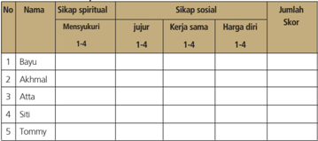

Tabel ini menunjukkan data tentang sikap spiritual dan sosial beberapa individu, dengan kolom-kolom seperti "Mensyukuri", "Jujur", "Kerja sama", dan "Harga diri". Setiap individu memiliki skor untuk setiap kategori, yang diberikan pada skala 1-4. Topik utama tabel ini adalah analisis sikap individu dalam berbagai aspek kehidupan, termasuk spiritual dan sosial. Data penting yang terlihat adalah bahwa bayu memiliki skor tertinggi di semua kategori, sementara Tommy memiliki skor terendah. Ini menunjukkan perbedaan dalam sikap spiritual dan sosial antara individu tersebut.

### Keterangan:

### a. Sikap Spiritual

Indikator sikap spiritual 'mensyukuri':

- Berdoa sebelum dan sesudah kegiatan pembelajaran
- Memberi  salam  pada  saat  awal  dan  akhir  presentasi  sesuai agama yang dianut
- Saling menghormati, toleransi
- Memelihara hubungan baik dengan sesama teman sekelas.
Rubrik pemberian skor:

- 4 =  jika peserta didik melakukan 4 (empat) kegiatan tersebut
- 3 =  jika peserta didik melakukan 3 (tiga) kegiatan tersebut
- 2 =  jika peserta didik melakukan 2 (dua) kegiatan tersebut
- 1 =  jika peserta didik melakukan 1 (satu) kegiatan tersebut.

### b. Sikap Sosial

- Sikap jujur Indikator sikap sosial 'jujur'
- Tidak berbohong
- Mengembalikan kepada yang berhak bila  menemukan sesuatu
- Tidak nyontek, tidak plagiarism
- Terus terang.

 

---
## 📄 Halaman 88

### Rubrik pemberian skor

- 4 =  jika peserta didik melakukan 4 (empat) kegiatan tersebut
- 3 =  jika peserta didik melakukan 3 (tiga) kegiatan tersebut
- 2 =  jika peserta didik melakukan 2 (dua) kegiatan tersebut
- 1 =  jika peserta didik melakukan 1 (satu) kegiatan tersebut.
- Sikap kerja sama
Indikator sikap sosial 'kerja sama'

- Peduli kepada sesama
- Saling membantu dalam hal kebaikan
- Saling menghargai/ toleran
- Ramah dengan sesama.
Rubrik pemberian skor

- 4 =  jika peserta didik melakukan 4 (empat) kegiatan tersebut
- 3 =  jika peserta didik melakukan 3 (tiga) kegiatan tersebut
- 2 =  jika peserta didik melakukan 2 (dua) kegiatan tersebut
- 1 =  jika peserta didik melakukan 1 (satu) kegiatan tersebut.
- Sikap Harga diri Indikator sikap sosial 'harga diri'
- Tidak suka dengan dominasi asing
- Bersikap sopan untuk menegur bagi mereka yang mengejek
- Cinta produk negeri sendiri
- Menghargai dan menjaga karya-karya sekolah dan masyarakat sendiri.

### Rubrik pemberian skor

- 4 =  jika peserta didik melakukan 4 (empat) kegiatan tersebut
- 3 =  jika peserta didik melakukan 3 (tiga) kegiatan tersebut
- 2 =  jika peserta didik melakukan 2 (dua) kegiatan tersebut
- 1 =  jika peserta didik melakukan 1 (satu) kegiatan tersebut.

 

---
## 📄 Halaman 89

### 2. Penilaian pengetahuan

---
**📊 Tabel**

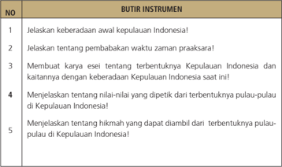

Tabel ini berisi instrumen yang harus dijelaskan tentang keberadaan awal kepulauan Indonesia, waktu zaman prasejarah, kaitannya dengan keberadaan kepulauan saat ini, nilai-nilai yang ditetapkan oleh pulau-pulau tersebut, dan hikmah yang dapat diambil dari terbentuknya kepulauan Indonesia. Topik utama tabel adalah tentang sejarah dan pengembangan kepulauan Indonesia. Kolom-kolomnya mencakup penjelasan tentang keberadaan awal kepulauan, waktu zaman prasejarah, kaitannya dengan kepulauan saat ini, nilai-nilai yang ditetapkan oleh pulau-pulau tersebut, dan hikmah yang dapat diambil dari terbentuknya kepulauan. Data penting yang terlihat adalah bahwa tabel ini memerlukan penjelasan tentang semua aspek yang disebutkan dalam kolom-kolom tersebut.

Nilai = Jumlah skor

### 3. Penilaian keterampilan

Penilaian untuk kegiatan mengamati  hasil diskusi kelompok  tentang terbentuknya Kepulauan Indonesia. Guru juga bisa menampilkan gambar/ film terkait terbentuknya Kepulauan Indonesia.

 

---
## 📄 Halaman 90

### Keterangan :

- Kegiatan mengamati dalam hal ini dipahami sebagai cara peserta didik  mengumpulkan  informasi  faktual  dengan  memanfaatkan indera penglihat, pembau, pendengar, pengecap dan peraba. Maka secara keseluruhan yang dinilai adalah HASIL pengamatan (berupa informasi) bukan CARA mengamati.
- Relevansi,  kelengkapan,  dan  kebahasaan diperlakukan sebagai indikator penilaian kegiatan mengamati.
- Relevansi merujuk pada ketepatan atau keterhubungan fakta  yang  diamati  dengan  informasi  yang  dibutuhkan  untuk mencapai tujuan Kompetensi Dasar/Tujuan Pembelajaran (TP).
- Kelengkapan dalam arti semakin banyak komponen fakta yang terliput atau semakin sedikit sisa (residu) fakta yang tertinggal.
- Kebahasaan menunjukan bagaimana peserta didik mendeskripsikan fakta-fakta yang dikumpulkan dalam bahasa tulis  yang efektif (tata kata atau tata kalimat yang benar dan mudah dipahami).
- Skor rentang antara 1 - 4
- 1. = Kurang
- 2. = Cukup
- 3. = Baik
- 4. = Amat Baik.

---
**📊 Tabel**

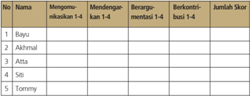

Tabel ini menunjukkan data tentang partisipan dalam sebuah proses diskusi dan berbagai tindakan yang mereka lakukan. Topik utama tabel adalah partisipan dan tindakan mereka dalam proses diskusi. Kolom-kolom yang ada meliputi nomor partisipan (No.), nama partisipan, dan tindakan yang mereka lakukan seperti mengomentari, mendengarkan, berargumen, dan berkontribusi. Data penting yang terlihat adalah bahwa semua partisipan telah mengomentari sesuatu, sedangkan hanya beberapa yang mendengarkan dan berargumen. Namun, tidak ada informasi tentang berapa banyak partisipan yang berkontribusi.

Nilai = Jumlah skor dibagi 4

 

---
## 📄 Halaman 91

### Keterangan :

- Keterampilan  mengomunikasikan adalah  kemampuan  peserta didik untuk mengungkapkan atau menyampaikan ide atau gagasan dengan bahasa lisan yang efektif.
- Keterampilan  mendengarkan dipahami  sebagai  kemampuan peserta didik untuk tidak menyela, memotong, atau menginterupsi pembicaraan seseorang ketika sedang mengungkapkan gagasannya.
- Kemampuan berargumentasi menunjukkan kemampuan peserta didik  dalam  mengemukakan  argumentasi  logis  ketika  ada  pihak yang bertanya atau mempertanyakan gagasannya.
- Kemampuan  berkontribusi dimaksudkan  sebagai  kemampuan peserta  didik  memberikan  gagasan-gagasan  yang  mendukung atau  mengarah  ke  penarikan  kesimpulan  termasuk  di  dalamnya menghargai perbedaan pendapat.

### e. Skor rentang antara 1 - 4

- 1. = Kurang
- 2. = Cukup
- 3. = Baik
- 4. = Amat Baik.

### 5. Penilaian presentasi

---
**📊 Tabel**

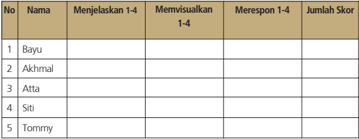

Tabel ini menunjukkan hasil evaluasi keterampilan visualisasi dan respons terhadap pertanyaan 1-4 untuk lima orang peserta. Topik utama tabel adalah keterampilan visualisasi dan respons terhadap pertanyaan 1-4. Kolom-kolomnya meliputi Nama, Menjelaskan 1-4, Memvisualkan 1-4, Merespon 1-4, dan Jumlah Skor. Data penting yang terlihat adalah bahwa Bayu, Akhmal, Atta, Siti, dan Tommy masing-masing memiliki skor yang berbeda dalam setiap kolom. Ini menunjukkan variasi dalam keterampilan mereka dalam menjelaskan, memvisualisasikan, dan merespons pertanyaan tersebut.

Nilai= Jumlah skor dibagi 3

 

---
## 📄 Halaman 92

### Keterangan :

- Keterampilan  menjelaskan adalah  kemampuan  menyampaikan hasil observasi dan diskusi secara meyakinkan.
- Keterampilan memvisualisasika n berkaitan dengan kemampuan peserta  didik  untuk  membuat  atau  mengemas  informasi  seunik mungkin, semenarik mungkin, atau sekreatif mungkin.
- Keterampilan merespo n adalah kemampuan peserta didik menyampaikan tanggapan atas pertanyaan, bantahan, sanggahan dari pihak lain secara empatik.

### d. Skor rentang antara 1 - 4

- 1. = Kurang
- 2. = Cukup
- 3. = Baik
- 4. = Amat Baik

### Pembelajaran Pertemuan Ke-3 (90 menit)

Pada  pertemuan  ke-3  ini  akan  mengembangkan  pemahaman,  kemudian menganalisis  pengetahuan  faktual,  konseptual,  prosedural  yang  berkaitan dengan  'Kegiatan  penelitian  manusia  purba'.  Juga  akan  dikembangkan keterampilan seperti: mencoba membuat sesuatu, atau mengolah informasi sehingga lebih mendalami materi pelajaran minggu ini.

### a. Indikator

- Menganalisis jenis manusia praaksara
- Menganalisis corak kehidupan masyarakat praaksara

### b. Tujuan Pembelajaran

Setelah mengikuti kegiatan pembelajaran ini peserta didik diharapkan mampu:

- menganalisis Sangiran sebagai pusat perkembangan manusia purba
- menganalisis beberapa temuan fosil di Sangiran; dan
- menganalisis beberapa temuan fosil di Trinil

 

---
## 📄 Halaman 93

### c. Materi dan Proses Pembelajaran

Materi yang disampaikan pada minggu ke-3 ini adalah Bab I, Subbab C. Topik yang akan dibahas adalah penelitian manusia purba yang terdapat di Sangiran dan Trinil.

Pelaksanakan  pembelajaran  secara  umum  dibagi  tiga  tahapan: kegiatan pendahuluan, kegiatan inti dan kegiatan penutup.

### d. Metode dan langkah-langkah pembelajaran

- Model : discovery atau project atau pembelajaran berbasis masalah. Disesuaikan kesiapan masing-masing sekolah dan kondisi lingkungan sekolah.
- Pendekatan: scientiic , dengan langkah-langkah: mengamati, menanya,  mengeksplorasi,  mengasosiasikan,  dan  mengomunikasikan.

### Kegiatan Pendahuluan (15 menit)

- Kelas dipersiapkan agar lebih kondusif untuk proses belajar mengajar (kerapian dan kebersihan ruang kelas, presensi, menyiapkan media dan alat serta buku yang diperlukan).
- Peserta didik ditanyakan tentang tugas minggu yang lalu
- 3).   Guru  menyampaikan  topik  tentang  'Kegiatan  penelitian  manusia purba' dan memberi motivasi pentingnya topik ini.
- 4).   Guru  menyampaikan  tujuan  dan  kompetensi  yang  harus  dikuasai para peserta didik
- Peserta didik dibagi menjadi enam kelompok (kelompok I, II, III, IV, V, dan VI)

### Kegiatan Inti (60 menit)

- Sebelum peserta didik ditugaskan untuk berdikusi kelompok, peserta didik  diberikan  penjelasan  tentang  penemuan  manusia  purba  di Sangiran dan Trinil
Sangiran  pertama  kali  ditemukan  oleh  P.E.C.  Schemulling  tahun 1864, dengan laporan penemuan fosil vertebrata dari Kalioso, bagian dari wilayah Sangiran.  Semenjak dilaporkan Schemulling, situs itu

 

---
## 📄 Halaman 94

seolah-olah terlupakan dalam  waktu yang lama. Pada 1934, G.H.R von Koenigswald menemukan artefak litik di wilayah Ngebung yang terletak sekitar dua km di barat laut kubah Sangiran. Artefak litik itulah yang kemudian menjadi temuan penting bagi Situs Sangiran. Semenjak  penemuan  von  Koenigswald,  Situs  Sangiran  menjadi sangat terkenal  berkaitan dengan penemuan-penemuan fosil Homo erectus secara  sporadis  dan  berkesinambungan. Homo  erectus adalah  takson  paling  penting  dalam  sejarah    manusia,  sebelum masuk  pada  tahapan  manusia Homo  sapiens ,  manusia  modern. Situs itu ditetapkan secara resmi sebagai Warisan Dunia pada 1996, yang  tercantum  dalam  nomor  593  Daftar  Warisan  Dunia  (World Heritage List) UNESCO.

Perhatikan gambar di buku teks pelajaran Sejarah  Indonesia .  Eugene Dubois adalah ahli anatomi dari Belanda yang melakukan ekskavasi di  Trinil  dan  menemukan  sisa-sisa  manusia  purba  yang  sangat berharga  bagi  dunia  pengetahuan.  Penggalian  Dubois  dilakukan pada endapan alluvial Bengawan Solo. Dari lapisan ini ditemukan atap  tengkorak Pithecanthropus erectus ,  dan  beberapa  buah tulang paha (utuh dan fragmen) yang menunjukkan pemiliknya telah berjalan  tegak.  Trinil  adalah  sebuah  desa  di  pinggiran  Bengawan Solo,  masuk  wilayah  administrasi  Kabupaten  Ngawi,  Jawa  Timur. Tinggalan purbakala telah lebih dulu ditemukan di daerah ini jauh sebelum von Koenigswald menemukan Sangiran pada 1934.

Kemudian  peserta  didik diberikan informasi bahwa  penelitian mengenai  peradaban  awal  tidak  melulu  dilakukan  oleh  peneliti Barat,  seperti  dilakukan  oleh  seorang  professor  yang  berasal  dari Indonesia yaitu Prof dr Sangkot Marzuki, MSc, PhD, DSc, Lembaga Biologi Molekuler Eijkman di Jakarta. Ia menulis 'Mapping Human Genetic Diversity in Asia' dalam jurnal Sience dan mengungkapkan bahwa upaya memahami asal-usul manusia modern bisa dilakukan dengan membaca urutan sekuen DNA ( deoxyribonucleic acid ) atau rantai  panjang  polimer  nukleotida  yang  mengandung  informasi genetik untuk diturunkan. Selain informasi genetic, DNA juga bisa menginformasikan riwayat kehidupan nenek moyang kita. Di sinilah perubahan dalam tubuh terekam-seiring dengan perubahan pola  makan,  lingkungan,  ataupun  aktivitasnya-dan  memberikan gambaran  bagaimana  sebenarnya  pola  kehidupan  yang  mereka jalani.  Hasil  perbandingannya  dengan  DNA  populasi  di  berbagai tempat  lain  menggambarkan  proses  berlangsungnya  migrasi  dan bagaimana hubungan kekerabatannya.

 

---
## 📄 Halaman 95

- Kelompok I, III, dan V ditugaskan untuk melakukan kajian tentang kegiatan penelitian manusia purba di Sangiran melalui buku-buku yang  tersedia  termasuk  ke  perpustakaan.  Kemudian  menugasi kelompok II,  IV  dan  VI  untuk  melakukan  kajian  tentang  kegiatan penelitian  di  Trinil  juga  melalui  buku-buku  yang  ada  tersedia  di perpustakaan.
- 3).   Setiap  kelompok  harus  membuat  laporan  sesuai  dengan  masalah  yang dikaji. Hal yang perlu dilaporkan misalnya: siapa tokoh penelitinya, tahun  berapa  dilakukan  penelitian,  temuan  dan  kesimpulan  yang diperoleh  dari  penelitian  itu.  Hasil  kajian  itu  sebaiknya  didukung dengan gambar-gambar yang relevan.
- Kelompok III ditunjuk oleh guru untuk mempresentasikan kajiannya tentang  kegiatan  penelitian  di  Sangiran  dan  kelompok  VI  untuk presentasi tentang kegiatan penelitian di Trinil. Kelompok lain yang tidak presentasi dapat mengajukan pertanyaan.
- Hasil diskusi kelompok kemudian dikumpulkan kepada guru.

### Kegiatan Penutup (15 menit)

- Guru  memberikan  ulasan  singkat  tentang  materi  yang  baru  saja didiskusikan
- Guru  dapat  menanyakan  apakah  peserta  didik  sudah  memahami materi tersebut
- Guru  memberikan  pertanyaan  secara  lisan  secara  acak  kepada peserta didik untuk mendapatkan umpan balik atas pembelajaran minggu ini, misalnya: menyakan siapa tokoh von Koenigswald dan siapa E. Dubois?
- Sebagai  refleksi,  guru  memberikan  kesimpulan  tentang  pelajaran yang baru saja berlangsung serta menanyakan kepada peserta didik apa manfaat yang dapat kita peroleh setelah belajar topik ini.

 

---
## 📄 Halaman 96

### e. Penilaian

- Guru memberikan penilaian melalui pengamatan terutama tentang aktivitas peserta didik, kemampuan menyampaikan pendapat, kerja sama kelompok.
- Guru  mengajukan  beberapa  pertanyaan  untuk  dijawab  oleh  para peserta didik:
- Mengapa  para  ahli  banyak  melakukan  penelitian  tentang manusia purba itu di  bantaran sungai?
- Mengapa  hasil  penelitian  fosil  manusia  oleh  Dubois  di  Trinil kemudian dinamakan Pithecanthropus erectus ?
- Guru menilai dan memberikan komentar.

### f. Penilaian Hasil Belajar

Penilaian  dilakukan  menggunakan  penilaian  autentik  yang  meliputi penilaian  sikap,  pengetahuan  dan  keterampilan.  Format  penilaian sebagai berikut.

### 1. Penilaian sikap

---
**📊 Tabel**

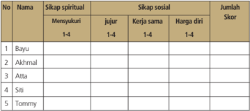

Tabel ini menunjukkan data tentang sikap spiritual dan sosial individu dengan berbagai skor. Topik utamanya adalah evaluasi sikap spiritual dan sosial seseorang. Kolom-kolomnya meliputi "Nama", "Sikap spiritual", "Sikap sosial", dan "Jumlah Skor". Data penting yang terlihat adalah bahwa Bayu mendapatkan skor tertinggi di kategori sikap spiritual dengan nilai 4, sedangkan Tommy memiliki skor tertinggi di kategori sikap sosial dengan nilai 4. Sementara itu, Atta memiliki skor tertinggi di kategori sikap spiritual dan sosial dengan nilai 3.5. Ini menunjukkan variasi dalam sikap spiritual dan sosial antara individu.

### Keterangan:

### a. Sikap Spiritual

Indikator sikap spiritual 'mensyukuri':

- Berdoa sebelum dan sesudah kegiatan pembelajaran
- Memberi  salam  pada  saat  awal  dan  akhir  presentasi  sesuai agama yang dianut
- Saling menghormati, toleransi
- Memelihara hubungan baik dengan sesama teman sekelas.

 

---
## 📄 Halaman 97

### Rubrik pemberian skor:

- 4 =  jika peserta didik melakukan 4 (empat) kegiatan tersebut
- 3 =  jika peserta didik melakukan 3 (tiga) kegiatan tersebut
- 2 =  jika peserta didik melakukan 2 (dua) kegiatan tersebut
- 1 =  jika peserta didik melakukan 1 (satu) kegiatan tersebut.

### b. Sikap Sosial

- Sikap jujur Indikator sikap sosial 'jujur'
- Tidak berbohong
- Mengembalikan kepada yang berhak bila  menemukan sesuatu
- Tidak nyontek, tidak plagiarism
- Terus terang.

### Rubrik pemberian skor

- 4 =  jika peserta didik melakukan 4 (empat) kegiatan tersebut
- 3 =  jika peserta didik melakukan 3 (tiga) kegiatan tersebut
- 2 =  jika peserta didik melakukan 2 (dua) kegiatan tersebut
- 1 =  jika peserta didik melakukan 1 (satu) kegiatan tersebut.
- Sikap kerja sama Indikator sikap sosial 'kerja sama'
- Peduli kepada sesama
- Saling membantu dalam hal kebaikan
- Saling menghargai/ toleran
- Ramah dengan sesama.

### Rubrik pemberian skor

- 4 =  jika peserta didik melakukan 4 (empat) kegiatan tersebut
- 3 =  jika peserta didik melakukan 3 (tiga) kegiatan tersebut
- 2 =  jika peserta didik melakukan 2 (dua) kegiatan tersebut
- 1 =  jika peserta didik melakukan 1 (satu) kegiatan tersebut.
- Sikap Harga diri Indikator sikap sosial 'harga diri'
- Tidak suka dengan dominasi asing
- Bersikap sopan untuk menegur bagi mereka yang mengejek
- Cinta produk negeri sendiri
- Menghargai dan menjaga karya-karya sekolah dan masyarakat sendiri.

 

---
## 📄 Halaman 98

Rubrik pemberian skor

- 4 =  jika peserta didik melakukan 4 (empat) kegiatan tersebut
- 3 =  jika peserta didik melakukan 3 (tiga) kegiatan tersebut
- 2 =  jika peserta didik melakukan 2 (dua) kegiatan tersebut
- 1 =  jika peserta didik melakukan 1 (satu) kegiatan tersebut.

### 2.   Penilaian pengetahuan

---
**📊 Tabel**

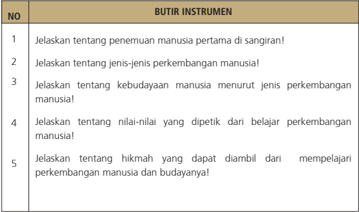

Tabel ini berisi 5 butir instrumen yang harus dijelaskan tentang perkembangan manusia dan budayanya. Topik utama tabel ini adalah pengetahuan tentang perkembangan manusia dan budaya manusia. Kolom pertama menunjukkan nomor instrumen, sedangkan kolom kedua menunjukkan deskripsi instrumen tersebut. Data penting yang terlihat adalah bahwa tabel ini mencakup berbagai aspek perkembangan manusia, termasuk penemuan manusia pertama, jenis-jenis perkembangan manusia, kebudayaan manusia, nilai-nilai belajar perkembangan manusia, dan hikmah dari mempelajari perkembangan manusia dan budayanya.

Nilai = Jumlah skor

### 3.    Penilaian keterampilan

Penilaian  untuk  kegiatan  mengamati  diskusi  kelompok  tentang  mengenal manusia purba Indonesia. Guru juga bisa menampilkan film/gambar terkait dengan manusia purba Indonesia.

 

---
## 📄 Halaman 99

---
**📊 Tabel**

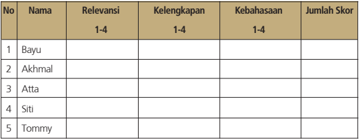

Tabel ini menunjukkan data relevansi, kelengkapan, kebahasaan, dan jumlah skor untuk lima individu: Bayu, Akhmal, Atta, Siti, dan Tommy. Topik utama tabel adalah evaluasi kemampuan berkomunikasi dalam berbagai aspek. Kolom pertama adalah nomor identifikasi individu, kolom kedua adalah nama mereka, kolom ketiga adalah relevansi (dari 1-4), kolom keempat adalah kelengkapan (dari 1-4), kolom kelima adalah kebahasaan (dari 1-4), dan kolom keenam adalah jumlah skor yang dihitung dari nilai-nilai tersebut. Data penting yang terlihat adalah bahwa semua individu memiliki nilai yang sama pada kolom kelengkapan dan kebahasaan, yaitu 3, namun memiliki nilai yang berbeda pada kolom relevansi, menunjukkan variasi dalam tingkat relevansi komunikasi mereka.

Nilai = Jumlah skor dibagi 3

### Keterangan :

- Kegiatan mengamati dalam hal ini dipahami sebagai cara peserta didik  mengumpulkan  informasi  faktual  dengan  memanfaatkan indera penglihat, pembau, pendengar, pengecap dan peraba. Maka secara keseluruhan yang dinilai adalah HASIL pengamatan (berupa informasi) bukan CARA mengamati.
- Relevansi,  kelengkapan,  dan  kebahasaan diperlakukan sebagai indikator penilaian kegiatan mengamati.
- Relevansi merujuk pada ketepatan atau keterhubungan fakta  yang  diamati  dengan  informasi  yang  dibutuhkan  untuk mencapai tujuan Kompetensi Dasar/Tujuan Pembelajaran (TP).
- Kelengkapan dalam arti semakin banyak komponen fakta yang terliput atau semakin sedikit sisa (residu) fakta yang tertinggal.
- Kebahasaan menunjukkan bagaimana peserta didik mendeskripsikan fakta-fakta yang dikumpulkan dalam bahasa tulis  yang efektif (tata kata atau tata kalimat yang benar dan mudah dipahami).
- Skor rentang antara 1 - 4
- 1. = Kurang
- 2. = Cukup
- 3. = Baik
- 4. = Amat Baik

 

---
## 📄 Halaman 100

### 4. Penilaian untuk kegiatan diskusi kelompok.

---
**📊 Tabel**

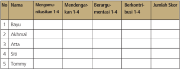

Tabel ini menunjukkan data tentang partisipan dalam sebuah proses diskusi atau debat, dengan fokus pada tingkat partisipasi mereka dalam berbagai tahap proses tersebut. Kolom pertama menyatakan nama-nama partisipan, sedangkan kolom kedua hingga kelima menunjukkan tingkat partisipasi mereka dalam berbagai tahap: mengomunikasikan poin-poin 1-4, mendengarkan pendapat 1-4, berargumenasi 1-4, dan berkontribusi 1-4. Setiap partisipan memiliki skor yang ditentukan berdasarkan tingkat partisipasinya dalam setiap tahap. Topik utama tabel ini adalah analisis partisipasi dan kontribusi dalam proses diskusi atau debat. Data penting yang terlihat adalah bahwa semua partisipan memiliki skor yang sama, yaitu 0, yang mungkin menunjukkan bahwa mereka tidak memenuhi standar partisipasi yang ditetapkan dalam proses tersebut.

Nilai = Jumlah skor dibagi 4

### Keterangan :

- Keterampilan  mengomunikasikan adalah  kemampuan  peserta didik untuk mengungkapkan atau menyampaikan ide atau gagasan dengan bahasa lisan yang efektif.
- Keterampilan  mendengarkan dipahami  sebagai  kemampuan peserta didik untuk tidak menyela, memotong, atau menginterupsi pembicaraan seseorang ketika sedang mengungkapkan gagasannya.
- Kemampuan berargumentasi menunjukkan kemampuan peserta didik  dalam  mengemukakan  argumentasi  logis  ketika  ada  pihak yang bertanya atau mempertanyakan gagasannya.
- Kemampuan  berkontribusi dimaksudkan  sebagai  kemampuan peserta  didik  memberikan  gagasan-gagasan  yang  mendukung atau  mengarah  ke  penarikan  kesimpulan  termasuk  di  dalamnya menghargai perbedaan pendapat.

### e. Skor rentang antara 1 - 4

- 1. = Kurang
- 2. = Cukup
- 3. = Baik
- 4. = Amat Baik

 

---
## 📄 Halaman 101

### 5.    Penilaian presentasi

---
**📊 Tabel**

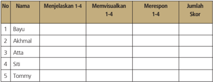

Tabel ini menunjukkan hasil evaluasi keterampilan berkomunikasi antara lima siswa: Bayu, Akhmal, Atta, Siti, dan Tommy. Kolom "No" menunjukkan urutan nomor siswa, "Nama" menyebutkan nama-nama siswa tersebut, "Menjelaskan 1-4" dan "Memvisualisikan 1-4" masing-masing menunjukkan skor mereka dalam menjelaskan dan memvisualisikan topik tertentu, "Merespon 1-4" menunjukkan skor mereka dalam merespons pertanyaan, dan "Jumlah Skor" menunjukkan total skor mereka dari semua kategori. Pola penting yang terlihat adalah bahwa semua siswa memiliki skor yang sama pada setiap kategori, yaitu 3, menunjukkan bahwa mereka semua memiliki keterampilan berkomunikasi yang baik.

Nilai= Jumlah skor dibagi 3

### Keterangan :

- Keterampilan  menjelaskan adalah  kemampuan  menyampaikan hasil observasi dan diskusi secara meyakinkan.
- Keterampilan memvisualisasikan berkaitan dengan kemampuan peserta  didik  untuk  membuat  atau  mengemas  informasi  seunik mungkin, semenarik mungkin, atau sekreatif mungkin.
- Keterampilan merespon adalah kemampuan peserta didik menyampaikan tanggapan atas pertanyaan, bantahan, sanggahan dari pihak lain secara empatik.

### d. Skor rentang antara 1 - 4

- 1. = Kurang
- 2. = Cukup
- 3. = Baik
- 4. = Amat Baik.

 

---
## 📄 Halaman 102

### Pembelajaran Pertemuan Ke-4 (90 menit)

Pada pertemuan ke-4 ini akan dilanjutkan pembahasan materi Bab I, subbab C. Pertemuan minggu ini merupakan kelanjutan dari materi minggu lalu yang membahas  mengenai  penemuan  manusia  purba  di  kepulauan  Indonesia. Topik yang akan dikaji berikutnya adalah mengenai klasifikasi manusia purba pada masa praaksara.

### a.     Indikator

- Menganalisis jenis manusia praaksara
- Menganalisis corak kehidupan masyarakat praaksara

### b. Tujuan Pembelajaran

Setelah mengikuti kegiatan pembelajaran ini peserta didik mampu:

- menganalisis jenis dan ciri-ciri manusia praaksara.
- mengklasifikasi jenis manusia praaksara.

### c. Materi dan Proses Pembelajaran

Materi yang disampaikan pada minggu ke-4 ini sebagai kelanjutan materi minggu ke-3, yakni Bab I, subbab C. Pelaksanaan pembelajaran secara umum dibagi tiga tahapan: kegiatan pendahuluan, kegiatan inti, dan kegiatan penutup.

### d. Metode dan langkah-langkah pembelajaran

- Model : discovery atau project atau pembelajaran berbasis masalah. Disesuaikan kesiapan masing-masing sekolah dan kondisi lingkungan sekolah.
- Pendekatan: scientiic , dengan langkah-langkah: mengamati, menanya,  mengeksplorasi,  mengasosiasikan,  dan  mengomunikasikan.

 

---
## 📄 Halaman 103

### Kegiatan Pendahuluan (15 menit)

- Kelas dipersiapkan agar lebih kondusif untuk proses belajar
- Mengajar (kerapian dan kebersihan ruang kelas, presensi, menyiapkan media dan alat serta buku yang diperlukan).
- Peserta didik  ditanyakan  tentang  materi  minggu  lalu  sebagai apersepsi.
- Guru menyampaikan topik tentang 'Jenis manusia masa praaksara', dan guru memberi motivasi pentingnya topik ini.
- Guru  menyampaikan tujuan  dan  kompetensi  yang  harus  dikuasai para peserta didik. Guru menekankan pemaknaan dan kemampuan menerapkan bukan hafalan.
- Peserta didik dibagi menjadi enam kelompok (kelompok I, II, III, IV, V, dan VI).

### Kegiatan Inti (60 menit)

- Peserta didik dipaparkan secara singkat jenis manusia purba seperti jenis Meganthropus, jenis Pithecanthropus dan jenis Homo.
- Setiap kelompok ditugaskan untuk melakukan kajian tentang jenis manusia  praaksara,  bagaimana  karakter  dan  ciri  masing-masing jenis,  kemudian  mengklasifikasikannya.  Sumber  berasal  dari  buku teks  pelajaran  dan  buku-buku  lain  yang  ada  di  perpustakaan. Penelusuran dilakukan dalam waktu 30 menit. Peserta didik diberikan pertanyaan-pertanyaan dengan masalah yang dikaji.
- Peserta  didik  ditunjuk  secara  acak  untuk  mempresentasikan  hasil kajiannya.

### Kegiatan Penutup (15 menit)

- Peserta didik diberikan ulasan singkat tentang materi yang baru saja didiskusikan
- Peserta  didik  dapat  ditanyakan  apakah  sudah  memahami  materi tersebut.

 

---
## 📄 Halaman 104

- Peserta didik diberikan pertanyaan lisan secara acak untuk mendapatkan umpan balik atas pembelajaran minggu ini dan minggu sebelumnya dengan mengacu pada pertanyaan uji kompetensi pada halaman 33;
- Sebagai  refleksi  guru  memberikan  kesimpulan  tentang  pelajaran yang baru saja berlangsung serta menanyakan kepada peserta didik apa manfaat yang dapat kita peroleh setelah belajar topik ini.

### e. Penilaian

- Penilaian  dilaksanakan  selama  proses  dan  setelah  pembelajaran berlangsung, termasuk pada saat peserta didik menjawab beberapa pertanyaan dari guru. Penilaian dapat dilakukan dengan observasi. Dalam observasi ini misalnya dilihat aktivitas dan tingkat perhatian peserta  didik  pada  saat  pembelajaran  berlangsung,  kemampuan menyampaikan  pendapat,  juga  aspek kerja sama, dan tentu ketepatan peserta didik pada saat menjawab pertanyaan dari guru.
- Peserta  didik  diajukan  beberapa  pertanyaan  dan  diminta  untuk mengerjakan soal uji kompetensi:
- Mengapa para ahli banyak melakukan penelitian manusia purba di bantaran sungai?
- Jelaskan ciri dan mengapa hasil penelitian Dubois di Trinil disebut sebagai jenis Pithecanthropus erectus (kera yang berjalan tegak)?
- Menurut  pendapat  kalian,  bagaimana  manusia  purba  bisa menyebar  ke  dalam  wilayah  Kepulauan  Indonesia  bahkan sampai ke luar wilayah Kepulauan Indonesia?
- Buatlah  karya  ilmiah  (2-3  halaman)  dengan  tajuk,  Sangiran Laboratorium Manusia Purba!
- Coba kalian inventarisir berbagai situs dan tinggalan manusia purba di daerah kalian masing-masing.
- Hasil kerja peserta didik diberi nilai dan komentar.

 

---
## 📄 Halaman 105

### f. Penilaian Hasil Belajar

Penilaian  dilakukan  menggunakan  penilaian  autentik  yang  meliputi  penilaian sikap, pengetahuan dan keterampilan. Format penilaian sebagai berikut.

### 1. Penilaian sikap

---
**📊 Tabel**

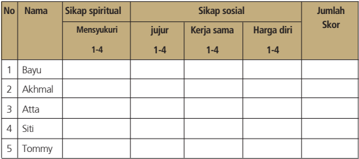

Tabel ini menunjukkan data tentang sikap spiritual dan sosial dari lima individu: Bayu, Akhmal, Atta, Siti, dan Tommy. Kolom-kolomnya meliputi "Mensyukuri", "Jujur", "Kerja sama", dan "Harga diri". Data tersebut diberikan dalam skala 1-4 untuk setiap kategori. Topik utama tabel adalah analisis sikap individu dalam berbagai aspek kehidupan. Dari data yang terlihat, dapat dilihat bahwa bayu memiliki sikap spiritual yang baik dengan nilai tertinggi di "Mensyukuri" dan "Harga diri". Sedangkan Tommy memiliki sikap sosial yang baik dengan nilai tertinggi di "Kerja sama". Ini menunjukkan bahwa individu yang memiliki sikap spiritual dan sosial yang baik cenderung memiliki nilai-nilai positif dalam berbagai aspek kehidupan mereka.

### Keterangan:

### a. Sikap Spiritual

Indikator sikap spiritual 'mensyukuri':

- Berdoa sebelum dan sesudah kegiatan pembelajaran
- Memberi  salam  pada  saat  awal  dan  akhir  presentasi  sesuai agama yang dianut
- Saling menghormati, toleransi
- Memelihara hubungan baik dengan sesama teman sekelas. Rubrik pemberian skor:
- 4 =  jika peserta didik melakukan 4 (empat) kegiatan tersebut
- 3 =  jika peserta didik melakukan 3 (tiga) kegiatan tersebut
- 2 =  jika peserta didik melakukan 2 (dua) kegiatan tersebut
- 1 =  jika peserta didik melakukan 1 (satu) kegiatan tersebut.

### b. Sikap Sosial.

- Sikap jujur Indikator sikap sosial 'jujur'
- Tidak berbohong
- Mengembalikan kepada yang berhak bila  menemukan sesuatu
- Tidak nyontek, tidak plagiarism
- Terus terang.

 

---
## 📄 Halaman 106

### Rubrik pemberian skor

- 4 =  jika peserta didik melakukan 4 (empat) kegiatan tersebut
- 3 =  jika peserta didik melakukan 3 (tiga) kegiatan tersebut
- 2 =  jika peserta didik melakukan 2 (dua) kegiatan tersebut
- 1 =  jika peserta didik melakukan 1 (satu) kegiatan tersebut.
- Sikap kerja sama
Indikator sikap sosial 'kerja sama'

- Peduli kepada sesama
- Saling membantu dalam hal kebaikan
- Saling menghargai/ toleran
- Ramah dengan sesama.

### Rubrik pemberian skor

- 4 =  jika peserta didik melakukan 4 (empat) kegiatan tersebut
- 3 =  jika peserta didik melakukan 3 (tiga) kegiatan tersebut
- 2 =  jika peserta didik melakukan 2 (dua) kegiatan tersebut
- 1 =  jika peserta didik melakukan 1 (satu) kegiatan tersebut.
- Sikap Harga diri Indikator sikap sosial 'harga diri'
- Tidak suka dengan dominasi asing
- Bersikap sopan untuk menegur bagi mereka yang mengejek
- Cinta produk negeri sendiri
- Menghargai dan menjaga karya-karya sekolah dan masyarakat sendiri.

### Rubrik pemberian skor

- 4 =  jika peserta didik melakukan 4 (empat) kegiatan tersebut
- 3 =  jika peserta didik melakukan 3 (tiga) kegiatan tersebut
- 2 =  jika peserta didik melakukan 2 (dua) kegiatan tersebut
- 1 =  jika peserta didik melakukan 1 (satu) kegiatan tersebut.

 

---
## 📄 Halaman 107

### 2.   Penilaian pengetahuan

---
**📊 Tabel**

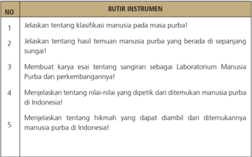

Tabel ini berisi instrumen pembelajaran yang dirancang untuk menjelaskan tentang klasifikasi manusia purba, hasil temuan manusia purba di sepanjang sungai, rangkaian sebagai Laboratorium Manusia Purba dan perkembangannya, nilai-nilai yang ditetapkan dari temuan manusia purba di Indonesia, dan hikmah yang dapat diamati dari temuannya. Topik utama tabel adalah pengetahuan tentang manusia purba di Indonesia. Kolom-kolomnya mencakup deskripsi instrumen, seperti menjelaskan tentang klasifikasi manusia purba, hasil temuan manusia purba di sepanjang sungai, rangkaian sebagai Laboratorium Manusia Purba dan perkembangannya, nilai-nilai yang ditetapkan dari temuan manusia purba di Indonesia, dan hikmah yang dapat diamati dari temuannya. Data atau pola penting yang terlihat adalah bahwa tabel ini mencakup berbagai aspek pengetahuan tentang manusia purba di Indonesia, mulai dari klasifikasi, temuan, hingga nilai-nilai dan hikmah yang dapat diamati dari temuannya.

Nilai = Jumlah skor

### 3.    Penilaian keterampilan

Penilaian  untuk  kegiatan  mengamati  diskusi  kelompok  tentang mengenal manusia purba Indonesia. Guru juga bisa menampilkan film/gambar terkait dengan manusia purba Indonesia.

---
**📊 Tabel**

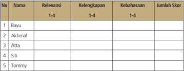

Tabel ini menunjukkan data relevansi, kelengkapan, kebahasaan, dan jumlah skor untuk lima individu: Bayu, Akhmal, Atta, Siti, dan Tommy. Topik utama tabel adalah evaluasi kemampuan berbahasa dan keterampilan mereka. Kolom-kolomnya mencakup relevansi (1-4), kelengkapan (1-4), kebahasaan (1-4), dan jumlah skor. Data penting yang terlihat adalah bahwa semua individu memiliki skor yang sama, yaitu 4, yang menunjukkan bahwa mereka semua dinyatakan sebagai sangat relevan, lengkap, dan bahasa yang baik. Ini menunjukkan bahwa setiap individu dianggap memiliki kemampuan yang sama dalam hal relevansi, kelengkapan, dan kebahasaan.

Nilai = Jumlah skor dibagi 3

 

---
## 📄 Halaman 108

### Keterangan :

- Kegiatan mengamati dalam hal ini dipahami sebagai cara peserta didik  mengumpulkan  informasi  faktual  dengan  memanfaatkan indera penglihat, pembau, pendengar, pengecap dan peraba. Maka secara keseluruhan yang dinilai adalah HASIL pengamatan (berupa informasi) bukan CARA mengamati.
- b . Relevansi,  kelengkapan,  dan  kebahasaan diperlakukan sebagai indikator penilaian kegiatan mengamati.
- Relevansi merujuk pada ketepatan atau keterhubungan fakta  yang  diamati  dengan  informasi  yang  dibutuhkan  untuk mencapai tujuan Kompetensi Dasar/Tujuan Pembelajaran (TP).
- Kelengkapan dalam arti semakin banyak komponen fakta yang terliput atau semakin sedikit sisa (residu) fakta yang tertinggal.
- Kebahasaan menunjukkan bagaimana peserta didik mendeskripsikan fakta-fakta yang dikumpulkan dalam bahasa tulis  yang efektif (tata kata atau tata kalimat yang benar dan mudah dipahami).
- Skor rentang antara 1- 4
- 1. = Kurang
- 2. = Cukup
- 3. = Baik
- 4. = Amat Baik.

### 4.    Penilaian untuk kegiatan diskusi kelompok.

---
**📊 Tabel**

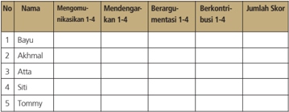

Tabel ini menunjukkan data tentang partisipan dalam sebuah kegiatan diskusi, dengan kolom-kolom yang mencakup nama partisipan, jumlah skor mereka dalam berbagai tahapan diskusi, dan status mereka dalam proses tersebut. Topik utama tabel adalah evaluasi partisipan dalam proses diskusi. Kolom-kolomnya meliputi: 1) Nama partisipan (Bayu, Akhmal, Atta, Siti, Tommy), 2) Mengomunikasikan 1-4, 3) Mendengarkan 1-4, 4) Berargumenasi 1-4, 5) Berkontribusi 1-4, dan 6) Jumlah Skor. Data penting yang terlihat adalah bahwa Bayu mendapatkan skor tertinggi dalam berbagai tahapan diskusi, sementara Tommy memiliki skor yang lebih rendah. Ini menunjukkan perbedaan dalam partisipasi dan kontribusi mereka dalam proses diskusi.

Nilai = Jumlah skor dibagi 4

 

---
## 📄 Halaman 109

### Keterangan :

- Keterampilan  mengomunikasikan adalah  kemampuan  peserta didik untuk mengungkapkan atau menyampaikan ide atau gagasan dengan bahasa lisan yang efektif.
- Keterampilan  mendengarkan dipahami  sebagai  kemampuan peserta didik untuk tidak menyela, memotong, atau menginterupsi pembicaraan seseorang ketika sedang mengungkapkan gagasannya.
- Kemampuan berargumentasi menunjukkan kemampuan peserta didik  dalam  mengemukakan  argumentasi  logis  ketika  ada  pihak yang bertanya atau mempertanyakan gagasannya.
- Kemampuan  berkontribusi dimaksudkan  sebagai  kemampuan peserta  didik  memberikan  gagasan-gagasan  yang  mendukung atau  mengarah  ke  penarikan  kesimpulan  termasuk  di  dalamnya menghargai perbedaan pendapat.

### e. Skor rentang antara 1 - 4

- 1. = Kurang
- 2. = Cukup
- 3. = Baik
- 4. = Amat Baik.`

### 5.    Penilaian presentasi

---
**📊 Tabel**

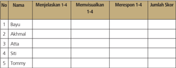

Tabel ini menunjukkan hasil evaluasi keterampilan visualisasi dan respons terhadap pertanyaan 1-4 untuk lima orang peserta. Topik utama tabel adalah keterampilan visualisasi dan respons terhadap pertanyaan 1-4. Kolom-kolom yang ada meliputi Nama, Menjelaskan 1-4, Memvisualisasikan 1-4, Merespon 1-4, dan Jumlah Skor. Data penting yang terlihat adalah bahwa Bayu, Akhmal, Atta, Siti, dan Tommy masing-masing memiliki skor yang berbeda dalam keterampilan visualisasi dan respons terhadap pertanyaan 1-4. Ini menunjukkan bahwa setiap individu memiliki kekuatan dan kelemahan yang berbeda dalam keterampilan tersebut.

Nilai= Jumlah skor dibagi 3

 

---
## 📄 Halaman 110

### Keterangan :

- Keterampilan  menjelaskan adalah  kemampuan  menyampaikan hasil observasi dan diskusi secara meyakinkan.
- Keterampilan memvisualisasikan berkaitan dengan kemampuan peserta  didik  untuk  membuat  atau  mengemas  informasi  seunik mungkin, semenarik mungkin, atau sekreatif mungkin.
- Keterampilan merespon adalah kemampuan peserta didik menyampaikan tanggapan atas pertanyaan, bantahan, sanggahan dari pihak lain secara empatik.

### d. Skor rentang antara 1 - 4

- 1. = Kurang
- 2. = Cukup
- 3. = Baik
- 4. = Amat Baik.

### Pembelajaran Pertemuan Ke-5 (90 menit)

Pada pertemuan ke-5 ini akan dilanjutkan pembahasan materi Bab I, subbab C. Pertemuan minggu ini merupakan kelanjutan dari materi minggu lalu yang membahas  mengenai  penemuan  manusia  purba  di  kepulauan  Indonesia. Topik  yang  akan  dikaji  berikutnya  adalah  mengenai  Perdebatan  Antara Pithecantropus ke Homo erectus .

### a.  Indikator

- Menjelaskan asal daerah nenek moyang bangsa Indonesia
- Menganalisis  keterkaitan  antara  rumpun  bangsa  Proto,  Deutro Melayu, dan Melanesoid  dengan asal usul nenek moyang bangsa Indonesia

 

---
## 📄 Halaman 111

### b.   Tujuan Pembelajaran

Setelah mengikuti kegiatan pembelajaran ini peserta didik diharapkan mampu:

- menjelaskan evolusi perkembangan manusia; dan
- mengetahui teori-teori evolusi.

### c.   Materi dan Proses Pembelajaran

Materi  yang  dikaji  pada  pembelajaran  minggu  ke-5  ini  terkait dengan Perdebatan Antara Pithecantropus ke Homo erectus. Pada buku teks pelajaran Sejarah Indonesia terdapat dalam Bab I subbab C.  Pelaksanaan  pembelajaran  secara  umum  dibagi  tiga  tahapan: kegiatan pendahuluan, kegiatan inti, dan kegiatan penutup.

### d.   Metode dan langkah-langkah pembelajaran

- Model : discovery atau project atau pembelajaran berbasis masalah. Disesuaikan kesiapan masing-masing sekolah dan kondisi lingkungan sekolah.
- Pendekatan: scientific, dengan langkah-langkah: mengamati, menanya,  mengeksplorasi,  mengasosiasikan,  dan  mengomunikasikan.

### Kegiatan Pendahuluan (15 menit)

- Kelas dipersiapkan agar lebih kondusif untuk proses belajar mengajar (kerapian dan kebersihan ruang kelas, presensi, menyiapkan media dan alat serta buku yang diperlukan).
- Sebagai apersepsi peserta didik ditanyakan  pendapat  mereka tentang kontroversi teori evolusi darwin.
- Guru  menyampaikan  topik  pembelajaran  tentang  'Perdebatan antara Pithecantropus ke Homo erektus' dan guru memberi motivasi pentingnya topik ini.

 

---
## 📄 Halaman 112

- Guru  menyampaikan tujuan  dan  kompetensi  yang  harus  dikuasai para  peserta  didik.  Guru  menekankan  pelajaran  ini  lebih  pada pemaknaan dan penerapan, bukan hafalan.
- Peserta didik dibagi menjadi enam kelompok (kelompok I, II, III, IV, V, dan VI)

### Kegiatan Inti  (60 menit)

- Peserta didik dijelaskan secara singkat tentang perdebatan mengenai teori evolusi dan temuan manusia purba dari Indonesia.
- Peserta didik ditugaskan untuk bekerja di kelompok masing-masing. Kelompok I dan II diminta untuk mendiskusikan teori evolusi yang dikemukakan oleh Darwin dan banyak ilmuan lainnya. Kelompok III dan IV mendiskusikan tentang temuan Eugine Dubois di Indonesia. Kelompok V dan VI menjelaskan posisi Pithecantrupus erectus dalam evolusi manusia. Waktu diskusi kelompok 35 menit.
- Kelompok  II  diperintahkan  untuk  mempresentasikan  hasil  diskusi tentang teori  evolusi  yang  dikemukakan  oleh  Darwin  dan  banyak ilmuan lainnya. Kelompok lain mengajukan pertanyaan atau memberi komentar. Kelompok  III diperintahkan untuk mempresentasikan hasil diskusinya tentang mendiskusikan tentang temuan Eugine Dubois di Indonesia.  Kelompok  lain  mengajukan  pertanyaan  dan  komentar. Kemudian  guru  menunjuk  kelompok  VI  untuk  mempresentasikan hasil diskusinya tentang posisi Pithecantrupus erectus dalam evolusi manusia. Waktu diskusi kelompok 35 menit. Kelompok lain bertanya atau memberi komentar.

### Kegiatan Penutup (15 menit)

- Peserta didik diberikan ulasan singkat tentang materi yang baru saja didiskusikan.
- Peserta  didik  dapat  ditanya  apakah  sudah  memahami  materi tersebut.

 

---
## 📄 Halaman 113

- Peserta  didik  diberikan  tugas  kelompok  untuk  merangkum  hasil diskusi  untuk  ditulis  dan  dipublikasikan  pada  majalah  dinding sekolah.  Minta  peserta  didik  untuk  membuat  kreasi  semenarik mungkin.
- Sebagai  refleksi  guru  memberikan  kesimpulan  tentang  pelajaran yang baru saja berlangsung serta menanyakan kepada peserta didik apa manfaat yang dapat kita peroleh setelah belajar topik ini.

### e.   Penilaian

- Peserta  didik  diberikan  penilaian  melalui  pengamatan  terutama tentang aktivitas peserta didik, kemampuan menyampaikan pendapat, dan kerja sama kelompok.
- Peserta didik diberikan beberapa pertanyaan untuk melihat penguasaan materi yang dicapai.
- Sebutkan teori evolusi Darwin yang menjelaskan peralihan kera ke manusia!
- Bagaimana tanggapan para ilmuan dalam seminar Internasional zoologi di Leiden tahun 1895 tentang temuan Dubois?
- Jelaskan keterkaitan temuan Sinanthropus pekinensis dengan Pithecanthropus erectus !
- Bagaimanakah  berakhirnya  perdebatan  pendangan  mengenai Pithecanthropus erectus dari  Dubois  dalam  perkembangan sejarah manusia?
- Peserta didik diberikan nilai dan komentar

 

---
## 📄 Halaman 114

### f. Penilaian Hasil Belajar

Penilaian  dilakukan  menggunakan  penilaian  autentik  yang  meliputi penilaian  sikap,  pengetahuan  dan  keterampilan.  Format  penilaian sebagai berikut.

### 1. Penilaian sikap

---
**📊 Tabel**

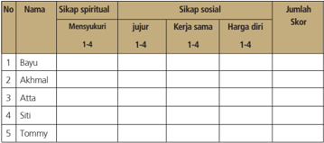

Tabel ini menunjukkan data tentang sikap spiritual dan sosial beberapa individu, dengan kolom-kolom seperti "Mensyukuri", "Jujur", "Kerja sama", dan "Harga diri". Topik utama tabel adalah evaluasi sikap individu dalam berbagai aspek kehidupan. Kolom "Sikap spiritual" mencakup empat poin: mensyukuri, jujur, kerja sama, dan harga diri. Kolom "Sikap sosial" juga memiliki empat poin yang sama. Data dalam tabel menunjukkan skor untuk setiap individu, yang dapat dilihat pada kolom "Jumlah Skor". Pola penting yang terlihat adalah bahwa semua individu memiliki skor yang sama untuk setiap poin dalam kedua kolom, menunjukkan kesamaan sikap mereka dalam berbagai aspek kehidupan.

### Keterangan:

### a. Sikap Spiritual

Indikator sikap spiritual 'mensyukuri':

- Berdoa sebelum dan sesudah kegiatan pembelajaran
- Memberi  salam  pada  saat  awal  dan  akhir  presentasi  sesuai agama yang dianut
- Saling menghormati, toleransi
- Memelihara hubungan baik dengan sesama teman sekelas. Rubrik pemberian skor:
- 4 =  jika peserta didik melakukan 4 (empat) kegiatan tersebut
- 3 =  jika peserta didik melakukan 3 (tiga) kegiatan tersebut
- 2 =  jika peserta didik melakukan 2 (dua) kegiatan tersebut
- 1 =  jika peserta didik melakukan 1 (satu) kegiatan tersebut.

 

---
## 📄 Halaman 115

### b. Sikap Sosial.

- Sikap jujur Indikator sikap sosial 'jujur'
- Tidak berbohong
- Mengembalikan kepada yang berhak bila  menemukan sesuatu
- Tidak nyontek, tidak plagiarism
- Terus terang.

### Rubrik pemberian skor

- 4 =  jika peserta didik melakukan 4 (empat) kegiatan tersebut
- 3 =  jika peserta didik melakukan 3 (tiga) kegiatan tersebut
- 2 =  jika peserta didik melakukan 2 (dua) kegiatan tersebut
- 1 =  jika peserta didik melakukan 1 (satu) kegiatan tersebut.
- Sikap kerja sama
Indikator sikap sosial 'kerja sama'

- Peduli kepada sesama
- Saling membantu dalam hal kebaikan
- Saling menghargai/ toleran
- Ramah dengan sesama.

### Rubrik pemberian skor

- 4 =  jika peserta didik melakukan 4 (empat) kegiatan tersebut
- 3 =  jika peserta didik melakukan 3 (tiga) kegiatan tersebut
- 2 =  jika peserta didik melakukan 2 (dua) kegiatan tersebut
- 1 =  jika peserta didik melakukan 1 (satu) kegiatan tersebut.
- Sikap Harga diri Indikator sikap sosial 'harga diri'
- Tidak suka dengan dominasi asing
- Bersikap sopan untuk menegur bagi mereka yang mengejek
- Cinta produk negeri sendiri
- Menghargai dan menjaga karya-karya sekolah dan masyarakat sendiri.

### Rubrik pemberian skor

- 4 =  jika peserta didik melakukan 4 (empat) kegiatan tersebut
- 3 =  jika peserta didik melakukan 3 (tiga) kegiatan tersebut
- 2 =  jika peserta didik melakukan 2 (dua) kegiatan tersebut
- 1 =  jika peserta didik melakukan 1 (satu) kegiatan tersebut.

 

---
## 📄 Halaman 116

### 2.    Penilaian pengetahuan

---
**📊 Tabel**

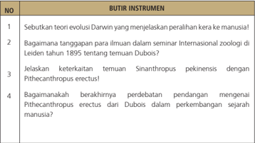

Tabel ini berisi pertanyaan tentang teori evolusi Darwin dan perdebatan sejarah manusia. Topik utamanya adalah evolusi dan perkembangan manusia. Kolom pertama menunjukkan nomor pertanyaan, sedangkan kolom kedua menunjukkan instrumen yang harus dijawab. Data penting yang terlihat antara lain:

1. Teori evolusi Darwin yang menjelaskan peralihan kera ke manusia.
2. Tanggapan untuk ilmuwan dalam seminar Internasional zoologi di Leiden tahun 1895 tentang tenuan Dubois.
3. Keterkaitan tenuan Sinanthropus pekinensis dengan Pithecanthropus erectus.
4. Berakhirnya perdebatan pendang dengan mengenai Pithecanthropus erectus dari Dubois dalam perkembangan sejarah manusia.

Tabel ini membahas konsep evolusi darwinisme, perdebatan sejarah manusia, dan hubungan antara fosil-fosil tersebut dalam konteks evolusi manusia.

Nilai = Jumlah skor

### 3.      Penilaian keterampilan

Penilaian untuk kegiatan mengamati  foto  atau gambar  hasil penelitian manusia purba yang ada di Indonesia.

Nilai = Jumlah skor dibagi 3

### Keterangan :

- Kegiatan mengamati dalam hal ini dipahami sebagai cara peserta didik  mengumpulkan  informasi  faktual  dengan  memanfaatkan indera penglihat, pembau, pendengar, pengecap dan peraba. Maka secara keseluruhan yang dinilai adalah HASIL pengamatan (berupa informasi) bukan CARA mengamati.

 

---
## 📄 Halaman 117

- Relevansi,  kelengkapan,  dan  kebahasaan diperlakukan sebagai indikator penilaian kegiatan mengamati.
- Relevansi merujuk pada ketepatan atau keterhubungan fakta  yang  diamati  dengan  informasi  yang  dibutuhkan  untuk mencapai tujuan Kompetensi Dasar/Tujuan Pembelajaran (TP).
- Kelengkapan dalam arti semakin banyak komponen fakta yang terliput atau semakin sedikit sisa (residu) fakta yang tertinggal.
- Kebahasaan menunjukkan bagaimana peserta didik mendeskripsikan fakta-fakta yang dikumpulkan dalam bahasa tulis  yang efektif (tata kata atau tata kalimat yang benar dan mudah dipahami).
- Skor rentang antara 1 - 4
- 1. = Kurang
- 2. = Cukup
- 3. = Baik
- 4. = Amat Baik.

### 4. Penilaian untuk kegiatan diskusi kelompok.

---
**📊 Tabel**

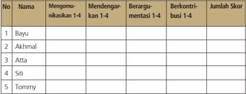

Tabel ini menunjukkan data tentang partisipan dalam sebuah proses diskusi atau debat, dengan fokus pada tingkat partisipasi mereka dalam berbagai tahap. Topik utama adalah partisipasi individu dalam proses diskusi, yang melibatkan mengomunikasikan ide-ide, mendengarkan pendapat orang lain, berargumen, dan berkontribusi pada diskusi. Kolom-kolom yang ada mencakup nama individu, tingkat partisipasi mereka dalam setiap tahap (mengomunikasikan, mendengarkan, berargumen, berkontribusi), dan jumlah skor yang diberikan untuk setiap individu. Data penting yang terlihat adalah bahwa Bayu memiliki tingkat partisipasi tertinggi dalam semua tahap, sementara Tommy memiliki tingkat partisipasi yang paling rendah.

Nilai = Jumlah skor dibagi 4

### Keterangan :

- Keterampilan  mengomunikasikan adalah  kemampuan  peserta didik untuk mengungkapkan atau menyampaikan ide atau gagasan dengan bahasa lisan yang efektif.
- Keterampilan  mendengarkan dipahami  sebagai  kemampuan

 

---
## 📄 Halaman 118

- peserta didik untuk tidak menyela, memotong, atau menginterupsi pembicaraan seseorang ketika sedang mengungkapkan gagasannya.
- Kemampuan berargumentasi menunjukkan kemampuan peserta didik  dalam  mengemukakan  argumentasi  logis  ketika  ada  pihak yang bertanya atau mempertanyakan gagasannya.
- Kemampuan  berkontribusi dimaksudkan  sebagai  kemampuan peserta  didik  memberikan  gagasan-gagasan  yang  mendukung atau  mengarah  ke  penarikan  kesimpulan  termasuk  di  dalamnya menghargai perbedaan pendapat.
- Skor rentang antara 1 - 4
- 1. = Kurang
- 2. = Cukup
- 3. = Baik
- 4. = Amat Baik.

### 5.    Penilaian presentasi

---
**📊 Tabel**

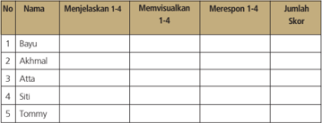

Tabel ini menunjukkan hasil evaluasi kinerja siswa dalam menjelaskan konsep 1-4, memvisualisasikan konsep 1-4, dan merespon konsep 1-4. Topik utama tabel adalah penilaian kinerja siswa dalam menguasai konsep matematika dasar. Kolom-kolom yang ada meliputi nomor urut (No.), nama siswa, deskripsi tugas, dan jumlah skor. Data penting yang terlihat adalah bahwa Bayu, Akhmal, Atta, Siti, dan Tommy telah menjelaskan, memvisualisasikan, dan merespon konsep 1-4 dengan baik, mencapai total skor tertinggi. Ini menunjukkan bahwa semua siswa berhasil memahami dan menerapkan konsep matematika dasar tersebut.

Nilai= Jumlah skor dibagi 3

### Keterangan :

- Keterampilan  menjelaskan adalah  kemampuan  menyampaikan hasil observasi dan diskusi secara meyakinkan.
- Keterampilan memvisualisasikan berkaitan dengan kemampuan peserta  didik  untuk  membuat  atau  mengemas  informasi  seunik mungkin, semenarik mungkin, atau sekreatif mungkin.

 

---
## 📄 Halaman 119

- Keterampilan merespon adalah kemampuan peserta didik menyampaikan tanggapan atas pertanyaan, bantahan, sanggahan dari pihak lain secara empatik.

### d. Skor rentang antara 1 - 4

- 1. = Kurang
- 2. = Cukup
- 3. = Baik
- 4. = Amat Baik.

### Pembelajaran Pertemuan Ke-6 (90 Menit)

Pembelajaran ke-6 ini erat kaitannya dengan nenek moyang bangsa Indonesia. Pembelajaran ini sebagai proses pencapaian kompetensi yang terkait dengan kemampuan menganalisis masalah, dan mengevaluasi sesuatu produk atau mengembangkan  keterampilan,  seperti:  mencoba  membuat  sesuatu  atau mengolah informasi, dalam rangka lebih mendalami dan menghayati materi pembelajaran ini sehingga dapat mengambil nilai-nilai kehidupan.

### a.  Indikator

- Menjelaskan asal daerah nenek moyang bangsa Indonesia
- Menganalisis  keterkaitan  antara  rumpun  bangsa  Proto,  Deutro Melayu, dan Melanesoid  dengan asal usul nenek moyang bangsa Indonesia

### b.   Tujuan Pembelajaran

Setelah mengikuti kegiatan pembelajaran ini peserta didik diharapkan mampu:

- menganalisis migrasi dan penyebaran ras asal usul nenek moyang bangsa Indonesia; dan
- menganalisis  keterkaitan  antara  migrasi  nenek  moyang  bangsa Indonesia dengan persebaran ras proto melayu, dan deutro melayu.

 

---
## 📄 Halaman 120

### c.   Materi dan Proses Pembelajaran

Materi  yang  dikaji  pada  pembelajaran  pertemuan  ke-6  dan  ke-7 terkait dengan asal-usul dan penyebaran ras asal-usul nenek moyang bangsa  Indonesia.  Pada  buku  teks  pelajaran  Sejarah  Indonesia terdapat dalam Bab I subbab D. Pelaksanaan pembelajaran secara umum dibagi  tiga  tahapan:  kegiatan  pendahuluan,  kegiatan  inti, dan kegiatan penutup.

### d.   Metode dan langkah-langkah pembelajaran

- Model: discovery atau project atau pembelajaran berbasis masalah. Disesuaikan kesiapan masing-masing sekolah dan kondisi lingkungan sekolah.
- Pendekatan: scientiic , dengan langkah-langkah: mengamati, menanya,  mengeksplorasi,  mengasosiasikan,  dan  mengomunikasikan.

### Kegiatan Pendahuluan (15 menit)

- Kelas dipersiapkan agar lebih kondusif untuk proses belajar mengajar (kerapian dan kebersihan ruang kelas, presensi, menyiapkan media dan alat serta buku yang diperlukan).
- Sebagai  apersepsi  peserta  didik  diminta  untuk  menyanyi  atau menunjukkan lirik lagu
'Nenek Moyangku Seorang Pelaut'

Nenek moyangku orang pelaut Gemar mengarung luas samudra Menerjang ombak tiada takut Menempuh badai sudah biasa Angin bertiup layar terkembang Ombak berdebur di tepi pantai Pemuda b'rani bangkit sekarang Ke laut kita beramai-ramai Belalai gajah panjang Bulu kucingku belang Tuhan Maha Penyayang Anak-anak disayang

 

---
## 📄 Halaman 121

- Guru menyampaikan topik pembelajaran tentang 'Asal-Usul Nenek Moyang Bangsa Indonesia' dan guru memberi motivasi pentingnya topik ini.
- Guru  menyampaikan tujuan  dan  kompetensi  yang  harus  dikuasai para  peserta  didik.  Guru  menekankan  pelajaran  ini  lebih  pada pemaknaan dan penerapan, bukan hafalan.
- Peserta didik dibagi menjadi enam kelompok (kelompok I, II, III, IV, V, dan VI)

### Kegiatan Inti  (60 menit)

- Peserta  didik  dijelaskan  secara  singkat  tentang  nenek  moyang manusia masa praaksara di Kepulauan Indonesia.
- Peserta didik ditugaskan untuk bekerja di kelompok masing-masing. Kelompok I dan II diminta untuk mendiskusikan dan merumuskan tentang keterkaitan antara ras Proto Melayu, Deutro Melayu, dengan ras asal-usul nenek moyang bangsa Indonesia. Kelompok III dan IV mendiskusikan dan merumuskan tentang migrasi dan penyebaran ras asal-usul nenek moyang bangsa Indonesia. Kelompok V dan VI mendiskusikan dan merumuskan tentang keterkaitan antara migrasi ras asal usul nenek moyang bangsa Indonesia dengan perkembangan budaya neolitikum. Waktu diskusi kelompok 35 menit.
- Kelompok  I  diperintahkan  untuk  mempresentasikan  hasil  diskusi tentang  keterkaitan  antara  ras  Proto-Melayu  dan  Deutro  Melayu dengan ras asal-usul  nenek  moyang bangsa Indonesia. Kelompok lain  mengajukan  pertanyaan  atau  memberi  komentar.  Kelompok IV diperintahkan untuk mempresentasikan hasil diskusinya tentang migrasi dan  penyebaran  ras asal-usul  nenek  moyang  bangsa Indonesia.  Kelompok  lain  mengajukan  pertanyaan  dan  komentar. Kemudian  guru  menunjuk  kelompok  V  untuk  mempresentasikan hasil diskusinya tentang keterkaitan antara migrasi ras dan asal usul nenek  moyang  bangsa  Indonesia  dengan  perkembangan  budaya neolitikum. Kelompok lain bertanya atau memberi komentar.

 

---
## 📄 Halaman 122

### Kegiatan Penutup (15 menit)

- Peserta didik diberikan ulasan singkat tentang materi yang baru saja didiskusikan.
- Peserta  didik  dapat  ditanyakan  apakah  sudah  memahami  materi tersebut.
- Peserta didik diberikan tugas rumah bersama kelompoknya untuk mengerjakan soal uji kompetensi.
- Sebagai  refleksi  guru  memberikan  kesimpulan  tentang  pelajaran yang baru saja berlangsung serta menanyakan kepada peserta didik apa manfaat yang dapat kita peroleh setelah belajar topik ini.

### e. Penilaian

- Peserta didik diberikan penilaian proses melalui pengamatan terutama  tentang  aktivitasnya,  dan  kemampuan  menyampaikan pendapat.
- Peserta  didik  diberikan  penilaian  hasil  untuk  mengetahui  tingkat pemahaman dan kompetensi yang telah dicapai dengan mengajukan beberapa pertanyaan.
- Mengapa  manusia  purba  banyak  yang  tinggal  di  tepi sungai?
- Jelaskan pola kehidupan nomaden bagi manusia purba
- Manusia purba juga memasuki fase bertempat tinggal sementara, misalnya di gua mengapa demikian?
- Hasil kerja peserta didik diberi nilai dan komentar.

### f. Penilaian Hasil Belajar

Penilaian  dilakukan  menggunakan  penilaian  autentik  yang  meliputi penilaian  sikap,  pengetahuan  dan  keterampilan.  Format  penilaian sebagai berikut.

 

---
## 📄 Halaman 123

### 1. Penilaian sikap

---
**📊 Tabel**

Tabel ini menunjukkan data tentang sikap spiritual dan sosial dari lima individu: Bayu, Akhmal, Atta, Siti, dan Tommy. Kolom-kolomnya meliputi "Mensyukuri", "Jujur", "Kerja sama", dan "Harga diri". Data tersebut diberikan dalam skala 1-4 untuk setiap kategori. Dari tabel ini, tampak bahwa bayu memiliki sikap spiritual yang baik dengan nilai tertinggi di semua kategori, sedangkan Tommy memiliki sikap sosial yang paling rendah. Tabel ini membantu dalam membandingkan dan menganalisis sikap spiritual dan sosial individu dalam konteks yang sama.

### Keterangan:

### a. Sikap Spiritual

Indikator sikap spiritual 'mensyukuri':

- Berdoa sebelum dan sesudah kegiatan pembelajaran
- Memberi  salam  pada  saat  awal  dan  akhir  presentasi  sesuai agama yang dianut
- Saling menghormati, toleransi
- Memelihara hubungan baik dengan sesama teman sekelas. Rubrik pemberian skor:
- 4 =  jika peserta didik melakukan 4 (empat) kegiatan tersebut
- 3 =  jika peserta didik melakukan 3 (tiga) kegiatan tersebut
- 2 =  jika peserta didik melakukan 2 (dua) kegiatan tersebut
- 1 =  jika peserta didik melakukan 1 (satu) kegiatan tersebut.

### b. Sikap Sosial.

- Sikap jujur Indikator sikap sosial 'jujur'
- Tidak berbohong
- Mengembalikan kepada yang berhak bila  menemukan sesuatu
- Tidak nyontek, tidak plagiarism
- Terus terang.

 

---
## 📄 Halaman 124

### Rubrik pemberian skor

- 4 =  jika peserta didik melakukan 4 (empat) kegiatan tersebut
- 3 =  jika peserta didik melakukan 3 (tiga) kegiatan tersebut
- 2 =  jika peserta didik melakukan 2 (dua) kegiatan tersebut
- 1 =  jika peserta didik melakukan 1 (satu) kegiatan tersebut.

### 2.   Sikap kerja sama

Indikator sikap sosial 'kerja sama'

- Peduli kepada sesama
- Saling membantu dalam hal kebaikan
- Saling menghargai/ toleran
- Ramah dengan sesama.
Rubrik pemberian skor

- 4 =  jika peserta didik melakukan 4 (empat) kegiatan tersebut
- 3 =  jika peserta didik melakukan 3 (tiga) kegiatan tersebut
- 2 =  jika peserta didik melakukan 2 (dua) kegiatan tersebut
- 1 =  jika peserta didik melakukan 1 (satu) kegiatan tersebut.

### 3.    Sikap Harga diri

Indikator sikap sosial 'harga diri'

- Tidak suka dengan dominasi asing
- Bersikap sopan untuk menegur bagi mereka yang mengejek
- Cinta produk negeri sendiri
- Menghargai dan menjaga karya-karya sekolah dan masyarakat sendiri.

### Rubrik pemberian skor

- 4 =  jika peserta didik melakukan 4 (empat) kegiatan tersebut
- 3 =  jika peserta didik melakukan 3 (tiga) kegiatan tersebut
- 2 =  jika peserta didik melakukan 2 (dua) kegiatan tersebut
- 1 =  jika peserta didik melakukan 1 (satu) kegiatan tersebut

 

---
## 📄 Halaman 125

### 2.   Penilaian pengetahuan

---
**📊 Tabel**

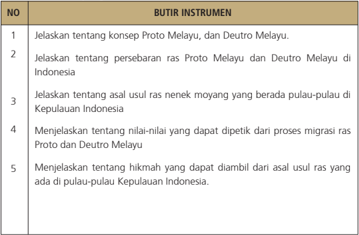

Tabel ini berisi instrumen yang harus dijelaskan tentang konsep Proto Melayu dan Deutro Melayu, persebaran ras Proto Melayu dan Deutro Melayu di Indonesia, asal-usul ras nenek moyang yang berada pulau-pulau di Kepulauan Indonesia, nilai-nilai yang dapat dipetik dari proses migrasi ras Proto dan Deutro Melayu, serta hikmah yang dapat diamati dari asal-usul ras yang ada di pulau-pulau Kepulauan Indonesia. Topik utama tabel ini adalah pengetahuan tentang sejarah dan etnografi ras Melayu di Indonesia. Kolom-kolomnya mencakup penjelasan tentang konsep dan persebaran ras Proto Melayu dan Deutro Melayu, asal-usul ras nenek moyang di Kepulauan Indonesia, nilai-nilai migrasi ras, dan hikmah dari asal-usul ras tersebut. Data atau pola penting yang terlihat adalah bahwa tabel ini mencakup berbagai aspek pengetahuan tentang sejarah dan etnografi ras Melayu di Indonesia, mulai dari konsep dan persebaran ras, hingga nilai-nilai dan hikmah yang dapat diamati dari asal-usul ras tersebut.

Nilai = Jumlah skor

### 3    Penilaian keterampilan

Penilaian  untuk  kegiatan  mengamati  film/gambar  yang  terkait tentang migrasi ras proto melayu dan deutro melayu yang akhirnya sampai di Indonesia.

---
**📊 Tabel**

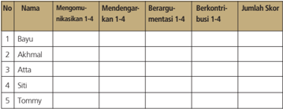

Tabel ini menunjukkan hasil evaluasi keterlibatan siswa dalam berbagai aktivitas di kelas. Topik utama tabel adalah keterlibatan siswa dalam berbagai tugas dan kegiatan belajar. Kolom-kolom yang ada meliputi No., Nama, Mengomentari, Mendengarkan, Berargumen, Berkontribusi, dan Jumlah Skor. Data penting yang terlihat adalah bahwa Bayu mendapatkan skor tertinggi dengan mengomentari, mendengarkan, berargumen, dan berkontribusi. Sementara itu, Tommy memiliki skor terendah karena tidak mengomentari, mendengarkan, berargumen, atau berkontribusi. Akhmal, Atta, dan Siti juga memiliki skor yang lebih rendah dibandingkan Bayu.

Nilai = Jumlah skor dibagi 3

 

---
## 📄 Halaman 126

### Keterangan :

- Kegiatan mengamati dalam hal ini dipahami sebagai cara peserta didik  mengumpulkan  informasi  faktual  dengan  memanfaatkan indera penglihat, pembau, pendengar, pengecap dan peraba. Maka secara keseluruhan yang dinilai adalah HASIL pengamatan (berupa informasi) bukan CARA mengamati.
- Relevansi,  kelengkapan,  dan  kebahasaan diperlakukan sebagai indikator penilaian kegiatan mengamati.
- Relevansi merujuk  pada  ketepatan  atau  keterhubungan  fakta yang diamati dengan informasi yang dibutuhkan untuk mencapai tujuan Kompetensi Dasar/Tujuan Pembelajaran (TP).
- Kelengkapan dalam arti semakin banyak komponen fakta yang terliput atau semakin sedikit sisa (residu) fakta yang tertinggal.
- Kebahasaan menunjukan bagaimana peserta didik mendeskripsikan  fakta-fakta  yang  dikumpulkan  dalam  bahasa tulis  yang  efektif  (tata  kata  atau  tata  kalimat  yang  benar  dan mudah dipahami).
- Skor rentang antara 1 - 4
- 1. = Kurang
- 2. = Cukup
- 3. = Baik
- 4. = Amat Baik.

### 5. Penilaian presentasi

---
**📊 Tabel**

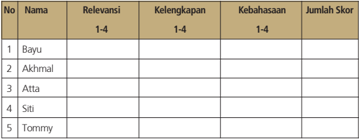

Tabel ini menunjukkan data tentang relevansi, kelengkapan, kebahasaan, dan jumlah skor untuk lima individu: Bayu, Akhmal, Atta, Siti, dan Tommy. Topik utama tabel adalah evaluasi atau penilaian individu berdasarkan beberapa kriteria. Kolom-kolomnya mencakup:

1. Nama: Menunjukkan identitas individu.
2. Relevansi: Mengukur sejauh mana individu relevan dengan suatu topik atau tujuan.
3. Kelengkapan: Menunjukkan sejauh mana individu memiliki semua elemen yang diperlukan untuk menyelesaikan tugas atau tujuan.
4. Kebahasaan: Mengukur sejauh mana individu dapat menggunakan bahasa dengan efektif.
5. Jumlah Skor: Menunjukkan total skor yang diberikan kepada individu.

Data penting yang terlihat adalah bahwa setiap individu memiliki skor yang berbeda-beda dalam setiap kriteria, menunjukkan variasi dalam kemampuan mereka. Misalnya, Bayu memiliki skor tertinggi di kategori kebahasaan, sementara Tommy memiliki skor tertinggi di kategori relevansi. Ini menunjukkan bahwa ada variasi dalam kemampuan individu dalam berbagai aspek, yang mungkin mempengaruhi hasil akhir mereka dalam konteks tertentu.

Nilai= Jumlah skor dibagi 4

 

---
## 📄 Halaman 127

### Keterangan :

- Keterampilan  mengomunikasikan adalah  kemampuan  peserta didik untuk mengungkapkan atau menyampaikan ide atau gagasan dengan bahasa lisan yang efektif.
- Keterampilan  mendengarkan dipahami  sebagai  kemampuan peserta didik untuk tidak menyela, memotong, atau menginterupsi pembicaraan seseorang ketika sedang mengungkapkan gagasannya.
- Kemampuan berargumentasi menunjukkan kemampuan peserta didik  dalam  mengemukakan  argumentasi  logis  ketika  ada  pihak yang bertanya atau mempertanyakan gagasannya.
- Kemampuan  berkontribusi dimaksudkan  sebagai  kemampuan peserta  didik  memberikan  gagasan-gagasan  yang  mendukung atau  mengarah  ke  penarikan  kesimpulan  termasuk  di  dalamnya menghargai perbedaan pendapat.

### e. Skor rentang antara 1 - 4

- 1. = Kurang
- 2. = Cukup
- 3. = Baik
- 4. = Amat Baik.

### Pembelajaran Pertemuan Ke-7 (90 menit)

Pembelajaran ke-7 ini masih terkait dengan pertemuan ke-6 yang membahas tentang nenek moyang bangsa Indonesia. Pembelajaran ini sebagai proses pencapaian  kompetensi  yang  terkait  dengan  kemampuan  menganalisis masalah, dan mengevaluasi sesuatu produk atau mengembangkan keterampilan, seperti: mencoba membuat sesuatu atau mengolah informasi, dalam  rangka  lebih  mendalami  dan  menghayati  materi  pembelajaran  ini sehingga dapat mengambil nilai-nilai kehidupan.

 

---
## 📄 Halaman 128

### a.  Indikator

- Menjelaskan asal daerah nenek moyang bangsa Indonesia
- Menganalisis  keterkaitan  antara  rumpun  bangsa  Proto,  Deutro Melayu, dan Melanesoid  dengan asal usul nenek moyang bangsa Indonesia

### b.   Tujuan Pembelajaran

Setelah mengikuti kegiatan pembelajaran ini peserta didik diharapkan mampu:

- menganalisis migrasi dan penyebaran ras asal usul nenek moyang bangsa Indonesia; dan
- menganalisis  keterkaitan  antara  migrasi  nenek  moyang  bangsa Indonesia dengan persebaran Melanesoid dan Negroid.

### c.   Materi dan Proses Pembelajaran

Materi  yang  dikaji  pada  pembelajaran  pertemuan  ke-7  ini  terkait dengan asal-usul dan penyebaran nenek moyang bangsa Indonesia. Pada buku teks pelajaran Sejarah Indonesia terdapat dalam Bab I subbab  D.  Pelaksanaan  pembelajaran  secara  umum  dibagi  tiga tahapan: kegiatan pendahuluan, kegiatan inti, dan kegiatan penutup.

### d.   Metode dan langkah-langkah pembelajaran

- Model: discovery atau project atau pembelajaran berbasis masalah. Disesuaikan kesiapan masing-masing sekolah dan kondisi lingkungan sekolah.
- Pendekatan: scientiic , dengan langkah-langkah: mengamati, menanya,  mengeksplorasi,  mengasosiasikan,  dan  mengomunikasikan.

### Kegiatan Pendahuluan (15 menit)

- Kelas dipersiapkan agar lebih kondusif untuk proses belajar mengajar (kerapian dan kebersihan ruang kelas, presensi, menyiapkan media dan alat serta buku yang diperlukan).

 

---
## 📄 Halaman 129

- Sebagai apersepsi tunjuk beberapa peserta didik diminta menyebutkan  suku asli orang tua atau kakek neneknya. Tanyakan apakah ada kaitan sukunya dengan ras proto melayu dan deutro melayu? dari keberagaman jawaban, guru kemudian menjelaskan bahwa ada ras lain  yang  juga  masuk  dan  menyebar  di  Indonesia yaitu, melanesoid, negrito dan weddid.
- Guru menyampaikan topik pembelajaran tentang 'Asal-Usul Nenek Moyang Bangsa Indonesia' dan guru memberi motivasi pentingnya topik ini.
- Guru  menyampaikan tujuan  dan  kompetensi  yang  harus  dikuasai para  peserta  didik.  Guru  menekankan  pelajaran  ini  lebih  pada pemaknaan dan penerapan, bukan hafalan.
- Peserta didik dibagi menjadi enam kelompok (kelompok I, II, III, IV, V, dan VI)

### Kegiatan Inti  (60 menit)

- Peserta  didik  dijelaskan  secara  singkat  tentang  nenek  moyang manusia masa praaksara di Kepulauan Indonesia.
- Peserta didik ditugaskan untuk bekerja di kelompok masing-masing. Kelompok I dan II diminta untuk mendiskusikan dan merumuskan tentang  keterkaitan  antara  ras  Melanesoid,  Negrito  dan  Weddid dengan ras asal-usul  nenek  moyang bangsa Indonesia. Kelompok III  dan  IV  mendiskusikan  dan  merumuskan  tentang  migrasi  dan penyebaran ras asal-usul nenek moyang bangsa Indonesia. Kelompok V  dan  VI  mendiskusikan  dan  merumuskan  tentang  keterkaitan antara migrasi ras asal usul nenek moyang bangsa Indonesia dengan perkembangan  budaya  neolitikum.  Waktu  diskusi  kelompok  35 menit.
- Kelompok  I  diperintahkan  untuk  mempresentasikan  hasil  diskusi tentang  keterkaitan  antara  ras  Melanesoid,  Negrito  dan  Weddid dengan ras asal-usul  nenek  moyang bangsa Indonesia. Kelompok lain  mengajukan  pertanyaan  atau  memberi  komentar.  Kelompok IV diperintahkan untuk mempresentasikan hasil diskusinya tentang migrasi dan  penyebaran  ras asal-usul  nenek  moyang  bangsa Indonesia.  Kelompok  lain  mengajukan  pertanyaan  dan  komentar. Kemudian  guru  menunjuk  kelompok  V  untuk  mempresentasikan

 

---
## 📄 Halaman 130

hasil diskusinya tentang keterkaitan antara migrasi ras dan asal usul nenek  moyang  bangsa  Indonesia  dengan  perkembangan  budaya neolitikum. Kelompok lain bertanya atau memberi komentar.

### Kegiatan Penutup (15 menit)

- Peserta didik diberikan ulasan singkat tentang materi yang baru saja didiskusikan.
- Peserta  didik  dapat  ditanyakan  apakah  sudah  memahami  materi tersebut.
- Peserta didik diminta untuk menyerahkan tugas rumah minggu lalu yang dikerjakan secara berkelompok pada soal uji kompetensi.
- Sebagai  refleksi  guru  memberikan  kesimpulan  tentang  pelajaran yang baru saja berlangsung serta menanyakan kepada peserta didik apa manfaat yang dapat kita peroleh setelah belajar topik ini.

### e.   Penilaian

- Peserta didik diberikan penilaian proses melalui pengamatan terutama  tentang  aktivitasnya,  dan  kemampuan  menyampaikan pendapat.
- Peserta  didik  diberikan  penilaian  hasil  untuk  mengetahui  tingkat pemahaman  dan  kompetensi  yang  telah  dicapai  dengan  tugas rumah yang sudah dikerjakan.
- Hasil kerja peserta didik diberi nilai dan komentar.

### f. Penilaian Hasil Belajar

Penilaian  dilakukan  menggunakan  penilaian  autentik  yang  meliputi  penilaian sikap, pengetahuan dan keterampilan. Format penilaian sebagai berikut.

 

---
## 📄 Halaman 131

### 1. Penilaian sikap

---
**📊 Tabel**

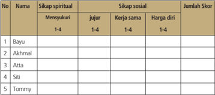

Tabel ini menunjukkan data tentang sikap spiritual dan sosial beberapa individu, dengan kolom-kolom seperti "Nama", "Sikap spiritual", "Sikap sosial", dan "Jumlah Skor". Topik utama tabel adalah analisis sikap spiritual dan sosial individu. Kolom "Sikap spiritual" mencakup empat poin: "Mensyukuri", "Jujur", "Kerja sama", dan "Harga diri". Kolom "Sikap sosial" juga memiliki empat poin yang sama. Setiap individu di tabel memiliki skor untuk setiap poin dalam dua kategori tersebut. Data penting yang terlihat adalah bahwa bayu memiliki skor tertinggi dalam semua poin, sementara Tommy memiliki skor terendah. Ini menunjukkan perbedaan dalam sikap spiritual dan sosial antara individu.

### Keterangan:

### a. Sikap Spiritual

Indikator sikap spiritual 'mensyukuri':

- Berdoa sebelum dan sesudah kegiatan pembelajaran
- Memberi  salam  pada  saat  awal  dan  akhir  presentasi  sesuai agama yang dianut
- Saling menghormati, toleransi
- Memelihara hubungan baik dengan sesama teman sekelas. Rubrik pemberian skor:
- 4 =  jika peserta didik melakukan 4 (empat) kegiatan tersebut
- 3 =  jika peserta didik melakukan 3 (tiga) kegiatan tersebut
- 2 =  jika peserta didik melakukan 2 (dua) kegiatan tersebut
- 1 =  jika peserta didik melakukan salah 1 (satu) kegiatan tersebut.

### b. Sikap Sosial.

- Sikap jujur
- Indikator sikap sosial 'jujur'
- Tidak berbohong
- Mengembalikan kepada yang berhak bila  menemukan sesuatu
- Tidak nyontek, tidak plagiarism
- Terus terang.
Rubrik pemberian skor

- 4 =  jika peserta didik melakukan 4 (empat) kegiatan tersebut
- 3 =  jika peserta didik melakukan 3 (tiga) kegiatan tersebut
- 2 =  jika peserta didik melakukan 2 (dua) kegiatan tersebut
- 1 =  jika peserta didik melakukan 1 (satu) kegiatan tersebut.

 

---
## 📄 Halaman 132

### 2.   Sikap kerja sama

Indikator sikap sosial 'kerja sama'

- Peduli kepada sesama
- Saling membantu dalam hal kebaikan
- Saling menghargai/ toleran
- Ramah dengan sesama.
Rubrik pemberian skor

- 4 =  jika peserta didik melakukan 4 (empat) kegiatan tersebut
- 3 =  jika peserta didik melakukan 3 (tiga) kegiatan tersebut
- 2 =  jika peserta didik melakukan 2 (dua) kegiatan tersebut
- 1 =  jika peserta didik melakukan 1 (satu) kegiatan tersebut.

### 3.    Sikap Harga diri

Indikator sikap sosial 'harga diri'

- Tidak suka dengan dominasi asing
- Bersikap sopan untuk menegur bagi mereka yang mengejek
- Cinta produk negeri sendiri
- Menghargai dan menjaga karya-karya sekolah dan masyarakat sendiri.
Rubrik pemberian skor

- 4 =  jika peserta didik melakukan 4 (empat) kegiatan tersebut
- 3 =  jika peserta didik melakukan 3 (tiga) kegiatan tersebut
- 2 =  jika peserta didik melakukan 2 (dua) kegiatan tersebut
- 1 =  jika peserta didik melakukan 1 (satu) kegiatan tersebut.

### 2. Penilaian pengetahuan

---
**📊 Tabel**

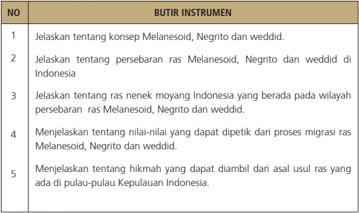

Tabel ini berisi instrumen pembelajaran yang bertujuan untuk menjelaskan konsep-ras Melanesoid, Negrito, dan Weddidi di Indonesia, serta mengeksplorasi persebaran ras tersebut. Kolom pertama menyajikan nomor instrumen, sedangkan kolom kedua memberikan deskripsi tentang setiap instrumen. Topik utama tabel ini adalah pengetahuan dasar tentang ras-ras di Indonesia, termasuk konsep-ras Melanesoid, Negrito, dan Weddidi, serta bagaimana mereka tersebar di wilayah Indonesia. Data penting yang terlihat adalah bahwa tabel ini mencakup lima instrumen pembelajaran yang berfokus pada penjelasan tentang konsep-ras tersebut, persebaran ras di Indonesia, dan hikmah yang dapat diambil dari asal-usul ras-ras tersebut.

Nilai = Jumlah skor

 

---
## 📄 Halaman 133

### 3 Penilaian keterampilan

Penilaian untuk kegiatan mengamati film/gambar  ras Melanesoid, Negrito dan Weddid yang ada di Indonesia.

---
**📊 Tabel**

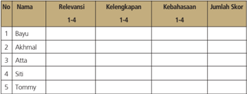

Tabel ini menunjukkan data tentang keberhasilan siswa dalam beberapa aspek pendidikan, termasuk relevansi, kelengkapan, kebahasaan, dan jumlah skor. Topik utama tabel adalah evaluasi kemampuan belajar siswa. Kolom-kolomnya mencakup nama siswa, relevansi (dari 1-4), kelengkapan (dari 1-4), kebahasaan (dari 1-4), dan jumlah skor. Data penting yang terlihat adalah bahwa Bayu memiliki nilai tertinggi dalam semua aspek, sementara Tommy memiliki nilai terendah. Ini menunjukkan perbedaan dalam kemampuan belajar antara siswa tersebut.

Nilai = Jumlah skor dibagi 3

### Keterangan :

- a . Kegiatan mengamati dalam hal ini dipahami sebagai cara peserta didik  mengumpulkan  informasi  faktual  dengan  memanfaatkan indera penglihat, pembau, pendengar, pengecap dan peraba. Maka secara keseluruhan yang dinilai adalah HASIL pengamatan (berupa informasi) bukan CARA mengamati.
- Relevansi,  kelengkapan,  dan  kebahasaan diperlakukan sebagai indikator penilaian kegiatan mengamati.
- Relevansi merujuk pada ketepatan atau keterhubungan fakta  yang  diamati  dengan  informasi  yang  dibutuhkan  untuk mencapai tujuan Kompetensi Dasar/Tujuan Pembelajaran (TP).
- Kelengkapan dalam arti semakin banyak komponen fakta yang terliput atau semakin sedikit sisa (residu) fakta yang tertinggal.
- Kebahasaan menunjukkan bagaimana peserta didik mendeskripsikan fakta-fakta yang dikumpulkan dalam bahasa tulis  yang efektif (tata kata atau tata kalimat yang benar dan mudah dipahami).
- Skor rentang antara 1 - 4
- 1. = Kurang
- 2. = Cukup
- 3. = Baik
- 4. = Amat Baik.

 

---
## 📄 Halaman 134

### 4.    Penilaian untuk kegiatan diskusi kelompok

---
**📊 Tabel**

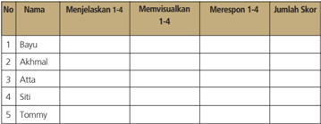

Tabel ini menunjukkan hasil evaluasi keterampilan visualisasi dan respons terhadap pertanyaan 1-4 untuk lima orang peserta. Topik utama tabel adalah keterampilan visualisasi dan respons terhadap pertanyaan 1-4. Kolom-kolomnya meliputi nomor (No.), nama peserta, menjelaskan 1-4, memvisualisasikan 1-4, merespon 1-4, dan jumlah skor. Data penting yang terlihat adalah bahwa Bayu dan Tommy tidak menjelaskan atau memvisualisasikan pertanyaan 1-4, sementara Atta, Siti, dan Akhmal memiliki skor yang lebih tinggi. Ini menunjukkan bahwa Atta, Siti, dan Akhmal lebih baik dalam keterampilan visualisasi dan respons terhadap pertanyaan 1-4 dibandingkan dengan Bayu dan Tommy.

Nilai = Jumlah skor dibagi 3

### 5.      Penilaian presentasi

---
**📊 Tabel**

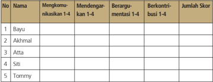

Tabel ini menunjukkan data tentang partisipan dalam sebuah diskusi atau pertemuan, dengan fokus pada tingkat partisipasi mereka dalam berbagai aktivitas seperti mengkomunikasikan ide, mendengarkan pendapat orang lain, berargumen, dan berkontribusi pada diskusi. Kolom-kolomnya mencakup nama-nama partisipan, tingkat partisipasi mereka dalam setiap aktivitas, dan jumlah skor yang diberikan untuk setiap partisipan. Topik utama tabel ini adalah analisis partisipasi dan kontribusi dalam diskusi, dengan data yang menunjukkan bahwa Bayu dan Tommy memiliki skor tertinggi dalam berbagai aktivitas, sementara Atta dan Siti memiliki skor yang lebih rendah.

Nilai= Jumlah skor dibagi 4

### Keterangan :

- Keterampilan  mengomunikasikan adalah  kemampuan  peserta didik untuk mengungkapkan atau menyampaikan ide atau gagasan dengan bahasa lisan yang efektif.
- Keterampilan  mendengarkan dipahami  sebagai  kemampuan peserta didik untuk tidak menyela, memotong, atau menginterupsi pembicaraan seseorang ketika sedang mengungkapkan gagasannya.
- Kemampuan berargumentasi menunjukkan kemampuan peserta didik  dalam  mengemukakan  argumentasi  logis  ketika  ada  pihak yang bertanya atau mempertanyakan gagasannya.

 

---
## 📄 Halaman 135

- Kemampuan  berkontribusi dimaksudkan  sebagai  kemampuan peserta  didik  memberikan  gagasan-gagasan  yang  mendukung atau  mengarah  ke  penarikan  kesimpulan  termasuk  di  dalamnya menghargai perbedaan pendapat.

### e. Skor rentang antara 1 - 4

- 1. = Kurang
- 2. = Cukup
- 3. = Baik
- 4. = Amat Baik.

### Keterangan :

- Keterampilan  menjelaskan adalah  kemampuan  menyampaikan hasil observasi dan diskusi secara meyakinkan.
- Keterampilan memvisualisasikan berkaitan dengan kemampuan peserta  didik  untuk  membuat  atau  mengemas  informasi  seunik mungkin, semenarik mungkin, atau sekreatif mungkin.
- Keterampilan merespon adalah kemampuan peserta didik menyampaikan tanggapan atas pertanyaan, bantahan, sanggahan dari pihak lain secara empatik.

### d. Skor rentang antara 1 - 4

- 1. = Kurang
- 2. = Cukup
- 3. = Baik
- 4. = Amat Baik.

### Pembelajaran Pertemuan Ke-8 (90 menit)

Pada  pertemuan  ke-8  ini  akan  mengembangkan  pemahaman,  kemudian menganalisis  pengetahuan  faktual,  konseptual,  prosedural  yang  berkaitan dengan  'Corak  Kehidupan  Masyarakat  Masa  Praaksara'.  Dalam  hal  ini akan dikembangkan keterampilan peserta didik, seperti mencoba membuat sesuatu, atau mengolah informasi sehingga peserta didik lebih mendalami materi pelajaran minggu ini.

 

---
## 📄 Halaman 136

### a. Indikator

- Menganalisis hasil-hasil kebudayaan batu zaman praaksara
- 2  Menganalisis  tradisi  megalitik  dan  kaitannya  dengan  kepercayaan masyarakat
- 3 Mengidentifikasi hasil budaya praaksara yang sekarang masih ditemukan di lingkungannya

### b.   Tujuan Pembelajaran

Setelah mengikuti kegiatan pembelajaran ini peserta didik mampu

- menjelaskan pola hunian manusia praaksara;
- menganalisis keterkaitan antara pola hunian dengan mata pencarian manusia praaksara;
- menganalisis  keterkaitan  sistem  kepercayaan  manusia  praaksara dengan corak kehidupannya.

### c.    Materi dan Proses Pembelajaran

Materi yang disampaikan pada minggu ke-8 ini masih erat kaitannya dengan  pola  kehidupan  manusia  praaksara  seperti  telah  dikaji beberapa minggu yang lalu. Materi ini ada pada buku teks pelajaran Sejarah Indonesia Bab I, subbab E. Pelaksanaan pembelajaran secara umum dibagi  tiga  tahapan:  kegiatan  pendahuluan,  kegiatan  inti, dan kegiatan penutup.

### d.   Metode dan langkah-langkah pembelajaran

- Model : discovery atau project atau pembelajaran berbasis masalah. Disesuaikan kesiapan masing-masing sekolah dan kondisi lingkungan sekolah.
- Pendekatan: scientific, dengan langkah-langkah: mengamati, menanya,  mengeksplorasi,  mengasosiasikan,  dan  mengomunikasikan.

 

---
## 📄 Halaman 137

### Kegiatan Pendahuluan (15 menit)

- Kelas dipersiapkan agar lebih kondusif untuk proses belajar mengajar (kerapian dan kebersihan ruang kelas, presensi, menyiapkan media dan alat serta buku yang diperlukan).
- Peserta didik ditanya tugas minggu lalu tentang persebaran kapak lonjong dan kapak persegi yang juga ada kaitannya dengan mata pencaharian manusia praaksara.
- Guru menyampaikan topik tentang 'Corak kehidupan masyarakat manusia praaksara' dan memberi motivasi pentingnya topik ini.
- Guru  menyampaikan tujuan  dan  kompetensi  yang  harus  dikuasai para peserta didik. Guru perlu menekankan bahwa pembelajaran ini lebih pada pemaknaan bukan hafalan.

### Kegiatan Inti (60 menit)

- Peserta didik dijelaskan tentang pola hunian manusia masa praaksara. Pada mulanya mereka tinggal di tempat terbuka umumnya di tepi sungai.  Peserta  didik  juga  dijelaskan  mengapa  mereka  banyak tinggal di tepi sungai. Kaitannya di tempat terbuka ini juga ada yang tinggal di tepi pantai. Peserta didik diminta guru untuk menunjukkan buktinya.  Dalam  perkembangannya  ada  yang  tinggal  di  gua-gua. Fase  ini  merupakan  masa  transisi  sebelum  mereka  bertempat tinggal tetap. Selain itu peserta didik juga dijelaskan kaitan antara pola hunian dengan mata pencaharian manusia praaksara ini dan munculnya sistem kepercayaan pada masa itu.
- Peserta didik kemudian diberikan lembar/kartu kuis.
- Peserta didik diminta secara individual untuk menjawab pertanyaanpertanyaan  soal  uji  kompetensi  yang  terdapat  pada  buku  teks pelajaran Sejarah Indonesia.
- Peserta didik diberikan nilai oleh guru.

 

---
## 📄 Halaman 138

### Kegiatan Penutup (15 menit)

- Peserta didik diberikan ulasan singkat tentang kegiatan pembelajaran dan hasil belajarnya.
- Peserta  didik  dapat  ditanya  apakah  sudah  memahami  materi tersebut.
- Sebagai  refleksi  guru  memberikan  kesimpulan  tentang  pelajaran yang baru saja berlangsung serta menanyakan kepada peserta didik apa manfaat yang dapat kita peroleh setelah belajar topik ini.

### e. Penilaian

- Peserta didik diberikan penilaian proses melalui pengamatan terutama  tentang  aktivitasnya,  dan  kemampuan  menyampaikan pendapat.
- Peserta  didik  diberikan  penilaian  hasil  untuk  mengetahui  tingkat pemahaman dan kompetensi.
- Hasil kerja peserta didik diberi nilai dan komentar.

### f. Penilaian Hasil Belajar

Penilaian dilakukan menggunakan penilaian autentik yang meliputi penilaian  sikap,  pengetahuan  dan  keterampilan.  Format  penilaian sebagai berikut.

### 1. Penilaian sikap

---
**📊 Tabel**

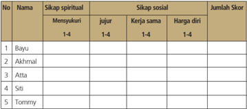

Tabel ini menunjukkan skor individu dalam empat sikap: spiritual, sosial, dan diri sendiri. Kolom "Nama" menyatakan identitas individu, sedangkan kolom "Sikap spiritual" mencakup empat poin: mensyukuri, jujur, kerja sama, dan harga diri. Kolom "Sikap sosial" juga memiliki empat poin yang sama. Skor individu dihitung dengan menggabungkan skor dari semua poin dalam setiap sikap. Data penting yang terlihat adalah bahwa Bayu mendapatkan skor tertinggi dalam semua poin, sementara Tommy mendapatkan skor terendah. Ini menunjukkan perbedaan yang signifikan dalam sikap spiritual dan sosial individu tersebut.

 

---
## 📄 Halaman 139

### Keterangan:

### a. Sikap Spiritual

Indikator sikap spiritual 'mensyukuri':

- Berdoa sebelum dan sesudah kegiatan pembelajaran
- Memberi  salam  pada  saat  awal  dan  akhir  presentasi  sesuai agama yang dianut
- Saling menghormati, toleransi
- Memelihara hubungan baik dengan sesama teman sekelas. Rubrik pemberian skor:
- 4 =  jika peserta didik melakukan 4 (empat) kegiatan tersebut
- 3 =  jika peserta didik melakukan 3 (tiga) kegiatan tersebut
- 2 =  jika peserta didik melakukan 2 (dua) kegiatan tersebut
- 1 =  jika peserta didik melakukan 1 (satu) kegiatan tersebut.

### b. Sikap Sosial

- Sikap jujur Indikator sikap sosial 'jujur'
- Tidak berbohong
- Mengembalikan kepada yang berhak bila  menemukan sesuatu
- Tidak nyontek, tidak plagiarism
- •
- Terus terang.
Rubrik pemberian skor

- 4 =  jika peserta didik melakukan 4 (empat) kegiatan tersebut
- 3 =  jika peserta didik melakukan 3 (tiga) kegiatan tersebut
- 2 =  jika peserta didik melakukan 2 (dua) kegiatan tersebut
- 1 =  jika peserta didik melakukan 1 (satu) kegiatan tersebut.
- Sikap kerja sama Indikator sikap sosial 'kerja sama'
- Peduli kepada sesama
- Saling membantu dalam hal kebaikan
- Saling menghargai/ toleran
- Ramah dengan sesama.

### Rubrik pemberian skor

- 4 =  jika peserta didik melakukan 4 (empat) kegiatan tersebut
- 3 =  jika peserta didik melakukan 3 (tiga) kegiatan tersebut
- 2 =  jika peserta didik melakukan 2 (dua) kegiatan tersebut
- 1 =  jika peserta didik melakukan 1 (satu) kegiatan tersebut.

 

---
## 📄 Halaman 140

### 3.    Sikap Harga diri

Indikator sikap sosial 'harga diri'

- Tidak suka dengan dominasi asing
- Bersikap sopan untuk menegur bagi mereka yang mengejek
- Cinta produk negeri sendiri
- Menghargai dan menjaga karya-karya sekolah dan masyarakat sendiri.
Rubrik pemberian skor

- 4 =  jika peserta didik melakukan 4 (empat) kegiatan tersebut
- 3 =  jika peserta didik melakukan 3 (tiga) kegiatan tersebut
- 2 =  jika peserta didik melakukan 2 (dua) kegiatan tersebut
- 1 =  jika peserta didik melakukan 1 (satu) kegiatan tersebut.

### 2.    Penilaian pengetahuan

---
**📊 Tabel**

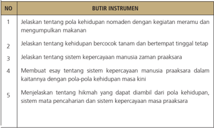

Tabel ini berisi instrumen pembelajaran yang terdiri dari 5 butir dengan deskripsi singkat tentang setiap butir. Topik utama tabel adalah tentang kehidupan manusia pada masa pra-akarsa, termasuk pola kehidupan nomaden, kegiatan memeran, sistem kepercayaan manusia, dan hikmah yang dapat diambil dari kehidupan tersebut. Kolom-kolomnya mencakup deskripsi tentang kehidupan nomaden, kehidupan bercocok tanam, sistem kepercayaan manusia, membuat esai tentang sistem kepercayaan manusia, dan menjelaskan hikmah yang dapat diambil dari kehidupan tersebut. Data penting yang terlihat adalah bahwa tabel ini membahas tentang kehidupan manusia pada masa pra-akarsa dan bagaimana mereka hidup, berinteraksi, dan berpikir.

Nilai = Jumlah skor

 

---
## 📄 Halaman 141

### 3     Penilaian keterampilan

Penilaian untuk kegiatan mengamati film/gambar corak kehidupan masyarakat masa praaksara.

---
**📊 Tabel**

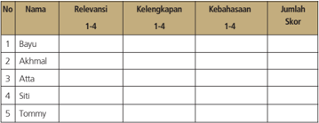

Tabel ini menunjukkan data relevansi, kelengkapan, kebahasaan, dan jumlah skor untuk lima individu: Bayu, Akhmal, Atta, Siti, dan Tommy. Topik utama tabel adalah evaluasi kemampuan berbahasa dan keterampilan mereka. Kolom-kolomnya mencakup relevansi (dari 1-4), kelengkapan (dari 1-4), kebahasaan (dari 1-4), dan jumlah skor. Data penting yang terlihat adalah bahwa semua individu memiliki nilai yang sama pada kolom relevansi, kelengkapan, dan kebahasaan, yaitu 3. Namun, jumlah skor mereka bervariasi, menunjukkan perbedaan dalam penilaian mereka.

Nilai = Jumlah skor dibagi 3

### Keterangan :

- Kegiatan mengamati dalam hal ini dipahami sebagai cara peserta didik  mengumpulkan  informasi  faktual  dengan  memanfaatkan indera penglihat, pembau, pendengar, pengecap dan peraba. Maka secara keseluruhan yang dinilai adalah HASIL pengamatan (berupa informasi) bukan CARA mengamati.
- Relevansi,  kelengkapan,  dan  kebahasaan diperlakukan sebagai indikator penilaian kegiatan mengamati.
- Relevansi merujuk pada ketepatan atau keterhubungan fakta  yang  diamati  dengan  informasi  yang  dibutuhkan  untuk mencapai tujuan Kompetensi Dasar/Tujuan Pembelajaran (TP).
- Kelengkapan dalam arti semakin banyak komponen fakta yang terliput atau semakin sedikit sisa (residu) fakta yang tertinggal.
- Kebahasaan menunjukkan bagaimana peserta didik mendeskripsikan fakta-fakta yang dikumpulkan dalam bahasa tulis  yang efektif (tata kata atau tata kalimat yang benar dan mudah dipahami).
- Skor rentang antara 1 - 4
- 1. = Kurang
- 2. = Cukup
- 3. = Baik
- 4. = Amat Baik.

 

---
## 📄 Halaman 142

### 4. Penilaian untuk kegiatan diskusi kelompok

---
**📊 Tabel**

Tabel ini menunjukkan informasi tentang partisipan dalam sebuah proses diskusi atau debat, dengan fokus pada tingkat partisipasi mereka dalam berbagai tahap. Topik utama adalah partisipasi dan peran individu dalam proses tersebut. Kolom-kolomnya mencakup nama individu, tingkat partisipasi dalam komunikasi, mendengarkan, berargumentasi, dan berkontribusi dalam berbagai tahap (1-4). Data penting yang terlihat adalah bahwa Bayu dan Tommy tidak memiliki data untuk semua kolom, sementara Atta dan Siti hanya memiliki data untuk beberapa kolom. Akhmad memiliki data lengkap untuk semua kolom. Pola penting adalah bahwa bayangan partisipasi individu dalam proses tersebut, dengan beberapa individu seperti Bayu dan Tommy tidak memiliki data lengkap, sementara Atta dan Siti memiliki data yang lebih lengkap.

Nilai = Jumlah skor dibagi 4

### Keterangan :

- Keterampilan  mengomunikasikan adalah  kemampuan  peserta didik untuk mengungkapkan atau menyampaikan ide atau gagasan dengan bahasa lisan yang efektif.
- Keterampilan  mendengarkan dipahami  sebagai  kemampuan peserta didik untuk tidak menyela, memotong, atau menginterupsi pembicaraan seseorang ketika sedang mengungkapkan gagasannya.
- Kemampuan berargumentasi menunjukkan kemampuan peserta didik  dalam  mengemukakan  argumentasi  logis  ketika  ada  pihak yang bertanya atau mempertanyakan gagasannya.
- Kemampuan  berkontribusi dimaksudkan  sebagai  kemampuan peserta  didik  memberikan  gagasan-gagasan  yang  mendukung atau  mengarah  ke  penarikan  kesimpulan  termasuk  di  dalamnya menghargai perbedaan pendapat.
- Skor rentang antara 1 - 4
- 1. = Kurang
- 2. = Cukup
- 3. = Baik
- 4. = Amat Baik.

 

---
## 📄 Halaman 143

### 5. Penilaian presentasi

---
**📊 Tabel**

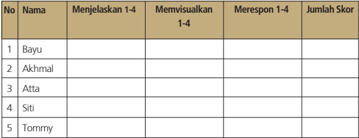

Tabel ini menunjukkan hasil evaluasi keterampilan visualisasi dan respons terhadap pertanyaan 1-4 untuk lima orang peserta. Topik utama tabel adalah keterampilan visualisasi dan respons terhadap pertanyaan 1-4. Kolom-kolomnya meliputi nomor, nama, menjelaskan 1-4, memvisualisasikan 1-4, merespon 1-4, dan jumlah skor. Data penting yang terlihat adalah bahwa Bayu tidak menjelaskan atau memvisualisasikan pertanyaan 1-4, sedangkan Atta merespon dengan baik. Pola umum adalah bahwa beberapa peserta kurang memahami atau merespon pertanyaan dengan baik, sementara yang lain lebih baik dalam hal ini.

Nilai= Jumlah skor dibagi 3

### Keterangan :

- Keterampilan  menjelaskan adalah  kemampuan  menyampaikan hasil observasi dan diskusi secara meyakinkan.
- Keterampilan memvisualisasikan berkaitan dengan kemampuan peserta  didik  untuk  membuat  atau  mengemas  informasi  seunik mungkin, semenarik mungkin, atau sekreatif mungkin.
- Keterampilan merespon adalah kemampuan peserta didik menyampaikan tanggapan atas pertanyaan, bantahan, sanggahan dari pihak lain secara empatik.

### d. Skor rentang antara 1 - 4

- 1. = Kurang
- 2. = Cukup
- 3. = Baik
- 4. = Amat Baik

### Pembelajaran Pertemuan Ke-9 (90 menit)

Pembelajaran  pertemuan  ke-9  ini  tetap  merupakan  proses  pembelajaran untuk  mengembangkan  pengetahuan:  menerapkan  konsep,  prinsip  atau prosedur,  menganalisis  masalah,  dan  mengevaluasi  sesuatu  produk  atau

 

---
## 📄 Halaman 144

mengembangkan  keterampilan,  seperti:  mencoba  membuat  sesuatu  atau mengolah informasi, dalam rangka lebih mendalami dan menghayati materi pembelajaran. Pada sesi ini peserta didik akan belajar tentang perkembangan teknologi masa praaksara. Materi ini akan dibagi dalam dua pertemuan, ke-9 dan ke-10. Pada pembelajaran minggu ke-9 ini akan mengkaji perkembangan teknologi bebatuan sampai dengan masa mesolitikum

### a. Indikator

- Menganalisis hasil-hasil kebudayaan batu zaman praaksara
- 2  Menganalisis  tradisi  megalitik  dan  kaitannya  dengan  kepercayaan masyarakat
- 3 Mengidentifikasi hasil budaya praaksara yang sekarang masih ditemukan di lingkungannya

### b.   Tujuan Pembelajaran

Setelah mengikuti kegiatan pembelajaran ini peserta didik diharapkan mampu:

- menganalisis pembabakan waktu masa teknologi bebatuan;
- menganalisis hasil-hasil kebudayaan masa paleolitikum; dan
- menganalisis perkembangan teknologi bebatuan masa mesolitikum.

### c.   Materi dan Proses Pembelajaran

Materi yang disampaikan pada minggu ke-9 ini berkaitan dengan perkembangan teknologi bebatuan masa praaksara, terutama masa Paleolitikum  dan  Mesolitikum.  Pada  buku  teks  pelajaran  Sejarah Indonesia terdapat di Bab I bagian dari subbab F bagian satu dan dua. Dalam melaksanakan pembelajaran secara umum dibagi tiga tahapan: kegiatan pendahuluan, kegiatan inti dan kegiatan penutup.

### d.   Metode dan langkah-langkah pembelajaran

- Model : discovery atau project atau pembelajaran berbasis masalah. Disesuaikan kesiapan masing-masing sekolah dan kondisi lingkungan sekolah.
- Pendekatan: scientiic , dengan langkah-langkah: mengamati, menanya,  mengeksplorasi,  mengasosiasikan,  dan  mengomunikasikan.

 

---
## 📄 Halaman 145

### Kegiatan Pendahuluan (15 menit)

- Kelas dipersiapkan agar lebih kondusif untuk proses belajar mengajar (kerapian dan kebersihan ruang kelas, presensi, menyiapkan media dan alat serta buku yang diperlukan).
- Sebagai apersepsi peserta didik ditunjukkan gambar peralatan dari batu.
Gambar  apakah  ini?  alat  ini  sampai  sekarang  masih  banyak  kita temukan di rumah tangga di Indonesia. Alat ini sering disebut dengan cobek,  alat  untuk  menghaluskan  rempah-rempah,  menghaluskan bumbu  masak  atau  tempat  membuat  sambal.  Alat  bebatuan  ini sudah dikenal ribuan tahun yang lalu. Nah, kali ini kita akan mengkaji tentang 'Perkembangan teknologi bebatuan sampai dengan masa mesolitikum'.

- Guru  menyampaikan tujuan  dan  kompetensi  yang  harus  dikuasai para  peserta  didik.  Guru    menekankan  pelajaran  ini  lebih  pada pemaknaan dan penerapan, bukan hafalan.
- Peserta didik dibagi menjadi enam kelompok (kelompok I, II, III, IV, V, dan VI).

### Kegiatan Inti (60 menit)

- Peserta  didik  dijelaskan  tentang  perkembangan  kebudayaan  atau teknologi bebatuan sejak dari masa Paleolitikum dengan kebudayaan Pacitan dan kebudayaan Ngandong sampai perkembangan kebudayaan  Mesolitikum  dengan  kebudayaan  Kjokkenmoddinger dan kebudayaan Abris sous roche.
- Peserta didik ditugaskan untuk berdiskusi dan menjawab pertanyaan berikut.
- Apa makna paleolitikum?
- Hasil kebudayaan masa praaksara bersifat trial  and  error, apa maksudnya?
- Beberapa  jenis  kapak  yang  ditemukan  dalam  Kebudayaan Pacitan misalnya kapak ….
- Jelaskan tentang Kebudayaan Kjokkenmoddinger ....
- Jelaskan tentang Kebudayaan Abris sous roche ....

 

---
## 📄 Halaman 146

- Peserta didik diperintahkan untuk kembali ke tempat duduk masingmasing setelah bekerja di kelompok. Guru kemudian membagikan kertas kerja/kartu kuis.
- Peserta  didik  diperintahkan  untuk  bekerja  secara  individual  menjawab pertanyaan-pertanyaan pada lembar kuis. Pertanyaan pada kuis itu sama dengan pertanyaan yang diajukan dalam kelompok.

### Kegiatan Penutup (15 menit)

- Peserta didik diberikan ulasan singkat tentang kegiatan pembelajaran dan hasil belajarnya.
- Peserta  didik  dapat  ditanyakan  apakah  sudah  memahami  materi tersebut.
- Peserta didik diberikan pertanyaan lisan secara acak untuk mendapatkan  umpan  balik  atas  pembelajaran  yang  baru  saja dilakukan, misalnya kebudayaan yang berkembang di gua-gua itu terkenal dengan sebutan apa?
- Sebagai  refleksi  guru  memberikan  kesimpulan  tentang  pelajaran yang baru saja berlangsung serta menanyakan kepada peserta didik apa manfaat yang dapat kita peroleh setelah belajar topik ini.

### e.   Penilaian

- Peserta  didik  diberikan  penilaian  proses  melalui  pengamatan  terutama tentang  aktivitasnya,  kemampuan  menyampaikan  pendapat,  dan kerja sama kelompok.
- Peserta didik diberikan beberapa pertanyaan untuk melihat penguasaan materi dan kompetensi yang dicapai.
- Apa makna Paleolitikum?
- Jelaskan ciri hasil kebudayaan masa Mesolitikum!
- Sebutkan hasil kebudayaan dari masa Paleolitikum!
- Peserta didik diberi tugas rumah untuk melakukan identifikasi hasilhasil  kebudayaan masa Paleolitikum dan Mesolitikum, dan jangan lupa menyertakan gambar-gambarnya.
- Pada pertemuan  berikutnya peserta didik diberikan nilai  dan komentar oleh guru tentang tugas peserta didik tersebut.

 

---
## 📄 Halaman 147

### f. Penilaian Hasil Belajar

Penilaian  dilakukan  menggunakan  penilaian  autentik  yang  meliputi penilaian  sikap,  pengetahuan  dan  keterampilan.  Format  penilaian sebagai berikut.

### 1. Penilaian sikap

### Keterangan:

### a. Sikap Spiritual

Indikator sikap spiritual 'mensyukuri':

- Berdoa sebelum dan sesudah kegiatan pembelajaran
- Memberi  salam  pada  saat  awal  dan  akhir  presentasi  sesuai agama yang dianut
- Saling menghormati, toleransi
- Memelihara hubungan baik dengan sesama teman sekelas. Rubrik pemberian skor:
- 4 =  jika peserta didik melakukan 4 (empat) kegiatan tersebut
- 3 =  jika peserta didik melakukan 3 (tiga) kegiatan tersebut
- 2 =  jika peserta didik melakukan 2 (dua) kegiatan tersebut
- 1 =  jika peserta didik melakukan 1 (satu) kegiatan tersebut.

### b. Sikap Sosial.

- Sikap jujur Indikator sikap sosial 'jujur'
- Tidak berbohong
- Mengembalikan kepada yang berhak bila  menemukan sesuatu

 

---
## 📄 Halaman 148

### 3.

- Tidak nyontek, tidak plagiarism
- Terus terang.

### Rubrik pemberian skor

- 4 =  jika peserta didik melakukan 4 (empat) kegiatan tersebut
- 3 =  jika peserta didik melakukan 3 (tiga) kegiatan tersebut
- 2 =  jika peserta didik melakukan 2 (dua) kegiatan tersebut
- 1 =  jika peserta didik melakukan 1 (satu) kegiatan tersebut.

### 2. Sikap kerja sama

Indikator sikap sosial 'kerja sama'

- Peduli kepada sesama
- Saling membantu dalam hal kebaikan
- Saling menghargai/ toleran
- Ramah dengan sesama.

### Rubrik pemberian skor

- 4 =  jika peserta didik melakukan 4 (empat) kegiatan tersebut
- 3 =  jika peserta didik melakukan 3 (tiga) kegiatan tersebut
- 2 =  jika peserta didik melakukan 2 (dua) kegiatan tersebut
- 1 =  jika peserta didik melakukan 1 (satu) kegiatan tersebut.
- Sikap Harga diri Indikator sikap sosial 'harga diri'
- Tidak suka dengan dominasi asing
- Bersikap sopan untuk menegur bagi mereka yang mengejek
- Cinta produk negeri sendiri
- Menghargai dan menjaga karya-karya sekolah dan masyarakat sendiri.

### Rubrik pemberian skor

- 4 =  jika peserta didik melakukan 4 (empat) kegiatan tersebut
- 3 =  jika peserta didik melakukan 3 (tiga) kegiatan tersebut
- 2 =  jika peserta didik melakukan 2 (dua) kegiatan tersebut
- 1 =  jika peserta didik melakukan 1 (satu) kegiatan tersebut.

 

---
## 📄 Halaman 149

### 2.    Penilaian pengetahuan

---
**📊 Tabel**

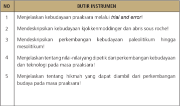

Tabel ini berisi instrumen untuk menjelaskan perkembangan budaya pada masa praekarasa. Kolom pertama menunjukkan nomor instrumen, sedangkan kolom kedua berisi deskripsi instrumen tersebut. Topik utama tabel ini adalah tentang cara menjelaskan perkembangan budaya pada masa praekarasa melalui berbagai metode seperti trial and error, mendeskripsikan kebudayaan tertentu, dan mengeksplorasi hikmah dari perkembangan budaya. Data penting yang terlihat adalah bahwa tabel ini mencakup lima instrumen yang berbeda untuk menjelaskan perkembangan budaya pada masa praekarasa.

Nilai = Jumlah skor

### 3.      Penilaian keterampilan

Penilaian untuk kegiatan mengamati film/gambar pelayaran, petualangan dan penjelajahan samudera oleh bangsa-bangsa Barat yang akhirnya sampai di Indonesia.

---
**📊 Tabel**

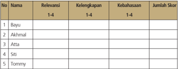

Tabel ini menunjukkan data tentang relevansi, kelengkapan, kebahasaan, dan jumlah skor untuk lima individu: Bayu, Akhmal, Atta, Siti, dan Tommy. Topik utama tabel adalah evaluasi kemampuan berbahasa dan keterampilan mereka. Kolom-kolomnya mencakup relevansi (dari 1-4), kelengkapan (dari 1-4), kebahasaan (dari 1-4), dan jumlah skor. Data penting yang terlihat adalah bahwa semua individu memiliki nilai yang sama pada kolom kelengkapan dan kebahasaan, yaitu 3. Namun, nilai skor mereka bervariasi, dengan Bayu mendapatkan nilai tertinggi 4, sementara Tommy mendapatkan nilai terendah 2. Ini menunjukkan perbedaan dalam penilaian mereka terhadap kemampuan berbahasa dan keterampilan.

Nilai = Jumlah skor dibagi 3

 

---
## 📄 Halaman 150

### Keterangan :

- Kegiatan mengamati dalam hal ini dipahami sebagai cara peserta didik  mengumpulkan  informasi  faktual  dengan  memanfaatkan indera penglihat, pembau, pendengar, pengecap dan peraba. Maka secara keseluruhan yang dinilai adalah HASIL pengamatan (berupa informasi) bukan CARA mengamati.
- Relevansi,  kelengkapan,  dan  kebahasaan diperlakukan sebagai indikator penilaian kegiatan mengamati.
- Relevansi merujuk  pada  ketepatan  atau  keterhubungan  fakta yang diamati dengan informasi yang dibutuhkan untuk mencapai tujuan Kompetensi Dasar/Tujuan Pembelajaran (TP).
- Kelengkapan dalam arti semakin banyak komponen fakta yang terliput atau semakin sedikit sisa (residu) fakta yang tertinggal.
- Kebahasaan menunjukkan bagaimana peserta didik mendeskripsikan  fakta-fakta  yang  dikumpulkan  dalam  bahasa tulis  yang  efektif  (tata  kata  atau  tata  kalimat  yang  benar  dan mudah dipahami).
- Skor rentang antara 1 - 4
- 1. = Kurang
- 2. = Cukup
- 3. = Baik
- 4. = Amat Baik.

### 4 Penilaian untuk kegiatan diskusi kelompok

---
**📊 Tabel**

Tabel ini menunjukkan data tentang partisipan dalam sebuah proses diskusi atau debat, dengan fokus pada tingkat partisipasi mereka dalam berbagai tahap: mengomentari, mendengarkan, berargumen, dan berkontribusi. Setiap baris mewakili seorang peserta yang diberikan nomor urut, dan kolom-kolom tersebut mencakup nama peserta, tingkat partisipasi mereka dalam setiap tahap, dan jumlah skor yang diterima. Topik utama tabel ini adalah analisis partisipasi peserta dalam proses diskusi. Data penting yang terlihat adalah bahwa Bayu memiliki tingkat partisipasi tertinggi dalam semua tahap, sementara Tommy memiliki tingkat partisipasi terendah.

Nilai = jumlah skor dibagi 4

 

---
## 📄 Halaman 151

### Keterangan :

- Keterampilan  mengomunikasikan adalah  kemampuan  peserta didik untuk mengungkapkan atau menyampaikan ide atau gagasan dengan bahasa lisan yang efektif.
- Keterampilan  mendengarkan dipahami  sebagai  kemampuan peserta didik untuk tidak menyela, memotong, atau menginterupsi pembicaraan seseorang ketika sedang mengungkapkan gagasannya.
- Kemampuan berargumentasi menunjukkan kemampuan peserta didik  dalam  mengemukakan  argumentasi  logis  ketika  ada  pihak yang bertanya atau mempertanyakan gagasannya.
- Kemampuan  berkontribus i dimaksudkan  sebagai  kemampuan peserta  didik  memberikan  gagasan-gagasan  yang  mendukung atau  mengarah  ke  penarikan  kesimpulan  termasuk  di  dalamnya menghargai perbedaan pendapat.

### e. Skor rentang antara 1 - 4

- 1. = Kurang
- 2. = Cukup
- 3. = Baik
- 4. = Amat Baik.

### 5.    Penilaian presentasi

---
**📊 Tabel**

Tabel ini menunjukkan hasil evaluasi keterampilan visualisasi dan respons terhadap visual 1-4 untuk lima orang siswa: Bayu, Akhmal, Atta, Siti, dan Tommy. Kolom "No." menunjukkan urutan nomor individu, "Nama" menyatakan nama-nama siswa, "Menjelaskan 1-4" menunjukkan apakah mereka dapat menjelaskan visual 1-4 dengan baik, "Memvisualalkan 1-4" menunjukkan apakah mereka mampu memvisualisasikan visual tersebut, "Merespon 1-4" menunjukkan apakah mereka dapat merespons visual tersebut dengan tepat, dan "Jumlah Skor" menunjukkan skor akhir mereka. Dari tabel ini, tampak bahwa Bayu dan Tommy memiliki skor tertinggi, sedangkan Atta dan Siti memiliki skor yang lebih rendah. Ini menunjukkan bahwa Bayu dan Tommy lebih baik dalam keterampilan visualisasi dan respons terhadap visual 1-4 dibandingkan Atta dan Siti.

Nilai= Jumlah skor dibagi 3

 

---
## 📄 Halaman 152

### Keterangan :

- Keterampilan  menjelaskan adalah  kemampuan  menyampaikan hasil observasi dan diskusi secara meyakinkan.
- Keterampilan memvisualisasikan berkaitan dengan kemampuan peserta  didik  untuk  membuat  atau  mengemas  informasi  seunik mungkin, semenarik mungkin, atau sekreatif mungkin.
- Keterampilan merespon adalah kemampuan peserta didik menyampaikan tanggapan atas pertanyaan, bantahan, sanggahan dari pihak lain secara empatik.

### d. Skor rentang antara 1 - 4

- 1. = Kurang
- 2. = Cukup
- 3. = Baik
- 4. = Amat Baik.

### Pembelajaran Pertemuan Ke-10 (90 menit)

Pembelajaran  ke-10  ini  merupakan  kelanjutan  pembelajaran  ke-9  tentang perkembangan teknologi masa praaksara. Pada pembelajaran minggu ke-10 ini akan ditekankan pada mengenal api, revolusi kebudayaan masa neolitikum dan  teknologi  konsep  ruang  (arsitektur)  yang  sudah  mulai  digunakan. Pembelajaran  ini  akan  mengembangkan  proses  kognitif  yang  lebih  tinggi sampai  pada  menganalisis  masalah,  dan  mengevaluasi  suatu  produk  atau mengembangkan  keterampilan,  seperti:  mencoba  membuat  sesuatu  atau mengolah informasi, dalam rangka lebih mendalami dan menghayati materi pembelajaran sehingga melahirkan produk belajar misalnya nilai-nilai yang dapat diaplikasikan.

### a. Indikator

- Menganalisis hasil-hasil kebudayaan batu zaman praaksara
- Menganalisis  tradisi  megalitik  dan  kaitannya  dengan  kepercayaan masyarakat
- Mengidentifikasi  hasil  budaya  praaksara  yang  sekarang  masih ditemukan di lingkungannya

 

---
## 📄 Halaman 153

### b.   Tujuan Pembelajaran

Setelah mengikuti kegiatan pembelajaran ini peserta didik mampu:

- menganalisis  perkembangan  teknologi  mengenal  api  dan  konsep ruang masa neolithikum; dan
- menganalisis makna revolusi kebudayaan masa neolitikum;

### c.   Materi dan Proses Pembelajaran

Materi pada pembelajaran pertemuan ke-10 merupakan kelanjutan dari  pertemuan  ke-9  yakni  Bab  I,  subbab  F  yang  membahas teknologi mengenal api, masa revolusi kebudayaan dan teknologi arsitektur. Dalam melaksanakan pembelajaran secara umum dibagi tiga  tahapan:  kegiatan  pendahuluan,  kegiatan  inti,  dan  kegiatan penutup.

### d.   Metode dan langkah-langkah pembelajaran

- Model : discovery atau project atau pembelajaran berbasis masalah. Disesuaikan kesiapan masing-masing sekolah dan kondisi lingkungan sekolah.
- Pendekatan: scientiic , dengan langkah-langkah: mengamati, menanya,  mengeksplorasi,  mengasosiasikan,  dan  mengomunikasikan.

### Kegiatan Pendahuluan (15  menit)

- Kelas dipersiapkan agar lebih kondusif untuk proses belajar mengajar (kerapian dan kebersihan ruang kelas, presensi, menyiapkan media dan alat serta buku yang diperlukan).
- Sebagai apersepsi peserta didik diajukan pertanyaan terkait pelajaran minggu ke-10 oleh guru: coba sebutkan beberapa contoh kebudayaan masa mesolitikum?
- Guru  menyampaikan  topik  tentang  'Sebuah  Revolusi'  dan  guru memberi motivasi pentingnya topik ini.
- Peserta didik dapat disampaikan contoh produk dari sebuah revolusi kebudayaan  yang  ada  pada  saat  ini.  Contohnya  dalam  teknologi komunikasi  ada  surat  elektronik  atau  email.  Manusia  tidak  lagi harus berkirim surat dalam waktu lama. Guru dapat mencontohkan produk revolusi kebudayaan lainnya.

 

---
## 📄 Halaman 154

- Guru  menyampaikan tujuan  dan  kompetensi  yang  harus  dikuasai para  peserta  didik.  Guru  menekankan  pelajaran  ini  lebih  pada pemaknaan dan penerapan, bukan hafalan.
- Peserta didik dibagi menjadi enam kelompok (kelompok I, II, III, IV, V, dan VI).

### Kegiatan Inti (60 menit)

- Peserta  didik  dijelaskan  secara  singkat  tentang  perkembangan kebudayaan pada masa neolitikum dan manusia pendukungnya.
- Peserta  didik  diberikan  tugas  untuk  bekerja  di  kelompok  masingmasing.  Guru  meminta  kelompok  I  dan  III  mendiskusikan  dan merumuskan tentang proses manusia mengenal api dan relevansi penemuan itu pada masa sekarang. Kelompok II dan IV mendiskusikan dan merumuskan tentang makna revolusi kebudayaan masa neolitikum dengan menunjukkan bukti-buktinya. Kelompok V dan VI mendiskusikan tentang teknologi konsep ruang yang ada pada masa  praaksara  dan  menarik  relevansinya  pada  masa  sekarang. Waktu diskusi kelompok  30 menit.
- Kelompok I dan III diperintahkan untuk mempresentasi hasil diskusi masing-masing tentang proses manusia mengenal api. Kelompok II dan IV mempresentasikan tentang makna revolusi kebudayaan masa neolitikum.  Kelompok  V  dan  VI  mempresentasikan  hasil  rumusan diskusinya teknologi konsep ruang pada masa praaksara.

### Kegiatan Penutup (15 menit)

- Peserta didik diberikan ulasan singkat tentang materi yang baru saja didiskusikan
- Peserta  didik  dapat  ditanya  apakah  sudah  memahami  materi tersebut.
- Peserta didik diberikan pertanyaan lisan secara acak untuk mendapatkan umpan balik dari peserta didik, apa hasil kebudayaan yang terkenal masa neolitikum?
- Sebagai  refleksi  guru  memberikan  kesimpulan  tentang  pelajaran yang baru saja berlangsung serta menanyakan kepada peserta didik apa manfaat yang dapat diperoleh setelah belajar topik ini.

 

---
## 📄 Halaman 155

### e.   Penilaian

- Peserta  didik  diberikan  penilaian  melalui  pengamatan  terutama tentang aktivitas dan kemampuannya dalam menyampaikan pendapat dan kerja sama kelompok.
- Peserta  didik  diberikan  tugas  rumah:  Buatlah  peta  Kepulauan Indonesia (atau kamu bisa foto kopi), kemudian gambarkan pada peta itu jalur persebaran kapak lonjong dan kapak persegi! Buatlah analisis  dan  penjelasan  keterkaitan  antara  penyebaran  dua  jenis kapak  itu  dengan  kehidupan  dan  mata  pencaharian  manusia pendukungnya!
- Pada  pertemuan  berikutnya  tugas  peserta  didik  diberi  nilai  dan komentar oleh guru.

### f. Penilaian Hasil Belajar

Penilaian  dilakukan  menggunakan  penilaian  autentik  yang  meliputi penilaian  sikap,  pengetahuan  dan  keterampilan.  Format  penilaian sebagai berikut.

### 1. Penilaian sikap

---
**📊 Tabel**

Tabel ini menunjukkan data tentang sikap spiritual dan sosial beberapa individu, dengan kolom-kolom yang mencakup "Mensyukuri", "Jujur", "Kerja sama", dan "Harga diri". Setiap individu diwakili oleh satu baris, dengan nama, skor untuk setiap kategori, dan jumlah skor keseluruhan. Topik utama tabel adalah analisis sikap spiritual dan sosial individu. Data penting yang terlihat adalah bahwa bayu memiliki skor tertinggi dalam semua kategori, sementara Tommy memiliki skor terendah. Ini menunjukkan perbedaan dalam sikap spiritual dan sosial antara individu tersebut.

 

---
## 📄 Halaman 156

### Keterangan:

### a. Sikap Spiritual

Indikator sikap spiritual 'mensyukuri':

- Berdoa sebelum dan sesudah kegiatan pembelajaran
- Memberi  salam  pada  saat  awal  dan  akhir  presentasi  sesuai agama yang dianut
- Saling menghormati, toleransi
- Memelihara hubungan baik dengan sesama teman sekelas. Rubrik pemberian skor:
- 4 =  jika peserta didik melakukan 4 (empat) kegiatan tersebut
- 3 =  jika peserta didik melakukan 3 (tiga) kegiatan tersebut
- 2 =  jika peserta didik melakukan 2 (dua) kegiatan tersebut
- 1 =  jika peserta didik melakukan 1 (satu) kegiatan tersebut.

### b. Sikap Sosial.

- Sikap jujur
- Indikator sikap sosial 'jujur'
- Tidak berbohong
- Mengembalikan kepada yang berhak bila  menemukan sesuatu
- Tidak nyontek, tidak plagiarism
- •
- Terus terang.
Rubrik pemberian skor

- 4 =  jika peserta didik melakukan 4 (empat) kegiatan tersebut
- 3 =  jika peserta didik melakukan 3 (tiga) kegiatan tersebut
- 2 =  jika peserta didik melakukan 2 (dua) kegiatan tersebut
- 1 =  jika peserta didik melakukan 1 (satu) kegiatan tersebut.
- Sikap kerja sama Indikator sikap sosial 'kerja sama'
- Peduli kepada sesama
- Saling membantu dalam hal kebaikan
- Saling menghargai/ toleran
- Ramah dengan sesama.
Rubrik pemberian skor

- 4 =  jika peserta didik melakukan 4 (empat) kegiatan tersebut
- 3 =  jika peserta didik melakukan 3 (tiga) kegiatan tersebut
- 2 =  jika peserta didik melakukan 2 (dua) kegiatan tersebut
- 1 =  jika peserta didik melakukan 1 (satu) kegiatan tersebut.

 

---
## 📄 Halaman 157

### 3.    Sikap Harga diri

Indikator sikap sosial 'harga diri'

- Tidak suka dengan dominasi asing
- Bersikap sopan untuk menegur bagi mereka yang mengejek
- Cinta produk negeri sendiri
- Menghargai dan menjaga karya-karya sekolah dan masyarakat sendiri.

### Rubrik pemberian skor

- 4 =  jika peserta didik melakukan 4 (empat) kegiatan tersebut
- 3 =  jika peserta didik melakukan 3 (tiga) kegiatan tersebut
- 2 =  jika peserta didik melakukan 2 (dua) kegiatan tersebut
- 1 =  jika peserta didik melakukan 1 (satu) kegiatan tersebut.

### 2.    Penilaian pengetahuan

---
**📊 Tabel**

Tabel ini berisi instrumen untuk menjelaskan perkembangan teknologi dan kebudayaan pada masa praakarsa hingga neolitikum. Topik utamanya adalah penjelasan tentang perkembangan teknologi dan kebudayaan pada periode tersebut. Kolom-kolomnya mencakup:

1. Penjelasan tentang perkembangan teknologi pada zaman neolitikum.
2. Penjelasan tentang hasil-hasil kebudayaan neolitikum.
3. Penjelasan tentang makna revolusi kebudayaan pada zaman neolitikum dengan menunjukkan hasil-hasilnya dan persebarannya.
4. Penjelasan tentang nilai-nilai yang dipetik dari perkembangan kebudayaan dan teknologi pada masa praaksara.
5. Penjelasan tentang hikmah yang dapat diambil dari perkembangan budaya pada masa praaksara.

Data penting yang terlihat adalah bahwa tabel ini mencakup berbagai aspek dari perkembangan teknologi dan kebudayaan pada periode praaksara hingga neolitikum, termasuk penjelasan tentang perkembangan teknologi, hasil-hasil kebudayaan, makna revolusi kebudayaan, nilai-nilai yang dipetik, dan hikmah yang dapat diambil dari perkembangan budaya.

Nilai = Jumlah skor

 

---
## 📄 Halaman 158

### 3.    Penilaian keterampilan

Penilaian  untuk  kegiatan  mengamati  film/gambar  perkembangan teknologi yang ada di Indonesia

Nilai = Jumlah skor dibagi 3

### Keterangan :

- Kegiatan mengamati dalam hal ini dipahami sebagai cara peserta didik  mengumpulkan  informasi  faktual  dengan  memanfaatkan indera penglihat, pembau, pendengar, pengecap dan peraba. Maka secara keseluruhan yang dinilai adalah HASIL pengamatan (berupa informasi) bukan CARA mengamati.
- Relevansi,  kelengkapan,  dan  kebahasaan diperlakukan sebagai indikator penilaian kegiatan mengamati.
- Relevansi merujuk pada ketepatan atau keterhubungan fakta  yang  diamati  dengan  informasi  yang  dibutuhkan  untuk mencapai tujuan Kompetensi Dasar/Tujuan Pembelajaran (TP).
- Kelengkapan dalam arti semakin banyak komponen fakta yang terliput atau semakin sedikit sisa (residu) fakta yang tertinggal.
- Kebahasaan menunjukkan bagaimana peserta didik mendeskripsikan fakta-fakta yang dikumpulkan dalam bahasa tulis  yang efektif (tata kata atau tata kalimat yang benar dan mudah dipahami).
- Skor rentang antara 1 - 4
- 1. = Kurang
- 2. = Cukup
- 3. = Baik
- 4. = Amat Baik.

 

---
## 📄 Halaman 159

### 4.    Penilaian untuk kegiatan diskusi kelompok

---
**📊 Tabel**

Tabel ini menunjukkan informasi tentang partisipan dalam sebuah proses diskusi atau debat, dengan fokus pada tiga aspek utama: mengkomunikasikan ide, mendengarkan pendapat orang lain, dan berargumen. Setiap baris mewakili satu individu, dengan kolom-kolom yang mencakup nama, tingkat partisipasi dalam setiap aspek, dan jumlah skor yang diberikan. Data menunjukkan bahwa Bayau dan Tommy memiliki tingkat partisipasi tertinggi dalam semua aspek, sementara Siti dan Atta memiliki partisipasi yang lebih rendah. Akhmal tidak termasuk dalam tabel ini. Pola penting yang terlihat adalah bahwa partisipan yang aktif dalam berbagai aspek biasanya mendapatkan skor yang lebih tinggi.

Nilai = Jumlah skor dibagi 4

### Keterangan :

- Keterampilan  mengomunikasikan adalah  kemampuan  peserta didik untuk mengungkapkan atau menyampaikan ide atau gagasan dengan bahasa lisan yang efektif.
- Keterampilan  mendengarkan dipahami  sebagai  kemampuan peserta didik untuk tidak menyela, memotong, atau menginterupsi pembicaraan seseorang ketika sedang mengungkapkan gagasannya.
- Kemampuan berargumentasi menunjukkan kemampuan peserta didik  dalam  mengemukakan  argumentasi  logis  ketika  ada  pihak yang bertanya atau mempertanyakan gagasannya.
- Kemampuan  berkontribusi dimaksudkan  sebagai  kemampuan peserta  didik  memberikan  gagasan-gagasan  yang  mendukung atau  mengarah  ke  penarikan  kesimpulan  termasuk  di  dalamnya menghargai perbedaan pendapat.

### e. Skor rentang antara 1 - 4

- 1. = Kurang
- 2. = Cukup
- 3. = Baik
- 4. = Amat Baik

 

---
## 📄 Halaman 160

### 5. Penilaian presentasi

---
**📊 Tabel**

Tabel ini menunjukkan hasil evaluasi keterampilan visualisasi dan respons terhadap pertanyaan 1-4 untuk lima orang peserta. Topik utama tabel adalah keterampilan visualisasi dan respons terhadap pertanyaan tertentu. Kolom-kolomnya meliputi Nama (nama peserta), Menjelaskan 1-4 (keterampilan visualisasi), Memvisualalkan 1-4 (keterampilan visualisasi), Merespon 1-4 (respons terhadap pertanyaan), dan Jumlah Skor (jumlah skor yang diperoleh). Data penting yang terlihat adalah bahwa Bayau tidak menjelaskan atau memvisualalkan pertanyaan 1-4, sementara Atta dan Tommy hanya menjelaskan pertanyaan tersebut. Akhmal dan Siti tidak memberikan respon untuk pertanyaan 1-4.

Nilai= Jumlah skor dibagi 3

### Keterangan :

- Keterampilan  menjelaskan adalah  kemampuan  menyampaikan hasil observasi dan diskusi secara meyakinkan.
- Keterampilan memvisualisasikan berkaitan dengan kemampuan peserta  didik  untuk  membuat  atau  mengemas  informasi  seunik mungkin, semenarik mungkin, atau sekreatif mungkin.
- Keterampilan merespon adalah kemampuan peserta didik menyampaikan tanggapan atas pertanyaan, bantahan, sanggahan dari pihak lain secara empatik.

### d. Skor rentang antara 1 - 4

- 1. = Kurang
- 2. = Cukup
- 3. = Baik
- 4. = Amat Baik

 

---
## 📄 Halaman 161

### E.   Pengayaan

Kegiatan  pengayaan  merupakan  kegiatan  pembelajaran  yang  diberikan kepada peserta didik yang telah menguasai materi pembelajaran yang dalam hal ini materi pada buku teks pelajaran Sejarah Indonesia Bab I 'Menelusuri Peradaban Awal di Kepulauan Indonesia' yang pada prinsipnya mengkaji tentang  kehidupan  masa  praaksara  di  Kepulauan  Indonesia.  Peserta  didik sudah  mencapai  kompetensi  yang  diharapkan  yakni  sudah  berlaku  jujur dalam melaksanakan tugas-tugas pembelajaran bahkan merasa syukur telah diciptakan  sebagai  makhluk  yang  paling  sempurna  dan  dibekali  kondisi flora  dan  fauna  yang  lengkap,  sudah  memahami  dan  dapat  menerapkan prinsip  berpikir  diakronis  dan  sinkronis,  memahami  kehidupan  manusia praaksara,  memahami  perkembangan  hasil-hasil  budaya  manusia  masa praaksara,  memahami  dan  menyadari  tentang  asal  usul  nenek  moyang bangsa Indonesia. Dalam pengayaan ini dapat dilakukan dengan beberapa cara dan pilihan. Sebagai contoh peserta didik dapat diberikan bahan bacaan baru yang relevan seperti buku tulisan Agus Haryo Sudarmojo, Perjalanan Akbar Ras Adam: Sebuah Interpretasi Baru Al-Qur'an & Sains (2009). Alfred Russel Wallace. Kepulauan Nusantara. (2009). Peserta didik dapat diminta melakukan pengamatan di lingkungan untuk mengidentifikasi adakah halhal yang merupakan kelanjutan dari tradisi kehidupan masa praaksara.

### G.  Remidial

Kegiatan remidial dilakukan dan diberikan kepada peserta didik yang belum menguasai materi dan belum mencapai kompetensi seperti telah disebutkan di  atas.  Bentuk  yang  dilakukan  antara  lain  peserta  didik  secara  terencana diberi tugas untuk mempelajari buku teks pelajaran Sejarah Indonesia pada bagian tertentu.

Guru menyediakan latihan-latihan/pertanyaan atau tugas yang menunjukkan pemahaman kembali tentang isi buku teks pelajaran Sejarah Indonesia, Bab I.  Peserta  didik  diminta  komitmennya  untuk  belajara  secara  disiplin  dalam rangka  memahami  materi  pelajaran.  Guru  kemudian  mengadakan  uji kompetensi kembali bagi peserta didik yang diremidi.

 

---
## 📄 Halaman 162

### H.  Interaksi Guru dan orang tua

Maksud  dari  kegiatan  interaksi  guru  dan  orang  tua  ini  adalah  agar  guru selalu  meminta  dan  mengingatkan  peserta  didik    untuk  memperlihatkan hasil pekerjaan atau tugas yang telah dinilai dan diberi komentar oleh guru kepada orang tua/wali peserta didik. Orang tua sebaiknya dapat memberikan komentar hasil pekerjaan peserta didik. Orang tua/wali juga dapat menuliskan apresiasi  kepada  anak  sebagai  wujud  perhatian  dan  komitmen  orang  tua untuk  ikut  bersama-sama  mengantarkan  anaknya  agar  lebih  berhasil. Bentuk  apresiasi  orang  tua  ini  akan  menambah  semangat  peserta  didik untuk  mempertahankan  dan  meningkatkan  keberhasilannya  baik  dalam konteks  pemahaman materi, sikap  dan  perilaku  jujur,  displin,  kerja  keras. Hasil penilaian yang telah diparaf oleh guru dan orang tua/wali kemudian disimpan dan menjadi bagian dari portofolio peserta didik. Untuk ini pihak sekolah akan menyediakan format tugas/pekerjaan para peserta didik.

 

---
## 📄 Halaman 163

### BAB II

### Pedagang, Penguasa, dan Pujangga pada Masa Klasik (Hindu Dan Buddha)

### A.  Peta Konsep

### B.   Kompetensi Inti:

---
**🖼️ Gambar/Diagram**

> **Deskripsi Visual:** Gambar ini adalah diagram yang menunjukkan hubungan antara pedagang, pengusaha, dan pujangga pada masa Klasik (Hindu-Buddha). Diagram ini membahas proses perkembangan budaya dan kebudayaan Nusantara dan Hindu-Buddha melalui berbagai faktor seperti pengaruh Hindu-Buddha, jaringan perdagangan, kerajaan, dan seni bangunan.

Elemen utama dalam diagram ini meliputi:
1. Pedagang, Pengusaha, dan Pujangga
2. Pengaruh Hindu-Buddha
3. Jaringan Perdagangan dan Pelayaran Nusantara
4. Kerajaan pada Masa Hindu-Buddha
5. Akulturasi Budaya Nusantara dan Hindu-Buddha
6. Seni Bangunan
7. Sistem Kepercayaan dan Sistem Pemerintahan

Relasi antara elemen-elemen tersebut meliputi:
- Pengaruh Hindu-Buddha mempengaruhi pedagang, pengusaha, dan pujangga.
- Jaringan perdagangan dan pelayaran Nusantara memperkuat hubungan antara pedagang, pengusaha, dan pujangga.
- Kerajaan pada masa Hindu-Buddha mempengaruhi perkembangan budaya dan kebudayaan.
- Akulturasi budaya Nusantara dan Hindu-Buddha menghasilkan budaya baru.
- Seni bangunan menjadi bagian penting dari perkembangan budaya.
- Sistem kepercayaan dan sistem pemerintahan mempengaruhi perkembangan budaya.

Informasi kunci yang dapat diambil pembaca meliputi:
- Perkembangan budaya dan kebudayaan Nusantara dan Hindu-Buddha melalui berbagai faktor.
- Hubungan antara pedagang, pengusaha, dan pujangga dengan jaringan perdagangan dan pelayaran Nusantara.
- Peran kerajaan pada masa Hindu-Buddha dalam perkembangan budaya.
- Akulturasi budaya Nusantara dan Hindu-Buddha yang menghasilkan budaya baru.
- Peran seni bangunan dalam perkembangan budaya.
- Sistem kepercayaan dan sistem pemerintahan dalam perkembangan

 

---
## 📄 Halaman 164

- KI. 3 Memahami  dan  menerapkan  pengetahuan  faktual,    konseptual, prosedural dalam  ilmu  pengetahuan,  teknologi,  seni,  budaya, dan  humaniora  dengan  wawasan  kemanusiaan,    kebangsaan, kenegaraan, dan peradaban terkait fenomena dan kejadian, serta menerapkan  pengetahuan  prosedural  pada  bidang  kajian  yang spesifiksesuai  dengan  bakat  dan  minatnya  untuk  memecahkan masalah
- KI. 4 Mengolah, menalar, dan menyaji dalam ranah konkret dan ranah abstrak  terkait  dengan pengembangan dari yang dipelajarinya di sekolah secara mandiri, dan mampu menggunakan metoda sesuai kaidah keilmuan

### C.   Kompetensi Dasar:

- 3.1 Mengaji konsep berpikir kronologis (diakronik) dan sinkronik dalam mempelajari sejarah
- 3.2 Memahami konsep perubahan dan keberlanjutan dalam sejarah
- 3.5 Menganalisis berbagai teori tentang proses masuk dan berkembangnya agama dan kebudayaan Hindu-Buddha di Indonesia
- 3.6 Mengidentifikasi karakteristik kehidupan masyarakat, pemerintahan dan  kebudayaan  pada  masa  kerajaan-kerajaan  Hindu-Buddha  di Indonesia dan menunjukkan contoh bukti-bukti yang masih berlaku pada kehidupan masyarakat Indonesia masa kini
- 4.1 Menyajikan informasi mengenai keterkaitan antara konsep berpikir kronologis (diakronik ), sinkronik, ruang, dan waktu dalam sejarah
- 4.5 Mengolah  informasi  mengenai  proses  masuk  dan  perkembangan kerajaan Hindu-Buddha dengan menerapkan cara berpikir kronologis, dan pengaruhnya pada kehidupan masyarakat Indonesia masa kini serta mengemukakannya dalam bentuk tulisan
- 4.6 Menyajikan hasil penalaran dalam bentuk tulisan tentang nilainilai dan unsur  budaya  yang  berkembang  pada  masa  kerajaan  HinduBuddha dan masih berkelanjutan dalam kehidupan bangsa Indonesia pada masa kini

 

---
## 📄 Halaman 165

### D.   Proses Pembelajaran

### Langkah Pembelajaran umum

- Melaksanakan persiapan dan pendahuluan pembelajaran.
- Melaksanakan  pembelajaran  Sejarah  Indonesia  yang  mendorong peserta  didik  mampu    memahami  sejarah  Indonesia,  jiwa  zaman, proses integrasi Hindu-Buddha di Nusantara, proses masuk dan  berkembangnya  agama  dan  kebudayaan  Hindu-Buddha  di Nusantara,  serta  mampu  mengidentifikasi  karakteristik  kehidupan kemasyarakatan,  pemerintahan,  dan  kebudayaan  masa  HinduBuddha dan bukti-buktinya, dan nilai-nilai dan unsur-unsur budaya yang berlanjut dalam kehidupan masyarakat hingga saat ini.
- Model dan strategi pembelajaran Sejarah Indonesia yang digunakan pendidik disesuaikan dengan buku teks pelajaran Sejarah Indonesia dan dapat ditambahkan oleh pendidik dengan model lain yang  dianggap  dapat  mendorong  pencapaian  tujuan  yang  sudah ditentukan, sesuai kondisi siswa, sarana prasarana sekolah dan lainlain.
- Pendidik mendorong terjadinya proses pembelajaran yang berpusat pada peserta didik, yaitu: a) membimbing  dan  memfasilitasi pembelajaran b) mendorong peserta didik untuk mampu memahami dan hayat sejarah dalam menyampaikan hasil pembelajaran peserta didik  yang  dilakukan  dengan  menggunakan  media  yang  ada  dan memungkinkan di sekolah.

### Materi dan Proses Pembelajaran di Buku Teks Pelajaran Sejarah Indonesia Bab II

- Pada  bab  ini  guru  selayaknya  mampu  menyiapkan  diri  dengan membaca berbagai literatur yang berkaitan dengan proses masuk dan berkembangnya agama dan kebudayaan Hindu-Buddha beserta hasil-hasil  kebudayaannya. Guru dapat mengambil contoh-contoh yang terkait dengan materi yang ada di buku yang ada di daerah di sekitarnya, bila di daerah sekitar tidak terdapat pengaruh HinduBuddha dapat mengambil contoh-contoh dari lain kabupaten, kota, ataupun  lain  provinsi.  Guru  dapat  memperkaya  materi  dengan membandingkan  buku  teks  pelajaran Sejarah  Indonesia dengan buku yang relevan.

 

---
## 📄 Halaman 166

Untuk  mendapatkan  pemahaman  yang  lebih  komprehensif  ada baiknya guru dapat menampilkan  foto-foto, gambar, denah, peta,  dan  dokumentasi  audiovisual  (film)  yang  relevan.  Sebagai contoh  untuk  guru  yang  berada  di  Kabupaten  Magelang  dapat mendokumentasikan relief Candi Borobudur dan juga candi-candi di sekitarnya. Begitu pula dengan di daerah lain dapat mengambil contoh kasus di daerahnya masing-masing jika ada.

- Membagi peserta didik dalam kelompok-kelompok untuk melakukan  pengamatan  lapangan  dengan  mengunjungi  situs/ tinggalan  bersejarah  yang  berkaitan  dengan  masa  Hindu-Buddha. Setelah  melakukan  pengamatan  ke  situs  peserta  didik  diwajibkan untuk  membuat  laporan  dengan  menggunakan  metode  sejarah secara sederhana, misalnya dengan pengamatan lapangan, mencari sumber-sumber,  wawancara  dengan  tokoh  setempat,  selanjutnya membandingkan  kenyataan  di  lapangan  dengan  bacaan  yang terdapat di buku-buku. Dari hasil analisis sederhana itu dicari makna dan relevansinya dengan kehidupan sekarang.

### Pembelajaran Pertemuan Ke-11 (90 Menit)

Pada pertemuan ke-11 ini akan mengaji proses lahirnya agama Hindu dan Buddha. Hal ini untuk memperkaya pemahaman para peserta didik tentang asal usul lahirnya agama-agama tersebut.

### a.   Indikator

- Menganalisis berbagai teori tentang proses masuk dan berkembangnya agama dan kebudayaan Hindu-Buddha di Indonesia
- Merumuskan pendapat tentang teori yang paling tepat dari beberapa teori yang ada tentang proses masuk dan berkembangnya HinduBuddha di Indonesia
- Menjelaskan perkembangan kerajaan-kerajaan zaman HinduBuddha di Indonesia
- Menganalisis  kehidupan sosial ekonomi masyarakat zaman HinduBuddha

 

---
## 📄 Halaman 167

- Menganalisis  perkembangan hasil-hasil kebudayaan zaman HinduBuddha
- Menunjukkan bukti-bukti kehidupan dan hasil budaya Hindu-Buddha yang masih ada sampai sekarang

### b.   Tujuan Pembelajaran

Setelah mengikuti kegiatan pembelajaran ini peserta didik diharapkan mampu:

- menjelaskan masuknya budaya India;
- menjelaskan pertumbuhan dan perkembangan budaya India;
- menjelaskan hubungan jaringan perdagangan Nusantara
- Menjelaskan bentuk-bentuk alkulturasi budaya Hindu-Buddha

### c.    Materi dan Proses Pembelajaran

Materi yang disampaikan pada minggu ke-11 ini adalah Bab II, Subbab A,  pengaruh  masuknya  budaya  India.  Pelaksanaan  pembelajaran secara umum dibagi tiga tahapan: kegiatan pendahuluan, kegiatan inti dan kegiatan penutup.

### d. Metode dan langkah-langkah pembelajaran

- Model : learning community dengan discovery.
- Pendekatan: scientiic , dengan langkah-langkah: mengamati, menanya,  mengeksplorasi,  mengasosiasikan,  dan  mengomunikasikan.

### Kegiatan Pendahuluan (15 menit)

- Kelas dipersiapkan agar lebih kondusif untuk proses belajar mengajar; kerapian  dan  kebersihan  ruang  kelas,  presensi  (kebersihan  kelas, menyiapkan media dan alat serta buku yang diperlukan).
- Peserta didik disinggung tentang materi minggu lalu yaitu sistem  kepercayaan  yang  ada  pada  manusia  purba  kemudian menghubungkannya  dengan  kemunculan  pengaruh  budaya  baru yaitu, munculnya kebudayaan India.

 

---
## 📄 Halaman 168

- Salah seorang peserta didik diminta untuk membaca kutipan dari Taufik Abdullah dan membuat penekanan pada wujud peninggalan budaya Hindu-Buddha. Pada halaman tersebut terdapat kutipan dari Taufik  Abdullah  dalam  buku Indonesia  Dalam  Arus  Sejarah  jilid II yang  menyinggung soal masa Hindu-Buddha yang berlangsung kurang lebih 12 abad atau 1.200 tahun. Dominasi agama Islam di Nusantara pada abad ke-16 membuat kebudayaan Hindu-Buddha termodifikasi  menjadi  wujud  peradaban  yang  masih  dapat  kita lihat sekarang. Pada uraian dalam mengamati lingkungan, banyak disinggung wujud kebudayaan Hindu-Buddha baik berupa tinggalan benda  maupun  tak-benda.  Uraian  detail  mengenai  peninggalan budaya Hindu-Buddha akan disampaikan pada pertemuan minggu ke-19, ke-20, dan ke-21.
- Peserta didik ditegaskan kembali tentang topik dan menyampaikan kompetensi yang akan dicapai.

### Kegiatan Inti (60 menit)

- Sebelum  peserta  didik  mempelajari  masuknya  budaya  India  serta pengaruhnya di Kepulauan Indonesia, peserta didik dapat diberikan apersepsi  dengan  menanyakan  tentang  peninggalan  kebudayaan Hindu-Buddha yang mereka ketahui.
- Guru  kemudian  membuka  materi  dengan  memberikan  uraian tentang masuknya budaya Hindu- Buddha.
- Setelah selesai menguraikan materi, peserta didik dibuat kelompok kecil yang terdiri dari tiga atau empat orang kemudian guru meminta peserta  didik  untuk  mengidentifikasi  peninggalan  budaya  HinduBuddha yang terdapat dalam bacaan 'mengamati lingkungan'.
- Peserta  didik  diminta  menuliskan  hasil  diskusi  pada  lembar  kertas kerja.

### Kegiatan Penutup (15 menit)

- Peserta  didik  dapat  ditanya  apakah  sudah  memahami  materi tersebut.
- Peserta didik diminta untuk mengumpulkan kertas kerja.
- Guru menutup pembelajaran minggu ke-11 ini dengan memberikan ringkasan tentang makna masuk dan berkembangnya kebudayaan Hindu - Buddha.

 

---
## 📄 Halaman 169

### e.   Penilaian

- Penilaian  dilaksanakan  selama  proses  dan  setelah  pembelajaran berlangsung, termasuk pada saat peserta didik menjawab beberapa pertanyaan dari guru. Penilaian dapat dilakukan dengan observasi. Dalam observasi ini misalnya dilihat aktivitas dan tingkat perhatian peserta  didik  pada  saat  pembelajaran  berlangsung,  kemampuan menyampaikan  pendapat,  juga  aspek  kerja  sama,  di  samping sudah barang tentu ketepatan peserta didik pada saat menjawab pertanyaan dari guru.
- Peserta didik diberikan beberapa pertanyaan untuk melihat penguasaan materi yang dicapai.
- Bagaimana proses masuknya kebudayaan India?
- Jelaskan pertumbuhan dan perkembangan dari kebudayaan India!
- Jelaskan tentang jaringan perdagangan Nusantara masa HinduBuddha!
- Bagaimana bentuk-bentuk percampuran budaya Hindu-Buddha dengan budaya lokal?
- Hasil kerja peserta didik diberi nilai dan komentar.

### f. Penilaian Hasil Belajar

Penilaian  dilakukan  menggunakan  penilaian  autentik  yang  meliputi  penilaian sikap, pengetahuan dan keterampilan. Format penilaian sebagai berikut.

### 1. Penilaian sikap

---
**📊 Tabel**

Tabel ini menunjukkan data tentang sikap spiritual dan sosial dari lima individu: Bayu, Akhmal, Atta, Siti, dan Tommy. Kolom-kolomnya meliputi "Nama", "Sikap spiritual", "Sikap sosial", dan "Jumlah Skor". Sikap spiritual mencakup dua poin: "Mensyukuri" dengan skala 1-4 dan "Jujur" juga dengan skala 1-4. Sikap sosial terdiri dari dua poin: "Kerja sama" dengan skala 1-4 dan "Harga diri" juga dengan skala 1-4. Data tersebut menunjukkan bahwa Bayu memiliki nilai tertinggi dalam semua kategori, sementara Tommy memiliki nilai terendah. Tabel ini membantu dalam analisis dan pembandingan sikap spiritual dan sosial individu tersebut.

 

---
## 📄 Halaman 170

### Keterangan:

### a. Sikap Spiritual

Indikator sikap spiritual 'mensyukuri':

- Berdoa sebelum dan sesudah kegiatan pembelajaran
- Memberi  salam  pada  saat  awal  dan  akhir  presentasi  sesuai agama yang dianut
- Saling menghormati, toleransi
- Memelihara hubungan baik dengan sesama teman sekelas. Rubrik pemberian skor:
- 4 =  jika peserta didik melakukan 4 (empat) kegiatan tersebut
- 3 =  jika peserta didik melakukan 3 (tiga) kegiatan tersebut
- 2 =  jika peserta didik melakukan 2 (dua) kegiatan tersebut
- 1 =  jika peserta didik melakukan 1 (satu) kegiatan tersebut.

### b. Sikap Sosial.

- Sikap jujur
- Indikator sikap sosial 'jujur'
- Tidak berbohong
- Mengembalikan kepada yang berhak bila  menemukan sesuatu
- Tidak nyontek, tidak plagiarism
- •
- Terus terang.
Rubrik pemberian skor

- 4 =  jika peserta didik melakukan 4 (empat) kegiatan tersebut
- 3 =  jika peserta didik melakukan 3 (tiga) kegiatan tersebut
- 2 =  jika peserta didik melakukan 2 (dua) kegiatan tersebut
- 1 =  jika peserta didik melakukan 1 (satu) kegiatan tersebut.
- Sikap kerja sama Indikator sikap sosial 'kerja sama'
- Peduli kepada sesama
- Saling membantu dalam hal kebaikan
- Saling menghargai/ toleran
- Ramah dengan sesama.
Rubrik pemberian skor

- 4 =  jika peserta didik melakukan 4 (empat) kegiatan tersebut
- 3 =  jika peserta didik melakukan 3 (tiga) kegiatan tersebut
- 2 =  jika peserta didik melakukan 2 (dua) kegiatan tersebut
- 1 =  jika peserta didik melakukan 1 (satu) kegiatan tersebut.

 

---
## 📄 Halaman 171

- Sikap Harga diri Indikator sikap sosial 'harga diri'
- Tidak suka dengan dominasi asing
- Bersikap sopan untuk menegur bagi mereka yang mengejek
- Cinta produk negeri sendiri
- Menghargai dan menjaga karya-karya sekolah dan masyarakat sendiri.

### Rubrik pemberian skor

- 4 =  jika peserta didik melakukan 4 (empat) kegiatan tersebut
- 3 =  jika peserta didik melakukan 3 (tiga) kegiatan tersebut
- 2 =  jika peserta didik melakukan 2 (dua) kegiatan tersebut
- 1 =  jika peserta didik melakukan 1 (satu) kegiatan tersebut.

### 2. Penilaian pengetahuan

---
**📊 Tabel**

Tabel ini berisi instrumen untuk menjelaskan tentang masuknya budaya India, pertumbuhan dan perkembangan budaya Hindu-Buddha, jaringan perdagangan Nusantara pada masa Hindu-Buddha, hubungan budaya dengan budaya Hindu-Buddha, bentuk-bentuk akulturasi budaya, dan hikmah yang dapat diambil dari mempelajari masa Hindu-Buddha. Topik utama tabel adalah pengetahuan tentang budaya Hindu-Buddha dan bagaimana ia berkembang dan berinteraksi dengan budaya lainnya. Kolom-kolomnya mencakup deskripsi tentang masuknya budaya India, pertumbuhan dan perkembangan budaya Hindu-Buddha, jaringan perdagangan Nusantara pada masa Hindu-Buddha, hubungan budaya dengan budaya Hindu-Buddha, bentuk-bentuk akulturasi budaya, dan hikmah yang dapat diambil dari mempelajari masa Hindu-Buddha. Data atau pola penting yang terlihat adalah bahwa tabel ini mencakup berbagai aspek dari budaya Hindu-Buddha, mulai dari masuknya budaya India hingga hikmah yang dapat diambil dari mempelajari masa Hindu-Buddha.

Nilai = Jumlah skor

 

---
## 📄 Halaman 172

### 3.      Penilaian keterampilan

Penilaian  untuk  kegiatan  diskusi  tentang  budaya  India  masuk  ke Indonesia.

---
**📊 Tabel**

Tabel ini menunjukkan informasi tentang relevansi, kelengkapan, kebahasaan, dan jumlah skor untuk lima individu: Bayu, Akhmal, Atta, Siti, dan Tommy. Topik utama tabel adalah evaluasi kemampuan berbahasa dan pengetahuan mereka. Kolom-kolomnya mencakup relevansi (dari 1-4), kelengkapan (dari 1-4), kebahasaan (dari 1-4), dan jumlah skor. Data penting yang terlihat adalah bahwa semua individu memiliki nilai yang sama pada kolom kelengkapan dan kebahasaan, yaitu 3. Namun, nilai relevansi mereka bervariasi, dengan Bayu mendapatkan nilai tertinggi (4) dan Tommy mendapatkan nilai terendah (1). Ini menunjukkan perbedaan dalam tingkat keterlibatan atau kesadaran mereka terhadap materi yang diajarkan.

Nilai = Jumlah skor dibagi 3

### Keterangan :

- Kegiatan mengamati dalam hal ini dipahami sebagai cara peserta didik  mengumpulkan  informasi  faktual  dengan  memanfaatkan indera penglihat, pembau, pendengar, pengecap dan peraba. Maka secara keseluruhan yang dinilai adalah HASIL pengamatan (berupa informasi) bukan CARA mengamati.
- Relevansi,  kelengkapan,  dan  kebahasaan diperlakukan sebagai indikator penilaian kegiatan mengamati.
- Relevansi merujuk pada ketepatan atau keterhubungan fakta  yang  diamati  dengan  informasi  yang  dibutuhkan  untuk mencapai tujuan Kompetensi Dasar/Tujuan Pembelajaran (TP).
- Kelengkapan dalam arti semakin banyak komponen fakta yang terliput atau semakin sedikit sisa (residu) fakta yang tertinggal.
- Kebahasaan menunjukan bagaimana peserta didik mendeskripsikan fakta-fakta yang dikumpulkan dalam bahasa tulis  yang efektif (tata kata atau tata kalimat yang benar dan mudah dipahami).
- Skor rentang antara 1 - 4
- 1. = Kurang
- 2. = Cukup
- 3. = Baik
- 4. = Amat Baik.

 

---
## 📄 Halaman 173

### 4.    Penilaian untuk kegiatan diskusi kelompok.

### Keterangan :

- Keterampilan  mengomunikasikan adalah  kemampuan  peserta didik untuk mengungkapkan atau menyampaikan ide atau gagasan dengan bahasa lisan yang efektif.
- Keterampilan  mendengarkan dipahami  sebagai  kemampuan peserta didik untuk tidak menyela, memotong, atau menginterupsi pembicaraan seseorang ketika sedang mengungkapkan gagasannya.
- Kemampuan berargumentasi menunjukkan kemampuan peserta didik  dalam  mengemukakan  argumentasi  logis  ketika  ada  pihak yang bertanya atau mempertanyakan gagasannya.
- Kemampuan  berkontribusi dimaksudkan  sebagai  kemampuan peserta  didik  memberikan  gagasan-gagasan  yang  mendukung atau  mengarah  ke  penarikan  kesimpulan  termasuk  di  dalamnya menghargai perbedaan pendapat.

### e. Skor rentang antara 1 - 4

- 1 = Kurang
- 2 = Cukup
- 3 = Baik
- 4 = Amat Baik.

 

---
## 📄 Halaman 174

### 5.      Penilaian presentasi

---
**📊 Tabel**

Tabel ini menunjukkan hasil evaluasi keterampilan visualisasi dan respons terhadap pertanyaan 1-4 untuk lima orang peserta. Topik utama tabel adalah keterampilan visualisasi dan respons terhadap pertanyaan 1-4. Kolom-kolomnya meliputi Nama (nama peserta), Menjelaskan 1-4 (keterampilan visualisasi), Memvisualisasikan 1-4 (keterampilan visualisasi), Merespon 1-4 (respons terhadap pertanyaan), dan Jumlah Skor (jumlah skor yang diperoleh). Data penting yang terlihat adalah bahwa semua peserta memiliki keterampilan visualisasi yang baik, dengan skor rata-rata sekitar 3.5. Namun, ada perbedaan细微 dalam keterampilan visualisasi dan respons terhadap pertanyaan antara peserta.

Nilai= Jumlah skor dibagi 3

### Keterangan :

- Keterampilan  menjelaskan adalah  kemampuan  menyampaikan hasil observasi dan diskusi secara meyakinkan.
- Keterampilan memvisualisasikan berkaitan dengan kemampuan peserta  didik  untuk  membuat  atau  mengemas  informasi  seunik mungkin, semenarik mungkin, atau sekreatif mungkin.
- Keterampilan merespon adalah kemampuan peserta didik menyampaikan tanggapan atas pertanyaan, bantahan, sanggahan dari pihak lain secara empatik.

### d. Skor rentang antara 1 - 4

- 1. = Kurang
- 2. = Cukup
- 3. = Baik
- 4. = Amat Baik.

 

---
## 📄 Halaman 175

### Pembelajaran Pertemuan Ke-12 (90 Menit)

Pada  pertemuan  minggu  ke-12  akan  mengkaji  teori  masuknya  pengaruh Hindu-Buddha ke Kepulauan Indonesia. Hal ini bertujuan untuk memperkaya pemahaman para peserta didik tentang proses muncul dan berkembangnya pengaruh  baru  yang  kemudian  mempengaruhi  banyak  aspek  kehidupan manusia di Kepulauan Indonesia.

### a. Indikator

- Menganalisis berbagai teori tentang proses masuk dan berkembangnya agama dan kebudayaan Hindu-Buddha di Indonesia
- Merumuskan pendapat tentang teori yang paling tepat dari beberapa teori yang ada tentang proses masuk dan berkembangnya HinduBuddha di Indonesia
- Menjelaskan perkembangan kerajaan-kerajaan zaman HinduBuddha di Indonesia
- Menganalisis kehidupan sosial ekonomi masyarakat zaman HinduBuddha
- Menganalisis  perkembangan hasil-hasil kebudayaan zaman HinduBuddha
- Menunjukkan  bukti-bukti  kehidupan  dan  hasil  budaya  HinduBuddha yang masih ada sampai sekarang

### b.   Tujuan Pembelajaran

Setelah mengikuti kegiatan pembelajaran ini peserta didik diharapkan mampu:

- menjelaskan proses masuknya budaya India di Kepulauan Indonesia;
- membandingkan  teori-teori  masuknya  agama  Hindu-Buddha  ke Kepulauan Indonesia; dan
- menganalisis relevansi teori dengan kondisi masyarakat di Kepulauan Indonesia.

 

---
## 📄 Halaman 176

### c.    Materi dan Proses Pembelajaran

Materi yang disampaikan pada pertemuan ke-12 ini adalah Bab II, Subbab A 'Masuknya Pengaruh Hindu-Buddha' yang membahas mengenai  teori  masuknya  pengaruh  Hindu-Buddha.  Pelaksanaan pembelajaran secara umum dibagi tiga tahapan: kegiatan pendahuluan, kegiatan inti dan kegiatan penutup.

### d.   Metode dan langkah-langkah pembelajaran

- Model : discovery atau project atau pembelajaran berbasis masalah. Disesuaikan kesiapan masing-masing sekolah dan kondisi lingkungan sekolah.
- Pendekatan: scientiic , dengan langkah-langkah: mengamati, menanya,  mengeksplorasi,  mengasosiasikan,  dan  mengomunikasikan.

### Kegiatan Pendahuluan (15 menit)

- Kelas dipersiapkan agar lebih kondusif untuk proses belajar mengajar; kerapian dan kebersihan ruang kelas, presensi (absensi, kebersihan, kelas, menyiapkan media dan alat serta buku yang diperlukan).
- Guru menyinggung tentang materi minggu lalu dengan memberikan pertanyaan-pertanyaan yang terkait dengan lahirnya agama Hindu dan Buddha.
- Guru  menegaskan  tentang  topik  dan  menyampaikan  kompetensi yang akan dicapai.

### Kegiatan Inti  (60 menit)

- Sebelum  peserta  didik  mempelajari  'Masuknya  pengaruh  HinduBuddha'  dalam  masyarakat  di  Kepulauan  Indonesia,  guru  dapat menunjukkan ilustrasi/gambar tentang masakan yang berasal dari India, gambar arca atau gambar wayang.
- Peserta didik kemudian ditanya apakah ada benang merah antara gambar-gambar tersebut.

 

---
## 📄 Halaman 177

- 'Jika diperhatikan, kedua gambar tersebut adalah benda yang akrab dengan kehidupan di Indonesia tetapi keduanya bukan merupakan benda asli  bangsa di  kepulauan Indonesia. Kedua benda tersebut mendapatkan pengaruh dari budaya  India.'
- Peserta didik kemudian memberikan beberapa pertanyaan sebagai apersepsi untuk memancing keingintahuan peserta didik, misalnya.
- Darimana budaya tersebut berasal?
- Bagaimana bisa pengaruh India masuk ke Kepulauan Indonesia?
- Sejak kapan mereka masuk?
- Siapa yang membawa pengaruh tersebut?
- Guru  menyampaikan  materi  sesuai  dengan  buku  teks  pelajaran Sejarah Indonesia
- Setelah  selesai  menyampaikan  materi,  guru  memberikan  tugas kepada peserta didik berdasarkan pertanyaan uji kompetensi pada halaman 81

### Kegiatan Penutup (15 menit)

- Guru menutup pembelajaran pertemuan ke-12 ini dengan memberikan ringkasan  tentang teori masuknya pengaruh HinduBuddha di Kepulauan Indonesia.
- Peserta  didik  dapat  ditanyakan  apakah  sudah  memahami  materi tersebut.
- Sebelum mengakhiri pelajaran, peserta didik diberi tugas kelompok untuk mengerjakan uji kompetensi.

### e.   Penilaian

- Penilaian  dilaksanakan  selama  proses  dan  setelah  pembelajaran berlangsung, termasuk pada saat peserta didik menjawab beberapa pertanyaan dari guru. Penilaian dapat dilakukan dengan observasi. Dalam observasi ini misalnya dilihat aktivitas dan tingkat perhatian peserta  didik  pada  saat  pembelajaran  berlangsung,  kemampuan menyampaikan  pendapat,  juga  aspek  kerja  sama,  di  samping sudah barang tentu ketepatan peserta didik pada saat menjawab pertanyaan dari guru.

 

---
## 📄 Halaman 178

- Peserta didik diberikan beberapa pertanyaan untuk melihat penguasaan materi yang dicapai.
- Jelaskan kelemahan dan kelebihan masing-masing teori tersebut!
- Mengapa rakyat Indonesia mudah menerima ajaran Hindu-Buddha?
- Mengapa agama dan kebudayaan Hindu masih berkembang di Bali?
- Hasil kerja peserta didik diberi nilai dan komentar.

### f. Penilaian Hasil Belajar

Penilaian dilakukan menggunakan penilaian autentik yang meliputi penilaian  sikap,  pengetahuan  dan  keterampilan.  Format  penilaian sebagai berikut.

### 1. Penilaian sikap

### Keterangan:

### a. Sikap Spiritual

Indikator sikap spiritual 'mensyukuri':

- Berdoa sebelum dan sesudah kegiatan pembelajaran
- Memberi  salam  pada  saat  awal  dan  akhir  presentasi  sesuai agama yang dianut

 

---
## 📄 Halaman 179

- Saling menghormati, toleransi
- Memelihara hubungan baik dengan sesama teman sekelas. Rubrik pemberian skor:
- 4 =  jika peserta didik melakukan 4 (empat) kegiatan tersebut
- 3 =  jika peserta didik melakukan 3 (tiga) kegiatan tersebut
- 2 =  jika peserta didik melakukan 2 (dua) kegiatan tersebut
- 1 =  jika peserta didik melakukan 1 (satu) kegiatan tersebut.

### b. Sikap Sosial.

- Sikap jujur
Indikator sikap sosial 'jujur'

- Tidak berbohong
- Mengembalikan kepada yang berhak bila  menemukan sesuatu
- Tidak nyontek, tidak plagiarism
- •
- Terus terang.

### Rubrik pemberian skor

- 4 =  jika peserta didik melakukan 4 (empat) kegiatan tersebut
- 3 =  jika peserta didik melakukan 3 (tiga) kegiatan tersebut
- 2 =  jika peserta didik melakukan 2 (dua) kegiatan tersebut
- 1 =  jika peserta didik melakukan 1 (satu) kegiatan tersebut.
- Sikap kerja sama Indikator sikap sosial 'kerja sama'
- Peduli kepada sesama
- Saling membantu dalam hal kebaikan
- Saling menghargai/ toleran
- Ramah dengan sesama.

### Rubrik pemberian skor

- 4 =  jika peserta didik melakukan 4 (empat) kegiatan tersebut
- 3 =  jika peserta didik melakukan 3 (tiga) kegiatan tersebut
- 2 =  jika peserta didik melakukan 2 (dua) kegiatan tersebut
- 1 =  jika peserta didik melakukan 1 (satu) kegiatan tersebut.
- Sikap Harga diri Indikator sikap sosial 'harga diri'
- Tidak suka dengan dominasi asing
- Bersikap sopan untuk menegur bagi mereka yang mengejek
- Cinta produk negeri sendiri
- Menghargai dan menjaga karya-karya sekolah dan masyarakat sendiri.

### 3.

 

---
## 📄 Halaman 180

Rubrik pemberian skor

- 4 =  jika peserta didik melakukan 4 (empat) kegiatan tersebut
- 3 =  jika peserta didik melakukan 3 (tiga) kegiatan tersebut
- 2 =  jika peserta didik melakukan 2 (dua) kegiatan tersebut
- 1 =  jika peserta didik melakukan 1 (satu) kegiatan tersebut.

---
**📊 Tabel**

Tabel ini berisi 5 butir instrumen yang harus dijelaskan tentang budaya Hindu-Buddha. Topik utamanya adalah pengaruh budaya Hindu-Buddha pada kehidupan akhir prakarsa, termasuk proses diterimanya teori-teori Hindu-Buddha, pengaruh budaya tersebut, nilai-nilai yang dapat dipetik dari pemelajaran budaya ini, dan hikmah yang dapat diambil dari pengaruh budaya ini. Kolom-kolomnya mencakup deskripsi tentang setiap butir instrumen, yang menunjukkan bahwa tabel ini bertujuan untuk memberikan panduan tentang apa yang perlu dijelaskan dalam konteks pemelajaran tentang budaya Hindu-Buddha.

Nilai = Jumlah skor

### 3.      Penilaian keterampilan

Penilaian untuk kegiatan mencatat benda-benda tinggalan budaya Hindu-Buddha yang ada di lingkungan sekitar.

---
**📊 Tabel**

Tabel ini menunjukkan data tentang relevansi, kelengkapan, kebahasaan, dan jumlah skor untuk lima individu: Bayu, Akhmal, Atta, Siti, dan Tommy. Topik utama tabel adalah evaluasi atau penilaian individu berdasarkan beberapa kriteria. Kolom-kolomnya mencakup relevansi (dari 1-4), kelengkapan (dari 1-4), kebahasaan (dari 1-4), dan jumlah skor. Data penting yang terlihat adalah bahwa semua individu memiliki nilai yang sama pada kolom kelengkapan dan kebahasaan, yaitu 3. Namun, nilai relevansi mereka bervariasi, dengan Bayu mendapatkan nilai tertinggi (4) dan Tommy mendapatkan nilai terendah (1).

Nilai = Jumlah skor dibagi 3

 

---
## 📄 Halaman 181

### Keterangan :

- Kegiatan mengamati dalam hal ini dipahami sebagai cara peserta didik  mengumpulkan  informasi  faktual  dengan  memanfaatkan indera penglihat, pembau, pendengar, pengecap dan peraba. Maka secara keseluruhan yang dinilai adalah HASIL pengamatan (berupa informasi) bukan CARA mengamati.
- Relevansi,  kelengkapan,  dan  kebahasaan diperlakukan sebagai indikator penilaian kegiatan mengamati.
- Relevansi merujuk pada ketepatan atau keterhubungan fakta  yang  diamati  dengan  informasi  yang  dibutuhkan  untuk mencapai tujuan Kompetensi Dasar/Tujuan Pembelajaran (TP).
- Kelengkapan dalam arti semakin banyak komponen fakta yang terliput atau semakin sedikit sisa (residu) fakta yang tertinggal.
- Kebahasaan menunjukkan bagaimana peserta didik mendeskripsikan fakta-fakta yang dikumpulkan dalam bahasa tulis  yang efektif (tata kata atau tata kalimat yang benar dan mudah dipahami).
- Skor rentang antara 1 - 4
- 1. = Kurang
- 2. = Cukup
- 3. = Baik
- 4. = Amat Baik.

### 4.    Penilaian untuk kegiatan diskusi kelompok

---
**📊 Tabel**

Tabel ini menunjukkan data tentang partisipan dalam sebuah proses diskusi atau konsultasi, dengan fokus pada tiga aspek utama: komunikasi, mendengarkan, dan berargumentasi. Setiap baris mewakili satu individu, dengan kolom-kolom yang mencakup nomor identifikasi, nama, dan skor yang diberikan untuk setiap aspek. Data menunjukkan bahwa Bayu dan Akhmal tidak memiliki skor untuk mendengarkan, Atta hanya mendengarkan, Siti tidak berargumentasi, dan Tommy tidak berargumentasi. Ini menunjukkan variasi dalam partisipan dalam proses diskusi tersebut, dengan beberapa individu lebih aktif dalam mendengarkan dan berargumentasi dibandingkan dengan yang lain.

Nilai = Jumlah skor dibagi 4

 

---
## 📄 Halaman 182

### Keterangan :

- Keterampilan  mengomunikasikan adalah  kemampuan  peserta didik untuk mengungkapkan atau menyampaikan ide atau gagasan dengan bahasa lisan yang efektif.
- Keterampilan  mendengarkan dipahami  sebagai  kemampuan peserta didik untuk tidak menyela, memotong, atau menginterupsi pembicaraan seseorang ketika sedang mengungkapkan gagasannya.
- Kemampuan berargumentasi menunjukkan kemampuan peserta didik  dalam  mengemukakan  argumentasi  logis  ketika  ada  pihak yang bertanya atau mempertanyakan gagasannya.
- Kemampuan  berkontribusi dimaksudkan  sebagai  kemampuan peserta  didik  memberikan  gagasan-gagasan  yang  mendukung atau  mengarah  ke  penarikan  kesimpulan  termasuk  di  dalamnya menghargai perbedaan pendapat.

### e. Skor rentang antara 1 - 4

- 1. = Kurang
- 2. = Cukup
- 3. = Baik
- 4. = Amat Baik

### 5. Penilaian presentasi

Nilai= Jumlah skor dibagi 3

 

---
## 📄 Halaman 183

### Keterangan :

- Keterampilan  menjelaskan adalah  kemampuan  menyampaikan hasil observasi dan diskusi secara meyakinkan.
- Keterampilan memvisualisasikan berkaitan dengan kemampuan peserta  didik  untuk  membuat  atau  mengemas  informasi  seunik mungkin, semenarik mungkin, atau sekreatif mungkin.
- Keterampilan merespon adalah kemampuan peserta didik menyampaikan tanggapan atas pertanyaan, bantahan, sanggahan dari pihak lain secara empatik.

### d. Skor rentang antara 1 - 4

- 1. = Kurang
- 2. = Cukup
- 3. = Baik
- 4. = Amat Baik.

### Pembelajaran Pertemuan Ke-13 (90 Menit)

Pada pertemuan ke-13 ini akan mengkaji kerajaan-kerajaan yang bercorak Hindu-Buddha antara lain Kerajaan Kutai dan Kerajaan Tarumanegara.

### a. Indikator

- Menganalisis berbagai teori tentang proses masuk dan berkembangnya agama dan kebudayaan Hindu-Buddha di Indonesia
- Merumuskan pendapat tentang teori yang paling tepat dari beberapa teori yang ada tentang proses masuk dan berkembangnya HinduBuddha di Indonesia
- Menjelaskan perkembangan kerajaan-kerajaan zaman Hindu-Buddha di Indonesia
- Menganalisis  kehidupan sosial ekonomi masyarakat zaman HinduBuddha

 

---
## 📄 Halaman 184

- Menganalisis  perkembangan hasil-hasil kebudayaan zaman HinduBuddha
- Menunjukkan bukti-bukti kehidupan dan hasil budaya Hindu-Buddha yang masih ada sampai sekarang

### b.   Tujuan Pembelajaran

Setelah mengikuti kegiatan pembelajaran ini peserta didik diharapkan mampu:

- memahami kehidupan masyarakat pada masa Kerajaan Kutai;
- memahami kehidupan masyarakat pada masa Kerajaan Tarumanegara; dan
- menjelaskan keteladanan para pemimpin agama dan raja pada masa Hindu-Buddha;

### c.   Materi dan Proses Pembelajaran

Materi  yang  disampaikan  pada  minggu  ke-13  ini  adalah  Bab  II, Subbab B bagian  satu  dan  dua.  'Kerajaan  Kutai'  dan  'Kerajaan Tarumanegara'.  Pelaksanaan  pembelajaran  secara  umum  dibagi tiga  tahapan:  kegiatan  pendahuluan,  kegiatan  inti  dan  kegiatan penutup.

### d.   Metode dan langkah-langkah pembelajaran

- Model : discovery atau project atau pembelajaran berbasis masalah. Disesuaikan kesiapan masing-masing sekolah dan kondisi lingkungan sekolah.
- Pendekatan: scientiic , dengan langkah-langkah: mengamati, menanya,  mengeksplorasi,  mengasosiasikan,  dan  mengomunikasikan.

### Kegiatan Pendahuluan (15 menit)

- Kelas dipersiapkan agar lebih kondusif untuk proses belajar mengajar; kerapian dan kebersihan ruang kelas, presensi (absensi, kebersihan, kelas, menyiapkan media dan alat serta buku yang diperlukan).

 

---
## 📄 Halaman 185

- Guru  menyampaikan  topik  tentang  'Kerajaan-kerajaan  HinduBuddha'
- Guru  menegaskan  kembali  tentang  topik  dan  menyampaikan komptensi yang akan dicapai. Topik itu bahannya ada pada buku teks pelajaran Sejarah Indonesia Bab II, subbab B bagian satu dan dua.
- Peserta didik dibagi menjadi enam kelompok (kelompok I, II, III, IV, V, dan VI).

### Kegiatan Inti (60 menit)

- Sebelum  guru  menyampaikan  materi,  peserta  didik  diterangkan gambar yang terdapat pada buku teks pelajaran Sejarah Indonesia. Mohammad  Yamin  menyebut  Kerajaan  Majapahit  itu  sebagai Kerajaan  Nasional  kedua.  Bayangkan  pula  tokoh  besar  seperti Patih Gajah Mada dan Raja Hayam Wuruk berhasil mempersatukan Nusantara. Bahkan hingga saat ini kebesaran Patih Gajah Mada masih melekat dalam ingatan kita, hingga makam Patih Gajah Mada oleh masyakarat Lombok Timur dipercaya berada di kompleks pemakaman Raja Selaparang. Beberapa daerah juga mempercayai bahwa makam Gajah Mada terdapat di daerahnya. Hal ini menunjukkan kebesaran Patih Gajah Mada juga terdapat di daerah lain.
- Peserta  didik  diterangkan  bahwa  tidak  hanya  nama  Gajah  Mada yang  tersohor  pada  masa  Hindu-Buddha.  Terdapat  seorang  raja yang  sangat  dermawan  karena  telah  memberikan  sedekah  emas dan  20.000  ekor  sapi  kepada  para  brahmana  di  Kerajaan  Kutai. Adalah Raja Mulawarman yang telah membawa Kutai menuju masa keemasan. Selain Mulawarman, raja dari Kerajaan Tarumanegara, Purnawarman  juga  pernah  melakukan  dharma  sejumlah  1.000 ekor  sapi  kepada  kaum  brahmana.  Tidak  hanya  dermawan,  ia juga termasuk raja yang tegas, jujur dan bijaksana. Hal ini terbukti dengan prasasti peninggalan Kerajaan Tarumanegara yang terlihat pada halaman 91-95
Gambar  2.10  adalah  gambar  Prasasti  Tugu  yang  ditemukan  di Desa  Tugu,  Cilincing  Jakarta.  Prasasti  ini  menerangkan  tentang penggalian  saluran  Gomati  dan  Sungai  Candrabhaga.  Mengenai nama Candrabhaga, Purbacaraka mengartikan candra = bulan = sasi. Candrabhaga menjadi sasibhaga dan kemudian menjadi Bhagasasi bagasi, akhirnya menjadi Bekasi.

 

---
## 📄 Halaman 186

Gambar 2.12 dan gambar 2.13 adalah gambar Prasasti Kebon Kopi yang ditemukan di Kampung Muara Hilir, Kecamatan Cibungbulang, Bogor. Pada prasasti ini ada pahatan gambar tapak kaki gajah yang disamakan  dengan  tapak  kaki  gajah  Airawata  (gajah  kendaraan Dewa Wisnu).

Gambar 2.11 adalah gambar Prasasti Ciaruteun yang ditemukan di tepi  Sungai  Citarum  di  dekat  muaranya  yang  mengalir  ke  Sungai Cisadane, di daerah Bogor. Pada prasasti ini dipahatkan sepasang telapak kaki Raja Purnawarman.

### Uji Kompetensi

Satu  di  antara  yupa  di  Kerajaan  Kutai  berisi  keterangan  yang artinya:'Sang Mulawarman, raja yang mulia dan terkemuka, telah memberi  sedekah  20.000  ekor  sapi  kepada  para  brahmana  yang seperti api, (bertempat) di dalam tanah yang sangat suci (bernama) Waprakeswara'.

- Bacalah dengan cermat keterangan di yupa itu. Bila isi Yupa itu diartikan secara harfiah,Raja Mulawarman memberikan hadiah sapi sebanyak 20.000 ekor kepada para brahmana, artinya pada abad ke-5 telah ada suatu peternakan yang sangat maju. Permasalahan yang muncul adalah benarkah pada saat itu peternakan sudah begitu majunya, sehingga dengan mudah memberikan 20.000 ekor sapi?
- Bila  benar  Kudungga  adalah  penduduk  pribumi,  bagaimana agama Hindu dapat masuk di Kerajaan Kutai? Hubungkanlah jawabanmu dengan teori tentang proses masuk dan berkembangnya agama dan kebudayaan Hindu di Nusantara
Uji Kompetensi  Prasasti Jambu ( Pasir koleangkak) terletak di sebuah bukit,  di  Desa  Parakan  Muncang,  Nanggung,  Bogor.  Prasasti  ini ditulis  dalam dua baris tulisan dengan aksara Pallawa dan bahasa Sanskerta. Isinya sebagai berikut:

'Gagah,  mengagumkan  dan  jujur  terhadap  tugasnya,  adalah pemimpin manusia yang tiada taranya, yang termasyhur Sri Pyrnawarman,  yang  sekali  waktu  (memerintah)  di  Tarumanagara dan  baju  zirahnya  yang  terkenal  tiada  dapat  ditembus  senjata

 

---
## 📄 Halaman 187

musuh.  Ini adalah sepasang  telapak  kakinya yang  senantiasa berhasil menggempur musuh, hormat kepada para pangeran, tetapi merupakan duri dalam daging musuh-musuhnya'.

Bagaimana pendapat kamu tentang isi teks di atas? Apakah teks tersebut masih sesuai dengan pemimpin ideal saat ini?

- Peserta didik diminta untuk menuliskan hasil diskusi dalam kertas kerja dan mengumpulkan ketika jam pelajaran telah selesai.

### Kegiatan Penutup (15 menit)

- Guru menutup pembelajaran minggu ke-13 ini dengan memberikan ringkasan tentang makna ketokohan Mulawarman dan Purnawarman.
- Peserta didik ditanya apakah sudah memahami materi tersebut.

### e.   Penilaian

- Penilaian diberikan melalui pengamatan terutama tentang aktivitas dan kemampuan peserta didik dalam menyampaikan pendapat dan kerja sama kelompok.
- Peserta didik diberikan pertanyaan untuk melihat penguasaan materi yang dicapai.
- Bagaimana gambaran masyarakat Kutai pada masa pemerintahan Mulawarman?
- Bagaimana  gambaran  masyarakat  Tarumanegara  pada  masa pemerintahan Purnawarman?
- c.)   Nilai apa yang dapat kamu ambil dari gambaran kepemimpinan sebagai generasi muda
- Peserta didik diberi nilai dan komentar oleh guru.

 

---
## 📄 Halaman 188

### f. Penilaian Hasil Belajar

Penilaian dilakukan menggunakan penilaian autentik yang meliputi penilaian  sikap,  pengetahuan  dan  keterampilan.  Format  penilaian sebagai berikut.

### 1. Penilaian sikap

---
**📊 Tabel**

Tabel ini menunjukkan data tentang sikap spiritual dan sosial beberapa individu, dengan kolom-kolom seperti "Mensyukuri", "Jujur", "Kerja sama", dan "Harga diri". Setiap individu memiliki skor untuk setiap kategori, yang diberikan pada skala 1-4. Topik utama tabel ini adalah analisis sikap individu dalam berbagai aspek kehidupan, termasuk spiritual dan sosial. Data penting yang terlihat adalah bahwa bayu memiliki skor tertinggi di semua kategori, sementara Tommy memiliki skor terendah. Ini menunjukkan perbedaan dalam sikap spiritual dan sosial antara individu tersebut.

### Keterangan:

### a. Sikap Spiritual

Indikator sikap spiritual 'mensyukuri':

- Berdoa sebelum dan sesudah kegiatan pembelajaran
- Memberi  salam  pada  saat  awal  dan  akhir  presentasi  sesuai agama yang dianut
- Saling menghormati, toleransi
- Memelihara hubungan baik dengan sesama teman sekelas.
Rubrik pemberian skor:

- 4 =  jika peserta didik melakukan 4 (empat) kegiatan tersebut
- 3 =  jika peserta didik melakukan 3 (tiga) kegiatan tersebut
- 2 =  jika peserta didik melakukan 2 (dua) kegiatan tersebut
- 1 =  jika peserta didik melakukan 1 (satu) kegiatan tersebut.

### b. Sikap Sosial.

- Sikap jujur
- Indikator sikap sosial 'jujur'
- Tidak berbohong
- Mengembalikan kepada yang berhak bila  menemukan sesuatu

 

---
## 📄 Halaman 189

- Tidak nyontek, tidak plagiarism
- •
- Terus terang.

### Rubrik pemberian skor

- 4 =  jika peserta didik melakukan 4 (empat) kegiatan tersebut
- 3 =  jika peserta didik melakukan 3 (tiga) kegiatan tersebut
- 2 =  jika peserta didik melakukan 2 (dua) kegiatan tersebut
- 1 =  jika peserta didik melakukan 1 (satu) kegiatan tersebut.
- Sikap kerja sama
Indikator sikap sosial 'kerja sama'

- Peduli kepada sesama
- Saling membantu dalam hal kebaikan
- Saling menghargai/ toleran
- Ramah dengan sesama.

### Rubrik pemberian skor

- 4 =  jika peserta didik melakukan 4 (empat) kegiatan tersebut
- 3 =  jika peserta didik melakukan 3 (tiga) kegiatan tersebut
- 2 =  jika peserta didik melakukan 2 (dua) kegiatan tersebut
- 1 =  jika peserta didik melakukan 1 (satu) kegiatan tersebut.
- Sikap Harga diri Indikator sikap sosial 'harga diri'
- Tidak suka dengan dominasi asing
- Bersikap sopan untuk menegur bagi mereka yang mengejek
- Cinta produk negeri sendiri
- Menghargai dan menjaga karya-karya sekolah dan masyarakat sendiri.

### Rubrik pemberian skor

- 4 =  jika peserta didik melakukan 4 (empat) kegiatan tersebut
- 3 =  jika peserta didik melakukan 3 (tiga) kegiatan tersebut
- 2 =  jika peserta didik melakukan 2 (dua) kegiatan tersebut
- 1 =  jika peserta didik melakukan 1 (satu) kegiatan tersebut.

 

---
## 📄 Halaman 190

### 2.     Penilaian pengetahuan

---
**📊 Tabel**

Tabel ini berisi instrumen untuk menjelaskan tentang kerajaan-kerajaan Hindu-Buddha di Indonesia, termasuk Melayu, Sunda, Jawa, dan Bali. Topik utama tabel meliputi:

1. Kehidupan masyarakat, sistem pemerintahan, dan sistem ekonomi pada masa Hindu-Buddha.
2. Pengaruh budaya Hindu-Buddha pada kehidupan masyarakat, sistem pemerintahan, dan sistem kepercayaan.
3. Kejayaan dan keruntuhan Kerajaan Kutai dan Sriwijaya.
4. Akulturasi budaya Hindu-Buddha dalam kehidupan masyarakat modern.
5. Hikmah yang dapat diambil dari pemelajaran pengaruh akulturasi budaya Hindu-Buddha dengan budaya asli penduduk Kepulauan Indonesia.

Kolom-kolom tabel mencakup:
- Nomor (NO)
- Judul instrumen
- Deskripsi instrumen

Data penting yang terlihat:
- Instrumen yang harus dijelaskan tentang kerajaan-kerajaan Hindu-Buddha di Indonesia.
- Fokus pada kehidupan masyarakat, sistem pemerintahan, dan budaya.
- Perbandingan antara masa lalu dan masa kini dalam konteks akulturasi budaya.
- Penekanan pada hikmah dan pengajaran dari pengalaman sejarah.

Nilai = Jumlah skor

### 3. Penilaian keterampilan

Penilaian untuk kegiatan mendiskusikan Kerajaan Kutai dan Tarumanegara

---
**📊 Tabel**

Tabel ini menunjukkan data tentang relevansi, kelengkapan, kebahasaan, dan jumlah skor untuk lima individu: Bayu, Akhmal, Atta, Siti, dan Tommy. Topik utama tabel adalah evaluasi atau penilaian individu berdasarkan beberapa kriteria. Kolom-kolomnya mencakup relevansi (dari 1-4), kelengkapan (dari 1-4), kebahasaan (dari 1-4), dan jumlah skor. Data penting yang terlihat adalah bahwa semua individu memiliki nilai yang sama pada kolom kelengkapan dan kebahasaan, yaitu 3. Namun, nilai relevansi mereka bervariasi, dengan Bayu mendapatkan nilai tertinggi 4, sementara Tommy mendapatkan nilai terendah 1. Ini menunjukkan perbedaan dalam tingkat relevansi mereka terhadap subjek atau topik yang ditinjau.

Nilai = Jumlah skor dibagi 3

 

---
## 📄 Halaman 191

### Keterangan :

- Kegiatan mengamati dalam hal ini dipahami sebagai cara peserta didik  mengumpulkan  informasi  faktual  dengan  memanfaatkan indera penglihat, pembau, pendengar, pengecap dan peraba. Maka secara keseluruhan yang dinilai adalah HASIL pengamatan (berupa informasi) bukan CARA mengamati.
- Relevansi,  kelengkapan,  dan  kebahasaan diperlakukan sebagai indikator penilaian kegiatan mengamati.
- Relevansi merujuk pada ketepatan atau keterhubungan fakta  yang  diamati  dengan  informasi  yang  dibutuhkan  untuk mencapai tujuan Kompetensi Dasar/Tujuan Pembelajaran (TP).
- Kelengkapan dalam arti semakin banyak komponen fakta yang terliput atau semakin sedikit sisa (residu) fakta yang tertinggal.
- Kebahasaan menunjukkan bagaimana peserta didik mendeskripsikan fakta-fakta yang dikumpulkan dalam bahasa tulis  yang efektif (tata kata atau tata kalimat yang benar dan mudah dipahami).
- Skor rentang antara 1 - 4
- 1. = Kurang
- 2. = Cukup
- 3. = Baik
- 4. = Amat Baik

### 4.     Penilaian untuk kegiatan diskusi kelompok

---
**📊 Tabel**

Tabel ini menunjukkan informasi tentang partisipan dalam sebuah proses diskusi atau debat, dengan fokus pada peran mereka dalam berbagai tahap. Topik utama adalah partisipan dan bagaimana mereka berperan dalam proses tersebut. Kolom-kolomnya mencakup: No., Nama, Mengomunikasikan 1-4, Mendengarkan 1-4, Berargumenasi 1-4, Berkontribusi 1-4, dan Jumlah Skor. Data penting yang terlihat adalah bahwa Bayu, Akhmal, Atta, Siti, dan Tommy semua telah mengomunikasikan 1-4 kali, mendengarkan 1-4 kali, berargumenasi 1-4 kali, dan berkontribusi 1-4 kali. Jumlah skor untuk setiap partisipan tidak disebutkan, tetapi ini mungkin merupakan indikator kinerja mereka dalam proses tersebut.

Nilai = Jumlah skor dibagi 4

 

---
## 📄 Halaman 192

### Keterangan :

- Keterampilan  mengomunikasikan adalah  kemampuan  peserta didik untuk mengungkapkan atau menyampaikan ide atau gagasan dengan bahasa lisan yang efektif.
- Keterampilan  mendengarkan dipahami  sebagai  kemampuan peserta didik untuk tidak menyela, memotong, atau menginterupsi pembicaraan seseorang ketika sedang mengungkapkan gagasannya.
- Kemampuan berargumentasi menunjukkan kemampuan peserta didik  dalam  mengemukakan  argumentasi  logis  ketika  ada  pihak yang bertanya atau mempertanyakan gagasannya.
- Kemampuan  berkontribusi dimaksudkan  sebagai  kemampuan peserta  didik  memberikan  gagasan-gagasan  yang  mendukung atau  mengarah  ke  penarikan  kesimpulan  termasuk  di  dalamnya menghargai perbedaan pendapat.

### e. Skor rentang antara 1 - 4

- 1. = Kurang
- 2. = Cukup
- 3. = Baik
- 4. = Amat Baik.

### 5. Penilaian presentasi

---
**📊 Tabel**

Tabel ini menunjukkan hasil evaluasi kinerja siswa dalam dua aspek: menjelaskan 1-4 dan memvisualisasikan 1-4. Topik utama tabel adalah kinerja siswa dalam dua aspek tersebut. Kolom-kolomnya meliputi nomor (No.), nama siswa, menjelaskan 1-4, memvisualisasikan 1-4, dan jumlah skor. Data penting yang terlihat adalah bahwa Bayu mendapatkan skor tertinggi dalam menjelaskan 1-4, sedangkan Tommy memiliki skor tertinggi dalam memvisualisasikan 1-4. Sementara itu, Atta dan Tommy tidak menjelaskan atau memvisualisasikan sesuai dengan standar 1-4.

Nilai= Jumlah skor dibagi 3

 

---
## 📄 Halaman 193

### Keterangan :

- Keterampilan  menjelaskan adalah  kemampuan  menyampaikan hasil observasi dan diskusi secara meyakinkan.
- Keterampilan memvisualisasikan berkaitan dengan kemampuan peserta  didik  untuk  membuat  atau  mengemas  informasi  seunik mungkin, semenarik mungkin, atau sekreatif mungkin.
- Keterampilan merespon adalah kemampuan peserta didik menyampaikan tanggapan atas pertanyaan, bantahan, sanggahan dari pihak lain secara empatik.

### d. Skor rentang antara 1 - 4

- 1. = Kurang
- 2. = Cukup
- 3. = Baik
- 4. = Amat Baik

### Pembelajaran Pertemuan Ke-14 (90 Menit)

Pada pertemuan minggu ke-14 ini akan mengkaji kepemimpinan seorang ratu di 'Kerajaan Kalingga' dan juga riwayat salah satu kerajaan maritim terbesar 'Kerajaan Sriwijaya'.

### a. Indikator

- Menganalisis berbagai teori tentang proses masuk dan berkembangnya agama dan kebudayaan Hindu-Buddha di Indonesia
- Merumuskan pendapat tentang teori yang paling tepat dari beberapa teori yang ada tentang proses masuk dan berkembangnya HinduBuddha di Indonesia
- Menjelaskan perkembangan kerajaan-kerajaan zaman HinduBuddha di Indonesia
- Menganalisis  kehidupan sosial ekonomi masyarakat zaman HinduBuddha

 

---
## 📄 Halaman 194

- Menganalisis  perkembangan hasil-hasil kebudayaan zaman HinduBuddha
- Menunjukkan  bukti-bukti  kehidupan  dan  hasil  budaya  HinduBuddha yang masih ada sampai sekarang

### b.   Tujuan Pembelajaran

Setelah mengikuti kegiatan pembelajaran ini peserta didik diharapkan mampu:

- memahami kehidupan masyarakat pada masa Kerajaan Kalingga;
- memahami  perkembangan  Kerajaan  Sriwijaya  sebagai  kerajaan maritim;
- menjelaskan keteladanan para pemimpin agama dan raja di Kerajaan Kalingga dan Kerajaan Sriwijaya.

### c.    Materi dan Proses Pembelajaran

Materi yang disampaikan pada minggu ke-14 ini adalah Bab II, subbab B bagian tiga dan empat tentang. 'Kerajaan Kalingga' dan 'Kerajaan Sriwijaya'.  Pelaksanaan  pembelajaran  secara  umum  dibagi  tiga tahapan: kegiatan pendahuluan, kegiatan inti dan kegiatan penutup.

### d.   Metode dan langkah-langkah pembelajaran

- Model : discovery atau project atau pembelajaran berbasis masalah. Disesuaikan kesiapan masing-masing sekolah dan kondisi lingkungan sekolah.
- Pendekatan: scientiic , dengan langkah-langkah: mengamati, menanya,  mengeksplorasi,  mengasosiasikan,  dan  mengomunikasikan.

 

---
## 📄 Halaman 195

### Kegiatan Pendahuluan (15 Menit)

- Kelas dipersiapkan agar lebih kondusif untuk proses belajar mengajar; kerapian dan kebersihan ruang kelas, presensi (absensi, kebersihan, kelas, menyiapkan media dan alat serta buku yang diperlukan).
- Guru menyampaikan topik tentang 'kerajaan-kerajaan pada masa Hindu-Buddha'
- Guru  menegaskan  kembali  tentang  topik  dan  menyampaikan kompetensi yang akan dicapai.
- Peserta didik dibagi menjadi enam kelompok (kelompok I, II, III, IV, V, dan VI).

### Kegiatan Inti (60 Menit)

- Peserta didik dijelaskan tentang kehidupan masyarakat di Kerajaan Kalingga, tempat Ratu Sima memerintah. Penjelasan guru disertai dengan kisah ketegasan Ratu Sima terhadap anggota keluarganya yang berbuat salah tetapi tetap mendapatkan hukuman. Setelah itu guru juga menjelaskan mengenai pasang surut Kerajaan Sriwijaya sebagai kerajaan maritim.
- Peserta  didik  ditugaskan  dalam  setiap  kelompok  untuk  berdiskusi dan  menjawab  pertanyaan  dalam  uji  kompetensi.  Waktu  diskusi kelompok 30 menit. Bahan materi utama buku teks pelajaran Sejarah Indonesia dan dapat ditambah dengan buku lain yang tersedia.
Kelompok I, III, dan V menjawab soal uji kompetensi:

- Dari bacaan di atas, bagaimana pendapat kamu tentang kepemimpinan seorang wanita?
- Bagaimana pendapat kamu dengan hukuman yang diterapkan oleh Ratu Sima pada putra mahkota?
- Bagaimana pendapat kamu bila hal itu dikaitkan dengan peranan wanita saat ini dalam pemerintahan?
- Coba kamu buat peta letak kerajaan Holing atau Kalingga berada saat itu?

 

---
## 📄 Halaman 196

- Sedangkan kelompok II, IV dan VI menjawab soal uji kompetensi:
- Mengapa kerajaan Sriwijaya disebut sebagai kerajaan maritim?
- Mengapa Selat Malaka mempunyai peranan penting pada masa Kerajaan Sriwijaya?
- Apa yang menyebabkan Kerajaan Sriwijaya mengalami kemunduran?
- Unsur-unsur apa saja yang harus dikuasai, agar sebuah kerajaan mampu menjadi kerajaan maritim?
- Setujukah kamu dengan sebutan Sriwijaya sebagai kerajaan nasional pertama? Diskusikan dengan teman-teman!
- Jika pada abad ke-7 Sriwijaya bisa menjadi kerajaan maritim hebat, mengapa sekarang kita belum mampu mengulang kejayaan di lautan saat ini, apa yang perlu diperbaiki?
- Buatlah peta daerah pengaruh kekuasaan Kerajaan Sriwijaya.
- Setelah diskusi kelompok selesai, setiap kelompok bergiliran mempresentasikan hasil diskusinya di depan kelas. Kelompok yang tidak presentasi dapat bertanya dan atau memberi masukan.

### Kegiatan Penutup (15 menit)

- Guru  menutup  pembelajaran  minggu  ke-14  dengan  memberikan ringkasan  tentang  kehidupan  masyarakat  di  Kerajaan  Kaling  dan Kerajaan Sriwijaya.
- Peserta  didik  dapat  ditanyakan  apakah  sudah  memahami  materi tersebut.
- Peserta didik diberikan pertanyaan lisan secara acak untuk mendapatkan umpan balik atas pembelajaran minggu ini.
- Sebelum mengakhiri pelajaran, peserta didik diminta untuk menyerahkan kertas kerja dan melakukan penilaian.

### d.   Penilaian

- Penilaian diberikan melalui pengamatan terutama tentang aktivitas dan kemampuan peserta didik dalam menyampaikan pendapat dan kerja sama kelompok.

 

---
## 📄 Halaman 197

- Peserta didik diberikan pertanyaan untuk melihat penguasaan materi yang dicapai.
- Bagaimana gambaran masyarakat Kalingga pada masa pemerintahan Ratu Sima?
- Bagaimana  pendapat  kamu  tentang  kepemimpinan  seorang wanita?
- Mengapa Kerajaan Sriwijaya disebut sebagai kerajaan maritim?
- Apa yang menyebabkan Kerajaan Sriwijaya mengalami kemunduran?
- Hasil kerja peserta didik diberi nilai dan komentar.

### e. Penilaian Hasil Belajar

Penilaian dilakukan menggunakan penilaian autentik yang meliputi penilaian  sikap,  pengetahuan  dan  keterampilan.  Format  penilaian sebagai berikut.

### 1. Penilaian sikap

---
**📊 Tabel**

Tabel ini menunjukkan skor individu dalam dua aspek utama: sikap spiritual dan sikap sosial. Kolom "Nama" menyediakan identifikasi untuk setiap individu, sedangkan kolom "Sikap spiritual" dan "Sikap sosial" masing-masing berisi skor untuk dua dimensi tersebut. Skor dihitung dengan menggunakan skala 1-4, di mana 1 adalah nilai paling rendah dan 4 adalah nilai tertinggi. Dari data yang diberikan, dapat dilihat bahwa Bayu memiliki skor tertinggi dalam sikap spiritual dan sosial, sementara Tommy memiliki skor terendah dalam kedua aspek tersebut. Pola umumnya menunjukkan bahwa individu yang memiliki skor tinggi dalam satu aspek juga memiliki skor yang lebih tinggi dalam aspek lainnya, menunjukkan hubungan positif antara kedua aspek tersebut.

### Keterangan:

### a. Sikap Spiritual

Indikator sikap spiritual 'mensyukuri':

- Berdoa sebelum dan sesudah kegiatan pembelajaran
- Memberi  salam  pada  saat  awal  dan  akhir  presentasi  sesuai agama yang dianut
- Saling menghormati, toleransi
- Memelihara hubungan baik dengan sesama teman sekelas.

 

---
## 📄 Halaman 198

### Rubrik pemberian skor:

- 4 =  jika peserta didik melakukan 4 (empat) kegiatan tersebut
- 3 =  jika peserta didik melakukan 3 (tiga) kegiatan tersebut
- 2 =  jika peserta didik melakukan 2 (dua) kegiatan tersebut
- 1 =  jika peserta didik melakukan 1 (satu) kegiatan tersebut.

### b. Sikap Sosial

- Sikap jujur
Indikator sikap sosial 'jujur'

- Tidak berbohong
- Mengembalikan kepada yang berhak bila  menemukan sesuatu
- Tidak nyontek, tidak plagiarism
- Terus terang.
Rubrik pemberian skor

- 4 =  jika peserta didik melakukan 4 (empat) kegiatan tersebut
- 3 =  jika peserta didik melakukan 3 (tiga) kegiatan tersebut
- 2 =  jika peserta didik melakukan 2 (dua) kegiatan tersebut
- 1 =  jika peserta didik melakukan 1 (satu) kegiatan tersebut.

### 2.   Sikap kerja sama

Indikator sikap sosial 'kerja sama'

- Peduli kepada sesama
- Saling membantu dalam hal kebaikan
- Saling menghargai/ toleran
- Ramah dengan sesama.
Rubrik pemberian skor

- 4 =  jika peserta didik melakukan 4 (empat) kegiatan tersebut
- 3 =  jika peserta didik melakukan 3 (tiga) kegiatan tersebut
- 2 =  jika peserta didik melakukan 2 (dua) kegiatan tersebut
- 1 =  jika peserta didik melakukan 1 (satu) kegiatan tersebut.

### 3.    Sikap Harga diri

Indikator sikap sosial 'harga diri'

- Tidak suka dengan dominasi asing
- Bersikap sopan untuk menegur bagi mereka yang mengejek
- Cinta produk negeri sendiri
- Menghargai dan menjaga karya-karya sekolah dan masyarakat sendiri.

### Rubrik pemberian skor

- 4 =  jika peserta didik melakukan 4 (empat) kegiatan tersebut
- 3 =  jika peserta didik melakukan 3 (tiga) kegiatan tersebut
- 2 =  jika peserta didik melakukan 2 (dua) kegiatan tersebut
- 1 =  jika peserta didik melakukan 1 (satu) kegiatan tersebut.

 

---
## 📄 Halaman 199

### 2.    Penilaian pengetahuan

---
**📊 Tabel**

Tabel ini berisi 5 topik utama tentang budaya Hindu-Buddha di kerajaan tertua di Kepulauan Indonesia, perkembangan Kerajaan Sriwijaya sebagai kerajaan maritim, pengaruh Kerajaan Sriwijaya, nilai-nilai keteladanan dari pemimpin pada masa Hindu-Buddha, dan hikmah yang dapat diamati dari kerajaan-kerajaan tertua di Kepulauan Indonesia dan kebesaran Sriwijaya sebagai kerajaan maritim. Kolom-kolomnya mencakup deskripsi tentang masukannya budaya Hindu-Buddha, perkembangannya sebagai kerajaan maritim, pengaruhnya, nilai-nilainya, dan hikmahnya. Data penting yang terlihat meliputi penjelasan tentang masukannya budaya Hindu-Buddha, perkembangannya sebagai kerajaan maritim, pengaruhnya, nilai-nilainya, dan hikmahnya.

Nilai = Jumlah skor

### 3.      Penilaian keterampilan

Penilaian untuk kegiatan diskusi kelompok tentang kerajaan Kalingga dan Sriwijaya.

---
**📊 Tabel**

Tabel ini menunjukkan data relevansi, kelengkapan, kebahasaan, dan jumlah skor untuk lima individu: Bayuu, Akhmal, Atta, Siti, dan Tommy. Topik utama tabel adalah evaluasi atau penilaian individu berdasarkan tiga kriteria: relevansi, kelengkapan, dan kebahasaan. Kolom-kolomnya mencakup nomor urut (No.), nama individu, relevansi (dengan skala 1-4), kelengkapan (dengan skala 1-4), kebahasaan (dengan skala 1-4), dan jumlah skor. Data penting yang terlihat adalah bahwa semua individu memiliki nilai yang sama pada kolom kelengkapan dan kebahasaan, yaitu 3, sementara nilai relevansi bervariasi antara 2 dan 4.

Nilai = Jumlah skor dibagi 3

 

---
## 📄 Halaman 200

### Keterangan :

- Kegiatan mengamati dalam hal ini dipahami sebagai cara peserta didik  mengumpulkan  informasi  faktual  dengan  memanfaatkan indera penglihat, pembau, pendengar, pengecap dan peraba. Maka secara keseluruhan yang dinilai adalah HASIL pengamatan (berupa informasi) bukan CARA mengamati.
- Relevansi,  kelengkapan,  dan  kebahasaan diperlakukan sebagai indikator penilaian kegiatan mengamati.
- Relevansi merujuk pada ketepatan atau keterhubungan fakta  yang  diamati  dengan  informasi  yang  dibutuhkan  untuk mencapai tujuan Kompetensi Dasar/Tujuan Pembelajaran (TP).
- Kelengkapan dalam arti semakin banyak komponen fakta yang terliput atau semakin sedikit sisa (residu) fakta yang tertinggal.
- Kebahasaan menunjukkan bagaimana peserta didik mendeskripsikan fakta-fakta yang dikumpulkan dalam bahasa tulis  yang efektif (tata kata atau tata kalimat yang benar dan mudah dipahami).
- Skor rentang antara 1 - 4
- 1. = Kurang
- 2. = Cukup
- 3. = Baik
- 4. = Amat Baik.

### 4.    Penilaian untuk kegiatan diskusi kelompok

---
**📊 Tabel**

Tabel ini menunjukkan informasi tentang partisipan dalam sebuah proses diskusi atau debat, dengan fokus pada tiga aspek utama: mengomunikasikan ide-ide, mendengarkan pendapat orang lain, dan berargumen secara efektif. Setiap baris mewakili satu individu, dengan kolom-kolom yang mencakup nama, skor untuk setiap aspek, dan jumlah skor keseluruhan. Data menunjukkan bahwa Bayu memiliki skor tertinggi dalam berbagai aspek, sementara Tommy memiliki skor terendah. Ini menunjukkan bahwa Bayu mampu mengkomunikasikan ide-ide dengan baik, mendengarkan pendapat orang lain dengan baik, dan berargumen secara efektif. Sementara itu, Tommy mungkin memerlukan latihan lebih dalam dalam hal ini.

Nilai = jumlah skor dibagi 4

 

---
## 📄 Halaman 201

### Keterangan :

- Keterampilan  mengomunikasikan adalah  kemampuan  peserta didik untuk mengungkapkan atau menyampaikan ide atau gagasan dengan bahasa lisan yang efektif.
- Keterampilan  mendengarkan dipahami  sebagai  kemampuan peserta didik untuk tidak menyela, memotong, atau menginterupsi pembicaraan seseorang ketika sedang mengungkapkan gagasannya.
- Kemampuan berargumentasi menunjukkan kemampuan peserta didik  dalam  mengemukakan  argumentasi  logis  ketika  ada  pihak yang bertanya atau mempertanyakan gagasannya.
- Kemampuan  berkontribusi dimaksudkan  sebagai  kemampuan peserta  didik  memberikan  gagasan-gagasan  yang  mendukung atau  mengarah  ke  penarikan  kesimpulan  termasuk  di  dalamnya menghargai perbedaan pendapat.

### e. Skor rentang antara 1 - 4

- 1. = Kurang
- 2. = Cukup
- 3. = Baik
- 4. = Amat Baik

### 5.      Penilaian presentasi

---
**📊 Tabel**

Tabel ini menunjukkan informasi tentang penilaian keterampilan visualisasi dan respons terhadap visualisasi 1-4 untuk lima orang siswa: Bayu, Akhmal, Atta, Siti, dan Tommy. Kolom "Nama" menyajikan nama-nama siswa tersebut. Kolom "Menjelaskan 1-4" dan "Merespon 1-4" masing-masing berisi deskripsi tentang tingkat keterampilan visualisasi mereka, sementara kolom "Jumlah Skor" memberikan jumlah skor yang diberikan kepada mereka. Topik utama tabel ini adalah penilaian keterampilan visualisasi dan respons terhadap visualisasi 1-4 siswa. Data penting yang terlihat adalah bahwa setiap siswa memiliki skor yang berbeda-beda, menunjukkan variasi dalam keterampilan mereka.

Nilai= Jumlah skor dibagi 3

 

---
## 📄 Halaman 202

### Keterangan :

- Keterampilan  menjelaskan adalah  kemampuan  menyampaikan hasil observasi dan diskusi secara meyakinkan.
- Keterampilan memvisualisasikan berkaitan dengan kemampuan peserta  didik  untuk  membuat  atau  mengemas  informasi  seunik mungkin, semenarik mungkin, atau sekreatif mungkin.
- Keterampilan merespon adalah kemampuan peserta didik menyampaikan tanggapan atas pertanyaan, bantahan, sanggahan dari pihak lain secara empatik.

### d. Skor rentang antara 1 - 4

- 1. = Kurang
- 2. = Cukup
- 3. = Baik
- 4. = Amat Baik

### Pembelajaran Pertemuan Ke-15 (90 Menit)

Pada pertemuan ke-15 akan mengkaji proses berkembangnya agama HinduBuddha di Kerajaan Mataram Kuno. Hal ini untuk memperkaya pemahaman para peserta didik tentang kehidupan masyarakat pada masa Hindu-Buddha.

### a. Indikator

- Menganalisis berbagai teori tentang proses masuk dan berkembangnya agama dan kebudayaan Hindu-Buddha di Indonesia
- Merumuskan pendapat tentang teori yang paling tepat dari beberapa teori yang ada tentang proses masuk dan berkembangnya HinduBuddha di Indonesia
- Menjelaskan perkembangan kerajaan-kerajaan zaman Hindu-Buddha di Indonesia
- Menganalisis  kehidupan sosial ekonomi masyarakat zaman HinduBuddha
- Menganalisis  perkembangan hasil-hasil kebudayaan zaman HinduBuddha

 

---
## 📄 Halaman 203

- Menunjukkan bukti-bukti kehidupan dan hasil budaya Hindu-Buddha yang masih ada sampai sekarang

### a.   Tujuan Pembelajaran

Setelah mengikuti kegiatan pembelajaran ini peserta didik diharapkan mampu:

- menjelaskan  kehidupan  masyarakat  di  Kerajaan  Mataram  Kuno pada masa klasik (Hindu-Buddha);
- mengidentifikasi peninggalan budaya yang berasal dari  masa Mataram Kuno.

### b.   Materi dan Proses Pembelajaran

Materi yang disampaikan pada minggu ke-15 ini adalah Bab II, Subbab B bagian lima, Kerajaan Mataram Kuno. Pelaksanaan pembelajaran secara umum dibagi tiga tahapan: kegiatan pendahuluan, kegiatan inti, dan kegiatan penutup.

### c.   Metode dan langkah-langkah pembelajaran

- Model : discovery atau project atau pembelajaran berbasis masalah. Disesuaikan kesiapan masing-masing sekolah dan kondisi lingkungan sekolah.
- Pendekatan: scientiic , dengan langkah-langkah: mengamati, menanya,  mengeksplorasi,  mengasosiasikan,  dan  mengomunikasikan.

### Kegiatan Pendahuluan (15 menit)

- Kelas dipersiapkan agar lebih kondusif untuk proses belajar mengajar; kerapian dan kebersihan ruang kelas, presensi (absensi, kebersihan, kelas, menyiapkan media dan alat serta buku yang diperlukan).
- Guru menyampaikan topik tentang 'Kerajaan-kerajaan Pada Masa Hindu-Buddha'.

 

---
## 📄 Halaman 204

- Guru  menegaskan  kembali  tentang  topik  dan  menyampaikan kompetensi yang akan dicapai.
- Peserta didik dibagi menjadi lima kelompok peserta didik (kelompok I, II, III, IV, dan V).

### Kegiatan Inti (60 menit)

- Sebelum memulai materi, peserta didik ditanya apakah ada di antara mereka  yang  pernah  mengunjungi  Candi  Borobudur  dan  Candi Prambanan?  Bagi  peserta  didik  yang  sudah  pernah  mengunjungi atau sudah pernah mendengar  tentang  candi-candi tersebut, guru  meminta  mereka  untuk  menceritakan  pengalaman  atau pengetahuan  mengenai  candi  tersebut  kepada  teman-temannya. Guru  menyajikan  materi  mengenai  Kerajaan  Mataran  Kuno  dan menyinggung ketokohan Raja Sanjaya yang bersikap arif, adil dalam memerintah, dan memiliki pengetahuan luas. Sepeninggal Sanjaya Mataram Kuno diperintah oleh Rakai Panangkaran.
Prasasti  Kalasan  juga  menerangkan  bahwa  Raja  Panangkaran disebut  dengan  nama  Syailendra  Sri  Maharaja  Dyah  Pancapana Rakai  Panangkaran.  Dalam  Prasasti  Kalasan  yang  berangka  tahun 778  M,  Raja  Panangkaran  telah  memberikan  hadiah  tanah  dan memerintahkan  membangun  sebuah  candi  untuk  Dewi  Tara  dan sebuah  biara  untuk  para  pendeta  agama  Buddha.  Tanah  dan bangunan tersebut terletak di Kalasan. Peninggalan dinasti Syailendra masih dapat dilihat hingga saat ini yaitu Candi Gedong Songo.

- Kelompok  I  ditugaskan  untuk  mendikusikan  dan  merumuskan sistem pemerintahan Kerajaan Mataram Kuno, kelompok II mendiskusikan dan merumuskan tentang ketokohan para pemimpin Mataram  Kuno,  kelompok  III  mendiskusikan  dan  merumuskan tentang  perkembangan  Kerajaan  Mataram  Kuno,  kelompok  IV mendiskusikan  dan  mengidentifikasi  peninggalan  budaya  Candi Borobudur,  dan  kelompok  V  mendiskusikan  dan  mengidentifikasi peninggalan budaya Candi Prambanan. Diskusi berlangsung selama 30 menit. Bahan materi utama buku teks pelajaran Sejarah Indonesia dan dapat ditambah dengan buku-buku yang tersedia.
- Setelah  diskusi  kelompok  selesai,  setiap  kelompok  dari  kelompok I  sampai  dengan  kelompok  V  mempresentasikan  hasil  diskusinya di depan kelas. Kelompok yang tidak melakukan presentasi dapat bertanya dan atau memberi masukan.

 

---
## 📄 Halaman 205

### Kegiatan Penutup (15 menit)

- Guru  menutup  pembelajaran  minggu  ini  dengan  memberikan ringkasan tentang kehidupan Kerajaan Mataram Kuno.
- Peserta  didik  dapat  ditanya  apakah  sudah  memahami  materi tersebut.
- Sebelum  mengakhiri  pelajaran,  peserta  didik  diberi  tugas  untuk mengerjakan tugas uji kompetensi di rumah. Uji kompetensi terdapat pada halaman 105
- Carilah dari kliping koran atau juga dari internet, peninggalan candi-candi pada masa Sanjaya maupun Syailendra.
- Nilai-nilai  apa  yang  dapat  diperoleh  dari  kehidupan  beragama pada  masa  Mataram  Kuno,  diskusikan  dan  tunjukkan  buktibukti sejarahnya.

### d.   Penilaian

- Peserta  didik  diberikan  penilaian  melalui  pengamatan  terutama tentang aktivitas dan kemampuan dalam menyampaikan pendapat dan kerja sama kelompok.
- Peserta didik diberikan pertanyaan untuk melihat penguasaan materi yang dicapai.
- bagaimana  gambaran  masyarakat  Mataram  Kuno  pada  masa pemerintahan Raja Sanjaya?
- bagaimana cara raja menyatukan keluarga Syailendra yang mengalami perpecahan?
- apa yang menyebabkan Kerajaan Mataram Kuno mengalami kemunduran?
- Hasil kerja peserta didik diberi nilai dan komentar.

### e. Penilaian Hasil Belajar

Penilaian  dilakukan  menggunakan  penilaian  autentik  yang  meliputi penilaian  sikap,  pengetahuan  dan  keterampilan.  Format  penilaian sebagai berikut.

 

---
## 📄 Halaman 206

### 1. Penilaian sikap

---
**📊 Tabel**

Tabel ini menunjukkan data tentang sikap spiritual dan sosial beberapa individu, dengan kolom-kolom yang mencakup nama, sikap spiritual, sikap sosial, dan jumlah skor. Topik utama tabel adalah analisis sikap spiritual dan sosial individu. Kolom-kolomnya meliputi nama individu, sikap spiritual (dalam rentang 1-4), sikap sosial (juga dalam rentang 1-4), dan jumlah skor yang diberikan untuk setiap individu. Data penting yang terlihat adalah bahwa semua individu memiliki skor yang sama pada kolom "Sikap spiritual" dan "Sikap sosial", yaitu 3. Ini menunjukkan bahwa tidak ada perbedaan signifikan dalam sikap spiritual dan sosial antara individu tersebut.

### Keterangan:

### a. Sikap Spiritual

Indikator sikap spiritual 'mensyukuri':

- Berdoa sebelum dan sesudah kegiatan pembelajaran
- Memberi  salam  pada  saat  awal  dan  akhir  presentasi  sesuai agama yang dianut
- Saling menghormati, toleransi
- Memelihara hubungan baik dengan sesama teman sekelas.

### Rubrik pemberian skor:

- 4 =  jika peserta didik melakukan 4 (empat) kegiatan tersebut
- 3 =  jika peserta didik melakukan 3 (tiga) kegiatan tersebut
- 2 =  jika peserta didik melakukan 2 (dua) kegiatan tersebut
- 1 =  jika peserta didik melakukan 1 (satu) kegiatan tersebut.

### b. Sikap Sosial.

- Sikap jujur
- Indikator sikap sosial 'jujur'
- Tidak berbohong
- Mengembalikan kepada yang berhak bila  menemukan sesuatu
- Tidak nyontek, tidak plagiarism
- Terus terang.
Rubrik pemberian skor

- 4 =  jika peserta didik melakukan 4 (empat) kegiatan tersebut
- 3 =  jika peserta didik melakukan 3 (tiga) kegiatan tersebut
- 2 =  jika peserta didik melakukan 2 (dua) kegiatan tersebut
- 1 =  jika peserta didik melakukan 1 (satu) kegiatan tersebut.

 

---
## 📄 Halaman 207

- Sikap kerja sama Indikator sikap sosial 'kerja sama'
- Peduli kepada sesama
- Saling membantu dalam hal kebaikan
- Saling menghargai/ toleran
- Ramah dengan sesama.

### Rubrik pemberian skor

- 4 =  jika peserta didik melakukan 4 (empat) kegiatan tersebut
- 3 =  jika peserta didik melakukan 3 (tiga) kegiatan tersebut
- 2 =  jika peserta didik melakukan 2 (dua) kegiatan tersebut
- 1 =  jika peserta didik melakukan 1 (satu) kegiatan tersebut.
- Sikap Harga diri Indikator sikap sosial 'harga diri'
- Tidak suka dengan dominasi asing
- Bersikap sopan untuk menegur bagi mereka yang mengejek
- Cinta produk negeri sendiri
- Menghargai dan menjaga karya-karya sekolah dan masyarakat sendiri.
Rubrik pemberian skor

- 4 =  jika peserta didik melakukan 4 (empat) kegiatan tersebut
- 3 =  jika peserta didik melakukan 3 (tiga) kegiatan tersebut
- 2 =  jika peserta didik melakukan 2 (dua) kegiatan tersebut
- 1 =  jika peserta didik melakukan 1 (satu) kegiatan tersebut.

### 2.    Penilaian pengetahuan

---
**📊 Tabel**

Tabel ini berisi instrumen untuk menjelaskan perkembangan kehidupan Mataram Kuno, termasuk pengaruh kebudayaan Hindu-Buddha pada kehidupan masyarakat Mataram Kuno, identifikasi tinggalkan Mataram Kuno dan pengaruhnya sampai saat ini, ketokohan pemimpin kuno, nilai-nilai keteladanan dari pemimpin pada masa Hindu-Buddha di Mataram Kuno, dan hikmah yang dapat diamalkan dari kehidupan masyarakat Mataram Kuno. Topik utama tabel ini adalah perkembangan kehidupan Mataram Kuno dan pengaruh kebudayaan Hindu-Buddha pada kehidupan masyarakat tersebut. Kolom-kolom yang ada meliputi penjelasan tentang perkembangan kehidupan Mataram Kuno, pengaruh kebudayaan Hindu-Buddha pada kehidupan masyarakat Mataram Kuno, identifikasi tinggalkan Mataram Kuno dan pengaruhnya sampai saat ini, ketokohan pemimpin kuno, nilai-nilai keteladanan dari pemimpin pada masa Hindu-Buddha di Mataram Kuno, dan hikmah yang dapat diamalkan dari kehidupan masyarakat Mataram Kuno. Data atau pola penting yang terlihat adalah bahwa tabel ini mencakup berbagai aspek dari perjalanan kehidupan Mataram Kuno, mulai dari perkembangannya sendiri hingga pengaruh kebudayaan Hindu-Buddha yang mempengaruhi kehidupan masyarakat tersebut.

 

---
## 📄 Halaman 208

### 3    Penilaian keterampilan

Penilaian  untuk  kegiatan  mengamati  diskusi  tentang  keberadaan Kerajaan Mataram Kuno dan kehidupan masyarakatnya.

---
**📊 Tabel**

Tabel ini menunjukkan data tentang relevansi, kelengkapan, kebahasaan, dan jumlah skor untuk lima orang peserta didik. Topik utama tabel adalah evaluasi pengetahuan dan kemampuan peserta didik dalam berbagai aspek. Kolom-kolomnya meliputi Nama (penyebut nama peserta didik), Relevansi (rangking tingkat relevansi pengetahuan), Kelengkapan (rangking tingkat kelengkapan pengetahuan), Kebahasaan (rangking tingkat kebahasaan pengetahuan), dan Jumlah Skor (jumlah skor keseluruhan). Data penting yang terlihat adalah bahwa Bayu memiliki nilai tertinggi dalam semua kolom, sementara Tommy memiliki nilai terendah. Ini menunjukkan bahwa Bayu mungkin lebih baik dalam pengetahuan dan kebahasaan dibandingkan dengan Tommy.

Nilai = Jumlah skor dibagi 3

### Keterangan :

- Kegiatan mengamati dalam hal ini dipahami sebagai cara peserta didik  mengumpulkan  informasi  faktual  dengan  memanfaatkan indera penglihat, pembau, pendengar, pengecap dan peraba. Maka secara keseluruhan yang dinilai adalah HASIL pengamatan (berupa informasi) bukan CARA mengamati.
- Relevansi,  kelengkapan,  dan  kebahasaan diperlakukan sebagai indikator penilaian kegiatan mengamati.
- Relevansi merujuk pada ketepatan atau keterhubungan fakta  yang  diamati  dengan  informasi  yang  dibutuhkan  untuk mencapai tujuan Kompetensi Dasar/Tujuan Pembelajaran (TP).
- Kelengkapan dalam arti semakin banyak komponen fakta yang terliput atau semakin sedikit sisa (residu) fakta yang tertinggal.
- Kebahasaan menunjukkan bagaimana peserta didik mendeskripsikan fakta-fakta yang dikumpulkan dalam bahasa tulis  yang efektif (tata kata atau tata kalimat yang benar dan mudah dipahami).
- Skor rentang antara 1 - 4
- 1. = Kurang
- 2. = Cukup
- 3. = Baik
- 4. = Amat Baik

 

---
## 📄 Halaman 209

### 4. Penilaian untuk kegiatan diskusi kelompok.

---
**📊 Tabel**

Tabel ini menunjukkan data tentang partisipan dalam sebuah proses diskusi atau debat, dengan fokus pada tingkat partisipasi mereka dalam berbagai tahap interaksi. Topik utama tabel adalah partisipan dan tingkat partisipasinya dalam berbagai tahap diskusi. Kolom-kolom yang ada mencakup nama-nama partisipan, tingkat komunikasi (mengomentari, mendengarkan, berargumentasi, berkontribusi), dan jumlah skor yang diberikan. Data penting yang terlihat adalah bahwa semua partisipan telah berpartisipasi dalam setidaknya satu tahap diskusi, dengan Tommy memiliki skor tertinggi dan Bayu memiliki skor terendah.

Nilai = Jumlah skor dibagi 4

### Keterangan :

- Keterampilan  mengomunikasikan adalah  kemampuan  peserta didik untuk mengungkapkan atau menyampaikan ide atau gagasan dengan bahasa lisan yang efektif.
- Keterampilan  mendengarkan dipahami  sebagai  kemampuan peserta didik untuk tidak menyela, memotong, atau menginterupsi pembicaraan seseorang ketika sedang mengungkapkan gagasannya.
- Kemampuan berargumentasi menunjukkan kemampuan peserta didik  dalam  mengemukakan  argumentasi  logis  ketika  ada  pihak yang bertanya atau mempertanyakan gagasannya.
- Kemampuan  berkontribusi dimaksudkan  sebagai  kemampuan peserta  didik  memberikan  gagasan-gagasan  yang  mendukung atau  mengarah  ke  penarikan  kesimpulan  termasuk  di  dalamnya menghargai perbedaan pendapat.

### e. Skor rentang antara 1 - 4

- 1. = Kurang
- 2. = Cukup
- 3. = Baik
- 4. = Amat Baik

 

---
## 📄 Halaman 210

### 5. Penilaian presentasi

Nilai= Jumlah skor dibagi 3

### Keterangan :

- Keterampilan  menjelaskan adalah  kemampuan  menyampaikan hasil observasi dan diskusi secara meyakinkan.
- Keterampilan memvisualisasikan berkaitan dengan kemampuan peserta  didik  untuk  membuat  atau  mengemas  informasi  seunik mungkin, semenarik mungkin, atau sekreatif mungkin.
- Keterampilan merespon adalah kemampuan peserta didik menyampaikan tanggapan atas pertanyaan, bantahan, sanggahan dari pihak lain secara empatik.

### d. Skor rentang antara 1 - 4

- 1. = Kurang
- 2. = Cukup
- 3. = Baik
- 4. = Amat Baik

### Pembelajaran Pertemuan Ke-16  (90 Menit)

Pada pertemuan  ke-16 ini akan mengkaji kekuasaan Dinasti Isyana. Pembelajaran minggu ini merupakan kelanjutan dari pembelajaran minggu lalu mengenai  Kerajaan Mataram  Kuno.  Hal ini  untuk  memperkaya pemahaman para peserta didik tentang perkembangan kerajaan-kerajaan di Kepulauan Indonesia pada masa Hindu-Buddha.

 

---
## 📄 Halaman 211

### a. Indikator

- Menganalisis berbagai teori tentang proses masuk dan berkembangnya agama dan kebudayaan Hindu-Buddha di Indonesia
- Merumuskan pendapat tentang teori yang paling tepat dari beberapa teori yang ada tentang proses masuk dan berkembangnya HinduBuddha di Indonesia
- Menjelaskan perkembangan kerajaan-kerajaan zaman HinduBuddha di Indonesia
- Menganalisis  kehidupan sosial ekonomi masyarakat zaman HinduBuddha
- Menganalisis  perkembangan hasil-hasil kebudayaan zaman HinduBuddha
- Menunjukkan  bukti-bukti  kehidupan  dan  hasil  budaya  HinduBuddha yang masih ada sampai sekarang

### b.   Tujuan Pembelajaran

Setelah mengikuti kegiatan pembelajaran ini peserta didik diharapkan mampu:

- menganalisis  perkembangan  kehidupan  masyarakat  pada  masa kekuasaan Dinasti Isyana;
- menjelaskan peran Airlangga dalam Dinasti Isyana.

### c.    Materi dan Proses Pembelajaran

Materi yang disampaikan pada minggu ke-16 adalah Bab II, Subbab B  bagian  dari  Kerajaan  Mataram  Kuno,  yaitu  Kekuasaan  Dinasti Isyana.  Dalam  melaksanakan  pembelajaran  secara  umum  dibagi tiga  tahapan:  kegiatan  pendahuluan,  kegiatan  inti  dan  kegiatan penutup.

 

---
## 📄 Halaman 212

### d. Metode dan langkah-langkah pembelajaran

- Model : discovery atau project atau pembelajaran berbasis masalah. Disesuaikan kesiapan masing-masing sekolah dan kondisi lingkungan sekolah.
- Pendekatan: scientiic , dengan langkah-langkah: mengamati, menanya,  mengeksplorasi,  mengasosiasikan,  dan  mengomunikasikan.

### Kegiatan Pendahuluan (15 menit)

- Kelas dipersiapkan agar lebih kondusif untuk proses belajar mengajar; kerapian dan kebersihan ruang kelas, presensi (absensi, kebersihan, kelas, menyiapkan media dan alat serta buku yang diperlukan).
- Guru menyampaikan topik tentang 'Kerajaan-kerajaan pada masa Hindu-Buddha'
- Peserta didik diberi motivasi tentang pentingnya topik pembelajaran ini.
- Guru menyampaikan tujuan dan kompetensi yang harus dikuasai para peserta didik. Guru memperingatkan kepada peserta didik bahwa pembelajaran  ini  lebih  ditekankan  pemaknaan  dan  pencapaian kompetensi

### Kegiatan Inti

- Peserta didik dijelaskan materi kekuasaan Dinasti Isyana. Pertentangan  di  antara  keluarga  Mataram,  menyebabkan  Mpu Sindok memindahkan ibu kota kerajaan dari Medang ke Daha (Jawa Timur) dan mendirikan dinasti baru yaitu Dinasti Isyanawangsa. Di samping karena pertentangan keluarga, pemindahan pusat kerajaan juga  dikarenakan  kerajaan  mengalami  kehancuran  akibat  letusan Gunung Merapi.
- Peserta  didik  ditugaskan  untuk  mengerjakan  soal  latihan  ulangan semester satu.
- Setelah peserta didik menyelesaikan tugasnya, guru meminta setiap peserta didik untuk mengumpulkan kertas kerjanya.

 

---
## 📄 Halaman 213

### Kegiatan Penutup (15 Menit)

- Guru menutup pembelajaran pertemuan ke-16 dengan memberikan ringkasan tentang Kekuasaan Dinasti Isyana.
- Peserta didik dapat ditanya apakah sudah memahami materitersebut.
- Peserta didik diberikan pertanyaan lisan secara acak untuk mendapatkan umpan balik atas pembelajaran minggu ini.

### e. Penilaian

- Penilaian dilaksanakan melalui pengamatan  terutama tentang aktivitas  dan  kemampuan  peserta  didik  dalam  menyampaikan pendapat dan kerja sama kelompok.
- Peserta didik diberikan pertanyaan untuk melihat penguasaan materi yang dicapai.
- apa  yang  menyebabkan  Mpu  Sindok  memindahkan  ibu  kota kerajaan dari Medang ke Daha?
- mengapa  Airlangga  membagi  kerajaannya  menjadi  dua,  yaitu Kediri dan Janggala?
- nilai apa yang dapat kamu ambil dari gambaran kepemimpinan Airlangga?
- Hasil kerja peserta didik diberi nilai dan komentar.

 

---
## 📄 Halaman 214

### f. Penilaian Hasil Belajar

Penilaian  dilakukan  menggunakan  penilaian  autentik  yang  meliputi penilaian  sikap,  pengetahuan  dan  keterampilan.  Format  penilaian sebagai berikut.

### 1. Penilaian sikap

---
**📊 Tabel**

Tabel ini menunjukkan data tentang sikap spiritual dan sosial beberapa individu, dengan kolom-kolom seperti "Mensyukuri", "Jujur", "Kerja sama", dan "Harga diri". Topik utama tabel adalah analisis sikap individu dalam berbagai aspek kehidupan. Data di tabel menunjukkan bahwa Bayu memiliki sikap spiritual yang baik, sementara Tommy memiliki sikap sosial yang kurang baik. Akhmal dan Atta memiliki sikap spiritual dan sosial yang baik, sedangkan Siti memiliki sikap spiritual yang kurang baik tetapi sosial yang baik. Pola penting yang terlihat adalah bahwa sikap spiritual dan sosial tidak selalu saling korelasi, dan individu dapat memiliki sikap yang baik dalam satu aspek tetapi kurang baik dalam aspek lainnya.

### Keterangan:

### a. Sikap Spiritual

Indikator sikap spiritual 'mensyukuri':

- Berdoa sebelum dan sesudah kegiatan pembelajaran
- Memberi  salam  pada  saat  awal  dan  akhir  presentasi  sesuai agama yang dianut
- Saling menghormati, toleransi
- Memelihara hubungan baik dengan sesama teman sekelas. Rubrik pemberian skor:
- 4 =  jika peserta didik melakukan 4 (empat) kegiatan tersebut
- 3 =  jika peserta didik melakukan 3 (tiga) kegiatan tersebut
- 2 =  jika peserta didik melakukan 2 (dua) kegiatan tersebut
- 1 =  jika peserta didik melakukan 1 (satu) kegiatan tersebut.

### b. Sikap Sosial

- Sikap jujur Indikator sikap sosial 'jujur'
- Tidak berbohong
- Mengembalikan kepada yang berhak bila  menemukan sesuatu

 

---
## 📄 Halaman 215

- Tidak nyontek, tidak plagiarism
- •
- Terus terang.

### Rubrik pemberian skor

- 4 =  jika peserta didik melakukan 4 (empat) kegiatan tersebut
- 3 =  jika peserta didik melakukan 3 (tiga) kegiatan tersebut
- 2 =  jika peserta didik melakukan 2 (dua) kegiatan tersebut
- 1 =  jika peserta didik melakukan 1 (satu) kegiatan tersebut.
- Sikap kerja sama
Indikator sikap sosial 'kerja sama'

- Peduli kepada sesama
- Saling membantu dalam hal kebaikan
- Saling menghargai/ toleran
- Ramah dengan sesama.

### Rubrik pemberian skor

- 4 =  jika peserta didik melakukan 4 (empat) kegiatan tersebut
- 3 =  jika peserta didik melakukan 3 (tiga) kegiatan tersebut
- 2 =  jika peserta didik melakukan 2 (dua) kegiatan tersebut
- 1 =  jika peserta didik melakukan 1 (satu) kegiatan tersebut.
- Sikap Harga diri Indikator sikap sosial 'harga diri'
- Tidak suka dengan dominasi asing
- Bersikap sopan untuk menegur bagi mereka yang mengejek
- Cinta produk negeri sendiri
- Menghargai dan menjaga karya-karya sekolah dan masyarakat sendiri.

### Rubrik pemberian skor

- 4 =  jika peserta didik melakukan 4 (empat) kegiatan tersebut
- 3 =  jika peserta didik melakukan 3 (tiga) kegiatan tersebut
- 2 =  jika peserta didik melakukan 2 (dua) kegiatan tersebut
- 1 =  jika peserta didik melakukan 1 (satu) kegiatan tersebut.

 

---
## 📄 Halaman 216

### 2.    Penilaian pengetahuan

---
**📊 Tabel**

Tabel ini berisi instrumen yang harus dijelaskan tentang perkembangan dan kemunduran Dinasti Isyana, perpindahan Kerajaan Dinasti Isyana ke Jawa bagian Timur, sistem sosial-politik dan sistem kepercayaan pada masa Dinasti Isyana, nilai-nilai keteladanan para pemimpin Dinasti Isyana, serta hikmah yang dapat diambil sebagai keteladanan dari Dinasti Isyana. Topik utama tabel ini adalah tentang Dinasti Isyana dan peristiwa-peristiwa pentingnya. Kolom-kolom yang ada adalah instrumen yang harus dijelaskan, dan data atau pola penting yang terlihat adalah bahwa semua instrumen tersebut berkaitan erat dengan Dinasti Isyana dan peristiwa-peristiwa pentingnya.

Nilai = Jumlah skor

### 3.      Penilaian keterampilan

Penilaian  untuk  kegiatan  mengamati  hasil  diskusi  tentang  Dinasti Isyana pada masa Mataram Kuno.

Nilai = Jumlah skor dibagi 3

 

---
## 📄 Halaman 217

### Keterangan :

- Kegiatan mengamati dalam hal ini dipahami sebagai cara peserta didik  mengumpulkan  informasi  faktual  dengan  memanfaatkan indera penglihat, pembau, pendengar, pengecap dan peraba. Maka secara keseluruhan yang dinilai adalah HASIL pengamatan (berupa informasi) bukan CARA mengamati.
- Relevansi,  kelengkapan,  dan  kebahasaan diperlakukan sebagai indikator penilaian kegiatan mengamati.
- Relevansi merujuk pada ketepatan atau keterhubungan fakta  yang  diamati  dengan  informasi  yang  dibutuhkan  untuk mencapai tujuan Kompetensi Dasar/Tujuan Pembelajaran (TP).
- Kelengkapan dalam arti semakin banyak komponen fakta yang terliput atau semakin sedikit sisa (residu) fakta yang tertinggal.
- Kebahasaan menunjukkan bagaimana peserta didik mendeskripsikan fakta-fakta yang dikumpulkan dalam bahasa tulis  yang efektif (tata kata atau tata kalimat yang benar dan mudah dipahami).
- Skor rentang antara 1 - 4
- 1. = Kurang
- 2. = Cukup
- 3. = Baik
- 4. = Amat Baik

### 4.    Penilaian untuk kegiatan diskusi kelompok

---
**📊 Tabel**

Tabel ini menunjukkan data tentang partisipan dalam sebuah proses diskusi atau debat, dengan fokus pada tingkat partisipasi mereka dalam berbagai tahap proses tersebut. Kolom pertama menunjukkan nama-nama partisipan, sedangkan kolom kedua sampai kelima menunjukkan tingkat partisipasi mereka dalam berbagai tahap: mengomunikasikan poin-poin 1-4, mendengarkan poin-poin 1-4, berargumenasi poin-poin 1-4, dan berkontribusi poin-poin 1-4. Data yang terlihat menunjukkan bahwa Bayu adalah yang paling aktif dalam berbagai tahap proses, sementara Tommy memiliki partisipasi yang lebih rendah. Akhmal, Atta, dan Siti tampaknya tidak terlibat dalam beberapa tahap proses tersebut.

Nilai = Jumlah skor dibagi 4

 

---
## 📄 Halaman 218

### Keterangan :

- Keterampilan  mengomunikasikan adalah  kemampuan  peserta didik untuk mengungkapkan atau menyampaikan ide atau gagasan dengan bahasa lisan yang efektif.
- Keterampilan  mendengarkan dipahami  sebagai  kemampuan peserta didik untuk tidak menyela, memotong, atau menginterupsi pembicaraan seseorang ketika sedang mengungkapkan gagasannya.
- Kemampuan berargumentasi menunjukkan kemampuan peserta didik  dalam  mengemukakan  argumentasi  logis  ketika  ada  pihak yang bertanya atau mempertanyakan gagasannya.
- Kemampuan  berkontribusi dimaksudkan  sebagai  kemampuan peserta  didik  memberikan  gagasan-gagasan  yang  mendukung atau  mengarah  ke  penarikan  kesimpulan  termasuk  di  dalamnya menghargai perbedaan pendapat.

### e. Skor rentang antara 1 - 4

- 1. = Kurang
- 2. = Cukup
- 3. = Baik
- 4. = Amat Baik.

### 5. Penilaian presentasi

---
**📊 Tabel**

Tabel ini menunjukkan hasil evaluasi keterampilan visualisasi data (1-4) oleh lima orang peserta didik. Kolom "Nama" menyajikan identitas peserta didik, sedangkan kolom "Menjelaskan 1-4", "Memvisualisalkan 1-4", dan "Merespon 1-4" masing-masing menunjukkan tingkat keterampilan mereka dalam menjelaskan, memvisualisalkan, dan merespon data dengan skor 1 hingga 4. Kolom "Jumlah Skor" memberikan jumlah total skor yang diperoleh oleh setiap peserta didik. Topik utama tabel ini adalah penilaian keterampilan visualisasi data peserta didik. Data penting yang terlihat adalah bahwa Tommy memiliki skor tertinggi di semua kolom, sementara Atta memiliki skor terendah.

Nilai= Jumlah skor dibagi 3

 

---
## 📄 Halaman 219

### Keterangan :

- Keterampilan  menjelaskan adalah  kemampuan  menyampaikan hasil observasi dan diskusi secara meyakinkan.
- Keterampilan memvisualisasikan berkaitan dengan kemampuan peserta  didik  untuk  membuat  atau  mengemas  informasi  seunik mungkin, semenarik mungkin, atau sekreatif mungkin.
- Keterampilan merespon adalah kemampuan peserta didik menyampaikan tanggapan atas pertanyaan, bantahan, sanggahan dari pihak lain secara empatik.

### d. Skor rentang antara 1 - 4

- 1. = Kurang
- 2. = Cukup
- 3. = Baik
- 4. = Amat Baik

### Pembelajaran Pertemuan Ke-17 (90 Menit)

Pertemuan minggu ke-17 akan mengkaji kehidupan masyarakat di Kerajaan Kediri  dan  Kerajaan  Singhasari.  Hal  ini  untuk  memperkaya  pemahaman para peserta didik tentang perkembangan kerajaan-kerajaan di Kepulauan Indonesia pada masa Hindu-Buddha.

### a. Indikator

- Menganalisis berbagai teori tentang proses masuk dan berkembangnya agama dan kebudayaan Hindu-Buddha di Indonesia
- Merumuskan pendapat tentang teori yang paling tepat dari beberapa teori yang ada tentang proses masuk dan berkembangnya HinduBuddha di Indonesia
- Menjelaskan perkembangan kerajaan-kerajaan zaman HinduBuddha di Indonesia
- Menganalisis  kehidupan sosial ekonomi masyarakat zaman HinduBuddha

 

---
## 📄 Halaman 220

- Menganalisis  perkembangan hasil-hasil kebudayaan zaman HinduBuddha
- Menunjukkan  bukti-bukti  kehidupan  dan  hasil  budaya  HinduBuddha yang masih ada sampai sekarang

### a.   Tujuan Pembelajaran

Setelah mengikuti kegiatan pembelajaran ini peserta didik diharapkan mampu:

- menganalisis  perkembangan  kehidupan  masyarakat  di  Kerajaan Kediri dan Singhasari;
- mengidentifikasi peninggalan budaya dari kedua kerajaan tersebut; dan
- menyajikan dalam bentuk tulisan tentang perkembangan Kerajaan Kediri dan Kerajaan Singhasari.

### b.   Materi dan Proses Pembelajaran

Materi  yang  disampaikan  pada  pertemuan  ke-17  ini  adalah  Bab II,  Subbab  B  yaitu,  'Kerajaan  Kediri'  dan  'Kerajaan  Singhasari'. Pelaksanaan  pembelajaran  secara  umum  dibagi  tiga  tahapan: kegiatan pendahuluan, kegiatan inti dan kegiatan penutup.

### c.   Metode dan langkah-langkah pembelajaran

- Model : discovery atau project atau pembelajaran berbasis masalah. Disesuaikan kesiapan masing-masing sekolah dan kondisi lingkungan sekolah.
- Pendekatan: scientiic , dengan langkah-langkah: mengamati, menanya,  mengeksplorasi,  mengasosiasikan,  dan  mengomunikasikan.

### Kegiatan Pendahuluan (15 menit)

- Kelas dipersiapkan agar lebih kondusif untuk proses belajar mengajar; kerapian dan kebersihan ruang kelas, presensi (absensi, kebersihan, kelas, menyiapkan media dan alat serta buku yang diperlukan).

 

---
## 📄 Halaman 221

- Guru menyampaikan topik tentang 'Kerajaan-kerajaan pada masa Hindu-Buddha'.
- Peserta didik diberi motivasi tentang pentingnya topik pembelajaran ini.
- Guru menyampaikan tujuan dan kompetensi yang harus dikuasai para peserta didik. Guru memperingatkan kepada peserta didik bahwa pembelajaran  ini  lebih  ditekankan  pemaknaan  dan  pencapaian kompetensi.
- Peserta didik  dibagi  menjadi  beberapa  kelompok,  disesuaikan dengan jumlah  siswa di masing-masing kelas.

### Kegiatan Inti (60 menit)

- Peserta  didik  dijelaskan  tentang  kegiatan  belajar  mengajar  yang akan  dilaksanakan,  yaitu  belajar  memahami  materi.  Kelompok  I akan belajar memahami materi tentang perkembangan politik, sosial dan ekonomi di Kerajaan Kediri. Kelompok II belajar menganalisis tinggalan  budaya dari  Kerajaan  Kediri.  Kelompok  III  belajar  untuk memahami materi tentang raja-raja yang memerintah di Singhasari. Kelompok IV belajar untuk menganalisis perluasan daerah Singhasari. Kelompok  V  belajar  untuk  memahami  perkembangan  politik  dan pemerintahan.  Kelompok  VI  belajar  untuk  memahami  kehidupan beragama di Kerajaan Singhasari
- Masing-masing kelompok menuliskan hasil diskusinya dalam kertas kerja  peserta  didik.  Disamping  dari  buku  teks  pelajaran  Sejarah Indonesia, peserta didik dapat mencari dari sumber buku yang lain.
- Setelah peserta didik menyelesaikan tugas kelompoknya, guru meminta perwakilan masing-masing kelompok untuk mempresentasikan hasil kerjanya. Kelompok yang lain bertanya dan memberi masukan.

 

---
## 📄 Halaman 222

### Kegiatan Penutup (15 menit)

- Guru menutup pembelajaran pertemuan ke-17 dengan memberikan ringkasan  tentang Kerajaan Kediri dan Kerajaan Singhasari.
- Peserta  didik  dapat  ditanya  apakah  sudah  memahami  materi tersebut.
- Peserta didik diberikan pertanyaan lisan secara acak untuk mendapatkan umpan balik atas pembelajaran minggu ini.

### d.  Penilaian

- Peserta  didik  diberikan  penilaian  melalui  pengamatan  terutama tentang aktivitas dan kemampuannya dalam menyampaikan pendapat dan kerja sama kelompok.
- Peserta didik diberikan pertanyaan untuk melihat penguasaan materi yang dicapai.
- Kerajaan Kediri adalah kerajaan pertama yang mempunyai sistem administrasi kewilayahan berjenjang. Jelaskan!
- Jelaskan awal mula berdirinya Kerajaan Singhasari!
- Deskripsikan peninggalan Kerajaan Kediri dan Singhasari?
- Hasil kerja peserta didik diberi nilai dan komentar.

### e. Penilaian Hasil Belajar

Penilaian dilakukan menggunakan penilaian autentik yang meliputi penilaian  sikap,  pengetahuan  dan  keterampilan.  Format  penilaian sebagai berikut.

 

---
## 📄 Halaman 223

### 1. Penilaian sikap

---
**📊 Tabel**

Tabel ini menunjukkan skor sikap spiritual dan sosial bagi lima individu: Bayu, Akhmal, Atta, Siti, dan Tommy. Kolom "Sikap spiritual" mencakup empat poin: mensyukuri, jujur, kerja sama, dan harga diri. Kolom "Sikap sosial" juga memiliki empat poin yang sama. Setiap individu mendapatkan skor untuk setiap poin, dan jumlah skor tersebut ditampilkan di kolom "Jumlah Skor". Topik utama tabel ini adalah analisis sikap spiritual dan sosial individu dalam berbagai aspek. Data penting yang terlihat adalah bahwa semua individu memiliki skor yang sama pada setiap poin, menunjukkan kesamaan sikap mereka dalam berbagai aspek.

### Keterangan:

### a. Sikap Spiritual

Indikator sikap spiritual 'mensyukuri':

- Berdoa sebelum dan sesudah kegiatan pembelajaran
- Memberi  salam  pada  saat  awal  dan  akhir  presentasi  sesuai agama yang dianut
- Saling menghormati, toleransi
- Memelihara hubungan baik dengan sesama teman sekelas. Rubrik pemberian skor:
- 4 =  jika peserta didik melakukan 4 (empat) kegiatan tersebut
- 3 =  jika peserta didik melakukan 3 (tiga) kegiatan tersebut
- 2 =  jika peserta didik melakukan 2 (dua) kegiatan tersebut
- 1 =  jika peserta didik melakukan 1 (satu) kegiatan tersebut.

### b. Sikap Sosial.

- Sikap jujur
Indikator sikap sosial 'jujur'

- Tidak berbohong
- Mengembalikan kepada yang berhak bila  menemukan sesuatu
- Tidak nyontek, tidak plagiarism
- Terus terang.

 

---
## 📄 Halaman 224

### 3.

Rubrik pemberian skor

- 4 =  jika peserta didik melakukan 4 (empat) kegiatan tersebut
- 3 =  jika peserta didik melakukan 3 (tiga) kegiatan tersebut
- 2 =  jika peserta didik melakukan 2 (dua) kegiatan tersebut
- 1 =  jika peserta didik melakukan 1 (satu) kegiatan tersebut.
- Sikap kerja sama Indikator sikap sosial 'kerja sama'
- Peduli kepada sesama
- Saling membantu dalam hal kebaikan
- Saling menghargai/ toleran
- Ramah dengan sesama.

### Rubrik pemberian skor

- 4 =  jika peserta didik melakukan 4 (empat) kegiatan tersebut
- 3 =  jika peserta didik melakukan 3 (tiga) kegiatan tersebut
- 2 =  jika peserta didik melakukan 2 (dua) kegiatan tersebut
- 1 =  jika peserta didik melakukan 1 (satu) kegiatan tersebut.
- Sikap Harga diri
Indikator sikap sosial 'harga diri'

- Tidak suka dengan dominasi asing
- Bersikap sopan untuk menegur bagi mereka yang mengejek
- Cinta produk negeri sendiri
- Menghargai dan menjaga karya-karya sekolah dan masyarakat sendiri.

### Rubrik pemberian skor

- 4 =  jika peserta didik melakukan 4 (empat) kegiatan tersebut
- 3 =  jika peserta didik melakukan 3 (tiga) kegiatan tersebut
- 2 =  jika peserta didik melakukan 2 (dua) kegiatan tersebut
- 1 =  jika peserta didik melakukan 1 (satu) kegiatan tersebut.

 

---
## 📄 Halaman 225

### 2.    Penilaian pengetahuan

---
**📊 Tabel**

Tabel ini berisi instrumen yang diperlukan untuk menjelaskan perkembangan sosial-politik dan pemerintahan kerajaan Singhasari, perluasan kekuasaan Kerajaan Singhasari, nilai-nilai terkandung dalam perkembangan dan kehancuran kerajaan Singhasari, serta hikmah yang dapat diambil dari kehancuran tersebut. Topik utama tabel adalah analisis dan pemahaman tentang perkembangan kerajaan Singhasari. Kolom-kolomnya mencakup deskripsi tentang perkembangan sosial-politik dan pemerintahan kerajaan Singhasari, perluasan kekuasaan Kerajaan Singhasari, nilai-nilai terkandung dalam perkembangan dan kehancuran kerajaan Singhasari, serta hikmah yang dapat diambil dari kehancuran tersebut. Data penting yang terlihat adalah bahwa tabel ini mencakup berbagai aspek dari analisis perkembangan dan kehancuran kerajaan Singhasari, termasuk perluasan kekuasaan, nilai-nilai, dan hikmah yang dapat diambil.

Nilai = Jumlah skor

### 3.    Penilaian keterampilan

Penilaian  untuk  kegiatan  diskusi  kelompok  mengenai  Kkerajaan Kediri dan Singhasari.

---
**📊 Tabel**

Tabel ini menunjukkan informasi tentang relevansi, kelengkapan, kebahasaan, dan jumlah skor untuk lima individu: Bayu, Akhmal, Atta, Siti, dan Tommy. Topik utama tabel adalah evaluasi atau penilaian individu berdasarkan beberapa kriteria. Kolom pertama adalah nomor identifikasi individu, kemudian berikutnya adalah nama mereka. Kolom kedua, ketiga, dan keempat masing-masing menunjukkan nilai dari 1 hingga 4 untuk relevansi, kelengkapan, dan kebahasaan. Kolom kelima menunjukkan jumlah skor yang diperoleh oleh setiap individu. Dari data yang terlihat, dapat disimpulkan bahwa setiap individu memiliki skor yang berbeda-beda dalam setiap kriteria, dengan bayaran tertinggi pada kolom kebahasaan.

Nilai = Jumlah skor dibagi 3

 

---
## 📄 Halaman 226

### Keterangan :

- Kegiatan mengamati dalam hal ini dipahami sebagai cara peserta didik  mengumpulkan  informasi  faktual  dengan  memanfaatkan indera penglihat, pembau, pendengar, pengecap dan peraba. Maka secara keseluruhan yang dinilai adalah HASIL pengamatan (berupa informasi) bukan CARA mengamati.
- Relevansi,  kelengkapan,  dan  kebahasaan diperlakukan sebagai indikator penilaian kegiatan mengamati.
- Relevansi merujuk pada ketepatan atau keterhubungan fakta  yang  diamati  dengan  informasi  yang  dibutuhkan  untuk mencapai tujuan Kompetensi Dasar/Tujuan Pembelajaran (TP).
- Kelengkapan dalam arti semakin banyak komponen fakta yang terliput atau semakin sedikit sisa (residu) fakta yang tertinggal.
- Kebahasaan menunjukkan bagaimana peserta didik mendeskripsikan fakta-fakta yang dikumpulkan dalam bahasa tulis  yang efektif (tata kata atau tata kalimat yang benar dan mudah dipahami).
- Skor rentang antara 1 - 4
- 1. = Kurang
- 2. = Cukup
- 3. = Baik
- 4. = Amat Baik

### 4.    Penilaian untuk kegiatan diskusi kelompok

---
**📊 Tabel**

Tabel ini menunjukkan hasil evaluasi interaksi antara lima individu dalam berbagai situasi komunikasi. Topik utama tabel adalah interaksi dan komunikasi, dengan kolom-kolom yang mencakup nama individu, tindakan mereka dalam berbagai situasi (mengomunikasikan, mendengarkan, berargumen, berkontribusi), dan skor akhir mereka. Data penting yang terlihat adalah bahwa Bayu memiliki skor tertinggi, sementara Atta memiliki skor terendah. Ini menunjukkan perbedaan dalam kemampuan mereka dalam berbagai aspek komunikasi.

Nilai = Jumlah skor dibagi 4

 

---
## 📄 Halaman 227

### Keterangan :

- Keterampilan  mengomunikasikan adalah  kemampuan  peserta didik untuk mengungkapkan atau menyampaikan ide atau gagasan dengan bahasa lisan yang efektif.
- Keterampilan  mendengarkan dipahami  sebagai  kemampuan peserta didik untuk tidak menyela, memotong, atau menginterupsi pembicaraan seseorang ketika sedang mengungkapkan gagasannya.
- Kemampuan berargumentasi menunjukkan kemampuan peserta didik  dalam  mengemukakan  argumentasi  logis  ketika  ada  pihak yang bertanya atau mempertanyakan gagasannya.
- Kemampuan  berkontribusi dimaksudkan  sebagai  kemampuan peserta  didik  memberikan  gagasan-gagasan  yang  mendukung atau  mengarah  ke  penarikan  kesimpulan  termasuk  di  dalamnya menghargai perbedaan pendapat.

### e. Skor rentang antara 1 - 4

- 1. = Kurang
- 2. = Cukup
- 3. = Baik
- 4. = Amat Baik

### 5.      Penilaian presentasi

---
**📊 Tabel**

Tabel ini menunjukkan hasil evaluasi kinerja siswa dalam menjelaskan, memvisualisasikan, merespon, dan jumlah skor mereka terhadap tugas 1-4. Topik utama tabel adalah kinerja siswa dalam berbagai aspek penulisan. Kolom-kolomnya meliputi Nama (nama siswa), Menjelaskan 1-4 (jumlah skor untuk menjelaskan tugas 1-4), Memvisualisasikan 1-4 (jumlah skor untuk memvisualisasikan tugas 1-4), Merespon 1-4 (jumlah skor untuk merespon tugas 1-4), dan Jumlah Skor (jumlah skor keseluruhan). Data penting yang terlihat adalah bahwa Tommy memiliki skor tertinggi dalam menjelaskan dan merespon tugas, sementara Siti memiliki skor tertinggi dalam memvisualisasikan tugas.

Nilai= Jumlah skor dibagi 3

 

---
## 📄 Halaman 228

### Keterangan :

- Keterampilan  menjelaskan adalah  kemampuan  menyampaikan hasil observasi dan diskusi secara meyakinkan.
- Keterampilan memvisualisasikan berkaitan dengan kemampuan peserta  didik  untuk  membuat  atau  mengemas  informasi  seunik mungkin, semenarik mungkin, atau sekreatif mungkin.
- Keterampilan merespon adalah kemampuan peserta didik menyampaikan tanggapan atas pertanyaan, bantahan, sanggahan dari pihak lain secara empatik.

### d. Skor rentang antara 1 - 4

- 1. = Kurang
- 2. = Cukup
- 3. = Baik
- 4. = Amat Baik.

### Pembelajaran Pertemuan Ke-18 (90 Menit)

Pada pertemuan ke-18 akan mengkaji Kerajaan Majapahit, Kerajaan Buleleng dan  Kerajaan  Dinasti  Warmadewa  di  Bali,  Kerajaan  Tulang  Bawang  serta kerajaan Kota Kapur. Hal ini untuk memperkaya pemahaman para peserta didik  tentang  kehidupan  masyarakat  pada  masa  kerajaan-kerajaan  HinduBuddha.

### a. Indikator

- Menganalisis berbagai teori tentang proses masuk dan berkembangnya agama dan kebudayaan Hindu-Buddha di Indonesia
- Merumuskan pendapat tentang teori yang paling tepat dari beberapa teori yang ada tentang proses masuk dan berkembangnya HinduBuddha di Indonesia
- Menjelaskan perkembangan kerajaan-kerajaan zaman Hindu-Buddha di Indonesia

 

---
## 📄 Halaman 229

- Menganalisis  kehidupan sosial ekonomi masyarakat zaman HinduBuddha
- Menganalisis  perkembangan hasil-hasil kebudayaan zaman HinduBuddha
- Menunjukkan bukti-bukti kehidupan dan hasil budaya Hindu-Buddha yang masih ada sampai sekarang

### a.   Tujuan Pembelajaran

Setelah mengikuti kegiatan pembelajaran ini peserta didik diharapkan mampu:

- menganalisis  perkembangan  kehidupan  masyarakat  di  Kerajaan Majapahit;
- menganalisis  perkembangan  kehidupan  masyarakat  di  Kerajaan Buleleng dan Kerajaan Dinasti Warmadewa di Bali;
- menganalisis  perkembangan  kehidupan  masyarakat  di  Kerajaan Tulang Bawang;
- menganalisis  perkembangan  kehidupan  masyarakat  di  Kerajaan Kota Kapur; dan
- mengidentifikasi peninggalan budaya dari kerajaan-kerajaan tersebut.

### b.   Materi dan Proses Pembelajaran

Materi  yang  disampaikan  pada  pertemuan  ke-18  ini  adalah  Bab II,  subbab  B  yaitu  'Kerajaan  Majapahit',  'Kerajaan  Buleleng', Kerajaan Dinasti Warmadewa di Bali', 'Kerajaan Tulang Bawang' dan  'Kerajaan  Kota  Kapur'.  Pelaksanaan  pembelajaran  secara umum dibagi tiga tahapan: kegiatan pendahuluan, kegiatan inti dan kegiatan penutup.

 

---
## 📄 Halaman 230

### c. Metode dan langkah-langkah pembelajaran

- Model : learning community dengan discovery. Guru perlu menerapkan model sesuai kondisi siswa, sekolah dan lingkungannya.
- Pendekatan: scientiic , dengan langkah-langkah: mengamati, menanya,  mengeksplorasi,  mengasosiasikan,  dan  mengomunikasikan.

### Kegiatan Pendahuluan (15 menit)

- Kelas dipersiapkan agar lebih kondusif untuk proses belajar mengajar; kerapian dan kebersihan ruang kelas, presensi (absensi, kebersihan, kelas, menyiapkan media dan alat serta buku yang diperlukan).
- Guru menyampaikan topik tentang 'Kerajaan-kerajaan pada masa Hindu-Buddha'.
- Peserta didik diberi motivasi tentang pentingnya topik pembelajaran ini.
- Guru menyampaikan tujuan dan kompetensi yang harus dikuasai para peserta didik. Guru memperingatkan kepada peserta didik bahwa pembelajaran  ini  lebih  ditekankan  pemaknaan  dan  pencapaian kompetensi.
- Peserta didik dibagi dalam beberapa kelompok sesuai jumlah siswa di masing-masing kelas.

### Kegiatan Inti (60 menit)

- Sebelum  memulai  memberikan  materi  pelajaran,  salah  seorang peserta didik diminta untuk membaca bunyi Sumpah Palapa yang terdapat pada buku teks pelajaran Sejarah Indonesia.
SUMPAH PALAPA   Pada  saat  diangkat  sebagai  mahapatih  Gajah Mada bersumpah, bahwa ia tidak akan beristirahat (amukti palapa) jika  belum  dapat  menyatukan  seluruh  Nusantara.  Sumpah  itu kemudian dikenal dengan Sumpah Palapa sebagai berikut:

'Lamun huwus kalah Nusantara isun amukti palapa, amun kalah ring Gurun, ring seran, Tanjungpura, ring Haru, ring Pahang, Dompo,ring Bali, Sunda, Palembang, Tumasik, saman isun amukti palapa'.

 

---
## 📄 Halaman 231

Artinya:  'Setelah tunduk Nusantara, saya akan beristirahat; Sesudah kalah Gurun seran, Tanjungpura, Haru, Pahang, Dompo, Bali, Sunda, Palembang, Tumasik, barulah saya akan beristirahat'

- Setelah  membaca  Sumpah  Palapa,  peserta  didik  mulai  dijelaskan tentang kebesaran Kerajaan Majapahit .
- Kemudian peserta didik dijelaskan tentang Kerajaan Buleleng dan Kerajaan Dinasti Warmadewa di Bali.
- Setiap kelompok ditugaskan untuk mengerjakan soal uji kompetensi.
Dalam catatan sejarah, Kerajaan Majapahit dikenal sebagai kerajaan besar yang mampu menguasai hampir seluruh pulau di Nusantara, melampaui  luas wilayah Negara  Kesatuan Republik Indonesia saat  ini.  Kitab Negarakartagama mencatat  puluhan  daerah  yang menyerahkan upeti kepada kerajaan Majapahit.

- Apa yang dapat kamu petik dari uraian tentang Masa Majapahit?
- Apa  yang  melatarbelakangi  Gajah  Mada  ingin  menyatukan Nusantara? Buatlah jawaban dalam tiga sampai empat halaman.
- Bagaimana  pola  kehidupan  ekomoni  masyarakat  Kerajaan Buleleng?
- Bagaimana pola kehidupan ekomoni masyarakat Kerajaan Kota Kapur?
- Peserta didik diminta untuk mengumpulkan jawaban dalam kertas kerjanya.

### Kegiatan Penutup (15 menit)

- Peserta didik diberikan ulasan singkat tentang materi yang baru saja didiskusikan.
- Peserta  didik  dapat  ditanya  apakah  sudah  memahami  materi tersebut.
- Peserta didik diberikan pertanyaan lisan secara acak untuk mendapatkan umpan balik atas pembelajaran minggu ini.
- Sebagai refleksi peserta didik diberikan kesimpulan tentang pelajaran yang  baru  saja  berlangsung  serta  ditanyakan  apa  manfaat  yang dapat diperoleh setelah belajar topik ini.

 

---
## 📄 Halaman 232

### d.   Penilaian

- Peserta  didik  diberikan  penilaian  melalui  pengamatan  terutama tentang aktivitas dan kemampuannya dalam menyampaikan pendapat dan kerja sama kelompok.
- Peserta didik diberikan pertanyaan untuk melihat penguasaan materi yang dicapai.
- Jelaskan kehidupan masyarakat Majapahit ketika Hayam Wuruk memerintah!
- Jelaskan kehidupan masyarakat Kerajaan Buleleng dan Dinasti Warmadewa!
- Deskripsikan peniggalan Kerajaan Majapahit dan Kerajaan Buleleng dan Kerajaan Dinasti Warmadewa!
- Hasil Kerja peserta didik diberi nilai dan komentar.

### e. Penilaian Hasil Belajar

Penilaian  dilakukan  menggunakan  penilaian  autentik  yang  meliputi penilaian  sikap,  pengetahuan  dan  keterampilan.  Format  penilaian sebagai berikut.

### 1. Penilaian sikap

---
**📊 Tabel**

Tabel ini menunjukkan data tentang sikap spiritual dan sosial individu dalam beberapa kategori, seperti mensyukuri, jujur, kerja sama, dan harga diri. Kolom-kolomnya mencakup nama individu, sikap spiritual, sikap sosial, dan jumlah skor. Data penting yang terlihat adalah bahwa Bayu mendapatkan nilai tertinggi dalam semua kategori, sementara Tommy memiliki nilai yang lebih rendah. Sementara itu, Atta dan Akhmal memiliki skor yang lebih tinggi dibandingkan dengan Siti. Ini menunjukkan bahwa sikap spiritual dan sosial individu dapat berbeda-beda, dan masing-masing memiliki dampak yang berbeda pada skor mereka.

 

---
## 📄 Halaman 233

### Keterangan:

### a. Sikap Spiritual

Indikator sikap spiritual 'mensyukuri':

- Berdoa sebelum dan sesudah kegiatan pembelajaran
- Memberi  salam  pada  saat  awal  dan  akhir  presentasi  sesuai agama yang dianut
- Saling menghormati, toleransi
- Memelihara hubungan baik dengan sesama teman sekelas. Rubrik pemberian skor:
- 4 =  jika peserta didik melakukan 4 (empat) kegiatan tersebut
- 3 =  jika peserta didik melakukan 3 (tiga) kegiatan tersebut
- 2 =  jika peserta didik melakukan 2 (dua) kegiatan tersebut
- 1 =  jika peserta didik melakukan 1 (satu) kegiatan tersebut.

### b. Sikap Sosial

- Sikap jujur Indikator sikap sosial 'jujur'
- Tidak berbohong
- Mengembalikan kepada yang berhak bila  menemukan sesuatu
- Tidak nyontek, tidak plagiarism
- •
- Terus terang.
Rubrik pemberian skor

- 4 =  jika peserta didik melakukan 4 (empat) kegiatan tersebut
- 3 =  jika peserta didik melakukan 3 (tiga) kegiatan tersebut
- 2 =  jika peserta didik melakukan 2 (dua) kegiatan tersebut
- 1 =  jika peserta didik melakukan 1 (satu) kegiatan tersebut.
- Sikap kerja sama Indikator sikap sosial 'kerja sama'
- Peduli kepada sesama
- Saling membantu dalam hal kebaikan
- Saling menghargai/ toleran
- Ramah dengan sesama.

### Rubrik pemberian skor

- 4 =  jika peserta didik melakukan 4 (empat) kegiatan tersebut
- 3 =  jika peserta didik melakukan 3 (tiga) kegiatan tersebut
- 2 =  jika peserta didik melakukan 2 (dua) kegiatan tersebut
- 1 =  jika peserta didik melakukan 1 (satu) kegiatan tersebut.
- Sikap Harga diri

 

---
## 📄 Halaman 234

Indikator sikap sosial 'harga diri'

- Tidak suka dengan dominasi asing
- Bersikap sopan untuk menegur bagi mereka yang mengejek
- Cinta produk negeri sendiri
- Menghargai dan menjaga karya-karya sekolah dan masyarakat sendiri.
Rubrik pemberian skor

- 4 =  jika peserta didik melakukan 4 (empat) kegiatan tersebut
- 3 =  jika peserta didik melakukan 3 (tiga) kegiatan tersebut
- 2 =  jika peserta didik melakukan 2 (dua) kegiatan tersebut
- 1 =  jika peserta didik melakukan 1 (satu) kegiatan tersebut.

### 2.    Penilaian pengetahuan

---
**📊 Tabel**

Tabel ini berisi 5 butir instrumen yang harus dijelaskan oleh siswa dalam konteks kerajaan Majapahit. Topik utama tabel adalah tentang perkembangan dan perubahan dalam masyarakat, pemerintahan, dan kekuasaan kerajaan Majapahit. Kolom pertama menunjukkan nomor instrumen, sedangkan kolom kedua menjelaskan deskripsi instrumen tersebut. Data penting yang terlihat adalah bahwa semua instrumen tersebut berkaitan dengan kerajaan Majapahit dan perubahan-perubahan yang terjadi pada masa itu.

Nilai = Jumlah skor

### 3.      Penilaian keterampilan

Penilaian untuk kegiatan hasil diskusi kelompok mengenai pembahasan  Kerajaan  Majapahit,  Kerajaan  Buleleng  dan  Dinasti Warmadewa di Bali, Kerajaan Tulang Bawang dan Kerajaan Kota Kapur.

 

---
## 📄 Halaman 235

### Keterangan :

- Kegiatan mengamati dalam hal ini dipahami sebagai cara peserta didik  mengumpulkan  informasi  faktual  dengan  memanfaatkan indera penglihat, pembau, pendengar, pengecap dan peraba. Maka secara keseluruhan yang dinilai adalah HASIL pengamatan (berupa informasi) bukan CARA mengamati.
- Relevansi,  kelengkapan,  dan  kebahasaan diperlakukan sebagai indikator penilaian kegiatan mengamati.
- Relevansi merujuk pada ketepatan atau keterhubungan fakta  yang  diamati  dengan  informasi  yang  dibutuhkan  untuk mencapai tujuan Kompetensi Dasar/Tujuan Pembelajaran (TP).
- Kelengkapan dalam arti semakin banyak komponen fakta yang terliput atau semakin sedikit sisa (residu) fakta yang tertinggal.
- Kebahasaan menunjukkan bagaimana peserta didik mendeskripsikan fakta-fakta yang dikumpulkan dalam bahasa tulis  yang efektif (tata kata atau tata kalimat yang benar dan mudah dipahami).
- Skor rentang antara 1 - 4
- 1. = Kurang
- 2. = Cukup
- 3. = Baik
- 4. = Amat Baik

 

---
## 📄 Halaman 236

### 4.    Penilaian untuk kegiatan diskusi kelompok .

---
**📊 Tabel**

Tabel ini menunjukkan informasi tentang partisipan dalam sebuah proses diskusi atau debat, dengan fokus pada tiga aspek utama: mengomunikasikan ide-ide, mendengarkan pendapat orang lain, dan berargumen. Setiap baris mewakili satu individu, dengan nama seperti Bayu, Akhmal, Atta, Siti, dan Tommy. Kolom "Mendengarkan 1-4" menunjukkan jumlah kali mereka mendengarkan pendapat orang lain sebelum berargumen, sementara kolom "Berargumen 1-4" menunjukkan jumlah kali mereka berargumen sebelum berkontribusi. Kolom "Berkontribusi 1-4" menunjukkan jumlah kali mereka berkontribusi sebelum mendapatkan skor. Data penting yang terlihat adalah bahwa bayangan memiliki skor tertinggi, sementara Atta memiliki skor terendah. Ini menunjukkan bahwa bayangan mungkin lebih baik dalam mendengarkan dan berargumen, sedangkan Atta mungkin kurang efektif dalam hal ini.

Nilai = Jumlah skor dibagi 4

### Keterangan :

- Keterampilan  mengomunikasikan adalah  kemampuan  peserta didik untuk mengungkapkan atau menyampaikan ide atau gagasan dengan bahasa lisan yang efektif.
- Keterampilan  mendengarkan dipahami  sebagai  kemampuan peserta didik untuk tidak menyela, memotong, atau menginterupsi pembicaraan seseorang ketika sedang mengungkapkan gagasannya.
- Kemampuan berargumentasi menunjukkan kemampuan peserta didik  dalam  mengemukakan  argumentasi  logis  ketika  ada  pihak yang bertanya atau mempertanyakan gagasannya.
- Kemampuan  berkontribusi dimaksudkan  sebagai  kemampuan peserta  didik  memberikan  gagasan-gagasan  yang  mendukung atau  mengarah  ke  penarikan  kesimpulan  termasuk  di  dalamnya menghargai perbedaan pendapat.
- Skor rentang antara 1 - 4
- 1. = Kurang
- 2. = Cukup
- 3. = Baik
- 4. = Amat Baik

 

---
## 📄 Halaman 237

### 5.      Penilaian presentasi

---
**📊 Tabel**

Tabel ini menunjukkan hasil evaluasi keterampilan visualisasi dan respons terhadap pertanyaan 1-4 untuk lima orang siswa: Bayu, Akhmal, Atta, Siti, dan Tommy. Kolom-kolomnya mencakup nama siswa, menjelaskan pertanyaan 1-4, memvisualisasikan pertanyaan 1-4, merespon pertanyaan 1-4, dan jumlah skor. Topik utama tabel adalah keterampilan visualisasi dan respons terhadap pertanyaan 1-4. Data penting yang terlihat adalah bahwa semua siswa memiliki nilai skor yang sama, yaitu 0, yang menunjukkan bahwa mereka belum berhasil menjawab pertanyaan-pertanyaan tersebut dengan baik.

Nilai= Jumlah skor dibagi 3

### Keterangan :

- Keterampilan  menjelaskan adalah  kemampuan  menyampaikan hasil observasi dan diskusi secara meyakinkan.
- Keterampilan memvisualisasikan berkaitan dengan kemampuan peserta  didik  untuk  membuat  atau  mengemas  informasi  seunik mungkin, semenarik mungkin, atau sekreatif mungkin.
- Keterampilan merespon adalah kemampuan peserta didik menyampaikan tanggapan atas pertanyaan, bantahan, sanggahan dari pihak lain secara empatik.

### d. Skor rentang antara 1 - 4

- 1. = Kurang
- 2. = Cukup
- 3. = Baik
- 4. = Amat Baik

 

---
## 📄 Halaman 238

### Pembelajaran Pertemuan Ke-19 (90 Menit)

Pada pertemuan ke-19 ini akan mengkaji terbentuknya jaringan Nusantara melalui  jalur  perdagangan.  Hal  ini  untuk  memperkaya  pemahaman  para peserta didik tentang proses integrasi Nusantara.

### a. Indikator

- Menganalisis berbagai teori tentang proses masuk dan berkembangnya agama dan kebudayaan Hindu-Buddha di Indonesia
- Merumuskan pendapat tentang teori yang paling tepat dari beberapa teori yang ada tentang proses masuk dan berkembangnya HinduBuddha di Indonesia
- Menjelaskan perkembangan kerajaan-kerajaan zaman Hindu-Buddha di Indonesia
- Menganalisis  kehidupan sosial ekonomi masyarakat zaman HinduBuddha
- Menganalisis  perkembangan hasil-hasil kebudayaan zaman HinduBuddha
- Menunjukkan bukti-bukti kehidupan dan hasil budaya Hindu-Buddha yang masih ada sampai sekarang

### b.   Tujuan Pembelajaran

Setelah mengikuti kegiatan pembelajaran ini peserta didik diharapkan mampu:

- menjelaskan  asal  usul  terbentuknya  hubungan  perdagangan  di Nusantara;
- menganalisis  poses  terbentuknya  jaringan  Nusantara  melalui  jalur perdagangan; dan
- menganalisis dampak dari terbentuknya jaringan Nusantara melalui jalur perdangan.

 

---
## 📄 Halaman 239

### c.    Materi dan Proses Pembelajaran

Materi yang disampaikan pada minggu ke-19 ini adalah Bab II, Subbab C. 'Terbentuknya Jaringan Nusantara Melalui Jalur Perdagangan'. Pelaksanaan  pembelajaran  secara  umum  dibagi  tiga  tahapan: kegiatan pendahuluan, kegiatan inti, dan kegiatan penutup.

### d. Metode dan langkah-langkah pembelajaran

- Model : learning community dengan discovery.
- Pendekatan:  saintifik,  dengan  langkah-langkah:  mengamati,  menanya, mengeksplorasi, mengasosiasikan, dan mengomunikasikan.

### Kegiatan Pendahuluan (15 Menit)

- Kelas dipersiapkan agar lebih kondusif untuk proses belajar mengajar (kerapian dan kebersihan ruang kelas, presensi/absensi, menyiapkan media dan alat serta buku yang diperlukan).
- Guru menyampaikan topik tentang 'Proses Terbentuknya Jaringan Nusantara di Kepulauan Indonesia'.
- Guru  menegaskan  kembali  tentang  topik  dan  menyampaikan kompetensi yang akan dicapai.
- Peserta didik dibagi dalam beberapa kelompok sesuai dengan jumlah siswa di masing-masing kelas.

### Kegiatan Inti (60 Menit)

- Peserta didik ditugaskan untuk mendikusikan  dan  menjawab pertanyaan uji kompetensi pada halaman 128-129 .
- Uji Kompetensi halaman128
- Jelaskan  bagaimana  peranan  Sriwijaya  dan  Majapahit  dalam proses integrasi antarpulau pada masa Hindu-Buddha!
- Buatlah  peta  jaringan  perdagangan  pada  masa  Sriwijaya  dan masa Majapahit!

 

---
## 📄 Halaman 240

- Komoditas  apa  yang  menarik  bagi  kaum  pedagang  untuk mendatangi  pelabuhan  yang  ada  di  Kepulauan  Indonesia? Bandingkan  dengan  perdagangan  saat  ini  komoditas  apakah yang diminati dalam perdagangan internasional!
- Carilah  pelabuhan  yang  terdekat  dengan  kota  yang  ada  di sekitar  daerah  tempat  tinggalmu.  Bagaimanakah  menurut pendapatmu tentang pelabuhan itu?
- Di  atas  kita    telah  membahas  tentang  peran  laut  pada  masa Hindu-Buddha.  Apa pendapatmu tentang peran laut pada saat ini bagi negara Indonesia? Buatlah dalam bentuk esai sekitar 3-4 halaman!

### Uji Kompetensi halaman 129

Kompas  selama  dua  hari  berturut-turut  (30-31  Maret  2013) membuat liputan tentang jelajah kuliner.  Mari kita simak artikel itu bersama-sama:

'Orang  India  Selatan  datang  bergelombang  ke  Sumatra sejak    ribuan    tahun    silam.    Jejak    migrasi    itu    antara    lain terekam  di antara harum bumbu kari dan keagungan Kuil Shri Mariamman  di  Medan,  Sumatra  Utara.  Kuil  itu  adalah  tapal sejarah gelombang terbesar kedatangan orang India Selatan ke Sumatra demi rempah dan kapur barus, sedangkan gelombang terbesar orang India pada tahun 1880-an didatangkan Kuypers dan Nienhuys sebagai buruh perkebunan '.

- Setelah  kamu  mencermati  cuplikan  artikel  di  atas,  bagaimana kesan kamu tentang bacaan di atas?
- Menurut kamu bagaimanakah pengaruh budaya India itu dapat diterima oleh penduduk saat itu?
- Coba kamu gali jenis kuliner yang terdapat di sekitar kamu yang mendapat pengaruh dari India!
- Bagaimanakah proses masuk dan berkembangnya kuliner yang mendapat pengaruh India itu di sekitar kamu?
- Apakah saat ini masih ada pengaruh budaya India yang masih melekat dalam kehidupan kita sehari-hari? Berilah contohnya!

 

---
## 📄 Halaman 241

- Budaya Cina juga membawa pengaruh pada kuliner kita saat ini coba kamu identifikasi,pengaruh budaya Cina pada kuliner di sekitar tempat tinggalmu!
- Peserta didik diberikan waktu 30 menit untuk melakukan diskusi. Bahan  materi  utama  buku  teks  pelajaran  Sejarah  Indonesia  dan dapat ditambah dengan referensi lain yang tersedia.
- Setelah diskusi kelompok selesai, setiap kelompok mempresentasikan hasil kerja kelompok. Kelompok I dan II panel, kelompok lain bertanya dan memberikan masukan, kelompok III dan IV panel, kelompok lain bertanya dan memberi masukan, dan begitu seterusnya, kelompok V dan VI, kelompok VII dan VIII. Kelompok lain bertanya dan memberi masukan.

### Kegiatan Penutup (15 Menit)

- Guru menutup pembelajaran minggu ke-19  dengan memberikan ringkasan tentang makna proses terbentuknya jaringan Nusantara melalui perdagangan
- Peserta  didik  dapat  ditanya  apakah  sudah  memahami  materi tersebut.
- Peserta didik diberikan pertanyaan lisan secara acak untuk mendapatkan umpan balik atas pembelajaran minggu ini.

### e.   Penilaian

- Guru memberikan penilaian melalui pengamatan terutama tentang aktivitas  dan  kemampuan  peserta  didik  dalam  menyampaikan pendapat dan kerja sama kelompok.
- Guru  memberikan  pertanyaan  untuk  melihat  penguasaan  materi yang dicapai.
- Sebutkan kekuatan-kekuatan baru yang muncul akibat adanya pertumbuhan jaringan perdagangan di Nusantara!
- Bagaimana  posisi  Selat  Malaka  dalam  terbentuknya  integrasi Nusantara melalui jalur perdagangan?
- Jelaskan  dampak  dari  terbentuknya  jaringan  perdagangan  di Nusantara
- Hasil kerja peserta didik diberi nilai dan komentar.

 

---
## 📄 Halaman 242

### f. Penilaian Hasil Belajar

Penilaian dilakukan menggunakan penilaian otentik yang meliputi penilaian  sikap,  pengetahuan  dan  keterampilan.  Format  penilaian sebagai berikut.

### 1. Penilaian sikap

---
**📊 Tabel**

Tabel ini menunjukkan data tentang sikap spiritual dan sosial beberapa individu, dengan kolom-kolom seperti "Mensyukuri", "Jujur", "Kerjasama", dan "Harga diri". Setiap individu memiliki skor untuk setiap kategori, yang kemudian ditambahkan untuk mencapai total skor. Topik utama tabel ini adalah analisis sikap individu dalam berbagai aspek kehidupan, termasuk spiritual dan sosial. Data penting yang terlihat adalah bahwa bayu memiliki skor tertinggi di semua kategori, sementara Tommy memiliki skor terendah. Ini menunjukkan perbedaan dalam sikap spiritual dan sosial antara individu tersebut.

### Keterangan:

### a. Sikap Spiritual

Indikator sikap spiritual 'mensyukuri':

- Berdoa sebelum dan sesudah kegiatan pembelajaran
- Memberi  salam  pada  saat  awal  dan  akhir  presentasi  sesuai agama yang dianut
- Saling menghormati, toleransi
- Memelihara hubungan baik dengan sesama teman sekelas.
Rubrik pemberian skor:

- 4 =  jika peserta didik melakukan 4 (empat) kegiatan tersebut
- 3 =  jika peserta didik melakukan 3 (tiga) kegiatan tersebut
- 2 =  jika peserta didik melakukan 2 (dua) kegiatan tersebut
- 1 =  jika peserta didik melakukan 1 (satu) kegiatan tersebut.

### b. Sikap Sosial.

- Sikap jujur
Indikator sikap sosial 'jujur'

- Tidak berbohong
- Mengembalikan kepada yang berhak bila  menemukan sesuatu

 

---
## 📄 Halaman 243

- Tidak nyontek, tidak plagiarism
- Terus terang.

### Rubrik pemberian skor

- 4 =  jika peserta didik melakukan 4 (empat) kegiatan tersebut
- 3 =  jika peserta didik melakukan 3 (tiga) kegiatan tersebut
- 2 =  jika peserta didik melakukan 2 (dua) kegiatan tersebut
•

1 =  jika peserta didik melakukan 1 (satu) kegiatan tersebut.

- Sikap kerja sama

### Indikator sikap sosial 'kerja sama'

- Peduli kepada sesama
- Saling membantu dalam hal kebaikan
- Saling menghargai/ toleran
- Ramah dengan sesama.

### Rubrik pemberian skor

- 4 =  jika peserta didik melakukan 4 (empat) kegiatan tersebut
- 3 =  jika peserta didik melakukan 3 (tiga) kegiatan tersebut
- 2 =  jika peserta didik melakukan 2 (dua) kegiatan tersebut
- 1 =  jika peserta didik melakukan 1 (satu) kegiatan tersebut.

### 3. Sikap Harga diri

- Indikator sikap sosial 'harga diri'
- Tidak suka dengan dominasi asing
- Bersikap sopan untuk menegur bagi mereka yang mengejek
- Cinta produk negeri sendiri
- Menghargai dan menjaga karya-karya sekolah dan masyarakat sendiri.

### Rubrik pemberian skor

- 4 =  jika peserta didik melakukan 4 (empat) kegiatan tersebut
- 3 =  jika peserta didik melakukan 3 (tiga) kegiatan tersebut
- 2 =  jika peserta didik melakukan 2 (dua) kegiatan tersebut
- 1 =  jika peserta didik melakukan 1 (satu) kegiatan tersebut.

 

---
## 📄 Halaman 244

### 2.    Penilaian pengetahuan

---
**📊 Tabel**

Tabel ini berisi 5 butir instrumen yang berkaitan dengan perkembangan jaringan Nusantara di Kepulauan Indonesia, peran jalur-jalur perdagangan pada masa Sriwijaya dan Majapahit, peran pulau-pulau dalam proses integrasi Hindu-Buddha, peran laut pada masa Hindu-Buddha, dan hikmah yang dapat diamati dari perdagangan dan terbentuknya integrasi pulau-pulau di Kepulauan Indonesia masa Hindu-Buddha. Topik utama tabel ini adalah perkembangan jaringan Nusantara di Kepulauan Indonesia, peran jalur-jalur perdagangan pada masa Sriwijaya dan Majapahit, peran pulau-pulau dalam proses integrasi Hindu-Buddha, peran laut pada masa Hindu-Buddha, dan hikmah yang dapat diamati dari perdagangan dan terbentuknya integrasi pulau-pulau di Kepulauan Indonesia masa Hindu-Buddha. Kolom-kolom yang ada dalam tabel ini adalah No., Butir Instrument, dan Isi Butir Instrument. Data atau pola penting yang terlihat dalam tabel ini adalah bahwa semua butir instrumen tersebut berkaitan dengan perkembangan jaringan Nusantara di Kepulauan Indonesia, peran jalur-jalur perdagangan pada masa Sriwijaya dan Majapahit, peran pulau-pulau dalam proses integrasi Hindu-Buddha, peran laut pada masa Hindu-Buddha, dan hikmah yang dapat diamati dari perdagangan dan terbentuknya integrasi pulau-pulau di Kepulauan Indonesia masa Hindu-Buddha.

Nilai = Jumlah skor

### 3.      Penilaian keterampilan

Penilaian untuk kegiatan mengamati film/gambar pelayaran, petualangan dan penjelajahan samudera oleh bangsa-bangsa Barat yang akhirnya sampai di Indonesia.

Nilai = Jumlah skor dibagi 3

 

---
## 📄 Halaman 245

### Keterangan :

- Kegiatan mengamati dalam hal ini dipahami sebagai cara peserta didik  mengumpulkan  informasi  faktual  dengan  memanfaatkan indera penglihat, pembau, pendengar, pengecap dan peraba. Maka secara keseluruhan yang dinilai adalah HASIL pengamatan (berupa informasi) bukan CARA mengamati.
- Relevansi,  kelengkapan,  dan  kebahasaan diperlakukan sebagai indikator penilaian kegiatan mengamati.
- Relevansi merujuk pada ketepatan atau keterhubungan fakta  yang  diamati  dengan  informasi  yang  dibutuhkan  untuk mencapai tujuan Kompetensi Dasar/Tujuan Pembelajaran (TP).
- Kelengkapan dalam arti semakin banyak komponen fakta yang terliput atau semakin sedikit sisa (residu) fakta yang tertinggal.
- Kebahasaan menunjukkan bagaimana peserta didik mendeskripsikan fakta-fakta yang dikumpulkan dalam bahasa tulis  yang efektif (tata kata atau tata kalimat yang benar dan mudah dipahami).
- Skor rentang antara 1 - 4
- 1. = Kurang
- 2. = Cukup
- 3. = Baik
- 4. = Amat Baik

### 4.    Penilaian untuk kegiatan diskusi kelompok

---
**📊 Tabel**

Tabel ini menunjukkan informasi tentang partisipan dalam sebuah proses diskusi atau konsultasi, dengan fokus pada tiga aspek utama: mengomunikasikan ide-ide, mendengarkan pendapat orang lain, dan berargumen. Setiap baris mewakili satu individu, dengan nama seperti Bayu, Akhmal, Atta, Siti, dan Tommy. Kolom "Mendengarkan 1-4" dan "Berargumen 1-4" menunjukkan jumlah kali setiap individu mendengarkan dan berargumen dalam proses tersebut. Kolom "Berkontribusi 1-4" menunjukkan jumlah kali setiap individu berkontribusi dalam diskusi. Data penting yang terlihat adalah bahwa Tommy mendengarkan dan berargumen paling banyak, sementara Atta mendengarkan dan berargumen paling sedikit. Ini menunjukkan perbedaan dalam partisipasi dan kontribusi mereka dalam proses diskusi tersebut.

Nilai = Jumlah skor dibagi 4

 

---
## 📄 Halaman 246

### Keterangan :

- Keterampilan  mengomunikasikan adalah  kemampuan  peserta didik untuk mengungkapkan atau menyampaikan ide atau gagasan dengan bahasa lisan yang efektif.
- Keterampilan  mendengarkan dipahami  sebagai  kemampuan peserta didik untuk tidak menyela, memotong, atau menginterupsi pembicaraan seseorang ketika sedang mengungkapkan gagasannya.
- Kemampuan berargumentasi menunjukkan kemampuan peserta didik  dalam  mengemukakan  argumentasi  logis  ketika  ada  pihak yang bertanya atau mempertanyakan gagasannya.
- Kemampuan  berkontribusi dimaksudkan  sebagai  kemampuan peserta  didik  memberikan  gagasan-gagasan  yang  mendukung atau  mengarah  ke  penarikan  kesimpulan  termasuk  di  dalamnya menghargai perbedaan pendapat.
- Skor rentang antara 1 - 4
- 1. = Kurang
- 2. = Cukup
- 3. = Baik
- 4. = Amat Baik

### 5.      Penilaian presentasi

---
**📊 Tabel**

Tabel ini menunjukkan hasil evaluasi keterampilan visualisasi dan respons terhadap pertanyaan 1-4 untuk lima orang peserta. Topik utama tabel adalah keterampilan visualisasi dan respons terhadap pertanyaan 1-4. Kolom-kolomnya meliputi Nama (nama peserta), Menjelaskan 1-4 (keterampilan visualisasi), Memvisualisasikan 1-4 (keterampilan visualisasi), Merespon 1-4 (respons terhadap pertanyaan 1-4), dan Jumlah Skor (jumlah skor yang diperoleh). Data penting yang terlihat adalah bahwa semua peserta memiliki keterampilan visualisasi yang baik, namun hanya beberapa peserta mampu merespon pertanyaan dengan tepat. Selain itu, jumlah skor yang diperoleh oleh setiap peserta bervariasi, menunjukkan adanya perbedaan dalam kemampuan mereka dalam hal ini.

Nilai= Jumlah skor dibagi 3

### Keterangan:

- Keterampilan  menjelaskan adalah  kemampuan  menyampaikan hasil observasi dan diskusi secara meyakinkan.

 

---
## 📄 Halaman 247

- Keterampilan memvisualisasikan berkaitan dengan kemampuan peserta  didik  untuk  membuat  atau  mengemas  informasi  seunik mungkin, semenarik mungkin, atau sekreatif mungkin.
- Keterampilan merespon adalah kemampuan peserta didik menyampaikan tanggapan atas pertanyaan, bantahan, sanggahan dari pihak lain secara empatik.

### d. Skor rentang antara 1 - 4

- 1. = Kurang
- 2. = Cukup
- 3. = Baik
- 4. = Amat Baik.

### Pembelajaran Pertemuan Ke-20 (90 Menit)

Pertemuan minggu ke-20 ini akan mengkaji tentang akulturasi kebudayan Nusantara  dengan  kebudayaan  Hindu-Buddha.  Materi  tentang  akulturasi kebudayaan ini akan disajikan dalam dua kali pertemuan, minggu ke-20 dan minggu ke-21. Pada pembelajaran minggu ke-20 ini akan mengkaji materi yang terkait dengan seni bangunan, seni rupa dan seni ukir serta seni sastra dan aksara.

### a. Indikator

- Menganalisis berbagai teori tentang proses masuk dan berkembangnya agama dan kebudayaan Hindu-Buddha di Indonesia
- Merumuskan pendapat tentang teori yang paling tepat dari beberapa teori yang ada tentang proses masuk dan berkembangnya HinduBuddha di Indonesia
- Menjelaskan perkembangan kerajaan-kerajaan zaman Hindu-Buddha di Indonesia
- Menganalisis  kehidupan sosial ekonomi masyarakat zaman HinduBuddha

 

---
## 📄 Halaman 248

- Menganalisis  perkembangan hasil-hasil kebudayaan zaman HinduBuddha
- Menunjukkan bukti-bukti kehidupan dan hasil budaya Hindu-Buddha yang masih ada sampai sekarang

### b.   Tujuan Pembelajaran

Setelah mengikuti kegiatan pembelajaran ini peserta didik diharapkan mampu:

- menganalisis  berbagai  contoh  bentuk  seni  bangunan  pada  masa Hindu-Buddha;
- menganalisis perkembangan seni ukir masa Hindu-Buddha; dan
- menganalisis  perkembangan  seni  sastra  dan  aksara  masa  HinduBuddha.

### c.    Materi dan Proses Pembelajaran

Materi pembelajaran ini secara garis besar terdapat pada buku teks pelajaran Sejarah Indonesia Bab II, subbab D bagian satu, dua dan tiga. Pelaksanaan pembelajaran secara umum dibagi tiga tahapan: kegiatan pendahuluan, kegiatan inti dan kegiatan penutup.

### d. Metode dan langkah-langkah pembelajaran

- Model : Pembelajaran berbasis masalah atau project atau discovery bisa  disesuaikan  dengan  kesiapan  dan  kondisi  setiap  sekolah  dan lingkungannya.
- Pendekatan:  saintifik,  dengan  langkah-langkah:  mengamati,  menanya, mengeksplorasi, mengasosiasikan, dan mengomunikasikan.

### Kegiatan Pendahuluan (15 menit)

- Kelas dipersiapkan agar lebih kondusif untuk proses belajar mengajar (kerapian dan kebersihan ruang kelas, presensi/absensi, menyiapkan media dan alat serta buku yang diperlukan).

 

---
## 📄 Halaman 249

- Guru menyampaikan topik tentang akulturasi kebudayaan Nusantara dengan Hindu-Buddha dalam seni bangunan, seni rupa dan seni ukir serta seni sastra dan aksara.
- Guru  menegaskan  kembali  tentang  topik  dan  menyampaikan kompetensi yang akan dicapai.

### Kegiatan Inti (60 menit)

- Sebelum mempelajari akulturasi budaya Nusantara dengan HinduBuddha, peserta didik diminta untuk melihat gambar  Candi Borobudur pada buku teks pelajaran halaman 90. Serta langgam relief dalam Candi Borobudur pada halaman 92.
Peserta didik disajikan uraian tentang akulturasi seni bangunan, seni rupa dan seni ukir yang terdapat pada halaman 130-131 .

Bentuk-bentuk bangunan  candi di Indonesia  pada  umumnya merupakan bentuk akulturasi antara unsur-unsur budaya HinduBuddha dengan unsur budaya Indonesia asli. Bangunan yang megah,  patung-patung  perwujudan  dewa  atau  Buddha,  serta bagian-bagian candi dan stupa adalah unsur-unsur dari India. Bentuk candi-candi di Indonesia pada hakikatnya adalah punden berundak yang merupakan unsur Indonesia asli. Candi Borobudur merupakan salah satu contoh dari bentuk akulturasi tersebut.

Masuknya  pengaruh  India  juga  membawa  perkembangan  dalam bidang seni rupa, seni pahat, dan ukir. Hal ini dapat dilihat pada relief atau seni ukir yang dipahatkan pada bagian dinding-dinding candi.

Pengaruh India membawa perkembangan seni sastra di Indonesia. Seni  sastra  waktu  itu  ada  yang  berbentuk  prosa  dan  ada  yang berbentuk tembang (puisi). Berdasarkan isinya, kesusasteraan dapat dikelompokkan,  misalnya  tutur  (pitutur  kitab  keagamaan),  kitab hukum,  dan  wiracarita  (kepahlawanan).  Berkembangnya  karya sastra  terutama yang bersumber dari Mahabarata dan Ramayana, melahirkan seni pertunjukan wayang kulit (wayang purwa). Pertunjukan  wayang  kulit  di  Indonesia,  khususnya  di  Jawa  sudah begitu mendarah daging. Isi dan cerita pertunjukan wayang banyak mengandung nilai-nilai yang bersifat edukatif   (pendidikan).   Cerita

 

---
## 📄 Halaman 250

- dalam pertunjukan   wayang   berasal   dari  India,  tetapi  wayangnya asli dari Indonesia. Seni pahat dan ragam luas yang ada pada wayang disesuaikan dengan seni di Indonesia.
- Peserta  didik  ditugaskan  untuk  membuat  ringkasan  mengenai akulturasi  kebudayaan  Hindu-Buddha  yang  memengaruhi  seni bangunan, seni rupa dan seni ukir serta seni sastra dan aksara. Selain itu  guru  juga  menugaskan  untuk  mengidentifikasihasil  akulturasi Hindu-Buddha  dengan  kebudayaan  Indonesia  asli  di  lingkungan sekitar tempat tinggalnya.

### Kegiatan Penutup (15 menit)

- Guru menutup pembelajaran minggu ke-20 ini dengan memberikan ringkasan  tentang  akulturasi  budaya  Nusantara  dengan  HinduBuddha
- Peserta  didik  dapat  ditanyakan  apakah  sudah  memahami  materi tersebut.
- Peserta didik diberikan pertanyaan lisan secara acak untuk mendapatkan umpan balik atas pembelajaran minggu ini.
- Sebelum  mengakhiri  pelajaran,  guru  memberi  informasi  bahwa pembelajaran  minggu  yang  akan  datang  akan  dilakukan  dengan mengunjungi situs peninggalan Hindu-Buddha yang ada di lingkungan sekitarnya.
- Peserta didik diberi tugas untuk mencari tahu dari sumber buku lain atau melalui internet mengenai situs bersejarah yang akan mereka kunjungi agar peserta didik memiliki bekal informasi

### e.   Penilaian

- Penilaian  dilaksanakan  selama  proses  dan  setelah  pembelajaran berlangsung, termasuk pada saat peserta didik menjawab beberapa pertanyaan dari guru. Penilaian dapat dilakukan dengan observasi. Dalam observasi ini misalnya dilihat aktivitas dan tingkat perhatian peserta  didik  pada  saat  pembelajaran  berlangsung,  kemampuan menyampaikan pendapat, di samping tentu ketepatan peserta didik pada saat menjawab pertanyaan dari guru.
- Peserta didik diberikan pertanyaan untuk melihat penguasaan materi yang dicapai.

 

---
## 📄 Halaman 251

- deskripsikan bangunan  yang  merupakan  wujud  akulturasi kebudayaan Hindu-Buddha dengan kebudayaan Indonesia asli, beserta contohnya!
- berikan  contoh  akulturasi  kebudayaan  Hindu-Buddha  dengan kebudayaan Indonesia asli dalam bidang seni rupa dan seni ukir!
- berikan  contoh  akulturasi  kebudayaan  Hindu-Buddha  dengan kebudayaan Indonesia asli dalam bidang seni sastra dan aksara!
- Hasil kerja peserta didik diberi nilai dan komentar.

### f. Penilaian Hasil Belajar

Penilaian dilakukan menggunakan penilaian otentik yang meliputi penilaian  sikap,  pengetahuan  dan  keterampilan.  Format  penilaian sebagai berikut.

### 1. Penilaian sikap

---
**📊 Tabel**

Tabel ini menunjukkan data tentang sikap spiritual dan sosial beberapa individu, dengan skor yang diberikan untuk setiap sikap. Topik utama tabel adalah evaluasi sikap spiritual dan sosial individu. Kolom-kolomnya meliputi "Nama", "Sikap spiritual", "Sikap sosial", dan "Jumlah Skor". Data penting yang terlihat adalah bahwa Bayu memiliki skor tertinggi di kategori sikap spiritual, sedangkan Tommy memiliki skor tertinggi di kategori sikap sosial. Sementara itu, Atta memiliki skor yang sama di kedua kategori. Tabel ini membantu dalam membandingkan dan menganalisis sikap spiritual dan sosial individu dalam konteks yang sama.

### Keterangan:

### a. Sikap Spiritual

Indikator sikap spiritual 'mensyukuri':

- Berdoa sebelum dan sesudah kegiatan pembelajaran
- Memberi  salam  pada  saat  awal  dan  akhir  presentasi  sesuai agama yang dianut
- Saling menghormati, toleransi
- Memelihara hubungan baik dengan sesama teman sekelas.

 

---
## 📄 Halaman 252

### Rubrik pemberian skor:

- 4 =  jika peserta didik melakukan 4 (empat) kegiatan tersebut
- 3 =  jika peserta didik melakukan 3 (tiga) kegiatan tersebut
- 2 =  jika peserta didik melakukan 2 (dua) kegiatan tersebut
- 1 =  jika peserta didik melakukan 1 (satu) kegiatan tersebut.

### b. Sikap Sosial.

- Sikap jujur
Indikator sikap sosial 'jujur'

- Tidak berbohong
- Mengembalikan kepada yang berhak bila  menemukan sesuatu
- Tidak nyontek, tidak plagiarism
- Terus terang.

### Rubrik pemberian skor

- 4 =  jika peserta didik melakukan 4 (empat) kegiatan tersebut
- 3 =  jika peserta didik melakukan 3 (tiga) kegiatan tersebut
- 2 =  jika peserta didik melakukan 2 (dua) kegiatan tersebut
- 1 =  jika peserta didik melakukan 1 (satu) kegiatan tersebut.

### 2. Sikap kerja sama

Indikator sikap sosial 'kerja sama'

- Peduli kepada sesama
- Saling membantu dalam hal kebaikan
- Saling menghargai/ toleran
- Ramah dengan sesama.

### Rubrik pemberian skor

- 4 =  jika peserta didik melakukan 4 (empat) kegiatan tersebut
- 3 =  jika peserta didik melakukan 3 (tiga) kegiatan tersebut
- 2 =  jika peserta didik melakukan 2 (dua) kegiatan tersebut
- 1 =  jika peserta didik melakukan 1 (satu) kegiatan tersebut.

### 3. Sikap Harga diri

### Indikator sikap sosial 'harga diri'

- Tidak suka dengan dominasi asing
- Bersikap sopan untuk menegur bagi mereka yang mengejek
- Cinta produk negeri sendiri
- Menghargai dan menjaga karya-karya sekolah dan masyarakat sendiri.

### Rubrik pemberian skor

- 4 =  jika peserta didik melakukan 4 (empat) kegiatan tersebut
- 3 =  jika peserta didik melakukan 3 (tiga) kegiatan tersebut
- 2 =  jika peserta didik melakukan 2 (dua) kegiatan tersebut
- 1 =  jika peserta didik melakukan 1 (satu) kegiatan tersebut.

 

---
## 📄 Halaman 253

### 2.    Penilaian pengetahuan

---
**📊 Tabel**

Tabel ini berisi 5 pertanyaan tentang bukti akuratasi budaya Hindu-Buddha, yang mencakup aspek-aspek penting seperti penyebaran, keberlanjutan, prinsip-prinsip, nilai-nilai, dan hikmah dari budaya tersebut. Topik utama tabel ini adalah studi tentang akuratasi budaya Hindu-Buddha di Indonesia. Kolom-kolomnya mencakup deskripsi tentang aspek-aspek tertentu dari budaya tersebut, mulai dari penyebaran dan keberlanjutan hingga nilai-nilai dan hikmah yang dapat diamati. Data penting yang terlihat adalah bahwa tabel ini mencakup berbagai aspek budaya Hindu-Buddha, termasuk aspek-aspek yang berkaitan dengan penyebaran, keberlanjutan, prinsip-prinsip, nilai-nilai, dan hikmah dari budaya tersebut.

Nilai = Jumlah skor

### 3 .     Penilaian keterampilan

Penilaian untuk kegiatan mengamati film/gambar pelayaran, petualangan dan penjelajahan samudera oleh bangsa-bangsa Barat yang akhirnya sampai di Indonesia.

---
**📊 Tabel**

Tabel ini menunjukkan data tentang relevansi, kelengkapan, kebahasaan, dan jumlah skor untuk lima individu: Bayu, Akhmal, Atta, Siti, dan Tommy. Topik utama tabel adalah evaluasi individu berdasarkan tiga kriteria: relevansi, kelengkapan, dan kebahasaan. Kolom-kolomnya mencakup nomor urut (No.), nama individu, relevansi (dengan skala 1-4), kelengkapan (dengan skala 1-4), kebahasaan (dengan skala 1-4), dan jumlah skor. Data penting yang terlihat adalah bahwa semua individu memiliki nilai yang sama pada kolom "Jumlah Skor", yaitu 20. Ini menunjukkan bahwa setiap individu mendapatkan skor yang sama dalam evaluasi mereka.

 

---
## 📄 Halaman 254

### Keterangan:

- Kegiatan mengamati dalam hal ini dipahami sebagai cara peserta didik  mengumpulkan  informasi  faktual  dengan  memanfaatkan indera penglihat, pembau, pendengar, pengecap dan peraba. Maka secara keseluruhan yang dinilai adalah HASIL pengamatan (berupa informasi) bukan CARA mengamati.
- Relevansi,  kelengkapan,  dan  kebahasaan diperlakukan sebagai indikator penilaian kegiatan mengamati.
- Relevansi merujuk pada ketepatan atau keterhubungan fakta  yang  diamati  dengan  informasi  yang  dibutuhkan  untuk mencapai tujuan Kompetensi Dasar/Tujuan Pembelajaran (TP).
- Kelengkapan dalam arti semakin banyak komponen fakta yang terliput atau semakin sedikit sisa (residu) fakta yang tertinggal.
- Kebahasaan menunjukkan bagaimana peserta didik mendeskripsikan fakta-fakta yang dikumpulkan dalam bahasa tulis  yang efektif (tata kata atau tata kalimat yang benar dan mudah dipahami).
- Skor rentang antara 1 - 4
- 1. = Kurang
- 2. = Cukup
- 3. = Baik
- 4. = Amat Baik.

### 4.    Penilaian untuk kegiatan diskusi kelompok

---
**📊 Tabel**

Tabel ini menunjukkan data tentang partisipan dalam sebuah proses diskusi atau debat, dengan fokus pada tingkat partisipasi mereka dalam berbagai tahap proses tersebut. Kolom pertama menunjukkan nama-nama partisipan, sedangkan kolom kedua hingga kelima menunjukkan tingkat partisipasi mereka dalam berbagai tahap: mengkomunikasikan ide-ide 1-4, mendengarkan pendapat orang lain 1-4, berargumenasi 1-4, dan berkontribusi 1-4. Data yang terlihat menunjukkan bahwa Bayu adalah yang paling aktif dalam berbagai tahap proses, sementara Tommy memiliki partisipasi yang paling rendah dalam semua tahap. Akhmal dan Atta tampaknya lebih aktif dalam mendengarkan dan berargumen, sementara Siti lebih banyak berkontribusi.

Nilai = Jumlah skor dibagi 4

 

---
## 📄 Halaman 255

### Keterangan:

- Keterampilan  mengomunikasikan adalah  kemampuan  peserta didik untuk mengungkapkan atau menyampaikan ide atau gagasan dengan bahasa lisan yang efektif.
- Keterampilan  mendengarkan dipahami  sebagai  kemampuan peserta didik untuk tidak menyela, memotong, atau menginterupsi pembicaraan seseorang ketika sedang mengungkapkan gagasannya.
- Kemampuan berargumentasi menunjukkan kemampuan peserta didik  dalam  mengemukakan  argumentasi  logis  ketika  ada  pihak yang bertanya atau mempertanyakan gagasannya.
- Kemampuan  berkontribusi dimaksudkan  sebagai  kemampuan peserta  didik  memberikan  gagasan-gagasan  yang  mendukung atau  mengarah  ke  penarikan  kesimpulan  termasuk  di  dalamnya menghargai perbedaan pendapat.

### e. Skor rentang antara 1 - 4

- 1. = Kurang
- 2. = Cukup
- 3. = Baik
- 4. = Amat Baik.

### 5.      Penilaian presentasi

---
**📊 Tabel**

Tabel ini menunjukkan hasil evaluasi keterampilan visualisasi dan respons terhadap pertanyaan 1-4 untuk lima orang peserta. Topik utama tabel adalah keterampilan visualisasi dan respons terhadap pertanyaan 1-4. Kolom-kolomnya meliputi Nama (nama peserta), Menjelaskan 1-4 (keterampilan visualisasi), Memvisualisasikan 1-4 (keterampilan visualisasi), Merespon 1-4 (respons terhadap pertanyaan 1-4), dan Jumlah Skor (jumlah skor yang diperoleh). Data penting yang terlihat adalah bahwa semua peserta memiliki keterampilan visualisasi yang baik, namun ada perbedaan dalam respons mereka terhadap pertanyaan 1-4. Selain itu, jumlah skor yang diperoleh oleh setiap peserta juga berbeda-beda.

Nilai= Jumlah skor dibagi 3

### Keterangan :

- Keterampilan  menjelaskan adalah  kemampuan  menyampaikan hasil observasi dan diskusi secara meyakinkan.

 

---
## 📄 Halaman 256

- Keterampilan memvisualisasikan berkaitan dengan kemampuan peserta  didik  untuk  membuat  atau  mengemas  informasi  seunik mungkin, semenarik mungkin, atau sekreatif mungkin.
- Keterampilan merespon adalah kemampuan peserta didik menyampaikan tanggapan atas pertanyaan, bantahan, sanggahan dari pihak lain secara empatik.

### d. Skor rentang antara 1 - 4

- 1. = Kurang
- 2. = Cukup
- 3. = Baik
- 4. = Amat Baik.

### Pembelajaran Pertemuan Ke-21 (90 Menit)

Pertemuan ke-21  merupakan  kelanjutan  pertemuan  ke-20  yang  mengkaji proses akulturasi kebudayaan Nusantara dan Hindu-Buddha. Pada minggu ini  kegiatan  belajar  dialihkan  keluar  kelas  dengan  mengunjungi  situs sejarah  masa  Hindu-Buddha  di  lingkungan  sekitar.  Bagi  lingkungan  siswa yang  tidak  ada  situs  masa  Hindu-Buddha  dapat  melakukan  studi  pustaka tentang  peninggalan  masa  Hindu-Buddha.  Hal  ini  untuk  memperkaya pemahaman  para  peserta  didik  tentang  kehidupan  masyarakat  setempat masa HinduBuddha.

### a. Indikator

- Menganalisis berbagai teori tentang proses masuk dan berkembangnya agama dan kebudayaan Hindu-Buddha di Indonesia
- Merumuskan pendapat tentang teori yang paling tepat dari beberapa teori yang ada tentang proses masuk dan berkembangnya HinduBuddha di Indonesia
- Menjelaskan perkembangan kerajaan-kerajaan zaman Hindu-Buddha di Indonesia
- Menganalisis  kehidupan sosial ekonomi masyarakat zaman HinduBuddha

 

---
## 📄 Halaman 257

- Menganalisis  perkembangan hasil-hasil kebudayaan zaman HinduBuddha
- Menunjukkan bukti-bukti kehidupan dan hasil budaya Hindu-Buddha yang masih ada sampai sekarang

### b.   Tujuan Pembelajaran

Setelah mengikuti kegiatan pembelajaran ini peserta didik mampu:

- menjelaskan proses akulturasi kebudayaan Nusantara dengan Hindu-Buddha;
- menganalisis proses akulturasi pada seni sastra dan aksara;
- menganalisis proses akulturasi pada sistem pemerintahan;
- menganalisis proses akulturasi pada sistem kepercayaan;
- menjelaskan  perkembangan  sosial  ekonomi  masa  Hindu-Buddha; dan
- menyajikan dalam bentuk tulisan tentang peninggalan kebudayaan masa Hindu-Buddha.

### c.    Materi dan Proses Pembelajaran

Materi  yang  disampaikan  pada  minggu  ke-21  adalah  Bab  II,  subbab D. 'Akulturasi kebudayaan Nusantara dan Hindu-Buddha'. Pelaksanaan  pembelajaran  secara  umum  dibagi  tiga  tahapan: kegiatan pendahuluan, kegiatan inti dan kegiatan penutup.

### d. Metode dan langkah-langkah pembelajaran

- Model: learning community dengan discovery.
- Pendekatan:  saintifik,  dengan  langkah-langkah:  mengamati,  menanya, mengeksplorasi, mengasosiasikan, dan mengomunikasikan.

 

---
## 📄 Halaman 258

### Kegiatan Pendahuluan (15 Menit)

- Guru  mempersiapkan  perangkat  dan  media  untuk  kunjungan lapangan,  presensi,  menyiapkan  media  dan  alat  serta  buku  yang diperlukan  dengan  objek  kunjungan  ke  bangunan  peninggalan masa  Hindu-Buddha.  Guru  dapat  juga  menugaskan  peserta  didik untuk melakukan studi pustaka tentang peninggalan masa HinduBuddha.
- Sebelum  ke  lapangan  guru  menegaskan  kembali  topik  tentang 'Berbagai  bentuk  seni  bangunan,  seni  rupa  dan  seni  ukir  zaman Hindu-Buddha'.
- Peserta didik diberi motivasi tentang pentingnya topik pembelajaran ini.
- Guru  menyampaikan tujuan  dan  kompetensi  yang  harus  dikuasai para peserta didik. Peserta didik diperingatkan bahwa pembelajaran ini lebih ditekankan pemaknaan dan pencapaian kompetensi
- Peserta didik dibagi menjadi enam kelompok (kelompok I, II, III, IV, V, dan VI).
- Peserta  didik  diberi  pembekalan  tentang  topik  tersebut  dengan dielaskan  beberapa  hal  misalnya  bentuk  seni  bangunan  misalnya candi,  gapura  dan  lain-lain.  Peserta  didik  juga  dijelaskan  tentang wujud  akulturasi  dari  berbagai  seni  bangun,  kemudian  diberikan pertanyaan apa itu akulturasi?

### Kegiatan Inti (60 Menit)

- Peserta didik dibagi menjadi delapan kelompok. Kegiatan pembelajaran  dilangsungkan  di  situs  sejarah  atau  studi  pustaka masa Hindu-Buddha di lingkungan sekitar. Kegiatan bisa dilakukan bekerjasama  dengan lembaga lain contohnya, Balai Arkeologi, Balai Pelestarian Cagar Budaya, Balai Pelestarian Nilai Budaya, museummuseum dan lain-lain.
- Setiap  kelompok  diminta  untuk  mengumpulkan  informasi  atau data sebanyaknya tentang situs sejarah masa Hindu-Buddha yang  dikunjungi.  Contohnya  bisa  dengan  melakukan  wawancara narasumber.

 

---
## 📄 Halaman 259

- Peserta didik melakukan pengamatan dan atau wawancara dengan pihak-pihak terkait
- Dalam melakukan kegiatan pengamatan atau wawancara ini peserta didik membawa panduan yang berisi informasi atau data apa saja yang perlu diungkap.
- Kunjungan lapangan diakhiri.

### Kegiatan Penutup (15 Menit)

- Peserta didik diberikan ulasan singkat tentang kegiatan kunjungan lapangan ini.
- Setiap  kelompok  diminta  membuat  laporan  kunjungan  untuk kemudian dikumpulkan kepada guru.
- Peserta didik diberi tugas/ pertanyaan tentang nilai-nilai yang bisa diambil dari peristiwa tersebut.

### e.   Penilaian

Guru  sudah  dapat  memberikan  penilaian  melalui  pengamatan terutama tentang aktivitas peserta didik, kemampuan menyampaikan pendapat, kerja sama kelompok, tingkat kemandirian, kemampuan manajerial, dan disiplin.

### f. Penilaian Hasil Belajar

Penilaian dilakukan menggunakan penilaian otentik yang meliputi penilaian  sikap,  pengetahuan  dan  keterampilan.  Format  penilaian sebagai berikut.

 

---
## 📄 Halaman 260

### 1. Penilaian sikap

---
**📊 Tabel**

Tabel ini menunjukkan data tentang sikap spiritual dan sosial individu dengan berbagai skor. Topik utamanya adalah evaluasi sikap spiritual dan sosial seseorang. Kolom-kolomnya meliputi "Mensyukuri", "Jujur", "Kerja sama", dan "Harga diri". Data yang terlihat menunjukkan bahwa Bayu mendapatkan skor tertinggi di semua kategori, sementara Tommy memiliki skor yang paling rendah. Akhmal dan Atta juga memiliki skor yang tinggi, sedangkan Siti memiliki skor yang lebih rendah. Pola umumnya menunjukkan bahwa individu yang memiliki sikap positif dan terbuka akan mendapatkan skor yang lebih baik dalam evaluasi ini.

### Keterangan:

### a. Sikap Spiritual

Indikator sikap spiritual 'mensyukuri':

- Berdoa sebelum dan sesudah kegiatan pembelajaran
- Memberi  salam  pada  saat  awal  dan  akhir  presentasi  sesuai agama yang dianut
- Saling menghormati, toleransi
- Memelihara hubungan baik dengan sesama teman sekelas.
Rubrik pemberian skor:

- 4 =  jika peserta didik melakukan 4 (empat) kegiatan tersebut
- 3 =  jika peserta didik melakukan 3 (tiga) kegiatan tersebut
- 2 =  jika peserta didik melakukan 2 (dua) kegiatan tersebut
- 1 =  jika peserta didik melakukan 1 (satu) kegiatan tersebut.

### b. Sikap Sosial.

- Sikap jujur
Indikator sikap sosial 'jujur'

- Tidak berbohong
- Mengembalikan kepada yang berhak bila  menemukan sesuatu
- Tidak nyontek, tidak plagiarism
- Terus terang.

 

---
## 📄 Halaman 261

### 3.

### Rubrik pemberian skor

- 4 =  jika peserta didik melakukan 4 (empat) kegiatan tersebut
- 3 =  jika peserta didik melakukan 3 (tiga) kegiatan tersebut
- 2 =  jika peserta didik melakukan 2 (dua) kegiatan tersebut
- 1 =  jika peserta didik melakukan 1 (satu) kegiatan tersebut.

### 2. Sikap kerja sama

Indikator sikap sosial 'kerja sama'

- Peduli kepada sesama
- Saling membantu dalam hal kebaikan
- Saling menghargai/ toleran
- Ramah dengan sesama.

### Rubrik pemberian skor

- 4 =  jika peserta didik melakukan 4 (empat) kegiatan tersebut
- 3 =  jika peserta didik melakukan 3 (tiga) kegiatan tersebut
- 2 =  jika peserta didik melakukan 2 (dua) kegiatan tersebut
- 1 =  jika peserta didik melakukan 1 (satu) kegiatan tersebut.
- Sikap Harga diri Indikator sikap sosial 'harga diri'
- Tidak suka dengan dominasi asing
- Bersikap sopan untuk menegur bagi mereka yang mengejek
- Cinta produk negeri sendiri
- Menghargai dan menjaga karya-karya sekolah dan masyarakat sendiri.

### Rubrik pemberian skor

- 4 =  jika peserta didik melakukan 4 (empat) kegiatan tersebut
- 3 =  jika peserta didik melakukan 3 (tiga) kegiatan tersebut
- 2 =  jika peserta didik melakukan 2 (dua) kegiatan tersebut
- 1 =  jika peserta didik melakukan 1 (satu) kegiatan tersebut.

 

---
## 📄 Halaman 262

### 2.    Penilaian pengetahuan

---
**📊 Tabel**

Tabel ini berisi instrumen yang harus dijelaskan tentang bentuk-bentuk akulturasi budaya dalam arsitektur, sistem kemasyarakatan, sistem pemerintahan, sistem kepercayaan, dan seni dan aksara. Topik utamanya adalah pengaruh akulturasi budaya pada perkembangan budaya saat ini. Kolom-kolomnya meliputi: 1) Membuat esai tentang pengaruh akulturasi budaya dalam arsitektur, 2) Membuat esai tentang pengaruh akulturasi budaya dalam seni bangunan pada masa Hindu-Buddha, 3) Membuat esai tentang pengaruh akulturasi budaya dalam sistem kemasyarakatan, 4) Menjelaskan tentang nilai-nilai dari akulturasi budaya bagi perkembangan budaya saat ini Indonesia, dan 5) Menjelaskan tentang hikmah yang dapat diamati dari proses akulturasi budaya pada masa Hindu-Buddha bagi perkembangan budaya saat ini. Data atau pola penting yang terlihat adalah bahwa setiap kolom memiliki instrumen yang harus dijelaskan tentang pengaruh akulturasi budaya pada berbagai aspek budaya.

Nilai = Jumlah skor

### 3 .   Penilaian keterampilan

Penilaian  untuk  kegiatan  mengamati  hasil  diskusi  kelompok  dan presentasi masing-masing kelompok.

Nilai = Jumlah skor dibagi 3

### Keterangan:

- Kegiatan mengamati dalam hal ini dipahami sebagai cara peserta didik  mengumpulkan  informasi  faktual  dengan  memanfaatkan indera penglihat, pembau, pendengar, pengecap dan peraba. Maka secara keseluruhan yang dinilai adalah HASIL pengamatan (berupa informasi) bukan CARA mengamati.
- Relevansi,  kelengkapan,  dan  kebahasaan diperlakukan sebagai indikator penilaian kegiatan mengamati.

 

---
## 📄 Halaman 263

- Relevansi merujuk pada ketepatan atau keterhubungan fakta  yang  diamati  dengan  informasi  yang  dibutuhkan  untuk mencapai tujuan Kompetensi Dasar/Tujuan Pembelajaran (TP).
- Kelengkapan dalam arti semakin banyak komponen fakta yang terliput atau semakin sedikit sisa (residu) fakta yang tertinggal.
- Kebahasaan menunjukkan bagaimana peserta didik mendeskripsikan fakta-fakta yang dikumpulkan dalam bahasa tulis  yang efektif (tata kata atau tata kalimat yang benar dan mudah dipahami).
- Skor rentang antara 1 - 4
- 1. = Kurang
- 2. = Cukup
- 3. = Baik
- 4. = Amat Baik.

### 4.    Penilaian untuk kegiatan diskusi kelompok

---
**📊 Tabel**

Tabel ini menunjukkan data tentang partisipan dalam sebuah proses diskusi atau debat, dengan fokus pada tingkat partisipasi mereka dalam berbagai tahap interaksi. Topik utama tabel adalah partisipan dan tingkat partisipasinya dalam berbagai tahap diskusi. Kolom-kolom yang ada mencakup: No., Nama, Mengomunikasikan 1-4, Mendengarkan 1-4, Berargumenasi 1-4, Berkontribusi 1-4, dan Jumlah Skor. Data penting yang terlihat adalah bahwa Bayu, Akhmal, Atta, Siti, dan Tommy semua telah mengkomunikasikan maksimal 4 kali, mendengarkan maksimal 4 kali, berargumen maksimal 4 kali, dan berkontribusi maksimal 4 kali. Namun, hanya Bayu yang memiliki skor tertinggi, yaitu 4, sementara sisanya memiliki skor 0. Ini menunjukkan bahwa Bayu adalah yang paling aktif dalam proses diskusi ini.

Nilai = Jumlah skor dibagi 4

### Keterangan :

- Keterampilan  mengomunikasikan adalah  kemampuan  peserta didik untuk mengungkapkan atau menyampaikan ide atau gagasan dengan bahasa lisan yang efektif.
- Keterampilan  mendengarkan dipahami  sebagai  kemampuan peserta didik untuk tidak menyela, memotong, atau menginterupsi pembicaraan seseorang ketika sedang mengungkapkan gagasannya.

 

---
## 📄 Halaman 264

- Kemampuan berargumentasi menunjukkan kemampuan peserta didik  dalam  mengemukakan  argumentasi  logis  ketika  ada  pihak yang bertanya atau mempertanyakan gagasannya.
- Kemampuan  berkontribusi dimaksudkan  sebagai  kemampuan peserta  didik  memberikan  gagasan-gagasan  yang  mendukung atau  mengarah  ke  penarikan  kesimpulan  termasuk  di  dalamnya menghargai perbedaan pendapat.
- Skor rentang antara 1 - 4
- 1. = Kurang
- 2. = Cukup
- 3. = Baik
- 4. = Amat Baik

### 5.      Penilaian presentas i

---
**📊 Tabel**

Tabel ini menunjukkan hasil evaluasi keterampilan visualisasi dan respons terhadap pertanyaan 1-4 untuk lima orang peserta. Kolom-kolomnya mencakup nama peserta, deskripsi penjelasan mereka terhadap pertanyaan 1-4, apakah mereka berhasil memvisualisasikan pertanyaan tersebut, dan skor mereka berdasarkan reaksi mereka. Topik utama tabel adalah keterampilan visualisasi dan respons terhadap pertanyaan 1-4. Data penting yang terlihat adalah bahwa semua peserta memiliki deskripsi penjelasan, namun tidak semua berhasil memvisualisasikan pertanyaan tersebut. Skor mereka bervariasi, menunjukkan perbedaan dalam kemampuan mereka dalam hal ini.

Nilai= Jumlah skor dibagi 3

### Keterangan:

- Keterampilan  menjelaskan adalah  kemampuan  menyampaikan hasil observasi dan diskusi secara meyakinkan.
- Keterampilan memvisualisasikan berkaitan dengan kemampuan peserta  didik  untuk  membuat  atau  mengemas  informasi  seunik mungkin, semenarik mungkin, atau sekreatif mungkin.

 

---
## 📄 Halaman 265

- Keterampilan merespon adalah kemampuan peserta didik menyampaikan tanggapan atas pertanyaan, bantahan, sanggahan dari pihak lain secara empatik.

### d. Skor rentang antara 1 - 4

- 1. = Kurang
- 2. = Cukup
- 3. = Baik
- 4. = Amat Baik.

### D.    Pengayaan

Kegiatan  pengayaan  merupakan  kegiatan  pembelajaran  yang  diberikan kepada peserta didik yang telah menguasai materi pembelajaran pada buku teks pelajaran Sejarah Indonesia Bab II 'Pedagang, Penguasa, dan Pujangga pada masa Klasik (HinduBuddha)' yang pada prinsipnya mengkaji tentang perkembangan  masa  Hindu-Buddha  di  Nusantara  sampai  perkembangan kerajaan-kerajaan  bercorak  Hindu-Buddha  di  Nusantara  dengan  berbagai kehidupan  sosial  ekonomi  dan  budayanya.  Perkembangan  Hindu-Buddha itu  sangat  erat  kaitannya  dengan  aktivitas  perdagangan  baik  antarpulau maupun antarnegara. Perkembangan agama dan kerajaan-kerajaan HinduBuddha serta aktivitas  perdagangan itu  telah  mengembangkan fenomena dan aktivitas yang menuju akulturasi Kebudayaan Nusantara dengan HinduBuddha.  Kemudian  yang  menyangkut  perkembangan  budaya  umumnya terkait  dengan  bentuk  akulturasi.  Dengan  demikian  belajar  materi  bab  II ini  sangat erat dengan nilai-nilai toleransi, persatuan dan kerja sama serta ide tentang persatuan nasional. Oleh karena itu, peserta didik yang sudah mencapai  kompetensi  ini  diharapkan  tidak  hanya  menguasai  materi  ajar secara  akademis  tetapi  juga  menyangkut  pengembangan  perilaku  jujur, toleran, kerja sama, persatuan, cinta damai, religius dan kerja keras. Dalam kaitan ini pengayaan bagi peserta didik yang sudah mencapai kompetensi dapat dilakukan dengan beberapa cara dan pilihan. Sebagai contoh peserta didik  dapat  diberikan  bahan  bacaan  baru  yang  relevan  buku-buku  yang terkait dengan sejarah masa Hindu-Buddha.

 

---
## 📄 Halaman 266

### E.   Remedial

Kegiatan remidial dilakukan dan diberikan kepada peserta didik yang belum menguasai materi dan belum mencapai kompetensi seperti telah disebutkan di  atas.  Bentuk  yang  dilakukan  antara  lain  peserta  didik  secara  terencana untuk  mempelajari  buku  teks  pelajaran  Sejarah  Indonesia  pada  bab  II mungkin  mendalami  bagian  tertentu.  Guru  menyediakan  latihan-latihan atau pertanyaan atau tugas yang menunjukkan pemahaman tentang isi buku teks pelajaran Sejarah Indonesia, Bab II. Peserta didik diminta komitmenya untuk  belajara  secara  disiplin  dalam  rangka  memahami  materi  pelajaran. Guru kemudian mengadakan uji kompetensi kembali bagi peserta didik yang diremidi.

### F.   Interaksi Guru dan Orang Tua

Kegiatan interaksi guru dan orang tua ini maksudnya guru selalu meminta dan mengingatkan agar peserta didik memperlihatkan hasil pekerjaan atau tugas yang telah dinilai dan diberi komentar oleh guru kepada orang tua/wali peserta didik. Diminta orang tua dapat memberikan komentar hasil pekerjaan peserta didik. Orang tua/wali juga dapat menuliskan apresiasi kepada anak sebagai ujud perhatian dan komitmen orang tua untuk ikut bersama-sama mengantarkan anaknya agar lebih berhasil. Bentuk apresiasi orang tua ini akan  menambah  semangat  peserta  didik  untuk  mempertahankan  dan meningkatkan  keberhasilannya  baik  dalam  konteks  pemahaman  materi, sikap dan perilaku jujur, displin, kerja keras. Hasil penilaian yang telah diparaf oleh guru dan orang tua/wali kemudian disimpan dan menjadi bagaian dari portofolio peserta didik. Untuk ini pihak sekolah akan menyediakan format tugas/pekerjaan para peserta didik.

 

---
## 📄 Halaman 267

### BAB III

### Islamisasi dan Silang Budaya Di Nusantara

### A. Peta Konsep

---
**🖼️ Gambar/Diagram**

> **Deskripsi Visual:** Gambar ini adalah diagram yang menunjukkan proses Islamisasi dan Silang Budaya di Nusantara. Diagram ini dimulai dengan "Kedatangan Islam di Nusantara" dan berakhir dengan "Proses Integrasi Nusantara". Proses ini dibagi menjadi beberapa tahap yang saling terkait.

1. **Tahap Pertama**: "Islam dan Jaringan Perdagangan antarpulau" membentuk "Islam Masuk Istana Raja", yang kemudian membentuk "Kerajaan Islam di Sumatra, Jawa, Kalimantan, Sulawesi, Maluku, Papua dan Nusa Tenggara".

2. **Tahap Kedua**: "Jaringan Keilmuan di Nusantara" berproses melalui "Akulturasi dan Perkembangan Budaya Islam", yang menyebabkan "Seni Bangunan, Seni Rupa dan ukir, Seni Sastra dan Aksara, Sistem Kesenian, Kalender".

3. **Tahap Ketiga**: "Seni Bangunan, Seni Rupa dan ukir, Seni Sastra dan Aksara, Sistem Kesenian, Kalender" menyebabkan "Proses Integrasi Nusantara".

Elemen-elemen utama dalam diagram ini adalah tahap-tahap yang menggambarkan proses Islamisasi dan silang budaya di Nusantara. Relasi antara elemen-elemen ini sangat kuat, dengan setiap tahap mempengaruhi tahap berikutnya. Teks, angka, atau label penting yang terlihat dalam diagram ini adalah nama-nama tahap yang menjelaskan proses tersebut.

Informasi kunci yang dapat diambil pembaca adalah bahwa proses Islamisasi dan silang budaya di Nusantara melibatkan berbagai aspek seperti perdagangan, keilmuan, seni, dan sistem kalender, serta menghasilkan kerajaan Islam yang luas dan beragam budaya.

 

---
## 📄 Halaman 268

### B. Kompetensi Inti (KI):

- KI. 3  Memahami dan menerapkan pengetahuan faktual, konseptual, prosedural  dalam  ilmu  pengetahuan,  teknologi,  seni,  budaya,  dan humaniora dengan wawasan kemanusiaan,  kebangsaan, kenegaraan, dan  peradaban  terkait  fenomena  dan  kejadian,  serta  menerapkan pengetahuan  prosedural  pada  bidang  kajian yang  spesifiksesuai dengan bakat dan minatnya untuk memecahkan masalah
- KI. 4  Mengolah,  menalar,  dan  menyaji  dalam  ranah  konkrit  dan  ranah abstrak    terkait  dengan  pengembangan  dari  yang  dipelajarinya  di sekolah  secara  mandiri,  dan  mampu  menggunakan  metoda  sesuai kaidah keilmuan

### C.   Kompetensi Dasar (KD):

- 3.1 Memahami dan menerapkan konsep berpikir kronologis (diakronik), sinkronik, ruang dan waktu  dalam  sejarah
- 3.2  Memahami konsep perubahan dan keberlanjutan dalam sejarah
- 3.7 Menganalisis berbagai teori tentang  proses masuk dan berkembangnya agama dan kebudayaan Islam di Indonesia
- 3.8 Menganalisis  karakteristik  kehidupan masyarakat, pemerintahan dan kebudayaan    pada  masa  kerajaan-kerajaan  Islam    di  Indonesia  dan menunjukkan contoh bukti-bukti yang masih berlaku pada kehidupan masyarakat Indonesia masa kini.
- 4.1 Menyajikan  informasi  mengenai  keterkaitan  antara  konsep  berpikir kronologis (diakronik ) , sinkronik, ruang, dan waktu dalam sejarah
- 4.7 Mengolah  informasi  mengenai  proses  masuk  dan  perkembangan kerajaan  Islam  dengan  menerapkan  cara  berpikir  kronologis,  dan pengaruhnya pada kehidupan masyarakat Indonesia masa kini serta mengemukakannya dalam bentuk tulisan
- 4.8 Menyajikan hasil penalaran dalam bentuk tulisan tentang nilai-nilai dan unsur budaya yang berkembang pada masa kerajaan Islam dan masih berkelanjutan dalam kehidupan bangsa Indonesia pada masa kini

 

---
## 📄 Halaman 269

### D.   Proses Pembelajaran

Langkah Pembelajaran Umum

- Melaksanakan persiapan dan pendahuluan pembelajaran.
- Melaksanakan  pembelajaran  Sejarah  Indonesia  yang  mendorong peserta didik mampu memahami proses masuknya Islam ke Nusantara, perkembangan kerajaan-kerajaan Islam di Nusantara serta mengidentifikasi kehidupan kemasyarakatan, pemerintahan, dan kebudayaan masa Islam dan bukti-buktinya, serta nilai-nilai dan unsurunsur budaya yang berlanjut dalam kehidupan masyarakat hingga saat ini.
- Model dan strategi pembelajaran Sejarah Indonesia yang digunakan pendidik disesuaikan dengan Buku teks pelajaran Sejarah Indonesia dan dapat ditambahkan oleh pendidik dengan model lain yang dianggap dapat mendorong pencapaian tujuan yang sudah ditentukan.
- Pendidik  mendorong  terjadinya  proses  pembelajaran  yang  berpusat pada peserta didik, yaitu:
- membimbing dan memfasilitasi pembelajaran
- mendorong  peserta  didik  untuk  mampu  memahami  hayat sejarah dalam menyampaikan hasil pembelajaran peserta didik yang  dilakukan  dengan  menggunakan  media  yang  ada  dan memungkinkan di sekolah.

### Materi dan Proses Pembelajaran di Buku Siswa Bab III

- Pada bab ini guru selayaknya mampu menyiapkan diri dengan membaca berbagai  literatur  yang  berkaitan  dengan  Islam  dan  silang  budaya di  Nusantara.  Guru  dapat  mengambil  contoh-contoh  yang  terkait dengan materi yang ada di buku yang ada di daerah di sekitarnya. Bila di daerah sekitar tidak terdapat peninggalan dari masa Islam, guru dapat  mengambil  contoh-contoh  dari  kabupaten  atau  provinsi  lain. Guru  dapat  memperkaya  materi  dalam  buku  teks  pelajaran  Sejarah Indonesia dengan membandingkannya buku lain yang relevan.
Untuk  mendapatkan  pemahaman  yang  lebih  komprehensif  ada baiknya guru dapat menampilkan foto-foto, gambar, denah, peta, dan dokumentasi audiovisual (film) yang elevan.

 

---
## 📄 Halaman 270

- Membagi peserta didik dalam kelompok-kelompok untuk melakukan pengamatan lapangan dengan mengunjungi situs/peninggalan masa  Islam.  Setelah  melakukan  pengamatan  ke  situs,  peserta  didik diwajibkan  untuk  membuat  laporan  dengan  menggunakan  metode sejarah  secara  sederhana,  misalnya  dengan  pengamatan  lapangan, mencari sumber-sumber, wawancara dengan tokoh setempat, selanjutnya membandingkan kenyataan di lapangan dengan bacaan yang  terdapat  di  buku-buku.  Dari  hasil  analisis  sederhana  itu  dicari makna dan relevansinya dengan kehidupan sekarang.

### Pembelajaran Pertemuan Ke-22 (90 menit)

Pada  pertemuan  ke-22  akan  mengembangkan  pemahaman,  kemudian menganalisis  pengetahuan  faktual,  konseptual,  prosedural  yang  berkaitan dengan  perkembangan  agama  dan  kebudayaan  serta  kerajaan-kerajaan Islam  di  Indonesia.  Dalam  hal  ini  juga  akan  dikembangkan  keterampilan seperti:  mencoba  membuat  sesuatu,  atau  mengolah  informasi  sehingga peserta didik lebih mendalami materi pelajaran minggu ini. Tujuannya agar tumbuh kesadaran untuk menerapkan hasil-hasil belajar yang terkait dengan nilai-nilai kesejarahan. Sesi pertemuan ke-22 khusus akan membahas proses masuknya Islam ke Nusantara.

### a. Indikator

- Menganalisis berbagai teori tentang proses masuk dan berkembangnya agama dan kebudayaan Islam Indonesia
- Merumuskan  pendapat  tentang teori yang paling tepat dari beberapa teori yang adatentang proses dan berkembangnya agama dan kebudayaan Islam di Indonesia
- Menjelaskan perkembangan  kerajaan-kerajaan zaman  Islam di Indonesia
- Menganalisis kehidupan sosial ekonomi masyarakat zaman perkembangan kerajaan-kerajaan Islam di Indonesia

 

---
## 📄 Halaman 271

- Menganalisis perkembangan hasil-hasil kebudayaan zaman kerajaankerajaan IIslam
- Menunjukkan  bukti-bukti  kehidupan  dan  hasil  budaya  Islam  yang masih ada sampai sekarang

### b.   Tujuan Pembelajaran

Setelah mengikuti kegiatan pembelajaran ini peserta didik  mampu:

- menganalisis berbagai teori tentang masuknya Islam ke Nusantara;
- menilai  teori-teori  mana    yang    paling  tepat/rasional    tentang masuknya Islam ke Nusantara; dan
- menganalisis peran beberapa tokoh dalam proses penyebaran Islam di Nusantara.

### c.   Materi dan Proses Pembelajaran

Pembelajaran minggu ke-22 ini mulai mempelajari materi bab baru, yaitu Bab  III,  subbab  A  yang  berkaitan  dengan  beberapa  teori  tentang masuk dan berkembangnya Islam ke Indonesia dan juga peran para tokoh  atau  ulama  dalam  penyebaran  Islam.  Pelaksanaan  pembelajaran secara umum dibagi tiga tahapan: kegiatan pendahuluan, kegiatan inti, dan kegiatan penutup.

### d.   Metode dan langkah-langkah pembelajaran

- Model : Discovery atau project atau pembelajaran berbasis masalah. Disesuaikan kesiapan masing-masing sekolah dan kondisi lingkungan sekolah.
- Pendekatan:  saintifik,  dengan  langkah-langkah:  mengamati,  menanya, mengeksplorasi, mengasosiasikan, dan mengomunikasikan.

### Kegiatan Pendahuluan (15 Menit)

- Kelas dipersiapkan agar lebih kondusif untuk proses belajar mengajar (kerapian dan kebersihan ruang kelas, presensi, menyiapkan media dan alat serta buku yang diperlukan).

 

---
## 📄 Halaman 272

- Peserta didik ditunjukkan media gambar yang terkait dengan bukti adanya Islam di Indonesia misalnya gambar makam Maulana Malik Ibrahim di halaman 25.
Menurut  J.  Pijnapel,  C.  Snouck  Hurgronje,  dan  J.P.  Moquetta, makam Maulana Malik Ibrahim yang wafat tahun 1419 di Gresik, Jawa Timur, memiliki bentuk yang sama dengan nisan yang terdapat di  Kambay, Gujarat. Oleh karena itu dikatakan bahwa Islam yang masuk ke Kepulauan Indonesia berasal dari Gujarat sekitar abad ke13 M atau abad ke-7  H.

- Guru menyampaikan topik tentang 'Beberapa teori tentang masuknya Islam ke Nusantara', dan memberi motivasi pentingnya topik ini.
- Guru  menyampaikan tujuan  dan  kompetensi  yang  harus  dikuasai para peserta didik.
- Peserta didik dibagi menjadi enam kelompok (kelompok I, II, III, IV, V, dan VI).

### Kegiatan Inti (60 Menit)

- Kelompok I, dan III ditugaskan untuk mendikusikan dan merumuskan berbagai  teori  tentang  masuknya  Islam  ke  Nusantara.  Kelompok II  dan  IV  ditugaskan  untuk  mendiskusikan  dan  menilai  tentang teori-teori mana yang tepat tentang masuknya Islam ke Nusantara. Kelompok  V  dan  VI  mendiskusikan  tokoh-tokoh  yang  berperan dalam menyebarkan Islam di Nusantara. Waktu diskusi kelompok 30 menit. Bahan materi utama buku teks pelajaran Sejarah Indonesia dan dapat ditambah dengan buku-buku referensi yang tersedia.
- Setelah diskusi kelompok selesai, setiap kelompok mempresentasikan hasil diskusinya di depan kelas. Kelompok I dan III panel menyajikan tentang  berbagai  teori  tentang  masuknya  Islam  ke  Nusantara. Kelompok II, IV, V, dan VI mengajukan pertanyaan atau komentar. Berikutnya Kelompok II dan IV panel mempresentasikan tentang hasil penilaiannya mengenai berbagai teori dan mana yang tepat menurut kelompok  itu.  Kelompok  I,  III,  V  dan  VI  mengajukan  pertanyaan. Terakhir kelompok V dan VI panel untuk mempresentasikan tentang tokoh-tokoh yang berperan dalam penyebaran Islam di Nusantara. Kelompok I, II, III, dan IV mengajukan pertanyaan dan komentar.

 

---
## 📄 Halaman 273

### Kegiatan Penutup (15 Menit)

- Peserta didik diberikan ulasan singkat tentang materi yang baru saja didiskusikan.
- Peserta  didik  dapat  ditanya  apakah  sudah  memahami  materi tersebut.
- Peserta didik diberikan pertanyaan lisan secara acak untuk mendapatkan umpan balik atas pembelajaran minggu ini, misalnya: menanyakan siapa tokoh Snouck Hurgronje itu?
- Sebagai  refleksi  guru  memberikan  kesimpulan  tentang  pelajaran yang baru saja berlangsung serta menanyakan kepada peserta didik apa manfaat yang dapat kita peroleh setelah belajar topik ini.

### e.   Penilaian

- Penilaian diberikan melalui pengamatan terutama tentang aktivitas peserta  didik,  kemampuan  menyampaikan  pendapat,  kerja  sama kelompok.
- Peserta didik diajukan beberapa pertanyaan untuk dijawab.
- Bagaimana pendapat ahli-ahli Barat tentang masuknya Islam ke Nusantara?
- Mengapa  Hamka  berpendapat  bahwa  Islam  yang  masuk  ke Nusantara langsung dari Arab atau Mesir?
- Apa  yang  dimaksud  dengan  upacara  tabot?  Apa  kaitanya dengan teori masuknya Islam ke Nusantara?
- Siapakah Sunan Ampel itu?
- Proses Islamisasi di Nusantara berlangsung sangat lama bahkan sampai kini pun masih dapat kita lihat. Coba jelaskan tentang hal ini!
- Hasil kerja peserta didik diberi nilai dan komentar.

### f. Penilaian Hasil Belajar

Penilaian dilakukan menggunakan penilaian otentik yang meliputi penilaian  sikap,  pengetahuan  dan  keterampilan.  Format  penilaian sebagai berikut.

 

---
## 📄 Halaman 274

### 1. Penilaian sikap

---
**📊 Tabel**

Tabel ini menunjukkan data tentang sikap spiritual dan sosial beberapa individu, dengan skor yang diberikan untuk setiap kategori. Topik utama tabel adalah evaluasi sikap spiritual dan sosial individu. Kolom-kolomnya meliputi "Nama", "Sikap spiritual", "Sikap sosial", dan "Jumlah Skor". Data penting yang terlihat adalah bahwa Bayu mendapatkan skor tertinggi di semua kategori, sementara Tommy memiliki skor yang paling rendah. Sementara itu, Atta dan Akhmal memiliki skor yang sama dalam dua kategori, sedangkan Siti hanya memiliki skor dalam satu kategori.

### Keterangan:

### a. Sikap Spiritual

Indikator sikap spiritual 'mensyukuri':

- Berdoa sebelum dan sesudah kegiatan pembelajaran
- Memberi  salam  pada  saat  awal  dan  akhir  presentasi  sesuai agama yang dianut
- Saling menghormati, toleransi
- Memelihara hubungan baik dengan sesama teman sekelas. Rubrik pemberian skor:
- 4 =  jika peserta didik melakukan 4 (empat) kegiatan tersebut
- 3 =  jika peserta didik melakukan 3 (tiga) kegiatan tersebut
- 2 =  jika peserta didik melakukan 2 (dua) kegiatan tersebut
- 1 =  jika peserta didik melakukan 1 (satu) kegiatan tersebut.

### b. Sikap Sosial.

### 1. Sikap jujur

- Indikator sikap sosial 'jujur'
- Tidak berbohong
- Mengembalikan kepada yang berhak bila  menemukan sesuatu
- Tidak nyontek, tidak plagiarism
- Terus terang.
Rubrik pemberian skor

- 4 =  jika peserta didik melakukan 4 (empat) kegiatan tersebut
- 3 =  jika peserta didik melakukan 3 (tiga) kegiatan tersebut
- 2 =  jika peserta didik melakukan 2 (dua) kegiatan tersebut
- 1 =  jika peserta didik melakukan 1 (satu) kegiatan tersebut.

 

---
## 📄 Halaman 275

### 2. Sikap kerja sama

Indikator sikap sosial 'kerja sama'

- Peduli kepada sesama
- Saling membantu dalam hal kebaikan
- Saling menghargai/ toleran
- Ramah dengan sesama.

### Rubrik pemberian skor

- 4 =  jika peserta didik melakukan 4 (empat) kegiatan tersebut
- 3 =  jika peserta didik melakukan 3 (tiga) kegiatan tersebut
- 2 =  jika peserta didik melakukan 2 (dua) kegiatan tersebut
- 1 =  jika peserta didik melakukan 1 (satu) kegiatan tersebut.

### 3. Sikap Harga diri

Indikator sikap sosial 'harga diri'

- Tidak suka dengan dominasi asing
- Bersikap sopan untuk menegur bagi mereka yang mengejek
- Cinta produk negeri sendiri
- Menghargai dan menjaga karya-karya sekolah dan masyarakat sendiri.

### Rubrik pemberian skor

- 4 =  jika peserta didik melakukan 4 (empat) kegiatan tersebut
- 3 =  jika peserta didik melakukan 3 (tiga) kegiatan tersebut
- 2 =  jika peserta didik melakukan 2 (dua) kegiatan tersebut
- 1 =  jika peserta didik melakukan 1 (satu) kegiatan tersebut.

### 2.    Penilaian pengetahuan

---
**📊 Tabel**

Tabel ini berisi instrumen untuk menjelaskan tentang masuknya budaya Islam di Nusantara. Topik utamanya adalah penelitian tentang teori-teori yang paling tepat tentang masuknya Islam di Nusantara. Kolom-kolomnya mencakup analisis teori, peran tokoh dalam proses penyebaran Islam, nilai-nilai budaya Islam, dan hikmah budaya Islam. Data penting yang terlihat adalah bahwa tabel ini mencakup lima instrumen penelitian yang berfokus pada aspek-aspek penting dari masuknya Islam di Nusantara.

Nilai = Jumlah skor

 

---
## 📄 Halaman 276

### 3 .     Penilaian keterampilan

Penilaian untuk kegiatan mengamati film/gambar pelayaran, petualangan dan penjelajahan samudera oleh bangsa-bangsa Barat yang akhirnya sampai di Indonesia.

---
**📊 Tabel**

Tabel ini menunjukkan data tentang relevansi, kelengkapan, kebahasaan, dan jumlah skor untuk lima individu: Bayu, Akhmal, Atta, Siti, dan Tommy. Topik utama tabel adalah evaluasi kemampuan berbahasa dan pengetahuan mereka. Kolom-kolomnya mencakup relevansi (1-4), kelengkapan (1-4), kebahasaan (1-4), dan jumlah skor. Data penting yang terlihat adalah bahwa semua individu memiliki skor yang sama, yaitu 3, yang menunjukkan bahwa mereka memiliki pengetahuan dan kemampuan yang sama dalam setiap aspek yang diukur.

Nilai = Jumlah skor dibagi 3

### Keterangan :

- Kegiatan mengamati dalam hal ini dipahami sebagai cara peserta didik  mengumpulkan  informasi  faktual  dengan  memanfaatkan indera penglihat, pembau, pendengar, pengecap dan peraba. Maka secara keseluruhan yang dinilai adalah HASIL pengamatan (berupa informasi) bukan CARA mengamati.
- Relevansi,  kelengkapan,  dan  kebahasaan diperlakukan sebagai indikator penilaian kegiatan mengamati.
- Relevansi merujuk pada ketepatan atau keterhubungan fakta  yang  diamati  dengan  informasi  yang  dibutuhkan  untuk mencapai tujuan Kompetensi Dasar/Tujuan Pembelajaran (TP).
- Kelengkapan dalam arti semakin banyak komponen fakta yang terliput atau semakin sedikit sisa (residu) fakta yang tertinggal.
- Kebahasaan menunjukkan bagaimana peserta didik mendeskripsikan fakta-fakta yang dikumpulkan dalam bahasa tulis  yang efektif (tata kata atau tata kalimat yang benar dan mudah dipahami).
- Skor rentang antara 1 - 4
- 1. = Kurang
- 2. = Cukup
- 3. = Baik
- 4. = Amat Baik.

 

---
## 📄 Halaman 277

### 4.    Penilaian untuk kegiatan diskusi kelompok

---
**📊 Tabel**

Tabel ini menunjukkan data tentang partisipan dalam sebuah proses diskusi atau debat, dengan fokus pada peran mereka dalam berbagai tahap interaksi. Topik utama tabel adalah partisipan dan bagaimana mereka berinteraksi dalam proses tersebut. Kolom-kolomnya mencakup: No., Nama, Mengomunikasikan 1-4, Mendengarkan 1-4, Berargumenasi 1-4, Berkontribusi 1-4, dan Jumlah Skor. Data penting yang terlihat adalah bahwa semua partisipan memiliki skor yang sama, yaitu 0, yang mungkin menunjukkan bahwa mereka belum memenuhi semua kriteria dalam proses tersebut.

Nilai = Jumlah skor dibagi 4

### Keterangan :

- Keterampilan  mengomunikasikan adalah  kemampuan  peserta didik untuk mengungkapkan atau menyampaikan ide atau gagasan dengan bahasa lisan yang efektif.
- Keterampilan  mendengarkan dipahami  sebagai  kemampuan peserta didik untuk tidak menyela, memotong, atau menginterupsi pembicaraan seseorang ketika sedang mengungkapkan gagasannya.
- Kemampuan berargumentasi menunjukkan kemampuan peserta didik  dalam  mengemukakan  argumentasi  logis  ketika  ada  pihak yang bertanya atau mempertanyakan gagasannya.
- Kemampuan  berkontribusi dimaksudkan  sebagai  kemampuan peserta  didik  memberikan  gagasan-gagasan  yang  mendukung atau  mengarah  ke  penarikan  kesimpulan  termasuk  di  dalamnya menghargai perbedaan pendapat.

### e. Skor rentang antara 1 - 4

- 1. = Kurang
- 2. = Cukup
- 3. = Baik
- 4. = Amat Baik.

 

---
## 📄 Halaman 278

### 5.      Penilaian presentasi

---
**📊 Tabel**

Tabel ini menunjukkan hasil evaluasi keterampilan visualisasi data 1-4 untuk lima orang siswa: Bayu, Akhmal, Atta, Siti, dan Tommy. Kolom "Nama" menyajikan identitas individu, sedangkan kolom "Memvisualisasikan 1-4" menunjukkan tingkat kemampuan mereka dalam memvisualisasikan data tersebut. Kolom "Merespon 1-4" mungkin menunjukkan tingkat responsivitas mereka terhadap pertanyaan atau instruksi tertentu. Kolom "Jumlah Skor" memberikan total skor mereka berdasarkan penilaian. Dari tabel ini, dapat dilihat bahwa Bayu memiliki skor tertinggi, sementara Tommy memiliki skor terendah. Ini menunjukkan perbedaan dalam kemampuan visualisasi data antara individu tersebut.

Nilai= Jumlah skor dibagi 3

### Keterangan :

- Keterampilan  menjelaskan adalah  kemampuan  menyampaikan hasil observasi dan diskusi secara meyakinkan.
- Keterampilan memvisualisasikan berkaitan dengan kemampuan peserta  didik  untuk  membuat  atau  mengemas  informasi  seunik mungkin, semenarik mungkin, atau sekreatif mungkin.
- Keterampilan merespon adalah kemampuan peserta didik menyampaikan tanggapan atas pertanyaan, bantahan, sanggahan dari pihak lain secara empatik.

### d. Skor rentang antara 1 - 4

- 1. = Kurang
- 2. = Cukup
- 3. = Baik
- 4. = Amat Baik.

 

---
## 📄 Halaman 279

### Pembelajaran Pertemuan Ke-23 (90 Menit)

Pertemuan  minggu  ke-23  akan  mengembangkan  pemahaman,  kemudian menganalisis  pengetahuan  faktual,  konseptual,  prosedural  yang  berkaitan dengan  'Islam  dan  jaringan  perdagangan  antarpulau'.  Perlu  diketahui bahwa jalur perdagangan antar pulau ini sudah berkembang sejak awal tarikh masehi. Jalur perdagangan dan pelayaran ini semakin berkembang menjadi jalur  perdagangan  internasional  sehingga  jangkauan  jalur  perdagangan semakin luas. Dalam hal ini juga akan dikembangkan keterampilan seperti: mencoba membuat sesuatu, atau mengolah informasi sehingga peserta didik lebih mendalami materi pelajaran minggu ini.

### a. Indikator

- Menganalisis berbagai teori tentang proses masuk dan berkembangnya agama dan kebudayaan Islam Indonesia
- Merumuskan  pendapat  tentang teori yang paling tepat dari beberapa teori yang adatentang proses dan berkembangnya agama dan kebudayaan Islam di Indonesia
- Menjelaskan perkembangan  kerajaan-kerajaan zaman  Islam di Indonesia
- Menganalisis kehidupan sosial ekonomi masyarakat zaman perkembangan kerajaan-kerajaan Islam di Indonesia
- Menganalisis perkembangan hasil-hasil kebudayaan zaman kerajaankerajaan IIslam
- Menunjukkan bukti-bukti kehidupan dan hasil budaya Islam yang masih ada sampai sekarang

### b.   Tujuan Pembelajaran

Setelah mengikuti kegiatan pembelajaran ini peserta didik mampu:

- menjelaskan  jaringan  perdagangan  regional  dan  internasional  di Nusantara;
- menganalisis keterkaitan antara perkembangan Islam dan jaringan perdagangan antarpulau di Nusantara;

 

---
## 📄 Halaman 280

- menganalisis  dampak jatuhnya Malaka ke tangan Portugis (1511) terhadap jalur peradagangan dan pelayaran di Nusantara; dan
- memiliki keterampilan mengolah informasi dan menyajikan dalam bentuk tulisan tentang aktivitas perdagangan dan kaitannya dengan penyebaran Islam di Nusantara.

### c.   Materi dan Proses Pembelajaran

Materi  yang  disampaikan  pada  minggu  ke-23  ini  masih  erat kaitannya dengan penyebaran Islam di Nusantara. Materi ini tersedia pada buku teks pelajaran Sejarah Indonesia Bab III, subbab B. Materi pembelajaran yang diperlukan :

- jaringan perdagangan regional dan internasional di Nusantara,
- islam dan jaringan perdagangan antarpulau,
- dampak jatuhnya Malaka ke tangan Portugis (1511) terhadap jalur perdagangan di Nusantara.
Pelaksanaan  pembelajaran  secara  umum  dibagi  tiga  tahapan: kegiatan pendahuluan, kegiatan inti dan kegiatan penutup.

### d.   Metode dan langkah-langkah pembelajaran

- Model : Discovery atau project atau pembelajaran berbasis masalah. Disesuaikan kesiapan masing-masing sekolah dan kondisi lingkungan sekolah.
- Pendekatan:  saintifik,  dengan  langkah-langkah:  mengamati,  menanya, mengeksplorasi, mengasosiasikan, dan mengomunikasikan.

### Kegiatan Pendahuluan (15 Menit)

- Kelas dipersiapkan agar lebih kondusif untuk proses belajar mengajar (kerapian dan kebersihan ruang kelas, presensi, menyiapkan media dan alat serta buku yang diperlukan).
- Sebagai  apersepsi  peserta  didik  dapat  ditanya  tentang  kondisi wilayah RI yang banyak pulau, apa artinya?
- Guru menyampaikan topik tentang 'Islam dan jaringan perdagangan antarpulau', kemudian guru memberikan motivasi tentang pentingnya topik ini.

 

---
## 📄 Halaman 281

- Guru  menyampaikan tujuan  dan  kompetensi  yang  harus  dikuasai para peserta didik. Guru perlu menekankan bahwa pembelajaran ini lebih pada pemaknaan bukan hafalan.
- Peserta didik dibagi menjadi enam kelompok (kelompok I, II, III, IV, V, dan VI).

### Kegiatan Inti (60 Menit)

- Peserta  didik  dijelaskan  tentang  perkembangan  jaringan  perdagangan baik regional maupun internasional. Guru dapat menjelaskan kaitan antara penyebaran Islam dan perkembangan jaringan perdagangan dunia  dan  antarpulau  di  Nusantara.  Secara  singkat  guru  juga menjelaskan tentang kedatangan Portugis serta  dampak jatuhnya Malaka  kepada  Portugis (1511) terhadap perubahan  jaringan perdagangan dan pelayaran di Nusantara.
- Selanjutnya setiap kelompok diminta untuk berdiskusi dan menjawab beberapa pertanyaan uji kompetensi pada halaman 35:
- Berdasarkan berita Tome Pires, buatlah peta jalur perdagangan di bagian timur Kepulauan Indonesia!
- Jelaskan dan buatlah peta jalur perdagangan alternatif setelah Malaka jatuh ke tangan Portugis tahun 1511!
- Kita  wajib  bersyukur  kepada  Tuhan  Sang  Pencipta  alam  raya yang  telah  menciptakan  Indonesia  memiliki  banyak  pulau, sehingga membuka banyak jalur pelayaran dan perdagangan. Mengapa para pedagang waktu itu memilih jalur perairan atau laut?
- Peserta didik diminta untuk kembali ke tempat duduk masing-masing setelah  bekerja  di  kelompoknya.  Guru  kemudian  membagikan lembar kerja/kartu kuis.
- Peserta  didik  diperintahkan  secara  individual  untuk  menjawab pertanyaan-pertanyaan  pada  lembar  kerja.  Pertanyaan-pertanyaan pada lembar kerja itu sama dengan pertanyaan pada uji kompetensi yang didiskusikan di kelompok:
- a).   Berdasarkan berita Tome Pires, buatlah peta jalur perdagangan di bagian timur Kepulauan Indonesia!
- Jelaskan dan buatlah peta jalur perdagangan alternatif setelah Malaka jatuh ke tangan Portugis tahun 1511!

 

---
## 📄 Halaman 282

- c).   Kita  wajib  bersyukur  kepada  Tuhan  Sang  Pencipta  alam  raya yang  telah  menciptakan  Indonesia  memiliki  banyak  pulau, sehingga membuka banyak jalur pelayaran dan perdagangan. Mengapa para pedagang waktu itu memilih jalur perairan atau laut?
- Peserta didik diberikan penilaian untuk mengetahui tingkat pemahaman dalam kegiatan pembelajaran yang baru saja dilaksanakan.

### Kegiatan Penutup (60 Menit)

- Peserta didik diberikan ulasan singkat tentang kegiatan pembelajaran dan hasil belajar.
- Peserta didik ditanya apakah sudah memahami materi tersebut.
- Sebagai  refleksiguru  memberikan  kesimpulan  tentang  pelajaran yang baru saja berlangsung serta menanyakan kepada peserta didik apa manfaat yang dapat kita peroleh setelah belajar topik ini.

### e.   Penilaian

- Penilaian  terhadap  peserta  didik  dilakukan  melalui  pengamatan terutama tentang aktivitasnya, kemampuan menyampaikan pendapat, dan kerja sama kelompok.
- Peserta didik diberikan beberapa pertanyaan sebagai uji kompetensi.
- Jelaskan  jalur  perdagangan  internasional  yang  berkembang pada abad ke-13 sampai abad ke-16!
- Berikan fakta bahwa perdagangan antarpulau telah membantu penyebaran Islam di Nusantara!
- Indonesia terletak di tengah persimpangan jalur perdagangan internasional. Kalau di sebelah barat ada Persia/Dunia Arab, di timur negeri mana?
- Gambarkan perubahan jalur perdagangan di Nusantara setelah jatuhnya Malaka  ke tangan Portugis 1511.
- Peserta didik diberikan nilai dan komentar.

 

---
## 📄 Halaman 283

### f. Penilaian Hasil Belajar

Penilaian dilakukan menggunakan penilaian otentik yang meliputi penilaian  sikap,  pengetahuan  dan  keterampilan.  Format  penilaian sebagai berikut.

### 1. Penilaian sikap

---
**📊 Tabel**

Tabel ini menunjukkan data tentang sikap spiritual dan sosial beberapa individu, dengan kolom-kolom seperti "Mensyukuri", "jujuri", "Kerja sama", dan "Harga diri". Topik utama tabel adalah evaluasi sikap individu dalam berbagai aspek kehidupan. Data dalam tabel menunjukkan skor untuk setiap individu pada setiap aspek, dengan Bayu mendapatkan nilai tertinggi di semua aspek, sementara Tommy memiliki skor yang paling rendah. Pola penting yang terlihat adalah bahwa banyak individu memiliki skor yang sama atau hampir sama dalam beberapa aspek, menunjukkan kesamaan sikap mereka dalam beberapa bidang.

### Keterangan:

### a. Sikap Spiritual

Indikator sikap spiritual 'mensyukuri':

- Berdoa sebelum dan sesudah kegiatan pembelajaran
- Memberi  salam  pada  saat  awal  dan  akhir  presentasi  sesuai agama yang dianut
- Saling menghormati, toleransi
- Memelihara hubungan baik dengan sesama teman sekelas. Rubrik pemberian skor:
- 4 =  jika peserta didik melakukan 4 (empat) kegiatan tersebut
- 3 =  jika peserta didik melakukan 3 (tiga) kegiatan tersebut
- 2 =  jika peserta didik melakukan 2 (dua) kegiatan tersebut
- 1 =  jika peserta didik melakukan 1 (satu) kegiatan tersebut.

### b. Sikap Sosial.

- Sikap jujur Indikator sikap sosial 'jujur'
- Tidak berbohong
- Mengembalikan kepada yang berhak bila  menemukan sesuatu
- Tidak nyontek, tidak plagiarism
- Terus terang.

 

---
## 📄 Halaman 284

Rubrik pemberian skor

- 4 =  jika peserta didik melakukan 4 (empat) kegiatan tersebut
- 3 =  jika peserta didik melakukan 3 (tiga) kegiatan tersebut
- 2 =  jika peserta didik melakukan 2 (dua) kegiatan tersebut
- 1 =  jika peserta didik melakukan 1 (satu) kegiatan tersebut.

### 2. Sikap kerja sama

Indikator sikap sosial 'kerja sama'

- Peduli kepada sesama
- Saling membantu dalam hal kebaikan
- Saling menghargai/ toleran
- Ramah dengan sesama.
Rubrik pemberian skor

- 4 =  jika peserta didik melakukan 4 (empat) kegiatan tersebut
- 3 =  jika peserta didik melakukan 3 (tiga) kegiatan tersebut
- 2 =  jika peserta didik melakukan 2 (dua) kegiatan tersebut
- 1 =  jika peserta didik melakukan 1 (satu) kegiatan tersebut.

### 3. Sikap Harga diri

Indikator sikap sosial 'harga diri'

- Tidak suka dengan dominasi asing
- Bersikap sopan untuk menegur bagi mereka yang mengejek
- Cinta produk negeri sendiri
- Menghargai dan menjaga karya-karya sekolah dan masyarakat sendiri.

### Rubrik pemberian skor

- 4 =  jika peserta didik melakukan 4 (empat) kegiatan tersebut
- 3 =  jika peserta didik melakukan 3 (tiga) kegiatan tersebut
- 2 =  jika peserta didik melakukan 2 (dua) kegiatan tersebut
- 1 =  jika peserta didik melakukan 1 (satu) kegiatan tersebut.

 

---
## 📄 Halaman 285

### 2.    Penilaian pengetahuan

---
**📊 Tabel**

Tabel ini berisi 5 butir instrumen yang harus dijelaskan tentang jaringan perdagangan regional dan internasional, khususnya dalam konteks penyebaran budaya Islam dan perkembangannya. Topik utama tabel ini adalah tentang hubungan perdagangan dunia dan antarpiulau di Nusantara, dengan fokus pada peran Portugis dalam perkembangan jaringan perdagangan tersebut. Kolom-kolom yang ada mencakup penjelasan tentang jaringan perdagangan regional dan internasional, penjelasan tentang keterkaitan Portugis dengan Nusantara, penjelasan nilai-nilai terkandung dalam penyebaran budaya Islam, dan penjelasan tentang hikmah penyebaran budaya Islam dan perkembangan jaringan perdagangan dunia dan antarpiulau di Nusantara. Data atau pola penting yang terlihat adalah bahwa tabel ini memerlukan penjelasan yang mendalam tentang hubungan perdagangan dan budaya Islam di Nusantara, termasuk peran Portugis dalam perkembangan jaringan perdagangan tersebut.

Nilai = Jumlah skor

### 3.    Penilaian keterampilan

Penilaian  untuk  kegiatan  diskusi  kelompok  mengenai  Islam  dan  Jariangan Perdagangan Antarpulau.

Nilai = Jumlah skor dibagi 3

 

---
## 📄 Halaman 286

### Keterangan :

- Kegiatan mengamati dalam hal ini dipahami sebagai cara peserta didik  mengumpulkan  informasi  faktual  dengan  memanfaatkan indera penglihat, pembau, pendengar, pengecap dan peraba. Maka secara keseluruhan yang dinilai adalah HASIL pengamatan (berupa informasi) bukan CARA mengamati.
- Relevansi,  kelengkapan,  dan  kebahasaan diperlakukan sebagai indikator penilaian kegiatan mengamati.
- Relevansi merujuk pada ketepatan atau keterhubungan fakta  yang  diamati  dengan  informasi  yang  dibutuhkan  untuk mencapai tujuan Kompetensi Dasar/Tujuan Pembelajaran (TP).
- Kelengkapan dalam arti semakin banyak komponen fakta yang terliput atau semakin sedikit sisa (residu) fakta yang tertinggal.
- Kebahasaan menunjukkan bagaimana peserta didik mendeskripsikan fakta-fakta yang dikumpulkan dalam bahasa tulis  yang efektif (tata kata atau tata kalimat yang benar dan mudah dipahami).
- Skor rentang antara 1 - 4
- 1. = Kurang
- 2. = Cukup
- 3. = Baik
- 4. = Amat Baik.

### 4.    Penilaian untuk kegiatan diskusi kelompok

---
**📊 Tabel**

Tabel ini menunjukkan data tentang partisipan dalam sebuah proses diskusi atau debat, dengan fokus pada tiga aspek utama: mengomunikasikan poin 1-4, mendengarkan poin 1-4, dan berargumenasi poin 1-4. Setiap baris mewakili satu individu, dengan nama seperti Bayu, Akhmal, Atta, Siti, dan Tommy. Data tersebut mencakup jumlah skor yang diberikan untuk setiap aspek, yang menunjukkan tingkat partisipasi dan keterlibatan setiap individu dalam proses tersebut. Topik utama tabel ini adalah analisis partisipasi dan keterlibatan dalam diskusi atau debat, dengan fokus pada bagaimana individu memenuhi tugas-tugas tertentu dalam proses tersebut.

Nilai = Jumlah skor dibagi 4

 

---
## 📄 Halaman 287

### Keterangan :

- Keterampilan  mengomunikasikan adalah  kemampuan  peserta didik untuk mengungkapkan atau menyampaikan ide atau gagasan dengan bahasa lisan yang efektif.
- Keterampilan  mendengarkan dipahami  sebagai  kemampuan peserta didik untuk tidak menyela, memotong, atau menginterupsi pembicaraan seseorang ketika sedang mengungkapkan gagasannya.
- Kemampuan berargumentasi menunjukkan kemampuan peserta didik  dalam  mengemukakan  argumentasi  logis  ketika  ada  pihak yang bertanya atau mempertanyakan gagasannya.
- Kemampuan  berkontribusi dimaksudkan  sebagai  kemampuan peserta  didik  memberikan  gagasan-gagasan  yang  mendukung atau  mengarah  ke  penarikan  kesimpulan  termasuk  di  dalamnya menghargai perbedaan pendapat.

### e. Skor rentang antara 1 - 4

- 1. = Kurang
- 2. = Cukup
- 3. = Baik
- 4. = Amat Baik.

### 5.      Penilaian presentasi

---
**📊 Tabel**

Tabel ini menunjukkan hasil evaluasi keterampilan visualisasi data 1-4 untuk lima orang peserta didik: Bayu, Akhmal, Atta, Siti, dan Tommy. Setiap baris mewakili satu peserta didik, dengan kolom "Nama" menyediakan nama mereka, "Memvisualisasikan 1-4" memberikan skor mereka dalam keterampilan tersebut, "Merespon 1-4" memberikan skor mereka dalam keterampilan respon, dan "Jumlah Skor" memberikan total skor mereka. Dari data ini, tampak bahwa Bayu memiliki skor tertinggi dalam memvisualisasikan data 1-4, sedangkan Tommy memiliki skor tertinggi dalam respon. Sementara itu, Atta memiliki skor terendah dalam kedua keterampilan tersebut.

Nilai= Jumlah skor dibagi 3

 

---
## 📄 Halaman 288

### Keterangan :

- Keterampilan  menjelaskan adalah  kemampuan  menyampaikan hasil observasi dan diskusi secara meyakinkan.
- Keterampilan memvisualisasikan berkaitan dengan kemampuan peserta  didik  untuk  membuat  atau  mengemas  informasi  seunik mungkin, semenarik mungkin, atau sekreatif mungkin.
- Keterampilan merespon adalah kemampuan peserta didik menyampaikan tanggapan atas pertanyaan, bantahan, sanggahan dari pihak lain secara empatik.

### d. Skor rentang antara 1 - 4

- 1. = Kurang
- 2. = Cukup
- 3. = Baik
- 4. = Amat Baik.

### Pembelajaran Pertemuan Ke-24 (90 Menit)

Pertemuan minggu ke-24 kita akan mulai mengkaji perkembangan kerajaankerajaan Islam di Nusantara. Ada banyak kerajaan Islam yang berkembang di Indonesia. Oleh karena itu, untuk mengkaji subbab tentang perkembangan kerajaan-kerajaan Islam itu akan dilaksanakan empat pertemuan (pertemuan ke-24,  25,  26,  dan  27).  Pada  sesi  pertemuan  ke-24  akan  dibahas  contoh kerajaan-kerajaan Islam di  Sumatra. Pembelajaran ini dalam rangka untuk mencapai kompetensi sejak dari pengembangan pemahaman, kemampuan menganalisis pengetahuan faktual, konseptual, prosedural kemudian mengembangkan  keterampilan  seperti:  mencoba  membuat  sesuatu,  atau mengolah informasi sehingga peserta didik lebih mendalami sampai pada penghayatan keteladanan, toleransi, cinta damai, jujur, disiplin dan tanggung jawab yang digambarkan oleh para tokoh dan punggawa Kerajaan Islam.

 

---
## 📄 Halaman 289

### a. Indikator

- Menganalisis berbagai teori tentang proses masuk dan berkembangnya agama dan kebudayaan Islam Indonesia
- Merumuskan  pendapat  tentang teori yang paling tepat dari beberapa teori yang adatentang proses dan berkembangnya agama dan kebudayaan Islam di Indonesia
- Menjelaskan perkembangan  kerajaan-kerajaan zaman  Islam di Indonesia
- Menganalisis kehidupan sosial ekonomi masyarakat zaman perkembangan kerajaan-kerajaan Islam di Indonesia
- Menganalisis perkembangan hasil-hasil kebudayaan zaman kerajaankerajaan IIslam
- Menunjukkan bukti-bukti kehidupan dan hasil budaya Islam yang masih ada sampai sekarang

### b.   Tujuan Pembelajaran

Setelah mengikuti kegiatan pembelajaran ini peserta didik diharapkan mampu:

- menganalisis proses lahir kerajaan Islam di Sumatra;
- menganalisis perkembangan kerajaan Islam di Sumatra;
- menganalisis hasil-hasil kebudayaan  kerajaan-kerajaan  Islam  di Sumatra;
- menyajikan  perkembangan  kerajaan-kerajaan  Islam  di  Sumatra dalam bentuk tulisan; dan
- menerapkan nilai-nilai keteladanan dari para tokoh dan pemimpin kerajaan Islam di Sumatra.

### c.   Materi dan Proses Pembelajaran

Pembelajaran  minggu  ke-24  ini  dimulai  dengan  perkembangan kerajaan-kerajaan  Islam  yang  ada  di  Sumatra.  Secara  rinci  materi pembelajaran itu adalah:

 

---
## 📄 Halaman 290

- proses berdiri dan berkembangnya Kerajaan Samudera Pasai,
- proses berdiri dan berkembangnya Kerajaan Aceh Darussalam,
- proses berdiri dan berkembangnya Kerajaan-kerajaan Islam di Riau,
- proses berdiri dan berkembangnya Kerajaan Islam di Jambi,
- proses  berdiri  dan  berkembangnya  Kerajaan  Islam  di  Sumatra Selatan, dan
- proses berdiri dan berkembangnya Kerajaan Islam di Sumatra Barat.
Materi ini tertulis pada buku teks pelajaran Sejarah Indonesia Bab III, bagian dari subbab C dengan judul: 'Islam masuk Istana Raja'. Pelaksanaan  pembelajaran  secara  umum  dibagi  tiga  tahapan: kegiatan pendahuluan, kegiatan inti dan kegiatan penutup.

### d.   Metode dan langkah-langkah pembelajaran

- Model : learning community dengan discovery.
- Pendekatan:  saintifik,  dengan  langkah-langkah:  mengamati,  menanya, mengeksplorasi, mengasosiasikan, dan mengomunikasikan.

### Kegiatan Pendahuluan (15 Menit)

- Kelas dipersiapkan agar lebih kondusif untuk proses belajar mengajar (kerapian dan kebersihan ruang kelas, presensi, menyiapkan media dan alat serta buku yang diperlukan).
- Peserta  didik  ditunjukkan  media  gambar  yang  terkait  dengan perkembangan Islam di Sumatra, misalnya Masjid Indrapuri di Aceh Besar.
- Guru  menyampaikan  topik  tentang  'Beberapa  contoh  Kerajaan Islam di Sumatra' dan memberi motivasi pentingnya topik ini.
- Guru  menyampaikan tujuan  dan  kompetensi  yang  harus  dikuasai para peserta didik. Guru harus juga mengingatkan kepada peserta didik  bahwa  di  pembelajaran  ini  menekankan  kebermaknaan pencapaian tujuan dan kompetensi, bukan hafalan.
- Guru  membagi  kelas  menjadi  beberapa  kelompok  kecil,  masing masing kelompok beranggotakan empat anak (anggota I, II, III, IV, V dan VI).

 

---
## 📄 Halaman 291

### Kegiatan Inti (60 Menit)

- Peserta didik dijelaskan tentang tugas belajar minggu ke-24 ini dalam setiap  kelompoknya.  Anggota  kelompok  I  untuk  masing-masing kelompok  bertanggung  jawab  untuk  mengkaji  dan  merumuskan tentang proses berdiri dan berkembangnya Kerajaan Samudra Pasai. Anggota II  bertanggung  jawab  untuk  mengkaji  dan  merumuskan proses  berdiri  dan  berkembangnya  Kerajaan  Aceh  Darussalam. Anggota kelompok III bertanggung jawab untuk mengkaji dan  merumuskan  tentang  proses  berdiri  dan  berkembangnya Kerajaan-kerajaan  Islam  di  Riau.  Anggota  IV  bertanggung  jawab untuk  mengkaji  dan  merumuskan  tentang  proses  berdiri  dan berkembangnya Kerajaan Islam di Jambi. Anggota V bertanggung jawab  untuk  mengkaji  dan  merumuskan  tentang  proses  berdiri dan berkembangnya Kerajaan Islam di Sumatra Selatan. Anggota VI  bertanggung  jawab  untuk  mengkaji  dan  merumuskan  tentang proses berdiri dan berkembangnya Kerajaan Islam di Sumatra Barat.
- Tiap-tiap peserta didik yang mendapat tugas yang sama kemudian berkumpul  untuk  saling  membantu  mengkaji  dan  merumuskan materi yang menjadi tanggung jawabnya. Kumpulan peserta didik yang  mendapat  tugas  yang  sama  ini  kemudian  dikenal  dengan sebutan  kelompok  pakar  (expert  group).  Sedang  kelompok  asli yang  beranggotakan  empat  anak  tadi  dinamakan  home  teams. Dengan demikian ada kelompok pakar yang membahas Kerajaan Samudera  Pasai,  ada  kelompok  pakar  yang  membahas  Kerajaan Aceh Darussalam, ada kelompok pakar yang membahas Kerajaan Islam di Riau, ada kelompok pakar yang membahas Kerajaan Jambi, ada  kelompok  pakar  yang  membahas  Kerajaan  Islam  di  Sumatra Selatan, dan ada kelompok pakar yang membahas Kerajaan Islam di Sumatra Barat.
- Setelah  kelompok  pakar  selesai  mendiskusikan  dan  merumuskan materi yang jadi tugasnya kemudian kembali ke home teams.
- Kelompok home teams kemudian mendiskusikan hasil kajian yang diperoleh dari kelompok pakar. Dengan demikian di kelompok home teams    itu  dapat  memahami  topik  pelajaran  'Kerajaan-Kerajaan Islam di Sumatra', dan hasil-hasil kebudayaannya. Bila waktu masih cukup  beberapa  kelompok  home  teams  dapat  ditampilkan  untuk presentasi agar memperkaya materi pelajaran yang sedang dikaji.

 

---
## 📄 Halaman 292

### Kegiatan Penutup (15 Menit)

- Peserta didik diberikan ulasan singkat tentang materi yang baru saja didiskusikan.
- Peserta  didik  dapat  ditanyakan  apakah  sudah  memahami  materi tersebut.
- Peserta didik diberikan tugas di rumah untuk membuat peta Sumatra. Kemudian gambarkan tempat-tempat letak kerajaan-kerajaan Islam di  Sumatra  pada  peta  itu.  Tambahkan  deskripsi  singkat  tentang kerajaan-kerajaan itu.
- Sebagai  refleksi,guru  memberikan  kesimpulan  tentang  pelajaran yang baru saja berlangsung serta menanyakan kepada peserta didik apa manfaat yang dapat kita peroleh setelah belajar topik ini

### e.   Penilaian

- Peserta  didik  diberikan  penilaian  melalui  pengamatan  terutama tentang aktivitas peserta didik, kemampuan menyampaikan pendapat, kerja sama kelompok.
- Peserta didik diajukan beberapa pertanyaan untuk dijawab oleh para peserta didik.
- Jelaskan proses lahirnya Kerajaan Samudera Pasai!
- Bagaimana  posisi  dan  peran  Samudera  Pasai  dalam  kancah perdagangan di Nusantara?
- Jelaskan  bagaimana  konflik  antara  Kerajaan  Aceh  dengan dominasi Portugis di Malaka!
- Mengapa pemerintah Hindia Belanda sangat ingin menguasai Kerajaan Indragiri?
- Apa yang menyebabkan Sultan Mahmud Badaruddin II ditangkap dan dibuang ke Ternate?
- Hasil kerja peserta didik diberi nilai dan komentar.

 

---
## 📄 Halaman 293

### f. Penilaian Hasil Belajar

Penilaian  dilakukan  menggunakan  penilaian  otentik  yang  meliputi penilaian  sikap,  pengetahuan  dan  keterampilan.  Format  penilaian sebagai berikut.

### 1. Penilaian sikap

---
**📊 Tabel**

Tabel ini menunjukkan skor sikap spiritual dan sosial bagi lima individu: Bayu, Akhmal, Atta, Siti, dan Tommy. Kolom "Sikap spiritual" mencakup empat poin: mensyukuri, jujur, kerja sama, dan harga diri. Kolom "Sikap sosial" juga memiliki empat poin yang sama. Setiap individu diberikan skor untuk setiap poin berdasarkan kriteria tertentu. Topik utama tabel ini adalah evaluasi sikap spiritual dan sosial individu. Data penting yang terlihat adalah bahwa semua individu memiliki skor yang sama untuk setiap poin, menunjukkan kesamaan sikap mereka dalam dua aspek tersebut.

### Keterangan:

### a. Sikap Spiritual

Indikator sikap spiritual 'mensyukuri':

- Berdoa sebelum dan sesudah kegiatan pembelajaran
- Memberi  salam  pada  saat  awal  dan  akhir  presentasi  sesuai agama yang dianut
- Saling menghormati, toleransi
- Memelihara hubungan baik dengan sesama teman sekelas. Rubrik pemberian skor:
- 4 =  jika peserta didik melakukan 4 (empat) kegiatan tersebut
- 3 =  jika peserta didik melakukan 3 (tiga) kegiatan tersebut
- 2 =  jika peserta didik melakukan 2 (dua) kegiatan tersebut
- 1 =  jika peserta didik melakukan 1 (satu) kegiatan tersebut.

### b. Sikap Sosial.

- Sikap jujur Indikator sikap sosial 'jujur'
- Tidak berbohong
- Mengembalikan kepada yang berhak bila  menemukan sesuatu

 

---
## 📄 Halaman 294

### 3.

- Tidak nyontek, tidak plagiarism
- Terus terang.

### Rubrik pemberian skor

- 4 =  jika peserta didik melakukan 4 (empat) kegiatan tersebut
- 3 =  jika peserta didik melakukan 3 (tiga) kegiatan tersebut
- 2 =  jika peserta didik melakukan 2 (dua) kegiatan tersebut
- 1 =  jika peserta didik melakukan 1 (satu) kegiatan tersebut.

### 2. Sikap kerja sama

Indikator sikap sosial 'kerja sama'

- Peduli kepada sesama
- Saling membantu dalam hal kebaikan
- Saling menghargai/ toleran
- Ramah dengan sesama.

### Rubrik pemberian skor

- 4 =  jika peserta didik melakukan 4 (empat) kegiatan tersebut
- 3 =  jika peserta didik melakukan 3 (tiga) kegiatan tersebut
- 2 =  jika peserta didik melakukan 2 (dua) kegiatan tersebut
- 1 =  jika peserta didik melakukan 1 (satu) kegiatan tersebut.
- Sikap Harga diri Indikator sikap sosial 'harga diri'
- Tidak suka dengan dominasi asing
- Bersikap sopan untuk menegur bagi mereka yang mengejek
- Cinta produk negeri sendiri
- Menghargai dan menjaga karya-karya sekolah dan masyarakat sendiri.

### Rubrik pemberian skor

- 4 =  jika peserta didik melakukan 4 (empat) kegiatan tersebut
- 3 =  jika peserta didik melakukan 3 (tiga) kegiatan tersebut
- 2 =  jika peserta didik melakukan 2 (dua) kegiatan tersebut
- 1 =  jika peserta didik melakukan 1 (satu) kegiatan tersebut.

 

---
## 📄 Halaman 295

### 2.    Penilaian pengetahuan

---
**📊 Tabel**

Tabel ini berisi instrumen pembelajaran yang membahas tentang munculnya dan perkembangannya Kerajaan Samudra Pasai, pengaruh budaya Islam pada kerajaan-kerajaan di Sumatra, peta pengaruh budaya Islam di Sumatra, nilai-nilai yang terkandung dalam penyebaran budaya Islam di Sumatra, dan hikmah perayebudayaan Islam di Sumatra. Topik utama tabel ini adalah tentang pengaruh budaya Islam di Sumatra. Kolom-kolomnya mencakup deskripsi tentang munculnya dan perkembangan Kerajaan Samudra Pasai, pengaruh budaya Islam pada kerajaan-kerajaan di Sumatra, peta pengaruh budaya Islam di Sumatra, nilai-nilai yang terkandung dalam penyebaran budaya Islam di Sumatra, dan hikmah perayebudayaan Islam di Sumatra. Data atau pola penting yang terlihat adalah bahwa tabel ini mencakup berbagai aspek dari pengaruh budaya Islam di Sumatra, mulai dari munculnya Kerajaan Samudra Pasai hingga hikmah perayebudayaan Islam di Sumatra.

### 3.    Penilaian keterampilan

Penilaian  untuk  kegiatan  diskusi  kelompok  mengenai  kerajaan  Islam  yang ada di Sumatra

---
**📊 Tabel**

Tabel ini menunjukkan data relevansi, kelengkapan, kebahasaan, dan jumlah skor untuk lima orang, yaitu Bayu, Akhmal, Atta, Siti, dan Tommy. Topik utama tabel ini adalah evaluasi atau penilaian berdasarkan kriteria tertentu. Kolom-kolomnya mencakup: No (Nomor), Nama (Nama Pribadi), Relevansi (Relevansi), Kelengkapan (Kelengkapan), Kebahasaan (Kebahasaan), dan Jumlah Skor (Jumlah Skor). Data penting yang terlihat adalah bahwa setiap individu memiliki nilai yang berbeda-beda dalam setiap kriteria, menunjukkan variasi dalam penilaian.

Nilai = Jumlah skor dibagi 3

### Keterangan :

- Kegiatan mengamati dalam hal ini dipahami sebagai cara peserta didik  mengumpulkan  informasi  faktual  dengan  memanfaatkan indera penglihat, pembau, pendengar, pengecap dan peraba. Maka secara keseluruhan yang dinilai adalah HASIL pengamatan (berupa informasi) bukan CARA mengamati.

 

---
## 📄 Halaman 296

- Relevansi,  kelengkapan,  dan  kebahasaan diperlakukan sebagai indikator penilaian kegiatan mengamati.
- Relevansi merujuk pada ketepatan atau keterhubungan fakta  yang  diamati  dengan  informasi  yang  dibutuhkan  untuk mencapai tujuan Kompetensi Dasar/Tujuan Pembelajaran (TP).
- Kelengkapan dalam arti semakin banyak komponen fakta yang terliput atau semakin sedikit sisa (residu) fakta yang tertinggal.
- Kebahasaan menunjukkan bagaimana peserta didik mendeskripsikan fakta-fakta yang dikumpulkan dalam bahasa tulis  yang efektif (tata kata atau tata kalimat yang benar dan mudah dipahami).
- Skor rentang antara 1 - 4
- 1. = Kurang
- 2. = Cukup
- 3. = Baik
- 4. = Amat Baik.

### 4.    Penilaian untuk kegiatan diskusi kelompok

---
**📊 Tabel**

Tabel ini menunjukkan data tentang partisipan dalam sebuah proses diskusi atau debat, dengan fokus pada tingkat partisipasi mereka dalam berbagai tahap. Topik utama tabel adalah partisipasi individu dalam berbagai tahap diskusi, mulai dari mengomentari, mendengarkan, berargumentasi, hingga berkontribusi. Kolom-kolomnya mencakup nama-nama partisipan, tingkat partisipasi mereka dalam setiap tahap, dan jumlah skor yang diberikan. Data penting yang terlihat adalah bahwa Bayu dan Tommy tidak memiliki data untuk semua tahap, sementara Atta dan Siti memiliki data yang lengkap. Akhmad memiliki data untuk beberapa tahap, tetapi tidak lengkap. Ini menunjukkan variasi dalam partisipasi dan kontribusi seluruh partisipan dalam proses tersebut.

Nilai = Jumlah skor dibagi 4

### Keterangan :

- Keterampilan  mengomunikasikan adalah  kemampuan  peserta didik untuk mengungkapkan atau menyampaikan ide atau gagasan dengan bahasa lisan yang efektif.
- Keterampilan  mendengarkan dipahami  sebagai  kemampuan peserta didik untuk tidak menyela, memotong, atau menginterupsi pembicaraan seseorang ketika sedang mengungkapkan gagasannya.

 

---
## 📄 Halaman 297

- Kemampuan berargumentasi menunjukkan kemampuan peserta didik  dalam  mengemukakan  argumentasi  logis  ketika  ada  pihak yang bertanya atau mempertanyakan gagasannya.
- Kemampuan  berkontribusi dimaksudkan  sebagai  kemampuan peserta  didik  memberikan  gagasan-gagasan  yang  mendukung atau  mengarah  ke  penarikan  kesimpulan  termasuk  di  dalamnya menghargai perbedaan pendapat.

### e. Skor rentang antara 1 - 4

- 1. = Kurang
- 2. = Cukup
- 3. = Baik
- 4. = Amat Baik.

### 5.      Penilaian presentasi

---
**📊 Tabel**

Tabel ini menunjukkan hasil evaluasi keterampilan visualisasi dan respons terhadap pertanyaan 1 hingga 4 untuk lima orang peserta. Topik utama tabel adalah keterampilan visualisasi dan respons terhadap pertanyaan tertentu. Kolom-kolomnya meliputi Nama (nama peserta), Menjelaskan 1-4 (keterampilan visualisasi), Memvisualisasikan 1-4 (keterampilan visualisasi), Merespon 1-4 (respons terhadap pertanyaan), dan Jumlah Skor (jumlah skor yang diperoleh). Data penting yang terlihat adalah bahwa semua peserta memiliki keterampilan visualisasi yang baik, dengan skor rata-rata sekitar 3.5. Namun, ada perbedaan细微 dalam respons mereka terhadap pertanyaan tertentu, yang dapat dilihat dari kolom "Merespon 1-4".

Nilai= Jumlah skor dibagi 3

### Keterangan :

- Keterampilan  menjelaskan adalah  kemampuan  menyampaikan hasil observasi dan diskusi secara meyakinkan.
- Keterampilan memvisualisasikan berkaitan dengan kemampuan peserta  didik  untuk  membuat  atau  mengemas  informasi  seunik mungkin, semenarik mungkin, atau sekreatif mungkin.
- Keterampilan merespon adalah kemampuan peserta didik menyampaikan tanggapan atas pertanyaan, bantahan, sanggahan dari pihak lain secara empatik.

 

---
## 📄 Halaman 298

### d. Skor rentang antara 1 - 4

- 1. = Kurang
- 2. = Cukup
- 3. = Baik
- 4. = Amat Baik.

### Pembelajaran Pertemuan Ke-25 (90 Menit)

Pada pertemuan minggu ke-25 ini merupakan kelanjutan pertemuan minggu ke-24  yang  membahas  tentang  perkembangan  keraajaan-kerajaan  Islam di  Nusantara.  Pada  pertemuan  minggu  ke-24  sudah  dikaji  perkembangan kerajaan  Islam  di  Sumatra,  pada  pertemuan  minggu  ke-25  akan  dibahas perkembangan  kerajaan-kerajaan  Islam  di  Jawa.  Pembelajaran  tentang perkembangan  kerajaan-kerajaan  Islam  di  Jawa  akan  melibatkan  proses kognitif  yang lebih tinggi dalam rangka mencapai tujuan dan kompetensi pengembangan pemahaman, dan kemampuan menganalisis pengetahuan pengetahuan  faktual,  konseptual,  prosedural  kemudian  mengembangkan keterampilan seperti: mencoba membuat sesuatu, atau mengolah informasi sehingga peserta didik lebih mendalami sampai pada penghayatan tentang keteladanan, toleransi, cinta damai, jujur, disiplin dan tanggung jawab yang digambarkan  oleh  para  tokoh  dan  punggawa  Kerajaan  Islam,  termasuk para ulama yang tergabung dalam Wali Sanga. Pada peserta didik tumbuh kesadaran untuk menerapkan nilai-nilai keteladanan tersebut.

### a. Indikator

- Menganalisis berbagai teori tentang proses masuk dan berkembangnya agama dan kebudayaan Islam Indonesia
- Merumuskan  pendapat  tentang teori yang paling tepat dari beberapa teori yang adatentang proses dan berkembangnya agama dan kebudayaan Islam di Indonesia
- Menjelaskan perkembangan  kerajaan-kerajaan zaman  Islam di Indonesia
- Menganalisis kehidupan sosial ekonomi masyarakat zaman perkembangan kerajaan-kerajaan Islam di Indonesia

 

---
## 📄 Halaman 299

- Menganalisis perkembangan hasil-hasil kebudayaan zaman kerajaankerajaan IIslam
- Menunjukkan bukti-bukti kehidupan dan hasil budaya Islam yang masih ada sampai sekarang

### b.   Tujuan Pembelajaran

Setelah mengikuti kegiatan pembelajaran ini peserta didik diharapkan mampu:

- menganalisis perkembangan Kerajaan Demak;
- menganalisis perkembangan Kerajaan Mataram;
- menganalisis perkembangan Kerajaan Banten;
- menganalisis perkembangan Kerajaan Cirebon;
- menjelaskan perkembangan sosial ekonomi zaman kerajaankerajaan Islam di Jawa-Madura;
- menyajikan dalam bentuk tulisan tentang perkembangan kerajaankerajaan Islam di Jawa; dan
- menerapkan  nilai-nilai  keteladanan  dari  para  tokoh  dan  para pemimpin kerajaan-kerajaan Islam di Jawa.

### c.   Materi dan Proses Pembelajaran

Sudah disinggung di muka bahwa pembelajaran minggu ke-25 ini merupakan  kelanjutan  dari  pembelajaran  minggu  ke-24  tentang perkembangan kerajaan-kerajaan Islam. Pembelajaran minggu ke-25 ini terkait dengan kajian tentang perkembangan kerajaan-kerajaan Islam di Jawa. Materi pembelajarannya secara rinci adalah:

- perkembangan Kerajaan Demak,
- perkembangan Kerajaan Mataram,
- perkembangan Kerajaan Banten,
- perkembangan Kerajaan Cirebon,
- perkembangan  sosial  ekonomi  zaman  kerajaan-kerajaan  Islam  di Jawa-Madura, dan

 

---
## 📄 Halaman 300

- mengenal tokoh dan pemimpin kerajaan Islam di Jawa.
Materi pembelajaran ini secara garis besar terdapat pada buku teks pelajaran Sejarah Indonesia Bab III bagian subbab C. pelaksanaan pembelajaran secara umum dibagi tiga tahapan: kegiatan pendahuluan, kegiatan inti dan kegiatan penutup.

### d.   Metode dan langkah-langkah pembelajaran

- Model : Discovery atau project atau pembelajaran berbasis masalah. Disesuaikan kesiapan masing-masing sekolah dan kondisi lingkungan sekolah.
- Pendekatan:  saintifik,  dengan  langkah-langkah:  mengamati,  menanya, mengeksplorasi, mengasosiasikan, dan mengomunikasikan.

### Kegiatan Pendahuluan (15 Menit)

- Kelas dipersiapkan agar lebih kondusif untuk proses belajar mengajar (kerapian dan kebersihan ruang kelas, presensi, menyiapkan media dan alat serta buku yang diperlukan).
- Peserta didik ditunjukkan media gambar yang terkait dengan bukti adanya Islam di Jawa misalnya gambar Masjid Agung Demak.
- Guru  menyampaikan  topik  tentang  'Perkembangan  Kerajaankerajaan Islam di Jawa'.
- Peserta didik diberi motivasi tentang pentingnya topik pembelajaran ini.
- Guru menyampaikan tujuan dan kompetensi yang harus dikuasai para peserta didik. Guru memperingatkan kepada peserta didik bahwa pembelajaran  ini  lebih  ditekankan  pemaknaan  dan  pencapaian kompetensi
- Peserta didik dibagi menjadi enam kelompok (kelompok I, II, III, IV, V, dan VI).

### Kegiatan Inti (60 Menit)

- Kelompok  I  ditugaskan  untuk  mendikusikan  dan  merumuskan  tentang perkembangan  Kerajaan  Demak,  kelompok  II  mendiskusikan  dan merumuskan tentang perkembangan Kerajaan Mataram, kelompok

 

---
## 📄 Halaman 301

III mendiskusikan dan merumuskan tentang perkembangan Kerajaan Banten,  kelompok  IV  mendiskusikan  dan  merumuskan  tentang perkembangan  Kerajaan Cirebon, kelompok V mendiskusikan perkembangan  sosial  ekonomi  zaman  kerajaan-kerajaan  Islam  di Jawa, dan kelompok VI mendiskusikan dan merumuskan nilai-nilai keteladanan dari para tokoh, pemimpin dari kerajaan-kerajaan Islam di  Jawa.  Waktu  diskusi  kelompok  30  menit.  Bahan  materi  utama buku teks pelajaran Sejarah Indonesia dan dapat ditambah dengan buku-buku referensi yang tersedia.

- Setelah diskusi kelompok selesai, setiap kelompok dari kelompok I sampai dengan kelompok VI mempresentasikan hasil diskusinya di depan  kelas.  Kelompok  yang  tidak  presentasi  bertanya  dan  atau memberi masukan.

### Kegiatan Penutup (15 Menit)

- Peserta didik diberikan ulasan singkat tentang materi yang baru saja didiskusikan.
- Peserta  didik  dapat  ditanyakan  apakah  sudah  memahami  materi tersebut.
- Peserta didik diberikan pertanyaan lisan secara acak untuk mendapatkan umpan balik atas pembelajaran minggu ini, misalnya: menyakan siapa pendiri Kerajaan Mataram?
- Sebagai  refleksi  guru  memberikan  kesimpulan  tentang  pelajaran yang  baru  saja  berlangsung  serta  menanyakan  kepada  peserta didik apa manfaat yang dapat kita peroleh setelah belajar topik ini. Guru juga menekankan agar peserta didik dapat nerapkan nilai-nilai keteladanan yang yang sudah dirumuskan tadi.

### e.   Penilaian

- Peserta didik dinilai melalui pengamatan terutama tentang aktivitasnya, kemampuan menyampaikan pendapat, dan kerja sama kelompok.

 

---
## 📄 Halaman 302

- Peserta  didik  diajukan  beberapa  pertanyaan  untuk  dijawab  oleh guru.
- Jelaskan strategi dakwah Islam di jawa sehingga mudah diterima masyarakat!
- Jelaskan proses berdirinya Kerajaan Demak!
- Siapakah raja terbesar Kerajaan Mataram dan bagaimana citacita perjuangannya?
- Jelaskan tentang perjuangan Sultan Ageng Tirtayasa!
- Jelaskan perkembangan sosial ekonomi zaman kerajaankerajaan Islam di Jawa!
- Bagaimana upaya kalian untuk menerapkan nilai-nilai keteladanan  dari  para  tokoh,  pemimpin  dan  ulama  zaman Kerajaan Islam dalam kehidupan sehari-hari?
- Hasil kerja peserta didik beri nilai dan komentar.

### f. Penilaian Hasil Belajar

Penilaian dilakukan menggunakan penilaian otentik yang meliputi penilaian  sikap,  pengetahuan  dan  keterampilan.  Format  penilaian sebagai berikut.

### 1. Penilaian sikap

---
**📊 Tabel**

Tabel ini menunjukkan data tentang sikap spiritual dan sosial beberapa individu, dengan kolom-kolom seperti "Mensyukuri", "Jujur", "Kerja sama", dan "Harga diri". Topik utama tabel adalah evaluasi sikap individu dalam berbagai aspek kehidupan. Data yang penting meliputi skor yang diberikan kepada setiap individu dalam setiap kategori, yang menunjukkan tingkat kesetiaan dan integritas mereka dalam berbagai aspek hidup. Misalnya, Bayu mendapatkan skor tertinggi di kategori "Mensyukuri" dan "Harga diri", sementara Tommy memiliki skor terendah di semua kategori. Ini menunjukkan bahwa Bayu mungkin lebih baik dalam menunjukkan rasa syukur dan menghargai diri, sementara Tommy mungkin kurang memperhatikan sikap spiritual dan sosialnya.

 

---
## 📄 Halaman 303

### Keterangan:

### a. Sikap Spiritual

Indikator sikap spiritual 'mensyukuri':

- Berdoa sebelum dan sesudah kegiatan pembelajaran
- Memberi  salam  pada  saat  awal  dan  akhir  presentasi  sesuai agama yang dianut
- Saling menghormati, toleransi
- Memelihara hubungan baik dengan sesama teman sekelas. Rubrik pemberian skor:
- 4 =  jika peserta didik melakukan 4 (empat) kegiatan tersebut
- 3 =  jika peserta didik melakukan 3 (tiga) kegiatan tersebut
- 2 =  jika peserta didik melakukan 2 (dua) kegiatan tersebut
- 1 =  jika peserta didik melakukan 1 (satu) kegiatan tersebut.

### b. Sikap Sosial.

- Sikap jujur Indikator sikap sosial 'jujur'
- Tidak berbohong
- Mengembalikan kepada yang berhak bila  menemukan sesuatu
- Tidak nyontek, tidak plagiarism
- •
- Terus terang.
Rubrik pemberian skor

- 4 =  jika peserta didik melakukan 4 (empat) kegiatan tersebut
- 3 =  jika peserta didik melakukan 3 (tiga) kegiatan tersebut
- 2 =  jika peserta didik melakukan 2 (dua) kegiatan tersebut
- 1 =  jika peserta didik melakukan 1 (satu) kegiatan tersebut.
- Sikap kerja sama Indikator sikap sosial 'kerja sama'
- Peduli kepada sesama
- Saling membantu dalam hal kebaikan
- Saling menghargai/ toleran
- Ramah dengan sesama.

### Rubrik pemberian skor

- 4 =  jika peserta didik melakukan 4 (empat) kegiatan tersebut
- 3 =  jika peserta didik melakukan 3 (tiga) kegiatan tersebut
- 2 =  jika peserta didik melakukan 2 (dua) kegiatan tersebut
- 1 =  jika peserta didik melakukan 1 (satu) kegiatan tersebut.
- 2.

 

---
## 📄 Halaman 304

### 3. Sikap Harga diri

Indikator sikap sosial 'harga diri'

- Tidak suka dengan dominasi asing
- Bersikap sopan untuk menegur bagi mereka yang mengejek
- Cinta produk negeri sendiri
- Menghargai dan menjaga karya-karya sekolah dan masyarakat sendiri.
Rubrik pemberian skor

- 4 =  jika peserta didik melakukan 4 (empat) kegiatan tersebut
- 3 =  jika peserta didik melakukan 3 (tiga) kegiatan tersebut
- 2 =  jika peserta didik melakukan 2 (dua) kegiatan tersebut
- 1 =  jika peserta didik melakukan 1 (satu) kegiatan tersebut.

### 2.    Penilaian pengetahuan

---
**📊 Tabel**

Tabel ini berisi instrumen pembelajaran yang terdiri dari 5 butir, masing-masing dengan deskripsi singkat tentang topik yang akan dijelaskan. Topik utama tabel adalah tentang proses Islamisasi di Jawa, peran Wali Sanga dalam proses tersebut, perkembangan Budaya Islam di kerajaan-kerajaan Jawa, nilai-nilai terkandung dalam penyebaran budaya Islam di Jawa, dan hikmah penyebaran budaya Islam dan perkembangannya di Jawa. Kolom-kolomnya mencakup deskripsi singkat tentang setiap butir instrumen, yang membantu siswa memahami topik-topik yang akan diajarkan. Pola penting yang terlihat adalah bahwa tabel ini mencakup berbagai aspek dari proses Islamisasi di Jawa, mulai dari peran Wali Sanga hingga hikmah penyebaran budaya Islam.

Nilai = Jumlah skor

### 3.    Penilaian keterampilan

Penilaian  untuk  kegiatan  diskusi  kelompok  mengenai  kerajaankerajaan Islam di Jawa.

 

---
## 📄 Halaman 305

---
**📊 Tabel**

Tabel ini menunjukkan informasi tentang relevansi, kelembagaan, kebahasaan, dan jumlah skor untuk lima individu: Bayu, Akhmal, Atta, Siti, dan Tommy. Topik utama tabel adalah evaluasi atau penilaian individu berdasarkan beberapa kriteria. Kolom pertama adalah nomor identifikasi individu, kemudian berikutnya adalah nama mereka. Kolom kedua, ketiga, dan keempat masing-masing menunjukkan tingkat relevansi, kelembagaan, dan kebahasaan yang diberikan kepada individu tersebut. Kolom kelima menunjukkan jumlah skor yang diberikan kepada setiap individu. Dari tabel ini, dapat dilihat bahwa setiap individu mendapatkan skor yang berbeda-beda dalam setiap kriteria, menunjukkan variasi dalam penilaian mereka.

### Keterangan :

- Kegiatan mengamati dalam hal ini dipahami sebagai cara peserta didik  mengumpulkan  informasi  faktual  dengan  memanfaatkan indera penglihat, pembau, pendengar, pengecap dan peraba. Maka secara keseluruhan yang dinilai adalah HASIL pengamatan (berupa informasi) bukan CARA mengamati.
- Relevansi,  kelengkapan,  dan  kebahasaan diperlakukan sebagai indikator penilaian kegiatan mengamati.
- Relevansi merujuk pada ketepatan atau keterhubungan fakta  yang  diamati  dengan  informasi  yang  dibutuhkan  untuk mencapai tujuan Kompetensi Dasar/Tujuan Pembelajaran (TP).
- Kelengkapan dalam arti semakin banyak komponen fakta yang terliput atau semakin sedikit sisa (residu) fakta yang tertinggal.
- Kebahasaan menunjukkan bagaimana peserta didik mendeskripsikan fakta-fakta yang dikumpulkan dalam bahasa tulis  yang efektif (tata kata atau tata kalimat yang benar dan mudah dipahami).
- Skor rentang antara 1 - 4
- 1. = Kurang
- 2. = Cukup
- 3. = Baik
- 4. = Amat Baik.

 

---
## 📄 Halaman 306

### 4.    Penilaian untuk kegiatan diskusi kelompok

---
**📊 Tabel**

Tabel ini menunjukkan data tentang partisipan dalam sebuah proses diskusi atau debat, dengan fokus pada tingkat partisipasi mereka dalam berbagai tahap proses tersebut. Kolom-kolomnya mencakup nama-nama partisipan, tingkat partisipasi mereka dalam mengomunikasikan ide-ide mereka (1-4), mendengarkan pendapat orang lain (1-4), berargumenasi (1-4), dan berkontribusi (1-4). Data penting yang terlihat adalah bahwa semua partisipan memiliki skor maksimal 4 dalam setiap kolom, menunjukkan bahwa mereka telah aktif dalam semua tahap proses diskusi. Namun, ada perbedaan dalam skor mereka, yang mungkin menunjukkan variasi dalam keterlibatan mereka dalam proses tersebut.

Nilai = Jumlah skor dibagi 4

### Keterangan :

- Keterampilan  mengomunikasikan adalah  kemampuan  peserta didik untuk mengungkapkan atau menyampaikan ide atau gagasan dengan bahasa lisan yang efektif.
- Keterampilan  mendengarkan dipahami  sebagai  kemampuan peserta didik untuk tidak menyela, memotong, atau menginterupsi pembicaraan seseorang ketika sedang mengungkapkan gagasannya.
- Kemampuan berargumentasi menunjukkan kemampuan peserta didik  dalam  mengemukakan  argumentasi  logis  ketika  ada  pihak yang bertanya atau mempertanyakan gagasannya.
- Kemampuan  berkontribusi dimaksudkan  sebagai  kemampuan peserta  didik  memberikan  gagasan-gagasan  yang  mendukung atau  mengarah  ke  penarikan  kesimpulan  termasuk  di  dalamnya menghargai perbedaan pendapat.
- Skor rentang antara 1 - 4
- 1. = Kurang
- 2. = Cukup
- 3. = Baik
- 4. = Amat Baik.

 

---
## 📄 Halaman 307

### 5.      Penilaian presentasi

---
**📊 Tabel**

Tabel ini menunjukkan hasil evaluasi keterampilan visualisasi dan respons terhadap pertanyaan 1-4 untuk lima orang peserta. Topik utama tabel adalah keterampilan visualisasi dan respons terhadap pertanyaan 1-4. Kolom-kolomnya meliputi Nama (nama peserta), Menjelaskan 1-4 (keterampilan visualisasi), Memvisualisasikan 1-4 (keterampilan visualisasi), Merespon 1-4 (respons terhadap pertanyaan 1-4), dan Jumlah Skor (jumlah skor yang diperoleh). Data penting yang terlihat adalah bahwa Bayu tidak menjelaskan atau memvisualisasikan pertanyaan 1-4, sementara Tommy tidak menjelaskan atau memvisualisasikan pertanyaan 1-4. Pola umum adalah bahwa beberapa peserta kurang memahami atau tidak menjelaskan pertanyaan 1-4, sementara yang lain mampu menjelaskannya dengan baik.

Nilai= Jumlah skor dibagi 3

### Keterangan :

- Keterampilan  menjelaskan adalah  kemampuan  menyampaikan hasil observasi dan diskusi secara meyakinkan.
- Keterampilan memvisualisasikan berkaitan dengan kemampuan peserta  didik  untuk  membuat  atau  mengemas  informasi  seunik mungkin, semenarik mungkin, atau sekreatif mungkin.
- Keterampilan merespon adalah kemampuan peserta didik menyampaikan tanggapan atas pertanyaan, bantahan, sanggahan dari pihak lain secara empatik.

### d. Skor rentang antara 1 - 4

- 1. = Kurang
- 2. = Cukup
- 3. = Baik
- 4. = Amat Baik.

### Pembelajaran Pertemuan Ke-26 (90 Menit)

Pembelajaran ke-26 ini merupakan kelanjutan pertemuan ke-25 yang masih membahas  perkembangan  kerajaan-kerajaan  Islam  di  Nusantara.  Pada pertemuan  minggu  ke-26  ini  akan  membahas  perkembangan  kerajaan-

 

---
## 📄 Halaman 308

kerajaan  Islam  di  Kaliamantan  dan  Sulawesi.  Pembelajaran  minggu  ini bertujuan  untuk  mencapai  kompetensi  pengembangan  pemahaman,  dan kemampuan  menganalisis  pengetahuan  faktual,  konseptual,  prosedural kemudian mengembangkan  keterampilan seperti:  mencoba  membuat sesuatu, atau mengolah informasi sehingga peserta didik lebih mendalami sampai  pada  penghayatan  tentang  keteladanan,  yang  digambarkan  oleh para tokoh dan punggawa Kerajaan Islam. Pada peserta didik diharapkan tumbuh kesadaran untuk menerapkan nilai-nilai keteladanan tersebut.

### a. Indikator

- Menganalisis berbagai teori tentang proses masuk dan berkembangnya agama dan kebudayaan Islam Indonesia
- Merumuskan  pendapat  tentang teori yang paling tepat dari beberapa teori yang adatentang proses dan berkembangnya agama dan kebudayaan Islam di Indonesia
- Menjelaskan perkembangan  kerajaan-kerajaan zaman  Islam di Indonesia
- Menganalisis kehidupan sosial ekonomi masyarakat zaman perkembangan kerajaan-kerajaan Islam di Indonesia
- Menganalisis perkembangan hasil-hasil kebudayaan zaman kerajaankerajaan IIslam
- Menunjukkan bukti-bukti kehidupan dan hasil budaya Islam yang masih ada sampai sekarang

### b.   Tujuan Pembelajaran

Setelah mengikuti kegiatan pembelajaran ini peserta didik  diharapkan mampu:

- menjelaskan proses Islamisasi di Kalimantan;
- menganalisis perkembangan Kerajaan-kerajaan Islam di Kalimantan;
- menjelaskan proses Islamisasi di Sulawesi;
- menganalisis perkembangan Kerajaan-kerajaan Islam di Sulawesi;
- menganalisis  perjuangan  dan  ketokohan  Sultan  Hasanuddin  dari Makasar;
- menyajikan dalam bentuk tulisan tentang perkembangan kerajaankerajaan Islam di Kalimantan dan Sulawesi; dan

 

---
## 📄 Halaman 309

- menerapkan nilai-nilai keteladanan dari para tokoh dan pemimpin Kerajaan.

### c.   Materi dan Proses Pembelajaran

Sudah disinggung di muka bahwa pembelajaran  ke-26 merupakan kelanjutan dari pembelajaran ke-25 tentang perkembangan kerajaan-kerajaan  Islam.  Pembelajaran  minggu  ini  terkait  dengan kajian tentang perkembangan kerajaan-kerajaan Islam di Kalimantan dan Sulawesi. Materi pembelajarannya secara rinci adalah:

- proses Islamisasi di Kalimantan,
- perkembangan Kerajaan-kerajaan Islam di Kalimantan,
- proses Islamisasi di Sulawesi,
- perkembangan kerajaan-kerajaan Islam di Sulawesi,
- perjuangan dan ketokohan Sultan Hasanuddin dari Makassar.
Materi  pembelajaran  ini  secara  garis  besar  terdapat  pada  Buku teks  pelajaran  Sejarah  Indonesia  Bab  III  bagian  subbab  C.  Dalam melaksanakan  pembelajaran  secara  umum  dibagi  tiga  tahapan: kegiatan pendahuluan, kegiatan inti dan kegiatan penutup.

### d.   Metode dan langkah-langkah pembelajaran

- Model : Discovery atau project atau pembelajaran berbasis masalah. Disesuaikan kesiapan masing-masing sekolah dan kondisi lingkungan sekolah.
- Pendekatan:  saintifik,  dengan  langkah-langkah:  mengamati,  menanya, mengeksplorasi, mengasosiasikan, dan mengomunikasikan.

### Kegiatan Pendahuluan (15 Menit)

- Kelas dipersiapkan agar lebih kondusif untuk proses belajar mengajar (kerapian dan kebersihan ruang kelas, presensi, menyiapkan media dan alat serta buku yang diperlukan).
- Peserta didik ditunjukkan media gambar/sumber belajar yang terkait dengan bukti adanya Islam di Kalimantan dan Sulawesi.
- Guru  menyampaikan  topik  tentang  'Perkembangan  Kerajaankerajaan Islam di Kalimantan dan Sulawesi'.

 

---
## 📄 Halaman 310

- Peserta didik diberi motivasi tentang pentingnya topik pembelajaran ini.
- Guru  menyampaikan tujuan  dan  kompetensi  yang  harus  dikuasai peserta didik. Guru memperingatkan kepada peserta didik bahwa pembelajaran  ini  lebih  ditekankan  pemaknaan  dan  pencapaian kompetensi
- Peserta didik dibagi menjadi kelompok kecil, masing-masing kelompok beranggotakan lima anak (anggota I, II, III, IV, dan V)

### Kegiatan Inti (60 Menit)

- Peserta  didik  dijelaskan  tentang  tugas  belajar  minggu  ke-26  ini kepada  masing-masing  kelompok.  Anggota  I  dari  masing-masing kelompok  bertanggung  jawab  untuk  mengkaji  dan  merumuskan tentang  proses  Islamisasi  di  Kalimantan.  Anggota  II  bertanggung jawab  untuk  mengkaji  dan  merumuskan  tentang  perkembangan Kerajaan-kerajaan  Islam  di  Kalimantan.  Anggota  III  bertanggung jawab untuk mengkaji dan merumuskan tentang proses Islamisasi di  Sulawesi.  Anggota  IV  bertanggung  jawab  untuk  mengkaji  dan merumuskan tentang perkembangan kerajaan-kerajaan di Sulawesi. Anggota V bertanggung jawab untuk mengkaji dan merumuskan tentang niali-nilai kejuangan dan ketokohan Sultan Hasanuddin dari Makassar.
- Tiap-tiap peserta didik yang berstatus sebagai anggota nomor yang sama (misalnya I, II dan II) dan mendapat tugas yang sama kemudian berkumpul  untuk  saling  membantu  mengkaji  dan  merumuskan materi yang menjadi tanggung jawabnya. Kumpulan peserta didik yang  mendapat  tugas  yang  sama  ini  kemudian  dikenal  dengan sebutan kelompok pakar (expert group). Sedang kelompok asli yang beranggotakan  lima  anak  tadi  dinamakan  home  teams.  Dengan demikian  ada  kelompok  pakar  yang  membahas  proses  Islamisasi di Kalimantan, ada kelompok pakar yang mengkaji perkembangan Kerajaan-kerajaan Islam di Kalimantan, ada kelompok pakar yang mendiskusikan  proses  Islamisasi  di  Sulawesi  ada  kelompok  pakar yang membahas perkembangan kerajaan-kerajaan Islam di Sulawesi, dan ada kelompok pakar yang mengkaji dan merumuskan nilai-nilai kejuangan dan ketokohan Sultan Hasanuddin dari Makassar.
- Setelah  kelompok  pakar  selesai  mendiskusikan  dan  merumuskan materi yang jadi tugasnya kemudian kembali ke home teams.

 

---
## 📄 Halaman 311

- Kelompok home teams  kemudian mendiskusikan hasil kajian yang diperoleh  dari  kelompok  pakar.  Dengan  demikian  di  kelompok home teams  itu diharapkan sudah dapat memahami topik pelajaran 'Kerajaan-kerajaan Islam di Kalimantan'. Bila waktu masih cukup beberapa kelompok home teams dapat ditampilkan untuk presentasi agar memperkaya materi pelajaran yang sedang dikaji.

### Kegiatan Penutup (15 Menit)

- Peserta didik diberikan ulasan singkat tentang materi yang baru saja didiskusikan
- Peserta  didik  dapat  ditanya  apakah  sudah  memahami  materi tersebut.
- Peserta  didik  diberikan  tugas  rumah  untuk  membuat  atau  foto kopi, peta Kalimantan. Kemudian gambarkan tempat-tempat letak kerajaan-kerajaan  Islam  di  Kalimantan  pada  peta  itu.  Tambahkan deskripsi singkat tentang kerajaan-kerajaan itu.
- Sebagai  refleksi  guru  memberikan  kesimpulan  tentang  pelajaran yang  baru  saja  berlangsung  serta  menanyakan  kepada  peserta didik apa manfaat yang dapat kita peroleh setelah belajar topik ini. Guru perlu juga menegaskan agar peserta didik dapat meneladani nilai-nilai kerja keras para pejuang. Peserta didik juga diajak untuk berefleksidengan membandingkan keadaan negara kita sekarang.

### e.   Penilaian

- Peserta  didik  diberikan  penilaian  melalui  pengamatan  terutama tentang  aktivitasnya,  kemampuan  menyampaikan  pendapat,  dan kerja sama kelompok.
- Peserta didik diajukan beberapa pertanyaan untuk dijawab.
- Coba jelaskan proses Islamisasi di Kalimantan!
- Coba  deskripsikan  beberapa  kerajaan  Islam  di  Kalimantan, bagaimana kondisi perekonomian kerajaan-kerajaan di Kalimantan saat itu!
- Siapakah Datto Tallu itu?
- Coba jelaskan isi Hikayat Wajo?
- Nilai-nilai  kejuangan  dan  ketokohan  apa  saja  yang  diambil sebagai pelajaran karakter bagi kehidupan kita sehari-hari dari tokoh Sultan Hasanuddin?
- Peserta didik diberi nilai dan komentar.

 

---
## 📄 Halaman 312

### f. Penilaian Hasil Belajar

Penilaian  dilakukan  menggunakan  penilaian  otentik  yang  meliputi penilaian  sikap,  pengetahuan  dan  keterampilan.  Format  penilaian sebagai berikut.

### 1. Penilaian sikap

---
**📊 Tabel**

Tabel ini menunjukkan data tentang sikap spiritual dan sosial dari lima individu: Bayu, Akhmal, Atta, Siti, dan Tommy. Kolom-kolomnya meliputi "Mensyukuri", "Jujur", "Kerjasama", dan "Harga diri". Setiap individu memiliki skor untuk setiap kategori, yang diberikan pada skala 1-4. Topik utama tabel ini adalah analisis sikap spiritual dan sosial individu tersebut. Data penting yang terlihat adalah bahwa semua individu memiliki skor yang sama untuk setiap kategori, mencerminkan kesamaan sikap mereka dalam berbagai aspek.

### Keterangan:

### a. Sikap Spiritual

Indikator sikap spiritual 'mensyukuri':

- Berdoa sebelum dan sesudah kegiatan pembelajaran
- Memberi  salam  pada  saat  awal  dan  akhir  presentasi  sesuai agama yang dianut
- Saling menghormati, toleransi
- Memelihara hubungan baik dengan sesama teman sekelas.
Rubrik pemberian skor:

- 4 =  jika peserta didik melakukan 4 (empat) kegiatan tersebut
- 3 =  jika peserta didik melakukan 3 (tiga) kegiatan tersebut
- 2 =  jika peserta didik melakukan 2 (dua) kegiatan tersebut
- 1 =  jika peserta didik melakukan 1 (satu) kegiatan tersebut.

### b. Sikap Sosial.

- Sikap jujur
- Indikator sikap sosial 'jujur'
- Tidak berbohong
- Mengembalikan kepada yang berhak bila  menemukan sesuatu
- Tidak nyontek, tidak plagiarism
- Terus terang.

 

---
## 📄 Halaman 313

### 3.

### Rubrik pemberian skor

- 4 =  jika peserta didik melakukan 4 (empat) kegiatan tersebut
- 3 =  jika peserta didik melakukan 3 (tiga) kegiatan tersebut
- 2 =  jika peserta didik melakukan 2 (dua) kegiatan tersebut
- 1 =  jika peserta didik melakukan 1 (satu) kegiatan tersebut.

### 2. Sikap kerja sama

Indikator sikap sosial 'kerja sama'

- Peduli kepada sesama
- Saling membantu dalam hal kebaikan
- Saling menghargai/ toleran
- Ramah dengan sesama.

### Rubrik pemberian skor

- 4 =  jika peserta didik melakukan 4 (empat) kegiatan tersebut
- 3 =  jika peserta didik melakukan 3 (tiga) kegiatan tersebut
- 2 =  jika peserta didik melakukan 2 (dua) kegiatan tersebut
- 1 =  jika peserta didik melakukan 1 (satu) kegiatan tersebut.
- Sikap Harga diri Indikator sikap sosial 'harga diri'
- Tidak suka dengan dominasi asing
- Bersikap sopan untuk menegur bagi mereka yang mengejek
- Cinta produk negeri sendiri
- Menghargai dan menjaga karya-karya sekolah dan masyarakat sendiri.

### Rubrik pemberian skor

- 4 =  jika peserta didik melakukan 4 (empat) kegiatan tersebut
- 3 =  jika peserta didik melakukan 3 (tiga) kegiatan tersebut
- 2 =  jika peserta didik melakukan 2 (dua) kegiatan tersebut
- 1 =  jika peserta didik melakukan 1 (satu) kegiatan tersebut.

 

---
## 📄 Halaman 314

### 2.    Penilaian pengetahuan

---
**📊 Tabel**

Tabel ini berisi instrumen pembelajaran yang bertujuan untuk menjelaskan tentang proses Islamisasi di Kalimantan dan Sulawesi, perkembangan kerajaan-kerajaan Islam di kedua provinsi tersebut, peran tokoh-tokoh kerajaan Islam, nilai-nilai yang terkandung dalam peran tokoh-tokoh kerajaan, dan hikmah dari keteladanan tokoh dan pemimpin kerajaan. Topik utama tabel ini adalah tentang sejarah dan budaya Islam di Kalimantan dan Sulawesi. Kolom-kolomnya mencakup penjelasan tentang proses Islamisasi, perkembangan kerajaan-kerajaan Islam, peran tokoh-tokoh kerajaan, nilai-nilai dalam peran tokoh-tokoh kerajaan, dan hikmah dari keteladanan tokoh dan pemimpin kerajaan. Data atau pola penting yang terlihat adalah bahwa tabel ini mencakup berbagai aspek dari sejarah dan budaya Islam di Kalimantan dan Sulawesi, mulai dari proses Islamisasi, perkembangan kerajaan-kerajaan Islam, peran tokoh-tokoh kerajaan, nilai-nilai dalam peran tokoh-tokoh kerajaan, hingga hikmah dari keteladanan tokoh dan pemimpin kerajaan.

Nilai = Jumlah skor

### 3.      Penilaian keterampilan

Penilaian untuk kegiatan hasil diskusi kelompok mengenai kerajaankerajaan Islam yang ada di Kalimantan dan Sulawesi.

---
**📊 Tabel**

Tabel ini menunjukkan data tentang relevansi, kelengkapan, kebahasaan, dan jumlah skor untuk lima individu: Bayu, Akhmal, Atta, Siti, dan Tommy. Topik utama tabel adalah evaluasi kemampuan berbahasa dan pengetahuan mereka. Kolom-kolomnya mencakup relevansi (1-4), kelengkapan (1-4), kebahasaan (1-4), dan jumlah skor. Data penting yang terlihat adalah bahwa semua individu memiliki skor yang sama, yaitu 3, yang menunjukkan bahwa mereka memiliki pengetahuan dan kemampuan yang sama dalam setiap aspek yang diukur.

Nilai = Jumlah skor dibagi 3

### Keterangan :

- Kegiatan mengamati dalam hal ini dipahami sebagai cara peserta didik  mengumpulkan  informasi  faktual  dengan  memanfaatkan indera penglihat, pembau, pendengar, pengecap dan peraba. Maka secara keseluruhan yang dinilai adalah HASIL pengamatan (berupa informasi) bukan CARA mengamati.

 

---
## 📄 Halaman 315

- Relevansi,  kelengkapan,  dan  kebahasaan diperlakukan sebagai indikator penilaian kegiatan mengamati.
- Relevansi merujuk pada ketepatan atau keterhubungan fakta  yang  diamati  dengan  informasi  yang  dibutuhkan  untuk mencapai tujuan Kompetensi Dasar/Tujuan Pembelajaran (TP).
- Kelengkapan dalam arti semakin banyak komponen fakta yang terliput atau semakin sedikit sisa (residu) fakta yang tertinggal.
- Kebahasaan menunjukkan bagaimana peserta didik mendeskripsikan fakta-fakta yang dikumpulkan dalam bahasa tulis  yang efektif (tata kata atau tata kalimat yang benar dan mudah dipahami).
- Skor rentang antara 1 - 4
- 1. = Kurang
- 2. = Cukup
- 3. = Baik
- 4. = Amat Baik.

### 4.    Penilaian untuk kegiatan diskusi kelompok

---
**📊 Tabel**

Tabel ini menunjukkan data tentang partisipan dalam sebuah proses diskusi atau debat, dengan fokus pada tingkat partisipasi mereka dalam berbagai tahap interaksi. Topik utama tabel adalah partisipasi individu dalam berbagai tahap diskusi, mulai dari mengomentari (No. 1), mendengarkan (No. 2), berargumen (No. 3), hingga berkontribusi (No. 4). Kolom-kolomnya mencakup nama-nama partisipan, dan setiap baris menunjukkan tingkat partisipasi mereka dalam setiap tahap. Data penting yang terlihat adalah bahwa Bayu dan Tommy tidak memiliki data untuk semua tahap, sementara Atta dan Siti hanya memiliki data untuk satu tahap saja. Akhmal tampaknya tidak ikut dalam proses ini. Pola yang jelas adalah bahwa partisipan tertentu seperti Bayu dan Tommy kurang aktif dalam berbagai tahap interaksi dibandingkan dengan Atta dan Siti.

Nilai = Jumlah skor dibagi 4

### Keterangan :

- Keterampilan  mengomunikasikan adalah  kemampuan  peserta didik untuk mengungkapkan atau menyampaikan ide atau gagasan dengan bahasa lisan yang efektif.
- Keterampilan  mendengarkan dipahami  sebagai  kemampuan peserta didik untuk tidak menyela, memotong, atau menginterupsi pembicaraan seseorang ketika sedang mengungkapkan gagasannya.

 

---
## 📄 Halaman 316

- Kemampuan berargumentasi menunjukkan kemampuan peserta didik  dalam  mengemukakan  argumentasi  logis  ketika  ada  pihak yang bertanya atau mempertanyakan gagasannya.
- Kemampuan  berkontribusi dimaksudkan  sebagai  kemampuan peserta  didik  memberikan  gagasan-gagasan  yang  mendukung atau  mengarah  ke  penarikan  kesimpulan  termasuk  di  dalamnya menghargai perbedaan pendapat.
- Skor rentang antara 1 - 4
- 1. = Kurang
- 2. = Cukup
- 3. = Baik
- 4. = Amat Baik.

### 5.      Penilaian presentasi

Nilai= Jumlah skor dibagi 3

### Keterangan :

- Keterampilan  menjelaskan adalah  kemampuan  menyampaikan hasil observasi dan diskusi secara meyakinkan.
- Keterampilan memvisualisasikan berkaitan dengan kemampuan peserta  didik  untuk  membuat  atau  mengemas  informasi  seunik mungkin, semenarik mungkin, atau sekreatif mungkin.
- Keterampilan merespon adalah kemampuan peserta didik menyampaikan tanggapan atas pertanyaan, bantahan, sanggahan dari pihak lain secara empatik.

 

---
## 📄 Halaman 317

### d. Skor rentang antara 1 - 4

- 1. = Kurang
- 2. = Cukup
- 3. = Baik
- 4. = Amat Baik.

### Pembelajaran Pertemuan Ke-27 (90 Menit)

Sesi pertemuan ke-27 merupakan kelanjutan pertemuan-pertemuan sebelumnya  yang  membahas  tentang  perkembangan  kerajaan-kerajaan Islam  di  Nusantara.  Pada  pembelajaran  minggu  ke-27  ini  akan  mengkaji perkembangan kerajaan-kerajaan Islam di Maluku, Papua dan Nusa Tenggara. Pembelajaran ini tentu saja dalam rangka  mencapai tujuan dan kompetensi pengembangan pemahaman, dan kemampuan menganalisis pengetahuan pengetahuan  faktual,  konseptual,  prosedural  kemudian  mengembangkan keterampilan seperti: mencoba membuat sesuatu, atau mengolah informasi sehingga peserta didik lebih mendalami sampai pada penghayatan tentang keteladanan  yang  digambarkan  oleh  para  tokoh  dan  punggawa  Kerajaan Islam

### a. Indikator

- Menganalisis berbagai teori tentang proses masuk dan berkembangnya agama dan kebudayaan Islam Indonesia
- Merumuskan  pendapat  tentang teori yang paling tepat dari beberapa teori yang adatentang proses dan berkembangnya agama dan kebudayaan Islam di Indonesia
- Menjelaskan perkembangan  kerajaan-kerajaan zaman  Islam di Indonesia
- Menganalisis kehidupan sosial ekonomi masyarakat zaman perkembangan kerajaan-kerajaan Islam di Indonesia
- Menganalisis perkembangan hasil-hasil kebudayaan zaman kerajaankerajaan IIslam
- Menunjukkan bukti-bukti kehidupan dan hasil budaya Islam yang masih ada sampai sekarang

 

---
## 📄 Halaman 318

### b.   Tujuan Pembelajaran

Setelah mengikuti kegiatan pembelajaran ini peserta didik  mampu:

- menjelaskan proses Islamisasi di Maluku;
- menganalisis perkembangan Kerajaan-kerajaan di Maluku, khususnya Ternate;
- menganalisis proses Islamisasi di Papua;
- menganalisis perkembangan kerajaan-kerajaan Islam di Papua;
- menjelaskan proses masuknya Islam ke Nusa Tenggara, khususnya di Lombok dan Sumbawa;
- menganalisis perkembangan kerajaan-kerajaan Islam di Lombok dan Sumbawa; dan
- menyajikan dalam bentuk tulisan tentang perkembangan kerajaankerajaan Islam Maluku, Papua, atau Nusa Tenggara.

### c.   Materi dan Proses Pembelajaran

Sudah  dibahas  pada  pembelajaran  minggu  ke-27  ini  merupakan kelanjutan dari pembelajaran minggu-minggu  yang  lalu yang membahas  perkembangan  kerajaan-kerajaan  Islam  di  Nusantara. Pembelajaran  minggu  ke-27  ini  terkait  dengan  kajian  tentang perkembangan kerajaan-kerajaan Islam di Maluku, Papua dan Nusa Tenggara. Materi pembelajarannya secara rinci adalah:

- proses Islamisasi di Maluku,
- perkembangan Kerajaan-kerajaan Islam di Maluku
- proses Islamisasi di Papua,
- perkembangan Kerajaan-kerajaan Islam di Papua,
- proses masuknya Islam di Nusa Tenggara, khususnya Lombok dan Sumbawa, dan
- perkembangan kerajaan-kerajaan Islam di Nusa Tenggara, khususnya Lombok dan Sumbawa.
Materi pembelajaran ini secara garis besar terdapat pada Buku teks pelajaran  Sejarah  Indonesia  Bab  III  bagian  subbab  C.  Pelaksanaan pembelajaran secara umum dibagi tiga tahapan: kegiatan pendahuluan, kegiatan inti dan kegiatan penutup.

 

---
## 📄 Halaman 319

### d.   Metode dan langkah-langkah pembelajaran

- Model : learning community dengan discovery.
- Pendekatan:  saintifik,  dengan  langkah-langkah:  mengamati,  menanya, mengeksplorasi, mengasosiasikan, dan mengomunikasikan.

### Kegiatan Pendahuluan (15 Menit)

- Kelas dipersiapkan agar lebih kondusif untuk proses belajar mengajar (kerapian dan kebersihan ruang kelas, presensi, menyiapkan media dan alat serta buku yang diperlukan).
- Guru  menyampaikan  topik  tentang  'Perkembangan  Kerajaankerajaan Islam di Maluku, Papua, dan Nusa Tenggara'.
- Peserta didik diberikan motivasi tentang pentingnya topik pembelajaran ini.
- Guru menyampaikan tujuan dan kompetensi yang harus dikuasai para peserta didik. Guru memperingatkan kepada peserta didik bahwa pembelajaran  ini  lebih  ditekankan  pemaknaan  dan  pencapaian kompetensi
- Peserta didik dibagi menjadi tiga kelompok (kelompok I, II, dan III).

### Kegiatan Inti (60 Menit)

- Peserta didik diberikan penjelasan mengenai  kegiatan belajar mengajar yang akan dilaksanakan, yaitu belajar memahami materi dengan dipandu pertanyaan-pertanyaan. Kelompok I akan belajar memahami materi tentang perkembangan Kerajaan Islam di Maluku. Kelompok  II  belajar  memahami  materi  tentang  perkembangan Kerajaan-kerajaan  Islam di Papua.  Kelompok  III belajar  untuk memahami materi tentang perkembangan kerajaan-kerajaan Islam di Nusa Tenggara, khususnya Lombok dan Sumbawa.
- Masing-masing  kelompok  disediakan  panduan  untuk  memahami materi  masing-masing.  Untuk  menjawab  pertanyaan-pertanyaan pada panduan kelompok di samping buku teks pelajaran Sejarah Indonesia juga perlu membaca buku relevan yang lain.

### Panduan Kelompok I

- Bagaimana proses masuknya Islam ke Maluku?
- Kapan Kerajaan Ternate berdiri, siapa raja yang pertama?
- Ternate sering  dinamakan  Uli  Lima,  apa  maksudnya  dan daerahnya dimana saja?

 

---
## 📄 Halaman 320

- Bagaimana kehidupan sosial ekonomi Kerajaan Ternate itu?
- Apa isi Perjanjian Saragosa (1534) h)?
- Siapa raja terkenal dari Ternate dan bagaimana perjuangannya? Berdasarkan jawaban pertanyaan-pertanyaan tersebut kelompok I merekontruksi perkembangan kerajaan-kerajaan di Maluku.

### Panduan Kelompok II

- Kapan kira-kira Islam mulai masuk ke Papua ?
- Ada lima teori atau pendapat tentang masuk dan penyebaran Islam  di Papua.
- Bagaimana pendapat pertama? (kata kuncinya Abdul Ghafar)
- Bagaimana pendapat yang kedua (kata kuncinya Syarif Muaz al Qathan)
- Bagaimana pendapat yang ketiga?  (kata kuncinya program khitanan dari Bacan)
- Bagaimana pendapat yang keempat? (kata kuncinya Sultan Muhammad al Bakir)
- Bagaimana pendapat yang kelima? (kata kuncinya Sultan Ibn Mansur)
- Jelaskan beberapa kerajaan Islam di Papua?
- c)
Berdasarkan jawaban dari pertanyaan-pertanyaan tersebut kelompok  II  merekonstruksi  perkembangan  kerajaan-kerajaan Islam di Papua

### Panduan Kelompok III

- Kapan dan bagaimana Islam masuk ke Nusa Tenggara, khususnya ke Lombok dan Sumbawa
- Siapa  tokoh  yang  berperan  dalam  Islamisasi  di  Lombok  dan Sumbawa?
- Di mana Kerajaan Selaparang, siapa raja terkenal?
- Semasa kejayaan Kerajaan Selaparang, Islam tersebar ke mana saja?
- bagaimana hubungannya dengan Kerajaan Gowa
- Bagaimana  keadaan  Kerajaan  Selaparang  setelah  mendapat tekanan dari VOC akibat dari adanya Perjanjian Bongaya
- Mengapa pusat aktivitas kerajaan Islam kemudian bergeser ke Sumbawa.
Berdasarkan jawaban atas pertanyaan-pertanyaan tersebut kelompok III merekonstruksi perkembangan Islam dan kerajaankerajaan Islam di Nusa Tenggara.

 

---
## 📄 Halaman 321

- Setelah peserta didik menyelesaikan tugas kelompok, guru meminta perwakilan  masing-masing    kelompok  untuk  mempresentasikan hasil kerjanya. Kelompok yang lain bertanya dan memberi masukan.

### Kegiatan Penutup (15 Menit)

- Peserta didik diberikan ulasan singkat tentang materi yang baru saja didiskusikan
- Peserta  didik  dapat  ditanya  apakah  sudah  memahami  materi tersebut.
- Peserta didik diberikan pertanyaan lisan secara acak untuk mendapatkan umpan balik atas pembelajaran minggu ini, misalnya : menanyakan siapa Prabu Rangkesari itu?
- Sebagai  refleksi  guru  memberikan  kesimpulan  tentang  pelajaran yang baru saja berlangsung serta menanyakan kepada peserta didik apa manfaat yang dapat kita peroleh setelah belajar topik ini.

### tugas rumah:

- Coba  buat  peta  Indonesia  bagian  timur.  Kemudian  gambarkan tempat-tempat kerajaan-kerajaan Islam di Maluku dan Papua. Beri deskripsi singkat di antara kerajaan-kerajaan itu.
- Kerjakan soal uji kompetensi pada halaman 86.

### e.   Penilaian

- Peserta  didik  diberikan  penilaian  melalui  pengamatan  terutama tentang  aktivitasnya,  kemampuan  menyampaikan  pendapat,  dan kerja sama kelompok.
- Peserta  didik  diberikan  penilaian  melalui  tugas  uji  kompetensi  di halaman 86 yang dikerjakan di rumah.
- Jelaskan tentang latar belakang berdirinya Kerajaan Demak!
- Bagaimana proses berdirinya Kerajaan Mataram?
- Gambarkan skema struktur birokrasi pemerintahan Kerajaan Mataram!
- d).  Diskusikan dan buat tulisan ringkas tentang kejatuhan kerajaan Banten ke tangan VOC (3-6 halaman)!

 

---
## 📄 Halaman 322

- Tuliskan biografi singkat dari Sultan Ageng Tirtayasa!
- Jelaskan  apa  makna  dan  pelajaran  yang  kita  peroleh  tentang Perjanjian Bongaya di Sulawesi!
- Dari nama-nama kerajaan di Sulawesi di atas, kalian pilih satu dan berikan penjelasan secara singkat tentang kerajaan tersebut, misalnya  kapan  berdiri,  siapa  rajanya,  pernahkah  berperang melawan Belanda dan sebagainya!
- Jelaskan proses Islamisasi di Maluku!
- Ceritakan secara singkat tentang Sultan Baabullah!
- Ceritakan hubungan antara Kerajaan Ternate dan Tidore dengan tokoh-tokoh ulama dari Gresik!
- Buatlah  peta  dunia  (kalian  dapat  memfotokopi  pada  atlas) kemudian  gambarkan  pelabuhan-pelabuhan  yang  pada  masa Islam  digunakan  sebagai  bandar-bandar  perdagangan  dan berperan dalam penyebaran Islam sampai di Indonesia!
- Rumuskan  nilai-nilai  karakter  yang  dapat  diperoleh  setelah belajar  perkembangan  kerajaan-kerajaan  Islam  di  Indonesia! Nilai apa saja yang sekiranya dapat kalian amalkan?
- Hasil kerja peserta didik diberi nilai dan komentar.

### f. Penilaian Hasil Belajar

Penilaian dilakukan menggunakan penilaian otentik yang meliputi penilaian  sikap,  pengetahuan  dan  keterampilan.  Format  penilaian sebagai berikut.

### 1.  Penilaian sikap

---
**📊 Tabel**

Tabel ini menunjukkan skor individu dalam dua aspek utama: sikap spiritual dan sikap sosial. Kolom "Sikap spiritual" mencakup empat poin, mulai dari "Mensyukuri" hingga "Harga diri". Sementara itu, kolom "Sikap sosial" juga memiliki empat poin, mulai dari "Jujur" hingga "Kerja sama". Setiap individu di tabel memiliki skor untuk setiap poin dalam kedua aspek tersebut. Data penting yang terlihat adalah bahwa Bayu mendapatkan skor tertinggi dalam sikap spiritual dan sosial, sementara Tommy memiliki skor yang lebih rendah dalam keduanya.

 

---
## 📄 Halaman 323

### Keterangan:

### a. Sikap Spiritual

Indikator sikap spiritual 'mensyukuri':

- Berdoa sebelum dan sesudah kegiatan pembelajaran
- Memberi  salam  pada  saat  awal  dan  akhir  presentasi  sesuai agama yang dianut
- Saling menghormati, toleransi
- Memelihara hubungan baik dengan sesama teman sekelas. Rubrik pemberian skor:
- 4 =  jika peserta didik melakukan 4 (empat) kegiatan tersebut
- 3 =  jika peserta didik melakukan 3 (tiga) kegiatan tersebut
- 2 =  jika peserta didik melakukan 2 (dua) kegiatan tersebut
- 1 =  jika peserta didik melakukan 1 (satu) kegiatan tersebut.

### b. Sikap Sosial.

- Sikap jujur Indikator sikap sosial 'jujur'
- Tidak berbohong
- Mengembalikan kepada yang berhak bila  menemukan sesuatu
- Tidak nyontek, tidak plagiarism
- Terus terang. Rubrik pemberian skor
- 4 =  jika peserta didik melakukan 4 (empat) kegiatan tersebut
- 3 =  jika peserta didik melakukan 3 (tiga) kegiatan tersebut
- 2 =  jika peserta didik melakukan 2 (dua) kegiatan tersebut
- 1 =  jika peserta didik melakukan 1 (satu) kegiatan tersebut.
- Sikap kerja sama Indikator sikap sosial 'kerja sama'
- Peduli kepada sesama
- Saling membantu dalam hal kebaikan
- Saling menghargai/ toleran
- Ramah dengan sesama.

### Rubrik pemberian skor

- 4 =  jika peserta didik melakukan 4 (empat) kegiatan tersebut
- 3 =  jika peserta didik melakukan 3 (tiga) kegiatan tersebut
- 2 =  jika peserta didik melakukan 2 (dua) kegiatan tersebut
- 1 =  jika peserta didik melakukan 1 (satu) kegiatan tersebut.

 

---
## 📄 Halaman 324

### 3. Sikap Harga diri

Indikator sikap sosial 'harga diri'

- Tidak suka dengan dominasi asing
- Bersikap sopan untuk menegur bagi mereka yang mengejek
- Cinta produk negeri sendiri
- Menghargai dan menjaga karya-karya sekolah dan masyarakat sendiri.
Rubrik pemberian skor

- 4 =  jika peserta didik melakukan 4 (empat) kegiatan tersebut
- 3 =  jika peserta didik melakukan 3 (tiga) kegiatan tersebut
- 2 =  jika peserta didik melakukan 2 (dua) kegiatan tersebut
- 1 =  jika peserta didik melakukan 1 (satu) kegiatan tersebut.

### 2.   Penilaian pengetahuan

---
**📊 Tabel**

Tabel ini berisi 5 butir instrumen yang harus dijelaskan tentang proses Islamisasi di Maluku, Papua, Nusa Tenggara, khususnya Lombok dan Sumbawa, peran tokoh-tokohnya, dan bukti-bukti tingalannya. Topik utama tabel ini adalah proses Islamisasi di wilayah tersebut. Kolom-kolom yang ada adalah: 1) Jelaskan tentang proses Islamisasi di Maluku, Papua, Nusa Tenggara, khususnya Lombok dan Sumbawa; 2) Jelaskan tentang perkembangan Islam di Maluku, Papua dan Nusa Tenggara, serta peran tokoh-tokohnya; 3) Jelaskan tentang bukti-bukti tingalannya; 4) Menjelaskan nilai-nilai dalam proses Islamisasi di Maluku, Papua, dan Nusa Tenggara; 5) Menjelaskan tentang hikmah penyebaran Islam di Maluku, Papua, dan Nusa Tenggara. Data atau pola penting yang terlihat adalah bahwa tabel ini memerlukan penjelasan tentang berbagai aspek dari proses Islamisasi di wilayah tersebut, termasuk perkembangan Islam, peran tokoh-tokoh, bukti-bukti tingalannya, nilai-nilai, dan hikmah penyebaran Islam.

Nilai = Jumlah skor

### 3.    Penilaian keterampilan

Penilaian untuk kegiatan diskusi kelompok dan hasil uji kompetensi tentang kerajaan Islam di Maluku, Papua dan Nusa Tenggara.

 

---
## 📄 Halaman 325

---
**📊 Tabel**

Tabel ini menunjukkan data relevansi, kelembahan, dan kebahasaan dari lima orang siswa: Bayu, Akhmal, Atta, Siti, dan Tommy. Setiap siswa memiliki nilai yang diberikan untuk setiap kategori. Topik utama tabel adalah evaluasi individu siswa berdasarkan beberapa aspek. Kolom pertama adalah nomor urut, kemudian berikutnya adalah nama siswa. Kolom kedua adalah relevansi, yang menunjukkan tingkat pentingnya peran siswa dalam sesuatu. Kolom ketiga adalah kelembahan, yang menunjukkan area di mana siswa mungkin memerlukan peningkatan. Kolom keempat adalah kebahasaan, yang menunjukkan tingkat kemampuan bahasa siswa. Kolom kelima adalah jumlah skor, yang menunjukkan total skor dari semua aspek yang diberikan. Dari tabel ini, dapat dilihat bahwa Bayu memiliki nilai tertinggi dalam kelembahan, sedangkan Tommy memiliki nilai tertinggi dalam kebahasaan.

### Keterangan :

- Kegiatan mengamati dalam hal ini dipahami sebagai cara peserta didik  mengumpulkan  informasi  faktual  dengan  memanfaatkan indera penglihat, pembau, pendengar, pengecap dan peraba. Maka secara keseluruhan yang dinilai adalah HASIL pengamatan (berupa informasi) bukan CARA mengamati.
- Relevansi,  kelengkapan,  dan  kebahasaan diperlakukan sebagai indikator penilaian kegiatan mengamati.
- Relevansi merujuk pada ketepatan atau keterhubungan fakta  yang  diamati  dengan  informasi  yang  dibutuhkan  untuk mencapai tujuan Kompetensi Dasar/Tujuan Pembelajaran (TP).
- Kelengkapan dalam arti semakin banyak komponen fakta yang terliput atau semakin sedikit sisa (residu) fakta yang tertinggal.
- Kebahasaan menunjukkan bagaimana peserta didik mendeskripsikan fakta-fakta yang dikumpulkan dalam bahasa tulis  yang efektif (tata kata atau tata kalimat yang benar dan mudah dipahami).
- Skor rentang antara 1 - 4
- 1. = Kurang
- 2. = Cukup
- 3. = Baik
- 4. = Amat Baik.

 

---
## 📄 Halaman 326

### 4.    Penilaian untuk kegiatan diskusi kelompok

---
**📊 Tabel**

Tabel ini menunjukkan informasi tentang partisipan dalam sebuah proses diskusi atau debat, dengan berbagai aspek yang diukur melibatkan mereka. Topik utama tabel adalah partisipan dan bagaimana mereka berinteraksi dalam proses tersebut. Kolom-kolomnya mencakup: Mengkomunikasikan 1-4, Mendengarkan 1-4, Berargumenasi 1-4, dan Berkontribusi 1-4. Setiap partisipan memiliki jumlah skor yang ditentukan untuk setiap aspek tersebut. Misalnya, Bayu mendapatkan skor tertinggi dalam berargumenasi (4), sedangkan Tommy memiliki skor tertinggi dalam berkontribusi (4). Pola penting yang terlihat adalah bahwa tidak semua partisipan memiliki skor yang sama dalam semua aspek, menunjukkan variasi dalam partisipasi dan kontribusi mereka dalam proses tersebut.

Nilai = Jumlah skor dibagi 3

### Keterangan :

- Keterampilan  mengomunikasikan adalah  kemampuan  peserta didik untuk mengungkapkan atau menyampaikan ide atau gagasan dengan bahasa lisan yang efektif.
- Keterampilan  mendengarkan dipahami  sebagai  kemampuan peserta didik untuk tidak menyela, memotong, atau menginterupsi pembicaraan seseorang ketika sedang mengungkapkan gagasannya.
- Kemampuan berargumentasi menunjukkan kemampuan peserta didik  dalam  mengemukakan  argumentasi  logis  ketika  ada  pihak yang bertanya atau mempertanyakan gagasannya.
- Kemampuan  berkontribusi dimaksudkan  sebagai  kemampuan peserta  didik  memberikan  gagasan-gagasan  yang  mendukung atau  mengarah  ke  penarikan  kesimpulan  termasuk  di  dalamnya menghargai perbedaan pendapat.
- Skor rentang antara 1 - 4
- 1. = Kurang
- 2. = Cukup
- 3. = Baik
- 4. = Amat Baik.

 

---
## 📄 Halaman 327

### 5.      Penilaian presentasi

---
**📊 Tabel**

Tabel ini menunjukkan hasil evaluasi keterampilan visualisasi dan respons terhadap pertanyaan 1-4 untuk lima orang peserta. Topik utama tabel adalah keterampilan visualisasi dan respons terhadap pertanyaan 1-4. Kolom-kolomnya meliputi nomor, nama, menjelaskan 1-4, memvisualisasikan 1-4, merespon 1-4, dan jumlah skor. Data penting yang terlihat adalah bahwa Bayu tidak menjelaskan atau memvisualisasikan pertanyaan 1-4, sementara Tommy tidak merespons pertanyaan 1-4. Pola umum adalah bahwa beberapa peserta kurang memahami atau merespons pertanyaan dengan baik.

Nilai= Jumlah skor dibagi 3

### Keterangan :

- Keterampilan  menjelaskan adalah  kemampuan  menyampaikan hasil observasi dan diskusi secara meyakinkan.
- Keterampilan memvisualisasikan berkaitan dengan kemampuan peserta  didik  untuk  membuat  atau  mengemas  informasi  seunik mungkin, semenarik mungkin, atau sekreatif mungkin.
- Keterampilan merespon adalah kemampuan peserta didik menyampaikan tanggapan atas pertanyaan, bantahan, sanggahan dari pihak lain secara empatik.

### d. Skor rentang antara 1 - 4

- 1. = Kurang
- 2. = Cukup
- 3. = Baik
- 4. = Amat Baik.

 

---
## 📄 Halaman 328

### Pembelajaran Pertemuan Ke-28 (90 Menit)

Sesi pertemuan ke-28 merupakan topik dan kajian baru yakni terkait dengan perkembangan  jaringan  keilmuan  (Islam)  di  Nusantara.  Pada  pertemuan sebelumnya sudah dibahas tentang perkembangan kerajaan-kerajaan Islam di berbagai wilayah di Nusantara. Pusat-pusat kerajaan ini ternyata memiliki peran penting dalam pengembangan jaringan keilmuan Islam di Nusantara. Topik yang yang dikaji pada  pembelajaran ke-28 melibatkan proses kognitif  yang lebih tinggi dalam rangka mencapai tujuan dan kompetensi pengembangan pemahaman, dan kemampuan menganalisis pengetahuan pengetahuan  faktual,  konseptual,  prosedural  kemudian  mengembangkan keterampilan seperti: mencoba membuat sesuatu, atau mengolah informasi sehingga peserta didik lebih mendalami sampai pada penghayatan tentang nilai-nilai  kesejarahan,  termasuk  kemampuan  berpikir  kritis,  membangun kerja sama dan toleransi, cinta damai, jujur, disiplin dan tanggung jawab.

### a. Indikator

- Menganalisis berbagai teori tentang proses masuk dan berkembangnya agama dan kebudayaan Islam Indonesia
- Merumuskan  pendapat  tentang teori yang paling tepat dari beberapa teori yang adatentang proses dan berkembangnya agama dan kebudayaan Islam di Indonesia
- Menjelaskan perkembangan  kerajaan-kerajaan zaman  Islam di Indonesia
- Menganalisis kehidupan sosial ekonomi masyarakat zaman perkembangan kerajaan-kerajaan Islam di Indonesia
- Menganalisis perkembangan hasil-hasil kebudayaan zaman kerajaankerajaan IIslam
- Menunjukkan bukti-bukti kehidupan dan hasil budaya Islam yang masih ada sampai sekaran

### b.   Tujuan Pembelajaran

Setelah mengikuti kegiatan pembelajaran ini peserta didik  mampu:

- menganalisis  peran  istana  dalam  pengembangan  tradisi  keilmuan Islam di Nusantara;

 

---
## 📄 Halaman 329

- menganalisis  perkembangan  tradisi  keilmuan  Islam  di  berbagai kerajaan di Nusantara;
- menganalisis  keterkaitan  perkembangan  jaringan  tradisi  keilmuan Islam dengan penyebaran Islam di Nusantara;
- menganalisis  model  pelaksanaan  pendidikan  Islam  pada  masa perkembangan kerajaan-kerajaan Islam di Nusantara; dan
- menyajikan dalam bentuk tulisan tentang perkembangan jaringan keilmuan Islam di Nusantara

### c.   Materi dan Proses Pembelajaran

Pembelajaran minggu kedua puluh delapan ini terkait dengan kajian tentang perkembangan jaringan keilmuan Islam di Nusantara. Materi pembelajarannya secara rinci adalah:

- Peran Istana  dalam  pengembangan  tradisi keilmuan Islam di Nusantara,
- Perkembangan  tradisi  keilmuan  Islam  di  berbagai  kerajaan  di Nusantara,
- Keterkaitan perkembangan jaringan tradisi keilmuan Islam dengan penyebaran Islam di Nusantara,
- Model  pelaksanaan  pendidikan  Islam  pada  masa  perkembangan kerajaan-kerajaan Islam di Nusantara.
Materi  pembelajaran  ini  secara  garis  besar  terdapat  pada  Buku teks  pelajaran  Sejarah  Indonesia  Bab  III  bagian  Subbab  D.  Dalam melaksanakan  pembelajaran  secara  umum  dibagi  tiga  tahapan: kegiatan pendahuluan, kegiatan inti dan kegiatan penutup.

### d.   Metode dan langkah-langkah pembelajaran

- Model : Discovery atau project atau pembelajaran berbasis masalah. Disesuaikan kesiapan masing-masing sekolah dan kondisi lingkungan sekolah.
- Pendekatan:  saintifik,  dengan  langkah-langkah:  mengamati,  menanya, mengeksplorasi, mengasosiasikan, dan mengomunikasikan.

 

---
## 📄 Halaman 330

### Kegiatan Pendahuluan (15 Menit)

- Kelas dipersiapkan agar lebih kondusif untuk proses belajar mengajar (kerapian dan kebersihan ruang kelas, presensi, menyiapkan media dan alat serta buku yang diperlukan).
- Peserta  didik  ditunjukkan  media  gambar  misalnya  tentang  model pendidikan masa kerajaan Islam (pesantren).
- Guru menyampaikan topik tentang 'Perkembangan Jaringan Keilmuan Islam di Nusantara'.
- Peserta didik diberikan motivasi tentang pentingnya topik pembelajaran ini.
- Guru menyampaikan tujuan dan kompetensi yang harus dikuasai para peserta didik. Guru memperingatkan kepada peserta didik bahwa pembelajaran  ini  lebih  ditekankan  pemaknaan  dan  pencapaian kompetensi.
- Peserta didik dibagi menjadi delapan kelompok (kelompok I, II, III, IV, V, VI, VII dan VIII).

### Kegiatan Inti (60 Menit)

- Kelompok I dan II ditugaskan untuk mendikusikan dan merumuskan materi tentang) peran Istana dalam pengembangan tradisi keilmuan  Islam  di  Nusantara.  Kelompok  III  dan  IV  mendiskusikan dan  merumuskan  materi  tentang  perkembangan  tradisi  keilmuan Islam  di  berbagai  kerajaan  di  Nusantara.  Kelompok  V  dan  VI mendiskusikan dan merumuskan materi tentang keterkaitan perkembangan jaringan tradisi keilmuan Islam dengan penyebaran Islam  di  Nusantara.  Kelompok  VII  dan  VIII  mendiskusikan  dan merumuskan materi tentang  model pelaksanaan pendidikan Islam pada  masa  perkembanagn  Kerajaan-kerajaan  Islam  di  Nusantara. Waktu diskusi kelompok 30 menit. Bahan materi utama Buku teks pelajaran Sejarah Indonesia dan dapat ditambah dengan buku-buku yang tersedia.
- Setelah diskusi kelompok selesai, setiap kelompok mempresentasikan hasil kerja kelompok. Kelompok I dan II panel, kelompok lain bertanya dan memberikan masukan, kelompok III dan IV panel, kelompok lain bertanya dan memberi masukan, dan begitu seterusnya, kelompok V dan VI, kelompok VII dan VIII. Dan kelompok lain bertanya dan memberi masukan.

 

---
## 📄 Halaman 331

### Kegiatan Penutup (15 Menit)

- Peserta didik diberikan ulasan singkat tentang materi yang baru saja didiskusikan.
- Peserta  didik  dapat  ditanya  apakah  sudah  memahami  materi tersebut.
- Peserta didik diberikan pertanyaan lisan secara acak untuk mendapatkan  umpan  balik  atas  pembelajaran  yang  baru  saja dilakukan, misalnya : apa kuttâb itu?
- Sebagai  refleksi  guru  memberikan  kesimpulan  tentang  pelajaran yang baru saja berlangsung serta menanyakan kepada peserta didik apa manfaat yang dapat kita peroleh setelah belajar topik ini.

### e.   Penilaian

- Peserta didik dinilai melalui pengamatan terutama tentang aktivitasnya, kemampuan menyampaikan pendapat, dan kerja sama kelompok.
- Peserta didik diajukan beberapa pertanyaan untuk dijawab.
- Jelaskan peran Kesultanan Malaka dalam pengembangan jaringan keilmuan Islam
- Pengembangan  tradisi  keilmuan  Islam  juga  berperan  dalam proses integrasi Nusantara, jelaskan!
- Mengapa Samudera Pasai dan Aceh dikenal  sebagai  Serambi Mekah?
- d).  Perkembangan  keilmuan  Islam  juga  membantu  penyebaran Islam di Nusantara, coba jelaskan!
- e).  Bagaimana model pendidikan Islam pada masa perkembanagn kerajaan-kerajaan Islam waktu itu, masihkah keberlanjutannya berlangsung sampai sekarang? apa upaya kalian untuk menerapkan nilai-nilai ketelaadanan dari para tokoh, pemimpin dan ulama zaman Kerajaan jelaskan dan tunjukkan buktinya!
- Hasil kerja peserta didik diberi nilai dan komentar.

 

---
## 📄 Halaman 332

### f. Penilaian Hasil Belajar

Penilaian dilakukan menggunakan penilaian otentik yang meliputi penilaian  sikap,  pengetahuan  dan  keterampilan.  Format  penilaian sebagai berikut.

### 1. Penilaian sikap

---
**📊 Tabel**

Tabel ini menunjukkan data tentang sikap spiritual dan sosial individu dengan skor tertentu dalam beberapa kategori. Topik utama tabel adalah evaluasi sikap spiritual dan sosial individu berdasarkan skor tertentu. Kolom-kolom yang ada meliputi "Nama", "Sikap spiritual", "Sikap sosial", dan "Jumlah Skor". Data penting yang terlihat adalah bahwa setiap individu memiliki skor dalam empat kategori, yaitu mensyukuri, jujur, kerja sama, dan harga diri. Selain itu, tabel juga menunjukkan bahwa setiap individu memiliki nama, yang dapat membantu dalam identifikasi dan analisis data.

### Keterangan:

### a. Sikap Spiritual

Indikator sikap spiritual 'mensyukuri':

- Berdoa sebelum dan sesudah kegiatan pembelajaran
- Memberi  salam  pada  saat  awal  dan  akhir  presentasi  sesuai agama yang dianut
- Saling menghormati, toleransi
- Memelihara hubungan baik dengan sesama teman sekelas. Rubrik pemberian skor:
- 4 =  jika peserta didik melakukan 4 (empat) kegiatan tersebut
- 3 =  jika peserta didik melakukan 3 (tiga) kegiatan tersebut
- 2 =  jika peserta didik melakukan 2 (dua) kegiatan tersebut
- 1 =  jika peserta didik melakukan 1 (satu) kegiatan tersebut.

### b. Sikap Sosial.

- Sikap jujur Indikator sikap sosial 'jujur'
- Tidak berbohong
- Mengembalikan kepada yang berhak bila  menemukan sesuatu

 

---
## 📄 Halaman 333

- Tidak nyontek, tidak plagiarism
- Terus terang.

### Rubrik pemberian skor

- 4 =  jika peserta didik melakukan 4 (empat) kegiatan tersebut
- 3 =  jika peserta didik melakukan 3 (tiga) kegiatan tersebut
- 2 =  jika peserta didik melakukan 2 (dua) kegiatan tersebut
•

1 =  jika peserta didik melakukan 1 (satu) kegiatan tersebut.

- Sikap kerja sama

### Indikator sikap sosial 'kerja sama'

- Peduli kepada sesama
- Saling membantu dalam hal kebaikan
- Saling menghargai/ toleran
- Ramah dengan sesama.

### Rubrik pemberian skor

- 4 =  jika peserta didik melakukan 4 (empat) kegiatan tersebut
- 3 =  jika peserta didik melakukan 3 (tiga) kegiatan tersebut
- 2 =  jika peserta didik melakukan 2 (dua) kegiatan tersebut
- 1 =  jika peserta didik melakukan 1 (satu) kegiatan tersebut.

### 3. Sikap Harga diri

- Indikator sikap sosial 'harga diri'
- Tidak suka dengan dominasi asing
- Bersikap sopan untuk menegur bagi mereka yang mengejek
- Cinta produk negeri sendiri
- Menghargai dan menjaga karya-karya sekolah dan masyarakat sendiri.

### Rubrik pemberian skor

- 4 =  jika peserta didik melakukan 4 (empat) kegiatan tersebut
- 3 =  jika peserta didik melakukan 3 (tiga) kegiatan tersebut
- 2 =  jika peserta didik melakukan 2 (dua) kegiatan tersebut
- 1 =  jika peserta didik melakukan 1 (satu) kegiatan tersebut.

 

---
## 📄 Halaman 334

### 2.   Penilaian pengetahuan

---
**📊 Tabel**

Tabel ini berisi instrumen pembelajaran yang disusun untuk mengajar tentang peran Istana dalam tradisi keilmuan Islam di Nusantara, perkembangan jaringan tradisi keilmuan Islam, analisis model pendidikan Islam pada masa perkembangan kerajaan-kerajaan Islam di Nusantara, membuat esai tentang perkembangan jaringan keilmuan Islam di Nusantara, dan menjelaskan hikmah perkembangan jaringan keilmuan Islam di Nusantara. Topik utama tabel ini adalah perkembangan tradisi keilmuan Islam di Nusantara. Kolom-kolomnya mencakup deskripsi instrumen yang harus dikerjakan oleh siswa, seperti menjelaskan peran Istana dalam tradisi keilmuan Islam, menganalisis model pendidikan Islam pada masa perkembangan kerajaan-kerajaan Islam, membuat esai tentang perkembangan jaringan keilmuan Islam, dan menjelaskan hikmah perkembangan jaringan keilmuan Islam. Data atau pola penting yang terlihat adalah bahwa semua instrumen tersebut berkaitan erat dengan perkembangan tradisi keilmuan Islam di Nusantara, yang menunjukkan bahwa pembelajaran ini bertujuan untuk memahami dan mempelajari tentang perkembangan tradisi keilmuan Islam di wilayah tersebut.

Nilai = Jumlah skor

### 3.      Penilaian keterampilan

Penilaian untuk kegiatan diskusi kelompok mengenai jaringan Islam di Nusantara.

---
**📊 Tabel**

Tabel ini menunjukkan data tentang relevansi, kelembagaan, kebahasaan, dan jumlah skor untuk lima individu: Bayu, Akhmal, Atta, Siti, dan Tommy. Topik utama tabel adalah evaluasi individu berdasarkan beberapa kriteria. Kolom pertama adalah nomor identifikasi individu, kemudian berikutnya adalah nama mereka. Kolom kedua, ketiga, dan keempat masing-masing menunjukkan nilai peringkat dari 1 hingga 4 untuk relevansi, kelembagaan, dan kebahasaan. Kolom kelima menampilkan jumlah skor yang diperoleh setiap individu. Dari data ini, tampak bahwa bayu memiliki nilai tertinggi dalam semua kriteria, sementara Tommy memiliki nilai terendah.

Nilai = Jumlah skor dibagi 3

### Keterangan :

- Kegiatan mengamati dalam hal ini dipahami sebagai cara peserta didik  mengumpulkan  informasi  faktual  dengan  memanfaatkan indera penglihat, pembau, pendengar, pengecap dan peraba. Maka secara keseluruhan yang dinilai adalah HASIL pengamatan (berupa informasi) bukan CARA mengamati.

 

---
## 📄 Halaman 335

- Relevansi,  kelengkapan,  dan  kebahasaan diperlakukan sebagai indikator penilaian kegiatan mengamati.
- Relevansi merujuk pada ketepatan atau keterhubungan fakta  yang  diamati  dengan  informasi  yang  dibutuhkan  untuk mencapai tujuan Kompetensi Dasar/Tujuan Pembelajaran (TP).
- Kelengkapan dalam arti semakin banyak komponen fakta yang terliput atau semakin sedikit sisa (residu) fakta yang tertinggal.
- Kebahasaan menunjukkan bagaimana peserta didik mendeskripsikan fakta-fakta yang dikumpulkan dalam bahasa tulis  yang efektif (tata kata atau tata kalimat yang benar dan mudah dipahami).
- Skor rentang antara 1 - 4
- 1. = Kurang
- 2. = Cukup
- 3. = Baik
- 4. = Amat Baik.

### 4.    Penilaian untuk kegiatan diskusi kelompok

---
**📊 Tabel**

Tabel ini menunjukkan informasi tentang partisipan dalam sebuah proses diskusi atau debat, dengan fokus pada tiga aspek utama: mengomunikasikan ide-ide, mendengarkan pendapat orang lain, dan berargumen secara efektif. Setiap baris mewakili satu individu, dengan kolom-kolom yang mencakup nama, skor yang diberikan untuk setiap aspek, dan beberapa kolom kosong yang mungkin digunakan untuk menambahkan detail tambahan seperti waktu atau peran dalam diskusi. Data yang penting menunjukkan bahwa Bayu mendapatkan skor tertinggi di semua aspek, sementara Tommy memiliki skor yang paling rendah. Ini menunjukkan bahwa Bayu mampu mengkomunikasikan ide-ide dengan baik, mendengarkan pendapat orang lain dengan baik, dan berargumen secara efektif. Sementara itu, Tommy tampaknya memerlukan peningkatan dalam semua aspek tersebut.

Nilai = jumlah skor dibagi 4

### Keterangan :

- Keterampilan  mengomunikasikan adalah  kemampuan  peserta didik untuk mengungkapkan atau menyampaikan ide atau gagasan dengan bahasa lisan yang efektif.
- Keterampilan  mendengarkan dipahami  sebagai  kemampuan peserta didik untuk tidak menyela, memotong, atau menginterupsi pembicaraan seseorang ketika sedang mengungkapkan gagasannya.

 

---
## 📄 Halaman 336

- Kemampuan berargumentasi menunjukkan kemampuan peserta didik  dalam  mengemukakan  argumentasi  logis  ketika  ada  pihak yang bertanya atau mempertanyakan gagasannya.
- Kemampuan  berkontribusi dimaksudkan  sebagai  kemampuan peserta  didik  memberikan  gagasan-gagasan  yang  mendukung atau  mengarah  ke  penarikan  kesimpulan  termasuk  di  dalamnya menghargai perbedaan pendapat.
- Skor rentang antara 1 - 4
- 1. = Kurang
- 2. = Cukup
- 3. = Baik
- 4. = Amat Baik

### 5.      Penilaian presentasi

---
**📊 Tabel**

Tabel ini menunjukkan hasil evaluasi keterampilan menjelaskan 1-4 dan memvisualisasikan 1-4 oleh lima orang peserta didik. Kolom "No" menunjukkan nomor identifikasi peserta didik, "Nama" menyatakan nama mereka, "Menjelaskan 1-4" dan "Memvisualisasikan 1-4" masing-masing menunjukkan skor mereka pada dua keterampilan tersebut, sementara kolom "Merespon 1-4" dan "Jumlah Skor" tidak memiliki data. Topik utama tabel adalah evaluasi keterampilan berkomunikasi melalui penulisan dan visualisasi. Data penting yang terlihat adalah bahwa semua peserta didik memiliki skor di bawah 4, menunjukkan bahwa mereka belum sepenuhnya memahami atau mampu menjelaskan atau memvisualisasikan dengan baik.

Nilai= Jumlah skor dibagi 3

### Keterangan :

- Keterampilan  menjelaskan adalah  kemampuan  menyampaikan hasil observasi dan diskusi secara meyakinkan.
- Keterampilan memvisualisasikan berkaitan dengan kemampuan peserta  didik  untuk  membuat  atau  mengemas  informasi  seunik mungkin, semenarik mungkin, atau sekreatif mungkin.
- Keterampilan merespon adalah kemampuan peserta didik menyampaikan tanggapan atas pertanyaan, bantahan, sanggahan dari pihak lain secara empatik.

 

---
## 📄 Halaman 337

### d. Skor rentang antara 1 - 4

- 1. = Kurang
- 2. = Cukup
- 3. = Baik
- 4. = Amat Baik.

### Pembelajaran Pertemuan Ke-29 (90 Menit)

Pertemuan  ke-29  akan  mengkaji  tentang  hasil-hasil  kebudayan  masa perkembanagn kerajaan-kerajaan Islam. Hasil-hasil kebudayaan Islam itu merupakan  wujud  dari bentuk akulturasi  dengan  budaya-budaya sebelumnya. Materi tentang hasil-hasil kebudayaan Islam ini akan disajikan tiga  kali  pertemuan  ke-29,  ke-30  dan  ke-31.  Pada  pembelajaran  ini  akan dikaji  materi  yang  terkait  dengan  seni  bangun  dan  seni  ukir.  Topik  seni bangun  akan  dibahas  dua  kali  pertemuan,  pada  ke-29  akan  dilakukan kunjungan lapangan dengan obyek kajian yang utama yang lain bisa masjid, menara, atau makam. Topik yang dikaji pada pembelajaran ke-29 dan ke-30 ini sudah tentu juga terkait dengan upaya mencapai tujuan dan kompetensi pengembangan pemahaman, dan kemampuan menganalisis pengetahuan pengetahuan  faktual,  konseptual,  prosedural  kemudian  mengembangkan keterampilan seperti: mencoba membuat sesuatu, atau mengolah informasi sehingga peserta didik lebih mendalami sampai pada penghayatan tentang nilai-nilai  kesejarahan,  termasuk  kemampuan  berpikir  kritis,  membangun kerja sama dan toleransi, jujur, disiplin dan tanggung jawab.

### a. Indikator

- Menganalisis berbagai teori tentang proses masuk dan berkembangnya agama dan kebudayaan Islam Indonesia
- Merumuskan  pendapat  tentang teori yang paling tepat dari beberapa teori yang adatentang proses dan berkembangnya agama dan kebudayaan Islam di Indonesia
- Menjelaskan perkembangan  kerajaan-kerajaan zaman  Islam di Indonesia

 

---
## 📄 Halaman 338

- Menganalisis kehidupan sosial ekonomi masyarakat zaman perkembangan kerajaan-kerajaan Islam di Indonesia
- Menganalisis perkembangan hasil-hasil kebudayaan zaman kerajaankerajaan IIslam
- Menunjukkan  bukti-bukti  kehidupan  dan  hasil  budaya  Islam  yang masih ada sampai sekarang

### b.   Tujuan Pembelajaran

Setelah mengikuti kegiatan pembelajaran ini peserta didik mampu:

- menganalisis makna akulturasi dan bukti-buktinya;
- menganalisis berbagai contoh bentuk seni bangunan Islam;
- menganalisis perkembangan seni ukir zaman Islam; dan
- menyajikan dalam bentuk tulisan atau gambar tentang contoh seni bangunan Islam.

### c.   Materi dan Proses Pembelajaran

Pembelajaran ke-29 ini terkait dengan kajian tentang seni bangun Islam. Materi pembelajarannya secara rinci adalah:

- Makna akulturasi dan bukti-buktinya,
- Berbagai contoh bentuk seni bangunan Islam, dan
- Perkembangan seni ukir zaman Islam.
Materi  pembelajaran  ini  secara  garis  besar  terdapat  pada  Buku teks pelajaran Sejarah Indonesia Bab III bagian Subbab E. Pelaksanaan  pembelajaran  secara  umum  dibagi  tiga  tahapan: kegiatan pendahuluan, kegiatan inti dan kegiatan penutup. Proses pembelajaran menggunakan model kunjungan lapangan ke bangunan masjid. Kalau daerah tertentu tidak ada bangunan masjid kuno (zaman kerajaan-kerajaan Islam) bisa diganti masjid jami' atau masjid yang tertua di daerahnya.

 

---
## 📄 Halaman 339

### d.   Metode dan langkah-langkah pembelajaran

- Model : learning community dengan discovery.
- Pendekatan:  saintifik,  dengan  langkah-langkah:  mengamati,  menanya, mengeksplorasi, mengasosiasikan, dan mengomunikasikan.

### Kegiatan Pendahuluan (15 Menit)

- Guru  mempersiapkan  perangkat  dan  media  untuk  kunjungan lapangan,  presensi,  menyiapkan  media  dan  alat  serta  buku  yang diperlukan dengan obyek kunjungan masjid.
- Sebelum  ke  lapangan  guru  menegaskan  kembali  topik  tentang 'Berbagai bentuk seni bangunan dan seni ukir zaman Islam'
- Peserta didik diberi motivasi tentang pentingnya topik pembelajaran ini.
- Guru menyampaikan tujuan dan kompetensi yang harus dikuasai para peserta didik. Guru memperingatkan kepada peserta didik bahwa pembelajaran  ini  lebih  ditekankan  pemaknaan  dan  pencapaian kompetensi
- Peserta didik membagi menjadi enam kelompok (kelompok I, II, III, IV, V, dan VI).
- Peserta  didik  diberi  pembekalan  tentang  topik  tersebut  dengan menjelaskan beberapa hal misalnya beberapa bentuk seni bangun Islam misalnya masjid, menara, makam, istana kerajaan. Guru juga menjelaskan  tentang  wujud  akulturasi  dari  berbagai  seni  bangun itu, apa itu akulturasi? Terkait dengan obyek kunjungan lapangan ke  masjid,  guru  secara  sepintas  juga  menjelaskan  apa  masjid  itu, apa fungsi masjid, apa saja bagian-bagian dari masjid, bagaimana bentuk masjid itu sendiri. Pada masjid-masjid peninggalan kerajaan Islam dulu juga penuh dengan hiasan misalnya seni ukir, juga dikenal adanya istilah masjid makam, apa itu masjid makam?

### Kegiatan Inti (60 Menit)

- Peserta didik dibagi menjadi enam kelompok. Kegiatan pembelajaran dilangsungkan di lapangan di kompleks masjid yang dikunjungi.

 

---
## 📄 Halaman 340

- Setiap kelompok diminta untuk mengumpulkan informasi atau data sebanyaknya tentang masjid yang dikunjungi.
- Peserta didik melakukan pengamatan dan atau wawancara dengan pengurus masjid atau pihak-pihak terkait.
- Dalam melakukan kegiatan pengamatan atau wawancara ini peserta didik membawa panduan yang berisi informasi atau data apa saja yang perlu diungkap. Misalnya: sejarahnya masjid yang dikunjungi (kapan  didirikan,  siapa  tokoh  pendirinya),  apa  arti  masjid,  apa fungsi masjid, bentuk masjid, bagian-bagian masjid, lokasi masjid, perangkat-perangkat masjid, seni ukir yang ada, bentuk atap masjid, bagaimana? Di samping itu perlu dilihat bentuk menaranya bila ada menara.  Mencari  bukti  tentang  bentuk-bentuk  akulturasi  dalam seni  bangun  yang  diamati.  Amati  pula  apakah  terdapat  bedug  di kompleks  masjid  tersebut,  apa  fungsi  bedug  itu?  Apakah  masjid tersebut disebut masjid makam, apa itu masjid makam?, dan lainlain data yang diperlukan tergantung kreativitas peserta didik.
- Kunjungan lapangan diakhiri.

### Kegiatan Penutup (15 Menit)

- Peserta didik diberikan ulasan singkat tentang kegiatan kunjungan lapangan ini.
- Setiap  kelompok  diminta  untuk  membuat  laporan  kunjungan. Kemudian dipresentasikan pada pertemuan minggu berikutnya.

### e.   Penilaian

Guru  sudah  dapat  memberikan  penilaian  melalui  pengamatan terutama tentang aktivitas peserta didik, kemampuan menyampaikan pendapat, kerja sama kelompok, tingkat kemandirian, kemampuan manajerial, dan kedisiplinan.

### f. Penilaian Hasil Belajar

Penilaian dilakukan menggunakan penilaian otentik yang meliputi penilaian  sikap,  pengetahuan  dan  keterampilan.  Format  penilaian sebagai berikut.

 

---
## 📄 Halaman 341

### 1. Penilaian sikap

---
**📊 Tabel**

Tabel ini menunjukkan skor sikap spiritual dan sosial bagi lima individu: Bayu, Akhmal, Atta, Siti, dan Tommy. Kolom "Sikap spiritual" mencakup empat poin: Menyayu, Jujur, Kerja sama, dan Harga diri. Kolom "Sikap sosial" juga memiliki empat poin yang sama. Setiap individu mendapatkan skor untuk setiap poin, yang kemudian ditambahkan untuk memberikan total skor. Data penting yang terlihat adalah bahwa bayu memiliki skor tertinggi di semua poin, sementara Tommy memiliki skor terendah. Ini menunjukkan perbedaan dalam sikap spiritual dan sosial antara individu tersebut.

### Keterangan:

### a. Sikap Spiritual

Indikator sikap spiritual 'mensyukuri':

- Berdoa sebelum dan sesudah kegiatan pembelajaran
- Memberi  salam  pada  saat  awal  dan  akhir  presentasi  sesuai agama yang dianut
- Saling menghormati, toleransi
- Memelihara hubungan baik dengan sesama teman sekelas.
- Rubrik pemberian skor:
- 4 =  jika peserta didik melakukan 4 (empat) kegiatan tersebut
- 3 =  jika peserta didik melakukan 3 (tiga) kegiatan tersebut
- 2 =  jika peserta didik melakukan 2 (dua) kegiatan tersebut
- 1 =  jika peserta didik melakukan 1 (satu) kegiatan tersebut.

### b. Sikap Sosial.

- Sikap jujur Indikator sikap sosial 'jujur'
- Tidak berbohong
- Mengembalikan kepada yang berhak bila  menemukan sesuatu
- Tidak nyontek, tidak plagiarism
- Terus terang.
Rubrik pemberian skor

- 4 =  jika peserta didik melakukan 4 (empat) kegiatan tersebut
- 3 =  jika peserta didik melakukan 3 (tiga) kegiatan tersebut
- 2 =  jika peserta didik melakukan 2 (dua) kegiatan tersebut
- 1 =  jika peserta didik melakukan 1 (satu) kegiatan tersebut.

 

---
## 📄 Halaman 342

### 2. Sikap kerja sama

Indikator sikap sosial 'kerja sama'

- Peduli kepada sesama
- Saling membantu dalam hal kebaikan
- Saling menghargai/ toleran
- Ramah dengan sesama.
Rubrik pemberian skor

- 4 =  jika peserta didik melakukan 4 (empat) kegiatan tersebut
- 3 =  jika peserta didik melakukan 3 (tiga) kegiatan tersebut
- 2 =  jika peserta didik melakukan 2 (dua) kegiatan tersebut
- 1 =  jika peserta didik melakukan 1 (satu) kegiatan tersebut.

### 3. Sikap Harga diri

Indikator sikap sosial 'harga diri'

- Tidak suka dengan dominasi asing
- Bersikap sopan untuk menegur bagi mereka yang mengejek
- Cinta produk negeri sendiri
- Menghargai dan menjaga karya-karya sekolah dan masyarakat sendiri.
Rubrik pemberian skor

- 4 =  jika peserta didik melakukan 4 (empat) kegiatan tersebut
- 3 =  jika peserta didik melakukan 3 (tiga) kegiatan tersebut
- 2 =  jika peserta didik melakukan 2 (dua) kegiatan tersebut
- 1 =  jika peserta didik melakukan 1 (satu) kegiatan tersebut.

### 2.    Penilaian pengetahuan

---
**📊 Tabel**

Tabel ini berisi instrumen yang harus dijelaskan tentang akulturasi budaya Hindu-Buddha dan Islam. Topik utamanya adalah perkembangan sastra dan budaya material pada masa Islam, serta hikmah perkembangan akulturasi budaya. Kolom pertama menjelaskan tentang akulturasi budaya Hindu-Buddha dan Islam, sedangkan kolom kedua sampai kelima menjelaskan berbagai aspek dari perkembangan sastra dan budaya material pada masa Islam, termasuk menunjukkan bukti-bukti akulturasi tersebut. Data penting yang terlihat adalah bahwa tabel ini mencakup berbagai aspek dari perkembangan budaya pada masa Islam, mulai dari akulturasi budaya Hindu-Buddha dan Islam, hingga hikmah perkembangannya.

Nilai = Jumlah skor

 

---
## 📄 Halaman 343

### 3.      Penilaian keterampilan

Penilaian untuk kegiatan diskusi kelompok tentang akulturasi dan perkembangan budaya Islam di Indoensia.

---
**📊 Tabel**

Tabel ini menunjukkan data tentang relevansi, kelengkapan, kebahasaan, dan jumlah skor untuk lima orang peserta didik: Bayu, Akhmal, Atta, Siti, dan Tommy. Topik utama tabel adalah evaluasi pengetahuan dan kemampuan bahasa yang dimiliki oleh peserta didik tersebut. Kolom-kolom yang ada meliputi No., Nama, Relevansi (1-4), Kelengkapan (1-4), Kebahasaan (1-4), dan Jumlah Skor. Data penting yang terlihat adalah bahwa semua peserta didik memiliki nilai 1 dalam kolom Relevansi, menunjukkan bahwa mereka semua memiliki pengetahuan dasar yang cukup. Namun, pada kolom Kelengkapan, hanya satu peserta didik (Tommy) mendapatkan nilai 4, menunjukkan bahwa ia memiliki pengetahuan yang paling lengkap. Sedangkan pada kolom Kebahasaan, semua peserta didik mendapatkan nilai 3, menunjukkan bahwa mereka semua memiliki pengetahuan yang baik tetapi masih perlu ditingkatkan. Terakhir, pada kolom Jumlah Skor, Tommy juga mendapatkan nilai tertinggi dengan 4, menunjukkan bahwa ia memiliki pengetahuan yang paling baik dan memerlukan lebih sedikit latihan untuk mencapai tingkat yang lebih tinggi.

Nilai = Jumlah skor dibagi 3

### Keterangan :

- Kegiatan mengamati dalam hal ini dipahami sebagai cara peserta didik  mengumpulkan  informasi  faktual  dengan  memanfaatkan indera penglihat, pembau, pendengar, pengecap dan peraba. Maka secara keseluruhan yang dinilai adalah HASIL pengamatan (berupa informasi) bukan CARA mengamati.
- Relevansi,  kelengkapan,  dan  kebahasaan diperlakukan sebagai indikator penilaian kegiatan mengamati.
- Relevansi merujuk pada ketepatan atau keterhubungan fakta  yang  diamati  dengan  informasi  yang  dibutuhkan  untuk mencapai tujuan Kompetensi Dasar/Tujuan Pembelajaran (TP).
- Kelengkapan dalam arti semakin banyak komponen fakta yang terliput atau semakin sedikit sisa (residu) fakta yang tertinggal.
- Kebahasaan menunjukkan bagaimana peserta didik mendeskripsikan fakta-fakta yang dikumpulkan dalam bahasa tulis  yang efektif (tata kata atau tata kalimat yang benar dan mudah dipahami).
- Skor rentang antara 1 - 4
- 1. = Kurang
- 2. = Cukup
- 3. = Baik
- 4. = Amat Baik.

 

---
## 📄 Halaman 344

### 4.    Penilaian untuk kegiatan diskusi kelompok

---
**📊 Tabel**

Tabel ini menunjukkan data tentang partisipan dalam sebuah proses diskusi atau debat, dengan fokus pada peran mereka dalam berbagai tahap interaksi. Topik utama tabel adalah partisipan dan bagaimana mereka berinteraksi dalam proses tersebut. Kolom-kolom yang ada mencakup: No., Nama, Mengomunikasikan 1-4, Mendengarkan 1-4, Berargumenasi 1-4, Berkontribusi 1-4, dan Jumlah Skor. Data penting yang terlihat adalah bahwa Bayu, Akhmal, Atta, Siti, dan Tommy semua telah mengomunikasikan maksimal 4 kali, mendengarkan maksimal 4 kali, berargumen maksimal 4 kali, dan berkontribusi maksimal 4 kali. Ini menunjukkan bahwa setiap partisipan telah aktif dalam proses diskusi dan berpartisipasi secara signifikan dalam setiap tahapnya.

Nilai = Jumlah skor dibagi 4

### Keterangan :

- Keterampilan  mengomunikasikan adalah  kemampuan  peserta didik untuk mengungkapkan atau menyampaikan ide atau gagasan dengan bahasa lisan yang efektif.
- Keterampilan  mendengarkan dipahami  sebagai  kemampuan peserta didik untuk tidak menyela, memotong, atau menginterupsi pembicaraan seseorang ketika sedang mengungkapkan gagasannya.
- Kemampuan berargumentasi menunjukkan kemampuan peserta didik  dalam  mengemukakan  argumentasi  logis  ketika  ada  pihak yang bertanya atau mempertanyakan gagasannya.
- Kemampuan  berkontribusi dimaksudkan  sebagai  kemampuan peserta  didik  memberikan  gagasan-gagasan  yang  mendukung atau  mengarah  ke  penarikan  kesimpulan  termasuk  di  dalamnya menghargai perbedaan pendapat.
- Skor rentang antara 1 - 4
- 1. = Kurang
- 2. = Cukup
- 3. = Baik
- 4. = Amat Baik.

 

---
## 📄 Halaman 345

### 5.      Penilaian presentasi

---
**📊 Tabel**

Tabel ini menunjukkan hasil evaluasi keterampilan visualisasi dan respons terhadap pertanyaan 1-4 untuk lima orang peserta. Topik utama tabel adalah keterampilan visualisasi dan respons terhadap pertanyaan 1-4. Kolom-kolom yang ada meliputi Nama, Menjelaskan 1-4, Memvisualisasikan 1-4, Merespon 1-4, dan Jumlah Skor. Data penting yang terlihat adalah bahwa Bayu tidak menjelaskan atau memvisualisasikan pertanyaan 1-4, sementara Atta dan Tommy tidak mampu merespons pertanyaan 1-4. Sementara itu, Akhmal dan Siti mampu menjelaskan dan memvisualisasikan pertanyaan 1-4, namun hanya Akhmal yang mampu merespons pertanyaan 1-4 dengan benar.

Nilai= Jumlah skor dibagi 3

### Keterangan :

- Keterampilan  menjelaskan adalah  kemampuan  menyampaikan hasil observasi dan diskusi secara meyakinkan.
- Keterampilan memvisualisasikan berkaitan dengan kemampuan peserta  didik  untuk  membuat  atau  mengemas  informasi  seunik mungkin, semenarik mungkin, atau sekreatif mungkin.
- Keterampilan merespon adalah kemampuan peserta didik menyampaikan tanggapan atas pertanyaan, bantahan, sanggahan dari pihak lain secara empatik.

### d. Skor rentang antara 1 - 4

- 1. = Kurang
- 2. = Cukup
- 3. = Baik
- 4. = Amat Baik.

 

---
## 📄 Halaman 346

### Pertemuan  Ke-30 (90 Menit)

Pertemuan  ke-30  ini  merupakan  kelanjutan  dari  pertemuan  ke-29  yang membahas  tentang  hasil-hasil  kebudayan  masa  perkembangan  kerajaankerajaan Islam, terutama yang menyangkut seni bangun. Pertemuan ke-29 dilakukan dengan model kunjungan lapangan. Pertemuan ke-30 merupakan pendalaman dalam rangka mencapai tujuan dan kompetensi pengembangan pemahaman,  dan  kemampuan  menganalisis  pengetahuan  pengetahuan faktual, konseptual, dan prosedural kemudian mengembangkan keterampilan seperti:  mencoba  membuat  sesuatu,  atau  mengolah  informasi  sehingga peserta didik lebih mendalami sampai pada penghayatan tentang nilai-nilai kesejarahan, termasuk kemampuan berpikir kritis, membangun kerja sama dan toleransi, jujur, disiplin, dan tanggung jawab.

### a. Indikator

- Menganalisis berbagai teori tentang proses masuk dan berkembangnya agama dan kebudayaan Islam Indonesia
- Merumuskan  pendapat  tentang teori yang paling tepat dari beberapa teori yang adatentang proses dan berkembangnya agama dan kebudayaan Islam di Indonesia
- Menjelaskan perkembangan  kerajaan-kerajaan zaman  Islam di Indonesia
- Menganalisis kehidupan sosial ekonomi masyarakat zaman perkembangan kerajaan-kerajaan Islam di Indonesia
- Menganalisis perkembangan hasil-hasil kebudayaan zaman kerajaankerajaan IIslam
- Menunjukkan bukti-bukti kehidupan dan hasil budaya Islam yang masih ada sampai sekarang

### b.   Tujuan Pembelajaran

Setelah mengikuti pembelajaran ini peserta didik diharapkan mampu:

- menganalisis makna akulturasi dan bukti-buktinya;
- menganalisis berbagai contoh bentuk seni bangunan Islam.;

 

---
## 📄 Halaman 347

- menganalisis perkembangan seni ukir zaman Islam;
- menyajikan dalam bentuk tulisan atau gambar tentang contoh seni bangunan Islam.

### c.   Materi dan Proses Pembelajaran

Pembelajaran ke-30 ini terkait dengan kajian tentang seni bangun Islam. Materi pembelajarannya secara rinci adalah:

- Makna akulturasi dan bukti-buktinya,
- Berbagai contoh bentuk seni bangunan Islam, dan
- Perkembangan seni ukir zaman Islam.
Materi  pembelajaran  ini  secara  garis  besar  terdapat  pada  buku teks pelajaran Sejarah Indonesia Bab III bagian, subbab E. Proses  pembelajaran  berlangsung  dengan  tiga  tahap;  kegiatan pendahuluan, kegiatan inti, dan kegiatan penutup.

### d.   Metode dan langkah-langkah pembelajaran

- Model : Discovery atau project atau pembelajaran berbasis masalah. Disesuaikan kesiapan masing-masing sekolah dan kondisi lingkungan sekolah.
- Pendekatan:  saintifik,  dengan  langkah-langkah:  mengamati,  menanya, mengeksplorasi, mengasosiasikan, dan mengomunikasikan.

### Kegiatan Pendahuluan (15 Menit)

- Kelas dipersiapkan agar lebih kondusif untuk proses belajar mengajar (kerapian dan  kebersihan ruang kelas, presensi, menyiapkan media dan alat serta buku yang diperlukan).
- Sebagai  apersepsi  peserta  didik  ditunjukkan  gambar  ukiran  di mimbar Masjid Gelgel, Bali di halaman 98.
Pada  masa  perkembangan  Islam  di  zaman  madya,  berkembang ajaran  bahwa  seni  ukir,  patung,  dan  melukis  makhluk  hidup, apalagi  manusia  secara  nyata,  tidak  diperbolehkan.  Di  Nusantara ajaran tersebut ditaati. Akan tetapi seni pahat atau seni ukir terus berkembang. Para seniman tidak ragu-ragu mengembangkan seni

 

---
## 📄 Halaman 348

hias dan seni ukir dengan motif daun-daunan dan bunga-bungaan digabungkan dengan tulisan arab seperti yang terlihat pada ukiran mimbar masjid Gelgel, Bali.

- Peserta didik diberikan motivasi tentang pentingnya kegiatan lapangan dan kemudian mempresentasikan di depan kelas.
- Guru  kembali  mengingatkan  tujuan  dan  kompetensi  yang  harus dikuasai para peserta didik. Guru memperingatkan kepada peserta didik bahwa dalam pembelajaran ini lebih ditekankan pemaknaan dan pencapaian kompetensi.
- Guru juga memeriksa enam kelompok di kelas dan masing-masing harus sudah siap dengan bahan paparannya.

### Kegiatan Inti (60 Menit)

Guru  menugaskan  kelompok  I,  II  dan  III  panel  untuk  mempresentasikan laporan  studi  lapangannya.  Waktu  masing-masing  kelompok  10 menit.  Setelah  ketiganya  memberikan  presentasi,  kelompok  lain memberikan  pertanyaan  dan  masukan.  Setelah  selesai  berganti kelompok IV, V, dan VI yang melakukan presentasi, waktu masingmasing 10 menit. Kelompok lain kemudian mengajukan pertanyaan dan memberi  masukan.

### Kegiatan Penutup (15 Menit)

- Peserta didik diberikan ulasan singkat tentang materi yang baru saja didiskusikan.
- Peserta didik dapat ditanya apakah peserta didik sudah memahami materi tersebut.
- Peserta didik diberikan pertanyaan lisan secara acak untuk mendapatkan  umpan  balik  atas  pembelajaran  yang  baru  saja dilakukan,  misalnya : apa mihrab itu?
- Sebagai  refleksi,Guru  memberikan  kesimpulan  tentang  pelajaran yang telah dua kali  berlangsung serta menanyakan kepada peserta didik apa manfaat yang dapat kita peroleh setelah belajar topik ini dengan kegiatan kunjungan lapangan dan presentasi.
Tugas rumah: peserta didik membuat karangan singkat sekitar (2-3 halaman) dengan judul 'Antara Akulturasi dan Toleransi'

 

---
## 📄 Halaman 349

### e.   Penilaian

- Peserta  didik  diberikan  penilaian  melalui  pengamatan  terutama tentang aktivitas peserta didik, kemampuan menyampaikan pendapat, kerja sama kelompok, termasuk kedisiplinan, dan kemandirian.
- Peserta didik diajukan beberapa pertanyaan untuk dijawab.
- Jelaskan apa makna akulturasi dan tunjukkan contohnya dalam kebudayaan Islam !
- Apa arti dan fungsi masjid?
- Jelaskan ciri-ciri masjid kuno di Indonesia
- Coba  lakukan  analisis  dan  penialian  tentang  Menara  Masjid Kudus!
- Makam-makam orang terhormat itu sering ditempatkan ditempat  yang  tinggi  bahkan  mungkin  gunung.  Mengapa demikian, apa filosofinya
- Pada zaman Islam seni ukir dan seni pahat tetap berkembang tetapi seni patung melemah, mengapa?
- Hasil  kerja  peserta  didik  diperiksa  dan  diberi  nilai  serta  diberi komentar.

### f. Penilaian Hasil Belajar

Penilaian dilakukan menggunakan penilaian otentik yang meliputi penilaian  sikap,  pengetahuan  dan  keterampilan.  Format  penilaian sebagai berikut.

### 1. Penilaian sikap

---
**📊 Tabel**

Tabel ini menunjukkan data tentang sikap spiritual dan sosial beberapa individu, dengan kolom-kolom seperti "Mensyukuri", "Jujur", "Kerja sama", dan "Harga diri". Topik utama tabel adalah evaluasi sikap individu dalam berbagai aspek kehidupan. Data yang penting meliputi skor yang diberikan pada setiap aspek oleh individu tertentu, seperti Bayu mendapatkan 1 untuk mensyukuri, Atta mendapatkan 4 untuk harga diri, dan以此类推。Tabel ini membantu dalam membandingkan dan merumuskan kesimpulan tentang sikap spiritual dan sosial individu tersebut.

 

---
## 📄 Halaman 350

### Keterangan:

### a. Sikap Spiritual

Indikator sikap spiritual 'mensyukuri':

- Berdoa sebelum dan sesudah kegiatan pembelajaran
- Memberi  salam  pada  saat  awal  dan  akhir  presentasi  sesuai agama yang dianut
- Saling menghormati, toleransi
- Memelihara hubungan baik dengan sesama teman sekelas. Rubrik pemberian skor:
- 4 =  jika peserta didik melakukan 4 (empat) kegiatan tersebut
- 3 =  jika peserta didik melakukan 3 (tiga) kegiatan tersebut
- 2 =  jika peserta didik melakukan 2 (dua) kegiatan tersebut
- 1 =  jika peserta didik melakukan 1 (satu) kegiatan tersebut.

### b. Sikap Sosial.

- Sikap jujur Indikator sikap sosial 'jujur'
- Tidak berbohong
- Mengembalikan kepada yang berhak bila  menemukan sesuatu
- Tidak nyontek, tidak plagiarism
- Terus terang. Rubrik pemberian skor
- 4 =  jika peserta didik melakukan 4 (empat) kegiatan tersebut
- 3 =  jika peserta didik melakukan 3 (tiga) kegiatan tersebut
- 2 =  jika peserta didik melakukan 2 (dua) kegiatan tersebut
- 1 =  jika peserta didik melakukan 1 (satu) kegiatan tersebut.
- Sikap kerja sama Indikator sikap sosial 'kerja sama'
- Peduli kepada sesama
- Saling membantu dalam hal kebaikan
- Saling menghargai/ toleran
- Ramah dengan sesama.
Rubrik pemberian skor

- 4 =  jika peserta didik melakukan 4 (empat) kegiatan tersebut
- 3 =  jika peserta didik melakukan 3 (tiga) kegiatan tersebut
- 2 =  jika peserta didik melakukan 2 (dua) kegiatan tersebut
- 1 =  jika peserta didik melakukan 1 (satu) kegiatan tersebut.

 

---
## 📄 Halaman 351

### 3. Sikap Harga diri

Indikator sikap sosial 'harga diri'

- Tidak suka dengan dominasi asing
- Bersikap sopan untuk menegur bagi mereka yang mengejek
- Cinta produk negeri sendiri
- Menghargai dan menjaga karya-karya sekolah dan masyarakat sendiri.

### Rubrik pemberian skor

- 4 =  jika peserta didik melakukan 4 (empat) kegiatan tersebut
- 3 =  jika peserta didik melakukan 3 (tiga) kegiatan tersebut
- 2 =  jika peserta didik melakukan 2 (dua) kegiatan tersebut
- 1 =  jika peserta didik melakukan 1 (satu) kegiatan tersebut.

### 2.    Penilaian pengetahuan

---
**📊 Tabel**

Tabel ini berisi instrumen atau metode yang digunakan untuk akulturasi budaya Islam. Topik utamanya adalah tentang cara-cara mendata dan menulis tentang penahanan akulturasi budaya Islam. Tabel ini mencakup empat kolom: 1) Jelaskan tentang cara-cara mendati caria di lapangan terkait penahanan akulturasi budaya Islam, 2) Jelaskan tentang makna akulturasi dan bukti-buktinya, 3) Menonjolkan proses akulturasi budaya Islam dalam berbagai media, misalnya didasarkan pada kajian, naskah narasi diskritif, film dokumenter, atau sebagainya, dan 4) Memahami nilai-nilai yang terkandung dalam akulturasi budaya Islam. Data penting yang terlihat adalah bahwa tabel ini mencakup semua aspek dari proses akulturasi budaya Islam, mulai dari pendataan di lapangan hingga pemahaman nilai-nilai yang terkandung dalam proses tersebut.

Nilai = Jumlah skor

### 3.      Penilaian keterampilan

Penilaian untuk kegiatan diskusi kelompok mengenai akulturasi dan perkembangan budaya Islam.

 

---
## 📄 Halaman 352

---
**📊 Tabel**

Tabel ini menunjukkan data tentang relevansi, kelengkapan, kebahasaan, dan jumlah skor untuk lima individu: Bayu, Akhmal, Atta, Siti, dan Tommy. Topik utama tabel adalah evaluasi atau penilaian individu berdasarkan beberapa kriteria. Kolom-kolomnya mencakup:

1. No: Nomor identifikasi individu.
2. Nama: Nama individu.
3. Relevansi: Nilai dari 1 hingga 4 untuk menilai relevansinya.
4. Kelengkapan: Nilai dari 1 hingga 4 untuk menilai kelengkapan.
5. Kebahasaan: Nilai dari 1 hingga 4 untuk menilai kebahasaannya.
6. Jumlah Skor: Total nilai dari semua kolom.

Data penting yang terlihat adalah bahwa setiap individu memiliki nilai yang berbeda-beda di setiap kolom, menunjukkan variasi dalam penilaian mereka. Misalnya, Bayu memiliki nilai tertinggi di kolom Relevansi (4), sedangkan Tommy memiliki nilai tertinggi di kolom Kelengkapan (4). Ini menunjukkan bahwa penilaian tidak selalu sama untuk semua kriteria.

Nilai = Jumlah skor dibagi 3

### Keterangan :

- Kegiatan mengamati dalam hal ini dipahami sebagai cara peserta didik  mengumpulkan  informasi  faktual  dengan  memanfaatkan indera penglihat, pembau, pendengar, pengecap dan peraba. Maka secara keseluruhan yang dinilai adalah HASIL pengamatan (berupa informasi) bukan CARA mengamati.
- Relevansi,  kelengkapan,  dan  kebahasaan diperlakukan sebagai indikator penilaian kegiatan mengamati.
- Relevansi merujuk pada ketepatan atau keterhubungan fakta  yang  diamati  dengan  informasi  yang  dibutuhkan  untuk mencapai tujuan Kompetensi Dasar/Tujuan Pembelajaran (TP).
- Kelengkapan dalam arti semakin banyak komponen fakta yang terliput atau semakin sedikit sisa (residu) fakta yang tertinggal.
- Kebahasaan menunjukkan bagaimana peserta didik mendeskripsikan fakta-fakta yang dikumpulkan dalam bahasa tulis  yang efektif (tata kata atau tata kalimat yang benar dan mudah dipahami).
- Skor rentang antara 1 - 4
- 1. = Kurang
- 2. = Cukup
- 3. = Baik
- 4. = Amat Baik.

 

---
## 📄 Halaman 353

### 4.    Penilaian untuk kegiatan diskusi kelompok

---
**📊 Tabel**

Tabel ini menunjukkan data tentang partisipan dalam sebuah proses diskusi atau debat, dengan fokus pada tingkat partisipasi mereka dalam berbagai tahap proses tersebut. Kolom pertama menyatakan nama-nama partisipan, sedangkan kolom kedua hingga kelima menunjukkan tingkat partisipasi mereka dalam berbagai tahap: mengomentari, mendengarkan, berargumen, dan berkontribusi. Data yang paling penting yang terlihat adalah bahwa Bayu memiliki skor tertinggi dalam berbagai tahap, sementara Tommy memiliki skor terendah. Ini menunjukkan bahwa Bayu lebih aktif dalam berbagai tahap proses dibandingkan Tommy.

Nilai = Jumlah skor dibagi 3

### Keterangan :

- Keterampilan  mengomunikasikan adalah  kemampuan  peserta didik untuk mengungkapkan atau menyampaikan ide atau gagasan dengan bahasa lisan yang efektif.
- Keterampilan  mendengarkan dipahami  sebagai  kemampuan peserta didik untuk tidak menyela, memotong, atau menginterupsi pembicaraan seseorang ketika sedang mengungkapkan gagasannya.
- Kemampuan berargumentasi menunjukkan kemampuan peserta didik  dalam  mengemukakan  argumentasi  logis  ketika  ada  pihak yang bertanya atau mempertanyakan gagasannya.
- Kemampuan  berkontribusi dimaksudkan  sebagai  kemampuan peserta  didik  memberikan  gagasan-gagasan  yang  mendukung atau  mengarah  ke  penarikan  kesimpulan  termasuk  di  dalamnya menghargai perbedaan pendapat.

### e. Skor rentang antara 1 - 4

- 1. = Kurang
- 2. = Cukup
- 3. = Baik
- 4. = Amat Baik.

 

---
## 📄 Halaman 354

### 5.      Penilaian presentasi

---
**📊 Tabel**

Tabel ini menunjukkan hasil evaluasi keterampilan visualisasi dan respons terhadap pertanyaan 1 hingga 4 untuk lima orang peserta. Topik utama tabel adalah keterampilan visualisasi dan respons terhadap pertanyaan tertentu. Kolom-kolomnya meliputi Nama (nama peserta), Menjelaskan 1-4 (keterampilan visualisasi), Memvisualisasikan 1-4 (keterampilan visualisasi), Merespon 1-4 (respons terhadap pertanyaan), dan Jumlah Skor (jumlah skor yang diperoleh). Data penting yang terlihat adalah bahwa semua peserta memiliki keterampilan visualisasi yang baik, dengan skor rata-rata sekitar 3.5. Namun, ada perbedaan细微 dalam respons mereka terhadap pertanyaan tertentu, yang dapat dilihat dari kolom "Merespon 1-4".

Nilai= Jumlah skor dibagi 3

### Keterangan :

- Keterampilan  menjelaskan adalah  kemampuan  menyampaikan hasil observasi dan diskusi secara meyakinkan.
- Keterampilan memvisualisasikan berkaitan dengan kemampuan peserta  didik  untuk  membuat  atau  mengemas  informasi  seunik mungkin, semenarik mungkin, atau sekreatif mungkin.
- Keterampilan merespon adalah kemampuan peserta didik menyampaikan tanggapan atas pertanyaan, bantahan, sanggahan dari pihak lain secara empatik.

### d. Skor rentang antara 1 - 4

- 1. = Kurang
- 2. = Cukup
- 3. = Baik
- 4. = Amat Baik.

### Pembelajaran Pertemuan Ke-31 (90 Menit)

Pertemuan  ke-31  ini  merupakan  kelanjutan  dari  pertemuan  sebelumnya yang mengkaji tentang hasil-hasil kebudayan masa perkembangan kerajaankerajaan  Islam,  terutama  yang  menyangkut  seni  bangun  dan  seni  ukir.

 

---
## 📄 Halaman 355

Pertemuan ke-31 ini akan membahas perkembangan hasil-hasil kebudayaan Islam terutama aksara dan seni sastra, kesenian rakyat serta sistem Kalender. Pembelajaran ini juga terkait dengan upaya mencapai tujuan dan kompetensi pengembangan pemahaman, dan kemampuan menganalisis pengetahuan pengetahuan faktual, konseptual,  dan  prosedural  kemudian  mengembangkan keterampilan seperti: mencoba membuat sesuatu, atau mengolah informasi sehingga peserta didik lebih mendalami sampai pada penghayatan tentang nilai-nilai  kesejarahan,  termasuk  kemampuan  berpikir  kritis,  membangun kreativitas, jujur, disiplin, dan tanggung jawab.

### a. Indikator

- Menganalisis berbagai teori tentang proses masuk dan berkembangnya agama dan kebudayaan Islam Indonesia
- Merumuskan  pendapat  tentang teori yang paling tepat dari beberapa teori yang adatentang proses dan berkembangnya agama dan kebudayaan Islam di Indonesia
- Menjelaskan perkembangan  kerajaan-kerajaan zaman  Islam di Indonesia
- Menganalisis kehidupan sosial ekonomi masyarakat zaman perkembangan kerajaan-kerajaan Islam di Indonesia
- Menganalisis perkembangan hasil-hasil kebudayaan zaman kerajaankerajaan IIslam
- Menunjukkan bukti-bukti kehidupan dan hasil budaya Islam yang masih ada sampai sekarang

### b.   Tujuan Pembelajaran

Setelah mengikuti pembelajaran ini peserta didik diharapkan mampu:

- menganalisis  perkembangan  aksara  dan  seni  sastra  pada  zaman Islam;
- menganalisis bentuk-bentuk kesenian rakyat pada zaman Islam;
- menganalisis penggunaan sistem kalender pada zaman Islam; dan
- menyajikan dalam bentuk tulisan atau gambar tentang perkembangan aksara dan seni sastra, kesenian rakyat dan sistem kalender pada zaman Islam.

 

---
## 📄 Halaman 356

### c.   Materi dan Proses Pembelajaran

Pembelajaran  ke-31  ini  terkait  dengan  kajian  tentang  aksara  dan seni sastra pada zaman Islam. Materi pembelajarannya secara rinci adalah:

- perkembangan seni aksara pada zaman Islam,
- perkembangan seni sastra pada zaman Islam,
- perkembangan kesenian rakyat pada zaman Islam, dan
- perkembangan sistem kalender pada zaman Islam.
Materi  pembelajaran  ini  secara  garis  besar  terdapat  pada  buku teks  pelajaran  Sejarah  Indonesia  Bab  III  bagian  Subbab  E.  Proses pembelajaran  berlangsung  dengan  tiga  tahap;  kegiatan  pendahuluan, kegiatan inti, dan kegiatan penutup.

### d.   Metode dan langkah-langkah pembelajaran

- Model : learning community dengan discovery.
- Pendekatan:  saintifik,  dengan  langkah-langkah:  mengamati,  menanya, mengeksplorasi, mengasosiasikan, dan mengomunikasikan.

### Kegiatan Pendahuluan (15 Menit)

- Kelas dipersiapkan agar lebih kondusif untuk proses belajar mengajar (kerapian dan kebersihan ruang kelas, presensi, menyiapkan media dan alat serta buku yang diperlukan).
- Sebagai apersepsi peserta didik ditunjukkan gambar karya sastra di buku teks pelajaran Sejarah Indonesia halaman 99.
Gambar  tersebut  adalah  gambar  naskah  Hikayat  Amir  Hamzah. Hikayat  adalah  karya  sastra  yang  berisi  cerita  sejarah  ataupun dongeng. Ditulis dengan menggunakan huruf arab.

- Guru  menegaskan  topik  pelajaran  ke-31  ini:  Perkembangan  seni aksara, seni sastra, kesenian rakyat, dan sistem kalender pada zaman Islam.
- Peserta didik diberi motivasi tentang pentingnya kegiatan lapangan dan kemudian mempresentasikan di depan kelas.
- Guru  kembali  mengingatkan  tujuan  dan  kompetensi  yang  harus dikuasai para peserta didik. Guru memperingatkan kepada peserta didik  bahwa  pembelajaran  ini  lebih  ditekankan  pemaknaan  dan pencapaian kompetensi

 

---
## 📄 Halaman 357

- Peserta didik dibagi menjadi  enam kelompok (kelompok I, II, III, IV, V, dan VI).

### Kegiatan Inti (60 Menit Inti)

- Kelompok I, dan VI diberi tugas untuk mendiskusikan dan membuat rumusan  materi  tentang  perkembangan  aksara  dan  seni  sastra zaman Islam. Kelompok II dan V mendiskusikan dan merumuskan materi tentang perkembangan kesenian rakyat pada zaman Islam. Kelompok III dan IV mendiskusikan dan merumuskan materi tentang perkembangan  penggunaan  sistem  kalender  pada  zaman  Islam. Diskusi dilakukan dalam waktu 30 menit.
- Kelompok  I  dan  VI  paralel  mempresentasikan  hasil  diskusinya tentang  perkembangan  aksara  dan  seni  aksara  zaman  Islam. Kelompok  lain  mengajukan  pertanyaan  dan  memberi  masukan. Kelompok II dan V paralel mempresentasikan hasil diskusi kelompoknya tentang perkembangan kesenian rakyat zaman Islam. Kelompok lain bertanya dan memberi masukan. Kelompok III dan IV paralel mempresentasikan hasil rumusan diskusi kelompok tentang perkembangan sistem kalender pada zaman Islam. Kelompok lain bertanya dan memberi masukan.

### Kegiatan Penutup (15 Menit)

- Peserta didik diberikan ulasan singkat tentang materi yang baru saja didiskusikan.
- Peserta  didik  dapat  ditanya  apakah  sudah  memahami  materi tersebut.
- Peserta didik diberikan pertanyaan lisan secara acak untuk mendapatkan  umpan  balik  atas  pembelajaran  yang  baru  saja dilakukan, misalnya: Apakah Seudati itu?
- Sebagai  refleksi  Guru  memberikan  kesimpulan  tentang  pelajaran yang dua kali  berlangsung serta menanyakan kepada peserta didik apa manfaat yang dapat kita peroleh setelah belajar topik ini dengan kegiatan kunjungan lapangan dan presentasi.
Tugas rumah: peserta didik membuat karangan singkat sekitar (2-3 halaman) dengan judul 'Wayang Kulit Karya Asli Bangsa Indonesia'

 

---
## 📄 Halaman 358

### e.   Penilaian

- Peserta  didik  diberikan  penilaian  melalui  pengamatan  terutama tentang aktivitasnya, kemampuan menyampaikan pendapat, kerja sama kelompok, termasuk kedisiplinan, dan kemandirian.
- Peserta didik diajukan beberapa pertanyaan untuk dijawab.
- Seni  aksara  zaman  Islam  terus  berkembang  sampai  sekarang, coba jelaskan dan beri buktinya!
- Apa yang dimaksud dengan hikayat ?
- Coba jelaskan perbedaan babad dengan karya sejarah!
- Kamu tahu apa itu permainan debus? Coba jelaskan!
- Dalam kaitannya dengan sastra dan penanggalan Sultan Agung telah menciptakan penanggalan Jawa yang berdasarkan penanggalan  hijriyah.  Contoh  konkretnya  ia  merubah  nama bulan, kalau bulan Muharram diganti nama menjadi bulan apa, dan kalau bulan Besar itu pengganti bulan apa?
- Makam-makam orang terhormat sering ditempatkan ditempat yang tinggi bahkan mungkin gunung. Mengapa demikian, apa filosofinya?
- Hasil kerja peserta didik diberi nilai dan komentar.

### f. Penilaian Hasil Belajar

Penilaian dilakukan menggunakan penilaian otentik yang meliputi penilaian  sikap,  pengetahuan  dan  keterampilan.  Format  penilaian sebagai berikut.

### 1.  Penilaian sikap

---
**📊 Tabel**

Tabel ini menunjukkan skor individu dalam dua aspek utama: sikap spiritual dan sikap sosial. Kolom "Nama" menyajikan identitas individu, sedangkan kolom "Sikap spiritual" dan "Sikap sosial" masing-masing berisi skor untuk dua dimensi tersebut. Skor dihitung dari 1 hingga 4, dengan 4 sebagai nilai tertinggi. Data penting yang terlihat adalah bahwa Bayu memiliki skor tertinggi dalam sikap spiritual dan sosial, sementara Tommy memiliki skor terendah dalam keduanya. Tabel ini membantu dalam analisis perilaku dan karakteristik individu dalam dua aspek kehidupan yang berbeda.

 

---
## 📄 Halaman 359

### Keterangan:

### a. Sikap Spiritual

Indikator sikap spiritual 'mensyukuri':

- Berdoa sebelum dan sesudah kegiatan pembelajaran
- Memberi  salam  pada  saat  awal  dan  akhir  presentasi  sesuai agama yang dianut
- Saling menghormati, toleransi
- Memelihara hubungan baik dengan sesama teman sekelas. Rubrik pemberian skor:
- 4 =  jika peserta didik melakukan 4 (empat) kegiatan tersebut
- 3 =  jika peserta didik melakukan 3 (tiga) kegiatan tersebut
- 2 =  jika peserta didik melakukan 2 (dua) kegiatan tersebut
- 1 =  jika peserta didik melakukan 1 (satu) kegiatan tersebut.

### b. Sikap Sosial.

- Sikap jujur Indikator sikap sosial 'jujur'
- Tidak berbohong
- Mengembalikan kepada yang berhak bila  menemukan sesuatu
- Tidak nyontek, tidak plagiarism
- Terus terang. Rubrik pemberian skor
- 4 =  jika peserta didik melakukan 4 (empat) kegiatan tersebut
- 3 =  jika peserta didik melakukan 3 (tiga) kegiatan tersebut
- 2 =  jika peserta didik melakukan 2 (dua) kegiatan tersebut
- 1 =  jika peserta didik melakukan 1 (satu) kegiatan tersebut.

### 2. Sikap kerja sama

- Indikator sikap sosial 'kerja sama'
- Peduli kepada sesama
- Saling membantu dalam hal kebaikan
- Saling menghargai/ toleran
- Ramah dengan sesama.

### Rubrik pemberian skor

- 4 =  jika peserta didik melakukan 4 (empat) kegiatan tersebut
- 3 =  jika peserta didik melakukan 3 (tiga) kegiatan tersebut
- 2 =  jika peserta didik melakukan 2 (dua) kegiatan tersebut
- 1 =  jika peserta didik melakukan 1 (satu) kegiatan tersebut.

 

---
## 📄 Halaman 360

### 3. Sikap Harga diri

Indikator sikap sosial 'harga diri'

- Tidak suka dengan dominasi asing
- Bersikap sopan untuk menegur bagi mereka yang mengejek
- Cinta produk negeri sendiri
- Menghargai dan menjaga karya-karya sekolah dan masyarakat sendiri.
Rubrik pemberian skor

- 4 =  jika peserta didik melakukan 4 (empat) kegiatan tersebut
- 3 =  jika peserta didik melakukan 3 (tiga) kegiatan tersebut
- 2 =  jika peserta didik melakukan 2 (dua) kegiatan tersebut
- 1 =  jika peserta didik melakukan 1 (satu) kegiatan tersebut.

### 2.    Penilaian pengetahuan

---
**📊 Tabel**

Tabel ini berisi 5 butir instrumen yang harus dijelaskan tentang perkembangan sastra dalam budaya Islam. Topik utama tabel ini adalah perkembangan sastra dalam budaya Islam. Kolom pertama menunjukkan nomor butir instrumen, sedangkan kolom kedua menjelaskan topik yang harus dijelaskan untuk setiap butir instrumen tersebut. Data atau pola penting yang terlihat adalah bahwa semua butir instrumen memiliki tujuan yang sama, yaitu menjelaskan perkembangan sastra dalam budaya Islam.

Nilai = Jumlah skor

### 3.    Penilaian keterampilan

Penilaian untuk kegiatan diskusi kelompok mengenai akulturasi dan perkembangan budaya Islam.

 

---
## 📄 Halaman 361

---
**📊 Tabel**

Tabel ini menunjukkan data tentang relevansi, kelembahan, dan jumlah skor untuk lima orang, yaitu Bayu, Akhmal, Atta, Siti, dan Tommy. Kolom "Nama" menyajikan identitas individu, sedangkan kolom "Relevansi 1-4", "Kebahasaan 1-4", dan "Jumlah Skor" menunjukkan skor mereka dalam berbagai aspek. Data ini menunjukkan bahwa setiap individu memiliki skor yang berbeda-beda dalam setiap aspek, dengan bayaran tertinggi pada kolom "Jumlah Skor". Ini menunjukkan bahwa setiap individu memiliki kelebihan dan kelemahan masing-masing, yang dapat membantu dalam pengambilan keputusan atau strategi pembelajaran.

### Keterangan :

- Kegiatan mengamati dalam hal ini dipahami sebagai cara peserta didik  mengumpulkan  informasi  faktual  dengan  memanfaatkan indera penglihat, pembau, pendengar, pengecap dan peraba. Maka secara keseluruhan yang dinilai adalah HASIL pengamatan (berupa informasi) bukan CARA mengamati.
- Relevansi,  kelengkapan,  dan  kebahasaan diperlakukan sebagai indikator penilaian kegiatan mengamati.
- Relevansi merujuk  pada  ketepatan  atau  keterhubungan  fakta yang diamati dengan informasi yang dibutuhkan untuk mencapai tujuan Kompetensi Dasar/Tujuan Pembelajaran (TP).
- Kelengkapan dalam arti semakin banyak komponen fakta yang terliput atau semakin sedikit sisa (residu) fakta yang tertinggal.
- Kebahasaan menunjukkan bagaimana peserta didik mendeskripsikan  fakta-fakta  yang  dikumpulkan  dalam  bahasa tulis  yang  efektif  (tata  kata  atau  tata  kalimat  yang  benar  dan mudah dipahami).
- Skor rentang antara 1 - 4
- 1. = Kurang
- 2. = Cukup
- 3. = Baik
- 4. = Amat Baik.

 

---
## 📄 Halaman 362

### 4.    Penilaian untuk kegiatan diskusi kelompok

---
**📊 Tabel**

Tabel ini menunjukkan informasi tentang partisipan dalam sebuah proses diskusi atau debat, dengan fokus pada tingkat partisipasi mereka dalam berbagai tahap. Topik utama tabel adalah partisipan dan tingkat partisipasinya dalam berbagai tahap diskusi. Kolom-kolom yang ada mencakup: No., Nama, Mengomunikasikan 1-4, Mendengarkan 1-4, Berargumenasi 1-4, Berkontribusi 1-4, dan Jumlah Skor. Data penting yang terlihat adalah bahwa semua partisipan memiliki skor yang sama, yaitu 0, yang menunjukkan bahwa mereka belum memenuhi persyaratan untuk setiap tahap diskusi. Ini mungkin menunjukkan bahwa mereka belum memahami atau tidak memahami bagaimana berpartisipasi dalam proses diskusi tersebut.

Nilai = Jumlah skor dibagi 4

### Keterangan :

- Keterampilan  mengomunikasikan adalah  kemampuan  peserta didik untuk mengungkapkan atau menyampaikan ide atau gagasan dengan bahasa lisan yang efektif.
- Keterampilan  mendengarkan dipahami  sebagai  kemampuan peserta didik untuk tidak menyela, memotong, atau menginterupsi pembicaraan seseorang ketika sedang mengungkapkan gagasannya.
- Kemampuan berargumentasi menunjukkan kemampuan peserta didik  dalam  mengemukakan  argumentasi  logis  ketika  ada  pihak yang bertanya atau mempertanyakan gagasannya.
- Kemampuan  berkontribusi dimaksudkan  sebagai  kemampuan peserta  didik  memberikan  gagasan-gagasan  yang  mendukung atau  mengarah  ke  penarikan  kesimpulan  termasuk  di  dalamnya menghargai perbedaan pendapat.

### e. Skor rentang antara 1 - 4

- 1. = Kurang
- 2. = Cukup
- 3. = Baik
- 4. = Amat Baik.

 

---
## 📄 Halaman 363

### 5.      Penilaian presentasi

---
**📊 Tabel**

Tabel ini menunjukkan hasil evaluasi keterampilan visualisasi data 1-4 untuk lima orang siswa: Bayu, Akhmal, Atta, Siti, dan Tommy. Setiap baris mewakili satu siswa, dengan kolom "Nama" menyediakan nama mereka. Kolom "Memvisualisasikan 1-4" menunjukkan tingkat kemampuan mereka dalam memvisualisasikan data pada skala 1-4, sementara kolom "Merespon 1-4" menunjukkan tingkat responsivitas mereka terhadap pertanyaan tersebut. Kolom "Jumlah Skor" memberikan total skor yang diperoleh oleh setiap siswa. Dari data ini, tampak bahwa Bayu memiliki skor tertinggi, sedangkan Tommy memiliki skor terendah.

Nilai= Jumlah skor dibagi 3

### Keterangan :

- Keterampilan  menjelaskan adalah  kemampuan  menyampaikan hasil observasi dan diskusi secara meyakinkan.
- Keterampilan memvisualisasikan berkaitan dengan kemampuan peserta  didik  untuk  membuat  atau  mengemas  informasi  seunik mungkin, semenarik mungkin, atau sekreatif mungkin.
- Keterampilan merespon adalah kemampuan peserta didik menyampaikan tanggapan atas pertanyaan, bantahan, sanggahan dari pihak lain secara empatik.

### d. Skor rentang antara 1 - 4

- 1. = Kurang
- 2. = Cukup
- 3. = Baik
- 4. = Amat Baik.

 

---
## 📄 Halaman 364

### Pembelajaran Pertemuan Ke-32 (90 Menit)

Pertemuan  ke-32  merupakan  pertemuan  terakhir  dari  serangkaian  proses pembelajaran Sejarah Indonesia kelas X dalam satu tahun ajaran.  Pertemuan ke-32 ini akan mengkaji tentang perkembangan Islam dan proses integrasi. Pembelajaran ini tidak terlepas dari upaya tujuan dan pencapaian kompetensi sejak dari pengembangan pemahaman, kemampuan menganalisis pengetahuan pengetahuan faktual, konseptual, prosedural kemudian mengembangkan  keterampilan  seperti:  mencoba  membuat  sesuatu,  atau mengolah informasi sehingga peserta didik lebih mendalami sampai pada penghayatan nilai-nilai kesejarahan yang menyangkut, toleransi, cinta damai, jujur, berpikir kritis, disiplin dan tanggung jawab.

### a. Indikator

- Menganalisis berbagai teori tentang proses masuk dan berkembangnya agama dan kebudayaan Islam Indonesia
- Merumuskan  pendapat  tentang teori yang paling tepat dari beberapa teori yang adatentang proses dan berkembangnya agama dan kebudayaan Islam di Indonesia
- Menjelaskan perkembangan  kerajaan-kerajaan zaman  Islam di Indonesia
- Menganalisis kehidupan sosial ekonomi masyarakat zaman perkembangan kerajaan-kerajaan Islam di Indonesia
- Menganalisis perkembangan hasil-hasil kebudayaan zaman kerajaankerajaan IIslam
- Menunjukkan bukti-bukti kehidupan dan hasil budaya Islam yang masih ada sampai sekarang

### b.   Tujuan Pembelajaran

Setelah mengikuti pembelajaran ini peserta didik diharapkan mampu:

- menganalisis  peran  perkembangan  kerajaan-kerajaan  Islam  dalam proses integrasi;

 

---
## 📄 Halaman 365

- menganalisis peran perkembangan perdagangan antarpulau dalam proses integrasi, menganalisis peran bahasa dalam proses integrasi, dan menyajikan dalam bentuk tulisan atau gambar tentang proses integrasi di Nusantara.

### c.   Materi dan Proses Pembelajaran

Pembelajaran ke-32 ini terkait dengan kajian tentang peran ulama, peran perdagangan dan peran bahasa dalam proses integrasi pada masa Islam. Materi pembelajarannya secara rinci adalah:

- peran perkembangan kerajaan-kerajaan Islam dalam proses integrasi
- peran perdagangan dalam proses integrasi pada masa Islam
- peran bahasa dalam proses integrasi pada Islam
- dampak migrasi penduduk terhadap proses integrasi Nusantara
Materi pembelajaran ini secara garis besar terdapat pada Buku teks pelajaran Sejarah Indonesia Bab III, subbab E. Proses pembelajaran berlangsung  dengan  tiga  tahap;  kegiatan  pendahuluan,  kegiatan inti, dan kegiatan penutup.

### d.   Metode dan langkah-langkah pembelajaran

- Model : Discovery atau project atau pembelajaran berbasis masalah. Disesuaikan kesiapan masing-masing sekolah dan kondisi lingkungan sekolah.
- Pendekatan:  saintifik,  dengan  langkah-langkah:  mengamati,  menanya, mengeksplorasi, mengasosiasikan, dan mengomunikasikan.

### Kegiatan Pendahuluan (15 Menit)

- Kelas dipersiapkan agar lebih kondusif untuk proses belajar mengajar (kerapian dan kebersihan ruang kelas, presensi, menyiapkan media dan alat serta buku yang diperlukan).
- Guru  menegaskan  topik  pelajaran  ke-32  ini,  peran  ulama,  peran perdagangan, dan peran bahasa dalam proses integrasi pada masa Islam
- Peserta didik diberikan motivasi tentang pentingnya kegiatan lapangan dan kemudian mempresentasikan di depan kelas.

 

---
## 📄 Halaman 366

- Guru  menyampaikan tujuan  dan  kompetensi  yang  harus  dikuasai para peserta didik. Guru harus juga mengingatkan kepada peserta didik bahwa di dalam pembelajaran ini menekankan kebermaknaan pencapaian tujuan dan kompetensi, bukan hafalan.
- Peserta  didik  dibagi  menjadi  beberapa  kelompok  kecil,  masingmasing kelompok beranggotakan empat anak (anggota I, II, III dan IV).

### Kegiatan Inti (60 Menit)

- Peserta didik dijelaskan tentang tugas belajar pada pertemuan ke-32 ini  di  masing-masing kelompok.  Anggota I untuk masing-masing kelompok  bertanggung  jawab  untuk  mengkaji  dan  merumuskan tentang peran perkembangan kerajaan-kerajaan Islam dalam proses  integrasi.  Anggota  II  bertanggung  jawab  untuk  mengkaji dan merumuskan tentang peran dan perkembangan perdagangan antarpulau dalam proses integrasi. Anggota III bertanggung jawab untuk  mengkaji  dan  merumuskan  tentang  peran  bahasa  dalam proses  integrasi.  Anggota  IV  bertanggung  jawab  untuk  mengkaji dan  merumuskan  tentang  dampak  migrasi  penduduk  terhadap proses integrasi Nusantara.
- Tiap-tiap peserta didik yang mendapat tugas yang sama kemudian berkumpul  untuk  saling  membantu  mengkaji  dan  merumuskan materi  yang  menjadi  tanggung  jawabnya.  Anggota  I  berkumpul dengan anggota I, anggota II berkumpul dengan anggota II, dan begitu  seterusnya.  Kumpulan  peserta  didik  yang  mendapat  tugas yang sama ini kemudian dikenal dengan sebutan kelompok pakar (expert group). Sedang kelompok asli yang beranggotakan empat anak tadi dinamakan home teams. Dengan demikian ada kelompok pakar yang membahas  perkembangan  kerajaankerajaan Islam dan  perannya  dalam  proses  integrasi,  ada  kelompok  pakar  yang mengkaji peran perdagangan antarpulau dalam proses integrasi, ada kelompok  pakar  yang  mendiskusikan  peran  bahasa  dalam  proses integrasi,    ada  kelompok  pakar  yang  membahas tentang dampak migrasi penduduk terhadap proses integrasi Nusantara.
- Setelah  kelompok  pakar  selesai  mendiskusikan  dan  merumuskan materi  yang  jadi  tugasnya  kemudian  kembali  ke  home  teams masing-masing.
- Kelompok home teams kemudian mendiskusikan hasil kajian yang diperoleh dari kelompok pakar. Dengan demikian di kelompok home teams itu dapat memahami topik pelajaran 'Perkembangan Islam

 

---
## 📄 Halaman 367

dan Proses Integrasi Nusantara'. Bila waktu masih cukup beberapa kelompok  home  teams  dapat  ditampilkan  untuk  presentasi  agar memperkaya materi pelajaran yang sedang dikaji.

### Kegiatan Penutup (15 Menit)

- Peserta didik diberikan ulasan singkat tentang materi yang baru saja didiskusikan.
- Peserta  didik  dapat  ditanya  apakah  sudah  memahami  materi tersebut.
- Peserta didik diberikan pertanyaan lisan secara acak untuk mendapatkan  umpan  balik  atas  pembelajaran  yang  baru  saja berlangsung, misalnya: benarkan migrasi penduduk bisa membantu proses integrasi nasional?
- Sebagai  refleksi,  guru  memberikan  kesimpulan  tentang  pelajaran yang baru saja berlangsung serta menanyakan kepada peserta didik apa manfaat yang dapat diperoleh setelah belajar topik ini. Guru juga menekankan kepada para peserta didik untuk tetap menjalin kerja sama karena merupakan bagian penting dari kokohnya Negara Kesatuan Republik Indonesia sebagai wujud dari integrasi Nusantara.
Tugas  rumah Membuat  karangan  singkat  (2-3  halaman)  dengan judul  :  'Peran  Pelajaran  Sejarah  Indonesia  dalam  Proses  Integrasi Nusantara'.

### e.   Penilaian

- Peserta  didik  diberikan  penilaian  melalui  pengamatan  terutama tentang aktivitas peserta didik, kemampuan menyampaikan pendapat, kerja sama kelompok dan toleransi.
- Peserta didik diajukan beberapa pertanyaan untuk dijawab.
- Coba jelaskan peran penyebaran kerajaan-kerajaan Islam dalam proses integrasi Nusantara!
- b Benarkah perdagangan antarpulau membantu proses integrasi Nusantara?
- Jelaskan peran bahasa Melayu dalam proses integrasi Nusantara, coba bandingkan peran Bahasa Indonesia dalam proses integrasi Nusantara!

 

---
## 📄 Halaman 368

- Coba kamu diskusikan mengapa bahasa Melayu cepat berkembang di Nusantara!
- Bagaimana Islam dapat mempercepat proses integrasi bangsa Indonesia. Uraikan jawaban kamu dalam 2-3 lembar!
- Hasil kerja peserta didik diperiksa dan diberi nilai.

### f. Penilaian Hasil Belajar

Penilaian dilakukan menggunakan penilaian otentik yang meliputi penilaian  sikap,  pengetahuan  dan  keterampilan.  Format  penilaian sebagai berikut.

### 1. Penilaian sikap

---
**📊 Tabel**

Tabel ini menunjukkan data tentang sikap spiritual dan sosial beberapa individu, dengan kolom-kolom seperti "Mensyukuri", "Jujur", "Kerja sama", dan "Harga diri". Topik utama tabel adalah evaluasi sikap individu dalam berbagai aspek kehidupan. Data dalam tabel menunjukkan bahwa Bayu memiliki sikap spiritual yang baik, sementara Tommy memiliki sikap sosial yang kurang baik. Sementara itu, Atta memiliki sikap spiritual dan sosial yang baik, sementara Siti memiliki sikap spiritual yang kurang baik tetapi sosial yang baik. Akhmal tidak memiliki data dalam tabel tersebut. Pola penting yang terlihat adalah bahwa sikap spiritual dan sosial tidak selalu saling korelasi, dan individu dapat memiliki sikap yang baik di satu bidang namun kurang baik di bidang lainnya.

### Keterangan:

### a. Sikap Spiritual

Indikator sikap spiritual 'mensyukuri':

- Berdoa sebelum dan sesudah kegiatan pembelajaran
- Memberi  salam  pada  saat  awal  dan  akhir  presentasi  sesuai agama yang dianut
- Saling menghormati, toleransi
- Memelihara hubungan baik dengan sesama teman sekelas.
Rubrik pemberian skor:

- 4 =  jika peserta didik melakukan 4 (empat) kegiatan tersebut
- 3 =  jika peserta didik melakukan 3 (tiga) kegiatan tersebut
- 2 =  jika peserta didik melakukan 2 (dua) kegiatan tersebut
- 1 =  jika peserta didik melakukan 1 (satu) kegiatan tersebut.

 

---
## 📄 Halaman 369

### b. Sikap Sosial.

- Sikap jujur
Indikator sikap sosial 'jujur'

- Tidak berbohong
- Mengembalikan kepada yang berhak bila  menemukan sesuatu
- Tidak nyontek, tidak plagiarism
- Terus terang.

### Rubrik pemberian skor

- 4 =  jika peserta didik melakukan 4 (empat) kegiatan tersebut
- 3 =  jika peserta didik melakukan 3 (tiga) kegiatan tersebut
- 2 =  jika peserta didik melakukan 2 (dua) kegiatan tersebut
- 1 =  jika peserta didik melakukan 1 (satu) kegiatan tersebut.

### 2. Sikap kerja sama

Indikator sikap sosial 'kerja sama'

- Peduli kepada sesama
- Saling membantu dalam hal kebaikan
- Saling menghargai/ toleran
- Ramah dengan sesama.
Rubrik pemberian skor

- 4 =  jika peserta didik melakukan 4 (empat) kegiatan tersebut
- 3 =  jika peserta didik melakukan 3 (tiga) kegiatan tersebut
- 2 =  jika peserta didik melakukan 2 (dua) kegiatan tersebut
- 1 =  jika peserta didik melakukan 1 (satu) kegiatan tersebut.

### 3. Sikap Harga diri

Indikator sikap sosial 'harga diri'

- Tidak suka dengan dominasi asing
- Bersikap sopan untuk menegur bagi mereka yang mengejek
- Cinta produk negeri sendiri
- Menghargai dan menjaga karya-karya sekolah dan masyarakat sendiri.

### Rubrik pemberian skor

- 4 =  jika peserta didik melakukan 4 (empat) kegiatan tersebut
- 3 =  jika peserta didik melakukan 3 (tiga) kegiatan tersebut
- 2 =  jika peserta didik melakukan 2 (dua) kegiatan tersebut
- 1 =  jika peserta didik melakukan 1 (satu) kegiatan tersebut.

 

---
## 📄 Halaman 370

### 2.   Penilaian pengetahuan

---
**📊 Tabel**

Tabel ini berisi 5 butir instrumen yang membahas perkembangan kerajaan-kerajaan Islam, perdagangan antarpulau, dan peran bahasa dalam proses integrasi. Topik utama tabel adalah tentang kaitan antara perkembangan kerajaan-kerajaan Islam, perdagangan antarpulau, dan peran bahasa dalam proses integrasi. Kolom-kolomnya mencakup penjelasan tentang peran perkembangan kerajaan-kerajaan Islam, kaitan perdagangan antarpulau, peran bahasa, nilai-nilai tertentu dalam perkembangan, dan tindakan yang dapat diambil dalam perkembangan tersebut. Data penting yang terlihat adalah bahwa tabel ini mencakup berbagai aspek dari perkembangan tersebut, mulai dari penjelasan tentang peran perkembangan kerajaan-kerajaan Islam hingga tindakan yang dapat diambil dalam perkembangan tersebut.

Nilai = Jumlah skor

### 3     Penilaian keterampilan

Penilaian untuk kegiatan diskusi kelompok mengenai proses integrasi Nusantara yang terjadi pada zaman Islam.

---
**📊 Tabel**

Tabel ini menunjukkan data tentang relevansi, kelengkapan, kebahasaan, dan jumlah skor untuk lima individu: Bayu, Akhmal, Atta, Siti, dan Tommy. Topik utama tabel adalah evaluasi kemampuan berbahasa dan pengetahuan mereka. Kolom-kolomnya mencakup relevansi (dari 1-4), kelengkapan (dari 1-4), kebahasaan (dari 1-4), dan jumlah skor. Data penting yang terlihat adalah bahwa semua individu memiliki nilai yang sama pada kolom kelengkapan dan kebahasaan, yaitu 3. Namun, nilai skor mereka bervariasi, dengan bayaran tertinggi untuk Tommy dan yang terendah untuk Bayu.

Nilai = Jumlah skor dibagi 3

 

---
## 📄 Halaman 371

### Keterangan :

- Kegiatan mengamati dalam hal ini dipahami sebagai cara peserta didik  mengumpulkan  informasi  faktual  dengan  memanfaatkan indera penglihat, pembau, pendengar, pengecap dan peraba. Maka secara keseluruhan yang dinilai adalah HASIL pengamatan (berupa informasi) bukan CARA mengamati.
- Relevansi,  kelengkapan,  dan  kebahasaan diperlakukan sebagai indikator penilaian kegiatan mengamati.
- Relevansi merujuk pada ketepatan atau keterhubungan fakta  yang  diamati  dengan  informasi  yang  dibutuhkan  untuk mencapai tujuan Kompetensi Dasar/Tujuan Pembelajaran (TP).
- Kelengkapan dalam arti semakin banyak komponen fakta yang terliput atau semakin sedikit sisa (residu) fakta yang tertinggal.
- Kebahasaan menunjukkan bagaimana peserta didik mendeskripsikan fakta-fakta yang dikumpulkan dalam bahasa tulis  yang efektif (tata kata atau tata kalimat yang benar dan mudah dipahami).
- Skor rentang antara 1 - 4
- 1. = Kurang
- 2. = Cukup
- 3. = Baik
- 4. = Amat Baik.

### 4.    Penilaian untuk kegiatan diskusi kelompok

---
**📊 Tabel**

Tabel ini menunjukkan informasi tentang partisipan dalam sebuah proses diskusi atau debat, dengan fokus pada tiga aspek utama: mengomunikasikan ide-ide, mendengarkan pendapat orang lain, dan berargumen. Setiap baris mewakili seorang peserta yang diberi nama seperti Bayu, Akhmal, Atta, Siti, dan Tommy. Mereka diurutkan berdasarkan jumlah skor yang mereka dapatkan dalam setiap aspek tersebut. Data ini menunjukkan bahwa Bayu memiliki skor tertinggi dalam semua aspek, sementara Atta memiliki skor terendah. Ini menunjukkan bahwa Bayu mampu mengkomunikasikan ide-ide dengan baik, mendengarkan pendapat orang lain dengan baik, dan berargumen dengan efektif. Sementara itu, Atta mungkin memerlukan latihan lebih dalam untuk meningkatkan keterampilannya dalam setiap aspek tersebut.

Nilai = jumlah skor dibagi 4

 

---
## 📄 Halaman 372

### Keterangan :

- Keterampilan  mengomunikasikan adalah  kemampuan  peserta didik untuk mengungkapkan atau menyampaikan ide atau gagasan dengan bahasa lisan yang efektif.
- Keterampilan  mendengarkan dipahami  sebagai  kemampuan peserta didik untuk tidak menyela, memotong, atau menginterupsi pembicaraan seseorang ketika sedang mengungkapkan gagasannya.
- Kemampuan berargumentasi menunjukkan kemampuan peserta didik  dalam  mengemukakan  argumentasi  logis  ketika  ada  pihak yang bertanya atau mempertanyakan gagasannya.
- Kemampuan  berkontribusi dimaksudkan  sebagai  kemampuan peserta  didik  memberikan  gagasan-gagasan  yang  mendukung atau  mengarah  ke  penarikan  kesimpulan  termasuk  di  dalamnya menghargai perbedaan pendapat.

### e. Skor rentang antara 1 - 4

- 1. = Kurang
- 2. = Cukup
- 3. = Baik
- 4. = Amat Baik.

### 5.      Penilaian presentasi

---
**📊 Tabel**

Tabel ini menunjukkan hasil evaluasi keterampilan menjelaskan dan memvisualisasikan informasi 1-4 kepada teman sekelas. Kolom-kolomnya meliputi Nama (penyandang keterampilan), Menjelaskan 1-4 (keterampilan menjelaskan), Memvisualisasikan 1-4 (keterampilan memvisualisasikan), Merespon 1-4 (keterampilan merespon), dan Jumlah Skor (jumlah skor yang diberikan). Data penting yang terlihat adalah bahwa Bayu tidak memiliki keterampilan menjelaskan atau memvisualisasikan, sementara Atta memiliki keterampilan menjelaskan tetapi tidak memvisualisasikan. Pola umum adalah bahwa banyak siswa memiliki keterampilan menjelaskan, tetapi kurangnya keterampilan memvisualisasikan menjadi tantangan.

Nilai= Jumlah skor dibagi 3

 

---
## 📄 Halaman 373

### Keterangan :

- Keterampilan  menjelaskan adalah  kemampuan  menyampaikan hasil observasi dan diskusi secara meyakinkan.
- Keterampilan memvisualisasika n berkaitan dengan kemampuan peserta  didik  untuk  membuat  atau  mengemas  informasi  seunik mungkin, semenarik mungkin, atau sekreatif mungkin.
- Keterampilan merespon adalah kemampuan peserta didik menyampaikan tanggapan atas pertanyaan, bantahan, sanggahan dari pihak lain secara empatik.

### d. Skor rentang antara 1 - 4

- 1. = Kurang
- 2. = Cukup
- 3. = Baik
- 4. = Amat Baik.

### D.   Pengayaan

Kegiatan  pengayaan  merupakan  kegiatan  pembelajaran  yang  diberikan kepada peserta didik yang telah menguasai materi pembelajaran pada buku teks  pelajaran  Sejarah  Indonesia  Bab  III    'Islamisasi  dan  Silang  Budaya  di Nusantara'  yang  pada  prinsipnya  mengkaji  tentang  perkembangan  Islam di  Nusantara  sampai  perkembangan  kerajaan-kerajaan  Islam  di  Nusantara dengan berbagai kehidupan sosial, ekonomi, dan budayanya. Perkembangan Islam itu sangat erat kaitannya dengan aktivitas perdagangan baik antarpulau maupun  antarnegara.  Perkembangan  Islam  dan  kerajaan-kerajaan  Islam serta  aktivitas  perdagangan  itu  telah  mengembangkan  fenomena  dan aktivitas  yang  menuju  integrasi  Nusantara.  Kemudian  yang  menyangkut perkembangan budaya umumnya berkait dengan bentuk akulturasi. Dengan demikian  belajar  materi  Bab  III  ini  sangat  erat  dengan  nilai-nilai  toleransi, persatuan,  dan  kerja  sama  serta  ide  tentang  persatuan  nasional.  Oleh karena  itu,  peserta  didik  yang  sudah  mencapai  kompetensi,  diharapkan tidak hanya menguasai materi ajar secara akademis tetapi juga menyangkut pengembangan perilaku jujur, toleran, kerja sama dan persatuan, bahkan merasa  bersyukur  dengan  berkembangnya  kehidupan  masyarakat  yang toleran  dan  cinta  damai,  religius,  dan  kerja  keras  yang  tergambar  dari aktivitas perdagangan antarpulau. Dalam kaitan ini pengayaan bagi peserta

 

---
## 📄 Halaman 374

didik yang sudah mencapai kompetensi dapat dilakukan dengan beberapa cara dan pilihan. Sebagai contoh peserta didik dapat diberi bahan bacaan baru  yang  relevan  dengan  buku-buku  yang  terkait  dengan  Sejarah  Islam untuk memahami bagaimana asal mula  dan perkembangan Islam di Arab, belajar tentang sejarah perjuangan Nabi Muhammad SAW dan Khulafa ar Rasyidin. Dapat juga diminta melakukan pengamatan di lingkungan untuk mengidentifikasi adakah hal-hal yang merupakan kelanjutan dari tradisi Islam di masa itu dengan perkembangan Islam sekarang.

### E.  Remidial

Kegiatan remidial dilakukan dan diberikan kepada peserta didik yang belum menguasai materi dan belum mencapai kompetensi seperti telah disebutkan di  atas.  Bentuk  yang  dilakukan  antara  lain  peserta  didik  secara  terencana mempelajari  Buku  teks  pelajaran  Sejarah  Indonesia  pada  bab  III  misalnya dengan  mendalami  bagian  tertentu.  Guru  menyediakan  latihan-latihan/ pertanyaan atau tugas yang menunjukkan pemahaman balik tentang isi Buku teks pelajaran Sejarah Indonesia, Bab III. Peserta didik diminta komitmenya untuk belajar secara disiplin dalam rangka memahami materi pelajaran. Guru kemudian  mengadakan  uji  kompetensi  kembali  bagi  peserta  didik  yang mengikuti remidi.

### F.   Interaksi Guru dan Orang Tua

Kegiatan interaksi guru dan orang tua ini maksudnya guru selalu meminta dan mengingatkan agar peserta didik memperlihatkan hasil pekerjaan atau tugas yang telah dinilai dan diberi komentar oleh guru kepada orang tua/wali peserta didik. Diminta orang tua dapat memberikan komentar hasil pekerjaan peserta didik. Orang tua/wali juga dapat menuliskan apresiasi kepada anak sebagai wujud perhatian dan komitmen orang tua untuk ikut bersamasama mengantarkan anaknya agar lebih berhasil. Bentuk apresiasi orang tua ini akan  menambah  semangat  peserta  didik  untuk  mempertahankan  dan meningkatkan keberhasilannya baik dalam konteks pemahaman materi, sikap dan perilaku jujur, displin, dan kerja keras. Hasil penilaian yang telah diparaf oleh guru dan orang tua/wali kemudian disimpan dan menjadi bagian dari portofolio peserta didik. Untuk ini pihak sekolah akan menyediakan format tugas/pekerjaan para peserta didik.

 

---
## 📄 Halaman 375

### Latihan Ulangan

### Jawablah pertanyaan-pertanyaan berikut!

- Uraikan kembali periode proses evolusi bumi!
- Mengapa untuk menggambarkan masa kehidupan manusia purba, lebih tepat menggunakan istilah praaksara dibanding prasejarah?
- Jelaskan alasan Sangiran disebut sebagai situs manusia purba di Asia!
- Jelaskan  hubungan  antara  manusia  yang  sudah  bertempat  tinggal dengan adanya sistem kepercayaan!
- Bagaimana  peninggalan  sejarah  berupa  benda  dan  karya  seni  bisa menyebar ke berbagai wilayah di Indonesia?
- Jelaskan  teori-teori  mengenai  masuknya  Hindu-Buddha  di  Kepulauan Indonesia!
- Mengapa Ratu Sima dari Kerajaan Kalingga dikenal sebagai pemimpin wanita yang tegas?
- Mengapa  Kerajaan  Sriwijaya  dikatakan  sebagai  pusat  pembelajaran agama Buddha Mahayana di seluruh Asia Tenggara?
- Jelaskan  alasan  Muhammad  Yamin  menyebutkan  Kerajaan  Sriwijaya sebagai negara nasional pertama!
- Jelaskan alasan Airlangga memerintahkan Mpu Bharada untuk membagi kerajaannya menjadi Kediri dan Janggala!
- Jelaskan  mengapa  perdagangan  lewat  jalur  perairan  atau  laut  lebih populer dibandingkan perdagangan lewat jalur darat!
- Jelaskan peran Sriwijaya dan Majapahit dalam proses integrasi antarpulau pada masa Hindu-Buddha!
- Sebutkan beberapa peran tokoh pengembang agama Islam di Indonesia!
- Anthony H. Johns mengatakan bahwa proses Islamisasi dilakukan oleh para musafir dari Mekkah yang datang ke Kepulauan Indonesia. Jelaskan teori serupa yang dikemukakan oleh Hoesein Djajadiningrat?

 

---
## 📄 Halaman 376

- Mengapa bahasa Melayu cepat berkembang di Nusantara?
- Uraikan mengenai bentuk-bentuk akulturasi kebudayaan Islam dengan kebudayaan yang sudah ada di Nusantara!
- Berdasarkan bukti sejarah,  Islam  sudah  masuk  ke  Papua  pada  pertengahan abad ke-15. Jelaskan teori yang mengatakan proses Islamisasi di Papua terutama yang dilakukan di pesisir barat!
- Jelaskan  awal  terjadinya  konflik  kaum  Adat  dengan  kaum  Padri  di Sumatra Barat!
- Ceritakan hubungan antara Kerajaan Ternate dan Tidore dengan tokohtokoh ulama Gresik!
- Rumuskan  nilai-nilai  karakter  yang  dapat  diperoleh  setelah  belajar perkembangan kerajaan-kerajaan Islam di Indonesia!

 

---
## 📄 Halaman 377

### GLOSARIUM

- aksara Pallawa aksara yang dipakai untuk menuliskan bahasa dari India Selatan dan diturunkan dari Aksara Brahmi, disebut juga dengan Aksara Grantha
- akuwu jabatan kepala daerah pada masa Kediri abad ke-12
- arjunawiwaha karya sastra lama yang menceritakan kisah Airlangga bagian dari kitab Mahabharata
- artefak benda  atau  pecahan  benda kecil  berupa  alat-alat  perlengkapan  hidup yang dibuat, atau digunakan oleh manusia di zaman kuno
- babad karya sastra yang berlatar belakang sejarah
- batu inti ( core ) bahan baku yang dikerjakan (dipangkas) untuk pembuatan alat (alat batu ini) atau untuk menghasilkan serpih atau bilah yan g kemudian dijadikan alat
- batuan kersikan batuan yang telah mengalami mineralisasi melalui penyerapan silika  di  dalamnya.  Selain  terhadap  batuan,  juga  sering  terjadi  dalam tanaman
- breksi batuan  klasik  buiran  kasar,  terdiri  dari  fragmen  batu  segii ga  atau  runcing, yang  dibungkus  oleh  matriks  buiran  halus  yang  tersemenkan
- catur Warna bentuk struktur masyarakat pada masyarakat Hindu yang tersusun dari  golongan  teringgi  yaitu  brahmana,  ksatrya,  waisya,  dan  ter endah sudra
- dharma mempersembahkan, membakikan
- dhatugagdha pembuat  alat-alat  yang  terbuat  dari  logam ekofak  ( ecofact ) inggalan  berupa  sisa  lingkungan  organik  yang  non-artefaktual,  tetapi memiliki relevansi kultural, misalnya sisa fauna atau vegetasi yang mengkait dengan kehidupan manusia di masa lampau
- ekskavasi metode  prinsipal  yang  dipakai  dalam  memperoleh  data  arkeologi dengan  cara  menggali  tanah  dengan  teknik  perekaman  seluruh  i nggalan atau  gejala  dan  konteksnya  secara  sistemais  dalam  iga  dimensi
- endapan  teras merupakan  salah  satu  perlapisan  yang  terdiri  atas  gravel konglomerat, merupakan hasil dari pengangkatan dasar sungai
- evolusi perkembangan makhluk hidup yang terjadi secara gradual dalam skala waktu geologis, dari organisme yang sangat sederhana menuju bentuk yang kompleks. Produk akhir suatu evolusi akan sangat berbeda dibandingkan dengan produk awalnya
- fauna himpunan binatang dalam suatu sistem ekologi
- flora himpunan tumbuhan dalam suatu sistem ekologi

 

---
## 📄 Halaman 378

### fluvial berhubungan dengan sungai atau terjadi di dalam sungai

- formasi massa perlapisan batuan yang secara dominan terdiri dari ipe litologi tertentu ataupun gabungan dari beberapa ipe litologi, yang merupakan dasar dari unit litostraigrai. Formasi dapat dikombinasikan ke dalam grup atau dibagi menjadi member
- grebeg diadakan  iga kali dalam satu tahun, yaitu seiap tanggal 10 Dzulliijah (Idul Adha), 1 Syawal (Idul Fitri), dan tanggal 12 Rabiulawal (Maulud Nabi). Bentuk  dan  kegiatan  upacara  grebeg  adalah  mengarak  gunungan  dari keraton ke depan masjid agung
- hominid (Lain), makhluk sebagai kera besar mendekai genus manusia tetapi agak di bawah sedikit dari Homo sapiens dan termasuk makhluk cerdas dari keluarga simpanse gorila ( Gorilla ), orangutan dan manusia ( Homo )
- holosen kala  yang  kedua  dari  zaman  quarter,  setelah  Kala  yang  pertama (Pleistosen),  berlangsung  sekitar  11.800  tahun  yang  lalu hingga  saat  ini
- jawadwipa sebutan  Pulau  Jawa  dalam  bahasa  sanskerta
- kakawin kesusastraan  dalam  bentuk  puisi  pada  masa  Jawa  Kuno
- kapak genggam ( hand axe ) alat  batu  ini  yang  dipangkas  secara  bifasial  pada seluruh  atau  sebagian  besar  permukaan  hingga  menciptakan  bentukbentuk yang simetris
- kapak  pembelah  ( cleaver) alat serpih besar yang dipangkas secara bifasial dengan tajaman yang melebar
- karst sebuah topograi yang dibentuk oleh batu gamping, dolomite, atau gypsum melalui pelarutan, dicirikan oleh pembentukan gua atau drainase bawah tanah
- kranium tengkorak  secara  lengkap,  yang  terdiri  atas  atap  tengkorak,  dasar tengkorak,  muka,  rahang  atas  dan  rahang  bawah
- kumbhakaraka pembuat periok tanah liat yang dibakar
- lancipan  ( point ) alat  yang  bentuknya  mengarah  pada  segiiga  dengan  salah satu sudutnya merupakan bagian yang sengaja diruncingkan. Selain untuk melubangi, lancipan dapat digunakan sebagai alat penusuk dengan cara mengikatkan pangkalnya pada tangkai dari kayu atau sebagai mata panah
- megalitik budaya  yang  pada  umumnya  diwujudkan  dalam  bentuk  batu-batu besar, pendiriannya dimaksudkan sebagai lambang atau sarana pemujaan terhadap arwah nenek moyang
- mesolitik budaya yang berkembang pada periode transisi antara paleoliik dan neoliik,   dicirikan  oleh  kehidupan berburu dan meramu d engan produk teknologi liik yang khas, berupa alat-alat mikrolit. Terminologi mesoliik terutama berlaku di Eropa, yakni pada periode yang berlangsung antara 12.000 dan 6.000 tahun lalu
- neolitik budaya yang dicirikan oleh kehidupan menetap dalam perkampungan

 

---
## 📄 Halaman 379

- dengan  mengandalkan  hasil  kegiatan  pertanian  dan  membuat  serta menggunakan produk-produk teknologi inovasi, seperi pe ngupaman untuk alat-alat batu, pembuatan tembikar, pertenunan, dan pelayaran
- nirwana keadaan dan ketentraman sempurna bagi seiap wujud eksistesi karena berakhirnya kelahiran kembali ke dunia
- padmasana tahta atau singgasana
- paleogeografi ilmu  tentang  geograi  isik,  baik  seluruh  atau  sebagian  dari pemukaan bumi, dalam kurun geologis yang telah berlalu
- paleolitik budaya tertua yang dicirikan oleh kehidupan mengembara, berburu dan meramu dengan membuat peralatan litik berupa alat-alat serpih dan alat-alat batu inti yang masih sederhana
- paleolitik Atas periodisasi  budaya  dalam  prasejarah  di  Eropa,  berlangsung  di sekitar 35.000  -  12.000  tahun  yang  lalu,  umumnya  merupak an  produk budaya  Manusia  Modern  Awal
- paleolitik Bawah periodisasi budaya dalam prasejarah di Eropa, yang dimulai dari kehadiran manusia pertama hingga sekitar 125.000 tahun yang lalu, umumnya merupakan produk budaya Homo erectus
- paleolitik  Tengah periodisasi  budaya dalam prasejarah Eropa yang berlangsung antara 125.000 hingga 35.000 tahun yang lalu. Umumnya merupakan produk budaya manusia Neanderthal. Budaya ini sering disebut sebagai budaya Mousterian
- paleontologi ilmu  tentang  kehidupan  masa  lalu  dalam  waktu  geologis, berdasarkan pada fosil-fosil tanaman dan binatang, termasuk hubungannya dengan tanaman, binatang, dan lingkungan sekarang, maupun dengan kronologi sejarah bumi
- pleistosen kala  pertama  dari  Zaman  Kuarter,  setelah  Pliosen  dan  sebelum Holosen.  Kala  Pleistosen  mulai  sekitar  1.8  juta  tahun  yang  lalu  dan berakhir pada 11.800 tahun yang lalu, dan dibagi menjadi 3 tingkatan, yaitu  Kala  Pleistosen  Bawah  (1.8  hingga  0.8  juta  tahun  yang  lalu), Pleistosen  Tengah  (0.8  hingga  0.12  juta  tahun  lalu),  dan  Pleistosen Atas (antara 120.000 hingga 11.800 tahun yang lalu)
- pliosen suatu  masa  pada  Zaman  Tertier,  sesudah  Miosen  dan  sebelum Pleistosen, antara 5-1.8 juta tahun yang lalu
- primus inter pares (latin: yang pertama di antara yang setara), suatu tipe kepemimpinan  yang  mula-mula  dan  juga  dapat  ditemukan  dalam koloni hewan
- protosejarah masa transisi dari Zaman prasejarah ke Zaman sejarah dicirikan oleh mulai munculnya tulisan tentang suatu masyarakat yang tinggal di  wilayah  tertentu,  tetapi  masyarakat  tersebut  belum  mengerti dan menggunakan tulisan
- ramayana cerita epos dari India yang digubah oleh Walmiki yang menceritakan petualangan Rama, iisan dari dewa Wisnu dalam mitologi Hindu

 

---
## 📄 Halaman 380

- saka tahun Jawa yang didasarkan dari cerita Aji Saka ke tanah Jawa, dimulai 78 tahun sesudah masehi
- sang Amurwwabhumi gelar yang diberikan kepada Ken Arok, keika ia berhasil menguasai seluruh kerajaan di Jawa
- seni  cadas  ( rock  art ) karya  yang  diwujudkan  di  permukaan  cadas  dalam bentuk lukisan ( rock painting ),  pahatan  ( rock carving ),  dan  goresan ( rock engraving )
- serpih ( lake ) kepingan atau serpihan  yang sengaja dihasilkan dari bahan baku  atau  batu  inti  lewat  pemangkasan.  Disebut  alat  serpih  jika memiliki retus-retus pengerjaan atau perimping bekas pakai
- serut ( scraper) alat serpih yang dicirikan oleh keberadaan retus bersambung menutupi  seluruh  atau  sebagian  besar  sisi  alat.  Keletakan  retus menciptakan  berbagai  tipe-tipe  serut,  seperti serut  ujung, serut samping, dan lain-lain
- situs ( site ) lokasi penemuan artefak, ekofak, atau fitur sebagai sisa aktivitas manusia
- spesies kelompok organisme, baik manusia, binatang, ataupun tumbuhan, yang  dalam  perkawinannya  dapat  memberikan  keturunan  dengan struktur, kebiasaan, dan fungsi yang sama. Dalam hierakhinya, spesies berada setingkat di bawah genus
- tabot adalah  upacara  tradisional  masyarakat  Bengkulu  untuk  mengenang tentang  kisah  kepahlawanan  dan  kematian  cucu  Nabi  Muhammad SAW, Husein bin Ali bin Abi Thalib dalam peperangan dengan pasukan Ubaidillah bin Zaid di padang Karbala, Irak pada tanggal 10 Muharam 61 Hijriah (681 M).
- tsunami (Jepang) mengacu gelombang air laut yang besar, yang diakibatkan oleh  gempa  bawah  laut  atau  gunung  api.  Gelombang tsunami ini dicirikan oleh kecepatan rambat yang luar biasa hingga 950 kilometer/ jam, dengan panjang gelombang mencapai 200 kilometer, dan waktu yang  lama  (bervariasi  dari  5  menit  hingga  beberapa  jam).  Istilah Indonesia untuk tsunami mungkin lebih tepat disebut dengan istilah 'air bengis' ( aie bangih : Minangkabau), salah satu nama kota pantai yang diduga sering mengalami serangan air bah dari laut itu
- yuwaraja rajamuda, biasa dipangku oleh anak sulung seorang putra permaisuri
- zaman Glasial periode  yang  dicirikan  oleh  terjadinya  penurunan  suhu  global hingga  menimbulkan terjadinya  pengesan  di  kutub  dan  di  pegunungan. Gejala  ini  menimbulkan  penurunan  muka  laut  yang  signiikan  hi ngga menciptakan daratan yang luas. Periode ini sering juga disebut 'zaman Es'
- zaman Interglasial zaman di antara dua zaman Glasial, dicirikan oleh kenaikan temperatur hingga mencairkan es di kutub dan pegunungan. Sebagai konsekwensinya terjadi kenaikan muka laut hingga mengurangi luas daratan

 

---
## 📄 Halaman 381

### DAFTAR PUSTAKA

- -----------.  dan  Truman  Simanjuntak.  2011.  Sangiran  Menjawab  Dunia  (Edisi Khusus). Jawa Tengah: Balai Pelestarian Situs Manusia Purba Sangiran.
- ---------. 1994. Sejarah Nasional Indonesia Jilid II. Jakarta: Balai Pustaka
- ---------. 1994. Sejarah Nasional Indonesia Jilid III. Jakarta: Balai Pustaka.
- ---------. 2012. Indonesia dalam Arus Sejarah. Jilid II. Jakarta: PT Ichiar Baru van Hoeve bekerja sama dengan Kementerian Pendidikan dan Kebudayaan RI.
- ---------. 2012. Indonesia dalam Arus Sejarah. Jilid III. Jakarta: PT Ichiar Baru van Hoeve bekerja sama dengan Kementerian Pendidikan dan Kebudayaan RI.
- ---------.  2013.  'Nasionalisme  dalam  Perspekif  Kesejarahan  Indonesia'.  Pekan Nasional Cinta Sejarah. Palangkaraya. 2013
- --------.  2011.  Atlas  Prasejarah  Indonesia  Masa  Islam.  Jakarta:  Kementerian Kebudayaan dan Pariwisata.
- Abdullah, Tauik. dan Adrian B. Lapian (eds.). 2012. Indonesia dalam Arus Sejarah Jilid I. Jakarta: PT Ichiar Baru van Hoeve bekerja sama dengan Kementerian Pendidikan dan Kebudayaan RI.
- Ametembun, N.A. et.all. 1986. Administrasi Pendidikan: Teori, Riset dan Praktek. Bandung: Angkasa.
- Booth, Anne, William Joseph O'Malley, Anne Weidemann (peny). 1988. Sejarah Ekonomi Indonesia. Jakarta: LP3S.
- G.  G.  J.  Van  Steenis,  2006.  Flora  Pegunungan  Jawa.  Jakarta:  Lembaga  Ilmu Pengetahuan Indonesia.
- Clark, Leonard H. 1973. Teaching Social Studies in Secondary Shcools: a Handbook. New York: Macmillan Publishing
- Djamarah dan Aswan Zain. 2002. Strategi Belajar Mengajar. Rineka Cipta
- Hall, D. G . E. 1988. Sejarah Asia Tenggara. Sutabaya: PT Usaha Nasional.
- Kartodirdjo,  Sartono.1987.  Pengantar  Sejarah  Indonesia  Baru  1500-1900  dari Emporium sampai Empirium. Jakarta: Gramedia.
Kochhar, S.K. 2008. Pembelajaran Sejarah. Jakarta: Grasindo

 

---
## 📄 Halaman 382

- Koentjaraningrat. 1997. Manusia dan Kebudayaan di Indonesia. Jakarta: Penerbit Djambatan.
- Kuntowijoyo. 1994. Metodologi Sejarah. Yogyakarta: PT Tiara Wacana
- Lombard, Denis. 2005. Nusa Jawa : Silang Budaya, Bagian III : Wawasan KerajaanKerajaan Konsentris. Jakarta: PT. Gramedia.
- Marzuki,  Sangkot.  2009.  'Mapping  Human  Geneic  Diversity  in  Asia'  dalam Sience. Deseber 2009.
- Munandar,  Agus  Aris  (ed).  2007.  Sejarah  Kebudayaan  Indonesia.  Religi  dan Falsafah,  Direktorat  Geograi  Sejarah.  Jakarta:  Departemen  Budaya  dan Pariwisata.
- Pane, Sanusi. 1965. Sejarah Indonesia. Jakarta : Balai Pustaka.
- Poesponegoro, Marwai Djoened (dkk). 1993. Sejarah Nasional Indonesia Jilid I, Jakarta: Balai Pustaka.
- Proyek  Peneliian  dan  Pencacatan  Kebudayaan.  2010.  Atlas  Sejarah  Indonesia Masa  Klasik  (Hindu-Buddha),  Jakarta:  Kementerian  Kebudayaan  dan Pariwisata.
- Slavin, Robert E. 2008. Cooperaive Learning; Teori, Riset, dan Prakik. Bandung: Nusa Media
- Sudarmojo, Agus Haryo. 2009. Perjalanan Akbar Ras Adam: Sebuah Interpretasi Baru Al-Qur'an & Sains. Bandung: Mizania
- Syah, Muhibbin. 2004. Psikologi Pendidikan dengan Pendekatan Baru. Bandung: PT Remaja Rosdakarya.
- Vlekke, Bernard H.M. 2008. Nusantara Sejarah Indonesia. Jakarta: PT. Gramedia.
- Wallace, Alfred Russel. 2009. Kepulauan Nusantara. Jakarta: Komunitas Bambu.
- Widianto,  Harry.  2011.  Jejak  Langkah  Setelah  Sangiran  (Edisi  Khusus).  Jawa Tengah: Balai Pelestarian Situs Manusia Purba Sangiran.
- Wilson, J. Tuzo. 1994. 'Lempeng Tektonik' dalam Tony S. Rahmadie (terj). Ilmu Pengetahuan Populer. Jilid 2. Grolier Internaional
- Wiradi,  Gunawan.  2009.  Seluk  Beluk  Masalah  Agraria:  Reforma  Agraria  dan Peneliian Agraria. Yogyakarta: STPN Press.

 

---
## 📄 Halaman 383

### Profil Penulis

Nama Lengkap

:   Amurwani Dwi Lestariningsih, S.Sos., M.Hum.

Telp Kantor/HP

:   08121098998.

E-mail

:   amurwani1@yahoo.com.

Alamat Kantor

:   Kompleks Kemdikbud, Gedung E lantai 9,  JL.  Jenderal Sudirman, Senayan, Jakarta

Bidang Keahlian  :   Sejarah Lisan.

### Riwayat Pekerjaan/Profesi dalam 10 tahun terakhir:

- Kepala Sub. Direktorat Pemahaman Sejarah (2007-2012).
- Kepala Sub. Direktorat Sejarah (2012-2015).
- Kepala Sub. Direktorat Nasional (2015- sekarang).

### Riwayat Pendidikan Tinggi dan Tahun Belajar:

- S2: Fakultas Ilmu Pengetahuan Budaya, Jurusan Sejarah, Universitas Indonesia (2004-2006).
- S1: Fakultas Ilmu Sosial dan Ilmu Politik, Jurusan Sosiologi, Universitas Sebelas Maret  (1988 - 1994).

### Judul Buku dan Tahun Terbit (10 Tahun Terakhir):

- Pancasila : Nilai Budaya, Ideologi Bangsa, dan Harapan Kita, (Penerbit Kemenbudpar-2010).
- Panglima Soedirman Pejuang Tanpa Pamprih (Tim), (Penerbit Kemenbudpar-2010).
- Gerwani : Kisah Tahanan Politik Wanita di Kamp Plantungan, (Penerbit Kompas-2011).
- Malam Bencana 1965 Dalam Belitan Krisis Nasional Buku I, (Penerbit Yayasan Obor-2013).
- MPR hingga Reformasi, (Penerbit MPR-2012).
- Indonesia Across Orders: Arus Bawah Sejarah Bangsa (1930-1960), (Penerbit Yayasan Obor-2012).
- Buku Pelajaran Sejarah Kelas X; Kurikulum 2013, (Penerbit Kemdikbud-2012)
- Buku Pegangan Guru Sejarah Kelas X, Kurikulum 2013, (Penerbit Kemdikbud-2012).
- Buku Pelajaran Sejarah Kelas XI; Kurikulum 2013, (Penerbit Kemdikbud-2013)
- Buku Pegangan Guru Sejarah Kelas XI, Kurikulum 2013, (Penerbit Kemdikbud-2013).

 

---
## 📄 Halaman 384

Nama Lengkap

:   Dr. Restu Gunawan, M.Hum :   08128142102 :   restu_gunawan@yahoo.com Direktorat Warisan Diplomas Budaya, Dtijen  Kebudayaan, Kemendikbud, Gedung E, lantai 10, Komplek Kemendikbud, Senayan Jakarta

Telp Kantor/HP

E-mail

Alamat Kantor :

Bidang Keahlian  :

Sejarah Indonesia

### Riwayat Pekerjaan/Profesi dalam 10 tahun terakhir:

- Kasi Penulisan Sejarah Nasional Badan Pengembangan Kebudayaan Dan Pariwisata (2002-2003)
- Kasubid Sejarah Indonesia Kementerian Kebudayaan Dan Pariwisata (2003-2005)
- Kasi Lingkungan Sosial Departemen Kebudayaan Dan Pariwisata (2005-2008)
- Kasubdit Peradaban Sejarah Departemen Kebudayaan Dan Pariwisata (2008-2012)
- Kasubdit Diplomasi Budaya Kemendikbud (2012-2015)
- Kasubdit Diplomasi Budaya Luar Negeri Kemendikbud (2015-sekarang)

### Riwayat Pendidikan Tinggi dan Tahun Belajar:

- S3: Jurusan Sejarah, Universitas Indonesia (2004 -2008)
- S2: Jurusan Sejarah, Universitas Indonesia (1999 -2002)
- S1: Jurusan Sejarah, Universitas Sebelas Maret (19871992)

### Judul Buku dan Tahun Terbit (10 Tahun Terakhir):

- Pes di Jawa dan Penanganannya dalam Buku Dialog Peradaban dan Kebudayaan dalam 70 Tahun Prof. Dr. Taufik Abdullah (2007)
- Muhammad Yamin dan Cita-cita Persatuan (2004)
- Konflik Lokal Pasca Gerakan 30 September 1965 (Editor) (2013)
- Gerakan Pemuda dan Wanita dalam buku Indonesia dalam Arus Sejarah jilid 5  (2010)
- Dari Keluarga Berencana sampai Puskesmas dalam buku Indonesia dalam Arus  Sejarah jilid 8 (2010)
- Memoar  KPH Jenderal Herman Sarens Sudiro (2012)
- Pedoman Penulisan Sejarah Lokal (2008)
- Pedoman Penulisan Geografi Sejarah (2009)
- Merajut Simpul-simpul Ke-Indonesiaan Melalui Simpul Pengasingan (2005)

 

---
## 📄 Halaman 385

- Modul Dasar Pelatihan Sejarah Tingkat Dasar (2009)
- Peranan Komisi Tiga Negara Dalam Penyelesaian Konflik Indonesia - Belanda 1947 - 1949   (1992)
- Memoar Prajurit KIM (Koninklijk Institute voor de Marine) Belanda (2006)
- Toponim Surakarta (2008).
- Toponim Jakarta (Kearifan Lokal Dalam Penamaan Kota) (2009)
- Gagalnya Sistem Kanal: Pengendalian Banjir Jakarta dari Masa ke Masa (2010).
- Malam Jahanam; Indonesia Dalam Belitan Krisis 1965;  jilid I (Editor Bersama Taufik Abdullah  dan Sukri Abdurrahman) (2013).
- Malam Jahanam; Indonesia Dalam Belitan Krisis 1965; jilid 2 (Editor Bersama Taufik Abdullah  dan Sukri Abdurrahman) (2013).
- Malam Jahanam; Indonesia Dalam Belitan Krisis 1965; jilid 3 (Editor Bersama Taufik Abdullah  dan Sukri Abdurrahman) (2013).
- MPR: Dari Masa Pembentukannya Hingga Reformasi (2012).
- Soedirman: Pejuang Tanpa Pamrih (Tim) (2010)
- Pancasila Nilai Budaya dan Pedoman Hidup (Tim) (2011)
- Sejarah Pangan di Indonesia (Tim)  (2012).
- Sejarah Pemikiran Indonesia Modern (2014).
- Presiden-Presiden RI dari Sukarno sampai SBY (2014).
- Berita di Sekitar Proklamasi Kemerdekaan Indonesia (2015).

 

---
## 📄 Halaman 386

Nama Lengkap

:   Sardiman AM. M.Pd.

Telp Kantor/HP

:   0274 548202/0811255660.

E-mail

:   sardiman@uny.ac.id.

Alamat Kantor

:   Jl. Colombo No.1,  Yogyakarta

Bidang Keahlian  :   Pendidikan Sejarah; Sejarah Pemiki-

ran.

### Riwayat Pekerjaan/Profesi dalam 10 tahun terakhir:

Dosen Pendidikan Sejarah, FIS-UNY, sejak tahun 1980.

### Riwayat Pendidikan Tinggi dan Tahun Belajar:

- S3: Ilmu Pendidikan Kons. IPS, Pascasarjana UNY, th 2013sedang menyusun disertasi)
- S2: Pendidikan Sejarah UNS (1986-1990)
- S1: Pendidikan Sejarah FKIS-IKIP Yogyakarta ( 1970-1976).

### Judul Buku dan Tahun Terbit (10 Tahun Terakhir):

- Memahami Sejarah, Yogyakarta: Bigraaf, (2004)
- Guru Bangsa: Sebuah Biografi Jenderal Sudirman, Yogyakarta: Ombak (2008).
- Interaksi dan Motivasi Belajar Mengajar, Jakarta: Raja Grafindo Persada, (2014: cetak ke-22)
- Demokratisasi dan Defeodalisasi Masa Umar bin Abdul Aziz, Yogyakarta: UnyPress, (2015).
- IPS Terpadu; Buku teks Pelajaran IPS, Surakarta: Tiga Serangkai (2007).

### Judul Penelitian (10 Tahun Terakhir):

- Sejarah dan Profil Bangsa Yahudi dalam Al-Qur'an: Kajian terhadap Surat Al Baqarah,  2008.
- Dinamika Kebijakan Pendidikan pada Masa Orde Baru (Kebijakan Menteri Daoed Joesoef dan Nugroho Notosusanto), 2012
- Konsep Pendidikan Ki Hadjar Dewantara: Kajian terhadap Taman Indria dan Konsep Paguron Tamansiswa, 2013.

 

---
## 📄 Halaman 387

### Profil Penelaah

Nama Lengkap

:   Baha` Uddin, S.S., M.Hum

Telp Kantor/HP

:   0274-513096/081226563523

E-mail

:   bahauddin@ugm.ac.id

Alamat Kantor

:   Fakultas Ilmu Budaya UGM, Jl. Sosio-Humaniora

No. 1  Bulaksumur, Yogyakarta

Bidang Keahlian  :   Sejarah Indonesia

### Riwayat Pekerjaan/Profesi dalam 10 tahun terakhir:

- Staf Pengajar, Jurusan Sejarah, FIB-UGM (1999- sekarang)
- Staf Peneliti, Pusat Studi Korea UGM (1998-sekarang)
- Staf Peneliti Pusat Manajemen Kesehatan Pelayanan Kesehatan FK UGM (2000-2001)
- Staf Dewan Kebudayaan Prop. DIY  (2005)
- Anggota Revisi Kurikulum IPS Sejarah SMA, BSNP,Depdiknas  (2005-2006)
- Anggota Unit Laboratorium Terpadu FIB UGM (2006-sekarang)
- Dosen Pembimbing Lapangan KKN PPM Pembrantasan Buta Aksara LPPM UGM di Jember, Jatim (2006)
- Dosen Pembimbing Lapangan KKN PPM Pembrantasan Buta Aksara LPPM UGM di Jember dan Banyuwangi, Jatim (2007)
- Dosen Pembimbing Lapangan KKN PPM Pembrantasan Buta Aksara, LPPM UGM di Wonosobo, Jawa Tengah (2008)
- Dosen Pembimbing Tutor Program Layanan Masyarakat Pembrantasan Buta Aksara, LPPM UGM di Wonosobo, Jawa Tengah (2008)
- Reviewer Buku Pelajaran IPS Sejarah SMU, BNSP Depdiknas (2007)
- Bendahara Jurusan Sejarah FIB UGM (2007 - 2012)
- Sekretaris Jurusan Sejarah FIB-UGM (2007-2015)
- Reviewer Buku Pelajaran IPS Sejarah SD & SMP, BNSP Depdiknas (2008)
- Tim Teknis Program Layanan Masyarakat  Pembrantasan Buta Aksara LPPM UGM (2008)
- Reviewer Buku Pelajaran Sejarah Kurikulum 2013 (2013-2015)

### Riwayat Pendidikan Tinggi dan Tahun Belajar:

- S2: Program Pascasarjana/Program Studi Humaniora/Universitas Gadjah Mada (2000 - 2005).
- S1: Fakultas Sastra/Jurusan Sejarah/Prodi Ilmu Sejarah/Universitas Gadjah Mada (1993 - 1998).

### Judul Buku Yang Telah Ditelaah dan Tahun Terbit (10 Tahun Terakhir):

- Penelaah Buku Mata Pelajaran Sejarah untuk Sekolah Menengah Umum dan Sederajat-Depdiknas (2007)
- Penelaah Buku Mata Pelajaran IPS Terpadu untuk Sekolah Dasar dan Sekolah Menengah Pertama-Depdiknas (2008)
- Penelaah Buku Pelajaran IPS Sejarah SD & SMP-Depdiknas (2008)
- Penelaah Buku Pelajaran IPS Sejarah SMA-Depdiknas (2011)

 

---
## 📄 Halaman 388

- Penelaah Buku Pengayaan IPS dan Sejarah Kurikulum 2013, Kemendikbud (2013).
- Penelaah Buku Palajaran Sejarah Kelas XI Kurikulum 2013, Kemendikbud (2013).
- Penelaah Buku Palajaran Sejarah Kelas XII Kurikulum 2013, Kemendikbud (2013).
- Penelaah Buku Non-Teks IPS dan Sejarah Kurikulum 2013 Kemendikbud (2014).
- Penelaah Buku Pelajaran Sejarah Indonesia Kelas X SMALB Kurikulum 2013 Kemendikbud (2015).
- Penelaah Buku Pelajaran Sejarah Indonesia Kelas XI SMALB Kurikulum 2013 Kemendikbud (2015).

### Judul Penelitian (10 Tahun Terakhir):

- Pemahaman Antarbudaya dan Budaya Kerja pada Karyawan PT LG Electronics Indonesia, Legok, Tangerang, Banten (2005).
- Dari Mantri Hingga Dokter Jawa: Studi Tentang Kebijakan Pemerintah Kolonial dalam  Penanganan  Penyakit  Cacar  dan  Pengaruhnya  terhadap  Pelayanan Kesehatan Masyarakat Jawa pada Abad XIX sampai Awal Abad XX (2006).
- Studi Teknis Tamansari Pasca Gempa Bidang Sejarah (2007).
- Sejarah Perkembangan Universitas Muhammadiyah Yogyakarta (2008)
- Dinamika Pergerakan Perempuan di Indonesia (2009).
- Lebaran  dan  Kontestasi  Gaya  Hidup:  Perubahan  sensibilitas  Masyarakat Gunung Kidul Tahun 1990-an (2009).
- Dari Gropyokan hingga Sayembara: Studi Kebijakan Pemerintah Lokal Kadipaten Pakualaman dalam Pengendalian Penyakit Pes Tahun 1916 - 1932 (2009).
- Sejarah dan Silsilah Kesultanan Kotawaringin (2009).
- Hari Jadi Rumah Sakit Dr. Moewardi Surakarta (2010)
- Kebijakan Propaganda Kesehatan pada Masa Kolonial di Jawa (2010)
- Pemberdayaan Masyarakat Berbasis Komunitas dalam Bidang Kesehatan dan Pembangunan Pedesaan di Banjarnegara 1972-1989 (2011).
- Antara Tradisi  dan  Mentalitas:  Dinamika  Kehidupan  Komunitas  Pengemis  di Dusun Wanteyan, Grabag, Magelang (2011).
- Penyakit Sosial Masyarakat di Kadipaten Pakualaman pada masa Pakualam VIII (1906-1937) (2012).
- Warisan Sejarah, Preservasi dan Konflik Sosial Di Ujung Timur Jawa: Pemberdayaan  Masyarakat  Lokal  Dan  Penyelamatan  Warisan  Sejarah  Dan Budaya Situs Kerajaan Macan Putih Di Kabupaten Banyuwangi (2012)
- Kretek Indonesia: Dari Nasionalisme Hingga Warisan Budaya (2013)
- Sejarah  Nasionalisasi  Aset-aset  BUMN:  Dari  Perusahaan  Kolonial  Menjadi Perusahaan Nasional (2013).
- Westernisasi dan Paradoks Kebudayaan: Elit Istana Jawa Pada Masa Paku Alam V (1878-1900) (2013)
- Pemetaan Daerah Rawan Konflik Sosial di DIY (2013)
- Bangsawan Terbuang: Studi Tentang Transformasi Identitas Bangsawan Jawa di  Ambon 1718-1980an (2014)
- Kajian Hari Jadi Daerah Istimewa Yogyakarta (2015)
- Ensiklopedi Budaya Kabupaten Kulonprogo (2015)

 

---
## 📄 Halaman 389

Nama Lengkap

: Prof. Dr. Hariyono, M.Pd

Telp Kantor/HP

: 0341-562778 / 0818380812

E-mail

: hariyonosejunm@yahoo.com

Alamat Kantor

: Jl. Semarang 5 Malang

Bidang Keahlian

: Sejarah Indonesia

### Riwayat pekerjaan/profesi dalam 10 tahun terakhir:

Dosen Sejarah di Universitas Negeri Malang (1988 - sekarang)

### Riwayat Pendidikan Tinggi dan Tahun Belajar:

- S3: Fakultas Ilmu Budaya / Ilmu Sejarah / Universitas Indonesia  (1999 2004)
- S2: PPs / Pendidikan Sejarah / IKIP Jakarta (1990 - 1995)
- S1: Fakultas Ilmu Pengetahuan Sosial/Pendidikan Sejarah/IKIP Malang (1982 - 1986)

### Judul Buku Yang Telah Ditelaah dan Tahun Terbit (10 Tahun Terakhir):

- Nasionalisme Indonesia, Kewarganegaraan dan Pancasila. Malang. UM Press (2010)
- Kedaulatan Indonesia Dalam Perjalanan Sejarah Politik. Malang. UM Press (2011)
- Nasionalisme dan Generasi Muda Indonesia. Surabaya. Sekretariat Daerah Propinsi Jawa Timur (2012)
- Arsitektur Demokrasi Indonesia; Gagasan Awal Demokrasi Para Pendiri Bangsa.  Malang. Setara Press (2013)
- Dinamika Revolusi Nasional. Malang. Aditya Media (2013)
- Ideologi Pancasila, Roh Progresif Nasionalisme Indonesia. Malang. Intrans Publishing (2014)

### Judul Penelitian (10 Tahun Terakhir):

- Pemikiran Demokrasi menurut Pendiri Bangsa
- Sistem Among : Pemikiran Ki Hajar Dewantara
- Kekuasaan Raffles di Indonesia

 

---
## 📄 Halaman 390

Nama Lengkap

:   Dr. Mumuh Muhsin Z., M.Hum.

Telp Kantor/HP

:   022-7796482/08112322511

E-mail

:   mumuh.muhsin@unpad.ac.id

Alamat Kantor

:   Jl. Raya Bandung-Sumedang km. 21 Jatinangor, Sumedang

Bidang Keahlian

:   Ilmu Sejarah

### Riwayat Pekerjaan/Profesi dalam 10 tahun terakhir:

- Wakil Dekan I Fakultas Ilmu Budaya (2016-2021)
- Ketua MSI Cabang Jawa Barat sejak (2010-sekarang)
- Sekretaris Prodi S2 Kajian Budaya FIB Unpad (2011-2013).

### Riwayat Pendidikan Tinggi dan Tahun Belajar:

- S3: Fakultas Sastra/Jurusan Ilmu Sejarah/Program Studi Ilmu Sejarah/ Universitas Padjadjaran  (2010)
- S2: Fakultas Pascasarjana/Jurusan Ilmu Humaniora/Program Studi Sejarah/  Universitas Gadjah Mada  (1993)
- S1: Fakultas Sastra/Jurusan Sejarah Universitas Padjadjaran   (1986)

### Judul Penelitian (10 Tahun Terakhir):

- Priangan Abad ke-19; Kondisi Geografi, Ekonomi, dan Sosial (2008)
- Jatigede dalam Tinjauan Sejarah dan Budaya (2008)
- Kondisi Sosial-Ekonomi Cianjur Abad ke-19. (2009)
- Identifikasi Masalah Kebudayaan Sunda Masa Lalu, Masa Kini, dan Masa Yang Akan Datang (2011)
- Bunga Rampai; Mozaik Budaya dan Sejarah dari Kampung Naga hingga Partai Rakyat Pasundan (editor) (2012)
- Bunga Rampai; Pelangi Tradisi dan Sejarah dari Kampung Adat Kuta hingga Peran Ulama Banten (editor) (2012)
- Bunga Rampai; Pelestarian Budaya dan Sejarah Lokal (editor) (2012)
- Inventarisasi dan Dokumentasi Sistem Mata Pencaharian yang Ada dan Berkembang di Jawa Barat (2012)
- Kearifan Budaya Masyarakat Nelayan Jawa Barat dalam Menghadapi Perubahan Ekosistem (2013)

 

---
## 📄 Halaman 391

Nama Lengkap

: Dr. Mohammad Iskandar

Telp Kantor/HP

: 08129689391

E-mail

: abahsepuh@yahoo.com

Alamat Kantor

: Komplek UI, Jl. Margomda Raya, Depok,

Jabar

Bidang Keahlian

: Sejarah

### Riwayat pekerjaan/profesi dalam 10 tahun terakhir:

Dosen Ilmu Sejarah di Universitas Indonesia, Depok (2010 - 2016)

### Riwayat Pendidikan Tinggi dan Tahun Belajar:

- S3: Fakultas Ilmu Pengetahuaj Budaya/Program Studi Sejarah Universitas Indonesia
- S2: Fakultas Ilmu Pengetahuaj Budaya/Program Studi Sejarah Universitas Indonesia
- S1: Fakultas Ilmu Pengetahuaj Budaya/Program Studi Sejarah Universitas Indonesia

### Judul Buku Yang Telah Ditelaah dan Tahun Terbit (10 Tahun Terakhir):

- Buku Sejarah Indonesia untuk SMA/MA Kelas XI (Erlangga -2013)
- Buku Sejarag Indonesia untuk SMA/MA Kelas XII (Erlangga - 2014)
- Sejarah Para Pemikir Indonesia (Depbudpar - 2004)
- Sejarah Kebudayaan Indonesia: Sistem Ilmu Pengetahuan (Raja Grafindo Persada/ Rajawali Pers - 2009)

### Judul Penelitian (10 Tahun Terakhir):

- De Javascge Bank 1828 - 1953. (Bank Indonesia - 2014)
- Perjuangan bangsa mendirikan Bank Sentral (Bank Indonesia 2015)

 

---
## 📄 Halaman 392

### Profil Editor

Nama Lengkap

: Martina Safitry, SS.

Telp Kantor/HP

: 08156028439

E-mail

: martinasafitry@gmail.com

Alamat Kantor

: Komplek UI, Jl. Margomda Raya, Depok, Jabar

Bidang Keahlian

: Sejarah Kesehatan

### Riwayat pekerjaan/profesi dalam 10 tahun terakhir:

- Kepala promosi marketing penerbit Komunitas Bambu (2008-2011)
- Pengajar IPS dan Bahasa Indonesia di Bimbingan Belajar MAESTRO (2011)
- Asisten peneliti pada pembuatan buku Sejarah Penyakit Kelamin di Jawa karya  Gani Ahmad Jaelani (2011)
- Pengajar Sejarah SMA di Perguruan Islam Al-Izhar Pondok Labu (2012)

### Riwayat Pendidikan Tinggi dan Tahun Belajar:

- S2: Ilmu Sejarah Fakultas Ilmu Budaya Universitas Gadjah Mada (2011-sekarang)
- S1: Ilmu Sejarah Fakultas Sastra Universitas Padjadjaran (2003-2007)

### Judul Buku Yang Telah Ditelaah dan Tahun Terbit (10 Tahun Terakhir):

- Asal Usul Nama Tempat di Jakarta terbitan Masup Jakarta (2011)
- Sukarno, orang kiri dan G30S terbitan Komunitas Bambu (2009)
- Anti Cina Kapitalisme Cina Dan Gerakan Cina Sejarah Etnis Cina di Indonesia terbitan Komunitas Bambu (2009)
- Buku siswa dan buku guru Sejarah Indonesia kelas 10 dan kelas 11 kurikulum 2013 terbitan Kemendikbud (2013-2014)
- Buku Sejarah Kebudayaan Islam di Indonesia jilid 1-2 terbitan Kemendikbud (2015)

### Judul Penelitian (10 Tahun Terakhir):

Epidemi pes di afdeeling Malang 1910-1917 , Skripsi Universitas Padjadjaran (2007)

HIDUP MENJADI LEBIH INDAH TANPA NARKOBA.

---

*📊 Statistik: 160 visual berhasil, 19 dilewati, 0 gagal | Durasi: 21m 10s*