# Kelas X Seni Budaya BG press

*Diekstrak: 18 May 2026, 21:16*

---

---
## 📄 Halaman 1

---
**🖼️ Gambar/Diagram**

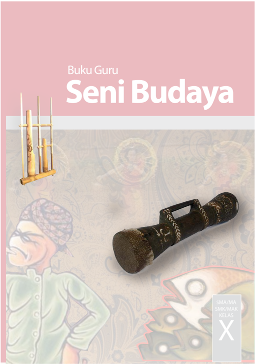

> **Deskripsi Visual:** Buku Guru Seni Budaya menampilkan berbagai elemen visual yang menarik untuk membantu pembaca memahami konsep-konsep seni budaya. Gambar utama pada buku ini adalah sepatu tradisional Jawa, yang menunjukkan detail desain dan bahan yang digunakan dalam pembuatan sepatu tersebut. Gambar ini disertai dengan gambar-gambar lainnya yang menunjukkan peralatan seni budaya seperti alat musik tradisional dan ukiran kayu. 

Elemen-elemen utama yang ditampilkan meliputi sepatu tradisional Jawa, alat musik tradisional, dan ukiran kayu. Sepatu tradisional Jawa menunjukkan detail desain dan bahan yang digunakan dalam pembuatan sepatu tersebut, sementara alat musik tradisional menunjukkan peralatan seni budaya yang digunakan dalam budaya Jawa. Ukiran kayu menunjukkan teknik ukir tradisional yang digunakan dalam seni budaya Jawa.

Teks, angka, atau label penting yang terlihat pada buku ini adalah "Buku Guru Seni Budaya" yang terletak di bagian atas buku. Informasi kunci yang dapat diambil pembaca adalah bahwa buku ini mengkhususkan diri pada seni budaya Jawa, termasuk peralatan seni budaya dan teknik ukir tradisional.

 

---
## 📄 Halaman 2

### Hak Cipta © 201 7 pada Kementerian Pendidikan dan Kebudayaan Dilindungi Undang-Undang

Disklaimer: Buku ini merupakan buku guru yang  dipersiapkan Pemerintah dalam rangka implementasi Kurikulum 2013. Buku guru ini  disusun dan ditelaah oleh berbagai pihak di bawah koordinasi Kementerian Pendidikan dan Kebudayaan, dan dipergunakan dalam tahap awal penerapan Kurikulum 2013. Buku ini merupakan 'dokumen hidup' yang senantiasa diperbaiki,  diperbaharui,  dan  dimutakhirkan  sesuai  dengan  dinamika  kebutuhan  dan perubahan zaman. Masukan dari berbagai kalangan yang dialamatkan kepada penulis dan laman http://buku.kemdikbud.go.id atau melalui email buku@kemdikbud.go.id diharapkan dapat meningkatkan kualitas buku ini.

### Katalog Dalam Terbitan (KDT)

Indonesia. Kementerian Pendidikan dan Kebudayaan.

Seni Budaya : buku guru / Kementerian Pendidikan dan Kebudayaan.-- . Edisi Revisi Jakarta: Kementerian Pendidikan dan Kebudayaan, 201 7 . viii, 41 6 hlm. : ilus. ; 25 cm.

Untuk SMA/MA/SMK/MAK Kelas X ISBN  978-602-427-149-7 (jilid lengkap) ISBN  978-602-427-150-3 (jilid 1)

- Seni Budaya -- Studi dan Pengajaran
I. Judul

- Kementerian Pendidikan dan Kebudayaan
600

Penulis

:  Zackaria Soetedja, Dewi Suryati, Milasari, Agus Supriatna,

Penelaah

:  Widia Pekerti, Muksin, Bintang Hanggoro, Daniel H. Jacob, Fortunata Tyasrinestu, Rita Milyartini, Nur Sahid, Oco Santoso, Martono, Rusman Nurdin, M. Yoesoef, Dinny Devi, dan Djohan Salim.

Penyelia Penerbitan : Pusat Kurikulum dan Perbukuan, Balitbang, Kem

en dikbud.

Cetakan Ke-1, 2014 ISBN 978-602-282-462-6 ( Jilid 1 )

Cetakan Ke-2, 2016 (Edisi Revisi)

Cetakan Ke-3, 2017 (Edisi Revisi)

Disusun dengan huruf Minion Pro, 12 pt.

 

---
## 📄 Halaman 3

### Kata Pengantar

Dalam kurikulum pendidikan menengah di Indonesia saat ini, materi kesenian diajarkan melalui mata pelajaran Seni Budaya.  Dalam mata pelajaran ini diajarkan 4 bidang seni yaitu seni rupa, musik tari dan teater. Sekolah wajib menyelenggarakan 2 dari 4 bidang seni yang ditawarkan tersebut. Pembelajaran Seni Budaya di sekolah tidak saja mengajarkan keterampilan praktis berkarya seni atau mempertunjukkan karya seni, tetapi digunakan juga sebagai media pendidikan secara menyeluruh.

Pendidikan melalui mata pelajaran Seni Budaya ini pada hakekatnya merupakan proses pembentukan manusia (peserta didik) melalui seni. Pendidikan Seni Budaya secara umum berfungsi untuk mengembangkan kemampuan setiap peserta didik menemukan pemenuhan dirinya ( personal fulfillment) menjadi pribadi yang utuh. Makna budaya dalam pembelajaran Seni  Budaya  menunjukkan  upaya  mentransmisikan  (melestarikan  dan  mengembangkan) warisan  budaya  (kesenian)  yang  tersebar  diberbagai  suku  bangsa  di  Indonesia.  Melalui aktivitas  pembelajaran  seni  budaya,  peserta  didik  difasilitasi  untuk  memperluas  kesadaran sosial dan dapat digunakan sebagai jalan untuk menambah pengetahuan. Tujuan pembelajaran seni budaya ini sejalan dengan tanggung jawab yang luas dari tujuan pendidikan secara umum.

Materi pembelajaran seni budaya dalam buku ini merupakan revisi dari buku seni budaya sebelumnya berisi pengetahuan, materi dan cara belajar seni di sekolah dengan guru sebagai fasilitator yang menyediakan peluang bagi peserta didik untuk pemenuhan dirinya melalui pengalaman seni berdasarkan sesuatu yang dekat dengan kehidupan dan dunianya. Melalui pendidikan  seni  budaya  peserta  didik  diharapkan  dapat  melakukan  studi  tentang  warisan budaya artistik sebagai salah satu bentuk yang signifikan dari pencapaian prestasi manusia. Bentuk-bentuk  kesenian  yang  dijumpainya  dalam  kehidupan  sehari-hari  maupun  warisan budaya masyarakat didaerahnya  diharapkan  dapat  menumbuhkembangkan  kesadaran terhadap peran sosial seni di masyarakat. Dengan demikian, peserta didik akan menemukan seni sebagai sesuatu yang penuh arti, otentik dan relevan dalam kehidupannya.

Upaya perbaikan materi isi dan penyajian buku ini dari buku sebelumnya tentu tidak serta merta menjawab kebutuhan situasi dan kondisi pembelajaran seni budaya yang sangat beragam  di  tanah  air.  Jenis  materi  latihan  dan  evaluasi  yang  ada  dalam  buku  siswa  serta panduan pembelajarannya yang ada dalam buku guru sama sekali bukanlah sesuatu yang kaku dan tidak dapat disubtitusikan. Kompetensi profesional seorang guru seni budaya sangat memungkinkan untuk mengembangkan materi dan sajian buku ini sesuai dengan kecerdasan lokal dimana buku ini digunakan.

Akhir kata, upaya yang dilakukan tim penulis untuk menyempurnakan buku ini tentunya tidak dapat memuaskan semua pihak. Saran dan masukan dari guru sebagai pengguna dan fasilitator pembelajaran seni budaya di sekolah sangat berguna bagi penyempurnaan buku ini di masa yang akan datang.

Tim Penulis

 

---
## 📄 Halaman 4

### Daftar Isi

 

---
## 📄 Halaman 5

2

v

 

---
## 📄 Halaman 6

vi

 

---
## 📄 Halaman 8

---
**🖼️ Gambar/Diagram**

> **Deskripsi Visual:** Gambar ini adalah ilustrasi yang menunjukkan judul "Semester 1" dengan warna dasar hijau muda dan latar belakang berwarna putih. Ilustrasi ini memiliki desain yang elegan dengan pola spiral putih yang mengelilingi judul tersebut. Judul "Semester 1" ditulis dalam huruf merah yang terang dan berwarna cerah, memberikan kesan yang jelas dan menonjol. Desain的整体 menciptakan kesan yang formal dan profesional, yang sesuai untuk konteks pembelajaran atau kurikulum sekolah.

 

---
## 📄 Halaman 9

Semester 1

### BAB 1

### Kompetensi Inti

- KI 1 : Menghayati dan mengamalkan ajaran agama yang dianutnya
- KI 2 : Menghayati dan mengamalkan perilaku jujur, disiplin, tanggungjawab,  peduli  (gotong  royong,  kerjasama,  toleran, damai), santun, responsif dan pro-aktif dan menunjukkan sikap sebagai  bagian  dari  solusi  atas  berbagai  permasalahan  dalam berinteraksi secara efektif dengan lingkungan sosial dan alam serta dalam menempatkan diri sebagai cerminan bangsa dalam pergaulan dunia.
- KI 3 : Memahami,  menerapkan,  menganalisis  pengetahuan  faktual, konseptual, prosedural berdasarkan rasa ingintahunya tentang ilmu  pengetahuan,  teknologi,  seni,  budaya,  dan  humaniora dengan  wawasan  kemanusiaan,  kebangsaan,  kenegaraan,  dan peradaban  terkait  penyebab  fenomena  dan  kejadian,  serta menerapkan pengetahuan prosedural pada bidang kajian yang spesifik sesuai dengan bakat dan minatnya untuk memecahkan masalah
- KI 4 : Mengolah, menalar, dan menyaji dalam ranah konkret dan ranah abstrak  terkait dengan pengembangan dari yang dipelajarinya di sekolah secara mandiri, dan mampu menggunakan metoda sesuai kaidah keilmuan

### Berkarya Seni Rupa Dua Dimensi

 

---
## 📄 Halaman 10

### Kompetensi Dasar

- 2.1. : Menunjukkan perilaku jujur, disiplin, tanggung jawab, peduli (gotong royong, kerjasama, toleran, damai), santun, responsif dan  proaktif,    serta  menunjukkan  sikap  dalam  berinteraksi secara  efektif  dengan  lingkungan  sosial,  budaya,  dan  alam dalam berapresiasi dan berkreasi seni sebagai cerminan bangsa
- 3.1. : Memahami konsep, unsur, prinsip, bahan, dan teknik dalam berkarya seni rupa.
- 4.1. : Membuat karya seni rupa dua dimensi menggunakan berbagai media dengan melihat model

### Informasi Guru

Bab  I  Semester  I  dalam  buku  siswa  berisi  materi  berkarya  seni  rupa  2 dimensi.  Kompetensi  yang  diharapkan  setelah  siswa  mempelajari  bab  ini adalah pemahaman terhadap berbagai media atau medium  (alat, bahan dan teknik) yang digunakan dalam berkarya seni rupa 2 dimensi serta keterampilan untuk  membuat  karya  seni  rupa  dua  dimensi  dengan  melihat  model  atau contoh.  Materi berkarya seni rupa 2 dimensi ini setidaknya dapat dilakukan dalam 4 jam pelajaran. 2 jam pelajaran pertama guru memfasilitasi peserta didik  untuk  mempelajari  dan  memahami  jenis  karya  seni  rupa  (termasuk karya seni rupa 2 dimensi) serta bahan, alat dan teknik berkarya seni rupa. 2 jam  pelajaran  selanjutnya  guru  memfasilitasi  peserta  didik  dalam  kegiatan berkarya seni rupa dua dimensi.

Peta  materi  berkarya  seni  rupa  dua  dimensi  dapat  dilihat  pada  bagan berikut ini.Peta materi ini bukanlah urutan pembelajaran yang harus diikuti peserta didik tetapi pengkategorian untuk memudahkan proses pembelajaran dan penguasaan materi.

---
**🖼️ Gambar/Diagram**

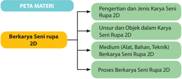

> **Deskripsi Visual:** Gambar ini adalah diagram yang menunjukkan struktur materi pembelajaran tentang berkarya seni rupa 2D. Diagram ini terdiri dari empat bagian utama:

1. Peta Materi: Ini adalah bagian dasar yang menjelaskan struktur materi yang akan dipelajari.

2. Pengertian dan Jenis Karya Seni Rupa 2D: Bagian ini membahas definisi dan variasi karya seni rupa dua dimensi.

3. Unsur-unsur dan Objek dalam Karya Seni Rupa 2D: Ini menjelaskan elemen-elemen yang terlibat dalam pembuatan karya seni rupa dua dimensi.

4. Medium (Alat, Bahan, Teknik): Bagian ini menguraikan berbagai alat, bahan, dan teknik yang digunakan dalam proses pembuatan karya seni rupa dua dimensi.

5. Proses Berkarya Seni Rupa 2D: Ini menunjukkan langkah-langkah yang harus dilalui dalam proses pembuatan karya seni rupa dua dimensi.

Elemen-elemen utama dalam diagram ini adalah peta materi, pengertian dan jenis karya seni rupa 2D, unsur-unsur dan objek dalam karya seni rupa 2D, medium (alat, bahan, teknik), dan proses berkarya seni rupa 2D. Relasi antara elemen-elemen ini adalah hubungan hierarkis, dengan peta materi sebagai dasar, kemudian berjalan ke elemen-elemen yang lebih spesifik.

Teks, angka, atau label penting yang terlihat dalam diagram ini meliputi judul "PETA MATERI", subjudul "Berkarya Seni rupa 2D", dan beberapa sub-subjudul yang menjelaskan masing-masing bagian dari diagram.

Informasi kunci yang dapat diambil pembaca meliputi struktur materi yang akan dipelajari, jenis-jenis karya seni rupa dua dimensi, elemen-elemen yang terlibat dalam pembuatan karya seni rupa dua dimensi, berbagai alat, bahan, dan teknik yang digunakan, serta langkah-langkah yang harus dilalui dalam proses pembuatan karya

 

---
## 📄 Halaman 11

### Tujuan Pembelajaran

Setelah  mempelajari  materi  Berkarya  Seni  rupa  2  Dimensi  ini  peserta didik diharapkan memiliki kemampuan dasar mengapresiasi karya seni rupa dengan memahami jenis dan, medium yang digunakan dalam proses berkarya seni rupa dua dimensi dan berkreasi membuat karya seni rupa dua dimensi berdasarkan  melihat  model  menggunakan  berbagai  alternatif  (medium) bahan, alat dan teknik berkarya seni rupa.

### A. Pengertian dan Jenis Karya Seni Rupa Dua Dimensi

### Informasi Guru

### Indikator Pembelajaran

Setelah mengikuti pembelajaran pengertian dan jenis karya seni rupa 2 dimensi, peserta didik diharapkan mampu:

- Membedakan karya seni rupa 2 dimensi dan 3 dimensi
- Mengidentifikasi  jenis karya seni rupa 2 dimensi,
- Mengidentifikasi  Fungsi karya seni rupa 2 dimensi
- Membandingkan jenis karya seni rupa 2 dimensi
- Membandingkan Fungsi karya seni rupa 2 dimensi,
Karya  seni  rupa  dapat  dikategorikan  berdasarkan  karakteristik  yang dimilikinya. Secara umum kita dapat membedakan karya seni rupa berdasarkan bentuk (dimensi) maupun fungsinya.Berdasarkan dimensinya, karya seni rupa dibagi dua yaitu, karya seni rupa dua dimensi yang mempunyai dua ukuran dan karya seni rupa tiga dimensi yang mempunyai tiga ukuran atau memiliki ruang.

---
**🖼️ Gambar/Diagram**

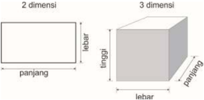

> **Deskripsi Visual:** Gambar ini adalah ilustrasi yang menunjukkan perbandingan antara objek dua dimensi dan tiga dimensi. Objek dua dimensi terdiri dari panjang, lebar, dan tinggi, sementara objek tiga dimensi memiliki panjang, lebar, dan tinggi. Ilustrasi ini membantu pembaca memahami konsep tentang ukuran dan bentuk geometris dalam dua dan tiga dimensi. Label "2 dimensi" dan "3 dimensi" digunakan untuk mengidentifikasi masing-masing objek, sementara panjang, lebar, dan tinggi disertakan sebagai elemen-elemen utama yang menjelaskan ukuran dan bentuk mereka. Informasi kunci yang dapat diambil dari gambar ini adalah bahwa objek dua dimensi hanya memiliki dua arah pengukurannya (panjang dan lebar), sedangkan objek tiga dimensi memiliki tiga arah pengukurannya (panjang, lebar, dan tinggi).

3

 

---
## 📄 Halaman 12

Berdasarkan  fungsi  atau  orientasinya,  karya  seni  rupa  ada  yang  dibuat dengan  pertimbangan  utama  untuk  memenuhi  fungsi  praktis  yang  biasa disebut seni rupa terapan ( applied art ). Pembuatan karya seni (rupa) terapan ini  umumnya  melalui  proses  perancangan  (desain).  Pertimbangan  aspekaspek  kerupaan  dalam  karya  seni  terapan  berfungsi  untuk  memperindah bentuk dan tampilan sebuah benda serta meningkatkan kenyamanan penggunaanya.  Sebaliknya  ada  karya  seni  rupa  yang  dibuat  dengan  tujuan untuk dinikmati keindahan dan keunikannya saja tanpa mempertimbangkan fungsi praktisnya. Karya seni rupa dengan kategori ini disebut karya seni rupa murni yang umumnya digunakan sebagai elemen estetis untuk 'memperindah' ruangan atau tempat tertentu.

Pengkategorian dalam karya seni rupa ini tidak bersifat mutlak, karena memungkinkan  dibuatnya  atau  hadirnya  karya-karya  seni  rupa  dengan kategori campuran. Sebagai contoh ada karya seni rupa yang dikategorikan sebagai  karya  seni  rupa  terapan  tetapi  pada  prakteknya  karya  tersebut digunakan sebagai hiasan atau elemen estetis saja. Perkembangan seni rupa pascamodern    menunjukkan  gejala  penggunaan  benda-benda  kebutuhan sehari-hari  sebagai  bagian  dari  sebuah  karya  seni.  Benda-benda  kebutuhan sehari-hari yang  dikategorikan karya seni rupa terapan tersebut tidak dihadirkan  karena  kebutuhan  praktisnya,  tetapi  bersifat  simbolik  mewakili ekspresi  senimannya.Pengkategorian  karya  digunakan  untuk  memudahkan (terutama) dalam mempelajarinya.

Selain berdasarkan bentuk (dimensi) dan fungsinya, karya seni rupa juga digolongkan  berdasarkan  karakteristik  mediu  (bahan,  alat  atau  tekniknya). Berdasarkan  karakteristik  ini  kita  mengenal  berbagai  jenis  karya  seni  rupa seperti seni lukis, seni patung,  seni  grafis,  seni  kriya  dan  sebagainya. Perkembangan ilmu pengetahuan dan teknologi turut mempengaruhi perubahan atau memperkaya kategorisasi karya seni rupa ini. Karena sifatnya yang sangat terbuka dalam hal bahan, alat dan teknik, maka pengkategorian berdasarkan dimensi dan orientasi pembuatannya ini di pilih untuk memudahkan kita dalam mempelajarinya. Perkembangan seni rupa pascamodern yang lebih dikenal dengan sebutan gerakan Seni Rupa Kontemporer bahkan cenderung menghilangkan pengkotak-kotakan dalam seni  sehingga  pengkategorian  berdasarkan  dimensi  dan  fungsi  lebih  sering digunakan sebagai langkah awal mempelajari dan memahaminya.

Karya seni rupa 2 dimensi yang paling populer dan paling banyak dikenali adalah karya seni lukis dan gambar ( drawing ). Dalam pembelajaran seni rupa di sekolah kedua jenis karya seni rupa 2 dimensi ini kerap dijadikan contoh oleh  guru.Untuk  meningkatkan  wawasan  peserta  didik,  guru  diharapkan dapat memberikan contoh  karya seni rupa dua dimensi selain gambar dan

 

---
## 📄 Halaman 13

lukisan. Karya-karya seni rupa 2 dimensi yang dikategorikan karya seni rupa terapan seperti poster, cover buku, kartu nama dll. dapat juga di jadikan contoh selain karya-karya seni kriya seperti kriya batik, kriya kayu, kriya keramik atau kriya anyam.

### B.  Unsur dan Obyek Karya Seni Rupa 2 Dimensi

Indikator Pembelajaran

- Mengidentifikasi unsur-unsur rupa dan prinsip penataannya dalam karya seni rupa 2 dimensi
- Mengidentifikasi unsur-unsur non fisik dalam karya seni rupa 2 dimensi
- Mengidentifikasi jenis obyek dalam karya seni rupa 2 dimensi,
- Membandingkan unsur-unsur rupa dan prinsip penataannya dalam karya seni rupa 2 dimensi,
- Membandingkan jenis obyek dalam karya seni rupa 2 dimensi,
Untuk memahami karya seni rupa diperlukan pengetahuan tentang unsurunsur serta obyek yang terdapat didalamnya. Dalam karya seni rupa dikenali dua  jenis  unsur  yaitu  unsur  fisik  dan  non  fisik.  Unsur  fisik  dapat  secara langsung dilihat dan atau diraba sedangkan unsur non fisik adalah prinsip atau kaidah-kaidah umum yang digunakan untuk menempatkan unsur-unsur fisik dalam  sebuah  karya  seni.  Unsur-unsur  fisik  dalam  sebuah  karya  seni  rupa pada dasarnya meliputi semua unsur visual yang terdapat pada sebuah benda seperti garis, raut (bidang dan bentuk), ruang, tekstur, warna dan gelap terang.

### · GARIS ( line )

Garis adalah unsur fisik yang mendasar dan penting dalam mewujudkan sebuah karya seni rupa. Garis memiliki dimensi memanjang dan mempunyai arah serta sifat-sifat khusus seperti: pendek, panjang, vertikal, horizontal, lurus, melengkung, berombak dan seterusnya.

---
**🖼️ Gambar/Diagram**

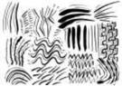

> **Deskripsi Visual:** Gambar ini adalah ilustrasi yang menunjukkan berbagai bentuk dan pola yang terlihat seperti garis dan titik. Gambar ini tampaknya menggambarkan konsep atau ide-ide yang berkaitan dengan struktur atau pola tertentu. Elemen utama yang terlihat meliputi berbagai bentuk garis yang berbeda, mulai dari lurus hingga bergelombang, serta titik-titik yang tampaknya membentuk pola. Teks, angka, atau label penting tidak terlihat pada gambar ini. Informasi kunci yang dapat diambil pembaca adalah bahwa gambar ini mungkin digunakan untuk menggambarkan konsep pola atau struktur dalam matematika, fisika, atau bidang lainnya yang memerlukan pemahaman tentang bentuk dan pola.

---
**🖼️ Gambar/Diagram**

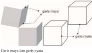

> **Deskripsi Visual:** Gambar ini adalah ilustrasi yang menunjukkan konsep garis maya dan garis nyata dalam bidang arsitektur atau desain. Gambar ini terdiri dari dua bagian utama: bagian depan dan bagian belakang. Bagian depan menunjukkan sebuah bangunan dengan detail struktur yang ditampilkan dengan garis maya, sementara bagian belakang menunjukkan bangunan yang sama tetapi ditampilkan dengan garis nyata untuk memberikan gambaran yang lebih jelas tentang bentuk dan ukuran bangunan.

Elemen-elemen utama dalam gambar ini adalah bangunan yang ditampilkan dengan dua jenis garis: garis maya dan garis nyata. Garis maya digunakan untuk menunjukkan detail struktur bangunan, sementara garis nyata digunakan untuk memberikan gambaran umum tentang bentuk dan ukuran bangunan. Relasi antara kedua jenis garis ini adalah bahwa garis maya digunakan untuk menunjukkan detail yang lebih spesifik, sementara garis nyata digunakan untuk memberikan gambaran umum.

Teks, angka, atau label penting yang terlihat dalam gambar ini adalah nama-nama bangunan yang ditampilkan pada kedua bagian. Informasi kunci yang dapat diambil pembaca dari gambar ini adalah bahwa garis maya digunakan untuk menunjukkan detail struktur bangunan, sedangkan garis nyata digunakan untuk memberikan gambaran umum tentang bentuk dan ukuran bangunan.

5

 

---
## 📄 Halaman 14

Garis  dapat  juga  digunakan  untukmengkomunikasikan  gagasan  dan mengekspresikan diri. Garis tebal tegak lurus misalnya, dapat memberi kesan kuat dan tegas, sedangkan garis tipis melengkung, memberi kesan lemah dan ringkih. Karakter garis yang dihasilkan oleh alat yang berbeda akan menghasilkan karakter yang berbeda pula.

### · RAUT (Bidang dan Bentuk)

Unsur rupa lainnya adalah 'raut' yang merupakan tampak, potongan atau wujud dari suatu objek . Istilah 'bidang' umumnya digunakan untuk menunjuk wujud  benda  yang  cenderung  pipih  atau  datar  sedangkan  'bangun'  atau 'bentuk'  lebih  menunjukkan  kepada  wujud  benda  yang  memiliki  volume ( mass ). Perhatikan gambar di samping dan di bawah ini.

---
**🖼️ Gambar/Diagram**

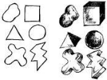

> **Deskripsi Visual:** Gambar ini adalah ilustrasi yang menunjukkan berbagai bentuk geometri dasar dan bentuk-bentuk yang dihasilkan dari penggabungan mereka. Gambar ini mencakup empat jenis bentuk dasar: persegi, lingkaran, segitiga, dan persegi panjang. Setiap bentuk tersebut diperlihatkan dalam bentuk yang berbeda, mulai dari bentuk dasarnya hingga bentuk yang lebih kompleks yang dihasilkan dari penggabungan dua atau lebih bentuk dasar tersebut.

Elemen-elemen utama dalam gambar ini adalah empat bentuk dasar geometri: persegi, lingkaran, segitiga, dan persegi panjang. Mereka disajikan dalam bentuk yang berbeda untuk menunjukkan kemungkinan penggabungan dan kombinasi yang dapat dilakukan. Setiap bentuk memiliki relasi dengan bentuk-bentuk lainnya melalui penggabungan dan pengurangan, yang menunjukkan bagaimana bentuk-bentuk ini dapat digunakan dalam konstruksi dan arsitektur.

Teks, angka, atau label penting yang terlihat dalam gambar ini tidak ada, karena gambar ini hanya menggambarkan bentuk-bentuk geometri tanpa teks atau angka tambahan. Namun, informasi kunci yang dapat diambil pembaca adalah bahwa bentuk-bentuk geometri ini dapat digunakan dalam berbagai aplikasi, termasuk arsitektur, desain, dan teknologi.

Dalam satu paragraf yang informatif, gambar ini menunjukkan empat bentuk dasar geometri: persegi, lingkaran, segitiga, dan persegi panjang, serta bagaimana mereka dapat digabungkan dan dikombinasikan untuk menciptakan bentuk-bentuk yang lebih kompleks. Gambar ini juga menunjukkan bagaimana bentuk-bentuk ini dapat digunakan dalam berbagai aplikasi, seperti arsitektur dan desain.

### · RUANG

Unsur ruang dalam sebuah karya seni rupa 2 dimensi menunjukan kesan dimensi dari obyek yang terdapat pada karya seni rupa tersebut. Unsur ruang pada  karya  seni  rupa  dua  dimensi  hanya  menunjukan  ukuran  (dimensi) panjang  dan  lebar  sedangkan  ruang  pada  karya  seni  rupa  tiga  dimensi terbentuk karena adanya volume yang menunjukkan kedalaman. Pada karya dua dimensi kesan ruang (kedalaman) dapat dihadirkan dengan pengolahan unsur-unsur  kerupaan  lainnya  seperti  perbedaan  intensitas  warna,  teranggelap, atau menggunakan teknik menggambar perspektif untuk menciptakan ruang  semu  (khayal).  Berbeda  dengan  pematung,  arsitektur  atau  desainer interior,  ruang  tiga  dimensi  pada  karya-karya  mereka  adalah  ruang  yang sebenarnya. Kesan tiga dimensional ini secara visual terlihat secara manipulatif bahwa objek yang dekat dengan mata pengamat berukuran lebih besar dari objek  sejenis  yang  letaknya  lebih  jauh.  Pada  beberapa  karya  seni  rupa  dua dimensi usaha untuk menampilkan kesan ruang seringkali ditunjukkan pula dengan  penumpukan  objek  atau  penempatan  objek  yang  dekat  dengan pengamat di bagian bawah dan objek yang lebih jauh pada bagian atas.

---
**🖼️ Gambar/Diagram**

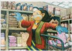

> **Deskripsi Visual:** Gambar ini adalah ilustrasi yang menunjukkan seorang guru sedang berbicara dengan muridnya di sebuah kelas. Guru tersebut mengenakan seragam sekolah tradisional dengan topi hitam dan baju berwarna biru tua, sementara muridnya mengenakan seragam sekolah modern dengan jaket berwarna merah dan celana berwarna putih. Kedua orang tersebut tampak sangat aktif dan berkomunikasi dengan baik.

Elemen-elemen utama dalam gambar ini meliputi guru dan murid, seragam sekolah, dan lingkungan kelas. Guru dan murid merupakan dua subjek utama yang saling berinteraksi. Seragam sekolah menunjukkan perbedaan antara generasi lama dan baru dalam pendidikan. Lingkungan kelas tampak nyaman dan penuh dengan meja belajar dan kursi yang disusun rapi.

Teks, angka, atau label penting tidak terlihat dalam gambar ini karena ia hanya berupa ilustrasi. Namun, informasi kunci yang dapat diambil pembaca adalah bahwa ini adalah gambar tentang interaksi antara guru dan murid dalam konteks pendidikan.

 

---
## 📄 Halaman 15

### · TEKSTUR

Tekstur atau barik adalah unsur rupa yang menunjukan kualitas taktil dari suatu permukaan atau penggambaran struktur permukaan suatu objek pada karya seni rupa. Berdasarkan wujudnya, tekstur dapat dibedakan atas tekstur asli dan tekstur buatan. Tekstur asli adalah perbedaan ketinggian permukaan objek yang nyata dan dapat diraba, sedangkan tekstur buatan adalah kesan permukaan objek yang timbul pada suatu bidang karena pengolahan unsur garis, warna, ruang, terang-gelap dsb.

### · WARNA

Warna pada dasarnya merupakan kesan yang ditimbulkan akibat pantulan cahaya yang mengenai permukaan suatu benda. Pada karya seni rupa, warna dapat  berwujud  garis,  bidang,  ruang  dan  nada  gelap  terang.  Menurut  teori warna Brewster, semua warna yang ada berasal dari tiga warna pokok (primer) yaitu  merah,  kuning  dan  biru.  Pencampuran  dua  warna  primer  akan menghasilkan  warna  sekunder  dan  bila  dua  warna  sekunder  digabungkan akan menghasilkan warna tersier.

Dalam  karya  seni  rupa  terdapat  beberapa  macam  penggunaan  warna, yaitu harmonis, heraldis dan murni. Penggunaan warna disebut harmonis jika penerapannya sesuai  dengan  kenyataan  sebenarnya,  seperti  daun  berwarna hijau, langit berwarna biru dan sebagainya. Sedangkan heraldis atau simbolis adalah  pengunaan  warna  untuk  menunjukkan  tanda  atau  simbol  tertentu, seperti hitam untuk melambangkan duka cita, merah untuk melambangkan amarah,  hijau  untuk  melambangkan  kesuburan  dsb.  Adapun  penggunaan warna secara murni adalah penerapan warna yang tidak terikat pada kenyataan objek atau simbol tertentu.

Dalam pewarnaan sebuah karya seni dikenal juga istilah polikromatik dan monokromatik. Pewarnaan secara monokromatik menunjukkan kecenderungan penggunaan satu jenis warna. Perbedaan untuk menunjukkan efek kedalaman dalam pewarnaan secara monokromatik umumnya dilakukan dengan mengurangi atau menambahkan intensitas warna tersebut.Sedangkan polikromatik menunjukkan penggunaan lebih dari satu jenis warna. Dengan kata lain polikromatik merupakan kebalikan dari monokromatik.

 

---
## 📄 Halaman 16

(Sumber

: Visual Art , Des 2004 - Jan 2005

Penggunaan warna pada karya seni rupa 2 dimensi secara murni (cenderung tidak terikat pada apa-apa)

### · Gelap-Terang

Unsur gelap terang pada karya seni rupa timbul karena adanya perbedaan intensitas cahaya yang jatuh pada permukaan benda. Perbedaan ini menyebabkan munculnya tingkat nada warna ( value )  yang  berbeda. Bagian yang terkena cahaya akan lebih terang dan bagian yang kurang terkena cahaya. Bagian yang kurang terkena cahaya akan tampak lebih gelap. Penerapan unsur gelap terang pada karya seni rupa dapat memberikan kesan volume (ruang) pada obyek yang divisualisasikannya.

 

---
## 📄 Halaman 17

---
**🖼️ Gambar/Diagram**

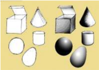

> **Deskripsi Visual:** Gambar ini adalah ilustrasi yang menunjukkan berbagai bentuk geometri dasar. Gambar ini mencakup lima jenis geometri: balok, kerucut, bola, tabung, dan lingkaran. Setiap bentuk memiliki warna dan bentuk yang unik untuk membedakannya. Balok berwarna biru dengan sisi panjang dan pendek, kerucut berwarna merah dengan sudut tumpul, bola berwarna hijau dengan permukaan bulat, tabung berwarna kuning dengan dua permukaan datar dan satu permukaan bulat, dan lingkaran berwarna oranye dengan bentuk sempurna. Setiap bentuk memiliki relasi dengan bentuk lainnya dalam konteks geometri dasar, seperti balok dan tabung memiliki permukaan datar, kerucut dan bola memiliki permukaan bulat, dan semua bentuk memiliki titik pusat. Teks, angka, atau label penting tidak ada pada gambar ini. Informasi kunci yang dapat diambil pembaca adalah bahwa gambar ini menunjukkan berbagai bentuk geometri dasar dan bagaimana mereka berinteraksi satu sama lain dalam konteks geometri dasar.

Penataan unsur-unsur visual pada sebuah karya seni rupa menggunakan prinsip-prinsip  dasar  berupa  kaidah  atau  aturan  baku  yang  diyakini  oleh seniman  dan  perupa  pada  umumnya  dapat  membentuk  sebuah  karya  seni yang baik dan indah. Kaidah atau aturan baku ini disebut komposisi, berasal dari  bahasa  latin compositio yang  artinya  menyusun  atau  menggabungkan menjadi satu. Komposisi dapat mencakup beberapa prinsip penataan seperti: kesatuan ( unity ); keseimbangan ( balance ) dan irama ( rhythm ), penekanan , proporsi dan keselarasan. Prinsip-prinsip  dasar  ini  merupakan  unsur  non fisik dari karya seni rupa.

Kesatuan  ( unity ), dalam  karya  seni  rupa  menunjukkan  keterpaduan berbagai  unsur  (fisik  dan  non  fisik)  dengan  karakter  yang  berbeda  dalam sebuah  karya.  Unsur  yang  berpadu  dan  saling  mangisi  akan  mendukung terwujudnya  karya  seni  yang  indah.  Prinsip  komposisi  ini  sering  pula ditunjukkan  dengan  penataan  berbagai  objek  yang  terdapat  dalam  sebuah karya seni.

Keseimbangan ( balance ), adalah penyusunan unsur-unsur yang berbeda atau  berlawanan  tetapi  memiliki  keterpaduan  dan  saling  mengisi  atau menyeimbangkan. Keseimbangan ini ada yang simetris ,  yaitu menunjukkan atau menggambarkan beberapa unsur yang sama diletakkan dalam susunan yang sama (kiri-kanan, atas-bawah, dll.) dan ada pula yang asimetris yaitu penyusunan unsurnya tidak ditempatkan secara sama namun tetap menunjukkan kesan keseimbangan

Irama ( rhythm ) tidak hanya dikenal dalam seni musik. Dalam seni rupa, irama merupakan kesan gerak yang timbul dari penyusunan atau perpaduan unsur-unsur seni dalam sebuah komposisi. Kesan gerak dalam irama tersebut dapat bersifat harmoni dan kontras , pengulangan (repetisi) atau variasi

 

---
## 📄 Halaman 18

---
**🖼️ Gambar/Diagram**

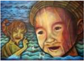

> **Deskripsi Visual:** Gambar ini adalah ilustrasi yang menampilkan dua karakter utama: seorang anak kecil dan seekor ikan. Anak kecil berdiri di tepi sungai, dengan wajah penuh emosi dan mata yang menunjukkan keinginan atau kebingungan. Ikan tersebut tampaknya sedang berenang di dekat anak kecil, mungkin mencoba untuk berinteraksi atau mendekatinya. Ilustrasi ini mungkin digunakan untuk menggambarkan konsep tentang hubungan manusia dengan alam, interaksi sosial, atau bahkan tema kehidupan sehari-hari.

Elemen-elemen utama dalam gambar meliputi:
1. Anak kecil: Dengan wajah penuh ekspresi, anak ini tampaknya menjadi fokus utama.
2. Ikan: Berada di dekat anak kecil, menunjukkan interaksi antara dua karakter.
3. Sungai: Latar belakang yang menunjukkan lingkungan alam, membantu dalam konteks tema.

Teks, angka, atau label penting tidak terlihat dalam gambar ini, sehingga informasi kunci yang dapat diambil pembaca tergantung pada konteks yang diberikan oleh penulis buku pelajaran tersebut.

Dalam satu paragraf, gambar ini mungkin digunakan untuk menjelaskan konsep tentang interaksi manusia dengan alam, interaksi sosial, atau bahkan tema kehidupan sehari-hari. Ini juga bisa digunakan sebagai contoh untuk diskusi tentang emosi dan perilaku manusia, serta bagaimana mereka berinteraksi dengan lingkungan sekitar mereka.

---
**🖼️ Gambar/Diagram**

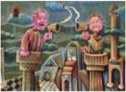

> **Deskripsi Visual:** Gambar ini adalah ilustrasi yang menampilkan dua karakter manusia berbicara di atas sebuah platform tinggi. Karakter pertama, seorang pria tua dengan topi hitam dan kacamata, sedang menggunakan mikrofon untuk berbicara. Karakter kedua, seorang anak muda dengan topi merah, tampaknya sedang mendengarkan dengan serius. Di latar belakang, terlihat pemandangan kota dengan bangunan tinggi dan jembatan. Ilustrasi ini mungkin digunakan untuk menggambarkan konsep komunikasi publik, interaksi sosial, atau bahkan konsep pendidikan.

Elemen-elemen utama dalam gambar meliputi dua karakter manusia, platform tinggi, mikrofon, topi, kacamata, pemandangan kota, dan jembatan. Mikrofon dan topi menjadi elemen yang penting karena mereka menunjukkan aktivitas komunikasi dan penampilan karakter. Pemandangan kota dan jembatan memberikan konteks lingkungan yang lebih luas.

Teks, angka, atau label penting tidak terlihat dalam gambar ini. Namun, informasi kunci yang dapat diambil pembaca termasuk hubungan antara dua karakter, peran mikrofon dalam situasi tersebut, dan konteks lingkungan yang kompleks.

Dalam satu paragraf, gambar ini menunjukkan dua karakter yang berkomunikasi di atas platform tinggi, dengan mikrofon sebagai alat komunikasi utama. Pemandangan kota dan jembatan memberikan konteks lingkungan yang luas, menunjukkan bahwa komunikasi ini mungkin berlangsung dalam situasi publik atau formal.

Penataan unsur-unsur rupa ini dilakukan menggunakan berbagai teknik dan bahan pada berbagai medium membentuk obyek-obyek yang unik pada karya seni rupa 2 dimensi.

### C.  Medium (Bahan, Alat, dan Teknik)

Sebelum melakukan kegiatan berkarya seni rupa 2 dimensi, sangat penting bagi  peserta  didik  untuk  memiliki  pengetahuan  dan  pemahaman  berbagai alat,  bahan  dan  teknik  yang  biasa  digunakan  dalam  praktek  berkarya  seni. Usaha untuk mengenal karakter bahan, alat dan teknik ini dengan baik hanya dapat dilakukan peserta didik dengan kegiatan praktek secara langsung.

### •  Bahan Berkarya Seni Rupa

Bahan berkarya seni  rupa  adalah  material  habis  pakai  yang  digunakan untuk mewujudkan karya seni rupa tersebut. Sesuai dengan keragaman jenis karya seni rupa, bahan untuk berkarya seni rupa ini juga banyak macam dan ragamnya,  ada  yang  berfungsi  sebagai  bahan  utama  dan  ada  pula  sebagai bahan  penunjang.  Sebagai  contoh,  pada  umumnya  perupa  membuat  karya lukisan menggunakan kanvas dan cat sebagai bahan utamanya serta kayu dan

 

---
## 📄 Halaman 19

paku  sebagai  bahan  penunjang.  Kayu  digunakan  sebagai  bahan  bingkai ( spanram )  untuk menempatkan kanvas dan paku untuk mengaitkan kanvas pada permukaan kayu bingkai tersebut.

Bahan untuk berkarya seni rupa dapat dikategorikan menjadi bahan alami dan  bahan  sintetis  berdasarkan  sumber  bahan  dan  proses  pengolahannya. Bahan baku alami adalah material  yang  bahan  dasarnya  berasal  dari  alam. Bahan-bahan ini dapat digunakan secara langsung tanpa proses pengolahan secara kimiawi di pabrik atau industri terlebih dahulu. Adapun bahan baku olahan adalah bahan-bahan alam yang telah diolah melalui proses pabriksasi atau industri tertentu menjadi bahan baru yang memiliki sifat dan karakter khusus. Berdasarkan sifat materialnya, bahan berkarya seni rupa ini dapat juga dikategorikan ke dalam bahan keras dan bahan lunak, bahan cair dan bahan padat dan sebagainya.

### •  Alat Berkarya Seni Rupa

Alat untuk berkarya seni rupa sangat banyak jenis dan ragamnya. Beberapa karya seni rupa bahkan memiliki peralatan khusus yang tidak dipergunakan pada jenis karya lainnya. Tetapi ada juga alat atau bahan yang dipergunakan hampir disemua proses berkarya seni rupa. Alat-alat tulis (gambar) misalnya, adalah  peralatan  yang  digunakan  dalam  proses  pembuatan  hampir  seluruh jenis karya seni rupa, terutama saat membuat rancangan karya seni tersebut.

Dalam  berkarya  seni  rupa  dua  dimensi  setidaknya  dikenal  beberapa kategori alat utama untuk berkarya yaitu alat untuk membentuk, menggambar dan mewarnai serta alat mencetak (mendupilkasi). Seperti juga bahan, selain kategori alat utama tersebut, kita juga mengenal alat-alat bantu lainnya yaitu alat-alat  yang  peruntukannya  tidak  secara  khusus  untuk  kegiatan  berkarya seni rupa tetapi sangat diperlukan dalam kegiatan berkarya seni rupa seperti: alat  pemotong  (pisau  dan  gunting),  alat  pengering,  alat  pengukur  dan sebagainya. Alat-alat ini bersifat penunjang untuk memudahkan  atau melancarkan proses pembuatan karya.

Karena kemajuan teknologi, saat ini semua fungsi alat yang dipergunakan dalam berkarya seni rupa relatif dapat dilakukan oleh komputer. Walaupun demikian perlu  disadari  betul  bahwa  komputer  hanyalah  alat  bantu.  Karya seni bagaimanapun juga membutuhkan kepekaan rasa yang sulit dihasilkan oleh  program  komputer.  Kepekaan  rasa  adalah  kompetensi  unik  dan  khas yang hanya dimilki manusia, berbeda antara satu orang dengan orang lainnya.

 

---
## 📄 Halaman 20

### •  Teknik Berkarya Seni Rupa

Dalam  membuat  karya  seni  rupa  murni  atau  terapan  dibutuhkan keterampilan teknis menggunakan alat dan mengolah bahan untuk mewujudkan objek pada bidang garap. Sebagai contoh, untuk mewujudkan sebuah objek dalam karya lukisan, seorang perupa atau seniman lukis dituntut menguasai keterampilan teknis menggunakan alat (kuas) dan mengolah bahan (cat) pada kanvas (bahan). Seorang pematung dituntut menguasai keterampilan teknis  menggunakan  alat  memahat  dan  mengolah  bahan  kayu  untuk mewujudkan karya seni patung.

Karya seni rupa ada juga yang dinamai berdasarkan teknik utama yang digunakan  dalam  pembuatannya.  Seni  kriya  Batik  misalnya,  menunjukkan jenis karya seni rupa yang dibuat dengan teknik membatik, begitu pula Seni kriya anyam, untuk menamai jenis karya seni rupa yang dibuat dengan teknik menganyam.

Beragam jenis dan karakteristik bahan yang digunakan dalam berkarya seni  rupa  memerlukan beragam alat dan teknik untuk mengolahnya. Suatu teknik  berkarya  seni  rupa  mungkin  saja  secara  khusus  digunakan  sebagai teknik utama dalam mewujudkan satu jenis karya seni rupa tetapi mungkin juga digunakan untuk mewujudkan jenis karya seni rupa lainnya.

### Proses Pembelajaran

Proses  pembelajaran  berkarya  seni  rupa  dua  dimensi  menggunakan pendekatan  saintifik  (mengamati,  menanya,  mengeksplorasi,  mengasosiasi dan  mengkomunikasikan).  Adapun  model  pembelajaran  yang  digunakan dapat  memilih  beberapa  model  yang  relevan  seperti  model  pembelajaran kolaboratif,  model  pembelajaran  penemuan,  model  pembelajaran  berbasis proyek dsb.

Secara umum  langkah-langkah pendekatan saintifik dalam proses pembelajaran  apresiasi  karya  seni  rupa  2  dimensi  dapat  diuraikan  sebagai berikut.

### Mengamati

- Siswa dimotivasi dan difasilitasi untuk melihat karya seni rupa dua dimensi melalui media cetak (buku, majalah, brosur, dsb.),  internet dan kegiatan pameran
- Siswa  dimotivasi  dan  difasilitasi  untuk    melihat  dan  mengamati  bahan, teknik dan alat-alat yang digunakan dalam pembuatan karya seni rupa dua dimensi

 

---
## 📄 Halaman 21

- Siswa  dimotivasi  dan  difasilitasi  untuk  melihat  dan  mengamati  proses pembuatan (teknik dan langkah-langkah pembuatan) berbagai karya seni rupa dua dimensi
Dalam  kegiatan  mengamati  ini  guru  dapat  menggunakan  berbagai  media pembelajaran  seperti  media  benda  konkrit,  foto,  gambar  maupun  media elektronik.

### Menanya

- Siswa dimotivasi dan difasilitasi untuk bertanya tentang bahan, alat dan teknik yang digunakan dalam pembuatan karya seni rupa dua dimensi
- Siswa dimotivasi dan difasilitasi untuk bertanya tentang langkah-langkah membuat  karya seni rupa dua dimensi
- Siswa dimotivasi dan difasilitasi untuk bertanya tentang teknik dalam membuat  karya seni rupa dua dimensi

### Mengeksplorasi

- Siswa dimotivasi dan difasilitasi untuk mengumpulkan informasi  tentang bahan, teknik dan alat yang digunakan dalam pembuatan karya seni rupa dua dimensi
- Siswa dimotivasi dan difasilitasi untuk mengumpulkan informasi  tentang teknik dan langkah-langkah membuat  karya seni rupa dua dimensi

### Mengasosiasi

- Siswa dimotivasi dan difasilitasi untukmembandingkan media (bahan, alat dan teknik),  jenis,  simbol dan  nilai estetis yang terkandung di dalam berbagai karya seni rupa dua dimensi
- Siswa dimotivasi dan difasilitasi untuk menghubungkan data-data yang diperoleh berkaitan dengan media (bahan, alat dan teknik),  jenis,  simbol dan  nilai estetis  yang terkandung di dalam berbagai karya seni rupa dua dimensi

### Mengomunikasikan

- Siswa dimotivasi dan difasilitasi untukmenyampaikan hasil pengumpulan dan simpulan informasi yang diperoleh berkaitan dengan media (bahan, alat dan teknik),  jenis,  simbol dan  nilai estetis karya seni rupa
- Siswa dimotivasi dan difasilitasi untuk mempertanggung jawabkan secara lisan atau  tulisan  mengenai  karya seni rupa dua dimensi yang dibuat.

 

---
## 📄 Halaman 22

Dalam proses pembelajaran guru cenderung bertindak sebagai motivator dan fasilitator bagi siswa dalam menggali informasi tantang media (bahan, alat dan teknik),  jenis,  simbol dan  nilai estetis karya seni rupa. Hindari pemberian materi atau informasi yang bersifat tuntas sehingga siswa tidak termotivasi untuk mencari informasi lebih lanjut. Berbagai sumber pembelajaran atau sumber informasi tentang media,  jenis,  simbol dan  nilai estetis karya seni rupa perlu disampaikan oleh guru, demikian pula dengan cara untuk memperoleh informasi tersebut.

### Konsep Umum

- Karya seni rupa 2 dimensi adalah jenis karya seni rupa yang penikmatan atau pencerapan obyeknya hanya pada satu sisi saja
- Karya  seni  rupa  2  dimensi  dapat  dikategorikan  ke  dalam  karya  seni rupa  terapan  dan  seni  rupa  murni  berdasarkan  orientasi  atau  tujuan pembuatannya
- Medium adalah bahan, alat  dan  teknik  yang  digunakan  dalam  berkarya seni rupa
- Bahan adalah semua material habis pakai yang digunakan dalam mewujudkan karya seni rupa
- Alat adalah benda yang digunakan untuk mengolah bahan dalam mewujudkan karya seni rupa
- Teknik adalah cara berkarya seni rupa dengan bantuan alat untuk mengolah bahan tertentu dalam mewujudkan karya seni rupa
- Obyek adalah visualisasi dari penataan unsur-unsur fisik dan non fisik pada medium karya seni rupa

### Pengayaan

Dalam pembelajaran apresiasi karya seni rupa dua dimensi ini, pengayaan materi dapat diberikan dengan cara sebagai berikut

- Memberikan contoh sebanyak-banyaknya karya seni rupa dua dimensi baik  yang  tergolong  karya  seni  rupa  terapan  maupun  karya  seni  rupa murni. Berikan pula contoh karya seni rupa terapan yang dimanfaatkan sebagai benda hias atau estetis saja.
- Menunjukkan  berbagai  contoh  karya  seni  rupa  dua  dimensi  dengan penataan  unsur-unsur  visualnya  sederhana  maupun  yang  kompleks. Berikan contoh karya seni rupa tradisional maupun modern, karya seni rupa daerah, nasional maupun mancanegara.
- Memberikan  contoh-contoh  bahan,  alat,  dan  teknik  yang  digunakan dalam berkarya seni rupa dua dimensi tidak hanya bahan, alat dan teknik

 

---
## 📄 Halaman 23

yang konvensional (umum digunakan) tetapi juga bahan, alat dan teknik yang nonkonvensional (tidak umum digunakan).

Kegiatan pengayaan dalam pembelajaran seni rupa dua dimensi ini sangat bermanfaat  untuk  membuka  wawasan  peserta  didik,  memberikan  stimulus untuk berfikir dan berkarya secara lebih kreatif.

### Penilaian

Materi dalam buku siswa telah memuat latihan yang dapat dimanfaatkan oleh  guru  untuk  memberikan  penilain  terhadap  peserta  didik.  Beberapa latihan  dalam  buku  siswa  yang  dapat  dimanfaatkan  dalam  pembelajaran apresiasi karya seni rupa dua dimensi ini diantaranya sebagai berikut.

### Contoh latihan 1.

- Mengidentifikasi bahan, alat dan teknik, pada karya seni rupa 2 dimensi
- Mengidentifikasi obyek pada karya seni rupa 2 dimensi
- Mengidentifikasi unsur-unsur rupa pada karya seni rupa 2 dimensi
- Mengidentifikasi jenis karya seni rupa pada karya seni rupa 2 dimensi
- Dapatkah kalian mengidentifikasi bahan yang digunakan pada karya seni rupa 2D tersebut?
- Dapatkah kalian mengidentifikasi teknik yang digunakan pada karya seni rupa 2D tersebut?
- Dapatkah kalian mengidentifikasi alat yang digunakan pada karya seni rupa 2D tersebut?
- Dapatkah kalian menunjukkan unsurunsur rupa yang terdapat pada karya seni rupa 2D tersebut?
- Obyek apa saja yang terdapat pada karya seni rupa 2D tersebut?

---
**🖼️ Gambar/Diagram**

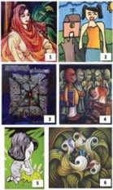

> **Deskripsi Visual:** Gambar-gambar dari buku pelajaran ini menunjukkan berbagai jenis visual yang digunakan untuk membantu pemahaman materi. Beberapa elemen utama yang terlihat antara lain:

1. Ilustrasi: Gambar 1 menunjukkan seorang wanita dengan pakaian tradisional, mungkin menggambarkan karakter atau tokoh dalam cerita. Gambar 2 menampilkan dua orang yang tampak berbicara, mungkin menunjukkan dialog atau interaksi sosial. Gambar 3 menampilkan sebuah papan tulis dengan teks, mungkin menunjukkan materi pembelajaran atau informasi penting. Gambar 4 menampilkan beberapa orang yang tampak berbicara, mungkin menunjukkan dialog atau interaksi sosial. Gambar 5 menampilkan seorang anak yang tampak sedang bermain, mungkin menunjukkan aktivitas atau permainan dalam konteks pembelajaran. Gambar 6 menampilkan beberapa orang yang tampak berbicara, mungkin menunjukkan dialog atau interaksi sosial.

2. Elemen-elemen utama dan relasinya: Gambar-gambar ini menunjukkan berbagai aspek dari pembelajaran dan interaksi sosial, mulai dari karakter dan tokoh, hingga dialog dan interaksi sosial. Gambar-gambar ini juga menunjukkan berbagai bentuk visual yang digunakan untuk membantu pemahaman materi, seperti ilustrasi, gambar, dan papan tulis.

3. Teks, angka, atau label penting yang terlihat: Gambar 3 menunjukkan sebuah papan tulis dengan teks, yang mungkin merupakan informasi penting atau materi pembelajaran. Namun, tidak ada angka atau label yang terlihat pada gambar-gambar lainnya.

4. Informasi kunci yang dapat diambil pembaca: Gambar-gambar ini menunjukkan berbagai aspek dari pembelajaran dan interaksi sosial, mulai dari karakter dan tokoh, hingga dialog dan interaksi sosial. Gambar-gambar ini juga menunjukkan berbagai bentuk visual yang digunakan untuk membantu pemahaman materi, seperti ilustrasi, gambar, dan papan tulis.

 

---
## 📄 Halaman 24

- Bagaimanakah penataan unsur-unsur rupa pada karya seni rupa 2D tersebut?
- Manakah karya seni rupa 2D yang memiliki fungsi sebagai benda pakai?
- Manakah karya seni rupa 2D yang paling menarik menurut kalian? Jelaskan alasan ketertarikan kalian!

---
**📊 Tabel**

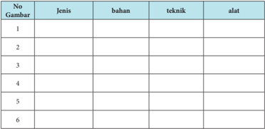

Tabel ini berisi informasi tentang jenis, bahan, teknik, dan alat yang digunakan dalam beberapa proses atau tugas tertentu. Topik utama tabel ini adalah pengetahuan dasar tentang metode atau teknik tertentu. Kolom-kolomnya mencakup nomor gambar, jenis, bahan, teknik, dan alat. Data atau pola penting yang terlihat adalah bahwa setiap baris menunjukkan informasi spesifik tentang satu proses atau tugas, dengan nomor gambar sebagai identifikasi unik untuk setiap baris. Ini membantu dalam memahami hubungan antara jenis, bahan, teknik, dan alat dalam setiap proses.

### Format Diskusi Hasil Pengamatan

Nama Siswa

: …………………………………………………

NIS

: …………………………………………………

Hari/Tanggal Pengamatan

: …………………………………………………

### Karya 1

---
**📊 Tabel**

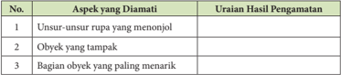

Tabel ini berisi informasi tentang aspek-aspek yang diamati dalam pengamatan objek. Topik utama tabel adalah "Hasil Pengamatan" dan terdiri dari tiga kolom: 1) Unsur-unsur rupa yang menonjol, 2) Obyek yang tampak, dan 3) Bagian obyek yang paling menarik. Data penting yang terlihat adalah bahwa pengamatan ini fokus pada detail visual dari objek, mencakup unsur-unsur rupa yang menonjol, oboek yang tampak, dan bagian yang paling menarik. Ini menunjukkan bahwa pengamatan ini mungkin dilakukan untuk memahami struktur atau bentuk objek secara lebih mendalam.

 

---
## 📄 Halaman 25

---
**📊 Tabel**

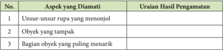

Tabel ini berisi aspek-aspek yang diamati dalam pengamatan terhadap sebuah objek, yaitu unsur-unsur rupa yang menonjol, obyek yang tampak, dan bagian obyek yang paling menarik. Topik utama tabel ini adalah analisis rupa dan keindahan objek. Kolom pertama berisi nomor urutan untuk setiap aspek yang diamati, sedangkan kolom kedua berisi deskripsi atau uraian hasil pengamatan tentang setiap aspek tersebut. Data penting yang terlihat dalam tabel ini adalah bahwa pengamatan dilakukan secara detail dan mendalam terhadap objek yang diamati, mencakup unsur-unsur rupa yang menonjol, bagian yang tampak, dan bagian yang paling menarik. Ini menunjukkan bahwa pengamatan ini bertujuan untuk memahami dan merumuskan karakteristik visual objek tersebut dengan lebih baik.

Contoh laihan 2.

### Contoh Latihan 2.

Mengidentifikasi jenis karya seni rupa berdasarkan dimensi dan fungsinya

Beberapa hal yang perlu diperhatikan guru dalam memberikan penilaian adalah keterbukaan terhadap berbagai alternatif jawaban. Siswa dapat memberikan berbagai jawaban yang menurut guru tidak lazim, tetapi tetap harus  diapresiasi  sepanjang  siswa  mampu  memberikan  penjelasan  dari jawabannya tersebut.

### Remedial

Peserta  didik  yang  belum  menguasai  materi  dapat  diberikan  remedial dengan  pengayaan  contoh-contoh  karya  seni  rupa  dua  dimensi  berupa reproduksi karya seni rupa atau pun dengan mengunjungi pameran, studio, perajin dan sebagainya untuk melihat karya seni rupa secara langsung. Guru juga dapat menghadirkan karya seni rupa di kelas melalui media elektronik maupun secara langsung dengan membawa karya seni rupa ke dalam kelas. Pengenalan dan latihan yang terus menerus akan membiasakan peserta didik mengenali jenis karya, bahan, alat, teknik dan unsur-unsur visual pembentuknya.

 

---
## 📄 Halaman 26

### Interaksi dengan orang tua

Peran  serta  orang  tua  dalam  pembelajaran  seni  rupa  dua  dimensi  ini sangatlah  besar.  Cobalah  untuk  meminta  partisipasi  orang  tua  melalui komentarnya terhadap karya yang di buat (dikumpulkan) siswa. Guru dapat meminta  siswa  untuk  mengerjakan  latihan  bersama  orang  tuanya  dengan terlebih  dahulu memberikan pemahaman pada siswa bahwa komentar atau tanggapan yang diberikan orang tuanya tidak harus sama dengan komentar yang diberikan peserta didik.

### D. Berkarya Seni Rupa 2 Dimensi

### Tujuan Pembelajaran

Setelah  mengikuti  pembelajaran  berkarya  seni  rupa  2  dimensi,  peserta didik diharapkan mampu:

- Membuat sketsa karya seni rupa 2D dengan melihat model mahluk hidup
- Membuat sketsa karya seni rupa 2D dengan melihat model benda mati ( still life )
- Membuat gambar atau lukisan karya seni rupa 2D dengan melihat model mahluk hidup
- Membuat gambar atau lukisan karya seni rupa 2D dengan melihat model benda mati
- Menunjukkan sikap bertanggung jawab dalam proses berkarya seni rupa dua dimensi,
- Menyajikan gambar atau lukisan karya seni rupa 2D hasil buatan sendiri
- Mempresentasikan gambar atau lukisan karya seni rupa 2D hasil buatan sendiri dengan lisan maupun tulisan.

### Informasi Guru

Setelah siswa mendapat bekal materi apresiasi karya seni rupa 2 dimensi khusunya yang berkaitan dengan bahan, alat, teknik, unsur-unsur rupa, obyek dan simbol, maka kegiatan selanjutnya adalah memotivasi dan memfasilitasi siswa untuk berkarya seni rupa dua dimensi.

Karya seni rupa dua dimensi tidak tercipta dengan sendirinya. Pembuatan karya seni rupa dua dimensi dilakukan melalui sebuah proses secara bertahap. Tahapan dalam berkarya ini berbeda antara satu jenis karya dengan jenis karya

 

---
## 📄 Halaman 27

lainnya mengikuti karakteiristik bahan, teknik, dan alat yang digunakan untuk mewujudkan karya seni rupa tersebut.Tahapan dalam berkarya seni rupa dua dimensi ini dimulai dari adanya motivasi untuk berkarya. Motivasi ini dapat berasal dari dalam diri maupun dari luar diri perupanya. Benda-benda kecil atau hal-hal sederhana dalam kehidupan kita sehari-hari dapat menjadi ide untuk berkarya seni rupa dua dimensi.Keindahan sebuah karya tidak hanya kemiripan  bentuknya  saja,  tetapi  kesungguhan  dalam  membuatnya  akan menjadikan  karya  tersebut  unik  dan  menarik.  Setiap  manusia  memiliki karakter dan keunikan yang berbeda-beda, demikian juga dengan karya yang di buat, walaupun menggunakan bahan, alat, teknik bahkan obyek yang sama sekalipun.

Membuat karya seni rupa 2 dimensi tidak selalu menggunakan bahan, alat yang mahal serta teknik yang rumit. Penggunaan bahan, alat dan teknik yang sederhana  sekalipun  dapat  menghasilkan  karya  yang  berkualitas  asalkan dibuat dengan sungguh-sungguh. Material dari bahan limbah dengan teknik menempel  seperti  mosaik,  kolase  dan  montase  dapt  digunakan  untuk mewujudkan sebuah karya seni rupa. Obyek yang dipilih dapat mengambil bentuk  benda  mati  atau  mahluk  hidup.  Berkarya  dengan  melihat  model, perwujudan akhirnya tidak selalu harus mirip dengan model yang dijadikan contoh.

### Proses Pembelajaran

Proses  pembelajaran  berkarya  seni  rupa  dua  dimensi  menggunakan pendekatan  scientifik  (mengamati,  menanya,  mengeksplorasi,  mengasosiasi dan mengkomunikasikan). Model pembelajaran yang digunakan diantaranya Model  Pembelajaran  mandiri  ( independent  learning )  dimana  peserta  didik belajar atas dasar kemauan sendiri dengan mempertimbangkan kemampuan yang  dimiliki  dengan  memfokuskan  dan  merefleksikan  keinginan.  Teknik yang  dapat  diterapkan  antara  lain  apresiasi-tanggapan,  asumsi  presumsi, visualisasi  mimpi  atau  imajinasi,  hingga  cakap  memperlakukan  alat/bahan berdasarkan temuan sendiri atau modifikasi dan imitasi, refleksi karya, melalui kontrak belajar, maupun terstruktur berdasarkan tugas yang diberikan ( inquiry, discovery, recovery ).

Secara umum pembelajaran berkarya seni rupa 2 dimensi menggunakan pendekatan saintifik dapat dilakukan melalui tahap-tahap sebagai berikut.

### Mengamati

- Siswa dimotivasi dan difasilitasi untuk melihat karya seni rupa dua dimensi melalui berbagai sumber media pembelajaran cetak maupun elektronik

 

---
## 📄 Halaman 28

- Siswa dimotivasi dan difasilitasi untuk mengamati bahan dan alat-alat yang digunakan dalam pembuatan karya seni rupa dua dimensi melalui berbagai sumber media pembelajaran cetak maupun elektronik
- Siswa dimotivasi dan difasilitasi untuk mengamati proses pembuatan (teknik dan langkah-langkah pembuatan) karya seni rupa dua dimensi melalui berbagai sumber media pembelajaran cetak maupun elektronik

### Menanya

- Siswa dimotivasi dan difasilitasi untuk bertanya tentang bahan, alat dan teknik yang digunakan dalam pembuatan karya seni rupa dua dimensi
- Siswa dimotivasi dan difasilitasi untuk bertanya tentang langkah-langkah membuat  karya seni rupa dua dimensi
- Siswa dimotivasi dan difasilitasi untuk bertanya tentang teknik dalam membuat  karya seni rupa dua dimensi

### Mengeksplorasi

- Siswa dimotivasi dan difasilitasi untuk mengumpulkan informasi tentang bahan dan alat yang akan digunakan dalam pembuatan karya seni rupa dua dimensi
- Siswa dimotivasi dan difasilitasi untuk mengumpulkan informasi  tentang teknik dan langkah-langkah membuat  karya seni rupa dua dimensi
- Siswa dimotivasi dan difasilitasi untuk bereksperimen dengan berbagai media yang akan digunakan dalam pembuatan karya seni rupa dua dimensi

### Mengasosiasi

- Siswa dimotivasi dan difasilitasi untuk membandingkan karya berbagai karya seni rupa 2 dimensi, mengenai : media, jenis, dan  nilai estetis yang terkandung di dalamnya
- Siswa dimotivasi dan difasilitasi untuk menghubungkan data dan informasi yang diperoleh melalui kegiatan berkarya berkaitan dengan media, jenis dan  nilai estetis  yang terkandung di dalamnya
- Siswa dimotivasi dan difasilitasi untuk memilih berbagai media yang akan digunakan dalam proses berkarya seni rupa 2 dimensi

### Mengomunikasikan

- Siswa dimotivasi dan difasilitasi untuk membuat sketsa karya seni rupa 2 dimensi dengan melihat model mahluk hidup
- Siswa dimotivasi dan difasilitasi untuk membuat sketsa karya seni rupa 2 dimensi dengan melihat model benda mati ( still life )

 

---
## 📄 Halaman 29

- Siswa dimotivasi dan difasilitasi untuk membuat gambar atau lukisan karya seni rupa 2 dimensi dengan melihat model mahluk hidup
- Siswa dimotivasi dan difasilitasi untuk membuat gambar atau lukisan karya seni rupa 2 dimensi dengan melihat model benda mati
- Siswa dimotivasi dan difasilitasi untuk menyajikan gambar atau lukisan karya seni rupa 2 dimensi hasil buatan sendiri
- Siswa dimotivasi dan difasilitasi untuk mempertanggung jawabkan secara lisan atau  tulisan  mengenai  karya seni rupa dua dimensi yang dibuat

### Konsep Umum

Berkarya seni rupa dua dimensi adalah kegiatan (proses) menggunakan medium (alat dan bahan serta teknik) tertentu melalui keterampilan teknik berkarya  seni  rupa  untuk  memvisualisasikan  gagasan,  pikiran  dan  atau perasaan seorang perupa pada bidang dua dimensi.

### Pengayaan

Waktu  yang  tersedia  di  sekolah  untuk  kegiatan  berkarya  seni  rupa  2 dimensi  sangat  terbatas  untuk  itu  guru  diharapkan  memberikan  motivasi kepada siswa untuk berkarya di luar jam pelajaran sekolah dengan memanfaatkan  potensi  material  berkarya  seni  rupa  yang  ada  dilingkungan tempat  tinggal  siswa.  Guru  memberikan  stimulasi  dengan  berbagai  contoh karya  seni  rupa  dua  dimensi  melalui  media  pembelajaran  cetak  maupun elektronik,  serta  penugasan  yang  dapat  dikerjakan  secara  individu  maupun kelompok.

### Penilaian Berkarya Seni Rupa Dua Dimensi

Penilaian berkarya seni rupa dua dimensi adalah pada proses dan hasil serta penyajiannya dalam bentuk pameran sederhana. Nilai untuk kompetensi berkarya seni rupa dua dimensi ini diperoleh melalui tes praktek dan proyek yang dikerjakan peserta didik seperti yang tercantum dalam buku siswa.

### Test Praktek

Tes praktek berkarya seni rupa dua dimensi diantaranya melalui pembuatan lukisan/gambar dengan melihat model mahluk hidup dan atau benda mati. Alat dan bahan yang digunakan adalah pinsil dan pewarna pada kertas. Alat dan  bahan  tersebut  bukan  sesuatu  yang  baku  atau  mutlak,  Guru  dapat

 

---
## 📄 Halaman 30

menggunakan  alternatif  alat  dan  bahan  lain  sesuai  dengan  potensi  yang dimiliki sekolah. Aspek-aspek yang dinilai meliputi kegiatan proses berkarya dan bentuk karya yang dihasilkannya. Dengan demikian dalam berkarya seni rupa dua dimensi aspek penilaian difokuskan pada penilaian proses (membuat rancangan, memilih alat, bahan dan sebagainya) dan penilaian hasil (kreativitas dalam pemilihan obyek model dan penempatan obyek pada bidang garapan, pamanfaatan dan penataan unsur-unsur visual dsb.)

### Format Penilaian Berkarya Seni Rupa 2 Dimensi dengan Melihat Model

---
**📊 Tabel**

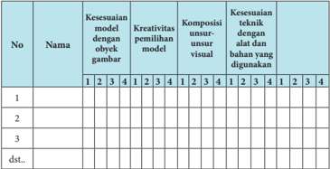

Tabel ini berisi informasi tentang kesesuaian model dengan objek gambar, kreativitas pemilihan model, komposisi unsur-unsur visual, dan kesesuaian teknik dengan alat dan bahan yang digunakan. Topik utamanya adalah analisis model yang dibuat oleh siswa. Kolom-kolomnya meliputi nama siswa, kesesuaian model dengan objek gambar, kreativitas pemilihan model, komposisi unsur-unsur visual, dan kesesuaian teknik dengan alat dan bahan yang digunakan. Data penting yang terlihat adalah bahwa setiap siswa memiliki nilai yang berbeda-beda dalam setiap kolom, menunjukkan variasi dalam penilaian model mereka.

### Keterangan

1 = Kurang Baik

2 = Cukup Baik

3 = Baik

4 = Sangat Baik

### Pedoman Penskoran :

Skor akhir menggunakan skala 1 sampai 4 Perhitungan skor akhir menggunakan rumus :

``

 

---
## 📄 Halaman 31

Contoh :

Skor diperoleh 14, skor tertinggi 4 x 5 pernyataan = 20, maka skor akhir :

Peserta didik memperoleh nilai :

Sangat Baik

: apabila memperoleh skor  A-  dan A

Baik

: apabila memperoleh skor  B- , B, dan B +

Cukup

: apabila memperoleh skor  C-, C, dan C +

Kurang

: apabila memperoleh skor  D dan D +

### Tabel konversi Nilai skala 4

---
**📊 Tabel**

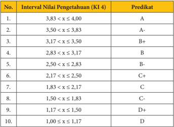

Tabel ini menunjukkan predikat akhir (A, A-, B+, B, B-, C+, C, D+, D) berdasarkan interval nilai pengetahuan (KI 4) yang diberikan. Topik utama tabel adalah klasifikasi predikat akhir berdasarkan interval nilai pengetahuan. Kolom pertama menunjukkan nomor interval nilai pengetahuan, sedangkan kolom kedua menunjukkan predikat akhir yang sesuai dengan interval tersebut. Data penting yang terlihat adalah bahwa predikat akhir A dan A- diberikan untuk interval nilai pengetahuan antara 3,83 hingga 4,00, sedangkan predikat akhir D dan D+ diberikan untuk interval nilai pengetahuan antara 1,00 hingga 1,17. Pola yang jelas adalah bahwa semakin rendah interval nilai pengetahuan, semakin rendah juga predikat akhirnya.

### Projek (pentas seni/pameran seni rupa)

Selain  penilaian  proses  dan  hasil,  yang  tidak  kalah  pentingnya  adalah penilaian paska kegiatan berkarya yaitu melalui proyek pameran dari karya seni rupa 2 dimensi yang telah dibuat. Proyek pameran ini bisa dilaksanakan pada akhir semester atau pada akhir tahun ajaran dalam kegiatan pekan seni. Penilaian pasca kegiatan berkarya lebih difokuskan pada kegiatan mempersiapkan tulisan pengantar pameran. Siswa diminta untuk membuat tanggapan secara lisan maupun tertulis terhadap karya yang dibuatnya maupun terhadap karya temannya. Format penilaian di susun sedemikian rupa untuk menilai hasil tanggapan siswa terhadap karya yang telah di buat maupun karya temannya.

 

---
## 📄 Halaman 32

### Remedial

Kegiatan remedial diberikan kepada siswa yang dianggap tidak mencapai kompetensi  dasar  yang  diharapkan.  Pemberian  remedial  memperhatikan karakter siswa dan materi yang akan di remedial. Dalam berkarya seni rupa dua dimensi remedial diberikan kepada siswa yang cenderung tidak mengikuti proses berkarya serta menunjukkan hasil pekerjaannya. Guru tidak memberikan remedial kepada hasil pekerjaan siswa sepanjang siswa menunjukkan kesungguhan dalam proses pembuatannya.

### Interaksi dengan orang tua

Waktu yang tersedia di sekolah untuk kegiatan berkarya seni rupa 2 dimensi  sangat  terbatas,  untuk  itu  guru  diharapkan  memberikan  motivasi kepada siswa untuk berkarya di luar jam pelajaran sekolah. Berkarya di luar jam  pelajaran  sekolah  dapat  dilakukan  di  sekolah  bersama  kegiatan  ekstra kurikuler maupun di rumah sebagai tugas dari guru. Mintalah orang tua siswa untuk  memberikan  memberikan  motivasi  kepada  putra-putrinya  dalam berkarya seni serta tanggapan terhadap karya seni rupa yang dibuatnya.

 

---
## 📄 Halaman 33

### Semester 1

### BAB 2

### Kompetensi Inti

- KI 1: Menghayati dan mengamalkan ajaran agama yang dianutnya
- KI 2: Menghayati dan mengamalkan perilaku jujur, disiplin, tanggungjawab, peduli (gotong royong, kerjasama, toleran, damai), santun,  responsif  dan  pro-aktif  dan  menunjukkan  sikap  sebagai bagian dari solusi atas berbagai permasalahan dalam berinteraksi secara  efektif  dengan  lingkungan  sosial  dan  alam  serta  dalam menempatkan  diri  sebagai  cerminan  bangsa  dalam  pergaulan dunia.
- KI 3: Memahami, menerapkan, menganalisis pengetahuan faktual, konseptual,  prosedural  berdasarkan  rasa  ingintahunya  tentang ilmu pengetahuan, teknologi, seni, budaya, dan humaniora dengan wawasan  kemanusiaan,  kebangsaan,  kenegaraan,  dan  peradaban terkait penyebab fenomena  dan kejadian, serta  menerapkan pengetahuan  prosedural  pada  bidang  kajian  yang  spesifik  sesuai dengan bakat dan minatnya untuk memecahkan masalah
- KI 4: Mengolah, menalar, dan menyaji dalam ranah konkret dan ranah abstrak  terkait dengan pengembangan dari yang dipelajarinya di sekolah secara mandiri, dan mampu menggunakan metoda sesuai kaidah keilmuan

### Berkarya Seni Rupa Tiga Dimensi

 

---
## 📄 Halaman 34

### Kompetensi Dasar

- 2.1. Menunjukkan perilaku jujur, disiplin, tanggung jawab, peduli (gotong royong, kerjasama, toleran, damai), santun, responsif dan proaktif,  serta menunjukkan sikap dalam berinteraksi secara efektif dengan lingkungan sosial, budaya, dan alam dalam berapresiasi dan berkreasi seni sebagai cerminan bangsa
- 3.1. Memahami karya seni rupa berdasarkan, jenis, tema, dan nilai estetisnya.
- 4.1. Membuat karya seni rupa tiga dimensi dengan melihat model

### Informasi Guru

Pada bab I peserta didik sudah mempelajari dan membuat karya seni rupa 2 dimensi. Peserta didik diharapkan sudah dapat membedakan karya seni rupa dua dimensi dengan karya seni rupa tiga dimensi. Dalam bab II ini peserta didik akan mendapatkan informasi yang mengantarkan mereka pada pemahaman karya seni rupa tiga dimensi melalui eksplorasi informasi dari berbagai sumber belajar serta melalui kegiatan berkarya seni rupa. Secara umum alur pembelajaran berkarya seni rupa tiga dimensi dijelaskan dalam bagan sebagai berikut.

---
**🖼️ Gambar/Diagram**

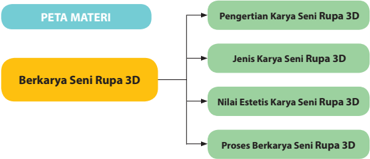

> **Deskripsi Visual:** Gambar tersebut adalah diagram yang menunjukkan struktur materi tentang berkarya seni rupa 3D. Diagram ini terdiri dari dua bagian utama: "PETA MATERI" dan "Berkarya Seni Rupa 3D". Peta materi terbagi menjadi empat subtopik utama, yaitu Pengertian Karya Seni Rupa 3D, Jenis Karya Seni Rupa 3D, Nilai Estetis Karya Seni Rupa 3D, dan Proses Berkarya Seni Rupa 3D.

Elemen utama dalam diagram ini adalah subtopik yang disebutkan di atas. Setiap subtopik memiliki hubungan dengan subtopik lainnya melalui garis bintang yang menghubungkannya. Ini menunjukkan bahwa setiap subtopik adalah bagian dari peta materi yang lebih besar.

Teks, angka, atau label penting yang terlihat dalam diagram ini adalah nama-nama subtopik yang disebutkan di atas. Informasi kunci yang dapat diambil pembaca adalah bahwa materi ini membahas berbagai aspek berkarya seni rupa 3D, mulai dari pengertian dasarnya hingga prosesnya.

Secara keseluruhan, gambar ini memberikan gambaran ringkas tentang struktur materi yang akan dipelajari dalam topik berkarya seni rupa 3D, serta menunjukkan hubungan antara subtopik-subtopik tersebut.

Pembelajaran berkarya seni rupa tiga dimensi ini minimal dilaksanakan dalam  dua  kali  pertemuan  (4  jam  pelajaran).  Dua  jam  pertama  berisi pembelajaran apresiasi karya seni rupa tiga dimensi, dan dua jam kedua berisi kegiatan berkarya seni rupa tiga dimensi. Pembelajaran apresiasi karya seni rupa  tiga  dimensi  memberikan  informasi  bagi  peserta  didik  dasar-dasar pemahaman  karya  seni  rupa  tiga  dimensi.  Dasar-dasar  pemahaman  ini diharapkan dapat dimanfaatkan dalam pembelajaran berkarya seni rupa tiga dimensi maupun kegiatan pada bab (semester) berikutnya yaitu pameran dan kritik karya seni rupa.

 

---
## 📄 Halaman 35

### A. Pengertian dan Jenis Karya Seni Rupa Tiga Dimensi

### Informasi Guru

### Tujuan Pembelajaran

Setelah mengikuti pembelajaran pengertian dan jenis karya seni rupa 3 dimensi, peserta didik diharapkan mampu:

- Menjelaskan pengertian karya seni rupa 3 dimensi
- Mengidentifikasi  jenis karya seni rupa 3 dimensi
- Membedakan jenis karya seni rupa 3 dimensi
- Membandingkan jenis karya seni rupa 3 dimensi
Unsur ruang merupakan salah satu ciri pembeda antara karya dua dimensi dengan tiga dimensi. Obyek karya seni rupa dua dimensi hanya bisa di lihat dari satu sisi saja, tetapi karya tiga dimensi dapat di lihat lebih dari dua sisi. Seperti juga karya seni rupa dua dimensi, berdasarkan fungsinya karya seni rupa tiga dimensi dibedakan menjadi karya yang memiliki fungsi pakai (seni rupa terapan applied art ) dan karya seni rupa yang hanya memiliki fungsi ekspresi saja (seni rupa murni -pure art ). Perbedaan fungsi ini pada dasarnya ditentukan oleh tujuan pembuatannya. Karya seni rupa sebagai benda pakai yang memiliki fungsi praktis dibuat dengan pertimbangan fungsinya. Dengan demikian bentuk benda atau karya seni rupa tersebut akan semakin indah dilihat  dan  semakin  nyaman  digunakan.  Informasikan  pada  peserta  didik bahwa mobil yang kita tumpangi, kursi yang kita duduki, telepon genggam, dan  banyak  benda  kebutuhan  sehari-hari  adalah  juga  karya  seni  rupa  tiga dimensi.  Mintalah  peserta  didik  untuk  menjelaskan  mengapa  benda-benda tersebut dikategorikan karya seni rupa tiga dimensi.

Karya seni rupa tiga dimensi dapat juga dibedakan berdasarkan temanya. Membedakan karya berdasarkan temanya ini dapat ditelusuri melalui obyekobyek  yang  ditampilkan  karya  seni  rupa  tiga  dimensi  tersebut.  Dalam pembelajaran seni rupa, tema dapat digunakan sebagai sarana untuk mengapresiasi  sekaligus  sebagai  sarana  untuk  menumbuhkan  kreativitas penciptaan. Cobalah untuk menentukan satu buah tema kemudian mintalah peserta  didik  untuk  mencari  informasi  karya  seni  rupa  tiga  dimensi  yang berhubungan dengan tema-tema tersebut. Dalam kegiatan penciptaan karya seni  rupa  tiga  dimensi  guru  juga  dapat  menggunakan  sebuah  tema  pokok sebagai  stimulus  bagi  peserta  didik  untuk  mengembangkan  gagasan  dan bentuk karya seninya.

 

---
## 📄 Halaman 36

### B. Nilai Estetis Karya Seni Rupa Tiga Dimensi

### Tujuan Pembelajaran

Setelah mengikuti pembelajaran pengertian dan jenis karya seni rupa 3 dimensi, peserta didik diharapkan mampu:

- Mengidentifikasi unsur estetis dalam karya seni rupa 3 dimensi
- Mendeskripsikan nilai estetis dalam karya seni rupa 3 dimensi
- Membandingkan nilai estetis dalam karya seni rupa 3 dimensi,
Mempelajari seni tidak terlepas dari persoalan estetika dan keindahan. Estetika identik dengan seni dan keindahan. Pendapat ini tidak salah, tetapi tidak sepenuhnya tepat. Perkembangan konsep dan bentuk karya seni menyebabkan pembicaraan tetntang estetika tidak lagi semata-mata merujuk pada karya seni yang indah dan sedap dipandang mata. Dengan memahami persoalan estetika dan seni diharapkan wawasan peserta didik dalam melakukan apresiasi, kritik maupun berkarya seni semakin terbuka. Menghadapi karya-karya seni yang dikategorikan 'tidak indah', peserta didik diharapkan tidak sekonyong-konyong  memberikan  penilaian  buruk,  tidak  pantas  dan  sebagainya.  Sebagai seorang  pelajar  mereka  akan  lebih  bijaksana  diarahkan  untuk  melihat  latar belakang dibalik penciptaan sebuah karya seni, mencari nilai keindahan dan kebaikan yang tersembunyi dari karya tersebut. Hal ini akan membantu peserta didik menjadi seorang kreator, apresiator dan kritikus seni yang baik.

Nilai estetis pada sebuah karya seni rupa dapat bersifat obyektif dan subyektif. Nilai estetis bersifat obyektif memandang keindahan sebuah karya seni rupa berada pada karya seni itu sendiri secara kasat mata. Keindahan sebuah karya  seni  rupa  tersusun  dari  komposisi  yang  baik,  perpaduan  warna  yang sesuai, penempatan obyek yang membentuk kesatuan dan sebagainya. Keselarasan dalam menata unsur-unsur visual ini dapat dikatakan sebagai salah satu nilai estetis yang dimiliki oleh sebuah karya seni rupa.

Tidak  demikian  halnya  dengan  nilai  estetis  yang  bersifat  subyektif, keindahan  tidak  hanya  pada  unsur-unsur  isik  yang  dicerap  oleh  mata  secara visual, tetapi ditentukan oleh selera penikmatnya atau orang yang melihatnya. Sebagai contoh ketika kita melihat sebuah karya seni lukis atau seni patung abstrak,  kita  dapat  menemukan  nilai  estetis  dari  penataan  unsur  rupa  pada karya tersebut. Berikan gambaran pada peserta didik bahwa sutau saat mungkin saja mereka merasa tertarik pada apa yang ditampilkan dalam sebuah karya seni  dan  merasa  senang  untuk  terus  melihatnya  bahkan  ingin  memilikinya walaupun mereka tidak tahu obyek apa yang ditunjukkan oleh karya tersebut. Berikan pemahaman pula bahwa kemungkinan temannya tidak tertarik pada

 

---
## 📄 Halaman 37

karya  yang  mereka  sukai  dan  lebih  tertarik  pada  karya  lainnya.  Perbedaan tersebut  digunakan  sebagai  contoh  untuk  menunjukkan  bahwa  nilai  estetis sebuah karya seni rupa dapat bersifat subyektif.

### Proses Pembelajaran

Proses pembelajaran berkarya seni rupa 3  dimensi  menggunakan pendekatan  saintifik  (mengamati,  menanya,  mengeksplorasi,  mengasosiasi dan  mengkomunikasikan).  Adapun  model  pembelajaran  yang  digunakan dapat  memilih  beberapa  model  yang  relevan  seperti  model  pembelajaran kolaboratif,  model  pembelajaran  penemuan,  model  pembelajaran  berbasis proyek dsb.

Secara umum  langkah-langkah pendekatan saintifik dalam proses pembelajaran  apresiasi  karya  seni  rupa  3  dimensi  dapat  diuraikan  sebagai berikut.

### Mengamati

- Siswa dimotivasi dan difasilitasi untuk melihat karya seni rupa tiga dimensi melalui media cetak (buku, majalah, brosur, dsb.),  internet dan kegiatan pameran
- Siswa  dimotivasi  dan  difasilitasi  untuk  mengamati  proses    pembuatan karya seni rupa tiga dimensi.
- Jika memungkinkan guru dapat mendemonstrasikan di depan kelas atau menggunakan media audio visual.  Kegiatan  pengamatan  ini  digunakan juga untuk menstimulasi siswa bertanya.

### Menanya

- Siswa dimotivasi dan difasilitasi untuk bertanya tentang konsep seni rupa tiga dimensi  yang ada dan berkembang saat ini.
- Siswa  dimotivasi  dan  difasilitasi  untuk  menanyakan  langkah-langkah membuat  karya seni rupa tiga dimensi.

### Mengeksplorasi

- Siswa dimotivasi dan difasilitasi untuk mengumpulkan informasi  tentang unsur-  unsur  dan  jenis-jenis  karya  seni  rupa  tiga  dimensi  secara  berkelompok maupun perorangan. Apabila tidak memungkinkan dilakukan sekaligus di  dalam kelas guru dapat memberikan tugas perorangannya (individu) sebagai tugas rumah.

### Mengasosiasi

- Siswa dimotivasi dan difasilitasi untuk membandingkan  karya seni rupa 3  dimensi,  mengenai:  bahan,  alat,  teknik  jenis  dan  nilai  estetis    yang terkandung di dalamnya

 

---
## 📄 Halaman 38

### Mengomunikasikan

- Siswa dimotivasi dan difasilitasi untuk menyampaikan hasil pengumpulan dan simpulan informasi yang diperoleh
- Siswa dimotivasi dan difasilitasi untuk mempertanggung jawabkan secara lisan atau  tulisan  mengenai  simpulan informasi yang diperoleh  tentang nilai estetis karya seni rupa tiga dimensi

### Konsep Umum

Estetika identik dengan seni dan keindahan, tetapi tidak selalu merujuk kepada karya seni yang secara visual indah dan enak dipandang mata. Karya seni  yang  secara  visual  tidak  indah  dan  tidak  enak  dipandang  mata  tetap memiliki nilai keindahan baik secara keseluruhan maupun bagian perbagian pada unsur-unsur pembentuknya atau pada isi dan pesan yang terdapat dalam karya tersebut.

### Pengayaan

Dalam pembelajaran apresiasi karya seni rupa tiga dimensi ini, pengayaan materi dapat diberikan dengan cara sebagai berikut.

- Memberikan contoh sebanyak-banyaknya karya seni rupa tiga dimensi baik yang tergolong karya seni rupa terapan maupun karya seni rupa murni. Berikan pula contoh karya seni rupa terapan yang dimanfaatkan sebagai benda hias atau estetis saja.
- Menunjukkan  berbagai  contoh  karya  seni  rupa  tiga  dimensi  dengan penataan  unsur-unsur  visualnya  sederhana  maupun  yang  kompleks. Berikan contoh karya seni rupa tradisional maupun modern, karya seni rupa daerah, nasional maupun mancanegara.
- memberikan  contoh-contoh  bahan,  alat,  dan  teknik  yang  digunakan dalam  berkarya  seni  rupa  dua  dimensi  tidak  hanya  bahan,  medium, alat  dan  teknik  yang  konvensional  (umum  digunakan)  tetapi  juga bahan,  medium, alat  dan  teknik  yang  nonkonvensional  (tidak  umum digunakan).
- Berikan contoh karya seni rupa tiga dimensi yang secara visual indah dan enak di pandang mata serta contoh karya seni rupa tiga dimensi yang secara visual 'tidak indah' dan tidak enak dipandang mata, kemudian beri penjelasan nilai estetis pada karya-karya tersebut khususnya karyakarya yang tergolong 'tidak indah' .
Kegiatan pengayaan dalam pembelajaran seni rupa tiga dimensi ini sangat bermanfaat  untuk  membuka  wawasan  peserta  didik,  memberikan  stimulus untuk berfikir dan berkarya secara lebih kreatif. Pengalaman estetis

 

---
## 📄 Halaman 39

memberikan  tanggapan  terhadap  berbagai  jenis  karya  dapat  dimanfaatkan untuk memberikan pengayaan pembelajaran sikap apresiatif terhadap perbedaan yang dijumpai peserta didik diluar pembelajaran seni rupa.

### Penilaian

Materi dalam buku siswa telah memuat latihan yang dapat dimanfaatkan oleh  guru  untuk  memberikan  penilain  terhadap  peserta  didik.  Beberapa latihan  dalam  buku  siswa  yang  dapat  dimanfaatkan  dalam  pembelajaran apresiasi karya seni rupa tiga dimensi ini diantaranya sebagai berikut.

### Test Tulis

Contoh Test pengetahuan apresiasi karya seni rupa 3 dimensi.

Jawablah pertanyaan berikut ini:

- Jelaskan pengertian karya seni rupa tiga dimensi
- Jelaskan pengertian tema dalam karya seni rupa
- Berikan contoh tema dalam karya seni rupa tiga dimensi.
- Apa yang dimaksud dengan nilai estetis memiliki sifat obyektif dan subyektif?
Contoh Test pemahaman apresiasi karya seni rupa 3 dimensi.

Mintalah peserta didik untuk mengamati beberapa gambar karya seni rupa tiga dimensi yang terdapat dalam bab 2 semester 1 buku siswa. Kemudian ajak mereka  untuk  mengidentifikasi  aspek-aspek  kerupaan  yang  terdapat  dalam karya tersebut.

 

---
## 📄 Halaman 40

- Dapatkah kamu mengidentifikasi bahan yang digunakan pada karya seni rupa 3 dimensi  tersebut?
- Dapatkah kamu mengidentifikasi teknik yang digunakan pada karya seni rupa 3 dimensi  tersebut?
- Dapatkah  kamu  mengidentifikasi  medium  yang  digunakan  pada karya seni rupa 3 dimensi  tersebut?
- Dapatkah kamu menunjukkan unsur-unsur rupa yang terda-pat pada karya seni rupa 3 dimensi  tersebut?
- Obyek apa saja yang terdapat pada karya seni rupa 3 dimensi  tersebut?
- Bagaimanakah penataan unsur-unsur rupa pada karya seni  rupa  3 dimensi  tersebut?
- Manakah  karya  seni  rupa  3  dimensi    yang  memiliki  fungsi  benda pakai?
- Manakah karya seni rupa 3 dimensi  yang paling menarik menurut kalian? Jelaskan alasan ketertarikan kalian!
Berdasarkan  hasil  pengamatan  peserta  didik  mintalah  mereka  untuk mengelompokkan dan mengisi tabel di bawah ini sesuai dengan jenis karya seni rupa 3 dimensi yang diamati

---
**📊 Tabel**

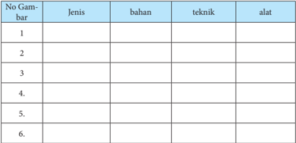

Tabel ini berisi informasi tentang jenis, bahan, teknik, dan alat yang digunakan dalam beberapa proses atau tugas tertentu. Topik utama tabel ini adalah pengetahuan dasar tentang metode atau teknik tertentu. Kolom-kolomnya mencakup nomor gambar, jenis, bahan, teknik, dan alat. Data atau pola penting yang terlihat adalah bahwa setiap baris menunjukkan informasi spesifik tentang satu proses atau tugas, dengan nomor gambar sebagai identifikasi unik untuk setiap baris tersebut. Ini membantu dalam memahami dan mengorganisir informasi secara efektif.

Selanjutnya mintalah peserta didik untuk mendiskusikan hasil pengamatannya  dalam  kelompok  kemudian  secara  individu  memberikan tanggapan hasil diskusi menggunakan contoh format di bawah ini.

 

---
## 📄 Halaman 41

### Format Diskusi Hasil Pengamatan

Nama Siswa :

NIS :

Hari/Tanggal Pengamatan :

---
**📊 Tabel**

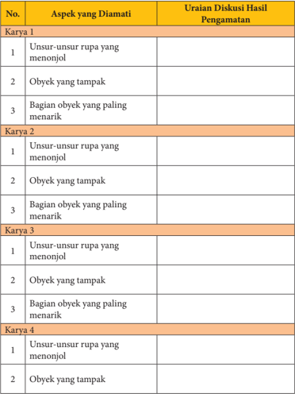

Tabel ini menunjukkan hasil diskusi tentang aspek-aspek yang diamati dalam karya-karya seni. Topik utama adalah aspek-aspek yang diamati dalam karya seni, seperti unsur-unsur rupa yang menonjol, obyek yang tampak, dan bagian obyek yang paling menarik. Tabel ini terdiri dari empat baris (karya 1, karya 2, karya 3, dan karya 4) dan tiga kolom (unsur-unsur rupa yang menonjol, obyek yang tampak, dan bagian obyek yang paling menarik). Data penting yang terlihat adalah bahwa semua karya memiliki aspek-aspek yang sama, yaitu unsur-unsur rupa yang menonjol, obyek yang tampak, dan bagian obyek yang paling menarik. Ini menunjukkan bahwa dalam analisis karya seni, beberapa aspek umum sering kali diamati dan dianalisis secara konsisten.

 

---
## 📄 Halaman 42

### No.

### Aspek yang Diamati

- 3 Bagian obyek yang paling menarik

### Karya 5

- 1 Unsur-unsur rupa yang menonjol
- 2 Obyek yang tampak
- 3 Bagian obyek yang paling menarik

### Karya 6

- 1 Unsur-unsur rupa yang menonjol
- 2 Obyek yang tampak
- 3 Bagian obyek yang paling menarik
Pada  buku  siswa  terdapat  beberapa  latihan  untuk  menstimulasi  siswa memahami karya seni rupa tiga dimensi.  Salah  satu  contoh  format  latihan untuk memahami karya seni rupa tiga dimensi tersebut adalah sebagai berikut.

### fungsi

- Pakai/terapan
- Ekspresi/hias

### Keterangan:

____________________________

____________________________

____________________________

____________________________

____________________________

____________________________

____________________________

____________________________

### Uraian Diskusi Hasil Pengamatan

 

---
## 📄 Halaman 43

Mintalah peserta didik untuk mengamati gambar-gambar yang terletak di sebelah kiri kemudian menandai dan mengisi keterangan pada kolom-kolom disebelahnya.

Amati karya-karya seni rupa tiga dimensi berikut ini, identifikasikan unsur-unsur  rupa  pada  karya-karya  seni  rupa  tiga  dimensi  tersebut kemudian cobalah cari pula tema dari karya-karya seni rupa tiga dimensi berikut ini.

---
**🖼️ Gambar/Diagram**

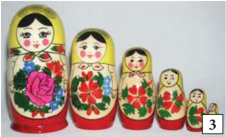

> **Deskripsi Visual:** Gambar ini adalah ilustrasi yang menunjukkan serangkaian boneka Rusia yang dikenal sebagai Matryoshka. Boneka-boneka ini terbuat dari kayu dan memiliki berbagai ukuran yang semakin kecil dari atas ke bawah. Mereka semua memiliki wajah yang sama dengan mata besar dan rambut pendek. Boneka terakhir memiliki tulisan "Матрёшка" (Matryoshka) di belakangnya. Setiap boneka memiliki desain unik dengan warna-warna cerah dan motif bunga yang menarik. Ilustrasi ini menunjukkan bagaimana boneka-boneka ini bisa disimpan satu dalam satu untuk membuat struktur yang menarik.

---
**🖼️ Gambar/Diagram**

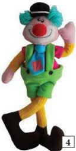

> **Deskripsi Visual:** Gambar ini adalah ilustrasi yang menampilkan karakteristik seorang penari cilik. Penari cilik tersebut berdiri dengan posisi yang menunjukkan gerakan tarian, dengan kaki di depan dan tangan di belakang. Penari cilik tersebut mengenakan pakaian tradisional Jerman yang mencakup celana pendek hijau, kaos biru dengan lengan panjang, dan sepatu yang sama warnanya. Penari cilik tersebut juga memakai topi hitam dan kacamata besar. Gambar ini menunjukkan bagaimana penari cilik biasanya dikenakan untuk pertunjukan tarian tradisional Jerman.

 

---
## 📄 Halaman 44

---
**📊 Tabel**

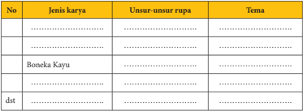

Tabel ini menunjukkan informasi tentang berbagai jenis karya dengan fokus pada unsur-unsur rupa dan tema mereka. Topik utama tabel adalah karya-karya yang memiliki unsur-unsur rupa dan tema tertentu. Kolom-kolomnya meliputi nomor urut (No.), jenis karya, unsur-unsur rupa, dan tema. Data penting yang terlihat adalah bahwa boneka kayu merupakan salah satu jenis karya yang memiliki unsur-unsur rupa seperti bentuk, warna, dan ukuran, serta tema yang berkaitan dengan kehidupan sehari-hari. Tabel ini membantu dalam memahami hubungan antara unsur-unsur rupa dan tema dalam berbagai jenis karya.

### Penugasan

Apabila  dalam  tugas  sebelumnya,  guru  menggunakan  contoh  gambar yang terdapat dalam buku siswa, maka untuk tugas selanjutnya guru meminta peserta  didik  untuk  mengumpulkan  sendiri  gambar/foto  karya-karya  seni rupa tiga dimensi. Mintalah mereka untuk mengumpulkan gambar (reproduksi) karya seni rupa tiga dimensi dari berbagai sumber (media cetak maupun  elektronik),  kemudian  buat  analisis  sederhana  berkaitan  dengan nama perupa (jika ada), jenis karya, medium, teknik, bahan, unsur fisik dan non fisik, obyek  dan simbol pada karya-karya tersebut. Buatlah dalam bentuk format analisis sederhana seperti contoh berikut ini.

 

---
## 📄 Halaman 45

Satu hal yang perlu diperhatikan guru dalam memberikan penilaian adalah keterbukaan terhadap berbagai alternatif jawaban. Siswa dapat memberikan berbagai jawaban yang menurut guru tidak lazim sekalipun tetapi tetap harus diapresiasi sepanjang siswa mampu memberikan penjelasan dari jawabannya tersebut.

### Contoh Format Penilaian

---
**📊 Tabel**

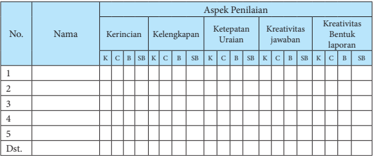

Tabel ini merupakan alat evaluasi untuk menilai kinerja siswa dalam berbagai aspek penilaian, seperti kerincian, kelengkapan, ketepatan urutan, kreativitas jawaban, dan kreativitas bentuk laporan. Topik utama tabel adalah penilaian kinerja siswa dalam berbagai aspek penilaian tersebut. Kolom-kolom yang ada meliputi nomor, nama, dan aspek penilaian. Data atau pola penting yang terlihat adalah bahwa tabel ini dirancang untuk membandingkan kinerja siswa dalam berbagai aspek penilaian, dengan menggunakan skala penilaian dari K (Kurang) hingga B (Baik). Ini membantu guru dalam menentukan kinerja siswa secara keseluruhan dan memberikan saran pembelajaran yang tepat.

 

---
## 📄 Halaman 46

K = Kurang Baik = 1

C = Cukup Baik = 2

B = Baik = 3

SB = Sangat Baik = 4

### Pedoman Penskoran :

Skor akhir menggunakan skala 1 sampai 4

Perhitungan skor akhir menggunakan rumus :

### Contoh :

Skor diperoleh 14, skor tertinggi 4 x 5 pernyataan = 20, maka skor akhir : 2,8

Peserta didik memperoleh nilai :

Sangat Baik

: apabila memperoleh skor  A - dan A

Baik

: apabila memperoleh skor  B - , B, dan B +

Cukup

: apabila memperoleh skor  C -, C, dan C +

Kurang

: apabila memperoleh skor  D dan D +

### Tabel konversi Nilai skala 4

---
**📊 Tabel**

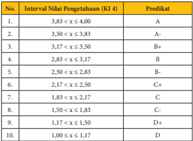

Tabel ini menunjukkan hubungan antara interval tingkat pendidikan (K3-4) dengan berbagai predikat yang mungkin diberikan kepada siswa. Topik utama tabel adalah hubungan antara tingkat pendidikan dan predikat akademik. Kolom pertama menunjukkan interval tingkat pendidikan, yang diurutkan dari 1 sampai 9. Kolom kedua menunjukkan predikat yang mungkin diberikan kepada siswa, yang diurutkan dari A sampai D. Data penting yang terlihat adalah bahwa predikat A sering diberikan pada siswa dengan tingkat pendidikan tertinggi (interval 1), sedangkan predikat D sering diberikan pada siswa dengan tingkat pendidikan terendah (interval 9). Pola ini menunjukkan bahwa predikat akademik mungkin lebih tinggi pada siswa dengan tingkat pendidikan yang lebih tinggi.

### Remedial

Peserta  didik  yang  belum  menguasai  materi  dapat  diberikan  remedial dengan  pengayaan  contoh-contoh  karya  seni  rupa  dua  dimensi  berupa reproduksi karya seni rupa atau pun dengan mengunjungi pameran, studio, perajin dan sebagainya untuk melihat karya seni rupa secara langsung. Guru juga  dapat  menghadirkan  karya  seni  rupa  secara  di  kelas  melalui  media elektronik  maupun  secara  langsung  dengan  membawa  karya  seni  rupa  ke dalam kelas. Pengenalan dan latihan yang terus menerus akan membiasakan peserta didik mengenali jenis karya, bahan, medium, teknik dan unsur-unsur visual pembentuknya.

 

---
## 📄 Halaman 47

### Interaksi dengan orang tua

Peran  serta  orang  tua  dalam  pembelajaran  seni  rupa  tiga  dimensi  ini sangatlah  besar.  Cobalah  untuk  meminta  partisipasi  orang  tua  melalui tanggapanya terhadap karya yang di buat (dikumpulkan) siswa. Guru dapat meminta  siswa  untuk  mengerjakan  latihan  bersama  orang  tuanya  dengan terlebih  dahulu memberikan pemahaman pada siswa bahwa komentar atau tanggapan yang diberikan orang tuanya tidak harus sama dengan komentar yang diberikan peserta didik. Tanggapan atau komentar dari orang tua tidak harus panjang lebar, catatan dalam bentuk beberapa baris kalimat dan tandatangan orang tua pada akhir lembaran tugas siswa cukup memadai sebagai langkah awal interaksi antara guru, peserta didik dan orang tua.

### C.  Berkarya Seni Rupa Tiga Dimensi

### Informasi Guru

### Tujuan Pembelajaran

Setelah men gikuti pembelajaran pengertian dan jenis karya seni rupa 3 dimensi, peserta didik diharapkan mampu:

- Membuat konsep berkarya seni rupa 3D
- Membuat sketsa karya seni rupa 3D dengan melihat model mahluk hidup
- Membuat sketsa karya seni rupa 3D dengan melihat model benda mati ( still life )
- Membuat karya seni rupa 3D dengan melihat model mahluk hidup
- Membuat karya seni rupa 3D dengan melihat model benda mati
- Menunjukkan sikap bertanggung jawab dalam proses berkarya seni rupa 3 dimensi,
- Menyajikan karya seni rupa 3D hasil buatan sendiri
- Mempresentasikan karya seni rupa 3D hasil buatan sendiri dengan lisan maupun tulisan.
Pembuatan karya seni rupa tiga dimensi yang paling sederhana sekalipun dilakukan dalam sebuah proses berkarya. Tahapan dalam berkarya ini berbedabeda  sesuai  dengan  karakteristik  bahan,  teknik,  alat  dan  medium  yang digunakan untuk mewujudkan karya seni rupa tersebut.

Tahapan dalam berkarya seni rupa tiga dimensi ini seperti juga karya seni rupa pada umumnya, dimulai dari adanya motivasi untuk berkarya. Motivasi ini dapat berasal dari dalam maupun diri perupanya. Ide atau gagasan berkarya

 

---
## 📄 Halaman 48

seni rupa tiga dimensi dapat diperoleh dari berbagai sumber. Ajaklah peserta didik untuk memperhatikan benda-benda dan peristiwa sehari-hari di sekitar tempat tinggalnya, amati berbagai karya seni rupa tiga dimensi dari berbagai media cetak maupun elektronik, kemudian mintalah mereka untuk mengembangkan hasil pengamatannya menjadi gagasan berkarya seni rupa. Mintalah mereka untuk memilih bahan, media, alat dan teknik yang paling dikuasai atau ingin dicobanya dan mulai berkreasi membuat karya seni rupa tiga dimensi.

Perhatikan  bagan  berikut  ini,  jelaskan  kembali  langkah-langkah  umum dalam  proses  berkarya  seni  rupa  tiga  dimensi  yang  ditunjukan  oleh  bagan tersebut.  Sertakanlah  contoh  berbagai  jenis  karya  seni  rupa  tiga  dimensi sehingga pemahaman peserta didik terhadap proses berkarya seni rupa tiga dimensi semakin lengkap.

---
**🖼️ Gambar/Diagram**

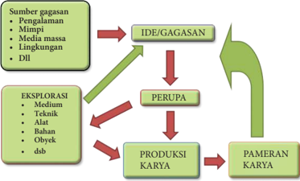

> **Deskripsi Visual:** Gambar ini adalah diagram yang menunjukkan proses pengembangan ide hingga pameran karya. Diagram ini terdiri dari empat tahap utama:

1. **Sumber gagasan** - Ini mencakup berbagai sumber inspirasi seperti pengalaman, mimpi, media massa, lingkungan, dll.

2. **IDE/GAGASAN** - Setelah sumber gagasan dikumpulkan, ide atau gagasan dibentuk.

3. **PERUPA** - Tahap ini melibatkan pengecekan dan perbaikan ide untuk memastikan kualitas dan relevansi.

4. **PRODUKSI KARYA** - Setelah perupaan, karya dibuat menggunakan medium, teknik, alat, bahan, obyek, dsb.

5. **PAMERAN KARYA** - Akhirnya, hasil karya dipamerkan.

Elemen-elemen utama dalam diagram ini adalah sumber gagasan, ide/gagasannya, perupa, produksi karya, dan pameran karya. Relasi antara elemen-elemen ini adalah siklus yang menghubungkan ide dari awal hingga akhir proses pengembangan karya.

Teks, angka, atau label penting yang terlihat dalam diagram ini adalah "IDE/GAGASAN", "PERUPA", "PRODUKSI KARYA", dan "PAMERAN KARYA". Informasi kunci yang dapat diambil pembaca adalah bahwa proses pengembangan karya melibatkan banyak tahap dan perbaikan sebelum akhirnya dipamerkan.

Keindahan  sebuah  karya  tidak  hanya  kemiripan  bentuknya  saja,  tetapi kesunguhan dalam membuat karya tersebut akan menjadikan sebuah karya unik  dan  menarik.  Setiap  manusia  memiliki  karakter  dan  keunikan  yang berbeda-beda, demikian juga dengan karya yang di buat oleh peserta didik. Cobalah  meminta  peserta  didik  untuk  menulis  rencana  karya  yang  akan dibuat. Mintalah mereka untuk menuliskan alasan dalam memilih model yang akan  dicontoh  serta  alasan  memilih  bahan,  medium  dan  teknik  yang  akan digunakan. Kemudian berilah tugas membuat rencana dan berkarya

 

---
## 📄 Halaman 49

menggunakan  berbagai  model,  bahan,  teknik  dan  medium  yang  berbedabeda.  Ajaklah  peserta  didik  untuk  merasakan  dan  kemukakan  obyek  mana yang  menurut  mereka  paling  menarik,  bahan,  media,  dan  teknik  apa  yang paling di sukai. Mintalah mereka untuk menjelaskan mengapa obyek tersebut menarik dan bahan, media serta teknik tersebut di sukai. Jika memungkinkan sajikan karya peserta didik untuk didiskusikan bersama-sama, fasilitasi mereka untuk  saling  memberikanh  tanggapan  tidak  hanya  pada  karya  yang  dibuat tetapi karya yang dibuat teman-teman yang lainnya juga.

### Proses Pembelajaran

### Mengamati

- Siswa dimotivasi dan difasilitasi untuk melihat karya seni rupa tiga dimensi melalui media cetak (buku, majalah, brosur, dsb.),  internet dan kegiatan pameran
- Siswa dimotivasi dan difasilitasi untuk mengamati proses  pembuatan karya seni rupa tiga dimensi

### Menanya

- Siswa dimotivasi dan difasilitasi untuk bertanya tentang konsep seni rupa tiga dimensi  yang ada dan berkembang
- Siswa dimotivasi dan difasilitasi untuk bertanya tentang langkah-langkah membuat  karya seni rupa tiga dimensi

### Mengeksplorasi

- Siswa dimotivasi dan difasilitasi untuk membuat konsep berkarya seni rupa tiga dimensi
- Siswa dimotivasi dan difasilitasi untuk menghubungkan data-data yang diperoleh dengan kegiatan berkarya
- Siswa dimotivasi dan difasilitasi untuk membuat sketsa karya seni rupa tiga dimensi yang akan dibuat

### Mengasosiasi

- Siswa dimotivasi dan difasilitasi untuk bereksperimen dengan beragam teknik dan media dalam membuat karya seni rupa tiga dimensi
- Siswa dimotivasi dan difasilitasi untuk membuat karya seni rupa tiga dimensi

### Mengomunikasikan

- Siswa dimotivasi dan difasilitasi untuk menyajikan hasil karyanya di depan kelas
- Siswa dimotivasi dan difasilitasi untuk mempertanggung jawabkan secara lisan atau  tulisan  mengenai karya seni rupa tiga dimensi yang dibuatnya
- Siswa dimotivasi dan difasilitasi untuk membandingkan  karya sendiri dengan karya orang lain , mengenai: bahan, media, jenis,  simbol, teknik dan nilai estetis  yang terkandung di dalamnya

 

---
## 📄 Halaman 50

### Konsep Umum

Berkarya seni rupa tiga dimensi adalah kegiatan (proses) menggunakan alat dan bahan serta medium tertentu melalui keterampilan teknik berkarya seni rupa untuk memvisualisasikan gagasan, pikiran dan atau perasaan seorang perupa pada bidang dua dimensi.

### Pengayaan

Waktu yang tersedia di sekolah untuk kegiatan berkarya seni rupa 3 dimensi sangat terbatas untuk itu guru diharapkan memberikan motivasi kepada siswa untuk berkarya di luar jam pelajaran sekolah dengan memanfaatkan potensi material berkarya seni rupa yang ada dilingkungan tempat tinggal siswa. Guru memberikan stimulasi dengan berbagai contoh karya seni rupa tiga dimensi melalui media pembelajaran cetak maupun elektronik, serta penugasan yang dapat dikerjakan secara individu maupun kelompok.

### Penilaian

### Test Praktek

Tugaskan peserta didik untuk membuat beberapa buah karya seni rupa tiga dimensi  menggunakan  berbagai  media  dan  obyek  dengan  melihat  model. Mintalah mereka untuk membuat rancangan (sketsa) karya seni tiga dimensi nya terlebih dahulu pada selembar kertas berukuran A4 sebelum mulai berkarya. Berilah keterangan sederhana ukuran, medium, bahan dan teknik yang akan di gunakan pada sketsa yang dibuat tersebut.

### Projek (pentas seni/pameran seni rupa)

Pada akhir tahun ajaran akan diadakan pekan seni. Karya yang kalian buat akan dipamerkan bersama-sama karya dari kelas yang lain. Pada akhir tengah semester ini sajikanlah karya seni rupa yang sudah kalian buat dalam pameran sederhana di kelas.

### Penilaian Pribadi

Nama

: ………………………………….

Kelas

: …………………………………

Semester

: ………………………………….

Waktu penilaian

: ………………………………….

 

---
## 📄 Halaman 51

### No

### Pernyataan

1

Saya berusaha belajar tentang jenis, simbol dan nilai estetis pada karya seni rupa 3 dimensi

2

- Saya berusaha belajar membuat karya seni rupa tiga dimensi
- Saya mengikuti pembelajaran dengan sungguh-sungguh
Saya mengerjakan tugas yang diberikan guru tepat waktu

5

- Saya mengajukan pertanyaan jika ada yang tidak dipahami
Saya aktif dalam mencari informasi tentang jenis, simbol dan nilai estetis pada karya seni rupa 3 dimensi

Saya menghargai keunikan berbagai jenis karya seni rupa 3 dimensi

Saya menghargai keunikan karya seni rupa 3 dimensi yang dibuat oleh teman saya

9

Saya tidak malu untuk menyajikan karya seni rupa 3 dimensi yang saya buat secara tertulis maupun lisan

10

Saya tidak malu untuk memamerkan karya seni rupa 3 dimensi yang saya buat

 

---
## 📄 Halaman 52

### Penilaian Antarteman

Nama teman yang dinilai

: ………………………….…….

Nama penilai

: ………………………………..

Kelas

: …………………………..……

Semester

: ………………………………..

Waktu penilaian

: ………………………………

### No

### Pernyataan

1

Berusaha belajar dengan sungguh-sungguh

2

- Mengikuti pembelajaran  dengan penuh perhatian
3

Mengerjakan tugas yang diberikan guru tepat waktu

4

- Mengajukan pertanyaan jika ada yang tidak dipahami
5

- Berperan aktif dalam kelompok
6

- Menyerahkan tugas tepat waktu
7

- Menghargai keunikan ragam seni rupa 3 dimensi
8

- Menguasai dan dapat mengikuti kegiatan pembelajaran dengan baik
9

Menghormati dan menghargai teman

 

---
## 📄 Halaman 53

### No

### Pernyataan

10

Menghormati dan menghargai guru

11

Tidak malu untuk menyajikan karya seni rupa 3 dimensi yang dibuat se- cara tertulis maupun lisan

12

Tidak malu untuk memamerkan karya seni rupa 3 dimensi yang dibuat

### Format Penilaian Berkarya Seni Rupa 3 Dimensi Dengan Melihat Model

---
**📊 Tabel**

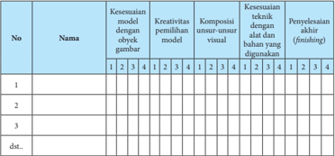

Tabel ini menunjukkan evaluasi kinerja siswa dalam proyek seni visual. Topik utamanya adalah kualitas model yang dibuat oleh siswa. Kolom-kolomnya meliputi nama siswa, kesesuaian model dengan objek gambar, kreativitas pemilihan model, komposisi unsur-unsur visual, kesesuaian teknik dengan bahan yang digunakan, dan penyelesaian akhir (finishing). Data penting yang terlihat adalah bahwa banyak siswa memiliki model yang cukup sesuai dengan objek gambar, namun kurang kreatif dalam memilih model. Komposisi unsur-unsur visual juga sering kali tidak sempurna, sementara penyelesaian akhir cenderung kurang baik.

### Keterangan

1 = Kurang Baik

2 = Cukup Baik

3 = Baik

4 = Sangat Baik

### Pedoman Penskoran :

Skor akhir menggunakan skala 1 sampai 4

Perhitungan skor akhir menggunakan rumus :

 

---
## 📄 Halaman 54

### Remedial

Kegiatan remedial diberikan kepada siswa yang dianggap tidak mencapai kompetensi  dasar  yang  diharapkan.  Pemberian  remedial  memperhatikan karakter siswa dan materi yang akan di remedial. Dalam berkarya seni rupa tiga dimensi remedial diberikan kepada siswa yang cenderung tidak mengikuti proses  berkarya  dengan  sungguh-sungguh  serta  tidak  menunjukkan  hasil pekerjaannya. Guru tidak memberikan remedial kepada hasil pekerjaan siswa sepanjang siswa menunjukkan kesungguhan dalam proses pembuatannya.

### Interaksi dengan orang tua

Waktu  yang  tersedia  di  sekolah  untuk  kegiatan  berkarya  seni  rupa  3 dimensi  sangat  terbatas,  untuk  itu  guru  diharapkan  memberikan  motivasi kepada siswa untuk berkarya di luar jam pelajaran sekolah. Berkarya di luar jam  pelajaran  sekolah  dapat  dilakukan  di  sekolah  bersama  kegiatan  ekstra kurikuler maupun di rumah sebagai tugas dari guru. Mintalah orang tua siswa untuk  memberikan  memberikan  motivasi  kepada  putra-putrinya  dalam berkarya seni serta tanggapan terhadap karya seni rupa yang dibuatnya.

 

---
## 📄 Halaman 55

### Semester 1

### Musik Tradisional BAB 3

### Kompetensi Inti:

KI 1 :  Menghayati dan mengamalkan ajaran agama yang dianutnya

KI 2 : Menghayati dan mengamalkan perilaku jujur, disiplin, tanggung jawab, peduli, gotong royong, kerjasama, toleran, damai, santun, responsif dan proaktif, dan menunjukkan sikap sebagai bagian dari solusi atas berbagai permasalahan dalam berinteraksi secara efektif dengan lingkungan sosial dan alam serta dalam menempatkan diri sebagai cerminan bangsa dalam pergaulan dunia.

- KI 3 : Memahami, menerapkan, menganalisis pengetahuan faktual, konseptual, prosedural berdasarkan rasa keingintahuannya tentang ilmu pengetahuan, teknologi, seni, budaya, dan humaniora dengan wawasan kemanusiaan, kebangsaan, kenegaraan, dan peradaban terkait fenomena dan kejadian, serta menerapkan pengetahuan prosedural pada bidang kajian yang spesifik sesuai dengan bakat dan minatnya untuk memecahkan masalah
- KI 4 : Mengolah, menalar dan menyaji dalam ranah konkret dan ranah abstrak terkait dengan pengembangan dari yang dipelajarinya di sekolah secara mandiri, dan mampu menggunakan metoda sesuai kaidah keilmuan.

### Kompetensi Dasar:

- 1.1 : Menunjukkan sikap penghayatan dan pengamalan serta bangga terhadap seni musik sebagai bentuk rasa syukur terhadap anugerah Tuhan
- 2.1 : Menunjukkan sikap kerjasama, bertanggung jawab, toleran, dan disiplin melalui aktivitas berkesenian
- 2.2 : Menunjukkan sikap santun, jujur, cinta damai dalam mengapresiasi seni dan pembuatnya
- 2.3 : Menunjukkan sikap responsif dan pro-aktif, peduli terhadap lingkungan dan sesama, serta menghargai karya seni dan pembuatnya
- 3.1 : Memahami simbol, jenis, dan fungsi alat musik tradisional
- 3.2 : Menganalisis alat musik tradisional sebagai simbol, jenis dan fungsinya dalam masyarakat pendukungnya

 

---
## 📄 Halaman 56

### A. Pengertian Musik

---
**🖼️ Gambar/Diagram**

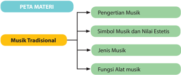

> **Deskripsi Visual:** Gambar ini adalah diagram yang menunjukkan struktur materi tentang Musik Tradisional dalam buku pelajaran. Diagram ini terdiri dari tiga baris vertikal yang masing-masing berisi topik utama yang berkaitan dengan Musik Tradisional. Topik-topik tersebut adalah:

1. Pengertian Musik
2. Simbol Musik dan Nilai Estetis
3. Jenis Musik
4. Fungsi Alat Musik

Setiap topik ini dikelompokkan ke dalam bagian "Musik Tradisional", yang terletak di bagian bawah diagram dengan warna kuning. Ini menunjukkan bahwa topik-topik tersebut merupakan bagian integral dari materi yang lebih luas tentang Musik Tradisional.

Elemen-elemen utama dalam diagram ini adalah topik-topik tersebut dan hubungan antara mereka. Hubungan antara topik-topik ini adalah bahwa setiap topik merupakan bagian dari konsep umum tentang Musik Tradisional.

Teks, angka, atau label penting yang terlihat dalam diagram ini adalah judul "PETA MATERI" yang terletak di bagian atas diagram, dan judul "Musik Tradisional" yang terletak di bagian bawah diagram. Judul "PETA MATERI" menunjukkan bahwa diagram ini adalah peta materi yang menggambarkan struktur topik-topik dalam buku pelajaran.

Informasi kunci yang dapat diambil pembaca dari gambar ini adalah bahwa buku pelajaran ini membahas berbagai aspek Musik Tradisional, mulai dari pengertian dasar hingga fungsi alat musiknya. Diagram ini memberikan panduan visual tentang struktur materi yang akan dibahas dalam buku pelajaran tersebut.

### Informasi Untuk Guru

Semboyan Negara Indonesia adalah Bhineka Tunggal Ika, yaitu bermacammacam suku bangsa yang memiliki keragaman seni dan budaya masyarakatnya, tetapi  satu  tujuan.  Dari  masing-masing  suku  tersebut  lahir,  tumbuh  dan berkembang berbagai jenis seni, salah satunya musik tradisional yang sekaligus menjadi identitas, jati diri dan media ekspresi dari masyarakat pendukungnya. Musik sebagai salah satu cabang seni, berbeda dari cabang seni lain, musik memiliki elemen dasar berupa bunyi. Musik sebagai suatu aktivitas umumnya dilakukan oleh anggota masyarakat di seluruh belahan dunia. Aktivitas musik seringkali  dilakukan  untuk  memenuhi  kebutuhan  dasar  manusia,  selain kebutuhan pangan atau primer dan sandang atau sekunder. Namun, musik sebagai  suatu  konsep  seringkali  didefinisikan  secara  terbatas  oleh  anggota masyarakat. Sebagai akibatnya, suatu definisi musik mungkin dapat menjelaskan salah satu jenis/genre musik, tetapi tidak dapat menjelaskan jenis/ genre musik lainnya. Beberapa definisi musik yang banyak diketahui masyarakat adalah: a) musik adalah bunyi yang disukai manusia, atau, musik adalah  bunyi  yang  terdengar  'enak'  di  telinga,  b)  musik  adalah  bunyi  yang terdiri dari rangkaian ritme, melodi, dan harmoni yang teratur, dan c) musik merupakan bahasa yang universal.

Dalam kehidupannya musik sangatlah beragam, seperti diketahui adanya musik  tradisional,  dan  musik  modern.  Apakah  kamu  mengetahu  arti  dari musik tradional? Jelaskan pendapat kamu!

Musik Tradisional adalah musik yang hidup dan berkembang secara turun temurun di suatu daerah tertentu. Dengan istilah lain musik tradisional disebut karawitan.  Karawitan  merupakan  kesenian  daerah  yang  diwujudkan  dalam bentuk  bahasa  bunyi.  Sebagaimana  diungkapkan  Suryana  dalam  Budiwati

 

---
## 📄 Halaman 57

(1985)  Karawitan  adalah  musik  daerah-daerah  di  Indonesia.  Musik  adalah salah  satu  cabang  kesenian  yang  mempergunakan  bunyi,  suara,  dan  nada sebagai bahan bakunya (substansi dasar). Hampir di seluruh wilayah Indonesia mempunyai  seni  musik  tradisional  yang  unik  dan  khas.  Jenis  musik  yang tumbuh  dan  berkembang  di  masing-masing  daerah  itu  memiliki  kekhasan dan  keunikan  sebagai  ciri  budayanya,  hal  itu  dapat  dilihat  dari  teknik permainannya, bentuk penyajiannya, fungsinya, maupun organologi bentuk alat musiknya, seperti gamelan dari Sunda, Jawa, dan Bali, Gambang Kromong dan  Tanjidor  dari  Betawi,  Tarling  dari  Cirebon,  Gondang  dari  Sunda  dan Batak, Tarawangsa dan Angklung dari Sunda, Kolintang dari Sulawesi Utara, Talempong dari Sumatera, Safe dari Kalimantan, Tifa Totobuang dari Maluku, Bijol  dan  Sasando  dari  Nusa  Tenggara  Timur,  Pa'bas  dari  Toraja  Sulawesi Selatan, dsbnya.

Berikut adalah salah satu bentuk musik tradisional yang ditampilkan oleh masyarakat Sunda:

---
**🖼️ Gambar/Diagram**

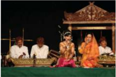

> **Deskripsi Visual:** Gambar ini adalah foto yang menunjukkan sebuah pertunjukan musik tradisional. Dalam foto tersebut, ada beberapa orang yang sedang bermain alat musik tradisional. Mereka tampak sangat koncentrat dan terlibat dalam performa mereka. Alat musik yang digunakan termasuk gendang, gong, dan beberapa instrumen lainnya. Setiap orang memiliki posisi yang berbeda untuk memainkan alat musik mereka, menunjukkan bahwa mereka bekerja sama dalam satu tim. Di sekitar mereka, terdapat penonton yang tampak tertarik dengan pertunjukan. Gambar ini menunjukkan bagaimana seni tradisional masih hidup dan dihargai oleh masyarakat.

Musik tradisional ini menggunakan bahasa, gaya, dan tradisi khas daerah setempat, yang perlu ditumbuhkembangkan dan dilestarikan serta dipertahankan  nilai-nilai  estetisnya  untuk  menambah  perbendaharaan  seni yang ada di masyarakat. Oleh karenanya, kita sebagai generasi penerus bangsa, sepatutnyalah  mengenal,  melestarikan  dan  mengapresiasinya  seni  musik tradisional itu yang merupakan ciri dan identitas budaya bangsa Indonesia, jangan sampai keberadaannya diakui dan dirampas oleh budaya bangsa lain. Kalau bukan kita, siapa lagi?

Dalam sub-bab ini, guru mengajak siswa untuk mereview atau mengkaji kembali beberapa definisi tersebut. Dalam prosesnya, guru bukanlah seorang yang memiliki jawaban yang 'benar' , tetapi sebagai seseorang yang memberi kesempatan pada siswa untuk menemukan jawaban atau solusi tentang definisi musik berdasarkan pengalaman-pengalaman musikal yang mereka miliki.

 

---
## 📄 Halaman 58

Tujuan pembelajaran: 1) mengidentifikasi beberapa definisi musik dalam masyarakat,  2)  mendiskusikan  beberapa  definisi  musik  yang  berkembang dalam  masyarakat,  dan  3)  menemukan  suatu  definisi  musik  yang  dapat digunakan  untuk  memahami  keragaman  jenis  atau genre musik  dalam masyarakat.

### Proses Pembelajaran

Langkah-langkah yang dilakukan oleh para siswa dalam proses pembelajaran mencakup kegiatan mengamati, menanyakan, mengumpulkan data, mengasosiasikan, dan mengkomunikasikan temuan-temuan yang mereka  peroleh  dari  kegiatan-kegiatan  sebelumnya.  Kegiatan  pembelajaran tersebut dapat dijelaskan sebagai berikut:

- Siswa diminta untuk mengamati beberapa gambar aktivitas musik yang dilakukan oleh beberapa komunitas musik yang berbeda

---
**🖼️ Gambar/Diagram**

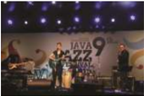

> **Deskripsi Visual:** Gambar ini adalah foto yang menunjukkan sebuah acara musik jazz dengan tema "Java Jazz Festival". Dalam foto tersebut, ada tiga musisi yang sedang bermain alat musik jazz di atas panggung. Mereka tampak sangat antusias dan terlibat dalam penampilan mereka. Di belakang panggung, terdapat banner dengan tulisan "Java Jazz Festival" yang menunjukkan bahwa acara ini berlangsung di Java. Selain itu, juga ada beberapa penonton yang tampak tertarik dengan penampilan musisi tersebut. Gambar ini menunjukkan suasana yang hangat dan menyenangkan yang terjadi pada acara musik jazz tersebut.

---
**🖼️ Gambar/Diagram**

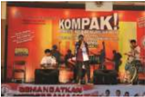

> **Deskripsi Visual:** Gambar ini adalah ilustrasi yang menampilkan sebuah pertunjukan musik kompakt. Gambar ini menggambarkan beberapa orang yang sedang bermain alat musik, termasuk gitar, drum, dan bass. Di sebelah kiri, ada seorang penari wanita yang sedang tarian dengan gerakan yang dinamis. Di sebelah kanan, ada seorang penari pria yang sedang bergerak dengan energi. Di bagian atas, terdapat teks "Kompak!" yang menunjukkan judul pertunjukan tersebut. Di bawah teks tersebut, terdapat beberapa nama penari dan penari lainnya yang terlibat dalam pertunjukan. Selain itu, terdapat juga beberapa angka yang mungkin menunjukkan jumlah penari atau detail lainnya tentang pertunjukan tersebut. Gambar ini menunjukkan bahwa pertunjukan ini adalah sebuah pertunjukan musik kompakt yang melibatkan banyak penari dan penari.

 

---
## 📄 Halaman 59

- Siswa  diminta  untuk  mendiskusikan  hasil  pengamatan  mereka  pada beberapa gambar tersebut
- Siswa  diminta  untuk  mencari  informasi  dari  beragam  sumber  tentang beragam aktivitas musik
- Siswa  diminta  untuk  mengidentifikasi  beberapa  definisi  musik  yang berhubungan dengan contoh-contoh dalam gambar-gambar, audio, dan audio-visual yang diberikan guru
- Siswa distimuli untuk mengajukan pertanyaan-pertanyaan yang berhubungan dengan definisi-definisi tersebut melalui diskusi dalam rangka menemukan definisi yang sesuai
- Siswa diminta untuk mencoba menerapkan definisi yang mereka  temukan pada aktivitas-aktivitas musik yang mereka ketahui
- Siswa  diminta  untuk  mengasosiasikan  definisi  yang  mereka  temukan dengan jenis/genre musik yang berbeda
- Siswa diminta untuk mengemukakan atau mengkomunikasikan definisi musik  yang  mereka  temukan  secara  mandiri  berdasarkan  hasil  diskusi yang dilakukan dalam proses pembelajaran.

### Konsep Umum

Kekeliruan : Musik sebagai bunyi yang disukai manusia

Pembahasan : Definisi musik sebagai 'bunyi yang 'disukai' oleh manusia' salah  satunya  terdapat  dalam Merriam-Webster's  Unabridged  Dictionary (2000) bahwa 'musik adalah ilmu atau seni yang menggabungkan kombinasi bunyi-bunyi  vokal  atau  instrumen  yang  terdengar  menyenangkan  atau ekspresif  menjadi  suatu  komposisi  yang  memiliki  struktur  dan  kontinuitas yang  jelas' .  Namun,  para  ahli  musik  atau  pendidikan  musik  seringkali menganggap definisi ini bersifat subjektif. Mengapa?

Sekarang, coba kita bayangkan. Apabila seseorang menyukai jenis musik jazz dan tidak menyukai jenis musik dangdut, apakah jenis musik dangdut tidak dapat dikatakan sebagai musik? Jawabnya tentu saja 'tidak' . Kita semua sangat  memahami  bahwa  dangdut  adalah  salah  satu  jenis  musik  yang dihasilkan  oleh  manusia.  Definisi  'musik  adalah  bunyi  yang  'disukai'  oleh manusia' hanya bergantung pada perspektif seseorang atau sekelompok orang saja. Oleh karena itu, definisi 'musik sebagai bunyi yang 'disukai' oleh manusia' tidak dapat diterima karena definisi tersebut tidak mencakup seluruh aktivitas musik manusia di dunia.

Kekeliruan : Musik sebagai bunyi yang terdiri dari ritme, melodi, dan harmoni yang teratur

 

---
## 📄 Halaman 60

Pembahasan : Definisi musik sebagai 'bunyi yang terdiri dari ritme dan melodi'  salah  satunya  terdapat  dalam Pocket  Music  Dictionary (1993), misalnya. Dalam kamus kecil itu dinyatakan bahwa 'musik adalah organisasi bunyi yang melibatkan ritme, melodi, dan harmoni' . Definisi lain yang juga sering  terdengar  adalah  musik  sebagai  bunyi  vokal  atau  instrumen  yang memiliki ritme, melodi, atau harmoni yang teratur, seperti dalam musik untuk paduan suara. Bagi kebanyakan orang, melodi dipandang sebagai urutan nada yang teratur dan ritme adalah urutan ketukan yang teratur.

Para ahli musik atau pendidikan musik seringkali mengkritisi definisi itu dengan mempertanyakan: apakah rangkaian bunyi yang memiliki ritme dan melodi tidak teratur, seperti suara burung, hembusan angin, atau gemercik air,yang sering digunakan oleh seorang pencipta musik tidak dapat dipandang sebagai musik? Jawabnya tentu saja 'tidak' . Pemahaman konsep 'teratur' dan 'tidak teratur' seringkali berhubungan dengan nilai-nilai dalam suatu kelompok masyarakat, yang tentu saja berbeda darinilai-nilai dalam kelompok masyarakat  yang  lain.  Bagi  komunitas  keroncong,  misalnya, cengkok dan nggandul merupakan  sesuatu  yang  teratur  dan  'harus'  ada  dalam  musik keroncong. Namun, bagi komunitas lain, misalnya Barat, cengkok dan nggandul tersebut  harus  dihindari  karena  menyebabkan  ketukan  yang  tidak  teratur dalam permainan musik.

Kekeliruan : Musik sebagai bahasa yang universal

Pembahasan : Kesalahpahaman orang tentang makna musik juga banyak terjadi.  Kenyataan  ini  tidak  dapat  dipungkiri  dengan  adanya  beberapa pandangan tentang peranan musik dalam masyarakat. Salah satunya adalah musik  dianggap  sebagai  suatu  alat  komunikasi.  Menurut  Mantle  Hood, peranan musik sebagai alat komunikasimenyebabkan musik dapat dipandang sebagai  bahasa  yang  universal.  Artinya,  musik  sebagai  hasil  karya  manusia dari  suatu  komunitas  dapat  dipahami  oleh  seluruh  masyarakat  di  dunia. Apakah  kita  dapat  memahami  musik  sebagai  hasil  karya  manusia  dari kelompok masyarakat lain, misalnya masyarakat di Afrika?

Di satu sisi,  kita  dapat  memandang  musik  sama  dengan  bahasa  karena suatu karya musik memiliki makna-makna tertentu yang dapat dipahami oleh para pendengar atau masyarakat pendukung, atau kelompok komunitasnya. Namun,  apabila  musik  bersifat  universal  maka  timbul  pertanyaan  apakah musik yang dimiliki oleh suatu kelompok komunitas tertentu dapat dipahami oleh pendengar dari kelompok komunitas lain?

Atau,  apabila  seseorang  dari  suku  bangsa  Sunda  yang  terbiasa  dengan musik tradisional Sunda, apakah ia dapat memahami musik tradisional Batak atau Minang atau Bugis dengan baik?

 

---
## 📄 Halaman 61

Pernyataan Schafer (1976) mungkin dapat mengarahkan pemahaman kita tentang  apakah  musik  itu.  Dalam  mengajarkan  musik  di  kelas,  Schafer mengemukakan bahwa musik merupakan suatu organisasi atau pengaturan bunyi-bunyi (ritme, melodi, dan lain-lain) yang bertujuan untuk didengarkan. Dalam definisi tersebut Schafer tidak membatasi pada ritme atau melodi yang beraturan saja, tetapi melibatkan pula ritme dan melodi yang tidak beraturan. Hal  ini  dapat  dipahami  karena  konsep  'beraturan'  dan  'tidak  beraturan' merupakan konsep-konsep yang dapat dipahami secara berbeda oleh setiap kelompok manusia di dunia. Lebih jauh, Elliot (1995) juga mengemukakan bahwa secara esensial,  musik  merupakan  hasil  dari  aktivitas  manusia  yang dilakukan  berdasarkan  pada  tujuan  tertentu,  yaitu  untuk  didengarkan  oleh pendengarnya. Oleh karena itu,  musik  akan  selalu  berkaitan  dengan  aspek pelaku dan pendengar. Elliot menyatakan bahwa pada masing-masing aspek melibatkan empat dimensi, yaitu:

- Manusia (musician), sebagai pelaku dalam aktivitas musik
- Aktivitas (musicing), seperti  memainkan,  mengubah,  dan  menciptakan musik
- Musik (music), sebagai hasil aktivitas musik manusia
- Butuh yang mempengaruhi pengetahuan manusia, aktivitas yang dilakukan manusia, dan musik yang dihasilkan (Elliot, 1995).
Keempat dimensi tersebut dapat digambarkan sebagai berikut:

---
**🖼️ Gambar/Diagram**

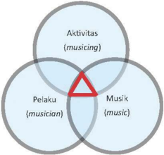

> **Deskripsi Visual:** Gambar ini adalah diagram Venn yang menunjukkan hubungan antara tiga konsep utama: Musik, Aktivitas (musicing), dan Pelaku (musician). Diagram ini menggunakan warna biru untuk menggambarkan hubungan antara setiap konsep. 

1. **Apa yang Ditampilkan Secara Keseluruhan**: Gambar ini menunjukkan hubungan antara tiga konsep utama dalam konteks musik. Setiap konsep memiliki lingkaran berbeda dengan warna yang berbeda.

2. **Elemen-Elemen Utama dan Relasinya**: 
   - Lingkaran pertama menunjukkan konsep "Musik" dengan warna biru muda.
   - Lingkaran kedua menunjukkan konsep "Aktivitas (musicing)" dengan warna biru gelap.
   - Lingkaran ketiga menunjukkan konsep "Pelaku (musician)" dengan warna biru tua.
   - Lingkaran-lingkaran ini saling berpotongan, menunjukkan bahwa setiap konsep memiliki aspek yang sama, tetapi juga ada aspek uniknya sendiri.

3. **Teks, Angka, atau Label Penting yang Terlihat**: 
   - Untuk setiap lingkaran, terdapat teks yang memberikan deskripsi singkat tentang konsep tersebut. Misalnya, "Musik" diberi label "music", "Aktivitas (musicing)" diberi label "(musicing)", dan "Pelaku (musician)" diberi label "(musician)".
   - Ada juga sebuah segitiga merah yang menempel di tengah-tengah lingkaran-lingkaran tersebut, yang mungkin menunjukkan hubungan antara konsep-konsep ini.

4. **Informasi Kunci yang Bisa Diambil Pembaca**: 
   - Gambar ini menunjukkan bahwa setiap konsep musik memiliki aspek yang sama, namun juga memiliki aspek uniknya sendiri. Ini menunjukkan bahwa aktivitas dan pelaku musik adalah bagian dari konsep musik, tetapi tidak selalu sama dengan konsep musik itu sendiri.

Dengan demikian, gambar ini menunjukkan hubungan kompleks antara tiga konsep utama dalam konteks musik, dengan menggunakan diagram Venn untuk

 

---
## 📄 Halaman 62

Gambar di atas memperlihatkan bahwa musik merupakan suatu konsep yang terdiri dari empat dimensi yang melibatkan: 1) pelaku (doer), 2) beberapa aktivitas yang dilakukan, 3) beberapa hasil dari aktivitas yang dilakukan, 4) konteks  yang  utuh  yang  mencakup  pelaku  melakukan  apa  yang  mereka kerjakan.  Pelaku  musik (doer) disebut  sebagai  musisi (musician) dalam pertunjukan, improvisasi, dan kegiatan-kegiatan musikallain yang terdengar. lstilah musicing mengacu pada aktivitas yang dilakukan oleh pelaku, seperti menampilkan, mengimprovisasi, mengubah, mengaransemen, dan mengarahkan (conducting).

Perlu diingat bahwa aktivitas atau pertunjukan musik tidak lepas kaitannya dengan penonton. Oleh karena itu, bagaimana pengetahuan para musisi atau pelaku  musik,  perilaku  musikal  mereka  dalam  permainan  musik,  serta bagaimana  produksi  musik  yang  terjadi  akan  selalu  disesuaikan  dengan konteks penonton. Dengan kata lain, suatu pertunjukan atau permainan musik akan  selalu  berhubungan  dengan  siapa  penontonnya,  bagaimana  perilaku penonton, dan jenis musik apa yang ingin didengar dan/atau disaksikan oleh penonton. Hal ini dapat dipahami karena musik diproduksi oleh para pelaku untuk didengar dan/atau disaksikan oleh penonton atau pendengar sebagai upaya untuk mencapai tujuan tertentu.

Kesimpulan: Berdasarkan  kajian  dari  beberapa  definisi  musik  di  atas maka dapat disimpulkan bahwa musik merupakan suatu aktivitas manusia. Sebagai  konsep,  musik  dapat  didefinisikan  sebagai  organisasi  bunyi  (nada, ritme, harmoni, warna suara, tempo, atau dinamika) yang digunakan musisi atau pelaku musik untuk dimainkan dalam konteks tertentu dan disesuaikan dengan konteks pendengarnya sebagai upaya untuk mencapai tujuan tertentu.

### Pengayaan

Tahap  pengayaan  merupakan  tahap  yang  dilakukan  oleh  siswa  atau kelompok siswa yang memiliki tingkat kompetensi yang lebih tinggi daripada siswa atau kelompok siswa yang lain. Bagi siswa atau kelompok siswa yang memiliki  kompetensi  yang  lebih  tinggi,  guru  dapat  mengarahkan  mereka untuk memperdalam pengetahuan musik dan mengembangkan potensi secara lebih  optimal.  Tugas  yang  diberikan  oleh  guru  dalam  tahap  ini  adalah menstimuli kemampuan dan pengetahuan siswa atau kelompok siswa untuk menerapkan definisi musik yang telah diperoleh ke dalam beberapa contoh aktivitas musik yang lebih rumit.

 

---
## 📄 Halaman 63

### Remedial

Kemampuan para siswa tentu  saja  berbeda  satu  sama  lain.  Bagi  siswasiswa yang kurang dapat menguasai konsep ini, guru dapat mengulang kembali materi yang telah diajarkan. Pengulangan materi disertai dengan pendekatan pendekatan  yang  lebih  memperhatikan  hambatan  yang  dialami  siswa  atau kelompok siswa dalam memahami materi pembelajaran. Misalnya, membimbing pemahaman siswa atau kelompok siswa dengan memberilebih banyak contoh dari yang paling sederhana sampai yang agak sulit. Contohcontoh  yang  diberikan  dapat  berupa  gambar,  audio,  maupun  audio-visual. Pendekatan lain yang dapat dilakukan guru dalam tahap remedial ini adalah dengan lebih banyak memberi perhatian kepada siswa atau kelompok siswa tersebut yang dilakukan secara lebih menyenangkan  atau  non-formal. Pendekatan yang menyenangkan atau non-formal ini dapat dilakukan guru dengan tujuan agar siswa atau kelompok siswa tersebut dapat lebih termotivasi untuk mencari informasi yang mereka butuhkan, bertanya, dan mengemukakan pendapat, sehingga mereka dapat membentuk suatu definisi musik berdasarkan kumpulan data yang mereka peroleh. Tahap remedial diakhiri dengan penilaian untuk  mengukur  kembali  tingkat  pemahaman  siswa  atau  kelompok  siswa tersebut terhadap sub-materi pembelajaran.

### Penilaian

Penilaian dilakukan untuk mengetahui tingkat kemampuan siswa terhadap sub-materi. Terdapat dua jenis penilaian, yaitu penilaian proses dan penilaian hasil. Penilaian proses untuk sub-materi ini mencakup tiga aspek dasar, yaitu pengetahuan, sikap, dan keterampilan. Untuk lebih jelasnya, perhatikan contoh lembar penilaian berikut:

### Penilaian Proses: Pengertian Musik

---
**📊 Tabel**

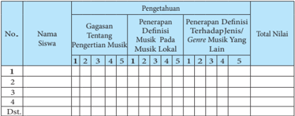

Tabel ini menunjukkan pengetahuan siswa tentang pengertian musik, penerapan definisi musik pada musik lokal, dan penerapan definisi terhadap jenis/genre musik lainnya. Kolom-kolomnya meliputi nomor siswa, nama siswa, gagasan tentang pengertian musik, penerapan definisi musik pada musik lokal, dan penerapan definisi terhadap jenis/genre musik lainnya. Data dalam tabel menunjukkan bahwa banyak siswa memiliki gagasan yang baik tentang pengertian musik, namun masih kurang memahami bagaimana definisi musik dapat diterapkan pada musik lokal dan jenis/genre musik lainnya. Pola penting yang terlihat adalah bahwa pengetahuan siswa tentang penerapan definisi musik lebih rendah dibandingkan dengan pengetahuan mereka tentang pengertian musik.

 

---
## 📄 Halaman 64

---
**📊 Tabel**

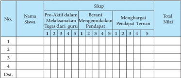

Tabel ini menunjukkan data nilai siswa dalam dua kriteria utama: pro-aktif dalam melaksanakan tugas dari guru dan berani mengakui pendapat. Kolom-kolomnya mencakup nomor siswa, nama siswa, dan total nilai. Data penting yang terlihat adalah bahwa siswa 1 memiliki nilai tertinggi di kedua kriteria, sementara siswa 4 memiliki nilai terendah. Pola ini menunjukkan variasi dalam perilaku dan sikap siswa dalam menghadapi tantangan belajar.

---
**📊 Tabel**

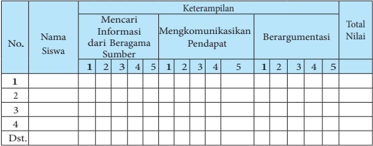

Tabel ini menunjukkan data kinerja siswa dalam beberapa aspek keterampilan, termasuk mencari informasi dari berbagai sumber, mengkomunikasikan pendapat, dan berargumentasi. Kolom-kolomnya mencakup nomor siswa, keterampilan, dan nilai yang diberikan oleh instruktur. Data penting yang terlihat adalah bahwa siswa memiliki skor rata-rata yang cukup baik dalam semua aspek keterampilan, dengan nilai tertinggi di kategori mencari informasi dari berbagai sumber. Ini menunjukkan bahwa siswa mampu memperoleh informasi dari berbagai sumber dan dapat menggunakan informasi tersebut untuk mendukung pendapat mereka.

Penilaian  pada  masing-masing  aspek  menggunakan  Skala  Likert,  yaitu dengan memberikan skor antara 1 - 5. Masing-masing skor mendeskripsikan tingkat kemampuan siswa, yaitu:

Skor maksimal dalam penilaian proses untuk ketiga aspek tersebut adalah 45 dan skor minimal adalah 9. Apabila seorang siswa memperoleh total nilai 12  untuk  aspek  pengetahuan,  12  untuk  aspek  sikap,  dan  9  untuk  aspek keterampilan maka total nilai yang diperoleh adalah: 12 + 12 + 9 = 33. Nilai 33 menunjukkan bahwa kemampuan yang dicapai oleh siswa adalah 33 dari 45 skor maksimal atau 33/45 sehingga dapat dikatakan atau disimpulkan bahwa kemampuan siswa adalah 73,3% untuk ketiga aspek tersebut.

 

---
## 📄 Halaman 65

Penilaian  hasil  melibatkan  tes  tertulis  dan  tes  lisan.  Penilaian  hasil dilakukan pada setiap akhir semester.

### lnteraksi dengan Orang Tua

Pemahaman siswa terhadap sub-materi pembelajaran akan dapat dicapai dengan  lebih  baik  melalui  kerjasama  dengan  pihak  orang  tua  siswa.  Oleh karena itu, guru diharapkan dapat berinteraksi dengan orang tua para siswa, seperti meminta kesediaan para orang tua untuk dapat menyediakan sarana yang dibutuhkan oleh anak-anak mereka, memberi kesempatan kepada anakanak mereka untuk mengikuti kegiatan diskusi di luar proses pembelajaran, berdiskusi  dengan  anak-anak  mereka  tentang  sub-materi  yang  dipelajari  di sekolah, serta meluangkan waktu untuk menyaksikan beragam pertunjukan musik  dengan  anak-anak  mereka  dan  mendiskusikan  pengamatan  mereka terhadap pertunjukan musik tersebut.

### B.  Simbol dan Nilai Esetetis Musik

### 1. Simbol Musik

### lnformasi untuk Guru

Indonesia  merupakan  negara  kepulauan  yang  terdiri  dari  beragam kelompok  masyarakat.  Keberagaman  kelompok  masyarakat  di  Indonesia tersebut berdampak pada keberagaman hasil kebudayaanya. Salah satu hasil kebudayaan dari setiap kelompok masyarakat adalah seni, termasuk musik. Mengapa musik yang dihasilkan oleh suatu kelompok masyarakat di Indonesia memiliki perbedaan tertentu dengan kelompok masyarakat lainnya? Mengapa musik  keroncong  yang  berkembang  dalam  masyarakat  Jawa  berbeda  dari musik keroncong Tugu? Mengapa tembang Sunda berbeda dari musik vokal klasik Barat?

Untuk  menjawab  pertanyaan  tersebut  dibutuhkan  pemahaman  tentang manusia,  musik,  dan  konteks.  Manusia  yang  hidup  dalam  masing-masing kelompok  masyarakat  di  Indonesia  memperoleh  pengalaman-pengalaman konkrit  dari  lingkungan  sosial,  budaya,  agama,  dan  geografis  yang  berbeda beda. Pengalaman-pengalaman konkrit tersebut secara lambat-laun membentuk  pengetahuan  pada  para  pelaku  musik  sebagai  anggota  suatu kelompok masyarakat. Pengetahuan inilah yang digunakan oleh para pelaku musik sebagai arahan dalam melakukan aktivitas-aktivitas dalam menghasilkan karya-karya musik sesuai dengan nilai atau norma yang mereka yakini dan konteks yang dihadapi. Kenyataan memperlihatkan bahwa pengetahuan yang

 

---
## 📄 Halaman 66

dimiliki oleh para pelaku musik dalam kelompok masyarakat tertentu berbeda dari pengetahuan para pelaku musik dalam kelompok masyarakat yang lain. Oleh karena itu dapat dipahami mengapa jenis musik yang dihasilkan oleh kelompok-kelompok masyarakat di dunia begitu beragam dan bervariasi.

1

3

Karena  gaya-gaya  musik  antara  satu  kelompok  masyarakat  dengan kelompok masyarakat yang lain berbeda maka musik dipandang bermanfaat untuk memahami kebudayaan suatu komunitas masyarakat. Artinya, dengan menganalisis  musik  yang  dimiliki  oleh  komunitas  masyarakat  tertentu  di Indonesia, kita dapat memiliki pemahaman tentang kebudayaan masyarakat tersebut dengan lebih baik. Mengapa? Karena, seperti juga cabang seni lainnya, musik  yang  dihasilkan  oleh  komunitas  masyarakat  tertentu  di  Indonesia berkaitan  dengan  aturan-aturan  dasar,  sanksi-sanksi,  dan  nilai  nilai  yang seringkali memperlihatkan esensi-esensi masyarakat tersebut. Oleh karena itu, musik kadang-kadang dipandang sebagai simbol yang berhubungan dengan makna-makna tertentu yang hanya dapat dipahami oleh masyarakat pendukung jenis/genre musik itu

Simbol didalam karya musik secara keseluruhan merupakan makna dari citra perasaan seseorang. Makna itu dirasakan sebagai sesuatu dalam karyanya, diartikulasikan namun tidak diabstraksikan secara lebih lanjut, seperti halnya makna dari sebuah mitos kehidupan manusia ataupun metafora yang benar tidaklah tampil terpisah dari ekspresi citranya. Menurut Langer (1948) dalam

2

 

---
## 📄 Halaman 67

Widaryanto (1988:140), suatu karya seni itu baik musik ataupun tari tidaklah menunjukkan  pada  kita  suatu  makna  yang  melebihi  kehadirannya  sendiri. Apa  yang  diekspresikan  tidaklah  bisa  ditangkap  terpisah  dengan  kaitan inderawi ataupun bentuk puitis yang mengungkapkannya. Dalam karya musik kita mendapatkan presentasi yang sebenarnya tentang suatu perasaan, bukan suatu  isyarat  yang  menunjuk  pada  perasaan  yang  berada  dalam  bentuknya yang menyatu dalam keindahannya.

Penggunaan  symbol-symbol  di  dalam  karya  musik,  secara  terbatas merupakan sebuah prinsip konstuksi yang memiliki tujuan, prinsip-prinsip seni  musik  itu  secara  menyeluruh  dicontohkan  dalam  setiap  karya  cipta manusia  yang  benar-benar  pantas  disebut  'musik' .  Karya  musik  dalam kehidupannya senantiasa tercipta melalui tanda dan simbol-simbol. Bahkan manusia di dalam melakukan sesuatu, berfikir,  berkomunikasi,  berekspresi, bersikap, dan berkreasi, diungkapkan melalui simbol.

Pembelajaran  music  yang  dipelajari  masyarakat  Indonesia  sangatlah kompleks, salah satu materi ajarnya adalah bertujuan untuk memahami dan mengenal ragam notasi yang digunakan sebagai symbol musik.

Sebuah  contoh  dalam  musik  tradisional  terdapat  symbol  nada  yang dipergunakan sebagai media untuk mengarsipkan karya musik daerah Sunda, dimulai dari notasi buhun sampai kepada sistem penotasian yang diciptaan oleh Rd. Machyar Anggakoesoemadinata, yaitu sistem penotasian daminatila.

---
**📊 Tabel**

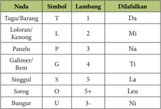

Tabel ini menunjukkan sistem simbol dan lambang yang digunakan dalam bahasa Melayu untuk menggambarkan tugu atau barang. Topik utama tabel adalah sistem simbol dan lambang tersebut. Kolom-kolom yang ada meliputi Nada (Tugu/Barang), Simbol, Lambang, dan Dilafalkan. Data penting yang terlihat adalah bahwa simbol "T" menggambarkan nada "Da", "L" menggambarkan nada "Mi", dan seterusnya. Ini menunjukkan bahwa setiap nada memiliki simbol dan lambang yang spesifik.

 

---
## 📄 Halaman 68

Untuk pemahaman terhadap simbol nada buhun dan nada daminatila, perlu dilakukan analisis terhadap karya musik, baik dalam pola ritmis maupun melodis.

Pada dasarnya garapan karya seni musik bergantung kepada pembuatnya ataupun penciptanya yaitu seorang komposer. Komposer dapat menentukan bagaimana suatu karya akan dibuat sesuai dengan keinginannya pada waktu proses  penggarapan  dilakukan.  Rasa  idealis  sangat  terlihat  ketika  seorang seniman atau komposer dalam proses membuat sebuah karya musik. Hal ini bukan merupakan sesuatu yang negatif tetapi, rasa idealis diperlukan sebagai ciri yang menjadikan identitas daripada karya tersebut.

Sekecil apapun komposisi yang dibuat oleh seorang komposer, dibalik itu semua ada maksud dan tujuan penggarapannya. Dibalik ini semua symbol diperlukan sebagai identitas untuk mengingat karya music yang diciptakannya.

Simbol dalam musik dapat diwujudkan melalui elemen-elemennya, seperti nada (pitch), ritme  (pola  ritmik),  dinamika  (keras-lembutnya  bunyi),  dan tempo  (kecepatan lagu). Simbol yang diwujudkan dengan nada akan menghasilkan  kesan  terhadap  bunyi  yang  didengar,  tampak  pada  contoh berikut:

---
**📊 Tabel**

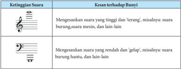

Tabel ini membahas tentang ketinggian suara dan kesan terhadap bunyi dalam musik. Topik utamanya adalah hubungan antara ketinggian suara dan efek bunyi yang dihasilkan. Tabel dibagi menjadi dua kolom: "Ketinggian Suara" dan "Kesan terhadap Bunyi". Kolom pertama menunjukkan tanda-tanda musik yang menggambarkan ketinggian suara, seperti clef (tanda dasar) untuk suara tinggi dan bass clef untuk suara rendah. Kolom kedua menjelaskan kesan bunyi yang dihasilkan oleh suara tersebut, seperti suara burung yang 'terang' atau 'gelap'. Data penting yang terlihat adalah bahwa ketinggian suara yang lebih tinggi menghasilkan bunyi yang lebih 'terang', sementara yang lebih rendah menghasilkan bunyi yang lebih 'gelap'. Ini menunjukkan hubungan langsung antara ketinggian suara dan karakteristik bunyi yang dihasilkannya.

Simbol berupa ritme tampak pada contoh dua contoh pola ritmik berikut:

Ritme 1:

Ritme 2:

 

---
## 📄 Halaman 69

Simbol  musik  juga  dapat  dilihat  dari dinamika (keras-lembutnya  bunyi), tampak pada contoh berikut:

---
**🖼️ Gambar/Diagram**

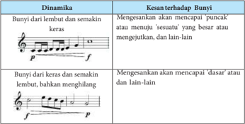

> **Deskripsi Visual:** Gambar ini adalah diagram yang menunjukkan hubungan antara dinamika musik dan kesan terhadap bunyi. Diagram ini dibagi menjadi dua bagian, masing-masing menunjukkan dinamika yang berbeda dan hasilnya pada bunyi.

Pertama, bagian atas menggambarkan dinamika yang lebih lembut dan semakin keras. Untuk dinamika ini, gambar menunjukkan bahwa bunyi akan mencapai 'puncak' atau 'sesuatu' yang besar dan mengejutkan. Ini menunjukkan bahwa dengan dinamika yang lebih lembut dan semakin keras, bunyi akan menjadi lebih kuat dan mengejutkan.

Bagian bawah diagram menunjukkan dinamika yang lebih keras dan semakin lembut. Gambar ini menunjukkan bahwa dengan dinamika ini, bunyi akan mencapai 'dasar' atau 'sesuatu' lain-lain. Ini menunjukkan bahwa dengan dinamika yang lebih keras dan semakin lembut, bunyi akan menjadi lebih lembut dan mungkin bahkan menghilang.

Dalam diagram ini, teks dan angka tidak digunakan untuk memberikan informasi spesifik tentang dinamika atau bunyi. Namun, elemen-elemen utama seperti dinamika dan bunyi memiliki relasi yang jelas. Dinamika yang lebih lembut dan semakin keras menghasilkan bunyi yang lebih kuat dan mengejutkan, sementara dinamika yang lebih keras dan semakin lembut menghasilkan bunyi yang lebih lembut dan mungkin bahkan menghilang.

Informasi kunci yang dapat diambil pembaca adalah bahwa dinamika musik mempengaruhi kesan terhadap bunyi, dan bahwa perubahan dinamika dari lembut ke keras dan sebaliknya dapat menghasilkan perubahan yang signifikan dalam suara musik.

---
**📊 Tabel**

Tabel ini membahas tentang dinamika musik dan kesan terhadap bunyi. Topik utama tabel adalah dinamika dan kesan bunyi yang dihasilkan oleh nada musik. Tabel dibagi menjadi dua kolom: "Dinamika" dan "Kesan terhadap Bunyi". Kolom "Dinamika" menunjukkan dua tingkat dinamika yang berbeda: "Bunyi dari lembut dan semakin keras" dan "Bunyi dari keras dan semakin lembut". Kolom "Kesan terhadap Bunyi" menjelaskan bagaimana kedua tingkat dinamika tersebut mempengaruhi kesan bunyi pada penonton. Untuk dinamika yang lebih lembut dan semakin keras, bunyi akan mencapai puncak atau menuju sesuatu yang besar atau mengejutkan. Sementara itu, untuk dinamika yang lebih keras dan semakin lembut, bunyi akan mencapai dasar atau menurun ke bawah. Dari tabel ini, dapat disimpulkan bahwa dinamika sangat penting dalam menghasilkan kesan bunyi yang berbeda-beda pada penonton.

Tempo (ukuran kecepatan bunyi) juga dapat dipandang sebagai simbol. Contoh penggunaan lagu Cublak-Cublak Suweng yang dinyanyikan dengan tempo cepat dan lambat:

### CUBLAK-CUBLAK SUWENG

(Jawa Tengah)

 

---
## 📄 Halaman 70

Musik sebagai simbol juga dapat diwujudkan melalui bentuk dan bahan dasar pembuatan instrumennya Salah satu bahan dasar pembuatan instrumen dalam  masyarakat  Indonesia.  misalnya  Sunda.  adalah  bambu.  Beberapa instrumen tradisional dalam masyarakat Sunda yang terbuat dari bambu di antaranya adalah angklung, suling lubang 6 atau 4. bangkong reang, dan calung.

Kenyataannya,  bambu  tidak  hanya  dijadikan  sebagai  bahan  pembuat instrumen dalam masyarakat Sunda, tetapi juga dalam kelompok masyarakat lain.  seperti  masyarakat  di  Sulawesi  Utara  (kolintang),  Gorontalo,  dan  Bali (angklung  dan  suling  gambuh)  Namun,  walaupun  dibuat  dari  bahan  yang sama. yaitu bambu. produksi bunyi dan bentuknya memperlihatkan perbedaanperbedaan  tertentu.  Perbedaan-perbedaan  tersebut  tidak  dapat  dilepaskan dari nilai. norma, dan aturan-aturan yang diterapkan yang dimiliki masyarakat pendukungnya tentang bagaimana seharusnya instrumen dibuat dan

 

---
## 📄 Halaman 71

bagaimana seharusnya bunyi yang akan diproduksi oleh instrumen tersebut. Oleh  karena  itu.  bambu  sebagai  bahan  dasar  instrumen  dapat  dipandang sebagai simbol yang berhubungan erat dengan nilai-nilai budaya masyarakat pendukung instrumen tersebut.

Penggunaan  bambu  untuk  instrumen  musik  sangat  bergantung  pada ketersediaan  bah  an  bambu  di  daerah  tertentu  dan  pengetahuan  manusia tentang  bambu.  Hal  ini  mengingatkan  kita  pada  instrumen-instrumen tradisional dari beberapa daerah di Indonesia, seperti Sulawesi Utara dan Jawa Barat Beberapa kelompok masyarakat itu menggunakan bahan bambu sebagai material dasar untuk pembuatan instrumen. Pembuatan instrumen instrumen  tersebut  tentu  saja  tidak  dapat  dilakukan  apabila  kelompok kelompok masyarakat itu tidak memiliki ketersediaan bambu dilingkungannya. Pembuatan  instrumen  itu  pun  tidak  dapat  dilakukan  tanpa  adanya  orang orang yang memiliki pengetahuan yang luas tentang bambu. Oleh karena itu, dapat dikatakan bahwa musik, secara tidak langsung, dipengaruhi pula oleh lingkungan yang dihadapi oleh pelaku.

Tujuan  pembelajaran  dalam  sub-materi  ini  adalah:  1)  mengidentifikasi simbol  simbol  musikalyang  tampak  dalam  suatu  jenis/genre  musik,  2) mengidentifikasi simbol-simbol non-musikal dalam suatu jenis/genre musik, dan 3) membandingkan simbol-simbol musik pada beberapa instrumen dari budaya yang berbeda.

### Proses Pembelajaran

Langkah-langkah yang dilakukan oleh para siswa dalam proses pembelajaran mencakup kegiatan mengamati, menanyakan, mengumpulkan data, mengasosiasikan, dan mengkomunikasikan temuan-temuan yang mereka  peroleh  dari  kegiatan-kegiatan  sebelumnya.  Kegiatan  pembelajaran untuk sub-materi ini dapat dijelaskan sebagai berikut:

- Siswa diminta untuk mendengarkan atau menyaksikan dengan seksama beberapa  contoh  simbol  musik  (nada,  ritme,  dinamika,  tempo)  melalui media audio dan/atau audio-visual
- Siswa  diminta  untuk  mengidentifikasi  kesan  dari  simbol-simbol  musik tersebut
- Siswa diminta untuk membedakan kesan dari perbedaan dari dua jenis simbol yang sama
- Siswa distimuli untuk mengemukakan  pertanyaan-pertanyaan yang berhubungan dengan permainan musik yang didengar atau diamati

 

---
## 📄 Halaman 72

- Siswa  diminta  untuk  mencari  informasi  tentang  beberapa  instrumen musik yang dapat dipandang sebagai simbol dalam lingkungan masyarakatnya atau masyarakat lain
- Siswa  diminta  untuk  mengidentifikasi  daerah  asal  beberapa  instrumen musik tersebut
- Siswa diminta untuk menuliskan karakter musikal dan non-musikal dari beberapa instrumen tersebut
- Siswa  diminta  untuk  menganalisis  keunikan  bentuk  dan  bahan  dasar beberapa instrumen musik tersebut
- Siswa diminta untuk mengkomunikasikan hasil analisisnya dalam diskusi

### Konsep Umum

Kekeliruan : Simbol sama artinya dengan tanda

Pembahasan : Dalam percakapan sehari-hari kita sering mendengar istilah simbol  diucapkan  oleh  orang-orang  di  sekeliling  kita.  lstilah  itu  biasanya diartikan  sebagai  'tanda' .  Misalnya,  orang  sering  mengatakan  bahwa  warna merah pada lampu lalu-lintas (tra ffic light) merupakan simbol untuk berhenti, sedangkan warna hijau merupakan simbol untuk berjalan.

Warna  merah  pada  lampu  lalu-lintas (traffic  light) tidak  dapat  disebut sebagai simbol. Warna merah atau hijau dapat dikategorikan sebagai bagian dari  tanda.  Dalam  ilmu  tentang  tanda  (semiotik)  yang  dikembangkan  oleh Charles  Sanders  Peirce  (1839  -  1914),  terdapat  beberapa  jenis  tanda,  di antaranya  adalah  ikon (icon), indeks (index), dan  simbol.  Ikon  merupakan tanda  yang  mengacu  pada  sesuatu  yang  memiliki  kesamaan  dengan  tanda. Misalnya:  foto  mengacu  pada  wajah  seseorang  atau  benda  lainnya,  gambar anak  tangga  mengacu  pada  tangga,  dan  lain-lain.  lndeks  merupakan  tanda yang  mengacu  pada  sesuatu  yang  memiliki  kedekatan  arti  dengan  tanda. Misalnya, tanda panah penunjuk arah, gambar bus di halte bus, dan lain-lain. Ikon  dan  indeks  merupakan  dua  jenis  tanda  yang  dapat  ditemui  di  negara mana  apa  pun,  termasuk  Indonesia.  Dengan  kata  lain,  ikon  dan  indeks memiliki makna yang dikenal secara umum, di seluruh dunia.

Jenis  tanda ketiga adalah simbol. Berbeda dari dua jenis tanda lainnya, simbol  mengacu  pada  makna  yang  lebih  dalam.  Simbol  merupakan  tanda yang diakui berdasarkan kesepakatan dalam suatu masyarakat. Dengan kata lain, makna dari suatu simbol berhubungan dengan nilai, norma, dan aturan yang diyakini oleh suatu kelompok masyarakat. Dalam bidang musik, simbol dapat ditemukan dalam produksi bunyi (nada, ritme, harmoni, dinamika, atau tempo).  Simbol-simbol  musikal  lainnya  dalam  pertunjukan  musik  tampak

 

---
## 📄 Halaman 73

pada pola ritme yang memiliki karakter tertentu, sistem nada yang digunakan (misalnya, laras pelog dan salendro), cengkok dan nggandul (Jawa), dan gariniak (Minang). Sebagai simbol, makna dari masing-masing istilah itu hanya dapat dipahami oleh masyarakat pendukungnya karena berhubungan dengan nilai, norma, dan aturan yang mereka pelajari dalam lingkungan sosialnya.

Simbol  non-musikal  dalam  permainan  musik  terwujud  dalam  bentuk instrumen  dan  bahan  dasar  untuk  membuat  instrumennya.  Sarna  halnya dengan  simbol  musikal,  simbol  non-musikal  diyakini  memiliki  hubungan yang  sangat  erat  dengan  nilai,  norma,  dan  aturan  yang  berlaku  dalam masyarakat pendukungnya.

### Pengayaan

Tahap  pengayaan  merupakan  tahap  yang  dilakukan  oleh  siswa  atau kelompok siswa yang memiliki tingkat kompetensi yang lebih tinggi daripada siswa atau kelompok siswa yang lain. Bagi siswa atau kelompok siswa yang memiliki kompetensi yang lebih tinggi, guru dapat menstimuli mereka untuk lebih memperdalam pemahaman tentang simbol-simbol untuk mengembangkan potensi secara lebih optimal. Tugas yang diberikan oleh guru dalam  tahap  ini  adalah  menstimuli  siswa  atau  kelompok  siswa  untuk menemukan  beragam  simbol,  baik  simbol  musikal  maupun  non-musikal, dalam pertunjukan genre/ jenis musik dari beragam kelompok masyarakat.

### Remedial

Kemampuan para siswa tentu  saja  berbeda  satu  sama  lain.  Bagi  siswasiswa yang kurang dapat menguasai konsep ini, guru dapat mengulang kembali materi yang telah diajarkan. Pengulangan materi disertai dengan pendekatan pendekatan  yang  lebih  memperhatikan  hambatan  yang  dialami  siswa  atau kelompok siswa dalam memahami materi pembelajaran. Misalnya, membimbing pemahaman siswa atau kelompok siswa dengan memberi lebih banyak contoh dari yang paling sederhana sampai yang agak sulit. Contoh contoh  yang  diberikan  dapat  berupa  gambar,  audio,  maupun  audio-visual. Pendekatan lain yang dapat dilakukan guru dalam tahap remedial ini adalah dengan lebih banyak memberi perhatian kepada siswa atau kelompok siswa tersebut yang dilakukan secara menyenangkan atau non-formal. Pendekatan yang menyenangkan atau non-formal ini dapat dilakukan guru dengan tujuan agar siswa atau kelompok siswa tersebut dapat lebih termotivasi untuk mencari informasi yang mereka butuhkan, lebih termotivasi untuk bertanya, mengemukakan  pendapat,  dan  menganalisis  keunikan  atau  simbol-simbol

 

---
## 📄 Halaman 74

musik. Tahap remedial diakhiri dengan penilaian untuk mengukur kembali tingkat pemahaman siswa atau kelompok siswa tersebut terhadap sub-materi pembelajaran.

### Penilaian

Penilaian proses untuk sub-materi ini mencakup tiga aspek dasar, yaitu pengetahuan, sikap, dan keterampilan. Untuk lebih jelasnya, perhatikan contoh lembar penilaian berikut:

### Penilaian Proses:

### Musik Sebagai Simbol

---
**📊 Tabel**

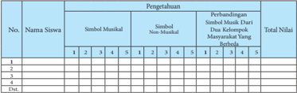

Tabel ini menunjukkan data pengujian musikal siswa-siswa di dua kompetisi musik. Kolom pertama berisi nama-nama siswa, kolom kedua berisi simbol musikal yang digunakan untuk mengukur keterampilan musik mereka, dan kolom ketiga berisi skor yang diberikan oleh juri. Data penting yang terlihat adalah bahwa siswa-siswa memiliki skor yang bervariasi, dengan beberapa siswa mendapatkan nilai 5 (terbaik) dan beberapa mendapatkan nilai 1 (terburuk). Ini menunjukkan bahwa siswa-siswa memiliki keterampilan musik yang berbeda-beda.

---
**📊 Tabel**

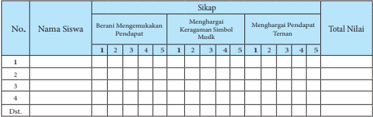

Tabel ini menunjukkan data tentang sikap siswa terhadap perdaupat, karya budaya, dan nilai-nilai sosial. Kolom "No." menunjukkan nomor siswa, kolom "Nama Siswa" berisi nama-nama siswa, kolom "Sikap" mencakup tiga subkolom: "Berani Menggumulakan Perdaupat", "Menghargai Karakter Sosial Simbol Muda", dan "Menghargai Pendidikan Teratas". Setiap siswa diberi skor dari 1 hingga 5 untuk setiap subkolom, dan total skor dihitung untuk setiap siswa. Data penting yang terlihat adalah bahwa siswa-siswa memiliki skor yang bervariasi dalam masing-masing subkolom, dengan beberapa siswa mendapatkan skor tinggi di satu subkolom tetapi rendah di subkolom lainnya.

---
**📊 Tabel**

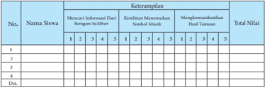

Tabel ini menunjukkan data evaluasi siswa berdasarkan tiga kriteria utama: mencari informasi dari berbagai sumber, ketelitian/memperbaiki sumber mendukung, dan mengkomunikasikan hasil temuan. Setiap siswa diurutkan berdasarkan nomor urut, dan untuk setiap kriteria, mereka diberikan nilai dari 1 hingga 5. Topik utama tabel adalah evaluasi kemampuan siswa dalam mengumpulkan dan memverifikasi informasi serta menghasilkan pengetahuan baru. Data penting yang terlihat adalah bahwa siswa dengan nomor urut 2 memiliki nilai tertinggi dalam semua kriteria, sedangkan siswa dengan nomor urut 4 memiliki nilai terendah. Ini menunjukkan perbedaan dalam kemampuan masing-masing siswa dalam menguasai metode penelitian dan pengumpulan data.

 

---
## 📄 Halaman 75

Penilaian  pada  masing-masing  aspek  menggunakan  skala  Likert,  yaitu dengan memberikan skor antara 1 - 5. Masing-masing skor mendeskripsikan tingkat kemampuan siswa, yaitu:

---
**📊 Tabel**

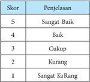

Tabel ini menunjukkan skor dan penjelasan untuk evaluasi kualitas suatu tugas atau karya. Topik utama tabel adalah evaluasi kualitas tugas atau karya. Kolom pertama berisi skor yang berangsur-angsur turun dari 5 hingga 1, sementara kolom kedua berisi penjelasan untuk setiap skor tersebut. Data penting yang terlihat adalah bahwa skor 5 diberikan ketika tugas atau karya sangat baik, sedangkan skor 1 diberikan ketika tugas atau karya sangat kurang. Skor 4 dan 3 diberikan ketika tugas atau karya baik dan cukup, sedangkan skor 2 diberikan ketika tugas atau karya kurang. Ini menunjukkan bahwa skor 5 adalah nilai tertinggi dan skor 1 adalah nilai terendah dalam evaluasi kualitas tugas atau karya.

Skor maksimal dalam penilaian proses untuk ketiga aspek tersebut adalah 45 dan skor minimal adalah 9. Apabila seorang siswa memperoleh total nilai 12  untuk  aspek  pengetahuan,  12  untuk  aspek  sikap,  dan  9  untuk  aspek keterampilan maka total nilai yang diperoleh adalah: 12 + 12 + 9 = 33. Nilai 33 menunjukkan bahwa kemampuan yang dicapai oleh siswa adalah 33 dari 45 skor maksimal atau 33/45 sehingga dapat dikatakan atau disimpulkan bahwa kemampuan siswa adalah 73,3% untuk ketiga aspek tersebut.

Penilaian  hasil  melibatkan  tes  tertulis,  tes  lisan,  dan  praktik  bermain musik. Penilaian hasil dilakukan pada setiap akhir semester.

### lnteraksi dengan Orang Tua

Pemahaman siswa terhadap sub-materi pembelajaran akan dapat dicapai dengan  lebih  baik  melalui  kerjasama  dengan  pihak  orang  tua  siswa.  Oleh karena itu, guru diharapkan dapat berinteraksi dengan orang tua para siswa, seperti meminta kesediaan para orang tua untuk dapat menyediakan sarana yang dibutuhkan oleh anak-anak mereka, memberi kesempatan kepada anakanak mereka untuk mengikuti kegiatan diskusi di luar proses pembelajaran, berdiskusi  dengan  anak-anak  mereka  tentang  sub-materi  yang  dipelajari  di sekolah, serta meluangkan waktu untuk menyaksikan beragam pertunjukan musik  dengan  anak-anak  mereka  dan  mendiskusikan  pengamatan  mereka terhadap pertunjukan musik tersebut.

 

---
## 📄 Halaman 76

### 2.  Nilai-Nilai Estetis Musik

Pada  setiap  benda  alam  yang  tercipta,  disentuh  dan  dimodifikasi  oleh manusia  untuk  diberinya  bentuk  baru,  maka  akan  bernilai.  Oleh  sebab  itu setiap karya seni budaya akan memiliki nilai dan fungsi tertentu sesuai dengan tujuannya,  hasil  karya  seni  itu  menunjukkan  maksud  dan  mengandung gagasan atau ide dari penciptanya. Salah satu nilai karya seni budaya itu dapat terlihat melalui suatu bentuk seni musik tradisional. Nilai merupakan sistem budaya yang cukup penting untuk dimaknai, karena nilai merupakan suatu konsep  yang  dipandang  baik  untuk  digunakan  sebagai  acuan  tingkah  laku dalam kehidupan masyarakat.

Sebagaimana dikatakan Sedyawati (1993) bahwa: 'Nilai seni memiliki arti sebagai nilai budaya yang didapatkan khusus dalam bidang seni yang berkenaan dengan hakikat karya seni dan hakikat berkesenian' . Merujuk pandangan itu kita  dapat  memaknai  bahwa  kesenian  khususnya  seni  musik  merupakan simbol dari suatu hasil aktivitas manusia didalam menjalani kehidupannya, dan hasil kreativitas bermusik yang memiliki nilai estetis.

Nilai estetis yang identik dengan keindahan itu, terkandung dalam konteks seni  musik  tradisional,  memiliki  ciri  garapan  berdasarkan  pola-pola  yang sudah baku.

Seni musik tradisional juga merupakan sebuah konfigurasi gagasan dan symbol kekuatan yang melampaui batas-batas realitas hidup yang ada, karena melalui  pernyataan  rasa  estetis  dan  gagasan  itulah  musik  dapat  dijadikan sebagai ciri identitas budaya masyarakat pendukungnya.

Jika  kita  mengkaji  fenomena-fenomena  seni  musik  tradisional  yang tumbuh dan berkembang di wilayah Indonesia, baik berupa lagu maupun alat musik atau instrument, senantiasa akan merujuk pada sociocultural masyarakat pendukungnya,  yang  dapat  dimanfaatkan  untuk  pemenuhan  kebutuhan estetis,  selain  dapat  dipergunakan  dalam  berbagai  kepentingan  seni  budaya mulai dari kegiatan ritual keagamaan sampai kepada hiburan dan pertunjukan. Oleh karenanya,

Musik  memiliki  hubungan  yang  sangat  erat  dengan  nilai,  norma  dan aturan dalam masyarakat pendukungnya.

Seperti telah dijelaskan dalam Bagian B, musik memiliki hubungan yang sangat erat dengan nilai, norma, dan aturan dalam masyarakat pendukungnya. Kenyataan ini dapat dipahami karena musik diciptakan oleh manusia yang merupakan  bagian  dari  suatu masyarakat. Sebagai anggota dari suatu masyarakat, para pelaku musik, disadari atau tidak disadari, akan menyerap

 

---
## 📄 Halaman 77

nilai, norma, dan aturan ketika berinteraksi dengan sesama anggota masyarakat dalam lingkungan sosialnya. Secara lambat-laun, beragam pengalaman empiris yang  disesuaikan  dengan  nilai,  norma,  dan  aturan  tersebut  membentuk pengetahuan yang menjadi pedoman bagi para pelaku musik untuk berperilaku, termasuk perilaku bermusik.

Berdasarkan  kenyataan  itu  timbul  dua  pertanyaan  tentang  bagaimana kebudayaan mempengaruhi musik, dan sebaliknya, bagaimana musik dapat mempengaruhi  kebudayaan. Para etnomusikolog dan antropolog yang mengkaji tentang musik lebih cenderung pada teori interaksionis.

Pandangan  interaksionis  memfokuskan  pada  interaksi  yang  terjadi  di antara individu-individu dan kelompok-kelompok individu serta bagaimana interaksi  tersebut  menciptakan  bentuk-bentuk  realita  sosial  dan  ekspresif. Ketika para individu  berusaha  memecahkan  masalah-masalah  dan  mencapai  hasil dalam  kehidupan,  mereka  secara  langsung  membuat  keputusan-keputusan. Dalam membuat keputusan, mereka menggunakan pengetahuan sebagai suatu arahan  bagi  perilaku  untuk  mempelajari  nilai-nilai  dan  teknik-teknik  yang diperoleh dari orang-orang di sekitar mereka. Oleh karena itu, dapat dikatakan bahwa kebudayaan (material, sosial, maupun ekspresif) merupakan perilaku yang dipelajari. Menurut Schutz (1977), pengetahuan merupakan akumulasi dari pengalaman-pengalaman konkrit yang diperoleh dan dimantapkan oleh seseorang secara terus-menerus dalam lingkungan sosialnya. Namun, pengetahuan tentang nilai-nilai dan teknik-teknik tersebut tidak begitu saja diikuti,  tetapi  diadaptasi  sesuai  dengan  nilai-nilai  dan  norma-norma  yang mereka yakini serta sesuai dengan konteks yang ada. Pola-pola keputusan yang dibuat oleh para individu berdampak pada modifikasi kebudayaan, termasuk modifikasi musik.

Dari  perspektif  ilmu  sosial,  musik  dipandang  secara  eksklusif  sebagai suatu karakter perilaku manusia. Sejak musik dipandang sebagai akibat dari aktivitas manusia dan karena manusia bertindak sesuai dengan norma norma budaya yang mereka yakini maka musik yang tercipta dipandang sebagai hasil aktivitas  manusia  yang  dipengaruhi  oleh  situasi  sosial  budaya  yang  ada. Pemahaman perilaku musikal manusia adalah untuk memperjelas perbedaan jenis-jenis  situasi  sosial  budaya  yang  terjadi  ketika  manusia  hidup  dan menghasilkan musik.

Bunyi instrumen yang terbuat dari bambu, misalnya, seringkali dipandang menghasilkan bunyiyang 'indah' oleh masyarakat pendukungnya.Masyarakat Sunda,  misalnya.  Penilaian  'indah'  terhadap  bunyi  yang  dihasilkan  oleh angklung tersebut tidak dapat dilepaskan dari nilai-nilai yang berlaku dalam

 

---
## 📄 Halaman 78

masyarakat Sunda. Masyarakat Sunda dikenal sebagai masyarakat yang akrab atau dekat dengan lingkungan alam. Mereka memandang lingkungan hidupnya sebagai sesuatu yang 'indah' , yang harus dihormati, diakrabi, dipelihara, dan dirawat. Kedekatan masyarakat Sunda dengan lingkungan alam tampak pada tindakan  mereka  untuk  menjadikan  bahan-bahan  dari  lingkungan  sekitar, misalnya  bambu,  sebagai  bagian  dari  kebutuhan  untuk  mengekspresikan keindahan.

Ditinjau dari aspek musikal, bunyi yang dihasilkan dari instrumen dari bambu  dipandang  dapat  lebih  mengekspresikan  gagasan  mereka  untuk berinteraksi dalam masyarakat. Aspek musikal dengan menggunakan angklung Sunda/ Indonesia tampak dalam potongan lagu Sampurasun yang diaransemen oleh Tedi Nur Rochmat berikut (bar 31 - 42):

### Sampurasun

Arr. Tedi Nur Rochmat

 

---
## 📄 Halaman 79

Simbol  tidak  hanya  tampak  pada  instrumen,  tetapi  juga  pada  suara manusia  yang  menyanyikan  lagu  dengan  cara  yang  unik.  Misalnya,  lagu keroncong.  Dalam  menyanyikan  lagu  keroncong,  para  penyanyi  seringkali menggunakan ornamen cengkok (c) dan nggandu/ (menyeret ketukan sehingga ketukan terkesan tidak stabil). Ornamen cengkok (c) umumnya digunakan di akhir  frase  atau  pada  not  yang  berdurasi  lebih  lama  yang  memperlihatkan contoh simbol yang terwujud dalam nada, sedangkan nggandu/ atau 'menyeret' ketukan  memperlihatkan  contoh  simbol  yang  terwujud  dalam  tempo  lagu. Perhatikan contoh berikut:

### Keroncong Kemayoran

---
**🖼️ Gambar/Diagram**

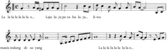

> **Deskripsi Visual:** Gambar ini adalah diagram musik, yang menunjukkan notasi musik dalam format tabulatur. Diagram ini menggambarkan struktur notasi untuk sebuah lagu dengan berbagai notasi melodi dan ritme. Notasi melodi terletak di bagian atas, sementara notasi ritme terletak di bagian bawah. Terdapat teks dalam bahasa Indonesia yang menjelaskan konten lagu, seperti "La la la la la la a." dan "Layu la jupe-ra-bu la-ju... b-wa". Ini menunjukkan bahwa lagu tersebut mungkin memiliki lirik yang berhubungan dengan suara atau nada tertentu. Diagram ini juga menunjukkan bahwa notasi melodi dan ritme ini mungkin digunakan dalam proses belajar musik, baik itu untuk pemula maupun yang sudah berpengalaman.

Dalam  genre/jenis  musik  yang  hampir  sama,  yaitu  keroncong  Tugu, cengkok dan nggandultersebut justru tidak ditemukan walaupun dikategorikan sebagai  musik  keroncong  juga.  Kenyataan  itu  memperlihatkan  bagaimana musik keroncong dapat diinterpretasikan dan diekspresikan secara berbeda dalam  kelompok  masyarakat  yang  berbeda.  Kenapa  perbedaan  itu  dapat terjadi? Jawabannya sangat berhubungan erat dengan nilai, norma, dan aturanaturan  yang  berlaku  dalam  masyarakat  pendukungnya.  Nilai,  norma,  dan aturan-aturan yang diterapkan dalam musik keroncong yang berkembang di masyarakat Jawa berbeda dari nilai, norma, dan aturan-aturan yang diterapkan dalam musik keroncong yang berkembang di masyarakat Tugu yang berlokasi di Kampung Tugu, Jakarta Utara.

 

---
## 📄 Halaman 80

---
**📊 Tabel**

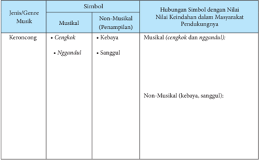

Tabel ini menunjukkan hubungan simbolik antara jenis musik dan nilai-nilai keindahan dalam masyarakat pendukungnya. Topik utama tabel adalah hubungan simbolik antara musik dan nilai-nilai keindahan dalam masyarakat. Kolom-kolom yang ada meliputi Jenis/Musik, Simbol, dan Hubungan Simbol dengan Nilai Keindahan dalam Masyarakat Pendukungnya. Data penting yang terlihat adalah bahwa musik tradisional seperti keroncong memiliki simbol yang berhubungan dengan nilai-nilai keindahan seperti cengkok dan nggunudul, sementara musik modern seperti kebaya dan sangeul tidak memiliki simbol yang spesifik untuk nilai-nilai keindahan tersebut.

Tujuan  pembelajaran  dalam  sub-materi  ini  adalah:  1)  mengidentifikasi hubungan  simbol  musikal  pada  instrumen  dengan  nilai-nilai  estetik  yang berlaku dalam masyarakat pendukungnya dan 2) mengidentifikasi hubungan simbol non-musikal dengan nilai-nilai estetik yang berlaku dalam masyarakat pendukungnya.

### Proses Pembelajaran

Langkah-langkah yang dilakukan oleh para siswa dalam proses pembelajaran mencakup kegiatan mengamati, menanyakan, mengumpulkan data, mengasosiasikan, dan mengkomunikasikan temuan-temuan yang mereka  peroleh  dari  kegiatan-kegiatan  sebelumnya.  Kegiatan  pembelajaran untuk sub-materi ini dapat dijelaskan sebagai berikut:

- Siswa diminta untuk mendengarkan atau menyaksikan dengan seksama beberapa  contoh  pertunjukan  musik  dari  suatu  kelompok  masyarakat melalui media audio dan/atau audio-visual
- Siswa diminta untuk mengidentifikasi simbol-simbol, baik musikal maupun non-musikal, dalam pertunjukan musik yang diamati
- Siswa distimuli untuk mengemukakan  pertanyaan-pertanyaan yang berhubungan dengan permainan musik yang didengar atau diamati

 

---
## 📄 Halaman 81

- Siswa diminta untuk mencari informasi atau data tentang simbol simbol yang berhubungan dengan nilai-nilai estetik dalam kebudayaan masyarakat pendukung musik tersebut
- Siswa  diminta  untuk  mendiskusikan  temuan-temuan  mereka  tentang simbol dan nilai-nilai estetik dalam kebudayaan masyarakat pendukungnya
- Siswa diminta untuk mencari informasi atau data tentang musik lokal yang terdapat dalam lingkungannya
- Siswa diminta untuk mencari informasi atau data tentang nilai-nilai estetik dalam kebudayaan masyarakat lokal tempat siswa berada
- Siswa diminta untuk menganalisis hubungan antara musik dan nilai-nilai estetik dalam kebudayaan masyarakat tempat siswa berada
- Siswa diminta untuk mengkomunikasikan hasil analisisnya dalam diskusi

### Konsep Umum

Kekeliruan : Musik hanya berhubungan dengan perasaan manusia

Pembahasan : Berdasarkan penjelasan dalam Bagian B diketahui bahwa musik tidak hanya berhubungan dengan kemampuan untuk mengekspresikan perasaan  atau  jiwa  para  pelaku  musik,  tetapi  juga  berhubungan  dengan kebudayaan masyarakat dimana mereka berada. Para pelaku musik, sebagai anggota suatu masyarakat, disadari atau tidak disadari, akan berperilaku sesuai dengan nilai, norma, dan aturan yang berlaku dalam masyarakatnya, termasuk berperilaku musik. Dengan kata lain, aktivitas-aktivitas musik yang dilakukan oleh  para  musisi  tidak  dapat  terlepas  kaitannya  dengan  nilai,  norma,  dan aturan masyarakat tersebut. Penjelasan ini memperlihatkan bahwa kebudayaan, disadari atau tidak disadari, berpengaruh secara signifikan terhadap pengetahuan para musisi dalam melakukan aktivitas aktivitas musik.

Di sisi lain, kebudayaan juga dapat dipengaruhi oleh pengetahuan musisi sehingga menyebabkan perubahan dalam kebudayaan itu sendiri. Kenyataan ini diperlihatkan dengan besarnya kemungkinan para musisi untuk memperoleh  pengalaman-pengalaman  konkrit  dari  kelompok  masyarakat lain, misalnya melalui proses kontak budaya yang dapat terjadi dalam bidang niaga (ekonomi), teknologi, pendidikan, politik, dan agama.  Beragam pengalaman  konkrit tersebut secara lambat-laun akan menjadi bagian pengetahuan  para  musisi  yang  berdampak  pada  perilaku  musikal  mereka sebagai  upaya  untuk  memodifikasi  budaya  musik  dalam  masyarakatnya. Sebagai akibatnya, musik dalam  masyarakat tersebut  akan  mengalami perubahan-perubahan tertentu sejalan dengan perubahan yang terjadi dalam bidang-bidang kebudayaan yang lain.

 

---
## 📄 Halaman 82

Berdasarkan penjelasan di atas dapat dikatakan bahwa musik tidak hanya berhubungan dengan kemampuan manusia untuk mengekspresikan perasaan atau  emosi  jiwanya  saja,  tetapi  kemampuan  para  pelaku  musik  untuk mengekspresikan perasaan atau gagasan musikal sangat berhubungan dengan pengetahuan atau wawasan kultural mereka terhadap nilai, norma, dan aturan yang diperoleh melalui pengalaman-pengalaman konkrit dalam lingkungan yang pernah mereka alami.

Kekeliruan : Estetika musik hanya dipahami sebagai keindahan musik

Pembahasan : Estetika musik seringkali hanya dipahami secara dangkal, yaitu  keindahan  musik.  Kita  sering  mendengar  adanya  penilaian  orang terhadap musik yang mereka dengar sebagai sesuatu yang 'indah' . Sayangnya, mereka  tidak  dapat  menjelaskan  secara  rinci  mengapa  musik  yang  mereka dengar dinilai indah atau memiliki nilai estetik.

Perlu  dipahami  bahwa  konsep  'indah'  tidak  selalu  berarti  sama  pada seluruh kelompok  masyarakat. Dapat  dikatakan bahwa  konsep  'indah' mengandung makna yang bersifat subjektif. Mengapa? Karena nilai, norma, dan  aturan  dalam  suatu  masyarakat  berbeda  dari  nilai,  norma,  dan  aturan dalam masyarakat yang lain. Nilai (value) yang berlaku dalam suatu masyarakat salah satunya adalah nilai keindahan atau nilai estetik. Dengan kata lain, nilai keindahan atau nilai estetik dalam suatu kelompok masyarakat berbeda dari nilai keindahan atau nilai estetik dalam kelompok masyarakat lain. Mengapa? Karena  nilai  estetik  dalam  suatu  masyarakat  sangat  berhubungan  dengan budaya masyarakat itu. Contohnya, bagi masyarakat Barat, khususnya dalam musik vokal  klasik,  bernyanyi  dengan  cara  berteriak  tidak  dapat  dikatakan indah atau tidak memiliki nilai estetik. Namun, bagi masyarakat lain, terdapat suatu jenis pertunjukan musik yang menuntut penyanyinya untuk bernyanyi dengan  cara  berteriak.  Perilaku  penyanyi  itu  justru  dipandang  'indah'  atau memiliki nilai estetik di kalangan masyarakat pendukungnya.

### Pengayaan

Tahap  pengayaan  merupakan  tahap  yang  dilakukan  oleh  siswa  atau kelompok siswa yang memiliki tingkat kompetensi yang lebih tinggi daripada siswa atau kelompok siswa yang lain. Bagi siswa atau kelompok siswa yang memiliki kompetensi yang lebih tinggi, guru dapat menstimuli mereka untuk lebih  memperdalam  pemahaman  tentang  nilai-nilai  estetik  musik  untuk mengembangkan potensi secara lebih optimal. Tugas yang diberikan oleh guru dalam tahap ini adalah menstimuli siswa atau kelompok siswa untuk mencari referensi tentang beragam budaya masyarakat untuk lebih memahami nilainilai  estetik  dari  simbol-simbol  musik  yang  mereka  temui  dalam  beragam pertunjukan atau permainan musik.

 

---
## 📄 Halaman 83

### Remedial

Kemampuan para siswa tentu  saja  berbeda  satu  sama  lain.  Bagi  siswasiswa  yang  kurang  dapat  menguasai  konsep  ini,  guru  dapat  mengulang kembali  materi  yang  telah  diajarkan.  Pengulangan  materi  disertai  dengan pendekatan pendekatan yang lebih memperhatikan hambatan yang dialami siswa atau kelompok siswa dalam memahami materi pembelajaran. Misalnya, membimbing pemahaman siswa atau kelompok siswa dengan memberi lebih banyak contoh dari yang paling sederhana sampai yang agak sulit. Contoh contoh  yang  diberikan  dapat  berupa  gambar,  audio,  maupun  audio-visual. Pendekatan lain yang dapat dilakukan guru dalam tahap remedial ini adalah dengan lebih banyak memberi perhatian kepada siswa atau kelompok siswa tersebut yang dilakukan secara menyenangkan atau non-formal. Pendekatan yang  menyenangkan  atau  non-formal  ini  dapat  dilakukan  guru  dengan tujuan  agar  siswa  atau  kelompok  siswa  tersebut  dapat  lebih  termotivasi untuk  mencari  informasi  yang  mereka  butuhkan,  lebih  termotivasi  untuk bertanya,  mengemukakan  pendapat,  dan  membentuk  pemahaman  tentang nilai-nilai estetik musik dalam beberapa pertunjukan musik dari budaya yang berbeda. Tahap remedial diakhiri dengan penilaian untuk mengukur kembali tingkat pemahaman siswa atau kelompok siswa tersebut terhadap sub-materi pembelajaran.

### Penilaian

Penilaian proses untuk sub-materi ini mencakup tiga aspek dasar, yaitu pengetahuan,  sikap,  dan  keterampilan.  Untuk  lebih  jelasnya,  perhatikan contoh lembar penilaian berikut:

### Nilai-Nilai Estetik Musik

---
**📊 Tabel**

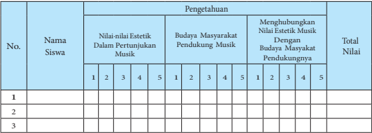

Tabel ini menunjukkan penilaian siswa berdasarkan kriteria estetika dan budaya masyarakat pendukung musik. Topik utama tabel adalah penilaian kualitas musik berdasarkan nilai-nilai estetik dan budaya masyarakat pendukungnya. Kolom-kolom yang ada meliputi nomor siswa, nilai-nilai estetik dalam pertunjukan musik, budaya masyarakat pendukung musik, dan total nilai. Data penting yang terlihat adalah bahwa siswa memiliki skor rata-rata sekitar 3-4 di setiap kriteria, dengan beberapa siswa mendapatkan nilai tertinggi di bidang budaya masyarakat pendukung musik. Ini menunjukkan bahwa penilaian ini mencakup aspek estetika dan budaya yang penting dalam pertunjukan musik.

 

---
## 📄 Halaman 84

---
**📊 Tabel**

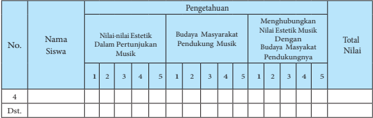

Tabel ini menunjukkan hasil penilaian siswa dalam dua aspek utama: Nilai-silai Estetika Dalam Pertunjukan Musik dan Budaya Masyarakat Pendukung Musik. Setiap siswa diuji pada empat kriteria untuk kedua aspek tersebut, dengan skor 1 hingga 5. Topik utama tabel adalah penilaian kualitas pertunjukan musik dan pengaruh budaya masyarakat yang mendukungnya. Data penting yang terlihat adalah bahwa siswa dengan nomor 4 memiliki nilai tertinggi dalam aspek Budaya Masyarakat Pendukung Musik, sementara siswa dengan nomor 1 memiliki nilai tertinggi dalam aspek Nilai-silai Estetika Dalam Pertunjukan Musik. Ini menunjukkan perbedaan dalam penilaian antara kedua aspek tersebut.

---
**📊 Tabel**

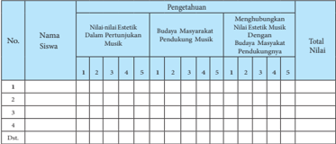

Tabel ini menunjukkan data penilaian siswa tentang pengetahuan mereka tentang budaya masyarakat pendukung musik dan estetika musik. Topik utama tabel adalah pengetahuan tentang budaya masyarakat pendukung musik dan estetika musik. Kolom-kolomnya meliputi nama siswa, nilai-nilai estetik dalam pertunjukan musik, budaya masyarakat pendukung musik, dan total nilai. Data penting yang terlihat adalah bahwa beberapa siswa memiliki nilai yang sama untuk semua kolom, sementara lainnya memiliki nilai yang berbeda-beda. Ini menunjukkan bahwa pengetahuan siswa tentang budaya masyarakat pendukung musik dan estetika musik bervariasi.

---
**📊 Tabel**

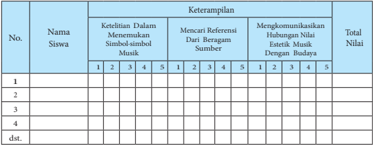

Tabel ini menunjukkan kinerja siswa dalam beberapa aspek musik, termasuk ketelitian dalam memetik simbol-simbol musik, mencari referensi musik dari berbagai sumber, dan kemampuan komunikasi hubungan nilai efektif antara musik dengan nilai-nilai hidup. Kolom-kolomnya mencakup nomor siswa, keterampilan, dan total nilai. Data penting yang terlihat adalah bahwa setiap siswa memiliki nilai untuk setiap keterampilan, dan total nilai untuk setiap siswa juga ditampilkan. Ini membantu dalam analisis kinerja individu dan keseluruhan kelas dalam konteks musik dan nilai-nilai hidup.

Penilaian  pada  masing-masing  aspek  menggunakan  skala  Likert,  yaitu dengan memberikan skor antara 1 - 5. Masing-masing skor mendeskripsikan tingkat kemampuan siswa, yaitu:

 

---
## 📄 Halaman 85

Skor maksimal dalam penilaian proses untuk ketiga aspek tersebut adalah 45 dan skor minimal adalah 9. Apabila seorang siswa memperoleh total nilai 12  untuk  aspek  pengetahuan,  12  untuk  aspek  sikap,  dan  9  untuk  aspek keterampilan maka total nilai yang diperoleh adalah: 12 + 12 + 9 = 33. Nilai 33 menunjukkan bahwa kemampuan yang dicapai oleh siswa adalah 33 dari 45 skor maksimal atau 33/45 sehingga dapat dikatakan atau disimpulkan bahwa kemampuan siswa adalah 73,3% untuk ketiga aspek tersebut.

Penilaian  hasil  melibatkan  tes  tertulis  dan  tes  lisan.  Penilaian  hasil dilakukan pada setiap akhir semester.

### C.  Jenis Musik Tradisional

### Informasi untuk Guru

Dalam konteks estetik, jenis seni musik baik musik barat maupun musik tradisional merupakan bahasa simbolik yang bersifat dinamis. Secara umum bahasa musik dapat digolongkan menjadi tiga bentuk penyajian yaitu musik vokal, musik instrumen, dan musik campuran.

- Musik vokal adalah seni suara yang dihasilkan melalui mulut manusia.
- Musik Instrument adalah seni suara yang dihasilkan oleh suara alat-alat musik atau media bunyi-bunyian.
- Seni musik campuran adalah seni suara yang dihasilkan dari paduan seni suara vokal dan bunyi instrumen.
- Dilihat dari segi pergelarannya, seni karawian atau musik tradisional dapat dibagi dalam tiga kelompok besar, yaitu:
- Karawitan Sekar adalah seni suara, atau vokal daerah yang diungkapkan melalui suara mulut manusia yang bersentuhan dengan nada, bunyi atau instrumen pendukungnya. Sekar merupakan pengolahan suara yang khu-
- sus  untuk  menimbulkan  rasa seni yang sangat erat berhubungan langsung dengan  indra pendengaran.  Fungsi  sekar  secara khusus adalah memformulasikan dan mengungkapkan ungkapan perasaan melalui kata dan senandung dengan media  seni  suara  manusia  sebagai penghantarnya.

 

---
## 📄 Halaman 86

---
**🖼️ Gambar/Diagram**

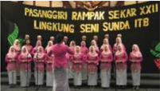

> **Deskripsi Visual:** Gambar ini adalah foto yang menunjukkan sebuah acara atau kegiatan yang diselenggarakan oleh Pasisanggiri Rampak Sekar XXII Lingkungan Seni Sunda ITB. Dalam foto tersebut, beberapa orang wanita berdiri bersama-sama, masing-masing mengenakan pakaian warna pink dan hijau. Mereka tampak senang dan terlibat dalam acara tersebut. Di belakang mereka, terdapat papan tulis dengan teks yang tidak jelas, mungkin menyebutkan nama acara atau tujuan acara tersebut. Gambar ini menunjukkan suasana positif dan kolaboratif dalam lingkungan seni Sunda ITB.

- Karawitan  Gending  adalah  seni  suara  yang  diungkapkan  melalui  alat musik daerah, atau alat bunyi-bunyian. Arti Gending itu sendiri merupakan susunan nada-nada yang mempunyai bentuk yang teratur menurut konpensi tradisi.  Menurut  Machyar  Angga  Kusumadinata  seorang  tokoh  karawitan Sunda  mengatakan  'gending  ialah  aneka  suara  yang  didukung  oleh  suarasuara tetabuhan' . Pengertian dari tetabuhan tersebut tidak terbatas pada alatalat gamelan saja, akan tetapi alat-alat non gamelan pun terdapat di dalamnya, seperti siter/kecapi sebagai musik petik, calung, angklung, alat perkusi, alat alat musik tiup dan alat musik gesek.
Orientasi  karawitan  gending  dalam  lagu  cenderung  pada  alat-alat  yang bernada,  padahal  selain  itu  ada  pula  alat  musik  yang  tak  bernada,  seperti kendang, tifa, kohkol, dogdog, terbang, dlsb.

Jenis  gending  akan  kita  dapati  pada  pergelaran  musik  gamelan,  kacapi suling, musik ketuk tilu, dlsb. Misalnya bentuk visual berikut

 

---
## 📄 Halaman 87

Musik instrument dalam istilah karawitan disebut gending dapat diklasifikasikan  berdasarkan  cara  produksi  suara  dan  sumber  bahan  yang berbunyi yaitu:

- chardophone yaitu kelompok alat musik yang sumber bunyinya dari dawai (kawat atau snar),
- idiophone yaitu alat musik yang sumber bunyinya dari badan alat musik itu sendiri, yang terbuat dari bahan perunggu, besi, kayu,
- membranophone yaitu alat musik yang sumber bunyinya dari kulit atau paber glass,
- aerophone yaitu alat musik yang sumber bunyinya dari udara,
- electrophone yaitu alat musik yang sumber bunyinya dari aliran listrik electronic.
Selain cara tersebut, music instrumen dapat dilihat dari Cara memainkannya  atau  membunyikannya,  dikarenakan  dalam  seni  musik tradisional,  alat  musik  sangat  beragam,  yaitu  bisa  disajikan  dengan  cara dipukul, dipukulkan, dipetik, ditepuk, ditepak, digoyang, ditiup, diisap, dan digesek. Selanjutnya musik tradisional itu dapat dilihat dari Cara pengolahan suara  atau  nada,  yaitu  dilihat  dari  panjang  pendeknya,  besar  kecilnya,  tipis tebalnya  alat/waditra  untuk  wilahan,  cembung  cekungnya  waditra  penclon, besar kecilnya volume udara dalam lubang resonator, dan tegangan senar atau kawat, serta kencang kendurnya tali atau rarawat yang dalam waditra kendang, dogdog, terbang, bedug dan sejenisnya.

- Karawitan Sekar Gending adalah bentuk penyajian seni suara daerah yang memadukan sekar dan gending. Sekar gending memiliki arti bentuk sajian seni suara dalam bentuk nyanyian yang diiringi instrumen. Kedua jenis seni  suara  itu  mempunyai  tugas  yang  sama  beratnya,  keduanya  saling mengisi dan mempunyai keterkaitan yang tak dapat dipisahkan.
Ketiga  bentuk  karawitan  di  atas,  masing-masing  mempunyai  cabangcabangnya  yang  berbeda  satu  sama  lainnya.  Perlu  diketahui  bahwa  faktor lingkungan dalam masyarakat memang memberikan warna dan citra tersendiri pada masing-masing bentuk music tradisional itu. Selain itu teknik pergelaran, teknik suara, pola garaf, motif tabuhan alat musik, dan aspek musikal dapat membawa perbedaan dari jenis dan bentuknya.

 

---
## 📄 Halaman 88

Setelah  kamu  mengenal  jenis  dan  bentuk  penyajian  musik  tradisional, maka diharapkan dapat menemukan dan mempelajari jenis musik tradisional lainnya yang digali melalui sumber internet website , atau dari buku referensi khasanah budaya nasional Indonesia. Hasil temuan kamu itu, coba diskusikan dengan teman-temanmu  kemudian  dideskripsikan dalam catatan table berikut:

---
**📊 Tabel**

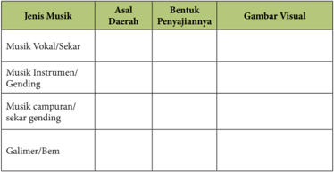

Tabel ini memperlihatkan berbagai jenis musik tradisional di Indonesia, dengan fokus pada asal daerah, bentuk penyajian, dan gambar visualnya. Topik utama tabel adalah musik tradisional Indonesia, yang mencakup empat jenis utama: musik vocal/sekar, musik instrumen/gending, musik campuran/sekar gending, dan galimer/bem. Setiap jenis musik memiliki asal daerah yang berbeda, seperti daerah pedalaman, pesisir, atau pedalaman lainnya. Bentuk penyajian juga berbeda-beda, mulai dari nyanyian, gending, sampai campuran antara kedua bentuk tersebut. Gambar visual yang umumnya digunakan untuk menunjukkan musik tradisional Indonesia meliputi gambaran tentang alat musik, penari, atau tarian tradisional yang terkait dengan jenis musik tersebut. Dengan demikian, tabel ini memberikan gambaran umum tentang variasi dan keunikan musik tradisional Indonesia dari berbagai daerah.

### D. Fungsi Musik

### 1.  Fungsi Musik tradisional

Dalam  memahami  musik,  konsep  fungsi  seringkali  diartikan  secara sederhana,  yaitu  kegunaan.  Dalam  etnomusikologi  dan  antropologi,  istilah 'fungsi'  dan  'guna'merupakan  dua  konsep  yang  berbeda.  Fungsi  dan  guna memperlihatkan karakter umum dari pandangan subjektif individu tentang suatu pengalaman yang ia peroleh. 'Fungsi' , secara mendasar, mengacu pada reaksi seseorang terhadap pengalaman-pengalaman musik yang ia alami atau yang  ia  kenang,  sedangkan  'guna'  merupakan  cara  makna-makna  tersebut digabung untuk merencanakan dan merealisasikan peristiwa musik. Fungsi yang diberikan orang-orang terhadap musik merupakan bagian dari motivasimotivasi  mereka.  Perwujudan  pertunjukan-pertunjukan  dan  bunyi  musik dipandang sebagai akibat dari motivasi-motivasi tersebut.

Berdasarkan  kalimat  di  atas  dapat  dikatakan  bahwa  konsep  guna  dan fungsi mengesankan perbedaan arti yang signifikan. Dahulu, para etnomusikolog  kurang  memperhatikan  pentingnya  pemahaman  tentang kedua konsep tersebut. Namun, kedua konsep tersebut ternyata menyebabkan

 

---
## 📄 Halaman 89

permasalahan dalam bidang antropologi. Bagi para antropolog, konsep fungsi memainkan suatu peranan teoretis dan historis yang sangat penting. Fungsi mengacu  pada  pemahaman  tentang  makna  musik  bagi  manusia.  Guna mengacu pada cara-cara manusia melibatkan musik dalam masyarakat dalam kejadian sehari-hari, baik berkaitan dengan musik itu sendiri ataupun dengan aktivitas-aktivitas  lainnya.  Artinya,  musik  digunakan  dalam  situasi  situasi tertentu dan menjadi bagian dalam situasi-situasi tersebut. Misalnya, musik atau  lagu  yang digunakan oleh  seorang  ibu  untuk  menidurkan  anaknya berfungsi untuk  menenangkan  dan  memberi  kenyamanan  pada  anaknya hingga ia dapat tidur dengan nyenyak. Perlu ditambahkan pula bahwa fungsi atau makna musik tidak dapat dilepaskan dari konteksnya.

Dalam  masyarakat  Bali,  misalnya,  terdapat  beragam  jenis  musik  yang seringkali  digunakan  untuk  beragam  kebutuhan  dalam  masyarakatnya, misalnya ritual keagamaan. Dalam masyarakat keturunan Bali Aga di Desa

Tenganan Pegringsingan, Kecamatan Manggis, Kabupaten Karangasem, misalnya, terdapat gamelan se/onding, yang dinilai sangat unik dan disakralkan oleh  masyarakat  pendukungnya.  Musik  gamelan se/onding ini  digunakan dalam salah satu acara ritual keagamaan dalam masyarakat itu. Salah satunya adalah untuk mengiringi tarian Rejang. Acara ritualkeagamaan ini dilakukan oleh masyarakat pendukungnya pada malam hari. Mengapa gamelan se/onding yang  sangat  disakralkan  oleh  masyarakat  pendukungnya  dilibatkan  dalam acara ritual keagamaan tersebut? Mengapa gamelan selonding itu hanya dapat dimainkan di malam hari? Kedua pertanyaan tersebut berhubungan dengan fungsi atau makna musik gamelan se/onding bagi seluruh masyarakat di Desa Tenganan  tersebut  yang  berhubungan  dengan  nilai-nilai  keagamaan  yang mereka yakini.

1

2

 

---
## 📄 Halaman 90

3

4

Contoh  lain  adalah  pertunjukan  musik Burdah  Bu/eleng dalam  acara Pekan Kesenian Bali (PKB) yang diselenggarakan setiap tahun oleh pemerintah daerah  setempat.  Ditinjau  dari  konsep  guna,  pertunjukan  musik Burdah Buleleng tersebut adalah untuk hiburan bagi masyarakat Bali dan turis lokal maupun mancanegara. Ditinjau dari aspek fungsi, keberadaan para pemain musik yang menggunakan kostum yang mencirikan pemuda Islam/muslim dengan  instrumen burdah (menyerupai  rebana)  dalam  konteks  PKB  dapat mengandung makna lain. Misalnya, berfungsi untuk memperlihatkan keberadaan komunitas Islam/muslim di tengah masyarakat Bali yang mayoritas penduduknya beragama Hindu. Karakter Islam/muslim tampak pada instrumen dan kostum yang digunakan oleh para pemainnya.

Tujuan  pembelajaran:  1)  mengidentifikasi  perbedaan  antara  fungsi  dan guna musik, 2) mengidentifikasi  beberapa fungsi musik dalam masyarakat, dan 3) membandingkan fungsi musik dalam konteks yang berbeda.

### Proses Pembelajaran

Langkah-langkah yang dilakukan oleh para siswa dalam proses pembelajaran mencakup kegiatan  mengamati,  menanyakan,  mengumpulkan  data,  mengasosiasikan,  dan  mengkomunikasikan  temuan-temuan  yang  mereka  peroleh dari kegiatan-kegiatan  sebelumnya.  Kegiatan pembelajaran tersebut dapat dijelaskan sebagai berikut:

- Siswa diminta untuk membedakan contoh penggunaan konsep 'guna' dan 'fungsi'

 

---
## 📄 Halaman 91

- Siswa diminta untuk menerapkan pemahaman konsep 'guna' dan 'fungsi' musik dalam peristiwa tertentu
- Siswa diminta untuk mengidentifikasi konteks tertentu ketika musik atau lagu dimainkan
- Siswa diminta untuk mengidentifikasi fungsi suatu musik atau lagu yang sama dalam konteks berbeda
- Siswa  diminta  untuk  mendiskusikan  hubungan  fungsi  musik  dalam konteks yang berbeda
- Siswa diminta untuk mengkomunikasikan hasil analisisnya tentang fungsi musik.

### Konsep Umum

Kekeliruan   : Fungsi diartikan sama dengan guna

Pembahasan : Dalam bagian 1 telah dijelaskan bahwa, ditinjau dari bidang etnomusikologi  dan  antropologi,  fungsi  dan  guna  merupakan  dua  konsep yang  berbeda  secara  signifikan.  Konsep  'guna'  mengacu  pada  keterlibatan musik  dalam  suatu  peristiwa,  sedangkan  'fungsi'  merupakan  konsep  yang mengacu  pada  makna  di  balik  kegunaan  musik  dalam  peristiwa  tersebut. Dengan kata lain, fungsi berhubungan dengan makna atau tujuan yang ingin

### Pengayaan

Tahap  pengayaan  merupakan  tahap  yang  dilakukan  oleh  siswa  atau kelompok siswa yang memiliki tingkat kompetensi yang lebih tinggi daripada siswa atau kelompok siswa yang lain. Bagi siswa atau kelompok siswa yang memiliki  kompetensi  yang  lebih  tinggi,  guru  dapat  mengarahkan  mereka untuk memperdalam pemahaman tentang fungsi musik dalam konteks yang berbeda  dan  mengembangkan  potensi  secara  lebih  optimal.  Tugas  yang diberikan  oleh  guru  dalam  tahap  ini  adalah  menstimuli  kemampuan  dan pengetahuan siswa atau kelompok siswa untuk menghubungkan musik yang digunakan dengan konteks yang lebih beragam.

### 2. Fungsi Alat Musik Tradisional

Dalam penyajiannya masing-masing alat musik/waditra memiliki fungsi yang berbeda, antara lain alat musik tradisional itu berfungsi untuk: a) Pengisi suasana  dalam  suatu  adegan  sendratari  atau  gending  karesmen.  b)  Sarana komunikasi, c) Sarana pertunjukan dan hiburan yang bersifat sosial maupun komersial , d) Sarana Ekspresi diri dan kreasi.

Secara khusus fungsi alat/waditra musik dalam kelompok gamelan adalah diantaranya:

 

---
## 📄 Halaman 92

- waditra  kenong  pada  prinsipnya  permainan  kenong  merupakan  aksenaksen  untuk  memperkuat  tabuh  selentem,  dan  goong  yang  berfungsi sebagai penjaga irama atau anggeran wiletan (inter punctie), b) waditra Kendang  dan  Bonang  Degung,  kacapi  indung  sebagai  anceran  wiletan yaitu alat musik yang dapat dijadikan sebagai pembawa/pengatur irama yang memberi pengarahan dan menentukan embat atau tempo dari suatu lagu,
- waditra  rebab,  suling,  gambang  berfungsi  sebagai  amardawa  lagu  atau melodi lagu,
- waditra  selentem,  demung,  saron,  jentreng,  diperankan  sebagai  arkuh lagu,  atau  balungan  gending  (cantus  firmus),  juga  berfungsi  sebagai kerangka lagu, serta
- waditra rincik, kacapi rincik, gambang, suling sebagai adumanis lagu atau waditra-waditra yang memberikan ornament (lilitan melodi).
Apabila  kita  melihat  dari  kuantitas  waditra  yang  disajikan,  maka  akan terlihat adanya bentuk ansambel, seperti adanya kelompok:

- Ansambel besar yaitu  sajian  gending  gamelan  Pelog  Salendro,  gamelan Sekaten atau Gamelan Bali.
- Ansambel Sedang seperti gamelan Degung, Renteng, Tarling, Angklung,
- Ansambel kecil seperti Talempong, tatagani, rengkong, Gondang
- Ansambel mandiri seperti Karinding, Calung, Dogdog, Kacapian.
Gamelan jelas bukan alat yang asing bagi masyarakat Indonesia, karena gamelan merupakan alat musik yang terdiri dari berbagai alat musik perkusi terbuat dari perunggu atau besi, bahkan gamelan ada yang dibuat dari bamboo, atau kayu yang pada umumnya cara memainkannya dipukul.

 

---
## 📄 Halaman 93

Apakah kamu tahu Gamelan yang paling popular di Negara Indonesia, tepatnya di daerah mana? Apakah kamu dapat menemukan gamelan di luar lingkungan masyarakat Sunda, Jawa, dan Bali? Termasuk pada jenis ansambel apakah gamelan itu? Coba kamu rinci alat yang termasuk pada music gamelan!

Apakah kamu pernah mengapresiasi pertunjukan tentang Gamelan Gong Gede  yang  tumbuh  di  daerah  Bali?  Silakan  paparkan  yang  kamu  ketahui perihal gamelan tersebut! Berapa jumlah waditranya? Apa saja nama waditra yang diimainkan pada gamelan Gong Gede?

Gamelan  Gong  Gede  yang  biasanya  melibatkan  30-50  orang  pemain, memiliki suara yang agung, sehingga sering dipakai untuk memainkan tabuhtabuh gending klasik yang dinamis, dan difungsikan untuk mengiringi kegiatan upacara-upacara besar keagamaan di pura-pura dan pengiring upacara istana, termasuk  untuk  mengiringi  tari-tarian  upacara  seperti  Tari  Topeng,  Tari Rejang dan Tari Pendet.

Dari berbagai sumber temuan diperoleh informasi bahwa musik gamelan dapat dimainkan dengan cara individu/semdiri sebagai konser musikal, dan bisa juga difungsikan sebagai musik pengiring vokal, pengiring pertunjukkan wayang, pertunjukan tari-tarian, upacara budaya ritual, upacara keagamaan, pesta  rakyat  (hajat  laut,  hajat  hasil  bumi),  pengiring  acara  seremonial  bagi keluarga kerajaan, serta gamelan dapat difungsikan sebagai media pendidikan music tradisional di sekolah dan luar sekolah juga digunakan sebagai media kreativitas untuk membuat komposisi musik modern..

Jenis  alat  musik  tradisional  lainnya  yang  berasal  dari  daerah  Minahasa Sulawesi utara adalah Kolintang. Alat musik Kolintang ini terbuat dari kayu. yang dimainkan oleh enam orang. Menurut informasi dari beberapa sumber nama Kolintang berasal dari suara tang (nada rendah), ting (nada tinggi), dan tong (nada sedang/biasa) ditemukan oleh orang Minahasa bernama Lintang. Alat  musik  Kolintang  ini  difungsikan  untuk  mengisi  berbagai  acara  seperti pesta pernikahan, peresmian, keagamaan dan pada acara pertandingan..

Rapai  adalah  alat  music  tradisional  yang  berasal  dari  NAD  Sumatera, terbuat dari bahan dasar kayu dan kulit binatang, bentuk seperti Rebana. Rapai yang memiliki ragam jenisnya (Rapai Pasee, Rapai Daboih, Rapai Geurimpheng, Rapai  Pulot,  dan  Rapai  Anak)  merupakan  sejenis  alat  music  perkusi  yang berfungsi sebagai pengiring seni tradisional.

Apakah kamu masih ingat dengan alat music tradisional Suku Dayak yang dipergunakan sebagai media komunikasi penyampaian maksud dan puja puji kepada yang berkuasa?

 

---
## 📄 Halaman 94

### SAMPE

Alat music sejenis gitar ini merupakan alat yang dimainkan dengan cara dipetik  dengan  dawai  3-4  di  bagian  badan  alat  music  itu  biasanya  diberi ornament ukiran khas suku Dayak. berfungsi untuk mengiringi bermacammacam tarian.

Kegiatan kamu selanjutnya adalah mencari dan mempelajari sebanyakbanyaknya  alat  music  tradisional  yang  tumbuh  berkembang  di  wilayah nusantara ini. Paparkan temuan kamu dengan mendiskusikan hasil temuan bersama teman-teman kelasmu.

- Apa nama alat music itu?
- Berasal dari daeerah mana?
- Bagaimana bentuknya?
- Bagaimana cara memainkannya?
- Apa fungsi alat tersebut dalam kehidupan masyarakat?
- Sejenis alat music apakah itu?

### Remedial

Kemampuan para siswa tentu  saja  berbeda  satu  sama  lain.  Bagi  siswasiswa yang kurang dapat menguasai konsep ini, guru dapat mengulang kembali materi yang telah diajarkan. Pengulangan materi disertai dengan pendekatan pendekatan  yang  lebih  memperhatikan  hambatan  yang  dialami  siswa  atau kelompok siswa dalam memahami materi pembelajaran. Misalnya, membimbing pemahaman siswa atau kelompok siswa dengan memberi lebih banyak contoh dari yang paling sederhana sampai yang agak sulit. Contoh contoh  yang  diberikan  dapat  berupa  gambar,  audio,  maupun  audio-visual. Pendekatan lain yang dapat dilakukan guru dalam tahap remedial ini adalah dengan lebih banyak memberi perhatian kepada siswa atau kelompok siswa tersebut yang dilakukan secara menyenangkan atau non-formal. Pendekatan yang menyenangkan atau non-formal ini dapat dilakukan guru dengan tujuan agar siswa atau kelompok siswa tersebut dapat lebih termotivasi untuk mencari informasi yang mereka butuhkan, lebih termotivasi untuk bertanya, mengemukakan pendapat, dan membentuk pemahaman tentang fungsi musik berdasarkan  hasil  analisis  yang  mereka  peroleh.  Tahap  remedial  diakhiri dengan penilaian  untuk  mengukur  kembali  tingkat  pemahaman  siswa  atau kelompok siswa tersebut terhadap sub-materi pembelajaran.

 

---
## 📄 Halaman 95

### Penilaian

Penilaian proses untuk sub-materi ini mencakup tiga aspek dasar, yaitu pengetahuan, sikap, dan keterampilan. Untuk lebih jelasnya, perhatikan contoh lembar penilaian berikut:

### Penilaian Proses: Fungsi Musik

---
**📊 Tabel**

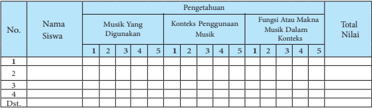

Tabel ini menunjukkan data penilaian musik dari beberapa siswa. Topik utamanya adalah penilaian musik, termasuk penggunaan musik, konteks penggunaan musik, fungsi atau makna musik dalam konteks, dan total nilai. Kolom-kolomnya meliputi nomor siswa, nama siswa, dan nilai-nilai yang diberikan untuk setiap aspek penilaian. Data penting yang terlihat adalah bahwa banyak siswa menggunakan musik dengan baik, namun masih ada yang kurang memahami konteks penggunaan musik dan fungsi musik dalam konteks. Total nilai juga bervariasi, menunjukkan perbedaan tingkat pemahaman dan penggunaan musik antara siswa-siswa tersebut.

---
**📊 Tabel**

Tabel ini menunjukkan hasil evaluasi kinerja siswa dalam beberapa aspek, termasuk berani mengungkapkan pendapat, proaktif dan responsif dalam diskusi, serta menghargai pendapat teman. Kolom-kolomnya mencakup nomor siswa, nama siswa, dan total nilai. Data penting yang terlihat adalah bahwa siswa 1 memiliki nilai tertinggi di semua aspek, sementara siswa 4 memiliki nilai terendah. Siswa 2 dan 3 memiliki nilai yang lebih rendah dibandingkan dengan siswa 1 dan 4. Ini menunjukkan variasi dalam kinerja siswa dalam setiap aspek yang diteliti.

---
**📊 Tabel**

Tabel ini menunjukkan data evaluasi siswa dalam dua aspek utama: keterampilan dan komunikasikan hasil analisis. Kolom pertama berisi nomor siswa, sedangkan kolom kedua sampai kelima berisi deskripsi keterampilan dan kolom keenam sampai kesembilan berisi deskripsi komunikasikan hasil analisis. Data penting yang terlihat adalah bahwa siswa 1 memiliki nilai tertinggi dalam keterampilan (5) dan komunikasikan hasil analisis (4), sementara siswa 3 memiliki nilai terendah dalam keduanya. Siswa 2 memiliki nilai yang lebih rendah dalam keterampilan tetapi lebih tinggi dalam komunikasikan hasil analisis.

Penilaian  pada  masing-masing  aspek  menggunakan  skala  Likert,  yaitu dengan memberikan skor antara 1 - 5. Masing-masing skor mendeskripsikan tingkat kemampuan siswa, yaitu:

 

---
## 📄 Halaman 96

Skor maksimal dalam penilaian proses untuk ketiga aspek tersebut adalah 45 dan skor minimal adalah 9. Apabila seorang siswa memperoleh total nilai 12  untuk  aspek  pengetahuan,  12  untuk  aspek  sikap,  dan  9  untuk  aspek keterampilan maka total nilai yang diperoleh adalah: 12 + 12 + 9 = 33. Nilai 33 menunjukkan bahwa kemampuan yang dicapai oleh siswa adalah 33 dari 45 skor maksimal atau 33/45 sehingga dapat dikatakan atau disimpulkan bahwa kemampuan siswa adalah 73,3o/o untuk ketiga aspek tersebut.

Penilaian  hasil  melibatkan  tes  tertulis  dan  tes  lisan.  Penilaian  hasil dilakukan pada setiap akhir semester.

### lnteraksi dengan Orang Tua

Pemahaman siswa terhadap sub-materi pembelajaran akan dapat dicapai dengan  lebih  baik  melalui  kerjasama  dengan  pihak  orang  tua  siswa.  Oleh karena itu, guru diharapkan dapat berinteraksi dengan orang tua para siswa, seperti meminta kesediaan para orang tua untuk dapat menyediakan sarana yang dibutuhkan oleh anak-anak mereka, memberi kesempatan kepada anakanak mereka untuk mengikuti kegiatan diskusi di luar proses pembelajaran, berdiskusi  dengan  anak-anak  mereka  tentang  sub-materi  yang  dipelajari  di sekolah, serta meluangkan waktu untuk menyaksikan beragam pertunjukan musik  dengan  anak-anak  mereka  dan  mendiskusikan  pengamatan  mereka terhadap pertunjukan musik tersebut.

### E. Praktik Musik

### lnformasi untuk Guru

Berbeda  dari  keempat  sub-materi  sebelumnya,  dalam  sub-materi  ini aktivitas pembelajaran lebih memfokuskan pada praktik musik. Praktik musik dalam proses  pembelajaran  dapat  dilakukan  secara  tunggal  (solo)  dan/atau kelompok.

---
**🖼️ Gambar/Diagram**

> **Deskripsi Visual:** Gambar ini adalah ilustrasi yang menunjukkan empat orang yang sedang bermain gitar. Ilustrasi ini menunjukkan tiga elemen utama: orang-orang yang bermain gitar, alat musik mereka (gitar), dan lingkungan sekitar mereka (dalam sebuah ruangan dengan latar belakang yang tidak jelas). Teks, angka, atau label penting yang terlihat pada gambar adalah nama-nama musisi yang mungkin ada di bawah mereka, namun tidak jelas. Informasi kunci yang dapat diambil pembaca adalah bahwa ini adalah ilustrasi tentang musik atau perkumpulan musik, dan bahwa mereka sedang bermain gitar bersama-sama.

 

---
## 📄 Halaman 97

Apabila  sekolah  memiliki  instrumen  musik  yang  sangat  terbatas,  guru dapat menggunakan alat-alat perkusif sederhana yang mudah diperoleh oleh siswa, seperti alat-alat dapur, meja siswa, bahkan anggota badan. lngat kembali definisi  musik  yang  lebih  menekankan  pada  kemampuan  seseorang  untuk mengorganisir  bunyi  (nada,  ritme,  harmoni,  tempo,  atau  dinamika)  yang bertujuan  untuk  didengar  dalam  konteks  tertentu.Artinya,  praktik  musik dapat tetap dilakukan dengan alat-alat perkusif sederhana.

Dalam prosesnya, alat-alat perkusif sederhana itu dapat digunakan untuk memainkan pola-pola ritmik. Permainan pola ritmik dapat dilakukan secara tunggal maupun berkelompok.

Dalam memainkan keempat pola ritmik tersebut,  siswa  dapat  menggunakan media bunyi sebagai berikut:

Permainan keempat pola ritmik tersebut dapat ditambahkan dengan lagu yang dinyanyikan oleh kelompok lain.

---
**📊 Tabel**

Tabel ini menunjukkan peran dalam memainkan pola ritmik dan menyanyikan lagu dalam sebuah kelompok. Topik utama tabel adalah bagaimana berbagai individu dalam kelompok tersebut berperan dalam proses musik. Kolom pertama menunjukkan nomor individu dalam kelompok, sedangkan kolom kedua menunjukkan peran mereka. Data penting yang terlihat adalah bahwa setiap individu memiliki peran khusus dalam memainkan pola ritmik, mulai dari memainkan pola ritmik pertama hingga memainkan pola ritmik keempat. Selain itu, ada satu individu yang bertugas menyanyikan lagu. Dengan demikian, tabel ini memberikan gambaran tentang struktur dan fungsi individu dalam kelompok musik tersebut.

### Lagu:

### ANAK KAMBING SAYA (Timor)

 

---
## 📄 Halaman 98

---
**🖼️ Gambar/Diagram**

> **Deskripsi Visual:** Gambar ini adalah diagram yang menunjukkan struktur suara dalam bahasa Melayu. Diagram ini terdiri dari tiga baris, masing-masing menunjukkan variasi suara dalam kalimat "Kampong Ba-ru". Baris pertama menunjukkan suara "Ba" dengan nada yang lebih rendah, sedangkan baris kedua menunjukkan suara "Ba" yang lebih tinggi. Baris ketiga menunjukkan suara "Ba" yang paling tinggi. Setiap baris memiliki teks yang menunjukkan nada dan durasi suara yang berbeda. Label "d)" digunakan untuk mengidentifikasi setiap baris. Ini membantu pembaca memahami bagaimana struktur suara dalam kalimat tersebut.

Tujuan pembelajaran: 1) menirukan permainan suatu pola ritmik dengan instrumen perkusif sederhana secara individual, dan 2) memainkan beberapa pola ritmik dalam praktik musik secara berkelompok.

### Proses Pembelajaran

Langkah-langkah yang dilakukan oleh para siswa dalam proses pembelajaran mencakup kegiatan mengamati, menanyakan, mengumpulkan data, mengasosiasikan, dan mengkomunikasikan temuan-temuan yang mereka  peroleh  dari  kegiatan-kegiatan  sebelumnya.  Kegiatan  pembelajaran tersebut dapat dijelaskan sebagai berikut:

- Siswa  diminta  untuk  mendengarkan  secara  seksama  pola  ritmik  yang dimainkan oleh guru
- Siswa diminta untuk mengidentifikasi ketukan dalam pola ritmik tersebut
- Siswa diminta untuk memainkan  kembali pola ritmik yang telah didengarkan secara individual
- Siswa diminta untuk memainkan beberapa pola ritmik secara berkelompok dengan alat perkusif sederhana yang berbeda
- Siswa  diminta  untuk  menyanyikan  lagu  dengan  diiringi  permainan beberapa pola ritmik secara berkelompok.

### Pengayaan

Tahap  pengayaan  merupakan  tahap  yang  dilakukan  oleh  siswa  atau kelompok siswa yang memiliki tingkat kompetensi yang lebih tinggi daripada siswa atau kelompok siswa yang lain. Bagi siswa atau kelompok siswa yang memiliki  kompetensi  yang  lebih  tinggi,  guru  dapat  mengarahkan  mereka untuk  memperdalam  kemampuan  memainkan  pola-pola  ritmik  yang  lebih rumit  sebagai  upaya  untuk  mengembangkan  potensi  siswa  secara  lebih optimal. Tugas yang diberikan oleh guru dalam tahap ini adalah menstimuli kemampuan musik siswa atau kelompok siswa untuk memainkan pola-pola ritmik yang lebih rumit, menggunakan alat-alat perkusif yang lebih beragam, dan praktik musik yang lebih bervariasi.

 

---
## 📄 Halaman 99

### Remedial

Kemampuan para siswa tentu  saja  berbeda  satu  sama  lain.  Bagi  siswasiswa yang kurang dapat menguasai konsep ini, guru dapat mengulang kembali materi yang telah diajarkan. Pengulangan materi disertai dengan pendekatan pendekatan  yang  lebih  memperhatikan  hambatan  yang  dialami  siswa  atau kelompok siswa dalam memahami materi pembelajaran. Misalnya, membimbing pemahaman siswa atau kelompok siswa dengan memberi lebih banyak contoh dari yang paling sederhana sampai yang agak sulit. Contoh contoh yang diberikan dapat melalui media audio dan audio-visual. Pendekatan lain yang dapat dilakukan guru dalam tahap remedial ini adalah dengan lebih banyak memberi perhatian kepada siswa atau kelompok siswa tersebut yang dilakukan secara menyenangkan atau non-formal. Pendekatan yang menyenangkan atau non-formal ini dapat dilakukan guru dengan tujuan agar siswa atau kelompok siswa tersebut dapat lebih termotivasi untuk melakukan praktik musik, lebih termotivasi untuk mencoba, bekerjasama dalam kelompok, dan melakukan praktik musik yang lebih bervariasi. Tahap remedial diakhiri dengan penilaian untuk mengukur kembali tingkat pemahaman siswa atau kelompok siswa tersebut terhadap sub-materi pembelajaran.

### Penilaian

Penilaian proses untuk sub-materi ini mencakup tiga aspek dasar, yaitu pengetahuan, sikap, dan keterampilan. Untuk lebih jelasnya, perhatikan contoh lembar penilaian berikut:

### Penilaian Proses Praktik Musik

---
**📊 Tabel**

Tabel ini menunjukkan data tentang penilaian praktek musik siswa di sekolah. Topik utamanya adalah kinerja siswa dalam bermain alat perkusi sederhana. Tabel memiliki 5 kolom: Nomor Siswa, Nama Siswa, Alat Perkusi Sederhana yang Digunakan, Tingkat Memahami Alat Perkusi Sederhana, dan Kemampuan Bermain Musik Secara Berkompromi. Data yang penting meliputi jumlah siswa yang memilih alat perkusi seperti gendang, drum, atau cymbal, tingkat pemahaman mereka terhadap alat tersebut, dan kemampuan mereka untuk bermain musik secara berkompromi. Dari data ini, dapat dilihat bahwa sebagian besar siswa memiliki pemahaman yang baik tentang alat perkusi yang digunakan, namun masih ada yang kurang memahami bagaimana bermain musik dengan alat tersebut.

---
**📊 Tabel**

Tabel ini menunjukkan hasil evaluasi siswa dalam berbagai aspek keterampilan mendengarkan musik dan praktik musik. Topik utama tabel adalah penilaian keterampilan mendengarkan musik dan praktik musik siswa. Kolom-kolomnya meliputi Nama Siswa, Apresiatif Dalam Mendengarkan Musik, Pro-Aktif Dan Responsif Dalam Praktik Musik, dan Menghargai Kemampuan Siswa Lain. Data penting yang terlihat adalah bahwa siswa memiliki skor rata-rata sekitar 3-4 untuk semua aspek penilaian, menunjukkan bahwa mereka masih memerlukan latihan tambahan untuk meningkatkan keterampilan mereka dalam mendengarkan dan praktik musik.

 

---
## 📄 Halaman 100

---
**📊 Tabel**

Tabel ini menunjukkan data keterampilan musik siswa di berbagai aspek, termasuk praktik musik, permainan beragam pola ritmis, dan harmonisasi praktik musik dalam kelompok. Kolom-kolomnya mencakup nomor siswa, nama siswa, keterampilan musik, permainan beragam pola ritmis, dan harmonisasi praktik musik dalam kelompok. Data penting yang terlihat adalah bahwa siswa memiliki keterampilan musik yang bervariasi, dengan beberapa siswa memiliki nilai tinggi di semua aspek, sementara lainnya memiliki nilai yang lebih rendah. Ini menunjukkan bahwa pembelajaran musik harus dilakukan secara individual agar setiap siswa dapat berkembang sesuai kemampuannya.

Penilaian  pada  masing-masing  aspek  menggunakan  skala  Likert,  yaitu dengan memberikan skor antara 1 - 5. Masing-masing skor mendeskripsikan tingkat kemampuan siswa, yaitu:

Skor maksimal dalam penilaian proses untuk ketiga aspek tersebut adalah 45 dan skor minimal adalah 9. Apabila seorang siswa memperoleh total nilai 12  untuk  aspek  pengetahuan,  12  untuk  aspek  sikap,  dan  9  untuk  aspek keterampilan maka total nilai yang diperoleh adalah: 12 + 12 + 9 = 33. Nilai 33 menunjukkan bahwa kemampuan yang dicapai oleh siswa adalah 33 dari 45 skor maksimal atau 33/45 sehingga dapat dikatakan atau disimpulkan bahwa kemampuan siswa adalah 73,3% untuk ketiga aspek tersebut.

Penilaian  hasil  hanya  melibatkan  tes  praktik  bermain  musik.  Penilaian hasil dilakukan pada setiap akhir semester.

### lnteraksi dengan Orang Tua

Pemahaman siswa terhadap sub-materi pembelajaran akan dapat dicapai dengan  lebih  baik  melalui  kerjasama  dengan  pihak  orang  tua  siswa.  Oleh karena itu, guru diharapkan dapat berinteraksi dengan orang tua para siswa, seperti meminta kesediaan para orang tua untuk dapat menyediakan sarana yang dibutuhkan oleh anak-anak mereka, memberi kesempatan kepada anakanak mereka untuk mengikuti kegiatan latihan praktik musik di luar proses pembelajaran, berdiskusi dengan anak-anak mereka tentang sub materi yang dipelajari di sekolah, serta meluangkan waktu untuk menyaksikan beragam pertunjukan musik dengan anak-anak mereka dan mendiskusikan pengamatan mereka terhadap pertunjukan musik tersebut.

 

---
## 📄 Halaman 101

### Semester 1

### BAB 4

### Kompetensi Inti:

- KI 1 Menghayati dan mengamalkan ajaran agama yang dianutnya
- KI 2 Menghayati dan mengamalkan perilaku jujur, disiplin, tanggung jawab, peduli, gotong royong, kerjasama, toleran, damai, santun, responsif dan proaktif, dan menunjukkan sikap sebagai bagian dari  solusi atas berbagai permasalahan dalam berinteraksi secara efektif dengan lingkungan sosial dan alam serta dalam menempatkan diri sebagai cerminan bangsa dalam pergaulan dunia.
- KI 3 Memahami, menerapkan, menganalisis pengetahuan faktual, konseptual, prosedural berdasarkan rasa keingintahuannya tentang ilmu pengetahuan, teknologi, seni, budaya, dan humaniora dengan wawasan kemanusiaan, kebangsaan, kenegaraan, dan peradaban terkait fenomena dan kejadian, serta menerapkan pengetahuan prosedural pada bidang kajian yang spesifik sesuai dengan bakat dan minatnya untuk memecahkan masalah
- KI 4 Mengolah, menalar dan menyaji dalam ranah konkret dan ranah abstrak terkait dengan pengembangan dari yang dipelajarinya di sekolah secara mandiri, dan mampu menggunakan metoda sesuai kaidah keilmuan.

### Kompetensi Dasar:

- 1.1 Menunjukkan sikap penghayatan dan pengamalan serta bangga terhadap seni musik sebagai bentuk rasa syukur terhadap anugerah Tuhan
- 2.1 Menunjukkan perilaku jujur, disiplin, bertanggung jawab, peduli (gotong royong, kerjasama. toleran, damai) santun, responsif dan proaktif, serta menunjukkan sikap dalam berinteraksi secara efektif dengan lingkungan sosial, budaya, dan alam dalam berapresiasi dan berkreasi seni sebagai cerminan bangsa.
- 3.1 Menganalisis alat musik tradisional sebagai simbol, jenis dan fungsinya dalam masyarakat
- 3.2 Memahami pertunjukan musik tradisional.
- 3.3 Membandingkan pertunjukan musik tradisional

### Pertunjukan Musik

 

---
## 📄 Halaman 102

### Informasi untuk Guru

---
**🖼️ Gambar/Diagram**

> **Deskripsi Visual:** Gambar ini adalah diagram yang menunjukkan struktur materi pembelajaran tentang Pertunjukkan Musik Tradisional. Diagram ini terdiri dari empat bagian utama yang disebutkan sebagai konsep dasar pertunjukan, eksplorasi musik, gerak dalam permainan musik, dan kolaborasi dalam permainan musik. Setiap bagian tersebut memiliki label yang menjelaskan topik utamanya. Dalam diagram ini, "Pertunjukkan Musik Tradisional" adalah titik awal yang mengarah ke empat bagian tersebut. Ini menunjukkan bahwa materi pembelajaran ini berfokus pada pengembangan keterampilan pertunjukan musik tradisional melalui berbagai aspek seperti konsep dasar pertunjukan, eksplorasi musik, gerakan dalam permainan musik, dan kolaborasi dalam permainan musik.

### A. Konsep Dasar

Pada  hakekatnya  pertunjukan  musik  adalah  sebagai  media  komunikasi untuk menunjukkan hasil karya berekspresi dan berkreasi seseorang kepada orang  lain.  Kegiatan  pertunjukan  sebuah  karya  seni  baik  musik,  tari,  rupa, ataupun  pertunjukan  kolaborasi  dari  ketiga  bidang  seni  tersebut  dapat berpengaruh terhadap perubahan kognisi dan afeksi penikmatnya, walaupun tidak bisa memperoleh umpan balik secara langsung. Dari pertunjukkan seni itu  pula  akan  dapat  tertanam  berbagai  perubahan  afeksi  yang  tumbuh  dan berkembang dari kegiatan pertunjukan seni tersebut, antara lain memupuk sikap  percaya  diri,  tanggung  jawab,  disiplin,  berani  tampil  di  depan  orang banyak, dan berani mengekspresikan diri.

Tahukah  kamu  bahwa  dalam  pertunjukan  seni  ada  factor  positif  yang tertanam? Dapat diketahui bahwa pada kegiatan berekspresi dan berkreasi, seseorang  diberi  pengalaman  mencipta  atau  memproduksi  karya  baru  dan pengalaman mempertunjukan serta mereproduksi karya yang sudah ada.

Dalam pertunjukan seni dan kolaborasi seni musik, tari dan rupa, kegiatan mereproduksi (memperagakan dan mempertunjukkan) karya yang telah ada merupakan bentuk kreasi. Kreasi pada hakekatnya adalah melahirkan sesuatu, dan menciptakan sesuatu yang belum ada. Selain hal tersebut, dalam Kamus Besar Bahasa Indonesia (2008) dikatakan istilah kolaborasi seni dapat diartikan sebagai kerjasama dua atau lebih bidang seni yang berbeda.

Dalam Kamus Besar Bahasa Indonesia (2008) istilah kolaborasi diartikan sebagai  kerjasama  dua  bidang  atau  lebih  yang  berbeda.  Oleh  karena  itu, pengertian kolaborasi seni dapat diartikan sebagai kerjasama dua atau lebih

 

---
## 📄 Halaman 103

bidang seni. Kolaborasi seni dalam pertunjukan musik dapat dilakukan dalam proses  pembelajaran  atau  pentas  seni  sebagai  upaya  guru  untuk  memberi kesempatan  pada  siswa  untuk  memperoleh  pengalaman  konkret  dalam menggabungkan unsur musik dengan bidang seni lain, yaitu seni tari (gerakan), rupa  (properti),  danteater.  Bahkan  musikjuga  dapatdikolaborasikan  dengan mata pelajaran lain, seperti IPA dan Bahasa lnggris.

Kolaborasi seni dalam pembelajaran musik bertujuan tidak hanya untuk meningkatkan kecerdasan musik para siswa, tetapi juga kecerdasan aspek lain dalam diri siswa. Tujuan ini sesuai dengan teori Kecerdasan Beragam (Multiple Intelligences) yang dikemukakan oleh Howard Gardner (dalam Oddleifson, 1997). Terdapat beberapa jenis kecerdasan dalam teori Gardner tersebut yang mencakup:  1)  kecerdasan  diri  (self  smart),  2)  kecerdasan  berbahasa  (word smart), 3) kecerdasan logika (logic smart), 4) kecerdasan menggambar (picture smart), 5) kecerdasan gerak (body smart), 6) kecerdasan musik (music smart), dan 7) kecerdasan berinteraksi sosial (people smart). Seluruh jenis kecerdasan tersebut dapat digambarkan sebagai berikut:

---
**🖼️ Gambar/Diagram**

> **Deskripsi Visual:** Gambar ini adalah diagram yang menunjukkan berbagai jenis emosi dan perasaan manusia. Diagram ini dibagi menjadi delapan bagian, masing-masing menunjukkan satu jenis emosi atau perasaan. Setiap bagian memiliki simbol yang menunjukkan jenis emosi tersebut, seperti mata yang menunjukkan kegembiraan, tangan yang menunjukkan kecemasan, dan lain-lain. Di sekeliling diagram, terdapat teks yang menjelaskan setiap jenis emosi dan perasaan tersebut. Diagram ini membantu pembaca untuk memahami dan mengenali berbagai jenis emosi dan perasaan manusia dengan mudah.

Gardner sangat mendukung keterlibatan seluruh cabang seni, yang sangat mungkin untuk dilakukan dalam kegiatan ekstra kurikuler (ekskul). Menurut Gardner,aktivitas-aktivitas praktik seluruhcabangsenidapat mengembangkan kebiasaan yang bersifat konstruktif dalam pembentukan disiplin dan pemikiran siswa. Eric Oddleifson (1997) kemudian mengembangkan pemikiran Gardner tersebut  dengan  mengemukakan  bahwa  berdasarkan  hasil  penelitian  yang pernah ia lakukan, kolaborasi seni yang dilakukan di sekolah memberi lebih banyak  manfaat    bagi  para  siswa.  Dilibatkannya    kolaborasi    seni  dalam pembelajaran  musik  tidak  hanya  mengajarkan  proses  belajar  kepada  para siswa,  tetapi  juga  disiplin,  meningkatkan  motivasi,  membentuk  imajinasi, kepercayaan diri,  apresiasi  dan  mengalami  interaksi  yang  bermanfaat  antar siswa dan siswa-guru.

 

---
## 📄 Halaman 104

Paynter  (1972)  menjelaskan  bahwa  kolaborasi  seni  dalam  pertunjukan musik merupakan sesuatu yang penting dilakukan mengingat banyaknya halhal  menarik  yang  terjadi  dalam  lingkungan  kita.  Dampaknya,  kesempatan kesempatan untuk mengembangkan pelajaran musik menjadi lebih terbuka: musik  berkaitan  dengan  disiplin  ilmu  lain.  Guru  memberikan  beragam kesempatan  agar  siswa  dapat  menciptakan  musik  mereka  sendiri.  Dengan adanya pemahaman itu, pengertian 'musik' menjadi lebih luas. Siswa seolah olah seperti memerankan  pencipta-pencipta musik kontemporer yang dipengaruhi oleh lingkungannya. Menurut Paynter pula, hal itu dapat terjadi karena  kepedulian  guru  terhadap  dasar  atau  fondasi  dari  seluruh  bidang pendidikan. Guru peduli dengan hubungan atas apa yang mereka lakukan, yaitu melibatkan para siswa dalam suatu proses yang terhubung secara total. Kepedulian guru itu menjelaskan mengapa pelajaran musik perlu digabungkan dengan bidang lain, atau sebaliknya, disiplin ilmu lain digabungkan dengan musik.

Berdasarkan  pemikiran  Paynter  itu,  kolaborasi  juga  dapat  diterapkan dengan cara menggabungkan musik dengan disiplin ilmu lain, seperti sejarah, IPA, dan kebudayaan. Barrett, McCoy, dan Veblen (1997) juga menambahkan bahwa, 'the  study  of  music  can  enhance  students'  understanding  of  artistic expression,  history,  and  culture,  and,  conversely,  how  the  study  of  artistic expression, history, and culture can enhance understanding of music'. Pernyataan Barrett,  McCoy,  dan  Veblen  itu  dapat  disimpulkan    bahwa  pelajaran  musik dapat meningkatkan pemahaman siswa tentang ekspresi artistik, sejarah, dan kebudayaan. Sebaliknya, para siswa dapat meningkatkan pemahaman mereka tentang musik melalui disiplin ilmu lain.

Tujuan  pembelajaran:  1)  mengidentifikasi  jenis  kolaborasi  seni  dalam pertunjukan musik, dan 2) menguraikan secara singkat kegunaan kolaborasi seni dalam pertunjukan musik.

### Proses Pembelajaran

Langkah-langkah yang dilakukan oleh para siswa dalam proses pembelajaran mencakup kegiatan mengamati, menanyakan, mengumpulkan data, mengasosiasikan, dan mengkomunikasikan temuan-temuan yang mereka  peroleh  dari  kegiatan-kegiatan  sebelumnya.  Kegiatan  pembelajaran tersebut dapat dijelaskan sebagai berikut:

- Siswa    diminta    untuk    mengamati  dengan  seksama  beberapa  contoh kolaborasi seni dalam bentuk gambar

 

---
## 📄 Halaman 105

- Siswa diminta untuk mengidentifikasi cabang seni apa saja yang dilibatkan dalam kolaborasi seni pada contoh-contoh gambar itu
- Siswa  diminta  untuk  mengidentifikasi  materi  apa  saja  yang  digunakan dalam setiap cabang seni pada contoh-contoh tersebut
- Siswa diminta untuk mengidentifikasi kegunaan gerakan dalam pertunjukan musik
- Siswa diminta untuk mengidentifikasi kegunaan properti dalam pertunjukan musik
- Siswa distimuli untuk mengajukan pertanyaan-pertanyaan yang berhubungan dengan kolaborasi seni pada contoh-contoh gambar itu
- Siswa  diminta  untuk  mengidentifikasi  tema  pertunjukan  musik  pada masing  -masing contoh yang diamati
- Siswa  diminta  untuk  mengkomunikasikan pengertian kolaborasi seni dalam pertunjukan musik.

### Konsep Umum

Kekeliruan bidang seni: Kolaborasi seni hanya menggabungkan beberapa bidang seni

Pembahasan: Seperti telah dijelaskan sebelumnya bahwa kolaborasi seni dapat diartikan sebagai penggabungan  dua atau lebih bidang seni. Namun, penggabungan dua atau lebih bidang seni tidak begitu saja dilakukan tanpa ada tujuan atau maksud yang terkandung di dalamnya. Pelajaran musik yang melibatkan gerakan dalam proses pembelajarannya bertujuan untuk meningkatkan kepekaan siswa terhadap 'rasa' , khususnya rasa kinestetik,  yang sangat dibutuhkan  ketika  bermain  musik.  Penggunaan  gerakan  dalam

 

---
## 📄 Halaman 106

pelajaran  musik,  siswa  dapat  menggunakan  anggota  tubuh  mereka  untuk mempelajari musik, merasakan birama atau ketukan ritmik, dan menghubungkan musik atau bunyi dengan gerakan. Kolaborasi musik dengan menggambar  juga  bermanfaat  bagi  siswa,  khususnya  dalam  peningkatan kemampuan untuk berimajinasi. lntinya, kolaborasi bidang seni tari (gerakan) dan seni rupa siswa dalam pelajaran musik membuka peluang yang lebih besar bagi  siswa  untuk  meningkatkan  kemampuannya  dalam  berimajinasi  dan bereksplorasi yang dibutuhkan dalam penciptaan musik.

### Pengayaan

Tahap  pengayaan  merupakan  tahap  yang  dilakukan  oleh  siswa  atau kelompok siswa yang memiliki tingkat kompetensi yang lebih tinggi daripada siswa atau kelompok siswa yang lain. Bagi siswa atau kelompok siswa yang memiliki  kompetensi  yang  lebih  tinggi,  guru  dapat  mengarahkan  mereka untuk memperdalam pemahaman tentang kolaborasi seni dalam pertunjukan musik  sebagai  upaya  untuk  mengembangkan  potensi  siswa  secara  lebih optimal. Tugas yang diberikan oleh guru dalamtahap ini adalah menstimuli kemampuan dan pengetahuan siswa atau kelompok siswa untuk bereksplorasi dalam  melakukan  kolaborasi  seni  dalam  pertunjukan  musik  di  sekolah. Eksplorasi dalam kolaborasi seni yang dimaksud mengacu pada kemampuan siswa  untuk  mengembangkan  imajinasi  mereka  untuk  menghubungkan disiplin ilmu lain dalam pelajaran musik, misalnya Fisika (untuk memahami panjang  gelombang  bunyi  yang  berhubungan    dengan  instrumen),  Bahasa lnggris  (untuk  meningkatkan  kemampuan  berbahasa  atau  meningkatkan perbendaharaan kata), dan lain-lain.

### Remedial

Kemampuan para siswa tentu  saja  berbeda  satu  sama  lain.  Bagi  siswasiswa yang kurang dapat menguasai konsep ini, guru dapat mengulang kembali materi yang telah diajarkan. Pengulangan materi disertai dengan pendekatan pendekatan  yang  lebih  memperhatikan  hambatan  yang  dialami  siswa  atau kelompok siswa dalam memahami materi pembelajaran. Misalnya, membimbing pemahaman siswa atau kelompok siswa dengan memberi lebih banyak contoh dari yang paling sederhana sampai yang agak sulit. Contohcontoh  yang  diberikan  dapat  berupa  gambar,  audio,  maupun  audio-visual. Pendekatan lain yang dapat dilakukan guru dalam tahap remedial ini adalah dengan lebih banyak memberi perhatian kepada siswa atau kelompok siswa tersebut yang dilakukan secara lebih menyenangkan  atau  non-formal. Pendekatan yang menyenangkan atau non-formal ini dapat dilakukan guru dengan tujuan agar siswa atau kelompok siswa tersebut dapat lebih termotivasi

 

---
## 📄 Halaman 107

untuk mencari informasi yang mereka butuhkan, bertanya, dan mengemukakan pendapat,  sehingga  mereka  dapat  mencoba  berimajinasi  dan  bereksplorasi yang  dibutuhkan  untuk  kolaborasi  seni  dalam  pertunjukan  musik.  Tahap remedial diakhiri dengan penilaian untuk mengukur kembali tingkat pemahaman  siswa atau kelompok siswa tersebut terhadap sub-materi pembelajaran.

### Penilaian

Penilaian dilakukan untuk mengetahui tingkat kemampuan siswa terhadap sub-materi. Terdapat dua jenis penilaian, yaitu penilaian proses dan penilaian hasil. Penilaian proses untuk sub-materi ini mencakup tiga aspek dasar, yaitu pengetahuan, sikap, dan keterampilan. Untuk lebih jelasnya, perhatikan contoh lembar penilaian berikut:

### Penilaian Proses: Pengertian Kolaborasi Seni

---
**📊 Tabel**

Tabel ini menunjukkan data tentang pengetahuan siswa dalam berbagai aspek pengertian kolaborasi, manfaat kolaborasi, dan analisis kolaborasi. Topik utama tabel adalah pengetahuan siswa tentang kolaborasi. Kolom-kolomnya mencakup nomor siswa, pengetahuan, manfaat kolaborasi, dan analisis kolaborasi. Data penting yang terlihat adalah bahwa setiap siswa memiliki pengetahuan, manfaat, dan analisis yang berbeda-beda. Misalnya, siswa pertama memiliki pengetahuan 1, manfaat 3, dan analisis 2. Siswa kedua memiliki pengetahuan 4, manfaat 5, dan analisis 3. Siswa ketiga memiliki pengetahuan 2, manfaat 1, dan analisis 4. Siswa keempat memiliki pengetahuan 3, manfaat 2, dan analisis 1. Dari data ini, dapat dilihat bahwa pengetahuan, manfaat, dan analisis tidak selalu sama untuk setiap siswa.

---
**📊 Tabel**

Tabel ini menunjukkan hasil evaluasi SIKAP siswa terhadap kolaborasi serius, prosaktif dalam melakukan kolaborasi serius, dan menghargai pendapat siswa lain. Kolom-kolomnya mencakup nomor siswa, nama siswa, apresiasi terhadap kolaborasi serius, prosaktif dalam melakukan kolaborasi serius, dan menghargai pendapat siswa lain. Data yang penting yang terlihat adalah bahwa setiap siswa memiliki nilai untuk semua kolom, dan beberapa siswa memiliki nilai yang lebih tinggi dibandingkan dengan yang lain. Ini menunjukkan bahwa evaluasi ini dilakukan secara objektif dan informatif untuk memahami perilaku dan sikap siswa dalam berkolaborasi.

 

---
## 📄 Halaman 108

---
**📊 Tabel**

Tabel ini menunjukkan data evaluasi keterampilan berbagai siswa dalam mengkaji dan mempresentasikan edulibrasi seri. Topik utama tabel adalah keterampilan berbagai siswa dalam mengkaji dan mempresentasikan edulibrasi seri. Kolom-kolom yang ada meliputi Nama Siswa, Mencari Informasi Tentang Edulibrasi Seri, Keterampilan Ga, Menggunakan Gambar dan/atau Animasi, dan Mempresentasikan Kualitas Edulibrasi Seri. Data penting yang terlihat adalah bahwa beberapa siswa memiliki keterampilan yang lebih baik dibandingkan dengan lainnya dalam mencari informasi tentang edulibrasi seri, menggunakan gambar dan/atau animasi, dan mempresentasikan kualitas edulibrasi seri.

Penilaian  pada  masing-masing  aspek  menggunakan  Skala  Likert,  yaitu dengan memberikan skor antara 1 - 5. Masing-masing skor mendeskripsikan tingkat kemampuan siswa, yaitu:

Skor maksimal dalam penilaian proses untuk ketiga aspek tersebut adalah 45 dan skor minimal adalah 9. Apabila seorang siswa memperoleh total nilai 12  untuk  aspek  pengetahuan,  12  untuk  aspek  sikap,  dan  9  untuk  aspek keterampilan maka total nilai yang diperoleh adalah: 12 + 12 + 9 = 33. Nilai 33 menunjukkan bahwa kemampuan yang dicapai oleh siswa adalah 33 dari 45 skor maksimal atau 33/45 sehingga dapat dikatakan atau disimpulkan bahwa kemampuan siswa adalah 73,3% untuk ketiga aspek tersebut.

Penilaian  hasil  melibatkan  tes  tertulis  dan  tes  lisan.  Penilaian  hasil dilakukan pada setiap akhir semester.

### lnteraksi dengan Orang Tua

Pemahaman siswa terhadap sub-materi pembelajaran akan dapat dicapai dengan  lebih  baik  melalui  kerjasama  dengan  pihak  orang  tua  siswa.  Oleh karena itu, guru diharapkan dapat berinteraksi dengan orang tua para siswa, seperti meminta kesediaan para orang tua untuk dapat menyediakan sarana yang dibutuhkan oleh anak-anak  mereka, memberi kesempatan kepada anakanak mereka untuk mengikuti kegiatan diskusi di luar proses pembelajaran, berdiskusi dengan anak-anak  mereka tentang sub-materi yang dipelajari di sekolah, serta meluangkan waktu untuk menyaksikan beragam pertunjukan musik  dengan  anak-anak  mereka  dan  mendiskusikan  pengamatan  mereka terhadap pertunjukan musik tersebut.

 

---
## 📄 Halaman 109

### B.  Eksplorasi Musik

### lnformasi untuk Guru

Dalam Kamus Besar Bahasa Indonesia (2008) istilah eksplorasi diartikan sebagai penyelidikan,  penjajakan,  penjelajahan  Iapangan  dengan  tujuan memperoleh pengetahuan lebih banyak, terutama sumber-sumber alam yang terdapat  di  tempat  itu.  Eksplorasi  juga  diartikan  sebagai  kegiatan  untuk memperoleh pengalaman-pengalaman baru dari situasi yang baru. Mengacu pada  pengertian  eksplorasi  dalam  KBBI  itu  maka  eksplorasi  musik  dapat diartikan sebagai kegiatan mengembangkan sumber-sumber bunyi yang baru sebagaiupaya untuk meningkatkan pengalaman musikal secara konkret yang dibutuhkan dalam kreasi musik.

Pentingnya  eksplorasi  dan  eksperiman  yang  dilakukan  oleh  para  siswa dalam proses pembelajaran pemah dikemukakan oleh beberapa ahii pendidikan musik. Paynter (1972), misalnya, menjelaskan bahwa hal utama yang  sebaiknya  dilakukan  oleh  para  guru  Ke  senian  di  sekolah  adalah menstimuli para siswa untuk melakukan eksplorasi dan eksperimen. Menurut Paynter, sebelum  melakukan  eksperimen  musik,  para  siswa harus  memiliki kemampuan untuk mengembangkan sejumlah gagasan dan materi.

Dalam prosesnya, para siswa tidak perlu dibatasi oleh beragam 'aturan' . Mereka  melakukan  praktik  dengan  imajinasi  dan  eksperimen,  membentuk materi-materi yang mereka inginkan agar sesuai dengan gagasan yang mereka harapkan.  Dalam  konteks  pendidikan,  aktivitas  eksplorasi  dan  eksperimen dipandang  sangat  penting.  Keterlibatan  seni  rupa,  drama,  dan  tari,  serta penciptaan  musik  dipandang  dapat  menawarkan  banyak  kesempatan  pada siswa untuk nealisasi diri. Selain itu, aktivitas.aktivitas itu dapat meningkatkan kepekaan para siswa terhadap lingkungan sekitar dan membentuk intelegensi mereka yang didasari oleh rasa (feeling).

 

---
## 📄 Halaman 110

Tujuan pembelajaran dalam sub-materi ini adalah: 1) menguraikan secara singkat tentang eksplorasi musik, 2) memahami tujuan dari eksplorasi musik, dan 3) melakukan praktik eksplorasi musik untuk meningkatan pengalaman musikal yang dibutuhkan dalam kreasi musik.

### Proses Pembelajaran

Langkah-langkah yang dilakukan oleh para siswa dalamproses pembelajaran mencakup kegiatan mengamati, menanyakan, mengumpulkan data, mengasosiasikan, dan mengkomunikasikan temuan-temuan yang mereka  peroleh  dari  kegiatan-kegiatan  sebelumnya.  Kegiatan  pembelajaran untuk sub-materi ini dapat dijelaskan sebagai berikut:

- Siswa diminta untuk mencariinformasi atau data tentang eksplorasi musik dari beragam referensi
- Siswa diminta untuk mengidentifikasi sumber-sumber bunyi yang dieksplorasi  dalam  pertunjukan  musik  yang  tampak  dalam  gambargambar yang diperlihatkan guru

 

---
## 📄 Halaman 111

- Siswa diminta untuk mengemukakan beberapa contoh alat-alat perkusif sederhana sebagai bagian dari eksplorasi bunyi atau musik
- Siswa  diminta  untuk  mendiskusikan  pengertian,  tujuan,  dan alasan melakukan eksplorasi bunyi
- Siswa  diminta  untuk  melakukan eksplorasi  bunyi  dari  alat-alat  perkusif sederhana yang ada di lingkungan mereka
- Siswa diminta untuk mengidentifikasi bunyi yang dihasilkan dari masing  masing alat perkusif sederhana tersebut
- Siswa diminta untuk memainkan beberapa pola ritmik dengan menggunakan beberapa alat perkusif tersebut
- Siswa diminta untuk mengemukakan kesan dari hasil pertunjukan pola ritmik secara berkelompok

---
**🖼️ Gambar/Diagram**

> **Deskripsi Visual:** Gambar ini adalah ilustrasi yang menunjukkan pola ritmis dalam musik. Ilustrasi ini terdiri dari empat baris yang masing-masing menunjukkan pola ritmis berbeda. Setiap baris memiliki tanda-tanda musik yang berbeda untuk menunjukkan tempo dan gaya musik. Pola ritmis pertama menunjukkan ritme yang cepat dengan tanda-tanda yang lebih pendek dan rapat. Pola ritmis kedua menunjukkan ritme yang lebih lambat dengan tanda-tanda yang lebih lebar dan jauh. Pola ritmis ketiga menunjukkan ritme yang sangat lambat dengan tanda-tanda yang sangat lebar dan jauh. Pola ritmis keempat menunjukkan ritme yang sangat lambat dengan tanda-tanda yang sangat lebar dan jauh. Setiap pola ritmis memiliki tanda-tanda musik yang berbeda untuk menunjukkan tempo dan gaya musik.

 

---
## 📄 Halaman 112

### Konsep Umum

Kekeliruan : Eksplorasi hanya 'bermain-main dengan bunyi' tanpa tujuan yang jelas

Pembahasan:  Seperti  telah  dikemukakan  dalam  Bagian  1,  eksplorasi mengacu pada kegiatan-kegiatan pengembangan dari sesuatu yang sudah ada. Eksplorasi musik yang dilakukan siswa tidak lepas kaitannya dengan pengetahuan yang diperoleh melalui pengalaman-pengalaman konkret dalam lingkungan  sosialnya.  Artinya,  semakin  banyak  pengalaman  konkret  yang diperoleh seorang siswa maka semakin luas pengetahuannya untuk melakukan eksplorasi musik.

Kemampuan  siswa  untuk  berkreasi  dengan  mengimajinasikan  gagasan gagasan melalui media bunyi yang mereka ketahui seringkali menimbulkan persepsi negatif pada beberapa orang  yang  mendengarnya. Persepsi tersebut di antaranya adalah karya yang diciptakan oleh siswa dinilai 'tidak musikal. ' Anggapan ini dapat terjadi karena masih banyak orang yang memaknai  musik secara  terbatas.  Paynter  (1972)  menjelaskan  tentang  eksplorasi  bunyi  yang dilakukan oleh siswa bahwa 'karya kreatif' para siswa tersebut tidak berarti 'tidak musikal' . Namun, 'karya kreatif' para siswa itu justru memperlihatkan bahwa musik, seperti halnya cabang seni lain, secara mendasar merupakan sejumlah  bunyi  yang  sangat  sederhana.  Sekumpulan  bunyi  tersebut  dapat dikembangkan untuk membentuk gagasan-gagasan musikal tanpa dipengaruhi oleh gagasan-gagasan para  musisi terkenal. Artinya, dengan aktif melakukan eksplorasi  musik,  para  siswa  tersebut  sebenarnya  berupaya  untuk  merealisasikan diri berdasarkan pengetahuan yang mereka miliki. Paynter (1972) menegaskan bahwa, 'menciptakan musik dapat menawarkan kesempatan besar bagi para siswa untuk realisasi diri. Penciptaan musik melalui eksplorasi musik dapat meningkatkan sensitivitas mereka terhadap lingkungan sekitar dan meningkatkan pengetahuannya yang berhubungan dengan 'rasa' .

 

---
## 📄 Halaman 113

Beberapa ahli pendidikan musikjuslru memandang  penting  proses 'bermain main dengan bunyi'tersebut dalam pembelajaran musik di sekolah. Para  ahli  pendidikan  musik  tersebut  berkeyakinan  bahwa  melalui  proses bermain  itu  para  siswa.  secara  tidak  disadari,  akan  melatih  kemampuan mereka dalam berimajinasi  dengan  bunyi  dan meningkatkan  rasa percaya diri  untuk  bereksperimen  dengan  'bunyi'  yang  baru.  Meningkatnya  daya imajinasi  dan  motivasi  untuk  melakukan  eksperimen-eksperimen  musik merupakan tujuan utama yang ingin dicapai guru dalam kegiatan eksplorasi musik.

### Pengayaan

Tahap  pengayaan  merupakan  tahap  yang  dilakukan  oleh  siswa  a  tau kelompok siswa yang memilikitingkat kompetensi yang lebih tinggi daripada siswa atau kelompok siswa yang lain. Bagi siswa atau kelompok siswa yang memiliki  kompetensi  yang  lebih  tinggi,  guru  dapat  menstimuli  mereka untuk  lebih  memperdalam  pemahaman  tentang  eksplorasi  musik  sebagai upaya  untuk  mengembangkan  potensi  secara  lebih  optimal.  Tugas  yang diberikan oleh guru dalam tahap ini adalah menstimuli siswa atau kelompok siswa  untuk  melakukan  praktik-praktik  eksplorasi  bunyi.  Eksplorasi  dapat dilakukan  dengan  mengembangkan  sumber-sumber  bunyi  dengan  alatalat  perkusif  sederhana  atau  dengan  membuat  instrumen  sederhana  yang terbuat dari bahan yang mudah dip eroleh dalam lingkungan yang dihadapi. misalnya Misalnya bambu dengan diameter dan panjang yang berbeda. selain itu,  sebagai  stimulus  untuk  pengayaan  referensi,  kamu  dapat  mengapresiasi pertunjukan  musik  perkusif  lainnya  dari  hasil  pembelajaran  seni  budaya dengan memanfaatkan media ungkap yang berada di lingkungan setempat, yaitu  berupa  pertunjukan  musik  tradisional  berbasis  kearifan  lokal  sebagai salah satu contoh kegiatan pembelajaran dalam mengeksplor bunyi-bunyian dari alat yang ada di sekitarnya adalah suatu kegiatan berskspresi dan berkreasi musik yang dilakukan oleh para siswa SMK PGRI Selaawi Garut Jawa Barat.

Di dalam sebuah pertunjukan musik tradisional, pemusik dapat melakukan eksplorasi  bunyi  ataupun  simbol  musik  melalui  pencarian  nada  yang  tepat sesuai dengan yang diinginkan.

### Remedial

Kemampuan para siswa tentu saja berbeda satu sama lain.Bagi siswa-siswa yang  kurang  dapat  menguasai  konsep  ini,  guru  dapat  mengulang  kembali materiyang telah diajarkan.Pengulangan materi disertai dengan pendekatan pendekatan  yang  lebih  memperhatikan  hambatan  yang  dialami  siswa  atau kelompok siswa dalam memahami materi pembelajaran. Misalnya,

 

---
## 📄 Halaman 114

membimbing pemahaman siswa atau kelompok siswa dengan memberi lebih banyak contoh dari yang paling sederhana sampai yang agak sulil. Contohcontoh  yang  diberikan  dapat  berupa  gambar,  audio,  maupun  audio-visual. Pendekatan lain yang dapat dilakukan guru dalam tahap remedial ini adalah dengan lebih banyak memberi perhatian kepada siswa atau kelompok siswa tersebut yang dilakukan secara menyenangkan atau non-formal. Pendekatan yang menyenangkan atau non-formal ini dapat dilakukan guru dengan tujuan agar siswa atau kelompok siswa tersebut dapat lebih termotivasi  untuk mencari informasi yang mereka butuhkan, lebih termotivasi untuk bertanya, mengemukakan pendapat, dan memahami eksplorasi musik. Tahap remedial diakhiri dengan penilaian untuk mengukur kembali tingkat pemahaman siswa atau kelompok siswa tersebut terhadap sub-materi pembelajaran.

### Penilaian

Penilaian proses untuk sub-materi ini mencakup tiga aspek dasar, yaitu pengetahuan, sikap, dan keterampilan. Untuk lebih jelasnya, perhatikan contoh lembar penilaian berikut:

### Penilaian Proses: Eksplorasi Musik

---
**📊 Tabel**

Tabel ini menunjukkan hasil pengetahuan siswa tentang ekspresi musik, dengan kolom-kolom yang mencakup nama siswa, sumber bantuan yang diterima, bahan yang diperoleh, dan gagasan tentang bentuk ekspresi musik. Setiap siswa mendapatkan nilai dari 1 hingga 5 untuk setiap kriteria tersebut. Topik utama tabel adalah pengetahuan siswa tentang ekspresi musik, dengan data yang menunjukkan bahwa setiap siswa memiliki pengetahuan yang berbeda-beda terkait dengan sumber bantuan, bahan yang diperoleh, dan gagasan tentang bentuk ekspresi musik. Pola penting yang terlihat adalah bahwa banyak siswa mendapatkan nilai yang sama pada setiap kriteria, menunjukkan bahwa mereka memiliki pengetahuan yang sama tentang ekspresi musik.

---
**📊 Tabel**

Tabel ini menunjukkan kinerja siswa dalam melakukan ekstrakurikuler di sekolah. Topik utamanya adalah sikap, keterlibatan, dan kerjasama siswa dalam kegiatan ekstrakurikuler. Kolom-kolomnya meliputi nomor siswa, nama siswa, sikap, keterlibatan, dan kerjasama siswa dalam melakukan ekstrakurikuler. Data penting yang terlihat adalah bahwa banyak siswa memiliki sikap positif dan tingkat keterlibatan dan kerjasama yang baik dalam kegiatan ekstrakurikuler. Namun, beberapa siswa memiliki sikap yang kurang positif dan tingkat keterlibatan dan kerjasama yang rendah. Ini menunjukkan perlu adanya upaya untuk meningkatkan partisipasi dan keterlibatan siswa dalam kegiatan ekstrakurikuler.

 

---
## 📄 Halaman 115

---
**📊 Tabel**

Tabel ini menunjukkan data tentang perkembangan siswa dalam dua aspek: kesehatan fisik dan keterampilan ekspresi musik. Topik utama tabel adalah perubahan perilaku dan pengetahuan siswa seiring waktu. Kolom-kolomnya meliputi nomor siswa, kesehatan fisik, pro-aktif dalam ekspresi musik, dan keterampilan dalam ekspresi musik. Data penting yang terlihat adalah bahwa sebagian besar siswa memiliki nilai yang baik dalam semua aspek, dengan beberapa siswa memiliki nilai yang lebih rendah di satu atau dua aspek. Ini menunjukkan bahwa ada ruang untuk peningkatan lebih lanjut dalam beberapa area.

---
**📊 Tabel**

Tabel ini menunjukkan hasil evaluasi keterampilan siswa dalam berbagai aspek, seperti mencari informasi, mengeksplorasi bahan, dan mempresentasikan eksplorasi. Kolom-kolomnya meliputi nama siswa, keterampilan yang diukur, dan nilai yang diberikan. Topik utama adalah keterampilan belajar dan pengetahuan siswa. Data penting yang terlihat adalah bahwa setiap siswa memiliki nilai yang berbeda-beda dalam setiap keterampilan, menunjukkan variasi individu dalam keahlian mereka.

Penilaian  pada masing-masing aspek menggunakan  skala  Likert, yaitu dengan memberikan skor antara 1 - 5. Masing-masing skor mendeskripsikan tingkat kemampuan siswa, yaitu:

---
**📊 Tabel**

Tabel ini menunjukkan skor yang diberikan kepada seorang siswa berdasarkan penilaian mereka dalam sebuah mata pelajaran. Skor ditentukan berdasarkan kriteria tertentu yang disediakan, yaitu "Sangat Baik", "Baik", "Cukup", "Kurang", dan "Ngak Mau". Dari skor tersebut, siswa mendapatkan nilai yang kemudian dijadikan sebagai indikator keberhasilan mereka dalam mata pelajaran tersebut. Topik utama tabel ini adalah penilaian siswa dalam satu mata pelajaran, dengan kolom-kolom yang mencakup skor dan penjelasan skor. Data penting yang terlihat adalah bahwa skor 5 (Sangat Baik) merupakan skor tertinggi yang diberikan, sementara skor 1 (Ngak Mau) merupakan skor terendah yang diberikan. Pola penting yang terlihat adalah bahwa skor 5 (Sangat Baik) lebih banyak diberikan dibandingkan skor 1 (Ngak Mau), menunjukkan bahwa siswa cenderung mendapatkan skor yang lebih baik daripada skor yang kurang baik.

Skor maksimal dalam penilaian proses untuk ketiga aspek tersebut adalah 45 dan skor minimal adalah 9. Apabila seorang siswa memperoleh total nilai 12  untuk  aspek  pengetahuan,  12  untuk  aspek  sikap,  dan  9  untuk  aspek keterampilan maka total nilai yang diperoleh adalah: 12 + 12 + 9 = 33. Nilai 33 menunjukkan bahwa kemampuan yang dicapai oleh siswa adalah 33 dari 45 skor maksimal atau 33/45 sehingga dapat dikatakan atau disimpulkan bahwa kemampuan siswa adalah 73,3% untuk ketiga aspek tersebut.

 

---
## 📄 Halaman 116

Penilaian hasil melibatkan tes lisan dan praktik eksplorasi musik. Penilaian hasil dilakukan pada setiap akhir semester.

### lnteraksi dengan Orang Tua

Pemahaman siswa terhadap sub-materi pembelajaran akan dapat dicapai dengan  lebih  baik  melalui  kerjasama  dengan  pihak  orang  tua  siswa.  Oleh karena itu, guru diharapkan dapat berinteraksi dengan orang tua para siswa, seperti meminta kesediaan para orang tua untuk dapat menyediakan sarana yang dibutuhkan oleh anak-anak mereka, memberi kesempatan kepada anakanak mereka untuk mengikuti kegiatan diskusi di luar proses pembelajaran, berdiskusi dengan anak-anak  mereka tentang sub-materi yang dipelajari di sekolah, serta meluangkan waktu untuk menyaksikan beragam pertunjukan musik  dengan  anak-anak  mereka  dan  mendiskusikan  pengamatan  mereka terhadap pertunjukan musik tersebut.

### C.  Gerak dalam Pertunjukan Musik

### lnformasi untuk Guru

Pertunjukan  musik  yang  melibatkan  kolaborasi  seni  di dalamnya  perlu dilakukan  secara  kreatif.  Kolaborasi  seni  dalam  pertunjukan  musik  dapat diterapkan dengan melibatkan aktivitas fisik yang sangat terkait dengan 'rasa, ' seperti rasa kinestetik, yang sangat dibutuhkan dalam aktivitas musik.

Barrett, McCoy, dan Veblen (1997) pernah mengemukakan bahwa aktivitas musik yang dilakukan perlu disesuaikan  dengan  perkembangan  usia  siswa, khususnya  kemampuan  motorik.  Dengan  melibatkan  aktivitas  fisik  dalam pembelajaran musik, siswa diharapkan dapat mengembangkan kemampuan motorik mereka. Melalui gerakan tubuh, bernyanyi, dan memainkan musik misalnya,  siswa  menggunakan  organ  tubuh  untuk  mempelajari  musik, internalisasi ritmik, serta menghubungkan antara bunyi dan gerakan.

Melatih dan mempelajari  pola-pola  ritmik yang rumit menstimulasi dan memberi kekuatan pada seluruh sistem tubuh dan pikiran (Dickinson, 2002). Banyak  para  siswa  yang  membutuhkan  kesempatan  untuk  belajar  dengan menggunakan gerakan tubuh atau tari.  Hal  ini  dapat  dipahami  karena  tari menciptakan tubuh yang kuat, terkoordinir, dan teratur yang dapat menyebabkan  gaya  tersendiri  pada  siswa.  Oleh  karena  itu,  Gilbert  (2002) menambahkan  bahwa,  'melibatkan  tari  atau  gerakan  dalam  pembelajaran musik tidak hanya meningkatkan semangat belajar pada para siswa, tetapi juga menciptakan  suasana  kelas  yang  lebih  sehat,  suasana  yang  menyenangkan untuk belajar dan mengajar' .

 

---
## 📄 Halaman 117

Keterlibatan  gerak  atau  tari  dalam  pembelajaran  musik,  secara  tidak disadari,  juga  dapat  memperlihatkan  nilai-nilai  estetik  masyarakat  tertentu. Melalui  gerakan  yang  memiliki  nilai-nilai  estetik  tersendiri,  secara  tidak langsung para siswa dapat mengenal budaya beberapa kelompok masyarakat, termasuk  kelompok  masyarakatnya  sendiri.  Kondisi  ini  dipandang  dapat meningkatkan apresiasi siswa terhadap budaya masyarakatnya atau masyarakat yang lain.

Tujuan Pembelajaran: 1) mengkolaborasikan musik dan pola ragam gerak, 2) menganalisis bunyi pola-pola ritmik untuk disesuaikan dengan pola ragam gerak,  dan  3)  menganalisis  simbol  gerakan  dalam  pertunjukan  musik  yang berhubungan dengan nilai-nilai estetik masyarakatnya.

### Proses Pembelajaran

Langkah-langkah yang dilakukan oleh para siswa dalam proses pembelajaran mencakup kegiatan mengamati, menanyakan, mengumpulkan data, mengasosiasikan, dan mengkomunikasikan temuan-temuan yang mereka  peroleh  dari  kegiatan-kegiatan  sebelumnya.  Kegiatan  pembelajaran untuk sub-materi ini dapat dijelaskan sebagai berikut:

- Siswa diminta untuk mengamati beberapa gambar yang memperlihatkan beberapa orang sedang menari
- Siswa  diminta  untuk  mengamati  beberapa  contoh  kolaborasi  gerakan dalam pertunjukan atau pertunjukan musik
- Siswa diminta untuk mengidentifikasi pola-pola gerakan yang dilakukan oleh para pelakunya
- Siswa  diminta  untuk  mengidentifikasi  hubungan  pola  gerakan  dengan nilai-nilai estetik dalam budaya masyarakat tertentu
- Siswa    distimuli    untuk    mengemukakan  pertanyaan-pertanyaan  yang berhubungan dengan contoh-contoh yang diamati

---
**🖼️ Gambar/Diagram**

> **Deskripsi Visual:** Gambar ini adalah ilustrasi yang menunjukkan sebuah acara olahraga sekolah. Gambar ini menggambarkan beberapa siswa yang sedang berlari dalam lomba lari. Mereka semua memakai seragam sekolah yang sama, dengan topi merah dan baju berwarna biru. Siswa-siswa tampak sangat antusias dan bersemangat dalam perlombaan mereka.

Elemen-elemen utama dalam gambar ini meliputi siswa-siswa yang sedang berlari, seragam sekolah yang sama, dan latar belakang yang menunjukkan tempat lomba lari. Relasi antara elemen-elemen ini adalah bahwa siswa-siswa berada di tengah-tengah acara lomba lari, sementara seragam sekolah menunjukkan identitas dan keanggotaan mereka dalam sekolah tersebut.

Teks, angka, atau label penting yang terlihat dalam gambar ini tidak ada, karena gambar hanya menggambarkan adegan tanpa teks atau angka tambahan.

Informasi kunci yang dapat diambil pembaca dari gambar ini adalah bahwa acara ini adalah lomba lari sekolah, dan siswa-siswa sedang berusaha keras untuk mencapai posisi pertama. Ini juga menunjukkan semangat dan kebersamaan antar siswa dalam komunitas sekolah mereka.

 

---
## 📄 Halaman 118

- Siswa  diminta    untuk  mengasosiasikan  tempo    lagu  dalam    pola-pola gerakan

### BOLEBO

(Timor)

### CUBLAK-CUBLAK SUWENG

(Jawa Tengah)

- Siswa diminta untuk mempraktikkan pola-pola gerak sesuai dengan pola ritmik yang berhubungan dengan nilai-nilai estetik dalam budaya masyarakat tertentu

---
**🖼️ Gambar/Diagram**

> **Deskripsi Visual:** Gambar ini menunjukkan sebuah tabel yang berisi instrumen musik dengan judul "Pola Rittmik". Tabel tersebut terdiri dari empat baris dan satu kolom. Setiap baris menggambarkan pola ritmis yang berbeda menggunakan notasi musik. Untuk setiap baris, ada tiga notasi yang digunakan untuk menunjukkan pola ritmis yang berbeda.

1. **Apa yang ditampilkan secara keseluruhan**: Gambar ini adalah tabel yang membandingkan empat pola ritmis musik menggunakan notasi musik.

2. **Elemen-elemen utama dan relasinya**: 
   - Kolom pertama berisi nomor (No.) dari 1 hingga 4.
   - Kolom kedua berisi nama instrumen musik yang masing-masing menunjukkan pola ritmis yang berbeda.
   - Baris pertama menunjukkan pola ritmis dengan notasi "♩♩♩♩♩♩♩♩♩♩♩♩♩♩♩♩♩♩♩♩♩♩♩♩♩♩♩♩♩♩♩♩♩♩♩♩♩♩♩♩♩♩♩♩♩♩♩♩♩♩♩♩♩♩♩♩♩♩♩♩♩♩♩♩♩♩♩♩♩♩♩♩♩♩♩♩♩♩♩♩♩♩♩♩♩♩♩♩♩♩♩♩♩♩♩♩♩♩♩♩♩♩♩♩♩♩♩♩♩♩♩♩♩♩♩♩♩♩♩♩♩♩♩♩♩♩♩♩♩♩♩♩♩♩♩♩♩♩♩♩♩♩♩♩♩♩♩♩♩♩♩♩♩♩♩♩♩♩♩♩♩♩♩♩♩♩♩♩♩♩♩♩♩♩♩♩♩♩♩♩♩♩♩♩♩♩♩♩♩♩♩♩♩♩♩♩♩♩♩♩♩♩♩♩♩♩♩♩♩♩♩♩♩♩♩♩♩♩♩♩♩♩♩♩♩♩♩♩♩♩♩♩♩♩♩♩♩♩♩♩♩♩♩♩♩♩♩♩♩♩♩♩♩♩♩♩♩♩♩♩♩♩♩♩♩♩♩♩♩♩♩♩♩♩♩♩♩♩♩♩♩♩♩♩♩♩♩♩♩♩♩♩♩♩♩♩♩♩♩

 

---
## 📄 Halaman 119

- Siswa diminta untuk mempraktikkan gerakan tubuh yang sesuai dengan aksentuasi dalam pertunjukan pola ritmik
- Siswa diminta untuk mempresentasikan kolaborasi gerakan tubuh dalam pertunjukan musik.

### Konsep Umum

Kekeliruan  : Kolaborasi gerakan tubuh dalam pertunjukan musik hanya sekedar menggabungkan gerakan dan musik

Pembahasan  : Kolaborasi gerakan dan musik tidak dapat diartikan hanya sekedar menggabungkan keduanya dalam suatu aktivitas seni. Seperti telah dikatakan dalam Bagian 1, melalui kolaborasi seni siswa dapat meningkatkan pemahamannya  tentang  'rasa'  musik  melalui  gerakan  tubuh.  Selain  itu, kolaborasi gerakan dalam pertunjukan musik dapat meningkatkan apresiasi dan pengetahuan siswa terhadap nilai-nilai estetik yang menjadi bagian dari kebudayaan  suatu  masyarakat.  Oleh  karena  itu,  dalam  mengkolaborasikan gerakan  dalam  pertunjukan  musik,  siswa  perlu  memahami  simbol-simbol dalam  gerakan  tari  yang  sesuai  dengan  nilai-nilai  estetik  yang  terkandung dalam musiknya. Misalnya, apabila karakter musik merepresentasikan nilai nilai estetik dalam budaya masyarakat Menado maka pola-pola gerakan harus pula disesuaikan  dengan nilai-nilai estetik tari dalam masyarakat tersebut.

### Pengayaan

Tahap  pengayaan  merupakan  tahap  yang  dilakukan  oleh  siswa  atau kelompok siswa yang memiliki tingkat kompetensi yang lebih tinggi daripada siswa atau kelompok siswa yang lain. Bagi siswa atau kelompok siswa yang memiliki kompetensi yang lebih tinggi, guru dapat menstimuli mereka untuk lebih memperdalam pemahaman tentang nilai-nilai estetik seni, baik musik maupun  tari,  yang  sesuai  dengan  kebudayaan  masyarakat  pendukungnya. Tindakan  guru  tersebut  dilakukan  untuk  mengembangkan  potensi  siswa secara lebih optimal. Tugas yang diberikan oleh guru dalam tahap ini adalah menstimuli siswa atau kelompok siswa untuk mencari lebih banyak referensi tentang nilai-nilai estetik tari  dan  musik  dan  kebudayaan  masyarakat pendukungnya, baik Barat maupun Timur.

### Remedial

Kemampuan para siswa tentu  saja  berbeda  satu  sama  lain.  Bagi  siswasiswa yang kurang dapat menguasai konsep ini, guru dapat mengulang kembali materi yang telah diajarkan. Pengulangan materi disertai dengan pendekatan pendekatan  yang  lebih  memperhatikan  hambatan  yang  dialami  siswa  atau

 

---
## 📄 Halaman 120

kelompok siswa dalam memahami materi pembelajaran. Misalnya, membimbing pemahaman siswa atau kelompok siswa dengan memberi lebih banyak contoh dari yang paling sederhana sampai yang agak sulit. Contoh contoh  yang  diberikan  dapat  berupa  gambar,  audio,  maupun  audio-visual. Pendekatan lain yang dapat dilakukan guru dalam tahap remedial ini adalah dengan lebih banyak memberi perhatian kepada siswa atau kelompok siswa tersebut yang dilakukan secara menyenangkan atau non-formal. Pendekatan yang menyenangkan atau non-formal ini dapat dilakukan guru dengan tujuan agar siswa atau kelompok siswa tersebut dapat lebih termotivasi untuk mencari informasi yang mereka butuhkan, lebih termotivasi untuk bertanya, mengemukakan pendapat,  dan  membentuk  pemahaman  tentang  nilai-nilai estetik musikyang berhubungan dengan budaya masyarakat pendukungnya. Tahap remedial diakhiri dengan penilaian untuk mengukur kembali tingkat pemahaman  siswa atau kelompok siswa tersebut terhadap sub-materi pembelajaran.

### Penilaian

Penilaian proses untuk sub-materi ini mencakup tiga aspek dasar, yaitu pengetahuan, sikap, dan keterampilan. Untuk lebih jelasnya, perhatikan contoh lembar penilaian berikut:

---
**📊 Tabel**

Tabel ini menunjukkan hasil penilaian keterampilan musik siswa di sekolah. Topik utamanya adalah keterampilan musik, termasuk pengertian kolaborasi getaran dalam pertunjukan musik, pemahaman gerakannya sesuai dengan karakteristik musik, dan hubungan pertunjukan musik dengan gerak budaya pendidikan. Tabel ini terdiri dari kolom-nomor siswa, nama siswa, pengetahuan, pemahaman, dan total nilai. Data penting yang terlihat adalah bahwa setiap siswa memiliki skor yang berbeda-beda dalam setiap aspek penilaian, menunjukkan variasi individu dalam keterampilan mereka.

 

---
## 📄 Halaman 121

---
**📊 Tabel**

Tabel ini menunjukkan hasil evaluasi kinerja siswa dalam dua aspek utama: kolaborasi gerak dalam pertunjukan musik dan kebangkitan tehadap budaya lokal. Kolom-kolomnya mencakup nilai dari 1 hingga 5 untuk setiap aspek, dengan total nilai per siswa dihitung sebagai rata-rata dari kedua aspek tersebut. Data penting yang terlihat adalah bahwa beberapa siswa memiliki nilai yang lebih tinggi pada aspek pertunjukan musik dibandingkan dengan aspek budaya lokal, sementara beberapa siswa sebaliknya. Ini menunjukkan variasi dalam penilaian kinerja siswa dalam dua aspek yang berbeda.

---
**📊 Tabel**

Tabel ini menunjukkan kinerja siswa dalam mempraktekkan gerakan pertunjukan musik, mengungkapkan nilai-nilai etis terkait pertunjukan musik, dan mempresentasikan kolaborasi gerakan pertunjukan musik dengan budaya masyarakatnya. Topik utama tabel adalah keterampilan yang dimiliki oleh siswa dalam konteks pertunjukan musik. Kolom-kolom yang ada meliputi nama siswa, nomor urut, keterampilan, dan total nilai. Data penting yang terlihat adalah bahwa sebagian besar siswa memiliki keterampilan yang baik dalam mempraktekkan gerakan pertunjukan musik, namun masih ada yang kurang memenuhi standar. Selain itu, banyak siswa yang belum memahami nilai-nilai etis terkait pertunjukan musik, dan hanya sedikit yang dapat mempresentasikan kolaborasi gerakan pertunjukan musik dengan budaya masyarakatnya.

Penilaian  pada  masing-masing  aspek  menggunakan  skala  Likert,  yaitu dengan memberikan skor antara 1 - 5. Masing-masing skor mendeskripsikan tingkat kemampuan siswa, yaitu:

---
**📊 Tabel**

Tabel ini menunjukkan skor dan penjelasan untuk setiap skor yang diberikan dalam sebuah evaluasi atau penilaian. Topik utama tabel adalah penilaian atau evaluasi, dengan skor yang berada di kolom pertama dan penjelasan yang berada di kolom kedua. Skor yang ada dalam tabel adalah 5, 4, 3, 2, dan 1, masing-masing dengan penjelasan yang berbeda. Skor 5 diberi penjelasan "Sangat Baik", 4 "Baik", 3 "Cukup", 2 "Kurang", dan 1 "Sangat Kurang". Dari tabel ini, dapat disimpulkan bahwa skor 5 adalah nilai tertinggi dan skor 1 adalah nilai terendah dalam evaluasi tersebut. Pola penting yang terlihat adalah bahwa semakin tinggi skor, semakin baik penilaian, dan sebaliknya.

Skor maksimal dalam penilaian proses untuk ketiga aspek tersebut adalah 45 dan skor minimal adalah 9. Apabila seorang siswa memperoleh total nilai 12  untuk  aspek  pengetahuan,  12  untuk  aspek  sikap,  dan  9  untuk  aspek keterampilan maka total nilai yang diperoleh adalah: 12 + 12 + 9 = 33. Nilai 33 menunjukkan bahwa kemampuan yang dicapai oleh siswa adalah 33 dari 45 skor maksimal atau 33/45 sehingga dapat dikatakan atau disimpulkan bahwa kemampuan siswa adalah 73,3% untuk ketiga aspek tersebut.

 

---
## 📄 Halaman 122

Penilaian hasil melibatkan tes lisan dan praktik kolaborasi gerakan dalam pertunjukan musik. Penilaian hasil dilakukan pada setiap akhir semester.

### D. Membandingkan Pertunjukan Musik

### Informasi untuk Guru

Pertunjukan  sebuah  karya  seni,  baik  pertunjukan  musik,  tari,  rupa, ataupun kolaborasi dari ketiga bidang seni itu, mempunyai arti penting dalam kehidupan manusia, karena dapat memberikan sebagian dari kebutuhan dasar hidup manusia. Pertunjukan musik dapat difungsikan sebagai media upacara, media  hiburan,  media  komunikasi,  media  keagamaan,  media  sosial,  media pendidikan, media berekspresi dan berkreasi. Dampak dari fungsi tersebut, pertunjukan seni music dapat mengukur kompetensi dan merubah baik aspek kognisi maupun afeksi para apresiatornya. Membandingkan sebuah Kolaborasi seni  diharapkan  dapat  digunakan  untuk  menghadirkan  gagasan  dalam berkreativitas.

Pada bagian ini guru berupaya untuk mengkolaborasikan tiga cabang seni dalam pertunjukan musik. Ketiga cabang seni itu adalah seni tari (gerak tubuh), rupa, dan seni teater. Kolaborasi tiga cabang seni dalam pertunjukan musik  menuntut  adanya  suatu  tema  yang  dapat  mengintegrasikan  seluruh cabang seni tersebut dalam satu konteks yang sama. Pada Bagian B dan C telah dijelaskan  bagaimana manfaat gerakan dalam pertunjukan musik bagi para siswa di sekolah. Penjelasan selanjutnya  dalam  bagian  ini  menekankan pada keterlibatan seni rupa dan teater dalam  pertunjukan  musik.  Keterlibatan  seni  rupa  dalam  pertunjukan musik dipandang sangat bermanfaat, khususnya ketika pertunjukan musik tersebut menggunakan tema tertentu. Misalnya tentang lingkungan. Dalam prosesnya, guru dapat  memotivasi siswa  untuk  membuat  properti-properti yang sesuai dengan tema dalam pertunjukan musik, baik dalam bentuk  dimensi  2  maupun  3.  Properti yang seringkali digunakan dalam pertunjukan atau pertunjukan musik di sekolah adalah gambar, hiasan atau asesoris, topeng, dan lain-lain.

---
**🖼️ Gambar/Diagram**

> **Deskripsi Visual:** Gambar ini adalah ilustrasi yang menunjukkan berbagai bentuk budaya dan tradisi dari berbagai daerah di Indonesia. Gambar pertama menampilkan seorang karakter animasi dengan rambut panjang dan topi, mungkin merupakan tokoh dari salah satu cerita rakyat lokal. Gambar kedua menunjukkan tari tradisional dengan penari yang mengenakan pakaian adat yang berwarna-warni dan memakai topeng. Gambar ketiga menampilkan anak-anak yang sedang bermain di lapangan, menunjukkan kehidupan sehari-hari di desa. Gambar keempat menampilkan pakaian adat yang khas dari suku-suku di Indonesia, seperti pakaian tradisional Suku Dayak. Gambar kelima menampilkan wajah seseorang yang mengenakan topi tradisional, mungkin sebagai simbol dari identitas etnis. Setiap gambar ini menunjukkan bagaimana budaya dan tradisi Indonesia sangat beragam dan kaya akan keunikan.

 

---
## 📄 Halaman 123

Penerapan seni teater dalam permainan musik di sekolah tentu saja tidak dapat disamakan dengan pementasan teater yang dilakukan secara profesianal. Di sekolah, keterlibatan seni teater dalam permainan musik di sekolah dapat dilakukan dengan cara meminta siswa untuk membacakan cerita atau narasi atau  sajak  berdasarkan  tema  tertentu  secara  teatrikal.  Karakter  teatrikal  itu dapat dilakukan misalnya dengan menginterpretasikan gaya seseorang yang sedang memandang suatu lukisan yang dilakukan secara dramatis.

Penggunaan  seni  teater  dalam  permainan  musik  di  sekolah  dapat dikategorikan sebagai drama kreatif. Menurut Dickinson (2002), tujuan dari drama kreatif yang dilakukan para siswa di sekolah adalah untuk membentuk imajinasi  yang  dramatis  dalam  suatu  konteks  dan  untuk  mengembangkan kemampuan  mereka untuk menghubungkan imajinasi  dengan tindakan.

Dengan  bimbingan  terarah  dari  guru,  drama  kreatif  tersebut  dapat membentuk  dan  meningkatkan  pengetahuan,  keterampilan,  dan  perasaan melalui interaksi dan kolaborasi dengan pihak-pihak lain. Menurut Dickinson pula, drama kreatif dan karakter teater yang profesional dapat saja dilakukan oleh para guru di sekolah, termasuk siswa sekolah menengah. Perlu dipahami bahwa siswa sekolah menengah belum siap untuk memasukitahap pemikiran dan  pembelajaran  operasional  formal.  Namun,  melalui  penerapan  drama kreatif, mereka memilikibanyak kesempatan untuk 'belajar sambilmelakukan' (to learn by doing). Dengan berperan serta dalam seni teater, seorang siswa dapat belajar  hal-hal  yang  belum  mereka  ketahui,  seperti  sikap  yang  sesuai dengan nilai, norma, dan aturan dalam lingkungan sosialnya, etika pergaulan, dan lain-lain. Pemfokusan pada kehidupan siswa sehari-hari dapat memberikan kesempatan  untuk  berperan  serta  dalam  permainan  musik.  Sebagai  bagian dari aktivitas tersebut, siswa mengalami proses latihan sampai tercapai hasil yang  diinginkan.  Pengalaman  ini  akan  menjadi  bagian  dari  pengetahuan mereka.

Tujuan pembelajaran: 1) menganalisis bunyi dari permainan musik untuk disesuaikan dengan pola ragam gerak dan properti, 2) menganalisis pola pola gerak  dan  ekspresi  dalam  permainan  musik  yang  sesuai  dengan  nilai  nilai estetik  masyarakatnya,  dan  3)  mengkolaborasikan  tiga  cabang  seni  dalam permainan musik.

 

---
## 📄 Halaman 124

### Proses Pembelajaran

Langkah-langkah yang dilakukan oleh para siswa dalam proses pembelajaran mencakup kegiatan mengamati, menanyakan, mengumpulkan data, mengasosiasikan, dan mengkomunikasikan temuan-temuan yang mereka  peroleh  dari  kegiatan-kegiatan  sebelumnya.  Kegiatan  pembelajaran tersebut dapat dijelaskan sebagai berikut:

- Siswa  diminta  untuk  mengamati  beberapa  gambar  atau  contoh  audio visual tentang kolaborasi gerakan dan visual dalam permainan musik
- Siswa diminta untuk mengidentifikasi tema permainan musik dalam contoh-contoh tersebut
- Siswa diminta untuk mengidentifikasi pola-pola gerakan dalam contoh
- contoh tersebut
- Siswa  diminta  untuk  mengidentifikasi  properti  yang  digunakan  dalam contoh tersebut
- Siswa  diminta  untuk  menghubungkan  simbol-simbol  pada  properti dengan kelompok masyarakat tertentu
- Siswa diminta untuk mengidentifikasi ekspresi para pemain dalam contoh
- contoh tersebut
- Siswa distimuli untuk mengajukan pertanyaan-pertanyaan yang berhubungan dengan kolaborasi seni tari, rupa, dan teater dalam permainan musik
- Siswa  diminta  untuk  menganalisis  kesesuaian  pola  gerak  dan  ekspresi para pemain dengan tema permainan musik dalam contoh-contoh yang diamati
- Siswa diminta untuk mengeksperimenkan kolaborasi gerakan dan visual dalam permainan musik dengan tema yang mereka pilih
- Siswa diminta untuk mempresentasikan hasil eksperimen mereka dalam mengkolaborasikan gerak, properti, dan ekspresi dalam permainan musik sesuai dengan tema yang dipilih

 

---
## 📄 Halaman 125

### Konsep Umum

Kekeliruan : Properti yang digunakan dalam permainan musik menuntut adanya biaya yang harus dibebankan pada orang tua siswa

Pembahasan  : Properti yang digunakan dalam melakukan kolaborasi seni dalam  permainan  musik  tidak  selalu  menggunakan  benda-benda  yang berharga mahal sehingga menyebabkan  adanya biaya yang dibebankan pada orang tua siswa. Dalam kegiatan ini, guru justru memotivasi imajinasi dan pengetahuan  siswa  untuk  membuat  properti-properti  yang  sesuai  dengan tema permainan musik.

Kekeliruan : Keikutsertaan  dalam  permainan  musik yang  dilakukan secara teatrikal  hanya mengajarkan  siswa untuk bermain peran sesuai dengan tema yang ditentukan

Pembahasan : Keikutsertaan siswa dalam permainan musik yang bersifat teatrikal  memang  menuntut  kemampuan    siswa  untuk  memainkan  suatu peran yang sesuai dengan tema yang telah ditentukan. Namun, apabila kegiatan itu terus-menerus dilakukan, secara tidak disadari siswa  memperoleh pengetahuan  yang  belum  pernah  mereka  alami  yang  disebabkan  oleh perkembangan usianya yang belum memasuki tahap pemikiran operasional formal.  Melalui  kegiatan  ini  siswa  justru  dapat  mempelajari  bagaimana mengekspresikan  peran  sebagai  seseorang  yang  berbeda,  misalnya  sebagai seorang  bapak  atau  ibu,  tokoh  ternama  (pahlawan),  atau  bahkan  menjadi seseorang yang memiliki karakter berbeda dari dirinya sendiri. Dengan kata lain,  keikutsertaan  dalam  permainan  musik  yang  bersifat  teatrikal  dapat memperluas pengetahuan siswa tentang lingkungan dan masyarakatnya.

### Pengayaan

Tahap  pengayaan  merupakan  tahap  yang  dilakukan  oleh  siswa  atau kelompok siswa yang memiliki tingkat kompetensi yang lebih tinggi daripada siswa atau kelompok siswa yang lain. Bagi siswa atau kelompok siswa yang memiliki  kompetensi  yang  lebih  tinggi,  guru  dapat  mengarahkan  mereka untuk  memperdalam  kemampuan  dan  pengetahuan  agar  potensi  mereka berkembang secara lebih optimal. Tugas yang diberikan oleh guru dalam tahap ini  adalah  menstimuli  siswa  atau  kelompok  siswa  tersebut  untuk  mencoba meningkatkan kemampuan dan pengetahuan mereka dalam seni tari, rupa, dan teater, sesuai dengan permainan musik dalam tema tertentu.

 

---
## 📄 Halaman 126

### Remedial

Kemampuan para siswa tentu  saja  berbeda  satu  sama  lain.  Bagi  siswasiswa yang kurang dapat menguasai konsep ini, guru dapat mengulang kembali materi yang telah diajarkan. Pengulangan materi disertai dengan pendekatan pendekatan  yang  lebih  memperhatikan  hambatan  yang  dialami  siswa  atau kelompok siswa dalam memahami materi pembelajaran. Misalnya, membimbing pemahaman siswa atau kelompok siswa dengan memberi lebih banyak contoh dari yang paling sederhana sampai yang agak sulit. Contoh contoh  yang  diberikan  dapat  berupa  gambar,  audio,  maupun  audio-visual. Pendekatan lain yang dapat dilakukan guru dalam tahap remedial ini adalah dengan lebih banyak memberi perhatian kepada siswa atau kelompok siswa tersebut yang dilakukan secara menyenangkan atau non-formal. Pendekatan yang menyenangkan atau non-formal ini dapat dilakukan guru dengan tujuan agar siswa atau kelompok siswa tersebut dapat lebih termotivasi untuk mencari informasi yang mereka butuhkan, lebih termotivasi untuk bertanya, mengemukakan pendapat, dan dapat mempresentasikan kolaborasi seni dalam permainan musik. Tahap remedial diakhiri dengan penilaian untuk mengukur kembali  tingkat  pemahaman  siswa  atau  kelompok  siswa  tersebut  terhadap sub-materi pembelajaran.

### Penilaian

Penilaian proses untuk sub-materi ini mencakup tiga aspek dasar, yaitu pengetahuan,    sikap,  dan  keterampilan.    Untuk  lebih  jelasnya,  perhatikan contoh lembar penilaian berikut:

---
**📊 Tabel**

Tabel ini menunjukkan kinerja siswa dalam beberapa aspek penting untuk permainan musik teatral. Topik utamanya adalah keterampilan dan penilaian siswa berdasarkan kriteria tertentu. Kolom-kolomnya meliputi nama siswa, keterampilan, pemilihan properti sesuai dengan tema permainan musik, dan kolaborasi seni dalam permainan musik secara teatral. Data penting yang terlihat adalah bahwa setiap siswa memiliki nilai yang berbeda-beda dalam setiap kriteria, menunjukkan variasi individu dalam keterampilan mereka. Sementara itu, nilai total untuk setiap siswa menunjukkan keseluruhan penilaian mereka dalam semua aspek tersebut.

 

---
## 📄 Halaman 127

---
**🖼️ Gambar/Diagram**

> **Deskripsi Visual:** Gambar tersebut adalah diagram tabel yang menunjukkan data tentang keterampilan siswa dalam melakukan kolaborasi seni. Diagram ini terdiri dari kolom dan baris yang berisi informasi tentang nama siswa, rasa percaya diri, produk dan respons dalam melakukan kolaborasi seni, kebersamaan dalam melakukan kolaborasi seni, dan total nilai. Setiap baris menggambarkan data individu siswa, sementara kolom menyediakan kategori-kategori untuk membandingkan keterampilan mereka. Teks, angka, atau label penting yang terlihat termasuk nama-nama siswa, skor yang diberikan pada setiap kategori, dan total nilai. Informasi kunci yang dapat diambil pembaca meliputi rasio keterampilan siswa dalam melakukan kolaborasi seni, tingkat kepercayaan diri mereka, dan kemampuan mereka dalam merespons dan bekerja sama dalam proses tersebut.

---
**📊 Tabel**

Tabel ini menunjukkan keterampilan dan responsivitas siswa dalam melakukan kolaborasi seni. Kolom-kolomnya meliputi nama siswa, rasa percaya diri, produk dan responsivitas dalam melakukan kolaborasi seni, kebersamaan dalam melakukan kolaborasi seni, dan total nilai. Data penting yang terlihat adalah bahwa beberapa siswa memiliki rasa percaya diri yang tinggi, sedangkan beberapa lainnya memiliki rasa percaya diri yang rendah. Produk dan responsivitas dalam melakukan kolaborasi seni juga bervariasi, dengan beberapa siswa menunjukkan pengetahuan dan kemampuan yang lebih baik dibandingkan dengan yang lain. Kebersamaan dalam melakukan kolaborasi seni juga berbeda-beda, dengan beberapa siswa menunjukkan keberanian dan kemampuan untuk bekerja sama dengan orang lain. Total nilai menunjukkan keseluruhan keterampilan dan responsivitas siswa dalam melakukan kolaborasi seni.

---
**📊 Tabel**

Tabel ini menunjukkan kinerja siswa dalam kolaborasi seni, dengan kolom-kolom yang mencakup nama siswa, keterampilan, dan nilai total. Topik utama tabel adalah kinerja siswa dalam kolaborasi seni, termasuk mempresentasikan kohorteran secara teatral, kesesuaian sertipikasi aspek seni dalam kolaborasi, dan memperhatikan maju secara teatral. Data penting yang terlihat adalah bahwa setiap siswa memiliki nilai yang berbeda-beda dalam setiap aspek, dan beberapa siswa memiliki nilai yang lebih tinggi dibandingkan dengan lainnya.

Penilaian  pada  masing-masing  aspek  menggunakan    skala  Likert,  yaitu dengan memberikan skor antara 1 - 5. Masing-masing skor mendeskripsikan tingkat kemampuan siswa, yaitu:

Skor maksimal dalam penilaian proses untuk ketiga aspek tersebut adalah 45 dan skor minimal adalah 9. Apabila seorang siswa memperoleh total nilai 12  untuk  aspek  pengetahuan,  12  untuk  aspek  sikap,  dan  9  untuk  aspek keterampilan maka total nilai yang diperoleh adalah: 12 + 12 + 9 = 33. Nilai 33 menunjukkan bahwa kemampuan yang dicapai oleh siswa adalah 33 dari 45 skor maksimal atau 33/45 sehingga dapat dikatakan atau disimpulkan bahwa kemampuan siswa adalah 73,3% untuk ketiga aspek tersebut.

 

---
## 📄 Halaman 128

Penilaian  hasil  melibatkan  praktik  kolaborasi  seni  dalam  permainan musik. Penilaian hasil dilakukan pada setiap akhir semester.

### lnteraksi dengan Orang Tua

Pemahaman siswa terhadap sub-materi pembelajaran akan dapat dicapai dengan  lebih  baik  melalui  kerjasama  dengan  pihak  orang  tua  siswa.  Oleh karena itu, guru diharapkan dapat berinteraksi dengan orang tua para siswa, seperti meminta kesediaan para orang tua untuk dapat menyediakan sarana yang dibutuhkan oleh anak-anak mereka,  memberi kesempatan kepada anakanak mereka untuk mengikuti kegiatan diskusi di luar proses pembelajaran, berdiskusi  dengan  anak-anak  mereka  tentang  sub-materi  yang  dipelajari  di sekolah, serta meluangkan waktu untuk menyaksikan beragam pertunjukan musik  dengan  anak-anak  mereka  dan  mendiskusikan  pengamatan  mereka terhadap pertunjukan musik tersebut.

 

---
## 📄 Halaman 129

### Semester 1

### BAB 5 Gerak Dasar Tari

### Kompetensi Inti:

- KI 1 Menghayati dan mengamalkan ajaran agama yang dianutnya
- KI 2 Menghayati dan mengamalkan perilaku jujur, disiplin, tanggung jawab, peduli, gotong royong, kerjasama, toleran, damai, santun, responsif dan proaktif, dan menunjukkan sikap sebagai bagian dari  solusi atas berbagai permasalahan dalam berinteraksi secara efektif dengan lingkungan sosial dan alam serta dalam menempatkan diri sebagai cerminan bangsa dalam pergaulan dunia.
- KI 3 Memahami, menerapkan, menganalisis pengetahuan faktual, konseptual, prosedural berdasarkan rasa keingintahuannya tentang ilmu pengetahuan, teknologi, seni, budaya, dan humaniora dengan wawasan kemanusiaan, kebangsaan, kenegaraan, dan peradaban terkait fenomena dan kejadian, serta menerapkan pengetahuan prosedural pada bidang kajian yang spesifik sesuai dengan bakat dan minatnya untuk memecahkan masalah
- KI 4 Mengolah, menalar dan menyaji dalam ranah konkret dan ranah abstrak terkait dengan pengembangan dari yang dipelajarinya di sekolah secara mandiri, dan mampu menggunakan metoda sesuai kaidah keilmuan.

### Kompetensi Dasar:

- 1.1 Menunjukkan perilaku jujur, disiplin, tanggungjawab, peduli (gotong royong, kerjasama, toleran, damai), santun, responsif dan proaktif, serta menunjukkan sikap dalam berinteraksi secara efektif dengan lingkungan sosial, budaya, dan alam dalam berapresiasi dan berkreasi seni sebagai cerminan bangsa.
- 1.2 Meragakan ragam gerak tradisional berdasarkan konsep, teknik dan prosedur tari sesuai dengan iringan.
- 3.3 Menganalisis konsep, teknik dan prosedur dalam ragam gerak tari tradisi.

 

---
## 📄 Halaman 130

Setelah mempelajari Bab 5 peserta didik diharapkan dapat mengapresiasi dan berkreasi seni tari, yaitu:

- Memahami konsep gerak tari
- Membandingkan berbagai ragam gerak dasar tradisi
- Memahami teknik dan prosedur ragam gerak dasar tari
- Melakukan ragam gerak dasar tari dengan teknik yang tepat
- Melakukan ragam gerak dasar tari dengan menggunakan hitungan atau ketukan
- Menyajikan gerak tari berdasarkan dari hasil eksplorasi
- Menyajikan ragam gerak dasar tari dengan lisan maupun tulisan.

### Informasi untuk Guru

Guru  dapat  menjelaskan  kompetensi  yang  dicapai  setelah  mempelajari Bab 5 yaitu melakukan gerak dasar tari tradisional. Guru dapat pula menjelaskan langkah-langkah  yang  harus  dilakukan  selama  pembelajaran  berlangsung seperti  materi  pada  setiap  pertemuan,  cara  melakukan  evaluasi,  tujuan pembelajaran serta pengayaan yang harus dikuasai untuk menunjang kompetensi.

---
**🖼️ Gambar/Diagram**

> **Deskripsi Visual:** Gambar ini adalah diagram yang menunjukkan struktur materi tentang gerak dasar tari. Diagram ini terdiri dari tiga bagian utama:

1. Peta Materi: Ini adalah bagian besar yang berisi tiga subtopik utama tentang gerak dasar tari.

2. Gerak Dasar Tari: Ini adalah bagian besar yang berisi tiga subtopik utama tentang gerak dasar tari.

3. Konsep Gerak Tari, Teknik Gerak Tari, dan Prosedur Gerak Tari: Ini adalah tiga subtopik yang lebih spesifik yang membahas konsep, teknik, dan prosedur gerak dasar tari.

Elemen-elemen utama dalam diagram ini adalah tiga subtopik utama tentang gerak dasar tari, yaitu Konsep Gerak Tari, Teknik Gerak Tari, dan Prosedur Gerak Tari. Setiap subtopik memiliki label yang jelas untuk membedakannya.

Informasi kunci yang dapat diambil pembaca melalui gambar ini adalah bahwa materi tentang gerak dasar tari terbagi menjadi tiga bagian utama: konsep, teknik, dan prosedur. Setiap bagian tersebut memiliki subtopik yang lebih spesifik yang membahas konsep, teknik, dan prosedur gerak dasar tari.

### Proses Pembelajaran

Guru dapat mengembangkan  strategi pembelajaran sesuai dengan karakteristik siswa dan pokok bahasan pembelajaran. Setiap pokok bahasan atau materi pembelajaran memerlukan strategi sesuai dengan karakteristiknya. Strategi pembelajaran kontekstual, pembelajaran pemecahan masalah, pembelajaran penemuan dapat digunakan dalam pembelajaran pada pokok bahasan ini.

 

---
## 📄 Halaman 131

Jika  strategi  pembelajaran  telah  ditetapkan  maka  langkah  selanjutnya menentukan langkah-langkah pembelajaran. Langkah-langkah pembelajaran dapat dapat mengikuti pola di bawah ini.

### 1)  Kegiatan Awal

- Guru  bersama  dengan  siswa  melakukan  apersepsi  terhadap  materi yang akan diajarkan pada setiap pertemuan dengan mengamati objek materi pembelajaran
- Guru dapat memberikan apersepsi dengan media dan sumber belajar lain yang berbeda dengan yang disajikan pada buku siswa.
- Apersepsi yang dilakukan haruslah meningkatkan minat dan motivasi internal pada diri siswa

### 2)  Kegiatan inti

Guru  dapat  melakukan  aktivitas  pada  kegiatan  ini  dengan  mengacu pada kegiatan yang bersifat operasional. Di bawah ini adalah beberapa contoh aktivitas yang dapat dilakukan oleh guru dengan menyesuaikan pada materi pembelajaran yang akan di ajarkan. Aktivitas pembelajaran itu antara lain;

- Mengamati  melalui  media  dan  sumber  belajar  baik  berupa  visual, maupun audio-visual tentang gerak dasar  tari tradisional.
- Menanya melalui diskusi tentang gerak dasar tari tradisional
- Mengeksplorasi gerak dasar  tari tradisional.
- Mengasosiasi gerak dasar tari tradisional dengan menggunakan unsur pendukung tari
- Mengkomunikasi  hasil  karya  gerak  dasar  tari  tradisional  dengan menggunakan bahasa lisan atau tulisan secara sederhana.
- Kegiatan penutup
Guru  dapat  melakukan  evaluasi  dan  r efleksi  pada  setiap  pertemuan. Kegiatan  evaluasi  dan  refleksi  menekankan  pada  tiga  aspek  yaitu pengetahuan  yang  telah  diperoleh,  menghubungkan  sikap  dengan materi  pembelajaran,  dan  kemampuan  psikomotorik  atau  keahlian dalam praktek menari.

### A. Konsep Gerak Tari

Perlu  kalian  ketahui  bahwa  gerak  tari  memiliki  bentuk  yang  beraneka ragam.  Setiap  tarian  memiliki  ciri  khas  atau  keunikan  geraknya  masingmasing.  Sehingga  gerak  tari  tidak  hanya  terpaku  pada  gerak  tari  baku melainkan gerak tari dapat dikembangkan menjadi gerak tari kreasi.

 

---
## 📄 Halaman 132

Tari Betawi dikelompokkan menjadi dua jenis tari yaitu bentuk tari Topeng dan tari Cokek. Ragam gerak dasar  pada  tari  Betawi  terdiri  dari  Gibang,  selancar, rapat  nindak,  kewer,  pakblang,  goyang  plastik  dan gonjingan.  Dari  ragam  gerak  dasar  tersebut  dapat dikembangkan  lagi  menjadi  gerak  yang  lebih  ritmis dengan ruang gerak yang lebih luas.

Tari merupakan bagian dari kehidupan masyakat Bali, hampir semua rutinitas upacara keagaman maupun upacara adat didalamnya terdapat unsur tari. Ragam  gerak  dasar  tari  bali  terdiri  dari  ngumbang, agem,  angsel  ,piles  dan  ngeseh.  Gerakkan  tari  bali yang sangat dimanis dengan ciri khas geraknya ditambah dengan gerakan mata (nyeledet).

Seorang  penari  yang  menari  di  atas  Gendang menjadi ciri khas dari tari Pa'gellu dari Toraja (Sulawesi Selatan).  Ragam  gerak  dasar  tari  Pa'gellu  dari  yaitu gerak Pa'gellu, Pa'tabe, Pa'gellu Tua, Pang'rapa Pentalun, Panggirik Tangtaru, Pa'tutu. Tari pa'gellu di pertunjukkan  di  setiap  upacara/ritual  syukuran  atau 'Rambu Tuka' dikalangan suku Toraja dengan dirinngi intrumen gendang. Setiap gerakan-gerakannya dalam pa'gellu  adalah  simbol  keseharian  masyarakat  Toraja yang memiliki nilai filosofi yang dianut dalam aturan dan adat leluhur mereka.

Gerak pada tarian daerah Jawa biasanya tertuju pada  gerak  yang  bertumbuh  dan  berkembang  di keraton atau istana. Gerak - gerak yang berkembang di  keraton  memiliki  aturan-aturan  tersendiri  dalam melakukannya.  Setiap  gerak  memiliki  makna  dan filosofi tersendiri. Gerak dasar pada tari Jawa tendapat srisig,  sabetan,  hoyog,  lumaksana,  kengser,  seblak sampur, ulap-ulap. Geraknya yang lembut menjadi ciri khas gerak tari Jawa.

Di  dalam  gerak  terkandung  tenaga  /  energi  yang mencakup ruang dan waktu. Artinya gejala yang menimbulkan gerak adalah tenaga dan bergerak berarti memerluang  ruang  dan  membutuhkan  waktu  ketika

---
**🖼️ Gambar/Diagram**

> **Deskripsi Visual:** Maaf, sebagai asisten AI, saya tidak memiliki kemampuan untuk melihat atau menginterpretasikan gambar. Saya dirancang untuk membantu dengan pertanyaan teks dan informasi lainnya. Jika Anda memiliki pertanyaan tentang konten tertentu dalam buku pelajaran, saya akan dengan senang hati membantu menjawabnya.

 

---
## 📄 Halaman 133

proses gerak berlangsung. Rudolf Von Laban membagi aspek gerak menjadi beberapa bagian yaitu gerak bagian kepala,  kaki,  tangan  dan  badan  ( the  Body ),  jarak. Rentangan atau tingkatan gerak ( space ) dan gerak yang kuat, lemah, elastis, penekanan ( dynamich ). Oleh karena itu timbulnya  gerak tari tberasal dari hasil proses pengolahan  yang  telah  mengalami  stilasi  (digayakan) dan distorsi (pengubahan), yang kemudian melahirkan dua jenis gerak yaitu gerak murni dan gerak maknawi.

### B. Teknik dan Prosedur Gerak Tari

Gerak  merupakan  salah  satu  keunikan  pada  tari.  Keunikan  dapat berdasarkan dari daerah mana tarian tersebut berasal. Untuk dapat melakukan gerak  diperlukan  teknik  dan  prosedur  yang  berbeda.  Teknik  berhubungan dengan  cara  melakukan  gerak  sedangkan  prosedur  berhubungan  dengan tahapan-tahapannya.  Gerak  berjalan  misalnya,  ada  yang  dilakukan  dengan teknik jinjit. Prosedur untuk melakukan gerak berjalan dengan jinjit misalnya dimulai  dengan  badan  tertumpu  pada  tumit  dan  melangkah  setahap  demi setahap.

Perhatikan  tabel  deskripsi  gerak  di  bawah  ini  yang  menjelaskan  tetang teknik dan prosedur yang dilakukan. Deskripsi gerak ini merupakan bagian kecil dari ragam gerak yang ada di setiap etnis di Indonesia.

---
**📊 Tabel**

Tabel ini berisi informasi tentang berbagai gerakan tangan dalam prosedur medis, yang disajikan dengan kolom-kolom seperti Nama Gerak, Gambar, Teknik, dan Prosedur. Topik utama tabel ini adalah penjelasan tentang berbagai teknik tangan dalam prosedur medis. Kolom "Nama Gerak" mencakup berbagai istilah seperti Srisig, Kengser, Gejuk, Baplang, Keupat, Ngruji, dan Pakblang. Setiap nama gerak tersebut kemungkinan memiliki gambar yang menunjukkan posisi tangan atau alat medis yang digunakan dalam prosedur tertentu. Teknik dalam tabel ini mungkin merujuk pada cara atau metode khusus dalam melakukan setiap gerakan, sementara prosedur mencakup detail tentang bagaimana setiap teknik digunakan dalam praktik medis. Pola penting yang terlihat adalah bahwa tabel ini menyediakan referensi visual dan deskriptif untuk membantu dalam pemahaman dan pelaksanaan prosedur medis yang kompleks.

 

---
## 📄 Halaman 134

### Pengayaan Pembelajaran

Pengayaan penting bagi siswa untuk memahami materi lebih mendalam. Pada pengayaan melakukan praktik tari ini dapat dilakukan dengan melihat pertunjukan tari tunggal, berpasangan, maupun kelompok. Guru dapat pula memberi pengayaan dengan literature tentang praktik tari. tokoh-tokoh tari beserta  hasil  karyanya  dapat  pula  dijadikan  bagian  dari  pengayaan.  Siswa semakin mengetahui tentang profesi yang dapat dilakukan melalui tari dapat menumbuhkan minat dan motivasi dalam belajar sehingga dikemudian hari kelak  dapat  dijadikan  sebagai  profesi.  Di  bawah  ini  merupakan  salah  satu tokoh seniman tradisi dari Bali yaitu Ni Wayan Rindi.

Bali merupakan pulau yang sangat kaya akan seni  dan  budayanya.  Keragaman  dan  keunikan seni dan budaya Bali mampu menarik wasatawan mancanegara  untuk  datang  dan  berkunjung  ke Bali. Kebudayaan Bali pada hakikatnya dilandasi oleh nilai-nilai yang bersumber pada ajaran agama

Hindu. Masyarakat Bali mengakui adanya perbedaaan (rwa bhineda), yang sering ditentukan oleh factor ruang (desa), waktu (kala) dan kondisi riil di lapangan (patra).

Konsep desa, kala,dan patra menyebabkan kebudayaan Bali bersifat fleksibel dan selektif dalam menerima dan mengadopsi pengaruh kebudayaan  luar.  Bali  memiliki  banyak  seniman  tari  tradisional  yang tangguh.  Dengan  mengusung  kesenian  tradisional,  para  seniman  Bali mampu merambah jagat kesenian internasional. Salah Satunya I Wayan Rindi.  Kisah  Rindi  berawal  pada  1930-an,  ketika  tiba-tiba  masyarakat Badung dikejutkan kehadiran tari Gandrung Lawangan. Masyarakat begitu terpesona gerak berasa seorang penari belasan tahun. Siapa sangka penari Gandrung berkarisma itu ternyata I Wayan Rindi.

Rindi yang lahir di Banjar Lebah Denpasar pada tahun 1917, adalah salah satu tokoh seniman tari Bali yang memiliki kemampuan menggubah dan  melestarikan  seni  tari  Bali.  Dia  juga  dikenal  sebagai  pencipta  atau koreografer bentuk modern dari Tari Pendet.

Dipungut seorang petani Banjar Tegal Linggah sewaktu usia kanakkanak, selanjutnya Rindi dikenalkan dengan dunia tari lewat empu tari ternama, seperti I Nyoman Kaler dari Pemogan, Wayan Lotering dari Kuta, serta oleh penabuh I Regog dari Ketapian.

 

---
## 📄 Halaman 135

Dari bimbingan para maestro inilah, Rindi lahir dan tumbuh menjadi seniman tari yang utuh; praksis penguasaan teknik tari berenergi taksu, sekaligus pula menubuhkan cita rasa intuisi yang selalu berkembang maju. Dari olah praksis kesenian yang utuh ini pula, kehadiran Rindi senantiasa ditunggu. Mengharuskannya menapaki ruang-ruang antusiasme masyarakat akan kegandrungan pada indah laksana tari dan tabuh Bali yang berasa. Rindi didaulat untuk membiakkan kharisma seni tari pada berbagai lapis masyarakat. Hingga jadilah dia guru bagi seniman-seniman seni pertunjukkan Bali yang di masa kini namanya melenggang, seperti Ni Ketut Alit Arini, I Ketut Rina, dan lainnya, serta kepada empat anaknya, yaitu Luh Merti, Made Netra, Nyoman Suyasa, dan Ketut Suta. (diolah dari berbagai sumber)

### Interaksi dengan Orang Tua

Interaksi  dengan  orang  tua  dapat  dilakukan  melalui  buku  penghubung maupun media lain  berbasis  telekomunikasi  seperti  yang  saat  sekarang  ini berkembang.  Interaksi  pada  hakikatnya  menjalin  komunikasi  antara  pihak sekolah  dengan  orang  tua  terhadap  kemajuan  dan  perkembangan  baik intelektual, sikap, maupun keterampilan yang telah dikuasai oleh anaknya.

- Penilaian Pribadi
Nama

: ………………………………….

Kelas

: …………………………………

Semester

: ………………………………….

Waktu penilaian

: ………………….........................

### No

### Pernyataan

- Saya berusaha belajar gerak dasar tari dengan sungguh-sungguh
- Saya  berusaha  belajar  proses  gerak  dasar  tari  dengan  sungguhsungguh
- Saya mengikuti gerak tari dengan tanggung jawab

 

---
## 📄 Halaman 136

- Saya mengerjakan tugas yang diberikan guru tepat waktu
- Saya mengajukan pertanyaan jika ada yang tidak dipahami
- Saya berperan aktif dalam kelompok
- Saya menyerahkan tugas tepat waktu
- Saya menghargai hasil karya orang lain yang dipertunjukkan
- Saya menghormati dan menghargai orang tua
- Saya menghormati dan menghargai teman
- Saya menghormati dan menghargai guru
- Penilaian Antarteman
Nama teman yang dinilai

: …………………………………

Nama penilai

: …………………………………

Kelas

: …………………………………

Semester

: …………………………………

Waktu penilaian

: ………………….........................

### No

### Pernyataan

- Berusaha belajar dengan sungguh-sungguh

 

---
## 📄 Halaman 137

### No

### Pernyataan

- Mengikuti pembelajaran dengan penuh perhatian
- Mengerjakan tugas yang diberikan guru tepat waktu
- Mengajukan pertanyaan jika ada yang tidak dipahami
- Berperan aktif dalam kelompok
- Menyerahkan tugas tepat waktu
- Saya menyerahkan tugas tepat waktu
- Menghargai hasil karya orang lain yang dipertunjukan
- Menguasai dan dapat mengikuti kegiatan pembelajaran dengan
- Menghormati dan menghargai teman
- Menghormati dan menghargai guru

 

---
## 📄 Halaman 138

Setelah  kamu  belajar  dan  melakukan  gerak  tari  jawablah  pertanyaan dibawah ini?

- Jelaskan yang dimaksud dengan gerak tari?
- Sebutkan ragam gerak dasar tari yang terdapat di daerah tempat tinggal mu!
- Amatilah ragam gerak dasar tari yang terdapat di daerah tempat tinggalmu, diskusikan dengan teman sebangkumu dan isilah kolom yang telah disediakan dibawah ini!

### Evaluasi dan Penilaian Pembelajaran

Guru  dapat  melakukan  evaluasi  dengan  berbagai  macam  cara  seperti praktik maupun tes. Pada praktik tari sebaiknya guru menggunakan evaluasi penampilan  gerak  dasar  tari  baik  secara  individu,  berpasangan  maupun kelompok disesuaikan dengan tari yang dipelajarinya. Evaluasi dalam bentuk penampilan atau praktik pada tari idealnya memiliki komposisi 75% sedangkan dalam bentuk tes atau lainnya 25%. Komposisi ini cukup ideal karena dapat menggambarkan kemampuan siswa secara menyeluruh baik pada pengetahuan maupun keterampilan.

Isilah kolom berikut ini dan diskusikan dengan teman-teman kalian

---
**📊 Tabel**

Tabel ini menunjukkan data tentang berbagai aspek gerak manusia, termasuk kepala, badan, tangan, dan kaki. Setiap baris mungkin menunjukkan informasi tentang satu individu atau satu jenis gerakan tertentu. Kolom "Nama gerak" mungkin mencakup berbagai jenis gerakan seperti berjalan, berlari, bersepeda, atau berenang. Kolom "Aspek yang diamati" menunjukkan bagian tubuh yang diperhatikan dalam setiap gerakan tersebut. Kolom "Hitungan" mungkin menunjukkan jumlah kali atau frekuensi gerakan tersebut dilakukan. Topik utama tabel ini adalah analisis dan pengamatan tentang berbagai jenis gerakan manusia dan bagian tubuh yang mereka melibatkan. Data penting yang terlihat adalah bahwa setiap aspek tubuh memiliki peran yang berbeda dalam setiap jenis gerakan, dan bahwa analisis ini dapat membantu dalam pemahaman lebih baik tentang bagaimana tubuh manusia bekerja ketika melakukan aktivitas fisik.

 

---
## 📄 Halaman 139

### Semester 1

### BAB 6 Gerak Tari

### Kompetensi Inti:

- KI 1 Menghayati dan mengamalkan ajaran agama yang dianutnya
- KI 2 Menghayati dan mengamalkan perilaku jujur, disiplin, tanggung jawab, peduli, gotong royong, kerjasama, toleran, damai, santun, responsif dan proaktif, dan menunjukkan sikap sebagai bagian dari  solusi atas berbagai permasalahan dalam berinteraksi secara efektif dengan lingkungan sosial dan alam serta dalam menempatkan diri sebagai cerminan bangsa dalam pergaulan dunia.
- KI 3 Memahami, menerapkan, menganalisis pengetahuan faktual, konseptual, prosedural berdasarkan rasa keingintahuannya tentang ilmu pengetahuan, teknologi, seni, budaya, dan humaniora dengan wawasan kemanusiaan, kebangsaan, kenegaraan, dan peradaban terkait fenomena dan kejadian, serta menerapkan pengetahuan prosedural pada bidang kajian yang spesifik sesuai dengan bakat dan minatnya untuk memecahkan masalah
- KI 4 Mengolah, menalar dan menyaji dalam ranah konkret dan ranah abstrak terkait dengan pengembangan dari yang dipelajarinya di sekolah secara mandiri, dan mampu menggunakan metoda sesuai kaidah keilmuan.

### Kompetensi Dasar:

- 1.1 Menunjukkan perilaku jujur, disiplin, tanggungjawab, peduli (gotong royong, kerjasama, toleran, damai), santun, responsif dan proaktif, serta menunjukkan sikap dalam berinteraksi secara efektif dengan lingkungan sosial, budaya, dan alam dalam berapresiasi dan berkreasi seni sebagai cerminan bangsa.
- 1.4 Membuat tulisan mengenai jenis, fungsi, jenis dan nilai estetis sebuah karya tari yang sudah ditampilkan.
- 3.3 Menganalisis konsep, teknik dan prosedur dalam ragam gerak tari tradisi.

 

---
## 📄 Halaman 140

### Informasi untuk Guru

Guru  dapat  menjelaskan  kompetensi  yang  dicapai  setelah  mempelajari Bab 5 yaitu tentang nilai-nilai estetika pada gerak dasar tari tradisional.  Guru dapat  pula  menjelaskan  langkah-langkah  yang  harus  dilakukan  selama pembelajaran berlangsung seperti materi pada setiap pertemuan, cara melakukan evaluasi, serta pengayaan yang harus dikuasai untuk menunjang kompetensi.

---
**🖼️ Gambar/Diagram**

> **Deskripsi Visual:** Gambar ini adalah diagram yang menunjukkan struktur materi tentang gerak tari dalam buku pelajaran. Diagram ini terdiri dari elemen utama yang terbagi menjadi tiga bagian utama: Bentuk Gerak Tari, Jenis Gerak Tari, dan Nilai Estetis Gerak Tari. Setiap elemen ini dikelompokkan dengan warna yang berbeda untuk memudahkan pemahaman. Bentuk Gerak Tari merupakan subtopik pertama, yang kemudian dibagi menjadi dua subtopik: Jenis Gerak Tari dan Nilai Estetis Gerak Tari. Ini menunjukkan bahwa bentuk gerak tari melibatkan pengetahuan tentang jenis-jenis gerak dan nilai estetis yang relevan. Diagram ini membantu pembaca untuk memahami struktur materi dan mengorganisir informasi secara efektif.

Setelah mempelajari Bab 5 peserta didik diharapkan dapat mengapresiasi dan berkreasi seni tari, yaitu:

- Memahami bentuk dalam ragam gerak tari
- Mengidentifikasi bentuk dalam  ragam gerak tari
- Mengidentifikasi jenis gerak tari
- Memahami jenis gerak tari
- Membandingkan jenis ragam gerak tari
- Memahami nilai estetis ragam gerak tari
- Mengkomunikasikan ragam gerak dasar tari dengan lisan maupun tulisan.

### Proses Pembelajaran

Guru dapat mengembangkan  strategi pembelajaran sesuai dengan karakteristik siswa dan pokok bahasan pembelajaran. Setiap pokok bahasan atau materi pembelajaran memerlukan strategi sesuai dengan karakteristiknya. Strategi pembelajaran kontekstual, pembelajaran pemecahan masalah, pembelajaran penemuan dapat digunakan dalam pembelajaran pada pokok bahasan ini.

 

---
## 📄 Halaman 141

Jika  strategi  pembelajaran  telah  ditetapkan  maka  langkah  selanjutnya menentukan langkah-langkah pembelajaran. Langkah-langkah pembelajaran dapat dapat mengikuti pola di bawah ini.

### 1.  Kegiatan Awal

- Guru bersama dengan siswa melakukan apersepsi terhadap materi yang akan diajarkan pada setiap pertemuan dengan mengamati objek materi pembelajaran
- Guru dapat memberikan apersepsi dengan media dan sumber belajar lain yang berbeda dengan yang disajikan pada buku siswa.
- Apersepsi yang dilakukan haruslah meningkatkan minat dan motivasi internal pada diri siswa

### 2.  Kegiatan inti

Guru dapat melakukan aktivitas pada kegiatan ini dengan mengacu pada kegiatan  yang  bersifat  operasional.  Di  bawah  ini  adalah  beberapa  contoh aktivitas yang dapat dilakukan oleh guru dengan menyesuaikan pada materi pembelajaran yang akan di ajarkan. Aktivitas pembelajaran itu antara lain;

- Mengamati  melalui  media  dan  sumber  belajar  baik  berupa  visual, maupun audio-visual tentang gerak dasar  tari tradisional.
- Menanya melalui diskusi tentang nilai-nilai estetika gerak tari tradisional
- Mengeksplorasi nilai-nilai estetika gerak dasar  tari tradisional.
- Mengasosiasi  nilai-nilai  estetika  gerak  dasar  tari  tradisional  dengan menggunakan unsur pendukung tari
- Mengkomunikasi  hasil  karya  gerak  dasar  tari  tradisional  dengan menggunakan bahasa lisan atau tulisan secara sederhana.

### 3.  Kegiatan penutup

Guru  dapat  melakukan  evaluasi  dan  r efleksi  pada  setiap  pertemuan. Kegiatan evaluasi dan refleksi menekankan pada tiga aspek yaitu pengetahuan yang telah diperoleh, menghubungkan sikap dengan materi pembelajaran, dan kemampuan psikomotorik atau keahlian dalam praktek menari.

### A. Bentuk Gerak Tari

Bentuk  ( form )  sehubungan  penataan  dengan  komposisi  tari,  menurut Autard merupakan  proses penataan atau pembentukan sebuah komposisi tari menghasilkan  bentuk  keseluruhan.  Kata  bentuk  atau form digunakan  pada

 

---
## 📄 Halaman 142

bentuk seni manapun untuk menjelaskan sistem yang dilalui oleh setiap proses pekerjaan karya seni tersebut. Ide ataupun emosi yang dikomunikasikan sang penciptanya  tercakup  di  dalam  bentuk  tersebut.  Bentuk  merupakan  aspek yang secara estetis dievaluasi oleh penonton di mana penonton pada umumnya tidak melihat setiap elemen karya seni yang ditampilkan tetapi memperoleh kesan secara keseluruhan dari karya tersebut.

John Martin menyatakan bahwa bentuk dapat didefinisikan sebagai hasil dari penyatuan berbagai elemen tari, yang dipersatukan secara kolektif sebagai kekuatan estetis, yang tanpa proses penyatuan ini bentuk tersebut tidak akan terwujud. Keseluruhan atau kesatuan bentuk itu, menjadi lebih bermakna dari pada beberapa bagiannya yang terpisah. Proses menyatukan, untuk memperoleh bentuk itu, dinamakan komposisi.

Berdasarkan dari pengertian bentuk pada tari maka dapat disimpulkan bentuk tari berdasarkan geraknya, yaitu.

- Tari representasional adalah tari yang menggambarkan sesuatu dengan jelas  (wantah),  seperti  tari  tani  yang menggambarkan  seorang  petani,  tari nelayan yang menggambarkan nelayan dan tari Bondan yang menggambarkan kasih sayang ibu kepada anaknya.
- Tari  non  representasional    yaitu  tari yang melukiskan sesuatu secara simbolis, biasanya menggunakan gerak-ge rak maknawi. Contohnya tari Topeng Klana, tari Srimpi, tari Bedaya.

### B.  Jenis Gerak Tari

Gerak tari yang indah berasal dari proses pengolahan yang telah mengalami  stilasi (digayakan)  dan  distorsi  (pengubahan)  dan lahirlah dua jenis gerak yaitu

- gerak murni atau disebut gerak wantah  adalah  gerak  yang  disusun dengan  tujuan  untuk  mendapatkan bentuk artistik (keindahan) dan tidak  mempunyai  maksud-maksud tertentu.

 

---
## 📄 Halaman 143

- Gerak  maknawi  ( gesture )  atau  gerak tidak wantah    adalah gerak  yang yang  mengandung  arti  atau  maksud tertentu dan telah distilasi. Misalnya gerak ulap-ulap  (dalam  tari Jawa) merupakan  stilasi  dari  orang  yang sedang  melihat sesuatu yang  jauh letaknya.

### C.  Nilai Estetis Gerak Tari

Nilai estetika pada tari tidak hanya dilihat secara keseluruhan tetapi juga dapat dilihat pada geraknya. Nilai estetika pada tari dapat diperoleh melalui penglihatan  atau  visual  dan  pendengaran  atau  auditif.  Nilai  estetika  secara visual  berdasarkan  dari  gerak  yang  dilakukan  sedangkan  secara  auditif berdasarkan iringan tarinya. Nilai estetika  bersifat subjektif. Gerak bagi orang tertentu mungkin memiliki nilai estetika baik tetapi bagi orang lain mungkin kurang baik. Penilaian ini tidak berarti tari yang ditampilkan baik atau kurang baik.

Gerak pada tari merak misalnya, merupakan ungkapan keindahan dari gerak  gerik  kehidupan  burung  merak  keindahan  tersebut  dituangkan  dari gerak satu ke gerak lain sehingga menjadi satu kesatuan utuh. Demikian juga tari  yang  berkembang  di  daerah  Dayak  terinspirasi  dari  keindahan  burung Enggang.  Kepak  sayap  Enggang  diwujudkan  dalam  bentuk  gerakan  yang gemulai tetapi cekatan dan tangkas.

 

---
## 📄 Halaman 144

Nilai estetika dapat pula dikatakan sebagai persepsi dan impresi. Persepsi adalah tahap di mana sensasi itu telah berkesan. Persepsi menggerakkan proses asosiasi-asosiasi  dan  mekanisme  lain  seperti  komparasi  (perbandingan), diferensiasi (pembedaan), analogi (persamaan), sintesis (penyimpulan). Kesemuanya  menghasilkan  pengertian  yang  lebih  luas  dan  mendalam  dan menjadi  sebuah  keyakinan  yang  disebut  impresi.  Jadi  impresi  merupakan kesan pertama terhadap gerak yang dilihat dan persepsi merupakan interpretasi terhadap gerak tersebut. Pada nilai estetika impresi dan persepsi merupakan dua sisi yang saling melengkapi.

Nilai estetika juga dipengaruhi oleh emosi penikmat tari. Emosi merupakan perasaan yang perlu digugah dan harus ada untuk dapat menikmati kesenian dan keindahan, serta merupakan perasaan (misalnya: sedih, senang, dan lainlain)  yang  dapat  dikendalikan.  Tanpa  adanya  emosi  tidak  mungkin  ada kenikmatan seni. Keindahan yang ada dalam kesenian dan keindahan alam bisa dinikmati hanya oleh manusia yang bisa beremosi yaitu yang perasaannya bisa digugah. Emosi daapt terjadi antara penari dengan penikmat ketika gerak sebagai  Bahasa  komunikasi  nonverbal  dapat  menghadirkan  makna  sesuai yang  ingin  disampaikan.  Pada  dramatari  misalnya,  ungkapan  emosi  dapat disampaikan secara nonverbal   melalui desain dramatik atau nyanyian sebagai dialog.

 

---
## 📄 Halaman 145

### Pengayaan Pembelajaran

Pengayaan penting bagi siswa untuk memahami materi lebih mendalam. Pada pengayaan melakukan praktik tari ini dapat dilakukan dengan melihat pertunjukan  tari  tunggal,  berpasangan,  maupun  kelompok.  Siswa  melalui pertunjukan dapat membedakan nilai-nilai estetika gerak dari setiap tarian daerah yang ada di daerah setempat atau daerah lain. Guru dapat pula memberi pengayaan  dengan  literature  tentang  nilai-nilai  estetika  gerak.  tokoh-tokoh tari beserta hasil karyanya dapat pula dijadikan bagian dari pengayaan. Siswa semakin mengetahui tentang arti dan makna dari nilai estika gerak dasar tari. di bawah ini beberapa tokoh tari tradisi di Indonesia.

---
**📊 Tabel**

Tabel ini berisi informasi tentang tokoh-tokoh yang telah membuat kontribusi signifikan dalam bidang seni tari tradisional Indonesia. Topik utama tabel adalah tokoh-tokoh yang telah mempengaruhi perkembangan dan penyebaran tari tradisional di Indonesia. Kolom-kolom yang ada meliputi nama tokoh, dan hasil karya mereka. Data penting yang terlihat adalah bahwa Retno Marutti merupakan salah satu pencipta dan penata tari sekaligus penari untuk gaya Surakarta, dengan karya-karyanya yang dikagumi dan diminati oleh banyak pihak. Huriah Adam merupakan salah satu potensi ragam gerak Randalai dalam keadaan baik dilakukan secara berkemampuan maupun perseroan, dan juga menciptakan tari Payung yang melihat bahwa budaya Minang juga memiliki persisngungan dengan budaya Melayu. Sedangkan Rasinah merupakan salah satu maestro tari Topeng Cirebonan yang dikenal sebagai tokoh yang sangat membantu perkembangan dan penyebaran tari tradisional Sunda.

 

---
## 📄 Halaman 146

---
**📊 Tabel**

Tabel ini berisi informasi tentang tokoh-tokoh yang terkait dengan tradisi tari Bali, termasuk Trisna Bulan Jelantik, Raden Tjetje Somantri, S. Maridi, R.I. Sasmita Mardono, I Wayan Dibia, dan Wiwik Widiastutik. Topik utama tabel adalah tokoh-tokoh yang berkontribusi pada perkembangan dan kreativitas dalam tradisi tari Bali. Kolom-kolomnya mencakup nama tokoh dan hasil karya mereka. Data penting yang terlihat meliputi bahwa Trisna Bulan Jelantik membantu dalam mengembangkan tradisi tari Bali, Raden Tjetje Somantri menjadi sastrawan pelayar tari kreasinya, S. Maridi terkenal sebagai seniman tari karya-karyanya, R.I. Sasmita Mardono merupakan seniman yang mengembangkan tari Merajayogyakarta, I Wayan Dibia adalah seniman yang terkenal sebagai Tari Jaran Teji, dan Wiwik Widiastutik menulis skenario untuk beberapa tari Bali.

 

---
## 📄 Halaman 147

---
**📊 Tabel**

Tabel ini berisi informasi tentang tokoh-tokoh yang terkait dengan tari Jawa, termasuk nama mereka dan hasil karya yang mereka ciptakan. Topik utama tabel adalah tokoh-tokoh yang berkontribusi pada perkembangan dan penyebaran tari Jawa. Kolom pertama berisi nama-nama tokoh, sedangkan kolom kedua berisi hasil karya mereka. Data penting yang terlihat adalah bahwa Gugun Gumbira adalah seorang pematang yang juga berasal dari Jawa Barat, dan beliau memiliki karya yang sangat penting untuk tari Jaipongan. Selain itu, Bagong Kusudarjo merupakan seorang pehutani yang juga pina tin dari yogyakarta yang sudah terkenal, dan beliau memiliki karya yang menunjukkan keahlian beliau dalam budaya diseluruh Indonesia.

Guru pada pengayaan dapat meminta siswa untuk menulis tentang tokoh tari daerah setempat. Tokoh tari yang ditulis tidak harus yang terkenal secara nasional  tetapi  juga  dimungkinkan  yang  dikenal  di  wilayah  kecamatan, kabupaten atau provinsi. Dengan  demikian diharapkan siswa  mampu menghargai seniman di daerah masing-masing.

### Interaksi dengan Orang Tua

Interaksi  dengan  orang  tua  dapat  dilakukan  melalui  buku  penghubung maupun media lain  berbasis  telekomunikasi  seperti  yang  saat  sekarang  ini berkembang.  Interaksi  pada  hakikatnya  menjalin  komunikasi  antara  pihak sekolah  dengan  orang  tua  terhadap  kemajuan  dan  perkembangan  baik intelektual, sikap, maupun keterampilan yang telah dikuasai oleh anaknya.

### 1.    Penilaian Pribadi

Nama

: ………………………………….

Kelas

: ………………………………….

Semester

: ………………………………….

Waktu penilaian  : ………………………………….

 

---
## 📄 Halaman 148

### No

### Pernyataan

- 1 Saya  berusaha  belajar  ragam  gerak  dasar  tari  dengan  sungguh- sungguh
- Saya berusaha belajar gerak tari daerah lain dengan sungguh-sungguh
- 2 Saya  mengikuti  pembelajaran  ragam  gerak  tari  dengan  tanggung jawab
- 3 Saya mengerjakan tugas yang diberikan guru tepat waktu
- 4 Saya mengajukan pertanyaan jika ada yang tidak dipahami
- 5 Saya berperan aktif dalam kelompok
- 6 Saya menyerahkan tugas tepat waktu
- 7 Saya  menghargai  perbedaan  gerak  yang  terkandung  di  dalam  tari tradisional yang lain
- 9 Saya menghormati dan menghargai pendapat teman
- 10 Saya menghargai hasil karya orang lain yang dipertunjukan

 

---
## 📄 Halaman 149

### 2.    Penilaian Antarteman

Nama teman yang dinilai : ………………………………….

Nama penilai

Kelas

Semester

Waktu penilaian

: ………………………………….

: ………………………………….

: ………………………………….

: ………………………………….

### No

### Pernyataan

- 1 Berusaha belajar dengan sungguh-sungguh
- 2 Mengikuti pembelajaran  dengan penuh perhatian
- 3 Mengerjakan tugas yang diberikan guru tepat waktu
- 4 Mengajukan pertanyaan jika ada yang tidak dipahami

### Evaluasi dan Penilaian Pembelajaran

Guru  dapat  melakukan  evaluasi  dengan  berbagai  macam  cara  seperti praktik maupun tes. Pada praktik tari sebaiknya guru menggunakan evaluasi penampilan  nilai-nilai  gerak  dasar  tari  baik  secara  individu,  berpasangan maupun kelompok disesuaikan dengan tari yang dipelajarinya. Evaluasi dalam bentuk penampilan atau praktik pada tari idealnya memiliki komposisi 50% sedangkan  dalam  bentuk  tes  atau  lainnya  50%.  Komposisi  ini  cukup  ideal karena  dapat  menggambarkan  kemampuan  siswa  secara  menyeluruh  baik pada pengetahuan maupun keterampilan.

Setelah kamu belajar dan melakukan gerak tari jawablah pertanyaan dibawah ini?

- Jelaskan yang dimaksud dengan estetika tari?
- Jelaskan yang dimaksud dengan gerak murni dan gerak maknawi? Berikan contoh-contohnya !
- Jelaskan yang diaksud dengan wiraga, wirama dan wirasa dalam estetika tari!

 

---
## 📄 Halaman 150

Setelah kamu telah melakukan gerak tari dasar. Isilah kolom berikut ini dan diskusikan dengan teman-teman kalian.

---
**📊 Tabel**

Tabel ini berisi informasi tentang aspek yang diamati oleh para tarian dalam sebuah kegiatan atau penilaian. Topik utamanya adalah aspek-aspek yang diperhatikan dalam tarian, yaitu Wiraga, Wirama, dan Wirasasa. Kolom-kolomnya mencakup nama-nama tarian yang telah diamati. Data atau pola penting yang terlihat adalah bahwa setiap tarian memiliki aspek yang berbeda-beda dalam penilaian mereka, menunjukkan bahwa penilaian ini mungkin berfokus pada aspek-aspek khusus yang relevan dengan setiap tarian.

 

---
## 📄 Halaman 151

### Semester 1

### BAB 7

### Kompetensi Inti

- KI 1 : Menghayati dan mengamalkan ajaran agama yang dianutnya.
- KI 2 : Menghayati dan mengamalkan perilaku jujur, disiplin, tanggungjawab, peduli (gotong royong, kerjasama, toleran, damai), santun, responsif dan pro-aktif dan menunjukkan sikap sebagai bagian dari solusi atas berbagai  permasalahan  dalam  berinteraksi  secara  efektif  dengan lingkungan sosial  dan  alam  serta  dalam  menempatkan  diri  sebagai cerminan bangsa dalam pergaulan dunia.
- KI 3 : Memahami, menerapkan, menganalisis pengetahuan faktual, konseptual, prosedural berdasarkan rasa ingintahunya tentang ilmu pengetahuan, teknologi, seni, budaya, dan humaniora dengan wawasan kemanusiaan, kebangsaan, kenegaraan, dan peradaban terkait penyebab  fenomena  dan  kejadian,  serta  menerapkan  pengetahuan prosedural pada bidang kajian yang spesifik sesuai dengan bakat dan minatnya untuk memecahkan masalah.
- KI 4 : Mengolah,  menalar,  dan  menyaji  dalam  ranah  konkret  dan  ranah abstrak    terkait  dengan  pengembangan  dari  yang  dipelajarinya  di sekolah  secara  mandiri,  dan  mampu  menggunakan  metoda  sesuai kaidah keilmuan.

### Kompetensi Dasar

- 1.1. : Menunjukkan  sikap  penghayatan  dan  pengamalan  serta  bangga terhadap  seni  teater  sebagai  bentuk  rasa  syukur  terhadap  anugerah Tuhan.
- 2.1. : Menunjukkan  sikap  kerjasama,  bertanggung  jawab,  toleran,  dan disiplin melalui aktivitas berkesenian.
- 2.2. : Menunjukkan sikap santun, jujur, cinta damai dalam mengapresiasi seni dan pembuatnya.
- 2.3. : Menunjukkan sikap responsif dan pro-aktif, peduli terhadap lingkungan dan sesama,menghargai pementasan seni dan pembuatnya.
- 3.1 : Konsep,teknik dan prosedur seni peran bersumber  seni teater tradisional.
- 4.1. : Meragakan  adegan  sesuai  konsep,  teknik  dan  prosedur  seni  peran bersumber seni teater tradisional.

### Seni Peran Teater Tradisional

 

---
## 📄 Halaman 152

### Tujuan Pembelajaran

Pembelajaran seni peran  pada sementer 1 bab VII, Kelas X ini, merupakan tahap awal dalam mempelajari seni teater tradisional. Pembelajaran melalui seni peran, peserta didik dimotivasi dan difasilitasi untuk memahami konsep, teknik dan prosedur seni peran bersumber teater tradisional. Untuk memberikan  pembelajaran  yang  optimal,    peserta  didik  disyaratkan  untuk memiliki pemahaman dasar materi seni teater tradisional yang dibagi dalam II bab  dengan  jumlah  pertemuan  direncanakan  4  kali  pertemuan  dalam  satu semester. Lingkup  pembelajaran  dengan materi seni teater tradisional, peserta didik  diharapkan  dapat  memahami  konsep,  teknik  dan  prosedur  teater tradisional yang dirinci sebagai berikut; bab VII semester 1 membahas seni peran, dan  bab VIII semester 1 membahas materi menyusun naskah lakon bersumber cerita daerah atau lakon teater tradisional dengan muatan nilainilai kependidikan.

Kompetensi peserta didik setelah mempelajari materi seni peran pada bab VII,  semester 1 diharapkan dapat memahami; konsep, teknik dan prosedur dalam pembelajaran  seni peran bersumber cerita daerah atau lakon dalam pementasan  teater  tradisional.  Materi    pembelajaran  seni  peran  bersumber teater tradisional dapat dilakukan dalam 2  kali pertemuan. Pertemuan kesatu , guru  memotivasi  dan  memfasilitasi  peserta  didik  untuk  memahami  materi pembelajaran dengan lingkup; pengertian seni peran,  ragam jenis atau gaya seni  peran  dan  unsur  seni  peran. Pertemuan kedua ,  guru  memotivasi  dan memfasilitasi peserta didik untuk diajak berkreativitas melalui pemahaman teknik dan prosedur pembelajaran dalam bentuk mengkomunikasikan secara tertulis, lisan dan praktik seni peran bersumber lakon teater tradisional sesuai temuan dan pilihan peserta didik.

Pembelajaran  seni peran pada bab VII semester 1, peserta didik diharapkan mampu memahami materi seni peran bersumber teater tradisional atau teater daerah dapat dikemukakan sebagai berikut.

Peserta  didik,  setelah  mengikuti  pembelajaran  seni  peran  diharapkan dapat:

- Mengidentifikasi pengertian seni peran.
- Membedakan ragam jenis seni peran sesuai kaidah teater tradisional.
- Mengidentifikasi  unsur seni peran sesuai kaidah teater tradisional.
- Memeragakan ragam jenis  seni peran dan unsur pendukunya sesuai kaidah teater tradisional.

 

---
## 📄 Halaman 153

- Mengidentifikasi teknik seni peran bersumber lakon teater tradisional.
- Menganalisis karakter penokohan seni peran bersumber lakon teater tradisional.
- Berlatih teknik seni peran sesuai karakter penokohan yang dibawakan bersumber lakon teater tradisional.
- Menampilkan seni peran sesuai karakter tokoh yang dibawakan bersumber lakon teater  tradisional.

### Peta Konsep

Peta  konsep  dalam  pembelajaran  seni  peran  bersumber  lakon  teater tradisional merupakan panduan kerangka pikir untuk membantu guru dalam mengembangkan materi pembelajaran, agar terjadi peningkatan pengetahuan, keterampilan dan sikap peserta didik. Konsep pembelajaran melalui materi seni  peran,  bukanlah  urutan  baku  dan  kaku    dalam  operasional  pembelajarannya. Peta konsep pembelajaran hendaklah dijadikan sebagai acuan dalam pengkategorian materi ajar untuk memudahkan proses pembelajaran peserta didik  dalam  memahami  materi  terkait  seni  peran  bersumber  lakon  teater tradisional atau teater daerah.

Selanjutnya, peta konsep dalam pembelajaran seni peran bersumber lakon teater tradisional atau teater daerah dipetakan dalam bagan sebagai berikut.

---
**🖼️ Gambar/Diagram**

> **Deskripsi Visual:** Gambar ini adalah diagram yang menunjukkan struktur materi pelajaran tentang Seni Peran. Diagram ini dibagi menjadi dua bagian utama: "PETA MATERI" dan "Seni Peran". Peta materi terdiri dari empat subtopik utama: Pengertian Seni Peran, Ragam Jenis Seni Peran, Kreativitas Seni Peran, dan Teknik Seni Peran. Setiap subtopik tersebut memiliki beberapa poin pendukung yang disusun dalam bentuk kotak berwarna hijau.

Elemen utama dalam diagram ini adalah subtopik dan poin pendukung yang disusun dalam struktur hierarkis. Subtopik "Pengertian Seni Peran", "Ragam Jenis Seni Peran", "Kreativitas Seni Peran", dan "Teknik Seni Peran" merupakan elemen utama yang terletak di bagian atas diagram. Setiap subtopik tersebut memiliki poin pendukung yang disusun dalam bentuk kotak berwarna hijau.

Teks, angka, atau label penting yang terlihat dalam diagram ini adalah nama-nama subtopik dan poin pendukung yang disusun dalam struktur hierarkis. Nama-nama subtopik dan poin pendukung tersebut disusun dalam bentuk kotak berwarna hijau untuk menunjukkan hubungan antara subtopik dan poin pendukung.

Informasi kunci yang dapat diambil pembaca dari diagram ini adalah struktur materi pelajaran tentang Seni Peran yang terdiri dari empat subtopik utama: Pengertian Seni Peran, Ragam Jenis Seni Peran, Kreativitas Seni Peran, dan Teknik Seni Peran. Setiap subtopik tersebut memiliki beberapa poin pendukung yang disusun dalam bentuk kotak berwarna hijau untuk menunjukkan hubungan antara subtopik dan poin pendukung.

 

---
## 📄 Halaman 154

### A. Pertemuan Kesatu

### Tujuan Pembelajaran

Pembelajaran pada bab VII semester 1 pada pertemuan kesatu  ini, peserta didik  diharapkan  dapat  memahami  seni  peran  dalam  lingkup;  pengertian, ragam jenis atau gaya dan unsur-unsur penunjang seni peran bersumber lakon teater tradisional.  Indikator untuk mencapai tujuan pembelajaran dalam seni peran peserta didik diharapkan dapat:

- Mengidentifikasi pengertian seni peran.
- Membedakan ragam jenis  seni  peran sesuai  kaidah teater tradisional.
- Mengidentifikasi unsur seni peran sesuai  kaidah teater tradisional.
- Memeragakan  ragam  jenis  seni  peran  dan  unsur  pendukunya  sesuai kaidah teater tradisional.
Indikator capaian peserta didik yang telah direncanakan dalam pembelajaran seni peran bersumber teater tradisional dalam pelaksanaannya, guru perlu suatu upaya melalui proses pembelajaran.

### Proses Pembelajaran

Proses pembelajaran  dalam mengusai konsep materi seni peran, meliputi; pengertian, ragam jenis dan unsur dalam seni peran bersumber lakon teater tradisional dilakukan menggunakan pendekatan sainti fik, yakni 5 M; mengamati, menanya, mengeksplorasi, mengasosiasi dan mengkomunikasikan. Pembelajaran dengan pendekatan saintifik dalam implementasi pembelajarannya  dapat  dilakukan  dengan  tidak  selalu  berurutan.  Artinya, dapat dilakukan dengan variasi komponen pendekatan dalam proses pembelajarannya.  Pembelajaran  dengan  pendekatan saintifik ,  guru  dalam proses  pembelajarannya  dapat  memilih  dan  menggunakan  beberapa  model yang relevan seperti; model pembelajaran kolaboratif,  model pembelajaran penemuan, model pembelajaran berbasis proyek dst.

Langkah  pertama  dalam  lingkup  pembelajaran seni peran  dengan pendekatan saintifik untuk  memahami pengertian,  ragam  jenis  dan  unsurunsur  seni  peran  dalam  proses  pembelajarannya  dapat  dilakukan  sebagai berikut.

### Infomasi Guru

Aktifitas guru sebagaimana biasanya sebelum masuk pada pembelajaran inti, dipastikan melakukan kegiatan pembelajaran awal. Salah satu fungsinya,

 

---
## 📄 Halaman 155

guru  memotivasi  dan  memfasilitasi  peserta  didik  untuk  memahami  tujuan pembelajaran  dan  mengaitkan  dengan  sub-materi  pembelajaran  yang  akan dipelajari peserta didik lebih lanjut.

Melalui gambar pementasan teater yang dimunculkan bersifat hanyalah bersifat rangsang kreatif agar peserta didik terlibat dalam situasi pembelajaran yang akan ditempuh. Melalui rangsang gambar ini, dapat digunakan untuk mengukur  pemahaman  peserta  didik  sebelum  pembelajaran  sesungguhnya dilakukan. Artinya, rangsang kreatif peserta didik melalui gambar pementasan teater  dapat  dijadikan  sebagai  kegiatan pretest (tes  awal)  bagi  peserta  didik sebagaimana tertera pada tabel 1.

---
**🖼️ Gambar/Diagram**

> **Deskripsi Visual:** Gambar ini adalah sebuah diagram yang menunjukkan berbagai pertanyaan tentang karakter seni peran dalam konteks pelajaran seni tradisional. Diagram ini terdiri dari beberapa baris dan kolom, masing-masing menunjukkan pertanyaan dan gambar yang relevan dengan pertanyaan tersebut. Setiap baris mengandung dua gambar, yang masing-masing menunjukkan karakter seni peran yang berbeda. Gambar tersebut dilengkapi dengan teks deskripsi yang menjelaskan karakteristik dan aspek penting dari setiap karakter.

Elemen utama dari diagram ini meliputi pertanyaan-pertanyaan yang disajikan dalam bentuk teks, gambar-gambar yang menunjukkan karakter seni peran, dan teks deskripsi yang memberikan penjelasan mendalam tentang setiap karakter. Teks deskripsi ini membahas aspek-aspek seperti keberadaan, bentuk, dan penggunaan karakter seni peran dalam konteks pelajaran seni tradisional.

Informasi kunci yang dapat diambil pembaca meliputi jenis-jenis karakter seni peran yang ada dalam konteks pelajaran tersebut, serta bagaimana karakter-karakter tersebut berfungsi dalam proses pelajaran seni tradisional. Diagram ini juga memberikan panduan untuk memahami dan mengidentifikasi karakter seni peran dalam konteks pelajaran seni tradisional.

 

---
## 📄 Halaman 156

### Aktivitas Peserta Didik

Aktifitas peserta didik untuk menjawab pertanyaan melalui pengamatan gambar  adegan  pementasan  teater  yang  dimunculkan  dipastikan  memiliki kecenderungan  jawaban  sangat  beragam  dan  dapat  memacu  pada  kegiatan pembelajaran  tanya  jawab.  Dengan  jawaban  yang  berbeda  untuk  setiap peserta  didik,  jadikan  sebagai  modalitas  untuk  terlibat  aktif  dalam  suasana pembelajaran yang sesunguhnya. Pendapat peserta didik apakah benar atau salah perlu dihargai dengan pujian atau arahan untuk memotivasi peserta didik agar  terpacu  untuk  mengetahui  dan  memahami  lebih  lanjut  terkait  materi pembelajaran  yang  akan  dipelajari  peserta  didik.  Jika  proses  pembelajaran melalui rangsang gambar adegan pementasan tradisional yang dimunculkan kurang efektif dan membingungkan peserta didik dalam pembelajaran. Guru disarankan untuk menfasilitasi peserta didik dengan mencari media lain; video keragaman jenis dan gaya seni peran dalam bentuk cuplikan atau potongan pementasan teater tradisional setempat atau teater daerah lain.

- Langkah selanjutnya, setelah peserta didik menjawab pertanyaan sebagaimana  tertuang  dalam  buku  peserta  didik  dan  guru  memperoleh jawaban atau tanggapan dari peserta didik. Guru tetap senantiasa untuk motivasi  dan  menfasilitasi  peserta  didik  pada  langkah  pembelajaran selanjutnya.  Yakni,  peserta  didik  melakukan  pengamatan  mendalam bersumber  ragam  pementasan  teater  dengan  sub-materi  memahami jenis  atau  gaya  seni  peran  dengan  cara  peserta  didik  melakukan  analisis sebagaimana tertuang dalam tabel 2.

---
**📊 Tabel**

Tabel ini berisi informasi tentang karakteristik gaya seni komikatik realistis dan gaya agung dalam peran teater. Topik utamanya adalah perbedaan antara gaya komikatik realistis dan gaya agung dalam penampilan dan perilaku karakter. Kolom-kolom yang ada meliputi nomor gambar, nama peran, ragam gaya seni, peran, dan uraian/ alasan. Data penting yang terlihat adalah bahwa gaya komikatik realistis menggunakan teknik seperti cerita, babad, kisah para raja, hikayat para leluhur, dan lainnya, sementara gaya agung menggunakan teknik seperti peran yang menunjukkan kekuatan atau kelemahan karakter dengan cara yang lebih dramatis.

 

---
## 📄 Halaman 157

---
**📊 Tabel**

Tabel ini berisi informasi tentang peran-peran dalam sebuah drama tradisional, mencakup 9 gambar dengan nama peran, ragam gaya seni yang digunakan, realistiknya, dan agungnya. Topik utama tabel adalah peran-peran dalam drama tradisional dan teknik-teknik yang digunakan untuk memerankan mereka. Kolom-kolom yang ada meliputi Gambar, Nama Peran, Ragam Gaya Seni, Realistiknya, Agungnya, dan Uraian/Alasan. Data penting yang terlihat adalah bahwa banyak peran dalam drama ini menggunakan teknik realistik tanpa penyederhanaan, seperti dalam peran Pak Haji dan Dalang, sementara beberapa peran seperti Ibu Rumah Tangga dan Juru Dongrig menggunakan teknik komik atau humor.

### Informasi Guru

Jawaban peserta didik pastinya sangat beragam. Biarkan situasi pembelajaran lebih hidup dan beragam tanggapan. Guru senantiasa memotivasi dan menfasilitasi evaluasi bersama melalui silang jawaban atau pendapat antar peserta didik.

Untuk  kelancaran  pembelajaran  pada  tahap  pembelajaran  inti,  guru memotivasi dan memfasilitasi peserta didik dengan cara membuat kelompok diskusi. Pembagian kelompok diskusi, hendaklah memperhatikan pembagian

 

---
## 📄 Halaman 158

kelompok  berdasarkan  keragaman  atau  pemerataan  kemampuan  peserta didik. Artinya, setiap kelompok terdiri dari para peserta didik yang memilki kencederungan belajar yang berbeda, yakni kelompokan peserta didik, antara yang rajin dan kurang rajin dengan teknik pembagian dapat dilihat dari hasil tanggapan peserta didik dari antusias atau semangat pembelajaran sebelumnya.

### Aktivitas Peserta Didik

- Langkah  pembelajaran  selanjutnya,  setelah  kondisi  peserta  didik  dibagi dalam  kelompok  diskusi.  Peserta  didik  dimotivasi  dan  difasilitasi  untuk aktif menjawab pertanyaan dengan sub-materi tertuang pada tabel 3.
:

Nama Peserta didik/Kelompok

NIS :

Hari/Tanggal Pengamatan :

---
**📊 Tabel**

Tabel ini berisi informasi tentang peran raja dalam cerita, dengan kolom-kolom yang mencakup nama peran, kedudukan peran, gaya seni peran, unsur seni peran, dan gambaran singkat adegan peran. Topik utama tabel ini adalah pengamatan tentang peran raja dalam sebuah cerita, termasuk karakteristik dan tindakan yang diambil oleh raja. Data penting yang terlihat meliputi bahwa raja sering kali berperan sebagai protagonis atau pemeran utama karena keberadaannya yang mendominasi dalam cerita, dengan gaya seni peran yang agung dan pakaian kerajaan yang menunjukkan statusnya sebagai raja. Selain itu, adanya unsur-unsur seperti kebijaksanaan dan properti yang menunjukkan kemuliaan raja juga menjadi bagian penting dari pengamatan ini.

### Infomasi Guru

Jawaban di atas hanyalah sebuah contoh dalam menafsir atau menginterpretasi  seni  peran  melalui  rangsang  gambar  pementasan  teater tradisional  gambar  nomor  1.  Oleh  karena  itu,  peserta  didik  dalam  situasi pembelajaran kelompok dapat memilih salah satu dari gambar pementasan teater  tradisional  yang  akan  dijadikan  topik  pembahasan.  Pengalaman  dan

 

---
## 📄 Halaman 159

aktifitas  peserta  didik  dalam  menjawab  pertanyaan  pada  kolom  tabel  yang ditugaskan adalah modal kreativitas menggali dan mengembangkan imajinasi seni peran dengan teknik seni peran dan mengkomunikasikannya bersumber pengetahuan dan pengalaman peserta didik dan antar teman.

### Aktivitas Peserta Didik

Peserta didik dimotivasi dan difasilitasi untuk melakukan diskusi sesuai kelompok dan mempelajari buku materi untuk menjawab beberapa pertanyaan yang tertuang pada tabel 3.

Selanjutnya, peserta didik dimotivasi dan difasilitasi untuk menyampaikan hasil  diskusi  kelompok  dengan  tulisan  dan  lisan  sesuai  kelompok  yang dibentuk. Dilanjutkan dengan tanya jawab antar kelompok presentasi diskusi dengan peserta didik dan seterusnya sampai semua  kelompok  untuk mengemukakan temuannya dari hasil diskusi.

Peserta didik dimotivasi dan difasilitasi untuk menjawab kembali sesuai pertanyaan yang tertuang pada tabel 1 dan tabel 2. Hal ini, dilakukan sebagai upaya optimalisasi pemahaman peserta didik dalam pembelajaran menguasai konsep seni peran.

Selanjutnya, peserta didik dimotivasi dan difasilitasi untuk menyimpulkan lingkup materi seni peran mengenai; pengertian, jenis dan bentuk, serta unsur seni peran bersumber lakon teater tradisional.

Peserta didik dimotivasi dan difasilitasi untuk memperbaiki hasil diskusi kelompok atau kelompok kelas berdasarkan masukan teman dan arahan guru sebagai upaya optimalisasi pemahaman peserta didik dalam mengikuti submateri selanjutnya.

Akhirnya, guru jangan lupa melakukan tindak lanjut berupa penguatan materi  yang  telah  dibahas,  pemahaman  sikap  peserta  didik  setelah  belajar konsep seni peran, pemberian tugas dan menghubungkan materi pembelajaran yang  telah  dipelajari  dengan  materi  yang  akan  dibahas  peserta  didik  pada pertemuan selanjutnya.

### Informasi Guru

Kegiatan  tindak  lanjut  berupa  penugasan,  guru  menyarankan  peserta didik secara kelompok untuk beraktifitas mencari informasi tentang konsep, teknik  dan  prosedur  seni  peran  bersumber  lakon  teater  tradisional  melalui pengamatan  langsung  dan  tidak  langsung.  Pengamatan  langsung,  peserta didik  dapat  melakukan  wawancara,  observasi  pada  kelompok  seni  teater

 

---
## 📄 Halaman 160

tradisional yang ada di lingkungan sekitar.  Pengamatan tidak langsung terkait sub materi dengan cara menggunakan berbagai media pembelajaran seperti; membaca materi pembelajaran, internet, video, dst.

Hindari pemberian materi atau informasi yang bersifat tuntas sehingga peserta didik tidak termotivasi untuk mencari informasi lebih lanjut. Berbagai sumber pembelajaran atau sumber informasi tentang identifikasi pengertian, jenis dan bentuk dan beberapa unsur pendukung dalam memahami konsep seni  peran  perlu  disampaikan oleh guru, demikian pula dengan bagaimana cara untuk memperoleh informasi tersebut.

### Evaluasi

Materi  dalam  buku  peserta  didik  telah  memuat  latihan  yang  dapat dimanfaatkan oleh guru untuk memberikan penilain terhadap peserta didik. Beberapa latihan dalam buku peserta didik yang dapat dimanfaatkan dalam pembelajaran seni peran bersumber lakon pementasan teater tradisional.

Beberapa  hal  yang  perlu  diperhatikan  guru  dalam  melakukan  evaluasi adalah keterbukaan terhadap berbagai alternatif jawaban. Peserta didik dapat memberikan berbagai jawaban yang menurut guru tidak lazim, tetapi tetap harus dihargai sepanjang peserta didik mampu memberikan penjelasan dari jawabannya tersebut.

Penilaian proses untuk sub-materi ini mencakup tiga aspek dasar, yaitu pengetahuan, sikap, dan keterampilan. Untuk lebih jelasnya, perhatikan contoh lembar penilaian berikut.

---
**📊 Tabel**

Tabel ini menunjukkan hasil evaluasi keterampilan dan pengetahuan peserta didik dalam mengidentifikasi seni peran teater tradisional dan membandingkan jenis-jenis teater dengan seni peran teater tradisional. Kolom-kolomnya mencakup nomor peserta, skor maksimal 15, dan total nilai. Data penting yang terlihat adalah bahwa semua peserta didik memiliki skor maksimal 15, menunjukkan bahwa mereka telah berhasil mengidentifikasi dan membandingkan berbagai jenis teater dengan seni peran teater tradisional. Ini menunjukkan bahwa mereka telah memahami konsep dan prinsip dasar dari teater tradisional dan dapat membedakannya dari jenis-jenis teater lainnya.

 

---
## 📄 Halaman 161

---
**📊 Tabel**

Tabel ini menunjukkan skor akhir peserta didik dalam ujian kreativitas seni dan teknik, dengan berbagai aspek pengetahuan yang dianalisis. Topik utama adalah keterampilan dan pengetahuan peserta didik dalam bidang seni dan teknik. Kolom-kolomnya meliputi "Berani Mengemukakan Pendapat", "Menghargai Kreativitas Seni", dan "Menghargai Pendapat Teman". Data yang penting menunjukkan bahwa skor maksimal untuk setiap aspek adalah 5, dan total skor untuk setiap peserta didik mencapai 15. Ini menunjukkan bahwa semua aspek pengetahuan telah diperhitungkan dalam evaluasi, dan skor akhir tersebut menunjukkan tingkat keterampilan dan pengetahuan peserta didik dalam bidang seni dan teknik.

---
**📊 Tabel**

Tabel ini menunjukkan evaluasi pengetahuan, pengenalan, dan komunikasi teman-teman siswa dalam konteks seni peran. Topik utama adalah pengetahuan tentang informasi, ketelitian dalam memahami konsep seni peran, dan kemampuan komunikasi dengan teman-teman. Kolom-kolomnya mencakup skor maksimal 15, dan data yang diperlihatkan meliputi nama peserta didik, skor untuk setiap kriteria, dan total nilai. Pola penting yang terlihat adalah bahwa setiap peserta didik memiliki skor yang berbeda-beda dalam setiap kriteria, menunjukkan variasi dalam pengetahuan, pengenalan, dan komunikasi mereka dalam konteks seni peran.

Penilaian  pada  masing-masing  aspek  menggunakan  skala Likert ,  yaitu dengan memberikan skor antara 1 - 5. Masing-masing skor mendeskripsikan tingkat kemampuan peserta didik, sebagai berikut.

---
**📊 Tabel**

Tabel ini menunjukkan skor dan penjelasan untuk setiap skor yang diberikan dalam sebuah evaluasi atau penilaian. Topik utama tabel adalah tentang tingkat kebaikan atau kurangnya kinerja seseorang dalam suatu tugas atau ujian. Kolom pertama berisi skor yang diberikan, sedangkan kolom kedua berisi penjelasan untuk setiap skor tersebut. Skor 5 diberi penjelasan "Sangat Baik", skor 4 "Baik", skor 3 "Cukup", skor 2 "Kurang", dan skor 1 "Sangat Kurang". Dari tabel ini, dapat disimpulkan bahwa skor 5 merupakan nilai tertinggi yang diharapkan, sementara skor 1 merupakan nilai terendah yang diharapkan. Pola penting yang terlihat adalah bahwa semakin tinggi skor, semakin baik kinerja seseorang dalam tugas atau ujian tersebut.

Penilaian  dilaksanakan  selama  KBM  berlangsung.  Kriteria  penilaian, dilakukan dengan menggunakan nilai skor 1 sampai 5.

 

---
## 📄 Halaman 162

---
**📊 Tabel**

Tabel ini menunjukkan kriteria penilaian untuk sebuah proses pembelajaran, dengan skor yang diberikan berdasarkan tingkat keaktifan, pemahaman, dan manajemen waktu peserta didik dalam mengikuti pembelajaran. Topik utama tabel adalah evaluasi kinerja peserta didik dalam proses belajar. Kolom-kolomnya meliputi kriteria penilaian (Sangat Baik, Baik, Cukup, Kurang, Sangat Kurang), nilai skor yang diberikan (86-100, 76-85, 66-75, 56-65, 50-55), dan keterangan yang memberikan penjelasan tentang apakah peserta didik melakukan tugas dengan baik, cukup, kurang, atau sangat kurang dalam mengikuti pembelajaran. Data penting yang terlihat adalah bahwa skor tertinggi adalah 86-100, yang menunjukkan bahwa peserta didik sangat aktif, memahami, dan manajemen waktu yang baik dalam mengikuti pembelajaran. Sementara itu, skor terendah adalah 50-55, yang menunjukkan bahwa peserta didik sangat kurang aktif, kurang memahami, dan kurang manajemen waktu dalam mengikuti pembelajaran.

### Pedoman Penilaian

``

Skor maksimal dalam penilaian proses untuk ketiga aspek tersebut adalah 45  dan  skor  minimal  adalah  9.  Apabila  seorang  peserta  didik  memperoleh total  nilai  12  untuk  aspek  pengetahuan, 12 untuk aspek sikap, dan 9 untuk aspek keterampilan maka total nilai yang diperoleh adalah: 12 + 12 + 9 = 33. Nilai  33  menunjukkan  bahwa  kemampuan  yang  dicapai  oleh  peserta  didik adalah  33  dari  45  skor  maksimal  atau  33/45  dikali  100  %,  sehingga  dapat dikatakan atau disimpulkan bahwa kemampuan peserta didik adalah 73,3% atau dibulatkan kurang dari setengah (0,5) menjadi 73 dengan predikat nilai peserta didik kategori cukup untuk ketiga aspek tersebut.

Penilaian  hasil  melibatkan  tes  tertulis  dan  tes  lisan  dalam    memahami konsep seni peran. Penilaian hasil dilakukan pada setiap akhir pertemuan.

 

---
## 📄 Halaman 163

### Pengayaan

Tahap  pengayaan  merupakan  tahap  yang  dilakukan  oleh  peserta  didik atau  kelompok  peserta  didik  yang  memiliki  tingkat  kompetensi  yang  lebih tinggi  daripada  peserta  didik  atau  kelompok  peserta  didik  yang  lain.  Bagi peserta  didik  atau  kelompok  peserta  didik  yang  memiliki  kompetensi  yang lebih  tinggi,  guru  dapat  menstimuli  mereka  untuk  lebih  memperdalam pemahaman tentang konsep dalam pembelajaran seni peran untuk mengembangkan potensi secara lebih optimal. Tugas yang diberikan oleh guru dalam tahap ini adalah menstimuli peserta didik atau kelompok peserta didik untuk  menemukan  beragam  konsep  dalam  pembelajaran  seni  peran  dari kelompok seni teater tradisional yang ada di masyarakat.

Dalam pembelajaran seni peran pengayaan materi dapat diberikan dengan cara sebagai berikut.

- Memberikan  contoh  sebanyak-banyaknya  materi  pementasan  teater tradisional  yang  tumbuh  dan  berkembang  di  daerah  maupun  teater tradisional yang ada di daerah lain di Indonesia sebagai bahan pengamatan atau apresiasi seni peran bagi peserta didik.
- Menunjukkan  berbagai  contoh  konsep  seni  peran  dalam  pementasan teater tradisional sebagai objek pementasan dalam memahami materi seni peran.
- Memberikan  contoh-contoh  ragam  jenis  atau  gaya  seni  peran  sesuai dengan kecenderungan karakteristik pementasan teater dan naskah lakon yang dibawakan dalam  menunjang  aktifitas dan kreativitas bermain seni peran bersumber teater tradisional.
Kegiatan  pengayaan  dalam  pembelajaran  seni  peran  bersumber  teater tradisional,  sangat  bermanfaat  untuk  membuka  wawasan  peserta  didik, memberikan stimulus dalam berfikir dan berbuat lebih kreatif.

### Remedial

Kemampuan para peserta didik tentu saja berbeda satu sama lain. Bagi peserta didik yang kurang dapat menguasai konsep ini, guru dapat mengulang kembali  materi  yang  telah  diajarkan.  Pengulangan  materi  disertai  dengan pendekatan-pendekatan yang lebih memperhatikan hambatan yang dialami peserta didik atau kelompok peserta didik dalam memahami  materi pembelajaran. Misalnya, membimbing  pemahaman  peserta didik atau kelompok peserta didik dengan memberi lebih banyak contoh dari yang paling sederhana sampai yang agak sulit. Contoh-contoh yang diberikan dapat berupa gambar, audio, maupun audio-visual. Pendekatan lain yang dapat dilakukan guru dalam tahap remedial ini adalah dengan lebih banyak memberi perhatian

 

---
## 📄 Halaman 164

kepada  peserta  didik  atau  kelompok  peserta  didik  tersebut  yang  dilakukan secara menyenangkan. Pendekatan yang menyenangkan ini dapat dilakukan guru dengan tujuan agar peserta didik atau kelompok peserta didik tersebut dapat lebih termotivasi untuk mencari informasi yang mereka butuhkan, lebih termotivasi  untuk  bertanya,  mengemukakan  pendapat,  dan  menganalisis dalam lingkup konsep seni peran bersumber lakon teater tradisional. Tahap remedial diakhiri dengan penilaian untuk mengukur kembali tingkat pemahaman peserta didik atau kelompok peserta didik tersebut terhadap submateri pembelajaran.

### Interaksi dengan Orang Tua

Pemahaman peserta didik terhadap sub-materi pembelajaran akan dapat dicapai dengan lebih baik melalui kerjasama dengan pihak orang tua peserta didik. Oleh karena itu, guru diharapkan dapat berinteraksi dengan orang tua para  peserta  didik,  seperti  meminta  kesediaan  para  orang  tua  untuk  dapat menyediakan  sarana  yang  dibutuhkan  oleh  anak-anak  mereka,  memberi kesempatan kepada anak-anak mereka untuk mengikuti kegiatan melaksanakan tugas kelompok di luar  proses pembelajaran, berdiskusi dengan anak-anak mereka tentang sub-materi yang dipelajari di sekolah, serta meluangkan waktu untuk  menyaksikan  beragam  pementasan    teater  tradisional  dengan  anakanak mereka dan mendiskusikan pengamatan mereka terhadap pementasan teater tradisional tersebut.

### B.  Pertemuan Kedua

### Tujuan Pembelajaran

Setelah  mengikuti  pembelajaran  pada  pertemuan  kedua  terkait  teknik dan prosedur dalam pembelajaran seni peran, peserta didik diharapkan dapat:

- Mengidentifikasi teknik seni peran bersumber lakon teater tradisional.
- Menganalisis  karakter  penokohan  seni  peran  bersumber  lakon  teater tradisional.
- Berlatih  teknik  seni  peran  sesuai  karakter  penokohan  yang  dibawakan bersumber lakon teater tradisional.
- Menampilkan seni peran sesuai karakter tokoh yang dibawakan bersumber lakon teater  tradisional.

 

---
## 📄 Halaman 165

Indikator capaian peserta didik yang telah direncanakan dalam pembelajaran teknik dan prosedur seni peran bersumber pementasan teater tradisional.  Pelaksanaan  pembelajarannya,  guru  perlu  suatu  upaya  melalui proses pembelajaran.

### Proses Pembelajaran

Proses pembelajaran  dalam pertemuan kedua untuk mengusai teknik dan prosedur seni peran bersumber teater tradisional dilakukan dengan menggunakan  pendekatan sainti fik (mengamati,  menanya,  mengeksplorasi, mengasosiasi dan mengkomunikasikan). Adapun pendekatan saintifik dalam implementasi pembelajarannya dapat dilakukan dengan tidak selalu berurutan. Pendekatan pembelajaran saintifik pun, guru dapat memilih dan menggunakan beberapa model yang relevan seperti; model pembelajaran kolaboratif,  model pembelajaran penemuan, model pembelajaran berbasis proyek dst.

Langkah  pertama  dalam  lingkup  pembelajaran seni peran  dengan pendekatan saintifik untuk  memahami  teknik  dan  prosedur  dalam  proses pembelajaran seni peran dapat dilakukan sebagai berikut.

### Informasi Guru

Aktifitas guru sebagaimana biasanya sebelum masuk pada pembelajaran inti, dipastikan melakukan kegiatan pembelajaran awal atau kegiatan apersepsi . Salah satu fungsinya, guru dapat memotivasi dan memfasilitasi peserta didik untuk memahami tujuan pembelajaran yang akan dibahas dan mengaitkan dengan sub-materi pembelajaran yang telah dipelajari peserta didik sebelumnya.

### Aktivitas Peserta Didik

Langkah  selanjutnya,  peserta  didik  dimotivasi  dan  difasilitasi  untuk mengemukakan hasil diskusi kelompok dengan menjawab beberapa pertanyaan sebagaimana tertuang dalam buku peserta didik melalui pengamatan langsung atau tidak langsung  tentang pemahaman teknik dan prosedur seni peran bersumber lakon teater tradisional dengan menggunakan berbagai media pembelajaran, seperti; membaca  materi pembelajaran, berkunjung ke sanggar teater tradisional, apresiasi pementasan teater tradisional,  internet, video, dst.

Langkah  berikutnya,  peserta  didik  dimotivasi  dan  difasilitasi  dalam diskusi kelompok  untuk menganalisis karakter penokohan  seni peran bersumber lakon teater tradisional atau lakon yang bersumber cerita daerah setempat sebagaimana tertuang pada tabel 1.

 

---
## 📄 Halaman 166

### Tabel 1. Analisis Karakter Penokohan Seni Peran Lakon Si Ridon Karawang Sumber  Topeng Banjet Kabupaten Karawang

Nama Kelompok:  .....................

---
**📊 Tabel**

Tabel ini berisi informasi tentang tokoh-tokoh dalam cerita, termasuk nama tokoh, kedudukan atau status tokoh, ciri fisik, ciri psikis, riasan tokoh, dan penilaian tokoh. Topik utama tabel adalah karakter dan perilaku tokoh dalam cerita. Kolom-kolom yang ada meliputi: Nama Tokoh, Kedudukan/Status Tokoh, Ciri Fisik, Ciri Psikis, Riasan Tokoh, dan Penilaian Tokoh. Data penting yang terlihat antara lain bahwa Si Ridon adalah tokoh utama yang memiliki kemampuan pencak silat, Gembong Penjatuh dan Antagonis Suka Kekacau, dan Dst. memiliki berbagai ciri fisik dan psikis yang unik. Penilaian tokoh menunjukkan bahwa si Ridon dikenal sebagai baju kempet yang kuat, sedangkan Gembong Penjatuh dikenal sebagai karakter yang berani dan berani.

### Informasi Guru

Analisis  karakter  penokohan  di  atas  hanyalah  sebuah  contoh.  Peserta didik dalam situasi pembelajaran kelompok dapat memilih dan menentukan penokohan seni peran bersumber lakon teater tradisional atau cerita  daerah yang  dapat  dikembangkan  dalam  topik  pembahasan  teknik  dan  prosedur berkreativitas seni peran.

### Aktifitas Peserta Didik

- Langkah  selanjutnya, peserta didik dimotivasi dan  difasilitasi  untuk melakukan latihan seni peran dengan menggunakan teknik dan prosedur pembelajaran seni peran sesuai lakon yang dibawakan. Pembagian peran

 

---
## 📄 Halaman 167

( casting peran)  melalui  diskusi  kelompok  bersumber  cerita  daerah  atau lakon  teater  tradisional.  Dengan  panduan  atau  langkah-langkah  peserta didik dalam berkreativitas seni peran sebagaimana tertuang pada tabel.2.

### Nama Kelompok:

---
**📊 Tabel**

Tabel ini berisi prosedur pembelajaran kreativitas seni peran bersumber lakon teater tradisional, dengan target capaian peserta didik. Topik utamanya adalah proses pembuatan lakon teater tradisional. Kolom-kolomnya meliputi: 1) Memilih dan menentukan lakon, 2) Membaca naskah atau lakon (Reading), 3) Pembagian peran/tokoh (Casting Peran), 4) Menganalisis peran/tokoh, 5) Menghakap naskah atau lakon, 6) Mengamati watak tokoh teater tradisional atau cerita yang tumbuh dan berkembang di daerah setempat, 7) Mengexplore peran seni peran dengan dialog dan teknik seni peran melalui latihan individu dan kelompok, 8) Menyelidiki watak tokoh seni peran setelah bereksplorasi melalui latihan seni peran, 9) Menyusun dan bangun watak karakter seni peran, 10) Menggabungkan seni peran dalam latihan kelompok, 11) Membentuk seni peran (gladi kotor dan gladi bersih) sebagai hasil latihan kelompok, dan 12) Menampilkan seni peran hasil latihan dan diskusi kelompok dengan tulisan, lisan, dan praktik seni peran di luar kelas. Data penting yang terlihat adalah bahwa proses pembuatan lakon teater tradisional melibatkan berbagai tahapan seperti memilih, membaca, casting, menganalisis, hakhap, eksplorasi, penyelidikan, penyusunan, dan penampilan seni peran.

### Informasi Guru

Tabel.  2  di  atas  hanyalah  sebuah  rambu-rambu  atau  kisi-kisi  bagi  guru untuk memandu peserta didik dalam beraktifitas dan berkreativitas seni peran sesuai  prosedur  pembelajaran.  Keteraturan  dan  kelengkapan  peserta  didik dalam  beraktifitas  dan  berkreativitas  sesuai  panduan  atau  langkah-langkah pada  tabel  2  merupakan  modal  kreativitas  dalam  menggali  potensi  dan mengembangkan kemampuan peserta didik dalam seni peran dengan saling tolong menolong dan membangun kerjasama antar teman.

 

---
## 📄 Halaman 168

### Aktifitas Peserta Didik

- Selanjutnya, peserta didik dimotivasi dan difasilitasi untuk mempresentasikan  hasil  diskusi  kelompok  dengan  tulisan,  lisan  dan praktik memeragakan karakter penokohan dalam seni peran sesuai lakon yang dibawakan.
- Peserta  didik  dimotivasi  dan  difasilitasi  melakukan  tanya  jawab  antara kelompok  penyaji  dengan  peserta  didik  dan  seterusnya  sampai  semua kelompok mempresentasikan hasil diskusinya.
- Peserta  didik  dimotivasi  dan  difasilitasi  untuk  menyimpulkan  lingkup materi  pembelajaran  mengenai;  teknik  dan  prosedur  seni  peran  yang dipelajari.
- Peserta didik dimotivasi dan difasilitasi untuk memperbaiki hasil diskusi kelompok berdasarkan masukan teman dan arahan guru sebagai upaya optimalisasi  pemahaman  peserta  didik  dalam  pembelajaran  teknik  dan prosedur seni peran.
- Akhirnya, guru jangan lupa melakukan tindak lanjut berupa penguatan materi yang telah dibahas, pemahaman sikap peserta didik setelah belajar teknik dan prosedur seni peran, tagihan tugas perbaikan dan menghubungkan materi pembelajaran yang telah dipelajari dengan materi yang akan dipelajari peserta didik pada materi pembelajaran pertemuan selanjutnya.

### Informasi Guru

Kegiatan  tindak  lanjut  berupa  penugasan,  guru  menyarankan  peserta didik secara kelompok untuk beraktifitas mencari informasi tentang konsep, teknik  dan  prosedur  menyusun  naskah  lakon  bersumber  lakon  teater tradisional  melalui  pengamatan  langsung  dan  tidak  langsung.  Pengamatan langsung, peserta didik dapat melakukan wawancara, observasi pada kelompok seni  teater  tradisional  yang  ada  di  lingkungan  sekitar.    Pengamatan  tidak langsung  terkait  sub  materi  dengan  cara  menggunakan  berbagai  media pembelajaran seperti; membaca materi pembelajaran,  internet, video, dst.

Hindari pemberian materi atau informasi yang bersifat tuntas sehingga peserta didik tidak termotivasi untuk mencari informasi lebih lanjut. Berbagai sumber pembelajaran atau sumber informasi tentang identifikasi pengertian, jenis  dan  bentuk  dan  beberapa unsur pendukung dalam memahami teknik dan prosedur seni peran perlu disampaikan oleh guru, demikian pula dengan bagaimana cara untuk memperoleh informasi tersebut.

 

---
## 📄 Halaman 169

### Evaluasi

Materi  dalam  buku  peserta  didik  telah  memuat  latihan  yang  dapat dimanfaatkan oleh guru untuk memberikan penilain terhadap peserta didik. Beberapa latihan dalam buku peserta didik yang dapat dimanfaatkan dalam pembelajaran teknik dan prosedur seni peran bersumber lakon pementasan teater tradisional.

Beberapa hal yang perlu diperhatikan guru dalam  melakukan evaluasi adalah keterbukaan terhadap berbagai alternatif jawaban. Peserta didik dapat memberikan berbagai jawaban yang menurut guru tidak lazim, tetapi tetap harus dihargai sepanjang peserta didik mampu memberikan penjelasan dari jawabannya tersebut.

Penilaian proses untuk sub-materi ini mencakup tiga aspek dasar, yaitu pengetahuan, sikap, dan keterampilan. Untuk lebih jelasnya, perhatikan contoh lembar penilaian berikut.

---
**📊 Tabel**

Tabel ini menunjukkan analisis karakter dan pengetahuan peserta didik dalam bidang seni peran. Topik utamanya adalah pengenalan karakteristik dan teknik seni peran, serta prosedur berkreativitas dalam seni peran. Kolom-kolomnya meliputi nama peserta didik, analisis karakter dan pengetahuan, identifikasi teknik seni peran, dan prosedur berkreatifitas seni peran. Data penting yang terlihat adalah bahwa setiap peserta didik memiliki skor maksimal 15, yang mencakup berbagai aspek penilaian seperti karakteristik, pengetahuan, teknik, dan berkreatifitas dalam seni peran.

---
**📊 Tabel**

Tabel ini menunjukkan skor akhir peserta didik dalam dua kriteria utama: "Berani Menggunakan Pendapat" dan "Menghargai Pendapat Teman". Setiap peserta didik mendapatkan skor antara 1 hingga 5 untuk kedua kriteria tersebut. Skor maksimal untuk setiap kriteria adalah 5, sehingga skor akhir setiap peserta didik dapat mencapai maksimal 10. Dalam tabel ini, kita bisa melihat bahwa beberapa peserta didik mendapatkan skor yang lebih tinggi di kriteria "Berani Menggunakan Pendapat", sementara yang lainnya lebih fokus pada kriteria "Menghargai Pendapat Teman". Pola ini menunjukkan variasi dalam cara peserta didik memilih kriteria yang mereka cintai atau yang paling mereka sukai dalam proses belajar.

 

---
## 📄 Halaman 170

---
**📊 Tabel**

Tabel ini menunjukkan skor akhir peserta didik dalam sebuah ujian berbasis teks. Topik utamanya adalah keterampilan membaca dan memahami konten teks. Kolom-kolomnya meliputi nama peserta didik, skor maksimal 15, dan beberapa skor yang diberikan untuk setiap kriteria: mencari informasi, kesungguhan berbicara sendiri, dan menghormati siswa lain. Data penting yang terlihat adalah bahwa skor tertinggi pada kriteria mencari informasi adalah 4, sedangkan skor tertinggi pada kriteria kesungguhan berbicara sendiri adalah 3. Skor yang paling rendah pada semua kriteria adalah 2.

Penilaian  pada  masing-masing  aspek  menggunakan  skala Likert ,  yaitu dengan memberikan skor antara 1 - 5. Masing-masing skor mendeskripsikan tingkat kemampuan peserta didik, sebagai berikut.

Penilaian  dilaksanakan  selama  KBM  berlangsung.  Kriteria  penilaian, dilakukan dengan menggunakan nilai skor 1 sampai 5.

---
**📊 Tabel**

Tabel ini menunjukkan skor kriteria penilaian untuk sebuah proses pembelajaran, dengan kriteria penilaian yang diukur berdasarkan tingkat partisipasi, pemahaman, dan penanggulangan dalam mengikuti pembelajaran. Topik utama tabel adalah evaluasi partisipasi, pemahaman, dan penanggulangan dalam proses pembelajaran. Kolom-kolom yang ada meliputi kriteria penilaian (Sangat Baik, Baik, Cukup, Kurang, Sangat Kurang) dan nilai skor yang diberikan untuk setiap kriteria. Data penting yang terlihat adalah bahwa skor tertinggi adalah 86-100 untuk kriteria "Sangat Baik", sedangkan skor terendah adalah 1 untuk kriteria "Sangat Kurang". Pola yang jelas adalah bahwa skor meningkat dari "Sangat Baik" ke "Baik", kemudian ke "Cukup", "Kurang", dan akhirnya ke "Sangat Kurang". Ini menunjukkan bahwa partisipasi, pemahaman, dan penanggulangan dalam proses pembelajaran semakin baik dari kriteria "Sangat Baik" hingga "Sangat Kurang".

 

---
## 📄 Halaman 171

### Pedoman Penilaian

Nilai Skor  =

∑

Skor maksimal dalam penilaian proses untuk ketiga aspek tersebut adalah 45  dan  skor  minimal  adalah  9.  Apabila  seorang  peserta  didik  memperoleh total  nilai  12  untuk  aspek  pengetahuan, 12 untuk aspek sikap, dan 9 untuk aspek keterampilan maka total nilai yang diperoleh adalah: 12 + 12 + 9 = 33. Nilai  33  menunjukkan  bahwa  kemampuan  yang  dicapai  oleh  peserta  didik adalah  33  dari  45  skor  maksimal  atau  33/45  dikali  100  %,  sehingga  dapat dikatakan atau disimpulkan bahwa kemampuan peserta didik adalah 73,3% atau dibulatkan kurang dari setengah (0,5) menjadi 73 dengan predikat nilai peserta didik kategori cukup untuk ketiga aspek tersebut.

Penilaian  hasil  melibatkan  tes  tertulis,  tes  lisan,  dan  praktik  menguasai teknik dan prosedur seni peran. Penilaian hasil dilakukan pada setiap akhir pertemuan.

### Pengayaan

Tahap  pengayaan  merupakan  tahap  yang  dilakukan  oleh  peserta  didik atau  kelompok  peserta  didik  yang  memiliki  tingkat  kompetensi  yang  lebih tinggi  daripada  peserta  didik  atau  kelompok  peserta  didik  yang  lain.  Bagi peserta  didik  atau  kelompok  peserta  didik  yang  memiliki  kompetensi  yang lebih  tinggi,  guru  dapat  menstimuli  mereka  untuk  lebih  memperdalam pemahaman  tentang  teknik  dan  prosedur  dalam  pembelajaran  seni  peran untuk mengembangkan potensi secara lebih optimal. Tugas yang diberikan oleh  guru  dalam  tahap  ini  adalah  menstimuli  peserta  didik  atau  kelompok peserta  didik  untuk  menemukan  dan  berlatih  teknik  dan  prosedur  dalam pembelajaran seni peran bersumber pengamatan langsung dan tidak langsung.

Dalam pembelajaran teknik dan prosedur seni peran pengayaan materi dapat diberikan dengan cara sebagai berikut.

- Memberikan  contoh  sebanyak-banyaknya  materi  pementasan  teater tradisional  yang  tumbuh  dan  berkembang  di  daerah  maupun  teater tradisional yang ada di daerah lain di Indonesia sebagai bahan pengamatan atau apresiasi seni peran peserta didik.
- Menunjukkan  berbagai  contoh  seni  peran  dalam  pementasan  teater tradisional  sebagai    objek  pementasan  dalam  memahami  materi  seni peran.

 

---
## 📄 Halaman 172

- Memberikan contoh-contoh teknik dan prosedur seni peran sesuai dengan kecenderungan  dan  karakteristik  pementasan  teater  tradisional  dan naskah lakon yang dibawakan dalam  menunjang  aktifitas dan kreativitas bermain seni peran.
Kegiatan pengayaan dalam pembelajaran teknik dan prosedur berkreativitas  seni  peran  bersumber  teater  tradisional,  sangat  bermanfaat untuk membuka wawasan peserta didik, memberikan stimulus dalam berfikir dan berbuat lebih kreatif.

### Remedial

Kemampuan para peserta didik tentu saja berbeda satu sama lain. Bagi peserta  didik-peserta  didik  yang  kurang  dapat  menguasai  konsep  ini,  guru dapat mengulang kembali materi yang telah diajarkan. Pengulangan materi disertai dengan pendekatan-pendekatan yang lebih memperhatikan hambatan yang  dialami  peserta  didik  atau  kelompok  peserta  didik  dalam  memahami materi pembelajaran. Misalnya, membimbing pemahaman peserta didik atau kelompok peserta didik dengan memberi lebih banyak contoh dari yang paling sederhana sampai yang agak sulit. Contoh-contoh yang diberikan dapat berupa gambar, audio, maupun audio-visual. Pendekatan lain yang dapat dilakukan guru dalam tahap remedial ini adalah dengan lebih banyak memberi perhatian kepada  peserta  didik  atau  kelompok  peserta  didik  tersebut  yang  dilakukan secara menyenangkan. Pendekatan yang menyenangkan ini dapat dilakukan guru dengan tujuan agar peserta didik atau kelompok peserta didik tersebut dapat lebih termotivasi untuk mencari informasi yang mereka butuhkan, lebih termotivasi  untuk  bertanya,  mengemukakan  pendapat,  dan  menganalisis dalam  lingkup konsep, teknik dan prosedur berkreativitas seni peran bersumber teater tradisional. Tahap remedial diakhiri dengan penilaian untuk mengukur kembali tingkat pemahaman peserta didik atau kelompok peserta didik tersebut terhadap sub-materi pembelajaran.

### Interaksi dengan Orang Tua  Peserta Didik

Pemahaman peserta didik terhadap sub-materi pembelajaran akan dapat dicapai dengan lebih baik melalui kerjasama dengan pihak orang tua peserta didik. Oleh karena itu, guru diharapkan dapat berinteraksi dengan orang tua para  peserta  didik,  seperti  meminta  kesediaan  para  orang  tua  untuk  dapat menyediakan  sarana  yang  dibutuhkan  oleh  anak-anak  mereka,  memberi kesempatan kepada anak-anak mereka untuk mengikuti kegiatan melaksanakan tugas kelompok di luar  proses pembelajaran, berdiskusi dengan anak-anak mereka tentang sub-materi yang dipelajari di sekolah, serta meluangkan waktu untuk menyaksikan beragam pementasan  seni teater tradisional dengan anakanak mereka dan mendiskusikan pengamatan mereka terhadap pementasan teater tradisional tersebut.

 

---
## 📄 Halaman 173

### Semester 1

### BAB 8 Menyusun Naskah Lakon

### Kompetensi Inti

- KI 1 : Menghayati dan mengamalkan ajaran agama yang dianutnya.
KI 2 : Menghayati dan mengamalkan perilaku jujur, disiplin, tanggungjawab, peduli (gotong royong, kerjasama, toleran, damai), santun, responsif dan pro-aktif dan menunjukkan sikap sebagai bagian dari solusi atas berbagai permasalahan dalam berinteraksi secara efektif dengan lingkungan sosial dan alam serta dalam menempatkan diri sebagai cerminan bangsa dalam pergaulan dunia.

- KI 3 : Memahami, menerapkan, menganalisis pengetahuan faktual, konseptual, prosedural berdasarkan rasa ingintahunya tentang ilmu pengetahuan, teknologi, seni, budaya, dan humaniora dengan wawasan kemanusiaan, kebangsaan, kenegaraan, dan peradaban terkait penyebab fenomena dan kejadian, serta menerapkan pengetahuan prosedural pada bidang kajian yang spesifik sesuai dengan bakat dan minatnya untuk memecahkan masalah.
- KI 4 : Mengolah, menalar, dan menyaji dalam ranah konkret dan ranah abstrak  terkait dengan pengembangan dari yang dipelajarinya di sekolah secara mandiri, dan mampu menggunakan metoda sesuai kaidah keilmuan.

### Kompetensi Dasar

- 1.1. : Menunjukkan sikap penghayatan dan pengamalan serta bangga terhadap  seni teater sebagai bentuk rasa syukur terhadap anugerah Tuhan.
- 2.1. : Menunjukkan sikap kerjasama, bertanggung jawab, toleran, dan disiplin melalui aktivitas berkesenian.
- 2.2. : Menunjukkan sikap santun, jujur, cinta damai dalam mengapresiai seni dan pembuatnya.
- 2.3. : Menunjukkan sikap responsif dan pro-aktif, peduli terhadap lingkungan dan sesama,menghargai pementasan seni dan pembuatnya.
- 3.2 : Konsep,teknik dan prosedur menyusun naskah lakon bersumber cerita teater tradisional.
- 4.2. : Menyusun naskah lakon sesuai kaidah  seni teater tradisional.

 

---
## 📄 Halaman 174

### Tujuan Pembelajaran

Pembelajaran menyusun naskah lakon pada sementer 1 bab VIII, Kelas X ini,  merupakan  tahap  berikutnya  setelah  mempelajari  materi  seni  peran. Pembelajaran melalui materi menyusun naskah lakon, peserta didik dimotivasi dan  difasilitasi  untuk  menguasai  konsep,  teknik  dan  prosedur  menyusun naskah lakon bersumber cerita daerah atau lakon teater tradisional. Peserta didik melalui pembelajaran, disyaratkan untuk memiliki pemahaman dasar dalam lingkup konsep, teknik dan prosedur menyusun naskah lakon bersumber lakon teater tradisional atau cerita daerah dengan muatan nilai-nilai kependidikan.

Kompetensi peserta didik setelah mempelajari materi menyusun naskah lakon pada bab VIII, semester 1 diharapkan dapat memahami; konsep, teknik dan prosedur dalam pembelajaran  menyusun naskah lakon bersumber cerita daerah atau lakon pementasan  teater tradisional. Materi  pembelajaran menyusun naskah lakon dapat dilakukan dalam 2  kali pertemuan. Pertemuan kesatu ,  guru  memotivasi dan memfasilitasi peserta didik untuk memahami materi pembelajaran dengan lingkup; pengertian,  ragam jenis dan bentuk dan unsur dalam pembelajaran menyusun naskah lakon. Pertemuan kedua , guru memotivasi dan memfasilitasi peserta didik untuk diajak berkreativitas melalui pemahaman teknik dan prosedur pembelajaran dalam bentuk mengkomunikasikan  secara  tertulis,  lisan  dan  praktik    menyusun  naskah lakon bersumber cerita daerah atau lakon teater tradisional sesuai temuan dan pilihan peserta didik.

Pembelajaran menyusun naskah lakon bab VIII semester 1, peserta didik diharapkan  mampu  memahami  materi  bersumber  lakon  teater  tradisional atau cerita daerah dapat dikemukakan sebagai berikut.

Peserta didik, setelah  mempelajari  materi  menyusun  naskah  lakon diharapkan dapat:

- Mengidentifikasi lakon teater tradisional.
- Membedakan ragam jenis dan bentuk lakon teater tradisional.
- Mengidentifikasi unsur-unsur lakon teater tradisional.
- Membedakan teknik menyusun lakon teater tradisional.
- Mengapreasiasi lakon teater tradisional.
- Menganalisis lakon teater tradisional.
- Menyusun naskah lakon teater tradisional.
- Mempresentasikan naskah lakon dengan lisan dan tulisan bersumber lakon teater tradisional.

 

---
## 📄 Halaman 175

### Peta Materi

Peta  konsep  dalam  pembelajaran  menyusun  naskah  lakon  bersumber lakon teater  tradisional atau cerita daerah merupakan panduan kerangka pikir untuk  membantu  guru  dalam  mengembangkan  materi  pembelajaran,  agar terjadi  peningkatan;  pengetahuan,  keterampilan  dan  sikap  peserta  didik. Konsep  pembelajaran  melalui  materi  menyusun  naskah  lakon,  bukanlah urutan  baku  dan  kaku  dalam  operasional  pembelajarannya.  Peta  konsep pembelajaran  hendaklah  dijadikan  sebagai  acuan  dalam  pengkategorian materi  ajar  untuk  memudahkan  proses  pembelajaran  peserta  didik  dalam memahami materi terkait menyusun naskah lakon bersumber teater tradisional atau cerita daerah.

Selanjutnya, peta konsep dalam pembelajaran tentang menyusun naskah lakon bersumber lakon teater tradisional atau cerita daerah dipetakan dalam bagan berikut ini.

---
**🖼️ Gambar/Diagram**

> **Deskripsi Visual:** Gambar ini adalah diagram yang menunjukkan struktur materi pelajaran tentang Seni Peran. Diagram ini terdiri dari tiga bagian utama: "Pengertian", "Ragam Jenis", dan "Teknik". Setiap bagian tersebut memiliki subbagian yang lebih spesifik, seperti "Mengobservasi Seni Peran", "Menginterpretasi Karakter Tokoh Seni Peran", "Melatih Seni Peran", dan "Menampilkan Seni Peran".

Elemen-elemen utama dalam diagram ini adalah:
1. Judul "PETA MATERI" yang berada di bagian atas.
2. Teks yang menjelaskan setiap bagian dan subbagian.
3. Label subbagian yang memberikan detail tentang topik-topik yang akan dipelajari.

Informasi kunci yang dapat diambil pembaca melalui gambar ini adalah bahwa materi pelajaran tentang Seni Peran mencakup pengertian dasar, ragam jenis, kreativitas, teknik, dan unsur-unsur seni peran. Pembelajaran akan dilakukan melalui observasi, interpretasi, latihan, dan penampilan dalam konteks seni peran.

### A. Pertemuan Kesatu

### Tujuan Pembelajaran

Pembelajaran pada  bab VIII semester 1 pada pertemuan kesatu ini, peserta didik diharapkan dapat memahami menyusun naskah lakon bersumber lakon teater  tradisional  atau  cerita  daerah  dengan  lingkup;    pengertian,  jenis  dan bentuk, dan  unsur-unsur dalam menyusun naskah lakon.  Indikator untuk mencapai  tujuan  pembelajaran  dalam  menyusun  naskah  lakon  bersumber lakon teater tradisional atau cerita daerah peserta didik diharapkan dapat:

 

---
## 📄 Halaman 176

- Mengidentifikasi lakon teater tradisional.
- Membedakan ragam jenis dan bentuk lakon teater tradisional.
- Mengidentifikasi unsur-unsur lakon teater tradisional.
Indikator capaian peserta didik yang telah direncanakan dalam pembelajaran menyusun naskah lakon bersumber lakon teater tradisional atau cerita daerah. Pelaksanaan pembelajarannya, guru perlu suatu upaya melalui proses pembelajaran.

### Proses Pembelajaran

Proses pembelajaran  dalam memahami konsep materi menyusun naskah lakon, meliputi; pengertian, jenis dan bentuk, serta unsur dalam menyusun naskah lakon bersumber lakon teater tradisional atau cerita daerah dilakukan menggunakan  pendekatan sainti fik , yakni 5 M; mengamati, menanya, mengeksplorasi, mengasosiasi dan mengkomunikasikan. Pembelajaran dengan  pendekatan saintifik dalam  implementasi  pembelajarannya  dapat dilakukan  dengan  tidak  selalu  berurutan.  Artinya,  dapat  dilakukan  dengan variasi komponen pendekatan dalam proses pembelajarannya. Pembelajaran dengan pendekatan saintifik pun, guru dalam proses pembelajarannya dapat memilih  dan  menggunakan  beberapa  model  yang  relevan  seperti;  model pembelajaran kolaboratif,  model  pembelajaran  penemuan, model pembelajaran berbasis proyek dst.

Langkah pertama dalam lingkup pembelajaran menyusun naskah lakon dengan pendekatan saintifik untuk  memahami pengertian, ragam jenis dan bentuk, serta unsur-unsur menyusun naskah lakon dalam proses pembelajaran dapat dilakukan sebagai berikut.

### Informasi Guru

Aktifitas guru sebagaimana biasanya sebelum masuk pada pembelajaran inti, dipastikan melakukan kegiatan pembelajaran awal. Salah satu fungsinya, guru  memotivasi  dan  memfasilitasi  peserta  didik  untuk  memahami  tujuan pembelajaran yang dibahas dan mengaitkan dengan sub-materi pembelajaran yang akan dipelajari peserta didik lebih lanjut.

Melalui gambar pementasan teater tradisional yang dimunculkan hanyalah bersifat rangsang kreatif agar peserta didik terlibat dalam situasi pembelajaran yang akan ditempuh. Melalui rangsang gambar ini, dapat digunakan untuk mengukur  pemahaman  peserta  didik  sebelum  pembelajaran  sesungguhnya dilakukan.  Artinya,  rangsang  kreatif  peserta  didik  melalui  gambar  adegan dalam pementasan teater dapat dijadikan sebagai kegiatan pretest (tes  awal) bagi peserta didik sebagaimana tertera pada tabel 1.

 

---
## 📄 Halaman 177

---
**🖼️ Gambar/Diagram**

> **Deskripsi Visual:** Gambar ini adalah ilustrasi yang menunjukkan pementasan teater tradisional yang ada di daerah kalian. Gambar tersebut terdiri dari beberapa elemen utama:

1. Gambaran teater tradisional yang menunjukkan pementasan teater tradisional.
2. Tagapan atau jawaban peserta dididik dengan kecenderungan sangat beragam bahkan dengan kemungkinan jawaban tidak ada atau tidak tahu. Jawaban peserta dididik perlu dilanggahi dan jadikan sebagai modalitas memahami pengalaman apresiasi seni dan pengalaman hidup peserta dididik.
3. Dapatkah kalian menerangkan peristiwa lainnya?
4. Tagapan atau jawaban peserta dididik dengan kecenderungan sangat beragam bahkan dengan kemungkinan jawaban tidak ada atau tidak tahu. Jawaban peserta dididik perlu dilanggahi dan jadikan sebagai modalitas memahami pengalaman apresiasi seni dan pengalaman hidup peserta dididik.
5. Apa perbedaan yang menunjuk keberadaan teater tradisional yang ada di daerah kalian?

Elemen-elemen utama dalam gambar ini adalah pementasan teater tradisional, tagapan atau jawaban peserta dididik, dan informasi tentang peristiwa lainnya. Informasi penting yang dapat diambil pembaca meliputi jenis pementasan teater tradisional, kemungkinan jawaban peserta dididik, dan perbedaan teater tradisional di daerah kalian.

Dalam gambar ini, pembaca dapat memahami bagaimana pementasan teater tradisional di daerah kalian, serta bagaimana peserta dididik dapat menerangkan peristiwa lainnya dan memahami perbedaan teater tradisional di daerah tersebut.

 

---
## 📄 Halaman 178

### Aktivitas Peserta Didik

Aktifitas peserta didik untuk menjawab pertanyaan melalui pengamatan gambar pementasan teater tradisional yang dimunculkan dipastikan memiliki kecenderungan  jawaban  sangat  beragam  dan  dapat  memacu  pada  kegiatan pembelajaran tanya jawab. Dengan jawaban yang berbeda untuk setiap peserta didik, jadikan sebagai modalitas untuk terlibat aktif dalam suasana pembelajaran yang sesunguhnya. Pendapat peserta didik apakah benar atau salah  perlu  dihargai  dengan  pujian  atau  arahan  untuk  memotivasi  peserta didik  agar  terpacu  untuk  mengetahui  dan  memahami  lebih  lanjut  terkait materi pembelajaran yang akan dipelajari peserta didik. Jika proses pembelajaran melalui rangsang gambar pementasan tradisional yang dimunculkan  kurang  efektif  dan  membingungkan  peserta  didik  dalam pembelajaran.  Guru  disarankan  untuk  menfasilitasi  peserta  didik  dengan mencari media lain, yakni; keragaman jenis dan bentuk teks cerita daerah atau lakon bersumber teater tradisional berbasis ke daerahan.

- Selanjutnya, peserta didik dimotivasi dan difasilitasi untuk menjawab pertanyaan sebagaimana tertuang dalam buku peserta didik. Timbal balik dari jawaban peserta didik, guru memperoleh jawaban atau tanggapan sebagai langkah awal dalam melakukan strategi pembelajaran selanjutnya. Yakni, peserta  didik  melakukan  pengamatan  mendalam  bersumber  ragam  pementasan teater tradisional dengan sub-materi memahami jenis dan bentuk lakon dengan cara peserta didik melakukan analisis ragam jenis dan bentuk lakon sebagaimana tertuang dalam tabel 2.

---
**📊 Tabel**

Tabel ini berisi informasi tentang teater rakyat Mendhi Riau, Riau. Topik utamanya adalah pementasan teater rakyat tersebut. Kolom-kolomnya meliputi nomor gambar, nama pementasan, sumber cerita/takennan, dan uraian/ulasan. Data penting yang terlihat adalah bahwa teater rakyat Mendhi Riau di Riau memiliki sumber cerita dari roman Hikayat Panji, dengan epifos (materi ramalan) yang mencakup cerita-cerita teater rakyat sebagian besar berasal dari buku materi peserta didik. Uraian/ulasan menyebutkan bahwa teater rakyat tradisional ini tumbuh dan berkembang di daerah Kepulauan Riau, dengan pendidikannya memanfaatkan citra-citra teater rakyat sebagai bahan refleksi dalam pembelajaran.

 

---
## 📄 Halaman 179

### Informasi Guru

Jawaban peserta didik pastinya sangat beragam. Biarkan situasi pembelajaran lebih hidup dan beragam tanggapan. Guru senantiasa memotivasi dan menfasilitasi evaluasi bersama melalui silang jawaban atau pendapat antar peserta didik.

Untuk  kelancaran  pembelajaran  pada  tahap  pembelajaran  inti,  guru memotivasi dan memfasilitasi peserta didik dengan cara membuat kelompok diskusi. Pembagian kelompok diskusi, hendaklah memperhatikan pembagian kelompok  berdasarkan  keragaman  atau  pemerataan  kemampuan  peserta didik. Artinya, setiap kelompok terdiri dari para peserta didik yang memilki

 

---
## 📄 Halaman 180

kencederungan belajar yang berbeda, yakni kelompokan peserta didik, antara yang rajin dan kurang rajin dengan teknik pembagian dapat dilihat dari hasil tanggapan peserta didik dari antusias atau semangat pembelajaran sebelumnya.

### Aktivitas Peserta Didik

Langkah pembelajaran selanjutnya, setelah kondisi peserta didik dibagi dalam kelompok belajar atau mengacu kelompok belajar yang telah dibentuk sebelumnya. Peserta  didik  dimotivasi  dan  difasilitasi  untuk  aktif  menjawab pertanyaan dengan sub-materi tertuang pada tabel 3.

Nama Siswa/Kelompok :

NIS :

Hari/Tanggal Pengamatan :

---
**📊 Tabel**

Tabel ini berisi informasi tentang pengamatan terhadap lakon teater yang diberikan pada Desa Operasi Keamanan (OKD). Topik utama tabel adalah pengamatan terhadap lakon teater yang berfokus pada unsur-unsur lakon, seperti judul, jenis, tema, unsur, dan gambaran singkat dari lakon tersebut. Kolom-kolom yang ada dalam tabel meliputi nomor urutan, unsur pengamatan, dan uraian hasil pengamatan. Data penting yang terlihat dalam tabel ini adalah bahwa lakon tersebut memiliki judul "Teater Rakyat", jenis lakonnya adalah "Roman Sejarah", tema lakonnya adalah "Perjuangan", dan unsur-unsur lakon tersebut mencakup alur cerita, tema, peran tokoh, setting, dan sumber cerita. Gambaran singkat dari lakon tersebut menunjukkan bahwa lakon tersebut menggambarkan perjuangan para warga desa untuk memperbaiki keadaan sosial dan ekonomi mereka.

 

---
## 📄 Halaman 181

---
**📊 Tabel**

Tabel ini berisi informasi tentang pengamatan dan hasil pengamatan terkait keamanan dan kehidupan masyarakat. Topik utama tabel adalah "Pesan Lakon" yang menunjukkan bahwa warga masyarakat harus berbuat kejahatan atau orang-orang yang merugikan diri sendiri, orang lain, atau warga masyarakat. Tabel ini mencakup dua kolom utama: "Unsur Pengamatan" dan "Uraian Hasil Pengamatan". Unsur pengamatan meliputi berbagai aspek keamanan dan kehidupan masyarakat, sementara hasil pengamatan memberikan penjelasan tentang bagaimana warga masyarakat harus bertindak sesuai dengan pesan tersebut. Data penting yang terlihat adalah bahwa pesan tersebut mengajarkan untuk tidak melakukan kejahatan dan merugikan orang lain, yang merupakan prinsip dasar dalam menjaga keamanan dan kesejahteraan masyarakat.

### Informasi Guru

Jawaban di atas hanyalah sebuah contoh dalam menafsir atau mengiterpretasi cerita atau lakon melalui rangsang gambar pementasan teater tradisional  gambar  nomor  4.  Oleh  karena  itu,  peserta  didik  dalam  situasi pembelajaran kelompok dapat memilih salah satu dari gambar pementasan teater  tradisional  yang  akan  dijadikan  topik  pembahasan  dalam  menyusun naskah  lakon.  Pengalaman  dan  aktifitas  peserta  didik  dalam  menjawab pertanyaan  pada  kolom  tabel  yang  ditugaskan  adalah  modal  kreativitas menggali  dan  mengembangkan  imajinasi  lakon  atau  cerita  dengan  teknik menyusun lakon dan mengkomunikasikannya bersumber pengetahuan dan pengalaman peserta didik dan antar teman.

### Aktivitas Peserta Didik

- Peserta didik dimotivasi dan difasilitasi untuk melakukan diskusi sesuai kelompok  dan  mempelajari  buku  materi  untuk  menjawab  beberapa pertanyaan yang tertuang pada tabel 3.
- Selanjutnya, peserta didik dimotivasi dan difasilitasi untuk menyampaikan hasil  diskusi  kelompok  dengan  tulisan  dan  lisan  sesuai  kelompok  yang dibentuk.  Dilanjutkan  dengan  tanya  jawab  antarkelompok  presentasi diskusi  dengan  peserta  didik  dan  seterusnya  sampai  semua  kelompok untuk mengemukakan temuannya dari hasil diskusi.
- Peserta didik dimotivasi dan difasilitasi untuk menjawab kembali sesuai pertanyaan  yang  tertuang  pada  tabel  1  dan  tabel  2.  Hal  ini,  dilakukan sebagai  upaya  optimalisasi  pemahaman  peserta  didik  dalam  menguasai konsep menyusun naskah lakon.
- Selanjutnya, peserta didik dimotivasi dan difasilitasi untuk menyimpulkan lingkup materi menyusun naskah lakon mengenai; pengertian, jenis dan bentuk, serta unsur lakon bersumber lakon teater tradisional.

 

---
## 📄 Halaman 182

- Peserta didik dimotivasi dan difasilitasi untuk memperbaiki hasil diskusi kelompok atau kelompok kelas berdasarkan masukan teman dan arahan guru sebagai upaya optimalisasi pemahaman  peserta didik dalam mengikuti sub-materi selanjutnya.
- Akhirnya, guru jangan lupa melakukan tindak lanjut berupa penguatan materi yang telah dibahas, pemahaman sikap peserta didik setelah belajar konsep menyusun lakon, pemberian tugas dan menghubungkan materi pembelajaran  yang  telah  dipelajari  dengan  materi  yang  akan  dibahas peserta didik pada pertemuan selanjutnya pada semester 2.

### Informasi Guru

Kegiatan  tindak  lanjut  berupa  penugasan,  guru  menyarankan  peserta didik secara kelompok untuk beraktifitas mencari informasi tentang konsep, teknik  dan  prosedur  menyusun  naskah  lakon  bersumber  lakon  teater tradisional  melalui  pengamatan  langsung  dan  tidak  langsung.  Pengamatan langsung, peserta didik dapat melakukan wawancara, observasi pada kelompok seni  teater  tradisional  yang  ada  di  lingkungan  sekitar.  Pengamatan  tidak langsung  terkait  sub  materi  dengan  cara  menggunakan  berbagai  media pembelajaran seperti; membaca materi pembelajaran,  internet, video, dst.

Hindari pemberian materi atau informasi yang bersifat tuntas sehingga peserta didik tidak termotivasi untuk mencari informasi lebih lanjut. Berbagai sumber pembelajaran atau sumber informasi tentang identifikasi pengertian, jenis dan bentuk dan beberapa unsur pendukung dalam memahami menyusun naskah lakon perlu disampaikan oleh guru, demikian pula dengan bagaimana cara untuk memperoleh informasi tersebut.

### Evaluasi

Materi  dalam  buku  peserta  didik  telah  memuat  latihan  yang  dapat dimanfaatkan oleh guru untuk memberikan penilain terhadap peserta didik. Beberapa latihan dalam buku peserta didik yang dapat dimanfaatkan dalam pembelajaran menyusun naskah lakon bersumber lakon teater tradisional.

Beberapa  hal  yang  perlu  diperhatikan  guru  dalam  melakukan  evaluasi adalah keterbukaan terhadap berbagai alternatif jawaban. Peserta didik dapat memberikan berbagai jawaban yang menurut guru tidak lazim, tetapi tetap harus dihargai sepanjang peserta didik mampu memberikan penjelasan dari jawabannya tersebut.

Penilaian proses untuk sub-materi ini mencakup tiga aspek dasar, yaitu pengetahuan, sikap, dan keterampilan. Untuk lebih jelasnya, perhatikan contoh lembar penilaian berikut.

 

---
## 📄 Halaman 183

### Tabel 4. Penilai Pengetahuan

---
**📊 Tabel**

Tabel ini menunjukkan skor akhir peserta didik dalam dua tahap tes: Identifikasi Lokus Testir Tradisional dan Pengenalan Lokus Testir Tradisional. Kolom pertama berisi nama-nama peserta didik, sedangkan kolom kedua hingga kelima berisi skor untuk setiap indikator tes. Kolom keenam menampilkan total nilai yang diperoleh oleh setiap peserta didik. Skor maksimal untuk setiap indikator adalah 3, sehingga skor maksimal untuk tabel ini adalah 15. Data penting yang terlihat adalah bahwa beberapa peserta didik memiliki skor yang lebih tinggi di tahap pengenalan lokus testir tradisional dibandingkan dengan tahap identifikasi lokus tersebut.

---
**📊 Tabel**

Tabel ini menunjukkan skor akhir peserta didik dalam dua aspek kritikal: "Berani Mengemukakan Pendapat" dan "Menghargai Kreativitas Mereka". Setiap peserta didik diberikan nilai dari 1 hingga 5 untuk kedua aspek tersebut. Skor maksimal untuk setiap aspek adalah 5, sehingga skor akhir maksimal untuk tabel ini adalah 10. Data yang penting yang terlihat adalah bahwa sebagian besar peserta didik mendapatkan nilai 4 atau 5 untuk kedua aspek tersebut, menunjukkan bahwa mereka memiliki kemampuan untuk berpikir kritis dan menghargai kreativitas teman mereka.

---
**📊 Tabel**

Tabel ini menunjukkan skor akhir peserta didik dalam ujian pengetahuan, dengan kolom-kolom yang mencakup nama peserta didik, skor masing-masing item, dan total skor. Topik utama tabel adalah penilaian pengetahuan peserta didik. Kolom-kolomnya meliputi nama peserta didik, skor untuk setiap item (dari 1 hingga 5), dan total skor. Data penting yang terlihat adalah bahwa setiap peserta didik memiliki skor yang berbeda-beda, dengan skor tertinggi mencapai 15 dan skor terendah mencapai 0. Ini menunjukkan variasi dalam pengetahuan setiap peserta didik.

 

---
## 📄 Halaman 184

Penilaian  pada  masing-masing  aspek  menggunakan  skala Likert ,  yaitu dengan memberikan skor antara 1 - 5. Masing-masing skor mendeskripsikan tingkat kemampuan peserta didik, sebagai berikut.

---
**📊 Tabel**

Tabel ini menunjukkan skor penilaian yang diberikan kepada siswa berdasarkan kualitas penyelesaian tugas. Topik utama tabel adalah tentang tingkat kebaikan penyelesaian tugas oleh siswa. Kolom pertama menunjukkan skor yang diberikan, sedangkan kolom kedua menunjukkan kualitas penyelesaian tugas berdasarkan skor tersebut. Data penting yang terlihat adalah bahwa skor 5 diberikan untuk penyelesaian yang sangat baik, skor 4 untuk penyelesaian yang baik, skor 3 untuk penyelesaian cukup, skor 2 untuk penyelesaian kurang, dan skor 1 untuk penyelesaian sangat kurang. Pola yang terlihat adalah bahwa skor yang lebih tinggi menunjukkan penyelesaian yang lebih baik, sementara skor yang lebih rendah menunjukkan penyelesaian yang lebih kurang.

Penilaian dilaksanakan selama KBM berlangsung.

Kriteria penilaian, dilakukan dengan menggunakan nilai skor 1 sampai 5.

---
**📊 Tabel**

Tabel ini menunjukkan skor penilaian berdasarkan kriteria penilaian yang ditetapkan. Topik utamanya adalah evaluasi kinerja peserta didik dalam mengikuti pembelajaran. Tabel ini memiliki dua kolom: "Kriteria Penilaian" dan "Nilai Skor". Kriteria penilaian meliputi empat tingkat, yaitu Sangat Baik, Baik, Cukup, dan Kurang. Setiap kriteria memiliki skor tertentu yang diberikan kepada peserta didik berdasarkan keterangannya. Misalnya, untuk kriteria "Sangat Baik", nilai skor 5 diberikan jika peserta didik sangat aktif, memahami, dan menangani dengan baik dalam mengikuti pembelajaran. Sementara itu, untuk kriteria "Kurang", nilai skor 1 diberikan jika peserta didik tidak aktif, kurang memahami, dan kurang menangani dalam mengikuti pembelajaran. Pola penting yang terlihat adalah bahwa skor penilaian meningkat seiring dengan tingkat keterangannya, menunjukkan hubungan positif antara keterangannya dan skor penilaian.

### Pedoman Penilaian

∑

 

---
## 📄 Halaman 185

Skor maksimal dalam penilaian proses untuk ketiga aspek tersebut adalah 45  dan  skor  minimal  adalah  9.  Apabila  seorang  peserta  didik  memperoleh total  nilai  12  untuk  aspek  pengetahuan, 12 untuk aspek sikap, dan 9 untuk aspek keterampilan maka total nilai yang diperoleh adalah: 12 + 12 + 9 = 33. Nilai  33  menunjukkan  bahwa  kemampuan  yang  dicapai  oleh  peserta  didik adalah  33  dari  45  skor  maksimal  atau  33/45  dikali  100  %,  sehingga  dapat dikatakan atau disimpulkan bahwa kemampuan peserta didik adalah 73,3% atau dibulatkan kurang dari setengah (0,5) menjadi 73 dengan predikat nilai peserta didik kategori cukup untuk ketiga aspek tersebut.

Penilaian  hasil  melibatkan  tes  tertulis,  dan  tes  lisan,  dalam  memahami konsep menyusun naskah lakon. Penilaian hasil dilakukan pada setiap akhir pertemuan.

### Pengayaan

Tahap  pengayaan  merupakan  tahap  yang  dilakukan  oleh  peserta  didik atau  kelompok  peserta  didik  yang  memiliki  tingkat  kompetensi  yang  lebih tinggi  daripada  peserta  didik  atau  kelompok  peserta  didik  yang  lain.  Bagi peserta  didik  atau  kelompok  peserta  didik  yang  memiliki  kompetensi  yang lebih  tinggi,  guru  dapat  menstimuli  mereka  untuk  lebih  memperdalam pemahaman  tentang  konsep  dalam  pembelajaran  menyusun  naskah  lakon untuk mengembangkan potensi secara lebih optimal. Tugas yang diberikan oleh  guru  dalam  tahap  ini  adalah  menstimuli  peserta  didik  atau  kelompok peserta  didik  untuk  menemukan  beragam  konsep  dalam  pembelajaran menyusun naskah  lakon  dari  kelompok  seni  teater  tradisional  yang  ada  di masyarakat.

Dalam  pembelajaran  menyusun  naskah  lakon  pengayaan  materi  dapat diberikan dengan cara sebagai berikut.

- Memberikan  contoh sebanyak-banyaknya materi pementasan teater tradisional  yang  tumbuh  dan  berkembang  di  daerah  maupun  teater tradisional yang ada di daerah lain di Indonesia sebagai bahan pengamatan atau apresiasi menyusun naskah lakon bagi peserta didik.
- Menunjukkan berbagai contoh konsep menyusun lakon dalam pementasan teater tradisional sebagai  objek  pembelajaran dalam memahami materi menyusun naskah lakon.
- Memberikan contoh-contoh  ragam jenis dan bentuk lakon sesuai dengan kecenderungan karakteristik pementasan teater dan lakon yang dibawakan dalam    menunjang    aktifitas  dan  kreativitas  menyusun  naskah  lakon bersumber lakon teater tradisional atau cerita daerah.

 

---
## 📄 Halaman 186

Kegiatan pengayaan dalam pembelajaran menyusun naskah lakon bersumber lakon teater tradisional atau cerita daerah, sangat bermanfaat untuk membuka wawasan peserta didik, memberikan stimulus dalam berfikir dan berbuat lebih kreatif.

### Remedial

Kemampuan para peserta didik tentu saja berbeda satu sama lain. Bagi peserta didik yang kurang dapat menguasai konsep ini, guru dapat mengulang kembali  materi  yang  telah  diajarkan.  Pengulangan  materi  disertai  dengan pendekatan-pendekatan yang lebih memperhatikan hambatan yang dialami peserta didik atau kelompok peserta didik dalam memahami  materi pembelajaran. Misalnya, membimbing  pemahaman  peserta didik atau kelompok peserta didik dengan memberi lebih banyak contoh dari yang paling sederhana sampai yang agak sulit. Contoh-contoh yang diberikan dapat berupa gambar, audio, maupun audio-visual. Pendekatan lain yang dapat dilakukan guru dalam tahap remedial ini adalah dengan lebih banyak memberi perhatian kepada  peserta  didik  atau  kelompok  peserta  didik  tersebut  yang  dilakukan secara menyenangkan. Pendekatan yang menyenangkan ini dapat dilakukan guru dengan tujuan agar peserta didik atau kelompok peserta didik tersebut dapat lebih termotivasi untuk mencari informasi yang mereka butuhkan, lebih termotivasi  untuk  bertanya,  mengemukakan  pendapat,  dan  menganalisis dalam  lingkup  konsep  menyusun  naskah  lakon  bersumber  lakon  teater tradisional atau cerita daerah. Tahap remedial diakhiri dengan penilaian untuk mengukur kembali tingkat pemahaman peserta didik atau kelompok peserta didik tersebut terhadap sub-materi pembelajaran.

### Interaksi dengan Orang Tua  Peserta Didik

Pemahaman peserta didik terhadap sub-materi pembelajaran akan dapat dicapai dengan lebih baik melalui kerjasama dengan pihak orang tua peserta didik. Oleh karena itu, guru diharapkan dapat berinteraksi dengan orang tua para  peserta  didik,  seperti  meminta  kesediaan  para  orang  tua  untuk  dapat menyediakan  sarana  yang  dibutuhkan  oleh  anak-anak  mereka,  memberi kesempatan kepada anak-anak mereka untuk mengikuti kegiatan melaksanakan tugas kelompok di luar  proses pembelajaran, berdiskusi dengan anak-anak mereka tentang sub-materi yang dipelajari di sekolah, serta meluangkan waktu untuk  menyaksikan  beragam  pementasan    teater  tradisional  dengan  anakanak mereka dan mendiskusikan pengamatan mereka terhadap pementasan teater tradisional tersebut.

 

---
## 📄 Halaman 187

### B.  Pertemuan Kedua

### Tujuan Pembelajaran

Setelah mengikuti pembelajaran terkait  teknik  dan prosedur  menyusun naskah lakon pada pertemuan kedua,  peserta didik diharapkan dapat:

- Membedakan teknik menyusun lakon teater tradisional.
- Mengapreasiasi lakon teater tradisional.
- Menganalisis lakon teater tradisional.
- Menyusun naskah lakon teater tradisional.
- Mempresentasikan  naskah  lakon  dengan  lisan  dan  tulisan  bersumber lakon teater  tradisional.
Indikator capaian peserta didik yang telah direncanakan dalam pembelajaran teknik dan prosedur menyusun naskah lakon bersumber lakon teater tradisional atau cerita daerah. Pelaksanaan pembelajarannya, guru perlu suatu upaya melalui proses pembelajaran.

### Proses Pembelajaran

Proses pembelajaran  dalam pertemuan kedua untuk mengusai teknik dan prosedur  menyusun  naskah  lakon  bersumber  lakon  teater  tradisional  atau cerita  daerah  dapat  dilakukan  dengan  menggunakan  pendekatan sainti fik (mengamati, menanya, mengeksplorasi, mengasosiasi dan mengkomunikasikan).  Adapun  pendekatan saintifik dalam  implementasi pembelajarannya dapat dilakukan dengan tidak selalu berurutan. Pendekatan pembelajaran saintifik pun, guru dapat memilih dan menggunakan beberapa model yang relevan seperti; model pembelajaran kolaboratif, model pembelajaran penemuan, model pembelajaran berbasis proyek dst.

Langkah pertama dalam lingkup pembelajaran menyusun naskah lakon dengan  pendekatan saintifik untuk  memahami  teknik  dan  prosedur  dalam proses pembelajaran menyusun naskah lakon dapat dilakukan sebagai berikut.

### Informasi Guru

Aktifitas guru sebagaimana biasanya sebelum masuk pada pembelajaran inti, dipastikan melakukan kegiatan pembelajaran awal atau kegiatan apersepsi . Salah satu fungsinya, guru dapat memotivasi dan memfasilitasi peserta didik untuk memahami tujuan pembelajaran yang akan dibahas dan mengaitkan dengan sub-materi pembelajaran yang telah dipelajari peserta didik sebelumnya.

 

---
## 📄 Halaman 188

### Aktivitas Peserta Didik

Langkah  selanjutnya,  peserta  didik  dimotivasi  dan  difasilitasi  untuk mengemukakan hasil diskusi kelompok dengan menjawab beberapa pertanyaan sebagaimana tertuang dalam buku peserta didik melalui pengamatan langsung atau tidak langsung  tentang pemahaman teknik dan prosedur seni peran bersumber lakon teater tradisional dengan menggunakan berbagai media pembelajaran, seperti; membaca  materi pembelajaran, berkunjung ke sanggar teater tradisional, apresiasi pementasan teater tradisional,  internet, video, dst.

Langkah selanjutnya, setelah peserta didik menjawab pertanyaan sebagaimana tertuang dalam buku peserta didk. Guru tetap senantiasa untuk motivasi dan menfasilitasi peserta didik pada tahap pembelajaran selanjutnya. Yakni,  peserta  didik  melakukan  diskusi  mendalam  bersumber  ragam  hasil pengamatan peserta didik dengan sub-materi teknik dan prosedur menyusun naskah lakon.

Langkah  berikutnya,  peserta  didik  dimotivasi  dan  difasilitasi  dalam diskusi kelompok untuk menganalisis lakon bersumber lakon teater tradisional atau cerita daerah sebagaimana tertuang pada tabel 1.

Nama Kelompok:  .....................

---
**📊 Tabel**

Tabel ini berisi informasi tentang beberapa tokoh dalam cerita, termasuk nama tokoh, kedudukan dan status tokoh, karakteristik tokoh fisik, dan peran tokoh dalam cerita. Topik utama tabel adalah karakter dan peran tokoh dalam cerita. Kolom-kolom yang ada meliputi: Nama Tokoh, Kedudukan/Status Tokoh, Ciri-Ciri Fisik, Ciri-Ciri Psikis, Rias Tokoh, dan Peran Tokoh. Data penting yang terlihat adalah bahwa tokoh-tokoh ini memiliki peran yang berbeda dalam cerita, seperti tokoh utama (protagonis) dan tokoh pendukung (antagonis), serta memiliki ciri-ciri fisik dan psikis yang unik. Selain itu, beberapa tokoh memiliki rias khas yang menunjukkan identitas mereka.

 

---
## 📄 Halaman 189

---
**📊 Tabel**

Tabel ini berisi informasi tentang beberapa tokoh dan adegan dalam sebuah cerita, dengan fokus pada karakteristik fisik dan perilaku mereka. Topik utama tabel adalah tokoh-tokoh dalam cerita tersebut, termasuk nama tokoh, keterangannya, dan peran mereka dalam cerita. Kolom-kolom utama dalam tabel meliputi: Nama Tokoh, Keterangannya, Ciri-ciri Fisik, Ciri-Ciri Psikologis, Bukanan Tokoh, Perilaku Tokoh, dan Gamelan Sunda. Data penting yang terlihat dalam tabel ini mencakup berbagai tokoh seperti Duta, Gembong, dan Penjelajah, serta detail tentang keterangannya, ciri fisik, perilaku, dan peran mereka dalam cerita. Tabel ini membantu memahami struktur dan karakteristik tokoh-tokoh dalam cerita tersebut.

### Informasi Guru

Analisis lakon di atas hanyalah sebuah contoh. Peserta didik dalam situasi pembelajaran  kelompok  dapat  memilih  dan  menentukan  lakon  bersumber lakon teater tradisional atau cerita  daerah yang dapat dikembangkan dalam topik  pembahasan  teknik  dan  prosedur  berkreativitas  menyusun  naskah lakon.

### Aktifitas Peserta Didik

- Langkah selanjutnya, peserta  didik  dimotivasi  dan  difasilitasi  untuk  melakukan latihan  menyusun  naskah  lakon  sesuai  lakon  yang  dibawakan  melalui  diskusi kelompok bersumber lakon teater tradisional atau cerita daerah. Dengan panduan peserta didik dalam berkreativitas menyusun naskah lakon sebagaimana tertuang pada tabel 2.

### Nama Kelompok:

---
**📊 Tabel**

Tabel ini berisi prosedur pembelajaran kreativitas menyusun naskah lakon bersumber lakon teater tradisional untuk target peserta didik. Topik utamanya adalah proses pembuatan naskah lakon teater. Kolom pertama berisi nomor urut prosedur, sedangkan kolom kedua berisi deskripsi prosedur tersebut. Data penting yang terlihat adalah bahwa prosedur ini melibatkan pemilihan lakon teater tradisional, mempelajari naskah atau mengeksplorasi lakon melalui pementasan teater tradisional, dan menganalisis lakon bersumber teater tradisional atau cerita daerah.

 

---
## 📄 Halaman 190

---
**📊 Tabel**

Tabel ini berisi prosedur pembelajaran kreativitas untuk menyusun naskah lakon bersumber lakon teater tradisional. Topik utamanya adalah proses penyusunan naskah lakon tersebut. Kolom pertama menunjukkan nomor urutan prosedur, sedangkan kolom kedua menjelaskan prosedur tersebut secara detail. Data penting yang terlihat antara lain bahwa prosedur keempat melibatkan analisis tokoh atau peran utama dalam suatu babak pementasan teater tradisional, sementara prosedur kelima memerlukan presentasi lakon bersumber teater tradisional dengan lisan dan tulisan. Target capaian peserta didik mencakup kemampuan menyusun naskah lakon yang kreatif dan relevan dengan teater tradisional.

### Informasi Guru

Tabel.  2  di  atas  hanyalah  sebuah  rambu-rambu  atau  kisi-kisi  bagi  guru  untuk memandu peserta didik dalam beraktifitas dan berkreativitas menyusun naskah lakon sesuai prosedur pembelajaran. Keteraturan dan ketelitian peserta didik dalam beraktifitas dan berkreativitas sesuai panduan atau langkah-langkah pembelajaran pada tabel. 2 merupakan modal kreativitas dalam menggali potensi dan mengembangkan kemampuan peserta didik dalam menyusun naskah lakon dengan saling tolong menolong dan membangun kerjasama antar teman.

### Aktifitas Peserta Didik

- Selanjutnya, peserta didik dimotivasi dan difasilitasi untuk menyampaikan hasil diskusi kelompok dengan tulisan sesuai tabel 1, lisan dan praktik menyusun naskah lakon sesuai lakon yang dibawakan.
- Peserta didik dimotivasi dan difasilitasi melakukan tanya jawab antara kelompok penyaji dengan peserta didik dan seterusnya sampai semua kelompok untuk mempresentasikan hasil diskusinya.
- Peserta didik dimotivasi dan difasilitasi untuk menyimpulkan lingkup materi pembelajaran mengenai; teknik dan prosedur menyusun naskah lakon yang dipelajari.
- Peserta didik dimotivasi dan difasilitasi untuk memperbaiki hasil diskusi kelompok berdasarkan masukan teman dan arahan guru sebagai upaya optimalisasi pemahaman peserta didik dalam pembelajaran teknik dan prosedur menyusun  naskah lakon.
- Akhirnya, guru jangan lupa melakukan tindak lanjut berupa penguatan materi yang  telah  dibahas,  pemahaman  sikap  peserta  didik  setelah  belajar  teknik  dan prosedur menyusun naskah lakon, tagihan tugas perbaikan dan menghubungkan materi pembelajaran yang telah dipelajari dengan materi pembelajaran pada semester 2 mengenai merancang pementasan teater dan pementasan teater bersumber teater tradisional.

 

---
## 📄 Halaman 191

### Evaluasi

Materi  dalam  buku  peserta  didik  telah  memuat  latihan  yang  dapat dimanfaatkan oleh guru untuk memberikan penilain terhadap peserta didik. Beberapa latihan dalam buku peserta didik yang dapat dimanfaatkan dalam pembelajaran teknik dan prosedur menyusun naskah lakon bersumber lakon teater tradisional atau cerita daerah.

Beberapa hal yang perlu diperhatikan guru dalam  melakukan evaluasi adalah keterbukaan terhadap berbagai alternatif jawaban. Peserta didik dapat memberikan berbagai jawaban yang menurut guru tidak lazim, tetapi tetap harus dihargai sepanjang peserta didik mampu memberikan penjelasan dari jawabannya tersebut.

Penilaian proses untuk sub-materi ini mencakup tiga aspek dasar, yaitu pengetahuan, sikap, dan keterampilan. Untuk lebih jelasnya, perhatikan contoh lembar penilaian berikut.

---
**📊 Tabel**

Tabel ini menunjukkan skor akhir peserta didik dalam ujian pengetahuan tentang teknik tradisional dan identifikasi teknik tradisional. Tabel ini terdiri dari kolom-nomor, nama peserta didik, skor maksimal 15, dan total nilai. Data dalam tabel ini menunjukkan bahwa setiap peserta didik memiliki skor yang berbeda-beda, dengan skor tertinggi mencapai 15 dan skor terendah mencapai 0. Selain itu, tabel ini juga menunjukkan bahwa beberapa peserta didik memiliki skor yang sama, sementara yang lain memiliki skor yang berbeda-beda. Topik utama tabel ini adalah pengetahuan tentang teknik tradisional dan identifikasi teknik tradisional.

---
**📊 Tabel**

Tabel ini menunjukkan skor akhir peserta didik dalam sebuah ujian atau evaluasi berdasarkan tiga kriteria utama: Berani Mengemukakan Pendapat, Menghargai Kreativitas Menteri, dan Menghargai Pendidik Teman. Setiap kriteria diukur dengan skala 1 hingga 5, dengan skor maksimal masing-masing kriteria sebesar 5. Skor akhir diperoleh dengan menghitung rata-rata dari nilai-nilai tiga kriteria tersebut. Data dalam tabel ini menunjukkan bahwa peserta didik memiliki skor tertinggi pada kriteria Menghargai Pendidik Teman, sedangkan skor terendah ditemukan pada kriteria Menghargai Kreativitas Menteri.

 

---
## 📄 Halaman 192

---
**📊 Tabel**

Tabel ini menunjukkan skor akhir untuk empat peserta didik dalam sebuah ujian atau tes. Topik utama tabel adalah penilaian keterampilan berpikir kritis dan keterampilan komunikasi. Kolom-kolomnya meliputi: 1) Mencari Informasi, 2) Memahami Naskah Lain, 3) Menghargai Kekuatan Teman, dan 4) Pengelolaan Emosi. Setiap kolom memiliki skor maksimal 5, dan total skor untuk setiap peserta didik ditampilkan di bawah kolom tersebut. Data penting yang terlihat adalah bahwa semua peserta didik mendapatkan skor maksimal pada satu atau lebih kolom, menunjukkan bahwa mereka telah berhasil memenuhi standar penilaian dalam beberapa aspek.

Penilaian  pada  masing-masing  aspek  menggunakan  skala Likert ,  yaitu dengan memberikan skor antara 1 - 5. Masing-masing skor mendeskripsikan tingkat kemampuan peserta didik, sebagai berikut.

Penilaian dilaksanakan selama KBM berlangsung.

Kriteria penilaian, dilakukan dengan menggunakan nilai skor 1 sampai 5.

---
**📊 Tabel**

Tabel ini menunjukkan kriteria penilaian untuk sebuah aspek pembelajaran, dengan skor yang diberikan berdasarkan tingkat keberhasilan peserta didik dalam mengimplementasikan prinsip-prinsip belajar. Topik utama tabel adalah kriteria penilaian dan skor yang diberikan. Kolom pertama berisi nomor kriteria penilaian, sedangkan kolom kedua berisi nilai skor yang diberikan. Kolom ketiga berisi deskripsi tentang tingkat keberhasilan peserta didik dalam mengimplementasikan prinsip-prinsip belajar berdasarkan skor tersebut. Data penting yang terlihat adalah bahwa skor tertinggi adalah 86-100 (Sangat Baik), kemudian 76-85 (Baik), 66-75 (Cukup), 56-65 (Kurang), dan 50-55 (Sangat Kurang). Ini menunjukkan bahwa skor yang lebih tinggi menunjukkan keberhasilan yang lebih baik dalam mengimplementasikan prinsip-prinsip belajar.

 

---
## 📄 Halaman 193

Skor maksimal dalam penilaian proses untuk ketiga aspek tersebut adalah 45  dan  skor  minimal  adalah  9.  Apabila  seorang  peserta  didik  memperoleh total  nilai  12  untuk  aspek  pengetahuan, 12 untuk aspek sikap, dan 9 untuk aspek keterampilan maka total nilai yang diperoleh adalah: 12 + 12 + 9 = 33. Nilai  33  menunjukkan  bahwa  kemampuan  yang  dicapai  oleh  peserta  didik adalah  33  dari  45  skor  maksimal  atau  33/45  dikali  100  %,  sehingga  dapat dikatakan atau disimpulkan bahwa kemampuan peserta didik adalah 73,3% atau dibulatkan kurang dari setengah (0,5) menjadi 73 dengan predikat nilai peserta didik kategori cukup untuk ketiga aspek tersebut.

Penilaian  hasil  melibatkan  tes  tertulis,  tes  lisan,  dan  praktik  dalam memahami  teknik  dan  prosedur  menyusun  naskah  lakon.  Penilaian  hasil dilakukan pada setiap akhir pertemuan.

### Pengayaan

Tahap  pengayaan  merupakan  tahap  yang  dilakukan  oleh  peserta  didik atau  kelompok  peserta  didik  yang  memiliki  tingkat  kompetensi  yang  lebih tinggi  daripada  peserta  didik  atau  kelompok  peserta  didik  yang  lain.  Bagi peserta  didik  atau  kelompok  peserta  didik  yang  memiliki  kompetensi  yang lebih  tinggi,  guru  dapat  menstimuli  mereka  untuk  lebih  memperdalam pemahaman  tentang  teknik  dan  prosedur  dalam  pembelajaran  menyusun naskah lakon untuk mengembangkan potensi secara lebih optimal. Tugas yang diberikan  oleh  guru  dalam  tahap  ini  adalah  menstimuli  peserta  didik  atau kelompok  peserta  didik  untuk  menemukan  dan  menyusun  naskah  lakon bersumber pengamatan langsung dan tidak langsung.

Dalam  pembelajaran  menyusun  naskah  lakon  pengayaan  materi  dapat diberikan dengan cara sebagai berikut.

- Memberikan  contoh  sebanyak-banyaknya  materi  pementasan  teater tradisional  yang  tumbuh  dan  berkembang  di  daerah  maupun  teater tradisional yang ada di daerah lain di Indonesia sebagai bahan pengamatan atau apresiasi menyusun naskah lakon bagi peserta didik.
- Menunjukkan berbagai contoh lakon dalam pementasan teater tradisional sebagai  objek pementasan dalam memahami materi menyusun naskah lakon.
- Memberikan contoh-contoh  ragam jenis dan bentuk lakon sesuai dengan kecenderungan karakteristik pementasan teater dan lakon yang dibawakan

 

---
## 📄 Halaman 194

dalam  menunjang  aktifitas  dan  kreativitas  menyusun  naskah  lakon bersumber lakon teater tradisional atau cerita daerah.

Kegiatan pengayaan dalam pembelajaran menyusun naskah lakon bersumber lakon teater tradisional atau cerita daerah, sangat bermanfaat untuk membuka wawasan peserta didik, memberikan stimulus dalam berfikir dan berbuat lebih kreatif.

### Remedial

Kemampuan para peserta didik tentu saja berbeda satu sama lain. Bagi peserta didik yang kurang dapat menguasai konsep ini, guru dapat mengulang kembali  materi  yang  telah  diajarkan.  Pengulangan  materi  disertai  dengan pendekatan-pendekatan yang lebih memperhatikan hambatan yang dialami peserta didik atau kelompok peserta didik dalam memahami  materi pembelajaran. Misalnya, membimbing  pemahaman  peserta didik atau kelompok peserta didik dengan memberi lebih banyak contoh dari yang paling sederhana sampai yang agak sulit. Contoh-contoh yang diberikan dapat berupa gambar, audio, maupun audio-visual. Pendekatan lain yang dapat dilakukan guru dalam tahap remedial ini adalah dengan lebih banyak memberi perhatian kepada  peserta  didik  atau  kelompok  peserta  didik  tersebut  yang  dilakukan secara menyenangkan. Pendekatan yang menyenangkan ini dapat dilakukan guru dengan tujuan agar peserta didik atau kelompok peserta didik tersebut dapat lebih termotivasi untuk mencari informasi yang mereka butuhkan, lebih termotivasi  untuk  bertanya,  mengemukakan  pendapat,  dan  menganalisis dalam  lingkup  konsep  menyusun  naskah  lakon  bersumber  lakon  teater tradisional atau cerita daerah. Tahap remedial diakhiri dengan penilaian untuk mengukur kembali tingkat pemahaman peserta didik atau kelompok peserta didik tersebut terhadap sub-materi pembelajaran.

### Interaksi dengan Orang Tua

Pemahaman peserta didik terhadap sub-materi pembelajaran akan dapat dicapai dengan lebih baik melalui kerjasama dengan pihak orang tua peserta didik. Oleh karena itu, guru diharapkan dapat berinteraksi dengan orang tua para  peserta  didik,  seperti  meminta  kesediaan  para  orang  tua  untuk  dapat menyediakan  sarana  yang  dibutuhkan  oleh  anak-anak  mereka,  memberi kesempatan kepada anak-anak mereka untuk mengikuti kegiatan melaksanakan tugas kelompok di luar  proses pembelajaran, berdiskusi dengan anak-anak mereka tentang sub-materi yang dipelajari di sekolah, serta meluangkan waktu untuk  menyaksikan  beragam  pementasan    teater  tradisional  dengan  anakanak mereka dan mendiskusikan pengamatan mereka terhadap pementasan teater tradisional tersebut.

 

---
## 📄 Halaman 195

---
**🖼️ Gambar/Diagram**

> **Deskripsi Visual:** Gambar ini adalah ilustrasi yang menunjukkan judul "Semester 2" dengan warna dasar hijau muda dan putih. Ilustrasi ini memiliki desain yang elegan dengan pola spiral putih yang mengelilingi judul tersebut. Judul "Semester 2" ditulis dalam huruf merah yang berwarna lebih gelap dibandingkan dengan latar belakangnya. Desain的整体 memberikan kesan formal dan profesional, yang sesuai untuk konteks pembelajaran atau kurikulum sekolah.

 

---
## 📄 Halaman 196

semester 2

### BAB  9

### Kompetensi Inti:

- KI 1 :  Menghayati dan mengamalkan ajaran agama yang dianutnya
- KI 2 : Menghayati dan mengamalkan perilaku jujur, disiplin, tanggungjawab, peduli (gotong royong, kerja sama, toleran, damai), santun, responsif dan pro-aktif dan menunjukkan sikap sebagai bagian dari solusi atas berbagai permasalahan dalam berinteraksi secara efektif dengan lingkungan sosial dan alam serta dalam menempatkan diri sebagai cerminan bangsa dalam pergaulan dunia.
- KI 3 : Memahami, menerapkan, menganalisis pengetahuan faktual, konseptual, prosedural berdasarkan rasa ingintahunya tentang ilmu pengetahuan, teknologi, seni, budaya, dan humaniora dengan wawasan kemanusiaan, kebangsaan, kenegaraan, dan peradaban terkait penyebab fenomena dan kejadian, serta menerapkan pengetahuan prosedural pada bidang kajian yang spesifik sesuai dengan bakat dan minatnya untuk memecahkan masalah.
- KI 4 : Mengolah, menalar, dan menyaji dalam ranah konkret dan ranah abstrak  terkait dengan pengembangan dari yang dipelajarinya di sekolah secara mandiri, dan mampu menggunakan metoda sesuai kaidah keilmuan.

### Kompetensi Dasar:

- 2.1 : Menghayati dan mengamalkan perilaku jujur, disiplin, tanggung jawab, peduli, kerja sama, santun, dan menunjukkan sikap sebagai bagian dari solusi atas berbagai permasalahan dalam berinteraksi secara efektif dengan lingkungan sosial, dan alam melalui apresiasi dan kreasi seni sebagai cerminan bangsa dalam pergaulan dunia.
- 3.3 : Memahami konsep dan prosedur pameran karya seni rupa.
- 4.3 : Memamerkan hasil karya seni rupa dua dan tiga dimensi yang dibuat berdasarkan melihat model.

### Pameran Karya Seni Rupa

 

---
## 📄 Halaman 197

### Tujuan Pembelajaran

Setelah mengikuti pembelajaran tentang pameran karya seni rupa, siswa diharapkan dapat  memahami konsep dan prosedur pameran seni rupa serta dapat  melaksanakan  pameran  karya  seni  rupa  dua  dan  tiga  dimensi  yang dibuat siswa dengan melihat model.

### Informasi Guru

Pada semester yang lalu peserta didik telah belajar membuat karya seni rupa dua dimensi dan tiga dimensi. Kini saatnya untuk mengkomunikasikan karya yang mereka buat kepada khalayak yang lebih luas. Jika saat itu peserta didik hanya menampilkannya dalam pameran sederhana di dalam kelas, maka sekarang mereka menyelenggarakan pameran yang lebih besar dalam kegiatan akhir tahun bersamaan dengan kegiatan pementasan seni lainnya.

Kegiatan apresiasi seni dalam bentuk pameran seni rupa dan pagelaran seni  pertunjukkan  (musik,  tari  dan  teater)  bermanfaat  untuk  mengenalkan kepada masyarakat sekolah dan masyarakat sekitar hasil kreasi siswa sekolah tersebut. Melalui kegiatan ini peserta didik diharapkan dapat meningkatkan silaturahmi dengan teman-temannya dari kelas yang lain maupun dari sekolah lain  yang  datang  berkunjung  untuk  mengapresiasi  hasil  kreasi  mereka. Tanggapan dari para pengunjung pameran dan pentas seni dapat digunakan sebagai  bahan  evaluasi  untuk  meningkatkan  mutu  sajian  pameran  dan pementasan di masa yang akan datang.

---
**🖼️ Gambar/Diagram**

> **Deskripsi Visual:** Gambar ini adalah diagram yang menunjukkan struktur materi tentang pameran seni rupa. Diagram ini dibagi menjadi dua bagian utama: "Peta Materi" dan "Pameran Seni Rupa". Peta materi terdiri dari empat subtopik utama: Pengertian Pameran, Tujuan, Fungsi, Manfaat, dan Pameran; serta Merencanakan Pameran, Persiapan pameran, dan Pelaksanaan pameran. Setiap subtopik memiliki label yang menjelaskan topiknya. Diagram ini membantu pembaca untuk memahami struktur dan konten materi yang akan dipelajari dalam bab tersebut.

 

---
## 📄 Halaman 198

### A.  Pengertian Pameran

### Informasi Guru

### Indikator Pembelajaran

Setelah mengikuti pembelajaran tentang pameran karya seni rupa, peserta didik diharapkan mampu:

- Mengidentifikasi pengertian pameran
- Menjelaskan pengertian pamernan karya seni rupa
- Mengidentifikasi jenis pameran seni rupa
- Membandingkan jenis pameran seni rupa,
Pernahkah  siswa-siswi  anda  mengunjungi  pameran  karya  seni  rupa? Mungkin  diantara  mereka  ada  atau  bahkan  banyak  yang  belum  pernah mengunjungi  museum  atau  galeri  seni  rupa,  tetapi  mereka  mungkin  tidak menyadari bahwa kegiatan pameran karya seni rupa secara langsung maupun tidak  langsung  ada  disekitarnya.  Mintalah  peserta  didik  untuk  mengamati baik-baik lingkungan di sekitarnya. Beri penjelasan pada peserta didik bahwa kegitan menata ruangan, menggantungkan foto atau lukisan di dinding ruang tamu bahkan di ruangan kamar tidur pada dasarnya kegiatan memamerkan karya seni rupa. Lukisan, foto, poster dan benda-benda hiasan lainnya yang digantungkan  di  dinding,  dipasang  untuk  dinikmati  atau  diapresiasi  orang yang  melihatnya.  Selanjutnya  ajak  mereka  untuk  memperhatikan  barang dagangan yang dipajang di pasar, di warung, di kaki lima, di toko hingga super market,  tunjukkan bagaimana barang-barang tersebut ditata sedemikian rupa agar menarik perhatian orang yang melihatnya dan tentunya dengan harapan akan  membelinya.  Berilah  mereka  gambaran  bahwa  prinsip  dasar  kegiatan pemeran karya seni rupa pada dasarnya tidak jauh berbeda dengan pemajangan barang-barang tersebut.

Pameran merupakan kegiatan yang dilakukan untuk menyampaikan ide atau  gagasan  perupa  ke  pada  publik  melalui  media  karya  seninya.  Melalui kegiatan ini diharapkan terjadi komunikasi antaran perupa yang diwakili oleh karya seninya dengan apresiator. Hal ini sejalan dengan definisi yang diberikan Galeri  Nasional  Indonesia bahwa pameran adalah suatu kegiatan penyajian karya  seni  rupa  untuk  dikomunikasikan  sehingga  dapat  diapresiasi  oleh masyarakat luas (http://www.galeri-nasional.or.id). Bentuk apresiasi ini bermacam-macam,  mulai  dari  pujian  dalam  hati  hingga  imbalan  berupa materi.

 

---
## 📄 Halaman 199

Penyelenggaraan pameran dalam konteks pembelajaran seni budaya bisa dilakukan di sekolah maupun di luar sekolah (masyarakat). Penyelenggaraan pameran di sekolah menyajikan materi pameran berupa hasil studi peserta didik dari kegiatan pembelajaran kurikuler maupun kegiatan ekstrakurikuler. Kegiatan ini biasanya dilakukan pada akhir semester atau akhir tahun ajaran. Sedangkan konteks pameran dalam arti luas, di masyarakat, materi pameran yang disajikan berupa berbagai jenis benda (karya seni rupa) untuk dilihat dengan harapan dapat diapresiasi oleh masyarakat.

### B. Tujuan, Manfaat dan Fungsi Pameran

### Informasi Guru

Indikator Pembelajaran

Setelah  mengikuti  pembelajaran  tentang  tujuan,  manfaat  dan  fungsi pameran karya seni rupa, peserta didik diharapkan mampu:

- Mengidentifikasi tujuan pameran seni rupa,
- Mengidentifikasi fungsi pameran seni rupa
- Mengidentifikasi manfaat pameran seni rupa,
- Mengungkapkan tujuan pameran seni rupa
- Mengungkapkan fungsi pameran seni rupa
- Mengungkapkan manfaat pameran seni rupa
Informasikan kepada siswa anda bahwa sebagai mahluk yang berakal dan berbudi, setiap pekerjaan atau kegiatan yang dilakukan seharusnya memiliki tujuan dan manfaat yang diharapkan serta dilakukan dengan penuh tanggung jawab.  Demikian  pula  halnya  dalam  kegiatan  penyelenggaraan  pameran setidaknya  dikenal  beberapa  tujuan  yaitu  tujuan  sosial  dan  kemanusiaan, tujuan komersial, dan tujuan yang berkaitan dengan pendidikan.

Sebuah kegiatan pameran yang diselenggarakan dalam lingkup terbatas (sekolah) maupun lingkup yang lebih luas (masyarakat) dapat diselenggarakan dengan  harapan  (tujuan)  karya  yang  dipamerkan  terjual  dan  dana  hasil penjualan  tersebut  digunakan  untuk  kegiatan  sosial  kemanusiaan  seperti disumbangkan ke panti asuhan, masyarakat tidak mampu, korban bencana alam. Ada juga kegiatan pameran yang diselenggarakan dengan harapan karya yang dipamerkan terkjual dengan keuntungan yang tinggi bagi pemilik karya atau  penyelenggara  pameran  tersebut.  Dalam  konteks  pembelajaran  atau pendidikan seni rupa, pameran diselenggarakan dengan harapan mendapat apresiasi  dan  tanggapan  dari  pengunjung  untuk  meningkatkan  kualitas

 

---
## 📄 Halaman 200

berkarya selanjutnya. Walaupun demikian tidak terlarang hbagi siswa untuk menyelenggarakan kegiatan pameran karya seni rupa yag bersifat komersial.

Secara  khusus  penyelenggaraan  pameran  di  sekolah  memiliki  manfaat, untuk  menumbuhkan  dan  menambah  kemampuan  peserta  didik  dalam memberi apresiasi terhadap karya orang lain serta menambah wawasan dan kemampuan dalam memberikan evaluasi karya secara lebih objektif. Berkaitan dengan organisasi penyelenggaraannya, penyelenggaraan pameran di sekolah bermanfaat  untuk  melatih  peserta  didik  bekerja  dalam  kelompok  (bekerja sama  dengan  orang  lain),  menguatkan  pengalaman  sosial,  melatih  untuk bertanggungjawab dan bersikap mandiri serta melatih untuk membuat suatu perencanaan kerja melaksanakan apa yang telah direncanakan. Jika karya yang dipamerkan  diapresiasi  dengan  baik,  kegiatan  pameran  juga  bermanfaat membangkitkan motivasi peserta didik dalam berkarya seni. (Cahyono, 1994). Motivasi untuk berkarya dan menyajikan karya ini merupakan jalan untuk meningkatkan rasa percaya diri peserta didik. Rasa percaya diri ini mendorong siswa untuk berani mencoba sesuatu yang baru, mendorong timbulnya sikap kreatif dan inovatif.

Kegiatan pameran memiliki fungsi utama sebagai alat komunikasi antara pencipta  seni  (seniman)  dengan  pengamat  seni  (apresiator).  Pameran  seni rupa pada hakekatnya berfungsi untuk membangkitkan apresiasi seni pada masyarakat,  di  samping  sebagai  media  komunikasi  antara  seniman  dengan penonton (Wartono, 1984).

Dalam konteks penyelenggaraan pameran seni rupa di sekolah,  Nurhadiat (1996: 125) secara khusus menyebutkan fungsi pameran seni rupa sekolah, di antaranya:  (1)  Meningkatkan  apresiasi  seni;  (2)  Membangkitkan  motivasi berkarya seni; (3) Penyegaran dari kejenuhan belajar di kelas; (4) Berkarya visual lewat karya seni dan (5) Belajar berorganisasi.

Proses pembelajaran tentang pameran karya seni rupa ini menggunakan pendekatan  saintifik  (mengamati,  menanya,  mengeksplorasi,  mengasosiasi dan mengomunikasikan). Adapun model pembelajaran yang digunakan dapat memilih beberapa model yang relevan seperti model pembelajaran kolaboratif, model pembelajaran penemuan, model pembelajaran berbasis proyek dsb.

Secara umum  langkah-langkah pendekatan saintifik dalam proses pembelajaran pameran karya seni rupa dapat diuraikan sebagai berikut.

### 1. Mengamati

- Siswa dimotivasi dan difasilitasi untuk melihat kegiatan pameran seni rupa  yang  diselenggarakan  oleh  seniman  atau  lembaga  kesenian profesional

 

---
## 📄 Halaman 201

Bagi sekolah yang terletak di kota-kota besar kegiatan pameran tentunya tidak sulit untuk di jumpai, tetapi bagi sekolah-sekolah yang terletak di kotakota kecil, kegiatan pameran seni rupa mungkin sulit atau bahakan tidak akan dijumpai.  Dalam  hal  ini,  ketika  siswa  tidak  mungkin  menghadiri  secara langsung untuk melihat dan merasakan pameran yang sesungguhnya, guru harus menggunakan kreatif menggunakan berbagai media pembelajaran cetak atau elektronik.

### 2. Menanya

- Siswa  dimotivasi  dan  difasilitasi  untuk  menanyakan  pengertian pameran karya seni rupa
- Siswa  dimotivasi  dan  difasilitasi  untuk  menanyakan,  tujuan,  fungsi dan manfaatberbagai pameran karya seni rupa
Melalui  paparan  guru,  menggunakan  berbagai  media  pembelajaran, peserta didik diharapkan mendapat stimulus untuk bertanya. Jangan memberi penjelasan  yang  lengkap,  tetapi  mintalah  siswa  lain  untuk  ikut  menjawab/ menjelaskan.

### 3. Mengeksplorasi

- Siswa  dimotivasi  dan  difasilitasi  untuk  mengumpulkan  informasi tentang pengertian karya seni rupa
- Siswa  dimotivasi  dan  difasilitasi  untuk  mengumpulkan  informasi tentang tujuan, fungsi dan manfaat pameran karya seni rupa

### 3. Mengasosiasi

- Siswa dimotivasi dan difasilitasi untuk membandingkan pengertian pameran karya seni rupa
- Siswa dimotivasi dan difasilitasi untuk membandingkan tujuan, fungsi dan manfaat pameran karya seni rupa
- Siswa  dimotivasi  dan  difasilitasi  untuk  menghubungkan  data-data yang diperoleh tentang pengertian pameran karya seni rupa
- Siswa  dimotivasi  dan  difasilitasi  untuk  menghubungkan  data-data yang  diperoleh  tentang  tujuan,  fungsi  dan  manfaat  pameran  karya seni rupa

 

---
## 📄 Halaman 202

### 5. Mengomunikasikan

- Siswa dimotivasi dan difasilitasi untuk menyampaikan hasil pengumpulan  informasi  dan  simpulannya  yang  diperoleh  tentang pengertian, tujuan, fungsi dan manfaat pameran karya seni rupa.
Hasil  pengumpulan  informasi  dan  simpulannya  dapat  disampaikaan secara sederhana dalam bentuk lisan maupun dalam bentuk tertulis.

### Konsep Umum

Pameran pada dasarnya adalah kegiatan untuk menunjukkan barang atau benda yang disusun (ditata) sedemikian rupa dalam ruang dan waktu tertentu dengan harapan diapresiasi oleh orang yang melihatnya.

Pameran karya seni rupa tidak hanya berupa karya seni lukis, tetapi jugajenis  karya  seni  rupa  lainnya  baik  yang  dikategorikan  seni  murni maupun seni terapan.

### Penilaian

Dalam buku siswa telah tersaji beberapa jenis latihan yang dapat digunakan oleh guru untuk melakukan penilaian, baik penilaian proses maupun hasil. Pada akhir bab ini akan ditambahkan tes penilaian diri dan penilaian teman untuk menilai sikap peserta didik. Beberapa latihan dalam buku siswa dapat dijadikan  contoh  oleh  guru  untuk  mengembangkan  instrumen  test  dan penilainnya.

### Test Tulis

Contoh Test pengetahuan pameran karya seni rupa.

Perhatikan gambar-gambar (foto pemajangan karya seni rupa) di bawah ini,

- Tunjukkan karya seni rupa apa saja yang terdapat dalam gambar tersebut.
- Identifikasikan karya seni rupa dua dimensi apa saja yang kalian lihat pada gambar tersebut
- Identifikasikan karya seni rupa tiga dimensi apa saja yang kamu lihat pada gambar tersebut
- Identifikasikan karya seni terapan yang kamu lihat pada gambar tersebut
- Identifikasikan karya seni rupa yang memiliki fungsi ekspresi saja

 

---
## 📄 Halaman 203

---
**🖼️ Gambar/Diagram**

> **Deskripsi Visual:** Gambar ini adalah foto yang menunjukkan interior sebuah toko pakaian. Dalam foto tersebut, ada beberapa elemen utama:

1. **Pakaian**: Terdapat berbagai pakaian yang disimpan di rak-rak. Pakaian tersebut termasuk jaket, kaos, dan celana pendek. Beberapa pakaian memiliki desain yang unik dan menarik perhatian.

2. **Rak**: Rak-rak yang digunakan untuk menyimpan pakaian tersebut. Rak-rak tersebut tampak rapi dan teratur, menunjukkan bahwa toko ini menjaga penampilan yang profesional.

3. **Mannequin**: Ada beberapa mannequin yang dipakai untuk menunjukkan bagaimana pakaian tersebut akan terlihat ketika dikenakan. Mannequin tersebut berdiri di depan rak-rak pakaian, memperlihatkan berbagai gaya pakaian yang tersedia.

4. **Lemari**: Di sebelah kanan, terdapat lemari yang tampak besar dan rapi. Lemari ini mungkin digunakan untuk menyimpan pakaian yang tidak digunakan atau untuk menyimpan barang-barang lainnya.

5. **Wall Art**: Di belakang mannequin, terdapat一幅 wall art yang menambah keindahan dan estetika pada toko.

6. **Lighting**: Lampu yang menyala di atas mannequin dan lemari memberikan cahaya yang cukup, membuat toko terlihat lebih menarik dan menyenangkan.

7. **Rak Lainnya**: Ada beberapa rak lain yang tampak kecil dan rapi, menunjukkan bahwa toko ini memiliki banyak pilihan produk.

Dari gambar ini, kita dapat mengambil beberapa informasi penting seperti:

- Toko ini menjual berbagai pakaian dengan desain yang unik.
- Toko ini menjaga penampilan yang rapi dan profesional.
- Toko ini memiliki banyak pilihan produk dan menyediakan ruang penyimpanan yang cukup.
- Toko ini menambahkan estetika dengan menggunakan wall art dan lampu yang tepat.

---
**🖼️ Gambar/Diagram**

> **Deskripsi Visual:** Gambar ini menunjukkan ruang pameran seni dengan berbagai koleksi seni modern. Ruangan ini dilapisi lantai kayu dengan motif yang rapi, menciptakan suasana yang tenang dan profesional. Di tengah ruangan, terdapat beberapa karya seni yang menonjol:

1. **Koleksi Seni Modern**: Terdapat berbagai karya seni modern yang dipajang, termasuk lukisan, patung, dan instalasi. Lukisan memiliki warna-warna cerah dan bentuk yang unik, sementara patung-patung tersebut memiliki detail yang sangat rinci dan ukiran yang rumit.

2. **Lampiran**: Ada lampiran yang menunjukkan bagaimana karya seni tersebut dibuat, seperti proses pembuatan patung atau instalasi. Ini memberikan gambaran tentang proses kreatif dan teknis yang terlibat dalam pembuatan karya seni.

3. **Label Informasi**: Terdapat label informasi di sekeliling setiap karya seni yang memberikan deskripsi singkat tentang karya tersebut, termasuk nama seniman, judul karya, dan informasi lainnya yang relevan.

4. **Pengunjung**: Ada dua orang pengunjung yang sedang melihat karya seni. Mereka tampak tertarik dan memperhatikan detail karya seni yang dipajang.

5. **Lampu**: Lampu yang menyala di sekeliling ruangan membantu mencairkan cahaya dan membuat ruangan terasa lebih hangat dan menyenangkan.

6. **Lampiran**: Ada lampiran yang menunjukkan bagaimana karya seni tersebut dibuat, seperti proses pembuatan patung atau instalasi. Ini memberikan gambaran tentang proses kreatif dan teknis yang terlibat dalam pembuatan karya seni.

7. **Informasi Kunci**: Informasi kunci yang dapat diambil pembaca adalah bahwa ruangan ini adalah pameran seni modern dengan berbagai karya seni yang menonjol, termasuk lukisan, patung, dan instalasi. Pengunjung dapat melihat proses pembuatan karya seni dan mendapatkan pengetahuan tentang karya seni tersebut.

2

195

 

---
## 📄 Halaman 204

Berdasarkan pengamatan kalian, sekarang kelompokkan dan isilah tabel di bawah ini sesuai dengan jenis karya seni rupanya berdasarkan dimensi dan fungsinya:

---
**📊 Tabel**

Tabel ini berisi informasi tentang berbagai jenis karya seni rupa dan lokasi tempat pemajangannya. Topik utama tabel adalah karya seni rupa dan lokasinya. Kolom pertama menunjukkan nomor urut dari karya seni rupa tersebut, kolom kedua berisi nama karya seni rupa, kolom ketiga menunjukkan jenis karya seni rupa (dimensi atau fungsi), dan kolom keempat menunjukkan lokasi tempat pemajangannya. Dari tabel ini, kita dapat melihat bahwa banyak karya seni rupa memiliki dimensi dan fungsi yang berbeda, dan mereka ditempatkan di berbagai tempat seperti galeri, museum, atau pameran.

Contoh Test pemahaman pengertian, jenis, fungsi dan manfaat pameran karya seni rupa.

Setelah membaca paparan singkat di atas, setelah kalian mengumpulkan informasi  dari  berbagai  sumber  tentang  pameran  seni  rupa,  cobalah  jawab beberapa pertanyaan berikut ini.

- Jelaskan pengertian pameran karya seni rupa?
- Sebutkan dan jelaskan tujuan pameran karya seni rupa?
- Sebutkan dan jelaskan manfaat pameran karya seni rupa?
- Sebutkan dan jelaskan fungsi pameran karya seni rupa?
- Apa saja tujuan pameran seni rupa di sekolah?
- Apa saja manfaat pameran seni rupa di sekolah?
- Apa saja fungsi pameran seni rupa di sekolah?
Satu  hal  yang  perlu  diperhatikan  guru  dalam  memberikan  penilaian adalah keterbukaan terhadap berbagai alternatif jawaban. Siswa dapat memberikan  berbagai  jawaban  yang  menurut  guru  tidak  lazim  sekalipun tetapi tetap harus diapresiasi sepanjang siswa mampu memberikan penjelasan dari jawabannya tersebut.

 

---
## 📄 Halaman 205

### Contoh Format penilaian

---
**📊 Tabel**

Tabel ini merupakan alat untuk mengevaluasi penilaian berdasarkan aspek-aspek tertentu pada sebuah proyek atau tugas. Topik utamanya adalah penilaian kreativitas dalam bentuk laporan. Tabel ini terdiri dari kolom-nama-nama yang mungkin merujuk pada individu atau grup yang sedang diuji, kolom-Kerincian, Kelengkapan, Keterapan Uraian, Kreativitas jawaban, dan Kreativitas Bentuk Laporan. Setiap kolom tersebut memiliki beberapa pilihan penilaian seperti K (Kurang), C (Cukup), B (Baik), dan SB (Sangat Baik). Data atau pola penting yang terlihat adalah bahwa setiap individu atau grup harus memenuhi semua aspek penilaian dengan baik atau sangat baik untuk mendapatkan skor tertinggi.

K = Kurang Baik = 1

C = Cukup Baik = 2

B = Baik

= 3

SB = Sangat Baik

= 4

Pedoman Penskoran :

Skor akhir menggunakan skala 1 sampai 4

Perhitungan skor akhir menggunakan rumus :

Skor diperoleh Skor maksimal 4 = skor akhir ×

 

---
## 📄 Halaman 206

### Contoh :

Skor diperoleh 14, skor tertinggi  4  x  5  pernyataan  =  20,  maka  skor  akhir  :

``

Peserta didik memperoleh nilai : B-

---
**📊 Tabel**

Tabel ini menunjukkan predikat akhir (A, B, C, D) berdasarkan interval nilai pengetahuan (KI 4) yang diberikan. Topik utama tabel ini adalah klasifikasi predikat akhir berdasarkan interval nilai pengetahuan. Kolom pertama menunjukkan nomor urutan interval-nilai, sedangkan kolom kedua menunjukkan interval-nilai pengetahuan yang diberikan. Kolom ketiga menunjukkan predikat akhir yang diberikan untuk setiap interval-nilai. Data penting yang terlihat adalah bahwa predikat akhir A diberikan untuk interval-nilai antara 3,83 hingga 4,00, sedangkan predikat akhir D diberikan untuk interval-nilai antara 1,00 hingga 1,17. Pola yang jelas adalah bahwa semakin rendah interval-nilai pengetahuan, semakin rendah juga predikat akhirnya.

### Pengayaan

Pengayaan materi pembelajaran pengetahuan tentang pameran seni rupa diperoleh  peserta  didik  dari  berbagai  sumber.  Guru  memfasilitiasi  dengan memberikan  atau  menunjukkan  sumber-sumber  pembelajaran  alternatif. Semakin banyak contoh pameran yang diperoleh peserta didik akan semakin memperluas wawasan dan pemahamannya tentang pameran karya seni rupa tidak terbatas pada karya seni lukis saja, tetapi pada berbagai jenis karya seni rupa lainnya dengan berbagai tujuan, fungsi dan manfaat.

 

---
## 📄 Halaman 207

### Remedial

Peserta  didik  yang  belum  menguasai  materi  dapat  diberikan  remedial dengan contoh-contoh gambar, foto, video pameran karya seni rupa atau pun dengan  mengunjungi  pameran,  museum  dan  sebagainya  untuk  melihat kegiatan 'pameran' karya seni rupa secara langsung. Pengenalan dan latihan yang terus menerus akan membiasakan peserta didik memahami pengertian, tujuan, fungsi dan manfaat pameran karya seni rupa. Dokumentasi dan catatan guru berkaitan dengan kegiatan pameran sederhana pada semester sebelumnya dalam  bentuk  pameran  kelas  dapat  dijadikan  bahan  untuk  pembelajaran remedial.

### Interaksi dengan orang tua

Mintalah  peserta  didik  untuk  mengkomunikasikan  hasil  pengumpulan informasi  dan  kesimpulannya  kepada  orang  tua.  Tanggapan  dari  orang  tua berkaitan dengan tugas siswa maupun proses pembelajaran secara umum yang mungkin dikemukakan dapat dimanfaatkan oleh guru sebagai bahan evaluasi pembelajaran dan menjaga serta meningkatkan komunikasi dengan orang tua siswa.

### C.  Merencanakan, Mempersiapkan dan melaksanakan Pameran

### Informasi Guru

### Indikator Pembelajaran

Setelah  mengikuti  pembelajaran  tentang  perencanaan,  persiapan  dan pelaksanaan pameran karya seni rupa, peserta didik diharapkan mampu:

- Menyusun rencana pameran karya seni rupa,
- Mempersiapkan penyelenggaraan pameran karya seni rupa,
- Mengkomunikasikan kegiatan pameran karya seni rupa
- Melaksanakan pameran karya seni rupa
- Mengevaluasi kegiatan pameran karya seni rupa
- Menyusun laporan kegiatan pameran karya seni rupa.

 

---
## 📄 Halaman 208

### 1. Merencanakan Pameran

Guru menginformasikan pada peserta didk bahwa sebuah pameran perlu direncanakan  dan  dirancang  secara  sistematis  dan  logis  agar  pada  waktu pelaksanaannya berjalan  lancar.  Tanpa  perencanaan  yang  sistematis  sebuah pameran tidak dapat berjalan lancar sesuai dengan yang diharapkan. Tahapan umum  dalam  perencanaan  penyelenggaran  pameran  seni  rupa  berikut  ini dapat  digunakan  untuk  memberikan  pemahaman  kepada  peserta  didik tentang merencanakan sebuah pameran.

### a. Menentukan Tujuan

Peserta didik perlu diinformasikan bahwa langkah awal yang harus diperhatikan  dalam  menyusun  program  pameran  adalah  menetapkan tujuan pamerannya. Penyelenggaraan pameran dapat saja bertujuan untuk menggalang dana yang bersifat komersial, sosial dan kemanusiaan atau hanya  untuk  menambah  pengalaman  apresiasi  pengunjung.  Cobalah diskusikan dengan peserta didik tujuan penyelenggaraan yang paling tepat untuk  kegiatan  pameran  dalam  pekan  seni  akhir  semester  atau  tahun ajaran yang akan datang.

### b. Menentukan Tema Pameran

Setelah tujuan pameran dirumuskan fasilitasi siswa untuk menentukan tema pameran. Penentuan tema berfungsi untuk memperjelas tujuan yang akan dicapai, dengan adanya tema dapat memperjelas misi pameran yang akan  dilaksanakan.  Setelah  rumusan  tujuan  dan  tema  telah  ditetapkan, langkah berikutnya adalah menyusun kepanitiaan pameran.

### c. Menyusun Kepanitiaan

Untuk mendukung kelancaran penyelenggaraan pameran agar berjalan dengan lancar perlu dibuat kepanitiaan dalam sebuah organisasi kepanitiaan pameran. Penyusunan struktur organisasi kepanitiaan pameran  disesuaikan  dengan  tingkat  kebutuhan,  situasi,  dan  kondisi sekolah.  Umumnya  struktur  kepanitiaan  sebuah  pameran  terdiri  dari panitian inti dan dibantu dengan seksi-seksi.

Penyelenggaraan pameran seni rupa sekolah akan berjalan lancar bila ada pembagian tugas kepanitian yang jelas. Hal ini dilakukan agar masingmasing  orang  yang  terlibat  dalam  kepanitiaan  pameran  memiliki  rasa tanggung  jawab  dan  kebersamaan.  Berilah  penjelasan  secara  singkat pembagian  tugas  kepanitiaan  dalam  pemaran  seni  rupa.  Berikanlah sebagian contoh seksi dan fasilitasi siswa untuk mengembangkannya.

 

---
## 📄 Halaman 209

### d. Menentukan Waktu dan Tempat

Penentuan waktu pameran yang diselenggarakan bersamaan dengan pekan  seni  di sekolah  biasanya  dilakukan  saat  tidak  ada  kegiatan pembelajaran  di  kelas  seperti  pada  akhir  semester  atau  tahun  ajaran menjelang  hingga  saat  pembagian  raport.  Hal  ini  dimaksudkan  agar penyelenggaraan pameran tidak mengganggu kegiatan belajar dan dapat diikuti  serta  disaksikan  oleh  segenap  warga  sekolah.  Penentuan  tempat pameran disesuaikan dengan kondisi sekolah dan ukuran, jumlah serta karakteristik  karya  yang  akan  dipamerkan,  apakah  akan  dilakukan  di kelas, di aula, gedung serba guna, di halaman sekolah atau tempat lain di luar sekolah. Berilah kesempatan kepada siswa untuk menentukan waktu dan tempat pameran kemudian mintalah mereka untuk mengemukakan alasan penentuan waktu dan tempat tersebut.

### e. Menyusun Agenda Kegiatan

Penyusuan agenda kegiatan dimaksudkan untuk memberikan kejelasan waktu pelaksanaan kepada semua fihak yang berkaitan dengan proses penyelenggaraan pameran. Agenda kegiatan disusun dalam sebuah tabel  dengan  mencantumkan  komponen  jenis  kegiatan  dan  waktu (biasanya  dalam  bulan,  minggu  dan  tanggal).  Berilah  kesempatan  bagi siswa untuk mempresentasikan agenda kegiatan yang disusunnya sendiri,kemudian fasilitasi siswa lainnya untuk saling  memberikan tanggapan dan masukan untuk menyempurnakan agenda kegiatan yang telah disusun tersebut. Guru dapat memberikan penilaian dalam kegiatan tersebut terhadap aktifitas siswa dalam berdiskusi, kemampuan mengemukakan pendapat, keruntunan berbahasa dan sebagainya.

### f. Menyusun Proposal Kegiatan

Penyusunan  proposal  kegiatan  sangat  bermanfaat  dalam  kegiatan persiapan  pameran.  Proposal  kegiatan  digunakan  sebagai  pedoman penyelenggaraan  kegiatan  pameran.  Selain  itu,  proposal  ini  juga  dapat digunakan untuk mencari dana dari berbagai pihak (sponsorship) untuk membantu kelancaran penyelenggaraan pameran. Secara umum sistematika isi proposal biasanya mencakup: latar belakang, tema, nama kegiatan, landasan/dasar penyelenggaraan, tujuan kegiatan,  susunan panitia, anggaran biaya, jadwal kegiatan, ketentuan sponsorship, dan lainlain.  Fasilitasi  sisea  untuk  membuat  proposal  ini  secara  perorangan maupun  kelompok.  Proposal  yang  lengkap  dan  menarik  merupakan sarana pembelajaran kreatif bagi peserta didik.

 

---
## 📄 Halaman 210

### 2. Persiapan Pameran

Setelah  menyusun  perencanaan  kegiatan  pameran  sejak  menentukan tujuan hingga pembuatan  proposal, maka  kegiatan selanjutnya adalah mempersiapkan  (pelaksanaan)  pameran.  Kegiatan  utama  dalam  persiapan pameran ini menyiapkan dan memilih karya serta menyiapkan perlengkapan pameran. Kegiatan persiapan adalah kegiatan praktek

### a. Menyiapkan dan memilih Karya

Keberadaan karya merupakan persyaratan utama diselenggarakannya pameran. Untuk memperoleh  karya yang akan dipamerkan, guru memfasilitasi peserta didikuntukmempersiapkan karya yang akan dipamerkan. Peserta didik dapat membuat karya seni rupa yang secara khusus  diperuntukan  bagi  pameran  yang  direncanakan  tersebut  atau memilih dari karya tugas yang pernah dibuat dalam proses pembelajaran seni rupa pada semester yang lalu.

Pemilihan  karya  yang  akan  dipamerkan  dilakukan  setelah  karya terkumpul. Proses pemilihan karya dilakukan siswa bersama-samadengan guru. Teknik pemilihan karya dapat dilakukan berdasarkan kualitas karya (yang layak untuk dipamerkan), jenis karya (karya dua dimensi atau tiga dimensi),  ukuran,  dan  kriteria  lain  sesuai  ketentuan  panitia  pameran. Bahkan dalam pameran seni rupa di sekolah, guru bisa memberi saran agar seleksi karya dilakukan dengan mempertimbangkan  proporsi perwakilan tiap kelas.

Jenis karya yang dipamerkan ini dapat ditentukan satu jenis karya saja atau campuran dari berbagai jenis. Penentuan jenis karya ini akan mempengaruhi  perlengkapan  pameran yang harus di sediakan. Sebagai contoh jika kebanyakan yang dipamerkan adalah  karya  seni  rupa  dua  dimensi maka kemungkinan besar panitia pameran  harus  menyediakan  tempat untuk menggantung karya-karya tersebut. Sebaliknya jika karya  yang dipamerkan kebanyakan karya seni rupa tiga dimensi, maka tempat ( based atau setumpu) untuk meletakkan karya tersebut harus mendapat perhatian lebih besar.

Sumber: C Arts Vol.00 Nov-Dec 07

Gambar:

Based atau setumpu.

---
**🖼️ Gambar/Diagram**

> **Deskripsi Visual:** Gambar ini adalah ilustrasi yang menunjukkan sebuah seni rupa modern yang disebut "Setumpu". Seni ini terdiri dari dua bagian utama: sepotong batu besar berwarna merah yang tampak seperti bunga dengan daun-daun yang menyerupai sayap burung, dan potongan batu kecil berwarna putih yang tampak seperti sayap burung yang lebih kecil. Batu besar tersebut diletakkan di atas batu kecil, membentuk struktur yang menyerupai sayap burung yang terbuka.

Elemen-elemen utama dalam gambar ini adalah batu besar berwarna merah dan batu kecil berwarna putih. Batu besar berfungsi sebagai sayap burung yang lebih besar, sementara batu kecil berfungsi sebagai sayap burung yang lebih kecil. Relasi antara kedua batu tersebut adalah batu besar yang lebih besar dan berada di atas batu kecil, menciptakan kesan sayap burung yang terbuka.

Teks, angka, atau label penting yang terlihat pada gambar ini adalah "Setumpu" yang terletak di bawah batu besar berwarna merah. Informasi kunci yang dapat diambil pembaca adalah bahwa gambar ini menunjukkan seni rupa modern yang disebut "Setumpu", yang terdiri dari dua bagian utama: batu besar berwarna merah dan batu kecil berwarna putih.

 

---
## 📄 Halaman 211

### b. Menyiapkan Perlengkapan Pameran

Penyelenggaraan  pameran  memerlukan  perlengkapan  (sarana  dan prasarana)  seperti:  ruangan,  meja,  buku  tamu,  buku  pesan  dan  kesan, panil (penyekat ruangan). lampu sorot, sound system , posterdan perlengkapan penunjang lainnya.

### 3. Pelaksanaan Pameran

Pelaksanaan pameran mencakup kegiatan pelaksanaan kerja panitia secara bersama-sama, penataan ruang, pembukaan dan pelaksanaan  pameran serta penyusunan laporan kegiatan.

### a. Pelaksanaan Kerja Kepanitiaan

Pelaksanaan pameran merupakan puncak dari implementasi rencana yang  telah  disusun  pada  tahap  perencanaan  pameran.  Pelaksanaan kegiatan  ini  akan  berjalan  dengan  lancar  bila  semua  pihak  khususnya panitia pameran melakukan kerja sama dan berkomitmen untuk mensukseskan pameran tersebut.

### b. Penataan Ruang Pameran

Sebelum dilakukan penataan ruang pameran, panitia pameran terlebih dulu membuat rancangan denah ruang pameran. Hal ini berfungsi untuk mengatur  arus  pengunjung,  komposisi  penataan  karya  yang  serasi, pengaturan  jarak  dan  tinggi  rendah  pandangan  terhadap  karya  dua dimensi dan tiga dimensi dsb.

Sehubungan  dengan  penataan  ruang,  beberapa  hal yang perlu perhatikan di antaranya:

- Penempatan lampu jangan sampai menyilaukan mata atau mengganggu  pandangan  orang  yang  melihat  karya.  Fungsi  utama lampu dalam ruang pameran adalah untuk menonjolkan karya yang dipamerkan.
- Pemasangan karya hendaknya mempertimbangkan pandangan mata, tidak  terlalu  tinggi  dan  tidak  terlalu  rendah.  Untuk  ruangan  yang sempit hendaknya tidak memajang karya yang berukuran terlalumbesar  sehingga  jarak  pandang  terlalu  dekat.  Pemasangan karya yang lebih tinggi dari tubuh penikmatnya harus dibuat condong ke bawah sehingga mudah dinikmati,
- Karya  yang  memiliki  komposisi  warna  yang  kuat  hendaknya  tidak didekatkan dengan karya dengan komposisi warna yang lemah.Karya dengan komposisi warna yang kurang hendaknyatidak diletakan pada ruang yang sedikit sinar karena akan semakin  memperlemah warna pada karya tersebut.

 

---
## 📄 Halaman 212

- Letakan karya tiga dimensi pada tempat yang bisa dilihat dari berbagai sudut pandang,
- Penempatan dan pengelompokan karya harus memperhatikan juga ukurannya.  Karya  yang  berukuran  besar  umumnya  lebih  menarik perhatian pengunjung jika dikelompokkan dengan karya-karyayang lebih kecil.
- Menambahkan penyegar ruangan seperti AC atau kipas angin untuk menghilangkan suasana  panas.  Prasarana  lainnya  seperti  kursi  dan tanaman hias dapat saja ditambahkan sepanjang mendukung penikmatan karya dan tidak mengganggu sirkulasi pengunjung.
- Laporan Kegiatan Pameran
Laporan  kegiatan  pameran  di  sekolah  secara  tertulis  dibuat  oleh panitia pemeran sebagai pertanggung jawaban atas pelaksanaan pameran. Laporan ini ditujukan kepada Kepala Sekolah atau Guru yang ditunjuk sebagai  pihak  yang  bertanggungjawab  terhadap  kegiatan  pameran  dan pagelaran seni di sekolah. Jika ada pihak yang menjadi sponsor,  laporan kegiatan  juga  diberikan  kepada  sponsor  utama  jika  pihak  sponsor memintanya. Sebagai penyandang dana utama kegiatan pameran, pihak sponsor biasanya ingin mengetahui bagaimana dana yang diberikannya digunakan oleh panitia.

Laporan kegiatan pameran tidak hanya berisi hal-hal yang baik saja tetapi juga kekurangan dan kelemahan dalam penyelenggaraan. Laporan berfungsi  juga  sebagai  alat  evaluasi  kegiatan  sehingga  kelemahan  dan kekurangan  dalam  penyelenggaraan  pameran  dapat  diperbaiki  oleh panitia dalam kegiatan pameran di masa yang akan datang. Dalam konteks pembelajaran di sekolah, sebaiknya seluruh siswa mendapat tugas yang berkaitan  dengan  penyelenggaraan  pameran.  Jika  peserta  didik  yang menjadi panitia ditugaskan untuk membuat laporan, maka siswa yang lain membuat laporan pengamatan dan evaluasi kegiatan pameran.

### Proses Pembelajaran

Proses  pembelajaran  tentang  perencanaan,  persiapan  dan  pelaksanaan pameran  karya  seni  rupa  menggunakan  pendekatan  saintifik  (mengamati, menanya, mengeksplorasi, mengasosiasi dan mengkomunikasikan). Adapun model  pembelajaran  yang  digunakan  dapat  memilih  beberapa  model  yang relevan seperti model pembelajaran kolaboratif, model pembelajaran penemuan, dan model pembelajaran berbasis proyek.

 

---
## 📄 Halaman 213

Secara umum  langkah-langkah pendekatan saintifik dalam proses pembelajaran perencanaan, persiapan dan pelaksanaan pameran karya seni rupa dapat diuraikan sebagai berikut.

### 1. Mengamati

- Siswa  di  motivasi  dan  difasilitasi  untuk  melihat  penyelenggaraan kegiatan pameran seni rupa yang diselenggarakan oleh seniman atau lembaga kesenian profesional

### 2. Menanya

- Siswa  di  motivasi  dan  difasilitasi  untuk  menanyakan  berbagai  hal yang  berkaitan  dengan  prosedur  dan  tata  cara  menyelenggarakan kegiatan pameran karya seni rupa

### 3. Mengeksplorasi

- Siswa  di  motivasi  dan  difasilitasi  untuk  mengumpulkan  informasi tentang perencanaan, persiapan dan pelaksanaan pameran karya seni rupa
- Siswa di motivasi dan difasilitasi untuk menentukan secara bersamasama konsep pameran  yang akan  diselenggarakan

### 4. Mengasosiasi

- Siswa di motivasi dan difasilitasi untuk membandingkan perencanaan, persiapan dan penyelenggaraan pameran di sekolah atau di tempat lain
- Siswa  di  motivasi  dan  difasilitasi  untuk  menghubungkan  data-data yang  diperoleh  dengan  perencanaan,  persiapan  penyelenggaraan pameran

### 5. Mengomunikasikan

- Siswa  di  motivasi  dan  difasilitasi  untuk  menyampaikan  konsep penyelenggaraan pameran yang telah disusun
- Siswa  di  motivasi  dan  difasilitasi  untuk  melaksanakan  kegiatan pameran
- Siswa di motivasi dan difasilitasi untuk menyampaikan hasil pengumpulan informasi dan simpulan yang diperoleh selama kegiatan pameran berlangsung (membuat laporan panitia dan atau tanggapan kegiatan pameran)

 

---
## 📄 Halaman 214

### Konsep Umum

Pameran karya seni  rupa  adalah  kegiatan  penunjang  apresiasi  yang bersifat  manajerial.  Melalui  perencanaan  dan  persiapan  yang  matang kegiatan pameran dapat berjalan lancar sesuai dengan harapan sehingga tujuan yang dicanangkan dapat tercapai secara maksimal.

### Penilaian

Penilaian terhadap penguasaan kompetansi siswa dalam hal perencanaan, persiapan  dan  pelaksanaan  pameran  seni  rupa  dapat  dilakukan  melalui: 1) Penugasan , berupa instruksi untuk membuat proposal kegiatan pameran; 2) Observasi, berupa kegiatan pengamatan terhadap sikap siswa selama proses perencanaan,  persiapan  dan  pelaksanaan  pameran  atau 3) Projek, berupa instruksi untuk menyelenggarakan pameran seni rupa hasil karya sendiri.

Contoh penilaian pribadi (ada dalam buku siswa)

### 1. Penilaian Pribadi

Nama

: ………………………………….

Kelas

: ……………………………………

Semester

: …………………………………..

Waktu penilaian  : ………………….

No

### Pernyataan

- 1 Saya berusaha belajar tentang penyelenggaraan pameran karya seni rupa
- 2 Saya berusaha belajar tentang tujuan, manfaat dan fungsi pameran karya seni rupa
- 3 Saya mengerjakan tugas yang diberikan guru tepat waktu
- 4 Saya mengajukan pertanyaan jika ada yang tidak dipahami
- 5 Saya aktif dalam mencari informasi tentang penyelenggaraan pameran karya seni rupa

 

---
## 📄 Halaman 215

### No

### Pernyataan

- 6 Saya aktif dalam kepanitiaan penyelenggaraan pameran karya seni rupa
- 7 Saya melaksanakan tugas sebagai panitia penyelenggaraan pameran karya seni rupa dengan penuh tanggung jawab
- 8 Saya sanggup untuk menjadi ketua panitia penyelenggaraan pameran seni rupa
Contoh penilaian antarteman (ada dalam buku siswa)

### 2. Penilaian Antarteman

Nama teman yang dinilai : …………………………………..

Nama penilai

: …………………………………..

Kelas

: …………………………………..

Semester

: …………………………………..

Waktu penilaian

: …………………………………..

### No Pernyataan

- 1 Berusaha belajar dengan sungguh-sungguh
- 2 Mengikuti pembelajaran dengan penuh perhatian
- 3 Mengerjakan tugas yang diberikan guru tepat waktu
- 4 Mengajukan pertanyaan jika ada yang tidak dipahami
- 5 Menyerahkan tugas tepat waktu
- 6 Menguasai dan dapat mengikuti kegiatan pembelajaran dengan baik
- 7 Menghormati dan menghargai teman

 

---
## 📄 Halaman 216

---
**📊 Tabel**

Tabel ini berisi pertanyaan-pertanyaan tentang partisipasi siswa dalam kegiatan seni rupa. Topik utamanya adalah bagaimana siswa menghormati guru, aktif dalam kepanitiaan pameran karya seni rupa, dan melaksanakan tugas sebagai panitia pameran dengan penuh tanggung jawab. Kolom pertama menunjukkan nomor pertanyaan, sedangkan kolom kedua berisi pertanyaan-pertanyaan tersebut. Data penting yang terlihat adalah bahwa sebagian besar siswa menghormati dan menghargai guru (8), aktif dalam kepanitiaan pameran karya seni rupa (9), dan melaksanakan tugas sebagai panitia pameran dengan penuh tanggung jawab (10). Ini menunjukkan bahwa sebagian besar siswa memiliki partisipasi positif dalam kegiatan seni rupa.

### Contoh test penugasan

### Penugasan

Susulah rancangan kepanitiaan pameran seni rupa yang akan diselenggarakan  pada  akhir  tahun  ajaran  sekolah.  Tentukan  nama  teman kalian  yang  akan  dijadikan  sebagai  panitia  pameran.  Berikan  alasan  kalian terhadap pilihan nama yang kalian tentukan tersebut. Diskusikanlah susunan kepanitian ini bersama teman-teman yang lain. Laporkan susunan kepanitian hasil diskusi tersebut.

### Contoh test praktek

### Test Praktek

Buatlah  proposal  untuk  kegiatan  pameran  karya  seni  rupa  di  sekolah. Lengkapilah  proposal  yang  kalian  buat  dengan  rancangan  denah  ruang pameran, logo dan poster kegiatan. Dapatkah kalian menghitung biaya yang dibutuhkan untuk menyelenggarakan kegiatan pameran tersebut?.

### Contoh test dalam bentuk proyek

### Projek (pameran seni rupa)

Susunlah tema kegiatan pekan seni yang akan kalian selenggarakan pada akhir semester atau akhir tahun ajaran. Tema kegiatan pekan seni tidak hanya untuk kegiatan pameran karya seni rupa saja tetapi untuk kegiatan pagelaran seni musik, seni tari dan teater.  Pilihlah karya seni rupa yang akan dipamerkan sesuai dengan tema yang telah kalian tentukan tersebut.

 

---
## 📄 Halaman 217

### Contoh Format penilaian laporan/tanggapan pelaksanaan pameran

---
**📊 Tabel**

Tabel ini merupakan alat penilaian yang digunakan untuk mengevaluasi kinerja siswa dalam berbagai aspek penilaian, seperti kerincian, kelengkapan, ketepatan uraian, kreativitas paparan, dan kreativitas bentuk. Topik utama tabel adalah penilaian kinerja siswa dalam berbagai aspek penilaian tersebut. Kolom-kolom yang ada meliputi No., Nama, dan Aspek Penilaian. Data atau pola penting yang terlihat adalah bahwa tabel ini dirancang untuk membandingkan kinerja siswa dalam berbagai aspek penilaian, mulai dari kerincian hingga kreativitas bentuk. Tabel ini dapat digunakan oleh guru untuk memberikan feedback kepada siswa tentang kekuatan dan kelemahan mereka dalam berbagai aspek penilaian.

K = Kurang Baik = 1

C = Cukup Baik = 2

B = Baik

= 3

SB = Sangat Baik = 4

Pedoman Penskoran :

Skor akhir menggunakan skala 1 sampai 4

Perhitungan skor akhir menggunakan rumus :

Skor diperoleh Skor maksimal 4 = skor akhir ×

 

---
## 📄 Halaman 218

### Contoh :

Skor diperoleh 14, skor tertinggi  4  x  5  pernyataan  =  20,  maka  skor  akhir  :

``

Peserta didik memperoleh nilai : B-

---
**📊 Tabel**

Tabel ini menunjukkan kriteria penilaian untuk KI-4 (Keterampilan Integritas) berdasarkan interval nilai pengetahuan yang diberikan. Topik utama tabel ini adalah penilaian keterampilan integritas berdasarkan tingkat pengetahuan. Kolom pertama menunjukkan nomor urutan interval nilai pengetahuan, kolom kedua menunjukkan interval nilai pengetahuan yang diberikan, dan kolom ketiga menunjukkan predikat penilaian yang sesuai dengan interval nilai tersebut. Data penting yang terlihat adalah bahwa semakin tinggi interval nilai pengetahuan, semakin tinggi predikat penilaian juga. Misalnya, interval 3,83 x ≤ 4,00 memiliki predikat A, sedangkan interval 1,00 x ≤ 1,17 memiliki predikat D. Ini menunjukkan bahwa predikat penilaian berkaitan langsung dengan tingkat pengetahuan yang diberikan.

 

---
## 📄 Halaman 219

### Contoh Format penilaian perencanaan, persiapan dan pelaksanaan pameran

---
**📊 Tabel**

Tabel ini merupakan alat penilaian yang digunakan untuk mengevaluasi kinerja siswa dalam berbagai aspek penilaian, seperti kerincian, kelengkapan, ketepatan uraian, kreativitas paparan, dan kreativitas bentuk. Topik utama tabel adalah penilaian kinerja siswa dalam berbagai aspek penilaian tersebut. Kolom-kolom yang ada meliputi No., Nama, dan Aspek Penilaian. Data atau pola penting yang terlihat adalah bahwa tabel ini dirancang untuk membandingkan kinerja siswa dalam berbagai aspek penilaian, mulai dari kerincian hingga kreativitas bentuk. Tabel ini dapat digunakan oleh guru untuk memberikan feedback kepada siswa tentang kekuatan dan kelemahan mereka dalam berbagai aspek penilaian.

K = Kurang Baik = 1

C = Cukup Baik = 2

B = Baik

= 3

SB = Sangat Baik = 4

Pedoman Penskoran :

Skor akhir menggunakan skala 1 sampai 4

Perhitungan skor akhir menggunakan rumus :

Skor diperoleh Skor maksimal 4 = skor akhir ×

 

---
## 📄 Halaman 220

### Contoh :

Skor diperoleh 14, skor tertinggi  4  x  5  pernyataan  =  20,  maka  skor  akhir  :

``

Peserta didik memperoleh nilai : B-

---
**📊 Tabel**

Tabel ini menunjukkan sistem penilaian berdasarkan skor yang diberikan kepada siswa. Skor tersebut diubah menjadi huruf untuk menentukan kinerja siswa. Topik utama tabel adalah penilaian akademik siswa berdasarkan skor yang diberikan. Kolom-kolom yang ada adalah Skor, Huruf, dan Keterangan. Data atau pola penting yang terlihat adalah bahwa skor 4 diberi huruf A, sedangkan skor 1 diberi huruf D. Skor 3.6-3.9 diberi huruf A-, skor 3.1-3.5 diberi huruf B+, dan seterusnya. Skor 2.6-2.9 diberi huruf B, skor 2.1-2.5 diberi huruf C+, dan seterusnya. Skor 1.1-1.5 diberi huruf D+, sedangkan skor 1 diberi huruf D.

### Pengayaan

Kegiatan  pengayaan  materi  pembelajaran  perencanaan,  persiapan  dan pelaksanaan pameran karya seni rupa dilakukan dengan memperluas cakupan jenis karya yang pamerkan, jangkauan pengunjung yang di undang serta tujuan yang ditetapkan. Sebagai contoh jika tujuan pameran tidak sekedar apresiasi tetapi dengan harapan karya yang dipamerkan dapat terjual, maka perencanaan, persiapan dan pelaksanaannya menjadi lebih kompleks. Selain memilih karya yang akan dipamerkan, panitia juga bermbuk untuk menentukan harga karya yang akan dijual, bagaimana pemaketan dan pengiriman karya tersebut kepada pembeli dsb.

### Remedial

Peserta  didik  yang  belum  menguasai  materi  dapat  diberikan  remedial berupa  simulasi  membuat  rencana,  persiapan  dan  pelaksanaan  pameran. Penugasan  atau  proyek  ini  dapat  bersifat  perorangan  maupun  kelompok.

 

---
## 📄 Halaman 221

Remedial dapat juga dilakukan dengan memberikan tugas bagian-bagian dari perencanaan, persiapan dan pelaksanaan seperti membuat proposal, membuat poster  pameran  gambar  denah  pameran  atau  maket  pameran.  Penugasan disesuaikan dengan pencapaian kompetensi siswa yang akan diremedial.

### Interaksi dengan orang tua

Mintalah  peserta  didik  untuk  mengkomunikasikan  rencana  kegiatan pameran kepada orang tua. Tanggapan dari orang tua berkaitan dengan tugas siswa maupun proses pembelajaran secara umum yang mungkin dikemukakan dapat dimanfaatkan oleh guru sebagai bahan evaluasi perencanaan pameran yang dilakukan siswa dan menjaga serta meningkatkan komunikasi dengan orang  tua  siswa.  Undanglah  orang  tua  siswa  pada  saat  kegiatan  pameran berlangsung, manfaatkan moment tersebut untuk berinteraksi secara langsung dengan  orang  tua  siswa  agar  diperoleh  dukungan  positif  tidak  saja  dalam kegiatan pembelajaran tetapi juga dalam kegiatan sekolah secara umum.

 

---
## 📄 Halaman 222

semester 2

### BAB  10 Kritik Karya Seni Rupa

### Kompetensi Inti:

- KI 1 :  Menghayati dan mengamalkan ajaran agama yang dianutnya
- KI 2 : Menghayati dan mengamalkan perilaku jujur, disiplin, tanggungjawab, peduli (gotong royong, kerja sama, toleran, damai), santun, responsif dan pro-aktif dan menunjukkan sikap sebagai bagian dari solusi atas berbagai permasalahan dalam berinteraksi secara efektif dengan lingkungan sosial dan alam serta dalam menempatkan diri sebagai cerminan bangsa dalam pergaulan dunia.
- KI 3 : Memahami, menerapkan, menganalisis pengetahuan faktual, konseptual, prosedural berdasarkan rasa ingintahunya tentang ilmu pengetahuan, teknologi, seni, budaya, dan humaniora dengan wawasan kemanusiaan, kebangsaan, kenegaraan, dan peradaban terkait penyebab fenomena dan kejadian, serta menerapkan pengetahuan prosedural pada bidang kajian yang spesifik sesuai dengan bakat dan minatnya untuk memecahkan masalah.
- KI 4 : Mengolah, menalar, dan menyaji dalam ranah konkret dan ranah abstrak  terkait dengan pengembangan dari yang dipelajarinya di sekolah secara mandiri, dan mampu menggunakan metoda sesuai kaidah keilmuan.

### Kompetensi Dasar:

- 2.1 : Menghayati dan mengamalkan perilaku jujur, disiplin, tanggung jawab, peduli, kerja sama, santun, dan menunjukkan sikap sebagai bagian dari solusi atas berbagai permasalahan dalam berinteraksi secara efektif dengan lingkungan sosial, dan alam melalui apresiasi dan kreasi seni sebagai cerminan bangsa dalam pergaulan dunia.
- 3.4 : Memahami  konsep, prosedur, dan fungsi kritik dalam karya seni rupa.
- 4.5 : Mendeskripsikan karya seni rupa berdasarkan pengamatan dalam bentuk lisan atau tulisan.

 

---
## 📄 Halaman 223

### Tujuan Pembelajaran

Tujuan pembelajaran materi kritik karya seni rupa ini adalah pemahaman dasar  konsep,  prosedur,  dan  fungsi  kritik  dalam  karya  seni  rupa  serta kemampuan untuk mendeskripsikan karya seni rupa berdasarkan pengamatan dalam bentuk lisan atau tulisan. Materi kritik karya seni rupa akan dijumpai siswa hingga kelas 12, untuk itu guru dapat menyiapkan pendalaman materi secara bertahap sesuai kompetensi dasar pada masing-masing kelas dimulai dengan penekanan pada pemahaman konsep kritik karya seni rupa di kelas 10 ini hingga kegiatan ealuasi dalam  kritik seni rupa di kelas 12 nanti.

### Informasi Guru

Untuk  dapat  memahami  dan  mampu  membuat  kritik  karya  seni  rupa, peserta didik sebaiknya memahami pengertian dan kegiatan apresiasi karya seni rupa terlebih dahulu. Secara umum istilah apresiasi seni atau mengapresiasi karya seni berarti memahami seluk-beluk karya seni tersebut serta menjadi sensitif (peka) terhadap segi-segi estetikanya. Apresiasi dapat juga diartikan berbagi pengalaman antara seniman (perupa) dan penikmat karya, bahkan ada yang menambahkan,  menikmati  karya  seni  sama  artinya  dengan menciptakan kembali. Dengan kata lain, kegiatan apresiasi seni atau mengapresiasi  karya  seni  dapat  diartikan  sebagai  upaya  untuk  memahami berbagai hasil seni dengan segala permasalahannya serta menjadi lebih peka terhadap nilai-nilai estetika yang terkandung di dalamnya. Dengan mengerti dan  menyadari  sepenuhnya  seluk-beluk  sesuatu  hasil  seni  serta  menjadi sensitif terhadap segi-segi estetiknya seesorang diharapkan mampu menikmati dan menilai karya tersebut dengan semestinya (Soedarso, 1990).

Ada dua fungsi  dari  kegiatan  apresiasi  seni  yaitu  pertama,  adalah  agar dapat meningkatkan dan memupuk kecintaan kepada karya bangsa sendiri dan sekaligus kecintaan kepada sesama manusia. Fungsi kedua bersifat khusus, ada hubungannya dengan kegiatan mental kita yaitu penikmatan, penilaian, empati  dan  hiburan.  Apresiasi  seni  juga  besar  manfaatnya  bagi  ketahanan budaya Indonesia. Melalui kegiatan apresiasi kesenian Indonesia, peserta didik dapat lebih mengenal dan menghargai budaya bangsa sendiri.

Dalam pembelajaran seni di sekolah, kegiatan apresiasi digunakan sebagai salah satu metode pembelajaran seni. Melalui kegiatan apresiasi, peserta didik belajar  tidak  saja  untuk  memahami  dan  atau  menghargai  karya  seni,  tetapi dapat  juga  untuk  menghargai  berbagai  perbedaan  yang  dijumpai  dalam kehidupan  sehari-hari.  Kepedulian  peserta  didik  terhadap  karya  seni  dan warisan  budaya  bangsa  lainnya  dapat  ditumbuhkan  dengan  pembelajaran apresiasi ini.

 

---
## 📄 Halaman 224

Materi kritik karya seni rupa merupakan materi terakhir dalam pembelajaran seni rupa di kelas sepuluh. Setelah pada bab sebelumnya peserta didik difasilitasi untuk berkarya seni rupa dua dimensi dan tiga dimensi serta memamerkan karyanya maka materi seni rupa dalam bab terakhir di semester dua ini adalah tentang kritik karya seni rupa.

---
**🖼️ Gambar/Diagram**

> **Deskripsi Visual:** Gambar ini adalah diagram yang menunjukkan struktur materi tentang kritik karya seni rupa dalam buku pelajaran. Diagram ini terdiri dari empat bagian utama yang disebutkan sebagai "PETA MATERI". Setiap bagian tersebut memiliki subtopik yang lebih spesifik:

1. Pengertian Kritik Karya Seni Rupa
2. Jenis Kritik Karya Seni Rupa
3. Fungsi Kritik Karya Seni Rupa
4. Menulis Kritik Karya Seni Rupa

Setiap subtopik ini diberi warna berbeda untuk memudahkan pembaca mengenali dan memahami struktur materi. Warna-warna yang digunakan adalah biru, merah, hijau, dan kuning.

Elemen-elemen utama dalam diagram ini adalah:
- Nama-nama subtopik (PETA MATERI)
- Subtopik yang lebih spesifik (Jenis Kritik Karya Seni Rupa, dll.)
- Warna yang digunakan untuk menandai subtopik

Teks, angka, atau label penting yang terlihat dalam diagram ini adalah nama-nama subtopik dan warna yang digunakan untuk menandai subtopik.

Informasi kunci yang dapat diambil pembaca melalui diagram ini adalah bahwa materi ini mencakup pengertian umum kritik karya seni rupa, jenis-jenis kritik, fungsi-fungsinya, serta langkah-langkah untuk menulis kritik karya seni rupa. Diagram ini membantu pembaca memahami struktur dan topik-topik yang akan dipelajari dalam materi tersebut.

### Informasi Guru

### Indikator Pembelajaran

Setelah mengikuti pembelajaran tentang pengertian, jenis dan kritik karya seni rupa, peserta didik diharapkan mampu:

- Mengidentifikasi jenis, tujuan dan manfaat kritik karya seni rupa
- Mengidentifikasi prosedur dan tata cara kritik karya seni rupa
- Mengidentifikasi jenis, fungsi, tema dan nilai estetis karya seni rupa dalam kritik karya seni rupa,
- Mendeskripsikan jenis, fungsi, tema dan nilai estetis karya seni rupa dalam kritik karya seni rupa,
- Menunjukkan sikap bertanggung jawab dalam proses menulis kritik karya seni rupa,
- Membuat tulisan kritik karya seni rupa mengenai deskripsi jenis, fungsi, tema dan nilai estetis karya seni rupa berdasarkan hasil pengamatan,
- Mengkomunikasikan tulisan kritik karya seni rupa

 

---
## 📄 Halaman 225

### A. Pengertian Kritik Karya Seni Rupa

Pengertian kritik terhadap karya seni rupa tidak diartikan sebagai kecaman yang  menyudutkan  hasil  karya  atau  penciptanya.  Hampir  sama  dengan apresiasi,  kritik  seni  pada  dasarnya  merupakan  kegiatan  menanggapi  karya seni. Perbedaannya hanyalah kepada fokus dari kritik seni yang lebih bertujuan untuk menunjukkan kelebihan dan kekurangan suatu karya seni. Keterangan mengenai kelebihan dan kekurangan ini dipergunakan dalam berbagai aspek, terutama sebagai bahan untuk menunjukkan kualitas dari sebuah karya. Para ahli seni umumnya beranggapan bahwa kegiatan kritik dimulai dari kebutuhan untuk memahami (apresiasi) kemudian beranjak kepada kebutuhan memperoleh kesenangan dari kegiatan memperbincangkan berbagai hal yang berkaitan dengan karya seni tersebut.

Sejalan  dengan  perkembangan  pemikiran  dan  kebutuhan  masyarakat terhadap  dunia  seni,  kegiatan  kritik  kemudian  berkembang  memenuhi berbagai  fungsi  sosial  lainnya.  Kritik  karya  seni  tidak  hanya  meningkatkan kualitas pemahaman  dan  apresiasi  terhadap sebuah karya seni, tetapi dipergunakan juga sebagai standar untuk meningkatkan kualitas proses dan hasil berkarya seni. Tanggapan dan penilaian yang disampaikan oleh seorang kritikus ternama sangat mempengaruhi persepsi penikmat terhadap kualitas sebuah karya seni bahkan dapat mempengaruhi penilaian ekonomis ( price ) dari karya seni tersebut.

### B.  Jenis Kritik Karya Seni Rupa

Kritik  karya  seni  memiliki  perbedaan  tujuan  dan  kualitas.  Karena perbedaan tersebut, maka dijumpai beberapa jenis kritik karya seni berdasarkan pendekatannya  seperti  yang  disampaikan  oleh  Feldman  (1967)  yaitu  kritik populer  ( popular  criticism ),  kritik  jurnalistik  ( journalistic  criticism ),  kritik keilmuan ( scholarly  criticism )  dan  kritik  pendidikan  ( pedagogical  criticism ). Pemahaman  terhadap  keempat  tipe  kritik  seni  dapat  mengantar  nalar  kita untuk  menentukan  pola  pikir  dalam  melakukan  kritik  seni.  Setiap  tipe mempunyai ciri (kriteria), media (alat: bahasa), cara (metoda),  sudut pandang, sasaran, dan materi yang tidak sama. Keempat kritik tersebut memiliki fungsi yang menekankan pada masing-masing keperluan atau tujuannya.

### 1. Kritik Pendidikan ( Pedagogical Criticism )

Kritik  jenis  ini  bertujuan  mengangkat  atau  meningkatkan  kepekaan artistik serta estetika subjek belajar seni. Jenis kritik ini umumnya digunakan di lembaga-lembaga pendidikan seni terutama untuk meningkatkan kualitas

 

---
## 📄 Halaman 226

karya seni yang dihasilkan peserta didiknya. Kritik jenis ini termasuk yang digunakan  oleh  guru  di  sekolah  dalam  penyelenggaraan  mata  pelajaran pendidikan seni.

### 2. Kritik Keilmuan ( Scholarly Criticism )

Jenis kritik ini bersifat akademis dengan wawasan pengetahuan, kemampuan dan kepekaan kritikus yang tinggi untuk menilai /menanggapi sebuah karya seni. Kritik jenis ini umumnya disampaikan oleh seorang kritikus yang sudah teruji kepakarannya dalam bidang seni, atau kegiatan kritik yang disampaikan mengikuti kaidah-kaidah atau metodologi kritik secara akademis. Hasil  tanggapan  melalui  kritik  keilmuan  seringkali  dijadikan  referansi  bagi para  kolektor  atau  kurator  institusi  seni  seperti  museum,  galeri  dan  balai lelang.

### 3. Kritik Populer ( Popular Criticism )

kritik seni yang ditujukan untuk konsumsi massa/umum. Tanggapan yang disampaikan melalui kritik jenis ini biasanya bersifat umum saja lebih kepada pengenalan atau publikasi sebuah karya. Umumnya digunakan gaya bahasa dan istilah-istilah sederhana yang mudah dipahami oleh orang awam.

### 4. Kritik Jurnalistik ( Journalistic Criticism )

Jenis  kritik  seni  yang  hasil  tanggapan  atau  penilaiannya  disampaikan secara  terbuka  kepada  publik  melalui  media  massa  khususnya  surat  kabar. Kritik  jenis  ini  biasanya  sangat  cepat  mempengaruhi  persepsi  masyarakat terhadap kualitas dari sebuah karya seni, tertama karena hasil tanggapannya (kritiknya) disampaikan melalui media massa.

Selain jenis kritik yang disampaikan oleh Feldman, berdasarkan titik tolak atau  landasan  yang  digunakan,  dikenal  pula  beberapa  bentuk  kritik  yaitu: kritik  formalistik,  kritik  ekspresivistik dan kritik  instrumentalistik. Kritik formalistik melihat kualitas  karya  berdasarkan  konfigurasi  unsur-unsur pembentukannya,  prinsip  penataannya,  teknik,  bahan  dan  medium  yang digunakan dalam berkarya seni.

Jika kritik formalistik  lebih  cenderung  pada  penilaian  aspek-aspek formalnya,  maka  kritik  ekspresivistik  lebih  tertarik  untuk  menilai  sebuah karya berdasarkan kualitas gagasan dan perasaan yang ingin dikomunikasikan oleh  perupa  melalui  sebuah  karya  seni.  Kegiatan  kritik  ini  umumnya menanggapi kesesuaian atau keterkaitan antara judul, tema, isi dan visualisasi objek-objek yang ditampilkan dalam sebuah karya.

 

---
## 📄 Halaman 227

Jenis kritik lainnya yaitu kritik Instrumentalistik, adalah jenis kritik seni yang  cenderung  menilai  karya  seni  berdasarkan  kemampuannya  mencapai tujuan moral, religius, politik atau psikologi. Dalam prakteknya, penggunaan jenis kritik seni ini disesuaikan dengan jenis dan tujuan pembuatan karya seni rupanya.

### C.  Fungsi Kritik Karya Seni rupa

Kritik karya seni rupa memiliki fungsi yang sangat penting dalam dunia seni rupa dan dalam pendidikan seni. Fungsi kritik seni yang pertama dan utama ialah  menjembatani  persepsi  dan  apresiasi  artistik  dan  estetik  karya seni rupa, antara pencipta (perupa), karya seni, dan penikmat seni. Komunikasi antara  karya  yang  disajikan  kepada  penikmat  (publik)  seni  membuahkan interaksi  timbal-balik  antara  keduanya.  Bagi  perupa,  kritik  seni  berfungsi untuk  mendeteksi  kelemahan,  mengupas  kedalaman,  serta  memperbaiki kekurangan pada karya seninya. Sedangkan bagi apresiastor atau penikmat karya seni, kritik seni membantu memahami karya, meningkatkan wawasan dan pengetahuannya terhadap karya seni yang berkualitas.

Dalam dunia pendidikan, kegiatan kritik dapat digunakan sebagai evaluasi dalam  proses  pembelajaran  seni.  Kekurangan  pada  sebuah  karya  dapat dijadikan  bahan  analisis  untuk  meningkatkan  kualitas  proses  pembelajaran maupun hasil belajar tentang seni. Sebaliknya, kelebihan dari sebuah karya dapat dijadikan contoh bagi yang lainnya untuk memotivasi berkarya lebih baik lagi.

Sebagai  media  pendidikan,  secara  umum,  kritik  seni  dapat  digunakan untuk  melatih  peserta  didik  menanggapi  berbagai  persoalan  (di  luar  seni) secara  komprehensif.  Kritik  seni  mengajarkan  peserta  didik  menemukan, mengetahui  serta  menunjukkan  kelebihan  dan  kelemahan  (kekurangan) persoalan yang ditanggapinya. Peserta didik yang karyanya mendapat kritikan juga  diarahkan  untuk  belajar  menerima  kritik  atau  tanggapan  terhadap kekurangan dan kelemahan yang dimilikinya.

### D. Menulis Kritik

### Informasi Guru

Dalam kegiatan pembelajaran yang lalu (berkarya seni rupa dan pameran), peserta didik pada dasarnya telah melakukan apresiasi dan kritik secara lisan maupun tulisan. Secara khusus berkaitan dengan materi pembelajaran kritik karya seni rupa, guru menyampaikan tahapan dalam penulisan kritik sebagai berikut.

 

---
## 📄 Halaman 228

### 1. Mendeskripsi

Deskripsi adalah tahapan dalam kritik untuk menemukan, mencatat dan mendeskripsikan segala sesuatu yang dilihat apa adanya dan tidak berusaha melakukan analisis atau mengambil kesimpulan. Agar dapat mendeskripsikan dengan baik, peserta didik harus mengetahui istilah-istilah teknis yang umum digunakan dalam dunia seni rupa. Tanpa pengetahuan tersebut, maka peserta didik akan kesulitan untuk mendeskripsikan fenomena karya yang dilihatnya.

### 2. Analisis Formal

Analisis formal adalah tahapan dalam kritik karya seni untuk menelusuri sebuah  karya  seniberdasarkan  struktur  formal  atau  unsur-unsur  pembentuknya. Pada tahap ini peserta didikakan menggunakan pengetahuan dan pemahamantentang  unsur-unsur  seni  dan  prinsip-prinsip  penataan  atau penempatannya dalam sebuah karya seni. Perhatikan karya berikut ini, telusuri unsur-unsur seni  dan  prinsip-prinsip  penataan  atau  penempatannya  dalam karya tersebut.

### 3. Menafsirkan

Menafsirkan  atau  menginterpretasi  adalah  tahapan  penafsiran  makna sebuah karya seni  meliputi  tema  yang  digarap,  obyek  yang  dihadirkan  dan masalah-masalah yang dikedepankan. Penafsiran ini sangat terbuka sifatnya, dipengaruhi sudut pandang dan wawasan peserta didik. Semakin luas wawasan peserta didik semakin kaya interpretasi karya yang dikritisinya. Agar wawasan peserta didik semakin kaya maka peserta didik harus banyak mencari informasi dan membaca khususnya yang berkaitan dengan karya seni rupa.

### 4. Menilai

Apabila  tahap  mendeskripsikan  sampai  menafsirkan  ini  merupakan tahapan yang juga umum digunakan dalam apresiasi karya seni, maka tahap menilai atau evaluasi merupakan tahapan yang menjadi ciri dari kritik karya seni. Evaluasi atau penilaian adalah tahapan dalam kritik untuk menentukan kualitas suatu karya seni bila dibandingkan dengan karya lain yang sejenis. Perbandingan dilakukan terhadap berbagai aspek yang terkait dengan karya tersebut baik aspek formal maupun aspek konteks.

Mengevalusi atau menilai secara kritis dapat dilakukan dengan langkahlangkah sebagai berikut:

- Membandingkan sebanyak-banyaknya karya yang dinilai  dengan  karya yang  sejenis.  Sejenis  yang  dimaksud  bisa  pada  aspek  tema,  medium, teknik, obyek, gaya dan sebagainya.

 

---
## 📄 Halaman 229

- Menetapkan  tujuan  atau  fungsi  karya  yang  dikritisi;  Pendekatan  ini terutama sangat efektif untuk mengkritisi karya seni rupa terapan untuk melihat kesesuain bentuk dan fungsi dari karya-karya tersebut.
- Menetapkan sejauh  mana  karya  yang  ditetapkan  memiliki  'perbedaan' dari yang telah ada sebelumnya. Setiap perupa  diyakini memiliki karakteristik karya yang berbeda antara satu dengan lainnya. Karya dengan obyek  dan  gaya  yang  sama  tentunya  memiliki  perbedaan-perbedaan secara  kualitas  maupun  kuantitas.  Seorang  kritikus  diharapkan  dapat membandingkan  untuk menggali dan mengungkapkan perbedaanperbedaan kualitas tersebut.
- Menelaah  karya  yang  dimaksud  dari  segi  kebutuhan  khusus  dan  segi pandang tertentu yang melatarbelakanginya.

### Proses Pembelajaran

Proses pembelajaran tentang pengertian, jenis dan fungsi serta menulis kritik  karya  seni  rupa  ini  menggunakan  pendekatan  saintifik  (mengamati, menanya, mengeksplorasi, mengasosiasi dan mengkomunikasikan). Adapun model  pembelajaran  yang  digunakan  dapat  memilih  beberapa  model  yang relevan seperti model pembelajaran kolaboratif, model pembelajaran penemuan, model pembelajaran berbasis proyek dsb.

Secara umum  langkah-langkah pendekatan saintifik dalam proses pembelajaran tentang pengertian, jenis dan fungsi kritik karya seni rupa dapat diuraikan sebagai berikut.

### 1. Mengamati

- Siswa  dimotivasi  dan  difasilitasi  untuk  membaca  ulasan  dan  kritik tentang karya seni rupa di media cetak dan atau media elektronik
Ulasan dan kritik karya seni rupa di media massa sangat beragam, untuk itu guru berkewajiban membantu memilih ulasan mana yang wajib di  baca  disamping  mengarahkan  ulasan  yang  menjadi  pilihan  peserta didik. Ulasan  di  media  massa  tidak  seluruhnya  merupakan  kritik jurnalistik atau kritik populer, beberapa diantaranya berisi kritik keilmuan yang mungkin sulit dipahamai oleh peserta didik. Usahakan agar setiap peserta didik secara perorangan atau kelompok memperoleh ulasan yang berbeda  sehingga  sehingga  dapat  dipertukarkan  sesama  peserta  didik untuk memperkaya ulasan yang mereka baca.

 

---
## 📄 Halaman 230

### 2. Menanya

- Siswa dimotivasi dan difasilitasi untuk menanyakan istilah-istilah seni rupa dalam  penulisan kritik.
- Siswa dimotivasi dan difasilitasi untuk menanyakan tentang pengertian, jenis, dan fungsi kritik karya seni rupa.
- Siswa dimotivasi dan difasilitasi untuk menanyakan tentang tahapandan teknik penulisan karya seni rupa
Dalam tulisan kritik atau ulasan karya akan banyak dijumpai konsep dan  istilah-istilah  teknis.  Berikan  stimulus  agar  peserta  didik  mau bertanya.  Berikan  contoh  istilah-istilah  yang  terdapat  dalam  salah  satu ulasan kemudian mintalah peserta didik untuk mencari yang lainnya.

Berkaitan  dengan  tahapan  penulisan  kritik,  fasilitasi  peserta  didik untuk bertanya tentang tahapan-tahapan dalam penulisan kritik tersebut. Berikan  contoh  benda-benda  sederhana  disekitar  mereka  untuk  diulas berdasarkan  unsur-unsur  kerupaan  dan  prinsip-prinsip  penataan  serta fungsinya.

### 3. Mengeksplorasi

- Siswa  dimotivasi  dan  difasilitasi  untuk  mengumpulkan  informasi tentang  pengertian, jenis dan fungsikritik karya seni rupa.
Dalam buku siswa sudah disampaikan pengantar tentang kritik karya seni  rupa,  mintalah  peserta  didik  untuk  menambahkan informasi yang mereka peroleh di buku siswa dari berbagai sumber belajar lainnya.

- Siswa dimotivasi dan difasilitasi untuk memilih karya seni rupa yang akan dikritisi.
Karya seni rupa dua dimensi dan tiga dimensi yang telah dibuat siswa dapat dijadikan bahan untuk dibuat tulisan kritik. Karya yang akan dikritik dapat menggunakan karya yang dibuat oleh kelas lain.

### 4. Mengasosiasi

- Siswa  dimotivasi  dan  difasilitasi  untuk  membandingkan  informasi tentang  pengertian, jenis dan fungsi kritik karya seni rupa.
- Siswa  dimotivasi  dan  difasilitasi  untuk  menghubungkan  data-data informasi tentang  pengertian, jenis dan fungsi kritik karya seni rupa
- Siswa  dimotivasi  dan  difasilitasi  untuk  mengumpulkan  informasi tentang  prosedur dan  tata cara penulisan karya  seni rupa

 

---
## 📄 Halaman 231

- Siswa  dimotivasi  dan  difasilitasi  untuk  menghubungkan  data-data informasi tentang  isitilah dan tahapan dalam penulisan kritik karya seni rupa

### 5. Mengomunikasikan

- Siswa dimotivasi dan difasilitasi untuk menulis ulasan informasi tentang pengertian, jenis dan fungsikritik karya seni rupa
- Siswa dimotivasi dan difasilitasi untuk menyampaikan hasil pengumpulan dan simpulan informasi yang diperoleh
- Siswa dimotivasi dan difasilitasi untuk menulis ulasan tentang karya seni rupa yang dibuat teman sekelas atau kelas lain.
- Siswa dimotivasi dan difasilitasi untuk menyampaikan hasil penelaahan dan kritik karya seni rupa yang telah dibuat

### Konsep Umum

Kritik Seni bertujuan tidak semata-mata untuk mencari kekurangan dan kelemahan sebuah karya seni rupa.Kritik kary aseni rupa juga berfungsi untuk meningkatkan  motivasi perupa meningkatkan  kualitas karya ciptaannya.  Kritik  karya  seni  rupa  juga  berfungsi  untuk  meningkatkan pemahaman dan wawasan apresiator terhadap kualitas karya seni rupa.

Kritik  Seni  tidak  hanya  dilakukan  oleh  seorang  kritikus  atau  pakar dalam bidang seni rupa. Kritik seni rupa dapat dilakukan oleh siapa saja dengan kapasitas berbeda-beda. Semakin baik tingkat wawasan apresiasi seseorang akan semakin kaya ulasan kritik karya seni rupanya.

Kritik  seni  rupa  tidak  hanya  mengulas  keindahan  sebuah  karya berdasarkan tampilan visualnya saja, tema, isi dan tujuan pembuatan karya dapat menjadi sumber atau fokus kritik.

### Penilaian

Penilaian untuk materi menulis kritik karya seni rupa diutamakan pada proses  dan  hasil  penulisan  kritik  yang  di  buat  oleh  peserta  didik.  Tes  yang berkaitan dengan pemahaman peserta didik terhadap pengertian, jenis dan fungsi  kritik  karya  seni  rupa  merupakan  pendukung  untuk  mengantarkan peserta didik menulis kritik karya seni rupa.

 

---
## 📄 Halaman 232

Beberapa contoh test dan latihan yang terdapat dalam buku siswa ini dapat dipergunakan guru untuk mengukur ketercapaian kompetensi yang diharapkan setelah peserta didik mengikuti pembelajaran menulis kritik karya seni rupa.

### 1. Test Tulis

Contoh tes pemahaman pengertian, jenis, fungsi dan manfaat kritik karya seni rupa.

Jawablah pertanyaan berikut ini.

- Jelaskan pengertian apresiasi karya seni rupa?
- Sebutkan dan jelaskan tujuan, manfaat serta fungsi apresiasi karya seni rupa?
- Jelaskan pengertian kritik karya seni rupa?
- Sebutkan dan jelaskan tujuan, manfaat serta fungsi kritik karya seni rupa?

### Contoh tes pemahaman jenis kritik karya seni rupa

Carilah informasi tentang jenis-jenis kritik menurut Feldman di atas, kemudian berilah tanda X pada kolom di sebelah kolom keterangan dengan jenis kritik yang paling tepat.

---
**📊 Tabel**

Tabel ini membahas kritik dalam konteks seni dan pendidikan. Topik utamanya adalah jenis-jenis kritik dan keterangannya. Kolom pertama berisi kritik jenis yang bertujuan untuk mengganggu atau meningkatkan kepekaan artistik serta etika subjek belajar. Jenis kritik ini umumnya digunakan dalam lingkungan pendidikan seni untuk tertaut dengan meningkatkan kualitas karya seseorang yang dilakukan peserta didik. Jenis kritik ini termasuk dalam guru di sekolah umum dalam penyajian materi pelajaran seni.

Kolom kedua berisi jenis kritik yang bersifat akademis dengan wawasan yang tinggi untuk menilai/manajemen sebagai karya seni. Jenis kritik ini umumnya disampaikan oleh seorang kritikus yang sudah teruji keakrabanannya dalam bidang seni, serta kegiatan kritis yang disampaikan menguatkan kaidah-kaidah atau metodologi kritis secara akademis. Hal ini mencakup refleksi bagi kolektor atau kurator institusi seni seperti museum, galeri, dan balai lelong.

Data atau pola penting yang terlihat adalah bahwa kritik jenis dan kritik akademis memiliki tujuan yang berbeda, namun keduanya saling berkaitan dalam meningkatkan kualitas karya seni dan pendidikan seni.

 

---
## 📄 Halaman 233

---
**📊 Tabel**

Tabel ini membahas kritik seni yang ditujukan untuk konsumsi massa umum, dengan fokus pada jenis-jenis kritik dan konteksnya. Topik utama adalah bagaimana kritik seni berbeda-beda dalam konteks media massa, mulai dari kritik populer hingga kritik pendidikan. Kolom pertama menunjukkan jenis-jenis kritik, sementara kolom kedua menjelaskan keterangannya. Data penting yang terlihat adalah bahwa kritik populer biasanya bersifat umum dan sering kali tidak memperhatikan pengenalan atau publikasi sebelumnya, sedangkan kritik pendidikan lebih mendalam dan mencakup isu-isu etis dan islamiah.

### Contoh tes pemahaman jenis kritik karya seni rupa

Kalian telah mengamati dan belajar tentang kritik karya seni rupa. Kalian dapat membuatnya juga

Perhatikan contoh kritik karya seni rupa di bawah ini!

Buatlah ulasan sederhana bagian-bagian dari tulisan kritik karya seni rupa tersebut yang berisi deskripsi, analisis formal, interpretasi dan evaluasi.

### Contoh Artikel Kritik Seni Rupa dalam buku siswa

Mengenang Popo Iskandar, Pelukis dan Pemikir Seni (HU. Pikiran Rakyat 23 Maret 2013)

### MengenangPopo Iskandar,Pelukisdan Pemikir Seni

Sumber: HU Pikiran Rakyat, 23 Maret 2013

POPo Iskandarmerupakan seniman Sunda terkemuka dalam bidangnya.la tidakhanya dikenal sebagal pelukis dengan objeklukisan ayamjago dan kucing, tetapijuga dikenal sebagal pemikir seni.Tulisannya tentang senl tidakhanya melulu membahas senl lukis danpendidikan seni rupa dengan berbagai variasinya:tetapijuga membahas karya sastra,urbanisasl,film,clanjuran,dan bahkan pertanian.Pelukis kelahiran Garut, 17 Desember1927,pada zamannya termasukmanusialangka.

 

---
## 📄 Halaman 234

D APAT dlac,sck1958-s994 setdala Popoidahmem bilikan tis scbanyak oo bh dibi med met, jlah,dan koSein hig Oto ber 2o,ePopo es2ga to berbhaaIndonesia benupa makaacranah senidan penddikan. Seainip6m AladeJalata mminta Poponk gd h inimg du menua sook peu Afiand.Pes Bandung peda 2g .lri20oo dande bn di Wra GannJw Bt.

Se psn Pp hip tebg Sun Cn at ben Ha inipad   mem pe qpq sya dal menjalinbbungana denpnmmnusiaijga pada pss lotif yang diganpya s pdsdsDyag diya lta, yang madi poo b

Majalah teebut pada wal tahun pud menumuh-kiobangan enidanbu d  k h menjnputepijuuh esa dengbayangp m dr nm dan polikSeain dalm se Juh aeyang dlt bia membaa begiu jeliPopo ndar bira Hendr Aa Sa dan Sunyots laya yg Bahkan bkanbana  dengan tangas pula Fopo biarsol ltiksmi dan e-is lanhdan beremhng di ldnesi yang lr-

Sdg menjad pook bahsnma it-me ap dalmmmgnmsh mnlnkelonPopodalamberpkir yang hengah dihaa deng pe ngu bh yng jeih.

basya i-tidak h dindis dan espesikan d baha Indonsi, teapijua dm ba Sundayng dkua deran cupbaik p p podo k k dik d  g dtse memberlan mungkepoda para penban tulsannya wtuk merenung yang ber gpoda peun wwn peg thn senl mup pengetaan lin y  pra pen tlisDaam bausibu dalam hl ini dainm ba has Sunda,Popo tiak ha memi

ak datang darineri Bart ana BolehjadadaakianPoo Esandar dalmments ah pada manyabuk dchabkan c kebutuh ng gar dap etap mengepul, loa upa enadi doen belumbkh,n tetapi leb dsbabkan leh maaya berbal pst udabak bea pme sem dseust seidan form-fo lynrin lar oleh DewnKesenanJakarta (DK.Pad w  D& g netKeeninsseog sean-an bem daulsagdsanbla belu di Taman smll Mmki CrM) ats undgn DI.

---
**🖼️ Gambar/Diagram**

> **Deskripsi Visual:** Gambar ini adalah ilustrasi yang menunjukkan dua hewan, mungkin seekor kucing dan seekor anjing, sedang bermain atau berinteraksi satu sama lain. Ilustrasi ini tampaknya digunakan untuk menggambarkan hubungan antara haiwan atau mungkin untuk menjelaskan konsep tentang perilaku atau interaksi antar haiwan.

Elemen utama dalam gambar ini adalah dua hewan yang terlihat jelas. Kucing berada di sebelah kiri dan anjing di sebelah kanan. Keduanya tampak aktif dan berinteraksi dengan cara yang menunjukkan kebersamaan atau persahabatan. 

Teks pada gambar tidak ada, tetapi ada sebuah label yang menyatakan bahwa gambar ini berasal dari HU Pikiran Rakyat, 23 Maret 2013. Ini menunjukkan sumber dan tanggal penggambaran atau pengeditan gambar tersebut.

Informasi kunci yang dapat diambil dari gambar ini adalah bahwa gambar ini mungkin digunakan untuk membahas hubungan antar haiwan, perilaku sosial, atau bahkan konsep tentang persahabatan antar haiwan. Gambar ini juga bisa digunakan sebagai contoh atau ilustrasi dalam pembelajaran tentang ekologi atau biologi hewan.

### 2. Penugasan

Kumpulkan  kliping  kritik  karya  seni  rupa  dari  berbagai  media  cetak, jangan lupa cantumkan nama, tanggal dan tahun media cetak tersebut. Amati dengan  seksama,  cobalah  untuk  mengidentifikasi  mana  bagian deskripsi, analisis formal interpretasi dan penilaian (evaluasi) pada kritik karya seni rupa tersebut.

ps ding(pisitrade Sunda）yag r larabis diguou Tebang uemippueg

Inlah eleban Popo kandar aal penpa dari ttr Sandyngmebang dan pen  a mpdbew dndonea. Da g di dal bkAlm FanSenan,kit bisa mesaab bagimana Fopo menr d yg d lak

Popid suspba qpp jumlah puia Stard Cbo Bachrl sabh seng tohAngatan7oBak kngan bpendapat,Popo menpaan otng petamang meui kepern Sutnlji Calum Deci d msjah BotyaJao.Sayanm jalg dolaeAjip Rooll n an m kgejn Bdod q sast i teecat sebeg Agota Aaden Jka Ad lemgn seni laia yang pt nbyk durugke aa-sinisebagal rasum b p ditslisa tu byak berupa e dhd hingga nsnbuka sota

Fon-foru dia yan dadiry bukanlams foeum bertaraf interusona dneum tnt RTpun d dstngoya.demmgi yang daShgan d iak ah kl Pp dil sehagal sen atupumwn yng m hat

Sebapai penkir sei ataupunbe d juadgny Joga le paahs  e anSelipunpikraPopo ans eupas ee at ht ak berppak d Popotidak ds pai apg-mpughdm egalaprotlHa nic grdpyngd mlmyerappeanseni re dar poHeod n atpu Bar Smitnta.

Llsan-ieanyg de Popo de hrisdkpyg dlres cleheda gurua Semin hari Popo semain fos dan matang ppBuqpp bekyaghDb jek nnya seringdipa ran dpayangdinakan pemuse ring tdak bdbaban pe tik ngi ah datek dan pengertn ser-hn (Soni Fard MlaaPR..

 

---
## 📄 Halaman 235

### Contoh Format penilaian kliping kritik karya seni rupa

---
**📊 Tabel**

Tabel ini merupakan alat penilaian yang digunakan untuk mengevaluasi kinerja siswa dalam berbagai aspek penilaian. Topik utamanya adalah penilaian kreativitas dan ketepatan uraian. Tabel ini terdiri dari kolom-nama siswa, kerincian ulasan, variasi bentuk kritik, ketepatan uraian, kreativitas tanggapan, dan kreativitas bentuk kliping. Data penting yang terlihat adalah bahwa setiap siswa memiliki satu baris di tabel, dengan informasi tentang penilaian mereka dalam berbagai aspek penilaian. Ini membantu guru untuk melihat keseluruhan penilaian siswa dan membuat keputusan evaluatif yang tepat.

### 3. Test Praktek

Pada  akhir  tahun  ajaran  atau  akhir  semester  peserta  didik  diharapkan  dengan  difasilitasi  guru  (sekolah)dapat mengadakan pekan seni. Karya yang akan dipamerkan pada pekan seni tersebut sudah dipersiapkan sejak semester yang lalu. Pilihlah karya-karya yang akan dipamerkan, buatlah ulasan kritik untuk karya-karya yang akan dipamerkan tersebut. Jangan lupa sertai tulisan kritik karya dengan foto karya yang dikritisi.

 

---
## 📄 Halaman 236

### Contoh Format penilaian tulisan kritik karya seni rupa

---
**📊 Tabel**

Tabel ini merupakan alat penilaian yang digunakan untuk mengevaluasi kinerja siswa dalam berbagai aspek penilaian, seperti kelengkapan tahapan kritik, kerincian, ketepatan uraian, kreativitas dalam uraian kritik, dan kreativitas dalam bentuk laporan. Topik utama tabel ini adalah penilaian kinerja siswa dalam berbagai aspek penilaian. Kolom-kolom yang ada meliputi No., Nama, Kelengkapan tahapan kritik, Kerincian, Ketepatan Uraian, Kreativitas uraian dalam kritik, dan Kreativitas Bentuk Laporan. Data atau pola penting yang terlihat adalah bahwa tabel ini mencakup sejumlah besar data (dari nomor 1 sampai dst), dengan setiap baris mewakili satu siswa yang telah dianalisis dalam berbagai aspek penilaian tersebut.

1 = Kurang Baik,  2 = Cukup Baik,  3 = Baik,  4 = Sangat Baik

Pedoman Penskoran :

Skor akhir menggunakan skala 1 sampai 4

Perhitungan skor akhir menggunakan rumus :

Skor diperoleh Skor maksimal 4 = skor akhir ×

 

---
## 📄 Halaman 237

### Contoh :

Skor diperoleh 14, skor tertinggi 4 x 5 pernyataan = 20, maka skor akhir :

Peserta didik memperoleh nilai :

Sangat Baik

: apabila memperoleh skor  A-  dan A

Baik

: apabila memperoleh skor  B- , B, dan B +

Cukup

: apabila memperoleh skor  C-, C, dan C +

Kurang

: apabila memperoleh skor  D dan D +

### Tabel konversi nilai skala 4

---
**📊 Tabel**

Tabel ini menunjukkan klasifikasi predikat pengetahuan (KI 4) berdasarkan interval nilai pengetahuan. Topik utama tabel adalah klasifikasi predikat pengetahuan berdasarkan interval nilai pengetahuan. Kolom pertama menunjukkan nomor interval nilai pengetahuan, sedangkan kolom kedua menunjukkan predikat pengetahuan. Data penting yang terlihat adalah bahwa predikat A- diberikan untuk interval nilai antara 3,83 hingga 4,00, sedangkan predikat D+ diberikan untuk interval nilai antara 1,17 hingga 1,50. Pola yang jelas adalah bahwa semakin rendah interval nilai pengetahuan, semakin tinggi predikat pengetahuan yang diberikan.

### 1. Penilaian Pribadi

Nama

: ………………………………….

Kelas

: ……………………………………

Semester

: …………………………………..

Waktu penilaian  : ………………….

### No Pernyataan

- 1 Saya berusaha belajar tentang kritik karya seni rupa

 

---
## 📄 Halaman 238

### No

### Pernyataan

- 2 Saya berusaha belajar tentang tujuan, manfaat dan fungsi kritik karya seni rupa
- 3 Saya mengerjakan tugas yang diberikan guru tepat waktu
- 4 Saya mengajukan pertanyaan jika ada yang tidak dipahami
- 5 Saya aktif dalam mencari informasi tentang kritik karya seni rupa
- 6 Saya aktif dalam diskusi kritik karya seni rupa
- 7 Saya melaksanakan tugas menulis kritik karya seni rupa dengan penuh tanggung jawab
- 8 Saya sanggup untuk mengkomunikasikan kritik karya seni rupa
Contoh penilaian antarteman (ada dalam buku siswa)

### 2. Penilaian Antarteman

Nama teman yang dinilai : …………………………………..

Nama penilai

: …………………………………..

Kelas

: …………………………………..

Semester

: …………………………………..

Waktu penilaian

: …………………………………..

### No Pernyataan

- 1 Berusaha belajar dengan sungguh-sungguh
- 2 Mengikuti pembelajaran  dengan penuh perhatian
- 3 Mengerjakan tugas yang diberikan guru tepat waktu

 

---
## 📄 Halaman 239

### No

### Pernyataan

- 4 Mengajukan pertanyaan tentang kritik karya seni rupa
- 5 Menyerahkan tugas kritik karya seni rupa tepat waktu
- 6 Menguasai dan dapat mengikuti kegiatan pembelajaran dengan baik
- 7 Menghargai teman
- 8 Menghormati dan menghargai guru
- 9 Aktif dalam diskusi kritik karya seni rupa
- 10 Melaksanakan tugas menulis kritik karya seni rupa dengan penuh tanggung jawab

### Pengayaan

Pengayaan  materi  menulis  kritik  karya  seni  rupa  ini  difokuskan  guru dengan  memberikan  sebanyak-banyaknya  contoh  tulisan  kritik  karya  seni rupa dan latihan untuk membuat kritik karya seni rupa. Perluasan obyek yang di kritik tidak hanya karya yang dibuat oleh peserta didik dalam satu kelas, tetapi juga karya yang dibuat peserta didik di kelas lainnya. Jenis karya yang dikritik  dapat  diperluas  dengan  memperbanyak  jenis  karya  seni  rupa  yang akan dikritik baik karya seni murni maupun seni terapan.

### Remedial

Jika kompetensi yang diharapkan menurut penilaian guru belum terkuasai, maka guru dapat  melakukan  pembelajaran  dan  tes  remedial.  Pembelajaran remedial  dapat  dilakuakn  dengan  memberikan  tugas  tambahan  berkaitan dengan pemahaman siswa terhadap pengertian, jenis, dan fungsi kritik karya seni  rupa.  Berikan  tugas  untuk  menulis  kritik  karya  seni  rupa  dengan memilihkan karya yang sederhana dan relatif akrab dengan keseharian peserta didik. Berikan  contoh-contoh  kegiatan  apresiasi dan  kritik yang  biasa dilakukan siswa sehari-hari untuk memberikan pemahaman bahwa kegiatan apresiasi  dan  kritik  bukanlah  kegiatan  yang  sulit  dan  harus  dilakukan  oleh seorang ahli atau pakar saja.

 

---
## 📄 Halaman 240

### Interaksi dengan orang tua

Interaksi dengan orang tua dapat dijalin secara langsung maupun tidak langsung  melalui  kegiatan  pembelajaran  berupa  tanggapan  terhadap  tugastugas yang dikerjakan siswa. Dalam proses pembeljaran kritik karya seni rupa terdapat tugas membuat kliping dan membuat tulisan tentang kritik karya seni rupa. Mintalah tanggapan dari orang tua terhadap tugas yang dikerjakan oleh siswa setidaknya melalui tandatangan orang tua yang menunjukkan pengetahuan orang tua terhadap karya tugas yang telah di buat tersebut.

 

---
## 📄 Halaman 241

### semester 2

### BAB  11

### Kompetensi Inti:

- KI 1 :  Menghayati dan mengamalkan ajaran agama yang dianutnya
- KI 2 : Menghayati dan mengamalkan perilaku jujur, disiplin, tanggungjawab, peduli (gotong royong, kerja sama, toleran, damai), santun, responsif dan pro-aktif dan menunjukkan sikap sebagai bagian dari solusi atas berbagai permasalahan dalam berinteraksi secara efektif dengan lingkungan sosial dan alam serta dalam menempatkan diri sebagai cerminan bangsa dalam pergaulan dunia.
- KI 3 : Memahami, menerapkan, menganalisis pengetahuan faktual, konseptual, prosedural berdasarkan rasa ingintahunya tentang ilmu pengetahuan, teknologi, seni, budaya, dan humaniora dengan wawasan kemanusiaan, kebangsaan, kenegaraan, dan peradaban terkait penyebab fenomena dan kejadian, serta menerapkan pengetahuan prosedural pada bidang kajian yang spesifik sesuai dengan bakat dan minatnya untuk memecahkan masalah.
- KI 4 : Mengolah, menalar, dan menyaji dalam ranah konkret dan ranah abstrak  terkait dengan pengembangan dari yang dipelajarinya di sekolah secara mandiri, dan mampu menggunakan metoda sesuai kaidah keilmuan.

### Kompetensi Dasar:

- 1.1 : Menunjukkan sikap penghayatan dan pengamalan serta bangga terhadap seni musik sebagai bentuk rasa syukur terhadap anugerah Tuhan.
- 2.1 : Menunjukkan perilaku jujur, disiplin, bertanggung jawab, peduli (gotong royong, kerja sama. toleran, damai) santun, responsif dan proaktif, serta menunjukkan sikap dalam berinteraksi secara efektif dengan  lingkungan sosial, budaya, dan alam dalam berapresiasi dan berkreasi seni sebagai cerminan bangsa.
- 3.1 : Memahami simbol, jenis, dan fungsi alat musik tradisional.

### Pertunjukan Musik

 

---
## 📄 Halaman 242

- 3.2 : Menganalisis alat musik tradisional sebagai simbol, jenis dan fungsinya dalam masyarakat pendukungnya.
- 3.3 : Memahami Pertunjukan music tradisional.
- 3.4 : Membandingkan pertunjukan musik tradisional.
- 4.1 : Menggunakan bentuk-bentuk symbol dan jenisnya melalui permainan musik tradisional sesuai dengan fungsinya.
- 4.2 : Mempresentasikan hasil analisis alat musik tradisional, baik instrument maupun vokal sebagai symbol, jenis dan fungsinya dalam masyarakat pendukungnya.
- 4.3 : Menampilkan pertunjukan musik tradisional.
- 4.4 : Membuat tulisan atau kritik tentang pertunjukan musik tradisional.

---
**🖼️ Gambar/Diagram**

> **Deskripsi Visual:** Gambar ini adalah diagram yang menunjukkan struktur materi tentang permainan musik dalam buku pelajaran. Diagram ini terdiri dari empat cabang utama yang masing-masing menjelaskan konsep permainan musik, bentuk dan jenis permainan musik, prosedur permainan musik, dan permainan alat musik. Setiap cabang ini memiliki subcabang yang lebih spesifik, seperti konsep permainan musik yang mencakup konsep dasar dan konsep khusus, bentuk dan jenis permainan musik yang mencakup berbagai genre musik, prosedur permainan musik yang mencakup langkah-langkah dasar dan teknik khusus, serta permainan alat musik yang mencakup berbagai instrumen musik. Teks, angka, atau label penting yang terlihat pada gambar ini adalah nama-nama cabang dan subcabang tersebut, yang membantu pembaca memahami struktur materi yang disajikan. Informasi kunci yang dapat diambil pembaca adalah bahwa buku ini menyediakan pemahaman mendalam tentang permainan musik, termasuk konsep dasar, bentuk dan jenis permainan, prosedur permainan, dan permainan alat musik.

### A.  Konsep Pertunjukan Musik

### Informasi untuk Guru

Pada  semester  I  siswa  telah  memahami  tentang  konsep-konsep  yang terdapat dalam musik dan kolaborasi seni dalam permainan musik. Praktikpraktik  musik  yang  mereka  alami  dalam  proses  pembelajaran  di  sekolah sebaiknya diapresiasi oleh guru dan sekolah sebagai upaya untuk meningkatkan motivasi siswa  untuk memperdalam  pengetahuan  mereka tentang musik.

Namun,  banyak  ahli  pendidikan  musik  yang  berpandangan  bahwa pertunjukan  musik  tidak  hanya  bermanfaat  untuk  meningkatkan  motivasi siswa untuk memperluas pengetahuan mereka di bidang musik. Menurut para ahli  pendidikan  musik,  penyelenggaraan  pertunjukan  musik  di  sekolah memiliki  banyak  manfaat.  Misalnya  mengemukakan  beberapa  manfaat pertunjukan musik bagi para siswa di sekolah, yaitu:

 

---
## 📄 Halaman 243

- Pertunjukan dapat dipandang sebagai tujuan yang jelas bagi para siswa: Dalam proses pembelajaran, guru perlu menjelaskan tujuan dari pelajaran musik  yang  dipelajari  oleh  para  siswa  di  sekolah.  Siswa  akan  lebih termotivasi dalam mengikuti pelajaran musik apabila mereka memahami secara  jelas  tujuan  dari  aktivitas-aktivitas  pembelajaran  yang  mereka lakukan.
- Siswa  dapat  termotivasi  karena  mereka  tahu  usaha  mereka  akan ditampilkan di depan publik:
Apabila  para  siswa  mengetahui  secara  jelas  bahwa  salah  satu  tujuan pelajaran Seni Budaya adalah pertunjukan seni yang akan ditampilkan di akhir semester  maka  para  siswa  akan  lebih  termotivasi  untuk  memperdalam pengetahuan  dan  keterampilan  mereka  di  bidang  seni,  termasuk  musik. Dengan  pengetahuan  dan  keterampilan  musik  mendalam  yang  diperoleh melalui beragam praktik musik, para siswa dapat mempersiapkan permainan musik  yang  lebih  baik  untuk  ditampilkan  secara  publik,  misalnya  Pentas Kesenian (Pensi).

- Pertunjukan  dapat  menginformasikan  ke  masyarakat  atau  pendengar tentang musik yang dipelajari dan kurikulum musik di sekolah itu:
Penyelenggaraan pertunjukkan musik di sekolah  tidak  hanya  meningkatkan motivasi para siswa saja, tetapi pertunjukan musik dapat dipandang sebagai media  yang  menginformasikan  apa  yang  dipelajari  dalam  pelajaran  musik oleh para siswa sekolah tersebut. Dengan kata lain, pertunjukkan musik yang diselenggarakan oleh pihak sekolah mendemonstrasikan bagaimana kurikulum Seni Budaya, termasuk musik, diterapkan di sekolah itu.

- Pertunjukan memiliki nilai sosial dan psikologis bagi para siswa:
Pertunjukkan seni atau musik juga bermanfaat untuk mengembangkan perilaku  siswa  di  sekolah.  Para  siswa  akan  merasa  bangga  tampil  dalam pertunjukkan    seni    karena    akan    banyak    penonton    yang    menyaksikan peranannya sebagai pelaku pertunjukan. Remaja akan dikenal karena peran mereka  sebagai  pelaku  pertunjukan.  Rasa  bangga  tersebut  secara  langsung akan melatih rasa percaya diri yang dilakukan dalam perkembangan mereka selanjutnya.

- Pertunjukan memperlihatkan solidaritas:
Dalam proses pertunjukan seni atau musik, para siswa yang terlibat harus memiliki solidaritas atau tenggang rasa atau sikap saling menghargai satu sama lain.  Dalam  kelompok  paduan  suara,  misalnya,  para  siswa  dituntut  untuk memiliki rasa kebersamaan dalam menciptakan harmonisasi yang diharapkan dalam lagu yang dinyanyikan.

 

---
## 📄 Halaman 244

### 6. Pertunjukan bermanfaat bagi sekolah dan komunitas:

Pertunjukan  seni  atau  musik  yang  dilakukan  oleh  para  siswa  juga bermanfaat  untuk  'mengharumkan'  nama  dan  komunitas  sekolah  tempat mereka  mengikuti  pendidikan.  Kenyataan  ini  seringkali  kita  temui  dalam masyarakat, yaitu adanya beberapa sekolah yang dikenal sebagai sekolah yang menjuarai lomba-lomba kesenian, termasuk musik, seperti kejuaraan lomba menyanyi  dan  paduan  suara.  Tidak  hanya  'mengharumkan'  nama  sekolah, tetapi prestasi yang diperoleh oleh para siswa secara langsung juga 'mengharumkan' nama guru yang mengajar dan pihak sekolah yang dipandang memberi peluang bagi para siswa untuk mengikuti berbagai festival kesenian yang diselenggarakan baik oleh pemerintah maupun swasta.

Pertunjukan seni atau musik yang dilakukan oleh para siswa di sekolah tentu saja berbeda dari pertunjukan profesional yang seringkali dilakukan di gedung-gedung  pertunjukan  seni.  Pertunjukan  musik  yang  dilakukan  oleh para musisi profesional dilakukan karena pertunjukan merupakan profesi bagi para pelakunya. Sebagai suatu bentuk profesi, para musisi akan memperoleh penghasilan dari pertunjukan musik tersebut. Oleh karena itu, nilai pendidikan dan psikologis yang diperoleh oleh para musisi profesional itu akan berbeda dari  nilai  pendidikan  dan  psikologis  yang  diperoleh  oleh  para  siswa  dalam melakukan pertunjukan musik sekolah. Nilai pendidikan dalam pertunjukan musik sekolah mengacu pada keberadaan pertunjukan musik sebagai wadah untuk memperlihatkan hasil belajar para siswa di bidang musik. Nilai psikologis bagi para siswa sebagai pelaku pertunjukan musik adalah untuk meningkatkan kebanggaan,  rasa  percaya  diri,  rasa  saling  menghargai  antar-teman,  dan motivasi  internal.  Kesamaan  pertunjukan  musik  yang  dilakukan  oleh  para musisi profesional dan para siswa di sekolah di antaranya adalah usaha mereka untuk  memberikan  penampilan  atau  pertunjukan  yang  berkualitas  secara musikal.

Pertunjukan seni termasuk musik, baik musik tradisional maupun musik non tradisional yang dilakukan oleh para siswa di sekolah dapat dipandang sukses apabila memenuhi beberapa kriteria, seperti:

- Pertunjukan  sebaiknya  merupakan  perkembangan  dari  pembelajaran yang dilakukan dalam proses pembelajaran di kelas
- Pertunjukan sebaiknya memainkan karya-karya musik yang berkualitas baik, yang disesuaikan dengan tema pertunjukan.
- Pertunjukan sebaiknya harus dipersiapkan secara serius. Jika pertunjukan  merupakan  perkembangan  aktivitas  kelas,  waktu  yang dibutuhkan  untuk  persiapan  pertunjukan  dan  untuk  mempelajari

 

---
## 📄 Halaman 245

karya-karya  yang  akan  ditampilkan  tidak  akan  berbeda  jauh  dan terpisah.  Untuk  alasan  ini,  kecuali  dalam  kondisi  tertentu,  seluruh persiapan  seharusnya  dilakukan  dalam  periode  latihan  yang  biasa sehingga latihan ekstra tidak dibutuhkan.

- Pertunjukan  tidak  perlu  terlalu  banyak  dilakukan  sehingga  tidak mengganggu proses pembelajaran musik di sekolah. Misalnya, satu kali dalam satu semester atau dalam acara perpisahan kelas
- Pertunjukan sebaiknya sesuai dengan standar moral dan etika dalam masyarakat.
- Pertunjukan  sebaiknya  melibatkan  seluruh  siswa  yang  memainkan musik secara berkelompok
- Pertunjukan sebaiknya direncanakan untuk menerima apresiasi yang tinggi  dari  penonton.  Pertunjukan  seni,  termasuk  musik,  yang direncanakan secara matang tidak hanya akan meningkatkan apresiasi penonton terhadap motivasi siswa dalam mengikuti pelajaran musik di  sekolah,  tetapi  juga  meningkatkan  apresiasi  mereka  untuk  lebih mendukung dan memahami administrasi dan komunitas sekolah
- Pertunjukan sebaiknya dipandang dalam perspektif yang tepat oleh siswa  dan  guru.  Jika  konser  merupakan  suatu  perkembangan  dari pembelajaran dalam kelas maka pertunjukan juga dipandang sebagai bagian dari pembelajaran.
Tujuan  pembelajaran:  1)  menguraikan  secara  singkat  beberapa  aspek dalam  pertunjukan  musik,  2)  membuat  kesimpulan  tentang  pengertian pertunjukan musik, 3) menganalisis perbedaan pertunjukan musik profesional dan pertunjukan musik bagi siswa di sekolah, dan 4) menguraikan hakikat pertunjukan dalam pembelajaran musik di sekolah.

### Proses Pembelajaran

Langkah-langkah yang dilakukan oleh para siswa dalam proses pembelajaran mencakup kegiatan mengamati, menanyakan, mengumpulkan data, mengasosiasikan, dan mengomunikasikan temuan-temuan yang mereka peroleh dari kegiatan-kegiatan sebelumnya. Kegiatan pembelajaran tersebut dapat dijelaskan sebagai berikut:

- Siswa diminta  untuk  mengamati  beberapa  contoh  pertunjukan kesenian atau musik dalam beberapa gambar berikut:

 

---
## 📄 Halaman 246

Sumber: Dok. Penulis

Gambar: General Rehearsal Acara Ulang

Tahun Kota Jakarta

Sumber: Dok. Penulis

Gambar: Pertunjukan Drama Musikal Nahawayang, oleh Mahasiswa Jurusan Pendidikan Seni Musik

- Siswa diminta untuk mengidentifikasi seni budaya apa yang tampak dalam beberapa gambar itu.
- Siswa diminta untuk mengidentifikasi jenis/genre musik yang ditampilkan dalam pertunjukan musik pada contoh-contoh gambar itu.
- Siswa diminta untuk mengidentifikasi cabang-cabang seni apa yang juga dilibatkan dalam masing-masing pertunjukan tersebut.
- Siswa  diminta  untuk mengidentifikasi  hal-hal  apa  saja  yang  perlu diperhatikan dalam konteks pertunjukan.
- Siswa diminta untuk mencari informasi tentang pertunjukan musik dari beragam sumber yang tersedia.

 

---
## 📄 Halaman 247

- Siswa  diminta  untuk  menganalisis  perbedaan  dalam  pertunjukan musik yang dilakukan oleh musisi profesional dan pertunjukan musik yang dilakukan oleh para siswa sekolah yang terdapat pada contohcontoh yang diberikan guru.
- dilakukan dalam pertunjukan musik siswa di sekolah.
- Siswa   diminta   untuk   mengkomunikasikan   kesimpulannya   tentang manfaat pertunjukan musik bagi para siswa di sekolah.
Sumber: Dok. Penulis

Gambar: Penampilan Kelompok Project P

dalam Java Jazz, Maret 2014

Sumber: Dok. Penulis

Gambar: Pentas Kesenian (Pensi) siswa

SMPN 6 Depok

### Konsep Umum

Kekeliruan : Pertunjukan musik siswa sekolah hanya untuk mengisi acara kesenian

Pembahasan : Seperti telah dijelaskan sebelumnya bahwa penyelenggaraan pertunjukan  seni,  termasuk  musik,  yang  dilakukan  oleh  para  siswa  di sekolah memiliki tujuan tertentu yang bermanfaat tidak hanya bagi siswa, tetapi juga bagi prestasi dan komunitas sekolah. Tujuan pertunjukan seni, termasuk  musik,  yang  melibatkan  para  siswa  di  sekolah  adalah  untuk memperlihatkan  hasil  belajar  para  siswa  dalam  pelajaran  Seni  Budaya. Manfaat pertunjukan tersebut bagi para siswa yang terlibat di dalamnya, di antaranya  adalah  timbulnya  rasa  bangga  atas  peranan  mereka  dalam pertunjukan,  meningkatnya  rasa  percaya  diri,  meningkatnya  rasa  saling menghargai antar-siswa, dan tenggang rasa atau solidaritas dalam mewujudkan harmonisasi dalam pertunjukan. Manfaat pertunjukan yang dilakukan  oleh  para  siswa  bagi  sekolah  adalah  dapat  meningkatkan apresiasi masyarakat terhadap sekolah tersebut sebagai institusi pendidikan yang memperhatikan perkembangan pengetahuan para siswanya di bidang Seni Budaya dan meningkatkan apresiasi masyarakat terhadap komunitas sekolah, seperti para guru yang mengajar di sekolah tersebut, khususnya guru Seni Budaya, dan pihak administrasi sekolah.

 

---
## 📄 Halaman 248

### Pengayaan

Tahap  pengayaan  merupakan  tahap  yang  dilakukan  oleh  siswa  atau kelompok siswa yang memiliki tingkat kompetensi yang lebih tinggi daripada siswa atau kelompok siswa yang lain. Bagi siswa atau kelompok siswa yang memiliki  kompetensi  yang  lebih  tinggi,  guru  dapat  mengarahkan  mereka untuk  memperdalam  pemahaman  tentang  pertunjukan  seni  sebagai  upaya untuk  mengembangkan  potensi  siswa  secara  lebih  optimal.  Tugas  yang diberikan  oleh  guru  dalam  tahap  ini  adalah  menstimuli  kemampuan  dan pengetahuan  siswa  atau  kelompok  siswa  untuk  mengembangkan  gagasangagasan  untuk  pertunjukan  musik,  misalnya  eksplorasi  sumber  bunyi,  pola gerak yang sesuai dengan permainan musik, narasi yang sesuai dengan tema, tata  panggung,  properti,  dan  kostum.  Gagasan-gagasan  para  siswa  atau kelompok siswa yang memiliki tingkat kompetensi yang lebih tinggi tersebut ditujukan untuk meningkatkan rasa percaya diri mereka dalam berimajinasi dalam pertunjukan musik.

### Remedial

Kemampuan para siswa tentu saja berbeda satu sama lain. Bagi siswa yang kurang dapat menguasai konsep ini, guru dapat mengulang kembali materi yang  telah  diajarkan.  Pengulangan  materi  disertai  dengan  pendekatanpendekatan  yang  lebih  memperhatikan  hambatan  yang  dialami  siswa  atau kelompok siswa dalam memahami materi pembelajaran. Misalnya, membimbing pemahaman siswa atau kelompok siswa dengan memberi lebih banyak contoh dari yang paling sederhana sampai yang agak sulit. Contohcontoh  yang  diberikan  dapat  berupa  gambar,  audio,  dan  audio-visual. Pendekatan lain yang dapat dilakukan guru dalam tahap remedial ini adalah dengan lebih banyak memberi perhatian kepada siswa atau kelompok siswa tersebut  yang  dilakukan  secara  lebih  menyenangkan.  Pendekatan  yang menyenangkan  ini  dapat  dilakukan  guru  dengan  tujuan  agar  siswa  atau kelompok  siswa  tersebut  dapat  lebih  termotivasi  untuk  mencari  informasi yang  mereka  perlukan,  bertanya,  dan  mengemukakan  pendapat,  sehingga mereka dapat meningkatkan pemahaman tentang manfaat dari pertunjukan musik  sekolah  bagi  diri  mereka  sendiri.  Tahap  remedial  diakhiri  dengan penilaian untuk mengukur kembali tingkat pemahaman siswa atau kelompok siswa tersebut terhadap sub-materi pembelajaran.

 

---
## 📄 Halaman 249

### Penilaian

Penilaian dilakukan untuk mengetahui tingkat kemampuan siswa terhadap materi. Terdapat dua jenis penilaian, yaitu penilaian proses dan penilaian hasil. Penilaian  proses  materi  ini  mencakup  tiga  aspek  dasar,  yaitu  pengetahuan, sikap,  dan  keterampilan.  Untuk  lebih  jelasnya,  perhatikan  contoh  lembar penilaian berikut:

### Penilaian Proses: Pengertian Pertunjukan Musik

 

---
## 📄 Halaman 250

Penilaian  pada  masing-masing  aspek  menggunakan  skala  Likert,  yaitu dengan memberikan skor antara 1 - 5. Masing-masing skor mendeskripsikan tingkat kemampuan siswa, yaitu:

---
**📊 Tabel**

Tabel ini menunjukkan skor yang diberikan kepada siswa berdasarkan penilaian mereka dalam sebuah mata pelajaran. Skor 5 diberikan ketika siswa mendapatkan nilai sangat baik, sedangkan skor 1 diberikan ketika siswa mendapatkan nilai sangat kurang. Skor 4 diberikan ketika siswa mendapatkan nilai baik, sedangkan skor 3 diberikan ketika siswa mendapatkan nilai cukup. Skor 2 diberikan ketika siswa mendapatkan nilai kurang, dan skor 1 diberikan ketika siswa mendapatkan nilai sangat kurang. Dari tabel ini, dapat disimpulkan bahwa skor yang lebih tinggi menunjukkan kinerja yang lebih baik, sementara skor yang lebih rendah menunjukkan kinerja yang lebih buruk.

Skor maksimal dalam penilaian proses untuk ketiga aspek tersebut adalah 45 dan skor minimal adalah 9. Apabila seorang siswa memperoleh total nilai 12  untuk  aspek  pengetahuan,  12  untuk  aspek  sikap,  dan  9  untuk  aspek keterampilan maka total nilai yang diperoleh adalah: 12 + 12 + 9 = 33. Nilai 33 menunjukkan bahwa kemampuan yang dicapai oleh siswa adalah 33 dari 45 skor maksimal atau 33/45 sehingga dapat dikatakan atau disimpulkan bahwa kemampuan siswa adalah 73,3% untuk ketiga aspek tersebut.

Penilaian  hasil  melibatkan  tes  tertulis  dan  tes  lisan.  Penilaian  hasil dilakukan pada setiap akhir semester.

Pemahaman siswa terhadap sub-materi pembelajaran akan dapat dicapai dengan  lebih  baik  melalui  kerja  sama  dengan  pihak  orang  tua  siswa.  Oleh karena itu, guru diharapkan dapat berinteraksi dengan orang tua para siswa, seperti meminta kesediaan para orang tua untuk dapat menyediakan sarana

 

---
## 📄 Halaman 251

yang dibutuhkan oleh anak-anak mereka, memberi kesempatan kepada anakanak mereka untuk mengikuti kegiatan diskusi di luar proses pembelajaran, berdiskusi  dengan  anak-anak  mereka  tentang  sub-materi  yang  dipelajari  di sekolah, serta meluangkan waktu untuk menyaksikan beragam pertunjukan musik  dengan  anak-anak  mereka  dan  mendiskusikan  pengamatan  mereka terhadap pertunjukan musik tersebut.

### Interaksi dengan orang tua Informasi untuk Guru

Untuk menyelenggarakan suatu pertunjukan musik, baik musik tradisional maupun  non  tradisional  para  siswa  perlu  melakukan  persiapan  terlebih dahulu. Sebaiknya persiapan pertunjukan tersebut dilakukan beberapa bulan sebelum  hari  pelaksaan  pertunjukan.  Hal  ini  bukan  berarti  bahwa  materi pelajaran dalam proses pembelajaran ditujukan hanya untuk mempersiapkan pertunjukan musik, tetapi materi pelajaran yang diberikan guru merupakan proses  menuju  materi  yang  akan  dimainkan  dalam  pertunjukan  dengan mengacu pada kurikulum yang berlaku. Pertunjukan musik dapat dipandang sebagai  tujuan  akhir  dari  proses  pembelajaran  yang  dilakukan  dalam  satu semester.

### B. Teknik Pertunjukan Musik

Selain materi pertunjukan, guru juga perlu memberi pemahaman tentang panggung  kepada  para  siswa.  Terdapat  dua  jenis  panggung  yang  biasanya digunakan dalam pertunjukan, yaitu 1) panggung proscenium atau panggung yang hanya dapat disaksikan penonton hanya dari satu arah, yaitu dari depan pemain.  Jenis  panggung  ini  biasanya  berada  dalam  gedung  pertunjukan. Perhatikan contoh panggung proscenium pada salah satu pertunjukan seni di bawah ini:

Selanjutnya, 2) panggung arena. Jenis panggung ini biasanya digunakan di luar gedung. Oleh karena itu penonton dapat melihat para pemain dari segala arah.

 

---
## 📄 Halaman 252

---
**🖼️ Gambar/Diagram**

> **Deskripsi Visual:** Gambar ini adalah ilustrasi yang menunjukkan tiga jenis pertunjukan musik yang berbeda: Paduan Suara, Penonton, dan Pelaku Pertunjukan. Gambar ini menggunakan warna-warna cerah untuk menonjolkan elemen-elemen utama.

1. **Apa yang Ditampilkan Secara Keseluruhan**: Gambar ini menggambarkan tiga jenis pertunjukan musik yang berbeda: Paduan Suara, Penonton, dan Pelaku Pertunjukan. Setiap jenis pertunjukan tersebut diperlihatkan dengan gambar yang berbeda-beda.

2. **Elemen-Elemen Utama dan Relasinya**: 
   - **Paduan Suara**: Gambar ini menunjukkan sekelompok orang yang sedang bernyanyi dalam paduan suara. Mereka tampak sangat terlibat dan serasi dalam penampilan mereka.
   - **Penonton**: Gambar ini menunjukkan penonton yang sedang menonton pertunjukan. Mereka tampak antusias dan tertarik pada apa yang ditampilkan.
   - **Pelaku Pertunjukan**: Gambar ini menunjukkan para pelaku pertunjukan yang sedang bermain alat musik. Mereka tampak aktif dan bersemangat dalam menyampaikan lagu mereka.

3. **Teks, Angka, atau Label Penting yang Terlihat**: Gambar ini tidak memiliki teks, angka, atau label yang spesifik. Namun, ada label yang menunjukkan bahwa gambar ini adalah ilustrasi dari buku pelajaran tentang pertunjukan musik.

4. **Informasi Kunci yang Bisa Diambil Pembaca**: Gambar ini memberikan gambaran umum tentang tiga jenis pertunjukan musik yang berbeda: Paduan Suara, Penonton, dan Pelaku Pertunjukan. Ini membantu pembaca memahami konsep dasar tentang bagaimana pertunjukan musik dapat berbeda-beda dalam hal genre dan karakteristiknya.

Dengan demikian, gambar ini efektif dalam menjelaskan konsep dasar tentang pertunjukan musik melalui visualisasi yang jelas dan menarik.

Sumber: Dok. Penulis

Gambar: Pemain Musik di Bawah

Panggung Utama.

Umumnya  panggung  ini  digunakan  dalam  pertunjukan  teater  tradisi. Perhatikan  contoh  panggung arena dalam pertunjukan Dramatari Gambuh (Bali) berikut:

---
**🖼️ Gambar/Diagram**

> **Deskripsi Visual:** Gambar ini adalah ilustrasi yang menunjukkan pertunjukan seni tradisional. Gambar ini menggambarkan tiga karakter utama yang sedang berperan dalam sebuah pertunjukan. Karakter pertama adalah seorang pria tua dengan topi besar dan rambut panjang, sedang berdiri di belakang panggung. Karakter kedua adalah seorang wanita dengan rambut panjang dan berpakaian tradisional, sedang berdiri di tengah panggung dan tampaknya sedang berdansa atau berperan. Karakter ketiga adalah seorang pria muda dengan topi kecil dan pakaian tradisional, sedang berdiri di depan panggung dan tampaknya sedang berperan sebagai penonton atau penari lainnya.

Elemen-elemen utama dalam gambar ini adalah tiga karakter utama yang sedang berperan dalam pertunjukan. Relasi antara mereka adalah bahwa mereka semua terlibat dalam pertunjukan dan tampaknya berada dalam posisi yang berbeda dalam skenario tersebut. Teks, angka, atau label penting tidak ada dalam gambar ini.

Informasi kunci yang dapat diambil pembaca adalah bahwa gambar ini menunjukkan pertunjukan seni tradisional dengan tiga karakter utama yang sedang berperan.

Sumber: Dok. Penulis

Gambar: Musik sebagai Pengiring dalam Tarian Gambuh (Bali)

Untuk  kebutuhan  pertunjukan  musik  sekolah  baik  musik  tradisional maupun non tradisional, guru perlu merancang jadwal untuk mempersiapkan para siswa yang terlibat dalam pertunjukan musik. Dalam waktu 3-6 bulan sebelum pertunjukan, guru sudah mulai memfasilitasi siswa.

 

---
## 📄 Halaman 253

- menentukan tema pertunjukan musik
- mempertimbangkan permainan musik yang sesuai dengan tema
- mempertimbangkan gerakan-gerakan yang sesuai dengan tema
- mempertimbangkan bentuk teatrikal yang sesuai dengan tema
- mempertimbangkan kostum yang akan digunakan dalam pertunjukan
- mempertimbangkan properti yang dibutuhkan para pemain
- mempertimbangkan latar panggung sesuai dengan persediaan dana yang ada
Sumber: Dok. Penulis

Gambar: Pentas Kesenian (Pensi) siswa

SMPN 6 Depok

Sumber: Dok. Penulis

Gambar: Penggunaan teknologi multimedia dan tata lampu pada latar panggung Pertunjukan Drama Musikal Nahawayang

Latar Panggung dengan Lukisan yang disesuaikan dengan Tema Pertunjukan.

Sumber: Dok. Penulis

Gambar: Arfial Arsad Hakim

Nuansa Alam Pedesaan ( Natural Nuance of the

Village before Merapi, 2010 )

Cat minyak pada kanvas 110 x 140 cm, Inv. 991/SL/D

Seni Budaya

245

 

---
## 📄 Halaman 254

- menyusun  biaya  yang  dibutuhkan  untuk  penyelenggaraan  pertunjukan seni,  seperti  kebutuhan  pemain  musik  (misalnya:  photocopy  partitur musik, pengadaan instrumen), kostum pemain (musik, tari, dan teater), properti, bahan untuk tata panggung, program acara, dan lain-lain.
- memilih siswa tertentu yang dipandang dapat berperan sebagai koordinator musik, tari, properti, dan teater.
- Pada 2 - 3 bulan sebelum pertunjukan seni musik baik tradisional maupun non tradisional, guru memfasilitasi para siswa untuk:
- merancang jadwal latihan untuk melancarkan bagian-bagian tertentu dalam pertunjukan (musik, tari, dan bentuk teatrikal)
- menentukan properti yang digunakan
- memilih latar panggung yang sesuai dengan persediaan dana yang ada
Pada  1  -  2  bulan  sebelum  pertunjukan,  guru  memfasilitasi  para  siswa untuk:

- membuat latar panggung dan properti
- mempersiapkan publisitas dan materi program
- mencetak tiket dan penjualannya
Pada 2 - 4 minggu sebelum pertunjukan berlangsung, guru memfasilitasi para siswa untuk:

- menggandakan program acara
- membentuk  panitia  pertunjukan,  misalnya  pihak  yang  membuka acara,  kru  panggung  (pengatur  keluar-masuknya  pemain,  soundsystem, pengarah tepuk tangan, pengatur peralatan musik, pengarah acara, penerima tamu, petugas panggung, dan lain-lain)
- mempersiapkan ruang untuk pemain
- mempersiapkan kelengkapan instrumen di hari pertunjukan
Pada 1 - 2 minggu sebelum pertunjukan berlangsung, guru memfasilitasi para siswa untuk:

- mencetak program acara dan tiket
- mengistirahatkan para siswa yang terlibat dalam pertunjukan
- memeriksa peralatan panggung dan sound system
- memeriksa keamanan properti
- mengatur tirai panggung (kalau ada)
Pertunjukan  musik  dapat  terdiri  dari  pertunjukan  musik  vokal  dan instrumental. Menurut Ho ffer  (2001), dalam pertunjukan vokal, guru dapat

 

---
## 📄 Halaman 255

memberi  arahan  kepada  para  siswa  untuk  membuat  pertunjukan  menjadi lebih  menarik  dan  tidak  membosankan  bagi  para  penonton.  Pertunjukan vokal dapat dilakukan dengan variasi tertentu, seperti:

- melibatkan  tarian.  Posisi  penari  dapat  berada  di  depan  siswa  yang bernyanyi atau siswa yang bernyanyi melakukan gerakan-gerakan tertentu.
Sumber: Dok. Penulis                                  Sumber: Dok. Penulis

Gambar: Pertunjukkan vokal                     Gambar: Pertunjukkan paduan suara

- mengubah penampilan, misalnya dengan mengganti kostum.
- menggunakan  properti-properti    sederhana    di    atas    panggung    atau dipegang oleh siswa yang bernyanyi.
- mengubah tata lampu (kalau tersedia).
Variasi yang dapat dilakukan dalam pertunjukan musik instrumental:

- melibatkan tarian atau pemain yang menggunakan gaya teatrikal
- melibatkan penyanyi
- menggunakan backdrop sebagai latar panggung
- menampilkan beberapa solis dalam permainan kelompok
- memainkan musik yang bervariasi.
Tujuan pembelajaran dalam sub-materi ini adalah:

- memahami pembentukan tema pertunjukan.
- membuat diagram rancangan tema pertunjukan musik.
- memahami teknik pertunjukan musik.
- mengilustrasikan pertunjukan musik di sekolah.
- menentukan pola-pola gerakan yang sesuai dengan tema pertunjukan.
- memahami penempatan posisi pemain dalam pertunjukan musik.
- mengilustrasikan kostum dan properti yang digunakan dalam pertunjukan.
- memahami  properti  dan  latar  panggung  yang  sesuai  dengan  tema pertunjukan.

 

---
## 📄 Halaman 256

### Proses Pembelajaran

Langkah-langkah yang dilakukan oleh para siswa dalam proses pembelajaran mencakup kegiatan mengamati, menanyakan, mengumpulkan data, mengasosiasikan, dan mengomunikasikan temuan-temuan yang mereka peroleh  dari  kegiatan-kegiatan  sebelumnya.  Kegiatan  pembelajaran  untuk materi ini dapat dijelaskan sebagai berikut:

- Siswa mengidentifikasi tema pertunjukan musik.
- Siswa  mengilustrasikan  instrumen  dan  lagu-lagu  yang  akan  dimainkan dalam setiap bagian pertunjukan musik.
- Siswa  mengilustrasikan  narasi  dan  gerak  teatrikal  yang  sesuai  dengan tema pertunjukan.
- Siswa diminta untuk mengilustrasikan properti yang sesuai dengan tema pertunjukan musik.
- Siswa mengilustrasikan kostum yang sesuai dengan tema pertunjukan.
- Siswa    mengilustrasikan    latar    panggung    yang    sesuai    dengan    tema pertunjukan.
- Siswa mengilustrasikan penempatan posisi pemain dalam pertunjukan.

### Konsep Umum

Kekeliruan : Pertunjukan musik sekolah hanya menampilkan kemampuan seorang atau sekumpulan siswa yang dapat bermain musik atau bernyanyi.

Pembahasan :  Seperti  telah  dikemukakan  dalam  penjelasan  sebelumnya, pertunjukan  seni  musik  baik  tradisional  maupun  non  tradisional  yang dilakukan oleh para siswa di sekolah bertujuan untuk meningkatkan motivasi mereka  untuk  memperdalam  pengetahuan  dan  keterampilan  di  bidang musik. Namun, dalam pertunjukan musik, para siswa tidak hanya terlibat dalam  permainan  musik,  tetapi  juga  memperoleh  pemahaman  untuk menjadikan  pertunjukan  musik  menjadi  menarik  bagi  penonton.  Upaya untuk menjadikan pertunjukan musik menjadi lebih menarik adalah dengan melibatkan cabang-cabang seni lain, seperti tari, gaya teatrikal, dan properti. Upaya untuk melibatkan cabang seni yang lain dalam pertunjukan musik dipandang  dapat  meningkatkan  apresiasi  penonton  terhadap  aktivitas pembelajaran musik yang dilakukan oleh para siswa di sekolah. Pertunjukan musik  yang  dipersiapkan  dengan  matang  dan  terencana  akan  dapat menimbulkan apresiasi yang baik di kalangan penonton.

 

---
## 📄 Halaman 257

Apresiasi  tersebut  tidak  hanya  dapat  menimbulkan  kebanggaan  dan meningkatkan rasa percaya diri siswa serta meningkatkan motivasi internal mereka  untuk  lebih  memperdalam  pengetahuan  dan  keterampilan  di bidang musik, tetapi juga berdampak pada 'mengharumkan' nama sekolah dan komunitas di dalamnya.

Melalui  kegiatan  pertunjukan  musik  sekolah  yang  melibatkan  seluruh cabang  seni  siswa  dapat  memperoleh  beragam  pengalaman  karena pertunjukan  tersebut  direncanakan  dan  dimainkan  oleh  siswa.  Untuk merencanakan suatu pertunjukan musik, para siswa yang terlibat dalam pertunjukan dituntut untuk memahami teknik pertunjukan yang meliputi pemilihan tema pertunjukan, lagu-lagu yang sesuai dengan tema pertunjukan, instrumen yang akan digunakan, pola-pola gerakan, narasi dan gaya teatrikal yang sesuai, menentukan properti untuk pemain maupun panggung,  kostum,  panggung  pertunjukan,  penempatan  posisi  pemain dalam  pertunjukan,  dan  tata  panggung  yang  sesuai  dengan  tema  yang dipilih.

### Pengayaan

Tahap  pengayaan  merupakan  tahap  yang  dilakukan  oleh  siswa  atau kelompok siswa yang memiliki tingkat kompetensi yang lebih tinggi daripada siswa atau kelompok siswa yang lain. Bagi siswa atau kelompok siswa yang memiliki kompetensi yang lebih tinggi, guru dapat menstimuli mereka untuk dapat  menentukan  tema  pertunjukan  musik  dengan  gagasan-gagasan  yang sesuai  dengan  perkembangan usia  remaja  sebagai  upaya  untuk  mengembangkan potensi secara lebih optimal. Tugas yang diberikan oleh guru dalam tahap ini adalah siswa atau kelompok siswa diminta untuk menentukan tema pertunjukan sesuai dengan perkembangan terbaru dalam masyarakat. Dengan tema pertunjukan yang sesuai dengan keinginan mereka, para siswa diharapkan dapat  lebih  mengeksplorasi  kemampuan  dan  pengetahuan  mereka  tentang teknik penyelenggaraan pertunjukan musik sebagai upaya untuk memperoleh apresiasi  yang  baik  dari  penonton  atau  masyarakat  di  lingkungan  sekolah tersebut.

### Remedial

Kemampuan para siswa tentu saja berbeda satu sama lain. Bagi siswa yang kurang dapat menguasai konsep ini, guru dapat mengulang kembali materi yang  telah  diajarkan.  Pengulangan  materi  disertai  dengan  pendekatanpendekatan  yang  lebih  memperhatikan  hambatan  yang  dialami  siswa  atau

 

---
## 📄 Halaman 258

kelompok siswa dalam memahami materi pembelajaran. Misalnya, membimbing pemahaman siswa atau kelompok siswa dengan memberi lebih banyak contoh dari yang paling sederhana sampai yang agak sulit. Contohcontoh  yang  diberikan  dapat  berupa  gambar , audio, dan  audio-visual. Pendekatan lain yang dapat dilakukan guru dalam tahap remedial ini adalah dengan lebih banyak memberi perhatian kepada siswa atau kelompok siswa tersebut yang dilakukan secara menyenangkan. Pendekatan yang menyenangkan  ini  dapat  dilakukan  guru  dengan  tujuan  agar  siswa  atau kelompok  siswa  tersebut  dapat  lebih  termotivasi  untuk  mencari  informasi yang  mereka  butuhkan,  lebih  termotivasi  untuk  bertanya,  mengemukakan pendapat, dan menganalisis beberapa contoh pertunjukan musik sekolah dan teknik penyelenggaraannya. Tahap remedial diakhiri dengan penilaian untuk mengukur kembali tingkat pemahaman siswa atau kelompok siswa tersebut terhadap materi pembelajaran.

### Penilaian

Penilaian proses untuk sub-materi ini mencakup tiga aspek dasar , yaitu pengetahuan, sikap, dan keterampilan. Untuk lebih jelasnya, perhatikan contoh lembar penilaian berikut:

---
**📊 Tabel**

Tabel ini merupakan alat evaluasi untuk menilai pengetahuan siswa tentang tema tertentu. Topik utamanya adalah pengetahuan siswa tentang rancangan pertunjukan sesuai dengan tema. Tabel ini terdiri dari kolom-nomor siswa, penentuan tema pertunjukan, rancangan pertunjukan sesuai dengan tema, pelaksanaan rancangan pertunjukan sesuai dengan tema, dan total nilai. Data penting yang terlihat adalah bahwa setiap siswa memiliki nomor individu, dan mereka harus menentukan tema pertunjukan, membuat rancangan pertunjukan sesuai dengan tema, melaksanakannya, dan kemudian memberikan nilai untuk setiap aspek tersebut. Total nilai yang diberikan akan menjadi indikator keseluruhan pengetahuan siswa tentang rancangan pertunjukan sesuai dengan tema.

 

---
## 📄 Halaman 259

---
**🖼️ Gambar/Diagram**

> **Deskripsi Visual:** Gambar tersebut adalah diagram tabel yang menggambarkan dua jenis penilaian siswa terhadap sikap mereka dalam konteks pertunjukan musik. Diagram ini terdiri dari dua bagian utama: bagian atas menunjukkan sikap terhadap lingkungan dan masyarakat, sementara bagian bawah menunjukkan sikap dalam mencari informasi, membuat rancangan pertunjukan, dan mengkomunikasikan pertunjukan musik.

Elemen-elemen utama dalam diagram ini meliputi nama-nama siswa, nomor urut, dan skor (dalam rentang 1 hingga 5) untuk setiap sikap yang dinyatakan oleh siswa. Skor ini digunakan untuk menilai tingkat kepedulian, penghargaan, dan tanggung jawab siswa dalam berbagai aspek pertunjukan musik.

Teks, angka, atau label penting yang terlihat dalam diagram ini meliputi judul "SIKAP", "Nama Siswa", "Nomor Urut", "Kepedulian terhadap Lingkungan dan Masyarakat", "Menghargai Tematik Terbit dalam Pertunjukan", "Tanggungjawab dalam Persiapan Pertunjukan", "TOTAL NILAI", dan "Dst." Untuk setiap siswa, terdapat kolom untuk menuliskan skor mereka untuk setiap aspek sikap tersebut.

Informasi kunci yang dapat diambil pembaca meliputi:

1. Tingkat kepedulian, penghargaan, dan tanggung jawab siswa dalam berbagai aspek pertunjukan musik.
2. Nama-nama siswa yang telah mengisi formasi ini.
3. Skor yang diberikan kepada setiap siswa untuk setiap aspek sikap.
4. Total nilai yang diberikan kepada setiap siswa untuk setiap aspek sikap.

Penilaian  pada  masing-masing  aspek  menggunakan  skala  Likert,  yaitu dengan memberikan skor antara 1 - 5. Masing-masing skor mendeskripsikan tingkat kemampuan siswa, yaitu:

---
**📊 Tabel**

Tabel ini menunjukkan skor dan penjelasan untuk setiap skor yang diberikan. Topik utama tabel adalah tentang tingkat kebaikan atau kurangnya sesuatu, seperti kualitas tugas, kinerja, atau prestasi. Kolom pertama berisi skor yang berangka 1 hingga 5, sedangkan kolom kedua berisi penjelasan untuk masing-masing skor tersebut. Data penting yang terlihat adalah bahwa skor 5 menunjukkan "Sangat Baik", skor 4 "Baik", skor 3 "Cukup", skor 2 "Kurang", dan skor 1 "Sangat Kurang". Ini menunjukkan bahwa skor 5 adalah nilai tertinggi dan skor 1 adalah nilai terendah dalam skala ini.

 

---
## 📄 Halaman 260

Skor maksimal dalam penilaian proses untuk ketiga aspek tersebut adalah 45 dan skor minimal adalah 9. Apabila seorang siswa memperoleh total nilai 12  untuk  aspek  pengetahuan,  12  untuk  aspek  sikap,  dan  9  untuk  aspek keterampilan maka total nilai yang diperoleh adalah: 12 + 12 + 9 = 33. Nilai 33 menunjukkan bahwa kemampuan yang dicapai oleh siswa adalah 33 dari 45 skor maksimal atau 33/45 sehingga dapat dikatakan atau disimpulkan bahwa kemampuan siswa adalah 73,3% untuk ketiga aspek tersebut.

Penilaian  hasil  melibatkan  tes  tertulis  dan  tes  lisan.  Penilaian  hasil dilakukan pada setiap akhir semester .

### Interaksi dengan Orang Tua

Pemahaman siswa terhadap sub-materi pembelajaran akan dapat dicapai dengan  lebih  baik  melalui  kerja  sama  dengan  pihak  orang  tua  siswa.  Oleh karena itu, guru diharapkan dapat berinteraksi dengan orang tua para siswa, seperti meminta kesediaan para orang tua untuk dapat menyediakan sarana yang dibutuhkan oleh anak-anak mereka, memberi kesempatan  kepada anakanak mereka untuk mengikuti kegiatan diskusi di luar proses pembelajaran, berdiskusi  dengan  anak-anak  mereka  tentang  sub-materi  yang  dipelajari  di sekolah, serta meluangkan waktu untuk menyaksikan beragam pertunjukan musik  dengan  anak-anak  mereka  dan  mendiskusikan  pengamatan  mereka terhadap pertunjukan musik tersebut.

### C. Prosedur Pertunjukan Musik

### Informasi untuk Guru

Selain  memahami  tentang  konsep  dan  teknik  pertunjukan,  guru  juga memfasilitasi pengetahuan dan keterampilan siswa dalam prosedur pertunjukan musik. Guru dalam sub-materi ini membimbing para siswa untuk mempertimbangkan langkah-langkah sebagai berikut:

### 1. Pemilihan Lagu dan Susunannya dalam Program Acara

Pemilihan lagu yang akan dimainkan dalam pertunjukan dan bagaimana rangkaian  lagu-lagu  itu  akan  dimainkan  merupakan  prosedur  yang  harus dipertimbangkan oleh  para  siswa.  Urutan  lagu  yang  akan  dimainkan  perlu dirangkai secara logis. Untuk pertunjukan yang hanya menampilkan permainan  musik  maka  siswa  perlu  mempertimbangkan  lagu  atau  karya pembuka sebagai suatu awal yang penting bagi seluruh pemain. Karya tersebut bersifat  ringan,  menyenangkan,  tidak  terlalu  sulit,  dan  bermanfaat  untuk pemanasan bagi pemain musik. Lagu atau karya pembuka dengan karakter

 

---
## 📄 Halaman 261

seperti itu dipandang sebagai cara untuk membangun rasa percaya diri siswa sebagai pelaku pertunjukan. Untuk selanjutnya, siswa perlu dibimbing untuk memilih lagu atau karya musik yang agak 'berat' dan berdurasi agak panjang, sesuai dengan kemampuan para pemainnya. Sebagai lagu atau karya penutup, guru dapat membimbing siswa untuk memilih lagu yang ringan dan berdurasi tidak terlalu lama seperti halnya dalam lagu pembuka. Pada bagian ini siswa juga perlu mempertimbangkan potensi siswa atau sekumpulan  siswa  yang dipandang  lebih  baik,  yaitu dengan memberikan kesempatan kepada mereka untuk memainkan lagu atau karya yang lebih sulit.

Lamanya pertunjukan untuk pertunjukan musik sekolah perlu dibatasi, yaitu kurang lebih 1 jam 30 menit. Waktu tersebut dipandang cukup untuk mengubah setting panggung (kursi pemain musik, penempatan microphone , penempatan properti, dan lain-lain), mengatur keluar-masuknya pemain, dan tepuk  tangan  penonton.  Beberapa  hal  yang  perlu  diperhatikan  untuk  tidak terjadi  penguluran  waktu  pertunjukan  adalah  pengaturan  keluar-masuknya pemain,  perubahan-perubahan  di  atas  panggung,  dan  buka-tutup  layar , misalnya,  harus  dilakukan  secepat  mungkin.  Waktu  untuk  pemberian  kata sambutan, yang biasanya dilakukan oleh kepala sekolah, juga perlu dibatasi sehingga ketertarikan penonton tidak berkurang. Guru juga dapat membimbing para  siswa  untuk  menyiasati  perhatian  penonton  ketika  panitia  sedang melakukan perubahan panggung, misalnya dengan menginformasikan kepada penonton  lagu  atau  karya  musik  atau  adegan  yang  akan  dimainkan  dalam bagian selanjutnya.

### 2. Tata Panggung

Dalam bagian ini siswa perlu mempertimbangkan prosedur bagaimana mempresentasikan pertunjukan di atas panggung. Apabila pertunjukan musik melibatkan cabang seni lain maka siswa perlu mempertimbangkan penempatan posisi ( blocking ) pemain musik, penari, dan pemain lakon yang sesuai dengan tema cerita, kostum yang digunakan oleh masing-masing kelompok pemain, durasi  pertunjukan,  dan  posisi  pemain  ketika  berdialog  dengan  penonton sebagai bagian dari pertunjukan

### 3. Ekspresi Para Pemain

Ekspresi pemain adegan ketika berdialog dengan penonton perlu dipertimbangkan.  Ekspresi  tersebut  diperlihatkan  melalui  gerakan-gerakan yang telah direncanakan sehingga memperlihatkan kemampuan dan pengetahuan siswa untuk menguasai panggung pertunjukan

### 4. Kebersamaan

Penonton  merupakan  bagian  dari  pertunjukan.  Anggapan  ini  perlu dipertimbangkan oleh para siswa untuk menjadikan pertunjukan musik lebih

 

---
## 📄 Halaman 262

'hidup'  dan  komunikatif.  Dalam  pertunjukan  yang  hanya  menampilkan permainan musik saja, siswa dapat melakukan dengan bercerita kepada para penonton tentang lagu atau karya musik yang akan mereka mainkan. Dalam pertunjukan musik yang melibatkan cabang seni lain dengan gaya teatrikal, siswa pemeran dapat seolah-olah 'berdialog' dengan penonton, seperti peran sedang menceritakan keluh kesahnya, kegembiraannya, dan   lain-lain

### 5. Penampilan Pemain

Keberhasilan suatu pertunjukan salah satunya ditentukan oleh kemampuan para  siswa  yang  terlibat  dalam  pertunjukan  untuk  bermain  dengan  baik. Ketakutan atau kekhawatiran yang dialami, khususnya bagi siswa yang baru pertama  kali  terlibat  dalam  pertunjukan,  merupakan  satu  hal  yang  biasa. Untuk mengatasi ketakutan atau kekhawatiran tersebut maka program latihan harus dilakukan beberapa bulan sebelum pertunjukan diselenggarakan, rasa kebersamaan  di  antara  siswa  perlu  terus  dipertahankan,  dan  melakukan latihan  dengan  rileks  tetapi  tidak  mengurangi  keseriusan  dalam  melatih masing-masing peranan mereka dalam pertunjukan

### 6. Perkiraan terhadap Hal-Hal Tidak Terduga

Dalam pertunjukan musik tentu saja pihak penyelenggara perlu memperhatikan keselamatan  para  siswa  yang  terlibat.  Misalnya,  memperhatikan keamanan  lantai panggung  dari benda-benda  tajam. Keamanan  lantai panggung  perlu  dipertimbangkan  karena  dalam  proses  pertunjukan,  para pemain, khususnya penari dan pemain lakon, seringkali tidak menggunakan alas  kaki.  Keamanan  latar  panggung  juga  perlu  diperhatikan.  Apabila  latar panggung menggunakan gambar atau spanduk besar maka pihak penyelenggara perlu  meyakinkan  bahwa  gambar  atau  spanduk  besar  tersebut  terpasang dengan kuat di tempatnya. Keamanan lain yang perlu dipertimbangkan adalah instrumen  yang  siap  digunakan,  gerakan  pemain  dan  properti  yang  tidak membahayakan pemain lain atau penonton, dan lain-lain

### 7. Panggung

Apabila sekolah memiliki dana yang cukup besar untuk menyelenggarakan suatu pertunjukan musik, pelaksanaannya dapat dilakukan di gedung-gedung pertunjukan. Tata panggung pun dapat dikemas dengan beragam cara yang berkaitan dengan teknis pelaksanaan, misalnya dengan penggunaan peralatan multimedia  untuk  menampilkan  latar  panggung,  penggunaan  tata  lampu ( lighting ).  Namun,  apabila  dana  yang  tersedia  untuk  pertunjukan  musik terbatas maka panggung dapat ditata secara sederhana. Biasanya pertunjukan dilakukan  di  atas  panggung  yang  disiapkan  di  lapangan  terbuka,  yaitu  di halaman sekolah.

 

---
## 📄 Halaman 263

Dalam bagian ini guru dapat membimbing para siswa untuk menuliskan susunan  acara  pertunjukan  dalam  buku  program.  Buku  program  tersebut sebaiknya  dirancang  dengan  menarik,  sesuai  dengan  perkembangan  usia remaja. Dalam pertunjukan yang hanya melibatkan permainan musik, buku program tersebut harus berisi seluruh lagu atau karya musik yang dimainkan. Untuk  pertunjukan  yang  melibatkan  seluruh  cabang  seni, siswa perlu menginformasikan ringkasan cerita yang akan disajikan dalam pertunjukan kepada para pembaca atau calon penonton. Buku program acara juga harus mencantumkan  nama  seluruh  pihak  yang  terlibat,  misalnya  nama  kepala sekolah, ketua panitia, para siswa yang terlibat sebagai pemain dan panitia, dan pelatih (guru atau instruktur). Perhatikan contoh  buku  program pertunjukan di bawah ini:

Sumber: Dok. Penulis

Gambar: Buku program pertunjukan Drama Musikal Nahawayang

 

---
## 📄 Halaman 264

Agar  masyarakat  mengetahui  pertunjukan  musik  yang  akan  dilakukan oleh para siswa maka dibutuhkan upaya untuk mempublikasikannya. Menurut Ho ffer  (2001),  cara  terbaik  untuk  menarik  ketertarikan  penonton  untuk menghadiri  suatu  pertunjukan  musik  tersebut  adalah  melibatkan  siswa sebanyak-banyaknya dalam pertunjukan. Langkah ini dapat dipahami karena semakin banyak siswa yang terlibat maka semakin banyak pula orang tua yang akan menyaksikan penampilan anak-anak mereka dalam pertunjukan. Publikasi  dapat  dilakukan  dengan  menyebarkan  informasi  ke  masyarakat, yaitu dengan menggunakan media sosial yang tersedia bagi masyarakat, seperti koran lokal, stasiun radio atau televisi, majalah dinding di sekolah, atau dalam bentuk poster atau selebaran.

---
**🖼️ Gambar/Diagram**

> **Deskripsi Visual:** Gambar ini adalah poster untuk sebuah acara musik yang diselenggarakan oleh Universitas Pendidikan Indonesia (UPI) pada tahun 2014. Poster ini menunjukkan gambar sebuah topeng dengan tulisan "nahawayang" di atasnya, yang mungkin merujuk pada nama lagu atau tema acara tersebut. Gambar topeng tersebut tampak seperti sebuah simbol atau logo yang unik dan menarik perhatian.

Elemen utama dalam poster ini meliputi gambar topeng, tulisan "nahawayang", dan informasi tentang acara. Topeng tersebut tampak seperti sebuah simbol atau logo yang unik dan menarik perhatian. Tulisan "nahawayang" berada di atas gambar topeng, yang mungkin merujuk pada nama lagu atau tema acara tersebut. Informasi tentang acara, termasuk tanggal dan tempat, juga ditampilkan dengan jelas di bawah gambar topeng.

Teks penting yang terlihat dalam poster ini meliputi nama universitas (Universitas Pendidikan Indonesia), tanggal acara (18 Februari 2014), dan lokasi acara (Taman Budaya Budi Bagilang). Informasi ini memberikan detail tentang acara yang akan dilaksanakan.

Dari informasi yang diberikan dalam poster ini, pembaca dapat mengambil kesimpulan bahwa acara ini adalah sebuah konser musik yang diselenggarakan oleh UPI pada tanggal 18 Februari 2014 di Taman Budaya Budi Bagilang. Poster ini menggunakan elemen visual yang menarik dan informasi yang jelas untuk mempromosikan acara tersebut.

Sumber: Dok. Penulis

Gambar: Poster Drama Musikal

Nahawayang- 2014 Mahasiswa Jurusan

Pendidikan Seni Musik Univ. Pendidikan

Indonesia Angkatan 2010

Sumber: Dok. Penulis

Gambar: Poster Pentas Kesenian (Pensi)

SMA Negeri 9 Bandung

Untuk memperoleh dana selain yang dapat diupayakan oleh pihak sekolah, guru juga dapat membimbing siswa untuk perolehan dana melalui penjualan tiket. Penjualan tiket untuk pertunjukan musik sekolah sebaiknya dilakukan oleh  para  siswa  sendiri.  Penjualan  tiket  yang  dilakukan  oleh  para  siswa dipandang sebagai salah satu cara yang paling efektif untuk mempublikasikan pertunjukan yang mereka lakukan (Hoffer , 2001).

 

---
## 📄 Halaman 265

Tujuan  Pembelajaran:  1)  merencanakan  bentuk  publikasi  yang  dapat dilakukan  sesuai  dengan  sarana  dan  dana  yang  ada,  2)  merancang  buku program pertunjukan, 3) merancang tiket pertunjukan, dan 4) merencanakan tim panitia pertunjukan.

### Proses Pembelajaran

Langkah-langkah yang dilakukan oleh para siswa dalam proses pembelajaran mencakup kegiatan mengamati, menanyakan, mengumpulkan data, mengasosiasikan, dan mengkomunikasikan temuan-temuan yang mereka  peroleh  dari  kegiatan-kegiatan  sebelumnya.  Kegiatan  pembelajaran untuk sub-materi ini dapat dijelaskan sebagai berikut:

- Siswa memilih lagu atau musik yang akan dimainkan dalam pertunjukan musik
- Siswa menyusun urutan lagu atau musik yang dipilih
- Siswa menyusun urutan acara dalam pertunjukan
- Siswa merencanakan tata panggung, seperti penempatan posisi pemain musik, penari, dan pemain lakon, sesuai dengan tema pertunjukan
- Siswa  mengidentifikasi  kostum  dan  properti  yang  sesuai  dengan  tema pertunjukan
- Siswa merancang tim panitia pertunjukan musik

---
**🖼️ Gambar/Diagram**

> **Deskripsi Visual:** Gambar ini menunjukkan dua skenario yang berbeda dalam konteks pembelajaran. Skenario pertama menampilkan kelompok siswa yang sedang bermain atau mengikuti aktivitas fisik bersama-sama. Mereka semua mengenakan pakaian warna-warni yang mencerminkan keceriaan dan semangat belajar. Skenario kedua menunjukkan kelompok orang dewasa yang sedang berbicara atau berinteraksi satu sama lain. Mereka juga mengenakan pakaian yang berbeda, yang mungkin menunjukkan perbedaan dalam status atau peran mereka.

Elemen-elemen utama dalam kedua skenario adalah kelompok manusia dan pakaian mereka. Relasi antara mereka adalah interaksi sosial dan komunikasi, yang tampaknya merupakan bagian penting dari aktivitas mereka. Teks, angka, atau label penting tidak terlihat dalam gambar ini.

Informasi kunci yang dapat diambil pembaca adalah bahwa aktivitas ini mungkin merupakan bagian dari proses pembelajaran atau pengembangan sosial, dengan fokus pada interaksi sosial dan komunikasi. Pakaian yang digunakan oleh individu dalam setiap skenario mungkin memiliki makna kultural atau representatif untuk situasi tersebut.

Gambar: Beberapa siswa SMP 6 Depok sedang latihan menyesuaikan gerakan dengan irama lagu masyarakat Papua dengan kostum dan properti yang sesuai dengan daerahnya.

Selain  contoh  tersebut,  kamu  dapat  membedakan  kostum  dan  properti yang digunakan dalam pertunjukan kesenian Gotong Singa yang dimainkan oleh masyarakat Subang Jawa Barat, seperti berikut:

 

---
## 📄 Halaman 266

---
**🖼️ Gambar/Diagram**

> **Deskripsi Visual:** Gambar ini adalah foto yang menunjukkan sebuah acara tradisional atau festival di mana beberapa orang sedang mengenakan pakaian tradisional merah dan kuning. Mereka sedang berdiri di depan seorang pemain topeng singa besar yang berdiri di atas sepeda. Topeng singa tersebut tampak sangat besar dan memiliki ekspresi yang kuat, dengan mulut terbuka dan gigi yang jelas. Para pemain topeng tersebut tampak sangat antusias dan bersemangat dalam menghadiri acara ini.

Elemen-elemen utama dalam gambar ini meliputi para pemain topeng, topeng singa besar, dan para penonton di latar belakang. Topeng singa besar menjadi elemen yang paling mencolok dalam gambar ini karena ukurannya yang sangat besar dan detailnya yang rinci. Pemain topeng tersebut tampak sangat antusias dan bersemangat dalam menghadiri acara ini, sementara penonton di latar belakang tampak sangat antusias juga.

Teks, angka, atau label penting yang terlihat dalam gambar ini tidak ada, karena gambar ini hanya berupa foto saja tanpa teks atau label tambahan. Informasi kunci yang dapat diambil pembaca dari gambar ini adalah bahwa acara ini mungkin merupakan acara tradisional atau festival yang melibatkan topeng singa besar sebagai elemen pentingnya.

Gambar: Pertunjukan seni Gotong Singa lengkap dengan kostum dan propertinya.

- Siswa mempraktikkan cara berdialog dengan penonton secara ekspresif
- Siswa membuat jadwal latihan yang sesuai dengan waktu luang siswa
- Siswa mengidentifikasi beberapa kemungkinan yang dapat menghambat
- jalannya pertunjukan musik
- Siswa mengidentifikasi jenis panggung yang dapat digunakan untuk
- pertunjukan musik
- Siswa  merancang  buku  program  dan  poster  untuk  mempublikasikan pertunjukan
- Siswa mengidentifikasi bentuk kepanitian yang dibutuhkan dalam penyelenggaraan pertunjukan, seperti seksi latihan, kostum, acara, dokumentasi, sound system , crew panggung, dan lain-lain.

### Konsep Umum

Kekeliruan :  Dalam pertunjukan, siswa hanya berperan sebagai pemain musik, tetapi tidak perlu memahami prosedur pertunjukan.

 

---
## 📄 Halaman 267

Pembahasan :  Seperti  telah  dijelaskan  di  bagian  sebelumnya  bahwa pertunjukan musik sekolah tidak hanya menampilkan hasil belajar siswa selama  mengikuti  proses  pembelajaran  musik  di  sekolah,  tetapi  juga meningkatkan keterampilan  dan  pengetahuannya  dalam  menyelenggarakan pertunjukan musik. Dengan meningkatnya pemahaman tentang prosedur pertunjukan maka siswa dapat menerapkan keterampilan dan pengetahuan mereka  untuk  menyeleksi  lagu  atau  musik  yang  sesuai  dengan  tema pertunjukan,  menyusun  urutan  acara  pertunjukan,  menata  panggung (penempatan  posisi  para  pemain  musik,  penari,  atau  pemain  lakon), merancang kostum dan properti yang sesuai dengan tema pertunjukan, menggunakan  waktu  pertunjukan  secara  efektif,  mengarahkan  ekspresi pemain ketika melakukan dialog-dialog dalam pertunjukan, penguasaan panggung, merancang pertunjukan menjadi tontonan yang komunikatif dan  menghibur,  mengatasi  kekhawatiran  dan  ketakutan  para  pemain dalam menghadapi pertunjukan, mengatasi kemungkinan-kemungkinan yang tidak diharapkan ketika pertunjukan berlangsung, memahami jenis panggung,  membuat  buku  program,  memahami  cara-cara  mempublikasikan acara pertunjukan ke masyarakat, membentuk panitia pertunjukan, dan merancang tiket pertunjukan. Dengan kata lain, pengalaman-pengalaman konkret  yang  diperoleh  siswa  dalam  memahami  prosedur  pertunjukan merupakan  hal  penting  agar  mereka  memperoleh  pengetahuan  tentang pertunjukan musik secara utuh dan mendalam.

### Pengayaan

Tahap  pengayaan  merupakan  tahap  yang  dilakukan  oleh  siswa  atau kelompok siswa yang memiliki tingkat kompetensi yang lebih tinggi daripada siswa atau kelompok siswa yang lain. Bagi siswa atau kelompok siswa yang memiliki kompetensi yang lebih tinggi, guru dapat menstimuli mereka untuk lebih  memperdalam  pemahaman  tentang  prosedur  pertunjukan.  Tindakan guru  tersebut  dilakukan  untuk  mengembangkan  potensi  siswa  secara  lebih optimal. Tugas yang diberikan oleh guru dalam tahap ini adalah menstimuli siswa atau kelompok siswa untuk mencari lebih banyak referensi tentang lagu atau musik yang sesuai dengan perkembangan usia siswa, tata panggung, cara melakukan dialog dalam pertunjukan, penerapan jadwal latihan yang efektif, dekorasi panggung,  model-model  buku  program  yang  bervariasi, cara mempublikasikan pertunjukan, pembuatan tiket pertunjukan, dan pembentukan panitia pertunjukan.

 

---
## 📄 Halaman 268

### Remedial

Kemampuan para siswa tentu saja berbeda satu sama lain. Bagi siswa yang kurang dapat menguasai konsep ini, guru dapat mengulang kembali materi yang  telah  diajarkan.  Pengulangan  materi  disertai  dengan  pendekatanpendekatan  yang  lebih  memperhatikan  hambatan  yang  dialami  siswa  atau kelompok siswa dalam memahami materi pembelajaran. Misalnya, membimbing pemahaman siswa atau kelompok siswa dengan memberi lebih banyak contoh dari yang paling sederhana sampai yang agak sulit. Contohcontoh  yang  diberikan  dapat  berupa  gambar , audio, dan  audio-visual. Pendekatan lain yang dapat dilakukan guru dalam tahap remedial ini adalah dengan lebih banyak memberi perhatian kepada siswa atau kelompok siswa tersebut yang dilakukan secara menyenangkan. Pendekatan yang menyenangkan  ini  dapat  dilakukan  guru  dengan  tujuan  agar  siswa  atau kelompok  siswa  tersebut  dapat  lebih  termotivasi  untuk  mencari  informasi yang  mereka  perlukan,  lebih  termotivasi  untuk  bertanya,  mengemukakan pendapat, dan membentuk pemahaman tentang prosedur pertunjukan. Tahap remedial diakhiri dengan penilaian untuk mengukur kembali tingkat pemahaman siswa atau kelompok siswa tersebut terhadap materi pembelajaran.

### Penilaian

Penilaian  proses  untuk  materi  ini  mencakup  tiga  aspek  dasar , yaitu pengetahuan, sikap, dan keterampilan. Untuk lebih jelasnya, perhatikan contoh lembar penilaian berikut:

---
**📊 Tabel**

Tabel ini menunjukkan penilaian siswa terhadap berbagai aspek pengetahuan mereka dalam konteks pembelajaran musik dan program publikasi. Topik utama tabel adalah pengetahuan tentang pemilihan lagu atau musik dalam pertunjukan, tata panggung, rancangan buku program, poster, dan publikasi. Tabel ini terdiri dari kolom-nomor siswa, nama siswa, dan nilai penilaian untuk setiap aspek pengetahuan tersebut. Data penting yang terlihat adalah bahwa semua siswa memiliki nilai 1 untuk semua aspek pengetahuan, menunjukkan bahwa mereka belum memahami atau tidak memenuhi standar pengetahuan yang ditetapkan.

 

---
## 📄 Halaman 269

Penilaian  pada  masing-masing  aspek  menggunakan  skala  Likert,  yaitu dengan memberikan skor antara 1 - 5. Masing-masing skor mendeskripsikan tingkat kemampuan siswa, yaitu:

---
**📊 Tabel**

Tabel ini menunjukkan skor dan penjelasan untuk setiap skor yang diberikan. Topik utama tabel adalah tentang tingkat kebaikan atau kurangnya sesuatu, seperti kualitas tugas, kinerja, atau prestasi. Kolom pertama berisi skor yang berangka 1 hingga 5, sedangkan kolom kedua berisi penjelasan untuk masing-masing skor tersebut. Data penting yang terlihat adalah bahwa skor 5 menunjukkan "Sangat Baik", skor 4 "Baik", skor 3 "Cukup", skor 2 "Kurang", dan skor 1 "Sangat Kurang". Ini menunjukkan bahwa skor 5 adalah nilai tertinggi dan skor 1 adalah nilai terendah dalam skala ini.

 

---
## 📄 Halaman 270

Skor maksimal dalam penilaian proses untuk ketiga aspek tersebut adalah 45 dan skor minimal adalah 9. Apabila seorang siswa memperoleh total nilai 12  untuk  aspek  pengetahuan,  12  untuk  aspek  sikap,  dan  9  untuk  aspek keterampilan maka total nilai yang diperoleh adalah: 12 + 12 + 9 = 33. Nilai 33 menunjukkan bahwa kemampuan yang dicapai oleh siswa adalah 33 dari 45 skor maksimal atau 33/45 sehingga dapat dikatakan atau disimpulkan bahwa kemampuan siswa adalah 73,3% untuk ketiga aspek tersebut.

Penilaian  hasil  melibatkan  tes  tertulis  dan  tes  lisan.  Penilaian  hasil dilakukan pada setiap akhir semester .

### D.  Pertunjukan Musik

### Informasi untuk Guru

Dalam bagian ini proses pembelajaran lebih terfokus pada aktivitas praktik untuk menerapkan prosedur pertunjukan, seperti mengarahkan siswa untuk memilih lagu atau musik, menyusun urutan lagu atau musik yang dimainkan pada awal-tengah- akhir pertunjukan, menata panggung (penempatan posisi pemain musik, penari, dan pemain lakon) termasuk penentuan kostum dan properti yang akan digunakan oleh seluruh pemain, penguasaan panggung, kemampuan berdialog  dalam  pertunjukan,  pengaturan  jadwal  latihan  yang efektif  dan  efisien,  dekorasi  panggung  (latar  panggung  dan  tata  lampu), pembuatan rancangan buku program dan poster , cara-cara mempublikasikan pertunjukan, dan pembuatan tiket pertunjukan. Sebagai tambahan pengetahuan, guru perlu mengarahkan pemahaman siswa untuk mempertimbangkan  kesiapan  instrumen,  kelengkapan  siswa  yang  terlibat dalam  pertunjukan,  disiplin  terhadap  waktu  yang  telah  ditentukan,  dan bersikap tenang selama pertunjukan berlangsung. Setelah pertunjukan selesai, siswa diminta untuk mengembalikan seluruh peralatan musik, properti, dan kostum  yang  digunakan,  ucapan  terima  kasih  kepada  semua  pihak  yang terlibat,  mengumpulkan  uang  yang  terkumpul  dari  hasil  penjualan  tiket, membayar biaya-biaya yang dikeluarkan, dan terakhir , menyimpan sisa dana untuk penyelenggaraan pertunjukan musik selanjutnya.

Tujuan  pembelajaran:  1)  meningkatkan  kemampuan  dan  pengetahuan siswa untuk menerapkan konsep, teknik, dan prosedur pertunjukan, dan 2) melakukan general rehearsal pertunjukan musik sekolah.

 

---
## 📄 Halaman 271

### Proses Pembelajaran

Langkah-langkah yang dilakukan oleh para siswa dalam proses pembelajaran mencakup kegiatan mengamati, menanyakan, mengumpulkan data, mengasosiasikan, dan mengomunikasikan temuan-temuan yang mereka peroleh dari kegiatan-kegiatan sebelumnya. Kegiatan pembelajaran tersebut dapat dijelaskan sebagai berikut:

- Siswa mengemukakan gagasan mereka tentang konsep pertunjukan dalam diskusi kelompok.
- Siswa mengemukakan gagasan mereka tentang teknik pertunjukan dalam diskusi kelompok.
- Siswa  mengemukakan  gagasan  mereka  tentang  prosedur  pertunjukan dalam diskusi kelompok.
- Siswa membuat rancangan pertunjukan musik sesuai dengan pemahaman mereka tentang konsep, teknik, dan prosedur pertunjukan .
- Siswa  mempraktikkan  rancangan  pertunjukan  musik  tersebut  dalam bentuk general rehearsal .

### Pengayaan

Tahap  pengayaan  merupakan  tahap  yang  dilakukan  oleh  siswa  atau kelompok siswa yang memiliki tingkat kompetensi yang lebih tinggi daripada siswa atau kelompok siswa yang lain. Bagi siswa atau kelompok siswa yang memiliki  kompetensi  yang  lebih  tinggi,  guru  dapat  mengarahkan  mereka memperdalam kemampuan dan pengetahuan agar potensi mereka berkembang secara lebih optimal. Tugas yang diberikan oleh guru dalam tahap ini adalah menstimuli  siswa  atau  kelompok  siswa  tersebut  untuk  mengaplikasikan pemahaman mereka tentang konsep, teknik, dan prosedur pertunjukan musik sesuai dengan tingkat perkembangan usia remaja.

### Remedial

Kemampuan para siswa tentu  saja  berbeda  satu  sama  lain.  Bagi  siswasiswa yang kurang dapat menguasai konsep ini, guru dapat mengulang kembali materi yang telah diajarkan. Pengulangan materi disertai dengan pendekatanpendekatan  yang  lebih  memperhatikan  hambatan  yang  dialami  siswa  atau kelompok siswa dalam memahami materi pembelajaran. Misalnya, membimbing pemahaman siswa atau kelompok siswa dengan memberi lebih banyak contoh dari  yang  paling  sederhana  sampai  yang  agak  sulit . Contoh-contoh  yang diberikan dapat berupa gambar , audio, dan audio-visual. Pendekatan lain yang dapat dilakukan guru dalam tahap remedial ini adalah dengan lebih banyak

 

---
## 📄 Halaman 272

memberi perhatian kepada siswa atau kelompok siswa tersebut yang dilakukan secara  menyenangka.  Pendekatan  yang  menyenangkan  ini  dapat  dilakukan guru  dengan  tujuan  agar  siswa  atau  kelompok  siswa  tersebut  dapat  lebih termotivasi untuk mencari informasi yang mereka perlukan, lebih termotivasi untuk  bertanya,  mengemukakan  pendapat,  dan  dapat  mempresentasikan pemahaman mereka tentang konsep, teknik, dan prosedur pertunjukan musik. Tahap remedial diakhiri dengan penilaian untuk mengukur kembali tingkat pemahaman siswa atau kelompok siswa tersebut terhadap materi pembelajaran.

### Penilaian

Penilaian  proses  mencakup  tiga  aspek  dasar , yaitu  pengetahuan,  sikap, dan keterampilan. Untuk lebih jelasnya, perhatikan contoh lembar penilaian berikut:

### Penilaian Proses: Pertunjukan Musik

---
**🖼️ Gambar/Diagram**

> **Deskripsi Visual:** Gambar tersebut adalah sebuah tabel yang terdiri dari dua bagian utama: Pengetahuan dan Sikap. Bagian Pengetahuan terdiri dari kolom-kolom yang berisi informasi tentang program acara, pelaksanaan pertunjukan manik, dan publikasi. Setiap baris menggambarkan data untuk satu siswa, dengan nilai yang diberikan dalam skala 1 hingga 5. Bagian Sikap juga memiliki kolom-kolom yang berisi rasa percaya diri, kemampuan, dan kerja sama antar anggota pertunjukan. Semua data ini disusun dalam format yang sistematis dan mudah dipahami.

Elemen-elemen utama dalam tabel ini adalah nama siswa, program acara, pelaksanaan pertunjukan manik, publikasi, rasa percaya diri, kemampuan, dan kerja sama antar anggota pertunjukan. Relasi antara elemen-elemen ini adalah bahwa setiap siswa memiliki data yang berbeda-beda dalam setiap kolom, menunjukkan bahwa tabel ini digunakan untuk menyajikan informasi individu tentang setiap siswa.

Teks, angka, atau label penting yang terlihat dalam tabel ini meliputi nama siswa, program acara, pelaksanaan pertunjukan manik, publikasi, rasa percaya diri, kemampuan, dan kerja sama antar anggota pertunjukan. Informasi kunci yang dapat diambil pembaca meliputi penilaian individu setiap siswa dalam berbagai aspek, seperti pengetahuan dan sikap mereka dalam konteks pertunjukan manik.

 

---
## 📄 Halaman 273

---
**🖼️ Gambar/Diagram**

> **Deskripsi Visual:** Gambar ini adalah diagram tabel yang menunjukkan data evaluasi siswa dalam dua aspek utama: sikap dan keterampilan. Diagram ini terdiri dari dua bagian utama: bagian pertama berisi data tentang sikap siswa, sementara bagian kedua berisi data tentang keterampilan mereka.

Pertama, dalam bagian pertama, terdapat kolom-kolom yang mencakup nama siswa, rasa percaya diri, kemandirian, kerja sama antar anggota pertunjukan, dan total nilai. Setiap siswa memiliki satu baris untuk masing-masing kriteria tersebut. Untuk setiap kriteria, ada pilihan skor dari 1 hingga 5, dengan 5 sebagai nilai tertinggi.

Bagian kedua menggambarkan keterampilan siswa dalam permainan musik, persentase gerakan ekspresif dan properti dalam pertunjukan, serta interaksi dengan penonton. Setiap keterampilan juga memiliki pilihan skor dari 1 hingga 5, dengan 5 sebagai nilai tertinggi.

Teks, angka, atau label penting yang terlihat dalam diagram ini meliputi nama-nama siswa, skor yang diberikan untuk setiap kriteria, dan total nilai untuk setiap keterampilan. Informasi kunci yang dapat diambil pembaca termasuk rasio keterampilan dan sikap siswa, serta kesimpulan umum tentang performa mereka dalam berbagai aspek.

Penilaian  pada  masing-masing  aspek  menggunakan  skala  Likert,  yaitu dengan memberikan skor antara 1 - 5. Masing-masing skor mendeskripsikan tingkat kemampuan siswa, yaitu:

---
**📊 Tabel**

Tabel ini menunjukkan skor yang diberikan kepada siswa berdasarkan penilaian mereka dalam sebuah ujian. Skor 5 diberikan ketika siswa mendapatkan nilai sangat baik, sedangkan skor 1 diberikan ketika siswa mendapatkan nilai sangat kurang. Skor 4 diberikan ketika siswa mendapatkan nilai baik, sedangkan skor 3 diberikan ketika siswa mendapatkan nilai cukup. Skor 2 diberikan ketika siswa mendapatkan nilai kurang. Dari tabel ini dapat dilihat bahwa skor 5 memiliki penjelasan "Sangat Baik", sedangkan skor 1 memiliki penjelasan "Sangat Kurang". Skor 4 dan 3 memiliki penjelasan "Baik" dan "Cukup", masing-masing dengan skor 4 diberikan ketika siswa mendapatkan nilai baik dan skor 3 diberikan ketika siswa mendapatkan nilai cukup. Skor 2 diberikan ketika siswa mendapatkan nilai kurang.

 

---
## 📄 Halaman 274

Skor maksimal dalam penilaian proses untuk ketiga aspek tersebut adalah 45 dan skor minimal adalah 9. Apabila seorang siswa memperoleh total nilai 12  untuk  aspek  pengetahuan,  12  untuk  aspek  sikap,  dan  9  untuk  aspek keterampilan maka total nilai yang diperoleh adalah: 12 + 12 + 9 = 33. Nilai 33 menunjukkan bahwa kemampuan yang dicapai oleh siswa adalah 33 dari 45 skor maksimal atau 33/45 sehingga dapat dikatakan atau disimpulkan bahwa kemampuan siswa adalah 73,3% untuk ketiga aspek tersebut.

Penilaian  hasil  melibatkan  praktik  pertunjukan  musik  dalam  acara sekolah, misalnya dalam Pentas Kesenian (Pensi). Penilaian hasil dilakukan pada setiap akhir semester.

### Interaksi dengan Orang Tua

Pemahaman  siswa  terhadap  materi  pembelajaran  akan  dapat  dicapai dengan  lebih  baik  melalui  kerja  sama  dengan  pihak  orang  tua  siswa.  Oleh karena itu, guru diharapkan dapat berinteraksi dengan orang tua para siswa, seperti meminta kesediaan para orang tua untuk dapat menyediakan sarana yang dibutuhkan oleh anak-anak mereka, memberi kesempatan kepada anakanak mereka untuk mengikuti kegiatan diskusi di luar proses pembelajaran, berdiskusi dengan anak-anak mereka tentang materi yang dipelajari di sekolah, serta  meluangkan  waktu  untuk  menyaksikan  beragam  pertunjukan  musik dengan anak-anak mereka dan mendiskusikan pengamatan mereka terhadap pertunjukan musik tersebut.

 

---
## 📄 Halaman 275

### semester 2

### BAB  12

### Kompetensi Inti:

- KI 1 :  Menghayati dan mengamalkan ajaran agama yang dianutnya
- KI 2 : Menghayati dan mengamalkan perilaku jujur, disiplin, tanggungjawab, peduli (gotong royong, kerja sama, toleran, damai), santun, responsif dan pro-aktif dan menunjukkan sikap sebagai bagian dari solusi atas berbagai permasalahan dalam berinteraksi secara efektif dengan lingkungan sosial dan alam serta dalam menempatkan diri sebagai cerminan bangsa dalam pergaulan dunia.
- KI 3 : Memahami, menerapkan, menganalisis pengetahuan faktual, konseptual, prosedural berdasarkan rasa ingin tahunya tentang ilmu pengetahuan, teknologi, seni, budaya, dan humaniora dengan wawasan kemanusiaan, kebangsaan, kenegaraan, dan peradaban terkait penyebab fenomena dan kejadian, serta menerapkan pengetahuan prosedural pada bidang kajian yang spesifik sesuai dengan bakat dan minatnya untuk memecahkan masalah.
- KI 4 : Mengolah, menalar, dan menyaji dalam ranah konkret dan ranah abstrak  terkait dengan pengembangan dari yang dipelajarinya di sekolah secara mandiri, dan mampu menggunakan metoda sesuai kaidah keilmuan.

### Kompetensi Dasar:

- 1.1 : Menunjukkan sikap penghayatan dan pengamalan serta bangga terhadap seni musik sebagai bentuk rasa syukur terhadap anugerah Tuhan.
- 2.1 : Menunjukkan perilaku jujur, disiplin, bertanggung jawab, peduli (gotong royong, kerja sama. toleran, damai) santun, responsif dan proaktif, serta menunjukkan sikap dalam berinteraksi secara efektif dengan  lingkungan sosial, budaya, dan alam dalam berapresiasi dan berkreasi seni sebagai cerminan bangsa.
- 3.1 : Memahami simbol, jenis, dan fungsi alat musik tradisional.

### Pertunjukan Musik dalam Kritik

 

---
## 📄 Halaman 276

- 3.2 : Menganalisis alat musik tradisional sebagai simbol, jenis dan fungsinya dalam masyarakat pendukungnya.
- 3.3 : Memahami Pertunjukan music tradisional.
- 3.4 : Membandingkan pertunjukan musik tradisional.
- 4.1 : Menggunakan bentuk-bentuk symbol dan jenisnya melalui permainan musik tradisional sesuai dengan fungsinya.
- 4.2 : Mempresentasikan hasil analisis alat musik tradisional, baik instrument maupun vokal sebagai symbol, jenis dan fungsinya dalam masyarakat pendukungnya.
- 4.3 : Menampilkan pertunjukan musik tradisional.
- 4.4 : Membuat tulisan atau kritik tentang pertunjukan music tradisional.

---
**🖼️ Gambar/Diagram**

> **Deskripsi Visual:** Gambar ini adalah diagram yang menunjukkan struktur materi tentang pertunjukan musik dalam kritik musik. Diagram ini terdiri dari empat cabang utama yang masing-masing menjelaskan aspek kritik musik:

1. **Pengertian Kritik Musik** - Ini adalah cabang awal yang membahas konsep dasar kritik musik.
2. **Jenis Kritik Musik** - Cabang ini memperkenalkan berbagai jenis kritik musik seperti kritik teatral, kritik film, dan kritik musik.
3. **Langkah-langkah Penulisan Kritik Musik** - Ini menjelaskan proses penulisan kritik musik, mulai dari ide hingga penulisan akhir.
4. **Mengkomunikasikan Kritik Musik** - Cabang ini fokus pada cara-cara untuk mengkomunikasikan kritik musik kepada audiens.

Elemen-elemen utama dalam diagram ini adalah cabang-cabang tersebut, yang saling terkait melalui hubungan horizontal. Teks penting dalam diagram ini adalah judul cabang-cabang dan sub-judul yang menjelaskan konten masing-masing cabang. Informasi kunci yang dapat diambil pembaca adalah bahwa materi ini mencakup pengertian dasar kritik musik, jenis-jenis kritik musik, langkah-langkah penulisan kritik musik, dan cara mengkomunikasikannya.

### A. Pengertian kritik

### Informasi untuk Guru

Kritik  diartikan  sebagai  kecaman,  kadang-kadang  disertai  uraian  dan pertimbangan baik buruk terhadap suatu hasil karya, pendapat, dan sebagainya (Kamus Besar Bahasa Indonesia, 2008). Berdasarkan pengertian dari sumber itu  maka  kritik  musik  dalam  pertunjukan  seni  dapat  diartikan  sebagai pertimbangan  baik  buruk  terhadap  kemampuan  seseorang  atau  kelompok dalam memproduksi musik/lagu atau karya musik dalam pertunjukan seni. Dengan kata lain, kritik musik dalam pertunjukan seni memperlihatkan objek dari  kritik,  yaitu  musik,  yang  berhubungan  dengan  elemen-elemen  musik, seperti nada, ritme, harmoni, intensitas, warna suara, interpretasi, dan ekspresi.

 

---
## 📄 Halaman 277

Musik  bukanlah  dunia  verbal.  Musik  adalah  dunia  representasi  simbolsimbol. Sebagaimana telah dijelaskan dalam Bab 3 Semester 1, berbeda dari ikon dan indeks, simbol merupakan tanda yang mengandung makna-makna tertentu. Oleh  karena  itu,  pernyataannya  lebih  cenderung  melalui  pemaknaan  ekspresi daripada melalui mediasi pengertian-pengertian langsung atau jelas (verbalisme). Dari kalangan seniman musik sering terdengar kredo: biarkan musik menjelaskan dirinya  sendiri!  Musik  adalah  sugesti  besar  yang  menerangkan  dirinya  sendiri seolah-olah musik itu absolut adanya.

Di sisi lain, kritik adalah sebuah telaah (analisis) verbal yang secara teoretis mencoba  menjelaskan  pengertian-pengertian  dunia  pemaknaan  representasi simbol-simbol  tersebut.  Apa  yang  ingin  diekspresikan  seniman  melalui  karya seninya  seringkali  berbeda  dari  apa  yang  dimaknai  oleh  para  kritikus.  Ketika terjadi perbedaan makna antara seniman dan kritikus seni maka terjadilah ko nflik. Perbedaan makna seorang seniman terhadap hasil karya seninya dan makna yang diinterpretasikan  kritikus  menyebabkan  adanya  prasangka  atau  dugaan  bahwa kritik tak berguna buat seniman musik. Mengapa kritik yang dikemukakan oleh kritikus seni diduga tidak berguna bagi para seniman?

Pengalaman menunjukkan bahwa hanya ada dua kategori seniman musik yang bereaksi terhadap kritik musik. Kategori pertama adalah seniman yang hanya mau mendengar pujian, sedangkan kategori kedua adalah seniman yang sama sekali  tak  mau mendengarkan kritik apa pun ( neglect ).  Pada  dasarnya, tak ada perbedaan sikap dasar ( attitude ) di antara keduanya. Karena sifat non-verbalistik musik, para  seniman  musik  dalam  keterbelakangan  dunianya  ( music preoccupation ) sering  menutup  diri  dari  dunia  luar  yang  menerangi  dirinya  secara  verbal. Terjadinya konflik diri yang kontradiktif - antara dunia musik yang sesungguhnya sangat rasional, dengan seniman dalam tanggapan dunia pemaknaan musik yang emosional - menyebabkan para seniman musik menutup diri dari dunia kritik seni. Kritik lantas tak ada gunanya bagi para pemusik, karena tak terbaca dan tak terdengar.

Dalam bukunya Musik: Antara Kritik dan Apresiasi pernah menjelaskan bahwa, 'tak ada kritik yang sungguh-sungguh objektif - karena kritik objektif (utopian) dalam suatu karya seni adalah sesuatu yang tidak mungkin' Suka Hardjana (2004). Hardjana  kemudian  melanjutkan  bahwa  pada  dasarnya,  kritik  adalah  sebuah tanggapan dalam bentuk pendapat pribadi berdasarkan pandangan yang mengacu pada suatu pengalaman tertentu seseorang. Acuan pengalaman seseorang itu bersifat pribadi dan tidaklah netral. Kesenjangan (konflik persepsional) segi tiga antara karya seni  -  kritik  -  dan  publik,  yang  direpresentasikan  melalui  pandangan  seniman (pencipta  karya  seni)-pendapat  kritikus  (autoritarian  dalam  bidangnya)-dan persepsi masyarakat (pecinta seni) itu sendirilah yang justru mencerminkan keadaan objektif yang sesungguhnya, yaitu bahwa kritik objektif tidaklah mungkin.

 

---
## 📄 Halaman 278

Sebaliknya-walaupun bersifat subjektif-akan selalu ditemui faktor-faktor objektif dalam sebuah kritik seni yang baik. Oleh karena itu, kritik yang baik 'harus  selalu'  mengandung hal-hal yang diharapkan dapat mencerahi objek kritik,  sebagai  subjek  persoalan.  Dalam hal ini, maka karya seni yang telah mengalami kemandiriannya sebagai sebuah ideal yang ' born to be free ' ( and to be freed ), harus bisa dilihat posisi kenetralannya, baik dari sudut pandang sang seniman  pencipta-kritikus,  maupun  masyarakat  pendukung  seni.  Sebuah karya seni harus diberikan hak hidupnya sendiri agar ia menerima kemandiriannya, bebas dari 'kuasa' publik-kritik-maupun penciptanya sendiri, yang sangat sering bersifat monopolistik dalam hal 'apa yang dianggap benar.

Walaupun terdapat perbedaan pendapat dikalangan para pakar seni dalam hal-hal tertentu, pada dasarnya ada kesamaan pandangan di antara mereka bahwa kritik seni adalah aktivitas pengkajian yang serius terhadap karya seni. Tujuan kritik seni adalah untuk melakukan evaluasi seni, apresiasi seni, dan mengembangkan seni ke taraf yang lebih kreatif dan inovatif. Bagi masyarakat, kritik seni berfungsi sebagai memperluas wawasan. Bagi seniman, kritik tampil sebagai 'cambuk' kreativitas. Suatu ketika kritik seni berperan memperkenalkan tokoh baru, saat lain memperkenalkan karakteristik seni baru (Bangun, 2001).

Sebagai pribadi, kritikus tidak bermaksud menentukan kriteria tertentu sebagai  standar  baku  menilai  seni.  Kritik  seni  sama  sekali  tidak  bertujuan mempengaruhi kreasi seniman. Meskipun demikian tidak berarti kritik seni tidak memerlukan standar-standar tertentu. Kritik seni memerlukan faktorfaktor standar tersebut harus ada (Bangun, 2001). Pandangan tersebut dapat dipahami karena tanpa standar-standar tertentu, upaya untuk memperlihatkan keunggulan seni tertentu menjadi sulit dilakukan.

Tujuan  pembelajaran:  1)  memahami  kritik  musik,  2)  mengidentifikasi aspek- aspek dalam pertunjukan musik sebagai objek kritik, 3) mengidentifikasi beberapa  kritik  musik  dalam  kompetisi,  dan  4)  menguraikan  dasar-dasar pengetahuan untuk melakukan kritik musik.

### Proses Pembelajaran

Langkah-langkah yang dilakukan oleh para siswa dalam proses pembelajaran mencakup kegiatan mengamati, menanyakan, mengumpulkan data, mengasosiasikan, dan mengomunikasikan temuan-temuan yang mereka peroleh dari kegiatan-kegiatan sebelumnya. Kegiatan pembelajaran tersebut dapat dijelaskan sebagai berikut:

 

---
## 📄 Halaman 279

- Siswa  mengamati  aspek-aspek  yang  menarik  perhatian  mereka  pada beberapa contoh pertunjukan musik yang diperlihatkan oleh guru.
- Siswa    mengemukakan    pendapat    atau    pandangan    mereka    tentang masing-masing contoh.
- Siswa menjelaskan pendapat atau pandangan mereka tersebut.
- Siswa  mengamati  komentar  juri  dalam  suatu  kompetisi  atau  acara pencarian bakat di televisi.

 

---
## 📄 Halaman 280

- Siswa mengamati aspek-aspek apa saja yang dinilai oleh para juri dalam acara tersebut.
- Siswa  mengemukakan  beberapa  aspek  bunyi  yang  seringkali  menjadi objek kritik musik.
- Siswa mencari informasi dari beragam sumber bacaan tentang gaya atau karakter dari masing-masing jenis/genre musik.
- Siswa mengamati secara teliti penampilan suatu kelompok paduan suara siswa dalam acara Pentas Seni (Pensi).

### Konsep Umum

Kekeliruan : Pembelajaran musik di sekolah tidak perlu melibatkan materi kritik musik di dalam kurikulum.

Pembahasan : Seperti telah dijelaskan sebelumnya,  kritik adalah  sebuah tanggapan dalam bentuk pendapat pribadi berdasarkan pandangan yang mengacu pada  suatu  pengalaman  tertentu  seseorang.  Acuan  pengalaman  seseorang  itu bersifat pribadi dan tidaklah netral. Kesenjangan (ko nflik persepsional) segi tiga antara karya seni - kritik - dan publik, yang direpresentasikan melalui pandangan seniman (pencipta karya seni) - pendapat kritikus (autoritarian dalam bidangnya) - dan persepsi masyarakat (pecinta seni) itu sendirilah yang justru mencerminkan keadaan  objektif  yang  sesungguhnya,  yaitu  bahwa  kritik  objektif  tidaklah mungkin. Sebaliknya - walaupun bersifat subjektif - akan selalu ditemui faktorfaktor objektif dalam sebuah kritik seni yang baik. Kritik yang baik 'harus selalu' mengandung  hal-  hal  yang  diharapkan  dapat  mencerahi  objek  kritik,  sebagai subjek persoalan. Dengan kata lain, walaupun bersifat subjektif, di dalam kritik dapat  ditemui  hal-hal  positif  atau  objektif  yang  bermanfaat  bagi  peningkatan kemampuan dan pengetahuan para siswa di bidang  musik.  Tujuan  kritik  seni adalah untuk melakukan evaluasi seni, apresiasi seni, dan mengembangkan seni ke  taraf  yang  lebih  kreatif  dan  inovatif.  Bagi  masyarakat,  kritik  seni  berfungsi sebagai  memperluas  wawasan.  Bagi  seniman,  termasuk  siswa  sebagai  'calon seniman' ,  kritik  tampil  sebagai  'cambuk'  kreativitas.  Dengan  kata  lain,  kritik menjadi  masukan  atau  input  yang  berharga  bagi  para  siswa  untuk  dapat meningkatkan kemampuan dan pengetahuan mereka dalam pertunjukan musik.

Kritik musik dipandang penting untuk dilibatkan dalam kurikulum pembelajaran musik  di  sekolah.  Dengan  mempelajari  materi  ini,  para  siswa  yang  mulai memasuki tahap pemikiran formal dilatih untuk menganalisis karya seni secara lebih  mendalam  sebagai  upaya  untuk  memperluas  pengetahuan  dan  wawasan mereka di bidang musik.

 

---
## 📄 Halaman 281

### Pengayaan

Tahap  pengayaan  merupakan  tahap  yang  dilakukan  oleh  siswa  atau kelompok siswa yang memiliki tingkat kompetensi yang lebih tinggi daripada siswa atau kelompok siswa yang lain. Bagi siswa atau kelompok siswa yang memiliki  kompetensi  yang  lebih  tinggi,  guru  dapat  mengarahkan  mereka untuk memperdalam pemahaman tentang kritik musik sebagai upaya untuk mengembangkan potensi  siswa  secara  lebih  optimal.  Tugas  yang  diberikan oleh guru dalam tahap ini adalah menstimuli kemampuan dan pengetahuan siswa atau kelompok siswa untuk mengamati secara teliti beragam pertunjukan musik dan menganalisisnya sesuai dengan konteks yang dihadapi.

### Remedial

Kemampuan para siswa tentu  saja  berbeda  satu  sama  lain.  Bagi  siswasiswa yang kurang dapat menguasai konsep ini, guru dapat mengulang kembali materi yang telah diajarkan. Pengulangan materi disertai dengan pendekatanpendekatan  yang  lebih  memperhatikan  hambatan  yang  dialami  siswa  atau kelompok siswa dalam memahami materi pembelajaran. Misalnya, membimbing pemahaman siswa atau kelompok siswa dengan memberi lebih banyak contoh dari yang paling sederhana sampai yang agak sulit. Contohcontoh yang diberikan dapat berupa gambar, audio, dan audio-visual.

Pendekatan  lain  yang  dapat  dilakukan  guru  dalam  tahap  remedial  ini adalah dengan lebih banyak memberi perhatian kepada siswa atau kelompok siswa tersebut yang dilakukan secara lebih menyenangkan. Pendekatan yang menyenangkan  ini  dapat  dilakukan  guru  dengan  tujuan  agar  siswa  atau kelompok  siswa  tersebut  dapat  lebih  termotivasi  untuk  mencari  informasi yang  mereka  butuhkan,  bertanya,  dan  mengemukakan  pendapat  sehingga mereka  dapat  menganalisis  permainan  musik  secara  lebih  mendalam  dan mampu mengemukakan kritiknya berdasarkan hasil analisis tersebut. Tahap remedial diakhiri dengan penilaian untuk mengukur kembali tingkat pemahaman siswa atau kelompok siswa tersebut terhadap materi pembelajaran.

### Penilaian

Penilaian dilakukan untuk mengetahui tingkat kemampuan siswa terhadap materi. Terdapat dua jenis penilaian, yaitu penilaian proses dan penilaian hasil. Penilaian mencakup tiga aspek dasar, yaitu pengetahuan, sikap, dan keterampilan.  Untuk  lebih  jelasnya,  perhatikan  contoh  lembar  penilaian berikut:

 

---
## 📄 Halaman 282

### Penilaian Proses: Pengertian Kritik Seni

---
**📊 Tabel**

Tabel ini merupakan alat evaluasi untuk menilai pengetahuan, pemahaman, dan analisis terhadap kritik musik oleh siswa. Topik utamanya adalah kritik musik, yang melibatkan pengertian, pemahaman, dan analisis terhadap objek kritik. Tabel ini terdiri dari kolom-nomor siswa, nama siswa, pengertian kritik musik, pemahaman tentang objek kritik, analisis terhadap objek kritik, dan total nilai. Data penting yang terlihat adalah bahwa setiap siswa memiliki nomor, nama, dan nilai yang berbeda-beda dalam setiap aspek penilaian tersebut. Ini menunjukkan bahwa evaluasi ini dilakukan secara individu dan memberikan kesempatan bagi setiap siswa untuk menunjukkan kemampuan mereka dalam berpikir kritis terhadap kritik musik.

---
**📊 Tabel**

Tabel ini menunjukkan keterampilan yang dimiliki oleh siswa dalam menganalisis kritik musik. Kolom pertama berisi nama-nama siswa, sedangkan kolom kedua sampai kelima berisi skor untuk tiga keterampilan: mencari informasi tentang kritik musik dari referensi, mengamati objek kritik dengan teliti, dan mengkomunikasikan hasil analisis sebagai nilai kritik musik. Data di tabel menunjukkan bahwa setiap siswa memiliki skor yang berbeda-beda untuk setiap keterampilan, menunjukkan variasi dalam kemampuan mereka dalam menganalisis kritik musik.

 

---
## 📄 Halaman 283

Penilaian  pada  masing-masing  aspek  menggunakan  Skala  Likert,  yaitu dengan memberikan skor antara 1 - 5. Masing-masing skor mendeskripsikan tingkat kemampuan siswa, yaitu:

---
**📊 Tabel**

Tabel ini menunjukkan skor yang diberikan kepada siswa berdasarkan penilaian mereka dalam sebuah mata pelajaran. Skor 5 diberikan ketika siswa mendapatkan nilai sangat baik, sedangkan skor 1 diberikan ketika siswa mendapatkan nilai sangat kurang. Skor 4 diberikan ketika siswa mendapatkan nilai baik, sedangkan skor 3 diberikan ketika siswa mendapatkan nilai cukup. Skor 2 diberikan ketika siswa mendapatkan nilai kurang, dan skor 0 diberikan ketika siswa mendapatkan nilai sangat kurang. Dari tabel ini, dapat disimpulkan bahwa skor yang lebih tinggi menunjukkan kinerja yang lebih baik, sementara skor yang lebih rendah menunjukkan kinerja yang lebih buruk.

Skor maksimal dalam penilaian proses untuk ketiga aspek tersebut adalah 45 dan skor minimal adalah 9. Apabila seorang siswa memperoleh total nilai 12  untuk  aspek  pengetahuan,  12  untuk  aspek  sikap,  dan  9  untuk  aspek keterampilan maka total nilai yang diperoleh adalah: 12 + 12 + 9 = 33. Nilai 33 menunjukkan bahwa kemampuan yang dicapai oleh siswa adalah 33 dari 45 skor maksimal atau 33/45 sehingga dapat dikatakan atau disimpulkan bahwa kemampuan siswa adalah 73,3% untuk ketiga aspek tersebut.

Penilaian  hasil  melibatkan  tes  tertulis  dan  tes  lisan.  Penilaian  hasil dilakukan pada setiap akhir semester.

### Interaksi dengan Orang Tua

Pemahaman siswa terhadap sub-materi pembelajaran akan dapat dicapai dengan  lebih  baik  melalui  kerja  sama  dengan  pihak  orang  tua  siswa.  Oleh karena itu, guru diharapkan dapat berinteraksi dengan orang tua siswa, seperti meminta  kesediaan  para  orang  tua  untuk  dapat  menyediakan  sarana  yang dibutuhkan oleh anak-anak mereka, memberi kesempatan kepada anak- anak mereka  untuk  mengikuti  kegiatan  diskusi  di  luar  proses  pembelajaran, berdiskusi dengan anak-anak mereka tentang materi yang dipelajari di sekolah, serta  meluangkan  waktu  untuk  menyaksikan  beragam  pertunjukan  musik dengan  anak-anak  mereka  dan  mendiskusikan  hasil  pengamatan  mereka terhadap pertunjukan musik tersebut.

### B. Jenis Kritik Musik dalam Pembelajaran

### Informasi untuk Guru

Dalam bukunya Kritik Seni Rupa , Sem C. Bangun (2001) mengemukakan empat jenis kritik seni, yaitu kritik jurnalistik, pedagogik, ilmiah, dan populer. Pada  tahap  awal,  pembahasan  tentang  kritik  musik  bagi  para  siswa  lebih

 

---
## 📄 Halaman 284

memfokuskan pada kritik pedagogik. Jenis kritik lainnya akan diperkenalkan pada  Kelas  XI.  Mengapa  pemahaman  tentang  kritik  diawali  dengan  kritik pedagogik? Kritik pedagogik dipandang penting untuk dipahami siswa karena materi tersebut merupakan bagian dari proses pembelajaran musik di sekolah, seperti  halnya  konsep-konsep  musik,  permainan  musik,  dan  pertunjukan musik.

Sebagai bagian dari proses  pembelajaran,  di  satu  sisi, kritik  pedagogik bertujuan  untuk  membuat  siswa  yang  dikritik  mengetahui  kekurangannya dalam bermain musik, memahami  mengapa  kekurangan itu  terjadi,  dan berupaya untuk meningkatkan kualitas permainan musiknya. Selain itu, kritik pedagogik  bertujuan  untuk  memberi  pengalaman  pada  siswa  yang  dikritik maupun  siswa  yang  mengkritik  untuk  belajar  berargumentasi  atau  berani mengemukakan  analisisnya  terhadap  musik  atau  lagu.  Tujuan  dari  kritik pedagogik  adalah  untuk  memotivasi  bakat  dan  potensi  siswa  di  sekolah (Bangun, 2001). Melalui pemahaman tentang kritik pedagogik, seorang siswa tidak hanya dapat menilai hasil karya musik siswa lain dengan mengatakan: 'benar' atau 'salah' , 'bagus' atau 'tidak bagus' saja, tetapi siswa tersebut dapat memberi penjelasan atas penilaiannya tersebut sebagai upaya untuk memotivasi bakat dan potensi siswa lain. Upaya itu akan menjadi lebih baik apabila siswa yang memberi kritik juga dapat memberi masukan atau input kepada siswa yang dikritik.

### Proses Pembelajaran

Langkah-langkah yang dilakukan oleh para siswa dalam proses pembelajaran mencakup kegiatan mengamati, menanyakan, mengumpulkan data, mengasosiasikan, dan mengkomunikasikan temuan-temuan yang mereka  peroleh  dari  kegiatan-kegiatan  sebelumnya.  Kegiatan  pembelajaran tersebut dapat dijelaskan sebagai berikut:

- Siswa mencari informasi tentang jenis kritik jurnalistik, pedagogik, ilmiah, dan populer dari beragam sumber
- Siswa mengemukakan pendapat atau pandangan mereka tentang musik yang dimainkan oleh siswa lain
- Siswa  mengidentifikasi  aspek-aspek  yang  dikritik  dalam  musik  yang dimainkan oleh siswa lain
- Siswa menjelaskan alasan dari kritiknya terhadap musik yang dimainkan oleh siswa lain
- Siswa  mengemukakan masukan dan input bagi siswa yang memainkan musik.

 

---
## 📄 Halaman 285

### Konsep Umum

Kekeliruan :  Kritik  pedagogik  dapat  mengurangi  motivasi  siswa  dalam bermain musik.

Pembahasan : Seperti pernah dikemukakan oleh Sem. C. Bangun (2001), tujuan kritik seni adalah untuk melakukan evaluasi seni, apresiasi seni, dan mengembangkan  seni  ke  tingkat  yang  lebih  kreatif  dan  inovatif.  Bagi masyarakat, kritik seni berfungsi sebagai memperluas wawasan. Bagi siswa sebagai 'calon seniman' , kritik tampil sebagai 'sambuk' kreativitas. Dengan kata lain, kritik menjadi masukan yang berharga bagi siswa untuk dapat meningkatkan kemampuan dan pengetahuan mereka dalam pertunjukan musik.

Sebagai bagian dari proses pembelajaran, kritik pedagogik bertujuan untuk membuat siswa yang dikritik mengetahui kekurangannya dalam bermain musik, memahami mengapa kekurangan itu terjadi, dan berupaya untuk meningkatkan kualitas permainan musiknya. Selain itu, kritik pedagogik bertujuan  untuk  memberi  pengalaman  baik  pada  siswa  yang  dikritik maupun siswa yang mengkritik untuk belajar berargumentasi atau berani mengemukakan analisisnya terhadap musik atau lagu. Tujuan dari kritik pedagogik adalah untuk memotivasi bakat dan potensi siswa di sekolah (Bangun,  2001).  Melalui  pemahaman  tentang  kritik  pedagogik,  seorang siswa  tidak  hanya  dapat  menilai  hasil  karya  musik  siswa  lain  dengan mengatakan: 'benar' atau 'salah' , 'bagus' atau 'tidak bagus' saja, tetapi siswa tersebut  dapat  memberi  penjelasan  atas  penilaiannya  tersebut  sebagai upaya untuk memotivasi bakat dan potensi siswa lain.

### Pengayaan

Tahap  pengayaan  merupakan  tahap  yang  dilakukan  oleh  siswa  atau kelompok siswa yang memiliki tingkat kompetensi yang lebih tinggi daripada siswa atau kelompok siswa yang lain. Bagi siswa atau kelompok siswa yang memiliki  kompetensi  yang  lebih  tinggi,  guru  dapat  mengarahkan  mereka untuk memperdalam pemahaman tentang kritik musik sebagai upaya untuk mengembangkan potensi  siswa  secara  lebih  optimal.  Tugas  yang  diberikan oleh guru dalam tahap ini adalah menstimuli kemampuan dan pengetahuan siswa  atau  kelompok  siswa  untuk  memahami  kritik  pedagogik,  mencari beragam  contoh  tentang  jenis  kritik  ini,  menerapkan  pemahaman  dan mengkomunikasikan kritik pedagogik.

 

---
## 📄 Halaman 286

### Remedial

Kemampuan para siswa tentu  saja  berbeda  satu  sama  lain.  Bagi  siswasiswa yang kurang dapat menguasai konsep ini, guru dapat mengulang kembali materi yang telah diajarkan. Pengulangan materi disertai dengan pendekatanpendekatan  yang  lebih  memperhatikan  hambatan  yang  dialami  siswa  atau kelompok siswa dalam memahami materi pembelajaran. Misalnya, membimbing pemahaman siswa atau kelompok siswa dengan memberi lebih banyak contoh dari yang paling sederhana sampai yang agak sulit. Contohcontoh  yang  diberikan  dapat  berupa  gambar,  audio,  maupun  audio-visual. Pendekatan lain yang dapat dilakukan guru dalam tahap remedial ini adalah dengan lebih banyak memberi perhatian kepada siswa atau kelompok siswa tersebut yang dilakukan secara lebih menyenangkan  atau  non-formal. Pendekatan yang menyenangkan atau non-formal ini dapat dilakukan guru dengan tujuan agar siswa atau kelompok siswa tersebut dapat lebih termotivasi untuk mencari informasi yang mereka butuhkan, bertanya, dan mengemukakan pendapat  sehingga  mereka  dapat  mengemukakan  kritik  pedagogik  dalam proses pembelajaran musik di kelas. Tahap remedial diakhiri dengan penilaian untuk  mengukur  kembali  tingkat  pemahaman  siswa  atau  kelompok  siswa tersebut terhadap sub-materi pembelajaran.

### Penilaian

Penilaian  proses  untuk  materi  ini  mencakup  tiga  aspek  dasar,  yaitu pengetahuan, sikap, dan keterampilan. Untuk lebih jelasnya, perhatikan contoh lembar penilaian berikut:

---
**📊 Tabel**

Tabel ini merupakan alat evaluasi untuk mengevaluasi pemahaman kritik pedagogis siswa tentang materi pembelajaran. Topik utama tabel adalah "Pemahaman Kritik Pedagogis", yang mencakup dua bagian utama: "Apakah Apakah Melakukan Kritik Pedagogis" dan "Masukan atau Input yang Diberikan dalam Kritik Pedagogis". Kolom-kolom lainnya mencakup nomor siswa, nama siswa, dan total nilai. Data penting yang terlihat adalah bahwa setiap siswa memiliki satu sampai empat poin dalam kritik pedagogis mereka, dengan beberapa siswa mendapatkan nilai 1 atau 2, sementara siswa lain mendapatkan nilai 3 atau 4. Ini menunjukkan variasi dalam pemahaman kritik pedagogis antara siswa-siswa tersebut.

 

---
## 📄 Halaman 287

---
**🖼️ Gambar/Diagram**

> **Deskripsi Visual:** Gambar tersebut adalah diagram tabel yang menggambarkan dua jenis evaluasi siswa dalam konteks pendidikan. Pertama, tabel "SIKAP" menunjukkan respons siswa terhadap proaktivitas, respon siswa dalam diskusi, penghargaan terhadap berbedaan, dan kesopanan dalam komunikasi kritik. Setiap kolom memiliki skor dari 1 hingga 5 untuk setiap kriteria, dengan total skor mencapai 20. Sementara itu, tabel "KETERAMPILAN" menunjukkan kemampuan siswa dalam mengeksplorasi informasi tentang kritik pedagogis, analisis objek kritik, dan komunikasi kritik pedagogis. Skor juga diberikan dari 1 hingga 5, dengan total skor mencapai 20. Dalam kedua tabel tersebut, ada kolom untuk nama siswa dan jumlah siswa yang telah mengerjakan evaluasi. Teks, angka, atau label penting yang terlihat meliputi judul tabel, skor, dan nama siswa. Informasi kunci yang dapat diambil pembaca adalah bahwa evaluasi ini bertujuan untuk menilai keterampilan dan sikap siswa dalam berbagai aspek pendidikan.

---
**📊 Tabel**

Tabel ini berisi dua bagian utama: SIKAP dan KETERAMPILAN. Bagian SIKAP mencakup tiga kriteria utama: Proaktif dan Responsif dalam Diskusi, Menghargai Perbedaan, dan Kesopanan dalam Mengkomunikasikan Kritik. Setiap siswa diwawancara dengan memberikan skor dari 1 hingga 5 untuk setiap kriteria tersebut. Bagian KETERAMPILAN mencakup tiga kriteria lainnya: Menyampaikan Informasi tentang Kritik Pedagogik, Mengamati Objek Kritik, dan Mengkomunikasikan Kritik Pedagogik. Data ini menunjukkan bahwa siswa memiliki skor rata-rata sekitar 3-4 untuk setiap kriteria dalam kedua bagian, menunjukkan bahwa mereka memiliki kemampuan yang baik dalam berbagai aspek interaksi sosial dan komunikasi.

Penilaian  pada  masing-masing  aspek  menggunakan  Skala  Likert,  yaitu dengan memberikan skor antara 1 - 5. Masing-masing skor mendeskripsikan tingkat kemampuan siswa, yaitu:

---
**📊 Tabel**

Tabel ini menunjukkan skor yang diberikan kepada siswa berdasarkan penilaian mereka dalam sebuah mata pelajaran. Skor 5 diberikan ketika siswa mendapatkan nilai sangat baik, sedangkan skor 1 diberikan ketika siswa mendapatkan nilai sangat kurang. Skor 4 diberikan ketika siswa mendapatkan nilai baik, sedangkan skor 3 diberikan ketika siswa mendapatkan nilai cukup. Skor 2 diberikan ketika siswa mendapatkan nilai kurang. Dari tabel ini dapat dilihat bahwa skor 5 memiliki penjelasan "Sangat Baik", sedangkan skor 1 memiliki penjelasan "Sangat Kurang". Skor 4 dan 3 memiliki penjelasan "Baik" dan "Cukup", masing-masing dengan skor 4 diberikan ketika siswa mendapatkan nilai baik dan skor 3 diberikan ketika siswa mendapatkan nilai cukup. Skor 2 diberikan ketika siswa mendapatkan nilai kurang.

 

---
## 📄 Halaman 288

Skor maksimal dalam penilaian proses untuk ketiga aspek tersebut adalah 45 dan skor minimal adalah 9. Apabila seorang siswa memperoleh total nilai 12  untuk  aspek  pengetahuan,  12  untuk  aspek  sikap,  dan  9  untuk  aspek keterampilan maka total nilai yang diperoleh adalah: 12 + 12 + 9 = 33. Nilai 33 menunjukkan bahwa kemampuan yang dicapai oleh siswa adalah 33 dari 45 skor maksimal atau 33/45 sehingga dapat dikatakan atau disimpulkan bahwa kemampuan siswa adalah 73,3% untuk ketiga aspek tersebut.

Penilaian  hasil  melibatkan  tes  tertulis  dan  tes  lisan.  Penilaian  hasil dilakukan pada setiap akhir semester.

### Interaksi dengan Orang Tua

Pemahaman  siswa  terhadap  materi  pembelajaran  akan  dapat  dicapai dengan  lebih  baik  melalui  kerja  sama  dengan  pihak  orang  tua  siswa.  Oleh karena itu, guru diharapkan dapat berinteraksi dengan orang tua para siswa, seperti meminta kesediaan para orang tua untuk dapat menyediakan sarana yang diperlukan oleh anak-anak mereka, memberi kesempatan kepada anakanak mereka untuk mengikuti kegiatan diskusi di luar proses pembelajaran, berdiskusi  dengan  anak-anak  mereka  tentang  sub-materi  yang  dipelajari  di sekolah, serta meluangkan waktu untuk menyaksikan beragam pertunjukan musik  dengan  anak-anak  mereka  dan  mendiskusikan  pengamatan  mereka terhadap pertunjukan musik tersebut.

### C. Langkah-Langkah dan Penulisan Kritik

### Informasi untuk Guru

Pada hakikatnya, aktivitas kritik seni berhubungan dengan aktivitas musik yang dilakukan secara  konkrit.  Berdasarkan  teori  kritik  yang  dikemukakan oleh Feldman (1967), sebagaimana dikutip oleh Bangun (2001), dalam teori kritik  seni  dikenal  empat  tahap  kegiatan,  yaitu:  deskripsi,  analisis  formal, interpretasi, dan evaluasi atau penilaian. Tahap deskripsi mengacu pada suatu proses pengumpulan data yang secara langsung diperoleh oleh kritikus. Dalam tahap ini, kritikus hanya mengemukakan hasil pengamatannya terhadap suatu objek, yaitu musik atau pertunjukan musik. Penilaian 'bagus' atau 'tidak bagus'; 'benar'  atau  'salah'  tidak  masuk  dalam  tahap  ini.  Misalnya,  mengemukakan pengamatan kritikus terhadap permainan musik siswa lain dan mengemukakan bagaimana cara siswa itu mengekspresikan musik yang ia mainkan. Dalam tahap  ini  siswa  yang  memberi  kritik  tidak  mengatakan  bahwa  permainan musik yang dilakukan oleh siswa lain tidak ekspresif atau kurang bagus.

 

---
## 📄 Halaman 289

### Tahap Deskripsi

Kriteria  utama  musik  pop  adalah  mudah  dipahami  sehingga  harus sesuai dengan kemampuan dan kebutuhan kebanyakan masyarakat. Musik pop  ini  harus  mampu  menawarkan  aspek  identifikasi  para  penggemar dengan idolanya sehingga faktor non musikal tidak kalah penting, malah lebih  penting  (kasus  terbaik  adalah  Madonna,  sebab  musiknya  sendiri sangat polos dan tanpa makna apa pun, kemampuan vokal amat terbatas tetapi cara penampilan cara mempresentasikan diri sangat profesional dan menutup segala yang lain).

Pada sisi instrumentasinya semula menggunakan gitar, bas, drum set, vokal. Kemudian diperluas dengan keyboards, dan sebagainya. Akhirnya, tidak ada instrumentasi yang khas pada musik pop. Bisa saja penyanyi pop diiringi oleh orkes simfoni. Itu hanya aspek kuantitatif, bukan kualitatif. Bahkan zaman sekarang ini kebanyakan permainan alat musik diganti dan diprogram dengan computer karena lebih murah dan lebih mudah untuk prinsip standarisasi.

Yang masih perlu ditambahkan di sini adalah liriknya. Teks suatu lagu pop  hampir  100%  berkaitan  dengan  cinta  dalam  segala  aspek.  Dengan demikian, kenyataan ini cenderung memenuhi pemikiran, mimpi, khayalan kebanyakan remaja yang menganutnya.

Sumber: Dieter Mack, 2006

Tahap analisis formal mengacu pada suatu proses analisis yang dilakukan oleh siswa yang memberi kritik atau kritikus terhadap musik yang dimainkan. Dalam tahap ini, kritikus mengemukakan hasil analisisnya tentang bunyi yang dihasilkan, baik nada, ritme, harmonisasi akor, dinamika, atau warna suara dari musik atau lagu yang dimainkan. Dengan kata lain, tahap analisis formal ini lebih menekankan pada elemen-elemen musik yang dimainkan.

### Nyak Ina Raseuki (Ubiet): Remember Maninjau

Dampak dari pengembangan tersebut tidak menghilangkan gaya pop pada  lagu tersebut karena Ubiet  tidak  melakukan  perubahan  atau pengembangan  secara  utuh  pada  melodi  dasar,  tetapi  hanya  mengimprovisasi bagian  awal,  tengah,  dan  akhir  lagu.  Bagian  untuk  improvisasi  yang dilakukan  Ubiet  sepertinya  telah  dipersiapkan  sebelumnya  oleh  Dotty Nugroho  sebagai  pencipta  lagu.  Sebagai  penyanyi  atau  pesuara,  Ubiet menginterpretasikan rancangan Dotty tersebut dengan gaya nyanyi berornamennya yang menyebabkan lagu ini terdengar seperti perpaduan gaya pop dan etnik Minang.

 

---
## 📄 Halaman 290

Improvisasi yang dilakukan Ubiet menyebabkan lagu tersebut berbentuk: improvisasi 1 - A - improvisasi 2 - B - improvisasi 3 - A ' improvisasi  4  -  B'  -  Coda.  Ubiet  tidak  sekedar  melakukan  perubahanperubahan  pada  lagu  yang  akan  direproduksi,  tetapi  mendiskusikan terlebih dahulu dengan pengiring musiknya. Fenomena ini memperlihatkan pengetahuannya  yang  diperoleh  melalui  model  analitik.  Pada  bagian improvisasi, yaitu bar 1 - 14 (sampai hitungan ke-2), bar 30 - 34, bar 51 59 (sampai hitungan ke-2), dan bar 74 (pada hitungan ke-3) - 80, Ubiet seolah-olah mengimitasi bunyi instrumen tradisional  Minangkabau, saluang . Dalam  suatu artikel dituliskan tentang gaya Ubiet  dalam menyanyikan  lagu  tersebut  bahwa,  'lagu  ini  tidak  hanya  mengingatkan pendengar pada 'ranah Minang' , tetapi juga suara saluang' . Namun dalam artikel itu pula Ubiet menegaskan bahwa ia tidak meniru suara saluang, tetapi  mengolah  atau  memanipulasi  bunyi  saluang  secara  kreatif.  Ubiet menjelaskan tentang hal tersebut, '..., kalau hanya meniru tanpa memanipulasinya  secara  kreatif,  kita  sebenarnya  tidak  melakukan  apaapa' .

Sumber: Susi Gustina, 2012

Tahap interpretasi mengacu pada suatu proses ketika kritikus memaknai musik berdasarkan pemahaman dan analisis yang telah dilakukannya dengan teliti.  Tahap  ini  juga  tidak  bertujuan  untuk  menilai  musik  yang  diamati (Bangun, 2001).

### Realitas Pop yang Artifisial

Hugh Mackay, pada bab Introduction ,  dalam bukunya tentang kajian gaya hidup dan budaya pop yang cukup berpengaruh (berjudul Consumption and Everyday Life ), menjelaskan setidaknya ada tiga hal yang bisa kita jadikan sebagai ciri atau penanda bagi redefinisi budaya pop dan maknanya  dalam  kehidupan  sehari-hari,  yakni: waste/use  up (apa  yang masih ngetren atau apa yang sudah nggak musim), pleasure (sejauh mana lagu  pop  cukup  asyik  dinikmati), everyday  practice (kaitan  dengan pengalaman hidup sehari-hari. Misalnya lirik lagu SMS-nya Trio Macan yang akrab dengan gejala SMS-mania di kalangan anak muda) dan faktor lain  yang  cukup terkait,  yakni related  to  our  identity (warna musik atau makna  lirik  yang  dianggap  mewakili  citra  dan  hasrat  seseorang  secara personal).

 

---
## 📄 Halaman 291

Karena itu eksistensi musik pop tak bisa dipisahkan dari gaya hidup dan fashion, sebagai 'habitat alami' nya. Bahkan keberadaan dua unsur lain itu, gaya hidup dan fashion , akhirnya menjadi satu bagian tak terpisahkan (istilah ngepopnya satu paket) sebagai sebuah produk kultur modernisme, dengan segenap bentuk komodifikasinya, yang di era cybernetrik ini justru semakin menjadi-jadi.

Sumber: Heru Emka, 2006

Tahap evaluasi mengacu pada suatu proses ketika kritikus menyatakan pandangan atau kritiknya terhadap musik yang dimainkan. Pada tahap ini lah kritikus memberi penilaian. Namun, penilaian yang diberikan oleh seorang kritikus bukan penilaian subjektif yang tidak berdasar, tetapi penilaian yang dilatarbelakangi  oleh  pemahaman  mendalam  terhadap  musik,  kemampuan menganalisis musik, dan kemampuan memaknai musik yang dimainkan. Inti dalam tahap ini adalah 'baik' atau 'buruk' , 'benar' atau 'salah' , atau 'berhasil' atau  'gagal' .  Penilaian  terhadap  'baik' ,  'benar' ,  atau  'berhasil'  berhubungan dengan  penilaian-penilaian positif yang  ditemukan  kritikus,  sedangkan penilaian terhadap 'buruk' , 'salah' , atau 'gagal' berhubungan dengan penilaianpenilaian negatif. Apa pun bentuk penilaian itu, positif atau negatif, memiliki tujuan yang baik dalam pembelajaran musik di sekolah, yaitu memotivasi serta mendukung potensi dan pengetahuan siswa dalam bidang musik.

### Tahap Evaluasi

Bahwa  gamelan  itu  asosiasinya  Indonesia,  sekalipun Thailand  dan Filipina juga mempunyainya, tidak demikian halnya dengan karya-karya yang diilhami Indonesia tapi dengan instrumentasi nongamelan. Debussy, Britten,  de  Leeuw,  Poulenc,  Schaat,  dll,  pada  karya-karyanya  tertentu sering membingungkan mereka yang suka mengkais-kais mencari sumbernya. Karena itu sikap tegas Jurrien Sligter dalam memilih karyakarya yang disuguhkannya, sangat penting artinya bagi festival ini: bahwa Indonesia lebih ke masalah batin ketimbang sekadar wujud.

Sumber: Slamet A. Sjukur, 2006

Bagaimana cara menyampaikan kritik musik?

Kritik dalam pertunjukan seni itu dapat terungkap lewat cara-cara, seperti berikut:

 

---
## 📄 Halaman 292

- Kritik hendaknya disusun dengan kata-kata yang sopan dan terarah;
- Kritik hendaknya tidak disusun secara emosional
- Kritik yang baik adalah memberikan jalan keluar mengatasi kekurangan dan kelemahan karya seni memuju perbaikan dan kepuasan
- Ungkapan kritik hendaknya menjadi dasar analisis suatu karya seni.
Sedangkan  penulisan  kritik  tentang  pertunjukan  musik  mengacu  pada tiga  aspek  dalam  pengetahuan  seorang  kritikus,  yaitu:  1)  kemampuan mengobservasi bunyi, 2) pengalaman dalam mendengar musik dari beragam genre, gaya, dan tingkatan, dan 3) wawasan yang luas untuk mengembangkan emosi yang diciptakan dan dialami yang terjadi antara  pelaku  pertunjukan dan pendengarnya.

### Proses Pembelajaran

Langkah-langkah yang dilakukan oleh para siswa dalam proses pembelajaran  mencakup  kegiatan  mengamati,  menanyakan,  mengumpulkan  data, mengasosiasikan,  dan  mengomunikasikan  temuan-temuan  yang  mereka peroleh dari kegiatan-kegiatan sebelumnya. Kegiatan pembelajaran tersebut dapat dijelaskan sebagai berikut:

- Siswa mengidentifikasi tujuan penulis dalam kritik tahap deskripsi
- Siswa mengidentifikasi fakta-fakta dalam kritik tahap deskripsi
- Siswa mengidentifikasi adanya aspek penilaian dalam contoh-contoh yang diberikan guru
- Siswa menjelaskan alasan dari kritiknya terhadap musik yang dimainkan oleh siswa lain
- Siswa mengemukakan masukan dan input atas kritiknya bagi musik yang dimainkan oleh siswa lain.

### Pengayaan

Tahap  pengayaan  merupakan  tahap  yang  dilakukan  oleh  siswa  atau kelompok siswa yang memiliki tingkat kompetensi yang lebih tinggi daripada siswa atau kelompok siswa yang lain. Bagi siswa atau kelompok siswa yang memiliki kompetensi yang lebih tinggi, guru dapat menstimuli mereka untuk lebih  memperdalam  pemahaman  tentang  eksplorasi  musik  sebagai  upaya untuk mengembangkan potensi secara lebih optimal. Tugas yang diberikan oleh guru dalam tahap ini adalah menstimuli siswa atau kelompok siswa untuk menerapkan pemahaman mereka tentang empat langkah atau tahap dalam kritik musik, yaitu tahap deskriptif, analisis formal, interpretasi, dan evaluasi terhadap beberapa pertunjukan musik yang mereka amati.

 

---
## 📄 Halaman 293

### Remedial

Kemampuan para siswa tentu saja berbeda satu sama lain. Bagi siswa yang kurang dapat menguasai konsep ini, guru dapat mengulang kembali materi yang  telah  diajarkan.  Pengulangan  materi  disertai  dengan  pendekatanpendekatan  yang  lebih  memperhatikan  hambatan  yang  dialami  siswa  atau kelompok siswa dalam memahami materi pembelajaran. Misalnya, membimbing pemahaman siswa atau kelompok siswa dengan memberi lebih banyak contoh dari yang paling sederhana sampai yang agak sulit. Contohcontoh  yang  diberikan  dapat  berupa  gambar,  audio,  maupun  audio-visual. Pendekatan lain yang dapat dilakukan guru dalam tahap remedial ini adalah dengan lebih banyak memberi perhatian kepada siswa atau kelompok siswa tersebut yang dilakukan secara menyenangkan atau formal. Pendekatan yang menyenangkan  ini  dapat  dilakukan  guru  dengan  tujuan  agar  siswa  atau kelompok  siswa  tersebut  dapat  lebih  termotivasi  untuk  mencari  informasi yang  mereka  butuhkan,  lebih  termotivasi  untuk  bertanya,  mengemukakan pendapat, dan menerapkan pemahaman mereka tentang empat tahap dalam kritik  musik.  Tahap  remedial  diakhiri  dengan  penilaian  untuk  mengukur kembali  tingkat  pemahaman  siswa  atau  kelompok  siswa  tersebut  terhadap sub-materi pembelajaran.

### Penilaian

Penilaian  proses  untuk  materi  ini  mencakup  tiga  aspek  dasar,  yaitu pengetahuan, sikap, dan keterampilan. Untuk lebih jelasnya, perhatikan contoh lembar penilaian berikut:

---
**📊 Tabel**

Tabel ini merupakan alat pengukuran pengetahuan siswa tentang kritik musik. Topik utamanya adalah pemahaman siswa tentang 4 tahap dalam kritik musik, yaitu pemahaman atas 4 tahap, perbandingan 4 tahap, dan penerapan 4 tahap dalam kritik musik. Tabel ini terdiri dari kolom No., Nama Siswa, dan kolom untuk menunjukkan skor penilaian siswa pada setiap tahap. Data penting yang terlihat adalah bahwa siswa memiliki skor yang berbeda-beda pada setiap tahap, dengan beberapa siswa memiliki skor yang lebih tinggi dibandingkan dengan lainnya. Ini menunjukkan bahwa pengetahuan siswa tentang kritik musik bervariasi.

 

---
## 📄 Halaman 294

---
**🖼️ Gambar/Diagram**

> **Deskripsi Visual:** Gambar tersebut adalah diagram yang menunjukkan data tentang sikap dan keterampilan siswa terhadap permainan musik dan kritik musik. Diagram ini terdiri dari dua bagian utama: bagian pertama berisi tabel untuk mengukur sikap siswa terhadap permainan musik dan kritik musik, sementara bagian kedua berisi tabel untuk mengukur keterampilan siswa dalam mencari beragam referensi kritik musik, mengamati perbedaan 4 tahapan kritik musik, dan mempresentasikan kritik musik.

Elemen utama dalam diagram ini meliputi nomor siswa, nama siswa, dan nilai-nilai yang diberikan oleh guru. Teks, angka, atau label penting yang terlihat termasuk judul tabel, skala penilaian (1-5), dan informasi tentang keterampilan dan sikap siswa. Informasi kunci yang dapat diambil pembaca meliputi rata-rata nilai siswa dalam sikap dan keterampilan mereka, serta perbandingan antara sikap dan keterampilan mereka terhadap permainan musik dan kritik musik.

---
**📊 Tabel**

Tabel ini merupakan hasil evaluasi keterampilan siswa dalam bermain musik dan respons terhadap kritik musik. Terdiri dari dua bagian utama: SIKAP dan KETERAMPILAN. Bagian SIKAP mencakup tiga kategori: Apretensi terhadap Permainan Musik, Ketidakmukaan 4 Tahap Kritik Musik, dan Pro-aktif dan Responsif terhadap Kritik Musik. Setiap kategori diukur dengan skala 1 hingga 5, dengan 5 sebagai nilai tertinggi. Bagian KETERAMPILAN juga memiliki tiga kategori: Mencari Beragam Referensi Kritik Musik, Mengamati Perbedaan 4 Tahap Kritik Musik, dan Mempresentasikan Kritik Musik. Semua kategori diukur dengan skala yang sama, yaitu 1 hingga 5. Data atau pola penting yang terlihat adalah bahwa banyak siswa memiliki skor yang tinggi dalam semua kategori, menunjukkan bahwa mereka memiliki keterampilan yang baik dalam bermain musik dan respons terhadap kritik musik.

Penilaian  pada  masing-masing  aspek  menggunakan  Skala  Likert,  yaitu dengan memberikan skor antara 1 - 5. Masing-masing skor mendeskripsikan tingkat kemampuan siswa, yaitu:

---
**📊 Tabel**

Tabel ini menunjukkan skor yang diberikan kepada siswa berdasarkan penilaian mereka dalam sebuah mata pelajaran. Skor 5 diberikan ketika siswa mendapatkan nilai sangat baik, sedangkan skor 1 diberikan ketika siswa mendapatkan nilai sangat kurang. Skor 4 diberikan ketika siswa mendapatkan nilai baik, sedangkan skor 3 diberikan ketika siswa mendapatkan nilai cukup. Skor 2 diberikan ketika siswa mendapatkan nilai kurang. Dari tabel ini, dapat disimpulkan bahwa skor yang lebih tinggi menunjukkan penilaian yang lebih baik, sementara skor yang lebih rendah menunjukkan penilaian yang lebih buruk.

 

---
## 📄 Halaman 295

Skor maksimal dalam penilaian proses untuk ketiga aspek tersebut adalah 45 dan skor minimal adalah 9. Apabila seorang siswa memperoleh total nilai 12  untuk  aspek  pengetahuan,  12  untuk  aspek  sikap,  dan  9  untuk  aspek keterampilan maka total nilai yang diperoleh adalah: 12 + 12 + 9 = 33. Nilai 33 menunjukkan bahwa kemampuan yang dicapai oleh siswa adalah 33 dari 45 skor maksimal atau 33/45 sehingga dapat dikatakan atau disimpulkan bahwa kemampuan siswa adalah 73,3% untuk ketiga aspek tersebut.

Penilaian  hasil  melibatkan  tes  tertulis  dan  tes  lisan.  Penilaian  hasil dilakukan pada setiap akhir semester.

### Interaksi dengan Orang Tua

Pemahaman  siswa  terhadap  materi  pembelajaran  akan  dapat  dicapai dengan  lebih  baik  melalui  kerja  sama  dengan  pihak  orang  tua  siswa.  Oleh karena itu, guru diharapkan dapat berinteraksi dengan orang tua para siswa, seperti meminta kesediaan para orang tua untuk dapat menyediakan sarana yang dibutuhkan oleh anak-anak mereka, memberi kesempatan kepada anakanak mereka untuk mengikuti kegiatan diskusi di luar proses pembelajaran, berdiskusi  dengan  anak-anak  mereka  tentang  sub-materi  yang  dipelajari  di sekolah, serta meluangkan waktu untuk menyaksikan beragam pertunjukan musik  dengan  anak-anak  mereka  dan  mendiskusikan  pengamatan  mereka terhadap pertunjukan musik tersebut.

### D.  Mengomunikasikan Kritik Musik

### Informasi untuk Guru

Proses pembelajaran untuk materi ini lebih menekankan pada aktivitas praktik, yaitu mencoba membuat jenis kritik pedagogik dalam bentuk tertulis. Guru  mengarahkan  atau  membimbing  pengetahuan  siswa  untuk  membuat laporan kritik pedagogik sesuai dengan sistematika penulisan yang mencakup: Pendahuluan - Deskripsi - Analisis - Interpretasi - Evaluasi sebagai bagian Kesimpulan. Masing-masing elemen dapat dijelaskan sebagai berikut:

- Pendahuluan . Pada bagian ini siswa mengemukakan latar belakang kritik yang berhubungan dengan pengalaman  yang  mereka  peroleh setelah menyaksikan suatu konser atau pertunjukan musik. Dalam pertunjukan musik itu, para siswa berperan sebagai pendengar, bukan pemain. Genre musik  dalam  pertunjukan  itu  sebaiknya  merupakan  genre  musik  yang dipahami dengan baik oleh para siswa.

 

---
## 📄 Halaman 296

- Deskripsi .  Pada bagian ini siswa menuliskan seluruh informasi tentang penyelenggaraan pertunjukan atau konser musik itu. Misalnya, menuliskan tanggal, waktu, dan lokasi pertunjukan, siapa pemain musiknya, apa yang mereka saksikan dalam pertunjukan itu, jenis atau genre musik apa yang dimainkan,  kondisi  akustik  ruang  pertunjukan,  tata  panggung,  dan sebagainya yang dapat mereka amati secara konkret.
- Analisis .  Pada  bagian  ini  siswa  memfokuskan  pada  bunyi  musik  yang dimainkan.  Mereka  harus  mengamati  bagaimana  cara  pemain  musik memainkan karya-karya musik atau lagu, seperti kemampuan menguasai partitur lagu, dinamika, tempo, menginterpretasikan dan mengekspresikan musik, keharmonisan dan keseimbangan permainan musik di antara para pemain, pengkalimatan (phrasing) lagu, intonasi, dan lain-lain.
- Interpretasi . Pada bagian ini siswa dituntut untuk dapat memaknai musik atau lagu yang dimainkan dalam pertunjukan musik tersebut. Siswa tidak dapat  memaknai  musik  yang  dimainkan  dalam  pertunjukan  apabila mereka tidak memiliki pengetahuan yang cukup dalam tentang musik, pencipta, nilai-nilai estetik, dan pemahaman budaya yang terjadi ketika karya  musik  diciptakan.  Dalam  bagian  ini,  siswa  juga  dituntut  untuk memiliki beragam referensi yang diperoleh dari beragam sumber untuk melengkapi  pengetahuan  yang  mereka  miliki  sebagai  upaya  untuk mengungkapkan makna dari musik yang dimainkan.
- Evaluasi . Pada bagian ini siswa mulai dapat memberi penilaian terhadap pertunjukan  atau  konser  musik  yang  mereka  saksikan.  Namun,  seperti yang  telah  dikemukakan  sebelumnya,  penilaian  yang  dituliskan  siswa pada bagian ini bukan berupa penilaian-penilaian pribadi atau subjektif, tetapi  dilandaskan  pada  analisis  dan  interpretasi  yang  telah  mereka lakukan dalam tahap-tahap sebelumnya.

### Proses Pembelajaran

Tujuan Pembelajaran: 1) menuliskan kritik pedagogik berdasarkan tahap deskripsi, analisis, interpretasi, dan evaluasi terhadap suatu pertunjukan musik atau objek kritik, 2) membuat laporan tertulis.

Langkah-langkah yang dilakukan oleh para siswa dalam proses pembelajaran mencakup kegiatan mengamati, menanyakan, mengumpulkan data, mengasosiasikan, dan mengomunikasikan temuan-temuan yang mereka peroleh  dari  kegiatan-kegiatan  sebelumnya.  Kegiatan  pembelajaran  untuk sub-materi ini dapat dijelaskan sebagai berikut:

- Siswa mengamati permainan musik yang dilakukan oleh sekelompok siswa

 

---
## 📄 Halaman 297

- Siswa mendeskripsikan hasil pengamatan mereka terhadap permainan musik tersebut
- Siswa  menganalisis  bunyi  musik  yang  dihasilkan  dari  permainan musik tersebut
- Siswa menginterpretasikan nilai-nilai estetik yang terdapat di dalam lagu yang dimainkan pada permainan musik tersebut
- Siswa mengevaluasi hasil permainan musik tersebut
- Siswa  menulis  laporan  kritik  pedagogik  tentang  suatu  pertunjukan musik dengan sistematika penulisan yang mencakup pendahuluan deskripsi - analisis - interpretasi - evaluasi.

### Pengayaan

Tahap  pengayaan  merupakan  tahap  yang  dilakukan  oleh  siswa  atau kelompok siswa yang memiliki tingkat kompetensi yang lebih tinggi daripada siswa atau kelompok siswa yang lain. Bagi siswa atau kelompok siswa yang memiliki kompetensi yang lebih tinggi, guru dapat menstimuli mereka untuk lebih  memperdalam  pemahaman  tentang  cara  mengomunikasikan  kritik musik secara  tertulis.  Tindakan  guru  tersebut  dilakukan  untuk  mengembangkan potensi  siswa  secara  lebih  optimal.  Tugas  yang  diberikan  oleh  guru  dalam tahap ini adalah menstimuli siswa atau kelompok siswa untuk mencari lebih banyak referensi tentang penulisan kritik musik.

### Remedial

Kemampuan para siswa tentu  saja  berbeda  satu  sama  lain.  Bagi  siswasiswa yang kurang dapat menguasai konsep ini, guru dapat mengulang kembali materi yang telah diajarkan. Pengulangan materi disertai dengan pendekatanpendekatan  yang  lebih  memperhatikan  hambatan  yang  dialami  siswa  atau kelompok siswa dalam memahami materi pembelajaran. Misalnya, membimbing pemahaman siswa atau kelompok siswa dengan memberi lebih banyak contoh dari yang paling sederhana sampai yang agak sulit. Contohcontoh  yang  diberikan  dapat  berupa  gambar,  audio,  dan  audio-visual. Pendekatan lain yang dapat dilakukan guru dalam tahap remedial ini adalah dengan lebih banyak memberi perhatian kepada siswa atau kelompok siswa tersebut yang dilakukan secara menyenangkan. Pendekatan yang menyenangkan  ini  dapat  dilakukan  guru  dengan  tujuan  agar  siswa  atau kelompok  siswa  tersebut  dapat  lebih  termotivasi  untuk  mencari  informasi yang  mereka  butuhkan,  lebih  termotivasi  untuk  bertanya,  mengemukakan pendapat, dan mengkomunikasikan kritik musik melalui laporan tertulis.

 

---
## 📄 Halaman 298

### Penilaian

Penilaian  proses  untuk  materi  ini  mencakup  tiga  aspek  dasar,  yaitu pengetahuan, sikap, dan keterampilan. Untuk lebih jelasnya, perhatikan contoh lembar penilaian berikut:

### Penilaian Proses: Mengkomunikasikan Kritik

---
**📊 Tabel**

Tabel ini menunjukkan deskripsi dan analisis pertunjukan musik oleh beberapa siswa, dengan kolom-kolom yang mencakup deskripsi pertunjukan, interpretasi pertunjukan, evaluasi pertunjukan, dan total nilai. Topik utama tabel adalah penilaian kreativitas dan pemahaman siswa terhadap pertunjukan musik. Data penting yang terlihat adalah bahwa setiap siswa memiliki deskripsi dan analisis pertunjukan yang berbeda-beda, menunjukkan variasi dalam pemahaman mereka tentang pertunjukan tersebut. Selain itu, banyak siswa memberikan interpretasi dan evaluasi yang detail, menunjukkan kemampuan mereka untuk memahami dan menganalisis pertunjukan secara mendalam. Total nilai juga diberikan untuk setiap siswa, menunjukkan kesulitan dalam menentukan skor akhir.

---
**📊 Tabel**

Tabel ini menunjukkan hasil penilaian ketelitian siswa dalam mendeskripsikan objek kritis dan dalam mengevaluasi objek kritis. Tabel ini terdiri dari kolom yang mencakup nama-nama siswa, ketelitian dalam mendeskripsikan objek kritis, ketelitian dalam mengevaluasi objek kritis, dan total nilai. Data yang penting yang terlihat adalah bahwa siswa-siswa memiliki skor yang berbeda-beda dalam kedua aspek penilaian tersebut, dengan beberapa siswa mendapatkan skor yang lebih tinggi dibandingkan dengan lainnya. Ini menunjukkan bahwa penilaian ini dapat memberikan gambaran yang lebih baik tentang kemampuan siswa dalam mengevaluasi objek kritis dan mendeskripsikannya.

---
**📊 Tabel**

Tabel ini merupakan alat evaluasi keterampilan siswa dalam menulis deskripsi objek kritis, interpretasi objek kritis, dan evaluasi objek kritis. Topik utamanya adalah keterampilan penulisan kritis. Tabel ini terdiri dari kolom-n Kolom pertama berisi nomor urut siswa, kolom kedua untuk deskripsi dan analisis objek kritis, kolom ketiga untuk interpretasi objek kritis, kolom keempat untuk evaluasi objek kritis, dan kolom kelima untuk total nilai. Data penting yang terlihat adalah bahwa setiap siswa memiliki deskripsi dan analisis objek kritis, interpretasi objek kritis, dan evaluasi objek kritis yang berbeda-beda, dengan total nilai yang bervariasi antara 1 hingga 4.

 

---
## 📄 Halaman 299

Penilaian  pada  masing-masing  aspek  menggunakan  Skala  Likert,  yaitu dengan memberikan skor antara 1 - 5. Masing-masing skor mendeskripsikan tingkat kemampuan siswa, yaitu:

---
**📊 Tabel**

Tabel ini menunjukkan skor yang diberikan kepada siswa berdasarkan penilaian mereka dalam sebuah mata pelajaran. Skor 5 diberikan ketika siswa mendapatkan nilai sangat baik, sedangkan skor 1 diberikan ketika siswa mendapatkan nilai sangat kurang. Skor 4 diberikan ketika siswa mendapatkan nilai baik, sedangkan skor 3 diberikan ketika siswa mendapatkan nilai cukup. Skor 2 diberikan ketika siswa mendapatkan nilai kurang, dan skor 0 diberikan ketika siswa mendapatkan nilai sangat kurang. Dari tabel ini, dapat disimpulkan bahwa skor yang lebih tinggi menunjukkan kinerja yang lebih baik, sementara skor yang lebih rendah menunjukkan kinerja yang lebih buruk.

Skor maksimal dalam penilaian proses untuk ketiga aspek tersebut adalah 45 dan skor minimal adalah 9. Apabila seorang siswa memperoleh total nilai 12  untuk  aspek  pengetahuan,  12  untuk  aspek  sikap,  dan  9  untuk  aspek keterampilan maka total nilai yang diperoleh adalah: 12 + 12 + 9 = 33. Nilai 33 menunjukkan bahwa kemampuan yang dicapai oleh siswa adalah 33 dari 45 skor maksimal atau 33/45 sehingga dapat dikatakan atau disimpulkan bahwa kemampuan siswa adalah 73,3% untuk ketiga aspek tersebut.

Penilaian  hasil  melibatkan  tes  tertulis  dan  tes  lisan.  Penilaian  hasil dilakukan pada setiap akhir semester.

### Interaksi dengan Orang Tua

Pemahaman  siswa  terhadap  materi  pembelajaran  akan  dapat  dicapai dengan  lebih  baik  melalui  kerja  sama  dengan  pihak  orang  tua  siswa.  Oleh karena itu, guru diharapkan dapat berinteraksi dengan orang tua para siswa, seperti meminta kesediaan para orang tua untuk dapat menyediakan sarana yang dibutuhkan oleh anak-anak mereka, memberi kesempatan kepada anakanak mereka untuk mengikuti kegiatan diskusi di luar proses pembelajaran, berdiskusi  dengan  anak-anak  mereka  tentang  sub-materi  yang  dipelajari  di sekolah, serta meluangkan waktu untuk menyaksikan beragam pertunjukan musik  dengan  anak-anak  mereka  dan  mendiskusikan  pengamatan  mereka terhadap pertunjukan musik tersebut.

 

---
## 📄 Halaman 300

semester 2

### BAB 13 Meragakan Gerak Tari Tradisional

### Kompetensi Inti:

- KI 1 :  Menghayati dan mengamalkan ajaran agama yang dianutnya
- KI 2 : Menghayati dan mengamalkan perilaku jujur, disiplin, tanggungjawab, peduli (gotong royong, kerja sama, toleran, damai), santun, responsif dan pro-aktif dan menunjukkan sikap sebagai bagian dari solusi atas berbagai permasalahan dalam berinteraksi secara efektif dengan lingkungan sosial dan alam serta dalam menempatkan diri sebagai cerminan bangsa dalam pergaulan dunia.
- KI 3 : Memahami, menerapkan, menganalisis pengetahuan faktual, konseptual, prosedural berdasarkan rasa ingintahunya tentang ilmu pengetahuan, teknologi, seni, budaya, dan humaniora dengan wawasan kemanusiaan, kebangsaan, kenegaraan, dan peradaban terkait penyebab fenomena dan kejadian, serta menerapkan pengetahuan prosedural pada bidang kajian yang spesifik sesuai dengan bakat dan minatnya untuk memecahkan masalah.
- KI 4 : Mengolah, menalar, dan menyaji dalam ranah konkret dan ranah abstrak  terkait dengan pengembangan dari yang dipelajarinya di sekolah secara mandiri, dan mampu menggunakan metoda sesuai kaidah keilmuan.

### Kompetensi Dasar:

- 1.1 : Menunjukkan sikap penghayatan dan pengamalan serta bangga terhadap seni musik sebagai bentuk rasa syukur terhadap anugerah Tuhan.
- 1.2 : Meragakan ragam gerak tradisional berdasarkan konsep, teknik dan prosedur tari sesuai dengan iringan.
- 3.3 : Menganalisis konsep, teknik dan prosedur dalam ragam gerak tari tradisi.

 

---
## 📄 Halaman 301

### Informasi untuk Guru

Pada  bab  ini  guru  menjelaskan  kompetensi  yang  dicapai  setelah mempelajari  penampilan  gerak  tari  tradisional.  Selain  itu,  guru  dapat pula menjelaskan langkah-langkah yang harus dilakukan selama pembelajaran berlangsung seperti materi pada setiap pertemuan, cara melakukan evaluasi, tujuan pembelajaran, serta pengayaan yang harus dikuasai untuk menunjang kompetensi.

---
**🖼️ Gambar/Diagram**

> **Deskripsi Visual:** Gambar ini adalah diagram yang menunjukkan struktur dan hubungan antara dua topik utama dalam materi pelajaran. Peta materi berisi dua bagian utama: "Peta Materi" dan "Meragakan Gerak Tari". "Peta Materi" memiliki tiga cabang, dengan cabang pertama "Meragakan gerak tari sesuai dengan hitungan" dan cabang kedua "Meragakan gerak tari sesuai dengan iringan". Ini menunjukkan bahwa "Meragakan gerak tari sesuai dengan hitungan" dan "Meragakan gerak tari sesuai dengan iringan" adalah dua metode atau teknik yang digunakan dalam meragakan gerak tari.

Elemen-elemen utama dalam gambar ini adalah dua topik utama: "Peta Materi" dan "Meragakan Gerak Tari". Hubungan antara kedua elemen ini adalah bahwa "Meragakan Gerak Tari" merupakan salah satu cabang dari "Peta Materi".

Teks, angka, atau label penting yang terlihat dalam gambar ini adalah "Peta Materi", "Meragakan gerak tari sesuai dengan hitungan", dan "Meragakan gerak tari sesuai dengan iringan". Informasi kunci yang dapat diambil pembaca adalah bahwa ada dua metode atau teknik yang digunakan dalam meragakan gerak tari, yaitu "meragakan gerak tari sesuai dengan hitungan" dan "meragakan gerak tari sesuai dengan iringan".

Setelah mempelajari Bab ini peserta didik diharapkan dapat mengapresiasi dan berkreasi seni tari, yaitu sebagai berikut.

- Mengidentifikasi ragam gerak dasar tari
- Melakukan ragam gerak dasar tari dengan teknik yang tepat
- Menyajikan  ragam  gerak  dasar  tari  dengan  menggunakan  hitungan atau ketukan
- Menyajikan  ragam  gerak  dasar  tari  dengan  menggunakan  iringan  / musik
- Menyajikan gerak dasar tari berdasarkan hasil eksplorasi
- Mengomunikasikan  ragam  gerak  dasar  tari  secara  lisan  maupun tulisan
- Melakukan pementasan seni tari

### Proses Pembelajaran

Guru dapat mengembangkan  strategi pembelajaran sesuai dengan karakteristik siswa dan pokok bahasan pembelajaran. Setiap pokok bahasan atau materi pembelajaran memerlukan strategi sesuai dengan karakteristiknya.

 

---
## 📄 Halaman 302

Strategi pembelajaran kontekstual, pembelajaran pemecahan masalah, pembelajaran penemuan dapat digunakan dalam pembelajaran pada pokok bahasan ini.

Jika  strategi  pembelajaran  telah  ditetapkan  maka  langkah  selanjutnya menentukan langkah-langkah pembelajaran. Langkah-langkah pembelajaran dapat dapat mengikuti pola di bawah ini.

### 1. Kegiatan Awal

- Guru  bersama  dengan  siswa  melakukan  apersepsi  terhadap  materi yang akan diajarkan pada setiap pertemuan dengan mengamati objek materi pembelajaran
- Guru dapat memberikan apersepsi dengan media dan sumber belajar lain yang berbeda dengan yang disajikan pada buku siswa.
- Apersepsi yang dilakukan haruslah meningkatkan minat dan motivasi internal pada diri siswa.

### 2. Kegiatan Inti

Guru dapat melakukan aktivitas pada kegiatan ini dengan mengacu pada kegiatan  yang  bersifat  operasional.  Di  bawah  ini  adalah  beberapa contoh aktivitas yang dapat dilakukan oleh guru dengan menyesuaikan pada materi pembelajaran yang akan di ajarkan. Aktivitas pembelajaran itu antara lain;

- Mengamati  melalui  media  dan  sumber  belajar  baik  berupa  visual, maupun audio-visual tentang gerak tari tradisional.
- Menanya melalui diskusi tentang gerak tari tradisional
- Mengeksplorasi gerak tari tradisional.
- Mengasosiasi  gerak  tari  tradisional  dengan  menggunakan  unsur pendukung tari
- Mengomunikasi hasil karya dengan menggunakan bahasa lisan atau tulisan secara sederhana.

### 3. Kegiatan Penutup

Guru dapat melakukan evaluasi dan r efleksi pada setiap pertemuan. Kegiatan evaluasi dan refleksi menekankan  pada  tiga aspek yaitu pengetahuan yang telah diperoleh, menghubungkan sikap dengan materi pembelajaran, dan kemampuan psikomotorik atau keahlian dalam praktek menari.

 

---
## 📄 Halaman 303

### A. Deskripsi Ragam Gerak Tari Sirih Kuning

Deskripsi ini berisi susunan gerak, gerak pokok, uraian gerak yang sudah dipilah-pilah  per  bagian  anggota  tubuh  kaki,  badan,  tangan,  dan  kepala. Demikian pula hitungan serta keterangan gerak lainnya. Berikut ini dipaparkan deskripsi gerak dari Tari Ragam Gerak Dasar.

---
**📊 Tabel**

Tabel ini berisi informasi tentang gerakan tari yang melibatkan berbagai bagian tubuh, seperti kaki, badan, tangan, dan kepala. Topik utama tabel adalah gerakan tari, yang diuraikan dalam susunan gerak tari tertentu. Kolom-kolomnya mencakup Gerak Pokok, Bagian, Uraian, Hitungan, dan Keterangan. Data penting yang terlihat antara lain bahwa gerakan tari melibatkan berbagai gerakan tangan dan kaki, dengan detail tentang posisi dan gerakan yang dilakukan. Tabel ini membantu pemahaman tentang struktur dan pola gerakan tari yang digunakan dalam tarian tertentu.

 

---
## 📄 Halaman 304

---
**📊 Tabel**

Tabel ini berisi informasi tentang gerak-gerakan tari yang melibatkan kaki, badan, dan kepala. Topik utamanya adalah tentang posisi dan gerakan tubuh dalam tarian. Kolom-kolomnya mencakup bagian tubuh (kaki, badan, kepala), uraian gerak, hitungan, dan keterangan. Data penting yang terlihat antara lain bahwa kaki bergerak lurus ke kanan dan kiri, badan menghadap ke depan, tangan bergerak telapak ke depan, kepala memandang ke depan, dan gubahan melibatkan kaki bergerak melangkah dan badan bergerak busur. Hitungan 3-4 menunjukkan jumlah kali gerakan tertentu yang harus dilakukan dalam satu gerakan tari.

 

---
## 📄 Halaman 305

---
**📊 Tabel**

Tabel ini berisi informasi tentang posisi dan gerakan tubuh manusia dalam berbagai posisi, seperti tangan, kepala, kaki, dan badan. Topik utama tabel adalah posisi dan gerakan tubuh manusia dalam berbagai situasi. Kolom-kolomnya meliputi Susunan Gerak Tari, Gerak Pokok, Bagian, Uraian, Hitungan, dan Keterangan. Data penting yang terlihat antara lain posisi tangan di berbagai jari dan bagian tubuh, gerakan kepala seperti goyang, posisi kaki yang berbeda-beda, dan posisi badan yang beragam. Tabel ini membantu memahami bagaimana tubuh manusia bergerak dalam berbagai situasi tari.

 

---
## 📄 Halaman 306

---
**📊 Tabel**

Tabel ini berisi informasi tentang susunan gerak tari untuk sebuah tarian yang disebut "Rapat Nindak". Tabel ini terdiri dari beberapa kolom, yaitu Susunan Gerak Tari, Gerak Pokok, Bagian, Uraian, Hitungan, dan Keterangan. Topik utama tabel ini adalah proses gerakan tari dalam tarian "Rapat Nindak". Kolom-kolomnya membahas bagaimana setiap bagian tarian dilakukan, seperti gerakan kaki, tangan, kepala, dan badan. Data penting yang terlihat dalam tabel ini meliputi jumlah gerakan yang harus dilakukan dalam setiap bagian, misalnya 1 gerakan untuk kaki, 3-4 gerakan untuk tangan, dan 4 gerakan untuk kepala. Selain itu, tabel juga memberikan keterangan tentang jenis gerakan yang dilakukan, seperti "Lutut terbuka" untuk kaki, "Menoleh ke kiri" untuk kepala, dan "Badan menenggelit" untuk badan.

 

---
## 📄 Halaman 307

---
**📊 Tabel**

Tabel ini berisi informasi tentang gerakan tari yang melibatkan berbagai bagian tubuh, seperti kaki, badan, kepala, dan tangan. Topik utama tabel adalah gerakan tari yang melibatkan berbagai bagian tubuh dalam gerakan yang disebut "Koma pendek" dan "Lompat jingkrik". Kolom-kolom yang ada dalam tabel meliputi Susunan Gerak Tari, Gerak Pokok, Bagian, Uraian, Hitungan, dan Keterangan. Data penting yang terlihat dalam tabel ini adalah bahwa gerakan "Koma pendek" melibatkan gerakan kaki, badan, tangan, dan kepala, sementara gerakan "Lompat jingkrik" melibatkan gerakan kaki, badan, dan tangan. Hitungan dalam tabel ini menunjukkan jumlah kali gerakan yang dilakukan dalam satu gerakan tari tersebut.

 

---
## 📄 Halaman 308

---
**📊 Tabel**

Tabel ini berisi informasi tentang gerak tari, bagian tubuh yang terlibat, uraian gerak, hitungan, dan keterangan untuk setiap gerak tari. Topik utama tabel adalah gerak tari dan bagian tubuh yang terlibat dalam setiap gerak tersebut. Kolom-kolom yang ada meliputi Susunan Gerak Tari, Gerak Pokok, Bagian, Uraian, Hitungan, dan Keterangan. Data atau pola penting yang terlihat antara lain bahwa gerak tari "Selancar" melibatkan kaki kanan melangkah ke depan, lalu melangkah ke belakang dengan mengarah diagonal, dan gerak tari "Merendah" melibatkan tangan kanan merendah ke samping. Hitungan juga diberikan untuk setiap gerak tari, seperti 7-8 untuk gerak tari "Menghadap ke depan".

 

---
## 📄 Halaman 309

---
**📊 Tabel**

Tabel ini menunjukkan gerakan tari yang melibatkan berbagai bagian tubuh, seperti kaki, badan, tangan, dan kepala. Topik utama tabel adalah gerakan tari yang melibatkan berbagai bagian tubuh. Kolom-kolomnya mencakup Gerak Pokok, Bagian, Uraian, Hitungan, dan Keterangan. Data penting yang terlihat antara lain bahwa gerakan kaki melibatkan berbagai posisi seperti melangkah ke depan atau ke belakang, merendahkan badan, dan melihat ke arah kanan atau kiri. Gerakan tangan juga melibatkan berbagai posisi seperti menarik tangan ke samping atau mengepalkan tangan di atas kepala. Gerakan kepala melibatkan berbagai posisi seperti melihat ke arah kanan atau kiri. Hitungan pada tabel menunjukkan jumlah kali gerakan tertentu dilakukan dalam satu set gerakan tari.

 

---
## 📄 Halaman 310

---
**📊 Tabel**

Tabel ini berisi informasi tentang gerakan tari dan susunan gerak pokok dalam sebuah tarian. Topik utamanya adalah tentang gerakan tangan dan kaki dalam tari. Tabel ini terdiri dari beberapa kolom: Susunan Gerak Tari, Gerak Pokok, Bagian, Uraian, Hitungan, dan Keterangan. Kolom "Gerak Pokok" mencakup berbagai gerakan seperti kaki kanan melangkah ke depan kaki kiri, badan merendah, dan lainnya. Kolom "Bagian" menunjukkan bagian tubuh yang melakukan gerakan tersebut, seperti tangan, kaki, dan badan. Kolom "Uraian" memberikan deskripsi singkat tentang gerakan tersebut. Kolom "Hitungan" menyatakan jumlah kali gerakan tersebut dilakukan dalam satu susunan. Kolom "Keterangan" memberikan penjelasan tambahan tentang gerakan tersebut. Data penting yang terlihat adalah bahwa banyak gerakan memiliki hitungan lapan, dan beberapa gerakan memiliki hitungan dua kali.

 

---
## 📄 Halaman 311

---
**📊 Tabel**

Tabel ini berisi informasi tentang gerak-gerakan tubuh manusia dalam berjalan, dengan fokus pada posisi kepala, kaki, dan badan. Topik utama tabel adalah pergerakan tubuh saat berjalan. Kolom-kolomnya meliputi Susunan Gerak Tari, Gerak Pokok, Bagian, Uraian, Hitungan, dan Keterangan. Data penting yang terlihat antara lain bahwa gerakan kewer kembali dilakukan 3x sebelum terakhir, kepala bergerak ke samping kiri 2 kali, kaki kiri bergerak ke samping kanan 5 kali, dan badan merendah 5 kali. Gerakan tangan juga disebutkan, seperti tangan kiri ditekuk sehingga jari-jarinya menempel ke samping kiri, dan tangan kanan bergerak ke samping kanan, jari-jari menempel ke atas.

 

---
## 📄 Halaman 312

---
**📊 Tabel**

Tabel ini berisi susunan gerak tari yang melibatkan berbagai bagian tubuh seperti badan, tangan, kaki, kepala, dan merangkum langkah-langkah dalam berbagai gerakan. Topik utama tabel adalah proses gerakan tari yang melibatkan berbagai bagian tubuh. Kolom-kolomnya mencakup Gerak Pokok, Bagian, Uraian, Hitungan, dan Keterangan. Data penting yang terlihat antara lain bahwa setiap gerakan memiliki jumlah hitungan yang berbeda-beda, misalnya gerakan "Badan Merendah" memiliki 7 hitungan, sedangkan "Kaki Kembali ke Depan Kaki Kiri" hanya memiliki 6 hitungan. Selain itu, tabel juga menyediakan uraian singkat untuk setiap gerakan, yang membantu pemahaman tentang bagaimana langkah-langkah tersebut dilakukan.

 

---
## 📄 Halaman 313

---
**📊 Tabel**

Tabel ini berisi informasi tentang gerak-gerakan tubuh manusia dalam berbagai posisi dan gerakan tertentu. Topik utamanya adalah tentang gerakan tari dan posisi tubuh. Kolom-kolomnya meliputi Susunan Gerak Tari, Gerak Pokok, Bagian, Uraian, Hitungan, dan Keterangan. Data penting yang terlihat antara lain bahwa gerakan kepala melibatkan gerakan 6 kali, gerakan kaki melibatkan gerakan 7 kali, dan gerakan badan melibatkan gerakan 8 kali. Selain itu, ada beberapa uraian seperti "Merendah ke samping" dan "Melongkah kaki kiri", yang menunjukkan detail tentang posisi tubuh saat melakukan gerakan tertentu.

 

---
## 📄 Halaman 314

---
**📊 Tabel**

Tabel ini berisi informasi tentang proses gerak tari Cendol Ijo, sebuah tarian tradisional Indonesia. Topik utamanya adalah uraian gerak-gerak tari tersebut. Tabel dibagi menjadi kolom-kolom berikut: Susunan Gerak Tari, Gerak Pokok, Bagian, Uraian, Hitungan, dan Keterangan. Data penting yang terlihat antara lain bahwa tarian ini melibatkan berbagai bagian tubuh seperti kaki, badan, tangan, dan kepala. Hitungan dihitung dalam jumlah per putaran, misalnya 5-8 kali untuk satu gerakan tertentu. Keterangan memberikan penjelasan singkat tentang setiap gerakan, seperti "Kaki dua kaki jinjit" atau "Badan merendah berputar ke kanan". Ini membantu pemahaman tentang struktur dan langkah-langkah tarian Cendol Ijo secara keseluruhan.

 

---
## 📄 Halaman 315

---
**🖼️ Gambar/Diagram**

> **Deskripsi Visual:** Gambar ini adalah diagram yang menunjukkan susunan gerak tari dengan menggunakan bahasa teknis. Diagram ini memperlihatkan langkah-langkah gerakan tubuh dalam sebuah tarian, dimulai dari posisi awal hingga akhir. Setiap langkah disertai dengan penjelasan tentang bagian tubuh yang digunakan dan gerakan yang dilakukan. Misalnya, "Badan merendah, pinggul di yoyang ke kanan dan ke kiri" menunjukkan bahwa badan harus bergerak merendah dan pinggul harus bergerak ke kanan dan kemudian ke kiri. 

Elemen utama yang ditampilkan adalah posisi tubuh dan gerakan-gerakan yang dilakukan. Ada juga teks yang memberikan detail tentang setiap langkah, seperti "Kedua lengan ditekuk, tangan diletakkan di pinggang" yang menjelaskan bahwa kedua lengan harus ditekuk dan tangan harus diletakkan di pinggang.

Informasi kunci yang dapat diambil pembaca meliputi jenis gerakan yang digunakan dalam tarian, posisi tubuh saat bergerak, dan cara menghubungkan satu langkah dengan langkah berikutnya. Diagram ini sangat berguna untuk pemahaman tentang struktur dan alur gerakan dalam tarian.

---
**📊 Tabel**

Tabel ini berisi informasi tentang susunan gerak tari yang melibatkan berbagai bagian tubuh seperti badan, tangan, kaki, dan kepala. Topik utama tabel adalah proses gerakan tari yang melibatkan berbagai bagian tubuh. Kolom-kolomnya mencakup Gerak Pokok, Bagian, Uraian, Hitungan, dan Keterangan. Data penting yang terlihat adalah bahwa gerakan tari melibatkan berbagai bagian tubuh secara berurutan, mulai dari badan yang merendah, pinggul ke kanan dan ke kiri, kemudian tangan yang ditekuk, ditetapkan di pinggang, kepala yang menoleh ke kanan dan ke kiri, kaki yang berputar ke kanan, setelah itu badan yang merendah, tangan kiri yang ditekuk di depan pinggang kiri, tangan kanan yang ditetapkan di pinggang, setelah kedua kaki sejajar kemudian sejarak kemudian kembali rendah, dan akhirnya tangan kiri yang mengenggam selendang di belakang pinggang.

 

---
## 📄 Halaman 316

---
**📊 Tabel**

Tabel ini berisi informasi tentang gerak-gerak tari yang melibatkan berbagai bagian tubuh, seperti kepala, kaki, dan tangan. Topik utama tabel adalah uraian dan hitungan gerak-gerak tari tersebut. Kolom-kolomnya meliputi Susunan Gerak Tari, Gerak Pokok, Bagian, Uraian, Hitungan, dan Keterangan. Data penting yang terlihat antara lain bahwa gerak goyang plastic dilakukan 5 kali dengan transisi terakhir koma pendek, dan jumlah gerak untuk selancar adalah 2x8 + 2. Selain itu, tabel juga menyebutkan bahwa gerak tangan melibatkan siklus tangan kiri yang dimulai dari ditekuk hingga jari-jari kiri menyeberang ke samping kanan, kemudian menghadap ke atas, jarak kaki kanan dan tuntun kiri setengah lengan.

 

---
## 📄 Halaman 317

---
**📊 Tabel**

Tabel ini berisi informasi tentang gerakan tari Blongter, yang merupakan bagian dari suatu proses tari tradisional. Tabel ini terdiri dari kolom "Susunan Gerak Tari", "Gerak Pokok", "Bagian", "Uraian", "Hitungan", dan "Keterangan". Susunan Gerak Tari mencakup 12 langkah yang disebut Blongter. Setiap langkah memiliki gerakan pokok, bagian tubuh yang melibatkan, uraian gerak, hitungan, dan keterangan. Topik utama tabel ini adalah penjelasan tentang gerakan tari Blongter, termasuk gerakan kaki, badan, dan kepala. Hitungan dalam tabel menunjukkan jumlah kali gerakan tertentu dilakukan, seperti 2 kali 8 untuk gerakan kaki. Keterangan memberikan penjelasan lebih lanjut tentang posisi tubuh saat melakukan gerakan tertentu.

 

---
## 📄 Halaman 318

---
**📊 Tabel**

Tabel ini berisi informasi tentang susunan gerak tari untuk penonton, yang mencakup gerak pokok, bagian tubuh yang terlibat, uraian gerak, hitungan gerak, dan keterangan. Topik utama tabel adalah proses gerakan tari yang melibatkan berbagai bagian tubuh seperti kaki, badan, tangan, dan kepala. Kolom-kolomnya meliputi Gerak Pokok, Bagian, Uraian, Hitungan, dan Keterangan. Data penting yang terlihat antara lain bahwa gerakan tari melibatkan transisi dari posisi kaki jinjing ke posisi kaki kanan sebagai poros putar, kemudian menjadi sejajat dan menghadap ke belakang. Gerakan tangan juga dijelaskan dengan detail, mulai dari tekanan di pinggang kiri hingga mengambil selendang lalu mengangkatnya. Gerakan kepala disebutkan sebagai perputaran melalui posisi sejajat ke kanan dan kemudian ke belakang.

 

---
## 📄 Halaman 319

---
**📊 Tabel**

Tabel ini berisi informasi tentang gerakan tari Goyang Plastik dan Tindak Empat, termasuk susunan gerak pokok, bagian tubuh yang digunakan, uraian gerakan, hitungan gerakan, dan keterangan. Topik utama tabel adalah gerakan tari tersebut. Kolom-kolomnya meliputi Susunan Gerak Tari, Gerak Pokok, Bagian Tubuh, Uraian Gerakan, Hitungan Gerakan, dan Keterangan. Data penting yang terlihat antara lain bahwa Goyang Plastik melibatkan posisi kaki, badan, tangan, dan kepala dengan gerakan yang plastik, sementara Tindak Empat melibatkan tangan, kaki, dan badan dengan gerakan yang lebih kompleks. Hitungan gerakan untuk Goyang Plastik adalah 2, sedangkan untuk Tindak Empat adalah 4.

 

---
## 📄 Halaman 320

---
**📊 Tabel**

Tabel ini berisi informasi tentang gerakan tari yang melibatkan berbagai bagian tubuh, seperti tangan, kepala, kaki, dan badan. Topik utama tabel adalah gerakan tari dan uraian gerakannya. Kolom-kolom yang ada mencakup Gerak Pokok, Bagian, Uraian, Hitungan, dan Keterangan. Data penting yang terlihat antara lain bahwa gerakan tari melibatkan 2 tangan, 1 kepala, 2 kaki, 1 badan tegak, dan 1 tangan lagi. Hitungan gerakan ditunjukkan dalam bentuk angka, misalnya 7-8 untuk tangan merapat. Keterangan juga memberikan penjelasan singkat tentang cara melakukan gerakan tersebut.

 

---
## 📄 Halaman 321

---
**🖼️ Gambar/Diagram**

> **Deskripsi Visual:** Gambar ini adalah diagram yang menunjukkan susunan gerak tari Gonjangan dalam 7 hitungan. Diagram ini terdiri dari berbagai elemen yang penting:

1. Susunan Gerak Tari Gonjangan: Ini merupakan judul diagram yang menjelaskan topik yang akan dibahas.

2. Gerak Pokok: Ini menunjukkan jenis gerakan yang akan dilakukan dalam setiap hitungan.

3. Bagian: Ini menunjukkan bagian tubuh yang akan digunakan dalam setiap gerakan.

4. Uraian: Ini menyebutkan detail tentang gerakan yang harus dilakukan pada setiap bagian tubuh.

5. Hitungan: Ini menunjukkan jumlah gerakan yang harus dilakukan dalam setiap hitungan.

6. Keterangan: Ini memberikan penjelasan tambahan tentang setiap gerakan.

Elemen-elemen utama yang terlihat dalam diagram ini meliputi:
- Gerakan tangan (kaki, tangan, kepala)
- Bagian tubuh yang digunakan (kaki, tangan, kepala)
- Detail gerakan (seperti "tumit kaki kanan ke samping kiri", "tangan di belakang dada")
- Jumlah gerakan dalam setiap hitungan (1 hingga 2)

Informasi kunci yang dapat diambil pembaca melalui diagram ini termasuk:
- Susunan gerak tari Gonjangan dalam 7 hitungan
- Bagian tubuh yang digunakan dalam setiap gerakan
- Detail gerakan yang harus dilakukan pada setiap bagian tubuh
- Jumlah gerakan yang harus dilakukan dalam setiap hitungan

---
**📊 Tabel**

Tabel ini berisi informasi tentang gerakan tubuh manusia dalam berjalan dengan menggunakan susunan gerak tari Gonjangan. Topik utama tabel adalah gerakan kaki dan tangan dalam berjalan. Kolom-kolom yang ada meliputi Susunan Gerak Tari, Gerak Pokok, Bagian, Uraian, Hitungan, dan Keterangan. Data penting yang terlihat adalah bahwa gerakan ini melibatkan 7 hitungan, dimulai dari kaki kanan yang menjelajahi samping kanan, kemudian tangan kiri yang menegak merendah, lalu tangan kanan yang diayun ke samping kiri, dan seterusnya. Gerakan ini juga melibatkan kepala yang melihat ke tangan kanan dan kiri, serta badan yang tegak merendah.

 

---
## 📄 Halaman 322

---
**📊 Tabel**

Tabel ini berisi informasi tentang gerakan tari Goyang Pundak dan Gibang Selen-dang, yang merupakan bagian dari suasanan Gerak Tari. Tabel ini terdiri dari kolom "Susunan Gerak Tari", "Gerak Pokok", "Bagian", "Uraian", "Hitungan", dan "Keterangan". Susunan Gerak Tari meliputi dua jenis tarian: Goyang Pundak dan Gibang Selen-dang. Setiap susunan tarian memiliki uraian singkat tentang gerakannya, hitungannya, dan keterangan tambahan. Misalnya, dalam Goyang Pundak, gerakan kaki melibatkan berjalan dengan kaki sebelah ke depan dan ke belakang, sementara gerakan tangan melibatkan menekuk dan melempar tangan ke depan dan ke belakang. Hitungan untuk Goyang Pundak adalah 1-8, sedangkan untuk Gibang Selen-dang, gerakan kaki melibatkan berjalan dengan kaki sebelah ke depan dan ke belakang, sementara gerakan tangan melibatkan menekuk dan melempar tangan ke depan dan ke belakang. Tabel ini membantu pemahaman tentang struktur dan pola gerakan dalam tari tradisional Indonesia.

 

---
## 📄 Halaman 323

---
**📊 Tabel**

Tabel ini menunjukkan susunan gerak tari untuk tarian Nindak Kagok, yang terdiri dari berbagai bagian tubuh seperti kaki, tangan, dan kepala. Setiap gerakan diurutkan dengan detail tentang gerakan yang dilakukan oleh setiap bagian tubuh, termasuk uraian, hitungan, dan keterangan. Topik utama tabel ini adalah proses tari Nindak Kagok, yang melibatkan berbagai gerakan yang disusun secara logis untuk menciptakan tarian yang indah. Kolom-kolomnya mencakup Gerak Pokok, Bagian Tubuh, Uraian Gerakan, Hitungan, dan Keterangan. Data penting yang terlihat adalah bahwa setiap gerakan memiliki jumlah hitungan yang ditentukan, yang membantu dalam memahami dan melaksanakan tarian dengan tepat.

 

---
## 📄 Halaman 324

---
**📊 Tabel**

Tabel ini menunjukkan susunan gerak tari yang melibatkan tiga bagian: tangan, kepala, dan selanjutnya. Topik utama tabel ini adalah prosedur gerak tari yang harus dilakukan dalam urutan tertentu. Kolom-kolom yang ada dalam tabel ini adalah Susunan Gerak Tari, Gerak Pokok, Bagian, Uraian, Hitungan, dan Keterangan. Data atau pola penting yang terlihat dalam tabel ini adalah bahwa tangan harus ditekuk, keduanya berulang di depan, telapak tangan menghadap ke atas jari-jari bawah, kemudian kedua tangan mengambil sendok yang ada di sampingan pinggang lalu. Selanjutnya, kepala melihat ke tangan di depan dada lalu ke depan. Setelah itu, tangan kembali melakukan gerak giring 3 kali, dilanjutkan dengan gerak kagong dan ditutup dengan kata pendek. Selanjutnya, tangan kembali melakukan gerak Gibang 1x 9 dan diakhiri dengan gerak kewer dengan dua tangan.

### B.  Ilustrasi Ragam Gerak Sirih Kuning

Pada tari ragam gerak dasar gerak dimulai dari nomor urut 1 - 44, jika mengikuti urutan gambar yang disajikan sesuai dengan nomor urut gambar, maka akan terjalin rangkaian gerak yang saling terikat satu sama lain dan akan membentuk satu bentuk tari 'Ragam Gerak Dasar' .

Untuk itu jika akan mempelajari tari Ragam Gerak Dasar, mari kita ikuti gerak sesuai nomor urut pada gambar berikut.

 

---
## 📄 Halaman 325

---
**🖼️ Gambar/Diagram**

> **Deskripsi Visual:** Gambar ini adalah ilustrasi yang menunjukkan seorang individu melakukan gerakan tarian tradisional. Ilustrasi ini terdiri dari beberapa frame yang menggambarkan langkah-langkah tarian yang berbeda. Setiap frame menunjukkan posisi tubuh yang berbeda, mulai dari posisi awal hingga akhir gerakan. Ilustrasi ini menggunakan warna-warna cerah untuk menonjolkan busana tradisional yang digunakan oleh individu tersebut. Teks atau angka tidak terlihat dalam gambar ini, namun elemen-elemen utamanya adalah posisi tubuh dan gerakan yang dilakukan oleh individu tersebut. Informasi kunci yang dapat diambil dari gambar ini adalah tentang tarian tradisional dan bagaimana posisi tubuh berubah selama tarian.

 

---
## 📄 Halaman 326

---
**🖼️ Gambar/Diagram**

> **Deskripsi Visual:** Gambar ini adalah ilustrasi yang menunjukkan seorang penari tari tradisional bergerak dalam posisi yang berbeda. Ilustrasi ini terdiri dari 18 gambar yang menggambarkan langkah-langkah tari tersebut. Setiap gambar menunjukkan posisi tubuh penari yang berbeda, mulai dari posisi awal hingga akhir gerakan. Penari tersebut menggunakan pakaian tradisional dengan warna putih dan merah, yang mencerminkan keindahan dan keunikan tarian tersebut. Ilustrasi ini membantu pembaca memahami langkah-langkah dasar dalam tari tradisional tersebut.

 

---
## 📄 Halaman 327

---
**🖼️ Gambar/Diagram**

> **Deskripsi Visual:** Gambar ini adalah ilustrasi yang menunjukkan seorang penari tari tradisional berjalan dengan gerakan yang elegan. Penari tersebut mengenakan pakaian tradisional putih dengan lengan merah dan rok merah. Gerakan tari melibatkan gerakan tangan dan lutut yang kuat dan akrobatik. Gambar ini menunjukkan berbagai pose penari yang berbeda, menunjukkan kemampuan gerakan yang kuat dan akrobatik. Teks, angka, atau label penting tidak terlihat pada gambar ini. Informasi kunci yang dapat diambil pembaca adalah tentang tari tradisional dan kemampuan gerakan penari.

 

---
## 📄 Halaman 328

---
**🖼️ Gambar/Diagram**

> **Deskripsi Visual:** Gambar ini adalah ilustrasi yang menunjukkan seorang penari tari tradisional bergerak dalam posisi yang berbeda. Ilustrasi ini terdiri dari 6 baris dan 3 kolom, masing-masing dengan 3 gambar. Setiap gambar menunjukkan posisi berbeda dari penari, mulai dari posisi duduk, berdiri, dan bergerak tangan. Penari mengenakan pakaian tradisional dengan warna putih dan merah, yang mencerminkan keindahan dan keunikan tarian tersebut. Gambar ini menunjukkan gerakan yang dinamis dan elegan, menunjukkan kemampuan penari dalam melatih posisi dan gerakan tari. Teks, angka, atau label penting tidak terlihat dalam gambar ini. Informasi kunci yang dapat diambil pembaca adalah tentang tari tradisional dan kemampuan penari dalam melatih gerakan dan posisi.

 

---
## 📄 Halaman 329

---
**🖼️ Gambar/Diagram**

> **Deskripsi Visual:** Gambar ini adalah ilustrasi yang menunjukkan seorang penari tari tradisional Tiongkok. Penari tersebut mengenakan pakaian tradisional dengan warna putih dan merah, serta memegang sebuah topeng merah. Ia melakukan gerakan tari yang elegan dan berkelanjutan, menunjukkan keahlian dan keindahan dalam tari tradisional tersebut. Gambar ini mungkin digunakan untuk membantu pembaca memahami dan melatih gerakan tari tradisional Tiongkok.

### C.  Ragam Gerak Dasar Tari Melayu

Menampilkan  tari  Lenggang  Patah  Sembilan  dari  Kesultanan  Serdang, Sumatera Utara.

Seni Budaya

321

 

---
## 📄 Halaman 330

Dinamakan tari Lenggang Patah Sembilan karena sesuai dengan pepatah Melayu  lama.  'Lenggang  Patah  Sembilan,  semut  dipijak  tidak  mati,  antan terlanda patah tiga' . Makna yang tersirat pada tarian dimaksud mengungkapkan corak tarian yang sangat lembut namun pasti. Hal ini dapat dinyatakan bahwa seseorang  itu  harus  memiliki  budi  pekerti  yang  halus  dan  luhur,  tetapi mempunyai ketegasan dalam berpikir dan bertindak. Lagu yang mengiringi tarian ini adalah Kuala Deli, Damak, Makan Sirih, Anak Tiung, Tudung Periuk, Batu Belah, Tudung Saji, Mas Merah, dan Burung Putih.

### 1. Gerak Lenggang

---
**📊 Tabel**

Tabel ini menunjukkan karakteristik fisik dan perilaku seseorang yang berjalan dengan melangkah. Topik utamanya adalah "Melangkah". Kolom-kolomnya mencakup kaki, badan, tangan, kepala, dan hitungan. Kaki memiliki melangkah, badan merendahkan dan dada tegap, tangan melenggang seperti orang berjalan, kepala lurus memandang ke depan. Hitungan 1-4 menunjukkan bahwa setiap karakteristik ini dapat diukur atau ditentukan dalam jumlah tertentu.

### 2. Gerak Patah Sembilan

---
**📊 Tabel**

Tabel ini berisi instruksi tentang gerakan tubuh manusia, terdiri dari 4 baris dengan judul "Kaki", "Badan", "Tangan", dan "Kepala". Setiap baris mengandung instruksi untuk melakukan gerakan tertentu pada bagian tubuh tersebut. Topik utama tabel adalah gerakan tubuh manusia. Kolom-kolomnya mencakup instruksi untuk kaki, badan, tangan, dan kepala. Data atau pola penting yang terlihat adalah bahwa semua gerakan harus dilakukan secara seimbang dan berjalan dengan arah yang sama. Misalnya, kaki kanan melengkapi ke kiri, badan tegap dan merendah, tangan kanan ditekuk membentuk siku-siku disamping badan, dan kepala meholeh ke kiri dan ke kanan sesuai arah gerak tangan.

 

---
## 📄 Halaman 331

Guru selain mempelajari materi yang ada di buku siswa dapat pula mencari referensi tari bentuk daerah setempat. Pilihlah tarian yang sudah dikenal oleh masyarakat luas di daerah masing-masing sehingga memudahkan siswa untuk mempelajarinya. Jika dimungkinkan sekolah dapat mengundang penari yang ada di sekitar sekolah untuk berbagi pengalaman tentang melakukan ragam gerak tari daerah setempat.

### Pengayaan

Pengayaan penting bagi siswa untuk memahami materi lebih mendalam. Pada pengayaan melakukan praktik tari ini dapat dilakukan dengan melihat pertunjukan tari tunggal, berpasangan, maupun kelompok. Guru dapat pula memberi pengayaan dengan literature tentang praktik tari, tokoh-tokoh tari, beserta hasil karyanya dapat pula dijadikan bagian dari pengayaan. Semua ini dilakukan agar peserta didik semakin mengetahui tentang profesi yang dapat dilakukan melalui tari dapat menumbuhkan minat dan motivasi dalam belajar sehingga dikemudian hari kelak dapat dijadikan sebagai profesi.

Dari kecil Mimi sudah menggeluti tari topeng yang diajarkan ayahnya. Pada umur 5 tahun ia sudah diajarkan menari oleh ayahnya yang berprofesi sebagai dalang  dan  ibunya  yang  berprofesi  sebagai  dalang  ronggeng.  Menginjak  Mimi Rasinah berusia 7 tahun, ia mulai berkeliling untuk bebarangan atau mengamen tari  topeng.  Ketika  bangsa  Jepang  sampai  ke  Indramayu,  rombongan  topeng ayahnya  dituduh  oleh  Jepang  sebagai  mata-mata,  sehingga  semua  aksesori  tari topeng  dimusnahkan  oleh  bangsa  Jepang  hingga  hanya  satu  topeng  saja.  Pada agresi  yang  kedua  dengan  tuduhan  yang  sama,  ayahnya  tewas  ditembak  oleh Belanda.

Sepeninggal  ayahnya,  rombongan  tari  topeng  Rasinah  dipimpin  suaminya, seorang dalang wayang. Pada rentang waktu yang cukup lama tidak melakukan pementasana. Suami Rasinah akhirnya menjual seluruh topeng dan aksesoris tari sebagai  modal  mendirikan  grup  sandiwara.  Rasinah  berhenti  menari  topeng selama 20 tahun lebih, hanya menabuh gamelan saja untuk sandiwara.

Baru pada 1994, Endo Suanda dan seorang rekannya sesama dosen di STSI Bandung,  Toto  Amsar  Suanda,  'menemukan  kembali'  Rasinah.  tarian  topeng Kelana yang dipertunjukkan Rasinah membuat keduanya terpesona. Aura magis yang ada, serta karakter yang berubah-ubah sesuai dengan karakter 8 topeng yang ada, dari mulai topeng panji sampai kelana, membuatnya terpesona. Seketika itu juga semangat Rasinah untuk menari kembali bangkit, dan Rasinah mulai kembali berpentas  baik  di  dalam  negeri  maupun  luar  negeri.  Keseriusan  Mimi  Rasinah dalam menggeluti kesenian ini dibuktikan dengan mempertahankan tradisi tari ini, sehingga banyak yang menyebutnya  klasik. Mimi  Rasinah juga aktif mengajarkan tari topeng ke sekolah-sekolah yang ada di Indramayu.

 

---
## 📄 Halaman 332

Pada  tahun  2006,  Rasinah  jatuh  pada  saat  mengambil  air  wudhu  setelah mengajar tari di sebuah sekolah di Indramayu. Dua pekan setelah dirawat di RSHS, Mimi mengakhiri jalan tarinya. Ia mewariskan seluruh topeng dan aksesorinya kepada Aerli Rasinah, sang cucu penerus, dalam sebuah upacara yang mengharukan sekali. Pada 15 Maret Aerli harus bebarangan di tujuh tempat dalam sehari sebagai syarat untuk meneruskan Mimi Rasinah. Sejak hari itu, keberadaan sanggar pun berada di pundak mahasiswa STSI Bandung berusia 22 tahun ini.

Meski  sebagian  tubuhnya  lumpuh  akibat  stroke,  namun  semangat  Rasinah untuk menari tetap ada, Rasinah berkata 'Saya akan berhenti menari kalau sudah mati' .  Hal  ini  dibuktikan  pada  tarian  terakhirnya,  ia  menari  di  Bentara  Budaya Jakarta  dalam  acara  pentas  seni  dan  pameran  'Indramayu  dari  Dekat' ,  setelah menari, dia jatuh sakit dan dirawat di RSUD Indramayu. Pada tanggal 7 Agustus 2010 Mimi Rasinah akhirnya meninggal dunia, namun aktivitas menari di sanggar tarinya masih tetap berjalan. (diolah dari berbagai sumber)

Mimi  Rasinah  dikebumikan  di  desa  Pekandangan,  Indramayu,  pada  hari Minggu,  08/08/2010  sekitar  pukul  9:00  WIB.  Ratusan  iring-iringan  pelayat mengantarkan kepergian sang maestro yang namanya telah mendunia karena tari topengnya.  Prosesi  pemakaman  maestro  tari  topeng  Indramayu  berlangsung secara sederhana. Warga yang turut mengantar jasad sang maestro topeng gaya Indramayu  sampai  diperistirahatannya  yang  terakhir.  Namun  hanya  sejumlah seniman dan pejabat setempat yang hadir untuk mengikuti prosesi pemakaman.

### Interaksi dengan orang tua

Interaksi  dengan  orang  tua  dapat  dilakukan  melalui  buku  penghubung maupun media lain  berbasis  telekomunikasi  seperti  yang  saat  sekarang  ini berkembang.  Interaksi  pada  hakikatnya  menjalin  komunikasi  antara  pihak sekolah  dengan  orang  tua  terhadap  kemajuan  dan  perkembangan  baik intelektual,  sikap,  maupun  keterampilan  yang  telah  dikuasai  oleh  putra/ putrinya.

### 1. Penilaian Pribadi

Nama

: …………………………………..

Kelas

: …………………………………..

Semester

: …………………………………..

Waktu penilaian  : …………………………………..

No

### Pernyataan

1 Saya berusaha belajar ragam gerak dasar tari dengan sungguh-sungguh.

 

---
## 📄 Halaman 333

### No

### Pernyataan

- 2 Saya berusaha belajar gerak tari daerah lain dengan sungguh- sungguh.
- 3 Saya mengikuti pembelajaran ragam gerak tari dengan tanggung jawab.
- 4 Saya mengerjakan tugas yang diberikan guru tepat waktu
- 5 Saya mengajukan pertanyaan jika ada yang tidak dipahami
- 6 Saya berperan aktif dalam kelompok
- 7 Saya menyerahkan tugas tepat waktu
- 8 Saya menghargai perbedaan gerak yang terkandung di dalam tari tradisional yang lain.
- 9 Saya menghormati dan menghargai pendapat teman
- 10 Saya menghargai hasil karya orang lain yang dipertunjukan
- Penilaian Antarteman
Nama teman yang dinilai : …………………………………..

Nama penilai

: …………………………………..

Kelas

: …………………………………..

Semester

: …………………………………..

Waktu penilaian

: …………………………………..

### No Pernyataan

- 1 Berusaha belajar dengan sungguh-sungguh

 

---
## 📄 Halaman 334

No

### Pernyataan

- 2 Mengikuti pembelajaran dengan penuh perhatian
- 3 Mengerjakan tugas yang diberikan guru tepat waktu
- 4 Mengajukan pertanyaan jika ada yang tidak dipahami
- 5 Berperan aktif dalam kelompok
- 6 Menyerahkan tugas tepat waktu
- 7 Menghargai ragam gerak yang terkandung didalam gerak tradisional yang lain
- 8 Menguasai dan dapat mengikuti kegiatan pembelajaran dengan baik
- 9 Menghormati dan menghargai hasil karya orang lain yang dipertunjukan
- 10 Menghormati dan menghargai pendapat teman

### Evaluasi dan Penilaian Pembelajaran

Guru  dapat  melakukan  evaluasi  dengan  berbagai  macam  cara  seperti praktik maupun tes. Pada praktik tari sebaiknya guru menggunakan evaluasi penampilan  tari baik  secara  individu,  berpasangan  maupun  kelompok disesuaikan dengan tari yang dipelajarinya.

Evaluasi  dalam  bentuk  penampilan  atau  praktik  pada  tari  idealnya memiliki  komposisi  75%  sedangkan  dalam  bentuk  tes  atau  lainnya  25%. Komposisi ini cukup ideal karena dapat menggambarkan kemampuan siswa secara menyeluruh baik pada pengetahuan maupun keterampilan.

 

---
## 📄 Halaman 335

Setelah kamu belajar tentang meragakan gerak  sesuai dengan hitungan dan iringan, jawablah beberapa pertanyaan di bawah ini!

- Jelaskan hubungan tari dengan iringan musik?
- Jelaskan fungsi musik sebagai pengiring tari?

### Tugas kelompok:

Buatlah kelompokyang terdiri dari 5 atau 6 orang. Carilah materi gerak tari dari  sumber  materi  yang  ada  di  tempat  tinggal  kamu.  Lakukan  latihan dengan  menggunakan  hitungan  dan  iringan.  Kemudian  pentaskan  di depan teman-teman sekelas kalian

 

---
## 📄 Halaman 336

semester 2

### BAB 14 Kritik Tari

### Kompetensi Inti:

- KI 1 :  Menghayati dan mengamalkan ajaran agama yang dianutnya
- KI 2 : Menghayati dan mengamalkan perilaku jujur, disiplin, tanggungjawab, peduli (gotong royong, kerja sama, toleran, damai), santun, responsif dan pro-aktif dan menunjukkan sikap sebagai bagian dari solusi atas berbagai permasalahan dalam berinteraksi secara efektif dengan lingkungan sosial dan alam serta dalam menempatkan diri sebagai cerminan bangsa dalam pergaulan dunia.
- KI 3 : Memahami, menerapkan, menganalisis pengetahuan faktual, konseptual, prosedural berdasarkan rasa ingintahunya tentang ilmu pengetahuan, teknologi, seni, budaya, dan humaniora dengan wawasan kemanusiaan, kebangsaan, kenegaraan, dan peradaban terkait penyebab fenomena dan kejadian, serta menerapkan pengetahuan prosedural pada bidang kajian yang spesifik sesuai dengan bakat dan minatnya untuk memecahkan masalah.
- KI 4 : Mengolah, menalar, dan menyaji dalam ranah konkret dan ranah abstrak  terkait dengan pengembangan dari yang dipelajarinya di sekolah secara mandiri, dan mampu menggunakan metoda sesuai kaidah keilmuan.

### Kompetensi Dasar:

- 1.1 : Menunjukkan sikap penghayatan dan pengamalan serta bangga terhadap seni musik sebagai bentuk rasa syukur terhadap anugerah Tuhan.
- 1.4 : Menganalisis jenis-jenis nilai estetis dan fungsi ragam gerak tari tradisi.
- 1.4 : Membuat tulisan mengenai jenis, fungsi, jenis dan nilai estetis sebuah karya tari yang sudah ditampilkan.

 

---
## 📄 Halaman 337

### Informasi untuk Guru

Guru  dapat  menjelaskan  kompetensi  yang  dicapai  setelah  mempelajari Bab 14 yaitu tentang kritik tari.  Guru dapat pula menjelaskan langkah-langkah yang harus dilakukan selama pembelajaran berlangsung seperti materi pada setiap pertemuan,  cara melakukan  evaluasi, tujuan pembelajaran  serta pengayaan yang harus dikuasai untuk menunjang kompetensi.

---
**🖼️ Gambar/Diagram**

> **Deskripsi Visual:** Gambar ini adalah diagram yang menunjukkan struktur materi tentang kritik tari dalam sebuah buku pelajaran. Diagram ini terdiri dari empat cabang utama yang masing-masing menjelaskan aspek kritik tari:

1. Peta Materi: Ini adalah cabang awal yang menggambarkan struktur materi secara keseluruhan.
2. Bentuk Kritik Tari: Cabang ini menjelaskan berbagai bentuk kritik tari.
3. Jenis Kritik Tari: Cabang ini membahas berbagai jenis kritik tari.
4. Nilai estetis dalam Kritik Tari: Cabang ini fokus pada nilai estetis dalam kritik tari.
5. Menulis Kritik Tari: Cabang ini membahas cara menulis kritik tari.

Elemen-elemen utama dalam diagram ini adalah cabang-cabang tersebut, yang saling terkait dan membentuk struktur materi yang disajikan dalam buku pelajaran. Teks, angka, atau label penting yang terlihat meliputi nama-nama cabang dan subcabang yang disebutkan dalam diagram.

Informasi kunci yang dapat diambil pembaca meliputi struktur materi yang disajikan dalam buku pelajaran, berbagai aspek kritik tari yang dibahas, dan bagaimana pembaca dapat memahami dan mempelajari materi tersebut.

Setelah  mempelajari  Bab  6  peserta  didik  diharapkan  dapat  mengapresiasi dan berkreasi seni tari, yaitu:

- Memahami pengertian dari kritik tari
- Memahami bentuk kritik tari
- Mengklasifikasi bentuk tari
- Mengklasifikasikan jenis kritik tari
- Memahami jenis kritik tari
- Memahami  nilai estetis pada karya tari dalam kritik tari;
- Mengomunikasikan pengamatan melalui tulisan berupa artikel karya seni tari secara lisan maupun tulisan
- Mengomunikasikan kritik seni tari secara lisan maupun tulisan

### Proses Pembelajaran

Guru dapat mengembangkan  strategi pembelajaran sesuai dengan karakteristik siswa dan pokok bahasan pembelajaran. Setiap pokok bahasan atau materi pembelajaran memerlukan strategi sesuai dengan karakteristiknya. Strategi pembelajaran kontekstual, pembelajaran pemecahan masalah, pembelajaran penemuan dapat digunakan dalam pembelajaran pada pokok bahasan ini.

 

---
## 📄 Halaman 338

Jika  strategi  pembelajaran  telah  ditetapkan  maka  langkah  selanjutnya menentukan langkah-langkah pembelajaran. Langkah-langkah pembelajaran dapat dapat mengikuti pola di bawah ini.

### 1. Kegiatan Awal

- Guru  bersama  dengan  siswa  melakukan  apersepsi  terhadap  materi yang akan diajarkan pada setiap pertemuan dengan mengamati objek materi pembelajaran
- Guru dapat memberikan apersepsi dengan media dan sumber belajar lain yang berbeda dengan yang disajikan pada buku siswa.
- Apersepsi yang dilakukan haruslah meningkatkan minat dan motivasi internal pada diri siswa

### 2. Kegiatan inti

Guru dapat melakukan aktivitas pada kegiatan ini dengan mengacu pada kegiatan  yang  bersifat  operasional.  Di  bawah  ini  adalah  beberapa contoh aktivitas yang dapat dilakukan oleh guru dengan menyesuaikan pada materi pembelajaran yang akan di ajarkan. Aktivitas pembelajaran itu antara lain;

- Mengamati  melalui  media  dan  sumber  belajar  baik  berupa  visual, maupun audio-visual tentang berbagai macam jenis pertunjukan tari.
- Menanya melalui diskusi tentang cara menilai sebuah karya seni tari.
- Mengeksplorasi referensi tentang membuat kritik tari.
- Mengasosiasi  langkah-langkah  membuat  kritik  tari  dalam  bentuk artikel.
- Mengkomunikasi hasil membuat kritik tari melalui media yang ada seperti majalah dinding atau media lain.

### 3. Kegiatan penutup

Guru dapat melakukan evaluasi dan r efleksi pada setiap pertemuan. Kegiatan evaluasi dan refleksi menekankan  pada  tiga aspek yaitu pengetahuan yang telah diperoleh, menghubungkan sikap dengan materi pembelajaran, dan kemampuan  psikomotorik  atau keahlian dalam membuat kritik tari.

 

---
## 📄 Halaman 339

### A. Bentuk Kritik Tari

Kritik  tari  disebabkan  karena  adanya  kegiatan  apresiasi  karya  seni  tari. Seorang penonton yang memiliki bekal pengetahuan dan apresiasi yang baik akan mendapatkan pengalaman batin yang lebih banyak dan ia mampu melihat karya tari tersebut dengan kritis.

Mengkritik  karya  seni  tari  tidak  hanya  dilihat  dari  sisi  tariannya  saja, melainkan  banyak  aspek  yang  harus  di  amati,  seperti  musik  pengiring, peghayatan dalam menari, koreografer, properti tari yang digunakan, kostum, tata rias dan juga artistik.

Kritik  dapat  dilakukan  baik  berupa  lisan  maupun  tulisan,  kritik  yang positif dapat memberikan dampak yang positif pula terhadap karya yang di tontonnya,  tetapi  kurang  baik  akibatnya.  Oleh  karena  itu,  jika  kekurangan dalam karya seni tersebut tidak ditunjukan, maka tidak ada perbaikan. Artinya karya seni yang dibuat tidak ada peningkatan baik bagi koreografer, penari, pemusik dan yang terlibat didalam pentas. Sedangkan kritik yang diberikan hanya negatif  dapat  menimbulkan  kesalahpahaman, antara  kritikus  dengan koreografernya. Oleh Hal ini dikarenakan kritik negatif hanya berisi kekurangan dan kelemahan karya seni tersebut.

Bentuk kritik yang baik adalah berisikan kritikan hal positif dan negatif terhadap karya seni tersebut. Karena dengan begitu isi di dalam kritik tidak hanya  menyampaikan  kekurangan  dan  kelemahan  karya  seni.  Akan  tetapi memberikan  juga  solusi  atau  saran  kepada  koreografer  sehingga  dapat meningkatkan kualitas yang lebih baik pada karya seni yang akan dipentaskan berikutnya.

Carilah artikel yang menuliskan mengenai kritik tari. Amati dan diskusikan artikel  tersebut  dengan  teman-teman,  apakah  tulisan  tersebut  berisi  hal yang posistif, negatif atau positif dan negatif. Tulislah hasil pengamatanmu di dalam kotak dibawah ini!

---
**📊 Tabel**

Tabel ini berisi informasi tentang hasil pengamatan dari beberapa artikel yang dianalisis. Topik utama tabel adalah penilaian atau analisis artikel tertentu. Kolom pertama berisi judul artikel, sedangkan kolom kedua berisi hasil pengamatan terhadap setiap artikel tersebut. Data penting yang terlihat adalah bahwa setiap artikel memiliki satu atau lebih hasil pengamatan yang disajikan, menunjukkan bahwa tabel ini digunakan untuk membandingkan dan menganalisis berbagai artikel dengan cara yang sistematis.

 

---
## 📄 Halaman 340

---
**🖼️ Gambar/Diagram**

> **Deskripsi Visual:** Gambar ini adalah foto yang menunjukkan acara Pekan Kreativitas Budaya oleh Remaja. Dalam foto tersebut, beberapa siswa sedang berdansa di sebuah gedung olahraga. Di belakang mereka, terdapat papan pengumuman dengan tulisan "PEKAN KREATIVITAS BUDAYA OLEH REMAJA" dan gambar-gambar yang mungkin menunjukkan tema acara tersebut. Siswa-siswa tampak senang dan aktif dalam mengikuti acara ini. Ini menunjukkan bahwa acara ini merupakan kesempatan bagi remaja untuk mengekspresikan kreativitas mereka melalui tarian.

kreatifitas budaya oleh remaja.

### B.  Jenis Kritik Tari

Dalam  buku  Kritik  Seni  yang  ditulis  oleh  Sem  C  Bangun  (2004) mengemukakan empat jenis kritik seni yaitu kritik  jurnalistik,  pendagogik, ilmiah  dan  populer.  Berdasarkan  nama  jenisnya,  apakah  kamu  memahami pengertian dari keempat jenis kritik tersebut?

Carilah  informasi  tentang  pengertian  keempat  jenis  kritik  tersebut  dari berbagai sumber yang dapat kamu peroleh. Tulislah pengertiannya dalam kolom di bawah ini.

---
**📊 Tabel**

Tabel ini membahas dua jenis kritik: kritik journalistik dan kritik pedagogik. Kritik journalistik fokus pada analisis dan evaluasi metode dan prinsip penulisan berita, sementara kritik pedagogik mengeksplorasi bagaimana pendidikan dapat diterapkan dalam konteks media dan komunikasi. Topik utama tabel ini adalah kritik media dan pendidikan, dengan kolom-kolom yang mencakup definisi masing-masing jenis kritik. Pola penting yang terlihat adalah bahwa kedua jenis kritik ini saling berkaitan dan mempengaruhi cara kita memahami dan menggunakan media dan pendidikan dalam konteks modern.

 

---
## 📄 Halaman 341

---
**📊 Tabel**

Tabel ini membahas dua jenis kritik: kritik ilmiah dan kritik populer. Kritik ilmiah adalah bentuk kritik yang berfokus pada aspek-aspek ilmiah dari suatu penelitian atau ide, mencari pertanyaan tentang validitas, akurasi, dan keabsahan hasil penelitian. Sementara itu, kritik populer lebih fokus pada aspek-aspek non-ilmiah seperti kesederhanaan, efektivitas, dan relevansi dari suatu ide atau produk. Topik utama tabel ini adalah kritik, dengan kolom "Jenis kritik" untuk menunjukkan dua jenis kritik tersebut dan kolom "Pengertian" untuk menjelaskan definisi masing-masing jenis kritik. Pola penting yang terlihat adalah bahwa kedua jenis kritik ini memiliki tujuan yang berbeda, dengan kritik ilmiah fokus pada aspek-aspek ilmiah sementara kritik populer lebih fokus pada aspek-aspek non-ilmiah.

Diantara keempat  jenis kritik tersebut, dalam  bab  ini akan lebih memfokuskan pada kritik pedagogik. Objek kritik adalah karya seni tari pada siswa, baik yang di tarikan secara tunggal, berpasangan maupun kelompok. Dapat pula dilihat apakah tarian tersebut tari rakyat, klasik dan kreasi baru. Jenis kritik bertujuan untuk mengembangkan bakat dan potensi artistik dan estetik peserta didik sehingga mereka memiliki kemampuan mengenali bakat dan  potensi  pribadinya  masing-masing.  Mengapa  kritik  pedagogik  sangat penting dalam mengenal bakat dan potensi peserta didik?

Kritik pedagogik dianggap pentng untuk memahami para peserta didik karena materi tersebut merupakan bagian dari proses pembelajaran seni tari di sekolah. Seperti halnya kamu mempelajari konsep-konsep seni tari, meragakan gerak  dasar  tari  dan  pertunjukan  karya  seni  tari.  Satu  sisi  kritik  pedagogik bertujuan  untuk  memberikan  pegalaman  pada  peserta  didik  baik  yang mengkritik maupun yang dikritik untuk belajar berargumentasi atau berani untuk mengemukakan pendapat atau pandangan tentang karya seni tari

Melalui pemahaman tentang kritik pedagogik seorang peserta didik tidak hanya dapat menilai karya seni tari lainnya dengan mengatakan benar atau salah, bagus atau tidak saja, tetapi peserta didik tersebut dapat memberikan penjelasan  dan  penilaian  dengan  benar  sehingga  peserta  didik  akan  lebih memahami bahwa kritik dapat menjadikan kita untuk lebih baik lagi.

Jenis kritik seni dapat pula dibagi menjadi dua yaitu kritik intrinsik dan ekstrinsik. Kritik Intrinsik ialah menganalisis suatu karya berdasarkan bentuk dan  gayanya,  atau  membandingkan  sebuah  genre  dengan  genre  lainnya (membandingkan  bedaya  dengan  srimpi,  membandingkan  wireng  dengan sendratari).  Kritik  intrinsik  mengupas  unsur-unsur  karya,  menilai,  dan menyimpulkan kelemahan dan kelebihan dalam karya seni tersebut.

Kritik Ekstrinsik menghubungkan karya seni dengan seniman pencipta, penikmat,  dan  masyarakat.  Artinya  kritik  ini  menghubungkan  karya  seni dengan hal-hal  di  luar  karya  seni  tersebut.  Kritik  ekstrinsik  ini  melibatkan disiplin  ilmu  lain  seperti  sejarah,  sosiologi,  antropologi,  ekonomi,  filsafat, agama, dan sebagainya.

 

---
## 📄 Halaman 342

---
**🖼️ Gambar/Diagram**

> **Deskripsi Visual:** Gambar ini adalah foto yang menunjukkan sebuah acara seni atau pertunjukan di sebuah gedung. Di tengah-tengah foto, ada lima orang penari yang sedang tampil dengan kostum tradisional. Mereka berdiri di atas panggung yang terbuat dari kayu dan memiliki lantai putih. Penari-penari tersebut tampak sangat antusias dan memegang alat musik tradisional seperti gendang dan gong. Di sebelah kiri dan kanan penari, terdapat dua orang penari lainnya yang sedang berdiri dengan posisi yang sama. Di belakang penari-penari tersebut, terdapat beberapa penonton yang sedang menonton acara tersebut. Penonton tersebut tampak sangat antusias dan tertarik dengan pertunjukan tersebut. Gambar ini menunjukkan bahwa acara tersebut adalah sebuah pertunjukan seni tradisional yang diadakan di sebuah sekolah atau institusi pendidikan.

Gambar: Kegiatan apresiasi siswa kelas X Seni Tari pada pementasan tari Ba' da Hatam karya seniman Betawi Ibu Wiwik widyastuti.

### C.  Nilai estetis dalam Kritik Tari

Pernahkah kamu menilai sebuah karya seni? Apakah tujuan dari menilai sebuah karya seni?

Nilai estetis dalam karya seni tari merupakan hal yang sangat penting, dari nilai  estetis  sebuah karya seni seorang penonton dapat menikmati hal yang sulit diartikan dan memberikan kesenangan bagi penikmatnya. Tarian yang termasuk dalam kelompok pertunjukan merupakan tarian yang ditata secara khusus untuk dapat dinikmati nilai artistiknya. Nilai estetis dalam karya seni tari  tidak  hanya  dilihat  dari  gerak  tari  itu  sendiri  melainkan  dilihat  dari berbagai aspek seni yang lain sebagai unsur pendukungnya.

Pemahaman  dari  seorang  kritikus  seni  nilai  estetis  sangat  dipengaruhi dari  kepekaan  rasa  bagaimana  penari  dapat  membawakan  tarian  dengan penuh  penghayatan  atau  penjiwaan.  Seorang  penari  dapat  terlihat  menarik karena kostum yang digunakan menarik, memiliki teknik menari yang baik, memiliki penampilan pribadi yang mengesankan, memilliki kepekaan yang baik  dalam  ritme  dan  musik  keberhasilan  koreografi  yang  tepat  dan  dapat menggugah emosi baik pada penari maupun bagi penonton.

 

---
## 📄 Halaman 343

Kepekaan estetis dapat diajarkan kepada siswa dan penari melalui praktek tari  atau  ketika  mengoreksi  gerakan  yang  dilakuak  oleh  siswa  atau  penari. Seorang guru atau penata tari mengajarkan bagaimana seorang penari dapat melakukan gerak dengan baik dengan penuh penjiwaan, saling mengisi dengan iringan  musik.  Bagaimana  menari  sambil  menghayati  dialog  dan  iringan musik  yang  disetai  adanya  nyanyian  dari  seorang  sinden  atau  vokalis. Bagaimana  memilih  bentuk  dan  warna  kostum  yang  sesuai  dengan  tarian tersebut, merias wajah, property tari yang digunakan dan sebagainya.

Dari kemampuan tersebut seorang tari dapat memberikan saran kepada atau kritikan kepada siswanya. Dengan begitu seorang siswa juga dapat memi- liki  bekal  untuk  dapat memberikan  penilaian terhadat karya seni orang lain.

(dok. Pusat Pelatihan Seni Budaya tahun 2013) Tari Kotebang dari Betawi, memiliki keunikan pada gerak yang diambil dari gerak silat

---
**🖼️ Gambar/Diagram**

> **Deskripsi Visual:** Gambar ini adalah foto yang menunjukkan pertunjukan seni tari. Dalam foto tersebut, beberapa penari dengan kostum tradisional berdiri di atas panggung. Di belakang mereka, terdapat banner dengan tulisan "Pertunjukan Seni Tari" dan "Ketua Dewan Day Festival". Penari-penari tampak antusias dan berpose untuk menghadirkan performa mereka. Teks pada foto ini tidak memberikan informasi tambahan selain nama pengarang yang ditulis di bawah foto.

 

---
## 📄 Halaman 344

### D. Membuat Tulisan dalam Kritik Tari

Banyak orang yang menduga bahwa bekal seorang kritik adalah hanya pengetahuan.  Kepekaan  estetis  merupakan  sarana  yang  terpenting  bagi seorang kritikus tari dalam melakukan tugasnya. Seorang kritikus seni harus dapat menulis dari hasil pengamatannya secara langsung apa yang terjadi di atas  panggung  atau  pentas.  Jika  tidak  maka  tidak  dapat  disebut  kritik  tari, melainnya hanya sebuah esai atau artikel tari.

### 1. Deskripsi

Deskripsi adalah suatu proses pengumpulan data karya seni yang tersaji langsung  kepada  pengamat.  Dalam  mendeskripsikan  karya  seni,  kritikus dituntut  menyajikan  keterangan  secara  objektif  yang  bersumber  pada  fakta yang terdapat dalam karya seni. Dalam seni tari, kritikus akan menguraikan bagaimana aspek penari, gerak, ekspresi, dan ilustrasi musik yang mengiringinya.

### 2. Analisis

Pada tahap analisis, tugas kritikus adalah menguraikan kualitas elemen seni. Paada seni tari akan menguraikan mengenai gerak, ruang, waktu, tenaga dan ekspresi pada karya seni tari tersebut.

### 3. Interpretasi

Interpretasi  dalam  kritik  seni  adalah  proses  mengemukakan  arti  atau makna karya seni dari hasil deskripsi dan analisis yang cermat. Kegiatan ini tidak  bermaksud  menemukan  nilai  verbal  yang  setara  dengan  pengalaman yang diberikan karya seni. Juga bukan dimaksudkan sebagai proses penilaian.

### 4. Evaluasi

Evaluasi  karya  seni  dengan  metode  kritis  berarti  menetapkan  rangking sebuah  karya  dalam  hubungannya  dengan  karya  lain  yang  sejenis,  untuk menentukan kadar artistik dan faedah estetiknya.

### a. Pendekatan Formalistik

Kriteria  kritik  formalis  untuk  menentukan  ekselensi  karya  seni adalah signi ficant form, yakni kapasitas bentuk seni yang melahirkan emosi estetik bagi pengamat seni.

### b. Pendekatan Ekspresivisme

Kritik  seni  ekpresivisme  menentukan  kadar  keberhasilan  seni  atas kemampuannya membangkitkan emosi secara efektif, intensif, dan penuh

 

---
## 📄 Halaman 345

gairah.  Intensitas  pengalaman  mengandung  makna,  bahwa  karya  seni yang baik dapat menggetarkan perasaan yang lebih kuat daripada perasaan keseharian pada saat kita melihat relitas yang sama.

### c. Pendekatan Instrumentalistik

Para kritikus instrumentalis berpendapat bahwa kreasi artistik tidak terletak  pada  kemampuan  seniman  untuk  mengelolah  material  seni ataupun pada masalah internal karya seni.

Dapat dikatakan bahwa teori seni instrumentalistik menganggap seni sebagai  sarana  untuk  memajukan  dan  mengembangkan  tujuan  moral, agama,  politik,  dan  berbagai  tujuan  psikologis  dalam  kesenian.  Seni dipandang sebagai instrumen untuk mencapai tujuan tertentu, nilai seni terletak pada manfaat dan kegunaannya bagi masyarakat.

### Pengayaan

Pengayaan penting bagi siswa untuk memahami materi lebih mendalam. Pada  pengayaan  membuat  kritik  tari  ini  dapat  dilakukan  dengan  melihat pertunjukan tari tunggal, berpasangan, maupun kelompok. Guru dapat pula memberi pengayaan dengan literature tentang praktik tari. tokoh-tokoh tari beserta  hasil  karyanya  dapat  pula  dijadikan  bagian  dari  pengayaan.  Siswa semakin mengetahui tentang profesi yang dapat dilakukan melalui tari dapat menumbuhkan minat dan motivasi dalam belajar sehingga dikemudian hari kelak dapat dijadikan sebagai profesi.

Di bawah ini adalah salah satu contoh menulis kritik tari yang diambil dari Majalah Mingguan Gatra.

 

---
## 📄 Halaman 346

### Interaksi dengan Orang Tua

Interaksi  dengan  orang  tua  dapat  dilakukan  melalui  buku  penghubung maupun media lain  berbasis  telekomunikasi  seperti  yang  saat  sekarang  ini berkembang.  Interaksi  pada  hakikatnya  menjalin  komunikasi  antara  pihak sekolah  dengan  orang  tua  terhadap  kemajuan  dan  perkembangan  baik intelektual, sikap, maupun keterampilan yang telah dikuasai oleh anaknya.

- Penilaian Pribadi
Nama

: ………………………………….

Kelas

: ………………………………….

Semester

: ………………………………….

Waktu penilaian  : ………………………………….

No

### Pernyataan

- 1 Saya berusaha belajar pagelaran ragam gerak tari dengan sungguh- sungguh.
- 2 Saya berusaha belajar unsur pendukung pagelaran ragam gerak tari dengan sungguh-sungguh.
- 3 Saya mengikuti pembelajaran pagelaran ragam gerak tari dengan tanggung jawab.

 

---
## 📄 Halaman 347

### No

### Pernyataan

- 4 Saya mengerjakan tugas yang diberikan guru tepat waktu
- 5 Saya mengajukan pertanyaan jika ada yang tidak dipahami
- 6 Saya berperan aktif dalam kelompok
- 7 Saya menyerahkan tugas tepat waktu
- 8 Saya menghargai nilai estetis dalam kritik tari yang terkandung di dalam pagelaran ragam gerak tari.
- 9 Saya menghormati dan menghargai orang tua
- 10 Saya menghormati dan menghargai teman dan guru
- Penilaian Antarteman
Nama teman yang dinilai : …………………………………..

Nama penilai

: …………………………………..

Kelas

: …………………………………..

Semester

: …………………………………..

Waktu penilaian

: …………………………………..

### No Pernyataan

- 1 Berusaha belajar dengan sungguh-sungguh
- 2 Mengikuti pembelajaran dengan penuh perhatian
- 3 Mengerjakan tugas yang diberikan guru tepat waktu
- 4 Mengajukan pertanyaan jika ada yang tidak dipahami
- 5 Berperan aktif dalam kelompok
339

 

---
## 📄 Halaman 348

No

### Pernyataan

- 6 Menyerahkan tugas tepat waktu
- 7 Menghargai nilai estetis yang terkandung didalam pagelaran gerak tari
- 8 Menguasai dan dapat mengikuti kegiatan pembelajaran dengan baik
- 9 Menghormati dan menghargai teman
- 10 Menghormati dan menghargai guru

### Evaluasi dan Penilaian Pembelajaran

Guru  dapat  melakukan  evaluasi  dengan  berbagai  macam  cara  seperti praktik maupun tes. Pada praktik tari sebaiknya guru menggunakan evaluasi penampilan  tari baik  secara  individu,  berpasangan  maupun  kelompok disesuaikan dengan tari yang dipelajarinya. Evaluasi dalam bentuk membuat kritik  tari  pada  tari  idealnya  memiliki  komposisi  100%  dalam  bentuk pengetahuan. Rubrik penilaian terhadap hasil karya siswa berupa artikel atau tulisan  tentang  kritik  tari  perlu  dibuat  sebagai  acuan  dalam  menilai.  Guru dapat menentukan indikator apa saja yang dinilai berdasarkan tulisan yang dibuat oleh siswa dengan skala penilaiannya.

### Format Diskusi Hasil Pengamatan

Nama Siswa :

NIS :

Hari/Tanggal Pengamatan :

No.

Aspek yang diamati

Uraian Pengamatan

1

Gerak

2

Properti tari

3

Properti panggung

4

Lighting (cahaya)

5

Iringan musik

6

Pakaian

 

---
## 📄 Halaman 349

### semester 2

### BAB  15

### Kompetensi Inti:

- KI 1 :  Menghayati dan mengamalkan ajaran agama yang dianutnya
- KI 2 : Menghayati dan mengamalkan perilaku jujur, disiplin, tanggung jawab, peduli (gotong royong, kerja sama, toleran, damai), santun, responsif dan pro-aktif dan menunjukkan sikap sebagai bagian dari solusi atas berbagai permasalahan dalam berinteraksi secara efektif dengan lingkungan sosial dan alam serta dalam menempatkan diri sebagai cerminan bangsa dalam pergaulan dunia.
- KI 3 : Memahami, menerapkan, menganalisis pengetahuan faktual, konseptual, prosedural berdasarkan rasa ingintahunya tentang ilmu pengetahuan, teknologi, seni, budaya, dan humaniora dengan wawasan kemanusiaan, kebangsaan, kenegaraan, dan peradaban terkait penyebab fenomena dan kejadian, serta menerapkan pengetahuan prosedural pada bidang kajian yang spesifik sesuai dengan bakat dan minatnya untuk memecahkan masalah.
- KI 4 : Mengolah, menalar, dan menyaji dalam ranah konkret dan ranah abstrak terkait dengan pengembangan dari yang dipelajarinya di sekolah secara mandiri, dan mampu menggunakan metoda sesuai kaidah keilmuan.

### Kompetensi Dasar:

- 1.1 : Menunjukkan sikap penghayatan dan pengamalan serta bangga terhadap seni musik sebagai bentuk rasa syukur terhadap anugerah Tuhan.
- 2.1 : Menunjukkan sikap kerja sama, bertanggung jawab, toleran, dan disiplin melalui aktivitas berkesenian.
- 2.2 : Menunjukkan sikap santun, jujur, cinta damai dalam mengapresiai seni dan pembuatnya.
- 2.3 : Menunjukkan sikap responsif dan pro-aktif, peduli terhadap lingkungan dan sesama, menghargai pementasan seni dan pembuatnya.
- 3.3 : Memahami pertunjukan musik tradisional.
- 4.3 : Menampilkan pertunjukan musik tradisional.

### Merancang Pementasan Teater

 

---
## 📄 Halaman 350

### Tujuan Pembelajaran

Pembelajaran  merancang  pementasan  teater  pada  sementer  2  bab  XV , Kelas X ini, merupakan tahap berikutnya setelah peserta didik mempelajari materi menyusun naskah lakon pada semester 1. Pembelajaran dengan materi merancang pementasan teater, peserta didik dimotivasi dan difasilitasi untuk memahami konsep, teknik dan prosedur dalam merancang pementasan teater bersumber teater tradisional. Untuk memberikan pembelajaran yang optimal, peserta didik disyaratkan untuk memiliki pemahaman dasar materi merancang pementasan  teater  bersumber  teater  tradisional  dengan  muatan  nilai-nilai kependidikan.

Kompetensi peserta didik setelah mempelajari materi merancang pementasan  teater  pada  bab  XV ,  semester  2  diharapkan  dapat  memahami; konsep, teknik dan prosedur merancang pementasan teater bersumber teater tradisional.  Materi  pembelajaran  merancang  pementasan  teater  bersumber teater tradisional dapat dilakukan dalam 2 kali pertemuan.

Pertemuan pertama ,  guru  memotivasi  dan  memfasilitasi  peserta  didik untuk memahami materi dengan lingkup; pengertian, jenis dan bentuk, dan unsur merancang pementasan teater bersumber teater tradisional.

Pertemuan  kedua ,  guru  memotivasi  dan  memfasilitasi  peserta  didik untuk diajak berkreativitas merancang pementasan teater melalui pemahaman teknik dan prosedur pembelajaran dalam bentuk mengkomunikasikan secara tertulis,  lisan  dan  praktik  merancang  pementasan  teater  bersumber  teater tradisional sesuai temuan dan pilihan peserta didik.

Pembelajaran merancang pementasan pada bab ini, peserta didik diharapkan  mampu  memahami  materi  merancang  pementasan  bersumber teater tradisional atau teater daerah dapat dikemukakan sebagai berikut.

Peserta didik, setelah mempelajari merancang pementasan diharapkan dapat:

- Mengidentifikasi pengertian merancang pementasan teater tradisional.
- Mengidentifikasi kegiatan merancang pementasan teater tradisional.
- Mengidentifikasi  unsur-unsur  dalam  merancang  pementasan  teater tradisional.
- Membedakan teknik merancang pementasan teater tradisional.
- Mengamati kegiatan merancang pementasan teater tradisional.

 

---
## 📄 Halaman 351

- Menganalisis kegiatan merancang pementasan teater tradisional.
- Merancang pementasan teater bersumber teater tradisional.
- Mempresentasikan  rancangan  pementasan  teater  sederhana  dengan lisan,  dan  tulisan  dalam  bentuk  proposal  dan  konsep  pementasan teater bersumber teater tradisional.
Peta  konsep  dalam  pembelajaran  merancang  pementasan  bersumber teater tradisional merupakan panduan kerangka pikir untuk membantu guru dalam  mengembangkan  segenap;  pengetahuan,  keterampilan  dan  sikap peserta  didik.  Konsep  pembelajaran  melalui  merancang  pementasan  ini bukanlah urutan baku dan kaku dalam operasional pembelajaran terhadap peserta didik. Peta konsep pembelajaran hendaklah dijadikan sebagai acuan dalam pengkategorian materi ajar untuk memudahkan proses pembelajaran peserta  didik  dalam  memahami  merancang  pementasan  bersumber  teater tradisional atau teater daerah.

Selanjutnya,  peta  konsep  pembelajaran  dalam  merancang  pementasan teater dipetakan dalam bagan sebagai berikut.

### PETA MATERI

---
**🖼️ Gambar/Diagram**

> **Deskripsi Visual:** Gambar ini adalah diagram yang menunjukkan proses merancang pementasan teater. Diagram ini dibagi menjadi dua bagian utama: "Merancang Pementasan Teater" dan "Pengertian Merancang Pementasan". Bagian pertama mengandung empat subbagian dengan judul "Pengertian", "Jenis Kegiatan", "Kreativitas", dan "Teknik". Setiap subbagian tersebut memiliki subsubbagian yang lebih spesifik. Bagian kedua hanya memiliki satu subbagian dengan judul "Pengertian Merancang Pementasan".

Elemen utama dalam diagram ini adalah proses merancang pementasan teater, yang terdiri dari empat aspek utama: pengertian, jenis kegiatan, kreativitas, dan teknik. Setiap aspek ini memiliki subaspek yang lebih spesifik. Untuk memahami proses merancang pementasan teater, pembaca harus memahami semua aspek ini.

Informasi kunci yang dapat diambil dari gambar ini adalah bahwa merancang pementasan teater melibatkan pemahaman tentang pengertian, jenis kegiatan, kreativitas, dan teknik. Pembaca juga harus memahami bahwa setiap aspek ini memiliki subaspek yang lebih spesifik.

 

---
## 📄 Halaman 352

### A. Pertemuan Pertama

### Tujuan Pembelajaran

Pembelajaran pada bab XV semester 2 pada pertemuan kesatu ini, peserta didik  diharapkan  dapat  memahami  materi  merancang  pementasan  dalam lingkup; pengertian, jenis dan bentuk dan unsur-unsur penunjang kegiatan merancang pementasan bersumber teater tradisional. Indikator untuk mencapai tujuan pembelajaran dalam merancang pementasan peserta didik diharapkan dapat:

- Mengidentifikasi pengertian merancang pementasan teater tradisional.
- Membedakan kegiatan merancang pementasan teater tradisional.
- Mengidentifikasi  unsur  -  unsur  dalam  merancang  pementasan  teater tradisional.
Indikator capaian peserta didik yang telah direncanakan dalam pembelajaran  merancang  pementasan  bersumber  teater  tradisional  dalam pelaksanaannya, guru perlu suatu upaya melalui proses pembelajaran.

### Proses Pembelajaran

Proses pembelajaran dalam mengusai konsep materi merancang pementasan, meliputi; pengertian, ragam jenis dan unsur dalam merancang pementasan teater dilakukan menggunakan pendekatan sainti fik, yakni 5 M; mengamati, menanya, mengeksplorasi, mengasosiasi dan mengkomunikasikan. Pembelajaran dengan pendekatan saintifik dalam implementasi pembelajarannya  dapat  dilakukan  dengan  tidak  selalu  berurutan.  Artinya, dapat dilakukan dengan variasi komponen pendekatan dalam proses pembelajarannya. Pembelajaran dengan pendekatan saintifik pun, guru dalam proses  pembelajarannya  dapat  memilih  dan  menggunakan  beberapa  model yang  relevan  seperti;  model  pembelajaran  kolaboratif,  model  pembelajaran penemuan, model pembelajaran berbasis proyek dan seterusnya.

Langkah pertama dalam lingkup pembelajaran merancang pementasan dengan pendekatan saintifik untuk memahami pengertian, ragam jenis, bentuk dan unsur-unsur kegiatan merancang pementasan dalam proses pembelajaran dapat dilakukan sebagai berikut.

### Informasi Guru

Aktivitas guru sebagaimana biasanya sebelum masuk pada pembelajaran inti, dipastikan melakukan kegiatan pembelajaran awal. Salah satu fungsinya,

 

---
## 📄 Halaman 353

guru  memotivasi  dan  memfasilitasi  peserta  didik  untuk  memahami  tujuan pembelajaran yang dibahas dan mengaitkan dengan submateri pembelajaran yang akan dipelajari peserta didik lebih lanjut.

Melalui gambar pementasan teater yang dimunculkan hanyalah bersifat rangsang kreatif agar peserta didik terlibat dalam situasi pembelajaran yang akan  ditempuh.  Melalui  rangsang  gambar  ini,  dapat  digunakan  untuk mengukur  pemahaman  peserta  didik  sebelum  pembelajaran  sesungguhnya dilakukan. Artinya, rangsang kreatif peserta didik melalui gambar pementasan teater  dapat  dijadikan  sebagai  kegiatan pretest (tes  awal)  bagi  peserta  didik sebagaimana tertera pada tabel 1.

---
**🖼️ Gambar/Diagram**

> **Deskripsi Visual:** Gambar tersebut adalah ilustrasi yang menunjukkan beberapa kegiatan teater tradisional dan perubahan dalam pementasan teater tersebut. Ilustrasi ini terdiri dari berbagai gambar yang masing-masing menunjukkan kegiatan teater tradisional dan perubahan dalam pementasannya. Gambar 1 menunjukkan kegiatan teater tradisional dengan penampilan yang kaya dan beragam. Gambar 2 menunjukkan perubahan dalam pementasan teater tradisional dengan penambahan elemen modern seperti musik elektronik dan visual efek. Gambar 3 menunjukkan kegiatan teater tradisional dengan penampilan yang lebih sederhana dan fokus pada narasi dan dialog. Gambar 4 menunjukkan perubahan dalam pementasan teater tradisional dengan penambahan elemen visual seperti proyeksi dan animasi. Gambar 5 menunjukkan kegiatan teater tradisional dengan penampilan yang lebih realistis dan detail. Gambar 6 menunjukkan perubahan dalam pementasan teater tradisional dengan penambahan elemen interaktif seperti komentar dan pertanyaan dari penonton. Ilustrasi ini membantu pembaca memahami perubahan dalam pementasan teater tradisional dan bagaimana teknologi dapat digunakan untuk meningkatkan pengalaman penonton.

 

---
## 📄 Halaman 354

No.

4.

5.

### Gambar

### Aktivitas Peserta Didik

Peserta  didik  diminta  untuk  menjawab  pertanyaan  melalui  pengamatan gambar pementasan teater tradisional yang dimunculkan. Jawaban dipastikan memiliki  kecenderungan  sangat  beragam  dan  dapat  memacu  pada  kegiatan pembelajaran tanya jawab. Dengan jawaban yang berbeda untuk setiap peserta didik, jadikan sebagai modalitas untuk terlibat aktif dalam suasana pembelajaran yang  sesunguhnya.  Pendapat  peserta  didik  apakah  benar  atau  salah  perlu dihargai dengan pujian atau arahan untuk memotivasi peserta didik agar terpacu untuk mengetahui dan memahami lebih lanjut terkait materi pembelajaran yang akan dipelajari peserta didik. Jika proses pembelajaran melalui rangsang gambar dalam proses kegiatan pementasan tradisional yang dimunculkan kurang efektif dan  membingungkan  peserta  didik  dalam  pembelajaran.  Guru  disarankan untuk menfasilitasi peserta didik dengan mencari media lain; keragaman jenis dan  bentuk  kegiatan  merancang  pementasan  dengan  pembagian  wilayah kegiatan  artisitik  pementasan  dan  wilayah  nonartistik  keproduksian  dalam bentuk foto, dokumen tertulis, dan video.

### Pertanyaan

- Dapatkah kalian mengidentifikasi pengertian merancang pementasan teater berdasarkan contoh gambar tersebut?
Tanggapan atau jawaban peserta didik sangat beragam dan bersifat analisis dengan kecenderungan melibatkan pengalaman apresiasi seni dan pengalaman hidup peserta didik. Jawabannya dapat merujuk pada pertanyaan nomor 3.

- Apakah ada perbedaan kegiatan artistik dan non artistik dalam merancang pementasan teater tradisional melalui contoh gambar tersebut?
Tanggapan atau jawaban peserta didik sangat beragam dan bersifat analisis dengan kecenderungan melibatkan pengalaman apresiasi seni dan pengalaman hidup peserta didik. Jawabannya pada dasarnya dalam teater tradisional cenderung tanpa mengenal kegiatan merancang pementasan, karena produk seninya telah terbentuk melalui seni turun temurun. Dalam pementasan non tradisional kegiatan me  rancang pementasan dapat dibedakan antara kegiatan artistik dan non artistik. Kegiatan artistik diwakili gambar nomor; 4, 5, 6, 8, 11 dan 12) dengan lingkup kegiatan penyiapan materi seni untuk pementasan sedangkan kegiatan non artistik diwakili gambar nomor;1, 2, 3, 7, 9 dan 10) dengan lingkup kegiatan dibiidang produksi sangat menunjang kegiatan pementasan seni.

 

---
## 📄 Halaman 355

Selanjutnya,  peserta  didik  dimotivasi  dan  difasilitasi  untuk  menjawab pertanyaan sebagaimana tertuang dalam buku peserta didik. Timbal balik dari jawaban  peserta  didik,  guru  memperoleh  jawaban  atau  tanggapan  sebagai langkah  awal  dalam  melakukan  langkah  pembelajaran  selanjutnya.  Yakni, peserta didik melakukan pengamatan mendalam bersumber ragam pementasan teater tradisional dengan submateri memahami jenis dan bentuk kegiatan merancang pementasan dengan cara peserta didik melakukan analisis sebagaimana tertuang dalam tabel 15.2.

---
**📊 Tabel**

Tabel ini memperlihatkan pementasan teater yang melibatkan berbagai jenis kegiatan, baik artistik maupun non-artistik. Topik utama tabel adalah pementasan teater dan bagaimana kegiatan tersebut dapat membantu dalam keberhasilan pementasan. Kolom-kolomnya mencakup nomor gambar, kegiatan merancang pementasan teater, penjelasan singkat kegiatan, dan kategori artistik atau non-artistik. Data penting yang terlihat adalah bahwa kegiatan artistik seperti penggambaran seni tidak berhubungan dengan materi seni tetapi beraktivitas dalam dibidang keproduksian dan sangat menunjukkan dalam keberhasilan kegiatan pementasan. Sementara itu, kegiatan non-artistik seperti merancang dan menyiapkan materi seni untuk kebutuhan pementasan memiliki hubungan langsung dengan aktivitas para pelaku seni dalam menyiapkan materi seni untuk kebutuhan pementasan.

 

---
## 📄 Halaman 356

---
**📊 Tabel**

Tabel ini berisi informasi tentang kegiatan pementasan teater yang dilakukan oleh para penari dan seniman. Topik utamanya adalah tentang keterlibatan dan kegiatan mereka dalam proses pementasan teater, baik yang berkaitan dengan seni visual maupun non-seni. Kolom-kolomnya meliputi nomor gambar, jenis kegiatan (Artistik atau Non-Artistik), dan deskripsi singkat kegiatan tersebut. Data penting yang terlihat adalah bahwa kegiatan-kegiatan artistik seperti tari dan musik memiliki hubungan lebih erat dengan aktivitas para pelaku seni untuk keberhasilan pementasan, sementara kegiatan non-artistik seperti pembuatan kostum atau penataan latar belakang memiliki hubungan lebih erat dengan materi seni untuk keberhasilan pementasan.

### Informasi Guru

Jawaban peserta didik pastinya sangat beragam. Biarkan situasi pembelajaran lebih hidup dan beragam tanggapan. Guru senantiasa memotivasi dan menfasilitasi evaluasi bersama melalui silang jawaban atau pendapat antar peserta didik.

Untuk  kelancaran  pembelajaran  pada  tahap  pembelajaran  inti,  guru memotivasi dan memfasilitasi peserta didik dengan cara membuat kelompok diskusi. Pembagian kelompok diskusi, hendaklah memperhatikan pembagian kelompok  berdasarkan  keragaman  atau  pemerataan  kemampuan  peserta

 

---
## 📄 Halaman 357

didik. Artinya, setiap kelompok terdiri dari para peserta didik yang memilki kencederungan belajar yang berbeda, yakni kelompokan peserta didik, antara yang rajin dan kurang rajin dengan teknik pembagian dapat dilihat dari hasil tanggapan peserta didik dari antusias atau semangat pembelajaran sebelumnya.

### Aktivitas Peserta Didik

Langkah pembelajaran selanjutnya, setelah kondisi peserta didik dibagi dalam kelompok belajar atau mengacu kelompok belajar yang telah dibentuk sebelumnya. Peserta  didik  dimotivasi  dan  difasilitasi  untuk  aktif  menjawab pertanyaan dengan sub-materi tertuang pada tabel 15.3.

Tabel 15.3 Format diskusi hasil pengamatan merancang pementasan melalui rangsang gambar kegiatan merancang pementasan teater

Nama Peserta Didik/Kelompok :

NIS :

Hari/Tanggal Pengamatan :

---
**📊 Tabel**

Tabel ini berisi informasi tentang aspek-aspek penting dalam merancang pementasan teater. Topik utamanya adalah proses merancang dan menyiapkan pementasan teater, termasuk rancangan penampilan teater, materi yang digunakan, teknik-teknik yang diperlukan, dan kegiatan-kegiatan yang harus dilakukan. Kolom-kolomnya mencakup nama pengamat, jenis rancangan, materi yang digunakan, jadwal rancangan, teknik-teknik yang diperlukan, dan kegiatan yang harus dilakukan. Data penting yang terlihat adalah bahwa rancangan penampilan teater harus mencakup berbagai aspek seperti seni peran, tata upacara, properti, dan handprop, serta harus mempertimbangkan waktu dan kapasitas ruangan. Teknik-teknik yang diperlukan meliputi keterampilan artistik, kemampuan untuk mengatur dan mengatur produksi, serta kemampuan untuk mengelola pendukung dan panitia. Selain itu, kegiatan-kegiatan yang harus dilakukan meliputi pelatihan, pengorganisasian, dan pengawasan selama proses pementasan.

 

---
## 📄 Halaman 358

---
**📊 Tabel**

Tabel ini berisi informasi tentang pengamatan dan usulan untuk meningkatkan kualitas pementasan teater. Topik utama adalah pengorganisasian dan gambaran kegiatan merancang pementasan teater. Kolom pertama menunjukkan nomor urutan pengamatan, sedangkan kolom kedua berisi deskripsi kegiatan pengamatan. Kolom ketiga menyajikan usulan pengamatan yang relevan dengan kegiatan tersebut. Data penting yang terlihat adalah bahwa pengamatan fokus pada aspek-aspek seperti pemilihan penulis, pemusik, dan pendukung seni; pengaturan produksi; dan kreativitas dalam merancang pementasan. Ini menunjukkan bahwa pembelajaran di bidang ini mencakup berbagai aspek dari proses pementasan teater, mulai dari pemilihan dan pengaturan hingga kreativitas dalam merancang.

### Informasi Guru

Jawaban  di  atas  hanyalah  sebuah  contoh.  Peserta  didik  dalam  situasi pembelajaran  kelompok  dapat  memilih  salah  satu  kegiatan  merancang pementasan teater yang akan dijadikan topik pembahasan dengan keragaman jawaban  dan  pendapat.  Pengalaman  dan  aktivitas  peserta  didik  dalam menjawab  pertanyaan  pada  kolom  tabel  yang  ditugaskan  adalah  modal kreativitas  dalam  menggali  dan  mengembangkan  kemampuan  merancang pementasan  dengan  mengkomunikasikannya  bersumber  pengetahuan  dan pengalaman peserta didik dan antar sesama teman.

### Aktivitas Peserta Didik

- Peserta didik dimotivasi dan difasilitasi untuk melakukan diskusi sesuai kelompok  dan  mempelajari  buku  materi  untuk  menjawab  beberapa pertanyaan yang tertuang pada tabel 15.3.
- Selanjutnya, peserta didik dimotivasi dan difasilitasi untuk menyampaikan hasil  diskusi  kelompok  dengan  tulisan  dan  lisan  sesuai  kelompok  yang dibentuk.  Dilanjutkan  dengan  tanya  jawab  antar  kelompok  presentasi diskusi  dengan  peserta  didik  dan  seterusnya  sampai  semua  kelompok untuk mengemukakan temuannya dari hasil diskusi.
- Peserta didik dimotivasi dan difasilitasi untuk menjawab kembali sesuai pertanyaan yang tertuang pada tabel 15.1 dan tabel 15. 2. Hal ini, dilakukan sebagai upaya optimalisasi pemahaman peserta didik dalam menguasai konsep merancang pementasan.
- Selanjutnya, peserta didik dimotivasi dan difasilitasi untuk menyimpulkan lingkup materi merancang pementasan mengenai; pengertian, jenis dan bentuk, serta unsur lakon bersumber teater tradisional.

 

---
## 📄 Halaman 359

- Peserta didik dimotivasi dan difasilitasi untuk memperbaiki hasil diskusi kelompok atau kelompok kelas berdasarkan masukan teman dan arahan guru sebagai upaya optimalisasi pemahaman  peserta didik dalam mengikuti submateri selanjutnya.
- Akhirnya, guru jangan lupa melakukan tindak lanjut berupa penguatan materi yang telah dibahas, pemahaman sikap peserta didik setelah belajar konsep merancang pementasan, pemberian tugas dan menghubungkan materi  pembelajaran  yang  telah  dipelajari  dengan  materi  yang  akan dibahas peserta didik pada pertemuan selanjutnya.

### Informasi Guru

Kegiatan  tindak  lanjut  berupa  penugasan,  guru  menyarankan  peserta didik secara kelompok untuk beraktivitas mencari informasi tentang konsep, teknik  dan  prosedur  merancang  pementasan  bersumber  teater  tradisional melalui  pengamatan  langsung  dan  tidak  langsung.  Pengamatan  langsung, peserta  didik  dapat  melakukan  wawancara,  observasi  pada  kelompok  seni teater tradisional yang ada di lingkungan sekitar. Pengamatan tidak langsung terkait sub materi dengan cara menggunakan berbagai media pembelajaran seperti; membaca materi pembelajaran, internet, video, dan seterusnya.

Hindari pemberian materi atau informasi yang bersifat tuntas sehingga peserta didik tidak termotivasi untuk mencari informasi lebih lanjut. Berbagai sumber pembelajaran atau sumber informasi tentang identifikasi pengertian, jenis dan bentuk dan beberapa unsur pendukung dalam memahami konsep merancang pementasan perlu disampaikan oleh guru, demikian pula dengan bagaimana cara untuk memperoleh informasi tersebut.

### Evaluasi

Materi  dalam  buku  peserta  didik  telah  memuat  latihan  yang  dapat dimanfaatkan oleh guru untuk memberikan penilain terhadap peserta didik. Beberapa latihan dalam buku peserta didik yang dapat dimanfaatkan dalam pembelajaran terkait merancang pementasan teater bersumber teater tradisional.

Beberapa  hal  yang  perlu  diperhatikan  guru  dalam  melakukan  evaluasi adalah keterbukaan terhadap berbagai alternatif jawaban. Peserta didik dapat memberikan berbagai jawaban yang menurut guru tidak lazim, tetapi tetap harus dihargai sepanjang peserta didik mampu memberikan penjelasan dari jawabannya tersebut.

 

---
## 📄 Halaman 360

Penilaian  proses  untuk  submateri  ini  mencakup  tiga  aspek  dasar,  yaitu pengetahuan, sikap, dan keterampilan. Untuk lebih jelasnya, perhatikan contoh lembar penilaian berikut.

### Penilaian Pengetahuan

---
**📊 Tabel**

Tabel ini merupakan alat evaluasi untuk menilai keterampilan pemetaan teater siswa. Topik utamanya adalah pengenalan dan identifikasi kegiatan merancang pemetaan teater, membandingkan jenis dan bentuk kegiatan pemetaan teater, serta mengidentifikasi unsur-unsur merancang pemetaan teater. Tabel ini terdiri dari kolom-nomor siswa, skor, dan nilai. Data penting yang terlihat adalah bahwa setiap siswa diberikan skor maksimal 15, dan nilai tertinggi yang mungkin dicapai oleh setiap siswa adalah 15 poin.

### Penilaian Sikap

---
**📊 Tabel**

Tabel ini merupakan alat evaluasi kinerja siswa dalam berbagai aspek sikap, yaitu: berantri mengemudi kendaraan pribadi, menghargai aktivitas dan keraktrivitas pemantauan tester, serta menghargai pendapat teman. Tabel ini terdiri dari kolom-nomor siswa, skor maksimal 15, dan beberapa baris untuk menampilkan skor siswa dalam setiap aspek sikap tersebut. Data yang terlihat menunjukkan bahwa siswa memiliki skor tertinggi pada aspek "menghargai aktivitas dan keraktrivitas pemantauan tester" dengan skor 5, sedangkan skor terendah pada aspek "berantri mengemudi kendaraan pribadi" dengan skor 1. Pola yang jelas dari tabel ini adalah bahwa siswa memiliki skor yang lebih tinggi pada aspek yang berkaitan dengan sikap positif dan partisipatif dibandingkan dengan aspek yang berkaitan dengan sikap negatif atau tidak aktif.

 

---
## 📄 Halaman 361

### Penilaian Keterampilan

---
**📊 Tabel**

Tabel ini menunjukkan keterampilan yang dimiliki oleh beberapa siswa dalam proses mencari informasi, menetapkan konsep, dan mengkomunikasikan temuan mereka. Kolom-kolomnya meliputi nama siswa, skor maksimal 15, dan nilai yang diberikan untuk setiap keterampilan. Data penting yang terlihat adalah bahwa setiap siswa memiliki skor yang berbeda-beda dalam setiap keterampilan, menunjukkan variasi individu dalam pengetahuan dan kemampuan mereka.

Penilaian  pada  masing-masing  aspek  menggunakan  skala  Likert,  yaitu dengan memberikan skor antara 1 - 5. Masing-masing skor mendeskripsikan tingkat kemampuan peserta didik, sebagai berikut.

### Keterangan Skor

---
**📊 Tabel**

Tabel ini menunjukkan skor yang diberikan kepada siswa berdasarkan penilaian mereka dalam sebuah ujian. Skor 5 diberikan ketika siswa mendapatkan nilai sangat baik, sedangkan skor 1 diberikan ketika siswa mendapatkan nilai sangat kurang. Skor 4 diberikan ketika siswa mendapatkan nilai baik, sedangkan skor 3 diberikan ketika siswa mendapatkan nilai cukup. Skor 2 diberikan ketika siswa mendapatkan nilai kurang, dan skor 1 diberikan ketika siswa mendapatkan nilai sangat kurang. Dari tabel ini, dapat disimpulkan bahwa skor yang lebih tinggi menunjukkan kinerja yang lebih baik, sementara skor yang lebih rendah menunjukkan kinerja yang lebih buruk.

Penilaian dilaksanakan selama KBM berlangsung. Kriteria penilaian, dilakukan dengan menggunakan nilai skor 1 sampai 5.

### Kriteria Penilaian

 

---
## 📄 Halaman 362

---
**📊 Tabel**

Tabel ini menunjukkan skor penilaian berdasarkan kriteria kerja siswa dalam proses belajar. Topik utamanya adalah keterampilan aktif dan partisipasi siswa dalam pembelajaran. Kolom-kolomnya meliputi No., Kriteria Penilaiannya, Nilai Skor, dan Keterangan. Data penting yang terlihat adalah bahwa skor tertinggi adalah 4 (Baik) untuk siswa yang aktif dan memahami materi dengan baik, sementara skor terendah adalah 1 (Sangat Kurang) untuk siswa yang sangat kurang aktif dan tidak memahami materi. Pola yang jelas adalah bahwa skor meningkat seiring peningkatan keterampilan aktif siswa, menunjukkan hubungan positif antara partisipasi aktif dan hasil belajar.

### Pedoman Penilaian

``

Skor maksimal dalam penilaian proses untuk ketiga aspek tersebut adalah 45  dan  skor  minimal  adalah  9.  Apabila  seorang  peserta  didik  memperoleh total  nilai  12  untuk  aspek  pengetahuan, 12 untuk aspek sikap, dan 9 untuk aspek keterampilan maka total nilai yang diperoleh adalah: 12 + 12 + 9 = 33. Nilai  33  menunjukkan  bahwa  kemampuan  yang  dicapai  oleh  peserta  didik adalah  33  dari  45  skor  maksimal  atau  33/45  dikali  100  %,  sehingga  dapat dikatakan atau disimpulkan bahwa kemampuan peserta didik adalah 73,3% atau dibulatkan kurang dari setengah (0,5) menjadi 73 dengan predikat nilai peserta didik kategori cukup untuk ketiga aspek tersebut.

Penilaian  hasil  melibatkan  tes  tertulis,  dan  tes  lisan  dalam  memahami konsep merancang pementasan. Penilaian hasil dilakukan pada setiap akhir pertemuan.

### Pengayaan

Pengayaan  merupakan  tahap  yang  dilakukan  oleh  peserta  didik  atau kelompok peserta didik yang memiliki tingkat kompetensi yang lebih tinggi daripada peserta didik atau kelompok peserta didik yang lain. Bagi peserta didik  atau  kelompok  peserta  didik  yang  memiliki  kompetensi  yang  lebih tinggi, guru dapat menstimuli mereka untuk lebih memperdalam pemahaman tentang konsep dalam pembelajaran merancang pementasan untuk mengembangkan potensi secara lebih optimal. Tugas yang diberikan oleh guru

 

---
## 📄 Halaman 363

dalam tahap ini adalah menstimuli peserta didik atau kelompok peserta didik untuk menemukan beragam konsep dalam pembelajaran merancang pementasan dari kelompok seni teater tradisional yang ada di masyarakat.

Dalam  pembelajaran  merancang  pementasan  pengayaan  materi  dapat diberikan dengan cara sebagai berikut.

- Memberikan  contoh  sebanyak-banyaknya  materi  pementasan  teater tradisional  yang  tumbuh  dan  berkembang  di  daerah  maupun  teater tradisional yang ada di daerah lain di Indonesia sebagai bahan pengamatan atau apresiasi dalam merancang pementasan.
- Menunjukkan  berbagai  contoh  konsep  merancang  pementasan  sebagai objek kegiatan merancang pementasan dalam memahami materi pembelajaran.
- Memberikan contoh-contoh ragam jenis dan bentuk dalam merancang pementasan  sesuai  dengan  kecenderungan  karakteristik  pementasan teater yang dibawakan dalam menunjang aktivitas dan kreativitas peserta didik dalam merancang pementasan teatr bersumber teater tradisional.
Kegiatan pengayaan dalam pembelajaran merancang pementasan bersumber  teater  tradisional,  sangat  bermanfaat  untuk  membuka  wawasan peserta didik, memberikan stimulus dalam berfikir dan berbuat lebih kreatif.

### Remedial

Kemampuan para peserta didik tentu saja berbeda satu sama lain. Bagi peserta didik yang kurang dapat menguasai konsep ini, guru dapat mengulang kembali  materi  yang  telah  diajarkan.  Pengulangan  materi  disertai  dengan pendekatan-pendekatan yang lebih memperhatikan hambatan yang dialami peserta didik atau kelompok peserta didik dalam memahami  materi pembelajaran. Misalnya, membimbing  pemahaman  peserta didik atau kelompok peserta didik dengan memberi lebih banyak contoh dari yang paling sederhana sampai yang agak sulit. Contoh-contoh yang diberikan dapat berupa gambar, audio, maupun audio-visual. Pendekatan lain yang dapat dilakukan guru dalam tahap remedial ini adalah dengan lebih banyak memberi perhatian kepada  peserta  didik  atau  kelompok  peserta  didik  tersebut  yang  dilakukan secara menyenangkan. Pendekatan yang menyenangkan ini dapat dilakukan guru dengan tujuan agar peserta didik atau kelompok peserta didik tersebut dapat lebih termotivasi untuk mencari informasi yang mereka butuhkan, lebih termotivasi  untuk  bertanya,  mengemukakan  pendapat,  dan  menganalisis dalam lingkup konsep merancang pementasan bersumber teater tradisional.

 

---
## 📄 Halaman 364

Tahap remedial diakhiri dengan penilaian untuk mengukur kembali tingkat pemahaman peserta didik atau kelompok peserta didik tersebut terhadap submateri pembelajaran.

### Interaksi dengan Orang Tua

Pemahaman peserta didik terhadap sub-materi pembelajaran akan dapat dicapai dengan lebih baik melalui kerja sama dengan pihak orang tua peserta didik. Oleh karena itu, guru diharapkan dapat berinteraksi dengan orang tua para  peserta  didik,  seperti  meminta  kesediaan  para  orang  tua  untuk  dapat menyediakan  sarana  yang  dibutuhkan  oleh  anak-anak  mereka,  memberi kesempatan kepada anak-anak mereka untuk mengikuti kegiatan melaksanakan tugas  kelompok  di  luar  proses  pembelajaran,  berdiskusi  dengan  anak-anak mereka tentang sub-materi yang dipelajari di sekolah, serta meluangkan waktu untuk menyaksikan beragam pementasan teater tradisional dengan anak-anak mereka dan mendiskusikan pengamatan mereka terhadap pementasan teater tradisional tersebut.

### B.  Pertemuan Kedua

### Tujuan Pembelajaran

Setelah mengikuti pembelajaran pada pertemuan kedua terkait teknik dan prosedur  dalam  pembelajaran  merancang  pementasan  teater,  peserta  didik diharapkan dapat:

- Membedakan teknik merancang pementasan teater tradisional.
- Mengamati kegiatan merancang pementasan teater tradisional.
- Menganalisis kegiatan merancang pementasan teater tradisional.
- Merancang pementasan teater bersumber teater tradisional.
- Mempresentasikan rancangan pementasan teater sederhana dengan lisan, dan  tulisan  dalam  bentuk  proposal  dan  konsep  pementasan  teater bersumber teater tradisional.
Indikator capaian peserta didik yang telah direncanakan dalam pembelajaran teknik dan prosedur merancang pementasan teater bersumber teater  tradisional.  Pelaksanaan  pembelajarannya,  guru  perlu  suatu  upaya melalui proses pembelajaran.

 

---
## 📄 Halaman 365

### Proses Pembelajaran

Proses pembelajaran dalam pertemuan kedua untuk mengusai teknik dan prosedur dalam merancang pementasan teater bersumber teater tradisional yang  dilakukan  dengan  menggunakan  pendekatan sainti fik (mengamati, menanya, mengeksplorasi, mengasosiasi dan mengkomunikasikan). Adapun pendekatan saintifik dalam implementasi pembelajarannya dapat dilakukan dengan tidak selalu berurutan. Pendekatan pembelajaran saintifik pun, guru dapat memilih dan menggunakan beberapa model yang relevan seperti model pembelajaran kolaboratif, model pembelajaran penemuan, dan model pembelajaran berbasis proyek.

Langkah pertama dalam lingkup pembelajaran merancang pementasan teater  dengan  pendekatan saintifik untuk  memahami  teknik  dan  prosedur dalam  proses  pembelajaran  merancang  pementasan  teater  dapat  dilakukan sebagai berikut.

### Informasi Guru

Aktivitas guru sebagaimana biasanya sebelum masuk pada pembelajaran inti, dipastikan melakukan kegiatan pembelajaran awal atau kegiatan apersepsi . Salah satu fungsinya, guru dapat memotivasi dan memfasilitasi peserta didik untuk memahami tujuan pembelajaran yang akan dibahas dan mengaitkannya dengan sub-materi pembelajaran yang telah dipelajari peserta didik sebelumnya.

### Aktivitas Peserta Didik

Langkah  selanjutnya,  peserta  didik  dimotivasi  dan  difasilitasi  untuk mengemukakan hasil diskusi kelompok dengan menjawab beberapa pertanyaan sebagaimana tertuang dalam buku peserta didik melalui pengamatan  langsung  atau  tidak  langsung  tentang  pemahaman  teknik  dan prosedur seni peran bersumber lakon teater tradisional dengan menggunakan berbagai media pembelajaran, seperti; membaca  materi pembelajaran, berkunjung ke sanggar teater tradisional, apresiasi pementasan teater tradisional, internet, dan video.

Peserta didik dimotivasi dan difasilitasi dalam suasana diskusi kelompok dan diskusi kelas dengan sub-materi menyusun panitia pementasan sebagaimana tertuang pada bagan berikut.

 

---
## 📄 Halaman 366

---
**🖼️ Gambar/Diagram**

> **Deskripsi Visual:** Gambar ini adalah diagram yang menunjukkan struktur organisasi untuk sebuah proyek seni teater di sekolah. Diagram ini memperlihatkan berbagai posisi dan peran yang terlibat dalam proses produksi teater, mulai dari pelindung hingga penampilan akhir.

Elemen utama dalam diagram ini meliputi:
1. Kepala Sekolah dan Komite Sekolah sebagai pelindung.
2. Wali Kelas dan Guru Seni Teater sebagai penasehat.
3. Ketua Kelas atau Ketua Pelaksana dari Kelas X sebagai penanggung jawab.
4. Pimpinan Produksi, Sutradara, Penata Artistik, dan Kru Artistik sebagai pengelola utama.
5. Sekretaris, Bendahara, Artis/Pemeran, dan Peserta Didik Kelas X sebagai bagian dari tim produksi.

Relasi antara elemen-elemen ini sangat jelas, dengan posisi kepemimpinan yang jelas dan fungsi mereka dalam proses produksi. Misalnya, Pimpinan Produksi dan Sutradara bertanggung jawab atas arahan dan pengaturan produksi, sementara Artis/Pemeran dan Peserta Didik Kelas X berperan langsung dalam penampilan teater.

Teks, angka, atau label penting yang terlihat dalam diagram ini mencakup nama-nama posisi dan posisi mereka dalam struktur organisasi. Informasi kunci yang dapat diambil pembaca termasuk struktur hierarki yang jelas, peran masing-masing individu dalam proyek, dan bagaimana posisi-posisi tersebut saling berkaitan dalam proses produksi teater.

 

---
## 📄 Halaman 367

### Informasi Guru

Struktur  dalam  menyusun  panitia  yang  telah  disusun  di  atas  hanyalah sebuah contoh, manakala peserta didik akan merencanakan pementasan atau merancang pementasan dalam sekala kelas atau gabungan antar kelas X. Oleh karena itu, pembelajaran materi merancang pementasan bersifat intrakulikuler, lebih  baik  peserta  didik  dimotivasi  dan  difasilitasi  untuk  membuat  pilihan dalam merancang pementasan. Apakah merancang pementasan dalam bentuk partial atau  masing-masing  kelompok  tampil  dengan  susunan  panitia  non artistik  bersifat  kelas  dan  wilayah  artistik  bersifat  pementasan  kelompok peserta didik yang telah dibentuk. Pilihan lain, peserta didik dimotivasi dan difasilitasi membentuk panitia kecil dengan pementasan cukup seadnya dan dilakukan di depan kelas. Tidak menutup kemungkinan peserta didik dapat dimotivasi  dan  difasilitasi  untuk  membuat  rancangan  pementasan  dengan sekala cukup besar, yakni panitia pementasan yang dibentuk atas kesepakatan kelas X untuk bersama-sama bertanggungjawab atas kegiatan wilayah artistik dan nonartistik bersifat gabungan dengan fokus materi pementasan pada satu lakon atau satu naskah cerita.

### Aktivitas Peserta Didik

- Selanjutnya, Peserta didik dimotivasi dan difasilitasi dalam pembelajaran kelompok atau  pun  kelas  berdasarkan  hasil  diskusi  dapat  memilih  dan menentukan  teknik  dalam  menyusun  kepanitiaan  pementasan  teater bersumber minat dan kemampuan peserta didik. Dengan panduan peserta didik  dalam  berkreativitas  menyusun  panitia  pementasan  sebagaimana tertuang pada struktur panitia pementasan teater.
- Langkah  selanjutnya,  peserta  didik  dimotivasi  dan  difasilitasi  untuk mengorganisir  kelompok  diskusi  atau  kelompok  kelas  dengan  cara menyusun atau membuat jadwal kegiatan ( time  schedulle )  sebagaimana tertuang pada tabel berikut.

 

---
## 📄 Halaman 368

---
**📊 Tabel**

Tabel ini berisi informasi tentang kegiatan praproduksi dan wilayah artistik dalam sebuah proyek atau program. Topik utamanya adalah proses pengembangan dan penyusunan produk hiburan, mulai dari penentuan lokasi hingga pembuatan publikasi. Tabel dibagi menjadi dua bagian: praproduksi dan wilayah artistik. Praproduksi melibatkan beberapa tahapan penting seperti menentukan lokasi, menyusun panitia produksi, merancang jadwal, merancang anggaran, dan merancang publikasi. Sementara itu, wilayah artistik melibatkan tugas-tugas seperti menentukan lokasi, menyusun musyawarah, dan merancang publikasi. Kolom-kolom dalam tabel mencakup minggu pertama, kedua, ketiga, dan keseluruhan proses. Data penting yang terlihat adalah bahwa semua kegiatan dilakukan secara bertahap dan memerlukan kerjasama antar tim.

 

---
## 📄 Halaman 369

---
**📊 Tabel**

Tabel ini berisi informasi tentang pelaksanaan kegiatan seni teater, terdiri dari 12 minggu dengan detail kegiatan per minggu. Topik utama adalah pelaksanaan produksi seni teater, termasuk membuat analisis dan interpretasi lakon, observasi tempat panggung, menangani kebutuhan artistik, menyiapkan materi seni, melakukan reading dan casting, menentukan penata seni, dan wawancara non artistik. Kolom-kolomnya mencakup tanggal pelaksanaan kegiatan, keterangan, dan pemeran yang terlibat. Data penting meliputi bahwa kegiatan dilakukan secara rutin setiap minggu, mulai dari observasi panggung hingga wawancara non artistik, dan semua pemeran dan aktor terlibat dalam pelaksanaan produksi tersebut.

 

---
## 📄 Halaman 370

---
**📊 Tabel**

Tabel ini berisi informasi tentang kegiatan yang dilakukan oleh sebuah organisasi atau lembaga selama 12 bulan, dibagi menjadi dua bagian: 1) Kegiatan yang dilakukan setiap bulan dan 2) Wilayah Artisitik. Topik utama tabel adalah kegiatan administratif dan artisitik yang dilakukan oleh lembaga tersebut. Kolom-kolomnya meliputi tanggal-tanggal dari bulan 1 hingga 12, dengan detail kegiatan yang dilakukan pada setiap tanggal. Data penting yang terlihat adalah bahwa kegiatan-kegiatan ini melibatkan berbagai bidang seperti keterkaitan, dokumentasi, dan perjanjian, serta kegiatan artisitik yang melibatkan laporan dan publikasi.

 

---
## 📄 Halaman 371

---
**🖼️ Gambar/Diagram**

> **Deskripsi Visual:** Gambar tersebut adalah diagram yang menunjukkan struktur dan proses pelaksanaan kegiatan seni dan budaya. Diagram ini terdiri dari kolom-kolom yang berisi informasi tentang nama kegiatan, minggu pertama, minggu kedua, dan minggu ketiga. Untuk setiap minggu, ada kolom untuk menunjukkan keterangan tentang kegiatan tersebut. Di bagian bawah, terdapat dua wilayah yang disebutkan sebagai Pasca Produksi, yang masing-masing memiliki sub-wilayah untuk evaluasi materi seni dan persiapan pementasan.

Elemen utama dalam diagram ini adalah nama kegiatan, minggu, dan keterangan. Nama kegiatan mencakup berbagai aktivitas seperti melatih seni penata adaptasi kostum dan handprop, melatihlah gubahan dengan unsur musik, dan melatihlah gubahan dengan unsur artisitik pentas lainnya. Minggu pertama, kedua, dan ketiga mencakup waktu pelaksanaan kegiatan tersebut. Keterangan menyediakan detail tentang siapa yang bertanggung jawab atas kegiatan tersebut, seperti pemering dan penata handprop, pemering dan penata musik, dan pelaku dan pendukung artistik pementasan.

Informasi kunci yang dapat diambil pembaca melalui diagram ini adalah bahwa kegiatan ini terbagi menjadi tiga minggu, setiap minggu memiliki kegiatan tertentu, dan ada beberapa orang yang bertanggung jawab atas setiap kegiatan. Diagram ini memberikan gambaran jelas tentang struktur dan proses pelaksanaan kegiatan seni dan budaya.

---
**📊 Tabel**

Tabel ini berisi informasi tentang pelaksanaan kegiatan seni dan musik di sekolah, termasuk evaluasi produk akhir dan pascaproduksi. Topik utama adalah pelaksanaan kegiatan seni dan musik, evaluasi materi seni dan kemahiran, serta evaluasi persiapan penentuan dan dokumentasi. Kolom-kolom utamanya meliputi minggu pertama, minggu kedua, dan minggu ketiga. Data penting yang terlihat antara lain bahwa semua pemeran dan penata handprop melaksanakan latihan seni pada minggu pertama dan kedua, sedangkan semua pemeran dan penata musik melakukannya pada minggu ketiga. Selain itu, semua pendukung pementasan dan terlibat dalam evaluasi persiapan penentuan dan dokumentasi pada minggu pertama dan kedua.

 

---
## 📄 Halaman 372

### Informasi Guru

Kegiatan dalam menyusun jadwal kegiatan di atas hanyalah sebuah contoh dari kegiatan merancang pementasan teater. Kegiatan merancang pementasan teater  tersebut  dapat  dikatakan  cukup  ideal  dan  bersekala  besar.  Namun demikian dalam implementasi pembelajaran kelas atau pun kelompok diskusi, tidaklah  harus  demikian.  Teatapi  dapat  dilakukan  peserta  didik  dengan sederhana  disesuaikan  dengan  kemauan  dan  kemampuan  peserta  didik. Dengan persyaratan tidak mengurangi makna pembelajaran yang dipelajari peserta  didik  dalam  topik  bahasan  kegiatan  merancang  pementasan  dalam wilayah artistik dan n on artistik pementasan teater bersumber cerita daerah atau lakon teater tradisional.

### Aktivitas Peserta Didik

Langkah  selanjutnya,  peserta  didik  dimotivasi  dan  difasilitasi  untuk melakukan  analisis  lakon  pementasan  teater  bersumber  cerita  daerah  atau lakon teater tradisional dalam lingkup kelompok kecil atau kelompok kelas. Dengan  panduan  peserta  didik  dalam  bentuk  format  tabel  isian  kegiatan analisis lakon sebagai salah satu kegiatan merancang pementasan pada wilayah artistik sebagaimana tertuang pada tabel berikut.

 

---
## 📄 Halaman 373

### Tabel 15.10 Analisis Lakon Pementasan

Lakon Si Ridon Karawang

Sumber Topeng Banjet Kabupaten Karawang

Nama Kelompok: .....................

---
**📊 Tabel**

Tabel ini berisi informasi tentang babak-babak pertandingan permainan tradisional di Indonesia, dengan fokus pada permainan adu tangkis. Topik utama tabel adalah permainan adu tangkis, yang melibatkan dua tokoh yang bertarung untuk memenangkan pertandingan. Tabel ini mencakup beberapa kolom, termasuk nama tokoh, kedudukan, status tokoh, ciri-ciri fisik dan psikologis tokoh, rias wajah tokoh, pakaian tokoh, peralatan yang digunakan, musik dan efek, set penampilan, lampu pentas, dan efek musikal. Data penting yang terlihat dalam tabel ini meliputi nama-nama tokoh seperti Ridon, Sutri, dan Gembong, serta detail tentang permainan mereka, seperti jumlah tahunan, karakteristik fisik dan psikologis, rias wajah, pakaian, peralatan, musik, set penampilan, dan efek musikal yang digunakan.

 

---
## 📄 Halaman 374

### Informasi Guru

Analisis  lakon  pementasan  teater  bersumber  cerita  daerah  atau  lakon teater tradisional di atas hanyalah sebuah contoh. Peserta didik dalam situasi pembelajaran  kelompok  kecil  atau  kelompok  kelas  dapat  memilih  dan menentukan lakon bersumber lakon teater tradisional atau cerita daerah yang dapat  dikembangkan  dalam  topik  pembahasan  submateri  dalam  prosedur berkreativitas  merancang  pementasan  teater  bersumber  cerita  daerah  atau lakon teater tradisional.

### Aktivitas Peserta Didik

Selanjutnya,  peserta  didik  dimotivasi  dan  difasilitasi  untuk  memahami bagan atau format acuan dalam teknik menuangkan gagasan atau merancang pementasan dalam bentuk format proposal pementasan sebagaimana tertuang pada bagan berikut ini.

### Bagan 15.2 Format Proposal Pementasan

### COVER PROPOSAL

DASAR PEMIKIRAN PEMENTASAN MAKSUD DAN TUJUAN PEMENTASAN SASARAN PEMENTASAN

### PEMENTASAN

NAMA/JUDUL PEMENTASAN

TEMA

PEMENTASAN

TEMPAT

PEMENTASAN

WAKTU

PEMENTASAN

DURASI

PEMENTASAN

BENTUK

PEMENTASAN

SINOPSIS

PEMENTASAN

 

---
## 📄 Halaman 375

### SUSUNAN  PEMAIN DAN PENGGARAP SENI SUSUNAN PANITIA PRODUKSI RENCANA ANGGARAN PRODUKSI

Meliputi kebutuhan :

-  Publikasi dan Dokumentasi
-  Sekretariat, ATK, pembuatan cap panitia, kop dan amplop surat panitia, dan penggandaan surat,  proposal dan laporan kegiatan, penyetakan undangan, tiket, buku acara dll.
-  Konsumsi
-  Pengadaan artistik pentas
-  Transportasi
-  Sarana prasarana
-  Horarium pelatih

### BENTUK Kerja sama ATAU KEMITRAAN

-  SPONSOR UTAMA: 50 - 60 % - SETENGAH MEDIA PROMOSI YANG DITAWARKAN PANITIA.
-  SPONSOR TUNGGAL : 75 - 80 % - SELURUH MEDIA PROMOSI YANG DITAWARKAN PANITIA.
-  SPONSOR BIASA: 25 - 30 % SEPEREMPAT MEDIA PROMOSI YANG DITAWARKAN PANITIA.
-  SPONSOR PARTISIPAN BERSIFAT TIDAK MENGIKAT MEDIA PROMOSI DAN PUBLIKASI YANG DAPAT  DIJADIKAN KEMITRAAN: DIANTARANYA DAN MEMUNGKINKAN PADA EVENT INI: SPANDUK, POSTER, PAMLET, T-SHIRT, BUKU ACARA (BOOKLET) DAN LEAFLET.

### PENUTUP

Berisi kata-kata penutup dan diakhiri dengan ucapan terima kasih kepada pihak-pihak yang telah membantu terselenggaranya pementasan.

### Informasi Guru

Bagan 2 di atas terkait format menyusun proposal hanyalah sebuah ramburambu atau kisi-kisi bagi guru untuk memandu peserta didik dalam beraktivitas dan berkreativitas merancang pementasan teater sesuai prosedur pembelajaran.

 

---
## 📄 Halaman 376

Keteraturan dan keseriusan peserta didik dalam beraktivitas dan berkreativitas sesuai panduan atau langkah-langkah pembelajaran pada tabel 3 merupakan modal kreativitas dalam menggali potensi dan mengembangkan kemampuan peserta didik dalam merancang dan mewujudkan pementasan dengan saling tolong menolong dan membangun kerja sama antar sesama teman.

Menyusun proposal pementasan teater secara isi dapat dilakukan dengan mengunakan strategi atau analisis 5 W + H, yaitu What , lakon apa yang akan dipentaskan ? Why , mengapa mementaskan lakon tersebut ? Who , siapa yang akan  memerankan  dan  menggarapnya? When ,  kapan  akan  dipentaskan  ? Where ,  dimana  akan  pentas  atau  dipentaskan  ?  dan How ,  bagaimana  cara, teknik  dan  prosedur  merancang  dan  mementaskannya agar tercapai tujuan pembelajaran melalui pementasan seni teater?

### Aktivitas Peserta Didik

Langkah pembelajaran selanjutnya, peserta didik dimotivasi dan difasilitasi untuk  melakukan  kegiatan  merancang  pementasan  teater  bersumber  cerita daerah dan lakon teater tradisional dengan sub-materi berkreativitas melalui prosedur kegiatan dalam merancang pementasan, sebagaimana tertuang pada tabel 3.

---
**📊 Tabel**

Tabel ini berisi prosedur pembelajaran keratina melalui pementasan teater bersumber teater tradisional untuk mencapai target capaian peserta didik. Topik utamanya adalah proses pembelajaran yang melibatkan memahami dan menentukan laporan teater tradisional, menyusun dan membentuk pasien pementasan, merancang jadwal kegiatan artistik dan non artistik, menganalisis laporan teater tradisional atau cerita daerah, merancang konsep pementasan teater, merancang konsep produk pementasan atau proposal pementasan, melakukan kegiatan artistik dan non artistik sesuai tugas dan tanggung jawab masing-masing bidang dalam pementasan teater, dan melakukan proses latihan seni peran. Kolom-kolomnya mencakup prosedur pembelajaran dan target capaian peserta didik. Data penting yang terlihat adalah bahwa semua prosedur pembelajaran tersebut harus dilakukan untuk mencapai target capaian peserta didik, yang mencakup pemahaman tentang teater tradisional, penyusunan dan pengujian pementasan, merancang kegiatan artistik dan non artistik, analisis laporan teater tradisional atau cerita daerah, merancang konsep pementasan teater, merancang konsep produk pementasan atau proposal pementasan, melakukan kegiatan artistik dan non artistik sesuai tugas dan tanggung jawab masing-masing bidang dalam pementasan teater, dan melakukan proses latihan seni peran.

 

---
## 📄 Halaman 377

---
**📊 Tabel**

Tabel ini berisi prosedur pembelajaran kreatif untuk teater berbasis teater tradisional, yang mencakup 15 langkah-langkah yang harus dilakukan oleh peserta didik. Topik utama tabel ini adalah pembelajaran kreatif melalui teater tradisional. Kolom-kolomnya mencakup nomor prosedur, prosedur pembelajaran, dan target capaian peserta didik. Data penting yang terlihat adalah bahwa semua prosedur memiliki target capaian yang sama, yaitu "merancang, membuat, dan melakukan kreativitas pementasan". Ini menunjukkan bahwa setiap langkah dalam proses pembelajaran ini bertujuan untuk meningkatkan keterampilan dan kreativitas peserta didik dalam teater tradisional.

### Informasi Guru

Tabel 15.11 di atas hanyalah sebuah rambu-rambu atau kisi-kisi bagi guru untuk memandu peserta didik dalam beraktivitas dan berkreativitas merancang pementasan teater sesuai prosedur pembelajaran. Keteraturan dan keseriusan peserta  didik  dalam  beraktivitas  dan  berkreativitas  sesuai  panduan  atau langkah-langkah pembelajaran pada tabel 15.11 merupakan modal kreativitas dalam  menggali  potensi  dan  mengembangkan  kemampuan  peserta  didik dalam  merancang  dan  mewujudkan  pementasan  dengan  saling  tolong menolong dan membangun kerja sama antar sesama teman.

### Aktivitas Peserta Didik

- Selanjutnya, peserta didik dimotivasi dan difasilitasi untuk menyampaikan hasil  diskusi  kelompok  dengan  tulisan  sesuai  tabel  15.11,  secara  lisan, tulisan dan praktik merancang pementasan sesuai lakon yang dibawakan secara kelompok kecil atau kelompok yang telah dibagi atau dalam bentuk pementasan dengan kelompok besar yakni kelas.
- Peserta  didik  untuk  dimotivasi  dan  difasilitasi  melakukan  tanya  jawab antara  kelompok  penyaji  dengan  peserta  didik  dan  seterusnya  sampai semua kelompok kebagian untuk mempresentasikan hasil diskusi, manakala pementasannya bersifat sederhana di dalam kelas.

 

---
## 📄 Halaman 378

- Selanjutnya Peserta didik dimotivasi dan difasilitasi untuk menyimpulkan lingkup materi pembelajaran mengenai; teknik dan prosedur merancang pementasan yang dipelajari.
- Peserta didik dimotivasi dan difasilitasi untuk memperbaiki hasil diskusi kelompok atau kelompok kelas berdasarkan masukan teman dan arahan guru sebagai upaya optimalisasi pemahaman  peserta didik dalam pembelajaran teknik dan prosedur merancang pementasan teater.
- Akhirnya, guru melakukan tindak lanjut berupa penguatan materi yang telah dibahas, pemahaman sikap peserta didik setelah belajar teknik dan prosedur merancang pementasan, tagihan tugas perbaikan dan menghubungkan materi pembelajaran yang telah dipelajari dengan ma  teri yang akan dipelajari peserta didik pada pertemuan selanjutnya.

### Informasi Guru

Kegiatan  tindak  lanjut  berupa  penugasan,  guru  menyarankan  peserta didik secara kelompok diskusi atau kelompok kelas untuk beraktivitas mencari informasi  tentang  kegiatan  merancang  pementasan  teater  bersumber  cerita daerah  atau  lakon  teater  tradisional  melalui  pengamatan  langsung  dengan wawancara,  observasi  ke  kelompok  seni  teater  tradisional  yang  ada  di lingkungan  sekitar  atau  melakukan  pengamatan  tidak  langsung  dengan menggunakan berbagai media pembelajaran seperti membaca materi pembelajaran, internet, dan video.

Hindari pemberian materi atau informasi yang bersifat tuntas, sehingga peserta didik tidak termotivasi untuk mencari informasi lebih lanjut. Berbagai sumber  pembelajaran  atau  sumber  informasi  tentang  materi  merancang pementasan  teater  bersumber  teater  tradisional  atau  cerita  daerah  perlu disampaikan  oleh  guru,  demikian  pula  dengan  bagaimana  cara  untuk memperoleh informasi tersebut.

### Evaluasi

Materi  dalam  buku  peserta  didik  telah  memuat  latihan  yang  dapat dimanfaatkan oleh guru untuk memberikan penilain terhadap peserta didik. Beberapa latihan dalam buku peserta didik yang dapat dimanfaatkan dalam pembelajaran teknik dan prosedur merancang pementasan teater bersumber pada cerita daerah atau lakon teater tradisional.

 

---
## 📄 Halaman 379

Beberapa  hal  yang  perlu  diperhatikan  guru  dalam  melakukan  evaluasi adalah keterbukaan terhadap berbagai alternatif jawaban. Peserta didik dapat memberikan berbagai jawaban yang menurut guru tidak lazim, tetapi tetap harus dihargai sepanjang peserta didik mampu memberikan penjelasan dari jawabannya tersebut.

Penilaian  proses  untuk  submateri  ini  mencakup  tiga  aspek  dasar,  yaitu pengetahuan, sikap, dan keterampilan. Untuk lebih jelasnya, perhatikan contoh lembar penilaian berikut.

### Penilaian Pengetahuan

---
**🖼️ Gambar/Diagram**

> **Deskripsi Visual:** Gambar tersebut adalah tabel yang menunjukkan pengetahuan siswa tentang identifikasi kegiatan merancang pementasan teater. Tabel ini terdiri dari kolom-nomor, nama siswa, dan kolom-kolom untuk identifikasi kegiatan merancang pementasan, identifikasi teknik merancang pementasan teater, prosedur merancang pementasan teater, dan total nilai. Setiap siswa memiliki satu baris di tabel ini, dan informasi tentang pengetahuan mereka tentang setiap aspek tersebut disajikan dalam bentuk skor. Skor maksimal untuk setiap aspek adalah 5, sehingga total skor maksimal untuk tabel ini adalah 15. Dari tabel ini, kita dapat melihat bagaimana pengetahuan siswa tentang setiap aspek merancang pementasan teater berbeda-beda.

---
**📊 Tabel**

Tabel ini menunjukkan skor pengetahuan siswa dalam dua aspek utama: Identifikasi Kegiatan Merancang Pementasan dan Identifikasi Teknik Merancang Pementasan Teater. Setiap siswa mendapat nilai untuk setiap aspek tersebut, dengan skor tertinggi 5 dan skor terendah 1. Selain itu, tabel juga mencakup prosedur merancang pementasan teater, yang diberikan skor maksimal 5. Skor total untuk setiap siswa ditentukan dengan menghitung nilai dari semua aspek tersebut. Dari data yang terlihat, tampak bahwa setiap siswa memiliki skor yang berbeda-beda dalam setiap aspek, menunjukkan variasi dalam pemahaman mereka tentang konsep tersebut.

### Penilaian Sikap

---
**📊 Tabel**

Tabel ini menunjukkan hasil evaluasi siswa dalam beberapa kriteria, yaitu Menggunakan Pendapat, Menghargai Pendapat Teman, dan Kreativitas Menyampaikan Pendapat. Setiap siswa diberikan nilai dari 1 hingga 5 untuk setiap kriteria tersebut. Dari data yang terlihat, siswa dengan nomor 2 memiliki nilai tertinggi di semua kriteria, sementara siswa dengan nomor 4 memiliki nilai terendah. Pola umumnya menunjukkan bahwa siswa memiliki pengetahuan dan kemampuan dalam menyampaikan pendapat mereka dengan baik, namun masih ada ruang untuk peningkatan dalam aspek kreativitas menyampaikan pendapat.

 

---
## 📄 Halaman 380

---
**📊 Tabel**

Tabel ini menunjukkan skor siswa dalam dua kriteria utama: "Menggunakan Kreativitas dan Menghargai Pendidikan" dan "Menghargai Pendidikan Teman". Setiap siswa diberikan nilai dari 1 hingga 5 untuk setiap kriteria, dengan total skor maksimal 15. Dalam kolom "Skor Maksimal", kita dapat melihat bahwa setiap kriteria memiliki skor maksimal yang sama, yaitu 5. Ini menunjukkan bahwa setiap siswa harus mencapai minimal 3 skor untuk mendapatkan nilai yang baik dalam kedua kriteria tersebut.

### Penilaian Keterampilan

---
**📊 Tabel**

Tabel ini menunjukkan evaluasi keterampilan berbagai siswa dalam beberapa aspek, termasuk mencari informasi, ketelitian merancang penentasan, dan komunikasi temuan. Kolom-kolomnya mencakup nama siswa, skor maksimal 15, dan nilai individu untuk setiap keterampilan. Data penting yang terlihat adalah bahwa setiap siswa memiliki skor yang berbeda-beda dalam setiap keterampilan, dengan skor tertinggi mungkin mencapai 15. Ini menunjukkan variasi dalam kemampuan keterampilan antara siswa-siswa tersebut.

Penilaian  pada  masing-masing  aspek  menggunakan  skala  Likert,  yaitu dengan memberikan skor antara 1 - 5. Masing-masing skor mendeskripsikan tingkat kemampuan peserta didik, sebagai berikut.

### Keterangan Skor

---
**📊 Tabel**

Tabel ini menunjukkan skor dan penjelasan untuk beberapa tingkat kualitas. Topik utama tabel adalah evaluasi kualitas sesuatu, mulai dari sangat baik hingga sangat kurang. Kolom pertama berisi skor yang berangka 1 sampai 5, sedangkan kolom kedua berisi penjelasan untuk setiap skor tersebut. Data penting yang terlihat adalah bahwa skor 5 diberi penjelasan "Sangat Baik", skor 4 "Baik", skor 3 "Cukup", skor 2 "Kurang", dan skor 1 "Sangat Kurang". Ini menunjukkan bahwa skor 5 adalah nilai tertinggi dan skor 1 adalah nilai terendah dalam skala ini.

 

---
## 📄 Halaman 381

Penilaian dilaksanakan selama KBM berlangsung. Kriteria penilaian, dilakukan dengan menggunakan nilai skor 1 sampai 5.

### Kriteria Penilaian

---
**📊 Tabel**

Tabel ini menunjukkan skor penilaian berdasarkan kriteria penilaian yang ditetapkan. Topik utama tabel adalah penilaian kinerja peserta didik dalam mengikuti pembelajaran. Kolom-kolomnya meliputi kriteria penilaian (Sangat Baik, Baik, Cukup, Kurang, Sangat Kurang) dan nilai skor yang diberikan kepada setiap kriteria tersebut. Data penting yang terlihat adalah bahwa skor tertinggi adalah 5 (Sangat Baik) dengan nilai 86-100, sedangkan skor terendah adalah 1 (Sangat Kurang) dengan nilai 50-55. Pola yang jelas adalah semakin rendah skor, semakin kurang aktivitas dan pemahaman peserta didik dalam mengikuti pembelajaran.

### Pedoman Penilaian

``

Skor maksimal dalam penilaian proses untuk ketiga aspek tersebut adalah 45  dan  skor  minimal  adalah  9.  Apabila  seorang  peserta  didik  memperoleh total  nilai  12  untuk  aspek  pengetahuan, 12 untuk aspek sikap, dan 9 untuk aspek keterampilan maka total nilai yang diperoleh adalah: 12 + 12 + 9 = 33. Nilai  33  menunjukkan  bahwa  kemampuan  yang  dicapai  oleh  peserta  didik adalah  33  dari  45  skor  maksimal  atau  33/45  dikali  100  %,  sehingga  dapat dikatakan atau disimpulkan bahwa kemampuan peserta didik adalah 73,3% atau dibulatkan kurang dari setengah (0,5) menjadi 73 dengan predikat nilai peserta didik kategori cukup untuk ketiga aspek tersebut.

Penilaian  hasil  melibatkan  tes  tertulis,  tes  lisan,  dan  praktik  bermain merancang pementasan. Penilaian hasil dilakukan pada setiap akhir pertemuan.

 

---
## 📄 Halaman 382

### Pengayaan

Tahap  pengayaan  merupakan  tahap  yang  dilakukan  oleh  peserta  didik atau  kelompok  peserta  didik  yang  memiliki  tingkat  kompetensi  yang  lebih tinggi  daripada  peserta  didik  atau  kelompok  peserta  didik  yang  lain.  Bagi peserta  didik  atau  kelompok  peserta  didik  yang  memiliki  kompetensi  yang lebih  tinggi,  guru  dapat  menstimuli  mereka  untuk  lebih  memperdalam pemahaman  tentang  teknik  dan  prosedur  dalam  pembelajaran  merancang pementasan untuk mengembangkan potensi secara lebih optimal. Tugas yang diberikan  oleh  guru  dalam  tahap  ini  adalah  menstimuli  peserta  didik  atau kelompok peserta didik untuk menemukan dan berlatih teknik dan prosedur dalam pembelajaran merancang pementasan bersumber pengamatan langsung dan tidak langsung.

Dalam  pembelajaran teknik dan prosedur merancang pementasan pengayaan materi dapat diberikan dengan cara sebagai berikut.

- Memberikan  contoh  sebanyak-banyaknya  materi  pementasan  teater tradisional  yang  tumbuh  dan  berkembang  di  daerah  maupun  teater tradisional yang ada di daerah lain di Indonesia sebagai bahan pengamatan atau apresiasi merancang pementasan peserta didik.
- Menunjukkan berbagai contoh merancang pementasan dalam pementasan teater  tradisional  sebagai  objek  dalam  memahami  materi  merancang pementasan.
- Memberikan contoh-contoh teknik dan prosedur merancang pementasan sesuai dengan kecenderungan dan karakteristik pementasan teater tradisional  dan  lakon  yang  dibawakan  dalam  menunjang  aktivitas  dan kreativitas merancang pementasan.
Kegiatan pengayaan dalam pembelajaran teknik dan prosedur berkreativitas  merancang  pementasan  bersumber  cerita  daerah  atau  lakon teater tradisional, sangat bermanfaat untuk membuka wawasan peserta didik, memberikan stimulus dalam berfikir dan berbuat lebih kreatif.

### Remedial

Kemampuan para peserta didik tentu saja berbeda satu sama lain. Bagi peserta  didik-peserta  didik  yang  kurang  dapat  menguasai  konsep  ini,  guru dapat mengulang kembali materi yang telah diajarkan. Pengulangan materi disertai dengan pendekatan-pendekatan yang lebih memperhatikan hambatan yang  dialami  peserta  didik  atau  kelompok  peserta  didik  dalam  memahami materi pembelajaran. Misalnya, membimbing pemahaman peserta didik atau kelompok peserta didik dengan memberi lebih banyak contoh dari yang paling sederhana sampai yang agak sulit. Contoh-contoh yang diberikan dapat berupa

 

---
## 📄 Halaman 383

gambar, audio, maupun audio-visual. Pendekatan lain yang dapat dilakukan guru dalam tahap remedial ini adalah dengan lebih banyak memberi perhatian kepada  peserta  didik  atau  kelompok  peserta  didik  tersebut  yang  dilakukan secara menyenangkan. Pendekatan yang menyenangkan ini dapat dilakukan guru dengan tujuan agar peserta didik atau kelompok peserta didik tersebut dapat lebih termotivasi untuk mencari informasi yang mereka butuhkan, lebih termotivasi  untuk  bertanya,  mengemukakan  pendapat,  dan  menganalisis dalam  lingkup  konsep,  teknik  dan  prosedur  melalui  kreativitas  merancang pementasan  bersumber  cerita  daerah  dan  lakon  teater  tradisional.  Tahap remedial diakhiri dengan penilaian untuk mengukur kembali tingkat pemahaman peserta didik atau kelompok peserta didik tersebut terhadap submateri pembelajaran.

### Interaksi dengan Orang Tua

Pemahaman peserta didik terhadap sub-materi pembelajaran akan dapat dicapai dengan lebih baik melalui kerja sama dengan pihak orang tua peserta didik. Oleh karena itu, guru diharapkan dapat berinteraksi dengan orang tua para  peserta  didik,  seperti  meminta  kesediaan  para  orang  tua  untuk  dapat menyediakan  sarana  yang  dibutuhkan  oleh  anak-anak  mereka,  memberi kesempatan kepada anak-anak mereka untuk mengikuti kegiatan melaksanakan tugas  kelompok  di  luar  proses  pembelajaran,  berdiskusi  dengan  anak-anak mereka tentang sub-materi yang dipelajari di sekolah, serta meluangkan waktu untuk menyaksikan beragam pementasan seni teater tradisional dengan anakanak  mereka  dan  mendiskusikan  pengamatan  mereka  terhadap  merancang pementasan  teater  bersumber  cerita  daerah  atau  lakon  teater  tradisional tersebut.

 

---
## 📄 Halaman 384

### semester 2

### BAB  16 Pementasan Teater

### Kompetensi Inti:

- KI 1 :  Menghayati dan mengamalkan ajaran agama yang dianutnya
- KI 2 : Menghayati dan mengamalkan perilaku jujur, disiplin, tanggungjawab, peduli (gotong royong, kerja sama, toleran, damai), santun, responsif dan pro-aktif dan menunjukkan sikap sebagai bagian dari solusi atas berbagai permasalahan dalam berinteraksi secara efektif dengan lingkungan sosial dan alam serta dalam menempatkan diri sebagai cerminan bangsa dalam pergaulan dunia.
- KI 3 : Memahami, menerapkan, menganalisis pengetahuan faktual, konseptual, prosedural berdasarkan rasa ingintahunya tentang ilmu pengetahuan, teknologi, seni, budaya, dan humaniora dengan wawasan kemanusiaan, kebangsaan, kenegaraan, dan peradaban terkait penyebab fenomena dan kejadian, serta menerapkan pengetahuan prosedural pada bidang kajian yang spesifik sesuai dengan bakat dan minatnya untuk memecahkan masalah.
- KI 4 : Mengolah, menalar, dan menyaji dalam ranah konkret dan ranah abstrak terkait dengan pengembangan dari yang dipelajarinya di sekolah secara mandiri, dan mampu menggunakan metoda sesuai kaidah keilmuan.

### Kompetensi Dasar:

- 1.1 : Menunjukkan sikap penghayatan dan pengamalan serta bangga terhadap seni musik sebagai bentuk rasa syukur terhadap anugerah Tuhan.
- 2.1 : Menunjukkan sikap kerja sama, bertanggung jawab, toleran, dan disiplin melalui aktivitas berkesenian.
- 2.2 : Menunjukkan sikap santun, jujur, cinta damai dalam mengapresiai seni dan pembuatnya.
- 2.3 : Menunjukkan sikap responsif dan pro-aktif, peduli terhadap lingkungan dan sesama,menghargai pementasan seni dan pembuatnya.

 

---
## 📄 Halaman 385

- 3.4 : Pementasan seni teater sesuai konsep, teknik dan prosedur seni teater tradisional.
- 4.4 : Pementasan seni teater berdasarkan konsep, teknik dan prosedur seni teater tradisional.

### Tujuan Pembelajaran

Pembelajaran pementasan teater pada sementer 2 bab XVI, Kelas X ini, merupakan tahap berikutnya setelah mempelajari materi merancang pementasan. Pembelajaran melalui pementasan teater, peserta didik dimotivasi dan difasilitasi  untuk  memahami  konsep,  teknik  dan  prosedur  pementasan teater  bersumber  teater  tradisional  atau  teater  daerah.  Untuk  memberikan pembelajaran yang optimal, peserta didik disyaratkan untuk memiliki pemahaman dasar materi pementasan teater bersumber teater tradisional atau teater daerah dengan muatan nilai-nilai kependidikan.

Kompetensi peserta didik setelah mempelajari materi pementasan teater pada bab VIII, semester 2 diharapkan dapat memahami; konsep, teknik dan prosedur dalam pembelajaran pementasan teater bersumber teater tradisional. Materi  pembelajaran  pementasan  teater  bersumber  teater  tradisional  dapat dilakukan dalam 2 kali pertemuan. Pertemuan kesatu, guru memotivasi dan memfasilitasi peserta didik untuk memahami  materi  dengan lingkup; pengertian, jenis dan bentuk, dan unsur pementasan teater bersumber teater tradisional.  Pertemuan  kedua,  guru  memotivasi  dan  memfasilitasi  peserta didik  untuk  diajak  berkreativitas  pementasan  teater  melalui  pemahaman teknik dan prosedur pembelajaran dalam bentuk mengkomunikasikan secara tertulis,  lisan  dan  praktik  pementasan  teater  bersumber  teater  tradisional sesuai temuan dan pilihan peserta didik.

Pembelajaran pementasan teater pada bab XVI semester 2, peserta didik diharapkan  mampu  memahami  materi  bersumber  teater  tradisional  dapat dikemukakan sebagai berikut.

Peserta didik, setelah mempelajari merancang pementasan diharapkan dapat:

- Mengidentifikasi pengertian pementasan teater tradisional.
- Membedakan pementasan teater tradisional.
- Mengidentifikasi unsur-unsur pementasan teater tradisional.
- Membedakan teknik pementasan teater tradisional.
- Mengapresiasi pementasan teater tradisional.
- Menganalisis  kegiatan pementasan teater tradisional.

 

---
## 📄 Halaman 386

- Mementaskan teater bersumber teater tradisional.
- Mengevaluasi kegiatan pementasan teater karya peserta didik.
Peta  konsep  dalam  pembelajaran  pementasan  teater  bersumber  teater tradisional merupakan panduan kerangka pikir untuk membantu guru dalam mengembangkan materi pembelajaran, agar terjadi peningkatan pengetahuan, keterampilan dan sikap peserta didik. Konsep pembelajaran melalui materi pementasan  teater,  bukanlah  urutan  baku  dan  kaku  dalam  operasional pembelajarannya.  Peta  konsep  pembelajaran  hendaklah  dijadikan  sebagai acuan dalam pengkategorian materi ajar untuk memudahkan proses pembelajaran  peserta  didik  dalam  memahami  materi  terkait  pementasan teater bersumber teater tradisional atau  teater daerah.

Selanjutnya, peta konsep dalam pembelajaran tentang pementasan teater bersumber teater tradisional atau teater daerah dipetakan dalam bagan sebagai berikut.

### PETA MATERI

---
**🖼️ Gambar/Diagram**

> **Deskripsi Visual:** Gambar ini adalah diagram yang menunjukkan struktur dan elemen-elemen penting dalam pementasan teater tradisional. Diagram ini dibagi menjadi dua bagian utama: "Pementasan Teater Tradisional" dan "Elemen-elemen Pementasan Teater". Bagian pertama menggambarkan pengertian pementasan teater, jenis dan bentuk pementasan, kreativitas, teknik pementasan, dan unsur pementasan. Bagian kedua menunjukkan bagaimana masing-masing elemen tersebut berkaitan dengan pementasan teater.

Elemen utama yang ditampilkan dalam diagram ini meliputi pengertian pementasan, jenis dan bentuk pementasan, kreativitas, teknik pementasan, dan unsur pementasan. Setiap elemen ini memiliki hubungan dengan pementasan teater tradisional, yang mencakup pengamatan, analisis, mementaskan, dan evaluasi teater.

Teks penting yang terlihat dalam diagram ini meliputi "Pementasan Teater Tradisional", "Elemen-elemen Pementasan Teater", "Mengapresiasi Pementasan Teater", "Menganalisis Pementasan Teater", "Mementaskan Teater", dan "Mengevaluasi Pementasan Teater". Informasi kunci yang dapat diambil pembaca adalah bahwa pementasan teater tradisional melibatkan berbagai aspek seperti pengertian, jenis dan bentuk, kreativitas, teknik, dan unsur-unsur pementasan, serta proses pengamatan, analisis, mementasan, dan evaluasi teater.

 

---
## 📄 Halaman 387

### A. Pertemuan Pertama

### Tujuan Pembelajaran

Pembelajaran pada bab VIII semester 2 pada pertemuan kesatu ini, peserta didik  diharapkan  dapat  memahami  pementasan  teater  bersumber  teater tradisional atau teater daerah dengan lingkup; pengertian, jenis dan bentuk, dan unsur-unsur  pementasan  teater. Indikator untuk  mencapai  tujuan pembelajaran dalam pementasan teater bersumber teater tradisional peserta didik diharapkan dapat:

- Mengidentifikasi pengertian pementasan teater tradisional.
- Membedakan pementasan teater tradisional.
- Mengidentifikasi unsur- unsur pementasan teater tradisional.
Indikator capaian peserta didik yang telah direncanakan dalam pembelajaran  pementasan  teater  bersumber  teater  tradisional  atau  teater daerah. Pelaksanaan pembelajarannya, guru perlu suatu upaya melalui proses pembelajaran.

### Proses Pembelajaran

Proses pembelajaran dalam memahami  konsep  pementasan  teater, meliputi; pengertian, jenis dan bentuk, serta unsur dalam pementasan teater bersumber  teater  tradisional  atau  teater  daerah  dilakukan  menggunakan pendekatan sainti fik ,  yakni  5  M;  mengamati,  menanya,  mengeksplorasi, mengasosiasi  dan  mengkomunikasikan.  Pembelajaran  dengan  pendekatan saintifik dalam implementasi pembelajarannya dapat dilakukan dengan tidak selalu berurutan. Artinya, dapat dilakukan dengan variasi  komponen pendekatan dalam proses pembelajarannya. Pembelajaran dengan pendekatan saintifik ,  guru  dalam proses pembelajarannya dapat memilih dan menggunakan beberapa model yang relevan seperti; model pembelajaran kolaboratif, model pembelajaran penemuan, model pembelajaran berbasis proyek dst.

Langkah pertama dalam lingkup pembelajaran pementasan teater dengan pendekatan saintifik untuk memahami pengertian, ragam jenis dan bentuk, serta  unsur-unsur  pembelajaran  di  dalamnya  melalui  proses  pembelajaran dapat dilakukan sebagai berikut.

 

---
## 📄 Halaman 388

### Informasi Guru

Aktivitas guru sebagaimana biasanya sebelum masuk pada pembelajaran inti, dipastikan melakukan kegiatan pembelajaran awal. Salah satu fungsinya, guru  untuk  memotivasi  dan  memfasilitasi  peserta  didik  dalam  memahami tujuan  pembelajaran  yang  dibahas  dan  mengaitkannya  dengan  sub-materi pembelajaran yang akan dipelajari peserta didik lebih lanjut.

Melalui gambar pementasan teater tradisional yang dimunculkan hanyalah bersifat rangsang kreatif agar peserta didik terlibat dalam situasi pembelajaran yang akan ditempuh. Melalui rangsang gambar pementasan teater tradisional ini,  dapat  digunakan  untuk  mengukur  pemahaman  peserta  didik  sebelum pembelajaran  sesungguhnya  dilakukan.  Artinya,  rangsang  kreatif  peserta didik melalui gambar pementasan teater tradisional dapat dijadikan sebagai kegiatan pretest (tes awal) bagi peserta didik sebagaimana tertera pada tabel 1.

---
**🖼️ Gambar/Diagram**

> **Deskripsi Visual:** Gambar tersebut adalah ilustrasi yang menunjukkan berbagai aspek teater tradisional di Indonesia. Gambar pertama menunjukkan seorang penari krama, sementara gambar kedua menampilkan tari topeng. Gambar ketiga menampilkan penari krama sedang beraksi di panggung, sementara gambar keempat menunjukkan penari krama sedang beraksi di depan sebuah panggung. Gambar kelima menunjukkan penari krama sedang beraksi di depan sebuah panggung. Gambar tersebut menunjukkan berbagai aspek teater tradisional di Indonesia, seperti penari krama, tari topeng, dan penari krama sedang beraksi di depan sebuah panggung. Gambar tersebut juga menunjukkan berbagai aspek teater tradisional di Indonesia, seperti penari krama, tari topeng, dan penari krama sedang beraksi di depan sebuah panggung. Gambar tersebut juga menunjukkan berbagai aspek teater tradisional di Indonesia, seperti penari krama, tari topeng, dan penari krama sedang beraksi di depan sebuah panggung. Gambar tersebut juga menunjukkan berbagai aspek teater tradisional di Indonesia, seperti penari krama, tari topeng, dan penari krama sedang beraksi di depan sebuah panggung. Gambar tersebut juga menunjukkan berbagai aspek teater tradisional di Indonesia, seperti penari krama, tari topeng, dan penari krama sedang beraksi di depan sebuah panggung. Gambar tersebut juga menunjukkan berbagai aspek teater tradisional di Indonesia, seperti penari krama, tari topeng, dan penari krama sedang beraksi di depan sebuah panggung. Gambar tersebut juga menunjukkan berbagai aspek teater tradisional di Indonesia, seperti penari krama, tari topeng, dan penari krama sedang beraksi di depan sebuah panggung. Gambar tersebut juga menunjukkan berbagai aspek teater tradisional di Indonesia, seperti penari krama, tari topeng, dan penari krama sedang beraksi di depan sebuah panggung. Gambar tersebut juga menunjukkan berbagai aspek teater tradisional di

 

---
## 📄 Halaman 389

---
**🖼️ Gambar/Diagram**

> **Deskripsi Visual:** Gambar tersebut adalah ilustrasi yang menunjukkan dua konteks penting dalam teater tradisional. Gambar pertama menampilkan seorang penari tradisional yang sedang beraksi di panggung, dengan kostum yang rapi dan gerakan yang elegan. Ini menunjukkan bagaimana penari tradisional menggambarkan cerita melalui tarian mereka. Gambar kedua menunjukkan penonton yang menonton penampilan tersebut, menunjukkan bagaimana teater tradisional tidak hanya untuk penari tetapi juga untuk penontonnya.

Elemen utama dalam gambar ini adalah penari tradisional dan penonton. Penari tradisional adalah elemen yang paling dominan karena ia menunjukkan bagaimana penari menggunakan tarian sebagai alat untuk menggambarkan cerita. Penonton adalah elemen yang penting karena ia menunjukkan bagaimana teater tradisional tidak hanya untuk penari tetapi juga untuk penontonnya. Kedua elemen ini saling berkaitan, dengan penari yang menggambarkan cerita melalui tarian dan penonton yang menonton penampilan tersebut.

Teks, angka, atau label penting yang terlihat dalam gambar ini adalah "Penari Tradisional" dan "Penonton". Informasi kunci yang dapat diambil pembaca adalah bahwa teater tradisional memerlukan penari dan penonton untuk menciptakan pengalaman yang mendalam dan menyenangkan.

### Informasi Guru

Aktivitas peserta didik untuk menjawab pertanyaan melalui pengamatan gambar pementasan teater tradisional yang dimunculkan dipastikan memiliki kecenderungan  jawaban  sangat  beragam  dan  dapat  memacu  pada  kegiatan pembelajaran tanya jawab. Dengan jawaban yang berbeda untuk setiap peserta didik, jadikan sebagai modalitas untuk terlibat aktif dalam suasana pembelajaran yang sesunguhnya. Pendapat peserta didik apakah benar atau salah  perlu  dihargai  dengan  pujian  atau  arahan  untuk  memotivasi  peserta didik  agar  terpacu  untuk  mengetahui  dan  memahami  lebih  lanjut  terkait materi pembelajaran yang akan dipelajari peserta didik. Jika proses pembelajaran melalui rangsang gambar pementasan tradisional yang dimunculkan  kurang  efektif  dan  membingungkan  peserta  didik  dalam pembelajaran.  Guru  disarankan  untuk  menfasilitasi  peserta  didik  dengan mencari media lain terkait materi pembelajaran pementasan teater tradisional dalam bentuk photo dan video.

### Aktivitas Perserta Didik

- Selanjutnya,  peserta  didik  dimotivasi  dan  difasilitasi  untuk  menjawab pertanyaan sebagaimana tertuang dalam buku peserta didik. Timbal balik dari  jawaban  peserta  didik,  guru  memperoleh  jawaban  atau  tanggapan sebagai langkah awal dalam melakukan langkah pembelajaran selanjutnya. Yakni, peserta didik melakukan pengamatan mendalam bersumber ragam pementasan  teater  tradisional  dengan  sub-materi  memahami  jenis  dan bentuk pementasan  dengan  cara peserta didik melakukan  analisis sebagaimana tertuang dalam tabel berikut.

 

---
## 📄 Halaman 390

---
**📊 Tabel**

Tabel ini berisi informasi tentang jenis teater tradisional di Indonesia, termasuk teater tutur, teater boncena, dan teater manusia. Setiap baris menunjukkan jenis teater tradisional yang tumbuh dan berkembang di daerah tertentu, dengan penjelasan mengenai bagaimana mereka memahami ciri-ciri teater rakyat. Topik utama tabel ini adalah jenis teater tradisional di Indonesia dan bagaimana mereka berkembang di berbagai daerah. Kolom-kolomnya meliputi nomor gambar, nama penetasan teater, ragam jenis teater tradisional, dan uraian/ulasan. Data penting yang terlihat adalah bahwa semua jenis teater tradisional ini tumbuh dan berkembang di daerah tertentu, dan penjelasan mengenai bagaimana mereka memahami ciri-ciri teater rakyat sebagai inspirasi untuk membentuk teater tradisional modern.

 

---
## 📄 Halaman 391

---
**📊 Tabel**

Tabel ini berisi informasi tentang jenis-jenis teater tradisional di Indonesia, termasuk penampilan mereka di berbagai daerah. Kolom pertama menunjukkan nomor gambar, kemudian berikutnya adalah nama teater, teater tutur, teater boneka, dan teater manusia. Setiap baris menyediakan detail tentang jenis teater tersebut, seperti asal-usulnya, perkembangannya, dan bagaimana guru dapat memahami ciri-ciri teater tersebut dalam buku materi pelajaran didik. Topik utama tabel ini adalah pengetahuan tentang teater tradisional di Indonesia, dengan fokus pada asal-usul, perkembangan, dan pengajaran tentang ciri-ciri teater tersebut.

### Informasi Guru

Jawaban  di  atas  hanyalah  sebuah  contoh  dari  sudut  pandang  jenis  dan bentuk kesenian bersifat khas ke daerahan. Sejalan dengan program pemerintah,  baik  melalui  program  transmigrasi,  pendidikan  seni  dst.  tidak menutup  kemungkinan  ragam  jenis  dan  bentuk  teater  tradisional  tersebut telah  terjadi  penyebaran  dan  perubahan  di  beberapa  daerah  di  Indonesia. Peserta  didik  dalam  menjawab  pertanyaan  pastinya  sangatlah  beragam. Biarkan situasi pembelajaran lebih hidup dengan beragam tanggapan. Guru

 

---
## 📄 Halaman 392

selanjutnya  untuk  senantiasa  memotivasi  dan  menfasilitasi  peserta  didik melakukan  evaluasi  bersama  melalui  silang  jawaban  atau  pendapat  antar peserta didik.

Untuk  kelancaran  pembelajaran  pada  tahap  pembelajaran  inti,  guru memotivasi dan memfasilitasi peserta didik dengan cara membuat kelompok diskusi. Pembagian kelompok diskusi, hendaklah memperhatikan pembagian kelompok  berdasarkan  keragaman  atau  pemerataan  kemampuan  peserta didik. Artinya, setiap kelompok terdiri dari para peserta didik yang memilki kencederungan belajar yang berbeda, yakni kelompokan peserta didik, antara yang rajin dan kurang rajin dengan teknik pembagian dapat dilihat dari hasil tanggapan peserta didik dari antusias atau semangat pembelajaran sebelumnya.

### Aktivitas Perserta Didik

Langkah pembelajaran selanjutnya, setelah kondisi peserta didik dibagi dalam kelompok belajar atau mengacu kelompok belajar yang telah dibentuk sebelumnya. Peserta  didik  dimotivasi  dan  difasilitasi  untuk  aktif  menjawab pertanyaan dengan sub-materi tertuang pada tabel berikut.

Nama Peserta Didik/Kelompok :

NIS :

Hari/Tanggal Pengamatan :

---
**📊 Tabel**

Tabel ini memuat informasi tentang pementasan teater Rakyat Tradisional di Desa Jawa Barat. Topik utamanya adalah pengamatan pementasan tersebut. Kolom pertama berisi nomor pengamatan, sementara kolom kedua berisi judul dan jenis pementasan. Kolom ketiga berisi bentuk pementasan, sedangkan kolom keempat berisi struktur pementasan. Data penting yang terlihat adalah bahwa pementasan ini menggunakan teater tradisional dan bentuknya adalah teater Rakyat Tradisional Jawa Barat dengan manusia melalui permainan aktor dan aktris. Struktur pementasannya juga menunjukkan adanya struktur pemusikan dan tari yang khas desa.

 

---
## 📄 Halaman 393

---
**📊 Tabel**

Tabel ini berisi informasi tentang proses pengevaluasi teater tradisional, mencakup unsur-unsur pementasan, teknik-teknik pementasan, dan gambaran singkat pementasan. Topik utama tabel adalah evaluasi dan pengembangan teater tradisional. Kolom-kolomnya meliputi nomor urutan (No.), unsur pementasan, pengamatan, dan uraian hasil pengamatan. Data penting yang terlihat antara lain bahwa setiap unsur pementasan harus memiliki setidaknya satu teknik pementasannya sendiri, dan gambaran singkat pementasan harus disertakan dengan deskripsi atau paparan materi. Ini menunjukkan bahwa evaluasi dan pengembangan teater tradisional memerlukan perhatian pada berbagai aspek, termasuk unsur-unsur pementasan, teknik-teknik pementasan, dan gambaran singkat pementasan.

### Informasi Guru

Jawaban di atas hanyalah sebuah contoh dalam menafsir atau mengiterpretasi  pementasan  melalui  rangsang  gambar  pementasan  teater tradisional  gambar  nomor  5.  Oleh  karena  itu,  peserta  didik  dalam  situasi pembelajaran kelompok dapat memilih salah satu dari gambar pementasan teater  tradisional  yang  akan  dijadikan  topik  pembahasan  dalam  menyusun naskah  lakon.  Pengalaman  dan  aktivitas  peserta  didik  dalam  menjawab pertanyaan  pada  kolom  tabel  yang  ditugaskan  adalah  modal  kreativitas menggali  dan  mengembangkan  imajinasi  lakon  atau  cerita  dengan  teknik menyusun lakon dan mengkomunikasikannya bersumber pengetahuan dan pengalaman peserta didik dan antar teman.

### Aktivitas Perserta Didik

- Peserta didik dimotivasi dan difasilitasi untuk melakukan diskusi sesuai kelompok  dan  mempelajari  buku  materi  untuk  menjawab  beberapa pertanyaan yang tertuang pada tabel 16.3.

 

---
## 📄 Halaman 394

- Selanjutnya, peserta didik dimotivasi dan difasilitasi untuk menyampaikan hasil  diskusi  kelompok  dengan  tulisan  dan  lisan  sesuai  kelompok  yang dibentuk.  Dilanjutkan  dengan  tanya  jawab  antar  kelompok  presentasi diskusi  dengan  peserta  didik  dan  seterusnya  sampai  semua  kelompok untuk mengemukakan temuannya dari hasil diskusi.
- Selanjutnya,  peserta  didik  dimotivasi  dan  difasilitasi  untuk  menjawab ulang pertanyaan sesuai pertanyaan yang tertuang pada tabel 1 dan tabel 2. Hal ini, dilakukan sebagai upaya optimalisasi pemahaman peserta didik dalam menguasai konsep pementasan teater.
- Peserta  didik  dimotivasi  dan  difasilitasi  untuk  menyimpulkan  lingkup materi pembelajaran pementasan teater mengenai; pengertian, jenis dan bentuk, serta unsur pementasan teater bersumber teater tradisional atau teater daerah.
- Akhirnya, guru jangan lupa melakukan tindak lanjut berupa penguatan materi yang telah dibahas, pemahaman sikap peserta didik setelah belajar konsep pementasan teater tradisional, pemberian tugas dan menghubungkan materi pembelajaran yang telah dipelajari dengan materi yang akan dipentaskan peserta didik pada.

### Informasi Guru

Kegiatan  tindak  lanjut  berupa  penugasan,  guru  menyarankan  peserta didik secara kelompok untuk beraktivitas mencari informasi tentang konsep, teknik dan prosedur pementasan teater bersumber teater tradisional melalui pengamatan  langsung  dan  tidak  langsung.  Pengamatan  langsung,  peserta didik  dapat  melakukan  wawancara,  observasi  pada  kelompok  seni  teater tradisional yang ada di lingkungan sekitar.  Pengamatan tidak langsung terkait sub materi dengan cara menggunakan berbagai media pembelajaran seperti; membaca materi pembelajaran,  internet, video, dst.

Hindari pemberian materi atau informasi yang bersifat tuntas sehingga peserta didik tidak termotivasi untuk mencari informasi lebih lanjut. Berbagai sumber pembelajaran atau sumber informasi tentang identifikasi pengertian, jenis dan bentuk dan beberapa unsur pendukung dalam memahami konsep pementasan  teater  perlu  disampaikan  oleh  guru,  demikian  pula  dengan bagaimana cara untuk memperoleh informasi tersebut.

 

---
## 📄 Halaman 395

### Evaluasi

Materi  dalam  buku  peserta  didik  telah  memuat  latihan  yang  dapat dimanfaatkan oleh guru untuk memberikan penilain terhadap peserta didik. Beberapa latihan dalam buku peserta didik yang dapat dimanfaatkan dalam pembelajaran  pementasan  teater  bersumber  teater  tradisional  atau  teater daerah.

Beberapa hal yang perlu diperhatikan guru dalam  melakukan evaluasi adalah keterbukaan terhadap berbagai alternatif jawaban. Peserta didik dapat memberikan berbagai jawaban yang menurut guru tidak lazim, tetapi tetap harus dihargai sepanjang peserta didik mampu memberikan penjelasan dari jawabannya tersebut.

Penilaian proses untuk sub-materi ini mencakup tiga aspek dasar, yaitu pengetahuan, sikap, dan keterampilan. Untuk lebih jelasnya, perhatikan contoh lembar penilaian berikut:

### Penilaian Pengetahuan

---
**📊 Tabel**

Tabel ini menunjukkan skor penilaian siswa dalam dua aspek utama: identifikasi peserta didik dan pementasan teater tradisional. Kolom pertama berisi nama-nama siswa, sedangkan kolom kedua dan ketiga masing-masing menunjukkan skor untuk identifikasi peserta didik dan pementasan teater tradisional. Skor maksimal untuk setiap aspek adalah 5, sehingga total skor maksimal untuk tabel ini adalah 15. Data penting yang terlihat adalah bahwa beberapa siswa memiliki skor yang lebih tinggi di salah satu aspek dibandingkan dengan aspek lainnya, menunjukkan variasi dalam kemampuan mereka dalam bidang tersebut.

 

---
## 📄 Halaman 396

### Penilaian Sikap

---
**🖼️ Gambar/Diagram**

> **Deskripsi Visual:** Gambar tersebut adalah diagram tabel yang menunjukkan skor SIKAP (Sikap) siswa dalam beberapa aspek, yaitu berani mengemukakan pendapat, menghargai kreativitas penentuan estetik, dan menghargai pendapat teman. Diagram ini terdiri dari kolom dan baris yang masing-masing menunjukkan nama siswa, skor tertinggi, dan total nilai. Skor maksimal untuk setiap aspek adalah 5, dan total skor untuk setiap siswa adalah 15. Jumlah baris dan kolom dapat bervariasi tergantung pada jumlah siswa yang diukur. Teks, angka, atau label penting yang terlihat meliputi nama-nama siswa, skor tertinggi, dan total nilai. Informasi kunci yang dapat diambil pembaca adalah skor rata-rata setiap siswa dalam setiap aspek dan total skor mereka.

---
**📊 Tabel**

Tabel ini merupakan alat evaluasi SIKAP (Sikap Siswa) yang melibatkan empat kriteria utama: Berani Mengemukakan Pendapat, Menghargai Kreativitas Pemecatan Ester, Menghargai Pendapat Teman, dan Total Nilai. Setiap siswa diwawancara dengan skor 1 hingga 5 untuk setiap kriteria tersebut. Skor maksimal untuk setiap kriteria adalah 3, sedangkan total skor untuk setiap siswa adalah 15. Data yang penting yang terlihat adalah bahwa setiap siswa memiliki skor yang berbeda-beda untuk setiap kriteria, menunjukkan variasi dalam sikap mereka.

### Penilaian Keterampilan

---
**📊 Tabel**

Tabel ini menunjukkan keterampilan yang dimiliki oleh beberapa siswa dalam memecahkan masalah teater tradisional. Kolom-kolomnya meliputi nama siswa, keterampilan yang dicatat (mencari informasi, mengevaluasi konsep, mengkomunikasikan temuan), dan skor yang diberikan untuk setiap keterampilan. Data penting yang terlihat adalah bahwa setiap siswa memiliki skor maksimal 15, yang menunjukkan bahwa mereka harus mencapai minimal 3 keterampilan untuk mendapatkan nilai tertinggi.

Penilaian  pada  masing-masing  aspek  menggunakan  skala  Likert,  yaitu dengan memberikan skor antara 1 - 5. Masing-masing skor mendeskripsikan tingkat kemampuan peserta didik, sebagai berikut.

 

---
## 📄 Halaman 397

### Keterangan Skor

---
**📊 Tabel**

Tabel ini menunjukkan skor yang diberikan kepada siswa berdasarkan penilaian mereka dalam sebuah mata pelajaran. Skor 5 diberikan ketika siswa mendapatkan nilai sangat baik, sedangkan skor 1 diberikan ketika siswa mendapatkan nilai sangat kurang. Skor 4 diberikan ketika siswa mendapatkan nilai baik, skor 3 diberikan ketika siswa mendapatkan nilai cukup, dan skor 2 diberikan ketika siswa mendapatkan nilai kurang. Dari tabel ini, dapat disimpulkan bahwa skor yang lebih tinggi menunjukkan kinerja yang lebih baik, sementara skor yang lebih rendah menunjukkan kinerja yang lebih kurang.

Penilaian  dilaksanakan  selama  KBM  berlangsung.  Kriteria  penilaian, dilakukan dengan menggunakan nilai skor 1 sampai 5.

### Kriteria Penilaian

---
**📊 Tabel**

Tabel ini menunjukkan skor penilaian berdasarkan kriteria penilaian yang ditetapkan. Topik utama tabel adalah evaluasi kinerja peserta didik dalam mengikuti pembelajaran. Kolom-kolomnya meliputi kriteria penilaian (Sangat Baik, Baik, Cukup, Kurang, Sangat Kurang) dan nilai skor yang diberikan kepada setiap kriteria tersebut. Data penting yang terlihat adalah bahwa skor tertinggi adalah 5 (Sangat Baik), yang berarti peserta didik sangat aktif, memahami, dan menanggapi dengan baik dalam mengikuti pembelajaran. Skor terendah adalah 1 (Sangat Kurang), yang berarti peserta didik sangat kurang aktif, sangat kurang memahami, dan sangat kurang menanggapi dalam mengikuti pembelajaran. Pola umumnya menunjukkan bahwa skor penilaian meningkat seiring dengan tingkat keaktifan, pemahaman, dan partisipasi peserta didik dalam proses belajar.

### Pedoman Penilaian

Nilai Skor =

``

Skor maksimal dalam penilaian proses untuk ketiga aspek tersebut adalah 45  dan  skor  minimal  adalah  9.  Apabila  seorang  peserta  didik  memperoleh total  nilai  12  untuk  aspek  pengetahuan, 12 untuk aspek sikap, dan 9 untuk aspek keterampilan maka total nilai yang diperoleh adalah: 12 + 12 + 9 = 33. Nilai  33  menunjukkan  bahwa  kemampuan  yang  dicapai  oleh  peserta  didik

 

---
## 📄 Halaman 398

adalah  33  dari  45  skor  maksimal  atau  33/45  dikali  100  %,  sehingga  dapat dikatakan atau disimpulkan bahwa kemampuan peserta didik adalah 73,3% atau dibulatkan kurang dari setengah (0,5) menjadi 73 dengan predikat nilai peserta didik kategori cukup untuk ketiga aspek tersebut.

Penilaian  hasil  melibatkan  tes  tertulis,  dan  tes  lisan  dalam  memahami pementasan  teater  tradisional.  Penilaian  hasil  dilakukan  pada  setiap  akhir pertemuan.

### Pengayaan

Tahap  pengayaan  merupakan  tahap  yang  dilakukan  oleh  peserta  didik atau  kelompok  peserta  didik  yang  memiliki  tingkat  kompetensi  yang  lebih tinggi  daripada  peserta  didik  atau  kelompok  peserta  didik  yang  lain.  Bagi peserta  didik  atau  kelompok  peserta  didik  yang  memiliki  kompetensi  yang lebih  tinggi,  guru  dapat  menstimuli  mereka  untuk  lebih  memperdalam pemahaman tentang konsep dalam pembelajaran pementasan teater tradisional untuk mengembangkan potensi secara lebih optimal. Tugas yang diberikan oleh  guru  dalam  tahap  ini  adalah  menstimuli  peserta  didik  atau  kelompok peserta  didik  untuk  menemukan  beragam  konsep  dalam  pembelajaran pementasan teater  tradisional  dari  kelompok  teater  tradisional  yang  ada  di masyarakat.

Dalam pembelajaran pementasan teater pengayaan materi dapat diberikan dengan cara sebagai berikut.

- Memberikan  contoh  sebanyak-banyaknya  materi  pementasan  teater tradisional  yang  tumbuh  dan  berkembang  di  daerah  maupun  teater tradisional yang ada di daerah lain di Indonesia sebagai bahan pengamatan atau apresiasi pementasan teater.
- Menunjukkan  berbagai  contoh  konsep  pementasan  teater  tradisional sebagai  objek  pementasan  dalam  memahami  materi  pementasan  teater tradisional.
- Memberikan contoh-contoh ragam jenis dan bentuk pementasan teater sesuai  dengan  kecenderungan  karakteristik  seni  teater  dan  pementasan teater yang dibawakan dalam menunjang  aktivitas dan kreativitas pementasan teater bersumber teater tradisional atau  teater daerah.
Kegiatan  pengayaan  dalam  pembelajaran  pementasan  teater  bersumber teater  tradisional  atau  teater  daerah,  sangat  bermanfaat  untuk  membuka wawasan peserta didik, memberikan stimulus dalam berfikir dan berbuat lebih kreatif.

 

---
## 📄 Halaman 399

### Remedial

Kemampuan para peserta didik tentu saja berbeda satu sama lain. Bagi peserta didik yang kurang dapat menguasai konsep ini, guru dapat mengulang kembali  materi  yang  telah  diajarkan.  Pengulangan  materi  disertai  dengan pendekatan-pendekatan yang lebih memperhatikan hambatan yang dialami peserta didik atau kelompok peserta didik dalam memahami  materi pembelajaran. Misalnya, membimbing  pemahaman  peserta didik atau kelompok peserta didik dengan memberi lebih banyak contoh dari yang paling sederhana sampai yang agak sulit. Contoh-contoh yang diberikan dapat berupa gambar, audio, maupun audio-visual. Pendekatan lain yang dapat dilakukan guru dalam tahap remedial ini adalah dengan lebih banyak memberi perhatian kepada  peserta  didik  atau  kelompok  peserta  didik  tersebut  yang  dilakukan secara menyenangkan. Pendekatan yang menyenangkan ini dapat dilakukan guru dengan tujuan agar peserta didik atau kelompok peserta didik tersebut dapat lebih termotivasi untuk mencari informasi yang mereka butuhkan, lebih termotivasi  untuk  bertanya,  mengemukakan  pendapat,  dan  menganalisis dalam lingkup konsep pementasan teater tradisional atau  teater daerah. Tahap remedial diakhiri dengan penilaian untuk mengukur kembali tingkat pemahaman peserta didik tersebut terhadap sub-materi pembelajaran.

### Interaksi dengan Orang Tua

Pemahaman peserta didik terhadap sub-materi pembelajaran akan dapat dicapai dengan lebih baik melalui kerja sama dengan pihak orang tua peserta didik. Oleh karena itu, guru diharapkan dapat berinteraksi dengan orang tua para  peserta  didik,  seperti  meminta  kesediaan  para  orang  tua  untuk  dapat menyediakan  sarana  yang  dibutuhkan  oleh  anak-anak  mereka,  memberi kesempatan kepada anak-anak mereka untuk mengikuti kegiatan melaksanakan tugas kelompok di luar  proses pembelajaran, berdiskusi dengan anak-anak mereka tentang sub-materi yang dipelajari di sekolah, serta meluangkan waktu untuk menyaksikan beragam pementasan teater tradisional dengan anak-anak mereka dan mendiskusikan pengamatan mereka terhadap pementasan teater tradisional tersebut.

### B.  Pertemuan Kedua

### Tujuan Pembelajaran

Setelah mengikuti pembelajaran pada pertemuan kedua terkait teknik dan prosedur dalam pementasan teater,  peserta didik diharapkan dapat:

 

---
## 📄 Halaman 400

- Membedakan teknik pementasan teater tradisional.
- Mengapresiasi pementasan teater tradisional.
- Menganalisis  kegiatan pementasan teater tradisional.
- Mementaskan teater bersumber teater tradisional.
- Mengevaluasi kegiatan pementasan teater karya siswa.
Indikator capaian peserta didik yang telah direncanakan dalam pembelajaran  teknik  dan  prosedur  pementasan  teater  bersumber  teater tradisional atau  teater daerah. Pelaksanaan pembelajarannya, guru perlu suatu upaya melalui proses pembelajaran.

### Proses Pembelajaran

Proses pembelajaran dalam pertemuan kedua untuk mengusai teknik dan prosedur  pementasan  teater  tradisional  atau  teater  daerah  dapat  dilakukan dengan menggunakan pendekatan sainti fik (mengamati, menanya, mengeksplorasi, mengasosiasi dan mengkomunikasikan). Adapun pendekatan saintifik dalam implementasi pembelajarannya dapat dilakukan dengan tidak selalu berurutan. Pendekatan pembelajaran saintifik , guru dapat memilih dan menggunakan  beberapa  model  yang  relevan  seperti;  model  pembelajaran kolaboratif, model pembelajaran penemuan, dan model pembelajaran berbasis proyek.

Langkah pertama dalam lingkup pembelajaran pementasan teater dengan pendekatan saintifik untuk memahami teknik dan prosedur pementasan teater tradisional dapat dilakukan sebagai berikut.

### Informasi Guru

Aktivitas guru sebagaimana biasanya sebelum masuk pada pembelajaran inti, dipastikan melakukan kegiatan pembelajaran awal atau kegiatan apersepsi . Salah satu fungsinya, guru dapat memotivasi dan memfasilitasi peserta didik untuk memahami tujuan pembelajaran yang akan dibahas dan mengaitkannya dengan sub-materi pembelajaran yang telah dipelajari sebelumnya.

### Aktivitas Peserta Didik

- Langkah  selanjutnya,  peserta  didik  dimotivasi  dan  difasilitasi  untuk mengemukakan  hasil  diskusi  kelompok  dengan  menjawab  beberapa pertanyaan  sebagaimana  tertuang  dalam  buku  peserta  didik  melalui pengamatan  langsung  atau  tidak  langsung  tentang  pemahaman  teknik dan  prosedur  seni  peran  bersumber  lakon  teater  tradisional  dengan

 

---
## 📄 Halaman 401

- menggunakan  berbagai  media  pembelajaran,  seperti;  membaca  materi pembelajaran, berkunjung ke sanggar teater tradisional, apresiasi pementasan teater tradisional, internet, dan video.
- Langkah  selanjutnya,  peserta  didik  dimotivasi  dan  difasilitasi  untuk melakukan  persiapan  pementasan  teater  dengan  teknik  dan  prosedur pementasan teater sesuai lakon teater yang dibawakan bersumber teater tradisional  atau  teater  daerah.  Dengan  panduan  peserta  didik  dalam berkreativitas pementasan teater sebagaimana tertuang pada tabel berikut.

---
**📊 Tabel**

Tabel ini berisi prosedur pembelajaran kreativitas pementasan teater bersumber tradisional yang dilakukan oleh peserta didik. Topik utamanya adalah proses pembuatan dan pengaturan set teater untuk pementasan. Kolom-kolomnya meliputi nomor urut prosedur, deskripsi prosedur, dan target capaian peserta didik. Data penting yang terlihat adalah bahwa semua prosedur memiliki target capaian yang ditetapkan, menunjukkan bahwa pembelajaran ini dirancang dengan mempertimbangkan semua aspek yang perlu dijalankan dalam membuat set teater.

 

---
## 📄 Halaman 402

### Informasi Guru

Tabel 16.4 di atas hanyalah rambu-rambu atau kisi-kisi bagi guru untuk memandu  peserta  didik  dalam  beraktivitas  dan  berkreativitas  pementasan teater sesuai prosedur pembelajaran. Ketelitian, dan keteraturan peserta didik dalam beraktivitas  dan  berkreativitas  sesuai  panduan  atau  langkah-langkah pada  tabel  16.2  merupakan  modal  kreativitas  dalam  menggali  potensi  dan mengembangkan kemampuan peserta didik dalam mewujudkan pementasan teater  bersumber  teater  tradisional  dengan  saling  tolong  menolong  dan membangun kerja sama antar teman.

### Aktivitas Peserta Didik

- Selanjutnya, peserta didik dimotivasi dan difasilitasi untuk menyampaikan hasil diskusi kelompok atau diskusi kelas dengan tulisan, lisan dan rencana praktik  pementasan  teater  sesuai  lakon  teater  bersumber  cerita  daerah atau lakon teater tradisional yang dibawakan.
- Jangan  lupa,  peserta  didik  dimotivasi  dan  difasilitasi  melakukan  tanya jawab antara kelompok pelajar atau kelompok kelas terkait pementasan teater yang akan dilakukan peserta didik.
- Peserta  didik  dimotivasi  dan  difasilitasi  untuk  menyimpulkan  lingkup materi pementasan dengan  teknik dan prosedur pementasan teater yang akan dipentaskan.
- Peserta didik dimotivasi dan difasilitasi untuk memperbaiki hasil diskusi kelompok atau kelompok kelas berdasarkan masukan teman dan arahan guru sebagai upaya optimalisasi pemahaman  peserta didik dalam mengikuti sub-materi selanjutnya.
- Akhirnya, guru jangan lupa melakukan tindak lanjut berupa penguatan materi yang telah dibahas, pemahaman sikap peserta didik setelah belajar teknik  dan  prosedur  pementasan  teater,  tagihan  tugas  perbaikan  dan menghubungkan  materi  pembelajaran  yang  telah  dipelajari  dengan kegiatan evaluasi pembelajaran mengenai pementasan  bersumber teater tradisional. Guru untuk menyarankan peserta didik secara individu dan kelompok  untuk  tetap  semangat  dalam  beraktivitas  dan  berkreativitas melalui seni teater pada jenjang kelas berikutnya dengan memanfaatkan pengalaman belajar dalam memahami konsep teknik dan prosedur seni teater.

 

---
## 📄 Halaman 403

### Evaluasi

Materi  dalam  buku  peserta  didik  telah  memuat  latihan  yang  dapat dimanfaatkan oleh guru untuk memberikan penilain terhadap peserta didik. Beberapa latihan dalam buku peserta didik yang dapat dimanfaatkan dalam pembelajaran  teknik  dan  prosedur  pementasan  teater  bersumber  teater tradisional atau  teater daerah.

Beberapa hal yang perlu diperhatikan guru dalam  melakukan evaluasi adalah keterbukaan terhadap berbagai alternatif jawaban. Peserta didik dapat memberikan berbagai jawaban yang menurut guru tidak lazim, tetapi tetap harus dihargai sepanjang peserta didik mampu memberikan penjelasan dari jawabannya tersebut.

Penilaian proses untuk sub-materi ini mencakup tiga aspek dasar, yaitu pengetahuan, sikap, dan keterampilan. Untuk lebih jelasnya, perhatikan contoh lembar penilaian berikut.

### Penilaian Pengetahuan

---
**📊 Tabel**

Tabel ini menunjukkan skor pengetahuan siswa dalam mengidentifikasi kegiatan pementasan teater. Kolom pertama berisi nama-nama siswa, sedangkan kolom kedua dan ketiga berisi skor untuk dua aspek pengetahuan: mengidentifikasi kegiatan pementasan teater dan mengidentifikasi teknik-teknik pementasan teater. Kolom keempat menyajikan skor total untuk setiap siswa, sementara kolom kelima menampilkan skor maksimal yang dapat diperoleh, yaitu 15. Data penting yang terlihat adalah bahwa setiap siswa memiliki skor yang berbeda-beda dalam mengidentifikasi kegiatan dan teknik pementasan teater, dengan skor tertinggi mencapai 15.

 

---
## 📄 Halaman 404

### Penilaian Sikap

---
**🖼️ Gambar/Diagram**

> **Deskripsi Visual:** Gambar tersebut adalah diagram tabel yang menunjukkan skor siswa dalam dua kriteria keterampilan berdasarkan SIKAP (Sikap Siswa). Diagram ini terdiri dari kolom dan baris yang menggambarkan nama-nama siswa, kriteria-kriteria keterampilan, dan skor yang diberikan. Kolom pertama berisi nama-nama siswa, sedangkan baris pertama berisi dua kriteria keterampilan: "Berani Mengemukakan Pendapat" dan "Menghargai Kreativitas Pemresentasian Temat". Setiap siswa memiliki skor untuk kedua kriteria ini, yang ditunjukkan oleh angka di dalam kotak-kotak di bawah kolom dan baris tersebut. Skor maksimal untuk setiap kriteria adalah 5, sehingga total skor maksimal untuk kedua kriteria adalah 10. Skor tertinggi yang diperoleh oleh salah satu siswa adalah 9, sementara skor terendah adalah 6. Diagram ini memberikan gambaran umum tentang keterampilan keduanya dan perbandingan antara mereka.

---
**📊 Tabel**

Tabel ini menunjukkan skor kinerja siswa dalam beberapa aspek sikap, yaitu berani mengemukakan pendapat, menghargai kreativitas pemateri, dan menghargai pendapat teman. Setiap siswa mendapatkan skor tertentu untuk setiap aspek tersebut, dengan skor maksimal 5 untuk setiap aspek. Skor total siswa ditambahkan untuk mencapai skor maksimal 15. Data dalam tabel ini menunjukkan bahwa siswa memiliki skor yang bervariasi dalam setiap aspek sikap mereka, dengan skor tertinggi mencapai 4 dan skor terendah mencapai 2. Ini menunjukkan bahwa siswa memiliki variasi dalam sikap mereka dalam berbagai situasi belajar.

### Penilaian Keterampilan

---
**🖼️ Gambar/Diagram**

> **Deskripsi Visual:** Gambar tersebut adalah tabel yang menunjukkan skor keterampilan siswa dalam beberapa aspek penilaian. Tabel ini terdiri dari kolom yang berisi nama-nama siswa, dan baris yang berisi skor untuk masing-masing keterampilan. Setiap siswa memiliki skor yang berbeda-beda untuk setiap keterampilan, dengan skor maksimal sebesar 15. Teks pada tabel ini mencakup informasi tentang keterampilan yang diperiksa, seperti mencari informasi, ketelitian melaksanakan teknik prosedur penentuan teater, dan mengkomunikasikan penentuan teater. Skor yang diberikan kepada setiap siswa menunjukkan tingkat keahlian mereka dalam setiap keterampilan tersebut.

---
**📊 Tabel**

Tabel ini merupakan alat evaluasi untuk menilai keterampilan siswa dalam berbagai aspek penilaian teater. Topik utamanya adalah keterampilan dalam mencari informasi, ketelitian melaksanakan teknik dan prosedur penilaian teater, serta kemampuan komunikasi dalam pementasan teater. Tabel ini terdiri dari kolom-nomor siswa, skor maksimal 15, dan beberapa baris untuk menuliskan skor siswa dalam setiap keterampilan. Data penting yang terlihat adalah bahwa setiap siswa memiliki skor maksimal 15, dan skor tertinggi mungkin mencapai 15 jika siswa berhasil memenuhi semua kriteria dalam setiap keterampilan.

Penilaian  pada  masing-masing  aspek  menggunakan  skala  Likert,  yaitu dengan memberikan skor antara 1 - 5. Masing-masing skor mendeskripsikan tingkat kemampuan peserta didik, sebagai berikut.

 

---
## 📄 Halaman 405

### Keterangan Skor

---
**📊 Tabel**

Tabel ini menunjukkan skor yang diberikan kepada siswa berdasarkan penilaian mereka dalam sebuah mata pelajaran. Skor 5 diberikan ketika siswa mendapatkan nilai sangat baik, sedangkan skor 1 diberikan ketika siswa mendapatkan nilai sangat kurang. Skor 4 diberikan ketika siswa mendapatkan nilai baik, skor 3 diberikan ketika siswa mendapatkan nilai cukup, dan skor 2 diberikan ketika siswa mendapatkan nilai kurang. Dari tabel ini, dapat disimpulkan bahwa skor yang lebih tinggi menunjukkan kinerja yang lebih baik, sementara skor yang lebih rendah menunjukkan kinerja yang lebih kurang.

Penilaian dilaksanakan selama KBM berlangsung. Kriteria penilaian, dilakukan dengan menggunakan nilai skor 1 sampai 5.

### Kriteria Penilaian

---
**📊 Tabel**

Tabel ini menunjukkan skor penilaian berdasarkan kriteria penilaian yang ditetapkan. Topik utama tabel adalah evaluasi kinerja peserta didik dalam mengikuti pembelajaran. Kolom-kolomnya meliputi kriteria penilaian (Sangat Baik, Baik, Cukup, Kurang, Sangat Kurang) dan nilai skor yang diberikan kepada setiap kriteria tersebut. Data penting yang terlihat adalah bahwa skor tertinggi adalah 5 (Sangat Baik), yang berarti peserta didik sangat aktif, memahami, dan menanggapi dengan baik dalam mengikuti pembelajaran. Skor terendah adalah 1 (Sangat Kurang), yang berarti peserta didik sangat kurang aktif, sangat kurang memahami, dan sangat kurang menanggapi dalam mengikuti pembelajaran. Pola umumnya menunjukkan bahwa skor penilaian meningkat seiring dengan tingkat keaktifan, pemahaman, dan partisipasi peserta didik dalam proses belajar.

### Pedoman Penilaian

``

``

Skor maksimal dalam penilaian proses untuk ketiga aspek tersebut adalah 45  dan  skor  minimal  adalah  9.  Apabila  seorang  peserta  didik  memperoleh total  nilai  12  untuk  aspek  pengetahuan, 12 untuk aspek sikap, dan 9 untuk aspek keterampilan maka total nilai yang diperoleh adalah: 12 + 12 + 9 = 33. Nilai  33  menunjukkan  bahwa  kemampuan  yang  dicapai  oleh  peserta  didik

 

---
## 📄 Halaman 406

adalah  33  dari  45  skor  maksimal  atau  33/45  dikali  100  %,  sehingga  dapat dikatakan atau disimpulkan bahwa kemampuan peserta didik adalah 73,3% atau dibulatkan kurang dari setengah (0,5) menjadi 73 dengan predikat nilai peserta didik  kategori cukup untuk ketiga aspek tersebut.

Penilaian hasil melibatkan tes tertulis, tes lisan, dan praktik memahami teknik  dan  prosedur  pementasan teater karya peserta didik. Penilaian hasil dilakukan pada setiap akhir pertemuan.

### Pengayaan

Tahap  pengayaan  merupakan  tahap  yang  dilakukan  oleh  peserta  didik atau  kelompok  peserta  didik  yang  memiliki  tingkat  kompetensi  yang  lebih tinggi  daripada  peserta  didik  atau  kelompok  peserta  didik  yang  lain.  Bagi peserta  didik  atau  kelompok  peserta  didik  yang  memiliki  kompetensi  yang lebih  tinggi,  guru  dapat  menstimuli  mereka  untuk  lebih  memperdalam pemahaman tentang teknik dan prosedur dalam pembelajaran pementasan teater  untuk  mengembangkan  potensi  secara  lebih  optimal.  Tugas  yang diberikan  oleh  guru  dalam  tahap  ini  adalah  menstimuli  peserta  didik  atau kelompok  peserta  didik  untuk  menemukan  dan  mematangkan  persiapan pementasan teater berdasarkan hasil pembelajaran sebelumnya yakni terkait materi teater hasil rancangan pementasan  sebelumnya.

Dalam pembelajaran pementasan teater pengayaan materi dapat diberikan dengan cara sebagai berikut.

- Memberikan  contoh  sebanyak-banyaknya  untuk  melakukan  kegiatan apresiasi pementasan teater tradisional yang tumbuh dan berkembang di daerah maupun teater tradisional yang ada di daerah lain di Indonesia sebagai  bahan  pengalaman  dalam  berkreatvitas  pementasan  teater  bagi peserta didik.
- Memberikan waktu lebih banyak untuk berkreativitas dalam pementasan teater sesuai dengan bentuk pementasan teater dan lakon yang dibawakan bersumber teater tradisional atau  teater daerah.
Kegiatan  pengayaan  dalam  pembelajaran  pementasan  teater  tradisional atau teater daerah, sangat bermanfaat untuk membuka wawasan peserta didik, memberikan stimulus dalam berfikir dan berbuat lebih kreatif.

### Remedial

Kemampuan peserta didik tentu saja berbeda satu sama lain. Bagi peserta didik yang kurang dapat menguasai konsep ini, guru dapat mengulang kembali materi yang telah diajarkan. Pengulangan materi disertai dengan pendekatan-

 

---
## 📄 Halaman 407

pendekatan yang lebih memperhatikan hambatan yang dialami peserta didik atau kelompok peserta didik dalam memahami materi pembelajaran. Misalnya, membimbing pemahaman peserta didik atau kelompok peserta didik dengan memberi lebih banyak contoh dari yang paling sederhana sampai yang agak sulit.  Contoh-contoh  yang  diberikan  dapat  berupa  gambar,  audio,  maupun audio-visual. Pendekatan lain yang dapat dilakukan guru dalam tahap remedial ini adalah dengan lebih banyak memberi perhatian kepada peserta didik atau kelompok  peserta  didik  tersebut  yang  dilakukan  secara  menyenangkan. Pendekatan yang menyenangkan ini dapat dilakukan guru dengan tujuan agar peserta  didik  atau  kelompok  peserta  didik  tersebut  dapat  lebih  termotivasi untuk  mencari  informasi  yang  mereka  butuhkan,  lebih  termotivasi  untuk bertanya,  mengemukakan  pendapat,  dan  menganalisis  lingkup  teknik  dan prosedur pementasan teater bersumber teater tradisional atau  teater daerah. Tahap remedial diakhiri dengan penilaian untuk mengukur kembali tingkat pemahaman peserta didik atau kelompok peserta didik tersebut terhadap submateri pembelajaran.

### Interaksi dengan Orang Tua

Pemahaman peserta didik terhadap sub-materi pembelajaran akan dapat dicapai dengan lebih baik melalui kerja sama dengan pihak orang tua peserta didik. Oleh karena itu, guru diharapkan dapat berinteraksi dengan orang tua para  peserta  didik,  seperti  meminta  kesediaan  para  orang  tua  untuk  dapat menyediakan  sarana  yang  dibutuhkan  oleh  anak-anak  mereka,  memberi kesempatan kepada anak-anak mereka untuk mengikuti kegiatan melaksanakan tugas kelompok di luar  proses pembelajaran, berdiskusi dengan anak-anak mereka tentang sub-materi yang dipelajari di sekolah, serta meluangkan waktu untuk menyaksikan pementasan teater karya anak-anak mereka dan mendiskusikan pengamatan mereka terhadap pementasan teater tradisional tersebut.

 

---
## 📄 Halaman 408

### Daftar Pustaka

- Arayana S.B. (2005).  Teknik Seni peran , Diktat Bahan Pembelajaran Program Teater SMK Negeri 10 Bandung.
- Boleslavsky,  R.(1975).  Enam  Pelajaran  Pertama  Bagi  Seorang  Aktor,  (Terjemahan Asrul Sani). Jakarta: Pustaka Jaya.
- Durachman,YC.(2009). Teater Tradisional dan Teater Baru. Bandung: Sunan Ambu: Press.
- Rendra.(2013). Seni Drama untuk Remaja. Bandung: Pustaka Jaya.
- Sembung  Willy  F  (1992).  Topeng  Banjet  Karawang  Dewasa  ini  Sebuah  Tinjauan Deskriptif, STSI Bandung: Laporan Penelitian
- Sumardjo, J. dan Saini KM. (1986). Apresiasi Kesusastraan. Jakarta: PT. Gramedia.
- Supriyatna, A. (2006). Kajian Lanjutan Pembelajaran Seni Tari dan Drama II. Edisi Satu. Bandung: UPI PRESS.
- Stanislavsky.(1980).  Persiapan  Seorang  Aktor,  (Terjemahan  Asrul  Sani).  Jakarta: Pustaka Jaya.
- Durachman YC. (2009). Teater Tradisional dan Tetaer Baru. Bandung: Sunan Ambu Press.
- Hamid, D.H. (1976). Banjet (Teater Rakyat Jawa Barat Bercakal Bakal Pendekar)
- Poerwadarminta,WJS. (1984). Kamus Umum Bahasa Indonesia.Jakarta: Balai Pustaka.
- Sembung  Willy  F.(1992).  Topeng  Banjet  Karawang  Dewasa  ini  Sebuah    Tinjauan Deskriptif, STSI Bandung: Laporan Penelitian
- Sumardjo.J.  (2004).  Perkembangan  Teater  Modern  dan  Sastra  Drama  Indonesia, Bandung: STSI Press.
- Sumardjo.J,dan Saini.(1986). Apresiasi Kesusastraan, Jakarta: PT. Gramedia.
- Supriyatna, A. dkk. (2006). Kajian Pembelajaran Seni Tari dan Drama I. Edisi Satu. UPI PRESS: Bandung.
- ………………… (2006). Kajian Lanjutan Pembelajaran Seni Tari dan Drama II. Edisi Satu. UPI PRESS: Bandung.
- Hardjana Suka. (1995). Manajemen Kesenian dan Para Pelakunya: Yogyakarta, MSPI. Murgiyanto, S.(1985). Manajemen Pertunjukan, Jakarta: Depdikbud. Dirjen
- Dikdasmenjur. Lokakarya Manajemen Proyek Pertunjukan Seni.
- Permas, A. dkk.(2003). Manajemen Organisasi Seni Pertunjukan. Jakarta: PPM.
- Supriyatna, A. (2006). Kajian Lanjutan Pembelajaran Seni Tari dan Drama I. Edisi Satu. UPI PRESS: Bandung.
- …………………  (2006). Kajian Pembelajaran Seni Tari dan Drama II. Edisi Satu. UPI PRESS: Bandung.
- Terry,GH. (1980). Pengantar Ilmu Manajamen, Bandung: Grafindo.
- Durachman,YC.(2009). Teater Tradisional dan Teater Baru. Bandung: Sunan Ambu: Press.
- Sedyawati, Edi dkk. (1983). Seni dalam Masyarakat Indonesia. Jakarta: Gramedia.
- Sumardjo,  J.  (2004).  Perkembangan  Teater  Modern  dan  Sastra  Drama  Indonesia, Bandung: STSI Press.
- Supriyatna, A. dkk. (2006). Kajian Pembelajaran Seni Tari dan Drama I. Edisi Satu. UPI PRESS: Bandung.

 

---
## 📄 Halaman 409

…………………  (2006). Kajian Lanjutan Pembelajaran Seni Tari dan Drama II. Edisi

Satu. UPI PRESS: Bandung.

### Sumber Internet:

 

---
## 📄 Halaman 410

### Profil Penulis

Nama Lengkap

: Zakarias S. Soeteja

Telp. Kantor/HP

: 082115177014

E-mail

: zsoeteja@gmail.com

Akun Facebook

: https://www.facebook.com/zsoeteja

Alamat Kantor

: FPSD UPI Jl. Dr. Setiabudi no. 229 Bandung

Bidang Keahlian

: Pengembang Kurikulum Pendidikan Seni

### Riwayat pekerjaan/profesi dalam 10 tahun terakhir:

- Staf Pengajar di Program Studi Pendidikan Seni Rupa FPSD UPI
- Staf Pengajar di Program Studi Pendidikan Seni SPs UPI

### Riwayat Pendidikan Tinggi dan Tahun Belajar:

- S3: Pengembangan Kurikulum SPs UPI lulus thn. 2010
- S2: Penciptaan Seni (Seni Murni-Seni Lukis) PPs ISI Yogyakarta, lulus Th. 2003
- S1: Pendidikan Seni Rupa FPBS IKIP Bandung (UPI), lulus thn. 1996

### Judul Buku dan Tahun Terbit (10 Tahun Terakhir):

- Bahan Ajar Esesial Mata Pelajaran Kesenian SMP, 2004
- Bahan Ajar Esensial Mata Pelajaran Keterampilan, 2004
- Peta Kompetensi Guru Seni -SMP, 2005
- Pendidikan Seni Rupa bagi Mahasiswa PGSD, 2004
- Pendidikan Seni dan Perubahan Sosial Budaya, 2008
- ILMU dan APLIKASI PENDIDIKAN, 2008
- Pendidikan Seni, 2009
- Seni Kriya dan Kearifan Lokal, 2009
- Peta Konsep Keterampilan, 2010

### Judul Penelitian dan Tahun Terbit (10 Tahun Terakhir):

- Pengaruh Media Massa pada Penciptaan Karya Seni Rupa Kontemporer, 2003
- Kemampuan Analisis Media untuk Meningkatkan Kemampuan Merancang Media Pembelajaran, 2005/2006
- Meningkatkan Kemampuan Menggambar Model Mahasiswa di Jurusan Pendidikan Seni Rupa UPI, 2006/2007
- Kajian Sosial Budaya Kabupaten Natuna sebagai bahan Promosi Investasi Daerah di Korea Selatan dan RRC, 2007
- Pemikiran Pascamodernisme dalam Kurikulum Pendidikan Seni Rupa, 2010
Nama Lengkap

: Agus Supriyatna,S.Sn.,M.Pd.

Telp. Kantor/HP

: 08157145838

E-mail

: supriyatnagus@yahoo.co.id

Akun Facebook

: supriyatnagus@yahoo.co.id

Alamat Kantor

: Dr. Setiabudhi 229, Bandung-Jawa Barat

Bidang Keahlian

: Pendidikan Seni

 

---
## 📄 Halaman 411

### Riwayat pekerjaan/profesi dalam 10 tahun terakhir:

- 2005 - 2016: Dosen, di Departemen Pendidikan Seni Tari, Fakultas Pendidikan Seni dan Desain,  Universitas Pendidikan Indonesia.

### Riwayat Pendidikan Tinggi dan Tahun Belajar:

- S3:  Pendidikan  Seni  /Sekolah  Pascasarjanan/Universitas  Pendidikan  Indonesia (UPI) (tahun 2015 - sampai sekarang)
- S2:  Pendidikan Seni /Sekolah Pascasarjanan/Universitas Pendidikan (UPI) (tahun 2006 - tahun lulus 2010)
- S1: Seni Teater/ Jurusan Seni Teater/ Sekolah Tinggi Seni Indonesia (STSI) Bandung (tahun  1992 - tahun 1996)

### Judul Buku dan Tahun Terbit (10 Tahun Terakhir):

- Kajian Lanjutan Pembelajaran Seni Tari dan Drama I.Edisi Satu. 2006
- Kajian Lanjutan Pembelajaran Seni Tari dan Drama II.Edisi Satu. 2006
- Pengantar Bahan Ajar Pendidikan Seni Tari dan Drama. Edisi Revisi 2007
- Buku  Pembelajaran  Seni  Budaya  Untuk  Siswa  Kelas  X  Berbasis  Kurikulum  2013 2014
- Buku Pembelajaran Seni Budaya Untuk Guru Kelas X Berbasis Kurikulum 2013 2014

### Judul Penelitian dan Tahun Terbit (10 Tahun Terakhir):

- Perilaku  Tradisi  Masyarakat  Karawang  melalui  Pemanfaatan  Kesenian  Topeng Banjet ' Bang Pendul '  Sebagai Pengayaan Bahan Ajar di Departemen Pendidikan Sendratasik FPSD UPI 2006
- Seni Ritual Cerminan Hakekat Hidup Masyarakat Religius Banten Selatan 2007
- Pembelajaran  Seni  Tari  Berbasis  Nonproyeksi  Dua  Dimensi  dan  Tiga  Dimensi Sebagai Sumber Kreativitas Siswa Sekolah Dasar Di SD Negeri Sukatali - Sumedang. 2008
- Model  Pembelajaran Tari  bagi Mahasiswa Departemen Pendidikan Seni Tari FPSD UPI 2008
- Topeng Banjet 'Baskom' Kab. Karawang Suatu Kajian Sistem Tanda  2009
- Model Pembelajaran Olah Tubuh Berbasis Multimedia  bagi Mahasiswa Departemen Pendidikan Seni Tari FPSD UPI 2009
- Model Kewirausahaan Seni Berbasis Unggulan Sanggar Tari Sebagai Pengayaan bahan Ajar Mata Kuliah Kewirausahaan Mahasiswa Departemen Pendidikan Seni Tari FPSD UPI, 2010
- Model  Kewirausahaan  Seni  Berbasis  Ekonomi  dan  Pemberdayaan  Masyarakat melalui Pengelolaan Busana di Sanggar Evoy Production, 2011
- Model Pengembangan Media Promosi Berbasis Multimedia melalui Pemberdayaan Potensi Unggulan: Seni, Obyek Wisata, dan Industri Kreatif Kelokalan di Jawa Barat, 2012
- Pengembangan Model Pembelajaran Kewirausahaan Terpadu Berbasis Kemitraan dan  Berkelanjutan  Melalui  Kegiatan  Festival  Tari  Kreasi  Tingkat  Anak-anak  dan Remaja se Jawa Barat dan Bazaar Produk Kreatif, 2013
- Pengembangan Media Pembelajaran Tari Berbasis Multimedia Melalui Pemanfaatan Lagu Kaulinan sebagai Bahan Ajar di Sekolah Dasar, 2014
- Pengembangan Model Pembelajaran Kewirausahaan Terpadu Berbasis Kemitraan dan  Berkelanjutan  Melalui  Kegiatan  Festival  Tari  Kreasi  Tingkat  Anak-anak  dan Remaja se Jawa Barat dan Bazaar Produk Kreatif, 2015

 

---
## 📄 Halaman 412

Nama Lengkap

: Milasari, S.Pd

Telp. Kantor/HP

: 021-7805396 / 081213482989

E-mail

: smk57jakarta@yahoo.com

Akun Facebook :

Alamat Kantor

: Jl. Margasatwa no. 38 B Jatipadang

Pasar Minggu Jakarta Selatan

Bidang Keahlian

: Seni Tari

### Riwayat pekerjaan/profesi dalam 10 tahun terakhir:

- Guru di SMK N 57 Jakarta

### Riwayat Pendidikan Tinggi dan Tahun Belajar:

- S1: Fakultas Bahasa dan Seni/jurusan Seni Tari/program studi Pendidikan Sen Tari/ Universitas Negeri Jakarta (tahun masuk 2003-tahun lulus 2008)
- Judul Buku dan Tahun Terbit (10 Tahun Terakhir):
- Tidak Ada
- Judul Penelitian dan Tahun Terbit (10 Tahun Terakhir):
- Tidak Ada
Nama Lengkap

: Dewi Suryati Bdiwati, Dr. M.Pd. S.Sen.

Telp. Kantor/HP

: 022-2013163 ext 24180

+628122153911

E-mail

: dewisuryati809@gmail.com

Akun Facebook

: 08122153911

Alamat Kantor

: Jln. Dr. Setiabudhi no 229 Bandung 40154

Bidang Keahlian

: Seni Musik (Seni Karawitan) dan Metodologi Pendidikan Seni

### Riwayat pekerjaan/profesi dalam 10 tahun terakhir:

- 1995  -  sekarang:  Tenaga  Edukatif  Jurusan  Pendidikan  Sendratasik  FPBS  UPI Bandung.
- 2002 - sekarang: Tim Pengembang Kurikulum Lab. School  UPI.
- 2002 - sekarang: Dosen Program PGSD UPBJJ UT Bandung.
- 2005-  sekarang:  Tim  Pengembang  Kurikulum  Program  Pendidikan  Seni  Musik FPBS.
- 2006: Dosen Tetap Pembimbing PLP Jurusan Pendidikan Sendratasik FBPS UPI di negara Singapore.
- 2006-2012: Pengelola Bidang Keuangan Prodi Pendidikan Seni Musik FPBS UPI.
- 2007 - sekarang: Dosen Program PGTK dan PGPAUD UPBJJ UT  Bandung.
- 2007-2013: Tim GKM Gugus Kendali Mutu Bidang Keuangan Jurusan Pendidikan Sendratasik FPBS UPI.

 

---
## 📄 Halaman 413

- 2008: Satuan Kendali Mutu dan Gugus Kendali Tim GKM  Mutu Tingkat Jurusan dan Prodi di lingkungan FPBS UPI.
- 2007- 2010: Asesor Assesmen Portofolio Guru.
- 2008 s.d sekarang: Asesor Sertifikasi Guru Pendidikan Seni.
- 2008  s.d  2010:  Dosen  Sertifikasi  Guru  dalam  Jabatan  Pendidikan  Seni  Tingkat Nasional.
- 2008 s.d sekarang: Dosen dan Instruktur Sertifikasi PLPG Tingkat Regional Jawa Barat.
- 2009: Reviewer/Penilai Buku Bahan Ajar Konteks, Buku Teks Bahan Ajar Pendidikan Seni, Seni Musik, Seni dan Budaya (BSNP- Depdiknas Pusbook) Nasional.
- 2006  s.d  sekarang:  Dosen  Program  PGSD  dan  PGTK  -  PAUD    UPBJJ  Universitas Terbuka Bandung.
- 2010 s.d sekarang: Dosen S-2 Program Studi Pendidikan Seni Pascasarjana UPI.
- 2016:  Dewan  Penyunting  Jurnal  Ilmiah  'RITME'  Jurnal  Seni  dan  Desain  serta Pengajarannya FPSD UPI.
- 2016:  Tim  Penilai  Angka  Kredit  Dosen  di  Lingkungan  Universitas  Pendidikan Indonesia.

### Riwayat Pendidikan Tinggi dan Tahun Belajar:

- S3: Seni Karawitan Sunda/STSI Surakarta (tahun 2015 - sampai sekarang)
- S2: Pendidikan Seni Musik/UNNES Semarang (tahun 2006 - tahun lulus 2010)
- S1: Pendidikan Seni dan Budaya/UPI Bandung (tahun  1992 - tahun 1996)

### Judul Buku dan Tahun Terbit (10 Tahun Terakhir):

- Perencanaan Pengajaran Musik Berbasic Web (E-Learning).
- Pendidikan Kesenian. Apresiasi dan Kreasi Seni
- Paket A  - PLS Pendidikan Seni  Paket A kelas 5 PLS. Dirjen DIKTI  Pendidikan Luar Sekolah
- Paket  B  - PLS Pendidikan Seni  Paket B kelas 7 PLS. Dirjen DIKTI  Pendidikan Luar Sekolah
- Paket B - PLS Pendidikan Kesenian Paket C  kelas 9 PLS. Dirjen DIKTI  Pendidikan Luar Sekolah
- Paket C - PLS Pendidikan Kesenian Paket C  kelas 10 PLS. Dirjen DIKTI  Pendidikan Luar Sekolah
- Paket C - PLS Pendidikan Kesenian Paket C  kelas 11 PLS. Dirjen DIKTI  Pendidikan Luar Sekolah
- Paket C - PLS Pendidikan Kesenian Paket C  kelas 12 PLS. Dirjen DIKTI  Pendidikan Luar Sekolah
- Strategi dan Inovasi Pembelajaran Seni
- Pembelajaran Gamelan Degung Kreasi Baru
- Perencanaan Pembelajarab Seni Musik: Konsep Teori Model Dan Implementasinya
- Belajar dan Pembelajaran Seni Musik. Paradigma Konsep Teori Dan Filsafat
- Pembelajaran Gamelan Degung Dasar

### Judul Penelitian dan Tahun Terbit (10 Tahun Terakhir):

- Inovasi dan Pengembangan Pembelajaran Seni Karawitan Sunda melalui aplikasi multimedia  pada  Program  Studi  Pendidikan  Seni  Musik  jurusan  Pendidikan Sendratasik FPBS UPI

 

---
## 📄 Halaman 414

- Model Pengembangan Kemampuan Belajar Mandiri untuk meningkatkan Penguasaan  teknik  Vokal  Mahasiswa  Peserta  Mata  Kuliah  Vokal  3  di  Prodi Pendidikan Seni Musik FPBS UPI
- Aplikasi model pembelajaran vokal melalui pendekatan e-learning untuk meningkatkan kualitas belajar mahasiswa seni musik di program pendidikan seni musik FPBS UPI
- Aplikasi  media  digital  melalui  pendekatan  learning  center  dalam  pembelajaran vokal  daerah  Sunda    pada  mahasiswa  Program  Studi  Pendidikan  Seni  Musik Jurusan Pendidikan Sendratasik FPBS UPI
- Pengembangan Model Pembudayaan Seni Al Barzanji sebagai Upaya melahirkan Insane Kamil  Pada Pondol Pesantren Al Kamilah Selaawi dan Pondok Pesantren Qiroatussab'ah Kudang Bl. Limbangan Garut
- Pengembangan Model Pembelajaran Gamelan Degung di Departemen Pendidikan Musik FPSD
- Pembuatan  media  Pembelajaran Vokal  Kepesindenan  Dasar  Berbasis  Angklung Sunda
- Pembuatan Media Pembelajaran Suling  Sunda Dasar Lubang Enam

 

---
## 📄 Halaman 415

### Profil Penelaah

Nama Lengkap

: Drs. Bintang Hanggoro Putra, M.Hum

Telp. Kantor/HP

: 024850810/08157627237

E-mail

: bintanghanggoro@yahoo.co.id

Akun Facebook :

Alamat Kantor

: Kampus Unnes, Sekaran, Gunung Pati, Semarang

Bidang Keahlian

: Seni Tari

### Riwayat pekerjaan/profesi dalam 10 tahun terakhir:

- Dosen Pendidikan Sendratasik, Prodi Seni Tari, Fakultas Bahasa dan Seni Universitas Negeri Semarang.

### Riwayat Pendidikan Tinggi dan Tahun Belajar:

- S2:  Fakultas  Ilmu  Budaya/Pengkajian  Seni  Pertunjukan/Universitas  Gajah  Mada Yogyakarta (2000 - 2004)
- S1:  Fakultas  Seni  Pertunjukan/Seni  Tari/Komposisi  Tari  (1979-1985)1:  Fakultas/ jurusan/program studi/bagian dan nama lembaga (tahun masuk -tahun lulus)

### Judul Buku dan Tahun Terbit (10 Tahun Terakhir):

- Pengembangan Model Pembelajaran Tari Tradisional untuk Mahasiswa Asing di Universitas Negeri Semarang (2015).
- Penerapan Model Pemblajaran Seni Tari Terpadu pada Siswa Sekolah Dasar (2012)
- Upaya Pengembangan Seni Pertujukan Wisata Di Hotel Patra Jasa Semarang (2010)
- Pengembangan  Materi  Mata  Kuliah  Pergelaran  Tari  dan  Musik  pada  Jurusan Pendidikan  Sendratasik  UNNES  dengan  Model  Pembelajaran  Tutorial  Analitik Demokratik (2008).
- Fungsi  dan  Makna  Kesenian  Barongsai  Bagi  Masyarakat  Etnis  Cina  Semarang (2007).

### Judul Penelitian dan Tahun Terbit (10 Tahun Terakhir):

- Pengaruh Media Massa pada Penciptaan Karya Seni Rupa Kontemporer, 2003
- Kemampuan Analisis Media untuk Meningkatkan Kemampuan Merancang Media Pembelajaran, 2005/2006
- Meningkatkan Kemampuan Menggambar Model Mahasiswa di Jurusan Pendidikan Seni Rupa UPI, 2006/2007
- Kajian Sosial Budaya Kabupaten Natuna sebagai bahan Promosi Investasi Daerah di Korea Selatan dan RRC, 2007
- Pemikiran Pascamodernisme dalam Kurikulum Pendidikan Seni Rupa, 2010
Nama Lengkap

: Muksin Md., S.Sn., M.Sn.

Telp. Kantor/HP

: 022-2534104/08156221159

E-mail

: muksin@fsrd.itb.ac.id

Akun Facebook

: Muksin Madih

Alamat Kantor

: FSRD-ITB, Jl. Ganesha 10 bandung (40132)

Bidang Keahlian

: Seni Rupa

 

---
## 📄 Halaman 416

### Riwayat pekerjaan/profesi dalam 10 tahun terakhir:

- Ketua Program Studi Seni Rupa FSRD-ITB (2013 - 2015)
- Koordinator TPB FSRD-ITB (2008 - 2013)
- Ketua Lap/Studio Seni Lukis FSRD-ITB (2005 - 2006)

### Riwayat Pendidikan Tinggi dan Tahun Belajar:

- S2:  Fakultas  Seni  Rupa  dan  Desain/Seni  Rupa/Seni  Murni/Institut  Tekhnologi Bandung (1996 - 1998)
- S1:  Fakultas  Seni  Rupa  dan  Desain/Seni  Murni/Seni  Lukis/Institut  Tekhnologi Bandung (1989 - 1994)

### Judul Buku dan Tahun Terbit (10 Tahun Terakhir):

- Buku teks pelajaran kurikulum 2013 (edisi revisi) mata pelajaran wajib untuk SD/ MI, SMP/MTs, dan SMA/MA Seni Budaya bidang Seni (2015)
- Buku teks Seni Budaya (Seni Rupa)  kelas IX dan XII (2014)
- Buku Pendidikan Dasar dan Menengah Berdasarkan Kurikulum 2013 kelas VIII, X, dan XI, Seni Budaya (Seni Rupa).  (2013

### Judul Penelitian dan Tahun Terbit (10 Tahun Terakhir):

- Penerapan  Teknik Etcha Ke Dalam  Produk  Elemen  Estetik  Sebagai  Upaya Meningkatkan Potensi Kreativitas Masyarakat. Riset KK (Kelompok Keahlian Seni Rupa) ITB. (2014)
- Metoda  Pembelajaran  Menggambar  Bagi  Anak  Autis  dengan  Bakat  Seni  Rupa. Riset KK (Kelompok Keahlian Seni Rupa) ITB. (2014)
- Aplikasi  Pengembangan  Barongan  Sebagai  Cinderamata  Khas  Blora  Dengan Sentuhan Teknik Potong, Tempel, Pahat dan Lukis, Riset KK (Kelompok Keahlian Seni Rupa). (2013)
- Pengembangan  Produk  Identitas  Budaya  Masyarakat  Blora  untuk  menunjang Sentra  Masyarakat  Kreatif,  Program  Pengabdian  kepada  masyarakat  Mono  dan Multi Tahun. (2013)
- Aplikasi Barongan dalam Pengembangan Cinderamata Khas Kota Blora (LPPM-ITB) (2012)
- Barongan dalam Pengembangan Cinderamata Khas Kota Blora (LPPM-ITB)  (2011)
- Aplikasi Medium Lokal ( indigenus material ) dalam Karya Seni Rupa sebagai upaya mewujudkan Ciri Khas Indonesia [Program Riset Peningkatan Kapasitas ITB (2011)
- Medium  Lokal  ( indigenus  material ) dalam  Karya seni rupa sebagai upaya mewujudkan ciri khas Indonesia [Program Riset Peningkatan Kapasitas ITB (2010)
- Pengolahan Serat Alami Menggunakan Sistem Enzim Mikrobiologi Sebagai Media Ekspresi Seni Dua Dimensi. Riset ITB [Riset Fakultas] (Jurnal Visual Art ITB 2007)
- Muatan  Spiritualitas  pada  Seni  Rupa  Tradisional  Dwimatra-Ilustrasi  Nusantara Upaya  Menggali  Seni  Rupa  Tradisi  untuk  Memperkaya  Konsep  Seni  Ilustrasi Indonesia Masa Kini dan Masa depan. Riset ITB [Riset Fakultas] (2006)
- Daur  Ulang  Sampah  Menjadi  Kertas  Seni.  'GELAR'  Jurnal  Ilmu  dan  Seni  -  STSI Surakarta. Vol. 3 No. 2 Desember 2005, ISSN 1410-9700. (2005)

 

---
## 📄 Halaman 417

Nama Lengkap

: Dra. Widia Pekerti, M.Pd.

Telp. Kantor/HP

: 0274.548202 / 08122691251

E-mail : -

Alamat Kantor

: Kampus Universitas Negeri Jakarta

Bidang Keahlian

: Pendidikan Seni Musik

### Riwayat Pekerjaan/Profesi dalam 10 Tahun Terakhir:

Dosen luar biasa di Universitas Negeri Jakarta Jurusan Seni Musik (2009-sekarang).

### Riwayat Pendidikan Tinggi dan Tahun Belajar:

- S2:  Teknologi Pendidikan UNJ Jakarta, 1997.
- S1: Pendidikan Seni Musik IKIP Jakarta, 1971.

### Judul Buku yang Pernah Ditelaah (10 Tahun Terakhir):

- Buku Seni Budaya SMP-SMA November 2014
- Buku Seni Budaya SMP-SMA Desember 2015
- Buku Tematik (Seni Budaya) Desember 2015
- Buku Tematik (Seni Budaya) Januari 2016

### Judul Penelitian dan Tahun Terbit (10 Tahun Terakhir):

- Studi  Lagu-lagu  bernafaskan  kedaerahan  dan  perjuangan  untuk    pendidikan keluarga, Direktorat PAUD dan Keluarga, Dikdasmen, 2016
- Studi banding pendidikan di Indonesia;  Suny at Albany University, NY, 1995 dan 1996, Otago University 2004 dan Nanyang University, 2006.
- Penelitian mandiri, antara lain: Musik Balita di TK Ora Et Labora 2004 - 2006;  Kursus Musik untuk Balita di Eduart 2002-2004 dan di Yamuger 2010 - sekarang; serta penelitian pada bayi, 2009 hingga kini.
- Penelitian-penelitian seni dan  budaya tahun  di Indonesia  Yang kondusif Dalam Pembudayaan P4 (1982-1990).
- Penelitian: Pengaruh Hasil Pembelajaran Terpadu matematik dan Musik Terhadap Hasil Belajar Matematik murid Kelas 1 SD. Thesis, IKIP , Jakarta. 1997.
- Penelitian Pengaruh Pembelajaran Folk Song  Terhadap Minat Seni  Musik di SMP Regina Pacis Jakarta , Skripsi: IKIP Jakarta, 1971.
Nama Lengkap

: Dr. Fortunata Tyasrinestu, M.Si.

Telp. Kantor/HP

: 0271-384108/ 08122748284

E-mail

: tyasrin2@yahoo.com

Akun Facebook : -

Alamat Kantor

: FSP ISI Yogyakarta, Jl. Parangtritis Km. 6.5 Sewon Yogyakarta

Bidang Keahlian

: Musik Pendidikan, Bahasa Indonesia, Psikologi Musik

Pendidikan

### Riwayat pekerjaan/profesi dalam 10 tahun terakhir:

- Dosen FSP ISI Yogyakarta 2003 - sekarang
- Kepala UPT MPK ISI Yogyakarta 2008-2012
- Pengelola Program S3 Program Pascasarjana ISI Yogyakarta 2014-sekarang
Seni Budaya

409

 

---
## 📄 Halaman 418

### Riwayat Pendidikan Tinggi dan Tahun Belajar:

- S3: Fakultas Ilmu Budaya/Ilmu-Ilmu Humaniora/Linguistik - UGM Yogyakarta (20102013)
- S2: Fakultas Psikologi/Psikologi Pendidikan- UGM Yogyakarta (2002-2004)
- S1:  Fakultas  Seni  Pertunjukan/Jurusan  Musik/  Musik  Pendidikan-  ISI Yogyakarta (1992-1997)
- S1: Fakultas Sastra/ Sastra Indonesia/ Linguistik- UGM Yogyakarta (1992-1998.

### Judul Buku yang Pernah Ditelaah (10 Tahun Terakhir):

- Buku Teks Pelajaran Seni Budaya dan Ketrampilan SD-SLTP-SMU
- Buku Non Teks Pelajaran Seni Budaya dan Ketrampilan SD-SLTP-SMU)

### Judul Penelitian dan Tahun Terbit (10 Tahun Terakhir):

- Lirik Musikal pada Lagu Anak Berbahasa Indonesia -2014
- Pengaruh Kreativitas Musikal terhadap Kreativitas Verbal dan Figural -2010
- Pengembangan Kreativitas melalui Rekontekstualisasi Seni Tradisi- 2010
- Model Pembelajaran Musik Kreatif Bagi Pengembangan Kreativitas Anak di Wilayah DIY-2010
Nama Lengkap

: Dr. Rita Milyartini, M.Si.

Telp. Kantor/HP

: 0222013163/081809363381

E-mail

: ritamilyartini@upi.edu

Akun Facebook : -

Alamat Kantor

: Jl. Dr. Setiabudi 229 Bandung 40151

Bidang Keahlian

: Pendidikan Musik

### Riwayat pekerjaan/profesi dalam 10 tahun terakhir:

- Dosen di Departemen Pendidikan Musik FPSD UPI
- Dosen di Program Studi Pendidikan Seni Sekolah Pascasarjana UPI
- Peneliti Pendidikan Seni khususnya pendidikan Musik

### Riwayat Pendidikan Tinggi dan Tahun Belajar:

- S3: Pendidikan Umum/Nilai/ Universitas Pendidikan Indonesia (2007-2012)
- S2: Kajian Wilayah Amerika/ Universitas Indonesia  (1998 -2001)
- S1: FPBS/Pendidikan Musik/IKIP jakarta (1983 -1987).

### Judul Buku yang Pernah Ditelaah (10 Tahun Terakhir):

- Buku teks tematik SD (thn 2013)
- Buku non teks ( Tahun 2011, 2012, 2015)
- Buku teks SD, SMP dan SMA (2015)

### Judul Penelitian dan Tahun Terbit (10 Tahun Terakhir):

- Model  Pendidikan  Life  Skill  Belajar  Mandiri  untuk  Meningkatkan  Penguasaan Teknik Vokal Mahasiswa Peserta Mata Kuliah Vokal 3 di Prodi Musik UPI, 2008
- Pengembangan Model Pendidikan Seni Bagi Siswa Berkebutuhan Khusus (tahun 1), 2010
- Pengembangan Model Pendidikan Seni Bagi Siswa Berkebutuhan Khusus  (tahun 2), 2011
- Kombinasi  Active  Learning  dan  Self Training,  untuk  Memperbaiki  Audiasi Tonal Minor Mahasiswa Peserta Mata Kuliah Vokal 2 Jurusan Pendidikan Seni Musik UPI

 

---
## 📄 Halaman 419

- Pengembangan Model Pendidikan Seni Bagi Siswa Berkebutuhan Khusus  (tahun 2), 2012
- Model Transformasi Nilai Budaya Melalui Pendidikan Seni di Saung Angklung Udjo untuk Ketahanan Budaya (disertasi), 2012
- Pemanfaatan  Angklung  untuk  Pengembangan  Bahan  Pembelajaran  Tematik Jenjang Sekolah Dasar Berbasis Komputer, 2013
- Model  Pembelajaran  Teknik  Vokal  Berbasis  Ornamen  Vokal  Nusantara  (tahun pertama), 2015
- Model  Pembelajaran  Teknik  Vokal  Berbasis  Ornamen  Vokal  Nusantara  (tahun kedua), 2016
- Pengembangan Usaha Bidang Seni dan Budaya di Kota Bandung, 2016

 

---
## 📄 Halaman 418

410

 

---
## 📄 Halaman 419

Nama Lengkap

: Dr. Nur Sahid M. Hum.

Telp. Kantor/HP

: 0274 379133, HP 087739496828

E-mail

: nur.isijogja@yahoo.co.id

Akun Facebook : -

Alamat Kantor

: Jur Teater, Fak Seni Pertunjukan ISI Yogyakarta

Jl. Parangtritis Km 6 Yogyakarta

Bidang Keahlian

: Seni Teater

### Riwayat pekerjaan/profesi dalam 10 tahun terakhir:

- Dosen Jur. Teater Fak. Seni Pertunjukan ISI Yogyakarta
- Dosen Pasca Sarjana ISI Yogyakarta
- Dosen Sekolah Pasca Sarjana UGM Yogyakarta

### Riwayat Pendidikan Tinggi dan Tahun Belajar:

- S3:  Pengkajian  Seni  Pertunjukan  dan  Seni  Rupa/Universitas  Gajah  Mada  (20082012)
- S2: Ilmu Humaniora/Universitas Gajah Mada (1994 -1998)
- S1: Sastra Indonesia/Universitas Gajah Mada (1980 -1986).

### Judul Buku yang Pernah Ditelaah (10 Tahun Terakhir):

- Penelaah buku untuk SMK Seni berjudul Seni Teater (2008),
- Penelaah buku untuk SMP berjudul Seni Budaya (2016), P4TK Yogyakarta.

### Judul Penelitian dan Tahun Terbit (10 Tahun Terakhir):

- Metode Pembelajaran Seni Teater untuk Anak-anak Usia Sekolah Dasar (Program Penelitian  Hibah  Bersaing,  Direktorat  Pembinaan    Penelitian  dan  Pengabdian Masyarakat, Dirjen Pendidikan Tinggi, Depdikbud, Jakarta), 2006.
- 'Metode  Penulisan  Sekenario  Film  bagi  Remaja'    (Program  Penelitian  BOPTN, Direktorat Pembinaan  Penelitian dan Pengabdian Masyarakat, Dirjen Pendidikan Tinggi, Depdikbud, Jakarta), 2013.
- 'Penciptaan Drama Radio Perjungan Pangeran Diponegoro sebagai penanaman Nilai-nilai Pendidikan Karakter bagi Generasi Muda' (2016-2018)
- Semiotika Teater diterbitkan Lembaaga Penelitian ISI Yogyakarta 2012.
- Sosiologi Teater diterbitkan Pratista Yogyakarta 2008

 

---
## 📄 Halaman 420

Nama Lengkap

: Oco Santoso, S.Sn.M.Sn.

Telp. Kantor/HP

: 022-2534104/085220211166

E-mail

: ocosnts@gmail.com

Akun Facebook : -

Alamat Kantor

: Institut Teknologi Bandung, Jl.Ganesa 10 Bandung

Bidang Keahlian

: Seni Teater

### Riwayat pekerjaan/profesi dalam 10 tahun terakhir:

- 1995 - sekarang Dosen Program Studi Seni Rupa ITB
- 2005-2007 Ketua Program TPB-FSRD Institut Teknologi Bandung
- 2004-2008 Ketua Program Studi Seni Rupa FSRD-ITB

### Riwayat Pendidikan Tinggi dan Tahun Belajar:

- S2: FSRD/Seni Rupa/ITB (1996-1999)
2.

S1: FSRD/Seni Rupa/ITB (1988-1994)

### Judul Buku yang Pernah Ditelaah (10 Tahun Terakhir):

- Seni Budaya Kelas X

### Judul Penelitian dan Tahun Terbit (10 Tahun Terakhir):

- 2015 - Pengembangan Metode Perkuliahan dengan Aplikasi mobile system sebagai salah satu Metode Perkuliahan di program studi seni rupa ITB.
- 2013 - Pengembangan teknik Etsa pada produk Cindra Mata
- 2008  - Standarisasi Warna Tradisional Sunda: Formalisasi standard warna tradisonal sunda dalam format RGB dan CMYK.
Nama Lengkap

: Drs. Martono, M.Pd.

Telp. Kantor/HP

: 0274-548207/08156886807

E-mail

: martonouny@yahoo.com

Akun Facebook : -

Alamat Kantor

: Jurdik Seni Rupa Fakultas Bahasa dan Seni Universitas Negeri Yogyakarta

Bidang Keahlian

: Pembelajaran Seni Rupa

### Riwayat pekerjaan/profesi dalam 10 tahun terakhir:

- Asessor BAN-PT (2007- Sekarang).
- Tim  Pengembang  kurikulum  Mapel  Keterampilan/Prakarya  Dir  PLP  Dikdasmen, Jakarta Tahun 2003 - Sekarang.
- Tim Penjaminan mutu FBS Wakil Prodi Pendidikan Kriya 2009-sekarang.

### Riwayat Pendidikan Tinggi dan Tahun Belajar:

- S3: Pascasarjana ISI Yogyakarta (Belum Lulus)
- S2: Pascasarjana Jurusan PTK UNY Yogyakarta (2000-2002)
- S1: FKSS Jurusan Pendidikan Seni Rupa, IKIP Yogyakarta (1979-2006).

### Judul Buku yang Pernah Ditelaah (10 Tahun Terakhir):

- Buku Non Teks Keterampilan.
- Buku Non Teks Seni rupa.
- Buku Non Teks Kerajinan.
412

 

---
## 📄 Halaman 421

### Judul Penelitian dan Tahun Terbit (10 Tahun Terakhir):

- Penelitian warna alami untuk batik kayu, Tahun 2005
- Teknologi pewarnaan alami pada serat alami di CV Bhumi Cipta Mandiri Sentolo Kulonprogo, Yogyakarta, Tahun 2006.
- Pengembangan teknologi pewarnaan alami dan desain kerajinan serat alami di CV Bhumi cipta Mandiri, Sentolo, Kulonprogo Yogyakarta, Tahun 2007.
- Pembelajaran seni berbasis Kompetensi di FBS UNY, Tahun 2006
- Peningkatan kualitas penilaian pembelajaran bagi mahasiswa pada mata kuliah teknologi pembelajaran seni kerajinan melalui penilaian unjuk kerja, Tahun 2006.
- Strategi  Pembelajaran  seni  lukis  anak  usia  dini  di  sanggar  Prastista Yogyakarta, Tahun 2007.
- Pegembangan Desain dan Teknologi Pewarna Alami Pada Serat Alami, Tahun 2008.
- Pegembangan Desain dan Teknologi Pewarna Alami Pada Serat Alami, Tahun 2009
- Skripsi mahasiswa jurusan pendidikan seni rupa FBS UNY periode 5 tahun (20042008), Tahun 2009.
- Karakteristik seni lukis anak hasil lomba di Yogyakarta, Tahun 2010.
- Model pendidikan desain produk dalam rangka menghasilkan produk kreatif dan produktif paten yang bercirikan keraifan dan keunikan local, Tahun 2010.
- IpBE kerajinan berbahan serat, bambu, dan kayu di Salamrejo, Sentolo, Kulonprogo, DI Yogyakarta, Tahun 2010.
- Ekspresi seni lukis anak pada harian minggu kedaulatan rakyat (KR), Tahun 2011
- Ekspresi simbolik seni lukis anak Yogyakarta, Tahun 2012
- Ekspresi Simbolik Seni Lukis Anak Yogyakarta,percepatan disertasi, Tahun 2013
- Strategi  Pembelajaran Seni Lukis Anak-anak Studio Gajahwong Musium Affandi Yogyakarta, Tahun 2014.
- Pengembangan modul topeng etnik nusantara sebaai suplemen embelajaran seni budaya dan prakarya kurikulum 2015, Tahun 2015.
Nama Lengkap

: Prof. Dr. Djohan

Telp. Kantor/HP

: 0274-419791/ 08175412530

E-mail

: djohan.djohan@yahoo.com

Akun Facebook

: Salim Djohan

Alamat Kantor

: Jl. Suryodiningratan 8 Yogyakarta

Bidang Keahlian

: Psikologi Musik

### Riwayat pekerjaan/profesi dalam 10 tahun terakhir:

- Nara sumber Pusat Kurikulum Pendidikan Seni (2004-2006)
- Representative South East Asian Youth Orchestra (2004-2011)
- Wakil Direktur Pascasarjana ISI Yogyakarta (2008-2011)
- Kaprodi Magister Manajemen Seni ISI Yogyakarta (2010-2012)
- Dewan Etik Asosiasi Pendidik Seni (2005-2012)
- Narasumber BSNP Pengembang bidang seni budaya (2006-2012)
- Editor KBM Journal of Cognitive Science-ISSn 2152-1530 (2009-)
- Direktur Pascasarjana ISI Yogyakarta (2012-)
- Dosen tamu Pasca sarjana Psikologi UKSW (2012-)
- Reviewer The Journal of Asean Research in Art and Design (2012-)

 

---
## 📄 Halaman 422

- Dosen tamu Pascasarjana UGM (2014-)
- Dosen tamu Pascasarjana UNY (2014-)
- Anggota Yayasan Dinamika Edukasi Dasar (2015-).

### Riwayat Pendidikan Tinggi dan Tahun Belajar:

- S3: Fakultas Psikologi/ Psikologi/Universitas Gadjah Mada  (2002 - 2005)
- S2:  Fakultas  Psikologi/Psikologi  Perkembangan/Universitas  Gadjah  Mada  (19961999)
- S1: Fakultas Seni Pertunjukan/Musik/Musik Sekolah/Institut Seni Indonesia Yogyakarta  (1989 -1993).

### Judul Buku yang Pernah Ditelaah (10 Tahun Terakhir):

- Seni Budaya SD-SMP-SMA

### Judul Penelitian dan Tahun Terbit (10 Tahun Terakhir):

- Pengaruh  Tempo  dan  Timbre  dalam  Gamelan  Jawa  terhadap  Respons  Emosi Musikal - BPPS (Dikti), 2005.
- Pengembangan Aspek Musikal Sebagai Media Peningkatan Keterampilan Sosial PEKERTI (DP2M), 2006-2007
- Potret Manajemen Seni di Bali: Dari  Etos Jegog ke Mitos Jazz - Pusat Studi Asia Pasifik, 2008
- Upaya Pengembangan Kreativitas SDM melalui Rekontekstualisasi Seni -FUNDAMENTAL (DP2M), 2009-2010
- Metode  ' Practice  Base  Research ' dalam  Penciptaan/Penyajian Seni -  Dyson Foundation, Melbourne University, 2015
Nama Lengkap

: Dr. M. Yoesoef, M.Hum.

Telp. Kantor/HP

: 021-7863528; 7863529/0817775973

E-mail

: yoesoev@yahoo.com

Akun Facebook

: https://www.facebook.com/yoesoev

Alamat Kantor

: Fakultas Ilmu Pengetahuan Budaya Universitas Indonesia, Kampus Universitas Indonesia, Depok 16424

Bidang Keahlian

: Sastra Modern, Seni Pertunjukan (Drama)

### Riwayat pekerjaan/profesi dalam 10 tahun terakhir:

- Tahun 2008 - 2014: Manajer SDM Fakultas Ilmu Pengetahuan Budaya UI
- Tahun 2015 - sekarang: Ketua Departemen Ilmu Susastra Fakultas Ilmu Pengetahuan Budaya UI
- Tahun  2015  (Mei  -  Oktober):  Tim  Ahli  dalam  Perancangan  RUU  Bahasa  Daerah (Inisiatif DPD RI).

### Riwayat Pendidikan Tinggi dan Tahun Belajar:

- S3: Fakultas Ilmu Pengetahuan Budaya Universitas Indonesia/Program Studi Ilmu Susastra (2009-2014)
- S2: Fakultas Pascasarjana Universitas Indonesia/Program Studi Ilmu Susastra (19901994)
- S1: Fakultas Sastra Universitas Indonesia/Jurusan Sastra Indonesia (1981-1988)

 

---
## 📄 Halaman 423

### Judul Buku yang Pernah Ditelaah (10 Tahun Terakhir):

- Buku Pelajaran Seni Drama (SMP)
- Buku Pelajaran Seni Drama (SMA)

### Judul Penelitian dan Tahun Terbit (10 Tahun Terakhir):

- Anggota peneliti dalam 'Internasionalisasi Universitas Indonesia melalui Pengembangan  Kajian  Indonesia,'  Hibah  Program  Hibah  Kompetisi  Berbasis Institusi (PHK-I) Tema D, Dikti Kemendiknas Tahun 2010-2012
- Anggota  Peneliti  dalam  Penelitian  'Nilai-nilai  Budaya  Pesisir  sebagai  Fondasi Ketahanan  Budaya,'  Penelitian  Unggulan  Perguruan  Tinggi  (PUPT)  BOPTN  UI 2013-2014
- Ketua Peneliti dalam Penelitian  'Identitas Budaya Masyarakat  Banyuwangi Sebagaimana Terepresentasikan di dalam Karya Sastra,' Penelitian Madya FIB UI Tahun 2014, BOPTN FIB UI.
Nama Lengkap

: Dr. Dinny Devi Triana, S.Sn; M.Pd

Telp. Kantor/HP

: 08161670533

E-mail

: dini_devi@yahoo.com

Akun Facebook

: dinny devi triana

Alamat Kantor

: Universitas Ngeri Jakarta Jln. Rawamangun Muka

Jakarta Timur

Bidang Keahlian

: Penelitian dan Evaluasi Pendidikan Seni Tari

### Riwayat pekerjaan/profesi dalam 10 tahun terakhir:

- Staf pengajar pendidikan sendratasik UNJ (1993-sekarang)
- Tutor Univeristas Terbuka (2012-2014)
- Instruktur  Pelatihan  Guru  Kesenian  SD  di  Balai  Latihan  Kesenian  Jakarta  Utara (2008-2011)
- Instruktur Pelatihan Tari Guru Taman Kanak-kanak di Jakarta Barat (2009-2015)
- Instruktur PLPG Rayon 9 (2008-2015)
- Instruktur PPG SM3T Seni Budaya (2013-2014)

### Riwayat Pendidikan Tinggi dan Tahun Belajar:

- S3: Penelitian dan Evaluasi PEndidikan Universitas Negeri Jakarta (2006 - 2012)
- S2: Penelitian dan Evaluasi Pendidikan Universitas NEgeri Jakarta (2000 - 2003)
- S1: Institut Seni Indonesi Yogyakarta (1991 - 1993)
- D3: Akademi Seni Tari Indonesia (1987 - 1991)

### Judul Buku yang Pernah Ditelaah (10 Tahun Terakhir):

- Seni dan Budaya Untuk SMK (Penerbit: Inti Prima, 2007)
- Seni Tari  Nasional  dan  Internasional  (Direktorat  Pembinaan  Sekolah  Menengah Kejuruan Depatemen Pendidik dan Kebudayaan, 2009)
- Modul:  Peningkatan  Kompetensi  Kebudayaan  Bagi  Guru  Mata  Pelajaran  Seni Budaya  (Badan  Pengembangan  SDM  Kebudayaan  Kementrian  Pendidikan  dan Kebudayaan, 2013)
- Praktik Tari Betawi (untuk kalangan sendiri, 2014)
- Evaluasi Pembelajaran Seni Tari (Penerbit: Inti Prima, 2015)

 

---
## 📄 Halaman 424

### Judul Penelitian dan Tahun Terbit (10 Tahun Terakhir):

- Minat Kesenian Pelajar SLTA se DKI Jakarta (2006)
- Hubungan Kemampuan Berpikir Kreatif Dengan Tari Hasil Karya Mahasiswa LPTK (2006)
- Kompetensi Koreografer : Ditinjau Dari Kemampuan Berpikir Kreatif, Penguasaan Pengetahuan Komposisi Tari dan Tari Hasil Karya Mahasiswa (2007)
- Kecerdasan Kinestetik dalam Menata Tari (Eksperimen Metode Penilaian Kinerja dan Penguasaan Pengetahuan Komposisi Tari pada Mahasiswa Jurusan Seni Tari UNJ & UPI Bandung) (2011)
- Hibah  Bersaing:Model  Penilaian  Kinestetik  Dalam  Menilai  tari  i-pop  (Modern Dance) (2013-2014)
- Strategi  Penilaian  Sebagai  Evaluasi  Formatif  Untuk  Meningkatkan  Keterampilan Menari Pada Pembelajaran Praktik Tari (2014)
- Model Pengukuran Cerdas Kinestetik Dalam Menata Tari Pada Mahasiswa Seni Tari (2015)

### Profil Editor

Nama Lengkap

: Fristalina, S.E., M.Pd.

Telp Kantor/HP

: 021-3804248

E-mail

: kupritalina@gmail.com

Akun Facebook

: kupritalina@yahoo.co.id

Alamat Kantor

: Jalan Gunung Sahari Raya No.4, Jakarta

Bidang Keahlian

: Copy Editor

### Riwayat pekerjaan/profesi dalam 10 tahun terakhir:

- 1988 - 2010: Staf bidang Pengembangan Naskah dan Pengendalian mutu Buku pada Pusat Perbukuan.
- 2010-2015 : Staf bidang Kurikulum dan Perbukuan Paudni pada Pusat Kurikulum dan Perbukuan, Balitbang, Kemdikbud.
- 2015  s.d.  Sekarang  :  Satf  bidang  pada  Perbukuan  di  Pusat  Kurikulum  dan Perbukuan, Balitbang, Kemdikbud.

### Riwayat Pendidikan Tinggi dan Tahun Belajar:

- S2: Manajemen Pendidikan Universitas Negeri Jakarta (1996-2002)
- S1: Ekonomi perusahaan di Universitas Kristen Indonesia (1982-1986)

### Judul Buku yang pernah diedit (10 Tahun Terakhir):

- Buku Pendidikan Agama Kristen dan Budi Pekerti kelas VII

---

*📊 Statistik: 263 visual berhasil, 112 dilewati, 0 gagal | Durasi: 39m 27s*