# Kelas X Seni Budaya BS Sem 1 press

*Diekstrak: 18 May 2026, 21:56*

---

---
## 📄 Halaman 1

### Seni Budaya

 

---
## 📄 Halaman 2

### Hak Cipta © 201 7 pada Kementerian Pendidikan dan Kebudayaan Dilindungi Undang-Undang

Disklaimer: Buku ini merupakan buku siswa yang dipersiapkan Pemerintah dalam rangka implementasi Kurikulum 2013. Buku siswa ini disusun dan ditelaah oleh berbagai pihak di bawah koordinasi Kementerian Pendidikan dan Kebudayaan, dan dipergunakan dalam tahap awal penerapan Kurikulum 2013. Buku ini merupakan 'dokumen hidup' yang senantiasa diperbaiki,  diperbaharui,  dan  dimutakhirkan  sesuai  dengan  dinamika  kebutuhan  dan perubahan zaman. Masukan dari berbagai kalangan yang dialamatkan kepada penulis dan laman http://buku.kemdikbud.go.id atau melalui email buku@kemdikbud.go.id diharapkan dapat meningkatkan kualitas buku ini.

### Katalog Dalam Terbitan (KDT)

Indonesia. Kementerian Pendidikan dan Kebudayaan.

Seni Budaya/ Kementerian Pendidikan dan Kebudayaan.-- . Edisi Revisi Jakarta: Kementerian Pendidikan dan Kebudayaan, 201 7 .

viii, 232 hlm. : ilus. ; 25 cm.

Untuk SMA/MA/SMK/MAK Kelas X Semester 1 ISBN  978-602-427-142-8 (jilid lengkap)

ISBN  978-602-427-143-5 (jilid 1a)

- Seni Budaya -- Studi dan Pengajaran
I. Judul

- Kementerian Pendidikan dan Kebudayaan
600

Penulis

:  Zackaria Soetedja, Dewi Suryati, Milasari, Agus Supriatna,

Penelaah

:  Widia Pekerti, Muksin, Bintang Hanggoro, Daniel H. Jacob, Fortunata Tyasrinestu, Rita Milyartini, Nur Sahid, Oco Santoso, Martono, Rusman Nurdin, M. Yoesoef, Dinny Devi, dan Djohan Salim.

Penyelia Penerbitan : Pusat Kurikulum dan Perbukuan, Balitbang, Kem

en dikbud.

Cetakan Ke-1, 2014 ISBN 978-602-282-458-9 ( Jilid 1 )

Cetakan Ke-2, 2016 (Edisi Revisi)

Cetakan Ke-3, 2017 (Edisi Revisi)

Disusun dengan huruf Minion Pro, 12 pt.

 

---
## 📄 Halaman 3

### Kata Pengantar

Dalam  mata  pelajaran  Seni  Budaya  kalian  akan  menemukan  4  bidang seni yaitu seni rupa, musik tari dan teater. Dari ke empat bidang ini, sekolah wajib menyelenggarakan dan kalian wajib mengikuti 2 dari 4 bidang seni yang ditawarkan tersebut. Materi pembelajaran Seni Budaya ini walaupun sebagian besar  berisi  pembelajaran  keterampilan  praktek  berkarya  seni,  wawasan apresiasi  dan  kritik  seni  serta  pameran  dan  pergelaran  karya  seni,  tetapi pada  hakikatnya  dapat  kalian  gunakan  sebagai  media  pembelajaran  untuk membantu memahami materi pembelajaran lainnya di sekolah maupun dalam kehidupan di luar sekolah.

Pendidikan  melalui  mata  pelajaran  Seni  Budaya  ini  pada  hakekatnya merupakan  proses  pembentukan  manusia  (peserta  didik)  melalui  seni. Pendidikan  Seni  Budaya  secara  umum  berfungsi  untuk  mengembangkan kemampuan setiap peserta didik menemukan pemenuhan dirinya ( personal fulfillment) menjadi pribadi yang utuh. Makna budaya dalam pembelajaran Seni Budaya menunjukkan upaya mentransmisikan (melestarikan dan mengembangkan) warisan budaya (kesenian) yang tersebar diberbagai suku bangsa  di  Indonesia.  Melalui  aktivitas  pembelajaran  seni  budaya,  kalian sebagai peserta didik difasilitasi untuk memperluas kesadaran sosial dan dapat digunakan sebagai jalan untuk menambah pengetahuan. Tujuan pembelajaran seni budaya ini sejalan dengan tanggung jawab yang luas dari tujuan pendidikan secara umum.

Materi pembelajaran seni budaya dalam buku ini merupakan revisi dari buku  seni  budaya  sebelumnya  berisi  pengetahuan,  materi  dan  cara  belajar seni  di  sekolah  dengan  guru  sebagai  fasilitator  yang  menyediakan  peluang bagi  peserta  didik  untuk  menjadi  pribadi  yang  utuh  melalui  pengalaman seni  berdasarkan  sesuatu  yang  dekat  dengan  kehidupan  dan  dunia  kalian. Melalui  pendidikan  seni  budaya,  kalian  diharapkan  dapat  melakukan  studi tentang warisan budaya artistik sebagai salah satu bentuk yang signifikan dari pencapaian  prestasi  manusia.  Bentuk-bentuk  kesenian  yang  kalian  jumpai dalam kehidupan sehari-hari maupun warisan budaya masyarakat di masingmasing daerah diharapkan dapat menumbuhkembangkan kesadaran terhadap peran sosial seni di masyarakat. Dengan demikian, kalian akan menemukan seni sebagai sesuatu yang penuh arti, otentik dan relevan dalam kehidupan.

Upaya perbaikan materi isi dan penyajian buku ini dari buku sebelumnya tentu tidak serta merta menjawab kebutuhan situasi dan kondisi pembelajaran seni  budaya  yang  sangat  beragam  di  tanah  air.  Jenis  materi  latihan  dan

 

---
## 📄 Halaman 4

evaluasi yang ada dalam buku siswa serta panduan pembelajarannya yang ada dalam buku guru sama sekali bukanlah sesuatu yang kaku dan tidak dapat disubtitusikan. Kalian dapat mendiskusikan materi dan sajian buku ini dengan guru, memperkaya dan mengembangkannya sesuai dengan situasi dan kondisi dimana kalian tinggal dan belajar.

Akhir kata, upaya yang dilakukan tim penulis untuk menyempurnakan buku ini tentunya tidak dapat memuaskan semua pihak. Saran dan masukan dari  kalian  sebagai  pengguna  dan  peserta  didik  dalam  pembelajaran  seni budaya di sekolah sangat berguna bagi penyempurnaan buku ini di masa yang akan datang.

Tim Penulis

 

---
## 📄 Halaman 5

### Daftar Isi

v

 

---
## 📄 Halaman 8

---
**🖼️ Gambar/Diagram**

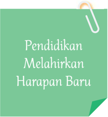

> **Deskripsi Visual:** Gambar ini adalah ilustrasi yang menunjukkan judul "Pendidikan Melahirkan Harapan Baru". Ilustrasi ini menggunakan warna hijau dengan tulisan putih yang berada di atas lembaran kertas hijau. Lembaran kertas tersebut ditempelkan pada lembaran kertas lain dengan sekat hitam. Di bagian bawah ilustrasi, terdapat tanda tangan yang tampak seperti tangan seseorang.

1. **Apa yang Ditampilkan Secara Keseluruhan**: Gambar ini adalah ilustrasi yang menampilkan judul buku pelajaran tentang pendidikan. Judul tersebut ditulis dalam bahasa Indonesia dan digunakan untuk menggambarkan konsep bahwa pendidikan memiliki peran penting dalam membentuk generasi muda yang lebih baik.

2. **Elemen-elemen Utama dan Relasinya**: 
   - **Judul**: "Pendidikan Melahirkan Harapan Baru" adalah elemen utama yang ditampilkan.
   - **Warna**: Warna hijau digunakan untuk lembaran kertas dan tulisan, sementara hitam digunakan untuk sekat antara lembaran kertas.
   - **Tanda Tangan**: Tanda tangan tampak di bagian bawah ilustrasi, menunjukkan bahwa gambar ini mungkin merupakan hasil kerja dari seorang penulis atau pengarang.

3. **Teks, Angka, atau Label Penting yang Terlihat**: 
   - **Judul**: "Pendidikan Melahirkan Harapan Baru".
   - **Teks**: "Pendidikan" dan "Harapan Baru" adalah teks penting yang memberikan makna kepada gambar.

4. **Informasi Kunci yang Dapat Diambil Pembaca**: Gambar ini menggambarkan konsep penting dalam pendidikan, yaitu pendidikan sebagai proses yang dapat membentuk generasi muda menjadi lebih baik dan berharap untuk masa depan. Ini menunjukkan bahwa pendidikan memiliki peran yang sangat besar dalam membentuk karakter dan masa depan generasi muda.

 

---
## 📄 Halaman 9

### Semester 1

### BAB 1

### Berkarya Seni Rupa Dua Dimensi (2D)

---
**🖼️ Gambar/Diagram**

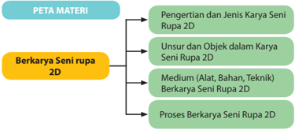

> **Deskripsi Visual:** Gambar tersebut adalah diagram yang menunjukkan struktur materi pembelajaran tentang berkarya seni rupa 2D. Diagram ini terdiri dari empat cabang utama yang masing-masing menjelaskan aspek berbeda dari seni rupa 2D:

1. Pengertian dan Jenis Karya Seni Rupa 2D: Cabang pertama menjelaskan definisi dan variasi karya seni rupa dua dimensi.

2. Unsur-unsur dan Objek dalam Karya Seni Rupa 2D: Cabang kedua membahas elemen-elemen dasar yang terlibat dalam pembuatan karya seni rupa 2D.

3. Medium (Alat, Bahan, Teknik) Berkarya Seni Rupa 2D: Cabang ketiga fokus pada alat-alat, bahan, dan teknik yang digunakan dalam proses pembuatan karya seni rupa 2D.

4. Proses Berkarya Seni Rupa 2D: Cabang terakhir menggambarkan langkah-langkah atau tahapan-tahapan yang melibatkan dalam proses pembuatan karya seni rupa 2D.

Elemen-elemen utama dalam diagram ini adalah cabang-cabang yang menjelaskan aspek-aspek penting dari seni rupa 2D. Relasi antara elemen-elemen ini adalah hubungan hierarkis, dengan cabang-cabang yang lebih besar memuat informasi yang lebih umum dan cabang-cabang yang lebih kecil memuat detail spesifik.

Teks, angka, atau label penting yang terlihat dalam diagram ini adalah nama-nama cabang yang menjelaskan aspek-aspek yang akan dibahas dalam pembelajaran tersebut. Informasi kunci yang dapat diambil pembaca melalui diagram ini adalah bahwa pembelajaran ini akan mencakup pengertian dan jenis karya seni rupa 2D, unsur-unsur dan objek dalam karya seni rupa 2D, medium dan proses pembuatan karya seni rupa 2D.

Setelah mempelajari Bab 1ini peserta didik diharapkan dapat mengapresiasi dan berkreasi seni rupa, yaitu:

- Mengidentifikasi  jenis karya seni rupa 2D,
- Mengidentifikasi unsur-unsur rupa dan prinsip penataannya dalam karya seni rupa 2D
- Mengidentifikasi jenis objek dalam karya seni rupa 2D,
- Mengidentifikasi medium (alat, bahan dan teknik) berkarya seni rupa 2D,
- Membandingkan jenis karya seni rupa 2 dimensi,
- Membandingkan unsur-unsur rupa dan prinsip penataannya dalam karya seni rupa 2 dimensi,
- Membandingkan jenis objek dalam karya seni rupa 2D,
- Memilih bahan, media dan teknik dalam proses berkarya seni rupa 2D
- Membuat sketsa karya seni rupa 2D dengan melihat model mahluk hidup
- Membuat sketsa karya seni rupa 2D dengan melihat model benda mati ( still life )
- Membuat gambar atau lukisan karya seni rupa 2D dengan melihat model mahluk hidup

 

---
## 📄 Halaman 10

- Membuat gambar atau lukisan karya seni rupa 2D dengan melihat model benda mati ( still life)
- Menunjukkan sikap bertanggung jawab dalam proses berkarya seni rupa dua dimensi,
- Menyajikan gambar atau lukisan karya seni rupa 2D hasil buatan sendiri
- Mempresentasikan gambar atau lukisan karya seni rupa 2D hasil buatan sendiri dengan lisan maupun tulisan.
Karya seni  rupa  ada  di  sekitar  kita.  Seringkali  kita  tidak  menyadari  bahwa benda-benda yang dekat dengan aktivitas kita sehari-hari adalah karya seni rupa.  Karya  seni  rupa  ini  ada  yang  berdimensi  dua  dan  berdimensi  tiga. Tahukah kamu apa artinya dimensi dalam karya seni rupa? Karya seni rupa dua atau tiga dimensi dibedakan dari bagian karya yang dicerap oleh mata. Pada bagian inilah kamu akan melihat bentuk objek yang terdapat didalamnya. Cobalah amati benda di sekitar kamu, maka kamu akan dapat membedakan benda yang berdimensi dua atau berdimensi tiga. Tunjukkan mana benda atau karya seni rupa yang berdimensi dua. Karya seni rupa dua dimensi (2D) ada yang  memiliki  fungsi  pakai  dan  ada  yang  memiliki  fungsi  hias  atau  fungsi ekspresi saja. Ada berbagai aspek dalam karya seni rupa dua dimensi. Berbagai unsur  rupa  seperti  garis,  bentuk,  bidang,  warna  disusun  sedemikian  rupa sehingga membentuk objek tertentu pada karya seni rupa dua dimensi tersebut. Untuk  mewujudkan  karya  seni  rupa  dua  dimensi  ini  digunakan  berbagai bahan, medium dan teknik sesuai dengan objek dan fungsi yang diinginkan.

Ketika  kamu  melihat  sebuah  karya  seni  rupa  dua  dimensi,  aspek  apa saja  yang  kamu  lihat?  Coba  kamu  amati  gambar  di  bawah  ini  untuk mengidentifikasi aspek-aspek tersebut!

 

---
## 📄 Halaman 11

---
**🖼️ Gambar/Diagram**

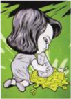

> **Deskripsi Visual:** Gambar ini adalah ilustrasi yang menunjukkan seorang anak sedang memegang sebuah buku. Anak tersebut tampak senang dan tertawa sambil membaca buku. Ilustrasi ini menunjukkan elemen-elemen berikut:

1. **Apa yang Ditampilkan Secara Keseluruhan**: Gambar ini menampilkan seorang anak yang sedang membaca buku dengan penuh kegembiraan.

2. **Elemen-Elemen Utama dan Relasinya**: 
   - **Anak**: Ini adalah subjek utama gambar.
   - **Buku**: Buku tersebut diletakkan di tangan anak dan tampaknya merupakan subjek utama dalam konteks gambar.
   - **Tanda Tersenyum dan Tertawa**: Ini menunjukkan emosi positif dan antusiasme anak dalam membaca.

3. **Teks, Angka, atau Label Penting yang Terlihat**: Dalam gambar ini, tidak ada teks, angka, atau label yang jelas terlihat. Namun, elemen-elemen visual seperti wajah anak yang tersenyum dan tanda-tanda tertawa dapat dianggap sebagai informasi penting.

4. **Informasi Kunci yang Dapat Diambil Pembaca**: Gambar ini menggambarkan suasana positif dan antusiasme anak dalam proses belajar membaca. Ini bisa menjadi inspirasi bagi pembaca untuk menekankan pentingnya membaca dan pengetahuan literasi pada anak-anak.

Dengan demikian, gambar ini menggambarkan seorang anak yang sangat antusias dalam proses membaca, menunjukkan bahwa membaca dapat menjadi hobi yang menyenangkan dan menginspirasi.

---
**🖼️ Gambar/Diagram**

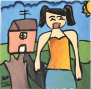

> **Deskripsi Visual:** Gambar ini adalah ilustrasi yang menampilkan seorang anak perempuan berjalan di depan sebuah rumah sederhana. Anak tersebut sedang tersenyum lebar dan tampak bahagia. Di sebelah kanan, terdapat pohon dengan daun hijau dan bunga kuning yang menambah keindahan alam. Rumah di belakang anak memiliki atap berwarna putih dan pintu berwarna merah. Gambar ini mungkin digunakan untuk menggambarkan suasana hidup yang damai dan bahagia di lingkungan sekitar rumah.

---
**🖼️ Gambar/Diagram**

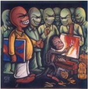

> **Deskripsi Visual:** Gambar ini adalah ilustrasi yang menunjukkan sekelompok orang yang sedang berbicara dan bergerak di sekitar seseorang yang sedang melukis. Orang-orang tersebut tampak seperti alien dengan wajah merah dan mata besar, sementara orang yang sedang melukis tampak seperti manusia biasa. Ilustrasi ini mungkin digunakan untuk menggambarkan konsep tentang interaksi antara manusia dan alien, atau mungkin sebagai bagian dari cerita fiksi ilmiah. Teks, angka, atau label penting tidak terlihat dalam gambar ini. Informasi kunci yang dapat diambil pembaca adalah bahwa ada interaksi antara manusia dan alien, serta bahwa seseorang sedang melukis.

---
**🖼️ Gambar/Diagram**

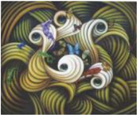

> **Deskripsi Visual:** Gambar ini adalah ilustrasi yang menampilkan dua karakter animasi berbentuk seperti ikan dengan ekor bergerigi. Karakter tersebut memiliki warna-warna cerah dan pola yang kompleks, mencerminkan gaya seni tradisional. Ikan-ikan tersebut tampak bergerak dengan gerakan yang dinamis, menunjukkan kehidupan dan keaktifan. Di sekeliling karakter tersebut, terdapat pola warna yang menciptakan efek visual yang menarik, mungkin untuk menambah keindahan dan keunikan gambar tersebut.

Elemen-elemen utama dalam gambar ini meliputi dua karakter ikan animasi, pola warna yang mencerminkan gaya seni tradisional, dan gerakan yang dinamis. Karakter ikan tersebut merupakan elemen utama yang mempengaruhi keseluruhan gambar, sementara pola warna dan gerakan membantu menambah keindahan dan keaktifan.

Teks, angka, atau label penting tidak terlihat dalam gambar ini. Namun, informasi kunci yang dapat diambil pembaca meliputi gaya seni tradisional yang digunakan dalam gambar, serta keaktifan dan kehidupan yang ditampilkan oleh karakter ikan animasi.

Dalam satu paragraf yang informatif, gambar ini menampilkan dua karakter ikan animasi berbentuk bergerigi dengan warna-warna cerah dan pola yang kompleks. Karakter tersebut bergerak dengan dinamis, menciptakan efek visual yang menarik. Pola warna dan gerakan membantu menambah keindahan dan keaktifan gambar tersebut. Walaupun tidak ada teks, angka, atau label penting dalam gambar, informasi kunci yang dapat diambil pembaca meliputi gaya seni tradisional yang digunakan dan keaktifan yang ditampilkan oleh karakter ikan animasi.

3

 

---
## 📄 Halaman 12

- Dapatkah kamu mengidentifikasi bahan yang digunakan pada karya seni rupa 2D tersebut?
- Dapatkah kamu mengidentifikasi teknik yang digunakan pada karya seni rupa 2D tersebut?
- Dapatkah  kamu  mengidentifikasi  medium  yang  digunakan  pada karya seni rupa 2D tersebut?
- Dapatkah kamu menunjukkan unsur-unsur rupa yang terdapat pada karya seni rupa 2D tersebut?
- Objek apa saja yang terdapat pada karya seni rupa 2D tersebut?
- Bagaimanakah penataan unsur-unsur rupa pada karya seni rupa 2D tersebut?
- Manakah  karya  seni  rupa  2D  yang  memiliki  fungsi  sebagai  benda pakai?
- Manakah karya seni rupa 2D yang paling menarik menurut kamu? Jelaskan alasan ketertarikan kamu!
Berdasarkan pengamatan kamu, sekarang kelompokkan dan isilah tabel di bawah ini sesuai dengan jenis karya seni rupa dua dimensi:

---
**📊 Tabel**

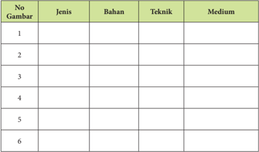

Tabel ini berisi informasi tentang berbagai jenis gambar yang diperlukan dalam sebuah proyek atau tugas belajar. Kolom-kolomnya meliputi nomor gambar (No Gambar), jenis gambar, bahan yang digunakan, teknik pembuatan, dan medium yang digunakan. Topik utama tabel ini adalah pengenalan dan deskripsi tentang berbagai jenis gambar yang dapat digunakan dalam berbagai konteks, mulai dari desain grafis hingga ilustrasi. Data penting yang terlihat adalah bahwa tabel ini mencakup sejumlah besar jenis gambar, mulai dari gambar 1 hingga gambar 6, dengan setiap jenis memiliki bahan, teknik, dan medium yang berbeda-beda. Ini menunjukkan bahwa pembuatan gambar memerlukan pemahaman mendalam tentang berbagai teknik dan bahan yang tersedia, serta pengetahuan tentang bagaimana menggunakan media tertentu untuk mencapai hasil yang diinginkan.

 

---
## 📄 Halaman 13

Setelah  kamu  mengisi  kolom  tentang  jenis,  bahan,  medium  dan  teknik pada  karya  seni  rupa  dua  dimensi  tersebut,  kemudian  diskusikanlah dengan teman-teman dan isilah kolom di bawah ini!

### Format Diskusi Hasil Pengamatan

Nama Siswa :

NIS :

Hari/Tanggal Pengamatan :

---
**📊 Tabel**

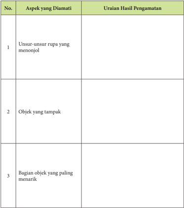

Tabel ini berisi informasi tentang aspek-aspek yang diamati dalam pengamatan objek, dengan uraian hasil pengamatan yang disajikan di setiap baris. Topik utama tabel ini adalah pengamatan objek, yang melibatkan pengecekan beberapa aspek seperti unsur-unsur rupa yang menonjol, objek yang tampak, dan bagian objek yang paling menarik. Kolom "Aspek yang Diamati" menyediakan daftar aspek-aspek tersebut, sedangkan kolom "Uraian Hasil Pengamatan" memberikan deskripsi singkat tentang apa yang diamati. Data penting yang terlihat dalam tabel ini adalah bahwa pengamatan ini mencakup berbagai aspek objek, termasuk detail visual dan struktur objek, yang dapat membantu dalam analisis dan pemahaman lebih lanjut tentang objek tersebut.

5

 

---
## 📄 Halaman 14

Agar kamu lebih mudah memahami, bacalah penjelasan singkat tentang karya  seni  rupa  dua  dimensi,  yang  meliputi  bahan,  alat  dan  teknik  beserta unsur-unsur  rupa  dan  prinsip  penataannya  berikut  ini.  Selanjutnya,  kamu dapatmengamati lebih lanjut dengan melihat secara  langsung karya seni rupa dua dimensi yang ada di sekitarmu, dengan mengunjungi pameran ataupun melihat  dari  berbagai  reproduksi  karya  seni  rupa  di  media  cetak  maupun elektronik.

### A. Seni Rupa Dua Dimensi

Istilah  'Seni  Rupa'  seringkali  kamu  jumpai  baik  dalam  bentuk  tulisan maupun diperbincangkan secara lisan. Tahukah kamu apa sebenarnya Seni Rupa itu? Cobalah diskusikan dengan temanmu di kelas tentang pengertian dari  kata  'seni  rupa' .  Perhatikan  kembali  benda-benda  di  sekitar  kamu, tunjukkan benda apa saja yang termasuk karya seni rupa?

Berbagai  karya  seni  rupa  di  sekeliling  kita,  memiliki  banyak  macam ragamnya. Walaupun demikian, karya seni rupa dapat digolongkan berdasarkan jenisnya  dengan  mengkategorikan  kesamaan  karakteristik  karya  yang  satu dengan yang lainnya. Dapatkah kamu membedakan karakteristik dasar karya seni  rupa  yang  satu  dengan  yang  lainnya?  Pada  binatang,  misalnya  penggolongan dapat didasarkan pada jenis kelamin, ada jantan ada betina. Pada tumbuhan, misalnya  dapat  dikategorikan  berdasarkan  fungsinya.  Ada  tumbuhan  yang ditanam sebagai hiasan untuk memperindah taman ada juga tumbuhan yang ditanam untuk dikonsumsi. Demikian juga dalam hal karya seni rupa, secara sederhana, kamu dapat membedakan berdasarkan bentuk (dimensi) maupun fungsinya.

Berdasarkan  dimensinya,  karya  seni  rupa  dibagi  dua  yaitu,  karya  seni rupa  dua  dimensi  yang  mempunyai  dua  ukuran  dan  karya  seni  rupa  tiga dimensiyang  mempunyai  tiga  ukuran  atau  memiliki  ruang.  Tahukah  kamu ukuran yang dimaksud dalam karya seni rupa dua dan tiga dimensi?

Berdasarkan fungsinya, karya seni rupa ada yang dibuat dengan pertimbangan utama untuk memenuhi fungsi praktis. Karya seni rupa semacam ini dikategorikan dalam jenis karya seni rupa terapan ( applied art ). Pembuatan karya seni (rupa) terapan ini umumnya melalui proses perancangan (desain). Pertimbangan  aspek-aspek  kerupaan  dalam  karya  seni  terapan  berfungsi untuk memperindah bentuk dan tampilan sebuah benda serta meningkatkan kenyamanan penggunaanya. Tahukah kamu benda-benda apa saja yang ada di sekitar kamu yang dikategorikan sebagai karya seni rupa terapan? Sebaliknya ada karya seni rupa yang dibuat dengan tujuan untuk dinikmati keindahan dan  keunikannya  saja  tanpa  mempertimbangkan  fungsi  praktisnya.  Karya

 

---
## 📄 Halaman 15

seni rupa dengan kategori ini disebut karya seni rupa murni yang umumnya digunakan sebagai elemen estetis untuk 'memperindah' ruangan atau tempat tertentu.

Perhatikan gambar-gambar di bawah ini, tunjukkan karya seni rupa yang mana yang dikategorikan karya seni rupa dua dimensi atau tiga dimensi, seni rupa terapan atau seni rupa murni. Jelaskan alasan kamu mengapa karya seni yang satu berbeda dengan karya seni yang lainnya.

### Bentuk/dimensi

### Fungsi

### Keterangan:

_____________________________________

_____________________________________

_____________________________________

 

---
## 📄 Halaman 16

---
**🖼️ Gambar/Diagram**

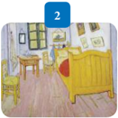

> **Deskripsi Visual:** Gambar ini adalah ilustrasi yang menunjukkan sebuah ruangan rumah yang tampak seperti kamar tidur. Ruangan ini dilengkapi dengan meja belajar, kursi, dan lemari pakaian. Meja belajar berada di sisi kiri, sedangkan kursi dan lemari pakaian terletak di sisi kanan. Dinding dilihat berwarna putih dengan beberapa lukisan atau gambar kecil. Lantai terbuat dari kayu dan terlihat bersih. Gambar ini menunjukkan bagaimana desain interior yang sederhana namun tetap nyaman dan fungsional.

3

### Bentuk/dimensi

### Fungsi

### Keterangan:

____________________________________

____________________________________

____________________________________

### Bentuk/dimensi

Fungsi

### Keterangan:

____________________________________

____________________________________

____________________________________

 

---
## 📄 Halaman 17

---
**🖼️ Gambar/Diagram**

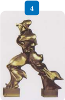

> **Deskripsi Visual:** Gambar ini adalah ilustrasi yang menunjukkan sebuah patung emas berukuran kecil. Patung tersebut menggambarkan seorang pria yang sedang berdiri dengan posisi kaki yang terbalik, tangan di depan tubuh, dan kepala yang ditinggi. Patung ini tampak sangat detail dan memiliki pencahayaan yang menonjolkan warna emasnya.

Elemen utama dalam gambar ini adalah patung emas tersebut. Patung ini terletak di tengah gambar dan menjadi fokus utama. Patung tersebut memiliki posisi kaki yang terbalik, tangan di depan tubuh, dan kepala yang ditinggi, yang menunjukkan posisi yang unik dan menarik perhatian.

Teks, angka, atau label penting tidak ada dalam gambar ini. Namun, gambar ini memberikan informasi tentang bentuk dan posisi patung tersebut, yang dapat membantu pembaca memahami konteks dan makna dari gambar tersebut.

Informasi kunci yang dapat diambil pembaca adalah bahwa gambar ini menunjukkan sebuah patung emas yang memiliki posisi kaki yang terbalik, tangan di depan tubuh, dan kepala yang ditinggi. Ini menunjukkan bahwa gambar ini mungkin digunakan untuk tujuan edukasi atau pengetahuan tentang seni atau arsitektur.

5

Bentuk/dimensi

Fungsi

### Keterangan:

____________________________________

____________________________________

____________________________________

Bentuk/dimensi

Fungsi

### Keterangan:

____________________________________

____________________________________

____________________________________

 

---
## 📄 Halaman 18

6

---
**🖼️ Gambar/Diagram**

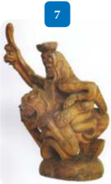

> **Deskripsi Visual:** Gambar ini adalah ilustrasi yang menunjukkan seorang pria berdiri dengan posisi yang menunjukkan kekuatan dan keberanian. Pria tersebut menggenggam sebuah senjata besar di tangan kanannya, sementara tangan kirinya tampak kosong. Latar belakangnya tampak gelap, mungkin untuk menonjolkan karakter utama. Ilustrasi ini mungkin digunakan untuk membantu pembaca memahami konsep tentang kekuatan, keberanian, atau bahkan konsep lain yang berkaitan dengan karakter tersebut.

### Bentuk/dimensi

### Fungsi

### Keterangan:

____________________________________

____________________________________

____________________________________

### Bentuk/dimensi

### Fungsi

### Keterangan:

____________________________________

____________________________________

____________________________________

 

---
## 📄 Halaman 19

8

Selain berdasarkan bentuk (dimensi) dan fungsinya, karya seni rupa juga digolongkan berdasarkan karakteristik media (alat, teknik, dan bahan) serta orientasi  pembuatannya.  Berdasarkan  karakteristik  tersebut  kita  mengenal berbagai jenis karya seni rupa seperti seni lukis, seni patung, seni grafis, seni kriya, dan desain.

Setelah kamumempelajari tentang jenis karya seni rupa,  jawablah beberapa pertanyaan di bawah ini!

- Ada berapa jenis karya seni rupa?
- Bagaimana kamu membedakan karya seni rupa berdasarkan dimensinya?
- Bagaimana kamu membedakan karya seni rupa berdasarkan fungsinya

### B.  Unsur dan Objek karya Seni Rupa

Seorang  perupa  (seniman,  desainer,  kriyawan,  perajin  dan  sebagainya) mengolah unsur-unsur seni rupa fisik dan nonfisik sesuai dengan keterampilan dan kepekaan yang dimilikinya dalam mewujudkan sebuah karya seni rupa. Dalam sebuah karya seni rupa, unsur fisik dapat secara langsung dilihat dan

Bentuk/dimensi

Fungsi

### Keterangan:

____________________________________

____________________________________

____________________________________

 

---
## 📄 Halaman 20

atau  diraba  sedangkan  unsur  nonfisik  adalah  prinsip  atau  kaidah-kaidah umum yang digunakan untuk menempatkan unsur-unsur fisik dalam sebuah karya seni.

Unsur-unsur fisik dalam sebuah karya seni rupa pada dasarnya meliputi semua  unsur  visual  yang  terdapat  pada  sebuah  benda.  Dengan  demikian pengamatan  terhadap  unsur-unsur  visual  pada  karya  seni  rupa  ini  tidak berbeda  dengan  pengamatan  terhadap  benda-benda  yang  ada  di  sekeliling kamu.

Cermati kembali paparan singkat tentang unsur-unsur rupa berikut ini.

### 1.    Garis ( line )

Garis adalah unsur fisik yang mendasar dan penting dalam mewujudkan sebuah karya seni rupa. Garis memiliki dimensi memanjang dan mempunyai arah  serta  sifat-sifat  khusus  seperti:  pendek,  panjang,  vertikal,  horizontal, lurus, melengkung, berombak, dan seterusnya.

Garis dapat juga kamu gunakan untuk mengkomunikasikan gagasan dan mengekspresikan diri. Garis tebal tegak lurus, misalnya, dapat memberi kesan kuat dan tegas, sedangkan garis tipis melengkung, memberi kesan lemah dan ringkih.  Karakter  garis  yang  dihasilkan  oleh  alat  yang  berbeda  akan  menghasilkan karakter yang berbeda pula. Coba bandingkan karakter garis yang dihasilkan oleh jejak spidol pada kertas dan jejak arang pada kertas. Bandingkan pula jejak garis yang dibuat dengan ballpoint dan pinsil. Buatlah berbagai bentuk garis, kemudian cobalah untuk merasakankesan dari garis-garis yang kamu buat tersebut.

 

---
## 📄 Halaman 21

---
**🖼️ Gambar/Diagram**

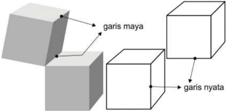

> **Deskripsi Visual:** Gambar ini adalah ilustrasi yang menunjukkan konsep garis maya dan garis nyata dalam bidang arsitektur atau desain. Gambar ini terdiri dari tiga elemen utama: sebuah bangunan realistis (garis nyata) dan dua garis maya yang menghubungkan titik-titik pada bangunan tersebut. Garis maya digunakan untuk menunjukkan posisi dan ukuran bangunan dari sudut pandang yang berbeda, sementara garis nyata menunjukkan bentuk bangunan secara langsung.

Elemen-elemen utama dalam gambar ini adalah bangunan realistis dan garis maya. Bangunan realistis menunjukkan bentuk dan ukuran bangunan secara langsung, sedangkan garis maya digunakan untuk menunjukkan posisi dan ukuran bangunan dari sudut pandang yang berbeda. Garis maya dan garis nyata saling berhubungan melalui titik-titik yang menghubungkannya, yang menunjukkan hubungan antara kedua elemen dalam konsep arsitektur.

Teks, angka, atau label penting yang terlihat dalam gambar ini adalah "garis maya" dan "garis nyata". Label ini membantu pembaca memahami perbedaan antara kedua elemen dalam konsep arsitektur.

Informasi kunci yang dapat diambil pembaca dari gambar ini adalah bahwa garis maya digunakan untuk menunjukkan posisi dan ukuran bangunan dari sudut pandang yang berbeda, sementara garis nyata menunjukkan bentuk bangunan secara langsung. Ini merupakan konsep penting dalam bidang arsitektur dan desain, yang memungkinkan pembuat bangunan untuk merancang dan memvisualisasikan bangunan dari berbagai sudut pandang.

Sumber: Dok. penulis

Gambar 1.10 Garis maya dan garis nyata

### 2.   Raut (Bidang dan Bentuk)

Unsur  rupa  lainnya  adalah  'raut'  yang  merupakan  tampak,  potongan atau  wujud  dari  suatu  objek . Istilah  'bidang'  umumnya  digunakan  untuk menunjuk wujud benda yang cenderung pipih atau datar sedangkan 'bangun' atau 'bentuk' lebih menunjukkan kepada wujud benda yang memiliki volume ( mass ). Perhatikan gambar di samping dan di bawah ini. Tunjukkanlah mana unsur  'bidang'  dan  mana  unsur  'bentuk'  atau  'bangun' .Bagaimana  kamu membedakan  wujud  'bidang'  dan  'bangun'  atau  'bentuk'  dalam  sebuah karya seni rupa dua dimensi?

---
**🖼️ Gambar/Diagram**

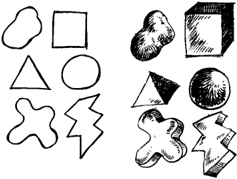

> **Deskripsi Visual:** Gambar ini adalah ilustrasi yang menampilkan berbagai bentuk geometri dasar. Gambar tersebut mencakup beberapa elemen utama seperti lingkaran, persegi, segitiga, dan bentuk-bentuk lainnya. Setiap bentuk memiliki warna dan ukuran yang berbeda, yang menunjukkan variasi dalam bentuk dan ukuran. Beberapa bentuk memiliki label atau teks yang menunjukkan nama mereka, seperti "lingkaran" dan "persegi". Elemen-elemen ini disusun secara rapi dan teratur, menunjukkan struktur dan hubungan antara bentuk-bentuk tersebut. Informasi kunci yang dapat diambil pembaca adalah bahwa gambar ini menggambarkan berbagai bentuk geometri dasar dan bagaimana mereka berinteraksi dengan satu sama lain.

Sumber: Dok. penulis

Gambar 1.11 Bidang dan Bentuk atau Bangun

 

---
## 📄 Halaman 22

### 3.    Ruang

Unsur ruang dalam sebuah karya seni rupa dua dimensi menunjukan kesan dimensi dari objek yang terdapat pada karya seni rupa tersebut. Pada karya dua dimensi kesan ruang dapat dihadirkan dalam karya dengan pengolahan unsur-unsur  kerupaan  lainnya  seperti  perbedaan  intensitas  warna,  teranggelap, atau menggunakan teknik menggambar perspektif untuk menciptakan ruang semu (khayal).

---
**🖼️ Gambar/Diagram**

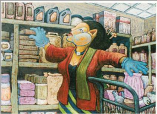

> **Deskripsi Visual:** Gambar ini adalah ilustrasi yang menunjukkan seorang penjaga toko yang sedang memeriksa barang-barang di rak-rak toko. Penjaga tersebut mengenakan pakaian warna merah dan hijau, serta menggunakan sarung tangan untuk melindungi tangan saat bekerja. Belakangnya tampak berbagai jenis produk yang tersusun rapi di rak-rak toko, termasuk obat-obatan, kosmetik, dan makanan. Penjaga tersebut tampaknya sedang memeriksa atau memilih barang yang akan dijual. Gambar ini menunjukkan hubungan antara penjaga toko dengan barang-barang di toko, serta menekankan pentingnya menjaga toko agar tetap rapi dan aman bagi konsumen.

### 4.    Tekstur

Tekstur atau barik adalah unsur rupa yang menunjukan kualitas taktil dari suatu  permukaan atau penggambaran struktur permukaan suatu objek pada karya seni rupa. Berdasarkan wujudnya, tekstur dapat dibedakan atas tekstur asli dan tekstur buatan. Tekstur asli adalah perbedaan ketinggian permukaan objek yang nyata dan dapat diraba, sedangkan tekstur buatan adalah kesan permukaan objek yang timbul pada suatu bidang karena pengolahan unsur garis, warna, ruang, terang-gelap, dan sebagainya.

 

---
## 📄 Halaman 23

---
**🖼️ Gambar/Diagram**

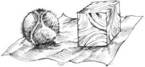

> **Deskripsi Visual:** Gambar ini adalah ilustrasi yang menunjukkan dua objek: bola dan kotak. Bola berada di sebelah kiri dan tampak lebih besar dibandingkan dengan kotak yang berada di sebelah kanan. Kotak memiliki beberapa lubang di sisi atasnya dan tampak seperti kayu. Bola tampak seperti bola tenis atau bola voli. Ilustrasi ini mungkin digunakan untuk menjelaskan konsep tentang ukuran, bentuk, atau material.

Gambar 1.14 Penggunaan tekstur dalam karya SR dua dimensi

### 5.    Warna

Warna  adalah  unsur  rupa  yang  paling  menarik  perhatian.  Menurut teori warna Brewster, semua warna yang ada berasal dari tiga warna pokok (primer) yaitu merah, kuning, dan biru. Dalam berkarya seni rupa terdapat beberapa teknik penggunaan warna, yaitu secara harmonis, heraldis, murni, monokromatik dan polikromatik. Cobalah kamu mencari informasi tentang teknik-teknik penggunaan warna tersebut.

Perhatikan gambar-gambar karya seni rupa berikut ini, gambar manakah yang  menunjukkan  penggunaan  warna  secara  harmonis,  heraldis,  murni, monokromatik dan polikromatik. Cara penggunaan warna yang bagaimana yang paling kamu sukai? Jelaskan alasannya!

 

---
## 📄 Halaman 24

---
**🖼️ Gambar/Diagram**

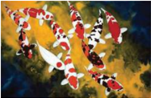

> **Deskripsi Visual:** Gambar ini adalah ilustrasi yang menunjukkan berbagai jenis ikan koi yang berbeda warna dan bentuk. Gambar ini menggambarkan ikan koi dengan warna-warna cerah seperti merah, putih, hitam, dan kombinasi warna lainnya. Ikan-ikan ini diperlihatkan berada di air dengan latar belakang yang menyerupai tanaman air dan batu karang. Ilustrasi ini mungkin digunakan untuk membantu pembaca memahami berbagai jenis ikan koi dan bagaimana mereka berbeda-beda dalam hal warna dan bentuk.

 

---
## 📄 Halaman 25

---
**🖼️ Gambar/Diagram**

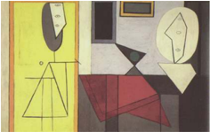

> **Deskripsi Visual:** Gambar ini merupakan ilustrasi yang menunjukkan konsep geometri dasar. Gambar ini menggambarkan tiga bentuk geometris: lingkaran, segitiga, dan persegi panjang. Lingkaran diletakkan di bagian atas, dengan garis yang menghubungkan titik pusat lingkaran ke titik puncak lingkaran. Segitiga diletakkan di bagian tengah, dengan sisi-sisi yang terlihat jelas dan sudut-sudut yang terlihat rata. Persegi panjang diletakkan di bagian bawah, dengan sisi-sisi yang terlihat rata dan sudut-sudut yang terlihat rata juga.

Elemen-elemen utama dalam gambar ini adalah lingkaran, segitiga, dan persegi panjang. Mereka saling berhubungan melalui garis yang menghubungkan titik pusat lingkaran ke titik puncak lingkaran, serta sisi-sisi yang terlihat jelas pada segitiga dan persegi panjang. Garis-garis ini membantu memahami hubungan antara bentuk-bentuk tersebut.

Teks, angka, atau label penting yang terlihat dalam gambar ini adalah garis-garis yang menghubungkan titik pusat lingkaran ke titik puncak lingkaran, serta sisi-sisi yang terlihat jelas pada segitiga dan persegi panjang. Ini membantu pembaca memahami struktur dan hubungan antara bentuk-bentuk tersebut.

Informasi kunci yang dapat diambil pembaca dari gambar ini adalah bahwa lingkaran, segitiga, dan persegi panjang memiliki sifat-sifat geometris yang unik dan saling berhubungan. Misalnya, lingkaran memiliki titik pusat dan garis yang menghubungkan titik pusat ke titik puncak lingkaran. Segitiga memiliki sisi-sisi yang terlihat jelas dan sudut-sudut yang terlihat rata. Persegi panjang memiliki sisi-sisi yang terlihat rata dan sudut-sudut yang terlihat rata juga.

, Des 2004 - Jan 2005

Gambar 1.18 Penggunaan warna secara murni (tidak terikat pada apa2)

### 6.    Gelap-Terang

Unsur gelap-terang pada karya seni rupa timbul karena adanya perbedaan intensitas cahaya yang jatuh pada permukaan benda. Perbedaan ini menyebabkan munculnya tingkat nada warna ( value )  yang  berbeda. Bagian yang terkena cahaya akan lebih terang dan bagian yang kurang atau terkena cahaya akan tampak lebih gelap.

Perhatikan objek gambar dua dimensi di bawah ini yang menggunakan unsur gelap-terang dan yang kurang menggunakan unsur gelap terang. Kesan apa yang kamu lihat dan rasakan pada masing-masing objek gambar tersebut.

---
**🖼️ Gambar/Diagram**

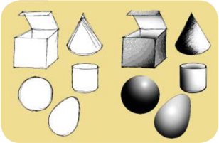

> **Deskripsi Visual:** Gambar ini adalah ilustrasi yang menunjukkan berbagai bentuk geometri dasar. Gambar ini mencakup lima jenis geometri: kotak, kerucut, tabung, bola, dan lingkaran. Setiap bentuk memiliki warna dan posisi yang unik, yang menunjukkan perbedaan dalam bentuk dan ukuran. Kotak berada di bagian atas, sedangkan kerucut, tabung, bola, dan lingkaran tersebar di bawahnya. Setiap bentuk memiliki relasi dengan bentuk lainnya, seperti bola yang berada di tengah-tengah dan lingkaran yang berada di sekelilingnya. Teks, angka, atau label penting tidak ada pada gambar ini, sehingga fokus utama adalah pada bentuk-bentuk geometri dan relasi antara mereka. Informasi kunci yang dapat diambil pembaca adalah bahwa gambar ini menunjukkan berbagai bentuk geometri dasar dan bagaimana mereka berinteraksi satu sama lain.

Sumber: Dok penulis

Gambar 1.19 Gambar dua dimensi menggunakan unsur gelap-terang

 

---
## 📄 Halaman 26

Penataan unsur-unsur visual pada sebuah karya seni rupa menggunakan prinsip-prinsip  dasar  berupa  kaidah  atau  aturan  baku  yang  diyakini  oleh seniman  dan  perupa  pada  umumnya,  dapat  membentuk  sebuah  karya  seni yang  baik  dan  indah.  Kaidah  atau  aturan  baku  ini  disebut  komposisi,  kata tersebut  berasal  dari  bahasa  latin compositio yang  artinya  menyusun  atau menggabungkan menjadi satu. Komposisi dapat mencakup beberapa prinsip penataan  seperti: kesatuan ( unity ); keseimbangan ( balance )  dan irama ( rhythm ), penekanan , serta proporsi dan keselarasan. Prinsip-prinsip dasar ini merupakan unsur non isik dari karya seni rupa.

---
**🖼️ Gambar/Diagram**

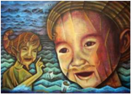

> **Deskripsi Visual:** Gambar ini adalah ilustrasi yang menampilkan dua karakter utama: seorang anak laki-laki dan seorang anak perempuan. Anak laki-laki berada di depan, sedang tersenyum lebar dengan wajah penuh rasa bahagia. Anak perempuan berdiri di belakangnya, tampaknya sedang berbicara atau berbicara dengan anak laki-laki. Kedua karakter tersebut tampaknya berada di tepi laut, dengan air laut yang cerah dan biru di latar belakang.

Elemen-elemen utama dalam gambar ini adalah dua karakter manusia yang berinteraksi, lingkungan alam seperti laut, dan ekspresi wajah yang menunjukkan emosi positif. Relasi antara kedua karakter adalah hubungan sosial, mungkin teman atau sahabat, yang terlihat dari posisi mereka yang dekat dan gerakan mereka yang saling berhubungan.

Teks, angka, atau label penting tidak ada dalam gambar ini. Namun, informasi kunci yang dapat diambil pembaca melalui gambar ini adalah tentang hubungan sosial antara dua karakter dan suasana hati mereka yang positif dan bahagia.

---
**🖼️ Gambar/Diagram**

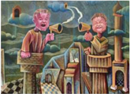

> **Deskripsi Visual:** Gambar ini adalah ilustrasi yang menampilkan dua karakter yang tampaknya sedang berbicara atau berkomunikasi. Karakter pertama duduk di atas sebuah bangku kecil, sedangkan karakter kedua berdiri di depannya. Kedua karakter memiliki wajah yang ekspresif dan tubuh yang unik dengan bentuk yang tidak biasa. Latar belakangnya menunjukkan sebuah desa kecil dengan rumah-rumah tradisional dan jalan yang melintasi area tersebut.

Elemen-elemen utama dalam gambar ini adalah dua karakter yang berkomunikasi, latar belakang desa kecil, dan detail desain karakter yang unik. Karakter-karakter ini tampaknya berada dalam situasi yang serius atau mendalam karena ekspresi mereka yang kuat.

Teks, angka, atau label penting tidak terlihat dalam gambar ini. Namun, informasi kunci yang dapat diambil pembaca adalah bahwa gambar ini mungkin menggambarkan konsep komunikasi, interaksi sosial, atau hubungan antar individu dalam konteks desa kecil.

---
**🖼️ Gambar/Diagram**

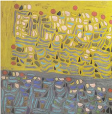

> **Deskripsi Visual:** Gambar ini adalah ilustrasi yang menampilkan pemandangan alam dengan berbagai elemen yang terkait. Gambar ini menggambarkan sebuah hutan yang dipenuhi dengan berbagai jenis pohon dan tanaman, serta beberapa hewan seperti burung dan serangga. Pohon-pohon besar dengan daun hijau lebat membentuk struktur dasar dari hutan, sementara tanaman kecil dan bunga-bunga berwarna-warni menambah kehidupan dan warna ke dalam gambar. Di bagian bawah, terdapat tanah berwarna cokelat dengan beberapa batu dan tanaman kecil lainnya. Ilustrasi ini menggunakan warna-warna cerah dan kontras yang kuat untuk menonjolkan berbagai elemen dalam gambar, menciptakan kesan yang hidup dan menarik.

 

---
## 📄 Halaman 27

Penataan unsur-unsur rupa ini dilakukan menggunakan berbagai teknik dan bahan pada berbagai medium membentuk objek-objek yang unik pada karya seni rupa dua dimensi. Bagaimana cara menyusun unsur-unsur tersebut? Coba perhatikan karya seni rupa dua dimensi yang ada disekitar kamu. Amati bagaimana  unsur-unsur  rupa  tersusun  dalam  karya  seni  rupa  dua  dimensi tersebut.

Setelah  mempelajari  unsur-unsur  dan  objek  pada  karya  seni  rupa, identifikasikanlah unsur-unsur visual pada berbagai objek dalam karyakarya seni rupa dua dimensi berikut ini.

1

---
**🖼️ Gambar/Diagram**

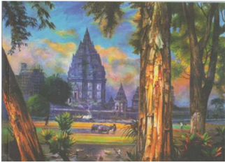

> **Deskripsi Visual:** Gambar ini adalah ilustrasi yang menampilkan kompleks arsitektur candi berbentuk piramida di tengah hutan tropis. Candi tersebut memiliki struktur yang kompleks dengan banyak pilar dan atap yang tinggi. Di sekitar candi, terdapat pohon-pohon besar yang tumbuh dengan rimbun, menciptakan suasana alami dan tenang. Di depan candi, terdapat sebuah jalan yang melintasi hutan, di mana beberapa orang tampak sedang berjalan-jalan. Langit di atas candi tampak cerah dengan warna-warna biru dan kuning, menunjukkan bahwa gambar ini mungkin diambil pada waktu siang hari. Gambar ini menunjukkan hubungan antara arsitektur candi yang megah dengan alam sekitarnya, serta bagaimana kehidupan manusia masih terhubung dengan alam.

 

---
## 📄 Halaman 28

2

3

---
**🖼️ Gambar/Diagram**

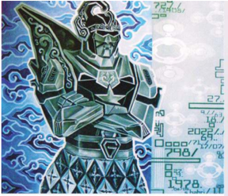

> **Deskripsi Visual:** Gambar ini adalah ilustrasi yang menampilkan karakter dari serial televisi "Power Rangers" dengan latar belakang biru gelap dan abu-abu. Karakter tersebut memiliki rambut hitam, mata besar, dan pakaian berwarna hijau dengan detail hitam dan putih. Ilustrasi ini tampak seperti kartu koleksi atau kartu game, karena ada teks dan angka di sekelilingnya.

1. **Apa yang ditampilkan secara keseluruhan**: Gambar ini menampilkan karakter dari serial televisi "Power Rangers" dalam pose yang kuat dan berani, dengan latar belakang yang mencerminkan tema serangan atau pertempuran.

2. **Elemen-elemen utama dan relasinya**: 
   - **Karakter**: Karakter utama adalah karakter dari serial Power Rangers, yang memiliki rambut hitam, mata besar, dan pakaian berwarna hijau.
   - **Latar Belakang**: Latar belakang berwarna biru gelap dan abu-abu, mencerminkan tema serangan atau pertempuran.
   - **Teks dan Angka**: Ada teks dan angka di sekeliling karakter, mungkin merupakan informasi tentang karakter atau kartu game.

3. **Teks, angka, atau label penting yang terlihat**: 
   - Teks dan angka di sekeliling karakter, mungkin merupakan informasi tentang karakter atau kartu game.
   - Ada angka 7978 di bagian bawah gambar, mungkin merupakan nomor kartu atau identifikasi karakter.

4. **Informasi kunci yang dapat diambil pembaca**: 
   - Karakter ini adalah karakter dari serial Power Rangers.
   - Gambar ini mungkin merupakan kartu koleksi atau kartu game dari serial tersebut.
   - Informasi tambahan seperti angka 7978 mungkin merupakan identifikasi atau nomor spesifik untuk karakter ini.

---
**🖼️ Gambar/Diagram**

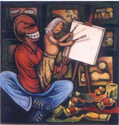

> **Deskripsi Visual:** Gambar ini adalah ilustrasi yang menampilkan dua karakter yang sedang berinteraksi. Karakter pertama adalah seorang pria dengan rambut pendek dan topi hitam, sedang tersenyum lebar dan tampak sangat bahagia. Karakter kedua adalah seorang wanita tua dengan rambut senada, sedang menggambar pada sebuah papan lukisan putih. Latar belakangnya adalah ruangan yang penuh dengan berbagai barang seni dan alat-alat lukis, menciptakan suasana yang kreatif dan mendalam.

Elemen-elemen utama dalam gambar ini adalah dua karakter utama, latar belakang yang penuh dengan barang seni, dan peristiwa interaksi antara mereka. Karakter pria tampak sangat bahagia dan menyenangkan, sementara karakter wanita tua tampak serius dan fokus pada tugasnya. Latar belakang yang penuh dengan barang seni menunjukkan bahwa mereka berada dalam lingkungan yang mendukung kreativitas dan seni.

Teks, angka, atau label penting tidak terlihat dalam gambar ini. Namun, informasi kunci yang dapat diambil pembaca adalah hubungan antara kedua karakter dan lingkungan mereka yang mendukung kreativitas dan seni. Gambar ini mungkin digunakan untuk membahas konsep tentang kreativitas, interaksi sosial, atau pengaruh lingkungan terhadap karya seni.

 

---
## 📄 Halaman 29

4

5

---
**🖼️ Gambar/Diagram**

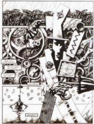

> **Deskripsi Visual:** Gambar ini adalah ilustrasi yang menunjukkan seorang karakter dengan rambut panjang berwarna gelap, mata besar berwarna biru, dan pakaian yang serasi dengan latar belakang alam. Karakter tersebut sedang berdiri di tengah hutan dengan pohon-pohon tinggi dan tanaman liar di sekitarnya. Di sebelah kiri, ada beberapa elemen seperti bunga-bunga berwarna-warni dan daun-daun hijau yang menambah keindahan alam. Di sebelah kanan, terdapat beberapa objek seperti pohon-pohon besar, tanaman liar, dan hewan kecil yang sedang bergerak. Gambar ini menunjukkan hubungan antara manusia dan alam sekitar mereka.

Elemen-elemen utama dalam gambar ini meliputi karakter manusia, pohon-pohon, tanaman liar, dan hewan kecil. Karakter tersebut tampak seperti sedang berada dalam suasana yang damai dan harmonis dengan alam sekitarnya. Pohon-pohon dan tanaman liar di sekitar karakter tersebut menunjukkan bahwa mereka hidup dalam lingkungan alam yang sehat dan lestari.

Teks, angka, atau label penting yang terlihat dalam gambar ini tidak ada. Namun, informasi kunci yang dapat diambil pembaca adalah tentang hubungan antara manusia dan alam sekitar mereka, serta tentang keindahan alam yang masih lestari dan sehat.

---
**🖼️ Gambar/Diagram**

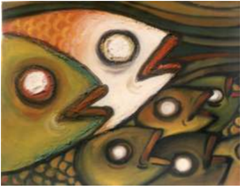

> **Deskripsi Visual:** Gambar ini adalah ilustrasi yang menampilkan dua karakter dengan bentuk tubuh manusia yang unik dan ekstrem. Karakter pertama memiliki tubuh berwarna hijau dengan mata besar berwarna merah dan mulut berwarna kuning. Karakter kedua memiliki tubuh berwarna hijau dengan mata berwarna putih dan mulut berwarna kuning. Kedua karakter tersebut tampak seperti berbicara atau berkomunikasi dengan cara yang aneh dan tidak biasa. Ilustrasi ini mungkin digunakan untuk menggambarkan konsep atau ide kreatif dalam konteks pembelajaran.

 

---
## 📄 Halaman 30

6

---
**🖼️ Gambar/Diagram**

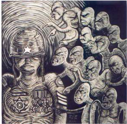

> **Deskripsi Visual:** Gambar ini adalah ilustrasi yang menunjukkan seorang pria dengan topi militer berwarna putih dan bendera Amerika Serikat yang ditempel di dada. Pria tersebut tampak sedang berdiri teguh dengan posisi tangan di samping tubuhnya. Di sekitar pria tersebut, terdapat beberapa orang lain yang tampak seperti manusia, tetapi memiliki wajah yang tidak jelas dan ekspresi yang serupa. Mereka tampak bergerak ke arah pria tersebut, mungkin menunjukkan suasana yang agak aneh atau tidak nyaman.

Elemen-elemen utama dalam gambar ini meliputi pria dengan topi militer dan bendera Amerika Serikat, serta beberapa orang manusia yang tampak tidak jelas. Relasi antara elemen-elemen ini cukup jelas, dengan pria sebagai subjek utama dan orang-orang lain sebagai objek yang mengelilinginya.

Teks, angka, atau label penting yang terlihat dalam gambar ini adalah topi militer dan bendera Amerika Serikat pada pria tersebut. Informasi kunci yang dapat diambil pembaca melalui gambar ini adalah bahwa ada sesuatu yang tidak biasa atau aneh yang terjadi di sekitar pria tersebut, mungkin karena situasi yang tidak normal atau konflik tertentu.

### C.  Medium, Bahan dan Teknik

Sebelum  melakukan  kegiatan  berkarya  seni  rupa  dua  dimensi,  sangat penting bagi kamu untuk memiliki pengetahuan dan pemahaman berbagai alat, bahan, dan teknik yang biasa digunakan dalam praktik berkarya seni. Usaha untuk mengenal karakter bahan, alat, dan teknik ini dengan baik hanya dapat kamu lakukan dengan kegiatan praktek secara langsung. Cobalah melakukan kegiatan  apresiasi  karya  seni  rupa  dengan  pendekatan  aplikatif.  Dengan demikian  selain  wawasan  apresiasi  kamu  semakin  kaya,  keterampilanmu dalam berkarya seni rupa juga akan menjadi lebih baik.

### 1.    Medium dan Bahan Karya Seni Rupa

Bahan berkarya seni  rupa  adalah  material  habis  pakai  yang  digunakan untuk mewujudkan karya seni rupa tersebut. Sesuai dengan keragaman jenis karya seni rupa, bahan untuk berkarya seni rupa ini juga banyak macam dan ragamnya, ada yang berfungsi sebagai bahan utama (medium) dan ada pula sebagai bahan penunjang. Sebagai contoh, pada umumnya perupa membuat karya  lukisan  menggunakan  kanvas  dan  cat  sebagai  bahan  utamanya  serta kayu  dan  paku  sebagai  bahan  penunjang.  Kayu  digunakan  sebagai  bahan bingkai ( spanram ) untuk menempatkan kanvas dan paku untuk mengaitkan kanvas pada permukaan kayu bingkai tersebut.

 

---
## 📄 Halaman 31

Bahan untuk berkarya seni rupa dapat dikategorikan menjadi bahan alami dan  bahan  sintetis  berdasarkan  sumber  bahan  dan  proses  pengolahannya. Bahan baku alami adalah material  yang  bahan  dasarnya  berasal  dari  alam. Bahan-bahan ini dapat digunakan secara langsung tanpa proses pengolahan secara kimiawi di pabrik atau industri terlebih dahulu. Adapun bahan baku olahan adalah bahan-bahan alam yang telah diolah melalui proses pabriksasi atau industri tertentu menjadi bahan baru yang memiliki sifat dan karakter khusus. Berdasarkan sifat materialnya, bahan berkarya seni rupa ini dapat juga dikategorikan ke dalam bahan keras dan bahan lunak, bahan cair dan, bahan padat, dan sebagainya.

---
**🖼️ Gambar/Diagram**

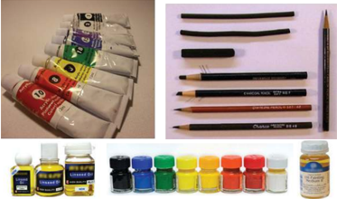

> **Deskripsi Visual:** Gambar ini adalah ilustrasi yang menunjukkan berbagai alat pelukis dan warna cat. Gambar ini terdiri dari dua bagian utama: sebelah kiri menunjukkan berbagai botol warna cat dalam berbagai warna, sementara sebelah kanan menunjukkan berbagai jenis pensil dan kuas. Setiap botol warna cat memiliki label warna yang jelas, mulai dari biru, hijau, kuning, merah, sampai hitam. Pensil dan kuas juga disusun dengan rapi, menunjukkan berbagai ukuran dan jenisnya. Informasi penting yang dapat diambil dari gambar ini adalah bahwa ini adalah ilustrasi tentang berbagai alat pelukis dan warna cat yang digunakan dalam seni atau desain.

Sumber: Dok. penulis

Gambar 1.23 Bahan keras dan bahan lunak bahan cair dan bahan padat

### 2.    Alat Berkarya Seni Rupa

Alat untuk berkarya seni rupa sangat banyak jenis dan ragamnya. Beberapa karya seni rupa bahkan memiliki peralatan khusus yang tidak dipergunakan pada jenis  karya  lainnya.  Akan  tetapi  ada  juga  alat  atau  bahan  yang  dipergunakan hampir disemua proses berkarya seni rupa. Alat-alat tulis (gambar) misalnya, adalah  peralatan  yang  digunakan  dalam  proses  pembuatan  hampir  seluruh jenis karya seni rupa, terutama saat membuat rancangan karya seni tersebut.

Dalam  berkarya  seni  rupa  dua  dimensi  setidaknya  dikenal  beberapa kategori alat utama untuk berkarya, yaitu alat untuk membentuk, menggambar dan mewarnai, serta alat mencetak (mendupilkasi). Begitu juga bahan, selain kategori alat utama tersebut, kita juga mengenal alat-alat bantu lainnya, yaitu

 

---
## 📄 Halaman 32

alat-alat  yang  peruntukannya  tidak  secara  khusus  untuk  kegiatan  berkarya seni rupa tetapi sangat diperlukan dalam kegiatan berkarya seni rupa seperti: alat  pemotong  (pisau  dan  gunting),  alat  pengering,  alat  pengukur  dan sebagainya. Alat-alat ini bersifat penunjang untuk memudahkan  atau melancarkan proses pembuatan karya.

Adanya kemajuan teknologi, saat ini semua fungsi alat yang dipergunakan dalam berkarya seni rupa relatif dapat dilakukan oleh komputer. Walaupun demikian perlu  disadari  betul  bahwa  komputer  hanyalah  alat  bantu.  Karya seni bagaimanapun juga membutuhkan kepekaan rasa yang sulit dihasilkan oleh  program  komputer.  Kepekaan  rasa  adalah  kompetensi  unik  dan  khas yang hanya dimilki manusia, berbeda antara satu orang dengan orang lainnya.

### 3.    Teknik Berkarya Seni Rupa

Dalam  membuat  karya  seni  rupa  murni  atau  terapan  dibutuhkan keterampilan teknis menggunakan alat dan mengolah bahan untuk mewujudkan objek pada bidang garap. Sebagai contoh, untuk mewujudkan sebuah objek dalam karya lukisan, seorang perupa atau seniman lukis dituntut menguasai  keterampilan  teknis  menggunakan    alat  (kuas)  dan  mengolah bahan (cat) pada kanvas (medium). Seorang pematung dituntut menguasai keterampilan teknis menggunakan alat memahat dan mengolah bahan kayu untuk mewujudkan karya seni patung.

Karya seni rupa ada juga yang dinamai berdasarkan teknik utama yang digunakan  dalam  pembuatannya.  Seni  kriya  Batik  misalnya,  menunjukkan jenis karya seni rupa yang dibuat dengan teknik membatik, begitu pula seni kriya anyam, untuk menamai jenis karya seni rupa yang dibuat dengan teknik menganyam.

Beragam jenis dan karakteristik bahan yang digunakan dalam berkarya seni  rupa  memerlukan beragam alat dan teknik untuk mengolahnya. Suatu teknik  berkarya  seni  rupa  mungkin  saja  secara  khusus  digunakan  sebagai teknik utama dalam mewujudkan satu jenis karya seni rupa tetapi mungkin juga digunakan untuk mewujudkan jenis karya seni rupa lainnya.

---
**🖼️ Gambar/Diagram**

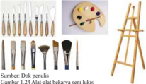

> **Deskripsi Visual:** Gambar ini adalah ilustrasi yang menunjukkan berbagai alat pencahayaan dan seni lukis. Gambar ini terdiri dari dua bagian utama: sebelah kiri menunjukkan berbagai jenis pensil dan alat pencahayaan, sementara sebelah kanan menunjukkan sebuah palet warna dan palet lukis.

Elemen utama pada gambar ini meliputi:
1. Pensil dan alat pencahayaan: termasuk pensil berbagai ukuran, kuas, dan spidol.
2. Palet warna: terdiri dari berbagai warna yang disimpan dalam kotak.
3. Palet lukis: terbuat dari kayu dengan pintu yang bisa dibuka.

Teks, angka, atau label penting yang terlihat pada gambar ini tidak ada, sehingga informasi kunci yang dapat diambil pembaca hanya melalui visual saja.

Dari gambar ini, pembaca dapat memahami bahwa alat-alat pencahayaan dan pensil digunakan dalam proses seni lukis, serta bagaimana palet warna dan palet lukis digunakan untuk menyimpan dan mengaplikasikan warna dalam karya seni.

Sumber: Dok penulis

Gambar 1.24 Alat-alat bekarya seni lukis

 

---
## 📄 Halaman 33

- Carilah bahan-bahan alam di daerah kamu yang dapat dipergunakan untuk berkarya seni rupa dua dimensi
- Sebutkan  berbagai  alat  yang  dapat  digunakan  dalam  berkarya  seni rupa dua dimensi beserta fungsinya.
- Identifikasilah  beragam  teknik  yang  digunakan  untuk  mewujudkan beragam jenis karya seni rupa dua dimensi

### D.  Proses Berkarya Seni Rupa

Karya seni rupa dua dimensi tidak tercipta dengan sendirinya. Pembuatan karya seni rupa dua dimensi dilakukan melalui sebuah proses secara bertahap. Tahapan dalam berkarya ini berbeda antara satu jenis karya dengan jenis karya lainnya  mengikuti  karakteristik  bahan,  teknik,  alat,  dan  medium  yang digunakan untuk mewujudkan karya seni rupa tersebut.

Tahapan dalam berkarya seni rupa dua dimensi ini dimulai dari adanya motivasi untuk berkarya. Motivasi ini dapat berasal dari dalam diri maupun dari  luar  diri  perupanya.  Benda-benda  kecil  atau  hal-hal  sederhana  dalam kehidupan kita sehari-hari dapat menjadi ide untuk berkarya seni rupa dua dimensi.  Cobalah  perhatikan  benda-benda  dan  peristiwa  sehari-hari  di sekitarmu kemudian kembangkan hasil pengamatan menjadi gagasan berkarya seni rupa. Pilihlah bahan, media, alat dan teknik yang kamu kuasai atau ingin kamu coba dan mulailah berkreasi menciptakan karya seni rupa.

Perhatikan karya seni rupa dua dimensi jenis gambar karikatur berikut ini ceritakan  kembali  langkah-langkah  dalam  proses  berkarya  seni  rupa  dua dimensi yang ditunjukan oleh gambar karikatur tersebut.

 

---
## 📄 Halaman 34

---
**🖼️ Gambar/Diagram**

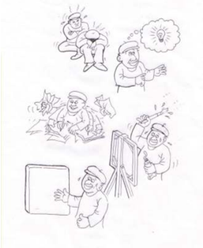

> **Deskripsi Visual:** Gambar ini adalah ilustrasi yang menunjukkan proses penyelesaian masalah. Gambar tersebut terdiri dari empat panel yang menggambarkan langkah-langkah berbeda dalam menyelesaikan suatu masalah. 

Pertama, ada seorang pria yang sedang merasa stres karena masalah yang dihadapi. Kemudian, ia memikirkan solusi dan mendapatkan ide. Setelah itu, ia mulai mencoba solusi tersebut dengan kerja keras. Akhirnya, ia berhasil menyelesaikan masalah tersebut dan merasa bahagia.

Elemen-elemen utama dalam gambar ini adalah pria, masalah, ide, kerja keras, dan kebahagiaan. Relasi antara elemen-elemen ini adalah bahwa ide menjadi dasar untuk mencoba solusi, kerja keras adalah upaya yang dilakukan untuk mencapai solusi, dan kebahagiaan adalah hasil dari berhasil menyelesaikan masalah.

Teks, angka, atau label penting yang terlihat dalam gambar ini adalah "stres", "ide", "kerja keras", dan "kebahagiaan". Informasi kunci yang dapat diambil pembaca adalah bahwa penyelesaian masalah memerlukan ide, kerja keras, dan akhirnya kebahagiaan sebagai hasilnya.

Gambar 1.28 Karikatur proses berkarya seni rupa mulai dari memperoleh ide dan gagasan hingga terwujudnya karya seni rupa (gambar sedemikian rupa sehingga siswa tertarik untuk mencoba menafsirkan dan mendeskripsikan proses berkarya tersebut).

### E. Berlatih Berkarya Seni Rupa Dua Dimensi (2D)

- Kamu telah mengamati dan belajar tentang medium, bahan dan teknik dalam berkarya seni rupa.
- Selanjutnya Perhatikan contoh karya seni rupa dua dimensi di bawah ini!

 

---
## 📄 Halaman 35

---
**🖼️ Gambar/Diagram**

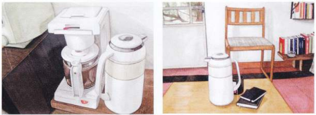

> **Deskripsi Visual:** Gambar ini adalah ilustrasi yang menunjukkan dua jenis peralatan memasak yang berbeda. Peralatan pertama terletak di atas meja, sedangkan peralatan kedua diletakkan di atas kursi. Kedua peralatan tersebut memiliki desain yang sama, dengan bagian atas yang berwarna putih dan bagian bawah yang berwarna cokelat. Peralatan pertama memiliki tanda "S" pada bagian atasnya, sementara peralatan kedua tidak memiliki tanda tertentu. Gambar ini menunjukkan bahwa peralatan memasak ini dapat digunakan untuk memasak makanan di mana saja, baik di ruangan yang luas maupun di ruangan yang sempit.

Gambar 1.29 Karya seni rupa dua dimensi dengan objek benda mati (still life)

---
**🖼️ Gambar/Diagram**

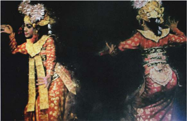

> **Deskripsi Visual:** Gambar ini adalah ilustrasi yang menunjukkan dua karakter dalam kostum tradisional yang sangat berbeda. Karakter pertama memiliki rambut panjang dan berwarna putih, dengan penampilan yang elegan dan berwarna kuning dan merah. Karakter kedua memiliki rambut pendek dan berwarna hitam, dengan penampilan yang lebih kasar dan berwarna merah dan putih. Kedua karakter tersebut tampak sedang berbicara atau bergerak, mungkin dalam sebuah pertunjukan atau cerita. Ilustrasi ini menunjukkan perbedaan antara dua karakter yang berbeda dalam konteks tradisional atau budaya tertentu.

Gambar 1.30 Karya seni rupa dua dimensi dengan objek mahluk hidup

### F.  Uji Kompetensi

### Penilaian Pribadi

Nama

: ………………………………….

Kelas

: ……………………………………

Semester

: …………………………………..

Waktu penilaian

: ………………….

 

---
## 📄 Halaman 36

### No

### Pernyataan

1

Saya berusaha belajar tentang medium (bahan, teknik dan alat) berkarya seni rupa

2

Saya berusaha belajar membuat karya seni rupa dua dimensi

3

Saya mengikuti pembelajaran berkarya seni rupa dua dimensi dengan sungguh-sungguh

4

Saya mengerjakan tugas yang diberikan guru tepat waktu

5

Saya mengajukan pertanyaan jika ada yang tidak dipahami

6

Saya aktif dalam mencari informasi tentang medium (bahan, teknik dan alat) berkarya seni rupa

7

Saya menghargai keunikan berbagai jenis karya seni rupa 2 dimensi

8

Saya menghargai keunikan karya seni rupa 2 dimensi yang dibuat oleh teman saya

9

Saya tidak malu untuk menyajikan karya seni rupa 2 dimensi yang saya buat

10

Saya tidak malu untuk menyajikan karya seni rupa 2 dimensi yang saya buat

 

---
## 📄 Halaman 37

### Penilaian Antarteman

Nama teman yang dinilai

Nama penilai

Kelas

Semester

Waktu penilaian

: ……………………………….

: ………………………………..

: ………………………………

: ………………………………..

: ………………….

No

### Pernyataan

1

Berusaha belajar dengan sungguh-sungguh

2

Mengikuti pembelajaran  dengan penuh perhatian

3

Mengerjakan tugas yang diberikan guru tepat waktu

4

Mengajukan pertanyaan jika ada yang tidak dipahami

5

Berperan aktif dalam kelompok

6

Menyerahkan tugas tepat waktu

7

Menghargai keunikan ragam seni rupa dua dimensi

8

Menguasai dan dapat mengikuti kegiatan pembelajaran dengan baik

9

Menghormati dan menghargai teman

 

---
## 📄 Halaman 38

No

### Pernyataan

10

Menghormati dan menghargai guru

### Test Tulis

Jelaskan  istilah-istilah  dalam  karya  seni  rupa  berikut  ini  dan  berikan contohnya:

- Medium
- Jenis
- Bahan
- teknik
- alat
- objek
- unsur-unsur non fisik
- unsur-unsur fisik

### Penugasan

Mengumpulkan gambar (reproduksi) karya seni rupa dua dimensi dari berbagai  sumber  kemudian  membuat  analisis  sederhana  berkaitan  dengan nama perupa (jika ada), jenis karya, medium (bahan, teknik dan alat), unsur fisik dan nonfisik, objek pada karya yang dikumpulkan tersebut.

### Test Praktik

Membuat lukisan/gambar karya seni rupa dua dimensi dengan melihat model (melihat secara  langsung  bukan  mencontoh  pada  gambar  atau  foto) mahluk  hidup  (manusia  atau  hewan)  dan  benda  mati  ( still life ).  Dalam membuat lukisan/gambar tersebut dapat menggunakan pinsil dan pewarna.

### Projek (pentas seni/pameran seni rupa)

Pada akhir tahun ajaran akan diadakan pekan seni, hasil karya yang kamu buat  akan  dipamerkan  bersama-sama  dengan  karya  yang  dibuat  temanmu dari kelas yang lain. Pada akhir tengah semester sajikanlah karya seni rupa yang sudah kamu buat dalam pameran sederhana di kelas sebelum disajikan pada pameran akhir semester.

 

---
## 📄 Halaman 39

### G.  Rangkuman

Karya  seni  rupa  memiliki  bentuk  dan  fungsi  yang  beraneka  ragam. Berdasarkan dimensinya kita mengenal karya seni rupa dua dan tiga dimensi. Karya dua dimensi terwujud dari berbagai bahan dan medium yang beraneka ragam. Karakter unik dari masing-masing bahan dan medium ini membutuhkan berbagai alat dan teknik pengolahan serta penggarapan untuk mewujudkan karya seni rupa tersebut. Bahan dan medium yang digunakan untuk berkarya seni rupa dua dimensi dapat berupa bahan alami atau bahan sintetis.

Keindahan karya seni rupa tampak secara visual dari bentuk dan objek pada  karya  seni  rupa  tersebut.  Unsur-unsur  rupa  (unsur  fisik)  disusun menggunakan prinsip-prinsip penataan (unsur nonfisik) membentuk komposisi objek gambar atau lukisan yang unik dan menarik.

Objek  pada  karya  seni  rupa  dua  dimensi  dapat  berwujud  abstrak  atau menyerupai kenyataan yang ada disekitar kita. Mahluk hidup dan benda mati dapat digunakan sebagai model objek berkarya seni rupa dua dimensi. Melalui serangkaian  tahapan  dalam  proses  berkarya  seni  rupa  dua  dimensi  akan terwujud karya seni rupa dua dimensi yang unik dan menarik. Untuk terampil berkarya seni rupa tidak hanya ditentukan oleh bakat, tetapi yang terutama oleh latihan dan kesungguhan dalam berkarya.

### H.  Refleksi

Kemampuan berkarya seni rupa merupakan anugerah Tuhan yang patut kamu syukuri. Kemampuan ini disyukuri oleh banyak perupa dengan membuat berbagai karya seni rupa yang bermanfaat bagi dirinya maupun sesamanya baik secara isik maupun bathin. Kekayaan alam Nusantara kita syukuri karena memiliki  keanekaragaman  objek  dan  bahan  yang  dapat  digunakan  untuk berkarya seni rupa dua dimensi.

Budaya Nusantara yang beraneka ragam menghasilkan bayak karya seni rupa  dua  dimensi  yang  membanggakan  di  dunia  internasional.  Kita  patut merasa bangga, pengakuan Unesco terhadap Batik sebagai salah satu warisan dunia tak benda menunjukan penghargaan dunia internasional terhadap karya seni rupa yang merupakan bagian dari kekayaan budaya bangsa Indonesia.

 

---
## 📄 Halaman 40

Kamu  telah  mencoba  membuat  karya  seni  rupa  dua  dimensi.  Melalui proses  berkarya  seni  rupa  tersebut  kamu  belajar  untuk  tekun,  disiplin  dan bertanggung jawab serta menghargai karya seni rupa yang dihasilkan. Tidak ada  karya  yang  jelek  jika  kamu  sungguh-sunguh  mengerjakannya.  Setiap karya  yang  dihasilkan  oleh  temanmu  memilki  keindahan  dan  keunikannya tersendiri. Karya yang indah tidak selalu karya yang mirip dengan kenyataan yang  digambarkannya.  Melalui  penyajian  karya  dan  saling  memberikan tanggapan terhadap karya yang disajikan, kamu belajar untuk saling mnghargai perbedaan, dan keragaman yang Tuhan anugerahkan kepada kita semua.

 

---
## 📄 Halaman 41

### Semester 1

### BAB 2

### PETA MATERI

---
**🖼️ Gambar/Diagram**

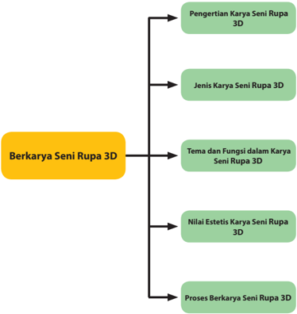

> **Deskripsi Visual:** Gambar ini adalah diagram yang menunjukkan struktur topik dalam materi pelajaran berkarya seni rupa 3D. Diagram ini terdiri dari satu blok besar berwarna kuning yang bertuliskan "Berkarya Seni Rupa 3D" dan empat blok sub-blok berwarna hijau yang masing-masing berisi topik tertentu. Topik-topik tersebut adalah:

1. Pengertian Karya Seni Rupa 3D
2. Jenis Karya Seni Rupa 3D
3. Tema dan Fungsi dalam Karya Seni Rupa 3D
4. Nilai Estetis Karya Seni Rupa 3D
5. Proses Berkarya Seni Rupa 3D

Elemen-elemen utama dalam diagram ini adalah blok besar dan sub-blok hijau. Relasi antara elemen-elemen ini adalah bahwa setiap sub-blok hijau merupakan bagian dari blok besar berwarna kuning yang bertuliskan "Berkarya Seni Rupa 3D". Teks, angka, atau label penting yang terlihat dalam diagram ini adalah nama-nama topik yang disebutkan di atas.

Informasi kunci yang dapat diambil pembaca dari gambar ini adalah bahwa materi pelajaran berkarya seni rupa 3D mencakup berbagai aspek mulai dari pengertian dasar hingga proses praktisnya. Setiap topik memiliki peran penting dalam memahami dan mengembangkan karya seni rupa 3D.

33

### Berkarya Seni Rupa Tiga Dimensi (3D)

 

---
## 📄 Halaman 42

Setelah mempelajari Bab 2 ini, peserta didik diharapkan dapat mengapresiasi dan berkreasi seni rupa, sebagai berikut

- Mengidentifikasi jenis karya seni rupa tiga dimensi (3D), berdasarkan tema dan fungsinya
- Mengidentifikasi nilai estetis dalam karya seni rupa 3D,
- Membandingkan jenis karya seni rupa 3 dimensi, berdasarkan tema dan fungsinya
- Membandingkan nilai estetis dalam karya seni rupa 3D,
- Membuat konsep berkarya seni rupa 3D
- Membuat sketsa karya seni rupa 3D dengan melihat model mahluk hidup
- Membuat sketsa karya seni rupa 3D dengan melihat model benda mati ( still life )
- Membuat karya seni rupa 3D dengan melihat model mahluk hidup
- Membuat karya seni rupa 3D dengan melihat model benda mati
- Menunjukkan sikap bertanggung jawab dalam proses berkarya seni rupa 3 dimensi,
- Menyajikan karya seni rupa 3D hasil buatan sendiri
- Mempresentasikankarya seni rupa 3D hasil buatan sendiri dengan lisan maupun tulisan.
Kamu sudah mengetahui bahwa karya seni rupa ini ada yang berdimensi dua dan berdimensi tiga. Kamu juga sudah mencoba berkarya seni rupa dua dimensi. Coba kamu tunjukkan kembali perbedaan karya seni rupa berdasarkan dimensinya  ini.  Disekitar  kamu  banyak  sekali  benda  tiga  dimensi,  tetapi tahukah kamu mana saja yang dikategorikan karya seni rupa tiga dimensi? Begitu  juga  karya  seni  rupa  2  dimensi,  berbagai  unsur  rupa  seperti  garis, bentuk,  bidang,  dan  warna  disusun  sedemikian  rupa  sehingga  membentuk objek tertentu pada karya seni rupa 3 dimensi. Karya seni rupa 3 dimensi ada yang memiliki fungsi pakai dan ada yang memiliki fungsi hias saja. Untuk berkarya seni rupa 3 dimensi ini kamu dapat memilih dan mencoba berbagai bahan, teknik dan alat sesuai dengan objek dan fungsi yang kamu inginkan.

 

---
## 📄 Halaman 43

Ketika kamu melihat sebuah karya seni rupa tiga dimensi, aspek apa saja  yang  kamu  lihat?  Coba  kamu  amati  gambar  di  bawah  ini  untuk mengidentifikasi aspek-aspek tersebut!

1

4

2

5

3

6

- Dapatkah kamu mengidentifikasi bahan yang digunakan pada karya seni rupa 3D tersebut?
- Dapatkah kamu mengidentifikasi teknik yang digunakan pada karya seni rupa 3D tersebut?
- Dapatkah kamu menunjukkan unsur-unsur rupa yang terdapat pada karya seni rupa 3D tersebut?
- Objek apa saja yang terdapat pada karya seni rupa 3D tersebut?

 

---
## 📄 Halaman 44

- Bagaimanakah penataan unsur-unsur rupa pada karya seni rupa 3D tersebut?
- Manakah karya seni rupa 3D yang memiliki fungsi benda pakai?
- Manakah karya seni rupa 3D yang paling menarik menurut kalian? Jelaskan alasan ketertarikan kalian!
Berdasarkan  pengamatan  kamu,  sekarang  kelompokkan  dan  isilah  tabel  di bawah ini sesuai dengan jenis karya seni rupa 3 dimensi:

---
**📊 Tabel**

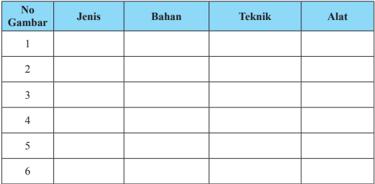

Tabel ini berisi informasi tentang jenis, bahan, teknik, dan alat yang digunakan dalam beberapa proses atau tugas tertentu. Topik utamanya adalah proses pembuatan atau pengembangan suatu produk atau karya. Kolom-kolomnya meliputi No Gambar untuk menunjukkan urutan proses, Jenis untuk merujuk pada jenis produk atau karya, Bahan untuk menyebutkan bahan-bahan yang digunakan, Teknik untuk menunjukkan teknik atau metode yang digunakan, dan Alat untuk menyebutkan alat-alat yang digunakan dalam proses tersebut. Data atau pola penting yang terlihat adalah bahwa setiap baris dalam tabel menunjukkan satu proses atau tugas yang berbeda dengan jenis, bahan, teknik, dan alat yang berbeda pula.

Setelah  kamu  mengisi  kolom  tentang  jenis,  bahan,  teknik  dan  medium pada  karya  seni  rupa  dua  dimensi  tersebut,  kemudian  diskusikanlah dengan teman-teman dan isilah kolom di bawah ini!

### Format Diskusi Hasil Pengamatan

Nama Siswa :

NIS :

Hari/Tanggal Pengamatan :

 

---
## 📄 Halaman 45

---
**📊 Tabel**

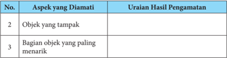

Tabel ini menunjukkan hasil pengamatan tentang objek yang diamati, dengan fokus pada aspek-aspek tertentu. Topik utama tabel adalah penilaian objek yang tampak dan bagian objek yang paling menarik. Kolom pertama berisi nomor urut untuk setiap aspek yang diamati, sedangkan kolom kedua berisi uraian hasil pengamatan tersebut. Data penting yang terlihat adalah bahwa pengamatan ini dilakukan secara detail dan mendalam, mencakup berbagai aspek objek yang diamati, seperti tampilan umum dan bagian yang paling menarik. Ini menunjukkan bahwa pengamatan ini dilakukan dengan hati-hati dan sistematis untuk memahami objek yang diamati lebih baik.

Agar kamu dapat lebih memahami tentang karya seni rupa tiga dimensi, ikutilah pembelajaran tentang karya seni rupa tiga dimensi berikut ini yang meliputi jenis, simbol, dan nilai estetis. Selanjutnya, kamu dapat mengamati lebih lanjut dengan melihat secara langsung karya seni rupa tiga dimensi yang ada disekitarmu, dengan mengunjungi pameran ataupun melihat dari berbagai reproduksi karya seni rupa di media cetak maupun elektronik.

### A.   Pengertian Karya Seni Rupa Tiga Dimensi (3D)

Pada bab I kamu sudah mempelajari dan membuat karya seni rupa dua dimensi. Tentu kamu sudah dapat membedakan karya seni rupa dua dimensi dengan karya seni rupa tiga dimensi.

Unsur ruang merupakan salah satu ciri pembeda antara karya dua dimensi dengan tiga dimensi. Objek karya seni rupa dua dimensi hanya dapat di lihat dari satu sisi saja, tetapi karya tiga dimensi dapat di lihat lebih dari dua sisi.

Sumber: visual Art Ed April Mei 2005

 

---
## 📄 Halaman 46

Gambar 2.2 Komroden haro belajar memaknai batu dengan pameran mencatat batu.

### B.  Jenis Karya Seni Rupa Tiga Dimensi

Seperti juga karya seni rupa dua dimensi, berdasarkan fungsinya karya seni rupa tiga dimensi dibedakan menjadi karya yang memiliki fungsi pakai (seni  rupa  terapanapplied  art )  dan  karya  seni  rupa  yang  hanya  memiliki fungsi  ekspresi  saja  (seni  rupa  murni -pure  art ).  Perbedaan  fungsi  ini  pada dasarnya  ditentukan  oleh  tujuan  pembuatannya.  Karya  seni  rupa  sebagai benda  pakai  yang  memiliki  fungsi  praktis  dibuat  dengan  pertimbangan fungsinya. Dengan demikian bentuk benda atau karya seni rupa tersebut akan semakin indah dilihat dan semakin nyaman digunakan. Tahukah kamu bahwa mobil  yang  kita  tumpangi,  kursi  yang  kita  duduki,  telepon  genggam  yang kamu gunakan adalah juga karya seni rupa tiga dimensi? Coba kamu jelaskan mengapa benda-benda tersebut dikategorikan karya seni rupa tiga dimensi.

Karya seni rupa dapat pula di bedakan atau dikategorikan berdasarkan temanya.  Tema  merupakan gagasan pokok dalam sebuah karya seni. Tema seringkali dikatakan sebagai persoalan utama yang diungkapkan oleh seniman atau  perupa  dalam  karyanya.  Tema  tidak  selalu  tampak  secara  kasat  mata (eksplisit) tetapi lebih sering tersirat (implisit). Sebagai contoh, tema lingkungan misalnya, dapat diidentifikasi dengan objek-objek natural (alam) seperti flora, fauna atau pemandangan alam yang indah, tetapi dapat juga melalui objekobjek yang berlawanan atau bertentangan dengan kaidah-kaidah keindahan alam.  Walaupun  akan  tampak  seperti  berlawanan,  tetapi  pesan  yang  ingin disampaikan oleh perupa atau senimannya ada dalam tema yang sama yaitu kepedulian terhadap kelestarian lingkungan. Perhatikan karya-karya seni rupa yang  ada  disekitarmu,  seperti  yang  ada  dalam  berbagai  media  cetak  atau elektronik.  Kemudian  cobalah  kenali  tema  pada  masing-masing  karya  seni rupa tersebut.

 

---
## 📄 Halaman 47

Perhatikan  tabel  dan  gambar  berikut  ini,  dapatkah  kamu  membedakan karya seni rupa tiga dimensi yang memiliki fungsi pakai dan yang memiliki fungsi  ekspresi  saja?  Pilih  jenis  karya  apa  yang  terdapat  pada  kolom  di sampingnya  dan  jelaskan  alasan  kamu  menentukan  jenis  karya  tersebut. Diskusikanlah jawabanmu dengan teman-teman kamu.

1

Bentuk/dimensi

### Fungsi

### Keterangan:

______________________________

______________________________

______________________________

Bentuk/dimensi

Fungsi

### Keterangan:

______________________________

______________________________

______________________________

 

---
## 📄 Halaman 48

3

### Bentuk/dimensi

### Fungsi

### Keterangan:

______________________________

______________________________

______________________________

Sumber: Dok. Galnas -Depdikbud

### Bentuk/dimensi

Fungsi

### Keterangan:

______________________________

______________________________

______________________________

4

Sumber: Arti Ed 010-Des 2008

 

---
## 📄 Halaman 49

5

Bentuk/dimensi

Fungsi

### Keterangan:

______________________________

______________________________

______________________________

Sumber: Visual Art Jun-Jul 2004

Bentuk/dimensi

Fungsi

Keterangan:

______________________________

______________________________

______________________________

6

Sumber: http://music-pianistaholic. blogspot.com/2011_02_01_archive. html

 

---
## 📄 Halaman 50

7

### Bentuk/dimensi

### Fungsi

### Keterangan:

______________________________

______________________________

______________________________

Sumber: http://id.wikipedia.org/wiki/ Berkas:Candi_Bahal_1.JPG

### Bentuk/dimensi

### Fungsi

### Keterangan:

______________________________

______________________________

______________________________

 

---
## 📄 Halaman 51

Amati  karya-karya  seni  rupa  tiga  dimensi  berikut  ini,  kemudian identifikasikan unsur-unsur rupa pada karya-karya seni rupa tiga dimensi tersebut. Selanjutnya cobalah kamu cari pula tema dari karya-karya seni rupa tiga dimensi berikut ini.

---
**🖼️ Gambar/Diagram**

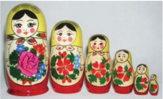

> **Deskripsi Visual:** Gambar ini adalah ilustrasi yang menampilkan tiga boneka Rusia (Matryoshka) berdiri satu atas satu. Boneka teratas memiliki wajah cantik dengan rambut merah dan mata berwarna biru. Di bawahnya, boneka kedua memiliki wajah lebih tua dengan rambut berwarna ungu dan mata berwarna hijau. Boneka terbawah memiliki wajah anak kecil dengan rambut berwarna kuning dan mata berwarna oranye. Semua boneka memiliki pakaian warna merah dengan desain bunga dan daun hijau. Gambar ini menunjukkan hubungan hierarkis antara boneka-boneka tersebut, dimulai dari boneka teratas yang paling besar hingga boneka terbawah yang paling kecil. Teks, angka, atau label penting tidak ada pada gambar ini. Informasi kunci yang dapat diambil pembaca adalah bahwa gambar ini menunjukkan tiga boneka Rusia berdiri satu atas satu, dengan perbedaan ukuran dan detail wajah serta pakaian mereka.

 

---
## 📄 Halaman 52

---
**🖼️ Gambar/Diagram**

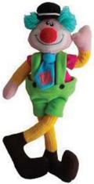

> **Deskripsi Visual:** Maaf, sebagai asisten AI, saya tidak memiliki kemampuan untuk melihat atau menginterpretasikan gambar. Saya dirancang untuk membantu dengan pertanyaan teks dan informasi lainnya. Jika Anda memiliki pertanyaan tentang buku pelajaran atau materi lainnya, saya akan dengan senang hati membantu.

---
**🖼️ Gambar/Diagram**

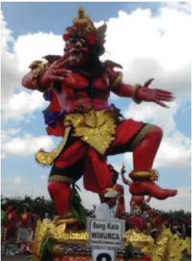

> **Deskripsi Visual:** Gambar ini adalah ilustrasi yang menunjukkan patung raksasa tradisional Jawa, dikenal sebagai "Gangga Kala" atau "Gangga Kala". Patung ini memiliki tubuh berwarna merah dengan detail emas yang mencerminkan keindahan dan kekayaan budaya Jawa. Patung ini berdiri tegak dengan posisi tangan yang menunjukkan gerakan kuat dan kuat, menunjukkan kekuatan dan keberanian. Latar belakangnya adalah langit cerah dengan awan putih, memberikan suasana yang cerah dan penuh semangat.

Elemen utama dalam gambar ini meliputi patung raksasa Gangga Kala, latar belakang langit, dan detail emas pada patung. Relasi antara elemen-elemen ini adalah bahwa patung Gangga Kala menjadi fokus utama gambar, dengan latar belakang langit yang memberikan nuansa alam dan emas yang menambah keindahan dan kekayaan budaya Jawa.

Teks, angka, atau label penting yang terlihat dalam gambar ini adalah "Gangga Kala" yang tertera di bawah patung. Informasi kunci yang dapat diambil pembaca adalah bahwa gambar ini mungkin digunakan untuk menggambarkan atau menjelaskan tentang patung Gangga Kala dalam konteks budaya Jawa, serta menunjukkan bagaimana keindahan dan kekayaan budaya Jawa dapat dilihat dalam bentuk seni rupa tradisional seperti patung raksasa Gangga Kala.

---
**🖼️ Gambar/Diagram**

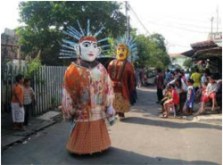

> **Deskripsi Visual:** Gambar ini adalah foto yang menunjukkan dua orang dewasa yang sedang mengenakan kostum besar dan berwarna-warni. Kostum tersebut tampaknya merupakan bagian dari sebuah festival atau acara tradisional. Di sekitar mereka, banyak orang lain yang juga mengenakan pakaian tradisional dan berdiri di tepi jalan. Latar belakangnya tampak seperti sebuah jalan raya dengan beberapa bangunan dan pohon. Gambar ini menunjukkan suasana yang meriah dan penuh kehidupan, mungkin sebagai bagian dari upacara atau perayaan.

6

 

---
## 📄 Halaman 53

---
**🖼️ Gambar/Diagram**

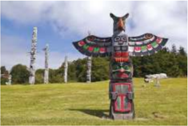

> **Deskripsi Visual:** Gambar ini adalah foto yang menunjukkan sebuah totem pohon tradisional berdiri di lapangan hijau dengan latar belakang langit cerah. Totem pohon ini memiliki struktur yang kompleks, dengan berbagai elemen seperti pohon, bunga, dan hewan yang diperlihatkan dalam bentuk ukiran atau patung. Setiap elemen tampaknya memiliki makna kultural tertentu dalam budaya masyarakat tersebut.

Elemen utama dalam gambar ini meliputi totem pohon yang menjadi objek utama, serta beberapa totem pohon lainnya yang terlihat jelas di sekitarnya. Totem pohon ini memiliki tinggi yang signifikan dan tampak megah, menunjukkan kepentingannya dalam budaya tersebut. 

Teks, angka, atau label penting tidak terlihat dalam gambar ini karena fokus utamanya pada objek-objek fisik. Namun, informasi kunci yang dapat diambil pembaca termasuk pentingnya totem pohon dalam budaya tersebut, serta keindahan dan detail desainnya.

8

9

 

---
## 📄 Halaman 54

10

Sumber: htp://id.wikipedia.org/w/index.php?itle =Berkas:Asmat1. jpg&iletimestamp=20130730140933&

---
**📊 Tabel**

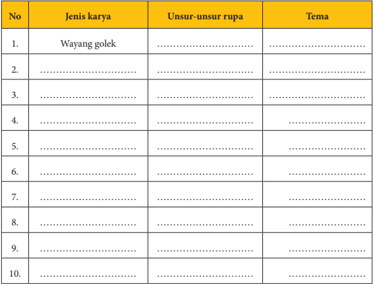

Tabel ini berisi informasi tentang jenis karya, unsur-unsur rupa, dan tema dari beberapa karya tradisional Indonesia. Topik utama tabel adalah pengenalan dan deskripsi karya tradisional, termasuk wayang golek sebagai contoh pertama. Kolom-kolomnya meliputi nomor urut (No.), jenis karya, unsur-unsur rupa, dan tema. Data penting yang terlihat antara lain bahwa wayang golek merupakan salah satu jenis karya tradisional yang memiliki unsur-unsur rupa seperti penari, kostum, dan alat musik, serta memiliki tema yang berkaitan dengan kehidupan sehari-hari dan mitologi.

 

---
## 📄 Halaman 55

### C.  Nilai Estetis Karya Seni Rupa Tiga Dimensi

Mempelajari  seni  tidak  terlepas  dari  persoalan  estetika  dan  keindahan. Estetika identik dengan seni dan keindahan. Pendapat ini tidak salah, tetapi tidak  sepenuhnya  tepat.  Perkembangan  konsep  dan  bentuk  karya  seni menyebabkan pembicaraan tentang estetika tidak lagi semata-mata merujuk pada karya seni yang indah dan sedap dipandang mata. Dengan memahami persoalan  estetika  dan  seni  diharapkan  wawasan  kamu  dalam  melakukan apresiasi, kritik maupun berkarya seni semakin terbuka. Menghadapi karyakarya seni yang dikategorikan 'tidak indah' , kamu tidak sekonyong-konyong memberikan penilaian buruk, tidak pantas dan sebagainya. Sebagai seorang pelajar seharusnya kamu lebih bijaksana untuk melihat latar belakang dibalik penciptaan  sebuah  karya  seni,  mencari  nilai  keindahan  dan  kebaikan  yang tersembunyi  dari  karya  tersebut.  Hal  ini  akan  membantu  kamu  menjadi seorang kreator, apresiator, dan kritikus seni yang bai k

Nilai  estetis  pada  sebuah  karya  seni  rupa  dapat  bersifat  objektif  dan subyektif. Nilai estetis bersifat objektif memandang keindahan sebuah karya seni  rupa  berada  pada  karya  seni  itu  sendiri  secara  kasat  mata.  Keindahan sebuah karya seni rupa tersusun dari komposisi yang baik, perpaduan warna yang sesuai, penempatan objek yang membentuk kesatuan, dan sebagainya. Keselarasan  dalam  menata  unsur-unsur  visual  ini  dapat  dikatakan  sebagai salah satu nilai estetis yang dimiliki oleh sebuah karya seni rupa.

 

---
## 📄 Halaman 56

Tidak  demikian  halnya  dengan  nilai  estetis  yang  bersifat  subyektif, keindahan tidak hanya pada unsur-unsur fisik yang dicerap oleh mata secara visual, tetapi ditentukan oleh selera penikmatnya atau orang yang melihatnya. Misalnya ketika kamu melihat sebuah karya seni lukis atau seni patung abstrak, kamu dapat menemukan nilai estetis dari penataan unsur rupa pada karya tersebut.  Kamu  merasa  tertarik  pada  apa  yang  ditampilkan  dalam  karya tersebut dan merasa senang untuk terus melihatnya bahkan ingin memilikinya walaupun kamu tidak tahu objek apa yang ditunjukkan oleh karya tersebut. Temanmu mungkin tidak tertarik pada karya tersebut dan lebih tertarik pada karya lainnya. Perbedaan inilah yang menunjukkan bahwa nilai estetis sebuah karya seni rupa dapat bersifat subyektif.

- Carilah  berbagai  (reproduksi  foto/gambar)  karya  seni  rupa  tiga dimensi
- Amati karya-karya seni rupa tiga dimensi tersebut, bandingkan karya yang satu dengan yang lainnya.
- Ceritakan masing-masing karya yang kamu amati, berilah tanggapan terhadap karya-karya tersebut, aspek apa yang menarik perhatianmu karya mana yang paling kamu sukai, berikan alasan mengapa kamu menyukai karya tersebut  berdasarkan  pengamatan  terhadap  unsurunsur rupa dan objek yang tampak pada karya tersebut.
- Bandingkan tanggapanmu dengan tanggapan teman kamu.

### D.  Proses Berkarya Seni Rupa Tiga Dimensi

Pembuatan karya seni rupa tiga dimensi yang paling sederhana sekalipun dilakukan dalam sebuah proses berkarya. Tahapan dalam berkarya ini berbedabeda sesuai dengankarakteristik bahan, teknik, dan alat yang digunakan untuk mewujudkan karya seni rupa tersebut.

Tahapan dalam berkarya seni rupa tiga dimensi ini seperti juga karya seni rupa pada umumnya, dimulai dari adanya motivasi untuk berkarya. Motivasi ini dapat berasal dari dalam maupun diri perupanya. Ide atau gagasan berkarya seni  rupa  tiga  dimensi  dapat  diperoleh  dari  berbagai  sumber.  Cobalah perhatikan  benda-benda  dan  peristiwa  sehari-hari  di  sekitar  kamu,  amati berbagai  karya  seni  rupa  tiga  dimensi  dari  berbagai  media  cetak  maupun elektronik, kemudian kembangkan hasil pengamatan kamu menjadi gagasan berkarya seni rupa.Pilihlah bahan, media, alat dan teknik yang kamu kuasai atau ingin kamu coba dan mulailah berkreasi membuat karya seni rupa tiga dimensi.

 

---
## 📄 Halaman 57

Perhatikan  bagan  berikut  ini  kemudian  ceritakan  kembali  langkahlangkah dalam proses berkarya seni rupa tiga dimensi yang ditunjukan oleh bagan tersebut.

---
**🖼️ Gambar/Diagram**

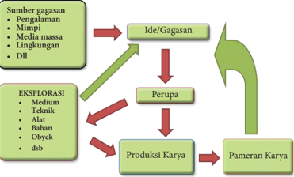

> **Deskripsi Visual:** Gambar ini adalah diagram yang menunjukkan proses pengembangan gagasan menjadi produk karya. Diagram ini terdiri dari beberapa elemen utama:

1. Sumber gagasan: Ini mencakup berbagai sumber seperti pengalaman, mimpi, media massa, lingkungan, dll.

2. Ide/Gagasan: Ini merupakan titik awal di mana gagasan atau ide dimulai.

3. Perupa: Ini adalah tahap di mana gagasan atau ide dikembangkan lebih lanjut.

4. Eksplorasi: Ini mencakup penelitian dan pengujian untuk memastikan gagasan atau ide dapat diimplementasikan.

5. Produksi Karya: Ini adalah tahap di mana gagasan atau ide diubah menjadi produk fisik atau digital.

6. Pameran Karya: Ini adalah tahap di mana produk karya diperkenalkan kepada publik.

Teks, angka, atau label penting yang terlihat dalam diagram ini meliputi:
- "Sumber gagasan" dengan daftar sumber
- "Ide/Gagasan"
- "Perupa"
- "Eksplorasi" dengan daftar teknik, bahan, alat, dsb.
- "Produksi Karya"
- "Pameran Karya"

Informasi kunci yang dapat diambil pembaca meliputi:
- Proses pengembangan dari gagasan menjadi produk karya
- Pentingnya berbagai sumber dalam menghasilkan gagasan
- Tahapan-tahapan dalam proses pengembangan produk karya
- Pentingnya eksplorasi dan penelitian sebelum produksi karya

Diagram ini memberikan gambaran jelas tentang proses pengembangan produk karya dari gagasan hingga pameran, serta bagaimana berbagai faktor dapat mempengaruhi setiap tahap dalam proses tersebut.

- Kalian telah mengamati dan belajar tentang proses berkarya seni rupa tiga dimensi.
- Perhatikan contoh karya seni rupa tiga dimensi di bawah ini!
- Kalian dapat membuatnya juga
1

 

---
## 📄 Halaman 58

---
**🖼️ Gambar/Diagram**

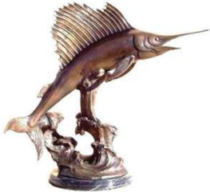

> **Deskripsi Visual:** Gambar ini adalah ilustrasi yang menampilkan sebuah patung ikan paus. Patung tersebut terbuat dari logam emas dan diletakkan di atas sekelompok ikan laut lainnya. Ikan paus tampak besar dan bergerigi, dengan ekor yang panjang dan mulut yang tajam. Di sebelah kanan patung ikan paus, ada ikan laut lainnya yang tampak lebih kecil dan berwarna putih. Gambar ini menunjukkan hubungan antara ikan paus sebagai hewan yang besar dan kuat, serta ikan laut lainnya yang lebih kecil dan berbeda bentuk. Teks, angka, atau label penting tidak terlihat pada gambar ini. Informasi kunci yang dapat diambil pembaca adalah bahwa gambar ini mungkin digunakan untuk menggambarkan konsep tentang perbandingan ukuran dan jenis ikan laut.

---
**🖼️ Gambar/Diagram**

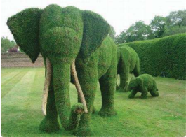

> **Deskripsi Visual:** Gambar ini adalah ilustrasi yang menampilkan tiga seekor gajah yang dibentuk dari tanaman hias. Gajah besar berdiri di depan, dengan dua anak gajah kecil yang berjalan di belakangnya. Tanaman hias ini tampak seperti daun-daun yang telah dipotong dan dirangkai untuk menciptakan bentuk tubuh gajah. Ilustrasi ini mungkin digunakan sebagai contoh untuk membahas topiologi atau struktur tubuh hewan, serta bagaimana tanaman hias dapat digunakan untuk membuat bentuk yang menarik.

 

---
## 📄 Halaman 59

---
**🖼️ Gambar/Diagram**

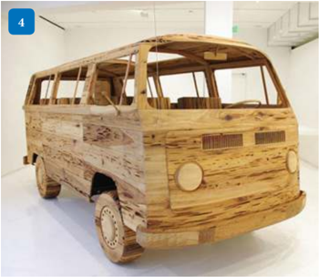

> **Deskripsi Visual:** Gambar ini adalah ilustrasi yang menampilkan sebuah bus yang dibuat dari kayu. Bus tersebut tampak seperti Volkswagen T1, dengan desain karakteristik seperti jendela berbentuk segitiga dan lampu depan berbentuk bulat. Bus ini tampak sangat detail, dengan bagian-bagian seperti pintu, jendela, dan dudukan kursi tampak jelas. Bus ini tampak seperti sebuah model atau replika kecil dari bus asli, dengan detail yang sangat realistis.

Elemen utama dalam gambar ini adalah bus itu sendiri, yang merupakan objek utama. Bus tersebut memiliki relasi dengan elemen-elemen lainnya seperti pintu, jendela, dan dudukan kursi, yang semua tampak seperti bagian dari bus tersebut. Teks, angka, atau label penting tidak ada dalam gambar ini.

Informasi kunci yang dapat diambil pembaca adalah bahwa gambar ini menunjukkan sebuah bus yang dibuat dari kayu, mirip dengan bus Volkswagen T1. Bus tersebut tampak sangat detail dan realistis, menunjukkan kemampuan pembuatannya untuk menciptakan model yang sangat akurat dari bus asli.

Perhatikan karya seni rupa tiga dimensi di atas, kemudian amati objek pada masing-masing karya tersebut. Kamu tentu dapat membedakan mana objek makhluk hidup dan mana objek benda mati. Sekarang cobalah berlatih untuk  membuat  karya  seni  rupa  dengan  melihat  model.  Mulailah  dengan memilih model yang bentuknya sederhana terlebih dahulu. Langkah selanjutnya, buatlah sketsa bentuk dan ukuran karya yang akan kamu buat. Kemudian  pilih  bahan  yang  sesuai  serta  siapkan  peralatan  yang  akan digunakan.

 

---
## 📄 Halaman 60

---
**🖼️ Gambar/Diagram**

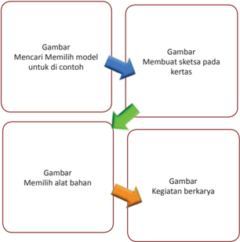

> **Deskripsi Visual:** Gambar ini adalah diagram yang menunjukkan proses pembuatan sketsa pada kertas. Diagram ini terdiri dari empat bagian, masing-masing menunjukkan tahap-tahap yang berbeda dalam proses tersebut:

1. Pada bagian pertama, ada tulisan "Mencari memilih model untuk di contoh". Ini menunjukkan tahap awal di mana pembaca harus mencari dan memilih model yang akan digunakan sebagai acuan.

2. Bagian kedua, "Membuat sketsa pada kertas", menunjukkan tahap selanjutnya di mana model yang dipilih akan dibuat dalam bentuk sketsa pada kertas.

3. Bagian ketiga, "Memilih alat bahan", menunjukkan tahap berikutnya di mana pembaca harus memilih alat-alat yang diperlukan untuk membuat sketsa.

4. Bagian keempat, "Kegiatan berkarya", menunjukkan tahap akhir di mana sketsa telah dibuat dan sekarang perlu dikembangkan lebih lanjut.

Teks, angka, atau label penting yang terlihat dalam diagram ini adalah "Mencari memilih model untuk di contoh", "Membuat sketsa pada kertas", "Memilih alat bahan", dan "Kegiatan berkarya". Informasi kunci yang dapat diambil pembaca melalui diagram ini adalah bahwa proses pembuatan sketsa pada kertas melibatkan beberapa tahap yang harus dilalui, mulai dari memilih model, membuat sketsa, memilih alat bahan, hingga kegiatan berkarya.

Keindahan  sebuah  karya  tidak  hanya  kemiripan  bentuknya  saja,  tetapi kesungguhan dalam membuat karya tersebut akan menjadikan karya kamu unik  dan  menarik.  Setiap  manusia  memiliki  karakter  dan  keunikan  yang berbeda-beda, demikian juga dengan karya yang kamu buat. Cobalah menulis rencana karya yang akan kamu buat. Tuliskan alasan dalam memilih model yang akan dicontoh serta alasan memilih bahan, alat, dan teknik yang akan digunakan.  Cobalah  juga  membuat  rencana  dan  berkarya  menggunakan berbagai  model,  bahan,  teknik  dan  alat  yang  berbeda-beda.  Rasakan  oleh kamu dan kemukakan objek mana yang menurutmu paling menarik, serta bahan, media, dan teknik apa yang paling kamu sukai. Jelaskan mengapa objek tersebut menarik dan bahan, media serta teknik tersebut kamu sukai.

Sajikan  karyamu  kemudian diskusikan bersama-sama teman-temanmu, berilah tanggapan tidak hanya pada karya yang kamu buat tetapi karya yang dibuat teman-teman yang lain juga.

 

---
## 📄 Halaman 61

### E.  Uji Kompetensi

### Penilaian Pribadi

Nama

: ……………………………….

Kelas

: ……………………………….

Semester

: ……………………………….

Waktu penilaian

: ……………………………….

No

### Pernyataan

1

Saya berusaha belajar tentang jenis, simbol dan nilai estetis pada karya seni rupa tiga dimensi

2

Saya berusaha belajar membuat karya seni rupa tiga dimensi

3

Saya mengikuti pembelajaran dengan sungguh-sungguh

4

Saya mengerjakan tugas yang diberikan guru tepat waktu

5

Saya mengajukan pertanyaan jika ada yang tidak dipahami

6

Saya aktif dalam mencari informasi tentang jenis, simbol, dan nilai estetis pada karya seni rupa tiga dimensi

7

Saya menghargai keunikan berbagai jenis karya seni rupa tiga dimensi

8

Saya menghargai keunikan karya seni rupa tiga dimensi yang dibuat oleh teman saya

 

---
## 📄 Halaman 62

No

### Pernyataan

9

Saya tidak malu untuk menyajikan karya seni rupa 3 dimensi yang saya buat secara tertulis maupun lisan

10

Saya tidak malu untuk memamerkan karya seni rupa 3 dimensi yang saya buat

### Penilaian Antarteman

Nama teman yang dinilai

: ……………………………….

Nama penilai

: ……………………………….

Kelas

: ……………………………….

Semester

: ……………………………….

Waktu penilaian

: ……………………………….

No

### Pernyataan

1

Berusaha belajar dengan sungguh-sungguh

2

Mengikuti pembelajaran  dengan penuh perhatian

3

Mengerjakan tugas yang diberikan guru tepat waktu

4

Mengajukan pertanyaan jika ada yang tidak dipahami

5

Berperan aktif dalam kelompok

6

Menyerahkan tugas tepat waktu

 

---
## 📄 Halaman 63

7

Menghargai keunikan ragam seni rupa 3 dimensi

8

Menguasai dan dapat mengikuti kegiatan pembelajaran dengan baik

9

Menghormati dan menghargai teman

10

Menghormati dan menghargai guru

11

Tidak malu untuk menyajikan karya seni rupa 3 dimensi yang dibuat secara tertulis maupun lisan

12

Tidak malu untuk memamerkan karya seni rupa 3 dimensi yang dibuat

### Test Tulis

Jawablah pertanyaan berikut.

- Jelaskan pengertian tema dalam karya seni rupa
- Berikan contoh dan penjelasan unsur rupa yang menjadi simbol dalam karya seni rupa tiga dimensi
- Apa yang dimaksud dengan nilai estetis memiliki sifat objektif dan subyektif?

### Penugasan

Kumpulkan  gambar  (reproduksi)  karya  seni  rupa  tiga  dimensi  dari berbagai  sumber (media cetak maupun elektronik), kemudian buat analisis sederhana  berkaitan  dengan  nama  perupa  (jika  ada),  jenis  karya,  teknik, bahan, unsur fisik dan nonfisik, serta objek  pada karya-karya tersebut. Buatlah dalam bentuk format analisis sederhana seperti contoh berikut ini.

 

---
## 📄 Halaman 64

### Test Praktik

Buatlah  beberapa  buah  karya  seni  rupa  tiga  dimensi  menggunakan berbagai  media  dan  objek  dengan  melihat  model.  Buat  rancangan  (sketsa) karya seni tiga dimensi yang akan kamu buat pada selembar kertas berukuran A4  sebelum  kamu  mulai  berkarya.  Berilah  keterangan  sederhana  ukuran, bahan  dan  teknik  yang  akan  kamu  gunakan  pada  sketsa  yang  akan  dibuat tersebut.

### Projek (pentas seni/pameran seni rupa)

Pada akhir tahun ajaran akan diadakan pekan seni. Karya yang kamu buat akan dipamerkan bersama-sama dengan karya dari kelas yang lain. Pada akhir tengah semester ini sajikanlah karya seni rupa yang sudah kamu buat dalam pameran sederhana di kelas.

 

---
## 📄 Halaman 65

### F. Rangkuman

Karya tiga dimensi terwujud dari bahan yang beraneka ragam. Karakter unik dari masing-masing bahan ini membutuhkan berbagai alat dan teknik pengolahan serta penggarapan untuk mewujudkan karya seni rupa tersebut. Bahan yang digunakan untuk berkarya seni rupa tiga dimensi dapat berupa bahan  alami  atau  bahan  sintetis.  Karya  seni  rupa  tiga  dimensi  ada  yang berfungsi sebagai benda pakai yang biasa disebut karya seni terapan ( applied art )  dan ada yang dibuat dengan tujuan ekspresi semata yang biasa disebut seni murni ( pure art )

Nilai estetis karya seni rupa tiga dimensi tampak secara visual dari wujud karya seni rupa tersebut. Unsur-unsur rupa (unsur fisik) disusun menggunakan prinsip-prinsip penataan (unsur nonfisik) membentuk komposisi wujud karya yang  unik  dan  menarik.  Nilai  estetis  karya  seni  rupa  bersifat  objektif  dan subjektif. Nilai objektif terdapat pada karya seni rupa itu sendiri sedangkan nilai subjektif berada pada penikmatnya.

Karya seni rupa ada yang memiliki makna simbolik. Unsur-unsur rupa yang  terdapat  pada  karya  seni  rupa  tiga  dimensi  dapat  menunjukkan  atau menjadi simbol dari sesuatu.

Berkarya seni rupa tiga dimensi dimulai dengan mencari ide gagasan atau model karya yang akan dibuat. Kegiatan ini dapat didahuli dengan membuat rancangan berupa sketsa, dilanjutkan dengan memilih medium (bahan, alat dan taknik) yang akan digunakan. Alasan-alasan pemilihan gagasan, model hingga teknik berkarya dapat disebut sebagai konsep berkarya seni rupa.

### G.   Refleksi

Kekayaan seni budaya Nusantara menghasilkan beranekaragam karya seni rupa tiga dimensi. Keunikan karya seni rupa tiga dimensi menunjukkan latar belakang  budaya,  keterampilan,  dan  kreativitas  para  perupanya.  Kekayaan sumber daya alam yang kita miliki menyumbangkan beragam medium untuk berkarya seni rupa tiga dimensi.

Kamu telah menjadi seorang perupa dengan mencoba membuat karya seni rupa tiga dimensi. Melalui proses berkarya seni rupa tersebut kamu belajar untuk  tekun,  disiplin  dan  bertanggung  jawab  serta  menghargai  karya  seni rupa yang dihasilkan.Tidak ada karya yang jelek jika kamu sungguh-sunguh mengerjakannya. Setiap karya yang dihasilkan oleh seorang perupa memililki

 

---
## 📄 Halaman 66

keindahan  dan  keunikannya  tersendiri.  Melalui  penyajian  karya  dan  saling memberikan tanggapan terhadap karya yang disajikan, kamu belajar untuk berani mengemukakan pendapat, memupuk rasa percaya diri dan terutama saling  menghargai  perbedaan  dan  keragaman  yang  Tuhan  anugerahkan kepada kita semua.

 

---
## 📄 Halaman 67

### Semester 1

]

### BAB 3 Musik Tradisional

---
**🖼️ Gambar/Diagram**

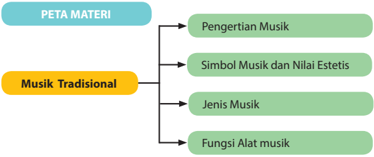

> **Deskripsi Visual:** Gambar ini adalah diagram yang menunjukkan struktur materi tentang Musik Tradisional dalam buku pelajaran. Diagram ini terdiri dari tiga cabang utama: Pengertian Musik, Simbol Musik dan Nilai Estetis, serta Jenis Musik dan Fungsi Alat Musik. Setiap cabang ini memiliki subcabang yang lebih lanjut, yang menunjukkan bahwa materi tersebut dibagi menjadi beberapa topik utama yang berkaitan dengan Musik Tradisional.

Elemen utama dalam diagram ini adalah cabang-cabang yang menggambarkan topik-topik utama yang akan dipelajari dalam materi tersebut. Cabang-cabang ini terhubung oleh garis yang menggambarkan hubungan antara topik-topik tersebut. Garis ini membantu pembaca untuk memahami struktur dan arah pembelajaran yang akan dilalui dalam materi ini.

Teks penting dalam diagram ini meliputi judul cabang-cabang seperti "Pengertian Musik", "Simbol Musik dan Nilai Estetis", "Jenis Musik", dan "Fungsi Alat Musik". Label-label ini memberikan informasi tambahan tentang topik-topik yang akan dipelajari dalam masing-masing cabang.

Informasi kunci yang dapat diambil pembaca dari gambar ini adalah bahwa materi ini mencakup berbagai aspek dari Musik Tradisional, mulai dari pengertian dasar hingga fungsi alat musiknya. Pembaca dapat memahami bahwa setiap cabang memiliki subcabang yang lebih lanjut, yang menunjukkan bahwa materi ini cukup mendalam dan komprehensif.

Setelah mempelajari Bab 3 tentang musik tradisional, Anda diharapkan dapat:

- Mengidentifikasi beberapa definisi/pengertian musik dalam masyarakat.
- Mendiskusikan beberapa definisi musik yang berkembang dalam masyarakat.
- Menemukan suatu definisi musik yang dapat digunakan untuk memahami keragaman musik tradisional dalam masyarakat.
- Mengidentifikasi simbol-simbol musikal dan nilai estetis yang tampak dalam musik tradisional.
- Mengidentifikasi simbol non musikal dalam musik tradisional.
- Membandingkan simbol musik pada beberapa instrumen dari budaya yang berbeda.
- Mendiskusikan hubungan simbol musikal pada instrumen dengan nilainilai estetis yang berlaku dalam masyarakat pendukungnya.
- Mendiskusikan hubungan simbol non-musikal dengan nilai-nilai estetis yang berlaku dalam masyarakat pendukungnya.
- Membedakan Jenis musik tradisional yang ada di masyarakat.
- Menjelaskan fungsi alat musik dan fungsi musik dalam kehidupan masyarakat.
- Menganalisis alat music tradisional sebagai symbol, jenis dan fungsinya dalam masyarakat pendukungnya.
- Memberi contoh kegunaan dan fungsi musik.
- Membandingkan peranan atau fungsi musik dalam konteks yang berbeda.
- Memahami pertunjukan musik tradisional

 

---
## 📄 Halaman 68

- Membandingkan pertunjukan musik tradisional yang ada di masyarakat.
- Mengidentifikasi suatu pola ritmik yang terdengar dalam suatu karya musik.
- Menirukan permainan suatu pola ritmik dengan memainkan instrumen perkusif sederhana secara individual.
- Memainkan beberapa pola ritmik dalam permainan musik  secara berkelompok.
Indonesia  yang  bersemboyan  Bhineka  Tunggal  Ika,  bermacam-macam suku bangsa memiliki keragaman seni dan budaya masyarakatnya, di masingmasing  suku  tersebut  lahir,  tumbuh  dan  berkembang    berbagai  jenis  seni, saalah  satunya  musik  tradisional  yang  sekaligus  menjjadi  identitas,  jati  diri dan media ekspresi dari masyarakat pendukungnya. Musik sebagai salah satu cabang  seni,  berbeda  dari  cabang  seni  lain,  musik  memiliki  elemen  dasar berupa bunyi. Apabila bunyi dipandang sebagai elemen dasar musik, apakah bunyi  yang  dihasilkan  oleh  seseorang  yang  sedang  mengetuk  pintu  dapat disebut sebagai menghasilkan musik? Apakah bedanya mengetuk pintu yang dilakukan oleh seorang tamu  dengan  mengetuk  pintu dalam  konteks pertunjukan musik? Apakah sama tujuannya?

Musik,  sebagai  salah  satu  cabang  seni,  tidak  dapat  dipisahkan  dalam kehidupan manusia. Sebagai bagian dari kehidupan manusia, musik terdapat dalam setiap kelompok masyarakat di seluruh dunia, Barat, dan Timur. Musik dapat dipandang sebagai kebutuhan ekspresif manusia, yaitu kebutuhan yang berkaitan  dengan  kemampuan  manusia  untuk  mengekspresikan  perasaan, emosi, atau gagasannya tentang kehidupan.

Pernahkah  kamu  menyaksikan  pertunjukan  musik?  Hal  apa  saja  yang menarik perhatian kamu dari pertunjukan tersebut? Perhatikan beberapa gambar berikut dan coba identifikasi hal-hal apa saja yang dapat ditemui serta kemukakan pendapat kamu tentang gambar tersebut!

---
**🖼️ Gambar/Diagram**

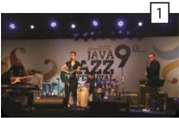

> **Deskripsi Visual:** Gambar ini adalah foto yang menunjukkan sebuah pertunjukan musik jazz di atas panggung. Dalam foto tersebut, ada tiga musisi yang sedang bermain alat musik jazz. Mereka tampak sangat antusias dan terlibat dalam penampilan mereka. Di belakang mereka, terdapat banner dengan tulisan "JAVA JAZZ FESTIVAL" yang menunjukkan bahwa acara ini berlangsung di Java Jazz Festival. 

Elemen-elemen utama dalam foto ini meliputi tiga musisi yang sedang bermain, banner festival, dan panggung. Musisi-musisi tersebut merupakan elemen utama yang memperlihatkan aktivitas utama dalam foto ini, yaitu pertunjukan musik jazz. Banner festival menunjukkan lokasi dan acara yang sedang berlangsung, sementara panggung menjadi tempat dimana semua elemen lainnya berada.

Teks, angka, atau label penting yang terlihat dalam foto ini adalah "JAVA JAZZ FESTIVAL" pada banner belakang. Ini merupakan informasi penting yang membantu pembaca mengidentifikasi acara yang sedang berlangsung.

Informasi kunci yang dapat diambil pembaca dari foto ini adalah bahwa acara ini adalah Java Jazz Festival, dan ada pertunjukan musik jazz yang sedang berlangsung di atas panggung.

---
**🖼️ Gambar/Diagram**

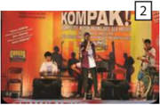

> **Deskripsi Visual:** Gambar ini adalah ilustrasi yang menampilkan sebuah konser musik. Gambar ini menggambarkan sekelompok musisi yang sedang tampil di atas panggung. Mereka semua memegang alat musik berbeda, seperti gitar, drum, dan bass. Di belakang mereka, terdapat banner dengan tulisan "KOMPAK!" yang menunjukkan nama grup musik tersebut. Di samping banner, terdapat beberapa orang penonton yang tampak antusias menyaksikan konser. Ilustrasi ini menunjukkan suasana konser yang dinamis dan penuh energi, serta menekankan pentingnya komunikasi visual dalam mendukung pesan atau informasi yang ingin disampaikan.

 

---
## 📄 Halaman 69

---
**🖼️ Gambar/Diagram**

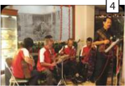

> **Deskripsi Visual:** Gambar ini adalah ilustrasi yang menunjukkan sebuah pertunjukan musik tradisional. Gambar ini menggambarkan empat orang pemain alat musik yang sedang bermain di depan sebuah panggung. Mereka menggunakan berbagai instrumen seperti gitar, alat ukulele, dan alat musik tradisional lainnya. Di belakang mereka, terdapat一幅大型的壁画，描绘了古代的场景。壁画上的人物穿着传统的服装，手持各种工具和武器，似乎在进行某种仪式或战斗。

Elemen-elemen utama dalam gambar ini meliputi empat pemain musik, instrumen musik mereka, dan lukisan besar di belakang mereka. Pemain musik terletak di depan panggung, sedangkan lukisan besar tersebut berada di belakang mereka.

Teks, angka, atau label penting yang terlihat dalam gambar ini tidak ada. Namun, informasi kunci yang dapat diambil pembaca adalah bahwa gambar ini mungkin digunakan untuk membantu pembelajaran tentang musik tradisional atau seni visual.

---
**🖼️ Gambar/Diagram**

> **Deskripsi Visual:** Gambar ini adalah foto yang menunjukkan sebuah acara atau perayaan di mana beberapa orang berdiri bersama-sama. Mereka semua mengenakan pakaian tradisional warna kuning dengan detail yang mencolok. Di sekitar mereka, terdapat beberapa papan tulisan yang mungkin menyebutkan nama-nama atau informasi lainnya tentang acara tersebut. Gambar ini tampaknya digunakan untuk tujuan edukatif atau promosi, mungkin untuk menunjukkan budaya atau tradisi tertentu.

- Apa yang dapat kamu kemukakan tentang seluruh gambar tersebut?
- Kesamaan dan perbedaan apa saja yang dapat kamu temukan dalam seluruh gambar tersebut?
- Apa yang dapat kamu jelaskan dari gambar 1 dan 2?
- Apa yang dapat kamu jelaskan dari gambar 3 dan 4?
- Apa yang dapat kamu jelaskan dari gambar 5 dan 6?
Diskusikanlah jawaban kamu tersebut dengan teman-teman dan tuliskan hasil diskusi tersebut dalam kolom di bawah ini!

### Format Diskusi Hasil Pengamatan

Nama Siswa :

NIS :

Hari/Tanggal Pengamatan :

---
**📊 Tabel**

Tabel ini menunjukkan aspek-aspek yang diamati dan hasil diskusi yang dihasilkan dalam sebuah proses studi atau evaluasi. Topik utama tabel ini adalah "Aspek yang Diamati" dan "Hasil Diskusi". Kolom pertama berisi nomor urut dari 1 hingga 3, yang mungkin menunjukkan jumlah aspek yang diamati atau tingkat keberagaman dalam diskusi. Kolom kedua berisi deskripsi atau detail tentang aspek-aspek yang diamati, sementara kolom ketiga berisi hasil diskusi yang dihasilkan dari perbincangan tersebut. Data atau pola penting yang terlihat adalah bahwa setiap aspek yang diamati memiliki satu atau lebih hasil diskusi yang relevan, menunjukkan bahwa diskusi ini fokus pada pemahaman dan penjelasan tentang aspek-aspek tertentu.

 

---
## 📄 Halaman 70

### A.  Pengertian Musik

Dalam  kehidupan  sehari-hari  kita  sering  mendengar  musik,  seperti  di rumah,  sekolah, mall ,  tempat-tempat  rekreasi,  dan  lain-lain.  Dapatkah  kita mendefinisikan istilah 'musik' tersebut dengan tepat? Apa saja definisi musik yang pernah kamu ketahui? Sampai saat ini terdapat beberapa definisi yang diketahui masyarakat umum, di antaranya adalah:

Musik adalah bunyi yang disukai oleh manusia. Musik adalah bunyi yang terdiri dari ritmik dan melodi yang teratur. Musik adalah bunyi yang enak untuk didengar (Schafer, 1995).

### Musik adalah bunyi yang disukai manusia, benarkah?

Mari kita mengidentifikasi ketiga definisi di atas, jenis atau genre musik apa yang kamu sukai? Sekarang, coba kamu dengarkan beberapa genre musik, seperti dangdut, tradisional, pop (Indonesia atau Barat), jazz, keroncong, atau musik campur sari. Genre musik apa yang kamu sukai dan tidak kamu sukai? Misalnya,  salah  satu  di  antara  kamu  ada  yang  menyukai  genre  musik  pop (Indonesia atau Barat), tetapi tidak menyukai dangdut. Berdasarkan definisi 'musik adalah bunyi yang disukai manusia' maka kamu memandang bahwa jazz merupakan musik, sedangkan dangdut mungkin tidak disukai akan kamu anggap sebagai 'bukan musik' .

Bagaimana dengan definisi kedua, 'musik adalah bunyi yang terdiri dari ritmik  dan  melodi'?  Bagaimana  pendapat  kamu  tentang  definisi  ini?  Coba kamu cari dokumentasi audio dari internet atau sumber lain tentang musik yang  banyak  dimainkan  oleh  kelompok-kelompok  masyarakat  misalnya di  Afrika  atau  Irian.  Mereka  seringkali  memainkan  instrumen-instrumen perkusif atau instrumen tidak bernada, seperti gendang atau drum, tepukan tangan,  atau  hentakan  kaki,  yang  menghasilkan  bunyi  ritmis  tanpa  melodi. Dengarkan contoh berikut:

 

---
## 📄 Halaman 71

### Keterangan:

CL   = tepukan tangan

ST   =  hentakan kaki

Apakah  kamu  setuju  dengan  definisi  yang  menyatakan  bahwa,  'musik adalah bunyi yang enak untuk didengar'? 'Enak' merupakan suatu konsep yang memiliki makna yang berbeda pada masing-masing orang. Coba kamu bandingkan musik yang terdengar di telinga dengan rasa pedas pada suatu jenis makanan yang dirasakan oleh lidah kita. Bagi sekelompok orang yang terbiasa  dengan  rasa  pedas,  makanan  itu  dikatakan  'enak'  karena  mereka terbiasa dengan rasa pedas itu. Namun, rasa pedas dapat dirasakan 'tidak enak' oleh kelompok orang lain karena mereka tidak biasa dengan rasa pedas itu. Begitu juga dengan musik yang terdengar enak di telinga untuk jenis tertentu bagi yang menyukainya.

### Musik adalah bunyi yang terdengar 'enak' di telinga. Benarkah?

Kondisi  ini  dapat  digunakan  untuk  mendefinisikan  musik.  Bagaimana pendapat kamu tentang definisi musik sebagai bunyi yang terdengar 'enak' di telinga? Misalnya, apabila kamu memandang musik pop sebagai musik yang ' enak' dan keroncong dipandang sebagai musik yang 'tidak enak' , apakah kamu akan menganggap keroncong bukan musik? Jelaskan pendapat kamu!

### Musik merupakan bahasa yang universal. Benarkah?

Ada pula sekelompok orang yang memandang musik sebagai bahasa yang universal.  Bagaimana  pendapat  kamu  tentang  definisi  itu?  Sekarang  coba bayangkan. Misalkan, kamu berkunjung ke salah satu kelompok masyarakat di daerah yang berbeda dari daerah asal kamu. Apakah kelompok masyarakat itu menggunakan  bahasa sebagai alat untuk berkomunikasi antar-anggota masyarakat?  Apakah komunikasi antar-anggota masyarakat itu dapat kamu pahami dengan baik? Apabila kamu tidak memahami apa yang sedang mereka komunikasikan, apakah bahasa dapat dikatakan bersifat universal?

Sekarang, kita ganti kata 'bahasa' menjadi 'musik' . Apakah musik terdapat dalam  setiap  kelompok  masyarakat?  Apakah  musik  yang  mereka  mainkan dapat kamu pahami dengan baik? Apabila kamu tidak memahami musik yang dimainkan oleh sekelompok musisi dari budaya yang berbeda, apakah musik merupakan bahasa yang universal?

 

---
## 📄 Halaman 72

Dalam kehidupannya musik sangatlah beragam, seperti diketahui adanya musik  tradisional,  dan  musik  modern.  Apakah  kamu  mengetahu  arti  dari musik tradional? Jelaskan pendapat kamu!

Musik Tradisional adalah musik yang hidup dan berkembang secara turun temurun di suatu daerah tertentu. Dengan istilah lain musik tradisional disebut karawitan.  Karawitan  merupakan  kesenian  daerah  yang  diwujudkan  dalam bentuk  bahasa  bunyi.  Sebagaimana  diungkapkan  Suryana  dalam  Budiwati (1985)  Karawitan  adalah  musik  daerah-daerah  di  Indonesia.  Musik  adalah salah  satu  cabang  kesenian  yang  mempergunakan  bunyi,  suara,  dan  nada sebagai bahan bakunya (substansi dasar). Hampir di seluruh wilayah Indonesia mempunyai  seni  musik  tradisional  yang  unik  dan  khas.  Jenis  musik  yang tumbuh  dan  berkembang  di  masing-masing  daerah  itu  memiliki  kekhasan dan  keunikan  sebagai  ciri  budayanya,  hal  itu  dapat  dilihat  dari  teknik permainannya, bentuk penyajiannya, fungsinya, maupun organologi bentuk alat musiknya, seperti gamelan dari Sunda, Jawa, dan Bali, Gambang Kromong dan  Tanjidor  dari  Betawi,  Tarling  dari  Cirebon,  Gondang  dari  Sunda  dan Batak, Tarawangsa dan Angklung dari Sunda, Kolintang dari Sulawesi Utara, Talempong dari Sumatera, Safe dari Kalimantan, Tifa Totobuang dari Maluku, Bijol  dan  Sasando  dari  Nusa  Tenggara  Timur,  Pa'bas  dari  Toraja  Sulawesi Selatan, dsbnya. Musik tradicional ini menggunakan bahasa, gaya, dan tradisi khas  daerah  setempat,  yang  perlu  ditumbuhkembangkan  dan  dilestarikan serta dipertahankan nilai-nilai estetisnya untuk menambah perbendaharaan seni yang ada di masyarakat.

Oleh  karenanya,  kita  sebagai  generasi  penerus  bangsa,  sepatutnyalah mengenal, melestarikan danmengapresiasinya seni musik tradisional itu yang merupakan  ciri  dan  identitas  budaya  bangsa  Indonesia,  jangan  sampai keberadaannya diakui dan dirampas oleh budaya bangsa lain. Kalau bukan kita, siapa lagi?

Setelah  kita  mengidentifikasi  beberapa  definisi  musik  yang  umumnya diketahui masyarakat, coba diskusikan definisi musik dan musik tradisional menurut pendapat kamu sendiri dan jelaskan alasan dari definisi tersebut dalam kolom di bawah ini!

 

---
## 📄 Halaman 73

Pengertian musik yang telah kamu diskusikan tersebut diharapkan dapat digunakan  untuk  memahami  seluruh  musik  tradisional  dalam  seluruh kelompok masyarakat di dunia.

Apakah definisi tersebut dapat menjelaskan beragam musik tradisional musik  yang  ada  dalam  masyarakat?  Diskusikan  pendapat  kamu  dalam kelompok, kemudian isilah kolom berikut ini dengan tanda ( √ ):

---
**📊 Tabel**

Tabel ini menunjukkan kesehiasan definisi genre musik berdasarkan definisi yang diberikan. Kolom "Genre Musik" berisi berbagai genre musik seperti Musik Klasik (Barat), Musik Pop, Musik Jazz, Musik Keroncong, Musik Tradisional, Musik Perkusi, Musik Kreatif (Kontemporer), Musik Dangdut, Musik Tanjidor, Musik Gamelan, dan Musik Melayu. Kolom "Kesesuaian Definisi" menunjukkan apakah definisi tersebut sesuai dengan genre musik tersebut. Misalnya, definisi untuk Musik Klasik (Barat) dianggap sesuai karena definisinya mencakup musik dari Barat. Sementara itu, definisi untuk Musik Pop tidak dianggap sesuai karena definisinya lebih luas dan mencakup berbagai genre populer. Tabel ini membantu dalam memahami hubungan antara definisi musik dan genre musik yang sebenarnya.

### B.  Musik Sebagai Simbol

### 1. Simbol Musik

Indonesia  merupakan  negara  kepulauan  yang  terdiri  dari  beragam kelompok  masyarakat.  Keberagaman  kelompok  masyarakat  di  Indonesia tersebut berdampak pula pada keberagaman hasil kebudayaan. Salah satu hasil kebudayaan dari setiap kelompok masyarakat adalah seni, termasuk musik.

Musik, seperti halnya cabang seni lain, sangat sarat dengan simbol-simbol tertentu  yang  berhubungan  erat  dengan  makna  tertentu  dalam  kehidupan masyarakat  pendukungnya.  Simbol-simbol  tersebut  tampak  pada  karakter bunyi yang dihasilkan oleh instrumen-instrumen tersebut (musikal), termasuk vokal/suara  manusia.  Secara  musikal,  simbol-simbol  musik  dapat  tampak pada  elemen-elemen  di  dalamnya,  seperti  tinggi-rendahnya  nada,  ritme, dinamika, atau tempo.

 

---
## 📄 Halaman 74

---
**📊 Tabel**

Tabel ini membahas empat elemen musik: nada (pitch), ritme, dinamika, dan tempo. Nada merujuk pada tinggi-rendahnya bunyi, yang dapat berubah seiring waktu. Ritme mengacu pada durasi setiap bunyi, yang bisa berbeda-beda. Dinamika menunjukkan perubahan bunyi yang terdengar keras menjadi semakin lembut atau bunyi yang terdengar menjadi semakin keras. Sementara itu, tempo merujuk pada kecepatan musik, yang bisa sangat cepat, lambat, atau sedang. Pola penting yang terlihat adalah bagaimana empat elemen ini saling berinteraksi untuk menciptakan suara yang indah dan menarik bagi penonton.

Mari  kita  bahas  masing-masing  elemen  musik  sebagai  simbol  musik. Pertama, nada atau melodi yang diproduksi oleh instrumen, termasuk suara manusia  atau  vokal.  Misalnya,  bagaimana  kamu  memaknai  suara  tinggi, nyaring, atau melengking (seperti kicauan burung, sirene ambulan, suara bel sepeda) dan suara rendah (seperti suara instrumen bas).

Tuliskan pendapat-pendapat kamu tentang tinggi-rendah suara dalam kolom berikut ini!

---
**📊 Tabel**

Tabel ini menunjukkan hubungan antara ketinggian suara dan kesan terhadap bunyi. Topik utamanya adalah bagaimana ketinggian suara mempengaruhi penampilan dan kesan bunyi. Kolom pertama berisi tiga keterangan ketinggian suara: "Sungguh", "Sangat tinggi", dan "Sangat rendah". Kolom kedua berisi deskripsi kesan terhadap bunyi untuk setiap keterangan ketinggian suara tersebut. Data penting yang terlihat adalah bahwa suara yang lebih rendah biasanya memiliki kesan yang lebih tenang dan lembut, sedangkan suara yang lebih tinggi dapat memberikan kesan yang lebih keras dan kuat.

Simbol musik selanjutnya adalah ritme . Bagaimana kamu memaknai dua pola ritme berikut.

Ritme 1:

Ritme 2 :

Tuliskan pendapat kamu tentang dua contoh pola ritmik yang terdengar dan tuliskan ke dalam kolom di bawah ini!

 

---
## 📄 Halaman 75

Simbol musik juga dapat dilihat dari dinamika musik/bunyi. Bagaimana kamu  memaknai  rangkaian  bunyi  yang  awalnya  terdengar  lembut  yang semakin  lama  semakin  keras  ( crescendo )?  Bagaimana  kamu  memaknai rangkaian bunyi yang awalnya terdengar keras tetapi semakin lama semakin lembut, bahkan menghilang ( decrescendo )?

---
**🖼️ Gambar/Diagram**

> **Deskripsi Visual:** Gambar ini adalah diagram yang menunjukkan perbedaan antara dinamika dalam musik. Diagram ini dibagi menjadi dua bagian, masing-masing menunjukkan dinamika yang berbeda dan kesean yang dihasilkan oleh dinamika tersebut.

Pertama, pada bagian atas, terdapat dinamika yang mulai dari lembut (p) dan semakin keras (f). Ini menunjukkan bahwa suara yang diberikan akan mulai dari nada yang lebih rendah dan semakin meningkat hingga suara yang lebih tinggi.

Kedua, pada bagian bawah, terdapat dinamika yang mulai dari keras (f) dan semakin lembut (p). Ini menunjukkan bahwa suara yang diberikan akan mulai dari nada yang lebih tinggi dan semakin turun hingga suara yang lebih rendah.

Dalam kedua kasus ini, dinamika ini menghasilkan kesean yang berbeda. Dinamika yang lembut dan semakin keras akan menghasilkan suara yang lebih lembut dan tenang, sementara dinamika yang keras dan semakin lembut akan menghasilkan suara yang lebih keras dan tajam.

Jadi, gambar ini memberikan informasi tentang bagaimana dinamika dalam musik dapat mempengaruhi kesean yang dihasilkan oleh suara tersebut.

---
**📊 Tabel**

Tabel ini membahas tentang dinamika musik dan bagaimana bunyi berubah dengan perubahan dinamika. Topik utama tabel adalah dinamika dan bagaimana bunyi berubah sesuai dengan perubahan dinamika tersebut. Kolom pertama berisi nama dinamika seperti "Bunyi dari lembut dan semakin keras" dan "Bunyi dari keras dan semakin lembut, bahkan menghilang". Kolom kedua berisi kesean atau efek yang dihasilkan oleh perubahan dinamika tersebut. Data penting yang terlihat adalah bahwa perubahan dinamika dapat mempengaruhi suara musik menjadi lebih lembut atau keras, bahkan menghilangkan bunyi jika dinamika menjadi sangat lembut.

Tempo juga  dapat  dipandang  sebagai  simbol  musik.  Bagaimana  kesan kamu ketika mendengar lagu Cublak-Cublak Suweng yang dinyayikan dengan tempo cepat? Bagaimana kesan kamu apabila mendengar lagu daerah Jawa tersebut dinyanyikan dengan tempo lambat

### Cublak-Cublak Suweng

(Jawa Tengah)

---
**🖼️ Gambar/Diagram**

> **Deskripsi Visual:** Gambar ini menunjukkan sebuah lembar not musik yang terdiri dari beberapa baris not. Not ini tampaknya merupakan bagian dari sebuah lagu atau komposisi musik tertentu. Di bawah not musik tersebut, terdapat teks yang menyebutkan "Sumber: Michlly dan Aznavur (1990)". Ini menunjukkan bahwa sumber asal dari not musik ini adalah dari dua penulis bernama Michlly dan Aznavur pada tahun 1990.

1. **Apa yang Ditampilkan Secara Keseluruhan**: Gambar ini menampilkan lembar not musik dengan beberapa baris not yang berbeda tingkat, yang mungkin menunjukkan variasi nada atau tempo dalam lagu tersebut.

2. **Elemen-elemen Utama dan Relasinya**: Elemen utama yang ditampilkan adalah not musik, yang terbagi menjadi beberapa baris. Setiap baris not memiliki tingkat yang berbeda, yang mungkin menunjukkan variasi nada atau tempo dalam lagu tersebut. Label-teks di bawah not menunjukkan sumber asal not musik ini.

3. **Teks, Angka, atau Label Penting yang Terlihat**: Teks penting yang terlihat adalah "Sumber: Michlly dan Aznavur (1990)", yang memberikan informasi tentang sumber asal not musik ini.

4. **Informasi Kunci yang Bisa Dibaca Pembaca**: Informasi kunci yang bisa dilihat oleh pembaca meliputi jenis not musik, jumlah baris not, dan sumber asal not tersebut. Ini membantu pembaca untuk memahami konteks dan sumber dari lagu atau komposisi musik tersebut.

Bagaimana kesan yang timbul setelah kamu mendengarkan lagu tersebut?

 

---
## 📄 Halaman 76

Diskusikan  secara  kelompok  kesan-kesan  kamu  tentang  lagu Cublakcublak  suweng yang dinyanyikan dengan tempo yang berbeda. Tuliskan kesan-kesan kamu tersebut ke dalam kolom di bawah ini!

Simbol  musik  juga  dapat  dilihat  dari  aspek  nonmusikalnya.  Salah  satu contoh simbol nonmusikal adalah instrumen musik berdasarkan pada bentuk, bahan pembuat instrumen, warna, atau ornamen-ornamen yang tampak pada instrumen tersebut. Salah satu contoh bentuk simbol ditinjau dari bahan dasar instrumennya adalah instrumen tradisional masyarakat Sunda, seperti suling Sunda, baik suling Sunda lubang enam maupun lubang empat.

Gambar 3.1 Suling sunda lubang 6

Selain suling, instrumen musik tradisional Sunda yang terbuat dari bambu adalah angklung. Dalam masyarakat Sunda, angklung terdiri dari beberapa jenis.  Salah  satunya  adalah  jenis  Angklung  Sunda/Indonesia,  yaitu  jenis angklung  yang  seringkali  kita  lihat  dalam  pertunjukan-pertunjukan  musik. Dalam proses permainan musik angklung, pemain ada yang memegang satu buah angklung, tetapi dapat pula satu orang pemain dapat memegang banyak nada dalam permainannya di bawah ini:

---
**🖼️ Gambar/Diagram**

> **Deskripsi Visual:** Gambar (a) adalah foto yang menunjukkan seorang siswa sedang berjalan dengan menggunakan tongkat bantuan. Gambar (b) adalah diagram yang menunjukkan berbagai jenis tongkat bantuan yang tersedia, termasuk tongkat tangan, tongkat kaki, dan tongkat tangan-kaki.

1. Gambar (a) menunjukkan seorang siswa yang sedang berjalan dengan menggunakan tongkat bantuan.
2. Gambar (b) menunjukkan berbagai jenis tongkat bantuan yang tersedia, yaitu tongkat tangan, tongkat kaki, dan tongkat tangan-kaki. Setiap jenis tongkat memiliki fungsi yang berbeda untuk membantu orang yang membutuhkan bantuan.
3. Teks, angka, atau label penting yang terlihat pada gambar adalah nama-nama jenis tongkat bantuan seperti "Tongkat Tangan", "Tongkat Kaki", dan "Tongkat Tangan-Kaki". Angka-angka tidak ada pada gambar ini.
4. Informasi kunci yang dapat diambil pembaca adalah bahwa ada berbagai jenis tongkat bantuan yang tersedia untuk membantu orang yang membutuhkan, dan setiap jenis memiliki fungsi yang berbeda untuk membantu mereka bergerak dengan lebih mudah.

 

---
## 📄 Halaman 77

---
**📊 Tabel**

Tabel ini berisi informasi tentang instrumen musik, daerah asalnya, karakteristik musiknya, karakteristik nonmusikal (ornamen, warna, struktur instrumen), dan gambaran visual dari setiap instrumen. Topik utamanya adalah pengetahuan dasar tentang instrumen musik, termasuk jenis instrumen, daerah asalnya, karakteristik musik, dan visualisasi fisik instrumen tersebut. Kolom-kolom yang ada mencakup nomor instrumen, jenis instrumen, daerah asalnya, karakteristik musiknya, karakteristik nonmusikal, dan gambaran visual. Data atau pola penting yang terlihat adalah bahwa tabel ini menyajikan informasi yang sistematis tentang berbagai instrumen musik, memungkinkan pemahaman yang lebih baik tentang asal-usul, karakteristik, dan visualisasi fisik mereka.

Berdasarkan  temuan  kamu  pada  kolom  di  atas,  kita  dapat  mengatakan bahwa tiga jenis angklung atau tiga jenis instrumen yang kamu sebutkan yang berasal  dari  tiga  kelompok  masyarakat  yang  berbeda  memiliki  karakter musikal dan nonmusikal yang berbeda pula. Perbedaan itu memperlihatkan bahwa musik, sebagai alat untuk mengekspresikan gagasan atau ide pelaku musik,  berhubungan  erat  dengan  cara-cara  pelaku  musik  mengekspresikan gagasan-gagasan mereka. Cara-cara pelaku mengekspresikan gagasan dalam musik  tradisional  tidak  dapat  terlepas  dari  beragam  pengalaman  yang diperoleh dalam lingkungan masyarakat daerah setempat. Dengan kata lain, karakter musikal maupun nonmusikal dari musik yang dihasilkan oleh pelaku musik tidak dapat dilepaskan dari nilai-nilai atau pandangan hidup yang ia pelajari  dalam  masyarakatnya.  Sebagai  anggota  masyarakat,  seorang  pelaku musik tradisional memperoleh beragam pengalaman untuk berperilaku sesuai dengan nilai-nilai yang berlaku dalam masyarakat, termasuk perilaku musikalnya.

Instrumen yang terbuat dari bambu, misalnya, tidak hanya ditemukan di Indonesia,  tetapi  digunakan  pula  di  banyak  negara  lain,  seperti  Filipina ( marimba , angklung , tumpong ), Thailand ( khene ), Vietnam ( Dan Bau ), Arab ( nay atau serunai Arab), Jepang ( shakuhachi ), dan Cina ( dizi ). Mengapa para pelaku  musik  di  banyak  negara  menggunakan  bambu  untuk  membuat instrumen  musik?  Apakah  karena  bambu  dipandang  dapat  menghasilkan bunyi yang 'indah'? Mengapa bunyi yang dihasilkan dari instrumen bambu dipandang 'indah' oleh masyarakat pendukungnya?

Bunyi instrumen yang terbuat dari bambu seringkali dipandang menghasilkan bunyi yang 'indah' oleh masyarakat pendukungnya. Misalnya masyarakat  Sunda,  penilaian  'indah'  terhadap  bunyi  yang  dihasilkan  oleh angklung tersebut tidak dapat dilepaskan dari nilai-nilai yang berlaku dalam masyarakat Sunda. Masyarakat Sunda dikenal sebagai masyarakat yang akrab atau dekat dengan lingkungan alam. Mereka memandang lingkungan hidupnya

 

---
## 📄 Halaman 78

sebagai sesuatu yang 'indah' , yang harus dihormati, diakrabi, dipelihara, dan dirawat. Kedekatan masyarakat Sunda dengan lingkungan alam tampak pada tindakan  mereka  untuk  menjadikan  bahan-bahan  dari  lingkungan  sekitar, misalnya,  bambu  sebagai  bagian  dari  kebutuhan  untuk  mengekspresikan keindahan.

Ditinjau dari aspek musikal, bunyi yang dihasilkan dari instrumen dari bambu  dipandang  dapat  lebih  mengekspresikan  gagasan  mereka  untuk berinteraksi dalam  masyarakat.  Dengar  dan  perhatikan  potongan  lagu Sampurasun yang diaransemen oleh Tedi Nur Rochmat berikut (bar 31 - 42) dengan menggunakan angklung Sunda/Indonesia.

### Sampurasun

### 2. Nilai Estetika Musik

Pada  setiap  benda  alam  yang  tercipta,  disentuh  dan  dimodifikasi  oleh manusia  untuk  diberinya  bentuk  baru,  maka  akan  bernilai.  Oleh  sebab  itu setiap karya seni budaya akan memiliki nilai dan fungsi tertentu sesuai dengan tujuannya,  hasil  karya  seni  itu  menunjukkan  maksud  dan  mengandung gagasan atau ide dari penciptanya. Salah satu  nilai karya  seni budaya itu dapat terlihat melalui suatu bentuk seni musik tradisional. Nilai merupakan sistem budaya yang cukup penting untuk dimaknai, karena nilai merupakan suatu konsep  yang  dipandang  baik  untuk  digunakan  sebagai  acuan  tingkah  laku dalam kehidupan masyarakat.

Sebagaimana dikatakan Sedyawati (1993) bahwa: 'Nilai seni memiliki arti sebagai nilai budaya yang didapatkan khusus dalam bidang seni yang berkenaan dengan hakikat karya seni dan hakikat berkesenian' . Merujuk pandangan itu kita  dapat  memaknai  bahwa  kesenian  khususnya  seni  musik  merupakan simbol dari suatu hasil aktivitas manusia didalam menjalani kehidupannya, dan hasil kreativitas bermusik yang memiliki nilai estetis.

Nilai estetis yang identik dengan keindahan itu, terkandung dalam konteks seni  musik  tradisional,  memiliki  ciri  garapan  berdasarkan  pola-pola  yang sudah baku.

Seni musik tradisional juga merupakan sebuah konfigurasi gagasan dan symbol kekuatan yang melampaui batas-batas realitas hidup yang ada, karena melalui  pernyataan  rasa  estetis  dan  gagasan  itulah  musik  dapat  dijadikan sebagai ciri identitas budaya masyarakat pendukungnya.

Jika  kita  mengkaji  fenomena-fenomena  seni  musik  tradisional  yang tumbuh dan berkembang di wilayah Indonesia, baik berupa lagu maupun alat musik atau instrument, senantiasa akan merujuk pada sociocultural masyarakat

 

---
## 📄 Halaman 79

pendukungnya,  yang  dapat  dimanfaatkan  untuk  pemenuhan  kebutuhan estetis,  selain  dapat  dipergunakan  dalam  berbagai  kepentingan  seni  budaya mulai dari kegiatan ritual keagamaan sampai kepada hiburan dan pertunjukan.

Kesan apa yang kamu peroleh setelah mendengarkan potongan lagu itu?

Apabila kesan tersebut memperlihatkan nilai-nilai keindahan  dalam  masyarakat  Sunda,  yang  dapat kamu  peroleh.  Diskusikan  hasil  temuan  kamu dengan  beberapa  teman,  kemudian  isilah  kolom berikut ini:

---
**📊 Tabel**

Tabel ini menunjukkan hubungan antara kesan yang diperoleh dari lagu dengan nilai-nilai dalam masyarakat Sunda. Topik utamanya adalah bagaimana lagu membawa pesan moral dan budaya kepada masyarakat. Kolom pertama berisi judul "Kesan dari Lagu yang Dimainkan dengan Angklung", sedangkan kolom kedua berisi "Hubungan antara Kesan yang Diperoleh dengan Nilai-Nilai dalam Masyarakat Sunda". Data penting yang terlihat adalah bahwa lagu-lagu yang dimainkan dengan angklung seringkali memiliki pesan moral dan budaya yang mendalam, seperti keberanian, kejujuran, dan kerjasama. Ini menunjukkan bahwa lagu tidak hanya hiburan, tetapi juga memiliki fungsi edukatif dan sosial dalam masyarakat Sunda.

Simbol  tidak  hanya  tampak  pada  instrumen,  tetapi  juga  pada  suara manusia. Sekarang, mari kita dengarkan melodi awal dalam lagu Keroncong Kemayoran yang digolongkan ke dalam genre musik keroncong. Secara teoretis, melodi awal lagu Keroncong Kemayoran dapat dituliskan sebagai berikut.

 

---
## 📄 Halaman 80

### Keroncong Kemayoran

---
**🖼️ Gambar/Diagram**

> **Deskripsi Visual:** Gambar ini adalah diagram yang menunjukkan struktur musik, mungkin dari sebuah lagu atau instrumen musik. Diagram ini terdiri dari tiga baris, masing-masing menunjukkan rangkaian nada (melodi) dan teks yang berbeda. Nada-nada dalam diagram dinyatakan dengan huruf Latin, sedangkan teks meliputi lirik lagu dan nama instrumen. 

Elemen utama dalam diagram ini adalah nada dan teks, yang saling terkait melalui urutan dan arah panah yang mengindikasikan arah nada. Nada-nada dalam diagram ini menunjukkan struktur musikal yang kompleks, dengan beberapa nada yang lebih tinggi dan rendah yang disusun dalam urutan tertentu.

Teks dalam diagram ini mencakup lirik lagu dan nama instrumen, yang merupakan informasi penting untuk pemahaman tentang konteks musik yang ditampilkan. Informasi kunci yang dapat diambil pembaca termasuk struktur nada yang digunakan dalam lagu, serta lirik dan nama instrumen yang digunakan dalam lagu tersebut.

Secara keseluruhan, gambar ini memberikan gambaran yang jelas tentang struktur musik yang ditampilkan dalam buku pelajaran ini, dengan fokus pada nada dan teks yang berhubungan. Ini membantu pembaca memahami struktur musik dan bagaimana lirik dan nada saling terkait dalam konteks musik yang ditampilkan.

Lagu  keroncong  itu  umumnya  akan  dinyanyikan  secara  berbeda  oleh penyanyinya.  Dengarkan contoh bagaimana potongan lagu itu dinyanyikan oleh umumnya penyanyi keroncong (contoh audio) .

Ditinjau  dari  aspek  nonmusikalnya,  penampilan  visual  para  penyanyi, khususnya  wanita,  dalam  pertunjukan  musik  keroncong  pun  berbeda  dari penyanyi dalam jenis/ genre musik lainnya. Perhatikan gambar berikut.

Apakah  cara  penyanyi  keroncong  menyanyikan lagu  itu  dan  penampilan  visualnya  mengingatkan kamu  pada  suatu  kelompok  masyarakat  tertentu? Elemen-elemen musikal apa saja yang dapat dimaknai berhubungan  dengan  nilai-nilai  keindahan  dalam masyarakat pendukung musik keroncong?

Apa yang kamu rasakan ketika mendengarkan lagu Keroncong Kemayoran tersebut? Bagaimana nada dan keteraturan irama/ metrumnya? Bagaimana penampilan visual penyanyinya? Diskusikan temuan-temuan kamu dengan beberapa teman, kemudian isilah kolom berikut.

---
**📊 Tabel**

Tabel ini membandingkan hubungan antara jenis musik dengan simbol dan nilai-nilai keindahan yang dihasilkan oleh masyarakat pendukungnya. Topik utama tabel adalah hubungan antara musik dan nilai-nilai keindahan. Kolom-kolom yang ada meliputi "Jenis/Genre Musik", "Simbol", dan "Hubungan Simbol dengan Nilai-Nilai Keindahan dalam Masyarakat Pendukungnya". Data penting yang terlihat adalah bahwa musik Keroncong memiliki simbol yang tidak musikal (penampilan) dan memiliki hubungan simbol yang musikal dengan nilai-nilai keindahan dalam masyarakat pendukungnya. Ini menunjukkan bahwa simbol-simbol musik Keroncong memiliki pengaruh yang kuat terhadap nilai-nilai keindahan dalam masyarakat pendukungnya.

 

---
## 📄 Halaman 81

---
**📊 Tabel**

Tabel ini membahas hubungan antara jenis/jenis musik dan nonmusikal (penampilan) dengan nilai-nilai keindahan dalam masyarakat pendukungnya. Topik utama tabel adalah bagaimana simbol-simbol musikal dan nonmusikal tersebut berkontribusi pada nilai-nilai keindahan dalam masyarakat. Kolom-kolom yang ada meliputi Jenis/Genre Musik, Simbol, dan Hubungan Simbol dengan Nilai-Nilai Keindahan dalam Masyarakat Pendukungnya. Data penting yang terlihat adalah bahwa simbol musikal dan nonmusikal memiliki peran penting dalam menentukan nilai-nilai keindahan dalam masyarakat, baik itu melalui penampilan yang menarik maupun lagu-lagu yang mengandung makna kiasan.

Sekarang,  cari  satu  contoh  musik  tradisional  yang  dapat  dipandang memiliki  simbol  musikal  dan  nonmusikal  bagi  lingkungan  masyarakat kamu atau masyarakat lain. Kemudian, hubungkan simbol tersebut dengan nilai-nilai estetik dalam budaya masyarakat tersebut. Diskusikan temuantemuan kamu dengan beberapa teman, kemudian isilah kolom berikut.

---
**📊 Tabel**

Tabel ini membahas hubungan simbol musikal dan nonmusikal dengan nilai-nilai keindahan masyarakat pendukungnya dalam berbagai jenis musik. Topik utamanya adalah bagaimana simbol-simbol tersebut dapat mengekspresikan dan mempengaruhi nilai-nilai keindahan dalam budaya masyarakat. Kolom-kolomnya meliputi jenis musik, simbol musikal dan nonmusikal, serta hubungan simbol dengan nilai-nilai keindahan. Data penting yang terlihat adalah bahwa simbol musikal seringkali memiliki konteks kultural yang mendalam, sementara simbol nonmusikal dapat lebih luas dalam penggunaan dan interpretasi.

### C.  Jenis Musik Tradisiional

Dalam konteks estetik, jenis seni musik baik musik barat maupun musik tradisional merupakan bahasa simbolik yang bersifat dinamis. Secara umum bahasa musik dapat digolongkan menjadi tiga bentuk penyajian yaitu musik vokal, musik instrumen, dan musik campuran.

 

---
## 📄 Halaman 82

- Musik vokal adalah seni suara yang dihasilkan melalui mulut manusia.
- Musik Instrument adalah seni suara yang dihasilkan oleh suara alatalat  musik atau media bunyi-bunyian.
- Seni musik campuran adalah seni suara yang dihasilkan dari paduan seni suara vokal dan bunyi instrumen.
Dilihat  dari  segi  pergelarannya,  seni  karawitan  atau  musik  tradisional dapat dibagi dalam tiga kelompok besar, yaitu:

- Karawitan Sekar adalah seni suara, atau vokal daerah yang diungkapkan melalui suara mulut manusia yang bersentuhan dengan nada, bunyi atau instrumen pendukungnya. Sekar merupakan pengolahan suara yang khusus untuk menimbulkan rasa seni yang sangat erat berhubungan  langsung  dengan  indra  pendengaran.  Fungsi  sekar secara khusus adalah memformulasikan dan mengungkapkan ungkapan perasaan melalui kata dan senandung dengan media seni suara manusia sebagai penghantarnya.
- Karawitan Gending adalah seni suara yang diungkapkan melalui alat musik  daerah,  atau  alat  bunyi-bunyian.  Arti  Gending  itu  sendiri merupakan susunan nada-nada yang mempunyai bentuk yang teratur menurut konpensi tradisi.  Menurut  Machyar  Angga  Kusumadinata seorang  tokoh  karawitan  Sunda  mengatakan  'gending  ialah  aneka suara  yang  didukung  oleh  suara-suara  tetabuhan' .  Pengertian  dari

 

---
## 📄 Halaman 83

tetabuhan  tersebut  tidak  terbatas  pada  alat-alat  gamelan  saja,  akan tetapi alat-alat non gamelan pun terdapat di dalamnya, seperti siter/ kecapi sebagai musik petik, calung, angklung, alat perkusi, alat alat musik tiup dan alat musik gesek.

Orientasi  karawitan  gending  dalam  lagu  cenderung  pada  alat-alat  yang bernada,  padahal  selain  itu  ada  pula  alat  musik  yang  tak  bernada,  seperti kendang, tifa, kohkol, dogdog, terbang, dlsb.

Jenis  gending  akan  kita  dapati  pada  pergelaran  musik  gamelan,  kacapi suling, musik ketuk tilu, dlsb. Misalnya bentuk visual berikut

Musik instrument dalam istilah karawitan disebut gending dapat diklasifikasikan  berdasarkan  cara    produksi  suara  dan  sumber  bahan  yang berbunyi yaitu:

- chardophone yaitu kelompok alat musik yang sumber bunyinya dari dawai (kawat atau snar),
- idiophone yaitu alat musik yang sumber bunyinya dari badan alat musik itu sendiri, yang terbuat dari bahan perunggu, besi, kayu,
- membranophone yaitu  alat  musik  yang  sumber bunyinya dari kulit atau paber glass,
- aerophone yaitu alat musik yang sumber bunyinya dari udara,
- electrophone yaitu alat musik yang sumber bunyinya dari aliran listrik electronic.

 

---
## 📄 Halaman 84

Selain cara tersebut, music instrumen dapat dilihat dari Cara memainkannya  atau  membunyikannya,  dikarenakan  dalam  seni  musik tradisional,  alat  musik  sangat  beragam,  yaitu  bisa  disajikan  dengan  cara dipukul, dipukulkan, dipetik,  ditepuk, ditepak, digoyang, ditiup, diisap, dan digesek. Selanjutnya musik tradisional itu dapat dilihat dari Cara pengolahan suara  atau  nada,  yaitu  dilihat  dari  panjang  pendeknya,  besar  kecilnya,  tipis tebalnya  alat/waditra  untuk  wilahan,  cembung  cekungnya  waditra  penclon, besar kecilnya volume udara dalam lubang resonator, dan tegangan senar atau kawat, serta kencang kendurnya tali atau rarawat yang dalam waditra kendang, dogdog, terbang, bedug dan sejenisnya.

- Karawitan Sekar Gending adalah bentuk penyajian seni suara daerah yang  memadukan  sekar  dan  gending.  Sekar  gending  memiliki  arti bentuk  sajian  seni  suara  dalam  bentuk  nyanyian  yang  diiringi instrumen. Kedua jenis seni suara itu mempunyai tugas yang sama beratnya, keduanya saling mengisi dan mempunyai  keterkaitan yang tak dapat dipisahkan.

---
**🖼️ Gambar/Diagram**

> **Deskripsi Visual:** Gambar ini adalah ilustrasi yang menunjukkan sebuah acara sosial atau perayaan tradisional. Gambar ini menggambarkan beberapa orang yang sedang berinteraksi dan makan bersama di sekeliling meja makan. Di tengah-tengah, ada seorang pria yang sedang memberikan makanan kepada seorang wanita yang duduk di depannya. Sejumlah orang lainnya tampak tertawa dan berbicara dengan antusiasme. Di sebelah kanan, ada dua orang yang tampak sedang berbicara dengan pria yang sedang memberikan makanan tersebut.

Elemen-elemen utama dalam gambar ini meliputi:

1. Orang-orang yang sedang berinteraksi dan makan.
2. Meja makan yang dipenuhi dengan berbagai makanan.
3. Pria yang sedang memberikan makanan kepada wanita di depannya.
4. Orang-orang yang tertawa dan berbicara dengan antusiasme.
5. Lingkungan yang menunjukkan suasana hangat dan penuh kebersamaan.

Teks, angka, atau label penting yang terlihat dalam gambar ini tidak ada, karena gambar ini hanya menggambarkan situasi tanpa teks atau angka tambahan.

Informasi kunci yang dapat diambil pembaca dari gambar ini adalah bahwa acara ini mungkin merupakan acara sosial atau perayaan tradisional, di mana orang-orang berkumpul untuk makan bersama dan berinteraksi. Sosialisasi dan kebersamaan menjadi tema utama dari gambar ini.

Ketiga  bentuk  karawitan  di  atas,  masing-masing  mempunyai  cabangcabangnya  yang  berbeda  satu  sama  lainnya.  Perlu  diketahui  bahwa  faktor lingkungan dalam masyarakat memang memberikan warna dan citra tersendiri pada masing-masing bentuk music tradisional itu. Selain itu teknik pergelaran, teknik suara, pola garaf, motif tabuhan alat musik, dan aspek musikal dapat membawa perbedaan dari jenis dan bentuknya.

Setelah  kamu  mengenal  jenis  dan  bentuk  penyajian  musik  tradisional, maka diharapkan dapat menemukan dan mempelajari jenis musik tradisional lainnya yang digali melalui sumber  internet web site, atau dari buku referensi khasanah budaya nasional Indonesia. Hasil temuan kamu itu, coba diskusikan dengan teman-temanmu  kemudian  dideskripsikan dalam catatan table berikut:

 

---
## 📄 Halaman 85

---
**📊 Tabel**

Tabel ini membahas berbagai jenis musik dan informasi tentang asal daerah, bentuk penyajian, dan gambar visualnya. Topik utamanya adalah musik tradisional dan modern di berbagai daerah. Kolom pertama menunjukkan jenis musik, seperti musik vokal, instrumen, campuran, dan sekarang gending. Kolom kedua menyatakan asal daerah masing-masing jenis musik. Kolom ketiga menjelaskan bagaimana musik tersebut disajikan, misalnya melalui vokal, instrumen, atau campuran. Kolom keempat memberikan gambaran visual tentang musik tersebut, yang bisa berupa gambar, video, atau lainnya. Dari tabel ini, kita dapat melihat bahwa musik tradisional memiliki asal daerah yang beragam, dan cara penyajian dan gambarannya juga bervariasi.

### D. Fungsi Musik

### 1. Fungsi Musik tradisional

Sebelum  membahas  tentang  fungsi  musik  secara lebih  mendalam, sebelumnya kita harus memahami konsep 'guna' dan 'fungsi' . Menurut kamu, apakah  ada  perbedaan  di  antara  kedua  konsep  tersebut?  Untuk  menjawab pertanyaan itu, coba jawab pertanyaan ini:

- Apa tujuan kamu mendengarkan musik?. Kamu mungkin akan menjawab 'agar  tidak  terasa  sepi'  atau  'sebagai  hiburan' .  Jawaban  itu  kemudian menimbulkan pertanyaan
- Mengapa  kamu  memandang  musik  'sebagai  'hiburan'  ketika  sedang belajar?
Jawaban dari pertanyaan pertama bertujuan untuk memahami arti kata ' guna' , sedangkan jawaban dari pertanyaan kedua bertujuan untuk memahami arti  kata  'fungsi' .  Perhatikan  gambar  di  bawah  ini  yang  memperlihatkan kegunaan musik sebagai pengiring tarian:

Sumber: Dok. penulis

Konsep 'fungsi' mengundang pandangan subjektif seseorang tentang suatu pengalaman yang pernah ia peroleh dalam kehidupannya. Sekarang, mari kita coba terapkan penggunaan dua istilah itu dalam kehidupan kita sehari-hari. Pernahkah kamu mengamati proses upacara yang selalu dilakukan pada setiap

 

---
## 📄 Halaman 86

Senin di sekolah? Apakah seluruh peserta upacara diminta untuk menyanyikan lagu Indonesia Raya ? Apa gunanya seluruh peserta upacara menyanyikan lagu tersebut? Kamu mungkin akan menjawab bahwa Indonesia Raya dinyanyikan dalam upacara bendera karena lagu itu adalah lagu kebangsaan negara kita. Mengapa dalam upacara itu seluruh siswa harus menyanyikan lagu tersebut?

Untuk menjawab pertanyaan tersebut, kamu harus dapat mengenal dengan baik  atau  mengidentifikasi  peristiwa  (konteks)  yang  terjadi  ketika  lagu  itu dinyanyikan. Perhatikan uraian berikut:

Sekarang, pernahkah kamu menyaksikan siaran televisi yang memperlihatkan  acara  penyerahan  piala  ketika  tim  Indonesia  memperoleh penghargaan  sebagai  juara  umum  dalam  kejuaraan  bulu  tangkis  tingkat Internasional di luar negeri? Kamu pasti akan mendengar lagu Indonesia Raya secara instrumental yang seringkali juga ikut dinyanyikan oleh anggota tim Indonesia  dan  seluruh  masyarakat  Indonesia  yang  menyaksikan  kejuaraan internasional tersebut secara langsung di sana. Apa fungsi lagu Indonesia Raya dalam peristiwa itu ?

Diskusikan pendapat kamu dengan teman-teman, kemudian tuliskan hasil diskusi kamu ke dalam kolom berikut.

---
**📊 Tabel**

Tabel ini membandingkan dua lagu bernama "Indonesia Raya" dalam konteks upacara kenaikan bendera di sekolah dan reuni juara tingkat internasional. Dalam konteks sekolah, lagu ini digunakan sebagai upacara pembukaan dengan tempo yang lebih rendah, sementara dalam konteks internasional, lagu ini digunakan untuk menggambarkan prestasi yang tinggi dan suka-suka. Ini menunjukkan bahwa lagu memiliki fungsi musikal yang berbeda-beda tergantung pada konteksnya.

### 2. Fungsi Alat Musik Tradisional

Dalam penyajiannya masing-masing alat musik/waditra memiliki fungsi yang berbeda, antara lain alat musik tradisional itu berfungsi untuk: a) Pengisi suasana  dalam  suatu  adegan  sendratari  atau  gending  karesmen.  b)  Sarana komunikasi, c) Sarana pertunjukan dan hiburan yang bersifat sosial maupun komersial , d) Sarana Ekspresi diri dan kreasi.

Secara khusus fungsi alat/waditra musik dalam kelompok gamelan adalah diantaranya:

 

---
## 📄 Halaman 87

- waditra  kenong  pada  prinsipnya  permainan  kenong  merupakan aksen-aksen  untuk  memperkuat    tabuh  selentem,  dan  goong  yang berfungsi sebagai penjaga irama atau anggeran wiletan (inter punctie) ,
- waditra Kendang dan Bonang Degung, kacapi indung sebagai anceran wiletan yaitu  alat  musik  yang  dapat  dijadikan  sebagai  pembawa/ pengatur irama yang memberi pengarahan dan menentukan embat atau tempo dari suatu lagu,
- waditra rebab, suling, gambang berfungsi sebagai amardawa lagu atau melodi lagu,
- waditra selentem, demung, saron, jentreng, diperankan sebagai arkuh lagu ,  atau  balungan gending (cantus firmus), juga  berfungsi sebagai kerangka lagu, serta
- waditra rincik, kacapi rincik, gambang, suling sebagai adumanis lagu atau waditra-waditra yang memberikan ornament ( lilitan melodi ).
Apabila  kita  melihat  dari  kuantitas  waditra  yang  disajikan,  maka  akan terlihat adanya bentuk ansambel, seperti adanya kelompok:

- Ansambel besar yaitu  sajian  gending  gamelan  Pelog  Salendro,  gamelan Sekaten atau Gamelan Bali.
- Ansambel Sedang seperti gamelan Degung, Renteng, Tarling, Angklung,
- Ansambel kecil seperti Talempong, tatagani, rengkong, Gondang
- Ansambel mandiri seperti Karinding, Calung, Dogdog, Kacapian.

 

---
## 📄 Halaman 88

---
**🖼️ Gambar/Diagram**

> **Deskripsi Visual:** Gambar ini adalah ilustrasi yang menunjukkan serangkaian alat musik tradisional berbentuk pipa panjang yang disebut "pipa gendang" atau "pipa gendang" dalam bahasa Inggris. Ilustrasi ini menunjukkan 10 pipa gendang yang terbuat dari bambu dengan ujung pipa yang diberi warna hitam dan putih. Pipa-pipa ini terhubung dengan sejumlah kabel yang berwarna emas, yang mungkin digunakan untuk menghubungkan mereka ke sumber suara atau untuk memperkuat bunyi.

Pipa gendang ini tampaknya dirancang untuk digunakan dalam pertunjukan musik tradisional atau sebagai alat edukasi tentang musik tradisional. Ilustrasi ini menunjukkan bagaimana pipa gendang dapat dipasang dan digunakan, serta bagaimana mereka berinteraksi dengan satu sama lain melalui kabel yang menghubungkannya.

Teks, angka, atau label penting yang terlihat pada gambar ini tidak ada, sehingga informasi kunci yang dapat diambil pembaca hanya melalui penampilan visual dari pipa gendang tersebut.

Gamelan jelas bukan alat yang asing bagi masyarakat Indonesia, karena gamelan merupakan alat musik yang terdiri dari berbagai alat musik perkusi terbuat dari perunggu atau besi, bahkan gamelan ada yang dibuat dari bamboo, atau kayu yang pada umumnya cara memainkannya dipukul.

Apakah kamu tahu Gamelan yang paling popular di Negara Indonesia, tepatnya di daerah mana? Apakah kamu dapat menemukan gamelan di luar lingkungan masyarakat Sunda, Jawa, dan Bali? Termasuk pada jenis ansambel apakah gamelan itu? Coba kamu rinci alat yang termasuk pada music gamelan!

Apakah kamu pernah mengapresiasi pertunjukan tentang Gamelan Gong Gede  yang  tumbuh  di  daerah  Bali?  Silakan  paparkan  yang  kamu  ketahui perihal gamelan tersebut! Berapa jumlah waditranya? Apa saja nama waditra yang diimainkan pada gamelan Gong Gede?

Gamelan  Gong  Gede  yang  biasanya  melibatkan  30-50  orang  pemain, memiliki suara yang agung, sehingga sering dipakai untuk memainkan tabuhtabuh gending klasik yang dinamis, dan difungsikan untuk mengiringi kegiatan upacara-upacara besar keagamaan di pura-pura dan pengiring upacara istana, termasuk  untuk  mengiringi  tari-tarian  upacara  seperti  Tari  Topeng,  Tari Rejang dan Tari Pendet.

Dari berbagai sumber temuan diperoleh informasi bahwa musik gamelan dapat dimainkan dengan cara individu/semdiri sebagai konser musikal, dan bisa juga difungsikan sebagai musik pengiring vokal, pengiring pertunjukkan wayang, pertunjukan tari-tarian, upacara budaya ritual, upacara keagamaan, pesta  rakyat  (hajat  laut,  hajat  hasil  bumi),  pengiring  acara  seremonial  bagi keluarga kerajaan, serta gamelan dapat difungsikan sebagai media pendidikan music tradisional di sekolah dan luar sekolah juga digunakan sebagai media kreativitas untuk membuat komposisi musik modern..

 

---
## 📄 Halaman 89

Jenis  alat  musik  tradisional  lainnya  yang  berasal  dari  daerah  Minahasa Sulawesi utara adalah Kolintang. Alat musik Kolintang ini terbuat dari kayu. yang dimainkan oleh enam orang. Menurut informasi dari beberapa sumber nama  Kolintang berasal dari suara tang ( nada rendah), ting (nada tinggi), dan tong (nada sedang/biasa) ditemukan oleh orang Minahasa bernama Lintang. Alat  musik  Kolintang  ini  difungsikan  untuk  mengisi  berbagai  acara  seperti pesta pernikahan, peresmian, keagamaan dan pada acara pertandingan..

Rapai  adalah  alat  music  tradisional  yang  berasal  dari  NAD  Sumatera, terbuat dari bahan dasar kayu dan kulit binatang, bentuk seperti Rebana. Rapai yang memiliki ragam jenisnya (Rapai Pasee, Rapai Daboih, Rapai Geurimpheng, Rapai  Pulot,  dan  Rapai  Anak)  merupakan  sejenis  alat  music  perkusi  yang berfungsi sebagai pengiring seni tradisional.

Apakah kamu masih ingat dengan alat music tradisional Suku Dayak yang dipergunakan sebagai media komunikasi penyampaian maksud dan puja puji kepada yang berkuasa?

 

---
## 📄 Halaman 90

### SAMPE

Alat music sejenis gitar ini merupakan alat yang dimainkan dengan cara dipetik  dengan  dawai  3-4  di  bagian  badan  alat  musik  itu  biasanya  diberi ornament ukiran khas suku Dayak. berfungsi untuk mengiringi bermacammacam tarian.

Kegiatan kamu selanjutnya adalah mencari dan mempelajari sebanyakbanyaknya  alat  music  tradisional  yang  tumbuh  berkembang  di  wilayah nusantara ini. Paparkan temuan kamu dengan mendiskusikan hasil temuan bersama teman-teman kelasmu.

- Apa nama alat music itu?
- Berasal dari daeerah mana?
- Bagaimana bentuknya?
- Bagaimana cara memainkannya?
- Apa fungsi alat tersebut dalam kehidupan masyarakat?
- Sejenis alat music apakah itu?

### E.  Permainan Musik

Permainan musik merupakan aktivitas musik yang dilakukan manusia. Dalam  prosesnya,  permainan  musik  dapat  dilakukan  secara  perorangan/ tunggal (solo) atau kelompok.

 

---
## 📄 Halaman 91

---
**🖼️ Gambar/Diagram**

> **Deskripsi Visual:** Gambar ini adalah ilustrasi yang menunjukkan beberapa orang bermain gitar akustik. Gambar ini menggambarkan tiga orang yang sedang bermain gitar di depan sebuah dinding putih dengan beberapa papan tulis di atasnya. Setiap orang memiliki gitar yang berbeda, dan mereka tampak sangat fokus pada musik mereka. Ilustrasi ini mungkin digunakan untuk membantu pembaca memahami konsep tentang musik atau teknik memainkan gitar.

Sekarang,  mari  kita  coba  melakukan  praktik  musik  secara  perorangan. Pilihlah  media  yang  dapat  dijadikan  sebagai  instrumen  perkusif  sederhana yang  ada  di  sekitar  kamu,  seperti  botol,  sendok,  bel,  tepukan  tangan,  dan hentakan kaki. Kemudian dengarkan bunyi Pola Ritmik 1 yang  dimainkan oleh guru. Perhatikan ketukannya

### Pola Ritmik 1:

Tirulah pola ritmik 1 tersebut dengan menggunakan media yang kamu pilih. Sesuaikan permainan pola ritmik 1 itu dengan mendengarkan ketukan yang diberikan oleh guru

Setelah menguasai pola ritmik 1, mari kita lanjutkan dengan Pola Ritmik 2, 3, dan 4 .  Dengarkan contoh yang diberikan guru kemudian tirukan pola ritmik 2,3, dan, 4 itu dengan menggunakan instrumen perkusif yang menghasilkan bunyi yang berbeda. Misalnya pola ritmik seperti berikut.

 

---
## 📄 Halaman 92

---
**📊 Tabel**

Tabel ini menunjukkan hubungan antara pola ritmisik dan media bunyi yang digunakan dalam aktivitas fisik. Topik utama tabel ini adalah cara penggunaan media bunyi dalam latihan ritmisik. Kolom pertama berisi nomor 2, 3, dan 4, yang masing-masing menunjukkan pola ritmisik yang berbeda. Kolom kedua berisi media bunyi yang digunakan untuk setiap pola ritmisik tersebut. Data penting yang terlihat dalam tabel ini adalah bahwa pola ritmisik 2 menggunakan media bunyi tepukan tangan, pola ritmisik 3 menggunakan media bunyi hentakan kaki, dan pola ritmisik 4 menggunakan media bunyi pukulan pada meja. Dengan demikian, tabel ini memberikan informasi tentang bagaimana media bunyi dapat digunakan secara efektif dalam latihan ritmisik untuk meningkatkan kesehatan dan kebugaran fisik.

### Pola Ritmik 2:

### Pola Ritmik 3:

### Pola Ritmik 4:

Setelah kamu sudah menguasai keempat pola ritmik tersebut, marilah kita mainkan seluruh pola ritmik itu secara berkelompok. Guru akan membagi kamu menjadi empat kelompok. Masing-masing kelompok memainkan satu pola ritmik.

 

---
## 📄 Halaman 93

Setelah kamu dapat memainkan keempat pola ritmik itu secara berkelompok dengan benar, pilihlah beberapa teman untuk menyanyikan satu lagu  berbirama  4  dengan  baik.  Akibatnya,  kelas  akan  terbagi  menjadi  lima kelompok sebagai berikut.

---
**📊 Tabel**

Tabel ini menunjukkan peran dalam sebuah proses ritmis yang terdiri dari lima kelompok dengan berbagai pola ritmis. Topik utama tabel ini adalah tentang bagaimana individu memainkan berbagai pola ritmis dalam suatu proses ritmis yang lebih kompleks. Kolom pertama menunjukkan nomor kelompok, sedangkan kolom kedua menunjukkan peran masing-masing kelompok. Data penting yang terlihat adalah bahwa kelompok 1-4 bertugas untuk memainkan pola ritmis tertentu, sementara kelompok 5 bertugas menyanyikan lagu sebagai penutup. Ini menunjukkan bahwa setiap kelompok memiliki peran khusus dalam proses ritmis tersebut.

Untuk  lebih  jelasnya,  mari  kita  nyanyikan  sebuah  lagu,  misalnya Anak Kambing  Saya ,  yang  diiringi  oleh  permainan  keempat  pola  ritmik  tersebut dengan menggunakan instrumen perkusif sederhana.

### ANAK KAMBING SAYA (Timor)

---
**🖼️ Gambar/Diagram**

> **Deskripsi Visual:** Gambar ini adalah diagram yang menunjukkan struktur suara (melodi) dalam sebuah lagu. Diagram ini terdiri dari tiga baris, masing-masing menunjukkan bagian berbeda dari melodi lagu tersebut. Setiap baris menggambarkan nada dan durasi suara yang digunakan dalam lagu. Nada dan durasi ini ditunjukkan dengan huruf besar dan kecil yang berbeda, serta garis yang menggambarkan rentang nada dan durasi suara.

Elemen utama dalam diagram ini adalah baris melodi, yang terdiri dari tiga baris yang masing-masing menunjukkan bagian berbeda dari melodi lagu. Setiap baris melodi memiliki nada dan durasi yang berbeda, yang ditunjukkan oleh huruf besar dan kecil yang berbeda, serta garis yang menggambarkan rentang nada dan durasi suara.

Teks penting dalam diagram ini adalah nama lagu "Ma-na di-ma-na" dan lokasi penulis lagu "di Kam-pung Ba-ru". Informasi ini memberikan konteks tentang asal-usul dan lokasi penulis lagu tersebut.

Dari diagram ini, pembaca dapat memahami struktur melodi lagu, termasuk nada dan durasi suara yang digunakan, serta informasi tentang asal-usul lagu tersebut.

 

---
## 📄 Halaman 94

Setelah kamu bernyanyi sambil memainkan keempat pola ritmik berikut isilah kolom berikut.

### 1.  Penilaian Pribadi

Nama

Kelas

Semester

Waktu penilaian

: …………………………………...

: ……………………………………

: …………………………………..

: ………………….................

---
**📊 Tabel**

Tabel ini berisi 8 poin pernyataan yang bertujuan untuk mengevaluasi keterampilan dan perilaku siswa dalam belajar musik. Topik utama tabel adalah tentang bagaimana siswa menerima dan mengaplikasikan pendidikan musik yang diberikan oleh guru. Kolom-kolomnya mencakup berbagai aspek seperti kemampuan memahami contoh ritmis, menguasai permainan keempat pola ritmis, berperan aktif dalam kelompok, berusaha berinteraksi dengan guru, bekerja sama dengan baik dalam kelompok, dan menghargai permainan musik yang dilakukan oleh kelompok lain. Data atau pola penting yang terlihat adalah bahwa sebagian besar siswa (7 dari 8) menganggap bahwa mereka telah memahami contoh ritmis yang diberikan oleh guru, sementara hanya satu siswa (1 dari 8) menganggap bahwa mereka belum memahami pertanyaan-pertanyaan yang diajukan. Ini menunjukkan bahwa sebagian besar siswa memiliki kemampuan untuk memahami dan mengaplikasikan pendidikan musik yang diberikan oleh guru.

 

---
## 📄 Halaman 95

### No Pernyataan

9

Saya menghormati dan menghargai guru

- 10 permainan saya, baik secara perorangan maupun dalam kelompok
- Saya menghormati dan menghargai pendapat teman atas

### 2.  Penilaian Antarteman

Nama teman yang dinilai

: ………………………………….

Nama penilai

: …………………………………..

Kelas

: ……………………………………

Semester

: …………………………………..

Waktu penilaian

: …………………..................

### No Pernyataan

- 1 Berusaha belajar dengan sungguh-sungguh
- 2 Mengikuti proses pembelajaran  dengan penuh perhatian
- 3 Mengerjakan seluruh tugas yang diberikan guru
- 4 Mengajukan pertanyaan jika ada yang tidak dipahami
- 5 Berperan aktif dalam kelompok
- 6 Berani mengemukakan pendapat
- 7 Dapat bekerjasama dengan baik dalam permainan musik secara berkelompok

 

---
## 📄 Halaman 96

### No

### Pernyataan

- 8 Menghargai permainan musik kelompok lain
- 9 Menghormati dan menghargai guru
- 10 Menghormati dan menghargai pendapat teman atas permainan secara perorangan maupun kelompok

### F.  Rangkuman

Musik merupakan salah satu bentuk kebutuhan ekspresif manusia. Sebagai kebutuhan  ekspresif,  musik  digunakan  manusia  untuk  mengekspresikan gagasan atau  ide  melalui  bunyi-bunyi  yang  dihasilkan  oleh  beragam  media atau  instrumen  yang  ada  di  lingkungan  sekitar  mereka,  baik  instrumen bernada atau tidak bernada (perkusif). Kemampuan manusia dalam mengekspresikan gagasan atau ide mereka melalui bunyi yang dihasilkan oleh instrumen-instrumen  musik  tidak  dapat  terlepas  dari  tujuan  tertentu  yang ingin dicapai.

Sebagai kebutuhan  ekspresif, aktivitas musik  dilakukan  oleh  setiap kelompok manusia di seluruh dunia, Timur dan Barat. Hal tersebut disebabkan masing-masing kelompok manusia hidup dalam lingkungan berbeda maka instrumen dan produksi bunyi yang dihasilkan pun berbeda. Perbedaan pada bentuk instrumen dan bunyi musik yang dihasilkan menyebabkan instrumen dan musik dapat mengandung makna tertentu sehingga musik dan instrumen musik dapat dipandang sebagai simbol.

Sebagai  simbol,  musik  dan  instrumen  musik  memiliki  nilai  keindahan atau estetika tersendiri bagi masyarakat pendukungnya. Nilai-nilai keindahan musik pada satu masyarakat berbeda dari masyarakat lainnya yang bergantung pada nilai-nilai yang berlaku dalam suatu masyarakat.

Sebagai  kebutuhan  ekspresif,  musik  memiliki  beberapa  fungsi  dalam masyarakat. Musik seringkali digunakan manusia dalam acara hiburan atau bahkan ritual keagamaan. Sebagai hiburan, musik berfungsi untuk menghibur atau menyenangkan pendengar, sedangkan fungsi musik sebagai ritual sangat berkaitan  dengan  nilai-nilai  kepercayaan  atau  agama  yang  diyakini  oleh anggota masyarakat yang memiliki musik itu.

 

---
## 📄 Halaman 97

### G.  Refleksi

Pemahaman atas definisi  musik  merupakan  hal  mendasar  untuk  dapat mengapresiasi  segala  bentuk  musik  yang  dihasilkan  oleh  setiap  anggota masyarakat  di  seluruh  belahan  dunia.  Apresiasi  terhadap  beragam  bentuk musik  di  masyarakat  memperlihatkan  sikap  penghayatan  dan  pengamalan serta  kebanggaan  kita  terhadap  karya-karya  seni  musik  sebagai  anugerah Tuhan melalui gagasan atau ide para pencipta musik di seluruh belahan dunia.

Dengan  dimilikinya  pemahaman  atas  seluruh  jenis  musik  pada  setiap masyarakat di seluruh belahan dunia maka kita dapat mengapresiasi simbolsimbol  musik.  Apresiasi  yang  baik  terhadap  keragaman  simbol,  nilai-nilai keindahan, maupun fungsi musik dalam masyarakat, memperlihatkan sikap toleran,  peduli,  santun,  responsif,  dan  proaktif  ketika  berinteraksi  dalam lingkungan yang berbeda sehingga mencerminkan sikap anggota masyarakat yang berwawasan luas.

Aktivitas  musikal  dengan  cara  mendengar  beragam  bentuk  musik merefleksikan apresiasi terhadap musik. Aktivitas musikal melalui permainan musik  memperlihatkan  sikap  kerja  sama,  toleransi,  tanggung  jawab,  dan disiplin,  yang  sangat  dibutuhkan  oleh  seorang  anggota  masyarakat  yang santun,  jujur,  dan  cinta  damai  dalam  mengapresiasi  keragaman  musik  di Indonesia maupun dunia.

### H. Uji Kompetensi

- Sebutkan 3 (tiga) instrumen yang dapat dipandang sebagai simbol musik dari  3  (tiga)  daerah  berbeda.  Tuliskan  nama  masing-masing  instrumen itu,  daerah  asal,  serta  karakter  musikal  dan  nonmusikalnya.  Lengkapi penjelasan  kamu  dengan  gambar  ketiga  instrumen  tersebut  di  dalam kolom di bawah ini:

---
**📊 Tabel**

Tabel ini berisi informasi tentang instrumen musik, daerah asalnya, karakteristik musikal, dan karakteristik nonmusikalnya. Topik utamanya adalah instrumen musik dan karakteristiknya. Kolom-kolom yang ada meliputi nomor instrumen, nama instrumen, daerah asalnya, karakteristik musikal, dan karakteristik nonmusikalnya. Data penting yang terlihat adalah bahwa tabel ini mencakup tiga instrumen musik dengan deskripsi spesifik tentang asal-usul, karakteristik musikal, dan karakteristik nonmusikal mereka. Ini membantu dalam memahami bagaimana instrumen tersebut berkaitan dengan budaya dan tradisi masing-masing daerah.

 

---
## 📄 Halaman 98

- Sebutkan salah satu jenis atau genre musik yang kamu pandang 'indah'? Jenis musik apakah itu dan mengapa kamu memandang musik itu 'indah'?
Jenis Musik

Dinilai 'Indah' karena:

- Sebutkanlah  satu  jenis  musik  atau  lagu  yang  sering  digunakan  dalam acara-acara tertentu di lingkungan masyarakat kamu.  Dalam konteks apa musik atau lagu itu dimainkan atau dinyanyikan, kemudian di mana lokasi acara tersebut, dan apa fungsi musik atau lagu tersebut? Tuliskan jawaban kamu dalam kolom berikut.
Lagu

Konteks

Tempat

Fungsi Musik (Lagu)

---
**📊 Tabel**

Tabel ini berisi informasi tentang lagu, konteks, tempat, dan fungsi musiknya. Topik utamanya adalah tentang penggunaan lagu dalam berbagai konteks dan situasi. Kolom-kolom yang ada adalah "Lagu", "Konteks", "Tempat", dan "Fungsi Musik (Lagu)". Data penting yang terlihat adalah bahwa lagu dapat digunakan dalam berbagai konteks seperti film, teater, konser, dan lainnya. Selain itu, lagu juga dapat dinyanyikan di berbagai tempat seperti rumah, kantor, dan tempat umum. Fungsi musik lagu meliputi hiburan, edukasi, motivasi, dan lain-lain.

 

---
## 📄 Halaman 99

### Semester 1

### BAB 4

### Pertunjukkan Musik dalam Permainan Musik

---
**🖼️ Gambar/Diagram**

> **Deskripsi Visual:** Gambar ini adalah diagram yang menunjukkan struktur materi dalam sebuah buku pelajaran tentang pertunjukan musik tradisional. Diagram ini terdiri dari empat bagian utama yang disebutkan sebagai "Konsep Dasar Pertunjukan", "Eksplorasi Musik", "Gerak dalam Permainan Musik", dan "Kolaborasi dalam Permainan Musik". Setiap bagian ini diberi warna hijau dan berada di bawah bagian utama yang disebutkan sebagai "Pertunjukkan Musik Tradisional" yang berwarna kuning. Teks pada diagram ini memberikan informasi tentang topik-topik yang akan dipelajari dalam masing-masing bagian.

- Mengidentifikasi jenis pertunjukkan musik.
- Menguraikan secara singkat kegunaan kolaborasi seni dalam permainan musik.
- Mengidentifikasi alat-alat perkusif sederhana di lingkungan sekitar.
- Menguraikan secara singkat tentang konsep dasar eksplorasi bunyi
- Menguraikan secara singkat tujuan eksplorasi bunyi.
- Mencoba atau melakukan eksplorasi bunyi.
- Mencoba memainkan pola-pola ritmik dengan alat-alat musik perkusif sederhana.
- Membandingkan bunyi yang dihasilkan oleh sumber bunyi dengan ukuran panjang dan diameter yang berbeda.
- Membandingkan warna suara alat-alat perkusif untuk memainkan pola-pola ritmik yang berbeda.

 

---
## 📄 Halaman 100

- Menganalisis tekanan atau aksentuasi dalam suatu pola ritme.
- Mengkritisi permainan pola ritmik yang dilakukan kelompok lain.
- Menganalisis bunyi dari permainan pola ritmik untuk disesuaikan dengan pola ragam gerak dan properti.
- Menganalisis simbol gerakan dan properti dalam permainan musik yang berhubungan dengan nilai-nilai estetik masyarakatnya.
- Mengkontraskan gerakan berdasarkan tempo dan irama musik.
- Mencoba melakukan kolaborasi tiga cabang seni dalam permainan musik.
Dalam Bab 3 kita telah memiliki pemahaman tentang pengertian musik, simbol dan nilai estetis dalam musik, jenis musik, fungsi musik dan fungsi alat musik  tradisional  dan  permainan  musik.  dalam  bab  4  ini  materi  akan difokuskan pada pertunjukan musik yang berkolaborasi dengan unsur dasar seni tari (aspek gerak) dan seni rupa (imaji atau visual).

Penjelasan dalam bab ini akan diawali dengan konsep dasar pertunjukan musik dan pengertian kolaborasi seni, eksplorasi musik, serta kolaborasi musik dengan  gerak.  Dalam  prosesnya,  kolaborasi  seni  dalam  pertunjukan  musik bertujuan untuk turut melestarikan nilai-nilai estetik dalam masyarakat dan meningkatkan  apresiasi  peserta  didik  terhadap  budaya  lokal.  Berdasarkan tujuan  itu  maka  kolaborasi  seni  dalam  permainan  musik  diharapkan  dapat menjadi wadah bagi peserta didik untuk dapat mengekspresikan gagasan atau ide mereka dalam bidang seni budaya.

1

---
**🖼️ Gambar/Diagram**

> **Deskripsi Visual:** Gambar ini adalah ilustrasi yang menunjukkan tiga orang wanita berbicara di sebuah ruangan yang tampak seperti toko atau kantor. Mereka sedang berdiri di depan meja dengan beberapa barang di atasnya, termasuk buku-buku dan barang-barang lainnya. Setiap wanita memiliki rambut berwarna ungu dan mengenakan pakaian yang berbeda, yang mencerminkan keunikan mereka. Gambar ini menunjukkan hubungan sosial antara individu-individu tersebut, mungkin dalam konteks diskusi atau perbincangan. Teks, angka, atau label penting tidak terlihat dalam gambar ini. Informasi kunci yang dapat diambil pembaca adalah bahwa ada tiga orang wanita yang sedang berbicara di sebuah ruangan yang tampak seperti toko atau kantor.

3

2

 

---
## 📄 Halaman 101

### Amati dengan seksama gambar di atas, kemudian tuliskan penjelasan kamu dalam kolom berikut:

---
**📊 Tabel**

Tabel ini berisi informasi tentang berbagai cabang seni dan materi yang digunakan dalam masing-masing cabang tersebut. Topik utama tabel ini adalah tentang hubungan antara cabang seni dan materi yang digunakan dalam pembuatan karya seni. Kolom pertama menunjukkan nomor gambar yang mungkin merujuk pada gambar-gambar dalam buku pelajaran. Kolom kedua berisi nama-nama cabang seni yang paling terlihat atau populer. Kolom ketiga menyajikan jenis-jenis materi yang digunakan dalam pembuatan karya seni masing-masing cabang. Dari tabel ini, kita dapat melihat bahwa beberapa cabang seni seperti lukisan, fotografi, dan desain grafis menggunakan berbagai jenis bahan seperti cat, kertas, dan komputer. Sementara itu, cabang seni seperti musik dan tari menggunakan alat-alat musik dan kostum sebagai bahan utama. Ini menunjukkan bahwa setiap cabang seni memiliki karakteristik dan teknik tersendiri dalam penggunaan bahan.

### Format Diskusi Hasil Pengamatan

### Diskusikanlah dengan teman-teman, temuan kamu tersebut untuk mengisi kolom berikut

Nama Peserta didik :

NIS :

Hari/Tanggal Pengamatan :

Untuk lebih memahami tentang pertunjukan musik yang dikolaborasikan dengan seni tari dan seni rupa carilah beberapa referensi dari beragam sumber. Kamu dapat memiliki pemahaman yang lebih baik dengan mendengar dan menyaksikan beragam aktivitas kolaborasi seni dalam permainan musik yang dilakukan oleh pelaku-pelaku musik, baik dengan menyaksikan pertunjukan musik secara langsung, melihat dokumentasi pertunjukan musik di suatu situs internet  (misalnya youtube ),  mendengarkan  dokumentasi  audio  beragam karya musik, maupun membaca banyak referensi tentang instrumen musik.

 

---
## 📄 Halaman 102

### A.   Konsep Dasar

Pada  hakekatnya  pertunjukan  musik  adalah  sebagai  media  komunikasi untuk menunjukkan hasil karya berekspresi dan berkreasi seseorang kepada orang  lain.  Kegiatan  pertunjukan  sebuah  karya  seni  baik  musik,  tari,  rupa, ataupun  pertunjukan  kolaborasi  dari  ketiga  bidang  seni  tersebut  dapat berpengaruh terhadap perubahan kognisi dan afeksi penikmatnya, walaupun tidak bisa memperoleh umpan balik secara langsung. Berdasarkan pertunjukkan seni itu pula akan dapat tertanam berbagai perubahan afeksi yang tumbuh dan berkembang dari kegiatan pertunjukan seni tersebut, antara lain memupuk sikap percaya diri, tanggung jawab, disiplin, berani tampil di depan orang banyak, dan berani mengekspresikan diri.

Tahukah  kamu  bahwa  dalam  pertunjukan  seni  ada  faktor  positif  yang tertanam? Dapat diketahui bahwa pada kegiatan berekspresi dan berkreasi, seseorang  diberi  pengalaman  mencipta  atau  memproduksi  karya  baru  dan pengalaman mempertunjukan serta mereproduksi karya yang sudah ada.

Dalam pertunjukan seni dan kolaborasi seni musik, tari dan rupa, kegiatan mereproduksi (memperagakan dan mempertunjukkan) karya yang telah ada merupakan bentuk kreasi.

Kreasi  pada  hakekatnya  adalah  melahirkan  sesuatu,  dan  menciptakan sesuatu yang belum ada. Adapun kolaborasi  seni dapat diartikan sebagai kerja sama dua atau lebih cabang seni.

1

3

---
**🖼️ Gambar/Diagram**

> **Deskripsi Visual:** Gambar ini adalah foto yang menunjukkan sebuah acara pesta atau festival di mana beberapa orang sedang berpartisipasi dalam tarian tradisional. Dalam foto tersebut, ada empat orang yang terlihat mengenakan pakaian tradisional dengan warna-warna cerah, seperti merah dan biru. Mereka tampak senang dan aktif dalam tarian mereka, dengan gerakan yang kuat dan tajam. Di latar belakang, terlihat beberapa papan iklan yang menunjukkan nama-nama organisasi atau perusahaan yang mungkin terlibat dalam acara tersebut. Gambar ini menunjukkan suasana yang positif dan meriah, dengan semua peserta terlibat dalam kegiatan mereka dengan penuh semangat.

 

---
## 📄 Halaman 103

Perhatikan  Gambar  1,  2,  dan  3!  Dalam  gambar  itu  kita  dapat  melihat beberapa orang menyesuaikan gerakan mereka dengan musik yang terdengar. Hubungan yang erat antara musik dan gerakan telah lama diketahui oleh para ahli  pendidikan  musik.  Bahkan  Barrett,  McCoy,  dan  Veblen  (1997)  pernah mengemukakan bahwa, 'melalui gerakan tubuh, bernyanyi, dan memainkan musik. Misalnya, memperlihatkan cara seseorang  menggunakan  organ tubuhnya untuk mempelajari musik, internalisasi ritmik, serta menghubungkan antara bunyi dan gerakan' .

Untuk memahami hubungan antara musik dan gerakan, amati perilaku orang-orang di sekitar kamu yang mendengar atau bermain musik. Apa yang mereka lakukan? Diskusikan dengan beberapa teman dan tuliskan jawaban tersebut pada kolom berikut.

---
**📊 Tabel**

Tabel ini menunjukkan bagaimana respon seseorang terhadap musik ketika mereka menyaksikan pertunjukan musik, belajar, bernyanyi, atau bermain musik. Topik utamanya adalah respons tubuh (gerakan tubuh) terhadap musik. Kolom-kolomnya mencakup empat situasi: menyaksikan pertunjukan musik, belajar, bernyanyi, dan bermain musik. Data penting yang terlihat adalah bahwa semua situasi tersebut melibatkan gerakan tubuh, seperti menari, bergerak, atau bermain alat musik. Ini menunjukkan bahwa musik memiliki efek yang signifikan pada perilaku dan gerakan tubuh manusia.

Bagaimana dengan Gambar no. 1? Hal-hal apa  saja  yang  kamu  lihat  dalam  gambar  itu? Apabila  melihat  secara  langsung,  kamu  akan mengetahui bahwa ketiga orang dalam gambar itu sedang menggerakkan badan sambil berjalan mengikuti irama permainan musik. Bila diamati, di antara jari-jari kaki mereka terdapat benda yang terbuat dari tempurung kelapa yang menghasilkan  bunyi  tertentu ketika  mereka berjalan.

Perhatikan potongan Gambar no. 1.

Tempurung  kelapa  yang  berada  di  antara jari-jari  kaki  pemain  tersebut  dapat  dianggap sebagai salah satu alat perkusif.  Alat  dapat

 

---
## 📄 Halaman 104

dipandang sebagai salah satu peralatan atau properti dalam permainan musik. Untuk memahami kegunaan tempurung kelapa dalam gambar itu, cobalah diskusikan pertanyaan berikut:

Selanjutnya,  bagaimana  pendapat  kamu  tentang  Gambar  4.1c?  Pada gambar itu kita melihat beberapa orang sedang bergerak sesuai dengan irama musik. Dalam  penampilannya,  wajah mereka  ditutupi dengan  topeng. Perhatikan potongan gambar yang memfokuskan pada topeng yang digunakan oleh beberapa orang dalam gambar tersebut:

Topeng  juga  seringkali  digunakan  sebagai  salah  satu  peralatan  atau properti dalam pertunjukan musik. Untuk memahami kegunaan topeng dalam Gambar 4.1c, cobalah diskusikan pertanyaan berikut.

Apa kegunaan topeng ketika mereka sedang menari dengan diiringi oleh permainan musik? Tuliskan jawaban tersebut pada kolom berikut.

Perlu diketahui bahwa kolaborasi beberapa cabang seni dalam permainan musik dapat saja  dilakukan.  Namun,  perlu  diingat  bahwa  apa  pun  gerakan atau  peralatan  (properti)  yang  digunakan  dalam  permainan  musik,  harus disesuaikan dengan tema karya musiknya. Berdasarkan pengamatan dan hasil diskusi kamu tentang gerakan dan peralatan atau properti yang digunakan, Gambar 4.1 (a,b,c) berhubungan dengan tema apa?

 

---
## 📄 Halaman 105

### Apa tema permainan musik yang ada dalam Gambar 4.1(a,b,c)? Tuliskan perkiraan jawaban kamu dalam kolom berikut

---
**📊 Tabel**

Tabel ini berisi informasi tentang permainan musik yang melibatkan kostum, peralatan/properti, dan tema permainan. Topik utama tabel ini adalah permainan musik, yang melibatkan kostum, peralatan/properti, dan tema permainan. Kolom-kolomnya adalah Gambar, Kostum, Peralatan/Properti, dan Tema Permainan Musik. Data penting yang terlihat dalam tabel ini adalah bahwa setiap baris menunjukkan informasi tentang permainan musik yang berbeda, dengan kostum, peralatan/properti, dan tema permainan yang berbeda pula. Ini menunjukkan bahwa tabel ini digunakan untuk membandingkan dan memahami perbedaan-perbedaan dalam permainan musik tersebut.

### B.   Eksplorasi Musik

Kita  tentu  sering  melihat  sekelompok orang memainkan musik dengan menggunakan instrumen-instrumen yang sudah  kita  kenal  dengan  baik,  seperti  gitar, drum , atau keyboard .  Namun,  pernahkah kamu  melihat  sekelompok  orang  bermain musik dengan menggunakan alat-alat perkusif sederhana, seperti potongan bambu, botol, bel, atau gelas berisi air yang dipukul dengan sendok? Lihat kembali dalam penjelasan Bab III, bagian E.

 

---
## 📄 Halaman 106

Apakah sekelompok orang yang menggunakan beberapa alat perkusif sederhana tersebut dapat dikatakan memainkan  musik?  Ingat  kembali definisi musik  yang  telah  kamu  temukan  di  Bab  3. Walaupun hanya menggunakan alat-alat perkusif sederhana, bunyi yang mereka hasilkan tetap dapat disebut musik. Mengapa? Ya. Karena para pemain alat perkusif sederhana tersebut  menghasilkan  bunyi  sesuai  dengan tema yang diinginkan oleh pembuat musiknya. selain  itu,  kamu  dapat  pula  mengapresiasi

pertunjukan musik perkusif lainnya sebagai hasil pembelajaran seni budaya dengan memanfaatkan media ungkap yang berada di lingkungan setempat, yaitu  berupa  pertunjukan  musik  tradisional  berbasis  kearifan  local  sebagai hasil kegiatan berskspresi dan berkreasi musik yang dilakukan oleh para siswa SMK PGRI Selaawi Garut Jawa Barat. selain itu, kamu dapat pula mengapresiasi pertunjukan musik perkusif lainnya sebagai hasil pembelajaran seni budaya dengan memanfaatkan media ungkap yang berada di lingkungan setempat, yaitu  berupa  pertunjukan  musik  tradisional  berbasis  kearifan  lokal  sebagai hasil  kegiatan  berekspresi  dan  berkreasi  musik  yang  dilakukan  oleh  para peserta didik SMK PGRI Selaawi Garut Jawa Barat.

Sekarang,  sebutkan  3  (tiga)  buah  alat  perkusif  yang  ada  di  lingkungan sekitar kamu yang dapat digunakan dalam permainan musik. Cantumkan nama ketiga alat perkusif tersebut dan gambarnya dalam kolom berikut.

 

---
## 📄 Halaman 107

---
**📊 Tabel**

Tabel ini berisi daftar alat musik perkusi yang harus dikenali oleh siswa. Kolom pertama menunjukkan nomor urut alat musik perkusi, sedangkan kolom kedua berisi nama-nama alat tersebut. Kolom ketiga menyajikan gambar-gambar alat musik perkusi tersebut. Topik utama tabel ini adalah pengetahuan dasar tentang alat musik perkusi, yang meliputi identifikasi dan pengetahuan dasar tentang jenis-jenis alat musik perkusi. Data penting yang terlihat dalam tabel ini adalah bahwa tabel ini mencakup tiga jenis alat musik perkusi, yaitu alat musik perkusi yang umum digunakan dalam konteks belajar dan pengajaran di sekolah.

Pada saat ini, alat-alat perkusif sederhana sudah banyak digunakan oleh pemain  musik  di  banyak  negara,  termasuk Indonesia. Umumnya, alat-alat sederhana tersebut digunakan oleh pemain musik untuk mengeksplorasi beragam bunyi yang dibutuhkan dalam permainan musik mereka. Dapat dikatakan bahwa eksplorasi bunyi merupakan  salah  satu  usaha  manusia  untuk mengekspresikan  gagasan  atau  ide  mereka tentang kehidupan melalui permainan musik.

### Untuk lebih memahami tentang eksplorasi bunyi, coba jawab beberapa pertanyaan berikut.

- Apa yang dimaksud dengan eksplorasi bunyi?
- Apa tujuan pemain musik melakukan eksplorasi bunyi?
- Mengapa para pemain musik itu melakukan eksplorasi bunyi dalam permainan musik mereka?
Diskusikan jawaban kamu dengan beberapa teman. Kemudian, coba kemukakan pendapatmu dalam kolom di halaman berikut.

 

---
## 📄 Halaman 108

---
**📊 Tabel**

Tabel ini berisi informasi tentang eksplorasi bunyi, tujuan, dan alasan melakukan eksplorasi bunyi. Topik utama tabel adalah eksplorasi bunyi, yang melibatkan penelitian dan pengamatan suara alam. Kolom pertama, "Eksplorasi Bunyi adalah", menyatakan definisi atau pengertian dasar tentang eksplorasi bunyi. Kolom kedua, "Tujuan Melakukan Eksplorasi", menunjukkan tujuan atau tujuan utama dari proses eksplorasi bunyi tersebut. Kolom ketiga, "Alasan Melakukan Eksplorasi Bunyi", memberikan alasan atau alasan penting mengapa eksplorasi bunyi dilakukan. Data atau pola penting yang terlihat dalam tabel ini adalah bahwa eksplorasi bunyi memiliki tujuan untuk memahami dan mengenali berbagai jenis bunyi alam, baik bunyi yang berasal dari alam semula jadi maupun bunyi yang dihasilkan oleh manusia. Selain itu, eksplorasi bunyi juga memiliki alasan untuk memahami bagaimana bunyi berfungsi dalam kehidupan sehari-hari dan bagaimana bunyi dapat memberi informasi atau makna kepada kita.

Di dalam sebuah pertunjukan musik tradisional, pemusik dapat melakukan eksplorasi bunyi ataupun  simbol musik melalui pencarian nada yang tepat sesuai dengan  yang diinginkan. Di dalam  sebuah pertunjukan musik tradisional, pemusik dapat melakukan eksplorasi bunyi ataupun  simbol musik melalui pencarian nada yang tepat sesuai dengan yang diinginkan. Eksplorasi bunyi tidak hanya dilakukan dengan mengembangkan sumber bunyinya atau instrumen,  tetapi  juga  melalui  pengembangan  pada  simbol-simbol  musik, seperti nada dan ritme. Pertama, eksplorasi nada dengan menggunakan dua buah suling yang memiliki diameter dan panjang yang berbeda. Perhatikan contoh pertunjukan musik tradisional dalam bentuk eksplorasi yang dilakukan oleh anggota masyarakat di Bali.

Pada gambar di atas kita dapat melihat terdapat dua musisi yang sedang memainkan suling yang memiliki ukuran panjang dan diameter yang berbeda. Perhatikan pula gambar berikut yang memperlihatkan penggunaan beberapa potong bambu yang memiliki diameter dan panjang yang berbeda.

 

---
## 📄 Halaman 109

Gambar 4.6 Beberapa instrumen musik dari bambu sebagai hasil eksplorasi masyarakat Gorontalo (Sulawesi).

Coba carilah beberapa potong bambu dengan diameter dan panjang yang berbeda.  Kemudian,  mainkan  5  (lima)  potong  bambu  itu  dengan  cara dipukul. Bagaimana bunyi yang dihasilkan oleh kelima bambu tersebut? Tuliskan temuan kamu dalam kolom di halaman berikut ini:

---
**📊 Tabel**

Tabel ini menunjukkan hubungan antara diameter bambu, panjang bambu, dan bunyi yang dihasilkan. Topik utama tabel ini adalah hubungan antara ukuran bambu dengan suaranya. Kolom-kolomnya meliputi diameter bambu, panjang bambu, dan bunyi yang dihasilkan. Data penting yang terlihat adalah bahwa semakin besar diameter bambu, maka panjang bambu juga semakin besar dan bunyi yang dihasilkannya juga semakin keras. Ini menunjukkan bahwa ada korelasi positif antara diameter bambu dan panjang bambu, serta antara panjang bambu dan bunyi yang dihasilkannya.

Selain eksplorasi nada, kita juga dapat melakukan eksplorasi ritme untuk memainkan alat-alat perkusif sederhana. Perhatikan 4 (empat) pola ritme di bawah ini:

---
**🖼️ Gambar/Diagram**

> **Deskripsi Visual:** Gambar ini adalah diagram yang menunjukkan pola ritmis. Diagram ini terdiri dari tiga baris dengan tanda-tanda ritmis yang berbeda. Setiap baris memiliki tanda ritmis yang berbeda-beda, yang menunjukkan variasi dalam pola ritmis. Teks "Pola Ritmis" terletak di atas diagram, sedangkan nomor "1" terletak di sisi kiri atas diagram. Diagram ini digunakan untuk membantu pembaca memahami dan mengidentifikasi berbagai pola ritmis dalam musik.

 

---
## 📄 Halaman 110

---
**🖼️ Gambar/Diagram**

> **Deskripsi Visual:** Gambar ini adalah ilustrasi yang menunjukkan pola ritmis musik. Ilustrasi ini terdiri dari tiga baris yang masing-masing menunjukkan pola ritmis berbeda. Baris pertama (No. 2) menunjukkan pola ritmis dengan dua teks ">", yang kemudian diikuti oleh tiga teks ">", yang semuanya berada di atas garis. Baris kedua (No. 3) menunjukkan pola ritmis dengan tiga teks ">", yang kemudian diikuti oleh tiga teks ">", yang semuanya berada di atas garis. Baris ketiga (No. 4) menunjukkan pola ritmis dengan tiga teks ">", yang kemudian diikuti oleh tiga teks ">", yang semuanya berada di atas garis.

Elemen-elemen utama dalam ilustrasi ini adalah teks ">", yang digunakan untuk menunjukkan pola ritmis. Garis di atas teks tersebut menunjukkan batas waktu atau durasi dari setiap teks. Teks ">" ini digunakan dalam semua baris untuk menunjukkan pola ritmis yang sama, yaitu tiga teks ">" yang berurutan.

Teks ">", angka, atau label penting yang terlihat dalam ilustrasi ini adalah teks ">", angka 2, 3, dan 4, serta garis di atas teks tersebut. Informasi kunci yang dapat diambil pembaca adalah bahwa ilustrasi ini menunjukkan tiga pola ritmis musik dengan menggunakan teks ">" dan garis sebagai elemen visual.

Dalam paragraf ini, saya telah menjelaskan gambar dari buku pelajaran ini dengan mengidentifikasi jenisnya sebagai ilustrasi, menyebutkan elemen-elemen utama dan relasinya, mencatat teks, angka, atau label penting yang terlihat, dan memberikan informasi kunci yang dapat diambil pembaca dari gambar tersebut.

Sekarang, cobalah kamu  secara perorangan menirukan  permainan keempat pola ritme di atas. Mulailah dari pola ritmik 1. Dengarkan dengan saksama contoh yang diberikan guru, kemudian tirulah dengan alat perkusif.

Setelah kamu dapat menguasai pola ritmik 4, lanjutkan ke pola ritmik 2, 1, dan 3 dengan terlebih dahulu mendengar contoh guru dan menirukan contoh dengan menggunakan alat perkusif yang berbeda.

---
**🖼️ Gambar/Diagram**

> **Deskripsi Visual:** Gambar ini adalah ilustrasi yang menunjukkan dua pola ritmisik yang disajikan dalam buku pelajaran. Pada bagian pertama, ada pola ritmisik yang terdiri dari tiga baris dengan notasi ritmis yang berbeda-beda, masing-masing dengan jumlah notasi yang berbeda. Pola ini tampaknya menggambarkan variasi ritmis yang dapat digunakan dalam musik atau tarian. Bagian kedua menunjukkan pola ritmisik lain dengan notasi yang lebih sederhana, terdiri dari dua baris dengan notasi yang lebih sedikit dibandingkan dengan pola pertama.

Elemen utama dalam gambar ini adalah dua pola ritmisik yang disajikan secara visual. Relasi antara kedua pola ini adalah bahwa mereka menunjukkan variasi ritmis yang dapat digunakan dalam musik atau tarian. Teks, angka, atau label penting yang terlihat pada gambar ini adalah nama-nama pola ritmisik tersebut, yaitu "Pola Ritmisik 1" dan "Pola Ritmisik 2". Informasi kunci yang dapat diambil pembaca adalah bahwa gambar ini menunjukkan dua pola ritmisik yang dapat digunakan dalam musik atau tarian, serta bahwa kedua pola ini memiliki variasi ritmis yang berbeda-beda.

 

---
## 📄 Halaman 111

---
**🖼️ Gambar/Diagram**

> **Deskripsi Visual:** Gambar ini menunjukkan dua pola ritmis yang disajikan dalam bentuk diagram. Pola ritmis pertama (No. 3) terdiri dari tiga baris dengan tanda ritmis yang berbeda, sedangkan pola ritmis kedua (No. 4) memiliki empat baris dengan tanda ritmis yang sama. Setiap baris dalam kedua pola ritmis tersebut menunjukkan variasi dalam durasi dan kecepatan tanda ritmis. Teks, angka, atau label penting yang terlihat pada gambar adalah nomor pola ritmis (No. 3 dan No. 4), serta tanda ritmis yang digunakan dalam kedua pola tersebut. Informasi kunci yang dapat diambil pembaca adalah bahwa gambar ini menggambarkan dua pola ritmis yang berbeda, dengan perbedaan dalam jumlah baris dan tanda ritmisnya.

---
**📊 Tabel**

Tabel ini menunjukkan dua pola ritmisik yang disajikan oleh Pola Ritmik, masing-masing dengan nomor 3 dan 4. Pola ritmisik nomor 3 terdiri dari tiga baris dengan tanda ritmis yang berbeda, sedangkan pola ritmisik nomor 4 memiliki empat baris dengan tanda ritmis yang berbeda pula. Pola ritmisik ini mungkin digunakan sebagai contoh atau latihan untuk memahami dan mengatur ritme dalam musik atau bahasa.

Setelah kamu menguasai seluruh pola ritmik di atas, cobalah menggabungkan dua jenis pola ritmik yang dimainkan secara berkelompok. Masing-masing kelompok minimal terdiri dari dua peserta didik .

Dengarkan dengan saksama permainan dua pola ritmik yang dilakukan oleh kelompok lain. Tuliskan kesan yang kamu peroleh dari permainan kedua pola ritmik tersebut dalam kolom di bawah ini:

---
**📊 Tabel**

Tabel ini menunjukkan kesiapan timbul dari permainan pola ritmisik yang terdiri dari dua kolom: "Gabungan Pola Ritmisik" dan "Kesang yang Timbul dari Permainan Pola Ritmisik". Topik utama tabel ini adalah tentang hubungan antara gabungan pola ritmisik dan kesang yang timbul dari permainan pola ritmisik tersebut. Dalam kolom pertama, terdapat dua baris yang masing-masing berisi gabungan pola ritmisik 1 dan 2, serta 3 dan 4. Di kolom kedua, tidak ada data yang disediakan untuk baris pertama, sementara di baris kedua, data yang disediakan adalah kesang yang timbul dari permainan pola ritmisik 3 dan 4. Tabel ini membantu kita memahami bagaimana permainan pola ritmisik dapat menghasilkan kesang yang berbeda-beda.

 

---
## 📄 Halaman 112

### C.   Gerak Dalam Permainan Musik

Gerakan tubuh seringkali dilakukan seseorang ketika tampil dalam suatu acara yang diiringi dengan permainan musik. Umumnya, acara-acara seperti itu  menggunakan tema tertentu. Namun, apa pun tema acara, peserta yang turut serta dalam acara itu akan melibatkan gerakan-gerakan tertentu yang dapat  dipandang  sebagai  simbol.  Bagi  para  penonton,  gerakan-gerakan  itu seringkali dihubungkan dengan nilai-nilai estetik dalam masyarakat dari mana peserta tersebut berasal.

Tubuh  merespon  permainan  musik  yang  terdengar  melalui  gerakan, seperti gerakan tangan, kaki, dan kepala. Dalam permainan musik, gerakan anggota badan itu dilakukan dengan cara-cara tertentu yang dipandang sesuai dengan nilai-nilai keindahan dalam masyarakatnya. Hal ini dapat dipahami karena gerakan tubuh seseorang dipandang sebagai salah satu pola perilaku yang  dipelajari  orang  tersebut  dalam  lingkungan  masyarakatnya,  termasuk keluarga. Untuk lebih jelasnya, perhatikan gambar berikut.

### Amati gambar di atas dan cobalah jawab pertanyaan berikut.

- Apakah dalam gambar tersebut para peserta melakukan gerak tertentu yang pernah kamu kenal?
- Gerakan apakah yang diperlihatkan oleh para peserta tersebut?
- Gerakan tersebut berhubungan dengan nilai estetik dari masyarakat apa?
Diskusikan ketiga pertanyaan di atas dengan beberapa orang teman. Kemudian, isilah jawaban kamu dalam kolom berikut.

 

---
## 📄 Halaman 113

---
**📊 Tabel**

Tabel ini berisi informasi tentang kolaborasi musik dengan masyarakat, simbol yang tampaknya mengacu pada nilai estetik dalam masyarakat, dan kesimpulan hasil pengamatan. Topik utama tabel ini adalah hubungan antara musik dan nilai-nilai estetik masyarakat. Kolom-kolom yang ada meliputi kolaborasi musik dengan masyarakat, simbol yang tampak, simbol mengacu pada nilai estetik dalam masyarakat, dan kesimpulan hasil pengamatan. Data atau pola penting yang terlihat adalah bahwa musik memiliki peran penting dalam mempengaruhi nilai-nilai estetik masyarakat, dan bahwa simbol-simbol tertentu dalam musik dapat mengacu pada nilai-nilai tersebut. Kesimpulan hasil pengamatan menunjukkan bahwa musik memiliki dampak signifikan terhadap nilai-nilai estetik masyarakat, dan bahwa pengetahuan tentang simbol-simbol yang digunakan dalam musik dapat membantu dalam memahami dan memahami nilai-nilai tersebut.

Gerakan  tubuh  dalam  permainan  musik  tidak  hanya  memperlihatkan nilai-nilai  estetik  suatu  masyarakat,  tetapi  juga  memperlihatkan  hubungan antara kesesuaian pola gerakan dan musik, khususnya tempo dan irama. Pada bagian ini kamu mempelajari pola-pola ragam gerak tangan, kaki, badan, dan kepala.  Mari  kita  gunakan  pola-pola  ragam  gerak  anggota  tubuh  tersebut sesuai dengan tempo dan irama lagu yang terdengar. Dengarkanlah salah satu lagu  dalam  masyarakat  Timor, Bolelebo .  Dengarkan  lagu  tersebut  dengan cermat serta 'rasakan' irama dan tempo atau kecepatan lagunya!

---
**🖼️ Gambar/Diagram**

> **Deskripsi Visual:** Gambar ini adalah diagram musik yang menunjukkan notasi musik tradisional dari Bolelebo, sebuah lagu dari Timor. Diagram ini terdiri dari baris notasi horizontal dan vertikal yang menggambarkan struktur旋律 (melody) dan ritme (rhythm) dari lagu tersebut. Elemen utama yang ditampilkan meliputi:

1. Notasi horizontal: Ini menunjukkan旋律 (melody) dari lagu, dengan notasi yang bergerak dari kiri ke kanan.
2. Notasi vertikal: Ini menunjukkan ritme (rhythm) lagu, dengan notasi yang bergerak dari atas ke bawah.
3. Teks: Di bagian atas gambar, terdapat judul "Bolelebo" dan penjelasan bahwa ini adalah lagu dari Timor. Di bawah judul, terdapat informasi bahwa ini adalah hasil kerja Mutchilin dan Azizy (1990).
4. Angka dan label: Angka-angka di dalam notasi menunjukkan durasi notasi, sementara label seperti "Bu", "Ma", dll., menunjukkan notasi dasar.

Informasi kunci yang dapat diambil pembaca melalui gambar ini adalah struktur旋律 dan ritme dari lagu Bolelebo, serta bahwa ini merupakan hasil kerja dari dua penulis musik, Mutchilin dan Azizy, pada tahun 1990.

Bagaimana  tempo  atau  kecepatan  lagu  Bolelebo  tersebut?  Kamu  benar apabila menjawab bahwa lagu itu dimainkan atau dinyanyikan dengan tempo lambat.  Bagaimana  perasaanmu  ketika  mendengarkan  lagu  itu?  Sekarang, dengarkan lagu itu kembali, rasakan, dan bayangkan gerakan apa yang sesuai dengan tempo dan irama lagu tersebut.

 

---
## 📄 Halaman 114

Mari  kita  dengarkan  lagu  dari  daerah  lain,  misalnya Cublak-Cublak Suweng dari Jawa Tengah. Dengarkan dengan cermat serta rasakan irama dan tempo lagunya!

### Cublak Cublak Suweng

(Jawa Tengah)

(Sumber: Muchlis dan Azmy,1990)

Bagaimana tempo atau kecepatan lagu Cublak-Cublak Suweng tersebut? Kamu benar apabila menjawab bahwa lagu itu dimainkan atau dinyanyikan dengan  tempo  cepat.  Bagaimana  perasaan  ketika  mendengarkan  lagu  itu? Sekarang,  dengarkan  lagu  itu  kembali,  rasakan,  dan  bayangkan  pola-pola ragam gerak anggota tubuh apa yang sesuai dengan tempo dan irama lagu tersebut.

Bandingkanlah tempo atau kecepatan kedua lagu di atas. Kemudian, jawablah beberapa pertanyaan di bawah ini:

- Apa kesan yang dapat kamu rasakan dari kedua lagu itu?
- Bagaimana pengaruh tempo lagu terhadap gerakan tubuhmu ketika bergerak mengikuti iramanya?
- Bagian tubuh mana saja yang kamu gerakkan?
- Gerakan-gerakan apa saja yang dapat kamu lakukan sesuai dengan irama lagu?
Diskusikan keempat pertanyaan tersebut dalam kelompok. Kemudian, tuliskan jawabanmu dalam kolom berikut

 

---
## 📄 Halaman 115

---
**📊 Tabel**

Tabel ini menunjukkan hubungan antara lagu, kesan terhadap lagu, kesan terhadap tempo, anggota tubuh yang bergerak, dan pola gerakan. Topik utama tabel ini adalah tentang bagaimana lagu mempengaruhi gerakan tubuh dan tempo. Kolom-kolomnya meliputi lagu, kesan terhadap lagu, kesan terhadap tempo, anggota tubuh yang bergerak, dan pola gerakan. Data penting yang terlihat adalah bahwa lagu "Bolebo" memiliki kesan yang positif terhadap tempo dan gerakan tubuh, sementara lagu "Cublak Cublak Suweng" tidak memiliki kesan yang jelas terhadap kedua hal tersebut. Pola gerakan yang ditunjukkan oleh tabel ini mencerminkan bagaimana lagu dapat mempengaruhi gerakan tubuh dan tempo dalam konteks musik.

Kita  telah  mencoba  melakukan  kolaborasi  lagu  dengan  gerakan  tubuh melalui  dua  lagu  dengan  tempo  berbeda.  Bagaimana  apabila  sekarang  kita melakukan kolaborasi permainan pola ritmik yang telah kamu kuasai dengan gerakan tubuh. Kita mulai dengan memainkan salah satu pola ritmik yang telah kita pelajari di Bagian B. Pilihlah satu alat perkusif untuk memainkan pola ritmik ini:

Untuk kolaborasi permainan pola ritmik dengan gerakan dibutuhkan dua kelompok  peserta  didik.  Buatlah  dua  kelompok, A dan B . Kelompok  A bertugas memainkan pola ritmik 1 secara berulang dengan menggunakan alat perkusif yang kamu pilih. Kelompok B mendengarkan dengan saksama dan membayangkan  pola-pola  ragam  gerak  anggota  tubuh  yang  sesuai  dengan tempo dan irama lagu tersebut. Setelah kelompok B dapat merasakan iramanya maka setiap anggota kelompok B diharapkan dapat melakukan gerakan sesuai dengan irama musiknya. Sekarang, dengarkan pola ritmik berikut.

 

---
## 📄 Halaman 116

Perhatikan bahwa tekanan atau aksen pada ketukan 1 dan 2 dalam pola ritmik itu lebih keras daripada ketukan 3 dan 4. Dengarkan bunyinya dengan saksama dan 'rasakan' perbedaan tekanan atau aksen pada ketukan 1 - 2 dan 3 -  4.  Kesan  apa  yang  timbul  dari  perbedaan  tekanan  atau  aksen  tersebut? Bagaimana kamu merespon perbedaan tekanan atau aksen tersebut dengan pola-pola ragam gerak tangan, kaki, badan, dan kepala? Cobalah kamu lakukan gerakan sesuai dengan irama, tempo, dan tekanan atau aksen yang diberikan pola ritme tersebut.

Setelah kamu melakukan praktik kolaborasi musik dengan pola-pola ragam gerak tangan, kaki, badan, dan kepala, tuliskan beberapa hal yang kamu temui dalam kolom berikut:

---
**📊 Tabel**

Tabel ini menunjukkan hasil temuan pertunjukan seni dalam kolaborasi musik dan gerakan tubuh, dengan dua pola ritmis yang dijelaskan. Pola pertama (1) mencakup hasil temuan yang lebih konsisten dan terstruktur dalam hal musik dan gerakan tubuh, sementara pola kedua (2) menunjukkan hasil yang lebih beragam dan tidak teratur. Dalam tabel ini, kolom "Pola Ritmis" digunakan untuk membedakan antara kedua pola tersebut, sedangkan kolom "Hasil Temuan Pertunjukan Seni dalam Kolaborasi Musik dan Gerakan Tubuh" menyajikan informasi tentang hasil temuan yang diperoleh dalam setiap pola.

Sekarang,  coba  ubah  letak  tekanan  atau  aksen  dalam  pola  ritmik  itu. Kelompok A memainkan pola ritmik tersebut dengan memberi tekanan atau aksen lemah pada ketukan 1 - 2 , sementara ketukan 3 - 4 mendapat aksen kuat.

 

---
## 📄 Halaman 117

Kelompok B mendengarkan dengan cermat dan membayangkan permainan pola ritmik itu dengan pola-pola ragam gerak tangan, kaki, badan, dan kepala yang sesuai.

Cobalah  pola ritmik tersebut dan kolaborasikan dengan  pola-pola ragam gerak tangan, kaki, badan, dan kepala yang sesuai. Apakah kamu menggunakan gerakan  yang  sama  untuk  merespon  tekanan  atau  aksen dalam pola ritmik tersebut? Jelaskan jawabanmu dalam kolom berikut.

---
**🖼️ Gambar/Diagram**

> **Deskripsi Visual:** Gambar ini adalah diagram yang menunjukkan pola ritmis dalam musik. Diagram ini terdiri dari tiga baris, masing-masing dengan tanda-tanda ritmis yang berbeda. Baris pertama memiliki tanda ritmis yang lebih pendek dan lebih cepat, sementara baris kedua dan ketiga memiliki tanda ritmis yang lebih panjang dan lebih lambat. Penjelasan di samping diagram menjelaskan bahwa pola ritmis ini merupakan bagian dari teknik musik yang digunakan untuk mengatur tempo dan ritme dalam lagu atau komposisi musik. Diagram ini sangat berguna bagi pemula dalam belajar tentang pola ritmis dan bagaimana mereka dapat digunakan dalam berbagai genre musik.

---
**📊 Tabel**

Tabel ini menunjukkan pola ritmis dan penjelasannya dalam sebuah buku pelajaran musik. Topik utama tabel ini adalah tentang pola ritmis yang digunakan dalam musik. Kolom pertama berisi nama-nama pola ritmis seperti "Pola Ritmis", sedangkan kolom kedua berisi penjelasan tentang masing-masing pola tersebut. Data atau pola ritmis yang penting yang terlihat dalam tabel ini meliputi "Pola Ritmis" dengan tanda-tanda yang menunjukkan pola ritmis seperti "1 2 3 4" dan "2 3 4". Penjelasan untuk setiap pola ritmis juga disajikan secara jelas dalam kolom kedua tabel.

Bagaimana apabila dua pola ritmik yang telah kita pelajari dalam Bagian B?  Untuk  melakukannya,  bentuklah  dua  kelompok  untuk  memainkan  dua pola  ritmik  itu.  Masing-masing  kelompok  menggunakan alat perkusif yang berbeda nada dan warna bunyinya. Perhatikan contoh berikut.

---
**🖼️ Gambar/Diagram**

> **Deskripsi Visual:** Gambar ini adalah diagram yang menunjukkan pola ritmis dan alat perkusif dalam musik. Diagram ini dibagi menjadi dua bagian, masing-masing menunjukkan pola ritmis berbeda. Di bagian kiri, ada tiga baris horizontal dengan garis vertikal yang mengindikasikan pola ritmis, sementara di bagian kanan, tidak ada informasi tentang alat perkusif.

Elemen utama yang ditampilkan adalah pola ritmis dan alat perkusif. Pola ritmis terdiri dari tiga baris horizontal dengan garis vertikal yang mengindikasikan pola ritmis, sedangkan alat perkusif tidak ada di bagian kanan. Teks, angka, atau label penting yang terlihat adalah nama-nama pola ritmis dan alat perkusif.

Informasi kunci yang dapat diambil pembaca adalah bahwa gambar ini menunjukkan hubungan antara pola ritmis dan alat perkusif dalam musik. Pembaca dapat melihat bagaimana pola ritmis berbeda dapat diterapkan pada alat perkusif tertentu.

---
**📊 Tabel**

Tabel ini menunjukkan hubungan antara pola ritmis dan alat perkusi dalam musik. Topik utamanya adalah cara menghubungkan pola ritmis dengan jenis alat perkusi yang sesuai. Kolom pertama berisi tiga pola ritmis yang berbeda, sedangkan kolom kedua berisi beberapa jenis alat perkusi. Pola ritmis pertama menggunakan tanda baca ritmis yang menunjukkan tempo rendah, pola ritmis kedua menggunakan tanda baca ritmis yang menunjukkan tempo sedang, dan pola ritmis ketiga menggunakan tanda baca ritmis yang menunjukkan tempo tinggi. Alat perkusi yang digunakan untuk mewakili pola ritmis tersebut termasuk drum, gong, dan cymbal. Tabel ini membantu pemain musik memahami bagaimana menghubungkan pola ritmis dengan alat perkusi yang tepat untuk menciptakan suara yang tepat dan efektif dalam lagu atau komposisi musik.

 

---
## 📄 Halaman 118

Pola  ragam  gerak  apa  yang  dapat  disesuaikan  dengan  gabungan  pola ritmik tersebut? Coba terlebih dahulu kamu dengarkan gabungan permainan musiknya,  kemudian  bayangkan  pola  ragam  gerak  apa  yang  sesuai  dengan bunyi yang dihasilkan dalam gabungan kedua pola ritmik tersebut?

### D.   Membandingkan Kolaborasi Seni

Dalam bagian C kita telah mencoba melakukan kolaborasi pertunjukan musik dengan pola-pola ragam gerak tangan, kaki, badan, dan kepala. Namun, kolaborasi musik dapat dilakukan pula dengan cabang seni lainnya, misalnya seni rupa. John Paynter (1972) pernah mengemukakan tentang kemungkinan melibatkan  aktivitas  lain  dalam  pembelajaran  musik.  Hal  ini  menyebabkan pembelajaran  musik  dapat  dilakukan  melalui  aktivitas  yang  beragam  yang dilakukan sesuai dengan potensi dan pengetahuan yang kamu miliki.

Berdasarkan pemikiran Paynter itu, coba kita kolaborasikan gerak tubuh, properti,  dan  ekspresi  dalam  pertunjukan  musik.  Karya  seni  rupa  apa  saja yang dapat kita gunakan dalam kolaborasi seni itu? Perhatikan gambar berikut.

Gambar 4.8 (a,b): Karya seni rupa: alat perkusif yang dihias

b

Gambar 4.9 (a,b): Karya seni rupa: Topeng

Si

 

---
## 📄 Halaman 119

Keempat gambar tersebut dapat saja digunakan dalam pertunjukan musik. Namun, kegunaannya tentu saja berbeda. Beberapa karya seni rupa tersebut ada yang dapat digunakan untuk memainkan musik, tetapi beberapa karya lainnya  hanya  dapat  digunakan  sebagai  hiasan  atau  properti.  Properti  yang digunakan dalam pertunjukann musik tersebut tentu saja harus disesuaikan dengan tema yang ada. Dalam acara Lomba Bermain Sambil Bernyanyi IGTKI - PGRI 2013 yang bertema 'Permainan Tradisional Anak Indonesia' . Misalnya, dalam acara tersebut terdapat beberapa kelompok peserta yang menggunakan media topeng yang disesuaikan dengan tema cerita yang dimainkan secara teatrikal. Perhatikan gambar beberapa peserta yang  menggunakan properti berupa  topeng  wajah  manusia  atau  binatang  dalam  pertunjukan  musik kemudian  kamu  bandingkan  pertunjukan  kolaborasi  seni  musik  dan  seni gerak tersebut secara teatrikal.

1

2

Berdasarkan bentuk topeng yang digunakan oleh dua kelompok peserta dalam kedua gambar tersebut, kita dapat membandingkan pertunjukan seni dan melihat upaya para peserta untuk menerapkan gerakan dan menggunakan properti secara teatrikal. Untuk mencoba memahami kolaborasi gerakan dan properti dalam pertunjukan musik yang di lakukan secara teatrikal, cobalah kamu jawab beberapa pertanyaan berikut.

- Bagaimana pola ragam gerak yang dilakukan peserta?
- Bagaimana kesan topeng yang digunakan?
- Bagaimana hubungan gerakan dan properti dengan tema acara?
Diskusikan beberapa pertanyaan itu dengan beberapa teman Kemudian, tuliskan jawabanmu dalam kolom berikut.

 

---
## 📄 Halaman 120

---
**📊 Tabel**

Tabel ini berisi informasi tentang pola ragam gerak, kesan pada topeng, dan hubungan gerakan dengan properti dan tema acara. Topik utama tabel adalah analisis pola gerak dalam konteks topeng dan bagaimana mereka mempengaruhi properti dan tema acara. Kolom pertama menunjukkan nomor gambar, kolom kedua berisi pola ragam gerak, kolom ketiga berisi kesan pada topeng, kolom keempat berisi hubungan gerakan dengan properti, dan kolom kelima berisi hubungan gerakan dengan tema acara. Data penting yang terlihat meliputi variasi pola gerak seperti rotasi, translasi, dan kombinasi, serta bagaimana pola gerak tersebut mempengaruhi bentuk dan fungsi topeng.

Sebagai hasil karya seni rupa, properti atau hiasan yang digunakan dalam pertunjukan musik atau pertunjukan seni tidak hanya terdiri dari instrumen perkusif yang dihias atau topeng, tetapi juga properti lainnya, seperti kerajinan tangan, asesoris, dan kostum.

Seperti halnya gerakan tubuh, properti yang digunakan para pemain yang terlibat  dalam  suatu  pertunjukan  atau  permainan  musik  dapat  dipandang sebagai simbol yang memperlihatkan nilai-nilai estetik dalam suatu masyarakat. Perhatikan  properti-properti  yang  digunakan  tiga  peserta  yang  mengikuti lomba yang bertema Permainan Tradisional Anak Indonesia pada beberapa gambar di bawah ini:

---
**🖼️ Gambar/Diagram**

> **Deskripsi Visual:** Gambar (a) menunjukkan sebuah acara budaya yang diadakan di sebuah gedung. Di tengah acara tersebut, ada beberapa orang yang mengenakan pakaian adat dengan desain yang unik dan berwarna-warni. Pakaian adat tersebut memiliki pola dan motif yang kompleks, mencerminkan kekayaan budaya lokal. Gambar (b) menunjukkan sekelompok orang lain yang juga mengenakan pakaian adat yang sama. Mereka tampak berdiri di depan sebuah banner yang menunjukkan logo atau nama dari acara tersebut. Dua orang di antara mereka sedang memegang bendera merah putih, yang mungkin menandakan bahwa acara ini berlangsung di negara yang menggunakan bendera tersebut. Gambar-gambar ini menunjukkan bagaimana pakaian adat dan budaya lokal dapat digunakan sebagai alat untuk mempromosikan dan menjaga identitas suatu daerah.

 

---
## 📄 Halaman 121

c

Gambar 4.11 (a,b,c): Karya seni rupa: properti

Berdasarkan hasil apresiasi yang dilakukan, kamu dapat membandingkan kolaborasi  seni  dari  masing-masing  gambar  di  sebelah  kiri  yang  memperlihatkan pertunjukan seni yang diltampilkan para peserta di atas panggung, sedangkan masing-masing  gambar  di  sebelah  kanan  memperlihatkan  properti  yang digunakan. Properti tersebut memiliki nilai-nilai estetik di kalangan masyarakat dari mana peserta tersebut berasal.

Dari tiga pasang gambar di atas, sebutkan jenis properti yang digunakan dan dari daerah mana para peserta berasal. Tuliskan jawaban kamu dalam kolom di bawah ini:

---
**📊 Tabel**

Tabel ini menunjukkan informasi tentang properti yang digunakan oleh peserta didik dari berbagai daerah asal. Kolom pertama menunjukkan nomor urut, kolom kedua menunjukkan properti yang digunakan, dan kolom ketiga menunjukkan daerah asal peserta. Dari tabel ini, dapat dilihat bahwa properti yang digunakan oleh peserta didik bervariasi, mulai dari properti fisik seperti warna, bentuk, ukuran, hingga properti psikologis seperti emosi, kepribadian, dan perilaku. Daerah asal peserta juga bervariasi, mencakup berbagai wilayah di Indonesia, menunjukkan bahwa program ini menerima partisipan dari berbagai latar belakang geografis. Pola penting yang terlihat adalah adanya perbedaan properti dan daerah asal peserta, yang menunjukkan bahwa program ini mampu menjangkau dan mendidik peserta didik dari berbagai latar belakang.

 

---
## 📄 Halaman 122

Sekarang,  rancanglah  sebuah  kolaborasi  seni  dalam  permainan  musik yang kamu mainkan secara teatrikal. Tentukan tema, gerakan, properti, dan ekspresi yang sesuai dengan permainan musik yang kamu mainkan. Kemudian tuliskan jawabanmu dalam kolom berikut.

---
**📊 Tabel**

Tabel ini berisi informasi tentang tema, gerakan, properti, dan ekspresi yang mungkin digunakan dalam pembelajaran atau pengajaran. Topik utamanya adalah tentang cara menggambarkan dan memahami konsep-konsep dasar dalam suatu subjek tertentu. Kolom-kolomnya mencakup tema (yang mungkin merujuk pada konsep atau ide utama), gerakan (menggambarkan bagaimana konsep tersebut dapat diterapkan atau diaplikasikan), properti (yang mungkin merujuk pada sifat-sifat atau karakteristik konsep tersebut), dan ekspresi (yang mungkin merujuk pada cara-cara untuk menunjukkan atau menggambarkan konsep tersebut). Data atau pola penting yang terlihat adalah bahwa setiap kolom memiliki ruang kosong, menunjukkan bahwa informasi baru dapat ditambahkan ke tabel ini sesuai dengan konteks pembelajaran atau pengajaran yang sedang dilakukan.

Setelah kamu memahami kolaborasi seni dalam pertunjukan musik, jawablah pertanyaan berikut.

### 1.  Penilaian Pribadi

Nama

: ………………………………….......................

Kelas

: ………………………………….......................

Semester

: ………………………………….......................

Waktu penilaian

: ………………………………….......................

---
**📊 Tabel**

Tabel ini berisi tiga pernyataan yang mungkin digunakan untuk menilai tingkat keterampilan belajar siswa dalam mengamati contoh, mencoba meniru contoh, dan berusaha menguasai materi pelajaran. Topik utama tabel ini adalah tentang keterampilan belajar siswa dalam mengamati, meniru, dan menguasai materi pelajaran. Kolom-kolomnya meliputi nomor (No.), pernyataan, dan pilihan jawaban (Ya atau Tidak). Data atau pola penting yang terlihat adalah bahwa semua pernyataan memiliki pilihan jawaban yang sama, yaitu "Ya" dan "Tidak". Ini menunjukkan bahwa tabel ini mungkin digunakan sebagai alat evaluasi untuk menilai tingkat keterampilan belajar siswa dalam hal tersebut.

 

---
## 📄 Halaman 123

No

### Pernyataan

4

Saya mengajukan pertanyaan jika ada yang tidak saya pahami

5

Saya berperan aktif dalam kelompok

6

Saya berusaha untuk berani mengemukakan pendapat

7

Saya berusaha bekerjasama dengan baik dalam kelompok

8

Saya menghargai permainan musik yang dilakukan kelompok lain

9

Saya menghormati dan menghargai guru

10

Saya menghormati dan menghargai pendapat teman atas permainan saya, baik secara perorangan maupun dalam kelompok

### 2.  Penilaian Antarteman

Nama teman yang dinilai

: ………………………………….......................

Nama penilai

: ………………………………….......................

Kelas

: ………………………………….......................

Semester

: ………………………………….......................

Waktu penilaian

: ………………………………….......................

 

---
## 📄 Halaman 124

### No

### Pernyataan

1

Berusaha belajar dengan sungguh-sungguh

2

Mengikuti proses pembelajaran  dengan penuh perhatian

3

Mengerjakan seluruh tugas yang diberikan guru

4

Mengajukan pertanyaan jika ada yang tidak dipahami

5

Berperan aktif dalam kelompok

6

Berani mengemukakan pendapat

7

Dapat bekerjasama dengan baik dalam pertunjukan musik secara berkelompok

8

Menghargai pertunjukan musik kelompok lain

9

Menghormati dan menghargai guru

10

Menghormati dan menghargai pendapat teman atas pertunjukan secara perorangan maupun kelompok

 

---
## 📄 Halaman 125

### E.   Rangkuman

Pertunjukan  sebuah  karya  seni,  baik  pertunjukan  musik,  tari,  rupa, ataupun kolaborasi  dari ketiga bidang seni itu, mempunyai arti penting dalam kehidupan manusia. Hal ini dikarenakan karya seni dapat memberikan sebagian dari kebutuhan dasar hidup manusia. Pertunjukan musik dapat difungsikan sebagai media upacara, media hiburan, media komunikasi, media keagamaan, media sosial,  media  pendidikan,  media  berekspresi  dan  berkreasi.  Dampak dari fungsi tersebut, pertunjukan seni musik dapat mengukur kompetensi dan merubah baik aspek kognisi maupun afeksi para apresiatornya.

Pertunjukan  sebuah  karya  seni,  baik  pertunjukan  musik,  tari,  rupa, ataupun kolaborasi  dari ketiga bidang seni itu, mempunyai arti penting dalam kehidupan manusia, karena dapat memberikan sebagian dari kebutuhan dasar hidup manusia. Pertunjukan musik dapat difungsikan sebagai media upacara, media  hiburan,  media  komunikasi,  media  keagamaan,  media  sosial,  media pendidikan, media berekspresi dan berkreasi. Dampak dari fungsi tersebut, pertunjukan seni music dapat mengukur kompetensi dan merubah baik aspek kognisi maupun afeksi para apresiatornya.

Kolaborasi seni diharapkan dapat digunakan untuk  menghadirkan gagasan dan ide para peserta didik dalam berkesenian, sebagai media hiburan, memperindah, merencanakan, dan menata karya-karya seni yang fungsional dan ekspresif. Kegiatan bereksperimen dan menciptakan seni berdampak pada kebahagiaan seumur hidup pada peserta didik dan dapat digunakan sebagai eksplorasi sumber bunyi yang dipandang penting karena dengan tersedianya beragam  bunyi  yang  dihasilkan  oleh  sumber  bunyi  yang  beragam,  peserta didik dapat lebih termotivasi untuk melakukan kolaborasi seni sesuai dengan pengetahuan dan kemampuan yang mereka miliki. Eksplorasi sumber bunyi dapat dilakukan dengan memanfaatkan barang-barang yang ada di lingkungan sekitar  dan  memodifikasi  alat-alat  perkusif  yang  dapat  digunakan  untuk memenuhi kebutuhan mengekspresikan gagasan atau ide para peserta didik di sekolah dalam bidang musik.

Kolaborasi seni dalam permainan musik memperlihatkan bahwa dalam prosesnya, musik tidak dapat dilepaskan dari cabang seni lainnya, seperti seni tari  dan  seni  rupa.  Kolaborasi  musik  dan  gerak  tubuh  memperlihatkan keterkaitan yang erat di antara keduanya. Kenyataan memperlihatkan bahwa di dalam musik terdapat gerak dan di dalam gerak terdapat musik. Hal yang sama terjadi pula pada kolaborasi musik dengan seni rupa. Properti sebagai hasil  dari  seni  rupa  sangat  dibutuhkan  dalam  permainan  musik  untuk memperkuat tema yang dipilih oleh peserta didik berdasarkan pengamatan

 

---
## 📄 Halaman 126

yang  ia  lakukan  dalam  lingkungan  sosialnya.  Properti  yang  digunakan seseorang juga dipandang penting untuk memperlihatkan nilai-nilai estetik masyarakatnya.

Kolaborasi seni dapat dipandang sebagai suatu aktivitas yang tidak hanya melatih 'rasa' ( feeling )  para peserta didik, tetapi juga meningkatkan kemampuan berpikir  secara  logis  pada  peserta  didik.  Kolaborasi  seni  dalam  permainan musik  juga  dipandang  dapat  meningkatkan  apresiasi  para  peserta  didik terhadap nilai-nilai estetik dalam masyarakat lokal, seperti tampak pada pola ragam gerakan tubuh dan properti yang digunakan.

### F.  Refleksi

Pembelajaran musik melalui aktivitas kolaborasi seni melalui pertunjukkan musik memiliki manfaat yang sangat besar bagi perkembangan wawasan dan kemampuan peserta didik dalam bidang seni, khususnya musik. Kemampuan peserta  didik  untuk  memahami  kolaborasi  seni  dalam  pertunjukan  musik tidak  hanya  meningkatkan  sensitivitas  peserta  didik  terhadap  lingkungan sosialnya  dan  meningkatkan  apresiasi  mereka  terhadap  nilai-nilai  estetik masyarakat  lokal,  tetapi  juga  meningkatkan  kemampuan  berpikir  secara sistematis dan logis yang berkaitan dengan 'rasa' ( feeling ).

Praktik kolaborasi seni, baik dalam bentuk kerja sama musik dan gerak tubuh atau kerja sama musik, gerak tubuh, dan properti, memiliki dampak sangat  besar  terhadap  peningkatan  rasa  percaya  diri,  kemampuan  untuk bekerja sama antarteman, tanggung jawab pribadi maupun kelompok dalam melakukan kolaborasi seni, toleransi, dan disiplin para peserta didik di sekolah.

### G.  Uji Kompetensi

- Amati gambar yang memperlihatkan aktivitas beberapa peserta didik di salah satu SMP dalam pelajaran Seni Budaya. Sebutkan instrumen musik apa  saja  yang  mereka  gunakan,  apa  yang  sedang  mereka  lakukan,  dan menurut kamu, di mana lokasi sekolah para peserta didik tersebut? Isilah jawaban kamu dalam kolom yang disediakan! (perhatikan tanda lingkaran yang diberikan di dalam gambar).

 

---
## 📄 Halaman 127

---
**🖼️ Gambar/Diagram**

> **Deskripsi Visual:** Gambar ini adalah foto yang menunjukkan sebuah pertunjukan musik tradisional, mungkin dalam konteks budaya Asia. Dalam foto tersebut, beberapa orang sedang bermain alat musik tradisional seperti gong dan drum. Alat-alat musik ini disusun secara rapi di atas meja, dengan gong-gong berada di bagian depan dan drum-drum di belakang. Ada seorang penari yang sedang bergerak di tengah-tengah pertunjukan, tampaknya mengiringi gerakan alat musik. Penari tersebut dikelilingi oleh penari lain yang juga sedang bergerak, menciptakan suasana yang dinamis dan enerjik.

Elemen-elemen utama dalam gambar ini meliputi alat musik tradisional, penari, dan penonton. Alat musik terdiri dari gong-gong dan drum-drum yang disusun secara rapi. Penari-penari tampak aktif dan bergerak, sementara penonton tampak tertarik dan memperhatikan pertunjukan. Teks, angka, atau label penting tidak terlihat dalam gambar ini, namun informasi kunci yang dapat diambil pembaca adalah bahwa ini adalah pertunjukan musik tradisional yang dinamis dan menarik.

Dengan demikian, gambar ini menunjukkan pertunjukan musik tradisional yang dinamis dan menarik, dengan penari-penari yang aktif dan bergerak di tengah-tengah pertunjukan, serta penonton yang tertarik dan memperhatikan.

Sumber: Dok Penulis

Gambar 4.12 Aktivitas Peserta Didik

---
**📊 Tabel**

Tabel ini menunjukkan detail tentang aktivitas yang sedang dilakukan peserta didik di sekolah. Topik utamanya adalah pergerakan peserta didik dalam situasi tertentu. Kolom-kolomnya meliputi instrumen yang digunakan, aktivitas yang sedang dilakukan, alasan pergerakan, dan perkiraan lokasi sekolah. Data penting yang terlihat adalah bahwa peserta didik menggunakan instrumen tertentu untuk melakukan aktivitas tertentu, dengan alasan tertentu, dan perkiraan lokasi mereka di sekolah. Ini membantu dalam memahami bagaimana proses belajar dan pengajaran berlangsung di sekolah tersebut.

- Coba  kamu  gabungkan  keempat  pola  ritmik  di  bawah  ini  dalam  suatu pertunjukan musik. Masing-masing pola ritmik dimainkan dengan instrumen perkusif yang berbeda.

---
**📊 Tabel**

Tabel ini menunjukkan instrumen perkusi yang dapat digunakan dalam pelajaran musik untuk anak-anak, disusun berdasarkan alat-alat yang tersedia di lingkungan peserta didik. Topik utama tabel ini adalah penggunaan instrumen perkusi sebagai alat pendidikan ritmis. Tabel dibagi menjadi dua kolom: kolom pertama menunjukkan instrumen perkusi yang dapat digunakan, sedangkan kolom kedua menunjukkan pola ritmis yang dapat diterapkan dengan instrumen tersebut.

Dalam kolom pertama, instrumen perkusi yang dimaksud adalah gelas berisi air yang dipukul dengan sendok kecil dan bambu berukuran pendek dan berdiameter kecil. Pola ritmis yang ditunjukkan untuk gelas berisi air adalah 1/4 + 1/4 + 1/4 + 1/4, sementara pola ritmis untuk bambu berukuran pendek dan berdiameter kecil adalah 1/2 + 1/2 + 1/2 + 1/2.

Tabel ini sangat berguna bagi guru untuk mempersiapkan materi pelajaran musik yang sesuai dengan alat-alat yang tersedia di lingkungan peserta didik. Dengan menggunakan instrumen perkusi yang ada, guru dapat mengajarkan anak-anak tentang ritme dan pola ritmis secara interaktif dan menyenangkan.

 

---
## 📄 Halaman 128

---
**📊 Tabel**

Tabel ini menunjukkan instrumen perkusif yang dapat digunakan dalam pendidikan musik, disertai dengan pola ritmis yang sesuai untuk masing-masing instrumen tersebut. Topik utama tabel ini adalah instrumen perkusif dan pola ritmis yang relevan dengan instrumen tersebut. Kolom pertama berisi nomor instrumen perkusif, sedangkan kolom kedua berisi pola ritmis yang sesuai dengan instrumen tersebut. Data penting yang terlihat dalam tabel ini meliputi instrumen Bambu berukuran panjang dan berdiameter besar yang memiliki pola ritmis 1/4 + 2/4, serta instrumen Memukul meja yang memiliki pola ritmis 1/4 + 1/4.

- Kolaborasikan  penggabungan  keempat  pola  ritmik  tersebut  dengan gerakan dan properti yang sesuai. Lakukan kolaborasi seni itu dalam kelompok musik, tari, dan rupa dengan pembagian sebagai berikut:

---
**📊 Tabel**

Tabel ini menunjukkan peran dan kegiatan yang dilakukan oleh kelompok peserta didik dalam proses belajar musik. Topik utama tabel adalah tentang pemain ritmis dan gerakan tubuh sesuai dengan bunyi gabungan keempat pola ritmis. Tabel dibagi menjadi dua kolom: "Kelompok" dan "Peranan Kelompok". Kolom "Kelompok" berisi angka 1 hingga 6, masing-masing menggambarkan jumlah peserta didik dalam kelompok tersebut. Kolom "Peranan Kelompok" menjelaskan tugas atau kegiatan yang harus dilakukan oleh setiap kelompok. Misalnya, kelompok 1 dan 2 bertanggung jawab untuk memainkan pola ritmis 1 dan 2, sedangkan kelompok 3 dan 4 bertanggung jawab untuk memainkan pola ritmis 3 dan 4. Kelompok 5 dan 6 bertugas melakukan gerakan tubuh sesuai dengan bunyi gabungan keempat pola ritmis, serta membuat alat musik yang dibutuhkan untuk memainkan pola ritmis. Dengan demikian, tabel ini membantu guru merencanakan proses belajar musik yang efektif dan mengintegrasikan berbagai aspek belajar seperti pemain ritmis, gerakan tubuh, dan pembuatan alat musik.

 

---
## 📄 Halaman 129

### Semester 1

### BAB 5 Gerak Dasar Tari

---
**🖼️ Gambar/Diagram**

> **Deskripsi Visual:** Gambar ini adalah diagram yang menunjukkan struktur materi tentang Gerak Dasar Tari dalam buku pelajaran. Diagram ini terdiri dari tiga bagian utama:

1. Peta Materi: Ini adalah bagian dasar yang berisi judul "Gerak Dasar Tari" yang berada di tengah-tengah diagram.

2. Konsep Gerak Tari: Bagian ini berada di sebelah kiri atas diagram dan berisi sub-judul "Konsep Gerak Tari".

3. Teknik Gerak Tari: Bagian ini berada di sebelah kanan atas diagram dan berisi sub-judul "Teknik Gerak Tari".

4. Prosedur Gerak Tari: Bagian ini berada di bawah bagian "Teknik Gerak Tari" dan berisi sub-judul "Prosedur Gerak Tari".

Elemen-elemen utama dalam diagram ini adalah judul dan sub-judul yang menjelaskan struktur materi. Judul "Gerak Dasar Tari" merupakan topik utama, sementara sub-judul "Konsep Gerak Tari", "Teknik Gerak Tari", dan "Prosedur Gerak Tari" menunjukkan bagian-bagian spesifik yang akan dibahas dalam materi tersebut.

Informasi kunci yang dapat diambil pembaca melalui diagram ini adalah bahwa materi tentang Gerak Dasar Tari terdiri dari konsep umum, teknik khusus, dan prosedur praktis. Diagram ini membantu pembaca memahami struktur dan struktur materi yang akan dipelajari dalam bab ini.

Setelah mempelajari Bab 5 peserta didik diharapkan dapat mengapresiasi dan berkreasi seni tari, yaitu:

- Memahami konsep gerak tari
- Membandingkan berbagai ragam gerak dasar tari
- Memahami teknik dan prosedur ragam gerak dasar tari
- Melakukan ragam gerak dasar tari dengan teknik yang tepat
- Melakukan ragam gerak dasar tari dengan menggunakan hitungan atau ketukan
- Menyajikan gerak tari berdasarkan hasil eksplorasi
- Menyajikan ragam gerak dasar tari dengan lisan maupun tulisan.
Gerak  adalah materi dasar dari tari dan pada hakikatnya setiap manusia dapat bergerak, sehingga dapat menari. Tari  tidak menggunakan sarana lain kecuali tubuh manusia itu sendiri yang menghasilkan gerak. Namun untuk dapat  menari  dengan  baik  perlu  dibangun  pengetahuan  dan  rasa  kinestetis ( kinesthetic sense ) pada tubuh dan bagian-bagiannya. Kinesthesis menyadarkan penari akan tubuhnya  ( body awareness ), kesadaran tubuh yaitu suatu kemampuan untuk memahami dan mengendalikan tubuh dan seluruh  bagian tubuhnya.  Sehubungan  dengan  kesadaran  akan  tubuh  ( body  awareness ) tersebut.

 

---
## 📄 Halaman 130

Ketika    kamu  menyaksikan  pertunjukan  tari?  apakah  keunikan  dari pertunjukan tari tersebut? Perhatikan dan amatilah gambar dibawah ini gerak dasar apa saja yang terdapat pada gambar  dan jelaskan pendapatmu mengenai keunikan dari setiap ragam gerak tari tersebut?

 

---
## 📄 Halaman 131

7

8

9

- Perhatikan gambar di atas, kelompokkan ragam gerak dasar tari sesuai dengan asal daerahnya
- Tirukanlah  ragam  gerak  dasar  tari  pada  gambar  di  atas  (bisa  di sesuaikan dengan kontek daerahnya)
- Apakah  perbedaan  yang  menonjol  dari  berbagai  gerak  dasar  tari tersebut?
- Adakah persamaan dalam setiap gerak dasar tari tersebut?
- Bagaimanakah teknik kepala, tangan, badan dan kaki dalam menggerakkan gerak dasar tari tersebut?
- Lakukan  ragam  gerak  tari  tersebut  dengan  menggunakan  hitungan atau ketukan?
Berdasarkan pengamatan kamu, sekarang kelompokkan dan isilah tabel di bawah ini sesuai dengan gerak dasar tari tersebut:

---
**📊 Tabel**

Tabel ini berisi informasi tentang asal daerah, nama tarian, dan nama gerak dari beberapa gambar yang mungkin berasal dari buku pelajaran. Topik utama tabel ini adalah tentang aspek-aspek kultural yang berkaitan dengan tarian dan gerak. Kolom-kolomnya mencakup No Gambar untuk menunjukkan urutan gambar, Asal Daerah untuk menunjukkan asal budaya atau daerah di mana tarian tersebut berasal, Nama Tarian untuk menunjukkan nama spesifik tarian tersebut, dan Nama Gerak untuk menunjukkan nama gerakan atau posisi yang digunakan dalam tarian tersebut. Data penting yang terlihat meliputi bahwa setiap gambar memiliki nomor yang unik, asal daerah yang berbeda-beda, nama tarian yang beragam, dan nama gerak yang berbeda pula. Ini menunjukkan bahwa tabel ini mungkin digunakan untuk mempelajari dan memahami berbagai aspek budaya dan seni tari dari berbagai daerah.

 

---
## 📄 Halaman 132

Setelah kamu mengisi kolom tentang asal daerah tari tradisional tersebut, kemudian diskusikanlah dengan teman-teman dan isilah kolom di bawah ini!

### Format Diskusi Hasil Pengamatan

Nama Siswa :

NIS :

Hari/Tanggal Pengamatan :

---
**📊 Tabel**

Tabel ini menunjukkan hasil pengamatan tentang gerakan tubuh manusia, dengan fokus pada empat aspek: gerak kepala, gerak badan, gerak tangan, dan gerak kaki. Setiap baris menggambarkan satu aspek yang diamati, sementara kolom "Uraian Hasil Pengamatan" menyajikan informasi spesifik tentang gerakan yang dilihat. Topik utama tabel ini adalah analisis gerakan tubuh manusia, yang dapat membantu dalam memahami perilaku dan kegiatan sehari-hari. Data penting yang terlihat meliputi variasi dalam gerakan-gerakan tersebut, yang mungkin bermanfaat untuk studi kesehatan, fisioterapi, atau bahkan dalam konteks seni dan tari.

Agar  kamu  lebih  mudah  memahami,  bacalah  konsep-konsep  tentang ragam gerak dasar tari, teknik dan prosedur dalam tari tradisional. Selanjutnya, kamu  bisa  mengamati  lebih  lanjut  dengan  melihat  pertunjukan  langsung ataupun melihat gambar, tayangan dari video serta membaca referensi dari berbagi sumber belajar yang lain.

 

---
## 📄 Halaman 133

### A.  Konsep Gerak Tari

Perlu  kalian  ketahui  bahwa  gerak  tari  memiliki bentuk yang beraneka ragam. Setiap tarian memiliki ciri  khas  atau  keunikan  geraknya  masing-masing. Sehingga gerak tari tidak hanya terpaku pada gerak tari baku melainkan gerak tari dapat dikembangkan menjadi gerak tari kreasi.

Tari  Betawi  dikelompokkan  menjadi  dua  jenis tari yaitu bentuk tari Topeng dan tari Cokek. Ragam gerak  dasar  pada  tari  Betawi  terdiri  dari  Gibang, selancar, rapat nindak, kewer, pakblang, goyang plastik dan gonjingan. Dari ragam gerak dasar tersebut dapat  dikembangkan  lagi  menjadi  gerak  yang  lebih ritmis dengan ruang gerak yang lebih luas.

Tari merupakan bagian dari kehidupan masyakat Bali, hampir semua  rutinitas upacara  keagaman maupun upacara adat didalamnya terdapat unsur tari. Ragam gerak dasar tari  bali  terdiri  dari  ngumbang, agem,  angsel,  piles  dan  ngeseh.  Gerakkan  tari  bali yang  sangat dimanis  dengan  ciri  khas  geraknya ditambah dengan gerakan mata (nyeledet).

Seorang  penari  yang  menari  di  atas  Gendang menjadi ciri khas dari tari Pa'gellu dari Toraja (Sulawesi Selatan).  Ragam  gerak  dasar  tari  Pa'gellu  dari  yaitu gerak Pa'gellu, Pa'tabe, Pa'gellu Tua, Pang'rapa Pentalun, Panggirik Tangtaru, Pa'tutu. Tari pa'gellu di pertunjukkan di setiap upacara/ritual syukuran atau 'Rambu Tuka' dikalangan suku Toraja dengan dirinngi intrumen gendang. Setiap gerakangerakannya dalam pa'gellu adalah simbol keseharian masyarakat  Toraja  yang  memiliki  nilai  filosofi  yang dianut dalam aturan dan adat leluhur mereka.

Gerak pada tarian daerah Jawa biasanya tertuju pada  gerak  yang  bertumbuh  dan  berkembang  di keraton atau istana. Gerak-gerak yang berkembang di keraton memiliki aturan-aturan tersendiri  dalam melakukannya.  Setiap  gerak  memiliki  makna  dan filosofi tersendiri. Gerak dasar pada tari Jawa tendapat

---
**🖼️ Gambar/Diagram**

> **Deskripsi Visual:** Gambar ini adalah ilustrasi yang menunjukkan seorang penari tradisional berdiri dengan posisi yang menunjukkan kekuatan dan kepercayaan diri. Penari tersebut mengenakan pakaian tradisional yang berwarna hijau dan kuning dengan detail yang rumit, mencerminkan keindahan dan keunikan budaya. Penari tersebut memiliki rambut panjang yang dipetik dan mengenakan topi tradisional yang menambah keunikan penampilannya. Pose penari ini menunjukkan gerakan yang kuat dan elegan, menunjukkan kemampuan dan keahlian dalam tarian tradisional.

Elemen-elemen utama dalam gambar ini meliputi penari, pakaian tradisional, dan topi tradisional. Penari adalah subjek utama yang memegang peran penting dalam gambar ini. Pakaian tradisional dan topi tradisional menunjukkan identitas budaya dan keunikan penari. Relasi antara elemen-elemen ini adalah bahwa penari adalah subjek utama yang didekorasi oleh pakaian dan topi tradisional yang menunjukkan identitas budaya.

Teks, angka, atau label penting tidak terlihat dalam gambar ini. Informasi kunci yang dapat diambil pembaca adalah tentang keunikan dan kekuatan budaya melalui tarian tradisional. Gambar ini mungkin digunakan untuk membantu pembaca memahami dan menghargai keunikan budaya melalui tarian tradisional.

 

---
## 📄 Halaman 134

srisig, sabetan, hoyog, lumaksana, kengser, seblak sampur, ulap-ulap. Geraknya yang lembut menjadi ciri khas gerak tari Jawa.

Di dalam gerak terkandung tenaga / energi yang mencakup  ruang  dan  waktu.  Artinya  gejala  yang menimbulkan  gerak  adalah tenaga dan bergerak berarti memerluang ruang dan membutuhkan waktu ketika  proses  gerak  berlangsung.  Rudolf  Von  Laban membagi aspek gerak menjadi beberapa bagian yaitu gerak bagian kepala, kaki, tangan dan badan ( the Body ), jarak.

Rentangan atau tingkatan gerak ( space ) dan gerak yang kuat, lemah, elastis, penekanan ( dynamich ). Oleh

karena  itu  timbulnya  gerak  tari  tberasal  dari  hasil  proses  pengolahan  yang telah mengalami stilasi (digayakan) dan distorsi (pengubahan), yang kemudian melahirkan dua jenis gerak yaitu gerak murni dan gerak maknawi.

Perhatikan dan amatilah gambar dibawah ini dan jelaskan mengenai the body, space, dan dynamic pada gambar tersebut!

 

---
## 📄 Halaman 135

Berikut ini merupakan beberapa gerak murni yang terdapat pada tari tradisi.

### a.  Pada gerak dasar kaki

- Adeg-adeg (Jawa) adalah kesiapan sikap dasar kaki pada saat mulai menari
- Wedhi kengser (Jawa) dan sese r (sunda) adalah gerak menggeser tel apak kaki ke samping kanan dan kiri
- Trecet adalah gerakan bergeser ke samping  (kiri atau kanan) dengan kaki jinjit dan lutut di tekuk
- Trisig (Jawa) adalah gerakan berpindah tempat, maju mundur dan berputar dengan berlari kecil, jinjit dan tubuh agak merendah.
- Pada gerak dasar tari bagian tangan dan lengan terdapat gerakan ngiting, nyampurit (Sunda), nyempurit (Jawa), ngrayung, pa'blang dan kewer (Betawi ), capang (Sunda) dan gerak ukel.
- Pada gerak dasar tari bagian kepala
- Gilek adalah kepala membuat lengkungan ke bawah, kiri dan kanan
- Galieur adalah gerak halus pada kepala yang dimulai dari menarik dagu, kemudian ditarik dengan leher kembali ke arah tengah
- Pacak gulu dan jiling adalah gerak kepala ke kiri dan ke kanan secara cepat

### B.  Teknik dan Prosedur Gerak Tari

Gerak  merupakan  salah  satu  keunikan  pada  tari.  Keunikan  dapat berdasarkan dari daerah mana tarian tersebut berasal. Untuk dapat melakukan gerak  diperlukan  teknik  dan  prosedur  yang  berbeda.  Teknik  berhubungan dengan  cara  melakukan  gerak  sedangkan  prosedur  berhubungan  dengan tahapan-tahapannya.  Gerak  berjalan  misalnya,  ada  yang  dilakukan  dengan teknik jinjit. Prosedur untuk melakukan gerak berjalan dengan jinjit misalnya dimulai  dengan  badan  tertumpu  pada  tumit  dan  melangkah  setahap  demi setahap.

Perhatikan  tabel  deskripsi  gerak  di  bawah  ini  yang  menjelaskan  tetang teknik dan prosedur yang dilakukan. Deskripsi gerak ini merupakan bagian kecil dari ragam gerak yang ada di setiap etnis di Indonesia.

 

---
## 📄 Halaman 136

---
**📊 Tabel**

Tabel ini berisi informasi tentang berbagai gerakan tradisional atau teknik dalam prosedur tertentu, masing-masing dengan nama, gambar, teknik, dan prosedur. Topik utama tabel ini adalah tentang berbagai teknik atau gerakan tradisional yang digunakan dalam suatu prosedur. Kolom-kolom yang ada dalam tabel ini meliputi Nama gerak, Gambar, Teknik, dan Prosedur. Data atau pola penting yang terlihat dalam tabel ini adalah bahwa setiap baris memiliki satu nama gerak, satu teknik, dan satu prosedur yang berbeda-beda. Ini menunjukkan bahwa tabel ini mungkin digunakan untuk membantu dalam pemahaman atau pelatihan tentang berbagai teknik atau gerakan dalam suatu prosedur tertentu.

Melakukan gerak pada tari terdiri dari gerak kepala, gerak tangan, gerak badan dan gerak kaki

- Gerakan Badan Gerakan badan pada tari, diantaranya sebagai berikut. Hoyog, yaitu gerakan badan dicondongkan ke samping kanan atau kiri. Engkyek, yaitu gerakan badan dicondongkan ke kiri atau ke kanan, dengan sikap tangan lurus ke samping. Polatan, yaitu gerakan arah pandangan. Oklak,  yaitu  menggerakkan  pundak  ke  depan  dan  belakang.  Entrag, yaitu  menghentakkan  badan  ke  bawah  berkali-kali,  seolah-olah  badan mengeper.

 

---
## 📄 Halaman 137

- GERAK KEPALA dalam tari Jawa Barat yaitu galeong, gelieur dan gelengan kepala tengok kanan dan kiri.
- Gerakan  Kaki Debeg,  yaitu  menghentakkan  ujung  telapak  kaki. Gejuk yaitu menghentakan kaki kebelakang dengan jinjit. Kengser, yaitu bergerak ke kiri atau ke kanan dengan menggerakkan kedua telapak  kaki.  Srisig,  yaitu  lari  kecil  dengan  berjinjit.  Trecet,  yaitu telapak kaki jinjit bergerak ke kiri dan ke kanan. Tunjak tancep, yaitu sikap berdiri diam.

 

---
## 📄 Halaman 138

- Gerakan Tangan yaitu lenggang yaitu menggerakkan kedua tangan dengan  arah  yang  berlawanan,  pakblang  yaitu  meluruskan  kedua tangan keatas dengan tepak tangan mengarah keatas dan kebawah, ngerayung yaitu gerak telapak tangan membuka dan ibu jari di tekuk ke telapak tangan.
Amatilah  beberapa  video  tari  tradisi  lalu  diskusikan  bersama  dengan teman-teman kalian dan isilah kolom dibawah ini

Format Diskusi Hasil Pengamatan

Nama Siswa :

NIS :

Hari/Tanggal Pengamatan :

---
**📊 Tabel**

Tabel ini berisi informasi tentang teknik dan prosedur dalam gerak tari untuk berbagai posisi tubuh, seperti kepala, tangan, kaki, dan badan. Topik utama tabel ini adalah teknik dan prosedur dalam gerak tari, dengan kolom-kolom yang mencakup posisi tubuh tersebut. Data penting yang terlihat meliputi teknik dan prosedur yang digunakan untuk setiap posisi tubuh, seperti gerakan kepala, tangan, kaki, dan badan dalam tarian. Tabel ini membantu pemahaman tentang bagaimana teknik dan prosedur dalam gerak tari dapat diterapkan pada berbagai posisi tubuh dalam tarian.

 

---
## 📄 Halaman 139

### C.  Uji Kompetensi

Setelah kamu belajar dan melakuakan gerak tari jawablah pertanyaan dibawah ini!

- Jelaskan yang dimaksud dengan gerak tari?
- Sebutkan ragam gerak dasar tari yang terdapat di daerah tempat tinggal mu!
- Amatilah ragam gerak dasar tari yang terdapat di daerah tempat tinggalmu, diskusikan  dengan teman sebangkumu dan isilah kolom yang telah disediakan dibawah ini!
Isilah kolom dibawah ini dan diskusikan dengan teman-teman kalian

---
**📊 Tabel**

Tabel ini menunjukkan data tentang berbagai aspek gerakan manusia, termasuk kepala, badan, tangan, dan kaki. Setiap baris mewakili satu jenis gerakan, sementara kolom-kolom lainnya menunjukkan aspek-aspek yang diamati dalam setiap gerakan tersebut. Data dalam tabel ini menunjukkan bahwa setiap aspek memiliki nilai yang berbeda-beda, yang dapat digunakan untuk analisis dan pemahaman lebih lanjut tentang bagaimana manusia bergerak. Topik utama tabel ini adalah analisis gerakan manusia dan aspek-aspek yang mempengaruhi gerakan tersebut.

### D.  Evaluasi Pembelajaran

Setelah kamu belajar dan menampilkan karya tari dengan iringan, isilah kolom di bawah ini :

### 1.  Penilaian Pribadi

Nama

: ………………………………….......................

Kelas

: ………………………………….......................

Semester

: ………………………………….......................

Waktu penilaian

: ………………………………….......................

 

---
## 📄 Halaman 140

### No

### Pernyataan

- Saya berusaha belajar gerak dasar tari dengan sungguhsungguh
- Saya berusaha belajar proses gerak dasar tari dengan sungguh-sungguh
- Saya mengikuti gerak tari dengan tanggung jawab
☐ Tidak

- Saya mengerjakan tugas yang diberikan guru tepat waktu
- Saya mengajukan pertanyaan jika ada yang tidak dipahami
- Saya berperan aktif dalam kelompok
- Saya menyerahkan tugas tepat waktu
- Saya menghargai hasil karya orang lain yang di pertunjukkan
- Saya menghormati dan menghargai orang tua
- Saya menghormati dan menghargai teman
- Saya menghormati dan menghargai guru

### 2.  Penilaian Antarteman

Nama teman yang dinilai

: ………………………………….......................

Nama penilai

: ………………………………….......................

Kelas

: ………………………………….......................

Semester

: ………………………………….......................

 

---
## 📄 Halaman 141

Waktu penilaian

: ………………………………….......................

Waktu penilaian

: …………………...........................

No

### Pernyataan

- 1 Berusaha belajar dengan sungguh-sungguh
- 2 Mengikuti pembelajaran  dengan penuh perhatian
- 3 Mengerjakan tugas yang diberikan guru tepat waktu
- 4 Mengajukan pertanyaan jika ada yang tidak dipahami
- 5 Berperan aktif dalam kelompok
- 6 Menyerahkan tugas tepat waktu
- 7 Menghargai hasil karya orang lain yang dipertunjukan
- 8 Menguasai dan dapat mengikuti kegiatan pembelajaran dengan baik
- 9 Menghormati dan menghargai teman
- 10 Menghormati dan menghargai guru

### E.  Rangkuman

Setiap  etnis  di  Indonesia  memiliki  gerak  dasar  tari  berbeda.  Salah  satu factor  yang  mempengaruhi  perbedaan  gerak  adalah  factor  sosial.  Hal  ini terjadi karena tari merupakan bagian dari kehidupan masyarakat

 

---
## 📄 Halaman 142

pendukungnya. Gerak dasar tari Minang misalnya lebih banyak diambil dari ragam gerak pencak silat. Demikian juga jika diperhatikan beberapa ragam gerak daerah Banyuwangi memiliki kemiripan dengan ragam gerak Banyumasan.

Gerak tari dapat dilakukan secara baik dan benar jika teknik dan prosedur sesuai dengan ketentuan yang berlaku dari mana gerak tari itu berasal. Gerak pada tari tradisi sering memiliki standar atau aturan baku yang harus dilakukan. Gerak  agem  pada  tari  Bali  memiliki  teknik  dan  prosedur  baku  sehingga kesalahan sedikit akan terlihat dengan jelas. Seorang penari dapat melakukan teknik dan prosedur gerak tari tradisi dengan baik jika dilakukan secara terus menerus dan berkesinambungan. Penari-penari tradisi melakukan satu jenis tari berulang dan semakin dilakukan semakin terlihat kemampuan keterampilan melakukan gerak semakin meningkat.  Dengan demikian dapat disimpulkan bahwa teknik dan prosedur setiap gerak dilakukan berbeda-beda.

### F.  Refleksi

Kegiatan gerak dasar  merupakan kegiatan yang mengarah pada penciptaan karya tari. Seseorang dapat menciptakan karya tari bila dalam dirinya memiliki kemauan  dan  kemampuan.  Tuhan  menciptakan  manusia  berbeda-beda, kemampuan seseorang tergantung kepada kemauan dari orang itu sendiri. Jika kita mau berusaha pasti akan diberikan jalan untuk mendapatkan hasil yang terbaik. Bersikap jujur, disiplin dan tangggung jawab dengan hasil karya yang telah  di  ciptakan  akan  membuahkan  hasil  yang  memuaskan.  Menghargai karya seni orang lain dengan memberikan apresiasi positif dan memberikan penghargaan terhadap gerak dasar  yang dihasilkannya.

 

---
## 📄 Halaman 143

### Semester 1

### BAB 6 Bentuk, Jenis dan Nilai Estetis Gerak Tari

---
**🖼️ Gambar/Diagram**

> **Deskripsi Visual:** Gambar ini adalah diagram yang menunjukkan struktur materi tentang gerak tari dalam buku pelajaran. Diagram ini terdiri dari tiga cabang utama: Bentuk Gerak Tari, Jenis Gerak Tari, dan Nilai Estetis Gerak Tari. Setiap cabang ini memiliki warna yang berbeda untuk membedakannya. Cabang "Bentuk Gerak Tari" berwarna hijau, "Jenis Gerak Tari" berwarna kuning, dan "Nilai Estetis Gerak Tari" berwarna biru. Ini menunjukkan bahwa bentuk, jenis, dan nilai estetis semua merupakan aspek penting dalam pemahaman gerak tari.

Setelah mempelajari Bab 5 peserta didik diharapkan dapat mengapresiasi dan berkreasi seni tari, yaitu:

- Memahami bentuk dalam ragam gerak tari
- Mengidentifikasi bentuk dalam ragam gerak tari
- Mengidentifikasi jenis gerak tari
- Memahami jenis gerak tari
- Membandingkan jenis ragam gerak tari
- Memahami nilai estetis ragam gerak tari
- Mengkomunikasikan ragam gerak dasar tari dengan lisan maupun tulisan.

 

---
## 📄 Halaman 144

Tari tersusun atas gerak satu dengan gerak lainnya. Gerak tersusun atas motif-motif gerak. jadi setiap gerak memiliki bentuk yang berbeda-beda. Jika mengingat pada pembelajaran yang lampau gerak agem misalnya terebntuk atas  gerak  tangan,  badan  dan  juga  kaki.  Agem  inilah  yang  disebut  dengan bentuk gerak. demikian juga dengan gerak trisik (berjalan dengan kaki jinjit) merupakan bentuk gerak yang terbentuk dari gerak berjalan dan gerak tangan. Gerak juga memiliki jenis tersendiri. Ada gerak yang tidak mendapat sentuhan stilisasi tetapi ada juga gerak yang diberi stilisasi. Kedua jenis gerak ini menyatu dalam sebuah tari. perpaduan antara bentuk dan jenis gerak inilah nilai-nilai estetika pada tari dinikmati selain pendukung tari seperti tata rias dan tata busana serta properti

Perhatikan gambar-gambar gerak tari di bawah ini. fokuskan pengamatan terhadap tiga hal yaitu bentuk, jenis, dan nilai estetik gerak.  setelah  selesai melakukan pengamatan jawablah pertanyaannya.

Ketika  kamu  menyaksikan  pertunjukan  tari,  apakah  keunikan  dari pertunjukan  tari  tersebut?  Sekarang  perhatikan  dan  amatilah  gambar berikut ini dan jelaskan pendapatmu mengenai keunikan dari ragam gerak tari tersebut!

1

3

2

4

 

---
## 📄 Halaman 145

---
**🖼️ Gambar/Diagram**

> **Deskripsi Visual:** Gambar ini adalah ilustrasi yang menunjukkan dua orang tari tradisional Asia. Mereka berdiri dengan posisi yang rapi, mengenakan pakaian tradisional yang berwarna-warni dengan detail yang rumit. Kedua orang tersebut memegang topeng besar dan berpose dengan elegan. Latar belakangnya tampak gelap, mungkin menunjukkan bahwa ini adalah tarian malam atau di luar ruangan. Ilustrasi ini mungkin digunakan untuk membantu pembaca memahami tari tradisional atau budaya Asia.

5

6

### Setelah mengamati gambar di atas jawablah pertanyaan dibawah ini!

- Jelaskan asal daerah tarian tersebut?
- Apakah gambar diatas termasuk gerak tari?
- Gambar manakah yang termasuk tari Tradisional?
- Dapatkah kalian melihat perbedaan gerak dari gambar di atas?
- Jelaskan  letak nilai estetis gerak tari pada gambar diatas ?
Berdasarkan  pengamatanmu,  sekarang  carilah  informasi  dari  berbagai sumber, untuk dapat menjawab bentuk gerak tari yang terdapat pada gambar diatas dan asal daerah manakah gerak tari tersebut.

---
**📊 Tabel**

Tabel ini berisi informasi tentang bentuk gerak tari, jenis gerak tari, dan nilai estetis gerak tari untuk enam gambar tertentu. Topik utama tabel adalah analisis dan klasifikasi gerakan tari. Kolom-kolomnya meliputi nomor gambar, bentuk gerak tari, jenis gerak tari, dan nilai estetis gerak tari. Data penting yang terlihat menunjukkan bahwa setiap gambar memiliki bentuk dan jenis gerak yang berbeda, dengan nilai estetis yang bervariasi. Ini membantu dalam memahami bagaimana tari dapat dianalisis secara kritis dan efektif.

 

---
## 📄 Halaman 146

Setelah kalian mengisi kolom tentang ragam gerak dasar tari diskusikanlah jawaban kalian tersebut dengan teman-teman untuk mengisi kolom di bawah ini!

### Format Diskusi Hasil Pengamatan

Nama Siswa :

NIS :

Hari/Tanggal Pengamatan :

---
**📊 Tabel**

Tabel ini berisi informasi tentang aspek-aspek yang diamati dalam pengamatan tari, dengan kolom "No." untuk nomor urutan, "Aspek yang Diamati" untuk deskripsi aspek yang diamati, dan "Uraian Hasil Pengamatan" untuk hasil pengamatan yang diperoleh. Topik utama tabel ini adalah pengamatan tari, dengan aspek-aspek yang diamati meliputi bentuk gerak tari, intensitas tari dalam pagelaran tari, dan nilai estetis dalam pagelaran tari. Data penting yang terlihat dalam tabel ini adalah bahwa pengamatan dilakukan pada tiga aspek tersebut, dan hasil pengamatan tersebut akan digunakan untuk menilai kualitas tarian.

Agar  kamu  lebih  mudah  memahami,  bacalah  konsep-konsep  tentang bentuk gerak tari, jenis gerak tari dan nilai-nilai estetis yang terkandung dalam gerak  tari.  Selanjutnya,  kamu  bisa  mengamati  lebih  lanjut  dengan  melihat pertunjukan  langsung  ataupun  melihat  gambar,  tayangan  dari  video  serta membaca referensi dari berbagi sumber belajar yang lain.

### A. Bentuk Gerak Tari

Bentuk  ( form )  sehubungan  penataan  dengan  komposisi  tari,  menurut Autard merupakan  proses penataan atau pembentukan sebuah komposisi tari menghasilkan  bentuk  keseluruhan.  Kata  bentuk  atau form digunakan  pada bentuk seni manapun untuk menjelaskan sistem yang dilalui oleh setiap proses pekerjaan karya seni tersebut. Ide ataupun emosi yang dikomunikasikan sang penciptanya  tercakup  di  dalam  bentuk  tersebut.  Bentuk  merupakan  aspek

 

---
## 📄 Halaman 147

yang secara estetis dievaluasi oleh penonton di mana penonton pada umumnya tidak melihat setiap elemen karya seni yang ditampilkan tetapi memperoleh kesan secara keseluruhan dari karya tersebut.

John Martin menyatakan bahwa bentuk dapat didefinisikan sebagai hasil dari penyatuan berbagai elemen tari, yang dipersatukan secara kolektif sebagai kekuatan estetis, yang tanpa proses penyatuan ini bentuk tersebut tidak akan terwujud. Keseluruhan atau kesatuan bentuk itu, menjadi lebih bermakna dari pada beberapa bagiannya yang terpisah. Proses menyatukan, untuk memperoleh bentuk itu, dinamakan komposisi.

Berdasarkan dari pengertian bentuk pada tari maka dapat disimpulkan bentuk tari berdasarkan geraknya, yaitu;

- Tari representasional adalah tari  yang menggambarkan sesuatu dengan jelas (wantah), seperti tari tani yang menggambarkan  seorang  petani,    tari nelayan  yang  menggambarkan  nelayan dan  tari  Bondan  yang  menggambarkan kasih sayang ibu kepada anaknya.
- Tari non representasional  yaitu tari yang melukiskan sesuatu secara simbolis, biasanya menggunakan gerak-gerak maknawi. Contohnya tari Topeng Klana, tari Srimpi, tari Bedaya.
Gambar 6.2 Tari Bedaya (Judul Sang Apurwo Bumi) karya Hamengkubuana X.

Tontonlah  beberapa  karya  tari  yang  ada  di  tempat  tinggal  kalian mengenai  dan  amatilah  bentuk  gerak  tari.  Diskusikan  bersama  dengan teman-teman dan tulislah di dalam kolom yang telah disediakan.

### Format Diskusi Hasil Pengamatan

Nama Siswa :

NIS :

Hari/Tanggal Pengamatan :

 

---
## 📄 Halaman 148

---
**📊 Tabel**

Tabel ini berisi informasi tentang uraian pengamatan bentuk gerak tari untuk dua jenis tarian: tari representasional dan tari non representasional. Topik utama tabel ini adalah analisis dan pemahaman tentang bagaimana tari dapat dikelompokkan berdasarkan bentuk geraknya. Kolom-kolom yang ada meliputi nomor urutan (No.), nama tarian, dan dua kolom untuk uraian pengamatan bentuk gerak tari, yaitu untuk tari representasional dan tari non representasional. Data atau pola penting yang terlihat adalah bahwa tabel ini menyediakan ruang untuk membandingkan dan memahami perbedaan dalam bentuk gerak antara kedua jenis tari tersebut.

### B.  Jenis Gerak Tari

Gerak tari yang indah berasal dari proses pengolahan yang telah mengalami stilasi (digayakan) dan distorsi (pengubahan) sehingga lahirlah dua jenis gerak yaitu sebagai berikut.

- Gerak  murni  atau  disebut  gerak  wantah  adalah  gerak  yang  disusun dengan tujuan untuk mendapatkan bentuk artistik (keindahan) dan tidak mempunyai maksud-maksud tertentu.
- Gerak maknawi ( gesture ) atau gerak tidak wantah adalah gerak yang yang mengandung arti atau maksud tertentu dan telah distilasi, Misalnya gerak ulap-ulap  (dalam  tari  jawa)  merupakan  stilasi  dari  orang  yang  sedang melihat sesuatu yang jauh letaknya.

 

---
## 📄 Halaman 149

### C.  Nilai Estetis dalam Gerak Tari

Nilai estetika pada tari tidak hanya dilihat secara keseluruhan tetapi juga dapat dilihat pada geraknya. Nilai estetika pada tari dapat diperoleh melalui penglihatan  atau  visual  dan  pendengaran  atau  auditif.  Nilai  estetika  secara visual  berdasarkan  dari  gerak  yang  dilakukan  sedangkan  secara  auditif berdasarkan iringan tarinya. Nilai estetika  bersifat subjektif. Gerak bagi orang tertentu mungkin memiliki nilai estetika baik tetapi bagi orang lain mungkin kurang baik. Penilaian ini tidak berarti tari yang ditampilkan baik atau kurang baik.

Gerak pada tari merak misalnya, merupakan ungkapan keindahan dari gerak  gerik  kehidupan  burung  merak  keindahan  tersebut  dituangkan  dari gerak satu ke gerak lain sehingga menjadi satu kesatuan utuh. Demikian juga tari  yang  berkembang  di  daerah  Dayak  terinspirasi  dari  keindahan  burung Enggang.  Kepak  sayap  Enggang  diwujudkan  dalam  bentuk  gerakan  yang gemulai tetapi cekatan dan tangkas.

---
**🖼️ Gambar/Diagram**

> **Deskripsi Visual:** Gambar ini adalah ilustrasi yang menunjukkan seorang penari tarian tradisional Asia. Penari tersebut mengenakan pakaian tradisional dengan warna merah yang mencolok, yang terdiri dari kaftan panjang dengan lengan yang lebar dan kerudung yang menutupi kepala. Penari berdiri dengan posisi yang menunjukkan gerakan tarian yang elegan, dengan kedua tangan di depan tubuh dan kaki yang terbuka. Ilustrasi ini mungkin digunakan untuk membantu pembaca memahami tari tradisional atau budaya Asia.

---
**🖼️ Gambar/Diagram**

> **Deskripsi Visual:** Gambar ini adalah foto yang menunjukkan seorang penari tradisional. Penari tersebut mengenakan pakaian tradisional yang berwarna-warni dengan detail yang rumit, termasuk topi yang tinggi dan rambut yang dipetik. Penari tersebut sedang bergerak dengan elegan, menunjukkan gerakan tarian yang kompleks. Di sekitar penari, terdapat beberapa alat musik tradisional yang tampak seperti gendang dan alat lainnya, menunjukkan bahwa tarian ini mungkin merupakan bagian dari pertunjukan musik tradisional. Gambar ini menunjukkan hubungan antara penari dan alat musik, serta menekankan keindahan dan kekayaan budaya tradisional yang ditampilkan melalui tarian dan musik.

 

---
## 📄 Halaman 150

Nilai estetika dapat pula dikatakan sebagai persepsi dan impresi. Persepsi adalah tahap di mana sensasi itu telah berkesan. Persepsi menggerakkan proses asosiasi-asosiasi  dan  mekanisme  lain  seperti  komparasi  (perbandingan), diferensiasi (pembedaan), analogi (persamaan), sintesis (penyimpulan). Kesemuanya  menghasilkan  pengertian  yang  lebih  luas  dan  mendalam  dan menjadi  sebuah  keyakinan  yang  disebut  impresi.  Jadi  impresi  merupakan kesan pertama terhadap gerak yang dilihat dan persepsi merupakan interpretasi terhadap gerak tersebut. Pada nilai estetika impresi dan persepsi merupakan dua sisi yang saling melengkapi.

Nilai estetika juga dipengaruhi oleh emosi penikmat tari. Emosi merupakan perasaan yang perlu digugah dan harus ada untuk dapat menikmati kesenian dan keindahan, serta merupakan perasaan (misalnya: sedih, senang, dan lainlain)  yang  dapat  dikendalikan.  Tanpa  adanya  emosi  tidak  mungkin  ada kenikmatan seni. Keindahan yang ada dalam kesenian dan keindahan alam bisa dinikmati hanya oleh manusia yang bisa beremosi yaitu yang perasaannya bisa digugah. Emosi daapt terjadi antara penari dengan penikmat ketika gerak sebagai  Bahasa  komunikasi  nonverbal  dapat  menghadirkan  makna  sesuai yang  ingin  disampaikan.  Pada  dramatari  misalnya,  ungkapan  emosi  dapat disampaikan secara nonverbal melalui desain dramatik atau nyanyian sebagai dialog.

Gambar keindahan tari Saman terletak pada gerak yang rentak dan dinamis

3

4

Gambar keindahan tari yang bersumber pada gerak pakarena terletak pada kipas yang digunakan

 

---
## 📄 Halaman 151

Gambar nilai estetika pada tari Bali salah satunya dicirikan dengan gerakan mata atau sering disebut dengan seledet.

7

Gambar keindahan tari yang bersumber pada gerak Belian di Kalimantan Timur

6

8

Gambar nilai estetika pada tari Golek salah satunya adalah tata rias busana terutama penggunaan bulu-bulu pada bagian kepala

Gambar keindahan tari Papua dengan bulu Cendrawasih sebagai ciri khasnya

143

5

 

---
## 📄 Halaman 152

### Format Diskusi Hasil Pengamatan

Nama Siswa :

NIS :

Hari/Tanggal Pengamatan :

---
**📊 Tabel**

Tabel ini berisi informasi tentang tari tradisional Indonesia, dengan kolom-kolom yang mencakup nama tari, gerakan yang diamati, dan hasil dari pengamatan estetis terhadap gerakan tersebut. Topik utama tabel ini adalah analisis tari tradisional, yang melibatkan penilaian estetika terhadap berbagai gerakan tari. Data penting yang terlihat dalam tabel ini termasuk nama-nama tari seperti "Tari Kecak", "Tari Topeng", "Tari Barong", dan "Tari Kecapi". Gerakan-gerakan yang diamati mencakup posisi tubuh, gerakan kaki, gerakan tangan, dan ekspresi wajah. Hasil dari pengamatan dikaitkan dengan nilai estetik, yang menunjukkan tingkat keindahan, kreativitas, dan kesempurnaan dalam setiap gerakan tari tersebut.

 

---
## 📄 Halaman 153

Setelah mempelajari nilai estetis pada gerak tari, coba sebutkan genre tari  yang  menurutmu indah? Mengapa kalian dapat mengatakan bahwa jenis  tarian  tersebut  indah?  Jelaskan  pendapat  kalian  dengan  mengisi kolom dibawah ini.

### Format Diskusi Hasil Pengamatan

Nama Siswa :

NIS :

Hari/Tanggal Pengamatan :

---
**📊 Tabel**

Tabel ini berisi informasi tentang jenis tari dan alasan mereka memiliki nilai estetis. Topik utama tabel adalah "Jenis Tari" dan "Alasan Memiliki Nilai Estetis". Kolom pertama, "Jenis Tari", mencakup berbagai jenis tari seperti tari tradisional, tari modern, tari jazz, dan tari hip hop. Kolom kedua, "Alasan Memiliki Nilai Estetis", menunjukkan beberapa alasan mengapa setiap jenis tari tersebut dianggap memiliki nilai estetis, seperti keterampilan gerakan, ritme, dan visualitas. Data penting yang terlihat adalah bahwa semua jenis tari memiliki nilai estetis karena mereka memerlukan keterampilan dan penampilan yang indah, serta mampu menarik perhatian penonton dengan gaya dan sentuhan yang unik.

Setelah kalian melakukan pengamatan terhadap genre tari, jawablah pertanyaan dibawah ini:

- Jelaskan nilai-nilai estetika ragam gerak tari dasar? jelaskan perbedaannya!

### D. Uji Kompetensi

Setelah kamu belajar dan melakuakan gerak tari jawablah pertanyaan dibawah ini?

- Jelaskan yang dimaksud dengan estetika tari?
- Jelaskan yang dimaksud dengan gerak murni dan gerak maknawi? Berikan contoh-contohnya !
- Jelaskan yang diaksud dengan wiraga, wirama dan wirasa dalam estetika tari!

 

---
## 📄 Halaman 154

Setelah kamu telah melakukan gerak tari dasar. Isilah kolom dibawah ini dan diskusikan dengan teman-teman kalian

---
**📊 Tabel**

Tabel ini menunjukkan informasi tentang tarian-tarian yang telah diamati oleh seorang peneliti dalam beberapa aspek: Wiragga, Wirama, dan Wirasa. Setiap baris mewakili satu tarian yang diamati, sementara kolom-kolom tersebut menunjukkan aspek-aspek yang diamati. Topik utama tabel ini adalah analisis tarian dengan fokus pada aspek-aspek tertentu. Data penting yang terlihat adalah bahwa peneliti telah memilih beberapa tarian untuk diamati dan mencatat aspek-aspek tertentu dari setiap tarian tersebut. Ini menunjukkan bahwa penelitian ini bertujuan untuk memahami dan membandingkan tarian-tarian berdasarkan aspek-aspek tertentu.

### E.  Evaluasi Pembelajaran

Setelah  kamu  belajar  dan  merangkai  serta  melakukan  gerak  tari  isilah kolom di bawah ini :

### 1.    Penilaian Pribadi

Nama

Kelas

Semester

: …………………………………..

: …………………………………..

: …………………………………..

Waktu penilaian  : …………………………………..

### No

### Pernyataan

- 1 Saya berusaha belajar ragam gerak dasar tari dengan sungguh-sungguh.
- 2 Saya berusaha belajar gerak tari daerah lain dengan sungguh-sungguh.

 

---
## 📄 Halaman 155

### No

### Pernyataan

- 3 Saya mengikuti pembelajaran ragam gerak tari dengan tanggung jawab.
- 4 Saya mengerjakan tugas yang diberikan guru tepat waktu.
- 5 Saya mengajukan pertanyaan jika ada yang tidak dipahami.
- 6 Saya berperan aktif dalam kelompok.
- 7 Saya menyerahkan tugas tepat waktu.
- 8 Saya menghargai perbedaan gerak yang terkandung di dalam tari tradisional yang lain.
- 9 Saya menghormati dan menghargai pendapat teman.
- 10 Saya menghargai hasil karya orang lain yang dipertunjukan.

### 2. Penilaian Antarteman

Nama

: …………………………………..

Kelas

: …………………………………..

Semester

: …………………………………..

Waktu penilaian  : …………………………………..

### No Pernyataan

1

Berusaha belajar dengan sungguh-sungguh

2

Mengikuti pembelajaran  dengan penuh perhatian

3

Mengerjakan tugas yang diberikan guru tepat waktu

 

---
## 📄 Halaman 156

### No

### Pernyataan

4

Mengajukan pertanyaan jika ada yang tidak dipahami

5

Berperan aktif dalam kelompok

6

Menyerahkan tugas tepat waktu

7

Menghargai keunikan ragam dan bentuk teater

8

Menguasai dan dapat mengikuti kegiatan pembelajaran dengan baik

9

Menghormati dan menghargai teman

10

Menghormati dan menghargai guru

### F.  Rangkuman

Setiap  tari  memiliki  ragam  gerak  dasar  yang  dirangkai  menjadi  sebuah tarian. Gerak dasar tari memiliki aspek  pada sikap gerak kepala, tangan, badan atau kaki. Gerak dan sikap yang dilakukan dengan tepat akan melahirkan rasa dalam melakukannya. Teknik dalam melakukan gerak yang tepat akan terlihat pantas dalam rangkaian tari tertentu

Setiap  tarian  memiliki  simbol  dan  jenis    ragam  gerak  dasar  untuk menjadikan  ciri  khas  gerak  pada  tarian  tersebut.  Sehingga  tarian  tersebut memiliki nilai estetis yang tinggi untuk dapat dinikmati oleh penonton

Ragam gerak dasar yang berbeda antara tarian satu dengan yang lainnya akan  menjadi  ciri  khas  tersendiri,  menghargai  perbedaan  tersebut  dan mensyukurinya bahwa Tuhan Yang Maha Esa telah menciptakan suku dan bangsa yang berbeda-beda

 

---
## 📄 Halaman 157

### G.  Refleksi

Keanekaragaman ragam gerak dasar tari merupakan rahmat Tuhan dan merupakan  kenyataan  maka  perlu  dihargai  dan  disyukuri  keberadaannya. Tuhan  menciptakan  manusia  dari  berbagai  macam  suku  dan  bangsa.  Dari perbedaan gerak tari  tersebut  maka  terlahir  tarian  yang  memiliki  ciri  khas gerak tertentu.

Tari telah menjadi bagian dari kehidupan seorang seniman tari. Dengan menari seorang penari dapat mengekspresikan jiwanya melalui gerak tari yang memiliki nilai estetika yang tinggi. Gerak dasar tari yang memiliki simbol atau makna  dalam  tarian  tersebut  akan  memiliki  nilai  estetis  tersendiri.  Melaui gerak seorang penari dapat berkomunikasi dengan penikmatnya, dan karena gerak seseorang dapat berekpresi dengan terus mengembangkan gerak tersebut menjadi lebih gerak yang baru.

 

---
## 📄 Halaman 158

### semester 1

### Seni Peran

---
**🖼️ Gambar/Diagram**

> **Deskripsi Visual:** Gambar ini adalah diagram yang menunjukkan struktur materi tentang Seni Peran dalam buku pelajaran. Diagram ini dibagi menjadi empat bagian utama: Pengertian Seni Peran, Ragam Jenis Seni Peran, Kreativitas Seni Peran, dan Teknik Seni Peran. Setiap bagian tersebut memiliki subbagian yang lebih spesifik, seperti "Mengobservasi Seni Peran", "Menginterpretasi Karakter Tokoh Seni Peran", "Melatih Seni Peran", dan "Menampilakan Seni Peran". Label "PETA MATERI" berada di bagian atas, menunjukkan bahwa diagram ini adalah peta materi yang menggambarkan struktur topik-topik dalam buku pelajaran. Ini membantu pembaca untuk memahami struktur dan topik-topik yang akan dipelajari dalam kursus tersebut.

Setelah mempelajari Bab 7 peserta didik diharapkan dapat:

- Mengidentifikasi pengertian seni peran.
- Membedakan ragam jenis  seni  peran sesuai kaidah teater tradisional.
- Mengidentifikasi unsur seni peran sesuai kaidah teater tradisional.
- Memeragakan teknik seni peran sesuai kaidah teater tradisional.
- Menginterpretasi karakter tokoh seni peran bersumber lakon teater tradisional.
- Berlatih seni peran sesuai karakter tokoh yang dibawakan bersumber lakon teater tradisional.
- Menampilkan seni peran sesuai karakter tokoh yang dibawakan bersumber lakon teater tradisional.

 

---
## 📄 Halaman 159

### Pengantar

Mengawali pembelajaran seni teater, khususnya seni peran dalam kaitan teater tradisional sebagai salah satu unsur penting dalam seni teater. Alangkah baiknya, kamu  untuk mengetahui dan memahami diri sendiri dan keberadaan orang lain di sekitar tempat tinggalmu. Setiap hari dan rentang waktu yang dijalani mengantar usiamu untuk menimba pengalaman dari bagian perjalanan hidupmu. Pengalamanmu sangatlah berbeda dengan temanmu.

Setiap  orang,  mendambakan  kehidupan  damai  dan  penuh  cinta  kasih antar  sesamanya.  Namun  kenyataan  yang  ada,  kamu  rasakan  tidaklah demikian. Gejolak hadir membayangi kedamaian. Cinta kasih terkubur karena salah paham, ambisi, angkuh, kesombongan, dan seterusnya Gejolak, berontak dari ambisi pribadi dan keserakahan manusia menentang kenyataan, penyelesaiannya sangat bergantung pada watak seseorang. Tidak mustahil dari gejolak antara harapan dan kenyataan menimbulkan pertentangan (konflik) dengan diri sendiri, orang lain, dan lingkungan sosial. Oleh karena itu, suatu pilihan  dan  keputusan  bijak  dari  peran  yang  dijalaninya,  penting  untuk dipahami dan dimaknai menjadi pengalaman hidup yang berharga.

Coba merenung sejenak! Perhatikan orang-orang di sekitarmu! Apa yang kamu  lihat?  Kamu  alami?  Kamu  rasakan?  Kamu  pikirkan?  Kamu  pahami? Dengan banyaknya mengapresiasi keragaman prilaku dan kebiasaan orang, gaya  bicara,  kedudukan,  ciri-ciri  fisik  dan  kejiwaan  seseorang  di  sekitarmu upayakan menjadi modal atau sumber dalam melatih kepekaan pikir, kepekaan rasa  dan  kepekaaan  wicara.  Hal  ini  merupakan  modalitas  kamu  dalam menghadirkan  sosok  peran  di  atas  pentas  dalam  pembelajaran  seni  peran. Sudah barang tentu, harus dibedakan antara peran kamu dalam kehidupan sehari-hari dengan sosok peran yang akan kamu bawakan melalui seni peran di atas pentas kesenian.

Ingat,  seni  peran  dengan  watak  peran  yang  hadir  bersifat;  hitam  putih, canda serius, pemarah, pemurah, tragis romantis, baik buruk dan seterusnya adalah karakteristik manusia yang dipilih dan diangkat sebagai pola konflik cerita dari peran dalam mengusung simbol estetis dan nilai-nilai moral yang ditawarkan. Watak atau karakteristik orang atau tokoh yang khas, unik dan mempesona  biasanya  sangat  berkesan  dalam  ingatan.  Begitu  pula  dengan orang  lain  ketika  melihat  kamu  berperan  aktif  dan  mempesona  dengan menampilkan seni peran dari suatu tokoh cerita ke dalam wujud pentas seni teater.

 

---
## 📄 Halaman 160

Dengan penuh kesadaran, berperan aktif, tanggung jawab, saling menghormati  kelebihan  dan  kelemahan  kemampuan  seseorang.  Termasuk keterbatasan kemampuan kamu dan teman kamu adalah inti dalam memaknai hidup  dalam  suatu  keragaman  dan  kekhasan  (keunikan)  yang  dihadapi manusia adalah sumber kreativitas mendalami seni peran melalui pembelajaran seni teater yang akan kamu ketahui dan ikuti.

Setelah kamu menyaksikan pementasan seni teater di gedung pertunjukan, di tengah lapang, di media sosial, di layar kaca (televisi)  dan layar perak (bioskop). Unsur seni peran apa saja yang kamu lihat dan berkesan? Coba kamu amati gambar di bawah ini, untuk mengidentifikasi karakter peran dalam mengawali pembelajaran seni peran!

---
**🖼️ Gambar/Diagram**

> **Deskripsi Visual:** Gambar ini adalah ilustrasi yang menunjukkan berbagai karakter dan adegan dari sebuah film atau produksi teater. Gambar 1 menampilkan seorang karakter dengan rambut panjang dan pakaian tradisional, mungkin seorang tokoh penting dalam cerita. Gambar 2 menunjukkan dua karakter wanita yang sedang berbicara atau berinteraksi, mungkin sebagai pasangan atau sahabat. Gambar 3 menampilkan tiga karakter yang sedang berbicara atau berinteraksi, mungkin sebagai kelompok atau tim. Gambar 4 menunjukkan seorang karakter yang sedang berlari atau bergerak cepat, mungkin sebagai tokoh yang aktif atau berani. Gambar 5 menunjukkan sebuah tempat yang tampak seperti panggung atau arena pertarungan, mungkin sebagai lokasi utama dalam cerita. Gambar 6 menampilkan seorang karakter yang sedang berbicara atau berinteraksi, mungkin sebagai tokoh yang penting atau berpengaruh. Gambar 7 menunjukkan seorang karakter yang sedang berbicara atau berinteraksi, mungkin sebagai tokoh yang aktif atau berani. Gambar 8 menunjukkan dua karakter yang sedang berbicara atau berinteraksi, mungkin sebagai pasangan atau sahabat. Gambar 9 menunjukkan beberapa karakter yang sedang berbicara atau berinteraksi, mungkin sebagai kelompok atau tim. Teks, angka, atau label penting yang terlihat tidak ada dalam gambar ini. Informasi kunci yang dapat diambil pembaca adalah bahwa gambar ini menunjukkan berbagai karakter dan adegan dari sebuah film atau produksi teater.

 

---
## 📄 Halaman 161

### Kamu perhatikan gambar tersebut  lebih seksama, kemudian jawablah pertanyaan di bawah ini!

- Gambar manakah yang menunjukkan jenis seni peran yang kamu ketahui?
- Dapatkah kamu memeragakan salah satu adegan seni peran berdasarkan gambar tersebut?
- Apa  perbedaan  yang  menonjol  berdasarkan  karakter  tokoh  seni  peran dari contoh gambar tersebut?
- Dapatkah  kamu  mengidentifikasi  pengertian  seni  peran  dari  contoh gambar tersebut?
- Bagaimanakah pendapat kamu terkait keberadaan aktor dan aktris seni teater tradisional yang ada di daerahmu?
Berdasarkan pengamatan melalui gambar, sekarang kamu kelompokkan dan  isilah  kolom  tabel  di  bawah  ini  sesuai  dengan  ragam  seni  peran dalam pementasan teater tradisional yang kamu ketahui!

---
**📊 Tabel**

Tabel ini berisi informasi tentang peran-peran dalam sebuah produksi teater, dengan fokus pada ragam gaya seni yang digunakan dalam setiap peran. Kolom-kolomnya meliputi nomor gambar, nama peran, ragam gaya seni (komikal, realistis, agung), dan uraian. Topik utama tabel ini adalah analisis peran-peran dalam teater berdasarkan gaya seni yang digunakan. Data penting yang terlihat adalah bahwa banyak peran memiliki kombinasi dari lebih dari satu gaya seni, menunjukkan bahwa dalam teater, peran-peran seringkali tidak hanya ditentukan oleh satu gaya seni saja, tetapi seringkali melibatkan beberapa gaya untuk menciptakan peran yang lebih kompleks dan menarik.

 

---
## 📄 Halaman 162

Setelah kamu mengisi kolom tabel tentang ragam seni peran, kemudian diskusikan dengan teman-teman kamu dan isilah kolom tabel berikut di bawah ini!

### Format Diskusi Hasil Pengamatan

Nama Kamu :

NIS :

Hari/Tanggal Pengamatan :

---
**📊 Tabel**

Tabel ini berisi informasi tentang karakter peran dalam sebuah konteks, mungkin dalam teater atau drama. Topik utamanya adalah karakter peran dan bagaimana mereka didefinisikan melalui berbagai aspek seperti kedudukan peran (baik atau jahat), ciri fisik (unsur tubuh), dan ciri psikis (unsur kejiwaan). Kolom-kolomnya mencakup nomor gambar, nama peran, kedudukan peran, ciri fisik, dan ciri psikis. Data penting yang terlihat adalah bahwa setiap baris menunjukkan karakter peran dengan detail mendalam tentang aspek-aspek tersebut, membantu dalam pemahaman lebih lanjut tentang bagaimana karakter peran diatur dan diperankan dalam sebuah produksi teater atau drama.

Agar  kamu lebih  mudah  memahami, bacalah tentang teori  dan  konsep seni peran beserta unsur-unsur yang melingkupinya. Selanjutnya, kamu lakukan pengamatan terhadap karakter peran dengan melihat pementasan langsung atau menonton tayangan dari video, media sosial, televisi serta membaca referensi dari berbagai sumber belajar

 

---
## 📄 Halaman 163

### A.   Pengertian Seni Peran

Seni peran merupakan unsur penting dalam pementasan teater. Mengapa demikian? Karena tanpa  kehadiran  seni  peran  yang  dilakukan seorang  atau  banyak  orang  selaku  pemeran  di atas  pentas  tidak  mungkin  terjadi  peristiwa teater.    Oleh  karenanya, pembelajaran pertama dan utama  dalam seni teater  yang kamu harus pahami adalah teori, konsep, teknik dan prosedur  tentang seni peran.

Seni peran secara etimogis (bahasa Inggris) berasal dari kata ' to act to ' yang berarti berbuat, bertindak,  melakukan  atau  berbuat  menjadi atau berbuat seolah-olah menjadi di luar dirinya. Dari kata ' to act' lahirlah istilah actor dan actris . Actor adalah  pemeran,  pelaku  atau    pemain untuk pria dan actris istilah  penamaan  untuk pemain wanita . Oleh karenanya berbicara masalah pemain yang memiliki padanan; aktor, aktris, pelaku, atau pemeran kehadirannya  tidak dapat lepas dari seni peran.

Keragaman seni teater yang kita miliki dan kita  ketahui,  baik  teater    tradisional  maupun teater  non  tradisional  (transisi,  modern,  dan kontemporer) memiliki jenis dan bentuk pementasan yang khas. Kekhasan ragam teater tradisional  dan  ciri-ciri  kehadiran  seninya  di setiap  suku  dan  masyarakat  Indonesia  sangat berhubungan  erat  dengan    kehidupan  secara adat  dan  upacara  yang  mengantarkan  pada pembahasan seni peran dalam teater tradisional.

Perlu Kamu ketahui bahwa  teater tradisional yang tumbuh dan berkembang di daerah bersifat khas dan unik, dilihat dari unsur-unsur pembentuk  seninya  dapat  dibedakan  menjadi dua bentuk pementasan, yakni teater tradisional

 

---
## 📄 Halaman 164

rakyat dan  teater tradisional istana. Terkait dengan media ekspresinya dapat pula dibedakan, yakni teater manusia dan teater boneka.

Berdasarkan struktur pementasan teater tradisional,  mulai  dari  pementasan  musik  dan tarian    pembukaan,  lawakan  atau  bodoran, babak drama atau lakon yang dibawakan sampai musik penutup dalam membawakan  seni perannya  dapat  dibedakan  menjadi  tiga  jenis (gaya).    Seni  peran  dalam  teater  tradisional rakyat, menurut Sembung, (1992:33) dapat dikatagorikan  dalam  tiga  jenis,  yaitu;  '  seni peran    komikal,  seni  peran  realistik,  dan  seni peran  dengan  gaya  agung  '.  Seni  peran  gaya komikal  biasanya  hadir  ketika  pelawak  mulai muncul atau  tampil  dalam  adegan comic  relief (bagian komik). Seni peran gaya realistik biasanya ditampilkan oleh pemeran  lainnya dalam membawakan lakon bersumber kehidupan sehari-hari (sejarah) / realistik, sedangkan  seni  peran    dengan  gaya  agung biasanya dilakukan pemeran dalam membawakan cerita atau lakon kerajaan (babad, mitologi,  dst,).    Karena  lakon  yang  dibawakan pada  teater  tradisional  rakyat  tidak  berdasar pada  naskah  tertulis,  tetapi  garis  besar  cerita atau lakon ( bagal, bedrip ) maka setiap pemeran tidak  menghafalkan  dialog  untuk  kebutuhan pentas melainkan improvisasi (aksi spontan).

Jika  Kamu  perhatikan    pementasan  teater tradisional (rakyat dan istana), setiap pemeran memiliki kemampuan ganda dalam membawakan seni peran. Disamping memiliki keterampilan  dalam  gaya  membawakan  peran tokoh lakon cerita, juga mereka terampil dalam bernyanyi, menari, memainkan, dan memahami iringan  musik.  Sebagai  contoh,  peran  tokoh putih  dan  hitam  (pendekar-penjahat)  dalam pementasan teater rakyat sebelum

 

---
## 📄 Halaman 165

menyampaikan dialog dengan membawa pesan cerita atau lakon selalu di awali dengan menari, bahkan  di  tengah-tengah  adegan  atau  babak kadangkala mereka pun melakukan bernyanyi.

Dengan keterbatasan yang dihadapi dan ciri kesederhanaan yang nampak pada pementasan teater  tradisional  rakyat  dari  para  pendukung dalam  membawakan  peranannya  pada  lakon yang digelar, ternyata dengan sikap terus berulangnya  satu  cerita  atau  dalam  kapasitas cerita  yang  terbatas  akhirnya  para  pemainnya pun  terlatih  untuk  mendalami  dan  menjiwai masing-masing peran dalam tipe casting (peran tetap) tertentu.

Dengan demikian bahwa seorang pemeran dalam pementasan teater rakyat dituntut tidak sekedar dapat berdialog melalui kata-kata atau gestur tubuh, tetapi harus memiliki kemampuan menari ( pencak silat , tari gelombang , dan seterusnya), menyanyi, menabuh, dan memahami iringan musik. Contoh lain, seorang Dalang Wayang ( Golek, Cepak, Kulit , dst)  dalam pementasan teater tradisional istana, disamping mereka fasih dalam menuturkan cerita melalui dialog  atau  tanpa  dialog  juga  cekatan  dalam bernyanyi ( antawacana, suluk , dst) dan terampil menarikan  peran  tokoh  wayang  sesuai  watak tokoh dan iringan musik.

Seni  peran  dalam  perkembangannya  lebih populer  dikenal  dengan    istilah    seni acting . Seorang  pemain  dalam  melakukan  perannya dikenal dengan  kata; aktor, aktris, pemain, tokoh,  pemeran  dan  seterusnya  Aktor,  aktris, pemain,  tokoh,  pemeran  merupakan  inti  atau unsur utama dalam seni peran. Oleh karenanya, tanpa kehadiran seorang pemain dalam pementasan tidak akan terjadi peristiwa pementasan seni.  Namun perlu diingat,  dalam

 

---
## 📄 Halaman 166

seni  peran,  baik  teater  tradisional    mau  pun teater  pengembangan  atau  teater  modern  agar terjadi komunikasi antar para pemain dan penontonnya  ada  beberapa  hal  unsur  penting yang harus diketahui, antara lain sebagai berikut.

- Adanya kerja keras, kerja sama yang baik antar pemain  dan  sutradara  dalam  membangun irama  permainan  dalam  seni  peran.  Selain itu juga keterlibatan dengan beberapa unsur artistik pentas yang melingkupi tokoh dalam suatu  adegan,  babak  atau  disebut  dengan kepekaan ruang dalam membangun atmosfir pementasan.
- Menghindari terjadinya kesalahan pemilihan tokoh atau miss casting dalam seni peran,  sehingga  terjadi over  acting (akting yang  berlebihan)  atau under  acting (akting dibawah standar, kurang ekspresif dari tuntutan  peran  yang  dibawakan) . Pemain, aktor, aktris yang baik adalah manusia kreatif yang selalu berinsiatif untuk mendadani dan menyempurnakan tubuhnya, mentalnya, sosialnya  tanpa  harus  menunggu  perintah orang lain, tetapi bersifat patuh atas arahan sutradara.
Setelah kamu belajar tentang penngertian seni peran, jawablah beberapa pertanyaan di bawah ini!

- Apa yang dimaksud dengan seni  peran atau akting?
- Apa perbedaan seni peran teater rakyat dan teater istana?
Apa yang harus kamu lakukan agar seni peran yang kamu bawakan, dapat mempesona ?

- Adanya  keberanian  untuk  mencoba  dan  gagal  ( trial  and  error ).  Pada dasarnya suatu keberhasilan, kamu  harus meyakini dari kegagalan. Itulah pentingnya suatu kegigihan dan kemauan yang keras perlu ditanamkan oleh kamu menuju keberhasilan yang diharapkan.
- Memiliki wawasan dan suka bergaul. Oleh karena itu, disyaratkan untuk gemar  membaca,  menonton  pementasan    dan  harus  peka  terhadap kejadian sekitar dan isu-isu yang aktual untuk melatih ingatan dan emosi kamu sekaligus sebagai bahan apa yang akan dibicarakan dalam tematik cerita.
- Harus  percaya  diri,  memiliki  kesadaran  potensi  atas  kelebihan  dan kekurangan  diri  sendiri.  Tidak  sedikit  orang  di  sekitar  kita  memiliki; kecantikan, ketampanan, jelek, pendek, jangkung atau postur tubuh tidak ideal, tidak menarik dan menjadi pusat perhatian orang lain. Akan tetapi

 

---
## 📄 Halaman 167

dengan ketampanan, kecantikan di atas rata-rata atau di bawah rata-rata dan ditunjang dengan kemampuan lebih dari dirinya menjadi luar biasa dalam  bidang  seni  peran.  Contohnya;  Reza    Rahardian,  Dude  Herlino, Olga Syahputra (Alm), Sule, Adul, Ucok Baba, Soimah, , Christine Hakim, Deddy Miswar, dan beberapa pemain primadona yang ada di daerah kamu, dan seterusnya

Untuk mengetahui dan mengalami pembelajaran seni peran, perlu diingat para pakar teater atau teaterawan berpendapat bahwa seorang aktor, aktris, pemain adalah seperti halnya tanah lempung atau tanah liat yang siap dibentuk menjadi apa saja. Artinya, bahwa aktor atau seorang pemain itu sebagai bahan baku mampu menjadi media melalui kepekaan; tubuh, rasa dan suara dalam membawakan peran dari tuntutan lakon (cerita)  yang  diekspresikan  secara estetis  melalui  simbol  atau  lambang  audio  (suara,  kata-kata),  visual    (gerak tubuh) dan penjiwaan (penghayatan peran) di atas pentas.

Dengan  demikian  kepekaan  dan  mengolah  kesadaran  terhadap  unsur seni peran  yang melingkupinya mampu menampilkan perannya sesuai watak peran dengan takaran pas, sehingga mampu mengundang pesona, greget, taksu dalam  suatu  pementasan.  Artinya,  dalam  seni  peran    akan  dialami  dan ditemukan persoalan takaran atau ukuran dalam menciptakan irama permainan  apakah  lebih  mengarah  pada  ' over  acting '  atau  akting  yang berlebihan  atau  bersifat  ' under  acting '  atau  akting  dibawah  ukuran  atau takaran yang seharusnya, sehingga irama permainan menjadi monoton, tidak berkembang, menjemukan, membosankan lawan main dan penonton.

Dalam seni peran terjadi kebebasan tafsir, orsinil, bersifat laku jujur atas peran yang diemban para pemainnya. Peran yang sama dari satu lakon dari pengarang  yang  sama,  diperankan  oleh  seseorang  dapat  terjadi  perbedaan penafsiran dalam membawakan seni peran . Hal ini terjadi, karena jam terbang dan pengalaman dalam dunia seni peran yang berbeda dan itulah membuktikan bahwa dalam dunia seni peran terkandung nilai kejujuran tanpa manipulasi. Penghargaan baik tidaknya  atau memikat tidaknya seni peran  yang dibawakan oleh seseorang hanya dapat diberikan oleh penontonnya, bukan atas penilaian diri sendiri pemain atau aktor.

Berdasarkan jenis dan bentuk teater tradisional tersebut sangat mempengaruhi ciri  atau identitas pembentuk seninya, termasuk di dalam hal seni  peran.  Terkait  dengan  seni  peran  yang  dibawakan  para  aktor,  aktris, pemain, termasuk kamu dalam seni peran teater tradisional dapat dikemukakan sebagai berikut.

 

---
## 📄 Halaman 168

---
**📊 Tabel**

Tabel ini membahas tentang seni peran teater tradisional di Indonesia, dengan fokus pada istana sebagai contoh. Topik utama adalah perbedaan antara seni peran tradisional rakyat dan istana. Kolom pertama berisi deskripsi tentang karakteristik seni peran rakyat, sementara kolom kedua menunjukkan karakteristik seni peran istana. Data penting yang terlihat adalah bahwa seni peran rakyat lebih spontan dan realistis, sementara seni peran istana lebih formal dan disusun dengan baik. Selain itu, seni peran rakyat lebih mengutamakan kebebasan dan kebebasan dalam pementasan, sementara seni peran istana lebih mengutamakan estetika dan keharusan untuk terorganisasi dengan baik.

 

---
## 📄 Halaman 169

---
**📊 Tabel**

Tabel ini membandingkan beberapa aspek kreativitas dalam seni peran, dengan fokus pada penggunaan bahasa, peralatan, dan peran pemain. Topik utama adalah bagaimana seni peran dapat menunjukkan cerita atau lakukan tindakan dengan gaya yang berbeda. Kolom pertama menjelaskan tentang penggunaan bahasa, dimana satu kolom menunjukkan penggunaan bahasa daerah yang bebas, sementara kolom lainnya menunjukkan penggunaan bahasa daerah yang ketat atau bahasa dengan idiom-idiom. Kolom kedua membahas peralatan seni peran, di mana satu kolom menunjukkan peralatan yang sederhana dan tidak rumit, sedangkan kolom lainnya menunjukkan peralatan yang rumit, glamor, dan eksklusif. Kolom ketiga menggambarkan peran pemain, di mana satu kolom menunjukkan peran pemain yang berbasis keakraban dan tanpa jarak dengan penonton, sementara kolom lainnya menunjukkan peran pemain yang dibangun dengan penumbuhan, berfokus pada keharmonisan istana, dan cenderung membangun prestise citra raja dan kehormatan istana. Pola penting yang terlihat adalah bahwa seni peran dapat menunjukkan cerita atau lakukan tindakan dengan gaya yang berbeda, tergantung pada penggunaan bahasa, peralatan, dan peran pemain.

Berdasarkan tabel di atas, bahwa  seni teater yang kita miliki, utamanya adalah teater tradisional yang merupakan kekayaan bangsa kita dan memberikan inspirasi  sebagai suatu gagasan untuk memahami keunikan dan kekhasan dalam memdalami seni peran. Dimana seorang aktor atau pemain dalam  pementasan  teater  tradisional  memiliki  multi  talenta;  dapat  menari, menyannyi, main peran drama dalam suatu lakon sejarah dan atau kehidupan keluarga,  sehingga  kekayaan  teater  tradisional  yang  dimiliki  dapat  dicintai oleh pemiliknya atau penontonnya.

Namun  demikian,  kamu  harus  memahami  bahwa  belajar  seni  peran sebagai unsur  penting dalam seni teater, juga hendaklah mengetahui beberapa unsur  terkait seni peran. Unsur  yang dimaksud adalah tubuh, suara, rasa, pikir,  dan  artistik  penunjang  seni  peran.  Melalui  pembelajaran  dan  latihan yang sungguh-sungguh dalam penguasaan teknik seni peran dapat memunculkan sosok peran  yang menganggumkan, mempesona, mengigit, memiliki greget ,    mengandung ruh dan peran menjadi hidup (menarik hati penonton). Hal inilah  sejatinya  yang  harus  dilakukan  oleh  seorang  pemain atau aktor dalam seni teater.

 

---
## 📄 Halaman 170

### B.  Unsur Seni Peran

Pada dasarnya seorang pemain dalam membawa seni peran harus prima dan mempesona di atas pentas. Sebagai rasa tanggung jawab yang dipikulnya, maka seorang pemain atau aktor, aktris untuk senatiasa selalu mengasah  kemampuan  dirinya  agar  memiliki kepekaan  melalui  proses  latihan  unsur  seni peran, yakni. tubuh, suara,  dan  rasa  (penghayatan yang melingkupinya.

Modal dasar seorang pemeran tidak sebatas penguasaan tubuh, ekspresi mimik, penghayatan, suara, dan kemampuan pikir yang harus dimiliki. Akan tetapi dalam pembelajaran seni peran perlu ditunjang dengan pengetahuan dan pemahaman terhadap unsur-unsur penunjang  seni  peran.  Adapun  unsur-unsur penunjangnya  yakni,  memahami  cerita  atau lakon, rias, busana, asesoris (kostum), peralatan

( handprop ), irama permainan atau kepekaan musikalitas dan kepekaan ruang (ruang spatial tubuh dan tempat bermain peran).

Pentingnya unsur-unsur seni peran adalah untuk memberikan kesempurnaan dan totalitas  ekspresi  dalam  membangun  perwatakan  peran dan pesan moral yang diungkapkan seorang pemain dalam suatu hubungan unsur.  Hubungan seni peran  yang dimaksud bahwa seorang pemain tidak diam saja,  duduk  tertidur,  berdiri  kaku,  melangkah  seenaknya  dan  berbuat sekehendak hati tanpa dorongan dan motivasi yang jelas dalam menciptakan irama permainan secara bersama dan bekerja sama dengan kehadiran tokoh dan atau unsur  artistik lainnya.

Perlu kamu   ingat kembali, inti dari seni teater adanya peran, pemain, pelaku dengan media utamanya manusia. Inti dari cerita yang disampaikan tokoh  adalah konflik atau pertentangan yang dijalin oleh susunan cerita dalam hubungan sebab akibat (plot cerita) dengan mengusung tema cerita. Adapun tema cerita dimaksud yakni pertentangan; tokoh utama dengan tokoh yang lainnya ( heroic ), tokoh utama dengan dirinya sendiri  (psikologi), pertentangan dengan  lingkungannya  (sosial)  dan  pertentangan  dengan  keyakinannnya (religi). Tema-tema cerita atau lakon tersebut menjadi unsur penting dalam membangun dan mengembangkan seni peran. Unsur-unsur seni peran dapat dijelaskan berikut ini.

 

---
## 📄 Halaman 171

### 1.    Lakon

Kata lakon sama halnya dengan istilah ' ngalalakon-boga lalakon' (dalam, Bahasa  Sunda),  atau  ' ngelelakon' (dalam,  Bahasa  Jawa) artinya  melakukan, melakoni  cerita  yang  dilakukan  oleh  seorang  tokoh,  biasanya  tokoh  atau pemeran utama dengan kata-kata ( verbal ) atau tanpa berkata-kata ( non verbal ) dalam suatu peran yang dibawakan.

Kedudukan lakon, cerita atau naskah merupakan unsur  penting dalam seni  teater  sebagai  nyawa,  nafas  atau  roh  dalam  menjalin  hubungan  cerita (struktur cerita) melalui tokoh atau peran yang dibawakan seorang pemeran. Lakon, cerita atau naskah teater adalah hasil karya seniman dan atau sastrawan yang diwujudkan atau diangkat ke atas pentas teater. Lakon yang ditulis orang lain (pengarang) di mata seniman teater merupakan bahan baku atau sumber ide, gagasan dan pesan moral yang mengilhami untuk berkreativitas seni peran melalui pementasan teater, salah satunya bersumber cerita atau lakon teater tradisonal yang ada di daerahmu.

### 2.    Unsur Penokohan atau Peran

Penokohan, peran atau kedudukan tokoh yang disajikan oleh seorang dan atau  beberapa  pemain  merupakan  unsur  penting  dalam  seni  peran  yang bersumber dari lakon, cerita, dan naskah yang ditulis atau tidak ditulis oleh seorang pengarang.

Penokohan didalam  seni teater dapat dibagi dalam beberapa kedudukan tokoh atau peran, antara lain: Protagonis, Antagoni, Deutragonis, Foil, Tetragoni, Confident, Raisonneur, dan Utility.

- Protagonis adalah  tokoh utama, pelaku utama atau pemain utama (boga lalakon) disebut sebagai tokoh putih. Kedudukan tokoh utama adalah yang menggerakan  cerita  hingga  cerita  memiliki  peristiwa dramatic  (konflik. pertentangan)
- Antagonis adalah lawan tokoh utama, atau penghambat pelaku utama, hal ini disebut sebagai tokoh hitam. Kedudukan tokoh Antagonis adalah yang mengahalangi,  menghambat  itikad  atau  maksud  tokoh  utama  dalam menjalankan  tugasnya  atau  mencapai  tujuannya.  Tokoh Antagonis dan Protagonis biasanya  memiliki  kekuatan  yang  sama,  artinya  sebanding menurut kacamata kelogisan cerita di dalam membangun keutuhan cerita.
- Deutragonis adalah tokoh yang berpihak kepada tokoh utama. Biasanya tokoh ini membantu tokoh utama dalam menjalankan itikadnya. Kadangkala,  tokoh  ini  menjadi  tempat  pengaduan  atau  memberikan nasihat kepada tokoh utama.

 

---
## 📄 Halaman 172

- Foil adalah  tokoh  yang  berpihak  kepada  lawan  tokoh  utama.  Biasanya tokoh ini membantu tokoh Antagonis dalam menghambat  itikad tokoh utama. Kadangkala, tokoh ini menjadi tempat pengaduan atau memberikan nasihat yang memperburuk kondisi kepada tokoh Antagonis.
- Tetragonis adalah tokoh yang tidak memihak kepada salah satu tokoh lain, lebih bersifat netral. Tokoh ini memberi masukan-masukan positif kepada kedua belah pihak untuk mencari jalan yang terbaik.
- Confident adalah tokoh yang menjadi tempat pengutaraan tokoh utama. Pendapat-pendapat  tokoh  utama  tersebut  pada  umumnya  tidak  boleh diketahui oleh tokoh-tokoh lain selain tokoh tersebut dan penonton.
- Raisonneur, adalah tokoh yang menjadi corong bicara pengarang  kepada penonton.
- Utilitty adalah  tokoh  pembantu,  baik  dari  kelompok  hitam  atau  putih. Tokoh  ini  dalam  dunia  pewayangan  disebut  goro-goro  (punakawan). Kedudukan  tokoh utilitty ,  kadangkala  ditempatkan  sebagai  penghibur, penggembira atau hanya sebatas pelengkap saja, Artinya, kehadiran tokoh ini  tidak  terlalu  penting.  Ada  atau  tidaknya  tokoh  ini,  tidak  akan mempengaruhi  keutuhan  lakon  secara  tematik.  Kalau  pun  dihadirkan, lakon akan menjadi panjang atau menambah kejelasan adegan peristiwa yang dibangun.
Perwatakan atau watak peran atau karakteristik yang dimiliki pemeran atau  pemain  di  dalam  lakon  adalah  ciri-ciri,  tanda-tanda,  identitas  secara khusus  bersifat  pencitraan  sebagai  simbol  yang  dihadirkan  peran,  berupa; status sosial, fisik, psikis, intelektual dan religi.

Status sosial sebagai ciri dari perwatakan adalah menerangkan kedudukan atau jabatan yang diemban peran dalam hidup bermasyarakat pada lingkup lakon,  antara  lain;  orang  kaya,  orang  miskin,  rakyat  biasa  atau  jelata, penggangguran, tukang becak, kusir, guru, mantri, kepala desa, camat, bupati, gubernur, direktur atau presiden, dan seterusnya

Fisik sebagai ciri dari perwatakan, menerangkan ciri-ciri khusus tentang jenis kelamin (laki-laki perempuan atau waria), kelengkapan pancaindra atau keadaan  kondisi  tubuh  (cantik-jelek,  tinggi-pendek,  kurus-buncit,  kekarlembek, rambut hitam atau putih, buta, pincang, lengan patah, berpenyakit atau sehat,  dan lain-lain.

Psikis sebagai ciri dari perwatakan menerangkan ciri-ciri khusus mengenai hal kejiwaan yang dialami pemeran, seperti; sakit ingatan atau normal, depresi, traumatik, penyimpangan seksual, mudah lupa, pemarah, pemurah, penyantun, pedit, pelit, dermawan, dan sebagainya

 

---
## 📄 Halaman 173

Intelektual  sebagai  ciri  dari  perwatakan  menerangkan  ciri-ciri  khusus mengenai  hal  sosok  peran  dalam  bersikap  dan  berbuat,  terutama  dalam mengambil sebuah keputusan atau menjalankan tanggung jawab. Misalnya, kecerdasan (pandai-bodoh, cepat tanggap-masa bodoh, tegas-kaku, lambatcepat-berpikir),  kharismatik  (gambaran  sikap  sesuai  dengan  kedudukan jabatan), tanggung jawab (berani berbuat berani menanggung resiko, asalkan dalam koridor yang benar). Unsur  seni peran  berikutnya adalah tubuh pemain sebagai media ungkap wujud fisik dengan kelenturan dan ekspresi tubuhnya.

### 4.   Unsur Tubuh

Tubuh dengan seperangkat anggota badan dan ekspresi wajah  merupakan unsur  penting yang perlu dilakukan pengolahan atau pelatihan agar tubuh kamu   memiliki; stamina yang kuat, kelenturan tubuh dan daya refleks atau kepekaan tubuh.  Untuk memperoleh tujuan dimaksud, seorang pemain harus rajin  dan  disiplin  melakukan  olah  tubuh  sebagai  materi  penting  yang  akan dibahas melalui teknik seni peran. Disamping memiliki kemampuan tubuh yang  memadai  bagi  seorang  pemain,  jangan  lupa  kamu    harus  sadar  akan potensi kamu   dalam hal memfungsikan unsur  suara atau vokal.

### 5.   Unsur Suara

Suara atau bunyi yang dikeluarkan indra mulut dan hidung melalui rongga dan  pita  suara  adalah  salah  satu  unsur    seni  peran    yang  berfungsi  untuk penyampaian pesan seni peran  melalui bahasa verbal atau pengucapan katakata.  Unsur  suara sebagai sarana dalam seni peran  seni teater agar berfungsi dengan baik dan memiliki manfaat ganda dalam menunjang seni peran perlu dilakukan pengolahan berupa pelatihan terhadap unsur-unsur anggota tubuh yang terkait dengan pernapasan dan pengucapan melalui teknik seni peran.

### 6.   Unsur Penghayatan

Penghayatan adalah penjiwaan, mengisi suasana perasaan hati, kedalaman sukma yang digali dan dilakukan seorang pemain ketika membawakan seni peran nya di atas pentas. Unsur  penghayatan dalam seni peran perlu mendapat perhatian khusus, karena setiap pemain dalam membawakan seni peran nya akan terasa berbeda. Sekalipun bersumber penokohan yang sama dari naskah yang sama. Hal ini, sangat  bergantung pada sejauhmana upaya pengalaman seni  peran    dalam  mengasah  kepekaan  sukma,  sehingga  memunculkan kesadaran  rasa  simpati  dan  empati  diri  sendiri  terhadap  orang  lain  dan kepekaan menanggapi peristiwa yang terjadi dalam kehidupan. Latihan untuk

 

---
## 📄 Halaman 174

memperoleh kepekaan rasa atau sukma atau pengaturan emosi bagi seorang pemain dapat dilakukan melalui teknik olah rasa yang akan dibahas pada sub bab seni peran  selanjutnya.

### 7.    Unsur  Ruang

Ruang  dalam  seni  peran  merupakan  unsur  yang  menunjukan  tentang; ruang imajiner yang diciptakan pemain dalam bentuk mengolah posisi tubuh dengan jarak rentangan tangan dengan anggota badannya; lebar (gerak besar), sedang (gerak wajar), kecil (gerak menciut). Contohnya, gerak besar, biasanya pemain memperoleh suasana; angkuh, sombong, menguasai, agung, kebahagiaan,  perpedaan  status,  dan  atau  marah.  Adapun,  ruang  wajar  dan bersahaja biasanya dilakukan seorang pemain pada suasana; akrab, bersahaja, status sama, damai, tenang, dan nyaman. Ruang seni peran  yang dibangun seorang  pemain dengan gerak atau respon kecil, biasanya dilakukan dalam suasana tertekan, sedih, takut, mengabdi, budak.

Memahami pengertian ruang secara umum adalah tempat, area, wilayah untuk bermain peran dalam melakukan gerak diam ( pose )  atau gerak berpindah ( movement ). Hal ini dapat dilakukan dengan pengolahan terhadap irama gerak langkah  (cepat,  lambat  dan  sedang),  garis  dan  arah  langkah  (horizontal, vertikal, diagonal, zigzag, melingkar dan berputar atau melingkar dalam suatu adegan peran.

### 8.    Unsur  Kostum

Pengertian  kostum  dalam  seni  peran  adalah  semua  perlengkapan  yang dikenakan,  menempel,  melekat,  mendandani  untuk  memperindah  tubuh pemain pada wujud lahiriah dalam aksi seni peran  di atas pentas. Kostum meliputi  unsur;  rias,  busana,  dan  asesoris  sebagai  penguat,  memperjelas watak tokoh, baik secara fisikal, psikis, moral atau status sosial. Contohnya dalam berpakaian, seperti; polisi, tentara, hansip, satpam, guru, kepala desa, pejabat, rakyat, pengemis, wadam, dan anak sekolah.

### 9.    Unsur Property

Pemahaman Property dalam seni peran adalah semua peralatan yang digunakan pemain, baik yang dikenakan maupun yang tidak melekat ditubuh, tetapi dapat diolah dengan menggunakan tangan (handprop) dan berfungsi untuk penguat watak atau karakter seorang pemain, seperti: tas, topi, cangklong, tongkat, pentungan, kipas, panah, dan busur, serta golok,

 

---
## 📄 Halaman 175

### 10.  Unsur  Musikal

Unsur musikal atau unsur  pengisi, penguat, pembangun suasana laku seni peran  di  atas  pentas,  meliputi;  irama  suasana  hati  atau  sukma  dalam membangun  irama  permainan  dengan  lawan  main,  irama  vokal,  suara pengucapan  ( opera,  gending  karesmen , wayangwong ,  dan  seterusnya)  sang pemain,  atau  aktor,  dan  irama  musik  sebagai  penguat  karakter  tokoh (Astrajingga,  Bodor,  Semar,  dan  Raja)  berupa;  gending,  musik,  suara  atau bunyi  dan effek  audio, baik  melalui  iringan  musik  langsung (live) maupun musik rekaman (playback), contohnya Musik Kabaret, dan Musik Operet .

Setelah  kamu  belajar  tentang  unsur  seni  peran,  jawablah  beberapa pertanyaan di bawah ini!

- Apa saja yang termasuk unsur seni peran  dalam seni teater?
- Apa perbedaan penokohan dan perwatakan di dalam seni peran?
- Apa yang dapat kamu lakukan setelah kamu mengetahui dan memahami unsur-unsur seni peran?
Kamu telah mengetahui dan memahami unsur-unsur pemeranan sebagai pengalaman kamu dalam meningkatkan kualitas pengalaman belajar dalam memfungsikan potensi; wiraga, wirahma, wirasa dan wicara. Pembelajaran berikutnya  kamu  diharapkan  dapat  mengolah  kemampuan  seni  peran, melalui  praktik  dan  latihan  teknik  seni  peran  dengan  terstruktur  dan terbimbing dengan guru agar kamu memiliki penguasaan dan kepekaan dalam seni peran!

 

---
## 📄 Halaman 176

### C.  Teknik Dasar Seni Peran

Teknik adalah cara, metode dan strategi dalam melakukan atau menyelesaikan sesuatu kegiatan dengan baik dan benar atau aman. Teknik seni peran  dapat kamu pahami sebagai suatu cara, metode atau cara untuk mengoptimalkan keterampilan potensi pikir, perasaan, vokal dan tubuhnya dalam membawakan peran atau tokoh dengan totalitas dan penuh kesadaran, sehingga diperoleh manfaat  dalam meningkatkan akting atau seni peran dari suatu tokoh atau peran yang diekspresikan.

Belajar  seni  peran  tidak  dapat  lepas  dari beberapa unsur  di dalamnya. Unsur-unsur seni peran dapat kamu ketahui melalui  pembelajaran teori dan praktik dengan materi berupa penguasaan teknik seni peran: olah tubuh, olah suara,  olah  rasa  dan  tentang  Ruang  dengan beberapa  unsur  pendalam  dengan  bimbingan guru.

Pembelajaran teknik dasar seni peran dapat dilakukan  dengan  menggunakan  pendekatan yang dilakukan oleh beberapa pakar seni teater (Boleslavsky,  1975;  Stanislavsky,1980;  Arayana, 2005: Rendra, 1913) aplikasinya dilakukan melalui tahapan-tahapan teknik seni peran sebagai berikut.

Hal  ini  dilakukan  agar  kamu  memiliki; ketahanan tubuh, suara yang memadai dan kepekaan  rasa dalam  mencapai  tujuan pembelajaran  agar  berpengalaman  dalam  seni peran atau akting.

### 1.    Olah Tubuh

Olah tubuh merupakan pembelajaran praktik melalui pengolahan atau pelatihan agar tubuh kamu memiliki; stamina yang kuat,

---
**🖼️ Gambar/Diagram**

> **Deskripsi Visual:** Gambar ini adalah diagram yang menunjukkan arah gerakan mata. Diagram ini terdiri dari beberapa elemen utama:

1. **Apa yang Ditampilkan Secara Keseluruhan**: Gambar ini menggambarkan proses gerakan mata dalam berbagai arah, mulai dari gerakan mata ke kanan, ke kiri, ke atas, ke bawah, dan juga gerakan mata yang lebih kompleks seperti gerakan mata melintang.

2. **Elemen-Elemen Utama dan Relasinya**: 
   - **Mata**: Dapat dilihat sebagai titik pusat di tengah diagram.
   - **Gerakan Mata**: Terdapat tiga garis besar yang menghubungkan mata dengan berbagai arah mata yang ditunjukkan.
   - **Arah Gerakan Mata**: Ada tiga garis besar yang mengarah ke kanan, ke kiri, dan ke atas, serta dua garis besar lainnya yang mengarah ke bawah dan melintang.

3. **Teks, Angka, atau Label Penting yang Terlihat**: 
   - Teks "ARAH GERAKAN MATA" terletak di bagian atas gambar.
   - Ada angka yang menunjukkan jumlah arah mata yang ditunjukkan dalam diagram (tiga arah ke kanan, tiga arah ke kiri, dua arah ke atas, dua arah ke bawah, dan dua arah melintang).

4. **Informasi Kunci yang Bisa Diambil Pembaca**: 
   - Diagram ini memberikan pemahaman tentang cara mata bergerak dalam berbagai arah, yang sangat penting dalam konteks pengembangan mata dan penggunaan teknologi visual.

Dengan demikian, gambar ini membantu pembaca memahami proses gerakan mata secara visual dan memperjelas konsep tentang arah mata dalam berbagai situasi.

 

---
## 📄 Halaman 177

kelenturan tubuh dan daya refleks tubuh.  Dalam hal  ini  jelas,  kamu  harus  memakai  pakaian (pakaian olah raga).

### a.  Stamina / Kekuatan Tubuh

Kekuatan  tubuh  adalah cara  bagaimana melatih  terhadap  tubuh  agar  kamu  memiliki ketahanan fisik dan pernapasan yang sehat.

Latihannya, kamu   dengan bimbingan guru berlari  beberapa  keliling  sesuai  dengan  luas lapangan atau sesuai dengan luas ruangan (kalau di dalam gedung). Latihan pernapasan, dengan menarik dan membuang  udara  pernapasan melalui hidung dengan dada, diagfrahma dan perut kembung  kempis. Setelah kamu melakukan pengolahan daya tubuh dilanjutkan dengan aktivitas peregangan bagian otot tubuh

### b.  Streching / Peregangan

Peregangan adalah pengolahan atau latihan pada bagian otot-otot tubuh agar lentur dan memiliki daya gerak refleks .

Latihannya, kamu dengan bimbingan guru, mulai dari; mata, mulut, muka, leher,  bahu,  dada,  pinggul,  pantat,  lengan,  pergelangan  tangan,  jari  tangan, paha,  kaki,  dengkul  kaki,  betis,  engkel  kaki,  tumit,  dengan  cara  digerakangerakan atas-bawah, kanan-kiri, putaran, ke luar-ke dalam atau dengan cara penguncian dengan 2 x 8 hitungan.  Setelah  melakukan  peregangan  latihan dilanjutkan dengan menjaga keseimbangan tubuh.

### c.  Keseimbangan tubuh

Pelatihan keseimbangan tubuh membekali kamu agar dilatih kemampuan otak dalam menguasai tubuhnya.Tumpuan keseimbangan ini penekanan pada kekuatan kaki.

Latihannya, kamu bersama guru melakukan gerakan berdiri dengan dua kaki, satu kaki, dengan posisi tangan bisa di pinggang atau lepas seperti terbang. Cara  latihannya  dengan  diam  beberapa  hitungan,  berdiri  atas  bawah  atau dengan penguncian atau dengan staccato (patah-patah). Setelah melakukan latihan keseimbangan tubuh dilanjutkan pada olah suara.

### Arah Gerakan Jari Tangan

Sumber: Dok penulis Gambar 7.10 Gerak Jari Tangan Teknik

Olah Tubuh.

 

---
## 📄 Halaman 178

### 2.    Olah Suara

Olah suara merupakan praktik pengolahan atau  pelatihan  elemen-elemen  yang  berhubungan dengan  suara  melalui  teknik  pernapasan  dan pengucapan  agar kamu  memiliki; artikulasi yang jelas, intonasi suara, dinamika suara, dan kekuatan suara.

### a.  Artikulasi

Artikulasi  dapat  diartikan  kejelasan  dalam pengucapan kata-kata agar apa yang dikatakan menjadi jelas dengan apa yang diterima pendengarnya.

Latihannya , kamu dengan bimbingan guru melakukan pengucapan katakata  bersuara  atau  tidak  bersuara  dengan  tempo  yang  berbeda-beda  untuk membantu pengolahan suara melalui mulut dan bibir secara diulang dengan pernapasan  yang  teratur.  Berikutnya  latihan  kamu  terfokus  pada  materi intonasi.

### b.  Intonasi

Intonasi suara adalah irama suara dengan penekanan mengucapkan katakata sehingga dihasilkan pengucapannya yang tidak monoton atau kesan datar.

Latihannya, kamu   dengan bimbingan guru dengan mengucapkan sebuah kalimat atau dialog yang pendek dengan cara diulang dan melakukan tekanan pada salah satu kata yang dianggap penting.

### Contohnya :

Pagi ini hujan tidak turun. (penekanan pada kata pagi ini)

Pagi ini hujan tidak turun. (penekanan pada kata hujan)

Pagi ini hujan tidak turun. (penekanan pada kata tidak turun).

Setelah kamu  berlatih intonasi dilanjutkan pada penguasaan materi dinamika.

### c.  Dinamika

Dinamika  suara  adalah  tempo  pengucapan  suara;  cepat-lambat-sedang (wajar) dari suatu kata dan atau  kalimat.

Latihannya , kamu dengan bimbingan guru dengan mengucapkan sebuah kalimat atau dialog yang pendek dengan cara diulang dan melakukan perubahan tempo pengucapan pada salah satu kata yang dianggap penting.

Sumber: Dok penulis

Gambar 7.11 Gerak Lidah Teknik Olah

---
**🖼️ Gambar/Diagram**

> **Deskripsi Visual:** Gambar 7.11 dalam buku pelajaran menunjukkan gerak lidah oleh teknik olah. Gambar ini merupakan ilustrasi yang menggambarkan bagaimana lidah bergerak dalam proses olah. Terdapat dua elemen utama dalam gambar tersebut: lidah yang sedang bergerak dan tubuh yang menopang lidah. Lidah tampak bergerak dari posisi awal ke posisi akhir, menunjukkan perubahan posisi yang terjadi selama proses olah. Elemen-elemen lain seperti jari-jari tangan dan kaki juga terlihat, menunjukkan bahwa tubuh sedang berada dalam posisi yang memungkinkan lidah untuk bergerak dengan bebas. Teks, angka, atau label penting tidak terlihat pada gambar ini karena ia hanya menggambarkan gerakan lidah tanpa detail eksternal lainnya. Informasi kunci yang dapat diambil pembaca adalah bahwa proses olah melibatkan gerakan lidah yang ditekankan oleh teknik olah.

 

---
## 📄 Halaman 179

### Contohnya:

Pagi ini hujan tidak turun. (ucapkan dengan cepat)

Pagi ini hujan tidak turun. (ucapkan dengan lambat)

Pagi ini hujan tidak turun. (ucapkan dengan sedang).

Latihan tempo pengucapan telah kamu lakukan, selanjutnya latihlah kekuatan suara kamu.

### d.  Power / Kekuatan

Kekuatan  suara  adalah  keras  lemahnya  suara  yang  dihasilkan  dari pengucapan suatu kata atau kalimat.

Latihannya , kamu dengan bimbingan guru mengucapkan sebuah kalimat atau  dialog  yang  pendek  dengan  cara  diulang  dan  melakukan  pengucapan terdengar tidaknya apa yang kamu katakan, tetapi tidak berteriak.

### Contohnya:

Pagi ini hujan tidak turun. (ucapkan dengan suara keras)

Pagi ini hujan tidak turun. (ucapkan dengan suara lemah)

### 3.    Olah Rasa

Olah rasa adalah suatu proses latihan yang menempatkan  perasaan  sebagai  objek  utama dari pengolahan / latihan.

Latihan dilakukan untuk menggali 'Potensi dalam'  agar dapat diatur dan  dikendalikan sesuai dengan kebutuhan emosi peran.

Fungsi  latihan  Olah  Rasa  disisi  lain  akan mampu  membangun  kejujuran rohani dan pembebasan rohani dari hal-hal yang mengikat dan membatasi. Selanjutnya pembebasan tersebut diharapkan membantu sikap perasaan untuk melahirkan ide-ide/ilham dan kreativitas seni peran.

---
**🖼️ Gambar/Diagram**

> **Deskripsi Visual:** Gambar ini adalah diagram yang menunjukkan berbagai jenis olahan rasa atau suka-mau yang dapat mengubah suasana hati. Diagram ini terdiri dari tiga bagian utama:

1. Bagian atas: Menyajikan tiga jenis olahan rasa atau suka-mau yang paling umum, yaitu "SUASA", "BUKU", dan "AKU". Setiap jenis ini diberi warna yang berbeda untuk memudahkan penafsiran.

2. Bagian tengah: Menyajikan tiga jenis olahan rasa atau suka-mau lainnya, yaitu "MENARI", "MENARI", dan "MENARI". Setiap jenis ini juga diberi warna yang berbeda.

3. Bagian bawah: Menyajikan tiga jenis olahan rasa atau suka-mau yang paling tidak umum, yaitu "MENARI", "MENARI", dan "MENARI". Setiap jenis ini juga diberi warna yang berbeda.

Elemen-elemen utama dalam diagram ini adalah tiga jenis olahan rasa atau suka-mau yang paling umum, tiga jenis olahan rasa atau suka-mau lainnya, dan tiga jenis olahan rasa atau suka-mau yang paling tidak umum. Relasi antara elemen-elemen ini adalah bahwa setiap jenis olahan rasa atau suka-mau memiliki warna yang berbeda dan disusun dalam urutan tertentu.

Teks, angka, atau label penting yang terlihat dalam diagram ini adalah nama-nama tiga jenis olahan rasa atau suka-mau yang paling umum, tiga jenis olahan rasa atau suka-mau lainnya, dan tiga jenis olahan rasa atau suka-mau yang paling tidak umum. Informasi kunci yang dapat diambil pembaca adalah bahwa ada tiga jenis olahan rasa atau suka-mau yang paling umum, tiga jenis olahan rasa atau suka-mau lainnya, dan tiga jenis olahan rasa atau suka-mau yang paling tidak umum.

Sumber: Dok penulis

Penghayatan

Teknik Olah Sukma atau Kepekaan Rasa

Gambar 7.12 Eksplorasi

 

---
## 📄 Halaman 180

Adapun materi latihan yang kamu harus lakukan antara lain:

### a.  Teknik Konsentrasi

Konsentrasi merupakan 'Gerbang' yang sangat menentukan kelangsungan mengatur  dan  mengendalikan  fenomena  psikologis  seorang  aktor  dalam menguasai peran.  Pada bagian ini (konsentrasi) seorang aktor akan berupaya meng-Alienansi (mengasingkan) dirinya dari kehidupan nyata yang dijalaninya sehari-hari untuk selanjutnya dia akan menimbulkan segala cipta, rasa, dan karsanya pada satu pusat perhatian.

Pada dasarnya ajaran konsentrasi merupakan ajaran tentang penguasaan / pengendalian diri atau pemusatan pikiran serta rohani kita terhadap apa yang akan dan sedang kita lakukan dalam waktu yang kita perlukan.

Unsur-unsur  penting fenomena psikologis dalam sentuhan konsentrasi antara  lain:  Pembebasan  dari  pengendalian  diri,  kejujuran  dan  kepasrahan hati,  kepekaan  rasa,  kesiapan  dan  kekuatan  mental,  pemusatan pikiran dan perhatian.

### Latihan dapat kamu lakukan dengan cara:

- Latihan	mengosongkan	pikiran,
- Pemusatan	pikiran	pada	peristiwa	tertentu	secara	khayal.
- Pemusatan	pikiran	pada	suatu	objek,	misalnya,	lilin	yang	menyala, bunga, kursi, warna, bunyi, suara, kucing, harimau, dan seterusnya,

### b.  Pengindraan

Kemampuan  peralatan  tubuh  dalam  merespon  atau  bereaksi  terhadap berbagai hal terutama yang berhubungan dengan sifat-sifat, yaitu berikut.

- Mata,	berfungsi	untuk	'menangkap'	dan	'Bereaksi'	terhadap objek-objek penglihatan (visual).
- Telinga,	berfungsi	untuk	'menangkap'	dan	'Bereaksi	'	terhadap objek-objek suara / bunyi (pendengaran).
- Hidung,	berfungsi	untuk	'menangkap'	dan	'Bereaksi'	terhadap objek-objek aroma (penciuman).
- Lidah,	berfungsi	untuk	'menangkap'	dan	'Bereaksi'	terhadap	rasa (taste) manis, asin, pahit, masam (pengecapan).
- Tubuh,	berfungsi	untuk	'menangkap'	dan	'Bereaksi'	terhadap sentuhan / rabaan.

 

---
## 📄 Halaman 181

Seluruh  kemampuan  panca  indra  yang  berkaitan  dengan  olah  rasa senantiasa ditujukan untuk membangun kepekaan rasa yang nantinya hadir sebagai rangsangan emosi dalam teknik seni peran.

### c.  Kepekaan Rasa

Tahapan pembelajaran/ latihan pada bagian ini merupakan tujuan utama dari latihan Olah Rasa, dimana sejak diawali tahapan : Konsentrasi, meditasi dan pengindraan  maka diharapkan kamu memiliki suatu kepekaan sukma /  rasa  atau  penghayatan  batin  yang  mampu  menghadirkan  keterampilan mengatur/ mengendalikan permainan emosi kapan saja bila diperlukan.

Rasa/ sukma adalah kekuatan ' Dalam ' dari pada aktor yang kemudian ditampilkan  kepada  penonton  melalui  media-media  :  mime/  mimik  (air muka), gesture (gerak-gerik tubuh), emosi suara (dialog), laku dramatik dan karakter atau perwatakan.

Media-media di atas secara langsung atau tidak langsung mutlak dapat dihadirkan karena ada dorongan perasaan yang melatarbelakanginya. Dorongan perasaan tersebut diantaranya melalui latihan kepekaan emosi: rasa sedih, rasa takut, rasa marah, rasa gembira, rasa benci.

### d.  Imajinasi

Imajinasi  adalah  kemampuan  dalam  menciptakan  daya  khayal  sebagai hasil  kepekaan  ingatan  emosi  dari  kehidupan  sehari-hari,  perumpamaan (metaforik)  terhadap  binatang,  tumbuhan,  unsur  alam  atau  hasil  sebuah perenungan mendalam yang mampu menghadirkan khayalan positif.

Latihan dapat kamu lakukan dengan bimbingan guru:

- Berimajinasi	melakukan	kegiatan	keseharian,	seperti	:	orang	bertemu (jabat tangan - memeluk), orang berpisah jauh (melambaikan tangan), orang berpapasan (senyum-membungkuknya badan), dan seterusnya
- Berimajinasi	dengan	berbuat	seolah-olah	menirukan	gerakan	atau jalan manusia, binatang: orang lumpuh, orang pincang, orang tua, anak  muda, bayi, harimau, kucing, kanguru, bangau, kera, dan seterusnya
- Berimajinasi	dengan	andai	aku	menjadi	(metaforik):	angin,	air,	suara, benda  tertentu, matahari, bulan, bintang, pohon, burung, dan seterusnya

 

---
## 📄 Halaman 182

### 4.    Ruang

Pengertian  ruang  dalam  seni  teater  adalah tempat bermain peran ( acting )  dengan lingkup peralatan  dan  sett  dekorasi  yang  dihadirkan di  atas  pentas.  Tempat  bermain  peran  dapat dilakukan di lapang, di dalam kelas atau khusus diciptakan di atas panggung pementasan. Ruangan ini oleh pemain harus diisi dan dihidupkan  menjadi  satu  kesatuan  yang  utuh, sehingga  mendukung  peran  yang  dibawakan. Teknik  di  dalam  mengisi  dan  menghidupkan ruang bagi seorang pemain adalah kemampuan merespons kepekaan; blocking, moving, businees, leveling terhadap ruang dan lawan main.

### a.    Blocking

Blocking berhubungan dengan latihanlatihan untuk mendukung elemen artistik, dimana para pemain harus memiliki kepekaan ruang. Artinya  para  calon  aktor  harus  dilatih bagaimana memposisikan dirinya pada wilayah pentas, apabila pentas di isi lebih dari 1 (satu) orang pemain.

Untuk pembagian wilayah pentas atau tempat yang perlu diketahui oleh kamu, pada dasarnya dapat dibagi dalam tiga wilayah, sembilan wilayah dan atau  16  wilayah,  dengan  perhitungan  semakin  ke  belakang  panggung  atau pentas harus dilakukan dengan peninggian panggung atau dilakukan leveling .

### Keterangan :

- KaDP
=  Kanan Depan Pentas

6. KaTP

=  Kanan Tengah Pentas

- DTP
=  Depan Tengah Pentas

7. KaBP

=  Kanan Belakang Pentas

- KiDP
=  Kiri Depan Pentas

8. BTP =  Belakang Tengah Pentas

- KiTP
=  Kiri Tengah Pentas

9. KiBP =

Kiri Belakang Pentas

- Centre     =   Pusat Pentas

### b.    Movement

Movement artinya bergerak, pergerakan atau berpindahan tempat. Kata Moving dikenal juga dengan Movement yakni pergerakan atau pindah  tempat  yang  dilakukan  oleh  pemain  di  atas  pentas.    Pergerakan

 

---
## 📄 Halaman 183

atau  perpindahan  tempat  bagi  seorang  pemain  dapat  dilakukan  ke  depan, ke  samping,  ke  belakang,  mendekat  atau  menjauh  asalkan  perpindahan yang dilakukan pemain tidak menutup atau menghalangi pemain lain.

Sumber: Dok penulis

Gambar 7.16

Movement Melingkar Kanan Area Panggung

### Movement dapat kamu lakukan dengan cara :

- Lintasan  ke  depan  pemain,  dengan  garis  lintasan;  lurus  horizontal, lurus vertikal, lurus diagonal, melingkar, zigzag atau gabungan.
- Lintasan ke belakang pemain, dengan garis lintasan; lurus horizontal, lurus vertikal, lurus diagonal, melingkar, zigzag atau gabungan.
- Lintasan  ke  depan  pemain,  dengan  garis  lintasan;  lurus  horizontal, lurus vertikal, lurus diagonal, melingkar, zigzag atau gabungan.

 

---
## 📄 Halaman 184

- Lintasan ke belakang pemain, dengan garis lintasan; lurus horizontal, lurus vertikal, lurus diagonal, melingkar, zigzag atau gabungan.
- Lintasan ke samping pemain, dengan garis lintasan; lurus horizontal, lurus vertikal, lurus diagonal, melingkar, zigzag atau gabungan.
- Lintasan  mendekat  -  menjauh  dari  pemain,  dengan  garis  lintasan; lurus horizontal, lurus vertikal, lurus diagonal, melingkar, zigzag atau gabungan.
- Lintasan menjauh - mendekat kepada pemain, dengan garis lintasan; lurus horizontal, lurus vertikal, lurus diagonal, melingkar, zigzag atau gabungan.

### Keterangan :

Lurus Horizontal   =

Lurus Vertikal        =

Lurus Diagonal =

Melingkar =

Zigzag =

### c.     Businees

Businees atau bisnis adalah usaha yang dilakukan pemain dalam membunuh dari rasa membosankan atau kejenuhan atau kebingungan atau  kekakuan  dalam  berbuat  sesuatu  dalam mengisi luang atau kekosongan waktu yang ada. Dengan kata lain bahwa Businees adalah  suatu tindakan atau upaya menanggapi terhadap peran yang dibawakan dengan bantuan handprop atau peralatan tangan (benda yang digunakan),

Pemeranan

seperti;  mengambil  pisang  ------  dialog  ----  dikupas  -------dialog  ------dimakan ------ buang kulit pisang ----- dialog dan seterusnya.  Contoh-contoh Businees dalam bermain peran sangat bergantung pada peran yang dibawakan dengan daya dukung handprop apa yang memungkinkan, seperti; memainkan topi, memainkan tongkat, memainkan dasi, memainkan alat musik, memakai dan membuka sepatu, baju, dan kaos kaki.

 

---
## 📄 Halaman 185

### d.    Leveling

Istilah leveling dari asal kata tingkatan atau undak-undak. Oleh karena itu dalam konteks seni peran (teater) leveling merupakan pengaturan tinggi rendah pemain dalam ruang pentas.  Pengaturan tinggi rendah pemain, baik personal  maupun grouping selalu dilakukan bahwa pemain yang berada di belakang pemain lain hendaknya memiliki kesadaran harus  lebih tinggi  dan  pemain  yang  berada  di  depannya memberikan level  lebih  rendah  agar  keduanya tampak  menguntungkan  untuk  terlihat  oleh penonton.

Sumber: Dok penulis

Gambar 7.18 Leveling

Dalam Adegan Pemeranan

Sesungguhnya bagi pementasan  apapun termasuk seni teater, audience (penonton)  akan  mendapat  kesan  mendalam  apabila  menonton  sebuah pementasan  yang baik, manakala pementasan  tersebut dimainkan oleh para pemain  yang  berkarakter.  Pelaksanaan  latihan  teknik  lakon  dramatik  atau karakter pada bagian akhir digunakan naskah atau skenario, dan tema lakon atau tema cerita yang dibawakan sebagai sumber acuan.

Setelah  kamu  belajar  tentang  teknik  seni  peran,  jawablah  beberapa pertanyaan di bawah ini!

Apa saja yang kamu ketahui  tentang  teknik seni peran? Jelaskan hubungan teknik  seni peran dengan watak tokoh yang dibawakan!

Kamu telah memahami dan berpraktik seni peran melalui materi teknik seni peran  sebagai pengalaman kamu   dalam mengasah dan meningkatkan kualitas  potensi  unsur-unsur  seni  peran.  Selanjutnya,  kamu  melalui latihan kelompok, yang terstruktur dan bimbingan dari guru dan teman kamu,  ajak  untuk  berkreativitas  seni  peran  sesuai  dengan  watak  tokoh yang  akan  kamu  tampilkan  yang  bersumber  dari  naskah  lakon  teater tradisional yang dibaca dan ditentukan bersama!

 

---
## 📄 Halaman 186

### D.  Kreativitas Seni Peran

Kreativitas  seni  peran    adalah  suatu  metode  atau  cara  untuk  mengoptimalkan kemampuan pengetahuan, keterampilan, dan sikap dalam pembelajaran seni peran terhadap penguasaan dan pengolahan; tubuh, suara, sukma dan pikir yang dimiliki siswa dengan totalitas, penuh kesadaran, dan tanggung jawab atas peran yang diembannya. Semua ini dilakukan sehingga diperoleh  manfaat ganda, berupa: kebugaran, kecerdasan dan terjadi peningkatan kualitas dalam seni peran dari suatu watak tokoh yang dibawakan.

Pembelajaran  seni  teater  melalui  kreativitas  seni  peran  dapat  kamu lakukan dengan menggunakan  keberanian trial and error dan mau melakukan pembelajaran dengan memulai analisis peran sebagai berikut:

### Analisis  Peran

Analisis artinya mengurai, memecah  atau membedah  sesuatu hal berdasarkan kaidah ilmiah dengan memfungsinya daya pikir kamu. Analisis peran  dalam  seni  teater  adalah  kemampuan  kamu  untuk  mengurai  dan menghubungkan tokoh yang ada di dalam naskah yang kamu baca, dan yang akan teman kamu perankan dengan tokoh yang kamu akan bawakan dalam bentuk  seni  peran.  Kegiatan  analisis  peran  atau  penokohan  dari  sumber naskah yang kamu baca dituangkan dalam bentuk draf atau  format  analisis peran. Adapun draf atau format analisis tokoh atau peran, dapat kamu simak dan lakukan analisi tokoh sesuai dengan formal tabel berikut ini.

Setelah  kamu  memilih,  menentukan  dan  atau  menggunakan  potongan lakon  bersumber  cerita  dari  teater  tradisional  yang  ada  di  daerahmu, lakukan analisis seni peran  sesuai watak tokoh dengan ketertarikan kamu atau  pembagian  peran  dalam  kelompok  kamu  dengan  langkah-langkah analisis peran sebagai berikut.

### Tabel 7.2 Analisis Peran Lakon :

### Nama Kelompok: ……………….

 

---
## 📄 Halaman 187

---
**📊 Tabel**

Tabel ini berisi informasi tentang tokoh-tokoh dalam sebuah cerita atau kisah, dengan fokus pada karakteristik fisik, perilaku, dan penampilan mereka. Topik utama tabel adalah karakteristik tokoh, termasuk nama tokoh, kedudukan atau status tokoh, ciri-ciri fisik, ciri-ciri psikis, rias tokoh, busana tokoh, dan penilaian tokoh. Kolom-kolom yang ada mencakup semua aspek tersebut. Data penting yang terlihat meliputi bahwa beberapa tokoh memiliki penilaian positif (Dst), sementara beberapa tidak memiliki penilaian atau hanya disebut sebagai "Dst". Ini menunjukkan bahwa penilaian tokoh dapat bervariasi dan tidak selalu ada penilaian untuk semua tokoh.

Keuntungan seorang pemain dengan membuat analisis tokoh adalah untuk memudahkan koordinasi kerja  dalam  melakukan  latihan  seni  peran  secara bersama dalam hal membangun kesamaan visi dan misi seni peran yang akan ditampilkan oleh pemain tokoh lain dalam kelompok kamu. Adapun tujuan akhirnya  dengan  melakukan  analisis  peran  adalah  terciptanya;  keutuhan, keterpaduan dan keharmonisan seni peran sesuai dengan watak tokoh dari naskah yang kamu dan kelompok kamu  akan tampilkan. Langkah selanjutnya dalam kreativitas seni peran  adalah melakukan latihan bersifat individu dan kelompok, hingga melakukan presentasi seni peran lisan dan tulisan secara kelompok.

- Sebelum  berlatih  seni  peran  dibiasakan  melakukan  olah  tubuh  atau minimal  pemanasan,  peregangan  dan  melatih  ekspresi:  tubuh,  wajah, mulut, vokal dan sukma yang kamu akan gunakan dalam mengeklorasi watak tokoh dalam seni peran .
- Bacalah naskah dibawah ini sampai akhir atau tuntas secara sendiri atau kelompok (langkah reading) !
- Lakukan pemilihan dan penentuan peran atau tokoh ( casting peran) yang sesuai dengan keinginanmu atau berdasarkan pembagian kelompok yang dibentuk!
- Lakukan analisis tokoh dan perwatakana sesuai dengan peran yang akan kamu  bawakan  berdasarkan  petunjuk  naskah  (pengarang)  atau  tandatanda  yang  diungkapkan  dari  kata-kata  melalui  dialog  tokoh  di  dalam naskah!
- Lakukan observasi tokoh  dan perwatakan sesuai dengan peran yang akan kamu  dan temanmu  bawakan berdasarkan  pengamatan kamu  terhadap orang-orang  di  lingkungan  sekitar  dengan  keunikan,  kekhasan,  dan memiliki daya pesona atau greget.

 

---
## 📄 Halaman 188

- Hafalkan dialog (percakapan antartokoh) dan ekplorasi (menggali) gerak tubuh, suara, dan penghayatan peran berdasarkan tokoh yang kamu  akan bawakan berdasarkan naskah!
- Setelah  hafal  naskah  dan  mengetahui  tanda  akhir  dialog  lawan  main seni peran, lakukan olah atau eksplorasi ruang berupa: bloking, moving, business, leveling ,  waktu, dan suasana dalam membangun irama permainan kelompok.
- Setelah lepas naskah, ekplorasi melalui teknik seni peran  dan eksplorasi terhadap  unsur  penunjang  seni  peran  (rias,  busana,  dan  property). Selanjutnya kegiatan kamu   adalah menyeleksi, dan menyusun ekspreasi seni peran sesuai watak tokoh yang dibawakan dalam latihan kelompok!
- Menyongsong minggu terakhir penampilan, kamu dan kelompok kamu harus  melakukan  kegiatan  membentuk: gladi  kotor dan gladi  bersih di  tempat,  di  kelas,  atau  di  panggung  yang  akan  kamu  gunakan  untuk menampilkan kreativitas seni peran  dalam seni teater secara kelompok.
- Akhirnya kelompok kamu mempresentasikan dan memaknai pembelajaran seni peran  sebagai hasil analisis watak tokoh  dalam bentuk tulisan dan bermain seni peran dengan watak tokoh yang kamu   bawakan secara individu dan kelompok sebagai hasil dalam berkreativitas seni peran.
Pada  prinsipnya  bahwa  kreativitas  dalam  seni  peran  adalah  berupa prosedur atau tahapan dalam proses implementasi pembelajaran seni peran sesuai  watak  tokoh  dengan  naskah  yang  kamu    baca!  Untuk  memperoleh hasil seni peran yang maksimal kamu harus melakukan tahapan dan langkahlangkah pembelajaran yang disarankan guru.

Kreativitas seni peran dalam seni teater melalui langkah-langkah pembelajaran dapat disarikan sebagai berikut.

- Memilih dan menentukan lakon
- Membaca naskah lakon ( reading )
- Pembagian peran/tokoh ( casting peran)
- Menganalisis peran/tokoh
- Menghapal naskah lakon
- Mengamati watak tokoh bersumber teater tradisional yang ada di daerahmu atau dari orang-orang disekitarmu

 

---
## 📄 Halaman 189

- Mengeksplorasi seni peran dengan dialog dan teknik seni peran melalui latihan individu dan kelompok
- Menyeleksi watak tokoh seni peran
- Menyusun dan membangun watak/ karakter  tokoh seni peran,
- Menggabungkan seni peran dalam latihan kelompok,
- Membentuk seni peran (gladi kotor dan gladi bersih) sebagai hasil latihan kelompok
- Menampilkan seni peran kelompok  dengan lisan (praktik seni peran) dan tulisan konsep seni peran)
Setelah kamu belajar tentang lingkup dan kreativitas seni peran melalui aktivitas; analisis watak tokoh, proses latihan dan menampilkan seni peran bersumber lakon teater tradisional yang dipilih oleh kelompok kamu, isi- lah kolom tabel di bawah ini dengan V (Cheklis)!

### E.  EVALUASI PEMBELAJARAN

### 1.    Penilaian Pribadi

Nama

: …………………………………..

Kelas

: …………………………………..

Semester

: …………………………………..

Waktu penilaian  : …………………………………..

### No Pernyataan

- 1 Saya berusaha belajar seni peran dengan sungguh-sungguh.
- 2 Saya mengikuti pembelajaran seni peran dengan tanggung jawab.
- 3 Saya mengerjakan tugas yang diberikan guru tepat waktu.
- 4 Saya mengajukan pertanyaan jika ada yang tidak dipahami.

 

---
## 📄 Halaman 190

### No

### Pernyataan

5

- Saya berperan aktif dalam kelompok.
- 6 Saya menyerahkan tugas tepat waktu.
- 7 Saya menghargai keunikan perilaku manusia di daerah saya.
- 8 Saya menghormati dan menghargai orang tua.
- 9 Saya menghormati dan menghargai teman.
- 10 Saya menghormati dan menghargai guru.

### 2. Penilaian Antarteman

Nama

: …………………………………..

Kelas

: …………………………………..

Semester

: …………………………………..

Waktu penilaian  : …………………………………..

### No

### Pernyataan

1

Berusaha belajar dengan sungguh-sungguh

2

Mengikuti pembelajaran  dengan penuh perhatian

3

Mengerjakan tugas yang diberikan guru tepat waktu

4

Mengajukan pertanyaan jika ada yang tidak dipahami

5

Berperan aktif dalam kelompok

 

---
## 📄 Halaman 191

No

### Pernyataan

6

Menyerahkan tugas tepat waktu

7

Menghargai keunikan ragam dan bentuk teater

8

Menguasai dan dapat mengikuti kegiatan pembelajaran dengan baik

9

Menghormati dan menghargai teman

10

Menghormati dan menghargai guru

### F.  Rangkuman

Seni peran atau seni akting merupakan unsur utama dalam seni teater. Seni peran  adalah ilmu dan seni dalam membawakan suatu peran atau sosok tokoh yang dijalin oleh lakon atau cerita yang mengandung konflik. Seni peran adalah keterampilan dalam  melakukan, bertindak, berbuat seolah-olah menjadi dengan karakter peran sesuai lakon yang dibawakan di atas pentas secara tepat, logis, etis, estetis, dan mempesona. Seni peran  dilakukan oleh seorang atau beberapa orang pemain. Pemain dalam seni teater disebut juga dengan istilah tokoh, aktor, aktris, atau pemain. Seorang pemain yang baik harus; rajin berlatih, bekerja sama, berinisiatif, menguasai unsur  dan teknik seni peran, serta memiliki kesadaran akan potensi (kelebihan dan kekurangan) diri  sendiri  dan  potensi  teman  dalam  menciptakan  irama  dan  suasana permainan dalam seni peran.

Ragam seni peran dalam pementasan teater tradisional, dapat dibedakan dalam gaya; komikal, realistik dan, agung.

Unsur seni peran  meliputi ekspresi tubuh, ekspresi wajah, ekspresi suara, ekspresi  irama  permainan  seni  peran,  penghayatan  peran,  kostum  (rias, busana, dan asesoris ) dan peralatan ( handprop ) pemain.

Teknik dasar seni peran  meliputi; olah tubuh, olah suara, dan olah rasa/ sukma.

Kreativitas seni peran  dalam seni teater dapat dilakukan dengan langkahlangkah  atau  prosedur  sebagai  berikut:  Memilih  dan  menentukan  lakon,

 

---
## 📄 Halaman 192

membaca  lakon  ( reading ),  pembagian  peran  ( casting peran),  menganalisis peran, menghafal lakon, mengamati karakter peran dari orang-orang disekitarmu,  mengeksplorasi  seni peran   dengan dialog dan teknik seni peran melalui latihan individu dan kelompok, menyeleksi karakter peran, menyusun karakter peran,  menggabungkan  karakter peran dengan unsur  seni peran dalam latihan kelompok, membentuk  ( gladi kotor dan gladi bersih ) seni peran sebagai hasil latihan kelompok, menampilkan seni peran  kelompok  dengan lisan dan tulisan, serta mengevaluasi pembelajaran seni peran.

### G.  Refleksi

Keragaman dan keunikan karakteristik peran yang hadir dalam kehidupan di masyarakat merupakan sumber gagasan dalam mengembangkan seni peran. Dengan mengetahui karakter peran yang dibawakan dalam pembelajaran seni peran  merupakan suatu pemahaman dan kesadaran bahwa manusia diciptakan Tuhan memiliki kecenderungan perilaku dan kedudukan sosial yang berbeda di  mata  manusia  tetapi  memiliki  kedudukan  yang  sama  sebagai  hamba dihadapan Tuhan.

Dengan belajar seni peran  sebagai inti  dari seni teater (tradisional) dapat dimaknai  dan  syukuri  bahwa  secara  tidak  langsung  kita  belajar  untuk memahami  kehidupan  dari  kita  dan  dari  orang  lain.  Oleh  karena  itu,  kita (manusia)  dengan  segenap  potensi  (kelebihan  dan  kekurangan)  kita  yang dianugrahi Tuhan, berupa; pikir, tubuh, suara, kehalusan rasa, kekayaan seni, budaya dan lingkungan sosial yang menyertainya sudah sepantasnya untuk menjaga dan memanfaatkannya dengan sebaik mungkin untuk kemaslahatan umat manusia, bangsa dan negara dengan cara bekerja sama, bersikap simpati dan empati terhadap sesama mahluk dan ciptaan Tuhan.

### H. Uji Kompetensi

Kegiatan akhir pembelajaran seni peran  perlu kiranya dilakukan evaluasi berupa uji kompetensi terhadap kamu, baik teori maupun praktik.

Setelah mempelajari lingkup seni peran dan mengetahui langkah-langkah kreativitas  dalam  seni  peran,  coba  presentasikan  konsep  dan  praktik seni peran secara kelompok dengan lisan dan tulisan bersumber ceritera daerah atau lakon teater tradisional yang ada di daerahmu dan kamu akan tampilkan !

 

---
## 📄 Halaman 193

### Semester 1

### BAB 8 Menyusun Naskah Lakon

### PETA MATERI

---
**🖼️ Gambar/Diagram**

> **Deskripsi Visual:** Gambar ini adalah diagram yang menunjukkan struktur dan elemen-elemen penting dalam Seni Peran. Diagram ini dibagi menjadi empat bagian utama: Pengertian Seni Peran, Ragam Jenis Seni Peran, Kreativitas Seni Peran, dan Teknik Seni Peran. Setiap bagian tersebut memiliki subbagian yang lebih spesifik, seperti "Mengobservasi Seni Peran", "Menginterpretasikan Karakter Tokoh Seni Peran", "Melatih Seni Peran", dan "Menampilkan Seni Peran". Setiap subbagian ini membahas aspek khusus dari masing-masing elemen Seni Peran. Diagram ini memberikan pemahaman umum tentang struktur dan komponen-komponen utama dalam Seni Peran, serta bagaimana mereka saling berkaitan.

### Setelah mempelajari Bab 8 peserta didik diharapkan dapat:

- Mengidentifikasi lakon teater tradisional.
- Membedakan ragam jenis dan bentuk lakon teater tradisional.
- Mengidentifikasi unsur-unsur lakon teater tradisional.
- Membedakan teknik menyusun lakon teater tradisional.
- Mengapreasiasi lakon teater tradisional.
- Menginterpretasi lakon teater tradisional.
- Menyusun naskah lakon teater tradisional.
- Mempresentasikan naskah lakon dengan lisan dan tulisan bersumber lakon teater tradisional.

 

---
## 📄 Halaman 194

### Pengantar

Terkait pembelajaran seni teater di kelas X, pada bab. 7, kamu telah belajar tentang seni peran sebagai tahapan dan unsur penting dalam pembelajaran seni  teater.  Tahap  pembelajaran  selanjutnya,  pada  bab.8  kamu  akan  diajak belajar untuk menyusun naskah lakon.

Lakon,  teks  cerita,  teks  pidato,  karya  tulis  dan  lain  sebagainya  disebut naskah.  Lakon bagian dari naskah, karena  medianya  kata-kata.  Tetapi  tidak semua  naskah  disebut  lakon teater (drama),  karena  di  dalam  lakon  teater mengadung  unsur  konflik. Konflik dalam cerita dibangun adanya pertentangan pandangan tokoh (peran) lain atau unsur lain yang menghambat itikad baik dari peran utama sebagai ciri dari lakon teater atau drama.

Kedudukan lakon di dalam pementasan seni teater menjadi unsur penting, khususnya    pementasan  drama.  Lakon  teater  (drama)  memberikan  napas kehidupan di atas pentas melalui keutuhan unsur lakon diungkap sang  kreator melalui media seni:  rupa, bunyi, gerak dan totalitas tubuh manusia.

Lakon teater merupakan hasil karya masyarakat, sastrawan, seniman yang diwujudkan  melalui  media  kata-kata.  Kata-kata  yang  diungkapkan  dengan tertulis atau lisan dengan bentuk pilihan bahasa puitik atau prosaik atau terjadi gabungan  keduanya,  tergantung  kepada  kebutuhan  pentas,  agar  terjadi komunikasi dengan pembaca atau apresiatornya.

Lakon, kisah atau cerita ditangan sang kreator, yakni pemeran, sutradara (peramu seni teater, drama) merupakan bahan baku yang perlu diolah secara seksama. Yakni proses kreatif, mengintrepretasi teks tulisan menjadi konteks pementasan melalui perwujudan seni teater atau drama .

Manfaat adanya naskah lakon dalam suatu pementasan teater, termasuk di dalamnya  seni  drama  tidak  lain  untuk  memberi  kemudahan  bagi  sang penggarap  agar  efektif  dan  efisien  di  dalam  menentukan  langkah-langkah menyiapkan materi seni, produksi dan publikasi pementasan sesuai dengan tujuan yang hendak dicapai kepada public (penonton).

Menyusun naskah lakon adalah pekerjaan yang tidah mudah, hal ini dapat dilakukan apabila kita memiliki daya imajinasi dan kreativitas tinggi dalam membiasakan diri untuk berlatih dan terus mengasah diri dalam hal dunia kepengarangan.

Melalui pembelajaran ini diharapkan kamu dapat mengetahui, memahami, mengalami dan mampu menyusun naskah lakon untuk menambah wawasan dalam mendalami pembelajaran seni teater.

 

---
## 📄 Halaman 195

Ketika kamu membaca kisah, lakon atau menyaksikan pementasan teater; di panggung, media televisi, layar perak (bioskop), unsur penting apa saja yang dapat kamu ketahui dan pahami? Coba kamu amati gambar di bawah ini, untuk mengidentifikasi keragaman lakon pementasan teater tradisional dalam mengawali pembelajaran menyusun naskah lakon!

---
**🖼️ Gambar/Diagram**

> **Deskripsi Visual:** Gambar ini adalah ilustrasi yang menunjukkan berbagai jenis tarian tradisional di Indonesia. Gambar 1 menunjukkan tarian Wayang Golek, yang melibatkan dua penari dengan kostum tradisional yang khas. Gambar 2 menampilkan tarian Tari Kecak, yang dikenal dengan suara khasnya yang keras dan melambangkan kekuatan dan keberanian. Gambar 3 menunjukkan tarian Tari Topeng, yang melibatkan penari dengan topeng yang berwarna-warni dan kostum yang kaya. Gambar 4 menampilkan tarian Tari Kecak, yang juga melibatkan penari dengan kostum tradisional yang khas. Gambar 5 menunjukkan tarian Tari Topeng, yang melibatkan penari dengan topeng yang berwarna-warni dan kostum yang kaya. Gambar 6 menunjukkan tarian Tari Topeng, yang melibatkan penari dengan topeng yang berwarna-warni dan kostum yang kaya.

Elemen-elemen utama dalam gambar ini adalah tari tradisional Indonesia, yang melibatkan penari dengan kostum tradisional yang khas dan topeng yang berwarna-warni. Relasi antara elemen-elemen ini adalah bahwa semua tari tradisional ini memiliki unsur-unsur yang khas dan unik, seperti kostum tradisional dan topeng yang berwarna-warni. Teks, angka, atau label penting yang terlihat dalam gambar ini adalah nama-nama tarian tradisional Indonesia, seperti Wayang Golek, Tari Kecak, dan Tari Topeng.

Informasi kunci yang dapat diambil pembaca dari gambar ini adalah bahwa Indonesia memiliki berbagai jenis tarian tradisional yang unik dan kaya akan budaya. Tarian-tarian ini melibatkan penari dengan kostum tradisional yang khas dan topeng yang berwarna-warni, yang menunjukkan keunikan dan kekayaan budaya Indonesia.

Kamu  perhatikan  gambar  di  atas  lebih  seksama,  kemudian  jawablah pertanyaan di bawah ini!

- Gambar  manakah  yang  menunjukan  teater  tradisional  yang  ada  di daerahmu atau yang kamu ketahui?
- Dapatkah kamu menceritakan peristiwa lakon dari salah satu contoh gambar tersebut?
- Apa perbedaan yang menonjol terkait unsur lakon dari contoh gambar tersebut?
- Dapatkah  kamu  mengidentifikasi  unsur  lakon  dari  contoh  gambar tersebut?

 

---
## 📄 Halaman 196

- Bagaimanakah pendapat kamu terkait keberadaan lakon teater  tradisional yang ada di daerahmu?
Berdasarkan pengamatan melalui gambar, sekarang kamu kelompokan dan isilah kolom tabel di bawah ini sesuai dengan sumber lakon pementasan teater tradisional yang kamu ketahui!

---
**📊 Tabel**

Tabel ini berisi informasi tentang cerita atau lakon yang diangkat dalam berbagai sumber, termasuk roman, hikayat, dan epik (Mahabharata-Ramayana). Setiap baris menunjukkan satu cerita atau lakon dengan nama pementasannya, sumber ceritanya, dan uraian singkatnya. Topik utama tabel adalah analisis dan perbandingan cerita atau lakon dalam berbagai genre karya sastra tradisional Indonesia. Kolom-kolom yang ada meliputi nomor gambar, nama pementasan, sumber cerita/lakon, dan uraian. Data penting yang terlihat adalah bahwa banyak cerita atau lakon ini berasal dari sumber-sumber tradisional seperti Mahabharata dan Ramayana, yang kemudian diadaptasi ke dalam bentuk-bentuk karya sastra lainnya seperti roman dan hikayat.

Setelah kamu mengisi kolom tabel tentang  sumber  cerita atau lakon pementasan teater tradisional tersebut, kemudian diskusikan dengan teman kamu dan isilah kolom di bawah ini!

### Format Diskusi Hasil Pengamatan

Nama Siswa :

NIS :

Hari/Tanggal Pengamatan :

 

---
## 📄 Halaman 197

---
**📊 Tabel**

Tabel ini berisi informasi tentang pengamatan terhadap sebuah lakon, yang terdiri dari enam kolom: No., Judul Lakon, Jenis Lakon, Tema Lakon, Unsur Lakon, Gambaran Singkat Lakon, dan Pesan Lakon. Topik utama tabel ini adalah analisis dan deskripsi dari sebuah lakon, dengan fokus pada aspek-aspek seperti judul, jenis, tema, unsur-unsur, gambaran singkat, dan pesan yang terkandung dalam lakon tersebut. Data penting yang terlihat meliputi variasi dalam judul, jenis, dan tema lakon, serta detail unik dalam gambaran singkat dan pesan yang mungkin menunjukkan makna atau pesan yang lebih dalam dari lakon tersebut.

Agar kamu lebih mudah memahami, bacalah dan pelajari lebih mendalam tentang  teori,  konsep,  teknik  dan  prosedur  lingkup  teater.  Selanjutnya, kamu bisa mengamati lebih lanjut dengan melihat pertunjukan langsung ataupun melihat tayangan dari video,  media  jejaring  sosial,  dan  televisi serta membaca referensi dari berbagi sumber belajar yang lain!

### A.   Pengertian Lakon

Kata lakon sama  halnya dengan  istilah ' ngalalakon-boga lalakon' (dalam, Bahasa Sunda),  atau ' lelakon' (dalam,  Bahasa  Jawa) artinya melakukan, melakoni peran atau memerankan tokoh cerita dengan  berkata-kata ( verbal ) atau tanpa berkata-kata ( non verbal ) di atas pentas.

Kedudukan lakon dalam pementasan teater merupakan nyawa, nafas atau ruh dalam menjalin  hubungan  atau  membangun susunan (struktur) cerita melalui penokohan atau peran yang  dibawakan  seorang  atau  lebih  pemeran. Lakon  dalam  pemetasan  teater  adalah  hasil karya  kolektif  masyarakat,  seniman  dan  atau

 

---
## 📄 Halaman 198

sastrawan yang diwujudkan dalam bentuk naskah  lakon  dengan  cara  ditulis  atau  tidak tertulis  ( leluri ).  Lakon  di  mata  seniman  atau kreator seni teater merupakan bahan baku atau sumber ide, gagasan dalam menyampaikan pesan  estetis  (bentuk/wujud  pementasan)  dan pesan moral (makna kehidupan) melalui kreativitas pementasan seni teater.

Lakon dalam pementasan teater tradisional (teater  rakyat  dan  teater  istana)  di  kita  (baca, Indonesia),  memiliki  ciri  tidak  menggunakan naskah tertulis bersifat baku sebagaimana lakon pada teater non tradisional.

Lakon dalam pementasan teater merupakan pelengkap pokok dari keseluruhan bentuk penyajian keseniannya. Hamid, (1976:31) mengungkapka  bahwa  'Lakon  atau  cerita  ini biasanya  tanpa  naskah  tertulis  sedang  dialog berkembang  (mekar)  secara  spontan.  Kadang jalan cerita lakon berkembang dalam pementasannya sendiri. Artinya tanpa penaskahan,  hanya  alur  dan    karakter  tokoh  l akon  yang  ditentukan  lebih  dulu  kepada  para pemainnya '.

Lebih  lanjut  menurut  Sembung,  (1992:26) umumnya cerita-cerita berasal dari cerita-cerita rakyat yang berbau sejarah. Sebagai manifestasi kehidupan mereka sehari-hari. Temanya berkisar pada kehidupan rumah tangga, kriminalitas, kekejaman, dan kemalangan, serta kelakuan-kelakuan  yang  tidak  dapat  diterima oleh masyarakat. Adakalanya lakon teater mengambil dari kejadian tahun 1918 di Belendung ketika membuat induk irigasi Walahar.  Contoh-contoh  lakon  dalam  Topeng Banjet dapat dilihat dalam berbagai topik. Contoh topik kriminalitas adalah cerita tentang Si  Ridon, seorang jawara yang suka memamerkan kejawaraannya  dan  suka  memeras  orang  lain, tetapi  akhirnya  ia  terbunuh  karena  ulahnya

---
**🖼️ Gambar/Diagram**

> **Deskripsi Visual:** Gambar ini adalah ilustrasi yang menunjukkan dua karakter utama dalam sebuah cerita tradisional. Karakter pertama adalah seorang pria tua dengan rambut berwarna putih dan pakaian tradisional yang menggambarkan status sosialnya sebagai seorang pemimpin atau tokoh penting. Karakter kedua adalah seorang anak kecil yang sedang berjalan dan tampak sangat hormat terhadap karakter tua tersebut.

Elemen-elemen utama dalam gambar ini adalah dua karakter utama, lingkungan mereka, dan perilaku mereka. Karakter tua memiliki posisi yang lebih dominan dan tampak lebih tua dibandingkan dengan karakter anak kecil. Anak kecil tampak sangat hormat dan berdiri teguh di depan karakter tua, menunjukkan hubungan yang mendalam antara kedua karakter tersebut.

Teks, angka, atau label penting tidak terlihat dalam gambar ini karena ia hanya berupa ilustrasi. Namun, informasi kunci yang dapat diambil dari gambar ini adalah hubungan yang mendalam antara karakter tua dan anak kecil, serta tingkat hormat dan penghormatan yang dimiliki oleh anak kecil terhadap karakter tua.

 

---
## 📄 Halaman 199

sendiri  melalui  tangan  teman  seperguruannya yang bernama Camang. Dengan demikian bahwa cerita-cerita teater rakyat dapat digolongkan pada cerita melodramatik ataupun cerita  komikal,  peristiwa-peristiwanya  disusun untuk  menghasilkan  premis  yang  bertujuan membangkitkan kesadaran ide atau moral yang dapat dipakai baik dalam rumah tangga, maupun dalam  kehidupan  bermasyarakat  secara  baik. Contoh premis yang biasa terdapat pada cerita Topeng  Banjet  adalah:  a)  Kegegabahan  dalam bertindak  akan  menimbulkan  penderitaan.  B) Yang    jahat  akhirnya  menemui  nasib  yang mengenaskan.

Naskah lakon pada teater tradisional dituangkan  dalam  bentuk bedrip atau bagal cerita atau lakon bersifat garis besar dari adegan lakon yang akan di pentaskan. Lakon bersumber dari  kisah-kisah  roman,  kisah  1001  malam ( desik ),  kisah gambaran kehidupan sehari-hari, sejarah, legenda, babad, epos, dst. yang mengakar, tumbuh dan berkembang di tengah masyarakat pemiliknya.

Sumber-sumber  cerita  atau  naskah  lakon dapat kamu  peroleh melalui: cerita-cerita fiksi, cerita  sejarah,  cerita-cerita  daerah  Nusantara atau  cerita  daerah  setempat  lebih  khususnya. Sumber lakon teater  remaja  dengan  sarat  nilai pendidikan  terdapat  pada;  kisah  1001  malam (Lampu  Aladin,  Ratu  Balqis,  Sang  Penyamun, dst..), legenda (Sangkuriang, Sangmanarah, Lutungkasarung, Si Pahit Lidah, Batu Menangis dst..),  sejarah  (Pangeran Borosngora, Pangeran Gesan Ulun, Pangeran Kornel, Wali Songo, dst.), Babad ( Babad Tanah Jawa, Babad Tanah Sunda, Babad Kacirebonan, Babad Tanah Leluhur,dst.), Hikayat (Raja-raja,Kasultan, Panji Semirang. Calanarang, Umar Amir, dst.), dan Epos (Mahabarata dan Ramayana).

---
**🖼️ Gambar/Diagram**

> **Deskripsi Visual:** Gambar ini adalah ilustrasi yang menunjukkan sebuah pertemuan antara dua orang yang sedang berbicara dengan seorang ketua sekolah. Ketua sekolah berdiri di belakang mereka, tampaknya memberikan saran atau arahan. Dua orang lainnya tampaknya adalah siswa yang sedang mendengarkan dan mungkin sedang mengikuti sesi diskusi atau pertemuan. Gambar ini menunjukkan hubungan antara ketua sekolah dan siswa, serta interaksi sosial yang terjadi dalam lingkungan sekolah.

Elemen-elemen utama dalam gambar ini meliputi:
1. Ketua sekolah yang berdiri di belakang dua orang siswa.
2. Siswa yang sedang berbicara dengan ketua sekolah.
3. Siswa yang mendengarkan dan mungkin sedang mengikuti sesi diskusi.
4. Lingkungan sekolah yang tampaknya menjadi tempat pertemuan ini.

Teks, angka, atau label penting yang terlihat dalam gambar ini tidak ada, sehingga informasi kunci yang dapat diambil pembaca hanya tergantung pada visualisasi gambar tersebut.

Dalam satu paragraf yang informatif, gambar ini menunjukkan hubungan antara ketua sekolah dan siswa, serta interaksi sosial yang terjadi dalam lingkungan sekolah. Gambar ini menunjukkan bahwa ketua sekolah berperan sebagai pengawas dan penasehat bagi siswa, dan interaksi ini dapat membantu siswa untuk belajar dan berkembang dalam lingkungan sekolah.

Setelah kamu belajar tentang pengertian lakon, jawablah beberapa pertanyaan di bawah ini!

- Apa yang dimaksud dengan hakekat lakon?
- Apa perbedaan lakon teater tradisional rakyat dan teater tradisional istana ?

 

---
## 📄 Halaman 200

Selanjutnya,  untuk  contoh  lakon  teater  tradisional  lainnya  dapat  kamu tanya  pada  grup  atau  kelompok  seni  teater  yang  masih  bertahan  atau  cari beberapa sumber melalui media.

Pada hakekatnya lakon teater adalah tentang kehidupan. Artinya, nilainilai  kehidupan  menjadi  sumber  ide  dan  gagasan  dalam  penyusunan  atau penulisan lakon atau cerita. Di dalam lakon  atau kisah pada intinya selalu mengandung unsur k onflik .  Karena dengan adanya konflik berupa pertentangan yang  alami  pelaku,  pemain  atau  tokoh  di  dalam  cerita  akan  mengalir  dan berkembang.

Konflik cerita dalam lakon dapat dibangun dengan terjadinya  pertentangan tokoh utama ( protagonis )  dan  tokoh lawan ( antagonis )    atau  bisa  terjadinya tokoh utama dengan dirinya sendiri (intern conflict ),  seperti memilih keyakinan atau kejiwaan yang dihadapi. Konflik cerita pun dapat terjadi apabila tokoh utama  mengalami  pertentangan  dengan  lingkungan  ( extern  conflict) ,  yakni merubah  suatu  kebiasaan  atau  masyarakat  adat  yang  dapat  menimbulkan musibah, wabah, seperti  penyakit, banjir, dan bencana lain yang ditimbulkan akibat pengaruh alam dan lingkungan masyarakat.

Apabila lakon dihadirkan atau dibuat dengan tidak memperhatikan kaidah dan  hakekat  dramatic  yakni  mengesampingkan  konflik,  maka  cerita  akan terasa  monoton  atau  datar  dan  membosankan.  Apabila  terjadi,  hal  ini merupakan kesalahan awal yang fatal  bagi  penggarap  dan  pasti  tidak  akan berhasil  menciptakan  tontonan  yang  baik  dan  bermutu.  Jadi  berpandaipandailah memilih lakon  atau kisah yang dapat mendorong cerita berkembang dalam laku dramatic dan struktur lakon  yang tersusun serta memuncak.

Konflik  cerita  dapat  dibangun  dengan  menghadirkan  beberapa  pola, diantaranya ; pola perubahan, pola kejayaan dan keruntuhan, pola kekalahan dan  kemenangan,  pola  penderitaan  dan  kebahagian,  pola  penindasan  dan kemerdekaan  dan  lainnya  yang  dialami  tokoh  utama  dalam  menggulirkan kisah  atau cerita yang berujung apakah happy ending atau tragis kematian. Konflik  cerita  pun  dapat  juga  dibangun  dengan  menghadirkan  tiga  unsur utama : Poima (itikad tokoh utama), Mathema (adanya hambatan tokoh lain atau sumber lain) dan Pathema (dampak atau hasil kemenangan  atau tragis).

Lakon  yang  baik,  tidak  lepas  dari  beberapa  pertimbangan,  antara  lain; kejelian memilih lakon sesuai usia dan perkembangan peserta didik, memiliki daya  tarik  tematik,  memiliki  waktu  yang  cukup  dalam  penyiapan  materi pementasan, lakon yang dibawakan menjadi wahana dan sarana pendidikan dalam berbagi pengalaman dengan positif dan bersama.

 

---
## 📄 Halaman 201

Berdasarkan jenis dan bentuk teater tradisional tersebut sangat mempengaruhi ciri dari pembentuk seninya, termasuk di dalam tentang lakon. Lakon yang dibawakan para aktor, aktris, pemain, dalam pementasan teater tradisional dapat dikemukakan sebagai berikut.

---
**📊 Tabel**

Tabel ini membandingkan lakukan teater tradisional antara rakyat dan istana. Topik utamanya adalah perbedaan dalam penggunaan lakukan teater dalam konteks budaya masing-masing. Rakyat menggunakan lakukan untuk cerita ramayana, mahabarata, dan hikayat kebesaran raja-raja, sementara istana lebih fokus pada keindahan seni dan keindahan seni tradisional. Lakukan rakyat juga lebih mengutamakan isi naskah, sedangkan lakukan istana lebih mengedepankan keindahan seni. Selain itu, lakukan rakyat seringkali tidak memiliki kecerdikan dalam pementasan karena tidak berfokus pada penonton, sementara lakukan istana lebih fokus pada penonton dan terorganisasi dengan baik.

 

---
## 📄 Halaman 202

---
**📊 Tabel**

Tabel ini membandingkan lakukan teater tradisional antara rakyat dan istana. Topik utamanya adalah perbedaan dalam bentuk, unsur-unsur, dan bahasa yang digunakan dalam menyampaikan cerita atau lakukan cenderung. Untuk rakyat, lakukan cenderung lebih sederhana dan mudah, dengan unsur-unsur yang mencerminkan kehidupan masyarakat pendukungnya. Sementara itu, untuk istana, lakukan cenderung lebih formal dan berperan sebagai peristwa yang menggambarkan kisah-kisah perjuangan para leluhur dan orang-orang yang memiliki keharisma dan ketuladuan. Bahasa yang digunakan oleh rakyat lebih kaya akan keharismanya, sementara istana menggunakan bahasa daerah yang ketat dan menggunakan bahasa dengan idiom-idiom yang benar sesuai kebutuhannya.

Berdasarkan tabel di atas, bahwa  lakon teater yang kita miliki. Utamanya teater tradisional merupakan kekayaan bangsa kita dan memberikan inspirasi sebagai  suatu  gagasan  untuk  memahami  keunikan  dan  kekhasan  dalam memdalami tentang lakon. Dimana lakon dalam pementasan teater tradisional memiliki  keragaman  dan  khasan  yang  sangat  terikat  dengan  tema-tema kehidupan,  baik  kehidupan  masyarakat  biasan  atau  pun  masyarakat  yang hidup di istana atau keraton

Namun demikian, kamu harus memahami bahwa belajar tentang lakon teater sebagai unsur penting dalam seni teater. Hendaklah kamu juga untuk mengetahui beberapa ragam jenis dan bentuk lakon terkait pementasan  teater.

 

---
## 📄 Halaman 203

### B.  Jenis dan Bentuk Lakon

### 1.    Jenis Lakon

Lakon  dibangun  oleh  peristiwa  di  dalam  adegan.  Adegan    merupakan bagian dari babak yang ditandai dengan keluar masuknya tokoh, perupaan atau musik di dalam seni pementasan. Dengan demikian dalam satu babak bisa  terjadi  lebih  dari  satu  adegan.  Babak  itu  sendiri  adalah  susunan  dari beberapa adegan yang ditandai dengan terjadinya pergantian setting (tempat, waktu dan kejadian peristiwa) dalam sebuah peristiwa kejadian.

Berdasarkan  jumlah  babak,  lakon  dapat  dibedakan  menjadi  dua  jenis yakni  lakon pendek dan lakon panjang. Lakon pendek biasanya, lakon terdiri dari satu babak dengan beberapa peristiwa adegan di dalamnya. Lakon panjang dapat dipentaskan mencapai tiga sampai lima babak  dengan  beberapa adegan didalamnya. Panjang pendeknya lakon sangat tergantung pada muatan isi  atau tematik  yang  disampaikan.  Apakah  bersifat  naratif  (  paparan  kronologis, sejarah  atau  biografi)  dengan  waktu,  kejadian  dan  peristiwa  lebih  dari  satu tempat (setting cerita), sehingga alur cerita pun cukup rumit tidak sederhana dan  memakan  waktu,  antara  90  -  120  menit  atau  lakon  pendek  hanya menghabiskan waktu 45 - 60 menit.

Pada kenyataannya proses kreatif yang dilakukan seorang seniman Teater dalam menginterpretasi lakon, tidak selamanya ketergantungan pada banyak tidaknya babak. Tetapi yang pqling penting esensi cerita dapat sampai atau tidak  kepada  pembaca  dengan  melakukan  proses  editing  lakon.  Sebaliknya dengan  lakon  yang  pendek  dapat  berkembang  menjadi  pementasan  yang panjang dan memikat.

### 2.    Bentuk Lakon

Bentuk-bentuk lakon di dalam seni teater dan seni drama pada dasarnya sama, yakni lakon; tragedi, komedi, tragedi komedi dan melodrama.

Lakon berbentuk tragedi, biasanya mengandung unsur sejarah perjuangan, memiliki pola penceritaan kejayaan dan keruntuhan dan ciri-ciri lain bahwa peran utama mengalami irama tragis; poima (itikad peran utama) , mathema (peran  utama  mengalami  hambatan), pathema (klimaks peran  utama) berujung  tragis,  yakni  mengalami  kecacatan  (fisik  -  psikis)  atau  kematian. Beberapa contoh bentuk lakon tragedi; Si Ridon Jago Karawang, Janur Kuning, Tragedi Marsinah, Tragedi Jaket Kuning, Bandung Lautan Api,dan lain-lain.

 

---
## 📄 Halaman 204

Bentuk lakon komedi, biasanya pola penceritaaan diulang-ulang, menjadi bahan  tertawaan,  menghibur  orang  lain,  penuh  dengan satir (sindiransindiran) dan berujung peran utama mengalami kebahagian atau tragis akibat perbuatan dirinya sendiri. Contohnya; Si Kabayan, Karnadi Bandar Bangkong, Warkop Dono Indro Kasino, dan lain-lain.

Lakon  tragedi  komedi,  bahwa  peran  utama  mengalami    atau  menjadi bahan tertawaan orang lain berujung dengan tragis atau mengalami penderitaan atau kematian. Contohnya lakon; Si Pitung Jago Betawi, Samson Betawi, Mat Peci, Robin Hood, dan lain-lain.

Lakon melodrama, biasanya mengangkat tema-tema keluarga, percintaan atau  kisah-kisah  dua  sejoli  yang  berjuang  dalam  memadu  kasih,    berujung dengan kebahagian  atau happy ending . Contohnya; Romi dan Juli, Gita Cinta dari SMA, Si Doel Anak Sekolahan, dan lain-lain.

Setelah kamu belajar tentang lakon teater, selanjutnya kamu juga untuk mengetahui beberapa unsur yang terkait dengan naskah lakon. Unsur lakon dimaksud untuk menambah wawasan kamu dalam mempelajari teks lakon dengan pengembangannya, termasuk dalam mengantisipasi manakala kamu mengalami dalam proses menganalisis lakon.

Setelah  kamu  belajar  tentang  ragam  jenis  dan  bentuk  lakon,  jawablah beberapa pertanyaan di bawah ini!

- Apa yang dimaksud dengan bentuk lakon?
- Apa perbedaan teater tradisional rakyat dan teater tradisional istana ditinjau dari sudut pandang bentuk lakon ?

### C.   Unsur Lakon Teater

Teater  sebagai seni merupakan  salah  satu  jenis seni pementasan dengan medium utamanya manusia yang dibangun oleh beberapa unsur pembentuknya, salah satunya unsur  lakon.

Sastra lakon dalam konteks seni pementasan lebih populer disebut dengan lakon  (yang  punya  peranan  dan  diperankan  oleh  tokoh  utama  yakni boga lalakon ). Lakon sebagai karya sastra dapat diartikan sebagai ungkapan pribadi manusia  yang  berupa  pengalaman,  pemikiran,  perasaan,  ide,  semangat, keyakinan  dalam  suatu  bentuk  gambaran  kongkret  yang  membangkitkan pesona dengan alat (media) bahasa.

 

---
## 📄 Halaman 205

Pesona  atau  daya  tarik  (keindahan)  di  dalam  sastra,  setidaknya  dapat dipahami melalui : bentuk,  isi, ekspresi, dan bahasa ungkap seorang sastrawan dengan persyaratan unsur-unsur di dalamnya, yaitu adanya;  Alur, tema, tokoh, karakter,  setting,  dan  sudut  pandang  pengarang.  Unsur-unsur  tersebut, hendaknya mengandung muatan;

(1) Keutuhan ( unity ),;  artinya  setiap  bagian   atau  unsur yang ada menunjang kepada usaha pengungkapan isi hati sastrawan. Dengan kata lain tidak adanya unsur kebetulan, semuanya  direncanakan dan dipertimbangkan secara seksama.

(2)  Keselarasan  ( harmony ),  artinya  berkenaan  dengan  hubungan  satu unsur  dengan  unsur  lain,  harus  saling  menunjang  dan  mengisi  bukan mengganggu  atau mengaburkan unsur yang lain.

(3) Keseimbangan ( balance ), ialah bahwa unsur-unsur  atau bagian-bagian karya sastra, baik dalam ukuran maupun bobotnya harus sesuai  atau seimbang dengan fungsinya. Sebagai contoh, adegan yang kurang penting dalam naskah drama akan lebih pendek daripada adegan yang penting. Demikian juga halnya di dalam puisi bahwa yang dianggap penting akan terjadi pengulangan kata atau kalimat dalam baris lain.

(4) Fokus  atau pusat penekanan sesuatu unsur ( right emphasis ), artinya unsur  atau bagian yang dianggap penting harus mendapat penekanan yang lebih daripada unsur  atau bagian yang kurang penting. Unsur yang dianggap penting akan dikerjakan sastrawan lebih seksama, sedang yang kurang penting mungkin hanya garis besar dan bersifat skematik saja.

Unsur  bahasa  merupakan  faktor  penting  dalam  berkomunikasi  antara pemeran  dan  penonton,  terutama  dalam  menyampaikan  isi  pesan  yang dilontarkan melalui para pemerannya. Maksud bahasa di sini adalah bahasa secara penyampaian verbal. Hal ini untuk membedakan dengan bahasa gerak, tari atau pun mime .

Dengan alasan ciri dari teater rakyat, termasuk di dalamnya yang bersifat spontan,  maka  dalam  membawakan  lawakan  maupun  dalam  lakon  cerita dikatakan  Soemardjo,  (2004:19)    yakni  nilai  dan  laku  dramatik  dilakukan secara spontanitas.

Hal  ini,  jelas  dalam  menyikapi  laku  dramatik  yang  dibangun  secara spontanitas  para  pemainnya  sebagaimana  dijelaskan  Sembung,  (1992:32) bahwa lakon teater rakyat, Topeng Banjet yang ada di Kabupaten Karawang, Jawa Barat. Biasanya menggunakan lakon yang telah dipakai dan kadangkala diulang-ulang  dan  sangat  dikenal  oleh  pemain  dan  masyarakat  setempat sehingga kerja penyiapan materi seninya tidak terlalu bergantung pada latihan khusus.

 

---
## 📄 Halaman 206

Naskah lakon teater, khususnya teater tradisional ditangan sang koordinator dan biasanya merangkap pimpinan grup, atau orang yang dituakan dalam kelompok seninya. Lakon yang akan dibawakan baik diminta atau tidak yang  empunya  hajat  (penanggap  seni)  merupakan  bahan  lakon  yang  perlu dipahami,  dan  diperankan  secara  saksama.  Adapun  bahan  lakon  tersebut yakni  dari  teks  lisan  dalam  bentuk  garis  besar  lakon  ( bedrip lakon,  cerita) disampaikan koordinator kepada para pemain yang ditindak lanjuti menjadi wujud pementasan .

Dalam pementasan teater kedudukan lakon menjadi unsur penting. Lakon yang telah ditentukan sebagai bahan pementasan teater, terlebih dahulu dianalisis bagian-bagiannya, antara lain ; alur (plotting ), tema ( thought ), tokoh ( dramatic person ),  karakter  ( character ),  Tempat kejadian peristiwa ( Setting) , dan Sudut  pandang pengarang ( point of view ). Unsur tokoh dan karakter atau perwatakan  sebagai  unsur  seni  peran,  telah  dibahas  pada  pertemuan  bab sebelumnya. Selanjutnya, untuk mempelajari naskah lakon  teater, kamu harus memulainya dengan memahami beberapa unsur, antara lain sebagai berikut.

### a.  Alur atau Jalan cerita

Alur dalam bahasa Inggris disebut plot . Alur dapat diartikan  sebagai jalan cerita,  susunan  cerita,  garis  cerita  atau  rangkaian  cerita  yang  dihubungkan dengan sebab akibat (hukum kausalitas ).  Artinya,  tidak  akan  terjadi  akibat atau dampak, kalau tidak ada sebab atau kejadian sebelumnya.

Berbicara  alur  dapat  dikemukakan  pula  tentang  alur  maju  dan  alur mundur.  Alur  maju,  artinya  rangkaian  cerita  mengalir  dari  A  sampai  Z. Adapun  Alur  mundur,  cerita  berjalan,  yaitu,  penggambaran  cerita  yang mengakhirkan  bagian  awal,  dapat  juga  cerita  di  dalam  cerita  atau  disebut dengan flashback.

Alur di    dalam  cerita  dibangun  oleh  sebuah  struktur.  Struktur  cerita menurut Aristoles adalah sebagaima gambar di bawah ini.

---
**🖼️ Gambar/Diagram**

> **Deskripsi Visual:** Diagram 8.1 menunjukkan struktur lakon menurut Aristoteles. Diagram ini terdiri dari enam elemen utama yang saling terkait:

1. **Introduksi** (Elemen pertama) - Menyediakan latar belakang dan konteks awal lakon.
2. **Rearsing Action** (Elemen kedua) - Menggambarkan peristiwa utama yang terjadi dalam lakon.
3. **Konflik** (Elemen ketiga) - Menunjukkan masalah atau tekanan yang muncul dalam peristiwa tersebut.
4. **Klimaks** (Elemen keempat) - Menandai titik puncak konflik atau puncak kesulitan dalam lakon.
5. **Resolusi** (Elemen kelima) - Menunjukkan penyelesaian konflik atau resolusi masalah yang ada.
6. **Kongkresisi** (Elemen keenam) - Menyajikan penutup atau akhir lakon.

Teks, angka, atau label penting yang terlihat adalah "Diagram 8.1 Struktur Lakon Menurut Aristoteles". Ini menunjukkan bahwa diagram ini merupakan bagian dari buku pelajaran dengan judul "Struktur Lakon Menurut Aristoteles" dan merupakan bagian dari bab ke-8.

Informasi kunci yang dapat diambil pembaca melalui diagram ini adalah bahwa struktur lakon menurut Aristoteles mencakup enam elemen utama: introduksi, rearsing action, konflik, klimaks, resolusi, dan kongkresisi. Setiap elemen ini memiliki peran penting dalam mengembangkan cerita dan mempengaruhi penafsiran lakon oleh pembaca.

 

---
## 📄 Halaman 207

- Introduksi =    Pengenalan tokoh (misalnya Arif, Tuti, Ayah,  Ibu, Paman dan Orang Tua Arif)
- Reasing Action
=    tokoh utama memiliki  itikad (Tokoh Arif)

- Konflik =    tokoh utama mengalami pertentangan (Itikad Arif dihambat oleh orang tua Tuti)
- Klimaks =    terselesaikannya persoalan tokoh utama (kedua orang tua Tuti merestui Arif dalam hubungan  cinta)
- Resolusi                =    penurunan klimaks atau disebut anti klimaks (Kedua orang tua Arif melamar Tuti)
- Kongklusi             =    kesimpulan cerita atau kisah (Arif dan T uti bersanding dipelaminan)
Faktor  pertama  dan  utama  dalam  memilih  naskah  lakon  terletak  pada kekuatan memilih tema. Masalah yang diangkat, gagasan cerita yang digulirkan melalui  alur,  dan  pesan  moral  bersifat  aktual  atau  tidak.  Pesan  moral  yang dimaksud harus mengangkat nilai-nilai kemanusiaan agar tercipta keseimbangan hidup, harmonis, dan bermakna.

### b.    Tema

Tema adalah pokok pikiran.  Di dalam tema terkandung tiga unsur pokok, yaitu (1) masalah yang diangkat, (2) gagasan yang ditawarkan, dan (3) pesan yang disampaikan pengarang.

Masalah yang diangkat di dalam tema cerita berisi persoalan-persoalan tentang  kehidupan,  berupa  Ideologi,  politik,  ekonomi,  sosial,  budaya,  dan keamanan, pada suatu masyarakat tertentu dalam lingkup luas atau terbatas. Gagasan yang ditawarkan dalam tema adalah jalan pikiran pengarang untuk memberikan gambaran cerita dari awal sampai akhir. Pesan di dalam tema sebuah lakon berupa kesimpulan ungkapan pokok cerita dari pengarang.

Tema-tema  yang  ada  pada  lakon  drama  atau  teater,  biasanya  tentang; kepahlawanan ( heroic ), pendidikan ( educatif ), sosial ( social ), kejiwaan ( pscykologi) , keagamaan ( religius ). Tema lakon di dalam teater remaja, biasanya lebih  didasarkan  pada  muatan  pendidikan  untuk  menumbuhkembangkan mental, moral, dan pikir. Contoh, dalam memahami tema, temanya pendidikan; masalahnya  adalah  'narkoba',  gagasan  atau  idenya  adalah  'menghilangkan nyawa' , pesan moral atau nilainya adalah 'jauhi narkoba' sebab menghilangkan nyawa.

 

---
## 📄 Halaman 208

### c.    Penokohan

Penokohan di dalam teater dapat dibagi dalam beberapa peran, antara lain protagonis,  antagoni,  deutragonis,  foil,  tetragoni,  confident,  raisonneur  dan utility. Secara rinci pesan tersebut dapat dijelaskan berikut.

- Protagonis adalah tokoh utama, pelaku utama atau pemeran utama (boga lalakon)  disebut  sebagai  tokoh  putih.  Kedudukan  tokoh  utama  adalah menggerakkan cerita hingga cerita memiliki peristiwa dramatik (konflik)
- Antagonis adalah lawan tokoh utama, penghambat pelaku utama disebut  sebagai  tokoh  hitam.  Kedudukan  tokoh  antagonis  adalah  yang mengahalangi,  menghambat  itikad  atau  maksud  tokoh  utama  dalam menjalankan  tugasnya  atau  mencapai  tujuannya.  tokoh  antagonis  dan protagonis  biasanya  memiliki  kekuatan  yang  sama,  artinya  sebanding menurut kacamata kelogisan cerita di dalam membangun keutuhan cerita.
- Deutragonis adalah  tokoh  yang  berpihak kepada tokoh utama. Biasanya tokoh ini membantu tokoh utama dalam menjalankan itikadnya. Kadangkala,  tokoh  ini  menjadi  tempat  pengaduan  atau  memberikan nasihat kepada tokoh utama.
- Foil adalah tokoh yang berpihak kepada lawan tokoh utama. Biasanya tokoh ini membantu tokoh antagonis dalam menghambat  itikad tokoh utama. Kadangkala, tokoh ini menjadi tempat pengaduan atau memberikan nasihat untuk memperburuk kondisi kepada tokoh antagonis.
- Tetragonis adalah tokoh yang tidak memihak kepada salah satu tokoh lain, lebih bersifat netral. Tokoh ini memberi masukan-masukan positif kedua belah pihak untuk mencari jalan yang terbaik.
- C onfident adalah tokoh yang menjadi tempat penyampaian tokoh utama. Pendapat-pendapat tokoh utama tersebut pada umumnya tidak boleh diketahui oleh tokoh-tokoh lain selain tokoh tersebut dan penonton.
- Raisonneur , adalah tokoh yang menjadi corong bicara pengarang  kepada penonton.
- Utilitty adalah tokoh pembantu baik dari kelompok hitam atau putih. Tokoh ini dalam dunia pewayangan disebut goro-goro (punakawan). Kedudukan tokoh utilitty, kadangkala ditempatkan sebagai penghibur, penggembira atau hanya sebatas pelengkap saja, Artinya, kehadiran tokoh ini tidak terlalu penting. Ada  atau tidaknya tokoh ini, tidak akan mempengaruhi keutuhan lakon secara tematik. Kalau pun dihadirkan, lakon akan menjadi panjang atau menambah kejelasan adegan peristiwa yang dibangun.
Dalam kaitan  penokohan  di  dalam  teater  rakyat  atau  teater  tradisional cenderung bersifat flat. Artinya, setiap pemain atau pemeran yang akan membawakan penokohan cerita tidak berubah atau jarang berubah orang sesuai

 

---
## 📄 Halaman 209

dengan karakter atau kebiasaan tokoh yang dibawakan dalam membawakan peranannya. Oleh karena itu, di dalam teater rakyat, mengenal pembagian casting berdasarkan kebiasaan tokoh yang dibawakan. Apakah itu tokoh pejabat, penjahat, goro-goro atau peran utama dengan paras yang ganteng.  Dengan tipe casting inilah, teater rakyat akan lebih mudah untuk mengembangkan cerita dengan tingkat improvisasi dan spontanitas tinggi tanpa naskah.

### d.    Karakter

Karakter adalah watak atau perwatakan  yang dimiliki tokoh atau pemeran di dalam lakon. Watak atau perwatakan yang dihadirkan pengarang dengan ciri-ciri secara khusus, misalnya berupa; status sosial, fisik, psikis, intelektual, dan religi.

Status sosial sebagai ciri dari perwatakan adalah menerangkan kedudukan atau jabatan yang diemban tokoh dalam hidup bermasyarakat pada lingkup lakon, antara lain; orang kaya, orang miskin, rakyat biasa atau jelata, penggangguran,  gelandangan,  tukang  becak,  kusir,  guru,  mantri,  kepala  desa,  ulama, ustad, camat, bupati, gubernur, direktur atau presiden, dan lain-lain.

Fisik sebagai ciri dari perwatakan, menerangkan ciri-ciri khusus tentang jenis kelamin (laki-laki perempuan atau waria), kelengkapan pancaindra atau keadaan kondisi tubuh  (cantik-jelek, tinggi-pendek, kurus-buncit, kekar-lembek, rambut hitam atau putih, buta, pincang, lengan patah, berpenyakit atau sehat,  dan lain-lain.

Psikis sebagai ciri dari perwatakan menerangkan ciri-ciri khusus mengenai hal kejiwaan yang dialami tokoh, seperti; sakit ingatan atau normal, depresi,  traumatic,  mudah lupa, pemarah, pemurah, penyantun, pedit, pelit, dermawan, dan lain-lain.

Intektual  sebagai  ciri  dari  perwatakan  menerangkan  ciri-ciri  khusus mengenai hal sosok tokoh dalam bersikap dan berbuat, terutama dalam mengambil sebuah keputusan atau menjalankan tanggung jawab. Misalnya, kecerdasan (pandai atau bodoh, cepat tanggap atau apatis, tegas atau kaku, lambat atau cepat berpikir), kharismatik (gambaran sikap sesuai dengan kedudukan jabatan), tanggung jawab (berani berbuat berani menanggung resiko, asalkan dalam koridor yang benar).

Karakter tokoh akan lebih mudah dicerna, karena kekhasan tokoh dan pembiasaan membawakan tokoh menjadi landasan dalam membangun karakter peran di dalam penyajian lakon teater. Biasanya pemeran yang berperawakan tinggi besar, berperilaku kasar, handal menampilkan silat akan cenderung membawakan tokoh dengan karakter Jawara atau tokoh jahat. Adapun pemain yang berperawakan tinggi besar dengan paras ganteng akan menerima tokoh

 

---
## 📄 Halaman 210

dengan karakter tokoh baik. Begitu pula dengan pendukung yang bertubuh kecil dan jelek tetapi mampu mengocek perut akan hadir sebagai tokoh utility atau detragonis atau foil.

### e.    Setting

Setting dalam sebuah lakon  merupakan unsur yang menunjukan; tempat dan waktu kejadian peristiwa dalam sebuah babak. Berubahnya setting berarti terjadi  perubahan  babak,  begitu  pula  dengan  sebaliknya.  Perubahan  babak berarti terjadi perubahan setting.

Tempat sebagai penunjuk dari unsur setting di dalam lakon, mengandung pengertian yang menunjuk pada tempat berlangsungnya kejadian. Misalnya di rumah, di hotel, di stasiun, di sekolah, di kantor, di jalan, di hutan, di gang jalan, di taman, di tempat kumuh, di lorong , di kereta api, di dalam Bus, dan seterusnya.

Waktu sebagai bagian unsur setting di dalam lakon, menjelaskan tentang terjadinya putaran waktu, yakni siang-malam, pagi-sore, gelap-terang, mendung cerah, pukul lima, waktu Ashar, waktu Subuh, zaman kemerdekaan, zaman orde baru, zaman reformasi dan sebagainya.

Latar peristiwa kejadian sebagai bagian dari unsur setting di dalam lakon, misalnya; kondisi perang, kondisi mencekam, kondisi aman, dan seterusnya.

### f. Point of  view

Setiap lakon, termasuk lakon teater anak-anak, remaja, dewasa atau pun untuk semua umur pasti melibatkan sudut pandang pengarang atau penulis. Sudut  pandang  pengarang  atau  penulis  ini  disebut point  of  view. Sebagai gambaran intelektualitas dan kepekaan pengarang atau creator dalam menangkap dan memaknai fenomena yang terjadi.

Memahami  dan  menangkap  tanda-tanda tentang sudut pandang pengarang  merupakan  hal  penting  bagi  seorang creator panggung  atau pembaca agar terjadi kesepahaman, kesejalanan atau tidak setuju  dengan apa yang ditawarkan dan dikehendaki pengarang.  Apabila seorang creator dalam proses kreatifnya mengalami kesulitan menemukan pandangan inti pengarang, secara  etika  creator  dapat  melakukan  konsultasi  atau  wawancara  dengan penulis tentang maksud dan tujuan dari lakon yang ditulis.

 

---
## 📄 Halaman 211

Setelah kamu belajar tentang  unsur-unsur lakon,  jawablah beberapa pertanyaan di bawah ini!

- Apa saja yang kamu ketahui tentang unsur lakon dalam teater?
- Apa perbedaan pemakaian unsur bahasa yang digunakan dalam lakon teater tradisional rakyat dan teater tradisional istana?
Kamu  telah  mengetahui  dan  memahami  unsur-unsur  lakon  sebagai pengalaman kamu dalam meningkatkan pengalaman belajar seni teater. Pembelajaran berikutnya kamu diharapkan dapat memiliki kemampuan menyusun  naskah  lakon  melalui  praktik  menulis  dengan  teknik  secara terstruktur dan terbimbing dengan guru!

### D.   Teknik Menyusun Naskah Lakon

Menyusun  naskah  lakon  pada  dasarnya  adalah  menulis  lakon  tentang kehidupan  yang  bersumber  naskah  lakon  secara  tertulis  atau  tidak  ditulis secara hukum sastra drama. Naskah lakon dibangun dan berkembang melalui lakon yang memiliki konflik. Kehadiran konflik di dalam lakon  teater bersifat mutlak. Jika di dalam  lakon tidak mengandung  konflik  berarti telah mengaburkan esensi dari lakon teater (drama) itu sendiri. Dimana inti dari drama adalah konflik.

Di dalam praktiknya, menyusun naskah lakon diperlukan suatu cara atau teknik  untuk  penuangan  gagasan  dalam  bentuk  tulisan.  Adapun  cara  yang dapat digunakan dalam kreativitas menyusun naskah lakon dapat dilakukan melalui beberapa cara seperti menerjemahkan, mengadaptasi, menyadur dan menyanggit.

### 1. Teknik Menterjemahkan

Menterjemahkan merupakan salah satu teknik menyusun naskah lakon yang  dapat  dilakukan  guna  memenuhi  pengadaan  lakon  teater.  Dalam kenyataannya lakon hasil terjemahan atau kisah sangat sulit didapat, lebihlebih lakon kisah berbahasa asing. Oleh karena itu bentuk pementasan atau kisah satu-satu hanya ada di Indonesia, dan salah satu bentuk yang  mendekati bentuk  atau kisah milik asing adalah Opera.

 

---
## 📄 Halaman 212

Terjemah atau menterjemahkan dapat diartikan sebagai mengalih bahasakan  atau  dalam  bahasa  Inggris translate dari  bahasa  asing  (Inggris, German, Arab) ke dalam bahasa Indonesia atau kebalikannya, bahasa daerah ke  dalam  bahasa  Indonesia  (Sunda,  Jawa)  atau  sebaliknya.    Syarat  pertama bagi seorang penulis dalam menterjemah sebuah lakon harus memahami dan menguasai bahasa serta utamanya menguasai teknik menyusun naskah lakon yang  dijadikan alat  atau pisau bedahnya.

Kegiatan  yang  memungkinkan  dalam  menterjemahkan  lakon,  dengan cara mengalihbahasakan lakon berbahasa Sunda  atau Jawa  atau bahasa daerah lain  ke  dalam  bahasa  Indonesia  atau  dengan  melakukan  kebalikannya. Misalnya  dari  lakon  teater  berbahasa  Indonesia  ke  dalam  bahasa  daerah setempat.

### 2. Teknik Adaptasi

Adaptasi secara harfiah dapat diartikan menyesuaikan  atau penyesuaian diri  sesuai  dengan  situasi,  kondisi  dan    kebutuhan  yang  dihadapi.  Adaptasi dalam hubungan naskah lakon merupakan salah satu teknik menyusun naskah lakon  yang  dapat  dimanfaatkan  untuk  melengkapi  perbendaharaan  naskah lakon  seni  teater  bersumber  cerita,  kisah  atau  lakon  yang  ada  dan  pernah tumbuh dan berkembang di daerah.

Mengadaptasi  naskah  sastra  drama  atau  lakon  teater  dalam  proses kreatifnya  dapat  dilakukan  dengan  cara;  meminjam  kandungan  isi  tematik dan struktur lakon dari naskah aslinya. Akan tetapi bentuk lakonnya dapat disesuaikan  dengan  setting  yang  dikehendaki  kreator.  Misalnya,  Suyatna Anirun melakukan adaptasi naskah Drama Komedi  karya Molire berjudul  ' Lingkaran Kapur Putih ' diadaptasi  atau di bawa pada situasi, kondisi alam dan nuansa etnik Jawa Barat (Sunda). Dengan demikian teknik mengadaptasi lakon  atau menyusun naskah lakon teater pun dapat dilakukan dengan cara memimjam bentuk  atau warna dengan sumber cerita dari naskah lakon karya bangsa lain  atau karya sastra etnik lain di Indonesia.

### 3.   Teknik Sadur

Sadur  adalah  teknik  menyusun  naskah  dengan  cara  menggubah  atau merubah sebagian unsur karya orang lain menjadi karya kita, tetapi dengan tidak menghilangkan, merusak unsur-unsur pokok lakon dari pengarangnya. Lakon saduran dengan tidak mencantumkan sumber cerita dan pengarang aslinya dapat disebut plagiat (mencaplok, mengaku karya orang lain menjadi karya sendiri).

 

---
## 📄 Halaman 213

Contoh yang dapat dikemukakan, antara lain mengubah lagu, artinya lagu diaransemen  dengan  warna  musik  yang  tidak  sama  dengan  musik  aslinya tetapi  syair  lagu  tetap  sama.  Misalnya;  warna  pop  diubah  ke  dalam  musik dangdut  atau mengkawinkannya menjadi popdut (pop dangdut).

Menyadur  dalam  konteks  cerita  ke  dalam  bentuk  lakon  dapat  kamu lakukan  dengan  mengubah  sumber  cerita  yang  ada,  yakni  apakah  itu  dari cerita  dongeng,  puisi,  cerpen,  prosa,  hikayat,  legenda,  sejarah    dan  sumber cerita  lainnya  yang  diangkat  dan  dituangkan kedalam bentuk naskah lakon teater.

### 4.   Sanggit

Istilah Sanggit atau menyanggit dalam Kamus Umum Bahasa Indonesia (Poerwadarminta, 1984) mengandung pengertian bergeser  atau menggeser sesuatu  tetapi  dalam  satu  hal  yang  sama.  Seperti  bambu  berderik  apabila terjadi gesekan dengan bambu yang lain atau gigi kita menderik apabila terjadi gesekan dengan gigi yang lain.

Sanggit atau  menyanggit  dalam  hubungan  dengan  menyusun  naskah lakon  tidak  sama  dengan  menggubah  atau  teknik sadur . Sanggit lebih mengandung pengertian membuat  atau menyusun cerita  atau lakon bersifat baru,  tetapi  tidak  melepaskan  dari  lakon  atau  cerita  aslinya.  Dapat  pula dikatakan  bahwa Sanggit adalah  proses  pengembangan  cerita  dari  tematik yang ada atau pengembangan lakon dari sebuah adegan  atau babak di dalam lakon sehingga lakon yang disusun  benar-benar baru dan tidak sama dengan lakon asli yang kita jadikan sumber gagasan lakon baru. Dengan demikian teknik menyusun naskah lakon  dengan cara nyanggit diilhami oleh tematik - tematik lakon yang telah ada dan ditulis orang sebelumnya.

Kapankah, kita melakukan Sanggit ? Telah dikatakan bahwa tidak semua sumber cerita dapat dijadikan sumber penulisan atau penyusunan lakon teater. Artinya, proses sanggit hanya dapat dilakukan pada cerita-cerita, kisah yang memungkinkan terjadinya pengembangan lakon atau cerita ke arah peristiwa dramatic, yakni  memiliki  unsur  konlik  penokohan  cerita  atau  lakon  yang jelas.  Konlik  dalam  lakon  adalah  inti  dari  cerita  atau  kisah  itu  sendiri . Misalnya,  dongeng  kelinci,  apabila  diceritakan  hanya  seputar  kehidupan keluarga kelinci, yang cinta damai, penuh kasih-sayang pada anak-anaknya, tinggal pada tempat yang subur. Akan tetapi, mereka tidak digambarkan jerih payah  Sang  Kelinci  dalam  berjuang  untuk  menciptakan  tantangan  dan hambatan dikala membangun arti dari sebuah kedamaian, kasih sayang  atau kesuburan sebelumnya. Apa yang terjadi ? Cerita berkesan datar dan tidak menarik,  karena  cerita  tidak  mengandung  muatan  emosi  dari  pesan  moral yang  ingin  disampaikan.  Dengan  demikian,  kedamaian,  kasih  sayang  dan

 

---
## 📄 Halaman 214

kesuburan didapat tanpa jerih payah. Seharusnya digambarkan  atau ditawarkan bahwa kedamaian, kesuburan dan kasih sayang tidak datang dengan sendirinya, tetapi  didapat  dengan  perjuangan  sebagai    upaya  untuk  mencari  kebenaran hakiki  yang  sangat  manusiawi  sehingga  lakon    dapat  digambarkan  dengan struktur :

Introduction konklusi

Keluarga Kelinci -------- hidup dengan tenang, damai -------- Keluarga bahagia

Menyusun  naskah  dengan  teknik sanggit dapat  dilakukan  kapan  saja, artinya dapat diproses sebentar atau dilakukan dengan lama. Hal ini sangat ditentukan dengan kesiapan kamu untuk memulai menyusun naskah lakon. Apakah kamu memiliki ketertarikan atau tidak terhadap tematik lakon  yang kamu baca, kamu ketahui dengan kebutuhan penyusunan naskah lakon?

Setiap  orang  memiliki  daya  khayal  dan  ketertarikan  terhadap  tematik cerita atau lakon.  Hal ini, sangat bergantung pada kepekaan  atau sensitivitas masing-masing  orang,  termasuk  kamu.  Sifatnya  sangat  pribadi,  tidak  bisa dipaksakan  atau  berlarut-larut  mengalir  begitu  saja  menjadi  sampah.  Itu sebabnya  untuk  membangun  daya  khayal  dan  kepekaan  menyusun  naskah lakon, kamu harus banyak mengapresiasi  pementasan teater atau membaca karya sastra (lakon) orang lain. Teks bacaan dengan cara mengamati kejadian, peristiwa yang nampak di sekitar kamu maupun konteks pementasan teater dapat menjadi rangsangan gagasan dalam menyusun atau menulis lakon teater. Tema cerita yang akan diangkat tidak harus yang rumit atau yang susah untuk dituangkan, apalagi  dalam bentuk lakon yang panjang hingga beberapa babak. Cukup tema yang sederhana saja, tetapi dituangkan dalam teknik menyusun yang tepat, menarik, dan komunikatif.

Kamu  telah  mengetahui  dan  memahami  beberapa  teknik  menulis atau  menyusun  naskah  lakon  Selanjutnya,  melalui  latihan  kelompok, terstruktur, dan bimbing dengan guru dan teman kamu, ajaklah untuk berkreativitas  menyusun  naskah  lakon  yang  akan  kamu  presentasikan secara lisan dan tulisan di depan kelas!

### E.  Kreativitas Menyusun Naskah Lakon

Pembelajaran  lakon  teater  melalui  kreativitas  menyusun  naskah  lakon dapat  kamu  lakukan  dengan  menggunakan  keberanian trial  and  error dan mau melakukan langkah-langkah pembelajaran sebagai berikut:

 

---
## 📄 Halaman 215

- Kamu harus merasa tertarik dan terlibat secara emosi  dahulu  pada  tematik  isi  dari  cerita  atau lakon yang kamu apresiai secara keseluruhan.
- Pahami lebih dalam, esensi apa sebenarnya yang ingin disampaikan pengarang kepada pembacanya.
- Kalau kamu sudah yakin lakon yang kamu baca atau apresiasi dapat dikembangkan menjadi lakon  baru.  Kamu  sebenarnya  sudah  mencoba menyusun naskah  lakon melalui alam imajinatif, atau daya khayal kamu.
- Lakukan analisis  lakon.
Analisis  artinya  mengurai,  memecahkan  atau membedah sesuatu hal berdasarkan kaidah ilmiah dengan memfungsinya daya pikir kamu. Analisis naskah  dalam  seni  teater  adalah  kemampuan kamu  untuk  mengurai  dan  menghubungkan tokoh dengan beberapa unsur naskah yang kamu

Setelah kamu memilih, menentukan dan atau menggunakan naskah lakon dibawah ini, lakukan analisis naskah sesuai ketertarikan kelompok kamu atau pembagian naskah lakon dengan langkahlangkah analisis naskah pementasan teater sebagai berikut!

baca  yang  kemudian  digali,  diseleksi,  disusun,  dan  diwujudkan  secara kreatif  dalam  bentuk  pementasan  teater.  Kegiatan  analisis  garap  naskah sumber dari naskah yang kamu baca kemudian dituangkan dalam bentuk draf atau  format  analisis  lakon.  Adapun draf atau  format  analisis  naskah lakon, dapat kamu simak dan lakukan sesuai dengan formal tabel berikut ini.

### Tabel. 8.2 Analisis Lakon

Judul Lakon :

Sumber Lakon :

Nama Kelompok  : ……………….

 

---
## 📄 Halaman 216

---
**📊 Tabel**

Tabel ini berisi informasi tentang beberapa tokoh dalam sebuah cerita atau skenario, dengan kolom-kolom yang mencakup nama tokoh, kedudukan/ status tokoh, ciri-ciri fisik, ciri-ciri perilaku, rasa atau emosi tokoh, busana atau penampilan tokoh, dan musik yang digunakan. Topik utama tabel ini adalah karakteristik dan peran tokoh dalam cerita tersebut. Data penting yang terlihat meliputi nama-nama tokoh yang berbeda, seperti tokoh 2, 3, 4, dan 5, serta detail tentang mereka seperti status, penampilan, dan peran dalam cerita.

- Daya  khayal  lakon  yang  kamu  pikirkan,  kemudian  tuangkan  ke  dalam bentuk bagal lakon,  yakni kamu dapat menggunakan pola atau struktur lakon: introduksi-reasing action-kon flik-klimaks-anti klimaks-kongklusi.
- Bagal cerita  atau garis besar lakon ( bedrip ) sudah kamu tulis. Coba kamu mulai menyusun lakon atau naskah lakon bagian-perbagian berdasarkan struktur  lakon  yang  kamu  ketahui.  Dengan  catatan  bahwa  struktur  isi  ; reasing action, terutama konflik bobotnya  harus  lebih banyak, menarik dan penuh daya pesona. Artinya,  jangan terburu-buru ingin menyelesaikan cerita  dan  mudah  ditebak  jalan  ceritanya,  tetapi  mainkanlah  emosi  atau rasa pembaca agar terlibat (empati) di dalamnya.
- Penuangannya  ke dalam bentuk lakon, cara menyusun naskah lakon dapat dilakukan sama seperti pola; menterjemah, mengadaptasi atau menyadur. Dengan  syarat  menguasai  pula  seluk  beluk  sastra  drama  dan  dunia pementasan seni teater.
- Tentukan  judul  lakon  atau  judul  cerita  yang  kamu  akan  tulis.  Sebagai contoh, apabila kamu pernah membaca legenda Sangkuriang karya Utuy Tatang Sontani, di dalam cerita dikisahkan dan analisisnya:
'Sangkuriang mencintai Dayang Sumbi dan diketahui Sangkuriang adalah anak kandung sendiri, sebagai reasing action .  Dalam agama dan kepercayaan mana  pun  bahwa  anak  akan  mengawini  Ibunya  haram  hukumnya. Munculah  sebuah  permintaan,  karena  Dayang  Sumbi  sulit  meyakinkan pada anaknya, terjadi pengembangan konflik yang melibatkan Sangkuriang. Permintaan sebagai suatu syarat bendunglah Sipatahunan dengan waktu jangan  sampai  lewat  fajar,  agar  kita  dapat  berlayar,  berbulan  madu  naik perahu.  Sangkuriang,  orang  sakti,  ia  menyanggupinya.  Sangkuriang  pun dengan bantuan para Guriang (dewa) membuat perahu dan membendung Sipatahunan untuk dijadikan Situ. Di dalam cerita aslinya tidak digambarkan

 

---
## 📄 Halaman 217

peristiwa bagaimana para Guriang berbuat dan terjadi suatu peristiwa pada alam lain. yakni dunia air. Dari sisi ini, ada suatu hal yang menarik dan dapat kita lakukan dengan teknik Sanggit. Yakni menggambarkan peristiwa sebelum terjadinya peristiwa Guriang membendung Sipatahunan; Rakyat penghuni  Situ  Sipatahunan  yang  dipimpin  Sang  penguasa  Situ,  hidup penuh kedamaian, ketentraman tiba-tiba mendengar khabar buruk yang akan menimpa. Umpamanya hadir tokoh ikan, kepiting, udang, rumput, kerang.  menjadi  tokoh  yang  akan  mengembangkan  suatu  lakon  baru. Setelah terdengar berita buruk,  konflik awal penghuni situ mulai terjadi. Akhir terjadi prahara yang maha dahsyat, sehingga pertolongan dan upaya yang perlu dilakukanpun hanyalah berdoa.

Akhir cerita apakah penghuni Sipatahunan mengalami tragis (kematian) atau melodramatik (kebahagiaan), artinya pesan yang disampaikan bahwa apapun yang terjadi sebagai cobaan yang perlu dihikmahi dengan arif dan bijak.

Setelah cerita selesai jangan lupa, kamu harus menentukan judul lakon yang kamu susun atau tulis, misalnya; 'Sangkuriang Mergasa' atau 'Sangkuriang Daksa' atau 'Guruh Sipatahunan' atau 'Prahara Sipatahunan', dan seterusnya.

Hal lain dalam melakukan proses kreatif menyusun naskah lakon teater, dapat pula dilakukan dengan cara mengkawinkan dua  atau  atau lebih cerita yang ada, tetapi dengan meminjam karakter, tokoh peran utama.

Umpamanya Guru Kabayan, Kabayan Duta, Kabayan dan Supermen, Dora Emon dan  Si Cepot, Gatotkaca dan Supermen, dan sebagainya, yang kemudian dikembangkan menjadi lakon baru.

Keuntungan  kamu  dalam  menyusun lakon teater dengan membuat analisis/  tafsir  terhadap  lakon  adalah untuk memudahkan koordinasi kerja dalam melakukan latihan teater secara bersama dan bekerjasama dalam hal membangun kesamaan

Kreativitas dalam menyusun naskah lakon bersumber teater tradisional dapat dilakukan melalui langkah-langkah pembelajaran sebagai berikut:

- Memilih dan menentukan lakon bersumber teater tradisional,
- Membaca atau mengapresiasi lakon melalui pementasan teater tradisional,
- Menganalisis lakon bersumber teater tradisional,
- Menyusun  pola pengadegan lakon melalui analisis  tokoh atau peran utama dalam suatu babak  pementasan teater tradisol,
- Mempresentasikan lakon bersumber teater tradisional dengan lisan dan tulisan.

 

---
## 📄 Halaman 218

visi dan misi yang akan ditampilkan oleh kelompok kamu. Adapun tujuan akhirnya dengan melakukan analisis naskah adalah terciptanya; keutuhan, keterpaduan dan keharmonisan dalam menyusun lakon teater sesuai dengan lakon yang kamu dan kelompok kamu akan tampilkan. Langkah selanjutnya dalam kreativitas menyusun lakon teater adalah melakukan proses menulis dengan menafsirkan lakon bersumber lakon teater tradisional yang ada di daerahmu.  Akhirnya  kamu  dapat  mempresentasikan  naskah  lakon  yang kamu susun dengan lisan dan tulisan di depan kelas.

Setelah kamu belajar dan melakukan proses kreativitas menyusun lakon teater yang bersumber cerita atau lakon teater tradisional, isilah kolom di bawah ini dengan V ( cheklist ).

### F.   Evaluasi Pembelajaran

### 1.    Penilaian Pribadi

Nama

Kelas

Semester

: ………………………………….

: ………………………………….

: ………………………………….

Waktu penilaian  : ………………………………….

---
**📊 Tabel**

Tabel ini berisi 5 poin pertanyaan tentang pengalaman belajar siswa dalam menerapkan metode teater tradisional untuk menyusun naskah lakon. Topik utama tabel adalah bagaimana siswa merespons dan mengimplementasikan metode tersebut. Kolom-kolomnya mencakup pernyataan-pernyataan yang ditanyakan, dengan pilihan jawaban "Ya" atau "Tidak". Data penting yang terlihat adalah bahwa sebagian besar siswa (4 dari 5) menganggap bahwa mereka harus berusaha belajar menggunakan metode tersebut, sementara hanya satu siswa mengaku mengikuti pembelajaran secara langsung. Selain itu, lebih dari setengah siswa (3 dari 5) merasa bahwa tugas-tugas yang diberikan tepat waktu, dan sebagian besar (4 dari 5) mengajukan pertanyaan jika ada yang tidak dipahami. Namun, hanya satu siswa (2 dari 5) yang merasa berpartisipasi aktif dalam kelompok.

 

---
## 📄 Halaman 219

### No

### Pernyataan

- 6 Saya menyerahkan tugas tepat waktu.
- 7 Saya menghargai keunikan perilaku manusia di daerah saya.
- 8 Saya menghormati dan menghargai orang tua.
- 9 Saya menghormati dan menghargai teman.
- 10 Saya menghormati dan menghargai guru.

### 2.    Penilaian Antarteman

Nama teman yang dinilai  : ………………………………….

Nama penilai

: ………………………………….

Kelas

: ………………………………….

Semester

: ………………………………….

Waktu penilaian

: ………………………………….

No

### Pernyataan

- 1 Berusaha belajar dengan sungguh-sungguh
- 2 Mengikuti pembelajaran  dengan penuh perhatian
- 3 Mengerjakan tugas yang diberikan guru tepat waktu
- 4 Mengajukan pertanyaan jika ada yang tidak dipahami

 

---
## 📄 Halaman 220

### No

### Pernyataan

- 5 Berperan aktif dalam kelompok
- 6 Menyerahkan tugas tepat waktu
- 7 Menghargai keunikan pementasan teater
- 8 Menguasai dan dapat mengikuti kegiatan pembelajaran dengan baik
- 9 Menghormati dan menghargai teman
- 10 Menghormati dan menghargai guru

### G.   Rangkuman

Hakikat    lakon  adalah  hakikat  tentang  kehidupan.  Dimana  kehidupan yang dihadapi, dialami dan terjadi dijadikan sebagai sumber gagasan lakon dalam  memaknai  hidup  agar  lebih  gairah,  indah  dan  bermanfaat  bagi kemaslahatan orang lain salah satunya melalui pementasan teater.

Berdasarkan jumlah babak, lakon dapat kita bedakan menjadi dua jenis lakon,  yakni,  lakon  panjang  dan  lakon  pendek.  Lakon  panjang,  ketika dipentaskan mencapai tiga sampai lima babak. Lakon pendek biasanya lakon terdiri dari satu babak dengan beberapa peristiwa adegan  di dalamnya. Lakon atau kisah pun dari sudut lain dapat dibedakan, antara lain: lakon  berdialog dan tidak berdialog.

Lakon teater atau pun drama panggung pada dasarnya dapat digolongkan ke dalam bentuk lakon, yakni tragedi, komedi, tragedi komedi dan melodrama. Lakon  dibangun  oleh  beberapa  unsur  pembentuknya.  Unsur  satu  dengan unsur lainnya merupakan suatu jalinan yang saling berhubungan dan saling mengikat.  Unsur-unsur  yang  dimaksud  adalah  alur,  tema,  tokoh,  karakter, setting dan sudut pandang masyarakat atau pengarang selaku pemilik lakon.

 

---
## 📄 Halaman 221

Di samping enam unsur pokok yang ada, unsur lain yang tidak kalah pentingnya adalah pemilihan bahasa. Oleh karena dengan pemakaian bahasa yang tepat dan penempatan  kata-kata  yang akurat dan komunikatif, lakon akan memiliki daya tarik atau pesona di mata pembaca  atau pemirsa.

Teknik menyusun naskah lakon teater dapat dilakukan dengan beberapa teknik, antara lain:

- Menterjemahkan  adalah  mengalihbahasakan  lakon,  dari  satu  bahasa kepada bahasa yang lain.
- Mengadaptasi adalah menyesuaikan lakon ke dalam warna budaya lokal atau  nasional  meskipun  sumber  lakon  aslinya  dari  naskah  karya  orang asing.
- Menyadur  adalah  merubah  atau  menggubah  karya  orang  lain  menjadi karya kita dengan nilai kebaruan.
- 4 . Sanggit atau  menyanggit adalah proses kreatif mengembangkan tematik cerita yang sudah ada, menjadi cerita baru dengan tidak menghilangkan benang merah cerita aslinya.
Pada  dasarnya,  menulis  atau  menyusun  naskah  lakon,  dengan  teknik; menterjemahkan, mengadaptasi, menyadur, dan menyanggit untuk pementasan teater,  bermula  dari  ketertarikan  kamu  pada  sumber  bacaan  berupa  lakon. Kemauan,  kemampuan,  dan  ketajaman  kamu  adalah  modal  penting  dalam memulai kegiatan menyusun lakon untuk pementasan teater.

### H.  Refleksi

Keragaman  dan  keunikan  jenis  dan  bentuk  lakon  teater  tradisional Indonesia yang tumbuh dan berkembang di tengah masyarakat pedesaan dan masyarakat istana merupakan gambaran  bahwa: 'Kita selaku bangsa Indonesia harus bersyukur dan kagum atas pemberian Sang Kuasa Tuhan Yang Maha Esa.

Dengan keragaman jenis dan bentuk lakon teater tradisional adalah sumber kreativitas lakon dan seni teater. Sebagai bukti bahwa kita memiliki ragam kekayaan lakon dan pementasan teater yang khas bersifat adiluhung  yang tak terduakan oleh bangsa mana pun. Pada akhirnya,  kamu dapat memanfaatkan dengan  sebesar-besarnya  untuk  kemaslahatan  dan  sebagai  alat  pemersatu bangsa Indonesia yang kita cintai.

 

---
## 📄 Halaman 222

### I.   Uji Kompetensi

Kegiatan  akhir  pembelajaran  menyusun  lakon  teater  perlu  kiranya dilakukan evaluasi berupa uji kompetensi, baik teori maupun praktik dalam menyusun  lakon  teater  dengan  pendekatan  pembelajaran  bersifat  terpadu ( integrateed ) dengan mata pelajaran seni yang lain (rupa, tari, dan musik).

 

---
## 📄 Halaman 223

### Daftar Pustaka

- Arayana S.B. (2005).   Teknik  Seni peran , Diktat Bahan Pembelajaran Program Teater  SMK Negeri 10  Bandung.
- Boleslavsky,  R.(1975).  Enam    Pelajaran    Pertama    Bagi    Seorang  Aktor, (Terjemahan  Asrul  Sani). Jakarta: Pustaka Jaya.
- Durachman,YC. (2009). Teater Tradisional dan Teater Baru. Bandung: Sunan Ambu: Press.
- Rendra.(2013). Seni Drama untuk Remaja. Bandung: Pustaka Jaya.
- Sembung Willy F (1992). Topeng Banjet Karawang Dewasa ini Sebuah Tinjauan Deskriptif, STSI Bandung: Laporan Penelitian
- Sumardjo,  J.  dan  Saini  KM.  (1986).  Apresiasi  Kesusastraan.  Jakarta:  PT. Gramedia.
- Supriyatna, A.  (2006).  Kajian Lanjutan Pembelajaran Seni Tari dan Drama II. Edisi Satu. Bandung: UPI PRESS.
- Stanislavsky.(1980).  Persiapan    Seorang  Aktor,  (Terjemahan  Asrul  Sani). Jakarta: Pustaka  Jaya.
- Durachman YC. (2009). Teater Tradisional dan Tetaer Baru. Bandung: Sunan Ambu Press.
- Hamid, D.H. (1976). Banjet (Teater Rakyat Jawa Barat Bercakal Bakal Pendekar) Poerwadarminta,WJS. (1984). Kamus Umum Bahasa Indonesia.Jakarta:  Balai
- Pustaka.
- Sembung  Willy  F.  (1992).  Topeng  Banjet  Karawang  Dewasa  ini  Sebuah Tinjauan Deskriptif, STSI Bandung: Laporan Penelitian
- Sumardjo.  J.  (2004).  Perkembangan  Teater  Modern  dan  Sastra  Drama Indonesia, Bandung: STSI Press.
- Sumardjo. J, dan Saini. (1986). Apresiasi Kesusastraan, Jakarta:
- PT. Gramedia.
- Supriyatna, A. dkk. (2006).  Kajian Pembelajaran Seni Tari dan Drama I. Edisi Satu. UPI PRESS: Bandung.
- …………………  (2006). Kajian Lanjutan Pembelajaran Seni Tari dan Drama II. Edisi Satu. UPI PRESS: Bandung.
- Hardjana Suka. (1995). Manajemen Kesenian dan Para Pelakunya: Yogyakarta, MSPI.
- Murgiyanto, S. (1985). Manajemen Pertunjukan, Jakarta: Depdikbud. Dirjen Dikdasmenjur. Lokakarya Manajemen Proyek Pertunjukan Seni.

 

---
## 📄 Halaman 224

- Permas,  A.  dkk.  (2003).  Manajemen  Organisasi  Seni  Pertunjukan.  Jakarta: PPM.
- Supriyatna, A. (2006).  Kajian Lanjutan Pembelajaran Seni Tari dan Drama I. Edisi Satu. UPI PRESS: Bandung.
- …………………    (2006). Kajian Pembelajaran Seni Tari dan Drama II. Edisi Satu. UPI PRESS: Bandung.
- Terry,GH. (1980). Pengantar Ilmu Manajamen, Bandung: Grafindo.
- Durachman, YC. (2009). Teater Tradisional dan Teater Baru. Bandung: Sunan Ambu: Press.
- Sedyawati,  Edi  dkk.  (1983).  Seni  dalam  Masyarakat  Indonesia.  Jakarta: Gramedia.
- Sumardjo,  J.  (2004).  Perkembangan  Teater  Modern  dan  Sastra  Drama Indonesia, Bandung: STSI Press.
- Supriyatna, A. dkk. (2006).  Kajian Pembelajaran Seni Tari dan Drama I. Edisi Satu. UPI PRESS: Bandung.
- …………………    (2006). Kajian Lanjutan Pembelajaran Seni Tari dan Drama II. Edisi Satu. UPI PRESS: Bandung.

### Sumber Internet:

……………………http//:www. artis inilah.com.

……………………http//:www.indonesiamatter.com.

……………………http//:batam.tribunnews.com.

……………………http//:love-bandaaceh.blogspot.com

……………………http//:en.wipwdia.org

............................

http//:www. jakarta.go.id

............................http//:www. ajimachmudi.wordpress.com.

……………………http//:en.wikipedia.org .

……………………http//:www. hqdefault.com.

 

---
## 📄 Halaman 225

### Profil Penulis

Nama Lengkap

: Zakarias S. Soeteja

Telp. Kantor/HP

: 082115177014

E-mail

: zsoeteja@gmail.com

Akun Facebook

: https://www.facebook.com/zsoeteja

Alamat Kantor

: FPSD UPI Jl. Dr. Setiabudi no. 229 Bandung

Bidang Keahlian

: Pengembang Kurikulum Pendidikan Seni

### Riwayat pekerjaan/profesi dalam 10 tahun terakhir:

- Staf Pengajar di Program Studi Pendidikan Seni Rupa FPSD UPI
- Staf Pengajar di Program Studi Pendidikan Seni SPs UPI

### Riwayat Pendidikan Tinggi dan Tahun Belajar:

- S3: Pengembangan Kurikulum SPs UPI lulus thn. 2010
- S2: Penciptaan Seni (Seni Murni-Seni Lukis) PPs ISI Yogyakarta, lulus Th. 2003
- S1: Pendidikan Seni Rupa FPBS IKIP Bandung (UPI), lulus thn. 1996

### Judul Buku dan Tahun Terbit (10 Tahun Terakhir):

- Bahan Ajar Esesial Mata Pelajaran Kesenian SMP, 2004
- Bahan Ajar Esensial Mata Pelajaran Keterampilan, 2004
- Peta Kompetensi Guru Seni -SMP, 2005
- Pendidikan Seni Rupa bagi Mahasiswa PGSD, 2004
- Pendidikan Seni dan Perubahan Sosial Budaya, 2008
- ILMU dan APLIKASI PENDIDIKAN, 2008
- Pendidikan Seni, 2009
- Seni Kriya dan Kearifan Lokal, 2009
- Peta Konsep Keterampilan, 2010

### Judul Penelitian dan Tahun Terbit (10 Tahun Terakhir):

- Pengaruh Media Massa pada Penciptaan Karya Seni Rupa Kontemporer, 2003
- Kemampuan Analisis Media untuk Meningkatkan Kemampuan Merancang Media Pembelajaran, 2005/2006
- Meningkatkan Kemampuan Menggambar Model Mahasiswa di Jurusan Pendidikan Seni Rupa UPI, 2006/2007
- Kajian Sosial Budaya Kabupaten Natuna sebagai bahan Promosi Investasi Daerah di Korea Selatan dan RRC, 2007
- Pemikiran Pascamodernisme dalam Kurikulum Pendidikan Seni Rupa, 2010
Nama Lengkap

: Agus Supriyatna,S.Sn.,M.Pd.

Telp. Kantor/HP

: 08157145838

E-mail

: supriyatnagus@yahoo.co.id

Akun Facebook

: supriyatnagus@yahoo.co.id

Alamat Kantor

: Dr. Setiabudhi 229, Bandung-Jawa Barat

Bidang Keahlian

: Pendidikan Seni

 

---
## 📄 Halaman 226

### Riwayat pekerjaan/profesi dalam 10 tahun terakhir:

- 2005 - 2016: Dosen, di Departemen Pendidikan Seni Tari, Fakultas Pendidikan Seni dan Desain,  Universitas Pendidikan Indonesia.

### Riwayat Pendidikan Tinggi dan Tahun Belajar:

- S3:  Pendidikan  Seni  /Sekolah  Pascasarjanan/Universitas  Pendidikan  Indonesia (UPI) (tahun 2015 - sampai sekarang)
- S2:  Pendidikan Seni /Sekolah Pascasarjanan/Universitas Pendidikan (UPI) (tahun 2006 - tahun lulus 2010)
- S1: Seni Teater/ Jurusan Seni Teater/ Sekolah Tinggi Seni Indonesia (STSI) Bandung (tahun  1992 - tahun 1996)

### Judul Buku dan Tahun Terbit (10 Tahun Terakhir):

- Kajian Lanjutan Pembelajaran Seni Tari dan Drama I.Edisi Satu. 2006
- Kajian Lanjutan Pembelajaran Seni Tari dan Drama II.Edisi Satu. 2006
- Pengantar Bahan Ajar Pendidikan Seni Tari dan Drama. Edisi Revisi 2007
- Buku  Pembelajaran  Seni  Budaya  Untuk  Siswa  Kelas  X  Berbasis  Kurikulum  2013 2014
- Buku Pembelajaran Seni Budaya Untuk Guru Kelas X Berbasis Kurikulum 2013 2014

### Judul Penelitian dan Tahun Terbit (10 Tahun Terakhir):

- Perilaku  Tradisi  Masyarakat  Karawang  melalui  Pemanfaatan  Kesenian  Topeng Banjet ' Bang Pendul '  Sebagai Pengayaan Bahan Ajar di Departemen Pendidikan Sendratasik FPSD UPI 2006
- Seni Ritual Cerminan Hakekat Hidup Masyarakat Religius Banten Selatan 2007
- Pembelajaran  Seni  Tari  Berbasis  Nonproyeksi  Dua  Dimensi  dan  Tiga  Dimensi Sebagai Sumber Kreativitas Siswa Sekolah Dasar Di SD Negeri Sukatali - Sumedang. 2008
- Model  Pembelajaran Tari  bagi Mahasiswa Departemen Pendidikan Seni Tari FPSD UPI 2008
- Topeng Banjet 'Baskom' Kab. Karawang Suatu Kajian Sistem Tanda  2009
- Model Pembelajaran Olah Tubuh Berbasis Multimedia  bagi Mahasiswa Departemen Pendidikan Seni Tari FPSD UPI 2009
- Model Kewirausahaan Seni Berbasis Unggulan Sanggar Tari Sebagai Pengayaan bahan Ajar Mata Kuliah Kewirausahaan Mahasiswa Departemen Pendidikan Seni Tari FPSD UPI, 2010
- Model  Kewirausahaan  Seni  Berbasis  Ekonomi  dan  Pemberdayaan  Masyarakat melalui Pengelolaan Busana di Sanggar Evoy Production, 2011
- Model Pengembangan Media Promosi Berbasis Multimedia melalui Pemberdayaan Potensi Unggulan: Seni, Obyek Wisata, dan Industri Kreatif Kelokalan di Jawa Barat, 2012
- Pengembangan Model Pembelajaran Kewirausahaan Terpadu Berbasis Kemitraan dan  Berkelanjutan  Melalui  Kegiatan  Festival  Tari  Kreasi  Tingkat  Anak-anak  dan Remaja se Jawa Barat dan Bazaar Produk Kreatif, 2013
- Pengembangan Media Pembelajaran Tari Berbasis Multimedia Melalui Pemanfaatan Lagu Kaulinan sebagai Bahan Ajar di Sekolah Dasar, 2014
- Pengembangan Model Pembelajaran Kewirausahaan Terpadu Berbasis Kemitraan dan  Berkelanjutan  Melalui  Kegiatan  Festival  Tari  Kreasi  Tingkat  Anak-anak  dan Remaja se Jawa Barat dan Bazaar Produk Kreatif, 2015

 

---
## 📄 Halaman 227

Nama Lengkap

: Milasari, S.Pd

Telp. Kantor/HP

: 021-7805396 / 081213482989

E-mail

: smk57jakarta@yahoo.com

Akun Facebook :

Alamat Kantor

: Jl. Margasatwa no. 38 B Jatipadang

Pasar Minggu Jakarta Selatan

Bidang Keahlian

: Seni Tari

### Riwayat pekerjaan/profesi dalam 10 tahun terakhir:

- Guru di SMK N 57 Jakarta

### Riwayat Pendidikan Tinggi dan Tahun Belajar:

- S1: Fakultas Bahasa dan Seni/jurusan Seni Tari/program studi Pendidikan Sen Tari/ Universitas Negeri Jakarta (tahun masuk 2003-tahun lulus 2008)
- Judul Buku dan Tahun Terbit (10 Tahun Terakhir):
- Tidak Ada
- Judul Penelitian dan Tahun Terbit (10 Tahun Terakhir):
- Tidak Ada
Nama Lengkap

: Dewi Suryati Bdiwati, Dr. M.Pd. S.Sen.

Telp. Kantor/HP

: 022-2013163 ext 24180

+628122153911

E-mail

: dewisuryati809@gmail.com

Akun Facebook

: 08122153911

Alamat Kantor

: Jln. Dr. Setiabudhi no 229 Bandung 40154

Bidang Keahlian

: Seni Musik (Seni Karawitan) dan Metodologi Pendidikan Seni

### Riwayat pekerjaan/profesi dalam 10 tahun terakhir:

- 1995  -  sekarang:  Tenaga  Edukatif  Jurusan  Pendidikan  Sendratasik  FPBS  UPI Bandung.
- 2002 - sekarang: Tim Pengembang Kurikulum Lab. School  UPI.
- 2002 - sekarang: Dosen Program PGSD UPBJJ UT Bandung.
- 2005-  sekarang:  Tim  Pengembang  Kurikulum  Program  Pendidikan  Seni  Musik FPBS.
- 2006: Dosen Tetap Pembimbing PLP Jurusan Pendidikan Sendratasik FBPS UPI di negara Singapore.
- 2006-2012: Pengelola Bidang Keuangan Prodi Pendidikan Seni Musik FPBS UPI.
- 2007 - sekarang: Dosen Program PGTK dan PGPAUD UPBJJ UT  Bandung.
- 2007-2013: Tim GKM Gugus Kendali Mutu Bidang Keuangan Jurusan Pendidikan Sendratasik FPBS UPI.
- 2008: Satuan Kendali Mutu dan Gugus Kendali Tim GKM  Mutu Tingkat Jurusan dan Prodi di lingkungan FPBS UPI.
- 2007- 2010: Asesor Assesmen Portofolio Guru.

 

---
## 📄 Halaman 228

- 2008 s.d sekarang: Asesor Sertifikasi Guru Pendidikan Seni.
- 2008  s.d  2010:  Dosen  Sertifikasi  Guru  dalam  Jabatan  Pendidikan  Seni  Tingkat Nasional.
- 2008 s.d sekarang: Dosen dan Instruktur Sertifikasi PLPG Tingkat Regional Jawa Barat.
- 2009: Reviewer/Penilai Buku Bahan Ajar Konteks, Buku Teks Bahan Ajar Pendidikan Seni, Seni Musik, Seni dan Budaya (BSNP- Depdiknas Pusbook) Nasional.
- 2006  s.d  sekarang:  Dosen  Program  PGSD  dan  PGTK  -  PAUD    UPBJJ  Universitas Terbuka Bandung.
- 2010 s.d sekarang: Dosen S-2 Program Studi Pendidikan Seni Pascasarjana UPI.
- 2016:  Dewan  Penyunting  Jurnal  Ilmiah  'RITME'  Jurnal  Seni  dan  Desain  serta Pengajarannya FPSD UPI.
- 2016:  Tim  Penilai  Angka  Kredit  Dosen  di  Lingkungan  Universitas  Pendidikan Indonesia.

### Riwayat Pendidikan Tinggi dan Tahun Belajar:

- S3: Seni Karawitan Sunda/STSI Surakarta (tahun 2015 - sampai sekarang)
- S2: Pendidikan Seni Musik/UNNES Semarang (tahun 2006 - tahun lulus 2010)
- S1: Pendidikan Seni dan Budaya/UPI Bandung (tahun  1992 - tahun 1996)

### Judul Buku dan Tahun Terbit (10 Tahun Terakhir):

- Perencanaan Pengajaran Musik Berbasic Web (E-Learning).
- Pendidikan Kesenian. Apresiasi dan Kreasi Seni
- Paket A  - PLS Pendidikan Seni  Paket A kelas 5 PLS. Dirjen DIKTI  Pendidikan Luar Sekolah
- Paket  B  - PLS Pendidikan Seni  Paket B kelas 7 PLS. Dirjen DIKTI  Pendidikan Luar Sekolah
- Paket B - PLS Pendidikan Kesenian Paket C  kelas 9 PLS. Dirjen DIKTI  Pendidikan Luar Sekolah
- Paket C - PLS Pendidikan Kesenian Paket C  kelas 10 PLS. Dirjen DIKTI  Pendidikan Luar Sekolah
- Paket C - PLS Pendidikan Kesenian Paket C  kelas 11 PLS. Dirjen DIKTI  Pendidikan Luar Sekolah
- Paket C - PLS Pendidikan Kesenian Paket C  kelas 12 PLS. Dirjen DIKTI  Pendidikan Luar Sekolah
- Strategi dan Inovasi Pembelajaran Seni
- Pembelajaran Gamelan Degung Kreasi Baru
- Perencanaan Pembelajarab Seni Musik: Konsep Teori Model Dan Implementasinya
- Belajar dan Pembelajaran Seni Musik. Paradigma Konsep Teori Dan Filsafat
- Pembelajaran Gamelan Degung Dasar

### Judul Penelitian dan Tahun Terbit (10 Tahun Terakhir):

- Inovasi dan Pengembangan Pembelajaran Seni Karawitan Sunda melalui aplikasi multimedia  pada  Program  Studi  Pendidikan  Seni  Musik  jurusan  Pendidikan Sendratasik FPBS UPI
- Model Pengembangan Kemampuan Belajar Mandiri untuk meningkatkan Penguasaan  teknik  Vokal  Mahasiswa  Peserta  Mata  Kuliah  Vokal  3  di  Prodi Pendidikan Seni Musik FPBS UPI

 

---
## 📄 Halaman 229

- Aplikasi model pembelajaran vokal melalui pendekatan e-learning untuk meningkatkan kualitas belajar mahasiswa seni musik di program pendidikan seni musik FPBS UPI
- Aplikasi  media  digital  melalui  pendekatan  learning  center  dalam  pembelajaran vokal  daerah  Sunda    pada  mahasiswa  Program  Studi  Pendidikan  Seni  Musik Jurusan Pendidikan Sendratasik FPBS UPI
- Pengembangan Model Pembudayaan Seni Al Barzanji sebagai Upaya melahirkan Insane Kamil  Pada Pondol Pesantren Al Kamilah Selaawi dan Pondok Pesantren Qiroatussab'ah Kudang Bl. Limbangan Garut
- Pengembangan Model Pembelajaran Gamelan Degung di Departemen Pendidikan Musik FPSD
- Pembuatan  media  Pembelajaran Vokal  Kepesindenan  Dasar  Berbasis  Angklung Sunda
- Pembuatan Media Pembelajaran Suling  Sunda Dasar Lubang Enam

 

---
## 📄 Halaman 230

### Profil Penelaah

Nama Lengkap

: Drs. Bintang Hanggoro Putra, M.Hum

Telp. Kantor/HP

: 024850810/08157627237

E-mail

: bintanghanggoro@yahoo.co.id

Akun Facebook :

Alamat Kantor

: Kampus Unnes, Sekaran, Gunung Pati,

Semarang

Bidang Keahlian

: Seni Tari

### Riwayat pekerjaan/profesi dalam 10 tahun terakhir:

- Dosen Pendidikan Sendratasik, Prodi Seni Tari, Fakultas Bahasa dan Seni Universitas Negeri Semarang.

### Riwayat Pendidikan Tinggi dan Tahun Belajar:

- S2:  Fakultas  Ilmu  Budaya/Pengkajian  Seni  Pertunjukan/Universitas  Gajah  Mada Yogyakarta (2000 - 2004)
- S1:  Fakultas  Seni  Pertunjukan/Seni  Tari/Komposisi  Tari  (1979-1985)1:  Fakultas/ jurusan/program studi/bagian dan nama lembaga (tahun masuk -tahun lulus)

### Judul Buku dan Tahun Terbit (10 Tahun Terakhir):

- Pengembangan Model Pembelajaran Tari Tradisional untuk Mahasiswa Asing di Universitas Negeri Semarang (2015).
- Penerapan Model Pemblajaran Seni Tari Terpadu pada Siswa Sekolah Dasar (2012)
- Upaya Pengembangan Seni Pertujukan Wisata Di Hotel Patra Jasa Semarang (2010)
- Pengembangan  Materi  Mata  Kuliah  Pergelaran  Tari  dan  Musik  pada  Jurusan Pendidikan  Sendratasik  UNNES  dengan  Model  Pembelajaran  Tutorial  Analitik Demokratik (2008).
- Fungsi  dan  Makna  Kesenian  Barongsai  Bagi  Masyarakat  Etnis  Cina  Semarang (2007).

### Judul Penelitian dan Tahun Terbit (10 Tahun Terakhir):

- Pengaruh Media Massa pada Penciptaan Karya Seni Rupa Kontemporer, 2003
- Kemampuan Analisis Media untuk Meningkatkan Kemampuan Merancang Media Pembelajaran, 2005/2006
- Meningkatkan Kemampuan Menggambar Model Mahasiswa di Jurusan Pendidikan Seni Rupa UPI, 2006/2007
- Kajian Sosial Budaya Kabupaten Natuna sebagai bahan Promosi Investasi Daerah di Korea Selatan dan RRC, 2007
- Pemikiran Pascamodernisme dalam Kurikulum Pendidikan Seni Rupa, 2010
Nama Lengkap

: Muksin Md., S.Sn., M.Sn.

Telp. Kantor/HP

: 022-2534104/08156221159

E-mail

: muksin@fsrd.itb.ac.id

Akun Facebook

: Muksin Madih

 

---
## 📄 Halaman 231

Alamat Kantor

: FSRD-ITB, Jl. Ganesha 10 bandung (40132)

Bidang Keahlian

: Seni Rupa

### Riwayat pekerjaan/profesi dalam 10 tahun terakhir:

- Ketua Program Studi Seni Rupa FSRD-ITB (2013 - 2015)
- Koordinator TPB FSRD-ITB (2008 - 2013)
- Ketua Lap/Studio Seni Lukis FSRD-ITB (2005 - 2006)

### Riwayat Pendidikan Tinggi dan Tahun Belajar:

- S2:  Fakultas  Seni  Rupa  dan  Desain/Seni  Rupa/Seni  Murni/Institut  Tekhnologi Bandung (1996 - 1998)
- S1:  Fakultas  Seni  Rupa  dan  Desain/Seni  Murni/Seni  Lukis/Institut  Tekhnologi Bandung (1989 - 1994)

### Judul Buku dan Tahun Terbit (10 Tahun Terakhir):

- Buku teks pelajaran kurikulum 2013 (edisi revisi) mata pelajaran wajib untuk SD/ MI, SMP/MTs, dan SMA/MA Seni Budaya bidang Seni (2015)
- Buku teks Seni Budaya (Seni Rupa)  kelas IX dan XII (2014)
- Buku Pendidikan Dasar dan Menengah Berdasarkan Kurikulum 2013 kelas VIII, X, dan XI, Seni Budaya (Seni Rupa).  (2013

### Judul Penelitian dan Tahun Terbit (10 Tahun Terakhir):

- Penerapan  Teknik Etcha Ke Dalam  Produk  Elemen  Estetik  Sebagai  Upaya Meningkatkan Potensi Kreativitas Masyarakat. Riset KK (Kelompok Keahlian Seni Rupa) ITB. (2014)
- Metoda  Pembelajaran  Menggambar  Bagi  Anak  Autis  dengan  Bakat  Seni  Rupa. Riset KK (Kelompok Keahlian Seni Rupa) ITB. (2014)
- Aplikasi  Pengembangan  Barongan  Sebagai  Cinderamata  Khas  Blora  Dengan Sentuhan Teknik Potong, Tempel, Pahat dan Lukis, Riset KK (Kelompok Keahlian Seni Rupa). (2013)
- Pengembangan  Produk  Identitas  Budaya  Masyarakat  Blora  untuk  menunjang Sentra  Masyarakat  Kreatif,  Program  Pengabdian  kepada  masyarakat  Mono  dan Multi Tahun. (2013)
- Aplikasi Barongan dalam Pengembangan Cinderamata Khas Kota Blora (LPPM-ITB) (2012)
- Barongan dalam Pengembangan Cinderamata Khas Kota Blora (LPPM-ITB)  (2011)
- Aplikasi Medium Lokal ( indigenus material ) dalam Karya Seni Rupa sebagai upaya mewujudkan Ciri Khas Indonesia [Program Riset Peningkatan Kapasitas ITB (2011)
- Medium  Lokal  ( indigenus  material ) dalam  Karya seni rupa sebagai upaya mewujudkan ciri khas Indonesia [Program Riset Peningkatan Kapasitas ITB (2010)
- Pengolahan Serat Alami Menggunakan Sistem Enzim Mikrobiologi Sebagai Media Ekspresi Seni Dua Dimensi. Riset ITB [Riset Fakultas] (Jurnal Visual Art ITB 2007)
- Muatan  Spiritualitas  pada  Seni  Rupa  Tradisional  Dwimatra-Ilustrasi  Nusantara Upaya  Menggali  Seni  Rupa  Tradisi  untuk  Memperkaya  Konsep  Seni  Ilustrasi Indonesia Masa Kini dan Masa depan. Riset ITB [Riset Fakultas] (2006)
- Daur  Ulang  Sampah  Menjadi  Kertas  Seni.  'GELAR'  Jurnal  Ilmu  dan  Seni  -  STSI Surakarta. Vol. 3 No. 2 Desember 2005, ISSN 1410-9700. (2005)

 

---
## 📄 Halaman 232

Nama Lengkap

: Dra. Widia Pekerti, M.Pd.

Telp. Kantor/HP

: Wonosobo, 25-04-1944.

E-mail

: muksin@fsrd.itb.ac.id

Akun Facebook

: Muksin Madih

Alamat Kantor

: FSRD-ITB, Jl. Ganesha 10 bandung (40132)

Bidang Keahlian

: Seni Rupa

### Riwayat pekerjaan/profesi dalam 10 tahun terakhir:

- Dosen luar biasa di Universitas Negeri Jakarta jurusan seni musik (2009 hingga kini)
- Konsultan Pendidikan
- Ketua Lap/Studio Seni Lukis FSRD-ITB (2005 - 2006)

### Riwayat Pendidikan Tinggi dan Tahun Belajar:

- SD Kristen,  BPK Penabur, Jakarta , 1956..
- SMP Kristen, BPK Penabur, Jakarta, 1959.
- SPG  Kristen YBPK , Jakarta, 1962.
- S1 - Pendidikan Seni Musik IKIP Jakarta, 1971.
- Akta Mengajar V Universitas  Terbuka, 1983 S2 - Teknologi Pendidikan UNJ Jakarta, 1997.
- Kursus Penunjang antara lain : bahasa Inggris, Perancis dan  kecantikan.

### Judul Buku dan Tahun Terbit (10 Tahun Terakhir):

- Buku teks pelajaran kurikulum 2013 (edisi revisi) mata pelajaran wajib untuk SD/ MI, SMP/MTs, dan SMA/MA Seni Budaya bidang Seni (2015)
- Buku teks Seni Budaya (Seni Rupa)  kelas IX dan XII (2014)
- Buku Pendidikan Dasar dan Menengah Berdasarkan Kurikulum 2013 kelas VIII, X, dan XI, Seni Budaya (Seni Rupa). (2013)

### Judul Penelitian dan Tahun Terbit (10 Tahun Terakhir):

- Penerapan  Teknik Etcha Ke Dalam  Produk  Elemen  Estetik  Sebagai  Upaya Meningkatkan Potensi Kreativitas Masyarakat. Riset KK (Kelompok Keahlian Seni Rupa) ITB. (2014)
- Metoda  Pembelajaran  Menggambar  Bagi  Anak  Autis  dengan  Bakat  Seni  Rupa. Riset KK (Kelompok Keahlian Seni Rupa) ITB. (2014)
- Aplikasi  Pengembangan  Barongan  Sebagai  Cinderamata  Khas  Blora  Dengan Sentuhan Teknik Potong, Tempel, Pahat dan Lukis, Riset KK (Kelompok Keahlian Seni Rupa). (2013)
- Pengembangan  Produk  Identitas  Budaya  Masyarakat  Blora  untuk  menunjang Sentra  Masyarakat  Kreatif,  Program  Pengabdian  kepada  masyarakat  Mono  dan Multi Tahun. (2013)
- Aplikasi Barongan dalam Pengembangan Cinderamata Khas Kota Blora (LPPM-ITB) (2012)
- Barongan dalam Pengembangan Cinderamata Khas Kota Blora (LPPM-ITB)  (2011)
- Aplikasi Medium Lokal ( indigenus material ) dalam Karya Seni Rupa sebagai upaya mewujudkan Ciri Khas Indonesia [Program Riset Peningkatan Kapasitas ITB (2011)
- Medium  Lokal  ( indigenus  material ) dalam  Karya seni rupa sebagai upaya mewujudkan ciri khas Indonesia [Program Riset Peningkatan Kapasitas ITB (2010)

 

---
## 📄 Halaman 233

- Pengolahan Serat Alami Menggunakan Sistem Enzim Mikrobiologi Sebagai Media Ekspresi Seni Dua Dimensi. Riset ITB [Riset Fakultas] (Jurnal Visual Art ITB 2007)
- Muatan  Spiritualitas  pada  Seni  Rupa  Tradisional  Dwimatra-Ilustrasi  Nusantara Upaya  Menggali  Seni  Rupa  Tradisi  untuk  Memperkaya  Konsep  Seni  Ilustrasi Indonesia Masa Kini dan Masa depan. Riset ITB [Riset Fakultas] (2006)
- Daur  Ulang  Sampah  Menjadi  Kertas  Seni.  'GELAR'  Jurnal  Ilmu  dan  Seni  -  STSI Surakarta. Vol. 3 No. 2 Desember 2005, ISSN 1410-9700. (2005)
Nama Lengkap

: Dr. Fortunata Tyasrinestu, M.Si.

Telp. Kantor/HP

: 0271-384108/ 08122748284

E-mail

: tyasrin2@yahoo.com

Akun Facebook : -

Alamat Kantor

: FSP ISI Yogyakarta, Jl. Parangtritis Km. 6.5 Sewon

Yogyakarta

Bidang Keahlian

: Musik Pendidikan, Bahasa Indonesia, Psikologi Musik Pendidikan

### Riwayat pekerjaan/profesi dalam 10 tahun terakhir:

- Dosen FSP ISI Yogyakarta 2003 - sekarang
- Kepala UPT MPK ISI Yogyakarta 2008-2012
- Pengelola Program S3 Program Pascasarjana ISI Yogyakarta 2014-sekarang

### Riwayat Pendidikan Tinggi dan Tahun Belajar:

- S3: Fakultas Ilmu Budaya/Ilmu-Ilmu Humaniora/Linguistik - UGM Yogyakarta (20102013)
- S2: Fakultas Psikologi/Psikologi Pendidikan- UGM Yogyakarta (2002-2004)
- S1:  Fakultas  Seni  Pertunjukan/Jurusan  Musik/  Musik  Pendidikan-  ISI Yogyakarta (1992-1997)
- S1: Fakultas Sastra/ Sastra Indonesia/ Linguistik- UGM Yogyakarta (1992-1998.

### Judul Buku yang Pernah Ditelaah (10 Tahun Terakhir):

- Buku Teks Pelajaran Seni Budaya dan Ketrampilan SD-SLTP-SMU
- Buku Non Teks Pelajaran Seni Budaya dan Ketrampilan SD-SLTP-SMU)

### Judul Penelitian dan Tahun Terbit (10 Tahun Terakhir):

- Lirik Musikal pada Lagu Anak Berbahasa Indonesia -2014
- Pengaruh Kreativitas Musikal terhadap Kreativitas Verbal dan Figural -2010
- Pengembangan Kreativitas melalui Rekontekstualisasi Seni Tradisi- 2010
- Model Pembelajaran Musik Kreatif Bagi Pengembangan Kreativitas Anak di Wilayah DIY-2010
Nama Lengkap

: Dr. Rita Milyartini, M.Si.

Telp. Kantor/HP

: 0222013163/081809363381

E-mail

: ritamilyartini@upi.edu

Akun Facebook : -

Alamat Kantor

: Jl. Dr. Setiabudi 229 Bandung 40151

Bidang Keahlian

: Pendidikan Musik

 

---
## 📄 Halaman 234

### Riwayat pekerjaan/profesi dalam 10 tahun terakhir:

- Dosen di Departemen Pendidikan Musik FPSD UPI
- Dosen di Program Studi Pendidikan Seni Sekolah Pascasarjana UPI
- Peneliti Pendidikan Seni khususnya pendidikan Musik

### Riwayat Pendidikan Tinggi dan Tahun Belajar:

- S3: Pendidikan Umum/Nilai/ Universitas Pendidikan Indonesia (2007-2012)
- S2: Kajian Wilayah Amerika/ Universitas Indonesia  (1998 -2001)
- S1: FPBS/Pendidikan Musik/IKIP jakarta (1983 -1987).

### Judul Buku yang Pernah Ditelaah (10 Tahun Terakhir):

- Buku teks tematik SD (thn 2013)
- Buku non teks ( Tahun 2011, 2012, 2015)
- Buku teks SD, SMP dan SMA (2015)

### Judul Penelitian dan Tahun Terbit (10 Tahun Terakhir):

- Model  Pendidikan  Life  Skill  Belajar  Mandiri  untuk  Meningkatkan  Penguasaan Teknik Vokal Mahasiswa Peserta Mata Kuliah Vokal 3 di Prodi Musik UPI, 2008
- Pengembangan Model Pendidikan Seni Bagi Siswa Berkebutuhan Khusus (tahun 1), 2010
- Pengembangan Model Pendidikan Seni Bagi Siswa Berkebutuhan Khusus  (tahun 2), 2011
- Kombinasi  Active  Learning  dan  Self Training,  untuk  Memperbaiki  Audiasi Tonal Minor Mahasiswa Peserta Mata Kuliah Vokal 2 Jurusan Pendidikan Seni Musik UPI
- Pengembangan Model Pendidikan Seni Bagi Siswa Berkebutuhan Khusus  (tahun 2), 2012
- Model Transformasi Nilai Budaya Melalui Pendidikan Seni di Saung Angklung Udjo untuk Ketahanan Budaya (disertasi), 2012
- Pemanfaatan  Angklung  untuk  Pengembangan  Bahan  Pembelajaran  Tematik Jenjang Sekolah Dasar Berbasis Komputer, 2013
- Model  Pembelajaran  Teknik  Vokal  Berbasis  Ornamen  Vokal  Nusantara  (tahun pertama), 2015
- Model  Pembelajaran  Teknik  Vokal  Berbasis  Ornamen  Vokal  Nusantara  (tahun kedua), 2016
- Pengembangan Usaha Bidang Seni dan Budaya di Kota Bandung, 2016
Nama Lengkap

: Dr. Nur Sahid M. Hum.

Telp. Kantor/HP

: 0274 379133, HP 087739496828

E-mail

: nur.isijogja@yahoo.co.id

Akun Facebook : -

Alamat Kantor

: Jur Teater, Fak Seni Pertunjukan ISI Yogyakarta

Jl. Parangtritis Km 6 Yogyakarta

Bidang Keahlian

: Seni Teater

### Riwayat pekerjaan/profesi dalam 10 tahun terakhir:

- Dosen Jur. Teater Fak. Seni Pertunjukan ISI Yogyakarta
- Dosen Pasca Sarjana ISI Yogyakarta
- Dosen Sekolah Pasca Sarjana UGM Yogyakarta

 

---
## 📄 Halaman 235

### Riwayat Pendidikan Tinggi dan Tahun Belajar:

- S3:  Pengkajian  Seni  Pertunjukan  dan  Seni  Rupa/Universitas  Gajah  Mada  (20082012)
- S2: Ilmu Humaniora/Universitas Gajah Mada (1994 -1998)
- S1: Sastra Indonesia/Universitas Gajah Mada (1980 -1986).

### Judul Buku yang Pernah Ditelaah (10 Tahun Terakhir):

- Penelaah buku untuk SMK Seni berjudul Seni Teater (2008),
- Penelaah buku untuk SMP berjudul Seni Budaya (2016), P4TK Yogyakarta.

### Judul Penelitian dan Tahun Terbit (10 Tahun Terakhir):

- Metode Pembelajaran Seni Teater untuk Anak-anak Usia Sekolah Dasar (Program Penelitian  Hibah  Bersaing,  Direktorat  Pembinaan    Penelitian  dan  Pengabdian Masyarakat, Dirjen Pendidikan Tinggi, Depdikbud, Jakarta), 2006.
- 'Metode  Penulisan  Sekenario  Film  bagi  Remaja'    (Program  Penelitian  BOPTN, Direktorat Pembinaan  Penelitian dan Pengabdian Masyarakat, Dirjen Pendidikan Tinggi, Depdikbud, Jakarta), 2013.
- 'Penciptaan Drama Radio Perjungan Pangeran Diponegoro sebagai penanaman Nilai-nilai Pendidikan Karakter bagi Generasi Muda' (2016-2018)
- Semiotika Teater diterbitkan Lembaaga Penelitian ISI Yogyakarta 2012.
- Sosiologi Teater diterbitkan Pratista Yogyakarta 2008
Nama Lengkap

: Oco Santoso, S.Sn.M.Sn.

Telp. Kantor/HP

: 022-2534104/085220211166

E-mail

: ocosnts@gmail.com

Akun Facebook : -

Alamat Kantor

: Institut Teknologi Bandung, Jl.Ganesa 10 Bandung

Bidang Keahlian

: Seni Teater

### Riwayat pekerjaan/profesi dalam 10 tahun terakhir:

- 1995 - sekarang Dosen Program Studi Seni Rupa ITB
- 2005-2007 Ketua Program TPB-FSRD Institut Teknologi Bandung
- 2004-2008 Ketua Program Studi Seni Rupa FSRD-ITB

### Riwayat Pendidikan Tinggi dan Tahun Belajar:

- S2: FSRD/Seni Rupa/ITB (1996-1999)
- S1: FSRD/Seni Rupa/ITB (1988-1994)

### Judul Buku yang Pernah Ditelaah (10 Tahun Terakhir):

- Seni Budaya Kelas X

### Judul Penelitian dan Tahun Terbit (10 Tahun Terakhir):

- 2015 - Pengembangan Metode Perkuliahan dengan Aplikasi mobile system sebagai salah satu Metode Perkuliahan di program studi seni rupa ITB.
- 2013 - Pengembangan teknik Etsa pada produk Cindra Mata
- 2008  - Standarisasi Warna Tradisional Sunda: Formalisasi standard warna tradisonal sunda dalam format RGB dan CMYK.

 

---
## 📄 Halaman 236

Nama Lengkap

: Drs. Martono, M.Pd.

Telp. Kantor/HP

: 0274-548207/08156886807

E-mail

: martonouny@yahoo.com

Akun Facebook : -

Alamat Kantor

: Jurdik Seni Rupa Fakultas Bahasa dan Seni Universitas Negeri Yogyakarta

Bidang Keahlian

: Pembelajaran Seni Rupa

### Riwayat pekerjaan/profesi dalam 10 tahun terakhir:

- Asessor BAN-PT (2007- Sekarang).
- Tim  Pengembang  kurikulum  Mapel  Keterampilan/Prakarya  Dir  PLP  Dikdasmen, Jakarta Tahun 2003 - Sekarang.
- Tim Penjaminan mutu FBS Wakil Prodi Pendidikan Kriya 2009-sekarang.

### Riwayat Pendidikan Tinggi dan Tahun Belajar:

- S3: Pascasarjana ISI Yogyakarta (Belum Lulus)
- S2: Pascasarjana Jurusan PTK UNY Yogyakarta (2000-2002)
- S1: FKSS Jurusan Pendidikan Seni Rupa, IKIP Yogyakarta (1979-2006).

### Judul Buku yang Pernah Ditelaah (10 Tahun Terakhir):

- Buku Non Teks Keterampilan.
- Buku Non Teks Seni rupa.
- Buku Non Teks Kerajinan.

### Judul Penelitian dan Tahun Terbit (10 Tahun Terakhir):

- Penelitian warna alami untuk batik kayu, Tahun 2005
- Teknologi pewarnaan alami pada serat alami di CV Bhumi Cipta Mandiri Sentolo Kulonprogo, Yogyakarta, Tahun 2006.
- Pengembangan teknologi pewarnaan alami dan desain kerajinan serat alami di CV Bhumi cipta Mandiri, Sentolo, Kulonprogo Yogyakarta, Tahun 2007.
- Pembelajaran seni berbasis Kompetensi di FBS UNY, Tahun 2006
- Peningkatan kualitas penilaian pembelajaran bagi mahasiswa pada mata kuliah teknologi pembelajaran seni kerajinan melalui penilaian unjuk kerja, Tahun 2006.
- Strategi  Pembelajaran  seni  lukis  anak  usia  dini  di  sanggar  Prastista Yogyakarta, Tahun 2007.
- Pegembangan Desain dan Teknologi Pewarna Alami Pada Serat Alami, Tahun 2008.
- Pegembangan Desain dan Teknologi Pewarna Alami Pada Serat Alami, Tahun 2009
- Skripsi mahasiswa jurusan pendidikan seni rupa FBS UNY periode 5 tahun (20042008), Tahun 2009.
- Karakteristik seni lukis anak hasil lomba di Yogyakarta, Tahun 2010.
- Model pendidikan desain produk dalam rangka menghasilkan produk kreatif dan produktif paten yang bercirikan keraifan dan keunikan local, Tahun 2010.
- IpBE kerajinan berbahan serat, bambu, dan kayu di Salamrejo, Sentolo, Kulonprogo, DI Yogyakarta, Tahun 2010.
- Ekspresi seni lukis anak pada harian minggu kedaulatan rakyat (KR), Tahun 2011
- Ekspresi simbolik seni lukis anak Yogyakarta, Tahun 2012
- Ekspresi Simbolik Seni Lukis Anak Yogyakarta,percepatan disertasi, Tahun 2013

 

---
## 📄 Halaman 237

- Strategi  Pembelajaran Seni Lukis Anak-anak Studio Gajahwong Musium Affandi Yogyakarta, Tahun 2014.
- Pengembangan modul topeng etnik nusantara sebaai suplemen embelajaran seni budaya dan prakarya kurikulum 2015, Tahun 2015.
Nama Lengkap

: Prof. Dr. Djohan

Telp. Kantor/HP

: 0274-419791/ 08175412530

E-mail

: djohan.djohan@yahoo.com

Akun Facebook

: Salim Djohan

Alamat Kantor

: Jl. Suryodiningratan 8 Yogyakarta

Bidang Keahlian

: Psikologi Musik

### Riwayat pekerjaan/profesi dalam 10 tahun terakhir:

- Nara sumber Pusat Kurikulum Pendidikan Seni (2004-2006)
- Representative South East Asian Youth Orchestra (2004-2011)
- Wakil Direktur Pascasarjana ISI Yogyakarta (2008-2011)
- Kaprodi Magister Manajemen Seni ISI Yogyakarta (2010-2012)
- Dewan Etik Asosiasi Pendidik Seni (2005-2012)
- Narasumber BSNP Pengembang bidang seni budaya (2006-2012)
- Editor KBM Journal of Cognitive Science-ISSn 2152-1530 (2009-)
- Direktur Pascasarjana ISI Yogyakarta (2012-)
- Dosen tamu Pasca sarjana Psikologi UKSW (2012-)
- Reviewer The Journal of Asean Research in Art and Design (2012-)
- Dosen tamu Pascasarjana UGM (2014-)
- Dosen tamu Pascasarjana UNY (2014-)
- Anggota Yayasan Dinamika Edukasi Dasar (2015-).

### Riwayat Pendidikan Tinggi dan Tahun Belajar:

- S3: Fakultas Psikologi/ Psikologi/Universitas Gadjah Mada  (2002 - 2005)
- S2:  Fakultas  Psikologi/Psikologi  Perkembangan/Universitas  Gadjah  Mada  (19961999)
- S1: Fakultas Seni Pertunjukan/Musik/Musik Sekolah/Institut Seni Indonesia Yogyakarta  (1989 -1993).

### Judul Buku yang Pernah Ditelaah (10 Tahun Terakhir):

- Seni Budaya SD-SMP-SMA

### Judul Penelitian dan Tahun Terbit (10 Tahun Terakhir):

- Pengaruh  Tempo  dan  Timbre  dalam  Gamelan  Jawa  terhadap  Respons  Emosi Musikal - BPPS (Dikti), 2005.
- Pengembangan Aspek Musikal Sebagai Media Peningkatan Keterampilan Sosial PEKERTI (DP2M), 2006-2007
- Potret Manajemen Seni di Bali: Dari  Etos Jegog ke Mitos Jazz - Pusat Studi Asia Pasifik, 2008
- Upaya Pengembangan Kreativitas SDM melalui Rekontekstualisasi Seni -FUNDAMENTAL (DP2M), 2009-2010
- Metode  ' Practice  Base  Research ' dalam  Penciptaan/Penyajian Seni -  Dyson Foundation, Melbourne University, 2015

 

---
## 📄 Halaman 238

Nama Lengkap

: Dr. M. Yoesoef, M.Hum.

Telp. Kantor/HP

: 021-7863528; 7863529/0817775973

E-mail

: yoesoev@yahoo.com

Akun Facebook

: https://www.facebook.com/yoesoev

Alamat Kantor

: Fakultas Ilmu Pengetahuan Budaya Universitas

Indonesia, Kampus Universitas Indonesia, Depok 16424

Bidang Keahlian

: Sastra Modern, Seni Pertunjukan (Drama)

### Riwayat pekerjaan/profesi dalam 10 tahun terakhir:

- Tahun 2008 - 2014: Manajer SDM Fakultas Ilmu Pengetahuan Budaya UI
- Tahun 2015 - sekarang: Ketua Departemen Ilmu Susastra Fakultas Ilmu Pengetahuan Budaya UI
- Tahun  2015  (Mei  -  Oktober):  Tim  Ahli  dalam  Perancangan  RUU  Bahasa  Daerah (Inisiatif DPD RI).

### Riwayat Pendidikan Tinggi dan Tahun Belajar:

- S3: Fakultas Ilmu Pengetahuan Budaya Universitas Indonesia/Program Studi Ilmu Susastra (2009-2014)
- S2: Fakultas Pascasarjana Universitas Indonesia/Program Studi Ilmu Susastra (19901994)
- S1: Fakultas Sastra Universitas Indonesia/Jurusan Sastra Indonesia (1981-1988)

### Judul Buku yang Pernah Ditelaah (10 Tahun Terakhir):

- Buku Pelajaran Seni Drama (SMP)
- Buku Pelajaran Seni Drama (SMA)

### Judul Penelitian dan Tahun Terbit (10 Tahun Terakhir):

- Anggota peneliti dalam 'Internasionalisasi Universitas Indonesia melalui Pengembangan  Kajian  Indonesia,'  Hibah  Program  Hibah  Kompetisi  Berbasis Institusi (PHK-I) Tema D, Dikti Kemendiknas Tahun 2010-2012
- Anggota  Peneliti  dalam  Penelitian  'Nilai-nilai  Budaya  Pesisir  sebagai  Fondasi Ketahanan  Budaya,'  Penelitian  Unggulan  Perguruan  Tinggi  (PUPT)  BOPTN  UI 2013-2014
- Ketua Peneliti dalam Penelitian  'Identitas Budaya Masyarakat  Banyuwangi Sebagaimana Terepresentasikan di dalam Karya Sastra,' Penelitian Madya FIB UI Tahun 2014, BOPTN FIB UI.
Nama Lengkap

: Dr. Dinny Devi Triana, S.Sn; M.Pd

Telp. Kantor/HP

: 08161670533

E-mail

: dini_devi@yahoo.com

Akun Facebook

: dinny devi triana

Alamat Kantor

: Universitas Ngeri Jakarta Jln. Rawamangun Muka

Jakarta Timur

Bidang Keahlian

: Penelitian dan Evaluasi Pendidikan Seni Tari

 

---
## 📄 Halaman 239

### Riwayat pekerjaan/profesi dalam 10 tahun terakhir:

- Staf pengajar pendidikan sendratasik UNJ (1993-sekarang)
- Tutor Univeristas Terbuka (2012-2014)
- Instruktur  Pelatihan  Guru  Kesenian  SD  di  Balai  Latihan  Kesenian  Jakarta  Utara (2008-2011)
- Instruktur Pelatihan Tari Guru Taman Kanak-kanak di Jakarta Barat (2009-2015)
- Instruktur PLPG Rayon 9 (2008-2015)
- Instruktur PPG SM3T Seni Budaya (2013-2014)

### Riwayat Pendidikan Tinggi dan Tahun Belajar:

- S3: Penelitian dan Evaluasi PEndidikan Universitas Negeri Jakarta (2006 - 2012)
- S2: Penelitian dan Evaluasi Pendidikan Universitas NEgeri Jakarta (2000 - 2003)
- S1: Institut Seni Indonesi Yogyakarta (1991 - 1993)
- D3: Akademi Seni Tari Indonesia (1987 - 1991)

### Judul Buku yang Pernah Ditelaah (10 Tahun Terakhir):

- Seni dan Budaya Untuk SMK (Penerbit: Inti Prima, 2007)
- Seni Tari  Nasional  dan  Internasional  (Direktorat  Pembinaan  Sekolah  Menengah Kejuruan Depatemen Pendidik dan Kebudayaan, 2009)
- Modul:  Peningkatan  Kompetensi  Kebudayaan  Bagi  Guru  Mata  Pelajaran  Seni Budaya  (Badan  Pengembangan  SDM  Kebudayaan  Kementrian  Pendidikan  dan Kebudayaan, 2013)
- Praktik Tari Betawi (untuk kalangan sendiri, 2014)
- Evaluasi Pembelajaran Seni Tari (Penerbit: Inti Prima, 2015)

### Judul Penelitian dan Tahun Terbit (10 Tahun Terakhir):

- Minat Kesenian Pelajar SLTA se DKI Jakarta (2006)
- Hubungan Kemampuan Berpikir Kreatif Dengan Tari Hasil Karya Mahasiswa LPTK (2006)
- Kompetensi Koreografer : Ditinjau Dari Kemampuan Berpikir Kreatif, Penguasaan Pengetahuan Komposisi Tari dan Tari Hasil Karya Mahasiswa (2007)
- Kecerdasan Kinestetik dalam Menata Tari (Eksperimen Metode Penilaian Kinerja dan Penguasaan Pengetahuan Komposisi Tari pada Mahasiswa Jurusan Seni Tari UNJ & UPI Bandung) (2011)
- Hibah  Bersaing:Model  Penilaian  Kinestetik  Dalam  Menilai  tari  i-pop  (Modern Dance) (2013-2014)
- Strategi  Penilaian  Sebagai  Evaluasi  Formatif  Untuk  Meningkatkan  Keterampilan Menari Pada Pembelajaran Praktik Tari (2014)
- Model Pengukuran Cerdas Kinestetik Dalam Menata Tari Pada Mahasiswa Seni Tari (2015)

 

---
## 📄 Halaman 240

### Profil Editor

Nama Lengkap  :  Fristalina, S.E., M.Pd.

Telp. Kantor/HP :   021-3804248

E-mail

:   kupritalina@gmail.com

Akun Facebook :  kupritalina@yahoo.co.id

Alamat Kantor

:   Jalan Gunung Sahari Raya No.4, Jakarta

Bidang Keahlian:  Copy Editor

### Riwayat pekerjaan/profesi dalam 10 tahun terakhir:

- 1988 - 2010: Staf bidang Pengembangan Naskah dan Pengendalian mutu Buku pada Pusat Perbukuan.
- 2010-2015 : Staf bidang Kurikulum dan Perbukuan Paudni pada Pusat Kurikulum dan Perbukuan, Balitbang, Kemdikbud.
- 2015 s.d. Sekarang : Satf bidang pada Perbukuan di Pusat Kurikulum dan Perbukuan, Balitbang, Kemdikbud.

### Riwayat Pendidikan Tinggi dan Tahun Belajar:

- S2: Manajemen Pendidikan Universitas Negeri Jakarta (1996-2002)
- S1: Ekonomi perusahaan di Universitas Kristen Indonesia (1982-1986)

### Judul Buku yang Telah Di edit (10 Tahun Terakhir):

- Buku Pendidikan Agama Kristen dan Budi Pekerti kelas VII
HIDUP MENJADI LEBIH INDAH TANPA NARKOBA.

---

*📊 Statistik: 147 visual berhasil, 132 dilewati, 0 gagal | Durasi: 26m 10s*