# Kelas X Seni Budaya BS Sem 2 press

*Diekstrak: 18 May 2026, 22:22*

---

---
## 📄 Halaman 1

### Seni Budaya

---
**🖼️ Gambar/Diagram**

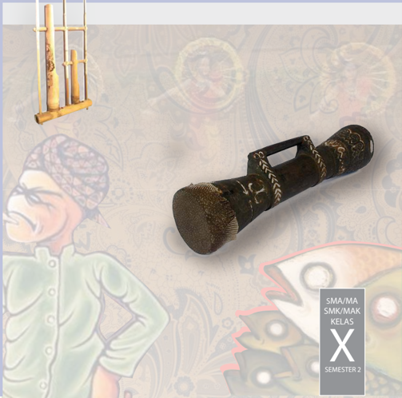

> **Deskripsi Visual:** Gambar ini adalah ilustrasi yang menampilkan dua karakter animasi berbicara. Karakter pertama adalah seorang pria dengan rambut pendek dan topi berwarna cokelat, sedang berbicara kepada karakter kedua yang tampak seperti sepatu tradisional Jawa. Latar belakangnya adalah motif batik yang khas, menunjukkan keindahan budaya lokal. Di sudut kanan atas, terdapat tulisan "SMA/MA SMK/MAK KELAS X SEMESTER 2", menunjukkan bahwa gambar ini mungkin merupakan bagian dari buku pelajaran untuk kelas SMA/MA atau SMK/MAK.

 

---
## 📄 Halaman 2

### Hak Cipta © 201 7 pada Kementerian Pendidikan dan Kebudayaan Dilindungi Undang-Undang

Disklaimer: Buku ini merupakan buku siswa yang dipersiapkan Pemerintah dalam rangka implementasi Kurikulum 2013. Buku siswa ini disusun dan ditelaah oleh berbagai pihak di bawah koordinasi Kementerian Pendidikan dan Kebudayaan, dan dipergunakan dalam tahap awal penerapan Kurikulum 2013. Buku ini merupakan 'dokumen hidup' yang senantiasa diperbaiki,  diperbaharui,  dan  dimutakhirkan  sesuai  dengan  dinamika  kebutuhan  dan perubahan zaman. Masukan dari berbagai kalangan yang dialamatkan kepada penulis dan laman http://buku.kemdikbud.go.id atau melalui email buku@kemdikbud.go.id diharapkan dapat meningkatkan kualitas buku ini.

### Katalog Dalam Terbitan (KDT)

Indonesia. Kementerian Pendidikan dan Kebudayaan.

Seni Budaya/ Kementerian Pendidikan dan Kebudayaan.-- . Edisi Revisi Jakarta: Kementerian Pendidikan dan Kebudayaan, 201 7 .

viii, 240 hlm. : ilus. ; 25 cm.

Untuk SMA/MA/SMK/MAK Kelas X Semester 2 ISBN  978-602-427-142-8 (jilid lengkap) ISBN  978-602-427-144-2 (jilid 1b)

- Seni Budaya -- Studi dan Pengajaran
I. Judul

- Kementerian Pendidikan dan Kebudayaan
600

Penulis

:  Zackaria Soetedja, Dewi Suryati, Milasari, Agus Supriatna,

Penelaah

:  Widia Pekerti, Muksin, Bintang Hanggoro, Daniel H. Jacob, Fortunata Tyasrinestu, Rita Milyartini, Nur Sahid, Oco Santoso, Martono, Rusman Nurdin, M. Yoesoef, Dinny Devi, dan Djohan Salim.

Penyelia Penerbitan : Pusat Kurikulum dan Perbukuan, Balitbang, Ke

men dikbud.

Cetakan Ke-1, 2014 ISBN 978-602-282-458-9 ( Jilid 1 )

Cetakan Ke-2, 2016 (Edisi Revisi)

Cetakan Ke-3, 2017 (Edisi Revisi)

Disusun dengan huruf Minion Pro, 12 pt.

 

---
## 📄 Halaman 3

### Kata Pengantar

Dalam  mata  pelajaran  Seni  Budaya  kalian  akan  menemukan  4  bidang seni yaitu seni rupa, musik tari dan teater. Dari ke empat bidang ini, sekolah wajib menyelenggarakan dan kalian wajib mengikuti 2 dari 4 bidang seni yang ditawarkan tersebut. Materi pembelajaran Seni Budaya ini walaupun sebagian besar  berisi  pembelajaran  keterampilan  praktek  berkarya  seni,  wawasan apresiasi  dan  kritik  seni  serta  pameran  dan  pergelaran  karya  seni,  tetapi pada  hakikatnya  dapat  kalian  gunakan  sebagai  media  pembelajaran  untuk membantu memahami materi pembelajaran lainnya di sekolah maupun dalam kehidupan di luar sekolah.

Pendidikan  melalui  mata  pelajaran  Seni  Budaya  ini  pada  hakekatnya merupakan  proses  pembentukan  manusia  (peserta  didik)  melalui  seni. Pendidikan  Seni  Budaya  secara  umum  berfungsi  untuk  mengembangkan kemampuan setiap peserta didik menemukan pemenuhan dirinya ( personal fulfillment) menjadi pribadi yang utuh. Makna budaya dalam pembelajaran Seni Budaya menunjukkan upaya mentransmisikan (melestarikan dan mengembangkan) warisan budaya (kesenian) yang tersebar diberbagai suku bangsa  di  Indonesia.  Melalui  aktivitas  pembelajaran  seni  budaya,  kalian sebagai peserta didik difasilitasi untuk memperluas kesadaran sosial dan dapat digunakan sebagai jalan untuk menambah pengetahuan. Tujuan pembelajaran seni budaya ini sejalan dengan tanggung jawab yang luas dari tujuan pendidikan secara umum.

Materi pembelajaran seni budaya dalam buku ini merupakan revisi dari buku  seni  budaya  sebelumnya  berisi  pengetahuan,  materi  dan  cara  belajar seni  di  sekolah  dengan  guru  sebagai  fasilitator  yang  menyediakan  peluang bagi  peserta  didik  untuk  menjadi  pribadi  yang  utuh  melalui  pengalaman seni  berdasarkan  sesuatu  yang  dekat  dengan  kehidupan  dan  dunia  kalian. Melalui  pendidikan  seni  budaya,  kalian  diharapkan  dapat  melakukan  studi tentang warisan budaya artistik sebagai salah satu bentuk yang signifikan dari pencapaian  prestasi  manusia.  Bentuk-bentuk  kesenian  yang  kalian  jumpai dalam kehidupan sehari-hari maupun warisan budaya masyarakat di masingmasing daerah diharapkan dapat menumbuhkembangkan kesadaran terhadap peran sosial seni di masyarakat. Dengan demikian, kalian akan menemukan seni sebagai sesuatu yang penuh arti, otentik dan relevan dalam kehidupan.

Upaya perbaikan materi isi dan penyajian buku ini dari buku sebelumnya tentu tidak serta merta menjawab kebutuhan situasi dan kondisi pembelajaran seni  budaya  yang  sangat  beragam  di  tanah  air.  Jenis  materi  latihan  dan

 

---
## 📄 Halaman 4

evaluasi yang ada dalam buku siswa serta panduan pembelajarannya yang ada dalam buku guru sama sekali bukanlah sesuatu yang kaku dan tidak dapat disubtitusikan. Kalian dapat mendiskusikan materi dan sajian buku ini dengan guru, memperkaya dan mengembangkannya sesuai dengan situasi dan kondisi dimana kalian tinggal dan belajar.

Akhir kata, upaya yang dilakukan tim penulis untuk menyempurnakan buku ini tentunya tidak dapat memuaskan semua pihak. Saran dan masukan dari  kalian  sebagai  pengguna  dan  peserta  didik  dalam  pembelajaran  seni budaya di sekolah sangat berguna bagi penyempurnaan buku ini di masa yang akan datang.

Tim Penulis

 

---
## 📄 Halaman 5

### Daftar Isi

v

 

---
## 📄 Halaman 8

---
**🖼️ Gambar/Diagram**

> **Deskripsi Visual:** Gambar ini adalah ilustrasi yang menunjukkan judul "Pendidikan Melahirkan Harapan Baru". Ilustrasi ini menggunakan warna biru yang dominan dengan elemen-elemen seperti tulisan dan ikon yang menarik perhatian. Judul utama "Pendidikan Melahirkan Harapan Baru" terletak di bagian atas ilustrasi, yang menunjukkan bahwa topik utama adalah pendidikan dan harapan baru. Di sebelah kanan, ada ikon tangan yang menunjukkan tindakan atau proses, yang mungkin merujuk pada proses pembelajaran atau pengembangan. Warna biru yang digunakan mungkin memiliki makna khusus, misalnya tentang kepercayaan, keberuntungan, atau harapan. Total, gambar ini mencerminkan tema pendidikan yang mendidik dan membuka harapan baru bagi generasi mendatang.

 

---
## 📄 Halaman 9

### Semester 2

### BAB 9

### PETA MATERI

---
**🖼️ Gambar/Diagram**

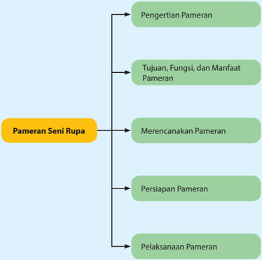

> **Deskripsi Visual:** Gambar ini adalah diagram yang menunjukkan struktur dari proses pameran seni rupa. Diagram ini terdiri dari empat bagian utama yang terhubung oleh garis lurus, masing-masing menunjukkan tahap-tahap dalam proses pameran seni rupa. 

1. **Pertama**: Pengertian Pameran - Ini merupakan bagian awal yang menjelaskan apa itu pameran seni rupa.
2. **Kedua**: Tujuan, Fungsi, dan Manfaat Pameran - Bagian ini membahas tujuan, fungsi, dan manfaat pameran seni rupa.
3. **Ketiga**: Merencanakan Pameran - Ini adalah bagian yang berfokus pada langkah-langkah merencanakan pameran.
4. **Keempat**: Persiapan Pameran dan Pelaksanaan Pameran - Bagian ini mencakup persiapan dan pelaksanaan pameran.

Setiap bagian memiliki hubungan dengan bagian lainnya melalui garis lurus, menunjukkan bahwa setiap tahap penting untuk memahami dan mengimplementasikan proses pameran seni rupa secara keseluruhan.

1

### Pameran Karya Seni Rupa

 

---
## 📄 Halaman 10

### Setelah mempelajari Bab 9 peserta didik diharapkan dapat:

- Mengidentifikasi  pengertian pameran seni rupa,
- Mengidentifikasi jenis, tujuan, fungsi dan manfaat pameran seni rupa
- Membandingkan jenis pameran seni rupa,
- Mengungkapkan jenis, tujuan, fungsi dan manfaat pameran seni rupa
- Menyusun rencana pameran seni rupa,
- Mempersiapkan penyelenggaraan pameran seni rupa,
- Mengkomunikasikan kegiatan pameran seni rupa
- Melaksanakan pameran seni rupa
- Menyusun laporan kegiatan pameran seni rupa.
Pada semester yang lalu kalian telah belajar membuat karya seni rupa dua dimensi dan tiga dimensi. Kini saatnya untuk mengkomunikasikan karya yang kalian  buat  kepada  khalayak  yang  lebih  luas.  Jika  saat  itu  kalian  hanya menampilkannya dalam pameran sederhana di dalam kelas, maka sekarang kalian  menyelenggarakan  pameran  yang  lebih  besar  dalam  kegiatan  akhir tahun bersamaan dengan kegiatan pementasan seni lainnya.

Kegiatan apresiasi seni dalam bentuk pameran seni rupa dan pagelaran seni  pertunjukkan  (musik,  tari  dan  teater)  bermanfaat  untuk  mengenalkan kepada masyarakat sekolah dan masyarakat sekitar hasil kreasi siswa sekolah tersebut. Melalui kegiatan ini kalian diharapkan dapat meningkatkan silaturahmi  dengan  teman-teman  kalian  dari  kelas  yang  lain  maupun  dari sekolah lain yang datang berkunjung untuk mengapresiasi hasil kreasi kalian. Tanggapan dari para pengunjung pameran dan pentas seni dapat digunakan sebagai  bahan  evaluasi  untuk  meningkatkan  mutu  sajian  pameran  dan pementasan di masa yang akan datang.

Pernahkah  kalian  mengunjungi  pameran  karya  seni  rupa?  Mungkin diantara kalian ada yang belum pernah mengunjungi museum atau galeri seni rupa,  tetapi  tahukah  kalian  bahwa  kegiatan  pameran  karya  seni  rupa  ada disekitar kalian tanpa kalian sadari. Cobalah amati baik-baik lingkungan di sekitar kalian. Kegitan menata ruangan, menggantungkan foto atau lukisan di dinding ruang tamu bahkan di ruangan kamar tidur pada dasarnya kegiatan memamerkan karya seni rupa. Lukisan, foto, poster dan benda-benda hiasan

 

---
## 📄 Halaman 11

lainnya  yang  digantungkan  di  dinding  dipasang  untuk  dinikmati  atau diapresiasi  orang  yang  melihatnya.  Bukan  hanya  itu,  perhatikan  barang dagangan yang dipajang di pasar, di warung, di kaki lima, di toko hingga super market, ditata sedemikian rupa agar menarik perhatian orang yang melihatnya dan tentunya dengan harapan akan membelinya. Prinsip dasar pemeran karya seni  rupa  pada  dasarnya  tidak  jauh  berbeda  dengan  pemajangan  barangbarang tersebut.

Perhatikan gambar di bawah ini, tunjukkan karya seni rupa apa saja yang terdapat dalam gambar tersebut

1

2

---
**🖼️ Gambar/Diagram**

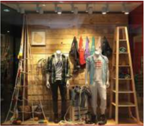

> **Deskripsi Visual:** Gambar ini adalah ilustrasi yang menunjukkan pakaian laki-laki yang dipamerkan di sebuah toko atau galeri. Gambar ini terdiri dari beberapa elemen utama:

1. **Pakaian**: Terdapat tiga pakaian laki-laki yang dipamerkan di manekin. Pakaian tersebut termasuk jaket, kaos, dan celana.

2. **Latar Belakang**: Latar belakang terbuat dari kayu dan memiliki desain yang sederhana namun elegan. Di sekeliling pakaian ada beberapa elemen seperti rak kayu dan lembaran kertas yang tampak seperti tulisan atau gambar.

3. **Elemen-elemen lain**: Ada juga dua papan dengan tulisan atau gambar di bagian atas pakaian, serta beberapa elemen lain yang tampak seperti lampu atau perhiasan kecil.

4. **Informasi Kunci**: Gambar ini menunjukkan gaya pakaian modern untuk pria, serta menunjukkan bagaimana pakaian tersebut dipamerkan dengan efektif di toko atau galeri. Ini juga menunjukkan bagaimana desain interior yang sederhana dapat menciptakan kesan yang menarik.

Dengan demikian, gambar ini menunjukkan bagaimana pakaian laki-laki modern dapat dipamerkan dengan efektif di toko atau galeri, serta menunjukkan bagaimana desain interior yang sederhana dapat menciptakan kesan yang menarik.

3

 

---
## 📄 Halaman 12

- Identifikasikan karya seni rupa dua dimensi apa saja yang kalian lihat pada gambar tersebut
- Identifikasikan karya seni rupa tiga dimensi apa saja yang kalian lihat pada gambar tersebut
- Identifikasikan karya seni terapan yang kalian lihat pada gambar tersebut
- Identifikasikan karya seni rupa yang memiliki fungsi ekspresi saja
Berdasarkan pengamatan kamu, sekarang kelompokkan dan isilah tabel di bawah ini sesuai dengan jenis karya seni rupanya berdasarkan dimensi dan fungsinya:

---
**📊 Tabel**

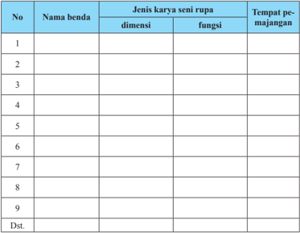

Tabel ini berisi informasi tentang berbagai karya seni rupa yang diperkenalkan dalam sebuah kursus atau program studi. Topik utamanya adalah jenis-jenis karya seni rupa dan lokasi tempat pe-majangannya. Tabel ini terdiri dari kolom "No", "Nama benda", "Jenis karya seni rupa", dan "Tempat pe-majangannya". Data penting yang terlihat meliputi berbagai jenis karya seni rupa seperti lukisan, patung, keramik, dan lainnya, serta lokasi tempat mereka disimpan atau diperkenalkan, seperti galeri seni, museum, atau pusat budaya.

Agar kamu lebih mudah memahami tentang pameran karya seni rupa, bacalah  paparan  tentang  pameran  karya  seni  rupa  berikut  ini  meliputi pengertian  pameran,  tujuan,  fungsi,  manfaat,  perencanaan,  persiapan  dan pelaksanaan pameran. Selanjutnya, kalian bisa mencari informasi tentang halhal yang berkaitan dengan pameran karya seni rupa di media cetak maupun elektronik.

 

---
## 📄 Halaman 13

### A. Pengertian Pameran

Pameran merupakan kegiatan yang dilakukan untuk menyampaikan ide atau  gagasan  perupa  ke  pada  publik  melalui  media  karya  seninya.  Melalui kegiatan  ini  diharapkan  terjadi  komunikasi  antaran  perupa  yang  diwakili oleh  karya  seninya  dengan  apresiator.  Hal  ini  sejalan  dengan  definisi  yang diberikan Galeri Nasional bahwa: 'Pengertian pameran adalah suatu kegiatan penyajian karya seni rupa untuk dikomunikasikan sehingga dapat diapresiasi oleh masyarakat luas. ' (http://www.galeri-nasional.or.id)

Penyelenggaraan pameran dalam konteks pembelajaran seni budaya bisa dilakukan di sekolah maupun di luar sekolah (masyarakat). Penyelenggaraan pameran  di  sekolah  menyajikan  materi  pameran  berupa  hasil  studi  para siswa dari kegiatan pembelajaran kurikuler maupun kegiatan ekstrakurikuler. Kegiatan ini biasanya dilakukan pada akhir semester atau akhir tahun ajaran. Sedangkan konteks pameran dalam arti luas, di masyarakat, materi pameran yang disajikan berupa berbagai jenis karya seni rupa untuk diapresiasi oleh masyarakat luas.

Setelah membaca paparan singkat di atas, setelah kalian mengumpulkan informasi dari berbagai sumber tentang pameran seni rupa, cobalah kemukakan dengan kata-kata kalian sendiri apa pengertian dari pameran seni rupa

### B.  Tujuan, Manfaat, Dan Fungsi Pameran

Sebagai  mahluk  yang  berakal  dan  berbudi,  setiap  pekerjaan  yang  kita lakukan  seharusnya  memiliki  tujuan  dan  manfaat  yang  diharapkan  serta dilakukan dengan penuh tanggung jawab. Dalam penyelenggaraan pameran setidaknya  dikenal  beberapa  tujuan,  yaitu  tujuan  sosial  dan  kemanusiaan, tujuan komersial, dan tujuan yang berkaitan dengan pendidikan.

Sebuah kegiatan pameran yang diselenggarakan dalam lingkup terbatas (sekolah) maupun lingkup yang lebih luas (masyarakat) dapt diselenggarakan dengan  harapan  karya  yang  dipamerkan  terjual  dan  dana  hasil  penjualan tersebut digunakan untuk kegiatan sosial kemanusiaan seperti disumbangkan ke  panti  asuhan,  masyarakat  tidak  mampu atau korban bencana alam. Ada juga  kegiatan  pameran  yang  diselenggarakan  dengan  harapan  karya  yang dipamerkan  terkjual  dengan  keuntungan  yang  tinggi  bagi  pemilik  karya atau  penyelenggara  pameran  tersebut.  Dalam  konteks  pembelajaran  atau

 

---
## 📄 Halaman 14

pendidikan seni rupa, pameran diselenggarakan dengan harapan mendapat apresiasi  dan  tanggapan  dari  pengunjung  untuk  meningkatkan  kualitas berkarya selanjutnya.

Secara  khusus  penyelenggaraan  pameran  di  sekolah  memiliki  manfaat, untuk  menumbuhkan  dan  menambah  kemampuan  kalian  dalam  memberi apresiasi terhadap karya orang lain serta menambah wawasan dan kemampuan dalam  memberikan  evaluasi  karya  secara  lebih  objektif.  Berkaitan  dengan organisasi penyelenggarannya, penyelenggaraan pameran di sekolah bermanfaat  untuk  melatih  kerja  kelompok  (bekerja  sama  dengan  orang lain),  mempertebal  pengalaman  sosial,  melatih  untuk  bertanggungjawab dan bersikap mandiri serta melatih untuk membuat suatu perencanaan kerja melaksanakan  apa  yang  telah  direncanakan.  Jika  karya  yang  dipamerkan diapresiasi dengan baik, kegiatan pameran juga bermanfaat membangkitkan motivasi kalian dalam berkarya seni. (Cahyono, 1994).

Kegiatan pameran memiliki fungsi utama sebagai alat komunikasi antara pencipta  seni  (seniman)  dengan  pengamat  seni  (apresiator).  Pameran  seni rupa pada hakekatnya berfungsi untuk membangkitkan apresiasi seni pada masyarakat,  di  samping  sebagai  media  komunikasi  antara  seniman  dengan penonton (Wartono, 1984).

1

---
**🖼️ Gambar/Diagram**

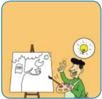

> **Deskripsi Visual:** Gambar ini adalah ilustrasi yang menunjukkan seorang siswa sedang menggambar sebuah pohon dengan matahari di latar belakang. Siswa tampak senang dan bersemangat saat melukis. Pohon yang dibuat oleh siswa memiliki daun hijau, batang putih, dan akar merah. Matahari di latar belakang tampak cerah dan berwarna kuning, menunjukkan bahwa waktu itu adalah sore hari.

Elemen-elemen utama dalam gambar ini adalah siswa, pohon yang dibuat, dan matahari. Siswa adalah subjek utama yang memperlihatkan aktivitas belajar dan kreativitas. Pohon yang dibuat oleh siswa merupakan objek yang ditampilkan secara detail, mencerminkan kemampuan belajar dan keterampilan menggambar siswa. Matahari di latar belakang memberikan konteks waktu dan suasana yang positif.

Teks, angka, atau label penting yang terlihat dalam gambar ini adalah nama siswa yang tidak jelas namanya dan tidak ada teks lain yang ditulis di dalam gambar. Informasi kunci yang dapat diambil pembaca adalah bahwa siswa sedang belajar menggambar dan menikmati proses tersebut, serta bahwa waktu itu adalah sore hari.

3

2

---
**🖼️ Gambar/Diagram**

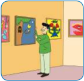

> **Deskripsi Visual:** Gambar ini adalah ilustrasi yang menunjukkan seorang siswa sedang memperbaiki lukisan di dinding kelas. Dalam gambar tersebut, kita bisa melihat beberapa elemen penting:

1. **Apa yang Ditampilkan Secara Keseluruhan**: Gambar ini menampilkan seorang siswa yang sedang berdiri di dekat lukisan di dinding kelas. Dia sedang memegang spidol dan sedang memperbaiki lukisan.

2. **Elemen-Elemen Utama dan Relasinya**: 
   - Siswa: Siswa yang sedang memperbaiki lukisan.
   - Lukisan: Lukisan yang sedang dipastikan oleh siswa.
   - Dinding Kelas: Tempat lukisan yang sedang dipastikan oleh siswa.
   - Spidol: Alat yang digunakan oleh siswa untuk memperbaiki lukisan.

3. **Teks, Angka, atau Label Penting yang Terlihat**: 
   - Teks: Teks tidak ada pada gambar ini.
   - Angka: Ada angka 5 di lukisan, mungkin menunjukkan jumlah bintang atau elemen lainnya dalam lukisan.
   - Label: Ada label "Siswa" di sekitar siswa, dan "Lukisan" di sekitar lukisan.

4. **Informasi Kunci yang Bisa Diambil Pembaca**: 
   - Siswa sedang aktif mengambil bagian dalam proses pembuatan atau perbaikan lukisan.
   - Lukisan di dinding kelas menunjukkan kegiatan belajar atau seni yang dilakukan oleh siswa.
   - Penggunaan spidol menunjukkan aktivitas teknis atau seni yang dilakukan oleh siswa.

Dengan demikian, gambar ini menunjukkan aktivitas belajar atau seni yang dilakukan oleh siswa di ruang kelas, dengan fokus pada perbaikan atau pembuatan lukisan.

---
**🖼️ Gambar/Diagram**

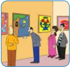

> **Deskripsi Visual:** Gambar ini adalah ilustrasi yang menunjukkan sebuah pameran seni. Gambar ini menggambarkan tiga orang pengunjung yang sedang melihat beberapa lukisan di dinding pameran. Lukisan tersebut beragam, ada yang berwarna-warni seperti lukisan bunga, dan ada juga lukisan dengan tema alam seperti pohon dan hewan. Pengunjung tampak tertarik dan sedang memperhatikan lukisan-lukisan tersebut. Di sebelah kanan, terdapat seorang penjaga pameran yang sedang memberikan informasi kepada pengunjung tentang lukisan-lukisan tersebut. Gambar ini menunjukkan interaksi antara pengunjung dan pameran seni, serta peran penjaga pameran dalam menjelaskan dan mempromosikan karya seni.

 

---
## 📄 Halaman 15

Dalam konteks penyelenggaraan pameran seni rupa di sekolah,  Nurhadiat (1996: 125) secara khusus menyebutkan fungsi pameran seni rupa sekolah, di antaranya:  (1)  Meningkatkan  apresiasi  seni;  (2)  Membangkitkan  motivasi berkerya seni; (3)  Penyegaran dari kejenuhan belajar di kelas; (4) Berkarya visual lewat karya seni dan (5) Belajar berorganisasi.

Setelah kamu belajar tentang tujuan, manfaat dan fungsi pameran karya seni rupa,jawablah beberapa pertanyaan di bawah ini!

- Apa saja tujuan pameran seni rupa di sekolah?
- Apa saja manfaat pameran seni rupa di sekolah?
- Apa saja fungsi pameran seni rupa di sekolah?

### C.  Merencanakan Pameran

Rencana  sebuah  pameran  perlu  dirancang  secara  sistematis  dan  logis agar  pada  waktu  pelaksanaannya  berjalan  lancar.  Tanpa  perencanaan  yang sistematis  sebuah  pameran  tidak  dapat  berjalan  lancar  sesuai  dengan  yang diharapkan.  Pelajari  tahapan  umum  dalam  perencanaan  penyelenggaran pameran seni rupa berikut ini.

### 1. Menentukan Tujuan

Langkah awal yang harus diperhatikan dalam menyusun program pameran adalah menetapkan dulu tujuan pameran tersebut. Penyelenggaraan pameran dapat saja bertujuan untuk menggalang dana yang bersifat komersial, sosial atau kemanusiaan. Cobalah diskusikan dengan guru dan teman kalian tujuan penyelenggaraan yang paling tepat untuk kegiatan pameran dalam pekan seni akhir semester atau tahun ajaran yang akan datang.

### 2. Menentukan Tema Pameran

Tema pameran ditentukan setelah tujuan pameran dirumuskan. Penentuan tema berfungsi untuk memperjelas tujuan yang akan dicapai, dengan adanya tema  dapat  memperjelas  misi  pameran  yang  akan  dilaksanakan.  Setelah rumusan  tujuan  dan  tema  telah  kita  tetapkan,  langkah  berikutnya  adalah menyusun kepanitiaan pameran.

 

---
## 📄 Halaman 16

### 3. Menyusun Kepanitiaan

Untuk  mendukung  kelancaran  penyelenggaraan  pameran  agar  berjalan dengan lancar perlu dibuat kepanitiaandalam sebuah organisasi kepanitiaan pameran. Penyusunan struktur organisasi kepanitiaan pameran disesuaikan dengan tingkat kebutuhan, situasi, dan kondisi sekolah. Umumnya struktur kepanitiaan sebuah pameran terdiri dari panitian inti dan dibantu dengan seksi-seksi.

Penyelenggaraan pameran seni rupa sekolah akan berjalan lancar bila ada pembagian tugas kepanitian yang jelas. Hal ini dilakukan agar masing-masing orang yang terlibat dalam kepanitiaan pameran memiliki rasa tanggung jawab dan  kebersamaan.  Secara  singkat,  berikut  ini  pembagian  tugas  kepanitiaan dalam pemaran seni rupa.

### · Ketua

Ketua panitia adalah pimpinan penyelenggaraan pameran yang bertanggungjawab terhadap kelancaran pelaksanaan pameran. Ketua diharapkan dapat mencari jalan keluar untuk menyelesaikan berbagai masalah yang timbul sejak perencanaan hingga pelaksanaan pameran. Seorang ketua seyogianya memiliki sikap kepemimpinan yang tegas dan jujur yang disertai sifat  sabar  dan  bijaksanapenuh  rasa  tanggung  jawab  terhadap  tugas  dan kewajiban  yang  telah  menjadi  garapannya.  Dalam  menjalankan  tugasnya, seorang ketua harus mampu berkomunikasi dan bekerja sama dengan berbagai pihak, yang mendukung kegiatan pameran.

### · Wakil	Ketua

Tugas sebagai wakil ketua adalah pendamping ketua, bertanggung jawab atas kepengurusan berbagai hal dan memperlancar kegiatan seksi-seksi, juga mengganti (melaksanakan) tugas ketua, apabila ketua berhalangan. Sebagai seorang wakil ketua, ia harus memiliki sikap tegas, jujur, sabar, serta memiliki rasa tanggung jawab atas pekerjaan.

### · Sekretaris

Tugas pokok sekretaris dalam suatu kegiatan pameran atau suatu organisasi di  antaranya  menulis  seluruh  kegiatan  panitia  selama  penyelenggaraan pameran.  Pembuatan  surat-surat  pemberitahuan  kepada  kepala  sekolah, orang tua, kepada Ka Dinas Pendidikan setempat, apabila pergelaran tersebut akan  dilangsungkan  di  sekolah.  Sedangkan  apabila  pameran  tersebut  akan diselenggarakan di luar sekolah, perlu ada surat izin dan dan pemberitahuan kepada instansi pemerintah yang berwewenang.

 

---
## 📄 Halaman 17

Tugas sekretaris lainnya adalah mengarsipkan surat-surat penting tersebut dan  menyusunnya  sesuai  tanggal,  waktu  pengeluaran  surat-surat  tersebut secara cermat dan teratur. Selian itu, bersama ketua, membuat laporan kegiatan sebelum, sedang dan sesudah pergelaran berlangsung.

### · Bendahara

Seorang bendahara bertanggung jawab secara penuh tentang penggunaan, penyimpanan,  dan penerimaan  uang dana yang masuk  sebagai biaya penyelenggaraan  pameran.  Bendahara  harus  juga  dapat  menyusun  laporan pertanggungjawaban  atas  penggunaan  dan  pengelolaan  keuangan  selama pameran  berlangsung.  Untuk  itu  bendahara  memang  harus  betul-betul mereka yang memiliki sikap yang jujur, teliti, cermat, sabar, tidak boros, dan tidak lepas rasa tanggung jawab terhadap seluruh tugas yang dilaksanakannya.

Selain  susunan  panitia  inti  di  atas,  seksi-seksi  pun  dibentuk  sebagai penunjang pelaksanaan pameran, di antaranya:

### · Seksi	Kesekretariatan

Seksi  ini  bertugas  membantu  sekretaris  dalam  pembuatan  dokumen tertulis seperti surat-menyurat, penyusunan proposal kegiatan, dan mencatat segala sesuatu yang terjadi hingga pameran selesai.

### · Seksi	Usaha

Seksi  ini  berkewajiban  membantu  Ketua  dalam  pencarian  dana  atau sumbsngan dari  berbagai  pihak,  untuk  menutupi  biaya  pameran.  Beberapa usaha  untuk  memperoleh  dana,  misalnya  dari  iuran  peserta  pameran, sumbangan  dari  siswa  secara  kolektif,  sumbangan  dari  donatur  atau  para simpatisan  terhadap  diselenggarakannya  pameran,  baik  berupa  uang  atau barang yang sangat diperlukan dalam penyelenggraan kegiatan tersebut.

### · Seksi	Publikasi	dan	Dokumentasi

Seksi  publikasi  bertugas  sebagai  juru  penerang  kepada  umum  melalui berbagai media, seperti dengan surat-surat pemberitahuan, spanduk kegiatan, pembuatan  poster  pameran,  katalog,  undangan,  dan  sebagainya.  Apabila dalam masalah pemberitahun tersebut ternyata memerlukan surat-surat izin dapat berhubungan dengan sekertaris penyelenggaraan pameran.

Seksi  publikasi  juga  bertugas  untuk  membuat  laporan  dokumentasi pameran,  dengan  jalan  mengumpulkan  hasil  pemotretan  tentang  kegiatan dari awal sampai selesai (berakhir), dokumentasi pameran ini sangat penting sebagai tolok ukur dan wawasan di masa mendatang.

 

---
## 📄 Halaman 18

### · Seksi	Dekorasi	dan	Penataan	Ruang

Seksi  Dekorasi  dan  Penataan  Ruang  pameran  bertugas  mengatur  tata ruang pameran. Seksi ini selain bertugas untuk menghias ruang pameran juga bertugas mengatur denah dan penempatan karya yang dipamerkan. Dalam penataan ruang pameran Seksi Dekorasi dan Penataan Ruang pameran perlu memperhatikan hal-hal sebagai berikut:

- ◊ Pengaturan benda-benda yang dipajang tergantung di dinding ruangan berupa lukisan, jangan sampai dicampur atau satu tempat dengan benda-benda seni kerajinan lainnya yang dipajang di atas meja pameran, bila mungkin disediakan ruangan gelar yang terpisah.
- ◊ Penataan  benda-benda  untukmengarahkan  pengunjung  agar  dapat berkonsentrasi  waktu  menonton  dan  melihat  berbagai  barang  (karya)  yang dipamerkan.
- ◊ Pemberian  hiasan  dekorasi  ruangan  diharapkan  tidak  berlebihan sehingga mengganggu penikmatan karya yang dipamerkan.
- ◊ Pengaturan jalan masuk dalam ruang pameran sesuai dengan keinginan karya mana yang diharapkan dilihat pertama kali dan karya mana yang diharapkan dilihat terakhir kali.
- ◊ Penyertaan  musik  dan  lagu  sebagai  pengantar  dan  pengisi  suasana pameran bertujuan untukmembantu pengunjung pameran menikmati karya yang dipamerkan. Penyertaan musik pengiring yang berlebihan dapat mengganggu  pengunjung  pameran  sehingga  tujuan  apresiasi  karya  dapat tidak tercapai.

### · Seksi	Stand

Seksi  stand  atau  petugas  stand  adalah  penjaga  pameran  yang  bertugas menjaga  kelancaran  pameran,  mengatur  (mengarahkan)  pengunjung  mulai dari  masuk  sampai  ke  luar  dari  ruang  pameran.Petugas  penjaga  stand diharapkan melayani para pengunjung secara ramah dan sopan membantu memberikan informasi tentang karya-karya yang dipamerkan.

### · Seksi	Pengumpulan	dan	Seleksi	Karya

Karya  yang  akan  dipamerkan  dikumpulkan  dan  dipilih,  dikategorikan sesuai dengan tema pameran yang ditentukan. Seksi pengumpulan dan seleksi karya bertugas melakukan pencataan dan pendataan karya (nama seniman, judul, tahun pembuatan, kelas, harga, dll)  serta melakukan pemilihan karya yang akan dipamerkan.

 

---
## 📄 Halaman 19

### · Seksi	Perlengkapan

Seksi Perlengkapan memiliki tugas untuk mengatur berbagai perlengkapan (alat dan fasilitas lain)yang digunakan dalam penyelenggaraan pameran. Seksi ini  bekerjasama dengan seksi dekorasi dan penataan ruang mempersiapkan tempat  penyelenggaraan  pameran  serta  berkordinasi  secara  khusus  dengan seksi  pengumpulan  dan  seleksi  karya  dalam  pengumpulan  dan  pemilihan karya.

### · Seksi	Keamanan

Tugas  seksi  keamanan  dinataranya  menjaga  ketertiban  dan  keamanan lokasi pamerankhususnya kemanan karya-karya yang dipamerkan.

### · Seksi	Konsumsi

Saat pembukaan pameran umumnya disediakan kudapan atau hidangan bagi  tamu  undangan.  Seksi  Konsumsi  bertugasmenyediakan  dan  mengatur konsumsi ketika pembukaan pameran tersebut. Seksi konsumsi juga bertanggung  jawab  menyediakan  dan  mengatur  konsumsi  dalam  kegiatan kepanitian pameran.

### 4. Menentukan	Waktu	dan	Tempat

Penentuan  waktu  pameran  yang  diselenggarakan  bersamaan  dengan pekan seni di sekolah biasanya dilakukan saat tidak ada kegiatan pembelajaran di kelas seperti pada akhir semester atau tahun ajaran menjelang hingga saat pembagian raport. Hal ini dimaksudkan agar penyelenggaraan pameran tidak mengganggu kegiatan belajar dan dapat diikuti serta disaksikan oleh segenap warga sekolah.

Penentuan  tempat  pameran  disesuaikan  dengan  kondisi  sekolah  dan ukuran, jumlah serta karakteristik karya yang akan dipamerkan, apakah akan dilakukan di kelas, di aula, gedung serba guna, dihalaman sekolah atau tempat lain di luar sekolah.

### 5. Menyusun	Agenda	Kegiatan

Penyusuan agenda kegiatan dimaksudkan untuk memberikan kejelasan waktu  pelaksanaan  kepada  semua  fihak  yang  berkaitan  dengan  proses penyelenggaraan pameran. Agenda kegiatan disusun dalam sebuah tabel  dengan mencantumkan komponen jenis kegiatan dan waktu (biasanya dalam bulan, minggu dan tanggal). Untuk  lebih jelasnya, di bawah ini contoh agenda kegiatan.

 

---
## 📄 Halaman 20

### Agenda	Kegiatan	Pameran

---
**🖼️ Gambar/Diagram**

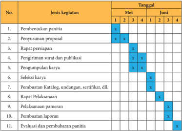

> **Deskripsi Visual:** Gambar ini adalah diagram yang menunjukkan jadwal kegiatan untuk pembentukan panitia pada bulan Mei dan Juni. Diagram ini terdiri dari dua kolom: "Jenis kegiatan" dan "Tanggal". Kolom "Jenis kegiatan" berisi 11 jenis kegiatan yang harus dilakukan oleh panitia, seperti pembentukan panitia, penyusunan proposal, rapat persiapan, pengiriman surat dan publikasi, pengumpulan karya, seleksi karya, pembuatan katalog, undangan, sertifikat, dll., pelaksanaan pameran, pembuatan laporan, dan evaluasi dan pembubaran panitia. Kolom "Tanggal" berisi 4 baris untuk setiap bulan, dengan tanda "x" yang menunjukkan bahwa kegiatan tersebut telah dilakukan pada tanggal tertentu.

Dalam diagram ini, elemen-elemen utama adalah jenis kegiatan dan tanggal. Relasi antara kedua elemen ini adalah bahwa setiap jenis kegiatan harus dilakukan pada tanggal tertentu. Teks, angka, atau label penting yang terlihat adalah nama-nama kegiatan dan tanggal-tanggal yang sesuai. Informasi kunci yang dapat diambil pembaca adalah jadwal kegiatan yang harus dilakukan oleh panitia untuk pembentukan panitia, serta tanggal-tanggal yang tepat untuk setiap kegiatan tersebut.

---
**📊 Tabel**

Tabel ini menunjukkan jadwal kegiatan untuk pembentukan panitia di dua bulan, Mei dan Juni. Kolom "Jenis kegiatan" berisi 11 jenis kegiatan yang harus dilakukan, seperti pembentukan panitia, penyusunan proposal, rapat persiapan, pengiriman surat dan publikasi, pengumpulan karya, seleksi karya, pembuatan katalog, pelaksanaan pameran, pembuatan laporan, dan evaluasi dan pembubaran panitia. Kolom "Tanggal" menunjukkan bahwa setiap kegiatan akan dilakukan pada tanggal tertentu dalam periode dua bulan tersebut. Pola penting yang terlihat adalah bahwa beberapa kegiatan, seperti pembentukan panitia, penyusunan proposal, dan evaluasi dan pembubaran panitia, akan dilakukan secara berkala selama dua bulan, sedangkan beberapa kegiatan lainnya hanya dilakukan sekali atau dua kali sepanjang periode tersebut.

### 6. Menyusun	Proposal	Kegiatan

Penyusunan proposal kegiatan sangat bermanfaat dalam kegiatan persiapan  pameran.  Proposal  kegiatan  dapat  digunakan  sebagai  pedoman penyelenggaraan  kegiatan  pameran.  Selain  itu,  proposal  ini  juga  dapat digunakan  untuk  mencari  dana  dari  berbagai  pihak (sponsorship) untuk membantu  kelancaran  penyelenggaraan  pameran.Secara  umum  sistematika isi proposal biasanya mencakup: latar belakang, tema, nama kegiatan, landasan/ dasar  penyelenggaraan,  tujuan  kegiatan,  susunan  panitia,  anggaran  biaya, jadwal kegiatan, ketentuan sponsorship , dan lain-lain.

Setelah mempelajari tentang perencanaan pameran, cobalah untuk menyusun  kepanitian  pameran  seni  rupa  yang  akan  diselenggarakan bersamaan dengan pementasan karya seni lainnya dalam kegiatan pekan seni  sekolah  di  akhir  semester  atau  akhir  tahun  ajaran  sebelum  libur sekolah.

 

---
## 📄 Halaman 21

### D.  Persiapan Pameran

Setelah  menyusun  perencanaan  kegiatan  pameran  sejak  menentukan tujuan hingga pembuatan  proposal, maka  kegiatan selanjutnya adalah mempersiapkan  (pelaksanaan)  pameran.  Kegiatan  utama  dalam  persiapan pameran ini menyiapkan dan memilih karya serta menyiapkan perlengkapan pameran.

### 1. Menyiapkan	dan	memilih	Karya

Sesuai dengan salah satu persyaratan pameran, keberadaan karya mutlak diperlukan.  Untuk  memperoleh  karya  yang  akan  dipamerkan,  kalian  perlu mempersiapkan karya yang akan dipamerkan. Kalian dapat membuat karya seni rupa yang secara khusus diperuntukan bagi pameran yang direncanakan tersebut  atau  memilih  dari  karya  tugas  yang  pernah  kalian  buat  dalam pembelajaran seni rupa pada semester yang lalu.

Pemilihan karya yang akan dipamerkan dilakukan setelah karya terkumpul.  Proses  pemilihan  karya  dapat  dilakukan  oleh  guru  dan  siswa. Teknik  pemilihan  karya  dapat  dilakukan  berdasarkan  kualitas  kaya  (yang layak untuk dipamerkan), jenis karya (karya dua dimensi atau tiga dimensi), ukuran,  dan  kriteria  lain  sesuai  ketentuan  panitia  pameran.  Bahkan  dalam pameran seni rupa di sekolah, guru bisa melakukan seleksi karya ini dengan mempertimbangkan proporsi perwakilan tiap kelas.

Jenis karya yang dipamerkan ini dapat ditentukan satu jenis karya saja atau campuran dari berbagai jenis. Penentuan jenis karya ini akan mempengaruhi perlengkapan pameran yang harus di sediakan. Sebagai contoh jika kebanyakn yang  dipamerkan  adalah  karya  seni  rupa  dua  dimensi  maka  kemungkinan besar panitia pameran harus menyediakan tempat untuk menggantung karyakarya  tersebut.  Sebaliknya  jika  karya  yang  dipamerkan  kebanyakan  karya seni rupa tiga dimensi, maka tempat untuk meletakkan karya tersebut harus mendapat perhatian lebih besar.

### 2. Menyiapkan	Perlengkapan	Pameran

Penyelenggaraan pameran memerlukan perlengkapan (sarana dan prasarana) seperti: ruangan, meja, buku tamu, buku pesan dan kesan, panil (penyekat ruangan). lampu sorot, sound system , dan poster,

### · Ruang	Pameran

Ruangan  yang  dapat  digunakan  dalam  kegiatan  pameran  seni  rupa  di sekolah  bisa  menggunakan  aula  atau  ruang  kelas.  Penataan  ruang  dapat dilakukan dengan menggunakan meja, panel, kursi.

 

---
## 📄 Halaman 22

### · Meja

Meja  dapat  digunakan  untuk  meja  penerima  tamu  dan  dapat  pula digunakan sebagai dasar penyimpanan karya tiga dimensional seperti patung atau barang kerajinan lainnya.

---
**🖼️ Gambar/Diagram**

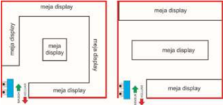

> **Deskripsi Visual:** Gambar ini adalah jenis diagram. Diagram ini menunjukkan dua jenis layout untuk meja display, yaitu layout dengan satu sisi dan layout dengan dua sisi. Untuk layout satu sisi, meja display berada di tengah-tengah ruang, sedangkan untuk layout dua sisi, meja display terletak di sisi kanan dan kiri ruang. Elemen utama dalam diagram ini adalah dua jenis layout meja display dan posisinya di dalam ruang. Teks penting dalam diagram ini adalah "meja display" yang digunakan untuk menggambarkan posisi meja display dalam kedua jenis layout tersebut. Informasi kunci yang dapat diambil pembaca adalah bahwa ada dua jenis layout meja display dan posisinya di dalam ruang.

### · Buku tamu

Bukti tamu  (berisi: no, nama, alamat/asal kelas/asal sekolah, dan tanda tangan) dapat digunakan untuk mengetahui berapa orang yang mengunjungi pameran.

### · Buku kesan dan pesan

Buku  kesan  dan  pesan  (berisi:  tanggal,  tanggapan  pribadi  pengunjung, identitas seperlunya) berguna sebagai  masukan  terhadap  penyelenggan pameran.

### · Panil

Berfungsi untuk menempelkan karya dua dimensi seperti: lukisan, gambar, dan sebagainya. Panil juga dapat digunakan sebagai penyekat ruangan.

 

---
## 📄 Halaman 23

---
**🖼️ Gambar/Diagram**

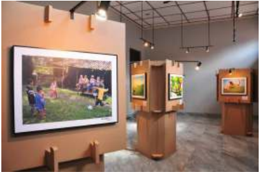

> **Deskripsi Visual:** Gambar ini menunjukkan ruang pameran seni dengan berbagai karya seni yang disimpan di rak-rak. Di tengah ruangan, terdapat sebuah papan tulis berwarna putih yang tampaknya digunakan untuk penjelasan atau informasi tentang karya seni tersebut. Pada papan tulis tersebut, terdapat beberapa teks yang mungkin berisi judul karya seni, penjelasan singkat, atau informasi lainnya. Selain itu, terdapat beberapa karya seni yang terletak di rak-rak sekitar papan tulis, masing-masing dengan latar belakang dan tema yang berbeda. Karya seni tersebut tampaknya berupa lukisan atau gambar, dengan warna-warna yang cerah dan detail yang jelas. Ruangan pameran ini tampak tenang dan rapi, menunjukkan bahwa setiap karya seni memiliki tempat yang tepat di dalamnya.

---
**🖼️ Gambar/Diagram**

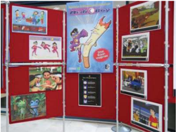

> **Deskripsi Visual:** Gambar ini menunjukkan sebuah pameran atau booth pameran yang dipenuhi dengan berbagai poster dan brosur. Poster utama berwarna biru dengan gambar karakter lucu dan teks yang menyampaikan informasi tentang produk atau layanan. Poster tersebut dikelilingi oleh beberapa poster lain yang menampilkan gambar-gambar dan teks yang lebih kecil. Di sebelah kanan, terdapat dua poster yang menampilkan gambar-gambar yang lebih besar dan detail, mungkin menunjukkan produk atau layanan yang lebih spesifik. Di bawah poster utama ada panel informasi dengan teks yang menjelaskan tentang produk atau layanan tersebut. Semua elemen ini saling terhubung dan membentuk pameran yang informatif dan menarik untuk pengunjung.

### · Poster	atau	brosur

Media ini digunakan untuk menginformasikan kegiatan pameran yang akan dilaksanakan. Dengan demikian sebelum pelaksanaan pameran dilakukan, poster dan brosur sudah digunakan sebagai media informasi.

 

---
## 📄 Halaman 24

18110

### · Katalog

Berisi identitas seniman dan karya serta kuratorial penyelenggara pameran) berfungsi sebagai penjelasan mengenai hal ilhwal seniman dan karya seni yang dipamerkannya.

 

---
## 📄 Halaman 25

### · Folder

Berisi judul lukisan dan harga lukisan jika dijual membantu guide untuk menjelaskan kepada pengunjung pameran.

### PAMERAN SENI RUPA

### SISWA SMA KEBANGSAAN I

Na ma

: …………………………………

Judul Ka rya

: …………………………………

Ta hun

: …………………………………

Media

: …………………………………

Contoh Folder (Identitas karya)

### · Lampu	penerangan

Lampu  ini  digunakan  untuk  memperjelas  karya  yang  dipamerkan. Lampu ini dipasang di setiap papan pamer (panil) atau di plafon. Pemasangan lampu dan pemilihan jenis lampu untuk memperjelas karya sehingga lampu dan  penempatannya  harus  diatur  dan  dipilih  sedemikian  rupa  agar  tidak menyilaukan.

 

---
## 📄 Halaman 26

### · Sound	system

Sound system digunakan dalam acara pembukaan, dan untuk memperdengarkan musik instrumentalia berirama lembutselama pameran  berlangsung yang  berfungsi  untuk  mendukung  suasana  pameran  sehingga  pengunjung merasa lebih nyaman ketika mengapresiasi karya yang dipamerkan.

### E.  Pelaksanaan Pameran

Pelaksanaan pameran mencakup kegiatan pelaksanaan kerja panitia secara bersama-sama, penataan ruang, pelaksanaan pameran dan penyusunan laporan.

### 1. Pelaksanaan	Kerja	Kepanitiaan

Pelaksanaan  pameran  merupakan  puncak  dari  implementasi  rencana yang telah disusun pada tahap perencanaan pameran. Pelaksanaan kegiatan ini akan berjalan dengan lancar bila semua pihak khususnya panitia pameran melakukan kerjasama dan berkomitmenuntuk mensukseskan pameran tersebut.

### 2. Penataan	Ruang	Pameran

Sebelum  dilakukan  penataan  ruang  pameran,  panitia  pameran  terlebih dulu  membuat  rancangan  denah  ruang  pameran.  Hal  ini  berfungsi  untuk mengatur arus pengunjung, komposisi penataan karya yang serasi, pengaturan jarak dan tinggi rendah pandangan terhadap karya dua dimensi dan tiga dimensi dsb.

Sehubungan dengan penataan ruang, beberapa hal yang perlu perhatikan di antaranya:

- karya yang memiliki komposisi warna yang kuat hendak tidak didekatkan dengan karya dengan komposisi warna yang lemah,
- karya dengan komposisi warna yang kurang hendak tidak diletakan pada ruang yang sedikit sinar karena akan semakin  memperlemah warna yang ada,
- pemberian cahaya lampu jangan sampai menyilaukan mata atau mengganggu pandangan orang yang melihatnya,
- pemasangan karya hendaknya sejajar dengan pandangan mata, tidak terlalu tinggi dan tidak terlalu rendah,

 

---
## 📄 Halaman 27

- pemasangan karya yang lebih tinggi dari tubuh penikmatnya harus dibuat condong ke bawah sehingga mudah dinikmati,
- letakan beberapa pot bunga dan tanaman untuk memperindah dan menyegarkan ruangan,
- letakan karya tiga dimensi pada tempat yang bisa dilihat dari berbagai sudut pandang,
- pengelompokan karya harus memperhatikan ukurannya,
- jika tidak ada AC perlu menempatkan kipas angin untuk menghilangkan suasana panas,
- sediakan tempat sampah untuk menjaga kebersihan (Cahyono, 2002).

### · Penataan	Alur	Masuk	Pengunjung

---
**🖼️ Gambar/Diagram**

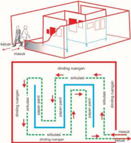

> **Deskripsi Visual:** Gambar ini adalah ilustrasi yang menunjukkan proses ventilasi dalam sebuah ruangan. Ilustrasi ini terdiri dari dua bagian utama: bagian atas menunjukkan arah udara masuk dan keluar dari ruangan, sementara bagian bawah menunjukkan detail tentang sistem ventilasi.

Elemen utama dalam ilustrasi ini meliputi:
1. Ruangan dengan dinding dan lantai yang terlihat jelas.
2. Arrows merah menunjukkan arah udara masuk dan keluar dari ruangan.
3. Gambaran sistem ventilasi yang mencakup saluran udara, ventilasi, dan peralatan lainnya.
4. Label seperti "dinding ruangan", "saluran udara", dan "ventilasi".

Informasi kunci yang dapat diambil pembaca meliputi:
- Cara kerja sistem ventilasi dalam mengatur udara di dalam ruangan.
- Perbedaan arah udara masuk dan keluar.
- Komponen-komponen penting dalam sistem ventilasi, seperti saluran udara dan ventilasi.

Dengan demikian, ilustrasi ini memberikan gambaran yang jelas tentang bagaimana sistem ventilasi bekerja untuk mengatur udara di dalam ruangan.

 

---
## 📄 Halaman 28

Penataan alur arus pengunjung perlu disesuaikan dengan kondisi ruang. Dalam pameran sekolah dapat dibagi menjadi dua model alur:

- Pengaturan lalu lintas pengunjung bila pameran dilakukan di dalam ruang kelas dengan satu pintu.
- Pengaturan lalu lintas pengunjung bila pameran dilakukan di dalam ruang kelas dengan dua pintu.

---
**🖼️ Gambar/Diagram**

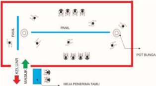

> **Deskripsi Visual:** Gambar ini adalah jenis diagram. Diagram ini menunjukkan struktur dan fungsi sebuah ruangan atau area kerja yang terdiri dari beberapa bagian utama:

1. Ruang Kerja (KELAS): Tempat untuk melakukan pekerjaan atau belajar.
2. Meja Penerimaan Tahu: Tempat untuk menerima tahu atau informasi.
3. Panel: Area yang mungkin digunakan untuk pengaturan atau kontrol.
4. Pot Bunga: Tempat untuk menanam atau memelihara tanaman bunga.
5. Kamar Mandi: Tempat untuk mandi atau bersih-bersih diri.

Elemen-elemen utama dalam diagram ini adalah ruang kerja, meja penerimaan tahu, panel, pot bunga, dan kamar mandi. Mereka saling terhubung melalui jalur yang menunjukkan arah dan fungsi mereka dalam sistem keseluruhan.

Teks, angka, atau label penting yang terlihat dalam diagram ini adalah "KELAS", "MEJA PENERIMA TAKU", "PANEL", "POT BUNGA", dan "KAMAR MANDI". Informasi kunci yang dapat diambil pembaca adalah bahwa ruangan ini memiliki berbagai fungsi seperti kerja, penerimaan informasi, kontrol, penanaman tanaman, dan mandi.

Dalam satu paragraf yang informatif, gambar ini menunjukkan struktur dan fungsi sebuah ruangan atau area kerja yang terdiri dari beberapa bagian utama, dengan elemen-elemen utama yang saling terhubung dan informasi penting yang dapat diambil pembaca tentang fungsi dan arah mereka dalam sistem keseluruhan.

---
**🖼️ Gambar/Diagram**

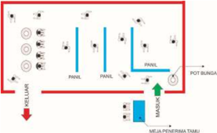

> **Deskripsi Visual:** Gambar ini adalah ilustrasi yang menunjukkan sebuah ruangan dengan beberapa elemen penting. Ruangan ini terdiri dari dua lantai, dengan lantai bawah yang lebih besar dan lantai atas yang lebih kecil. Di lantai bawah, terdapat dua meja yang berada di sisi kiri dan kanan, serta dua kursi di tengah ruangan. Di lantai atas, terdapat dua kursi yang berada di sisi kiri dan kanan, serta satu kursi di tengah ruangan.

Elemen-elemen utama dalam gambar ini adalah dua lantai, dua meja, dua kursi, dan satu pot bunga. Meja dan kursi di lantai bawah terletak di sisi kiri dan kanan, sedangkan kursi di lantai atas terletak di sisi kiri dan kanan. Pot bunga terletak di sisi kanan lantai atas.

Teks, angka, atau label penting yang terlihat pada gambar ini adalah "POT BUNGA" yang terletak di sisi kanan lantai atas. Informasi kunci yang dapat diambil pembaca adalah bahwa ada dua lantai dalam ruangan, dua meja, dua kursi, dan satu pot bunga.

 

---
## 📄 Halaman 29

### · Penataan dan Penempatan Karya

Penataan  karya  yang  dipamerkan  dilakukan  atas  dasar  pertimbangan berdasarkan jenis, ukuran, warna, tinggi-rendah pemasangannya.

---
**🖼️ Gambar/Diagram**

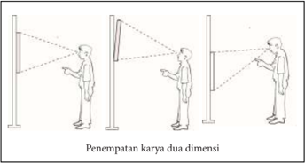

> **Deskripsi Visual:** Gambar ini adalah ilustrasi yang menunjukkan penempatan karya dua dimensi dalam konteks arsitektur. Gambar ini terdiri dari tiga sketsa yang menunjukkan bagaimana sebuah struktur atau bangunan dapat ditempatkan dengan dua dimensi. Setiap sketsa menunjukkan posisi dua papan vertikal yang berada di sisi kiri dan kanan dari struktur utama, serta posisi dua orang yang berdiri di depan struktur tersebut. Elemen-elemen utama dalam gambar ini meliputi struktur utama, dua papan vertikal, dan dua orang yang berdiri di depan struktur. Relasi antara elemen-elemen ini adalah bahwa struktur utama menjadi pusat dari semua sketsa, sedangkan dua papan vertikal dan dua orang berada di sekitar struktur tersebut. Teks, angka, atau label penting yang terlihat dalam gambar ini adalah nama "Penempatan karya dua dimensi" yang terletak di bawah sketsa. Informasi kunci yang dapat diambil pembaca dari gambar ini adalah tentang cara penempatan karya dua dimensi dalam konteks arsitektur.

---
**🖼️ Gambar/Diagram**

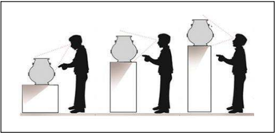

> **Deskripsi Visual:** Gambar ini adalah ilustrasi yang menunjukkan proses pembuatan keramik. Gambar ini terdiri dari tiga langkah yang disajikan secara horizontal. Setiap langkah menunjukkan seorang pria yang sedang membuat keramik menggunakan alat dan bahan tertentu.

Elemen utama dalam gambar ini meliputi:
1. Pria yang sedang membuat keramik.
2. Keramik yang sedang dibuat.
3. Alat-alat pembuatan keramik seperti tusuk, batu, dan tusuk.
4. Bahan-bahan pembuatan keramik seperti pasir, garam, dan air.

Teks, angka, atau label penting yang terlihat dalam gambar ini tidak ada karena gambar hanya menggambarkan proses secara visual tanpa teks atau angka tambahan.

Informasi kunci yang dapat diambil pembaca dari gambar ini adalah bahwa proses pembuatan keramik melibatkan beberapa langkah, mulai dari memilih bahan, mencampurkannya, hingga menyelesaikan produk akhir. Gambar ini juga menunjukkan bagaimana alat-alat yang digunakan dalam proses ini.

### · Penataan Pencahayaan

Aspek lain yang tidak kalah pentingnya dalam penataan ruang pameran adalah  aspek  pencahayaan.  Penataan  cahaya  ruang  pameran  dikelompokan menjadi  pencahayaan  secara  khusus  (pencahayaan  terhadap  karya  dengan menggunakan spot-light )  dan  secara  umum  (pencahayaan  ruang  pameran untuk  kepentingan  pengunjung  membaca  katalog,  folder  dan  sebagainya). Pencahayaan terhadap karya ini  diupayakan  tidak  menyilaukan  pandangan pengunjung.

 

---
## 📄 Halaman 30

---
**🖼️ Gambar/Diagram**

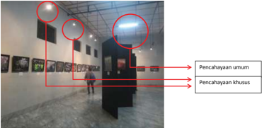

> **Deskripsi Visual:** Gambar ini adalah ilustrasi yang menunjukkan dua jenis pencahayaan dalam sebuah ruangan yang tampaknya merupakan ruang pameran atau galeri seni. Ilustrasi ini memperlihatkan tiga titik pencahayaan yang berbeda:

1. **Pencahayaan Umum**: Ini adalah pencahayaan dasar yang menyebabkan pencahayaan umum pada seluruh ruangan. Dapat dilihat dari pencahayaan yang merata dan mencakup seluruh area.

2. **Pencahayaan Khusus**: Ini adalah pencahayaan yang lebih intens dan lebih fokus, digunakan untuk menyorot objek tertentu seperti lukisan atau instalasi. Pencahayaan ini tampak lebih jelas dibandingkan dengan pencahayaan umum.

Elemen-elemen utama dalam ilustrasi ini adalah dua jenis pencahayaan yang disebutkan dalam teks di kanan gambar. Pencahayaan umum dan pencahayaan khusus memiliki relasi yang jelas, yaitu pencahayaan umum menyediakan dasar pencahayaan, sementara pencahayaan khusus digunakan untuk menonjolkan detail atau objek tertentu.

Teks penting dalam gambar ini adalah "Pencahayaan umum" dan "Pencahayaan khusus", yang memberikan informasi tentang dua jenis pencahayaan yang ada dalam ruangan tersebut.

Informasi kunci yang dapat diambil pembaca melalui gambar ini adalah bahwa pencahayaan dalam ruangan harus dirancang dengan baik untuk menciptakan efek visual yang menarik dan efektif dalam menonjolkan objek atau lukisan yang dipamerkan.

### · Pembukaan	pameran

Pelaksanaan  pameran  di  sekolah  biasanya  dimulai  dengan  kegiatan pembukaan pameran yang ditandai dengan kata sambutan dari ketua panitia pelaksana, pembimbing, serta acara sambutan sekaligus pembukaan pameran oleh Kepala Sekolah atau yang mewakilinya. Pada waktu pembukaan bisanya setiap pengunjung dibagi katalog pameran dan dipersilahkan untuk mencicipi jamuan yang telah disediakan oleh panitia..

Ada beberapa hal yang perlu dilakukan ketika pengunjung mengunjungi ruang  pameran,  di  antaranya:  1)  pengunjung  diupayakan  mengisi  buku tamu,  2) bila masih ada, pengunjung yang hadir diberi katalog,  3) sewaktuwaktu  panitia  mengamati  suasana  ruangan  seperti  kondisi  pencahayaan, dan keutuhan karya yang dipamerkan; 4) untuk memandu para pengunjung pameran dalam menikmati materi pameran, maka peran Seksi Stand sebagai pemandu pameran perlu bekerja secara profesional perlu memberikan arahan dan penjelasan kepada para pengunjung; 5) pengunjung pameran hendaknya mengisi  buku  kesan  dan  pesan,  hal  ini  sangat  berguna  untuk  menilai tanggapan pengunjung terhadap proses pelaksanaan pameran dan karya yang dipamerkan.

### 3. Laporan	Kegiatan	Pameran

Laporan kegiatan pameran di sekolah secara tertulis dibuat oleh panitia  pemeran  sebagai  pertanggungjawaban  atas  pelaksanaan  pameran. Laporan ini kemudian ditujukan kepada Kepala Sekolah sebagai pihak yang bertanggungjawab terhadap segala kegiatan di sekolah. Laporan kegiatan juga

 

---
## 📄 Halaman 31

diberikan  kepada  sponsor  utama  jika  pihak  sponsor  memintanya.  Sebagai penyandang  dana  utama  kegiatan  pameran,  pihak  sponsor  biasanya  ingin mengetahui bagaimana dana yang diberikannya digunakan secara baik oleh panitia.

Laporan kegiatan pameran tidak hanya berisi hal-hal yang baik saja tetapi juga kekurangan dan kelemahan dalam penyelenggaraan. Laporan berfungsi juga sebagai alat evaluasi kegiatan sehingga kelemahan dan kekurangan dalam penyelenggaraan  pameran  dapat  diperbaiki  oleh  panitia  dalam  kegiatan pameran di masa yang akan datang.

### F.  Uji Kompetensi

Setelah kalian belajar tentang pameran karya seni rupa, ikutilah instruksi uji kompetensi di bawah ini :

### 1. Penilaian	Pribadi

Nama

: ………………………………….

Kelas

: ………………………………….

Semester

: ………………………………….

Waktu penilaian  : ………………………………….

No

### Pernyataan

1

Saya berusaha belajar tentang penyelenggaraan pameran karya seni rupa

2

Saya berusaha belajar tentang tujuan, manfaat dan fungsi pameran karya seni rupa

3

Saya mengerjakan tugas yang diberikan guru tepat waktu

4

Saya mengajukan pertanyaan jika ada yang tidak dipahami

 

---
## 📄 Halaman 32

### No

### Pernyataan

5

Saya aktif dalam mencari informasi tentang penyelenggaraan pameran karya seni rupa

6

Saya aktif dalam kepanitiaan penyelenggaraan pameran karya seni rupa

7 Saya melaksanakan tugas sebagai panitia penyelenggaraan pameran karya seni rupa dengan penuh tanggung jawab

8

Saya sanggup untuk menjadi ketua panitia penyelnggaraan pameran seni rupa

### 2. Penilaian	Antarteman

Nama teman yang dinilai : ………………………………….

Nama penilai

: ………………………………….

Kelas

: ………………………………….

Semester

: ………………………………….

Waktu penilaian

: ………………………………….

### No

### Pernyataan

1

Berusaha belajar dengan sungguh-sungguh

2

Mengikuti pembelajaran  dengan penuh perhatian

3

Mengerjakan tugas yang diberikan guru tepat waktu

 

---
## 📄 Halaman 33

### No

### Pernyataan

4

Mengajukan pertanyaan jika ada yang tidak dipahami

5

Menyerahkan tugas tepat waktu

6

Menguasai dan dapat mengikuti kegiatan pembelajaran dengan baik

7

Menghormati dan menghargai teman

8

Menghormati dan menghargai guru

9

Aktif dalam kepanitiaan penyelenggaraan pameran karya seni rupa

10 Melaksanakan tugas sebagai panitiapenyelenggaraan pameran karya seni rupa dengan penuh tanggung jawab

### Test	Tulis

Jawablah pertanyaan berikut ini.

- Jelaskan pengertian pameran karya seni rupa?
- Sebutkan dan jelaskan tujuan, manfaat serta fungsi pameran karya seni rupa?
- Apa yang harus dituliskan dalam proposal kegiatan pameran karya seni rupa?
- Bagaimana memilih dan menyiapkan karya seni rupa untuk dipamer kan?
- Seksi apa yang tugasnya paling berat dalam penyelenggaraan kegiatan pameran di sekolah?

 

---
## 📄 Halaman 34

### Penugasan

Susulah rancangan kepanitiaan pameran seni rupa yang akan diselenggarakan  pada  akhir  tahun  ajaran  sekolah.  Tentukan  nama  teman kalian  yang  akan  dijadikan  sebagai  panitia  pameran.  Berikan  alasan  kalian terhadap pilihan nama yang kalian tentukan tersebut. Diskusikanlah susunan kepanitian ini bersama teman-teman yang lain. Laporkan susunan kepanitian hasil diskusi tersebut.

### Test Praktek

Buatlah  proposal  untuk  kegiatan  pameran  karya  seni  rupa  di  sekolah. Lengkapilah  proposal  yang  kalian  buat  dengan  rancangan  denah  ruang pameran, logo dan poster kegiatan. Dapatkah kalian menghitung biaya yang dibutuhkan untuk menyelenggarakan kegiatan pameran tersebut?

### Projek	(pameran	seni	rupa)

Susunlah tema kegiatan pekan seni yang akan kalian selenggarakan pada akhir semester atau akhir tahun ajaran. Tema kegiatan pekan seni tidak hanya untuk kegiatan pameran karya seni rupa saja tetapi untuk kegiatan pagelaran seni musik, seni tari dan teater. Pilihlah karya seni rupa yang akan dipamerkan sesuai dengan tema yang telah kalian tentukan tersebut.

### G.  Rangkuman

Pameran merupakan kegiatan yang dilakukan oleh seniman baik secara perorangan maupun kelompok untuk menyampaikan ide atau gagasannya ke pada publik melalui media karya seni sehingga melalui kegiatan ini diharapkan terjadi komunikasi antaran seniman yang diwakili oleh karya seninya dengan apresiator.

Dalam penyelenggaraan pameran setidaknya dikenal beberapa tujuan yaitu tujuan sosial dan kemanusiaan, tujuan komersial, dan tujuan yang berkaitan dengan  pendidikan.Secara  khusus  penyelenggaraan  pameran  di  sekolah memiliki manfaat untuk menumbuhkan dan menambah kemampuan dalam memberi apresiasi terhadap karya orang lain serta menambah wawasan dan kemampuan dalam memberikan evaluasi karya secara lebih objektif. Dalam konteks pembelajaran atau pendidikan seni rupa, pameran diselenggarakan dengan harapan mendapat apresiasi dan tanggapan dari pengunjung untuk meningkatkan kualitas berkarya.

 

---
## 📄 Halaman 35

Persyaratan  yang  harus  dipenuhi  dalam  penyelenggaraan  pameran  di antaranya adalah ketersediaan karya seni yang akan dipamerkan, adanya pihak panitia penyelenggara pameran, pengunjung pameran dan tempat pameran.

Persiapan pameran dilakukan dengan tahap menyiapkan karya, memilih karya, dan menyiapkan perlengkapan pameran. Sedangkan proses penyelenggaraan pameran mencakup pelaksanaan kerja kepanitiaan, penataan ruang,  pelaksanaan  pameran  dan  laporan  kegiatan  pameran.  Proses  ini dilakukan oleh siswa secara bersama-sama.

Proses  penyelenggaraan  pameran  akan  berjalan  dengan  lancar  bila didukung perlengkapan pameran seperti ruang pameran, meja, buku tamu, buku  pesan,  panil,  katalog,  folder,  lampu  penerangan  dan  sound  system. Kelancaran proses penyelenggaran dipengaruhi pula oleh  kemampuan kerjasama panitia sesuai beban tugas dan tanggung jawabnya masing-masing.

### H.  Refleksi

Melaksanakan  kegiatan  pameran  harus  dilakukan  dengan  perencanaan yang  matang,  tersusun  secara  sistematis  dan  logis.  Kerjasama  dan  tanggungjawab dalam  melaksanakan  kegiatan  mendukung  kelancaran  kegiatan  pameran. Penataan ruang pamer yang baik akan mendukung kegiatan apresiasi sehingga tercapai tujuan yang di harapkan. Melalui kegiatan pameran kita tidak hanya belajar mengapresiasi karya seni rupa, tetapi juga belajar untuk disiplin dalam melaksanakan tugas dan tanggung jawab, belajar untuk saling menghargai dan bekerjasama, belajar mengakui kekurangan dan kelemahan serta belajar untuk berkomitmen untuk berbuat lebih baik di masa yang akan datang.

 

---
## 📄 Halaman 36

### Semester 2

### BAB 10

### Kritik Karya Seni Rupa

---
**🖼️ Gambar/Diagram**

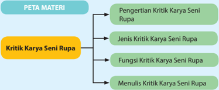

> **Deskripsi Visual:** Gambar ini adalah diagram yang menunjukkan struktur materi tentang kritik karya seni rupa dalam buku pelajaran. Diagram ini terdiri dari dua bagian utama: "PETA MATERI" dan "Kritik Karya Seni Rupa". Peta materi tersebut dibagi menjadi empat subtopik utama, yaitu "Pengertian Kritik Karya Seni Rupa", "Jenis Kritik Karya Seni Rupa", "Fungsi Kritik Karya Seni Rupa", dan "Menulis Kritik Karya Seni Rupa".

Elemen utama dalam diagram ini adalah subtopik-topik tersebut, yang disusun secara hierarkis. Setiap subtopik memiliki label yang jelas dan informasi yang spesifik tentang topik tersebut. Misalnya, "Pengertian Kritik Karya Seni Rupa" membahas definisi dan konsep dasar kritik seni, sementara "Jenis Kritik Karya Seni Rupa" mencakup berbagai bentuk kritik seperti analisis, interpretasi, dan evaluasi.

Teks penting dalam diagram ini meliputi judul subtopik dan deskripsi singkat dari setiap subtopik. Misalnya, "Pengertian Kritik Karya Seni Rupa" mungkin ditulis sebagai "Definisi dan Konsep Dasar Kritik Seni Rupa". Angka atau label penting lainnya mungkin merujuk pada halaman atau bagian tertentu di buku pelajaran yang menjelaskan lebih lanjut tentang setiap subtopik.

Dari segi informasi kunci, pembaca dapat memahami bahwa buku ini menyediakan panduan mendalam tentang kritik karya seni rupa, mulai dari pemahaman dasarnya hingga teknik penulisan kritik. Diagram ini sangat berguna untuk membantu pembaca mengorganisir dan memahami struktur materi yang kompleks ini.

Setelah mempelajari Bab 10 diharapkan kamu dapat:

- Mengidentifikasi jenis kritik karya seni rupa;
- Mengidentifikasi tujuan kritik karya seni rupa;
- Mengidentifikasi manfaat kritik karya seni rupa;
- Mengidentifikasi prosedur dan tata cara kritik karya seni rupa;
- Mengidentifikasi jenis, fungsi, tema, dan nilai estetis karya seni rupa dalam kritik karya seni rupa;
- Mendeskripsikan jenis, fungsi, tema, dan nilai estetis karya seni rupa dalam kritik karya seni rupa;
- Membandingkan jenis, fungsi, tema, dan nilai estetis karya seni rupa dalam kritik karya seni rupa;
- Menunjukkan sikap bertanggung jawab dalam proses menulis kritik karya seni rupa;
- Membuat tulisan kritik karya seni rupa mengenai jenis, fungsi, simbol dan nilai estetis karya seni rupa berdasarkan hasil pengamatan;
- Mengomunikasikan tulisan kritik karya seni rupa.

 

---
## 📄 Halaman 37

Tahukah kamu pengertian apresiasi dan kritik karya seni rupa? Pernahkah kamu  melakukannya?  Kamu  mungkin  tidak  menyadari  bahwa  kegiatan apresiasi  dan  kritik  sering  dilakukan  sehari-hari.  Menanggapi,  memberi komentar,  memberi  penilaian  'bagus'  atau  'jelek' ,  'suka'  atau  'tidak  suka' adalah bagian dari kegiatan kritik.  Dengan memahami berbagai pengertian apresiasi  dan  kritik  seni  diharapkan  dapat  lebih  mudah  untuk  memahami materi yang disampaikan dalam bab selanjutnya. Pengetahuan ini tidak saja bermanfaat dalam pembelajaran seni di sekolah tetapi juga dalam kehidupan di luar sekolah.

Ketika  kamu  melihat  sebuah  karya  seni  rupa,  aspek  apa  saja  yang kamu  lihat?  Mengapa  kalian  meminati  sebuah  karya  seni  rupa  tetapi kurang meminati karya yang lainnya? Mengapa sebuah karya seni rupa kalian  katakan  'bagus'  sedangkan  karya  yang  lain  kalian  sebut  'jelek'? Cobalah amati gambar-gambar karya seni rupa berikut ini.

---
**🖼️ Gambar/Diagram**

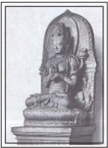

> **Deskripsi Visual:** Gambar ini adalah ilustrasi yang menunjukkan sebuah patung Buddha yang ditempatkan di atas fondasi batu. Patung Buddha memiliki wajah yang rupanya, dengan mata yang terbuka lebar, mulut yang sedikit tertutup, dan hidung yang pendek. Patung tersebut dikelilingi oleh empat makhluk berbisa yang tampak seperti makhluk mitologis, mungkin simbol dari empat penjaga keberuntungan dalam budaya Hindu. Fondasi batu di bawah patung Buddha tampak kuat dan tegas, menunjukkan bahwa patung tersebut dipersembahkan dengan hati yang penuh penghormatan dan perhatian.

Elemen-elemen utama dalam gambar ini meliputi patung Buddha, makhluk berbisa, dan fondasi batu. Patung Buddha merupakan elemen utama yang dominan, menunjukkan subjek utama dari gambar ini. Makhluk berbisa yang mengelilingi patung Buddha menunjukkan hubungan simbolik dan kekuatan mereka dalam konteks budaya. Fondasi batu yang kuat menunjukkan kekuatan dan kepercayaan yang diberikan kepada patung Buddha.

Teks, angka, atau label penting tidak terlihat dalam gambar ini. Namun, informasi kunci yang dapat diambil pembaca termasuk keindahan dan keagungan patung Buddha, serta hubungan simbolik antara patung Buddha dan makhluk berbisa. Gambar ini juga menunjukkan bahwa patung Buddha dipersembahkan dengan hati yang penuh penghormatan dan perhatian, yang dapat menjadi inspirasi bagi pembaca untuk memahami nilai-nilai spiritual dalam budaya tersebut.

 

---
## 📄 Halaman 38

---
**🖼️ Gambar/Diagram**

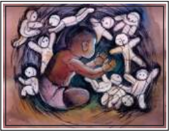

> **Deskripsi Visual:** Gambar ini adalah ilustrasi yang menunjukkan seorang anak sedang memotong pohon besar dengan alat pemotong tangan. Ilustrasi ini menunjukkan proses pembuatan senjata tradisional, mungkin pedang atau senjata lainnya, dari kayu. Pohon besar tersebut tampaknya merupakan bahan utama untuk pembuatan senjata tersebut. Anak tersebut menggunakan alat pemotong tangan yang mirip dengan senjata tradisional, menunjukkan bahwa ia sedang belajar atau mengamati proses pembuatan senjata. Ilustrasi ini mungkin digunakan untuk membantu pembaca memahami proses pembuatan senjata tradisional dan bagaimana teknik tersebut dilakukan.

5

- Dapatkah kamu mengidentifikasi bahan yang digunakan pada masingmasing karya seni rupa tersebut?
- Dapatkah kamu  mengidentifikasi teknik yang digunakan pada masing-masing karya seni rupa tersebut?
- Dapatkah  kamu  mengidentifikasi  medium  yang  digunakan  pada masing-masing karya seni rupa tersebut?
- Dapatkah kamu menunjukkan unsur-unsur rupa yang terdapat pada masing-masing karya seni rupa tersebut?
- Obyek apa saja yang terdapat pada masing-masing karya seni rupa tersebut?
- Bagaimanakah  penataan  unsur-unsur  rupa  pada  masing-masing masing-masing karya seni rupa tersebut?
- Manakah karya seni rupa yang memiliki fungsi benda pakai?
- Bandingkan, manakah karya seni rupa yang paling menarik menurut kamu? Jelaskan alasan ketertarikanmu!

 

---
## 📄 Halaman 39

Berdasarkan pengamatanmu, sekarang kelompokkan dan isilah tabel di bawah ini sesuai dengan jenis karya seni rupanya.

---
**📊 Tabel**

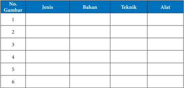

Tabel ini berisi informasi tentang jenis, bahan, teknik, dan alat yang digunakan dalam beberapa proses atau tugas tertentu. Topik utama tabel ini adalah proses atau tugas yang melibatkan penggunaan bahan, teknik, dan alat. Kolom-kolom yang ada dalam tabel ini adalah No.Gambar, Jenis, Bahan, Teknik, dan Alat. Data atau pola penting yang terlihat dalam tabel ini adalah bahwa setiap baris menunjukkan informasi tentang satu proses atau tugas yang berbeda, dengan jenis, bahan, teknik, dan alat yang berbeda untuk setiap proses tersebut.

Setelah  mengisi  kolom  tentang  jenis  karya,  bahan,  teknik,  dan  alat yang  digunakan  pada  pembuatan  pada  karya  seni  rupa  tersebut,  isilah kolom di bawah ini kemudian diskusikanlah dengan teman-teman!

### Format Diskusi Hasil Pengamatan

Nama Siswa

: …………………………………………..

NIS

: …………………………………………..

Hari/Tanggal Pengamatan

: …………………………………………..

---
**📊 Tabel**

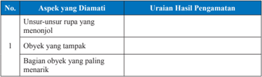

Tabel ini menunjukkan aspek-aspek yang diamati dalam pengamatan, dengan kolom "Aspek yang Diamati" untuk menyatakan apa yang diamati dan kolom "Uraian Hasil Pengamatan" untuk memberikan deskripsi tentang hasil pengamatan tersebut. Topik utama tabel ini adalah pengamatan tentang unsur-unsur rupa yang menonjol, baik itu obyek yang tampak maupun bagian obyek yang paling menarik. Data penting yang terlihat dalam tabel ini adalah bahwa pengamatan dilakukan pada aspek-aspek tertentu seperti rupa, tampilan, dan bagian yang menarik, yang merupakan elemen-elemen penting dalam analisis dan penilaian desain atau objek.

 

---
## 📄 Halaman 40

---
**📊 Tabel**

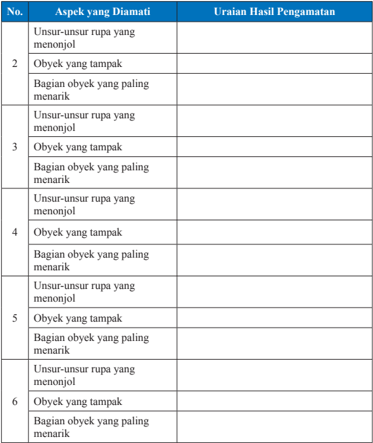

Tabel ini menunjukkan hasil pengamatan tentang aspek-aspek rupa yang menonjol pada obyek-obyek yang dilihat. Kolom pertama berisi nomor urut untuk setiap aspek yang diamati, sedangkan kolom kedua berisi uraian hasil pengamatan tersebut. Topik utama tabel ini adalah analisis rupa dan keindahan objek. Data penting yang terlihat meliputi aspek-aspek seperti bagian-bagian yang paling menarik, unsur-unsur rupa yang menonjol, dan bagian-bagian yang tampak. Tabel ini membantu dalam memahami bagaimana elemen-elemen visual dapat mempengaruhi kesan visual pada sebuah objek.

Uraian  kamu  tentang  medium  (bahan,  teknik,  dan  alat),  unsur-unsur rupa, dan obyek dalam karya seni rupa adalah modal awal untuk membuat kritik  berkarya  seni  rupa.  Agar  semakin  mudah  memahami  tentang  kritik karya seni rupa, bacalah konsep-konsep tentang pengertian, jenis, dan fungsi kritik karya seni rupa di bawah ini. Selanjutnya, kamu bisa mengamati tulisantulisan kritik karya seni rupa dua dimensi yang ada di berbagai media cetak maupun elektronik, kemudian nanti dapat mencoba menulis kritik karya seni rupa.

 

---
## 📄 Halaman 41

### A.  Pengertian Kritik

Untuk dapat memahami dan membuat kritik  karya  seni  rupa,  kamu  harus  memahami pengertian dan kegiatan apresiasi karya seni rupa terlebih dahulu. Secara umum istilah apresiasi seni atau mengapresiasi karya seni berarti memahami sepenuhnya seluk-beluk karya seni serta menjadi sensitif (peka) terhadap segi-segi estetikanya. Apresiasi dapat juga diartikan berbagi pengalaman antara  seniman  (perupa)  dan  penikmat  karya, bahkan ada yang  menambahkan,  menikmati karya  seni  sama  artinya  dengan  menciptakan kembali. Dengan kata lain, kegiatan apresiasi seni atau  mengapresiasi  karya  seni  dapat  diartikan sebagai  upaya  untuk  memahami  berbagai  hasil seni dengan segala permasalahannya serta menjadi  lebih  peka  terhadap  nilai-nilai  estetika yang terkandung di dalamnya. Dengan mengerti dan  menyadari  sepenuhnya  seluk-beluk  sesuatu hasil  seni  serta  menjadi  sensitif  terhadap  segisegi  estetiknya  seesorang  diharapkan  mampu menikmati  dan  menilai  karya  tersebut  dengan semestinya (Soedarso, 1990).

Ada dua fungsi dari kegiatan apresiasi seni yaitu pertama, adalah agar kita dapat meningkatkan  dan  memupuk  kecintaan  kepada karya  bangsa  sendiri  dan  sekaligus  kecintaan kepada  sesama  manusia.  Fungsi  kedua  bersifat khusus, ada hubungannya dengan kegiatan mental kita yaitu penikmatan, penilaian, empati dan hiburan. Apresiasi seni juga besar manfaatnya bagi ketahanan budaya Indonesia. Melalui kegiatan apresiasi kesenian Indonesia, kamu dapat  lebih  mengenal  dan  menghargai  budaya bangsa sendiri.

Dalam pembelajaran seni di sekolah, kegiatan  apresiasi  digunakan  sebagai  salah  satu metode pembelajaran seni. Melalui kegiatan apresiasi,  tidak  saja  belajar  untuk  memahami dan atau menghargai karya seni, tetapi dapat juga

---
**🖼️ Gambar/Diagram**

> **Deskripsi Visual:** Gambar 10.1.3 Memilih baja adalah salah satu kegiatan apresiasi yang sehari-hari dilakukan oleh banyak orang. Gambar ini menunjukkan dua orang yang sedang memilih baja di sebuah toko. Pada gambar tersebut, elemen-elemen utama termasuk dua orang yang sedang berada di depan meja belanjaan, beberapa pilihan baja yang tersedia di atas meja, dan latar belakang yang menunjukkan interior toko baja. Teks, angka, atau label penting yang terlihat pada gambar ini tidak ada, namun informasi kunci yang dapat diambil pembaca adalah bahwa memilih baja adalah kegiatan yang umum dilakukan oleh banyak orang sebagai bagian dari kehidupan sehari-hari mereka.

 

---
## 📄 Halaman 42

diimplementasikan  untuk  menghargai  berbagai  perbedaan  yang  dijumpai dalam  kehidupan  sehari-hari.  Kepedulian  kamu  terhadap  karya  seni  dan warisan  budaya  bangsa  lainnya  dapat  ditumbuhkan  dengan  pembelajaran apresiasi ini.

Pengertian  kritik  dalam  seni  tidak  diartikan  sebagai  kecaman  yang menyudutkan hasil karya atau penciptanya. Hampir sama dengan apresiasi, kritik  seni  pada  dasarnya  merupakan  kegiatan  menanggapi  karya  seni. Perbedaannya  hanyalah  kepada  fokus  dari  kritik  seni  yang  lebih  bertujuan untuk menunjukkan kelebihan dan kekurangan suatu karya seni. Keterangan mengenai kelebihan dan kekurangan ini dipergunakan dalam berbagai aspek, terutama  sebagai  bahan  untuk  menunjukkan  kualitas  dari  sebuah  karya. Para  ahli  seni  umumnya  beranggapan  bahwa  kegiatan  kritik  dimulai  dari kebutuhan untuk memahami (apresiasi) kemudian beranjak kepada kebutuhan memperoleh kesenangan dari kegiatan memperbincangkan berbagai hal yang berkaitan dengan karya seni tersebut.

Sejalan  dengan  perkembangan  pemikiran  dan  kebutuhan  masyarakat terhadap  dunia  seni,  kegiatan  kritik  kemudian  berkembang  memenuhi berbagai  fungsi  sosial  lainnya.  Kritik  karya  seni  tidak  hanya  meningkatkan kualitas pemahaman  dan  apresiasi  terhadap sebuah karya seni, tetapi dipergunakan juga sebagai standar untuk meningkatkan kualitas proses dan hasil berkarya seni. Tanggapan dan penilaian yang disampaikan oleh seorang kritikus ternama sangat mempengaruhi persepsi penikmat terhadap kualitas sebuah karya seni bahkan dapat mempengaruhi penilaian ekonomis ( price ) dari karya seni tersebut.

Dalam dunia pendidikan, kegiatan kritik dapat digunakan sebagai evaluasi dalam  proses  pembelajaran  seni.  Kekurangan  pada  sebuah  karya  dapat dijadikan  bahan  analisis  untuk  meningkatkan  kualitas  proses  pembelajaran maupun hasil belajar tentang seni.

Setelah membaca penjelasan di atas, cobalah ceritakan kegiatan apresiasi dan kritik yang pernah kamu lakukan dalam kehidupan sehari-hari.

 

---
## 📄 Halaman 43

### B.  Jenis Kritik

Kritik  karya  seni  memiliki  perbedaan  tujuan  dan  kualitas.  Karena perbedaan tersebut, maka dijumpai beberapa jenis kritik karya seni berdasarkan pendekatannya seperti yang disampaikan oleh Feldman (1967), yaitu kritik populer  ( popular  criticism ),  kritik  jurnalistik  ( journalistic  criticism ),  kritik keilmuan ( scholarly criticism ),  dan  kritik  pendidikan ( pedagogical criticism ). Pemahaman  terhadap  keempat  tipe  kritik  seni  dapat  mengantar  nalar  kita untuk  menentukan  pola  pikir  dalam  melakukan  kritik  seni.  Setiap  tipe mempunyai ciri (kriteria), media (alat: bahasa), cara (metoda), sudut pandang, sasaran, dan materi yang tidak sama. Keempat kritik tersebut memiliki fungsi yang menekankan pada masing-masing keperluannya.

Carilah  informasi  tentang  jenis-jenis  kritik  menurut  Feldman  di  atas, kemudian berilah  tanda  silang  pada  kolom  di  bawah  ini.  Pilihlah  jenis kritik yang paling sesuai dengan keterangan kolom di sebelahnya.

---
**📊 Tabel**

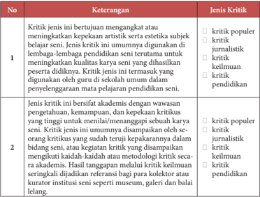

Tabel ini membahas kritik dalam konteks seni dan pendidikan. Topik utamanya adalah jenis-jenis kritik yang dapat diterima dalam konteks tersebut. Tabel dibagi menjadi dua kolom utama: Keterangan dan Jenis Kritik. Kolom Keterangan menjelaskan kriteria-kriteria tertentu yang digunakan untuk menilai kritik, seperti kebutuhan untuk menguatkan atau meningkatkan kepekaan artistik atau estetika subjek belajar, serta kriteria umum lainnya. Sementara itu, kolom Jenis Kritik mencakup berbagai jenis kritik yang dapat diterima, termasuk kritik popular, kritik jurnalistik, kritik keluarnya, dan kritik pendidikan. Data penting yang terlihat adalah bahwa kritik pendidikan tidak umum digunakan dalam konteks ini, sementara kritik popular dan kritik keluarnya lebih umum.

 

---
## 📄 Halaman 44

---
**📊 Tabel**

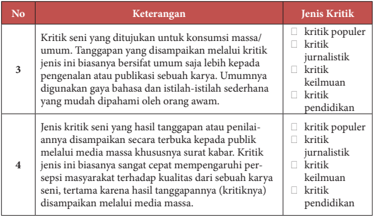

Tabel ini membahas kritik seni yang ditujukan untuk konsumsi massa umum, dengan fokus pada jenis-jenis kritik yang berbeda. Topik utamanya adalah kritik populer, kritik jurnalistik, kritik keluarga, dan kritik pendidikan. Kolom-kolomnya mencakup kriteria kritik seperti tingkat popularitas, tujuan penggunaan, dan jenis kritik yang ditujukan. Data penting yang terlihat adalah bahwa kritik populer lebih banyak ditujukan kepada publik umum, sedangkan kritik jurnalistik dan keluarga lebih fokus pada pengenalan atau publikasi karya. Kritik pendidikan juga memiliki tujuan yang spesifik, yaitu memperbaiki persepis masyarakat terhadap kualitas karya seni.

Selain  jenis  kritik  yang  disampaikan  oleh  Feldman,  berdasarkan  titik tolak  atau  landasan  yang  digunakan,  dikenal  pula  beberapa  bentuk  kritik yaitu:  kritik  formalistik,  kritik  ekspresivistik  dan  instrumentalistik.  Kritik formalistik melihat kualitas  karya  berdasarkan  konfigurasi  unsur-unsur pembentukannya,  prinsip  penataannya,  teknik,  bahan  dan  medium  yang digunakan dalam berkarya seni. Jika kritik formalistik lebih cenderung pada penilaian  aspek-aspek  formalnya,  maka  kritik  ekspresivistik  lebih  tertarik untuk menilai sebuah karya berdasarkan kualitas gagasan dan perasaan yang ingin dikomunikasikan oleh perupa melalui sebuah karya seni.Kegiatan kritik ini umumnya menanggapi kesesuaian atau keterkaitan antara judul, tema, isi dan visualisasi objek-objek yang ditampilkan dalam sebuah karya.

Jenis kritik lainnya yaitu kritik Instrumentalistik, adalah jenis kritik seni yang  cenderung  menilai  karya  seni  berdasarkan  kemampuannya  mencapai tujuan moral, religius, politik atau psikologi. Dalam prakteknya, penggunaan jenis kritik seni ini disesuaikan dengan jenis dan tujuan pembuatan karya seni rupanya.

 

---
## 📄 Halaman 45

Setelah kamu belajar tentang konsep-konsep apresiasi dan kritik karya seni rupa dua dimensi. Jawablah beberapa pertanyaan di bawah ini!

- Apakah fungsi dan manfaat apresiasi karya seni rupa?
- Apa yang dimaksud dengan kritik karya seni rupa?
Jenis kritik apa yang digunakan dalam pembelajaran seni rupa di sekolah kamu? Jelaskan alasanmu!

### C.  Fungsi Kritik Karya Seni Rupa

Kritik karya seni rupa memiliki fungsi yang sangat penting dalam dunia seni rupa dan dalam pendidikan seni. Fungsi kritik seni yang pertama dan utama ialah  menjembatani  persepsi  dan  apresiasi  artistik  dan  estetik  karya seni rupa, antara pencipta (perupa), karya, dan penikmat seni. Komunikasi antara  karya  yang  disajikan  kepada  penikmat  (publik)  seni  membuahkan interaksi  timbal-balik  antara  keduanya.  Bagi  perupa,  kritik  seni  berfungsi untuk  mendeteksi  kelemahan,  mengupas  kedalaman,  serta  membangun kekurangan pada karya seninya. Sedangkan bagi apresiastor atau penikmat karya seni, kritik seni membantu memahami karya, meningkatkan wawasan dan pengetahuannya terhadap karya seni yang berkualitas.

Kritik  karya  seni  rupa  memiliki  fungsi  menjembatani  persepsi  dan apresiasi  artistik  antara  perupa  dan  penikmatnya.  Coba  jelaskan  fungsi kritik seni dalam konteks pembelajaran di sekolah dimana kamu sebagai perupanya dan temanmu sebagai apresiasi atau penikmatnya.

### D.  Menulis Kritik

Kamu mungkin pernah melakukan apresiasi dan kritik secara lisan. Ketika kamu diminta untuk memberikan tanggapan terhadap suatu benda, disadari atau  tidak  kamu  telah  melakukan  sebagian  kegiatan  kritik  dan  apresiasi. Beberapa  tahapan  berikut  ini  dapat  digunakan  dalam  mengkritisi  sebuah karya seni rupa.

 

---
## 📄 Halaman 46

### 1.  Mendeskripsi

Deskripsi adalah tahapan dalam kritik untuk menemukan, mencatat, dan mendeskripsikan segala sesuatu yang dilihat apa adanya dan tidak berusaha melakukan analisis atau mengambil kesimpulan. Agar dapat mendeskripsikan dengan  baik,  kamu  harus  mengetahui  istilah-istilah  teknis  yang  umum digunakan dalam dunia seni rupa. Tanpa pengetahuan tersebut, maka kamu akan kesulitan untuk mendeskripsikan fenomena karya yang dilihat.

Cobalah mendeskripsikan karya berikut ini, tuliskan hasil deskripsi kamu dan diskusikan dengan teman-teman kamu.

1

### 2. Menganalisis

Analisis formal adalah tahapan dalam kritik karya seni untuk menelusuri sebuah karya seni berdasarkan struktur formal atau unsur-unsur pembentuknya.  Pada  tahap  ini  kamu  harus  memahami  unsur-unsur  seni dan prinsip-prinsip penataan atau penempatannya dalam sebuah karya seni. Perhatikan  karya  berikut  ini,  telusuri  unsur-unsur  seni  dan  prinsip-prinsip penataan atau penempatannya dalam karya tersebut.

2

 

---
## 📄 Halaman 47

### 3.    Menafsirkan

Menafsirkan atau menginterpretasikan adalah tahapan penafsiran makna sebuah karya seni meliputi tema yang digarap, simbol yang dihadirkan, dan masalah-masalah yang dikedepankan. Penafsiran ini sangat terbuka sifatnya, dipengaruhi  sudut  pandang  dan  wawasan.  Semakin  luas  wawasan  kamu semakin  kaya  interpretasi  karya  yang  dikritisinya.  Agar  wawasan  kamu semakin  kaya  maka  kamu  harus  banyak  mencari  informasi  dan  membaca khususnya yang berkaitan dengan karya seni rupa.

Perhatikan karya berikut ini, tafsirkan makna simbolik yang terdapat pada karya tersebut.

### 4.    Menilai

Apabila  tahap  mendeskripsikan  sampai  menafsirkan  ini  merupakan tahapan yang juga umum digunakan dalam apresiasi karya seni, maka tahap menilai atau evaluasi merupakan tahapan yang menjadi ciri dari kritik karya seni. Evaluasi atau penilaian adalah tahapan dalam kritik untuk menentukan kualitas suatu karya seni bila dibandingkan dengan karya lain yang sejenis. Perbandingan dilakukan terhadap berbagai aspek yang terkait dengan karya tersebut baik aspek formal maupun aspek konteks.

Mengevalusi atau menilai secara kritis dapat dilakukan dengan langkahlangkah sebagai berikut:

- Membandingkan  sebanyak-banyaknya  karya  yang  dinilai  dengan karya yang sejenis
- Menetapkan tujuan atau fungsi karya yang dikritisi
- Menetapkan sejauh mana karya yang ditetapkan 'berbeda' dari yang telah ada sebelumnya.

 

---
## 📄 Halaman 48

- Menelaah karya yang dimaksud dari segi kebutuhan khusus dan segi pandang tertentu yang melatarbelakanginya.
Perhatikan gambar karya seni rupa dua dimensi dan tiga dimensi berikut ini,  cobalah  menulis  kritik  karya-karya  tersebut.  Gunakan  langkah-langkah kritik  secara  bertahap  mulai  dari  mendeskripsikan  hingga  menilai  atau mengevaluasi.

---
**🖼️ Gambar/Diagram**

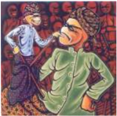

> **Deskripsi Visual:** Gambar ini adalah ilustrasi yang menunjukkan dua karakter yang sedang berbicara. Karakter pertama adalah seorang pria dengan rambut pendek dan topi, sedangkan karakter kedua adalah seorang wanita dengan rambut panjang dan topi. Kedua karakter tersebut sedang berdiri dan tampaknya sedang berbicara kepada satu sama lain. Ilustrasi ini mungkin digunakan untuk menjelaskan konsep atau situasi tertentu dalam buku pelajaran.

Kamu  telah  mengamati  dan  belajar  tentang  kritik  karya  seni  rupa. Perhatikan  contoh  kritik  karya  seni  rupa  di  bawah  ini!  Buatlah  ulasan sederhana bagian-bagian dari tulisan kritik karya seni rupa tersebut yang berisi deskripsi, analisis formal, interpretasi, dan evaluasi.

 

---
## 📄 Halaman 49

Contoh tulisan kritik karya seni rupa.

Catman Bancung Contemcohry ArLAwnrds i03

### Pertaruhan Kualitas Pencuri Adegan

SITUASI dan kondisipraksis seni rupa kontemporer di Indonesia saat ini,memang banyakdipengaruhi oleh dinamika pasar seni rupa.Kelesuanyangterjadiempat tahun terakhir,berdampak terhadap surutnya minat paraperupamuda dalam berkarya.Salah satu daya doronguntuk memelihara semangatjuangvisual itu, adalahdenganadanyakompetisiyangmemberikan penghargaan berupa uang dan juga residensi di luar negeri.

S EUSAl surutnyaPhilip Morris Art Awards,dan Indofood Art Awardslahirkompetis Jakarta Art Awads yang sangat diminati paua perupa di Indonesa.Nyaris bersamaanlahir pula Bandung Art Awards (BaCCA).yang telah melahirkan namanama baru di bidang perupaan Di dua perhelatanscbelumnya,tahun 2011 dan2012 ia,BaCCA telahmenajlkan kejutandengan kemenangankarya video art sebagai pemenang utama, yang megnbuat karya mpa dua dan tiga dimensi (dalam bal ini seni hukis hinggainstalasi） agak terjungkir.Kesan inijuga kian menmjukan adanya orientasi baru edasuoqwpSueodo dpus dan interdisiplin.

Dari catatan paniiatahuiniBaCCA ikuti 285 senimanvisual berbagai kota,dan memilih 17 nominator.Dibandng tahm lalu, da even kaliini, panitia yang dikomandani Andonowati,jnga mensyaratkan jm terbang beberapa kalipameran bagitiap pesertaMaka tak heranaraeertan ttayang masuk nonimansi dan jadi pemenang,meru pakan perupa muda yang sudah cukup punya nama atau dkenal.

Bandung Contemorary Art Awards (BaCAA) o3.seduah perhelatan berupa penghargaan 3.teah diumumlan paa 1o Me 203 lan. Seperti dua penyelenggaraan di tahun-tahn sebehnya,semua karya nominasi dipamerkan di Lawangwangi Artsociates,JL Da go Girigg,Warung Caringin Mekarwangi lnd eep ppnpug beberapa minggu ke depan.

Parameter kekaryaan seni rupa kontemporer memang sering dipandang dari kecedasan gagasannya. Dan para perupa yang cerdas ini, selain terutamabentukan perguruan tingi seni nupayangberkutat dengan baryak teoriyang tentu saja dapat merangsang gagasangagasan baru-juga adalah mereka yang banyak terlibat dan bergaul dengan medan sosial seni rupa kontemporer.

Keterlibatan merekamemungkinkan peresentuhan yang menimbukan gesekan-gesekan pemikiran dan bentuk ucapvisualnya Mereka adalah generasi yang melek bacaan serta menggunakan riset sebagal basis data visual-

HU Pikiran Rakyat, 19 Mei 2013

 

---
## 📄 Halaman 50

ry,stpughibrrene ngun tekologi tinggi/ba. Kary yng mculkeineas sebagikayang konseptual.

Ca pdangyag beead obek matter dan kemampunmeneu ade anygdtj ga menadi slah s pyange nangAhmya tnu sabua arrang an pertempan kanlitas parapenmcri adegu Itadheuthne hal t yang membuat sebohka senrupakoempo rer layak medapotgrmdat penghan

Bentk pser,e tk ny drstetk dla pelan ala ditunt untk mepal gagan sdaeaij harus sesuai dengan koteksya yang juga disyaratanengagkat yang ktel Na terbih lagikaraonemorerme ut pu aaaangba avant garde) atau mengandumginowasi.

Mangknhi yngtpa palra LenrdahAllends eahran Bany ng. 4Agustus1984. ani FSRD TB)yang edpat penghargaan uama dan berhal iashadiah sebesar oo Juta Rupih.Karya nyaberup pyung adisnal jnis ten yang dgang diatas hmpirmenytu ngit-bgit dan dierakan dengan dinamo. Payungygterb c tealttja ditng jrum-jrukeeman yang ikut bererak diringi suara dentingan yang ntmis. K

Para jri yangterduridari Asudjo Jno Irato perupakoteporer dan kator e）Car Bin (jais s）Me Jaasa (peup dan wgansaor sei pa ntemporerTan Sni Lie (Kurtor sei Si ngaporeArt Museum), dunWiyu Wahono （ejgpg linyng dingpmuenga behak mekutiedei diar eer.

Kara inl (dari paparn kosepnya) mengabarkan paadols warisan tradi bagibebanat mahsmberemajuan d aad odemEleen sui adlhmen nai mits,Seperti any agumn atau epercayanmts yangs baddi ata ruang fli-tal telahmendiaat ko truksi kckunsann Kunsa tersebut difumgskan sa pl  s medam perliedungm'.

Milnyaara Mhamad Aldar (kelahin Bandng 4 Ja 1g84. almni UPI

Bandngeat ka Videoart betju ln Gaze Contr 2. Kara In menyuguhln medim ose upsosok da ctik yang tersenyum dan berkedip seama 1o menit ungnilmt u dtntsekaligus meakan Kaagppn di Selasar Sumaryo Art Spar ini mempersoallan pengendalitatapan.

Pemerng yang lialag adalah Mujh hinNuaan(ehirn Handng4 No veberedai FSRDbl Laers Kanapapper cuttingmalin meam mctif-mtf Aenguk-teen tuk dan mcdul senata Ak-47.Gmban ini membwa prsepsi dnia teotarg lam,yak dibolik keindahan 1sam memilki persepsi k at kekensan di dalanmya

Invasin 2:cetak dgtal d atas ln Andy DaiTahyo Uwung-wug,tit di atas Dalarg SachArie Syfudd (Manf Jakarta video perfoe); Aalia rah Yeu（DilngkMbx cemn）:Ceelia Paticin ntio (Tongh Looking GlsKacudbeFar Abadi (Spesial Pakai Keu:Kastangel diatas meja pins): Geriel Ares (The Wor as Will andidea: byng dienk buku1 W Up he Prs Inlasi veodi pa tg）:Lev Aprilia(Cntamyag Mejiwai Hati RalytTintFat'  Sean Sang Jenderbeng dan silkcren diataskavas]:Nomas Kuma Raw Burny: Kelini ps tisi,b,ma: et Raigs We Are Rusy:Toplesac,cntirdatas kertas dan Sekar Putri (Dua Date:piring kerank dn mesinjm,aamenkkanay kay ag uk,ekdnga e yang ktks nnial a

Memgamd k senat memerihan dim ke senn yang iembka cakwlintedisplin mendi k baru dmi visul lonteorer.BaCCA telah bep se t yk mensgethan si ompeerdiIndonesh d afmeempst tepat terhomat di peta seni mtemasionl.*

Pemeang liy adalhkayaberadl Atoah Fpol Fhoorla (Le An; Fungal Sttmnt dariSyif Aua GarbaKya ini menyuguhkan pendelatan baru dalakaryarupayaknimegabgn seni danu mycolog (lmufgi）lamennjkan sift perintis sekalis depoerfngilewt taplan al dalmmyat yangtinggl t bang begdenuygmbud sil

Tgabesi laayak Ul Dewi Godali (Metamoriosa cetak digital di atas alik: Yoef PratiAlin (The ish

HU Pikiran Rakyat, 19 Mei 2013

 

---
## 📄 Halaman 51

### MengenangPopoIskandar,PelukisdanPemikirSeni

POPO Iskandar merupakan seniman Sunda terkemuka dalam bidangnya.la tidak hanya dikenal sebagai pelukis dengan objeklukisan ayam jago dan kucing,tetapi juga dikenal sebagai pemikir seni.Tulisannya tentang seni tidakhanya melulu membahas seni lukis dan pendidikan seni rupa dengan berbagai variasinya,tetapijuga membahas karya sastra,urbanisasi,film,cianjuran,dan bahkan pertanian.Pelukis kelahiran Garut, 17 Desember1927,pada zamannya termasuk manusia langka.

D APAT dilarak,sjak 1958-1994. setidaknya Popo sudah memublikasikan tulisan sebanyak 5oo buah di berbagai media massa cetak,ma jalah, dan koran. Selain itu,hingga Oktober 20o0,tercatat Popo menulis 229 artikel berbahasa Indonesia berupa makalah ceramah semi dan pendidikan. Selain i,ia menulis pula 6makalah dalam bahasa Inggris. Pada tahum 1977 Akademi Jakarta meminta Popo untuk. memulis sosok pehulkis AffandiPelukis yang rendah hati ini, meninggal dunia di Bandung pada 29 Januari 20oo dan dike bumikan di Wanaraja Garut, Jawa Barat.

Sebegai pelukis, kecintaan Popo terhadap tembang Sunda Cianjuran amat besarmya.Hal ini pada satu sisi memberikan kelembutan bukan hanya pada skapnya dalam menjalin bubungan baik dengan sesama mannsia, melainkan juga pada proses kreatif yang digarapnya, khususnya pada seni lukis. Dan apa yang ditulisnya iti,yang menjadi pokok be-

HU Pikiran Rakyat, 23 Maret 2013

hasannya itu; tidak hanya ditmlis dan diekspresikan dalam bahasa Indonesi, tetapi juga dalam bahasa Sunda yang dikuasainya dengan cukup baik.

Sekali lagi ape yang ditulisnya itu, yang menjadi pokok bahasannya itu;-me munjukkan kelnasan Popo dalam berpikir ataupun dalam membentangkan masalah yang tengah dibahasnya dengan pe-

Sehubungan dengan itu, apa yang di tulis Popo dengan demikian menjadi menarik untuk diapresiasikarena di dalam apa yang ditulisnya itu selahs equd ed epedaSueru uequ tulisannya untuk merenung. yang berujung pada perlnasan wawasan pengeu ueneazuad mdne ms rn nya bagi para pembaca tulisanmya. Dalam bahasa ibunya,dalan hal imi dalam ba hasa Sunda, Popo tidak hanya menulis esai, tetapi juga menulis sejumlah danding(puisi tradisional Sunda) yang lariklarknya bisa digunakan untuk Tembang Sumda Cianjuran.

Popobegitu fasihbicara soal sastra, khususnya puisi, sebagaimana ia tumjuklan dalam esainya yang membahas sejumlah puisi Sutardji Calzoum Bachri salah seorang tokoh Angkatan 70-an. Banyak kalangan berpendapat, Popo kepenyairan Sutardji Caloum Bachri di majalah Budaa Jaga. Sayangnya, majalah yang dikelola oleh Ajip Rosidi dan

Inilah kelebihan Popo Iskandar sebagad perupa dari tatar Sunda yang memberkan wama tersendiri bagi perkembangan dan perbumbuhan semi rupa Dalam sejumlah esai yang ditulisnya dalam buku Alam Pikiran Seniman, kita bisa merasakan begadrmana Popo menyang dikuasainya selama ini, yakni seni rupa.

 

---
## 📄 Halaman 52

kawan-kawan, tidak terbit lagi.

akarnya datang dari negeri Barat sana Boleh jadi adanya kegairahan Popo Iskandar dalam memulis sejumlah esai pada zumannya, bukan disebabkan oleb kebutuhan uang agar dapurya tetap mengepul, karena upah menjadi dosen dan menjual lukisan pada waktu it belum bisa diandalan untuk hdup,akan tetapi lebih disebabkan oleh maraknya berbagai peristiwa budaya. baik berupa pameran senidisusi senidan foum-fo rum seni linyasepertyang seringd gelar oleh Dewan Kesenian Jalarta (DKJ.Pada waktu itu DKJ adalah mag net Keseninanan seseorang seakan-alan belum diakui sebagai seniman bila belum tampil di Taman Ismail Marzli (IIM) atns undangan DKJ.

Majalah tersebut pada awal tahn 1970-an hingga tahun 198o-an memputyai peran yang cukup penting, dalam memumbuh-kembangkan seni dan bu daya di Indonesia.Isinya, tidak harya menyajan puisi, tetapi uga sejumlah esai dengan bahasan ang kapluas, mulai dar sastraseni tradisonal hingga ekonomi dan politik Selain it, dlam se Jumlahartkel yangdituisakitabisa membaea begitu jeli Popo Iskandar bicara soal Hendra Gumawan,Ahmad Sada dan Sunaryo atas karya yang kreasinya. Bahkan bnkan banya itu, dengan tangkas pole Popo bicara soal kuritik seni dan isme-isme seni lainnyayang tumbuh dan berkemhang di Indonesin,yang akar

---
**🖼️ Gambar/Diagram**

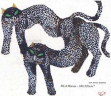

> **Deskripsi Visual:** Gambar ini adalah ilustrasi yang menunjukkan dua ekor macan berwarna hitam dengan pola bulu berwarna putih dan cokelat. Macan tersebut tampak sedang bergerak, dengan ekornya yang panjang dan bulu-bulunya bergelombang. Ilustrasi ini mungkin digunakan untuk membantu pembaca memahami struktur tubuh macan atau bagaimana mereka bergerak. Teks, angka, atau label penting tidak terlihat pada gambar ini. Informasi kunci yang dapat diambil pembaca adalah bahwa gambar ini menunjukkan dua ekor macan berwarna hitam dengan pola bulu berwarna putih dan cokelat.

ppe kwtptopu FiHg-epar dee papt reotc han braal

Disapingitupada saat itu penerbit an medin mssa cetak,yang menyojikan ruang budaya pun marak pula.Popo yang saat itu tercatat sebagai Anggota Akademi Jakarta (AJ) dan lembaga seni lainnya yang aktif pada saat itu tentulah bayak diundang ke sana-sini sebagai narasumber.Luk itutak aneh kau apa yang ditulisnya i banyak berupa esai mskalah,dan sejmlahulasan di koran dan majalah,mulai dari ulasn eni p hingga ulasan buku sastra.

Sebagai pemikir seni atampun budavawan perhatian Popo tidak hanya tertuj pada bidangyang diinatiny,tetapi juga tertuju pada masalah sosil dan pertanian. Sekalipun pikiranPopo Iskandar cukupluas seperti nyatanya hal it tidak berpenganh pada objek yang diluky Popo tidak melukis prahara sosidta kampung-kampunglumuh dengan segala problematikanya. Hal ini berban ding s denanpayangditeya ketikalamulai menyerappelajaran semi rpa dar pelukis Hendra Gunawan ataupun Bari Sasmitawinata.

Forum-forum diskusi yang dihadirinya bulkan hariya forum bertaraf intermasional dan nasonal,forum tingkat RT pun di datanginadei embagi ilmu yang dikaasainya Sehubungan dengan itu, tak aneh kalau Popo dikenal sebagai seniman staupun budayawan yang murah hati, tidak pelit dengan ilmu yang dikuasainya.

Lakisan-lukisan yang dikreasi Popo dikemudian har tidak seperti apa yung dikreasi oleh kedua gurunya. Semakin hari Popo semakin fokus dan matang dalam melulis kucing dan ayam jago,dua objek yang menjadi ciri khasnya Dua objek luksaii seing dipasurng dan apa yang dinumakan pemalsuan se ring tidak berhasl disebalcan si pealsu tidak menguasai bahan dan teknik dalam pengertian sehuas-luasnya (Soni Farid Manlana"PR")**.

### Dari"Patchwork" Hingga Menggali Hasil Budaya

met ntn

Domgee rengrdostnAn Uand

 

---
## 📄 Halaman 53

### E.  Uji Kompetensi

Setelah kalian belajar tentang kritik karya seni rupa, ikutilah instruksi uji kompetensi di bawah ini.

### 1. Penilaian Diri Pribadi

Nama

Kelas

Semester

: ………………………………….

: ………………………………….

: ………………………………….

Waktu penilaian  : ………………………………….

### No

### Pernyataan

1.

Saya berusaha belajar tentang kritik karya seni rupa.

2.

Saya berusaha belajar tentang tujuan, manfaat, dan fungsi kritik karya seni rupa.

3.

Saya mengerjakan tugas yang diberikan guru tepat waktu.

4.

Saya mengajukan pertanyaan jika ada yang tidak dipahami.

5.

Saya aktif dalam mencari informasi tentang kritik karya seni rupa.

6.

Saya aktif dalam diskusi kritik karya seni rupa.

7.

Saya melaksanakan tugas menulis kritik karya seni rupa dengan penuh tanggung jawab

8.

Saya sanggup untuk mengkomunikasikan kritik karya seni rupa

 

---
## 📄 Halaman 54

### 2.  Penilaian Antarteman

Berilah tanda silang (x) jika temanmu menunjukan perilaku yang sesuai dengan pernyataan berikut.

Nama teman yang dinilai  : ………………………………….

Nama penilai

: ………………………………….

Kelas

: ………………………………….

Semester

: ………………………………….

Waktu penilaian

: ………………………………….

### No Pernyataan

1.

Teman saya berusaha belajar dengan sungguh-sungguh.

2.

Teman saya mengikuti pembelajaran  dengan penuh perhatian.

3.

Teman saya mengerjakan tugas yang diberikan guru tepat waktu.

4.

Teman saya mengajukan pertanyaan tentang kritik karya seni rupa.

5.

Teman saya menyerahkan tugas kritik karya seni rupa tepat waktu.

6.

Teman saya menguasai dan dapat mengikuti kegiatan pembelajaran dengan baik.

7.

Teman saya menghargai teman lainnya.

8.

Teman saya menghormati dan menghargai guru.

9.

Teman saya aktif dalam diskusi kritik karya seni rupa.

 

---
## 📄 Halaman 55

No

### Pernyataan

10.

Teman saya melaksanakan tugas menulis kritik karya seni rupa dengan penuh tanggung jawab.

### Test Tulis

Jawablah pertanyaan berikut ini.

- Jelaskan pengertian apresiasi karya seni rupa!
- Sebutkan dan jelaskan tujuan, manfaat, serta fungsi apresiasi karya seni rupa!
- Jelaskan pengertian kritik karya seni rupa!
- Sebutkan dan jelaskan tujuan, manfaat, serta fungsi kritik karya seni rupa!

### Penugasan

Kumpulkan kliping kritik karya seni rupa dari berbagai media cetak. Jangan lupa  cantumkan  nama,  tanggal,  dan  tahun  media  cetak  tersebut.  Amati dengan  seksama,  cobalah  untuk  mengidentifikasi  mana  bagian  deskripsi, analisis  formal  interpretasi,  dan  penilaian  (evaluasi)  pada  kritik  karya  seni rupa tersebut.

### Test Praktek

Pada akhir tahun ajaran atau akhir semester kalian akan mengadakan pekan seni. Karya yang akan dipamerkan pada pekan seni tersebut sudah dipersiapkan sejak semester yang lalu. Pilihlah karya-karya yang akan dipamerkan, buatlah ulasan kritik untuk karya-karya yang akan dipamerkan tersebut. Jangan lupa sertai tulisan kamu dengan foto karya yang dikritisi.

### F.  Rangkuman

Kritik  karya  seni  memiliki  perbedaan  tujuan  dan  kualitas.  Karena perbedaan tersebut, maka dijumpai beberapa jenis kritik karya seni berdasarkan pendekatannya seperti yang disampaikan oleh Feldman (1967), yaitu kritik populer ( popular criticism ), kritik jurnalis ( journalistic criticism ), kritik  keilmuan  ( scholarly  criticism ),  dan  kritik  pendidikan  ( pedagogical criticism ).  Berdasarkan  titik  tolak  atau  landasan  yang  digunakan,  dikenal

 

---
## 📄 Halaman 56

pula  beberapa  bentuk  kritik,  yaitu:  kritik  formalistik,  kritik  ekspresivistik, dan  instrumentalistik.  Berdasarkan  beberapa  uraian  tentang  pendekatan dalam  apresiasi  dan  kritik  seni,  dapat  dirumuskan  tahapan-tahapan  kritik secara umum, yaitu (a) Deskripsi, (b) Analisis formal, (c) Interpretasi, dan (d) Evaluasi atau penilaian.

Mengevalusi atau menilai secara kritis dapat dilakukan dengan langkahlangkah:  (1)  Mengaitkan  sebanyak-banyaknya  karya  yang  dinilai  dengan karya yang sejenis, (2) Menetapkan tujuan atau fungsi karya yang ditelaah, (3) Menetapkan sejauh mana karya yang ditetapkan 'menyimpang' dari yang telah ada sebelumnya, (4) Menelaah karya yang dimaksud dari segi kebutuhan khusus dan segi pandang tertentu yang melatarbelakanginya.

### G.  Refleksi

Mengkritisi  sebuah  karya  seni  rupa  tidak  bertujuan  untuk  mencaricari  kesalahan,  kekurangan,  atau  kelemahan  sebuah  karya  seni  rupa.  Pada dasarnya melalui kegiatan kritik karya seni rupa kamu belajar memberikan penilaian secara obyektif terhadap kualitas karya seni, untuk meningkatkan kualitas wawasan, tanggapan, dan kepekaan kamu terhadap karya seni. Hasil tanggapan dan evaluasi terhadap karya diharapkan mendorong perupa untuk meningkatkan  kualitas  karyanya.  Melalui  kegiatan  apresiasi  dan  kritik  seni kamu belajar  tidak  hanya  mengapresiasi  dan  mengkritisi  karya  seni,  tetapi juga belajar mengkritisi berbagai persoalan yang  dihadapi dalam kehidupan sehari-hari dengan tetap mengedepankan sikap apresiatif.

 

---
## 📄 Halaman 57

### Semester  2

### BAB 11

### Pertunjukan Musik

---
**🖼️ Gambar/Diagram**

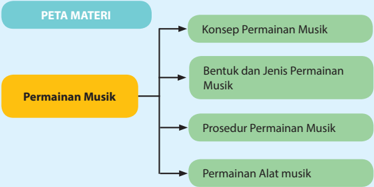

> **Deskripsi Visual:** Gambar ini adalah diagram yang menunjukkan struktur materi tentang permainan musik dalam buku pelajaran. Diagram ini terdiri dari empat cabang utama yang masing-masing menjelaskan konsep permainan musik, bentuk dan jenis permainan musik, prosedur permainan musik, dan permainan alat musik. Setiap cabang ini memiliki subcabang yang lebih detail untuk mendalamkan pengetahuan tentang topik tersebut. Label "Peta Materi" berada di bagian atas diagram, sementara "Permainan Musik" berada di bagian bawah dengan warna kuning yang menonjol. Ini menunjukkan bahwa permainan musik adalah topik utama yang akan dibahas dalam buku pelajaran ini.

Setelah mempelajari Bab 11 ini kamu diharapkan dapat:

- Menguraikan secara singkat beberapa aspek dalam pertunjukan musik.
- Membuat kesimpulan tentang pengertian pertunjukan musik.
- Menganalisis perbedaan pertunjukan musik profesional dan pertunjukan musik bagi siswa di sekolah.
- Menguraikan hakikat pertunjukan seni dalam pembelajaran musik di sekolah.
- Mempertanyakan tahap-tahap pembentukan tema.
- Membuat diagram rancangan tema kolaborasi seni dalam pertunjukan seni.
- Mengilustrasikan tema pertunjukan musik siswa di sekolah.

 

---
## 📄 Halaman 58

- Menguraikan pemilihan pola-pola ragam gerak tari yang sesuai dengan permainan musik dan lagu yang dipilih.
- Menghubungkan karakter musik dengan adegan cerita sesuaidengan fungsinya dalam seni teater.
- Mencoba melakukan penempatan pemain dalam pertunjukan musik.
- Mengilustrasikan kostum dan properti yang digunakan oleh pemain dalam pertunjukan musik.
- Mengilustrasikan latar dan properti panggung sesuai dengantema pertunjukan seni.
- Mengilustrasikan publikasi dan buku program pertunjukan musik.
- Membedakan peranan panitia pertunjukan musik.
- Mengujicobakan kolaborasi seni dalam pertunjukan musik.
Pernahkah  kamu  menghadiri  suatu  pertunjukan  musik?  Pertunjukan musik seperti apa yang kamu saksikan? Musik tradisional, pop, jazz, keroncong, atau yang lain? Apa yang kamu amati dalam setiap pertunjukan musik yang kamu saksikan?

Ketika mendatangi pertunjukan musik kita tentu akan melihat beberapa pihak  yang  berperan  di  dalamnya.  Berawal  dari  tempat  penjualan  tiket  di mana kita akan mendapat buku program acara dan tiket masuk, penentuan nomor kursi (khususnya di gedung gedung pertunjukan di kota-kota besar), dan  kata  sambutan  dari  panitia  penyelenggara  acara.  Proses  pertunjukan musik biasanya mencakup permainan karya-karya musik yang sesuai dengan program  acara,  posisi  pemain  ( blocking ),  tata  lampu,  disain  panggung, pengaturan  buka-tutupnya  layar  panggung,  petugas  yang  mempersiapkan materi  yang  akan  dimainkan,  petugas  yang  'mengatur'  apresiasi  penonton berupa  tepuk  tangan,  petugas  yang  mengatur  keluar-masuknya  pemain, petugas  yang  mengatur  kostum  dan  tata  rias  pemain  musik,  dan  lain-lain. Perhatikan beberapa gambar pertunjukan musik berikut:

 

---
## 📄 Halaman 59

Gambar 11.1 Java Jazz, Maret 2013

 

---
## 📄 Halaman 60

Sumber: Dok. penulis

Gambar  11.5  Pertunjukan  Drama  Musikal Nahawayang oleh Mahasiswa Jurusan Pendidikan Seni Musik

Angkatan  2010  Univ.  Pendidikan  Indonesia  di  Bandung -2014

Diskusikan  dengan  beberapa  teman  tentang  aspek-aspek  pendukung yang  terlibat  dalam  setiap  pertunjukan  musik  pada  gambar  11.1-11.5. Uraikan secara singkat hasil pengamatan kalian itu dalam kolom di bawah ini!

### Format Diskusi Hasil Pengamatan

Nama Siswa :

NIS :

Hari/Tanggal Pengamatan :

---
**📊 Tabel**

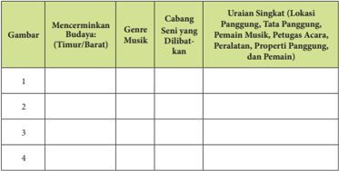

Tabel ini berisi informasi tentang budaya dan seni musik, dengan fokus pada genre musik, cabang seni yang dilibatkan, dan uraian singkat lokasi panggung, tata panggung, pemeran, petugas, peralatan, properti panggung, dan pemain. Topik utama tabel ini adalah budaya dan seni musik, termasuk genre musik, cabang seni yang melibatkan, dan detail tentang lokasi dan peralatan panggung. Data penting yang terlihat dalam tabel ini mencakup berbagai genre musik seperti jazz, rock, pop, dan blues, serta cabang seni yang melibatkan seperti tari, drama, dan musik. Selain itu, tabel juga memberikan informasi tentang lokasi dan tata panggung, seperti panggung, tata panggung, pemeran, petugas, peralatan, properti panggung, dan pemain.

 

---
## 📄 Halaman 61

---
**📊 Tabel**

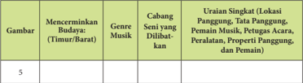

Tabel ini menunjukkan informasi tentang budaya dan genre musik yang muncul dalam sebuah konteks tertentu. Topik utamanya adalah tentang bagaimana elemen-elemen budaya dan genre musik dapat ditemukan dalam berbagai konteks, seperti panggung, tempat penampungan, pemain musik, petugas acara, peralatan, properti panggung, dan pemain. Kolom-kolom yang ada mencakup: Gambar, Mencerminkan Budaya (Timur/Barat), Genre Musik, Cabang Seni yang Dibahas, dan Uraian Singkat (Lokasi Panggung, Tempat Penampungan, Pemain Musik, Petugas Acara, Peralatan, Properti Panggung, dan Pemain). Data penting yang terlihat adalah bahwa tabel ini mencakup berbagai aspek dari budaya dan musik, mulai dari lokasi dan peralatan hingga jenis musik dan cabang seni yang dibahas.

Untuk  lebih  memahami  tentang  pertunjukan  musik,  carilah  informasi dari  beragam  sumber.  Kamu  dapat  memiliki  pemahaman  yang  lebih  baik dengan  menyaksikan  beberapa  pertunjukan  musik  dari  genre  musik  yang berbeda  secara  langsung  atau  melihat  dokumentasi  pertunjukan  musik  di suatu situs internet (misalnya youtube ).

### A.   Pengertian Pertunjukan Musik

Sesuai dengan pengertian dalam Kamus Besar Bahasa Indonesia (2008), istilah pertunjukan berarti sesuatu yang dipertunjukan atau tontonan (bioskop, wayang, dan sebagainya), atau juga pameran. Mengacu pada pengertian itu, apakah pengertian dari pertunjukan musik?

- Apa saja yang membedakan pertunjukan musik oleh musisi profesional dengan pertunjukan musik oleh siswa di sekolah?
- Mengapa  pertunjukan  musik  oleh  musisi  profesional  berbeda  dengan pertunjukan musik oleh siswa di sekolah?
Berdasarkan pernyataan di atas, coba analisis perbedaan antara pertunjukan  musik  yang  dilakukan  oleh  musisi  profesional  dengan pertunjukan musik yang dilakukan oleh siswa di sekolah. Uraikan secara singkat hasil pengamatan kalian itu dalam tabel berikut.

---
**📊 Tabel**

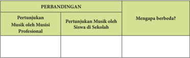

Tabel ini membandingkan pertunjukan musik oleh musisi profesional dengan pertunjukan musik oleh siswa di sekolah. Topik utamanya adalah perbedaan antara kedua jenis pertunjukan tersebut. Kolom pertama berisi pertanyaan tentang pertunjukan musik oleh musisi profesional, sedangkan kolom kedua bertujuan untuk menjawab pertanyaan tentang pertunjukan musik oleh siswa di sekolah. Data penting yang terlihat adalah bahwa pertunjukan musik oleh musisi profesional biasanya memiliki kualitas musik yang lebih baik dan lebih profesional dibandingkan dengan pertunjukan musik oleh siswa di sekolah. Ini menunjukkan bahwa pertunjukan musik oleh musisi profesional seringkali lebih menarik dan mengejutkan bagi penontonnya.

 

---
## 📄 Halaman 62

Walaupun  berbeda,  pertunjukan  musik  yang  dilakukan  untuk  siswa  di sekolah  tetap  menggunakan  teknik  dan  prosedur  yang  sama  dengan  yang dilakukan dalam pertunjukan musik untuk musisi profesional. Pertunjukan musik bagi siswa dapat dipandang sebagai bagian dari pembelajaran musik di sekolah,  yaitu  memberi  pengalaman  pada  para  siswa  untuk  memahami bagaimana  melakukan  suatu  pertunjukan  musik.  Untuk  lebih  jelasnya, perhatikan empat gambar berikut:

1

---
**🖼️ Gambar/Diagram**

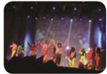

> **Deskripsi Visual:** Gambar ini adalah ilustrasi yang menunjukkan sebuah pertunjukan seni di panggung. Ilustrasi ini menggambarkan beberapa penari yang berperan dalam sebuah tarian tradisional. Penari-penari tersebut mengenakan pakaian tradisional dengan warna-warna cerah dan bermotif, serta menggunakan kostum yang unik untuk menonjolkan karakter mereka. Mereka tampak bergerak dengan ritme yang kuat dan tajam, menunjukkan keahlian dan kekompakan dalam tarian mereka. Di sekitar mereka, terdapat penari lain yang juga memerankan peran penting dalam pertunjukan, mungkin sebagai penari pendukung atau penari tambahan. Ilustrasi ini menunjukkan keindahan dan kekayaan budaya melalui tarian tradisional, serta menunjukkan bagaimana penari-penari tersebut bekerja sama untuk menciptakan sebuah pertunjukan yang menarik dan mengeksplorasi berbagai aspek seni tari.

Amati perbedaan pada keempat gambar di atas dan coba jawab beberapa pertanyaan di bawah ini:

- Siapakah  pelaku  dalam  pertunjukan  musik  dalam  keempat  gambar  di atas?
- Apakah para pelaku pertunjukan musik dalam keempat gambar di atas memperlihatkan kolaborasi seni? Sebutkan cabang seni yang dilibatkan dan bagaimana masing-masing cabang seni digunakan?
- Bagaimana  perkiraan  kamu  tentang  waktu  persiapan  dan  dana  yang dibutuhkan pada masing-masing pertunjukan?
- Dari keempat gambar di atas, gambar nomor berapa yang paling mewakili pertunjukan musik sekolah?
- Menurut  pandangan  kamu,  bagaimana  sebaiknya  suatu  pertunjukan musik bagi siswa di sekolah diselenggarakan?

 

---
## 📄 Halaman 63

Diskusikan kelima pertanyaan tersebut dengan beberapa teman atau dalam kelompok. Kemudian, jelaskan jawaban masing-masing pertanyaan dalam tabel di bawah ini!

---
**📊 Tabel**

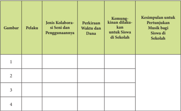

Tabel ini berisi informasi tentang pelaksanaan musik di sekolah, termasuk gambar, pelaku, jenis kolaborasi seni dan penggunaannya, perkiraan waktu dan dana, kemampuan masyarakat untuk siswa di sekolah, dan kesimpulan untuk pertunjukan musik bagi siswa di sekolah. Topik utama tabel adalah pelaksanaan musik di sekolah. Kolom-kolomnya meliputi gambar, pelaku, jenis kolaborasi seni dan penggunaannya, perkiraan waktu dan dana, kemampuan masyarakat untuk siswa di sekolah, dan kesimpulan untuk pertunjukan musik bagi siswa di sekolah. Data penting yang terlihat antara lain jumlah gambar, jenis pelaku, jenis kolaborasi seni dan penggunaannya, perkiraan waktu dan dana, kemampuan masyarakat untuk siswa di sekolah, dan kesimpulan untuk pertunjukan musik bagi siswa di sekolah.

Berdasarkan  jawaban  kamu,  apakah  pertunjukan  musik  berkontribusi secara  positif  terhadap  perkembangan  pengetahuan dan kemampuan kamu dalam  bidang  musik?  Diskusikan  jawabanmu  dengan  beberapa  teman  atau kelompok dan uraikan jawabanmu dalam kolom berikut:

Pertunjukan musik bagi siswa di sekolah dipandang penting atau tidak penting karena:

.....................................................................................................................

.....................................................................................................................

.....................................................................................................................

.....................................................................................................................

 

---
## 📄 Halaman 64

### B.  Teknik Pertunjukan

Teknik pertunjukan mengacu pada beberapa pertanyaan sebagai berikut: apa  yang  akan  saya  tampilkan?  Di  mana  posisi  saya  dalam  pertunjukan? Bagaimana saya terlihat oleh penonton? Bagaimana saya dapat bersikap tenang selama proses pertunjukan? Dan, bagaimana saya dapat menguasai instrumen dan latihan?

Berdasarkan  beberapa  pertanyaan  itu  maka  teknik  pertunjukan  musik dapat mencakup: 1) karya musik yang akan dimainkan; 2) penempatan pemain di atas  panggung  ( blocking ); 3) aspek psikologis  para  pemain  selama pertunjukan; dan 4) penguasaan permainan musik dan latihan.

Pertama ,  tema  dalam  pertunjukan  musik.  Seperti  telah  dikemukakan sebelumnya  bahwa  pertunjukan  musik  bagi  siswa  di  sekolah  merupakan bagian dari pembelajaran musik, apabila ada kesempatan, jenis musik seperti apakah yang dapat kamu hadirkan dalam pertunjukan?

Dalam materi pembelajaran musik Bab 4 di Semester 1, kita telah mencoba melakukan kolaborasi seni dalam permainan musik. Ingat? Bagaimana kalau kita  menjadikan  kolaborasi  seni  dalam  permainan  musik  sebagai  materi pertunjukan musik?

Namun, untuk melakukan kolaborasi seni dalam permainan musik tentu saja  membutuhkan  tema  yang  sesuai.  Tema  apa  yang  akan  digunakan  dan bagaimana menentukan tema pertunjukan?

Dalam bab ini mari kita ambil contoh tema yang berhubungan dengan lingkungan. Mengapa lingkungan? Ya. Karena lingkungan di sekitar kita dapat dipandang  sebagai  sumber  inspirasi  untuk  memilih  tema-tema  yang  dekat dengan  kehidupan  kita  sehari-hari.  Apabila  kita  perhatikan,  suara-suara  di lingkungan sekitar, seperti suara burung, kendaraan, hiruk-pikuk di jalan, dan lain-lain, dapat menjadi sumber inspirasi untuk melakukan eksplorasi musik, gerak, dan properti.

 

---
## 📄 Halaman 65

Sumber: Dok. penulis

Gambar 11.6: Arial Arsad Hakim

Nuansa Alam Pedesaan (Natural Nuance of the Village before

Merapi, 2010)

Cat minyak pada kanvas 110 x 140 cm, Inv. 991/SL/D

Apa yang harus kita  lakukan  untuk  menentukan  satu  tema  yang  dapat digunakan untuk kolaborasi seni? Perhatikan beberapa langkah berikut:

### 1.   Pengamatan/Observasi

Coba  amati  lingkungan  di  sekitar  kamu! Mungkin di lingkungan kamu ada terlihat orang berjalan hilir-mudik, kendaraan yang bergerak, lalu lintas yang padat, suara burung atau katak, gemericik air, suasana di  pagi  hari,  atau  hal-hal  lainnya.  Hal-hal apa saja yang menarik perhatian kamu?

### 2.  Pemahaman terhadap tema yang dipilih

Setelah kamu mengamati, adakah sesuatu yang paling menarik untuk dijadikan sebagai  tema  dalam  permainan  musik? Apakah tema yang paling menarik perhatian itu?

---
**🖼️ Gambar/Diagram**

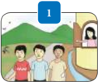

> **Deskripsi Visual:** Gambar ini adalah ilustrasi yang menunjukkan tiga orang anak bermain di tepi sungai. Gambar ini menggambarkan suasana yang ceria dan sehat, dengan anak-anak bermain di alam terbuka. Di sisi kanan, ada seorang anak yang sedang berbicara dengan orang dewasa, mungkin guru atau orang tua. Anak-anak tersebut tampak senang dan aktif, menunjukkan bahwa mereka sedang bermain dengan baik. Gambar ini menunjukkan hubungan positif antara anak-anak dan orang dewasa, serta kegiatan yang positif dan menyenangkan yang dilakukan oleh anak-anak.

---
**🖼️ Gambar/Diagram**

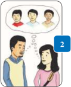

> **Deskripsi Visual:** Gambar ini adalah ilustrasi yang menunjukkan dua orang yang berbicara dengan tiga orang lainnya. Ilustrasi ini mungkin digunakan untuk menggambarkan konsep komunikasi atau hubungan sosial. Elemen utama dalam gambar ini adalah dua orang yang berbicara, tiga orang yang mendengarkan, dan lingkungan mereka yang tampak seperti ruang publik atau kantor. Teks, angka, atau label penting tidak ada dalam gambar ini. Informasi kunci yang dapat diambil pembaca adalah bahwa ada interaksi sosial antara individu dalam sebuah situasi tertentu.

 

---
## 📄 Halaman 66

### 3.   Mencari data tentang tema yang dipilih

Carilah informasi sebanyak-banyaknya tentang tema yang kamu pilih dari beragam sumber. Lakukanlah  uji coba terhadap tema yang dipilih. Data apa saja yang kamu peroleh  setelah  melakukan  uji  coba  itu? Elemen-elemen apa saja yang terkandung di dalam tema itu ?

### 4.  Mengasosiasikan data dengan unsur musik, tari, rupa, dan teater

Seluruh data yang terkumpul mengenai elemen-elemen dalam tema kemudian dibagi ke dalam beberapa kategori. Beberapa kategori tersebut kemudian diasosiasikan dengan elemen musik, gerakan tubuh, dan visual. Apabila ketiga kategori tersebut digabungkan, hasil seperti apa yang kamu peroleh?

### 5.  Mengkomunikasikan hasil uji coba yang sesuai dengan tema kepada teman-teman yang terlibat dalam kolaborasi seni

Setelah kamu memperoleh hasil dari empat proses di atas maka komunikasikanlah tema kamu dalam bentuk kolaborasi seni dalam permainan musik. Kemudian, isilah kolom di bawah ini:

---
**🖼️ Gambar/Diagram**

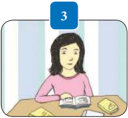

> **Deskripsi Visual:** Gambar ini adalah ilustrasi yang menunjukkan seorang siswa sedang belajar di meja belajar. Siswa tersebut sedang menulis di buku tulisannya dengan pensil, sementara di sebelahnya ada beberapa buku dan alat tulis lainnya. Gambar ini menunjukkan aktivitas belajar siswa, yang merupakan bagian dari proses pembelajaran di sekolah. Ilustrasi ini mungkin digunakan untuk menggambarkan konsep tentang cara siswa belajar dan mengorganisir materi belajar mereka.

---
**🖼️ Gambar/Diagram**

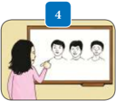

> **Deskripsi Visual:** Gambar ini adalah ilustrasi yang menunjukkan sebuah guru sedang memberikan penjelasan tentang topik matematika. Ilustrasi ini menggambarkan tiga orang siswa yang sedang mendengarkan penjelasan guru di depan papan tulis. Papan tulis berisi beberapa teks dan angka yang mungkin merupakan soal-soal atau informasi penting untuk pembelajaran.

1. Gambar ini menunjukkan sebuah guru sedang memberikan penjelasan kepada tiga orang siswa.
2. Elemen-elemen utama termasuk guru, tiga siswa, papan tulis, dan beberapa teks dan angka yang ada di papan tulis.
3. Teks dan angka penting yang terlihat meliputi nama-nama siswa, angka-angka yang mungkin merupakan nomor soal, dan beberapa teks yang mungkin menjelaskan konsep matematika yang dibahas.
4. Informasi kunci yang dapat diambil pembaca meliputi topik pembelajaran yang sedang disampaikan oleh guru, jumlah siswa yang sedang belajar, dan struktur ruang belajar yang digunakan dalam proses pembelajaran ini.

---
**🖼️ Gambar/Diagram**

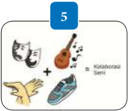

> **Deskripsi Visual:** Gambar ini adalah ilustrasi yang menunjukkan sebuah konsep matematika yang disebut "Kolom/Baris Sentri". Gambar ini terdiri dari beberapa elemen utama:

1. **Apa yang Ditampilkan Secara Keseluruhan**: Gambar ini menggambarkan tiga objek yang terhubung oleh garis putih, masing-masing objek memiliki simbol yang berbeda: seekor kucing, seorang pria berjalan dengan tas, dan sebuah kapal. Objek-objek ini dikelilingi oleh garis putih yang membentuk bentuk segitiga.

2. **Elemen-Elemen Utama dan Relasinya**: 
   - **Objek Pertama**: Seekor kucing yang tampak seperti menggambarkan konsep "kolom" atau "baris".
   - **Objek Kedua**: Seorang pria berjalan dengan tas yang tampak seperti menggambarkan konsep "sentri" atau "titik sentral".
   - **Objek Ketiga**: Kapal yang tampak seperti menggambarkan konsep "baris" atau "kolom".

3. **Teks, Angka, atau Label Penting yang Terlihat**: Di bagian atas gambar ada angka "5", yang mungkin merujuk pada jumlah objek atau konsep yang digambarkan.

4. **Informasi Kunci yang Dapat Diambil Pembaca**: Gambar ini menunjukkan hubungan antara konsep "kolom", "baris", dan "sentri" dalam matematika, dengan menggunakan simbol fisik untuk memperjelas konsep tersebut. Ini bisa membantu pembaca memahami konsep ini lebih baik melalui visualisasi fisik.

Dengan demikian, gambar ini adalah ilustrasi yang efektif untuk menjelaskan konsep matematika "kolom/baris sentri" dengan menggunakan simbol fisik yang mudah dipahami.

 

---
## 📄 Halaman 67

Mari kita lakukan lagi langkah 1 - 5 di atas untuk menemukan tema menarik lainnya. Kemudian, isilah kolom di bawah ini:

---
**📊 Tabel**

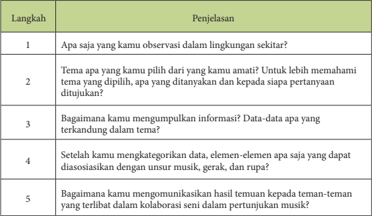

Tabel ini berisi langkah-langkah untuk mempelajari tentang musik dan gerak melalui observasi lingkungan sekitar. Topik utamanya adalah bagaimana mengidentifikasi dan memahami elemen-elemen musik, gerak, dan rupa dalam lingkungan sehari-hari. Kolom-kolomnya mencakup: 1) Apa yang kamu observasi dalam lingkungan sekitar? 2) Tema apa yang kamu pilih dari observasi tersebut? 3) Bagaimana kamu mengumpulkan informasi? 4) Setelah kamu mengategorikan data, apakah ada elemen-elemen yang dapat diasosiasikan dengan unsur musik, gerak, dan rupa? 5) Bagaimana kamu komunikasikan hasil temuan kepada teman-teman dalam kolaborasi seni untuk permainan musik. Data penting yang terlihat adalah proses pengumpulan dan analisis data, identifikasi elemen-elemen musik, gerak, dan rupa, serta komunikasi hasil temuan dalam konteks seni musik.

Buatlah diagram untuk mengomunikasikan hasil temuan kalian terhadap tema yang dipilih!

Apabila kamu ingin mengasosiasikan nada bicara atau bunyi yang kamu amati, perhatikan ketinggian, irama, kecepatan, keras-lembut, aksentuasi, dan warna bunyinya untuk diasosiasikan dengan polapola ritmik dan/atau lagu. Pemilihan  pola-pola  ritmik  atau  lagu-lagu  yang  akan  digunakan  dalam pertunjukan harus sesuai dengan tema yang kamu pilih.

Ilustrasikan bunyi yang diasosiasikan dengan musik dalam bentuk pola ritmik, instrumen, dan lagu-lagu yang sesuai dengan karakter bunyi yang terdengar. Tuliskan ke dalam kolom berikut:

 

---
## 📄 Halaman 68

---
**📊 Tabel**

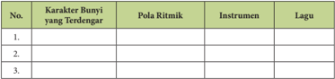

Tabel ini berisi informasi tentang karakter bunyi yang terdengar dalam sebuah lagu, termasuk pola ritmisnya, instrumen yang digunakan, dan lagu tersebut. Topik utama tabel ini adalah analisis musik, khususnya bagaimana karakter bunyi, pola ritmis, instrumen, dan lagu saling berkaitan. Kolom-kolom yang ada dalam tabel ini adalah No., Karakter Bunyi yang Terdengar, Pola Ritmis, Instrumen, dan Lagu. Data atau pola penting yang terlihat dalam tabel ini meliputi karakter bunyi yang terdengar dalam lagu, pola ritmis yang digunakan, instrumen yang digunakan dalam lagu, dan nama lagu tersebut. Dengan mempelajari tabel ini, kita dapat memahami bagaimana karakter bunyi, pola ritmis, instrumen, dan lagu saling berkaitan dalam sebuah lagu.

Setelah  permainan musik dan lagu terbentuk, tahap selanjutnya adalah menggabungkan  musik  dengan  gerakan.  Kelompok  siswa  yang  berperan sebagai  penari  diharapkan  dapat  menyesuaikan  musik  dengan  pola-pola ragam gerak yang pernah dipelajari.

Uraikan alasan pemilihan pola-pola ragam gerak tari yang dianggap sesuai dengan permainan musik dan lagu ke dalam kolom berikut:

---
**📊 Tabel**

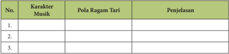

Tabel ini berisi informasi tentang karakteristik musik dan pola ragam tari, dengan penjelasan untuk setiap baris. Topik utama tabel adalah karakteristik musik dan pola ragam tari, yang dikelompokkan menjadi kolom "Karakter Musik" dan "Pola Ragam Tari". Data penting yang terlihat meliputi variasi dalam karakteristik musik dan pola ragam tari, serta penjelasan yang memberikan gambaran lebih lanjut tentang masing-masing elemen tersebut.

Setelah  permainan musik, lagu, dan gerak terbentuk, tahap selanjutnya adalah menyempurnakan gerakan dengan ekspresi yang disesuaikan dengan karakter  musiknya.  Kelompok  siswa  yang  berperan  sebagai  penari  atau pemeran lakon diharapkan dapat menginterpretasikan musik melalui ekspresi wajah.

Uraikan alasan kalian menginterpretasikan musik  melalui ekspresi wajah pada kolom berikut:

---
**📊 Tabel**

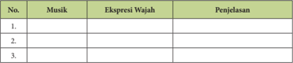

Tabel ini berisi informasi tentang ekspresi wajah yang terkait dengan musik. Kolom pertama menunjukkan nomor urutan, kolom kedua berisi nama musik, kolom ketiga berisi ekspresi wajah yang mungkin terkait dengan musik tersebut, dan kolom keempat berisi penjelasan atau deskripsi tentang ekspresi wajah tersebut. Topik utama tabel ini adalah hubungan antara ekspresi wajah dan musik. Data penting yang terlihat adalah bahwa beberapa musik memiliki ekspresi wajah yang mirip, seperti "Ketawa" dan "Pujian", yang mungkin menunjukkan emosi positif atau bahagia. Sementara itu, "Takut" dan "Gembira" menunjukkan ekspresi wajah yang lebih negatif atau emosi negatif.

 

---
## 📄 Halaman 69

Carilah informasi tentang seni teater dari beragam referensi yang dapat kalian peroleh. Untuk memperoleh pemahaman yang lebih baik, carilah beberapa  contoh  pertunjukan  teater  dari  internet  ( youtube )  atau  dari sumber  lainnya.  Cobalah  hubungkan  adegan  dengan  karakter  bunyi musiknya. Kemudian, isilah kolom di bawah ini:

Perlu dipahami bahwa musik memiliki fungsi tertentu dalam seni teater. Pernahkah kamu menyaksikan suatu pertunjukan teater, modern atau tradisi?

---
**📊 Tabel**

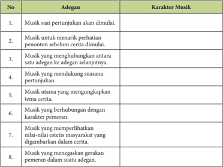

Tabel ini berisi informasi tentang karakteristik musik dalam sebuah pertunjukan teater. Topik utamanya adalah bagaimana musik memainkan peran penting dalam pengembangan cerita dan pengalaman penonton. Kolom "Adegan" menyajikan berbagai situasi di mana musik digunakan, sementara kolom "Karakter Musik" menjelaskan jenis musik yang sesuai dengan setiap situasi tersebut. Data penting yang terlihat adalah bahwa musik dapat menambah intensitas emosi, mendukung suasana, menggambarkan tema cerita, dan merespons pergerakan karakter. Ini menunjukkan bahwa musik memiliki peran kritis dalam menciptakan pengalaman teater yang lebih mendalam dan menarik bagi penonton.

Setelah  permainan  musik,  lagu,  dan  gerak  yang  bersifat  teatrikal  telah terbentuk,  tahap  selanjutnya  adalah  menyempurnakan  pertunjukan  dengan benda-benda atau  properti  yang  sesuai  dengan  tema  pertunjukan.  Properti tidak hanya digunakan pada pemeran lakon, penari, ataupun pemain musik, tetapi juga di panggung pertunjukan, seperti latar belakang panggung, hiasan di depan panggung, dan lain-lain.

 

---
## 📄 Halaman 70

Uraikan properti apa saja yang digunakan pelaku seni dengan properti panggung pada kolom berikut:

---
**📊 Tabel**

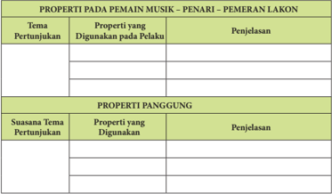

Tabel ini membahas properti yang digunakan oleh pemain musik, penari, dan pemeran lakon dalam pertunjukan. Topik utamanya adalah properti yang digunakan untuk mengekspresikan suasana tema pertunjukan. Dalam tabel ini, terdapat dua kolom utama: "Properti yang Digunakan pada Pelaku" dan "Penjelasan". Properti yang digunakan mencakup berbagai aspek seperti penampilan, gerakan, suara, dan bahasa tubuh. Penjelasan memberikan detail tentang bagaimana properti tersebut digunakan untuk menciptakan suasana tema tertentu dalam pertunjukan. Misalnya, dalam suasanatema pertunjukan yang mendekati, pemain musik mungkin menggunakan alat musik yang lebih besar dan suara yang lebih keras untuk menciptakan suasana yang mendalam dan intens. Sementara itu, dalam suasanatema pertunjukan yang lebih ringan, penari mungkin menggunakan gerakan yang lebih lembut dan suara yang lebih halus untuk menciptakan suasana yang lebih ringan dan menyenangkan.

Properti yang digunakan pada latar panggung dapat disesuaikan dengan dana yang tersedia. Apabila memungkinkan, kamu dapat menggunakan latar panggung dengan menggunakan teknologi multimedia yang didukung oleh tata lampu. Perhatikan gambar berikut:

Sumber: Dok. penulis

Gambar 11.7 Penggunaan teknologi multimedia dan tata lampu pada latar panggung Pertunjukan Drama Musikal Nahawayang

Mahasiswa Jurusan Pendidikan Seni Musik Universitas Pendidikan  Indonesia Angkatan 2014 di Taman Budaya, Dago, Bandung - 2014

 

---
## 📄 Halaman 71

Namun, apabila dana tidak memungkinkan, kamu tetap dapat membuat latar  panggung  yang  lebih  sederhana  tetapi  tetap  menarik.  Perhatikan  latar panggung dalam gambar berikut:

Sumber: Dok. penulis

Gambar 11.8 Pentas Kesenian (Pensi) siswa SMPN 6 Depok

Perhatikan gambar  11.13  Bagaimana  pendapat  kalian  tentang  latar panggung  dalam  acara  Pentas  Kesenian  siswa  SMP  tersebut?  Uraikan secara singkat penjelasan kalian dalam kolom berikut:

Pendapat terhadap latar panggung dalam gambar:

Kedua ,  penempatan pemain di atas panggung. Sebelum kamu menentukan posisi pemain, tentukan dahulu berapa kategori pemain dalam pertunjukan musik  yang  kamu  rencanakan.  Pemain  dalam  konteks  pertunjukan  dapat melibatkan beberapa kelompok, seperti pemain musik, penari, pemeran lakon, penyanyi, dan kelompok paduan suara. Bagaimana penempatan para pemain itu dalam pertunjukan sehingga penonton dapat melihat mereka dengan jelas?

Untuk menjawab pertanyaan itu terlebih dahulu kamu harus mengetahui jenis  panggung  yang  akan  kamu  gunakan  untuk  melakukan  pertunjukan musik. Perhatikan dua jenis panggung berikut ini:

 

---
## 📄 Halaman 72

- Panggung  yang  hanya  dapat  disaksikan  penonton  dari  satu  arah.  Jenis panggung ini disebut panggung proscenium
Gambar  11.9  Penempatan  pemain  dalam  Pertunjukan  Drama  Musikal Nahawayang Mahasiswa Jurusan Pendidikan Seni Musik Universitas Pendidikan Indonesia Angkatan 2014 di Taman Budaya, Dago, Bandung - 2014

Gambar 11.14 memperlihatkan salah satu contoh kolaborasi seni dalam pertunjukan drama musikal Nahawayang (2014)  yang  diselenggarakan oleh Mahasiswa Jurusan Pendidikan Seni Musik Angkatan 2010 dan diadakan di Taman Budaya, Dago - Bandung, Jawa Barat. Pertunjukan ini dapat dikatakan sebagai  pertunjukan  seni  lokal  yang  memperlihatkan  kolaborasi  beberapa unsur seni, yaitu musik, tari, rupa, dan teater.

Pertunjukan drama musikal Nahawayang (2013) ini melibatkan beberapa kelompok  pemain.  Agar  penonton  dapat  melihat  peranan  pemain  dalam pertunjukan,  maka  masing-masing  kelompok  ditempatkan  dalam  posisiposisi tertentu. Kelompok penari, pemeran, dan penyanyi ditempatkan di atas panggung. Kelompok pemain musik (orkes, gamelan, dan combo ) ditempatkan di barisan depan di bawah panggung, dan kelompok paduan suara ditempatkan di  sisi  kiri  panggung.  Sehingga,  penonton  dapat  menyaksikan  seluruh kelompok pemain dengan jelas walaupun mereka hanya melihat dari satu arah, yaitu depan panggung.

 

---
## 📄 Halaman 73

- Panggung arena atau terletak di luar gedung. Para pemain dapat dilihat oleh penonton dari segala arah. Umumnya, panggung ini digunakan dalam pertunjukan teater tradisi.

---
**🖼️ Gambar/Diagram**

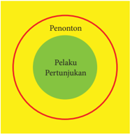

> **Deskripsi Visual:** Gambar ini adalah diagram yang menunjukkan hubungan antara penonton, pelaku pertunjukan, dan pertunjukan secara keseluruhan. Gambar ini menggunakan warna-warna cerah untuk membedakan antara tiga elemen tersebut. Penonton diletakkan di luar lingkaran besar, menunjukkan bahwa mereka tidak langsung terlibat dalam pertunjukan. Pelaku pertunjukan berada di dalam lingkaran hijau yang lebih kecil, menunjukkan bahwa mereka adalah subjek utama dari pertunjukan. Pertunjukan sendiri diletakkan di dalam lingkaran merah yang paling besar, menunjukkan bahwa pertunjukan adalah keseluruhan yang melibatkan semua elemen lainnya. Teks "Penonton", "Pelaku Pertunjukan", dan "Pertunjukan" memberikan informasi tentang setiap elemen yang ada dalam gambar. Ini menunjukkan bahwa pertunjukan melibatkan penonton dan pelaku pertunjukan, tetapi tidak langsung terlibat dengan penonton.

Sumber: Dok. penulis

Gambar 11.10 Panggung Arena dalam Teater Tradisi:

Musik  sebagai  Pengiring  dan  Tarian  Gambuh  (Bali),  selain  model  tersebut,  adapula  arena  pemain  musik yang ditempatkan dipanggung terbuka secara khusus, seperti yang dilakukan oleh para pemain musik disaat mengiringi tari Pencak silat yang dipertunjukan oleh masyarakat Jawa Barat.

Berdasarkan pemahaman  kamu  terhadap  kedua  jenis panggung, jenis panggung apa yang akan kamu gunakan untuk melakukan pertunjukan seni?

 

---
## 📄 Halaman 74

Apabila kalian akan bermain di atas panggung di dalam ruangan, cobalah kalian  gambarkan  pengaturan  posisi  pemain  di  atas  panggung  dalam kolom berikut:

Ilustrasikan penempatan pemain di atas panggung:

Ketiga ,  persiapan  mental  para  pemain  dalam  pertunjukan.  Pernahkah kamu terlibat  dalam  suatu  pertunjukan  musik?  Kalau  'ya' ,  apa  yang  kamu rasakan  ketika  pertama  kali  terlibat  dalam  pertunjukan?  Kalau  'tidak' , bagaimana ketika kamu membayangkan tatapan penonton yang menyaksikan kamu di atas panggung? Bagaimana perasaan kamu ketika sedang memainkan musik  ketika  penonton  memperhatikan  kamu?  Apakah  perasaan  itu  akan menimbulkan kekhawatiran dalam diri kamu sehingga tidak dapat bermain dengan baik? Bagaimana upaya kamu untuk membentuk rasa percaya diri dan mengurangi rasa takut ketika harus tampil dalam suatu pertunjukan?. Salah satu  upaya  untuk  membentuk rasa percaya diri dan mengurangi rasa takut adalah dengan menguasai materi yang akan kita mainkan sebaik mungkin.

Bagaimana  cara  menguasai  materi  yang  akan  kalian  mainkan,  baik perorangan maupun kelompok? Uraikan secara singkat pendapat kalian dalam kolom berikut ini:

 

---
## 📄 Halaman 75

### C.   Prosedur Pertunjukan Musik

Setelah teknik pertunjukan, aspek lain yang perlu kamu pahami adalah prosedur pertunjukan. Prosedur dapat dipandang sebagai cara-cara tertentu untuk  menyempurnakan  suatu  tindakan.  Dalam  hal  ini,  tindakan  yang dimaksud adalah pertunjukan. Oleh karena itu prosedur pertunjukan dapat diartikan  sebagai  cara-cara  tertentu  untuk  menyempurnakan  pertunjukan. Hal-hal apa saja yang dapat menyempurnakan suatu pertunjukan?

Untuk membuat  suatu pertunjukan yang baik maka  kamu  harus menentukan bentuk kolaborasi seni dengan tema yang jelas. Kira-kira 3 - 6 bulan  sebelum  pertunjukan.  Setelah  tema  yang  jelas  telah  disepakati  maka tindakan  selanjutnya  adalah menyeleksi  permainan  musik  atau  lagu­lagu dan instrumen yang akan digunakan dalam pertunjukan. Kemukakan rencana kamu kepada guru yang akan meneruskan rencana tersebut ke Kepala Sekolah. Kalau memungkinkan, guru bisa meminta pihak sekolah untuk menyediakan pelatih, baik untuk pemain musik, penari, maupun pemeran lakon.

Tahap  selanjutnya  adalah  membuat jadwal  latihan .  Hal  pertama  yang dilakukan  dalam  jadwal  latihan  adalah  melatih  permainan  musik  dengan menggunakan instrumen-instrumen yang sudah ditentukan, latihan gerakan dengan musik, dan latihan memerankan lakon yang sesuai dengan peran yang akan dimainkan. Setelah permainan musik, gerakan, dan memerankan lakon sudah dianggap cukup baik maka jadwal selanjutnya adalah menggabungkan seluruh unsur itu dalam suatu kesatuan atau kolaborasi seni .

Tahap  selanjutnya  adalah merancang kostum dan properti yang  akan digunakan  oleh  seluruh  kelompok  pemain.  Kostum  tersebut  sebaiknya disesuaikan dengan tema pertunjukan. Perhatikan gambar berikut:

---
**🖼️ Gambar/Diagram**

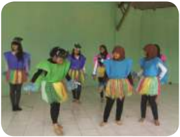

> **Deskripsi Visual:** Gambar ini adalah ilustrasi yang menunjukkan kelompok anak-anak sedang bermain di luar. Ilustrasi ini menggambarkan suasana yang ceria dan aktif, dengan anak-anak berdiri di depan bangunan hijau. Setiap anak memiliki pakaian warna-warni yang mencerminkan keceriaan dan kebersamaan. Ilustrasi ini menunjukkan bahwa aktivitas fisik dan bermain bersama adalah bagian penting dari kehidupan anak-anak.

Elemen-elemen utama dalam ilustrasi ini meliputi:
1. Anak-anak: Mereka berada di tengah-tengah gambar, tampak aktif dan bahagia.
2. Pakaian: Warna-warna yang cerah pada pakaian anak-anak menunjukkan semangat dan keceriaan.
3. Latar belakang: Bangunan hijau yang menunjukkan tempat bermain yang aman dan nyaman.

Teks, angka, atau label penting tidak ada dalam gambar ini karena ia hanya berupa ilustrasi. Namun, informasi kunci yang dapat diambil pembaca adalah tentang kegiatan anak-anak, suasana yang ceria, dan kebersamaan dalam bermain.

Gambar 11.11 Beberapa siswa SMP 6 Depok selain contoh tersebut, kamu dapat membedakan kostum dan properti yang digunakan dalam pertunjukan kesenian Gotong Singa yang dimainkan oleh masyarakat Subang Jawa Barat.

 

---
## 📄 Halaman 76

Ilustrasikan  bentuk  kostum  dan  properti  yang  akan  digunakan  oleh pemain musik dan penari sesuai dengan tema pertunjukan dalam kolom di bawah ini:

---
**📊 Tabel**

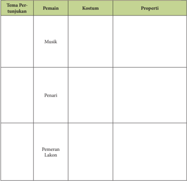

Tabel ini berisi informasi tentang peran dan properti dalam sebuah pertunjukan teater. Topik utamanya adalah "Tema Pertunjukan" yang mencakup musik, penari, dan pemeran lakon. Kolom-kolomnya meliputi "Pemain", "Kostum", dan "Properti". Dari data yang terlihat, kita dapat melihat bahwa musik dan penari mungkin berada di bagian atas tabel, sementara pemeran lakon berada di bagian bawah. Properti tampaknya merupakan elemen penting dalam setiap peran, menunjukkan bahwa setiap pemain memiliki properti khusus untuk memperkaya penampilannya dalam pertunjukan tersebut.

Kira-kira dua bulan sebelum pelaksanaan pertunjukan, sebaiknya mulai membuat keputusan  tentang latar  dan  properti  panggung  yang  sesuai dengan tema yang telah ditentukan .  Setelah disepakati, mulailah membuat latar dan properti panggung. Apabila latar dan properti panggung telah selesai dibuat, kamu perlu membiasakan diri dengan kedua elemen tersebut menjelang pelaksanaan pertunjukan.

 

---
## 📄 Halaman 77

Ilustrasikan latar dan properti panggung pertunjukan musik sesuai dengan tema pertunjukan yang dipilih:

Apakah kamu berharap agar pertunjukan musik yang kamu rencanakan akan  dilihat  orang?  Apa  yang  perlu  kita  lakukan  untuk  menginformasikan pertunjukan  musik  tersebut?  Penyebaran  informasi  tentang  pertunjukan kepada  masyarakat.  Agar  pertunjukan  musik  yang  akan  kamu  rencanakan diketahui oleh orang-orang lain atau masyarakat maka tindakan selanjutnya adalah  mempersiapkan  pemberitaan  atau  publikasi.  Bagaimana  publisitas pertunjukan musik dapat kamu lakukan?

Coba  kalian  sebutkan  tiga  cara  untuk  menginformasikan  pertunjukan musik yang akan kalian lakukan ke masyarakat. Uraikan secara singkat mengapa cara-cara itu yang kalian pilih dalam kolom di bawah ini:

---
**📊 Tabel**

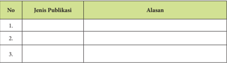

Tabel ini berisi informasi tentang jenis publikasi dan alasan untuk memilihnya. Topik utamanya adalah pilihan publikasi yang sesuai dengan kebutuhan atau tujuan tertentu. Kolom pertama menunjukkan nomor urut publikasi, sedangkan kolom kedua dan ketiga masing-masing berisi nama jenis publikasi dan alasan pilihan tersebut. Data penting yang terlihat adalah bahwa setiap publikasi memiliki alasan spesifik yang berbeda-beda, menunjukkan bahwa pemilihan publikasi harus didasarkan pada kebutuhan atau tujuan yang ditetapkan.

 

---
## 📄 Halaman 78

Ilustrasikan poster pertunjukan musik yang sesuai dengan tema pertunjukan yang kalian pilih:

Selain itu,  kamu  sebaiknya  juga mempersiapkan  rancangan  buku program pertunjukan atau buku acara .  Bagaimana  bentuk  buku  program pertunjukan? Apa kegunaan buku program pertunjukan tersebut? apa saja yang perlu dicantumkan dalam buku program pertunjukan tersebut?. Perhatikan contoh buku program pertunjukan Drama Musikal Nahawayang di bawah ini:

Sumber: Dok. penulis

Gambar 11.12 Buku program pertunjukan Drama

Musikal Nahawayang

 

---
## 📄 Halaman 79

Coba  kamu  lihat beberapa buku program pertunjukan,  kemudian ilustrasikan buku program pertunjukan musik yang akan kamu lakukan dalam kolom berikut.

Mendekati  hari  pelaksanaan  pertunjukan,  perbanyaklah  buku  program

Ilustrasikan buku program pertunjukan musik yang akan kamu lakukan:

tersebut sesuai dengan perkiraan kamu terhadap jumlah penonton yang akan hadir. Apabila sekolah mengizinkan, kamu dapat merencanakan pembuatan tiket pertunjukan .  Harga tiket sebaiknya terjangkau oleh para siswa karena tujuan dari penjualan tiket dalam pertunjukan musik bagi siswa di sekolah bukan untuk kepentingan bisnis. Tiket dapat diperbanyak bersamaan dengan memperbanyak buku program.

Mengapa harga penjualan tiket pertunjukan musik siswa di sekolah harus sesuai  dengan  kemampuan  siswa  untuk  membeli  tiket  tersebut?  apa tujuannya? Uraikan penjelasan kalian dalam kolom berikut:

 

---
## 📄 Halaman 80

Uraikan penjelasan kamu tentang harga tiket pertunjukan musik siswa di sekolah yang harus sesuai dengan kemampuan siswa untuk membeli tiket tersebut:

Hal penting lainnya yang perlu dipersiapkan adalah pembentukan tim panitia pertunjukan . Berdasarkan beberapa gambar pertunjukan musik yang telah  dicantumkan  dalam  bab  ini,  apakah  yang  dimaksud  dengan  panitia pertunjukan?  apa  peran  mereka  dalam  pertunjukan  musik?  dan,  mengapa suatu pertunjukan musik memerlukan tim panitia?

Coba kamu lihat beberapa gambar pertunjukan musik yang dicantumkan dalam  bab  ini.  Berdasarkan  gambar-gambar  itu,  buatlah  penggolongan panitia,  peran  masing-masing  golongan  dalam  pertunjukan  musik,  dan jelaskan manfaat keberadaan mereka dalam pertunjukan musik. Tuliskan penggolongan panitia itu dalam kolom berikut.

---
**📊 Tabel**

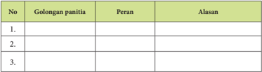

Tabel ini berisi informasi tentang golongan panitia, peran mereka, dan alasan mengapa mereka diangkat ke golongan tersebut. Topik utama tabel ini adalah tentang struktur dan komposisi panitia dalam suatu organisasi atau kegiatan tertentu. Kolom-kolom yang ada adalah No., Golongan panitia, Peran, dan Alasan. Data penting yang terlihat adalah bahwa setiap golongan memiliki peran khusus dan alasan spesifik untuk masuk ke dalam golongan tersebut. Misalnya, golongan pertama mungkin berisi orang-orang yang memiliki pengalaman atau keterampilan tertentu yang diperlukan untuk sukses dalam kegiatan tersebut, sedangkan golongan kedua mungkin berisi orang-orang yang memiliki keterampilan atau pengetahuan yang berbeda namun tetap penting untuk sukses dalam kegiatan tersebut.

Untuk memperlancar proses pertunjukan, kamu juga perlu mempertimbangkan  tersedianya ruang untuk para pemain melakukan pemanasan atau berkumpul dan ruang untuk mengganti kostum.

Prosedur  terakhir  yang  harus  dilakukan  adalah memeriksa  seluruh

 

---
## 📄 Halaman 81

peralatan  yang  akan  digunakan ,  seperti  peralatan  (termasuk  instrumen), sound system , properti, tirai panggung, menyetem instrumen, dan memeriksa keamanan  lantai  panggung.  Selain  itu,  menjelang  dimulainya  pertunjukan musik, kamu harus melakukan sedikit pemanasan agar tubuh kamu menjadi lebih rileks, baik dalam permainan musik maupun menari.

### D.   Pertunjukan Musik

Pada bagian A sampai dengan C kita telah mencoba memahami konsep, teknik,  dan  prosedur  pertunjukan  musik.  Sekarang,  bagaimana  kalau  kita mencoba mempersiapkan suatu pertunjukan yang menggabungkan beberapa unsur seni di dalamnya, yaitu seni musik, tari, rupa, dan seni teater. Mari kita rancang pertunjukan itu berdasarkan teknik dan prosedur pertunjukan yang telah kita pelajari. Tema pertunjukan misalnya berhubungan dengan ketertarikan kamu terhadap satu peristiwa di sekolah .

Tuliskan rancangan pertunjukan itu dalam kolom berikut.

### Tema: Satu peristiwa 'menarik' di sekolah

Buatlah  rancangan  pertunjukan  yang  mengkolaborasikan  empat  bidang seni dengan menerapkan pemahaman kamu tentang teknik dan prosedur pertunjukan yang telah kita bicarakan dalam bagian B dan C.

### Rancangan Pertunjukan: Kolaborasi Empat Unsur Seni Tema:

...........................................................................................

Jenis musik yang akan dimainkan:

Gerakan yang digunakan:

 

---
## 📄 Halaman 82

Properti para pemain:

Properti panggung:

Kostum pemain:

Tata panggung:

Publikasi:

 

---
## 📄 Halaman 83

Buku program:

Ilustrasi buku program dan poster:

Susunan panitia:

Ilustrasi tiket pertunjukan:

 

---
## 📄 Halaman 84

### 1. Penilaian Pribadi

Nama

: ………………………………….......................

Kelas

: ……………………………………...................

Semester

: ………………………………….......................

Waktu penilaian   : …………………................................................

---
**📊 Tabel**

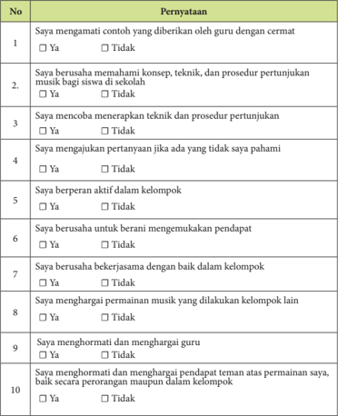

Tabel ini berisi pernyataan yang harus diisi oleh siswa untuk mengevaluasi diri mereka dalam proses pertunjukan musik di sekolah. Topik utamanya adalah keterampilan dan sikap siswa dalam menghadapi situasi pertunjukan musik. Kolom-kolomnya mencakup berbagai aspek seperti keterampilan memahami konsep teknik pertunjukan, kemampuan menerapkan teknik, partisipasi aktif dalam kelompok, berani mengungkapkan pendapat, kerjasama dengan baik dalam kelompok, menghargai permainan musik lain, menghormati guru, dan menghormati pendapat teman. Data penting yang terlihat adalah bahwa sebagian besar siswa (90%) mengatakan bahwa mereka telah mengamati contoh yang diberikan oleh guru dengan cermat, sementara hanya 50% mengatakan bahwa mereka berusaha untuk berani mengungkapkan pendapat mereka. Ini menunjukkan bahwa siswa memiliki kesadaran akan pentingnya mendengarkan dan memahami teknik pertunjukan, tetapi masih kurang pada aspek mengungkapkan pendapat mereka sendiri.

 

---
## 📄 Halaman 85

### 2.   Penilaian Antarteman

Nama

: ………………………………….......................

Kelas

: ……………………………………...................

Semester

: ………………………………….......................

Waktu penilaian   : …………………................................................

---
**📊 Tabel**

Tabel ini berisi 10 poin penilaian yang berkaitan dengan keterampilan dan perilaku siswa dalam konteks pertunjukan musik di sekolah. Topik utama tabel adalah keterampilan dan perilaku siswa dalam mengajar dan mengajar musik. Kolom-kolomnya mencakup berbagai aspek seperti pemahaman konsep, teknik, dan prosedur pertunjukan, mampu menjawab pertanyaan, berperan aktif dalam kelompok, berani mengemukakan pendapat, bekerja sama dalam permainan musik, menghargai permainan musik kelompok lain, menghormati dan menghargai guru, dan menghormati dan menghargai teman atas peran mereka dalam permainan. Data penting yang terlihat adalah bahwa sebagian besar poin (9 dari 10) memerlukan penilaian "Ya" untuk mendapatkan nilai, menunjukkan bahwa keterampilan dan perilaku tersebut sangat penting dalam konteks pertunjukan musik di sekolah.

 

---
## 📄 Halaman 86

### E.  Rangkuman

Pertunjukan  musik  merupakan  suatu  kegiatan  yang  sangat  bermanfaat bagi siswa. Namun, berbeda dari pertunjukan musik untuk musisi profesional, hakikat  pertunjukan  musik  bagi  siswa  sekolah  adalah  untuk  memberikan kesempatan bagi para siswa untuk memperlihatkan hasil belajar yang telah mereka peroleh di dalam kelas. Oleh karena itu, tujuan dari pertunjukan musik bagi siswa di sekolah bukan untuk kepentingan bisnis, tetapi sebagai bagian dari pembelajaran musik siswa di sekolah.

Sebagai  bagian  dari  pembelajaran  musik,  siswa  dapat  memperoleh pengalaman  dalam  mempersiapkan,  mengolah,  dan  mewujudkan  temuantemuannya dalam bentuk pertunjukan musik melalui pendekatan-pendekatan ilmiah, seperti melakukan pengamatan, memperdalam pemahaman, mengumpulkan data tentang bunyi/ gerak/ekspresi/properti, mengasosiasikan bunyi-bunyi ke dalam  unsur  seni musik, tari, rupa, dan  teater serta mengkolaborasikan keempat unsur seni itu dalam suatu pertunjukan musik.

Dalam  teknik  pertunjukan,  siswa  belajar  tentang  menciptakan  tema pertunjukan, membentuk kelompok yang akan dilibatkan dalam pertunjukan (pemain  musik,  penyanyi,  penari,  atau  pemeran  lakon),  membuat  jadwal latihan,  dan  merencanakan  penempatan  pemain  ( blocking )  di  panggung pertunjukan.

Siswa tidak hanya belajar tentang konsep dan teknik pertunjukan, tetapi juga prosedur pertunjukan musik. Dengan dimilikinya pemahaman tentang prosedur  pertunjukan,  maka  siswa  memperoleh  pengalaman  tentang  caracara  yang  digunakan  untuk  menyempurnakan  suatu  pertunjukan  musik, seperti memilih jenis publikasi, membuat buku program, dan membuat tiket pertunjukan. Prosedur pertunjukan yang dipelajari juga mencakup pemahaman siswa terhadap pentingnya tim panitia yang memiliki tugas berbeda, seperti panitia penjualan tiket, penerima tamu, tenaga teknis, penata lampu, penata panggung, dan lain-lain.

Setelah pemahaman tentang konsep, teknik, dan prosedur telah dimiliki maka  siswa  kemudian  mengaplikasikan  pengetahuan  itu  dalam  bentuk pertunjukan musik yang mengkolaborasikan keempat unsur seni. Pertunjukan musik ini dapat dipandang sebagai perwujudan pengetahuan yang diperoleh siswa melalui pengalamanpengalaman empiris dalam lingkungan sehari-hari dan pemahaman mereka atas konsep-konsep di bidang musik yang diperoleh dalam pembelajaran musik di sekolah.

 

---
## 📄 Halaman 87

### F.  Refleksi

Pertunjukan musik yang dilakukan oleh siswa di sekolah yang satu tentu akan memperlihatkan perbedaan dengan pertunjukan musik yang dilakukan oleh  siswa  di  sekolah  lain.  Hal  ini  dapat  dipahami  karena  masing-masing kelompok  siswa  memiliki  lingkungan  sosialbudayanya  sendiri.  Perbedaan tidak dapat dipandang sebagai sesuatu yang terus-menerus dipermasalahkan. Perbedaan justru membuat Bangsa Indonesia dikenal kaya karena keragamannya. Kesadaran siswa terhadap arti dari keragaman merefleksikan apresiasi mereka terhadap perbedaan, baik sosial-budaya, ekonomi, teknologi, maupun  agama;  sikap  saling  menghormati  sebagai  makhluk  Tuhan  yang berbudi luhur dan berakhlak mulia, mandiri, menghargai dan melestarikan nilai-nilai  estetik  dalam  masyarakatnya,  menghargai  pendapat  orang  lain, mengutamakan keharmonisan dalam kelompok, bertanggung jawab, disiplin, dan lain-lain.

 

---
## 📄 Halaman 88

### G.   Uji Kompetisi

Tuliskan teknik dan prosedur pertunjukan di bawah ini.

Tema:

...........................................................................................

Jenis musik yang akan dimainkan:

Gerakan yang digunakan:

Properti para pemain:

Properti panggung:

Kostum pemain:

Tata panggung:

Publikasi:

Buku program:

Ilustrasi buku program dan poster:

Susunan panitia:

Ilustrasi tiket pertunjukan:

 

---
## 📄 Halaman 89

### Semester  2

### BAB 12 Kritik Musik

---
**🖼️ Gambar/Diagram**

> **Deskripsi Visual:** Gambar ini adalah diagram yang menunjukkan struktur materi tentang pertunjukan musik dalam kritik musik. Diagram ini terdiri dari empat bagian utama yang disusun dalam bentuk pohon. Setiap bagian memiliki judul yang menjelaskan topik utama tersebut:

1. **Pengertian Kritik Musik** - Ini merupakan bagian dasar yang menjelaskan konsep umum tentang kritik musik.
2. **Jenis Kritik Musik** - Bagian ini membahas berbagai jenis kritik musik seperti kritik teatral, kritik film, dan kritik musik.
3. **Langkah dan Penulisan Kritik Musik** - Ini menjelaskan proses penulisan kritik musik, mulai dari ide hingga penulisan akhir.
4. **Mengkomunikasikan Kritik Musik** - Bagian ini fokus pada cara-cara untuk mengkomunikasikan hasil kritik musik kepada audiens.

Setiap bagian ini terhubung ke bagian atas dengan tautan horizontal, menunjukkan hubungan antara topik-topik tersebut. Label "Pertunjukan Musik dalam Kritik" terletak di tengah diagram, menandakan bahwa semua topik ini berkaitan langsung dengan kritik musik.

Dengan diagram ini, pembaca dapat memahami struktur materi dan bagaimana topik-topik tersebut saling terkait dalam konteks kritik musik.

Setelah mempelajari Bab 12 ini kamu diharapkan dapat:

- Mengidentifikasi aspek-aspek dalam pertunjukan musik sebagai objek kritik musik.
- Mengidentifikasi beberapa kritik musik dalam kompetisi musik.
- Menguraikan dasar-dasar pengetahuan untuk melakukan kritik musik.
- Membedakan jenis-jenis kritik musik.
- Menguraikan manfaat jenis kritik pedagogik.
- Membedakan langkah-langkah dalam kritik musik.
- Menguraikan hasil pengamatan sebagai bagian dari tahap deskripsi dalam kritik musik.

 

---
## 📄 Halaman 90

- Menganalisis aspek musikal sebagai bagian dari tahap analisis formal dalam kritik musik.
- Menguraikan  hasil  penafsiran  terhadap  nilai-nilai  estetik  dalam pertunjukan sebagai bagian dari tahap interpretasi dalam kritik musik.
- Menyimpulkan atau memberi penilaian terhadap pertunjukan sebagai bagian dari tahap evaluasi dalam kritik musik.
- Mengkritisi suatu pertunjukan musik yang didasarkan pada pengetahuan,  analisis,  dan  interpretasi  terhadap  objek  kritik  secara lisan.
- Menguraikan kritik musik terhadap suatu pertunjukan musik dalam bentuk laporan tertulis
Kritik musik? Apa yang kamu bayangkan ketika mendengar kata 'kritik'? Apakah kata 'kritik' memiliki arti negatif atau sebaliknya? Bersifat membangun atau justru membuat orang takut atau marah? Bersifat menjatuhkan atau justru mendukung rasa percaya diri seseorang?

Apabila kamu adalah pihak yang dikritik, bagaimana respon kamu ketika seseorang  mengkritik  kesalahan  yang  kamu  lakukan  dalam  pertunjukan? Bagaimana  perasaan  kamu  ketika  menerima  kritik  dari  penonton  yang menganggap bahwa permainan musik kamu tidak sebaik musisi profesional?

Apabila kamu adalah pihak pemberi kritik, bagaimana kamu mengemukakan kritik? Apa tujuan kamu mengemukakan kritik kepada pelaku atau pemain pertunjukan? Mengapa kamu mengritik hal tertentu dari pemain? Mengapa kamu memberi kritik ketika pemain tidak memainkan suatu karya kolaborasi  seni  sesuai  dengan  interpretasi  kamu?  Mengapa  kamu  memberi kritik  ketika  pemain  tidak  menggunakan  kostum  dan  properti  panggung sesuai dengan selera kamu?

Dalam  bab  ini  kamu  akan  diperkenalkan  dengan  kritik  musik  dalam pertunjukan  seni.  Untuk  sementara,  kita  lupakan  pertanyaanpertanyaan  di atas tentang bagaimana seseorang memaknai kata 'kritik' . Mari kita perhatikan beberapa  gambar  berikut  yang  memperlihatkan  peristiwa  pertunjukan  di beberapa lokasi yang berbeda.

Apa saja yang menarik perhatian kamu dari beberapa gambar pertunjukan tersebut? Kemukakan pendapat kamu tentang masing-masing gambar dan jelaskan mengapa kamu berpendapat seperti itu pada kolom yang tersedia!

 

---
## 📄 Halaman 91

---
**🖼️ Gambar/Diagram**

> **Deskripsi Visual:** Gambar ini adalah foto yang menunjukkan dua orang yang sedang berbicara di atas panggung. Kedua orang tersebut tampaknya sedang berbicara kepada audiens, mungkin dalam acara seminar atau konferensi. Pemandangan panggung di sekitar mereka tampak sederhana dengan tirai merah yang menutupi bagian belakang panggung. Di bawah panggung, beberapa kursi tampaknya telah dipersiapkan untuk penonton. Teks, angka, atau label penting tidak terlihat pada gambar ini. Informasi kunci yang dapat diambil pembaca adalah bahwa ada acara publik sedang berlangsung di mana dua orang sedang berbicara kepada audiens.

---
**🖼️ Gambar/Diagram**

> **Deskripsi Visual:** Gambar ini adalah foto yang menunjukkan sebuah acara olahraga, mungkin pertandingan sepak bola atau bola voli, di mana beberapa pemain sedang bermain. Pemain-pemain tersebut tampaknya sedang bergerak untuk mencoba mencetak gol atau mengeksekusi serangan. Di sekitar mereka, terdapat beberapa penonton atau pemain yang sedang menunggu giliran atau menyaksikan pertandingan. Gambar ini menunjukkan aktivitas fisik dan kompetisi tim, yang merupakan bagian penting dari olahraga.

Selanjutnya, carilah informasi dari beragam sumber untuk menjelaskan aspek-aspek apa saja yang perlu dikemukakan dalam mengemukakan kritik untuk setiap gambar tersebut?

Diskusikan  dengan  beberapa  teman  tentang  aspek-aspek  yang  menarik perhatian dalam setiap gambar dan tuliskan hasil pengamatan kamu dalam kolom berikut:

2

5

 

---
## 📄 Halaman 92

---
**📊 Tabel**

Tabel ini menunjukkan hasil pengamatan dari lima gambar yang dilihat oleh seseorang. Topik utama tabel ini adalah penilaian visual dari berbagai gambar. Kolom pertama menunjukkan nomor gambar yang dilihat, sedangkan kolom kedua hingga ketiga menunjukkan hasil pengamatan untuk setiap gambar. Dari tabel ini, dapat dilihat bahwa ada beberapa pola atau trend tertentu yang muncul dalam hasil pengamatan, seperti perbedaan warna, ukuran objek, atau pola struktur dalam setiap gambar. Ini membantu dalam memahami bagaimana seseorang dapat melakukan analisis visual yang lebih baik dan mendapatkan pemahaman yang lebih baik tentang konten gambar tersebut.

### Format Diskusi Hasil Pengamatan

Nama Siswa :

NIS :

Hari/Tanggal Pengamatan :

---
**📊 Tabel**

Tabel ini berisi informasi tentang aspek-aspek yang diamati dan hasil pengamatan yang diperoleh. Topik utama tabel adalah aspek-aspek yang diamati, yang dijelaskan lebih lanjut dalam kolom "Uraian Hasil Pengamatan". Kolom pertama menunjukkan nomor urutan setiap aspek yang diamati, sedangkan kolom kedua menyajikan detail tentang aspek tersebut. Data penting yang terlihat dalam tabel ini meliputi aspek-aspek yang diamati seperti "Aspek 1", "Aspek 2", dan "Aspek 3", serta hasil pengamatan yang diperoleh untuk masing-masing aspek tersebut. Tabel ini membantu dalam memahami bagaimana aspek-aspek tertentu diukur dan dianalisis dalam konteks pengamatan.

Untuk  lebih  memahami  tentang  kritik  musik  dalam  pertunjukan  seni, carilah beberapa literatur dari beragam sumber yang dapat kamu peroleh yang menjelaskan tentang pengertian, jenis, langkah-langkah, menulis, dan mengomunikasikan  kritik  musik.  Kamu  dapat  memiliki  pemahaman  yang lebih  baik  dengan  banyak  membaca  kritik  dari  beragam  pihak  tentang pertunjukan musik mereka saksikan.

 

---
## 📄 Halaman 93

### A.   Pengertian Kritik

Apakah  kritik?  Mengacu  pada  Kamus  Besar  Bahasa  Indonesia  (2008), kritik diartikan sebagai kecaman, kadang-kadang disertai uraian dan pertimbangan  baik  atau  buruk  terhadap  suatu  hasil  karya,  pendapat,  dan sebagainya.  Kritik  akan  membawa  ke  arah  kemajuan,  jika  diterima  dengan akal pikiran yang sehat dan maju. Kritik bagi sebuah karya seni, baik koreografi, komposisi, sastra, rupa dan artifak lainnya adalah suatu hal yang utama untuk kemajuan positif. Berdasarkan perngertian dari sumber itu, maka kritik musik dalam pertunjukan seni. Berdasarkan pengertian dari sumber itu maka kritik musik  dalam  pertunjukan  seni  dapat  diartikan  sebagai  pertimbangan  baik atau buruk terhadap kemampuan seseorang atau kelompok dalam memproduksi musik/lagu atau karya musik dalam pertunjukan seni. Dengan kata  lain,  kritik  musik  dalam  pertunjukan  seni  memperlihatkan  objek  dari kritik, yaitu musik, yang berhubungan dengan nada, ritme, harmoni, intensitas, warna suara, interpretasi, dan ekspresi.

Pernahkah  kamu  menyaksikan  acara  Indonesian  Idol?  Atau,  Akademi Fantasi  Indonesia  (AFI),  Indonesia  Mencari  Bakat  (IMB),  Kontes  Dangdut Indonesia (KDI), atau bentuk kompetisi lainnya yang disiarkan oleh beberapa stasiun televisi swasta nasional? Pernahkah kamu menyaksikan komentar yang diberikan  beberapa  juri  setelah  mendengar  bagaimana  seorang  penyanyi memproduksi suaranya ?

Coba kamu amati komentar para juri dalam suatu kompetisi atau pencarian bakat  terhadap  produksi  suara  yang  dihasilkan  penyanyi.  Sebutkan  tiga aspek yang seringkali terkandung di dalam komentar-komentar para juri! Kemudian, tuliskan ketiga aspek tersebut dalam kolom berikut!

---
**📊 Tabel**

Tabel ini berisi informasi tentang aspek-aspek penilaian juri dalam konteks penilaian tertentu. Kolom pertama menunjukkan nomor urut dari aspek-aspek tersebut, sedangkan kolom kedua menjelaskan mengapa para juri memberikan penilaian seperti itu. Topik utama tabel ini adalah tentang alasan atau faktor-faktor yang mempengaruhi penilaian juri dalam suatu proses penilaian. Data penting yang terlihat adalah bahwa setiap aspek penilaian memiliki alasan spesifik yang mendasari penilaian tersebut, yang dapat membantu pemahaman lebih baik tentang proses penilaian secara keseluruhan.

 

---
## 📄 Halaman 94

Sekarang coba bayangkan apabila salah satu juri yang memberi komentar itu  adalah  kamu  sendiri.  Cobalah  amati  beberapa  pertanyaan  berikut  dan jawablah dalam kolom yang tersedia:

- Apakah kamu memiliki pengalaman atau pernah mengamati secara teliti lagu-lagu yang dinyanyikan peserta lomba?
Jawaban:

- Apakah kamu memiliki pengetahuan atau pengalaman mendengar lagulagu atau musik dari beragam genre atau jenis musik?
Jawaban:

- Apakah kamu memiliki wawasan untuk menjadikan lagu yang dinyanyikan
- peserta lomba menjadi lebih menarik bagi penonton atau pendengar?
Jawaban:

Peranan  juri  dalam  suatu  kompetisi  atau  pertunjukan  musik  dapat disamakan dengan orang yang memberi kritik atau kritikus. Kritikus tidak hanya dipandang sebagai penilai, tetapi juga sebagai seorang apresiator, yaitu seseorang yang dapat menghargai karya yang sedang ia amati. Dengan kata lain, seorang kritikus tidak hanya dapat menilai produksi musik sebagai 'baik' atau  'buruk' ,  tetapi  juga  dapat  menguraikan  atau  menjelaskan  mengapa  ia menilai musik itu 'baik' atau 'buruk' .

Seorang kritikus harus memiliki beberapa kemampuan dasar, di antaranya: pertama ,  seorang  kritikus  harus  memiliki  kemampuan  atau  pengalaman untuk mengobservasi atau mengamati suatu lagu dengan teliti.

Diskusikan  dengan  beberapa  teman  tentang  aspek-aspek  apa  saja  yang terkandung di dalam bunyi! Ingat materi pelajaran yang pernah kita bahas dalam Bab 4 Semester I tentang Eksplorasi Musik. Tuliskan beberapa aspek dari bunyi yang menjadi dasar kritik terhadap penyanyi atau pemain musik dalam kolom di bawah ini (minimal tiga aspek)!

 

---
## 📄 Halaman 95

---
**📊 Tabel**

Tabel ini menunjukkan aspek-aspek bunyi yang dikritik dalam sebuah konteks tertentu, masing-masing dengan penjelasan singkatnya. Topik utama tabel ini adalah analisis dan kritik terhadap bunyi-bunyi tertentu dalam suatu situasi. Kolom pertama berisi nomor urut untuk setiap aspek bunyi yang dikritik, sedangkan kolom kedua berisi deskripsi singkat tentang aspek bunyi tersebut. Data atau pola penting yang terlihat adalah bahwa tabel ini mencakup tiga aspek bunyi yang dikritik, yaitu aspek bunyi yang pertama, kedua, dan ketiga. Setiap aspek bunyi memiliki penjelasan singkat yang memberikan gambaran tentang apa yang dikritik dalam konteks tersebut.

Kedua ,  seorang  kritikus  harus  memiliki  kemampuan  atau  pengalaman mendengarkan lagu dari beragam genre musik, seperti pop, jazz, klasik Barat, keroncong, dangdut, tradisi, dan lain-lain. Tidak hanya memiliki pengalaman atau  pengetahuan  tentang  lagu  dari  beragam  jenis  atau  genre  musik,  tetapi seorang kritikus harus memiliki pengalaman atau pengetahuan tentang gaya lagu dari masing-masing genre . Ingatkah kamu materi pelajaran yang pernah kita  bahas  dalam  Bab  3  di  Semester  I?  Betul!  Dalam  bab  itu  kita  pernah membahas tentang musik sebagai simbol, nilai-nilai estetik dalam musik, dan estetika musik. Nilai-nilai estetik dalam lagu atau musik memperlihatkan gaya dari lagu atau musik yang dinyanyikan. Selain itu, seorang kritikus juga harus memiliki pengetahuan tentang tingkat kesulitan lagu-lagu yang dinyanyikan atau dimainkan oleh musisi (penyanyi dan pemain musik). Bagaimana suatu lagu  atau  musik  sebaiknya  dihasilkan  oleh  musisi  (penyanyi  atau  pemain musik) sehingga terdengar lebih menarik bagi penonton atau pendengar.

Carilah informasi dari beragam sumber bacaan tentang gaya atau karakter dari masing-masing genre musik yang tertulis dalam kolom di bawah ini:

---
**📊 Tabel**

Tabel ini berisi informasi tentang genre musik dan karakteristik masing-masing genre tersebut. Topik utama tabel adalah genre musik dan karakteristiknya. Kolom pertama menunjukkan nomor urutan masing-masing genre, sedangkan kolom kedua menunjukkan genre musik tersebut. Kolom ketiga menunjukkan karakteristik masing-masing genre. Dari tabel ini, kita dapat melihat bahwa setiap genre memiliki karakteristik unik yang membedakannya dari genre lainnya. Misalnya, Keroncong memiliki karakteristik tertentu, Pop juga memiliki karakteristiknya sendiri, dan seterusnya. Ini membantu kita untuk memahami dan membedakan antara berbagai genre musik.

 

---
## 📄 Halaman 96

Ketiga ,  seorang  kritikus  harus  memiliki  wawasan  untuk  memahami bagaimana suatu lagu atau musik sebaiknya dihasilkan oleh musisi (penyanyi atau  pemain  musik)  sehingga  terdengar  lebih  menarik  bagi  penonton  atau pendengar.

Perhatikan  dengan  teliti  gambar  di  atas.  Kelompok  paduan  suara  siswa SMP sedang tampil dalam acara Pentas Seni (Pensi). Menurut perkiraan kamu, bagaimana produksi suara yang mereka hasilkan? Apakah lagu yang mereka  nyanyikan  menarik  perhatian  kamu?  Apabila  kamu  memberi kritik bahwa penampilan paduan suara itu tidak menarik, mengapa kamu menilainya 'tidak menarik'? bagaimana upaya kamu untuk menjadikannya lebih menarik? Tuliskan jawaban kamu pada kolom yang tersedia!

---
**📊 Tabel**

Tabel ini menunjukkan aspek-aspek yang diamati dalam sebuah penilaian, dengan penilaian, penjelasan, dan input dari kritikus musik. Topik utama tabel adalah aspek-aspek yang diamati dalam sebuah penilaian, seperti produksi suara. Kolom-kolomnya meliputi No., Aspek yang Diamati, Penilaian, Penjelasan, dan Input dari Kritikus Musik. Data penting yang terlihat adalah bahwa untuk aspek produksi suara, penilaian adalah "Menarik" dan "Tidak Menarik", sementara untuk penjelasan tidak ada input dari kritikus musik. Ini menunjukkan bahwa penilaian dan penjelasan untuk aspek produksi suara berbeda, dengan penilaian "Menarik" lebih diterima daripada "Tidak Menarik".

 

---
## 📄 Halaman 97

---
**📊 Tabel**

Tabel ini memperlihatkan dua aspek utama: ekspresi siswa dalam bernyanyi dan harmonisasi suara. Kolom pertama menunjukkan dua kategori utama: "Menarik" dan "Tidak Menarik". Untuk aspek ekspresi siswa dalam bernyanyi, tabel tersebut mencakup dua sub-kategori: "Menarik" dan "Tidak Menarik". Sementara itu, untuk aspek harmonisasi suara, tabel tersebut mencakup tiga sub-kategori: "Menarik", "Harmonisasi Suara", dan "Tidak Menarik". Data atau pola penting yang terlihat adalah bahwa tidak ada data yang diberikan untuk sub-kategori "Harmonisasi Suara" dalam sub-kategori "Tidak Menarik" dalam aspek ekspresi siswa dalam bernyanyi. Ini menunjukkan bahwa tabel ini mungkin sedang dalam tahap awal pengumpulan data atau belum memiliki data yang cukup untuk menunjukkan pola atau trend tertentu.

### B.   Jenis Kritik Musik Dalam Pembelajaran

Dalam bukunya Kritik Seni Rupa , Sem C. Bangun (2011) mengemukakan empat jenis kritik seni, yaitu kritik jurnalistik, pedagogik, ilmiah, dan populer. Berdasarkan  nama  jenisnya,  apakah  kamu  mengerti  apa  pengertian  dari keempat jenis kritik tersebut?

Carilah  informasi  tentang  pengertian  keempat  jenis  kritik  tersebut  dari beragam sumber yang dapat kamu peroleh. Tuliskan pengertiannya dalam kolom di bawah ini:

---
**📊 Tabel**

Tabel ini berisi informasi tentang jenis-jenis kritik dalam konteks pendidikan, dengan kolom "No." untuk nomor urut, "Jenis Kritik" untuk deskripsi jenis kritik, dan "Pengertian" untuk penjelasan singkat tentang pengertian masing-masing jenis kritik tersebut. Topik utama tabel ini adalah kritik dalam pendidikan, yang meliputi kritik jurnalistik, pedagogik, ilmiah, dan populer. Data penting yang terlihat adalah bahwa setiap jenis kritik memiliki pengertian yang berbeda-beda, menunjukkan bahwa kritik dalam pendidikan memang memiliki variasi dan kompleksitas yang tinggi.

 

---
## 📄 Halaman 98

Di  antara  keempat  jenis  kritik  itu,  dalam  bab  ini  kita  akan  lebih memfokuskan  pembahasan  pada  kritik  pedagogik.  Biasanya,  objek  kritik adalah  karya  musik  para  siswa,  baik  yang  dimainkan/  dinyanyikan  secara individual/solo maupun kelompok. Tujuan dari kritik pedagogik adalah untuk memotivasi bakat dan potensi siswa di sekolah (Bangun, 2011). Mengapa kita perlu  memahami  kritik  pedagogik?  Mengapa  kritik  pedagogik  dipandang dapat memotivasi bakat dan potensi siswa di sekolah?

Kritik pedagogik dipandang penting untuk dipahami siswa karena materi tersebut merupakan bagian dari proses pembelajaran musik di sekolah, seperti halnya  kamu  mempelajari  konsep-konsep  musik,  permainan  musik,  dan pertunjukan  musik.  Sebagai  bagian  dari  proses  pembelajaran,  di  satu  sisi, kritik  pedagogik bertujuan untuk membuat siswa yang dikritik mengetahui kekurangannya dalam bermain musik dan memahami mengapa kekurangan itu terjadi. Selain itu, kritik pedagogik bertujuan untuk memberi pengalaman pada  siswa  yang  dikritik  maupun  siswa  yang  mengkritik  untuk  belajar berargumentasi  atau  berani  mengemukakan  pandangannya  tentang  musik atau lagu.

Melalui pemahaman tentang kritik pedagogik, seorang siswa tidak hanya dapat menilai hasil karya musik siswa lain dengan mengatakan: 'benar' atau 'salah' ,  'bagus'  atau  'tidak  bagus'  saja,  tetapi  siswa  tersebut  dapat  memberi penjelasan atas penilaiannya tersebut sebagai upaya untuk memotivasi bakat dan potensi siswa lain. Upaya itu akan menjadi lebih baik apabila siswa yang memberi kritik juga dapat memberi masukan atau input kepada siswa yang dikritik.

Sekarang, perhatikan permainan musik teman kamu.  Bagaimana penilaian kamu terhadap permainan musik tersebut? Tuliskan beberapa aspek yang kamu amati, apa yang kamu kritik dan alasannya, serta masukan atau input apa yang dapat kamu berikan dalam kolom berikut:

---
**📊 Tabel**

Tabel ini berisi informasi tentang aspek-aspek yang diamati, kritik dan penjelasan, serta input yang diberikan. Topik utama tabel ini adalah analisis dan evaluasi, dengan kolom-kolom yang mencakup aspek yang diamati, kritik dan penjelasan, dan input. Data penting yang terlihat dalam tabel ini meliputi aspek-aspek yang diamati seperti keadaan lingkungan, perilaku manusia, dan faktor-faktor lainnya. Kritik dan penjelasan mencakup analisis mendalam tentang aspek-aspek tersebut, sementara input menunjukkan reaksi atau tindakan yang diambil atas hasil analisis tersebut. Tabel ini membantu dalam proses pemecahan masalah dan pengambilan keputusan berdasarkan analisis dan evaluasi.

 

---
## 📄 Halaman 99

### C.  Langkah-Langkah dan Penulisan Kritik Musik

Bagaimana cara menyampaikan kritik musik? Kritik itu dapat terungkap lewat cara-cara, seperti berikut:

- Kritik hendaknya disusun dengan kata-kata yang sopan dan terarah.
- Kritik hendaknya tidak disusun secara emosional.
- Kritik yang baik adalah memberikan jalan keluar mengatasi kekurangan dan kelemahan karya seni memuju perbaikan dan kepuasan.
- Ungkapan kritik hendaknya menjadi dasar analisis suatu karya seni.
- Dan bagaimana kritik pedagogik dilakukan dalam pembelajaran musik di sekolah?
Pada hakikatnya, aktivitas kritik seni berhubungan dengan aktivitas musik yang dilakukan secara  konkrit.  Berdasarkan  teori  kritik  yang  dikemukakan oleh Feldman (1967), sebagaimana dikutip oleh Bangun (2001), dalam teori kritik  seni  dikenal  empat  tahap  kegiatan,  yaitu:  deskripsi,  analisis  formal, interpretasi, dan evaluasi atau penilaian. Untuk dapat mengemukakan kritik berdasarkan keempat tahap atau langkah itu, terlebih dahulu kita bahas dulu masing-masing pengertiannya.

Tahap  deskripsi, mengacu  pada  suatu  proses  pengumpulan  data  yang secara  langsung  diperoleh  oleh  kritikus.  Dalam  tahap  ini,  kritikus  hanya mengemukakan hasil pengamatannya terhadap suatu objek, yaitu musik atau pertunjukan  musik.  Penilaian  'bagus'  atau  'tidak  bagus';  'benar'  atau  'salah' tidak masuk dalam tahap ini. Misalnya, mengemukakan pengamatan kritikus terhadap  permainan  musik  siswa  lain  dan  mengemukakan  bagaimana  cara siswa  itu  mengekspresikan  musik  yang  ia  mainkan.  Dalam  tahap  ini  siswa yang memberi kritik tidak mengatakan bahwa permainan musik tidak ekspresif atau  kurang  bagus.  Perhatikan  contoh  kritik  musik  dalam  tahap  deskripsi berikut ini.

Kriteria  utama  musik  pop  adalah  mudah  dipahami  sehingga  harus sesuai dengan kemampuan dan kebutuhan kebanyakan masyarakat. Musik pop  ini  harus  mampu  menawarkan  aspek  identifikasi  para  penggemar dengan idolanya sehingga faktor non musikal tidak kalah penting, malah lebih  penting  (kasus  terbaik  adalah  Madonna,  sebab  musiknya  sendiri sangat polos dan tanpa makna apa pun, kemampuan vokal amat terbatas tetapi cara penampilan cara mempresentasikan diri sangat profesional dan menutup segala yang lain).

 

---
## 📄 Halaman 100

Pada sisi instrumentasinya semula menggunakan gitar, bas, drum set, vokal. Kemudian diperluas dengan keyboards , dan sebagainya. Akhirnya, tidak ada instrumentasi yang khas pada musik pop. Bisa saja penyanyi pop diiringi oleh orkes simfoni. Itu hanya aspek kuantitatif, bukan kualitatif. Bahkan zaman sekarang ini kebanyakan permainan alat musik diganti dan diprogram dengan computer karena lebih murah dan lebih mudah untuk prinsip standarisasi.

Yang masih perlu ditambahkan di sini adalah liriknya. Teks suatu lagu pop  hampir  100%  berkaitan  dengan  cinta  dalam  segala  aspek.  Dengan demikian, kenyataan ini cenderung memenuhi  pemikiran, mimpi, khayalan kebanyakan remaja yang menganutnya

Sumber: Dieter Mack, 2006

Perhatikan contoh di atas dan jawab pertanyaan berikut. Tuliskan jawaban dalam kolom yang tersedia!

---
**📊 Tabel**

Tabel ini berisi pertanyaan tentang penulisan tulisan, dengan kolom Pertanyaan di sisi kiri dan Penjelasan di sisi kanan. Topik utama tabel adalah evaluasi penulisan tulisan. Pertanyaan pertama meminta penjelasan tentang tujuan penulis dalam sebuah tulisan. Pertanyaan kedua bertujuan untuk mengevaluasi apakah penulis memiliki pandangan kritis terhadap fakta-fakta yang disampaikan dalam tulisan tersebut. Pertanyaan ketiga bertujuan untuk menilai apakah penulis telah menggunakan penulisan yang baik atau buruk, baik atau salah dalam konteks yang diberikan. Data atau pola penting yang terlihat adalah bahwa tabel ini mencakup tiga aspek utama dari penulisan tulisan: tujuan penulis, pandangan kritis terhadap fakta, dan penilaian penulisan.

Tahap analisis formal , mengacu pada suatu proses analisis yang dilakukan oleh siswa yang memberi kritik atau kritikus terhadap musik yang dimainkan. Dalam tahap ini, kritikus mengemukakan hasil analisisnya tentang bunyi yang dihasilkan, baik nada, ritme, harmonisasi akor, dinamika, atau warna suara dari musik atau lagu yang dimainkan. Dengan kata lain, tahap analisis formal ini lebih menekankan pada elemen-elemen musik yang dimainkan.

 

---
## 📄 Halaman 101

Perhatikan contoh kritik musik dalam tahap analisis formal:

### Nyak Ina Raseuki (Ubiet): Remember Maninjau

Dampak dari pengembangan tersebut tidak menghilangkan gaya pop pada  lagu  tersebut  karena  Ubiet  tidak  melakukan  perubahan  atau pengembangan secara utuh pada melodi dasar, tetapi hanya mengimprovisasi  bagian  awal,  tengah,  dan  akhir  lagu.  Bagian  untuk improvisasi yang dilakukan Ubiet sepertinya telah dipersiapkan sebelumnya oleh Dotty Nugroho sebagai pencipta lagu. Sebagai penyanyi atau pesuara, Ubiet menginterpretasikan rancangan Dotty tersebut dengan gaya nyanyi berornamennya yang menyebabkan lagu ini terdengar seperti perpaduan gaya pop dan etnik Minang.

Improvisasi yang dilakukan Ubiet menyebabkan lagu tersebut berbentuk: improvisasi 1 - A  - improvisasi 2 - B - improvisasi 3 - A ' improvisasi  4  -  B'  -  Coda.  Ubiet  tidak  sekedar  melakukan  perubahanperubahan  pada  lagu  yang  akan  direproduksi,  tetapi  mendiskusikan terlebih  dahulu  dengan  pengiring  musiknya.  Fenomena  ini  memperlihatkan pengetahuannya  yang  diperoleh  melalui  model  analitik.  Pada  bagian improvisasi, yaitu bar 1 - 14 (sampai hitungan ke-2), bar 30 - 34, bar 51 59 (sampai hitungan ke-2), dan bar 74 (pada hitungan ke-3) - 80, Ubiet seolah-olah mengimitasi bunyi instrumen  tradisional  Minangkabau, saluang . Dalam  suatu  artikel dituliskan tentang gaya Ubiet  dalam menyanyikan lagu tersebut  bahwa,  'lagu  ini  tidak  hanya  mengingatkan pendengar pada 'ranah Minang' , tetapi juga suara saluang ' .  Namun dalam artikel itu pula Ubiet menegaskan bahwa ia tidak meniru suara saluang, tetapi  mengolah  atau  memanipulasi  bunyi saluang secara  kreatif.  Ubiet menjelaskan tentang hal tersebut, '..., kalau hanya meniru tanpa memanipulasinya  secara  kreatif,  kita  sebenarnya  tidak  melakukan  apaapa' .

Sumber: Susi Gustina, 2012

Perhatikan contoh tersebut dan jawab pertanyaan berikut. Tuliskan jawaban dalam kolom yang tersedia.

 

---
## 📄 Halaman 102

---
**📊 Tabel**

Tabel ini berisi pertanyaan tentang penulisan dalam tulisan musik, dengan penjelasan untuk setiap pertanyaan. Topik utama tabel adalah analisis penulisan musik. Kolom pertama berisi nomor pertanyaan, sedangkan kolom kedua berisi pertanyaan-pertanyaan tersebut. Data penting yang terlihat adalah bahwa tabel ini bertujuan untuk mempelajari elemen-elemen musik yang dikenalkan oleh penulis dalam tulisan musik, apakah penulisannya memperlihatkan pandangan analitik sesuai dengan kritikus, dan tujuan penulisan dalam tulisan tersebut.

Tahap interpretasi, mengacu pada suatu proses ketika kritikus memaknai musik berdasarkan pemahaman dan analisis yang telah dilakukannya dengan teliti. Menurut Bangun (2011), tahap ini juga tidak bertujuan untuk menilai musik yang diamati. Perhatikan contoh tahap interpretasi dalam kritik musik:

### Realitas Pop yang Art ifisial

Hugh Mackay, pada bab Introduction , dalam bukunya tentang kajian gaya hidup dan budaya pop yang cukup berpengaruh (berjudul Consumption and Everyday Life ), menjelaskan setidaknya ada tiga hal yang bisa kita jadikan sebagai ciri atau penanda bagi redefinisi budaya pop dan maknanya dalam kehidupan  sehari-hari,  yakni: waste/use  up (apa  yang masih ngetren atau apa yang sudah nggak musim), pleasure (sejauh mana lagu  pop  cukup  asyik  dinikmati), everyday  practice (kaitan  dengan pengalaman hidup seharihari. Misalnya lirik  lagu  SMS-nya  Trio  Macan yang akrab dengan gejala SMS-mania di kalangan anak muda) dan faktor lain  yang cukup terkait, yakni related to our identity (warna musik atau makna  lirik  yang  dianggap  mewakili  citra  dan  hasrat  seseorang  secara personal).

Karena itu eksistensi musik pop tak bisa dipisahkan dari gaya hidup dan fashion, sebagai 'habitat alami'nya. Bahkan keberadaan dua unsur lain itu, gaya hidup dan fashion, akhirnya menjadi satu bagian tak terpisahkan (istilah ngepopnya satu paket) sebagai sebuah produk kultur modernisme, dengan segenap bentuk komodifikasinya, yang di era cybernetrik ini justru semakin menjadi-jadi.

Sumber: Heru Emka, 2006

 

---
## 📄 Halaman 103

Perhatikan  contoh  tersebut  dan  jawab  pertanyaan  berikut.  Tuliskan jawaban dalam kolom yang tersedia!

---
**📊 Tabel**

Tabel ini berisi pertanyaan dan penjelasannya tentang tujuan penulis dalam sebuah tulisan. Pertanyaan pertama meminta penjelasan tentang tujuan penulis dalam tulisan tersebut. Pertanyaan kedua bertujuan untuk mengetahui makna yang ingin diungkapkan oleh kritikus dalam tulisan tersebut. Pertanyaan ketiga bertujuan untuk mengetahui apakah penulis di atas memberikan penilaian atau kritikus. Topik utama tabel ini adalah analisis tulisan dan kritikus. Kolom-kolomnya meliputi pertanyaan dan penjelasannya. Data penting yang terlihat adalah bahwa tabel ini membahas tentang tujuan penulis, makna kritikus, dan apakah penulis memberikan penilaian atau kritikus dalam tulisan tersebut.

Tahap evaluasi, mengacu pada suatu proses ketika kritikus menyatakan pandangan atau kritiknya terhadap musik yang dimainkan. Pada tahap ini lah kritikus memberi penilaian. Namun, penilaian yang diberikan oleh seorang kritikus bukan penilaian subjektif yang tidak berdasar, tetapi penilaian yang dilatarbelakangi  oleh  pemahaman  mendalam  terhadap  musik,  kemampuan menganalisis musik, dan kemampuan memaknai musik yang dimainkan. Inti dalam tahap ini adalah 'baik' atau 'buruk' , 'benar' atau 'salah' , atau 'berhasil' atau  'gagal' .  Penilaian  terhadap  'baik' ,  'benar' ,  atau  'berhasil'  berhubungan dengan  penilaian-penilaian positif yang  ditemukan  kritikus,  sedangkan penilaian terhadap 'buruk' , 'salah' , atau 'gagal' berhubungan dengan penilaianpenilaian negatif. Apa pun bentuk penilaian itu, positif atau negatif, memiliki tujuan yang baik dalam pembelajaran musik di sekolah, yaitu memotivasi serta mendukung potensi dan pengetahuan siswa dalam bidang musik. Perhatikan kritik musik dalam tahap evaluasi berikut:

Bahwa gamelan itu asosiasinya Indonesia, sekalip un Thailand dan Filipina juga  mempunyainya,  tidak  demikian  halnya  dengan  karya-karya  yang diilhami  Indonesia  tapi  dengan  instrumentasi  nongamelan.  Debussy, Britten,  de  Leeuw,  Poulenc,  Schaat,  dll,  pada  karya-karyanya  tertentu

 

---
## 📄 Halaman 104

sering membingungkan mereka yang suka mengkais-kais mencari sumbernya. Karena itu sikap tegas Jurrien Sligter dalam memilih karyakarya yang disuguhkannya, sangat penting artinya bagi festival ini: bahwa Indonesia lebih ke masalah batin ketimbang sekadar wujud.

Sumber: Slamet A. Sjukur, 2006

Perhatikan  contoh  tersebut  dan  jawab  pertanyaan  berikut.  Tuliskan jawaban dalam kolom yang tersedia!

---
**📊 Tabel**

Tabel ini berisi pertanyaan tentang penulisan kritik dalam tulisan, dengan penjelasan untuk setiap pertanyaan. Topik utama tabel adalah penulisan kritik dalam tulisan, yang melibatkan penjelasan tujuan penulis, jenis penilaian yang diberikan oleh penulis, dan siapa penulis serta alasan mereka menulis kritik seperti itu. Kolom pertama berisi nomor pertanyaan, sedangkan kolom kedua berisi penjelasan untuk setiap pertanyaan. Data penting yang terlihat adalah bahwa penulis harus menjelaskan tujuan penulisan kritik, memberikan penilaian yang diberikan oleh penulis pada pihak yang dikritik, dan menunjukkan siapa penulis dan alasan mereka menulis kritik seperti itu.

### D.   Mengomunikasikan Kritik Musik

Setelah kamu memiliki pemahaman  tentang langkah-langkah dan penulisan  kritik  musik  maka  muncul  pertanyaan  selanjutnya:  bagaimana kritik musik itu dikomunikasikan? Ya! Kritik musik tersebut dapat dilakukan secara tertulis maupun lisan. Secara tertulis, kritik musik sebaiknya memiliki sistematika  penulisan  yang  mencakup:  Pendahuluan,  Deskripsi,  Analisis, Interpretasi,  dan,  Evaluasi  sebagai  bahan  Kesimpulan.  Bagaimana  kamu melakukan tahapan-tahapan itu dalam tulisan? Mari awali dengan mengunjungi suatu pertunjukan atau konser musik. Perlu diingat bahwa musik yang akan dimainkan dalam pertunjukan atau konser tersebut harus benar-benar kamu pahami dengan baik. Kemudian, buatlah catatan-catatan tentang pertunjukan musik itu yang kamu pandang penting. Setelah itu, buatlah laporan tulisan yang terdiri dari:

 

---
## 📄 Halaman 105

- Pendahuluan . Pada bagian ini kemukakan latar belakang kritik yang berhubungan dengan pengalaman yang kamu peroleh setelah menyaksikan suatu konser musik. Dalam konser musik itu, kamu berperan sebagai pendengar, bukan pemain. Genre musik dalam konser itu sebaiknya merupakan genre musik yang kamu pahami dengan baik.
- Deskrips i. Pada bagian ini tuliskan seluruh informasi tentang penyelenggaraan  pertunjukan  atau  konser  musik  itu.  Misalnya,  tuliskan  tanggal, waktu, dan lokasi pertunjukan. Siapa pemain musiknya, apa yang kamu saksikan dalam pertunjukan itu, jenis atau genre musik apa yang dimainkan, kondisi akustik ruang pertunjukan, tata panggung, dan sebagainya yang dapat kamu amati secara konkrit.
- Analisis .  Pada  bagian  ini  fokuskan  pada  musik  yang  dimainkan. Kamu amati bagaimana cara pemain musik memainkan karya-karya musik atau lagu mereka, seperti kemampuan musikal masing-masing pemain dalam memainkan musik, mengekspresikan musik, menginterpretasikan musik, keharmonisan  dan keseimbangan  permainan  musik, pengkalimatan ( phrasing ) lagu, intonasi, dan lain-lain.
- Interpretasi. Pada  bagian  ini  kamu  harus  dapat  memaknai  musik  atau lagu  yang  dimainkan  dalam  pertunjukan  musik  tersebut.  Pemaknaan musik  yang  dimainkan  dalam  pertunjukan  yang  kamu  saksikan  tidak dapat terjadi apabila kamu tidak memiliki pemahaman yang cukup dalam tentang musik, pencipta, nilai-nilai estetik, dan pemahaman budaya yang terjadi  ketika  karya  musik dihasilkan. Dalam bagian ini, kamu dituntut untuk memiliki beragam referensi yang diperoleh dari beragam sumber untuk  melengkapi  pengetahuan  yang  kamu  miliki  sebagai  upaya  untuk mengungkapkan makna dari musik yang dimainkan.
- Evaluas i.  Pada bagian ini kamu baru dapat memberi penilaian terhadap pertunjukan  atau  konser  musik  yang  kamu  saksikan.  Namun,  seperti yang telah dikemukakan sebelumnya, penilaian yang kamu tuliskan pada bagian ini bukan berupa penilaianpenilaian pribadi atau subjektif, tetapi dilandaskan pada analisis dan interpretasi yang telah kamu lakukan dalam tahap sebelumnya.
Pahami kelima cara mengomunikasikan kritik musik melalui tulisan di atas. Kemudian, buatlah suatu laporan kritik musik yang mencakup kelima cara tersebut dalam kolom di halaman selanjutnya!

 

---
## 📄 Halaman 106

### 1.    Penilaian Pribadi

Nama

: ………………………………….

Kelas

: ………………………………….

Semester

: ………………………………….

Waktu penilaian  : ………………………………….

Nama Siswa :

NIS :

Kelas :

(Judul)

.............................................................................................

Pendahuluan:

Deskripsi:

Analisis Musik:

Interpretasi:

Kesimpulan: Evaluasi

Setelah kamu membuat Laporan Kritik Musik suatu pertunjukan musik, isilah kolom di bawah ini :

 

---
## 📄 Halaman 107

No

### Pernyataan

1

Saya mengamati contoh yang diberikan oleh guru dengan cermat

2.

Saya mencoba memainkan masing-masing pola ritmik sesuai dengan contoh yang diberikan oleh guru

3

Saya berusaha menguasai permainan keempat pola ritmik

4

Saya mengajukan pertanyaan jika ada yang tidak saya pahami

5

Saya berperan aktif dalam kelompok

6

Saya berusaha untuk berani mengemukakan pendapat

7

Saya berusaha bekerjasama dengan baik dalam kelompok

8

Saya menghargai permainan musik yang dilakukan kelompok lain

9

Saya menghormati dan menghargai guru

10 Saya menghormati dan menghargai pendapat teman atas permainan saya, baik secara perorangan maupun dalam kelompok

### 2.    Penilaian Antarteman

Nama

: ………………………………….

Kelas

: ………………………………….

Semester

: ………………………………….

Waktu penilaian  : ………………………………….

 

---
## 📄 Halaman 108

No

### Pernyataan

1

Berusaha belajar dengan sungguh-sungguh

2

Mengikuti proses pembelajaran  dengan penuh perhatian

3

Mengerjakan seluruh tugas yang diberikan guru

4

Mengajukan pertanyaan jika ada yang tidak dipahami

5

Berperan aktif dalam kelompok

6

Berani mengemukakan pendapat

7 Dapat bekerjasama dengan baik dalam permainan musik secara berkelompok

8

Menghargai permainan musik kelompok lain

9

Menghormati dan menghargai guru

10 Menghormati dan menghargai pendapat teman atas permainan secara perorangan maupun kelompok

### E.   Rangkuman

Seperti halnya pertunjukan musik, kritik musik dipandang penting untuk dilibatkan dalam pembelajaran musik di sekolah karena siswa dapat memperoleh pengalaman empiris dalam mengaplikasikan pengetahuan dan wawasan musikal mereka melalui kritik terhadap suatu pertunjukan musik.

 

---
## 📄 Halaman 109

Kritik musik, khususnya jenis kritik pedagogik, tidak hanya bermanfaat bagi siswa  yang  memberi  kritik,  tetapi  juga  pada  siswa  yang  diberi  kritik,  yaitu memotivasi dan meningkatkan potensi musik siswa di sekolah.

Dalam prosesnya, kritik seni, termasuk kritik musik, dapat dibagi menjadi empat tahap, yaitu deskripsi, analisis formal, interpretasi, dan evaluasi. Dalam tahap deskripsi, siswa hanya menggambarkan fakta-fakta yang mereka temui dalam permainan atau pertunjukan atau konser musik. Tahap analisis formal memperlihatkan  kemampuan  siswa  untuk  memfokuskan  perhatian  pada aspek  musikal  dari  suatu  pertunjukan.  Tahap  interpretasi  memperlihatkan kemampuan  siswa  untuk  menafsirkan  atau  memaknai  simbol-simbol  dan nilai-nilai estetik yang ada dalam suatu pertunjukan. Dalam tahap interpretasi, siswa  dituntut  untuk  melandasi  penafsirannya  berdasarkan  pemahaman mereka atas  musik  yang  dimainkan  dalam  suatu  pertunjukan.  Pemahaman mendalam itu harus didukung pula oleh banyaknya referensi dari beragam sumber sebagai upaya mereka untuk mengungkapkan makna dari simbol dan nilai-nilai estetik tersebut. Dalam tahap evaluasi, siswa baru dapat memberi penilaian atas pertunjukan yang mereka saksikan. Penilaian dalam tahap ini bukan lah sebagai penilaian pribadi atau subjektif saja, tetapi penilaian yang didasarkan pada analisis mendalam atas karya musik dan interpretasi simbol dan nilai-nilai estetik yang telah mereka lakukan sebelumnya.

Kritik musik dapat dikomunikasikan melalui tulisan maupun lisan. Dalam tulisan, kritik musik dilakukan dengan menuliskan kelima langkah penulisan kritik musik, yaitu pendahuluan deskripsi, analisis, interpretasi, dan evaluasi sebagai kesimpulan tulisan kritik musik.

### F.   Refleksi

Refleksi  dari  pembahasan  yang  telah  dilakukan  dalam  bab  ini  adalah kemampuan  siswa  dalam  melakukan  kritik  musik  yang  bertujuan  untuk memotivasi dan meningkatkan potensi siswa di bidang musik khususnya, dan seni  umumnya.  Pemahaman  untuk  melakukan  kritik  musik  sesuai  dengan tujuan yang ingin dicapai memperlihatkan kemampuan siswa untuk menghargai pengetahuan dan wawasan musik pihak yang dikritik, toleransi antar-siswa,  peduli,  santun,  responsif,  kerjasama,  sikap  santun,  jujur,  cinta damai,  dan  merefleksikan  pula  sikap  anggota  masyarakat  yang  memiliki pengetahuan dan wawasan yang luas.

 

---
## 📄 Halaman 110

### G.   Uji Kompetensi

Buatlah laporan kritik seni atas suatu pertunjukan kolaborasi empat unsur seni,  yaitu  seni  musik,  tari,  rupa,  dan  seni  teater.  Namun,  fokuskan  kritik tersebut pada aspek musikalnya saja. Uraian dalam laporan kritik musik kamu diharapkan dapat mencakup:

---
**📊 Tabel**

Tabel ini membahas proses penulisan artikel kritik seni, dengan topik utama pendahuluan, deskripsi, analisis, interpretasi, dan kesimpulan. Kolom-kolomnya mencakup latar belakang penentuan judul kritik, fakta-fakta yang ditemui dalam pertunjukan, pemfokusan pada aspek musik dan nilai-nilai estetik antara musik, gerakan, musik-kostum/properti, dan musik-teater, pembahasan atau penafsiran atas nilai-nilai estetik dalam hubungan antar-seni yang didukung oleh berbagai referensi, dan penilaian terhadap pertunjukan seni secara umum berdasarkan hasil analisis dan interpretasi yang dilakukan. Pola penting yang terlihat adalah bahwa setiap kolom memiliki konteks yang spesifik dalam proses penulisan artikel kritik seni, mulai dari latar belakang hingga interpretasi akhir.

 

---
## 📄 Halaman 111

### Semester 2

### BAB 13 Meragakan Gerak Tari Tradisional

---
**🖼️ Gambar/Diagram**

> **Deskripsi Visual:** Gambar ini adalah diagram yang menunjukkan struktur materi pembelajaran tentang "Meragakan Gerak Tari". Diagram ini terdiri dari dua bagian utama:

1. Peta Materi: Ini adalah bagian utama dari diagram, yang menunjukkan hubungan antara dua topik utama dalam materi pembelajaran tersebut.

2. Topik Utama: 
   - Meragakan Gerak Tari Sesuai dengan Hitungan
   - Meragakan Gerak Tari Sesuai dengan Iriran

Elemen-elemen utama dalam diagram ini adalah:
- Nama topik utama (Meragakan Gerak Tari)
- Nama sub-topik pertama (Meragakan Gerak Tari Sesuai dengan Hitungan)
- Nama sub-topik kedua (Meragakan Gerak Tari Sesuai dengan Iriran)

Teks, angka, atau label penting yang terlihat dalam diagram ini adalah:
- Nama topik utama (Meragakan Gerak Tari)
- Nama sub-topik pertama (Meragakan Gerak Tari Sesuai dengan Hitungan)
- Nama sub-topik kedua (Meragakan Gerak Tari Sesuai dengan Iriran)

Informasi kunci yang dapat diambil pembaca dari gambar ini adalah bahwa materi pembelajaran ini mencakup dua topik utama yang berkaitan dengan meragakan gerak tari, yaitu meragakan gerak tari sesuai dengan hitungan dan meragakan gerak tari sesuai dengan iriran.

Setelah mempelajari Bab 5, peserta didik diharapkan dapat mengapresiasi dan berkreasi seni tari, yaitu:

- Mengidentifikasi ragam gerak dasar tari.
- Melakukan  ragam gerak dasar tari dengan teknik yang tepat.
- Menyajikan ragam gerak dasar tari dengan menggunakan hitungan atau ketukan.
- Menyajikan ragam gerak dasar tari dengan menggunakan iringan / musik.
- Menyajikan gerak dasar tari berdasarkan hasil eksplorasi.
- Mengomunikasikan  ragam gerak dasar tari secara lisan maupun tulisan.
- Melakukan pementasan seni tari.

 

---
## 📄 Halaman 112

### A. Pengertian Penampilan Tari

Seni  tari  merupakan  salah  satu  seni  pertunjukan  tentunya  tidak  dapat berdiri sendiri. Dalam sebuah pagelaran seni tari, musik dibutuhkan untuk mendukung  pertunjukan  tersebut.  Tanpa  musik  akan  terasa  kurang  hidup dan kurang menarik untuk disaksikan. Iringan musik juga dapat membantu menggambarkan suasana tertentu seperti kegembiraan, kesedihan, kemarahan dan  dapat  memberikan  penegasan  dalam  ungkapan  gerak.  Bunyi-bunyian yang  mengiringi  tarian  juga  dapat  membantu  mengenali  tarian  tersebut. Artinya iringan tari sebagai unsur pendukung harus dapat mengiringi tarian secara serasi  yaitu antara gerak dengan iringannya.

Ketika  kamu  menyaksikan  pagelaran  tari,  iringan  musik  apa  saja  yang kamu  ketahui?  Perhatikan  dan  amatilah  gambar  dibawah  ini,  Iringan musik apa saja yang dapat mengiringi tarian tersebut?

---
**🖼️ Gambar/Diagram**

> **Deskripsi Visual:** Gambar ini adalah ilustrasi yang menunjukkan seorang penari tradisional Asia. Penari tersebut mengenakan pakaian tradisional berwarna-warni dengan detail yang rumit, termasuk kerudung dan pakaian yang dipadukan dengan warna-warna cerah seperti hijau, merah, dan kuning. Penari tersebut sedang bergerak dengan elegan, menunjukkan gerakan tarian yang kompleks. Ilustrasi ini mungkin digunakan untuk membantu pembaca memahami tarian tradisional atau budaya Asia.

---
**🖼️ Gambar/Diagram**

> **Deskripsi Visual:** Gambar ini adalah ilustrasi yang menunjukkan seorang wanita berdandan dengan pakaian tradisional. Ia sedang memegang sebuah topi besar dan mengenakan pakaian yang berwarna cerah dengan detail yang rumit. Ilustrasi ini mungkin digunakan untuk membantu pembaca memahami bagaimana penampilan tradisional dalam budaya tertentu.

Elemen utama dalam gambar ini adalah wanita yang sedang berdandan. Topi besar yang ia pegang menjadi elemen visual yang penting karena ukurannya yang besar dan detailnya yang rumit. Pakaian tradisional yang ia kenakan juga menjadi elemen penting karena warnanya yang cerah dan detailnya yang rumit.

Teks, angka, atau label penting tidak terlihat dalam gambar ini. Namun, informasi kunci yang dapat diambil pembaca adalah bahwa gambar ini mungkin digunakan untuk membantu pembaca memahami bagaimana penampilan tradisional dalam budaya tertentu.

---
**🖼️ Gambar/Diagram**

> **Deskripsi Visual:** Gambar ini adalah ilustrasi yang menunjukkan seorang karakter dari cerita rakyat tradisional. Ilustrasi ini menggambarkan karakter dengan pakaian tradisional yang berwarna-warni, termasuk baju berwarna hijau dan kuning, serta topi berwarna merah. Karakter tersebut juga memegang sebuah senjata tradisional, yang tampaknya merupakan alat pertempuran atau senjata untuk melawan musuh. Ilustrasi ini mungkin digunakan sebagai bagian dari penjelasan tentang peran dan kekuatan karakter tersebut dalam cerita rakyat tersebut.

 

---
## 📄 Halaman 113

---
**🖼️ Gambar/Diagram**

> **Deskripsi Visual:** Gambar ini adalah ilustrasi yang menunjukkan seorang penari tari tradisional Asia. Penari tersebut sedang berpose dengan pakaian tarian yang indah, termasuk baju berwarna putih dengan detail emas dan rok berbentuk seperti sayap burung. Penari tersebut juga memegang sebuah alat musik tradisional, mungkin gendang, yang tampak besar dan berwarna merah. Ilustrasi ini menunjukkan keindahan dan kekayaan budaya tradisional Asia melalui tari dan musiknya.

---
**🖼️ Gambar/Diagram**

> **Deskripsi Visual:** Gambar ini adalah ilustrasi yang menunjukkan seorang karakter drama tradisional Tiongkok. Karakter tersebut mengenakan pakaian tradisional dengan warna-warna cerah dan detail yang rumit, termasuk topi berwarna merah dan baju berwarna hijau dengan lencana hitam. Karakter tersebut juga memegang sebuah senjata tradisional, tampaknya pedang, yang diletakkan di sisi kanan tubuhnya. Di belakang karakter tersebut, terdapat一幅 poster atau gambar lukisan tradisional Tiongkok yang menampilkan tokoh-tokoh lain dalam drama tersebut. Gambar ini menunjukkan keindahan dan detail dalam pakaian dan senjata tradisional Tiongkok, serta mungkin menunjukkan bagaimana penampilan karakter dalam drama tersebut.

- Perhatikan gambar di atas, kelompokkan iringan musik dalam motif gerak tari tersebut?
- Apakah perbedaan yang menonjol dari berbagai unsur pendukung pagelaran ragam gerak tari  tersebut?
- Adakah persamaan dalam setiap unsur pendukung pagelaran ragam gerak tari tersebut?
- Bagaimanakah menyusun pagelaran ragam gerak tari?
- Komunikasikan hasil dari penyusunan pagelaran ragam gerak tari tersebut dengan masing-masing kelompok?
- Lakukan evaluasi dari pagelaran ragam gerak tari tersebut dalam kelompokmu?
Berdasarkan pengamatan kamu, sekarang kelompokkan dan isilah tabel di bawah ini sesuai dengan iringan musik didalam pagelaran tari tersebut:

---
**📊 Tabel**

Tabel ini berisi informasi tentang tarian tradisional Indonesia, dengan kolom "No Gambar" untuk nomor urutan, "Nama Tarian" untuk nama tarian, dan "Iringan Musik" untuk jenis musik yang biasanya digunakan untuk menari tarian tersebut. Topik utama tabel ini adalah penjelasan tentang tarian tradisional Indonesia dan musik yang biasanya digunakan untuk mendukung tarian tersebut. Data penting yang terlihat dalam tabel ini meliputi jumlah tarian yang disajikan (8), dan bahwa setiap tarian memiliki nama dan iringan musik yang spesifik.

 

---
## 📄 Halaman 114

Setelah kamu mengisi kolom tentang nama tarian dan iringan musiknya tersebut, kemudian diskusikanlah dengan teman-teman dan isilah kolom di bawah ini!

### Format Diskusi Hasil Pengamatan

Nama Siswa :

NIS :

Hari/Tanggal Pengamatan :

---
**📊 Tabel**

Tabel ini memperlihatkan aspek-aspek yang diamati dalam pengamatan iringan musik, dengan uraian hasil pengamatan untuk setiap aspek tersebut. Topik utama tabel ini adalah analisis iringan musik, yang melibatkan penilaian tentang jenis iringan, fungsi iringan, nilai estetisnya, kesesuaian gerak berdasarkan hitungan, dan kesesuaian gerak berdasarkan iringan. Kolom-kolom yang ada dalam tabel ini mencakup semua aspek yang diamati, yaitu jenis iringan musik, fungsi iringan musik, nilai estetis dalam musik, kesesuaian gerak berdasarkan hitungan, dan kesesuaian gerak berdasarkan iringan. Data atau pola penting yang terlihat dalam tabel ini adalah bahwa pengamatan ini dilakukan secara mendalam dan detail untuk memahami dan menilai iringan musik dari berbagai aspek, termasuk jenis, fungsi, nilai estetis, kesesuaian gerak berdasarkan hitungan, dan kesesuaian gerak berdasarkan iringan.

Agar kamu lebih mudah memahami, peragakanlah gerak dasar tari sesuai dengan  hitungan  dan  peragakan  gerak  dasar  tari  sesuai  dengan  iringan. Selanjutnya, kamu bisa mengamati lebih lanjut dengan melihat pertunjukan langsung  ataupun  melihat  gambar,  tayangan  dari  video  serta  membaca referensi dari berbagi sumber belajar yang lain.

### B.  Praktek Gerak Dasar Tari Sesuai Hitungan

Pada praktik gerak dasar tari ada dua jenis yaitu gerak dasar tari Betawi dan  gerak dasar tari Melayu Lenggang Patah Sembilan.

 

---
## 📄 Halaman 115

### 1. Menampilkan Gerak Dasar Tari Betawi

---
**📊 Tabel**

Tabel ini berisi informasi tentang gerakan tari Sisakun, Gibang, dan Koma Putes dalam berbagai susunan tari. Topik utamanya adalah gerakan-gerakan kaki, badan, dan kepala dalam tari tersebut. Kolom-kolomnya meliputi Susunan Tari, Gerak Pokok, Bagian, Hit, dan Keterangan Gambar. Data penting yang terlihat antara lain bahwa dalam Sisakun, kaki kanan ditekuk sebelum menghadap serong kanan dan kiri, sedangkan dalam Gibang, posisi tangan kanan di tekuk sejajar pinggang jari2 ke depan telapak tangan ke bawah. Untuk Koma Putes, kaki merapatkan kedua jari kaki jarak antara tumit 2 kepal, lutut terbuka, dan telapak mengarah diagonal.

 

---
## 📄 Halaman 116

---
**📊 Tabel**

Tabel ini berisi informasi tentang gerakan tari yang melibatkan berbagai bagian tubuh seperti tangan, kepala, dan kaki. Topik utama tabel adalah prosedur dan gerakan yang harus dilakukan dalam sebuah susunan tari. Kolom-kolomnya mencakup susunan gerak tari, gerak pokok, bagian tubuh yang terlibat, jumlah hitungan (Hit), dan keterangan gambar. Data penting yang terlihat adalah bahwa beberapa gerakan memerlukan lebih dari satu hitungan, misalnya gerakan tangan yang melibatkan dua kali menekuk tangan. Selain itu, tabel juga menunjukkan bahwa beberapa gerakan memiliki keterangan gambar yang menunjukkan posisi tubuh saat melakukan gerakan tersebut.

 

---
## 📄 Halaman 117

---
**📊 Tabel**

Tabel ini menunjukkan susunan gerak tari yang melibatkan berbagai bagian tubuh, seperti tangan, kepala, dan kaki. Topik utama tabel ini adalah prosedur gerak tari yang harus dilakukan dalam urutan tertentu. Kolom-kolomnya mencakup susunan gerak tari, gerak pokok, bagian tubuh yang terlibat, hitungan gerak, dan keterangan gambar. Data penting yang terlihat adalah bahwa gerak tari melibatkan berbagai gerakan tangan, kepala, dan kaki dengan jumlah gerakan yang ditentukan dalam hitungan tertentu. Misalnya, gerakan tangan melibatkan 3-4 gerakan, sedangkan gerakan kaki melibatkan 7-8 gerakan.

 

---
## 📄 Halaman 118

---
**📊 Tabel**

Tabel ini berisi informasi tentang gerakan tari yang melibatkan berbagai bagian tubuh, seperti kaki, badan, dan kepala. Topik utama tabel adalah proses selancar dalam tari. Kolom-kolomnya mencakup susunan gerak tari, gerak pokok, bagian tubuh yang terlibat, hitungan gerakan, dan keterangan gambar. Data penting yang terlihat antara lain bahwa gerakan selancar melibatkan kaki kanan, badan merendah, dan tangan yang merentang ke samping sejajar pinggul. Gerakan ini dilakukan dengan kaki kiri melangkah di depan kaki kanan, tetapi tetap mengarah diagonal. Gerakan ini juga melibatkan pergerakan tangan yang sering kali melengkung ke arah putar keluar sehingga tepat dengan tangan yang menghadap diagonal. Gambar yang disertakan menunjukkan posisi tubuh saat melakukan gerakan ini.

 

---
## 📄 Halaman 119

---
**🖼️ Gambar/Diagram**

> **Deskripsi Visual:** Gambar ini adalah diagram yang menunjukkan susunan gerak tari dengan detail tentang bagian tubuh yang dipakai dan gerak-gerak yang dilakukan. Diagram ini dibagi menjadi beberapa bagian, masing-masing menunjukkan bagian tubuh dan gerakan yang harus dilakukan oleh penari. Setiap bagian memiliki teks yang menjelaskan gerak pokok dan bagian tubuh yang dipakai, serta informasi tentang hitungan gerak dan keterangan gambar yang menunjukkan cara melakukan gerakan tersebut.

Elemen utama yang ditampilkan adalah bagian tubuh penari (kepala, kaki, badan, dan tangan) dan gerakan-gerakan yang harus dilakukan. Relasi antara elemen-elemen ini sangat jelas, dengan setiap bagian tubuh memiliki gerakan yang spesifik untuk diterapkan dalam tarian. Teks pada diagram ini memberikan detail tentang gerakan pokok dan bagian tubuh yang dipakai, serta informasi tentang hitungan gerak dan keterangan gambar yang menunjukkan cara melakukan gerakan tersebut.

Informasi kunci yang dapat diambil pembaca meliputi jenis gerakan yang harus dilakukan oleh penari, bagian tubuh yang dipakai, dan cara melakukan gerakan tersebut. Diagram ini sangat berguna bagi pembelajar tari untuk memahami struktur dan prosedur gerakan yang harus dilakukan dalam tarian.

---
**📊 Tabel**

Tabel ini menunjukkan susunan gerak tari dengan detail tentang gerak pokok, bagian tubuh yang terlibat, hitungan gerak, dan keterangan gambar untuk setiap gerak. Topik utama tabel ini adalah prosedur gerak tari yang harus dilakukan dalam urutan tertentu. Kolom-kolomnya meliputi Susunan Gerak Tari, Gerak Pokok, Bagian, Hit, dan Keterangan Gambar. Data penting yang terlihat antara lain bahwa gerak selancar di bagian kepala dilakukan 6x8 hitungan +7, gerak transisi dari gerak pokok selancar ke gerak kewer pada bagian tangan, dan gerak lapan pada beberapa bagian seperti kepala dan tangan.

 

---
## 📄 Halaman 120

---
**📊 Tabel**

Tabel ini menunjukkan susunan gerak tari untuk skenario "Kewer" dalam sebuah karya tari. Susunan ini melibatkan berbagai gerakan tubuh seperti lelangkah kaki, gerakan tangan, dan gerakan kepala. Topik utama tabel adalah prosedur gerakan tari yang harus dilakukan dalam skenario tersebut. Kolom-kolom yang ada mencakup Gerak Pokok, Bagian tubuh yang terlibat, Hit (jumlah kali gerakan), dan Keterangan Gambar. Data penting yang terlihat adalah bahwa gerakan tari ini dilakukan sebanyak 3x8 kali dengan berhenti setelah setiap hitungan.

 

---
## 📄 Halaman 121

---
**📊 Tabel**

Tabel ini menunjukkan susunan gerak tari dengan berbagai gerakan pokok seperti kaki, badan, tangan, dan kepala. Setiap gerakan diurutkan berdasarkan jumlah hitungan (1-7) yang diberikan untuk setiap gerakan. Topik utama tabel ini adalah analisis dan pengukuran gerakan tari dalam berbagai posisi tubuh. Kolom-kolomnya meliputi Gerak Pokok, Bagian tubuh yang terlibat, Hitungan, dan Keterangan Gambar. Data penting yang terlihat adalah bahwa banyak gerakan memiliki jumlah hitungan yang sama, seperti 5 dan 6, yang menunjukkan bahwa mereka mungkin memiliki struktur atau pola yang serupa dalam tari tersebut.

 

---
## 📄 Halaman 122

---
**📊 Tabel**

Tabel ini menunjukkan susunan gerak tari dengan detail tentang gerak pokok, bagian tubuh yang melibatkan, hitungan gerak, dan keterangan gambar. Topik utama tabel adalah prosedur gerak tari yang harus dilakukan dalam suatu tarian. Kolom-kolomnya meliputi Gerak Pokok, Bagian, Hitung, dan Keterangan Gambar. Data penting yang terlihat antara lain bahwa gerak tari melibatkan berbagai bagian tubuh seperti kaki, badan, tangan, dan kepala. Hitungan gerak mencakup 2 hingga 8 kali pergerakan, dengan beberapa gerakan memiliki lebih banyak hitungan seperti gerakan tangan yang melibatkan dua kali pergerakan. Keterangan gambar memberikan penjelasan visual tentang setiap gerakan.

 

---
## 📄 Halaman 123

---
**📊 Tabel**

Tabel ini menunjukkan susunan gerak tari dengan berbagai gerakan pokok seperti kepala, kaki, badan, dan tangan. Setiap gerakan diurutkan dalam urutan tertentu, dengan hitungan yang menunjukkan jumlah kali gerakan tersebut dilakukan. Topik utama tabel ini adalah prosedur dan pola gerakan dalam tari tradisional. Kolom-kolomnya meliputi susunan gerak tari, gerak pokok, bagian tubuh yang terlibat, hitungan, dan keterangan gambar. Data penting yang terlihat adalah bahwa setiap gerakan dilakukan sebanyak 2x8 kali, dengan hitungan yang berbeda untuk setiap gerakan. Gambar juga menunjukkan posisi tubuh saat melakukan gerakan tertentu.

 

---
## 📄 Halaman 124

---
**📊 Tabel**

Tabel ini berisi informasi tentang gerakan tari yang melibatkan berbagai bagian tubuh, seperti kaki, badan, tangan, dan kepala. Topik utama tabel adalah penjelasan tentang susunan gerak tari dan bagian tubuh yang terlibat dalam setiap gerakan. Kolom-kolomnya mencakup Gerak Pokok, Bagian, Hit, dan Keterangan Gambar. Data penting yang terlihat adalah bahwa gerakan tari melibatkan berbagai gerakan kaki, badan, tangan, dan kepala, dengan hit terdiri dari 5-8 hingga 9. Cendol Ljo juga disebutkan sebagai gerakan tari yang melibatkan kaki.

 

---
## 📄 Halaman 125

---
**📊 Tabel**

Tabel ini menjelaskan susunan gerak tari yang melibatkan berbagai bagian tubuh, seperti badan, tangan, kepala, dan kaki. Topik utama tabel adalah proses gerakan tari yang melibatkan berbagai bagian tubuh. Kolom-kolomnya mencakup susunan gerak tari, gerak pokok, bagian tubuh yang diperlakukan, hitungan, dan keterangan gambar. Data penting yang terlihat antara lain bahwa gerakan tari melibatkan bergerak ke kanan dan ke kiri pada badan, kedua lengan ditekuk dan diletakkan di pinggang pada tangan, menolehkan kepala ke kanan dan ke kiri, dan kaki bergerak ke kanan dan kiri dengan posisi berbeda.

 

---
## 📄 Halaman 126

---
**📊 Tabel**

Tabel ini menunjukkan susunan gerak tari yang melibatkan berbagai bagian tubuh, seperti badan, tangan, dan kepala. Topik utama tabel ini adalah prosedur gerakan tari yang harus dilakukan dalam urutan tertentu. Kolom-kolomnya mencakup susunan gerak, gerakan pokok, bagian tubuh yang terlibat, hitungan gerakan, dan keterangan gambar. Data penting yang terlihat adalah bahwa setiap gerakan harus dilakukan dengan tepat dan berurutan sesuai dengan susunan yang ditentukan. Gerakan tangan, misalnya, dimulai dengan tangan di depan pinggang kiri dan kemudian ditekuk di belakang pinggang. Gerakan kepala juga memiliki susunan yang jelas, dimulai dengan melihat ke kanan kemudian lurus ke depan setelah membelakangi penonton. Selain itu, ada juga uraian tentang selancar yang harus dilakukan sebanyak 5 kali dengan transisi.

 

---
## 📄 Halaman 127

---
**📊 Tabel**

Tabel ini berisi informasi tentang gerakan tari Pakblang, yang merupakan bagian dari susunan Gerak Tari. Tabel ini terdiri dari kolom Susunan Gerak Tari, Gerak Pokok, Bagian, Hit, dan Keterangan Gambar. Topik utama tabel ini adalah gerakan tari Pakblang dan bagian-bagian tubuh yang terlibat dalam gerakan tersebut. Kolom Gerak Pokok mencakup kaki, badan, tangan, dan kepala. Hit menunjukkan jumlah kali gerakan yang dilakukan untuk setiap bagian tubuh. Keterangan Gambar menyajikan gambar yang menunjukkan posisi tubuh saat melakukan gerakan tertentu. Data penting yang terlihat adalah bahwa gerakan Pakblang melibatkan 12 kali gerakan, dengan setiap gerakan melibatkan dua kali gerakan untuk setiap bagian tubuh.

 

---
## 📄 Halaman 128

---
**📊 Tabel**

Tabel ini berisi informasi tentang gerakan tari Blongter, yang merupakan bagian dari susunan gerak tari tradisional. Tabel ini terdiri dari kolom "Susunan Gerak Tari", "Gerak Pokok", "Bagian", "Hit", dan "Keterangan Gambar". Topik utama tabel ini adalah penjelasan tentang gerakan tari Blongter, termasuk gerakan kaki, badan, tangan, kepala, dan kaki. Data penting yang terlihat dalam tabel ini meliputi jumlah gerakan (2x8), posisi kaki, gerakan badan, gerakan tangan, gerakan kepala, dan transisi gerakan kaki. Tabel ini membantu pemahaman tentang struktur dan pola gerakan dalam tari Blongter.

 

---
## 📄 Halaman 129

---
**📊 Tabel**

Tabel ini berisi informasi tentang susunan gerak tari, dimulai dari gerak pokok hingga ke tindakan empat. Topik utama tabel adalah proses gerakan tubuh dalam tarian, dengan kolom-kolom yang mencakup susunan gerak, gerak pokok, bagian tubuh yang terlibat, hitungan gerakan, dan keterangan gambar. Data penting yang terlihat meliputi posisi badan, tangan, dan kepala dalam berbagai gerakan tari, seperti goyang plastik dan geleyong. Selain itu, tabel juga menunjukkan jumlah gerakan dalam satu hitungan, seperti 2 kali goyang plastik dalam satu hitungan.

 

---
## 📄 Halaman 130

---
**📊 Tabel**

Tabel ini menyajikan susunan gerak tari dengan detail tentang bagian tubuh yang terlibat, gerak pokok, dan hitungan gerak. Topik utama tabel adalah prosedur gerak tari yang melibatkan berbagai bagian tubuh seperti kepala, kaki, dan badan. Kolom-kolomnya mencakup Gerak Pokok, Bagian, Hit, dan Keterangan Gambar. Data penting yang terlihat antara lain bahwa gerak tari melibatkan 7 gerakan, dimulai dari gerakan kepala yang melihat ke tangan kanan, lalu kaki yang kembali ke tempat, dan sebagainya. Gerakan tertentu seperti kedua kaki merapat (hitungan 8 + 6) dan merentangkan kedua tangan ke samping jarit2 ke bawah (hitungan 7) juga disebutkan secara spesifik.

 

---
## 📄 Halaman 131

---
**📊 Tabel**

Tabel ini menyajikan susunan gerak tari dengan detail tentang gerak pokok, bagian tubuh yang terlibat, dan hitungan gerakan. Topik utama tabel adalah prosedur gerakan tari yang harus dilakukan dalam urutan tertentu. Kolom-kolomnya meliputi Gerak Pokok, Bagian, Hit, dan Keterangan Gambar. Data penting yang terlihat antara lain bahwa gerakan tari melibatkan berbagai bagian tubuh seperti kepala, tangan, kaki, dan badan. Hitungan gerakan mencakup 7-8, 8, 15, 1, 2, dan 2, menunjukkan jumlah kali gerakan yang harus dilakukan untuk setiap bagian tubuh. Keterangan gambar menunjukkan gambar visual yang menggambarkan posisi tubuh saat melakukan gerakan tersebut.

 

---
## 📄 Halaman 132

---
**📊 Tabel**

Tabel ini menyajikan susunan gerak tari yang melibatkan berbagai bagian tubuh seperti kepala, kaki, pundak, badan, dan tangan. Topik utama tabel adalah prosedur gerak tari yang harus dilakukan dalam suatu pertunjukan. Kolom-kolomnya mencakup susunan gerak tari, gerak pokok, bagian tubuh yang terlibat, hitungan gerak, dan keterangan gambar. Data penting yang terlihat antara lain bahwa gerakan kepala dilakukan 1x7 hitungan, gerakan tangan diikuti oleh gerakan kaki, dan gerakan badan melibatkan dua bahu berganti posisi. Selain itu, tabel juga menunjukkan bahwa gerakan tangan dan kaki dilakukan sebanyak 6x8 dan 15x2 masing-masing, sementara gerakan badan hanya dilakukan satu kali.

 

---
## 📄 Halaman 133

---
**📊 Tabel**

Tabel ini berisi informasi tentang susunan gerak tari yang melibatkan berbagai bagian tubuh, seperti kepala, kaki, badan, dan tangan. Topik utama tabel adalah proses gerakan tari yang melibatkan berbagai bagian tubuh secara bergantian. Kolom-kolomnya mencakup Gerak Pokok, Bagian tubuh yang terlibat, Hit (jumlah kali gerakan), dan Keterangan Gambar. Data penting yang terlihat adalah bahwa gerakan tari melibatkan berulang kali gerakan kepala, kaki, badan, dan tangan secara bergantian, dengan jumlah gerakan yang berbeda-beda untuk setiap bagian tubuh. Gambar yang disertakan menunjukkan posisi tubuh saat melakukan gerakan tertentu, membantu memahami proses gerakan secara visual.

 

---
## 📄 Halaman 134

---
**📊 Tabel**

Tabel ini berisi instruksi gerak tari untuk suatu tarian, dengan topik utama "Gerak Pokok" dan "Bagian". Kolom-kolomnya meliputi "Gerak Pokok", "Bagian", "Hit", dan "Keterangan Gambar". Data penting yang terlihat antara lain bahwa gerak pokok pertama melibatkan gibaib 3x8 dilanjutkan dengan kagok dan ditutup dengan koma pendek satu hitungan. Gerak pokok kedua melibatkan gibaib 1x9 dan diakhiri dengan kewerer dengan dua tangan. Keterangan gambar menyertakan detail tentang bagaimana gerakan tersebut harus dilakukan.

### 2. Menampilkan tari Lenggang Patah Sembilan dari Kesultanan Serdang, Sumatera Utara

Dinamakan tari Lenggang Patah Sembilan karena sesuai dengan pepatah Melayu  lama.  'Lenggang  Patah  Sembilan,  semut  dipijak  tidak  mati,  antan terlanda patah tiga' . Makna yang tersirat pada tarian  mengungkapkan corak tarian ini sangat lembut namun pasti. Menyatakan bahwa seseorang itu harus memiliki  budi  pekerti  yang  halus  dan  luhur,  tetapi  mempunyai  ketegasan dalam berpikir dan bertindak. Lagu yang mengiringi tarian ini adalah

---
**📊 Tabel**

Tabel ini memperlihatkan perbedaan antara gerakan normal dan gerakan tidak normal pada tubuh manusia, dengan menunjukkan bagian-bagian tubuh yang terpengaruh dan perilaku yang berbeda. Topik utama tabel ini adalah perbandingan gerakan normal dan tidak normal. Kolom-kolomnya meliputi Kaki, Badan, Tangan, Kepala, dan Hitungan. Data penting yang terlihat adalah bahwa kaki melangkah dengan melengkung, badan merendah dan tegap, tangan melenggang seperti orang berjalan, kepala lurus memandang ke depan, dan hitungan 1-4. Selain itu, tabel juga memberikan detail tentang bagaimana kaki dan badan bergerak secara normal dan tidak normal, serta bagaimana tangan bergerak secara normal dan tidak normal.

 

---
## 📄 Halaman 135

Kuala Deli, Damak, Makan Sirih, Anak Tiung, Tudung Periuk, Batu Belah, Tudung Saji, Mas Merah, Burung Putih.

Sumber: Dok. penulis                                                                Sumber: Dok. penulis

Gambar 13.1 Gerak Lenggang                                                  Gambar 13.2 Gerak Patah Sembilan

### Ragam gerak tari Lenggang Patah Sembilan

---
**📊 Tabel**

Tabel ini menunjukkan dua jenis gerakan yang dilakukan oleh dua orang, masing-masing dengan pola lantai yang berbeda. Topik utama tabel ini adalah tentang gerakan manusia dan pola lantai mereka. Kolom pertama berisi deskripsi singkat tentang gerakan yang dilakukan, sementara kolom kedua berisi pola lantai yang digunakan untuk menunjukkan cara gerakan tersebut. Data penting yang terlihat dalam tabel ini adalah bahwa kedua orang melakukan gerakan yang sama, yaitu "Lenggang di tempat dan Patah Sembilan", tetapi dengan pola lantai yang berbeda. Pola lantai pertama menunjukkan bahwa mereka bergerak searah (1 x 8), sedangkan pola lantai kedua menunjukkan bahwa mereka bergerak mengubah arah dan patah sembilan (arah ke belakang) dalam satu putaran.

 

---
## 📄 Halaman 136

---
**🖼️ Gambar/Diagram**

> **Deskripsi Visual:** Gambar ini adalah ilustrasi yang menunjukkan berbagai pola gerakan lantai dalam sebuah latihan senam. Setiap baris pada tabel ini menggambarkan satu jenis gerakan lantai dengan deskripsi lengkapnya. Untuk setiap jenis gerakan, ada juga sketsa pola lantai yang menunjukkan cara melakukan gerakan tersebut.

Pertama, baris pertama menunjukkan gerakan "Lenggang mengubah arah dan patah sembilan (arah ke kiri)" dengan sketsa pola lantai yang menunjukkan dua orang yang bergerak mengubah arah dan patah sembilan ke arah kiri. Baris kedua menunjukkan gerakan yang sama tetapi dengan arah ke kiri.

Baris ketiga menunjukkan gerakan "Lenggang mengubah arah dan patah sembilan (kembali ke depan)" dengan sketsa pola lantai yang menunjukkan dua orang yang bergerak mengubah arah dan patah sembilan ke arah depan.

Baris keempat menunjukkan gerakan "Lenggang memutar satu lingkaran dan patah sembilan" dengan sketsa pola lantai yang menunjukkan dua orang yang bergerak memutar satu lingkaran dan patah sembilan.

Baris kelima menunjukkan gerakan "Lenggang maju lurus ke depan dan patah sembilan" dengan sketsa pola lantai yang menunjukkan dua orang yang bergerak maju lurus ke depan dan patah sembilan.

Baris keenam menunjukkan gerakan "Lenggang memutar satu lingkaran dan patah sembilan" dengan sketsa pola lantai yang menunjukkan dua orang yang bergerak memutar satu lingkaran dan patah sembilan.

Dalam setiap baris, teks, angka, atau label penting yang terlihat adalah deskripsi lengkap gerakan dan sketsa pola lantai yang menunjukkan cara melakukan gerakan tersebut. Informasi kunci yang dapat diambil pembaca adalah berbagai jenis gerakan lantai dan cara melakukan mereka dengan sketsa pola lantai yang menunjukkan arah dan gerakan yang harus dilakukan

---
**📊 Tabel**

Tabel ini berisi deskripsi gerak dan pola lantai untuk berbagai jenis latihan tari yang melibatkan dua orang. Topik utama tabel adalah latihan tari dengan dua orang, yang mencakup berbagai gerakan seperti mengubah arah, patah sembilan, memutar satu lingkaran, maju lurus ke depan, dan sebagainya. Kolom "Deskripsi Gerak" menyajikan detail tentang setiap gerakan yang dilakukan oleh dua orang, sementara kolom "Pola Lantai" menunjukkan pola lantai yang sesuai dengan gerakan tersebut. Data penting yang terlihat antara lain bahwa semua gerakan dilakukan dalam tempo 1 x 8, yang berarti setiap gerakan akan dilakukan 8 kali secara berurutan.

 

---
## 📄 Halaman 137

---
**🖼️ Gambar/Diagram**

> **Deskripsi Visual:** Gambar ini adalah ilustrasi yang menunjukkan berbagai pola gerakan lantai dalam sebuah permainan atau latihan fisik. Ilustrasi ini terdiri dari beberapa baris yang masing-masing menunjukkan jenis pola gerakan lantai dengan deskripsi lengkapnya. Setiap baris menggambarkan pola gerakan lantai dengan menggunakan simbol yang menunjukkan arah dan gerakan, seperti lingkaran untuk memutar, lurus untuk maju, dan sembilan untuk patah.

Elemen utama dalam gambar ini adalah pola gerakan lantai dan deskripsinya. Setiap baris memiliki pola gerakan lantai yang berbeda, mulai dari mengubah arah, memutar satu lingkaran, maju lurus, patah sembilan, hingga menghadap ke depan. Deskripsi lengkapnya juga disertakan untuk membantu pemahaman lebih baik tentang setiap pola gerakan.

Teks, angka, atau label penting yang terlihat dalam gambar ini adalah deskripsi lengkap setiap pola gerakan lantai, yang mencakup jumlah repetisi (1 x 8) untuk beberapa pola. Angka-angka ini digunakan untuk memberikan informasi tentang jumlah kali melakukan setiap pola gerakan.

Informasi kunci yang dapat diambil pembaca melalui gambar ini adalah berbagai jenis pola gerakan lantai yang dapat dilakukan dalam permainan atau latihan fisik, serta deskripsi lengkapnya yang membantu pemahaman lebih baik tentang setiap pola gerakan. Ini sangat berguna bagi pembaca yang ingin belajar atau mengembangkan keterampilan gerakan lantai mereka.

---
**📊 Tabel**

Tabel ini berisi deskripsi gerak dan pola lantai untuk berbagai jenis gerakan yang dilakukan oleh seorang pemain dalam permainan. Topik utama tabel ini adalah tentang cara pemain melakukan gerakan-gerakan tertentu di lapangan. Kolom pertama berisi deskripsi singkat tentang jenis gerakan yang dilakukan, sementara kolom kedua berisi pola lantai yang digunakan untuk menunjukkan arah dan gerakan tersebut. Data penting yang terlihat dalam tabel ini meliputi jenis gerakan seperti "mengubah arah", "memutar satu lingkaran", dan "patah sembilan", serta pola lantai yang digunakan untuk menunjukkan arah gerakan tersebut. Misalnya, gerakan "mengubah arah" dapat dilakukan dengan mengubah arah secara maju lurus dan patah sembilan ke luar atau ke dalam.

 

---
## 📄 Halaman 138

### C. Menampilkan Ragam Gerak Tari Sesuai Iringan

Tari Cokek Onde-Onde yang diciptakan oleh Joko S.S merupakan tarian pergaulan  yang  menceritakan  tentang  kehidupan  penari  Cokek,  karena perkembangnnya tari Cokek dipentaskan oleh sepasang muda-mudi dengan rasa riang, suka canda dan gembira. penari-penari tersebut selain menari juga sambil  bernyanyi.  Tari  Cokek  ini  dibawakan  secara  berpasangan  yaitu  ada penari wanita dan penari laki-laki.

Tarian Cokek Onde-onde menampilkan gerakan-gerakan lucu dan lincah terutama  pada  penari  wanitanya,  yaitu    gerak  jongkok  loncat  Nguk-nguk, gerak saling memegang tangan, memegang bahu, menunjuk dahi, Selancar, Rapat Nindak, Selut, blongter dan melakukan gerak pencak silat Selat yang merupakan  bagian  dari  Pencak  Silat  Beksi,  Pencak  silat  ini  hanya  bersifat pengembangan. Gerak-gerak dalan tari Cokek Onde-onde dilakukan sambil goyang pinggul, saling membelakangi dan saling berhadapan dengan pasangannya.

Tari  Cokek  Onde-Onde  memiliki  teknik  gerak  yang  tidak  terlau  rumit yang setiap melakukan satu motif gerak pasti selalu dibarengi dengan gerak goyang, dalam melakukan gerak Cokek Onde-onde harus lincah dan dinamis, sehingga penari wanita dan laki-laki terlihat serasi.

Tarian  Cokek  ini  diiringi  orkes  Gambang  Kromong  yang  terdiri  dari instrumen: gambang (dengan sumber suara sebanyak 18 buah bilah, terbuat dari kayu), kromong (terdiri dari 10 buah), gihyan/teh yan (rebab berukuran kecil),  kendang, kenong (gong kecil), gong, kecrek (beberapa bilah perunggu yang diberi landasan kayu untuk dipukul-pukul sehingga berbunyi crek-crek. Judul lagu agu pengiring tari Cokek Onde-Onde adalah lagu Onde-Onde.

 

---
## 📄 Halaman 139

- Perhatikan contoh tari Cokek Onde-Onde dari Betawi
- Lakukan gerak tari Cokek Onde-Onde secara berpasangan dengan iringan

---
**📊 Tabel**

Tabel ini berisi informasi tentang gerakan motivasi dalam tari tradisional Indonesia, dengan fokus pada tiga motif gerak: Jongkok (Sojah), Rapat Nindak, dan Selancar. Setiap motif memiliki uraian gerak yang spesifik, jumlah hitungan gerak, dan gambaran visual yang menunjukkan bagaimana gerakan tersebut dilakukan. Motif Jongkok melibatkan tangan dan kaki yang bergerak secara setengah putaran, mirip dengan gerakan seorang anak yang sedang jongkok. Motif Rapat Nindak melibatkan gerakan tangan di depan tubuh, seperti memegang sesuatu, sementara kaki bergerak bergantian. Motif Selancar melibatkan gerakan tangan yang keluar setengah lingkaran, kaki yang bergerak bergantian, dan gerakan tubuh yang lebih leluasa. Semua gerakan ini diiringi oleh melodi lagu Onde-Onde, yang menjadi ciri khas dari tari tradisional ini.

 

---
## 📄 Halaman 140

---
**📊 Tabel**

Tabel ini berisi informasi tentang gerakan tari Goyang Plastik, yang merupakan salah satu motif dalam tari tradisional Indonesia. Tabel ini terdiri dari kolom-n Kolom "No", "Nama Motif Gerak", "Hitungan", "Uraian Gerak", "Gambar Motif Gerak", dan "Iringan". Topik utama tabel ini adalah penjelasan tentang gerakan tari Goyang Plastik, termasuk posisi tangan, gerakan badan, dan iringan musiknya. Data penting yang terlihat dalam tabel ini meliputi jumlah gerakan (2 x 8), uraian gerakan secara detail, dan gambaran visual dari posisi tangan dan gerakan badan dalam tari tersebut. Selain itu, tabel juga menyertakan iringan musik yang digunakan dalam tari Goyang Plastik, yaitu melodi lagu OndeOnde.

 

---
## 📄 Halaman 141

---
**🖼️ Gambar/Diagram**

> **Deskripsi Visual:** Gambar dari buku pelajaran ini adalah ilustrasi yang menunjukkan dua gerakan tradisional Jawa. Pada gambar pertama, terlihat seorang wanita berdiri dengan posisi silang lutut di lalu laluan kedua tangannya, sementara kaki berada di depan dan belakang. Wanita tersebut mengenakan pakaian tradisional Jawa dengan warna merah dan putih, serta memegang sebuah alat musik tradisional. Gambar kedua menunjukkan wanita yang sedang bergerak dengan posisi yang sama, tetapi tampak lebih aktif dan energik.

Elemen-elemen utama dalam gambar ini meliputi wanita, pakaian tradisional, dan alat musik. Wanita merupakan subjek utama yang terlihat dalam semua gambar, sedangkan pakaian dan alat musik menunjukkan keunikan budaya Jawa. Relasi antara elemen-elemen ini adalah bahwa wanita adalah subjek yang digambarkan, sedangkan pakaian dan alat musik menunjukkan gaya dan keunikan budaya Jawa.

Teks, angka, atau label penting yang terlihat pada gambar ini adalah nama gerakan (Blongter) dan uraian gerakannya. Informasi kunci yang dapat diambil pembaca adalah bahwa gambar ini menunjukkan dua variasi dari gerakan Blongter, yang melibatkan posisi silang lutut dan gerakan tangan yang berbeda.

---
**📊 Tabel**

Tabel ini berisi informasi tentang gerakan tari Blongter dan Sabet sampur, termasuk nama motif gerak, hitungan gerak, uraian gerak, gambar motiv gerak, dan iringan. Topik utama tabel adalah gerakan tari tradisional Indonesia, dengan kolom-kolom yang mencakup nama motif gerak, hitungan gerak, uraian gerak, gambar motiv gerak, dan iringan. Data penting yang terlihat meliputi jumlah gerakan (misalnya 2 x 8 untuk Blongter), uraian gerak secara detail, dan gambar motiv gerak yang menunjukkan posisi tubuh penari. Iringan juga disertakan untuk mendukung gerakan tersebut.

 

---
## 📄 Halaman 142

---
**📊 Tabel**

Tabel ini berisi informasi tentang gerakan dan irigasi dalam beberapa motif atau tarian tradisional. Topik utamanya adalah gerakan tangan dan kaki dalam tari tradisional, termasuk gerakan kepala dan tubuh. Kolom-kolomnya meliputi nomor motif, nama motif, hitungan gerak, uraian gerak, gambar motiv gerak, dan irigasi. Data penting yang terlihat antara lain bahwa motif kewer atas melibatkan gerakan tangan dan kaki yang kompleks, seperti ditekuk ke pundak dan kiri lurus, sementara motif loncat nguk- nguk melibatkan gerakan tangan yang lebih sederhana, seperti ditekuk ke pundak dan kiri lalu meluncur ke depan wajah.

 

---
## 📄 Halaman 143

---
**🖼️ Gambar/Diagram**

> **Deskripsi Visual:** Buku pelajaran ini menggambarkan dua motif gerak yang disajikan dalam bentuk ilustrasi. Motif pertama adalah "Nindak 4", yang menunjukkan dua orang yang bergerak dengan posisi 1 x 6 dan 1 x 2. Mereka bergerak dengan gerakan pegang puda dan koma, serta berbicara tentang tema-tema seperti Nguk- nguk, Nindak, Govang, dan Goyang. Motif kedua adalah "Silat", yang menampilkan dua orang yang bergerak dengan posisi 1 x 8. Mereka bergerak dengan gerakan silat Slewan (Sabung) dan memiliki transisi ke kendang ke lagu 2. Gambar-gambar ini membantu pembaca memahami gerakan dan tata bahasa dalam budaya tertentu.

---
**📊 Tabel**

Tabel ini berisi informasi tentang motif gerak dalam sebuah tari tradisional, yang terdiri dari dua kolom utama: "Nama Motif Gerak" dan "Hitungan". Kolom lainnya membahas uraian gerak, gambar motiv gerak, dan iziran. Topik utama tabel adalah penjelasan tentang motif gerak dalam tari tersebut, termasuk Nindak 4 dan Silat. Data penting yang terlihat meliputi jumlah putra dan putri dalam Silat (1 x 8), serta perubahan kendang ke lagu 2 dalam transisi tersebut. Gambar motiv gerak menunjukkan tarian dengan karakteristik khas, seperti gerakan pegangan puda dan gerakan silat.

 

---
## 📄 Halaman 144

---
**📊 Tabel**

Tabel ini berisi informasi tentang gerakan tradisional Blongter, sebuah tarian khas Indonesia yang biasanya dilakukan pada perayaan kemerdekaan. Tabel ini terdiri dari kolom-n Kolom seperti Nama Motif Gerak, Hitungan, Uraian Gerak, Gambar Motif Gerak, dan Iringan. Topik utama tabel ini adalah penjelasan tentang gerakan Blongter, termasuk urutan gerakan, gambaran visual, dan musik yang digunakan untuk mengiringi tarian tersebut. Data penting yang terlihat dalam tabel ini meliputi jumlah gerakan (1 x 8), urutan gerakan yang harus dilakukan oleh para penari, dan gambaran visual dari gerakan tersebut. Selain itu, tabel juga menyertakan iringan musik yang digunakan untuk mengiringi tarian Blongter, yang merupakan bagian penting dari tarian tersebut.

Intro : Ilustrasi Teh yan ( Suasana) Intro lagu Onde-Onde

``

### -Melodi Lagu Onde-Onde:

``

Notasi Diatonis

 

---
## 📄 Halaman 145

### (3 x Pantun / Lagu)

Bagaimana ku tidak sedih Bagaimana ku tidak sedih

 

---
## 📄 Halaman 146

### D.   Uji Kompetensi

Setelah kamu belajar tentang meragakan gerak sesuai dengan hitungan dan iringan, jawablah beberapa pertanyaan di bawah ini!

- Jelaskan hubungan tari dengan iringan musik?
- Jelaskan fungsi musik sebagai pengiring tari?
Tugas kelompok:

Buatlah kelompok yang terdiri dari 5 atau 6 orang. carilah materi gerak tari dari sumber materi yang ada di tempat tinggala kalian. Lakukan latihan dengan menggunakan hitungan dan itingan dan pentaskan di depan teman-teman sekelas kalian

 

---
## 📄 Halaman 147

### E.   Evaluasi Pembelajaran

Setelah kamu belajar mengenai pagelaran tari, isilah kolom di bawah ini:

### 1.    Penilaian Pribadi

Nama

: ………………………………….

Kelas

: ………………………………….

Semester

: ………………………………….

Waktu penilaian  : ………………………………….

### No

### Pernyataan

- Saya berusaha belajar meragakan gerak tari dengan sungguh-sungguh
2.

Saya berusaha belajar meragakan gerak tari dengan sungguh-sungguh

- 3.
- Saya mengikuti pembelajaran meragakan gerak  tari dengan tanggung jawab
4.

Saya mengerjakan tugas yang diberikan guru tepat waktu

5.

Saya mengajukan pertanyaan jika ada yang tidak dipahami

6.

Saya berperan aktif dalam kelompok

7.

Saya menyerahkan tugas tepat waktu

8.

Saya menghargai nilai estetis yang terkandung di dalam gerak  tari

 

---
## 📄 Halaman 148

### No

### Pernyataan

9.

Saya menghormati dan menghargai pendapat teman

10. Saya melakukan gerak tari sesuai dengan hitungan

11.

Saya melakukan gerak tari sesuai dengan iringan

### 2.    Penilaian Antarteman

Nama

: ………………………………….

Kelas

: ………………………………….

Semester

: ………………………………….

Waktu penilaian  : ………………………………….

### No

### Pernyataan

1

Berusaha belajar dengan sungguh-sungguh

2

Mengikuti pembelajaran  dengan penuh perhatian

3

Mengerjakan tugas yang diberikan guru tepat waktu

4

Mengajukan pertanyaan jika ada yang tidak dipahami

- 5 Berperan aktif dalam kelompok

 

---
## 📄 Halaman 149

---
**📊 Tabel**

Tabel ini berisi pernyataan tentang keterampilan dan perilaku yang diharapkan dalam proses belajar tari. Topik utamanya adalah kualitas dan sikap dalam belajar tari. Kolom pertama menunjukkan nomor pernyataan, sedangkan kolom kedua berisi pernyataan tersebut. Data penting yang terlihat adalah bahwa semua pernyataan memiliki pilihan jawaban "Ya" dan "Tidak", menunjukkan bahwa setiap pernyataan dapat dinyatakan sebagai benar atau salah.

### F.   Rangkuman

Setiap etnis memiliki gerak dasar tari berbeda. Keragaman ini berdasarkan tari tersebut dibuat. Gerak dasar tari tunggal berbeda dengan gerak dasar tari berpasangan dan juga gerak dasar tari kelompok. Keragaman tari merupakan kekayaan yang tiada ternilai harganya. Untuk dapat melakukan praktik tari secara baik perlu mempelajari juga ritme musik iringannya. Tari tidak dapat ditampilkan  secara  baik  jika  tidak  ada  kesesuain  dengan  iringannya.  Tari dengan music iringan merupakan dua sisi yang saling melengkapi tak dapat dipisahkan.

Praktik tari merupakan sarana untuk melakukan apresiasi terhadap karya seni budaya Indonesia. Melalui praktik tari ada keterlibatan emosi dan rasa memiliki  terhadap  karya  seni  pertunjukan.  Jika  karya  seni  tari  senantiasa dipraktikkan maka secara tidak langsung turut serta melestarikan keberadaan tarian  tersebut.  Pada  praktik  tari  berkelompok  juga  dapat  memupuk  saling kerjasama diantara para penari. Rasa empati dan simpati juga dapat tumbuh dan berkembang ketika menarikan secara berkelompok.

 

---
## 📄 Halaman 150

### G.   Refleksi

Seni  tari  yang  didalamnya  tidak  hanya  terdapat  satu  jenis  kesenian melainkan terdapat unsur seni yang lainnya sebagai pendukung salah satunya adalah  musik  merupakan  unsur  yang  terdapat  di  dalam  karya  seni  tari. Hubungan seni tari dengan seni musik menjadi karya seni tari  yang  dapat dinikmati  oleh  penikmatnya  Sehingga  dapat  mengakibatkan  terjalinnya komunikasi,  gotong  royong,  saling  menghargai  karya  seni,  bekerja  sama, disiplin,  responsif,    dan  rasa  saling  peduli  terhadap  karya  seni.  Begitu  pula keanekaragaman  iringan  musik  merupakan  rahmat  Tuhan  dan  merupakan kenyataan maka perlu dihargai dan disyukuri keberadaannya.

 

---
## 📄 Halaman 151

### Semester 2

### BAB 14 Kritik Tari

---
**🖼️ Gambar/Diagram**

> **Deskripsi Visual:** Gambar ini adalah diagram yang menunjukkan struktur materi tentang kritik tari. Diagram ini terdiri dari satu kotak besar yang berisi judul "Kritik Tari" dan beberapa sub-kotak hijau yang berisi topik-topik utama seperti "Bentuk Kritik Tari", "Jenis Kritik Tari", "Nilai Estetis dalam Kritik Tari", dan "Menulis Kritik Tari". Setiap sub-kotak tersebut memiliki ikatan horizontal yang menghubungkan ke kotak besar "Kritik Tari", menunjukkan hubungan antara topik-topik tersebut dengan judul utama. Ini menunjukkan bahwa kritik tari meliputi berbagai aspek, termasuk bentuk, jenis, nilai estetis, dan proses menulis kritik.

Setelah mempelajari Bab 6 Peserta Didik diharapkan dapat mengapresiasi dan berkreasi seni tari, yaitu:

- Memahami pengertian dari kritik tari
- Memahami bentuk kritik tari
- Mengklasifikasi bentuk tari
- Mengklasifikasikan jenis kritik tari
- Memahami jenis kritik tari
- Memahami nilai estetis pada karya tari dalam kritik tari ;
- Mengkomunikasikan pengamatan melalui tulisan berupa artikel karya seni tari secara lisan maupun tulisan
- Mengkomunikasikan kritik seni tari secara lisan maupun tulisan

 

---
## 📄 Halaman 152

### A. Pengertian Kritik Tari

Kritik sering diartikan penghargan terhadap karya seni yang di tonton. Oleh karena itu kritik tari sangat diperlukan oleh koregrafer sebagai bagian dari sebuah evaluasi untuk meningkatkan kualitas kreativitas koreografinya, karena kritik adalah tanda penghargaan penonton terhadap proses kreatifnya.

Istilah kritik dapat diartikan sebagai kriteria atau dasar penilaian. Beberapa tokoh mengartikan kritik yaitu Edy Sedyawati, bahwa kritik menjadi bagian yang tumbuh secara beriringann untuk meningkatkan proses kreatif. Artinya kritik sangat dibutuhkan untuk meningkatkan kualitas karya tari. Sedangkan R.C Kwan dalam bukunya Mens en Kritiek mengartikan kritik adalah penilaian atas kenyataan yang dihadapi dalam  sorotan norma.  Konsep  tersebut menunjukan bahwa di dalam kritik harus ada norma-norma tertentu yang berfungsi sebagai dasar penilaian atau pembahasan terhadap sesuatu yang kita hadapi.

Apakah kalian pernah mengkritik sebuah karya seni baik itu seni tari, seni musik dan seni teater yang kalian tonton? Hal apa yang paling sering kalian kritisi? Apa alasan kalian mengkritik karya seni tersebut?

Perhatikan  dan  amatilah  gambar  dibawah  ini.  Apa  yang  dapat  kalian jelaskan dari gambar  pagelaran tari tersebut. Diskusikan bersama dengan teman-teman kalian.

1

2

 

---
## 📄 Halaman 153

3

Setelah kalian mengamati gambar di atas, jawablah pertanyaan dibawah ini!

- Jelaskan nilai estetis yang terdapat pada gambar tersebut dilihat dari aspek kostum?
- Jelaskan nilai estetis yang terdapat pada gambar tersebut dilihat dari aspek motif gerak?
- Jelaskan makna yang terkandung pada aspek properti tari yang digunakan?
Setelah kalian mempelajari mengenai kritik tari. Menurut pendapat kalian apa  itu  kritik  tari?....  Apa  tujuan  dari  kritik  tari?  dan  apakah  di  dalam pertunjukan diperlukan kritikus seni? Jelaskan pendapat kalian?

Kritik berarti memberikan komentar terhadap karya seni yang dilihatnya. Dalam kritik  tari  timbul  sebuah  pertanyaan  apakah  yang  membuat  sebuah tarian  baik?  Tugas  dari  seorang  kritikus  adalah  melaporkan  segala  sesuatu yang terjadi di atas pentas. Seorang kritikus harus memiliki kepekaan estetis dan keterampilan mencermati karya seni lebih dari penonton biasa

4

 

---
## 📄 Halaman 154

### B.  Bentuk Kritik Tari

Kritik  tari  disebabkan  karena  adanya  kegiatan  apresiasi  karya  seni  tari. Seorang penonton yang memiliki bekal pengetahuan dan apresiasi yang baik akan mendapatkan pengalaman batin yang lebih banyak dan ia mampu melihat karya tari tersebut dengan kritis.  Mengkritik karya seni tari tidak hanya dilihat dari sisi tariannya saja, melainkan banyak aspek yang harus di amati, seperti musik pengiring, peghayatan dalam menari, koreografer, properti tari yang digunakan, kostum dan tata rias dan juga artistik.

Kritik  dapat  dilakukan  baik  berupa  lisan  maupun  tulisan,  kritik  yang positif dapat memberikan dampak yang positif pula terhadap karya yang di tontonnya, tetapi lurang baik akibatnya. Karena jika kekurangan dalam karya seni tersebut tidak ditunjukan, maka tidak ada perbaikan. Artinya karya seni yang dibuat tida ada peningkatan baik bagi koreografer, penari, pemusik dan yang terlibatt didalam pentas. Sedangkan kritik yang negatif dapat menimbulkan  kesalah  pahaman,  antara  kritikus  dengan  koreografernya. Karena  kritik  negatif  hanya  berisi  kekurangan  dan    kelemahan  karya  seni tersebut.

Bentuk kritik yang baik adalah di dalam kritik terdapat hal positif dan negatif terhadap karya seni tersebut. Karena dengan begitu isi di dalam kritik tidak hanya menyampaikan kekurangan dan kelemahan karya seni tetapi juga memberikan solusi atau saran  kepada  koreografer  sehingga  dapat  meningkatkan kualitas yang lebih baik pada karya seni yang akan dipentaskan berikutnya.

Carilah artikel yang menuliskan mengenai kritik tari. Amati dan diskusikan artikel  tersebut  dengan  teman-teman,  apakah  tulisan  tersebut  berisi  hal yang posistif, negatif atau positif dan negatif . Tulislah hasil pengamatanmu di dalam kotak dibawah ini

---
**📊 Tabel**

Tabel ini berisi informasi tentang hasil pengamatan dari beberapa artikel yang telah diterbitkan. Topik utama tabel adalah penelitian atau studi yang dilakukan terhadap berbagai judul artikel. Kolom "Judul Artikel" menyajikan judul-judul artikel yang telah dipublikasikan, sementara kolom "Hasil Pengamatan" menunjukkan hasil dari pengamatan atau analisis yang dilakukan terhadap setiap artikel tersebut. Data penting yang terlihat dalam tabel ini adalah bahwa setiap artikel memiliki judul yang berbeda-beda, namun semua artikel tersebut mungkin memiliki hasil pengamatan yang berbeda-beda tergantung pada metode dan parameter pengamatan yang digunakan.

 

---
## 📄 Halaman 155

### C.  Jenis Kritik Tari

Dalam buku kritik seni Sem C Bangun (2004) mengemukakan empat jenis kritik seni yaitu kritik jurnalistik, pendagogik, ilmiah dan populer. Berdasarkan nama jenisnya, apakah kamu memahami pengertian dari keempat jenis kritik tersebut?

Carilah  informasi  tentang  pengertian  keempat  jenis  kritik  tersebut  dari berbagai sumber yang dapat kamu peroleh. Tulislah pengertiannya dalam kolom di bawah ini.

---
**📊 Tabel**

Tabel ini membahas berbagai jenis kritik dalam konteks pendidikan, dengan fokus pada pengertian masing-masing jenis tersebut. Topik utama tabel adalah "Jenis Kritik" dan "Pengertian". Kolom pertama, "Jenis Kritik", mencakup empat jenis kritik: Kritik Jurnalistik, Kritik Pedagogik, Kritik Ilmiah, dan Kritik Pupuler. Kolom kedua, "Pengertian", menjelaskan definisi dan tujuan dari setiap jenis kritik tersebut. Dari tabel ini, dapat dilihat bahwa kritik-jurnalistik bertujuan untuk memperbaiki kualitas informasi dan pengetahuan yang diterima melalui media massa. Kritik pedagogik fokus pada cara-cara belajar dan pembelajaran yang efektif. Kritik ilmiah menekankan pada analisis dan pemecahan masalah berdasarkan prinsip-prinsip ilmu pengetahuan. Sementara itu, kritik populer lebih sederhana dan umum, seringkali digunakan untuk memberikan pandangan umum tentang suatu topik tanpa detail ilmiah. Pola penting yang terlihat adalah bahwa semua jenis kritik memiliki tujuan yang berbeda, namun semua bertujuan untuk meningkatkan pemahaman dan pemikiran yang lebih baik tentang suatu topik.

Diantara keempat  jenis kritik tersebut, dalam  bab  ini akan lebih memfokuskan pada kritik pedagogik. Objek kritik adalah karya seni tari pada

 

---
## 📄 Halaman 156

siswa, baik yang di tarikan secara tunggal, berpasangan maupun kelompok. Dapat pula dilihat apakah tarian tersebut tari rakyat, klasik dan kreasi baru. Jenis kritik bertujuan untuk mengembangkan bakat dan potensi artistik dan estetik peserta didik sehingga mereka memiliki kemampuan mengenali bakat dan  potensi  pribadinya  masing-masing.  Mengapa  kritik  pedagogik  sangat penting dalam mengenal bakat dan potensi peserta didik?

Kritik pedagogik dianggap pentng untuk memahami siswa karena materi tersebut  merupakan  bagian  dari  proses  pembelajaran  seni  tari  di  sekolah. Seperti halnya kamu mempelajari konsep-konsep seni tari, meragakan gerak dasar tari dan pertunjukan karya seni tari. Satu sisi kritik pedagogik bertujuan untuk memberikan pegalaman pada siswa baik yang mengkritik maupun yang dikritik  untuk  belajar  berargumentasi  atau  berani  untuk  mengemukakan pendapat atau pandangan tentang karya seni tari

Melalui pemahaman tentang kritik pedagogok seorang siswa tidak hanya dapat menilai karya seni tari siswa lain dengan mengatakan benar atau salah, bagus atau tidak saja, tetapi siswa tersebut dapat memberikan penjelasan dan penilaian dengan benar. Sehingga siswa akan lebih memahami bahwa kritik dapat menjadikan kita untuk lebih baik lagi.   Jenis kritik seni dapat pula dibagi menjadi  dua  yaitu  kritik  intrinsik  dan  ekstrinsik  yaitu  Kritik  Intrinsik menganalisis suatu karya berdasarkan bentuk dan gayanya, atau membandingkan sebuah genre dengan genre lainnya (membandingkan bedaya dengan srimpi, membandingkan wireng dengan sendratari). Kritik intrinsik mengupas  unsur-unsur  karya,  menilai,  dan  menyimpulkan  kelemahan  dan kelebihan dalam karya seni tersebut.

Kritik Ekstrinsik menghubungkan karya seni dengan seniman pencipta, penikmat,  dan  masyarakat.  Artinya  kritik  ini  menghubungkan  karya  seni dengan hal-hal  di  luar  karya  seni  tersebut.  Kritik  ekstrinsik  ini  melibatkan disiplin  ilmu  lain  seperti  sejarah,  sosiologi,  antropologi,  ekonomi,  filsafat, agama, dan sebagainya.

 

---
## 📄 Halaman 157

---
**🖼️ Gambar/Diagram**

> **Deskripsi Visual:** Gambar ini menunjukkan sebuah pertunjukan seni tradisional yang dilakukan oleh beberapa penari wanita. Penari-penari tersebut mengenakan pakaian tradisional dengan warna-warna cerah dan motif yang unik. Mereka berdiri di atas panggung yang tampak sederhana, dengan penonton yang duduk di sepanjang tepi panggung. Penari-penari sedang melakukan gerakan tarian yang elegan dan memerhatikan posisi mereka dengan teliti. 

Elemen-elemen utama dalam gambar ini adalah penari-penari, penonton, dan panggung. Penari-penari adalah subjek utama yang memperlihatkan tarian mereka. Penonton memberikan konteks bahwa ini adalah pertunjukan publik. Panggung menjadi tempat yang menonjol untuk penari-penari dan penonton.

Teks, angka, atau label penting tidak terlihat dalam gambar ini. Namun, informasi kunci yang dapat diambil pembaca adalah bahwa ini adalah pertunjukan seni tradisional yang dilakukan oleh penari wanita dengan pakaian tradisional dan posisi yang rapi.

Amatilah sebuah karya seni tari, diskusikan bersama dengan teman-teman dan tuliskan hasil pengamatan kalian di dalam kolom di bawah ini.

### Format Diskusi Hasil Pengamatan

Nama Siswa :

NIS :

Hari/Tanggal Pengamatan :

---
**📊 Tabel**

Tabel ini berisi informasi tentang aspek-aspek yang diamati dalam sebuah tarian, dengan uraian pengamatan untuk setiap aspek tersebut. Topik utama tabel ini adalah penilaian tari, yang meliputi gerak, properti tari, properti panggung, lighting (cahaya), iringan musik, dan pakaian. Setiap kolom memiliki satu aspek yang diamati, sementara kolom "Uraian Pengamatan" menyajikan detail tentang bagaimana aspek tersebut diamati. Dari tabel ini, dapat dilihat bahwa penilaian tari mencakup berbagai aspek yang saling berkaitan, seperti gerak, properti tari, dan pakaian, yang semua mempengaruhi keseluruhan penampilan dan kualitas tarian.

 

---
## 📄 Halaman 158

### D. Nilai Estetik dalam Kritik Tari

Pernahkah kamu menilai sebuah karya seni? Apakah tujuan dari menilai sebuah karya seni?

Nilai estetis dalam karya seni tari merupakan hal yang sangat penting, dari nilai  estetis  sebuah karya seni seorang penonton dapat menikmati hal yang sulit diartikan dan memberikan kesenangan bagi penikmatnya. Tarian yang termasuk dalam kelompok pertunjukan merupakan tarian yang ditata secara khusus untuk dapat dinikmati nilai artistiknya. Nilai estetis dalam karya seni tari  tidak  hanya  dilihat  dari  gerak  tari  itu  sendiri  melainkan  dilihat  dari berbagai aspek seni yang lain sebagai unsur pendukungnya.

Pemahaman  dari  seorang  kritikus  seni  nilai  estetis  sangat  dipengaruhi dari  kepekaan  rasa  bagaimana  penari  dapat  membawakan  tarian  dengan penuh  penghayatan  atau  penjiwaan.  Seorang  penari  dapat  terlihat  menarik karena kostum yang digunakan menarik, memiliki teknik menari yang baik, memiliki penapilan pribadi yang mengesankan, memilliki kepekaan yang baik dalam  ritme  dan  musik  keberhasilan  koreografi  yang  tepat  dan  dapat menggugah emosi baik pada penari maupun bagi penonton.

Kepekaan estetis dapat diajarkan kepada siswa dan penari melalui praktek tari  atau  ketika  mengoreksi  gerakan  yang  dilakuak  oleh  siswa  atau  penari. Seorang guru atau penata tari mengajarkan bagaimana seorang penari dapat melakukan gerak dengan baik dengan penuh penjiwaan, saling mengisi dengan iringan  musik.  Bagaimana  menari  sambil  menghayati  dialog  dan  iringan musik  yang  disetai  adanya  nyanyian  dari  seorang  sinden  atau  vokalis. Bagaimana  memilih  bentuk  dan  warna  kostum  yang  sesuai  dengan  tarian tersebut, merias wajah, property tari yang digunakan dan sebagainya.

Dari kemampuan tersebut seorang tari dapat memberikan saran kepada atau  kritikan  kepada  siswanya.  Dengan  begitu  seorang  siswa  juga  dapat memiliki bekal untuk dapat memberikan penilaian terhadap karya seni orang lain.

Setelah mempelajari nilai estetis pada kritik tari, tontonlah sebuah karya seni  tari  tradisional,  amati  tarian  tersebut  dan  utarakan  pendapatmu mengenai  nilai  estetis  yang  terdapat  dalam  karya  seni  tari  tersebut? Diskusikan dengan teman sebangkumu!

 

---
## 📄 Halaman 159

---
**🖼️ Gambar/Diagram**

> **Deskripsi Visual:** Gambar ini adalah foto yang menunjukkan sebuah acara tradisional atau festival. Dalam foto tersebut, beberapa orang sedang berpartisipasi dalam upacara atau pertunjukan yang melibatkan tari tradisional. Di tengah foto, ada dua orang yang sedang melakukan tari, dengan salah satu di atas yang lain. Seorang penonton tampak sedang memegang sejenis alat musik tradisional. Latar belakang tampak penuh dengan penonton lain yang juga menghadiri acara tersebut. Gambar ini menunjukkan kebersamaan dan kekayaan budaya dalam upacara tradisional tersebut.

### E.  Membuat Tulisan dalam Kritik Tari

Banyak orang yang menduga bahwa bekal seorang kritik adalah hanya pengetahuan.  Kepekaan  estetis  merupakan  sarana  yang  terpenting  bagi seorang kritikus tari dalam melakukan tugasnya. Seorang kritikus seni harus dapat menulis dari hasil pengamatnnya secara langsung apa yang terjadi di atas  panggung  atau  pentas.  Jika  tidak  maka  tidak  dapat  disebut  kritik  tari, melainnya hanya sebuah esai atau artikel tari.

### a. Deskripsi

Deskripsi  adalah  suatu  proses  pengumpulan  data  karya  seni  yang tersaji  langsung  kepada  pengamat.  Dalam  mendeskripsikan  karya  seni, kritikus  dituntut  menyajikan  keterangan  secara  objektif  yang  bersumber pada  fakta  yang  terdapat  dalam  karya  seni.  Dalam  seni  tari,  kritikus  akan menguraikan  bagaimana  aspek  penari,  gerak,  ekspresi,  dan  ilustrasi  musik yang mengiringinya.

### b. Analisis

Pada tahap analisis, tugas kritikus adalah menguraikan kualitas elemen seni. Paada seni tari akan menguraikan mengenai gerak, ruang, waktu, tenaga dan ekspresi pada karya seni tari tersebut.

 

---
## 📄 Halaman 160

### c. Interpretasi

Interpretasi  dalam  kritik  seni  adalah  proses  mengemukakan  arti  atau makna karya seni dari hasil deskripsi dan analisis yang cermat. Kegiatan ini tidak  bermaksud  menemukan  nilai  verbal  yang  setara  dengan  pengalaman yang diberikan karya seni. Juga bukan dimaksudkan sebagai proses penilaian.

### d. Evaluasi

Evaluasi  karya  seni  dengan  metode  kritis  berarti  menetapkan  rangking sebuah  karya  dalam  hubungannya  dengan  karya  lain  yang  sejenis,  untuk menentukan kadar artistik dan faedah estetiknya.

### a.   Pendekatan Formalistik

Kriteria  kritik  formalis  untuk  menentukan  ekselensi  karya  seni  adalah significant  form, yakni  kapasitas  bentuk  seni  yang  melahirkan  emosi  estetik bagi pengamat seni.

### b. Pendekatan Ekspresivisme

Kritik seni ekpresivisme menentukan  kadar  keberhasilan  seni atas kemampuannya  membangkitkan  emosi  secara  efektif,  intensif,  dan  penuh gairah. Intensitas pengalaman  mengandung  makna,  bahwa  karya  seni yang baik dapat menggetarkan perasaan yang lebih kuat daripada perasaan keseharian pada saat kita melihat relitas yang sama.

### c. Pendekatan Instrumentalistik

Para  kritikus  instrumentalis  berpendapat  bahwa  kreasi  artistik  tidak terletak pada kemampuan seniman untuk mengelolah material seni ataupun pada masalah internal karya seni.

Dapat  dikatakan  bahwa  teori  seni  instrumentalistik  menganggap  seni sebagai sarana untuk memajukan dan mengembangkan tujuan moral, agama, politik, dan berbagai tujuan psikologis dalam kesenian. Seni dipandang sebagai instrumen untuk mencapai tujuan tertentu, nilai seni terletak pada manfaat dan kegunaannya bagi masyarakat.

Format Diskusi Hasil Pengamatan

Nama Siswa :

NIS :

Hari/Tanggal Pengamatan :

 

---
## 📄 Halaman 161

### No.

### Aspek yang diamati

- 1 Judul tari, tema tari dan pencipta tari
- 2 Jumlah penari
- 2 Gerak tari
- 3 Bagian dari kostum dan tat rias
- 4 Unsur artistiknya
- 5 Pengiring tarian dan nama instrumen musik
- 6 Properti tari
Buatlah  kelompok  diskusi,  yang  terdiri  dari  dua  orang  dalam  satu kelompok. Amatilah sebuah pagelaran karya seni tari yang ada di sekitar daerahmu, lalu buat tulisan mengenai pagelaran tari tersebut.

Setelah  kamu  mendeskripsikannya  dengan  aspek  yang  telah  diamati, konsep yang manakah yang dijadikan ide garapan koreografinya, jelaskan!

Setelah kamu belajar mengenai Kritik tari dan menulis kritik tari, isilah kolom di bawah ini

### F.  Evaluasi Pembelajaran

### 1. Penilaian Pribadi

Nama

: ………………………………….

Kelas

: ………………………………….

Semester

: ………………………………….

Waktu penilaian   : ………………………………….

No

### Pernyataan

1

Saya berusaha belajar pagelaran ragam gerak tari dengan sungguh- sungguh

 

---
## 📄 Halaman 162

No

### Pernyataan

2

Saya berusaha belajar unsur pendukung pagelaran ragam gerak tari dengan sungguh-sungguh

3

Saya mengikuti pembelajaran pagelaran ragam gerak tari dengan tanggung jawab

4

Saya mengerjakan tugas yang diberikan guru tepat waktu

5

Saya mengajukan pertanyaan jika ada yang tidak dipahami

6

Saya berperan aktif dalam kelompok

7

Saya menyerahkan tugas tepat waktu

8 Saya menghargai nilai estetis dalam kritik tari yang terkandung di dalam pagelaran ragam gerak tari

9

Saya menghormati dan menghargai orang tua

10

Saya menghormati dan menghargai teman

11

Saya menghormati dan menghargai guru

### 2.    Penilaian Antarteman

Nama teman yang dinilai   : ………………………………….

Nama penilai

: ………………………………….

Kelas

: ………………………………….

Semester

: ………………………………….

Waktu penilaian

: ………………………………….

 

---
## 📄 Halaman 163

---
**📊 Tabel**

Tabel ini berisi pernyataan tentang perilaku belajar dan sikap siswa dalam proses pembelajaran. Topik utamanya adalah tentang kualitas belajar dan sikap siswa. Kolom pertama berisi nomor urut pernyataan, sedangkan kolom kedua berisi pernyataan tersebut. Data penting yang terlihat adalah bahwa sebagian besar siswa mengungkapkan sikap positif dalam belajar, seperti berusaha dengan sungguh-sungguh, mengikuti pembelajaran dengan penuh perhatian, mengerjakan tugas tepat waktu, mengajukan pertanyaan jika tidak dipahami, berperan aktif dalam kelompok, menyerahkan nilai estetis yang terkandung didalam pagelaran gerak tari, menghargai nilai-nilai terkandung didalam pagelaran gerak tari, menguasai dan dapat mengikuti kegiatan pembelajaran dengan baik, menghormati dan menghargai teman, dan menghormati dan menghargai guru. Ini menunjukkan bahwa siswa memiliki sikap positif dan berpartisipasi aktif dalam proses pembelajaran.

### G.  Rangkuman

Kritik tari diawali karena adanya pagelaran karya seni tari. Kritik berarti memberikan  komentar  terhadap  karya  seni,  komentar  terhadap  karya  seni memiliki  daya  yang  memberikan  instruksi,  mengingatkan,  mengoreksi  dan memberikan  saran  yang  kuat  terhadap  karya  seni.  Di  Indonesia  kritik  tari tidak berkembang karena sedikitnya orang yang menulis seni pertunjukan.

Dalam kritik tari banyak aspek yang harus di amati yaitu mengenai simbol, jenis, fungsi dan nilai estetis dalam pagelaran seni tari yang di amati. Seorang kritik  tari  adalah  guru  yang  memberikan  komentar  terhadap  karya  seni, komentar tersebut idealnya lebih kepada resensi yang lebih longgar dan mudah

 

---
## 📄 Halaman 164

dibaca,  deskripsi  atau  cerita,  pengalaman  pribadi,  tidak  bersangkut  paut dengan  pagelaran  atau  pertunjukan  kecuali  menyebutkan  judul  tari  yang dipentaskan.  Kritikus  akan  menulis  apa  yang  terjadi  di  atas  pentas,  yang dilihatnya dan yang dipahaminya akan dituangkan didalam tulisan.

Keiatan  yang dilakuakn seorang guru tari untuk memberikan saran pada siswa  yang  sedang  melakukan  gerak  tari,  warna  kostum  dan  pada    bidang artistik, merupakan pengajaran langsung terhadap siswa untuk dapat memberikan saran atau kritik terhadap karya seni orang lain. kritik... paling bermanfaat jika ditulis sedemikian rupa  sehingga  dapat  memeberikan pencerahan kepada orang sebanyak-banyaknya dan dalam bahasa yang mudah untuk dapat dimengerti.

### H. Refleksi

Seni  tari  telah  menjadi  bagian  dari  kehidupan  masyarakat,  seni  dapat dijadikan sebagai identitas suatu daerah. Banyak karya seni yang telah punah dan hanya dapat dilihat dimusium sebagai kenangan. Adanya pagelaran seni dapat  mengingatkan  kita  kembali  untuk  tetap  menjaga,  melestarian  dan mengembangkan seni tradisional. Kritik tari juga memberikan pemahaman kepada masyarakat bahwa karya seni akan terus berkembang dengan seiringnya kemajuan teknologi  dan  sosial  budaya.  Jika  tidak  ada  lagi  yang  mempertahankan, melestarian dan mengenbangkan kebudayaan seni tradisional maka kesenian tersebuat akan tergeser dengan kesenian yang lebih modern.

 

---
## 📄 Halaman 165

### Semester 2

### BAB 15

### PETA MATERI

---
**🖼️ Gambar/Diagram**

> **Deskripsi Visual:** Gambar ini adalah diagram yang menunjukkan proses merancang pementasan teater. Diagram ini dibagi menjadi dua bagian utama: "Merancang Pementasan Teater" dan "Analisis Kegiatan Merancang Pementasan". Bagian pertama menggambarkan berbagai aspek merancang pementasan teater, termasuk pengertian merancang pementasan, jenis kegiatan merancang pementasan, kreativitas merancang pementasan, teknik merancang pementasan, dan unsur-unsur merancang pementasan. Bagian kedua menunjukkan analisis kegiatan merancang pementasan, yang melibatkan observasi kegiatan merancang pementasan, menganalisis kegiatan merancang pementasan, merancang kegiatan merancang teater, dan mempresentasikan rancangan pementasan.

Elemen-elemen utama dalam diagram ini adalah aspek-aspek merancang pementasan teater dan analisis kegiatan merancang pementasan. Relasi antara elemen-elemen ini adalah bahwa setiap aspek merancang pementasan harus diproses dan dianalisis sebelum merancang kegiatan merancang teater dan mempresentasikan hasilnya. Teks, angka, atau label penting yang terlihat dalam diagram ini adalah nama-nama aspek-aspek merancang pementasan dan analisis kegiatan merancang pementasan, serta informasi tentang bagaimana setiap aspek harus diproses dan dianalisis untuk mencapai tujuan merancang pementasan teater. Informasi kunci yang dapat diambil pembaca adalah bahwa merancang pementasan teater melibatkan banyak aspek dan proses yang harus diproses dan dianalisis dengan teliti untuk mencapai hasil yang baik.

Setelah mempelajari Bab 15, peserta didik diharapkan dapat:

- Mengidentifikasi pengertian merancang pementasan teater tradisional.
- Mengidentifikasi kegiatan merancang pementasan teater tradisional.
- Mengidentifikasi unsur-unsur dalam merancang pementasan teater tradisional.
- Mengamati kegiatan merancang pementasan teater tradisional.
- Membedakan teknik merancang pementasan teater tradisional.
- Menganalisis  kegiatan merancang pementasan teater tradisional.
- Merancang pementasan teater bersumber teater tradisional.
- Mempresentasikan rancangan pementasan teater sederhana dengan lisan, dan tulisan dalam bentuk proposal dan konsep pementasan teater bersumber teater  tradisional.

### Merancang Pementasan Teater

 

---
## 📄 Halaman 166

### Pengantar

Pembelajaran Seni Teater pada kelas X  semester dua ini, pada dasarnya merupakan  tahapan  pembelajaran  selanjutnya  dari  materi  pembelajaran semester satu, Bab 7 dan Bab 8. Coba kamu, buka kembali buku seni teater semester  satu,  Bab  7  dan  Bab  8  tentang  materi  seni  peran  dan  menyusun naskah lakon teater!  Terkait dengan pembelajaran seni teater pada semester dua, Bab 15. Kamu akan diajak belajar bersama dengan teman kamu untuk merancang pementasan teater sesuai dengan potensi, bakat dan minat kamu dibidang seni, utamanya dalam memahami pembelajaran melalui seni teater. Mari ikuti dan bacalah dengan seksama.

Pada  dasarnya  pementasan  merupakan  puncak  dari  sebuah  proses berkesenian,  begitu  pula  dengan  pementasan  teater  sebagai  proses  puncak kreativitas seni yang dikomunikasikan pembelajar  seni kepada penontonnya melalui pementasan seni. Komunikasi di dalam teater dapat dilakukan bersifat langsung  di  panggung  pementasan  dan  tidak  langsung  melalui  media elektronik. Pementasan teater secara langsung sifatnya sesaat, terbatas dengan waktu dan tidak bisa diulang. Adapun pementasan teater melalui media atau perantara  alat  elektronik;  radio,  televisi,  media  sosial  dan  film  layar  lebar bersifat dapat diulang dan dilakukan dengan proses perekaman.

Kita lebih lanjut, bicarakan pementasan teater bersifat langsung. Kedudukan  penonton  dalam  mengapresiasi materi seni bersifat tanpa perantara media lain. Dengan kepekaan pancaindra, kamu dapat menangkap peristiwa pementasan yang terjadi di atas pentas dengan tidak dapat diulang atau diputar layaknya seni rekam (audio-audiovisual).

Seni  Teater,  termasuk  di  dalamnya  teater  tradisional  bukan  hasil  kerja individu, tetapi merupakan  hasil  kreativitas  bersama  (kolektif)  dengan beberapa awak pendukung pentas. Karena itu di dalam teater perlu dibangun etos  kerja  yang  optimal  dan  saling  percaya,  mulai  dari  kegiatan  merancang hingga  pementasan.  Terkait  pembelajaran  merancang  pementasan  teater, kamu perlu pahami tentang; pemilihan dan penentuan lakon, pemilihan dan penentuan pemain dan pendukung pentas, melakukan latihan yang cukup, membuat  dan menyiapkan unsur-unsur artistik dan non artistik pementasan. Hal ini, dilakukan agar terlaksananya pementasan sesuai dengan harapan dan sasaran penonton.  Yakni terjadinya komunikasi antara pementasan seni teater dengan  penontonnya  yang  akan  dibahas  pada  bab  15  tentang  pementasan teater.

 

---
## 📄 Halaman 167

Setelah kamu menyaksikan pementasan teater di gedung pertunjukan, di tengah lapang, di media jejaring sosial, atau di televisi. Unsur-unsur pementasan  apa  saja  yang  kamu  lihat  (tonton)?  Coba  kamu  amati gambar di bawah ini, untuk mengidentifikasi jenis kegiatan perancangan pementasan teater!

---
**🖼️ Gambar/Diagram**

> **Deskripsi Visual:** Gambar-gambar ini menunjukkan berbagai aktivitas sosial dan budaya yang dilakukan oleh masyarakat. Gambar 1 menunjukkan sebuah acara sosial di mana banyak orang sedang berbicara dan berinteraksi. Gambar 2 menampilkan dua orang yang sedang berpakaian tradisional, mungkin sebagai bagian dari upacara atau acara khusus. Gambar 3 menunjukkan sekelompok orang yang sedang bermain dan berinteraksi, menunjukkan kegiatan sosial yang menyenangkan. Gambar 4 menampilkan dua orang tua dan anak-anak yang sedang bermain bersama, menunjukkan hubungan emosional antara generasi. Gambar 5 menunjukkan beberapa orang yang sedang bermain dan berinteraksi, menunjukkan kegiatan sosial yang menyenangkan. Gambar 6 menunjukkan sekelompok orang yang sedang bermain dan berinteraksi, menunjukkan kegiatan sosial yang menyenangkan. Gambar 7 menunjukkan poster film, menunjukkan minat masyarakat dalam film. Gambar 8 menunjukkan acara sosial di mana banyak orang sedang berbicara dan berinteraksi. Gambar 9 menunjukkan seorang pria yang sedang memegang kamera, menunjukkan minat masyarakat dalam fotografi. Gambar 10 menunjukkan dua orang yang sedang belajar, menunjukkan minat masyarakat dalam pendidikan. Gambar 11 menunjukkan sekelompok orang yang sedang bermain dan berinteraksi, menunjukkan kegiatan sosial yang menyenangkan. Gambar 12 menunjukkan acara sosial di mana banyak orang sedang berbicara dan berinteraksi.

 

---
## 📄 Halaman 168

### Kamu perhatikan gambar di atas  lebih  seksama,  kemudian  jawablah pertanyaan di bawah ini!

- Gambar  manakah  yang  menunjukkan  salah  satu  kegiatan  merancang pementasan teater tradisional yang kamu ketahui?
- Pernahkah kamu terlibat kegiatan merancang pementasan berdasarkan gambar tersebut?
- Apa perbedaan yang menonjol dari sudut pandang merancang pementasan teater dari contoh gambar tersebut?
- Dapatkah  kamu  mengidentifikasi  pengertian  merancang  pementasan teater berdasarkan contoh gambar  tersebut?
- Apakah ada perbedaan kegiatan artistik dan non artistik dalam merancang pementasan teater tradisional dan melalui contoh gambar  tersebut?
Berdasarkan pengamatan melalui gambar, sekarang kamu kelompokkan dan  isilah  tabel  di  bawah  ini  sesuai  dengan  kegiatan  merancang pementasan teater!

---
**📊 Tabel**

Tabel ini berisi informasi tentang kegiatan merancang pementasan teater yang dilakukan oleh dua kategori: Artistik dan Non Artistik. Setiap baris menunjukkan satu kegiatan, dengan kolom "Artistik" dan "Non Artistik" untuk membedakan kategori tersebut. Untuk setiap kegiatan, terdapat kolom "Penjelasan Singkat Kegiatan" yang memberikan deskripsi singkat tentang apa yang dilakukan dalam kegiatan tersebut. Topik utama tabel ini adalah proses merancang pementasan teater, dengan fokus pada perbandingan antara karya artistik dan non artistik dalam hal ini. Data penting yang terlihat adalah bahwa banyak kegiatan merancang pementasan teater di luar kategori artistik, menunjukkan bahwa merancang teater bukan hanya tentang seni visual atau musik, tetapi juga melibatkan aspek-aspek lain seperti komunikasi, strategi, dan manajemen.

 

---
## 📄 Halaman 169

Setelah kamu mengisi kolom tentang unsur kegiatan artistic dan non artistik pementasan, kemudian diskusikanlah dengan teman-teman dan isilah kolom di bawah ini!

### Format Diskusi Hasil Pengamatan

Nama Kamu :

NIS :

Hari/Tanggal Pengamatan :

---
**📊 Tabel**

Tabel ini berisi informasi tentang proses pementasan teater, mencakup berbagai aspek seperti nama rancangan, jenis rancangan, materi rancangan, jadwal rancangan, teknik merancang, kegiatan merencanakan, kegiatan mengorganisasikan, dan gambaran kegiatan merancang. Topik utama tabel ini adalah proses pementasan teater, yang melibatkan berbagai tahap dan elemen penting dalam pengembangan dan pelaksanaan sebuah pementasan teater. Kolom-kolom yang ada mencakup semua aspek dari proses tersebut, mulai dari nama rancangan hingga gambaran kegiatan merancang. Data atau pola penting yang terlihat adalah bahwa setiap aspek memiliki tujuan dan fungsi spesifik dalam proses pementasan teater, yang harus diatur dengan baik untuk mencapai hasil yang diinginkan.

Agar kamu lebih mudah memahami, bacalah konsep tentang merancang pementasan teater beserta langkah-langkahnya. Selanjutnya, kamu bisa mengamati lebih lanjut dengan melihat proses merancang pementasan secara  langsung  ataupun  melihat  gambar,  tayangan  dari  video  serta membaca referensi dari berbagi sumber belajar yang lain!

 

---
## 📄 Halaman 170

### A.   Pengertian Merancang Pementasan

Merancang pementasan adalah suatu kegiatan berupa rangkaian tindakan perencanaan, pelaksanaan dan evaluasi dengan langkah-langkah memahami secara konseptual, teknik dan prosedural untuk menghasilkan tujuan pementasan. Pementasan  teater secara umum,  baik  pementasan  teater tradisional atau pun teater non tradisional (teater transisi, teater modern dan teater  kontemporer) merupakan proses komunikasi atau peristiwa interaksi antara pementasan seni dengan penontonnya yang dibangun oleh suatu sistem pengelolaan, yakni manajemen pementasan.

Manajemen secara umum dapat dipahami sebagai serangkaian tindakan yang  dilakukan  seorang  pengelola  seni  dalam  memberdayakan  sumbersumber  (potensi)  yang  ada  berdasarkan  fungsi-fungsi  manajemen.  Fungsi manajamen dalam sebuah kegiatan menurut Terry (1980) dapat dilaksanakan melalui  serangkaian  kegiatan  mulai  dari;  perencanaan,  pengorganisasian, penggerakan dan pengawasan (POAC) guna mencapai tujuan kegiatan dengan efektif dan efisien. Tujuan yang dimaksud adalah mencapai tujuan pementasan seni teater.

Tujuan  seni  di  dalam  pengelolaan  pementasan,  termasuk  di  dalamnya pementasan  teater  adalah  guna  mencapai  kualitas  pementasan  seni  yang bermutu dan menjaga kesejahteraan beberapa awak pendukung pementasan di dalamnya. Dalam hal ini, kualitas pementasan seni ditanggungjawabi oleh seorang  Manager  Artistik,  dikenal  dengan  istilah  Sutradara.  Kesejahteraan bagi  beberapa  awak  pendukung  pentas  dipercayakan  kepada  seorang  yang mengetahui  secara  ilmu  dan  praktik  dalam  merancang  pementasan  yang ditanggungjawabi seorang Manager Produksi atau Pimpinan Produksi.

Bagaimana dengan teater tradisional? Apakah kegiatan merancang  dalam pementasan teater tradisional diperlukan? Pada awal pembentukannya teater tradisional,  baik  teater  rakyat  atau  pun  teater  istana  sama-sama  melakukan kegiatan perancangan dalam pementasannya. Perancangan terhadap pementasan seninya dilakukan secara cermat, bersifat komunal dan memiliki fungsi  seni  bagi  masyarakat  pemiliknya.  Artinya,  teater  tradisional  awal kepemilikannya  dan  terbentuk  seninya  bersifat  komunal  masyarakat,  tidak bersifat individual.

Dalam perkembangannya, setelah teater tradisional, bersifat kedaerahan terbentuk tidak lagi membutuhkan pengelolaan yang rumit dan baru, karena produk seni teater tradisional telah terwujud  dengan aturan-aturan baku atau tetap  dari  hasil  kesepakatan  masyarakat secara turun temurun. Kedua jenis teater tradisional tersebut dengan fungsi dan latar belakang kepemilikan yang

 

---
## 📄 Halaman 171

berbeda berdampak pada perbedaan hasil kualitas seninya. Pementasan teater tradisional rakyat memiliki sifat kesederhanaan, karena dibentuk oleh masyarakat  huma,  pertanian  dan  pedesaan.  Teater  istana  hadir  mewakili masyarakat  berlatar  belakang  istana  dengan  cita  rasa  seni  yang  tinggi  dan rumit ( adiluhung ). Mengapa demikian? Karena, teater tradisional rakyat hadir untuk mengisi waktu dikala waktu senggang, selepas pulang kerja di sawah, berburu, atau berlayar menangkap ikan di laut.  Dengan alat musik seadanya dan bahan yang ada bersumber lingkungan sekitar, dengan kebiasaan hidup yang sederhana dan penuh canda tawa dan adat istiadat yang menyertai siklus hidupnya. Akhirnya, seni teater tradisional rakyat yang terbentuk dengan tata aturan pementasannya yang bersifat bersahaja, sederhana dan khas ke daerahan menjadi ciri masyarakat pemiliknya. Teater tradisional istana kehadirannya, karena  dikerjakan  oleh  para  empu  (tokoh,  bujangga)  seni  dengan  maksud untuk  meghadirkan  kualitas  seni  yang  bersifat  agung,  pencitraan  sang penguasa (raja) dan cenderung  selera seni yang tinggi dan rumit yang ditandai dengan unsur-unsur pembentuk seninya. Pementasan teater tradisional yang telah  terbentuk  dan  mewakili  selera  seni  masyarakat  pemiliknya    dengan penggambaran  hidup  kebiasaan  masyarakat,  teruji  oleh  waktu  dan  bersifat turun  temurun  kepemilikannya  dari  generasi  ke  genrasi  melalui  sistem transmisi (pewarisan).

Dengan tidak menampikkan kegiatan merancang pementasan pada teater tradisional, terutama menggarisbawahi emergency (darurat) manakala terjadi kekosongan peran, baik pemain musik atau pemeran lakon dengan mengantisipasi kejadian sakit atau meninggal dunia. Hal ini, sangat diwaspadai oleh kelompok atau grup teater tradisional, terutama dalam mempertahankan ketradisiannya dengan baik dan memenuhi tuntutan kebutuhan masyarakat penanggapnya.  Untuk  mengantisipasi  terjadinya  di  luar  kemampuan  yang terjadi, kelompok teater tradisional, terutama teater rakyat, biasanya melakukan latihan pada pemain yang dirangkap oleh pemain musik atau pemain lakon. Itupun, manakala tidak ada orang lain yang mampu membawakan peran yang kosong.  Hal  ini  pun,  hanya  dilakukan  latihan  pada  bagian  adegan  atau pemegang  alat  musik  tertentu  yang  dianggap  kosong  atau  kurang  lengkap dalam membawakan lakon dalam  pementasan sesuai permintaan (penanggap seni).

Lain halnya dengan pementasan teater istana yang sangat syarat mengusung estetika seni yang tinggi dengan aturan (pakem) yang baku karena dikerjakan oleh  para  empu  dibidang  seni.  Kegiatan  merancang  pementasan  teater tradisional  istana  diperlukan  dan  dipegang  oleh  beberapa  pelaku  melalui sistem tata kelola. Terutama dalam urusan mempersiapkan materi seni atau

 

---
## 📄 Halaman 172

wilayah artistik. Yakni, kegiatan merencanakan pementasan seni teater untuk mencapai kualitas seni yang adiluhung pada upacara-upacara terkait ceremonial  istana  yakni  sebagai  sarana  pencitraan  kebesaran  raja  dan  atau para keluarga raja.

Pada  kenyataan  dan  prosesnya  dalam  kegiatan  merancang  pementasan teater yang sifatnya tradisional dan non tradisional dalam pembelajarannya tetap  harus  dilakukan  dengan  menggunakan  tata  kelola  dengan  sistem manajemen  produksi  pementasan.  Dengan  latihan  yang  cukup  dengan memakan  waktu  yang  cukup,  tidak  jarang  terjadi  pergantian  atau  ke  luar masuk  para  pemain.  Hal  ini,  akan  dialami  dan  terjadi  pada  pembelajaran merancang pementasan seni teater, terutama bagi teman-teman kamu, kamu sendiri  yang  belum  memiliki  mental  berkesenian.  Oleh  karenanya,  apakah kegiatan  merancang  pementasan  teater  di  sekolah  perlu  dilakukan  seperti proses berkesenian di luar sekolah, yakni minimal tiga bulan?  Jawabannya, bisa ya, atau bisa lebih dari pada tiga bulan dalam realisasinya. Proses kegiatan merancang  pementasan  teater  dapat  dilakukan  dengan  cepat  atau  lambat dalam pelaksanaan.  Hal ini,  sangat bergantung pada kemauan dan keseriusan kamu dalam mengasah kemampuan kamu untuk belajar.

Peluang  dan  kesempatan  yang  memungkinkan  bagi  pembelajar  dalam merancang pementasan teater sebagai unjuk kemampuan prestasi sekaligus membekali kamu untuk menambah pengalaman berkesenian lebih nyata dan objektif. Kamu dapat mengikuti pembelajaran dengan fokus dua jenis kegiatan artistik dan  non  artistik dengan  tahapan  pengelolaan  sebagai berikut: perencanaan, pengorganisasi, penggerakan dan pengawasan terhadap sumbersumber potensi dan tujuan pementasan teater yang telah kamu  tetapkan agar terselenggara dengan baik dan optimal.

Setelah kamu belajar tentang  pengertian dan konseptual terkait merancang pementasan teater tradisional. Jawablah beberapa pertanyaan di bawah ini!

- Apa yang dimaksud dengan merancang pementasan teater tradisional?
- Mengapa setiap merancang pementasan teater memiliki hubungan erat dengan kegiatan manajemen?

 

---
## 📄 Halaman 173

### B.  Unsur Kegiatan Merancang  Pementasan Teater

Pementasan teater yang kamu rancang merupakan  hasil dari proses kreatif yang dilakukan dengan bersama-sama ( kolektif ). Karena  itu  di  dalam  merancang  pementasan teater  perlu  dibangun  etos  kerja  yang  optimal, tanggungjawab dan saling percaya.

Suatu pementasan seni, termasuk pementasan teater memiliki persyaratan. Persyaratan  dimaksud  sebagai  unsur  penting dalam terselenggaranya pementasann teater. Tanpa adanya persyaratan tersebut, pementasan seni  tidak  akan  terwujud  dengan  baik.  Unsur penting tersebut, secara umum meliputi; pelaku pementasan, penggiat pementasan, materi pementasan, penonton pementasan dan publikasi.

### 1. Unsur Pelaku Pementasan

Pelaku pementasan dalam pementasan teater tradisional atau pun teater non tradisional sering disebut dengan para pemeran, penari, pemusik dan para pekerja dibidang artistik pementasan. Pelaku seni dalam pementasan teater tradisional rakyat tidak sedetail dan serumit pada pementasan teater tradisional istana dan teater non tradisional, terutama pada orang-orang yang mengerjakan unsur artistik penunjang pementasan, seperti ; penata lampu, penata efek visual, penata musik, dst.

### 2. Unsur Penggiat Pementasan

Penggiat pementasan dalam pementasan teater tradisional atau pun teater non tradisional sering disebut dengan orang-orang atau para pendukung dibidang non artistik yang turut menyukseskan terlaksananya pementasan. Unsur  penggiat  teater  dalam  pementasan  teater  tradisional  cenderung diabaikan. Karena unsur penggiat pementasan selaku unsur pendukung dibidang  non  artistik  semua  kebutuhannya,  termasuk  penonton  dan publikasi telah diantisipasi atau dilakukan oleh pemilik acara.

 

---
## 📄 Halaman 174

### 3. Unsur Materi  Pementasan

Syarat  ketiga  sebagai  unsur  penting  di  dalam  merancang  pementasan teater adanya perhatian terhadap unsur materi seni atau pementasan teater. Materi pementasan yang dimaksud adalah wujud pementasan teater yang dibangun melalui proses kreatif  melalui tahapan dengan menggunakan medium tertentu bersifat kolektif (bekerja bersama) dengan wilayah kerja dan tanggungjawab secara bersama ( kolaborasi ). Unsur penting berikutnya di dalam pementasan teater adalah hadirnya penonton.

### 4. Unsur Penonton Pementasan

Penonton adalah orang-orang atau sekelompok  manusia  yang  sengaja  datang untuk menyaksikan tontonan. Penonton dapat juga dikatakan sebagai apresiator, penikmat, penilai, terhadap materi seni (seni teater) yang dipentaskan. Oleh karena itu, kehadiran penonton dalam suatu  pementasan  adalah  bersifat  mutlak. Tanpa penonton, pementasan teater adalah hanyalah kesia-siaan atau kegiatan mubazir. Karena  pementasan  teater  membutuhkan suatu penilaian, penghargaan atau kritikan dari orang lain dalam rangka menciptakan peristiwa seni sebagai peristiwa  budaya. Penilaian terhadap pementasan teater tradisional untuk setiap penonton sangatlah berbeda dan bersifat relative sesuai dengan tujuan  dan  fungsi  (hiburan  atau  upacara) seni teater dipentaskan.

### 5. Unsur Publikasi

Publikasi merupakan upaya sosialisasi atau informasi kepada penonton yang  dilakukan  penggiat  pementasan  tentang  lakon  apa  yang  akan dipentaskan? Kapan waktu pementasannya? Dimana dipentaskan?

Publikasi pementasan teater tradisional tidak dilakukan secara profesional sebagaimana  teater  non  tradisional.  Publikasi  sifatnya  lebih  sederhana dan praktis dilakukan pada saat awal pertunjukan dimana seorang wakil rombongan  kesenian  teater  menyampaikan  kata-kata  ucapan  selamat datang  kepada  penonton  dan  yang  punya  hajat  (punya  acara)  dengan pernyataan 'Hari ini kita main di daerah Tempuran, Kecamatan Tempuran Kabupaten karawang, dan esok hari  kita akan main di Taman Budaya

 

---
## 📄 Halaman 175

Provinsi  Jawa  Barat  atau  di  tempat  lain. ' .  Dengan  informasi  seperti  ini, biasanya  pada  peminat  dan  para  pedagang  pengikut  rombongan  teater tradisional menjadi informasi penting sebagai ajang silaturahmi dan lahan usaha bagi para pedagang. Lain halnya dengan kegiatan publikasi teater perkotaan atau non tradisional dapat dilakukan dengan berbagai teknik informasi, antara lain; media elektronik, seperti; televisi, bioskop, radio. Mass  media,  seperti;  koran,  majalah,  jurnal,  poster,  pamlet  atau  flayer, spanduk, baligo atau banner.

Setelah kamu belajar tentang unsur-unsur yang menjadi syarat dalam kegiatan merancang pementasan teater,  jawablah beberapa pertanyaan di bawah ini!

- Apa saja yang termasuk unsur penting dalam merancang pementasan teater?
- Jelaskan hubungan unsur pementasan dalam menciptakan peristiwa pementasan teater!

### C.  Teknik Merancang Pementasan Teater

Teknik adalah cara, upaya, strategi dan metode untuk memudahkan kerja dalam menyelesaikan suatu pekerjaan. Terkait teknik dalam pementasan teater dapat  dipahami sebagai suatu cara dan upaya kamu bersama teman-teman satu kelas atau kelompok yang dibentuk untuk terlibat dalam merencanakan, mengorganisasikan, menggerakan dan mengevaluasi pementasan teater yang kamu akan lakukan.

Teknik  pementasan  teater  yang  dapat  dilakukan  bersama-sama  teman dalam pementasan  dapat dibagi dalam dua wilayah kegiatan. Wilayah kegiatan artistik dan non artistik. Kegiatan wilayah artistik bertugas untuk menyiapkan materi (produk) seni  teater.  Wilayah  non  artistik  bertugas  sebagai  penyelenggara pementasan.

Dengan demikian, secara teknis pementasan  teater  adalah suatu kegiatan yang  tidak  dapat  lepas  dari  kegiatan  manajemen  dengan  memfungsikan sumber-sumber  yang  ada,  meliputi;  siswa,  guru  dan  orang  tua;  keuangan; metode;  mesin/teknologi;  bahan  dan  alat;  sampai  pada  pemasaran  jika memungkinkan.

 

---
## 📄 Halaman 176

Pementasan  teater  dapat kamu lakukan dengan cara pembagian wilayah kerja;  artistik  dan  non  artistik,  meliputi  kegiatan  merencanakan,  pengorganisasian,  penggerakan  dan  pengawasan  terhadap  kegiatan  merancang pementasan teater.

### 1. Merencanakan Pementasan teater

Perencanaan merupakan suatu langkah kegiatan awal dalam menetapkan kegiatan melalui tahapan kerja untuk mencapai tujuan yang telah digariskan, termasuk  kegiatan  pengambilan  keputusan  dan  pilihan  alternatif-alternatif keputusan.  Keputusan-keputusan  di  dalam  perencanaan  tersebut  dilakukan oleh  seorang  pimpinan.  Oleh  karena  itu,  perencanaan  non  artistik  yakni perencanaan di luar pementasan seni di dalam manajemen seni pementasan atau  pementasan  dipimpinan  oleh  seorang  manager  yang  disebut  dengan Manager Produksi atau Pimpinan Produksi. Sedangkan keputusan-keputusan di  dalam  perencanaan  artistik  teater  dilakukan  oleh  Manager  Artistik  atau Sutradara.

Tujuan  dari  perencanaan  adalah  untuk  menghindari  tingkat  kesalahan atau  hambatan  yang  akan  terjadi  serta  sekaligus  mendorong  peningkatan pencapaian tujuan dari sebuah rencana pementasan dalam hal ini pementasan teater.

Perencanaan non artistik di dalam pementasan teater, meliputi pengelolaan dibidang: personal pementasan, administrasi, keuangan, publikasi, dokumentasi,  pemasaran,  kemitraan  dan  laporan  pementasan.  Dari  sekian banyaknya  perencanaan  kerja  yang  harus  dilakukan,  seorang  Pimpinan Produksi  perlu  melakukan  pengorganisasian  dan  pembagian  wilayah  kerja berdasarkan potensi yang ada, termasuk potensi yang ada di sekolah dengan segala keterbatasannya.

Rencana  pementasan  teater atau merencanakan kegiatan lainnya, biasanya diawali  dengan  suatu  rapat  atau  pertemuan  terbatas  dengan  agenda  suatu program kegiatan yang akan dan harus dilaksanakan oleh lembaga atau sekolah atas kesepakatan bersama.

Tahapan merencanakan pementasan teater sebagai langkah kerja dalam kegiatan merancang pementasan dapat dikemukan sebagai berikut.

### a. Pertemuan Sekolah dan Komite Sekolah

Pertemuan untuk mufakat adalah suatu hal penting untuk dilakukan dalam memulai suatu kegiatan, terutama kegiatan yang telah diprogramkan. Pertemuan sekolah antara kepala sekolah dan guru-guru dengan  komite  sekolah  merupakan  agenda  awal  yang  harus  dilakukan

 

---
## 📄 Halaman 177

dalam perencanaan pementasan  teater. Pementasan  teater sebagai wahana aktivitas  dan  kreativitas  pembelajaran seni di sekolah tanpa melibatkan unsur-unsur  pemegang  kebijakan  pendidikan  seperti,  guru  kesenian. Bagian  dari  perencanaan  yang  telah  diprogramkan  akan  mengalami banyak kendala terutama dukungan moral dan material yang berasal dari peserta  didik  atau  orang  tua  kamu  (kebijakan  komite  sekolah).  Hal  ini akan menyebabkan adanya persoalan teknis dan non teknis di lapangan.

### b. Pembentukan Panitia Inti

Pembentukan panitia inti dalam sebuah rencana kegiatan adalah hal penting  yang  harus  dilakukan.Dengan  adanya  panitia  inti  maka  akan memudahkan suatu tindakan pengorganisasian selanjutnya. Panitia inti di dalam  teater, terdiri dari penunjukan atau pengangkatan posisi jabatan untuk  Pimpinan  Produksi  dan  Sutradara.  Pimpinan  Produksi  dapat dipilih  dari  guru  atau  orang  tua  murid.  Tetapi  Sutradara  harus  dipilih dari guru bidang seni atau pelatih di luar sekolah dengan jaminan sebuah kesepakatan  dan  jelasan  honorium.  Hal  ini  dilakukan  untuk  menjaga hakekat pengelolaan atau manajemen yakni saling menguntungkan dan memahami rasa kebersamaan satu sama lain.

### c. Penentuan Naskah Lakon

Penentuan lakon atau  naskah  lakon  adalah  tanggungjawab  seorang sutradara dan diputuskan secara bersama dengan pertimbangan; Apakah sesuai atau  tidak  tematik  lakon  yang  dibawakan  dengan  tingkat  kemampuan dan sasaran penonton ? Mengapa naskah atau lakon tersebut yang dipilih? Hal ini jelas harus memiliki alasan positip bagi kemajuan bersama dari peluang  yang  memungkinkan.  Bagaimana  merealisasikannya?  Hal  ini pun harus disesuaikan dengan kemampuan atau kekuatan yang dimiliki berupaya mencari peluang yang memungkinkan, biasanya benturannya masalah pendanaan.

Pementasan  teater, dapat diselenggarakan dalam lingkup yang besar, artinya melibatkan personal yang banyak dengan sejumlah proses latihan yang cukup panjang dan biaya yang dibutuhkan pun akan lain dengan pementasan    teater  dalam  lingkup  kecil.  Sebaiknya,  karena  lingkupnya sekolah dan menyangkut pembelajaran. Kamu dianjurkan yang sederhana saja tetapi diberi pengalaman berkesenian secara optimal, terutama dalam memperlakukan  lakon  hendaknya  dilakukan  dengan  teknik  analisis terhadap lakon.

 

---
## 📄 Halaman 178

Analisis  artinya mengurai, memecahkan atau membedah sesuatu hal berdasarkan  kaidah  ilmiah  dengan  memfungsikan  daya  pikir.  Analisis naskah  dalam  seni  teater  adalah  kemampuan  untuk  mengurai  dan menghubungkan  tokoh  dengan  beberapa  unsur  naskah  yang  dibaca, digali,  diseleksi,  disusun  dan  diwujudkan  secara  kreatif  dalam  bentuk pementasan teater. Kegiatan analisis naskah bersumber dari naskah yang dibaca  kemudian  dituangkan  dalam  bentuk draf atau  format  analisis naskah. Adapun draf atau format analisis naskah lakon, dapat kamu simak dan lakukan sesuai dengan formal tabel berikut ini.

### Tabel. 15.1

Analisis Naskah Pementasan

Lakon    :

Sumber :

Nama Kelompok: ……………….

---
**📊 Tabel**

Tabel ini berisi informasi tentang babak-adegan dalam sebuah drama atau produksi teater. Topik utamanya adalah babak-adegan, di mana setiap baris menunjukkan satu babak-adegan dengan detail seperti nama peran, kedudukan peran, ciri-ciri fisik, ciri-ciri psikis, rias dan bunuan, properti, musik, serta detil pentas. Kolom-kolomnya mencakup semua aspek penting yang diperlukan untuk memahami dan melaksanakan sebuah babak-adegan dalam produksi teater. Data penting yang terlihat adalah bahwa setiap baris memiliki informasi yang lengkap dan detail tentang setiap babak-adegan, yang membantu penulis skenario, sutradara, dan pemain dalam merencanakan dan melaksanakan produksi tersebut dengan efektif.

Keuntungan  penyusunan  lakon  teater  dengan  membuat  analisis/ tafsir terhadap naskah adalah untuk memudahkan koordinasi kerja dalam melakukan  latihan.  Menyusun  lakon  teater  secara  bersama-sama  akan membangun kesamaan visi dan misi yang ditampilkan oleh kelompok. Adapun tujuan akhirnya dengan melakukan analisis naskah agar terciptanya keutuhan, keterpaduan dan keharmonisan dalam menyusun lakon teater yang sesuai dengan naskah yang akan ditampilkan. Langkah selanjutnya dalam kreativitas menyusun lakon teater adalah melakukan

 

---
## 📄 Halaman 179

proses  latihan  yang  bersifat  individu  dan  kelompok.  Hal  ini  untuk mencapai bentuk pementasan teater  yang telah direncanakan sebelumnya dan akhirnya kamu melakukan presentasi seni peran  lisan dan tulisan secara kelompok.

### d. Menyusun Panitia

Pengorganisasian  dalam  pementasan  teater  di  sekolah  lebih  sesuai dengan bentuk organisasi panitia. Pola ini bersifat praktis dan tentative (sewaktu-waktu) artinya panitia dibentuk sesuai dengan kapasitas kebutuhan  yang  dibentuk  dan  dibubarkan  sesuai  dengan  batas  waktu berakhir. Susunan panitia yang dapat dilakukan dalam pementasan  teater di sekolah seperti bagan atau struktur di bawah ini.

---
**🖼️ Gambar/Diagram**

> **Deskripsi Visual:** Gambar ini adalah diagram yang menunjukkan struktur organisasi suatu organisasi atau perusahaan. Diagram ini menggambarkan hubungan antara berbagai posisi dan jabatan dalam organisasi tersebut.

1. **Apa yang Ditampilkan Secara Keseluruhan**: Gambar ini menunjukkan struktur organisasi dengan berbagai posisi dan jabatan yang terkait, mulai dari pelindung, penasehat, penanggung jawab, pimpinan produksi, sutradara, penata artistik, artis pemain, sekretaris, bendahara, hingga beberapa sektori atau bidang kerja lainnya.

2. **Elemen-Elemen Utama dan Relasinya**: 
   - **Pelindung** berada di atas semua jabatan lainnya.
   - **Penasehat** berada di bawah pelindung.
   - **Penanggung Jawab** berada di bawah penasehat.
   - **Pimpinan Produksi** berada di bawah penanggung jawab.
   - **Sutradara** berada di bawah pimpinan produksi.
   - **Penata Artistik** dan **Crew Artistik** berada di bawah sutradara.
   - **Artis/Pemain** berada di bawah sutradara.
   - **Bendahara** dan **Sekretaris** berada di bawah pimpinan produksi.
   - **Sejumlah Bidang Kerja** (disebut sebagai "SEKSI/BIDANG") terdiri dari beberapa sektori yang mungkin meliputi manajemen, produksi, pemasaran, dan lain-lain.

3. **Teks, Angka, atau Label Penting yang Terlihat**: 
   - **Pelindung**, **Penasehat**, **Penanggung Jawab**, **Pimpinan Produksi**, **Sutradara**, **Penata Artistik**, **Artis/Pemain**, **Bendahara**, **Sekretaris**, dan **SEKSI/BIDANG** adalah teks penting yang terlihat.
   - **Angka** tidak ada dalam gambar ini.

4. **Informasi Kunci yang Dapat Diambil Pembaca**: 
   - Struktur organisasi ini menunjukkan bahwa pelindung memiliki posisi tertinggi dalam organisasi

Diadaptasi oleh Agus Supriyatna

### Pelindung

Pelindung kegiatan dapat dilakukan dan menempatkan:

-  Komite Sekolah
-  Kepala Sekolah

 

---
## 📄 Halaman 180

### Penasehat

Penasehat kegiatan dapat dilakukan dan menempatkan:

-  Wali Kelas
-  Dewan Kelas

### Penanggungjawab

Penanggungjawab kegiatan dapat dilakukan dan menempatkan :

-  Ketua Kelas

### Pembimbing

Pembimbing atau pendamping kegiatan dapat  diangkat dari :

-  Guru kelas yang diperbantukan
-  Guru kesenian
-  Orang tua murid yang diperbantukan

### Pimpinan Produksi

Pimpinan  produksi  adalah  seorang  manager  atau  pimpinan  yang mengelola  produksi  seni,  dari  mulai  perencanaan,  pelaksanaan  dan pelaporan.  Biasanya  ditunjuk  seorang  guru  atau  dirangkap  oleh  kepala sekolah atau komite sekolah, karena harus memiliki  kemampuan managerial yang baik dan waktu yang cukup untuk melaksanakannya.

### Sutradara

Sutradara  adalah  seorang  pembelajar  yang  memiliki  wawasan  dan pengalaman seni di bidang seni  teater, bertugas sebagai pemeran pertama dan  penafsir  naskah  garap,  pengarah,  pemimpin,  motivator  dalam proses  produksi  materi  pementasan  teater  yang  telah  direncanakan. Tipe, gaya dan pengalaman seorang sutradara dalam berkesenian teater sangat menentukan kualitas produk pementasan teater. Sutradara dalam pementasan  teater  yang akan dipentaskan, kalau memungkinkan lebih baik dipilih atau ditentukan oleh kamu dan Guru. Jika tidak memungkinkan dan diragukan,  lebih  baik  menggunakan  tenaga  instruktur  atau  pelatih teater dari luar sekolah.

 

---
## 📄 Halaman 181

### Panitia Inti dan Staf  Bidang Produksi

Panitia  dalam  lingkup  bidang  produksi  disebut  pula  panitia  non artistik.  Pengembangan  bentuk  kepanitiaannya  sangat  tergantung  pada tujuan  pementasan  yang  diharapkannya,  apakah  pementasan  cukup  di sekolah atau harus di luar sekolah? Semakin besar kegiatan yang harus dilaksanakan semakin besar tantangan yang dihadapi dan ditangani.

Panitia inti, terdiri dari sekretaris dan bendahara. Staf bidang produksi terdiri dari bidang acara, sekretariat, dana usaha, publikasi, dokumentasi, perlengkapan, kesejahteraan, umum dan keamanan.

### Penata Artistik dan Crew Artistik

Panitia dalam lingkup bidang artistik, terdiri dari orang-orang yang ahli di bidangnya dan apabila kegiatan di sekolah lebih baik dipadukan dengan  mata  pelajaran  lain,  yakni  mata  pelajaran  seni  terpadu  dan kerajinan. Pengembangan bentuk kepanitiaannya sangat tergantung pada situasi dan kondisi apa yang dibutuhkan.

Pengerjaan artistik tidak harus dibeli dengan harga mahal. Inti artistik adalah  pensiasatan  apapun  yang  dapat  dibentuk  dan  dibuat  asal  sesuai dengan apa yang diarahkan Sutradara.

Para penata dan crew artistik  dalam  pementasan, terdiri dari: S tage Manager ,  Penata  Tari,  Penata  Musik,  Penata  Panggung,  Penata  Rias Busana, Penata Lampu, Penata Property, Pekerja Panggung/ Stage Crew .

### e.    Tugas dan Tanggung Jawab Panitia

Panitia pementasan telah tersusun dan diputuskan secara musyawarah, selanjutnya  perlu  dilakukan  sosialisasi  dan  pemahaman  tugas  serta tanggungjawab yang harus dilakukan oleh masing-masing staf dan bidang di dalam kepanitiaan. Hal ini dilakukan agar panitia yang satu dengan yang lainnya terjadi satu kesatuan; saling menghormati, saling mempercayai, menjunjung  azas  kekeluargaan  dan  menghindari overlapping, artinya mengerjakan suatu pekerjaan orang lain yang sebenarnya bukan tugas dan tanggungjawab dirinya. Sehingga mendorong terjadinya bias dan ketidak jelasan tugas dan tanggungjawab dalam mekanisme kerja.

 

---
## 📄 Halaman 182

### Pelindung

Pelindung  adalah  seorang  atau  beberapa  orang  panitia  diangkat sebagai  pelindung  atau  pengayom  kegiatan  pementasan,  tugas  dan tanggungjawab:

- Bertugas melindungi atau mengayomi seluruh kegiatan pementasan, baik secara kedinasan atau pun pribadi, terutama berkaitan dengan kepentingan  pembuatan  surat  rekomendasi  dan  izin  kegiatan  bagi para birokrat maupun orang tua kamu  yang terlibat di dalamnya.
- Tanggungjawabnya,  berhak  mengajukan  usul,  saran  dan  pendapat kepada pimpinan produksi dan sutradara berkaitan dengan masukan positif keselamatan pementasan.

### Penasehat

Penasehat adalah seorang atau beberapa orang panitia yang diangkat sebagai penasehat kegiatan pementasan. Tugas dan tanggungjawab:

- Bertugas  memberi  masukan-masukan  tentang  hal-hal  yang  positif dan hal yang negatif, terutama dalam hal proses produksi dan proses penciptaan  teater  di lapangan baik teknik maupun non teknis.
- Tanggungjawabnya  berhak  mengajukan  usul,  saran  dan  pendapat kepada pimpinan produksi dan sutradara berkaitan dengan pementasan seni.

### Penanggungjawab

Penanggungjawab adalah seorang atau beberapa orang panitia diangkat sebagai penanggungjawab kegiatan pementasan, Tugas dan tanggungjawab:

- Bertugas menanggungjawabi  seluruh  kegiatan pementasan, baik secara  teknis  maupun  non  teknis  dilapangan  terutama  berkaitan dengan  kepentingan  pemberdayaan  organisasi  sebagai  bagian  dari kreativitas di sekolah.
- Tanggungjawabnya  berhak  mengajukan  usul,  saran  dan  pendapat kepada pimpinan produksi dan sutradara berkaitan dengan hal- hal pertanggungjawaban seluruh kegiatan pementasan.

 

---
## 📄 Halaman 183

### Pembimbing

Pembimbing  adalah  seorang  atau  beberapa  orang  panitia  diangkat sebagai pembimbing kegiatan pementasan, Tugas dan tanggungjawab.

- Bertugas  membimbing  dan  membantu  kegiatan  pementasan,  baik teknis  maupun  non  teknis  di  lapangan,  terutama  berkaitan  dengan memotivasi  agar  anak  terdorong  kemampuannya  dan  berbuat  serta bersikap penuh dengan kebebasan tanpa paksaan.
- Tanggungjawabnya  berhak  mengajukan  usul,  saran  dan  pendapat kepada  pimpinan  produksi  dan  sutradara  berkaitan  dengan  proses pembimbingan agar lebih baik dan optimal.

### Pimpinan Produksi

Pimpinan  produksi  adalah    seorang  panitia  inti  yang    diangkat melalui musyawarah sekolah dan komite sekolah dengan persetujuan dan dikukuhkan melalui surat keputusan. Tugas dan  tanggungjawab:

- Bertugas  merencanakan, mengorganisir,  menggerakan dan melakukan kontrol  atau  pengawasan  terhadap  kegiatan  yang  tengah  dan  akan dilaksanakan guna tercapainya suatu tujuan pementasan  teater  secara efektif dan efisien.
- Berhak  menegur dan memberi saran  serta peringatan kepada panitia apabila terjadi kekeliruan atau indisipliner kerja.
- Berwenang untuk mengadakan evaluasi kerja terhadap masing-masing bidang/ seksi dalam kepanitiaan.
- Bertanggungjawab  pada  pimpinan, anggota, dan diri sendiri, terutama dalam hal pertanggungjawaban kegiatan pementasan serta termasuk di dalamnya masalah  kesejahteraan  seluruh  pendukung pementasan.

### Sekretaris

Sekretaris  adalah  seorang  panitia  atau  lebih  yang  diangkat  dan diberhentikan  oleh  pimpinan  produksi  berdasarkan  musyawarah.  tugas dan  tanggungjawab:

- Sekretaris bertugas melakukan pencatatan, penghimpunan, inventarisir,  pendataan,  penataan  kegiatan  dibidang  administratif organisasi.  Dalam  pelaksanaannya  sekretaris  dibantu  oleh  bidang sekretariat.

 

---
## 📄 Halaman 184

- Sekretaris  bertugas  membantu  dan  melaporkan  seluruh  program kegiatan masing-masing  bidang  kepada seluruh panitia pementasan.
- Sekretaris	 berhak	 untuk	 mengajukan	 kebutuhan	 peralatan	 administrasi, guna  kebutuhan  sarana  pendukung  pelaksanaan  kegiatan organisasi.
- Sekretaris	 berhak	 mengajukan	 usul,	 saran	 dan	 pendapat	 kepada pimpinan produksi.
- Bertanggungjawab	kepada	pimpinan	produksi.

### Bendahara

Bendahara  adalah  seorang  panitia  atau  lebih  yang  diangkat  dan diberhentikan oleh pimpinan produksi berdasarkan musyawarah. Tugas dan  tanggungjawab:

- Bendahara  adalah  sebagai  pemegang  kekuasan  keuangan  dalam sebuah organisasi  atas  persetujuan  pimpinan produksi.
- Bertugas    merencanakan    dan    melaksanakan    pencarian    sumbersumber pendanaan (donor organisasi) atau pinjaman, guna memperlancar  jalannya  kegiatan  pementasan yang  tengah  dan  akan dilaksanakan.
- Bertugas  melakukan  pencatatan  dan  pendataan tentang  pendapatan dan  pengeluaran  keuangan panitia.
- Bertugas  melaporkan seluruh  keuangan dalam setiap kegiatan  kepada panitia.
- Berhak  mengajukan  usul,  saran  dan  pendapat  kepada  pimpinan produksi.
- Bertanggungjawab  kepada  pimpinan produksi.

### Bidang Acara

Bidang  acara  adalah  seorang  panitia  atau  lebih yang  diangkat  dan  diberhentikan  oleh  pimpinan produksi berdasarkan musyawarah. Tugas dan tanggungjawab:

- Bidang acara adalah pemegang keseluruhan acara dalam sebuah kepanitiaan atas persetujuan pimpinan produksi.
- Bertugas merencanakan, menyusun dan melaksanakan  seluruh rangkai acara pementasan

 

---
## 📄 Halaman 185

- teater. Terutama, menyusun jadwal kegiatan, jadwal acara pementasan, mulai menunjuk master of ceremony (MC),  protokoler,  penempatan tamu undangan, penonton, dan kegiatan diskusi setelah atau sebelum pementasan.
- Bertugas  melaporkan  seluruh  acara  dan rangkaian acara kepada panitia dan pendukung acara.
- Berhak  mengajukan  usul,  saran  dan  pendapat  kepada  pimpinan produksi tentang kegiatan bidang acara.
- Bertanggungjawab kepada  pimpinan produksi.

### Bidang Sekretariat

Bidang sekretariat adalah seorang panitia atau lebih yang diangkat dan diberhentikan oleh pimpinan produksi berdasarkan musyawarah. Tugas dan tanggung jawab:

- Bertugas  merencanakan, menyusun dan  melaksanakan seluruh kegiatan administrasi pementasan teater. Terutama membuat dan mengarsipkan surat-menyurat, mendesain dan membuat undangan, tiket, acara; menyusun dan membuat proposal serta membuat laporan pementasan teater.
- Membantu bidang lain yang berkaitan dengan wewenang bidang sekretariat atau kegiatan pengetikan.
- Berhak mengajukan usul, saran dan pendapat kepada Sekretaris tentang bidang sekretariat.
- Bertanggungjawab kepada pimpinan produksi.

### Bidang Dana Usaha

Bidang dana usaha adalah seorang panitia atau lebih yang diangkat dan  diberhentikan  oleh  pimpinan  produksi  berdasarkan  musyawarah. Tugas dan tanggungjawab:

- Bidang  dana  usaha  adalah  sebagai  pemegang  kekuasaan  pencarian dana dalam sebuah kepanitiaan atas persetujuan pimpinan produksi dan bendahara.

 

---
## 📄 Halaman 186

- Bertugas merencanakan, menyusun dan melaksanakan seluruh kegiatan penghimpunan dana dan barang atau produk acara pementasan teater. Terutama, penjaringan dana melalui penjualan tiket, sponsor, donator dan bentuk usaha lain yang dapat mendatangkan keuangan bagi terselengggaranya pementasan teater.
- Bertugas  melaporkan  seluruh  kegiatan  pencarian  dana  dan  barang atau produk kepada pimpinan produksi dan bendahara.
- Diminta  atau  tidak,  berhak  mengajukan  usul,  saran  dan  pendapat kepada pimpinan produksi dan bendahara tentang bidang dana usaha.
- Bertanggungjawab  kepada  pimpinan produksi.

### Bidang Publikasi

Bidang publikasi adalah seorang panitia atau lebih yang diangkat dan diberhentikan oleh pimpinan produksi berdasarkan musyawarah. Tugas dan  tanggungjawab:

- Bidang  publikasi adalah  sebagai pemegang  kekuasaan dibidang publikasi dalam  suatu panitia pementasan.
- Bertugas  merencanakan, menyusun dan  melaksanakan  seluruh kegiatan publikasi berupa informasi pementasan teater, melalui media: radio, televisi, media cetak, poster, spanduk, baligo atau pun selebaran/ flayer .
- Bertugas  melaporkan  seluruh  kegiatan publikasi dan hal-hal yang terjadi selama proses dan kegiatan pementasan berakhir.
- Berhak  mengajukan usul, saran dan pendapat  kepada pimpinan produksi tentang lingkup bidang publikasi.
- Bertanggungjawab  kepada  pimpinan produksi.

---
**🖼️ Gambar/Diagram**

> **Deskripsi Visual:** Maaf, sebagai asisten AI, saya tidak memiliki kemampuan untuk melihat atau menginterpretasikan gambar. Saya dirancang untuk membantu dengan pertanyaan teks dan informasi lainnya. Jika Anda memiliki pertanyaan tentang buku pelajaran tersebut, saya akan dengan senang hati membantu menjawabnya berdasarkan informasi yang ada dalam teks.

### Bidang Dokumentasi

Bidang  dokumentasi adalah seorang panitia atau lebih yang diangkat dan  diberhentikan  oleh  pimpinan  produksi  berdasarkan  musyawarah. Tugas dan  tanggungjawab:

 

---
## 📄 Halaman 187

- Bidang	dokumentasi	adalah	pemegang kekuasaan dibidang dokumentasi dalam suatu kepanitiaan.
- Bertugas		merencanakan,	menyusun dan melaksanakan seluruh kegiatan dokumentasi pementasan teater, baik berupa photo, video maupun membantu pengarsipan sebagai bahan laporan.
- Bertugas		melaporkan		seluruh		kegiatan dokumentasi dan hal-hal yang terjadi selama proses dan kegiatan pementasan berakhir.
- Berhak		mengajukan	usul,	saran	dan	pendapat	kepada	pimpinan produksi tentang lingkup bidang dokumentasi.
- Bertanggungjawab	kepada	pimpinan	produksi.

### Bidang Sarana dan Perlengkapan

Bidang  sarana  dan  perlengkapan  adalah  seorang  panitia  atau  lebih yang  diangkat  dan  diberhentikan  oleh  pimpinan  produksi  berdasarkan musyawarah. Tugas dan  tanggungjawab:

- Bidang sarana dan perlengkapan adalah pemegang kekuasaan dibidang sarana dan perlengkapan dalam  sebuah kepanitiaan.
- Bertugas merencanakan, menyusun dan melaksanakan seluruh kegiatan  terkait  sarana  dan  perlengkapan  yang  dibutuhkan  bagi kelancaran sebuah pementasan.
- Bertugas  melaporkan  seluruh  kegiatan sarana dan perlengkapan dan hal-hal yang terjadi selama proses dan kegiatan pementasan berakhir.
- Berhak  mengajukan usul, saran dan pendapat  kepada pimpinan produksi tentang lingkup bidang sarana dan perlengkapan.
- Bertanggungjawab kepada pimpinan produksi.

### Bidang Transportasi

Bidang transportasi adalah seorang panitia atau lebih yang diangkat dan  diberhentikan  oleh  pimpinan  produksi  berdasarkan  musyawarah. Tugas dan  tanggungjawab:

 

---
## 📄 Halaman 188

- Bidang transportasi adalah  pemegang  kekuasaan dibidang transportasi dalam  sebuah kepanitiaan.
- Bertugas merencanakan, menyusun dan melaksanakan seluruh kegiatan  transportasi  bagi  artis  dan  pendukung  pementasan  serta pengangkutan barang.
- Bertugas  melaporkan  seluruh  kegiatan transportasi dan hal-hal yang terjadi selama proses dan kegiatan pementasan berakhir.
- Berhak  mengajukan  usul,  saran  dan  pendapat  kepada  pimpinan produksi tentang lingkup bidang transportasi.
- Bertanggungjawab  kepada  pimpinan produksi.

### Bidang Kesejahteraan

Bidang kesejahteraan adalah seorang panitia atau lebih yang diangkat dan  diberhentikan  oleh  pimpinan  produksi  berdasarkan  musyawarah. Tugas dan tanggungjawab:

- Bidang kesejahteraan adalah pemegang kekuasaan dibidang kesejahteraan dalam  sebuah kepanitiaan.
- Bertugas merencanakan, menyusun dan melaksanakan seluruh kegiatan kesejahteraan pendukung pementasan, meliputi: konsumsi, dan P3K.
- Bertugas melaporkan seluruh  kegiatan kesejahteraan dan hal-hal yang terjadi selama proses dan kegiatan pementasan berakhir.
- Berhak  mengajukan  usul,  saran  dan  pendapat  kepada  pimpinan produksi tentang lingkup bidang kesejahteraan.
- Bertanggungjawab kepada pimpinan produksi.

### Bidang Umum

Bidang umum adalah seorang panitia atau lebih yang diangkat dan diberhentikan oleh pimpinan produksi berdasarkan musyawarah, Tugas dan tanggungjawab:

- Bidang  umum  adalah  pemegang  kekuasaan  dibidang  umum  dalam sebuah kepanitiaan.
- Bertugas merencanakan, menyusun dan melaksanakan seluruh kegiatan  dibidang  umum  sebagai  tenaga  cadangan  yang  harus  siap membantu bidang lain yang membutuhkan, terutama sebagai tenaga pelaksana di lapangan.

 

---
## 📄 Halaman 189

- Bertugas  melaporkan  seluruh  kegiatan  umum  selama  proses  dan kegiatan akhir pementasan.
- Berhak  mengajukan  usul,  saran  dan  pendapat  kepada  pimpinan produksi tentang lingkup bidang umum.
- Bertanggungjawab kepada pimpinan produksi.

### Bidang Keamanan

Bidang keamanan adalah seorang panitia atau lebih yang diangkat dan diberhentikan oleh pimpinan produksi berdasarkan musyawarah. Tugas dan  tanggungjawab:

- Bidang  keamanan  adalah  pemegang  kekuasaan  dibidang  keamanan dalam  sebuah kepanitiaan.
- Bertugas merencanakan, menyusun dan melaksanakan seluruh kegiatan  keamanan  penonton,  jiwa  dan  barang  pendukung  selama proses latihan dan pementasan berlangsung.
- Bertugas  melaporkan  seluruh  kegiatan  keamanan  dan  hal-hal  yang terjadi selama proses dan kegiatan pementasan berakhir.
- Diminta  atau  tidak,  berhak  mengajukan  usul,  saran  dan  pendapat kepada pimpinan produksi tentang lingkup bidang keamanan.
- Bertanggungjawab kepada pimpinan produksi.

### f.    Menyusun Jadwal Produksi dan Pementasan

Jadwal produksi atau jadwal kegiatan produksi dan pementasan atau lebih populer dengan istilah time schedule merupakan langkah berikutnya setelah  kita  menyusun  panitia.  Jadwal  produksi  berisi  susunan  materi program dan urutan waktu dalam menyiapkan pementasan dari masingmasing bidang, baik kegiatan artistik maupun non artistik. Jadwal produksi didasarkan atas perhitungan efisensi waktu dan proses latihan materi seni dan produksi  serta  efektivitas  pementasan  teater  dengan  cara  pemberdayaan sumber-sumber yang ada dan cenderung hemat tetapi tidak mengurangi kualitas seni teater yang dihasilkan.

Time Schedule berfungsi memberi gambaran, dan penjelasan tentang rencana pementasan berdasarkan target waktu, target tujuan, target proses dan target hasil. Hal ini memudahkan seluruh panitia untuk mengetahui, memahami dan melaksanakan agenda sesuai dengan prosedur yang harus

 

---
## 📄 Halaman 190

ditempuh. Time schedule itu  ibarat  kompas atau peta konsep yang akan dijalani dan agar tidak tersesat dalam menghadapi banyak kendala serta persoalan di lapangan kelak.

Menyusun  jadwal  kegiatan  dalam  pementasan  teater  tradisional hampir  tidak  ditemukan.  Jadwal  pada  pementasan  teater  tradisional cenderung bersifat jadwal atau agenda pementasan yang telah disepakati antara  penanggap  pementasan  dengan  kelompok  pementasan  teater tradisional.  Hal  ini  pun,  kadangkala  berupa  cacatan  yang  tidak  formal, seperti catatan harian yang dilakukan dengan menggunakan sebuah buku tulis. Namun tidak menutup kemingkinan  kelompok pementasan teater rakyat pun, ada yang sudah menggunakan format da ftar pesan acara.

Pencatatan daftar acara pementasan pada teater tradisional dilakukan untuk menghindari terjadinya bentrokan acara pementasan dalam waktu yang  sama.  Hal  ini  juga  untuk  keefektifan  dan  keefisienan  sehingga kelompok  pementasan  teater  tradisional  mendapat  kepercayaan  yang tinggi dari para penanggapnya dan tidak rugi secara financial karena harus melakukan ganti rugi akibat kekhilafan pencatatan jadwal pementasan.

Berikut ini sertakan contoh jadwal kegiatan dalam sebuah perencanaan produksi pementasan teater yang dapat kamu lakukan sesuai tabel berikut ini.

### Pementasan Teater

Naskah :……………

---
**📊 Tabel**

Tabel ini merupakan alat yang digunakan untuk mengekspresikan data atau informasi tentang kegiatan tertentu selama periode waktu tertentu. Topik utamanya adalah kegiatan yang dilakukan pada bulan-bulan tertentu. Kolom-kolom yang ada meliputi nomor urut, hari/tanggal kegiatan, jenis kegiatan, dan bulan. Data penting yang terlihat adalah bahwa setiap kegiatan memiliki tanggal yang spesifik dan berada pada periode waktu tertentu. Selain itu, tabel ini juga memberikan ruang untuk menambahkan ketentuan atau catatan tambahan jika diperlukan.

 

---
## 📄 Halaman 191

### g. Menyusun Proposal Pementasan Teater

Akhir dari merancang pementasan teater adalah seorang pimpinan produksi mengimplementasikannya dalam bentuk proposal pementasan. Proposal dapat diartikan sebagai pengajuan kegiatan yang akan dilaksanakan. Hal ini, berfungsi untuk pihak-pihak yang memiliki legalitas dan  membutuhkan  kegiatan  kerjasama,  terutama  dalam  hal  lampiran: perijinan, kemitraan, donasi, dan publikasi.

Pembuatan proposal pementasan teater secara isi dapat dilakukan dengan strategis  5  W  +  1H,  yaitu What ,  lakon  apa  yang  akan  dipentaskan? Why , mengapa mementaskan lakon tersebut? Who , siapa yang akan memainkan dan yang  menggarapnya? When ,  kapan  akan  dipentaskan? Where ,  dimana  kita akan pentas atau pementasan?  dan How ,  bagaimana cara melaksanakannya agar tercapai tujuan seni. Dengan demikian di dalam merealisasikan program dapat  diajukan  sejumlah  pertanyaan  seperti  apa  itu  pementasan  teater, Mengapa teater dengan lakon tersebut merasa penting untuk dipentaskan ?

### COVER DASAR  PEMIKIRAN PEMENTASAN MAKSUD DAN TUJUAN PEMENTASAN SASARAN PEMENTASAN

### PEMENTASAN:

- NAMA PEMENTASAN
- TEMA PEMENTASAN
- TEMPAT PEMENTASAN
- WAKTU PEMENTASAN
- DURASI PEMENTASAN
- BENTUK PEMENTASAN
- SINOPSIS PEMENTASAN
- MATERI PEMENTASAN
BIODATA PENGGARAP SUSUNAN PANITIA RENCANA ANGGARAN PRODUKSI

 

---
## 📄 Halaman 192

### Meliputi kebutuhan :

- Sekretariat,	ATK,	pembuatan	cap	panitia,	kop	dan	amplop	surat	panitia, dan penggandaan surat,  proposal dan laporan kegiatan, penyetakan undangan, tiket, buku acara dll.
- Publikasi	dan	Dokumentasi
- Konsumsi
- Transportasi
- Pengadaan	artistik	pentas
- Sarana	prasarana
- Horarium	pelatih

### BENTUK KERJASAMA KEMITRAAN

SPONSOR TUNGGAL

75 -  80 %  -  SELURUH MEDIA PROMOSI

YANG DITAWARKAN

- SPONSOR	UTAMA
50 - 60  %   -  SETENGAH MEDIA PROMOSI YANG DITAWARKAN

- SPONSOR	BIASA
25 - 30 % SEPEREMPAT MEDIA PROMOSI YANG DITAWARKAN

- SPONSOR	PARTISIPAN	BERSIFAT	TIDAK		MENGIKAT
MEDIA PROMOSI DAN PUBLIKASI YANG DAPAT DIJADIKAN KEMITRAAN  :  DIANTARANYA DAN MEMUNGKINKAN PADA EVENT

INI : SPANDUK, POSTER, PAMLET, T-SHIRT, BOOKLET DAN LEAFLET.

### PENUTUP.

Berisi kata-kata penutup dan diakhiri dengan ucapan terima kasih

### 2. Pelaksanaan Merancang Pementasan Teater

Pelaksanaan merupakan tahap kedua dalam prosedur merancang pementasan. Pelaksanaan pementasan teater mengandung pengertian sebagai suatu  tindakan  yang  dilakukan  seorang  Pimpinan  Produksi  dalam  upaya menyukseskan  pementasan  dengan  pemanfaatan  potensi  yang  ada  dan memberdayakan peluang yang memungkinkan.

Memanfaatkan potensi yang ada mengandung pengertian berupa dukungan  moral,  keuangan,  guru,  dan  fasilitas sarana prasarana  yang dimiliki sekolah termasuk partisipasi dari orang tua siswa  harus benar-benar dijadikan sumber penting yang dapat menunjang keberhasilan pementasan.

 

---
## 📄 Halaman 193

Pemberdayaan peluang yang memungkinkan adalah sikap optimis yang harus dirancang oleh seorang penggiat seni, yakni pimpinan produksi, tetapi dengan perhitungan  secara  efektif  dan  efisien.  Peluang  yang  ada  adalah  menjalin kerjasama  dengan  pihak-pihak  yang  memungkinkan,  yakni:  para  donator, dunia usaha dan lembaga pemerintah/ swasta dengan jalan kemitraan.

Dengan upaya menjalin kemitraan diharapkan dapat memenuhi kebutuhan pementasan yang tidak dimiliki panitia pementasan atau sekolah, diantaranya: pencarian dana, kerjasama sponsorship, publikasi dan kemudahan-kemudahan lain dalam memperlancar kegiatan administrasi pementasan.

Pelaksanaan  pementasan  yang  dilakukan  panitia  dan  pementasan  seni adalah dua faktor  penting  yang  perlu  mendapat  perhatian.  Hal  ini,  membuktikan apabila diantara salah satu faktor terjadi kelemahan, pementasan teater dapat dikatakan gagal atau kurang berhasil. Dengan demikian, dua faktor tersebut sangat menentukan keberhasilan  pementasan teater. Oleh karena itu kegiatan perencanaan dan kesiapan yang matang adalah kunci yang harus dilakukan oleh setiap pementasan dan pembelajar  seni pementasan kesenian, termasuk pementasan teater di sekolah.

Tujuan pelaksanaan  adalah sebagai tolak ukur dari awal suatu keberhasilan pelaksanaan  dalam  pencapaian  tujuan  pementasan  melalui  serangkaian tindakan  yang  telah  dan  tengah  dilakukan  panitia  pementasan.  Apakah penonton telah terbina dan terjaring untuk datang menyaksikan pementasan ? Kalau  terjadi  pementasan  dengan  sepi  penonton  atau  tidak  ada  penonton, perlu dievaluasi dan ditinjau kembali pelaksanaan publikasi dan pemasaran. Kurangnya pihak-pihak sponsor atau pun donator dalam kerjasama kemitraan, berarti perlu dikaji tentang timming atau waktu. Apakah dampak yang terjadi, akibat    adanya  kegiatan  yang  sama  dengan  kegiatan  yang  diselenggarakan orang lain sehingga pemberdayaan  kemitraan  tidak dapat diabaikan sebagai penunjang dalam merancang pementasan.

Tujuan kegiatan pelaksanaan juga sebagai evaluasi awal sebelum pementasan  sesungguhnya  terhadap  hal-hal  yang  akan  dilakukan,  hal-hal yang  tidak  pantas  dikerjakan  dan  hal-hal  yang  harus  disesuaikan  dengan situasi dan kondisi yang ada. Dalam hal ini, baik tanggungjawab yang dilakukan pimpinan produksi maupun sutradara selaku penanggungjawab materi seni harus  siap  dengan  tantangan  yang  ada  dan  selalu  bersikap  optimis  dalam menghadapi keadaan.

 

---
## 📄 Halaman 194

### 3. Menyiapkan Materi Pementasan

### a. Menyiapkan Materi Teater

Menyiapkan materi teater berarti segala hal persiapan yang dilakukan oleh penanggungjawab materi seni, yakni sutradara, pemain  dan  pendukung  artistik  pementasan dengan tujuan menciptakan pementasan teater  yang  bermutu  hingga  mendatangkan tanggapan  positif  dari  penontonnya.  Dalam hal ini,  jelas  seluruh  pendukung pementasan teater, mau tidak mau harus bersikap konsekuen terhadap rencana produksi materi seni dan sejalan dengan  rambu-rambu jadwal waktu yang telah ditetapkan.

Rencana dan persiapan materi seni yang dikomandani sutradara, dituang dalam bentuk konsep garap untuk dijalankan, dihargai, dan  disetiai oleh beberapa awak pendukung pementasan  melalui  proses  produksi  teater. Konsep garap teater berupa gambaran pementasan teater  secara  konsep  atau  secara tertulis,  berisi:  Judul  garap,  ide  garap,  tema garap, bentuk garap, sinopsis, susunan pemain, disain artistik  dan analisis naskah atau lakon yang dibawakan.

### b. Menyiapkan Sarana Prasarana

Sarana prasarana dalam merancang pementasan teater merupakan salah satu faktor    penunjang  keberhasilan  pementasan. Sarana prasarana ini meliputi pengadaan barang dan alat guna kebutuhan pementasan, diantaranya; tempat dan gedung pementasan, set panggung, lampu, kostum, peralatan pemain (golok, tombak, tapeng, gada, sampur, gondewa, panah, bakul, alat tenun, kursi singgasana, bale-bale, pohon-pohonan, dll).

 

---
## 📄 Halaman 195

Untuk memenuhi kebutuhan sarana prasarana dalam bidang artistik, seorang penata biasanya melakukan pendataan barang dan alat yang dimiliki sekolah. Caranya dengan meminjam barang atau alat dari perorangan/ sanggar seni atau juga dengan sengaja barang dan alat yang dibutuhkan harus dibuat karena faktor kesulitan barang dan alat sulit di dapat.

Tata Pentas adalah pementasan seni visual yang membantu menjelaskan  suatu  adegan  da  babak  dalam  membangun  laku  dramatik tokoh  cerita  di  atas  panggung.  Tata  Pentas  merupakan  ekspresi  para penata artistik dengan melibatkan para pendukung dan pekerja panggung dalam mewujudkan pementasannya. Kegiatan para penata pentas dalam kreativitas seni, meliputi kegiatan penataan, sebagai berikut.

- -Tata panggung, sebagai setting dan dekorasi panggung pementasan mengungkapkan; tempat, waktu dan kejadian peristiwa pementasan, biasanya dilakukan perubahan tata panggung setiap pergantian babak dalam cerita.
- -Tata lampu disebut juga tata cahaya dan efek pencahayaan berfungsi sebagai  alat  penerang  juga  memberi  efek  suasana  adegan  dan membangun atmosfir pementasan.
- -Tata rias dan busana, sebagai penguat, memperjelas karakter tokoh, baik secara fisikal, psikis, moral atau status sosial.
- -Tata  properti,  peralatan-peralatan  pentas  bersifat  seperti  tas,  topi, cangklong, tongkat, gelas, piring dll.
- -Tata  Musik,  sebagai  pengisi  dan  pembangun  suasana  pementasan melalui gending, musik, suara atau bunyi dan effek audio .
- -Tata Multimedia, sebagai pemanfaatan teknologi, seperti LCD, OHP.
- -Sound Enggenering , sebagai kelengkapan pementasan guna membantu mengeraskan dan mengharmoniskan suara.

 

---
## 📄 Halaman 196

Unsur pementasan teater berikutnya adalah tempat pementasan berfungsi sebagai  penunjuk  ruang,  waktu  dan  kejadian  peristiwa  pementasan,  baik dalam suatu adegan atau babak pementasan

- Tempat dan panggung pementasan dapat dilakukan  di dalam ( Indoor ) dan di luar gedung pementasan ( Outdoor ).
Jenis panggung pada dasarnya dapat dibedakan antara lain:

- -Panggung arena, panggung yang dapat dilihat dari semua arah penonton, biasanya pementasan teater tradisional.
- -Panggung proscenium, atau disebut panggung di dalam gedung, yakni penonton  hanya  dapat  menikmati  dari  arah  depan  (adanya  jarak penonton dan tontonan) biasanya pementasan teater modern.
- -Panggung  campuran  merupakan  bentuk-bentuk  panggung  antara perpaduan  panggung  arena  dan  panggung proscenium ,  misalnya; Panggung bentuk L, U, I, Segi enam, segi lima atau setengah lingkaran. Biasanya  panggung  semacam  ini  dipergunakan  dalam  kepentingan showbiz , catwork (modeling).

### d. Menyiapkan Kemitraan

Kemitraan adalah jalinan, hubungan, kerjasama yang dilakukan oleh seseorang atau suatu organisasi untuk bersama-sama mengikat diri dalam suatu kerja atau kegiatan. Kemitraan bersifat saling menguntungkan dan dibangun  oleh  suatu  kepercayaan.  Kemitraan  akan  tetap  terbina  dan terjaga  apabila  satu  sama  lain  tidak  merasa  dirugikan  atau  satu  sama lain sama-sama merasa diuntungkan. Modal kemitraan adalah kejujuran dan saling percaya. Persiapan untuk menjalin kerjasama atau kemitraan

 

---
## 📄 Halaman 197

dalam pementasan  teater  adalah kejelasan maksud dan tujuan panitia pementasan terhadap calon yang akan diajak bermitra. Kejelasan maksud dan tujuan pementasan  teater  dituangkan dalam bentuk pengajuan atau permohonan kerjasama yang disebut dengan proposal pementasan yang disusun pimpinan produksi berserta staf  produksi.

Proposal dan surat pengantar sebagai alamat tujuan bermitra, calon mitra  dapat  memahami  maksud  dan  tujuan  pementasan  sekaligus mengetahui kebutuhan yang diharapkan oleh pementasan, apakah bantuan  publikasi,  bantuan  percetakan,  bantuan  konsumsi,  bantuan transportasi,  bantuan  dana,  bantuan  penjaringan  penonton,  bantuan fasilitas  gedung,  bantuan  peralatan,  atau  berupa  tawaran  kerjasama sponsorship,  kerjasama.  Dengan  demikian  proposal  yang  sama  dapat diberdayakan untuk kepentingan kebutuhan pementasan, tetapi dengan syarat isi surat pengantarnya harus dibedakan sesuai dengan kebutuhan atau keperluan panitia pementasan.

Sebagai  contoh,  dalam  melakukan  kemitraan  terutama  menjalin kerjasama dengan pihak sponsor, berikut ini ada beberapa hal yang dapat dijadikan acuan yang disertai dengan beberapa penawaran alternatif ruang iklan serta panduan di dalam menyusun acara atau booklet dan leaflet.

### e. Menyiapkan Publikasi

Publikasi merupakan upaya sosialisasi atau informasi kepada penonton yang dilakukan panitia non artistik mengenai pementasan teater dan kapan waktu pementasan teater diselenggarakan atau dipentaskan.

Lain  halnya  dengan  kegiatan  publikasi  teater  perkotaan  atau  non tradisional  dapat  dilakukan  dengan  berbagai  teknik  informasi,  antara lain media elektronik, seperti televisi, bioskop, radio. mass media, seperti koran,  majalah,  jurnal,  poster, pamlet atau flayer ,  spanduk,  baligo  atau banner . Berikut ini beberapa contoh media cetak:

 

---
## 📄 Halaman 198

Sumber: Dok. Kemdikbud Gambar. 15. 13  Contoh Media Publikasi Cetak Bentuk Poster/ Baligo/ Player/ Pamlet

---
**🖼️ Gambar/Diagram**

> **Deskripsi Visual:** Gambar ini adalah sebuah poster informasi tentang pertunjukan drama SMA Negeri Malaya I Bandung. Poster ini berisi beberapa elemen penting:

1. Judul: "Saksikanlah...!!! SMA Negeri Malaya I Bandung Studio Tari 'Bujangga Manik' UPI"

2. Informasi tentang pertunjukan:
   - Tanggal: 13-14 Mei 2015
   - Waktu: Pukul 10.00-12.00 WIB
   - Lokasi: GK Rumentang Siang Bandung, Jl. Barangan Siang No. 1, Pasar Kosambi - Bandung

3. Penulis dan sutradara drama:
   - Penulis: Nur Alam
   - Sutradara: Budi Darmawan, S.Pd.

4. Judul drama: "GuRu KaBaYan"

Poster ini memberikan informasi umum tentang pertunjukan, termasuk tanggal, waktu, lokasi, penulis, dan sutradara drama. Ini merupakan bentuk visual yang efektif untuk mempromosikan acara tersebut kepada audiens yang mungkin tertarik untuk menyaksikan pertunjukan tersebut.

Sumber: Dok. Kemdikbud

Gambar 15.14 Contoh Media Publikasi Bentuk Spanduk

### f. Menyiapkan Penonton

Penonton  merupakan  salah  satu  prasyarat  di  dalam    pementasan, termasuk di dalamnya pementasan teater. Pementasan tanpa penonton, peristiwa pementasan tidak akan terjadi. Oleh karena itu, unsur penonton di  dalam    seni  pertunjukan  perlu  mendapat  perhatian.  Perhatian  disini bersifat saling membutuhkan. Panitia pementasan butuh penonton atau apresiator, juga sebaliknya penonton butuh materi  seni teater  yang dapat memuaskan atau memenuhi apa yang menjadi harapan penonton, yakni pementasan  teater  yang layak untuk dijual atau dipentaskan.

Menyiapkan penonton berarti pementasan seni harus siap melayani

 

---
## 📄 Halaman 199

dan menerima kritik dari penonton. Pementasan tanpa kritikan adalah pementasan yang tidak membangun penonton untuk aktif di dalamnya. Kritik penonton sebagai respon penonton untuk mengambil bagian atau turut berpartisipasi dalam memahami dan memaknai pementasan yang disajikan.

Upaya-upaya dalam mempersiapkan penonton pada teater tradisional sangatlah berbeda dengan penjaringan penonton teater non tradisional. Perbedaan  yang  nampak  yaitu  teater  tradisional  undangannya  bersifat lisan dari mulut ke mulut. Oleh karena itu teater tradisional dalam kaitan penonton  cenderung  tidak  mengenal  undangan  atau  selebaran  cetak. Penonton teater tradisional datang bersifat spontan dan bersifat fanatik. Artinya, bahwa setiap kelompok seni, termasuk grup pementasan teater tradisional  memiliki  penonton  yang  fanatik  tetap  dan  cenderung  yang memiliki keterlibatan batin dengan penontonnya.

Penonton teater tradisional, baik rakyat maupun  istana dapat dikemukakan sebagai berikut, yakni:

- -Penonton diundang oleh yang mengadakan acara atau keluarga dan tamu undangan istana.
- -Penonton  fanatisme  kelompok  teater  tradisional,  biasanya  terjadi pada kelompok atau grup teater tradisional rakyat.
- -Penonton spontan, biasanya para pedagang dan masyarakat sekitar yang sengaja membutuhkan jasa hiburan secara gratis dan peluang usaha.
Lain  hal  dengan  penonton  teater  pada  umumnya,  dapat  dilakukan dengan cara kemitraan, publikasi, pemasaran ataupun undangan dengan cara  membayar.  Berikut  ini  contoh  tiket  dan  undangan  dalam  sebuah pementasan.

Sumber: Dok. penulis

Gambar 15.15 Contoh Undangan Pementasan

 

---
## 📄 Halaman 200

Setelah  kamu  belajar  tentang  teknik  merancang  pementasan,  jawablah beberapa pertanyaan di bawah ini!

- Apa saja yang kamu ketahui  tentang  teknik merancang pementasan teater?
- Jelaskan tugas dan tanggung jawab selaku panitia pementasan teater sesuai dengan bidang yang kamu tekuni atau kamu tanggung jawab!
Kamu  telah  belajar tentang lingkup merancang  pementasan  teater. Selanjutnya,  melalui  panitia  pementasan  teater  yang  dibentuk  secara kelompok,  terstruktur  dan  terbimbing  dengan  guru  dan  teman  kamu untuk melakukan  kreativitas merancang  pementasan  teater  dengan kebutuhan unsur artistik sesuai dengan naskah  lakon  yang pernah kamu pelajari pada semester pertama!

### D. Kreativitas Merancang Pementasan Teater

Merancang  pementasan  teater  merupakan  salah  satu  kreativitas  dalam kegiatan  mencipta.  Kreativitas  teater  adalah  suatu  metode  atau  cara  untuk mengoptimalkan kemampuan kamu dalam penguasaan; pengetahuan, keterampilan dan sikap melalui pembelajaran seni teater untuk memahami pengelolaan  dalam  merancang  pementasan  seni  teater  dengan  bekerjasama dan penuh tanggungjawab. Proses kreatif yang kamu lakukan dapat mengikuti prosedur sebagai berikut.

- Melakukan Pertemuan Kelas
- Melakukan Pemilihan Lakon Bersumber Teater Tradisional
- Melakukan Kegiatan Non Artistik Pementasan.
Telah  disinggung  pada  bahasan  sebelumnya  bahwa  kegiatan  non artistik adalah kegiatan dalam merancang pementasan dengan orientasi kegiatan tertuju pada perencanaan dan pelaksanaan kegiatan lebih bersifat di  luar  tanggungjawab  materi  seni  yang  dilakukan  oleh  para  penggiat pementasan teater. Dengan tugas dan tanggungjawab dapat diurut sebagai berikut.

- Menyusun panitia artistik dan non artistik pementasan.
- Menyusun jadwal  rencana produksi dan pementasan.

 

---
## 📄 Halaman 201

- Merancang surat menyurat dan pencatatan kegiatan.
- Menyusun anggaran kebutuhan artistik dan non artistik.
- Menyusun proposal pementasan.
- Merancang sasaran penonton.
- Merancang kemitraan dan sumber penggalangan dana.
- Merancang publikasi pementasan.

### 4. Melakukan Kegiatan Artistik Pementasan

Kegiatan artistik dalam pementasan teater telah disinggung sebelumnya. Kegiatan artistik adalah kegiatan dalam merancang pementasan dengan fokus kegiatan tertuju pada perencanaan dan pelaksanaan kegiatan yang bertanggungjawab  pada  penyiapan  materi  teater  yang  dilakukan  oleh  para pelaku  pementasan  teater.  Dengan  tugas  dan  tanggungjawab  dapat  diurut sebagai berikut.

- Melakukan analisis naskah  bersumber teater tradisional oleh sutradara.
- Menyusun konsep pementasan.
- Pemeran melakukan olah tubuh, olah suara dan olah rasa.
- Pemeran melakukan kegiatan reading (baca bersama)  naskah lakon.
- Sutradara melakukan pembagian peran ( casting ).
- Pemeran melakukan proses latihan peradegan.
- Pemeran melakukan latihan dengan menggunakan teknik seni peran.
- Pemeran melakukan latihan dengan mengolah ruang seni peran.
- Pemeran melakukan latihan dengan adaptasi handprop .
- Pemeran melakukan latihan dengan adaptasi kostum (rias busana).
- Pemeran melakukan latihan gabungan antar adegan atau babak lakon.
- Pemeran dan pemusik melakukan latihan gabungan seni peran dan musik.
- Pemeran melakukan latihan dengan adaptasi sett pentas.

### 5. Pelaku Seni Melakukan Kegitan Gladi Kotor.

Akhirnya kamu dapat mempresentasikan materi pementasan  teater secara lisan dan tulisan bersumber teater tradisional sesuai rancangan pementasan sebagai  hasil  pembelajaran  kelas  melalui  aktivitas  gladi  kotor  pementasan teater.

 

---
## 📄 Halaman 202

Kreativitas  dalam  merancang  pementasan  teater  adalah  suatu  tahapan melalui pengelolaan (manajemen) melalui implementasi  pembelajaran seni teater yang telah kamu pelajari, mulai dari pemahaman seni peran, lakon teater dengan  beberapa  unsur  pembentuk  seni  teater!  Untuk  memperoleh  hasil pementasan teater yang optimal bersumber teater tradisional, kamu disarankan untuk  berani  mencoba  dan  melakukan  beberapa  langkah  perancangan pementasan teater sebagaimana yang diinstruksikan!

### Langkah-langkah Kreativitas Siswa:

Merancang pementasan teater dapat dilakukan sebagai berikut:

- Memilih dan menentukan lakon atau naskah bersumber teater tradisional,
- Menyusun dan membentuk panitia pementasan; pelaku dan penggiat pementasan teater,
- Merancang jadwal kegiatan artistik dan non artistik,
- Menganalisis/menafsirlakon atau naskah teater tradisional,
- Merancang konsep pementasan  teater bersumber teater tradisional,
- Merancang konsep produksi pementasan,
- Melakukan kegiatan artistik dan non artistik sesuai pembagian tugas dan tanggungjawab bidang dalam pementasan teater.
- Melakukan proses latihan seni peran,
- Merancang dan membuat handprop, dan property kebutuhan pementasan,
- Merancang, membuat dan melakukan adaptasi tata busana, rias dan asesoris (kostum) pemain sesuai peran,
- Merancang dan membuat tata musik,
- Merancang dan membuat tata pentas,
- Melakukan latihan gabungan beberapa unsur artistik pentas,
- Merancang, membuat, dan melakukan kemitraan pementasan,
- Merancang, membuat, dan melakukan publikasi pementasan,
- Presentasi pementasa teater melalui gladi kotor sesuai rancangan pementasan secara lisan dan tulisan di depan kelas atau di ruang yang memadai.

 

---
## 📄 Halaman 203

Setelah kamu belajar dan melakukan proses kreatif merancang pementasan teater berdasarkan kegiatan artistik dan non artistik, isilah kolom di bawah ini dengan V (cheklis)!

### E.    Evaluasi Pembelajaran

### 1. Penilaian Pribadi

Nama

Kelas

Semester

: ………………………………….

: ………………………………….

: ………………………………….

Waktu penilaian   : ………………………………….

### No

### Pernyataan

- 1 Saya berusaha belajar merancang pementasan teater dengan sungguh- sungguh.
- 2 Saya mengikuti pembelajaran merancang pementasan teater dengan tanggung jawab.
- 3 Saya mengerjakan tugas yang diberikan guru tepat waktu.
- 4 Saya mengajukan pertanyaan jika ada yang tidak dipahami.
- 5 Saya berperan aktif dalam kelompok.
- 6 Saya menyerahkan tugas tepat waktu.
- 7 Saya menghargai tugas dan tanggungjawab yang berlaku dalam merancang pementasan teater.
- 9 Saya menghormati dan menghargai orang tua.

 

---
## 📄 Halaman 204

### No

### Pernyataan

10

Saya menghormati dan menghargai teman.

- 11 Saya menghormati dan menghargai guru.
- Penilaian Antarteman
Nama teman yang dinilai   : ………………………………….

Nama penilai

: ………………………………….

Kelas

: ………………………………….

Semester

: ………………………………….

Waktu penilaian

: ………………………………….

### No Pernyataan

- 1 Berusaha belajar dengan sungguh-sungguh.
- 2 Mengikuti pembelajaran dengan penuh perhatian.
- 3 Mengerjakan tugas yang diberikan guru tepat waktu.
- 4 Mengajukan pertanyaan jika ada yang tidak dipahami.
- 5 Berperan aktif dalam kelompok.
- 6 Menyerahkan tugas tepat waktu.
- 7 Menghargai  panitia  pementasan teater yang dibentuk sesuai  tugas dan tanggungjawab yang diberikan.

 

---
## 📄 Halaman 205

### No

### Pernyataan

- 8 Menguasai dan dapat mengikuti kegiatan pembelajaran dengan baik.
- 9 Menghormati dan menghargai teman.
- 10 Menghormati dan menghargai guru.

### F.  Rangkuman

Merancang  pementasan  merupakan  proses  produksi  dalam  tata  kelola atau kegiatan manajemen untuk menyiapkan materi seni teater (artisitik) dan melaksanakan kegiatan non materi seni (non artistik).

Persyaratan penting di dalam merancang pementasan teater meliputi dua jenis kegiatan penting terdiri dari: Kegiatan wilayah perancangan materi seni (artisitik) dan wilayah kegiatan di luar materi seni  (non artistik) atau wilayah pengelolaan produksi (manajemen).

Pementasan teater akan terselenggara dengan baik, manakala dilakukan dengan baik melalui tahapan-tahapan kegiatan dalam merancang  pementasan. Tahapan tersebut meliputi: perencanaan, pelaksanaan dan evaluasi pementasan teater.

Perencanaan  di  dalam  pementasan  teater,  meliputi;  perencanaan  non artistik  dan  perencanaan  artistik.  Perencanaan  non  artistik,  serangkaian tindakan yang berkaitan dengan segala hal pengelolaan di luar materi seni. Sedang perencanaan artistik adalah semua hal yang berkaitan dengan materi seni yang komunikatif dan bermutu yang dilakukan oleh para pelaku seni.

Langkah-langkah  perencanaan  non  artistik,  terdiri  dari:  a.  Pertemuan sekolah dan komite sekolah, b. Pembentukan panitia inti, c. Penentuan naskah lakon, d. Menyusun panitia, e. Tugas dan tanggungjawab panitia, f. Menyusun jadwal produksi dan pementasan, g. Menyusun proposal pementasan teater.

Merancang  pementasan  teater  merupakan  serangkaian  tindakan  dari suatu perencanaan, pengorganisasian dan penggerakan dan pengawasan yang dilakukan pimpinan produksi dan sutradara dalam menyiapkan materi seni dan non seni dengan beberapa unsur pendukung pementasan untuk mencapai tujuan pementasan seni yang bermutu dan  optimal.

 

---
## 📄 Halaman 206

### G.  Refleksi

Aktivitas belajar melalui merancang pementasan teater merupakan materi dan sarana belajar dalam meningkatkan kemampuan sekaligus membangun dan menciptakan rasa tanggungjawab, rasa seni, kejujuran, saling menghargai, kerjasama  dan  kerja  bersama  melalui  sendi-sendi  organisasi  dan  kepekaan sosial di tengah-tengah masyarakat sekolah dan lingkungan sekitar.

Dengan  segala  kekurangan  dan  kelebihan  yang  dimiliki  siswa  dalam berorganisasi  melalui  kegiatan  pembelajaran  merancang  pementasan  teater dapat  dimaknai  dan  disyukuri  bahwa  kita  dalam  menjalani  kehidupan hendaklah  menjunjung  nilai-nilai  kebersamaan  untuk  menciptakan  gairah belajar agar lebih baik dan berprestasi. Segenap kemampuan dan pengalaman yang kita telah alami dan miliki merupakan Anugrah Tuhan, harus diterima dengan  lapang  dada  dan  dimanfaatkan  sebesar-besarnya  dalam  kehidupan agar  kita  tetap  membudayakan sikap saling menghormati dan percaya diri, bekerja  bersama,  tolong  menolong,  bersikap  simpati  dan  empati  terhadap teman, guru dan warga lingkungan sekolah.

### E.  Uji Kompetensi

Kegiatan akhir melalui pembelajaran merancang pementasan teater perlu kiranya dilakukan evaluasi berupa uji kompetensi, baik teori maupun praktik.

Setelah  mempelajari  lingkup  merancang  pementasan  dan  mengetahui langkah-langkah  kreativitas  dalam  merancang  pementasan  teater,  coba kamu presentasikan di depan kelas sesuai rencana pementasan yang akan kamu laksanakan pada  waktunya!

 

---
## 📄 Halaman 207

### Semester 2

### BAB 16 Pementasan Teater

### PETA MATERI

---
**🖼️ Gambar/Diagram**

> **Deskripsi Visual:** Gambar ini adalah diagram yang menunjukkan struktur dan elemen-elemen penting dalam pementasan teater tradisional. Diagram ini dibagi menjadi empat bagian utama, masing-masing menunjukkan aspek kunci dari pementasan teater:

1. **Pengertian Pementasan Teater** - Ini merupakan bagian awal yang menjelaskan konsep dasar tentang pementasan teater.

2. **Jenis dan Bentuk Pementasan Teater** - Bagian ini mencakup berbagai jenis dan bentuk pementasan teater, seperti drama, musikal, pantun, dll.

3. **Kreativitas** - Ini menekankan pentingnya kreativitas dalam pementasan teater, yang melibatkan inovasi dan ide-ide baru.

4. **Teknik Pementasan Teater** - Bagian ini membahas berbagai teknik dan metode yang digunakan dalam pementasan teater, termasuk pencahayaan, musik, dan efek visual.

5. **Unsur Pementasan Teater** - Ini mengeksplorasi berbagai unsur penting dalam pementasan teater, seperti dialog, adegan, dan aksi.

6. **Mengapresiasi Pementasan Teater** - Bagian ini mengajarkan cara mengapresiasi pementasan teater dengan memahami nilai-nilai dan pengaruhnya.

7. **Menganalisis Pementasan Teater** - Ini membahas cara analisis pementasan teater untuk memahami dan mempelajari lebih lanjut tentang teater.

Teks, angka, atau label penting yang terlihat dalam diagram ini adalah "Pementasan Teater Tradisional" sebagai judul umum, dan setiap elemen memiliki label yang menjelaskan aspeknya. Informasi kunci yang dapat diambil pembaca adalah bahwa pementasan teater tradisional melibatkan berbagai aspek seperti pengertian, jenis, kreativitas, teknik, unsur, dan evaluasi.

Setelah mempelajari Bab 16 peserta didik diharapkan dapat:

- Mengidentifikasi pengertian pementasan teater tradisional.
- Mengidentifikasi pementasan teater tradisional.
- Mengidentifikasi unsur - unsur pementasan teater tradisional.
- Mengapresiasi pementasan teater tradisional.
- Membedakan teknik pementasan teater tradisional.
- Menganalisis  kegiatan pementasan teater tradisional.
- Mementaskan teater bersumber teater tradisional.
- Mengevaluasi kegiatan pementasan teater karya siswa.

 

---
## 📄 Halaman 208

### Pengantar

Pembelajaran Seni Teater Semester dua, Bab 16, Kelas X ini, merupakan tahapan selanjutnya dari bahasan materi pembelajaran  Bab 15. Terkait dengan pembelajaran seni teater Bab 16 ini, Kamu akan belajar untuk mengetahui, memahami dan mempraktikan pembelajaran pementasan dalam seni teater. Untuk  memberikan  pembelajaran  yang  optimal  dalam  materi  pementasan teater, disyaratkan kamu memahami,  mengingat kembali materi pembelajaran bab-bab  sebelumnya  terkait  materi  lingkup  seni  teater  dan  beberapa  unsur penting di dalamnya.

Di awal pembelajaran seni teater, kita sepakat bahwa belajar teater adalah belajar  tentang  lingkup  kehidupan.  Maksudnya,  kehidupan  yang  kita  alami sehari-hari,  dan  melalui  pengalaman  hidup  orang  dapat  dijadikan  sumber, gagasan dalam kreativitas pementasan seni teater.

Pementasan merupakan puncak dari sebuah proses berkesenian, begitu pula dengan pementasan  teater sebagai proses puncak kreativitas seni yang dikomunikasikan  kreator  seni  kepada  masyarakat,  penontonnya  melalui pementasan seni. Komunikasi di dalam teater dapat terjadi bersifat langsung di  pentas  dan  tidak  langsung  melalui  media  elektronik.  Pementasan    teater secara langsung sifatnya sesaat, terbatas dengan waktu dan tidak bisa diulang. Adapun  pementasan    teater  melalui  media  atau  perantara  alat  elektronik, seperti radio, televisi, media jejaring social dan film layar lebar bersifat dapat diulang  dan  dilakukan  dengan  proses  perekaman.  Baik,  kita  lanjutkan  dan tekankan  bahwa  dalam  pembelajaran  pementasan  teater  bersifat  langsung menjadi pokok materi  yang akan kita bersama-sama pelajari.

Seni teater bukan hasil kerja individu, tetapi merupakan hasil kreativitas bersama (kolektif) dengan beberapa awak pendukung pentas. Karena itu di dalam teater perlu dibangun etos kerja yang optimal dan saling percaya, mulai dari panitia artistik dan non artistik yang terlibat dalam sebuah pementasan teater. Panitia artistik wilayah kerjanya adalah menata atau mengelola terkait urusan kualitas seni yang akan dipentaskan dan ditanggungjawabi oleh seorang sutradara  atau  pengarah  seni  teater.  Wilayah  kegiatan  non    artisitik  yang ditanggungjawabi oleh seorang pimpinan produksi (pimprod) memiliki tugas mengelola urusan produksi di luar materi seni teater yang akan di pentaskan. Kedua, wilayah kerja yang berbeda satu sama lain, tetap memiliki hubungan melekat tidak dapat dipisahkan. Meskipun, dalam praktiknya, terutama dalam komunitas teater tradisional bahwa kedua wilayah kegiatan artistik dan non artistik tersebut dilakukan oleh seorang pimpinan grup kesenian. Oleh karena

 

---
## 📄 Halaman 209

itu,  pembelajaran  pementasan  teater  kali  ini,  terfokus  pada  lingkup  materi pementasan  teater tradisional, mulai dari kegiatan; persiapan  sebelum pementasan (prapementasan),  pelaksanaan pementasan, dan akhir pementasan (pasca pementasan).

Setelah kamu menyaksikan pementasan  teater di gedung pertunjukan, di tengah lapang, di media jejaring sosial, atau di televisi. Unsur-unsur pementasan  apa  saja  yang  kamu  lihat  (tonton)?  Coba  kamu  amati gambar di bawah ini, untuk mengidentifikasi kegiatan pementasan  teater tradisional !

---
**🖼️ Gambar/Diagram**

> **Deskripsi Visual:** Gambar-gambar ini menunjukkan berbagai jenis teater tradisional di Indonesia, mulai dari wayang kulit hingga tari topeng. Gambar 1 menunjukkan wayang kulit dengan penari yang sedang berperan dalam cerita. Gambar 2 menampilkan tari topeng dengan penari yang mengenakan kostum khas. Gambar 3 menunjukkan pertunjukan wayang orang dengan penari yang berada di atas panggung. Gambar 4 menunjukkan tari topeng dengan penari yang sedang berperan dalam cerita. Gambar 5 menunjukkan tari topeng dengan penari yang sedang berperan dalam cerita. Gambar 6 menunjukkan tari topeng dengan penari yang sedang berperan dalam cerita. Gambar 7 menunjukkan tari topeng dengan penari yang sedang berperan dalam cerita. Gambar 8 menunjukkan tari topeng dengan penari yang sedang berperan dalam cerita. Gambar 9 menunjukkan tari topeng dengan penari yang sedang berperan dalam cerita.

 

---
## 📄 Halaman 210

Perhatikan gambar di atas lebih seksama, kemudian jawablah pertanyaan di bawah ini!

- Gambar manakah yang menunjukkan jenis teater yang kamu ketahui dan ada di sekitarmu?
- Apakah kamu  pernah menyaksikan salah satu pementasan teater tradisional berdasarkan gambar tersebut?
- Apa  perbedaan  yang  menonjol  dari  sudut  pandang  pementasan  teater tradisional dari contoh gambar tersebut?
- Dapatkah kamu mengidentifikasi pengetian pementasan teater tradisional dari contoh gambar tersebut?
- Bagaimanakah keberadaan teater tradisional yang ada di daerahmu atau yang kamu ketahui melalui contoh gambar tersebut?
Berdasarkan pengamatan melalui gambar, sekarang kamu kelompokkan dan isilah tabel di bawah ini sesuai dengan lingkup pementasan  teater!

---
**📊 Tabel**

Tabel ini berisi informasi tentang ragam jenis teater tradisional di Indonesia, termasuk nama penasihat teater, teater tutur, teater boneka, dan teater manusia. Topik utama tabel ini adalah pengenalan dan deskripsi berbagai ragam teater tradisional yang ada di Indonesia. Kolom-kolomnya mencakup nomor gambar, nama penasihat teater, dan uraian tentang ragam jenis teater tersebut. Data penting yang terlihat meliputi bahwa tabel ini mencakup 9 ragam teater tradisional, dengan penasihat teater yang berbeda untuk setiap ragam. Ini menunjukkan bahwa Indonesia memiliki berbagai ragam teater tradisional yang unik dan beragam, masing-masing dengan penasihat teater yang berbeda.

 

---
## 📄 Halaman 211

Setelah  kamu  mengisi  kolom  terkait  pementasan  teater  tradisional, kemudian  diskusikan  dengan  teman-teman  dan  isilah  kolom  tabel  di bawah ini!

### Format Diskusi Hasil Pengamatan

Nama :

NIS :

Hari/Tanggal Pengamatan :

---
**📊 Tabel**

Tabel ini berisi informasi tentang pengamatan terhadap pementasan, dengan kolom "No.", "Unsur Pengamatan", dan "Uraian Hasil Pengamatan". Topik utama tabel adalah pengamatan terhadap pementasan, termasuk judul, jenis, bentuk, struktur, unsur, teknik, dan gambaran singkat pementasan. Data penting yang terlihat meliputi variasi dalam judul, jenis, bentuk, struktur, unsur, teknik, dan gambaran singkat pementasan yang diamati.

Agar kamu lebih mudah memahami, bacalah konsep tentang pementasan teater beserta langkah  pementasan  berikut ini. Selanjutnya, kamu bisa mengamati lebih  lanjut  dengan  melihat  pementasan  langsung  ataupun melihat  gambar,  tayangan  video  serta  membaca  referensi  dari  berbagi sumber belajar yang lain!

### A. Pengertian Pementasan Teater Tradisional

Kata teater  secara etimologis berasal  dari  bahasa  Inggri s  '  Theatre'  dan bahasa Yunani ' Theaomai' yang berarti dengan takjub melihat dan  mendengar. Kemudian  kata  teater  ini  berubah  menjadi  'Theatron'  yang  mengandung pengertian.

 

---
## 📄 Halaman 212

- Gedung Pertunjukan atau Pentas pada zama n  Thucydides,  471-395 SM. dan zaman Plato, 428-424 SM.
- Publik/  Auditorium  atau  tempat  penonton  pada  zaman  Herodotus, 490/480-424 SM.
Pengertian teater dapat dibagi dalam pengertian umum dan sempit. Teater dalam pengertian umum  adalah suatu kegiatan manusia dalam menggunakan tubuh  atau  benda-benda  yang  dapat  digerakan,  di  mana  suara,  musik  dan tarian sebagai media utamanya untuk mengekspresikan cita, rasa dan karsa seni.

Teater  dalam  arti  luas  adalah  segala tontonan   yang dipertunjukan  di depan  orang banyak, misalnya : Wayang Wong, Pementasan Topeng,  Wayang Golek,  Wayang  Kulit,  Wayang,  Ketoprak,  Ludruk,  Srandul,  Randai,  Longser, Akrobatik,  Sepak  Bola, dan  berbagai  pertunjukan  musik  atau Karawitan, Karnaval Seni, dst.. Sedangkan  dalam  arti  sempit  teater  adalah Drama.

Istilah Drama dalam bahasa Yunani ' Dran' atau 'Draomai' yang berarti beraksi, berbuat, bertindak, berlaku. Dalam istilah yang umum, drama adalah salah satu bentuk teater yang memakai lakon dengan cara bercakap-cakap atau gerak-gerik  di  atas  pentas  yang  ditunjang  oleh  beberapa  unsur  artistik pementasan.  Inti  atau  dasar  dari  drama  itu  sendiri  adalah  konflik  atau pertentangan, antara peran tokoh dengan dengan dirinya sendiri, dan peran tokoh dengan masyarakat atau lingkungan.

Drama adalah  kisah  hidup  dan  kehidupan  manusia  yang di ceritakan di atas  pentas, disaksikan oleh  orang  banyak atau  penonton  dengan  media: percakapan,  gerak  dan    laku  dengan    tata  pentas  atau    dekor  (layar  dst.) didasarkan  pada  naskah  tertulis atau tidak tertulis  dengan  atau  tanpa  musik, nyanyian, dan atau tarian.

Pementasan    teater  secara  umum,  merupakan  proses  komunikasi  atau peristiwa interaksi antara pementasan  teater  dengan  penontonya  yang dibangun oleh suatu sistem pengelolaan, yakni manajemen seni pementasan.

### B.   Ragam Jenis Teater Tradisional

Indonesia  sebagai  negara  yang  kita  cintai,  dalam  kekayaan  seninya memiliki  keragaman  jenis  dan  bentuk  dengan  kekhasan  dan  keunikan tersendiri. Keragaman jenis dan bentuk, baik tari, musik dan teater tradisional tumbuh  dan  berkembang  yang  tidak  lepas  fungsi  seninya.    Salah  satunya

 

---
## 📄 Halaman 213

pementasan teater tradisional, baik teater rakyat maupun  teater  istana  memiliki  fungsi  sebagai media  upacara  dan  hiburan  bagi  masyarakat pendukungnya.

Teater tradisional sering juga disebut dengan 'Teater Daerah'  merupakan suatu bentuk  teater yang  bersumber,  berakar  dan  telah  dirasakan fungsi seninya sebagai milik masyarakat pendukungnya. Pengolahannya didasarkan  atas cita rasa masyarakat pendukungnya. Teater tradisional    mempunyai    ciri-ciri  yang  spesifik bersifat kedaerahan dan menggambarkan kebudayaan lingkungannya.

Ciri-ciri    utama  teater  tradisional,  antara lain sebagai berikut.

- Menggunakan bahasa daerah.
- Dilakukan secara improvisasi.
- Ada unsur nyanyian dan tarian.
- Diiringi tetabuhaan (musik daerah).
- Dagelan/ banyolan selalu mewarnai.
- Adanya keakraban antara pemain dan penonton.
- Suasana santai.
Ragam jenis teater tradisional yang tumbuh dan  berkembang  di  tengah-tengah  masyarakat Indonesia,  menurut  Durachman  (2009)  dapat dibedakan menjadi bagian, yakni; teater tradisional rakyat dan teater tradisional istana.

### 1.    Teater Tradisional Rakyat

Teater tradisional rakyat hadir dari spontanitas kehidupan dalam masyarakat, dihayati    oleh    masyarakat    dan    berkembang sesuai  dengan  perkembangan  masyarakatnya. Kehadiran  teater  tradisional rakyat umumnya karena dorongan kebutuhan masyarakat terhadap  suatu  hiburan, kemudian  meningkat untuk kepentingan lain seperti; kebutuhan  akan mengisi upacara dan ceremonial keadatan.

---
**🖼️ Gambar/Diagram**

> **Deskripsi Visual:** Gambar ini adalah ilustrasi yang menunjukkan tokoh mitologi India, Shiva, dalam pose meditasi. Tokoh ini diperlihatkan dengan pakaian tradisional yang mencerminkan keagungan dan keindahan agama Hindu. Shiva didekorasi dengan pita-pita emas dan perhiasan berlian, menunjukkan kedamaian dan kebijaksanaan. Latar belakangnya menunjukkan detail arsitektur tradisional India, yang mencerminkan keindahan budaya dan kepercayaan. Ilustrasi ini mungkin digunakan untuk membantu pembaca memahami konsep tentang keagungan dan kebijaksanaan dalam agama Hindu.

---
**🖼️ Gambar/Diagram**

> **Deskripsi Visual:** Gambar ini adalah ilustrasi yang menunjukkan dua orang anak sedang bermain di depan sebuah bangunan. Bangunan tersebut memiliki lantai dua dengan jendela dan pintu. Di sebelah kanan bangunan, terdapat pohon besar dengan daun hijau. Di bawah bangunan, terdapat taman dengan beberapa tanaman dan bunga. Di samping bangunan, terdapat papan tulis dengan teks yang tidak jelas. Di sebelah kiri bangunan, terdapat sepeda yang diletakkan di pinggir jalan. Gambar ini menunjukkan suasana yang ceria dan aktif, dengan anak-anak yang sedang bermain dan lingkungan yang indah.

 

---
## 📄 Halaman 214

Terkait ciri-ciri teater tradisional rakyat yang memiliki perbedaan dengan teater tradisional istana, Sumardjo, (2004) mengungkapkan sebagai berikut.

Ciri-ciri umum teater rakyat adalah 1) cerita tanpa naskah dan digarap berdasarkan peristiwa sejarah, dongeng, mitologi atau kehidupan sehari-hari,  2)  penyajian  dengan  dialog,  tarian dan nyanyian, 3) unsur lawakan selalu muncul, 4)  nilai  dari  pelaku  dramatik  dilakukan  secara spontan  dan  dalam  satu  adegan  terdapat  dua unsur emosi sekaligus, yakni tertawa dan menangis, 5) pementasan mempergunakan tetabuhan atau musik tradisional, 6) penonton mengikuti pementasan secara santai dan akrab, dan bahkan tidak terelakan adanya dialog langsung antara pelaku dan publiknya, 7) mempergunakan bahasa daerah, 8) tempat pementasan terbuka dalam bentuk arena (dikelilingi penonton).

Adapun ragam jenis teater tradisional rakyat yang ada di wilayah Indonesia, diantaranya dapat dikemukan sebagai berikut.

- Riau
: Makyong  dan  Mendu,

dst.

- Sumatra  Barat
: Randai  dan  Bakaba,

dst.

- Kalimantan
: Mamanda dan

T atayungan, Hudo, dst.

- Bali : Topeng Arja, Topeng Cupak, T openg Prembon, dst.
- Sulawesi
: Sinrilli, dst.

- Jawa Barat : Longser, Pantun Sunda, T openg Cirebon,
T openg Banjet, Banjet,

T openg Cisalak, Uyeg,

Manorek, dst.

- DKI Jakarta : Lenong, Topeng Betawi,dst.

 

---
## 📄 Halaman 215

- -
- Banten
: Ubrug, dst.

- JawaTengah
: Srandul, Ketoprak, dst.

- Jawa  Timur : Ludruk, Ketoprak, T openg  Malangan, Kentrungan, T openg,W ayang Gambuh, Gambuh, dst.

### 2. Teater Tradisional Istana

Teater tradisional istana adalah  suatu suatu jenis  teater  tradisional  dalam  perkembangan seni  yang  telah    mencapai  tingkat  tinggi  baik teknis  maupun coraknya. Kemapanan dari  jenis teater    istana  ini  sebagai    akibat  dari    adanya pembinaan  yang terus  menerus dari  kalangan atas, seperti; raja, bangsawan atau tingkat  sosial lainnya. Oleh  karena  itu  jenis  teater  istana kebanyakan  lahir  dilingkungan  istana (pusat kerajaan). Untuk jenis  teater  tradisional istana dapat dikemukan sebagai berikut, misalnya :

Wayang  Golek , Wayang Kulit, Wayang Cepak (Jawa  Barat); Wayang  Kulit dan Wayang Orang (Jawa Tengah  dan  Jawa  Timur).

Cara    pementasan    teater  istana  memiliki  aturan  yang  ketat  dan  tidak sebebas  teater  rakyat. Teater istana  harus  menuruti aturan-aturan etis (tata kesopanan) dan  estetis (nilai keindahan) yang telah digariskan berdasarkan aturan  yang  baku.  Terkait  dengan  pementasan  teater  tradisional  istana Sumardjo, (2004) mengungkapkan sebagai berikut.

Ciri-ciri umum teater istana adalah 1) adanya sumber cerita atau naskah baku  dan  digarap  bersumber  cerita  ramayana,  mahabarata,  cerita  panji,  2) penyajian dengan dialog, tarian dan nyanyian, 3) nilai dari pelaku dramatik dilakukan secara baku, 4) pementasan mempergunakan tetabuhan atau musik yang  lebih  lengkap  dan  rumit,  5)  penonton  mengikuti  pementasan  secara hidmat dan berjarak, 6) mempergunakan bahasa baku sangsekerta, kawi, 7) tempat pementasan bersifat khusus (dalam istana, pendopo) dengan penonton keluarga istana dan tamu kehormatan).

 

---
## 📄 Halaman 216

Berdasarkan  perbedaan  ciri-ciri  pokok  seni  dan  hubungan  seni  yang mendasari pementasannya dapat disimpulkan bahwa  teater tradisional keberadaan seninya tumbuh dan berkembang di tengah-tengah masyarakat pendukungnya,  baik  masyarakat  suku  pedalaman,  masyarakat  pedesaan, perkampungan (pertanian huma dan pesawahan) dan masyarakat istana atau pendopo atau istana.

Dalam pementasan teater selalu menghadirkan nilai seni. Nilai seni dalam pementasan teater adalah makna, yang disampaikan melalui media atau sarana dalam bentuk simbol seni. Nilai di dalam simbol seni dapat dibagi menjadi nilai bentuk dan nilai  isi, nilai moral. Nilai estetis adalah nilai bentuk, bersifat subjektif. Adapun nilai isi, nilai pesan bersifat objektif.

Nilai  estetis  bersifat  subjektif.  Artinya,  sangat  tergantung  kepada  orang yang menilainya. Oleh karena itu nilai estetis yang ditampilkan sang kreator atau pelaku seni sangatlah berbeda tergantung ukuran nilai estetis dari sundut pandang  mana  mereka  ketika  menikmati  atau  mengapresiasi  pementasan teater.

Berbicara nilai estetis atau nilai keindahan yang dipancarkan pementasan seni oleh para pelakunya, termasuk pementasan teater dapat dianalisis melalui unsur dan struktur pembentuk seninya. Hal ini terjadi, disebabkan oleh sifat seni  pementasan  teater  hadir  karena  ciri-ciri  pembentuk  seninya.  Semua pementasan teater, baik tradisional maupun non tradisional yang ada karena dilakukan secara langsung dengan kasat mata, terbatas oleh ruang dan waktu di  atas  pentas,  dilakukan  atas  kerjasama  dan  kerja  bersama  antar  beberapa awak pentas dalam mewujudkan pementasan   teater.

Untuk  menilai  pementasan  teater  tradisional,  apakah  indah  atau  tidak terhadap pementasan teater sangat tergantung pada jenis, bentuk dan fungsi seninya.Contohnya, seni tradisional istana  memiliki idiom atau pakem atau pola yang tetap dan baku yang mengikat secara khas. Justru kekhasan atau keunikan bentuk seninya melalui; pola, struktur dan unsur-unsur pementasan teater  yang  terkandung  di  dalamnya  menjadi  daya  tarik  tersendiri  dalam memaknai nilai estetik seninya.

Dengan  nilai  keindahan  yang  terpancar  dari  teater  tradisional  istana melalui olahan unsur-unsur pementasannya kearah nilai estetika tinggi yang dipandang untuk prestisius kebesaran raja. Oleh karena itu, tidak heran apabila teater tradisional yang tumbuh dan berkembang di tengah masyarakat istana cenderung rumit dan terkesan glamour menakjubkan karena dikerjakan oleh para ahli dibidang seni. Dengan ciri atau tanda yang ada  sebagai identitas teater  istana  adalah  unsur-unsur  pembentuk  seninya  berkembang  ke  arah estetika tinggi dan bersifat adiluhung.

 

---
## 📄 Halaman 217

Pementasan teater  dengan  sifat  yang  sederhana,  apa  adanya,  bersahaja, cenderung spontan dan bersifat bebas dalam pementasannya adalah menjadi ciri khas penanda nilai estetik dari teater tradisional rakyat.

Teater  tradisional  mempunyai  fungsi  seni  bagi  masyarakatnya.  Fungsi yang dirasakan oleh masyarakat pendukungnya yang menyebabkan salah satu faktor mengapa  teater  tradisional ini tetap bertahan  di  tengah-tengah masyarakatnya.

Ciri-ciri dalam seni pementasan tradisional dalam kaitan fungsi Sedyawati (1983)  mengatakan  '  lima  ciri  dalam  seni  pementasan  yang  bersifat  sacral maupun  magis,  memiliki  fungsi  sebagai  (1)  pemanggil  kekuatan  gaib,  (2) penjemput roh-roh baik untuk mengusir roh jahat, (3) peringatan pada nenek moyang dengan menirukan kegagahan maupun kesigapannya, (4) pelengkap upacara sehubungan dengan saat tertentu perputaran waktu dan (5) pelengkap upacara sehubungan dengan peringatan tingkat hidup manusia.

Pementasan teater fungsi keseniannya, dapat dicontohkan melalui salah satu  pementasan  teater  'Topeng  Banjet'  di  Kabupaten  Karawang.  Teater tradisional  rakyat  ini,  hingga  kini  oleh  masyarakat  pendukungnya  masih difungsikan dalam kegiatan upacara terkait pelengkap upacara sehubungan dengan  peringatan  tingkat  hidup  manusia; Nazar ,  khitanan,  perkawinan, haulan ,dst.

Keberadaan teater tradisional rakyat dalam sistem pementasannya, dikala sepi panggungan atas tanggapan penanggap seni, yakni di masa-masa musim peceklik,  biasanya  melakukan pementasan dengan cara pentas keliling atau mengamen ke daerah lain yang tengah musim panen.

Setelah kamu belajar tentang ragam jenis teater,  jawablah beberapa pertanyaan di bawah ini!

- Apa saja yang kamu ketahui  tentang  ragam jenis  teater tradisional yang ada disekitarmu?
- Apa perbedaan pementasan teater tradisional  rakyat dengan teater tradisional istana?

 

---
## 📄 Halaman 218

### C.   Unsur Pementasan Teater Tradisional

Suatu pementasan  seni, termasuk pementasan  teater memiliki persyaratan. Persyaratan dimaksud sebagai unsur penting dalam terselenggaranya pementasan  teater. Tanpa adanya persyaratan tersebut, pementasan  seni atau peristiwa seni tidak akan terwujud.  Unsur penting tersebut meliputi unsur; panitia  pementasan, materi pementasan, penonton dan tempat pementasan.

### 1. Unsur Panitia Pementasan

Panitia adalah sekelompok orang-orang yang membentuk suatu organisasi untuk  mencapai  tujuan  tertentu.  Dalam  hal  ini,  organisasi  yang  dibentuk dengan sistem organisasi panitia. Sistem organisasi panitia dalam pementasan seni,  termasuk  pementasan  teater  sangat  cocok  untuk  diterapkan  dalam pembelajaran organisasi pementasan. Karena pembentukan organisasi dengan sistem panitia memiliki kemudahan, yakni mudah dibentuk dan mudah pula untuk dibubarkan tanpa adanya ikatan kerja yang rumit.

Organisasi dalam sistem panitia ini, menempatkan pimpinannya bersifat kolegial atau  dewan,  artinya  terdiri  dari  beberapa  orang.  Segala  keputusan diambil  dan  dipertanggungjawabkan  secara  bersama-sama  dengan  waktu pementasan  bersifat praktis. Artinya panitia dapat dengan cepat dibentuk dan dibubarkan setelah kegiatan berakhir.

Panitia  pementasan  memiliki  dua  wilayah  kerja  penting,  yakni  adanya: panitia  artistik  atau  pelaku  atau  kreator  seni  dibawah  pimpinan  seorang Sutradara ( art directo r) dan panitia non artistik atau penggiat seni dipimpin oleh seorang Pimpinan Produksi yang dipilih dan diangkat atas musyawarah kelas atau teman dalam kelompok yang dibentuk.

Kehadiran  panitia  dalam  pementasan  teater  tradisional,  karena  sifat seninya  sebagai  hasil  kolektif  masyarakat  pendukungnya  yang  merakyat, sederhana,  apa  adanya,  bersahaja,  akrab  tanpa  jarak  penonton  dst.  (teater rakyat) dan sifat seni yang mengejar estetika yang tinggi dan adiluhung yang nampak pada teater istana. Dengan cara pandang pengelolaaan dan hadirnya beberapa orang sebagai panitia artistik dan non artistik menempatkan menjadi ciri pembeda antara teater rakyat dan teater istana.

### 2. Unsur Materi Pementasan Teater

Syarat kedua sebagai unsur penting di dalam pementasan adalah wujud, benda, materi atau bentuk ungkap pementasan seni yang mengandung nilainilai  kehidupan, diciptakan oleh seniman, kreator atau kamu sendiri secara

 

---
## 📄 Halaman 219

sadar melalui medium seni tertentu di atas pentas. Materi pementasan  yang dimaksud  adalah  wujud  karya  teater  yang  dibangun  melalui  proses  kreatif seniman  atau  komunal  masyarakat  melalui  tahapan  dengan  menggunakan medium tertentu bersifat kolektif (bekerja  bersama)  dengan  tanggungjawab secara  bersama  ( kolaborasi )  dan  memiliki  fungsi  tertentu  pula  bagi  penontonnya atau  masyarakat.  Fungsi  seni  yang  dimasud,  apakah  untuk  hiburan  semata atau  memiliki  fungsi  lain  terkait  kegiatan  adat  dan  upacara.  Unsur  penting berikutnya di dalam pementasan  teater adalah hadirnya penonton.

### 3. Unsur Penonton

Penonton  merupakan  syarat  ketiga  dalam  sebuah  pementasan  teater. Penonton adalah orang-orang atau sekelompok manusia yang sengaja datang untuk menyaksikan tontonan. Penonton dapat juga dikatakan sebagai apresiator, penikmat, penilai, terhadap materi seni (seni teater) yang dipentaskan. Oleh karena itu, kehadiran penonton dalam suatu pementasan adalah bersifat mutlak. Tanpa penonton, pementasan  teater adalah kesia-siaan atau  kegiatan  mubazir.  Karena  pementasan  teater  membutuhkan  suatu penilaian, masukan, penghargaan atau kritikan dari orang lain dalam rangka menciptakan peristiwa seni yang lebih baik dan bermutu.

Menonton adalah sikap menerima, menghargai dan sekaligus mengkritisi pesan  estetis  dan  pesan  moral  (nilai-nilai  kehidupan)  yang  disampaikan melalui pementasan.  Penilaian terhadap pementasan  seni  untuk  setiap penonton sangatlah berbeda dan bersifat relative .  Oleh  karena  itu,  berpijak pada  keragaman  latarbelakang  penonton  dan  pengalaman  seni,  penonton dalam  hubungan  pementasan  teater  dapat  dibedakan  dalam  tiga  golongan, yaitu:

- Penonton  awam  adalah  penonton  sebagai  penikmat  seni  dengan kecenderungan kurang atau tidak dibekali dengan pengetahuan dan pengalaman  seni.  Dalam  hal  ini,  penonton  yang  demikian  adalah penonton yang membutuhkan hiburan. Artinya, tontonan berfungsi sebagai hiburan semata.
- Penonton  tanggap  adalah  penonton  yang  memiliki  sikap  responsif dengan kecenderungan memiliki wawasan dan pengalaman seni, tetapi tidak ditindaklanjuti untuk mengulas terhadap apa yang ditontonnya cukup untuk dipahami dan dinikmati sendiri. Penggolongan penonton tanggap, biasanya penonton yang hidup di tengah-tengah masyarakat pendukung seni tradisional dan terlibat didalamnya atau penonton lain, seperti pelajar atau mahasiswa seni pertunjukan  tetapi belum  berani  melakukan  ulasan  kritis  terhadap  pementasan  yang ditontonnya.

 

---
## 📄 Halaman 220

- Penonton  kritis,    adalah    penonton    dengan  bekal  keilmuan  dan pengalaman  seni  kemudian  melakukan  ulasan  atau  menulis  kritik pementasan  dan dipublikasikan dalam forum ilmiah, diskusi sampai media cetak dan elektronik. Dalam hal ini, biasanya penonton dibekali dengan  kemampuan  jurnalistik  seperti  mahasiswa  dan  penonton umum yang sudah terbiasa dengan tulis menulis.

### 4. Unsur Tempat

Tempat sebagai unsur dalam pementasan teater menjadi hal yang perlu untuk diperhatikan. Mengapa demikian? Tempat pementasan sebagai tempat berlangsungnya pementasan  dapat dilakukan  di dalam ( Indoor ) dan di luar gedung pementasan ( Outdoor ).

Jenis pentas sebagai tempat pementasan pada dasarnya dapat dibedakan antara lain sebagai berikut.

- Pentas  arena,  pentas  yang  dapat  dilihat  dari  semua  arah  penonton, biasanya  digunakan  dalam  pementasan  teater  tradisional  rakyat. Pentas  arena  dapat  dicontohkan  dengan  beberapa  bentuk  pentas, antara lain; di ruang pendopo, di lapangan terbuka, di alun-alun, di tegalan sawah, di pinggir jalan, di pasar, di halaman rumah, dst.
- Pentas proscenium ,  atau  disebut  panggung  di  dalam  gedung,  yakni penonton  hanya  dapat  menikmati  dari  arah  depan  (adanya  jarak penonton dan tontonan) biasanya pementasan teater modern.
- Pentas  campuran  merupakan  bentuk-bentuk  panggung  perpaduan antara panggung arena dan panggung proscenium, misalnya; Panggung bentuk L, U, I, Segi enam, segi lima atau setengah lingkaran. Biasanya  panggung  semacam  ini  dipergunakan  dalam  kepentingan showbiz, catwork (modeling).
Setelah kamu belajar tentang unsur pementasan teater tradisional, jawablah beberapa pertanyaan di bawah ini!

- Apa saja yang termasuk unsur penting dalam pementasan teater?
- Jelaskan perbedaan unsur pementasan teater tradisional rakyat dengan pementasan  teater tradisional istana!

 

---
## 📄 Halaman 221

### D. Teknik Pementasan Teater Tradisional

Teknik adalah cara, metode dan strategi untuk memudahkan kerja dalam sanggupan  menyelesaikan  suatu  tugas.  Terkait  teknik  dalam  pementasan teater  dapat  dipahami  sebagai  suatu  cara  dan  upaya  kamu  bersama  temanteman  satu kelas atau kelompok  yang  dibentuk  untuk  terlibat  dalam mempersiapkan pementasan teater yang akan dipentaskan.

Teater  tradisional  sebagai  salah  satu  bentuk  pementasan  ditinjau  dari media yang digunakannya, Sumardjo (2004) membaginya ke dalam;  teater boneka  dan  teater  manusia.  Teater  tradisional  boneka,  sebagai  teater  yang menggunakan  alat  atau  media  ungkapnya  adalah  boneka  ( mu ffet ),  seperti; wayang  golek,  wayang  cepak,  wayang  kulit,  topeng,  tuping,  ondel-ondel ,  dst. Teater manusia adalah teater dalam pementasannya dominan menggunakan alat  penyampai  pesan  ceritanya  menggunakan  manusia  (pemeran)  dengan totalitas  tubuhnya  (seni  peran,  menari,  menyanyi,  berceritra,  mendongeng, dst.). Contohnya; wayang wong, seni bertutur , dst.

Pementasan teater tradisional yang tumbuh dan berkembang di tengahtengah masyarakat Indonesia berdasarkan media yang digunakannya, yakni teater  boneka  dan  teater  manusia  mengantarkan  kamu  dalam  memahami teknik pementasan teater.

Teknik pementasan teater tradisional dapat dibedakan menjadi tiga jenis yakni teater  tutur, teater boneka dan teater manusia. Ketiga jenis dalam teater tradisional  ini  memiliki  kekhasan  tersendiri,  terutama  dalam  hal  media ekspresi yang dominan digunakan. Teater tutur merupakan teater tradisional dengan kekhasan penyampaian cerita atau lakon yang dibawakan dengan cara mendongeng atau bercerita sambil diiringi musik atau tidak diiringi musik, misalnya; Seni Pantun dari Jawa Barat, Madihin dari Riau, Cepung dari NTB, Kentrung dari  Jawa  Timur, PmToh dari  Aceh,  dst.  Apakah  di  daerahmu memiliki ragam pementasan teater tutur yang lain?

Teater  tradisional  yang  tergolong  dalam  teater  boneka,  biasanya  media utamanya menggunakan boneka atau tiruan dari benda atau mahluk hidup yang dijadikan alat untuk menyampaikan cerita atau lakon. Biasanya tokoh yang  menghidupkan  lakon  dengan  media  boneka  disebut  dengan dalang . Contohnya, wayang golek, wayang kulit, wayang cepak, ondel-ondel, hudok, dst. Apakah di daerahmu juga memiliki pementasan teater boneka yang belum disebutkan?

Teater  manusia  yakni  pementasan  teater  tradisional  atau  pun  non tradisional dimana manusia sebagai media utama dalam melakukan aksi seni peran di atas pentas yang dijalin oleh sebuah lakon dengan beberapa unsur artistik  pentas  sebagai  pendukungnya.  Contohnya; Mamanda (Kalimantan

 

---
## 📄 Halaman 222

Selatan), Randai (Sumatra  Barat), Lenong (Betawi), Topeng  Banjet,  Longser, Topeng Cirebon , Uyeg dari Jawa Barat; Ludruk,  Ketoprak, dari (Jawa Tengah dan Jawa Timurt) dan seterusnya. Apakah di daerahmu mengenal teater yang menggunakan media utamanya manusia yang belum disebutkan?

Dengan demikian, secara teknis pementasan teater tradisional yang yang tumbuh  dan  berkembang  bersifat  kedaerahan  memiliki  keragaman  dan keunikan dalam pementasannya. Dengan keragaman jenis, bentuk dan teknik pementasan  teater  tradisional  yang  kamu  ketahui.  Kita  patut  bersyukur dikaruniai kekayaan seni teater yang tidak dimiliki bangsa lain.

Setelah  kamu  belajar  tentang  teknik  pementasan,  jawablah  beberapa pertanyaan di bawah ini!

- Apa saja yang kamu ketahui  tentang  teknik pementasan teater tradisional?
- Apakah di daerah kamu memiliki teater tradisional  yang menjadi kebanggaan masyarakat pemiliknya?
Kamu telah belajar tentang lingkup pementasan  teater. Selanjutnya, melalui panitia pementasan teater yang disusun secara kelompok, terstruktur dan terbimbing dengan guru dan teman kamu untuk melakukan kreativitas pementasan  teater  sesuai  dengan  lakon  bersumber  teater  tradisional yang pernah kamu pelajari sebelumnya dan lengkapilah dengan hadirnya beberapa unsur pentas dengan lintas bidang seni lain dan terpadu!

### E.  Kreativitas Pementasan Teater

Pementasan  teater  merupakan  puncak  dari  sebuah  proses  latihan  para pelaku seni dan proses kreativitas seni dari seorang sutradara. Melalui proses seni  inilah  teater  dapat  terwujud  sebagai  pementasan  seni  yang  perlu dikomunikasikan  kepada  penontonnya.  Oleh  karena  itu,  komunikasi  seni menjadi penting dan tidak terpisahkan dengan proses yang dilakukan sebagai bagian dari evaluasi dan penghargaan yang pantas diberikan kepada seniman atau kreator sebagai pelakunya.

 

---
## 📄 Halaman 223

Pementasan  teater merupakan hasil kreativitas para pendukung pentas, yakni  pelaku  seni  (sutradara,  pemeran,  pemusik,  penari  dan  para  penata artistik)  dan  penggiat  seni  (pimpinan  produksi  dan  panitia  pementasan nonartistik).

Kreativitas  merupakan  kegiatan  mencipta  atau  menghadirkan  sesuatu yang baru. Kreativitas teater adalah suatu metode atau cara untuk mengoptimalkan  kemampuan  pengetahuan,  keterampilan  dan  sikap  dalam pembelajaran seni teater terhadap penguasaan dan pengolahan; tubuh, suara, sukma dan pikir yang dimiliki para siswa dengan totalitas, penuh kesadaran, dan tanggungjawab sesuai tugas yang diembannya. Sehingga melalui pembelajaran  pementasan  seni  teater  diperoleh    manfaat  ganda,  berupa: kebugaran,  kecerdasan,  kebersamaan,  kedisiplinan  dan  terjadi  peningkatan kualitas dalam melatih tanggungjawab melalui media pementasan  teater.

Teater  sebagai  pementasan  yang  akan  dijadikan  materi  pembelajaran merupakan kegiatan akhir atau puncak dari sebuah proses memahami teater tradisional menjadi objek utama dalam penciptaan peristiwa kesenian. Tetapi peristiwa  kesenian  yang  akan  terjadi  pada  pementasannya,  tidak  luput  dari upaya yang dilakukan para panitia non artistik di dalamnya. Dengan demikian, baik  pelaku  seni  (artistik)  maupun  penggiat  seni  (non  artistik)  sama-sama berperan penting di dalam sebuah pementasan. Bahkan dengan berakhirnya pementasan teater, tidak otomatis berakhir pula kegiatan non materi seni (non artistik).  Mengapa  demikian?  Karena  panitia  kesenian  bersifat  non    materi seni yang ditanggungjawabi Pimpinan Produksi, tugas dan tanggungjawabnya berakhir dengan sebuah laporan kegiatan pementasan  teater secara tertulis dan dapat dipertanggungjawabkan.

Pementasan teater sebagai bentuk kegiatan pembelajaran, baik di sekolah atau  di  luar  sekolah  dapat  dilakukan  dengan  beberapan  tahapan  penting. Tahapan-tahapan tersebut, meliputi: prapementasan, pementasan dan pasca pementasan.

### 1. Tahap  Prapementasan

Prapementasan  adalah  kegiatan  akhir  persiapan  atau  kegiatan  awal sebelum  berlangsungnya  pementasan  dalam  hitungan  hari atau  waktu menjelang pementasan. Kegiatan prapementasan, meliputi persiapan pementasan teater menjelang pementasan yang sesungguhnya berupa serangkaian  tindakan  dari  panitia  non  artistik  dan  artistik  pentas  guna menyukseskan pementasan sesuai waktu yang telah direncanakan.

### a. Persiapan Materi Artistik Pementasan Teater

Persiapan  materi  artistik  pementasan  teater  merupakan  persiapan akhir  pementasan  sebagai  tindak  lanjut  dari  kegiatan gladi  kotor yang

 

---
## 📄 Halaman 224

dilakukan pelaku seni pada tempat atau gedung pementasan yang akan dipakai  tempat  pementasan  teater.  Persiapan  pementasan  ini,  berupa kegiatan orientasi pentas bagi para pelaku seni (pemeran, pemain musik, penari,  para  penata  pentas  dan  crew  pentas  ),  diantaranya  melakukan: adaptasi    pentas,  pola  adegan, blocking ,  keluar  masuk  pemain  sesuai dengan fokus lampu dan pengecekan, chek ulang atau chek and recheck tentang segala hal yang berkaitan dengan artistik pementasan  atau skenik pementasan,  berupa;pengecekan  para  pemain,  teknik  keluar  masuk setting  pentas,  pengecekan property,  handprop ,  busana,  setting  gamelan atau alat musik, setting microphone , balancing sound system ,  pengecekan multimedia, dan seterusnya.

### b. Persiapan Materi Non Artistik Pementasan

Persiapan  materi  non  artistik  pementasan  adalah  persiapan  akhir panitia non materi seni berupa serangkaian kegiatan persiapan pementasan berupa pengecekan dan pengadaan sarana pendukung pementasan  teater.

Kegiatan  pengecekan  dan  sarana  penunjang  kegiatan  pementasan, antara lain meliputi; penyusunan acara, penugasan pembawa acara atau Master of Ceremony (MC),  pengecekan pengisi acara sambutan, pengecekan pengisi acara pemberian penghargaan dan doorprise , koordinasi petugas gedung, koordinasi petugas keamanan, pengecekan penonton dan undangan yang akan hadir, pengadaan buku acara atau leaflet , pengadaan buku  tamu,  penugasan  penjaga  tamu,  penugasan  pendamping  tamu, pengecekan  konsumsi  panitia  dan  petugas,  pengecekan  transportasi pemain, pengecekan dokumentasi,  publikasi, kemitraan, dst.

### 2 Pementasan

Kegiatan  pementasan  teater,  berupa  pengkondisian  dan  pelaksanaan  di lapangan dari masing-masing bidang sesuai dengan tugas dan tanggung jawab kerja  panitia  dengan  azas  saling  percaya  berdasarkan  rencana  pementasan yang telah  ditetapkan.  Kegiatan  pementasan  teater  adalah  praktik  langsung dalam melaksanakan pementasan,meliputi: pengendalian hal-hal yang tidak diharapkan dan optimalisasi kinerja panitia dari kegiatan persiapan pementasan sampai terlaksananya pementasan teater dengan baik dan lancar.

Pada  pelaksanaan  pementasan  teater,  perlu  kamu  ketahui  baha  bidang acara memiliki peran penting sebagai pengatur dan pengendali jalannya acara pementasan di luar kegiatan artistik atau materi seni teater.

### 3 Pascapementasan

Pascapementasan merupakan kegiatan akhir dari pelaksanaan pementasan teater  yang  kamu  lakukan.  Dimana semua peralatan dan kebutuhan pentas

 

---
## 📄 Halaman 225

yang telah dipakai dalam pementasan harus kembali  pada tempat atau pada pemiliknya secara tertib dan aman. Dengan tidak lupa melakukan chek and rechek sesuai dengan da ftar peralatan atau sarana prasarana yang dibawa dan dipinjam dari orang lain. Hal lain yang harus dibina adalah kerjasama dalam bentuk dokumentasi fisik kemitraan sebagai bukti kerjasama yang baik dan saling menguntungkan yakni adanya data dokumentasi promosi dan publikasi keitraan  berupa;  poster,  spanduk,  pamlet,  t-shirt,  booklet  atau  leaflet  yang dipilih    sesuai  perjanjian  agar    kerjasama  yang  dibangun dapat terjalin dan terbina dengan baik dan saling menguntungkan kedua belah pihak.

Tahapan pascapementasan pun dapat dijadikan sebagai wahana evaluasi kegiatan  terhadap kualitas pementasan  teater maupun laporan panitia non artistik  sebagai  pengelola  produksi  pementasan  teater  sebagai  acuan  untuk melangkah dan bertindak lebih baik dari segala kelemahan dan keberhasilan yang telah didapat oleh kamu.

Kegiatan  laporan  yang  dilakukan  Pimpinan  Produksi  harus  bersifat tercatat,  tertulis  dan  terbuka  kepada  penanggungjawab kegiatan dan semua pendukung acara, terutama menyangkut: laporan keuangan yang diperoleh dari  sumber-sumber  yang  telah  direncanakan  dengan  jumlah  pengeluaran yang  dipakai  kegiatan  pementasan.  Sekaligus  sebagai  ajang  penghargaan kepada seluruh pendukung acara berupa kesejahteraan atau honorarium dan produk sponsor, itu pun kalau ada dan memungkinkan. Jika tidak ada, tetap laporan  harus  dibuat  tertulis  dan  disampaikan  kepada  semua  pendukung pementasan dan pembimbing.

Pada prinsipnya bahwa kreativitas dalam pementasan teater adalah berupa prosedur atau tahapan dalam proses implementasi seni peran  dengan beberapa unsur  penting  pementasan  teater  yang  kamu  ketahui  dan  pahami!  Untuk memperoleh hasil pementasan teater yang optimal bersumber teater tradisional,  kamu  harus  melakukan  langkah-langkah  pembelajaran  sebagai berikut.

 

---
## 📄 Halaman 226

### Langkah-langkah kreativitas siswa:

Melalui pementasan teater dapat dilakukan sebagai berikut:

- -Melakukan pengamatan tempat pementasan yang akan digunakan.
- -Menyiapkan dan menginventarisir kebutuhan handprop pementasan.
- -Menyiapkan dan menginventarisir kebutuhan rias dan busana pemain sesuai peran.
- -Memasang dan menata sett dan property panggung (multimedia).
- -Memasang dan menata alat musik.
- -Memasang dan balancing sound system.
- -Memasang dan menata lampu.
- -Melakukan orientasi (penyesuaian) tempat pementasan.
- -Melakukan manajemen pentas (mengatur keluar masuk set pentas yang digunakan.
- -Melakukan gladi bersih pementasan.
- -Mementaskan seni teater bersumber teater tradisional (kolaborasi seni) karya siswa.
- -Melakukan  evaluasi  pementasan  teater  karya  siswa.  Hal  ini  dapat dilakukan setelah pementasan dengan tujuan membangun kritik seni teater atau  dapat dilakukan dalam situasi pembelajaran kelas dengan bentuk  evaluasi  laporan  tertulis  terkait  pementasan  yang  dilakukan siswa.
Setelah kamu belajar dan melakukan proses kreativitas pementasan teater bersumber teater tradisional, isilah  kolom  tabel  di  bawah  ini  dengan  V (cheklist)!

### F.  Evaluasi Pembelajaran

### 1. Penilaian Pribadi

Nama

: ………………………………….

Kelas

: ………………………………….

Semester

: ………………………………….

Waktu penilaian   : ………………………………….

 

---
## 📄 Halaman 227

### No

### Pernyataan

1

Saya berusaha belajar pementasan teater dengan sungguh-sungguh.

2

Saya mengikuti pembelajaran pementasan teater dengan tanggung jawab.

3

Saya mengerjakan tugas yang diberikan guru tepat waktu.

4

Saya mengajukan pertanyaan jika ada yang tidak dipahami.

5

Saya berperan aktif dalam kelompok.

6

Saya menyerahkan tugas tepat waktu.

- 7 Saya menghargai tugas dan tanggungjawab yang berlaku dalam pementasan teater.
8

Saya menghormati dan menghargai orang tua.

9

Saya menghormati dan menghargai teman.

10

Saya menghormati dan menghargai guru.

### 2.    Penilaian Antarteman

Nama teman yang dinilai   : ………………………………….

Nama penilai

: ………………………………….

Kelas

: ………………………………….

Semester

: ………………………………….

Waktu penilaian

: ………………………………….

 

---
## 📄 Halaman 228

No

### Pernyataan

1

Berusaha belajar dengan sungguh-sungguh.

2

Mengikuti pembelajaran dengan penuh perhatian.

3

Mengerjakan tugas yang diberikan guru tepat waktu.

4

Mengajukan pertanyaan jika ada yang tidak dipahami.

5

Berperan aktif dalam kelompok.

6

Menyerahkan tugas tepat waktu.

7 Menghargai panitia pementasan teater yang dibentuk sesuai tugas dan tanggungjawab yang diberikan.

8

Menguasai dan dapat mengikuti kegiatan pembelajaran dengan baik.

9

Menghormati dan menghargai teman.

10

Menghormati dan menghargai guru.

### G.  Rangkuman

Teater merupakan pementasan seni sebagai hasil daya cipta, rasa dan karsa manusia  yang  diekspresikan  melalui  bahasa  simbol  dengan  media  utama adalah manusia.

Teater sebagai pementasan diciptakan dengan cita, rasa dan karsa manusia bersifat kolektif ,  keberadaannya  tidak  dapat  lepas  dari  kehidupan  manusia dengan  lingkup  sosial  yang  menyertainya.  Gambaran  ungkapan  tentang kehidupan  yang  dialaminya  (masyarakat)  diwujudkan  dalam  bentuk  seni dengan penyimbolannya.

 

---
## 📄 Halaman 229

Teater sebagai pementasan seni memiliki prinsip, diciptakan oleh manusia, berada dalam dunia fiksi bukan dunia nyata, mampu menghadirkan nilai-nilai estetis dan nilai-nilai spiritual.

Kreativitas sebagai kegiatan mencipta pementasan merupakan hal penting untuk  dilakukan  dalam    memberikan  pengalaman  seni.  Kegiatan  mencipta seni  akan  berjalan  dengan  baik,  manakala  dilakukan  melalui  serangkaian tindakan dalam mempersiapkan materi seni teater, tempat pementasan teater dan  penonton  teater secara efektif dan  efisien  guna  mencapai  tujuan pementasan teater yang komunikatif dan bermakna.

Pementasan  merupakan proses komunikasi atau aktualisasi diri pembelajar atau  pelaku  dan  penggiat  seni  dengan  masyarakat  atau  penonton  sebagai penikmatnya  melalui  peristiwa  pementasan  seni.  Komunikasi  di  dalam pementasan  teater  (tradisional)  adalah  komunikasi  melalui  pementasan bersifat langsung dan sesaat.

Persyaratan penting di dalam pementasan teater terdiri dari: pelaku teater, penggiat teater, materi seni teater, tempat pementasan dan penonton.

Pementasan  teater akan terselenggara dengan baik manakala dilakukan dengan  tahapan  dan  memberdayakan  sumber-sumber  yang  ada  melalui fungsi-fungsi manajemen dalam seni pementasan. Tahapan tersebut meliputi: prapementasan, pementasan, dan pasca pementasan teater.

Prapementasan teater merupakan  serangkaian tindakan dari suatu perencanaan, pengorganisasian, dan  penggerakan  yang  telah dilakukan pimpinan  produksi,  sutradara  dan  para  pendukung  pementasan  dalam menyiapkan unsur-unsur artistik dan non artistik pementasan guna mencapai tujuan pementasan seni yang bermutu dan optimal.

### H. Refleksi

Pementasan  teater  merupakan  wahana  belajar  dalam  menyampaikan kepekaan rasa seni, kejujuran, saling menghargai, kerjasama dan kerja bersama dalam meletakan sendi-sendi organisasi dan kepekaan sosial di tengah-tengah masyarakat sekolah dan lingkungan sekitar.

Dengan segala keragaman pementasan teater tradisional kita miliki dapat dimaknai  dan  disyukuri  bahwa  kita  harus  merasa  bangga  dan  hendaknya menjunjung nilai-nilai kecintaan dan kebersamaan untuk menjaga kelestarian dan mengembangkannya sesuai nilai-nilai kehidupan bangsa kita.

 

---
## 📄 Halaman 230

Segenap  daya  dan  kesempatan  yang  kita  miliki  merupakan  Anugerah Tuhan,  diterima  dengan  lapang  dada  dan  dimanfaatkan  sebesar-besarnya dalam kehidupan. Dengan tetap menjaga keharmonisan hidup antar sesama dan pencipta-Nya, saling menghormati, bekerja bersama, tolong menolong, bersikap  simpati  dan  empati  terhadap  teman,  guru  dan  warga  lingkungan sekolah.

### I.   Uji Kompetensi

Kegiatan akhir melalui pembelajaran pementasan teater tradisional perlu kiranya dilakukan evaluasi berupa uji kompetensi, baik teori maupun praktik.

Setelah  mempelajari  lingkup  pementasan  dan  mengetahui  prosedur berkreativitas pementasan teater, coba kamu presentasikan di depan kelas atau di gedung pementasan berupa karya pementasan teater bersumber teater tradisional secara kelompok atau kelas!

 

---
## 📄 Halaman 231

### Daftar Pustaka

 

---
## 📄 Halaman 232

- Permas,  A.  dkk.(2003).  Manajemen  Organisasi  Seni  Pertunjukan.  Jakarta: PPM.
- Supriyatna, A. (2006).  Kajian Lanjutan Pembelajaran Seni Tari dan Drama I. Edisi Satu. UPI PRESS: Bandung.
- …………………    (2006). Kajian Pembelajaran Seni Tari dan Drama II. Edisi Satu. UPI PRESS: Bandung.
- Terry,GH. (1980). Pengantar Ilmu Manajamen, Bandung: Grafindo.
- Durachman,YC.(2009). Teater Tradisional dan Teater Baru. Bandung: Sunan Ambu: Press.
- Sedyawati,  Edi  dkk.  (1983).  Seni  dalam  Masyarakat  Indonesia.  Jakarta: Gramedia.
- Sumardjo,  J.  (2004).  Perkembangan  Teater  Modern  dan  Sastra  Drama Indonesia, Bandung: STSI Press.
- Supriyatna, A. dkk. (2006).  Kajian Pembelajaran Seni Tari dan Drama I. Edisi Satu. UPI PRESS: Bandung.
- …………………    (2006). Kajian Lanjutan Pembelajaran Seni Tari dan Drama II. Edisi Satu. UPI PRESS: Bandung.

### Sumber Internet:

……………………http//:www. artis inilah.com.

……………………http//:www.indonesiamatter.com.

……………………http//:batam.tribunnews.com.

……………………http//:love-bandaaceh.blogspot.com

……………………http//:en.wipwdia.org

............................

http//:www. jakarta.go.id

............................http//:www. ajimachmudi.wordpress.com.

……………………http//:en.wikipedia.org .

……………………http//:www. hqdefault.com.

 

---
## 📄 Halaman 233

### Profil Penulis

Nama Lengkap

: Zakarias S. Soeteja

Telp. Kantor/HP

: 082115177014

E-mail

: zsoeteja@gmail.com

Akun Facebook

: https://www.facebook.com/zsoeteja

Alamat Kantor

: FPSD UPI Jl. Dr. Setiabudi no. 229 Bandung

Bidang Keahlian

: Pengembang Kurikulum Pendidikan Seni

### Riwayat pekerjaan/profesi dalam 10 tahun terakhir:

- Staf Pengajar di Program Studi Pendidikan Seni Rupa FPSD UPI
- Staf Pengajar di Program Studi Pendidikan Seni SPs UPI

### Riwayat Pendidikan Tinggi dan Tahun Belajar:

- S3: Pengembangan Kurikulum SPs UPI lulus thn. 2010
- S2: Penciptaan Seni (Seni Murni-Seni Lukis) PPs ISI Yogyakarta, lulus Th. 2003
- S1: Pendidikan Seni Rupa FPBS IKIP Bandung (UPI), lulus thn. 1996

### Judul Buku dan Tahun Terbit (10 Tahun Terakhir):

- Bahan Ajar Esesial Mata Pelajaran Kesenian SMP, 2004
- Bahan Ajar Esensial Mata Pelajaran Keterampilan, 2004
- Peta Kompetensi Guru Seni -SMP, 2005
- Pendidikan Seni Rupa bagi Mahasiswa PGSD, 2004
- Pendidikan Seni dan Perubahan Sosial Budaya, 2008
- ILMU dan APLIKASI PENDIDIKAN, 2008
- Pendidikan Seni, 2009
- Seni Kriya dan Kearifan Lokal, 2009
- Peta Konsep Keterampilan, 2010

### Judul Penelitian dan Tahun Terbit (10 Tahun Terakhir):

- Pengaruh Media Massa pada Penciptaan Karya Seni Rupa Kontemporer, 2003
- Kemampuan Analisis Media untuk Meningkatkan Kemampuan Merancang Media Pembelajaran, 2005/2006
- Meningkatkan Kemampuan Menggambar Model Mahasiswa di Jurusan Pendidikan Seni Rupa UPI, 2006/2007
- Kajian Sosial Budaya Kabupaten Natuna sebagai bahan Promosi Investasi Daerah di Korea Selatan dan RRC, 2007
- Pemikiran Pascamodernisme dalam Kurikulum Pendidikan Seni Rupa, 2010
Nama Lengkap

: Agus Supriyatna,S.Sn.,M.Pd.

Telp. Kantor/HP

: 08157145838

E-mail

: supriyatnagus@yahoo.co.id

Akun Facebook

: supriyatnagus@yahoo.co.id

Alamat Kantor

: Dr. Setiabudhi 229, Bandung-Jawa Barat

Bidang Keahlian

: Pendidikan Seni

 

---
## 📄 Halaman 234

### Riwayat pekerjaan/profesi dalam 10 tahun terakhir:

- 2005 - 2016: Dosen, di Departemen Pendidikan Seni Tari, Fakultas Pendidikan Seni dan Desain,  Universitas Pendidikan Indonesia.

### Riwayat Pendidikan Tinggi dan Tahun Belajar:

- S3:  Pendidikan  Seni  /Sekolah  Pascasarjanan/Universitas  Pendidikan  Indonesia (UPI) (tahun 2015 - sampai sekarang)
- S2:  Pendidikan Seni /Sekolah Pascasarjanan/Universitas Pendidikan (UPI) (tahun 2006 - tahun lulus 2010)
- S1: Seni Teater/ Jurusan Seni Teater/ Sekolah Tinggi Seni Indonesia (STSI) Bandung (tahun  1992 - tahun 1996)

### Judul Buku dan Tahun Terbit (10 Tahun Terakhir):

- Kajian Lanjutan Pembelajaran Seni Tari dan Drama I.Edisi Satu. 2006
- Kajian Lanjutan Pembelajaran Seni Tari dan Drama II.Edisi Satu. 2006
- Pengantar Bahan Ajar Pendidikan Seni Tari dan Drama. Edisi Revisi 2007
- Buku  Pembelajaran  Seni  Budaya  Untuk  Siswa  Kelas  X  Berbasis  Kurikulum  2013 2014
- Buku Pembelajaran Seni Budaya Untuk Guru Kelas X Berbasis Kurikulum 2013 2014

### Judul Penelitian dan Tahun Terbit (10 Tahun Terakhir):

- Perilaku  Tradisi  Masyarakat  Karawang  melalui  Pemanfaatan  Kesenian  Topeng Banjet ' Bang Pendul '  Sebagai Pengayaan Bahan Ajar di Departemen Pendidikan Sendratasik FPSD UPI 2006
- Seni Ritual Cerminan Hakekat Hidup Masyarakat Religius Banten Selatan 2007
- Pembelajaran  Seni  Tari  Berbasis  Nonproyeksi  Dua  Dimensi  dan  Tiga  Dimensi Sebagai Sumber Kreativitas Siswa Sekolah Dasar Di SD Negeri Sukatali - Sumedang. 2008
- Model  Pembelajaran Tari  bagi Mahasiswa Departemen Pendidikan Seni Tari FPSD UPI 2008
- Topeng Banjet 'Baskom' Kab. Karawang Suatu Kajian Sistem Tanda  2009
- Model Pembelajaran Olah Tubuh Berbasis Multimedia  bagi Mahasiswa Departemen Pendidikan Seni Tari FPSD UPI 2009
- Model Kewirausahaan Seni Berbasis Unggulan Sanggar Tari Sebagai Pengayaan bahan Ajar Mata Kuliah Kewirausahaan Mahasiswa Departemen Pendidikan Seni Tari FPSD UPI, 2010
- Model  Kewirausahaan  Seni  Berbasis  Ekonomi  dan  Pemberdayaan  Masyarakat melalui Pengelolaan Busana di Sanggar Evoy Production, 2011
- Model Pengembangan Media Promosi Berbasis Multimedia melalui Pemberdayaan Potensi Unggulan: Seni, Obyek Wisata, dan Industri Kreatif Kelokalan di Jawa Barat, 2012
- Pengembangan Model Pembelajaran Kewirausahaan Terpadu Berbasis Kemitraan dan  Berkelanjutan  Melalui  Kegiatan  Festival  Tari  Kreasi  Tingkat  Anak-anak  dan Remaja se Jawa Barat dan Bazaar Produk Kreatif, 2013
- Pengembangan Media Pembelajaran Tari Berbasis Multimedia Melalui Pemanfaatan Lagu Kaulinan sebagai Bahan Ajar di Sekolah Dasar, 2014
- Pengembangan Model Pembelajaran Kewirausahaan Terpadu Berbasis Kemitraan dan  Berkelanjutan  Melalui  Kegiatan  Festival  Tari  Kreasi  Tingkat  Anak-anak  dan Remaja se Jawa Barat dan Bazaar Produk Kreatif, 2015

 

---
## 📄 Halaman 235

Nama Lengkap

: Milasari, S.Pd

Telp. Kantor/HP

: 021-7805396 / 081213482989

E-mail

: smk57jakarta@yahoo.com

Akun Facebook :

Alamat Kantor

: Jl. Margasatwa no. 38 B Jatipadang

Pasar Minggu Jakarta Selatan

Bidang Keahlian

: Seni Tari

### Riwayat pekerjaan/profesi dalam 10 tahun terakhir:

- Guru di SMK N 57 Jakarta

### Riwayat Pendidikan Tinggi dan Tahun Belajar:

- S1: Fakultas Bahasa dan Seni/jurusan Seni Tari/program studi Pendidikan Sen Tari/ Universitas Negeri Jakarta (tahun masuk 2003-tahun lulus 2008)
- Judul Buku dan Tahun Terbit (10 Tahun Terakhir):
- Tidak Ada
- Judul Penelitian dan Tahun Terbit (10 Tahun Terakhir):
- Tidak Ada
Nama Lengkap

: Dewi Suryati Bdiwati, Dr. M.Pd. S.Sen.

Telp. Kantor/HP

: 022-2013163 ext 24180

+628122153911

E-mail

: dewisuryati809@gmail.com

Akun Facebook

: 08122153911

Alamat Kantor

: Jln. Dr. Setiabudhi no 229 Bandung 40154

Bidang Keahlian

: Seni Musik (Seni Karawitan) dan Metodologi Pendidikan Seni

### Riwayat pekerjaan/profesi dalam 10 tahun terakhir:

- 1995  -  sekarang:  Tenaga  Edukatif  Jurusan  Pendidikan  Sendratasik  FPBS  UPI Bandung.
- 2002 - sekarang: Tim Pengembang Kurikulum Lab. School  UPI.
- 2002 - sekarang: Dosen Program PGSD UPBJJ UT Bandung.
- 2005-  sekarang:  Tim  Pengembang  Kurikulum  Program  Pendidikan  Seni  Musik FPBS.
- 2006: Dosen Tetap Pembimbing PLP Jurusan Pendidikan Sendratasik FBPS UPI di negara Singapore.
- 2006-2012: Pengelola Bidang Keuangan Prodi Pendidikan Seni Musik FPBS UPI.
- 2007 - sekarang: Dosen Program PGTK dan PGPAUD UPBJJ UT  Bandung.
- 2007-2013: Tim GKM Gugus Kendali Mutu Bidang Keuangan Jurusan Pendidikan Sendratasik FPBS UPI.
- 2008: Satuan Kendali Mutu dan Gugus Kendali Tim GKM  Mutu Tingkat Jurusan dan Prodi di lingkungan FPBS UPI.
- 2007- 2010: Asesor Assesmen Portofolio Guru.

 

---
## 📄 Halaman 236

- 2008 s.d sekarang: Asesor Sertifikasi Guru Pendidikan Seni.
- 2008  s.d  2010:  Dosen  Sertifikasi  Guru  dalam  Jabatan  Pendidikan  Seni  Tingkat Nasional.
- 2008 s.d sekarang: Dosen dan Instruktur Sertifikasi PLPG Tingkat Regional Jawa Barat.
- 2009: Reviewer/Penilai Buku Bahan Ajar Konteks, Buku Teks Bahan Ajar Pendidikan Seni, Seni Musik, Seni dan Budaya (BSNP- Depdiknas Pusbook) Nasional.
- 2006  s.d  sekarang:  Dosen  Program  PGSD  dan  PGTK  -  PAUD    UPBJJ  Universitas Terbuka Bandung.
- 2010 s.d sekarang: Dosen S-2 Program Studi Pendidikan Seni Pascasarjana UPI.
- 2016:  Dewan  Penyunting  Jurnal  Ilmiah  'RITME'  Jurnal  Seni  dan  Desain  serta Pengajarannya FPSD UPI.
- 2016:  Tim  Penilai  Angka  Kredit  Dosen  di  Lingkungan  Universitas  Pendidikan Indonesia.

### Riwayat Pendidikan Tinggi dan Tahun Belajar:

- S3: Seni Karawitan Sunda/STSI Surakarta (tahun 2015 - sampai sekarang)
- S2: Pendidikan Seni Musik/UNNES Semarang (tahun 2006 - tahun lulus 2010)
- S1: Pendidikan Seni dan Budaya/UPI Bandung (tahun  1992 - tahun 1996)

### Judul Buku dan Tahun Terbit (10 Tahun Terakhir):

- Perencanaan Pengajaran Musik Berbasic Web (E-Learning).
- Pendidikan Kesenian. Apresiasi dan Kreasi Seni
- Paket A  - PLS Pendidikan Seni  Paket A kelas 5 PLS. Dirjen DIKTI  Pendidikan Luar Sekolah
- Paket  B  - PLS Pendidikan Seni  Paket B kelas 7 PLS. Dirjen DIKTI  Pendidikan Luar Sekolah
- Paket B - PLS Pendidikan Kesenian Paket C  kelas 9 PLS. Dirjen DIKTI  Pendidikan Luar Sekolah
- Paket C - PLS Pendidikan Kesenian Paket C  kelas 10 PLS. Dirjen DIKTI  Pendidikan Luar Sekolah
- Paket C - PLS Pendidikan Kesenian Paket C  kelas 11 PLS. Dirjen DIKTI  Pendidikan Luar Sekolah
- Paket C - PLS Pendidikan Kesenian Paket C  kelas 12 PLS. Dirjen DIKTI  Pendidikan Luar Sekolah
- Strategi dan Inovasi Pembelajaran Seni
- Pembelajaran Gamelan Degung Kreasi Baru
- Perencanaan Pembelajarab Seni Musik: Konsep Teori Model Dan Implementasinya
- Belajar dan Pembelajaran Seni Musik. Paradigma Konsep Teori Dan Filsafat
- Pembelajaran Gamelan Degung Dasar

### Judul Penelitian dan Tahun Terbit (10 Tahun Terakhir):

- Inovasi dan Pengembangan Pembelajaran Seni Karawitan Sunda melalui aplikasi multimedia  pada  Program  Studi  Pendidikan  Seni  Musik  jurusan  Pendidikan Sendratasik FPBS UPI
- Model Pengembangan Kemampuan Belajar Mandiri untuk meningkatkan Penguasaan  teknik  Vokal  Mahasiswa  Peserta  Mata  Kuliah  Vokal  3  di  Prodi Pendidikan Seni Musik FPBS UPI

 

---
## 📄 Halaman 237

- Aplikasi model pembelajaran vokal melalui pendekatan e-learning untuk meningkatkan kualitas belajar mahasiswa seni musik di program pendidikan seni musik FPBS UPI
- Aplikasi  media  digital  melalui  pendekatan  learning  center  dalam  pembelajaran vokal  daerah  Sunda    pada  mahasiswa  Program  Studi  Pendidikan  Seni  Musik Jurusan Pendidikan Sendratasik FPBS UPI
- Pengembangan Model Pembudayaan Seni Al Barzanji sebagai Upaya melahirkan Insane Kamil  Pada Pondol Pesantren Al Kamilah Selaawi dan Pondok Pesantren Qiroatussab'ah Kudang Bl. Limbangan Garut
- Pengembangan Model Pembelajaran Gamelan Degung di Departemen Pendidikan Musik FPSD
- Pembuatan  media  Pembelajaran Vokal  Kepesindenan  Dasar  Berbasis  Angklung Sunda
- Pembuatan Media Pembelajaran Suling  Sunda Dasar Lubang Enam

 

---
## 📄 Halaman 238

### Profil Penelaah

Nama Lengkap

: Drs. Bintang Hanggoro Putra, M.Hum

Telp. Kantor/HP

: 024850810/08157627237

E-mail

: bintanghanggoro@yahoo.co.id

Akun Facebook :

Alamat Kantor

: Kampus Unnes, Sekaran, Gunung Pati,

Semarang

Bidang Keahlian

: Seni Tari

### Riwayat pekerjaan/profesi dalam 10 tahun terakhir:

- Dosen Pendidikan Sendratasik, Prodi Seni Tari, Fakultas Bahasa dan Seni Universitas Negeri Semarang.

### Riwayat Pendidikan Tinggi dan Tahun Belajar:

- S2:  Fakultas  Ilmu  Budaya/Pengkajian  Seni  Pertunjukan/Universitas  Gajah  Mada Yogyakarta (2000 - 2004)
- S1:  Fakultas  Seni  Pertunjukan/Seni  Tari/Komposisi  Tari  (1979-1985)1:  Fakultas/ jurusan/program studi/bagian dan nama lembaga (tahun masuk -tahun lulus)

### Judul Buku dan Tahun Terbit (10 Tahun Terakhir):

- Pengembangan Model Pembelajaran Tari Tradisional untuk Mahasiswa Asing di Universitas Negeri Semarang (2015).
- Penerapan Model Pemblajaran Seni Tari Terpadu pada Siswa Sekolah Dasar (2012)
- Upaya Pengembangan Seni Pertujukan Wisata Di Hotel Patra Jasa Semarang (2010)
- Pengembangan  Materi  Mata  Kuliah  Pergelaran  Tari  dan  Musik  pada  Jurusan Pendidikan  Sendratasik  UNNES  dengan  Model  Pembelajaran  Tutorial  Analitik Demokratik (2008).
- Fungsi  dan  Makna  Kesenian  Barongsai  Bagi  Masyarakat  Etnis  Cina  Semarang (2007).

### Judul Penelitian dan Tahun Terbit (10 Tahun Terakhir):

- Pengaruh Media Massa pada Penciptaan Karya Seni Rupa Kontemporer, 2003
- Kemampuan Analisis Media untuk Meningkatkan Kemampuan Merancang Media Pembelajaran, 2005/2006
- Meningkatkan Kemampuan Menggambar Model Mahasiswa di Jurusan Pendidikan Seni Rupa UPI, 2006/2007
- Kajian Sosial Budaya Kabupaten Natuna sebagai bahan Promosi Investasi Daerah di Korea Selatan dan RRC, 2007
- Pemikiran Pascamodernisme dalam Kurikulum Pendidikan Seni Rupa, 2010
Nama Lengkap

: Muksin Md., S.Sn., M.Sn.

Telp. Kantor/HP

: 022-2534104/08156221159

E-mail

: muksin@fsrd.itb.ac.id

Akun Facebook

: Muksin Madih

Alamat Kantor

: FSRD-ITB, Jl. Ganesha 10 bandung (40132)

 

---
## 📄 Halaman 239

### Bidang Keahlian : Seni Rupa

### Riwayat pekerjaan/profesi dalam 10 tahun terakhir:

- Ketua Program Studi Seni Rupa FSRD-ITB (2013 - 2015)
- Koordinator TPB FSRD-ITB (2008 - 2013)
- Ketua Lap/Studio Seni Lukis FSRD-ITB (2005 - 2006)

### Riwayat Pendidikan Tinggi dan Tahun Belajar:

- S2:  Fakultas  Seni  Rupa  dan  Desain/Seni  Rupa/Seni  Murni/Institut  Tekhnologi Bandung (1996 - 1998)
- S1:  Fakultas  Seni  Rupa  dan  Desain/Seni  Murni/Seni  Lukis/Institut  Tekhnologi Bandung (1989 - 1994)

### Judul Buku dan Tahun Terbit (10 Tahun Terakhir):

- Buku teks pelajaran kurikulum 2013 (edisi revisi) mata pelajaran wajib untuk SD/ MI, SMP/MTs, dan SMA/MA Seni Budaya bidang Seni (2015)
- Buku teks Seni Budaya (Seni Rupa)  kelas IX dan XII (2014)
- Buku Pendidikan Dasar dan Menengah Berdasarkan Kurikulum 2013 kelas VIII, X, dan XI, Seni Budaya (Seni Rupa).  (2013

### Judul Penelitian dan Tahun Terbit (10 Tahun Terakhir):

- Penerapan  Teknik Etcha Ke Dalam  Produk  Elemen  Estetik  Sebagai  Upaya Meningkatkan Potensi Kreativitas Masyarakat. Riset KK (Kelompok Keahlian Seni Rupa) ITB. (2014)
- Metoda  Pembelajaran  Menggambar  Bagi  Anak  Autis  dengan  Bakat  Seni  Rupa. Riset KK (Kelompok Keahlian Seni Rupa) ITB. (2014)
- Aplikasi  Pengembangan  Barongan  Sebagai  Cinderamata  Khas  Blora  Dengan Sentuhan Teknik Potong, Tempel, Pahat dan Lukis, Riset KK (Kelompok Keahlian Seni Rupa). (2013)
- Pengembangan  Produk  Identitas  Budaya  Masyarakat  Blora  untuk  menunjang Sentra  Masyarakat  Kreatif,  Program  Pengabdian  kepada  masyarakat  Mono  dan Multi Tahun. (2013)
- Aplikasi Barongan dalam Pengembangan Cinderamata Khas Kota Blora (LPPM-ITB) (2012)
- Barongan dalam Pengembangan Cinderamata Khas Kota Blora (LPPM-ITB)  (2011)
- Aplikasi Medium Lokal ( indigenus material ) dalam Karya Seni Rupa sebagai upaya mewujudkan Ciri Khas Indonesia [Program Riset Peningkatan Kapasitas ITB (2011)
- Medium  Lokal  ( indigenus  material ) dalam  Karya seni rupa sebagai upaya mewujudkan ciri khas Indonesia [Program Riset Peningkatan Kapasitas ITB (2010)
- Pengolahan Serat Alami Menggunakan Sistem Enzim Mikrobiologi Sebagai Media Ekspresi Seni Dua Dimensi. Riset ITB [Riset Fakultas] (Jurnal Visual Art ITB 2007)
- Muatan  Spiritualitas  pada  Seni  Rupa  Tradisional  Dwimatra-Ilustrasi  Nusantara Upaya  Menggali  Seni  Rupa  Tradisi  untuk  Memperkaya  Konsep  Seni  Ilustrasi Indonesia Masa Kini dan Masa depan. Riset ITB [Riset Fakultas] (2006)
- Daur  Ulang  Sampah  Menjadi  Kertas  Seni.  'GELAR'  Jurnal  Ilmu  dan  Seni  -  STSI Surakarta. Vol. 3 No. 2 Desember 2005, ISSN 1410-9700. (2005)

 

---
## 📄 Halaman 240

Nama Lengkap

: Dra. Widia Pekerti, M.Pd.

Telp. Kantor/HP

: Wonosobo, 25-04-1944.

E-mail

: muksin@fsrd.itb.ac.id

Akun Facebook

: Muksin Madih

Alamat Kantor

: FSRD-ITB, Jl. Ganesha 10 bandung (40132)

Bidang Keahlian

: Seni Rupa

### Riwayat pekerjaan/profesi dalam 10 tahun terakhir:

- Dosen luar biasa di Universitas Negeri Jakarta jurusan seni musik (2009 hingga kini)
- Konsultan Pendidikan
- Ketua Lap/Studio Seni Lukis FSRD-ITB (2005 - 2006)

### Riwayat Pendidikan Tinggi dan Tahun Belajar:

- SD Kristen,  BPK Penabur, Jakarta , 1956..
- SMP Kristen, BPK Penabur, Jakarta, 1959.
- SPG  Kristen YBPK , Jakarta, 1962.
- S1 - Pendidikan Seni Musik IKIP Jakarta, 1971.
- Akta Mengajar V Universitas  Terbuka, 1983 S2 - Teknologi Pendidikan UNJ Jakarta, 1997.
- Kursus Penunjang antara lain : bahasa Inggris, Perancis dan  kecantikan.

### Judul Buku dan Tahun Terbit (10 Tahun Terakhir):

- Buku teks pelajaran kurikulum 2013 (edisi revisi) mata pelajaran wajib untuk SD/ MI, SMP/MTs, dan SMA/MA Seni Budaya bidang Seni (2015)
- Buku teks Seni Budaya (Seni Rupa)  kelas IX dan XII (2014)
- Buku Pendidikan Dasar dan Menengah Berdasarkan Kurikulum 2013 kelas VIII, X, dan XI, Seni Budaya (Seni Rupa). (2013)

### Judul Penelitian dan Tahun Terbit (10 Tahun Terakhir):

- Penerapan  Teknik Etcha Ke Dalam  Produk  Elemen  Estetik  Sebagai  Upaya Meningkatkan Potensi Kreativitas Masyarakat. Riset KK (Kelompok Keahlian Seni Rupa) ITB. (2014)
- Metoda  Pembelajaran  Menggambar  Bagi  Anak  Autis  dengan  Bakat  Seni  Rupa. Riset KK (Kelompok Keahlian Seni Rupa) ITB. (2014)
- Aplikasi  Pengembangan  Barongan  Sebagai  Cinderamata  Khas  Blora  Dengan Sentuhan Teknik Potong, Tempel, Pahat dan Lukis, Riset KK (Kelompok Keahlian Seni Rupa). (2013)
- Pengembangan  Produk  Identitas  Budaya  Masyarakat  Blora  untuk  menunjang Sentra  Masyarakat  Kreatif,  Program  Pengabdian  kepada  masyarakat  Mono  dan Multi Tahun. (2013)
- Aplikasi Barongan dalam Pengembangan Cinderamata Khas Kota Blora (LPPM-ITB) (2012)
- Barongan dalam Pengembangan Cinderamata Khas Kota Blora (LPPM-ITB)  (2011)
- Aplikasi Medium Lokal ( indigenus material ) dalam Karya Seni Rupa sebagai upaya mewujudkan Ciri Khas Indonesia [Program Riset Peningkatan Kapasitas ITB (2011)
- Medium  Lokal  ( indigenus  material ) dalam  Karya seni rupa sebagai upaya mewujudkan ciri khas Indonesia [Program Riset Peningkatan Kapasitas ITB (2010)

 

---
## 📄 Halaman 241

- Pengolahan Serat Alami Menggunakan Sistem Enzim Mikrobiologi Sebagai Media Ekspresi Seni Dua Dimensi. Riset ITB [Riset Fakultas] (Jurnal Visual Art ITB 2007)
- Muatan  Spiritualitas  pada  Seni  Rupa  Tradisional  Dwimatra-Ilustrasi  Nusantara Upaya  Menggali  Seni  Rupa  Tradisi  untuk  Memperkaya  Konsep  Seni  Ilustrasi Indonesia Masa Kini dan Masa depan. Riset ITB [Riset Fakultas] (2006)
- Daur  Ulang  Sampah  Menjadi  Kertas  Seni.  'GELAR'  Jurnal  Ilmu  dan  Seni  -  STSI Surakarta. Vol. 3 No. 2 Desember 2005, ISSN 1410-9700. (2005)
Nama Lengkap

: Dr. Fortunata Tyasrinestu, M.Si.

Telp. Kantor/HP

: 0271-384108/ 08122748284

E-mail

: tyasrin2@yahoo.com

Akun Facebook : -

Alamat Kantor

: FSP ISI Yogyakarta, Jl. Parangtritis Km. 6.5 Sewon

Yogyakarta

Bidang Keahlian

: Musik Pendidikan, Bahasa Indonesia, Psikologi Musik Pendidikan

### Riwayat pekerjaan/profesi dalam 10 tahun terakhir:

- Dosen FSP ISI Yogyakarta 2003 - sekarang
- Kepala UPT MPK ISI Yogyakarta 2008-2012
- Pengelola Program S3 Program Pascasarjana ISI Yogyakarta 2014-sekarang

### Riwayat Pendidikan Tinggi dan Tahun Belajar:

- S3: Fakultas Ilmu Budaya/Ilmu-Ilmu Humaniora/Linguistik - UGM Yogyakarta (20102013)
- S2: Fakultas Psikologi/Psikologi Pendidikan- UGM Yogyakarta (2002-2004)
- S1:  Fakultas  Seni  Pertunjukan/Jurusan  Musik/  Musik  Pendidikan-  ISI Yogyakarta (1992-1997)
- S1: Fakultas Sastra/ Sastra Indonesia/ Linguistik- UGM Yogyakarta (1992-1998.

### Judul Buku yang Pernah Ditelaah (10 Tahun Terakhir):

- Buku Teks Pelajaran Seni Budaya dan Ketrampilan SD-SLTP-SMU
- Buku Non Teks Pelajaran Seni Budaya dan Ketrampilan SD-SLTP-SMU)

### Judul Penelitian dan Tahun Terbit (10 Tahun Terakhir):

- Lirik Musikal pada Lagu Anak Berbahasa Indonesia -2014
- Pengaruh Kreativitas Musikal terhadap Kreativitas Verbal dan Figural -2010
- Pengembangan Kreativitas melalui Rekontekstualisasi Seni Tradisi- 2010
- Model Pembelajaran Musik Kreatif Bagi Pengembangan Kreativitas Anak di Wilayah DIY-2010
Nama Lengkap

: Dr. Rita Milyartini, M.Si.

Telp. Kantor/HP

: 0222013163/081809363381

E-mail

: ritamilyartini@upi.edu

Akun Facebook : -

Alamat Kantor

: Jl. Dr. Setiabudi 229 Bandung 40151

Bidang Keahlian

: Pendidikan Musik

 

---
## 📄 Halaman 242

### Riwayat pekerjaan/profesi dalam 10 tahun terakhir:

- Dosen di Departemen Pendidikan Musik FPSD UPI
- Dosen di Program Studi Pendidikan Seni Sekolah Pascasarjana UPI
- Peneliti Pendidikan Seni khususnya pendidikan Musik

### Riwayat Pendidikan Tinggi dan Tahun Belajar:

- S3: Pendidikan Umum/Nilai/ Universitas Pendidikan Indonesia (2007-2012)
- S2: Kajian Wilayah Amerika/ Universitas Indonesia  (1998 -2001)
- S1: FPBS/Pendidikan Musik/IKIP jakarta (1983 -1987).

### Judul Buku yang Pernah Ditelaah (10 Tahun Terakhir):

- Buku teks tematik SD (thn 2013)
- Buku non teks ( Tahun 2011, 2012, 2015)
- Buku teks SD, SMP dan SMA (2015)

### Judul Penelitian dan Tahun Terbit (10 Tahun Terakhir):

- Model  Pendidikan  Life  Skill  Belajar  Mandiri  untuk  Meningkatkan  Penguasaan Teknik Vokal Mahasiswa Peserta Mata Kuliah Vokal 3 di Prodi Musik UPI, 2008
- Pengembangan Model Pendidikan Seni Bagi Siswa Berkebutuhan Khusus (tahun 1), 2010
- Pengembangan Model Pendidikan Seni Bagi Siswa Berkebutuhan Khusus  (tahun 2), 2011
- Kombinasi  Active  Learning  dan  Self Training,  untuk  Memperbaiki  Audiasi Tonal Minor Mahasiswa Peserta Mata Kuliah Vokal 2 Jurusan Pendidikan Seni Musik UPI
- Pengembangan Model Pendidikan Seni Bagi Siswa Berkebutuhan Khusus  (tahun 2), 2012
- Model Transformasi Nilai Budaya Melalui Pendidikan Seni di Saung Angklung Udjo untuk Ketahanan Budaya (disertasi), 2012
- Pemanfaatan  Angklung  untuk  Pengembangan  Bahan  Pembelajaran  Tematik Jenjang Sekolah Dasar Berbasis Komputer, 2013
- Model  Pembelajaran  Teknik  Vokal  Berbasis  Ornamen  Vokal  Nusantara  (tahun pertama), 2015
- Model  Pembelajaran  Teknik  Vokal  Berbasis  Ornamen  Vokal  Nusantara  (tahun kedua), 2016
- Pengembangan Usaha Bidang Seni dan Budaya di Kota Bandung, 2016
Nama Lengkap

: Dr. Nur Sahid M. Hum.

Telp. Kantor/HP

: 0274 379133, HP 087739496828

E-mail

: nur.isijogja@yahoo.co.id

Akun Facebook : -

Alamat Kantor

: Jur Teater, Fak Seni Pertunjukan ISI Yogyakarta

Jl. Parangtritis Km 6 Yogyakarta

Bidang Keahlian

: Seni Teater

### Riwayat pekerjaan/profesi dalam 10 tahun terakhir:

- Dosen Jur. Teater Fak. Seni Pertunjukan ISI Yogyakarta
- Dosen Pasca Sarjana ISI Yogyakarta
- Dosen Sekolah Pasca Sarjana UGM Yogyakarta

 

---
## 📄 Halaman 243

### Riwayat Pendidikan Tinggi dan Tahun Belajar:

- S3:  Pengkajian  Seni  Pertunjukan  dan  Seni  Rupa/Universitas  Gajah  Mada  (20082012)
- S2: Ilmu Humaniora/Universitas Gajah Mada (1994 -1998)
- S1: Sastra Indonesia/Universitas Gajah Mada (1980 -1986).

### Judul Buku yang Pernah Ditelaah (10 Tahun Terakhir):

- Penelaah buku untuk SMK Seni berjudul Seni Teater (2008),
- Penelaah buku untuk SMP berjudul Seni Budaya (2016), P4TK Yogyakarta.

### Judul Penelitian dan Tahun Terbit (10 Tahun Terakhir):

- Metode Pembelajaran Seni Teater untuk Anak-anak Usia Sekolah Dasar (Program Penelitian  Hibah  Bersaing,  Direktorat  Pembinaan    Penelitian  dan  Pengabdian Masyarakat, Dirjen Pendidikan Tinggi, Depdikbud, Jakarta), 2006.
- 'Metode  Penulisan  Sekenario  Film  bagi  Remaja'    (Program  Penelitian  BOPTN, Direktorat Pembinaan  Penelitian dan Pengabdian Masyarakat, Dirjen Pendidikan Tinggi, Depdikbud, Jakarta), 2013.
- 'Penciptaan Drama Radio Perjungan Pangeran Diponegoro sebagai penanaman Nilai-nilai Pendidikan Karakter bagi Generasi Muda' (2016-2018)
- Semiotika Teater diterbitkan Lembaaga Penelitian ISI Yogyakarta 2012.
- Sosiologi Teater diterbitkan Pratista Yogyakarta 2008
Nama Lengkap

: Oco Santoso, S.Sn.M.Sn.

Telp. Kantor/HP

: 022-2534104/085220211166

E-mail

: ocosnts@gmail.com

Akun Facebook : -

Alamat Kantor

: Institut Teknologi Bandung, Jl.Ganesa 10 Bandung

Bidang Keahlian

: Seni Teater

### Riwayat pekerjaan/profesi dalam 10 tahun terakhir:

- 1995 - sekarang Dosen Program Studi Seni Rupa ITB
- 2005-2007 Ketua Program TPB-FSRD Institut Teknologi Bandung
- 2004-2008 Ketua Program Studi Seni Rupa FSRD-ITB

### Riwayat Pendidikan Tinggi dan Tahun Belajar:

- S2: FSRD/Seni Rupa/ITB (1996-1999)
- S1: FSRD/Seni Rupa/ITB (1988-1994)

### Judul Buku yang Pernah Ditelaah (10 Tahun Terakhir):

- Seni Budaya Kelas X

### Judul Penelitian dan Tahun Terbit (10 Tahun Terakhir):

- 2015 - Pengembangan Metode Perkuliahan dengan Aplikasi mobile system sebagai salah satu Metode Perkuliahan di program studi seni rupa ITB.
- 2013 - Pengembangan teknik Etsa pada produk Cindra Mata
- 2008  - Standarisasi Warna Tradisional Sunda: Formalisasi standard warna tradisonal sunda dalam format RGB dan CMYK.

 

---
## 📄 Halaman 244

Nama Lengkap

: Drs. Martono, M.Pd.

Telp. Kantor/HP

: 0274-548207/08156886807

E-mail

: martonouny@yahoo.com

Akun Facebook : -

Alamat Kantor

: Jurdik Seni Rupa Fakultas Bahasa dan Seni Universitas

Negeri Yogyakarta

Bidang Keahlian

: Pembelajaran Seni Rupa

### Riwayat pekerjaan/profesi dalam 10 tahun terakhir:

- Asessor BAN-PT (2007- Sekarang).
- Tim  Pengembang  kurikulum  Mapel  Keterampilan/Prakarya  Dir  PLP  Dikdasmen, Jakarta Tahun 2003 - Sekarang.
- Tim Penjaminan mutu FBS Wakil Prodi Pendidikan Kriya 2009-sekarang.

### Riwayat Pendidikan Tinggi dan Tahun Belajar:

- S3: Pascasarjana ISI Yogyakarta (Belum Lulus)
- S2: Pascasarjana Jurusan PTK UNY Yogyakarta (2000-2002)
- S1: FKSS Jurusan Pendidikan Seni Rupa, IKIP Yogyakarta (1979-2006).

### Judul Buku yang Pernah Ditelaah (10 Tahun Terakhir):

- Buku Non Teks Keterampilan.
- Buku Non Teks Seni rupa.
- Buku Non Teks Kerajinan.

### Judul Penelitian dan Tahun Terbit (10 Tahun Terakhir):

- Penelitian warna alami untuk batik kayu, Tahun 2005
- Teknologi pewarnaan alami pada serat alami di CV Bhumi Cipta Mandiri Sentolo Kulonprogo, Yogyakarta, Tahun 2006.
- Pengembangan teknologi pewarnaan alami dan desain kerajinan serat alami di CV Bhumi cipta Mandiri, Sentolo, Kulonprogo Yogyakarta, Tahun 2007.
- Pembelajaran seni berbasis Kompetensi di FBS UNY, Tahun 2006
- Peningkatan kualitas penilaian pembelajaran bagi mahasiswa pada mata kuliah teknologi pembelajaran seni kerajinan melalui penilaian unjuk kerja, Tahun 2006.
- Strategi  Pembelajaran  seni  lukis  anak  usia  dini  di  sanggar  Prastista Yogyakarta, Tahun 2007.
- Pegembangan Desain dan Teknologi Pewarna Alami Pada Serat Alami, Tahun 2008.
- Pegembangan Desain dan Teknologi Pewarna Alami Pada Serat Alami, Tahun 2009
- Skripsi mahasiswa jurusan pendidikan seni rupa FBS UNY periode 5 tahun (20042008), Tahun 2009.
- Karakteristik seni lukis anak hasil lomba di Yogyakarta, Tahun 2010.
- Model pendidikan desain produk dalam rangka menghasilkan produk kreatif dan produktif paten yang bercirikan keraifan dan keunikan local, Tahun 2010.
- IpBE kerajinan berbahan serat, bambu, dan kayu di Salamrejo, Sentolo, Kulonprogo, DI Yogyakarta, Tahun 2010.
- Ekspresi seni lukis anak pada harian minggu kedaulatan rakyat (KR), Tahun 2011
- Ekspresi simbolik seni lukis anak Yogyakarta, Tahun 2012
- Ekspresi Simbolik Seni Lukis Anak Yogyakarta,percepatan disertasi, Tahun 2013
- Strategi  Pembelajaran Seni Lukis Anak-anak Studio Gajahwong Musium Affandi Yogyakarta, Tahun 2014.

 

---
## 📄 Halaman 245

### 17.  Pengembangan modul topeng etnik nusantara sebaai suplemen embelajaran seni budaya dan prakarya kurikulum 2015, Tahun 2015.

Nama Lengkap

: Prof. Dr. Djohan

Telp. Kantor/HP

: 0274-419791/ 08175412530

E-mail

: djohan.djohan@yahoo.com

Akun Facebook

: Salim Djohan

Alamat Kantor

: Jl. Suryodiningratan 8 Yogyakarta

Bidang Keahlian

: Psikologi Musik

### Riwayat pekerjaan/profesi dalam 10 tahun terakhir:

- Nara sumber Pusat Kurikulum Pendidikan Seni (2004-2006)
- Representative South East Asian Youth Orchestra (2004-2011)
- Wakil Direktur Pascasarjana ISI Yogyakarta (2008-2011)
- Kaprodi Magister Manajemen Seni ISI Yogyakarta (2010-2012)
- Dewan Etik Asosiasi Pendidik Seni (2005-2012)
- Narasumber BSNP Pengembang bidang seni budaya (2006-2012)
- Editor KBM Journal of Cognitive Science-ISSn 2152-1530 (2009-)
- Direktur Pascasarjana ISI Yogyakarta (2012-)
- Dosen tamu Pasca sarjana Psikologi UKSW (2012-)
- Reviewer The Journal of Asean Research in Art and Design (2012-)
- Dosen tamu Pascasarjana UGM (2014-)
- Dosen tamu Pascasarjana UNY (2014-)
- Anggota Yayasan Dinamika Edukasi Dasar (2015-).

### Riwayat Pendidikan Tinggi dan Tahun Belajar:

- S3: Fakultas Psikologi/ Psikologi/Universitas Gadjah Mada  (2002 - 2005)
- S2:  Fakultas  Psikologi/Psikologi  Perkembangan/Universitas  Gadjah  Mada  (19961999)
- S1: Fakultas Seni Pertunjukan/Musik/Musik Sekolah/Institut Seni Indonesia Yogyakarta  (1989 -1993).

### Judul Buku yang Pernah Ditelaah (10 Tahun Terakhir):

- Seni Budaya SD-SMP-SMA

### Judul Penelitian dan Tahun Terbit (10 Tahun Terakhir):

- Pengaruh  Tempo  dan  Timbre  dalam  Gamelan  Jawa  terhadap  Respons  Emosi Musikal - BPPS (Dikti), 2005.
- Pengembangan Aspek Musikal Sebagai Media Peningkatan Keterampilan Sosial PEKERTI (DP2M), 2006-2007
- Potret Manajemen Seni di Bali: Dari  Etos Jegog ke Mitos Jazz - Pusat Studi Asia Pasifik, 2008
- Upaya Pengembangan Kreativitas SDM melalui Rekontekstualisasi Seni -FUNDAMENTAL (DP2M), 2009-2010
- Metode  ' Practice  Base  Research ' dalam  Penciptaan/Penyajian Seni -  Dyson Foundation, Melbourne University, 2015

 

---
## 📄 Halaman 246

Nama Lengkap

: Dr. M. Yoesoef, M.Hum.

Telp. Kantor/HP

: 021-7863528; 7863529/0817775973

E-mail

: yoesoev@yahoo.com

Akun Facebook

: https://www.facebook.com/yoesoev

Alamat Kantor

: Fakultas Ilmu Pengetahuan Budaya Universitas

Indonesia, Kampus Universitas Indonesia, Depok 16424

Bidang Keahlian

: Sastra Modern, Seni Pertunjukan (Drama)

### Riwayat pekerjaan/profesi dalam 10 tahun terakhir:

- Tahun 2008 - 2014: Manajer SDM Fakultas Ilmu Pengetahuan Budaya UI
- Tahun 2015 - sekarang: Ketua Departemen Ilmu Susastra Fakultas Ilmu Pengetahuan Budaya UI
- Tahun  2015  (Mei  -  Oktober):  Tim  Ahli  dalam  Perancangan  RUU  Bahasa  Daerah (Inisiatif DPD RI).

### Riwayat Pendidikan Tinggi dan Tahun Belajar:

- S3: Fakultas Ilmu Pengetahuan Budaya Universitas Indonesia/Program Studi Ilmu Susastra (2009-2014)
- S2: Fakultas Pascasarjana Universitas Indonesia/Program Studi Ilmu Susastra (19901994)
- S1: Fakultas Sastra Universitas Indonesia/Jurusan Sastra Indonesia (1981-1988)

### Judul Buku yang Pernah Ditelaah (10 Tahun Terakhir):

- Buku Pelajaran Seni Drama (SMP)
- Buku Pelajaran Seni Drama (SMA)

### Judul Penelitian dan Tahun Terbit (10 Tahun Terakhir):

- Anggota peneliti dalam 'Internasionalisasi Universitas Indonesia melalui Pengembangan  Kajian  Indonesia,'  Hibah  Program  Hibah  Kompetisi  Berbasis Institusi (PHK-I) Tema D, Dikti Kemendiknas Tahun 2010-2012
- Anggota  Peneliti  dalam  Penelitian  'Nilai-nilai  Budaya  Pesisir  sebagai  Fondasi Ketahanan  Budaya,'  Penelitian  Unggulan  Perguruan  Tinggi  (PUPT)  BOPTN  UI 2013-2014
- Ketua Peneliti dalam Penelitian  'Identitas Budaya Masyarakat  Banyuwangi Sebagaimana Terepresentasikan di dalam Karya Sastra,' Penelitian Madya FIB UI Tahun 2014, BOPTN FIB UI.
Nama Lengkap

: Dr. Dinny Devi Triana, S.Sn; M.Pd

Telp. Kantor/HP

: 08161670533

E-mail

: dini_devi@yahoo.com

Akun Facebook

: dinny devi triana

Alamat Kantor

: Universitas Ngeri Jakarta Jln. Rawamangun Muka

Jakarta Timur

Bidang Keahlian

: Penelitian dan Evaluasi Pendidikan Seni Tari

 

---
## 📄 Halaman 247

### Riwayat pekerjaan/profesi dalam 10 tahun terakhir:

- Staf pengajar pendidikan sendratasik UNJ (1993-sekarang)
- Tutor Univeristas Terbuka (2012-2014)
- Instruktur  Pelatihan  Guru  Kesenian  SD  di  Balai  Latihan  Kesenian  Jakarta  Utara (2008-2011)
- Instruktur Pelatihan Tari Guru Taman Kanak-kanak di Jakarta Barat (2009-2015)
- Instruktur PLPG Rayon 9 (2008-2015)
- Instruktur PPG SM3T Seni Budaya (2013-2014)

### Riwayat Pendidikan Tinggi dan Tahun Belajar:

- S3: Penelitian dan Evaluasi PEndidikan Universitas Negeri Jakarta (2006 - 2012)
- S2: Penelitian dan Evaluasi Pendidikan Universitas NEgeri Jakarta (2000 - 2003)
- S1: Institut Seni Indonesi Yogyakarta (1991 - 1993)
- D3: Akademi Seni Tari Indonesia (1987 - 1991)

### Judul Buku yang Pernah Ditelaah (10 Tahun Terakhir):

- Seni dan Budaya Untuk SMK (Penerbit: Inti Prima, 2007)
- Seni Tari  Nasional  dan  Internasional  (Direktorat  Pembinaan  Sekolah  Menengah Kejuruan Depatemen Pendidik dan Kebudayaan, 2009)
- Modul:  Peningkatan  Kompetensi  Kebudayaan  Bagi  Guru  Mata  Pelajaran  Seni Budaya  (Badan  Pengembangan  SDM  Kebudayaan  Kementrian  Pendidikan  dan Kebudayaan, 2013)
- Praktik Tari Betawi (untuk kalangan sendiri, 2014)
- Evaluasi Pembelajaran Seni Tari (Penerbit: Inti Prima, 2015)

### Judul Penelitian dan Tahun Terbit (10 Tahun Terakhir):

- Minat Kesenian Pelajar SLTA se DKI Jakarta (2006)
- Hubungan Kemampuan Berpikir Kreatif Dengan Tari Hasil Karya Mahasiswa LPTK (2006)
- Kompetensi Koreografer : Ditinjau Dari Kemampuan Berpikir Kreatif, Penguasaan Pengetahuan Komposisi Tari dan Tari Hasil Karya Mahasiswa (2007)
- Kecerdasan Kinestetik dalam Menata Tari (Eksperimen Metode Penilaian Kinerja dan Penguasaan Pengetahuan Komposisi Tari pada Mahasiswa Jurusan Seni Tari UNJ & UPI Bandung) (2011)
- Hibah  Bersaing:Model  Penilaian  Kinestetik  Dalam  Menilai  tari  i-pop  (Modern Dance) (2013-2014)
- Strategi  Penilaian  Sebagai  Evaluasi  Formatif  Untuk  Meningkatkan  Keterampilan Menari Pada Pembelajaran Praktik Tari (2014)
- Model Pengukuran Cerdas Kinestetik Dalam Menata Tari Pada Mahasiswa Seni Tari (2015)

 

---
## 📄 Halaman 248

### Profil Editor

Nama Lengkap  :  Fristalina, S.E., M.Pd.

Telp. Kantor/HP :   021-3804248

E-mail

:   kupritalina@gmail.com

Akun Facebook :  kupritalina@yahoo.co.id

Alamat Kantor

:   Jalan Gunung Sahari Raya No.4, Jakarta

Bidang Keahlian:  Copy Editor

### Riwayat pekerjaan/profesi dalam 10 tahun terakhir:

- 1988 - 2010: Staf bidang Pengembangan Naskah dan Pengendalian mutu Buku pada Pusat Perbukuan.
- 2010-2015 : Staf bidang Kurikulum dan Perbukuan Paudni pada Pusat Kurikulum dan Perbukuan, Balitbang, Kemdikbud.
- 2015 s.d. Sekarang : Satf bidang pada Perbukuan di Pusat Kurikulum dan Perbukuan, Balitbang, Kemdikbud.

### Riwayat Pendidikan Tinggi dan Tahun Belajar:

- S2: Manajemen Pendidikan Universitas Negeri Jakarta (1996-2002)
- S1: Ekonomi perusahaan di Universitas Kristen Indonesia (1982-1986)

### Judul Buku yang Telah Di edit (10 Tahun Terakhir):

- Buku Pendidikan Agama Kristen dan Budi Pekerti kelas VII
HIDUP MENJADI LEBIH INDAH TANPA NARKOBA.

---

*📊 Statistik: 137 visual berhasil, 83 dilewati, 0 gagal | Durasi: 21m 27s*