# Kimia-BS-KLS-XI

*Diekstrak: 12 May 2026, 14:26*

---

---
## 📄 Halaman 1

### KIMIA

KEMENTERIAN PENDIDIKAN, KEBUDAYAAN, RISET, DAN TEKNOLOGI 2022

SMA/MA KELAS XI

 

---
## 📄 Halaman 2

### Hak Cipta pada Kementerian Pendidikan, Kebudayaan, Riset, dan Teknologi Republik Indonesia

Dilindungi Undang-Undang

Penaian: Buku ini disiapkan oleh Pemerintah dalam rangka pemenuhan kebutuhan buku pendidikan yang bermutu, murah, dan merata sesuai dengan amanat dalam UU No. 3 Tahun 2017. Buku ini disusun dan ditelaah oleh berbagai pihak di bawah koordinasi Kementerian Pendidikan, Kebudayaan, Riset, dan Teknologi. Buku ini  merupakan  dokumen  hidup  yang  senantiasa  diperbaiki,  diperbarui,  dan  dimutakhirkan  sesuai  dengan dinamika kebutuhan dan perubahan zaman. Masukan dari berbagai kalangan yang dialamatkan kepada penulis atau melalui alamat surel buku@kemdikbud.go.id diharapkan dapat meningkatkan kualitas buku ini.

### Kimia untuk SMA/MA Kelas XI

### Penulis

Munasprianto Ramli Nanda Saridewi Tiktik Mustika Budhi Aang Suhendar

### Penelaah

Roto Sri Mulyani

### Penyelia/Penyelaras

Supriyatno Lenny Puspita Ekawaty Anggraeni Dian Permatasari Galuh Ayu Mungkashi

### Kontributor

Henny Eka Kristina S. Muhamad Syahrul

### Ilustrator

Arief Firdaus Felia Febriany Gunawan

### Editor

Harris Syamsi Yulianto

### Desainer

Harris Syamsi Yulianto

### Penerbit

Kementerian Pendidikan, Kebudayaan, Riset, dan Teknologi

### Dikeluarkan oleh:

Pusat Perbukuan Kompleks Kemdikbudristek Jalan RS. Fatmawati, Cipete, Jakarta Selatan https://buku.kemdikbud.go.id

Cetakan pertama, 2022 ISBN 978-602-427-922-6 (no.jil.lengkap) ISBN 978-602-427-923-3 (jil.1)

Isi buku ini menggunakan huruf Noto Serif 10pt, Apache License. xiv, 226 hlm.: 17,6 x 25 cm.

 

---
## 📄 Halaman 3

### Kata Pengantar

Pusat Perbukuan; Badan Standar, Kurikulum, dan Asesmen Pendidikan; Kementerian  Pendidikan,  Kebudayaan,  Riset,  dan  Teknologi  memiliki  tugas dan fungsi mengembangkan buku pendidikan pada satuan Pendidikan Anak Usia Dini, Pendidikan Dasar, dan Pendidikan Menengah, termasuk Pendidikan Khusus. Buku yang dikembangkan saat ini mengacu pada Kurikulum Merdeka. Kurikulum  ini  memberikan  keleluasaan  bagi  satuan/program  pendidikan dalam mengimplementasikan kurikulum dengan prinsip diversiikasi sesuai dengan kondisi satuan pendidikan, potensi daerah, dan peserta didik.

Pemerintah  dalam  hal  ini  Pusat  Perbukuan  mendukung  implementasi Kurikulum  Merdeka  di  satuan  pendidikan  dengan  mengembangkan  buku siswa dan buku panduan guru sebagai buku teks utama. Buku ini dapat menjadi salah  satu  referensi  atau  inspirasi  sumber  belajar  yang  dapat  dimodiikasi, dijadikan  contoh,  atau  rujukan  dalam  merancang  dan  mengembangkan pembelajaran sesuai karakteristik, potensi, dan kebutuhan peserta didik.

Adapun acuan penyusunan buku teks utama adalah Pedoman Penerapan Kurikulum dalam rangka Pemulihan Pembelajaran yang ditetapkan melalui  Keputusan  Menteri  Pendidikan,  Kebudayaan,  Riset,  dan  Teknologi No.  262/M/2022  Tentang  Perubahan  atas  Keputusan  Mendikbudristek  No. 56/M/2022 Tentang Pedoman Penerapan Kurikulum dalam rangka Pemulihan Pembelajaran,  serta  Keputusan  Kepala  Badan  Standar,  Kurikulum,  dan Asesmen Pendidikan Nomor 033/H/KR/2022 tentang Perubahan Atas Keputusan Kepala  Badan  Standar,  Kurikulum,  dan  Asesmen  Pendidikan  Kementerian Pendidikan, Kebudayaan, Riset, dan Teknologi Nomor 008/H/KR/2022 tentang Capaian Pembelajaran pada Pendidikan Anak Usia Dini, Jenjang Pendidikan Dasar, dan Jenjang Pendidikan Menengah pada Kurikulum Merdeka.

Sebagai dokumen hidup, buku ini tentu dapat diperbaiki dan disesuaikan dengan kebutuhan dan perkembangan keilmuan dan teknologi. Oleh karena itu, saran dan masukan dari para guru, peserta didik, orang tua, dan masyarakat sangat dibutuhkan untuk pengembangan buku ini di masa yang akan datang. Pada kesempatan ini, Pusat Perbukuan menyampaikan terima kasih kepada semua  pihak  yang  telah  terlibat  dalam  penyusunan  buku  ini,  mulai  dari penulis, penelaah, editor, ilustrator, desainer, dan kontributor terkait lainnya. Semoga buku ini dapat bermanfaat khususnya bagi peserta didik dan guru dalam meningkatkan mutu pembelajaran.

Jakarta, Desember 2022 Kepala Pusat,

Supriyatno NIP 196804051988121001

 

---
## 📄 Halaman 4

### Prakata

Puji  dan  syukur  kepada  Tuhan  Yang  Maha  Esa  atas  izin  dan  karunia-Nya penulis dapat menyelesaikan buku Kimia Kelas XI. Buku ini digunakan oleh peserta  didik  kelas  XI  jenjang  SMA/MA  sebagai  buku  teks  dan  diharapkan menjadi sumber belajar utama. Buku ini terdiri atas tujuh bab yang disusun sedemikian rupa sehingga dapat memberikan pengalaman belajar yang lebih menyenangkan. Fitur setiap bab cukup lengkap, mulai dari peta konsep, komik kimia, hingga berbagai aktivitas dan latihan soal yang beragam,

Materi tiap bab ditulis menyesuaikan dengan perkembangan zaman dan teknologi.  Setiap  bab  mengulas  keterkaitan  ilmu  kimia  dengan  kehidupan sehari-hari  sehingga  mendekatkan  pembelajaran  kimia  dengan  keseharian peserta didik. Buku ini juga dikembangkan sesuai dengan Capaian Pembelajaran Fase F yang dilengkapi dengan panduan-panduan percobaan yang  bisa  dilakukan  di  sekolah.  Dengan  mempelajari  buku  ini  diharapkan peserta didik dapat mengembangkan wawasan keilmuan dalam bidang kimia sesuai dengan perkembangan dan kebutuhan peserta didik.

Penulis  berharap  buku  ini  dapat  memberikan  kontribusi  nyata  bagi kemajuan pendidikan di Indonesia, khususnya pendidikan kimia. Penulis juga menyadari sepenuhnya kalau buku ini belum sempurna sehingga berharap masukan dari pembaca untuk penyempurnaan isi buku pada masa yang akan datang.

Jakarta, Desember 2022

Tim Penulis

 

---
## 📄 Halaman 5

### Daftar Isi

 

---
## 📄 Halaman 7

### Daftar Gambar

 

---
## 📄 Halaman 10

### Daftar Tabel

2

 

---
## 📄 Halaman 11

### Petunjuk Penggunaan Buku

Kimia adalah salah bidang ilmu yang sangat dekat dengan kehidupan manusia. Kita bernapas menghirup oksigen, kita minum air untuk kelangsungan hidup. Oksigen dan air merupakan senyawa kimia. Semua produk dari ujung kaki sampai ujung kepala serta segala sesuatu di lingkungan sekitar melibatkan ilmu kimia. Melalui pembelajaran kimia, kalian akan diajak untuk berpetualang ke dunia materi, struktur, dan perubahannya.

Buku  ini  disusun  dengan  berbagai  aktivitas  belajar  yang  mengasah kreativitas, berpikir kritis, dan analitis. Kalian diajak untuk mengembangkan keterampilan proses, bekerja sama, dan berkomunikasi untuk memecahkan masalah kehidupan sehari-hari untuk menunjang pembangunan  yang berkelanjutan.

Sebelum  masuk  pada  materi  pembelajaran,  sebaiknya  kalian  ketahui terlebih dahulu bagian-bagian dari buku ini.

---
**🖼️ Gambar/Diagram**

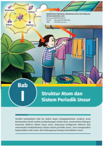

> **Deskripsi Visual:** Gambar ini adalah ilustrasi yang menunjukkan struktur atom dan sistem periode unsur dalam buku pelajaran. Gambar ini menggambarkan dua hal utama:

1. Struktur Atom: Ilustrasi ini menunjukkan struktur atom dengan atom-atom bergerak melalui ruang yang dikelilingi oleh elektron. Elektron-ekat ini bergerak dalam orbit- orbit yang berbeda.

2. Sistem Periode Unsur: Gambar ini juga menunjukkan sistem periode unsur dengan beberapa unsur yang terletak di setiap baris dan kolom. Setiap unsur memiliki nomor periode dan nomor kelompok yang ditunjukkan pada gambar.

Teks, angka, atau label penting yang terlihat dalam gambar ini antara lain:

- Nama bab: Bab 1
- Judul bab: Struktur Atom dan Sistem Periode Unsur
- Nama penulis: Dr. H. M. A. M. H. M. A. M. H. M. A. M. H. M. A. M. H. M. A. M. H. M. A. M. H. M. A. M. H. M. A. M. H. M. A. M. H. M. A. M. H. M. A. M. H. M. A. M. H. M. A. M. H. M. A. M. H. M. A. M. H. M. A. M. H. M. A. M. H. M. A. M. H. M. A. M. H. M. A. M. H. M. A. M. H. M. A. M. H. M. A. M. H. M. A. M. H. M. A. M. H. M. A. M. H. M. A. M. H. M. A. M. H. M. A. M. H. M. A. M. H. M. A. M. H. M. A. M. H. M. A. M. H. M. A. M. H. M. A. M. H. M. A. M. H. M. A. M. H. M. A. M. H

### Sampul Bab

Berisi gambar yang terkait materi bab yang akan dipelajari disertai dengan tujuan mempelajari bab tersebut. Cobalah untuk memahami apa kaitan gambar tersebut terhadap judul bab yang akan kalian pelajari.

 

---
## 📄 Halaman 12

### Mind Map

Berisikan pembagian topik utama suatu bab ke dalam sub-subtopik sebagai pemetaan pembelajaran yang akan kalian pelajari. Dengan demikian, hal ini akan membantu kalian memahami konsep suatu bab secara menyeluruh.

---
**🖼️ Gambar/Diagram**

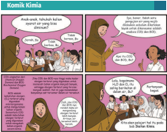

> **Deskripsi Visual:** Gambar ini adalah ilustrasi yang menunjukkan berbagai situasi dalam kehidupan sehari-hari, masing-masing dengan narasi yang berbeda. Ilustrasi ini mencakup empat panel yang menggambarkan peristiwa-peristiwa yang berbeda, masing-masing dengan karakter yang berbeda dan dialog yang berbeda.

Pertama, panel pertama menunjukkan seorang wanita yang sedang berbicara kepada beberapa orang. Warna hijau pada tubuhnya menunjukkan bahwa dia sedang merasa panas. Dalam dialognya, ia menyampaikan bahwa dia merasa panas dan ingin minum air.

Panel kedua menunjukkan seorang pria yang sedang berjalan-jalan sambil berbicara dengan orang lain. Dia tampak sangat panas dan berusaha untuk menenangkan diri dengan berbicara.

Panel ketiga menunjukkan seorang anak yang sedang bermain di taman. Dia tampak sangat panas dan berusaha untuk menenangkan diri dengan bermain.

Panel keempat menunjukkan seorang ibu yang sedang berbicara kepada anak-anaknya. Dia menyampaikan bahwa dia merasa panas dan ingin minum air.

Dalam setiap panel, elemen-elemen utama adalah karakter dan dialog mereka. Dialog tersebut membantu menjelaskan situasi dan perasaan karakter. Informasi kunci yang dapat diambil pembaca adalah bahwa semua karakter dalam gambar tersebut merasa panas dan ingin minum air.

Berisikan beragam kegiatan yang dapat mendukung proses pembelajaran selain dari penyampaian materi oleh guru. Mulai dari kegiatan berdiskusi di dalam kelas hingga percobaan di laboratorium. Diharapkan kalian dapat berpartisipasi aktif dalam kegiatan tersebut.

---
**🖼️ Gambar/Diagram**

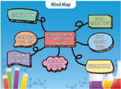

> **Deskripsi Visual:** Gambar ini adalah mind map yang menunjukkan struktur dan konten dari sebuah buku pelajaran. Mind map ini terdiri dari berbagai elemen utama yang terhubung dengan garis-garis merah dan warna-warna lainnya. Elemen utama termasuk "Mengenal Buku", "Menyusun Buku", "Menulis Buku", "Membaca Buku", dan "Menghargai Buku". Setiap elemen memiliki sub-elemen yang lebih detail, seperti "Mengenal Buku" yang mencakup "Mengenal Judul", "Mengenal Penulis", dan "Mengenal Tema". Sub-elemen ini membentuk hubungan hierarkis yang jelas antara elemen-elemen utama dan sub-elemen.

Teks, angka, atau label penting yang terlihat pada mind map meliputi judul "Mind Map", nama-nama elemen utama seperti "Mengenal Buku", "Menyusun Buku", dll., serta sub-elemen yang disertakan dalam setiap elemen utama. Informasi kunci yang dapat diambil pembaca meliputi struktur topik dalam buku pelajaran, bagaimana topik-topik tersebut terkait satu sama lain, dan bagaimana pembaca dapat memahami dan mengikuti struktur pembelajaran yang ditawarkan oleh buku tersebut. Mind map ini sangat berguna untuk membantu pembaca memahami struktur dan konten buku pelajaran secara cepat dan efektif.

### Komik Kimia

Berisi fenomena sehari-hari yang ber  kaitan dengan bab yang akan dipelajari. Melalui komik ini diharapkan dapat memancing rasa ingin tahu kalian untuk lebih mendalami isi materi bab ini.

Bagaimana caramembuktikanadanyaunsurkarbondanhidrogen dalam suatusenyawa?Cobakalianlakukanaktivitasberikutini.

- Rangkailah alatsepertigambardi samping.Gunakan bahan-bahanyang tidakterpakaiataubeliyangpaling murah.
- Lakukanpercobaaninidanamati perubahanyangterjadi.
- Tuliskanpersamaanreaksiyangterjadi.
- Apayangdapatkaliansimpulkan dari percobaan ini?

 

---
## 📄 Halaman 13

Maricekpemahamankaliandenganmengerjakanlatihanberikut ini.

- Tentukanrumusempirisdari senyawayangdisusun oleh:
- a.63,6% besi dan 36,4 belerang
- b.53,3%oksigen,40%karbon,dan6,7%hidrogen
- Polimer adalah senyawa berbentuk rantai molekul panjang dan berulangyang dihubungkan oleh ikatan kovalenmelaluiproses polimerisasi.Polimer sangatbanyakkegunaannya dalamkehidupan, misalnya bahan kaos,panci antilengket, dan pipa Pvc.Tentukan rumusempirisdaripolimerberikutini!
- Polietilenyangtersusunatas86%karbondan14%hidrogen
- b.Polistirenyang tersusun dari 92,3%karbon dan7,7%hidrogen
- Untuk diversifikasi produk,sebuah produsen pewarna tekstil mengembangkan zatwarna baru.Zatwarna inimemiliki komposisi 75,95% C,17,72% N,dan 6,33%H.Tentukan rumus molekul dari zat warna inijikamassamolarnyaadalah480g.mol-!
Pada akhir bab kalian akan disajikan informasi tambahan terkait materi yang sudah dipelajari. Bagian ini tentu akan memperkaya wawasan kalian. Selain itu, cobalah untuk mencari informasi lebih jauh melalui internet atau sumber belajar lainnya.

Partikel dasar penyusun atom adalah proton,neutron,dan elektron. Protonsebagaipenyusunintiatomyangbermuatanpositifdikelilingioleh elektronyangbergerakdalamlintasannya.Sistemperiodikunsurbentuk panjangmenjelaskanbahwa unsur-unsur disusunberdasarkankenaikan nomor atom.Sifat keperiodikan suatu unsur terdiri atas jari-jari atom, energi ionisasi,afinitas elektron,dan keelektronegatifan.Jari-jari atom semakinmengecildengan bertambahnyajumlahprotondanelektron valensipadakulit yangsamadanbertambahseiringbertambahnyajumlah kulit.Energi ionisasi,afinitas elektron,dan keelektronegatifan semakin bertambahdenganturunnyajari-jariatomdanberkurangdengannaiknya jari-jariatom.Sifatkeperiodikan unsursangatmemengaruhi kereaktifan suatu unsur.Unsuryangmudahmelepaskanataumenerimaelektron memilikikereaktifanyangbesarkarenamudahbereaksidenganunsur lainnya.Kereaktifan suatu unsur dapat diaplikasikan pada berbagai bidangkehidupan.

### Ayo Berlatih

Berisi soal-soal latihan sesuai dengan subbab yang dipelajari. Soal-soal ini diharapkan dapat melatih kemampuan kalian dalam memahami konsep yang sudah dipelajari. Cobalah untuk menyelesaikannya seorang diri dan banyaklah berlatih. Apabila ada kesulitan mintalah petunjuk pada gurumu.

Pengayaan

Materialterkerasternyatatersusunatasatomnonlogam

Intanmerupakan salah satumineralyang terdapat di Indonesia.Secara alami,intan terbentukmelaluiprosesyangsangatpanjang. Intanmemilikiikatanantaratomkarbonyang sangatkuat dantidak adaatompengotor lainnya,sertioksigen,sufur,danhidrogn

Meskipun hanya terdiri atas atomkarbon, susunanyangsangatkuat antaratomnyamenjadikanintansebagaimaterialyangsangat keras.Kekerasan intan mencapai 10 mohs. Nilai ini merupakan standarkekerasanyang

tertinggi.Berkatkekerasannya membuatintanbanyak digunakan sebagai menjadikan struktur atomiknyakuat.Strukturyangsangatteratur ini juga sebagaiperhiasan,sehingga dikenal denganistilahbatu mulia.

Coba temukancontohminerallainyangkaliankenaldantentukanikatan apasajayangmembentuksenyawapenyusunnya?

### Inti Sari

Berisi ringkasan materi pada tiap-tiap bab yang berbentuk narasi. Dengan membacanya diharapkan kalian dapat mengingat kembali apa saja yang sudah dipelajari, termasuk konsep-konsep yang perlu penekanan sebagai bekal dalam mempelajari bab selanjutnya.

 

---
## 📄 Halaman 14

Bagian ini mengajak kalian untuk berpikir secara mendalam terkait materi yang sudah dipelajari dan mengidentiikasi kekurangannya, manfaat, dan sikap kalian setelah mempelajari materi tersebut. Sebaiknya kalian menyampaikan hal-hal yang menurut kalian masih sulit dipahami sebelum beralih pada bab selanjutnya.

Pilihlahjawabanyangpalingtepat!

- 1.Seorangpelajarmelakukanpercobaan dilaboratoriummengenaireaksi eksotermik dan endotermik.Datapercobaan yang iaperoleh sebagai berikut.
Berdasarkan data hasil percobaan,reaksi yangberlangsungsecara eksotermikadalahpercobaannomor...

- a.1dan3
- b.2dan5
- d.3dan5
- c.2dan4
- 2.Persamaan termokimiadibawahini yang merupakanreaksipenguraian standar adalah...
- LiOH（aq)-→Li'（aq)+OH-（aq) △H=+xkJ b. CaCO(s)-→CaO(s)+CO(g) △H=+ak] C. Ca(s)+C(s)+ 31 o（g)—→CaCO,（s) △H=-ykJ 2 d. 0（g) △H=-zk] e.NaNO,（aq)-→Na'（aq)+NO（aq) △H=+bkJ
- e.1dan4
Setelahmempelajarimateristrukturatomdansistemperiodikunsur,silakan kalianmerefleksidiri.Berilahceklis()padakolomYa/Tidakuntukpernyataan berikut ini.

---
**🖼️ Gambar/Diagram**

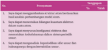

> **Deskripsi Visual:** Gambar ini adalah diagram yang menunjukkan struktur organisasi suatu perusahaan. Diagram ini terdiri dari beberapa elemen utama:

1. **Apa yang ditampilkan secara keseluruhan**: Diagram ini menunjukkan struktur organisasi sebuah perusahaan dengan berbagai departemen dan jabatan yang terorganisir dalam struktur hierarkis.

2. **Elemen-elemen utama dan relasinya**: 
   - **Departemen** (seperti Departemen Pemasaran, Departemen Produksi, Departemen Human Resources) terletak di bagian bawah diagram.
   - **Jabatan** (seperti Manajer, Kepala Unit, Karyawan) terletak di atas departemen.
   - **Relasi** antara departemen dan jabatan melalui garis lurus yang menghubungkan mereka, menunjukkan hubungan hierarkis dan tanggung jawab.

3. **Teks, angka, atau label penting yang terlihat**: 
   - Ada teks yang memberikan nama-nama departemen dan jabatan.
   - Angka-angka mungkin menunjukkan tingkat hierarki atau posisi dalam struktur organisasi.
   - Label penting lainnya mungkin merujuk pada fungsi-fungsi departemen atau jabatan.

4. **Informasi kunci yang dapat diambil pembaca**: 
   - Diagram ini memberikan gambaran umum tentang struktur organisasi perusahaan, menunjukkan bagaimana departemen dan jabatan terorganisir dalam struktur hierarkis.
   - Pembaca dapat memahami hubungan antara departemen dan jabatan serta tanggung jawab mereka dalam organisasi tersebut.

Dengan demikian, diagram ini sangat berguna untuk memvisualisasikan struktur organisasi dan hubungan antar departemen dan jabatan dalam suatu perusahaan.

Menurutkalianmaterimanakahyangsulit untukdipahamidalambabstruktur atomdansistemperiodikunsur?Jelaskanalasannya?

### Ayo Cek Pemahaman

Pada akhir bab, kalian akan disajikan berbagai pertanyaan terkait materi pada bab tersebut. Pertanyaan-pertanyaan tersebut dimunculkan dalam berbagai variasi soal, tidak hanya untuk mengakses pengetahuan, tetapi juga kemampuan literasi sains dan numerasi kalian. Banyaklah berlatih dari sumber buku lain agar kalian lebih siap dalam menghadapi ujian kelak.

 

---
## 📄 Halaman 15

Kimia untuk SMA/MA Kelas XI

Penulis

: Munasprianto Ramli, dkk.

ISBN

: 978-602-427-923-3 (jil.1)

---
**🖼️ Gambar/Diagram**

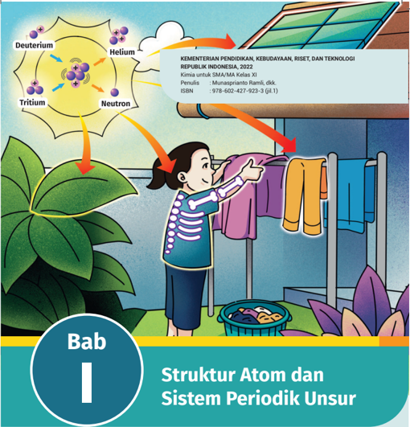

> **Deskripsi Visual:** Gambar ini adalah ilustrasi yang menunjukkan struktur atom dan sistem periodik unsur. Gambar ini terdiri dari beberapa elemen utama:

1. **Struktur Atom**: Gambar ini menggambarkan struktur atom dengan menggunakan warna-warna yang berbeda untuk menunjukkan jenis atom. Atom-atom tersebut terdiri dari proton, neutron, dan elektron.

2. **Sistem Periodik Unsur**: Gambar ini juga menunjukkan sistem periodik unsur, yang terdiri dari baris dan kolom yang menggambarkan urutan dan karakteristik unsur-unsur kimia.

3. **Penggunaan Ilustrasi**: Ilustrasi ini digunakan untuk menjelaskan konsep-konsep kimia dasar, seperti struktur atom dan sistem periodik unsur, kepada siswa SMA/MA Kelas XI.

4. **Informasi Kunci**: Gambar ini memberikan gambaran umum tentang struktur atom dan sistem periodik unsur, serta bagaimana mereka saling berkaitan dalam teori kimia.

Dengan menggunakan ilustrasi ini, pembaca dapat memahami konsep-konsep kimia dasar dengan cara yang lebih mudah dan visual.

Setelah  mempelajari  bab  ini,  kalian  dapat  menggambarkan  struktur  atom berdasarkan hasil analisis perkembangan model atom, menentukan bilangan kuantum  elektron  dalam  suatu  atom,  menyusun  konigurasi  elektron  dan menentukan kedudukannya dalam sistem periodik unsur, serta menganalisis keperiodikan sifat unsur dan hubungannya dengan kereaktifan unsur.

Bab I

Struktur Atom dan Sistem Periodik Unsur

1

 

---
## 📄 Halaman 16

---
**🖼️ Gambar/Diagram**

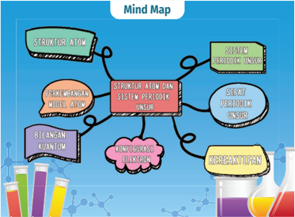

> **Deskripsi Visual:** Gambar ini adalah mind map yang menunjukkan topik-topik penting dalam bidang kimia, khususnya fokus pada struktur atom dan sistem periodik unsur. Mind map ini terdiri dari berbagai elemen yang terhubung dengan garis-garis untuk menunjukkan hubungan antara topik-topik tersebut.

Elemen utama yang ditampilkan meliputi:
1. Struktur Atom
2. Model Atom
3. Bilangan Kuantum
4. Konfigurasi Elektron
5. Sistem Periodik Unsur
6. Struktur Periodik Unsur

Relasi antara elemen-elemen ini sangat jelas melalui garis-garis yang menghubungkan mereka. Misalnya, "Struktur Atom" terhubung langsung dengan "Model Atom", sementara "Bilangan Kuantum" dan "Konfigurasi Elektron" terhubung dengan "Struktur Atom".

Teks, angka, atau label penting yang terlihat termasuk:
- "Struktur Atom"
- "Model Atom"
- "Bilangan Kuantum"
- "Konfigurasi Elektron"
- "Sistem Periodik Unsur"
- "Struktur Periodik Unsur"

Informasi kunci yang dapat diambil pembaca meliputi:
- Topik-topik utama dalam kimia, seperti struktur atom dan sistem periodik unsur.
- Hubungan antara struktur atom dan model atom.
- Pentingnya bilangan kuantum dan konfigurasi elektron dalam struktur atom.
- Konsep dasar sistem periodik unsur dan struktur periodik unsur.

Dengan demikian, mind map ini memberikan pemahaman umum tentang struktur atom dan sistem periodik unsur dalam kimia, serta menjelaskan hubungan antara topik-topik tersebut.

### Komik Kimia

---
**🖼️ Gambar/Diagram**

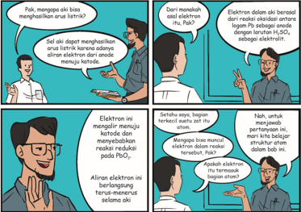

> **Deskripsi Visual:** Gambar ini adalah ilustrasi yang menunjukkan proses reaksi kimia antara elektrolit dan alam elektron dalam reaksi redoks. Gambar ini terdiri dari empat panel yang masing-masing menjelaskan bagaimana elektrolit menghasilkan listrik dan bagaimana alam elektron bergerak dalam reaksi tersebut.

Elemen utama dalam gambar ini meliputi:
1. Elektrolit (dalam bentuk molekul)
2. Alam elektron
3. Reaksi redoks
4. Elektron dalam bentuk molekul

Relasi antara elemen-elemen ini adalah bahwa elektrolit menghasilkan listrik yang kemudian digunakan oleh alam elektron untuk bergerak dalam reaksi redoks. Elektron dalam bentuk molekul adalah hasil dari reaksi tersebut.

Teks penting dalam gambar ini meliputi:
- "Elektron dalam bentuk molekul adalah hasil dari reaksi redoks"
- "Alam elektron bergerak terus-menerus selama reaksi redoks"

Informasi kunci yang dapat diambil pembaca adalah bahwa proses reaksi redoks melibatkan elektrolit yang menghasilkan listrik, yang kemudian digunakan oleh alam elektron untuk bergerak dalam reaksi tersebut.

 

---
## 📄 Halaman 17

---
**🖼️ Gambar/Diagram**

> **Deskripsi Visual:** Gambar ini adalah ilustrasi yang menampilkan pemandangan alam yang indah. Gambar ini menunjukkan sebuah hutan dengan pohon besar yang tumbuh di tepi jalan. Di sekeliling pohon tersebut, terdapat tanaman liar berwarna putih yang tampak seperti bunga matahari. Latar belakangnya adalah hamparan rumput hijau yang lembut dan terang, dengan sinar matahari yang menghiasi permukaan tanah. Pada bagian atas gambar, terlihat sinar matahari yang bersinar dengan cerah, menambah keindahan dan kehangatan pada gambar tersebut.

Elemen-elemen utama dalam gambar ini adalah pohon besar, tanaman liar berwarna putih, dan tanah yang berwarna hijau. Pohon besar ini menjadi pusat perhatian karena ukurannya yang besar dan warnanya yang kaya. Tanaman liar berwarna putih tampak seperti bunga matahari, menambah keindahan alam yang diperlihatkan dalam gambar. Tanah yang berwarna hijau menunjukkan kelembaban dan kehidupan yang ada di area tersebut.

Teks, angka, atau label penting yang terlihat dalam gambar ini tidak ada. Namun, informasi kunci yang dapat diambil pembaca adalah tentang keindahan alam yang diperlihatkan dalam gambar tersebut, yaitu pemandangan hutan dengan tanaman liar berwarna putih dan sinar matahari yang menghiasi permukaan tanah.

Sumber: Larisa-K/pixabay.com (2014)

Apakah hari ini cuacanya cerah dan matahari bersinar dengan hangat?  Kita perlu bersyukur sampai dengan hari ini matahari masih bersinar. Makhluk hidup sangat membutuhkan matahari untuk kelangsungan hidup, contohnya tumbuhan hijau, memerlukan matahari untuk fotosintesis. Tumbuhan hijau adalah produsen pada rantai makanan, penyedia bahan makanan bagi hewan dan manusia. Salah satu manfaat sinar matahari pagi bagi manusia adalah dapat  memicu  sintesis  vitamin  D  dalam  tubuh  secara  alami.  Terbentuknya vitamin  D  secara  alami  dipercaya  dapat  meningkatkan  kekebalan  tubuh. Namun, dalam kuantitas yang berlebih, matahari juga memiliki efek negatif bagi  tubuh.  Beberapa  efek  negatif  dari  sinar  matahari,  antara  lain  kulit terbakar, penuaan dini, dan kanker kulit.

Dari manakah asal sumber energi matahari? Materi apa yang terdapat di dalam matahari? Hidrogen merupakan unsur terbesar yang terdapat di dalam matahari.  Setelahnya  terdapat  unsur  helium.  Empat  atom  hidrogen  akan membentuk satu atom helium. Massa unsur helium lebih besar dibandingkan hidrogen, sehingga helium menyumbangkan massa terberat pada matahari meskipun  kelimpahannya  lebih  sedikit  dibandingkan  hidrogen.  Bagaimana kalian mengetahui nomor atom dan nomor massa dari unsur hidrogen dan helium?

 

---
## 📄 Halaman 18

### A.  Struktur Atom

Menurut kalian, apakah kata 'peralatan elektronik' berasal dari kata elektron? Siapa penemu elektron dan bagaimana elektron ditemukan?

Tahun  1807,  John  Dalton  menyatakan  atom  sebagai  partikel  terkecil penyusun suatu materi. Atom tidak dapat dibagi lagi, tidak dapat diciptakan, dan tidak dapat dimusnahkan. Atom dalam suatu unsur memiliki sifat yang sama dalam segala hal (ukuran, bentuk, dan massa). Namun, menurut teori atom modern, atom dipecah lagi menjadi partikel-partikel dasar, yaitu proton, neutron, dan elektron, seperti terlihat pada Gambar 1.2.

---
**🖼️ Gambar/Diagram**

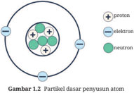

> **Deskripsi Visual:** Gambar 1.2 adalah ilustrasi yang menunjukkan struktur partikel dasar atom. Gambar ini menggambarkan atom sebagai sebuah bola yang terdiri dari beberapa komponen utama: proton, elektron, dan neutron. Proton dan neutron berada di dalam bintang putih yang dikenal sebagai nukleus atom, sementara elektron bergerak di sekitar nukleus dalam orbit- orbit yang berbeda. Proton dan neutron memiliki pola positif, sedangkan elektron memiliki pola negatif. Label pada gambar tersebut membantu pembaca memahami hubungan antara partikel-partikel ini dalam struktur atom. Gambar ini memberikan gambaran yang jelas tentang bagaimana atom terdiri dari partikel dasarnya dan bagaimana mereka berinteraksi satu sama lain.

Sumber: Kemendikbudristek/Nanda Saridewi (2022)

### 1. Elektron

Keberadaan elektron  dalam  atom  dapat  dijelaskan  melalui  ilustrasi  tabung katode yang terdapat pada perangkat televisi berikut.

---
**🖼️ Gambar/Diagram**

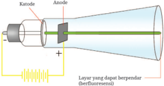

> **Deskripsi Visual:** Gambar ini adalah ilustrasi yang menunjukkan struktur dan cara kerja sebuah lampu katoda. Gambar ini menggambarkan dua elemen utama: katoda dan anode. Katoda diletakkan di sebelah kiri dan anode di sebelah kanan. Antara kedua elemen tersebut ada sebuah cahaya biru yang menunjukkan arah sinar yang dihasilkan oleh lampu ini. Di sebelah atas, terdapat tulisan "Kattode" untuk katoda dan "Anode" untuk anode. Di sebelah bawah, terdapat tulisan "Layar yang dapat berpindah (berfluoresensi)" yang menjelaskan bahwa lampu ini memiliki layar yang dapat berubah warna. Ini menunjukkan bahwa lampu ini mampu menghasilkan sinar berwarna yang berubah sesuai dengan input yang diterimanya.

Sumber: Kemendikbudristek/Nanda Saridewi (2022)

 

---
## 📄 Halaman 19

Tabung  katode  merupakan  salah  satu  perangkat  pada  televisi  yang berfungsi menghasilkan pencitraan gambar dan suara. Sinar katode menjadi sebuah  dasar  penemuan  elektron  yang  kali  pertama  ditemukan  oleh  Karl Braun.  Tabung  sinar  katode  berupa  tabung  hampa  dari  kaca.  Di  dalamnya terdapat anode sebagai kutub positif dan katode sebagai kutub negatif. Saat tabung katode diberi aliran listrik,  terjadi  aliran  radiasi  yang  tidak  terlihat dari kutub negatif ke kutub positif.

Lebih  lanjut,  pada  tahun  1879,  William  Crookes  menyempurnakan penemuan sinar  katode.  W.  Crookes  menemukan  bahwa  sifat  sinar  katode tidak dipengaruhi oleh jenis kawat yang digunakan, jenis gas dalam tabung, dan bahan yang digunakan dalam menghasilkan arus listrik. Sinar katode juga merambat lurus dari kutub negatif ke kutub positif, serta dapat dibelokkan oleh medan magnet dan listrik, seperti tampak pada gambar berikut.

---
**🖼️ Gambar/Diagram**

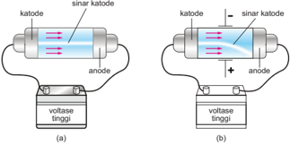

> **Deskripsi Visual:** Gambar ini adalah ilustrasi yang menunjukkan dua jenis lampu katoda panas (Thermionic Cathode Lamp) dengan perbedaan arah sinar katode. Ilustrasi ini memperlihatkan dua lampu katoda panas yang berbeda arah sinarnya. Pada gambar (a), sinar katode bergerak dari anode ke katode, sementara pada gambar (b), sinar katode bergerak dari katode ke anode. Kedua lampu ini memiliki katode, anode, dan voltase tinggi yang terhubung melalui kabel. Label "katode", "sinar katode", "anode", dan "voltase tinggi" digunakan untuk menjelaskan komponen-komponen utama dan arah sinarnya. Gambar ini membantu pembaca memahami konsep dasar tentang arah sinar katode dalam lampu katoda panas.

Penemuan elektron ini lebih lanjut dikembangkan oleh Joseph Thomson. Thomson menemukan bahwa materi yang terdapat pada sinar katode sangatlah  kecil.  Sinar  katode  merupakan  partikel  penyusun  atom  yang  memiliki muatan negatif. Namun, atom bermuatan netral, sehingga menurut Thomson atom terdiri atas partikel yang bermuatan positif dan negatif. Atom dianggap sebagai bola pejal yang bermuatan positif dengan partikel bermuatan negatif yang tersebar di dalamnya. Model atom yang dikemukakan Thomson dikenal dengan roti kismis, seperti terlihat pada Gambar 1.5.

 

---
## 📄 Halaman 20

### 2. Proton

Proton  kali  pertama  pertama  ditemukan  oleh  Eugene  Goldstein  melalui penemuan  sinar  kanal.  Sinar  kanal  adalah  sinar  yang  memiliki  arah  yang berlawanan  dengan  sinar  katode.  Ketika  katode  dilubangi,  ada  sinar  yang melewati lubang tersebut pada arah yang berlawanan dengan sinar katode, seperti  terlihat  pada  Gambar  1.6.  Lebih  lanjut,  Wilhelm  Wien  menemukan bahwa sinar kanal tersebut bermuatan positif yang kemudian disebut dengan proton.

---
**🖼️ Gambar/Diagram**

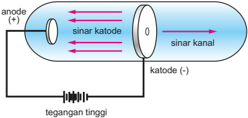

> **Deskripsi Visual:** Gambar ini adalah ilustrasi yang menunjukkan mekanisme sirkuit listrik. Gambar ini menggambarkan sebuah sirkuit listrik dengan anode (+) dan katode (-) yang terhubung ke tegangan tinggi. Sinar-katode (sinar positif) dan sinar kanal (sinar negatif) juga ditunjukkan dalam gambar. Anode dan katode berada di kedua ujung sirkuit, sedangkan sinar-katode dan sinar kanal berada di antara mereka. Teks, angka, atau label penting yang terlihat pada gambar meliputi "anode (+)", "katode (-)", "tegangan tinggi", "sinar katode", dan "sinar kanal". Informasi kunci yang dapat diambil pembaca adalah bahwa sirkuit ini menggunakan tegangan tinggi untuk menghasilkan sinar positif dan sinar negatif.

Posisi proton di dalam atom dijelaskan melalui percobaaan yang dilakukan oleh Ernest Rutherford. Rutherford menembakkan partikel alfa ke lempeng emas tipis, seperti yang terlihat pada Gambar 1.7. Dari percobaan tersebut, ditemukan sebagian besar sinar diteruskan (sinar lurus). Hal ini menunjukkan

---
**🖼️ Gambar/Diagram**

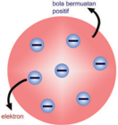

> **Deskripsi Visual:** Gambar ini adalah ilustrasi yang menunjukkan struktur atom. Secara keseluruhan, gambar ini menunjukkan bagaimana elektron bergerak di sekitar atom. Elektron diperlihatkan dengan warna biru dan bergerak dalam orbit- orbit yang berbeda. Bola berwarna biru yang lebih besar menunjukkan pusat atom, yang terdiri dari proton dan neutron. Proton dan neutron diperlihatkan dengan warna merah dan hijau murni, masing-masing berada di pusat atom. Label "elektron" dan "bola berwarna biru" menunjukkan posisi dan jumlah elektron dalam atom tersebut. Informasi kunci yang dapat diambil pembaca adalah bahwa atom terdiri dari proton, neutron, dan elektron, dan elektron bergerak di sekitar pusat atom.

Sumber: Kemendikbudristek/Nanda Saridewi (2022)

 

---
## 📄 Halaman 21

bahwa bagian dalam atom sebagian besar berupa ruang hampa, bukan bola pejal yang bermuatan positif seperti yang dijelaskan oleh Thomson. Adanya sebagian kecil sinar yang dibelokkan dan dipantulkan dapat menggambarkan bahwa di dalam atom terdapat inti bermuatan positif yang sangat kecil dan dikelilingi elektron bermuatan negatif.

---
**🖼️ Gambar/Diagram**

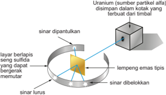

> **Deskripsi Visual:** Gambar ini adalah ilustrasi yang menunjukkan proses pemisahan uranium menggunakan kolom alfa. Gambar ini menggambarkan struktur dan proses pemisahan uranium melalui kolom alfa. 

1. **Apa yang Ditampilkan Secara Keseluruhan**: Gambar ini menunjukkan struktur kolom alfa yang terdiri dari lapisan berlapis sulfida uranium, lapisan emas tipis, dan lapisan partikel alfa yang dipantulkan. Kolom alfa ini disimpan dalam kolom yang terbuat dari timbal.

2. **Elemen-Elemen Utama dan Relasinya**: 
   - **Kolom Alfa**: Kolom alfa terdiri dari lapisan berlapis sulfida uranium, lapisan emas tipis, dan lapisan partikel alfa yang dipantulkan.
   - **Lapisan Berlapis Sulfida Uranium**: Lapisan ini berfungsi untuk memisahkan uranium dari zat-zat lainnya.
   - **Lapisan Emas Tipis**: Lapisan emas ini digunakan untuk membatasi partikel alfa dan mengurangi kebisingan.
   - **Partikel Alfa**: Partikel alfa yang dipantulkan dari sumber partikel alfa.
   - **Kolom yang Terbuat dari Timbal**: Kolom ini digunakan untuk menahan partikel alfa dan zat-zat lainnya.

3. **Teks, Angka, atau Label Penting yang Terlihat**: 
   - **Uranium (sumber partikel alfa)**: Menunjukkan bahwa uranium adalah sumber partikel alfa.
   - **Sinar Dipantulkan**: Menunjukkan bahwa partikel alfa dipantulkan dari sumber partikel alfa.
   - **Sinar Lurus**: Menunjukkan bahwa sinar lurus diberlokkan.
   - **Lemperng Emas Tipis**: Menunjukkan bahwa lapisan emas tipis digunakan untuk membatasi partikel alfa.

4. **Informasi Kunci yang Dapat Diambil Pembaca**: Gambar ini memberikan informasi tentang proses pemisahan uranium menggunakan kolom alfa, termasuk struktur kolom alfa, lapisan berlapis sulfida uranium, lapisan emas tipis,

### 3. Neutron

Penemuan neutron bermula saat Rutherford meyakini bahwa ada materi lain di  dalam  atom.  Bermula  dari  adanya  perbedaan  massa  atom  hidrogen  dan helium.  Rutherford  menemukan  bahwa perbandingan massa hidrogen dan helium adalah 1 : 4, sementara perbandingan jumlah protonnya 1 : 2. Rutherford melakukan percobaan menggunakan partikel alfa yang ditembakkan ke logam boron. Logam boron menghasilkan radiasi, tetapi tidak dibelokkan oleh medan magnet maupun medan listrik. Artinya, radiasi tersebut merupakan materi penyusun  atom  yang  tidak  bermuatan  positif  maupun  negatif.  Rutherford menyatakan bahwa materi tersebut adalah neutron.

Jadi,  dalam  ketiga  percobaan  yang  telah  dijabarkan,  diketahui  bahwa ada tiga partikel penyusun sebuah atom, yaitu elektron, proton, dan neutron. Karakteristik ketiga partikel penyusun atom tersebut terangkum dalam Tabel 1.1.

 

---
## 📄 Halaman 22

---
**📊 Tabel**

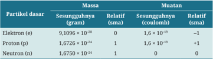

Tabel ini menunjukkan informasi tentang partikel dasar atom, termasuk massa, sesungguhnya, muatan, dan relatif muatan. Partikel dasar yang disebutkan dalam tabel meliputi elektron, proton, dan neutron. Massa partikel dasar berbeda-beda, dengan elektron memiliki massa paling kecil sekitar 1,016 x 10^-28 gram, proton memiliki massa sedang sekitar 1,6726 x 10^-24 gram, dan neutron memiliki massa paling besar sekitar 1,6750 x 10^-24 gram. Sesungguhnya partikel dasar juga berbeda, dengan elektron memiliki sesungguhnya sekitar 1,6 x 10^-19 coulomb, proton memiliki sesunguhnya yang sama, yaitu 1,6 x 10^-19 coulomb, dan neutron memiliki sesungguhnya nol. Muatan partikel dasar juga berbeda, dengan elektron memiliki muatan negatif satu, proton memiliki muatan positif satu, dan neutron memiliki muatan nol. Ini menunjukkan bahwa partikel dasar memiliki massa, sesungguhnya, dan muatan yang berbeda-beda, yang merupakan karakteristik unik setiap partikel.

### 4. Notasi atom

Pernahkah  kalian  mendengar  tentang  penemuan  artefak?  Bagaimana  cara peneliti menentukan umur artefak tersebut? Artefak dapat ditentukan umurnya  menggunakan  isotop.  Isotop  akan  dijelaskan  pada  materi  notasi  atom. Seperti  yang  telah  dipelajari  pada  pelajaran  Ilmu  Pengetahuan  Alam  kelas X, bahwa notasi atom terdiri atas lambang unsur, nomor massa, dan nomor atom.  Notasi  atom  adalah  identitas  sebuah  atom  yang  membedakan  atom unsur yang satu dengan atom unsur lainnya.

Apakah ada dua unsur atau lebih dapat memiliki nomor atom yang sama? Nomor atom menunjukkan jumlah proton dan elektron. Karena atom tidak bermuatan maka jumlah proton sama dengan elektron. Proton merupakan penyusun inti sebuah atom suatu unsur. Jumlah proton dalam sebuah atom berbeda dengan atom unsur lainnya. Jadi, nomor atom adalah identitas utama sebuah unsur.

Nomor massa merupakan jumlah proton ditambah neutron. Ada atomatom dari unsur yang sama memiliki nomor massa yang berbeda. Artinya, atom-atom tersebut memiliki nomor atom yang sama, tetapi nomor massanya berbeda. Atom-atom ini disebut dengan isotop . Contoh isotop adalah karbon dengan nomor massa 12 ( 12 C) dan nomor massa 14 ( 14 C). Nomor atomnya sama, yaitu 6, karena unsurnya sama, yaitu karbon. Isotop  14 C biasanya digunakan sebagai pendeteksi umur fosil dan artefak.

Atom-atom unsur yang memiliki nomor massa yang sama, tetapi nomor atomnya  berbeda  disebut  dengan isobar .  Contoh  isobar  adalah 40 19 Kdan 40 20 Ar . Unsur kalium dan argon memiliki nomor massa yang sama, yaitu 40. Sementara unsur yang memiliki jumlah neutron yang sama disebut dengan isoton , contohnya 23 11Na dan 12 24 Mg . Natrium dan magnesium memiliki jumlah neutron yang sama, yaitu 12.

 

---
## 📄 Halaman 23

### 5. Tingkat energi

Model  atom  Rutherford  memiliki  kelemahan  dalam  menjelaskan  posisi elektron pada atom. Tahun 1913, Niels Bohr melakukan percobaan untuk memperbaiki kelemahan model atom Rutherford tersebut. Bohr menggabungkan teori Rutherford dan hipotesis Planck yang dikenal dengan Postulat Bohr. Bohr menemukan bahwa setiap unsur memberikan spektrum garis yang berbeda dan bersifat khas. Bohr mengemukakan empat postulat, yaitu:

- Elektron  mengelilingi  inti  atom  dalam  orbit  tertentu.  Orbit  merupakan lintasan  gerak  stasioner  elektron  dalam  mengelilingi  inti  dengan  jarak tertentu. Setiap lintasan yang dipakai oleh elektron diberikan nomor 1, 2, 3, dan seterusnya. Lintasan ini juga menyatakan jumlah kulit atom atau tingkat energi .
- Energi elektron tetap selama berada di dalam lintasannya.
- Elektron  hanya  dapat  berpindah  dari  satu  lintasan  ke  lintasan  lainnya, serta menyerap dan melepaskan energi sesuai konstanta Planck:

``

Δ E = energi (J)

h = konstanta Planck (6,63 × 10 -34  J.detik -1 )

ʋ = frekuensi (hertz atau detik -1 )

Tingkat energi dari lintasan satu dibanding lintasan yang lainnya dapat dilihat pada Gambar 1.8.

- Lintasan elektron memiliki momentum sudut.

---
**🖼️ Gambar/Diagram**

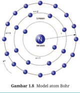

> **Deskripsi Visual:** Gambar 1.8 adalah ilustrasi yang menunjukkan model atom Bohr. Gambar ini menggambarkan struktur atom dengan empat lapisan elektron yang bergerak dalam orbit- orbit yang berbeda. Elektron- elektron ini dikelompokkan dalam orbit- orbit yang berurutan dari dalam ke luar, yaitu orbit 1, 2, 3, dan 4. Setiap orbit memiliki jumlah elektron yang berbeda, dengan orbit 1 memiliki satu elektron, orbit 2 memiliki dua elektron, orbit 3 memiliki tiga elektron, dan orbit 4 memiliki empat elektron. Label "n" pada setiap orbit menunjukkan nomor orbit tersebut. Informasi ini membantu pembaca memahami struktur dasar atom dan bagaimana elektron- elektron berada dalam orbit- orbit mereka.

Sumber: Kemendikbudristek/Nanda Saridewi (2022)

 

---
## 📄 Halaman 24

Elektron-elektron  akan  menempati  kulit  pertama  (K)  sampai  penuh  (2 elektron),  kemudian  mengisi  kulit  L  (8  elektron),  dan  seterusnya  (Gambar 1.8). Jumlah elektron yang menempati kulit terluar disebut dengan elektron valensi .  Namun,  model  atom  Bohr  memiliki  kelemahan,  yakni  tidak  dapat menjelaskan  efek  Zeeman.  Efek  Zeeman  menjelaskan  pembelahan  garis spektrum menjadi dua komponen atau lebih yang berbeda frekuensi ketika atom  berada  dalam  medan  magnet.  Meskipun  begitu,  teori  Bohr  dipakai sebagai acuan oleh para ilmuwan dan melahirkan teori atom modern, yaitu teori mekanika kuantum.

- Bagaimana Rutherford membuktikan adanya neutron pada atom?
- Bagaimana model atom Bohr menjelaskan posisi elektron dalam suatu atom?

### B.  Teori Atom Mekanika Kuantum

Teori atom modern merupakan pengembangan dari teori atom Bohr. Model ini ditemukan oleh beberapa ilmuwan, yaitu Louis de Broglie, Wolfgang Pauli, Erwin Schrödinger, dan Werner Heisenberg. Louis de Broglie pada tahun 1924 menyatakan  bahwa  partikel  kecil  mempunyai  sifat  yang  berbeda  dengan benda besar. Cahaya dan partikel-partikel kecil selain dapat bersifat sebagai materi,  dapat  pula  bersifat  sebagai  gelombang.  Sifat  ini  dikenal  dengan dualisme partikel gelombang.

Model atom mekanika kuantum memiliki kriteria sebagai berikut.

- Lintasan atomnya tidak stasioner seperti model atom Bohr. Hal ini karena gerakan elektron memiliki sifat gelombang.
- Bentuk dan ukuran orbital (ruang dengan peluang tinggi untuk ditemukannya  elektron  dalam  suatu  atom)  bergantung  pada  harga bilangan kuantumnya ( dibahas setelah ini).
- Posisi elektron yang berhasil ditemukan oleh Bohr berjarak 0,529 angstrom dari  inti  hidrogen  bukan  berarti  sesuatu  yang  pasti,  tetapi  merupakan kebolehjadian ditemukannya elektron.

 

---
## 📄 Halaman 25

### 1. Bilangan kuantum

Posisi  elektron  merupakan  dasar  penentuan  struktur  atom.  Posisi  elektron dapat  digambarkan  melalui  model  atom  mekanika  kuantum  yang  dikenal dengan bilangan kuantum. Bilangan kuantum terdiri atas:

### a. Bilangan kuantum utama ( n )

Bilangan  kuantum  utama  menyatakan  kulit  tempat  elektron  berada atau tingkat energi elektron dalam suatu atom. Orbital dengan bilangan kuantum berbeda memiliki tingkat energi yang berbeda pula.

- Kulit K, bilangan kuantum ( n ) = 1
- Kulit L, bilangan kuantum ( n ) = 2
- Kulit M, bilangan kuantum ( n ) = 3
- dan seterusnya

### b. Bilangan kuantum azimut ( l )

Bilangan  kuantum  azimut  menyatakan  subkulit  atau  orbital.  Bilangan kuantum azimut biasa dinyatakan dalam sharp ( s ), principal ( p ), diffuse ( d ), dan fundamental ( f ).  Harga  bilangan  kuantum azimut dikaitkan dengan bilangan kuantum utama. Harga bilangan kuantum azimut dalam sebuah kulit bernilai 0 hingga ( n - 1).

- Bilangan kuantum azimut ( l ) = 0, subkulit s
- Bilangan kuantum azimut ( l ) = 1, subkulit p
- Bilangan kuantum azimut ( l ) = 2, subkulit d
- Bilangan kuantum azimut ( l ) = 3, subkulit f

### c. Bilangan kuantum magnetik ( m )

Bilangan kuantum magnetik menyatakan orientasi orbital. Harga bilangan kuantum magnetik bergantung pada bilangan kuantum azimut. Bilangan kuantum magnetik bernilai l hingga + l (termasuk 0). Pada kulit K dengan bilangan kuantum azimut l = 0, maka bilangan kuantum magnetiknya m = 0, artinya orientasi orbital s hanya 1. Sementara bilangan kuantum azimut l = 1 pada kulit L, memiliki tiga orientasi orbital, yaitu m = -1, m = 0, dan m = +1 ( px , p y , dan p z ).

- l = 0 maka m = 0
- l = 1 maka m = -1, 0, +1
- l = 2 maka m = -2, -1, 0, +1, +2
- dan seterusnya

 

---
## 📄 Halaman 26

### d. Bilangan kuantum spin ( s )

Bilangan  kuantum  spin  menyatakan  arah  putar  elektron  terhadap sumbunya saat elektron mengelilingi inti atom. Bilangan kuantum spin dilambangkan  dengan s ,  di  mana  nilai s =  +½  dan s =  -½.  Arah  putar elektron searah jarum jam dan berlawanan jarum, seperti yang terlihat pada Gambar 1.9.

---
**🖼️ Gambar/Diagram**

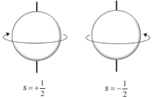

> **Deskripsi Visual:** Gambar ini adalah ilustrasi yang menunjukkan dua bentuk geometri sferis dengan radius yang sama tetapi berbeda. Pada gambar pertama, radius s dianggap sebagai \(\frac{1}{2}\), sedangkan pada gambar kedua, radius s juga diberikan sebagai \(\frac{1}{2}\). Ilustrasi ini menggunakan warna-warna yang berbeda untuk membedakan antara dua bentuk sferis tersebut. Dalam konteks pembelajaran, gambar ini mungkin digunakan untuk mengajarkan konsep tentang sfera dan hubungan antara radius dan luas permukaan sfera. Label "s = \(\frac{1}{2}\)" pada setiap gambar menunjukkan bahwa radius sumber adalah \(\frac{1}{2}\) dari jarak yang ditunjukkan. Informasi ini penting karena membantu pembaca memahami hubungan antara radius dan ukuran permukaan sfera.

### 2. Konigurasi elektron

Bohr menjelaskan bahwa inti atom dikelilingi oleh elektron. Elektron-elektron tersebut bergerak dalam lintasan-lintasan yang disebut dengan tingkat energi. Setiap tingkat energi hanya boleh ditempati maksimum 2 n 2   elektron. Untuk menjelaskan  penempatan  elektron  dalam  setiap  tingkat  energi  tersebut maka digunakan konigurasi elektron. Konigurasi elektron yang berdasarkan  model  atom  mekanika  kuantum  harus  mengikuti  tiga  aturan, yaitu:

### a. Asas larangan Pauli

Wolfgang Pauli pada tahun 1926 mengungkapkan bahwa tidak ada dua buah  elektron  dalam  orbital  yang  sama  memiliki  keempat  bilangan kuantum  yang  sama.  Aturan  ini  dikenal  dengan  asas  larangan  Pauli. Jumlah elektron yang menempati sebuah orbital paling banyak dua yang arahnya berlawanan.

Contoh:

tidak diizinkan

tidak diizinkan

diizinkan

disusun

 

---
## 📄 Halaman 27

### b. Aturan Aufbau

Elektron-elektron  cenderung  menempati  orbital  pada  tingkat  energi terendah.  Aturan  pengisian  dimulai  pada  energi  terendah  ini  dikenal dengan  aturan  Aufbau.  Pengisian  elektron  dalam  orbital  dimulai  dari orbital  dengan  tingkat  energi  paling  rendah.  Setelah  penuh,  pengisian berlanjut ke tingkat energi yang lebih tinggi, begitu seterusnya. Pola ini dapat dilihat pada gambar berikut.

### Contoh:

Konigurasi elektron untuk atom 23 V dan 33As

23 V  : 1

s 2 2 s 2 2 p 6 3 s 2 3 p 6 4 s 2 3 d 3

33 As : 1

s 2 2 s 2 2 p 6 3 s 2 3 p 6 4 s 2 3 d 10 4 p 3

### c. Kaidah Hund

Friedrich  Hund  pada  tahun  1927  menyatakan  bahwa  elektron-elektron yang berada di suatu orbital menempati orbital yang kosong dengan arah rotasi sejajar. Setelah semua orbital tersebut terisi satu elektron, elektronelektron  lainnya  menempati  orbital  tersebut  dengan  arah  rotasi  yang berlawanan.

Aturan  hanya  berlaku  bila  ada  alternatif  pengisian,  yaitu  orbital p , d , dan f yang tidak terisi penuh, sedangkan orbital yang penuh tidak boleh melanggar asas larangan Pauli. Contoh, 7 N dengan konigurasi elektron 1 s 2 2 s 2 2 p 3 , elektron valensinya 2 s 2 2 p 3 . Susunan yang lebih stabil terlihat pada Gambar 1.11.

 

---
## 📄 Halaman 28

7 N: [He] 2 s 2 2 p 3

### Diagram orbitalnya:

---
**🖼️ Gambar/Diagram**

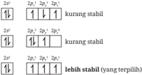

> **Deskripsi Visual:** Gambar ini adalah diagram yang menunjukkan struktur elektronik atom berdasarkan konfigurasi orbitel. Diagram ini memperlihatkan tiga jenis atom: 2s², 2p², 2p¹, 2p³, dan 2s², 2p², 2p³. Setiap jenis atom memiliki tiga orbitel yang berbeda, dengan orbitel 2s dan 2p yang berisi elektron. Untuk setiap jenis atom, ada teks yang memberikan informasi tentang jumlah elektron yang berada di orbitel tersebut. Misalnya, untuk 2s², 2p², 2p¹, 2p³, teks menyatakan bahwa orbitel 2s dan 2p berisi dua elektron masing-masing, sedangkan orbitel 2p berisi satu elektron. Untuk 2s², 2p², 2p³, teks menyatakan bahwa orbitel 2s dan 2p berisi dua elektron masing-masing, sedangkan orbitel 2p berisi tiga elektron. Selain itu, ada angka yang menunjukkan jumlah elektron pada setiap orbitel. Misalnya, untuk 2s², 2p², 2p³, angka 2 menunjukkan bahwa orbitel 2s berisi dua elektron, sedangkan angka 2 dan 3 menunjukkan bahwa orbitel 2p berisi dua dan tiga elektron masing-masing. Dari gambar ini, kita dapat mengambil informasi bahwa struktur elektronik atom sangat bergantung pada jumlah elektron yang berada di orbitel tersebut.

Pemahaman tentang konigurasi elektron suatu atom dan bilangan kuantum dapat digunakan untuk menentukan kebolehjadian menemukan posisi tiaptiap elektron dalam suatu atom. Pahami contohnya berikut ini.

Tentukan bilangan kuantum elektron terakhir 3 Li dan 9 F!

- Konigurasi elektron unsur 3 Li: 1 s 2 2 s 1
Elektron terakhir unsur Li berada pada orbital 2 s 1 .

Harga keempat bilangan kuantumnya adalah:

n = 2 (pada kulit L)

l = 0 (pada subkulit s )

m = 0 (subkulit s hanya memiliki 1 orientasi)

s = +½ (arah spin ke atas/searah jarum jam)

- Konigurasi elektron unsur 9 F: 1 s 2 2 s 2 2 p 5
Elektron terakhir unsur F berada pada orbital 2 p 5 .

Harga keempat bilangan kuantumnya adalah:

n = 2 (pada kulit L)

l = 1 (pada subkulit p )

m = 0 (pada orientasi py )

s = -½ (arah spin ke bawah/berlawanan arah jarum jam)

 

---
## 📄 Halaman 29

### Ayo Berlatih

Tentukan empat bilangan kuantum elektron terakhir pada atom unsur 17 Cl dan 12Mg!

### C.  Sistem Periodik Unsur

### 1. Perkembangan sistem periodik unsur

Unsur-unsur yang sudah ditemukan harus disusun dan dikelompokkan dengan baik.  Pada  tahun  1829,  Johann  Döbereiner  menyusun  unsur  berdasarkan massa atomnya. Döbereiner membuat kelompok unsur yang terdiri atas tiga unsur. Susunan ini dikenal dengan triade Döbereiner. Massa unsur di tengah merupakan hasil rata-rata penjumlahan kedua massa unsur di sebelah kiri dan kanannya. Setiap kelompok tiga unsur ini memiliki kemiripan sifat.

Teori  Döbereiner  memiliki  kelemahan,  yakni  tidak  dapat  menjelaskan hubungan  sifat  satu  triade  dengan  triade  lainnya.  Pada  tahun  1865,  John Newlands  menemukan  bahwa  unsur  yang  disusun  berdasarkan  kenaikan massa atomnya akan memiliki kemiripan sifat setelah atom kedelapan. Jadi, unsur  kesatu  sifatnya  mirip  dengan  unsur  kedelapan,  unsur  kedua  mirip dengan unsur kesembilan, dan seterusnya.  Pola ini dikenal dengan teori oktaf.

sistem

Teori Döbereiner dan oktaf hanya menitikberatkan pada sifat isika unsu r. Pada  tahun  1869,  Dimitri  Mendeleev  menyusun  unsur-unsur  berdasarkan kemiripan sifat isika dan kimianya. Susunan ini dikenal dengan periodik  unsur  bentuk  pendek.  Sifat  unsur  disusun  berdasarkan  kenaikan massa atom. Namun, sistem periodik bentuk pendek ini memiliki kelemahan, yaitu adanya unsur yang disusun tidak sesuai dengan urutan massa atomnya. Contohnya, unsur argon (Ar) dengan massa atom 39,9 ditempatkan sebelum unsur kalium (K) yang memiliki massa atom 39,1.

Kesalahan sistem periodik bentuk pendek diperbaiki oleh Moseley. Unsurunsur tidak disusun berdasarkan kenaikan nomor massa, melainkan nomor atom. Susunan inilah yang dipakai hingga sekarang dan disebut dengan sistem periodik  unsur  modern.  Susunan  ini  juga  dikenal  dengan  sistem  periodik unsur bentuk panjang. Hal ini karena terdapat periode pada lajur mendatar dan golongan pada lajur tegak, seperti terlihat pada Gambar 1.12.

 

---
## 📄 Halaman 30

---
**🖼️ Gambar/Diagram**

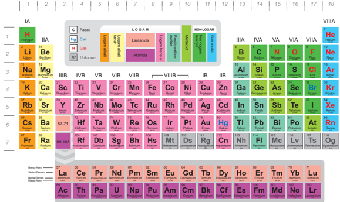

> **Deskripsi Visual:** Gambar ini adalah diagram periodik yang menampilkan tabel periodik dengan elemen-elemen berdasarkan urutan periodik dan kelompok kimia. Diagram ini mencakup semua unsur kimia yang dikenal, mulai dari hidrogen (H) hingga oganik (Og), serta elemen baru yang belum diketahui (Unknown). Setiap elemen memiliki warna yang berbeda untuk menunjukkan kelompok kimia mereka, seperti IA (alkali), IIA (alkalium), dan lain-lain. Untuk setiap elemen, ada informasi tentang nomor atom, massa atom, dan beberapa karakteristik kimia lainnya. Label seperti "C" untuk karbon, "H" untuk hidrogen, dan "He" untuk helium juga ditampilkan untuk memudahkan identifikasi. Diagram ini sangat berguna untuk membantu pemahaman tentang struktur dan hubungan antara elemen-elemen kimia.

 

---
## 📄 Halaman 31

### 2. Hubungan konigurasi elektron dengan sistem periodik unsur

Penulisan konigurasi elektron dapat ditulis menurut aturan Aufbau (bentuk panjang) atau dalam bentuk pendek. Konigurasi elektron bentuk pendek dari suatu unsur dimulai dengan penulisan unsur gas mulia yang nilai konigurasi lebih  kecil  dari  jumlah  elektron  unsur  tersebut,  lalu  diikuti  dengan  jumlah elektron yang tersisa.

Contoh:

``

Konigurasi elektron akan menentukan posisi unsur dalam golongan dan periode pada sistem periodik unsur, seperti yang terlihat pada Tabel 1.2.

---
**📊 Tabel**

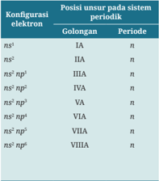

Tabel ini menunjukkan konfigurasi elektron unsur-unsur dalam sistem periodik berdasarkan golongan dan periode. Topik utama tabel ini adalah urutan konfigurasi elektron dalam sistem periodik. Kolom pertama menunjukkan golongan unsur, sedangkan kolom kedua menunjukkan periode. Data penting yang terlihat adalah bahwa semua golongan memiliki konfigurasi elektron yang sama pada periode tertentu, seperti n² untuk golongan IA, n³ untuk golongan IIA, dan seterusnya hingga VIIA. Ini menunjukkan bahwa konfigurasi elektron tidak hanya bergantung pada golongan, tetapi juga terkait dengan periode dalam sistem periodik.

---
**📊 Tabel**

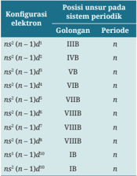

Tabel ini menunjukkan konfigurasi elektron untuk berbagai unsur pada sistem periodik, dengan kolom-kolom yang mencakup golongan dan periode. Topik utama tabel ini adalah struktur elektron unsur-unsur di dalam sistem periodik. Kolom "Konfigurasi elektron" menyediakan informasi tentang jumlah elektron yang terdapat pada setiap orbit luar atom tersebut. Kolom "Posisi unsur pada sistem periodik" menunjukkan golongan dan periode di mana unsur tersebut ditemukan dalam sistem periodik. Data penting yang terlihat dalam tabel ini adalah bahwa unsur-unsur yang memiliki konfigurasi elektron yang sama akan berada dalam golongan yang sama dan memiliki periode yang berbeda-beda. Misalnya, unsur-unsur dalam golongan IIIA memiliki konfigurasi elektron ns² (n-1)³d¹ dan berada dalam periode n. Ini menunjukkan hubungan antara konfigurasi elektron dan posisi unsur pada sistem periodik.

 

---
## 📄 Halaman 32

Tentukan posisi unsur 11 Na, 6 C, 54 Xe, dan 30 Zn di dalam sistem periodik unsur!

### Jawab:

- 1.

``

Berakhir pada orbital ns , berarti golongan A.

``

n = 3 (periode 3)

Berakhir pada orbital ns np , berarti golongan A.

- 6 C: 1 s 2 2 s 2 2 p 2 6 C: [He] 2 s 2 2 p 2 2 s 2 2 p 2  (2 + 2 = 4) = golongan IVA n = 2 (periode 2)
- 3.
- 54 Xe: 1 Berakhir pada orbital ns np 5 s 2 5 p 6  (2 + 6 = 8) = golongan VIIIA n = 5 (periode 5)
- 4.
s 2 2 s 2 2 p 6 3 s 2 3 p 6 4 s 2 3 d 10 4 p 6 5 s 2 4 d 10 5 p 6

, berarti golongan A.

Berakhir pada orbital ns ( n - 1) d , berarti golongan B.

30 Zn: 1 s 2 2 s 2 2 p 6 3 s 2 3 p 6 4 s 2 3 d 10 30 Zn: [Ar] 4 s 2 3 d 10 4 s 2 3 d 10  (2 + 10 = 12) = golongan IIB n = 4 (periode 4)

### Ayo Berlatih

Tentukan posisi unsur di bawah ini pada sistem periodik unsur.

1. 20 Ca

3. 22 Ti

2. 35 Br

4. 26 Fe

 

---
## 📄 Halaman 33

### D.  Sifat Periodik Unsur

Penyusunan unsur-unsur dalam sistem periodik unsur modern berkaitan erat dengan  sifat-sifat  atom.  Kesamaan  sifat  atom  maupun  perubahan  sifatnya dapat  dikaitkan  dengan  letaknya  dalam  periode  atau  golongan.  Berikut  ini sifat-sifat atom berdasarkan posisinya dalam sistem periodik unsur.

### 1. Jari-jari atom

Kalium menghasilkan ledakan yang lebih besar dibandingkan natrium dan litium saat logam tersebut dimasukkan ke dalam air, seperti yang terlihat pada Gambar 1.13. Mengapa hal ini dapat terjadi?

---
**🖼️ Gambar/Diagram**

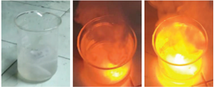

> **Deskripsi Visual:** Gambar ini adalah ilustrasi yang menunjukkan proses pembakaran minyak. Gambar ini terdiri dari tiga bagian yang masing-masing menunjukkan tahap-tahap pembakaran minyak dalam sebuah cawan. 

Pertama, pada bagian pertama, kita melihat cawan yang kosong dengan air bersih. Ini menunjukkan awal proses pembakaran.

Kedua, pada bagian kedua, kita melihat cawan yang sama tetapi dengan minyak yang telah disimpan di dalamnya. Ini menunjukkan tahap awal pembakaran dimana minyak sudah siap untuk dibakar.

Ketiga, pada bagian ketiga, kita melihat cawan yang sama tetapi dengan api yang membakar minyak. Ini menunjukkan tahap akhir pembakaran dimana minyak sudah terbakar sepenuhnya.

Elemen-elemen utama dalam gambar ini adalah cawan, air, dan minyak. Relasi antara elemen-elemen ini adalah bahwa air dan minyak berada dalam cawan yang sama. Proses pembakaran minyak dilakukan dengan cara memadamkan api di atas cawan tersebut.

Teks, angka, atau label penting yang terlihat dalam gambar ini adalah tidak ada karena gambar ini hanya menggambarkan proses pembakaran minyak tanpa menggunakan teks atau angka.

Informasi kunci yang dapat diambil pembaca adalah bahwa proses pembakaran minyak melibatkan penyaluran energi dari minyak ke udara melalui proses pembakaran.

Sumber: Kemendikbudristek/Nanda Saridewi (2022)

Unsur  kalium,  natrium,  dan  litium  berada dalam satu golongan, yakni golongan alkali (IA). Kalium  berada  paling  bawah  dari  ketiga  unsur tersebut dan memiliki jari-jari yang lebih besar dibandingkan unsur di atasnya (Gambar 1.14).

---
**🖼️ Gambar/Diagram**

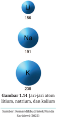

> **Deskripsi Visual:** Gambar 1.14 adalah ilustrasi yang menunjukkan jari-jari atom untuk tiga elemen kimia: litium (Li), natrium (Na), dan kalium (K). Gambar ini menggunakan ikon-ikon berwarna biru dengan nomor jari-jari atom yang disertakan di sebelah kanan setiap ikon. Jari-jari atom tersebut diberikan dalam satuan nanometer (nm).

Pertama, gambar ini menunjukkan bahwa jari-jari atom litium adalah 156 nm, natrium adalah 191 nm, dan kalium adalah 238 nm. Ini menunjukkan bahwa jari-jari atom naik dari kiri ke kanan dalam urutan tersebut.

Elemen-elemen utama yang ditampilkan adalah litium, natrium, dan kalium. Mereka dinyatakan dengan huruf besar di atas ikon-ikon mereka, yang merupakan simbol kimia masing-masing. Simbol-simbol ini menunjukkan bahwa gambar ini berkaitan dengan kimia dan fisika atomik.

Teks, angka, atau label penting yang terlihat dalam gambar ini adalah jari-jari atom masing-masing elemen. Informasi kunci yang dapat diambil pembaca melalui gambar ini adalah bahwa jari-jari atom naik dari litium ke kalium, yang menunjukkan bahwa struktur atom semakin kompleks dari kiri ke kanan dalam urutan tersebut.

 

---
## 📄 Halaman 34

Seperti  yang  telah  dipelajari  pada  materi  IPA  kelas  X,  jari-jari  atom adalah jarak inti atom dengan kulit terluar. Dalam satu golongan, dari atas ke bawah, jumlah kulit semakin bertambah sehingga jarak inti atom dengan kulit terluarnya semakin besar. Sementara dalam satu periode, dari kiri ke kanan, jumlah kulitnya sama, tetapi jumlah protonnya semakin bertambah. Hal ini menyebabkan semakin besar gaya tarik-menarik elektron terluarnya ke inti atom yang bermuatan positif sehingga terjadi penciutan kulit. Akibatnya, jarijari atomnya mengecil.

Kalium  memiliki  jari-jari  yang  lebih  besar,  elektron  terluarnya  berada lebih jauh dari inti atom. Gaya tarik-menarik elektron terluarnya dengan inti atom  lebih  lemah  sehingga  lebih  mudah  lepas.  Hal  ini  yang  menyebabkan kalium lebih reaktif dibandingkan dengan natrium dan litium.

### 2. Energi ionisasi

Setiap pergantian tahun, masyarakat gemar membakar kembang api. Warnawarni pada kembang api menambah kemeriahan malam sehingga menarik untuk dinikmati. Mengapa kembang api ketika dibakar dapat menghasilkan nyala yang berwarna-warni? Setelah mempelajari materi ini, kalian akan bisa menjelaskan hal tersebut.

---
**🖼️ Gambar/Diagram**

> **Deskripsi Visual:** Gambar ini adalah foto yang menunjukkan pemandangan kota dengan berbagai jenis petasan yang meledak di langit malam. Petasan tersebut berwarna-warni dan berbentuk beragam, menciptakan efek visual yang indah. Di latar belakang, terlihat bangunan-bangunan tinggi yang tampak gelap, menunjukkan bahwa gambar ini diambil pada waktu malam. Petasan-petasan tersebut tampaknya sedang digunakan untuk perayaan atau acara spesial, karena mereka biasanya digunakan untuk merayakan hari-hari besar atau acara-acara penting lainnya. Gambar ini menunjukkan bagaimana petasan dapat memberikan kegembiraan dan keceriaan pada suatu acara, serta bagaimana mereka dapat menjadi simbol kebahagiaan dan kegembiraan.

Sumber: Nick/pixabay.com (2017)

 

---
## 📄 Halaman 35

Warna nyala api dapat dijelaskan menggunakan energi ionisasi. Energi ionisasi adalah energi yang dibutuhkan oleh satu atom netral dalam fase gas untuk melepaskan satu elektronnya. Energi ionisasi pertama adalah energi yang dibutuhkan oleh satu atom untuk melepaskan satu elektronnya, sedangkan energi ionisasi kedua adalah energi yang dibutuhkan untuk melepaskan satu elektron keduanya, begitu seterusnya.

``

Mg( g ) Mg + ( g ) + e -

``

Mg + ( g ) Mg 2+ ( g ) + e -    (energi ionisasi kedua)

Perbedaan energi yang dibutuhkan oleh suatu unsur untuk melepaskan satu elektronnya akan memberikan perbedaan warna nyala yang dihasilkan unsur tersebut. Unsur dengan energi ionisasi lebih rendah dapat memancarkan cahaya pada daerah sinar tampak ketika diberikan api bunsen. Namun, unsur dengan energi ionisasi yang lebih tinggi memerlukan suhu yang lebih tinggi pula (tidak bisa dengan api bunsen saja) untuk menghasilkan nyala dan memiliki cahaya pada daerah ultraviolet. Kembang api biasanya terdiri atas beberapa unsur logam. Ketika dibakar, setiap logam akan memancarkan cahaya sesuai dengan energi ionisasinya. Hal inilah yang menyebabkan warna-warni pada nyala kembang api.

---
**🖼️ Gambar/Diagram**

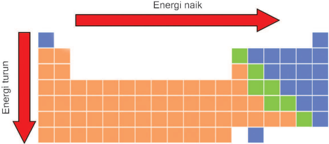

> **Deskripsi Visual:** Gambar ini adalah diagram yang menunjukkan perubahan energi dalam suatu sistem. Diagram ini terdiri dari dua garis vertikal yang menggambarkan dua titik pada skala energi: energi turun dan energi naik. Garis energi turun berada di bawah garis energi naik, menunjukkan bahwa energi turun lebih rendah daripada energi naik.

Elemen utama dalam diagram ini adalah dua garis energi yang saling berlawanan. Garis energi turun berwarna biru dan berada di bawah garis energi naik, yang berwarna merah. Ini menunjukkan bahwa energi turun lebih rendah daripada energi naik.

Teks, angka, atau label penting yang terlihat dalam diagram ini adalah garis energi turun dan energi naik, serta warna-warna yang digunakan untuk menunjukkan kedua garis tersebut. Garis energi turun berwarna biru dan berada di bawah garis energi naik, yang berwarna merah.

Informasi kunci yang dapat diambil pembaca dari gambar ini adalah bahwa energi turun lebih rendah daripada energi naik, dan bahwa ada perubahan energi dari energi turun ke energi naik.

Sumber: Kemendikbudristek/Nanda Saridewi (2022)

Mengapa energi ionisasi unsur semakin besar dalam satu periode (dari kiri ke kanan) dan semakin kecil dalam satu golongan (dari atas ke bawah), seperti  pada  Gambar  1.16?  Dalam  satu  periode,  semakin  ke  kanan,  jarijari  atom  semakin  kecil.  Gaya  tarik-menarik  inti  atom  dengan  elektron

 

---
## 📄 Halaman 36

terluarnya semakin kuat sehingga elektron terluarnya sulit untuk lepas yang menyebabkan energi ionisasinya semakin besar. Hal sebaliknya dalam satu golongan, dari atas ke bawah, jari-jari atom semakin besar. Jarak inti atom dengan  elektron  terluarnya  semakin  jauh  sehingga  gaya  tarik-menariknya menjadi  lebih  lemah  yang  menyebabkan  elektron  terluarnya  mudah  lepas sehingga energi ionisasinya menjadi semakin kecil.

Energi  ionisasi  menunjukkan  kecenderungan  untuk  membentuk kation (ion  positif).  Semakin  kecil  energi  ionisasinya  maka  semakin  mudah  suatu atom  untuk  membentuk  kation.  Unsur  logam  cenderung  memiliki  energi ionisasi yang lebih kecil daripada unsur nonlogam sehingga lebih cenderung untuk melepaskan elektron membentuk kation. Hal sebaliknya terjadi pada unsur nonlogam, cenderung lebih susah untuk melepaskan elektron.

### Uji nyala

### Bahan dan alat:

Hati-hati dalam menggunakan bahan kimia!

- Garam NaCl
- Garam KNO3
- Garam CuSO4
- Garam CaCO3

### Langkah kerja:

- Celupkan kawat nikrom ke dalam alkohol.
- Ambil sedikit garam dan letakkan di ujung kawat.
- Bakar garam tersebut di api bunsen.
- Amati warna nyala yang terlihat.
- Catatlah hasil pengamatan kalian di dalam buku latihan.
- Garam MgSO4
- Alkohol
- Bunsen (satu buah)
- Kawat nikrom (satu buah)

---
**📊 Tabel**

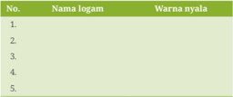

Tabel ini berisi informasi tentang nama dan warna nyala dari beberapa logam. Topik utama tabel ini adalah logam dan warnanya. Kolom pertama berisi nomor urut, kolom kedua berisi nama logam, dan kolom ketiga berisi warna nyala masing-masing logam. Data penting yang terlihat adalah bahwa setiap logam memiliki warna nyala yang unik, seperti logam emas memiliki warna nyala kuning, perak memiliki warna nyala putih, dan lain sebagainya. Ini menunjukkan hubungan antara nama logam dan warnanya, yang dapat membantu dalam membedakan dan mengenali logam tersebut.

 

---
## 📄 Halaman 37

### Pertanyaan:

- Temukan nilai energi ionisasi logam natrium, kalium, tembaga, kalsium, dan magnesium!
- Bagaimana  hubungan  nilai  energi  ionisasi  terhadap  warna  nyala  yang dihasilkan?

### 3. Ainitas elektron

Pada  uraian  mengenai  energi  ionisasi  diketahui  bahwa  unsur  golongan nonlogam memiliki energi ionisasi yang lebih besar dibandingkan unsur logam sehingga lebih sulit melepaskan elektron valensinya. Unsur nonlogam lebih cenderung untuk menerima elektron dibandingkan melepaskan elektron.

Ainitas  elektron menyatakan  perubahan  energi  yang  dihasilkan  saat suatu  atom  dalam  keadaan  gas  menerima  satu  elektron  membentuk  anion (ion  negatif).  Ainitas  elektron  menjadi  sebuah  ukuran  mudah  atau  tidakn ya suatu  atom  dalam  menerima  elektron.  Semakin  besar  perubahan  energi yang dihasilkan, semakin besar pula kecenderungan atom menarik elektron membentuk  anion.  Unsur  golongan  halogen  (VIIA)  memiliki  ainitas  yang paling  besar  dibanding  golongan  A  lainnya,  seperti  terlihat  pada  gambar berikut.

---
**📊 Tabel**

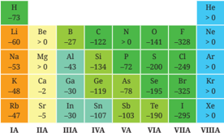

Tabel ini menunjukkan urutan periodik atom berdasarkan energi ionisasi mereka. Kolom pertama menunjukkan energi ionisasi atom dalam volt (V), sedangkan baris menunjukkan jenis atom dalam urutan periodik. Topik utama tabel ini adalah urutan periodik atom berdasarkan energi ionisasi mereka. Data penting yang terlihat adalah bahwa atom-atom dengan energi ionisasi yang lebih tinggi biasanya memiliki lebih banyak elektron di luar intinya, sehingga lebih sulit untuk melepaskan elektron. Ini juga menunjukkan bahwa atom-atom dengan energi ionisasi yang lebih rendah biasanya lebih stabil dan lebih mudah untuk melepaskan elektron.

 

---
## 📄 Halaman 38

### 4. Keelektronegatifan

Selama pandemi kita diwajibkan untuk selalu menjaga kebersihan diri dan lingkungan.  Penggunaan  pembersih  atau  disinfektan  pada  ruangan,  lantai, dinding, permukaan perabot, bahkan gagang pintu merupakan salah satu cara untuk mengantisipasi penularan virus Covid-19. Klorin merupakan salah satu unsur penyusun bahan disinfektan yang banyak digunakan. Mengapa klorin dapat digunakan untuk menghancurkan virus dan bakteri?

---
**🖼️ Gambar/Diagram**

> **Deskripsi Visual:** Gambar ini adalah diagram yang menunjukkan struktur kimia atom berdasarkan nomor atom dan periodik. Diagram ini membagi elemen menjadi beberapa kolom dan baris berdasarkan nomor atom dan periodik. Kolom pertama menunjukkan nomor atom, sedangkan baris pertama menunjukkan periode. Elemen-elemen diatur berdasarkan urutan periodik dan nomor atom mereka. Jumlah atom dalam setiap elemen diberikan dalam format angka dan huruf. Misalnya, dalam baris kedua, elemen Be memiliki 2 atom, elemen B memiliki 3 atom, dan以此类推. Label penting lainnya termasuk nama-nama elemen dan nomor atom mereka. Informasi kunci yang dapat diambil pembaca meliputi struktur kimia atom, urutan periodik, dan jumlah atom dalam setiap elemen.

---
**📊 Tabel**

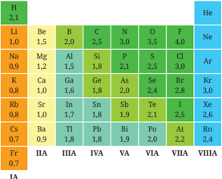

Tabel ini menunjukkan daftar unsur kimia berdasarkan nomor atomnya, mulai dari H (hidrogen) hingga Fr (francium). Kolom pertama menunjukkan nomor atom, sedangkan kolom-kolom berikutnya menunjukkan nomor periodik dan kelompok kimia masing-masing unsur. Data dalam tabel menunjukkan bahwa unsur-unsur ini dikelompokkan berdasarkan nomor atom mereka, dengan nomor periodik dan kelompok kimia yang berbeda-beda. Misalnya, unsur-unsur di awal tabel memiliki nomor atom yang lebih kecil dan berada di kelompok IIA, sedangkan unsur-unsur di akhir tabel memiliki nomor atom yang lebih besar dan berada di kelompok VIIIA. Tabel ini sangat berguna untuk memahami struktur dan sifat-sifat kimia unsur-unsur.

IA

Klorin  merupakan unsur golongan halogen yang memiliki keelektronegatifan  yang  tinggi,  seperti  terlihat  pada  data  di  Gambar  1.18. Keelektro­ negatifan merupakan suatu ukuran yang menunjukkan kemampuan suatu atom  untuk  menarik  elektron  ke  arah  atomnya  untuk  membentuk  ikatan kimia.  Semakin  tinggi  nilai  keelektronegatifannya  maka  semakin  mudah atom tersebut menerima elektron. Unsur halogen cenderung untuk menerima elektron membentuk anion. Hal ini menyebabkan unsur halogen lebih mudah tereduksi  (berkurangnya  bilangan  oksidasi,  dari  0  menjadi  -1)  dan  bersifat sebagai  oksidator  kuat  (mengoksidasi  atom  lain).  Sifat  oksidator  inilah yang  menyebabkan  klorin  dapat  mengoksidasi  virus  dan  bakteri  sehingga jaringannya rusak dan mati atau hancur.

 

---
## 📄 Halaman 39

### Reaksi unsur halogen

### Bahan dan alat:

Hati-hati dalam menggunakan bahan kimia!

- Fe 2 (SO 4 ) 3 0,1 M
- NaCl 0,1 M
- NaBr 0,1 M
- KI 0,1 M
- Tabung reaksi (tiga buah)
- Pipet tetes (tiga buah)

### Langkah kerja:

- Ambil 3 tabung reaksi dan masukkan 10 tetes larutan Fe 2 (SO 4 ) 3 0,1 M ke dalam masing-masing tabung reaksi.
- Tambahkan 10 tetes larutan NaCl 0,1 M ke dalam tabung 1.
- Tambahkan 10 tetes larutan NaBr 0,1 M ke dalam tabung 2.
- Tambahkan 10 tetes larutan KI 0,1 M ke dalam tabung 3.
- Bandingkan warna dari masing-masing tabung.
- Cermati perubahan yang terjadi pada setiap tabung reaksi, catat di dalam buku latihan.

### Pertanyaan:

- Manakah  larutan  garam  yang  lebih  mudah  bereaksi  dengan  larutan Fe(SO 4 ) 3 ?
- Bagaimana  hubungan  keelektronegatifan  unsur  halogen  (Cl,  Br,  dan  I) terhadap reaksi yang terjadi pada larutan NaCl, NaBr, dan KI?

### Ayo Berlatih

- Mengapa unsur-unsur logam golongan IA lebih mudah membentuk kation?
- Bagaimanakah kecenderungan kereaktifan unsur-unsur halogen dalam satu golongan (dari atas ke bawah)?

 

---
## 📄 Halaman 40

### Mengapa matahari masih bersinar hingga sekarang?

Matahari masih tetap bersinar karena terjadi reaksi penggabungan hidrogen membentuk  helium  sehingga  menghasilkan  pancaran  cahaya.  Hidrogen merupakan  unsur  penyusun  matahari  terbesar yang mencapai  91,2%. Kelimpahan  gas  hidrogen  pada  matahari  merupakan  sumber  energi  bagi kehidupan  di  bumi.  Salah  satu  manfaat  adanya  hidrogen  pada  matahari adalah sebagai sumber energi alternatif dalam bentuk sel surya. Gambar 1.18 memperlihatkan contoh panel surya sebagai sumber energi listrik di rumah.

---
**🖼️ Gambar/Diagram**

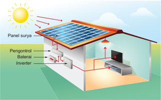

> **Deskripsi Visual:** Gambar ini adalah ilustrasi yang menunjukkan proses penggunaan tenaga surya dalam sistem energi terbarukan. Gambar ini menggambarkan panel surya yang terpasang pada atap bangunan, dengan cahaya matahari yang masuk melalui panel tersebut. Panel surya kemudian mengubah sinar matahari menjadi listrik melalui proses fotovoltaik.

Elemen utama dalam gambar ini adalah panel surya, baterai, inverter, dan pengontrol. Panel surya terletak di atas atap bangunan dan berfungsi sebagai sumber energi utama. Baterai berfungsi untuk menyimpan energi listrik yang dihasilkan oleh panel surya. Inverter digunakan untuk mengubah energi listrik yang disimpan menjadi format yang dapat digunakan oleh peralatan rumah tangga. Pengontrol berfungsi untuk mengatur dan mengendalikan semua komponen dalam sistem ini.

Teks, angka, atau label penting yang terlihat dalam gambar ini adalah "Panel surya", "Baterai", "Inverter", dan "Pengontrol". Informasi kunci yang dapat diambil pembaca adalah bahwa sistem ini menggunakan tenaga surya sebagai sumber energi utama, dengan panel surya sebagai sumber energi, baterai untuk menyimpan energi, inverter untuk mengubah energi, dan pengontrol untuk mengatur dan mengendalikan sistem.

Dengan demikian, gambar ini menunjukkan bagaimana tenaga surya dapat digunakan dalam sistem energi terbarukan, dengan panel surya sebagai sumber energi utama, baterai untuk menyimpan energi, inverter untuk mengubah energi, dan pengontrol untuk mengatur dan mengendalikan sistem.

Hidrogen  juga  menjadi  sumber  bahan  bakar  dalam  teknologi  berbasis elektrokimia. Bahan bakar ini tanpa emisi dengan keberadaan yang sangat melimpah. Selain di matahari, hidrogen dapat dihasilkan dari reaksi logam alkali dan alkali tanah dengan air. Luasnya perairan yang ada di Indonesia sangat memungkinkan tersimpan cadangan hidrogen di bawah laut Indonesia yang demikian banyak.

Salah satu contoh reaksi logam alkali litium dengan air:

``

 

---
## 📄 Halaman 41

Ketika logam direaksikan dengan H 2 O akan menghasilkan produk berupa gas hidrogen (H 2 ). Selain logam alkali, logam lain juga dapat menghasilkan gas hidrogen jika dilarutkan dengan pelarut asam. Contohnya logam aluminium dengan pelarut H 2 SO4 .

### Coba kalian praktikkan di rumah.

- Timbang 5 gram limbah kemasan yang mengandung logam aluminium.
- Masukkan ke dalam gelas kaca yang berisi air aki atau H 2 SO4 .
- Tutup erat gelas kaca tersebut dengan balon.
- Biarkan balon membesar sampai tidak bertambah besar lagi.
- Ukur diameter balon.
Setelah melakukan percobaan ini, jawablah pertanyaan berikut.

- Temukan lima contoh limbah lain yang dapat digunakan sebagai penghasil gas hidrogen!
- Mengapa produk limbah kemasan yang kalian temukan tersebut dapat digunakan sebagai penghasil gas hidrogen?
Partikel  dasar  penyusun  atom  adalah  proton,  neutron,  dan  elektron. Proton sebagai penyusun inti atom yang bermuatan positif dikelilingi oleh elektron yang bergerak dalam lintasannya. Sistem periodik unsur bentuk panjang menjelaskan bahwa unsur-unsur disusun berdasarkan kenaikan nomor  atom.  Sifat  keperiodikan  suatu  unsur  terdiri  atas  jari-jari  atom, energi  ionisasi,  ainitas  elektron,  dan  keelektronegatifan.  Jari-jari  atom semakin  mengecil  dengan  bertambahnya  jumlah  proton  dan  elektron valensi pada kulit yang sama dan bertambah seiring bertambahnya jumlah kulit. Energi ionisasi, ainitas elektron, dan keelektronegatifan semakin bertambah dengan turunnya jari-jari atom dan berkurang dengan naiknya jari-jari atom. Sifat keperiodikan unsur sangat memengaruhi kereaktifan suatu  unsur.  Unsur  yang  mudah  melepaskan  atau  menerima  elektron memiliki kereaktifan  yang  besar  karena  mudah  bereaksi  dengan  unsur lainnya.  Kereaktifan  suatu  unsur  dapat  diaplikasikan  pada  berbagai bidang kehidupan.

 

---
## 📄 Halaman 42

Setelah mempelajari materi Struktur Atom dan Sistem Periodik Unsur, silakan kalian mereleksi diri. Berilah ceklis (√) pada kolom Ya/Tidak unt uk pernyataan berikut ini.

---
**📊 Tabel**

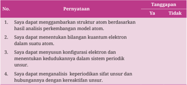

Tabel ini berisi pertanyaan tentang kemampuan dalam bidang kimia atomik dan periodik. Topik utamanya adalah pengetahuan dasar tentang struktur atom, analisis model atom, dan konsep periodik unsur. Kolom "Pernyataan" berisi empat pertanyaan yang berkaitan dengan kemampuan tersebut, sedangkan kolom "Tanggapan" menunjukkan jawaban "Ya" atau "Tidak". Data penting yang terlihat adalah bahwa semua empat pertanyaan memiliki jawaban "Ya", menunjukkan bahwa siswa memiliki pemahaman yang baik tentang struktur atom, analisis model atom, konfigurasi elektron, dan keperluan periodik unsur.

Menurut  kalian  materi  manakah  yang  sulit  dipahami  dalam  bab  Struktur Atom dan Sistem Periodik Unsur? Jelaskan alasannya!

### Pilihlah jawaban yang paling tepat!

### 1. Perhatikan tabel berikut.

---
**📊 Tabel**

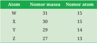

Tabel ini menunjukkan informasi tentang atom-atom dengan nomor massa dan nomor atom. Topik utama tabel ini adalah atom-atom dan informasinya. Kolom pertama berisi nama-nama atom seperti W, X, Y, dan Z. Kolom kedua berisi nomor massa, yang menunjukkan berat atom tersebut dalam unit dalton. Kolom ketiga berisi nomor atom, yang menunjukkan urutan atom dalam jaringan atom. Dari tabel ini, kita dapat melihat bahwa atom-atom ini memiliki nomor massa yang berbeda-beda, mulai dari 27 hingga 31. Selain itu, kita juga bisa melihat bahwa atom-atom ini memiliki nomor atom yang berbeda-beda, mulai dari 13 hingga 31. Ini menunjukkan bahwa setiap atom memiliki karakteristik unik sendiri-sendiri.

Pasangan yang merupakan isoton adalah ….

 

---
## 📄 Halaman 43

- W dan X
- X dan Y
- Y dan Z
- W dan Y
- X dan Z
- Atom  kalium  memiliki  nomor  atom  19.  Ketika  atom  kalium  terionisasi membentuk kation, bilangan kuantumnya adalah ….
- n = 3, l = 1, m = 0, s = +½
- n = 3, l = 1, m = -1, s = +½
- n = 3, l = 1, m = +1, s = -½
- n = 4, l = 0, m = 0, s = +½
- n = 4, l = 0, m = 0, s = -½
- Pernyataan yang tidak tepat dari sifat periodik unsur adalah …
- Dalam satu periode (dari kiri ke kanan), jari-jari atom semakin kecil.
- Dalam satu golongan (dari atas ke bawah), ainitas elektron semakin kecil.
- Unsur golongan IA memiliki energi ionisasi yang lebih besar dibandingkan golongan IIA.
- Unsur golongan halogen memiliki kelektronegatifan yang tinggi.
- Unsur golongan VIIA lebih mudah menerima elektron dibandingkan golongan VIA.
- Suatu atom memiliki konigurasi elektron 31 X: 1 s 2 2 s 2 2 p 6 3 s 2 3 p 6  4 s 2 3 d 10 4 p 1 . Unsur dari atom tersebut berada pada sistem periodik ….
- a.
- golongan IA periode 4
- golongan IIIB periode 4
- c.
- golongan IB periode 4
- d.
- e.
- golongan IIIA periode 4
- golongan IIIA periode 3
- Diketahui unsur Na dan Mg. Pernyataan yang tepat tentang kedua unsur tersebut adalah …
- a.
- b.
- Jari-jari atom Na lebih kecil dari Mg.
- Energi ionisasi Na lebih besar dari Mg.
- Atom Na dan Mg berada dalam satu golongan.
- Keelektronegatifan Na lebih kecil dari Mg.
- e.
- Ainitas elektron Na lebih besar dari Mg.

 

---
## 📄 Halaman 44

### Jawablah pertanyaan di bawah ini dengan tepat!

- Rutherford  melakukan  percobaan  menggunakan  lempeng  emas  tipis dan  menembakkannya  dengan  sinar  alfa  yang  berasal  dari  uranium. Dari percobaan tersebut diketahui bahwa atom bukanlah bola pejal yang bermuatan positif.  Bagaimanakah  Rutherford  dapat  menjelaskan  posisi proton dan elektron berdasarkan percobaan yang dilakukannya?
- Kaporit atau kalsium hipoklorit merupakan salah satu zat yang digunakan sebagai  disinfektan  pada  kolam  renang.  Kaporit  mengandung  sekitar 70  persen  klorin.  Disinfektan  ini  dapat  menghancurkan  bakteri  yang ada  di  dalam  air  kolam  renang.  Namun,  perlu  diperhatikan  bahwa penggunaannya tidak boleh berlebihan. Mengapa klorin dapat digunakan sebagai disinfektan?
- Unsur  logam  berilium  tidak  beraksi  ketika  dimasukkan  ke  dalam  air. Sementara  unsur  magnesium  bereaksi  lambat  dalam  air  dingin,  tetapi bereaksi lebih baik dalam air panas. Lebih lanjut, logam kalsium dapat menghasilkan reaksi yang kuat ketika dimasukkan ke dalam air dingin. Mengapa hal ini dapat terjadi?

 

---
## 📄 Halaman 45

Kimia untuk SMA/MA Kelas XI

Penulis

: Munasprianto Ramli, dkk.

ISBN

: 978-602-427-923-3 (jil.1)

---
**🖼️ Gambar/Diagram**

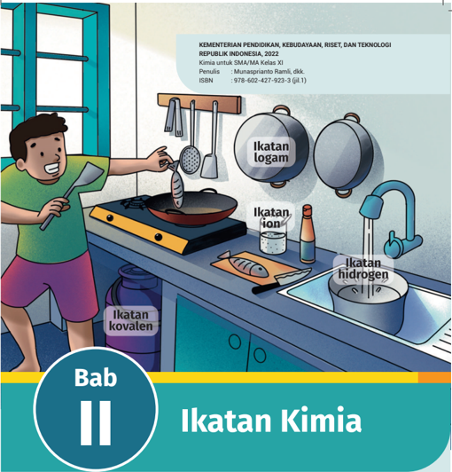

> **Deskripsi Visual:** Gambar ini adalah ilustrasi yang menunjukkan seorang siswa sedang memasak di dapur. Gambar ini menggambarkan tiga jenis ikatan kimia: ikatan kovalen, ikatan hidrogen, dan ikatan ion. Siswa sedang memasak ikan dengan menggunakan alat masak seperti wajan dan spatula. Di sebelah kanan, ada dua pot yang menunjukkan ikatan kovalen antara atom-atom dalam molekul. Di bawah pot, ada ikan yang sedang dipotong dengan pisau, menunjukkan ikatan kovalen dalam molekul protein. Di depan ikan, ada air yang mengalir dari kran, menunjukkan ikatan hidrogen dalam molekul air. Di atas ikan, ada dua mangkuk yang menunjukkan ikatan ion dalam molekul garam. Teks di atas gambar menyebutkan bahwa ini adalah bab kedua dari buku pelajaran Ikatan Kimia untuk SMA/MA Kelas XI, diterbitkan oleh Kementerian Pendidikan, Kebudayaan, Riset, dan Teknologi Republik Indonesia pada tahun 2022. ISBN buku tersebut juga disebutkan sebagai 978-602-427-923-3 (jil.1).

Setelah mempelajari bab ini, kalian dapat membedakan proses pemben  tukan ikatan  ion  dan  kovalen,  menjelaskan  ikatan  logam,  menghubungkan  jenis ikatan dengan sifat zat, memprediksi bentuk molekul dengan teori VSEPR dan menjelaskan  hibridisasinya,  memprediksi  kepolaran  zat,  serta  menentukan interaksi antarmolekulnya.

Bab II

Ikatan Kimia

31

 

---
## 📄 Halaman 46

---
**🖼️ Gambar/Diagram**

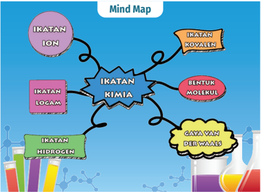

> **Deskripsi Visual:** Gambar ini adalah mind map yang menunjukkan berbagai jenis ikatan kimia. Mind map ini terdiri dari berbagai elemen utama yang terhubung dengan ikatan kimia utama, yaitu:

1. Ikatan ION
2. Ikatan KOVALEN
3. Ikatan LOGAM
4. Ikatan HIDROGEN
5. Bentuk MOLEKUL
6. Gaya VAN DER WAALS

Elemen-elemen utama tersebut terhubung melalui garis yang menghubungkan mereka ke ikatan kimia utama. Setiap ikatan kimia memiliki warna dan tulisan yang berbeda untuk membedakannya.

Teks, angka, atau label penting yang terlihat pada mind map ini adalah:
- "IKATAN ION" berwarna ungu
- "IKATAN KOVALEN" berwarna oranye
- "IKATAN LOGAM" berwarna biru
- "IKATAN HIDROGEN" berwarna hijau
- "BENTUK MOLEKUL" berwarna merah
- "GAYA VAN DER WAALS" berwarna kuning

Informasi kunci yang dapat diambil pembaca dari mind map ini adalah bahwa ada delapan jenis ikatan kimia yang diperkenalkan dalam buku pelajaran ini, masing-masing dengan karakteristik dan penggunaannya sendiri. Mind map ini membantu pembaca memahami hubungan antara berbagai jenis ikatan kimia dan bagaimana mereka saling berkaitan.

### Komik Kimia

---
**🖼️ Gambar/Diagram**

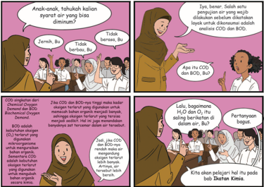

> **Deskripsi Visual:** Gambar ini adalah ilustrasi yang menunjukkan dialog antara seorang guru dan anak-anak tentang konsep CO2 (karbon dioksida) dan BOD (Biological Oxygen Demand). Ilustrasi ini terdiri dari dua panel yang menggambarkan pertukaran informasi antara guru dan murid-murid.

Pertama, guru bertanya kepada anak-anak apakah mereka tahu tentang syarat air yang bisa diminum. Anak-anak menjawab bahwa tidak. Kemudian, guru menjelaskan bahwa CO2 dan BOD adalah komponen penting dalam pemeliharaan kesehatan air.

Guru kemudian menjelaskan bahwa CO2 adalah gas yang membantu dalam proses fotosintesis, sementara BOD adalah jumlah oksigen yang dibutuhkan oleh bakteri untuk memecah organisme mati. Guru juga menjelaskan bahwa CO2 dan BOD saling berinteraksi dalam sistem air.

Anak-anak tampaknya memahami konsep ini dengan baik, karena mereka menjawab pertanyaan dengan tepat dan menunjukkan pengetahuan mereka tentang CO2 dan BOD. Ilustrasi ini sangat efektif dalam memberikan informasi tentang konsep-konsep ini dalam format visual yang mudah dipahami.

 

---
## 📄 Halaman 47

Sumber: Kemendikbudristek/Nanda Saridewi (2022)

Cobalah  kalian  genggam  bongkahan  garam  dapur?  Teksturnya  kasar  dan mudah  dihancurkan,  bukan?  Garam  dapur  juga  aman  disentuh  oleh  kulit. Beda sekali dengan logam natrium. Logam natrium tidak boleh tersentuh oleh kulit  karena  logam  ini  sangat  reaktif.  Logam  natrium  dapat  bereaksi  hebat dengan kandungan air yang ada pada permukaan kulit. Logam natrium juga tidak mudah dihancurkan, tapi mudah dipotong dengan pisau.

Di dalam garam dapur terdapat unsur natrium yang membentuk senyawa NaCl.  Pada  logam  natrium  juga  terdapat  unsur  natrium  yang  membentuk padatan logam natrium. Meskipun sama-sama memiliki unsur natrium tetapi sifat materinya berbeda. Mengapa ini bisa terjadi? Ikatan kimia apakah yang membentuk NaCl dan logam natrium?

### A.  Dasar Ikatan Kimia

Tahukah kalian unsur yang mengisi balon udara? Balon udara diisi oleh gas helium.  Helium  merupakan  unsur  yang  terdapat  dalam  keadaan  bebas  di alam. Keadaan bebas artinya unsur tersebut berada dalam bentuk atom bebas di  alam,  tanpa  harus  berikatan  atau  bersama  dengan  unsur-unsur  lainnya. Salah satu contoh unsur yang tidak dapat berada dalam keadaan bebas adalah oksigen.  Oksigen  dapat  berikatan  dengan  sesama  oksigen  atau  unsur  lain yang berbeda. Contohnya air dan gas oksigen, air mengandung senyawa H 2 O. Senyawa H2O terdiri atas unsur hidrogen dan oksigen, sementara gas oksigen terbentuk  dari  ikatan  antara  atom  oksigen  dengan  atom  oksigen  lainnya membentuk molekul O2.

Mengapa ada unsur yang berada dalam keadaan bebas dan tidak? Unsurunsur yang berada dalam keadaan bebas adalah gas mulia (golongan VIIIA).

 

---
## 📄 Halaman 48

Unsur gas mulia merupakan unsur yang stabil karena memenuhi kaidah oktet. Kaidah oktet merupakan kaidah yang menjelaskan tentang jumlah elektron terluar  atom  unsur  yang  berjumlah  delapan.  Setiap  atom  unsur  mencapai keadaan stabil dengan cara melepas atau menerima elektron dari atom lain sehingga jumlah elektron pada kulit terluarnya sama dengan elektron terluar gas mulia.

Gilbert  Lewis  mengemukakan  postulat  sederhana  terkait  pembentukan ikatan sebagai berikut.

- Unsur-unsur gas mulia berada dalam keadaan atom, bukan dalam keadaan molekul, karena konigurasi elektronnya sudah stabil.
- Unsur-unsur selain gas mulia akan membentuk ikatan sehingga konigurasi elektronnya menyerupai konigurasi elektron gas mulia.
Suatu atom berupaya mencapai kestabilannya dengan cara membentuk ikatan.  Ikatan  yang  terbentuk  dari  kontribusi  atom-atom  yang  membentuk kestabilan ini disebut ikatan kimia. Ikatan kimia dapat menghasilkan molekul dan senyawa baru.

### Kestabilan Atom

Seperti  sudah  dijelaskan  sebelumnya  bahwa  unsur  cenderung  mencapai kestabilan  dengan  melepaskan  atau  menerima  elektron.  Konigurasi  elektron dikatakan  stabil  ketika  jumlah  elektron  terluarnya  2  (duplet)  dan  8  (oktet) seperti  konigurasi  elektron  gas  mulia.  Atom  dapat  membentuk  kati on  dengan melepaskan elektron valensinya. Atom juga dapat membentuk anion dengan menerima  elektron.  Gambar  2.2  memperlihatkan  konigurasi  elektron  yang dimiliki oleh atom neon, salah satu unsur gas mulia.

---
**🖼️ Gambar/Diagram**

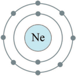

> **Deskripsi Visual:** Gambar ini adalah ilustrasi yang menunjukkan struktur atom Neon (Ne). Gambar ini menggambarkan empat lapisan elektron yang berada di sekitar atom Ne, yang merupakan elemen dengan nomor atom 10. Elektron-ekat ini dikelompokkan dalam empat orbit, masing-masing dengan jumlah elektron yang berbeda. Lapisan pertama memiliki satu elektron, lapisan kedua memiliki dua elektron, lapisan ketiga memiliki tiga elektron, dan lapisan keempat memiliki empat elektron. Informasi ini sangat penting untuk memahami struktur dan sifat-sifat kimia Ne.

 

---
## 📄 Halaman 49

Berikut ini konigurasi elektron unsur-unsur gas mulia.

2 He : 1

s 2 (2)

10 Ne  : 1

s 2 2 s 2 2 p 6

(2 8)

18 Ar : 1

s 2 2 s 2 2 p 6 3 s 2 3 p 6 (2 8 8)

36 Kr : 1

s 2 2 s 2 2 p 6 3 s 2 3 p 6 4 s 2 3 d 10 4 p 6 (2 8 18 8)

54 Xe : 1

s 2 2 s 2 2 p 6 3 s 2 3 p 6 4 s 2 3 d 10 4 p 6 5 s 2 4 d 10 5 p 6 (2 8 18 18 8)

Tampak bahwa konigurasi elektron unsur-unsur gas mulia memenuhi kaidah oktet, kecuali helium (duplet).

### Penentuan konigurasi elektron untuk mencapai kestabilan

### 1. K: 1 s 2 2 s 2 2 p 6 3 s 2 3 p 6 4 s 1

Atom  K  mempunyai  energi  ionisasi  yang  rendah  sehingga  mudah melepaskan  elektron  valensinya  membentuk  kation.  Untuk  mencapai oktet, atom K cenderung melepaskan 1 elektron valensinya dibandingkan menerima  7  elektron  sehingga  membentuk  kation  K + agar  konigurasi elektronnya sama dengan argon (Ar: 1 s 2 2 s 2 2 p 6 3 s 2 3 p 6 ).

``

### 2. F: 1 s 2 2 s 2 2 p 5

Atom F memiliki ainitas elektron yang besar sehingga mudah menerima elektron  membentuk  anion.  Untuk  mencapai  oktet,  atom  F  cenderung menerima  1  elektron  dibandingkan  melepaskan  7  elektron  valensinya sehingga membentuk anion F agar konigurasi elektronnya sama dengan neon (Ne: 1 s 2 2 s 2 2 p 6 ).

``

 

---
## 📄 Halaman 50

### Ayo Berlatih

Tentukan  kecenderungan  atom-atom  di  bawah  ini  untuk  mencapai kestabilan  melalui  konigurasi  elektronnya!

- 11 Na
- 17 Cl
- 8 O

### B.  Ikatan Ion

Pernahkah  kalian  melihat  proses  pembuatan  garam?  Salah  satu  proses untuk mendapatkan padatan garam adalah pengeringan dengan menjemur air laut di bawah sinar matahari, seperti terlihat pada Gambar 2.3. Air akan mengering dan tampak butiran-butiran kristal putih. Garam merupakan zat yang  mengandung  senyawa  ion  NaCl.  Bagaimanakah  sebenarnya  prinsip pembentukan senyawa ion NaCl sehingga dapat berwujud padat?

---
**🖼️ Gambar/Diagram**

> **Deskripsi Visual:** Gambar ini adalah ilustrasi yang menunjukkan dua orang petani sedang memanen padi di sawah. Gambar ini menggambarkan proses pertanian tradisional dengan detail yang mendalam.

1. **Apa yang Ditampilkan Secara Keseluruhan**: Gambar ini menampilkan dua orang petani yang sedang memanen padi di sawah. Mereka menggunakan alat berat seperti tongkat untuk memukul padi dan tang untuk mengumpulkan padi. Sawah yang luas tampak jernih dengan padi yang berwarna hijau tua.

2. **Elemen-Elemen Utama dan Relasinya**: 
   - **Petani**: Ada dua orang petani yang terlihat aktif dalam proses memanen.
   - **Alat Pemukul**: Petani menggunakan tongkat untuk memukul padi.
   - **Tang**: Petani menggunakan tang untuk mengumpulkan padi.
   - **Sawah**: Luas sawah yang berwarna biru tua menunjukkan kondisi tanah yang baik.
   - **Padi**: Padi yang berwarna hijau tua menunjukkan bahwa padi sudah matang dan siap dipanen.

3. **Teks, Angka, atau Label Penting yang Terlihat**: 
   - Teks tidak ada dalam gambar ini.
   - Angka atau label penting tidak ada dalam gambar ini.

4. **Informasi Kunci yang Dapat Diambil Pembaca**: 
   - Gambar ini menunjukkan proses tradisional memanen padi.
   - Petani menggunakan alat tradisional untuk memukul dan mengumpulkan padi.
   - Sawah yang luas menunjukkan kepadatan pertanian.
   - Padi yang berwarna hijau tua menunjukkan bahwa padi sudah matang dan siap dipanen.

Dengan demikian, gambar ini memberikan gambaran yang jelas tentang proses memanen padi di sawah menggunakan metode tradisional, menunjukkan kepadatan dan intensitas pertanian tradisional.

Senyawa  ion  terbentuk  karena  adanya  ikatan  ion.  Ikatan  ion  dibentuk oleh  atom  dari  unsur  logam  dan  nonlogam.  Seperti  halnya  senyawa  NaCl yang terdiri atas unsur natrium dan klorin. Unsur natrium merupakan logam dan  klorin  merupakan  nonlogam.  Pembentukannya  dimulai  dengan  proses sublimasi logam natrium yang berwujud padat menjadi atom natrium yang berwujud gas.

- 12Mg
- 56Ba
- 16 S

 

---
## 📄 Halaman 51

Seperti yang sudah dipelajari pada bab sebelumnya (Struktur Atom dan Sistem  Periodik  Unsur),  natrium  sebagai  unsur  golongan  logam  alkali  (IA) memiliki  energi  ionisasi  yang  rendah  sehingga  lebih  mudah  melepaskan elektron dibandingkan menerima elektron. Saat natrium berada dalam fase gas,  atom natrium melepaskan satu elektron valensinya membentuk kation natrium agar stabil. Molekul klorin yang awalnya berikatan dalam bentuk Cl 2 mengalami proses disosiasi oleh panas membentuk atom Cl. Atom Cl menerima elektron  yang  dilepaskan  oleh  atom  Na.  Proses  serah  terima  elektron  ini menyebabkan adanya gaya tarik-menarik antara kation dan anion sehingga terbentuk  ikatan  ion.  Proses  pembentukan  ikatan  ion  dari  unsur-unsurnya dapat dilihat pada tahapan di bawah ini.

- Na( s ) Na( g
- ) (sublimasi)
- Na( g ) Na + ( g ) + e -
- (melepaskan elektron valensi)
- Cl 2 ( g ) 2Cl( g
- ) (disosiasi)
- Cl( g ) + e - Cl - ( g )
(menerima elektron)

- Na + ( g ) + Cl - ( g ) NaCl( s
- ) (membentuk ikatan ion)

---
**🖼️ Gambar/Diagram**

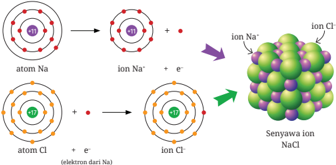

> **Deskripsi Visual:** Gambar ini adalah ilustrasi yang menunjukkan proses pembentukan senyawa ion NaCl (natrium klorida) dari atom natrium (Na) dan atom klorida (Cl). Ilustrasi ini melibatkan beberapa tahap penting:

1. **Pertama**: Gambar menunjukkan atom natrium dengan satu elektron dalam orbit eksternal. Atom ini memiliki 11 elektron.

2. **Kedua**: Dalam tahap pertama, elektron eksternal atom natrium dilepaskan, menghasilkan ion natrium (Na+), yang memiliki 10 elektron dan 1 proton.

3. **Ketiga**: Atom klorida memiliki 17 elektron. Dalam tahap kedua, elektron eksternal atom klorida dilepaskan, menghasilkan ion klorida (Cl-), yang memiliki 18 elektron dan 17 proton.

4. **Keempat**: Setelah pembentukan ion-ion, mereka berinteraksi untuk membentuk senyawa ion NaCl. Ion natrium dan ion klorida saling menarik karena引力, menghasilkan molekul NaCl yang stabil.

Elemen-elemen utama dalam gambar ini adalah atom natrium, atom klorida, ion natrium, ion klorida, dan senyawa ion NaCl. Relasi antara elemen-elemen ini sangat jelas, dengan atom menjadi dasar pembentukan ion, dan kemudian ion yang saling menarik untuk membentuk senyawa ion NaCl.

Teks, angka, atau label penting yang terlihat dalam gambar ini meliputi:
- Nama-nama atom dan ion (Na, Cl, Na+, Cl-)
- Jumlah elektron pada setiap atom dan ion
- Struktur orbitel atom natrium dan klorida

Informasi kunci yang dapat diambil pembaca meliputi proses pembentukan ion dan senyawa ion NaCl, serta pentingnya interaksi antara ion-ion dalam membentuk senyawa yang stabil.

Ada beberapa faktor yang harus diperhatikan dalam pembentukan ikatan ion, yaitu:

- Jumlah  elektron  yang  dilepaskan  harus  sama  dengan  jumlah  elektron yang diterima sehingga harus disesuaikan.
- Unsur logam harus ditulis sebagai monoatom, contoh Na, K, Li, dan Mg.
- Unsur nonlogam harus ditulis dalam bentuk dwiatom, seperti Cl 2 , F 2 , Br 2 , dan O2 , kecuali untuk unsur karbon, fosfor, dan belerang ditulis masingmasing sebagai C, S, dan P 4 .

 

---
## 📄 Halaman 52

Mengapa  senyawa  ion  yang  memiliki  wujud  padat  dapat  pecah  atau hancur saat dipukul? Hal ini terjadi karena ion positif (kation) dan ion negatif (anion) berulang secara teratur membentuk sebuah kisi kristal yang memadat. Namun, ketika senyawa ion diberikan tekanan atau beban maka akan mudah hancur. Ion positif dan ion negatif berpindah tempat dan menjadi tidak teratur lagi sehingga kisi kristalnya pecah (seperti terlihat pada Gambar 2.5).

---
**🖼️ Gambar/Diagram**

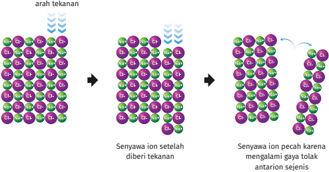

> **Deskripsi Visual:** Gambar ini adalah ilustrasi yang menunjukkan proses perubahan struktur senyawa ion setelah diterapkan tekanan. Ilustrasi ini terdiri dari tiga langkah yang menggambarkan perubahan struktur senyawa ion dari sejajar menjadi tidak sejajar.

Elemen utama dalam ilustrasi ini meliputi:

1. Senyawa ion sejajar: Dalam langkah pertama, senyawa ion berada dalam posisi sejajar, dengan ikatan ion yang kuat dan struktur yang rapi.
2. Senyawa ion setelah diterapkan tekanan: Pada langkah kedua, tekanan diterapkan pada senyawa ion, menyebabkan ikatan ion menjadi lemah dan struktur senyawa menjadi tidak sejajar.
3. Senyawa ion pecah: Langkah ketiga menunjukkan bahwa tekanan yang lebih besar mempercepat proses pelepasan senyawa ion, yang akhirnya menciptakan senyawa ion yang tidak sejajar.

Teks, angka, atau label penting yang terlihat dalam ilustrasi ini meliputi:

- "Arah tekanan" yang menunjukkan arah tekanan yang diterapkan pada senyawa ion.
- "Senyawa ion sejajar" yang menunjukkan struktur senyawa ion yang rapi dan sejajar.
- "Senyawa ion setelah diterapkan tekanan" yang menunjukkan struktur senyawa ion yang tidak sejajar setelah tekanan diterapkan.
- "Senyawa ion pecah karena mengatasi gap tekanan antarion sejenis" yang menjelaskan alasan pelepasan senyawa ion.

Informasi kunci yang dapat diambil pembaca dari gambar ini adalah bahwa tekanan dapat mempengaruhi struktur senyawa ion dan dapat menyebabkan pelepasan senyawa ion jika tekanan yang diterapkan cukup besar.

Adanya keteraturan susunan ion positif dan ion negatif serta keterikatan yang kuat karena gaya elektrostatisnya yang besar maka senyawa ion memiliki titik leleh dan titik didih yang tinggi. Senyawa ion juga mudah larut di dalam air. Ketika senyawa ion dilarutkan maka ion positif dan ion negatifnya akan bergerak  dengan  bebas  di  dalam  larutannya  sehingga  senyawa  ion  yang terlarut dapat menghantarkan arus listrik.

### C.  Ikatan Kovalen

Air tersusun atas molekul-molekul H 2 O. Molekul  H 2 O  terbentuk  akibat  adanya ikatan  antara  atom  hidrogen  (H)  dan atom oksigen (O). Hidrogen dan oksigen merupakan unsur nonlogam. Kedua unsur  ini  memiliki  energi  ionisasi  dan ainitas elektron yang tinggi. Atom hidrogen dan oksigen tidak akan saling melepas  ataupun  menerima  elektron

---
**🖼️ Gambar/Diagram**

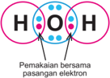

> **Deskripsi Visual:** Gambar ini adalah ilustrasi yang menunjukkan struktur molekul hidrogen peroksida (H₂O₂). Ilustrasi ini menggambarkan dua atom hidrogen (H) yang ikatan dengan dua atom oksigen (O) melalui ikatan kovalen. Dua ikatan kovalen antara atom hidrogen dan oksigen diperlihatkan dengan garis lurus, sementara ikatan kovalen antara dua atom oksigen diperlihatkan dengan garis berbentuk U. 

Elemen utama dalam gambar ini adalah dua atom hidrogen dan dua atom oksigen. Atom-atom ini saling ikatan melalui ikatan kovalen untuk membentuk molekul H₂O₂. Ikatan kovalen antara atom hidrogen dan oksigen lebih pendek dibandingkan ikatan kovalen antara dua atom oksigen.

Teks penting dalam gambar ini adalah "Penakasian bersama pasangan elektron", yang mungkin merujuk pada cara bagaimana ikatan kovalen berfungsi dalam membentuk molekul ini. Angka atau label penting yang terlihat adalah jumlah atom dalam molekul, yaitu dua atom hidrogen dan dua atom oksigen.

Informasi kunci yang dapat diambil pembaca adalah bahwa struktur molekul H₂O₂ terdiri dari dua atom hidrogen dan dua atom oksigen yang ikatan melalui ikatan kovalen. Ini menunjukkan bahwa molekul ini memiliki dua pasang elektron yang tidak terikat, yang dapat digunakan dalam reaksi kimia.

 

---
## 📄 Halaman 53

seperti  pada  pembentukan  ikatan  ion.  Satu  elektron  dari  atom  hidrogen berpasangan  dengan  satu  elektron  atom  oksigen  sehingga  terbentuklah ikatan, seperti pada Gambar 2.6. Ikatan ini disebut dengan ikatan kovalen . Jadi, ikatan kovalen adalah ikatan antaratom nonlogam yang terbentuk karena pemakaian bersama pasangan elektron.

Ikatan  kovalen  dapat  berbentuk  ikatan  tunggal  dan  rangkap.  Gambar berikut memperlihatkan contoh bentuk ikatan kovalen tunggal, rangkap dua, dan rangkap tiga.

---
**🖼️ Gambar/Diagram**

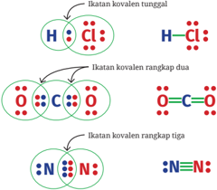

> **Deskripsi Visual:** Gambar ini adalah ilustrasi yang menunjukkan berbagai jenis ikatan kovalen dalam kimia. Ilustrasi ini memperlihatkan tiga jenis ikatan kovalen: ikatan kovalen tunggal, ikatan kovalen rangkap dua, dan ikatan kovalen rangkap tiga. Setiap ikatan kovalen ditunjukkan dengan diagram atom yang menggambarkan partikel elektron dan orbitel mereka. Ikatan kovalen tunggal diperlihatkan oleh dua atom yang berbagi satu pasang elektron, ikatan kovalen rangkap dua oleh dua pasang elektron yang dibagikan antara dua atom, dan ikatan kovalen rangkap tiga oleh tiga pasang elektron yang dibagikan antara dua atom. Ilustrasi ini membantu pembaca memahami konsep dasar tentang ikatan kovalen dalam kimia.

Pada Gambar 2.7, atom H dengan Cl membentuk ikatan kovalen tunggal menghasilkan molekul HCl, di mana pada atom Cl juga memiliki tiga pasang elektron bebas (tidak digunakan untuk berikatan) sehingga memenuhi kaidah oktet  (delapan  elektron).  Atom  C  dengan  dua  atom  O  membentuk  ikatan kovalen  rangkap  dua  menghasilkan  molekul  CO 2 .  Pada  setiap  atom  O  yang terikat  terdapat  satu  ikatan  rangkap  dua  dan  dua  pasang  elektron  bebas sehingga baik atom C maupun O telah memenuhi kaidah oktet. Kaidah oktet juga terpenuhi pada molekul N 2 . Atom N berikatan dengan atom N membentuk ikatan rangkap tiga dan terdapat satu pasang elektron bebas pada setiap atom N yang terikat untuk memenuhi kaidah oktet.

 

---
## 📄 Halaman 54

### 1. Ikatan kovalen polar dan nonpolar

Tahukah kalian fungsi aki? Aki merupakan sumber energi listrik dalam sebuah kenda  raan. Tanpa aki yang berfungsi dengan baik maka mesin kendaraan tidak bisa dihidupkan. Di dalam aki terjadi aliran elektron sehingga menimbulkan arus listrik.  Lalu,  apa  sebe  narnya  kandungan  dari  air  aki  (H 2 SO4 )  dan  jenis ikatan pembentuk senyawanya?

Berdasarkan  kepolaran,  ikatan  kovalen dapat  dibagi  menjadi  ikatan  kovalen  polar dan nonpolar. Ikatan kovalen polar terbentuk karena atom-atom yang saling berikatan memiliki perbedaan keelektronegatifan. Contohnya,  ikatan  kovalen  yang  terbentuk antara  atom  hidrogen  dengan  atom  klorin membentuk asam klorida (HCl). Atom hidrogen memiliki keelektronegatifan 2,1, sementara  atom  klorin  3,0.  Apakah  kalian masih ingat dengan teori keelektronegatifan pada bab 1?

Keelektronegatifan yang lebih tinggi pada  atom  Cl  menyebabkan  pasangan  elektron yang membentuk ikatan antara H

---
**🖼️ Gambar/Diagram**

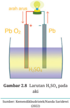

> **Deskripsi Visual:** Gambar 2.8 ini adalah ilustrasi yang menunjukkan struktur dan fungsi larutan sulfurik asam (H₂SO₄) pada baterai. Gambar ini menggambarkan dua sisi baterai yang terhubung oleh larutan H₂SO₄. Sisi atas diberi label "PbO₂" dan "Pb", yang merupakan komponen kimia yang berinteraksi dengan larutan untuk menghasilkan arus listrik. Sisi bawah juga diberi label "Pb" dan "H₂SO₄", yang menunjukkan bahwa larutan H₂SO₄ berada di antara kedua komponen tersebut. Teks "arah arus" menunjukkan arah aliran listrik melalui baterai. Informasi ini membantu pembaca memahami bagaimana baterai bekerja dan bagaimana komponen-komponennya berinteraksi untuk menghasilkan energi.

dan Cl tertarik ke arah atom Cl (delta negatif, δ - ),  seperti yang terlihat pada Gambar  2.9.  Atom  H  menjadi  kurang  elektron  (delta  positif,  δ + ).  Keadaan ini menyebabkan terjadi  nya pengutuban. Adanya dua kutub ini disebut dengan polarisasi yang menyebabkan terbentuknya ikatan kovalen polar. Sementara, ikatan kovalen nonpolar terbentuk antara atom-atom nonlogam yang sejenis dan tidak memiliki perbedaan keelektronegatifan.

---
**🖼️ Gambar/Diagram**

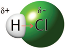

> **Deskripsi Visual:** Gambar ini adalah ilustrasi yang menunjukkan reaksi kimia antara hidrogen (H) dan klor (Cl). Gambar ini menggambarkan dua molekul, hidrogen dan klor, yang berinteraksi dengan cara membentuk ikatan ion. Hidrogen memiliki ikatan positif (+) dan klor memiliki ikatan negatif (-), yang menunjukkan bahwa hidrogen akan bergerak ke arah klor untuk membentuk ikatan ion. Ini menunjukkan bahwa reaksi ini merupakan reaksi ionik, di mana atom hidrogen dan klor berubah menjadi ion positif dan negatif masing-masing. Ilustrasi ini sangat berguna untuk memahami konsep dasar kimia, seperti reaksi ionik dan ikatan ionik.

Sumber: Kemendikbudristek/Nanda Saridewi (2022)

 

---
## 📄 Halaman 55

Ikatan kovalen polar yang membentuk molekul polar akan menghasilkan senyawa polar. Senyawa polar juga dapat menghantarkan arus listrik seperti senyawa ion. Namun, senyawa polar hanya dapat menghantarkan arus listrik saat  dalam  bentuk  larutan.  Selain  itu,  senyawa  kovalen  juga  memiliki  titik leleh dan titik didih yang lebih rendah dari senyawa ion dan logam.

### 2. Ikatan kovalen koordinasi

Ikatan kovalen tidak hanya dihasilkan dari kontribusi elektron pada masingmasing atom yang terikat, tetapi bisa dari salah satu atom saja. Ikatan kovalen koordinasi terjadi ketika pasangan elektron untuk berikatan berasal dari salah satu atom, sementara atom lain yang terikat tidak menyumbangkan elektron sama sekali, seperti yang terlihat pada Gambar 2.10.

---
**🖼️ Gambar/Diagram**

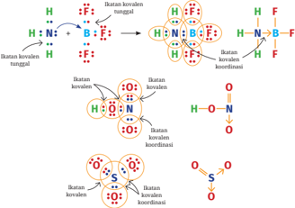

> **Deskripsi Visual:** Gambar ini adalah ilustrasi yang menunjukkan konsep tentang ikatan kovalen dalam beberapa molekul. Ilustrasi ini memperlihatkan berbagai jenis ikatan kovalen yang terjadi antara atom-atom dalam molekul-molekul tersebut. Setiap ikatan kovalen diilustrasikan dengan warna yang berbeda untuk menunjukkan jenis ikatan kovalen yang berbeda.

Elemen utama dalam gambar ini meliputi atom-atom dalam molekul-molekul, ikatan kovalen yang terbentuk antara atom-atom tersebut, dan warna yang digunakan untuk menunjukkan jenis ikatan kovalen. Ikatan kovalen dapat berupa ikatan kovalen sempurna (dengan simbol H+H), ikatan kovalen tidak sempurna (dengan simbol H+H'), dan ikatan kovalen koordinatif (dengan simbol H+H).

Teks, angka, atau label penting yang terlihat dalam gambar ini meliputi nama-nama atom dalam molekul-molekul, simbol-simbol ikatan kovalen, dan warna yang digunakan untuk menunjukkan jenis ikatan kovalen. Informasi kunci yang dapat diambil pembaca meliputi jenis-jenis ikatan kovalen yang ada dan bagaimana ikatan kovalen terbentuk antara atom-atom dalam molekul-molekul.

Atom N pada molekul NH3 memiliki pasangan elektron bebas, sementara atom B pada molekul BF 3 tidak memiliki elektron lagi untuk disumbang  kan. Atom B hanya mengikat tiga atom F sehingga pada atom B masih tersisa satu orbital yang kosong. Orbital yang masih kosong ini diisi oleh pasangan elektron bebas  yang  berasal  dari  atom  N  sehingga  terbentuk  ikatan  tunggal  antara atom N dan B. Jadi, ikatan ini terbentuk oleh pemakaian pasangan elektron secara bersama yang hanya disumbangkan oleh atom N sehingga atom N dan B mencapai keadaan oktet.

 

---
## 📄 Halaman 56

Pada molekul HNO3, atom N sudah mengikat dua atom O dengan ikatan kovalen  tunggal  dan  rangkap.  Agar  atom  N  dan  O  memenuhi  kaidah  oktet maka  sepasang  elektron  yang  tersisa  dari  atom  N  membentuk  kovalen koordinasi dengan atom O. Hal yang sama juga terjadi pada molekul SO 3 . Atom S memberikan pasangan elektronnya untuk membentuk dua ikatan kovalen koordinasi dengan dua atom O, sehingga atom S dan ketiga atom O yang terikat memenuhi kaidah oktet.

### 3. Struktur Lewis pada ikatan kovalen

Penulisan struktur Lewis sangat diperlukan untuk menentukan ketercapaian kaidah  oktet  maupun  kepolaran  dalam  ikatan  kovalen.  Penentuan  struktur Lewis  dimulai  dengan  menggambar  elektron  valensi  dari  masing-masing atom dengan titik, atau disebut dengan Lewis electron-dot symbol (simbol titikelektron Lewis atau simbol Lewis). Contoh simbol Lewis beberapa unsur dapat dilihat pada Gambar 2.11.

Setiap simbol Lewis dari masing-masing atom yang terikat harus memenuhi kaidah oktet, yaitu delapan elektron valensi di sekitar atom, kecuali atom hidrogen  yang  sudah  terpenuhi  dengan  dua  elektron  saja  ( duplet ).  Namun, ada beberapa molekul yang mengalami penyimpangan kaidah oktet, seperti BF3 dan PF 5 (Gambar 2.12). Pada molekul BF 3 ,  atom B hanya memiliki enam elektron  valensi  dan  atom  P  pada  PF 5 memiliki  sepuluh  elektron  valensi. Meskipun  tidak  memenuhi  kaidah  oktet,  tetapi  kedua  senyawa  ini  stabil. Keadaan ini disebut dengan penyimpangan kaidah oktet.

 

---
## 📄 Halaman 57

Diketahui unsur A memiliki nomor atom 19 dan unsur B bernomor atom 17. Prediksikan ikatan yang dapat terbentuk antara:

- atom A dengan atom B
- atom B dengan atom B

### Jawab:

19 A: 1 s 2 2 s 2 2 p 6 3 s 2 3 p 6 4 s 1

Elektron valensi: 4

s 1

Atom A berada pada golongan IA (logam), cenderung melepaskan 1 elektron dibandingkan menerima 7 elektron untuk memenuhi kaidah oktet, sehingga membentuk ion A + .

17 B: 1 s 2 2 s 2 2 p 6 3 s 2 3 p 5

Elektron valensi: 3

s 2 3 p 5

Atom  B  berada  pada  golongan  VIIA  (nonlogam),  cenderung  menerima  1 elektron dibandingkan melepaskan 7 elektron untuk memenuhi kaidah oktet, sehingga membentuk ion B - .

- Atom A (logam) dengan B (nonlogam) membentuk ikatan ion.

``

- Atom B dengan B membentuk ikatan kovalen.
B + B = senyawa kovalen B 2

### Ayo Berlatih

Diketahui unsur X, Y, dan Z masing-masing memiliki nomor atom 20, 8, dan 17. Tentukanlah jenis ikatan yang dapat terbentuk antara:

- X dengan Y
- Y dengan Y
- X dengan Z
- Z dengan Z

 

---
## 📄 Halaman 58

### Penentuan karakter senyawa ion dan kovalen dengan pemanasan

### Alat dan bahan:

- Lilin
- Korek api
- Sendok

### Langkah kerja:

- Letakkan gula dan garam di sendok terpisah.
- Nyalakan api lilin menggunakan korek api/pemantik.
- Posisikan sendok berisi gula dan garam di atas api lilin.
- Panaskan beberapa saat.
- Amati perubahan pada butiran gula dan garam.
- Simpulkan hasil pengamatan kalian.
- Susunlah laporan hasil percobaan dan presentasikan di depan kelas.

### Pertanyaan:

- Bahan apa yang mudah meleleh?
- Bahan apa yang termasuk senyawa ion?
- Bahan apa yang termasuk senyawa kovalen?
- Bagaimana perbedaan titik leleh senyawa ion dengan kovalen?

### D. Ikatan logam

Coba kalian temukan contoh logam yang ada di rumah. Apakah wujudnya padat, cair, atau gas? Tahukah kalian jenis ikatan kimia yang membentuk logam tersebut? Meskipun logam sangat keras, logam juga dapat ditempa dan dibentuk. Contohnya teralis besi yang dapat dibentuk menjadi beragam desain.

Sumber: Kemendikbudristek/Nanda Saridewi (2022)

- Gula
- Garam

 

---
## 📄 Halaman 59

Unsur logam pada umumnya berada pada golongan transisi (golongan B), golongan alkali (IA), alkali tanah (IIA), serta beberapa unsur dari golongan IIIA dan IVA. Logam umumnya berwujud padat, mengilat, dan tidak akan patah saat dibentuk.

---
**🖼️ Gambar/Diagram**

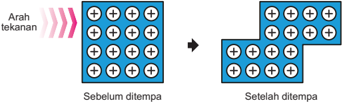

> **Deskripsi Visual:** Gambar ini adalah ilustrasi yang menunjukkan proses ditempa pada material. Gambar ini terdiri dari dua bagian: sebelum dan setelah ditempa. Bagian sebelum ditempa menunjukkan struktur material dengan titik-titik positif yang tersebar rata. Sedangkan bagian setelah ditempa menunjukkan struktur material yang telah berubah menjadi bentuk yang lebih tumpul dan memiliki titik-titik positif yang lebih berdekatan.

Elemen utama dalam gambar ini adalah material yang sedang ditempa. Relasi antara elemen-elemen ini adalah bahwa sebelum ditempa, material memiliki struktur yang rata, tetapi setelah ditempa, struktur tersebut berubah menjadi lebih tumpul dan berbentuk seperti huruf "L".

Teks, angka, atau label penting yang terlihat dalam gambar ini adalah "Arah tekanan" yang menunjukkan arah tekanan yang digunakan untuk ditempa. Informasi kunci yang dapat diambil pembaca adalah bahwa ditempa dapat mengubah bentuk dan struktur material, serta bahwa arah tekanan sangat penting dalam proses ditempa ini.

Pada Gambar 2.14 terlihat bahwa ion-ion positif dari atom logam dikelilingi oleh elektron. Elektron ini adalah elektron valensi dari logam tersebut. Elektron-elektron  tersebut  saling  bertumpang  tindih  membentuk  seperti lautan elektron dan bergerak dengan bebas di sekitar inti atom. Pergerakan elektron valensi dengan bebas menyebabkan adanya daya hantar listrik pada logam.

Lautan  elektron  pada  logam  bergerak  bebas,  tetapi  terikat  sangat  kuat dengan ion-ion positif dari atom logamnya. Hal ini menyebabkan logam tidak akan patah, retak, atau hancur saat dipukul atau ditempa (diberikan tekanan). Terlihat pada Gambar 2.14, ion positif dan elektronnya hanya bergeser ketika diberi tekanan. Ikatan yang kuat ini juga menyebabkan jarak antaratomnya menjadi  sangat  dekat  sehingga  logam  umumnya  ditemukan  dalam  wujud padat.

Ikatan  logam  dapat  terjadi  antaratom  logam  yang  sejenis  dan  berbeda jenis. Contoh logam sejenis, yaitu logam emas 24 karat (terdiri atas atom Au) dan tembaga murni (terdiri atas atom Cu) untuk penghantar arus listrik. Contoh logam dengan unsur logam yang berbeda adalah perunggu yang merupakan paduan timah (Sn) dan tembaga (Cu) serta kuningan berupa paduan tembaga (Cu) dan seng (Zn).

 

---
## 📄 Halaman 60

### E.  Bentuk Molekul

Kalian  tentu  pernah  minum  obat,  bukan? Mengapa  obat  yang  kalian  minum  dapat mengurangi,  bahkan  menghilangkan  rasa sakit? Proses reaksi penghilangan rasa sakit  ketika  meminum  obat  ternyata  sangat dipengaruhi oleh bentuk molekul obat tersebut.  Proses  penghantaran  sinyal  pada tubuh  manusia  saat  meminum  obat  ditentukan  oleh  kecocokan  bentuk  molekul  obat yang diminum dengan bentuk molekul penerima obat (reseptor), seperti yang terlihat pada Gambar 2.15.

---
**🖼️ Gambar/Diagram**

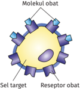

> **Deskripsi Visual:** Gambar ini adalah ilustrasi yang menunjukkan mekanisme interaksi antara molekul obat dengan sel target. Gambar ini terdiri dari beberapa elemen utama:

1. **Molekul Obat**: Ini adalah objek utama yang berada di tengah gambar. Molekul ini tampak seperti sebuah bintang dengan beberapa ujung yang mengarah ke sel target.

2. **Sel Target**: Ini adalah objek yang ditempatkan di sekitar molekul obat. Sel target tampak seperti sebuah bola besar yang berwarna kuning, menunjukkan bahwa molekul obat berinteraksi langsung dengan sel tersebut.

3. **Reseptor Obat**: Ini adalah elemen yang terletak di ujung molekul obat yang mengarah ke sel target. Réséptor obat tampak seperti sebuah bola kecil berwarna merah, menunjukkan bahwa molekul obat harus menempel pada reseptor sebelum dapat berinteraksi dengan sel target.

4. **Teks, Angka, atau Label Penting**: Gambar ini tidak memiliki teks, angka, atau label spesifik yang penting. Namun, elemen-elemen ini diberi nama untuk memudahkan penjelasan.

Informasi kunci yang dapat diambil pembaca dari gambar ini adalah bahwa molekul obat harus menempel pada reseptor sebelum dapat berinteraksi dengan sel target, yang merupakan langkah awal dalam proses pengobatan.

Seperti apakah bentuk molekul? Bagaimanakah ilmuwan menggambarkan  bentuk  molekul?  Bentuk  molekul  menggambarkan  posisi  atom  yang terikat  dalam  satu  molekul  secara  tiga  dimensi.  Bentuk  molekul  juga  bisa memperlihatkan sudut ikatan, orbital-orbital yang bersatu dalam membentuk ikatan, dan orbital pasangan elektron bebas yang tidak membentuk ikatan. Bentuk  molekul  lebih  mudah  diprediksi  dengan  teori  tolakan  pasangan elektron kulit valensi ( valence shell electron pair repulsion , VSEPR) dan ikatan yang  terbentuk  dapat  dijelaskan  dengan  teori  hibridisasi.  Bentuk  molekul dasar pada ikatan kovalen dapat dilihat pada Tabel 2.1.

---
**🖼️ Gambar/Diagram**

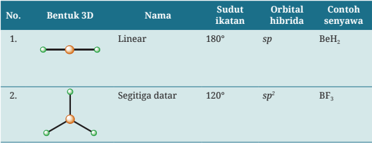

> **Deskripsi Visual:** Gambar ini adalah ilustrasi yang menunjukkan dua bentuk 3D dari molekul dengan orbital hibrida sp dan sp². Pertama, bentuk linear memiliki sudut ikatan 180° dan orbital hibrida sp, seperti dalam senyawa BeH₂. Kedua, bentuk segitiga datar memiliki sudut ikatan 120° dan orbital hibrida sp², seperti dalam senyawa BF₃. Gambar ini membantu memahami struktur molekul dan hubungan antara bentuk molekul dengan orbital hibrida.

---
**📊 Tabel**

Tabel ini membahas struktur 3D, orbital hibrida, dan contoh senyawa untuk dua jenis molekul: linear dan segitiga datar. Topik utama adalah struktur molekul dan orbital hibrida yang digunakan dalam pembentukan molekul tersebut. Kolom-kolomnya meliputi nomor urut (No.), bentuk 3D, nama molekul, sudut ikatan, orbital hibrida, dan contoh senyawa. Data penting yang terlihat adalah bahwa molekul linear menggunakan orbital hibrid sp dan contohnya adalah BeH2, sedangkan molekul segitiga datar menggunakan orbital hibrid sp2 dan contohnya adalah BF3. Ini menunjukkan hubungan antara bentuk molekul, orbital hibrida, dan struktur 3D yang dihasilkannya.

 

---
## 📄 Halaman 61

---
**🖼️ Gambar/Diagram**

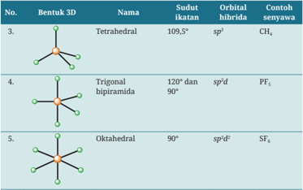

> **Deskripsi Visual:** Gambar ini adalah ilustrasi yang menunjukkan tiga bentuk 3D dalam kimia organik, yaitu tetrahedral, trigonal biphiramida, dan oktahedral. Setiap bentuk tersebut memiliki sudut ikatan yang berbeda dan orbital hibridanya. Untuk bentuk tetrahedral, sudut ikatannya adalah 109,5° dengan orbital hibridnya sp³. Contoh senyawa yang menggunakan bentuk ini adalah CH₄. Dalam bentuk trigonal biphiramida, sudut ikatannya adalah 120° dan 90° dengan orbital hibridnya sp'd'. Contoh senyawa yang menggunakan bentuk ini adalah PF₃. Sementara itu, bentuk oktahedral memiliki sudut ikatannya 90° dengan orbital hibridnya sp'd². Contoh senyawa yang menggunakan bentuk ini adalah SF₆. Gambar ini membantu pembaca memahami struktur molekul dan orbital hibrid yang relevan dengan bentuk-bentuk tersebut.

---
**📊 Tabel**

Tabel ini berisi informasi tentang bentuk 3D, nama, sudut ikatan, orbital hibrida, dan contoh senyawa untuk beberapa molekul. Topik utama tabel adalah struktur kimia molekul dan cara mereka menyeimbangkan energi dan kestabilan. Kolom-kolomnya mencakup bentuk 3D molekul, nama molekul, sudut ikatan, orbital hibrida yang digunakan, dan contoh senyawa. Data penting yang terlihat adalah bahwa molekul dengan bentuk tetraedrik memiliki orbitals hibrid sp3, seperti senyawa CH4. Molekul trigonal biphiramida menggunakan orbitals hibrid sp3d, seperti PF5. Sedangkan molekul oktaedrik menggunakan orbitals hibrid sp3d2, seperti SF6. Ini menunjukkan bagaimana orbital hibrid dapat berubah sesuai dengan bentuk molekulnya untuk meminimalkan energi dan meningkatkan stabilitas.

### 1. Teori tolakan pasangan elektron kulit valensi (VSEPR)

Coba perhatikan Gambar 2.16! Atom pusat S  mengi  kat  empat  atom  Cl  dan  ada  satu orbital  pada  atom  pusat  yang  ditempati oleh pasangan elektron bebas. Setiap atom pusat menyediakan orbital agar atom lain dapat  terikat,  sementara  elektron  yang tersisa pada atom pusat tetap berada dalam orbital tersendiri pada atom pusat. Bagaimana hal ini dapat dijelaskan?

Posisi dan interaksi pasangan elektron bebas pada kulit valensi atom pusat ketika berikatan dengan atom lain dapat dijelaskan dengan teori VSEPR. Teori VSEPR dapat digunakan untuk memprediksi bentuk molekul dengan tahapan: (1)  menentukan  jumlah  semua  pasangan  elektron  (kelompok  pasangan elektron) pada atom pusat (dari struktur Lewisnya), (2) menentukan geometri dari  semua  pasangan  elektron  tersebut,  serta  (3)  menentukan  geometri molekul (a) untuk yang tidak mempunyai pasangan elektron bebas dan (b) yang mempunyai pasangan elektron bebas. Pasangan elektron bebas memiliki

 

---
## 📄 Halaman 62

gaya tolak yang jauh lebih besar daripada pasangan elektron yang berikatan sehingga pasangan elektron bebas akan menempati ruangan yang lebih besar daripada pasangan elektron ikatan. Hal ini juga dapat memengaruhi sudut ikatannya.

---
**🖼️ Gambar/Diagram**

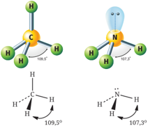

> **Deskripsi Visual:** Gambar ini adalah ilustrasi yang menunjukkan struktur molekul dari dua senyawa organik: metana (CH₄) dan amonia (NH₃). Ilustrasi ini memperlihatkan atom-atom dalam struktur molekul dengan warna-warna yang berbeda untuk menunjukkan jenis atom tersebut. Metana memiliki empat atom hidrogen yang ikatan dengan satu atom karbon, sedangkan amonia memiliki tiga atom hidrogen yang ikatan dengan satu atom nitrogen. Kedua senyawa ini memiliki sudut ikatan antara atom-atom yang sama-sama 109,5°, menunjukkan bahwa ikatan dalam molekul ini adalah tetraedrik. Selain itu, gambar ini juga menunjukkan bahwa ikatan dalam molekul ini adalah polar, seperti yang ditunjukkan oleh arah panah pada ikatan hidrogen. Ini menunjukkan bahwa ikatan dalam molekul ini adalah polar, karena ikatan hidrogen mengarah ke atom nitrogen dalam amonia.

Pada Gambar 2.17 terlihat bahwa atom karbon memiliki empat pasang elektron  yang  dipakai  berikatan  dengan  atom  hidrogen,  sehingga  geometri pasangan  elektronnya  adalah  tetrahedral.  Pada  molekul  CH 4 tidak  tersisa pasangan elektron bebas pada atom karbon sehingga sudut ikatannya 109,5°. Meskipun molekul CH4 dan NH3 memiliki geometri pasangan elektron yang sama,  yaitu  empat,  tetapi  sudut  ikatannya  berbeda.  Mengapa  hal  ini  dapat terjadi?

Molekul  NH 3 memiliki  tiga  pasang  elektron  ikatan  yang  berasal  dari atom  pusat  nitrogen  yang  berikatan  dengan  atom  hidrogen.  Pada  atom nitrogen masih tersisa satu pasang elektron bebas. Pasangan elektron bebas menghasilkan  gaya  tolak-menolak  dengan  pasangan  elektron  ikatan.  Gaya tolakan  ini  lebih  besar  dibandingkan  gaya  tolak-menolak  antarpasangan elektron ikatan. Hal inilah yang menyebabkan sudut ikatannya menjadi lebih kecil dari 109,5°, yaitu menjadi 107°. Lalu, apa kaitan bentuk molekul dengan kepolaran?

Kepolaran suatu senyawa ditentukan berdasarkan bentuk molekul dan perbedaan keelektronegatifan atom-atom penyusun molekulnya. Contohnya pada molekul H 2 O, memiliki bentuk molekul bengkok dan terjadi pengutuban

 

---
## 📄 Halaman 63

akibat perbedaan keelektronegatifan pada atom pusat oksigen dengan kedua atom hidrogen yang terikat (Gambar 2.18). Berbeda dengan XeF 2 ,  meskipun terdapat  perbedaan  keelektronegatifan  pada  atom  xenon  dengan  kedua atom luorin yang terikat, tetapi bentuk molekulnya linear, seperti terlihat pada Gambar 2.18. Bentuk simetris pada molekul XeF2 menyebabkan momen dipolnya saling meniadakan sehingga molekulnya bersifat nonpolar.

---
**🖼️ Gambar/Diagram**

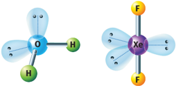

> **Deskripsi Visual:** Gambar ini adalah ilustrasi yang menunjukkan dua struktur molekul berbeda. Struktur pertama adalah molekul hidrogen oksida (H2O), yang ditampilkan dengan ikatan ikatan hidrogen dan atom oksigen yang saling terhubung. Struktur kedua adalah molekul xenon tetrafluoride (XeF4), yang menunjukkan ikatan ikatan xenon dengan atom fluor. Ilustrasi ini menunjukkan bahwa molekul H2O memiliki bentuk segi empat dengan dua atom hidrogen yang terletak di sisi-sisi, sedangkan molekul XeF4 memiliki bentuk segi empat dengan dua atom fluor yang terletak di sisi-sisi dan satu atom xenon yang berada di tengah-tengah. Ini menunjukkan bahwa struktur molekul dapat berbeda-beda bahkan jika jumlah atom yang sama ada.

### Memprediksi bentuk molekul dengan teori VSEPR

### 1. Bentuk molekul CCl 4

Elektron valensi atom C = 4 elektron

Elektron dari 4 atom Cl = 4 elektron

- Jumlah elektron di sekitar atom pusat = 8 elektron
- Jumlah pasangan elektron di sekitar atom pusat = 4 pasang
Karena ada empat pasang elektron di sekitar atom pusat, maka geometri pasangan elektronnya adalah tetrahedral (menurut teori VSEPR, keempat pasang elektron ini akan saling tolak-menolak sejauh mungkin agar  tolakannya  minimal,  dan  ini  dicapai  dengan  orientasi/geometri tetrahedral).

Karena  semua  pasangan  elektron  tersebut  digunakan  untuk  berikatan maka geometri/bentuk molekulnya adalah tetrahedral.

Rumus dari bentuk molekul CCl 4 adalah AX 4 (A: atom pusat, X: pasangan ikatan = 4).

 

---
## 📄 Halaman 64

---
**🖼️ Gambar/Diagram**

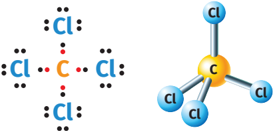

> **Deskripsi Visual:** Gambar ini adalah ilustrasi yang menunjukkan dua struktur kimia berbeda untuk senyawa karbon tetrafluorida (CF4). Struktur pertama menunjukkan bentuk linear dengan ikatan ikatan sempurna antara atom-atom, sedangkan struktur kedua menunjukkan bentuk tetragonal dengan ikatan ikatan tidak sempurna. Elemen utama yang ditampilkan adalah atom-atom karbon dan fluor. Relasi antara atom-atom tersebut melibatkan ikatan ikatan sempurna dan tidak sempurna dalam struktur-linear dan tetragonal masing-masing. Teks, angka, atau label penting yang terlihat pada gambar adalah simbol-simbol atom dan ikatan ikatan yang digunakan untuk menggambarkan struktur kimia. Informasi kunci yang dapat diambil pembaca adalah bahwa CF4 memiliki struktur linear dan tetragonal, serta ikatan ikatan sempurna dan tidak sempurna dalam struktur-struktur tersebut.

### 2. Bentuk molekul SF 4

Elektron valensi atom S = 6 elektron Elektron dari 4 atom F = 4 elektron

Jumlah elektron di sekitar atom pusat = 10 elektron

Jumlah pasangan elektron di sekitar atom pusat = 5 pasang

Lima  pasang  elektron  di  sekitar  atom  pusat  menghasilkan  geometri pasangan elektron trigonal bipiramida (lihat kembali Tabel 2.1). Namun, sepasang elektron bebas pada atom pusat menyebabkan tolak-menolak sejauh  mungkin  antara  pasangan  elektron  bebas  dengan  pasangan elektron  ikatan.  Hal  ini  menyebabkan  geometri  molekulnya  menjadi tetrahedral terdistorsi.

Rumus dari bentuk molekul SF 4 adalah AX 4 E (A: atom pusat, X: pasangan ikatan = 4, E: pasangan elektron bebas = 1).

---
**🖼️ Gambar/Diagram**

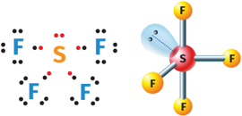

> **Deskripsi Visual:** Gambar ini adalah ilustrasi yang menunjukkan struktur molekul sulfur tetrafluorida (SF₄). Gambar ini terdiri dari dua bagian yang berbeda:

1. Bagian pertama menunjukkan diagram elektronik molekul SF₄, dengan ikatan ikatan antara atom sulfur dan atom fluor melalui pasangan elektron. Setiap atom sulfur memiliki empat pasang elektron, yang menghasilkan empat ikatan dengan atom fluor.

2. Bagian kedua menunjukkan model geometri molekul SF₄ menggunakan ikatan biru dan warna gelap untuk menunjukkan pasangan elektron. Model ini menunjukkan bahwa SF₄ memiliki struktur tetragonal planar, dengan atom sulfur berada di tengah-tengah empat atom fluor yang saling berjarak sama.

Elemen-elemen utama dalam gambar ini adalah atom sulfur dan atom fluor, yang saling terhubung oleh ikatan ikatan. Teks, angka, atau label penting yang terlihat dalam gambar ini adalah jumlah ikatan antara atom sulfur dan atom fluor, yaitu empat ikatan per atom sulfur, serta informasi tentang struktur molekul SF₄ sebagai struktur tetragonal planar.

Informasi kunci yang dapat diambil pembaca dari gambar ini adalah bahwa SF₄ memiliki empat ikatan dan struktur tetragonal planar, dengan atom sulfur berada di tengah-tengah empat atom fluor yang saling berjarak sama.

 

---
## 📄 Halaman 65

### Memprediksi bentuk molekul dengan molymod sederhana

Buatlah molymod sederhana menggunakan bahan-bahan di bawah ini.

- Lembaran styrofoam
- Tusuk sate
- Gunting
- Cat air (hitam, biru, merah, hijau, ungu, oranye, dan kuning)
- Ampelas

### Cara membuat:

- Potong styrofoam menjadi bentuk dadu.
- Ampelas hingga berbentuk bulat.
- Cat bulatan styrofoam menggunakan cat air dengan ketentuan:
- putih (tidak dicat) untuk atom hidrogen
- hitam untuk atom karbon
- biru untuk atom nitrogen
- merah untuk atom oksigen
- hijau untuk atom luorin dan klorin
- ungu untuk atom iodin
- oranye untuk atom fosfor
- kuning untuk atom sulfur

### Langkah kegiatan:

- Prediksikan  bentuk  molekul  berikut  dengan  cara  menusukkan  bulatan styrofoam sesuai warnanya menggunakan tusuk sate sebagai representasi pasangan elektron ikatan.
- PCl 3
- IF 3
- SF6
- Gambarkan bentuk molekul tersebut di buku latihan kalian.
- Cobalah  untuk  memprediksi  bentuk  molekul  lainnya  dari molymod sederhana tersebut.

 

---
## 📄 Halaman 66

### 2. Teori Hibridisasi

Bentuk  molekul  yang  sudah  diprediksi  pada  materi  sebelumnya  didukung pula oleh teori hibridisasi. Teori hibridisasi dapat menjelaskan orbital-orbital yang tergabung (hibrida) ketika membentuk ikatan. Dengan teori hibridisasi ini pula orbital yang terpakai oleh pasangan elektron dan atom yang terikat dapat lebih diperjelas.

### Contoh penentuan hibridisasi molekul kovalen

### 1. Hibridisasi dari NH 3

---
**🖼️ Gambar/Diagram**

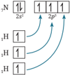

> **Deskripsi Visual:** Gambar ini adalah diagram yang menunjukkan struktur elektronik atom nitrogen (N) dalam bentuk orbitel. Diagram ini memperlihatkan orbitel 2s dan 2p dengan warna berbeda untuk menunjukkan energi mereka. Orbitel 2s berwarna biru dan lebih tinggi energinya dibandingkan orbitel 2p, yang berwarna merah. Orbitel 2p memiliki dua orbitel yang berbeda energi, satu berwarna merah dan satu berwarna hijau. Orbitel 2p yang berwarna hijau memiliki energi yang lebih rendah dibandingkan orbitel 2p berwarna merah. Selain itu, ada teks yang memberikan informasi tentang orbitel- orbitel tersebut, seperti "2s" untuk orbitel 2s dan "2p" untuk orbitel 2p. Label lainnya seperti "H" mungkin merujuk pada orbitel hidrogen. Dari gambar ini, kita dapat mengambil beberapa informasi penting, seperti struktur elektronik atom nitrogen dan bagaimana energi orbitel berbeda.

Atom nitrogen memiliki empat orbital yang berisi elektron valensi, yaitu satu orbital s dan tiga orbital p .  Saat  atom H berikatan dengan atom N, maka tiga orbital p yang belum berpasangan akan berhibridisasi bersama orbital s dari ketiga atom H untuk membentuk molekul NH 3 .  Hibridisasi atom pusat N ketika berikatan dengan tiga atom H membentuk NH 3 adalah sp 3 .  Satu  orbital s yang  diisi  pasangan  elektron  bebas  atom  pusat  tetap dihitung sebagai orbital yang dipakai, seperti yang sudah dijelaskan pada teori  VSEPR  bahwa  pasangan  elektron  bebas  memengaruhi  ikatan  dan sudut ikatan atom pusat dengan atom yang diikatnya.

### 2. Hibridisasi dari XeF 2

---
**🖼️ Gambar/Diagram**

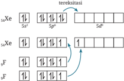

> **Deskripsi Visual:** Gambar ini adalah ilustrasi yang menunjukkan struktur elektronik atom berbeda. Ilustrasi ini memperlihatkan struktur elektronik atom berdasarkan tabel periodik, dengan elemen-elemen tertentu diberi label untuk memudahkan penafsiran.

Pertama, ilustrasi ini menunjukkan struktur elektronik atom berdasarkan tabel periodik. Setiap baris pada tabel tersebut menunjukkan struktur elektronik atom berdasarkan periode dan kelompok. Misalnya, baris pertama menunjukkan struktur elektronik atom berdasarkan periode 1, baris kedua menunjukkan struktur elektronik atom berdasarkan periode 2, dan seterusnya.

Elemen-elemen utama yang ditampilkan dalam ilustrasi ini adalah Xe (Helium), Ne (Neon), F (Fluor), dan Cl (Klor). Setiap elemen memiliki struktur elektronik yang berbeda-beda, yang ditunjukkan melalui diagram elektronik yang berbeda-beda.

Teks, angka, atau label penting yang terlihat dalam ilustrasi ini adalah periode dan kelompok atom. Periode menunjukkan urutan periode atom dalam tabel periodik, sedangkan kelompok menunjukkan urutan kelompok atom dalam tabel periodik.

Informasi kunci yang dapat diambil pembaca dari ilustrasi ini adalah bahwa struktur elektronik atom berbeda-beda tergantung pada periode dan kelompok atom. Misalnya, atom helium memiliki struktur elektronik yang berbeda dari atom neon, atom fluor, dan atom klor.

 

---
## 📄 Halaman 67

Xenon  merupakan  unsur  gas  mulia  yang  sudah  stabil.  Namun,  karena elektron valensi xenon berada pada kulit kelima dalam golongan VIIIA, maka xenon memiliki orbital d yang  kosong.  Orbital d yang  kosong  ini dapat  digunakan  sebagai  orbital  hibrida  untuk  terbentuknya  ikatan antara  atom  xenon  dan  luorin.  Hibridisasi  XeF 2 adalah sp 3 d (terdapat lima orbital hibrida) dan rumus bentuk molekulnya AX 2 E3 (dua pasang elektron ikatan dan tiga pasang elektron bebas).

Prediksi bentuk molekul dengan teori VSEPR dan jelaskan hibridisasi dari senyawa:

- SF6 (elektron valensi S = 6 dan F = 7)
- BrF5 (elektron valensi Br = 7)

### F. Ikatan Antarmolekul

Ikatan antarmolekul terjadi karena gaya elektromagnetik yang terjadi antarmolekul. Ikatan antarmolekul sangat lemah dibandingkan ikatan antaratom. Ikatan yang lemah membuat ikatan antarmolekul lebih sering disebut dengan gaya antarmolekul. Gaya antarmolekul terdiri atas ikatan hidrogen dan gaya van der Waals.

### 1. Gaya van der Waals

Menurut  kalian,  mengapa  oksigen  dapat  disimpan  dalam  wujud  cair? Sementara oksigen yang kita hirup dalam wujud gas. Apa yang menyebabkan oksigen dapat berubah dari wujud gas menjadi cair atau sebaliknya? Hal ini dapat dijelaskan melalui gaya van der Waals.

Van  der  Waals  diambil  dari  nama  ilmuwan  isika  Belanda  yang  kali pertama menemukan gaya ini, yaitu Johannes van der Waals. Gaya van der Waals terjadi antara partikel yang sama atau berbeda. Gaya ini disebabkan oleh adanya sifat kepolaran. Semakin kecil kepolaran maka semakin kecil pula gaya van der Waals. Gaya van der Waals merupakan ikatan yang sangat lemah.

 

---
## 📄 Halaman 68

Sumber: Kemendikbudristek/Arief Firdaus & rawpixel/freepik.com (2017)

Gaya van der Waals dapat terjadi karena adanya interaksi dipol. Interaksi dipol  dapat  dibedakan  menjadi  interaksi  dipol  polar-dipol  polar,  dipol nonpolar-dipol nonpolar, dan dipol polar-dipol nonpolar.

### a. Dipol polar­dipol polar

---
**🖼️ Gambar/Diagram**

> **Deskripsi Visual:** Gambar ini adalah ilustrasi yang menunjukkan gaya elektrostatik antara atom bromin (Br) dan hidrogen (H). Gambar ini menggambarkan dua molekul bromin yang saling berhubungan dengan molekul hidrogen melalui ikatan kovalen. Dua atom bromin memiliki empat elektron luar yang terlibat dalam ikatan kovalen dengan dua atom hidrogen. Elektron luar pada atom bromin lebih mudah dipindahkan ke atom hidrogen dibandingkan dengan elektron luar pada atom hidrogen. Ini menunjukkan bahwa bromin memiliki sifat kimia yang lebih positif dibandingkan dengan hidrogen. Label "Gaya elektrostatik" menunjukkan bahwa gambar ini menunjukkan hubungan antara gaya elektrostatik dan ikatan kovalen.

Atom H pada molekul HBr pertama tertarik oleh atom Br pada molekul HBr kedua, seperti yang terlihat pada Gambar 2.22. Hal ini terjadi secara terusmenerus  pada  molekul-molekul  polar  sehingga  molekul  tersebut  saling mendekat.  Dekatnya  jarak  molekul-molekul  gas  ini  mengakibatkan  wujud senyawanya menjadi cair.

Gaya van der Waals yang terbentuk akibat interaksi dipol polar (molekul polar) dengan dipol polar (molekul polar) disebut dengan dipol permanen. Gaya van der Waals dipol permanen merupakan yang paling kuat dibandingkan dengan gaya van der Waals lainnya.

 

---
## 📄 Halaman 69

### b. Dipol nonpolar­dipol nonpolar

Hidrogen umumnya disimpan dalam wujud cair. Hal ini untuk menghindari kecenderungan  gas  hidrogen  yang  mudah  meledak.  Namun,  dalam  pengaplikasiannya, hidrogen tetap harus diubah wujudnya menjadi gas. Mengapa hidrogen yang pada suhu kamar berupa gas bisa dicairkan seperti yang ada di stasiun pengisian bahan bakar pada Gambar 2.23?

Ikatan yang terbentuk pada molekul H 2 adalah ikatan kovalen nonpolar. Molekul  nonpolar  H 2 dapat  berinteraksi  dengan  molekul  nonpolar  H 2 di dekatnya.  Gaya  van  der  Waals  yang  terjadi  antardipol  nonpolar  (molekulmolekul  nonpolar)  disebut  dengan  gaya  dispersi  atau  gaya  London.  Gaya ini merupakan gaya yang sangat lemah. Hal ini terjadi karena tidak adanya perbedaan keelektronegatifan antara atom-atom penyusun  molekulnya. Meskipun tidak ada perbedaan keelektronegatifan, tetap ada sedikit tarikan yang dihasilkan oleh dipol sesaat. Dipol sesaat terjadi karena ketidakmerataan elektron dalam molekulnya. Dipol sesaat ini yang menyebabkan wujud cair molekul nonpolar dapat cepat berubah menjadi gas.

---
**🖼️ Gambar/Diagram**

> **Deskripsi Visual:** Gambar ini adalah ilustrasi yang menunjukkan mobil dengan teknologi bahan bakar celup (fuel cell). Mobil tersebut tampak seperti sebuah mobil konvensional dengan desain modern, tetapi memiliki elemen-elemen yang menunjukkan bahwa ia menggunakan teknologi bahan bakar celup. Di bagian atas mobil, terdapat logo Hydrogen yang menunjukkan bahwa mobil ini menggunakan hidrogen sebagai bahan bakar. Mobil tersebut juga dilengkapi dengan dua lampu berwarna biru yang menunjukkan bahwa ia sedang mengisi bahan bakar celup.

Elemen utama dalam gambar ini adalah mobil dengan teknologi bahan bakar celup, lampu berwarna biru, dan logo Hydrogen. Lampu berwarna biru menunjukkan bahwa mobil sedang mengisi bahan bakar celup, sementara logo Hydrogen menunjukkan bahwa mobil ini menggunakan hidrogen sebagai bahan bakar.

Teks, angka, atau label penting yang terlihat pada gambar ini adalah "MOBIL FUEL CELL" yang terletak di bagian bawah gambar. Ini menunjukkan bahwa gambar ini mungkin digunakan untuk menjelaskan tentang mobil dengan teknologi bahan bakar celup.

Informasi kunci yang dapat diambil pembaca dari gambar ini adalah bahwa mobil tersebut menggunakan teknologi bahan bakar celup, yaitu hidrogen, dan memiliki kemampuan untuk mengisi bahan bakar celup melalui lampu berwarna biru.

### c. Dipol polar­dipol nonpolar

Gaya van der Waals yang disebabkan oleh dipol polar dengan nonpolar disebut juga dipol terimbas . Adanya momen dipol yang dihasilkan oleh molekul polar menyebabkan  molekul  nonpolar  yang  berada  berdekatan  dengan  molekul polar menjadi tertarik. Namun, gaya van der Waals dipol terimbas ini tidak sekuat dipol permanen. Dipol terimbas mudah putus akibat gaya dan tekanan dari luar. Dalam kehidupan sehari-hari kita bisa melihat fenomena ini pada

 

---
## 📄 Halaman 70

air mineral (minum). Setiap air yang diminum memiliki kadar oksigen terlarut yang baik. Hal ini karena terdapat gaya tarik dipol terimbas antara molekul O 2 dengan molekul H 2 O dalam air.  Namun,  oksigen  terlarut  mudah  lepas karena  efek  eksternal,  seperti  suhu,  bakteri, atau  bahan  kimia.  Oleh  karena  itu,  semakin murni  dan  bersih  suatu  air  minum/mineral maka kadar oksigen terlarutnya semakin tinggi.

### 2. Ikatan Hidrogen

Coba perhatikan Gambar 2.25! Mengapa H 2 O memiliki titik didih yang lebih tinggi dibandingkan HF dan NH 3 ? Unsur O, F, dan N berada pada periode yang sama, tetapi H 2 O memiliki titik didih yang sangat tinggi.

---
**🖼️ Gambar/Diagram**

> **Deskripsi Visual:** Gambar ini adalah diagram yang menunjukkan hubungan antara periode atom pusat (dalam skala numerik) dengan tingkat drisik (dalam derajat Celsius). Diagram ini terdiri dari berbagai titik yang mewakili berbagai senyawa kimia, termasuk H2O, HF, NH3, H2S, H2Se, AsH3, SbH3, H2Te, HBr, HI, dan SiH4. Setiap titik pada diagram tersebut menunjukkan tingkat drisik untuk senyawa tertentu. Titik-titik ini dikelompokkan berdasarkan periode atom pusat mereka, yang dinyatakan dalam skala numerik di sisi x-axis. Titik-titik ini menunjukkan bahwa tingkat drisik senyawa-senyawa ini meningkat seiring dengan peningkatan periode atom pusat mereka. Ini menunjukkan bahwa senyawa dengan periode atom pusat yang lebih tinggi memiliki tingkat drisik yang lebih tinggi.

---
**🖼️ Gambar/Diagram**

> **Deskripsi Visual:** Gambar ini adalah foto yang menunjukkan sebuah gelas berisi air dengan air yang sedang mengalir ke dalamnya. Di sekitar gelas, terlihat taman hijau dengan beberapa bunga dan tanaman. Dapat dilihat pula rumput yang berwarna kuning dan hijau, serta beberapa batu yang berada di bagian depan taman.

Elemen utama dalam gambar ini adalah gelas berisi air, taman hijau dengan bunga dan tanaman, serta rumput dan batu. Gelas berisi air merupakan objek utama yang menarik perhatian, sementara taman hijau dan elemen lainnya memberikan latar belakang yang menambah nuansa alam.

Teks, angka, atau label penting tidak terlihat dalam gambar ini. Namun, informasi kunci yang dapat diambil pembaca meliputi ukuran gelas, warna air, dan kondisi taman di sekitarnya. Gambar ini mungkin digunakan untuk membahas konsep tentang pengisian air, tata ruang taman, atau bahkan untuk membandingkan antara taman hijau dengan area lain yang berbeda.

Sumber: Kemendikbudristek/Nanda Saridewi (2022)

 

---
## 📄 Halaman 71

Tingginya  titik  didih  pada  H 2 O  disebabkan  oleh  adanya  ikatan  yang terjadi antara atom H pada molekul H 2 O dengan atom O pada molekul H2 O yang  lainnya.  Perbedaan  keelektronegatifan  yang  besar  antara  atom  unsur hidrogen dan oksigen menyebabkan terbentuknya gaya elektrostatis yang kuat antarmolekulnya. Ikatan antarmolekul ini disebut dengan ikatan hidrogen . Ikatan ini begitu kuat dan sulit diputuskan.

Seperti yang terlihat pada Gambar 2.25, ikatan yang dibentuk oleh unsur N,  O,  dan  F  (memiliki  perbedaan  keelektronegatifan  yang  tinggi  dengan unsur H) titik didihnya lebih tinggi dibandingkan molekul lain yang berada pada golongan yang sama. Contohnya, senyawa H 2 O memiliki titik didih lebih tinggi  dari  H 2 S.  Ikatan  hidrogen  hanya  terjadi  pada  molekul-molekul  yang mengandung unsur N, O, dan F dengan molekul yang mengandung unsur H. Meskipun ikatan hidrogen merupakan ikatan yang kuat, tetapi ikatan hidrogen termasuk ke dalam ikatan antarmolekul sehingga ikatannya tidak lebih kuat dibandingkan ikatan antaratom (ikatan ion, kovalen, dan logam).

Kekuatan ikatan hidrogen dipengaruhi oleh perbedaan keelektronegatifan antara  atom-atom  dalam  molekulnya.  Semakin  besar  perbedaan  keelektronegatifan  maka  ikatannya  semakin  kuat.  Selain  itu,  dipengaruhi  juga  oleh banyaknya ikatan hidrogen yang terjadi. H 2 O memiliki lebih banyak ikatan hidrogen  (empat  ikatan  hidrogen  untuk  setiap  molekul  H 2 O),  seperti  pada Gambar  2.26,  dibandingkan  HF  yang  hanya  memiliki  dua  ikatan  hidrogen untuk setiap molekul HF.

---
**🖼️ Gambar/Diagram**

> **Deskripsi Visual:** Gambar ini adalah ilustrasi yang menunjukkan proses reaksi kimia antara atom hidrogen dengan molekul lainnya. Gambar ini menggambarkan tiga reaksi kimia yang berbeda, masing-masing dengan atom hidrogen yang berbeda jumlahnya. Setiap reaksi ini dilukiskan dengan warna yang berbeda untuk menunjukkan perubahan struktur molekul.

Elemen utama dalam gambar ini meliputi atom hidrogen dan molekul yang terlibat dalam reaksi. Atom hidrogen diperlihatkan dengan warna merah dan hijau, sedangkan molekul yang terlibat dalam reaksi diberi warna putih dan biru. Relasi antara atom hidrogen dan molekul ditunjukkan oleh garis yang menghubungkan mereka, menunjukkan hubungan antara atom hidrogen dan molekul dalam reaksi tersebut.

Teks, angka, atau label penting yang terlihat pada gambar ini meliputi nama-nama reaksi kimia, jumlah atom hidrogen dalam setiap reaksi, dan warna yang digunakan untuk menunjukkan atom hidrogen dan molekul. Informasi kunci yang dapat diambil pembaca meliputi jenis-jenis reaksi kimia yang ada, jumlah atom hidrogen dalam setiap reaksi, dan bagaimana atom hidrogen berinteraksi dengan molekul dalam setiap reaksi tersebut.

 

---
## 📄 Halaman 72

### Material terkeras ternyata tersusun atas atom nonlogam

Intan  merupakan  salah  satu  mineral  yang terdapat di Indonesia. Secara alami, intan terbentuk melalui proses yang sangat panjang. Intan memiliki ikatan antaratom karbon yang sangat  kuat  dan  tidak  ada  atom  pengotor lainnya, seperti oksigen, sulfur, dan hidrogen.

Meskipun hanya terdiri atas atom karbon, susunan yang sangat kuat antaratomnya menjadikan  intan  sebagai  material  yang  sangat keras.  Kekerasan  intan  mencapai  10  mohs. Nilai  ini  merupakan  standar  kekerasan  yang

tertinggi.  Berkat  kekerasannya  membuat  intan  banyak  digunakan  sebagai pemotong. Selain itu, akibat susunan atom-atom karbon yang sangat teratur menjadikan struktur atomiknya kuat. Struktur yang sangat teratur ini juga menjadikan  intan  sebagai  sebuah  mineral  yang  sangat  bernilai  terutama sebagai perhiasan, sehingga dikenal dengan istilah batu mulia.

Coba temukan contoh mineral lain yang kalian kenal dan tentukan ikatan apa saja yang membentuk senyawa penyusunnya?

Ikatan kimia terjadi karena suatu atom ingin mencapai kestabilan seperti gas mulia. Ikatan kimia dibagi menjadi ikatan antaratom dan antarmolekul. Ikatan  antaratom  dapat  terjadi  antara  atom  logam  dengan  nonlogam (ikatan ion), antara atom nonlogam dengan nonlogam (ikatan kovalen), dan antara atom logam dengan logam (ikatan logam). Ikatan antaratom lebih kuat dibandingkan ikatan antarmolekul. Lemahnya ikatan antarmolekul menyebabkan ikatan ini lebih dikenal dengan istilah gaya antarmolekul.

 

---
## 📄 Halaman 73

Gaya  antarmolekul  dibedakan  atas  ikatan  hidrogen  dan  gaya  van der Waals. Gaya van der Waals terbentuk akibat interaksi antara dipoldipol,  baik  dipol  permanen,  dipol  terimbas,  maupun  dipol  sesaat.  Gaya antarmolekul menyebabkan perubahan wujud pada zat. Adapun bentuk molekul dapat diramalkan dengan teori VSEPR dan pembentukan ikatan dapat dijelaskan dengan teori hibridisasi. Bentuk molekul dapat digunakan untuk  menentukan  kepolaran  suatu  senyawa  dan  sudut-sudut  yang terbentuk dari ikatan antaratom.

Setelah  mempelajari  materi  Ikatan  Kimia,  silakan  kalian  mereleksi  diri. Berilah ceklis (√) pada kolom Ya/Tidak untuk pernyataan berikut ini.

---
**📊 Tabel**

Tabel ini berisi pilihan jawaban untuk beberapa pertanyaan tentang pemahaman kimia, termasuk pembentukan ikatan ion dan kovalen, logam, dan interaksi antarmolekula. Topik utama adalah pemahaman kimia dasar. Kolom "Pernyataan" berisi pertanyaan, sedangkan kolom "Tanggapan" berisi opsi jawaban "Ya" atau "Tidak". Data penting yang terlihat adalah bahwa sebagian besar pilihan jawaban (6 dari 7) dinyatakan "Ya", menunjukkan bahwa siswa memiliki pemahaman yang baik tentang beberapa konsep kimia dasar.

Menurut kalian, materi manakah yang sulit untuk dipahami dalam bab Ikatan Kimia? Jelaskan alasannya!

 

---
## 📄 Halaman 74

### Pilihlah jawaban yang paling tepat!

- Diketahui atom 19 X dan 8 Y. Maka atom X dan Y akan membentuk senyawa yang ….
- berikatan ion dengan rumus kimia XY
- berikatan ion dengan rumus kimia X 2Y
- berikatan ion dengan rumus kimia XY 2
- berikatan kovalen dengan rumus kimia X 2Y
- berikatan kovalen dengan rumus kimia XY 2
- Di bawah ini merupakan sifat-sifat senyawa ion, kecuali ….
- bersifat keras dan rapuh
- mudah larut dalam air
- memiliki titik leleh dan titik didih yang tinggi
- padatannya dapat menghantarkan arus listrik
- larutannya dapat menghantarkan arus listrik
- Diketahui senyawa-senyawa berikut.
- HCl
- MgBr2
- Cl 2
- CCl 4
- H2O
Senyawa yang jenis gaya antarmolekulnya termasuk ke dalam dipol-dipol permanen adalah ….

- (1) dan (2)
- (1) dan (3)
- (1) dan (5)
- (2) dan (4)
- (4) dan (5)
- XeF4 memiliki bentuk molekul dan hibridisasi ….
- oktahedral dan sp 3 d 2
- segi empat datar dan sp 3 d 2
- linear dan sp 3 d
- tetrahedral dan sp 3
- bengkok dan sp 3

 

---
## 📄 Halaman 75

- Di antara molekul berikut,
- PF5
- BeCl 2
- SO2
- CCl 4
- NH3
yang merupakan molekul polar adalah ….

- (1) dan (2)
- (1) dan (3)
- (1) dan (5)
- (2) dan (4)
- (3) dan (5)

### Jawablah pertanyaan di bawah ini dengan tepat!

- Emas merupakan salah satu unsur logam mulia. Sifat mulia ini karena unsur emas bersifat stabil (tidak mudah bereaksi). Karena nilai komersial dan kilapnya yang menarik maka emas banyak digunakan sebagai perhiasan. Kadar emas di dalam perhiasan umumnya disebut dengan karat, seperti emas 24 karat, 23 karat, 22 karat, dan seterusnya. Berkurangnya nilai karat ini  menandakan  bertambahnya  jumlah  unsur  logam  lain  selain  emas yang ditambahkan untuk membuat campuran perhiasan emas tersebut. Semakin  kecil  nilai  karatnya  biasanya  akan  menghasilkan  perhiasan dengan bentuk yang lebih variatif dibandingkan emas 24 karat. Mengapa demikian?
- Gas hidrogen merupakan salah satu bahan bakar alternatif yang ramah lingkungan.  Negara  Jepang  telah  lama  mengembangkan  kendaraan berbahan bakar hirogen untuk mengurangi emisi gas berbahaya kendaraan bermotor. Jika menggunakan hidrogen maka emisinya berupa H2O, bukan CO2 dan CO yang dihasilkan dari bahan bakar hidrokarbon. Namun,  gas  hidrogen  merupakan  gas  yang  sangat  reaktif  dan  mudah meledak sehingga lebih aman disimpan dalam wujud cair pada stasiun pengisian  bahan  bakar.  Bagaimanakah  gaya  antarmolekul  yang  terjadi pada hidrogen sehingga dapat berwujud cair?

 

---
## 📄 Halaman 76

- Atom  sulfur  dapat  berikatan  kovalen  dengan  atom  F  dan  memenuhi kaidah  oktet  untuk  membentuk  molekul  SF 2 .  Lebih  lanjut,  atom  sulfur juga dapat membentuk molekul SF 4 dan SF 6 yang stabil meskipun tidak memenuhi kaidah oktet. Meskipun memiliki atom pusat dan atom terikat yang  sama,  molekul  SF 2 bersifat  polar,  sementara  molekul  SF 6 bersifat nonpolar. Mengapa ini dapat terjadi?

 

---
## 📄 Halaman 77

Kimia untuk SMA/MA Kelas XI

Penulis

: Munasprianto Ramli, dkk.

ISBN

: 978-602-427-923-3 (jil.1)

---
**🖼️ Gambar/Diagram**

> **Deskripsi Visual:** Gambar ini adalah ilustrasi yang menunjukkan dua siswa sedang melakukan eksperimen kimia dalam buku pelajaran tentang stoikiometri. Ilustrasi ini menggambarkan proses pengukuran massa kimia menggunakan piring kaca dan mikroskop. Siswa di sebelah kiri sedang menulis data hasil pengukuran ke dalam buku catatan, sementara siswa di sebelah kanan sedang memegang mikroskop untuk mengukur volume gas hasil reaksi. Gambar ini juga menampilkan teks yang memberikan informasi tentang bab ini, yaitu "Bab III Stoikiometri", serta menjelaskan reaksi kimia yang dilakukan dalam eksperimen tersebut, yaitu Na₂CO₃(s) + 2HCl(aq) → 2NaCl(s) + CO₂(g) + H₂O(l). Label dan angka penting lainnya termasuk nomor ISBN buku (978-602-627-923-3), penulis buku (Mursalipranto Ramli), dan judul buku (KIMIA UNTUK SMA/MA Kelas XI).

Setelah mempelajari bab ini, kalian dapat menjelaskan pengertian stoikiometri, menyetarakan  persamaan  reaksi,  menggunakan  konsep  mol  dalam  perhitungan, menentukan rumus molekul dan rumus empiris, menentukan pereaksi pembatas, menghitung persen hasil dari suatu reaksi kimia, serta memahami stokiometri dalam kehidupan sehari-hari.

Bab III

Stoikiometri

63

 

---
## 📄 Halaman 78

---
**🖼️ Gambar/Diagram**

> **Deskripsi Visual:** Gambar ini adalah mind map yang menunjukkan konsep stoichiometri dalam pelajaran kimia. Mind map ini terdiri dari berbagai elemen utama yang terhubung dengan kata-kata kunci yang membahas tentang stoichiometri. Elemen utama termasuk konsep molekul, stoichiometri, persen hasil, percakapan pembatasan, dan rumus molekul. Setiap elemen memiliki ikon yang menunjukkan konteksnya, seperti botol kimia untuk rumus molekul dan labu untuk percakapan pembatasan. Teks penting yang terlihat meliputi "Konsep Molekul", "Stoichiometri", "Persen Hasil", "Perkaksa Pembatasan", dan "Rumus Molekul". Informasi kunci yang dapat diambil pembaca adalah bahwa stoichiometri adalah cabang kimia yang mempelajari hubungan antara jumlah molekul dalam reaksi kimia.

### Komikkimia Kimia

---
**🖼️ Gambar/Diagram**

> **Deskripsi Visual:** Gambar ini adalah ilustrasi yang menunjukkan dialog antara beberapa karakter dalam sebuah situasi pendidikan. Ilustrasi ini terdiri dari empat panel berbeda, masing-masing menampilkan perbincangan antara dua orang. 

Pertama, karakter pria pertama bertanya kepada wanita apakah dia bisa belajar konsep matematika baru. Wanita menjawab bahwa dia tidak memahami konsep tersebut. Pria kemudian memberi contoh dengan mengatakan bahwa volume dan massa adalah konsep yang penting.

Kedua, wanita menjawab bahwa dia tidak memahami konsep tersebut. Pria kemudian menjelaskan bahwa volume dan massa adalah konsep yang penting.

Ketiga, wanita menjawab bahwa dia tidak memahami konsep tersebut. Pria kemudian menjelaskan bahwa volume dan massa adalah konsep yang penting.

Keempat, wanita menjawab bahwa dia tidak memahami konsep tersebut. Pria kemudian menjelaskan bahwa volume dan massa adalah konsep yang penting.

Informasi kunci yang dapat diambil pembaca adalah bahwa karakter pria dan wanita sedang berbicara tentang konsep matematika dan bagaimana mereka dapat memahami konsep tersebut.

 

---
## 📄 Halaman 79

Apakah  kalian  suka  jajanan  tradisional  Indonesia?  Sebagai  anak  bangsa tentunya  kita  harus  mencintai  produk  dalam  negeri,  termasuk  makanan tradisional. Indonesia adalah negara yang sangat kaya dengan ragam makanan tradisional, salah satunya adalah kue pancong.

Kue  pancong  adalah  kue  tradisional  dari  Betawi.  Berbentuk  setengah lingkaran  dengan  rasa  gurih  dan  manis.  Kue  ini  cocok  dijadikan  kudapan pagi dan sore hari. Selain di Jakarta, kue pancong juga dapat ditemukan di beberapa daerah lainnya dengan nama yang berbeda. Misalnya di Bandung, kue ini disebut bandros, di Jawa Tengah dan Yogyakarta disebut serabi rangi, dan di Bali kue ini dinamai haluman (Ensiklopedia Indonesia).

Kali  ini,  kalian  akan  belajar  perhitungan  kimia  menggunakan  analogi resep  kue  tradisional  Indonesia,  yaitu  pancong.  Mari  perhatikan  resep  kue pancong berikut ini.

---
**🖼️ Gambar/Diagram**

> **Deskripsi Visual:** Gambar ini adalah ilustrasi yang menunjukkan resep membuat kue pancong. Ilustrasi ini terdiri dari dua bagian utama: bagian atas berisi daftar bahan dan instruksi, serta bagian bawah yang menampilkan hasil akhir, yaitu kue pancong yang sudah dipanaskan dan disajikan.

Bahan-bahan yang diperlukan untuk membuat kue pancong terdapat di bagian atas ilustrasi, dengan jumlah bahan yang spesifik tertulis dalam angka: 300 gram tepung beras, 800 ml santan, 400 gram kelapa muda parut, garam secukupnya, dan gula untuk taburan. Ini menunjukkan bahwa semua bahan tersebut harus dibuat sebelum memulai proses pembuatan kue.

Hasil akhir dari resep ini adalah 100 buah kue pancong, yang tampak jelas di bagian bawah ilustrasi. Kue pancong ini tampak telah dipanaskan dan disajikan dengan cara yang menarik, menunjukkan hasil yang diharapkan dari resep tersebut.

Teks, angka, atau label penting yang terlihat dalam gambar ini meliputi nama resep (Kue Pancong), daftar bahan, jumlah bahan, instruksi, dan hasil akhir. Informasi kunci yang dapat diambil pembaca termasuk jumlah bahan yang diperlukan, jumlah hasil yang dihasilkan, dan proses pembuatan kue pancong yang diberikan dalam instruksi.

Dengan demikian, gambar ini merupakan ilustrasi yang informatif yang memberikan panduan lengkap tentang cara membuat kue pancong, mencakup semua elemen penting seperti bahan, proses, dan hasil akhir.

Mari  kita  coba  menuliskan  resep  di  atas  dalam  bentuk  hubungan reaktan dan produk. Dengan mengabaikan garam dan gula maka kita akan mendapatkan persamaan berikut.

300 g tepung beras + 800 ml santan + 400 g kelapa parut 100 buah kue pancong

 

---
## 📄 Halaman 80

Persamaan tersebut dapat kita sederhanakan menjadi:

3 g tepung beras + 8 ml santan + 4 g kelapa parut 1 buah kue pancong

Tepung  beras,  santan,  dan  kelapa  parut  dalam  stoikiometri  yang  akan kalian  pelajari  disebut  sebagai  reaktan,  sedangkan  kue  pancong  sebagai produk. Namun, dalam stoikiometri, kita tidak menulis reaktan dan produk dalam bentuk bahan masakan, melainkan rumus kimia.

Kita  akan  menggunakan kembali resep kue pancong ini dalam aplikasi stoikiometri, khususnya pada bagian pereaksi pembatas dan persen hasil.

### A.  Pengertian Stoikiometri

Stoikiometri  berasal  dari  bahasa  Yunani, stoicheion yang  berarti  unsur dan metron yang  berarti  pengukuran,  sehingga  stoikiometri  bisa  diartikan pengukuran  atau  perhitungan  matematis  dari  reaktan  dan  produk  sebuah reaksi kimia. Sederhananya, stoikiometri adalah hubungan kuantitatif antara reaktan dan produk dalam sebuah reaksi kimia.

Kalian akan dapat melakukan perhitungan matematika dari sebuah reaksi kimia dengan memahami stoikiometri. Massa, volume, dan jumlah zat yang terlibat  dalam  reaksi  kimia  dapat  kalian  hitung  dengan  melihat  hubungan antara reaktan dan produk dengan menggunakan informasi-informasi yang tersedia. Untuk dapat melakukan perhitungan tersebut, kalian harus terampil dalam menyetarakan persamaan reaksi kimia. Penyetaraan persamaan reaksi kimia sudah kalian pelajari dalam pelajaran Ilmu Pengetahuan Alam kelas X. Untuk  mengasah  kembali  keterampilan  kalian  dalam  menyetarakan  persamaan reaksi, coba kerjakan latihan berikut ini.

### Setarakan persamaan reaksi berikut ini!

``

``

``

``

- Ca3 (PO4 ) 2 + SiO 2 P 4 O10 + CaSiO 3

 

---
## 📄 Halaman 81

- Al 2 (SO 4 ) 3 + Ca(OH) 2 Al(OH) 3 + CaSO 4
- NH3 + O 2 NO + H 2O
- NH4OH + KAl(SO4 ) 2 .12H 2 O Al(OH) 3 + (NH 4 ) 2 SO4 + KOH + H 2O

### Prinsip penyetaraan persamaan reaksi

Prinsip penyetaraan persamaan reaksi adalah jumlah atom yang ada pada sisi kiri (reaktan) harus sama dengan jumlah atom pada sisi kanan (produk).

Mari perhatikan reaksi berikut.

``

Apakah persamaan reaksi di atas sudah setara? Coba kita cek jumlah atom di sisi reaktan dan produk.

Jumlah atom H di sisi reaktan sudah sama dengan jumlah atom H di sisi produk, tetapi jumlah atom O di sisi kiri dan kanan berbeda. Dengan demikian, kita katakan reaksi kimia tersebut belum setara .

Seperti  yang  sudah  kalian  pelajari  di  kelas  X,  untuk  menyetarakan persamaan  reaksi  tersebut, kalian  perlu  menambahkan  angka  (koeisien)  di depan unsur atau senyawa agar jumlah atom-atom di sisi reaktan dan produk sama.  Kembali  ke  persamaan  reaksi  yang  belum  setara  di  atas,  jika  kita menambahkan  koeisien,  persamaan  reaksinya  menjadi:

``

Mari kita cek kembali jumlah atom hidrogen dan oksigen di sisi reaktan dan produk.

 

---
## 📄 Halaman 82

Setelah kita cek ulang, ternyata jumlah atom hidrogen di sisi kiri sudah sama dengan sisi kanan, begitu juga dengan atom oksigen. Dengan demikian, bisa kita katakan bahwa reaksi tersebut sudah setara .

### B.  Konsep Mol

Selain terampil dalam menyetarakan reaksi kimia, kalian juga harus paham dengan  konsep  mol.  Hal  ini  juga  sudah  kalian  pelajari  di  kelas  X.  Bagi kalian yang lupa pengertian mol, mol adalah satuan yang digunakan untuk menunjukkan jumlah zat.

Kalau kita membeli sepatu biasanya dinyatakan dengan satuan pasang, misal dua pasang sepatu. Kalau kita membeli piring, biasanya digunakan satuan lusin (isi 12 buah). Lebih banyak lagi, kalau kita membeli kertas, digunakan satuan rim (isi 500 lembar). Nah, bagaimana menghitung banyaknya partikel? Satuan apa yang digunakan? Karena partikel ini sangat kecil dan jumlahnya sangatlah banyak maka untuk mempermudah perhitungan jumlah partikel, para ahli menyepakati satuan yang digunakan adalah mol. Berapa banyaknya partikel dalam satu mol?

Satu mol menunjukkan banyaknya partikel yang terkandung dalam suatu unsur,  ion,  molekul,  atau  senyawa  yang  jumlahnya  sama  dengan  jumlah partikel dalam 12 gram atom C-12, seperti yang sudah kalian pelajari di kelas X. Jumlah partikel dalam satu mol adalah 6,022 × 10 23 , yang dikenal juga sebagai bilangan Avogadro.

Untuk mengingat kembali konsep mol yang sudah kalian pelajari di kelas X, mari lakukan aktivitas berikut ini.

Isilah  kotak-kotak  berikut  ini  untuk  menunjukkan  hubungan  antara  mol dengan massa, volume, dan jumlah partikel!

 

---
## 📄 Halaman 83

---
**🖼️ Gambar/Diagram**

> **Deskripsi Visual:** Gambar ini adalah ilustrasi yang menunjukkan hubungan antara beberapa konsep kimia dasar, yaitu massa, molekul (MOL), jumlah partikel, volume (STP), dan jenis kimia (A, B, C, D, E, F). Ilustrasi ini menggunakan berbagai elemen seperti botol kimia berisi larutan berwarna-warni untuk menunjukkan konsep-konsep tersebut.

Elemen utama yang ditampilkan dalam gambar meliputi:

1. Massa (dapat dilihat sebagai jumlah partikel)
2. Molekul (MOL) yang merupakan unit dasar dalam kimia
3. Volume (STP) yang digunakan untuk mengukur volume gas
4. Jenis kimia (A, B, C, D, E, F) yang mungkin merujuk pada berbagai zat kimia

Relasi antara elemen-elemen ini adalah:

- Massa dan jumlah partikel saling terkait, dengan massa menggambarkan jumlah partikel.
- Molekul (MOL) adalah unit dasar yang menghubungkan massa dan jumlah partikel.
- Volume (STP) digunakan untuk mengukur volume gas, yang dapat dipengaruhi oleh jenis kimia.
- Jenis kimia (A, B, C, D, E, F) mungkin merujuk pada berbagai zat kimia yang memiliki karakteristik dan reaksi yang berbeda.

Teks, angka, atau label penting yang terlihat dalam gambar meliputi:

- "Massa" dan "jumlah partikel" yang menunjukkan hubungan antara massa dan jumlah partikel.
- "MOL" yang menunjukkan unit dasar dalam kimia.
- "Volume (STP)" yang menunjukkan cara mengukur volume gas.
- "Jenis Partikel" yang mungkin merujuk pada berbagai jenis partikel dalam kimia.

Informasi kunci yang dapat diambil pembaca meliputi:

- Hubungan antara massa, jumlah partikel, molekul, volume, dan jenis kimia dalam kimia.
- Penggunaan molekul sebagai unit dasar dalam kimia.
- Cara mengukur volume gas menggunakan STP.
- Perbedaan karakteristik dan reaksi berbagai jenis kimia.

- Hitunglah massa dari 0,1 mol gas karbon dioksida!
- Hitunglah jumlah mol dari 18 gram air!
- Berapakah jumlah mol dari 11,2 liter gas hidrogen pada kondisi standard temperature and pressure (suhu 273 K dan tekanan 1 atm)?
Diketahui: 0,1 mol karbon dioksida

Ditanya: massa gas karbon dioksida

Jawab:

`Massa CO2 = mol × massa molar CO 2 = 0,1 mol × 44 g.mol -1 = 4,4 g`

Diketahui: massa air 18 gram

Ditanya: mol air

Jawab:

`Mol air = /g16 1 massa 18 g = massa molar 18 g.mol = 1 mol`

Diketahui: volume hidrogen pada STP 11,2 liter

Ditanya: mol hidrogen

 

---
## 📄 Halaman 84

``

### Ayo Berlatih

Apakah kalian sudah paham dengan hubungan antara mol dengan jumlah zat, massa, dan volume? Coba kerjakan latihan berikut ini!

- Hitunglah jumlah mol dari 28 gram besi!
- Berapakah massa dari 1,5 mol gas klorin?
- Berapakah jumlah mol dari 10 liter gas hidrogen pada kondisi STP?
- Massa dari 5 mol senyawa X adalah 10 gram. Hitunglah massa molar dari senyawa tersebut!

### C.  Rumus Molekul dan Rumus Empiris

---
**🖼️ Gambar/Diagram**

> **Deskripsi Visual:** Gambar ini adalah ilustrasi yang menunjukkan dialog antara dua orang, mungkin guru dan murid, tentang reaksi kimia. Ilustrasi ini menggunakan teks berwarna putih untuk menekankan informasi penting. Dalam dialog tersebut, murid bertanya tentang reaksi kimia yang melibatkan CO2 dan H2O, sementara guru menjawab dengan menggunakan rumus kimia. Ilustrasi ini menggambarkan konsep kimia dalam bentuk visual yang mudah dipahami, dengan elemen-elemen utama yang mencakup dua orang yang berbicara dan teks yang memberikan informasi tentang reaksi kimia.

Setiap  senyawa  kimia  dinyatakan  dengan  rumus  kimia  yang  menunjukkan jenis dan jumlah relatif atom-atom yang menyusun senyawa tersebut. Rumus kimia ini dapat dinyatakan dalam bentuk rumus molekul dan rumus empiris. Rumus molekul menunjukkan jumlah sebenarnya dari atom yang menyusun

 

---
## 📄 Halaman 85

molekul senyawa. Misalnya air (H 2 O), setiap molekul air tersusun oleh 2 atom hidrogen dan 1 atom oksigen. Contoh lainnya adalah gas metana (CH 4 ). Setiap molekul metana disusun oleh 1 atom karbon dan 4 atom hidrogen.

Rumus  empiris  menunjukkan  perbandingan  paling  sederhana  dari jumlah atom-atom yang menyusun molekul suatu senyawa. Misalnya benzena yang  mempunyai  rumus  molekul  C 6 H6.  Perbandingan  atom  C  dan  H  yang menyusunnya adalah 1 : 1, sehingga rumus empirisnya adalah CH.

Berdiskusilah dengan teman sebangku atau kelompokmu untuk mengisi tabel berikut ini.

---
**📊 Tabel**

Tabel ini berisi informasi tentang senyawa organik, termasuk hidrogen peroksida, butana, naftalen, dan asam asetat. Topik utama tabel adalah senyawa organik dan struktur molekul mereka. Kolom pertama menunjukkan nama senyawa, kolom kedua menunjukkan massa molarsenya, kolom ketiga menunjukkan rumus molekul, dan kolom keempat menunjukkan rumus empirisnya. Data penting yang terlihat adalah bahwa semua senyawa ini memiliki formula umum CnH2n+2, yang menunjukkan bahwa mereka semua adalah alkana. Selain itu, kita dapat melihat bahwa hidrogen peroksida memiliki massa molarsenya yang lebih rendah dibandingkan dengan butana, naftalen, dan asam asetat. Ini mungkin disebabkan oleh faktor-faktor seperti jumlah atom hidrogen dan massa atom-atom lainnya dalam molekul.

Catatan: untuk mengisi massa molar, kalian bisa lihat dalam tabel periodik unsur pada Bab 1, halaman 16.

Rumus empiris dapat ditemukan dari data percobaan, sedangkan rumus molekul  diketahui  dengan  menggunakan  instrumentasi  kimia.  Kita  dapat menentukan  rumus  molekul  jika  mengetahui  massa  molekul  relatif  suatu senyawa  dan  rumus  empirisnya.  Berikut  adalah  langkah-langkah  dalam menentukan rumus empiris dari suatu senyawa.

### Cara menentukan rumus empiris:

- Menghitung massa dari atom-atom penyusun molekul.
- Menghitung mol dari masing-masing atom yang menyusun molekul.
- Menghitung rasio mol dari atom-atom penyusun molekul.
- Menentukan rumus empiris berdasarkan rasio atom-atom penyusunnya.

 

---
## 📄 Halaman 86

### Cara menentukan rumus molekul:

Rumus molekul bisa ditentukan jika kita  mengetahui  dua  hal,  yaitu  rumus empiris dan massa molekul relatif ( Mr ). Pada uraian sebelumnya telah dibahas bahwa  rumus  empiris  menunjukkan  perbandingan  paling  sederhana  dari atom-atom  penyusun  suatu  molekul.  Secara  matematis,  kita  bisa  nyatakan dalam bentuk persamaan:

Rumus molekul = rumus empiris × N

``

Dengan kata lain, N adalah  bilangan bulat sederhana yang menunjukkan perbandingan Mr berdasarkan  rumus  molekul  dan Mr berdasarkan  rumus empiris.

- Tentukan rumus empiris dari senyawa yang disusun oleh 75% karbon dan 25% hidrogen!
Jawab:

Langkah 1 , menentukan massa karbon dan hidrogen.

Kita  asumsikan  massa  senyawa  100  gram,  maka  massa  karbon  dan hidrogen adalah:

Massa karbon = 75% × 100 g = 75 g

``

Langkah 2 , menentukan mol karbon dan hidrogen.

``

``

Langkah 3 , menentukan rasio mol karbon dan hidrogen.

Mol karbon : mol hidrogen = 6,25 mol : 25 mol

``

Dari rasio tersebut maka rumus empirisnya adalah CH 4 .

 

---
## 📄 Halaman 87

- Suatu  senyawa  memiliki  massa  molar  120  g.mol -1 .  Senyawa  tersebut diketahui mengandung 40% atom C, 6,67% atom H, dan 53,33% atom O. Tentukan rumus molekul dari senyawa tersebut!
Jawab:

Langkah 1 , menentukan rumus empiris dari senyawa.

Kita dapat menentukan rumus empiris dengan menggunakan tabel seperti di bawah ini.

---
**📊 Tabel**

Tabel ini berisi informasi tentang atom-atom karbon, hidrogen, dan oksigen dalam molekul tertentu. Topik utama tabel adalah analisis massa dan persen massa atom-atom tersebut dalam molekul tersebut. Kolom-kolom yang ada meliputi Atom, Aze (g.mol^-1), Persen massa (%), Masa dalam 100 g, Mel, dan Perbandingan mol. Data penting yang terlihat adalah bahwa karbon memiliki massa atom sebesar 12 g/mol, membentuk 40% dari total massa dalam molekul, dengan perbandingan mol 1:1. Hidrogen memiliki massa atom sebesar 1 g/mol, membentuk 6,67% dari total massa dalam molekul, dengan perbandingan mol 2:1. Oksigen memiliki massa atom sebesar 16 g/mol, membentuk 53,33% dari total massa dalam molekul, dengan perbandingan mol 3,33:1. Ini menunjukkan bahwa oksigen adalah elemen yang paling banyak dalam molekul tersebut, sedangkan karbon dan hidrogen adalah elemen yang lebih sedikit tetapi masih penting dalam struktur molekul tersebut.

Jadi, rumus empiris dari senyawa di atas adalah CH 2 O.

Langkah 2 ,  menentukan rumus molekul dari rumus empiris dan massa molar.

Rumus molekul = rumus empiris × N

N

/g32

massa molar dari molekul yang akan dicari massa molar molekul dari rumus empiris

``

Setiap atom yang menyusun rumus empiris, kita kalikan 4 sehingga rumus molekul senyawa tersebut adalah C 4 H8O4 .

 

---
## 📄 Halaman 88

Mari cek pemahaman kalian dengan mengerjakan latihan berikut ini.

- Tentukan rumus empiris dari senyawa yang disusun oleh:
- 63,6% besi dan 36,4% belerang
- 53,3% oksigen, 40% karbon, dan 6,7% hidrogen
- Polimer  adalah  senyawa  berbentuk  rantai  molekul  panjang  dan berulang  yang  dihubungkan  oleh  ikatan  kovalen  melalui  proses polimerisasi. Polimer sangat banyak kegunaannya dalam kehidupan, misalnya  bahan  kaos,  panci  antilengket,  dan  pipa  PVC.  Tentukan rumus empiris dari polimer berikut ini!
- Polietilen yang tersusun atas 86% karbon dan 14% hidrogen
- Polistiren yang tersusun dari 92,3% karbon dan 7,7% hidrogen
- Untuk diversiikasi produk, sebuah produsen pewarna tekstil mengembangkan zat warna baru. Zat warna ini memiliki komposisi 75,95% C, 17,72% N, dan 6,33% H. Tentukan rumus molekul dari zat warna ini jika massa molarnya adalah 480 g.mol -1 !

### D.  Pereaksi Pembatas

Suatu reaksi kimia, tidak selalu senyawa-senyawa yang bereaksi akan habis secara bersamaan. Ada kalanya sebuah reaktan habis lebih dahulu, sementara reaktan lainnya masih bersisa. Reaktan yang sudah habis ketika reaktan lain masih  bersisa  disebut  sebagai pereaksi  pembatas .  Pereaksi  pembatas  ini akan membatasi jumlah produk yang dihasilkan.

Mari  pahami  konsep  pereaksi  pembatas  ini  dengan  menganalogikan kembali  perhitungan pada resep kue pancong yang ada di awal bab. Penggunaan garam dan gula dalam resep ini juga diabaikan.

 

---
## 📄 Halaman 89

---
**🖼️ Gambar/Diagram**

> **Deskripsi Visual:** Gambar ini adalah ilustrasi yang menunjukkan resep untuk membuat kue pancake. Ilustrasi ini menggambarkan sebuah kue pancake yang dibuat dengan tepung beras, santan, kelapa parut, dan buah-buahan seperti mangga dan durian. Gambar ini juga menunjukkan jumlah bahan yang diperlukan untuk membuat kue tersebut, yaitu 500 gram tepung beras, 800 ml santan, 400 gram kelapa parut, dan 100 buah buah kue pancake. Informasi penting lainnya yang ditampilkan adalah bahwa jika seorang penganut memakai 500 gram tepung beras, 1 liter santan, dan 600 gram kelapa muda parut, maka mereka bisa membuat kue pancake yang sama dengan yang ditampilkan pada gambar ini.

Ada tiga bahan utama dalam pembuatan kue pancong ini, yaitu tepung beras, santan, dan kelapa parut. Mari kita lihat ketersediaan dan kebutuhan bahan-bahan tersebut.

Pertama ,  kita  lihat  kebutuhan  santan  dan  kelapa  parut  dari  ketersediaan tepung beras.

Jika semua tepung beras yang tersedia digunakan untuk membuat kue maka santan yang dibutuhkan adalah 500 g 300 g × 800 ml = 1,33 liter. Sementara santan yang tersedia hanya 1 liter.

Adapun  kelapa  parut  yang  dibutuhkan  adalah 500 g 300 g ×  400  g  =  666,67  g. Sementara yang tersedia hanya 600 g.

Dari  kedua  perhitungan  ini,  artinya  tepung  beras  tidak  mungkin  sebagai pereaksi pembatas karena justru tersedia berlebih.

Kedua , kita lihat kebutuhan tepung beras dan santan dari ketersediaan kelapa parut.

 

---
## 📄 Halaman 90

Jika semua kelapa parut yang tersedia digunakan untuk membuat kue maka tepung beras yang dibutuhkan adalah 600 g 400 g × 300 g = 450 g. Tepung beras yang tersedia  lebih  dari  yang  dibutuhkan,  sehingga  tepung  beras  tidak  mungkin menjadi pereaksi pembatas.

Adapun santan yang dibutuhkan adalah 600 g 400 g × 800 ml = 1,2 liter. Sementara santan yang tersedia hanya 1 liter.

Jadi, santan akan habis lebih dahulu dibandingkan dengan kelapa parut dan tepung  beras,  sehingga  dapat  dikatakan  santan  adalah  pereaksi  pembatas. Untuk pembuktian, mari perhatikan hitungan di bawah ini.

Ketiga , kita lihat kebutuhan tepung beras dan kelapa parut dari ketersediaan santan.

Jika santan yang tersedia 1 liter maka tepung beras yang dibutuhkan adalah

``

Tepung  beras  yang  tersedia  adalah  500  gram,  lebih  banyak  dari  yang dibutuhkan, sehingga ketika santan habis, tepung beras masih bersisa.

Adapun kelapa parut yang dibutuhkan adalah 1.000 g 800 g × 400 g = 500 g.

Kelapa  parut  yang  tersedia  adalah  600g,  juga  lebih  banyak  dari  yang dibutuhkan, sehingga ketika santan habis, kelapa parut juga masih bersisa. Artinya,  di  sini  santan  berperan  sebagai  pereaksi  pembatas  karena  santan habis lebih dahulu, sementara tepung beras dan kelapa parut masih bersisa.

Coba kalian perhatikan perbandingan ketersediaan bahan dengan kebutuhan resep berdasarkan bahan-bahan yang dimiliki oleh Dono dan Dona pada tabel berikut ini.

---
**📊 Tabel**

Tabel ini menunjukkan perbandingan ketersediaan dan kebutuhan resep untuk beberapa bahan utama dalam masakan tradisional. Topik utama tabel adalah perbandingan antara berbagai bahan makanan dalam hal ketersediaan dan kebutuhan resep. Kolom pertama menyatakan jenis bahan, sedangkan kolom kedua menunjukkan jumlah bahan yang diperlukan dalam setiap resep. Data penting yang terlihat adalah bahwa tepung beras memiliki ketersediaan paling tinggi dengan 500 gram, sementara kelapa parut memiliki ketersediaan terendah dengan hanya 400 gram. Santan juga memiliki ketersediaan yang cukup tinggi, sekitar 1.25 kali kebutuhan resep. Ini menunjukkan bahwa tepung beras dan santan lebih mudah ditemukan dibandingkan dengan kelapa parut dalam proses memasak.

 

---
## 📄 Halaman 91

Dari tabel tersebut tampak bahwa pereaksi pembatas adalah reaktan yang memiliki nilai perbandingan ketersediaan dan kebutuhan resep yang terkecil. Bagaimana  dengan  reaksi  kimia  yang  sesungguhnya?  Coba  simak  contoh perhitungan berikut ini.

Sebanyak  5,4  gram  aluminium  direaksikan  dengan  7,1  gram  gas  klorin menurut reaksi:

``

Zat manakah yang berperan sebagai pereaksi pembatas?

Pertama , mari kita hitung mol dari Al dan Cl 2 yang tersedia.

``

``

Kedua , mari kita lihat kebutuhan Al dari ketersediaan Cl 2 .

Cl 2 yang tersedia adalah 0,1 mol. Jika semua Cl 2 yang tersedia digunakan untuk bereaksi, maka Al yang diperlukan adalah 2 3 × 0,1 mol = 0,067 mol. Artinya, Al yang tersedia melebihi dari yang dibutuhkan sehingga Al akan bersisa. Zat yang  bersisa  tidak  mungkin  berperan  sebagai  pereaksi  pembatas.  Zat  yang habis bereaksilah yang berperan sebagai pereaksi pembatas, sehingga pada reaksi di atas, pereaksi pembatasnya adalah gas klorin.

Mari kita lihat perbandingan ketersediaan Al dan Cl 2 terhadap koeisien reaksi.

---
**📊 Tabel**

Tabel ini menunjukkan perbandingan ketersediaan dan koefisien reaksi antara aluminium dan gas klorin dalam suatu reaksi kimia. Topik utama tabel ini adalah analisis reaksi kimia antara dua zat, yaitu aluminium dan gas klorin. Kolom pertama berisi nama zat yang menjadi reaktan, sedangkan kolom kedua berisi perbandingan ketersediaan dan koefisien reaksi untuk masing-masing reaktan tersebut. Data penting yang terlihat dalam tabel ini adalah bahwa koefisien reaksi aluminium adalah 0,2 dan koefisien reaksi gas klorin adalah 0,1. Ini menunjukkan bahwa dalam reaksi ini, aluminium akan bereaksi dengan 0,2 sekuensinya, sementara gas klorin akan bereaksi dengan 0,1 sekuensinya.

Apa yang dapat kalian simpulkan?

Dari  tabel  terlihat  bahwa  perbandingan  mol  gas  klorin  terhadap  koeisiennya lebih kecil dari perbandingan mol aluminium terhadap koeisiennya. Dengan demikian, untuk menentukan zat atau senyawa yang berfungsi sebagai pereaksi  pembatas,  bisa  kita  hitung  dari  nilai  perbandingan  mol  terhadap koeisiennya.

 

---
## 📄 Halaman 92

Gas  manakah  yang  berperan  sebagai  pereaksi  pembatas  jika  8  gram  gas metana direaksikan dengan 16 gram gas oksigen menurut reaksi berikut?

``

### Jawab:

Langkah 1 , menyetarakan reaksi.

Reaksi di atas belum setara karena jumlah atom-atom di sisi reaktan dan sisi produk belum sama. Oleh karena itu, kita harus setarakan reaksi, yaitu:

``

---
**📊 Tabel**

Tabel ini menunjukkan informasi tentang gas-gas berbasis massa, mol, dan koefisien. Topik utama tabel adalah perbandingan antara massa gas, jumlah mol gas, dan koefisien dalam reaksi kimia. Kolom-kolomnya meliputi gas (seperti CH₄ dan O₂), massa gas (8 g untuk CH₄ dan 12 g untuk O₂), jumlah mol gas (0,5 mol untuk CH₄ dan 0,5 mol untuk O₂), dan koefisien (1 untuk CH₄ dan 2 untuk O₂). Data penting yang terlihat adalah bahwa sama banyak mol gas dibutuhkan untuk reaksi antara CH₄ dan O₂, tetapi O₂ memerlukan dua kali lebih banyak mol dibandingkan dengan CH₄. Ini menunjukkan bahwa reaksi tersebut mungkin tidak berlangsung dengan baik jika hanya ada satu molekul CH₄ karena O₂ akan habis sebelum reaksi dapat berjalan dengan sempurna.

Dari  tabel  di  atas  terlihat  bahwa  perbandingan  mol  terhadap  koeisien  gas oksigen lebih kecil dari gas metana, sehingga kita bisa simpulkan bahwa gas oksigen berperan sebagai pereaksi pembatas.

---
**🖼️ Gambar/Diagram**

> **Deskripsi Visual:** Gambar ini adalah ilustrasi yang menunjukkan dua peneliti dalam lingkungan laboratorium. Peneliti pertama sedang memegang sebuah botol dengan cairan berwarna kuning, sementara peneliti kedua sedang memegang botol lain dengan cairan berwarna hijau. Kedua botol tersebut terletak di atas piring berisi uang emas dan perak. Di sebelah kiri, ada beberapa botol dengan cairan berwarna merah dan biru, serta beberapa buah merah. Di sebelah kanan, ada beberapa botol dengan cairan berwarna ungu dan hijau, serta beberapa buah merah. Di latar belakang, terlihat gedung pencakar langit dan langit yang cerah dengan awan putih.

Dalam industri kimia, konsep pereaksi pembatas diperlukan untuk mendapat­ kan hasil optimal dengan biaya yang minimal. Produsen akan memilih bahan kimia yang paling mahal untuk berperan sebagai pereaksi pembatas dan bahan yang lebih murah sebagai bahan yang bersisa. Hal ini untuk memastikan bahwa semua bahan yang mahal tersebut habis dalam reaksi.

 

---
## 📄 Halaman 93

### Ayo Berlatih

Mari cek pemahaman kalian tentang pereaksi pembatas dengan mengerjakan latihan berikut ini.

- Sebanyak 10,8 gram logam aluminium direaksikan dengan 49 gram asam sulfat menurut reaksi di bawah ini.

``

- Tentukan pereaksi pembatasnya.
- Hitunglah mol reaktan yang bersisa.
- Hitunglah volume gas H 2 yang dihasilkan pada keadaan STP.
- Natrium hidroksida bereaksi dengan asam fosfat membentuk natrium fosfat dan air menurut reaksi berikut ini.

``

Diketahui sebanyak 80 gram natrium hidroksida beraksi dengan 98 gram asam fosfat.

- Tentukan senyawa yang berperan sebagai pereaksi pembatas.
- Hitunglah massa natrium fosfat yang terbentuk.

### E.  Persen Hasil

Kalian  mungkin  sering  mendengar  'kesempurnaan  hanya  milik  Tuhan', begitu  juga  reaksi  kimia.  Sangat  jarang  sekali  reaksi  kimia  menghasilkan produk  100%  dan  murni.  Dalam  praktiknya,  banyak  sekali  reaksi  kimia yang  menghasilkan  produk  yang  tidak  sesuai  jumlahnya  dengan  perkiraan berdasarkan persamaan reaksi.

Ada banyak aspek yang menyebabkan produk yang diperoleh tidak sesuai jumlahnya dengan perhitungan secara matematis, di antaranya:

- Reaksi yang terjadi belum sepenuhnya selesai
- Kesalahan saat penimbangan dan pengukuran reaktan
- Kesalahan saat memindahkan reaktan
- Bahan kimia yang digunakan tidak murni
- Terbentuknya produk samping
- Adanya pengotor yang menempel pada produk

 

---
## 📄 Halaman 94

---
**🖼️ Gambar/Diagram**

> **Deskripsi Visual:** Gambar ini adalah ilustrasi yang menunjukkan dialog antara dua karakter. Ilustrasi ini terdiri dari empat panel berurutan, masing-masing menampilkan pernyataan dari salah satu karakter. 

Pertama, karakter laki-laki menyampaikan bahwa dia tidak bisa membeli sesuatu karena tidak memiliki uang. Kemudian, karakter perempuan menjawab bahwa dia akan membantu dengan uangnya. Setelah itu, karakter laki-laki mengatakan bahwa dia akan membayar dengan uang yang diberikan oleh perempuan tersebut. Akhirnya, karakter perempuan memberikan informasi bahwa dia akan membayar dengan uang yang diberikan oleh perempuan tersebut.

Elemen-elemen utama dalam gambar ini adalah dua karakter, teks yang ditulis oleh mereka, dan tanda baca yang digunakan untuk menunjukkan perubahan dialog. Informasi kunci yang dapat diambil pembaca adalah hubungan antara dua karakter dan bagaimana mereka berkomunikasi tentang pembayaran.

Coba  kalian  perhatikan  ilustrasi  di  atas.  Setelah  selesai  memasak  kue pancong dengan mengikuti takaran resepnya, ternyata Dono dan Dona hanya mendapatkan  produk  sebanyak  96  buah,  padahal  menurut  resep  mestinya mereka  mendapatkan  100  buah.  Dalam  reaksi  kimia,  hasil  yang  diperoleh oleh  Dono dan Dona ini disebut sebagai hasil aktual, sedangkan hasil yang diprediksi berdasarkan resep disebut hasil teoretis. Dengan membandingkan hasil aktual terhadap hasil teoretis, diperoleh persen hasil sebesar 96%.

### Persen hasil = hasil aktual hasil teoretis × 100%

Seng dan belerang bereaksi membentuk seng sulida menurut reaksi:

``

Jika sebanyak 1 mol seng bereaksi dengan 1 mol sulfur dan di akhir reaksi seng sulida yang diperoleh adalah 90 gram, hitunglah persen hasil dar i reaksi ini!

### Jawab:

Langkah 1 , mengecek kesetaraan reaksi.

Koeisien reaksi adalah satu dan jumlah atom pada sisi reaktan dan sisi produk sudah sama, maka reaksi sudah setara.

 

---
## 📄 Halaman 95

Langkah 2 , menghitung hasil teoretis.

Reaksi 1 mol seng dan 1 mol sulfur akan menghasilan 1 mol seng sulida. Maka, kita dapat menghitung massa teoretis seng sulida sebagai berikut.

``

``

Jadi, hasil teoretis yang seharusnya diperoleh adalah 97 gram.

Langkah 3 , menghitung persen hasil.

Persen  hasil  diperoleh  dengan  membandingkan  hasil  aktual  terhadap  hasil teoretis.  Hasil  aktual  sesuai  soal  adalah  92  gram,  sedangkan  berdasarkan perhitungan hasil teoretisnya 97 gram, sehingga persen hasilnya adalah:

``

### F. Persen Kemurnian

Seperti yang sudah disampaikan, salah satu penyebab tidak sesuainya jumlah produk  reaksi  kimia  dengan  perhitungan  teoretis  adalah  ketidakmurnian bahan kimia yang tersedia. Jika kemurnian suatu bahan rendah maka persen hasil yang didapatkan juga rendah. Kadar kemurnian bahan kimia dinyatakan dengan persen kemurnian.

``

Sebanyak  6,4  gram  sampel  tembaga  yang  tidak  murni  dipanaskan  dalam burner dan bereaksi dengan oksigen menghasilkan tembaga (II) oksida yang berwarna hitam menurut reaksi di bawah ini.

``

 

---
## 📄 Halaman 96

Jika  di  akhir  reaksi  diperoleh  6,8  gram  tembaga  oksida,  hitunglah  persen kemurnian dari tembaga!

### Jawab:

Diketahui: massa sampel tembaga = 6,4 gram dan massa CuO = 6,8 gram Mari kita hitung massa Cu dengan melihat hubungan stoikiometri dari reaksi kimianya.

Langkah 1 , menghitung mol Cu dengan menggunakan stoikiometri. Reaksi kimia yang terjadi adalah:

``

Dari perbandingan koeisien tersebut dapat kita ketahui bahwa mol CuO yang dihasilkan  sama  dengan  jumlah  mol  Cu  yang  bereaksi,  sehingga  kita  bisa menghitung mol Cu dari mol CuO sebagai berikut.

``

Mol Cu = mol CuO = 0,085 mol

Langkah 2 , menghitung massa Cu. Massa Cu = mol Cu × massa molar Cu

``

Langkah 3 , menghitung persen kemurnian Cu.

``

 

---
## 📄 Halaman 97

### Ayo Berlatih

- Seorang  siswa  melakukan  reaksi  pengendapan.  Secara  teori,  siswa tersebut seharusnya mendapatkan 19,5 gram endapan, tetapi selesai praktikum siswa tersebut hanya mendapatkan 18,5 gram. Hitunglah persen hasil berdasarkan percobaan yang dilakukan siswa tersebut!
- Dono dan Dona mendapat tugas untuk melakukan percobaan reaksi pengendapan.  Berdasarkan  panduan  yang  diperoleh,  mereka  harus mereaksikan 10 gram barium nitrat yang dilarutkan dengan larutan natrium sulfat berlebih. Reaksi yang terjadi adalah:

``

Jika di akhir percobaan, Dono dan Dona mendapatkan 7,5 gram barium sulfat, hitung persen hasil dari percobaan yang mereka lakukan!

### Pengayaan

### Kompor Gas dan Pemanasan Global

Pernahkah  kalian  mendengar  tentang  rumah  kaca?  Rumah  kaca  adalah bangunan yang terbuat dari kaca, baik bagian dinding maupun atapnya, agar dapat memerangkap sinar matahari. Sinar matahari yang terperangkap akan membuat bangunan ini tetap hangat. Hal ini tentunya akan sangat bermanfaat bagi para petani yang tinggal di negara dengan empat musim. Di samping itu, para peneliti juga memanfaatkan rumah kaca untuk budidaya tanaman yang dimanfaatkan bagi penelitian.

Bagaimana dengan efek rumah kaca? Efek rumah kaca pada prinsipnya menjelaskan fenomena yang sama dengan rumah kaca. Cahaya matahari yang sampai  ke  atmosfer  bumi,  terperangkap  di  dalam  atmosfer  akibat  adanya lapisan  gas  yang  terbentuk  dari  aktivitas  manusia.  Hal  ini  menyebabkan suhu bumi meningkat setiap tahunnya, atau disebut juga dengan pemanasan global. Gas-gas yang membuat energi dari sinar matahari ini terperangkap di atmosfer bumi dan berkontribusi terhadap pemanasan global disebut dengan gas rumah kaca, salah satunya karbon dioksida.

 

---
## 📄 Halaman 98

---
**🖼️ Gambar/Diagram**

> **Deskripsi Visual:** Gambar ini adalah ilustrasi yang menunjukkan efek rumah kaca. Gambar ini menggambarkan proses panas yang dialirkan dari matahari ke atmosfer bumi melalui sinar cahaya dan panas. Elemen utama dalam gambar ini adalah matahari, bumi, dan atmosfer. Matahari dilihat berada di atas bumi, sementara bumi tampak berada di bawah atmosfer. Atmosfer dilihat bergerak dari bumi menuju ke udara, menunjukkan bahwa sebagian panas matahari dipantulkan ke atmosfer, sedangkan sebagian lagi terperangkap atmosfer.

Teks penting dalam gambar ini adalah "EFEK RUMAH KACA" yang menjelaskan konsep dasar tentang efek rumah kaca. Angka dan label penting dalam gambar ini adalah "CD" dan "gas-gas lainnya di atmosfer memerangi panas", yang menunjukkan bahwa CO2 dan gas-gas lainnya di atmosfer berfungsi untuk memerangi panas yang masuk ke atmosfer.

Informasi kunci yang dapat diambil pembaca dari gambar ini adalah bahwa efek rumah kaca adalah fenomena di mana sebagian panas matahari dipantulkan ke atmosfer, sedangkan sebagian lagi terperangkap atmosfer, menyebabkan suhu bumi meningkat.

Jumlah emisi karbon dioksida di atmosfer bumi tentu tidak terlepas dari aktivitas rumah tangga. Di Indonesia misalnya, sebagian besar warga mengguna  kan  elpiji  ( liqueied  petroleum  gas ,  LPG)  untuk  memasak.  Kalau  setiap rumah menggunakan elpiji, bisa dibayangkan berapa banyak emisi gas karbon dioksida yang dilepaskan ke udara dan menjadi petaka karena menyebabkan pemanasan global.

### Studi Kasus

Di Desa Sukamulia terdapat 2.500 rumah. Setiap rumah mengonsumsi 3 kg gas elpiji setiap minggunya. Jika gas elpiji ini terdiri atas 50% gas propana dan 50% gas butana, hitunglah berapa banyak emisi karbon dioksida yang dihasilkan  dari  aktivitas  dapur  warga  Desa  Sukamulia  dengan  asumsi pembakaran berlangsung sempurna.

Reaksi yang terjadi:

Pembakaran propana: C

`3 H8( g ) + 5O 2 ( g ) 3CO 2 ( g ) + 4H 2 O( l )`

Pembakaran butana: 2C

`4 H10 ( g ) + 13O 2 ( g ) 8CO 2 ( g ) + 10H 2 O( l )`

 

---
## 📄 Halaman 99

Stoikiometri  adalah  hubungan  kuantitatif  antara  reaktan  dan  produk dalam sebuah reaksi kimia. Sebelum melakukan perhitungan stoikiometri, harus dipastikan reaksi kimia sudah setara. Dalam perhitungan stoikiometri,  membutuhkan  pemahaman  tentang  konsep  mol.  Massa,  volume, dan jumlah partikel dapat ditentukan melalui konsep mol.

Dengan  mempelajari  stoikiometri,  kalian  juga  dapat  menentukan rumus  molekul  dan  rumus  empiris.  Rumus  molekul  adalah  jumlah sebenarnya dari atom-atom yang menyusun molekul senyawa, sedangkan rumus empiris adalah perbandingan paling sederhana dari jumlah atomatom yang  menyusun molekul suatu senyawa.

Stoikiometri juga sangat erat kaitannya dengan dunia industri. Dalam praktiknya,  pelaku  industri  akan  menjadikan  bahan  kimia  yang  mahal sebagai pereaksi pembatas. Pereaksi pembatas adalah reaktan yang habis terlebih  dahulu  ketika  reaktan  lain  masih  bersisa  sehingga  membatasi jumlah produk yang dihasilkan.

Pelaku  industri  juga  menghitung  persen  hasil  untuk  mengetahui optimalisasi  dari  produksi  yang  mereka  lakukan.  Persen  hasil  adalah persentase produk yang diperoleh dengan membandingkan hasil aktual  terhadap  hasil  teoretis.  Mereka  juga  mempertimbangkan  persen kemurnian dari bahan baku yang dipergunakan untuk kegiatan produksi. Persen  kemurnian adalah persentase  yang  menunjukkan perbandingan antara  massa  sesungguhnya  dari  unsur  atau  senyawa  terhadap  massa sampel.

 

---
## 📄 Halaman 100

Setelah  mempelajari  materi  Stoikiometri,  silakan  kalian  mereleksi  diri. Berilah ceklis (√) pada kolom Ya/Tidak untuk pernyataan di bawah ini.

---
**📊 Tabel**

Tabel ini berisi pernyataan tentang kemampuan pemahaman dan pengetahuan tentang stoichiometri kimia, dengan kolom "Ya" dan "Tidak". Topik utama tabel adalah kemampuan dalam memahami dan menggunakan konsep stoichiometri dalam perhitungan massa, volume, jumlah partikel, dan rumus empiris dan molekul. Data penting yang terlihat adalah bahwa sebagian besar penerapan pernyataan tersebut belum dilakukan oleh siswa, menunjukkan adanya kebutuhan untuk pembelajaran lebih lanjut dalam bidang ini.

Menurut  kalian,  materi  manakah  yang  sulit  untuk  dipahami  dalam  bab Stoikiometri? Jelaskan alasannya!

### Pilihlah jawaban yang paling tepat!

### 1. Diketahui reaksi:

a H2SO4 ( aq ) + b KOH( aq ) c K2 SO4 ( aq ) + d H2O( l )

Nilai a :

d adalah ….

- 1 : 2
- 1 : 1
- 2 : 1
- 1 : 4
- 4 : 1

 

---
## 📄 Halaman 101

- Jumlah molekul dari 3,2 gram SO 2 adalah ….
- 6,022 × 10 20  molekul
- 3,011 × 10 21  molekul
- 1,005 × 10 22  molekul
- 3,011 × 10 22  molekul
- 6,022 × 10 23  molekul
- Reaksi di bawah ini yang belum setara adalah ….
- Ba3 N2 + 6H 2 O 3Ba(OH) 2 + 2NH 3
- 3CaCl 2 + 2Na 3 PO4 Ca 3 (PO4 ) 2 + 6NaCl
- 4FeS + 7O 2 2Fe 2 O3 + 4SO 2
- PCl 5 + 4H 2 O H 3 PO4 + 5HCl
- 2As + 3NaOH 2Na 3 AsO3 + 3H 2
- Sebanyak 10 gram glukosa mengalami reaksi pembakaran menurut reaksi berikut.

``

Massa dari karbon dioksida yang dihasilkan adalah ….

- 5 gram
- 10 gram
- 15 gram
- 20 gram
- 25 gram
- Rumus  empiris  dari  senyawa  yang  terdiri  atas  45,1%  nitrogen,  38,8% karbon, dan 16,1% hidrogen adalah ….
- CH3N
- CH4N
- CH5N
- CH2N2
- C2H4N

### Jawablah pertanyaan di bawah ini dengan tepat!

- Sebanyak 3,2 gram metana dibakar dengan 8 gram gas oksigen menurut reaksi:

``

Hitunglah massa dari gas karbon dioksida yang dihasilkan!

 

---
## 📄 Halaman 102

- Poliakrilonitril  atau  disebut  juga  dengan  orlon  adalah  polimer  adisi berupa  serat  sintetis  yang  sangat  kuat.  Orlon  banyak  dimanfaatkan sebagai karpet dan bahan pakaian. Tentukan rumus empiris dari orlon jika kandungannya adalah 67,9% C, 26,4% N, dan 5,70% H!
- Sebelum pergi ke pantai atau bepergian pada hari yang terik, di antara kalian biasanya mengoleskan tabir surya ke wajah dan badan. Salah satu senyawa yang terdapat dalam tabir surya adalah asam para-aminobenzoat. Asam para-aminobenzoat ini mampu melindungi kulit dari radiasi sinar ultraviolet. Jika asam para-aminobenzoat ini tersusun atas 61,31% karbon, 23,34% oksigen, 10,21% nitrogen, dan 5,14% hidrogen, tentukanlah rumus empirisnya!

 

---
## 📄 Halaman 103

Penulis

: Munasprianto Ramli, dkk.

ISBN

: 978-602-427-923-3 (jil.1)

---
**🖼️ Gambar/Diagram**

> **Deskripsi Visual:** Gambar ini adalah ilustrasi yang menunjukkan seorang petugas bensin sedang memasukkan bahan bakar ke dalam mobil. Gambar ini terdiri dari beberapa elemen utama:

1. Petugas bensin: Dalam gambar ini, petugas bensin diperlihatkan dengan pakaian kerja yang berwarna merah dan biru, serta topi hitam. Ia sedang memegang tabung bensin dan mengisi bensin ke dalam mobil.

2. Mobil: Mobil yang sedang diserangkai dengan tabung bensin tersebut tampak besar dan berwarna biru. Mobil tersebut tampak siap untuk perjalanan.

3. Teks: Di bagian atas gambar, terdapat teks yang menyatakan bahwa gambar ini merupakan bagian dari buku pelajaran tentang hidrokarbon yang diterbitkan oleh Kementerian Pendidikan, Kebudayaan, Riset, dan Teknologi Republik Indonesia pada tahun 2022. Penulis buku adalah Munaspiranto Ramli, dkk. ISBN juga diberikan sebagai 978-602-427-923-3 (JIL).

4. Rumus kimia: Di bagian tengah gambar, terdapat sebuah tabel yang menunjukkan rumus kimia dari octane number. Octane number adalah ukuran yang digunakan untuk mengukur kemampuan bahan bakar minyak untuk melawan pembakaran dalam mesin.

5. Bab: Di bagian bawah gambar, terdapat tulisan "Bab IV Hidrokarbon" yang menunjukkan bahwa gambar ini merupakan bagian dari bab keempat buku tersebut yang membahas tentang hidrokarbon.

Informasi kunci yang dapat diambil pembaca dari gambar ini adalah bahwa gambar ini adalah ilustrasi yang menunjukkan proses pengisian bensin ke dalam mobil, serta menjelaskan tentang octane number dan rumus kimia hidrokarbon. Ini merupakan bagian dari pembelajaran tentang energi dan sumber daya alam dalam buku pelajaran tersebut.

Setelah mempelajari bab ini, kalian dapat memahami tentang kekhasan atom karbon,  klasiikasi  hidrokarbon,  alkana,  alkena,  alkuna,  dan  hidrokarbon aromatik,  serta  dampak  penggunaan  bahan  bakar  hidrokarbon  melalui berbagai aktivitas.

Bab IV

Hidrokarbon

89

 

---
## 📄 Halaman 104

---
**🖼️ Gambar/Diagram**

> **Deskripsi Visual:** Gambar ini adalah mind map yang menunjukkan topik-topik penting dalam studi hidrokarbon. Mind map ini terdiri dari berbagai elemen yang terkait dengan konsep hidrokarbon, termasuk klasiifikasi hidrokarbon, kecukupan hidrokarbon, sifat fisika dan kimia hidrokarbon, alkana, isomer hidrokarbon, alkena dan alkina, serta hidrokarbon aromatik. Setiap elemen ini dihubungkan melalui garis yang menggambarkan hubungan antara mereka. Label-label penting seperti "KLASIFIKASI HIDROKARBON", "KECUKUPAN HIDROKARBON", "SIFAT FISIK DAN KIMIA HIDROKARBON", "ALKANA", "ISOMER HIDROKARBON", "ALKENA DAN ALKINA", dan "HIDROKARBON AROMATIK" memberikan informasi tentang topik-topik yang dibahas. Mind map ini membantu pembaca untuk memahami struktur dan hubungan antar konsep dalam studi hidrokarbon.

### Komik Kimia

---
**🖼️ Gambar/Diagram**

> **Deskripsi Visual:** Gambar ini adalah ilustrasi yang menunjukkan dialog antara beberapa siswa tentang pembakaran kayu. Ilustrasi ini terdiri dari empat panel berbeda, masing-masing menampilkan perbincangan antara siswa-siswa. Siswa-siswa tersebut sedang berbicara tentang proses pembakaran kayu dan bagaimana karbon menjadi asam. 

Elemen utama dalam gambar ini meliputi siswa-siswa yang sedang berbicara, papan tulis yang digunakan untuk menulis teks, dan lingkungan belajar yang sederhana. Relasi antara elemen-elemen ini adalah bahwa siswa-siswa berada di sekitar papan tulis, yang digunakan untuk menuliskan teks yang mereka bicarakan.

Teks penting yang terlihat dalam gambar ini meliputi pernyataan seperti "Ada asam hasil pembakarannya?" dan "Karbon adalah salah satu unsur yang membantu membuat asam." Ini menunjukkan bahwa pembicaraan ini berkaitan dengan asam dan karbon.

Informasi kunci yang dapat diambil pembaca adalah bahwa pembakaran kayu menghasilkan asam, dan karbon adalah salah satu unsur yang membantu dalam pembentukan asam.

 

---
## 📄 Halaman 105

Tahukah kalian apa saja jenis bahan bakar yang sering digunakan? Ibu kalian atau kalian sendiri menggunakan gas elpiji untuk memasak. Alat transportasi yang kita gunakan seperti motor dan mobil menggunakan bensin, kereta api menggunakan batu bara atau diesel, dan pesawat menggunakan avtur sebagai bahan bakar. Bahan bakar sudah menjadi kebutuhan pokok untuk kehidupan manusia saat ini. Tahukah kalian bahwa semua bahan bakar tersebut tergolong jenis hidrokarbon?

Untuk  mengetahui  bahan  bakar  yang  paling  banyak digunakan  oleh  manusia,  silakan  kalian  baca  artikel dengan memindai QR-code di samping.

---
**🖼️ Gambar/Diagram**

> **Deskripsi Visual:** Gambar ini adalah ilustrasi yang menunjukkan berbagai sumber energi alternatif. Ilustrasi ini terdiri dari empat bagian yang masing-masing menunjukkan jenis energi yang berbeda:

1. Pada bagian pertama, ada tangan yang memegang kabel listrik dan menghubungkannya ke sebuah terminal listrik. Ini menunjukkan sumber energi listrik.

2. Bagian kedua menunjukkan tabung gas yang berisi gas LPG (Liquefied Petroleum Gas). Ini menunjukkan sumber energi gas.

3. Bagian ketiga menunjukkan sebuah baterai yang dipanaskan dengan api. Ini menunjukkan sumber energi baterai.

4. Bagian keempat menunjukkan lampu kampung yang berfungsi dengan api. Ini menunjukkan sumber energi api.

Elemen-elemen utama dalam ilustrasi ini adalah sumber energi alternatif yang digunakan untuk berbagai keperluan. Relasi antara elemen-elemen ini adalah bahwa setiap elemen menunjukkan sumber energi yang berbeda, seperti energi listrik, gas, baterai, dan api.

Teks, angka, atau label penting yang terlihat dalam ilustrasi ini tidak ada, karena ilustrasi ini hanya menunjukkan gambar-gambar tanpa teks atau angka.

Informasi kunci yang dapat diambil pembaca dari ilustrasi ini adalah bahwa ada berbagai sumber energi alternatif yang dapat digunakan untuk berbagai keperluan, termasuk energi listrik, gas, baterai, dan api.

 

---
## 📄 Halaman 106

Pada bab ini kalian akan belajar mengenai hidrokarbon melalui berbagai cara dan aktivitas. Mari ikuti pembelajarannya dengan hati yang terbuka dan riang gembira.

### A.  Kekhasan Atom Karbon

Pada bab sebelumnya kalian telah mempelajari konigurasi elektron dan letak unsur  pada  tabel  periodik  unsur.  Karbon  dengan  nomor  atom  6  memiliki konigurasi elektron 2 4 atau 1 s 2 2 s 2 2 p 2 .  Karbon  terletak  pada  golongan  IVA (golongan  14)  dan  periode  2  dalam  tabel  periodik  unsur.  Karbon  m erupakan unsur yang sangat dekat dengan kita karena dalam setiap makhluk hidup pasti mengandung unsur karbon.  Untuk  membuktikan  hal  tersebut,  mari  lakukan aktivitas berikut.

Lakukan salah satu atau beberapa kegiatan berikut ini dan pastikan dalam kondisi aman.

- Membakar kertas
- Membakar sampah plastik
- Membakar sate
- Membakar kayu
Dari sejumlah aktivitas pembakaran yang telah kalian lakukan, apakah ada sisa pembakarannya? Bagaimana wujud dan warna sisa pembakaran tersebut?

Apabila  kalian  perhatikan,  sisa  pembakaran  benda-benda  tersebut  terdapat padatan berwarna hitam. Padatan tersebut kita sebut arang. Tahukah kalian  zat  apa  yang  terkandung  di  dalam  arang?  Zat  yang  tersusun  dalam arang adalah karbon.

Unsur karbon memiliki beberapa kekhasan yang menyebabkan senyawanya  sangat  melimpah  dan  beragam  di  alam.  Kekhasan  tersebut berkaitan dengan sifat dari unsur karbon. Berikut ini adalah kekhasan atom karbon yang perlu kalian ketahui.

 

---
## 📄 Halaman 107

### 1. Membentuk empat ikatan kovalen

Atom karbon memiliki empat elektron valensi. Untuk mencapai kestabilan, keempat elektron valensi tersebut dapat membentuk empat ikatan kovalen yang kuat dengan atom nonlogam lainnya. Kuatnya ikatan kovalen ini terjadi akibat ukuran atom karbon yang kecil. Salah satu contoh senyawa kovalen tersebut  adalah  satu  atom  karbon  berikatan  dengan  empat  atom  hidrogen membentuk molekul metana, CH 4 .

Untuk menunjukkan struktur senyawa karbon, ada beberapa cara representasi. Sebagai contoh untuk  senyawa  metana,  penulisan  dan  penggambaran strukturnya disajikan pada gambar berikut.

### 2. Membentuk rantai karbon

Selain  dapat  membentuk  ikatan  kovalen  dengan  atom  lain,  atom  karbon juga  dapat  berikatan  kovalen  yang  kuat  dengan  sesama  atom  karbon membentuk rantai karbon. Banyaknya senyawa karbon di alam terjadi karena terbentuknya rantai karbon ini. Dalam satu golongan IVA, atom karbon dapat menyusun rantai yang sangat panjang, sedangkan untuk atom silikon rantai terpanjangnya adalah delapan atom, lima atom untuk germanium, dua atom untuk timah, dan satu atom untuk timbal.

Ikatan  kovalen  yang  terbentuk  antaratom  karbon  dapat  berupa  ikatan tunggal, ikatan rangkap dua, dan ikatan rangkap tiga.

 

---
## 📄 Halaman 108

Selain membentuk rantai lurus, sesama atom karbon juga dapat membentuk rantai yang bercabang dan siklis.

C

---
**🖼️ Gambar/Diagram**

> **Deskripsi Visual:** Gambar ini adalah ilustrasi yang menunjukkan struktur kimia dari empat senyawa organik: butana, 2-metilpropana, siklobutana, dan sikloheksana. Ilustrasi ini memperlihatkan struktur molekul masing-masing senyawa dengan menggunakan simbol atom karbon (C) dan hidrogen (H). Butana memiliki struktur linear dengan empat atom karbon dan delapan atom hidrogen. 2-metilpropana memiliki struktur ikat dengan satu atom metil (CH3) di salah satu atom karbon. Siklobutana dan sikloheksana adalah senyawa polisiklik dengan empat dan enam atom karbon masing-masing, masing-masing memiliki struktur berbeda karena ikatan ikatan mereka. Teks, angka, atau label penting yang terlihat pada gambar adalah simbol atom dan ikatan ikatan yang digunakan untuk menggambarkan struktur molekul. Informasi kunci yang dapat diambil pembaca adalah bahwa semua senyawa ini termasuk dalam kelompok senyawa organik dan memiliki struktur molekul yang berbeda-beda.

Dengan adanya rantai karbon, atom karbon dapat dibagi menjadi empat jenis sesuai dengan posisinya dalam rantai. Jenis atom karbon tersebut adalah:

- Atom karbon primer (1°),  yaitu  atom  karbon  yang  mengikat  satu  atom karbon lainnya.
- Atom karbon sekunder (2°), yaitu atom karbon yang mengikat dua atom karbon lainnya.
- Atom  karbon  tersier  (3°),  yaitu  atom  karbon  yang  mengikat  tiga  atom karbon lainnya.
- Atom  karbon  kuartener  (4°),  atom  karbon  yang  mengikat  empat  atom karbon lainnya.

 

---
## 📄 Halaman 109

Neoheksana merupakan salah satu senyawa yang berfungsi sebagai zat aditif pada bahan bakar. Senyawa ini juga digunakan dalam beberapa produk lem dan semir. Struktur neoheksana ditunjukkan pada gambar berikut.

Tentukanlah jumlah atom karbon primer, sekunder, dan tersier pada struktur neoheksana tersebut!

### Penyelesaian:

Beri  tanda  pada  atom  karbon  dengan  angka-angka  yang  melambangkan masing-masing jenis atom karbon seperti berikut ini.

Dengan  melihat  struktur  di  atas  maka  jumlah  atom  karbon  primer  ada  4, karbon sekunder ada 1, dan karbon kuartener ada 1. Pada struktur tersebut tidak ada atom karbon tersier.

Diskusikanlah dengan teman kalian apakah atom C dalam CH 4 termasuk ke dalam jenis atom C primer, sekunder, atau tersier?

 

---
## 📄 Halaman 110

Ikatan  antara  atom  karbon  dengan  hidrogen  tidak  selalu  ditunjukkan dalam bentuk garis. Ada beberapa cara penggambaran struktur rantai karbon, yaitu struktur terurai, termampatkan, dan struktur garis. Pada struktur garis, penulisan  atom  C  dan  H  ada  yang  lengkap,  sebagian,  dan  ada  yang  tidak dituliskan.  Akan  tetapi,  kalian  harus  tetap  mengingat  bahwa  setiap  atom karbon memiliki total empat ikatan dan sisa ikatan yang tidak tergambarkan adalah ikatan karbon dengan hidrogen. Oleh karena itu, atom karbon di ujung akan selalu mewakili CH 3 untuk ikatan jenuh.

Untuk melihat berbagai cara penulisan struktur rantai karbon, perhatikan penulisan struktur 3-metilpentana pada gambar di bawah ini.

---
**🖼️ Gambar/Diagram**

> **Deskripsi Visual:** Gambar ini adalah ilustrasi yang menunjukkan struktur molekul dari senyawa kimia. Ilustrasi ini memperlihatkan tiga cara berbeda untuk menggambarkan struktur molekul, yaitu struktur terurai, struktur garis, dan struktur terurai dengan penambahan simbol ikatan C-C. Setiap struktur molekul tersebut memiliki nama yang disertakan di sampingnya, seperti "CH3-CH2-CH2-CH2-CH3" atau "C4H10". Ilustrasi ini membantu pembaca untuk memahami bagaimana struktur molekul dapat dinyatakan dalam berbagai cara, yang penting dalam pemahaman kimia.

### Kerjakan soal-soal berikut ini!

- Jelaskan apa saja kekhasan atom karbon!
- Tuliskan struktur senyawa berikut dalam struktur termampatkan dan struktur garis!

 

---
## 📄 Halaman 111

- Tentukan  jumlah  atom  karbon  primer,  sekunder,  dan  tersier  dari struktur berikut ini!
- Gambarkan  struktur  rantai  karbon  yang  memiliki  1  atom  karbon kuartener, 1 atom karbon tersier, 2 atom karbon sekunder, dan 5 atom karbon primer!
- Gambar ulang struktur-struktur berikut!
Tentukan  jumlah  atom  C  primer,  sekunder,  tersier,  dan  kuartener pada struktur yang telah kalian gambar. Beri label dengan 1° untuk primer, 2° untuk sekunder, dan seterusnya!

### B. Klasiikasi Hidrokarbon

Senyawa karbon yang paling sederhana adalah hidrokarbon, yaitu senyawa yang terdiri atas atom hidrogen dan karbon saja. Meskipun hanya terdiri atas dua  jenis  atom,  hidrokarbon  di  alam  sangat  beragam.  Selain  bahan  bakar yang telah disebutkan pada awal bab ini, contoh hidrokarbon lainnya adalah asetilena (gas karbit), lilin, styrofoam , karet alam, dan berbagai plastik.

 

---
## 📄 Halaman 112

---
**🖼️ Gambar/Diagram**

> **Deskripsi Visual:** Gambar ini adalah ilustrasi yang menampilkan empat objek berbeda: ban mobil, lilin, botol air mineral, dan kotak makanan. Setiap objek memiliki warna dan bentuk yang unik, menunjukkan perbedaan dalam material dan fungsi. Ban mobil berwarna hitam dengan lapisan putih di bagian dalam, lilin berwarna kuning dengan api kecil di ujungnya, botol air mineral berwarna biru dengan tutup biru, dan kotak makanan berwarna putih dengan tutup berwarna putih. Ilustrasi ini mungkin digunakan untuk membantu pembaca memahami konsep tentang bahan-bahan yang sering digunakan dalam kehidupan sehari-hari.

Bagaimana  cara  membuktikan  adanya  unsur  karbon  dan  hidrogen  dalam suatu senyawa? Coba kalian lakukan aktivitas berikut ini.

yang paling

- Rangkailah alat seperti gambar di samping. Gunakan bahan-bahan tidak terpakai atau beli yang murah.
- Lakukan percobaan ini dan amati perubahan yang terjadi.
- Tuliskan persamaan reaksi yang terjadi.
- Apa yang dapat kalian simpulkan dari percobaan ini?

---
**🖼️ Gambar/Diagram**

> **Deskripsi Visual:** Gambar ini adalah ilustrasi yang menunjukkan proses pembakaran gas hidrogen (H₂) dalam ruangan yang terisi udara. Gambar ini menggambarkan dua elemen utama: sebuah wadah yang berisi larutan Ca(OH)₂ dan sebuah uap gas hidrogen yang dikeluarkan dari sebuah korek api. Uap gas hidrogen tersebut kemudian masuk ke dalam wadah larutan Ca(OH)₂, yang merupakan reaksi kimia yang disebut reaksi gugur. Dalam proses ini, gas hidrogen menggugurkan larutan Ca(OH)₂ menjadi CaCO₃ (pasir) dan H₂O (air). Label penting pada gambar meliputi nama reaksi (reaksi gugur), komponen utama (gas hidrogen dan larutan Ca(OH)₂), dan hasil akhir (CaCO₃ dan H₂O). Informasi kunci yang dapat diambil pembaca adalah bahwa gas hidrogen dapat menggugurkan larutan Ca(OH)₂ dalam suatu reaksi kimia.

Hidrokarbon dapat digolongkan menjadi hidrokarbon alifatik dan hidrokarbon  aromatik.  Hidrokarbon  alifatik  adalah  senyawa  hidrokarbon rantai terbuka (asiklik) maupun rantai tertutup (siklik) yang tidak memenuhi aturan aromatisitas, sedangkan hidrokarbon aromatik adalah senyawa karbon yang memenuhi aturan aromatisitas (akan dibahas di bagian berikutnya).

 

---
## 📄 Halaman 113

Selain itu, senyawa hidrokarbon juga dapat dikelompokkan berdasarkan jenis ikatan yang terbentuk antaratom karbon, yaitu hidrokarbon jenuh dan tidak jenuh. Senyawa hidrokarbon jenuh terdiri atas alkana dan sikloalkana, sedangkan  senyawa  hidrokarbon  tidak  jenuh  terdiri  atas  alkena,  alkuna, sikloalkena, dan sikloalkuna.

### C.  Alkana

Pada hidrokarbon alifatik jenuh, atom karbon dapat mengikat atom hidrogen secara maksimal. Senyawa yang tergolong alifatik jenuh adalah alkana dan sikloalkana.

### 1. Struktur alkana

Alkana hanya memiliki ikatan tunggal antaratom karbonnya. Sisa ikatan yang tidak digunakan dengan atom karbon lain akan diisi oleh atom hidrogen. Tabel 3.1 berikut ini menunjukkan sepuluh senyawa pertama senyawa alkana.

---
**📊 Tabel**

Tabel ini menunjukkan informasi tentang massa molekul, titik didih, dan jumlah struktur untuk berbagai senyawa organik. Topik utama tabel adalah hubungan antara massa molekul, struktur, dan kondisi fisika seperti titik didih. Kolom-kolomnya meliputi nama senyawa, massa molekul (g/mol), titik didih (°C), dan jumlah struktur. Data penting yang terlihat adalah bahwa semakin besar massa molekul, semakin tinggi titik didih senyawa tersebut. Selain itu, ada pola yang menunjukkan bahwa dengan penambahan atom karbon, jumlah struktur senyawa juga meningkat.

Pada Tabel 3.1 dapat dilihat bahwa rumus molekul dari dua senyawa yang berurutan  memiliki  selisih CH 2 (metilen).  Dengan  selisih  yang  sama, deret  tersebut  dinamakan deret  homolog . Jika kalian perhatikan  dengan teliti,  perbandingan  jumlah  atom  C  dan  H  dalam  alkana  sama  dengan n : 2 n +2. Oleh karena itu, alkana dapat dinyatakan dengan suatu rumus umum C n H 2 n +2 .

 

---
## 📄 Halaman 114

Struktur alkana juga dapat ditulis sebagai R H, di mana R adalah gugus alkil. Penamaan dan struktur alkil dapat dilihat pada Tabel 3.2.

---
**📊 Tabel**

Tabel ini membahas struktur dan nama rumus molekul alkana berdasarkan jumlah karbonnya. Topik utama adalah struktur dan nama rumus molekul alkana dengan berbagai jumlah karbon. Kolom-kolom yang ada meliputi: 1. Jumlah karbon, 2. Rumus molekul, 3. Struktur, dan 4. Nama. Data penting yang terlihat adalah bahwa setiap karbon memiliki satu ikatan ganda dan satu ikatan kovalen, dan bahwa struktur alkana bergantung pada jumlah karbonnya. Misalnya, metil memiliki satu karbon, etil memiliki dua karbon, propil memiliki tiga karbon, dan以此类推.

Ingat kembali bahwa atom karbon dapat membentuk rantai bercabang, maka baik alkana maupun alkil dapat memiliki berbagai variasi penulisan struktur  yang  disebut  sebagai isomer .  Pembahasan  mengenai  isomer  akan dilakukan  setelah  pembahasan  tata  nama  alkana.

### 2. Tata nama alkana

Untuk  menyeragamkan  penyebutan  nama  hidrokarbon  di  seluruh  dunia, maka IUPAC memberikan panduan tata nama untuk alkana dan hidrokarbon lainnya.

Semua  nama  alkana  mempunyai  akhiran  '-ana'.  Alkana  rantai  lurus diberi nama sesuai dengan jumlah atom karbonnya sebagaimana tercantum dalam Tabel 3.1. Untuk alkana dengan jumlah atom karbon empat atau lebih,

 

---
## 📄 Halaman 115

nama untuk rantai lurusnya ditambahkan huruf 'n -' (normal) di depan nama alkananya, seperti n-butana dan n-pentana berikut ini.

``

``

Alkana  rantai  tertutup  (siklis)  diberi  nama  menurut  banyaknya  atom karbon  dalam  cincin  dengan  penambahan  awalan  'siklo-'.  Jumlah  karbon terkecil yang dapat membentuk cincin adalah tiga buah dan memiliki nama siklopropana.  Contoh  sikloalkana  lainnya  adalah  siklopentana  dengan  lima atom  karbon  dan  sikloheksana  yang  memiliki  enam  atom  karbon  seperti berikut ini.

Jika  alkana  memiliki  rantai  bercabang  maka  penamaannya  mengikuti aturan berikut.

- Menentukan rantai utama, yaitu rantai karbon yang paling panjang dan diberi nama alkana sesuai jumlah atom karbonnya.
- Menentukan cabang, yaitu gugus-gugus yang terikat pada rantai utama dan diberi nama alkil.
- Rantai utama diberi nomor dari ujung yang terdekat dengan cabang.
- Jika ada beberapa cabang yang sejenis maka jumlah cabang dinyatakan sebagai awalan: di- (2), tri- (3), tetra- (4), dan seterusnya.
- Jika  ada  beberapa  jenis  cabang  maka  nama  cabang  dituliskan  sesuai urutan alfabet. Misalnya, etil disebutkan sebelum metil.
- Jika ada beberapa pilihan rantai utama maka rantai utama dipilih yang mengikat cabang terbanyak.
- Penyusunan nama alkana ditulis dengan urutan: posisi cabang + nama cabang + nama rantai utama.
- Untuk  memisahkan  angka  dengan  angka,  digunakan  tanda  koma  (,), sedangkan  untuk  memisahkan  angka  dengan  huruf  digunakan  tanda hubung (-).

 

---
## 📄 Halaman 116

Berilah nama untuk senyawa-senyawa dengan struktur berikut ini!

a.

- CH 3 CH 2 CH(CH 3 )C(CH 3 ) 3

### Penyelesaian:

---
**🖼️ Gambar/Diagram**

> **Deskripsi Visual:** Gambar ini adalah ilustrasi yang menunjukkan struktur kimia dari 2-metilbutana. Gambar ini menggambarkan rantai utama dengan ikatan karbon (C) dan ikatan hidrogen (H) yang menghubungkan atom-atom tersebut. Rantai utama ini terdiri dari empat atom karbon, yang diberi nomor 1 hingga 4. Di antara atom-atom ini, ada satu atom metil (CH3) yang disatukan pada posisi ketiga dari rantai utama, yang diberi label "2". Ini menunjukkan bahwa 2-metilbutana memiliki struktur dengan satu substitusi metil pada posisi ketiga dari rantai asam. Label dan nomor atom ini membantu dalam memahami struktur dan pola ikatan dalam molekul ini.

---
**🖼️ Gambar/Diagram**

> **Deskripsi Visual:** Gambar ini adalah ilustrasi yang menunjukkan struktur kimia dari 2,2,3-trimetiltentapna. Gambar ini memperlihatkan rantai utama dengan tiga atom karbon yang disatukan oleh ikatan ganda dan ikatan ikatan kovalen. Rantai utama ini dikelilingi oleh tiga cabang metil (CH3), yang masing-masing terletak pada posisi ketiga dari atom karbon utama. Cabang metil tersebut berada di sisi-sisi rantai utama, menunjukkan bahwa mereka tidak terikat langsung dengan atom karbon utama tetapi tetap terhubung melalui ikatan ganda. Ini menunjukkan bahwa 2,2,3-trimetiltentapna memiliki struktur dengan tiga cabang metil yang berbeda, yang mengubah struktur asam ganda menjadi bentuk yang lebih kompleks.

---
**🖼️ Gambar/Diagram**

> **Deskripsi Visual:** Gambar c dan d adalah ilustrasi yang menunjukkan struktur kimia dari dua senyawa organik. Gambar c menunjukkan sebuah senyawa dengan struktur ikat ikat (alkan) yang memiliki empat atom karbon dan empat atom hidrogen. Struktur ini berada dalam bentuk ikat ikat dan memiliki tiga ikatan ikat yang menghubungkan atom karbon tersebut. Sedangkan gambar d menunjukkan sebuah senyawa dengan struktur ikat ikat yang lebih kompleks, dengan empat ikatan ikat yang menghubungkan atom karbon tersebut. Struktur ini juga memiliki tiga ikatan ikat yang menghubungkan atom karbon tersebut. Kedua gambar ini menunjukkan struktur ikat ikat yang penting dalam pemahaman tentang struktur dan sifat-sifat senyawa organik.

c.

d.

---
**🖼️ Gambar/Diagram**

> **Deskripsi Visual:** Gambar ini adalah ilustrasi yang menunjukkan struktur kimia dari sebuah senyawa organik. Gambar ini menggambarkan sebuah molekul dengan berbagai cabang metil (CH3) dan etil (H2C). Molekul ini memiliki empat atom karbon (C), tiga atom hidrogen (H), dan satu atom karbon tambahan yang tidak terhubung ke atom karbon lainnya.

Elemen utama yang ditampilkan adalah atom-atom karbon dan hidrogen. Atom-atom ini terhubung melalui ikatan kovalen untuk membentuk molekul. Cabang metil dan etil dilihat sebagai bagian dari molekul yang lebih besar, menunjukkan bahwa molekul ini mungkin merupakan komponen dari suatu senyawa kompleks.

Teks, angka, atau label penting yang terlihat pada gambar ini adalah nomor atom karbon (C) dan hidrogen (H) yang menunjukkan urutan dan jumlah atom dalam molekul. Angka-angka ini membantu dalam memahami struktur dan hubungan antara atom-atom dalam molekul.

Informasi kunci yang dapat diambil pembaca adalah bahwa molekul ini memiliki empat atom karbon dan tiga atom hidrogen, serta satu atom karbon tambahan yang tidak terhubung ke atom karbon lainnya. Ini menunjukkan bahwa molekul ini mungkin merupakan komponen dari suatu senyawa kompleks yang memiliki struktur yang lebih kompleks dibandingkan dengan molekul ini.

---
**🖼️ Gambar/Diagram**

> **Deskripsi Visual:** Gambar ini adalah ilustrasi yang menunjukkan struktur kimia dari sebuah molekul. Gambar ini menggambarkan dua jenis molekul yang berinteraksi dengan cara yang sama, yaitu "caching metal" dan "exchanging metal". Molekul caching metal terdiri dari dua atom yang terhubung oleh ikatan kovalen, sedangkan molekul exchanging metal memiliki tiga atom yang terhubung oleh ikatan kovalen.

Elemen utama dalam gambar ini adalah dua jenis molekul, yaitu caching metal dan exchanging metal. Masing-masing molekul memiliki tiga atom yang terhubung oleh ikatan kovalen. Ikatan kovalen ini merupakan elemen penting dalam struktur molekul tersebut.

Teks, angka, atau label penting yang terlihat dalam gambar ini meliputi:

1. Angka-angka yang menunjukkan posisi atom dalam molekul.
2. Huruf-huruf yang menunjukkan jenis atom (misalnya, A, B, C).
3. Label "caching metal" dan "exchanging metal" yang menunjukkan jenis molekul.

Informasi kunci yang dapat diambil pembaca dari gambar ini adalah bahwa ada dua jenis molekul yang berbeda, yaitu caching metal dan exchanging metal, dan bahwa kedua jenis molekul tersebut memiliki struktur yang mirip, dengan tiga atom yang terhubung oleh ikatan kovalen.

 

---
## 📄 Halaman 117

### Kerjakan soal-soal berikut ini!

- Beri nama senyawa-senyawa berikut ini sesuai aturan IUPAC!
- (CH 3 ) 3 CCH 2 CH(CH 3 ) 2
- Gambarlah struktur yang sesuai untuk nama-nama senyawa berikut ini!
- 2-metilpropana
- 2,3-dimetilbutana
- 3-etil-2,4-dimetilpentana
- 4-etil-2,2,3-trimetilheksana
- 4-isopropil-2,6-dimetilheptana
- Periksalah nama berikut ini, apakah sudah sesuai aturan IUPAC? Jika tidak, tulis nama yang sesuai untuk senyawa tersebut!
- 3-metilbutana
- 2-etilbutana
- 3,4-dimetilpentana
- 2-metil-3-etilpentana
- 3-isopropilheksana

---
**🖼️ Gambar/Diagram**

> **Deskripsi Visual:** Gambar ini adalah ilustrasi yang menunjukkan berbagai jenis struktur kimia, masing-masing dengan nama yang disertakan. Gambar a menunjukkan sebuah molekul dengan struktur alkena, sementara b menunjukkan sebuah molekul dengan struktur alkana. Gambar c menunjukkan sebuah molekul dengan struktur alkana dengan substitusi hidrogen. Gambar d menunjukkan sebuah molekul dengan struktur alkana dengan substitusi metil (CH3). Gambar e menunjukkan sebuah molekul dengan struktur alkana dengan substitusi etil (C2H5). Setiap molekul memiliki struktur unik yang ditunjukkan oleh urutan atom dan ikatan yang menghubungkan mereka. Informasi penting yang dapat diambil dari gambar ini adalah bahwa struktur molekul dapat berbeda-beda dan memiliki pengaruh pada sifat-sifat kimia dan fungsionalitas molekul tersebut.

 

---
## 📄 Halaman 118

### D.  Alkena dan Alkuna

Alkena dan alkuna merupakan contoh senyawa alifatik tidak jenuh karena memiliki  ikatan  rangkap  antaratom  karbon  dalam  senyawanya.  Alkena memiliki ikatan rangkap dua, sedangkan alkuna memiliki ikatan rangkap tiga. Jumlah  atom  karbon  pada  alkena  dan  alkuna  minimal  dua.  Rumus  umum alkena adalah C n H 2 n , sedangkan alkuna C n H 2 n -2 . Tabel 3.3 berikut menunjukkan senyawa alkena dan alkuna sederhana.

---
**📊 Tabel**

Tabel ini berisi daftar rumus alkena dan nama alkena yang berbeda-beda. Topik utamanya adalah hubungan antara rumus kimia dan nama alkena. Kolom pertama menunjukkan rumus alkena dalam notasi CnH2n+2, sedangkan kolom kedua menunjukkan nama alkena yang sesuai dengan rumus tersebut. Data penting yang terlihat adalah bahwa setiap alkena memiliki nama yang berbeda-beda yang ditentukan oleh jumlah atom karbon dalam molekulnya. Misalnya, etena memiliki rumus C2H6 dan nama Etena, sementara propena memiliki rumus C3H8 dan nama Propena. Pola ini terlihat jelas dalam tabel, di mana nama alkena biasanya dibentuk dari nama alkana yang berikutnya (misalnya, propena adalah alkena dari propa) dan ditambahkan suku baku 1 untuk menunjukkan jumlah atom karbon dalam molekulnya.

Penamaan  alkena  dan  alkuna  mirip  dengan  penamaan  alkana.  Semua nama alkena diberi akhiran '-ena', sedangkan alkuna diberi akhiran '-una'. Beberapa  hal  penting  yang  berbeda  dari  alkana  yang  harus  diperhatikan adalah pada poin-poin berikut ini.

- Menentukan rantai utama, yaitu rantai karbon yang paling panjang dan wajib  mengandung  ikatan  rangkap.  Rantai  utama  diberi  nama  alkena untuk rangkap dua dan alkuna untuk rangkap tiga.
- Menentukan cabang, yaitu gugus-gugus yang terikat pada rantai utama dan diberi nama alkil.
- Rantai  utama  diberi  nomor  dari  ujung  yang  terdekat  dengan  ikatan rangkap.
Tahapan tata nama berikutnya sama seperti pada alkana. Untuk alkena dan alkuna, ada beberapa senyawa yang sudah memiliki nama populer atau nama dagang. Nama ini disebut  dengan  nama  trivial,  misalnya  C 2 H4 diberi nama etilena,  sedangkan  C 2 H 2 diberi nama asetilena.

 

---
## 📄 Halaman 119

Berikan nama untuk senyawa-senyawa berikut ini!

---
**🖼️ Gambar/Diagram**

> **Deskripsi Visual:** Gambar ini adalah ilustrasi yang menunjukkan dua struktur kimia, yaitu alkene dan alkyn. Alkene terletak di sebelah kiri dan memiliki ikatan karbon-karbon dengan ikatan ganda (C=C), sedangkan alkyn terletak di sebelah kanan dan memiliki ikatan karbon-karbon dengan ikatan tunggal (C≡C). Kedua struktur ini memiliki aturan ikatan karbon yang berbeda, yang merupakan salah satu karakteristik utama dari kedua jenis senyawa ini. Label "alkene" dan "alkyn" masing-masing menunjukkan jenis senyawa yang diperlihatkan dalam gambar tersebut. Informasi ini sangat penting untuk memahami perbedaan strukturnya antara alkene dan alkyn.

### Penyelesaian:

Dengan menggunakan langkah-langkah penamaan alkena dan alkuna, maka nama dari senyawa-senyawa di atas adalah sebagai berikut

### Kerjakan soal-soal berikut ini!

- Beri nama IUPAC yang tepat untuk senyawa-senyawa berikut ini!
CH2

 

---
## 📄 Halaman 120

- Gambarkan struktur dari nama-nama senyawa berikut ini!
- 2-metil-2-butena
- 3,4-dimetil-1-pentuna
- 2-etil-1-butena
- propilena
- metilasetilena
- Tentukan apakah nama senyawa-senyawa berikut sudah sesuai aturan IUPAC? Jika belum, tentukan nama yang sesuai!
- 2-metil-1-butena
- 2-metil-3-butuna
- 2,3-dimetil-4-pentuna
- 2-etil-2-butena
- 3-etil-4-metil-3-pentena

### E.  Hidrokarbon Aromatik

Hidrokarbon aromatik adalah hidrokarbon siklis yang memiiki ikatan rangkap dua berselang-seling dan memenuhi aturan Huckel. Hidrokarbon yang paling umum dari golongan ini adalah benzena dengan rumus C 6 H 6 .  Berbagai cara penggambaran  benzena  dapat  dilihat  pada  Gambar  4.5.  Pembahasan  lebih rinci mengenai hidrokarbon aromatik akan dipelajari di kelas XII.

 

---
## 📄 Halaman 121

---
**🖼️ Gambar/Diagram**

> **Deskripsi Visual:** Gambar ini adalah ilustrasi yang menunjukkan struktur kehucle (bentuk resonansi) dan cincin benzena. Struktur kehucle ini menunjukkan dua bentuk resonansi yang berbeda, yang menggambarkan bagaimana molekul benzena dapat berubah bentuknya. Cincin benzena disederhanakan di sisi kanan gambar, menunjukkan struktur dasar molekul benzena dengan empat atom karbon dan empat atom hidrogen yang ikatan ikatan ganda dan ikatan ikatan sederhana. Elemen-elemen utama yang ditampilkan adalah struktur kehucle dan cincin benzena, serta bentuk resonansi yang berbeda. Teks, angka, atau label penting yang terlihat meliputi nama struktur kehucle dan cincin benzena, serta penjelasan tentang bentuk resonansi. Informasi kunci yang dapat diambil pembaca adalah bahwa struktur kehucle dan cincin benzena adalah dua bentuk resonansi yang berbeda untuk molekul benzena, dan bahwa cincin benzena adalah struktur dasar molekul benzena dengan empat atom karbon dan empat atom hidrogen.

### F. Sifat Fisis dan Kimia Hidrokarbon

Sifat hidrokarbon meliputi sifat isis dan sifat kimia.

### 1. Sifat isis

Sifat  isis  hidrokarbon  yang  mudah  untuk  dibandingkan  adalah  wujud  zat pada suhu ruang, titik didih, dan titik leleh. Beberapa ketentuan sifat isis pada hidrokarbon adalah sebagai berikut.

- Semakin panjang rantai utama, massa molekul ( Mr )  semakin besar, dan gaya antarmolekul semakin kuat, maka semakin tinggi titik leleh dan titik didih hidrokarbon, semakin menuju ke wujud padat.
- Semakin banyak ikatan rangkap, titik leleh dan titik didih hidrokarbon dengan jumlah atom C yang sama akan semakin tinggi. Hal ini dikarenakan gaya antarmolekul antarikatan rangkap lebih kuat daripada antarikatan tunggal.
- Senyawa  hidrokarbon  rantai  lurus  memiliki  titik  didih  lebih  tinggi dibandingkan dengan hidrokarbon rantai bercabang. Hal ini disebabkan oleh gaya van der Waals yang lebih kuat pada senyawa hidrokarbon rantai lurus.

### 2. Sifat kimia

Sifat kimia pada senyawa hidrokarbon dapat diamati dari reaksi-reaksi kimia berikut ini.

### a. Reaksi oksidasi/pembakaran

Reaksi  oksidasi  adalah  reaksi  antara  senyawa  hidrokarbon  dengan oksigen.

 

---
## 📄 Halaman 122

- Pembakaran  sempurna,  terjadi  ketika  ketersediaan  oksigen  cukup. Hasil reaksinya adalah karbon dioksida dan uap air.

``

- Pembakaran  tidak  sempurna,  terjadi  ketika  ketersediaan  oksigen kurang.  Hasil  reaksinya  dapat  berupa  campuran  antara  karbon, karbon monoksida, karbon dioksida dan uap air.

``

### b. Reaksi substitusi

Reaksi substitusi adalah reaksi penggantian atom hidrogen dengan atom lain pada alkana.

Contoh:

``

atau

### c. Reaksi adisi

Reaksi adisi adalah reaksi penambahan gugus pada ikatan rangkap dengan cara  memutuskan  ikatan  rangkap  pada  alkena  dan  alkuna.  Terdapat beberapa jenis reaksi adisi, yaitu:

- Adisi atom hidrogen/hidrogenasi

``

- Adisi atom halogen/halogenasi

``

- Adisi asam halida
Adisi  jenis  ini  harus  memenuhi  kaidah  Markovnikov,  yaitu  atom hidrogen dari asam halida akan terikat pada atom C yang mengikat atom hidrogen lebih banyak.

``

CH

Akan  tetapi,  apabila  reaksi  tersebut  menggunakan  sinar  UV  atau katalis H 2 O2 maka akan berlaku aturan anti-markovnikov, yaitu atom hidrogen akan terikat pada atom C yang memiliki lebih sedikit atom hidrogen.

``

 

---
## 📄 Halaman 123

Kedua aturan tersebut, baik Markovnikov maupun anti-Markovnikov, menghasilkan senyawa yang lebih stabil disesuaikan dengan kondisi saat  bereaksi.  Aturan  Markovnikov  menekankan  pada  karbokation yang lebih stabil, sedangkan aturan anti-Markovnikov menekankan pada  radikal  yang  lebih  stabil.  Hal  ini  dapat  dijelaskan  melalui mekanisme reaksi pada tautan berikut.

### d. Reaksi eliminasi

Reaksi eliminasi adalah reaksi pengurangan/eliminasi gugus atau substituen tertentu dari hidrokarbon sehingga terbentuk ikatan rangkap. Reaksi  eliminasi  biasanya  ditandai  dengan  terlepasnya  molekul  kecil seperti air, amonia, HCl, atau HBr.

``

Beberapa  contoh  reaksi  eliminasi  lain  adalah  reaksi  dehidrasi  pada alkohol.

---
**🖼️ Gambar/Diagram**

> **Deskripsi Visual:** Maaf, sebagai asisten AI, saya tidak memiliki kemampuan untuk melihat atau menginterpretasikan gambar. Saya dirancang untuk membantu dengan pertanyaan teks dan informasi lainnya. Jika Anda memiliki pertanyaan tentang topik tertentu dalam buku pelajaran tersebut, saya akan dengan senang hati membantu menjawabnya.

 

---
## 📄 Halaman 124

### Kerjakan soal-soal berikut ini!

- Tentukan jenis reaksi yang tepat untuk masing-masing reaksi berikut!
- C 2 H 2 + H 2 O C 2 H4 O
- C 8 H 18 + 12,5O 2 8CO 2 + 9H 2O
- CH 3 CH 2 CH 2 OH CH 3 CHCH 2 + H 2O
- CH 3 CH 2 OH + HCl CH 3 CH 2 Cl + H 2 O
- Tuliskan persamaan reaksi yang sesuai untuk pembakaran sempurna:
- Tentukan produk utama dari reaksi-reaksi berikut!
- 1-butena dengan HCl
- 1-pentena dengan HBr menggunakan katalis H 2 O2
- 3-metil-1-butena dengan HCl
- metana
- heksena
- propana
- benzena
- asetilena

### G.  Isomer pada Hidrokarbon

Perhatikan rumus struktur dua senyawa alkana di bawah ini.

``

n-butana

2-metil propana

Dari dua senyawa tersebut, nama dan rumus strukturnya berbeda, tetapi keduanya memiliki rumus molekul yang sama, yaitu C 4H 10 .  Kedua  senyawa tersebut memiliki hubungan yang disebut isomer . Dengan demikian, isomer dapat dinyatakan sebagai dua senyawa atau lebih yang memiliki rumus kimia yang sama, tetapi struktur atau penataan ruangnya berbeda.

Isomer  pada  hidrokarbon  dapat  dibedakan  menjadi  dua  jenis  isomer utama, yaitu isomer struktur dan isomer ruang.

 

---
## 📄 Halaman 125

### 1. Isomer struktur

Dua  senyawa  atau  lebih  dengan  rumus  molekul  sama,  tetapi  strukturnya berbeda disebut isomer struktur. Isomer struktur dapat dibedakan kembali menjadi isomer rantai/rangka, isomer posisi, dan isomer gugus fungsi.

### a. Isomer rantai/rangka

Apabila  dua  senyawa  atau  lebih  dengan  rumus  molekul  sama,  tetapi penulisan  rantainya  berbeda,  senyawa  ini  disebut  sebagai  pasangan isomer rantai. Contohnya pentana, 2-metilbutana, dan 2,2-dimetilpropana.

### b. Isomer posisi

Apabila dua senyawa atau lebih dengan rumus molekul sama, tetapi posisi ikatan rangkapnya berbeda, senyawa-senyawa ini disebut dengan isomer posisi. Contohnya 1-butena dengan 2-butena.

### c. Isomer gugus fungsi

Isomer ini terjadi jika dua senyawa atau lebih memiliki rumus molekul sama,  tetapi  dengan  gugus  fungsi  yang  berbeda.  Pasangan  senyawa hidrokarbon yang merupakan isomer gugus fungsi adalah alkena dengan sikloalkana,  alkuna  dengan  sikloalkena,  dan  alkuna  dengan  alkadiena. Contoh senyawa yang berisomer gugus fungsi adalah 1-heksena dengan sikloheksana.

### Ayo Berlatih

Dari  penjelasan  isomer  struktur  di  atas,  ada  beberapa  nama  pasangan senyawa yang disebutkan, yaitu:

- pentana, 2-metilbutana, dan 2,2-dimetilpropana
- 1-butena dan 2-butena
- 1-heksena dan sikloheksana
Gambarlah struktur dari senyawa-senyawa tersebut!

### 2. Isomer ruang

Dua senyawa atau lebih dengan rumus molekul sama, tetapi dengan penataan ruang yang berbeda, disebut dengan isomer ruang. Terdapat dua jenis isomer ruang, yaitu isomer geometri dan isomer optik.

 

---
## 📄 Halaman 126

### a. Isomer geometri

Isomer  geometri  terjadi  akibat  adanya  ikatan  yang  sulit  diputar,  yaitu ikatan rangkap pada alkena dan ikatan pada sikloalkana.

Pada ikatan tunggal C C, rotasi antaratom karbon dapat mudah terjadi. Akan tetapi,  pada  ikatan  rangkap  C C,  rotasi  atom  karbon  cenderung terbatas karena adanya ikatan pi. Oleh karena itu, posisi gugus atau atom yang terikat pada atom C ikatan rangkap tidak dapat berubah. Di sisi lain, pada ikatan C C siklik, rotasi antaratom karbon terbatas karena saling terkait satu sama lain. Kekakuan posisi pada ikatan C C dan C C siklik ini disebut pula ketegangan ( rigidity ).

Berdasarkan posisi gugus atau atomnya, isomer geometri dibagi menjadi bentuk cis-trans dan bentuk E-Z.

### 1) Isomer cis dan trans

Bentuk isomer cis terjadi ketika gugus atau atom sejenis terletak pada sisi yang sama. Sebaliknya, bentuk isomer trans terjadi ketika gugus atau atom sejenis terletak pada sisi berlawanan. Syarat utama isomer cis-trans adalah adanya ikatan C C dan setiap atom C pada ikatan rangkap itu mengikat gugus atau atom yang berbeda.

Coba  kalian  perhatikan  struktur  senyawa  1-propena  dan  2-butena berikut ini.

- Senyawa 1-propena (CH 2 CH CH 3 ) dapat digambarkan sebagai berikut.
Atom C sebelah kiri mengikat dua atom yang sama, yaitu atom H, sedangkan atom C sebelah kanan mengikat dua gugus berbeda, yaitu gugus CH 3 dan atom H.

- Senyawa  2-butena  (CH 3 CH CH CH 3 )  dapat  digambarkan sebagai berikut.

 

---
## 📄 Halaman 127

Atom  C  sebelah  kiri  maupun  kanan  mengikat  dua  gugus  yang berbeda, yaitu atom H dan gugus -CH 3 .

Dengan demikian, 1-propena tidak memiliki isomer cis-trans, sedangkan 2-butena memiliki isomer cis-trans.

Isomer cis-trans dari 2-butena dapat digambarkan sebagai berikut.

### 2) Isomer E-Z

Isomer  E-Z  mirip  dengan  cis-trans.  Biasanya  isomer  ini  digunakan untuk  menentukan  posisi  gugus  di  sekitar  ikatan  rangkap  yang semuanya berbeda. Dasar penamaan isomer E-Z adalah Mr dari gugus yang diikat. Isomer E mirip trans, sedangkan isomer Z mirip cis.

### b. Isomer optik

Isomer  optik  adalah  isomer  yang  terjadi  akibat  adanya  atom  karbon asimetris atau disebut juga atom karbon khiral. Isomer optik akan dibahas pada bab Gugus Fungsi dan Senyawa Karbon di kelas XII.

### H.  Dampak Pembakaran Hidrokarbon

Seperti  dijelaskan  pada  awal  bab  Hidrokarbon,  saat  ini  penggunaan  bahan bakar yang bersumber dari hidrokarbon sangatlah besar dan menjadi salah satu  kebutuhan  utama  bahan  bakar  di  seluruh  dunia.  Penggunaan  bahan bakar ini tentu memiliki berbagai dampak terhadap kehidupan kita.

Hidrokarbon menjadi bahan bakar utama saat ini diiringi oleh masifnya kegiatan penambangan batu bara dan minyak bumi yang merupakan salah satu penambangan terbesar dan tersebar di seluruh dunia. Akan tetapi, suatu saat kedua bahan bakar ini akan habis karena sumber keduanya merupakan fosil yang telah mengendap ratusan juta tahun sehingga sulit untuk diperbarui. Oleh karena itu, sumber energi alternatif harus segera digunakan.

 

---
## 📄 Halaman 128

Pembakaran  bahan  bakar  hidrokarbon,  seperti  telah  dijelaskan  pada subbab sifat kimia senyawa hirokarbon, jika terbakar sempurna akan menghasilkan karbon dioksida, uap air, dan energi. Jumlah energi yang dihasilkan  dari  berbagai  hidrokarbon  akan  dipelajari  pada  bab  berikutnya, yaitu termokimia. Semakin banyak pembakaran hidrokarbon, semakin banyak  pula  karbon  dioksida  yang  dihasilkan.  Kondisi  ini  akan  menyebabkan polusi  udara  dan  menjadi  penyebab  terjadinya  penumpukan  gas  rumah kaca. Pada  jumlah  yang  alami,  gas  rumah  kaca  bermanfaat  untuk  menghangatkan bumi,  tetapi  penggunaan  bahan  bakar  fosil  menyebabkan  jumlah  gas  rumah kaca jauh meningkat sehingga suhu bumi menjadi semakin panas seperti terlihat  pada  Gambar  4.6.  Peningkatan  suhu  bumi  juga  akan  berakibat  pada mencairnya  es  di  kedua  kutub  bumi  yang  akan  menaikkan  permukaan  laut ke  daratan.  Selain  itu,  beberapa  spesies  yang  hidup  di  laut  juga terpengaruh akibat  peningkatan  suhu  air  laut  sehingga  menurunkan  populasinya.

---
**🖼️ Gambar/Diagram**

> **Deskripsi Visual:** Gambar ini adalah ilustrasi yang menunjukkan perbedaan antara CO₂ dalam jumlah normal dan berlebihan pada atmosfer bumi. Ilustrasi ini dibagi menjadi dua bagian:

1. Bagian kiri menunjukkan CO₂ dalam jumlah normal. Di sini, CO₂ diproduksi oleh proses fotosintesis tanaman dan hewan, serta dipindahkan ke atmosfer melalui proses radiasi panas. CO₂ juga dipindahkan ke atmosfer melalui proses evaporaan air laut.

2. Bagian kanan menunjukkan CO₂ dalam jumlah berlebihan. Dalam kondisi ini, CO₂ tidak dapat dipindahkan ke atmosfer melalui proses fotosintesis, sehingga CO₂ meningkat dan menyebabkan peningkatan suhu bumi. Ini disebabkan oleh peningkatan emisi CO₂ dari aktivitas manusia seperti penggunaan energi fosil dan deforestasi.

Elemen-elemen utama dalam ilustrasi ini adalah CO₂, atmosfer bumi, dan proses fotosintesis. Relasi antara elemen-elemen ini adalah bahwa CO₂ diproduksi oleh proses fotosintesis dan hewan, kemudian dipindahkan ke atmosfer melalui proses radiasi panas dan evaporaan. Jika CO₂ dalam jumlah normal, proses ini berjalan dengan baik dan tidak menyebabkan masalah. Namun, jika CO₂ dalam jumlah berlebihan, proses ini akan berhenti dan menyebabkan peningkatan suhu bumi.

Teks, angka, atau label penting yang terlihat dalam ilustrasi ini adalah "CO₂ dalam Jumlah Normal" dan "CO₂ dalam Jumlah Berlebih". Informasi kunci yang dapat diambil pembaca adalah bahwa CO₂ dalam jumlah normal berperan penting dalam proses fotosintesis dan evaporaan, sedangkan CO₂ dalam jumlah berlebihan dapat menyebabkan peningkatan suhu bumi.

Dengan  berbagai  dampak  tersebut,  maka  perlu  dilakukan  berbagai tindakan  nyata  untuk  menyelamatkan  bumi  kita.  Salah  satunya  adalah dengan  mengurangi  penggunaan  bahan  bakar  fosil.  Tindakan  nyata  yang dapat kita lakukan diantaranya menggunakan kendaraan umum untuk jarak

 

---
## 📄 Halaman 129

cukup jauh, menggunakan sepeda untuk beergian jarak dekat, mengurangi penggunaan  plastik  sekali  pakai,  dan  meminimalisasi  penggunaan  listrik. Tindakan sederhana kita dapat menyelamatkan dunia.

Senyawa yang paling banyak tersedia di alam adalah senyawa karbon. Hal ini disebabkan oleh kekhasan dari atom karbon yang dapat membentuk empat ikatan, baik dengan sesama atom karbon maupun dengan atomatom lain. Senyawa karbon paling sederhana adalah hidrokarbon.

Hidrokarbon  dapat  digolongkan  menjadi  hidrokarbon  alifatik  dan aromatik.  Hidrokarbon  alifatik  terbagi  lagi  menjadi  hidrokarbon  rantai terbuka  dan  rantai  tertutup.  Berdasarkan  kejenuhannya,  hidrokarbon rantai  terbuka  dibagi  menjadi  hidrokarbon  jenuh,  yaitu  alkana,  dan hidrokarbon  tak  jenuh,  yaitu  alkena  yang  mengandung  ikatan  rangkap dua dan alkuna yang mengandung ikatan rangkap tiga.

Hidrokarbon memiliki tata nama resmi yang berasal dari IUPAC dan juga  memiliki  nama  umum  atau  trivial.  Dalam  penamaan  hidrokarbon menurut IUPAC, dasar utamanya adalah tata nama alkana. Untuk alkena dan  alkuna  prinsip  penamaannya  mengikuti  alkana  dengan  sedikit penyesuaian.

Hidrokarbon  memiliki  reaksi-reaksi  yang  umum,  yaitu  reaksi  adisi, eliminasi, substitusi, dan pembakaran. Reaksi-reaksi ini memiliki karakteristik  masing-masing.  Selain  itu,  hidrokarbon  dengan  jumlah  atom karbon tertentu dapat memiliki isomer, yaitu senyawa-senyawa dengan rumus kimia sama, tetapi struktur atau tata letak ruangnya berbeda. Hal ini menjadi penyebab banyaknya senyawa karbon di alam seperti disebutkan di bagian awal.

 

---
## 📄 Halaman 130

Setelah  mempelajari  materi  Hidrokarbon,  silakan  kalian  mereleksi  diri. Berilah ceklis (√) pada kolom Ya/Tidak untuk pernyataan di bawah ini.

---
**📊 Tabel**

Tabel ini berisi pertanyaan-pertanyaan tentang pemahaman siswa terhadap konsep hidrokarbon dalam kimia. Topik utama tabel adalah pemahaman tentang atom karbon, ikatan dalam rantai karbon, klasifikasi hidrokarbon, sifat fisika dan reaksi kimia, isomer, dan dampak penggunaan bahan bakar hidrokarbon. Kolom "Ya" menunjukkan apakah siswa telah memahami konsep tersebut, sedangkan kolom "Tidak" menunjukkan apakah belum memahaminya. Data penting yang terlihat adalah bahwa sebagian besar siswa (90%) telah memahami konsep hidrokarbon, termasuk atom karbon, ikatan dalam rantai karbon, klasifikasi hidrokarbon, dan dampak penggunaan bahan bakar hidrokarbon. Namun, masih ada 10% siswa yang belum memahami konsep isomer dan sifat fisika hidrokarbon.

Menurut  kalian,  materi  manakah  yang  sulit  untuk  dipahami  dalam  bab Hidrokarbon? Jelaskan alasannya!

### Pilihlah jawaban yang paling tepat!

- Jumlah  atom  karbon  primer,  sekunder,  tersier,  dan  kuartener  dari senyawa 2,2,3-trimetilpentana berturut-turut adalah ….
- 5, 1, 1, 1
- 5, 0, 2, 1
- 5, 1, 2, 0
- 4, 1, 2, 1
- 4, 2, 1, 1

 

---
## 📄 Halaman 131

- Berikut ini tata nama yang sesuai dengan IUPAC adalah ….
- 2-etilbutana
- 2-etil-1-butena
- 2-etilpentana
- Berikut ini nama senyawa yang bukan merupakan isomer dari heptana adalah ….
- 2,2,3,3-tetrametilpropana
- 2,2,3-trimetilbutana
- 2,2-dimetilpentana
- Hasil reaksi yang dominan antara HCl dengan 1-pentena adalah ….
- 2-kloropentana
- 1-kloropentana
- 3-kloropentana
- 2-metil-2-klorobutana
- 2-kloro-3-metilbutana
- Perhatikan reaksi-reaksi senyawa hidrokarbon berikut.
- H 2 C CH 2 + H 2 H 3 C CH 3
- CH4 + Cl 2 CH 3 Cl + HCl
- H 3 C CH 3 H 2 C CH 2 + H 2
- CH4 + 2O 2 CO 2 + 2H 2O
Urutan jenis reaksi yang benar dari reaksi-reaksi tersebut adalah ….

- eliminasi, substitusi, adisi, pembakaran
- eliminasi, adisi, substitusi, pembakaran
- adisi, eliminasi, substitusi, pembakaran
- adisi, substitusi, eliminasi, oksidasi
- adisi, substitusi, eliminasi, substitusi

### Jawablah pertanyaan di bawah ini dengan tepat!

### 1. Tentukan nama IUPAC yang sesuai untuk struktur berikut!

a.

- 2,3-dimetilpentana
- 3-metilheksana
- 2-etil-2-butena
- 2-metil-3-butena

 

---
## 📄 Halaman 132

- Tuliskan persamaan reaksi setara untuk:
- pembakaran n -heptana
- adisi HCl pada 2-metil-1-pentena
- Gambarkan dan beri nama:
- semua isomer dari C 5 H 12
- semua isomer struktur dari C 4H 8
- isomer struktur dari C 4H 6 yang merupakan alkuna dan sikloalkena

 

---
## 📄 Halaman 133

Kimia untuk SMA/MA Kelas XI

Penulis

: Munasprianto Ramli, dkk.

ISBN

: 978-602-427-923-3 (jil.1)

---
**🖼️ Gambar/Diagram**

> **Deskripsi Visual:** Gambar ini adalah ilustrasi yang menunjukkan konsep eksotermik dan endotermik dalam termokimia. Gambar ini terdiri dari dua bagian utama: sekeliling api (eksotermik) dan tanaman (endotermik). Api dinyatakan sebagai "Eksotermik" dengan teks berwarna hitam di bawahnya, sementara tanaman dinyatakan sebagai "Endotermik" dengan teks berwarna putih di bawahnya. 

Pada bagian atas, terdapat tulisan "KEMENTERIAN PENDIDIKAN, KEBUDAYAAN, RISET, DAN TEKNOLOGI REPUBLIK INDONESIA, 2022" yang menunjukkan bahwa gambar ini merupakan bagian dari buku pelajaran yang diterbitkan oleh pemerintah Indonesia pada tahun 2022. Di bawah itu, terdapat informasi tentang buku tersebut, seperti judul, penulis, dan ISBN.

Ilustrasi ini menggunakan warna-warna cerah untuk menonjolkan elemen-elemen utama, seperti api yang terbakar dengan api kuning, benda-benda api, dan tanaman hijau. Langit di latar belakang terlihat biru dengan beberapa awan putih, yang menambah keindahan gambar.

Informasi kunci yang dapat diambil pembaca adalah bahwa eksotermik adalah proses di mana energi terkonsentrasi dalam bentuk panas, sedangkan endotermik adalah proses di mana energi terkonsentrasi dalam bentuk panas dari lingkungan. Gambar ini juga menunjukkan hubungan antara proses eksotermik dan endotermik dalam konteks termokimia.

Setelah  mempelajari bab ini, kalian dapat menjelaskan tentang konsep termokimia, jenis-jenis  sistem,  hubungan  antara  energi,  kalor,  dan  kerja,  pengertian  perubahan entalpi, dan jenis-jenis perubahan entalpi serta menentukan harga perubahan entalpi berdasarkan  harga  energi  ikatan,  hukum  Hess,  dan  berdasarkan  data  percobaan kalorimeter.  Selain  itu,  kalian  mampu  melakukan  percobaan  menggunakan  kalorimeter, mampu membuat kalorimeter sederhana, dan memahami penggunaan konsep termokimia dalam kehidupan sehari-hari.

Bab V

Termokimia

119

 

---
## 📄 Halaman 134

---
**🖼️ Gambar/Diagram**

> **Deskripsi Visual:** Gambar ini adalah mind map yang menunjukkan topik utama dan sub-topik dalam bidang termokimia. Topik utama yang ditampilkan adalah "TERMOKIMIA" dengan tiga cabang utama: "REAKSI ENDOTERMIK", "REAKSI EXSOTERMIK", dan "HUKUM HESS". Cabang ini memiliki beberapa sub-topik yang lebih spesifik seperti "Kalorimetri", "Energi Ikatan", dan "Pengaturan Intensi PT". Mind map ini menggunakan warna-warna cerah dan bentuk-bentuk unik untuk menarik perhatian pembaca dan memperjelas hubungan antara topik-topik tersebut.

### Komik Kimia

---
**🖼️ Gambar/Diagram**

> **Deskripsi Visual:** Gambar ini adalah ilustrasi yang menunjukkan dialog antara beberapa siswa dan guru tentang proses pembuatan suhu panas. Gambar ini terdiri dari empat panel yang menggambarkan perbincangan antara siswa dan guru tentang cara membuat suhu panas menggunakan teknologi tertentu.

Elemen utama dalam gambar ini meliputi:
1. Siswa-siswa yang sedang berbicara dengan guru.
2. Guru yang sedang menjelaskan tentang proses pembuatan suhu panas.
3. Teknologi yang digunakan untuk membuat suhu panas.
4. Konteks pembelajaran yang terkait dengan teknologi dan energi.

Teks, angka, atau label penting yang terlihat dalam gambar ini meliputi:
- "Aduh, tumpah!"
- "Lain kali-hati-hati mengatur."
- "Sebelum itu jawabannya, ada yang tuh hanya senyum saja dalam suatu suhu panas."
- "Siapa fungsinya? 70% Bu."
- "Saya tidak tahu, terus?"
- "Tanya betul."
- "Saat hidup dan tubuh manusia mengalami fase panas dan menjadi gas."
- "Karena panas tubuh manusia, kita akan menerima dingin."

Informasi kunci yang dapat diambil pembaca dari gambar ini adalah bahwa pembuatan suhu panas memerlukan pengetahuan dan pengendalian teknis yang tepat. Siswa harus memahami bagaimana teknologi tersebut bekerja dan bagaimana mereka dapat mengontrol suhu panas dengan benar.

 

---
## 📄 Halaman 135

---
**🖼️ Gambar/Diagram**

> **Deskripsi Visual:** Gambar ini adalah foto yang menunjukkan konteks lingkungan yang tidak sehat akibat sampah yang terpampang di tempat pembuangan sampah. Gambar ini menggambarkan situasi di mana tempat pembuangan sampah tampak penuh dengan sampah berbagai jenis, termasuk botol plastik, kantong plastik, dan kardus. Sampah tersebut tampaknya telah dibiarkan di tempat pembuangan sampah tanpa pengolahan atau pengangkatan, sehingga menciptakan lingkungan yang tidak sehat dan berbahaya bagi lingkungan.

Elemen utama dalam gambar ini adalah tempat pembuangan sampah yang penuh dengan sampah. Sampah tersebut terdiri dari berbagai jenis seperti botol plastik, kantong plastik, dan kardus. Tempat pembuangan sampah itu sendiri tampak tua dan rusak, menunjukkan bahwa ia telah digunakan lama dan tidak pernah dibersihkan atau diperbaiki.

Teks, angka, atau label penting yang terlihat pada gambar ini adalah "NO MORE" yang terdapat di tempat pembuangan sampah. Ini mungkin merupakan upaya untuk mengingatkan atau memperingatkan tentang pentingnya pengelolaan sampah yang baik dan bertanggung jawab.

Informasi kunci yang dapat diambil pembaca dari gambar ini adalah pentingnya pengelolaan sampah yang baik dan bertanggung jawab. Sampah yang tidak diproses atau dibiarkan di tempat pembuangan sampah dapat menyebabkan masalah lingkungan dan kesehatan. Oleh karena itu, penting bagi setiap individu dan komunitas untuk mengelola sampah dengan cara yang bertanggung jawab dan bertanggung jawab.

Sumber : RitaE/pixabay (2013)

Sampah merupakan masalah besar saat ini, terutama di kota-kota besar yang padat penduduk. Minimnya kesadaran masyarakat untuk memilah sampah sesuai dengan jenis bahan dasarnya merupakan salah satu penyebab sulitnya pengolahan sampah. Berdasarkan data dari Badan Statistik Nasional tahun 2014, rata-rata 81% masyarakat Indonesia membuang sampah dengan tidak memilah jenis sampah. Selain itu, pengolahan sampah di beberapa daerah di negara kita belum memaksimalkan potensi energi yang terkandung di dalam sampah.

Negara-negara maju seperti Denmark, Swiss, Amerika, dan Prancis, telah mengatasi masalah sampah dengan pengolahan yang maksimal. Tidak hanya mengatasi bau busuk dari sampah, tetapi mampu mengubah sampah-sampah tersebut menjadi energi listrik.

Berdasarkan  fakta  tersebut,  mengapa  sampah  dapat  diolah  dan  menghasilkan  energi?  Bagaimana  cara  menentukan  kalor  yang  dihasilkan  atau dibutuhkan  dalam  perubahan  kimia  dan  isika?  Ayo,  pertanyaan  apa  lagi  yang ingin kalian ajukan berkaitan dengan fakta ini?

 

---
## 📄 Halaman 136

### A.  Hukum Kekekalan Energi

Semua benda di alam semesta memiliki energi. Energi digunakan pada saat benda tersebut berpindah tempat atau berubah bentuk. Ada dua energi yang dimiliki oleh suatu benda, yaitu energi potensial dan energi kinetik. Energi potensial adalah energi yang dimiliki oleh suatu benda ketika benda tersebut diam. Adapun energi kinetik adalah energi yang dimiliki suatu benda ketika benda  tersebut  bergerak.  Jumlah  dari  energi  kinetik  dan  energi  potensial disebut dengan energi dalam (energi internal). Energi dalam ini yang dapat dimanfaatkan dalam pengolahan sampah menjadi energi listrik atau panas.

Hukum kekekalan energi menyatakan bahwa energi tidak dapat diciptakan atau dimusnahkan, energi dapat diubah dari satu bentuk ke bentuk lain. Salah satu contoh bentuk perubahan energi adalah energi listrik berubah menjadi energi gerak.

Sumber: Nicolae Baltatescu/pixabay.com (2021)

Coba amati perubahan energi yang terjadi pada balon udara. Cara kerja balon udara, pertama-tama balon udara diisi dengan gas sampai mengembang. Selanjutnya, gas tersebut dipanaskan sehingga suhu di dalam balon lebih tinggi dibandingkan suhu di luar balon dan gas menjadi memuai. Ketika gas di dalam balon semakin memuai dan energi kinetik gas semakin besar karena proses pemanasan, balon akan bergerak naik akibat terdorong oleh gas yang ada di dalam balon. Coba kalian diskusikan, perubahan energi apa yang terjadi pada kerja balon udara. Tuliskan hasil diskusi kalian di buku tulis masing-masing.

 

---
## 📄 Halaman 137

### Jenis-jenis perubahan energi

Analisis jenis perubahan energi yang terjadi pada kegiatan-kegiatan berikut!

---
**📊 Tabel**

Tabel ini menunjukkan berbagai contoh penggunaan energi alternatif di sekitar kita, yang dapat membantu mengurangi penggunaan bahan bakar fosil. Topik utama tabel adalah penggunaan energi alternatif sebagai alternatif untuk energi fosil. Kolom pertama menunjukkan jenis perubahan energi, sedangkan kolom kedua menunjukkan kegiatan yang menggunakan energi tersebut. Data penting yang terlihat adalah bahwa penggunaan baterai pada mobil dan lampu senter merupakan contoh penggunaan energi listrik, sedangkan penggunaan turbin pada pembangkit listrik dan penggunaan batu bara pada kereta api merupakan contoh penggunaan energi fosil. Ini menunjukkan bahwa energi alternatif seperti baterai dan turbin dapat digunakan sebagai alternatif untuk energi fosil, yang dapat membantu mengurangi emisi gas rumah kaca dan mempercepat transisi menuju energi yang lebih ramah lingkungan.

Buat kesimpulan dari pengamatan yang sudah kalian lakukan!

Setelah  kalian  memahami  berbagai  bentuk  perubahan  energi,  kita lanjutkan  pembahasan  mengenai  termokimia.  Termokimia  adalah  bagian ilmu kimia yang mempelajari kalor yang menyertai perubahan materi. Kalor adalah  salah  satu  bentuk  energi  yang  dapat  diterima  atau  dilepaskan  oleh suatu  materi.  Kalor,  energi,  dan  kerja  dapat  dihubungkan  melalui  rumus matematika berikut.

``

``

### Keterangan:

∆ E = perubahan energi dalam (J)

q = jumlah kalor yang diserap atau dilepas sistem (J)

w = kerja yang dilakukan sistem (J)

Nilai q dan w bisa  positif  atau  negatif.  Untuk  menentukan  nilai q dan w digunakan aturan berikut.

- q bernilai positif (+) jika sistem menyerap kalor ( q > 0).
- q bernilai negatif (-) jika sistem melepas kalor ( q < 0).

 

---
## 📄 Halaman 138

- w bernilai positif (+) jika sistem menerima kerja ( w > 0).
- w bernilai negatif (-) jika sistem melakukan kerja ( w < 0).
Suatu sistem menyerap kalor sebesar 300 kJ setelah melakukan kerja sebesar 125 kJ. Tentukan perubahan energi yang terjadi!

### Pembahasan:

Diketahui:  sistem melakukan kerja = -125 kJ

sistem menyerap kalor = +300 kJ

Ditanyakan: perubahan energi dalam?

`Jawab: Δ E = q + w = 300 kJ + (-125 kJ) = 175 kJ`

Jadi, perubahan energi dalam pada sistem tersebut adalah +175 kJ.

### B.  Sistem dan Lingkungan

Seorang pelajar sedang mengamati perubahan suhu yang terjadi ketika dia melarutkan  satu  sendok  urea  ke  dalam  satu  gelas  air.  Ternyata,  ketika  dia mengaduk urea dengan sendok, suhu gelas menjadi dingin. Dia melakukan pengamatan tersebut di atas meja. Jika urea beserta air merupakan sistem, sedangkan  gelas,  sendok,  dan  meja  disebut  sebagai  lingkungan,  dapatkah kalian  menyimpulkan,  apa  itu  sistem  dan  apa  itu  lingkungan?  Silakan diskusikan dengan guru dan teman-temanmu.

Sistem

Lingkungan

Sistem  dan  lingkungan  dapat  melakukan  interaksi  berupa  pertukaran materi dan energi. Berdasarkan interaksi ini, sistem dibedakan menjadi tiga jenis, yaitu:

 

---
## 📄 Halaman 139

- Sistem  terbuka,  yaitu  sistem  yang  dapat  mengalami  pertukaran  materi dan energi dengan lingkungan.
- Sistem  tertutup,  yaitu  sistem  yang  dapat  mengalami  pertukaran  energi dengan lingkungan, tetapi tidak dapat mengalami pertukaran materi.
- Sistem  terisolasi,  yaitu  sistem  yang  tidak  dapat  mengalami  pertukaran dengan lingkungan, baik materi maupun energi.

### Jenis-jenis sistem dalam termokimia

Silakan kalian diskusikan dengan guru dan teman-teman, mengapa contohcontoh berikut dikatakan sistem terbuka, sistem tertutup, dan sistem terisolasi. Hubungkan dengan pengertian dari ketiga jenis sistem tersebut.

---
**📊 Tabel**

Tabel ini membahas tiga contoh sistem terbuka, tertutup, dan terselokasi menggunakan air panas dalam gelas. Topik utama adalah definisi dan karakteristik sistem terbuka, tertutup, dan terselokasi berdasarkan kondisi air panas dalam gelas. Kolom pertama menunjukkan contoh, sedangkan kolom kedua menjelaskan penjelasan. Data penting yang terlihat adalah bahwa air panas dalam gelas terbuka merupakan sistem terbuka, air panas dalam gelas tertutup merupakan sistem tertutup, dan air panas dalam termos adalah sistem terselokasi.

### C.  Reaksi Eksotermik dan Endotermik

Seperti yang sudah dipelajari dalam subbab sebelumnya, kalor dapat mengalami  perpindahan.  Perpindahan  tersebut  terjadi  dari  sistem  ke  lingkungan atau dari lingkungan ke sistem karena adanya perbedaan suhu.

### 1. Reaksi eksotermik

Reaksi eksotermik adalah reaksi kimia yang disertai dengan pelepasan kalor dari sistem ke lingkungan. Contohnya reaksi pembakaran.

``

Pada reaksi eksotermik, sistem akan mengalami penurunan energi karena sistem  melepaskan  kalor  (ditandai  dengan  suhu  lingkungan  yang  naik).

 

---
## 📄 Halaman 140

Akibatnya, energi sesudah reaksi ( E 2 )  lebih  kecil  dari  energi  sebelum reaksi ( E 1 ), sehingga perubahan energi (∆ E ) akan bernilai negatif, E 2 -E 1 < 0 (berharga negatif).

### 2. Reaksi endotermik

Reaksi endotermik adalah reaksi kimia yang disertai dengan penyerapan kalor dari lingkungan ke sistem. Contohnya reaksi fotosintesis.

``

Pada reaksi endotermik, sistem akan mengalami kenaikan energi karena sistem  menyerap  kalor  (ditandai  dengan  suhu  lingkungan  yang  turun). Akibatnya, energi setelah reaksi ( E 2 )  lebih  besar  dari  energi  sebelum reaksi ( E 1 ),  sehingga perubahan energi (∆ E ) akan bernilai positif, E 2 -E 1 > 0 (berharga positif).

### Menentukan reaksi eksotermik dan endotermik

### Tujuan:

Untuk  mengetahui  reaksi  eksotermik  dan  endotermik  berdasarkan  hasil percobaan.

### Alat:

- 2 buah gelas piala 100 ml
- 1 buah gelas ukur 50 ml
- 1 buah batang pengaduk
- 1 buah termometer

### Bahan:

- Larutan HCl 0,5 M
- Larutan HCl 1 M
- Logam Mg
- Larutan NaHCO3 0,5 M

### Langkah kerja:

Percobaan 1: Reaksi logam Mg + larutan HCl

- Ukur volume larutan HCl 0,5 M sebanyak 20 ml menggunakan gelas ukur.
- Masukkan ke dalam gelas piala 100 ml.

 

---
## 📄 Halaman 141

- Ukur suhunya dan catat.
- Siapkan logam Mg seberat 0,5 gram.
- Masukkan logam Mg ke dalam gelas piala yang berisi larutan HCl.
- Ukur suhu campuran dan catat.
- Hitung perubahan suhu yang terjadi.

### Percobaan 2: Reaksi NaHCO 3 dan HCl

- Ukur volume larutan NaHCO3 0,5 M sebanyak 20 ml menggunakan gelas ukur.
- Masukkan ke dalam gelas piala 100 ml.
- Ukur suhunya dan catat.
- Ukur volume larutan HCl 1 M sebanyak 20 ml menggunakan gelas ukur.
- Ukur pula suhunya dan catat.
- Masukkan larutan HCl ke dalam gelas piala yang berisi larutan NaHCO 3 .
- Segera aduk, lalu ukur suhu campuran dan catat.
- Hitung perubahan suhu yang terjadi.

### Pengumpulan data:

### Pertanyaan:

- Pada  percobaan  1,  bagaimana  perubahan  suhu  sebelum  dan  sesudah reaksi? Bagaimana pula dengan percobaan 2?
- Berdasarkan data yang telah kalian peroleh, manakah yang merupakan reaksi eksotermik dan endotermik? Jelaskan!

### D.  Kalorimetri

Di laboratorium, pertukaran kalor dalam proses isika ataupun kimia diukur dengan  menggunakan  suatu  alat  yang  disebut kalorimeter ,  sedangkan kegiatan  pengukuran  perubahan  kalor  dengan  menggunakan  kalorimeter disebut dengan kalorimetri . Kalor yang dilepas oleh satu benda akan diserap oleh  benda  yang  lain  sesuai  dengan  hukum  kekekalan  energi.  Sebenarnya, kalor  tidak  dapat  diukur  secara  langsung  dengan  alat,  tetapi  kita  dapat mengukur perubahan suhu dengan menggunakan termometer.

 

---
## 📄 Halaman 142

---
**🖼️ Gambar/Diagram**

> **Deskripsi Visual:** Gambar ini adalah ilustrasi yang menunjukkan struktur dan komponen suatu sistem penampungan gas. Gambar ini menggambarkan sebuah contoh sistem penampungan gas yang terdiri dari beberapa elemen utama:

1. **Apa yang Ditampilkan Secara Keseluruhan**: Gambar ini menunjukkan struktur umum dari sebuah sistem penampungan gas, yang terdiri dari beberapa komponen utama seperti wadah penampung gas, pengendali, dan alat pengukur.

2. **Elemen-Elemen Utama dan Relasinya**: 
   - **Wadah Penampung Gas**: Ini adalah bagian utama dari sistem yang berisi gas yang akan dipertahankan.
   - **Pengendali**: Ini digunakan untuk mengendalikan tekanan atau volume gas dalam wadah.
   - **Alat Pengukur**: Ini digunakan untuk mengukur suhu atau lainnya yang berkaitan dengan gas dalam wadah.
   - **Oksigen Atmosfer**: Ini merupakan bagian dari atmosfer yang berada di luar wadah penampung gas.
   - **Sampeet Galen Wadah**: Ini adalah bagian yang membantu dalam proses penampungan gas.

3. **Teks, Angka, atau Label Penting yang Terlihat**: 
   - **Termometer**: Digunakan untuk mengukur suhu.
   - **Pengendali**: Digunakan untuk mengendalikan tekanan atau volume gas.
   - **Campuran Gas**: Ini mungkin merujuk pada jenis gas yang dipertahankan dalam wadah.

4. **Informasi Kunci yang Dapat Diambil Pembaca**: 
   - Sistem ini dirancang untuk mempertahankan gas dalam wadah dengan pengendalian tekanan dan suhu.
   - Penggunaan termometer untuk mengukur suhu gas.
   - Pengendali digunakan untuk mengendalikan tekanan atau volume gas dalam wadah.

Dengan demikian, gambar ini memberikan gambaran umum tentang struktur dan fungsi sistem penampungan gas, serta bagaimana elemen-elemen tersebut bekerja bersama-sama untuk mempertahankan gas dalam kondisi tertentu.

Tahukah  kalian,  alat  kalorimeter  bom  digunakan  oleh  para  ahli  kimia pangan  untuk  menentukan  kalori  yang  terdapat  dalam  bahan  makanan? Mengapa demikian? Karena ternyata keadaan awal dan akhir metabolisme tubuh manusia yang sangat kompleks mirip dengan keadaan awal dan akhir pada kalorimeter bom.

Kalorimeter  bom  dirancang  secara  khusus  agar  tidak  ada  kalor  yang keluar ataupun masuk kalorimeter bom, sehingga:

``

Kapasitas  kalor  adalah  energi  yang  diperlukan  untuk  menaikkan  suhu benda sebesar 1°C. Antara suhu dan kalor dihubungkan dengan persamaan sebagai berikut.

``

### Keterangan:

q = kalor yang dilepaskan/diserap (J)

C = kapasitas kalor (J.°C -1 )

Δ T = perubahan suhu (°C)

Kalor jenis adalah banyaknya kalor yang diserap atau diperlukan oleh 1 gram zat untuk menaikkan suhu sebesar 1°C. Jika kita menghitung kalor suatu zat berdasarkan massa zat tersebut maka digunakan persamaan berikut.

 

---
## 📄 Halaman 143

Keterangan: m = massa (g) c = kalor jenis (J.g -1 .°C -1 ) Δ T = perubahan suhu (°C)

### q = m . c .Δ T

q = kalor yang dilepaskan/diserap (J)

Seorang  ahli  kimia  pangan  akan  menghitung  jumlah  kalori  yang  terdapat dalam laktosa. Dia memasukkan laktosa sebanyak 200 mg  ke dalam kalorimeter bom dan dibakar sehingga terjadi perubahan suhu dari 20°C menjadi 20,9°C. Jika kapasitas kalor kalorimeter bom adalah 420 J.°C -1 , berapakah kalori dari laktosa tersebut?

### Pembahasan:

Pada  proses  pembakaran  laktosa  dalam  kalorimeter  bom  terjadi  kenaikan suhu,  di  mana  sistem  melepaskan  kalor  dan  lingkungan  (kalorimeter) menyerap kalor (sesuai dengan hukum kekekalan energi).

Kalor yang diserap kalorimeter bom adalah:

``

Dari hasil percobaan, ternyata diperoleh kalor yang diserap oleh kalorimeter adalah 378 joule, artinya sistem (laktosa) melepaskan kalor sebesar 378 joule. Jadi, q sistem = 378 joule.

### E.  Entalpi dan Perubahan Entalpi

Reaksi  kimia  lebih  banyak  dilakukan  pada  kondisi  tekanan  tetap,  sehingga diperkenalkan fungsi termodinamika lain yang disebut dengan entalpi (H) . Ketika reaksi sedang berlangsung pada tekanan tetap, sistem dapat melakukan pertukaran  kalor  ( q p )  dan  melakukan  kerja  ( w ),  sehingga  dapat  digunakan rumus  berikut  untuk  menghitung  harga  Δ E .

 

---
## 📄 Halaman 144

atau dapat ditulis:

``

Karena P tetap maka P .Δ V = Δ( PV ) dan persamaannya menjadi:

``

Kombinasi ( E + PV ) yang ada di ruas kanan dideinisikan sebagai entalpi ( H ).

``

Sehingga pada tekanan tetap berlaku:

``

``

Seperti  sudah  dibahas  sebelumnya,  reaksi  kimia  banyak  berlangsung dalam  kondisi  tekanan  tetap,  sehingga  pertukaran  kalor  sama  dengan perubahan  entalpi.  Perubahan  entalpi  dapat  dideinisikan  dengan  persamaan:

``

``

Perubahan entalpi dapat bernilai positif dan negatif.

Pada subbab C, telah dibahas mengenai reaksi eksotermik dan endotermik. Pada reaksi eksotermik, energi akhir (berupa entalpi, H 2 ) lebih kecil daripada energi awal ( H 1 ) karena sistem melepaskan kalor, sehingga harga Δ H < 0.

``

---
**🖼️ Gambar/Diagram**

> **Deskripsi Visual:** Gambar ini adalah diagram yang menunjukkan reaksi kimia antara C₄H₁₀(g) dengan O₂(g) untuk menghasilkan CO₂(g) dan H₂O(g). Diagram ini memperlihatkan perubahan entalpi (ΔH) selama reaksi tersebut. Pada bagian atas, ada reaksi awal yang melibatkan C₄H₁₀(g) dan O₂(g), sedangkan pada bagian bawah ada reaksi akhir yang melibatkan CO₂(g) dan H₂O(g). Dalam diagram ini, teks "ΔH" menunjukkan perubahan entalpi yang terjadi selama reaksi, sedangkan angka-angka "H₁i" dan "H₁f" menunjukkan entalpi awal dan akhir reaksi. Informasi penting yang dapat diambil dari gambar ini adalah bahwa reaksi ini menghasilkan energi dalam bentuk panas (ΔH < 0), yang berarti bahwa reaksi ini merupakan reaksi endotermik.

 

---
## 📄 Halaman 145

Pada  reaksi  endotermik,  energi  akhir  (berupa  entalpi, H 2 )  lebih  besar dibandingkan energi awal ( H 2 ) karena sistem menyerap kalor, sehingga harga Δ H > 0.

``

---
**🖼️ Gambar/Diagram**

> **Deskripsi Visual:** Gambar ini adalah diagram yang menunjukkan reaksi kimia antara C₆H₁₂O₆ (glukosa) dengan 6 molekul O₂ (oksigen) untuk menghasilkan 6 molekul CO₂ (karbon dioksida) dan 6 molekul H₂O (air). Diagram ini menggunakan garis lurus untuk menunjukkan perubahan entalpi (ΔH) selama reaksi tersebut. Garis ini menunjukkan bahwa reaksi ini memerlukan energi tambahan (ΔH > 0), yang biasanya disebut sebagai energi panas. Ini menunjukkan bahwa reaksi ini tidak spontan dan membutuhkan energi eksternal untuk dimulai. Selain itu, ada teks yang memberikan informasi tentang jenis reaksi ini, yaitu reaksi oksidasi-reduksi, dan juga menunjukkan bahwa reaksi ini melibatkan molekul glukosa dan oksigen, serta produk karbon dioksida dan air. Label penting lainnya termasuk teks yang menjelaskan bahwa reaksi ini memerlukan energi tambahan untuk dimulai dan menghasilkan produk yang lebih stabil.

Seperti yang sudah dipaparkan di subbab D, kalorimeter bom merupakan sistem yang terisolasi, tidak adanya pertukaran kalor dari sistem ke lingkungan, sehingga kalor reaksi pada kalorimeter dapat dinyatakan dengan:

``

Kalor yang diserap oleh kalorimeter sangat kecil (420 J.°C -1 ), seringkali diabaikan, sehingga persamaan di atas dapat ditulis:

``

q reaksi = Δ H

Pada tekanan tetap:

Sebanyak 100 ml larutan NaOH 0,02 M direaksikan dengan 100 ml larutan HCl 0,02 M dalam kalorimeter sederhana. Suhu awal dari kedua larutan tersebut adalah 22,5°C. Jika setelah reaksi, suhu campuran menjadi 24,6°C, hitunglah perubahan entalpi (Δ H ) untuk reaksi penetralan tersebut!

 

---
## 📄 Halaman 146

### Catatan:

Karena massa zat terlarut sangat kecil maka massa jenis larutan dianggap sama dengan massa jenis air = 1 g.ml -1 , kalor jenis air = 4,2 J.g -1 .°C -1 , dan diasumsikan panas yang dilepaskan ke kalorimeter diabaikan.

### Pembahasan:

Massa campuran = massa NaOH + massa HCl

``

Perubahan suhu (Δ T ) = (24,6 - 22,5)°C = 2,1°C

Kalor yang dilepaskan dari reaksi diterima oleh larutan, sehingga:

``

Untuk menghitung perubahan kalor yang terjadi, gunakan persamaan berikut.

``

``

q reaksi merupakan kalor yang dilepaskan ketika mereaksikan 100 ml NaOH 0,02 M (0,002 mol NaOH) dan 100 ml HCl 0,02 M (0,002 mol HCl).

Adapun pada reaksi penetralan:

``

kalor penetralannya berlaku untuk 1  mol NaOH dan 1 mol HCl, sehingga:

``

Pada tekanan tetap, q reaksi = ∆ H sehingga ∆ H = -882 kJ.mol -1 .

### Catatan:

100 ml NaOH 0,02 M = 2 mmol = 0,002 mol

100 ml HCl 0,02 M = 2 mmol = 0,002 mol

Untuk  mengukur  perubahan  entalpi  suatu  reaksi  pada  tekanan  tetap, dapat  dilakukan  melalui  percobaan.  Lakukan  percobaan  di  bawah  ini secara  berkelompok, olah data hasil percobaan yang kalian dapatkan, buat kesimpulan, dan komunikasikan hasil percobaan kalian dengan teman-teman sekelas.

 

---
## 📄 Halaman 147

### Mengukur perubahan entalpi menggunakan kalorimeter

### Alat dan bahan:

- Satu set alat kalorimeter sederhana
- Air
- NaCl

### Langkah kerja:

- Timbang  air  sebanyak  125  gram,  masukkan  ke  dalam  kalorimeter sederhana.
- Ukur suhu awal air dalam kalorimeter dan catat.
- Timbang NaCl sebanyak 5 gram, masukkan ke dalam kalorimeter.
- Tutup kalorimeter dan aduk.
- Ukur suhu akhir larutan dan catat.
- Tentukan kalor pelarutan NaCl tersebut berdasarkan data hasil percobaan.

### Pertanyaan:

- Hitunglah perubahan entalpi pada pelarutan NaCl, jika kalor jenis larutan = kalor jenis air = 4,2 J.g -1 .°C -1 , kapasitas kalorimeter = 0 J.°C -1 , massa jenis air = massa jenis larutan = 1 g.ml -1 , dan Mr NaCl = 58,5.
- Buat  kesimpulan  dari  percobaan  yang  sudah  kalian  lakukan.  Apakah proses tersebut berlangsung secara eksotermik atau endotermik? Jelaskan!
Setelah  mempelajari  contoh  soal  dan  melakukan  percobaan  mengenai penentuan kalor dengan menggunakan kalorimetri, ayo berlatih meng  hitung kalor reaksi dari data percobaan kalorimetri pada soal-soal berikut.

- Asam benzoat merupakan zat yang sering digunakan untuk mengawetkan minuman ringan atau sirup. Seorang ahli kimia pangan meneliti jumlah kalori yang terdapat dalam asam benzoat. Dia memasukkan

 

---
## 📄 Halaman 148

500 mg asam benzoat ke dalam kalorimeter bom dan terjadi perubahan suhu dari 20°C menjadi 22,87°C. Jika kapasitas kalor kalorimeter bom adalah  420  J.°C -1 ,  hitung  jumlah  kalori  yang  terdapat  dalam  asam benzoat tersebut!

- Seorang  pelajar  melakukan  percobaan  di  laboratorium  sekolahnya. Dia ingin mengetahui jumlah kalor yang menyertai reaksi penetralan 150 ml larutan HCl 0,01 M dengan 150 ml larutan KOH 0,01 M. Dia mereaksikan kedua larutan tersebut di dalam kalorimeter sederhana. Setelah  reaksi  berlangsung  terjadi  kenaikan  suhu  sebesar  3,2°C. Berapakah  perubahan  entalpi  pada  reaksi  tersebut  jika  kalor  jenis larutan = kalor jenis air = 4,2 J.g -1 .°C -1  dan massa jenis larutan = massa jenis air = 1 g.ml -1 ?
- Pada  proses  pelarutan  1,7  gram  NaNO 3 dalam  100  gram  air  terjadi penurunan suhu sebesar 1,56°C. Hitung kalor yang menyertai reaksi pelarutan  tersebut  jika  kalor  jenis  larutan  =  4,2  J.g -1 .°C -1 ,  kapasitas kalor kalorimeter = 11,7 J.°C -1 , dan Mr NaNO3 = 85!

### F. Persamaan Termokimia

Persamaan termokimia merupakan persamaan reaksi kimia yang menyertakan jumlah kalor yang terlibat di dalam reaksi tersebut. Kalor yang terlibat dalam reaksi  tersebut  dilambangkan  dengan  Δ H .  Jika  reaksi  tersebut  melepaskan kalor  dari  sistem  ke  lingkungan  (reaksi  eksotemik),  maka  Δ H akan berharga negatif. Sebaliknya, jika reaksi tersebut berlangsung dengan menyerap kalor dari lingkungan ke sistem (reaksi endotermik), maka Δ H akan berharga positif.

Perhatikan contoh-contoh persamaan termokimia berikut.

``

- 2 3 = -242 kJ
Artinya, reaksi antara 2 mol posporus merah dengan 3 mol bromin akan melepaskan kalor reaksi sebesar 242 kJ (Δ H negatif).

``

Perhatikan koeisien masing-masing zat dan harga perubahan entalpi. Persa  maan termokimia ini merupakan setengah dari persamaan termokimia yang pertama, sehingga harga perubahan entalpinya juga setengah dari

 

---
## 📄 Halaman 149

Δ H persamaan termokimia pertama. Pada persamaan termokimia, koeisien reaksi boleh berupa pecahan karena merupakan jumlah zat dalam satuan mol.

``

Artinya, untuk menguapkan 1 mol air diserap kalor sebesar 40,7 kJ (Δ H positif).

Sedangkan ketika reaksi berlangsung sebaliknya:

``

terjadi pelepasan  kalor sehingga harga Δ H menjadi negatif.

Agar  kalian  lebih  paham  lagi,  yuk  berlatih  dengan  mengerjakan  soal-soal latihan berikut.

### Ayo Berlatih

- Jelaskan arti dari persamaan termokimia berikut!

``

- Tuliskan persamaan termokimia dari pernyataan berikut! Untuk pembakaran sempurna 1 mol metanol (CH 3 OH) menjadi gas CO 2 dan uap air, dilepaskan kalor sebesar 692,6 kJ.
- Pada reaksi pembakaran 2 mol gas NO menjadi gas NO 2 ,  dilepaskan kalor sebesar 114,14 kJ, menurut reaksi:

``

Hitunglah kalor yang dilepaskan jika 1,5 gram gas NO dibakar pada tekanan tetap! ( Mr NO = 30)

- Kalor  yang  dilepaskan  ketika  terjadi  reaksi  pembakaran  gas  CO menjadi CO 2 adalah -283,0 kJ.mol -1 , menurut reaksi:

``

Hitunglah kalor yang diserap jika 1,1 gram gas CO 2 diuraikan menjadi gas CO dan oksigen! ( Ar C = 12, O = 16)

 

---
## 📄 Halaman 150

### G.  Perubahan Entalpi dalam Keadaan Standar

Entalpi reaksi sama halnya dengan energi mutlak, tidak dapat diukur. Hanya perubahan entalpilah yang dapat diukur atau dihitung. Terdapat satu kondisi sebagai acuan untuk menentukan perubahan entalpi standar dari suatu reaksi.

Nilai  suhu  yang  umum  digunakan  pada  perubahan  entalpi  standar adalah  25°C.  Perubahan  entalpi  standar  dilambangkan  dengan  Δ H °. Beberapa perubah  an  entalpi  standar  di  antaranya  perubahan  entalpi  pembentukan standar  ( ∆ H f o ),  perubahan  entalpi  penguraian  standar  ( o d H /g39 ),  perubahan entalpi pembakaran standar ( o c H /g39 ), dan perubahan entalpi pelarutan standar ( o s H /g39 ).

### 1. Perubahan entalpi pembentukan standar

Perubahan  entalpi  pembentukan  standar  ( ∆ H f o )  adalah  perubahan  entalpi yang terjadi dalam pembentukan 1 mol senyawa dari unsur­unsurnya yang paling stabil pada keadaan standar (298 K, 1 atm, 1 molar).

Perhatikan persamaan termokimia berikut.

``

Artinya, perubahan entalpi yang dilepaskan (Δ H negatif) untuk membentuk 1 mol gas H 2 O dari unsur-unsurnya pada keadaan standar adalah 214,8 kJ.

### 1. Perhatikan tiga persamaan termokimia berikut.

``

Menurut kalian, manakah dari ketiga persamaan termokimia di atas yang menunjukkan perubahan entalpi pembentukan standar ( ∆ H f o ) dari H 2 SO4 ?

### Pembahasan:

Seperti yang sudah dijelaskan sebelumnya, perubahan entalpi pembentukan standar ( ∆ H f o ) adalah perubahan entalpi yang diserap/dilepaskan dalam  pembentukan  1  mol  senyawa  dari  unsur-unsurnya.  Maka,  yang merupakan ∆ H f o dari  H 2 SO4 adalah  persamaan  termokimia yang ketiga,

 

---
## 📄 Halaman 151

karena pada reaksi tersebut 1 mol H 2 SO4 terbentuk dari unsur-unsurnya, yaitu hidrogen (gas H 2 ), belerang (padatan S), dan oksigen (gas O 2 ).

Pada  reaksi  pertama,  H 2 SO4 terbentuk  dari  H 2 O  (senyawa)  dan  SO 3 (senyawa). Adapun pada reaksi kedua, H 2 SO4 terbentuk dari ion 2H +  dan ion SO 4 2-.

- Perubahan  entalpi  pembentukan  standar  ( ∆ H f o )  NaOH  adalah  -463,96 kJ.mol -1 .  Hitunglah  perubahan  entalpi  yang  dilepaskan/diserap  untuk pembentukan 5 gram NaOH dari unsur-unsurnya! ( Mr NaOH = 40)

### Pembahasan:

Persamaan termokimia pembentukan NaOH standar adalah:

``

Dari persamaan termokimia tersebut, kita peroleh data bahwa harga mol NaOH pada keadaan standar adalah 1 mol dan ∆ H f o = -463,96 kJ.mol -1 .

``

Δ H untuk membentuk 5 gram NaOH dari unsur-unsurnya adalah:

``

Berikut adalah tabel perubahan entalpi pembentukan standar ( ∆ H f o ) beberapa senyawa.

---
**📊 Tabel**

Tabel ini menunjukkan perbandingan entalpi standard hibridasi (ΔHf°) untuk berbagai senyawa kimia dalam bentuk gas (g), cairan (l), dan padat (s). Topik utama tabel ini adalah perbandingan entalpi hibridasi senyawa kimia dalam berbagai bentuk fisik. Kolom pertama menyatakan jenis senyawa, sedangkan kolom kedua dan ketiga menunjukkan entalpi hibridasi dalam kalori per mole (kJ·mol^-1) untuk bentuk gas, cairan, dan padat masing-masing. Data penting yang terlihat adalah bahwa senyawa-senyawa dengan bentuk gas memiliki entalpi hibridasi yang lebih rendah dibandingkan dengan bentuk padat atau cairan, yang menunjukkan bahwa proses pembentukan molekul dari atom menjadi lebih energik dalam bentuk gas dibandingkan dengan bentuk padat atau cairan.

 

---
## 📄 Halaman 152

---
**📊 Tabel**

Tabel ini menunjukkan perbandingan entalpi formasi (ΔHf°) untuk beberapa senyawa kimia dalam bentuk gas dan padat. Topik utama tabel ini adalah perbandingan energi yang dibutuhkan untuk membentuk molekul dari atom-atom yang terpisah menjadi senyawa. Kolom pertama berisi nama-nama senyawa, sedangkan kolom kedua berisi nilai entalpi formasi dalam kJ/mol. Data penting yang terlihat adalah bahwa senyawa-senyawa dengan struktur molekul yang lebih kompleks memiliki entalpi formasi yang lebih tinggi, seperti CaO(s) dengan entalpi formasi -635,09 kJ/mol, dibandingkan dengan CH4(g) dengan entalpi formasi -74,80 kJ/mol. Ini menunjukkan bahwa pembentukan molekul dari atom-atom yang terpisah ke dalam senyawa baru memerlukan energi yang lebih besar.

---
**📊 Tabel**

Tabel ini menunjukkan perubahan entalpi standard (ΔH°f) untuk beberapa senyawa kimia dalam kilojoule per mole (kJ·mol⁻¹). Topik utama tabel ini adalah perbandingan entalpi standard senyawa organik dan anorganik. Kolom pertama berisi nama-nama senyawa, sedangkan kolom kedua berisi nilai ΔH°f masing-masing senyawa tersebut. Data penting yang terlihat adalah bahwa senyawa-senyawa anorganik memiliki entalpi standard yang lebih negatif dibandingkan dengan senyawa organik, menunjukkan bahwa proses pembentukan senyawa anorganik memerlukan energi lebih banyak dibandingkan dengan pembentukan senyawa organik.

Berdasarkan  kesepakatan  internasional,  perubahan  entalpi  pembentukan standar unsur-unsur dalam bentuk stabil memiliki harga nol.

- Tuliskan persamaan termokimia dari:
- o f H /g39 HNO2( g ) = -79,5 kJ.mol -1
- o f H /g39 HCl( g ) = -92,31 kJ.mol -1
- o f H /g39 CaCO3 ( s ) = -1.206,92 kJ.mol -1
- Tuliskan  persamaan  termokimia  jika  pada  pembentukan  1  mol  gas propana (C 3 H8) dari unsur-unsurnya dilepaskan kalor sebesar -103,85 kJ.mol -1 !
- Sebanyak 170 gram gas H 2 S diproduksi dari unsur-unsur pembentuknya. Pada reaksi tersebut, dilepaskan kalor sebesar -101 kJ.mol -1 . Jika kita  akan  membentuk  gas  H 2 S  dalam  keadaan  standar,  berapakah kalor yang akan dilepaskan?
Perubahan entalpi pembentukan standar ( ∆ H f o )  dapat digunakan untuk menentukan harga perubahan entalpi reaksi yang lain. Sebagai contoh, reaksi kimia berikut.

``

``

``

 

---
## 📄 Halaman 153

``

``

``

Persamaan termokimia untuk reaksi tersebut adalah:

``

### Ayo Berlatih

- Reaksi pembakaran gas metana berlangsung sebagai berikut.

``

Jika diketahui o f H /g39 CH4 = -74,8 kJ.mol -1 ; o f H /g39 CO2 = -393,5 kJ.mol -1 ; dan o f H /g39 H 2 O = -241,8 kJ.mol -1 , hitunglah perubahan entalpi pembakaran 1 mol gas metana tersebut!

- Jika 1 mol metanol dibakar dalam keadaan standar, akan menghasilkan kalor sebesar 726,9 kJ.mol -1  menurut persamaan termokimia:

``

Jika diketahui o f H /g39 CO 2 = -393,5 kJ.mol -1  dan o f H /g39 H 2 O = -241,8 kJ.mol -1 , hitunglah perubahan entalpi pembentukan standar ( o f H /g39 ) metanol!

- Diketahui o f H /g39 CO 2 =  -393,5  kJ.mol -1 ; o f H /g39 H 2 O  =  -241,8  kJ.mol -1 ;  dan o f H /g39 C3 H8  =  -104  kJ.mol -1 .  Jika  persamaan  termokimia  dari  reaksi pembakaran gas propana adalah:

``

hitunglah perubahan entalpi pada reaksi pembakaran 1,1 gram gas propana! ( Mr C 3 H8 = 44)

 

---
## 📄 Halaman 154

### 2. Perubahan entalpi penguraian standar

Perubahan entalpi penguraian standar ( o d H /g39 ) adalah perubahan entalpi yang terjadi pada penguraian 1 mol senyawa menjadi unsur-unsurnya yang stabil pada keadaan standar (298 K, 1 atm, 1 molar).

### Contoh:

Jika  pada  bahasan  sebelumnya  dibahas  mengenai  entalpi  pembentukan standar ( ∆ H f o ) H 2 O:

``

maka untuk entalpi penguraian standar ( o d H /g39 ) H 2 O adalah:

``

Artinya,  perubahan entalpi  yang  diserap  (Δ H positif)  untuk  menguraikan  1 mol gas H 2 O menjadi unsur-unsurnya pada keadaan standar adalah 241,80 kJ.

### 3. Perubahan entalpi pelarutan standar

Perubahan entalpi  pelarutan  standar  ( o s H /g39 )  adalah  perubahan  entalpi  yang terjadi pada pelarutan 1 mol senyawa pada keadaan standar (298 K, 1 atm, 1 molar).

Contoh:

``

Artinya, perubahan entalpi yang dilepaskan (Δ H negatif) pada pelarutan 1 mol HCl dalam keadaan standar adalah 75,14 kJ.

Penamaan perubahan entalpi untuk reaksi yang lain disesuaikan dengan  jenis reaksinya.

### H.  Hukum Hess

Entalpi adalah suatu fungsi keadaan yang hanya bergantung pada keadaan awal dan akhir reaksi, tanpa peduli tahapan-tahapan reaksi dari awal sampai akhir. Seperti yang telah dijelaskan sebelumnya, perubahan entalpi (Δ H ) dapat dihitung  dengan  mengukur  kalor  pada  keadaan  tetap,  tetapi  tidak  semua reaksi dapat diketahui perubahan kalornya.

 

---
## 📄 Halaman 155

Pada tahun 1840, seorang ilmuwan kimia bernama Germain Henri Hess melakukan  manipulasi  pada  persamaan  termokimia  untuk  menghitung perubahan  entalpi  (Δ H ) dan dikenal dengan hukum Hess .

'Apabila sebuah reaksi berlangsung dalam dua tahap reaksi atau lebih maka perubahan entalpi terhadap reaksi tersebut akan bernilai sama dengan jumlah perubahan entalpi dari seluruh tahapan yang terjadi.'

(Hukum Hess)

Beberapa  reaksi  kimia  dapat  berlangsung  melalui  beberapa  tahapan, misalnya reaksi pembakaran karbon. Jika karbon dibakar dengan menggunakan  gas  oksigen  yang  berlebih,  maka  akan  terbentuk  gas  karbon  dioksida, menurut reaksi berikut.

``

Perkiraan perubahan reaksi tersebut dapat berlangsung dalam dua tahap.

``

``

Jika kedua tahap di atas digabungkan maka akan terbentuk reaksi berikut.

``

Hukum  Hess  dapat  dinyatakan  dalam  bentuk  diagram  siklus  atau diagram tingkat energi. Untuk reaksi pembakaran karbon di atas, kalian dapat memerhatikan gambar berikut.

 

---
## 📄 Halaman 156

---
**🖼️ Gambar/Diagram**

> **Deskripsi Visual:** Gambar ini adalah diagram yang menunjukkan reaksi kimia dan perubahan entalpi (ΔH) untuk beberapa reaksi gas. Diagram ini terdiri dari tiga reaksi yang berbeda, masing-masing dengan reaksi gas yang berbeda dan perubahan entalpi yang berbeda. Reaksi pertama adalah C(s) + O₂(g) → CO₂(g), dengan ΔH₁ = -393,5 kJ/mol. Reaksi kedua adalah CO(g) + ½ O₂(g) → CO₂(g), dengan ΔH₂ = -110,5 kJ/mol. Reaksi ketiga adalah CO(g) + ½ O₂(g) → CO₂(g), dengan ΔH₃ = -283,0 kJ/mol. Setiap reaksi memiliki ikatan gas yang berbeda dan perubahan entalpi yang berbeda, yang menunjukkan bahwa reaksi ini tidaklah sempurna dan memiliki potensi untuk menghasilkan lebih banyak energi jika reaksi tersebut dilakukan secara komprehensif.

Gambar  di  atas  merupakan  diagram  siklus  dari  reaksi  pembakaran karbon. Dapat kalian lihat  bahwa  harga  ∆ H 3 merupakan penjumlahan dari Δ H 1 dan  Δ H 2 .

Perhatikan pula gambar di bawah ini.

---
**🖼️ Gambar/Diagram**

> **Deskripsi Visual:** Gambar ini adalah diagram yang menunjukkan reaksi kimia dan perubahan entalpi (ΔH) dalam proses tersebut. Diagram ini menggambarkan tiga tahap reaksi:

1. Pertama, ada reaksi C(s) + O₂(g) yang menghasilkan CO₂(g) dengan entalpi total -110,5 kJ.
2. Kedua, ada reaksi CO(g) + ½ O₂(g) yang menghasilkan CO₂(g) dengan entalpi total -393,5 kJ.
3. Ketiga, ada reaksi CO(g) + ½ O₂(g) yang menghasilkan CO₂(g) dengan entalpi total -110,5 kJ.

Elemen-elemen utama yang ditampilkan adalah reaksi kimia dan entalpi yang diberikan untuk setiap tahap. Relasi antara elemen-elemen ini adalah bahwa setiap reaksi memiliki entalpi yang berbeda, yang menunjukkan bahwa proses reaksi ini tidaklah sempurna dan memiliki konsekuensi energi yang berbeda-beda.

Teks, angka, atau label penting yang terlihat meliputi:
- Nama reaksi (C(s) + O₂(g), CO(g) + ½ O₂(g), CO(g) + ½ O₂(g))
- Entalpi total (ΔH) untuk setiap reaksi

Informasi kunci yang dapat diambil pembaca adalah bahwa reaksi ini melibatkan CO₂(g) sebagai produk akhir, dan bahwa entalpi total untuk setiap reaksi berbeda, menunjukkan bahwa proses reaksi ini tidak sempurna dan memiliki konsekuensi energi yang berbeda-beda.

Gambar 5.7 merupakan diagram tingkat energi dari reaksi pembakaran karbon.  Coba  kalian  perhatikan,  jika  harga  Δ H 1 =  -110,5 kJ dan Δ H 3 =  -393,5 kJ,  bisakah  kalian  menentukan  berapakah  harga  Δ H 2 ?  Ya,  harga  Δ H 2 dapat kalian  tentukan  dari  harga  Δ H 1 dan  Δ H 3 .  Perhatikan  pula  arah  panahnya.  Δ H 3 adalah gabungan (jumlah) dari Δ H 1 dan Δ H 2 , sehingga kita dapat menuliskan persamaan matematikanya sebagai berikut.

``

 

---
## 📄 Halaman 157

Agar kalian lebih paham tentang hukum Hess, pelajari contoh soal berikut.

Pada  proses  pembuatan  asam  sulfat,  terdapat  reaksi  pembakaran  sulfur (belerang) menjadi gas belerang trioksida. Reaksi tersebut dapat melalui dua tahap.

`Tahap 1:  S( s ) + O 2 ( g ) SO 2 (g) Δ H = -296,8 kJ Tahap 2:  2SO 2 ( g ) + O 2 ( g ) 2SO 3 (g) Δ H = -197,8 kJ`

- Tentukan Δ H untuk reaksi 2S( s ) + 3O 2 ( g ) 2SO 3 ( g ) berdasarkan hukum Hess.
- Buat diagram siklus dari reaksi tersebut.
- Buat diagram tingkat energi dari reaksi tersebut.

### Pembahasan:

- Kita akan menyusun ulang kedua reaksi (tahap 1 dan 2) menjadi reaksi akhir, yaitu:

``

Pada reaksi akhir, posisi unsur S berada di ruas kiri. Pada reaksi tahap 1 pun unsur S ada di ruas kiri, sehingga reaksi tidak perlu dibalik. Namun, pada reaksi akhir, koeisien unsur S adalah 2, sedangkan pada reaksi tahap 1 koeisiennya 1, maka reaksi tahap 1 kita kali 2 menjadi:

``

Selanjutnya,  pada  reaksi  akhir  terdapat  senyawa  SO 3 dengan  koeisien 2,  sama  dengan  koeisien  SO 3 pada  reaksi  tahap  2.  Begitu  pula  dengan posisinya, sama-sama berada di ruas kanan, sehingga reaksi tahap 2 kita tulis kembali.

``

Sekarang, kita jumlahkan kedua reaksi tersebut.

``

 

---
## 📄 Halaman 158

### b. Diagram siklusnya:

---
**🖼️ Gambar/Diagram**

> **Deskripsi Visual:** Gambar ini adalah diagram yang menunjukkan reaksi kimia antara sulfur dioksida (SO2) dengan oksigen (O2) untuk menghasilkan asam sulfat (H2SO4). Diagram ini terdiri dari tiga bagian yang masing-masing menunjukkan reaksi yang berbeda:

1. Pertama, ada reaksi antara sulfur dioksida (SO2) dan oksigen (O2) untuk menghasilkan asam sulfat (H2SO4), dengan entalpi reaksi ΔH = -791,4 kJ/mol.
2. Kedua, ada reaksi antara dua molekul asam sulfat (H2SO4) untuk menghasilkan dua molekul sulfur dioksida (SO2) dan dua molekul oksigen (O2), dengan entalpi reaksi ΔH = -593,6 kJ/mol.
3. Ketiga, ada reaksi antara dua molekul sulfur dioksida (SO2) dan satu molekul oksigen (O2) untuk menghasilkan dua molekul asam sulfat (H2SO4), dengan entalpi reaksi ΔH = -197,8 kJ/mol.

Elemen-elemen utama yang ditampilkan dalam diagram ini adalah reaksi antara gas-gas dan molekul-solvent, serta entalpi reaksi yang diberikan dalam kilojoule per mol. Informasi penting yang dapat diambil dari gambar ini adalah bahwa reaksi antara gas-gas dan molekul-solvent memerlukan energi dalam bentuk entalpi, dan bahwa entalpi reaksi dapat berubah-ubah tergantung pada jenis reaksi dan jumlah molekul yang terlibat.

- Diagram tingkat energinya:

---
**🖼️ Gambar/Diagram**

> **Deskripsi Visual:** Gambar ini adalah diagram yang menunjukkan reaksi kimia antara sulfur (S) dan oksigen (O₂) untuk menghasilkan asam sulfat (SO₄²⁻). Diagram ini terdiri dari empat titik yang masing-masing menunjukkan hasil reaksi yang berbeda. Titik pertama menunjukkan reaksi awal antara dua molekul sulfur dan dua molekul oksigen, yang menghasilkan dua molekul asam sulfat. Titik kedua menunjukkan reaksi yang sama tetapi dengan jumlah molekul yang berbeda, menghasilkan dua molekul asam sulfat. Titik ketiga menunjukkan reaksi yang sama tetapi dengan jumlah molekul yang berbeda lagi, menghasilkan dua molekul asam sulfat. Titik keempat menunjukkan reaksi yang sama tetapi dengan jumlah molekul yang berbeda lagi lagi, menghasilkan dua molekul asam sulfat. Jumlah energi yang dikeluarkan dalam setiap reaksi ditunjukkan oleh teks dan angka di atas diagram. Teks dan angka ini memberikan informasi tentang jumlah energi yang dikeluarkan dalam setiap reaksi.

Setelah kalian memahami tentang hukum Hess, mari kita berlatih beberapa soal berikut ini.

- Pada  pembuatan  tapai,  terjadi  fermentasi  glukosa  menjadi  alkohol menurut reaksi berikut.

``

Reaksi fermentasi tersebut berlangsung dua tahap, yaitu:

``

``

 

---
## 📄 Halaman 159

Berdasarkan data tersebut, tentukan harga perubahan entalpi reaksi fermentasi glukosa menjadi alkohol!

- Perhatikan diagram siklus dari perubahan wujud air berikut.

---
**🖼️ Gambar/Diagram**

> **Deskripsi Visual:** Gambar ini adalah diagram yang menunjukkan reaksi kimia antara dua molekul hidrogen (H₂) dengan satu molekul oksigen (O₂) untuk menghasilkan dua molekul air (H₂O). Diagram ini menggunakan ikon-ikon untuk menunjukkan reaksi tersebut, dengan ikon-ikon H₂, O₂, dan H₂O yang bergerak dari kiri ke kanan.

Elemen utama dalam diagram ini adalah reaksi antara gas hidrogen dan gas oksigen untuk menghasilkan gas air. Relasi antara elemen-elemen ini adalah bahwa reaksi ini terjadi secara simultan, dengan gas hidrogen dan gas oksigen berubah menjadi gas air. 

Teks, angka, atau label penting yang terlihat dalam diagram ini meliputi:
1. Nama-nama reaksi: "2H₂(g) + O₂(g) → 2H₂O(l)".
2. Nilai entalpi reaksi: ΔH₁ = -285,8 kJ/mol.
3. Nilai entalpi reaksi: ΔH₂ = -292,0 kJ/mol.
4. Nilai entalpi reaksi: ΔH₃ = -x kJ/mol.

Informasi kunci yang dapat diambil pembaca dari gambar ini adalah bahwa reaksi ini merupakan reaksi endotermik karena entalpi reaksi negatif. Selain itu, diagram ini juga menunjukkan bahwa entalpi reaksi untuk reaksi ini akan berubah seiring waktu, dengan entalpi reaksi yang lebih rendah (ΔH₁) dibandingkan dengan entalpi reaksi yang lebih tinggi (ΔH₂).

Berdasarkan data diagram siklus di atas, hitunglah perubahan entalpi yang menyertai perubahan wujud air dari cair menjadi gas!

- Perhatikan  diagram  tingkat  energi  reaksi  pembentukan  gas  NO 2 berikut.

---
**🖼️ Gambar/Diagram**

> **Deskripsi Visual:** Gambar ini adalah diagram yang menunjukkan reaksi kimia antara NO2(g) dengan O2(g). Diagram ini memperlihatkan perubahan entalpi (ΔH) selama reaksi tersebut. Pada awalnya, NO2(g) dan O2(g) memiliki entalpi sebesar 90,25 kJ. Setelah reaksi, NO2(g) dan O2(g) berubah menjadi NO(g) dan O(g), dengan entalpi yang lebih rendah sebesar 33,20 kJ. Perbedaan entalpi ini disebut ΔH1 dan ΔH2, yang masing-masing menunjukkan penurunan entalpi pada saat reaksi NO2(g) dan O2(g) menghasilkan NO(g) dan O(g).

Elemen utama dalam diagram ini adalah entalpi (ΔH) dan reaksi yang terjadi. Entalpi ditunjukkan dalam skala vertikal, sedangkan reaksi ditunjukkan dalam skala horizontal. Label "NO2(g)" dan "O2(g)" menunjukkan bahan-bahan awal, sementara "NO(g)" dan "O(g)" menunjukkan hasil akhir reaksi. Angka-angka seperti 90,25 kJ, 33,20 kJ, dan 0 kJ menunjukkan entalpi awal, entalpi akhir, dan entalpi reaksi yang tidak ada, masing-masing.

Informasi kunci yang dapat diambil dari gambar ini adalah bahwa reaksi antara NO2(g) dan O2(g) menghasilkan NO(g) dan O(g) dengan penurunan entalpi sebesar 57,05 kJ. Ini menunjukkan bahwa reaksi ini merupakan reaksi endotermik, yaitu reaksi yang memerlukan energi untuk terjadi.

Berdasarkan data di atas, tentukan harga ∆ H 2 !

### I. Energi Ikatan

Di Bab II kalian sudah belajar mengenai ikatan kovalen. Untuk memutuskan setiap ikatan kovalen dibutuhkan energi. Semakin kuat ikatan antaratom maka energi  yang  dibutuhkan  untuk  memutuskan  ikatan  tersebut  akan  semakin besar.  Energi  yang  diperlukan  untuk  memutuskan  1  mol  ikatan  dari  suatu molekul yang berwujud gas disebut dengan energi ikatan rata­rata .

 

---
## 📄 Halaman 160

Perhatikan Tabel 5.3 di bawah ini. Antaratom karbon memiliki tiga jenis ikatan, yaitu ikatan tunggal, ikatan rangkap dua, dan ikatan rangkap tiga. Coba kalian diskusikan, mengapa ikatan C rangkap tiga memiliki energi ikatan lebih besar dibandingkan energi ikatan C rangkap dua dan tunggal, serta mengapa energi ikatan C rangkap dua lebih besar dari energi ikatan C tunggal.

Berikut  adalah  beberapa  nilai  energi  ikatan  rata-rata  dari  beberapa  ikatan kovalen.

---
**📊 Tabel**

Tabel ini menunjukkan energi ikatan untuk berbagai ikatan kimia dalam molekul-molekul organik dan anorganik. Topik utama tabel adalah energi ikatan dalam molekul, yang diperlukan untuk memecah ikatan tersebut. Kolom pertama menunjukkan ikatan kimia, seperti C-H, C=C, C=O, dll., sedangkan kolom kedua menunjukkan energi ikatan rata-rata dalam kilojoule per mol (kJ/mol). Data penting yang terlihat adalah bahwa ikatan C=O memiliki energi ikatan tertinggi sebesar 891 kJ/mol, sementara ikatan N=N memiliki energi ikatan terendah sebesar 418 kJ/mol. Selain itu, ikatan C=C memiliki energi ikatan yang lebih tinggi dibandingkan dengan ikatan C-H, menunjukkan bahwa ikatan karbon-karbon lebih kuat dibandingkan dengan ikatan karbon-hidrogen.

Reaksi  kimia  merupakan  proses  penyusunan  ulang  suatu  zat  (reaktan) menjadi  zat  lain  (produk).  Pada  proses  penyusunan  ulang  tersebut,  terjadi peristiwa pemutusan ikatan (pada reaktan) dan pembentukan ikatan (pada produk). Ketika terjadi proses pemutusan dan pembentukan ikatan tersebut, ada energi yang terlibat. Selisih antara jumlah energi ikatan yang terputus dan jumlah energi ikatan yang terbentuk, menghasilkan perubahan entalpi reaksi (Δ H ), sehingga dapat ditulis dalam persamaan matematika:

``

 

---
## 📄 Halaman 161

Ketika kalian praktikum di laboratorium dan melakukan proses pembakaran, umumnya digunakan pembakar spiritus. Salah satu bahan dasar dari spiritus adalah etanol. Ketika etanol tersebut dibakar maka akan terjadi reaksi:

``

Berdasarkan data energi ikatan pada Tabel 5.3, hitunglah perubahan entalpi pada reaksi pembakaran etanol tersebut!

### Pembahasan:

Untuk menentukan jumlah energi pemutusan dan pembentukan ikatan dalam suatu  reaksi  kimia,  maka  perlu  kita  gambarkan  terlebih  dahulu  struktur ikatannya.

Jumah energi pemutusan:

`5 × C H = 5 × 414 kJ.mol -1 = 2.070    kJ.mol -1 C C =    347    kJ.mol -1 C O =    359    kJ.mol -1 O H 393    kJ.mol -1 3 × O O = 3 × 498,7 kJ.mol -1 = 1.496,1 kJ.mol -1 +`

= 4.657,1 kJ.mol -1

Jumlah energi pembentukan ikatan:

4 × C

`O = 4 × 745 kJ.mol -1 = 2.980    kJ.mol -1 = 2.358    kJ.mol -1 + = 5.338    kJ.mol -1`

6 × O H = 6 × 393 kJ.mol -1

`Δ H reaksi = 4.657,1 kJ.mol -1 = -680,9 kJ.mol -1`

- 5.338 kJ.mol -1

Jadi, perubahan entalpi reaksi pembakaran etanol adalah 680,9 kJ.mol -1 .

 

---
## 📄 Halaman 162

Agar  kalian  lebih  memahami  cara  menentukan  harga  perubahan  entalpi berdasarkan data energi ikatan, coba kalian kerjakan soal-soal berikut ini.

### Ayo Berlatih

- Hitunglah perubahan entalpi dari reaksi-reaksi di bawah ini dengan menggunakan data energi ikatan pada Tabel 5.3!
- CH4( g ) + 2O 2 ( g ) CO 2 ( g ) + 2H 2 O( l )
- 2NH3( g ) N 2 ( g ) + 3H 2 ( g )
- C3 H6( g ) + Cl 2 ( g ) C 3 H5Cl( g ) + HCl( g )
- Pada  pembakaran  1  mol  metana  dihasilkan  kalor  sebesar  408,6 kJ.mol -1 , menurut persamaan reaksi:

``

Jika diketahui energi ikatan O O = 498,7 kJ.mol -1 ; C O = 745 kJ.mol -1 ; dan H O = 393 kJ.mol -1 , hitunglah energi ikatan rata-rata pada C H!

### Pengayaan

### Membuat Kalorimeter Sederhana

Penggunaan  kalorimeter  sudah  kalian  pelajari  pada  materi  sebelumnya. Sekarang, coba kalian buat alat kalorimeter sederhana.

### Alat :

- Wadah styrofoam bekas mi instan (1 buah)
- Styrofoam lembaran (1 lembar, jangan yang tebal)
- Sumpit (1 buah)
- Termometer ruang
- Cutter /gunting

### Langkah kerja:

- Buat tutup wadah styrofoam bekas mi instan dengan memotong styrofoam lembaran. Usahakan ukurannya pas, tidak terdapat celah.

 

---
## 📄 Halaman 163

- Lubangi tutup tersebut sebanyak dua buah untuk menempatkan termometer dan sumpit. Usahakan lubangnya pas, tidak longgar.
- Tutup wadah styrofoam bekas  mi  instan  dan  letakkan  termometer  dan sumpit pada lubang penutup.
- Kalorimeter sederhana siap digunakan.

---
**🖼️ Gambar/Diagram**

> **Deskripsi Visual:** Gambar ini adalah ilustrasi yang menunjukkan dua jenis alat pengukur suhu, yaitu termometer dan termometer digital. Gambar ini memperlihatkan bagian-bagian utama dari kedua alat tersebut, seperti ruang untuk menyimpan cairan, tinta, dan kabel. Termometer memiliki ruang yang lebih besar dan lebih tinggi dibandingkan dengan termometer digital. Termometer digital memiliki tinta yang lebih kecil dan lebih pendek dibandingkan dengan termometer tradisional. Keduanya memiliki kabel yang panjang dan rapat di ujungnya. Gambar ini juga menunjukkan perbedaan dalam desain dan ukuran antara kedua jenis alat pengukur suhu tersebut.

Termokimia  adalah  bagian  ilmu  kimia  yang  mempelajari  kalor  yang menyertai perubahan kimia dan isika. Kalor merupakan salah bentuk energi. Energi tidak dapat diciptakan atau dimusnahkan, energi hanya dapat diubah dari satu bentuk ke bentuk energi yang lain (hukum kekekalan energi). Energi total suatu zat merupakan jumlah dari seluruh energi yang dimiliki oleh suatu zat, yaitu energi potensial dan energi gerak.

Kalor  dapat  diukur  dengan  menggunakan  kalorimeter.  Kalorimeter adalah suatu alat dengan sistem terisolasi, sehingga tidak ada pertukaran energi, baik dari sistem ke lingkungan ataupun sebaliknya.

Perpindahan kalor pada reaksi kimia melibatkan sistem dan lingkungan.  Jika  sistem  menyerap  kalor  dari  lingkungan  maka  reaksi tersebut merupakan reaksi endotermik dengan perubahan entalpi positif. Sebaliknya, jika sistem melepaskan kalor ke lingkungan maka reaksinya merupakan reaksi eksotermik dengan perubahan entalpi negatif.

satu

 

---
## 📄 Halaman 164

Jenis-jenis perubahan entalpi standar adalah perubahan entalpi pem  ben  tukan  standar  ( o f H /g39 ),  perubahan  entalpi  penguraian  standar  ( o d H /g39 ), perubahan entalpi pembakaran standar ( o c H /g39 ), dan perubahan entalpi pela  rutan standar ( o s H /g39 ). Adapun penentuan harga Δ H dapat menggunakan data percobaan kalorimetri, data o f H /g39 , perhitungan hukum Hess, dan data energi ikatan.

Penggunaan ilmu termokimia dalam kehidupan sehari-hari di antaranya untuk menentukan jumlah kalori pada makanan dengan menggunakan kalorimetri  dan  pengolahan  sampah  dengan  mengubah  energi  sampah menjadi energi listrik sesuai dengan hukum kekekalan energi.

Setelah mempelajari materi Termokimia, silakan kalian mereleksi diri. Berilah ceklis (√) pada kolom Ya/Tidak untuk pernyataan di bawah ini.

---
**📊 Tabel**

Tabel ini berisi pertanyaan-pertanyaan tentang pemahaman tentang perubahan energi dalam kehidupan sehari-hari, dengan jawaban "Ya" atau "Tidak". Topik utama tabel adalah pemahaman tentang energi dan reaksi kimia. Kolom pertama berisi nomor pertanyaan, sedangkan kolom kedua berisi pernyataan yang harus dijawab. Data penting yang terlihat adalah bahwa setiap pertanyaan memiliki jawaban yang sama, yaitu "Ya" atau "Tidak", menunjukkan bahwa semua siswa dianggap telah memahami konsep tersebut.

Menurut  kalian,  materi  manakah  yang  sulit  untuk  dipahami  dalam  bab Termokimia? Jelaskan alasannya!

 

---
## 📄 Halaman 165

### Pilihlah jawaban yang paling tepat!

- Seorang pelajar melakukan percobaan di laboratorium mengenai reaksi eksotermik  dan  endotermik.  Data  percobaan  yang  ia  peroleh  sebagai berikut.

---
**📊 Tabel**

Tabel ini menunjukkan perubahan suhu dalam beberapa reaksi kimia. Topik utamanya adalah perubahan suhu dalam reaksi antara reaktan dan hasil reaksi. Kolom pertama berisi nomor perubahan suhu, sedangkan kolom kedua berisi jenis reaktan. Kolom ketiga dan keempat berisi suhu awal dan akhir dalam derajat Celsius. Dari tabel ini, kita dapat melihat bahwa reaksi 1 dan 3 meningkatkan suhu, sementara reaksi 2, 4, dan 5 menurunkan suhu. Reaksi 3 memiliki perubahan suhu tertinggi, mencapai 9°C, sementara reaksi 4 memiliki perubahan suhu terendah, hanya 6°C. Ini menunjukkan bahwa reaksi dengan asam sitrat dan NaOH memiliki efek penurunan suhu yang lebih signifikan dibandingkan dengan reaksi lainnya.

Berdasarkan data hasil percobaan, reaksi yang berlangsung secara eksotermik adalah percobaan nomor ….

a. 1 dan 3

b. 2 dan 5

c. 2 dan 4

- Persamaan termokimia di bawah ini yang merupakan reaksi penguraian standar adalah ….

``

``

``

``

``

- Gas asetilena yang dibakar sempurna pada keadaan standar akan menghasilkan kalor sebesar 1.256 kJ. Jika ∆ H f o CO 2 = -393,5 kJ.mol -1 dan ∆ H f o H2O = -242 kJ.mol -1  maka harga ∆ H f o untuk gas asetilena pada reaksi:

``

adalah ….

- 3 dan 5
- 1 dan 4

 

---
## 📄 Halaman 166

``

``

c. +74 kJ.mol -1

``

``

- Berdasarkan  data  pada  Tabel  4.3  tentang  harga  energi  ikatan,  harga perubahan entalpi pada reaksi:

``

- Perubahan entalpi pembentukan CO 2 ditunjukkan pada reaksi:

``

``

= -394 kJ.mol -1

Diagram tingkat energi yang sesuai adalah ….

---
**🖼️ Gambar/Diagram**

> **Deskripsi Visual:** Gambar ini adalah diagram yang menunjukkan reaksi kimia antara CO2(g) dengan O2(g) untuk menghasilkan H2O(g). Diagram ini memperlihatkan bahwa reaksi ini merupakan reaksi endotermik dengan entalpi total yang ditambahkan sebesar +394 kJ/mol. Di bagian atas diagram, ada titik awal reaksi dengan CO2(g) dan O2(g), dan titik akhir reaksi dengan H2O(g). Teks, angka, atau label penting yang terlihat pada diagram ini meliputi entalpi total reaksi (+394 kJ/mol), dan elemen-elemen utama dalam reaksi (CO2(g), O2(g), dan H2O(g)). Informasi kunci yang dapat diambil pembaca adalah bahwa reaksi ini merupakan reaksi endotermik dengan entalpi total positif, dan bahwa reaksi ini melibatkan CO2(g) dan O2(g) sebagai bahan baku dan H2O(g) sebagai produk hasil reaksi.

---
**🖼️ Gambar/Diagram**

> **Deskripsi Visual:** Gambar ini adalah diagram yang menunjukkan reaksi kimia antara karbon (C) dalam bentuk padat dengan oksigen gas (O₂(g)) untuk menghasilkan karbon dioksida gas (CO₂(g)). Diagram ini menggunakan sumbu vertikal untuk menunjukkan entalpi (H) dan sumbu horizontal untuk menunjukkan jumlah molekuler. Di bagian atas, terdapat titik awal pada sumbu H yang menunjukkan entalpi awal sebelum reaksi. Dari titik ini, ada garis lurus yang mengarah ke bawah menuju titik akhir pada sumbu H yang menunjukkan entalpi akhir setelah reaksi. Garis ini menunjukkan bahwa entalpi total reaksi menjadi negatif (-394 kJ/mol), yang berarti bahwa reaksi ini menghasilkan energi yang lebih rendah atau lebih stabil dibandingkan dengan reaksi awal.

Elemen utama dalam diagram ini adalah entalpi (H) dan jumlah molekuler. Entalpi (H) dinyatakan pada sumbu vertikal dan menunjukkan perubahan entalpi selama reaksi. Jumlah molekuler dinyatakan pada sumbu horizontal dan menunjukkan jumlah molekuler yang terlibat dalam reaksi. Garis lurus yang menghubungkan kedua titik ini menunjukkan bahwa entalpi total reaksi menjadi negatif (-394 kJ/mol).

Teks, angka, atau label penting yang terlihat dalam diagram ini adalah entalpi awal (-394 kJ/mol) dan entalpi akhir (-394 kJ/mol). Informasi kunci yang dapat diambil pembaca adalah bahwa reaksi ini menghasilkan energi yang lebih rendah atau lebih stabil dibandingkan dengan reaksi awal, dan entalpi total reaksi menjadi negatif (-394 kJ/mol).

---
**🖼️ Gambar/Diagram**

> **Deskripsi Visual:** Gambar ini adalah diagram yang menunjukkan reaksi kimia antara karbon (C) dalam bentuk batu (C(s)) dengan oksigen gas (O₂(g)) untuk menghasilkan karbon dioksida gas (CO₂(g)). Diagram ini menggunakan titik-titik pada garis horizontal untuk menunjukkan hasil reaksi tersebut. Titik awal pada diagram ini menunjukkan bahwa 1 mol karbon dalam bentuk batu membutuhkan 394 kJ energi untuk berubah menjadi karbon dioksida gas. Ini menunjukkan bahwa reaksi ini merupakan reaksi endotermik karena perubahan energi yang diperlukan untuk mengubah bahan baku menjadi produk. Jadi, diagram ini menunjukkan bahwa reaksi ini memerlukan energi tambahan untuk terjadi, dan tidak dapat terjadi tanpa energi eksternal.

---
**🖼️ Gambar/Diagram**

> **Deskripsi Visual:** Gambar ini adalah diagram yang menunjukkan perubahan entalpi (ΔH) dalam reaksi kimia antara CO2(g) dengan O2(g) untuk menghasilkan C(s) dan O2(g). Diagram ini berupa garis lurus horizontal yang melambangkan bahwa entalpi total tidak berubah selama reaksi ini. Garis ini berada di atas titik koordinat (0,0), menunjukkan bahwa entalpi total menjadi negatif (-394 kJ/mol), yang berarti bahwa reaksi ini merupakan reaksi endotermik.

Elemen utama dalam diagram ini adalah garis lurus horizontal yang menunjukkan entalpi total reaksi. Garis ini memiliki titik koordinat (0,0), yang menunjukkan bahwa entalpi total tidak berubah selama reaksi ini. Garis ini juga memiliki nilai entalpi total yang negatif (-394 kJ/mol), yang menunjukkan bahwa reaksi ini merupakan reaksi endotermik.

Teks, angka, atau label penting yang terlihat dalam diagram ini adalah entalpi total reaksi (-394 kJ/mol) dan garis lurus horizontal yang menunjukkan entalpi total tidak berubah selama reaksi ini.

Informasi kunci yang dapat diambil pembaca dari gambar ini adalah bahwa reaksi antara CO2(g) dengan O2(g) untuk menghasilkan C(s) dan O2(g) adalah reaksi endotermik dengan entalpi total -394 kJ/mol.

 

---
## 📄 Halaman 167

---
**🖼️ Gambar/Diagram**

> **Deskripsi Visual:** Gambar ini adalah diagram yang menunjukkan perubahan entalpi (ΔH) dalam reaksi kimia. Gambar ini memperlihatkan dua titik pada garis entalpi: CO2(g) dan C(s) + O2(g). Titik CO2(g) berada di atas titik C(s) + O2(g), yang menunjukkan bahwa reaksi CO2(g) menjadi C(s) + O2(g) menghasilkan entalpi positif (+394 kJ/mol). Ini menunjukkan bahwa reaksi ini merupakan reaksi endotermik, yaitu reaksi yang memerlukan energi untuk terjadi. Label "ΔH" menunjukkan perubahan entalpi dalam reaksi tersebut, sedangkan angka "+394 kJ/mol" menunjukkan jumlah entalpi yang diperlukan untuk mengubah CO2(g) menjadi C(s) + O2(g). Dengan demikian, gambar ini memberikan informasi tentang jenis reaksi dan jumlah energi yang diperlukan untuk reaksi tersebut.

### Jawablah pertanyaan di bawah ini dengan tepat!

- Freon  merupakan  senyawa  karbon  yang  digunakan  untuk  sistem  pendingin AC. Senyawa freon yang sering digunakan adalah freon-11 (CFCl 3 ) dan freon-12 (CF 2 Cl 2 ). Kelemahan dari penggunaan freon ini adalah dapat merusak  lapisan  ozon  di  atmosfer.  Freon  mengabsorpsi  radiasi  energi menghasilkan Cl. Selanjutnya Cl yang dilepaskan akan bereaksi dengan ozon.

``

``

Berdasarkan data reaksi di atas, hitunglah perubahan entalpi yang terjadi pada reaksi perubahan ozon menjadi oksigen!

- Setiap  bahan  bakar  yang  digunakan  akan  menghasilkan  jumlah  energi yang  berbeda  setiap  gramnya.  Tabel  berikut  menyajikan  data  entalpi pembakaran untuk lima jenis bahan bakar.

---
**📊 Tabel**

Tabel ini menunjukkan informasi tentang entalpi standard (ΔH°) dan massa molekuler (M°) beberapa bahan bakar. Topik utama tabel adalah analisis energi dan massa molekular bahan bakar. Kolom pertama berisi nama bahan bakar, kolom kedua berisi entalpi standard (ΔH°), dan kolom ketiga berisi massa molekuler (M°). Data penting yang terlihat adalah bahwa hidrogen memiliki entalpi standard negatif (-287 kJ/mol) dan massa molekuler 2, sedangkan neopentana memiliki entalpi standard negatif (-3.515 kJ/mol) dan massa molekuler 72. Ini menunjukkan hubungan antara energi dan massa molekular dalam bahan bakar.

Bahan bakar mana yang menghasilkan jumlah energi paling besar untuk setiap 1 gram bahan bakar yang digunakan?

 

---
## 📄 Halaman 168

- Ketika  seseorang  mengalami  patah  tangan  atau  kaki,  kemudian  diberi gips, saat proses pengerasan gips akan terasa panas. Hal ini terjadi karena ketika  bahan  gips,  CaSO 4 . H2O,  dicampur  dengan  air,  akan  terbentuk CaSO4.2H 2 O  (gips)  disertai  dengan  pelepasan  panas  (reaksi  eksotermik). Jika ∆ H f o CaSO4. H2O = -1.573 kJ.mol -1 , ∆ H f o CaSO4.2H 2 O = -2.020 kJ.mol -1 , dan ∆ H f o H2O =  -242 kJ.mol -1 , hitunglah perubahan entalpi untuk reaksi: CaSO4. H2O + H2O CaSO 4 .2H 2 O

 

---
## 📄 Halaman 169

Penulis

: Munasprianto Ramli, dkk.

ISBN

: 978-602-427-923-3 (jil.1)

---
**🖼️ Gambar/Diagram**

> **Deskripsi Visual:** Gambar ini adalah ilustrasi yang menampilkan dua karakter, seorang pria dan seorang wanita, sedang berinteraksi dengan minuman. Pria sedang memegang teh dan mengisi gelas teh, sementara wanita sedang memegang gelas teh yang sudah ada. Di sekeliling mereka terdapat beberapa elemen lain seperti gelas teh kosong, gelas teh yang sudah dipenuhi, dan sebuah gelas yang tampaknya berisi minuman berwarna merah. Gambar ini juga menunjukkan teks yang menyebutkan "Bab VI Kinetika Kimia" dan informasi tentang penulis dan ISBN buku tersebut.

1. **Apa yang ditampilkan secara keseluruhan**: Gambar ini menampilkan dua karakter yang sedang berinteraksi dengan minuman, yaitu teh. Terdapat juga beberapa elemen lain seperti gelas teh kosong, gelas teh yang sudah dipenuhi, dan sebuah gelas berisi minuman berwarna merah.

2. **Elemen-elemen utama dan relasinya**: Elemen utama dalam gambar ini adalah dua karakter (pria dan wanita), beberapa gelas teh, dan sebuah gelas berisi minuman berwarna merah. Relasi antara elemen-elemen ini adalah bahwa pria sedang memegang teh dan mengisi gelas teh, sementara wanita sedang memegang gelas teh yang sudah ada. Gelas teh kosong dan gelas teh yang sudah dipenuhi juga terlihat di sekitar mereka.

3. **Teks, angka, atau label penting yang terlihat**: Teks penting yang terlihat dalam gambar ini adalah "Bab VI Kinetika Kimia", "KEMENTERIAN PENDIDIKAN, KEBUDAYAAN, RISET, DAN TEKNOLOGI REPUBLIK INDONESIA", "Penulis: Munasaprianto Ramli, dkk.", dan "ISBN: 978-602-427-923-3 (jil. 1)". Angka 6 menunjukkan bab ke-6 dalam buku tersebut.

4. **Informasi kunci yang dapat diambil pembaca**: Informasi kunci yang dapat diambil pembaca adalah bahwa gambar ini merupakan bagian dari bab ke-6 dalam

Setelah mempelajari materi ini, kalian dapat menuliskan ungkapan laju reaksi, menjelaskan  penyebab  terjadinya  reaksi  yang  dihubungkan  dengan  teori tumbukan,  melakukan  percobaan  sederhana  mengenai  faktor-faktor  yang memengaruhi  laju  reaksi,  menyimpulkan  faktor-faktor  yang  memengaruhi laju reaksi, menentukan harga orde reaksi, menentukan persamaan laju reaksi, serta mampu memahami penerapan laju reaksi dalam kehidupan sehari-hari.

Bab VI

Kinetika Kimia

155

 

---
## 📄 Halaman 170

---
**🖼️ Gambar/Diagram**

> **Deskripsi Visual:** Gambar ini adalah mind map yang menunjukkan topik-topik penting dalam kelas kimia. Mind map ini terdiri dari berbagai elemen yang terhubung dengan garis-garis untuk menunjukkan hubungan antara topik-topik tersebut. Elemen utama yang ditampilkan meliputi:

1. Teori Tuvalikin
2. Kinetika Kimia
3. Energi Aktivasi
4. Konversi
5. Suhu
6. Persamaan Laju Reaksi
7. Katalis

Elemen-elemen ini terhubung dengan garis-garis yang menggambarkan hubungan antar elemen. Misalnya, teori Tuvalikin terhubung dengan kinetika kimia, sementara energi aktivasi terkait dengan konversi.

Teks penting yang terlihat dalam mind map ini mencakup topik-topik utama seperti kinetika kimia, energi aktivasi, dan persamaan laku reaksi. Informasi kunci yang dapat diambil pembaca meliputi struktur topik-topik dalam kelas kimia dan hubungan antar mereka.

Dengan demikian, mind map ini memberikan gambaran umum tentang struktur topik-topik dalam kelas kimia dan bagaimana mereka terkait satu sama lain.

### Komik Kimia

---
**🖼️ Gambar/Diagram**

> **Deskripsi Visual:** Gambar ini adalah ilustrasi yang menunjukkan dialog antara dua karakter. Karakter pertama, seorang pria dengan rambut pendek dan kacamata, sedang berbicara kepada karakter kedua, seorang wanita dengan rambut panjang. Karakter wanita tampak sedikit bingung dan menggenggam tangan sendiri.

Elemen utama dalam gambar meliputi dua karakter yang sedang berbicara, lingkungan yang sederhana, dan teks yang memberikan konteks dialog. Karakter wanita tampak lebih tenang dibandingkan dengan karakter pria, yang tampak lebih cepat dan energik dalam berbicara.

Teks dalam gambar mencakup beberapa frasa seperti "Menganggap tidak dengan minyak-tanah atas permintaan, saya hanya bisa diri sendiri," "Iya, betul. Itu adalah salah fungsinya," dan "Saya akan lebih membahas dari aspek kimia." Ini menunjukkan bahwa dialog tersebut berkisar pada topik tentang minyak-tanah dan aspek kimia.

Informasi kunci yang dapat diambil dari gambar ini adalah bahwa dialog tersebut mungkin berhubungan dengan topik tentang minyak-tanah dan aspek kimia, serta bahwa karakter wanita tampak lebih tenang dan berpikir lebih jauh dibandingkan dengan karakter pria.

 

---
## 📄 Halaman 171

Sumber: pixabay.com/Istvan Asztalos, 2014

Perhatikan kedua gambar di atas. Menurut kalian, manakah reaksi yang berlangsung cepat  dan  mana  yang  lambat?  Ya,  betul  sekali.  Reaksi  perkaratan merupakan reaksi kimia yang berlangsung lambat, sedangkan pembakaran kayu berlangsung cepat.

Sekarang,  coba  amati  proses  kita  bernapas.  Kita  bernapas  menghirup udara yang mengandung oksigen, lalu membuang napas mengeluarkan karbon diok  sida.  Berapa  lama  waktu  yang  kita  butuhkan  untuk  bernapas?  Sangat cepat, bukan? Tuhan sangat luar biasa mendesain tubuh kita sedemikian rupa sehingga  tubuh  mampu  melakukan  proses  reaksi  kimia  dalam  waktu  yang sangat cepat.

Semua  yang  ada  di  muka  bumi  adalah  hal-hal  yang  bisa  kita  pelajari sebagai  makhluk  yang  berakal.  Melihat  beberapa  fenomena  tersebut,  kita dapat  mempelajari  bagaimana  reaksi  kimia  berlangsung.  Apa  saja  yang menyebabkan reaksi bisa berlangsung cepat dan lambat?

Bagaimana manusia dapat memanfaatkan cepat atau lambatnya reaksi kimia  dalam kehidupan sehari-hari? Silakan, pertanyaan apa lagi yang ingin kalian ajukan mengenai cepat atau lambatnya reaksi kimia?

### A.  Teori Tumbukan

Kinetika kimia adalah bagian dari ilmu kimia yang mempelajari tentang laju reaksi  kimia.  Apa  yang  menyebabkan  reaksi  kimia  ada  yang  berlangsung cepat dan lambat? Reaksi kimia dapat berlangsung karena adanya tumbukan efektif antara partikel-partikel zat yang bereaksi. Semakin banyak tumbukan terjadi,  semakin  cepat  kemungkinan  terjadinya  reaksi  dan  semakin  kecil energi kinetik minimum yang dibutuhkan untuk bereaksi.

 

---
## 📄 Halaman 172

Perhatikan  ilustrasi  pembentukan  molekul  senyawa  HCl  dari  molekul unsur pembentuknya, yaitu molekul gas H 2 dan Cl 2 .

---
**🖼️ Gambar/Diagram**

> **Deskripsi Visual:** Gambar ini adalah ilustrasi yang menunjukkan proses pembentukan zat baru melalui reaksi kimia. Ilustrasi ini menggambarkan dua molekul yang berinteraksi untuk membentuk molekul baru. Molekul asli yang terdiri dari dua atom hidrogen (H) dan satu atom klor (Cl) diilustrasikan dengan ikatan ikatan ikatan yang menunjukkan hubungan antara atom-atom tersebut. Setelah reaksi, molekul baru yang terdiri dari satu atom klor dan dua atom hidrogen ditunjukkan dengan ikatan ikatan yang menunjukkan bahwa molekul baru tidak lagi berupa dua molekul asli.

Elemen utama dalam gambar ini adalah dua molekul asli dan molekul baru yang dihasilkan dari reaksi tersebut. Hubungan antara molekul asli dan molekul baru terlihat jelas melalui perubahan ikatan ikatan yang terjadi selama reaksi. Teks, angka, atau label penting yang terlihat dalam gambar ini adalah nama-nama atom (H dan Cl) dan ikatan ikatan yang menunjukkan hubungan antara atom-atom tersebut.

Informasi kunci yang dapat diambil pembaca dari gambar ini adalah bahwa reaksi kimia dapat mengubah struktur molekul dan membentuk molekul baru dengan ikatan ikatan yang berbeda. Ini juga menunjukkan bahwa reaksi kimia dapat menghasilkan zat baru yang memiliki sifat dan struktur yang berbeda dari molekul aslinya.

---
**🖼️ Gambar/Diagram**

> **Deskripsi Visual:** Gambar ini adalah ilustrasi yang menunjukkan proses pembentukan molekul HCl (hidrogen klorida) melalui reaksi kimia. Gambar ini terdiri dari dua bagian utama:

1. Bagian pertama menunjukkan dua molekul hidrogen (H) dan klor (Cl) yang bergerak menuju satu sama lain dengan energi aktivasi yang cukup tinggi.

2. Bagian kedua menunjukkan hasil reaksi, yaitu molekul HCl yang terbentuk dari reaksi antara molekul hidrogen dan klor.

Elemen-elemen utama dalam gambar ini adalah dua molekul hidrogen dan klor, serta molekul HCl yang terbentuk. Relasi antara mereka adalah bahwa molekul HCl terbentuk dari reaksi antara molekul hidrogen dan klor.

Teks, angka, atau label penting yang terlihat dalam gambar ini adalah "Terbentuk molekul HCl" yang menunjukkan hasil akhir dari reaksi tersebut.

Informasi kunci yang dapat diambil pembaca adalah bahwa reaksi antara hidrogen dan klor memerlukan energi aktivasi tertentu untuk terjadi dan menghasilkan molekul HCl.

Energi  aktivasi  ( Ea ) merupakan  energi  minimum  yang  dibutuhkan supaya reaksi dapat berlangsung sehingga terbentuk molekul baru.

`Contoh: H 2 ( g ) + Cl 2 ( g ) 2HCl( g )`

---
**🖼️ Gambar/Diagram**

> **Deskripsi Visual:** Gambar ini adalah diagram yang menunjukkan potensial energi dalam reaksi kimia antara hidrogen gas (H₂(g)) dan klorida gas (Cl₂(g)) untuk menghasilkan asam hidroksida (2HCl(g)). Diagram ini melibatkan dua titik pada sumbu y, yang masing-masing menunjukkan potensial energi awal dan akhir dari reaksi tersebut. Titik awal, yang diberi label ε₀, menunjukkan potensial energi awal sebelum reaksi dimulai. Titik akhir, yang diberi label εₐ, menunjukkan potensial energi akhir setelah reaksi selesai. Dua garis diagonal yang menghubungkan titik awal dan akhir menunjukkan perubahan potensial energi selama reaksi. Garis ini membentuk sebuah lempeng yang menunjukkan bahwa ada penurunan potensial energi selama reaksi, yang berarti bahwa energi telah dipertahankan dalam bentuk lain selama reaksi. Ini menunjukkan bahwa reaksi ini merupakan reaksi endotermik, yang berarti bahwa energi tambahan diperlukan untuk memulai reaksi ini.

 

---
## 📄 Halaman 173

Reaksi pembentukan HCl dari gas H 2 dan Cl 2 tidak akan terjadi (berlangsung) jika tidak mencapai harga energi aktivasi reaksinya. Perhatikan ilustrasi berikut.

Gambar di atas merupakan analogi bagaimana sebuah mobil yang mogok harus  melewati  jalan  berbukit.  Untuk  menggerakkan  mobil  yang  mogok dari posisi A ke B maka kita harus mendorongnya hingga ke posisi C terlebih dahulu. Ketika sampai di posisi C, kita tidak perlu mendorongnya lagi, mobil akan bergerak sendiri menuruni bukit menuju posisi B. Posisi C itulah yang diibaratkan dengan energi aktivasi.

### B.  Laju Reaksi

Ketika belajar ilmu isika, kalian tentu tidak asing lagi dengan istilah laju atau kecepatan. Dalam ilmu isika, laju merupakan perubahan jarak yang ditempuh tiap satuan waktu. Adapun dalam ilmu kimia ada istilah yang disebut dengan laju reaksi.

Laju reaksi dapat ditentukan melalui perubahan volume gas, pH, dan konsentrasi larutan. Salah satu contoh penentuan laju reaksi melalui percobaan adalah sebagai berikut.

 

---
## 📄 Halaman 174

Sepotong logam seng (Zn) direaksikan ke dalam larutan asam sulfat (H 2 SO4 ) menghasilkan gas hidrogen (H 2 ). Jumlah gas hidrogen yang dihasilkan dapat digunakan untuk mengetahui laju reaksi yang terjadi. Data hasil percobaan tersebut adalah sebagai berikut.

Tabel tersebut dapat kita ubah menjadi graik sebagai berikut.

---
**🖼️ Gambar/Diagram**

> **Deskripsi Visual:** Gambar ini adalah diagram yang menunjukkan hubungan antara volume (dalam satuan cm³) dengan waktu (dalam detik). Diagram ini terdiri dari dua variabel: waktu dan volume. Waktu dinyatakan pada sumbu x, sedangkan volume pada sumbu y. Dari grafik tersebut, kita dapat melihat bahwa ada hubungan linear antara waktu dan volume, dengan volume meningkat seiring bertambahnya waktu. Pada titik awal, saat waktu nol, volume juga nol. Namun, setelah beberapa detik, volume mulai naik secara konstan. Ini menunjukkan bahwa setiap detik, volume meningkat sebesar konstanta tertentu. Grafik ini sangat berguna untuk memahami bagaimana volume berubah seiring berjalannya waktu dalam suatu situasi tertentu.

Berdasarkan  data  tersebut,  kita  bisa  mengetahui  beberapa  kesimpulan berikut.

- Pada 30 detik pertama, dihasilkan gas hidrogen sebanyak 10 ml, maka laju reaksi pada 30 detik pertama adalah 10 ml gas hidrogen tiap 30 detik.

 

---
## 📄 Halaman 175

- Mulai detik ke-150, volume gas hidrogen yang dihasilkan tidak berubah, yaitu 37 ml, artinya pada waktu tersebut reaksi sudah selesai.
- Laju  reaksi  rata-rata  dapat  ditentukan  dari  volume  total  gas  H 2 yang dihasilkan dibagi waktu total yang digunakan untuk habis bereaksi.

``

Selain melalui perubahan volume gas, laju reaksi dapat ditentukan dari perubahan konsentrasi suatu zat tiap satuan waktu.

``

Keterangan:

r = laju reaksi (mol.l -1 .detik -1 )

∆[A] = perubahan konsentrasi zat (mol.l -1 )

Δ t = perubahan waktu (detik)

Berikut merupakan contoh penentuan laju reaksi dari suatu zat melalui perubahan konsentrasi.

Di dalam ruangan tertutup dengan volume 10 liter direaksikan 1 mol gas N 2 dan 1 mol gas H 2 menghasilkan gas amonia menurut reaksi berikut.

``

Setelah reaksi berlangsung selama 20 detik, tersisa gas N 2 sebanyak 0,8 mol. Maka, laju reaksi tiap-tiap zat ditentukan sebagai berikut.

`N 2 ( g )    +    3H 2 ( g ) 2NH 3 ( g )`

Mula-mula :

1 mol 1 mol

Bereaksi :

0,2 mol 0,6 mol 0,4 mol

Setelah 20 detik :

0,8 mol 0,4 mol 0,4 mol

Laju reaksi terhadap gas N 2 :

``

Laju reaksi terhadap gas H 2 :

``

 

---
## 📄 Halaman 176

Laju reaksi terhadap gas NH 3 :

``

Dari data di atas, kalian perhatikan bahwa laju reaksi untuk reaktan merupakan berkurangnya konsentrasi tiap satuan waktu, sedangkan laju reaksi untuk produk merupakan bertambahnya konsentrasi tiap satuan waktu.

Perhatikan ilustrasi berikut.

Untuk reaksi: N

2 ( g ) + 3H 2 ( g ) 2NH3 ( g )



---
**🖼️ Gambar/Diagram**

> **Deskripsi Visual:** Gambar ini adalah ilustrasi yang menunjukkan perubahan struktur partikel gas nitrogen (N₂) menjadi partikel gas amonia (NH₃) dalam waktu 20 detik. Ilustrasi ini terdiri dari dua panel yang berbeda, masing-masing menunjukkan kondisi awal dan akhir dari proses tersebut.

Panel pertama menunjukkan partikel gas nitrogen yang teratur dan bergerak dengan cepat dalam ruang yang luas. Panel kedua menunjukkan partikel gas amonia yang lebih bergerak dengan lambat dan teratur dibandingkan dengan nitrogen. Ini menunjukkan bahwa proses pembentukan amonia melibatkan perubahan dalam struktur partikel gas.

Elemen utama dalam gambar ini adalah partikel gas nitrogen dan amonia. Relasi antara mereka adalah bahwa partikel nitrogen mengubah menjadi partikel amonia setelah 20 detik. Informasi kunci yang dapat diambil dari gambar ini adalah bahwa proses pembentukan amonia melibatkan perubahan dalam struktur partikel gas, yang dapat dilihat dari perbedaan gerakan dan struktur partikel sebelum dan sesudah proses tersebut.

Dalam konteks pembelajaran, gambar ini membantu memahami bagaimana partikel gas dapat berubah menjadi partikel lain dalam suatu proses kimia, seperti reaksi gas.



Perhatikan jumlah setiap partikel zat dari detik ke-0 hingga ke-20 bereaksi. Jumlah partikel reaktan menjadi berkurang setelah reaksi berlangsung selama 20  detik,  sedangkan  jumlah  produk  bertambah.  Jika  dibuat  dalam  bentuk graik,  laju  reaksi  pada  reaksi  di  atas  adalah  sebagai  berikut.

---
**🖼️ Gambar/Diagram**

> **Deskripsi Visual:** Gambar ini adalah sebuah diagram yang menunjukkan perubahan koncentrasi zat dalam suatu reaksi kimia seiring berjalannya waktu. Diagram ini terdiri dari tiga garis yang mewakili reaksi yang berbeda, yaitu NH₄(g), N₂(ρ) + H₂(g). Garis pertama menunjukkan perubahan koncentrasi NH₄(g) dengan waktu, sedangkan dua garis lainnya menunjukkan perubahan koncentrasi N₂(ρ) + H₂(g) dengan waktu.

Elemen utama dalam diagram ini adalah tiga garis yang menggambarkan perubahan koncentrasi zat seiring waktu. Garis pertama menunjukkan perubahan koncentrasi NH₄(g), sementara dua garis lainnya menunjukkan perubahan koncentrasi N₂(ρ) + H₂(g).

Teks, angka, atau label penting yang terlihat dalam diagram ini meliputi:

1. Titik-titik pada garis-garis menunjukkan koncentrasi zat pada titik tertentu.
2. Garis NH₄(g) menunjukkan perubahan koncentrasi NH₄(g) dengan waktu.
3. Garis N₂(ρ) + H₂(g) menunjukkan perubahan koncentrasi N₂(ρ) + H₂(g) dengan waktu.
4. Label "Konzentrasi" menunjukkan skala koncentrasi zat.
5. Label "Waktu" menunjukkan skala waktu.

Informasi kunci yang dapat diambil pembaca dari gambar ini adalah bahwa reaksi NH₄(g) mempengaruhi koncentrasi NH₄(g) dan N₂(ρ) + H₂(g) seiring berjalannya waktu. Koncentrasi NH₄(g) turun dengan waktu, sementara koncentrasi N₂(ρ) + H₂(g) meningkat dengan waktu. Ini menunjukkan bahwa reaksi tersebut merupakan reaksi gas yang berlangsung secara dinamis.

 

---
## 📄 Halaman 177

Berdasarkan graik pada Gambar 6.9, kita dapat melihat bahwa konsentrasi reaktan  berkurang,  sedangkan  konsentrasi  produk  bertambah  tiap  satuan waktu. Pernyataan tersebut dapat dituliskan secara ringkas sebagai berikut.

``

``

Keterangan:

r = laju reaksi (M.detik -1 )

Δ[reaktan] = perubahan konsentrasi reaktan (M)

Δ[produk] = perubahan konsentrasi produk (M)

Δ t = perubahan waktu (detik)

Tanda  negatif  pada  rumus  di  atas  menunjukkan  bahwa  konsentrasi reaktan berkurang, sedangkan tanda positif menunjukkan konsentrasi produk bertambah.

- Perhatikan persamaan reaksi berikut.

``

Pernyataan yang tepat mengenai laju reaksi dari persamaan reaksi di atas adalah ....

- bertambahnya konsentrasi A 2 tiap satuan waktu
- bertambahnya konsentrasi Z 2 tiap satuan waktu
- berkurangnya konsentrasi AZ 2 tiap satuan waktu
- bertambahnya konsentrasi AZ 2 tiap satuan waktu
- berkurangnya konsentrasi A 2 dan AZ 2 tiap satuan waktu

### Pembahasan:

A2 dan  Z 2 adalah  reaktan,  sedangkan  AZ 2 adalah  produk.  Seperti  yang sudah dibahas sebelumnya bahwa laju reaksi merupakan berkurangnya konsentrasi  reaktan  tiap  satuan  waktu  atau  bertambahnya  konsentrasi produk  tiap satuan waktu, sehingga laju reaksi untuk reaksi:

``

adalah  berkurangnya  konsentrasi  A 2 dan  Z 2 tiap  satuan  waktu  atau bertambahnya konsentrasi AZ 2 tiap satuan waktu.

Jawab: D

``

 

---
## 📄 Halaman 178

- Penentuan laju reaksi:

``

dilakukan dengan mengukur konsentrasi H 2 tiap 10 detik, sehingga diperoleh data sebagai berikut.

Berdasarkan data di atas, tentukanlah laju reaksi rata-rata pada detik ke20 pembentukan gas H 2 !

### Pembahasan:

Laju reaksi rata-rata pembentukan gas H 2 pada detik ke-20 adalah:

``

- Pada suhu 25°C laju penguraian N 2 O5 menjadi NO 2 dan O 2 adalah 2,4 × 10 -6 mol.l -1 .detik -1   pada pengurangan konsentrasi gas N 2 O5 .  Tentukan laju reaksi pembentukan NO2 dan O2 pada suhu yang sama untuk reaksi berikut.

``

### Pembahasan:

``

``

### Ayo Berlatih

- Di dalam suatu bejana tertutup dengan volume 2 liter direaksikan 0,8 mol gas X dan 1,2 mol gas Y menurut reaksi:

``

Setelah reaksi berlangsung selama 50 detik, gas X yang tersisa adalah 0,72 mol. Tentukanlah:

a. laju reaksi pembentukan gas X 2 Y3

- laju reaksi gas Y

``

 

---
## 📄 Halaman 179

- Di dalam suatu ruangan tertutup terjadi reaksi berikut.

``

- Tuliskan rumus laju reaksi untuk gas NO 2 , NO, dan O 2 !
- Jika laju reaksi pembentukan NO adalah 1,6 × 10 -4  M.detik -1 , tentukan laju reaksi untuk penguraian NO 2 dan laju reaksi pembentukan O2 !
- Laju reaksi 2A( g ) + 3B 2 ( g ) 2AB3 ( g ) ditentukan dengan mengukur perubahan konsentrasi A tiap 10 detik dan diperoleh hasil percobaan sebagai berikut.
Tentukan laju reaksi rata-rata setiap selang waktu!

### C.  Persamaan Laju Reaksi dan Orde Reaksi

### 1. Persamaan laju reaksi

Persamaan laju reaksi menghubungkan antara reaksi dan konsentrasi reaktan dengan konstanta.

``

``

``

Keterangan:

r = laju reaksi (M.detik -1 )

[A] = konsentrasi zat A

[B] = konsentrasi zat B

k = tetapan laju reaksi x = orde reaksi zat A

y = orde reaksi zat B

x + y = orde reaksi total

### 2. Orde reaksi

Orde  reaksi  merupakan  variabel  yang  menunjukkan  pengaruh  konsentrasi pereaksi terhadap laju reaksi.

 

---
## 📄 Halaman 180

Orde reaksi nol menunjukkan bahwa laju reaksi tidak dipengaruhi oleh

- Orde reaksi nol konsentrasi larutan.
Orde reaksi satu menunjukkan laju reaksi yang berbanding lurus dengan

---
**🖼️ Gambar/Diagram**

> **Deskripsi Visual:** Gambar ini adalah diagram yang menunjukkan hubungan antara laju reaksi dengan koncentrasi. Diagram ini berupa garis lurus yang melengkung ke atas, yang menunjukkan bahwa laju reaksi meningkat seiring peningkatan koncentrasi bahan reaksi. Elemen utama dalam diagram ini adalah garis lurus yang menghubungkan titik-titik pada sumbu x (koncentrasi) dan y (laju reaksi). Garis ini menunjukkan bahwa setiap perubahan koncentrasi akan disesuaikan dengan perubahan laju reaksi. Teks, angka, atau label penting yang terlihat dalam diagram ini adalah garis lurus yang melengkung ke atas, titik-titik pada sumbu x dan y, dan teks yang mungkin menjelaskan konteks atau informasi tambahan tentang reaksi tersebut. Informasi kunci yang dapat diambil pembaca adalah bahwa laju reaksi meningkat seiring peningkatan koncentrasi bahan reaksi, dan bahwa diagram ini menunjukkan hubungan linear antara laju reaksi dan koncentrasi.

- Orde reaksi satu konsentrasi.
- Orde reaksi dua
Orde reaksi dua menunjukkan bahwa laju reaksi merupakan pangkat dua dari konsentrasi pereaksi.

---
**🖼️ Gambar/Diagram**

> **Deskripsi Visual:** Grafik dalam Gambar 6.12 menunjukkan laju reaksi terhadap koncentrasi bahan dalam sebuah reaksi. Grafik ini adalah diagram yang menggambarkan hubungan antara laju reaksi (y-akses) dengan koncentrasi bahan (x-akses). Dalam grafik ini, laju reaksi dilihat meningkat dengan koncentrasi bahan, menunjukkan bahwa reaksi tersebut berlangsung dengan cepat. Grafik ini menunjukkan bahwa reaksi ini memiliki orde dua, karena laju reaksi meningkat dengan kuadrat dari koncentrasi bahan. Ini menunjukkan bahwa reaksi ini membutuhkan dua molekul bahan untuk terjadi.

 

---
## 📄 Halaman 181

### D.  Faktor-Faktor yang Memengaruhi Laju Reaksi

Pernahkah  kalian  melarutkan  garam  ke  dalam  air  dingin  dan  air  panas? Mana yang lebih cepat larut? Ya, betul. Garam yang dilarutkan ke dalam air panas lebih cepat larut dibandingkan air dingin. Kalian bisa pahami bahwa ternyata ada faktor-faktor yang memengaruhi laju reaksi. Berikut ini kita akan mempelajari faktor-faktor tersebut.

### 1. Konsentrasi

Untuk memahami pengaruh konsentrasi terhadap laju reaksi, coba lakukan percobaan berikut ini.

### Pengaruh konsentrasi terhadap laju reaksi

### Alat:

- Gelas piala 100 ml (3 buah)
- Gelas ukur 25 ml (2 buah)
- Kertas HVS ukuran 7 cm × 7 cm yang telah diberi tanda   silang menggunakan spidol sebanyak 1 lembar
- Stopwatch

### Bahan:

- Larutan HCl 2 M
- Larutan Na 2 S 2 O3 0,2 M
- Larutan Na 2 S 2 O3 0,4 M
- Larutan Na 2 S 2 O3 0,6 M

### Langkah kerja:

- Siapkan 3 buah gelas piala 100 ml.
- Masukkan 10 ml HCl 2 M ke dalam masing-masing gelas piala.
- Letakkan gelas piala pertama di atas kertas yang sudah diberi tanda silang dan siapkan stopwatch .
- Tambahkan 20 ml larutan Na 2 S 2 O3 0,2 M ke dalam gelas piala pertama dan hidupkan stopwatch .
- Amati perubahan yang terjadi dan catat waktunya sampai tanda silang tidak terlihat.

 

---
## 📄 Halaman 182

- Ulangi langkah 3 s.d. 5 untuk penambahan 20 ml larutan Na 2 S 2 O3 0,4  M ke dalam gelas piala kedua dan 20 ml larutan Na 2 S 2 O3 0,6 M ke gelas piala ketiga.

### Hasil pengamatan:

### Pertanyaan:

- Berdasarkan percobaan yang telah dilakukan, tentukanlah variabel bebas, variabel kontrol, dan variabel terikat!
- Jelaskan  hubungan  antara  jumlah  partikel  zat  terlarut  dengan  besar konsentrasi!
- Bandingkan  waktu  yang  diperlukan  ketika  kalian  mereaksikan  larutan HCl 2 M dengan larutan Na 2 S 2 O3 0,2 M, 0,4 M, dan 0,6 M!
- Tuliskan kesimpulan kalian dari hasil percobaan ini!
Setelah  melakukan  percobaan  di  atas,  diskusikan  bagaimana  pengaruh konsentrasi pereaksi terhadap laju reaksi. Hubungkan dengan teori tumbukan yang sudah kalian pelajari sebelumnya.

Berdasarkan hasil percobaan dari data perubahan konsentrasi, kita dapat menentukan persamaan laju reaksi dengan menghitung harga orde reaksinya.

 

---
## 📄 Halaman 183

Di dalam ruang tertutup direaksikan gas NO dan gas Cl 2 menurut reaksi:

``

Berdasarkan hasil percobaan diperoleh data sebagai berikut.

---
**📊 Tabel**

Tabel ini menunjukkan hubungan antara konsentrasi NO (nitrogen monoksida) dan CL (klorida) dengan laju reaksi dalam suatu sistem kimia. Topik utama tabel adalah studi tentang efek konsentrasi NO dan CL pada laju reaksi. Kolom pertama menunjukkan nomor urutan, kolom kedua menunjukkan konsentrasi NO dalam mol per liter (M), kolom ketiga menunjukkan konsentrasi CL dalam M, dan kolom keempat menunjukkan laju reaksi dalam mol per detik (M/detik). Dari data yang diberikan, dapat dilihat bahwa laju reaksi meningkat seiring peningkatan konsentrasi NO tetapi tetap konstan dengan konsentrasi CL. Ini menunjukkan bahwa NO memiliki peran lebih besar dalam reaksi dibandingkan CL.

### Berdasarkan data tersebut, tentukanlah:

- orde reaksi untuk gas NO
- orde reaksi untuk gas Cl 2
- orde reaksi total
- persamaan laju reaksi
- harga tetapan laju reaksi ( k )

### Pembahasan:

Hubungan antara konsentrasi pereaksi dengan laju reaksi dinyatakan dalam persamaan:

``

- Menentukan orde reaksi untuk gas NO (nilai x )
Untuk menentukan nilai x maka  kita  gunakan  data  1  dan  3.  Pada  data 1  dan  3,  konsentrasi  Cl 2 dibuat  tetap  (sebagai  variabel  kontrol)  untuk mengetahui pengaruh konsentrasi gas NO terhadap laju reaksi.

``

 

---
## 📄 Halaman 184

- Menentukan orde reaksi untuk gas Cl 2 (nilai y )
Untuk menentukan nilai y maka kita ggunakan data 1 dan 2. Pada data 1  dan  2,  konsentrasi  NO  dibuat  tetap  (sebagai  variabel  kontrol)  untuk mengetahui pengaruh konsentrasi gas Cl 2 terhadap laju reaksi.

``

- Orde reaksi total = x + y = 2 + 1 = 3
- Persamaan laju reaksinya:

``

- Untuk menentukan nilai k , boleh menggunakan data percobaan 1, 2, atau 3. Kita gunakan data percobaan 1:

``

``

- Gas CO2 terbentuk dari reaksi antara gas CO dan gas O 2 menurut reaksi:

``

Setelah dilakukan percobaan, diperoleh data sebagai berikut.

- Jika konsentrasi CO dinaikkan dua kali lipat dan konsentrasi O 2 tetap, maka laju reaksi menjadi dua kali lebih besar.
- Jika konsentrasi CO dan O 2 masing-masing dinaikkan dua kali lipat, maka laju  reaksi menjadi enam belas kali lebih besar.
Tentukan persamaan laju reaksi tersebut!

### Pembahasan:

``

- Konsentrasi  CO  dinaikkan  dua  kali  dan  konsentrasi  O 2 tetap,  laju reaksi menjadi dua kali lebih besar.

 

---
## 📄 Halaman 185

``

- Konsentrasi  CO  dan  O 2 masing-masing  dinaikkan  2  kali,  laju  reaksi menjadi 16 kali lebih cepat.

``

Jadi, persamaan laju reaksinya adalah r = k [CO] [O 2 ] 3 .

Agar  kalian  lebih  paham  tentang  pengaruh  konsentrasi  terhadap  laju reaksi, ayo kerjakan latihan berikut.

Sekelompok  siswa  melakukan  percobaan  dengan  mereaksikan  larutan natrium tiosulfat dengan larutan asam klorida menurut reaksi:

``

Dari hasil percobaan, diperoleh data sebagai berikut.

 

---
## 📄 Halaman 186

### Berdasarkan data tersebut, tentukanlah:

- orde reaksi untuk Na 2 S 2 O3
- orde reaksi untuk HCl
- orde reaksi total
- persamaan laju reaksi
- harga tetapan laju reaksi ( k )

### 2. Luas permukaan sentuh zat

---
**🖼️ Gambar/Diagram**

> **Deskripsi Visual:** Gambar ini adalah ilustrasi yang menunjukkan dua batang kayu yang sedang terbakar dengan api yang sangat kuat. Api tersebut tampak sangat panas dan membentuk lingkaran besar di sekitar batang kayu. Di bagian bawah gambar, ada tiga roda yang tampak seperti roda mesin atau alat pertanian, mungkin digunakan untuk memadamkan api atau mengangkat kayu.

Elemen utama dalam gambar ini adalah dua batang kayu yang terbakar dan tiga roda. Rola-rola ini tampak seperti alat pertanian atau mesin yang digunakan untuk mengendalikan atau mengangkat api. Relasi antara elemen-elemen ini adalah bahwa roda-rola tersebut tampaknya digunakan untuk membantu dalam proses pembakaran atau pengendalian api.

Teks, angka, atau label penting tidak terlihat pada gambar ini. Namun, informasi kunci yang dapat diambil dari gambar ini adalah tentang proses pembakaran atau pengendalian api menggunakan alat pertanian atau mesin. Ini bisa menjadi topik pembelajaran dalam konteks pembelajaran tentang kebakaran hutan atau pengendalian kebakaran.

Pernahkah  kalian  membuat  api  unggun  ketika  sedang  berkemah?  Kalian ingat, kayu bakar yang kalian gunakan untuk membuat api unggun terlebih dahulu  dipotong-potong.  Mengapa  demikian?  Agar  kalian  tahu  alasannya, coba lakukan kegiatan di bawah ini.

### Pengaruh luas permukaan sentuh zat terhadap laju reaksi

### Alat:

- Labu erlenmeyer 50 ml (2 buah)
- Gelas ukur 50 ml (2 buah)

 

---
## 📄 Halaman 187

- Balon karet (2 buah)
- Neraca digital
- Kaca arloji
- Spatula
- Stopwatch

### Bahan:

- Larutan HCl 3 M
- Butiran CaCO 3
- Serbuk CaCO3

### Langkah kerja:

- Timbang  2  gram  butiran  CaCO 3 lalu  masuk  kan ke dalam balon karet.
- Ukur 10 ml larutan HCl 3 M dan masukkan ke dalam labu erlenmeyer.
- Tutup mulut labu erlenmeyer dengan balon yang berisi butiran CaCO 3 .
- Siapkan stopwatch ,  tuangkan butiran CaCO 3 ke  dalam  labu  erlenmeyer  yang  berisi  larutan HCl.
- Catat waktu  dari mulai butiran CaCO3 dituangkan sampai balon berdiri tegak.
- Ulangi percobaan dengan menggunakan balon yang berisi 2 gram serbuk CaCO3.

### Hasil pengamatan:

### Pertanyaan:

- Tentukanlah  varibel  bebas,  variabel  kontrol,  dan  variabel  terikat  dari percobaan ini!
- Jelaskan hubungan antara bentuk CaCO 3 dengan luas permukaan sentuh zat!

 

---
## 📄 Halaman 188

- Manakah  laju  reaksi  yang  lebih  cepat  antara  bentuk  bongkahan  dan serbuk?
- Tuliskan kesimpulan dari hasil percobaan ini!
Setelah  kalian  melakukan  percobaan  pada  Aktivitas  6.2,  diskusikan bagaimana  pengaruh  luas  permukaan  sentuh  zat  terhadap  laju  reaksi. Hubungkan dengan teori  tumbukan  yang  telah  dipelajari  sebelumnya.  Jika kalian mengalami kesulitan, perhatikan penjelasan di bawah ini.

### Kubus berikut diibaratkan bongkahan CaCO 3 .

---
**🖼️ Gambar/Diagram**

> **Deskripsi Visual:** Gambar ini adalah ilustrasi yang menunjukkan sebuah bangku persegi panjang dengan ukuran 2 cm x 2 cm. Gambar ini menggambarkan bentuk bangku tersebut secara detail, memperlihatkan bagian atas, sisi, dan dasar bangku. Elemen-elemen utama yang terlihat dalam gambar ini adalah bangku itu sendiri, yang terdiri dari empat sisi yang berbentuk persegi panjang. Relasi antara elemen-elemen ini adalah bahwa semua sisi bangku saling berpotongan dan membentuk sebuah bangku yang berbentuk persegi panjang. Teks, angka, atau label penting yang terlihat pada gambar ini adalah ukuran 2 cm yang digunakan untuk mengukur panjang dan lebar bangku. Informasi kunci yang dapat diambil pembaca dari gambar ini adalah bahwa bangku tersebut memiliki ukuran 2 cm x 2 cm dan bentuknya adalah persegi panjang.

Jika  panjang  rusuk  kubus  adalah  2  cm,  luas permukaan kubus tersebut adalah 2 cm × 2 cm × 6 = 24 cm 2 .

Apabila  bongkahan  CaCO 3 (kubus)  tersebut  diperkecil  menjadi  8  bagian sama besar, maka:

---
**🖼️ Gambar/Diagram**

> **Deskripsi Visual:** Gambar ini adalah ilustrasi yang menunjukkan dua bentuk bangunan dari blok-blok yang berbeda ukuran. Bangunan pertama terdiri dari empat blok besar yang disusun secara vertikal, setiap blok memiliki panjang 2 cm. Bangunan kedua terdiri dari beberapa blok kecil yang disusun secara horizontal dan vertikal, dengan panjang setiap blok sekitar 1 cm. Ilustrasi ini menunjukkan perbandingan ukuran antara blok-blok dalam dua bentuk bangunan tersebut.

luas permukaan kubus menjadi = 1 cm × 1 cm × 6 × 8 = 48 cm 2 .

Kesimpulannya adalah zat yang memiliki massa sama apabila ukurannya semakin kecil maka luas permukaannya semakin besar.

 

---
## 📄 Halaman 189

### 3. Suhu

Pernahkah kalian merasakan ketika berada di tempat yang bersuhu panas, seperti di pantai, kalian merasa lebih cepat haus dibanding ketika berada di pegunungan yang suhunya lebih dingin? Mengapa demikian?

Agar kalian dapat menjawab pertanyaan tersebut, coba lakukan percobaan berikut.

### Pengaruh suhu terhadap laju reaksi

### Alat:

- Gelas piala 100 ml (3 buah)
- Gelas ukur 50 ml (2 buah)
- Kaki tiga (1 buah)
- Kassa (1 buah)
- Pembakar spiritus (1 buah)
- Termometer (1 buah)
- Kertas HVS ukuran 7 cm × 7 cm yang telah diberi tanda silang menggunakan spidol sebanyak 1 lembar

### Bahan:

- Larutan HCl 2 M
- Larutan Na 2 S 2 O3 0,2 M

### Langkah kerja:

- Ukur  larutan  Na 2 S 2 O3 0,2  M  sebanyak  20  ml  menggunakan  gelas  ukur, masukkan ke dalam gelas piala pertama.
- Letakkan gelas piala tersebut di atas kertas HVS yang sudah diberi tanda silang.
- Ukur larutan HCl 2 M sebanyak 10 ml menggunakan gelas ukur,
- Sebelum mencampurkan larutan HCl, ukur suhu larutan Na 2 S 2 O3 0,2  M (suhu ruangan) terlebih dahulu dan catat.
- Tuangkan larutan HCl ke dalam gelas piala dan hidupkan stopwatch .
- Amati dan catat waktunya sejak penambahan larutan HCl sampai tanda silang tidak terlihat lagi.

 

---
## 📄 Halaman 190

- Sekarang,  lakukan  percobaan  yang  berbeda  pada gelas piala kedua. Ukur 20 ml larutan Na 2 S 2 O3 0,2  M  dan  masukkan  ke  dalam  gelas  piala  kedua. Panaskan hingga  suhu  40 ° C  lalu  letakkan  di  atas kertas HVS yang sudah diberi tanda silang.
- Ukur larutan HCl 2 M sebanyak 10 ml menggunakan gelas ukur.
- Sebelum  mencampurkan  larutan  HCl,  ukur  suhu larutan Na 2 S 2 O3 0,2  M  terlebih  dahulu  dan  catat sebagai suhu reaksi.
- Tuangkan larutan HCl ke dalam gelas piala dan hidupkan stopwatch .
- Amati dan catat waktunya sejak penambahan larutan HCl sampai tanda silang tidak terlihat lagi.
- Ulangi langkah ke-7 s.d. 11 dengan memanaskan larutan Na 2 S 2 O3 hingga suhu 60°C.

---
**🖼️ Gambar/Diagram**

> **Deskripsi Visual:** Gambar ini adalah ilustrasi yang menunjukkan proses pengendapan kimia dalam laboratorium. Gambar ini menggambarkan sebuah kolom ekskrement dengan air putih dan air biru yang sedang dipisahkan menggunakan kolom ekskrement. Kolom ekskrement tersebut terletak di atas sebuah papan tulis yang berisi teks dan gambar-gambar yang mungkin merupakan informasi tentang proses pengendapan tersebut. Elemen utama dalam gambar ini adalah kolom ekskrement, air putih, dan air biru. Kolom ekskrement digunakan untuk memisahkan dua jenis air tersebut. Air putih dan air biru merupakan elemen utama lainnya dalam gambar ini. Teks dan angka tidak terlihat dalam gambar ini, tetapi mungkin ada pada papan tulis di belakang kolom ekskrement. Informasi kunci yang dapat diambil dari gambar ini adalah bahwa proses pengendapan dilakukan dalam laboratorium dan menggunakan kolom ekskrement sebagai alat untuk memisahkan dua jenis air tersebut.

### Hasil pengamatan:

---
**📊 Tabel**

Tabel ini menunjukkan hasil eksperimen dengan menggunakan gelas piala untuk membandingkan volume reaksi antara HCl 2 M dan Na₂SO₄ 0,2 M pada suhu tertentu. Topik utama tabel adalah studi tentang efek volume reaksi pada hasil reaksi kimia. Tabel memiliki tiga baris (gelas) dan dua kolom: Volume HCl 2 M dan Volume Na₂SO₄ 0,2 M. Data penting yang terlihat adalah bahwa semua baris memiliki volume reaksi yang sama, yaitu 10 mL HCl 2 M dan 20 mL Na₂SO₄ 0,2 M. Ini menunjukkan bahwa volume reaksi tidak berpengaruh pada hasil reaksi dalam kondisi yang ditentukan.

### Pertanyaan:

- Berdasarkan  percobaan  yang  telah  kalian  lakukan,  tentukan  variabel bebas, variabel kontrol, dan variabel terikatnya!
- Bandingkan  waktu  yang  diperlukan  untuk  bereaksi  pada  setiap  suhu percobaan!
- Buatlah kesimpulan dari hasil percobaan yang kalian dapat!
Setelah  kalian  melakukan  percobaan  di  atas,  diskusikan  bagaimana pengaruh suhu terhadap laju reaksi. Hubungkan dengan teori tumbukan yang telah dipelajari sebelumnya.

 

---
## 📄 Halaman 191

Bagaimana penjelasan kalian mengenai pertanyaan awal tentang perbedaan  kondisi  tubuh  kita  ketika  berada  di  pantai  dan  pegunungan dihubungkan dengan pengaruh suhu terhadap laju reaksi?

Laju  reaksi  bertambah  cepat  jika  suhu  dinaikkan.  Berdasarkan  hasil percobaan, laju reaksi pada umumnya akan naik dua kali lipat setiap kenaikan suhu sebesar 10°C.

Suatu reaksi kimia berlangsung pada suhu 25°C. Setiap suhu dinaikkan 10°C, laju reaksi menjadi dua kali lebih cepat. Jika pada suhu 25°C laju reaksinya sebesar 0,12 M.detik -1 , berapakah besar laju reaksi pada saat suhu 55°C?

### Pembahasan:

``

``

Setiap suhu dinaikkan 10°C, laju reaksi menjadi dua kali lebih cepat.

``

---
**📊 Tabel**

Tabel ini menunjukkan hubungan antara suhu dan laju reaksi dalam sebuah percobaan kimia. Topik utama tabel adalah hubungan antara suhu dan laju reaksi. Tabel memiliki tiga kolom: No., Suhu (°C), dan Laju reaksi (M/detik⁻¹). Kolom No. digunakan untuk memberikan nomor identifikasi pada setiap baris. Suhu (°C) menunjukkan suhu dalam derajat Celsius yang digunakan dalam percobaan. Laju reaksi (M/detik⁻¹) menunjukkan laju reaksi dalam satuan mol per detik.

Data dalam tabel menunjukkan bahwa laju reaksi meningkat seiring naiknya suhu. Misalnya, pada suhu 25°C, laju reaksi adalah 0,24 M/detik⁻¹. Pada suhu 35°C, laju reaksi menjadi 0,48 M/detik⁻¹, yang merupakan dua kali lipat dari suhu 25°C. Ini menunjukkan bahwa laju reaksi signifikan meningkat dengan naiknya suhu. Selain itu, pada suhu 45°C, laju reaksi menjadi 0,9 M/detik⁻¹, yang merupakan empat kali lipat dari suhu 25°C. Ini menunjukkan bahwa laju reaksi meningkat secara signifikan lagi dengan naiknya suhu. Terakhir, pada suhu 55°C, laju reaksi menjadi 0,9 M/detik⁻¹, yang merupakan delapan kali lipat dari suhu 25°C. Ini menunjukkan bahwa laju reaksi meningkat sangat signifikan dengan naiknya suhu.

Dari data ini, dapat disimpulkan bahwa suhu mempengaruhi laju reaksi dalam percobaan tersebut. Semakin tinggi suhu, semakin cepat reaksi berlangsung.

Dari data di atas dapat dituliskan kalimat matematikanya sebagai berikut.

``

``

Jadi, laju reaksi pada saat suhu 55°C adalah 0,96 M.detik -1 .

 

---
## 📄 Halaman 192

Agar kalian lebih memahami pengaruh suhu terhadap laju reaksi, silakan kalian berlatih soal-soal berikut ini.

### Ayo Berlatih

- Sekelompok siswa melakukan percobaan mengenai laju reaksi. Dari hasil percobaan diperoleh data bahwa setiap kenaikan suhu 20°C, laju reaksi menjadi 3 kali lebih cepat dari semula. Jika pada suhu 20°C laju reaksi berlangsung selama 15 menit, hitunglah waktu yang dibutuhkan untuk bereaksi pada suhu 80°C!
- Setiap  kenaikan  suhu  10°C,  percepatan  reaksi  menjadi  2  kali  lebih cepat.  Jika  pada  suhu  30°C  laju  reaksinya  sebesar a ,  hitunglah  laju reaksi pada suhu 100°C!

### 4. Katalis

Katalis adalah zat yang mampu mempercepat laju reaksi. Katalis ikut bereaksi, tetapi di akhir reaksi, katalis terbentuk kembali seperti semula. Katalis dapat mempercepat laju reaksi dengan cara membuat mekanisme reaksi alternatif dengan harga energi aktivasi yang lebih rendah. Dengan rendahnya energi aktivasi maka tumbukan berlangsung lebih maksimal dan reaksi berlangsung lebih cepat.

Contoh: H 2 ( g ) + Cl 2 ( g ) 2HCl( g )

---
**🖼️ Gambar/Diagram**

> **Deskripsi Visual:** Gambar ini adalah sebuah diagram yang menunjukkan potensial energi dalam reaksi kimia antara hidrogen jenuh (H₂(g)) dan klorin jenuh (Cl₂(g)) untuk menghasilkan asam hidroksida (2HCl(g)). Diagram ini melibatkan dua titik potensial energi: titik awal pada H₂(g) dan Cl₂(g), serta titik akhir pada 2HCl(g). Titik potensial energi awal lebih tinggi dibandingkan dengan titik potensial energi akhir, menunjukkan bahwa reaksi ini memerlukan energi tambahan untuk terjadi. Dalam diagram ini, teks "Eₐ" menunjukkan energi aktif yang diperlukan untuk membuka ikatan dalam molekul H₂(g) dan Cl₂(g), sementara "E'ₐ" menunjukkan energi aktivasi yang diperlukan untuk membuka ikatan dalam molekul 2HCl(g). Ini menunjukkan bahwa reaksi ini membutuhkan energi lebih besar untuk mengubah dua molekul gas menjadi satu molekul gas yang lebih kompleks.

 

---
## 📄 Halaman 193

Pada  Gambar  6.14  tampak  bahwa  energi  aktivasi  reaksi  tanpa  katalis nilainya  lebih  besar  daripada  dengan  bantuan  katalis.  Dengan  demikian, reaksi akan berlangsung lebih cepat dengan bantuan katalis.

Agar kalian lebih memahami peran katalis dalam reaksi, silakan lakukan percobaan berikut.

### Pengaruh katalis terhadap laju reaksi

### Alat:

- Labu erlenmeyer 250 ml (1 buah)
- Gelas ukur 50 ml (1 buah)
- Spatula
- Stopwatch

### Bahan:

- Larutan H 2O2 3%
- Serbuk KI
- Sabun pencuci piring

### Langkah kerja:

- Ukur volume H2O2 3% sebanyak 50 ml dengan menggunakan gelas ukur, lalu masukkan ke dalam labu erlenmeyer.
- Masukkan 1 sendok teh sabun pencuci piring ke dalam labu erlenmeyer yang berisi H 2 O2 3%.
- Amati banyak gelembung yang tampak pada labu erlenmeyer.
- Setelah 2 menit, masukkan serbuk KI sebanyak 1 sendok spatula ke dalam labu erlenmeyer tersebut, amati banyak gas yang terbentuk.

### Hasil pengamatan:

 

---
## 📄 Halaman 194

### Pertanyaan:

- Bandingkan banyaknya gelembung pada percobaan 1 dan 2!
- Apa fungsi dari KI pada reaksi tersebut?
- Tuliskan kesimpulan dari hasil percobaan ini!
Setelah kalian melakukan percobaan di atas, silakan diskusikan dengan teman-teman,  bagaimana  pengaruh  penambahan  KI  dihubungkan  dengan fungsi katalis pada laju reaksi.

Papain merupakan enzim proteolitik yang terkandung dalam pepaya. Papain sering digunakan untuk melunakkan daging dan menggumpalkan susu pada pembuatan keju.  Aktivitas  enzim  dapat  memberikan  pengaruh  jika  berada pada suhu dan pH yang optimum, yaitu sekitar 50-60°C dan pH netral sekitar 6-8.  Tugas  kalian  adalah  mencari  informasi  mengenai  bagaimana  enzim papain  dapat  mengempukkan  daging  serta  sifat  kimia  dan  isikanya.

Reaksi kimia terjadi karena adanya tumbukan efektif antarpartikel yang bereaksi. Tumbukan efektif terjadi jika partikel reaktan memiliki energi aktivasi.  Energi  aktivasi  merupakan  energi  tumbukan  minimum  yang dibutuhkan  agar  reaksi  dapat  berlangsung  sehingga  terbentuk  molekul baru.

Reaksi kimia dapat berlangsung cepat atau lambat. Laju reaksi kimia dipengaruhi oleh beberapa faktor, yaitu konsentrasi reaktan, suhu, luas permukaan sentuh zat, dan katalis.

Laju reaksi merupakan perubahan konsentrasi zat tiap satuan waktu. Untuk laju reaksi: 2A + B A 2 B, persamaan laju reaksinya dinyatakan dengan: r = k [A] x [B] y .

 

---
## 📄 Halaman 195

### Keterangan:

r = laju reaksi

[A] = konsentrasi zat A

[B] = konsentrasi zat B

x = orde reaksi terhadap zat A

y = orde reaksi terhadap zat B

x + y = orde reaksi total

Setelah  mempelajari  materi  Kinetika  Kimia,  silakan  kalian  mereleksi  diri. Berilah ceklis (√) pada kolom Ya/Tidak untuk pernyataan di bawah ini.

---
**📊 Tabel**

Tabel ini berisi pertanyaan-pertanyaan tentang kemampuan siswa dalam menjelaskan teori tumbukan dalam reaksi kimia. Topik utama tabel adalah kemampuan siswa dalam memahami dan menerapkan konsep teori tumbukan dalam reaksi kimia. Kolom pertama berisi nomor pertanyaan, sedangkan kolom kedua berisi pernyataan yang harus dijawab dengan "Ya" atau "Tidak". Data penting yang terlihat adalah bahwa semua pertanyaan memiliki jawaban "Tidak", menunjukkan bahwa siswa belum sepenuhnya memahami konsep teori tumbukan dalam reaksi kimia.

Menurut  kalian,  materi  manakah  yang  sulit  untuk  dipahami  dalam  bab Kinetika Kimia? Jelaskan alasannya!

 

---
## 📄 Halaman 196

### Pilihlah jawaban yang paling tepat!

Data berikut digunakan untuk menyelesaikan soal nomor 1 dan 2.

Di  dalam  laboratorium  suatu  sekolah,  beberapa  pelajar  sedang  melakukan percobaan mengenai laju reaksi sebagai berikut.

---
**🖼️ Gambar/Diagram**

> **Deskripsi Visual:** Gambar ini adalah ilustrasi yang menunjukkan reaksi kimia antara CaCO₃ (pasir karbonat) dengan HCl (soda asam) pada suhu 35°C. Ilustrasi ini menggambarkan proses pembuatan garam (NaCl) dan gas CO₂ (oksigen karbon). 

Pertama, elemen utama dalam ilustrasi ini adalah pasir karbonat (CaCO₃) yang berada di atas larutan HCl. Pasir karbonat tersebut tampak seperti partikel kecil yang berwarna putih. Di bawah pasir karbonat, terdapat larutan HCl yang berwarna kuning karena adanya ion hidrogen (H⁺).

Ilustrasi ini juga menunjukkan reaksi kimia yang terjadi antara pasir karbonat dan larutan HCl. Reaksi ini menghasilkan garam NaCl (klorida natrium) dan gas CO₂ (oksigen karbon). Garam NaCl tampak seperti partikel kecil yang berwarna putih dan bergerak naik ke atas. Gas CO₂ tampak seperti partikel kecil yang berwarna putih dan bergerak naik ke atas.

Teks, angka, atau label penting yang terlihat dalam ilustrasi ini adalah:

- "CaCO₃" untuk menunjukkan pasir karbonat.
- "HCl" untuk menunjukkan larutan HCl.
- "35°C" untuk menunjukkan suhu reaksi.
- "NaCl" untuk menunjukkan garam hasil reaksi.
- "CO₂" untuk menunjukkan gas hasil reaksi.

Informasi kunci yang dapat diambil pembaca dari ilustrasi ini adalah bahwa reaksi antara pasir karbonat dan larutan HCl menghasilkan garam NaCl dan gas CO₂. Suatu reaksi kimia yang dapat digunakan untuk menghasilkan garam dan gas.

- Berdasarkan gambar percobaan di atas, laju reaksi yang dipengaruhi  oleh konsentrasi pereaksi adalah percobaan nomor ….
- 1 dan 2
- 2 dan 4
- 1 dan 3
- 3 dan 4
- 1 dan 4
- Laju reaksi yang dipengaruhi oleh luas permukaan sentuh zat pereaksi adalah percobaan nomor ….
- 1 dan 2
- 2 dan 4
- 1 dan 3
- 3 dan 4
- 1 dan 4
- Berikut adalah salah satu langkah pembuatan asam nitrat dari amonia. 4NH3( g ) + 5O 2 ( g ) 4NO( g ) + 6H 2 O( l )
Bila uap air terbentuk dengan laju sebesar 0,024 mol.menit -1 , maka pada saat yang sama, laju penguraian amonia adalah ….

 

---
## 📄 Halaman 197

- 0,016 mol.menit -1
- 0,020 mol.menit -1
- 0,029 mol.menit -1
- 0,030 mol.menit -1
- 0,036 mol.menit -1
- Pada  suatu  reaksi,  penambahan  dan  pengurangan  jumlah  zat  pereaksi tidak  berpengaruh  terhadap  besarnya  laju  reaksi.  Berdasarkan  data tersebut, dapat disimpulkan bahwa orde reaksi terhadap pereaksi tersebut adalah ….
- 4
- 3
- 2
- Suatu reaksi berlangsung selama 12 menit pada suhu t °C.  Apabila suhu reaksi dinaikkan setiap 10°C, reaksi berlangsung menjadi dua kali lebih cepat. Waktu yang diperlukan untuk bereaksi pada suhu ( t + 20)°C adalah
….

- 4 menit
- 3 menit
- 2 menit
- 1,5 menit
- 1 menit

### Jawablah pertanyaan di bawah ini dengan tepat!

- Sebanyak 2 mol gas NO 2 dimasukkan ke dalam bejana dengan volume 5 liter pada tekanan tertentu dan mengalami penguraian menjadi gas NO dan O2 . Setelah 2 jam, ternyata masih tersisa 0,5 mol gas NO 2 . Tentukanlah:
- laju reaksi pembentukan gas NO
- laju reaksi pembentukan gas O 2
- laju reaksi penguraian gas NO 2
- Pada reaksi: P + Q PQ, diperoleh data sebagai berikut.
- Jika konsentrasi P dinaikkan dua kali, sementara konsentrasi Q tetap, maka laju reaksi naik empat kali lipat.
- Jika konsentrasi P dan Q masing-masing dinaikkan dua kali maka laju reaksi naik menjadi delapan kali lipat.
- 1
- 0

 

---
## 📄 Halaman 198

### Tentukanlah:

- orde reaksi untuk zat P
- orde reaksi untuk zat Q
- rumus laju reaksi
- Dilakukan  percobaan  penentuan  laju  reaksi  dengan  mengukur  jumlah mol MgCl2 yang terbentuk melalui reaksi berikut.

``

### Data hasil percobaannya:

### Berdasarkan data di atas, tentukanlah:

- orde reaksi Mg(OH) 2 dan HCl
- rumus laju reaksi
- harga tetapan laju reaksi
- harga laju reaksi jika Mg(OH) 2 dan HCl yang bereaksi masing-masing sebesar 0,06 M dan 0,30 M

 

---
## 📄 Halaman 199

Penulis

: Munasprianto Ramli, dkk.

ISBN

: 978-602-427-923-3 (jil.1)

---
**🖼️ Gambar/Diagram**

> **Deskripsi Visual:** !!!!!!!!!!!!!!!!!!!!!!!!!!!!!!!!!!!!!!!!!!!!!!!!!!!!!!!!!!!!!!!!!!!!!!!!!!!!!!!!!!!!!!!!!!!!!!!!!!!!!!!!!!!!!!!!!!!!!!!!!!!!!!!!!!!!!!!!!!!!!!!!!!!!!!!!!!!!!!!!!!!!!!!!!!!!!!!!!!!!!!!!!!!!!!!!!!!!!!!!!!!!!!!!!!!!!!!!!!!!!!!!!!!!!!!!!!!!!!!!!!!!!!!!!!!!!!!!!!!!!!!!!!!!!!!!!!!!!!!!!!!!!!!!!!!!!!!!!!!!!!!!!!!!!!!!!!!!!!!!!!!!!!!!!!!!!!!!!!!!!!!!!!!!!!!!!!!!!!!!!!!!!!!!!!!!!!!!!!!!!!!!!!!!!!!!!!!!!!!!!!!!!!!!!!!!!!!!!!!!!!!!!!!!!!!!!!!!!!!!!!!!!!!!!!!!!!!!!!!!!!!!!!!!!!!!!!!!!!!!!!!!!!!!!!!!!!!!!!!!!!!!!!!!!!!!

Setelah mempelajari bab ini, kalian dapat menjelaskan reaksi kesetimbangan dan  keadaan  setimbang,  menghitung  nilai  tetapan  kesetimbangan,  menggunakan  tetapan  kesetimbangan  dalam  menghitung  konsentrasi  pada  saat kesetimbangan, menjelaskan faktor-faktor yang memengaruhi kesetimbangan kimia, serta mendeskripsikan aplikasi kesetimbangan kimia dalam kehidupan sehari-hari, khususnya dalam dunia industri.

Bab VII

Kesetimbangan Kimia

185

 

---
## 📄 Halaman 200

---
**🖼️ Gambar/Diagram**

> **Deskripsi Visual:** Gambar ini adalah mind map yang menunjukkan topik utama tentang "Kesetimbangan Kimia" dalam buku pelajaran. Mind map ini terdiri dari berbagai elemen yang terkait dengan topik tersebut. Pada bagian atas, ada teks "Pengertian Kesetimbangan Kimia", yang merupakan titik awal yang membawa kita ke topik utama. Di bawah itu, ada teks "Kesetimbangan Kimia", yang menjadi pusat dari mind map ini. Di sebelah kanan, ada teks "Aspek Ilmiah Dalam Dunia Industri", yang menunjukkan bahwa kesetimbangan kimia memiliki aplikasi dalam industri. Di sebelah kiri, ada teks "Prinsip Le Chatelier", yang menunjukkan bahwa ada prinsip tertentu yang mengatur proses kesetimbangan kimia. Di bawah "Kesetimbangan Kimia", ada teks "Tetapan Kesetimbangan", yang menunjukkan bahwa ada kondisi tertentu yang mempengaruhi kesetimbangan kimia. Mind map ini menggunakan warna-warna yang cerah dan simbol-simbol yang menarik untuk membuat informasi menjadi lebih mudah dipahami.

### Komik Kimia

---
**🖼️ Gambar/Diagram**

> **Deskripsi Visual:** Gambar ini adalah ilustrasi yang menunjukkan dialog antara dua orang, mungkin guru dan murid, tentang proses kimia. Gambar ini terdiri dari empat panel yang menggambarkan perbincangan mereka tentang reaksi kimia. 

Pertama, pada panel pertama, guru bertanya kepada murid apakah dia merasa tidak nyaman karena ada gas yang keluar dari pipa. Murid menjawab bahwa dia merasa tidak nyaman dan ingin berbicara dengan guru.

Panel kedua menunjukkan guru yang memberi tahu murid untuk berbicara dengan orang lain yang berada di sekitarnya. Guru juga memberi tahu murid bahwa jika dia merasa tidak nyaman, dia bisa berbicara dengan guru.

Panel ketiga menunjukkan murid yang merasa lebih nyaman setelah berbicara dengan guru. Guru juga memberi tahu murid bahwa jika dia merasa tidak nyaman lagi, dia bisa berbicara dengan guru.

Panel keempat menunjukkan guru yang memberi tahu murid bahwa jika dia merasa tidak nyaman lagi, dia bisa berbicara dengan guru. Guru juga memberi tahu murid bahwa jika dia merasa tidak nyaman lagi, dia bisa berbicara dengan guru.

Informasi kunci yang dapat diambil pembaca adalah bahwa reaksi kimia dapat menyebabkan perubahan dalam suatu sistem. Jika sistem tersebut tidak dapat menahan perubahan tersebut, maka sistem tersebut akan berubah menjadi sistem yang baru.

 

---
## 📄 Halaman 201

Saat  kecil,  kalian  tentu  pernah  bermain  jungkat-jungkit.  Coba  perhatikan beberapa kedudukan jungkat-jungkit pada gambar di bawah ini.

---
**🖼️ Gambar/Diagram**

> **Deskripsi Visual:** Gambar ini adalah ilustrasi yang menunjukkan dua orang anak bermain teeter-tap dengan orang dewasa. Gambar ini menggambarkan permainan yang seru dan menyenangkan, dimana dua orang anak sedang bermain teeter-tap sementara orang dewasa juga ikut serta. Ilustrasi ini menunjukkan bahwa permainan bersama bisa menjadi waktu yang menyenangkan dan membantu membangun hubungan antara orang tua dan anak-anak.

Ketika bermain jungkat-jungkit adakalanya posisi papan panjang dalam keadaan miring dan adakalanya dalam keadaan setimbang. Seperti terlihat pada kondisi pertama, papan panjang dalam keadaan setimbang dikarenakan kedua  anak  yang  bermain  jungkat-jungkit  mempunyai  berat  yang  sama. Kondisi kedua, terlihat bahwa anak yang di sebelah kanan mempunyai berat yang lebih dibanding dengan anak di sebelah kiri, sehingga papan jungkatjungkit tidak dalam kondisi setimbang. Pada kondisi ketiga, meskipun berat badan dari kedua anak tidak sama, akan tetapi dengan mengatur posisi duduk, papan  jungkat-jungkit  berada  dalam  keadaan  setimbang.  Artinya,  posisi setimbang itu tidak hanya terjadi pada saat berat kedua anak sama, bisa saja beratnya  berbeda  tetapi  dengan  mengatur  posisi  duduknya  menyebabkan papan jungkat-jungkit menjadi setimbang.

Menurut Kamus Besar Bahasa Indonesia  (KBBI)  setimbang  bisa  berarti mantap, stabil, tidak berubah posisinya, atau sama kedudukannya. Bagaimana dengan reaksi kimia? Apakah juga ada reaksi yang setimbang? Apa itu konsep kesetimbangan kimia?

 

---
## 📄 Halaman 202

Ada banyak sekali reaksi kimia yang dapat kita temukan dalam kehidupan sehari-hari, misalnya proses perkaratan. Proses perkaratan terjadi karena besi bereaksi dengan air dan oksigen membentuk besi(III) oksida hidrat yang biasa disebut  karat.  Besi  yang  sudah  berkarat  tidak  dapat  kembali  menjadi  besi yang murni lagi, sehingga dikatakan reaksinya adalah reaksi satu arah atau reaksi irreversible. Memangnya ada reaksi yang berlangsung dua arah atau reversible? Mari lakukan aktivitas berikut ini.

### Membuktikan reaksi dua arah

### Alat dan bahan:

- Kristal tembaga sulfat pentahidrat (CuSO 4 .5H 2 O)
- Pembakar spritus
- Kaki tiga
- Cawan porselen
- Akuades

### Langkah kerja:

- Masukkan 1 gram tembaga sulfat pentahidrat ke dalam cawan porselen.
- Panaskan cawan porselen tersebut. Amati perubahan warna yang terjadi. Setelah kristal tembaga sulfat tersebut berubah menjadi putih, tambahkan akuades setetes demi setetes. Amati apa yang terjadi.
Apa yang bisa kalian simpulkan dari aktivitas ini?

### A.  Konsep Kesetimbangan Kimia

Dari  Aktiitas  7.1  terbukti  bahwa  reaksi  kimia  ternyata  dapat  berlangsung bolak-balik.  Tidak  hanya  berlangsung ke arah pembentukan produk, reaksi dapat  juga  berlangsung  ke  arah  pembentukan  reaktan.  Mari  perhatikan penjelasan berikut ini.

Pemanasan tembaga sulfat pentahidrat akan menghasilkan tembaga sulfat dan air. Kita bisa menuliskan reaksinya sebagai berikut.

``

 

---
## 📄 Halaman 203

---
**🖼️ Gambar/Diagram**

> **Deskripsi Visual:** Gambar ini adalah ilustrasi yang menunjukkan proses pembentukan dan perubahan bentuk dari senyawa kimia CuSO₄·5H₂O (hidrata) menjadi CuSO₄ (anhidrat). Ilustrasi ini memperlihatkan dua fase yang berbeda dari senyawa ini: fase hidrata dengan bentuk kristal yang terlihat seperti batu, dan fase anhidrat yang tampak lebih cair dan mengkilap.

Elemen utama dalam ilustrasi ini adalah dua bentuk senyawa CuSO₄, yaitu hidrata dan anhidrat. Relasi antara kedua bentuk ini adalah bahwa hidrata memiliki bentuk kristal yang terlihat seperti batu, sementara anhidrat memiliki bentuk yang lebih cair dan mengkilap. Ini menunjukkan bahwa proses pembentukan anhidrat melibatkan penghilangan air dari hidrata.

Teks, angka, atau label penting yang terlihat pada ilustrasi ini adalah "CuSO₄·5H₂O" untuk hidrata dan "CuSO₄" untuk anhidrat. Informasi kunci yang dapat diambil pembaca adalah bahwa proses pembentukan anhidrat dari hidrata melibatkan penghilangan air, yang dapat dilihat dari perubahan bentuk dari kristal ke cairan.

Dengan demikian, ilustrasi ini memberikan gambaran tentang proses pembentukan dan perubahan bentuk dari senyawa CuSO₄ antara hidrata dan anhidrat, serta menunjukkan perbedaan fisik antara kedua bentuk tersebut.

Sebaliknya, penambahan air ke dalam bubuk tembaga sulfat akan kembali meng  hasilkan tembaga sulfat pentahidrat.

``

---
**🖼️ Gambar/Diagram**

> **Deskripsi Visual:** Gambar ini adalah ilustrasi yang menunjukkan proses pengisian larutan dengan menggunakan pipet. Gambar ini menggambarkan langkah-langkah yang harus dilakukan dalam mengisi larutan dengan tepat menggunakan pipet. Ilustrasi ini mencakup beberapa elemen penting:

1. **Apa yang Ditampilkan Secara Keseluruhan**: Gambar ini menunjukkan proses pengisian larutan menggunakan pipet. Terdapat pipet yang sedang mengisi larutan ke dalam wadah.

2. **Elemen-Elemen Utama dan Relasinya**: 
   - **Pipet**: Ini adalah alat yang digunakan untuk mengisi larutan dengan tepat.
   - **Larutan**: Ini adalah campuran kimia yang akan diisi menggunakan pipet.
   - **Wadah**: Ini adalah tempat yang digunakan untuk menyimpan larutan setelah pengisian.

3. **Teks, Angka, atau Label Penting yang Terlihat**: 
   - Ada teks yang mungkin menjelaskan langkah-langkah pengisian larutan, tetapi tidak ada angka atau label spesifik yang jelas dalam gambar ini.

4. **Informasi Kunci yang Bisa Diambil Pembaca**: 
   - Gambar ini memberikan informasi tentang cara pengisian larutan dengan tepat menggunakan pipet, yang merupakan langkah penting dalam pelaksanaan eksperimen kimia.

Dengan demikian, gambar ini membantu pembaca memahami proses pengisian larutan dengan pipet, yang merupakan langkah penting dalam pelaksanaan eksperimen kimia.

Sumber: Kemendikbudristek/Munasprianto Ramli (2022)

Karena reaksi dapat berlangsung dua arah, baik ke arah produk maupun reaktan, maka orang kimia tidak menggunakan tanda panah yang mengarah ke  salah  satu  arah  saja,  melainkan  menggunakan  tanda  panah  bolak-balik, yaitu atau atau .

Tanda  panah  ini  menunjukkan  reaksi  berlangsung  bolak-balik  atau reversible , sehingga reaksi di atas dapat ditulis menjadi:

``

Pada Bab 6 kalian sudah mempelajari tentang laju reaksi, dan tentu kalian masih mengingatnya. Pada suatu kondisi, ketika laju pembentukan ke arah

 

---
## 📄 Halaman 204

produk sama dengan laju pembentukan ke arah reaktan maka reaksi bolakbalik  ini  dikatakan  dalam  keadaan  setimbang,  Mari  perhatikan  Gambar  7.4 berikut ini.

### N2O4( g ) 2NO2 ( g )

---
**🖼️ Gambar/Diagram**

> **Deskripsi Visual:** Gambar ini adalah ilustrasi yang menunjukkan proses reaksi kimia antara nitrogen oksida (N₂O₄) dengan nitrogen monoksida (NO₂) dalam gas. Gambar ini terdiri dari dua bagian utama: sebelum dan setelah reaksi mencapai kestabilan.

Pada bagian sebelum reaksi mencapai kestabilan, nitrogen oksida (N₂O₄) dan nitrogen monoksida (NO₂) diperlihatkan dalam bentuk molekul yang terpisah. Pada bagian setelah reaksi mencapai kestabilan, molekul-molekul tersebut bergerak lebih banyak dan lebih merata, menunjukkan bahwa reaksi telah mencapai kestabilan.

Dua grafik di bawah gambar ini menunjukkan perubahan koncentrasi NO₂(g) dan N₂O₄(g) seiring waktu. Grafik pertama menunjukkan bahwa saat reaksi mencapai kestabilan, koncentrasi NO₂(g) akan turun drastis dan koncentrasi N₂O₄(g) akan naik. Grafik kedua menunjukkan bahwa saat reaksi mencapai kestabilan, lapisan reaksi NO₂(g) akan berhenti dan lapisan reaksi N₂O₄(g) akan berlanjut.

Informasi kunci yang dapat diambil pembaca adalah bahwa reaksi antara nitrogen oksida dan nitrogen monoksida dalam gas adalah reaksi kimiawi yang mencapai kestabilan dan menghasilkan molekul-molekul yang lebih merata.

Jadi,  penting  untuk  kalian  pahami  bahwa  kesetimbangan  kimia  terjadi ketika laju pembentukan ke arah produk sama dengan laju pembentukan ke arah  reaktan.  Orang  kimia  menyebutnya  dengan kesetimbangan dinamis . Dikatakan  kesetimbangan  dinamis  karena  reaksi  bisa  terjadi  dinamis  dua arah, baik ke arah pembentukan produk maupun reaktan.

Pada saat kesetimbangan dinamis, reaksi kimia dapat berlangsung ke arah produk dan sebaliknya juga ke arah reaktan. Reaksi ini akan berlangsung berkesinambungan atau terus-menerus dengan laju pembentukan produk sama dengan laju pembentukan reaktan.

 

---
## 📄 Halaman 205

Kesetimbangan  dinamis  ini  terbagi  menjadi  dua,  yaitu kesetimbangan homogen dan kesetimbangan heterogen .  Kesetimbangan homogen adalah suatu keadaan kesetimbangan dinamis di mana reaktan dan produk berada dalam fase yang sama, apakah sama-sama gas atau berupa larutan. Misalnya reaksi  pembentukan  amonia  di  bawah  ini,  semua  zat  yang  terlibat  dalam reaksi mempunyai fase yang sama, yaitu gas.

``

Sementara kesetimbangan heterogen adalah suatu keadaan kesetimbangan di mana terdapat reaktan atau produk berada dalam fase yang tidak sama. Di antara kalian pasti ada yang pernah melihat batu kapur. Batu kapur banyak sekali  kandungan  kalsium  karbonat.  Kalsium  karbonat  ini  jika  dipanaskan dalam wadah tertutup akan menjadi kalsium oksida dan gas karbon dioksida. Sebaliknya, gas karbon  dioksida beraksi dengan  kalsium  oksida akan membentuk kalsium karbonat, seperti terlihat pada reaksi di bawah ini.

``

Kalsium  karbonat  dan  kalsium  oksida  ini  berada  dalam  fase  padat, sedangkan  karbon  dioksida  fasenya  gas.  Karena  tidak  semua  reaktan  dan produk  berada  dalam  fase  yang  sama  maka  kesetimbangan  ini  disebut kesetimbangan heterogen.

### Ayo Berlatih

Di bawah ini ada beberapa reaksi kesetimbangan. Manakah yang merupakan kesetimbangan homogen dan heterogen?

- AgCl( s ) Ag + ( aq ) + Cl -( aq )
- PCl 5 ( g ) PCl 3 ( g ) + Cl 2 ( g )
- Fe 2 O3 ( s ) + 3CO( g ) 2Fe( s ) + 3CO 2 ( g )
- 2N2 O5 ( g ) 4NO2 ( g ) + O 2 ( g )

 

---
## 📄 Halaman 206

### B.  Tetapan Kesetimbangan

Pada awalnya ahli kimia mempelajari banyak reaksi kesetimbangan selama bertahun-tahun  dan  telah  mengusulkan  banyak  penjelasan  untuk  berbagai reaksi tersebut. Namun, tidak ada yang bisa menjelaskan hubungan konsentrasi  antara  zat-zat  kimia  yang  ada  dalam  sistem  kesetimbangan. Sampai akhirnya tahun 1864, dua ilmuwan Norwegia Cato Guldberg dan Peter Waage merangkum hasil eksperimen mereka dan menyimpulkannya dengan hukum aksi massa (Reger, Goode and Ball, 2011).

Guldberg  dan  Waage  menyampaikan  bahwa  kecepatan  reaksi  kimia bergantung  pada  konsentrasi  reaktan.  Kemudian,  mereka  menambahkan bahwa  pada  sistem  kesetimbangan  kimia,  konsentrasi  bahan  kimia  yang terlibat memiliki hubungan konstan satu sama lain. Hal ini dapat dijelaskan oleh  konstanta  kesetimbangan  atau  tetapan  kesetimbangan  (Ferner  and Aronson, 2015).

Guldberg dan Waage (1864) menyimpulkan bahwa hasil kali konsentrasi zat­zat hasil reaksi dibagi dengan hasil kali konsentrasi pereaksi pada sistem kesetimbangan, di mana masing­masing konsentrasi itu dipangkatkan dengan koeisien reaksinya adalah tetap.

### 1. Tetapan kesetimbangan konsentrasi

Apa  yang  disampaikan  oleh  Guldberg  and  Waage  dapat  dituliskan  sebagai berikut.

``

 

---
## 📄 Halaman 207

Keterangan:

Kc = konstanta/tetapan kesetimbangan (harganya tetap pada suhu tetap)

p , q , r , s = koeisien reaksi

[A] = konsentrasi zat A

[B] = konsentrasi zat B

[C] = konsentrasi zat C

[D] = konsentrasi zat D

Persamaan  konstanta  atau  tetapan  kesetimbangan  di  atas  dapat  kita sub  sti  tusi  kan  ke  dalam  reaksi-reaksi  kesetimbangan.  Misalnya  reaksi  kesetimbangan:

``

Maka pada suhu tetap, tetapan kesetimbangannya adalah:

``

Mengingat koeisiennya adalah 1 maka angka pangkatnya tidak perlu dituliskan, seperti berikut ini.

``

Bagaimana dengan tetapan kesetimbangan konsentrasi dari reaksi berikut?

``

Tetapan kesetimbangan konsentrasinya bukanlah :

``

### melainkan:

``

### Catatan:

Dalam  sistem  kesetimbangan,  zat-zat  penyusun  kesetimbangan  dapat berada dalam fase padat ( s ), gas ( g ), cair ( l ), atau  larutan ( aq ). Namun, fase yang  diikutkan  dalam  perhitungan  tetapan  kesetimbangan  konsentrasi hanya  lah  gas  ( g )  dan  larutan  ( aq ),  sementara  fase  padat  ( s )  dan  cair  ( l )

 

---
## 📄 Halaman 208

tidak  diikutkan karena  nilai  konsentrasinya  relatif  konstan  pada  saat kese  timbangan telah tercapai.

### Ayo Berlatih

Nyatakan  persamaan  tetapan  kesetimbangan  konsentrasi  dari  reaksireaksi berikut!

- Sb2 S 3 ( s ) + 3H 2 ( g ) 2Sb( s ) + 3H 2 ( g )
- CaCO3( s ) CaO( s ) + CO 2 ( g )
- C6 H12 O6 ( s ) + 6O 2 ( g ) 6CO 2 ( g ) + 6H 2 O( g )
- CO2( g ) + C( s ) CO( g )
Catatan: untuk reaksi yang belum setara, jangan lupa disetarakan terlebih dahulu.

### 2. Tetapan kesetimbangan tekanan parsial

Selain dinyatakan dalam bentuk tetapan kesetimbangan konsentrasi, tetapan kesetimbangan dapat juga dinyatakan dalam bentuk tetapan kesetimbangan tekanan parsial gas yang dinyatakan dengan notasi Kp . Tetapan kesetimbangan tekanan parsial ini tidak lain adalah hasil kali tekanan parsial gas-gas pada sisi produk dipangkatkan dengan koeisiennya dibagi dengan hasil kali tekanan parsial gas-gas pada sisi reaktan dipangkatkan dengan koeisiennya, seperti ditunjukkan pada persamaan kesetimbangan berikut ini.

``

Keterangan:

Kp = konstanta/tetapan kesetimbangan tekanan parsial a , b , c , d = koeisien reaksi

P W = tekanan parsial gas W

P Y = tekanan parsial gas Y

 

---
## 📄 Halaman 209

P X = tekanan parsial gas X

P Z = tekanan parsial gas Z

Persamaan  tetapan  kesetimbangan  tekanan  parsial  tersebut  dapat  kita substitusikan ke dalam reaksi-reaksi kesetimbangan lainnya, misalnya pada reaksi kesetimbangan berikut.

``

Kita  lihat  bahwa  semua  zat  yang  terlibat  dalam  sistem  kesetimbangan tersebut  berada  pada  fase  gas  dan  semua  koeisien  reaksinya  adalah  1 ,  maka tetapan kesetimbangan tekanan parsialnya adalah:

``

### Ayo Berlatih

Nyatakan persamaan tetapan kesetimbangan tekanan parsial dari reaksi berikut!

- NOCl2 ( g ) NO( g ) + Cl 2 ( g )
- 2NO( g ) + O 2 ( g ) 2NO2 ( g )
Catatan: untuk reaksi yang belum setara, jangan lupa disetarakan terlebih dahulu.

### Aktivitas 7.2

### Membuktikan hubungan Kc dan Kp

Pada abad ke-21 ini, kalian dituntut memiliki kecakapan literasi. Tidak hanya memahami  bacaan  dan  literasi  sains,  tetapi  kalian  juga  harus  memiliki keterampilan numerasi atau literasi matematika. Salah satunya kalian harus bisa melakukan operasi matematika dalam menyelesaikan berbagai permasalahan, termasuk permasalahan kimia, seperti dalam melihat hubungan Kc dan Kp .

 

---
## 📄 Halaman 210

Kalian  mungkin  sudah  mengetahui  bahwa  orang  kimia  menyatakan hubungan Kc dan Kp dalam bentuk persamaan berikut ini.

``

``

Secara  berpasangan  atau  berkelompok,  buktikanlah  persamaan  di  atas dengan merujuk kepada persamaan gas ideal, yaitu PV = nRT .

`Petunjuk: konsentrasi = n V`

### C.  Menggunakan Tetapan Kesetimbangan dalam Perhitungan

Setelah memahami tetapan kesetimbangan, kalian juga harus tahu bagaimana menggunakan konsep konstanta kesetimbangan tersebut dalam perhitungan reaksi  kesetimbangan.  Hal  ini  tentunya  dapat  membantu  kalian  dalam meningkatkan  keterampilan  numerasi.  Berikut  adalah  beberapa  contoh penggunaan konsep konstanta kesetimbangan dalam perhitungan kimia.

- Diketahui reaksi kesetimbangan sebagai berikut.

``

Dalam ketel reaksi ukuran 5 liter, direaksikan 5 mol besi oksida dan 15 mol  karbon  monoksida.  Ketika  sistem  dalam  keadaan  kesetimbangan diketahui  terdapat  5  mol  gas  karbon  dioksida.  Hitunglah  nilai  tetapan kesetimbangannya!

### Penyelesaian:

Untuk  menyelesaikan  persoalan  ini,  tentu  ada  beberapa  langkah  yang harus kita lakukan.

Langkah 1: membaca soal dan mencari tahu apa saja yang diketahui dari soal.

Dari soal yang diketahui adalah volume ( V ) = 5 liter, mol besi(III) oksida saat awal = 5 mol, mol karbon monoksida saat awal = 15 mol, serta mol

 

---
## 📄 Halaman 211

karbon dioksida saat kesetimbangan = 5 mol. Secara sederhana, bisa kita tuliskan:

V = 5 l, n Fe 2 O3 = 5 mol, n CO = 15 mol, dan n CO 2 saat setimbang = 5 mol

### Langkah 2: membuat diagram reaksi.

``

Awal

Reaksi

Setimbang

5 mol          15 mol

-1,67 mol      -5 mol            +3,33 mol    +5 mol

3,33 mol       10 mol             3,33 mol       5 mol

Dari manakah didapat mol karbon monoksida saat kesetimbangan 10 mol, besi(III) oksida 3,33 mol, dan besi 3,33 mol?

Di soal sebutkan bahwa pada saat kesetimbangan terdapat 5 mol karbon dioksida. Berdasarkan koeisien reaksinya, kita tahu bahwa dengan adanya 5 mol karbon dioksida berarti karbon monoksida yang bereaksi adalah 5 mol juga (karena koeisien keduanya sama). Pada saat kesetimbangan, mol karbon monoksida yang bersisa adalah (15 - 5) mol = 10 mol. Adapun mol besi(III) oksida yang bereaksi diperoleh dari perbandingan koeisien besi dan karbon dioksida, yaitu 1 3 × 5 mol = 1,67 mol, sehingga besi(III) oksida yang bersisa saat kesetimbangan adalah (5 - 1,67) mol = 3,33 mol. Untuk mol besi yang terbentuk juga ditentukan dari perbandingan koeisien besi

dan karbon dioksida ( 2 3 × 5 mol = 3,33 mol).

### Langkah 3: menghitung nilai Kc

Kita  ingat  bahwa  nilai Kc hanya  dilihat  dari  zat  yang  fasenya  gas  dan larutan, sehingga persamaan Kc dari reaksi di atas adalah:

``

Ingat, konsentrasi yang digunakan adalah konsentrasi saat kesetimbangan.

``

1 2 5 l 5 mol [CO ] 1 mol.l 5 l se hingga: V V n /g16 /g32 /g32 /g32

``

 

---
## 📄 Halaman 212

- Diketahui reaksi kesetimbangan sebagai berikut.

``

Ke dalam ketel reaksi 5 liter, dimasukkan 5 mol PCl 5 .  Pada saat kesetimbangan terdapat  2 mol PCl 5 dengan tekanan total pada saat kesetimbangan adalah 3 atm. Hitunglah nilai Kp dari reaksi tersebut!

### Penyelesaian:

Langkah1 : menentukan hal yang diketahui dari soal.

Dari soal diketahui bahwa tekanan total ( P total ) = 3 atm, mol awal PCl 5 = 3 mol, dan mol PCl 5 saat kesetimbangan = 2 mol.

Langkah 2 : membuat diagram reaksi dengan melihat data awal reaksi dan kondisi saat kesetimbangan.

``

Awal               5 mol

Reaksi           -3 mol                 3 mol         3 mol

Setimbang     2 mol 3 mol         3 mol

Langkah 3 : menghitung tekanan parsial masing-masing zat saat kesetimbangan.

mol zat Tekanan parsial ( ) tekanan total mol total P /g32 /g117

sehingga didapatkan:

``

``

Langkah 4: menghitung tetapan kesetimbangan tekanan parsial.

``

- Diketahui reaksi kesetimbangan:

``

Pada suhu 298 K, nilai Kp dari reaksi kesetimbangan di atas adalah 150. Hitunglah nilai Kc untuk kesetimbangan tersebut!

 

---
## 📄 Halaman 213

### Penyelesaian:

Langkah 1: menentukan hal yang diketahui dari soal.

Dari soal yang diketahui hanyalah nilai Kp , yaitu 150 dan suhu ( T ) 298 K. Kita sudah bahas di awal bahwa:

``

di mana:

Kp = konstanta kesetimbangan tekanan (diketahui pada soal)

Kc = konstanta kesetimbangan konsentrasi (yang ditanya)

R = konstanta gas ideal = 0,082 l.atm.mol -1 .K -1

T = 298 K

∆ n = koeisien produk - koeisien reaktan

Langkah 2 : menghitung dengan persamaan di atas.

``

``

### Ayo Berlatih

- Dalam sebuah bejana tertutup yang mempunyai volume 1 liter terdapat 5 mol gas NO 2 yang membentuk kesetimbangan dengan reaksi:

``

Kesetimbangan tercapai setelah terbentuk O 2 sebanyak 2 mol. Hitunglah:

- konsentrasi masing-masing gas pada saat kesetimbangan
- nilai Kc dari reaksi tersebut
- Sebanyak 5 mol PCl 5 dimasukkan ke dalam wadah 2 liter dan dipanaskan pada suhu 250°C untuk mencapai keadaan setimbang. Keadaan kesetimbangan tercapai pada saat PCl 5 terurai 60%.

 

---
## 📄 Halaman 214

Hitunglah tetapan kesetimbangan Kc jika reaksi yang terjadi adalah:

``

- Ke dalam sebuah bejana tertutup dimasukkan 3 mol gas A, 3 mol gas B, dan 4 mol gas C dengan reaksi:

``

Jika tekanan dalam bejana tersebut adalah 5 atm, hitunglah:

- nilai tekanan parsial masing-masing gas pada saat kesetimbangan
- nilai tetapan kesetimbangan ( Kp )
- Dalam bejana tertutup yang tekanannya 5 atm, dipanaskan 1 mol gas nitrogen  dan  3  mol  gas  hidrogen.  Bejana  tersebut  dipanaskan  pada suhu 400 K dan reaksi kesetimbangan yang terjadi adalah:

``

Jika pada saat setimbang terdapat 0,5 gas nitrogen, hitunglah nilai Kp dan Kc dari reaksi tersebut.

### D.  Pergeseran Kesetimbangan

Kalian  mungkin  sering  mendengar  nasihat  'kita  harus  menjaga  bumi  dan lingkungan untuk anak cucu kita'. Betul sekali, bumi ini tidak hanya untuk kalian, melainkan kelak anak cucu kalian yang akan menempati. Oleh karena itu, kalian harus menjaga bumi ini dan senantiasa mengembangkan perilakuperilaku yang ramah terhadap lingkungan. Tidak membuang sampah sembarangan,  gemar  menanam  pohon  atau  penghijauan,  menggunakan  produkproduk yang ramah lingkungan, dan masih banyak hal positif lain.

Coba perhatikan keadaan bumi saat ini. Sampah plastik menumpuk, polusi udara cukup tinggi, berkurangnya keanekaragaman hayati, pemanasan global, dan  banyak  kerusakan  alam  lainnya.  Hal  ini  tentu  berpengaruh  terhadap kesetimbangan alam semesta. Kesetimbangan alam menjadi terganggu akibat gangguan  dari  luar,  yaitu  ulah  manusia  yang  merusak  alam.  Begitu  juga dengan kesetimbangan kimia. Ahli kimia berkebangsaan Prancis, Le Chatelier, menyatakan  apabila  sistem  kesetimbangan  kimia  mendapatkan  gangguan dari luar maka posisi kesetimbangan bergeser untuk melawan perubahan dan membangun kembali sistem kesetimbangan tersebut.

 

---
## 📄 Halaman 215

### 1. Pengaruh perubahan konsentrasi pada kesetimbangan

Gangguan  pertama  yang  bisa  diberikan  kepada  sistem  yang  berada  dalam kesetimbangan  kimia  adalah  perubahan  konsentrasi  salah  satu  zat  atau senyawa yang ada dalam sistem kesetimbangan kimia tersebut. Bagaimana jika  konsentrasi  salah  satu  zat  diperbesar,  atau  bagaimana  jika  konsentrasi salah satu produk dikurangi? Mari perhatikan penjelasan berikut.

Kita  akan  meninjau  pengaruh  konsentrasi  pada  reaksi  kesetimbangan antara  ion  besi(III)  (Fe 3+ )  dengan  ion  tiosianat  (SCN ).  Ion  Fe 3+ berasal  dari besi(III)  nitrat  (Fe(NO 3 ) 3 ),  sedangkan  ion  SCN -   berasal  dari  kalium  tiosianat (KSCN).  Pada  awalnya  larutan  besi(III)  nitrat  berwarna  kuning,  sedangkan larutan  kalium  tiosianat  tidak  berwarna/bening.  Namun,  ketika  keduanya direaksikan dan mencapai kesetimbangan, warna larutan berubah menjadi merah darah karena kehadiran dari ion kompleks besi(III) tiosianat (Fe(SCN) 2+ ).

---
**🖼️ Gambar/Diagram**

> **Deskripsi Visual:** Gambar ini adalah ilustrasi yang menunjukkan reaksi kimia antara ion Fe²⁺ (kuning) dengan ion SCN⁻ (bening) untuk membentuk kompleks Fe(SCN)³⁺ (merah darah). Ilustrasi ini memperlihatkan tiga langkah reaksi:

1. Pertama, dua larutan berwarna kuning dan bening masing-masing mengandung ion Fe²⁺ dan SCN⁻.
2. Kedua, larutan tersebut diserang oleh reaksi kimia yang menghasilkan kompleks Fe(SCN)³⁺ yang berwarna merah darah.
3. Ketiga, hasil reaksi ini ditunjukkan dalam bentuk larutan yang berwarna merah darah.

Elemen-elemen utama dalam ilustrasi ini adalah:
- Ion Fe²⁺ yang berwarna kuning
- Ion SCN⁻ yang berwarna bening
- Kompleks Fe(SCN)³⁺ yang berwarna merah darah

Relasi antara elemen-elemen ini adalah bahwa Fe²⁺ dan SCN⁻ bereaksi untuk membentuk Fe(SCN)³⁺, yang merupakan hasil reaksi yang berwarna merah darah.

Teks, angka, atau label penting yang terlihat dalam ilustrasi ini adalah:
- "Fe²⁺(aq)" untuk ion Fe²⁺
- "SCN(aq)" untuk ion SCN⁻
- "Fe(SCN)³⁺(aq)" untuk kompleks Fe(SCN)³⁺

Informasi kunci yang dapat diambil pembaca adalah bahwa reaksi Fe²⁺ dan SCN⁻ menghasilkan kompleks Fe(SCN)³⁺ yang berwarna merah darah, yang merupakan hasil reaksi kimia yang dapat dilihat dalam ilustrasi ini.

Bagaimana  jika konsentrasi besi(III) nitrat ditambahkan  ke  dalam sistem  kesetimbangan?  Ternyata,  penambahan  konsentrasi  besi(III)  nitrat menyebabkan  warna  larutan  menjadi  lebih  pekat.  Artinya,  kesetimbangan menjadi  bergeser  ke  arah  pembentukan  ion  kompleks  besi  tiosianat.  Jadi, dapat disimpulkan bahwa:

Penambahan konsentrasi reaktan atau pengurangan konsentrasi produk akan menggeser kesetimbangan ke arah pembentukan produk.

 

---
## 📄 Halaman 216

### 2. Pengaruh perubahan suhu pada kesetimbangan

Pada Bab 5, kalian sudah belajar tentang reaksi endotermik dan eksotermik. Reaksi endotermik adalah reaksi kimia yang memerlukan panas, sedangkan reaksi eksotermik adalah reaksi kimia yang melepaskan panas. Dalam sebuah persamaan reaksi, hal ini mudah diidentiikasi dengan melihat besaran dari nilai  entalpi atau ∆ H dari  reaksi  tersebut.  Jika  nilai  ∆ H suatu  reaksi  positif, berarti  reaksi  tersebut  endotermik,  sebaliknya  jika  nilai  ∆ H negatif,  reaksi tersebut eksotermik.

Penambahan dan pengurangan suhu akan memengaruhi kesetimbangan kimia. Bagaimana hal ini bisa terjadi? Mari kita kembali ke penjelasan di awal bab, yaitu reaksi pemanasan tembaga sulfat pentahidrat dengan persamaan reaksi sebagai berikut.

``

Dari  persamaan  termokimia  di  atas  terlihat  bahwa  ∆ H bernilai  positif. Artinya, reaksi ke arah produk memerlukan panas (endotermik), sedangkan reaksi  ke  arah  sebaliknya,  yaitu  pembentukan  reaktan  melepaskan  panas (eksotermik).

---
**🖼️ Gambar/Diagram**

> **Deskripsi Visual:** Gambar ini adalah diagram yang menunjukkan perbandingan antara endotermik dan eksotermik dalam konteks termikromik. Diagram ini terdiri dari dua bagian utama: bagian atas menunjukkan endotermik dengan teks "endoterminik" dan bagian bawah menunjukkan eksotermik dengan teks "eksoterminik". Dua garis vertikal memisahkan kedua jenis termikromik tersebut. Garis horizontal melalui tengah diagram menunjukkan titik nol entalpi (ΔH = 0), yang merupakan titik balik antara endotermik dan eksotermik. Ini menunjukkan bahwa jika entalpi (ΔH) lebih besar dari nol, maka proses tersebut adalah endotermik, sedangkan jika entalpi (ΔH) kurang dari nol, maka proses tersebut adalah eksotermik. Jadi, diagram ini memberikan gambaran tentang hubungan antara entalpi dan jenis termikromik.

Bagaimana jika suhu sistem kesetimbangan reaksi tersebut dinaikkan? Apa yang akan terjadi?

Kita ketahui bahwa reaksi di atas bersifat  endotermik  ke  arah  pembentukan produk  dan  eksotermik  ke  arah  pembentukan reaktan. Ketika suhu dinaikkan maka  kesetimbangan  akan  bergeser  ke arah reaksi endotermik, dalam hal ini ke arah  pembentukan  tembaga  sulfat  dan air. Pergeseran kesetimbangan ini terlihat dari  warna  serbuk  tembaga  sulfat  yang semakin memutih.

---
**🖼️ Gambar/Diagram**

> **Deskripsi Visual:** Gambar ini adalah ilustrasi yang menunjukkan proses pengendapan sulfat timah (CuSO₄) dari larutan. Gambar ini terdiri dari dua bagian utama:

1. Bagian atas: Menunjukkan larutan CuSO₄ dalam kondensator, dengan air mengalir melalui kondensator untuk menghasilkan CuSO₄·5H₂O.

2. Bagian bawah: Menunjukkan kondensator yang menghasilkan CuSO₄·5H₂O, yang kemudian dikeluarkan sebagai produk.

Elemen-elemen utama dalam gambar ini adalah kondensator, larutan CuSO₄, CuSO₄·5H₂O, dan air. Relasi antara elemen-elemen ini adalah bahwa kondensator memproses larutan CuSO₄ untuk menghasilkan CuSO₄·5H₂O, yang kemudian keluar dari kondensator.

Teks, angka, atau label penting yang terlihat dalam gambar ini adalah "CuSO₄·5H₂O" yang menunjukkan hasil pengendapan, dan "CuSO₄" yang menunjukkan larutan asli.

Informasi kunci yang dapat diambil pembaca adalah bahwa proses pengendapan sulfat timah melibatkan kondensator untuk menghasilkan produk yang lebih konsentrasi dan bebas dari air.

 

---
## 📄 Halaman 217

Penambahan suhu akan menyebabkan kesetimbangan bergeser ke arah reaksi endotermik. Sebaliknya, penurunan suhu akan menyebabkan kesetimbangan bergeser ke arah reaksi eksotermik.

### 3. Pengaruh perubahan tekanan dan volume pada kesetimbangan

Faktor ketiga yang dapat menggeser kesetimbangan adalah perubahan tekanan. Jika  ke  dalam kesetimbangan dilakukan aksi yang menyebabkan terjadinya perubahan tekanan (diikuti  oleh  perubahan  volume),  maka  kesetimbangan akan menyesuaikan terhadap aksi yang diberikan tersebut.

Mari  perhatikan  sistem  kesetimbangan  dari  dinitrogen  tetraoksida  dan nitrogen dioksida dalam wadah tertutup berikut ini.

``

Dari  koeisien  reaksi  tersebut  terlihat  bahwa  jumlah  molekul  gas  di sisi  reaktan  lebih  sedikit  dibandingkan  molekul  gas  di  sisi  produk,  dengan perbandingan 1 : 2. Bagaimana jika kesetimbangan dinitrogen tetraoksida dan nitrogen dioksida diganggu dengan memperbesar tekanan?

Ketika dalam  sistem  kesetimbangan tersebut  diperbesar  tekanannya,  sehingga volume ruang mengecil, maka sistem kesetimbangan  akan  mengu  rangi  jumlah molekul gas. Artinya, reaksi kesetimbangan akan bergeser ke arah pembentukan reaktan yang jumlah molekul gasnya lebih sedikit atau koeisien reaksinya lebih kecil. Terlihat dari gambar berikut, jumlah molekul  NO 2 menjadi  berkurang  apabila tekanan diperbesar.

---
**🖼️ Gambar/Diagram**

> **Deskripsi Visual:** Gambar ini adalah ilustrasi yang menunjukkan reaksi kimia antara nitrogen tiga oksida (N₂O₄) dan nitrogen tiga (N₂) dalam suatu sistem. Gambar ini memperlihatkan dua kondisi yang berbeda: pada sisi kiri, N₂O₄(g) dan N₂(g) berada dalam keadaan gas yang tidak tercampur, sedangkan pada sisi kanan, mereka berubah menjadi N₂(g) dan NO₂(g), yang merupakan gas yang tercampur. Ilustrasi ini menunjukkan bahwa reaksi ini merupakan reaksi gas-gas, dimana molekul-molekul gas bergerak dan berinteraksi dengan satu sama lain untuk menghasilkan produk baru. Label "N₂O₄(g)" dan "NO₂(g)" menunjukkan jenis gas yang terlibat dalam reaksi, sedangkan "N₂(g)" menunjukkan jenis gas yang tidak terlibat dalam reaksi. Informasi kunci yang dapat diambil dari gambar ini adalah bahwa reaksi ini melibatkan perubahan dari gas gas menjadi gas tercampur, yang merupakan konsekuensi dari reaksi kimia.

 

---
## 📄 Halaman 218

Jika  tekanan  diperbesar  (berarti  memperkecil  volume)  maka  kesetimbangan  akan  bergeser  ke  sisi  dengan  jumlah  koeisien  yang  lebih  kec il. Sebaliknya, jika tekanan dikurangi (berarti memperbesar volume) maka kesetimbangan  akan  bergeser  ke  sisi  dengan  jumlah  koeisien  yang  le bih besar.

### Ayo Berlatih

Apa yang akan terjadi dengan sistem kesetimbangan berikut ini,

``

### apabila:

- suhu dinaikkan
- tekanan diturunkan
- konsentrasi NO 2 ditambahkan ke dalam sistem kesetimbangan
- konsentrasi N 2 O4 dikurangi dari sistem kesetimbangan

### E.  Kesetimbangan Kimia dalam Dunia Industri

Prinsip dari kesetimbangan kimia banyak digunakan dalam dunia industri, salah  satu  yang  paling  populer  adalah  pembuatan  amonia  dengan  proses Haber-Bosch.

Pupuk sebagai penyubur tanah pertanian sudah digunakan sejak zaman dahulu. Menurut para ahli, tiga unsur utama yang paling banyak digunakan adalah  kalium,  fosfor,  dan  nitrogen  (Reger,  Goode  and  Ball,  2011).  Dengan meningkatnya  populasi  manusia,  maka  kebutuhan  pupuk  juga  semakin besar.  Sayangnya  tumbuhan  tidak  bisa  mengambil  nitrogen  langsung  dari alam,  meskipun  nitrogen  adalah  unsur  yang  paling  melimpah  di  atmosfer bumi. Untuk itulah ilmuwan memikirkan bagaimana cara memberikan unsur nitrogen  kepada  tanaman.  Salah  satu  cara  yang  paling  banyak  digunakan adalah  melalui  pemberian  pupuk  yang  mengandung  nitrogen.  Pupuk  ini biasanya  menggunakan  amonia  sebagai  bahan  bakunya,  sehingga  bisa dikatakan produksi amonia sebagian besar dipergunakan untuk pupuk.

 

---
## 📄 Halaman 219

### Bagaimana amonia dibuat?

Proses pembuatan amonia yang paling banyak digunakan adalah proses Haber. Proses ini diperkenalkan oleh Fritz Haber, ilmuwan Jerman pada tahun 1913.  Sebagian  orang  menyebutnya proses Haber-Bosch, untuk menghargai jasa  Karl  Bosch,  ilmuwan  Jerman  lainnya  yang  mengembangkan  peralatan pembuatan amonia untuk dunia industri. Karena prosesnya ditemukan oleh Haber  dan  peralatan  produksinya  untuk  skala  industri  diperkenalkan  oleh Karl  Bosch,  makanya  proses  pembuatan  amonia  ini  disebut  dengan  proses Haber-Bosch.

Pada proses Haber-Bosch, amonia dibuat dengan menggunakan hidrogen yang diperoleh dari gas alam dan nitrogen dari alam. Proses pembuatannya berlangsung dalam sistem tertutup pada temperatur 400-500°C (Brady, 1990). Tahap  pembuatan  amonia  dengan  proses  Haber-Bosch  dapat  dilihat  pada ilustrasi berikut ini.

---
**🖼️ Gambar/Diagram**

> **Deskripsi Visual:** Gambar ini adalah ilustrasi yang menunjukkan proses produksi amonia melalui metode nitrogen gas. Gambar ini memperlihatkan struktur umum dari sebuah sistem industri yang digunakan untuk menghasilkan amonia. 

Pertama, elemen utama dalam gambar ini adalah sistem yang terdiri dari beberapa komponen utama seperti pompa, kompresor, dan tanki. Komponen-komponen ini saling terhubung dan bekerja bersama-sama untuk menghasilkan amonia.

Dalam proses ini, nitrogen gas (N₂) dan hidrogen (H₂) dikenali sebagai bahan baku utama. Nitrogen gas masuk ke dalam sistem melalui pompa dan kemudian disimpan dalam tanki. Hidrogen gas juga masuk ke dalam sistem melalui pompa dan kemudian disimpan dalam tanki.

Setelah itu, nitrogen gas dan hidrogen gas dipisahkan dan diproses di dalam sistem. Proses ini melibatkan penggunaan katolit besi untuk mengubah nitrogen gas menjadi amonia. Ammonia yang dibuat kemudian disimpan dalam tanki.

Teks, angka, atau label penting yang terlihat dalam gambar ini adalah nama-nama komponen seperti pompa, kompresor, dan tanki. Angka-angka ini mungkin merujuk pada tekanan atau suhu yang berbeda dalam setiap tahap proses.

Informasi kunci yang dapat diambil pembaca dari gambar ini adalah bahwa proses produksi amonia melibatkan penggunaan nitrogen gas dan hidrogen gas sebagai bahan baku, dan bahwa sistem ini menggunakan teknologi kimia untuk mengubah nitrogen gas menjadi amonia.

Sumber: Kemendikbudristek/Munasprianto Ramli (2022)

 

---
## 📄 Halaman 220

Penjelasan dari gambar di atas adalah sebagai berikut.

- Pembuatan  amonia  dimulai  dengan  mencampurkan  gas  nitrogen  dan hidrogen  ke  dalam  tangki  produksi.  Nitrogen  diperoleh  dari  alam  dan hidrogen berasal dari gas metana. Kedua gas dicampur dan dibersihkan dari pengotor.
- Campuran gas hidrogen dan nitrogen dimampatkan hingga tekanannya mencapai 200 atmosfer.
- Gas yang sudah dimampatkan ini akan mengalir ke tangki bundar yang berisi katalis besi dengan suhu tangki 450°C.
- Campuran gas didinginkan sehingga amonia mengembun menjadi cairan. Adapun  nitrogen  dan  hidrogen  yang  masih  berupa  gas  akan  masuk kembali ke tangki bundar dan proses ini berulang terus-menerus.
- Amonia yang sudah mencair dikeluarkan dan disimpan di dalam tangki penyimpan.
Amonia dikenal sebagai gas dengan bau menyengat yang khas. Senyawa ini digunakan sebagai bahan baku pembuatan pupuk urea. Mengingat Indonesia adalah negara agraris maka produksi amonia di Indonesia termasuk salah satu yang tertinggi di dunia. Dilansir dari halaman satitsta.com, Indonesia adalah produsen amonia kelima di dunia setelah Tiongkok, Rusia, Amerika Serikat, dan India.

---
**🖼️ Gambar/Diagram**

> **Deskripsi Visual:** Gambar ini adalah diagram vertikal (bar chart) yang menunjukkan jumlah populasi negara-negara tertentu dalam jutaan orang. Diagram ini membandingkan populasi berdasarkan negara, dengan Indonesia yang memiliki populasi paling banyak sekitar 39,000 juta, diikuti oleh Rusia dengan populasi sekitar 16,000 juta, Amerika Serikat dengan populasi sekitar 14,000 juta, India dengan populasi sekitar 12,000 juta, Arab Saudi dengan populasi sekitar 6,300 juta, Mesir dengan populasi sekitar 6,200 juta, dan Trinidad dan Tobago dengan populasi sekitar 4,200 juta.

Elemen utama yang ditampilkan dalam diagram ini adalah bar yang mewakili populasi setiap negara. Setiap bar memiliki warna yang berbeda untuk menunjukkan perbedaan antara negara-negara tersebut. Label pada setiap bar menunjukkan nama negara dan jumlah populasi dalam jutaan orang.

Informasi kunci yang dapat diambil dari gambar ini adalah bahwa Indonesia memiliki populasi terbesar di antara negara-negara yang disebutkan, sedangkan Trinidad dan Tobago memiliki populasi terendah. Selain itu, diagram ini juga memberikan gambaran umum tentang ukuran populasi negara-negara tersebut dalam skala yang mudah dipahami.

 

---
## 📄 Halaman 221

Dalam proses Haber-Bosch, reaksi yang terjadi adalah sebagai berikut.

``

Dengan memerhatikan prinsip Le Chatellier, kira-kira langkah apa yang paling efektif untuk mengoptimalkan keuntungan dari produksi amonia?

Reaksi  kimia  dapat  berlangsung  satu  arah  ( irreversible )  atau  dua  arah ( reversible ).  Untuk reaksi dua arah, akan ada kondisi di mana laju pembentuk  an ke arah produk sama dengan laju pembentukan ke arah reaktan. Kondisi ini  disebut  kesetimbangan  dinamis.  Apabila  kesetimbangan dinamis  diganggu  maka  kesetimbangan  akan  berupaya  meminimalisasi gangguan tersebut. Menurut Le Chatelier, ada tiga gangguan yang dapat mengubah arah kesetimbangan, yaitu perubahan konsentrasi, suhu, dan tekanan (volume). Hubungan konsentrasi dan tekanan dari zat-zat yang berada  dalam  sistem  kesetimbangan  dapat  dinyatakan  dalam  bentuk tetapan/konstanta  kesetimbangan.  Kesetimbangan  kimia  sangat  banyak digunakan dalam dunia industri, salah satunya untuk pembuatan amonia melalui proses Haber-Bosch.

Setelah mempelajari materi Kesetimbangan Kimia, silakan kalian mereleksi diri. Berilah ceklis (√) pada kolom Ya/Tidak untuk pernyataan di bawah ini.

---
**📊 Tabel**

Tabel ini berisi tiga pernyataan yang harus dijawab dengan "Ya" atau "Tidak", serta penjelasan tentang keputusan yang diambil. Topik utama tabel adalah tentang pemahaman prinsip kesetimbangan kimia. Kolom pertama berisi nomor urut dari pernyataan, sedangkan kolom kedua berisi pilihan jawaban "Ya" atau "Tidak". Kolom ketiga berisi penjelasan tentang keputusan yang diambil untuk setiap pernyataan. Data penting yang terlihat adalah bahwa semua pilihan jawaban untuk setiap pernyataan adalah "Tidak", menunjukkan bahwa tidak ada penerapan prinsip kesetimbangan kimia dalam situasi tersebut.

 

---
## 📄 Halaman 222

- Saya dapat menjelaskan aplikasi kesetimbangan kimia dalam dunia industri, salah satunya melalui proses Haber-Bosch.
Menurut  kalian,  materi  manakah  yang  sulit  untuk  dipahami  dalam  bab Kesetimbangan Kimia? Jelaskan alasannya!

### Ayo Cek Pemahaman

### Pilihlah jawaban yang paling tepat!

- Perhatikan reaksi kesetimbangan berikut.

``

Jika pada saat kesetimbangan nilai Kc = 0,001, maka harga Kc akan menjadi lebih kecil apabila ….

- tekanan diperbesar
- volume diperbesar
- suhu diturunkan
- suhu dinaikkan
- ditambahkan katalis
- Pada temperatur 900 K, reaksi:

``

mempunyai  nilai Kp =  0,345.  Dalam  keadaan  kesetimbangan,  tekanan parsial  SO 2 dan  O 2 masing-masing  adalah  0,215  dan  0,679  atm.  Maka, tekanan parsial gas SO 3 dalam keadaan kesetimbangan tersebut adalah …. (OSN-2008)

- 0,0504 atm
- 0,104 atm
- 0,0108 atm
- 0,302 atm
- 0,0910 atm
- Dalam  suatu  wadah  tertutup  yang  suhunya  25°C,  sejumlah  amonium karbamat (N2 H6CO2)  menyublim  dan  terdisosiasi  menjadi  amonia  (NH 3 ) dan karbon dioksida (CO 2 ) sesuai persamaan reaksi berikut.

 

---
## 📄 Halaman 223

``

Setelah didiamkan beberapa lama, terjadi kesetimbangan dengan tekanan total gas sebesar 0,116 atm. Nilai Kp untuk reaksi tersebut adalah …. (OSK-2015)

- 4,20 × 10 -3
- 2,99 × 10 -3
- 4,64 × 10 -4
- 3,40 × 10 -4
- 2,31 × 10 -4
- Pada suhu tertentu dalam wadah tertutup 1,5 liter terjadi  reaksi  dapat balik sebagai berikut.

``

Jika pada kesetimbangan terdapat 3 mol NO, 4,5 mol O 2 , dan 15 mol NO 2 , maka nilai Kc untuk reaksi tersebut adalah ….

- 0,12
- 0,18
- 0,90
- 1,11
- 8,33
- Berikut reaksi kesetimbangan pembentukan gas NOCl dari gas NO dan Cl

``

- 2 . 2 )        Δ ° = -77,07 kJ
Jumlah gas NOCl akan bertambah bila ….

- suhu diturunkan
- gas Cl dikurangi
- 2
- volume wadah ditingkatkan
- gas  argon  ditambahkan ke dalam campuran reaksi dengan volume wadah tetap
- gas NOCl ditambahkan ke dalam campuran reaksi

### Jawablah pertanyaan di bawah ini dengan tepat!

- Di bawah ini ada dua reaksi kesetimbangan. Pada reaksi manakah, penambahan tekanan dari 2 atm menjadi 5 atm akan menggeser kesetimbangan ke arah produk? Jelaskan!
- SO2 ( g ) + Cl 2 ( g ) SO 2 Cl 2 ( g )
- N2 ( g ) + O 2 ( g ) 2NO( g )

 

---
## 📄 Halaman 224

- Sebuah  pabrik  kimia  memproduksi  gas  klorin  melalui  proses  Deacon. Reaksi yang terjadi adalah:

``

Dengan memerhatikan prinsip-prinsip pergeseran kesetimbangan, sarankan  apa  yang  mesti  dilakukan  oleh  pabrik  tersebut  agar  mereka mendapat keuntungan optimal!

- Perhatikan reaksi kesetimbangan berikut ini!

``

Hitunglah  nilai Kc dari  reaksi  kesetimbangan  di  atas,  jika  nilai Kp dari reaksi tersebut pada suhu 298 K adalah 0,03!

 

---
## 📄 Halaman 225

### Glosarium

- ainitas elektron ; perubahan energi yang terjadi ketika suatu atom dalam keadaan gas menerima elektron.
alkana ; senyawa hidrokarbon yang hanya memiliki rantai tunggal antar  atom karbonnya.

alkena ; senyawa hidrokarbon yang memiliki ikatan rangkap dua antaratom karbon dalam senyawanya.

- alkuna ; senyawa hidrokarbon yang memiliki ikatan rangkap tiga antaratom karbon dalam senyawanya.
- anion ; ion yang bermuatan negatif.
atom ; bagian terkecil dari suatu unsur yang masih memiliki sifat unsur tersebut.

aturan Markovnikov ; aturan pada reaksi adisi alkena oleh asam halida yang menya  takan bahwa atom hidrogen akan terikat pada atom C yang lebih banyak mengikat atom hidrogen lain.

- bentuk molekul ; susunan geometri tiga dimensi atom dalam molekulnya
bilangan kuantum ; bilangan yang menyatakan kedudukan atau posisi elektron dalam atom yang diwakili oleh suatu nilai yang menjelaskan kuantitas kekal dalam sistem dinamis.

- efek rumah kaca ; menggambarkan kondisi atmosfer bumi yang seperti kondisi di dalam rumah kaca, di mana panas matahari terperangkap di dalamnya
- sehingga permukaan bumi menjadi hangat.
- eksotermik ; proses perubahan zat yang disertai pelepasan kalor dari sistem ke lingkungan.
- elektron ; partikel pembentuk atom yang mengelilingi inti dan bermuatan negatif.
- elektron valensi ; elektron yang berada pada kulit terluar suatu atom.
- endotermik ; proses perubahan zat yang disertai penyerapan kalor dari ling  kungan ke sistem.
- energi aktivasi ; energi kinetik total minimum yang harus dimiliki oleh molekul ketika bertumbukan agar reaksi kimia dapat terjadi.
- energi dalam ; jumlah berbagai energi yang terdapat dalam suatu materi.
energi ikatan ; energi yang dibutuhkan untuk memutuskan suatu ikatan kimia.

energi ikatan rata-rata ; rata-rata energi disosiasi ikatan yang diperlukan untuk sejumlah spesies berbeda yang mengandung ikatan kovalen tertentu.

- energi ionisasi ; energi yang dibutuhkan suatu atom dalam keadaan gas untuk melepaskan satu elektron membentuk kation.
- entalpi ; fungsi termodinamika yang digunakan untuk mendeskripsikan proses pada tekanan konstan.
- gas rumah kaca ; gas-gas di atmosfer yang dapat menangkap radiasi panas matahari, di antaranya

 

---
## 📄 Halaman 226

karbon dioksida, nitrogen dioksida, dan freon.

gaya van der Waals ; gaya antarmolekul yang terjadi pada molekul polarpolar, molekul polar-nonpolar, dan molekul nonpolar-nonpolar.

golongan ; lajur vertikal (tegak) pada sistem periodik unsur hidrokarbon ; senyawa yang terdiri atas atom karbon dan hidrogen saja.

hidrokarbon alifatik ; senyawa hidrokarbon rantai terbuka (asiklik) maupun rantai tertutup (siklik) yang tidak memenuhi aturan aromatisitas.

hidrokarbon aromatik ; hidrokarbon siklis yang memiliki ikatan rangkap dua berselang-seling dan memenuhi aturan Huckel.

hukum Hess ; hukum yang menyatakan bahwa jika dua atau lebih persamaan kimia digabungkan lewat penjumlahan atau pengurangan dan menghasilkan persamaan lain maka penjumlahan atau pengurangan perubahan entalpi untuk kedua persamaan tersebut juga menghasilkan perubahan entalpi yang berkaitan dengan persamaan reaksinya.

ikatan hidrogen ; ikatan antarmolekul yang terjadi antara molekul yang memiliki atom hidrogen dengan molekul lain yang memiliki atom dengan keelektro  negatifan yang tinggi (atom F, O, dan N).

ikatan ion ; ikatan kimia yang terjadi karena adanya gaya elektrostatis antara ion positif dan ion negatif dalam senyawa ion.

ikatan kimia ; ikatan yang terjadi antara atom dengan atom yang bergabung membentuk senyawa kimia yang stabil.

ikatan kovalen ; ikatan kimia antara atom dengan atom karena pemakaian bersama pasangan elektron.

ikatan kovalen koordinasi ; ikatan kimia antara atom dengan atom, tetapi pasangan elektron yang dipakai bersama berasal dari salah satu atom.

ikatan kovalen nonpolar ; ikatan kovalen antara atom-atom, di mana pasangan elektron yang dipakai bersama berada pada jarak yang sama dari dua atom yang saling berikatan.

ikatan kovalen polar ; ikatan kimia antara atom dengan atom, tetapi pasangan elektron yang dipakai bersama lebih dekat ke salah satu atom yang memiliki keelektronegatifan yang lebih besar.

ikatan logam ; ikatan yang terjadi karena adanya gaya tarik inti atom-atom logam dengan lautan elektron.

inti atom ; bagian dari atom, berisi proton yang bermuatan positif dan neutron yang tidak bermuatan.

isobar ; atom-atom dari unsur yang berbeda, tetapi memiliki nomor massa yang sama.

isomer ; dua senyawa atau lebih yang memiliki rumus kimia yang sama, tetapi struktur atau penataan ruangnya berbeda.

isomer ruang ; dua senyawa atau lebih dengan rumus molekul sama, tetapi dengan penataan ruang yang berbeda.

isomer struktur ; dua senyawa atau lebih dengan rumus molekul sama, tetapi strukturnya berbeda.

isoton ; atom-atom dari unsur yang berbeda, tetapi memiliki jumlah neutron yang sama.

 

---
## 📄 Halaman 227

isotop ; atom-atom dari unsur yang sama (memiliki jumlah proton yang sama), tetapi memiliki nomor massa yang berbeda.

jari-jari atom ; jarak antara inti atom sampai dengan elektron pada kulit terluar.

kaidah oktet ; kaidah yang menjadi dasar terbentuknya kestabilan suatu atom dengan memiliki jumlah elektron sama seperti unsur gas mulia, yaitu delapan elektron.

kalor ; salah satu bentuk energi yang diserap atau dilepaskan oleh suatu materi.

kalor jenis ; jumlah kalor yang diperlukan untuk menaikkan temperatur 1 kg suatu zat sebesar 1°C.

kalor reaksi ; kalor yang berpindah dari sistem ke lingkungan atau dari lingkungan ke sistem agar temperatur sistem sesudah reaksi sama dengan temperatur sistem sebelum reaksi.

kalorimeter ; alat yang dipakai untuk menentukan kalor reaksi.

kalorimetri ; ilmu yang mempelajari pengukuran panas dari suatu reaksi kimia.

kapasitas kalor ; besaran terukur yang menggambarkan banyaknya kalor yang diperlukan untuk menaikkan suhu suatu zat (benda) sebesar jumlah tertentu.

katalis ; zat yang mampu mempercepat laju reaksi; katalis ikut bereaksi, tetapi di akhir reaksi katalis terbentuk kembali seperti semula.

kation ; ion yang bermuatan positif.

keelektronegatifan ; ukuran kemampuan suatu atom untuk mengikat elektron.

kereaktifan ; mudah atau sukarnya suatu atom untuk bereaksi dengan atom lainnya membentuk ikatan.

kesetimbangan homogen ; suatu keadaan di mana semua unsur atau senyawa yang berada pada sistem kesetimbangan mempunyai fase yang sama.

kesetimbangan heterogen ; suatu keadaan di mana semua unsur atau senyawa yang berada pada sistem kesetimbangan mempunyai fase yang berbeda.

kesetimbangan kimia ; keadaan ketika konsentrasi reaktan dan produk dalam sistem tidak berubah akibat laju pembentukan ke arah produk sama dengan laju pembentukan ke arah reaktan.

konigurasi elektron ; bentuk distribusi elektron pada setiap kulit dalam suatu atom.

laju reaksi ; perubahan konsentrasi tiap satuan waktu.

mol ; satuan yang digunakan untuk menunjukkan jumlah zat.

neutron ; partikel penyusun atom yang tidak memiliki muatan.

nomor atom ; nomor yang menyatakan jumlah proton dalam inti suatu atom.

nomor massa ; nomor yang menyatakan jumlah proton dan neutron dalam inti atom.

orbital ; daerah kebolehjadian menemukan elektron di sekitar inti atom.

orde reaksi ; variabel yang menunjukkan pengaruh konsentrasi pereaksi terhadap laju reaksi.

pereaksi pembatas ; reaktan yang habis bereaksi ketika reaktan lain masih bersisa.

 

---
## 📄 Halaman 228

periode ; lajur horizontal (mendatar) pada sistem periodik unsur persamaan laju reaksi ; kalimat matematika yang menghubungkan antara reaksi dan konsentrasi reaktan dengan konstanta.

persen hasil ; persentase yang menunjukan perbandingan antara hasil aktual terhadap hasil teoretis.

persen kemurnian ; kadar kemurnian dari bahan kimia perubahan entalpi pembentukan standar ; perubahan entalpi yang terjadi dalam pembentukan 1 mol senyawa dari unsur-unsurnya yang paling stabil pada keadaan standar (298K,1 atm, 1 molar).

perubahan entalpi reaksi standar ; perubahan entalpi suatu reaksi yang semua reaktan dan produknya berada pada keadaan standar.

prinsip le Chatellier ; faktor-faktor yang memengaruhi kesetimbangan kimia sesuai dengan apa yang disampaikan oleh ahli kimia berkebangsaan Prancis yang bernama le Chatellier.

proses Haber-Bosch ; proses pembuatan amonia yang diperkenalkan oleh ilmuwan Jerman Bernama Haber dan Bosch.

proton ; partikel penyusun atom yang terletak pada inti atom dan bermuatan positif.

reaksi adisi ; reaksi penambahan gugus pada ikatan rangkap dengan cara memutuskan ikatan rangkap pada alkena dan alkuna.

reaksi eliminasi ; reaksi pengurangan/ eliminasi gugus atau substituen tertentu dari hidrokarbon sehingga terbentuk ikatan rangkap.

reaksi substitusi ; reaksi penggantian atom hidrogen dengan atom  lain pada alkana.

reaktan ; unsur/senyawa yang bereaksi dalam sebuah reaksi kimia.

rumus molekul ; jumlah sebenarnya dari atom yang menyusun molekul senyawa.

rumus empiris ; perbandingan paling sederhana dari jumlah atom-atom yang menyusun molekul suatu senyawa.

sifat periodik unsur ; sifat unsur yang berhubungan dengan posisi unsur dalam sistem periodik unsur.

sistem periodik unsur ; tabel yang berisi susunan unsur-unsur.

stoikiometri ; hubungan kuantitatif antara reaktan dan produk dalam sebuah reaksi kimia termokimia ; bagian dari ilmu kimia yang mempelajari tentang perubahan kalor yang menyertai perubahan materi.

struktur Lewis ; struktur yang menunjukkan jumlah ikatan atomatom yang terikat membentuk molekul dan pasangan elektron bebas jika ada.

teori VSEPR ; teori yang menjelaskan tentang gaya tolakan pasangan elektron bebas yang menyebabkan perubahan bentuk molekul.

teori hibridisasi ; teori yang menjelaskan orbital-orbital atom yang bergabung menjadi orbital molekul untuk membentuk suatu ikatan.

tetapan kesetimbangan ; angka yang menunjukkan perbandingan kuantitatif antara produk dan reaktan, baik itu perbandingan konsentrasi maupun perbandingan tekanan.

 

---
## 📄 Halaman 229

### Daftar Pustaka

- Brady, J.E. 1990. General Chemistry: Principles & Structures . New York: John Wiley and Sons.
- Effendy. 2007. Perspektif Baru Kimia Koordinasi, Jilid ke-1 . Malang: Bayumedia Publishing.
- Ferner, R.E & Aronson J.K. 2015. Cato Guldberg and Peter Waage, the History of the Law of Mass Action, and it's Relevance to Clinical Pharmacology. British Journal of Clinical Pharmacology .
- Harwood, R. & Lode, I. 2014. Cambridge IGCSE Chemistry: Coursebook . Cambridge: Cambridge University Press.
- Keenan, W.K., Klienfelter, D.C., & Wood, J.H. 1989. Kimia untuk Universitas (terjemahan: A. Hadyana P., jilid I). Jakarta: Erlangga.
- Nuryono, 2018. Kimia Anorganik: Struktur dan Ikatan . Yogyakarta: UGM-Press.
- Petruci, R.H. & Suminar. 1999. Kimia Dasar: Prinsip dan Terapan Modern . Jakarta: Erlangga.
- Reger, D.L., Goode, S.R., & Ball, D.W. 2010. Chemistry: Principles and Practice, 3 th  Edition . California: Brooks/Cole.
- Sugiyarto, K.H. 2012. Dasar-Dasar Kimia Anorganik . Yogyakarta: Transisi Graha Ilmu. Syukri, 1999. Kimia Dasar I . Bandung: ITB.
- Toon, T.Y., dkk. 2014. Chemistry Matters: GCE O Level, 2 nd  Edition . Singapore: Marshall Cavendish.

### Daftar Kredit Gambar

- Gambar 1.1: Nick, 2017. Matahari menyinari bumi . Diakses melalui https://pixabay. com/id/photos/bunga-bunga-padang-rumput-276014/ pada 6 Oktober 2022.
- Gambar 1.15:  Larisa-K, 2014. Warna-warni nyala kembang api . Diakses melalui https:// pixabay.com/id/photos/kembang-api-malam-tahun-baru-kota-1953253/ pada 29 September 2022.
- Gambar 2.21: rawpixel.com, 2017. A sick asian man in a hospital . Diakses melalui https://www.freepik.com/free-photo/sick-asian-man-hospital_18410853.htm pada 21 Desember 2022.
- Gambar 5.1: RitaE, 2013. Sampah yang menumpuk . Diakses melalui https://pixabay. com/id/photos/sampah-tempat-sampah-limbah-2729608/ pada Agustus 2022.
- Gambar 5.2: Nicolae Baltatescu, 2021. Balon udara . Diakses melalui https://pixabay. com/id/photos/balon-udara-ballon-balon-api-udara-5979187/ pada Agustus 2022.
- Gambar hlm. 141: P.A. Smirnov, 1850. Germain Henri Hess . Diakses melalui https:// commons.wikimedia.org/wiki/File:Hess_Germain_Henri.jpg pada   20   December   2022.
- Gambar 6.1: Istvan Asztaloz, 2014. Api unggun . Diakses melalui https://pixabay.com/id/ photos/api-api-kayu-berpendar-panas-227291/ pada Agustus 2022.
- Gambar 6.1: Istvan Asztalos, 2014. Pagar besi berkarat . Diakses melalui https://pixabay. com/id/photos/penghalang-besi-karat-berkarat-368389/ pada Agustus 2022.
- Gambar hlm. 192: H. Riffarth, 1891. Guldberg dan Waage . Diakses melalui https:// en.wikipedia.org/wiki/Peter_Waage#/media/File:Guldberg_und_Waage_01.jpg pada 20   Desember   2022.

 

---
## 📄 Halaman 230

### Indeks

### A

Ainitas elektron: vii, 23, 29, 35, 38, 211, 216

alifatik: 98-99, 104, 212, 216

alkali: vii, 19, 26-27, 37, 45, 216

alkali tanah: 26, 45, 216

alkana: vi, x, 89, 99-101, 104, 108, 110, 211, 214, 216

alkena: vi, x, 89, 99, 104-105, 108, 111- 112, 211, 214, 216

alkil: x, 100-101, 104, 216

alkuna: vi, x, 89, 99, 104-105, 108, 111,

118, 211, 214, 216

anode: 5, 216

aromatik: vi, 89, 98, 106, 212, 216

atom karbon: v, 48, 51, 58, 71, 89, 92-96,

99-101, 104, 112-113, 116, 212, 216

aturan Aufbau: 13, 17, 216

### B

bilangan Avogadro: 68, 216 bilangan kuantum: 1, 11-12, 14, 211, 216

bilangan oksidasi: 24, 216

### D

deret homolog: 99, 216 Dimitri Mendeleev: 15, 216 dipol: viii, 54-56, 216

### E

efek Zeeman: 10, 216 eksotermik: vi, viii, 125-127, 130, 133, 151, 154, 202, 211, 216 elektrokimia: 26, 216 elektron: vii, viii, x, 1, 4-5, 7-14, 17, 20-24, 29-30, 34-35, 37-43, 45-53, 55, 92-93, 211-214, 216-217

elektron valensi: 10, 37, 42-43, 45, 49-50, 52-53, 93, 211, 216

endotermik: vi, viii, 125-127, 130-131, 133-134, 151, 202, 211, 216

energi aktivasi: ix, 158-159, 178-179, 211, 216

energi ikatan: vi, x, 119, 145-148, 152, 211, 216

energi ionisasi: vii, 20-23, 29, 35, 37-38, 211, 216

entalpi: vi, viii, x, 119, 129-134, 136-138, 140-141, 146-148, 152-154, 202, 211- 212, 214, 216, 218

Ernest Rutherford: 6, 216

Erwin Schrödinger: 10, 216

Eugene Goldstein: 6, 216

### F

Friedrich Hund: 13, 216

### G

gas ideal: 196, 199, 216

gas mulia: 17, 33-35, 53, 213, 216

gaya dispersi: 55, 216

gaya van der Waals: 53-55, 107, 212, 216

Germain Henri Hess: 141, 216

Gilbert Lewis: 34, 216

golongan transisi: 45, 216

Guldberg dan Waage: 192, 216

### H

Haber-Bosch: ix, 204-205, 207, 214, 217 halogen: 23-25, 29, 108, 217 hidrokarbon: v, vi, viii, 61, 89, 91-92, 97-100, 106-107, 109-111, 113-114, 116-117, 211-212, 214, 217 hukum Hess: vi, 119, 140-141, 143-144,

212, 217

 

---
## 📄 Halaman 231

I

ikatan hidrogen: viii, 53, 56-57, 212, 217 ikatan ion: v, vii, 31, 36-37, 39, 43, 57, 212, 217

ikatan kovalen: v, vii, viii, 38-43, 46, 55, 93, 145-146, 211-212, 217

ikatan kovalen koordinasi: viii, 41-42, 212, 217

inti atom: viii, 9, 12, 20-22, 45, 212-214, 217

isobar: 8, 212, 217 isomer: vi, 100, 110-113, 117-118, 212, 217

isomer gugus fungsi: 111, 217

isomer posisi: 111, 217

isoton: 8, 28, 212, 217

isotop: 8, 213, 217

### J

jari-jari atom: vii, 19-22, 29, 213, 217

Johann Döbereiner: 15, 217

John Dalton: 4, 217

John Newlands: 15, 217

Joseph Thomson: 5, 217

### K

kaidah oktet: 34-35, 39, 42-43, 61-62, 213, 217

kalor: 119, 121, 123-135, 140, 151, 211, 213-214, 217

kalorimeter: viii, 119, 127-129, 131-133, 148-149, 213, 217

kalorimeter bom: viii, 128-129, 131, 217

kalorimetri: vi, 127, 133, 213, 217

kalor jenis: 128-129, 132-133, 213, 217

kapasitas kalor: 128-129, 213, 217

Karl Braun: 5, 217

katalis: ix, 108, 178-180, 206, 208, 213, 217

katode: vii, 4-6, 217-218

keelektronegatifan: vii, 24, 29, 40, 48-49,

55, 57, 212-213, 217

kepolaran: 31, 40, 42, 48, 53, 217

kereaktifan: 1, 213, 217

kesetimbangan dinamis: 190-191, 217

kesetimbangan heterogen: 191, 213, 217

kesetimbangan homogen: 191, 213, 217

konigurasi elektron: vii, x, 1, 12-14, 17,

29, 34-35, 92, 213, 217

konsep mol: v, 63, 68, 217

konstanta Planck: 9, 217

kulit atom: 9, 217

### L

laju reaksi: vi, ix, 155, 157, 159-172, 174- 180, 182-184, 189, 213-214, 217

Le Chatelier: 200, 217

Louis de Broglie: 10, 217

### M

Markovnikov: 108-109, 211, 217

massa molar: 69, 71, 73, 81-82, 217

mekanika kuantum: v, 10-12, 217

model atom: vii, 1, 5-6, 9-12, 217

Moseley: 15, 217

### N

nama trivial: 104, 217

neutron: 4, 7-8, 212-213, 217

Niels Bohr: 9, 217

nomor atom: 3, 8, 15, 29, 43, 92, 213, 217

nomor massa: 3, 8, 15, 212-213, 217

nonpolar: 40, 49, 54-55, 62, 212, 217

notasi atom: 8, 217

### O

oksidator: 24, 218 orbital: vii, 10-14, 18, 41, 46-47, 52-53, 213-214, 218 orde reaksi: vi, ix, 155, 165-166, 169-170,

183-184, 213, 218

### P

pereaksi pembatas: v, 63, 66, 74-78, 213, 218 persen hasil: v, 63, 66, 79-81, 214, 218

 

---
## 📄 Halaman 232

perubahan entalpi: vi, viii, x, 119, 129- 134, 136-138, 140-141, 146-148, 152- 154, 212, 214, 218

polar: vii, 40-41, 54-55, 61-62, 212, 218

proton: 4, 6-8, 30, 212-214, 218

### R

rantai karbon: 93-94, 96, 101, 104, 218

reaksi adisi: 108, 211, 214, 218

reaksi eliminasi: 109, 214, 218

reaksi oksidasi: 107, 218

reaksi penetralan: 131-132, 218

reaksi substitusi: 108, 214, 218

reaktan: 65-67, 74, 77-80, 139, 146, 162-

163, 165, 188-192, 194, 199, 202-203,

213-214, 218

reduksi: 25, 218

rumus empiris: v, 63, 70-73, 87-88, 214, 218

rumus molekul: v, 63, 70-73, 99, 110-111, 212, 214, 218

### S

sel surya: 26, 218

sikloalkana: 99, 101, 111-112, 218

sinar kanal: vii, 6, 218

sinar katode: vii, 5-6, 218

sistem periodik unsur: v, vii, 1, 15-19, 21, 28, 37, 212, 214, 218

stoikiometri: v, 63, 66, 82, 86, 214, 218,

224

struktur atom: v, 1, 4, 11, 28, 37, 218, 224

struktur Lewis: viii, 42, 50, 214, 218

sudut ikatan: 46, 52, 218

### T

tekanan parsial: 194-195, 198, 208, 218

teori atom: v, 4, 10, 218

teori hibridisasi: 46, 52, 214, 218

teori VSEPR: 31, 47, 49, 52, 214, 218

tetapan kesetimbangan: vi, 185, 192-196, 198, 214, 218

tingkat energi: viii, 9, 11-13, 141-143, 152, 218

triade: 15, 218

### W

Werner Heisenberg: 10, 218

Wilhelm Wien: 6, 218

William Crookes: 5, 218

Wolfgang Pauli: 10, 12, 218

 

---
## 📄 Halaman 233

### Proil Pelaku Perbukuan

### Biodata Penulis

Nama Lengkap

: Munasprianto Ramli

Email

: munasramli@gmail.com

Instansi

: UIN Syarif Hidayatullah

Alamat Instansi  : Jl. Ir. H. Juanda No. 95 Ciputat

Bidang Keahlian : Pendidikan Kimia-Pendidikan IPA

### Riwayat Pekerjaan (10 tahun terakhir) :

Dosen

### Riwayat Pendidikan Tinggi dan Tahun Belajar:

- S3 University of Manchester (2017)
- S2 McGill University (2006)
- S1 Kimia Universitas Indonesia (2005)

### Judul Buku dan Tahun Terbit (10 tahun terakhir):

Tidak ada

### Judul Penelitian dan Tahun Terbit (10 tahun terakhir):

- Indonesian Students' Scientiic Literacy in Islamic Junior High School, 2022
- Membangun Keterampilan Proses Sains Mahasiswa pada Masa Pandemi Melalui Chemistry Home Experiments
- Assessing Islamic Junior High Schools Students Scientiic Literacy Using PISA Released Items
Buku  yang  Pernah  Ditelaah,  Direviu,  Dibuat  Ilustrasi  dan/atau  Dinilai  (10 tahun terakhir): Tidak ada

Informasi Lain dari Penulis:

https://scholar.google.nl/citations?user=J96V9A4AAAAJ&hl=en

 

---
## 📄 Halaman 234

### Biodata Penulis

Nama Lengkap

: Nanda Saridewi, M.Si.

Email

: nanda.saridewi@uinjkt.ac.id

Instansi

: UIN Syarif Hidayatullah Jakarta

Alamat Instansi  : Jl. Ir. H. Juanda No. 95 Ciputat

Bidang Keahlian : Kimia

### Riwayat Pekerjaan (10 tahun terakhir) :

Dosen Kimia UIN Syarif Hidayatullah Jakarta (2009sekarang)

### Riwayat Pendidikan Tinggi dan Tahun Belajar:

- Pascasarjana Kimia, Universitas Andalas, Padang (2006-2008)
- Sarjana Kimia, FMIPA, Universitas Andalas, Padang (2002-2006)

### Judul Buku dan Tahun Terbit (10 tahun terakhir):

Tidak ada

### Judul Penelitian dan Tahun Terbit (10 tahun terakhir):

- Synthesize  Metal  Organic  Frameworks  from  Chromium  Metal  Ions  and PTCDA Ligands for Methylene Blue Photodegradation, RASĀYAN  Journal of Chemistry (2022)
- Synthesis of ZnO-Fe 3 O4 Magnetic Nanocomposites through Sonochemical Methods for  Methylene  Blue  Degradation, Bulletin  of  Chemical  Reaction Engineering & Catalysis (BCREC) (2022)
- Synthesis  of  NiCo/Hierarchical  Zeolite  Catalyst  for  Catalytic  Cracking  of Jatropha Oil, RASĀYAN Journal of Chemistry (2022)

### Buku yang Pernah Ditelaah, Direviu, Dibuat Ilustrasi dan/atau Dinilai (10 tahun terakhir):

Tidak ada

### Informasi Lain dari Penulis:

https://scholar.google.co.id/citations?user=2bqc0F4AAAAJ&hl=en ID

 

---
## 📄 Halaman 235

### Biodata Penulis

Nama Lengkap

: Tiktik Mustika Budhi, S.Pd.

Email

: tiktikbudhi0510@gmail.com

Instansi

: SMA Negeri 4 Bandung

Alamat Instansi  : Jl. Gardujati No. 20 Bandung

Bidang Keahlian : Kimia

### Riwayat Pekerjaan (10 tahun terakhir) :

- Guru Kimia di SMA Al-Falah Kota Bandung (DPK) (1997-2016)
- Guru Kimia di SMA Negeri 4 Bandung (2016-Sekarang)

---
**🖼️ Gambar/Diagram**

> **Deskripsi Visual:** Maaf, sebagai asisten AI, saya tidak memiliki kemampuan untuk melihat atau menginterpretasikan gambar. Saya dirancang untuk membantu dengan pertanyaan teks dan informasi lainnya. Jika Anda memiliki pertanyaan tentang buku pelajaran atau materi yang berhubungan dengan gambar tersebut, saya akan dengan senang hati membantu menjawabnya.

### Riwayat Pendidikan Tinggi dan Tahun Belajar:

S1 Jurusan Pendidikan Kimia FPMIPA UPI Bandung Tahun 1999

### Judul Buku dan Tahun Terbit (10 tahun terakhir):

Tidak ada

### Judul Penelitian dan Tahun Terbit (10 tahun terakhir):

Upaya Meningkatkan Pemahaman dan Hasil Belajar Kimia pada Materi Sel Volta dengan Menggunakan Metode Inkuiri Terbimbing di Kelas XII MIPA 5/ Semester 1 SMA Negeri 4 Bandung Tahun Ajaran 2019-2020, Jurnal Multidisiplin Indonesia (2022).

### Buku yang Pernah Ditelaah, Direviu, Dibuat Ilustrasi dan/atau Dinilai (10 tahun terakhir):

- Buku Siswa Kimia untuk SMA/SMK Kelas XII, Kementerian Pendidikan, Kebudayaan, Riset, dan Teknologi Republik Indonesia, 2021
- Buku  Guru  Kimia  untuk  SMA/SMK  Kelas  XII,  Kementerian  Pendidikan, Kebudayaan, Riset, dan Teknologi Republik Indonesia, 2021

### Informasi Lain dari Penulis:

Tidak ada

 

---
## 📄 Halaman 236

### Biodata Penulis

Nama Lengkap

: Aang Suhendar, S.Pd., M.Si.

Email

: aang.kimia@gmail.com

Instansi

: SMA Alfa Centauri

Alamat Instansi  : Jalan Diponegoro No. 48 Bandung

Bidang Keahlian : Kimia

### Riwayat Pekerjaan (10 tahun terakhir) :

- Guru Kimia SMA Alfa Centauri (2011 - sekarang)
- Tentor Kimia Sony Sugema College (2011-2018)

### Riwayat Pendidikan Tinggi dan Tahun Belajar:

- S-2 Kimia FMIPA Institut Teknologi Bandung (2016-2018)
- S-1  Pendidikan  Kimia  FPMIPA  Universitas  Pendidikan  Indonesia  (20062011)

### Judul  Buku  dan  Tahun  Terbit  (10  tahun  terakhir):

- Pasti Bisa Lulus UN 2016 (Penerbit Ruang Kata, Imprint Kawan Pustaka, 2015)
- Perjuangan, Kisah Perjuangan dan Inspirasi (Penerbit Ikut Lomba, 2019)

### Judul Penelitian dan Tahun Terbit (10 tahun terakhir):

Aang Suhendar, Rukman Hertadi, and Yani F. Alli. Molecular Dynamics Study of  Oleic  Acid-Based  Surfactants  for  Enhanced  Oil  Recovery.  2018, Scientiic Contributions  Oil  &  Gas,  Vol.  41.  No.  3 , December 2018: 125-135

### Buku yang Pernah Ditelaah, Direviu, Dibuat Ilustrasi dan/atau Dinilai (10 tahun terakhir):

Kimia Kelas XII (Kemdikbudristek, 2021)

### Informasi Lain dari Penulis:

Tidak ada

 

---
## 📄 Halaman 237

### Biodata Penelaah

Nama Lengkap

: Roto

Email

: roto05@ugm.ac.id

Instansi

: FMIPA UGM

Alamat Instansi  : Sekip Utara Yogyakarta 55281

Bidang Keahlian : Kimia material

### Riwayat Pekerjaan (10 tahun terakhir) :

Dosen di Departemen Kimia FMIPA Universitas Gadjah Mada Yogyakarta (1991-2022)

---
**🖼️ Gambar/Diagram**

> **Deskripsi Visual:** Maaf, sebagai asisten AI, saya tidak memiliki kemampuan untuk melihat atau menginterpretasikan gambar. Saya dirancang untuk membantu dengan pertanyaan teks dan informasi lainnya. Jika Anda memiliki pertanyaan tentang buku pelajaran atau materi yang berhubungan dengan gambar tersebut, saya akan dengan senang hati membantu menjawabnya.

### Riwayat Pendidikan Tinggi dan Tahun Belajar:

- S3 Kimia, University of New Brunswick Canada, 2005
- S2 Kimia Terapan, Keio University Japan, 1998
- S1 Kimia, Universitas Gadjah Mada, 1991

### Judul Buku dan Tahun Terbit (10 tahun terakhir):

- Surface  Modiication  of  Fe 3 O4 as  Magnetic  Adsorbents  for  Recovery  of Precious Metals, Intech Open, 2018
- Panduan Tracer Study, Kantor Jaminan Mutu Universitas Gadjah Mada, Yogyakarta, 2012
- Material  Canggih,  Departemen  Kimia  FMIPA  UGM,  Kelompok  Riset, Material-Jurusan Kimia UGM Yogyakarta, ISBN 9791707707, 2010

### Judul Penelitian dan Tahun Terbit (10 tahun terakhir):

- 2022,  QCM  Termodiikasi  Nanoiber  Polimer  dan  Metal  Oksida  sebagai Sensor Senyawa Organik Volatil
- 2022, Remediasi Sungai Bengawan Solo dari Pencemar Limbah Batik: Studi Potensi Bahaya dan Metode Degradasi
- 2021, Nanopartikel CoFe 2 O4 /SiO 2 sebagai Adsorben Logam Tanah Jarang
- dan sebagainya

### Buku yang Pernah Ditelaah, Direviu, Dibuat Ilustrasi dan/atau Dinilai (10 tahun terakhir):

Tidak ada

### Informasi Lain dari Penelaah:

https:// scholar.google.com/citations?user=kNtj2BQAAAAJ&hl=id

 

---
## 📄 Halaman 238

### Biodata Penelaah

Nama Lengkap

: Sri Mulyani

Email

: srimulyani@upi.edu

Instansi

: Universitas Pendidikan Indonesia

Alamat Instansi  : Jl. Dr. Setiabudi No. 229 Bandung

Bidang Keahlian : Pendidikan Kimia

### Riwayat Pekerjaan (10 Tahun Terakhir) :

1985-2022 Dosen di Program Studi Pendidikan Kimia FPMIPA UPI

### Riwayat Pendidikan Tinggi dan Tahun Belajar:

- S3 Pendidikan IPA, konsentrasi Pendidikan Kimia, UPI, 2012
- S2 Kimia, ITB, 1991
- S1 Pendidikan Kimia, IKIP Bandung, 1985

### Judul Buku dan Tahun Terbit (10 tahun terakhir):

Modul Materi Kurikuler Kimia SMP dan SMA, UT

### Judul Penelitian dan Tahun Terbit (10 tahun terakhir):

- Pengembangan  Game  Edukasi  untuk  Membangun  Model  Mental  Siswa dalam Kimia, 2022.
- Studi Strategi Intertekstual untuk Mengatasi Threshold Concept, Troublesome  Knowledge ,  dan  Miskonsepsi  Berdasarkan  Model  Mental Siswa, 2018-2020.
- dan sebagainya

### Buku yang Pernah Ditelaah, Direviu, Dibuat Ilustrasi dan/atau Dinilai (10 tahun terakhir):

- Modul Guru Pembelajar, Mata Pelajaran Kimia SMA, Kelompok Kompetensi A,  Pedagogi:  Perkembangan  Peserta  Didik;  Profesional:  Struktur  Atom, Stoikiometri 1, Asam-Basa, Redoks 1, 2016.
- Modul Guru Pembelajar, Mata Pelajaran Kimia SMA, Kelompok Kompetensi B, Teori Belajar dan Implementasinya dalam Pembelajaran IPA, 2016.
- Modul Guru Pembelajar, Mata Pelajaran Kimia SMA, Kelompok Kompetensi C, Metode dan Pendekatan Pembelajaran, 2016.
- dan sebagainya

### Informasi Lain dari Penelaah:

Tidak ada

 

---
## 📄 Halaman 239

### Biodata Penyunting dan Desainer

Nama Lengkap

: Harris Syamsi Yulianto

Email

: harrissyulianto@gmail.com

Instansi :

Freelancer

Alamat Instansi  : Jl. H. Cepit No. 32 RT 01/03 Jatimulya, Cilodong, Kota Depok

Bidang Keahlian : Pengolah buku

### Riwayat Pekerjaan (10 Tahun Terakhir) :

- Editor & Desainer Freelance , Wirausaha (2016-sekarang)
- Editor di Penerbit Puspa Swara, Grup Trubus (2009-2016)

### Riwayat Pendidikan Tinggi dan Tahun Belajar:

S1 Kimia FMIPA Universitas Gadjah Mada, Yogyakarta (1999-2004)

### Judul Buku dan Tahun Terbit (10 tahun terakhir):

- Dasar-Dasar Teknik Pesawat Udara untuk SMK Kelas X (2022, Kemdikbudristek)
- Buku Panduan Guru Bahasa Indonesia Tingkat Lanjut SMA/MA Kelas XII (2022, Kemdikbudristek)
- Sang Penjaga Hutan (2020, Multisarana Nusa Persada)
- Bara di Rumah Morita (2020, Multisarana Nusa Persada)
- Merevitalisasi Desa Mengakhiri Marjinalisasi (2019, Puspa Swara)
- Selayang Pandang Bina Swadaya (2019, Puspa Swara)
- Kitab  Munajatun  Nisa':  Doa-Doa  Mustajab  Khusus  Wanita  (2019,  Kaysa Media)
- dan sebagainya

### Judul Penelitian dan Tahun Terbit (10 tahun terakhir):

Tidak ada

### Buku yang Pernah Ditelaah, Direviu, Dibuat Ilustrasi dan/atau Dinilai (10 tahun terakhir):

- Atlas Indonesia & Dunia Terkini & Terlengkap (2018, Puspa Swara)
- Kumpulan Terlengkap Lagu Wajib Nasional (2018, Puspa Swara)
- Kumpulan Terlengkap Lagu Daerah (2018, Puspa Swara)

### Informasi Lain:

Tidak ada

 

---
## 📄 Halaman 240

### Biodata Ilustrator

Nama Lengkap

: Arief Firdaus

Email

: aipirdoz@gmail.com

Instansi :

Freelancer

Alamat Instansi  : Bekasi

Bidang Keahlian : Ilustrator, visualizer, dan graik desainer

### Riwayat Pekerjaan/Profesi (10 tahun terakhir) :

Illustrator & Graphic Designer Freelance, 2017-sekarang

### Riwayat Pendidikan Tinggi dan Tahun Belajar:

S1  Jurusan  Desain  Komunikasi  Visual,  Universitas  Persada  Indonesia  YAI, Jakarta, 2004

### Buku yang Pernah Dibuat Ilustrasi/Desain (10 tahun terakhir):

- 16 judul buku cerita anak - Direktorat PAUD, Kemendikbud, 2017-2018
- 'Kain Songket Mak Engket' - Penulis: Wylvera W., 2018
- 'Payung Kebohongan' - Penulis: Iwok Abqary, 2019
- 'Bimbim Tidak Mau Mandi' - Penulis: Iwok Abqary, 2019
- Komik 'Jagoan Sungai' - Penulis: Iwok Abqary, 2019
- 'Aku Anak Indonesia, Aku Suka Makan Ikan' - HIMPAUDI, 2019
- Komik Rabies - Subdit Zoonosis, Kemenkes, 2020

### Informasi Lain:

Akun Instagram  : aipirdoz

Nama Lengkap

: Felia Febriany Gunawan

Email

: feliafebrianyy@gmail.com

Instagram, website : @ailef_arts, feliafebrianygunawan.carrd.co

Bidang Keahlian

: Ilustrasi

### Riwayat Pekerjaan/Profesi (10 tahun terakhir) :

Freelance Illustrator (2021-sekarang)

### Karya/Pameran/Eksibisi dan Tahun Pelaksanaan (10 tahun terakhir):

Pameran Ilustrasi Buku Anak PiBo, Jakarta Content Week 2022, Taman Ismail Marzuki, 2022.

### Buku yang Pernah Dibuat Ilustrasi/Desain (10 tahun terakhir):

'Rusa yang Tidak Bersyukur', Buku Carita Barudak UNPAR, 2021.

---

*📊 Statistik: 165 visual berhasil, 35 dilewati, 0 gagal | Durasi: 56m 42s*