# Kimia BS KLS XII

*Diekstrak: 13 May 2026, 12:56*

---

---
## 📄 Halaman 1

### KIMIA

KEMENTERIAN PENDIDIKAN, KEBUDAYAAN, RISET, DAN TEKNOLOGI 2022

 

---
## 📄 Halaman 2

### Hak Cipta pada Kementerian Pendidikan, Kebudayaan, Riset, dan Teknologi Republik Indonesia

Dilindungi Undang-Undang

Penafian: Buku ini disiapkan oleh Pemerintah dalam rangka pemenuhan kebutuhan buku pendidikan yang bermutu, murah, dan merata sesuai dengan amanat dalam UU No. 3 Tahun 2017. Buku ini disusun dan ditelaah oleh berbagai pihak di bawah koordinasi Kementerian Pendidikan, Kebudayaan, Riset, dan Teknologi. Buku ini  merupakan  dokumen  hidup  yang  senantiasa  diperbaiki,  diperbarui,  dan  dimutakhirkan  sesuai  dengan dinamika kebutuhan dan perubahan zaman. Masukan dari berbagai kalangan yang dialamatkan kepada penulis atau melalui alamat surel buku@kemdikbud.go.id diharapkan dapat meningkatkan kualitas buku ini.

### Kimia untuk SMA/MA Kelas XII

### Penulis

Galuh Yuliani Hanhan Dianhar Aang Suhendar

### Penelaah

Sjaeful Anwar Tutik Dwi Wahyuningsih

### Penyelia/Penyelaras

Supriyatno Lenny Puspita Ekawaty Anggraeni Dian Permatasari Galuh Ayu Mungkashi

### Kontributor

Jaenudin

Istiqomah

### Ilustrator

Felia Febriany Gunawan

### Editor

Nurul Fajria Purbarani

### Desainer

Muhammad Azis

### Penerbit

Kementerian Pendidikan, Kebudayaan, Riset, dan Teknologi

### Dikeluarkan oleh:

Pusat Perbukuan

Kompleks Kemdikbudristek Jalan RS. Fatmawati, Cipete, Jakarta Selatan https://buku.kemdikbud.go.id

Cetakan Pertama, 2022 ISBN 978-602-427-922-6 (no.jil.lengkap) ISBN 978-602-427-968-4 (jil.2)

Isi buku ini menggunakan huruf Noto Serif 11pt, Google Inc. xiv, 210 hlm.: 17,6 x 25 cm.

 

---
## 📄 Halaman 3

### Kata Pengantar

Pusat  Perbukuan;  Badan  Standar,  Kurikulum,  dan  Asesmen  Pendidikan; Kementerian  Pendidikan,  Kebudayaan,  Riset,  dan  Teknologi  memiliki  tugas dan fungsi mengembangkan buku pendidikan pada satuan Pendidikan Anak Usia Dini, Pendidikan Dasar, dan Pendidikan Menengah, termasuk Pendidikan Khusus. Buku yang dikembangkan saat ini mengacu pada Kurikulum Merdeka. Kurikulum  ini  memberikan  keleluasaan  bagi  satuan/program  pendidikan dalam mengimplementasikan kurikulum dengan prinsip diversifikasi sesuai dengan kondisi satuan pendidikan, potensi daerah, dan peserta didik.

Pemerintah  dalam  hal  ini  Pusat  Perbukuan  mendukung  implementasi Kurikulum  Merdeka  di  satuan  pendidikan  dengan  mengembangkan  buku siswa dan buku panduan guru sebagai buku teks utama. Buku ini dapat menjadi salah  satu  referensi  atau  inspirasi  sumber  belajar  yang  dapat  dimodifikasi, dijadikan  contoh,  atau  rujukan  dalam  merancang  dan  mengembangkan pembelajaran sesuai karakteristik, potensi, dan kebutuhan peserta didik.

Adapun acuan penyusunan buku teks utama adalah Pedoman Penerapan Kurikulum dalam rangka Pemulihan Pembelajaran yang ditetapkan melalui  Keputusan  Menteri  Pendidikan,  Kebudayaan,  Riset,  dan  Teknologi No.  262/M/2022  Tentang  Perubahan  atas  Keputusan  Mendikbudristek  No. 56/M/2022 Tentang Pedoman Penerapan Kurikulum dalam rangka Pemulihan Pembelajaran,  serta  Keputusan  Kepala  Badan  Standar,  Kurikulum,  dan Asesmen Pendidikan Nomor 033/H/KR/2022 tentang Perubahan Atas Keputusan Kepala  Badan  Standar,  Kurikulum,  dan  Asesmen  Pendidikan  Kementerian Pendidikan, Kebudayaan, Riset, dan Teknologi Nomor 008/H/KR/2022 tentang Capaian Pembelajaran pada Pendidikan Anak Usia Dini, Jenjang Pendidikan Dasar, dan Jenjang Pendidikan Menengah pada Kurikulum Merdeka.

Sebagai dokumen hidup, buku ini tentu dapat diperbaiki dan disesuaikan dengan kebutuhan dan perkembangan keilmuan dan teknologi. Oleh karena itu, saran dan masukan dari para guru, peserta didik, orang tua, dan masyarakat sangat dibutuhkan untuk pengembangan buku ini di masa yang akan datang. Pada kesempatan ini, Pusat Perbukuan menyampaikan terima kasih kepada semua  pihak  yang  telah  terlibat  dalam  penyusunan  buku  ini,  mulai  dari penulis, penelaah, editor, ilustrator, desainer, dan kontributor terkait lainnya. Semoga buku ini dapat bermanfaat khususnya bagi peserta didik dan guru dalam meningkatkan mutu pembelajaran.

Jakarta, Desember 2022 Kepala Pusat,

Supriyatno

NIP 196804051988121001

 

---
## 📄 Halaman 4

### Prakata

Puji  dan  syukur  kami  panjatkan  kehadirat  Tuhan  Yang  Maha  Esa, karena atas karunia-Nya, rangkaian kegiatan penyusunan buku siswa Kimia Kelas XII ini dapat dilakukan sesuai waktu yang telah ditentukan. Buku ini telah melalui serangkaian seleksi baik terkait konten maupun keterkaitannya dengan Capaian Pembelajaran.

Setiap  bab  dalam  buku  ini  berisi  capaian  pembelajaran,  materi inti,  contoh  soal,  soal  latihan,  hingga  ringkasan  materi  yang  dapat membantu peserta didik untuk memahami hal-hal penting yang sedang dipelajari. Buku ini juga memuat materi pengayaan untuk mendukung peserta didik dengan minat belajar Kimia yang tinggi sehingga dapat mempelajari  materi  Kimia  secara  lebih  mendalam.  Tidak  hanya  itu, buku  ini  dirancang  untuk  mendukung  model  pembelajaran  yang berpusat  pada  peserta  didik  untuk  menumbuhkan  kemandirian dan  keterampilan  berpikir  kritis  dan  kreatif  peserta  didik.  Berbagai perkembangan ilmu Kimia terkini tersaji dalam beberapa bagian untuk menumbuhkan minat peserta didik melanjutkan ke jenjang pendidikan berikutnya.  Kaitan  materi  Kimia  dengan  keseharian  peserta  didik, perkembangan teknologi, lingkungan dan hidup bermasyarakat juga banyak  disajikan  agar  peserta  didik  memiliki  pemikiran  kritis  dan terbuka, sekaligus memperkuat profil pelajar Pancasila, yaitu objektif, bernalar kritis, kreatif, mandiri, inovatif,  bergotong  royong  dan berkebinekaan global.

Akhir kata, penulis mengucapkan terima kasih kepada seluruh pihak yang telah membantu dalam penyusunan buku teks ini. Semoga buku ini dapat bermanfaat bagi peserta didik dan guru dalam meningkatkan kualitas pendidikan di Indonesia.

Jakarta, Desember 2022

Tim Penulis

 

---
## 📄 Halaman 5

### Daftar Isi

 

---
## 📄 Halaman 8

### Daftar Gambar

 

---
## 📄 Halaman 10

### Daftar Tabel

---
**📊 Tabel**

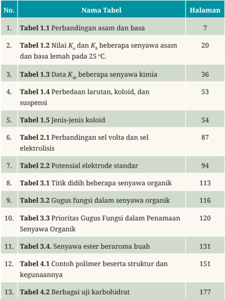

Tabel ini berisi informasi tentang berbagai tabel yang disajikan dalam buku pelajaran, termasuk judul tabel, halaman yang menyajikan informasi tersebut, dan topik utama setiap tabel. Topik utama meliputi perbandingan asam dan basa, nilai Kₐ dan Kₖₙ untuk beberapa senyawa asam dan basa lemah pada suhu 25°C, data Kₖₙ untuk beberapa senyawa kimia, perbedaan larutan, koloid, dan suspensi, jenis-jenis koloid, perbandingan sel volta dan sel elektrolisis, potensial elektrode standar, titik didih beberapa senyawa organik, gugus fungsi dalam senyawa organik, prioritas gugus fungsi dalam penamaan senyawa organik, senyawa ester beraroma buah, contoh polimer beserta struktur dan kegunaannya, dan berbagai uji karbohidrat. Kolom-kolom yang ada mencakup judul tabel, halaman, dan topik utama setiap tabel. Data penting yang terlihat antara lain bahwa tabel 1.1 berisi perbandingan asam dan basa, tabel 1.2 berisi nilai Kₐ dan Kₖₙ untuk beberapa senyawa asam dan basa lemah pada suhu 25°C, tabel 1.3 berisi data Kₖₙ untuk beberapa senyawa kimia, tabel 1.4 berisi perbedaan larutan, koloid, dan suspensi, tabel 1.5 berisi jenis-jenis koloid, tabel 2.1 berisi perbandingan sel volta dan sel elektrolisis, tabel 2.2 berisi potensial elektrode standar, tabel 3.1 berisi titik didih beberapa senyawa organik, tabel 3.2 berisi gugus fungsi dalam senyawa organik, tabel 3.3 berisi prioritas gugus fungsi dalam penamaan senyawa organik, tabel 3.4 berisi senyawa ester beraroma buah, tabel 4.1 berisi contoh polimer beserta struktur dan kegunaannya, dan tabel 4.

 

---
## 📄 Halaman 11

### Petunjuk Penggunaan Buku

Ilmu kimia merupakan salah satu cabang ilmu pengetahuan alam yang realtif lebih abstrak dibandingkan dengan fisika dan biologi sehingga dalam menjelaskan konsep -konsep kimia perlu ada representasi untuk menjelaskan hal -hal abstrak.

Buku ini dirancang dengan berbagai aktivitas yang dapat mengembangkan  keterampilan  abad  21  yaitu  berpikir  kritis  dan pemecahan  masalah,  komunikasi, kreatif, dan kolaborasi  dalam penyajiannya,  buku  ini  mencoba  menampilkan  fenomena  faktual dalam  kehidupan  sehari-hari  agar  materi  yang  diajarkan  menjadi kontekstual.  Buku  ini  terdiri  dari  empat  bab  dengan  bagian-bagian sebagai berikut.

### 1. Cover Bab

Pada bagian cover bab ini, terdapat beberapa komponen yaitu gambar yang berhubungan dengan bab yang sedang dijelaskan dan tujuan pembelajaran.

---
**🖼️ Gambar/Diagram**

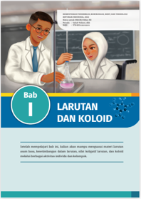

> **Deskripsi Visual:** Buku pelajaran ini menampilkan sebuah halaman dengan judul "LARUTAN DAN KOLOID" pada bab pertama. Halaman tersebut berisi gambar dua orang peneliti yang sedang melakukan eksperimen kimia. Peneliti laki-laki menggunakan mikroskop untuk memeriksa larutan, sementara peneliti perempuan sedang mengamati larutan dengan mikroskop. Gambar ini menunjukkan hubungan antara larutan dan koloid dalam konteks penelitian kimia.

Elemen-elemen utama yang terlihat adalah dua peneliti, mikroskop, dan larutan. Mikroskop digunakan oleh kedua peneliti untuk memeriksa dan mengamati larutan. Informasi kunci yang dapat diambil pembaca melalui gambar ini adalah bahwa penelitian kimia melibatkan penggunaan alat seperti mikroskop untuk memeriksa dan mengamati larutan dan koloid.

Teks, angka, atau label penting yang terlihat pada gambar ini adalah judul bab "LARUTAN DAN KOLOID", nama-nama peneliti, dan jenis mikroskop yang digunakan. Judul bab memberikan konteks topik yang akan dibahas dalam bab tersebut, sedangkan nama-nama peneliti dan jenis mikroskop menunjukkan bagaimana penelitian kimia dilakukan dan apa yang diperiksa dalam eksperimen tersebut.

 

---
## 📄 Halaman 12

---
**🖼️ Gambar/Diagram**

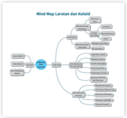

> **Deskripsi Visual:** Gambar ini adalah mind map tentang larutan dan solusi. Mind map ini memperlihatkan struktur dan hubungan antara konsep-konsep dasar tentang larutan dan solusi. Pada bagian atas, ada topik utama "Larutan dan Solusi" yang terbagi menjadi dua subtopik utama: "Larutan" dan "Solusi". Subtopik "Larutan" meliputi "Definisi Larutan", "Klasifikasi Larutan", dan "Proses Pembentukan Larutan". Sedangkan subtopik "Solusi" mencakup "Definisi Solusi", "Klasifikasi Solusi", dan "Proses Pembentukan Solusi".

Elemen-elemen utama dalam mind map ini adalah topik-topik tersebut, yang saling terhubung melalui garis-garis yang menggambarkan hubungan antara konsep-konsep tersebut. Teks, angka, atau label penting yang terlihat termasuk nama-nama topik seperti "Definisi Larutan", "Klasifikasi Larutan", dan lain-lain.

Informasi kunci yang dapat diambil pembaca melalui mind map ini adalah bahwa larutan dan solusi adalah dua konsep yang berhubungan erat dalam kimia, dengan definisi, klasifikasi, dan proses pembentukan yang berbeda-beda. Mind map ini membantu pembaca untuk memahami hubungan antara konsep-konsep ini dan memahami bagaimana mereka saling berkaitan.

larutan pernah dipelajari. Apakah kalian masih ingat? Untuk mengingat kembali mengenai hal tersebut, coba lakukan aktivitas berikut ini.

Aktivitas 1.1

Campurkan  air  dengan  gula  pasir,  garam  dapur,  kapur  tulis  yang telah dihaluskan, dan susu bubuk ke dalam empat gelas yang berbeda.

Amatilah  kondisi  campuran  tersebut,  seperti  warna  dan  kejernihan setiap campuran .

Tuliskan hasil pengamatan kalian. Diskusikan bersama teman kalian.

### 3. Pengantar Bab Sampaikan perbedaan kondisi campuran tersebut di depan kelas dan hubungkan dengan pengertian larutan.

2

Kimia untuk SMA/MA Kelas XII

Pada bagian ini ditampilkan beberapa gambar dan teks mengenai fenomena yang ada dalam kehidupan sehari -hari agar materi pembelajaran bersifat kontekstual.

Untuk menguji kemampuan beberapa bahan alam dalam mengidentifikasi asam basa,cobalakukan kegiatan berikut ini.

- ·Buatlahkelompok terdiri dari 4-5 orang
- indikator asam basa
- ·Buatlah minimal 5 indikator asam-basa daribahan alam yang paling mudah kalian temukan
- Ujilah asam cuka (mewakili asam) dan antasida (mewakili basa) dengan masing-masing indikator yang telah disiapkan
- Buat tabel dan catat setiap perubahan warna dalam tabel tersebut
- Ujilah minimal 4 zat lain yang mudah kalian temukan, misalnya air keran, air jeruk, pemutih pakaian, dan lain-lain.

### 2. Peta Konsep

Pada bagian ini ditampilkan konsep-konsep yang penting yang dibahas.

### 4. Aktivitas

Pada bagian ini disediakan kegiatan yang melibatkan peserta didik secara aktif untuk lebih mendapatkan pengalaman nyata mengenai materi yang sedang disajikan.

 

---
## 📄 Halaman 13

oksida  asam  karena  bertindak  sebagai  penerima  pasangan  elektron, sedangkan  CaO  bersifat  basa  karena  bertindak  sebagai  pemberi

pasangan elektron.

Ca 2+

O

O

O

---
**🖼️ Gambar/Diagram**

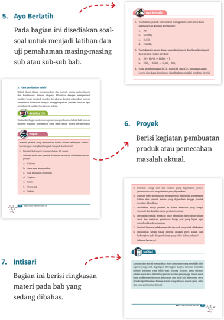

> **Deskripsi Visual:** Buku pelajaran ini menampilkan berbagai jenis materi seperti teks, angka, dan label penting. Gambar pertama menunjukkan bagian dari buku yang berisi soal-soal latihan untuk uji pemahaman masing-masing subbab. Gambar kedua menunjukkan bagian proyek yang meminta pembaca untuk merancang kegiatan pembuatan produk atau pemecahan masalah aktual. Gambar ketiga menunjukkan bagian intisari yang berisi ringkasan materi yang sedang dibahas. Setiap bagian memiliki teks yang menjelaskan topiknya, angka yang menunjukkan urutan atau nomor, dan label yang memberikan informasi tambahan. Informasi kunci yang dapat diambil pembaca meliputi jenis soal latihan, tujuan proyek, dan ringkasan materi yang dibahas.

S

O

Ca 2+

O

O -

 

---
## 📄 Halaman 14

### 8. Ayo Refleksi

Pada bagian ini peserta didik diajak untuk mengevaluasi secara personal mengenai pembelajaran yang telah dilakukan

62

Kimia untuk SMA/MA Kelas XII

### 9. Ayo Cek Pemahaman

Bagian ini berisi gabungan latihan soal dari seluruh bab.

Larutan  memiliki  sifat  yang  berbeda  dari  pelarut  dan  zat terlarutnya  yang  disebut  sifat  koligatif  larutan.  Sifat  ini  hanya

bergantung  pada  jumlah  zat  terlarut.  Terdapat  empat  sifat  yaitu penurunan tekanan uap, penurunan titik beku, kenaikan titik didih,

dan tekanan osmosis.

Koloid banyak ditemukan dalam kehidupan sehari-hari. Koloid dibagi  menjadi  delapan  jenis  berdasarkan  wujud  zat  terdispersi

dan mediumnya. Koloid memiliki sifat khas seperti adsorpsi, efek

Tyndall,  gerak  Brown,  dan  elektroforesis.  Koloid  dapat  dibuat dengan cara dispersi maupun kondensasi.

 

---
## 📄 Halaman 15

Kimia untuk SMA/MA Kelas XII

Penulis

:  Galuh Yuliani, dkk

ISBN

:  978-602-427-968-4 (jil.2)

---
**🖼️ Gambar/Diagram**

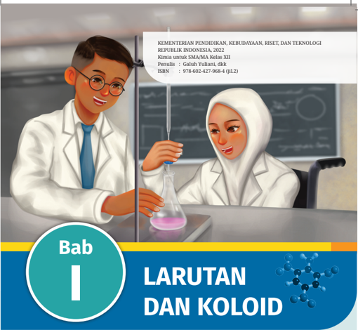

> **Deskripsi Visual:** Gambar ini adalah ilustrasi yang menampilkan dua siswa dalam ruang laboratorium. Siswa laki-laki berdiri di sebelah kiri dengan topi hitam, kacamata, dan jas laboratorium putih. Siswa perempuan duduk di sebelah kanan dengan hijab putih dan juga mengenakan jas laboratorium putih. Keduanya sedang melakukan eksperimen dengan menggunakan beker dan pipet. Di belakang mereka terdapat papan tulis dengan tulisan-teks yang tidak jelas.

Elemen utama dalam gambar ini adalah dua siswa yang sedang melakukan eksperimen. Relasi antara mereka adalah bahwa mereka berada di lingkungan laboratorium dan sedang terlibat dalam proses pembelajaran melalui eksperimen. 

Teks penting yang terlihat pada gambar adalah judul bab yang berbunyi "LARUTAN DAN KOLOID" dan ISBN buku yang berisi "978-602-427-968-4 (JIL)". Angka dan label penting lainnya adalah nomor bab yang berada di bagian bawah gambar, yaitu "Bab I".

Informasi kunci yang dapat diambil pembaca adalah bahwa gambar ini merupakan bagian dari buku pelajaran kimia untuk SMA/MA Kelas XII tentang larutan dan koloid. Bab ini mungkin akan membahas konsep-konsep dasar tentang larutan dan koloid dalam konteks pembelajaran kimia.

Setelah mempelajari bab ini, kalian akan mampu menguasai materi larutan asam basa, kesetimbangan dalam larutan, sifat koligatif larutan, dan koloid melalui berbagai aktivitas individu dan kelompok.

Bab I

LARUTAN DAN KOLOID

1

 

---
## 📄 Halaman 16

---
**🖼️ Gambar/Diagram**

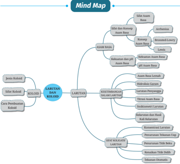

> **Deskripsi Visual:** Gambar ini adalah mind map yang menunjukkan struktur dan proses dalam proses laboratorium. Mind map ini terdiri dari berbagai elemen utama yang terkait dengan laboratorium, termasuk aspek-aspek seperti asam basa, labutan, dan metode laboratorium. Elemen utama ini terhubung melalui relasi hierarkis dan subtopik yang lebih spesifik. Beberapa elemen penting yang terlihat antara lain:

1. **Asam Basa** - Ini adalah topik utama yang mencakup definisi, sifat, dan klasifikasi asam basa.
2. **Labutan** - Topik ini mencakup definisi, sifat, dan cara pembentukan labutan.
3. **Metode Laboratorium** - Ini mencakup berbagai teknik dan metode yang digunakan dalam laboratorium.

Informasi kunci yang dapat diambil dari mind map ini adalah bahwa proses laboratorium melibatkan pemahaman tentang asam basa, penggunaan labutan, dan penggunaan metode laboratorium yang tepat untuk mendapatkan hasil yang akurat dan valid. Mind map ini membantu pembaca memahami struktur dan proses yang kompleks dalam laboratorium dengan cara yang jelas dan terorganisir.

Kalian pasti pernah mendengar kata larutan dalam kehidupan seharihari.  Dalam  mata  pelajaran  baik  IPA  maupun  Kimia,  materi  tentang larutan pernah dipelajari. Apakah kalian masih ingat? Untuk mengingat kembali mengenai hal tersebut, coba lakukan aktivitas berikut ini.

Campurkan  air  dengan  gula  pasir,  garam  dapur,  kapur  tulis  yang telah dihaluskan, dan susu bubuk ke dalam empat gelas yang berbeda. Amatilah  kondisi  campuran  tersebut,  seperti  warna  dan  kejernihan setiap campuran.

Tuliskan hasil pengamatan kalian. Diskusikan bersama teman kalian. Sampaikan perbedaan kondisi campuran tersebut di depan kelas dan hubungkan dengan pengertian larutan.

 

---
## 📄 Halaman 17

Dari  Aktivitas  1.1  di  atas,  kalian  telah  mengingat  kembali  mengenai larutan  dan  perbedaannya  dengan  campuran  lain.  Larutan  dapat dibagi menjadi beberapa golongan. Berdasarkan daya hantar listriknya, larutan  dibagi  menjadi  dua  kelompok  yaitu  larutan  elektrolit  dan larutan  nonelektrolit.  Larutan  elektrolit  merupakan  larutan  yang dapat  menghantarkan  arus  listrik  sedangkan  larutan  nonelektrolit tidak  dapat  menghantarkan  arus  listrik.  Sifat  larutan  ini  digunakan dengan kurang bijak oleh sebagian orang seperti terlihat pada Gambar 1.1.  Menurut kalian, apakah menangkap ikan dengan setrum selaras dengan sikap peduli terhadap lingkungan?

---
**🖼️ Gambar/Diagram**

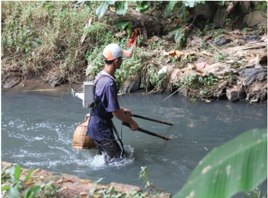

> **Deskripsi Visual:** Gambar ini adalah foto yang menunjukkan seorang pria sedang berjalan di tepi sungai. Pria tersebut memegang dua alat yang tampaknya digunakan untuk mengumpulkan sampah atau mungkin untuk memancing. Sungai itu tampak jernih dengan air bergerak cepat, dan di sepanjang tepi sungai terdapat pepohonan dan tanaman hijau yang tumbuh liar. Di sebelah kanan, ada batu-batu besar yang tampak seperti sisa-sisa dari aktivitas manusia. Gambar ini menunjukkan kegiatan sehari-hari di sekitar sungai, mungkin sebagai bagian dari upaya pengelolaan lingkungan atau kegiatan sosial.

Kegiatan yang ditampilkan dalam gambar 1.1 menunjukkan bahwa air  sungai  dapat  bersifat  elektrolit  karena  dapat  menghantarkan arus  listrik  sehingga  bisa  menyetrum  ikan.  Larutan  elektrolit  dapat

 

---
## 📄 Halaman 18

menghantarkan  arus  listrik  disebabkan  oleh  adanya  ion-ion  yang bergerak bebas di dalam larutan. Ion-ion tersebut dapat dihasilkan dari proses disosiasi ataupun ionisasi zat terlarut oleh air sebagai pelarut. Apabila zat terlarut mengalami penguraian sempurna, maka larutan tersebut disebut sebagai larutan elektrolit kuat. Sedangkan, apabila zat terlarut  pada  larutan  tersebut  hanya  sebagian  yang  terurai  menjadi ion-ionnya,  maka  larutan  tersebut  disebut  larutan  elektrolit  lemah. Dengan menggunakan elektrolit tester, larutan elektrolit kuat biasanya ditandai dengan nyala lampu yang terang sedangkan larutan elektrolit lemah ditandai dengan nyala lampu yang redup atau tidak menyala. Pembahasan  lebih  lanjut  mengenai  larutan  elektrolit  akan  kalian dapatkan pada bab berikutnya.

Air  merupakan  pelarut  yang  sangat  efektif  untuk  melarutkan senyawa  ionik.  Meskipun  merupakan  molekul  elektrik  netral,  air memiliki  domain/kutub  positif  (atom  H)  dan  domain/kutub  negatif (atom O). Ketika senyawa ionik seperti natrium klorida (NaCl) dilarutkan dalam air, gaya elektrostatik antara kation dan anion akan terganggu. Ion Na +  dan Cl -  dipisahkan satu sama lain dengan proses hidrasi yaitu proses tersebarnya molekul air di sekitar ion secara spesifik. Setiap ion Na +  (kation) dikelilingi oleh sejumlah molekul air yang mengarahkan kutub  negatifnya  (atom  O  dari  H 2 O)  ke  arah  kation  Na + .  Demikian pula setiap ion Cl -   (anion)  dikelilingi  oleh  molekul  air  dengan  kutub positifnya  (atom  H  dari  H 2 O)  berorientasi  ke  arah  Cl -   (Gambar  1.2). Hidrasi  membantu  menstabilkan  ion  dalam  larutan  dan  mencegah kation bergabung kembali dengan anion.

 

---
## 📄 Halaman 19

---
**🖼️ Gambar/Diagram**

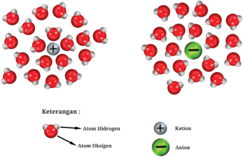

> **Deskripsi Visual:** Gambar ini adalah ilustrasi yang menunjukkan struktur molekul air (H2O) dalam bentuk gas dan cairan. Ilustrasi ini memperlihatkan dua jenis molekul air: molekul gas dan molekul cairan. Molekul gas terdiri dari atom hidrogen dan oksigen yang terhubung oleh ikatan kovalen, sedangkan molekul cairan memiliki lebih banyak molekul air yang terhubung dengan ikatan hidrogen antara molekul-molekul air. Ilustrasi ini juga menunjukkan bahwa dalam molekul gas, ikatan kovalen antara atom hidrogen dan oksigen lebih jauh dibandingkan dengan ikatan hidrogen antara molekul-molekul air dalam molekul cairan. Label pada gambar menunjukkan bahwa atom hidrogen dan oksigen merupakan elemen utama dalam molekul air, serta menunjukkan bahwa ikatan kovalen dan hidrogen antara molekul-molekul air adalah elemen-elemen penting dalam struktur molekul air. Informasi kunci yang dapat diambil pembaca adalah bahwa struktur molekul air berubah ketika kondisi suhu dan tekanan berubah, dan bahwa ikatan kovalen dan hidrogen antara molekul-molekul air sangat penting untuk kestabilan molekul air.

Larutan  asam,  basa,  dan  garam  merupakan  larutan  elektrolit. Beberapa larutan asam, seperti asam klorida (HCl), asam nitrat (HNO 3 ) dan asam sulfat (H 2 SO4) merupakan larutan elektrolit kuat. Asam-asam ini terionisasi sepenuhnya dalam air seperti terlihat pada persamaan reaksi ionisasi HCl berikut ini.

``

Penguraian suatu senyawa menjadi ion-ionnya dapat dikategorikan menjadi  dua  jenis  penguraian  yaitu  disosiasi  dan  ionisasi.  Disosiasi adalah  proses  pemisahan  kation  dan  anion  dari  senyawa  ionik sedangkan ionisasi adalah proses pembentukan ion-ion dari senyawa kovalen.  Contoh  dari  proses  disosiasi  dan  ionisasi  zat  terlarut  dapat dilihat melalui beberapa persamaan reaksi berikut ini.

Disosiasi :

NaCl( aq ) → Na + ( aq ) + Cl - ( aq )

KOH( aq ) → K + ( aq ) + OH - ( aq )

 

---
## 📄 Halaman 20

`Ionisasi  : H2SO4( aq ) → 2H + ( aq ) + SO 4 2- ( aq ) NH3( g ) + H 2O( l ) ⇌ NH4 + ( aq ) + OH - ( aq ) CH3COOH( aq ) CH3COO - ( aq ) + H + ( aq`

⇌ )

Pada  berbagai  persamaan  reaksi  di  atas,  ada  reaksi-reaksi  yang menggunakan  tanda  panah  searah  dan  ada  juga  reaksi-reaksi  yang menggunakan  tanda  panah  kesetimbangan.  Tanda  panah  searah menunjukkan bahwa proses disosiasi/ionisasi terjadi secara sempurna sedangkan tanda panah kesetimbangan menunjukkan bahwa proses ionisasi  terjadi  hanya  sebagian.  Konsep  kesetimbangan  yang  telah kalian pelajari di kelas XI akan sangat berguna dalam mempelajari bab ini.

Beberapa proses terpenting dalam sistem kimia dan biologi adalah reaksi asam basa dalam pelarut air. Oleh karena itu, pada bagian ini akan dibahas hal-hal yang berkaitan dengan asam basa.

### A.  Sifat dan Konsep Asam Basa

 

---
## 📄 Halaman 21

Perhatikan Gambar 1.3 di atas. Apakah kalian tahu tujuan petani menaburkan dolomit tersebut? Diskusikan dengan teman kalian.

Dalam kehidupan sehari-hari, kalian pasti sangat sering berhubungan  dengan  produk  yang  bersifat  asam  maupun  basa misalnya seperti yang terlihat pada Gambar 1.4 di bawah ini.

---
**🖼️ Gambar/Diagram**

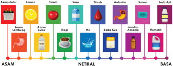

> **Deskripsi Visual:** Gambar ini adalah diagram yang menunjukkan perbedaan pH antara berbagai bahan makanan dan minuman. Diagram ini dibagi menjadi tiga bagian: ASAM, NETRAL, dan BASA. Di bagian ASAM, ada lima bahan yang memiliki pH rendah, seperti lemon, asam lemak, asam cuka, air, dan asam klorida. Di bagian NETRAL, ada dua bahan yang memiliki pH sekitar 7, yaitu air dan soda kue. Di bagian BASA, ada dua bahan yang memiliki pH tinggi, yaitu asam asetat dan asam asetat. Setiap bahan dinyatakan dengan warna yang berbeda untuk memudahkan penafsiran. Informasi kunci yang dapat diambil pembaca adalah bahwa pH bahan makanan dan minuman sangat berbeda dan penting untuk diketahui saat memilih makanan dan minuman.

Pada saat kelas X atau SMP, kalian pernah mempelajari mengenai sifat  asam  dan  basa.  Sifat  asam  atau  basa  dari  suatu  zat  dapat diidentifikasi  melalui  berbagai  cara  seperti  tertera  pada  Tabel  1.1 berikut.

---
**📊 Tabel**

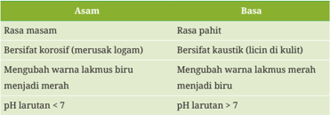

Tabel ini membahas perbandingan asam dan basa, dua kelompok zat kimia yang berlawanan. Topik utama tabel adalah perbedaan rasa, sifat fisik, dan reaksi kimia antara asam dan basa. Kolom pertama berisi nama asam atau basa, sedangkan kolom kedua berisi deskripsi tentang perbedaan mereka. Data penting yang terlihat meliputi: asam memiliki rasa pahit dan bersifat korosif, sementara basa memiliki rasa manis dan bersifat kaustik. Asam juga dapat mengubah warna lakmus menjadi biru, sementara basa mengubahnya menjadi merah. Selain itu, pH larutan di bawah 7 menunjukkan asam, sedangkan di atas 7 menunjukkan basa.

Selain  berdasarkan  sifat  di  atas,  ada  beberapa  metode  atau cara  yang  bisa  kalian  lakukan  secara  mandiri  salah  satunya  adalah

 

---
## 📄 Halaman 22

menggunakan indikator  asam  basa.  Indikator  asam  basa  adalah  zat yang memiliki penampakan berbeda ketika diberikan suasana asam atau  basa.  Indikator  asam  basa  dapat  dibedakan  menjadi  dua  jenis berdasarkan sumbernya yaitu indikator alami dan indikator buatan. Banyak bahan alami yang dapat kita gunakan untuk mengetahui sifat asam atau basa dari suatu zat. Lakukan aktivitas berikut untuk menguji sifat asam dan basa dari benda-benda di sekitar kalian.

Untuk menguji kemampuan beberapa bahan alam dalam mengidentifikasi asam basa, coba lakukan kegiatan berikut ini.

-  Buatlah kelompok terdiri dari 4-5 orang
-  Cari literatur mengenai bahan alam apa saja yang dapat dijadikan indikator asam basa
-  Buatlah minimal 5 indikator asam-basa dari bahan alam yang paling mudah kalian temukan
-  Ujilah asam cuka (mewakili asam) dan antasida (mewakili basa) dengan masing-masing indikator yang telah disiapkan
-  Buat tabel dan catat setiap perubahan warna dalam tabel tersebut
-  Ujilah minimal 4 zat lain yang mudah kalian temukan, misalnya air keran, air jeruk, pemutih pakaian, dan lain-lain.
Konsep mengenai asam-basa berkembang sesuai dengan penemuan dan konsep terbaru yang menyertainya. Pada bagian ini akan dibahas tiga konsep asam basa yaitu menurut Arrhenius, Bronsted-Lowry, dan Lewis.

 

---
## 📄 Halaman 23

### 1. Asam Basa Arrhenius

Konsep asam basa Arrhenius meninjau konsep larutan dalam pelarut air. Air sendiri dapat mengalami swaionisasi sesuai persamaan reaksi berikut:

``

Dari persamaan tersebut, air akan selalu memiliki jumlah H +  dan OH -  sama. Apabila suatu zat terlarut menambah jumlah H 3 O + atau H + dalam  air,  maka  larutan  tersebut  disebut  larutan  asam  sedangkan apabila  menambah  konsentrasi  OH - ,  maka  larutan  tersebut  disebut larutan basa.

``

Dari  persamaan  reaksi  di  atas,  kita  dapat  menyimpulkan  bahwa HCl  merupakan  asam  karena  menghasilkan  ion  H 3 O +   dalam  air  dan NaOH termasuk basa karena menghasilkan OH - .

Selain memiliki sifat asam dan basa, dalam konsep Arrhenius ada juga zat yang bersifat amfoter, yaitu zat yang dapat bereaksi dengan asam dan basa. Contoh zat yang bersifat amfoter adalah Be(OH) 2 dan Al(OH)3 . Perhatikan reaksi berikut ini.

``

Reaksi  pertama  menunjukkan  bahwa  Al(OH) 3 bertindak  sebagai basa,  sedangkan  reaksi  kedua  menunjukkan  bahwa  Al(OH) 3 yang bertindak sebagai asam. Kedua sifat ini dapat muncul tergantung pada kondisi yang berbeda.

 

---
## 📄 Halaman 24

### 2. Asam Basa Brønsted-Lowry

Definisi Arrhenius terbatas untuk larutan dengan pelarut air. Definisi yang lebih luas diusulkan oleh ahli kimia Denmark bernama Johannes Brønsted  dan  Thomas  Lowry  pada  tahun  1932.  Menurut  konsep  ini, asam adalah donor proton (H + ), sedangkan basa adalah akseptor proton (H + ). Konsep Brønsted-Lowry tidak memerlukan larutan asam dan basa dalam  air.  Meskipun  demikian,  konsep  asam  basa  Arrhenius  tidak bertentangan dengan konsep asam basa Brønsted-Lowry.

``

``

Ditinjau dari konsep Brønsted-Lowry, NH 3 bertindak sebagai basa karena NH3 menerima proton dari H2O sehingga membentuk ion NH4 + , sedangkan H2O sebagai pendonor proton akan bertindak sebagai asam seperti terlihat di bawah ini.

Spesi-spesi  (molekul  atau  ion)  yang  memiliki  selisih  satu  proton disebut sebagai pasangan asam basa terkonjugasi. Dari reaksi di atas, NH3 dan NH4 +  adalah pasangan asam basa terkonjugasi karena molekul NH3  memiliki  selisih  satu  proton  daripada  NH 4 + .  Selain  itu,  molekul H2O memiliki selisih satu proton dengan OH -  sehingga keduanya juga disebut  pasangan  asam  basa  terkonjugasi.  Perhatikan  bahwa  spesi yang bersifat asam dari pasangan tersebut selalu memiliki satu H +  lebih banyak daripada basanya.

Beberapa spesi dapat bersifat asam atau basa tergantung pada zat lain yang dicampur dengannya. Misalnya, pada reaksi di bawah ini air (H 2 O) berperilaku sebagai basa karena menerima proton dari molekul HCOOH.

 

---
## 📄 Halaman 25

---
**🖼️ Gambar/Diagram**

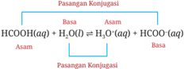

> **Deskripsi Visual:** Gambar ini adalah diagram yang menunjukkan pasangan konjugasinya antara asam dan basa dalam reaksi kimia. Gambar ini terdiri dari dua bagian utama: bagian atas menunjukkan asam dan bagian bawah menunjukkan basa. Setiap bagian memiliki tiga elemen utama: nama reaksi, reaksi yang terjadi, dan hasil reaksi. Nama reaksi ditunjukkan dengan huruf besar, sedangkan reaksi dan hasil reaksi ditunjukkan dengan huruf kecil. Label penting seperti "Basa" dan "Asam" digunakan untuk membedakan antara asam dan basa. Informasi kunci yang dapat diambil pembaca adalah bahwa reaksi ini melibatkan reaksi antara asam dan basa, dan hasilnya adalah produk yang berubah menjadi asam atau basa.

Suatu  spesi  yang  dapat  bertindak  sebagai  donor  dan  akseptor proton disebut spesi amfiprotik.

### 3. Asam-Basa Lewis

Kedua konsep asam-basa sebelumnya, menekankan adanya ion yang terlibat baik H +  maupun OH -  serta donor-akseptor proton. Akan tetapi, ada banyak reaksi yang tidak melibatkan kedua hal tersebut.

Untuk  mejelaskan  fenomena  tersebut,  G.N.  Lewis  mengajukan teori mengenai asam basa. Dalam teorinya, Lewis mengatakan bahwa asam  adalah  spesi  yang  menerima  pasangan  elektron  bebas  untuk membentuk ikatan  kovalen  koordinasi  sedangkan  basa  adalah  spesi yang  memberikan  pasangan  elektron  bebas  agar  ikatan  kovalen koordinasi terbentuk.

Pada  contoh  reaksi  di  atas,  NH 3 bertindak  sebagai  basa  Lewis karena menjadi sumber pasangan elektron ikatan kovalen koordinasi, sedangkan  BF3  bertindak  sebagai  asam  Lewis  karena  menerima pasangan elektron.

Dari  konsep  asam  basa  Lewis  ini,  suatu  senyawa  oksida  dapat ditentukan  pula  sifat  asam  atau  basanya.  Umumnya,  oksida  logam bertindak sebagai basa sedangkan oksida nonlogam bertindak sebagai asam. Misalnya, reaksi antara SO 3 dengan CaO. Senyawa SO 3 merupakan

 

---
## 📄 Halaman 26

oksida  asam  karena  bertindak  sebagai  penerima  pasangan  elektron, sedangkan  CaO  bersifat  basa  karena  bertindak  sebagai  pemberi pasangan elektron.

- Tentukan apakah zat berikut merupakan asam atau basa berdasarkan konsep Arrhenius!
- HF
- Ca(OH)2
- H2CO3
- Fe(OH)3
- Tentukanlah asam, basa, asam konjugasi, dan basa konjugasi dari reaksi-reaksi berikut!
- HI + H 3 PO4 ⇌ H4PO4 + + I -
- HSO4 -  + HNO 3 ⇌ H 2 SO4 + NO 3 -
- Pada pembentukan HCO3 -  dari OH -  dan CO 2 , tentukan asam Lewis dan basa Lewisnya. Gambarkan melalui struktur Lewis!

### B.  Kekuatan dan pH Asam Basa

Dalam mempelajari asam basa, kita perlu mengetahui kekuatan dan pH asam basa. Kedua konsep tersebut akan membantu kita untuk memilih asam atau basa mana yang sesuai untuk keperluan tertentu.

 

---
## 📄 Halaman 27

### 1. Kekuatan asam dan basa

Kekuatan asam dipengaruhi oleh sejumlah faktor, seperti sifat asam pelarut, temperatur, dan struktur molekulnya. Ketika membandingkan kekuatan  dua senyawa  asam,  kita dapat  menggunakan  pelarut, temperatur dan konsentrasi yang sama sehingga kita hanya fokus pada pengaruh struktur asam.

Dilihat dari strukturnya, kekuatan asam dapat dilihat dari kemudahannya untuk terionisasi. Kita ambil contoh umum untuk asam sebagai HA dan reaksi ionisasinya dapat kita lihat di bawah ini.

``

Terdapat  dua  faktor  yang  mempengaruhi  kemudahan  ionisasi pada asam. Salah satunya adalah kekuatan ikatan H-A. Semakin kuat ikatannya,  semakin  sulit  molekul  HA  untuk  terurai  dan  kekuatan asamnya  menjadi  lebih  lemah.  Faktor  lainnya  adalah  polaritas  dari ikatan  H-A.  Perbedaan  elektronegativitas  antara  H  dan  A  akan menghasilkan ikatan polar. Jika ikatan sangat polar, HA akan semakin mudah  terurai  menjadi  ion  H +   dan  A - .  Jadi,  tingkat  kepolaran  yang tinggi menandakan asam yang lebih kuat.

Untuk  asam  halida,  faktor  kekuatan  ikatan  adalah  faktor  yang paling  berpengaruh  terhadap  kekuatan  asamnya.  Apabila  diurutkan kekuatan ikatan H-F > H-Cl > H-Br > H-I, sehingga urutan kekuatan asam untuk asam halida menjadi H-F < H-Cl < H-Br < H-I. Dari hasil eksperimen  diketahui  bahwa  asam fluorida  (HF)  merupakan  asam lemah, sedangkan asam halida lain merupakan asam kuat.

Selain asam halida, terdapat jenis asam lain yaitu asam okso yang mengandung oksigen dalam senyawanya. Beberapa contoh asam okso disajikan  pada  Gambar  1.5.  Untuk  asam  okso,  kekuatan  asam  lebih ditentukan oleh keelektronegatifan dan banyaknya atom oksigen yang terikat dengan atom pusat.

 

---
## 📄 Halaman 28

---
**🖼️ Gambar/Diagram**

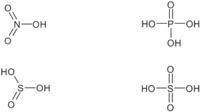

> **Deskripsi Visual:** Gambar ini adalah ilustrasi yang menunjukkan empat jenis senyawa kimia berbasis nitrogen dan sulfur. Setiap senyawa dinyatakan dengan struktur molekul yang ditampilkan dalam bentuk diagram atomik. Senyawa pertama, nitrat (NO₃⁻), terdiri dari satu atom nitrogen ikatan tiga kali dengan dua atom oksigen. Senyawa kedua, asam nitrat (HNO₃), memiliki satu atom hidrogen ikatan satu kali dengan satu atom nitrogen ikatan tiga kali dengan dua atom oksigen. Senyawa ketiga, asam sulfat (H₂SO₄), memiliki dua atom hidrogen ikatan satu kali dengan satu atom sulfur ikatan dua kali dengan dua atom oksigen. Senyawa keempat, asam sulfat (H₂SO₄), memiliki dua atom hidrogen ikatan satu kali dengan satu atom sulfur ikatan dua kali dengan dua atom oksigen. Setiap senyawa memiliki struktur molekul yang unik karena jumlah atom dan ikatan yang berbeda.

Pada Gambar 1.5 atom pusat N, S, dan P dapat dilambangkan sebagai X. Semakin banyak oksigen yang terikat pada atom pusat X seperti pada asam  sulfat  (H 2 SO4)  dan  asam sulfit  (H 2 SO3),  maka  semakin  kovalen ikatan  X-O  dan  semakin  polar  ikatan  O-H.  Hal  ini  menyebabkan  H + lebih  mudah  lepas  dan  membuat  zat  tersebut  semakin  asam.  Akan tetapi, apabila jumlah O yang diikat oleh atom pusat X adalah sama, maka penentu kekuatan asam kembali kepada elektronegativitas atom pusat. Oleh karena itu, asam posfat (H 3 PO4) memiliki keasaman yang lebih lemah dibandingkan dengan asam sulfat (H 2 SO4).

### Bandingkan keasaman dari senyawa-senyawa berikut ini!

- HClO3 dan HBrO3
- HClO3 dan HClO4

### 2. pH asam dan basa

Dalam  menentukan  asam  atau  basa,  di  awal  bab  ini  kalian  sudah mengingat  mengenai  pH.  Untuk  memahami  konsep  pH  secara  utuh, kita perlu mempelajari terlebih dahulu mengenai swaionisasi air.

 

---
## 📄 Halaman 29

Pernahkah  kalian  membayangkan  berapa  banyak  molekul  dalam segelas air? Apabila satu tetes air diasumsikan sama dengan 1/20 ml. Coba kalian hitung dalam setetes air tersebut berapa banyak molekul air?

Lihat kembali persamaan reaksi swaionisasi air yang telah dituliskan pada konsep Arrhenius.

``

``

Dari  hasil  pengukuran  pH,  Air  murni  merupakan  senyawa  yang bersifat  netral.  Hal  ini  disebabkan  karena  konsentrasi  H 3 O + dan  OH sama.  Pada  kondisi  asam,  konsentrasi  H 3 O +   lebih  besar  daripada konsentrasi OH - , sedangkan pada kondisi basa konsentrasi H 3 O + lebih kecil daripada konsentrasi OH - .

Pada air murni dengan temperatur 25 o C, konsentrasi H 3 O +  dan OH adalah 1 × 10 -7  M. Dengan menggunakan konsep tetapan kesetimbangan, dapat dituliskan persamaan berikut.

``

Pada reaksi swaionisasi air koefisien H 3 O +  = OH - , maka [H 3 O + ] = [OH -], sehingga

``

Dari  persamaan  di  atas,  diketahui  bahwa  pada  temperatur  25 o C nilai tetapan kesetimbangan swaionisasi air adalah 1 × 10 -14  M. Tetapan kesetimbangan ( Kc ) untuk proses ini kemudian disebut dengan Kw .

Untuk  mencari  nilai  [H 3 O + ]  atau  [OH - ]  pada  kondisi  tidak  netral, kalian dapat gunakan

``

Untuk perhitungan praktis, [H 3 O + ] dapat pula diganti dengan [H + ].

 

---
## 📄 Halaman 30

Diketahui konsentrasi ion OH -   pada salah satu cairan pembersih adalah 0,0025 M. Hitunglah konsentrasi ion H 3 O +  dalam larutan tersebut! Jawab:

Untuk memudahkan proses perhitungan, maka konsentrasi ion OH yang berupa desimal dapat dinyatakan dalam bentuk 2,5 × 10 -3  M.

``

Konsentrasi  H +   dan  OH -  di  dalam  larutan  sangat  kecil  sehingga kurang praktis digunakan untuk menentukan kondisi keasaman dari suatu larutan. Seorang ilmuwan bernama Soren P. L. Sorensen (1909) mengajukan suatu cara penentuan keasaman yang kemudian disebut pH yang merupakan negatif logaritma dari konsentrasi ion hidrogen dalam larutan (mol/l).

``

Dengan menggunakan persamaan tersebut, pada temperatur 25 o C

kita dapat simpulkan bahwa

Larutan netral, [H + ] = 1 × 10 -7 , pH = 7;

``

Larutan basa, [H + ] < 1 × 10 -7 , pH > 7.

Dengan  melihat  kecenderungan  dari  informasi  sebelumnya,  kita dapat  simpulkan  bahwa  pH  meningkat  seiring  menurunnya  [H + ]. Sebaliknya, apabila [H + ] meningkat, maka pH akan semakin menurun.

Apabila informasi yang kalian miliki adalah pH dan ingin mengetahui nilai [H + ], maka dapat menggunakan antilog

``

Alat  untuk  mengukur  pH  di  laboratorium  adalah  pH  meter. Selain  itu,  indikator  universal  dapat  memprediksi  pH  berdasarkan

 

---
## 📄 Halaman 31

perbandingan warna indikator yang telah dicelupkan ke dalam larutan dengan warna standar seperti tertera pada Gambar 1.6 berikut ini.

---
**🖼️ Gambar/Diagram**

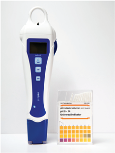

> **Deskripsi Visual:** Gambar ini menunjukkan alat analisis pH yang disebut "pH Meter" dengan desain modern dan ergonomis. Alat ini memiliki bagian atas berwarna putih dengan panel kontrol berwarna biru dan tombol berwarna putih. Di sebelah kanan, terdapat kemasan dengan label "Universal Indicators" yang menunjukkan berbagai warna indikator pH yang tersedia untuk pengujian pH. Gambar ini menunjukkan bahwa alat ini dirancang untuk mempermudah proses pengukuran pH dalam berbagai aplikasi, mulai dari laboratorium hingga industri.

### 3. pH Asam Kuat dan Basa Kuat

Di  dalam  larutan,  asam  dan  basa  kuat  akan  terurai  sempurna.  Oleh karena itu, menentukan pH asam dan basa kuat relatif sederhana.

Perhatikan contoh berikut ini.

``

Apabila  konsentrasi  HCl  adalah  0,1  M,  dengan  menggunakan perbandingan koefisien, maka [H + ] dari larutan HCl tersebut adalah 0,1 M atau dapat ditulis [H + ] = 1 × 10 -1  M.

``

 

---
## 📄 Halaman 32

HCl memiliki valensi (jumlah H + )  sama  dengan  1,  sehingga  [H + ]  =  [HCl]. Untuk  asam  bervalensi  lebih  dari  satu,  maka  dapat  disederhanakan menjadi:

``

Untuk basa kuat, hal tersebut berlaku juga, sehingga untuk mencari [OH - ] dari basa kuat dapat dituliskan sebagai

``

### 1. Tentukanlah pH dari:

- HBr 0,01 M
- H2SO4 0,1 M
- 22,4 ml gas HCl (STP) yang dialirkan ke dalam 1 l air
- 5,6 gram KOH ( Ar K = 39, O = 16, H = 1) yang dilarutkan ke dalam air sehingga volumenya menjadi 2 l.
- 1,71 gram Ba(OH) 2 ( Ar Ba = 137, O = 16, H = 1) yang dilarutkan ke dalam air sehingga volumenya menjadi 500 ml.
- Berapa pH dari larutan HCl 10 M dan 10 -8  M?

### C.  Kesetimbangan dalam Larutan

Tidak  semua  zat  terlarut  dapat  terurai  dengan  sempurna  di  dalam larutannya.  Asam  lemah  dan  basa  lemah  serta  garam  yang  sulit larut  dalam  air  mengalami  penguraian  sebagian.  Di  dalam  larutan tersebut terdapat kesetimbangan antara senyawa dengan ion-ion hasil penguraiannya.  Berikut  ini  kesetimbangan  yang  terdapat  di  dalam larutan.

 

---
## 📄 Halaman 33

### 1. Asam lemah dan basa lemah

Asam lemah dan basa lemah sebenarnya sangat erat dengan kehidupan kita  sehari-hari.  Pernahkah  kalian  menggunakan  asam  cuka  ketika makan mie bakso? Asam cuka adalah salah satu contoh asam lemah yang  sering  kita  temui.  Selain  itu,  salah  satu  bahan  pengawet  yaitu asam benzoat juga sering digunakan dalam berbagai produk makanan dan minuman. Oleh karena itu, pembahasan mengenai asam lemah dan basa lemah dapat dianggap sebagai usaha untuk mencoba memahami keseharian kita.

Asam lemah maupun basa lemah di dalam larutannya hanya terurai sebagian  menjadi  ion-ionnya.  Penguraian  tersebut  dapat  dituliskan melalui contoh sebagai berikut.

``

Persamaan  tetapan  kesetimbangan  untuk  reaksi  pertama  adalah K c /g32 /g170 /g172 /g186 /g188 /g170 /g172 /g186 /g188 /g170 /g172 /g186 /g188 /g170 /g172 /g186 /g188 /g14 /g16 H O F HF H O 3 2 , ingat bahwa [H 2 O] tetap sehingga Kc × [H 2 O] = HF O F H 3 + -6 5 @5 ? ? .

Untuk senyawa asam, Kc × [H 2 O] diganti dengan tetapan baru yang dikenal dengan Ka .

Dengan melihat persamaan reaksi ionisasi HF di atas, maka dapat dilihat bahwa [H + ] akan sama dengan [F ] karena koefisien kedua ion tersebut  sama  sehingga  persamaan  tetapan  kesetimbangan  di  atas dapat diubah menjadi

``

Apabila digeneralisasi kepada asam-asam lemah lain, maka untuk mencari [H + ] suatu asam lemah dapat menggunakan persamaan

``

 

---
## 📄 Halaman 34

Metode lain untuk menentukan [H + ] dari asam lemah adalah dengan menggunakan derajat ionisasi melalui langkah berikut. Derajat ionisasi (α)  adalah  perbandingan  jumlah  zat  yang  mengalami  penguraian dengan jumlah zat awal.

HF( aq ) + H2O( l ) ⇌ H3O + ( aq ) + Mula-mula          : [HF] awal - - Bereaksi              : α . [HF] awal ~ α . [HF] awal Kesetimbangan : α . [HF] awal

`F -  (aq)`

Dengan memperhatikan langkah pada metode tersebut maka dapat disimpulkan bahwa

``

Coba kalian lakukan penurunan rumus mencari [OH - ] dari basa lemah dengan melihat penjelasan untuk asam lemah di atas.

Pada  asam  dan  basa  lemah,  nilai  tetapan  kesetimbangan  dan  nilai derajat ionisasi dapat menentukan kekuatan asam dan basanya. Pada senyawa asam lemah semakin besar nilai Ka dan α maka semakin kuat sifat asamnya, sedangkan pada basa lemah semakin besar nilai Kb dan α maka semakin kuat sifat basanya. Tabel 1.2 di bawah ini menunjukkan nilai Ka dan Kb dari beberapa senyawa.

 

---
## 📄 Halaman 35

---
**📊 Tabel**

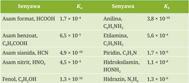

Tabel ini menunjukkan nilai konstanta reaksi (K) untuk beberapa senyawa organik. Topik utama tabel adalah hubungan antara senyawa organik dengan nilai K. Kolom pertama berisi nama-nama senyawa organik, sedangkan kolom kedua berisi nilai K untuk reaksi H2O + OH- → H3O+. Data penting yang terlihat adalah bahwa senyawa-senyawa asam memiliki nilai K yang lebih kecil dibandingkan dengan senyawa-senyawa basa. Misalnya, asam format memiliki nilai K sebesar 1,7 x 10^-4, sementara asam nitrat memiliki nilai K sebesar 4,5 x 10^-4. Ini menunjukkan bahwa senyawa-senyawa asam lebih kuat dalam reaksi dengan OH- dibandingkan dengan senyawa-senyawa basa.

### 1. Tentukanlah pH dari:

- Larutan HF 0,15 M
- 0,77 mol hidrazin dalam 250 ml air
- 0,976 gram asam benzoat yang dilarutkan ke dalam 500 ml air.
- 13,7 ml gas amonia (diukur pada suhu 27 o C dan 1 atm) yang dialirkan ke dalam satu liter air. ( R = 0,082 l.atm/mol.K)
- Dengan menggunakan Tabel 1.2, urutkanlah asam-asam lemah tersebut dari asam terkuat menuju asam terlemah.
- Dengan menggunakan Tabel 1.2 juga, urutkanlah basa lemah berdasarkan kenaikan kekuatan basanya!
- Asam cuka makan yang dijual di pasar memiliki kadar asam asetat, CH 3 COOH, sebanyak 25%. Apabila massa jenis cuka tersebut dianggap 1,2 g/ml, maka hitung pH larutan asam cuka tersebut!

 

---
## 📄 Halaman 36

### 2. Hidrolisis garam

Dalam kehidupan sehari-hari kalian pasti mengenal garam. Garam yang paling banyak dikenal adalah garam dapur atau garam meja sebagai bumbu utama dalam berbagai masakan yang memiliki rumus kimia NaCl. Apakah kalian mengetahui contoh garam yang lain?

Garam  merupakan  gabungan  ion  dari  sisa  asam  dan  sisa  basa. Berdasarkan komponen ion-ion penyusunnya, garam dapat dibedakan menjadi empat kelompok yaitu

- Garam dari ion sisa asam kuat dan basa kuat
- Garam dari ion sisa asam lemah dan basa kuat
- Garam dari ion sisa asam kuat dan basa lemah
- Garam dari ion sisa asam lemah dan basa lemah
Garam yang mudah larut dalam air akan terurai menjadi ion-ion yang bergerak bebas seperti tertulis dalam contoh reaksi berikut ini

``

``

Karena kedua ion di atas merupakan ion sisa basa kuat (Na + ) dan ion sisa asam kuat (Cl - ), maka keduanya tidak dapat bereaksi dengan air membentuk basa atau asamnya kembali.

Berbeda  dengan  garam  yang  memiliki  komponen  ion  sisa  asam atau basa lemah. Ion sisa ini akan beraksi dengan air membentuk asam dan basanya kembali. Coba kalian perhatikan contoh garam amonium klorida berikut.

``

 

---
## 📄 Halaman 37

Tetapan kesetimbangan untuk reaksi di atas adalah

``

Kation  amonium  (NH4 + ),  yang  merupakan  ion  sisa  basa  lemah, bereaksi kembali dengan air menghasilkan ion H 3 O +  yang merupakan penanda sifat asam. Dengan demikian dapat dilihat dari contoh tersebut bahwa garam yang memiliki ion sisa basa lemah akan menyebabkan munculnya sifat asam pada larutan.

Contoh  lain  dapat  dilihat  pada  larutan  garam  natrium  asetat  di bawah ini.

``

Tetapan kesetimbangan dari reaksi tersebut adalah

``

Dapat dilihat  dari  reaksi  di  atas  bahwa  keberadaan  anion  asetat (CH3 COO - ),  yang  merupakan  ion  sisa  asam  lemah  akan  membuat larutan bersifat basa.

Reaksi antara ion sisa asam lemah atau ion sisa basa lemah dengan air disebut reaksi hidrolisis. Apabila salah satu ion pada garam yang mengalami hidrolisis, peristiwa ini disebut hidrolisis  sebagian.  Akan tetapi,  jika  kedua  ion  penyusun  garam  dapat  mengalami  hidrolisis, maka peristiwa ini disebut hidrolisis total.

Berdasarkan reaksi  hidrolisis  yang  terjadi,  garam  akan  memiliki sifat netral, asam, atau basa. Sifat netral terjadi apabila pada senyawa garam  hanya  mengandung  ion  sisa  asam  kuat  dan  basa  kuat.  Sifat asam terjadi apabila salah satu komponen ion pada garam adalah ion sisa basa lemah sedangkan sifat basa terjadi apabila hanya salah satu komponen ion pada garam adalah sisa asam lemah.

 

---
## 📄 Halaman 38

Untuk garam yang terdiri dari ion sisa asam lemah dan basa lemah, sifat asam dan basa ditentukan oleh nilai Ka atau Kb .  Apabila nilai Ka yang  lebih  besar,  maka  larutan  garam  tersebut  akan  bersifat  asam. Sebaliknya,  apabila  nilai Kb yang  lebih  besar,  maka  larutan  garam tersebut akan bersifat basa.

Untuk menentukan pH dari suatu garam dapat digunakan persamaan tetapan kesetimbangan di atas. Persamaan tersebut dapat ditulis ulang menjadi persamaan-persamaan sebagai berikut.

``

### Ayo Berlatih

- Tentukan jenis hidrolisis dan sifat dari masing-masing garam berikut!
- KF
- Ca(NO2) 2
- (NH4) 2 CO3
- NH4NO3
- NaBr
- Tentukanlah pH dari masing-masing larutan garam berikut!
- NaCH3COO ( Ka CH3 COOH = 1 × 10 -5 )
- NH4NO3 ( Kb NH3 = 1 × 10 -5 )
- NH4F ( Ka HF = 6 × 10 -4 , K b NH3 = 1,8 × 10 -5 )

 

---
## 📄 Halaman 39

### 3. Larutan Penyangga

Pernahkah kalian mendengar istilah asidosis dan alkaliosis? Jika belum pernah, coba lakukan aktivitas berikut.

Cari  satu  teman  untuk  berbagi  tugas  mencari  artikel  atau  sumber mengenai asidosis dan alkaliosis.

Bandingkan informasi dari berbagai sumber dan kemudian simpulkan apa yang dimaksud asidosis dan alkaliosis.

Pernahkah  kalian  memikirkan  ketika  memakan  makanan  yang rasanya asam, seperti rujak cuka, apakah darah kita akan menjadi asam?

Terdapat beberapa larutan penyangga dalam makhluk hidup yang membuat pH cairan  tubuh  relatif  tetap.  Penyangga  yang  ada  dalam tubuh manusia terdapat dalam darah dan cairan intrasel. Keberadaan penyangga  ini  memungkinkan  manusia  mempertahankan  pH  darah dan  pH  di  dalam  sel.  Selain  terdapat  dalam  tubuh  makhluk  hidup, penyangga juga terdapat dalam air laut.

Cari informasi dari berbagai literatur mengenai komponen penyangga yang terdapat dalam darah manusia, dalam cairan intrasel, dan air laut.

Mengapa pH dalam darah manusia perlu dijaga?

Komponen utama dari suatu larutan penyangga adalah asam lemah dengan basa konjugasinya atau basa lemah dengan asam konjugasinya. Dengan komposisi tersebut, kehadiran sedikit asam kuat maupun basa kuat tidak menyebabkan perubahan pH.

 

---
## 📄 Halaman 40

- Komponen-komponen yang dapat membentuk penyangga adalah
-  Asam lemah dengan garamnya. Contoh: HCN dengan NaCN, NH3 dengan NH4Cl.
-  Garam  dengan  garam  lain  yang  memiliki  hubungan  konjugasi. Contoh: NaH2PO4 dengan Na2HPO4.
-  Asam lemah berlebih dengan basa kuat. Contoh: 100 ml HF 0,1 M dengan 50 mL NaOH 0,1 M.
-  Basa lemah berlebih dengan asam kuat. Contoh: 50 ml NH 3 0,2 M dengan 50 mL HCl 0,1 M.
Penentuan  pH  suatu  penyangga  adalah  dengan  menggunakan persamaan berikut ini.

``

- Tentukanlah apakah campuran larutan berikut dapat membentuk larutan penyangga?
- 50 ml H PO4 0,1 M dengan 50 ml KH
- 3 2 PO4 0,1 M
- 50 ml NaOH 0,1 M dengan 50 ml H 2
- SO4 0,1 M
- 50 ml HCl 0,1 M dengan 100 ml NH 0,1 M
- 3
- 50 ml HNO2 0,1 M dengan 10 ml Ba(OH) 0,1 M
- 2
- Tentukan pH dari campuran antara 20 ml HBr 0,1 M dengan 30 ml NH3 0,1 M (K b = 1,8 × 10 -5 )!

``

 

---
## 📄 Halaman 41

### 4. Stoikiometri larutan

Pada saat kelas XI kalian telah mempelajari perhitungan dalam kimia yang disebut stoikiometri. Stoikiometri tersebut didasari oleh konsep mol dan disesuaikan berdasarkan persamaan reaksi yang terjadi. Pada kelas XII ini, kalian akan fokus pada reaksi-reaksi yang terjadi di dalam larutan.

Dalam  larutan,  terdapat  beberapa  reaksi  yang  mungkin  terjadi. Reaksi-reaksi tersebut diantaranya adalah:

###  Reaksi pengendapan

Reaksi  pengendapan  terjadi  jika  salah  satu  produk  reaksi  tidak larut di dalam air. Contoh zat yang tidak larut di dalam air, yaitu CaCO3 dan BaCO3.

Untuk  menghasilkan  endapan  CaCO3 kalian  dapat  mencoba meniupkan udara pernafasan ke dalam larutan kalsium hidroksida, Ca(OH)2,  atau  biasa  disebut  pula  air  kapur.  Larutan  kalsium hidroksida yang semula jernih akan menjadi keruh setelah ditiup dan membentuk endapan putih setelah didiamkan selama beberapa saat. Endapan putih tersebut merupakan endapan kalsium karbonat. Persamaan reaksi yang terjadi adalah:

``

Pembahasan reaksi ini akan dibahas pada subbab berikutnya yaitu kelarutan dan hasil kali kelarutan.

###  Reaksi pembentukan gas

Ada  beberapa  reaksi  dalam  larutan  yang  dapat  menghasilkan gas.  Misalnya,  reaksi  antara  natrium  (logam  alkali)  dengan  air membentuk gas hidrogen.

Persamaan reaksinya:

``

 

---
## 📄 Halaman 42

Gas hidrogen dapat pula dihasilkan dari reaksi antara logam dengan asam. Persamaan reaksi umum untuk reaksi logam dengan asam adalah sebagai berikut.

``

Huruf n pada reaksi tersebut menyatakan valensi dari logam tersebut. Misalnya n akan bernilai satu untuk logam golongan alkali dan bernilai dua untuk logam alkali tanah.

Pada kenyataannya, tidak semua logam mudah bereaksi dengan asam.  Ada  beberapa  logam  yang  sulit  untuk  bereaksi  terutama dengan asam encer. Kereaktifan logam dengan asam ini disusun berdasarkan deret kereaktifan logam seperti berikut ini.

Li K Ba Sr Ca Na Mg Al Mn Zn Cr Fe Cd Co Ni Sn Pb

``

Berdasarkan deret kereaktifan logam tersebut, terdapat logamlogam yang berada di sebelah kiri ion H +.  logam-logam inilah yang mudah bereaksi dengan asam encer dan kemudian disebut logam aktif.  Logam-logam yang berada di sebelah kanan H +  merupakan logam-logam yang relatif  sulit  bereaksi  dengan  asam  encer  yang kemudian  dapat  disebut  logam  inert.  Bahkan,  beberapa  logam sering kita sebut sebagai logam mulia seperti perak, Ag, dan emas, Au.

Selain  itu,  reaksi  yang  dapat  menghasilkan  gas  adalah  reaksi senyawa  karbonat  dengan  asam  menghasilkan  gas  CO 2 .  Untuk reaksi  ini,  kalian  dapat  melakukan  percobaan  sederhana  yaitu dengan mencampurkan soda kue dan asam cuka. Persamaan reaksi yang terjadi adalah sebagai berikut.

``

Reaksi ini akan lebih menarik apabila gas CO 2 yang dihasilkan digunakan  untuk  meniup  balon.  Gas  CO 2 inilah  yang  menjadi penyebab kue mengembang pada saat dipanggang.

 

---
## 📄 Halaman 43

Gas lain yang dapat dihasilkan adalah gas H 2 S dan SO 2 . Gas H 2 S dapat  dihasilkan  dari  reaksi  antara garam  sulfida  dengan  asam. Gas  SO 2 dapat  terbentuk  dari  reaksi garam  sulfit  dengan  asam. Persamaan reaksi yang terjadi adalah sebagai berikut.

``

Tentukan volume gas hidrogen pada kondisi standar yang dihasilkan dari reaksi antara 25 ml HCl 0,1 M dengan 6,5 g logam Zn.

### Penyelesaian:

Tulis persamaan reaksi yang sudah setara:

``

Tentukan masing-masing mol zat yang bereaksi.

``

``

pereaksi pembatas pada reaksi tersebut adalah HCl.

Dengan menggunakan perbandingan koefisien, maka dapat dihitung mol hidrogen.

``

-  Reaksi netralisasi asam basa Reaksi netralisasi terjadi jika larutan asam dan basa dicampurkan. Reaksi ini akan menghasilkan garam dan atau air. Secara molekuler, pada  reaksi  tersebut  terjadi  penetralan  ion  H +   oleh  OH -   atau

 

---
## 📄 Halaman 44

sebaliknya. Bukti terjadinya reaksi penetralan ini ditunjukkan oleh nilai pH mendekati 7 (pH ≈ 7). Contoh persamaan reaksi penetralan:

``

Dalam proses pengerjaannya, perhitungan kimia dalam larutan mirip dengan  stoikiometri yang  telah dipelajari  sebelumnya. Tahapan perhitungannya adalah:

-  Menuliskan persamaan reaksi setara.
-  Mengubah besaran yang diketahui ke dalam mol.
-  Menggunakan perbandingan koefisien dari persamaan reaksi yang  sudah  setara  untuk  menentukan  besaran  yang  tidak diketahui dalam mol.
-  Mengubah mol ke dalam besaran yang diinginkan.
Pencampuran larutan yang mengandung asam basa memungkinkan  adanya  perubahan  pH  larutan.  Jika  jumlah  mol asam  dan  basa  dalam  campuran  sama,  maka  terjadi  penetralan sempurna sehingga pH larutan sama dengan 7. Akan tetapi, jika jumlah mol salah satu pereaksi berlebih, maka sisa pereaksi akan menentukan pH larutan hasil pencampuran.

Sebanyak 100 ml larutan Ca(NO 3 ) 2 0,1 M direaksikan dengan 100 ml HCl 0,1 M. Tentukan:

- Persamaan reaksi yang setara
- Massa CaCl2 yang terbentuk
- pH larutan awal dan setelah pencampuran

 

---
## 📄 Halaman 45

### 5. Titrasi Asam Basa

Titrasi adalah suatu metode penentuan konsentrasi zat di dalam larutan. Titrasi  dilakukan  dengan  cara  mereaksikan  suatu  larutan  dengan larutan  lain  yang  telah  diketahui  konsentrasinya.  Reaksi  dilakukan tetes demi tetes hingga titik ekivalen tercapai.

Titrasi dapat dibedakan menjadi beberapa jenis bergantung pada reaksinya. Jika di dalamnya terjadi reaksi asam basa, maka proses itu disebut titrasi asam basa. Titrasi lainnya yaitu titrasi permanganometri yang melibatkan permanganat, titrasi argentometri yang melibatkan perak, dan titrasi iodometri yang melibatkan ion iodida. Pada penjelasan berikut hanya akan dibahas mengenai titrasi asam basa.

### a. Indikator asam basa

Titrasi asam basa sering melibatkan zat-zat yang tidak berwarna sehingga sulit diketahui ketika tercapai titik ekivalen misalnya titrasi yang menggunakan larutan HCl dan larutan NaOH. Kedua larutan tersebut merupakan larutan tidak berwarna, bahkan larutan NaCl sebagai produknya juga tidak berwarna.

Untuk menandai titik ekivalen pada titrasi telah tercapai, maka dapat  digunakan  indikator.  Indikator  ini  harus  berubah  warna pada saat titik ekivalen tercapai.

Beberapa indikator  memiliki  trayek  perubahan  warna  cukup akurat akibat perubahan pH larutan, seperti indikator fenolftalein (PP), alizarin kuning (AK), metil merah (MM), metil jingga (MJ), dan brom timol biru (BTB). Gambar 1.7 memperlihatkan beberapa trayek pH dan perubahan warna yang terjadi dari beberapa indikator.

 

---
## 📄 Halaman 46

---
**🖼️ Gambar/Diagram**

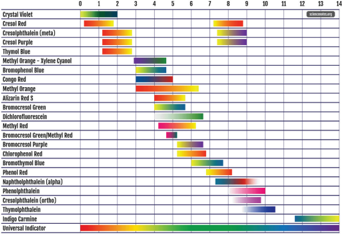

> **Deskripsi Visual:** Gambar ini adalah diagram yang menunjukkan berbagai jenis cairan kimia dan reaksi kimia yang mungkin dilakukan dalam laboratorium. Diagram ini terdiri dari kolom horizontal yang menunjukkan waktu dalam detik, mulai dari 0 hingga 1200 detik. Setiap bar di dalam diagram menunjukkan jenis cairan kimia dan reaksi yang dilakukan pada saat tertentu.

Elemen utama dalam diagram ini meliputi jenis cairan kimia seperti Cresyl Violet, Cresyl Blue, Cresyl Blue (meta), Cresyl Blue (para), Cresyl Blue (tert), Cresyl Orange, Cresyl Yellow, Cresyl Green, Cresyl Red, Cresyl Blue (meta), Cresyl Blue (para), Cresyl Blue (tert), Cresyl Orange, Cresyl Yellow, Cresyl Green, Cresyl Red, Cresyl Blue (meta), Cresyl Blue (para), Cresyl Blue (tert), Cresyl Orange, Cresyl Yellow, Cresyl Green, Cresyl Red, Cresyl Blue (meta), Cresyl Blue (para), Cresyl Blue (tert), Cresyl Orange, Cresyl Yellow, Cresyl Green, Cresyl Red, Cresyl Blue (meta), Cresyl Blue (para), Cresyl Blue (tert), Cresyl Orange, Cresyl Yellow, Cresyl Green, Cresyl Red, Cresyl Blue (meta), Cresyl Blue (para), Cresyl Blue (tert), Cresyl Orange, Cresyl Yellow, Cresyl Green, Cresyl Red, Cresyl Blue (meta), Cresyl Blue (para), Cresyl Blue (tert), Cresyl Orange, Cresyl Yellow, Cresyl Green, Cresyl Red, Cresyl Blue (meta), Cresyl Blue (para), Cresyl Blue (tert), Cresyl Orange, Cresyl Yellow, Cresyl Green, Cresyl Red, Cresyl Blue (meta), Cresyl Blue (para), Cresyl Blue (tert), Cresyl Orange, Cresyl Yellow, Cresyl Green, Cresyl Red, Cresyl Blue (meta), Cresyl Blue (para), Cresyl Blue (tert), Cresyl Orange, Cresyl Yellow, Cresyl Green, Cresyl Red, Cresyl Blue (meta), Cresyl Blue (para), Cresyl Blue (tert), Cresyl Orange, Cresyl Yellow, Cresyl Green, Cresyl Red, Cresyl Blue (meta), Cresyl Blue (para

Indikator  asam  basa  biasanya  merupakan  asam  lemah    dari molekul  organik  dengan  rumus  HIn.  Ketika  ion  H +   ditambahkan pada  molekul  HIn  akan  terbentuk  warna  tertentu  yang  berbeda dengan ketika ion H +  terlepas dari molekul HIn menjadi In - . Indikator PP  dalam  bentuk  HIn  (asam)  merupakan  larutan  tak  berwarna sedangkan dalam bentuk In -  (basa), indikator PP memiliki warna merah jambu.

### b. Proses titrasi asam basa

Pada proses titrasi, ada beberapa istilah yang perlu diketahui yaitu titran/titer dan titrat. Titran atau titer adalah larutan yang menitrasi sedangkan titrat adalah larutan yang dititrasi. Titrat dimasukkan ke  dalam  labu  erlenmeyer,  sedangkan  titran  dimasukkan  ke dalam buret. Titran dituangkan tetes demi tetes ke dalam larutan titrat  hingga  tercapai  titik  ekivalen  (lihat  Gambar  1.8).  Alat  yang

 

---
## 📄 Halaman 47

diperlukan  untuk  titrasi,  di  antaranya  adalah  labu  erlenmeyer, statif, buret, dan pipet volume.

---
**🖼️ Gambar/Diagram**

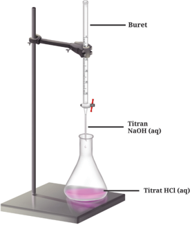

> **Deskripsi Visual:** Gambar ini adalah ilustrasi yang menunjukkan proses titrasi kimia. Ilustrasi ini menggambarkan sebuah laboratorium dengan beberapa elemen utama:

1. **Buret**: Ini adalah alat yang digunakan untuk mengisi dan mengeluarkan cairan dalam jumlah yang akurat. Buret tersebut terletak di atas stand.

2. **Titran NaOH (aq)**: Ini adalah larutan natrium hidroksida yang akan digunakan sebagai titrant dalam titrasi. Larutan ini berada di dalam buret.

3. **Titrat HCl (aq)**: Ini adalah larutan asam hidroklorida yang akan diuji dalam titrasi. Larutan ini berada di dalam kolom eksperimen.

4. **Kolom eksperimen**: Kolom eksperimen ini adalah tempat di mana titrasi dilakukan. Di dalam kolom eksperimen ini terdapat larutan HCl yang akan diuji.

5. **Larutan HCl (aq)**: Ini adalah larutan asam hidroklorida yang berwarna pink. Larutan ini berada di dalam kolom eksperimen.

6. **Larutan NaOH (aq)**: Ini adalah larutan natrium hidroksida yang berwarna biru. Larutan ini berada di dalam buret.

7. **Larutan HCl (aq)**: Ini adalah larutan asam hidroklorida yang berwarna pink. Larutan ini berada di dalam kolom eksperimen.

8. **Larutan NaOH (aq)**: Ini adalah larutan natrium hidroksida yang berwarna biru. Larutan ini berada di dalam buret.

9. **Larutan HCl (aq)**: Ini adalah larutan asam hidroklorida yang berwarna pink. Larutan ini berada di dalam kolom eksperimen.

10. **Larutan NaOH (aq)**: Ini adalah larutan natrium hidroksida yang berwarna biru. Larutan ini berada di dalam buret.

Informasi kunci yang dapat diambil pembaca adalah bahwa proses titrasi melibatkan penggunaan larutan natrium hidroksida sebagai titrant untuk menguji larutan asam hidroklorida.

Pengamatan warna larutan pada titrasi asam basa menggunakan indikator  asam  basa  akan  selalu  mengandung  risiko  kesalahan karena keterbatasan mata dalam proses pengamatan. Untuk mengatasi  hal  tersebut,  maka  lebih  baik  digunakan  indikator dengan trayek pH yang mendekati titik ekivalennya.

Titrasi  asam  basa  pada  dasarnya  adalah  reaksi  penetralan. Persamaan ion bersih reaksi penetralan tersebut adalah

``

 

---
## 📄 Halaman 48

Berikut akan diperlihatkan kurva titrasi asam kuat oleh basa kuat, misalnya 50 ml larutan HCl 0,1 M oleh NaOH 0,1 M. Larutan NaOH sebagai titran ditambahkan tetes demi tetes ke dalam larutan HCl hingga terjadi perubahan warna indikator. Setiap penambahan titran  dengan  volume  tertentu,  pH  larutan  dihitung  kemudian dibuat kurva seperti terlibat pada Gambar 1.9 berikut.

---
**🖼️ Gambar/Diagram**

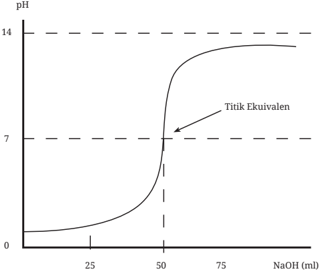

> **Deskripsi Visual:** Gambar ini adalah diagram yang menunjukkan perubahan pH selama proses titrasi NaOH pada suatu larutan. Diagram ini memperlihatkan bahwa pH meningkat secara signifikan setelah titik ekuivalen, yang terletak sekitar 50 mL NaOH. Pada titik ini, pH mencapai 7, yang menunjukkan bahwa larutan telah menjadi netral. Selain itu, diagram ini juga menunjukkan bahwa pH mulai naik dengan cepat setelah titik ekuivalen, menunjukkan bahwa NaOH masih dalam jumlah berlebihan. Ini menunjukkan bahwa titik ekuivalen adalah titik di mana larutan menjadi netral.

Cari kurva titrasi asam lemah oleh basa kuat, asam kuat oleh basa lemah, dan asam lemah oleh basa lemah dari berbagai sumber. Perhatikan titik ekivalen masing-masing titrasi tersebut dan buat kesimpulan dari hasil pengamatan kalian.

 

---
## 📄 Halaman 49

Kalian dapat melakukan perhitungan secara mandiri terkait titik ekivalen dari campuran-campuran tersebut.

### 6. Kelarutan dan Hasil Kali Kelarutan

Dalam kehidupan sehari-hari, kita sering menggunakan garam dapur yang sangat larut dalam air. Akan tetapi, ada garam-garam lain yang hanya sedikit  larut  di  dalam  air.  Jumlah  maksimal  zat  terlarut  yang dapat larut dalam pelarut dan suhu tertentu disebut dengan kelarutan ( solubility )  yang  kemudian  dilambangkan  dengan  s.  Larutan  yang mengandung jumlah zat terlarut sama dengan nilai s disebut larutan jenuh. Kelarutan, s , dinyatakan dalam mol/l.

Garam-garam  yang  kurang  larut,  di  dalam  larutan  jenuhnya membentuk keadaan setimbang antara garam yang tidak larut dengan ion-ionnya yang terlarut. Salah satu garam yang sulit larut dalam air adalah BaSO4 .

``

Tetapan kesetimbangan untuk reaksi tersebut adalah

``

Pada reaksi di atas, BaSO 4 memiliki fasa padat sehingga konsentrasi BaSO4 dianggap tetap. Persamaan kesetimbangan di atas menjadi

``

Lambang sp pada Ksp berasal dari kata solubility product yang berarti kelarutan produk. Dengan kata lain, hanya produk yang larut di dalam air.  Persamaan Ksp menyatakan  perkalian  konsentrasi  ion-ion  garam dalam larutan  jenuhnya.  Seperti  tetapan  kesetimbangan  lainnya, Ksp dipengaruhi pula oleh suhu. Selain garam, senyawa yang sukar larut adalah beberapa senyawa basa seperti Mg(OH) 2 , Pb(OH) 2 , dan Fe(OH) 2 . Kedua golongan senyawa tersebut merupakan senyawa ionik.

 

---
## 📄 Halaman 50

Secara  umum,  kesetimbangan  yang  terjadi  dalam  larutan  jenuh senyawa ionik yang sulit larut dalam air dituliskan dalam persamaan berikut ini.

``

Karena kesetimbangan terjadi pada larutan jenuh, maka terdapat hubungan antara Ksp dengan s .

``

``

Nilai K sp hanya bergantung pada temperatur, sama seperti tetapan kesetimbangan  lainnya.  Tabel  1.3  menunjukkan  nilai Ksp beberapa senyawa ionik pada 25°C.

---
**📊 Tabel**

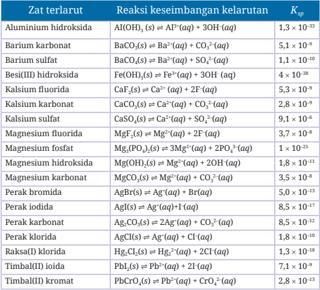

Tabel ini menunjukkan reaksi keseimbangan larutan dengan zat-zat tertarik, termasuk aluminium hidroksida, barium karbonat, barium sulfat, besi(III) hidroksida, kalsium fluorida, kalsium karbonat, kalsium sulfat, magnesium fluorida, magnesium fosfat, magnesium hidroksida, perak bromida, perak iodida, perak karbonat, perak klorida, raksasa klorida, timbal(II) ioidida, dan timbal(IV) kromat. Kolom pertama berisi nama zat tertarik, sedangkan kolom kedua berisi reaksi keseimbangan larutan yang melibatkan zat tersebut. Kolom ketiga menyajikan koefisien reaksi (Kc), yang menunjukkan tingkat kecenderungan reaksi untuk terjadi. Data dalam tabel menunjukkan bahwa reaksi keseimbangan larutan dapat berlangsung dengan intensitas yang berbeda-beda tergantung pada jenis zat tertariknya. Misalnya, reaksi keseimbangan larutan antara aluminium hidroksida dan asam fosfat memiliki koefisien reaksi sebesar 1,3 x 10^-5, sementara reaksi keseimbangan larutan antara timbal(IV) kromat dan asam fosfat memiliki koefisien reaksi sebesar 2,8 x 10^-4. Ini menunjukkan bahwa reaksi keseimbangan larutan dapat sangat kuat atau sangat lemah tergantung pada jenis zat tertariknya.

 

---
## 📄 Halaman 51

Untuk senyawa-senyawa ionik yang sulit larut dalam air, keberadaan  ion  senama/sejenis  akan  mempengaruhi  kelarutannya. Coba kalian prediksi apa yang akan terjadi ketika kalian memasukkan larutan Na 2 SO4 ke dalam larutan BaSO 4 ?

Ingat kembali persamaan reaksi kesetimbangan BaSO 4 .

``

Senyawa Na2SO4 merupakan garam yang mudah larut dalam air.

``

Larutan Na2SO4 memiliki ion senama dengan larutan jenuh BaSO 4 yaitu ion sulfat, SO 4 2- . Dengan adanya penambahan Na2SO4, jumlah ion sulfat  pada  larutan  jenuh  BaSO 4 akan  semakin  banyak.  Berdasarkan asas Le Chatelier, penambahan ion sulfat pada kesetimbangan di atas akan  menggeser  kesetimbangan  ke  arah  kiri  sehingga  mengurangi jumlah  BaSO4 yang  larut.  Dari  penjelasan  tersebut,  keberadaan  ion senama  akan  semakin  mengurangi  kelarutan  senyawa  ionik  yang sukar  larut  dalam  air.  Penambahan  ion  senama  pada  larutan  jenuh akan menyebabkan terbentuknya endapan.

Seperti dijelaskan pada sub bab sebelumnya, ada reaksi-reaksi yang dapat menghasilkan endapan. Untuk meramalkan apakah dua senyawa yang awalnya mudah larut dalam air dapat membentuk endapan ketika direaksikan, maka perlu dilihat apakah hasil kali konsentrasi ion-ion ( Qsp ) yang direaksikan melampaui nilai Ksp atau tidak.

Cara menghitung Qsp mirip  dengan  menghitung Ksp yaitu  dengan mengalikan konsentrasi ion-ion penyusun senyawa sulit larut dalam air.

``

Apabila dua senyawa yang mengandung ion P y+ dan Q x -   dicampurkan membentuk senyawa PxQy yang sulit larut dalam air, maka akan ada tiga kemungkinan yaitu:

 

---
## 📄 Halaman 52

- -Jika nilai Qsp > Ksp , campuran akan menghasilkan endapan;
- -Jika nilai Qsp < Ksp , campuran tidak akan menghasilkan endapan;
- -Jika nilai Qsp = Ksp , campuran akan menghasilkan larutan jenuh.
- Tuliskan hubungan kelarutan dengan tetapan hasil kali kelarutan untuk senyawa:
- AgCl
- PbI 2
- Cr(OH)3
- )
- Ca3 (PO4 2
- Apabila kelarutan CaSO 4 dalam air pada suhu 25 o C adalah 0,67 g/l, maka berapakah Ksp CaSO4 pada suhu tersebut?
- Hitunglah kelarutan AgBr dalam larutan NaBr 0,01 M! Diketahui Ksp AgBr = 5 × 10 -13 .
- Sebanyak 200 ml larutan BaCl 2 0,004 M ditambahkan pada 300 ml larutan Na 2 SO4 0,001 M. Perkirakan apakah campuran kedua larutan ini akan menghasilkan endapan BaSO 4 ! (Diketahui Ksp BaSO4 = 1,5 × 10 -9 )

### D.  Sifat Koligatif Larutan

Larutan memiliki beberapa sifat berbeda jika dibandingkan dengan zat terlarut maupun pelarutnya. Untuk melihat perbedaan tersebut, coba lakukan aktivitas berikut.

 

---
## 📄 Halaman 53

Perhatikan  data  berikut  ini  kemudian  diskusi  bersama  rekan  kalian mengenai fenomena berikut ini!

Faktor apa yang mempengaruhi terjadinya fenomena tersebut? Apakah jenis zat terlarut berpengaruh terhadap perubahan tersebut?

Beberapa  sifat  yang  muncul  tersebut  diakibatkan  oleh  interaksi baru  yang  terbentuk  antara  pelarut-terlarut  yang  'mengganggu' interaksi sebelumnya. Sifat-sifat yang muncul ketika larutan terbentuk disebut sifat koligatif larutan. Sifat ini tidak bergantung kepada jenis zat terlarut, tetapi hanya bergantung kepada jumlahnya.

Untuk dapat memahami  sifat  koligatif larutan, kalian perlu mengingat  kembali  berbagai  jenis  konsentrasi  diantaranya  persen massa, molaritas, molalitas, dan fraksi mol.Penjelasan tersebut dapat diunduh  pada  tautan  berikut  ini  http://bitly.ws/uDYk  atau  melalui pindai qrcode berikut.

 

---
## 📄 Halaman 54

Wt = massa zat terlarut

Vt = volume zat terlarut

nt = mol zat terlarut

Wp = massa pelarut

Viar = volume larutan

nlar = mol larutan

Wlar = massa larutan

p = massa jenis larutan

Mr = massa molar

---
**🖼️ Gambar/Diagram**

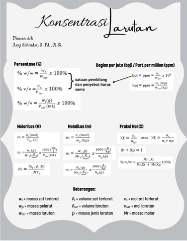

> **Deskripsi Visual:** Gambar tersebut adalah ilustrasi yang menunjukkan konsep-konsep kimia tentang larutan, termasuk persentase (%) larutan, molalitas (m), molaritas (M), fraksi molal (X), dan keterangannya. Ilustrasi ini mencakup berbagai tabel dan rumus yang menjelaskan definisi dan cara menghitung setiap konsep tersebut. Teks dan angka penting dalam ilustrasi meliputi persentase (%) larutan, molalitas (m), molaritas (M), fraksi molal (X), dan keterangannya. Informasi kunci yang dapat diambil pembaca meliputi definisi dan cara menghitung setiap konsep tersebut, serta hubungan antara mereka.

Terdapat  empat  jenis  sifat  koligatif  larutan  yaitu  penurunan tekanan uap, penurunan titik beku, kenaikan titik didih, dan tekanan osmosis.

 

---
## 📄 Halaman 55

Untuk  melibatkan  pengaruh  jumlah  zat  terlarut  terhadap  sifat koligatif  larutan,  seorang  ilmuwan  bernama  Jacobus  Henricus  Van't Hoff  memberikan  satu  faktor  pengali  terhadap  jumlah  zat  terlarut yang kemudian disebut dengan faktor Van't Hoff. Rumusan Van't Hoff terhadap faktor tersebut adalah:

``

dimana i menunjukkan faktor van't Hoff, c =  jumlah ion, dan ∝ = derajat ionisasi.

Coba  kalian  tentukan  bagaimana  nilai  faktor  van't  Hoff, i ,  untuk zat terlarut nonelektrolit, elektrolit kuat, dan elektrolit lemah.

### 1. Penurunan Tekanan Uap Larutan ( ∆ P)

Menguap adalah  proses  terjadinya  perubahan  fasa  cair  membentuk fasa gas. Suatu zat dikatakan mudah menguap jika gaya antarmolekul pada fasa cairnya lemah.

Molekul-molekul pada fasa gas menyebabkan tekanan yang disebut tekanan  uap.  Salah  satu  faktor  yang  mempengaruhi  tekanan  uap adalah temperatur. Semakin tinggi temperatur zat cair, semakin besar tekanan uapnya. Contohnya adalah tekanan uap air meningkat seiring peningkatan temperatur.

Apakah kalian pernah mengamati apa yang terjadi dengan tekanan uap jika ke dalam suatu pelarut (misalnya air) ditambahkan zat yang tidak mudah menguap (misalnya gula pasir)?

 

---
## 📄 Halaman 56

### Air murni

---
**🖼️ Gambar/Diagram**

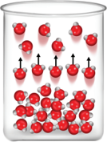

> **Deskripsi Visual:** Gambar ini adalah ilustrasi yang menunjukkan struktur molekul gas. Dalam ilustrasi ini, beberapa molekul gas bergerak bebas di dalam sebuah wadah yang tampak seperti kaca. Molekul-molekul ini diperlihatkan dengan warna merah dan memiliki bentuk yang sederhana namun detail, menunjukkan bahwa mereka bergerak dengan cepat dan tidak terikat pada satu tempat.

Elemen utama dalam ilustrasi ini adalah molekul gas. Mereka diperlihatkan dengan berbagai posisi dan arah gerakan yang berbeda, menunjukkan bahwa mereka bergerak bebas tanpa ikatan atau tekanan tertentu. Wadah yang digunakan untuk menggambarkan gas ini tampak seperti kaca, yang menunjukkan bahwa gas tersebut berada dalam kondisi yang sangat rendah tekanan.

Teks, angka, atau label penting yang terlihat dalam ilustrasi ini adalah tidak ada. Namun, informasi kunci yang dapat diambil pembaca melalui ilustrasi ini adalah bahwa gas bergerak bebas dan tidak terikat pada satu tempat, serta bahwa mereka bergerak dengan cepat dan tidak terikat pada satu tempat.

### Larutan

---
**🖼️ Gambar/Diagram**

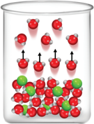

> **Deskripsi Visual:** Gambar ini adalah ilustrasi yang menunjukkan struktur molekul dari air. Dalam ilustrasi ini, kita melihat beberapa molekul air yang terdiri dari dua atom hidrogen dan satu atom oksigen. Molekul-molekul ini disusun dalam bentuk ikatan hidrogen yang menghubungkan atom hidrogen dari satu molekul dengan atom oksigen dari molekul lainnya. Ilustrasi ini juga menunjukkan bahwa molekul-molekul air ini bergerak dan berinteraksi satu sama lain, yang merupakan sifat-sifat gas. Ini menunjukkan bahwa air memiliki kemampuan untuk bergerak dan berubah bentuk, yang merupakan sifat-sifat gas.

Berdasarkan  ilustrasi  pada  Gambar  1.11  tersebut,  keberadaan zat  terlarut  nonvolatil  (tidak  mudah  menguap)  dapat  menurunkan tekanan  uap.  Tekanan  uap  larutan  lebih  rendah  dari  tekanan  uap pelarut murninya. Coba kalian lakukan aktivitas berikut ini.

Cari referensi faktor-faktor apa saja yang menyebabkan tekanan uap larutan lebih rendah dari tekanan uap pelarut murninya? Hubungkan dengan gaya antarmolekul zat terlarut-air dan air-air.

Selain itu, untuk memahami bagaimana pelarutan zat non volatil berpengaruh terhadap tekanan uap, maka lakukanlah aktivitas berikut.

 

---
## 📄 Halaman 57

### Pengaruh Zat Nonvolatil pada Pelarut

### Tujuan

Menjelaskan sifat larutan zat yang tidak mudah menguap.

### Alat

- Gelas kimia
- Kotak kaca dengan penutup

### Bahan

- Aquades
- Larutan gula 50% w/w

### Langkah Kerja

- Siapkan dua gelas kimia. Gelas pertama diisi aquades, gelas kedua diisi larutan gula dengan volume yang sama.
- Simpan gelas kimia tersebut dalam kotak kaca  dan tutup rapat, kemudian biarkan selama satu hari.
- Amati fenomena yang terjadi dalam kedua cairan itu.

### Pertanyaan

- Fenomena apa yang kalian temukan pada kedua wadah itu?
- Mengapa air murni pindah ke dalam gelas kimia yang berisi larutan gula?
- Apakah kesimpulan dari percobaan ini? Diskusikan dengan teman sekelompok kalian.

 

---
## 📄 Halaman 58

Francois  M.  Raoult  telah  mengkaji  larutan  yang  di  dalamnya terdapat zat  terlarut  non  volatil  sehingga  ditemukan  Hukum  Raoult. Hukum tersebut dapat dinyatakan dalam persamaan sebagai berikut.

``

### Keterangan:

Plarutan

= tekanan uap larutan

Xpelarut

= fraksi mol pelarut

P o pelarut

= tekanan uap pelarut murni

n pelarut

= mol pelarut

n terlarut

= mol zat terlarut

i

= faktor Van't Hoff

Jika  P larutan dan  X pelarut diekstrapolasi,  maka  akan  dihasilkan  garis linear dengan gradien menunjukkan P o pelarut (Gambar 1.12)

---
**🖼️ Gambar/Diagram**

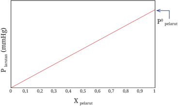

> **Deskripsi Visual:** Gambar ini adalah diagram yang menunjukkan hubungan antara variabel X (pelarut) dan Y (tekanan air). Diagram ini berbentuk garis lurus yang melintang dari koordinat (0,0) hingga (1, p0), menunjukkan bahwa tekanan air (Y) meningkat seiring penambahan pelarut (X). Garis ini membantu dalam memahami hubungan linear antara kedua variabel tersebut. Label "p0 pelarut" menunjukkan titik akhir garis, yang mungkin merujuk pada tekanan air maksimum yang diperoleh saat semua pelarut telah digunakan. Ini adalah representasi visual yang efektif untuk menggambarkan hubungan antara pelarut dan tekanan air dalam konteks kimia atau fisika.

Penurunan tekanan uap larutan dapat dihitung dengan rumus

``

 

---
## 📄 Halaman 59

Kalian  juga  dapat  menentukan  ∆P  dengan  menggunakan  hukum Raoult.

``

Lakukan penataulangan,

``

``

### 2. Penurunan Titik Beku Larutan ( ∆ Tf )

Pada musim dingin di negara empat musim, ada beberapa aktivitas yang umum dilakukan seperti terlihat pada Gambar 1.13 berikut. Apakah kalian tahu mengapa aktivitas tersebut dilakukan? Silakan diskusikan bersama rekan di kelas.

---
**🖼️ Gambar/Diagram**

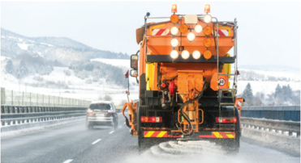

> **Deskripsi Visual:** Gambar ini adalah foto yang menunjukkan sebuah truk saluran jalan sedang bekerja di jalan raya saat musim dingin. Truk tersebut memiliki mesin besar yang digunakan untuk mengeluarkan salju dan es dari jalan. Di sekitar truk, terlihat salju yang telah diangkut dan jalan yang tampak lebih bersih dibandingkan sebelumnya. Dapat dilihat bahwa truk tersebut bergerak di jalan raya dengan baik, menunjukkan bahwa sistemnya berfungsi dengan baik. Gambar ini menunjukkan bagaimana truk saluran jalan berperan penting dalam menjaga keamanan dan kenyamanan pengguna jalan raya selama musim dingin.

Sehingga,

 

---
## 📄 Halaman 60

Sebelum  kita  membahas  penurunan  titik  beku  larutan,  silakan kalian lakukan aktivitas berikut.

Pernahkah kalian meminum teh manis yang telah dibekukan? Apakah rasa manis ada pada bongkahan es? Ataukah hanya di sebagian tempat?

Apabila belum pernah, coba kalian buktikan melalui aktivitas ini.

- -Buatlah kelompok beranggotakan 4-5 orang
- -Buatlah  larutan  teh  manis  kemudian  bekukan  dalam  mesin pendingin
- -Setelah beku, ambil dan minum kemudian jawab pertanyaan di atas.
Membeku  adalah  proses  perubahan  wujud  cair  menjadi  padat dengan cara memaksimalkan  interaksi antarmolekul. Akibatnya, partikel-partikel suatu zat saling mendekat satu sama lain. Zat terlarut yang dapat mengganggu proses pembekuan adalah zat terlarut yang tidak larut dalam fasa padat pelarut. Keberadaan zat terlarut ini akan mengganggu  sehingga  memerlukan  temperatur  lebih  rendah  agar pelarut dapat membeku. Inilah penyebab terjadinya penurunan titik beku.

 

---
## 📄 Halaman 61

---
**🖼️ Gambar/Diagram**

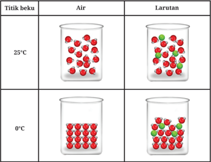

> **Deskripsi Visual:** Gambar ini adalah ilustrasi yang menunjukkan perbedaan antara air dan larutan pada dua titik suhu berbeda, yaitu 25°C dan 0°C. Ilustrasi ini menggunakan kontur warna untuk membedakan antara air dan larutan. Di titik suhu 25°C, air dan larutan memiliki bentuk yang sama, dengan warna merah dan hijau yang mencerminkan partikel-partikel yang terlibat. Namun, pada titik suhu 0°C, air menjadi lebih padat dibandingkan dengan larutan, yang tampak lebih lembut dan mengalir. Ini menunjukkan bahwa air memiliki densitas yang lebih tinggi dibandingkan dengan larutan, yang dapat dilihat dari perbedaan bentuk dan tekstur pada kedua kondisi tersebut. Label "Titik bekuk" dan "Air" serta "Larutan" memberikan informasi tentang jenis dan kondisi yang dipertimbangkan dalam ilustrasi ini.

Secara kuantitatif, penurunan titik beku berbanding lurus dengan molalitas larutan,

``

``

``

Kf adalah  tetapan penurunan  titik beku  molal  dan  nilainya tergantung pada jenis pelarut, dimana m adalah konsentrasi molal, dan i adalah faktor Van't Hoff.

 

---
## 📄 Halaman 62

Untuk mengetahui seberapa besar pengaruh zat terlarut terhadap titik beku larutan, silakan kalian kunjungi tautan berikut ini.

https://s.id/tflar

### 3. Kenaikan Titik Didih Larutan ( ∆ Tb )

Kenaikan titik didih larutan ini sangat berhubungan dengan penurunan tekanan uap. Hal ini terjadi karena kemiripan proses. Mendidih terjadi ketika  tekanan  uap  larutan  sama  dengan  tekanan  atmosfer.  Dengan adanya zat terlarut non volatil, proses mendidih sama terganggunya seperti proses penguapan. Partikel-partikel pelarut harus memutuskan interaksi pelarut-pelarut dan pelarut-terlarut agar dapat mendidih dan menguap. Dengan demikian, proses mendidih menjadi lebih sulit dan membutuhkan temperatur lebih tinggi agar dapat mendidih. Fenomena inilah yang kemudian disebut sebagai kenaikan titik didih.

Perhatikan  Gambar  1.15  untuk  ilustrasi  perbedaan  antara  titik didih air murni dengan larutan pada saat mendidih.

 

---
## 📄 Halaman 63

### Air murni

---
**🖼️ Gambar/Diagram**

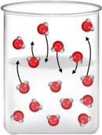

> **Deskripsi Visual:** Gambar ini adalah ilustrasi yang menunjukkan proses evolusi molekul dalam suatu sistem. Gambar ini menggambarkan beberapa molekul bergerak di sekitar lingkaran dalam sebuah cawan. Molekul-molekul ini memiliki bentuk yang berbeda-beda dan bergerak dengan kecepatan yang berbeda. Ilustrasi ini menunjukkan bahwa molekul-molekul ini bergerak secara acak dan tidak teratur, yang merupakan karakteristik dari suatu sistem yang tidak terorganisir. Ini juga menunjukkan bahwa molekul-molekul ini berinteraksi dengan satu sama lain, yang merupakan aspek penting dari proses evolusi molekul.

### 100°C

Seperti penurunan titik beku larutan, kenaikan titik didih larutan (∆ Tb ) juga berbanding lurus dengan molalitas larutan.

``

``

Kb adalah tetapan kenaikan titik didih molal dan nilainya tergantung pada  jenis  pelarut, m adalah  konsentrasi  molal,  dan i adalah  faktor van't Hoff.

Hubungan  antara  tekanan  uap,  titik  beku,  dan  titik  didih  dari pelarut  dan  larutan  dapat  dilihat  dalam  diagram  fasa.  Gambar  1.16 menunjukkan diagram fasa air dan larutan.

### Larutan

---
**🖼️ Gambar/Diagram**

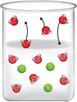

> **Deskripsi Visual:** Gambar ini adalah ilustrasi yang menunjukkan proses kimia dalam sebuah cawan. Gambar ini menggambarkan beberapa molekul berwarna merah dan hijau yang sedang bergerak di dalam cawan. Molekul-molekul tersebut tampak seperti partikel yang bergerak dengan cepat, mungkin menunjukkan reaksi kimia atau interaksi antara molekul-molekul tersebut. Ilustrasi ini digunakan untuk membantu pembaca memahami konsep tentang struktur dan perilaku molekul dalam suatu sistem kimia.

 

---
## 📄 Halaman 64

---
**🖼️ Gambar/Diagram**

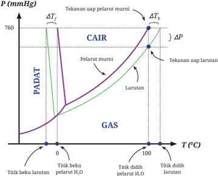

> **Deskripsi Visual:** Gambar ini adalah diagram yang menunjukkan hubungan antara tekanan uap (P) dan suhu (T) dalam sistem pelarutan murni dan larutan. Diagram ini dibagi menjadi dua bagian utama: CAIR (Condensation of Air in Refrigeration) dan GAS (Gas). Di CAIR bagian, tekanan uap meningkat dengan naiknya suhu, tetapi dengan penambahan larutan, tekanan uap meningkat lebih cepat. Di bagian GAS, tekanan uap stabil seiring naiknya suhu. Titik titik pada diagram tersebut menunjukkan titik titik beku pelarutan dan titik tidak didih pelarutan air. Label penting lainnya termasuk tekanan uap pelarutan murni dan larutan, serta perbedaan tekanan uap (ΔP) dan perbedaan suhu (ΔT). Gambar ini memberikan pemahaman tentang bagaimana proses pelarutan mempengaruhi tekanan uap dan suhu dalam sistem tersebut.

### 4. Tekanan Osmosis Larutan ( π )

Kalian  mungkin  penasaran  mengapa  air  dari  dalam  tanah  dapat sampai di daun pohon tertinggi sekalipun? Padahal, kita tahu bahwa air  mengalir sesuai gravitasi dari tempat tinggi menuju tempat yang rendah. Untuk menjawab hal tersebut coba kalian lakukan aktivitas 1.12 terlebih dahulu agar kalian temukan jawabannya dengan kemampuan kalian.

Gambar 1.17 berikut ini menunjukkan ilustrasi terjadinya proses osmosis dan bagaimana tekanan osmosis bekerja.

 

---
## 📄 Halaman 65

---
**🖼️ Gambar/Diagram**

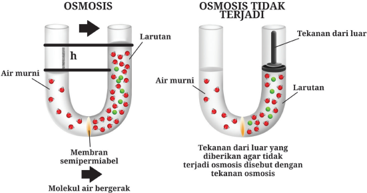

> **Deskripsi Visual:** Gambar ini adalah ilustrasi yang menunjukkan konsep osmosis. Ilustrasi ini memperlihatkan dua kondisi osmosis: kondisi normal dan kondisi tidak terjadi osmosis.

Pertama, pada bagian kiri, kita melihat kondisi normal osmosis. Di sini, air murni (dalam larutan) bergerak melalui membran semipermeabel ke dalam larutan. Air murni mengalir dari sisi dengan tekanan lebih rendah (sisi yang lebih tinggi) ke sisi dengan tekanan lebih tinggi (sisi yang lebih rendah). Ini disebabkan oleh perbedaan tekanan antara dua sisi membran.

Di sisi kanan, kita melihat kondisi tidak terjadi osmosis. Dalam kondisi ini, tekanan dari luar yang diberikan agar terjadi osmosis dibandingkan dengan tekanan osmosis. Hal ini menyebabkan air murni tidak bergerak dari sisi dengan tekanan lebih rendah ke sisi dengan tekanan lebih tinggi. Ini menunjukkan bahwa tekanan osmosis harus lebih besar daripada tekanan dari luar untuk terjadi osmosis.

Elemen-elemen utama dalam ilustrasi ini adalah air murni, larutan, membran semipermeabel, dan tekanan. Relasi antara elemen-elemen ini adalah bahwa air murni bergerak melalui membran semipermeabel ke dalam larutan karena perbedaan tekanan. Jika tekanan dari luar lebih besar daripada tekanan osmosis, maka air murni tidak akan bergerak.

Teks, angka, atau label penting yang terlihat dalam ilustrasi ini adalah "Larutan", "Air murni", "Membran semipermeabel", dan "Tekanan dari luar". Informasi kunci yang dapat diambil pembaca adalah bahwa tekanan osmosis harus lebih besar daripada tekanan dari luar untuk terjadi osmosis.

Untuk mengetahui besarnya tekanan osmosis yang diberikan oleh suatu zat terlarut, kalian dapat mengunjungi tautan berikut ini.

https://s.id/tolar

Tekanan osmosis berbanding lurus dengan molaritas larutan dan sangat  dipengaruhi  oleh  temperatur.  Persamaan  matematis  untuk tekanan osmosis adalah seperti berikut ini.

``

dengan M adalah konsentrasi molar, R tetapan (0,082 l.atm/mol.K), T adalah temperatur larutan dalam Kelvin, dan i adalah faktor Van't Hoff.

 

---
## 📄 Halaman 66

Konsep  tekanan  osmosis  ini  dalam  praktiknya  digunakan  untuk mendapatkan air tawar dari air laut yang disebut proses reverse osmosis . Proses ini digunakan di rumah untuk memurnikan air sumur dari ion logam. Selain itu, pembuatan larutan infus juga sangat berhubungan dengan tekanan osmosis.

Suatu larutan oralit dibuat dari campuran 34,2 gram sukrosa ( Mr

- = 342) dan 11,7 gram garam dapur ( Mr = 58,5) dalam 1 l (liter) larutan. Tentukan:
- -Tekanan uap larutan pada 25  o C jika diketahui tekanan uap air = 23,76 mmHg
- -Titik didih larutan oralit tersebut ( Kf = 1,86  o C/m)
- -Titik beku larutan oralit tersebut ( Kb = 0,52  o C/m)
- -Tekanan osmotik larutan oralit tersebut pada 25  o C ( R = 0,082 l.atm/mol.K)

### E.  Koloid

Koloid merupakan salah satu campuran heterogen dengan karakteristik unik. Bahkan, karakter koloid tersebut menjadi dasar untuk membuat produk modern yang kemudian disebut nanomaterial. Koloid memiliki beberapa  karakteristik  yang  berbeda  dengan  campuran  lain  seperti tertera pada Tabel 1.4 berikut ini.

 

---
## 📄 Halaman 67

---
**📊 Tabel**

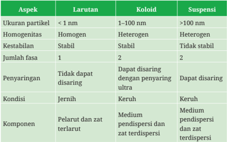

Tabel ini membandingkan tiga jenis larutan berdasarkan ukuran partikel, homogenitas, kestabilan, jumlah fasa, penyaringan, kondisi, dan komponen. Topik utama tabel adalah perbedaan struktur dan karakteristik antara larutan, koloid, dan suspensi. Kolom-kolomnya mencakup ukuran partikel, homogenitas, kestabilan, jumlah fasa, penyaringan, kondisi, dan komponen. Data penting yang terlihat adalah bahwa larutan memiliki partikel yang lebih kecil (< 1 nm), koloid memiliki partikel antara 1-100 nm, dan suspensi memiliki partikel yang lebih besar (> 100 nm). Larutan dan koloid adalah homogen, sedangkan suspensi adalah heterogen. Larutan dan suspensi stabil, sedangkan koloid tidak stabil. Larutan memiliki satu fase, koloid memiliki dua fase, dan suspensi juga memiliki dua fase. Larutan tidak dapat disaring dengan penyaringan ultra, sedangkan koloid dan suspensi dapat disaring. Larutan jernih, koloid keruh, dan suspensi keruh. Komponen larutan meliputi zat terlarut dan pelarut, koloid memiliki medium pendispersi, dan suspensi memiliki zat terdispersi dan zat terdispersi.

Untuk membuktikan beberapa perbedaan yang disebutkan pada Tabel 1.4 di atas, coba kalian lakukan aktivitas berikut!

### Ikuti langkah-langkah berikut ini!

- Siapkan  3  buah  gelas  transparan  berukuran  sama,  beri  label berbeda untuk setiap gelas
- Masukkan  air  jernih  ke  dalam  setiap  gelas  hingga  memenuhi sekitar ¾ isi gelas
- Ke dalam gelas pertama masukkan satu sendok teh garam dapur

 

---
## 📄 Halaman 68

- Ke dalam gelas kedua masukkan satu sendok teh pasir bubuk
- Ke dalam gelas ketiga masukkan satu sendok teh tepung terigu
- Aduk masing-masing campuran selama 2 menit
- Perhatikan kondisi campuran setiap 1 menit setelah diaduk seperti warna, kejernihan, dan homogenitas campuran.
- Simpan wadah ini untuk melakukan aktivitas berikutnya.
- Diskusikan hasil dengan rekan kalian mengenai hasil pengamatan kalian.

### 1. Jenis-jenis koloid

Koloid dibedakan menjadi beberapa jenis tergantung pada wujud zat terdispersi  dan  medium  pendispersi  seperti  tertera  pada  Tabel  1.5 berikut ini.

---
**📊 Tabel**

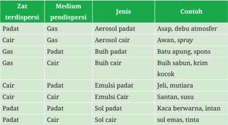

Tabel ini membahas berbagai jenis dispersi zat tergantung pada medium pendispersi. Topik utamanya adalah jenis-jenis dispersi zat dalam media gas dan cair. Dalam kolom "Zat terdispersi", disebutkan beberapa zat seperti padat, cair, dan emulsi. Media pendispersi dijelaskan sebagai gas atau cair. Jenis-jenis dispersi yang dimainkan meliputi aerosol padat, aerosol cair, buish padat, buish cair, emulsi padat, emulsi cair, sol padat, dan sol cair. Contoh-contoh yang diberikan mencakup asap, debu atmosfer, awan, spray, batu apung, susu, krim kokoc, jeli, santan, kaca berwarna, intan, dan sol emas, tint. Pola penting yang terlihat adalah bahwa semua jenis dispersi zat tergantung pada medium pendispersi, baik gas maupun cair, dan masing-masing memiliki contoh spesifik.

 

---
## 📄 Halaman 69

Selain berdasarkan wujud komponennya, koloid juga dapat dibedakan jenisnya berdasarkan interaksi antara zat terdispersi dan medium pendispersinya. Terdapat dua jenis koloid yaitu koloid liofil dan liofob.

Koloid  liofil  merupakan koloid  yang  zat  terdispersinya  menarik medium pendispersinya. Hal ini disebabkan oleh kuatnya gaya tarik antara  partikel-partikel  terdispersi  dengan  medium  pendispersinya. Koloid liofob merupakan koloid yang fase terdispersinya tidak menarik medium pendispersinya. Pada koloid dengan medium pendispersi air maka koloid  liofil  disebut  hidrofil,  sedangkan koloid  liofob  disebut hidrofob.

Beberapa contoh koloid hidrofil adalah sabun, detergen, agar-agar, kanji, dan gelatin sedangkan contoh koloid hidrofob adalah sol Fe(OH) 3 , sol belerang, sol-sol logam, dan sol-sol sulfida.

Jenis koloid lofil dan liofob ini dalam kehidupan sehari-hari dapat kalian jumpai pada sabun cuci piring. Sabun memiliki dua bagian yaitu bagian hidrofil yang dapat berinteraksi kuat dengan air dan bagian hidrofob yang dapat berinteraksi dengan senyawa-senyawa nonpolar  seperti  minyak.  Dengan  cara  kerja  seperti  itulah  sabun dapat mengangkat minyak pada permukaan-permukaan benda yang dicuci  dan  kemudian  saat  dibasuh  dengan  air,  kotoran  akan  ikut terbuang.

### 2. Sifat-sifat koloid

Koloid memiliki sifat khas yang berbeda dari campuran lainnya. Akan tetapi, perlu diingat bahwa tidak semua jenis koloid dapat dibuktikan memiliki seluruh sifat yang disebutkan berikut ini.

 

---
## 📄 Halaman 70

Aktivitas ini adalah lanjutan dari aktivitas koloid 1.13.

Sorotlah  masing-masing  dari  tiga  gelas  yang  berisi  campuran  tadi dengan senter. Perhatikan cahaya senter tersebut. Apakah perbedaan antara  cahaya  senter  pada  campuran  pertama,  kedua,  dan  ketiga. Diskusikan bersama rekan-rekan kalian.

### a. Gerak Brown

Gerak  Brown  adalah  gerak  acak  dan  terus  menerus  yang  dialami partikel  koloid  karena  adanya  tumbukan  zat  terdispersi  dengan medium pendispersi yang berbeda ukuran. Gerak ini ditemukan oleh Robert Brown dan hanya dapat dilihat menggunakan mikroskop ultra.

### b. Efek Tyndall

Pernahkah kalian bertanya mengapa langit berwarna biru saat siang hari dan saat sore menjadi berwarna jingga? Hal ini disebabkan oleh adanya efek Tyndall yang diambil dari nama penemunya yaitu John  Tyndall.  Efek  Tyndall  adalah  gejala  penghamburan  berkas sinar (cahaya) oleh partikel-partikel koloid yang disebabkan karena ukuran molekul koloid yang cukup besar.

### c. Adsorpsi

Adsorpsi adalah peristiwa penyerapan partikel, ion, atau senyawa lain pada permukaan partikel koloid yang disebabkan oleh luasnya permukaan  partikel.  Muatan  koloid  dihasilkan  sebagai  akibat dari sifat adsorpsi ini. Misalnya, koloid Fe(OH) 3 bermuatan positif karena  permukaannya  menyerap  ion  H + ,  sedangkan  koloid  As 2 S3 bermuatan negatif karena permukaannya menyerap ion S 2- . Dalam

 

---
## 📄 Halaman 71

kehidupan sehari-hari, sifat ini digunakan dalam pemutihan gula dan norit untuk mengobati sakit perut.

### d. Koagulasi

Koagulasi  adalah  peristiwa  penggumpalan  partikel  koloid  akibat terbentuk  agregat.  Koagulasi  dapat  terjadi  karena  proses  fisis seperti  pemanasan,  pendinginan  dan  pengadukan  atau  secara kimia  seperti  penambahan  elektrolit,  pencampuran  koloid  yang berbeda muatan. Contoh peristiwa koagulasi adalah penjernihan air  dengan  bantuan  tawas.    Untuk  mencegah  proses  koagulasi koloid  dalam  suatu  produk,  para  produsen  sering  menggunakan koloid  pelindung.  Contoh  koloid  pelindung  adalah  penambahan gelatin pada es krim agar es krim tetap lembut.

### e. Dialisis

Dialisis adalah pemisahan koloid dari ion-ion pengganggu. Proses ini  dilakukan dengan cara mengalirkan cairan bercampur koloid melalui selaput semipermeabel yang berfungsi sebagai penyaring. Selaput ini hanya dapat dilewati cairan tetapi tidak dapat dilewati partikel  koloid.  Contoh  proses  dialisis  adalah  proses  cuci  darah untuk pasien gagal ginjal.

### f. Elektroforesis

Elektroforesis  adalah  peristiwa  pemisahan  partikel  koloid  yang bermuatan dengan menggunakan arus listrik. Proses ini biasanya dilakukan untuk memisahkan protein dan untuk menyaring debu pada cerobong pabrik.

Tuliskan  contoh-contoh  lain  dari  jenis  dan  sifat  koloid  yang  kalian temukan dalam kehidupan sehari-hari!

 

---
## 📄 Halaman 72

### 3. Cara pembuatan koloid

Koloid  dapat  dibuat  menggunakan  dua  metode  utama  yaitu  dispersi dan  kondensasi.  Metode  dispersi  dilakukan  dengan  memperkecil partikel besar menjadi partikel berukuran koloid, sedangkan metode kondensasi dilakukan dengan menggumpalkan partikel larutan agar membentuk partikel berukuran koloid.

Carilah berbagai sumber mengenai cara pembuatan koloid baik metode dispersi  maupun  kondensasi  yang  lebih  detail  secara  berkelompok.

Buatlah produk yang merupakan koloid dalam kehidupan seharihari dengan mengikuti langkah-langkah berikut ini!

- Buatlah kelompok beranggotakan 4-5 orang
- Pilihlah salah satu produk di bawah ini untuk dilakukan dalam proyek
- Es krim
- Agar-agar atau puding
- Kue bolu atau brownies
- Yoghurt
- Selai
- Pasta gigi
- Sabun

 

---
## 📄 Halaman 73

- Catatlah setiap alat dan bahan yang digunakan, proses pembuatan, dan harga bahan yang digunakan.
- Buatlah video pembuatan setiap produk dari mulai pengenalan bahan  dan  jumlah  bahan  yang  digunakan  hingga  produk tersebut dihasilkan.
- Masukkan  setiap  produk  ke  dalam  kemasan  yang  sangat menarik dan buatlah nama produk tersebut.
- Hitunglah jumlah kemasan yang dihasilkan dari bahan-bahan awal  dan  tentukan  perkiraan  harga  jual  yang  layak  agar menghasilkan keuntungan.
- Buatlah laporan pelaksanaan dari proyek yang telah dilakukan.
- Diskusikan setiap tahap proyek dengan  guru  kalian dan hubungkan pula dengan konsep yang telah kalian pelajari! Selamat berkarya!
Larutan dan koloid merupakan jenis campuran yang memiliki sifat seperti  yang  telah  dipelajari.  Meskipun  begitu,  larutan  memiliki jumlah  bahasan  yang  lebih  luas.  Konsep  larutan  yang  dibahas adalah asam basa, hidrolisis garam, larutan penyangga, titrasi asam basa, stoikiometri larutan, kelarutan dan hasil kali kelarutan, serta sifat koligatif larutan. Konsep koloid yang dibahas adalah jenis, sifat, dan cara pembuatan koloid.

 

---
## 📄 Halaman 74

Asam  dan  basa  memiliki sifat khas masing  masing  dan pengertiannya  dapat  ditinjau  dari  konsep  Arrhenius,  BronstedLowry, dan Lewis. Kekuatan asam dapat ditentukan dari keelektronegatifan  dan  polaritas  ikatan.  pH  asam  basa  menjadi solusi untuk menyebutkan konsentrasi ion H +  dan OH -  yang sangat kecil. Nilai pH dapat dihitung dari minus logaritma konsentrasi H + .

Asam  dan  basa dapat bereaksi membentuk  garam.  Sifat garam ditentukan oleh asam dan basa penyusunnya. Garam dapat mengalami hidrolisis apabila ada komponen ion yang berasal dari asam atau basa lemah.

Larutan penyangga adalah larutan yang dapat mempertahankan pH. Komponen penyangga dapat ditemukan di dalam tubuh makhluk hidup baik di dalam darah maupun dalam cairan intrasel. Selain pada  tubuh  makhluk  hidup,  penyangga  juga  dapat  ditemukan  di dalam air laut.

Stoikiometri  pada  larutan  tidak  jauh  berbeda  dengan  stoikiometri reaksi lainnya. Prinsipnya adalah penyetaraan reaksi dan konsep mol.  Perbedaan  utamanya  adalah  pada  stoikiometri  larutan  ada penentuan pH larutan. Titrasi asam basa dapat digunakan untuk menentukan konsentrasi zat asam atau basa yang belum diketahui dengan menggunakan zat lain yang konsentrasinya telah diketahui. Dari  hasil  titrasi  maka  dapat  dibuat  kurva  titrasi.  Setiap  titrasi memiliki titik ekivalen dan titik akhir titrasi yang berbeda.

Zat  terlarut  yang  ada  dalam  larutan  tidak  semuanya  mudah larut dalam air. Zat terlarut ini mengalami kesetimbangan antara bagian yang tidak larut dengan ion-ionnya yang mudah larut. Untuk senyawa-senyawa  yang  sulit  larut  ini  ada  konsep  khusus  yaitu kelarutan dan hasil kali kelarutan (Ksp).

 

---
## 📄 Halaman 75

Larutan  memiliki  sifat  yang  berbeda  dari  pelarut  dan  zat terlarutnya  yang  disebut  sifat  koligatif  larutan.  Sifat  ini  hanya bergantung  pada  jumlah  zat  terlarut.  Terdapat  empat  sifat  yaitu penurunan tekanan uap, penurunan titik beku, kenaikan titik didih, dan tekanan osmosis.

Koloid banyak ditemukan dalam kehidupan sehari-hari. Koloid dibagi  menjadi  delapan  jenis  berdasarkan  wujud  zat  terdispersi dan mediumnya. Koloid memiliki sifat khas seperti adsorpsi, efek Tyndall,  gerak  Brown,  dan  elektroforesis.  Koloid  dapat  dibuat dengan cara dispersi maupun kondensasi.

Isilah formulir evaluasi diri pada tabel berikut dengan cara memberi tanda centang pada kolom yang kalian pilih.

---
**📊 Tabel**

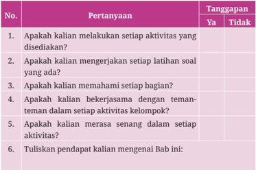

Tabel ini berisi pertanyaan-pertanyaan yang dirancang untuk mengevaluasi tingkat keterlibatan dan kepuasan siswa dalam proses belajar. Topik utamanya adalah tentang aktivitas belajar yang telah dilakukan oleh siswa, termasuk mengerjakan latihan soal, memahami bagian-bagian materi, bekerja sama dengan teman sekelas, merasa senang dalam setiap aktivitas, dan memberikan pendapat tentang bab tersebut. Kolom "Ya" dan "Tidak" digunakan untuk mengevaluasi respons siswa terhadap setiap pertanyaan. Data penting yang terlihat adalah bahwa banyak siswa (dalam angka tidak disebutkan) mengakui bahwa mereka telah melakukan setiap aktivitas yang disediakan, mengerjakan latihan soal, memahami bagian-bagian materi, bekerja sama dengan teman sekelas, merasa senang dalam setiap aktivitas, dan memberikan pendapat tentang bab tersebut. Ini menunjukkan bahwa siswa secara umum merasa aktif dan memahami materi yang diajarkan.

 

---
## 📄 Halaman 76

### Pilihan Ganda

- Jika diketahui larutan asam asetat yang memiliki konsentrasi 0,01 M hanya terionisasi sebanyak 4%, maka pH larutan tersebut adalah sebesar ....
- 0,6
- 1,4
- 2
- 3,4
- E 4
- Sebanyak 15,6  g  M(OH) 3 tepat  bereaksi  dengan  29,4  g  asam  H 2 A. Massa molar asam H2A adalah ... g/mol. ( Ar M = 27, H = 1, O = 16)
- 210
- 156
- 147
- 98
- 29,5
- Reaksi  berikut  yang  menunjukkan  reaksi  netralisasi  asam  basa adalah ....
- H2SO4( aq ) + H 2O( l ) → H 3 O + ( aq ) + SO 4 2-( aq )
- NH3( g ) + H 2O( l ) → NH4 + ( aq ) + OH - ( aq )
- Ca( s ) + 2H 2O( aq ) → Ca(OH) 2 ( aq ) + 2H 2 ( g )
- SO3( g ) + H 2O( l ) → H2SO4( aq )
- 2NO2( g ) + 2NaOH( aq ) → 2NaNO3( aq ) + H 2O( l )

 

---
## 📄 Halaman 77

- Sebanyak 50 ml larutan KOH 0,2 M ditambahkan ke dalam 40 ml larutan HCOOH 0,5 M ( Ka = 2 × 10 -4 ).  Besarnya pH larutan setelah dicampur adalah .... (log 2 = 0,3)
- 10,3
- 9,7
- 7
- 4,3
- 3,7
- Apabila larutan asam kuat ditambahkan suatu larutan basa kuat maka hal berikut yang tidak terjadi adalah ....
- reaksi netralisasi
- penambahan molekul air
- berkurangnya ion H +
- bertambahnya ion OH -
- penurunan pH larutan
- Diketahui hasil kali kelarutan Ag 2 CrO4 dan AgCl adalah....

``

``

Jika ke dalam larutan yang mengandung jumlah mol CrO 4 2dan Cl yang  sama  ditambahkan  larutan  perak  nitrat,  maka  pernyataan yang benar adalah ....

- AgCl dan Ag2CrO4 mengendap secara bersamaan
- Ag2CrO4 mengendap pertama karena Ksp lebih kecil
- Ag2 CrO4 mengendap pertama karena kelarutan lebih kecil
- AgCl mengendap pertama karena kelarutan lebih kecil
- Tidak terbentuk endapan

 

---
## 📄 Halaman 78

- Hal-hal berikut ini yang bukan koloid adalah....
- merupakan aplikasi sifat adsorpsi
- proses penjernihan air dengan tawas
- proses penggumpalan karet
- C.
- penggunaan norit (obat sakit perut)
- pemutihan gula pasir
- E.
- penggunaan sabun pada proses mencuci pakaian

### Uraian

- Pada  reaksi-reaksi  berikut  ini,  berilah  tanda  setiap  spesi  sesuai dengan sifatnya.
- H2C2 O4 + ClO -⇌ HC2O4 -  + HClO
- HPO4 2-  + NH 4 + ⇌ NH3 + H 2PO4 -
- HSO4 -  + H 2 O ⇌
- H2SO4 + OH -
- H2PO4 -  + H2O ⇌ H3PO4 + OH -
- H2PO4 -  + H 2PO4 -⇌ H 3 PO4 + HPO4 2-
- HCN + CO3 2-⇌ CN -  + HCO3 -
- Seorang siswa melakukan titrasi 20 ml larutan HCl 0,1 M dengan
- larutan NaOH 0,1 M. Bantulah siswa tersebut untuk:
- menghitung  pH  awal  HCl  dan  pH  setelah  ditambah  NaOH sebanyak 5,0 ml; 8,0 ml; 9,5 ml; 10,0 ml; dan 15,0 ml.
- membuat grafik hubungan pH dengan volume NaOH.
- c.
- menentukan indikator yang cocok untuk penentuan titik akhir titrasi?
- Hitunglah pH pada titik ekivalen untuk titrasi-titrasi berikut ini:
- Natrium asetat 0,104 g ( Kb 0,9996 M.
- 50 ml HClO 0,0426 M ( Ka
- =5,6 × 10 -10 ) dalam 25 ml air oleh HCl
- =3,5 × 10 -8 ) oleh NaOH 0,1028 M.
- HI 0,205 M sebanyak 50 ml oleh larutan KOH dengan konsentrasi
- 0,356 M.
- 3.

 

---
## 📄 Halaman 79

Kimia untuk SMA/MA Kelas XII

Penulis

:  Galuh Yuliani, dkk

ISBN

:  978-602-427-968-4 (jil.2)

---
**🖼️ Gambar/Diagram**

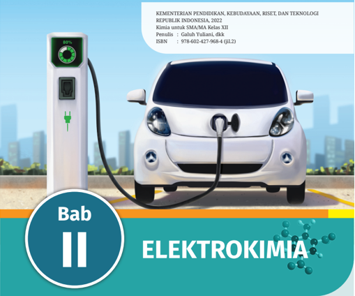

> **Deskripsi Visual:** Buku pelajaran ini menunjukkan bab tentang elektrokimia. Gambar tersebut menggambarkan sebuah mobil listrik yang sedang mengisi daya di sebuah stasiun pengisian. Mobil tersebut tampak modern dengan desain aerodinamis dan memiliki penutup kaca yang menutupi bagian depan dan belakang. Stasiun pengisian mobil listrik tampak sederhana dengan panel pengisian yang berwarna hijau dan hitam.

Elemen utama dalam gambar adalah mobil listrik yang sedang mengisi daya, stasiun pengisian, dan latar belakang kota dengan bangunan pencakar langit. Relasi antara elemen-elemen ini adalah bahwa mobil listrik tersebut menggunakan energi listrik untuk mengisi daya, yang kemudian digunakan untuk menggerakkan kendaraan tersebut.

Teks penting yang terlihat pada gambar adalah judul bab "Elektrokimia" dan informasi ISBN 978-602-427-968-4 (JLZ). Angka-angka ini mungkin merujuk pada informasi lebih lanjut tentang buku tersebut, seperti nomor halaman atau informasi penerbit.

Informasi kunci yang dapat diambil pembaca adalah bahwa bab ini membahas topik elektrokimia, yang berkaitan dengan hubungan antara kimia dan elektrik. Ini bisa membantu pembaca memahami bagaimana energi listrik dapat digunakan dalam transportasi kendaraan listrik.

Pada  bab  elektrokimia,  kalian  akan  mengidentifikasi  reaksi  redoks  dan membedakan  antara  elektrolit  kuat,  lemah,  dan  nonelektrolit.  Kalian  akan mampu merancang sel volta dan sel elektrolisis, menggambarkan komponen dari  tiap  sel,  dan  menuliskan  reaksi  kimia  yang  terjadi.  Kalian  juga  akan mampu membandingkan reaktivitas logam berdasarkan potensial elektrode standar dan memprediksi reaksi elektrokimia spontan. Selain itu, kalian juga akan memahami aplikasi sel elektrokimia dalam kehidupan sehari-hari.

Bab II

ELEKTROKIMIA

65

 

---
## 📄 Halaman 80

---
**🖼️ Gambar/Diagram**

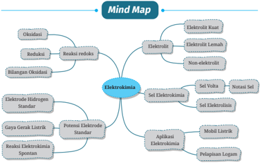

> **Deskripsi Visual:** Dalam gambar ini, kita melihat sebuah mind map yang berfokus pada topik "Elektrokimia". Mind map ini dibagi menjadi beberapa cabang utama yang menjelaskan konsep-konsep dasar dalam elektrokimia. Cabang utama termasuk:

1. Elektrod
   - Elektrod Kuat
   - Elektrod Lemah
   - Non-elektroli

2. Sel Elektrokimia
   - Sel Volta
   - Notasi Sel
   - Sel Elektrodin

3. Aplikasi Elektrokimia
   - Mobil Listrik
   - Pelipisian Legam

Elemen-elemen utama ini disusun dengan jelas dan terorganisir, memungkinkan pembaca untuk memahami hubungan antara konsep-konsep tersebut. Teks, angka, atau label penting seperti "Elektrod Kuat", "Sel Volta", dan "Mobil Listrik" memberikan informasi kunci tentang topik-topik yang dibahas.

Mind map ini sangat berguna sebagai alat visual untuk membantu pemahaman konsep elektrokimia, memperjelas hubungan antara konsep-konsep dasar dan aplikasi praktis dalam bidang ini.

Mobil listrik memiliki popularitas tinggi saat ini. Dengan karakteristik bebas  kebisingan,  bebas  polusi  dan  memiliki  performa  tinggi,  mobil ini disebut-sebut sebagai mobil masa depan. Bagaimana mobil listrik dapat  beroperasi?  Apa  sumber  energinya?  Pada  bab  elektrokimia, kalian akan memperoleh jawabannya.

### A.  Elektrolit

Pernahkah  kalian  mengalami  kesemutan,  kram  otot,  pusing  bahkan kejang-kejang? Berhati-hatilah, kemungkinan kalian mengalami gangguan  kekurangan  atau  kelebihan  elektrolit tubuh. Elektrolit merupakan zat penting yang membantu tubuh dalam mengoptimalkan fungsi  otak,  meningkatkan  fungsi  saraf  dan  otot,  bahkan  membantu memperbaiki jaringan tubuh yang rusak. Ketidakseimbangan elektrolit  dapat  menimbulkan  komplikasi  serius  pada  tubuh  kita, karenanya  menjaga  keseimbangan  elektrolit  tubuh  sangat  penting untuk  dilakukan.  Beberapa elektrolit  vital  dalam  tubuh  antara  lain

 

---
## 📄 Halaman 81

kalsium,  natrium,  magnesium dan kalium. Tubuh kita mendapatkan asupan  elektrolit  esensial  dari  minuman  dan  makanan.  Tanpa  kita sadari, berbagai asupan elektrolit esensial telah tersedia di alam dari minuman dan makanan yang biasa kita konsumsi sehari-hari sebagai anugerah dan nikmat yang tidak terhingga dari Tuhan YME. Apa saja contohnya? Air minum yang biasa kita peroleh dari sumber-sumber mata air alami bukanlah air murni yang hanya terdiri atas molekulmolekul H 2 O saja, tetapi air minum tersebut kaya akan mineral serta ion-ion esensial yang diperlukan tubuh. Beberapa jenis makanan juga kaya akan ion-ion elektrolit antara lain kacang-kacangan, kerang, telur, coklat, dan alpukat.

---
**🖼️ Gambar/Diagram**

> **Deskripsi Visual:** Gambar ini adalah ilustrasi yang menunjukkan seorang anak sedang mengalami sakit kepala. Ilustrasi ini menggunakan warna-warna cerah untuk menonjolkan perasaan sakit dan kecemasan anak tersebut. Anak tersebut memiliki wajah yang pucat dan mata yang terpaku, menunjukkan rasa sakit yang berat. Kepala anak tersebut tampak bergerak-gerak dengan cepat, menunjukkan gejala sakit kepala yang hebat. Dua tangan anak tersebut menutupi telinganya, menandakan bahwa sakit kepala tersebut sangat menyakitkan. Ilustrasi ini menggunakan elemen-elemen visual seperti gerakan kepala, wajah pucat, dan tangan yang menutupi telinga untuk menunjukkan perasaan sakit dan kecemasan anak tersebut. Ini adalah ilustrasi yang efektif untuk menggambarkan perasaan sakit kepala pada anak.

Pada mata pelajaran fisika, kalian sudah  belajar  tentang  benda-benda yang bersifat  konduktor,  yaitu  benda yang dapat berperan sebagai penghantar listrik. Kalian tentu masih ingat  bahwa  logam-logam  umumnya merupakan  penghantar  listrik  yang baik. Itulah sebabnya, beberapa peralatan elektronik seperti kabelkabel  listrik  misalnya,  terbuat  dari logam. Seperti halnya logam, beberapa senyawa kimia dapat menghantarkan listrik  saat  dilelehkan  atau  terlarut  dalam  air.  Senyawa  kimia  ini dinamakan elektrolit. Saat ditambahkan ke dalam air, zat yang bersifat elektrolit dapat meningkatkan konduktivitas air.

### Apa sebenarnya elektrolit?

Elektrolit adalah zat  yang  mengandung  ion-ion  bebas,  sehingga menghasilkan  media  yang  dapat  menghantarkan  listrik.  Namun, hantaran  listrik dari elektrolit-elektrolit tidak selalu  sama.  Mari kita  dalami  kemampuan  hantaran  listrik larutan  elektrolit  dengan melakukan aktivitas berikut.

 

---
## 📄 Halaman 82

### MENGUJI LARUTAN ELEKTROLIT DAN NON-ELEKTROLIT

Secara berkelompok, gunakan laman laboratorium maya pada link: https://vlab.belajar.kemdikbud.go.id/Home/ContentList untuk melakukan aktivitas  berikut.  Pada  bagian  menu,  pilih  'Daya  Hantar Listrik  dan  Reaksi  Redoks'  (Gambar  2.1).  Pada  laboratorium  maya, terdapat  set  alat  pengujian  sifat elektrolit  dari larutan.  Larutan  uji disimpan di dalam gelas kimia. Ke dalam larutan uji, dicelupkan dua buah  elektrode  yang  dihubungkan  dengan  sirkuit  eksternal  yang terhubung dengan lampu Light Emitting Diode (LED).

Lakukan pengujian untuk beberapa jenis larutan yang tersedia pada daftar  di  samping  kanan.  Melalui  pengamatan terhadap larutan dan nyala lampu, tetapkan apakah larutan uji tersebut elektrolit atau non elektrolit, kemudian beri alasan penetapan tersebut. Kalian disarankan membuat gambaran molekul/ion di level submikroskopik pada larutan uji yang dipilih.

---
**🖼️ Gambar/Diagram**

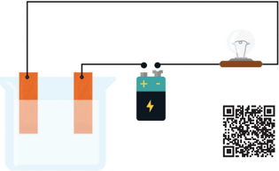

> **Deskripsi Visual:** Gambar ini adalah ilustrasi yang menunjukkan proses elektrolisis air menggunakan baterai. Gambar ini menggambarkan dua buah tabung berisi air yang disambungkan ke sebuah baterai dengan sisi positif (dengan tanda +) dan sisi negatif (dengan tanda -). Di sisi depan tabung yang disambungkan ke sisi positif, terdapat sebuah lampu yang menyala, menunjukkan bahwa ada arus listrik yang melewati tabung tersebut.

Elemen utama dalam gambar ini meliputi:
1. Tabung air yang disambungkan ke baterai.
2. Baterai dengan tanda + dan -.
3. Lampu yang menyala di sisi tabung yang disambungkan ke sisi positif baterai.

Relasi antara elemen-elemen ini adalah sebagai berikut:
- Tabung air yang disambungkan ke baterai menjadi sumber elektrik.
- Arus listrik melewati tabung air dan menghidupkan lampu di sisi tabung yang disambungkan ke sisi positif baterai.

Teks, angka, atau label penting yang terlihat dalam gambar ini adalah:
- Tanda + dan - pada baterai untuk menunjukkan arah arus listrik.
- Lampu yang menyala sebagai indikasi bahwa ada arus listrik melewati tabung.

Informasi kunci yang dapat diambil pembaca dari gambar ini adalah bahwa proses elektrolisis air menggunakan baterai dapat menghasilkan energi listrik yang cukup untuk menyala lampu.

 

---
## 📄 Halaman 83

Dengan menggunakan set alat ini, kalian juga dapat membedakan elektrolit  kuat  dan  lemah.  Bagaimana  caranya?  Diskusikan  dengan teman kalian. Setelah menguji beberapa larutan, kelompokkan larutan uji ke dalam nonelektrolit, elektrolit lemah dan elektrolit kuat. Buatlah tabel pengamatan yang sesuai. Siswa diharapkan dapat bekerjasama dengan baik dan saling membantu antar tiap-tiap anggota kelompok. Diskusikan bersama anggota kelompok dengan tetap menjunjung tinggi nilai kesopanan, sikap saling harga-menghargai, dan sikap kejujuran.

### 1. Elektrolit Kuat, Elektrolit Lemah dan Non-elektrolit

Berdasarkan kemampuan hantaran listriknya, kita mengenal zat yang bersifat elektrolit kuat, elektrolit lemah dan non-elektrolit (Gambar 2.2). Umumnya, senyawa yang berperan sebagai elektrolit adalah senyawa ionik atau senyawa polar seperti asam, basa dan garam. Garam sebagai senyawa anorganik yang berbentuk padatan memiliki struktur yang demikian teratur dengan pengaturan posisi ion-ion yang tetap, sehingga tidak  menghantarkan  listrik.  Namun,  saat  senyawa  ionik  dilelehkan atau dilarutkan dalam air, ion-ionnya dapat bergerak bebas. Dengan demikian,  lelehan  garam  atau  larutan  garam  dapat  menghantarkan listrik dan bersifat elektrolit. Contoh dari elektrolit adalah larutan asam klorida, asam sulfat, natrium hidroksida, dan natrium klorida.

 

---
## 📄 Halaman 84

### a.  Elektrolit kuat

Suatu  zat  disebut  elektrolit  kuat  apabila  dapat  terurai  sempurna menjadi ion-ion nya saat dilarutkan dalam air.

``

Pada reaksi  di  atas,  ikatan  pada  AB  putus,  sehingga  AB  terurai menjadi ion-ion komponennya. Pada elektrolit kuat, derajat ionisasinya besar,  sehingga  zat  akan  terdisosiasi  sempurna.  Reaksi  kimia  yang terjadi  pada  pelarutan  elektrolit  kuat  menghasilkan larutan  dengan konsentrasi ion yang tinggi. Contoh larutan yang merupakan elektrolit kuat  adalah larutan  natrium  klorida  dan  kalium  nitrat.  Gambaran submikroskopik  dari  larutan  NaCl  sebagai  elektrolit  kuat  disajikan pada Gambar 2.3.

``

---
**🖼️ Gambar/Diagram**

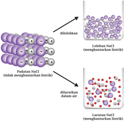

> **Deskripsi Visual:** Gambar ini adalah ilustrasi yang menunjukkan proses perubahan dari padatan NaCl (natrium klorida) menjadi larutan NaCl dalam air. Gambar ini terdiri dari tiga bagian yang masing-masing menunjukkan tahap-tahap perubahan tersebut.

Pertama, pada bagian kiri, terdapat padatan NaCl yang tidak menghantarkan listrik karena molekul-molekul NaCl berada dalam struktur yang teratur dan tidak tercampur dengan air. Padatan ini tampak seperti jaringan yang terbuat dari molekul NaCl yang saling terhubung.

Kedua, pada bagian tengah, padatan NaCl telah dilelehkan, yang berarti molekul-molekul NaCl telah dipisahkan dan tercampur dengan air. Ini tampak seperti molekul NaCl yang tercampur dengan air, membentuk lelehan NaCl yang menghantarkan listrik.

Terakhir, pada bagian kanan, NaCl telah dilarutkan dalam air, yang berarti molekul-molekul NaCl telah tercampur dengan air dan membentuk larutan NaCl yang menghantarkan listrik. Ini tampak seperti molekul NaCl yang tercampur dengan air, membentuk larutan NaCl yang menghantarkan listrik.

Elemen-elemen utama dalam gambar ini adalah padatan NaCl, lelehan NaCl, dan larutan NaCl. Relasi antara mereka adalah bahwa padatan NaCl akan dilelehkan untuk membentuk lelehan NaCl, dan kemudian lelehan NaCl akan dilarutkan dalam air untuk membentuk larutan NaCl.

Teks, angka, atau label penting yang terlihat dalam gambar ini adalah "padatan NaCl", "lelehan NaCl", dan "larutan NaCl". Informasi kunci yang dapat diambil pembaca adalah bahwa NaCl dapat dilelehkan dan dilarutkan dalam air untuk mengubahnya menjadi larutan yang menghantarkan listrik.

 

---
## 📄 Halaman 85

### b.  Elektrolit lemah

Pada elektrolit  lemah,  tidak  semua  zat  terdisosiasi  menjadi  ion-ion saat dilarutkan dalam air. Derajat ionisasi dari elektrolit lemah kecil, karenanya konsentrasi ion yang dihasilkan rendah.

``

Perhatikan tanda panah dua arah dari reaksi di atas. Tanda panah dua  arah  menandakan reaksi  tidak  berlangsung  sempurna,  artinya sebagian  molekul  tidak  terurai  menjadi  ion-ion  nya.  Pada  reaksi tersebut, senyawa AB masih ada setelah reaksi bersama dengan  ion-ion yang dihasilkan oleh reaksi tersebut. Contoh elektrolit  lemah  adalah larutan asam cuka.

``

### c.  Non elektrolit

Non elektrolit adalah senyawa kimia yang tidak menghantarkan listrik dalam kondisi lelehan maupun terlarut dalam air. Zat yang bersifat non elektrolit tidak akan meningkatkan konduktivitas air saat dilarutkan. Saat dilarutkan, senyawa non elektrolit akan dilingkupi oleh molekulmolekul air yang membuat senyawa tersebut dapat larut baik di dalam air.  Proses  pelarutan  senyawa  non  elektrolit  tidak  menyebabkan pemutusan  ikatan,  sehingga  tidak  dihasilkan  ion-ion  bebas.  Proses pelarutan  ini  termasuk  ke  dalam  perubahan  fisika.  Senyawa  yang termasuk non elektrolit adalah sukrosa, etanol dan urea. Contoh reaksi pelarutan molekul non elektrolit ditunjukkan sebagai berikut.

``

 

---
## 📄 Halaman 86

Jawablah pertanyaan berikut secara mandiri. Perhatikan gambaran submikroskopik dari beberapa sistem larutan pada Gambar 2.4.  Manakah  larutan  yang  dapat  menghantarkan  listrik?  Beri penjelasan.

---
**🖼️ Gambar/Diagram**

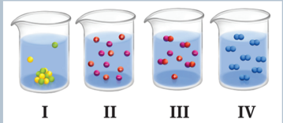

> **Deskripsi Visual:** Gambar ini adalah ilustrasi yang menunjukkan empat jenis partikel dalam suatu sistem kimia. Setiap contoh menunjukkan partikel berbeda-beda dalam bentuk molekul, ion, dan atom. Partikel molekul terlihat berwarna kuning dan biru, menunjukkan kemungkinan adanya reaksi kimia antara dua jenis molekul tersebut. Ion-ian merah dan ungu menunjukkan partikel dengan elektron yang tidak stabil, sementara atom-atom biru menunjukkan partikel dengan elektron yang stabil. Ilustrasi ini membantu memahami konsep dasar tentang struktur partikel dalam kimia.

### B.  Reaksi Redoks

Kalian sudah mempelajari berbagai jenis reaksi kimia, seperti misalnya reaksi asam basa. Setiap reaksi kimia memiliki ciri tersendiri. Misalnya, reaksi  asam  basa  dapat  kalian  kenali  dari  adanya  peningkatan konsentrasi  H3O + atau  OH -   dalam  larutan.  Bagaimana  dengan reaksi perkaratan besi? Jenis reaksi apakah itu? Apakah ciri reaksi tersebut?

Pada bab ini, kita akan mempelajari jenis reaksi kimia yang ditandai adanya pertukaran elektron antara spesi yang bereaksi dan perubahan bilangan oksidasi.  Reaksi  ini  dinamakan  reaksi  redoks.  Pada  reaksi redoks  terdapat  perubahan bilangan oksidasi  dari  spesi-spesi  yang bereaksi. Sebelum membahas reaksi redoks, kalian harus memahami

 

---
## 📄 Halaman 87

konsep bilangan oksidasi terlebih dahulu dan harus menguasai cara penentuan bilangan oksidasi suatu unsur. Apabila kalian masih belum menguasai cara penentuan bilangan oksidasi unsur, cermatilah contoh berikut.

Tentukan bilangan oksidasi dari tiap-tiap unsur pada molekul  berikut:

- CO2
- KMnO4

### Jawaban:

- Pada  molekul  CO2 , tiap-tiap  atom  oksigen  memiliki bilangan oksidasi -2. Artinya, muatan dari kedua atom oksigen yang terikat pada karbon adalah -4. Molekul CO 2 bersifat netral, sehingga atom karbon harus memiliki bilangan oksidasi +4.
- Molekul KMnO4 bersifat netral, artinya jumlah keseluruhan bilangan oksidasi  unsur-unsur  dalam  molekul  tersebut  sama  dengan  nol. Kalium memiliki bilangan oksidasi +1, oksigen memiliki bilangan oksidasi  -2,  sehingga  total bilangan oksidasi  unsur  kalium  dan oksigen adalah -7 (1 + (-2 × 4) = -7). Artinya, untuk mendapatkan molekul netral, bilangan oksidasi dari Mn harus sama dengan +7.

### Ayo Berlatih

Kerjakan tugas berikut secara mandiri.

Tentukan  bilangan oksidasi  untuk  unsur-unsur  dalam  senyawa berikut: CH 4 , PCl 3 , H 3PO4 , H 2 SO4, dan MgCO3.

 

---
## 📄 Halaman 88

### 1. Oksidasi dan Reduksi

Kalian telah mengetahui cara penentuan bilangan oksidasi dari unsurunsur  dalam  suatu  molekul.  Pada  reaksi  kimia,  kalian  akan  melihat bahwa  pada  reaksi  redoks  selalu  terdapat  spesi  yang  mengalami kenaikan dan penurunan bilangan oksidasi.  Dari  data  kenaikan  dan penurunan  bilangan oksidasi, kalian dapat mengetahui apakah suatu unsur mengalami oksidasi atau reduksi.

Contoh:

Perhatikan reaksi berikut.

``

Magnesium,  sebagai  pereaksi,  memiliki bilangan oksidasi  nol. Namun, atom magnesium pada produk magnesium klorida memiliki bilangan oksidasi +2. Artinya, magnesium kehilangan dua buah elektron atau  mengalami oksidasi .  Proses  ini  dapat  ditulis  secara  terpisah sebagai setengah reaksi . Setengah reaksi yang melibatkan magnesium ditulis sebagai berikut:

``

Molekul klorin (Cl 2 ),  sebagai pereaksi, memiliki bilangan oksidasi nol.  Namun,  atom  klorin  pada  produk  magnesium  klorida  memiliki bilangan oksidasi -1. Tiap-tiap atom klorin dari molekul klorin menarik satu  buah  elektron,  karenanya  mengalami reduksi .  Setengah  reaksi yang melibatkan klorin, dapat dituliskan sebagai berikut.

``

Setengah  reaksi dituliskan  untuk  memisahkan  bagian  reaksi reduksi dan oksidasi dari reaksi redoks keseluruhan. Setengah reaksi diperoleh  dengan  memperhatikan  perubahan  keadaan oksidasi  dari tiap-tiap zat yang terlibat dalam reaksi redoks.

Kalian dapat mengingat reaksi redoks dengan cara berikut:

-  Oksidasi  adalah  reaksi  hilangnya  elektron,  sedangkan  reduksi adalah reaksi pengambilan elektron.

 

---
## 📄 Halaman 89

-  Unsur yang mengalami oksidasi disebut sebagai agen pereduksi
-  Unsur yang mengalami reduksi disebut sebagai agen pengoksidasi
-  Reaksi redoks adalah reaksi yang melibatkan oksidasi dan reduksi, ditandai  dengan  berubahnya bilangan oksidasi  dari  unsur-unsur yang terlibat.
Oksidasi  adalah  hilangnya  elektron  dari  suatu  molekul,  atom  atau ion, sehingga mengalami kenaikan bilangan oksidasi.

Reduksi adalah pengambilan elektron oleh suatu molekul, atom atau ion, sehingga mengalami penurunan bilangan oksidasi.

### MENGIDENTIFIKASI REAKSI REDOKS

Guru  kalian  akan  mendemonstrasikan  satu  reaksi  redoks  antara padatan seng dengan larutan tembaga sulfat.

### Bahan yang dibutuhkan

- Seng berbentuk granul atau lempengan kecil
- Larutan tembaga (II) sulfat berwarna biru sebanyak 15 ml
- Gelas Kimia

### Cara Kerja

Tambahkan seng ke dalam larutan tembaga sulfat yang berada dalam gelas  kimia  dan  amati  yang  terjadi.  Lakukan  pengamatan yang teliti terhadap granul seng dan amati pula perubahan warna dari larutan!

### Tugas

Buatlah laporan hasil pengamatan berdasarkan demonstrasi di atas. Untuk membantu kalian menuliskan laporan, jawablah pertanyaan berikut.

 

---
## 📄 Halaman 90

-  Jelaskan  apa  yang  terjadi  di  dalam  gelas  kimia.  Penjelasan  dapat berupa gambaran submikroskopik dari molekul atau ion sebelum dan setelah reaksi
-  Tuliskan setengah reaksi untuk setiap reaktan yang terlibat
-  Tuliskan reaksi redoks keseluruhan
-  Buatlah kesimpulan untuk percobaan di atas.

### C.  Sel elektrokimia

Pada aktivitas yang telah dilakukan sebelumnya, kalian telah mereaksikan  granul  seng  dengan  larutan  tembaga(II)  sulfat.  Kalian juga  telah  berhasil  menuliskan  reaksi  yang  berlangsung.  Sekarang, mari kita cermati Gambar 2.5 yang memperlihatkan lempengan seng yang dicelupkan dalam larutan tembaga sulfat. Apa yang terjadi?

---
**🖼️ Gambar/Diagram**

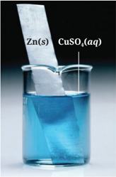

> **Deskripsi Visual:** Gambar ini adalah ilustrasi yang menunjukkan reaksi kimia antara logam zinc (Zn) dan larutan kalsium sulfat (CuSO₄). Gambar ini memperlihatkan logam zinc yang disebutkan sebagai "Zn(s)" berada di atas larutan kalsium sulfat yang disebutkan sebagai "CuSO₄(aq)". Logam zinc tersebut tampaknya sedang mengalami reaksi dengan larutan kalsium sulfat, yang tampaknya berubah menjadi warna biru tua.

Elemen utama dalam gambar ini adalah logam zinc dan larutan kalsium sulfat. Relasi antara kedua elemen ini adalah bahwa logam zinc berinteraksi dengan larutan kalsium sulfat untuk membentuk produk baru. Label penting dalam gambar ini adalah "Zn(s)" dan "CuSO₄(aq)", yang memberikan informasi tentang komponen-komponen yang terlibat dalam reaksi tersebut.

Informasi kunci yang dapat diambil dari gambar ini adalah bahwa reaksi antara logam zinc dan larutan kalsium sulfat merupakan reaksi kimia yang melibatkan perubahan warna dari larutan kalsium sulfat menjadi biru tua. Ini menunjukkan bahwa reaksi tersebut menghasilkan produk baru yang memiliki warna yang berbeda dengan larutan aslinya.

---
**🖼️ Gambar/Diagram**

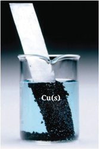

> **Deskripsi Visual:** Gambar ini adalah ilustrasi yang menunjukkan reaksi kimia antara logam tembaga (Cu(s)) dengan air (H2O). Gambar ini menggambarkan logam tembaga yang ditempatkan di atas permukaan air dalam sebuah wadah. Logam tembaga tampak berwarna hitam dan berkilauan, sedangkan air berwarna putih dan tumpul. Ilustrasi ini menunjukkan bahwa logam tembaga bereaksi dengan air untuk membentuk hidroksida tembaga (Cu(OH)2), yang merupakan proses yang biasanya disebut sebagai reaksi hidrasi. Ini adalah ilustrasi yang baik untuk menjelaskan konsep reaksi kimia dan bagaimana logam tembaga bereaksi dengan air.

 

---
## 📄 Halaman 91

Ion-ion  Cu 2+ dari larutan  tembaga(II)  sulfat  mengalami  reduksi menjadi  logam  tembaga.  Logam  tembaga  yang  dihasilkan  kemudian terdeposisi  pada  permukaan  lempengan  seng.  Atom-atom  Zn  pada logam Zn mengalami oksidasi menjadi ion Zn 2+  yang kemudian terlarut dalam larutan.

### Setengah reaksi reduksi

``

### Setengah reaksi oksidasi

``

### Reaksi redoks keseluruhan

``

Apabila kalian amati dengan teliti, kalian tentu menyadari adanya panas yang dihasilkan dari reaksi tersebut. Dapatkah kita mengkonversi panas  yang  dihasilkan  dari  reaksi  menjadi  energi  listrik?  Dapatkah reaksi kimia yang melibatkan pertukaran elektron dimanfaatkan untuk menghasilkan listrik? Jawabannya adalah Ya, dan reaksi ini dinamakan reaksi elektrokimia.

Reaksi elektrokimia adalah reaksi kimia yang menghasilkan perbedaan tegangan, sehingga dapat menghasilkan aliran listrik. Jenis sel  elektrokimia  ini  dinamakan  sel  Volta.  Namun,  saat  suatu  reaksi kimia berlangsung dengan bantuan aliran listrik dari luar, reaksi ini juga  dinamakan  sebagai  reaksi  elektrokimia,  yaitu  sel  elektrolisis. Kedua jenis reaksi elektrokimia ini akan dibahas kemudian. Jadi, reaksi elektrokimia dapat didefinisikan sebagai reaksi kimia yang berlangsung akibat adanya voltase (energi listrik dari) luar, atau reaksi kimia yang menghasilkan voltase (energi listrik).

Elektrokimia  merupakan  cabang  ilmu  kimia  yang  mempelajari tentang perpindahan elektron yang terjadi pada media pengantar listrik (elektrode).  Pada  bab  ini,  kalian  akan  mempelajari  jenis-jenis  reaksi

 

---
## 📄 Halaman 92

elektrokimia  dan  bagaimana reaksi  ini  dapat  dimanfaatkan  dalam kehidupan, misalnya sebagai baterai (Gambar 2.6).

---
**🖼️ Gambar/Diagram**

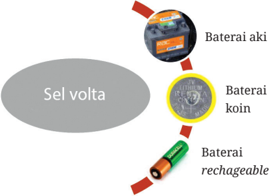

> **Deskripsi Visual:** Gambar ini adalah ilustrasi yang menunjukkan berbagai jenis baterai dan bagaimana mereka terhubung ke sebuah "sel volta". Ilustrasi ini mencakup tiga jenis baterai: baterai akumulator, baterai koin, dan baterai rechargeable. Setiap jenis baterai dinyatakan dengan warna dan simbol yang berbeda untuk membedakannya. Sel volta, yang merupakan titik awal dalam sirkuit, terletak di tengah-tengah ilustrasi dan menghubungkan semua baterai tersebut. Teks pada gambar memberikan penjelasan tentang jenis-jenis baterai tersebut, seperti "Baterai akumulator", "Baterai koin", dan "Baterai rechargeable". Ini membantu pembaca memahami perbedaan antara setiap jenis baterai dan bagaimana mereka berfungsi dalam sistem sel volta.

### 1. SEL VOLTA

Sebelum kalian  mempelajari  tentang  sel  Volta,  mari  kita  melakukan aktivitas eksperimen terlebih dahulu.

### EKSPERIMEN MERANCANG SEL Zn-Cu

### Tujuan:

- Merancang sel elektrokimia Zn-Cu
- Menyelidiki reaksi yang berlangsung pada sel Zn-Cu

### Alat dan bahan:

Plat seng, plat tembaga, larutan seng sulfat (1 M), larutan tembaga sulfat (1 M), dua buah gelas kimia 250 ml, tabung U, larutan garam natrium sulfat, wool katun, ammeter dan kabel penghubung.

 

---
## 📄 Halaman 93

### Metode:

- Timbang kedua plat dalam keadaan bersih dan kering. Catat pengamatan kalian.
- Masukkan 200 ml larutan seng sulfat ke dalam gelas kimia dan celupkan plat seng ke dalamnya.
- Masukkan 200 ml larutan tembaga sulfat ke dalam gelas kimia lain, dan celupkan plat tembaga ke dalamnya.
- Penuhi tabung U dengan larutan Na 2 SO4 dan sekat kedua ujung tabung menggunakan wool katun. Penyumbatan dengan wool katun ini akan menjaga larutan Na 2 SO4 tetap didalam saat tabung U dibalikkan.
- Hubungkan plat seng dan tembaga dengan ammeter dan amati angka yang ditunjukkan pada ammeter. Adakah bacaan angka yang ditampilkan pada ammeter?
- Tempatkan tabung U secara terbalik pada kedua gelas kimia, sehingga tiap ujung tabung menyentuh larutan dalam kedua gelas

---
**🖼️ Gambar/Diagram**

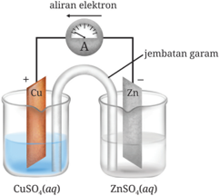

> **Deskripsi Visual:** Gambar ini adalah ilustrasi yang menunjukkan reaksi elektrolisis antara zink dan tembaga. Gambar ini menggambarkan dua reaktan yang berada dalam tabung, yaitu CuSO₄(aq) dan ZnSO₄(aq), dengan zink sebagai anode dan tembaga sebagai katode. Di sisi atas, ada aliran elektron yang mengalir dari anode ke katode melalui jembatan garam. Dalam gambar ini, elemen utama adalah zink dan tembaga, yang terlibat dalam reaksi elektrolisis. Jembatan garam memperlihatkan hubungan antara anode dan katode dalam reaksi tersebut. Informasi penting lainnya adalah bahwa reaksi ini merupakan contoh dari reaksi elektrolisis, yang melibatkan perubahan energi listrik menjadi energi kimia.

 

---
## 📄 Halaman 94

- kimia (Gambar 2.7). Adakah angka yang tampil pada ammeter? ke arah mana arus mengalir?
- Lepaskan ammeter kemudian hubungkan plat seng dan tembaga secara langsung. Tinggalkan selama 24 jam. Setelah ditinggalkan seharian, cuci kedua plat dan keringkan. Setelah kering, timbang kedua plat dan catat hasilnya. Apa pengamatan kalian?

### Tugas

Untuk  setiap  tahap  percobaan,  lakukan  pengamatan  yang  teliti  dan catat  pengamatan  kalian.  Jawab  seluruh  pertanyaan  yang  diberikan pada setiap tahap pekerjaan dengan baik. Diskusikan hasil pengamatan dan jawaban setiap pertanyaan di kelas.

### a. Sel volta Zn-Cu

Pada eksperimen yang telah dilakukan, kalian telah merancang satu sel volta seng-tembaga. Sel elektrokimia ini dibuat dengan menghubungkan setengah sel seng dan setengah sel tembaga. Setengah sel elektrokimia adalah struktur yang terdiri dari elektrode konduktif yang dikelilingi oleh elektrolit  konduktif.  Contohnya,  setengah  sel  seng  terdiri  atas plat logam seng (sebagai elektrode konduktif) yang dicelupkan dalam larutan seng sulfat (sebagai elektrolit konduktif). Bagaimana penjelasan dari hasil observasi eksperimen yang telah dilakukan?

---
**📊 Tabel**

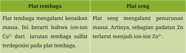

Tabel ini membahas perbedaan antara plat tembaga dan plat seng dalam proses penambahan kenaikan massa. Topik utama tabel adalah perubahan massa pada kedua jenis plat tersebut. Kolom pertama berisi deskripsi tentang plat tembaga, sedangkan kolom kedua berisi deskripsi tentang plat seng. Data penting yang terlihat adalah bahwa plat tembaga mengalami peningkatan massa karena larutan sulfat Zn²⁺ terdeposit pada plat, sementara plat seng mengalami penurunan massa karena larutan Zn²⁺ terdeposit pada plat. Ini menunjukkan bahwa perubahan massa pada kedua jenis plat tergantung pada jenis zat yang terdeposit pada permukaan mereka.

 

---
## 📄 Halaman 95

---
**📊 Tabel**

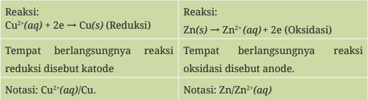

Tabel ini membahas dua reaksi kimia: reduksi dan oksidasi. Kolom pertama berisi reaksi reduksi, sedangkan kolom kedua berisi reaksi oksidasi. Untuk reaksi reduksi, contoh adalah perubahan ion kupfer (Cu²⁺) menjadi logam kupfer (Cu). Reaksi ini melibatkan elektron yang dihasilkan oleh atom zinc (Zn) dalam reaksi oksidasi. Kolom kedua menunjukkan bahwa reaksi oksidasi adalah perubahan zinc (Zn) menjadi ion zinc (Zn²⁺) dengan penambahan 2 elektron. Tempat tempatannya berlangsungnya reaksi juga disebut sebagai anode dan katode. Notasi untuk reaksi reduksi menggunakan tanda kurung (aq) untuk menunjukkan ion dalam larutan, sedangkan notasi untuk reaksi oksidasi menggunakan tanda kurung (aq) untuk menunjukkan ion dalam larutan. Topik utama tabel ini adalah pemahaman tentang reaksi reduksi dan oksidasi, termasuk tempat-tempatannya dan notasi yang digunakan.

Kedua  setengah  reaksi  ini  dapat  digabungkan  untuk  menghasilkan reaksi:

``

dengan menghilangkan elektron pada kedua sisi, dihasilkan persamaan reaksi total berikut:

``

### b. Notasi sel standar

Rancangan sel volta dapat dituliskan dengan lebih sederhana menggunakan notasi sel standar. Notasi sel standar untuk sel Zn-Cu:

``

dimana, tanda | adalah batas fasa antara padatan dan larutan

tanda || adalah jembatan garam

Pada notasi yang digunakan, setengah reaksi oksidasi pada anode dituliskan  di  sebelah  kiri,  sedangkan  setengah  reaksi  reduksi  pada katode dituliskan di sebelah kanan. Pada sel elektrokimia Zn-Cu, arus elektron mengalir melalui sirkuit eksternal dari elektrode seng dimana elektron dihasilkan menuju ke elektrode tembaga.

Pada sel seng-tembaga, terdapat larutan elektrolit yang berperan menghantarkan  listrik.  Larutan  elektrolit  yang  digunakan  adalah

 

---
## 📄 Halaman 96

larutan  seng  sulfat  dan  larutan  tembaga  sulfat.  Kedua larutan  ini mengandung ion-ion bebas dan berperan sebagai penghantar listrik.

Jembatan garam berupa tabung U memiliki peran penting dalam sel elektrokimia ini.  Pada  setengah  sel  Zn (s) /Zn 2+ (aq) , dihasilkan penumpukan  muatan  positif  karena  berlangsungnya  reaksi  oksidasi (menghasilkan  Zn 2+ ).  Penumpukan  muatan  positif  dalam larutan menyebabkan  ketidakseimbangan  muatan  yang  akan  menyebabkan aliran elektron melalui sirkuit luar terhenti. Dengan adanya jembatan garam,  ion-ion  SO 4 2-   (dari  jembatan  garam  yang  diisi larutan  garam Na 2 SO4) akan mengalir ke sisi anode yang memiliki terlalu banyak ionion  positif  dan  menetralkannya.  Dengan  demikian,  jembatan garam berperan  sebagai  medium  transfer  yang  menyuplai  ion-ion  yang dibutuhkan tanpa adanya pencampuran medium.

Hal  yang  menarik  dari  sel  volta  seng-tembaga  adalah  berlangsungnya reaksi kimia pada kedua elektrode yang menyebabkan adanya aliran elektron ke sirkuit luar. Artinya, pada sel elektrokimia ini, energi kimia dikonversi menjadi energi listrik. Sel volta seringkali disebut sebagai sel galvani, sesuai dengan nama penemunya yaitu Luigi Galvani dan Alessandro Guiseppe Volta. Sel volta menghasilkan listrik dari reaksi kimia yang berlangsung pada dua plat logam yang memiliki perbedaan potensial  reaksi.  Apa  yang  dimaksud  dengan  perbedaan  potensial reaksi? Konsep potensial reaksi akan dibahas pada Bagian D.

### c. Kegunaan dari sel volta

Prinsip  kerja  dari  sel  volta  diaplikasikan  untuk  membuat  baterai listrik. Pada beragam teknologi, baterai digunakan sebagai alat untuk menyimpan energi kimia yang dapat dimanfaatkan untuk menghasilkan listrik. Baterai telah banyak dikembangkan dari satu jenis atau beberapa jenis sel volta atau sel bahan bakar. Aplikasi baterai pada kehidupan sehari-hari  amat  luas,  misalnya  pada  lampu  senter,  peralatan  listrik rumah tangga, kamera digital, alat bantu dengar, dan jam digital.

 

---
## 📄 Halaman 97

Suatu sel volta terdiri dari: setengah sel elektrode Cr dengan larutan elektrolit  Cr(NO 3 ) 3 dan  setengah  sel  elektrode  Ag  dengan larutan elektrolit AgNO 3 . Sel volta dilengkapi dengan jembatan garam KNO 3 . Dari pengukuran, diketahui bahwa elektrode Cr bermuatan negatif relatif terhadap elektrode Ag.

Lengkapi diagram sel volta pada Gambar 2.8. Ganti huruf a, b, c, d  dan  e  dengan  komponen-komponen  elektrode, elektrolit  dan jembatan  garam  yang  sesuai.  Kemudian,  tuliskan  reaksi  pada masing-masing setengah sel dan reaksi keseluruhan. Lengkapi pula Gambar 2.8 dengan arah aliran elektron selama reaksi berlangsung.

---
**🖼️ Gambar/Diagram**

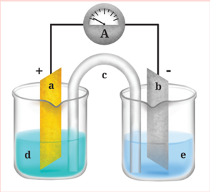

> **Deskripsi Visual:** Gambar ini adalah ilustrasi yang menunjukkan sebuah alat pengukur arus listrik (amperet) yang disambungkan ke dua galvanometer berlawanan arah. Galvanometer tersebut diletakkan di antara dua cawan berisi larutan kimia, dengan galvanometer di cawan a dan b. Cawan c berfungsi sebagai perpanjangan untuk menghubungkan kedua galvanometer tersebut. Gambar ini menunjukkan bagaimana arus listrik dapat dipantau melalui perubahan posisi galvanometer.

Elemen utama dalam gambar ini adalah:
1. Amperet yang digunakan untuk mengukur arus listrik.
2. Dua galvanometer yang terpasang di cawan berbeda.
3. Cawan a dan cawan b yang berisi larutan kimia.
4. Cawan c yang berfungsi sebagai perpanjangan untuk menghubungkan kedua galvanometer.

Label penting yang terlihat dalam gambar ini adalah:
1. Galvanometer yang terpasang di cawan a dan cawan b.
2. Amperet yang digunakan untuk mengukur arus listrik.
3. Cawan c yang berfungsi sebagai perpanjangan.

Informasi kunci yang dapat diambil dari gambar ini adalah bahwa arus listrik dapat dipantau melalui perubahan posisi galvanometer, dan bahwa amperet digunakan untuk mengukur intensitas arus listrik tersebut.

 

---
## 📄 Halaman 98

### 2. Sel elektrolisis

Pada bagian sebelumnya, kalian sudah mempelajari reaksi kimia yang melibatkan transfer elektron dan dimanfaatkan untuk menghasilkan arus listrik. Pada bagian ini, kita akan melihat apakah proses sebaliknya, dimana  listrik  yang  dialirkan  dari  luar  dapat  dimanfaatkan  untuk menjalankan reaksi kimia.

Sel elektrolisis adalah sel elektrokimia yang menggunakan listrik untuk menjalankan reaksi kimia yang tidak spontan. Sel ini diaktivasi dengan  mengaplikasikan  potensial  listrik  ke  sisi  anode  dan  katode untuk 'memaksa' terjadinya reaksi kimia pada ion-ion yang terdapat dalam  larutan elektrolit.  Elektrolisis  digunakan  di  berbagai  industri manufaktur  sebagai  metode  untuk  memisahkan  unsur-unsur  dari suatu senyawa dengan cara melewatkan aliran listrik kepadanya.

### DEMONSTRASI ELEKTROLISIS LARUTAN TEMBAGA SULFAT

Guru  kalian  akan  mendemonstrasikan  elektrolisis larutan  tembaga sulfat.  Lakukan  pengamatan  demonstrasi  secara  berkelompok.  Dua elektrode  tembaga  ditempatkan  dalam larutan  tembaga  sulfat  yang berwarna biru dan dihubungkan dengan sumber arus listrik seperti ditunjukkan pada Gambar 2.9.

---
**🖼️ Gambar/Diagram**

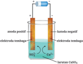

> **Deskripsi Visual:** Gambar ini adalah ilustrasi yang menunjukkan proses elektrolisis air menggunakan zat kimia sulfat (SO₄²⁻) sebagai bahan elektrolisis. Gambar ini terdiri dari beberapa elemen utama:

1. **Pertama**: Gambar ini menunjukkan sebuah sistem elektrolisis dengan empat elektroda yang terhubung ke sumber listrik positif dan negatif. Elektroda positif terletak di atas, sedangkan elektroda negatif terletak di bawah.

2. **Elemen Utama dan Relasinya**: 
   - **Elektroda Positif**: Terletak di atas dan terhubung ke sumber listrik positif.
   - **Elektroda Negatif**: Terletak di bawah dan terhubung ke sumber listrik negatif.
   - **Zat Kimia SO₄²⁻**: Terdapat di dalam larutan, menunjukkan bahwa zat ini akan menjadi bahan elektrolisis.
   - **Larutan CuSO₄**: Terdapat di dalam sistem elektrolisis, menunjukkan bahwa zat ini adalah larutan yang digunakan dalam proses elektrolisis.

3. **Teks, Angka, atau Label Penting**:
   - **Angka**: Tidak ada angka yang jelas dalam gambar ini.
   - **Label**: Ada beberapa label yang menunjukkan posisi elektroda dan zat kimia, seperti "elektroda positif", "elektroda negatif", "zat kimia SO₄²⁻", dan "larutan CuSO₄".

4. **Informasi Kunci**:
   - **Proses Elektrolisis**: Gambar ini menunjukkan proses elektrolisis air menggunakan zat kimia sulfat sebagai bahan elektrolisis.
   - **Elektroda**: Menunjukkan posisi elektroda positif dan negatif dalam sistem elektrolisis.
   - **Zat Kimia**: Menunjukkan bahwa zat kimia sulfat (SO₄²⁻) akan menjadi bahan elektrolisis.
   - **Larutan**: Menunjukkan bahwa larutan CuSO₄ adalah larutan yang digunakan dalam proses elektrolisis.

Dengan demikian,

 

---
## 📄 Halaman 99

Jawablah pertanyaan berikut:

-  Apa yang teramati di katode?
-  Apa yang teramati di anode?
-  Apa yang teramati pada larutan elektrolit?
Tuliskan reaksi yang terjadi di anode dan katode. Diskusikan jawaban kalian secara berkelompok, kemudian presentasikan di kelas.

### a. Elektrolisis larutan tembaga sulfat

Perhatikan kembali Gambar 2.9, pada katode yang bermuatan negatif, ion-ion Cu 2+  yang bermuatan positif akan mendekat. Ion-ion ini menarik elektron dan mengalami reduksi untuk menghasilkan logam tembaga. Logam tembaga kemudian terdeposisi pada katode Cu, sehingga katode ini mengalami penebalan. Setengah reaksi reduksi yang berlangsung pada sisi katode adalah:

``

Pada  anode  yang  bermuatan  positif,  logam  tembaga  teroksidasi membentuk  ion  Cu 2+ .  Pada  sisi  ini,  tembaga  pada  elektrode  terlihat melarut. Setengah reaksi yang berlangsung pada sisi anode adalah:

``

Jumlah tembaga yang terdeposisi pada katode mendekati jumlah tembaga yang larut pada anode, sehingga jumlah ion Cu 2+ dalam larutan akan tetap dan warna larutan tidak berubah. Pada sel elektrolisis ini, sejumlah arus listrik digunakan untuk memecah CuSO 4 menjadi logam Cu.

### b. Elektrolisis air

Air dapat mengalami elektrolisis untuk membentuk gas hidrogen dan gas oksigen, sesuai reaksi berikut:

``

 

---
## 📄 Halaman 100

---
**🖼️ Gambar/Diagram**

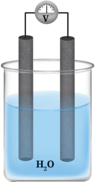

> **Deskripsi Visual:** Gambar ini adalah ilustrasi yang menunjukkan dua elektroda yang dipasang di dalam larutan air (H₂O). Elektroda tersebut terhubung ke sebuah voltmeter yang digunakan untuk mengukur perbedaan potensial antara kedua elektroda. Ilustrasi ini menunjukkan konsep dasar dalam kimia elektrokimia, yaitu penggunaan elektroda untuk menghasilkan listrik dari reaksi kimia. Elektroda yang lebih positif akan menghasilkan arus listrik yang lebih besar, yang dapat dilihat dari posisi elektroda yang lebih tinggi pada voltmeter. Ini menunjukkan bahwa ada perbedaan potensial antara kedua elektroda, yang merupakan aspek penting dalam pemahaman tentang reaksi kimia dan elektronik.

Reaksi ini sangat penting karena menunjukkan bahwa gas hidrogen sebagai  sumber  energi  masa  depan  dapat  diperoleh  dari  air.  Sel elektrolisis untuk reaksi ini terdiri dari dua elektrode (biasanya logam platina)  yang  dicelupkan  dalam elektrolit  dan  dihubungkan  dengan sumber listrik (Gambar 2.10).

Setengah reaksi reduksi yang berlangsung di katode adalah:

``

Setengah reaksi oksidasi yang berlangsung di anode adalah:

``

 

---
## 📄 Halaman 101

### MOBIL DENGAN BAHAN BAKAR AIR

Sumber: https://www.motor1.com/news/855/japanesecompany-creates-car-that-can-run-on-water/

Sebuah  perusahaan  Jepang  mengklaim  telah  berhasil  menemukan suatu sistem sel bahan bakar yang menggunakan air untuk memperoleh gas hidrogen. Sebuah mobil mini berhasil dioperasikan menggunakan dua sistem sel, yaitu sel bahan bakar 120W dan 300W. Mobil mini ini mampu berjalan pada kecepatan 80 km/jam hanya menggunakan 1 L air, baik dari air laut, sungai maupun air hujan. Namun, artikel tersebut juga  membahas berbagai fakta-fakta  saintifik  yang  mengindikasikan berbagai  masalah  terkait  mobil  tersebut.  Bacalah  dengan  teliti  dan diskusikan  masalah-masalah  yang  dibahas  terkait  penemuan  mobil dengan bahan bakar air ini.

### 3. Perbandingan sel volta dan sel elektrolisis

Kalian  telah  mengetahui  tentang  sel  volta  dan  sel  elektrolisis.  Ada beberapa perbedaan dari kedua sel elektrokimia ini dan perbedaanperbedaan tersebut ditabulasikan pada Tabel 2.1.

---
**📊 Tabel**

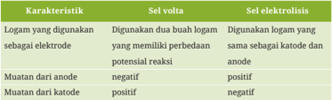

Tabel ini membandingkan dua metode penggunaan logam sebagai elektrode dalam proses elektrolisis dan sel volta. Topik utama tabel adalah perbedaan dalam cara menggunakan logam sebagai elektrode dalam kedua metode tersebut. Kolom pertama berisi karakteristik yang digunakan sebagai elektrode, sedangkan kolom kedua berisi penjelasan tentang bagaimana logam tersebut digunakan dalam kedua metode tersebut. Data penting yang terlihat adalah bahwa dalam sel volta, logam digunakan sebagai anode dan katode, sementara dalam proses elektrolisis, logam digunakan sebagai anode dan katode dengan potensial reaksi yang berbeda. Sel volta menggunakan logam yang memiliki perbedaan potensial reaksi, sedangkan dalam proses elektrolisis, logam digunakan sebagai anode dan katode dengan potensial reaksi yang sama.

 

---
## 📄 Halaman 102

---
**📊 Tabel**

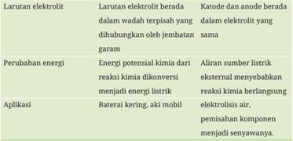

Tabel ini membahas tentang larutan elektrolit, perubahan energi, dan aplikasi dari larutan elektrolit. Topik utama adalah larutan elektrolit, yang melibatkan larutan berada dalam wadah tertentu yang dihubungkan oleh jembatan garam. Kolom pertama berisi informasi tentang larutan elektrolit, kolom kedua tentang perubahan energi, dan kolom ketiga tentang aplikasi. Data penting yang terlihat adalah bahwa larutan elektrolit dapat menyebabkan reaksi kimia berlangsung, seperti baterai kering dan aki mobil. Selain itu, larutan elektrolit juga dapat digunakan untuk pemisahan komponen menjadi senyawa.

Elektrolisis natrium klorida merupakan salah satu proses industri penting untuk menghasilkan produk-produk zat kimia komersial, seperti gas klorin dan logam natrium. Seorang ilmuwan kimia ingin mendapatkan logam  natrium  murni  melalui  proses  elektrolisis natrium klorida. Berikut metode-metode yang diusulkan:

- Elektrolisis larutan natrium klorida encer
- Elektrolisis larutan natrium klorida pekat
- Elektrolisis lelehan natrium klorida Berikan analisis kalian terhadap ketiga metode tersebut. Manakah yang dapat kalian pilih?

### D.  Potensial elektrode standar

### 1. Mengukur potensial elektrode

Apabila  sebuah  voltmeter  dihubungkan  dengan  sirkuit  dari  suatu  sel elektrokimia, maka voltmeter akan menunjukkan angka tertentu. Angka yang ditampilkan ini menunjukkan perbedaan potensial antara dua buah setengah sel.

 

---
## 📄 Halaman 103

Setiap logam memiliki kereaktifan yang berbeda-beda. Ketika logam bereaksi,  elektron  dilepaskan  dan  ion  positif  dihasilkan.  Beberapa logam bereaksi lebih mudah dibandingkan logam lainnya. Mari kita cermati dua reaksi berikut:

``

Apabila  dibandingkan,  seng  bersifat  lebih  reaktif  dari  tembaga, karenanya seng lebih cenderung melepaskan elektron dan membentuk ion Zn 2+ dalam larutan.

Mari kita tinjau kembali sel elektrokimia Zn-Cu yang telah dibahas sebelumnya  (lihat  Bagian  C.1).  Sel  elektrokimia  ini  terbuat  dari  dua setengah sel, dimana reaksi yang berlangsung adalah:

``

``

``

Pada elektrode seng, logam seng kehilangan elektron dan membentuk  ion  Zn 2+ .  Elektron  akan  berkumpul  pada logam  seng, sedangkan ion Zn 2+ akan berpindah ke dalam larutan.

Bagaimana dengan elektrode tembaga?

Situasi yang berbeda terjadi pada sisi elektrode tembaga. Tembaga kurang  reaktif  dibandingkan  seng,  sehingga  lebih  cenderung  tetap sebagai  logam  tembaga  dan  bukan  sebagai  ion  Cu 2+ .  Pada  elektrode tembaga, ion-ion Cu 2+  yang akan mengalami reduksi membentuk Cu (s) .

Apabila kita bandingkan kondisi di tiap-tiap setengah sel, terdapat  perbedaan potensial diantara keduanya. Elektrode Zn lebih negatif  dibandingkan  elektrode  Cu.  Perbedaan  potensial  inilah  yang menyebabkan elektron mengalir dari elektrode yang lebih negatif ke elektrode  yang  kurang  negatif.  Dengan  demikian,  terjadi  aliran  arus listrik yang terekam sebagai tegangan pada alat voltmeter.

 

---
## 📄 Halaman 104

Meskipun perbedaan potensial antara dua elektrode dapat terekam pada voltmeter, potensial elektrode dari satu logam tertentu tidak dapat ditentukan secara pasti. Padahal nilai potensial elektrode dari masingmasing  elektrode  dapat  digunakan  untuk  menghitung  perbedaan potensial antara dua  elektrode. Dari kesulitan inilah,  kemudian diperkenalkan  nilai  potensial  elektrode  standar,  dimana  potensial elektrode  suatu  logam  dibandingkan  secara  relatif  terhadap  satu standar yang sama. Untuk keperluan ini, kita memerlukan elektrode acuan standar .

### 2. Potensial elektrode acuan standar

Konsep potensial elektrode standar dapat kalian pahami menggunakan analogi  berikut.  Pada  suatu  hari  kalian  pergi  berenang  dengan teman  sekelas.  Kalian  melihat  tiga  orang  sedang  berdiri  di  kolam renang, sehingga hanya sebagian badan mereka yang terlihat. Kalian ingin  membandingkan  tinggi  badan  mereka.  Maka,  kalian  dapat membandingkan  tinggi  badan  mereka  berdasarkan  sebagian  badan yang  terlihat.  Kalian  dapat  menentukan  tinggi  ketiga  orang  tersebut relatif terhadap tiang yang ada di sisi kolam renang. A memiliki tinggi 10 cm di bawah tiang, B memiliki tinggi 5 cm di bawah tiang, sedangkan C memiliki tinggi 5 cm di atas tiang. Meskipun kalian tidak memiliki tinggi  absolut  dari  masing-masing  orang,  namun  tinggi  relatif  yang diukur dapat menjadi acuan untuk mengurutkan tinggi dari ketiganya. Kita dapat simpulkan bahwa C paling tinggi, lebih tinggi 10 cm dari B dan 15 cm dari A. B memiliki tinggi diantara A dan C, tinggi B adalah 5 cm di atas A dan 10 cm di bawah C. A paling pendek diantara ketiganya (Lihat  Gambar  2.11).  Tiang  berperan  sebagai  standar  acuan  untuk menentukan tinggi ketiganya.

 

---
## 📄 Halaman 105

---
**🖼️ Gambar/Diagram**

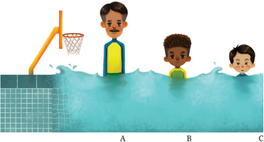

> **Deskripsi Visual:** Gambar ini adalah ilustrasi yang menunjukkan tiga orang bermain bola basket di kolam renang. Gambar ini menggambarkan situasi di mana seorang pemain basket berdiri di tepi kolam renang, sementara dua orang lainnya berada di dalam air. Pemain di tepi kolam renang tampak sedang berbicara atau berkomunikasi dengan salah satu pemain di dalam air. Kolam renang tampak jernih dengan air biru tua, dan terdapat papan bola basket yang terletak di tepi kolam renang. Ilustrasi ini menunjukkan kombinasi olahraga basket dan renang, yang mungkin merupakan aktivitas yang tidak biasa tetapi bisa menjadi hiburan atau tantangan bagi pemain.

Dengan konsep yang sama, kita dapat membandingkan  potensial elektrode  satu logam terhadap logam lainnya. Elektrode acuan yang digunakan  adalah elektrode  hidrogen  standar .  Elektrode  hidrogen standar adalah elektrode redoks yang menjadi dasar skala potensial oksidasi-reduksi. Potensial elektrode standar bagi elektrode hidrogen dianggap  sama  dengan nol pada  semua  suhu  dan  dijadikan  acuan untuk  perbandingan  dengan  elektrode  lainnya.  Reaksi  redoks  dari elektrode hidrogen  adalah  sebagai  berikut.  Pengukuran  potensial elektrode standar dilakukan pada kondisi tekanan 1 atm, suhu 298 K dan konsentrasi 1 M.

``

Pada aplikasinya, elektrode hidrogen harus dirangkaikan dengan sistem elektrode yang akan dicari nilai potensial elektrodenya. Misalnya,  untuk  menentukan  potensial  elektrode  dari  seng,  kalian harus menghubungkan setengah sel seng dengan elektrode hidrogen, seperti pada Gambar 2.12. Saat setengah sel Zn dihubungkan dengan elektrode hidrogen, Zn cenderung membentuk ion Zn 2+  dan melepaskan elektron. Elektrode Zn akan bermuatan lebih negatif karena elektron

 

---
## 📄 Halaman 106

yang dilepaskan saat Zn teroksidasi menyebabkan akumulasi elektron pada elektrode Zn.

---
**🖼️ Gambar/Diagram**

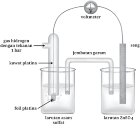

> **Deskripsi Visual:** Gambar ini adalah ilustrasi yang menunjukkan sebuah reaksi kimia yang melibatkan peralatan laboratorium. Gambar ini menggambarkan dua larutan berbeda: larutan asam sulfat dan larutan ZnSO₄. Di antara kedua larutan tersebut, terdapat kawat platina yang terhubung ke jembatan garam. Kawan platina tersebut terletak di atas foil platina, yang terletak di atas larutan asam sulfat. Gas hidrogen dengan tekanan 1 bar diletakkan di atas kawat platina. Selain itu, ada voltimeter yang digunakan untuk mengukur tegangan dalam sistem ini.

Elemen utama dalam gambar ini adalah dua larutan, kawat platina, foil platina, gas hidrogen, dan voltimeter. Larutan asam sulfat dan larutan ZnSO₄ merupakan dua larutan yang berbeda, yang terpisah oleh jembatan garam. Kawan platina dan foil platina merupakan bagian dari sistem yang digunakan untuk mengukur tegangan. Gas hidrogen dengan tekanan 1 bar diletakkan di atas kawat platina untuk membantu dalam proses reaksi. Voltimeter digunakan untuk mengukur tegangan yang terbentuk dalam sistem ini.

Teks, angka, atau label penting yang terlihat dalam gambar ini adalah "gas hidrogen dengan tekanan 1 bar", "kawat platina", "foil platina", "larutan asam sulfat", "larutan ZnSO₄", "jembatan garam", dan "voltimeter". Informasi kunci yang dapat diambil pembaca adalah bahwa gambar ini menunjukkan reaksi kimia yang melibatkan peralatan laboratorium, dua larutan berbeda, dan pengukuran tegangan dalam sistem ini.

Kesetimbangan reaksi Zn dan gas hidrogen dapat dituliskan sebagai berikut.

``

``

``

Kesetimbangan reaksi pada elektrode Zn mengarah ke kiri yaitu pada  pembentukan  ion  Zn 2+ ,  sedangkan  kesetimbangan  reaksi pada elektrode hidrogen  mengarah  ke  kanan,  yaitu  pada  pembentukan gas hidrogen. Voltmeter mengukur perbedaan potensial antara kedua elektrode  tersebut,  dan  menghasilkan  nilai  0,76  V.  Zn  merupakan elektrode  yang  bermuatan  lebih  negatif,  karena  banyaknya  elektron yang terakumulasi.

Bagaimana saat setengah sel Zn diganti dengan tembaga (Cu)?

 

---
## 📄 Halaman 107

Tembaga memiliki kecenderungan yang lebih kecil untuk menghasilkan ion Cu 2+ dibandingkan dengan hidrogen. Dengan demikian  elektrode hidrogen  yang  akan  mengalami  oksidasi  dan melepaskan elektron. Hidrogen akan lebih bermuatan negatif dibandingkan dengan Cu.

``

Voltmeter  akan  menunjukkan  nilai  perbedaan  potensial  sebesar 0,34 V dan Cu berperan sebagai elektrode yang positif karena memiliki elektron yang lebih sedikit. Nilai-nilai voltase yang ditunjukkan pada rangkaian setengah sel Zn dan Cu saat dihubungkan dengan elektrode standar hidrogen adalah potensial elektrode standar bagi Zn dan Cu. Perlu dipahami bahwa nilai potensial elektrode standar ini bukanlah nilai  absolut,  namun  merupakan  nilai  relatif  terhadap  elektrode hidrogen standar yang dianggap sama dengan nol.

Berdasarkan kesepakatan konvensi, elektrode hidrogen ditulis di sebelah  kiri  dari  sel,  sedangkan  tanda  voltase  yang  diperoleh  pada voltmeter  merupakan  tanda  bagi  elektrode  logam  tersebut.  Dengan demikian, potensial elektrode Zn adalah -0,76 V, sedangkan potensial elektrode Cu adalah +0,34 V. Dapat disimpulkan bahwa logam dengan nilai  potensial  elektrode  standar  negatif  adalah  logam  yang  mudah membentuk ion. Semakin negatif nilai potensial elektrodenya, semakin mudah logam  tersebut  membentuk  ion.  Sebaliknya,  apabila logam memiliki nilai potensial elektrode positif, maka logam tersebut tidak mudah membentuk ion.  Potensial  elektrode  standar  untuk  berbagai logam sudah diukur menggunakan cara ini dan hasilnya dapat kalian lihat pada Tabel 2.2.

Dapat kalian amati bahwa logam-logam di bagian atas memiliki nilai potensial elektrode standar negatif. Hal ini berarti bahwa logamlogam ini  mudah  membentuk  ion  dan  melepaskan  elektron.  Artinya, logamlogam ini mudah teroksidasi dan merupakan agen pereduksi yang baik.

 

---
## 📄 Halaman 108

Logam-logam di bagian bawah memiliki nilai potensial elektrode positif, berarti logam-logam  ini  bersifat  penerima  elektron.  Logamlogam  ini mudah  mengalami reduksi  dan  merupakan  agen  pengoksidasi  yang baik. Dapat kita simpulkan bahwa pada Tabel 2.2, semakin ke atas maka kemampuan mereduksi logam akan meningkat, sedangkan dari atas ke bawah  kemampuan mengoksidasi akan meningkat.

---
**📊 Tabel**

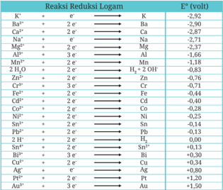

Tabel ini menunjukkan reaksi reduksi logam dan energi potensial (E°) mereka dalam sistem elektrolisis. Topik utama tabel adalah reaksi-reaksi reduksi logam yang terjadi dalam proses elektrolisis, termasuk kation dan anion logam, serta energi potensial mereka. Kolom-kolom utama dalam tabel meliputi:

1. Kation (K+)
2. Energi potensial (E°) dalam volt

Data penting yang terlihat dalam tabel meliputi:
- Kation K+ memiliki E° sebesar -2,92 volt.
- Kation Ba2+ memiliki E° sebesar -2,90 volt.
- Kation Ca2+ memiliki E° sebesar -2,87 volt.
- Kation Na+ memiliki E° sebesar -2,71 volt.
- Kation Mg2+ memiliki E° sebesar -2,57 volt.
- Kation Al3+ memiliki E° sebesar -1,66 volt.
- Kation Mn2+ memiliki E° sebesar -1,18 volt.
- Kation Zn2+ memiliki E° sebesar -0,76 volt.
- Kation Cr3+ memiliki E° sebesar -0,71 volt.
- Kation Fe3+ memiliki E° sebesar -0,44 volt.
- Kation Cd2+ memiliki E° sebesar -0,40 volt.
- Kation Co2+ memiliki E° sebesar -0,28 volt.
- Kation Ni2+ memiliki E° sebesar -0,25 volt.
- Kation Sn2+ memiliki E° sebesar -0,14 volt.
- Kation Pb2+ memiliki E° sebesar 0,13 volt.
- Kation H2+ memiliki E° sebesar 0,00 volt.
- Kation Sn2+ memiliki E° sebesar 0,13 volt.
- Kation Bi3+ memiliki E° sebesar -0,30 volt.
- Kation Cu2+ memiliki E° sebesar -0,09 volt.
- Kation Ag+ memiliki E° sebesar -0,09 volt.
- Kation Pt2+ memiliki E° sebes

### 3. Penggunaan data potensial elektrode standar

### a.  Menghitung potensial sel elektrokimia

Data potensial elektrode standar dapat dimanfaatkan untuk menghitung gaya gerak listrik (GGL) dari sel elektrokimia. Untuk menghitung GGL dari  suatu  sel  elektrokimia,  kalian  dapat  menggunakan  beberapa persamaan berikut.

``

 

---
## 📄 Halaman 109

Istilah 'kanan' berarti elektrode yang di sebelah kanan pada notasi sel  standar  (lihat  kembali  subbab  sel  volta  Zn-Cu),  sedangkan  'kiri' merujuk pada setengah reaksi yang dituliskan di sebelah kiri notasi sel standar. Persamaan di atas dapat juga dituliskan sebagai berikut.

``

``

Dengan  demikian,  untuk  sel  Zn-Cu,  GGL  dapat  dihitung  sebagai berikut.

``

Pada reaksi elektrokimia di bawah ini:

``

Tuliskan  notasi  sel  standar  dan  hitunglah  potensial  sel  dari  sel elektrokimia tersebut.

### Jawaban

Langkah 1: tuliskan persamaan setengah reaksi yang terlibat menggunakan data potensial elektrode standar.

``

 

---
## 📄 Halaman 110

Langkah 2: tentukan reaksi yang berlangsung di katode dan anode

Kedua potensial elektrode memiliki nilai positif, namun perak memiliki nilai lebih besar. Artinya, perak tidak mudah mengion dibandingkan dengan tembaga. Dengan demikian, tembaga akan mengalami reaksi oksidasi membentuk ion tembaga, sedangkan perak mengalami reaksi reduksi. Tembaga adalah anode dan perak adalah katode.

Langkah 3: tuliskan notasi standar sel.

Cu | Cu 2+  (1mol.dm -3 ) || Ag + (1mol.dm -3 ) | Ag

Langkah 4: hitung potensial sel

``

### SOAL LATIHAN

Hitunglah  potensial  sel  dan  tuliskan  notasi  sel standar  dari  sel elektrokimia dengan reaksi total sebagai berikut.

``

### b.  Menyetarakan reaksi redoks

Konsep setengah reaksi dapat digunakan untuk menyetarakan persamaan reaksi redoks seperti pada contoh berikut.

Misalnya untuk reaksi berikut yang berlangsung pada media asam.

``

Langkah 1: tuliskan setengah reaksi oksidasi

``

Langkah 2: setarakan jumlah atom di kedua sisi.

Kalian harus mengalikan sisi kanan dengan 2, sehingga jumlah atom Cr setara. Untuk menyetarakan jumlah atom oksigen, tambahkan molekul air ke sisi kanan.

 

---
## 📄 Halaman 111

``

Sekarang  jumlah  atom  oksigen  sudah  setara,  namun  jumlah  atom hidrogen belum setara. Kalian harus menambahkan ion hidrogen ke sisi kiri.

``

Langkah 3: Setelah semua atom setara, periksa kesetaraan muatan.

Muatan di sisi kiri adalah (-2 + 14) = +12, namun muatan di sisi kanan adalah +6. Untuk menyetarakan, enam elektron ditambahkan ke sisi kiri.

``

Langkah 4: Lakukan langkah 1-3 untuk setengah reaksi reduksi.

``

Langkah 5: Kalikan setengah reaksi yang setara dengan angka tertentu, sehingga jumlah elektron pada setengah reaksi oksidasi sama dengan setengah reaksi reduksi.

Kalian dapat mengalikan setengah reaksi reduksi dengan 3, sehingga jumlah elektronnya sama dengan setengah reaksi oksidasi.

``

Langkah  6: Jumlahkan  kedua  setengah  reaksi untuk  mendapatkan reaksi total.

``

Langkah 7: Periksa kembali kesetaraan reaksi.

### c.  Memprediksi reaksi-reaksi elektrokimia spontan

Selain untuk menghitung potensial sel, data potensial elektrode standar dapat digunakan untuk memprediksi apakah suatu reaksi elektrokimia akan berlangsung spontan atau tidak spontan.

 

---
## 📄 Halaman 112

Perhatikan reaksi berikut.

``

Setengah  reaksi  yang  terlibat  berikut  nilai  potensial  elektrode standarnya adalah sebagai berikut.

``

Perhatikan nilai potensial elektrode untuk setengah reaksi Pb, tanda negatif menandakan bahwa timbal mudah kehilangan elektron untuk membentuk  ion  timbal.  Artinya,  timbal  mudah  mengalami  oksidasi. Maka, reaksi ini akan cenderung berlangsung dari kanan ke kiri. Namun pada reaksi total, terlihat bahwa reaksi sebaliknya yang terjadi, dimana ion Pb 2+   direduksi menjadi Pb. Dapat kita simpulkan bahwa setengah reaksi ini tidak spontan. Di sisi lain, potensial elektrode bromin yang bernilai positif menandakan bahwa bromin mudah tereduksi, artinya reaksi cenderung berlangsung dari kiri ke kanan. Kembali kita amati bahwa pada reaksi total posisi bromin terbalik, sehingga reaksi ini juga tidak spontan. Kalian dapat menyimpulkan bahwa reaksi elektrokimia tersebut tidak spontan.

Cara lain untuk memprediksi apakah suatu reaksi akan berlangsung spontan atau tidak spontan adalah dengan menghitung potensial sel dan melihat nilainya. Apabila potensial sel berharga positif, maka reaksi adalah spontan. Sebaliknya, apabila potensial sel bernilai negatif, maka reaksi tersebut tidak spontan.

Menggunakan Tabel 2.2, tentukanlah reaksi mana yang akan berlangsung di katode dan anode pada sel volta Cu-Ag. Diketahui reaksi setengah sel berikut:

 

---
## 📄 Halaman 113

### Petunjuk

Katode adalah tempat berlangsungnya reaksi reduksi, sedangkan anode adalah  tempat  berlangsungnya  reaksi  oksidasi.  Untuk  menentukan reaksi yang terjadi pada elektrode Cu dan Ag, ikuti langkah berikut.

Langkah 1: Tentukan potensial elektrode bagi masing-masing logam.

Pada Tabel 2.2 dapat kalian cermati bahwa potensial elektrode untuk tembaga adalah +0,34 V, sedangkan perak adalah +0,80 V.

Langkah 2: Gunakan data potensial elektrode untuk menentukan logam mana yang akan mengalami oksidasi dan reduksi.

Kedua logam  memiliki  nilai  potensial  elektrode  positif,  namun perak memiliki nilai potensial elektrode yang lebih besar. Ini berarti bahwa perak lebih sulit menjadi ion dibandingkan dengan tembaga, karena  cenderung  mengalami reduksi.  Dengan  demikian,  tembaga akan  mengalami oksidasi  untuk  membentuk  ion  dan  melepaskan elektron. Tembaga merupakan setengah reaksi oksidasi terjadi di anode, sedangkan perak adalah setengah reaksi reduksi terjadi di katode. Jadi, reaksi yang terjadi:

Katode: Ag

`+ (aq) + e → A g (s)`

Anode:  Cu

(s) → Cu 2+ (aq) + 2e

### Ayo Berlatih

Prediksikan  apakah  logam  tembaga  akan  bereaksi  dengan  asam sulfat encer. Gunakan persamaan reaksi berikut.

Cu 2+ (aq) + 2e ⇋ Cu (s)

2H + (aq) + 2e ⇋ H 2 (g)

``

``

Cu 2+ (aq) + 2e ⇋ Cu (s)

``

 

---
## 📄 Halaman 114

### E.  Aplikasi elektrokimia

Elektrokimia merupakan salah satu cabang ilmu kimia yang memiliki aplikasi yang luas, terutama di sektor industri. Berikut adalah contoh aplikasi elektrokimia dalam keseharian.

### 1. Pelapisan logam

Pelapisan  logam,  atau  dikenal  pula  dengan  istilah  electroplating, adalah  proses  penggunaan  arus  listrik  untuk  melapisi  objek  yang bersifat konduktif terhadap  listrik dengan  lapisan tipis  logam . Aplikasi ini banyak dimanfaatkan untuk melapisi suatu bahan agar menghasilkan  karakteristik  bahan  yang  lebih  baik  dari  semula (misalnya  menjadi  tahan  lama,  tahan  terhadap  abrasi,  anti-korosi, atau untuk meningkatkan estetika benda). Teknik ini juga seringkali digunakan untuk mendapatkan logam murni dari campuran logam, misalnya pada pemurnian tembaga. Tembaga adalah salah satu logam yang banyak dimanfaatkan pada industri kelistrikan,  yaitu  sebagai bahan  kabel  listrik.  Satu  masalah  yang  seringkali  dihadapi  adalah rendahnya  kemurnian  tembaga  saat  ditambang.  Padahal  untuk menjadi  penghantar  arus  listrik  yang  baik,  tembaga  harus  murni. Teknik electroplating digunakan untuk mendapatkan tembaga murni dari campuran tembaga, seperti yang ditunjukkan pada Gambar 2.13.

---
**🖼️ Gambar/Diagram**

> **Deskripsi Visual:** Gambar ini adalah ilustrasi yang menunjukkan proses elektrolisis campuran tembaga yang tidak murni. Gambar ini menggambarkan dua elektroda, anoda dan katoda, yang terletak di dalam larutan tembaga yang berwarna merah. Elektroda anoda terletak di atas larutan, sedangkan elektroda katoda terletak di bawah larutan. Dalam larutan tersebut, terdapat ion Cu²⁺ yang menunjukkan bahwa larutan ini adalah larutan tembaga yang telah dioksidi. Label "anoda" dan "katoda" menunjukkan posisi kedua elektroda, sementara label "elektroda tembaga murni" menunjukkan bahwa elektroda katoda adalah elektroda tembaga yang murni. Informasi kunci yang dapat diambil pembaca adalah bahwa proses elektrolisis ini digunakan untuk memisahkan ion Cu²⁺ dari larutan tembaga yang tidak murni menjadi ion tembaga yang murni di elektroda katoda.

 

---
## 📄 Halaman 115

### 2. Mobil listrik

Komponen  paling  penting  dari  mobil  listrik  adalah  baterai  yang digunakannya. Baterai yang dipakai pada mobil listrik adalah baterai  dengan  daya  yang  dapat  diisi  ulang  (Gambar  2.14).  Baterai ini  mengadopsi  sel  elektrokimia  yang  dapat  mengkonversi  energi kimia  menjadi  energi  listrik,  dan  sebaliknya.  Kinerja  baterai  sangat bergantung pada material penyusunnya.

---
**🖼️ Gambar/Diagram**

> **Deskripsi Visual:** Gambar ini adalah ilustrasi yang menunjukkan bagaimana proses pengisian daya pada mobil listrik. Gambar ini menggambarkan mobil listrik dengan detail yang jelas, termasuk bagian-bagian seperti motor, baterai, dan sistem pengisian daya.

Elemen utama dalam gambar ini meliputi mobil listrik yang tampak jelas, motor yang terletak di tengah bagian depan, baterai yang terletak di bagian bawah mobil, dan sistem pengisian daya yang terhubung ke mobil tersebut. Motor dan baterai merupakan bagian penting dari mobil listrik, sementara sistem pengisian daya menunjukkan bagaimana energi diterima oleh mobil.

Teks, angka, atau label penting yang terlihat dalam gambar ini adalah "Inlet Pengisian Daya" yang menunjukkan titik di mana energi diterima oleh mobil, serta "Packing Baterai" yang menunjukkan lokasi baterai di mobil. Informasi kunci yang dapat diambil pembaca adalah bahwa mobil listrik menggunakan baterai sebagai sumber energi dan memiliki sistem pengisian daya untuk memperbarui baterai tersebut.

Baterai  pada  mobil  listrik  dirancang  untuk  memberikan  daya yang  cukup  untuk  menunjang  keseluruhan  operasi  mobil,  seperti starter ,  pencahayaan dan ignisi. Baterai ini harus mampu bekerja pada jangka waktu yang cukup lama, memiliki kapasitas daya besar, dan ringan.

Salah satu baterai yang banyak digunakan pada mobil listrik modern adalah  litium-ion  (Li-ion)  dan  polimer  litium.  Jenis  baterai  lainnya adalah nikel-kadmium, timbal-asam, dan nikel-hidrida logam. Besaran energi listrik yang tersimpan dalam baterai mobil listrik diukur dalam satuan ampere-jam atau coulomb, dengan total energinya dinyatakan sebagai kilowatt-jam (kWh). Apabila harga bahan bakar minyak (BBM) dibandingkan  dengan  konsumsi  listrik  dari  mobil  listrik,  kisaran

 

---
## 📄 Halaman 116

harga  energi  listrik  yang  terpakai  masih  lebih  murah  dibandingkan dengan konsumsi BBM dari mobil konvensional. Artinya, selain ramah lingkungan  karena  tiadanya  emisi  buangan  karbon,  mobil  listrik memiliki efisiensi energi yang tinggi.

### a.  Baterai Litium-ion

Baterai  Li-ion  awalnya  dikembangkan  untuk  digunakan  pada  laptop dan  barang  elektronik  lainnya.  Baterai  ini  memiliki  densitas  energi besar dan waktu operasional panjang. Baterai Li-ion yang digunakan umumnya terdiri atas beberapa sel individu yang dihubungkan satu sama lain. Setiap sel individu terdiri atas katode, anode dan larutan elektrolit.

Seperti  halnya  baterai  alkaline  biasa,  baterai  Li-ion  menghasilkan listrik dari pergerakan ion-ion nya. Litium merupakan unsur yang sangat reaktif. Bisakah kalian mengecek kembali nilai potensial elektrode dari Litium untuk mengkonfirmasi ini? Baterai ini tidak menggunakan unsur litium sebagai elektrode karena sangat reaktif, sehingga digunakan bentuk oksida logamnya, misalnya LiCoO 2 .  Oksida logam inilah yang akan menyuplai ion litium. Oksida logam litium digunakan sebagai katode dan karbon-litium  digunakan  sebagai  anode.  Karbon  merupakan  material yang dapat memerangkap ion litium, atau disebut sebagai interkalasi. Interkalasi  adalah  penyisipan  sesuatu  molekul  pada  molekul  lainnya yang lebih besar secara reversibel.

### Reaksi pada katod e

Pada  katode,  terjadi  reaksi  reduksi.  Oksida  logam  litium  bereaksi dengan ion-ion litium untuk membentuk LiCoO 2 . Setengah reaksi yang terjadi pada katode:

``

 

---
## 📄 Halaman 117

### Reaksi pada anod e

Pada anode, terjadi reaksi oksidasi. Litium yang mengalami interkalasi pada karbon sebagai senyawa LiC 6 terurai kembali menjadi grafit (C 6 ) dan ion litium. Setengah reaksi pada anode:

``

### Reaksi keseluruhan adalah:

``

Reaksi  ke  arah  kanan  terjadi  saat  penggunaan  baterai,  sedangkan reaksi ke arah kiri terjadi saat pengisian daya (Gambar 2.15).

---
**🖼️ Gambar/Diagram**

> **Deskripsi Visual:** Gambar ini adalah ilustrasi yang menunjukkan proses pengisian baterai menggunakan ion-litium. Gambar ini terdiri dari dua bagian yang masing-masing menunjukkan cara kerja baterai dengan ion-litium. 

Pertama, pada bagian kiri, gambar menunjukkan baterai dengan anode dan katode yang terhubung ke sumber listrik. Ion-litium bergerak dari katode menuju anode melalui lapisan elektrolit. Elektrolit berfungsi sebagai penghubung antara kedua bagian baterai.

Kedua, pada bagian kanan, gambar menunjukkan baterai dengan anode dan katode yang terhubung ke sumber listrik. Ion-litium bergerak dari anode menuju katode melalui lapisan elektrolit. Ini menunjukkan bahwa baterai dapat digunakan untuk mengisi daya.

Elemen-elemen utama dalam gambar ini adalah baterai, anode, katode, dan elektrolit. Anode dan katode merupakan bagian dasar baterai yang bertanggung jawab untuk menyimpan dan mengeluarkan ion-litium. Elektrolit berfungsi sebagai penghubung antara kedua bagian baterai.

Teks, angka, atau label penting yang terlihat dalam gambar ini adalah "ANODE" dan "KATODE". Label ini membantu pembaca memahami bagaimana baterai bekerja dan bagian mana yang berfungsi sebagai anode dan katode.

Informasi kunci yang dapat diambil pembaca adalah bahwa baterai menggunakan ion-litium untuk menyimpan dan mengeluarkan energi. Proses ini melibatkan pergerakan ion-litium dari katode menuju anode atau sebaliknya, melalui lapisan elektrolit.

Pada baterai Li-ion, ion-ion litium terikat pada bahan anode. Ketika dioperasikan,  ion-ion  litium  akan  teroksidasi,  dilepaskan  dari  anode yang  bermuatan  negatif  dan  melepaskan  elektron.  Ion  litium  yang dilepaskan akan masuk ke larutan elektrolit dan mengalami interkalasi pada katode yang bermuatan positif. Setelah daya baterai habis, baterai Li-ion  harus diisi  ulang.  Pada  kondisi  ini,  ion-ion  litium  terikat  pada katode.  Baterai  dapat  diisi  daya  dengan  cara  mengalirkan  listrik sehingga  elektron  mengalir  ke  katode,  menyebabkan  ion-ion  litium bergerak kembali dari katode ke anode.

 

---
## 📄 Halaman 118

### FENOMENA MOBIL LISTRIK (PROBLEM BASED LEARNING)

Kalian  akan  bermain  peran  sebagai  seorang  ahli  lingkungan  yunior yang bekerja pada suatu lembaga organisasi lingkungan hidup. Kalian memiliki misi untuk meningkatkan kualitas lingkungan dengan cara mengurangi emisi kendaraan bermotor. Kalian ditugasi untuk membuat laporan kajian oleh atasan berisi analisis keunggulan dan kelemahan dari  mobil  listrik  sebagai  alternatif  dari  mobil  dengan  bahan  bakar bensin. Kalian diminta mengkaji fenomena mobil listrik dari berbagai sisi, yaitu sisi sains kimia (elektrokimia), teknologi, ekonomi, lingkungan dan masyarakat. Gunakan semua sumber bacaan, baik dari buku teks maupun dari sumber eksternal, yang dapat kalian temukan. Apabila kalian  menggunakan  sumber online ,  pastikan  kalian  menggunakan sumber bacaan pada situs-situs terpercaya. Buatlah laporan kajian ini secara berkelompok.

Pada bab elektrokimia, kalian telah mempelajari tentang konsep elektrolit, reaksi  redoks,  sel  elektrokimia  dan  aplikasinya  dalam keseharian. Reaksi elektrokimia adalah reaksi yang menghasilkan arus listrik atau reaksi yang membutuhkan arus listrik agar dapat berlangsung. Pada sel volta, reaksi kimia menghasilkan arus listrik melalui sirkuit luar yang dapat dimanfaatkan, misalnya pada sel Zn-Cu.

 

---
## 📄 Halaman 119

Pada  sel  volta,  terdapat  dua  elektrode  yang  dipisahkan  pada  dua gelas kimia berisi larutan elektrolit. Kedua elektrode ini dihubungkan dengan jembatan garam. Sel elektrolisis adalah sel elektrokimia yang menggunakan arus listrik untuk menjalankan reaksi tidak spontan. Contoh sel elektrolisis adalah pada pembuatan ion tembaga dan ion sulfat dari padatan tembaga sulfat. Tiap-tiap logam memiliki potensial reaksi yang berbeda. Potensial reaksi logam pada dasarnya adalah kemampuan logam tersebut untuk membentuk ion.

Potensial  reaksi  dinyatakan  sebagai  potensial  elektrode  standar dimana semakin negatif nilainya maka semakin besar kecenderungan logam  untuk  teroksidasi.  Semakin  positif  nilai  potensial  elektrode standar, maka semakin besar kecenderungan logam tersebut untuk mengalami reduksi.  Sel  elektrokimia  banyak  dimanfaatkan  dalam industri, diantaranya pada pelapisan logam dan baterai.

### Ayo Cek Pemahaman

### Bagian I. Pilihan Berganda

### Pilihlah satu jawaban yang paling tepat

- Manakah  dari  reaksi  berikut  yang  dikategorikan  sebagai  reaksi redoks?

``

``

``

``

``

 

---
## 📄 Halaman 120

- Untuk persamaan reaksi berikut:

``

``

Manakah yang merupakah setengah reaksi reduksi?

``

``

``

``

- Cr (s) + 2e → Pb 2+ (aq)
- Katode dan anode adalah komponen penting dalam sel elektrokimia. Manakah pernyataan yang benar tentang katode?
- Katode adalah tempat berlangsungnya reaksi oksidasi
- Elektron bergerak menuju ke arah katode
- Katode selalu memiliki tanda negatif
- Katode terbuat dari material non-konduktif
- Katode  merupakan  elektrode  yang  dapat  menghasilkan  arus listrik
- Konduktivitas dari larutan elektrolit disebabkan oleh…
- Aliran bebas elektron
- Pergerakan ion-ion
- Adanya senyawa terlarut
- Pelarut yang bersifat polar
- Adanya air dalam larutan

 

---
## 📄 Halaman 121

- Suatu cincin besi dilapisi dengan logam Zn menggunakan sel alat seperti pada gambar. Manakah pernyataan yang benar?

---
**🖼️ Gambar/Diagram**

> **Deskripsi Visual:** Gambar ini adalah ilustrasi yang menunjukkan proses kimia dalam reaksi antara zinc (Zn) dan cincin besi (Fe). Gambar ini menggambarkan reaksi antara logam zinc dengan logam besi yang berada dalam larutan zink. Zn dan Fe terletak di dua sisi papan, sedangkan larutan zink berada di tengah. Dalam gambar ini, kita bisa melihat bahwa logam zinc bergerak ke arah atas dan logam besi bergerak ke arah bawah. Ini menunjukkan bahwa logam zinc lebih mudah bergerak dibandingkan dengan logam besi. Selain itu, kita juga bisa melihat bahwa logam zinc bergerak lebih cepat dibandingkan dengan logam besi. Ini menunjukkan bahwa logam zinc lebih mudah bergerak dibandingkan dengan logam besi.

### Bagian II Essay

### Jawablah pertanyaan berikut dengan singkat dan benar

- Reaksi berikut berlangsung pada suatu sel elektrokimia:

``

- Gambarkan rancangan sel elektrokimia yang dihasilkan
- Tuliskan setengah reaksi yang terjadi
- Logam mana yang berperan sebagai anode? Mengapa?
- Tentukan potensial sel standar bagi sel elektrokimia tersebut.
- Diantara unsur-unsur berikut, manakah yang memiliki kecenderungan untuk teroksidasi: Zn, Li dan S. Jelaskan jawabanmu.
- Diantara logam-logam berikut: Al, Na, Cu dan Ag. Logam manakah yang tidak dapat diperoleh melalui elektrolisis dari larutan garamnya? Jelaskan alasanmu!
- Sel di samping adalah sel volta, dimana reaksi berlangsung spontan
- Sel di samping adalah sel volta, dimana reaksi berlangsung tidak spontan
- Sel  di  samping  adalah  sel  elektrolisis, dimana reaksi berlangsung spontan
- Sel  di  samping  adalah  sel  elektrolisis, dimana reaksi berlangsung tidak spontan
- Sel di samping bukan sel volta maupun elektrolisis.

 

---
## 📄 Halaman 122

Setelah mempelajari Bab 2 tentang elektrokimia pilihlah respon yang paling sesuai untuk pertanyaan  berikut.

---
**📊 Tabel**

Tabel ini berisi pertanyaan-pertanyaan tentang pemahaman seorang siswa terhadap elektrokimia, termasuk reaksi redoks, jenis sel elektrorikimia, peran elektrokimia dalam kehidupan sehari-hari, dan minat terhadap aplikasi elektrokimia di bidang industri dan teknologi. Topik utama tabel adalah pemahaman dan minat siswa terhadap elektrokimia. Kolom-kolomnya meliputi pertanyaan-pertanyaan tersebut, dengan jawaban "Ya" atau "Tidak". Data penting yang terlihat adalah bahwa sebagian besar siswa (dalam kasus ini 3 dari 4) memiliki pemahaman yang baik tentang elektrokimia, sementara mereka kurang memahami tentang jenis sel elektrorikimia dan aplikasi elektrokimia di industri dan teknologi.

 

---
## 📄 Halaman 123

Kimia untuk SMA/MA Kelas XII

Penulis

:  Galuh Yuliani, dkk

ISBN

:  978-602-427-968-4 (jil.2)

---
**🖼️ Gambar/Diagram**

> **Deskripsi Visual:** Gambar ini adalah ilustrasi yang menampilkan botol paracetamol dengan beberapa tablet paracetamol keluar dari botol tersebut. Ilustrasi ini digunakan sebagai cover atau halaman awal bab tertentu dalam buku pelajaran. Di bagian atas gambar ada teks yang menyebutkan bahwa gambar ini merupakan bagian dari buku pelajaran yang diterbitkan oleh Kementerian Pendidikan, Kebudayaan, Riset, dan Teknologi Republik Indonesia pada tahun 2022. Nama penulis adalah Galuh Yulianti, dikdik, dan ISBN-nya adalah 978-602-427-968-4 (JL12). Di bagian bawah gambar ada teks "Bab III GUGUS FUNGSI DALAM SENYAWA KARBON" yang menunjukkan bahwa gambar ini merupakan bagian dari bab ketiga buku tersebut yang membahas tentang fungsi gugus dalam senyawa karbon.

Setelah  mempelajari  bab  ini,  kalian  akan  mampu  memahami  pentingnya senyawa  organik,  mampu  menjelaskan  sifat  fisika  dan  kimia,  reaksi,  dan kegunaan senyawa organik,  serta  mampu  menerapkan  tata  nama  senyawa organik.

Bab III

GUGUS FUNGSI DALAM SENYAWA KARBON

109

 

---
## 📄 Halaman 124

---
**🖼️ Gambar/Diagram**

> **Deskripsi Visual:** Gambar ini adalah mind map yang menunjukkan struktur topik-topik dalam sebuah buku pelajaran. Mind map ini memanfaatkan teknik visual untuk menggambarkan hubungan antar topik dan sub-topik dengan jelas. Berikut adalah deskripsi lengkapnya:

1. **Apa yang Ditampilkan Secara Keseluruhan**: Mind map ini menunjukkan struktur topik-topik dalam buku pelajaran, mulai dari topik dasar hingga detail spesifik. Topik-topik utama termasuk "Alkohol", "Hidrolisis", "Gugus Fungsi", "Mekanisme Reaksi", dan "Sintesis Organic".

2. **Elemen-Elemen Utama dan Relasinya**: 
   - **Topik Dasar**: "Alkohol" dan "Hidrolisis" merupakan dua topik utama yang berada di bagian bawah mind map.
   - **Sub-Topik**: Setiap topik dasar memiliki sub-topik yang lebih spesifik, seperti "Alkohol C1-C6", "Hidrolisis C1-C6", "Gugus Fungsi", "Mekanisme Reaksi", dan "Sintesis Organic".
   - **Hubungan**: Hubungan antar topik dan sub-topik ditunjukkan melalui garis yang menghubungkan mereka, menunjukkan bahwa setiap sub-topik merupakan bagian dari topik dasarnya.

3. **Teks, Angka, atau Label Penting yang Terlihat**:
   - **Teks Penting**: "Alkohol", "Hidrolisis", "Gugus Fungsi", "Mekanisme Reaksi", "Sintesis Organic", "Sintesis Organic", "Sintesis Organic", "Sintesis Organic", "Sintesis Organic", "Sintesis Organic", "Sintesis Organic", "Sintesis Organic", "Sintesis Organic", "Sintesis Organic", "Sintesis Organic", "Sintesis Organic", "Sintesis Organic", "Sintesis Organic", "Sintesis Organic", "Sintesis Organic", "Sintesis Organic", "Sintesis Organic", "Sintesis Organic", "Sintesis Organic", "Sintesis Organic", "Sintesis Organic", "

Kalian pasti pernah mengonsumsi obat-obatan saat sakit. Dokter akan membuatkan resep obat untuk meredakan gejala penyakit yang diderita pasien.  Apakah  kalian  pernah  mengecek  kemasan  obat  yang  kita konsumsi? Senyawa apa yang terdapat dalam obat yang dikonsumsi? Dari mana senyawa-senyawa obat tersebut diperoleh?

Jika kita perhatikan, kemasan obat menampilkan informasi mengenai senyawa yang terdapat dalam obat tersebut berikut khasiat dan efek sampingnya. Misalnya, senyawa yang terkandung dalam obat pereda  nyeri  berbeda  dengan obat  antibiotik.  Begitu  pula  senyawa dalam obat antialergi berbeda dengan obat pereda demam.

Tahukah kalian bahwa senyawa dalam obat-obatan yang kita konsumsi adalah senyawa karbon? Selain digunakan sebagai senyawa obat, apakah

 

---
## 📄 Halaman 125

ada kegunaan lain dari senyawa-senyawa karbon? Pada bab ini, kita akan mempelajari karakteristik senyawa karbon yang ada di sekitar kita.

Senyawa  aktif  yang  dapat  dimanfaatkan  untuk  mengobati  penyakit dapat diperoleh dengan beberapa cara. Untuk mengetahui hal tersebut, mari kita simak artikel berikut!

"https://www.republika.co.id/berita/r97b7d383/pemerintahdorong-industri-farmasi-optimalkan-produksi-obat-di-dalam-negeri"

### A.  Senyawa Organik Tersusun atas Rantai Karbon

Pada Bab 4 Buku Kimia kelas XI, kalian telah mempelajari struktur dan sifat senyawa hidrokarbon. Hidrokarbon merupakan senyawa karbon paling  sederhana  karena  hanya  tersusun  dari  atom  hidrogen  dan karbon.  Senyawa  tersebut  umumnya  ditemukan  sebagai  komponen minyak bumi dan terbentuk dari material penyusun makhluk hidup yang  telah  melewati  proses  termal  dan  fisik  di  bawah  permukaan bumi. Oleh sebab itu, hidrokarbon digolongkan pula sebagai senyawa organik.

Secara umum, senyawa yang berasal dari makhluk hidup digolongkan sebagai senyawa organik . Saat ini telah dikenal lebih dari 9 juta senyawa kimia dan 80% di antaranya adalah senyawa organik.

Akan tetapi, apakah senyawa organik hanya tersusun dari karbon dan hidrogen? Unsur apa saja yang terdapat dalam senyawa organik? Mari kita diskusikan secara berkelompok!

 

---
## 📄 Halaman 126

### Diskusikanlah hal-hal berikut ini dalam kelompok!

- Senyawa apa saja yang menyusun tubuh makhluk hidup?
- Manakah yang merupakan senyawa  organik  dan  manakah  yang bukan merupakan senyawa organik?
- Unsur apa saja yang menyusun senyawa senyawa organik dalam tubuh makhluk hidup?
- Catat hasil diskusi tersebut kemudian diskusikan dengan gurumu!

### Kerjakan soal-soal berikut ini

- Apa yang dimaksud dengan senyawa organik?
- Gambarkan struktur senyawa organik penyusun tubuh makhluk hidup!

### B.  Gugus Fungsi sebagai Pusat Aktif pada Senyawa Organik

Karbon  dan  hidrogen  adalah  penyusun  utama senyawa  organik. Namun demikian, beberapa kelompok senyawa organik mengandung atom elektronegatif seperti oksigen, nitrogen, belerang, fosfor, halogen, bahkan logam.  Atom-atom  tersebut  biasanya  terikat  langsung  pada atom karbon. Hal ini menyebabkan adanya perubahan kepolaran dari atom karbon yang mengikat atom elektronegatif tersebut. Perubahan kepolaran  ini  mengakibatkan  karakteristik ikatan  di  sekitar  atom karbon tersebut berubah jika dibandingkan saat atom karbon tersebut masih berikatan dengan hidrogen. Untuk dapat memahami hal tersebut, mari kita ingat kembali materi terkait ikatan kimia yang telah kalian pelajari di kelas XI!

 

---
## 📄 Halaman 127

Berikut adalah struktur etana dan etanol, diskusikanlah hal-hal berikut dalam kelompok!

Senyawa mana yang lebih polar?

Apa yang menyebabkan senyawa tersebut bersifat lebih polar?

Senyawa mana yang memiliki titik didih lebih tinggi?

Apa  yang  menyebabkan  senyawa  tersebut  memiliki titik  didih  lebih tinggi?

Catat hasil diskusi tersebut kemudian diskusikan dengan gurumu!

Sifat fisika dan kimia suatu senyawa berubah akibat adanya atom karbon yang mengikat atom elektronegatif, jika dibandingkan dengan hidrokarbon yang bersesuaian. Mari kita perhatikan Tabel 3.1! Tabel 3.1 memperlihatkan data titik didih beberapa senyawa organik dengan jumlah atom karbon yang sama. Secara umum, senyawasenyawa pada kelompok  yang  sama  memiliki titik  didih  meningkat  seiring  dengan penambahan jumlah karbon.

 

---
## 📄 Halaman 128

---
**🖼️ Gambar/Diagram**

> **Deskripsi Visual:** Gambar ini adalah diagram yang menunjukkan titik didih untuk berbagai jenis alkohol, asam karboksilat, dan eter. Diagram ini dibagi menjadi tiga bagian, masing-masing menunjukkan jenis kimia tersebut. Untuk alkohol, ada empat baris dengan warna-warna berbeda yang menunjukkan jenis alkohol berdasarkan panjang rantai karbon mereka. Untuk asam karboksilat, ada empat baris yang sama, tetapi dengan warna-warna berbeda lagi yang menunjukkan jenis asam karboksilat berdasarkan panjang rantai karbon mereka. Untuk eter, hanya ada satu baris dengan warna yang sama. Setiap baris memiliki titik didih yang ditunjukkan dalam Celsius. Titik didih alkohol, asam karboksilat, dan eter masing-masing berbeda, menunjukkan perbedaan struktur dan sifat kimia mereka. Ini menunjukkan bahwa titik didih adalah parameter yang penting untuk mengidentifikasi dan memahami jenis kimia.

---
**📊 Tabel**

Tabel ini membandingkan beberapa asam organik dengan alkohol dan eter dalam hal titik didih mereka. Topik utama tabel ini adalah perbandingan sifat-sifat kimia dari asam karboksilat, alkohol, dan eter. Kolom pertama menunjukkan jenis bahan kimia tersebut, sedangkan kolom kedua dan ketiga menunjukkan titik didih mereka dalam derajat Celsius. Data penting yang terlihat adalah bahwa alkohol memiliki titik didih yang lebih tinggi dibandingkan dengan asam karboksilat, dan eter memiliki titik didih yang sangat rendah. Ini menunjukkan bahwa struktur molekul dapat mempengaruhi sifat-sifat kimia dari bahan kimia tersebut.

Pentana yang memiliki 5 atom karbon memiliki titik didih lebih tinggi dibanding propana yang memiliki 3 atom karbon. Begitu pula heksanol ( alkohol dengan 6 karbon) memiliki titik didih lebih tinggi dari butanol ( alkohol dengan 4 karbon). Akan tetapi, jika kita bandingkan beberapa kelompok senyawa  dengan  jumlah  karbon  sama,  keberadaan  atom oksigen  dalam senyawa  meningkatkan titik  didih senyawa  tersebut. Sebagai contoh, pada kelompok  senyawa dengan empat karbon, 1-butanol, asam butanoat, dan dietil eter memiliki titik didih lebih tinggi dibandingkan dengan butana. Hal ini disebabkan adanya interaksi antar molekul  yang  lebih  kuat  akibat  adanya gugus  fungsi  dalam senyawa, misalnya  ikatan hidrogen  pada    1-butanol  dan asam  butanoat  serta interaksi dipol-dipol pada dietil eter. Kedua interaksi tersebut jauh lebih kuat  dibandingkan  gaya  dispersi  London  yang  terdapat  pada butana. Interaksi yang lebih kuat tersebut menyebabkan senyawa yang memiliki gugus fungsi memiliki titik didih lebih tinggi dibandingkan alkana yang bersesuaian. Coba kalian jelaskan mengapa heksana memiliki titik didih lebih rendah dibandingkan heksanol!

 

---
## 📄 Halaman 129

Senyawa dengan gugus fungsi berbeda menunjukkan sifat kimia dan  kereaktifan  yang  berbeda  pula.  Propanal  dan aseton  memiliki rumus  molekul  sama,  yaitu  C 3 H6 O.  Akan  tetapi  keduanya  memiliki gugus  fungsi  berbeda.  Propanal  memiliki  gugus  aldehida  sedangkan aseton memiliki gugus keton. Kedua senyawa tersebut menunjukkan kereaktifan  berbeda  terhadap  pereaksi  Fehling  yang  mengandung kompleks  ion  Cu 2+ .  Propanal  mampu  mereduksi  Cu 2+ menjadi  Cu + , ditandai dengan terbentuknya endapan merah bata, tembaga(I) oksida (Cu2 O) sedangkan aseton tidak bereaksi, ditandai dengan larutan yang tetap berwarna biru, seperti nampak pada Gambar 3.1.

Struktur molekul propanal dan aseton menunjukkan bahwa kedua senyawa  tersebut  memiliki  cara  penyusunan  atom  yang  berbeda. Ikatan  ganda  (ikatan  rangkap  dua) karbonoksigen  pada propanal terletak  pada  ujung  rantai  dan  mengikat  atom  hidrogen,  sedangkan ikatan ganda karbonoksigen pada aseton berada di tengah dan tidak mengikat atom hidrogen. Hal ini menunjukkan bahwa perbedaan cara mengatur atom-atom dalam molekul ( isomer) menentukan kereaktifan senyawa tersebut dalam reaksi.

---
**🖼️ Gambar/Diagram**

> **Deskripsi Visual:** Gambar ini adalah ilustrasi yang menunjukkan dua jenis senyawa organik, propanal dan aseton, dalam bentuk larutan dalam air. Propanal ditampilkan dengan warna kuning keemasan, sedangkan aseton berwarna biru tua. Kedua larutan tersebut disimpan dalam dua botol serupa, masing-masing dengan label "Propanal" dan "Aseton". Ilustrasi ini digunakan untuk membantu pembaca memahami perbedaan warna dan struktur kimia antara kedua senyawa tersebut. Label "Propanal" dan "Aseton" memberikan informasi tentang jenis senyawa yang ditampilkan, sementara warna larutan menunjukkan perbedaan kimia antara kedua senyawa tersebut.

 

---
## 📄 Halaman 130

Uraian di atas menunjukkan bahwa sifat fisika dan kimia senyawa organik dipengaruhi susunan atom-atom di dalam molekul. Atom atau kelompok  atom  tersebut  dinamakan Gugus  Fungsi .  Saat  ini  dikenal lebih dari 20 gugus fungsi dalam molekul organik akan tetapi 12 gugus fungsi diantaranya banyak ditemukan di alam ditunjukkan pada Tabel 3.2.

---
**📊 Tabel**

Tabel ini membahas berbagai gugus kimia dalam senyawa organik, termasuk rumus umum, contoh, dan nama senyawa. Topik utamanya adalah struktur dan nomenklatur gugus-gugus kimia dalam senyawa organik. Kolom-kolomnya meliputi nomor urut (No.), gugus kimia, nama gugus kimia (Rumus Umum), contoh, dan nama senyawa. Data penting yang terlihat antara lain bahwa gugus alkena memiliki rumus umum CnH2n, gugus alkuna memiliki rumus umum CnH2n+2, gugus alkil halida memiliki rumus umum CnH2n-1X, gugus alkohol memiliki rumus umum CnH2n+1O, gugus eter memiliki rumus umum CnH2n-2O, gugus aldehida memiliki rumus umum CnH2nO, dan gugus keton memiliki rumus umum CnH2nO.

 

---
## 📄 Halaman 131

---
**🖼️ Gambar/Diagram**

> **Deskripsi Visual:** Gambar ini adalah ilustrasi yang menunjukkan berbagai jenis senyawa organik dengan nama kimia dan struktur molekul mereka. Ilustrasi ini mencakup 12 jenis senyawa organik, masing-masing dengan nama kimia dan struktur molekul yang ditunjukkan dalam format tabel. Setiap baris menggambarkan satu jenis senyawa, dengan nama kimia dan struktur molekul yang disertakan. Nama kimia disertakan dalam format (CnHmOz) untuk menunjukkan jumlah atom karbon, hidrogen, oksigen, dan nitrogen dalam molekul tersebut. Struktur molekul disajikan dalam bentuk diagram molekul, yang menunjukkan ikatan antara atom-atom dalam molekul. Ilustrasi ini membantu pembaca memahami hubungan antara nama kimia dan struktur molekul senyawa organik.

Mari kita perhatikan lingkungan sekitar!

Senyawa organik dapat ditemui dengan mudah di sekitar kita. Vitamin C atau asam askorbat adalah molekul organik yang kalian kenal baik. Vitamin C memiliki gugus ester dalam senyawanya. Selain itu, pakaian yang kalian kenakan berasal dari bahan katun yang tersusun dari polimer glukosa.  Glukosa  memiliki  gugus  fungsi alkohol  dalam  senyawanya. Tidak hanya itu, vanilin yang berasal dari tumbuhan Vanilla planifolia adalah senyawa yang dikenal memiliki gugus aldehida. Struktur asam askorbat, glukosa, dan vanilin ditunjukkan pada gambar 3.2.

---
**🖼️ Gambar/Diagram**

> **Deskripsi Visual:** Gambar ini adalah ilustrasi yang menunjukkan tiga struktur kimia berbeda (a, b, dan c). Struktur a adalah sebuah molekul dengan struktur karbon闭环, memiliki empat atom hidrogen dan satu atom karbon. Struktur b adalah sebuah molekul glikosa, yang merupakan salah satu jenis glukosa, dengan empat atom karbon dan empat atom hidrogen. Struktur c adalah sebuah molekul dengan struktur karbon闭环, memiliki satu atom karbon dan satu atom hidrogen. Setiap struktur memiliki relasi dengan struktur lainnya melalui komponen-komponennya, seperti atom karbon dan hidrogen. Teks, angka, atau label penting yang terlihat pada gambar ini tidak ada. Informasi kunci yang dapat diambil pembaca adalah bahwa gambar ini menunjukkan tiga struktur kimia berbeda dengan komponen-komponennya yang berbeda.

 

---
## 📄 Halaman 132

Coba kalian cari kemasan obat, produk kosmetik, atau perlengkapan mandi yang terdapat di rumah masing-masing kemudian amati label komposisinya!

Tuliskan senyawa  yang  tercantum  dalam  label  komposisi  produk tersebut kemudian carilah struktur molekul senyawa tersebut melalui internet!

Perhatikan  struktur  senyawa  tersebut!  Apakah  senyawa  tersebut merupakan senyawa organik?

Gambarkan struktur senyawa organik tersebut dengan jelas!

Lingkari gugus  fungsi  dalam  senyawa  tersebut  kemudian  tuliskan nama gugus fungsi tersebut!

Catat hasil penelusuran kalian dan diskusikan dalam kelas!

Gugus fungsi dalam struktur senyawa organik dimanfaatkan oleh ahli kimia untuk menentukan struktur molekul senyawa organik secara keseluruhan. Hal ini dimungkinkan karena gugus fungsi dapat dikenali melalui  beberapa reaksi  spesifik  yang  dapat  dilakukan  terhadap gugus fungsi tersebut. Contohnya adalah propanal yang mengandung gugus aldehida  dapat  dibedakan  dari aseton  yang  memiliki  gugus keton melalui reaksi dengan reagen Fehling. Reaksi-reaksi yang dapat dilakukan terhadap gugus fungsi akan kita pelajari pada sub bab D.

Seiring perkembangan ilmu pengetahuan dan teknologi, ilmuwan mulai meninggalkan metode identifikasi secara kimia (menggunakan berbagai reagen uji) karena memerlukan sampel dalam jumlah banyak, prosedur yang panjang, serta kemungkinan kesalahan interpretasi yang tinggi. Saat ini, peneliti menentukan struktur molekul organik melalui

 

---
## 📄 Halaman 133

metode analisis instrumentasi. Metode ini akurat, memerlukan sampel dalam  jumlah  sedikit,  dapat  dilakukan  dengan  waktu  yang  singkat, serta relatif mudah dilakukan. Kalian akan mengenal beberapa metode analisis ini dalam pembelajaran kimia lebih lanjut.

Berikut  adalah  beberapa  struktur  senyawa  yang  ditemukan  dari tumbuhan. Lingkari gugus fungsi dalam senyawa tersebut kemudian tuliskan namanya!

### a. Asam Absisat, hormon pertumbuhan tanaman

### b. α-Mangostin, senyawa dari kulit buah manggis (G. mangostana)

### C.  Tata Nama Senyawa Organik

Pada Bab 4 Buku Kimia Kelas XI, kalian telah mempelajari cara memberi nama hidrokarbon  berdasarkan  aturan  yang  ditetapkan  oleh  IUPAC ( International Union of Pure and Applied Chemistry ) . Penamaan senyawa organik secara umum mengikuti cara penamaan hidrokarbon, seperti yang telah kalian pelajari pada Sub bab 3.C.

 

---
## 📄 Halaman 134

Akan tetapi, terdapat sedikit perbedaan pada penamaan senyawa organik akibat adanya gugus fungsi dalam senyawa tersebut. Penamaan senyawa organik perlu memperhatikan prioritas gugus fungsi, seperti ditunjukkan Tabel 3.3.

---
**📊 Tabel**

Tabel ini berisi informasi tentang prioritas dalam mengidentifikasi struktur kimia berdasarkan gugus-gugus organik. Topik utama tabel adalah mengenai cara mengidentifikasi gugus-gugus organik berdasarkan rumus dan nama sebagian cabang serta nama sebagai rantai induk. Tabel ini mencakup 9 kolom dengan informasi yang berbeda-beda. Kolom pertama menunjukkan nomor prioritas, kemudian kolom kedua menunjukkan golongan gugus organik, kolom ketiga menunjukkan rumus gugus organik, kolom keempat menunjukkan nama sebagian cabang, dan kolom kelima menunjukkan nama sebagai rantai induk. Data penting yang terlihat adalah bahwa gugus karboksilat memiliki prioritas tertinggi dan gugus alkohol memiliki prioritas terendah.

Tabel  3.2  menunjukkan  urutan  prioritas  gugus  fungsi  dalam senyawa  dan  contoh  senyawa  sederhana  yang  memuat  satu gugus fungsi.  Jika  dalam  senyawa  terdapat  lebih  dari  satu gugus  fungsi, gugus  fungsi  dengan  prioritas  lebih  tinggi  akan  ditempatkan  dalam rantai  utama  sedangkan gugus fungsi dengan prioritas lebih rendah akan bertindak sebagai cabang. Mari kita perhatikan cara penamaan senyawa berikut!

 

---
## 📄 Halaman 135

- Terdapat 7 karbon pada rantai utama. Rantai utama diberi nama heptan .
- Terdapat  gugus  -OH  ( alkohol) dan ditempatkan pada karbon nomor  2 .  Senyawa ini akan berakhiran -ol (Tabel 3.2 nomor 6)
- Nama senyawa tersebut adalah 2-heptanol .
- Terdapat 4 karbon pada rantai utama. Rantai utama diberi nama butan .
- Terdapat gugus -COO-( ester) dan ditempatkan pada karbon nomor 1 . Senyawa  ini akan diberi nama alkil -oat (Tabel  3.2 nomor 2).
- Terdapat 2 karbon pada rantai  cabang  dan  diberi nama etil.
- Nama senyawa tersebut adalah etil butanoat .
- Terdapat 7 karbon pada rantai utama. Rantai utama diberi nama heptan .
- Terdapat gugus -OH (alkohol) dan keton  (C=O)  dalam senyawa  sehingga gugus keton  (C=O)  menjadi  prioritas dan ditempatkan pada karbon nomor 2. Senyawa  ini  akan  berakhiran -on (tabel 3.2 nomor 5)
- Gugus -OH (alkohol) ditempatkan sebagai cabang pada karbon nomor 6 .  Sehingga  senyawa  teserbut  akan memiliki cabang -hidroksi.
- Nama senyawa tersebut adalah 6-hidroksi-2-heptanon .
- Terdapat 4 karbon pada rantai utama. Rantai utama diberi nama butan .
- Terdapat gugus -COO- (ester) dan kloro (-Cl)  dalam senyawa  sehingga  gugus ester  (-COO-)  menjadi  prioritas  dan ditempatkan  pada karbon nomor  1. Senyawa  ini  akan  diberi  nama alkil -oat (Tabel 3.2 nomor 2)
- Gugus -Cl (kloro) ditempatkan sebagai cabang pada karbon nomor 3 .  Sehingga  senyawa  teserbut  akan memiliki cabang -kloro.
- Terdapat 2 karbon pada rantai cabang dan diberi nama etil.
- Nama senyawa  tersebut  adalah etil 3-klorobutanoat .
W

A

 

---
## 📄 Halaman 136

-  Tentukan nama senyawa berikut berdasarkan aturan IUPAC!
- 1.
- 2.
-  Periksa, apakah nama senyawa berikut sudah benar menurut aturan IUPAC?
- 3,4-dimetoksi-2,5-dimetilheksana
- 3-etil-6-hidroksi-4-metiloktanal

### D. Reaksi-Reaksi Spesifik pada Gugus Fungsi

Seperti  telah  dijelaskan  pada  Sub  bab  3.B, gugus  fungsi  merupakan sekelompok  atom  yang  menentukan  kereaktifan  senyawa  organik. Reaksi yang terjadi pada gugus fungsi tertentu akan berbeda dengan reaksi  yang  terjadi  pada gugus  fungsi  yang  lain.  Mari  kita  lakukan percobaan berikut!

Mari kita lakukan percobaan berikut!

Tujuan Percobaan: Mengidentifikasi gugus fungsi yang terdapat dalam senyawa organik

### Alat dan Bahan:

- Alkohol medis
- Cairan penghapus cat kuku

 

---
## 📄 Halaman 137

- Larutan gula pasir 5%
- Cuka makan 5%
- Glukotest/ larutan Fehling/Benedict
- Kertas lakmus merah dan biru
- Tabung reaksi
- Penangas air

### Cara kerja:

- Masukkan 5-10 tetes alkohol medis ke dalam tabung reaksi!
- Celupkan glukotest pada larutan tersebut! Jika kalian menggunakan larutan Fehling/Benedict, tambahkan  3 tetes ke dalam labu reaksi kemudian hangatkan dalam penangas air. Amati dan catat perubahan yang terjadi!
- Ulangi  langkah  1-2  untuk  menguji  cairan  penghapus  cat  kuku, larutan gula pasir 5%, dan cuka makan 5%!
- Diskusikan hasil pengamatan kalian dalam kelompok dan presentasikan di depan kelas!
- Berdasarkan hasil yang diperoleh pada percobaan ini, gugus fungsi apa saja yang terdapat pada setiap senyawa yang diuji? Pereaksi manakah yang dapat membedakan gugus fungsi tersebut dengan gugus fungsi yang lain?
Kalian  telah  melakukan  percobaan  untuk  membuktikan  bahwa setiap gugus fungsi menunjukkan sifat kimia yang khas. Sifat tersebut dapat  ditunjukkan  melalui  reaksi  spesifik  yang  dapat  dilakukan terhadap gugus fungsi. Untuk itu, mari kita pelajari reaksi-reaksi yang khas pada setiap gugus fungsi!

Seperti  halnya reaksi  pada  senyawa  hidrokarbon, reaksi-reaksi pada senyawa organik meliputi reaksi substitusi, eliminasi, dan redoks.

 

---
## 📄 Halaman 138

Akan tetapi, terdapat beberapa reaksi yang diberi nama khusus sesuai dengan produk yang diperoleh atau pereaksi yang digunakan dalam reaksi tersebut. Mari kita pelajari reaksi-reaksi berikut!

-  Reaksi Substitusi
Reaksi substitusi dilakukan untuk mengganti suatu gugus dengan gugus  lain.  Reaksi  ini  biasa  dilakukan  terhadap  alkil  halida  dan alkohol.  Alkil  halida  dapat  mengalami  substitusi  (penggantian gugus halida oleh gugus lain) dengan beragam reagen, baik anion maupun  senyawa  netral  sehingga alkil  halida  dapat  digunakan untuk  memperoleh  senyawa  lain  yang  lebih  beragam.  Beberapa reaksi substitusi  yang  dapat  dilakukan  terhadap  alkil  halida ditunjukkan pada beberapa reaksi berikut.

- Alkil  halida  dapat  diubah  menjadi  alkohol  saat  direaksikan dengan OH -.
- Alkil halida dapat diubah menjadi eter jika direaksikan dengan garam alkoksida.
- Alkil  halida  dapat  diubah  menjadi  amina  jika  direaksikan dengan NH3.

 

---
## 📄 Halaman 139

- Alkohol  dapat  diubah  menjadi  alkil  halida  jika  direaksikan dengan HX.
-  Reaksi Eliminasi
Reaksi  eliminasi  ditandai  dengan  pembentukan ikatan  rangkap dalam molekul. Eliminasi dapat terjadi jika alkil halida direaksikan dengan basa kuat sedangkan eliminasi alkohol dilakukan dengan adanya asam kuat. Produk yang terbentuk pada reaksi  eliminasi adalah alkena  yang  mengikat  gugus  alkil  lebih  banyak  (alkena yang lebih tersubstitusi). Hal ini sesuai dengan aturan Zaytsev yang dikemukakan  oleh  Aleksander  Mikhaylovich  Zaytsev  (1841-1910, Gambar 3.3).

 

---
## 📄 Halaman 140

- Eliminasi alkil halida menjadi alkena.
- Eliminasi alkohol menjadi alkena.

### Kerjakan soal-soal berikut ini

- Tunjukkan reaksi mana yang merupakan reaksi substitusi dan mana yang merupakan reaksi eliminasi terhadap alkil halida!
- Gambarkan struktur  molekul  organik  yang  terbentuk  dari reaksi berikut!

 

---
## 📄 Halaman 141

###  Reaksi Adisi

Reaksi  adisi  dapat  dilakukan  untuk  mengubah ikatan  rangkap dalam  molekul  organik  menjadi  ikatan  tunggal.  Reaksi  adisi biasanya  terjadi  pada  senyawa-senyawa yang  memiliki  ikatan rangkap  seperti  alkena,  alkuna, aldehida, keton,  serta  turunan asam karboksilat.

### 7. Adisi hidrogen terhadap alkena.

### 8. Adisi HX terhadap alkena.

### 9. Adisi air (hidrasi) terhadap alkena.

-  Reaksi Reduksi/Oksidasi
Oksidasi  dilakukan  terhadap  suatu gugus  fungsi  untuk  mengubahnya menjadi  gugus  fungsi  lain  dengan  tingkat  oksidasi  lebih  tinggi. Oksidasi alkohol  primer akan  menghasilkan aldehida ,  dan  jika dilakukan oksidasi tuntas maka akan diperoleh asam karboksilat . Oksidasi alkohol sekunder akan menghasilkan keton . Sedangkan alkohol tersier tidak dapat teroksidasi.

 

---
## 📄 Halaman 142

- Oksidasi alkohol oleh PCC (piridinium kloro kromat)
- Oksidasi alkohol oleh  asam  kromat  (HCrO4 ) dan  Kalium permanganat (KMnO4)

---
**🖼️ Gambar/Diagram**

> **Deskripsi Visual:** Gambar ini adalah ilustrasi yang menunjukkan proses reaksi antara alkohol dengan primer dan sekunder alkohol dengan zat penghancur karbon (H₂CrO₃) dalam lingkungan elektroforitik. Ilustrasi ini mencakup dua reaksi yang berbeda, masing-masing melibatkan reaksi antara alkohol dengan H₂CrO₃.

Pertama, alkohol primer mengalami reaksi dengan primer alkohol dan H₂CrO₃, menghasilkan aldehida dan ion klorida. Kedua, alkohol sekunder mengalami reaksi dengan sekunder alkohol dan H₂CrO₃, menghasilkan keton dan ion klorida.

Elemen utama dalam ilustrasi ini adalah alkohol, primer alkohol, sekunder alkohol, H₂CrO₃, aldehida, dan keton. Relasi antara elemen-elemen ini adalah bahwa alkohol primer dan sekunder mengalami reaksi dengan H₂CrO₃ untuk menghasilkan aldehida dan keton, masing-masing melalui reaksi dengan primer dan sekunder alkohol.

Teks, angka, atau label penting yang terlihat dalam ilustrasi ini adalah "Alkohol Primer", "Alkohol Sekunder", "Aldehida", dan "Keton". Informasi kunci yang dapat diambil pembaca adalah bahwa reaksi antara alkohol dengan H₂CrO₃ menghasilkan aldehida dan keton, tergantung pada jenis alkohol yang digunakan (primer atau sekunder).

---
**🖼️ Gambar/Diagram**

> **Deskripsi Visual:** Gambar ini adalah ilustrasi yang menunjukkan reaksi kimia antara alkohol dengan asam kromatik (H₂CrO₄) dalam dua jenis alkohol: primer dan sekunder. Ilustrasi ini mencakup dua pasangan reaksi yang berbeda, masing-masing dengan alkohol primer dan sekunder.

Pertama, alkohol primer (C₂H₅OH) mengalami reaksi dengan asam kromatik untuk menghasilkan asam karboksilat (C₂H₃COOH) dan asam kromatik hidroksida (H₂CrO₃). Ini menunjukkan bahwa reaksi ini mengubah struktur alkohol menjadi asam karboksilat.

Kedua, alkohol sekunder (C₃H₇OH) juga mengalami reaksi dengan asam kromatik untuk menghasilkan keton (C₃H₆O) dan asam kromatik hidroksida (H₂CrO₃). Ini menunjukkan bahwa reaksi ini mengubah struktur alkohol menjadi keton.

Ilustrasi ini menggunakan simbol kimia untuk menunjukkan reaksi dan hasilnya, serta menggunakan teks untuk menjelaskan jenis-jenis alkohol dan hasil reaksi mereka. Label penting dalam ilustrasi ini meliputi "Alkohol Primer", "Asam Karboksilat", "Alkohol Sekunder", "Keton", dan "H₂CrO₄" sebagai asam kromatik. Informasi kunci yang dapat diambil pembaca adalah bahwa reaksi ini mengubah struktur alkohol menjadi asam karboksilat atau keton, bergantung pada jenis alkohol yang digunakan.

 

---
## 📄 Halaman 143

Gambarkan struktur molekul A, B, C, dan D yang terbentuk pada reaksi berikut!

Aldehida atau keton dapat direduksi baik dengan  litium alumunium hidrida (LiAlH 4 ) maupun natrium borohidrida (NaBH 4 ). Reduksi aldehida akan menghasilkan alkohol primer sedangkan reduksi keton akan menghasilkan alkohol sekunder .

Aldehida  dapat  mengalami  oksidasi  sedangkan  keton  tidak. Oleh karena itu reaksi ini dapat dimanfaatkan untuk membedakan senyawa  yang  memiliki  gugus  fungsi aldehida  dengan keton. Aldehida dapat dioksidasi oleh KMnO 4 membentuk asam karboksilat dan  endapan  coklat  MnO 2 dan  dioksidasi  oleh  reagen  Tollens (kompleks Ag + ) menghasilkan cermin perak (Ag).

### c.  Reduksi aldehida/keton membentuk alkohol

Aldehida

 

---
## 📄 Halaman 144

---
**🖼️ Gambar/Diagram**

> **Deskripsi Visual:** Gambar ini adalah ilustrasi yang menunjukkan proses oksidasi aldehida menjadi garam karboksilat menggunakan KMnO₄ dan KOH sebagai reagen. Gambar ini terdiri dari dua bagian utama: bagian pertama menunjukkan reaksi oksidasi aldehida menjadi garam karboksilat, sedangkan bagian kedua menunjukkan reaksi oksidasi keton menjadi alkohol sekunder. Elemen utama dalam gambar ini adalah reagen (KMnO₄ dan KOH), aldehida, garam karboksilat, dan alkohol sekunder. Relasi antara elemen-elemen ini adalah bahwa KMnO₄ dan KOH digunakan sebagai reagen untuk mengubah aldehida menjadi garam karboksilat, dan keton menjadi alkohol sekunder. Teks, angka, atau label penting yang terlihat dalam gambar ini adalah reagen (KMnO₄ dan KOH), aldehida, garam karboksilat, dan alkohol sekunder. Informasi kunci yang dapat diambil pembaca adalah bahwa oksidasi aldehida menggunakan KMnO₄ dan KOH akan menghasilkan garam karboksilat, sedangkan oksidasi keton menggunakan LiAlH₄ dan H₂O₂ akan menghasilkan alkohol sekunder.

- Oksidasi aldehida oleh pereaksi Tollens
Aldehida

Esterifikasi adalah reaksi yang dapat dilakukan untuk memperoleh asam karboksilat dengan alkohol dengan

-  Reaksi Esterifikasi dan Trans-esterifikasi ester melalui reaksi antara katalis asam, seperti ditunjukkan Gambar 3.5.
Ester  sering  digunakan  sebagai  penambah  aroma  buah  pada makanan.  Berikut  adalah  beberapa ester  beraroma  buah  yang mudah ditemui di sekitar kita.

 

---
## 📄 Halaman 145

---
**📊 Tabel**

Tabel ini menunjukkan hubungan antara aroma dan ester yang menghasilkannya. Topik utama tabel adalah hubungan antara aroma dan ester yang menghasilkannya. Kolom pertama berisi nama aroma, sedangkan kolom kedua berisi ester yang menghasilkan aroma tersebut. Data penting yang terlihat adalah bahwa isopentil asetat menghasilkan aroma pisang, etil butirat menghasilkan aroma nanas, isobutil menghasilkan aroma rum, oktil asetat menghasilkan aroma jeruk, propiol asetat menghasilkan aroma pear, dan metil butirat menghasilkan aroma apel. Ini menunjukkan bahwa setiap aroma memiliki ester spesifik yang menghasilkannya.

Ester  dapat  dibuat  menjadi  ester  lain  jika  direaksikan  dengan alkohol  pada  suasana  asam.  Reaksi  ini  disebut transesterifikasi seperti ditunjukkan Gambar 3.6.

### Praktikum

### Reaksi Penyabunan

### Alat dan Bahan:

- Minyak nabati: minyak kelapa (VCO), minyak sawit, minyak zaitun, minyak jagung, minyak kedelai.
- NaOH/KOH.
- Air suling.
- Minyak esensial/pewangi/parfum.
- Pewarna makanan.
- Zat aditif.
- Masker.
- Kacamata (goggle).

 

---
## 📄 Halaman 146

- 9.
- Sarung tangan karet.
- Neraca.
- Sendok plastik-polipropilen.
- Gelas plastic.
- Wadah plastik.
- Kain - Untuk menutup cetakan setelah diisi
- sabun.
- Plastik tipis - Untuk melapisi cetakan.
- Cetakan atau loyang panjang.
- Pengaduk kayu atau blender.
- Kain.

### Cara kerja :

- Siapkan cetakan yang telah dilapisi
- plastik tipis.
- Timbang 250 g minyak sawit, 140 g minyak kelapa, 100 g minyak jagung kemudian campurkan dalam satu wadah.
- Timbang  75,5  g  NaOH  kemudian  masukkan  ke  dalam  210  g  air perlahan-lahan sambil diaduk.
- Masukkan larutan  NaOH  tersebut  ke  dalam  campuran minyak nabati diikuti pengadukan dengan cepat hingga semua tercampur rata.  Pengadukan  dapat  dibantu  dengan  menggunakan  blender. Pengadukan cepat dihentikan jika campuran sudah mengental.
- Tambahkan  10  ml  pewangi  atau  parfum  aduk  perlahan  hingga merata  kemudian  tambahkan  beberapa  tetes  pewarna  hingga diperoleh intensitas warna yang sesuai.
- Tuang hasil sabun ini ke dalam cetakan kemudian tutup dengan kain untuk insulasi.
- Simpan sabun dalam cetakan tadi selama satu hingga dua hari.
- Keluarkan sabun  dari  cetakan,  potong  sesuai  selera.  Simpan sekurang-kurangnya 3 minggu sebelum dipakai.

 

---
## 📄 Halaman 147

###  Reaksi Saponifikasi/Penyabunan

Jika ester yang digunakan pada reaksi tersebut memiliki struktur hidrokarbon rantai panjang dengan basa kuat (seperti KOH atau NaOH)  maka  produk  yang  terbentuk sabun  ( garam  dari asam karboksilat) dan gliserol. Oleh karena itu, proses ini disebut reaksi saponifikasi (reaksi penyabunan) seperti ditunjukkan pada Gambar 3.7.

Di industri, reaksi penyabunan biasa dilakukan untuk memperoleh sabun padat dari trigliserida ( minyak atau lemak). Reaksi ini  menghasilkan  produk  samping,  yaitu  gliserol,  yang  dapat dimanfaatkan kembali untuk berbagai keperluan di bidang industri kosmetik dan makanan. Reaksi pembuatan sabun dari trigliserida ditunjukkan pada gambar 3.8.

---
**🖼️ Gambar/Diagram**

> **Deskripsi Visual:** Gambar ini adalah ilustrasi yang menunjukkan reaksi kimia antara triglicerida dengan NaOH (natrium hidroksida). Ilustrasi ini menggambarkan proses penghancuran triglicerida menjadi gliserol dan sabun. Triglicerida terdiri dari empat atom karbon, dua atom hidrogen, dan satu atom oksigen, yang diperlihatkan oleh ikatan gugus karbon dan ikatan hidrogen. NaOH, yang berada di sisi kanan ilustrasi, digunakan sebagai reagen untuk menghancurkan triglicerida. Setelah reaksi, hasilnya adalah gliserol, yang memiliki tiga atom karbon dan tiga atom hidrogen, serta sabun, yang merupakan produk reaksi yang terbentuk dari triglicerida. Ilustrasi ini menunjukkan bahwa triglicerida dibersihkan menjadi gliserol dan sabun melalui reaksi kimia dengan NaOH.

 

---
## 📄 Halaman 148

### Praktikum

### Reaksi Esterifikasi: Pembuatan Minyak Wintergreen

Minyak wintergreen (metil  salisilat)  merupakan  senyawa  penting yang diperoleh dari Gandaria, Gaultheria punctate (Famili Ericaceae). Senyawa  ini  memiliki  khasiat  sebagai  pereda nyeri  (minyak  angin, balsam dan koyo), perasa pada minuman Root Beer, bahkan parfum. Senyawa ini dapat disintesis secara sederhana melalui konversi asam asetil salisilat (Aspirin®) dengan metanol dalam suasana sedikit asam. Reaksi  ini  dapat  berlangsung  dengan  metanol  pada  suasana asam sesuai persamaan reaksi:

### Alat dan Bahan:

- Tablet Aspirin komersial.
- Metanol.
- Akuades.
- Diklorometana.
- Na2SO4.
- Larutan jenuh Na2CO 3 .
- Lumpang dan alu.
- Kertas saring.
- Corong.
- Corong pisah.
- Spatula.

 

---
## 📄 Halaman 149

- Labu erlenmeyer 50 ml.
- Termometer.
- Penangas air.
- Pemanas.
- Kaki tiga.
- Klem dan statif.

### Cara kerja :

- Gerus dan hancurkan tablet Aspirin® komersial sehingga diperoleh padatan  yang  mengandung  sekitar  1,5  gram asam  asetilsalisilat (catat massa tablet Aspirin® yang digerus).
- Larutkan dengan 10 ml metanol kemudian saring.
- Bilas padatan yang tertinggal di kertas saring dengan 10 ml metanol. Pindahkan  larutan  ke  dalam  labu  erlenmeyer  50  ml  kemudian tambahkan 1 ml H2SO4 perlahan-lahan.
- Hangatkan larutan pada suhu 60 o C selama 90 menit.
- Setelah selesai, dinginkan campuran reaksi kemudian pindahkan ke dalam corong pisah.
- Tambahkan 5 ml larutan Na2CO 3 jenuh perlahan-lahan kemudian tambahkan  kembali  beberapa  tetes  hingga  gelembung  gas  tidak terbentuk lagi.
- Lakukan ekstraksi 2 kali dengan diklorometana.
- Gabungkan  semua  fasa  organik  kemudian  tambahkan  1  spatula Na2SO4 anhidrat dan aduk.
- Dekantasi atau saring  padatan  yang  terdapat  dalam larutan kemudian uapkan pelarut di atas penangas air.

### E.  Beberapa Senyawa Organik Penting dan Manfaatnya

- Alkohol dan Eter
Metanol dan etanol adalah alkohol penting dalam industri. Keduanya digunakan sebagai pelarut dalam berbagai proses industri. Metanol

 

---
## 📄 Halaman 150

komersial diperoleh dari reaksi antara karbon monoksida dan gas H2 ( syn gas ) pada suhu dan tekanan tinggi.

Campuran karbon monoksida  dan  hidrogen  yang  diperlukan dalam    produksi  metanol  dapat  dihasilkan  melalui  pembakaran parsial batu bara dengan  adanya  air.  Perbandingan  karbon monoksida terhadap hidrogen yang benar dapat diperoleh dengan mengatur jumlah air yang ditambahkan ke dalam proses ini.

Etanol diperoleh dari hasil fermentasi karbohidrat oleh bakteri. Fermentasi menghasilkan etanol 12-15% karena konsentrasi etanol  yang  lebih  tinggi  akan  membunuh  bakteri.  Konsentrasi etanol  dapat  ditingkatkan  hingga  95%  melalui  distilasi.  Etanol digunakan  juga  sebagai  aditif  bahan  bakar  kendaraan.  Saat  ini, etanol  dihasilkan  dari  fermentasi  jagung  dan  biji-bijian  sehingga akan  terjadi  kompetisi  dengan  kebutuhan  pangan.  Fermentasi etanol memerlukan biaya tinggi sehingga etanol untuk kebutuhan industri lebih umum disintesis melalui adisi katalitik air terhadap etilena (C 2 H4).

Metanol lebih toksik dari etanol. Metanol dapat menyebabkan kebutaan  jika  dikonsumsi  dalam  jumlah  besar.  Oleh  karena itu,  metanol  biasanya  ditambahkan  ke  dalam etanol  yang  akan

 

---
## 📄 Halaman 151

digunakan dalam proses industri sehingga tidak layak konsumsi. Dewasa ini cukup marak terjadi jual beli minuman yang ditambah alkohol  industri.  Hal  ini  berbahaya  karena  dapat  menimbulkan gangguan kesehatan, bahkan kematian.

Fenol dan  gliserol adalah alkohol yang juga berguna  di kehidupan  sekitar  kita.  Fenol  merupakan alkohol  aromatik  yang diperoleh  dari  oksidasi  benzena.  Fenol  merupakan  bahan  baku dalam produksi banyak bahan dan senyawa yang berguna seperti plastik,  deterjen,  herbisida,  berbagai  obat,  dan  kosmetik.  Fenol secara langsung dapat digunakan sebagai antiseptik dan desinfektan karena kemampuannya untuk membunuh bakteri.

Gliserol (1,2,3-propanatriol) dihasilkan sebagai produk samping pada produksi sabun. Setiap ton sabun menghasilkan 25 kg griserol. Gliserol  ditambahkan  ke  dalam  produk  kosmetika  sebagai  agen pelembab. Selain itu, gliserol diaplikasikan pula sebagai plasticizer, zat antibeku, serta pelumas yang larut air.

### b. Aldehida dan Keton

Formaldehida, asetaldehida, dan aseton adalah beberapa aldehida atau  keton sederhana  dan  banyak  dimanfaatkan  dalam  proses industri. Dalam bidang kesehatan, formaldehida digunakan sebagai desinfektan dan larutan antiseptik karena kemampuannya untuk membunuh  mikroorganisme penyebab infeksi. Formaldehida pun  digunakan  dalam  pembuatan  tinta,  resin, plastik,  material artifisial,  hingga  beberapa  bagian  pada  kendaraan  bermotor. Asetaldehida dikenal sebagai bahan baku pembuatan asam asetat, desinfektan,  parfum,  dan obat-obatan.  Selain  itu, aseton  adalah keton paling  sederhana  dan  banyak  digunakan  sebagai pelarut dalam pembuatan tinta, cat, dan zat warna lain serta digunakan pula  dalam  pemrosesan  tekstil.  Aldehida  dan  keton aromatik,

 

---
## 📄 Halaman 152

seperti benzaldehida,  vanilin,  dan  asetofenon,  pun  digunakan dalam pembuatan banyak senyawa aktif.

### c. Asam Karboksilat dan Turunannya

Asam  karboksilat  sangat  bermanfaat  dalam  kehidupan  seharihari.  Asam  asetat  dan  asam  sitrat  banyak  digunakan  sebagai penyedap  makanan.  Asam  akrilat,  asam  tereftalat,  dan asam adipat dimanfaatkan dalam industri pembuatan polimer. Beberapa turunan asam karboksilat pun memiliki kegunaan penting, misalnya ester, dimanfaatkan sebagai aditif makanan dan parfum.

Senyawa organik banyak ditemukan dari makhluk hidup. Senyawa organik tersusun atas rantai karbon dan mengikat atom lain seperti hidrogen, oksigen, nitrogen, halogen, dan belerang.  Senyawa organik banyak ditemukan di sekitar kita dan dimanfaatkan dalam bidang kesehatan, obat dan kosmetika, aditif pada makanan, serta material fungsional (lapisan anti lengket dan lapisan anti peluru).

Susunan  atom-atom  yang  terdapat  dalam senyawa  organik sangat menentukan  sifat fisika  maupun  kimia  dari senyawa tersebut. Sekelompok atom yang mempengaruhi sifat-sifat senyawa organik dinamakan Gugus Fungsi. Terdapat beberapa gugus fungsi yang  umum  dalam senyawa  organik,  yaitu  gugus  fungsi  yang mengandung ikatan rangkap karbon-karbon ( alkena dan alkuna), gugus  fungsi  yang  mengandung oksigen  (alkohol,  eter, aldehida, keton, asam karboksilat, dan ester), gugus fungsi yang mengandung nitrogen ( amina dan amida), serta gugus fungsi yang mengandung belerang (tiol).

 

---
## 📄 Halaman 153

Penamaan senyawa  organik  ditentukan  berdasarkan  aturan IUPAC ( International Union of Pure and Applied Chemistry ).  Gugus fungsi  yang  terdapat  dalam  senyawa  menentukan  rantai  induk senyawa  organik  serta  gugus  samping  yang  terikat  pada  rantai tersebut. Nama senyawa organik disusun secara berurutan mulai dari posisi cabang, nama cabang, serta nama rantai utama. Gugus fungsi bertindak pula sebagai pusat reaksi dalam senyawa organik. Secara umum, reaksi yang dapat dilakukan pada senyawa organik meliputi reaksi substitusi (penggantian), eliminasi (penghilangan), adisi (penambahan), reduksi, dan oksidasi. Selain itu, terdapat pula reaksi yang diberi nama sesuai dengan produk yang akan diperoleh, misalnya reaksi esterifikasi yang merupakan reaksi pembentukan ester  dari  alkohol  dan asam karboksilat serta reaksi penyabunan yang dikenal sebagai reaksi pembentukan sabun ( garam dari asam karboksilat) dari ester atau trigliserida.

 

---
## 📄 Halaman 154

Isilah formulir evaluasi diri pada tabel berikut dengan cara memberi tanda centang (√) pada kolom yang kalian pilih.

---
**📊 Tabel**

Tabel ini berisi pertanyaan-pertanyaan yang dirancang untuk mengevaluasi keterampilan dan perilaku siswa dalam berbagai aktivitas belajar. Topik utamanya adalah evaluasi kinerja siswa dalam berbagai aktivitas belajar, termasuk melakukan setiap aktivitas yang disediakan, mengerjakan setiap latihan soal yang ada, memahami setiap aktivitas, bekerja sama dengan teman-teman dalam setiap aktivitas kelompok, dan merasa senang dalam setiap aktivitas. Kolom pertama berisi nomor pertanyaan, sedangkan kolom kedua berisi tanda Ya atau Tidak sebagai jawaban. Data penting yang terlihat adalah bahwa semua pertanyaan memiliki pilihan jawaban yang sama, yaitu Ya atau Tidak, yang menunjukkan bahwa evaluasi ini menggunakan skala dua poin.

Tuliskan pendapat kalian mengenai Bab ini:

 

---
## 📄 Halaman 155

### Pilihan Ganda

- Berikut adalah pernyataan yang berkaitan dengan senyawa organik, kecuali ...
- Memiliki rantai utama terdiri atas atom karbon
- Dapat ditemukan dari sumber mineral dan batuan
- Strukturnya mengandung atom H dan O
- Dapat diekstrak dari tumbuhan dan hewan
- Dapat dibakar menghasilkan karbondioksida
- Bahan berikut tersusun atas senyawa organik, yaitu...
- Plastik
- Kuningan
- Emas
- Kriolit
- Air
- Senyawa  2-propanol  dan  2-propanon    memiliki  3  atom  karbon dalam molekulnya. Senyawa 2-propanol memiliki titik didih pada suhu  83 o C  sedangkan  2-propanon  mendidih  pada  56 o C.  Hal  ini disebabkan oleh...
- 2-propanol  merupakan  senyawa  yang  lebih  polar dibanding 2-propanon
- 2-propanol memiliki tekanan uap lebih kecil dari 2-propanon
- 2-propanol memiliki massa molekul lebih besar dari 2-propanon
- 2-propanol memiliki ikatan antarmolekul lebih kuat dibanding 2-propanon
- 2-propanol  memiliki  gugus  alkohol sedangkan  2-propanon memiliki gugus keton

 

---
## 📄 Halaman 156

- 4 . Berikut adalah struktur parasetamol, senyawa yang terdapat dalam tablet anti-radang. Gugus fungsi yang terdapat dalam parasetamol adalah...
- Aldehida
- Amida
- Alkena
- Keton
- Asam karboksilat
- Berikut adalah struktur asam amino sistein yang menyusun protein dalam tubuh manusia. Gugus fungsi berikut terdapat dalam sistein, yaitu...
- Keton
- Alkohol
- Amina
- Alkena
- Eter
- Perhatikan  struktur  senyawa  berikut!  Nama  yang  tepat  untuk senyawa tersebut berdasarkan aturan IUPAC adalah...
- 1-propanon
- Metil propanoat
- Etil metil keton
- 1-metoksipropanon
- 3-butanon

 

---
## 📄 Halaman 157

- Beta klorohidrin adalah senyawa penting dalam pembuatan beberapa senyawa obat. Nama IUPAC untuk beta klorohidrin adalah...
- 1-hidroksi-2-kloroetana
- Asam etanoat
- 2-kloroetanol
- Kloroetanal
- 1-kloro etil alkohol
- Perhatikan reaksi berikut!
Reaksi tersebut menunjukkan...

- Reaksi eliminasi
- Reaksi eliminasi
- Reaksi adisi
- Reaksi oksidasi
- Reaksi reduksi
- Produk yang terbentuk dari reaksi berikut adalah...
- 1-bromopropana
- 2-bromopropana
- 2-bromopropena
- 1,2-dibromopropana
- 1,2-dibromopropena
- Senyawa yang dihasilkan jika 1-butanol direaksikan dengan piridinium klorokromat adalah...
- Asam butanoat
- Butanon
- Butanal
- 1-klorobutana
- Butena

 

---
## 📄 Halaman 158

### Uraian

- Gambarkan struktur senyawa berikut!
- 4,6dimetil-2-heptanon
- asam 2-etil-4-hidroksipentanoat
- 1,3-dikloro-4-metilheptanol
- Gambarkan struktur senyawa A dan B yang dihasilkan dari reaksi berikut!

 

---
## 📄 Halaman 159

Kimia untuk SMA/MA Kelas XII

Penulis

:  Galuh Yuliani, dkk

ISBN

:  978-602-427-968-4 (jil.2)

---
**🖼️ Gambar/Diagram**

> **Deskripsi Visual:** Gambar ini adalah ilustrasi yang menunjukkan seorang prajurit militer dengan fokus pada bagian lengan dan peralatan yang digunakan. Ilustrasi ini mencakup beberapa elemen penting:

1. **Pertama**: Gambar ini adalah ilustrasi yang menunjukkan seorang prajurit militer dengan fokus pada bagian lengan dan peralatan yang digunakan.
2. **Elemen Utama dan Relasinya**: Ilustrasi ini menunjukkan prajurit dengan lengan yang dikenakan dengan seragam militer yang rapi. Di sekitar lengan tersebut, terdapat detail yang menunjukkan bagian-bagian peralatan militer seperti tas, kotak, dan tombol. Di bagian atas, terdapat teks yang menyebutkan "Bab IV MAKROMOLEKUL ORGANIK" dan informasi tentang buku pelajaran yang diterbitkan oleh Kementerian Pendidikan, Kebudayaan, Riset, dan Teknologi Republik Indonesia tahun 2022.

3. **Teks, Angka, atau Label Penting yang Terlihat**: Teks penting yang terlihat dalam gambar ini adalah "Bab IV MAKROMOLEKUL ORGANIK" dan informasi tentang buku pelajaran yang diterbitkan oleh Kementerian Pendidikan, Kebudayaan, Riset, dan Teknologi Republik Indonesia tahun 2022.

4. **Informasi Kunci yang Dapat Diambil Pembaca**: Gambar ini menunjukkan bahwa bab ini berfokus pada makromolekul organik, yang merupakan topik penting dalam pelajaran kimia SMA/MA Kelas XII. Ini menunjukkan bahwa buku pelajaran ini dirancang untuk membantu siswa memahami konsep-konsep kimia organik yang kompleks melalui penggunaan ilustrasi yang menarik dan detail.

Setelah mempelajari bab ini, kalian akan mampu mengidentifikasi struktur polimer, menyebutkan jenis-jenis polimer, membedakan reaksi polimerisasi dan mendiskusikan kegunaan polimer dalam kehidupan sehari-hari. Kalian juga  akan  mampu  menganalisis  berbagai  polimer  yang  ada  pada  sistem makhluk hidup maupun lingkungan sekitar.

Bab IV

MAKROMOLEKUL ORGANIK

145

 

---
## 📄 Halaman 160

---
**🖼️ Gambar/Diagram**

> **Deskripsi Visual:** Gambar ini adalah mind map yang menunjukkan topik utama dan sub-topik tentang makromolekul organik, khususnya tentang polimer. Mind map ini dibagi menjadi beberapa bagian utama yang terkait dengan polimer, termasuk:

1. Makromolekul Organik: Polimer
   - Ini adalah topik utama yang memuat semua informasi lainnya.

2. Struktur Polimer
   - Sub-topik ini mencakup berbagai jenis struktur polimer, seperti:
     a. Polimer Linier
     b. Polimer Bercahaya
     c. Polimer Berikatan silang

3. Klasifikasi Polimer
   - Sub-topik ini mencakup:
     a. Polimer Sintetis
     b. Polimer Alam
     c. Protein
     d. Karbohidrat
     e. DNA

4. Penyusun Polimer
   - Sub-topik ini mencakup:
     a. Monomer
     b. Unit Ulang
     c. Tata Nama Polimer
     d. Penyusun Polimer

5. Realisi Polimerisasi
   - Sub-topik ini mencakup:
     a. Polimerisasi Adiast
     b. Polimerisasi Kondensasi

6. Monomer
   - Sub-topik ini mencakup:
     a. Daur Ulang
     b. Plastik
     c. Polimer sintetis
     d. Polimer semi-sintetik

7. Tata Nama Polimer
   - Sub-topik ini mencakup:
     a. Makromolekul Organik: Polimer

8. Monomer
   - Sub-topik ini mencakup:
     a. Daur Ulang
     b. Plastik
     c. Polimer sintetis
     d. Polimer semi-sintetik

9. Tata Nama Polimer
   - Sub-topik ini mencakup:
     a. Makromolekul Organik: Polimer

Informasi kunci yang dapat diambil pembaca melalui mind map ini adalah bahwa polimer adalah makromolekul organik yang terdiri dari unit-unit kecil yang disebut monomer. Ada berbagai jenis polimer, termasuk polimer linier, polimer bercah

Rompi anti peluru Kevlar®, kain anti kusut polyester, pipa anti korosi polivinil klorida dan wajan anti lengket Teflon™ adalah benda-benda dengan kegunaan dan karakteristik unggul dibandingkan benda sejenis yang dibuat dari bahan lain. Apa kesamaan dari keempat material ini? Pada bab Makromolekul Organik, kalian akan mengetahui jawabannya.

Tahukah kalian? Apabila alpukat yang masih mentah dimasukkan ke dalam wadah karton bersamaan dengan buah apel dan menutupnya selama 1-2 hari, maka alpukat akan mengalami pematangan dengan cepat. Mengapa demikian? Pada suhu kamar dan kondisi tertutup, buah apel akan mengalami proses pematangan cepat dan menghasilkan gas etena (Gambar 4.1). Akumulasi gas etena yang berperan sebagai agen pematangan akan mempercepat pematangan buah alpukat.

 

---
## 📄 Halaman 161

---
**🖼️ Gambar/Diagram**

> **Deskripsi Visual:** Gambar ini adalah ilustrasi yang menampilkan sebuah tas belanja berwarna kuning dengan dua buah buah sayuran yang tampaknya telah dipotong dan disimpan dalam tas tersebut. Tas belanja itu sendiri tampak seperti tas kain tradisional dengan penutup yang ditekuk ke sisi. Di dalam tas tersebut, ada dua buah sayuran yang tampaknya sudah dipotong dan disimpan untuk konsumsi. Elemen utama dalam gambar ini adalah tas belanja, dua buah sayuran, dan penutup tas belanja. Relasi antara elemen-elemen ini adalah bahwa tas belanja berisi dua buah sayuran yang telah dipotong dan disimpan. Teks, angka, atau label penting tidak terlihat dalam gambar ini. Informasi kunci yang dapat diambil pembaca adalah bahwa gambar ini mungkin digunakan untuk menggambarkan konsep tentang penggunaan tas belanja untuk menyimpan makanan atau sayuran.

Gas etena yang  tidak berwarna  dan  tidak  berbau, ternyata merupakan bahan baku dari botol plastik yang kalian gunakan untuk minum. Namun, mengapa keduanya memiliki karakteristik yang amat berbeda? Mari kita pelajari alasannya.

Sebelum  mencapai  bab  ini,  kalian  baru  mempelajari  molekulmolekul organik yang berukuran relatif kecil. Misalnya etena, etanol, benzena  atau asam  propanoat.  Gas  etena  berwujud  gas  sedangkan botol plastik terbuat dari polietena yang berwujud padatan. Polietena merupakan molekul organik berukuran sangat besar. Ternyata, selain polietena ada banyak molekul organik berukuran sangat besar yang digunakan dalam keseharian ataupun yang ditemukan dalam tubuh kita.

 

---
## 📄 Halaman 162

Pada bab ini, kita akan membahas kelompok molekul besar yang disebut makromolekul. Kalian akan mempelajari lebih jauh mengenai struktur dan sifat  dari  berbagai  makromolekul,  serta  mempelajari  proses pembentukannya.  Apa  saja  contoh  makromolekul?  Makromolekul mencakup kelompok molekul berukuran besar yang banyak ditemui pada sistem makhluk hidup dan di sekitar kita. Makromolekul pada makhluk  hidup  antara  lain  protein, asam  nukleat,  karbohidrat  dan lipida. Contoh makromolekul di sekeliling kita antara lain plastik, karet dan intan.  Kelompok makromolekul penting yang akan kita bahas pada bab ini adalah polimer.

### A.  Pengertian dan Struktur Polimer

Molekul-molekul kecil dapat bergabung satu sama lain melalui ikatan kovalen  membentuk  molekul  yang  berukuran  besar.  Bagian-bagian molekul  kecil  ini  dinamakan  'mer'.  Poli  berarti  banyak,  sedangkan mer  berarti  bagian.  Dengan  demikian,  polimer  merupakan  hasil penggabungan dari bagian-bagian kecil yang amat banyak.

Untuk menggambarkan polimer, coba bayangkan untaian kalung mutiara.  Setiap  butir  mutiara  merepresentasikan  monomer  (satu molekul kecil), sedangkan untaian kalung mutiara merepresentasikan polimer (Gambar 4.2). Polimer dapat tersusun atas satu jenis monomer saja, namun sebagian polimer tersusun atas kombinasi dua atau lebih monomer yang berbeda.

 

---
## 📄 Halaman 163

---
**🖼️ Gambar/Diagram**

> **Deskripsi Visual:** Gambar ini adalah ilustrasi yang menunjukkan proses pembentukan polimer dari monomer-unit-unit. Gambar ini terdiri dari beberapa elemen utama:

1. **Pembentukan Polimer**: Gambar ini menggambarkan bagaimana monomer-unit-unit (unit-unit monomer) bergerak bersama-sama untuk membentuk polimer. Monomer-unit-unit tampak seperti biji-bijian putih yang saling berhubungan.

2. **Elemen Utama dan Relasinya**: 
   - **Monomer-Unit-Unit**: Ini adalah unit-unit monomer yang bergerak bersama-sama.
   - **Polimer**: Ini adalah hasil dari pengumpulan monomer-unit-unit tersebut, yang tampak seperti sebuah rantai polimer yang terbentuk.

3. **Teks, Angka, atau Label Penting**:
   - **Label "Unit-Unit Monomer"**: Menunjukkan bahwa monomer-unit-unit adalah unit dasar yang digunakan dalam pembentukan polimer.
   - **Label "Polimer"**: Menunjukkan hasil akhir dari proses pembentukan polimer dari monomer-unit-unit.

4. **Informasi Kunci yang Dapat Diambil Pembaca**:
   - Proses pembentukan polimer melibatkan pengumpulan monomer-unit-unit untuk membentuk struktur polimer.
   - Monomer-unit-unit memiliki hubungan fisik yang kuat antara mereka, yang memungkinkan polimer untuk terbentuk dengan struktur yang lebih kompleks.

Dengan demikian, gambar ini memberikan gambaran visual tentang proses pembentukan polimer dari monomer-unit-unit, menunjukkan bagaimana monomer-unit-unit saling berhubungan untuk membentuk polimer.

Pada  bab  sebelumnya,  kalian  sudah  mempelajari  struktur  dari senyawa hidrokarbon golongan alkena. Satu contoh molekul sederhana golongan alkena adalah etena. Rumus struktur dari etena ditunjukkan pada Gambar 4.3 (a).

---
**🖼️ Gambar/Diagram**

> **Deskripsi Visual:** Gambar ini adalah ilustrasi yang menunjukkan tiga jenis molekul berbeda. Molekul pertama (a) adalah ikatan ikatan kovalen sederhana antara dua atom karbon dengan ikatan ikatan kovalen antara dua atom hidrogen. Molekul kedua (b) adalah ikatan ikatan kovalen antara empat atom karbon dengan ikatan ikatan kovalen antara dua atom hidrogen. Molekul ketiga (c) adalah ikatan ikatan kovalen antara banyak atom karbon yang disatukan dalam rangkaian polimer. Setiap ikatan ikatan kovalen dalam molekul ini menghubungkan dua atom karbon. Ini menunjukkan bahwa molekul ini memiliki struktur polimer yang terdiri dari banyak unit-unit dasar yang disatukan melalui ikatan ikatan kovalen.

Apabila molekul-molekul etena yang sangat banyak saling berikatan, maka dihasilkan  polimer  bernama  polietena  (atau  polietilena)  (lihat Gambar 4.3 (b). Etena disebut sebagai monomer  dan molekul panjang

 

---
## 📄 Halaman 164

yang dihasilkan dari penggabungan molekul-molekul etena ini disebut polimer. Polietilena (PE) adalah plastik berharga murah yang banyak digunakan untuk membuat kantong plastik dan botol plastik.

Satu  molekul polimer  dapat  tersusun  dari  ribuan monomer, karenanya tidak mungkin kita menggambarkan  keseluruhan struktur dari polimer. Sebagai penggantinya, kita dapat menggambarkan struktur polimer sebagai struktur sederhana yang direpresentasikan pada Gambar 4.3 (c).  Struktur  unit  ulang monomer dituliskan di dalam tanda kurung dan huruf 'n' merepresentasikan banyaknya  jumlah  molekul  monomer  yang  bergabung  menjadi polimer. Lambang 'n' juga menandakan bahwa ada banyak sekali molekul monomer yang tergabung dalam polimer tersebut. Namun, perhatikan dengan lebih teliti! Struktur dari unit ulang tidak betulbetul  identik  dengan  struktur  monomer  etena. Apa  bedanya? Diskusikan dengan teman kalian. Setelah berdiskusi, catatlah kesimpulanmu di bawah ini.

Lengkapi pernyataan berikut:

Monomer adalah________________________________________

Unit ulang adalah________________________________________

Polimer adalah___________________________________________

Penamaan  polimer  berdasarkan International  Union  of  Pure  and Applied Chemistry (IUPAC) dapat didasarkan pada sumber monomernya. Nama polimer diawali dengan 'poli' yang berarti banyak, diikuti nama monomernya. Selain penamaan secara IUPAC, penamaan trivial (umum) dan penamaan menggunakan nama dagang lebih banyak digunakan pada polimer. Polietena, misalnya, yang dibuat dari monomer etena, lebih sering disebut polietilena (nama trivial), bukan polietena. Selain itu, polimer yang dibuat dari kloroetena, lebih sering disebut polivinil klorida  (PVC)  bukan  polikloroetena.  Demikian  pula  dengan polimer

 

---
## 📄 Halaman 165

yang terbuat dari propena, seringkali disebut polipropilena. Beberapa polimer  juga  dikenal  dengan  nama  dagangnya  antara  lain  teflon, dakron dan nilon.

### Setelah mengetahui struktur umum dari polimer, lengkapilah Tabel 4.1 menggunakan berbagai sumber informasi.

---
**📊 Tabel**

Tabel ini berisi informasi tentang beberapa jenis polimer, termasuk struktur monomer, struktur unit ulang, struktur polimer, dan kegunaan mereka. Topik utama tabel adalah jenis-jenis polimer dan fungsinya. Kolom-kolomnya meliputi nama polimer, struktur monomer, struktur unit ulang, struktur polimer, dan kegunaan. Data penting yang terlihat antara lain bahwa polietilena (PE) digunakan untuk kantong plastik, wadah makanan, dan mainan; polistirena (PS) digunakan sebagai wadah Styrofoam; polivinil klorida (PVC) digunakan sebagai bahan bangunan, pipa, dan cat; poliakrilro nitril (PAN) digunakan sebagai bahan cat dan karpet.

### B.  Reaksi Polimerisasi

Selain polimer alam yang tersedia melimpah, ada banyak polimer yang dibuat  oleh  manusia  dan  dikenal  sebagai  polimer  sintetik.  Banyak diantara polimer  sintetik  ini  yang  memiliki  karakteristik  unggul sehingga dimanfaatkan untuk berbagai aplikasi. Polimer sintetik yang dikembangkan  dari  hasil  riset  industri  seringkali  dipatenkan  dan didaftarkan sebagai merek.

 

---
## 📄 Halaman 166

Bagaimana polimer disintesis?

Polimer  terbentuk  melalui  reaksi  polimerisasi,  dimana  molekulmolekul  monomer  berikatan  membentuk  rantai polimer.  Dua  jenis reaksi sintesis polimer adalah reaksi adisi dan kondensasi. Keduanya sudah  kalian  pelajari  pada  bab  sebelumnya  tentang  reaksi-reaksi senyawa organik.

### 1. Polimerisasi adisi

Polimerisasi  adisi  merupakan  reaksi  polimerisasi  dimana  molekulmolekul monomer ditambahkan pada rantai polimer satu per satu. Pada reaksi ini, tidak dihasilkan produk samping berupa molekul-molekul kecil.  Contoh polimer  yang  dibuat  melalui reaksi  polimerisasi  adisi adalah polietena. Pada reaksi polimerisasi etena, terjadi penggantian ikatan rangkap pada monomer etena menjadi ikatan tunggal karbonkarbon yang menghubungkan rantai unit ulang etena. Dengan kata lain, monomer yang awalnya memiliki ikatan tak jenuh, berubah menjadi senyawa jenuh pada akhir reaksi.

Pada  reaksi  polimerisasi  adisi,  terdapat  tiga  tahap  reaksi,  yaitu inisiasi,  propagasi  dan  terminasi.  Tahapan  reaksi  polimerisasi  adisi secara sederhana dapat dilihat pada Gambar 4.4.

Tahap inisiasi adalah tahap awal dari reaksi polimerisasi. Tahap ini melibatkan inisiator yang berperan untuk menghasilkan spesi aktif pertama dari monomer. Tahap berikutnya adalah tahap perambatan rantai, yaitu saat monomer secara terus menerus ditambahkan pada

 

---
## 📄 Halaman 167

rantai polimer yang mengalami perpanjangan. Tahap ini disebut sebagai tahap  propagasi .  Saat  monomer  baru  ditambahkan,  maka  sisi  aktif berpindah  ke monomer terakhir tersebut.  Selanjutnya  adalah tahap terminasi , dimana reaksi kimia pada tahap ini akan mendeaktivasi sisi aktif polimer, sehingga perpanjangan rantai terhenti.

### 2. Polimerisasi kondensasi

Pada  polimerisasi  kondensasi,  terdapat  dua  molekul monomer yang bereaksi membentuk ikatan kovalen, diikuti dengan pelepasan molekul  sederhana.  Contoh  produk  polimerisasi  kondensasi  adalah poliester  dan  nilon.  Hampir  semua  reaksi  pembentukan  biopolimer berlangsung melalui mekanisme reaksi polimerisasi kondensasi, misalnya pembentukan pati, polipeptida dan sutera.

Poliester merupakan kelompok polimer yang mengandung gugus fungsi  ester  pada  rantai  utamanya.  Contoh  kelompok  poliester  yang terkenal  adalah  polietilen  tereftalat  (PET)  yang  disintesis  dari  suatu alkohol, yaitu etilen glikol dan suatu asam, yaitu asam tereftalat. Pada reaksi ini, atom hidrogen dari alkohol dan gugus hidroksil (-OH) dari asam karboksilat lepas sebagai molekul air. Ikatan baru yang terbentuk antara atom O dan C menghasilkan ikatan ester (Gambar 4.5).

 

---
## 📄 Halaman 168

Tetrafluoroetena  mengalami  reaksi  polimerisasi  membentuk polimer bertekstur  licin  yang  dinamai  Teflon™  (Gambar  4.6).  Polimer  ini banyak digunakan sebagai pelapis pada panci disamping kegunaan lainnya. Perhatikan struktur tetrafluoroetena dan Teflon™ berikut. Klasifikasikan  polimer  ini  sebagai  polimer  adisi  atau  kondensasi, dan beri nama polimer berdasarkan penamaan IUPAC.

### C.  Jenis-jenis Polimer

Polimer  dapat  dikategorikan  sebagai  polimer organik  dan  polimer anorganik, tergantung dari atom-atom penyusunnya. Polimer organik tersusun  atas  monomermonomer  yang  bergabung  melalui  ikatan karbon-karbon sebagai kerangka utamanya. Pada polimer anorganik, ikatan  rantai  utama  polimer  terdiri  dari ikatan  atom  selain karbon, misalnya silikon. Gambar 4.7 memperlihatkan contoh polimer anorganik yaitu polisiloksan.

Berdasarkan  sumbernya,  polimer dapat  dikelompokkan  menjadi polimer sintetik atau semi-sintetik dan polimer alam atau biopolimer (Gambar 4.8). Polimer alam tersedia di alam sebagai salah satu bentuk kasih  sayang  Tuhan  YME,  contohnya  selulosa,  kanji,  sutera  dan karbohidrat. Polimer sintetik adalah polimer yang dibuat oleh manusia, sedangkan polimer semi-sintetik adalah polimer hasil modifikasi dari polimer yang ada di alam.

 

---
## 📄 Halaman 169

---
**🖼️ Gambar/Diagram**

> **Deskripsi Visual:** Gambar ini adalah ilustrasi yang menunjukkan struktur kimia dari silikon tetraetil (Si(CH₃)₄). Gambar ini memperlihatkan dua molekul silikon tetraetil yang saling berhubungan melalui ikatan ganda antara atom silikon dan oksigen. Setiap molekul memiliki empat atutan metil (CH₃), yang diperlihatkan dengan garis lurus yang menghubungkan atom metil ke atom silikon. Struktur ini menunjukkan bahwa setiap molekul memiliki empat atom metil yang saling berhubungan dengan atom silikon melalui ikatan ganda.

Elemen utama dalam gambar ini adalah dua molekul silikon tetraetil, yang saling berhubungan melalui ikatan ganda antara atom silikon dan oksigen. Aturan metil (CH₃) yang ada pada setiap molekul juga menjadi elemen penting dalam struktur ini. Teks, angka, atau label penting yang terlihat dalam gambar ini adalah nama molekul (silikon tetraetil) dan simbol-simbol kimia untuk atom-atom yang terlibat dalam struktur ini.

Informasi kunci yang dapat diambil pembaca dari gambar ini adalah bahwa struktur silikon tetraetil terdiri dari dua molekul yang saling berhubungan melalui ikatan ganda antara atom silikon dan oksigen, dan setiap molekul memiliki empat atutan metil yang saling berhubungan dengan atom silikon melalui ikatan ganda. Ini menunjukkan bahwa struktur ini memiliki sifat poliatutan dan memiliki kemampuan untuk membentuk ikatan ganda dengan atom lain dalam reaksi kimia.

Kita akan membahas lebih jauh dua kelompok besar polimer, yaitu plastik yang umumnya merupakan polimer sintetik atau semi-sintetik dan  biopolymer  yang  merupakan  polimer alam.  Kedua  kelompok polimer ini C berperan dalam kehidupan kita.

---
**🖼️ Gambar/Diagram**

> **Deskripsi Visual:** Gambar ini adalah ilustrasi yang menampilkan dua elemen utama: DNA dan wol. DNA diletakkan di atas wol, yang tampak seperti sebuah seekor merino dengan bulu berwarna putih. Teks "DNA" dan "Wol" masing-masing diletakkan di bawah masing-masing objek tersebut. Ilustrasi ini mungkin digunakan untuk menjelaskan hubungan antara DNA dan wol dalam konteks biologi atau industri tekstil.

---
**🖼️ Gambar/Diagram**

> **Deskripsi Visual:** Gambar ini adalah ilustrasi yang menunjukkan struktur plastik sehelai lusa dan turunan rayon. Ilustrasi ini menggambarkan dua jenis bahan tekstil: plastik sehelai lusa dan turunan rayon. Plastik sehelai lusa diperlihatkan dengan tangan yang sedang memegangnya, sementara turunan rayon diperlihatkan dengan struktur tekstur yang detail dan berwarna coklat keabu-abuan.

Elemen utama dalam gambar ini adalah plastik sehelai lusa dan turunan rayon. Plastik sehelai lusa diperlihatkan dengan tangan yang sedang memegangnya, sementara turunan rayon diperlihatkan dengan struktur tekstur yang detail dan berwarna coklat keabu-abuan. Ini menunjukkan perbedaan dalam bentuk dan tekstur antara kedua bahan tersebut.

Teks, angka, atau label penting yang terlihat pada gambar ini adalah "Turunan rayon" dan "Plastik sehelai lusa". Informasi kunci yang dapat diambil pembaca adalah bahwa gambar ini menunjukkan dua jenis bahan tekstil: plastik sehelai lusa dan turunan rayon, serta perbedaan dalam bentuk dan tekstur antara kedua bahan tersebut.

---
**🖼️ Gambar/Diagram**

> **Deskripsi Visual:** Gambar ini adalah ilustrasi yang menunjukkan dua jenis bahan plastik: plastik polietilin dan benang poliester. Ilustrasi ini terdiri dari dua bagian yang berbeda:

1. Bagian pertama menunjukkan plastik polietilin. Di sini ada beberapa contoh plastik polietilin dalam bentuk botol dan kemasan. Botol plastik tersebut memiliki bentuk yang beragam, mulai dari botol air minum hingga botol untuk makanan. Selain itu, juga ada contoh kemasan plastik seperti kemasan makanan instan atau kemasan minuman.

2. Bagian kedua menunjukkan benang poliester. Di sini ada beberapa contoh benang poliester dalam bentuk benang yang berwarna-warni. Benang poliester ini tampaknya digunakan untuk membuat peralatan rumah tangga atau perhiasan.

Elemen-elemen utama dalam gambar ini adalah plastik polietilin dan benang poliester. Relasi antara kedua elemen ini adalah bahwa kedua bahan ini merupakan bahan plastik yang umum digunakan dalam kehidupan sehari-hari. Plastik polietilin sering digunakan untuk membungkus makanan dan minuman, sedangkan benang poliester digunakan untuk membuat peralatan rumah tangga atau perhiasan.

Teks, angka, atau label penting yang terlihat dalam gambar ini adalah nama-nama bahan plastik tersebut, yaitu "Plastik polietilin" dan "Benang poliester". Informasi kunci yang dapat diambil pembaca adalah bahwa plastik polietilin dan benang poliester adalah dua jenis bahan plastik yang umum digunakan dalam kehidupan sehari-hari.

### D.  Hubungan Struktur dan Sifat Polimer

Salah  satu  karakteristik  unik  dari  polimer adalah  ditemukannya perbedaan  sifat  dari  polimerpolimer sejenis  sebagai  akibat  dari

 

---
## 📄 Halaman 170

struktur  yang  berbeda.  Polietilena  dengan  struktur  lurus  (linier) (Gambar 4.9 (a)) dapat memiliki sifat yang berbeda dengan polietilena yang memiliki struktur bercabang (Gambar 4.9 (b)). Polietilena rantai lurus lebih rapat, kuat dan memiliki ketahanan suhu yang lebih baik dibandingkan  polietilena  rantai  bercabang.  Selain  itu,  terdapat  pula polimer berikatan silang yang umumnya lebih keras dan kaku (gambar 4.9 (c)), misalnya bakelit.

Kedua polietilena pada gambar 4.9 (a) dan 4.9 (b) memiliki ikatan kovalen  yang  identik  pada  rantai  polimernya.  Namun,  gaya  tarik menarik antar rantai polimer satu dengan yang lainnya pada polietilena (a)  tidak  sama  dengan  (b).  Struktur  polimer  yang  sangat  panjang menyebabkan ikatan antar rantai polimer (atau gaya antar molekul) berperan  penting  dalam  menentukan  sifat  polimer. Semakin  kuat gaya antar molekul polimer, semakin baik kekuatan polimer tersebut. Kekuatan polimer ini diikuti dengan tingginya titik leleh serta sifat-sifat fisik dan mekanik lainnya.

Salah  satu  sifat  polimer  yang  ditentukan  oleh  strukturnya  adalah respon polimer terhadap pemanasan. Pernahkah kalian memanaskan plastik? Apa yang terjadi? Biasanya plastik akan melunak, misalnya pada polietilena, polistirena, polipropilena dan polivinil klorida. Polimer yang meleleh  saat  dipanaskan  dan  dapat  dibentuk  ulang,  disebut  polimer termoplastik.  Polimer  termoplastik  memiliki  gaya  antarmolekul  yang lemah, dan umumnya memiliki struktur seperti pada gambar 4.9 (a-b).

Namun, tidak semua polimer akan melunak saat dipanaskan. Bahan polimer yang digunakan pada instalasi listrik tidak akan melunak saat

 

---
## 📄 Halaman 171

dipanaskan. Polimer ini akan memiliki bentuk tetap dan tidak dapat dilelehkan  ataupun  dibentuk  ulang,  karenanya  tidak  dapat  didaur ulang. Polimer dengan karakteristik lebih kuat dan dapat diaplikasikan pada suhu tinggi ini  dinamakan polimer termoset. Polimer termoset memiliki ikatan kovalen antar rantai yang kuat seperti pada struktur 4.9 (c). Contoh polimer termoset antara lain bakelit, melamin dan resin epoksi.

Gaya antar molekul apa sajakah yang mempengaruhi sifat fisik dari polimer? Mengapa polimer pada gambar 4.9(a) memiliki kekuatan mekanik  yang  lebih  baik  dibandingkan polimer  gambar  4.9(b)? Lihat kembali catatan dan buku kalian di Kelas XI pada bab ikatan kimia, kaitkan penjelasan kalian dengan gaya antar molekul.

### E.  Plastik

Bayangkan  satu  hari  saja  tanpa  plastik.  Artinya,  tidak  ada  kantong plastik, furnitur plastik, peralatan komputer hingga material kendaraan dan pesawat. Akan seperti apa hidup kita? Tentunya, keseharian kita akan  sangat  berbeda  tanpa  plastik.  Ternyata,  plastik  telah  menjadi bagian yang tak terpisahkan dalam kehidupan sehari-hari, baik itu di rumah ataupun di lingkungan sekitar.

Plastik  mencakup  banyak  polimer  organik  sintetik  atau  semisintetik. Penamaan 'plastik' diperoleh dari sifatnya yang dapat dibentuk dan  dicetak-ulang.  Plastik  dapat  mengandung  zat  tambahan  lain yang  ditambahkan  saat  proses  pembuatannya  dengan  tujuan  untuk meningkatkan performanya.

Plastik ditemukan pada abad ke-19, dimana pada saat itu berhasil disintesis  dari  polimer  alam  yang  diproses  secara  kimia.  Contoh

 

---
## 📄 Halaman 172

dari polimer alam antara lain lilin dari tanaman, selulosa, dan karet alam. Namun, polimer alam yang telah disebutkan ini tidak memiliki karakteristik yang diperlukan. Karet alam, misalnya, bersifat sensitif terhadap suhu dan dapat menjadi lengket dan berbau saat cuaca panas, serta rapuh pada cuaca dingin. Oleh sebab itu, para peneliti mencoba menemukan material lain dengan karakteristik yang lebih unggul.

Pada tahun 1834, Friedrich Ludersdorf asal Jerman dan Nathaniel Hayward  asal  Amerika  Serikat  menemukan  secara  terpisah  bahwa penambahan belerang pada karet mentah dapat membuat karet tidak lagi bersifat lengket. Setelahnya, Charles Goodyear menemukan bahwa proses pemanasan pada karet yang dimodifikasi dengan belerang ini membuatnya bersifat  tahan  terhadap  abrasi,  lebih  elastik  dan  tidak sensitif terhadap suhu. Ketiga penemu ini telah berhasil meningkatkan sifat  alami  dari  polimer  alam  sehingga  menjadi  lebih  bermanfaat dan  dapat  digunakan  untuk  aplikasi  yang  lebih  luas.  Saat  ini,  karet digunakan sebagai bahan ban kendaraan dimana seluruh karakteristik baru yang dimilikinya menjadi sangat penting.

Plastik pertama yang merupakan polimer sintetik adalah Bakelit. Plastik ini murah, kuat dan tahan lama. Saat ini, plastik bakelit masih digunakan pada sirkuit listrik, dimana sifat insulasi dan resistensinya sangat menunjang penggunaannya.

### 1. Contoh-contoh plastik

Terdapat  banyak  jenis  plastik  yang  tersedia  saat  ini,  masing-masing jenis plastik memiliki sifat khas dan aplikasi yang berbeda. Berikut ini akan dijelaskan beberapa contoh plastik.

### Polistirena

Polistirena merupakan plastik umum yang digunakan sebagai peralatan makan sekali pakai, peralatan rumah tangga, mainan anak dan  sebagainya.  Monomer  dari  polistirena  adalah  stirena  (Gambar 4.10), hidrokarbon cair yang dibuat dari minyak bumi.

 

---
## 📄 Halaman 173

---
**🖼️ Gambar/Diagram**

> **Deskripsi Visual:** Gambar ini adalah ilustrasi yang menunjukkan proses pembentukan polistirena dari stirena. Gambar ini memperlihatkan struktur kimia dari stirena (kiri) dan bagaimana molekul-molekul stirena berinteraksi untuk membentuk polistirena (kanan). Struktur polistirena terlihat seperti rangkaian molekul-molekul stirena yang saling terhubung melalui ikatan kovalen. Ini menunjukkan bahwa polistirena adalah polimer dari stirena, dengan struktur yang lebih kompleks dibandingkan dengan stirena aslinya. Teks, angka, atau label penting yang terlihat pada gambar ini adalah struktur molekul stirena dan polistirena, serta ikatan kovalen yang menghubungkan molekul-molekul tersebut. Informasi kunci yang dapat diambil pembaca adalah bahwa polistirena adalah polimer dari stirena, dan struktur polimer ini sangat berbeda dari struktur aslinya.

### Polivinilklorida (PVC)

Polivinilklorida digunakan sebagai pipa, peralatan elektronik, kawat, mainan dan kemasan makanan. Rantai samping dari PVC mengandung atom  klorida,  yang  memberinya  karakteristik  yang  berbeda  dari polietilena. Polimer ini bersifat lentur, tahan cuaca dan mudah dibentuk. Struktur monomer vinil klorida dan PVC beserta contoh-contoh benda berbahan dasar PVC dapat dilihat pada Gambar 4.11.

---
**🖼️ Gambar/Diagram**

> **Deskripsi Visual:** Gambar ini adalah kombinasi dari beberapa elemen visual yang berbeda. Pada bagian atas, terdapat sebuah diagram yang menunjukkan struktur molekul vinil klorida (vinyl chloride), yang terdiri dari ikatan kovalen antara atom hidrogen dan karbon, serta ikatan kovalen antara karbon dan klorida. Di bawah diagram tersebut, terdapat foto seorang wanita yang sedang memegang sebuah tas dengan desain yang mirip dengan bentuk pipa vinil klorida. Selanjutnya, terdapat foto kelompok boneka ruber kuning yang tampak seperti pipa vinil klorida, yang menunjukkan bagaimana produk ini digunakan dalam bentuk fisik. Teks, angka, atau label penting yang terlihat pada gambar ini meliputi nama molekul vinil klorida dan penjelasan tentang struktur molekulnya. Informasi kunci yang dapat diambil pembaca adalah bahwa vinil klorida adalah suatu senyawa kimia yang terdiri dari ikatan kovalen antara karbon dan klorida, dan digunakan dalam berbagai aplikasi, termasuk pembuatan tas dan boneka ruber.

Sumber: Felia Febriany G./Kemendikbudristek (2022); Cottonbro/pexels.com (2020); Emma Shappley/unsplash. com (2021)

Pada sintesis polimer ini, banyak zat kimia yang sengaja ditambahkan untuk memberikan karakteristik tertentu. Zat kimia ini disebut aditif. Misalnya penambahan aditif plasticizers (zat pemplastik)

 

---
## 📄 Halaman 174

digunakan untuk membuat PVC lebih fleksibel. Banyak mainan anak yang  terbuat  dari  PVC,  namun  kandungan  dari aditif  ini  memiliki potensi bahaya apabila tertelan oleh bayi  sehingga di Amerika Serikat penggunaan  PVC  sebagai  bahan  mainan  anak  dihentikan.  PVC  juga banyak digunakan sebagai bahan plastic wrap yang aman digunakan untuk pembungkus makanan pada kondisi dingin.

### Poliester

Poliester  memiliki  beragam  karakteristik  unggul,  sehingga  banyak dimanfaatkan  dalam  kehidupan  sehari-hari.  Karakteristik  tersebut antara  lain  bersifat  resisten  terhadap  perkerutan  dan  peregangan, mudah dicuci dan mudah kering. Alasan-alasan inilah yang menyebabkan poliester  banyak  digunakan  sebagai  bahan  tekstil. Poliester  dapat  diregangkan  menjadi  serat  dan  dibuat  menjadi  kain maupun bahan  pakaian.  Poliester  banyak  digunakan  sebagai  bahan pakaian, karpet, tirai, sprei, bantal dan alat-alat rumah tangga lainnya (lihat Gambar 4.12). Lihatlah sekekeliling rumah kalian dan cari benda yang terbuat dari poliester.

---
**🖼️ Gambar/Diagram**

> **Deskripsi Visual:** Gambar ini adalah ilustrasi yang menunjukkan berbagai jenis bahan tekstil dan produk tekstil. Gambar ini mencakup dua bagian utama: sekitar 70% adalah foto produk tekstil, sementara sekitar 30% adalah ilustrasi bahan baku yang digunakan untuk membuat produk tersebut.

Elemen utama dalam gambar ini meliputi:
1. Produk tekstil: Ini termasuk benang, benang yang sudah dipotong menjadi serat, dan produk final seperti pakaian dan aksesori.
2. Bahan baku: Ini meliputi polimer seperti polyester dan nylon, serta bahan kimia lainnya yang digunakan dalam proses produksi.
3. Relasi antara elemen-elemen: Produk tekstil dibuat dari bahan baku yang telah diproses dan dipotong menjadi serat yang kemudian diproduksi menjadi produk final.

Teks, angka, atau label penting yang terlihat dalam gambar ini tidak ada, karena gambar ini hanya menggambarkan produk dan bahan baku tanpa teks atau angka yang spesifik.

Informasi kunci yang dapat diambil pembaca dari gambar ini adalah bahwa produk tekstil ini terbuat dari bahan baku seperti polyester dan nylon, dan bahwa produk ini dapat berupa berbagai jenis pakaian dan aksesori.

 

---
## 📄 Halaman 175

### Karet Stirena-Butadiena (SBR)

Jenis  plastik  yang  banyak  dimanfaatkan  sejak  Perang  Dunia  ke-2 adalah karet sintetik. Karet sintetik diproduksi dalam berbagai bentuk dan  dimanfaatkan  untuk  berbagai  kepentingan.  Karet  sintetik  yang paling  sering  digunakan  sebagai  bahan  baku  produk  adalah  karet stirena-butadiena (SBR). Karet stirena-butadiena dibuat dari dua jenis monomer, yaitu stirena dan butadiena (Gambar 4.13). Produk polimer yang dihasilkan dari dua atau lebih monomer dinamakan kopolimer. Aplikasi  paling  luas  dari  SBR  adalah  sebagai  bahan  ban  kendaraan bermotor. Jenis karet ini memiliki ketahanan kikis yang baik.

---
**🖼️ Gambar/Diagram**

> **Deskripsi Visual:** Gambar ini adalah ilustrasi yang menunjukkan struktur kimia dari plastik polietilena (PE) dengan adanya isoprene (IP). Ilustrasi ini menggambarkan dua komponen utama dari struktur ini: polietilena dan isoprene. Polietilena diperlihatkan sebagai rangkaian ikatan ikat (C-C) yang membentuk rantai polimer, sementara isoprene diperlihatkan sebagai ikatan ikat (C=C) yang membentuk rantai ikatan ikat. Rantai polimer polietilena berada di sepanjang bagian bawah ilustrasi, sedangkan rantai ikatan ikat isoprene berada di sepanjang bagian atas ilustrasi. Ini menunjukkan bahwa polietilena dan isoprene saling berinteraksi untuk membentuk struktur plastik yang kuat.

### Polietilen/Polietena (PE)

Polietena ditemukan pada tahun 1933. Polimer ini murah, fleksibel dan tahan  lama,  sehingga  banyak  digunakan  sebagai  furnitur,  kemasan,

 

---
## 📄 Halaman 176

wadah dan aksesoris kendaraan seperti yang ditunjukkan pada Gambar 4.14 (a). Karakteristiknya yang kuat juga banyak dimanfaatkan untuk bahan tali dan benang untuk memancing.

### Politetrafluoroetilena (PTFE)

Politetrafluoroetilena  dikenal  juga  dengan  sebutan  Teflon®,  yang  banyak digunakan  sebagai  peralatan  masak  anti  lengket  yang  ditunjukkan pada Gambar 14 (b). Teflon juga digunakan untuk membuat bahan kain Gore-Tex® yang bersifat tembus udara dan nyaman dipakai.

---
**🖼️ Gambar/Diagram**

> **Deskripsi Visual:** Gambar ini adalah ilustrasi yang menunjukkan struktur kimia dari polietilena (PE), yang merupakan jenis plastik yang umum digunakan dalam berbagai aplikasi. Gambar ini menggambarkan molekul polietilena dengan ikatan ikatan kovalen antara atom-atom karbon dan hidrogen. Struktur ini terdiri dari rangkaian polimer yang terdiri dari atom-atom karbon dan hidrogen yang disatukan melalui ikatan ikatan kovalen. Molekul polietilena ini memiliki bentuk linear, yang berarti bahwa atom-atom karbon dan hidrogen berada dalam urutan yang bersama-sama. Ini menunjukkan bahwa polietilena adalah jenis plastik yang ringan dan mudah dibentuk, yang sering digunakan dalam pembuatan botol minuman, kabel, dan berbagai produk lainnya.

### (a) polietilena

### Mengidentifikasi benda plastik di rumah

Di  rumah  masing-masing,  lakukan  pendataan  untuk  mengumpulkan daftar sebanyak mungkin plastik yang dapat kalian temukan. Kelompokkan  benda  plastik  tersebut  berdasarkan  jenis,  sifat  dan kegunaannya. Buat rangkumannya dalam bentuk tabel.

 

---
## 📄 Halaman 177

Catatan: plastik seringkali memiliki label yang ditemukan di dasar produk  berupa  keterangan  kode  daur  ulang  yang  berbentuk  logo segitiga, seperti yang ditunjukkan pada Gambar 4.15.

---
**🖼️ Gambar/Diagram**

> **Deskripsi Visual:** Gambar ini adalah ilustrasi yang menunjukkan dua jenis botol plastik dan ikon-ikon yang menandakan jenisnya. Pada bagian atas, ada dua botol plastik biru dengan tulisan "PET" di atasnya, yang menunjukkan bahwa botol tersebut dibuat dari bahan PET (Polyethylene Terephthalate). Di bawahnya, ada tangan yang memegang botol plastik biru dengan tulisan "HOPE" di atasnya, yang menunjukkan bahwa botol tersebut dibuat dari bahan HOPE (High Oxygen Polystyrene). Dua ikon berwarna biru dengan tulisan "PET" dan "HOPE" masing-masing menunjukkan jenis botol plastik yang ada. Ini menunjukkan bahwa botol plastik dapat dibuat dari bahan yang berbeda-beda, seperti PET dan HOPE.

### 2. Degradasi plastik

### Tahukah kalian?

Plastik  yang  ditemukan  pertama  kali  dianggap  terlalu  berharga untuk dibuang. Namun, saat ini plastik dianggap sebagai barang sekali pakai.  Akibatnya,  hampir  sepertiga  dari  area  pembuangan  sampah dipenuhi  oleh plastik. Padahal, plastik tidak dapat  terdegradasi, sehingga penumpukan limbah plastik menjadi masalah yang serius.

Upaya  untuk  mendaur  ulang  plastik  menjadi  sangat  penting untuk mengurangi limbah plastik. Solusi lainnya adalah mencari cara untuk membuat plastik yang dapat terdegradasi. Dari ide awal inilah, riset  untuk  membuat  plastik  yang  dapat  terdegradasi  berkembang

 

---
## 📄 Halaman 178

pesat.  Semua  plastik  adalah  polimer  dan  bersifat  stabil.  Karakter inilah yang menjadi alasan pemanfaatannya  di berbagai aspek kehidupan  menggantikan  material  lain.  Namun,  kestabilan  polimer ini menyebabkannya tidak reaktif dan tidak mudah hancur, sehingga setelah  dibuang  akan  mempertahankan  bentuknya  hingga  ratusan bahkan ribuan tahun sebelum akhirnya terdegradasi.

Plastik  yang  dapat  terdegradasi  menjadi  langkah  penting  untuk mendukung pemanfaatan plastik di masa yang akan datang, sehingga tidak menimbulkan masalah setelah pemakaiannya. Plastik yang dapat terdegradasi ini akan hancur dalam jangka waktu yang relatif pendekmisalnya dalam waktu enam bulan hingga satu tahun. Terdapat dua jenis  plastik  yang  dapat  terdegradasi  yaitu  plastik  yang  terdegradasi secara  biologis  ( biodegradable  plastic )  dan  plastik  yang  terdegradasi oleh  cahaya  ( photodegradable  plastic ). Biodegradable  plastic dapat mengalami peluruhan sebagaimana halnya benda di alam, misalnya tanaman,  oleh  proses  biologis. Photodegradable  plastic mengalami disintegrasi  saat  terekspos  oleh  cahaya  dengan  panjang  gelombang tertentu (Gambar 4.16).

Kemampuan  plastik untuk mengalami degradasi bergantung pada struktur rantai  polimer  yang  menyusunnya. Biodegradable plastic seringkali  dibuat  dari  penggabungan  polimer  sintetik  dengan polimer  alam pada  komposisi  tertentu.  Contoh  bahan  alam  yang dapat digunakan untuk membuat biodegradable plastic adalah tepung jagung dan pati  singkong.  Kedua  bahan  alam  ini  dapat  dihancurkan oleh  mikroorganisme.  Ini  adalah  bentuk  kekuasaan  Tuhan  YME yang  menciptakan  segala  sesuatu  di  alam  dengan  sempurna,  semua dalam keadaan keseimbangan sehingga tidak menimbulkan masalah lingkungan.  Idealnya, biodegradable  plastic akan  terurai  sempurna menjadi karbondioksida, air dan biomassa dalam waktu 6 bulan, sama seperti bahan alami lainnya.

 

---
## 📄 Halaman 179

---
**🖼️ Gambar/Diagram**

> **Deskripsi Visual:** Gambar ini adalah foto yang menunjukkan dua objek yang berbeda. Gambar (a) menampilkan sampah plastik yang terdapat di sisi jalan atau area terbuka. Sampah ini terdiri dari berbagai jenis plastik dengan warna-warna yang berbeda, termasuk merah, biru, dan kuning. Gambar (b) menunjukkan sebuah gelas plastik yang tampak bersih dan transparan dengan tulisan "GREEN" dan "100% Recyclable" yang tertera pada bagian atasnya. 

Dalam konteks ini, elemen utama adalah sampah plastik di sisi jalan dan gelas plastik yang bersih. Relasi antara kedua elemen tersebut adalah bahwa sampah plastik di sisi jalan menunjukkan masalah lingkungan yang disebabkan oleh penggunaan plastik yang tidak bertanggung jawab, sedangkan gelas plastik yang bersih menunjukkan solusi alternatif yang dapat digunakan untuk mengurangi dampak negatif plastik terhadap lingkungan.

Teks, angka, atau label penting yang terlihat dalam gambar adalah "GREEN" dan "100% Recyclable" pada gelas plastik. Informasi kunci yang dapat diambil pembaca adalah bahwa plastik yang digunakan harus dapat dikembalikan ke lingkungan dengan cara yang aman dan efektif, serta bahwa plastik yang tidak dapat dikembalikan ke lingkungan harus dihindari.

Sumber: (a) Piles_of_plastic_waste_in_Thilafushi,(2012)

Photodegradable  plastic memiliki  sifat  dapat  menyerap  cahaya. Polimer ini  memiliki kromofor pada rantai polimernya, yaitu gugus fungsi  yang  dapat  mengalami  perubahan  struktur  ketika  terpapar cahaya dengan panjang gelombang tertentu (biasanya sinar ultraviolet). Perubahan  struktur  inilah  yang  akan  menyebabkan  rantai  polimer terurai. Photodegradable plastic tidak dapat terurai apabila tertimbun di timbunan sampah, karena tidak terkena  cahaya matahari. Namun, apabila photodegradable plastic ini berada di perairan, misalnya sungai, danau atau laut, maka plastik tersebut akan mengapung ke permukaan dan akan terkena cahaya matahari. Penggunaan photodegradable plastic akan  membantu  proses  peluruhan  limbah  plastik  yang  mencemari perairan.

### Project-Based Learning

Kalian sudah membaca  Pengayaan tentang plastik yang dapat terdegradasi.  Kalian  juga  sudah  mengenal biodegradable  plastic dan

 

---
## 📄 Halaman 180

photodegradable plastic. Meskipun terlihat bahwa pembuatan plastik yang  dapat  terdegradasi  ini  akan  mampu  membantu  mengurangi masalah penumpukan limbah plastik, namun masih ada isu-isu lain yang berpotensi menghasilkan masalah baru.

- Saat plastik yang dapat terdegradasi terurai, plastik dari pati akan dapat terurai sempurna menjadi karbondioksida, air dan senyawa organik  lainnya.  Namun,  apa  yang  terjadi  saat  plastik  lain  yang mengandung atom seperti klor (Cl) atau fluor (F) terurai, adakah masalah  baru  yang  mungkin  ditimbulkan  terhadap  lingkungan? Berikan analisis kalian!
- Meskipun  dapat  didaur  ulang  dengan  bantuan  mikroorganisme atau  cahaya, plastik  yang  tertimbun  jauh  di  dalam  gunungan sampah tidak akan terdegradasi dengan baik. Plastik yang tertimbun tidak berada di lingkungan dengan kandungan oksigen cukup untuk membantu mikroorganisme bekerja mengurai plastik, dan  tentu  saja  tidak  terekspos  cahaya  yang  dapat  memfasilitasi penguraiannya.  Potensi  masalah  apa  yang  dapat  ditimbulkan pada kondisi ini? Perubahan apa yang dapat dilakukan pada area pembuangan sampah plastik untuk mengatasi masalah tersebut?
- Bagaimana  cara  menggunakan  kembali  sampah  plastik  ( reuse ) menjadi barang yang berguna? mendaur ulangnya ( recycle ) secara sederhana,  dan  cara  mengurangi  ( reduce )  sampah  plastik?  Coba diskusikan  dengan  teman  sekelompokmu bagaimana melakukan tindakan nyata dari ketiga cara (3R) di atas.
Secara  berkelompok,  jawablah  pertanyaan  di  atas  dan  usulkan desain  area  pembuangan  sampah  untuk  membantu  optimalisasi degradasi limbah plastik. Buatlah laporan kelompok dalam bentuk file presentasi, dan presentasikanlah laporan tersebut di kelas.

 

---
## 📄 Halaman 181

### F. Polimer Alam

Banyak teknologi yang dikembangkan saat ini merupakan imitasi dari proses  yang  terjadi  di  alam.  Rancangan  Tuhan  YME  yang  sempurna salah satunya dapat kita lihat dari struktur-stuktur polimer alam yang luar  biasa.  Saat  ini,  pengembangan  polimerpolimer sintetik  banyak meniru  struktur  dari  polimer  alam.  Salah  satu  polimer  alam yang tersedia berlimpah adalah selulosa. Selulosa merupakan penyusun dari kayu, kertas dan katun. Struktur selulosa disajikan pada Gambar 4.17.

---
**🖼️ Gambar/Diagram**

> **Deskripsi Visual:** Gambar ini adalah ilustrasi yang menunjukkan struktur molekul dari sebuah polisakarida, mungkin glikoprotein atau glikolipid. Gambar ini memperlihatkan berbagai ikatan glikosidik antara molekul-molekul glikosidik yang membentuk rangkaian polimer. Molekul-molekul ini memiliki berbagai grup hidroksil (OH) yang berfungsi sebagai ikatan glikosidik. Struktur ini menunjukkan bahwa ada ikatan glikosidik antara dua molekul glikosidik yang berbeda, yang menghasilkan polimer yang kompleks. Ini menunjukkan bagaimana ikatan glikosidik membentuk polimer yang kuat dan stabil. Informasi ini penting untuk pemahaman tentang struktur dan fungsi molekul-molekul biologis seperti protein dan lipid.

Terdapat  banyak  polimer  alam  yang  ditemukan  pada  sistem makhluk hidup. Studi mengenai senyawa organik dan reaksi senyawa organik  yang  berlangsung  pada  makhluk  hidup  disebut  biokimia. Beberapa contoh polimer yang memiliki fungsi biologis (biopolimer) antara lain protein, pati, asam amino, gula, dan asam nukleat.

### G.  Biopolimer Organik

Biopolimer organik ditemukan pada organisme hidup. Makromolekul ini diantaranya adalah karbohidrat, protein, asam nukleat, dan lemak (lipida).  Namun,  lemak  tidak  termasuk  golongan  polimer. Semua makromolekul ini sangat diperlukan dalam kehidupan.

 

---
## 📄 Halaman 182

### 1.   Karbohidrat

Karbohidrat  memiliki  karakteristik  kunci,  yaitu  hanya  mengandung unsur karbon, hidrogen dan oksigen. Karbohidrat  merupakan biopolimer yang mengandung gugus aldehida atau keton, disamping dua atau lebih gugus hidroksil. Golongan karbohidrat mencakup gula dan  polimer-polimernya.  Salah  satu monomer  paling  penting  dari karbohidrat adalah glukosa. Molekul glukosa dapat ditemukan dalam bentuk rantai lurus (asilik) maupun cincin (siklik) (Gambar 4.18).

---
**🖼️ Gambar/Diagram**

> **Deskripsi Visual:** Gambar ini adalah ilustrasi yang menunjukkan struktur kimia dari gula fruktosa (fructose) dalam bentuk molekul dan juga dalam bentuk bahan padat. Ilustrasi ini mencakup dua bagian utama: sebelah kiri adalah struktur molekul fruktosa dalam bentuk ikatan gugus karbon, sedangkan sebelah kanan adalah foto bahan padat fruktosa.

Elemen utama dalam ilustrasi ini adalah struktur molekul fruktosa yang terdiri dari empat gugus karbon dengan ikatan gugus karbon yang menghubungkan mereka. Gugus karbon ini memiliki berbagai atom seperti hidrogen, oksigen, dan metilena (CH3OH). Struktur ini menunjukkan bahwa fruktosa memiliki empat gugus karbon dan empat ikatan gugus karbon.

Pada bagian foto, tampak bahan padat fruktosa yang tampak putih dan berwarna keabuan. Bahan ini tampak seperti bubuk atau serbuk, menunjukkan bahwa fruktosa dalam bentuk ini dapat digunakan sebagai bahan pengganti gula dalam berbagai aplikasi.

Teks, angka, atau label penting yang terlihat pada gambar ini adalah nama molekul fruktosa dan struktur molekulnya. Informasi kunci yang dapat diambil pembaca adalah bahwa fruktosa adalah gula alami yang terdiri dari empat gugus karbon dan memiliki ikatan gugus karbon yang kompleks.

Sumber: wikimedia.org wiki File PowderedSugar.png (Photo by M)

Glukosa  merupakan  produk  dari  fotosintesis  yang  berlangsung pada  tanaman.  Saat  fotosintesis,  air  dan  karbondioksida  dengan bantuan cahaya matahari bereaksi untuk menghasilkan glukosa dan oksigen. Glukosa ini disimpan dalam beragam bentuk pada tanaman.

Glukosa  merupakan  sumber  energi  penting  bagi  tanaman  itu sendiri,  juga  bagi  hewan  dan  organisme  lain  yang  mengkonsumsi tanaman  tersebut.  Glukosa  memiliki  peran  sentral  pada  respirasi seluler,  dimana  makhluk  hidup  dapat  memperoleh  energi  untuk bertahan hidup. Pada proses respirasi, glukosa dan oksigen bereaksi menghasilkan karbondioksida, air dan energi dalam bentuk adenosin trifosfat (ATP). Biopolimer ATP merupakan bentuk energi yang dapat digunakan  sel-sel  tubuh  untuk  dapat  berfungsi  normal.  Tujuan  kita

 

---
## 📄 Halaman 183

mengkonsumsi makanan adalah untuk memperoleh energi ATP yang diperlukan tubuh.

Kita sesungguhnya tidak memakan glukosa yang memiliki bentuk sederhana. Seringkali,  kita  makan  karbohidrat  kompleks  yang  dapat diuraikan oleh tubuh menjadi molekul-molekul glukosa. Karbohidrat kompleks ini merupakan polimer yang dihasilkan dari reaksi polimerisasi kondensasi. Pati dan selulosa adalah contoh karbohidrat yang tersusun atas monomermonomer glukosa (Gambar 4.19).

Karbohidrat ditemukan pada makanan seperti roti, pasta, kentang, nasi dan buah-buahan. Karbohidrat merupakan sumber energi penting bagi tubuh. Sebagaimana glukosa, karbohidrat bereaksi dengan oksigen mengalami oksidasi  menghasilkan  karbondioksida  dan  air,  serta energi  pada  proses  respirasi.  Karbondioksida  dan  uap  air  kemudian dikeluarkan oleh tubuh melalui nafas kita. Selain karbohidrat, tubuh juga dapat memperoleh energi dari protein dan lemak.

Monosakarida  terdiri  atas  satu  unit  sakarida.  Dengan  demikian, monosakarida adalah molekul karbohidrat yang paling kecil. Monosakarida seringkali disebut sebagai karbohidrat sederhana atau

 

---
## 📄 Halaman 184

gula sederhana. Glukosa merupakan salah satu contoh monosakarida yang  banyak  ditemukan  pada  sirup  jagung.  Monosakarida  lainnya adalah fruktosa, galaktosa dan manosa. Fruktosa adalah zat pemberi rasa manis pada buah-buahan. Reaksi kondensasi antara glukosa dan fruktosa  menghasilkan  sukrosa,  atau  biasa  dikenal  dengan  sebutan gula. Sukrosa dapat ditemukan pada gula tebu.

Selain monosakarida, ada pula  disakarida.  Sukrosa,  yang  mengandung dua monomer sakarida, adalah contoh disakarida (Gambar 4.20), Untuk menghasilkan  disakarida,  satu  gugus  hidroksil  pada  suatu monomer bereaksi dengan gugus hidroksil dari monomer lain membentuk ikatan eter. Reaksi ini dinamakan kondensasi, karena terdapat dua molekul yang mengalami kombinasi menghasilkan molekul besar disertai pelepasan air. Saat dicerna dalam tubuh, karbohidrat mengalami reaksi hidrolisis yang memecahkan ikatan eter antar monomer.

Pati adalah karbohidrat kompleks yang  digunakan  tanaman untuk menyimpan kelebihan glukosa. Pati terdiri atas rantai panjang monomer glukosa.  Kentang  terbuat  dari pati,  karenanya  merupakan sumber energi yang baik. Hewan juga dapat menyimpan glukosa dalam bentuk senyawa bernama glikogen.

---
**🖼️ Gambar/Diagram**

> **Deskripsi Visual:** Gambar ini adalah ilustrasi yang menunjukkan struktur molekul glukosa, fruktosa, dan glikosida. Ilustrasi ini memperlihatkan ketiga molekul tersebut dalam bentuk ringan dan bergerigi, dengan ikatan glikosida yang menunjukkan hubungan antara dua molekul glukosa. Glukosa dan fruktosa memiliki struktur yang mirip, dengan perbedaan pada posisi hidroksil (OH) dan karbon (C). Ikatan glikosida menghubungkan dua molekul glukosa, menunjukkan bagaimana molekul ini dapat berkompleks dengan molekul lain untuk membentuk glikosida. Label "glukosa" dan "fruktosa" menunjukkan jenis molekul yang digambarkan, sementara ikatan glikosida menunjukkan hubungan antara molekul glukosa. Informasi ini penting untuk memahami struktur dan fungsi molekul glukosa dan fruktosa dalam biologi.

 

---
## 📄 Halaman 185

Selulosa juga tersusun atas rantai molekul glukosa, namun ikatan antar  polimer  nya  berbeda  dari pati  (lihat  kembali  Gambar  4.19). Selulosa  ditemukan  sebagai  penyusun  dinding  sel  tanaman  dan digunakan oleh tanaman sebagai material penyusun tanaman. Selulosa merupakan salah satu makromolekul yang paling melimpah di alam.

Meskipun  sama-sama  karbohidrat,  pati  dan  selulosa  memiliki kegunaan yang berbeda bagi hewan dan manusia. Manusia dapat mencerna pati  tetapi  tidak  dapat  mencerna  selulosa.  Demikian halnya dengan hewan, yang seringkali memerlukan bantuan jamur atau  protozoa  untuk  dapat  memecah  selulosa  menjadi  glukosa. Hubungkan  perbedaan  ini  dengan  karakteristik  dari pati  dan selulosa. Gunakan berbagai sumber eksternal untuk mendapatkan informasi mengenai karakteristik pati dan selulosa.

### 2.   Asam amino dan protein

Protein adalah polimer alam yang tersusun atas monomer asam amino. Protein  ditemukan  dalam  daging,  susu,  telur  dan  kacang-kacangan. Material  alami  lain  seperti  kain  wol,  kulit  dan  sutera  juga  terbuat dari protein. Tubuh kita seperti kuku, rambut dan kulit juga terbuat dari protein. Protein memiliki fungsi-fungsi penting dalam tubuh kita, seperti dalam mempercepat reaksi kimia (enzim), mentransportasikan oksigen dalam darah (hemoglobin), dan meregulasi respon tubuh kita (hormon).

Terdapat  20  jenis  asam  amino  yang  biasa  terdapat  dalam  tubuh manusia. Semua asam amino mengandung satu gugus asam karboksilat dan  satu  gugus  amina.  Asam  amino  dapat  berikatan  satu  sama  lain melalui ikatan amida untuk membentuk protein. Setiap asam amino

 

---
## 📄 Halaman 186

memiliki  gugus  samping  yang  berbeda  yang  terikat  ke  atom karbon pusat.  Gambar  4.21  menunjukkan  struktur  asam  amino.  Huruf  R merepresentasikan  gugus  samping  dari  asam  amino.  Contoh  gugus samping antara lain -CH 3 (metil) untuk asam amino alanin.

---
**🖼️ Gambar/Diagram**

> **Deskripsi Visual:** Gambar ini adalah ilustrasi yang menunjukkan struktur molekul asam amino. Gambar ini terdiri dari dua bagian utama: bagian kiri yang menunjukkan struktur asam amino dan bagian kanan yang menunjukkan struktur karboksil.

Elemen utama dalam gambar ini meliputi nitrogen (N), karbon (C), oksigen (O), hidrogen (H), dan grup R. Nitrogen dan karbon merupakan atom penting dalam struktur asam amino, sedangkan oksigen dan hidrogen membentuk karboksil. Grup R berada di antara nitrogen dan karbon, menunjukkan bahwa asam amino memiliki variasi dalam struktur.

Teks, angka, atau label penting yang terlihat dalam gambar ini meliputi:

1. Nama-nama atom: nitrogen, karbon, oksigen, dan hidrogen.
2. Struktur molekul: nitrogen, karbon, oksigen, dan hidrogen.
3. Grup R: menunjukkan variasi dalam struktur asam amino.

Informasi kunci yang dapat diambil pembaca dari gambar ini adalah bahwa asam amino terdiri dari nitrogen, karbon, oksigen, dan hidrogen, dengan nitrogen dan karbon sebagai atom penting, serta grup R yang menunjukkan variasi dalam struktur.

Bentuk dan fungsi biologis dari  protein  bergantung  pada  urutan asam amino penyusunnya. Protein tertentu, misalnya insulin, mengandung setidaknya 50 kelompok asam amino. Bergantung pada urutan asam aminonya, dapat dihasilkan sangat banyak jenis protein yang  berbeda.  Setiap  spesies  hewan  juga  memiliki  protein  khas tertentu. DNA manusia juga mengandung cetak-biru untuk membuat protein spesifik sesuai dengan  struktur dan fungsi tubuh kita. Protein memiliki banyak fungsi pada makhluk hidup, diantaranya:

-  protein  struktural  seperti  kolagen  dalam  jaringan  hewan  dan keratin  pada  rambut,  berperan  memberikan  penunjang  struktur tubuh.
-  protein  penyimpan,  seperti  albumin  pada  putih  telur  berperan sebagai sumber energi.
-  protein transport, seperti hemoglobin dalam darah yang berperan menarik oksigen dan membantu transportasinya ke seluruh tubuh.

 

---
## 📄 Halaman 187

-  protein hormonal, seperti insulin yang berperan mengontrol kadar gula dalam darah.
-  enzim, seperti amilase, merupakan protein yang berperan sebagai katalis pada proses kimia dalam tubuh.

### PROYEK MANDIRI

Makromolekul dalam diet sehari-hari

Untuk menjaga kesehatan tubuh, kita harus makan diet seimbang dengan komposisi karbohidrat, protein dan lemak. Lemak merupakan sumber energi penting yang juga berperan memberikan insulasi bagi tubuh serta menjadi lapisan pelindung banyak organ vital. Selain itu, tubuh  juga  memerlukan  vitamin  esensial  dan  mineral.  Saat  kalian membeli makanan di toko, kebanyakan kemasan makanan menyajikan informasi  kandungan  gizi  makanan  tersebut.  Tuliskan  makananmakanan yang biasa kalian konsumsi, kemudian lengkapi kandungan karbohidrat,  protein  dan lemak  masing-masing  sediaan  makanan tersebut. Lakukan analisis berikut.

- Makanan mana yang memiliki proporsi protein terbesar?
- Makanan mana yang memiliki proporsi karbohidrat terbesar?
- Jenis makanan manakah yang paling sehat menurut kalian? Beri penjelasan.
- Apabila kalian ingin menurunkan berat badan, ada beberapa jenis diet yang banyak dipilih, diantaranya diet vegetarian, diet rendah lemak  (low-fat)  dan  diet  Atkins.  Carilah  informasi  mengenai program diet ini!
- Dari hasil analisis pada poin (d), jelaskan keuntungan dari jenis diet tersebut berikut kelemahan-kelemahannya.

 

---
## 📄 Halaman 188

### Contoh tabel hasil pengamatan

---
**📊 Tabel**

Tabel ini menunjukkan informasi nutrisi dari berbagai makanan, dengan kolom-kolom yang mencakup jenis makanan, kandungan karbohidrat (%), protein (%), dan lemak (%). Topik utama tabel ini adalah analisis nutrisi makanan, yang memungkinkan pembaca untuk melihat bagaimana makanan tertentu memenuhi kebutuhan nutrisi mereka. Data penting yang terlihat adalah bahwa setiap makanan memiliki kandungan nutrisi yang berbeda-beda, yang dapat mempengaruhi kesehatan dan kebutuhan nutrisi individu. Misalnya, makanan yang tinggi karbohidrat biasanya lebih rendah pada protein dan lemak, sementara makanan yang tinggi protein dan lemak cenderung memiliki kandungan karbohidrat yang lebih rendah. Ini membantu dalam pemilihan makanan yang sesuai dengan kebutuhan nutrisi individu.

### 3.   Asam nukleat

Kalian  telah  mengetahui  pada  sub  bab  sebelumnya  bahwa  ada banyak jenis protein yang berbeda, diakibatkan susunan asam amino penyusunnya yang berbeda. Namun, apa sebetulnya yang menyebabkan asam amino pada makhluk hidup menyusun dirinya dengan urutan tertentu untuk membentuk protein tertentu? Maka, jawabannya ada gen. Gen mengandung asam deoksiribonukleat (DNA), suatu kelompok polimer yang dinamakan asam nukleat.  DNA adalah materi genetik yang  diperoleh  suatu  organisme  dari  warisan  orang  tuanya.  DNA menyediakan kode genetik yang diperlukan untuk menyusun protein spesifik yang diperlukan organisme. Jenis asam nukleat lainnya adalah asam ribonukleat (RNA).

Polimer DNA  tersusun dari monomer-monomer  nukleotida. Setiap nukleotida memiliki tiga bagian: gula, fosfat dan basa nitrogen. Diagram berikut dapat membantu kalian memahami struktur DNA (Gambar 4.22).

 

---
## 📄 Halaman 189

---
**🖼️ Gambar/Diagram**

> **Deskripsi Visual:** Gambar ini adalah ilustrasi yang menunjukkan struktur molekul dari asam nukleat (DNA atau RNA). Gambar ini memperlihatkan dua jenis asam nukleat, yaitu fosfat dan gula, yang saling terhubung melalui ikatan fosforan. Asam nukleat ini memiliki struktur berbentuk heliks dengan basa nitrogen yang terletak di bagian atas. Fosfat dan gula merupakan dua komponen utama asam nukleat, sedangkan basa nitrogen merupakan komponen penting yang membentuk struktur heliks. Label "fosfat" dan "gula" menunjukkan bahwa fosfat dan gula adalah dua komponen utama asam nukleat, sedangkan "basa nitrogen" menunjukkan bahwa basa nitrogen adalah komponen penting yang membentuk struktur heliks. Informasi kunci yang dapat diambil pembaca adalah bahwa asam nukleat adalah molekul yang penting dalam proses reproduksi dan pengaturan genetik dalam sel-sel生物.

Terdapat  lima  macam  basa  nitrogen:  adenin  (A),  guanin  (G), citosin (C), timin (T) dan urasil (U). Susunan dari basa nitrogen pada polimer DNA akan menentukan kode genetik untuk suatu organisme. Tiga urutan basa nitrogen memberikan kode untuk satu asam amino. Misalnya, apabila tiga basa nitrogen memiliki urutan: urasil, citosin, dan urasil, maka sebuah asam amino serin akan menjadi bagian dari rantai polipeptida yang dihasilkan. Rantai polipeptida dibuat dengan cara seperti ini hingga diperoleh rantai polipeptida yang cukup panjang dengan urutan asam amino tertentu dan menghasilkan sebuah protein. Protein mengontrol apa yang terjadi dalam suatu organisme, dengan demikian asam  nukleat  memegang  peranan  penting  dalam  tubuh organisme.

 

---
## 📄 Halaman 190

### Anemia Sel Sabit (sickle cell anaemia)

Anemia merupakan salah satu penyakit akibat kelainan  pada  darah yang paling sering terjadi pada masyarakat. Salah satu jenis anemia adalah  anemia  sel  sabit  yang  diakibatkan  ketidaksempurnaan  dari satu  nukleotida.  Satu  nukleotida  yang  cacat  pada  kode  genetika menyebabkan tubuh penyandang penyakit ini menghasilkan protein yang bernama haemoglobin sabit. Hemoglobin adalah protein dalam sel darah merah yang membantu transportasi oksigen ke seluruh tubuh. Ketika  hemoglobin  sabit  ini  terbentuk,  sel-sel  darah  merah  berubah bentuk.  Proses  ini  akan  merusak  membran  sel  darah  merah  dan menyebabkan sel-sel  tersebut  tersendat  di  pembuluh  darah.  Dengan demikian, sel darah merah pembawa oksigen ini tidak dapat beredar ke seluruh jaringan yang membutuhkan. Pada akhirnya, dapat terjadi kerusakan organ yang serius, sehingga pengidap penyakit ini memiliki ekspektansi hidup yang lebih pendek.

### UJI KARBOHIDRAT

Karbohidrat  adalah  sumber  energi  utama  bagi  makhluk  hidup  yang juga berperan sebagai penyusun struktur ekstraseluler bagi dinding sel tanaman. Karbohidrat didefinisikan sebagai polihidroksi aldehid atau polihidroksi keton atau lebih dikenal dengan polisakarida yang memiliki rumus umum (CH2O) n . Karbohidrat dalam larutan dapat diidentifikasi dengan uji laboratorium. Beberapa jenis pengujian karbohidrat yang banyak digunakan disajikan pada Tabel 4.2.

 

---
## 📄 Halaman 191

---
**📊 Tabel**

Tabel ini berisi informasi tentang berbagai uji kimia yang digunakan untuk menguji dan mendeteksi zat-zat tertentu dalam makanan atau sampel lainnya. Topik utama tabel adalah uji kimia yang digunakan untuk mengidentifikasi dan mengukur zat-zat tertentu dalam makanan atau sampel lainnya. Kolom pertama berisi nama uji, sedangkan kolom kedua berisi aplikasi pengujian. Data penting yang terlihat dalam tabel ini adalah bahwa uji Molisch spesifik bagi karbohidrat, uji Benedict menunjukkan keberadaan gula pereduksi, uji Barfoed mendeteksi keberadaan monosakarida, uji Bial mendeteksi monosakarida pentosa, uji Selivanoff membedakan aldosa dan ketosa, dan uji Iodin spesifik bagi polisakarida pati.

### Uji Molisch

Uji ini spesifik bagi semua karbohidrat dan digunakan untuk mengonfirmasi keberadaan atau ketiadaan karbohidrat dalam larutan. Golongan  monosakarida  akan  memberikan  hasil  positif  yang  sangat cepat, sedangkan disakarida dan polisakarida bereaksi dengan lambat. Uji  ini  dapat  digunakan  untuk  membedakan  karbohidrat  dari lipida atau protein.

Uji ini didasarkan pada reaksi alfa-naftol dan karbohidrat dengan keberadaan asam sulfat. Gula bereaksi dengan alfa-naftol dalam suasana asam  menghasilkan  senyawa  furfural  berwarna  ungu  atau  turunan hidroksimetilfurfural (Gambar 4.23). Intensitas warna yang dihasilkan proporsional dengan jumlah karbohidrat yang terdapat dalam larutan. Reagen Molisch adalah larutan alfa-naftol 5% dalam etanol.

 

---
## 📄 Halaman 192

---
**🖼️ Gambar/Diagram**

> **Deskripsi Visual:** Gambar ini adalah ilustrasi yang menunjukkan dua jenis reaksi kimia berbeda dalam laboratorium. Ilustrasi ini menggunakan contoh dari reaksi antara karbohidrat dengan cincin warna ungu, yang merupakan reaksi positif, dan tidak mengandung karbohidrat, yang merupakan reaksi negatif.

Elemen utama dalam ilustrasi ini adalah dua botol ujicoba yang berisi cairan. Botol pertama, yang tidak berwarna, menunjukkan reaksi negatif karena tidak mengandung karbohidrat. Sementara itu, botol kedua, yang berwarna ungu, menunjukkan reaksi positif karena mengandung karbohidrat.

Teks penting dalam ilustrasi ini adalah "Tidak berwarna" untuk reaksi negatif dan "Dihasilkan cincin warna ungu" untuk reaksi positif. Angka atau label penting lainnya adalah "Negatif" dan "Positif", yang menunjukkan hasil reaksi yang diharapkan.

Informasi kunci yang dapat diambil pembaca adalah bahwa reaksi ini digunakan untuk menentukan adanya karbohidrat dalam suatu campuran. Reaksi ini memberikan informasi tentang keberadaan karbohidrat dalam campuran tersebut, yang sangat berguna dalam pengujian kimia.

### Prosedur uji Molisch:

- Masukkan 2 ml larutan gula dalam tabung reaksi yang bersih dan kering.
- Tambahkan 2-3 tetes reagen uji Molisch.
- Miringkan tabung reaksi dan tambahkan 2 ml H2SO 4 pekat  pada dinding tabung reaksi secara perlahan.
Hasil  positif  uji  Molisch  ditandai  dengan  terbentuknya  cincin berwarna ungu pada antarmuka dua cairan, yaitu reagen Molisch dan larutan karbohidrat terdehidrasi.

### Uji Benedict

Uji ini digunakan untuk mendeteksi adanya gula pereduksi. Karbohidrat yang  memiliki gugus  fungsi  bebas  yang  tidak  terlibat  dalam ikatan glikosidik akan memberikan hasil positif pada uji ini. Semua golongan monosakarida dan disakarida, kecuali sukrosa akan memberikan hasil

 

---
## 📄 Halaman 193

positif,  sedangkan  polisakarida  akan  memberikan  hasil  uji  negatif. Polimer  berukuran  besar  seperti  pati  tidak  termasuk  sebagai  gula pereduksi, sehingga akan memberikan hasil negatif pada uji ini.

Uji ini didasarkan pada kemampuan  gula pereduksi untuk mengalami oksidasi  dalam larutan basa.  Larutan  yang  mengandung gula  pereduksi  dipanaskan  dengan  pereaksi  Benedicts.  Pada  kondisi basa,  gula  pereduksi  mengalami  tautomerisasi  membentuk  enediol yang  akan  mereduksi  ion-ion  Cu(II)  menjadi  Cu 2 O  berwarna  merah kecoklatan (Gambar 4.24).

---
**🖼️ Gambar/Diagram**

> **Deskripsi Visual:** Gambar ini adalah ilustrasi yang menunjukkan proses pengujian reagen Benedict pada larutan glukosa. Gambar ini terdiri dari beberapa elemen utama:

1. **Apa yang Ditampilkan Secara Keseluruhan**: Gambar ini menunjukkan langkah-langkah pengujian reagen Benedict pada larutan glukosa dalam sebuah eksperimen kimia.

2. **Elemen-Elemen Utama dan Relasinya**: 
   - **Tubuh eksperimen**: Dalam gambar, kita melihat sebuah tubuh eksperimen dengan tabung reaksi.
   - **Reagen Benedict**: Reagen Benedict disimpan dalam tabung reaksi sebelumnya.
   - **Larutan Glukosa**: Larutan glukosa ditambahkan ke dalam tabung reaksi.
   - **Pengendapan**: Larutan glukosa kemudian dipanaskan dalam pengendapan air mendidih.
   - **Hasil Pengujian**: Hasil pengujian ditunjukkan dengan larutan merah kecoklatan yang muncul setelah proses pengendapan.

3. **Teks, Angka, atau Label Penting yang Terlihat**:
   - **Angka 2 ml**: Menunjukkan jumlah reagen Benedict yang ditambahkan ke dalam tabung reaksi.
   - **Angka 2 ml**: Menunjukkan jumlah larutan glukosa yang ditambahkan ke dalam tabung reaksi.
   - **Label "Panaskan dalam pengendapan air mendidih"**: Menjelaskan langkah selanjutnya dalam proses pengujian.

4. **Informasi Kunci yang Bisa Diambil Pembaca**:
   - Proses pengujian reagen Benedict pada larutan glukosa melibatkan penambahan reagen ke dalam larutan glukosa, panasnya dalam pengendapan air mendidih, dan hasil pengujian yang muncul sebagai larutan merah kecoklatan.

Dengan demikian, gambar ini memberikan gambaran jelas tentang proses pengujian reagen Benedict pada larutan glukosa, termasuk langkah-langkahnya dan hasil akhirnya.

### Prosedur uji Benedict:

- Masukkan 2 ml larutan gula dalam tabung reaksi yang bersih dan kering.
- Tambahkan 2 ml reagen uji Benedict.
- Panaskan tabung reaksi  dalam  penangas  air  mendidih  selama  5 menit.
Hasil  positif  uji  Benedict  ditandai  dengan  terbentuknya  endapan berwarna merah kecoklatan.

 

---
## 📄 Halaman 194

### Uji Barfoed

Uji ini menggunakan  prinsip  pengujian  yang mirip dengan  uji Benedict yaitu kemampuan mereduksi gula. Uji ini digunakan untuk membedakan antara monosakarida dengan disakarida. Sukrosa juga akan  memberikan  hasil  positif  pada  uji  ini  karena  kemampuannya untuk mengalami hidrolisis pada suasana asam. Monosakarida akan memberikan hasil positif yang cepat, sedangkan disakarida memberikan hasil positif yang lambat.

Reagen  Barfoed  mengandung  tembaga  asetat  dalam  asam  asetat glasial.  Gula  pereduksi  akan  mengalami  tautomerisasi  dalam  media asam menghasilkan enediol. Enediol mereduksi ion-ion Cu(II) menjadi Cu(I) yang akan menghasilkan padatan Cu 2 O saat dipanaskan.

### Prosedur uji Barfoed:

- Masukkan 2 ml reagen Barfoed ke dalam tabung reaksi yang bersih dan kering.
- Tambahkan 2 ml larutan uji dan campurkan.
- Panaskan tabung reaksi hingga mendidih.
- Dinginkan pada suhu kamar.
- Amati terbentuknya endapan.
- Apabila  endapan  belum  terbentuk,  didihkan  kembali  selama  10 menit.
- Dinginkan dan amati kembali terbentuknya endapan.
Pada  uji  monosakarida,  endapan  merah  akan  terbentuk  pada pemanasan  pertama  (sekitar  5  menit).  Bagi  disakarida,  endapan terbentuk pada pemanasan yang lebih lama, yaitu sekitar 15 menit.

 

---
## 📄 Halaman 195

### Uji Bial

Uji ini sangat sensitif terhadap golongan pentosa. Zat yang mengandung gula pentosa akan memberikan hasil uji positif pada uji Bial. Pentosa membentuk senyawa  furfural  dalam  kondisi  asam  pekat.  Senyawa furfural  yang  dihasilkan  dari  pentosa  bereaksi  dengan  orsinol  yang terdapat  dalam  reagen  Bial  menghasilkan  senyawa  berwarna  biru (Gambar 4.25).

### Prosedur uji Bial:

- Masukkan 3 ml reagen Bial ke dalam tabung reaksi yang bersih dan kering.
- Tambahkan 3 ml larutan uji dan campurkan.
- Panaskan tabung reaksi dalam penangas air mendidih.
- Dinginkan pada suhu kamar.
Hasil  positif  uji  Bial  ditandai  dengan  terbentuknya  warna  biru dalam larutan setelah pemanasan.

---
**🖼️ Gambar/Diagram**

> **Deskripsi Visual:** Gambar ini adalah ilustrasi yang menunjukkan hasil uji positif dan negatif. Ilustrasi ini terdiri dari dua botol uji berisi cairan berwarna berbeda. Botol uji yang berisi cairan kuning diberi label "Hasil uji negatif", sementara botol uji berisi cairan biru diberi label "Hasil uji positif". Ilustrasi ini menunjukkan perbedaan warna antara kedua cairan tersebut, yang merupakan indikator bahwa uji positif mengindikasikan adanya partikel tertentu dalam cairan, sedangkan uji negatif tidak mengindikasikan adanya partikel tersebut. Ini adalah ilustrasi yang digunakan untuk membantu memahami konsep tentang hasil uji laboratorium.

 

---
## 📄 Halaman 196

### Uji Seliwanof

Uji ini digunakan untuk membedakan antara golongan aldosa (seperti glukosa) dengan  golongan  ketosa  (seperti fruktosa). Pada  uji ini, reagen Seliwanoff yang mengandung HCl 6 M berperan mendehidrasi ketoheksosa untuk menghasilkan 5-hidroksimetilfurfural. Produk reaksi 5-hidroksimetilfurfural ini bereaksi dengan resorsinol (yang juga terdapat dalam  reagen)  menghasilkan  larutan  berwarna  merah.    Kelompok aldoheksosa  juga  bereaksi  dengan  reagen  Seliwanoff  menghasilkan produk  yang  sama,  namun  reaksinya  lebih  lambat  dan  produk  yang dihasilkan berwarna kuning hingga merah muda (Gambar 4.26).

---
**🖼️ Gambar/Diagram**

> **Deskripsi Visual:** Gambar ini adalah ilustrasi yang menunjukkan hasil reaksi kimia dalam beberapa uji laboratorium. Ilustrasi ini memperlihatkan empat buah botol uji berisi cairan berbeda, masing-masing dengan warna yang berbeda. Dari kiri ke kanan, pertama adalah ketosa monosakarida (fruktosa), yang menghasilkan cairan merah darah; kedua adalah ketosa mengganggu disakarida (sukrosa), yang menghasilkan cairan merah tua; ketiga adalah aldosa merah muda pudar, yang menghasilkan cairan kuning; dan keempat adalah larutan kontrol (tubi negatif), yang menghasilkan cairan putih. Setiap botol uji memiliki tulisan yang menjelaskan hasil reaksi yang dihasilkan oleh cairan tersebut. Ini menunjukkan bahwa ilustrasi ini digunakan untuk membantu pembaca memahami hasil reaksi kimia dalam laboratorium.

### Prosedur uji Seliwanoff

- Masukkan 3 ml reagen  Seliwanoff  ke  dalam  tabung  reaksi  yang bersih dan kering.
- Tambahkan 1 ml larutan uji dan campurkan.
- Panaskan tabung reaksi hingga mendidih selama 30 detik.
- Dinginkan pada suhu kamar.

 

---
## 📄 Halaman 197

Hasil  uji  positif  ditandai  dengan  terbentuknya  larutan  berwarna merah  terang  setelah  pendinginan.  Apabila  hasil  uji  positif,  artinya larutan  mengandung  gula  ketosa.  Sukrosa  akan  memberikan  hasil positif karena dapat terhidrolisis menjadi glukosa dan fruktosa.

### Uji Iodin

Uji  ini  merupakan  uji  spesifik  bagi  polisakarida  pati.  Pengujian didasarkan  pada  reaksi  pati dengan  iodin  yang  menyebabkan  iodin terperangkap  pada  matriks  heliks  dari  rantai  polisakarida  melalui ikatan kompleks koordinasi. Hal ini menyebabkan teramatinya warna biru kehitaman yang mengonfirmasi adanya pati. Warna ini akan hilang pada  penambahan basa  dan  pemanasan  akibat  terurainya  jaringan matriks polisakarida yang membebaskan molekul iodin (Gambar 4.27).

---
**🖼️ Gambar/Diagram**

> **Deskripsi Visual:** Gambar ini adalah ilustrasi yang menunjukkan hasil uji polisikardia pada dua larutan. Ilustrasi ini terdiri dari dua botol uji berisi larutan berwarna kuning dan biru muda. Botol uji berwarna kuning merupakan larutan kontrol dengan hasil uji negatif, sementara botol uji berwarna biru muda merupakan hasil uji positif (polisikardia/patuh). Ilustrasi ini digunakan untuk menggambarkan proses analisis polisikardia menggunakan uji kimia.

### Prosedur uji Iodin

- Masukkan 2 ml larutan uji ke dalam tabung reaksi yang bersih dan kering.
- Tambahkan 5 tetes larutan iodin dan campurkan.

 

---
## 📄 Halaman 198

Uji  positif  ditandai  dengan  terbentuknya  warna  biru  kehitaman, sedangkan  uji  negatif  menghasilkan  larutan  berwarna  kuning  atau coklat.

### UJI PROTEIN

Seperti halnya karbohidrat, protein juga merupakan kelompok biopolimer penting dalam kehidupan. Protein merupakan salah satu material  organik  paling  kompleks  yang  diproduksi  alam.  Tanaman membuat protein dari karbondioksida, air dan mineral dengan bantuan sinar matahari, sedangkan hewan memperoleh protein dari tanaman. Seperti yang telah kalian ketahui bahwa protein merupakan polimer rantai panjang yang tersusun atas asam-asam amino. Ada dua jenis uji paling umum bagi protein yaitu uji Biuret dan uji Ninhidrin.

### Uji Biuret

Uji  ini  digunakan  untuk  mendeteksi  senyawa  yang  memiliki ikatan peptida. Protein merupakan polipeptida dari asam-asam amino yang berikatan  satu  sama  lain  melalui  ikatan  peptida.  Larutan  protein dalam  suasana  basa  dapat  bereaksi  dengan  larutan  tembaga  sulfat menghasilkan  kompleks  berwarna  biru  keunguan.  Molekul-molekul urea dapat bereaksi saat dipanaskan pada suhu 180°C menghasilkan biurea atau molekul biuret. Reagen Biuret ini dapat bereaksi dengan ionion tembaga membentuk senyawa kompleks berwarna biru keunguan.

### Prosedur uji Biuret:

- Masukkan larutan  uji  ke  dalam  tabung reaksi  yang  bersih  dan kering.

 

---
## 📄 Halaman 199

- Tambahkan 2 ml larutan natrium hidroksida.
- Tambahkan 5-6 tetes larutan tembaga sulfat.
- Uji positif ditandai dengan terbentuknya warna biru keunguan.

### Uji Ninhidrin

Protein dapat bereaksi dengan larutan piridin menghasilkan larutan berwarna biru tua hingga merah muda atau ungu. Larutan ninhidrin dibuat dengan melarutkan padatan ninhidrin dalam air. Larutan ini bersifat tidak stabil sehingga tidak dapat disimpan dalam waktu lama.

### Prosedur uji Ninhidrin:

- Masukkan larutan  uji  ke  dalam  tabung reaksi  yang  bersih  dan kering.
- Tambahkan 1-2 ml larutan ninhydrin.
- Panaskan tabung reaksi hingga mendidih dan amati warna yang terbentuk. Uji positif ditandai dengan terbentuknya warna biru.
Polimer  adalah  makromolekul  yang  tersusun  atas  unit-unit  ulang monomer yang dihubungkan dengan ikatan kovalen. Polimer yang mengandung atom-atom karbon sebagai penyusun utamanya, disebut sebagai  polimer  organik.  Polimer  organik  dikelompokkan  menjadi polimer  organik  alam  (misalnya  karet  alam)  dan polimer  organik sintetik  (misalnya  polistirena).  Polietilena  tersusun  atas  banyak monomer etena yang membentuk rantai panjang polimer.

 

---
## 📄 Halaman 200

Polimer dapat terbentuk dari reaksi polimerisasi, yaitu polimerisasi adisi dan kondensasi. Kelompok polimer organik sintetik yang paling umum adalah plastik. Plastik tidak dapat didaur ulang dengan mudah, karenanya dapat menimbulkan  masalah lingkungan. Beberapa masalah  lingkungan  yang  dihasilkan  dari  penumpukan  limbah plastik adalah polusi di perairan, darat dan udara. Biopolimer organik umumnya berupa polimer yang terdapat secara alami pada organisme. Contoh biopolimer organik adalah karbohidrat dan protein, keduanya sangat penting bagi kelangsungan hidup organisme.

### Ayo Refleksi

Setelah  mempelajari  Bab  4  tentang  makromolekul  organik,  pilihlah respon yang paling sesuai untuk pernyataan  berikut.

---
**📊 Tabel**

Tabel ini berisi pertanyaan tentang pemahaman keterkaitan struktur dan fungsi senyawa polimer, manfaat makromolekul organik dalam kesehatan, dan minat dalam pemanfaatan polimer yang ramah lingkungan. Kolom "Ya" menunjukkan jawaban positif, sedangkan kolom "Tidak" menunjukkan jawaban negatif. Topik utama tabel adalah pemahaman dan minat terhadap polimer, termasuk struktur dan fungsi senyawa polimer, manfaat makromolekul organik dalam kesehatan, dan pemanfaatan polimer yang ramah lingkungan. Data penting yang terlihat adalah bahwa sebagian besar responden (dalam kolom "Ya") memiliki pemahaman baik tentang struktur dan fungsi senyawa polimer, manfaat makromolekul organik dalam kesehatan, dan minat dalam pemanfaatan polimer yang ramah lingkungan.

 

---
## 📄 Halaman 201

### Bagian I . Pilihan Berganda

### Pilihlah satu jawaban yang paling tepat

- Pasangan polimer yang termasuk golongan polimer alam adalah…
- pati dan nilon
- protein dan polietilena
- protein dan lemak
- pati dan selulosa
- Teflon dan nilon
- Polimer  yang  disintesis dengan  cara  polimerisasi  kondensasi adalah..
- polietilena
- poliester
- polivinil klorida
- politetrafluoroetilena
- polipropena
- Pada polimerisasi adisi, monomer yang dapat digunakan sebagai bahan bakunya adalah..
- senyawa organik tak jenuh
- senyawa organik jenuh
- senyawa organik dengan gugus fungsi hidroksil
- senyawa organik bifungsional
- senyawa organik dengan gugus fungsi karboksil
- Berdasarkan cara sintesisnya, polimer dikelompokkan menjadi..
- polimer alam dan polimer sintetik
- polimer sintetik dan polimer semi-sintetik
- polimer adisi dan polimer kondensasi
- polimer alam dan biopolimer
- polimer alam dan polimer adisi

 

---
## 📄 Halaman 202

### 5. Biopolimer yang diperoleh dari reaksi kondensasi pada asam amino adalah..

- pati
- selulosa
- protein
- asam nukleat
- Glukosa

### Bagian II Essay

### Jawablah pertanyaan berikut dengan singkat dan benar

- Tuliskan satu kata atau frasa untuk mewakili deskripsi berikut.

---
**📊 Tabel**

Tabel ini berisi deskripsi tentang beberapa konsep kimia, dengan kolom "Deskripsi" yang menjelaskan konsep tersebut dan kolom "Kata/frasa" yang memberikan definisi atau penjelasan singkat. Topik utama tabel adalah tentang monomer, ikatan, dan reaksi polimerisasi dalam kimia organik. Deskripsi a) membahas monomer-monomer yang bergabung untuk menciptakan ikatan kovalen. Deskripsi b) menjelaskan ikatan yang terbentuk antara monomer dengan gugus fungsi alkohol dan asam karboksilat saat reaksi polimerisasi. Deskripsi c) menggambarkan monomer gula yang memiliki enam atom karbon. Deskripsi d) menunjukkan bahwa monomer dari DNA yang menentukan urutan asam amino pada penyusunan protein. Deskripsi e) menguraikan reaksi polimerisasi yang menghasilkan molekul kecil saat setiap dua monomer bergabung. Data penting yang terlihat adalah bahwa semua deskripsi tersebut berkaitan dengan monomer, ikatan, dan reaksi polimerisasi dalam kimia organik.

 

---
## 📄 Halaman 203

- Monomer-monomer  berikut  bereaksi  untuk  membentuk  suatu polimer.
- Tuliskan rumus struktur dari polimer yang dihasilkan.
- Termasuk ke dalam reaksi polimerisasi apakah reaksi di atas?
- Termasuk golongan apakah monomer di atas?
- Apakah nama dari monomer di atas?
- Jenis ikatan  apa  yang  terbentuk  pada reaksi  polimerisasi tersebut?
- Polimer berikut merupakan produk dari reaksi polimerisasi
- Tuliskan rumus struktur dari monomer penyusun polimer di atas.
- Apakah nama dari monomer tersebut?
- Tuliskan rumus sederhana dari polimer di atas.
- Bagaimana polimer di atas disintesis?

---
**🖼️ Gambar/Diagram**

> **Deskripsi Visual:** Gambar ini adalah ilustrasi yang menunjukkan reaksi kimia antara asam asetat dan asam asetat lainnya. Gambar ini menggambarkan dua molekul asam asetat yang saling berinteraksi, dengan ikatan karbon-karbon yang terlihat jelas. Molekul pertama memiliki struktur asam asetat dengan atom hidrogen (H) di sisi kiri dan atom karbon (C) di tengah, yang kemudian diikuti oleh ikatan karbon-karbon (C-C) dan atom oksigen (O) di sisi kanan. Molekul kedua memiliki struktur yang sama, tetapi atom hidrogen dan oksigen di sisi kiri dan kanan telah diganti dengan nitrogen (N). Teks pada gambar ini tidak ada, namun elemen-elemen utama yang ditampilkan adalah dua molekul asam asetat yang saling berinteraksi melalui ikatan karbon-karbon. Informasi kunci yang dapat diambil dari gambar ini adalah bahwa reaksi ini merupakan contoh dari reaksi kimia antara dua molekul yang memiliki struktur yang sama.

---
**🖼️ Gambar/Diagram**

> **Deskripsi Visual:** Gambar ini adalah diagram yang menunjukkan struktur molekul dari senyawa kimia tertentu. Diagram ini menggambarkan tiga molekul dengan ikatan ikatan kovalen antara atom-atom hidrogen (H) dan klor (Cl). Molekul pertama memiliki ikatan kovalen antara dua atom hidrogen dan satu atom klor, sementara molekul kedua dan ketiga memiliki ikatan kovalen antara satu atom hidrogen dan dua atom klor. Setiap ikatan kovalen dihiasi dengan simbol H dan Cl untuk menunjukkan atom-atom yang terlibat dalam ikatan tersebut. Diagram ini memberikan gambaran tentang cara bagaimana atom-atom dalam molekul ini berinteraksi melalui ikatan kovalen, yang merupakan dasar dari struktur dan sifat-sifat kimia senyawa ini.

 

---
## 📄 Halaman 204

### GLOSARIUM

aditif : bahan/zat yang ditambahkan agen  pengoksidasi: reaktan  yang  menerima  elektron  (mengalami  reduksi) dan mengoksidasi reaktan lainnya

agen pereduksi: reaktan yang melepaskan elektron (mengalami oksidasi) dan mereduksi reaktan lainnya antibiotik : senyawa yang mampu membunuh mikroorganisme

antiseptic :  senyawa  yang  mampu  membunuh  mikroorganisme  penyebab infeksi asam  amino: senyawa  organik  yang  mengandung  gugus amina  dan asam karboksilat,  dihubungkan  oleh  atom  karbon;  merupakan monomer  dari protein.

belerang : unsur berwujud padat dengan lambang atom S

bilangan  oksidasi: muatan  sebenarnya  atau  hipotetis  yang  digunakan untuk  untuk  menjelaskan  reaksi  redoks  dari  senyawa  kovalen;  diberikan menggunakan aturan tertentu.

disakarida: biopolimer  (golongan  karbohidrat)  yang  tesusun  atas  dua  unit sakarida (misalknya sukrosa/gula)

DNA (asam 2-deoksiribonukleat): material genetik esensial yang ditemukan pada inti dari setiap sel; berbentuk heliks ganda dan tersusun atas unit ulang nukleotida.

elektrolit: zat terlarut yang menghantarkan listrik saat dilarutkan dalam air enzim: molekul protein berukuran besar yang berperan sebagai katalis proses biologis

esterifikasi : reaksi pembentukan ester

fosfor

: unsur berwujud padat dengan lambang atom P

halogen

: unsur yang terletak pada golongan 17 atau VII A

hidrasi:

reaksi adisi molekul air

hidrogen

: unsur berwujud gas dengan lambang atom H

hidrokarbon

: senyawa yang tersusun atas hidrogen dan karbon

 

---
## 📄 Halaman 205

isomer :  senyawa  yang  memiliki  rumus  molekul  sama  akan  tetapi  berbeda cara mengatur atom-atom dalam molekul

IUPAC: International Union of Pure and Applied Chemistry karbohidrat (sakarida) : biopolimer yang saat berbentuk linier mengandung gugus  aldehid  atau  keton,  beserta  dua  atu  lebih  gugus  hidroksil;  dan  saat berada dalam bentuk cincin, mengandung ikatan eter dan gugus hidroksil.

kesetimbangan : kondisi saat laju reaksi ke arah hasil reaksi sama dengan laju ke arah pereaksi larutan : campuran homogen dari dua zat atau lebih

lemak: lipida yang mengandung molekul gliserol yang dihubungkan dengan ikatan ester pada tiga asam karboksilat rantai panjang lipida: molekul biologis yang tidak larut dalam air, namun larut dalam pelarut non-polar seperti benzen dan heksan

monosakarida: molekul  terkecil  dari  karbohidrat;  tersusun  atas  satu  unit sakarida monomer: molekul-molekul kecil yang bergabung membentuk rantai panjang polimer

nitrogen : unsur berwujud gas dengan lambang atom N

obat :  senyawa aktif yang dapat dimanfaatkan untuk mengatasi gejala suatu penyakit oksidasi: (reaksi) kehilangan elektron

oksigen: unsur berwujud gas dengan lambang atom O

pati: polisakarida glukosa yang digunakan tanaman untuk menyimpan energi; manusia dapat mencerna pati

PCC : piridinium kloro kromat pelarut : bagian dari larutan yang umumnya memiliki jumlah lebih banyak

penyabunan : hidrolisis ester menggunakan basa pH :  ukuran  keasaman  suatu  senyawa  yang  sebanding  dengan  -log  dari konsentrasi h +

plastik: polimer sintetik yang dapat dipanaskan dan dicetak menjadi berbagai bentuk

 

---
## 📄 Halaman 206

poliamida: polimer kondensasi yang mengandung ikatan amida poliester: polimer kondensasi yang mengandung ikatan ester

polimer: molekul panjang dan berukuran besar yang tesusun atas unit-unit ulang; terbuat dari molekul-molekul kecil yang disebut monomer polimerisasi  adisi: reaksi  antar  monomermonomer yang  memiliki  ikatan rangkap untuk menghasilkan polimer, melalui mekanisme reaksi adisi.

polimerisasi kondensasi: reaksi antar monomermonomer yang memiliki dua gugus fungsi , biasanya terletak di ujung-ujung, yang bergabung membentuk ikatan ester  atau  amida,  untuk  menghasilkan  polimer  (umumnya  disertai pelepasan molekul sederhana).

polisakarida: karbohidrat yang terdiri dari sepuluh atau lebih unit sakarida reaksi adisi :  reaksi yang dilakukan untuk mengubah ikatan rangkap dalam molekul organik menjadi ikatan tunggal

reaksi  eliminasi :  reaksi  yang  dilakukan  untuk  mengubah ikatan  tunggal dalam molekul organik menjadi ikatan rangkap reaksi oksidasi : reaksi peningkatan bilangan oksidasi/pengurangan h/ penambahan o

reaksi polimerisasi: reaksi dimana monomermonomer bergabung membentuk rantai panjang polimer reaksi redoks: reaksi dimana salah satu reaktan kehilangan elektron (oksidasi) dan reaktan lainnya mendapatkan elektron (reduksi)

reaksi reduksi : reaksi penurunan bilangan oksidasi/penambahan H/ pengurangan O

reaksi substitusi : reaksi penggantian gugus reduksi: (reaksi) pengambilan elektron

senyawa organik : senyawa yang berasal dari makhluk hidup swaionisasi air : proses penguraian air menjadi H + dan OH -secara spontan

syn gas : campuran karbon dioksida dengan hidrogen zat terlarut : bagian dari larutan yang umumnya memiliki jumlah lebih sedikit

 

---
## 📄 Halaman 207

### DAFTAR PUSTAKA

- Chang, R. (2010). Chemistry (10 ed.). New York: McGraw Hill.
- Ebbing, D., & Gammon, S. D. (2016). General chemistry. 8th Ed., Cengage Learning.
- Fauziah, N. (2009). Kimia 2 untuk SMA dan MA Kelas XI IPA. Jakarta: Pusat Perbukuan Kementerian Pendidikan Nasional.
- Fiscal, R.R. (2019). General Chemistry. Canada: Archer Press.
- Harnanto,  A.,  &  Ruminten.  (2009). Kimia  2  untuk  SMA/MA  Kelas XI. Jakarta:  Pusat  Perbukuan  Kemeterian  Pendidikan Nasional.
- Harvey, D. (2000). Modern Analytical Chemistry. New York: Mc Graw Hill Education.
- Jespersen, N. D., Hyslop, A., & Brady, J. E. (2015). Chemistry The Molecular Nature of Matter. New Jersey: WIley.
- Kalsum, S., Devi, P. K., Masmiami, & Syahrul, H. (2009). Kimia 2 SMA dan MA Kelas XI. Jakarta: Pusat Perbukuan Kementerian Pendidikan Nasional.
- Lustiyati,  E.  D.,  Farida,  J.,  &  Sugiyarto.  (2009).  Aktif  Belajar  Kimia: untuk SMA dan MA Kelas XII. Jakarta: Pusat Perbukuan Kementerian Pendidikan Nasional.
- Mustoe, F. J. (2004). Chemistry . McGraw-Hill Ryerson, Limited. Retrieved from https://books.google.co.id/books?id=hQ3tPAAACAAJ
- Pangajuanto,  T.,  &  Rahmidi,  T.  (2009). Kimia  3  untuk  SMA/MA  Kelas XII. Jakarta:  Pusat  Perbukuan  Kementerian  Pendidikan Nasional.
- Partana,  C.  F.,  &  Wiyarsi,  A.  (2009). Mari  Belajar  Kimia  untuk  SMAMA Kelas XI IPA. Jakarta: Pusat Perbukuan Kementerian Pendidikan Nasional.
- Permana,  I.  (2009). Memahami  Kimia  SMA/MA  Kelas  XI  Semester  1 dan  2,  Program  Ilmu  Pengetahuan  Alam. Jakarta:  Pusat Perbukuan Kementerian Pendidikan Nasional.

 

---
## 📄 Halaman 208

- Petrucci, R. H., Herring, F. G., & Madura, J. D. (2017). General chemistry: principles and modern applications . Pearson Prentice Hall.
- Premono, S., Wardani, A., & Hidayati, N. (2009). Kimia SMA/MA Kelas XI. Jakarta:  Pusat  Perbukuan  Kementerian  Pendidikan Nasional.
- Shriver, D., Weller, M., Overton, T., Rourke, J., & Armstrong, F. (2014). Inorganic Chemistry (6  ed.).  New York: W. H. Freeman & Company.
- Silberberg,  Martin  (2015). Chemistry:  The  molecular  nature  of  matter and change, 7th Ed , Patricia AMateis, Virginia Polytechnic.
- Sukmanawati,  W.  (2009). Kimia  3  untuk  SMA/MA  Kelas  XII. Jakarta: Pusat Perbukuan Kementerian Pendidikan Nasional.
- Sunarya, Y., & Setiabudi, A. (2009). Mudah dan Aktif Belajar Kimia untuk Kelas XI Sekolah Menengah Atas/Madrasah Aliyah Program Ilmu Pengetahuan Alam. Jakarta: Pusat Perbukuan Kementerian Pendidikan Nasional.
- Sunarya,  Y.,  &  Setiabudi,  A.  (2009). Mudah  dan  Aktif  Belajar  Kimia untuk Kelas XII Sekolah Menengah Atas/Madrasah Aliyah  Program  Ilmu  Pengetahuan  Alam. Jakarta:  Pusat Perbukuan Kementerian Pendidikan Nasional.
- Suwardi, Soebiyanto, & Widiarsih, T. E. (2009). Panduan Pembelajaran Kimia  XI  untuk  SMA  dan  MA. Jakarta:  Pusat  Perbukuan Kementerian Pendidikan Nasional.
- Utami, B., Saputro, A. N., Mahardiani, L., Yamtinah, S., & Mulyani, B. (2009). Kimia untuk SMA dan MA Kelas XI. Jakarta: Pusat Perbukuan Kementerian Pendidikan Nasional.
- Whitten, K.W., Davis R.E., Peck, L., & Stanley, G.G. (2014). Chemistry. 10th Ed . USA: Thomson Brooks

 

---
## 📄 Halaman 209

### Gambar 1.1

KKP News. (2016). Penyetrum Ikan Akan Ditindak Tegas. Diunduh dari https://news.kkp.go.id/index.php/penyetrum-ikan-akan-ditindak-tegas/ pada 17 November 2022.

### Gambar 1.3

Nattasya.  (2019).  Menjelang  Hujan,  Ayo  Petani  Lakukan  Remediasi Lahan.  Diunduh  dari https://tabloidsinartani.com/detail/indeks/teknolingkungan/10185-Menjelang-Hujan-Ayo-Petani-Lakukan-RemediasiLahan pada 17 November 2022.

### Gambar 2.1

Kemendikbudristek. (2022). Daya Hantar Listrik Larutan. Di capture dari https:// vlab.belajar.kemdikbud.go.id/Experiments/virtuallab-solventconductivity/#/ pada 17 November 2022.

### Gambar 3.3

Unknown  Author.  (2018).  File:Alexander  Mikhaylovich  Zaytsev.jpg. Diunduh dari https://commons.wikimedia.org/wiki/File:Alexander_ Mikhaylovich_Zaytsev.jpg pada 17 November 2022.

### DAFTAR KREDIT GAMBAR

 

---
## 📄 Halaman 210

### A

### INDEKS

 

---
## 📄 Halaman 211

asetofenon  138, 197

 

---
## 📄 Halaman 212

### G

 

---
## 📄 Halaman 213

### L

 

---
## 📄 Halaman 215

### S

 

---
## 📄 Halaman 216

### BIODATA  PENULIS

Nama lengkap

:   Dr. Galuh Yuliani, M.Si

Email

:   galuh@upi.edu

Instansi :

Prodi Kimia Universitas

Pendidikan Indonesia

Alamat Instansi :

FPMIPA UPI Jl. Dr. Setiabudi

no.229 Bandung

Bidang Keahlian  :  Kimia

### Riwayat Pekerjaan (10 Tahun Terakhir) :

- Ketua Satuan Kendali Mutu FPMIPA UPI (2022)
- Ketua Laboratorium Kimia Instrumen UPI (2019-2022)

### Riwayat Pendidikan Tinggi dan Tahun Belajar:

- Jurusan Kimia Institut Teknologi Bandung (S1 dan S2)
- School of Chemistry Monash University Australia (S3)

### Judul Buku dan Tahun Terbit (10 tahun terakhir):

- Kimia Polimer (Penerbit Universitas Terbuka, 2019)
- Membangun  Sekolah  yang  Dicintai  Anak  (Penerbit  Lentera  Ilmu Cendekia, 2012)

### Judul Penelitian dan Tahun Terbit (10 tahun terakhir):

- Pengembangan kompetensi guru kimia dalam mengimplementasikan konsep Kesehatan dan Keselamatan Kerja (K3) pada praktikum
- Pengembangan  zeolit  dari  abu  batubara  dan  aplikasinya  pada adsorpsi cemaran antibiotik di perairan (2021-2022)

 

---
## 📄 Halaman 217

### BIODATA  PENULIS

Nama Lengkap

:   Dr. Hanhan Dianhar

E-mail

:   hanhan@unj.ac.id

Alamat Kantor :

Program Studi Kimia, Gedung K. H. Hasjim Asjarie Lantai 5 Kampus Universitas Negeri Jakarta Jalan Rawamangun Muka Kel. Rawamangun Kec. Pulo Gadung Jakarta Timur 13220 Bidang Keahlian  :   Kimia Organik

### Riwayat Pekerjaan/Profesi dalam 10 Tahun Terakhir:

- Dosen di Program Studi Kimia FMIPA UNJ (2015-sekarang)
- Tim Pendampingan OSN Kimia DKI Jakarta (2018 - 2022)

### Riwayat Pendidikan Tinggi dan Tahun Belajar:

- S-3 Kimia di Institut Teknologi Bandung (2013-2019)
- S-2 Kimia di Institut Teknologi Bandung (2012-2013)
- S-1 Kimia di Institut Teknologi Bandung (2008-2012)

### Riwayat Publikasi

- D.  U.  C.  Rahayu,  R.  S.  Al-Laily,  D.  A.  Khalwani,  H.  Dianhar,  P. Sugita, Microwave-Assisted Synthesis Of 4-Methyl Coumarins, Their Antioxidant And Antibacterial Activities, Rasayan Journal of Chemistry, (2022) https://doi.org/10.31788/RJC.2022.1526780

 

---
## 📄 Halaman 218

### BIODATA  PENULIS

Nama lengkap

:   Aang Suhendar, S.Pd., M.Si.

Email

:   aang.kimia@gmail.com

Instansi

:   SMA Alfa Centauri

Alamat Instansi

:   Jalan Diponegoro No. 48

Bandung

Bidang Keahlian  :   Kimia

### Riwayat Pekerjaan (10 Tahun Terakhir) :

- Guru Kimia SMA Alfa Centauri (2011 - sekarang)
- Tentor Kimia Sony Sugema College (2011-2018)

### Riwayat Pendidikan Tinggi dan Tahun Belajar:

- S-2 Kimia FMIPA Institut Teknologi Bandung (2016-2018)
- S-1 Pendidikan Kimia FPMIPA Universitas Pendidikan Indonesia (20062011)

### Judul Buku dan Tahun Terbit (10 tahun terakhir):

- Pasti Bisa Lulus UN 2016 (Penerbit Ruang Kata Imprint Kawan Pustaka, 2015)
- Perjuangan, Kisah Perjuangan dan Inspirasi (Penerbit Ikut Lomba, 2019)

### Judul Penelitian dan Tahun Terbit (10 tahun terakhir):

- Aang  Suhendar,  Rukman  Hertadi,  and  Yani  F.  Alli.  MOLECULAR DYNAMICS STUDY OF OLEIC ACID-BASED SURFACTANTS FOR ENHANCED OIL RECOVERY. 2018, Scientific Contributions Oil & Gas, Vol. 41. No. 3, December 2018: 125 - 135

### Buku yang Pernah ditelaah, direviu, dibuat ilustrasi dan/atau dinilai (10 tahun terakhir):

- Kimia Kelas XII Kemdikbud (2021)

 

---
## 📄 Halaman 219

### BIODATA PENELAAH

Nama lengkap

:   Sjaeful Anwar

Email

:   sjaefulanwar20@gmail.com

Instansi

:   Universitas Pendidikan Indonesia

Alamat Instansi

:   Jl. Dr. Setiabudi No. 229 Bandung

Bidang Keahlian  :   Pendidikan Kimia

### Riwayat Pekerjaan (10 Tahun Terakhir) :

- Dosen Departemen Pendidikan Kimia, Universitas Pendidikan Indonesia
- Dosen Sekolah Pasca Sarjana, Universitas Pendidikan Indonesia
- Ketua  Program  Studi  Pendidikan  Kimia,  Universitas  Pendidikan Indonesia

### Riwayat Pendidikan Tinggi dan Tahun Belajar:

- S1 Jurusan Pendidikan Kimia IKIP Bandung (lulus 1985)
- S2 Fachbereich Chemie, Universitat Dortmund, Jerman (diakui tahun 1990)
- S3 Fachbereich Didaktik der Chemie, Universitat Dortmund, Jerman (lulus tahun 1995)

 

---
## 📄 Halaman 220

### BIODATA PENELAAH

Nama lengkap

:   Dra. Tutik Dwi Wahyuningsih, M.Si., Ph.D.

Email

:   tutikdw@ugm.ac.id

Instansi

:   Departemen Kimia, FMIPA, Universitas Gadjah Mada

Alamat Instansi

:   Departemen Kimia FMIPA UGM, Sekip Utara,

Yogyakarta 55281

Bidang Keahlian  :

Kimia Organik

Google scholar

:   https://scholar.google.com/

citations?user=PZtFIVEAAAAJ&hl=en&oi=ao

SINTA

:   https://sinta.kemdikbud.go.id/authors/ profile/5980861

Scopus

:   https://www.scopus.com/authid/detail. uri?authorId=8898697300

### Riwayat Pekerjaan (10 Tahun Terakhir) :

Dosen Kimia, FMIPA Universitas Gadjah Mada (1987-sekarang)

### Riwayat Pendidikan Tinggi dan Tahun Belajar:

- S1: Fakultas MIPA Universitas Gadjah Mada (1982-1987)
- S2: Pasca Sarjana Universitas Gadjah Mada (1993-1996)
- S3: The University of New South Wales (2000-2004)

### Judul Penelitian dan Tahun Terbit (10 tahun terakhir):

- Wahyuningsih,  T.D .,  Setiawati,  Suma,  A.A.T.,  Stansyah,  Y.M.,  and Astuti,  E.,  Synthesis,  biological  evaluation  and  molecular  docking of  methoxy  n-phenylpyrazoline  derivatives  as  anticancer  agents, Pakistan Journal of Pharmaceutical Sciences , 2022, 35(4), 965-972.
- Wahyuningsih, T.D. , Kurniawan, Y.S., Ceristrisani, N., and Suryanti, A.D.,  Evaluation  of  ethanolamide  based  nonionic  biosurfactant

 

---
## 📄 Halaman 221

- materials  from  chemically  modified  castor  oil  and  used  palm  oil waste , Indian Journal of Chemical Technology , 2020, 27(4), 326-332
- Wahyuningsih, T.D. , and Kurniawan, Y.S., Synthesis of dioxo-dioxane and  dioxo-dioxepane  ethyl  oleate  derivatives  as  bio-lubricant  base stocks , Indonesian Journal of Chemistry , 2020, 20(3), pp. 503-509.
- Wahyuningsih,  T.D .,  Kurniawan,  Y.S.,  Amalia,  S.,  Wardhani,  T.A.K., Muriningsih, C.E.S., Diethanolamide derivatives as a potential enhanced oil recovery agent from indonesian castor oil and used frying oil:  Isolation,  synthesis,  and  evaluation  as  nonionic  biosurfactants , Rasayan Journal of Chemistry , 2019, 12(2), pp. 741-748
- Wahyuningsih,  T.D .,  Suma,  A.A.T.,  Astuti,  E.,  Synthesis,  anticancer activity,  and  docking  study  of  N-acetyl  pyrazolines  from  veratraldehyde , Journal of Applied Pharmaceutical Science , 2019, 9(3), 14-20, dan lainlain.

### Buku yang Pernah ditelaah, direviu, dibuat ilustrasi dan/atau dinilai (10 tahun terakhir):

- 'THE CHEMISTRY OF SOME INDONESIAN ESSENTIAL OILS' (2018), UGM Press

 

---
## 📄 Halaman 222

### BIODATA PENYUNTING

Nama lengkap

:   Nurul Fajria Purbarani

Email

:   nurul.fajria13@gmail.com

Instansi

:   Singapore School Pantai Indah Kapuk, Jakarta.

Alamat Instansi

:   Jl. Mandara Indah 4, Pantai Indah Kapuk, Jakarta.

Bidang Keahlian  :   Kimia Organik

### Riwayat Pekerjaan (10 Tahun Terakhir) :

- Guru Kimia dan IPA di Singapore School, Pantai Indah Kapuk (2019sekarang)
- Guru Kimia di Sekolah Victory Plus, Bekasi (2014-2019)
- Guru Kimia di SMAN 8 Jakarta (2011-2014)

### Riwayat Pendidikan Tinggi dan Tahun Belajar:

- S1 Kimia Universitas Jenderal Soedirman Purwokerto (2001-2006)
- S2 Kimia Universitas Indonesia (2009-2011)

### Judul Buku dan Tahun Terbit (10 tahun terakhir):

- Tidak ada

### Judul Penelitian dan Tahun Terbit (10 tahun terakhir):

- Tidak ada

### Buku yang Pernah ditelaah, direviu, dibuat ilustrasi dan/atau dinilai (10 tahun terakhir):

- Kimia Kelas XII Kemdikbud (2019)

 

---
## 📄 Halaman 223

### BIODATA ILUSTRATOR

Nama lengkap :

Felia Febriany Gunawan

Email

:   feliafebrianyy@gmail.com

Instansi

:   -

Alamat Instansi

:   -

Instagram/Website  :   @ailef_arts / feliafebrianygunawan.carrd.co

Bidang Keahlian

:   Ilustrasi

### Riwayat Pekerjaan/Profesi (10 Tahun Terakhir) :

- Freelance Illustrator (2021-sekarang)

### Riwayat Pendidikan Tinggi dan Tahun Belajar:

1. -

### Karya/Pameran/Eksibisi dan Tahun Pelaksanaan (10 tahun terakhir):

- Pameran  Ilustrasi  Buku  Anak  PiBo,  Jakarta  Content  Week  2022, Taman Ismail Marzuki, 2022.

### Buku yang Pernah dibuat ilustrasi/desain (10 tahun terakhir):

- 'Rusa yang Tidak Bersyukur', Buku Carita Barudak UNPAR, 2021.

 

---
## 📄 Halaman 224

### BIODATA DESAINER

Nama lengkap

:  Muhammad Azis

Email

:   83muhammadazis@gmail.com

Akun Facebook

:   Muhammad Azis

Instansi :   -

Alamat Instansi :   -

Bidang Keahlian   :   Desain Grafis

### Riwayat Pekerjaan/Profesi (10 Tahun Terakhir):

- Desainer grafis di Pustaka Lebah (2004-2015)
- Desainer grafis di Binar Cahaya Semesta (2014-2016)
- Desainer grafis di IPI (2016-2017)
- Desainer grafis di Studio Lintas Media bersama Itok Isdianto (2017sekarang)

### Riwayat Pendidikan Tinggi dan Tahun Belajar:

-

### Karya/Pameran/Eksibisi dan Tahun Pelaksanaan (10 tahun terakhir): Tidak ada

### Buku yang Pernah dibuat desain (10 tahun terakhir):

- Ensiklopedi CSR: Pertamina, Exxon Mobil, Bank Mandiri, Bank BNI, Bank Indonesia, PT Pupuk Kaltim, PT Petrochina, Unilever (Rinso Ayo Main Jangan Takut), BATAN, Buku KPK, BKN, PU, dan Majalah Komunitas Mc Donalds untuk anak
- Majalah PPM Manajemen
- Ensiklopedia Lintas Sejarah Indonesia

---

*📊 Statistik: 104 visual berhasil, 15 dilewati, 0 gagal | Durasi: 29m 21s*