# Matematika-BS-KLS-XI

*Diekstrak: 12 May 2026, 15:23*

---

---
## 📄 Halaman 1

KEMENTERIAN PENDIDIKAN, KEBUDAYAAN, RISET, DAN TEKNOLOGI BADAN STANDAR, KURIKULUM, DAN ASESMEN PENDIDIKAN PUSAT PERBUKUAN

### Matematika

Dicky Susanto, dkk.

i

SMA/SMK Kelas XI

 

---
## 📄 Halaman 2

Hak Cipta pada Kementerian Pendidikan, Kebudayaan, Riset, dan Teknologi Republik Indonesia. Dilindungi Undang-Undang.

Disclaimer: Buku ini disiapkan oleh Pemerintah dalam rangka pemenuhan kebutuhan buku pendidikan yang bermutu, murah, dan merata sesuai dengan amanat dalam UU No. 3 Tahun 2017. Buku ini digunakan secara terbatas pada Sekolah Penggerak. Buku ini disusun dan ditelaah oleh berbagai pihak di bawah koordinasi Kementerian Pendidikan, Kebudayaan, Riset dan Teknologi. Buku ini merupakan dokumen hidup yang senantiasa diperbaiki, diperbaharui, dan dimutakhirkan sesuai dengan dinamika kebutuhan dan perubahan zaman. Masukan dari berbagai kalangan yang dialamatkan kepada penulis atau melalui alamat surel buku@kemdikbud.go.id diharapkan dapat meningkatkan kualitas buku ini.

### Matematika untuk SMA/SMK Kelas XI

### Penulis

Dicky Susanto Savitri K. Sihombing Marianna Magdalena Radjawane Yulian Candra

Daniel Sinambela

### Penelaah

Widowati

Ali Mahmudi

### Penyelia/Penyelaras

Supriyatno E. Oos M. Anwas NPM Yuliarti Dewi

### Ilustrator

Faris M. Naufal

### Penyunting

Tri Hartini

### Penata Letak (Desainer)

M. Firdaus Jubaedi

### Penerbit

Pusat Perbukuan Badan Standar, Kurikulum, dan Asesmen Pendidikan Kementerian Pendidikan, Kebudayaan, Riset, dan Teknologi Komplek Kemdikbudristek Jalan RS. Fatmawati, Cipete, Jakarta Selatan https://buku.kemdikbud.go.id

### Cetakan pertama, 2021

ISBN 978-602-244-536-4 (no.jil.lengkap) ISBN 978-602-244-789-5 (jil.2)

Isi buku ini menggunakan huruf Minion Pro 11/15 pt, Robert Slimbach xvi, 152 hlm.: 17,6 x 25 cm.

 

---
## 📄 Halaman 3

### Kata Pengantar

Pusat Perbukuan; Badan Standar, Kurikulum, dan Asesmen Pendidikan; Kementerian  Pendidikan,  Kebudayaan,  Riset  dan  Teknologi  sesuai  tugas  dan fungsinya  mengembangkan kurikulum yang mengusung semangat merdeka belajar mulai dari satuan Pendidikan Anak Usia Dini, Pendidikan Dasar, dan Pendidikan Menengah. Kurikulum ini memberikan keleluasaan bagi satuan pendidikan dalam mengembangkan  potensi  yang  dimiliki  oleh  peserta  didik.  Untuk  mendukung pelaksanaan  kurikulum  tersebut,  sesuai  Undang-Undang  Nomor  3  tahun  2017 tentang Sistem Perbukuan, pemerintah dalam hal ini Pusat Perbukuan memiliki tugas untuk menyiapkan Buku Teks Utama.

Buku  teks  ini  merupakan  salah  satu  sumber  belajar  utama  untuk  digunakan pada satuan pendidikan. Adapun acuan penyusunan buku adalah Keputusan Menteri Pendidikan dan Kebudayaan Republik Indonesia Nomor 958/P/2020 tentang Capaian Pembelajaran pada Pendidikan Anak Usia Dini, Pendidikan Dasar, dan Pendidikan Menengah.  Sajian  buku  dirancang  dalam  bentuk  berbagai  aktivitas  pembelajaran untuk  mencapai  kompetensi  dalam  Capaian  Pembelajaran  tersebut.  Penggunaan buku teks  ini  dilakukan  secara  bertahap  pada  Sekolah  Penggerak  dan  SMK  Pusat Keunggulan, sesuai dengan Keputusan Menteri Pendidikan dan Kebudayaan Nomor 162/M/2021 tentang Program Sekolah Penggerak.

Sebagai  dokumen  hidup,  buku  ini  tentunya  dapat  diperbaiki  dan  disesuaikan dengan kebutuhan. Oleh karena itu, saran-saran dan masukan  dari para guru, peserta didik, orang tua, dan masyarakat  sangat dibutuhkan untuk penyempurnaan buku teks ini. Pada kesempatan ini, Pusat Perbukuan mengucapkan terima kasih kepada semua  pihak  yang  telah  terlibat  dalam  penyusunan  buku  ini  mulai  dari  penulis, penelaah, penyunting, ilustrator, desainer, dan pihak terkait lainnya yang tidak dapat disebutkan satu per satu. Semoga buku ini dapat bermanfaat khususnya bagi peserta didik dan guru dalam meningkatkan mutu pembelajaran.

Jakarta, Oktober 2021 Plt. Kepala Pusat,

Supriyatno NIP 19680405 198812 1 001

 

---
## 📄 Halaman 4

### Prakata

Puji syukur kami panjatkan kepada Tuhan Yang Maha Esa atas berkat dan rahmat-Nya dalam menyelesaikan penulisan Buku Siswa ini. Buku ini disusun untuk memenuhi Capaian Pembelajaran Fase F untuk SMA/SMK Kelas XI.

Matematika sering kali dianggap pelajaran yang abstrak, sulit, dan kurang relevan dalam kehidupan. Padahal pada hakikatnya, banyak konsep dan prinsip matematika justru  muncul  di  alam  dan  dekat  dengan  kehidupan  sehari-hari.  Harapan  kami, buku ini dapat mengubah mispersepsi mengenai matematika dengan menggunakan pendekatan  yang  lebih  kontekstual  melalui  permasalahan  kehidupan  nyata  dan melibatkan  siswa  secara  aktif  dalam  bereksplorasi  dengan  pertanyaan  penuntun. Sebagian  besar  pembelajaran  matematika  dalam  buku  ini  diupayakan  menarik perhatian dan minat siswa sehingga 'tidak merasa sedang belajar matematika' . Siswa akan diajak untuk berpikir kritis dan kreatif untuk mengembangkan keterampilan berpikir aras tinggi (HOTS). Selain itu, di banyak kesempatan siswa akan berdiskusi, berkomunikasi,  bekerja  sama,  dan  menggunakan  teknologi  dalam  menyelesaikan permasalahan sehingga mengasah kemampuan sesuai dengan Profil Pelajar Pancasila dan keterampilan abad ke-21.

Kami  menghaturkan  ucapan  terima  kasih  kepada  berbagai  pihak  yang  telah membantu  mewujudkan  buku  ini,  khususnya  para  penelaah,  yaitu  Prof.  Dr. Widowati, M.Si. (Universitas Diponegoro) dan Dr. Ali Mahmudi (Universitas Negeri Yogyakarta) untuk bimbingan dan masukan yang berharga dari awal sampai akhir proses penulisan.

Akhir kata, kami berharap buku ini bermanfaat bagi pembelajaran matematika SMA/SMK Kelas XI, dan semakin banyak siswa yang mulai menyenangi matematika dan merasakan manfaat belajar matematika.

Selamat bermatematika!

Jakarta, Agustus 2021

Tim Penulis

 

---
## 📄 Halaman 5

### Daftar Isi

 

---
## 📄 Halaman 7

### Daftar Gambar

 

---
## 📄 Halaman 9

### Daftar Tabel

 

---
## 📄 Halaman 10

### Petunjuk Penggunaan Buku

### Pembuka Bab

---
**🖼️ Gambar/Diagram**

> **Deskripsi Visual:** Gambar ini adalah ilustrasi yang menunjukkan seorang pria dengan gejala penyakit Covid-19. Ilustrasi ini mencakup beberapa elemen penting:

1. **Apa yang Ditampilkan Secara Keseluruhan**: Gambar ini menggambarkan seorang pria yang tampak sakit, dengan wajah berwarna gelap dan mata yang terlihat lelah. Pria tersebut juga memiliki gejala penyakit seperti batuk dan mual. Di sekitar tubuh pria tersebut ada beberapa virus yang menyerang tubuhnya.

2. **Elemen-Elemen Utama dan Relasinya**: 
   - **Pria Sakit**: Pria tersebut adalah subjek utama gambar, menunjukkan gejala penyakit.
   - **Virus**: Ada beberapa virus besar yang menyerang tubuh pria tersebut, menunjukkan penyebaran penyakit.
   - **Gejala Penyakit**: Batuk dan mual ditunjukkan melalui ekspresi wajah dan posisi tubuh pria.

3. **Teks, Angka, atau Label Penting yang Terlihat**: 
   - Teks di bawah gambar berbunyi "Sebelumnya kami kemungkinan akan terkena virus? Berapa persen kemungkinan seseorang terpapar Covid-19? Berapa persen kemungkinan seseorang memiliki gejala yang serupa dengan saya?" Ini merupakan teks pertanyaan yang bertujuan untuk mempertimbangkan informasi tentang risiko terpapar virus dan gejala yang mungkin dialami oleh seseorang.

4. **Informasi Kunci yang Dapat Diambil Pembaca**: Gambar ini mengajak pembaca untuk mempertimbangkan risiko terpapar virus Covid-19 dan gejala yang mungkin dialami jika terinfeksi. Ini juga menunjukkan pentingnya menjaga kesehatan dan mencegah penyebaran virus.

Dengan demikian, gambar ini menggunakan ilustrasi untuk menggambarkan konsep tentang risiko terpapar virus Covid-19 dan gejala yang mungkin dialami, sementara teks bertanya untuk mempertimbangkan informasi tersebut.

Kalian  menemukan  pembuka  bab  sebagai  bagian  paling  awal  dari  bab  yang memberikan gambaran besar mengenai topik yang akan dipelajari. Ada rasionalisasi dalam bab sehingga timbul minat dan motivasi kalian untuk mempelajari ide utama atau ide besar yang menghubungkan konsep-konsep.

### Pertanyaan Pemantik

### PertanyaanPemantik

- Bagaimana kalian dapat menentukan peluang dari duakejadian acak yang terkait seperti melempar duadadu?
- Dalam kondisiapa kalian dapat menjumlahkan masing-masing peluang kejadian untukmenentukan peluang dari kejadianyangberhubungan?
Kalian menemukan bagian ini pada awal bab karena merupakan pertanyaan yang menuntun pemahaman materi dan pengembangannya sepanjang pembelajaran bab tersebut.  Kalian  akan  menemukan  kedalaman  dan  keluasan  dari  materi  pelajaran tersebut melalui pertanyaan tersebut.

 

---
## 📄 Halaman 11

### Kata Kunci

Kata  atau  konsep  yang  merupakan  kunci  untuk  dihubungkan  dengan  kata  atau konsep lain. Pemahaman terhadap kata kunci menolong kalian untuk mengaitkan konsep yang satu dengan konsep lainnya.

### Peta Konsep

---
**🖼️ Gambar/Diagram**

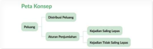

> **Deskripsi Visual:** Gambar ini adalah diagram yang menunjukkan peta konsep tentang peluang dan perilaku. Diagram ini terdiri dari beberapa elemen utama:

1. **Pertanyaan**: Ini adalah pertanyaan utama yang muncul di awal diagram.
2. **Diberitahu oleh Peluang**: Ini adalah sub-pertanyaan yang menggambarkan bagaimana informasi tentang peluang diberitahu kepada seseorang.
3. **Aturan Perpajakan**: Ini adalah sub-pertanyaan yang menggambarkan aturan perpajakan yang berlaku.
4. **Kajian Jaringan Saling Lepas**: Ini adalah sub-pertanyaan yang menggambarkan hubungan antara peluang dan perilaku.

Elemen-elemen ini terhubung melalui relasi "diberitahu oleh" dan "menggambarkan", menunjukkan hubungan antara pertanyaan utama dan sub-pertanyaan.

Teks penting yang terlihat dalam diagram ini adalah "Pertanyaan", "Diberitahu oleh Peluang", "Aturan Perpajakan", dan "Kajian Jaringan Saling Lepas". Informasi kunci yang dapat diambil pembaca adalah bahwa diagram ini menunjukkan hubungan antara peluang, perilaku, dan aturan perpajakan, serta bagaimana informasi tentang peluang tersebut diberitahu kepada seseorang.

Secara keseluruhan, gambar ini menunjukkan struktur dan hubungan antara peluang, perilaku, dan aturan perpajakan dalam konteks pelajaran.

Peta konsep yang terdapat pada awal bab merupakan diagram yang menunjukkan hubungan antarkonsep yang terdapat dalam setiap bab. Kalian perlu mencermati peta konsep ini untuk mendapatkan gambaran yang luas tentang isi bab tersebut.

### Pengalaman Pembelajaran

---
**🖼️ Gambar/Diagram**

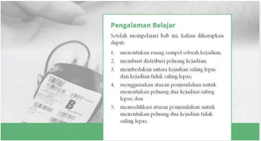

> **Deskripsi Visual:** Gambar ini adalah ilustrasi yang menunjukkan proses pengelolaan belajar dalam sebuah sekolah. Gambar ini terdiri dari beberapa elemen utama:

1. **Pengelolaan Belajar**: Judul utama yang menjelaskan topik yang akan dibahas.

2. **Siswa**: Siswa yang sedang memegang buku pelajaran, menunjukkan bahwa materi belajar ini relevan dengan siswa.

3. **Buku Pelajaran**: Buku yang diperlihatkan oleh siswa, menunjukkan bahwa buku pelajaran adalah sumber utama untuk belajar.

4. **Kunci Jawaban**: Kunci jawaban yang terletak di bagian bawah buku pelajaran, menunjukkan bahwa kunci jawaban adalah alat yang digunakan untuk menguji pemahaman siswa.

5. **Teks**: Teks yang menjelaskan proses pengelolaan belajar, termasuk metode-metode yang digunakan seperti mengecek tugas, mendiskusikan tugas, memberikan poin, dan memberikan kritik.

6. **Angka**: Angka-angka yang mungkin menunjukkan skor atau poin yang diberikan kepada siswa setelah menyelesaikan tugas.

7. **Label Penting**: Label yang menunjukkan bagian-bagian buku pelajaran seperti judul, teks, dan kunci jawaban.

Informasi kunci yang dapat diambil pembaca adalah bahwa buku pelajaran adalah sumber utama untuk belajar, kunci jawaban adalah alat untuk menguji pemahaman siswa, dan proses pengelolaan belajar melibatkan berbagai metode seperti mengecek tugas, mendiskusikan tugas, memberikan poin, dan memberikan kritik.

Terdapat  pada  awal  bab  yang  menjadi  arahan  tercapainya  kompetensi  setelah mempelajari bab tersebut.  Pengalaman belajar  menolong kalian untuk memonitor perkembangan belajar  kalian  dalam  bab  tersebut  yang  akan  dihubungkan  dengan refleksi pada akhir pembahasan.

 

---
## 📄 Halaman 12

### Ayo Bereksplorasi

Kalian melakukan kegiatan ini untuk menyelidiki konsep matematika yang berkaitan dengan pembahasan materi. Eksplorasi selalu dilakukan sebelum kalian mendalami konsep matematika beserta aplikasinya.

### Ayo Berpikir Kritis

Kalian  berpikir  kritis  jika  kalian  dapat  menganalisis  informasi  untuk  mengambil kesimpulan atau menilai suatu hal dengan tepat. Keterampilan ini perlu kalian latih terus-menerus karena merupakan salah satu dari keterampilan abad ke-21.

### Ayo Berpikir Kreatif

Kalian berpikir kreatif jika kalian dapat membuat ide atau alternatif solusi yang baru yang berbeda dari hal umum.

### Ayo Mencoba

Kalian  diharapkan  dapat  mengerjakan  soal  atau  kegiatan  sejenis  setelah  diberikan penjelasan penyelesaian satu atau lebih dari satu soal.

### Penguatan Karakter

Kalian  diharapkan  dapat  menghayati  dan  menerapkan  karakter-karakter  profil Pancasila  yang  perlu  dipupuk  sepanjang  hayat  dalam  kegiatan  pembelajaran  serta kehidupan sehari-hari.

 

---
## 📄 Halaman 13

### Ayo Berkomunikasi

Bertukar pikiran dengan teman-teman dan menyatakan gagasan merupakan kegiatan yang bermanfaat untuk memperdalam pengetahuan sehingga dapat menyelesaikan masalah atau menjawab pertanyaan.

### Petunjuk

Petunjuk untuk kalian gunakan dalam pemecahan masalah. Baca dan gunakan bagian ini jika kalian mengalami kendala saat mencari solusi dari sebuah masalah.

### Tahukah Kalian?

Kalian mendapatkan informasi tambahan yang berkaitan dengan materi yang sedang kalian  pelajari  yang  merupakan  aplikasi  matematika  dalam  suatu  fenomena  atau peristiwa.

### Ayo Berefleksi

Merenungkan dan melihat kembali secara evaluatif dan mendalam apa yang sudah dipelajari, membandingkannya, dan menarik pelajaran atau kesimpulan sederhana.

### Ayo Mengingat Kembali

Apa yang telah kalian pelajari di kelas X berhubungan dengan apa yang akan kalian pelajari di kelas XI. Kalian akan lebih mudah memahami materi pelajaran kelas XI dengan pengetahuan yang telah dipelajari di kelas X.

 

---
## 📄 Halaman 14

### Ayo Bekerja Sama

Bekerja sama merupakan salah satu bentuk dari bergotong royong. Kalian bekerja sama untuk menyelesaikan masalah atau menjawab pertanyaan matematika sehingga pemahaman kalian terhadap materi pelajaran lebih baik lagi. Selain itu, bekerja sama memerlukan saling memahami dan menghargai satu sama lain.

### Ayo Berteknologi

Teknologi  memudahkan  kalian  untuk  menyelesaikan  masalah  atau  pekerjaan matematika.  Kalian  dapat  memanfaatkan  kalkulator  dan  berbagai  aplikasi  untuk mengerjakan tugas kalian. Kalian memilih teknologi yang sesuai dengan kebutuhan kalian.

### Contoh Soal

---
**🖼️ Gambar/Diagram**

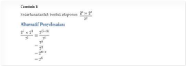

> **Deskripsi Visual:** Gambar ini adalah diagram yang menunjukkan hubungan antara dua variabel, yaitu variabel x dan variabel y. Diagram ini menggunakan garis lurus untuk menggambarkan hubungan antara kedua variabel tersebut. Variabel x dinyatakan dengan angka-angka di sepanjang sumbu-x, sedangkan variabel y dinyatakan dengan angka-angka di sepanjang sumbu-y. Garis lurus yang dibentuk oleh kedua variabel tersebut menunjukkan bahwa ada hubungan linear antara kedua variabel tersebut. Label penting yang terlihat pada gambar ini adalah sumbu-x dan sumbu-y, serta garis lurus yang menghubungkan kedua variabel tersebut. Informasi kunci yang dapat diambil pembaca adalah bahwa ada hubungan linear antara variabel x dan variabel y, dan bahwa garis lurus tersebut menunjukkan bahwa semakin besar nilai x, maka nilai y juga akan semakin besar.

Bagian ini diberikan untuk membantu pemahaman kalian atas konsep yang dipelajari. Perhatikan  contoh  soal  dan  kaitkan  dengan  penjelasan  sebelumnya  agar  kalian merasakan manfaat bagian tersebut.

### Latihan

 

---
## 📄 Halaman 15

Kalian  mengerjakan  soal-soal  dengan  tiga  jenis  tingkat  kesulitan,  yaitu  dasar, menengah,  dan  tinggi.  Pertanyaan  pada  tingkat  dasar  berupa  jawaban  pendek yang  menguji  pemahaman  konsep  dan  keterampilan  dasar.  Tingkat  menengah berupa  permasalahan  yang  lebih  terstruktur,  sedangkan  tingkat  tinggi  merupakan permasalahan aplikasi dan keterampilan aras tinggi (HOTS).

### Uji Kompetensi

---
**🖼️ Gambar/Diagram**

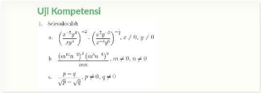

> **Deskripsi Visual:** Gambar ini adalah ilustrasi yang menunjukkan dua jenis kompetensi matematika yang disajikan dalam buku pelajaran. Kompetensi pertama, yang diberi label "UJU Kompetensi", terdiri dari dua bagian utama: a) dan b). Bagian a) mengandung rumus matematika yang melibatkan operasi penjumlahan dan pengurangan, serta perbandingan dengan variabel x dan y. Bagian b) juga berisi rumus matematika yang melibatkan operasi penjumlahan dan pengurangan, serta perbandingan dengan variabel x dan y. Untuk kedua bagian tersebut, ada teks yang memberikan penjelasan tentang operasi dan perbandingan yang dilakukan. Label penting yang terlihat pada gambar ini adalah "UJU Kompetensi" untuk menunjukkan jenis kompetensi yang disajikan. Informasi kunci yang dapat diambil pembaca adalah bahwa gambar ini menunjukkan dua jenis kompetensi matematika yang disajikan dalam buku pelajaran, serta rumus matematika yang digunakan dalam setiap kompetensi tersebut.

Terdapat pada akhir bab, merupakan sarana bagi kalian untuk mengukur pencapaian kalian  dalam  topik  bab.  Kalian  dapat  mengerjakan  sejumlah  soal  yang  bervariasi dari yang sederhana hingga yang kompleks. Selain itu, soal dapat berupa hitungan ataupun pemahaman konsep.

### Materi Pengayaan/Proyek

Kegiatan yang dapat digunakan untuk memperluas atau memperdalam wawasan dan pemahaman atas konsep matematika yang sedang dipelajari. Materi pengayaan dapat bersifat sebagai pendalaman materi, penerapan dalam bidang teknologi/informatika, atau kegiatan eksplorasi/proyek.

 

---
## 📄 Halaman 16

### Refleksi

---
**🖼️ Gambar/Diagram**

> **Deskripsi Visual:** Gambar ini adalah diagram yang menunjukkan struktur dan fungsi dari sistem refleksi dalam otak manusia. Diagram ini terdiri dari beberapa elemen utama yang saling terkait:

1. **Struktur Refleksi**: Gambar menggambarkan bagaimana refleksi berlangsung di otak manusia. Ini melibatkan beberapa komponen utama seperti retina, lensa, dan retina lainnya.

2. **Relasi Antara Komponen**: Terdapat hubungan yang jelas antara setiap komponen refleksi. Misalnya, lensa berfungsi untuk memantulkan cahaya ke retina, sedangkan retina lainnya menerima dan memproses gambar tersebut.

3. **Teks dan Angka Penting**: Teks pada gambar memberikan penjelasan tentang fungsi setiap komponen. Misalnya, "Retina" diberikan label untuk menunjukkan bahwa itu adalah bagian utama dari sistem refleksi.

4. **Informasi Kunci**: Gambar ini memberikan pemahaman umum tentang bagaimana sistem refleksi bekerja dalam otak manusia. Ini membantu pembaca memahami proses refleksi secara visual dan memperjelas konsep yang mungkin sulit dipahami dengan teks saja.

Dengan demikian, gambar ini merupakan alat yang efektif untuk membantu pembaca memahami konsep refleksi dalam otak manusia, dengan menjelaskan struktur dan fungsi setiap komponen secara visual.

Pada akhir bab atau subbab, kalian akan diajak memikirkan kembali apa yang sudah dipelajari dan seberapa dalam/tepat pemahamanmu atas pembelajaran pada bagian tersebut.

 

---
## 📄 Halaman 17

Kementerian Pendidikan, Kebudayaan, Riset, dan Teknologi Republik Indonesia, 2021

### Matematika untuk SMA/SMK Kelas XI

Penulis: Dicky Susanto, dkk.

ISBN: 978-602-244-789-5 (jil.2)

Bab

1

### Komposisi Fungsi dan Fungsi Invers

### Tujuan Pembelajaran

Setelah  mempelajari  bab  ini,  diharapkan  kalian dapat

- Menjelaskan pengertian fungsi
- Menentukan  domain,  kodomain,  dan range dari suatu fungsi
- Menjelaskan  syarat dan  aturan komposisi fungsi
- Membuat komposisi fungsi yang terdiri atas dua atau lebih fungsi
- Menggunakan konsep komposisi fungsi untuk menyelesaikan masalah
- Menyelidiki sifat komutatif dan sifat asosiatif pada komposisi fungsi
- Menjelaskan  syarat  dan  aturan  pembuatan fungsi invers
- Menggunakan  konsep  fungsi invers untuk menyelesaikan masalah
Bab 1

| Komposisi Fungsi dan Fungsi Invers

1

 

---
## 📄 Halaman 18

### Pengantar Bab

Setiap dari kalian pasti pernah ke Stasiun Pengisian Bahan Bakar Umum (SPBU). Kalian  pasti  paham  bahwa  biaya  yang  dibayar  untuk  pembelian  bahan  bakar kendaraan bergantung pada jenis bahan bakar dan volumenya.

Bagaimana hubungan antara volume bahan bakar yang dibeli dan biaya yang dikeluarkan? Apakah penambahan volume  bahan  bakar  berbanding  lurus dengan  biaya?  Dapatkah  relasi  antara biaya dengan volume bahan bakar dituliskan sebagai B = f ( V ) ? V menyatakan  volume  bahan  bakar  yang dibeli dan B merupakan  biaya  yang dibayar.

Grafik di bawah menunjukkan hubungan jarak tempuh suatu kendaraan terhadap penggunaan bahan bakar.  Apakah  penambahan  penggunaan  volume  bahan  bakar berbanding  lurus  dengan  jarak  tempuh  kendaraan?  Bagaimana  menuliskan  relasi antara keduanya?

Dapatkah kalian menyatakan semua volume bahan bakar yang dapat ditampung sebuah  kendaraan  sebagai  suatu  himpunan?  Dapatkah  kalian  menyatakan  semua jarak maksimal yang dapat ditempuh untuk setiap volume bahan bakar sebagai suatu

 

---
## 📄 Halaman 19

himpunan? Konsep seperti ini akan kalian pelajari dalam topik domain, kodomain, dan range dari fungsi.

Jika kalian menggabungkan kedua informasi di atas, relasi baru apa yang kalian dapatkan?  Hal  ini  yang  akan  dipelajari  lebih  mendalam  dalam  subbab  komposisi fungsi. Kalian juga akan mempelajari operasi-operasi yang dapat diterapkan pada dua atau lebih fungsi.

Kembali  ke  relasi  biaya  terhadap  pembelian  bahan  bakar,  bagaimana  kalian menentukan banyak bahan bakar yang dibeli jika kalian mempunyai sejumlah uang tertentu? Bagaimana kalian dapat menentukan jarak tempuh jika kendaraan kalian mempunyai volume bahan bakar tertentu? Hubungan timbal balik ini akan dipelajari dalam fungsi invers .

Secara  umum,  bab  dimulai  dengan  pemahaman  tentang  pengertian  fungsi termasuk  di  dalamnya  domain,  kodomain,  dan range .  Bagian  kedua  dari  bab  ini akan membahas tentang komposisi fungsi serta operasi-operasi fungsi yang lain yang sering digunakan dalam kehidupan sehari-hari. Di sini juga akan dibahas syarat yang harus dipenuhi untuk mengomposisikan dua atau lebih fungsi. Pada bagian akhir dari bab kalian akan mempelajari invers dari suatu fungsi beserta syarat dan sifat-sifatnya; termasuk di dalamnya invers dari komposisi fungsi.

### Pertanyaan Pemantik

- Apakah setiap relasi merupakan fungsi?
- Apa peran domain, kodomain, dan range dari sebuah fungsi?
- Bagaimana menerapkan operasi dan komposisi fungsi untuk memodelkan suatu keadaan atau masalah?
- Kapan fungsi invers dapat diperoleh?
- Bagaimana menggunakan fungsi invers untuk memodelkan suatu keadaan atau masalah?

### Kata Kunci

Fungsi, domain, kodomain, range , relasi, komposisi fungsi, fungsi invers

 

---
## 📄 Halaman 20

### Peta Konsep

---
**🖼️ Gambar/Diagram**

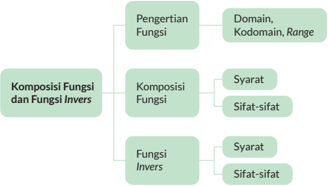

> **Deskripsi Visual:** Gambar ini adalah diagram yang menunjukkan struktur dan komposisi fungsi serta fungsi invers dalam matematika. Diagram ini dibagi menjadi tiga bagian utama: Pengertian Fungsi, Komposisi Fungsi dan Fungsi Invers.

Pada bagian pertama, "Pengertian Fungsi", terdapat dua subbagian: Domain, Kodomain, dan Range. Ini menunjukkan bahwa fungsi terdiri dari domain (input), kodomain (output), dan range (hasil).

Bagian kedua, "Komposisi Fungsi", mencakup dua subbagian: Syarat dan Sifat-sifat. Syarat ini mungkin merujuk pada kondisi-kondisi tertentu yang harus dipenuhi untuk menggabungkan dua fungsi, sementara sifat-sifat ini mungkin merujuk pada karakteristik-fisikal dari hasil komposisi.

Bagian ketiga, "Fungsi Invers", juga memiliki dua subbagian: Syarat dan Sifat-sifat. Syarat ini mungkin merujuk pada kondisi-kondisi tertentu yang harus dipenuhi untuk mendapatkan invers suatu fungsi, sementara sifat-sifat ini mungkin merujuk pada karakteristik-fisikal dari invers tersebut.

Dalam diagram ini, teks, angka, atau label penting yang terlihat adalah nama-nama fungsi dan konsep-konsep yang disebutkan dalam setiap subbagian. Informasi kunci yang dapat diambil pembaca melalui diagram ini adalah bahwa fungsi dan fungsi invers merupakan konsep matematika yang kompleks dan memiliki banyak sifat dan syarat tertentu.

### A.  Fungsi

Fungsi merupakan  suatu  relasi  yang  menghubungkan  satu  anggota  dari  suatu himpunan tepat ke satu anggota di himpunan yang lain. Fungsi adalah relasi yang lebih spesifik. Fungsi biasa dinyatakan dalam bentuk f ( x ) = y ,  di mana f merupakan fungsi, x merupakan  variabel  masukan  ( input )  dan y adalah  variabel  keluaran

Relasi dapat dipahami dalam banyak hal di kehidupan  sehari-hari.  Konsep  relasi  menjelaskan hubungan antara anggota-anggota dari dua himpunan. Contohnya, setiap pemain bola di tim Manchester United  memiliki  nomor  punggung masing-masing. Ronaldo memiliki nomor punggung 7.

Hubungan ini biasanya dijelaskan dalam bentuk  himpunan  pasangan  berurutan,  diagram panah, dan diagram Kartesius.

 

---
## 📄 Halaman 21

( output ). Kalian dapat memahami konsep ini dengan membayangkan fungsi sebagai mesin seperti pada gambar berikut:

Jelaslah, kalian dapat simpulkan bahwa ada relasi yang merupakan fungsi dan ada yang bukan merupakan fungsi.

### 1. Fungsi dan Bukan Fungsi

Secara ilustratif, hubungan antara fungsi dan relasi dapat dipahami melalui Gambar 1.5 dan Gambar 1.6.

Pada bagian ini, kalian akan belajar menentukan  relasi-relasi  yang  merupakan  fungsi dan  bukan  merupakan  fungsi.  Relasi-relasi  ini akan disajikan dalam bentuk diagram panah dan diagram Kartesius.

Perhatikan contoh ketiga diagram panah berikut. Ada yang menunjukkan relasi yang berupa fungsi dan ada yang menunjukkan bukan fungsi.

---
**🖼️ Gambar/Diagram**

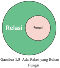

> **Deskripsi Visual:** Gambar 1.5a adalah sebuah diagram yang menunjukkan hubungan antara relasi dan fungsi. Gambar ini terdiri dari dua bagian utama: relasi yang berada di luar lingkaran hijau dan fungsi yang berada di dalam lingkaran hijau. Lingkaran hijau menggambarkan bahwa relasi dan fungsi saling terkait dan saling mempengaruhi. Dalam diagram ini, relasi merupakan konsep dasar yang melibatkan dua atau lebih variabel, sedangkan fungsi adalah hubungan yang menghubungkan setiap elemen dari domain ke satu elemen dari kodomain. Jadi, jika kita melihat diagram ini secara keseluruhan, kita bisa melihat bahwa relasi dan fungsi saling terkait dan saling mempengaruhi.

---
**🖼️ Gambar/Diagram**

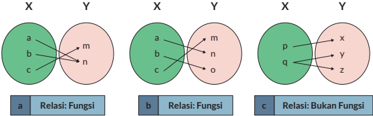

> **Deskripsi Visual:** Gambar ini adalah ilustrasi yang menunjukkan tiga jenis relasi dalam matematika, yaitu fungsi, bukan fungsi, dan relasi yang tidak memenuhi kedua kondisi tersebut. Setiap ilustrasi menggambarkan dua set elemen, X dan Y, dengan relasi antara mereka.

Ilustrasi pertama menunjukkan relasi fungsi, di mana setiap elemen dalam X memiliki dan hanya memiliki satu elemen dalam Y yang terkait dengannya. Ini dikenal sebagai relasi fungsi karena setiap elemen dalam X memiliki satu dan hanya satu elemen dalam Y yang terkait dengannya.

Ilustrasi kedua menunjukkan relasi bukan fungsi, di mana setiap elemen dalam X memiliki lebih dari satu elemen dalam Y yang terkait dengannya. Ini berbeda dari relasi fungsi karena setiap elemen dalam X memiliki lebih dari satu elemen dalam Y yang terkait dengannya.

Ilustrasi ketiga menunjukkan relasi yang tidak memenuhi kedua kondisi tersebut, di mana setiap elemen dalam X memiliki dan hanya memiliki satu elemen dalam Y yang terkait dengannya, tetapi juga memiliki lebih dari satu elemen dalam Y yang terkait dengannya. Ini merupakan kombinasi dari relasi fungsi dan bukan fungsi, yang berarti bahwa relasi ini tidak memenuhi kedua kondisi tersebut.

Teks, angka, atau label penting yang terlihat dalam gambar ini meliputi nama-nama elemen dalam X dan Y, serta label relasi yang digunakan untuk menggambarkan jenis relasi tersebut. Informasi kunci yang dapat diambil pembaca meliputi konsep dasar tentang relasi fungsi dan bukan fungsi dalam matematika.

 

---
## 📄 Halaman 22

Relasi yang terdapat pada Gambar 1.6 (a) dan (b) merupakan fungsi karena relasi tersebut menghubungkan satu anggota himpunan input dengan tepat satu anggota himpunan output . Gambar  1.6  (c) merupakan  contoh  relasi  yang bukan fungsi karena relasi tersebut menghubungkan satu anggota; ' q ' ke dua anggota berbeda ' y ' dan 'z' .

Diskusikan  dalam  kelompok,  apakah  kedua  relasi  dalam  diagram  Kartesius  ini merupakan fungsi atau bukan fungsi.

Tuliskan juga pasangan berurutan dari setiap titik.

 

---
## 📄 Halaman 23

Hubungan antara pemakaian bahan bakar dengan jarak tempuh dipengaruhi oleh beberapa hal seperti kepadatan lalu lintas, jalan mulus, dan jenis mobil. Pernahkah  kalian  memikirkan  bahwa  model  fungsi  sangat  diperlukan  untuk membuat  hubungan  antara  pemakaian  bahan  bakar  dengan  jarak  tempuh sebuah mobil?

Seperti yang kalian sudah ketahui, relasi sering juga ditampilkan dalam bentuk grafik. Kalian dapat menentukan apakah relasi semacam ini merupakan fungsi atau bukan  dengan  menggunakan Tes  garis  vertikal . Caranya  yaitu  cukup  menggeser garis vertikal dari kiri ke kanan (atau sebaliknya) dan melewati grafik relasi. Apabila garis vertikal tersebut memotong grafik di dua atau lebih titik yang berbeda, maka relasi tersebut bukanlah fungsi.

### Gambar A

---
**🖼️ Gambar/Diagram**

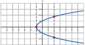

> **Deskripsi Visual:** Gambar ini adalah sebuah diagram yang menunjukkan hubungan antara dua variabel, yaitu variabel x dan variabel y. Diagram ini menggunakan garis lurus untuk menggambarkan hubungan antara kedua variabel tersebut. Variabel x dinyatakan pada sumbu horizontal (horizontal axis) dan variabel y dinyatakan pada sumbu vertikal (vertical axis). Garis lurus yang digunakan dalam diagram ini menunjukkan bahwa ada hubungan linear antara kedua variabel tersebut. Selain itu, pada diagram ini juga terdapat beberapa titik yang menunjukkan nilai-nilai spesifik dari kedua variabel tersebut. Informasi kunci yang dapat diambil pembaca dari gambar ini adalah bahwa ada hubungan linear antara variabel x dan variabel y, dan nilai-nilai spesifik dari kedua variabel tersebut.

### Gambar B

---
**🖼️ Gambar/Diagram**

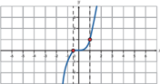

> **Deskripsi Visual:** Gambar ini adalah sebuah diagram yang menunjukkan hubungan antara dua variabel, yaitu variabel x dan y. Diagram ini menggunakan garis lurus untuk menggambarkan hubungan antara kedua variabel tersebut. Variabel x dinyatakan pada sumbu horizontal (horizontal axis) dan variabel y dinyatakan pada sumbu vertikal (vertical axis). Garis lurus yang digunakan dalam diagram ini menunjukkan bahwa ada hubungan positif antara kedua variabel tersebut, yaitu semakin besar nilai x, maka nilai y juga semakin besar. Label "x" dan "y" diletakkan di sisi sumbu masing-masing, sedangkan titik-titik pada garis lurus menunjukkan beberapa pasangan nilai x dan y yang telah dihitung. Informasi kunci yang dapat diambil pembaca adalah bahwa ada hubungan positif antara kedua variabel tersebut, dan nilai-nilai tersebut dapat dihitung dengan menggunakan garis lurus yang digunakan dalam diagram ini.

x

x

Gambar A menampilkan grafik dari relasi dengan persamaan x = y 2 . Dengan menggunakan  Tes  garis  vertikal,  dapat dilihat  bahwa  pada x = 2 garis  vertikal memotong  grafik  pada  dua  titik  yang berbeda. Relasi ini bukanlah suatu fungsi.

Gambar B menampilkan grafik dari relasi dengan persamaan y = x 3 . Dengan menggunakan  Tes  garis  vertikal,  dapat dilihat  bahwa  untuk  setiap  nilai x ,  garis vertikal memotong grafik tepat pada satu titik. Relasi ini adalah suatu fungsi.

 

---
## 📄 Halaman 24

- Apakah relasi-relasi di bawah ini merupakan fungsi? Jelaskan alasanmu.
- Relasi antara jumlah penjualan HP Galaksi seri A terhadap waktu.
- Relasi antara lama mengunggah video di YouTube terhadap waktu.
- Satuan energi adalah Joule dan kalori dengan 1 J = 2,4 kal. Apakah hubungan antara Joule dan kalori merupakan suatu fungsi? Jelaskan.

---
**🖼️ Gambar/Diagram**

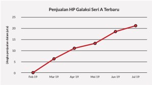

> **Deskripsi Visual:** Gambar ini adalah diagram yang menunjukkan penjualan HP Galaksi Seri A Terbaru dari Januari hingga Juni 2019. Diagram ini menggunakan warna merah untuk menunjukkan data penjualan. Di awal tahun 2019, penjualan HP ini sangat rendah dengan hanya sekitar 5 unit. Namun, seiring berjalannya waktu, penjualan meningkat signifikan. Pada bulan April 2019, penjualan mencapai 15 unit, kemudian naik lagi menjadi 20 unit pada bulan Mei 2019. Selanjutnya, penjualan melambung menjadi 25 unit pada bulan Juni 2019. Ini menunjukkan bahwa penjualan HP Galaksi Seri A Terbaru meningkat secara signifikan selama periode tersebut.

---
**🖼️ Gambar/Diagram**

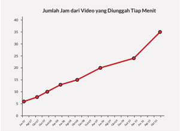

> **Deskripsi Visual:** Gambar ini adalah diagram yang menunjukkan jumlah jam dari video yang diunggah tiap menit. Diagram ini berbentuk garis lurus yang melambangkan hubungan antara waktu dan jumlah video yang diunggah. Garis ini mengarah ke kanan dan naik, menunjukkan bahwa jumlah video yang diunggah meningkat seiring berjalannya waktu. Di bagian atas, terdapat judul "Jumlah Jam dari Video yang Diunggah Tiap Menit". Di bagian bawah, terdapat skala waktu yang menunjukkan periode waktu dari Januari hingga Desember. Skala ini berbentuk lingkaran dengan angka-angka yang menunjukkan jumlah jam. Garis putih pada diagram ini menunjukkan titik-titik data yang diberikan oleh pengumpulan data. Dari diagram ini, kita dapat mengambil informasi bahwa jumlah video yang diunggah meningkat seiring berjalannya waktu.

Sumber: tubularinsights.com (2010)

 

---
## 📄 Halaman 25

- Berdasarkan data, pada tahun 2001 perusahaan A mampu menjual 9 laptop. Pada tahun 2002 dan 2003 perusahaan A mampu menjual masing-masing 27 dan 81 laptop.  Apabila  relasi  antara  tahun  dan  jumlah  penjualan  laptop  membentuk fungsi eksponensial, berapa penjualan laptop pada tahun 2007?
- Tentukan relasi mana dari grafik-grafik berikut yang merupakan fungsi (gunakan tes garis vertikal).

---
**🖼️ Gambar/Diagram**

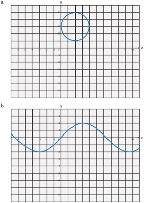

> **Deskripsi Visual:** Gambar ini adalah ilustrasi yang menunjukkan dua jenis grafik: a) sebuah lingkaran dan b) sebuah gelombang sinus. Lingkaran diletakkan di atas grid dengan titik-titik merah yang menunjukkan koordinat x dan y. Gelombang sinus berada di bawah grid dengan garis-garis merah yang menunjukkan periode dan amplitude gelombang. Grafik ini mungkin digunakan untuk menggambarkan hubungan antara variabel x dan y dalam konteks matematika atau fisika.

 

---
## 📄 Halaman 26

---
**🖼️ Gambar/Diagram**

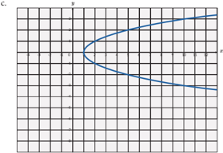

> **Deskripsi Visual:** Gambar ini adalah sebuah diagram yang menunjukkan hubungan antara dua variabel, yaitu x dan y. Diagram ini berupa garis lurus yang melambangkan hubungan antara kedua variabel tersebut. Garis ini menghubungkan titik-titik pada grid yang terdiri dari banyak kotak kecil. Titik-titik ini menunjukkan nilai-nilai dari variabel x dan y. Garis ini tampaknya menunjukkan bahwa ada hubungan linear antara kedua variabel tersebut, dengan garis melambangkan bahwa semakin besar nilai x, maka nilai y juga semakin besar. Namun, tidak ada informasi spesifik lain yang ditampilkan dalam gambar ini, seperti teks, angka, atau label tambahan.

Relasi yang bukan fungsi dapat dibuat menjadi fungsi. Setujukah kalian dengan pendapat ini? Bagaimana kalian melakukan hal tersebut? Gunakan salah satu contoh  soal  dalam  Latihan  1.1  no.  4  untuk  mengubah  relasi  bukan  fungsi menjadi fungsi.

### 2.  Domain, Kodomain, dan Range

Eksplorasi

1.1

Domain, Kodomain, dan Range

Kalian sudah belajar domain, kodomain, dan range di  SMP .  Kalian  memperdalam pemahaman  ini  dengan  mengeksplorasi  tiga  masalah.  Ketiga  masalah  tersebut dibuat berurutan agar kalian memperoleh pemahaman yang benar tentang domain, kodomain, dan range .

### Masalah Pertama

Data kecepatan seorang pelari jarak pendek ( sprinter )  setiap  detik  dicatat  dan ditampilkan dalam grafik berikut:

 

---
## 📄 Halaman 27

### Pertanyaan

- Buatlah tabel untuk grafik tersebut.
- Nyatakan waktu (masukan) yang dicatat dalam notasi himpunan.
- Nyatakan kecepatan (keluaran) yang dicatat dalam notasi himpunan.

### Masalah Kedua

---
**🖼️ Gambar/Diagram**

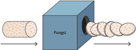

> **Deskripsi Visual:** Gambar ini adalah ilustrasi yang menunjukkan proses penyebaran jamur. Gambar ini menggambarkan jamur yang diletakkan di dalam sebuah alat yang disebut "Fungsi". Alat ini memiliki lubang di sisi depannya, dan jamur tersebut diletakkan di dalam lubang tersebut. Dari lubang tersebut, jamur tersebut dapat menyebar ke arah kanan dan kiri gambar. Ini menunjukkan bahwa jamur dapat menyebar melalui alat seperti ini.

Sebuah pabrik pembuatan keripik tempe memiliki mesin yang beroperasi dengan mengubah 1 potong tempe bulat menjadi 6 keripik tempe. Pembuatan tempe dapat saja  menghasilkan 1 2 potong  keripik  tempe  atau  bentuk  pecahan  lainnya.  Menurut aturan,  mesin  membuang  keripik  yang  tidak  utuh  ini  (tidak  lulus quality  control ) dan mengeluarkan keripik utuh. Mesin keripik tempe hanya beroperasi apabila ada

 

---
## 📄 Halaman 28

minimal 200 potong tempe yang dimasukkan dan berhenti beroperasi apabila lebih dari 600 potong tempe dimasukkan. Asumsikan mesin produksi keripik tempe adalah sebagai fungsi linear , lengkapi tabel produksi tempe berikut:

---
**📊 Tabel**

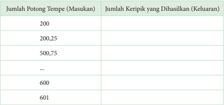

Tabel ini menunjukkan hubungan antara jumlah potongan tempe yang masuk ke mesin dan jumlah keripik yang dihasilkan. Topik utama tabel adalah hubungan antara input dan output dalam proses produksi keripik tempe. Kolom pertama berisi jumlah potongan tempe yang masuk ke mesin, sementara kolom kedua berisi jumlah keripik yang dihasilkan. Data penting yang terlihat adalah bahwa semakin banyak potongan tempe yang masuk ke mesin, semakin banyak juga keripik yang dihasilkan. Ini menunjukkan bahwa ada hubungan proporsional antara input dan output dalam proses produksi keripik tempe.

- Tuliskan notasi himpunan yang menyatakan masukan dari mesin fungsi keripik tempe. Himpunan ini disebut sebagai domain.
- Tuliskan  notasi  yang  menyatakan  semua  kemungkinan  keripik  tempe  yang dihasilkan. Himpunan ini disebut sebagai kodomain.
- Tuliskan notasi himpunan yang menyatakan keluaran dari mesin fungsi keripik tempe. Himpunan ini disebut sebagai range .
- Berdasarkan pertanyaan 3 dan 4, jelaskan hubungan antara kodomain dan range .
Penjelasan  lebih  lanjut  tentang  domain  dan range dapat  juga  kalian  pahami melalui contoh grafik di bawah ini. Perhatikan hubungan antara penggunaan bahan bakar dengan jarak tempuh mobil 'XY' pada jalan bebas hambatan yang diberikan oleh grafik.

 

---
## 📄 Halaman 29

---
**🖼️ Gambar/Diagram**

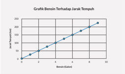

> **Deskripsi Visual:** Grafik ini menunjukkan hubungan antara jarak tempuh (km) dengan berat mobil (ton) dalam sebuah sistem transportasi. Grafik ini adalah diagram yang menggambarkan data dalam bentuk titik-titik yang kemudian dihubungkan oleh garis lurus. Titik-titik tersebut menunjukkan bahwa semakin berat mobil, semakin tinggi jarak tempuh yang dapat dilakukan. Ini menunjukkan bahwa ada korelasi positif antara berat mobil dan jarak tempuh. Label pada grafik mencakup nama variabel (berat mobil dan jarak tempuh), serta skala untuk kedua variabel tersebut. Informasi kunci yang dapat diambil dari grafik ini adalah bahwa mobil yang lebih berat akan memiliki jarak tempuh yang lebih besar dibandingkan mobil yang lebih ringan.

Jika x adalah jumlah bahan bakar dalam galon maka bahan bakar dapat dituliskan 0 ≤ x ≤ 9 .  Domain dari jumlah bahan bakar yang dinyatakan dalam himpunan adalah { x | 0 ≤ x ≤ 9 , x ∈ R }, dengan R merupakan himpunan bilangan riil. Domain ini dapat juga dituliskan dalam bentuk [0,9].

Jarak  tempuh  dituliskan  sebagai 0 ≤ y ≤ 250 . Range dari  jarak  tempuh adalah { y | 0 ≤ y ≤ 250 , y ∈ R }, dengan R merupakan himpunan bilangan bulat positif. Range dapat juga dituliskan dalam bentuk [0,250].

Jika  diberikan  grafik  maka  penentuan  domain  dan range dari  suatu  fungsi ditunjukkan masing-masing oleh nilai yang digunakan pada sumbu x dan sumbu y .

---
**🖼️ Gambar/Diagram**

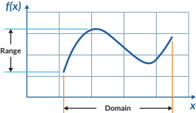

> **Deskripsi Visual:** Gambar ini adalah sebuah grafik yang menunjukkan fungsi f(x). Grafik ini menampilkan domain (sejarah) dan range (kemampuan) dari fungsi tersebut. Domain dinyatakan oleh garis vertikal yang melambangkan seluruh nilai x yang bisa dimasukkan ke dalam fungsi tersebut. Range dinyatakan oleh garis horizontal yang menunjukkan seluruh nilai y yang bisa diperoleh dari fungsi tersebut. Grafik ini menunjukkan bahwa fungsi ini memiliki nilai maksimum dan minimum tertentu, serta pola yang berulang sepanjang domainnya. Label "x" menunjukkan indeks variabel dalam fungsi, sedangkan label "Range" dan "Domain" menunjukkan kemampuan dan domain dari fungsi tersebut. Informasi kunci yang dapat diambil pembaca adalah bahwa fungsi ini memiliki pola periodik dan memiliki nilai maksimum dan minimum tertentu.

Jelaskan  pengertian  domain  dan range fungsi  dengan  menggunakan  katakatamu sendiri.

 

---
## 📄 Halaman 30

Pengertian domain, kodomain, dan range dapat dilihat secara utuh dalam gambar di bawah ini.

Kalian  sudah  memahami  penggunaan  domain,  kodomain,  dan range dalam kehidupan  sehari-hari.  Berikan  contoh  lain  dalam  kehidupan  nyata  yang membedakan pengertian kodomain dan range .

### Masalah Ketiga

Bagaimana  menentukan  domain,  kodomain,  dan range dari  suatu  fungsi  jika diberikan dalam bentuk aljabar?

### a. Perhatikan kedua grafik di bawah ini.

Tuliskan domain dan range dari kedua grafik dalam notasi himpunan.

 

---
## 📄 Halaman 31

b.

### Ayo Berteknologi

Gunakan Microsoft Excel atau Geogebra untuk menggambar f ( x ) = x 2 -1 x , dan tentukan domain dan rangenya.

1.

### Ayo Berteknologi

Gunakan Geogebra untuk menggambar  fungsi-fungsi di bawah ini jika memungkinkan. Gambarkan dan tentukan domain dan range dari fungsi-fungsi berikut:

- f ( x ) = x 2 -1
- f ( x ) = x +1 2 -x
- f ( x ) = √ x -3 + 4
- Tentukan domain dan range dari setiap fungsi di bawah ini.
a.

---
**🖼️ Gambar/Diagram**

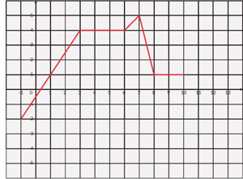

> **Deskripsi Visual:** Gambar ini adalah sebuah diagram yang menunjukkan perubahan suhu dalam suatu sistem selama beberapa waktu. Diagram ini terdiri dari garis merah yang melambangkan perubahan suhu seiring waktu. Garis ini memulai dari titik awal pada suhu rendah, naik ke puncak saat suhu mencapai nilai tertinggi, kemudian turun ke suhu rendah lagi setelah mencapai puncak. Garis ini membentuk tiga bagian yang berbeda, masing-masing menunjukkan periode peningkatan, puncak, dan penurunan suhu.

Elemen utama yang ditampilkan adalah garis merah yang menggambarkan perubahan suhu. Garis ini memiliki titik awal, puncak, dan akhir yang menunjukkan perubahan suhu secara keseluruhan. Garis ini juga memiliki titik-titik di mana perubahan suhu mencapai nilai tertinggi dan terendah.

Teks, angka, atau label penting yang terlihat dalam diagram ini adalah garis merah yang menggambarkan perubahan suhu. Garis ini memiliki titik-titik di mana perubahan suhu mencapai nilai tertinggi dan terendah. Garis ini juga memiliki titik-titik di mana perubahan suhu mencapai nilai tertinggi dan terendah.

Informasi kunci yang dapat diambil pembaca dari diagram ini adalah bahwa ada perubahan suhu yang terjadi selama periode waktu yang ditunjukkan dalam diagram ini. Garis merah menunjukkan bahwa suhu awalnya rendah, kemudian naik ke puncak saat suhu mencapai nilai tertinggi, kemudian turun ke suhu rendah lagi setelah mencapai puncak. Ini menunjukkan bahwa ada periode peningkatan, puncak, dan penurunan suhu dalam periode waktu yang ditunjukkan dalam diagram ini.

 

---
## 📄 Halaman 32

---
**🖼️ Gambar/Diagram**

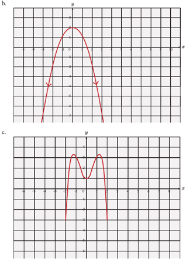

> **Deskripsi Visual:** Gambar ini adalah ilustrasi yang menunjukkan dua jenis grafik matematika berbeda. Grafik A adalah sebuah parabola yang melengkung ke atas dan memiliki titik puncak pada tengahnya. Grafik B adalah sebuah grafik yang memiliki tiga buah titik tertinggi dan tertinggi, yang menunjukkan bahwa grafik ini mungkin merupakan grafik dari fungsi kuadrat dengan dua akar.

Grafik A memiliki aspek horizontal dan vertikal yang sama, yang menunjukkan bahwa grafik ini mungkin merupakan grafik dari fungsi kuadrat. Titik puncak grafik ini menunjukkan bahwa grafik ini memiliki nilai maksimum pada titik tersebut.

Grafik B juga memiliki aspek horizontal dan vertikal yang sama, yang menunjukkan bahwa grafik ini mungkin merupakan grafik dari fungsi kuadrat. Titik-titik tertinggi dan tertinggi menunjukkan bahwa grafik ini memiliki nilai maksimum pada titik tersebut.

Teks, angka, atau label penting yang terlihat pada gambar ini adalah aspek horizontal dan vertikal, titik puncak, dan titik tertinggi dan tertinggi. Informasi kunci yang dapat diambil pembaca adalah bahwa grafik A dan B mungkin merupakan grafik dari fungsi kuadrat dengan dua akar.

- a. Berikan  contoh  suatu  situasi  atau  fungsi  dalam  kehidupan  sehari-hari di mana domain fungsi tidak dapat berharga negatif.
- Berikan  contoh  suatu  situasi  atau  fungsi  dalam  kehidupan  sehari-hari  di mana range tidak dapat berharga negatif.
- a. Tentukan fungsi yang menyatakan hubungan antara suhu dalam Celcius dan Kelvin.
- Tentukan juga domain dan range dari fungsi tersebut. Petunjuk: apakah ada suhu terendah dan tertinggi di alam semesta?

 

---
## 📄 Halaman 33

- (Depresiasi nilai laptop) Seorang YouTuber membeli sebuah laptop baru seharga Rp20.000.000,00. Jika harga jual laptop tersebut pada tahun ket turun  secara eksponensial dan dideskripsikan oleh fungsi berikut:

``

- Berapakah harga jual laptop tersebut pada tahun ke-5?
- Tentukan domain dan rangenya.
- Tekanan  udara  berkurang  jika  ketinggian  dari  permukaan  laut  bertambah sebagaimana  yang  ditunjukkan  oleh  grafik  di  bawah  ini.  Tekanan  udara dinyatakan dalam kiloPascal dan ketinggian di atas permukaan laut dinyatakan dalam kaki. Satu kaki = 0,3 m.

---
**🖼️ Gambar/Diagram**

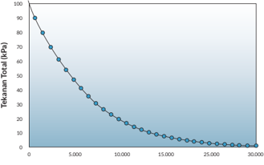

> **Deskripsi Visual:** Gambar ini adalah diagram yang menunjukkan grafik total Tekanan Total (kPa) melalui waktu (detik). Grafik ini berbentuk parabola yang turun, menunjukkan bahwa Tekanan Total mengalami penurunan seiring berjalannya waktu. Di awal, Tekanan Total mencapai nilai tertinggi sekitar 90 kPa, kemudian menurun secara lambat hingga mencapai nilai nol detik. Grafik ini menunjukkan bahwa Tekanan Total mengalami penurunan yang signifikan seiring berjalannya waktu, dengan penurunan yang lebih cepat pada awal dan lebih lambat pada akhir. Label x dan y pada grafik menunjukkan waktu (detik) dan Tekanan Total (kPa), masing-masing. Ini membantu pembaca untuk memahami hubungan antara waktu dan Tekanan Total.

Ketinggian (m)

- Tuliskan domain dan range dari fungsi ini.
- Apakah ada tekanan udara bernilai negatif?
- Grafik suhu terhadap ketinggian di atas permukaan laut diberikan di bawah ini. Suhu diberikan dalam derajat Fahrenheit dan ketinggian di atas permukaan laut dalam kaki.

 

---
## 📄 Halaman 34

---
**🖼️ Gambar/Diagram**

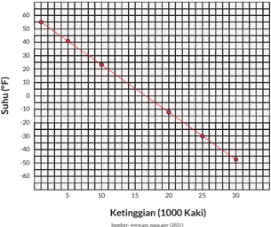

> **Deskripsi Visual:** Gambar ini adalah diagram yang menunjukkan hubungan antara suhu (dalam satuan Fahrenheit) dengan ketinggian (dalam satuan 1000 kaki). Diagram ini terdiri dari dua sumbu: satu untuk ketinggian (horizontal) dan satu untuk suhu (vertikal). Poin-poin pada diagram menunjukkan data suhu yang berbeda di berbagai ketinggian. Dari urutan data tersebut, kita dapat melihat bahwa suhu turun seiring kenaikan ketinggian. Ini menunjukkan bahwa suhu di atmosfer bumi biasanya turun dengan meningkatnya ketinggian. Label pada sumbu horizontal menunjukkan ketinggian dalam satuan 1000 kaki, sedangkan label pada sumbu vertikal menunjukkan suhu dalam satuan Fahrenheit. Teks yang ada pada gambar menyatakan bahwa data ini diambil dari sumber www.ppp.pn.go.id (2021), yang menunjukkan bahwa informasi ini didapatkan dari sumber yang akurat dan dapat dipercaya.

- Tuliskan domain dan range dari fungsi ini.
- Apakah suhu dapat bernilai negatif?
Gunakan Geogebra untuk menyelesaikan tugas ini.

Gambarkan suatu fungsi dengan ketentuan sebagai berikut.

- Domain memenuhi 0 ≤ x ≤ 10 .
- Range memenuhi 3 ≤ y ≤ 23 .
- Titik (1,5) dan (4,11) memenuhi fungsi yang dimaksud.

### B.  Komposisi Fungsi

Sebelum belajar tentang komposisi fungsi secara mendalam, coba amati dan pahami cara menggabungkan dua fungsi dalam eksplorasi berikut.

 

---
## 📄 Halaman 35

### Perhatikan gambar di bawah ini.

---
**🖼️ Gambar/Diagram**

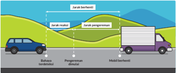

> **Deskripsi Visual:** Gambar ini adalah ilustrasi yang menunjukkan konsep tentang jarak teknis dan jarak pengemudi dalam konteks transportasi. Gambar ini terdiri dari beberapa elemen utama:

1. **Pertama**: Gambar ini menunjukkan dua jenis kendaraan: mobil pribadi (kuning) dan truk (ungu). Mobil pribadi diletakkan di sebelah kiri, sedangkan truk diletakkan di sebelah kanan.

2. **Elemen Utama dan Relasinya**: 
   - **Jarak Teknis**: Dapat dilihat sebagai garis lurus yang menghubungkan kedua kendaraan.
   - **Jarak Pengemudi**: Ini adalah jarak antara pengemudi mobil pribadi dan pengemudi truk. Jarak ini ditunjukkan dengan garis lurus yang menghubungkan kedua pengemudi.
   - **Bahasa Transportasi**: Ini menunjukkan bagaimana jarak teknis dan jarak pengemudi berhubungan dengan posisi kendaraan di jalan raya.

3. **Teks, Angka, atau Label Penting**:
   - Teks "Jarak Teknis" dan "Jarak Pengemudi" yang terdapat pada gambar untuk menjelaskan konsep yang ditunjukkan.
   - Angka tidak ada dalam gambar ini.

4. **Informasi Kunci yang Bisa Diambil Pembaca**:
   - Gambar ini membantu memahami hubungan antara jarak teknis dan jarak pengemudi dalam konteks transportasi.
   - Ini juga membantu dalam pemahaman tentang bagaimana posisi kendaraan di jalan raya mempengaruhi jarak antara pengemudi.

Dengan demikian, gambar ini memberikan gambaran visual tentang bagaimana jarak teknis dan jarak pengemudi berinteraksi dalam konteks transportasi, serta bagaimana posisi kendaraan di jalan raya mempengaruhi jarak antara pengemudi.

Seorang  sopir  sedang  mengendarai  mobil  melewati  sebuah  desa  kecil.  Ketika melihat  halangan  di  depan,  sopir  menginjak  rem  agar  mobil  berhenti.  Jarak  henti disebabkan  oleh  dua  hal.  Pertama,  jarak  akibat  waktu  yang  diperlukan  antara melihat halangan dan mengerem mobil (waktu reaksi). Kedua, jarak tempuh akibat pengereman.  Tabel  1.2  menunjukkan  jarak  henti  mobil  sesuai  dengan  kecepatan mobil.

---
**📊 Tabel**

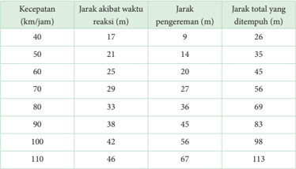

Tabel ini menunjukkan hubungan antara kecepatan kendaraan dengan jarak akibat waktu reaksi, jarak pengereman, dan jarak total yang ditempuh. Topik utama tabel adalah hubungan antara kecepatan kendaraan dengan jarak yang ditempuh. Kolom-kolom yang ada meliputi kecepatan (km/jam), jarak akibat waktu reaksi (m), jarak pengereman (m), dan jarak total yang ditempuh (m). Data atau pola penting yang terlihat adalah bahwa semakin tinggi kecepatan kendaraan, maka jarak akibat waktu reaksi, jarak pengereman, dan jarak total yang ditempuh semakin besar pula. Ini menunjukkan bahwa kecepatan kendaraan sangat berpengaruh pada jarak yang ditempuh.

Sumber: www.internationalclinicaltrials.com (2017)

 

---
## 📄 Halaman 36

### Gunakan teknologi untuk menjawab tugas Eksplorasi 1.2

Grafik a-c dapat digambar dengan menggunakan Microsoft Excel atau Geogebra atau secara manual.

- Gambarkan grafik jarak akibat waktu reaksi terhadap kecepatan.
- Gambarkan grafik jarak pengereman terhadap kecepatan.
- Gambarkan grafik jarak total terhadap kecepatan.
- Apakah hasil c sama dengan a+b? Tunjukkan dengan membandingkan nilai fungsi pada kecepatan yang sama.
- Tentukan domain dan range dari nomor d.

### 1. Penjumlahan dan Pengurangan Fungsi

Penjumlahan dua atau lebih fungsi dapat menghasilkan fungsi yang baru.  Perhatikan kedua grafik di bawah ini. Fungsi f ( x ) (berwarna hijau) dijumlahkan dengan fungsi g ( x ) (berwarna merah). Bagaimana dengan domain dan range dari fungsi yang baru?

---
**🖼️ Gambar/Diagram**

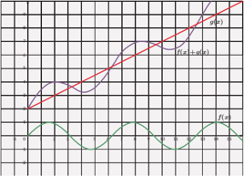

> **Deskripsi Visual:** Gambar ini adalah sebuah diagram yang menunjukkan grafik fungsi trigonometri. Diagram ini menggambarkan perubahan nilai fungsi f(x) = sin(πx/2) seiring dengan perubahan nilai x pada interval [0, 4]. Grafik ini terdiri dari dua bagian: bagian atas menunjukkan grafik fungsi f(x) = sin(πx/2), sedangkan bagian bawah menunjukkan grafik fungsi f(x + π/2) = sin(πx/2 + π/2).

Elemen-elemen utama dalam diagram ini adalah:
1. Garis merah yang menunjukkan grafik fungsi f(x) = sin(πx/2).
2. Garis biru yang menunjukkan grafik fungsi f(x + π/2) = sin(πx/2 + π/2).
3. Titik-titik pada garis-garis tersebut yang menunjukkan nilai-nilai fungsi pada beberapa titik tertentu.

Teks, angka, atau label penting yang terlihat dalam diagram ini meliputi:
1. Label x pada sumbu horizontal.
2. Label y pada sumbu vertikal.
3. Nilai-nilai x pada interval [0, 4].
4. Nilai-nilai y pada interval [-1, 1].

Informasi kunci yang dapat diambil pembaca dari gambar ini adalah bahwa fungsi f(x) = sin(πx/2) memiliki periode 4 dan nilai maksimum dan minimumnya adalah ±1. Fungsi f(x + π/2) = sin(πx/2 + π/2) adalah transformasi horisontal fungsi asli, yang berarti bahwa grafik fungsi ini akan bergerak ke kanan sejauh π/2 unit.

Apakah  dua  atau  lebih  fungsi  hanya  dapat  dijumlahkan  saja?  Apakah  fungsi juga  menyerupai  bilangan  yang  jika  ada  lebih  dari  satu  maka  dapat  dijumlahkan,

 

---
## 📄 Halaman 37

dikurangkan,  dikalikan,  dan  dibagi?  Apakah  operasi  fungsi  akan  memengaruhi domain dari fungsi baru yang dihasilkan?

Jika f ( x ) dan g ( x ) merupakan dua fungsi dengan domain masing-masing D f dan D g .  Maka  penjumlahan ( f + g ) ( x ) = f ( x ) + g ( x ) menghasilkan  fungsi  yang  baru dengan domain D f ∩ D g .

Jika f ( x ) dan g ( x ) merupakan dua fungsi dengan domain masing-masing D f dan D g .  Maka  pengurangan ( f -g )( x ) = f ( x ) -g ( x ) menghasilkan  fungsi  yang baru dengan domain D f ∩ D g .

Ayo Mencoba

Perhatikan  fungsi  pendapatan  dan  biaya  produksi  yang  diberikan  dalam  grafik  di bawah ini. Keduanya merupakan fungsi dari jumlah barang yang diproduksi.

- Kalian ingin mengetahui keuntungan yang diperoleh dari penjualan setiap barang.  Bagaimana  cara  menemukan  fungsi  keuntungan  jika  diketahui fungsi  pendapatan  dan  biaya  produksi?  (Petunjuk:  penjumlahan  atau pengurangan?)
- Buatlah  tabel  yang  menunjukkan  keuntungan  sebagai  fungsi  dari  jumlah barang. Tentukan juga domain dan range -nya!
- Buatlah grafik yang mewakili keuntungan sebagai fungsi dari jumlah barang!

 

---
## 📄 Halaman 38

Dua gelombang apa saja jika bertemu akan berpadu. Perpaduan dua gelombang atau lebih dapat dinyatakan dengan  penjumlahan  kedua  atau lebih fungsi sinus. Penjumlahan kedua fungsi sebenarnya adalah penjumlahan simpangan gelombang. Simpangan gelombang ditunjukkan oleh ketinggian gelombang dalam grafik.

---
**🖼️ Gambar/Diagram**

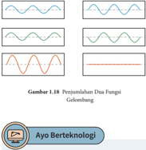

> **Deskripsi Visual:** Gambar 1.18 pada buku pelajaran ini menunjukkan dua fungsi gelombang dalam bentuk diagram. Gambar ini terdiri dari dua bagian yang berbeda, masing-masing menunjukkan fungsi gelombang berbeda. Bagian kiri menampilkan fungsi gelombang bergerak dari atas ke bawah (diposisi positif) dan kemudian turun ke bawah (diposisi negatif), sementara bagian kanan menunjukkan fungsi gelombang yang bergerak sebaliknya, dari bawah ke atas (diposisi negatif) dan kemudian naik ke atas (diposisi positif). Setiap fungsi gelombang memiliki garis yang bergerak melintang, yang menunjukkan periode gelombang. Teks "Gambar 1.18" dan "Penjelasan Dua Fungsi Gelombang" memberikan konteks bahwa gambar ini adalah penjelasan tentang dua fungsi gelombang. Label "Ayo Berteknologi" di bawah gambar menunjukkan bahwa ini adalah bagian dari materi pelajaran teknologi.

Penjumlahan  dua  fungsi  gelombang dapat menghasilkan gelombang baru dengan simpangan yang lebih besar atau simpangan lebih kecil bahkan simpangan nol.  Jika  ada  dua  pengeras  suara  dalam suatu  ruangan  maka  bunyi  bergantian terdengar keras dan lemah sesuai dengan posisi  pendengar  karena  penjumlahan dua fungsi gelombang.

Kode QR berikut ini berisi video yang mengilustrasikan penjumlahan grafik dua fungsi pada Gambar 1.18. https://youtu.be/JZaFl8yR1tc

### 2. Perkalian dan Pembagian Fungsi

Kalian telah melihat bahwa operasi penjumlahan dan pengurangan bisa diterapkan terhadap dua fungsi. Operasi ini bisa diperluas penerapannya untuk lebih dari dua fungsi. Sekarang, bagaimana dengan operasi perkalian dan pembagian dua atau lebih fungsi?

Jika f ( x ) dan g ( x ) merupakan dua fungsi dengan domain masing-masing D f dan D g .  Maka  perkalian ( f · g )( x ) = f ( x ) · g ( x ) menghasilkan  fungsi  yang  baru dengan domain D f ∩ D g .

 

---
## 📄 Halaman 39

Pembagian dua fungsi ( f g ) ( x ) = f ( x ) g ( x ) secara umum belum tentu menghasilkan fungsi. Supaya f g menjadi sebuah fungsi, pembagi g tidak boleh memiliki  nilai  0.  Dengan  kata  lain, f g adalah  fungsi  dengan  domain ( D f ∩ D g ) -{ x | g ( x ) = 0 } .

- Jika f ( x ) = √ x +3 dan g ( x ) = x +3
- Tentukan f ( x ) + g ( x ) .
- Tentukan domain dan range dari f ( x ) + g ( x ) .
- f ( x ) = x 2 +2 dan g ( x ) = 2 x -5
- Tentukan f ( x ) -g ( x ) .
- Tentukan domain dan range dari f ( x ) -g ( x ) .
- Buatlah suatu fungsi kuadrat dan fungsi eksponensial! Tentukan hasil penjumlahan dan pengurangan kedua fungsi tersebut!
- Dua fungsi, f ( x ) (berwarna merah) dan g ( x ) (berwarna biru) diberikan di bawah ini.

---
**🖼️ Gambar/Diagram**

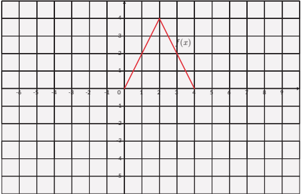

> **Deskripsi Visual:** Gambar ini adalah sebuah grafik yang menunjukkan fungsi f(x) pada sebuah interval. Grafik ini berupa sebuah segitiga yang melintang dari kiri atas ke kanan bawah. Titik awal fungsi terletak di titik (0, 0), sedangkan titik akhir terletak di titik (2, 4). Ini menunjukkan bahwa fungsi f(x) mencapai nilai maksimum 4 pada x = 2. Grafik ini mungkin digunakan untuk menggambarkan pergerakan suatu objek atau fenomena dalam matematika, seperti gerakan sepeda motor atau gerakan bola basket.

 

---
## 📄 Halaman 40

---
**🖼️ Gambar/Diagram**

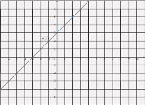

> **Deskripsi Visual:** Gambar ini adalah diagram, yang menunjukkan hubungan antara dua variabel, yaitu x dan y. Diagram ini berupa garis lurus yang melintasi grid, menunjukkan bahwa ada hubungan linear antara kedua variabel tersebut. Garis tersebut memiliki sudut tajam dengan sumbu x dan y, yang menunjukkan bahwa kedua variabel tersebut mempunyai hubungan positif. Di bagian atas diagram, terdapat label "x" dan "y", yang menunjukkan bahwa x dan y adalah variabel yang digunakan dalam diagram ini. Selain itu, terdapat titik-titik pada garis yang menunjukkan nilai-nilai spesifik dari x dan y. Dari gambar ini, kita dapat mengambil informasi bahwa ada hubungan linear antara x dan y, dan nilai-nilai spesifik dari kedua variabel tersebut.

### Tentukan

- ( f + g )(2)
- ( f -g )(1)
- ( fg )(3)
- ( f g )(4)
- Pendapatan dari penjualan suatu produk adalah R ( x ) = -20 x 2 +1000 x , sedangkan biaya produksi C ( x ) adalah 100 x +8000 . Jumlah produk dinyatakan dalam x .
Tentukan keuntungan sebagai fungsi dari jumlah produk x .

- Jika f (3) = 7 , g (3) = 6 , f (6) = 13 , g (6) = 12 , tentukan
- f (3) + g (3)
- f (3) -g (3)
- f (3) × g (3)
- f (3) ÷ g (3)
- Berikan contoh nyata tentang perkalian dua fungsi dalam kehidupan sehari-hari.
- Berikan contoh nyata tentang pembagian dua fungsi dalam kehidupan seharihari.

 

---
## 📄 Halaman 41

### 3.  Komposisi Fungsi

Potongan  harga  dan  diskon  merupakan  hal  yang  biasa  ditemui  dalam  kehidupan sehari-hari.  Misalkan,  sebuah  toko  memberikan  penawaran  khusus  akhir  pekan dengan  dua  pilihan.  Pilihan  pertama  ialah  'diskon  20%'  terhadap  semua  barang dengan tambahan potongan harga sebesar Rp25.000,00 setelah diskon 20%. Sedangkan pilihan kedua adalah potongan harga sebesar Rp25.000,00 dilanjutkan diskon 20% setelah potongan harga. Apakah kedua pilihan penawaran tersebut sama? Jika tidak, pilihan mana yang lebih menguntungkan untuk pembeli?

Pertanyaan tersebut dapat kalian jawab dengan memahami konsep komposisi fungsi.

### Masalah Pertama

Perhatikan  gambar  di  bawah  ini.  Sebuah  toko  memberikan  diskon  20%  dan potongan harga Rp25.000,00 untuk suatu produk tertentu.

---
**🖼️ Gambar/Diagram**

> **Deskripsi Visual:** Gambar ini adalah ilustrasi yang menunjukkan diskon ekstra sebesar 20% dan potongan harga sebesar Rp 25.000 pada sebuah produk atau layanan. Ilustrasi ini menggunakan warna-warna cerah dan desain yang menarik untuk menarik perhatian pembaca. Di bagian atas, terdapat teks yang memberikan informasi tentang diskon dan potongan harga tersebut. Untuk elemen-elemen lainnya, tidak ada teks atau angka yang terlihat secara langsung dalam gambar ini. Namun, dengan mempertimbangkan konteks ilustrasi ini, kita bisa menginterpretasikan bahwa diskon dan potongan harga tersebut mungkin merupakan bagian dari promosi atau penawaran khusus yang diberikan oleh produsen atau penjual.

### a. Lengkapi tabel di bawah ini.

---
**📊 Tabel**

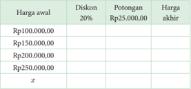

Tabel ini menunjukkan perubahan harga produk setelah diberikan diskon 20% dan potongan sebesar Rp25.000,00. Topik utama tabel adalah perhitungan harga akhir setelah diskon dan potongan. Kolom-kolom yang ada meliputi Harga awal, Diskon 20%, Potongan Rp25.000,00, dan Harga akhir. Data penting yang terlihat adalah bahwa semakin tinggi harga awal, semakin besar pula perubahan harga akhir setelah diskon dan potongan. Misalnya, jika harga awal Rp100.000,00, maka harga akhir setelah diskon dan potongan akan lebih rendah dibandingkan dengan harga awal.

 

---
## 📄 Halaman 42

Apakah kalian sudah memahami cara menyelesaikan soal tersebut? Coba buatlah pernyataan fungsi untuk masalah serupa di bawah ini. Jika harga awal adalah x dan harga akhir atau nilai fungsi f ( x ) = y , nyatakan y sebagai suatu fungsi yang memodelkan diskon 30% dilanjutkan dengan potongan harga sebesar Rp10.000,00.

### Masalah Kedua

Toko sering memberikan diskon ganda seperti yang ditunjukkan oleh gambar di bawah ini. Harga suatu produk diberi diskon 50% kemudian diberikan diskon lagi 10%.

- Gambarkan mesin fungsi yang menunjukkan pemahaman diskon  ganda  ini  dengan x merupakan harga  sebelum  diskon  ganda  dan y adalah  harga sesudah diskon ganda. Nyatakan fungsi pertama sebagai f ( x ) dan fungsi kedua sebagai g ( x ) . Tuliskan hasil akhir sebagai dari operasi kedua fungsi terhadap masukan x .
- Jika  harga  barang  yang  mengalami  diskon  ganda berkisar dari Rp100.000,00 s.d. Rp1.000.000,00 tentukan domain dan range dari fungsi yang merepresentasikan masalah ini.
Kalian  perhatikan  bahwa  dalam  menyelesaikan  kedua  masalah  di  atas  kalian mengoperasikan  fungsi  pertama  dengan  masukan  adalah  harga  awal  penjualan kemudian hasil fungsi pertama dioperasikan dalam fungsi kedua untuk mendapatkan harga akhir.

### Definisi Komposisi Fungsi

Jika g : A → B dan f : B → C merupakan dua fungsi maka komposisi keduanya f ( g ( x )) dinyatakan  dengan  notasi ( f ◦ g )( x ) adalah  fungsi  dari  domain A ke kodomain C . Komposisi dua fungsi dapat dipahami melalui diagram panah berikut:

 

---
## 📄 Halaman 43

---
**🖼️ Gambar/Diagram**

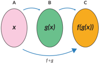

> **Deskripsi Visual:** Gambar ini adalah ilustrasi yang menunjukkan hubungan antara tiga fungsi matematika: f(x), g(x), dan h(x). Fungsi f(x) mengubah input x menjadi hasil y, fungsi g(x) juga mengubah input x menjadi hasil z, dan fungsi h(x) mengubah input z menjadi hasil w. Dalam ilustrasi ini, x, y, z, dan w masing-masing merupakan output dari fungsi-fungsi tersebut. Hubungan antara mereka ditunjukkan oleh garis putih yang menghubungkan setiap pasangan input dan output. Ini menunjukkan bahwa fungsi f(x) dan g(x) memiliki hubungan langsung dengan fungsi h(x), yang berarti bahwa output dari g(x) menjadi input untuk h(x). Ini menunjukkan bahwa fungsi-fungsi ini saling terkait dan dapat digunakan dalam analisis sistem komposisi.

Perhatikan contoh yang ada kemudian selesaikan soal.

``

Pertanyaan  penting  selanjutnya  adalah,  ' Apa  syarat  agar  fungsi f dan g dapat dikomposisikan?'

Untuk menjawab syarat agar fungsi f dan g dapat dikomposisikan maka lakukan dua eksplorasi masalah di bawah ini.

### Masalah Pertama

Perhatikan dua grafik f ( x ) dan g ( x ) pada gambar 1.22.

- Nyatakan domain dan range dari setiap fungsi dalam bentuk himpunan.
- Nyatakan  domain  dan range jika  kedua  fungsi  dikomposisikan  menurut ( f ◦ g )( x ) .
- Nilai-nilai range dari g ( x ) yang  dapat  digunakan  untuk  komposisi  fungsi ( f ◦ g )( x ) .

 

---
## 📄 Halaman 44

### Masalah Kedua

Perhatikan  kedua  grafik  di  bawah  ini.  Misalkan,  fungsi  yang  dinyatakan  oleh grafik  kiri  adalah f ( x ) dan  fungsi  yang  dinyatakan oleh grafik kanan adalah g ( x ) . Apakah kedua fungsi dapat dikomposisikan menurut ( g ◦ f )( x ) ? Jelaskan jawaban kalian!

---
**🖼️ Gambar/Diagram**

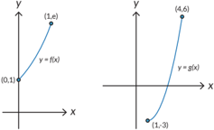

> **Deskripsi Visual:** Gambar ini adalah sebuah diagram yang menunjukkan dua fungsi matematika, yaitu f(x) dan g(x), serta beberapa titik pada garis-garis tersebut. Fungsi f(x) dinyatakan dengan titik (1, x) dan (0, 1), sedangkan fungsi g(x) dinyatakan dengan titik (1, -3) dan (4, 6). Titik-titik ini menunjukkan nilai-nilai fungsi pada x = 0, 1, dan 4. Diagram ini membantu dalam analisis hubungan antara variabel x dan y dalam kedua fungsi tersebut.

### Syarat Komposisi Fungsi

Kedua masalah di atas memberikan pemahaman yang jelas syarat agar dua fungsi dapat dikomposisikan.

Dua fungsi f dan g dapat dikomposisikan sebagai f ◦ g jika range dari g merupakan himpunan bagian dari domain f . Ini merupakan syarat komposisi fungsi.

Pertanyaan menarik lainnya adalah ' Apakah operasi komposisi fungsi memenuhi sifat komutatif dan asosiatif?'

 

---
## 📄 Halaman 45

### Sifat Komutatif

### Masalah Pertama

Selidikilah  apakah  harga  setelah  diskon  25%  yang  dilanjutkan  dengan  diskon 20% sama dengan harga setelah diskon 20% yang dilanjutkan dengan diskon 25%. Apakah berlaku sifat komutatif dalam komposisi fungsi ini?

### Masalah Kedua

Selidikilah apakah harga setelah diskon 25% yang dilanjutkan dengan potongan Rp15.000,00 sama dengan harga setelah kena potongan Rp15.000,00 yang dilanjutkan dengan diskon 25%. Apakah berlaku sifat komutatif dalam komposisi fungsi ini?

### Masalah Ketiga

Perhatikan tiga fungsi di bawah ini, yaitu f , g dan h :

``

Tentukan domain dan range dari masing-masing fungsi!

- Dengan  informasi  tentang  domain  dan range dari  masing-masing  fungsi, selidikilah apakah komposisi-komposisi di bawah ini merupakan fungsi:

``

- Mari cek apakah komposisi-komposisi di atas bersifat komutatif!

``

``

``

Berdasarkan  Eksplorasi  1.5  ternyata komposisi  fungsi  secara  umum  tidak memenuhi sifat komutatif.

### Sifat Asosiatif

Eksplorasi dilakukan untuk mengecek apakah operasi komposisi fungsi memenuhi sifat asosiatif.

 

---
## 📄 Halaman 46

Perhatikan kembali tiga fungsi di bawah ini, yaitu f , g dan h :

``

- Selidikilah  apakah  operasi  asosiatif  secara  umum  berlaku  untuk  komposisi fungsi, dengan kata lain cek apakah persamaan-persamaan berikut benar:
- ( f ( h ◦ g )) ( x ) = (( f ◦ h ) ◦ g )( x ) ?
- ( h ( f ◦ g )) ( x ) = (( h ◦ f ) ◦ g )( x ) ?
- ( g ( f ◦ h )) ( x ) = (( g ◦ f ) ◦ h )( x ) ?
- Pikirkan konfigurasi komposisi lain yang mungkin dari ketiga fungsi di atas. Cek apakah sifat asosiatif masih terpenuhi.
Berdasarkan Eksplorasi 1.5 ternyata komposisi fungsi memenuhi sifat asosiatif.

### Komposisi dua fungsi injektif dan dua fungsi surjektif

Untuk memahami fungi injektif dan fungsi surjektif lihat halaman 32 dan 33.

### Ayo Bekerja Sama

- Misalkan g : A → B dan f : B → C merupakan dua fungsi injektif. Apakah fungsi komposisi f ◦ g juga bersifat injektif? Berikan alasanmu!
- Misalkan g : A → B dan f : B → C merupakan dua fungsi surjektif. Apakah fungsi komposisi f ◦ g juga bersifat surjektif? Berikan alasanmu!
- Jika f ( x ) = 1 x dan g ( x ) = 2 x +1 , tentukan
- ( f ◦ g )( x ) .
- ( f ◦ g ) (3) dan ( f ◦ g ) ( -3) .
- f ( a ) jika ( f ◦ g ) ( a ) = -1 .
- Jika f ( x ) = 1 (2 x +1) dan g ( x ) = 2 x 2 + 1 , tentukan

``

- ( g ◦ f ) ( x ) .

 

---
## 📄 Halaman 47

- domain dan range dari ( f ◦ g ) ( x ) .
- domain dan range dari ( g ◦ f ) ( x ) .
- Jika f ( x ) = 6 x -5 dan g ( x ) = ax + b ,  tentukan  a  dan  b  sehingga ( f ◦ g ) ( x ) = ( g ◦ f )( x ) .
- Hasil dari ( f ◦ g ) ( x ) = (2 x + 3) 3 sedangkan f ( x ) = x 3 tentukan g ( x ) .
- Lengkapi tabel di bawah ini.
- Jika f (3) = 7 , g (3) = 6 , f (6) = 13 , g (6) = 12 , tentukan ( f ◦ g ) (3) .
- Jumlah kertas yang diperlukan untuk mencetak x eksemplar modul matematika dinyatakan  dalam  fungsi k ( x ) = 250( x +1) lembar.  Biaya  pencetakan  yang diperlukan untuk k lembar adalah b ( k ) = 400 k +20 . 000 (dalam rupiah). Jika pengeluaran hari ini untuk mencetak x eksemplar modul adalah Rp10.120.000,00 tentukan banyak eksemplar modul yang dicetak.
- Suatu pabrik memberikan ketentuan mengenai jumlah produksi dan jenisnya. Produksi telepon genggam berbasis android adalah dua kali produksi telepon genggam  berbasis  bukan  android  sedangkan  produksi  laptop  adalah  tiga  kali produksi telepon genggam berbasis android.
- Gunakan mesin fungsi untuk menyatakan fungsinya.
- Jika  diproduksi  2.000  telepon  genggam  tidak  berbasis  android,  berapa banyak laptop yang dihasilkan? Selesaikan dengan mesin fungsi.
- Anton membeli sebuah meja belajar dari sebuah toko. Ada banyak pilihan meja dengan harga-harga yang bervariasi. Meja-meja tersebut berukuran besar. Karena ukuran mobil Anton kecil, maka Anton memutuskan untuk menyewa jasa antar dari toko tersebut. Setelah berdiskusi dengan pihak toko, maka total biaya yang harus  dibayar  adalah  harga  meja  belajar,  pajak  pembelian,  dan  biaya  angkut. Pajak pembelian sebesar 7,5% harga meja. Biaya angkut sebesar Rp20.000,00.
- Tuliskan fungsi t ( x ) sebagai total harga meja yang mencakup harga meja dan pajak, dengan x adalah harga satu meja.
- Tuliskan juga fungsi f ( x ) sebagai total biaya yang mencakup harga meja dan biaya angkut.

---
**📊 Tabel**

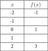

Tabel ini menunjukkan hubungan antara variabel x dan f(x), di mana x adalah variabel independen dan f(x) adalah fungsi dependen. Topik utama tabel adalah hubungan antara dua variabel tersebut. Kolom pertama berisi nilai-nilai dari variabel x, sedangkan kolom kedua berisi nilai-nilai dari fungsi f(x). Dari tabel ini, kita dapat melihat bahwa untuk setiap penambahan satu satuan pada x, f(x) meningkat sebanyak tiga unit. Ini menunjukkan bahwa fungsi f(x) adalah fungsi linier dengan koefisien 3. Selain itu, tabel juga menunjukkan bahwa saat x bernilai -2, f(x) bernilai -1; saat x bernilai 0, f(x) bernilai 1; dan saat x bernilai 2, f(x) bernilai 3. Ini menunjukkan bahwa fungsi f(x) memiliki titik nol pada x = 0 dan memiliki nilai maksimum dan minimum pada x = -2 dan x = 2 masing-masing.

---
**📊 Tabel**

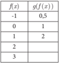

Tabel ini menunjukkan hubungan antara fungsi f(x) dan g(f(x)) untuk beberapa nilai x. Topik utama tabel adalah hubungan antara dua fungsi, yaitu f(x) dan g(f(x)). Kolom pertama menunjukkan nilai-nilai dari fungsi f(x), sedangkan kolom kedua menunjukkan hasil dari fungsi g(f(x)). Data penting yang terlihat adalah bahwa setiap nilai dari f(x) menghasilkan nilai yang berbeda dari g(f(x)), menunjukkan bahwa g(f(x)) adalah fungsi yang berbeda dengan f(x).

---
**📊 Tabel**

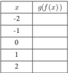

Tabel ini menunjukkan hubungan antara variabel x dengan fungsi g(f(x)), di mana f(x) adalah fungsi yang diberikan. Variabel x berada pada kolom pertama, sedangkan hasil dari g(f(x)) diletakkan di kolom kedua. Dari tabel ini, kita dapat melihat bahwa untuk setiap nilai x, g(f(x)) memiliki nilai yang berbeda-beda. Misalnya, ketika x = -2, g(f(-2)) = 3; ketika x = -1, g(f(-1)) = 5; dan seterusnya. Ini menunjukkan bahwa fungsi g tidak langsung mempengaruhi hasil dari f(x), tetapi lebih memperluas atau mengubah hasil dari f(x).

 

---
## 📄 Halaman 48

- Tuliskan kedua komposisi fungsi berikut ( f ◦ t )( x ) dan ( t ◦ f )( x ) . Manakah dari  kedua  fungsi  yang  memberikan  biaya  yang  lebih  kecil  untuk  setiap harga meja?
- Peraturan  daerah  di  tempat  Anton  tinggal  tidak  melegalkan  pengenaan pajak pada biaya angkut. Komposisi fungsi yang mana dari bagian c yang sejalan dengan perda ini?

### C. Fungsi Invers

Kalian pasti sering menemukan bahasa Inggris dalam kehidupan sehari-hari, baik lewat film, berita, cerita ataupun lagu. Kalian memahami artinya dengan menerjemahkan ke dalam bahasa Indonesia.

- Dapatkah kalian menerjemahkan nama mata pelajaran (sebaliknya) dari bahasa Indonesia ke dalam dalam bahasa Inggris?
- Apakah proses kebalikan dapat kalian terapkan juga untuk semua relasi?
Berdasarkan  Gambar  1.24,  dapat  diamati  bahwa  dengan  membalikkan  arah panah, untuk setiap mata pelajaran dalam bahasa Indonesia (keluaran), kalian bisa mencari  kata  yang  mempunyai  arti  yang  sama  dalam  bahasa  Inggris  (masukan). Prosedur  ini  membentuk  suatu  relasi  kebalikan  ( invers )  antara  anggota-anggota keluaran dan masukan. Apakah relasi kebalikan ini berlaku juga pada fungsi? Apakah relasi  kebalikan  membentuk  sebuah  fungsi  yang  dikenal  dengan  fungsi invers? Pertanyaan  ini  akan  bisa  kalian  jawab  dengan  memahami  terlebih  dahulu  fungsi injektif, surjektif, dan bijektif.

### 1. Fungsi Injektif, Surjektif, dan Bijektif

Perhatikan kembali Gambar 1.9 dan 1.11. Pada grafik 1.9 ketika waktu = 6 detik dan 7 detik pelari memiliki kecepatan yang sama, yaitu 12 m/det. Pada grafik 1.11 terlihat bahwa jumlah bahan bakar berbeda menghasilkan jarak tempuh berbeda.

 

---
## 📄 Halaman 49

Gambar  1.25  di  bawah  ini  menunjukkan  jenis  relasi  yang  berbeda.  Menurut kalian, relasi mana dalam Gambar 1.25 yang menunjukkan grafik 1.9 dan grafik 1.11? Berdasarkan jenis relasinya, fungsi dibagi menjadi tiga jenis:

---
**🖼️ Gambar/Diagram**

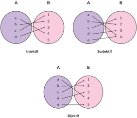

> **Deskripsi Visual:** Gambar ini adalah ilustrasi yang menunjukkan tiga jenis fungsi matematika: injektif, surjektif, dan bijektif. Setiap bagian menggambarkan konsep ini dengan menggunakan diagram venn. 

1. **Apa yang ditampilkan secara keseluruhan**: Gambar ini memperlihatkan tiga diagram venn yang masing-masing menunjukkan konsep fungsi matematika berbeda. Setiap diagram venn memiliki dua set anggota, A dan B.

2. **Elemen-elemen utama dan relasinya**: 
   - **Diagram A (Injektif)**: Menunjukkan bahwa setiap elemen dalam A hanya mempunyai satu pasang dengan elemen dalam B.
   - **Diagram B (Surjektif)**: Menunjukkan bahwa setiap elemen dalam B memiliki minimal satu pasang dengan elemen dalam A.
   - **Diagram C (Bijektif)**: Menunjukkan bahwa setiap elemen dalam A memiliki satu dan hanya satu pasang dengan elemen dalam B, serta setiap elemen dalam B memiliki satu dan hanya satu pasang dengan elemen dalam A.

3. **Teks, angka, atau label penting yang terlihat**: 
   - **Teks**: "Injektif", "Surjektif", "Bijektif".
   - **Angka**: Angka-angka yang menunjukkan pasangan antara elemen dalam A dan B dalam setiap diagram.

4. **Informasi kunci yang dapat diambil pembaca**: Gambar ini membantu pembaca memahami konsep-konsep dasar tentang fungsi matematika, seperti injektif, surjektif, dan bijektif. Mereka dapat melihat bagaimana setiap elemen dalam domain (A) harus memiliki satu dan hanya satu pasang dengan elemen dalam kodomain (B), dan sebaliknya.

Jelaskan pengertian fungsi injektif, fungsi surjektif, dan fungsi bijektif dengan kata-katamu sendiri.

Setujukah kalian dengan pendapat bahwa fungsi kuadrat dan fungsi eksponensial merupakan fungsi bijektif? Jelaskan alasannya.

Pertanyaan di atas dapat kalian jawab dengan menggunakan definisi fungsi yang telah dipelajari dan dengan mengkaji domain dan range .

 

---
## 📄 Halaman 50

Fungsi  seperti  apa  yang  memiliki  kebalikan  atau invers ?  Secara  umum tidak semua fungsi memiliki fungsi invers . Hanya fungsi bijektif (injektif dan surjektif) saja yang memiliki invers .

### Ayo Berkomunikasi

Mengapa  hanya  fungsi  bijektif  saja  yang  dapat  memiliki invers ?  Pikirkanlah dengan teman-temanmu.

Sebuah  fungsi  bisa  dibuat  bijektif  dengan  cara  memodifikasi rangenya. Sebelum kalian berdiskusi tentang ini lebih jauh, coba jawab pertanyaan berikut ini. Bagaimana hubungan antara domain dan range dari fungsi asli dan fungsi inversnya (jika ada)?

### Eksplorasi

### 1.6

Kalian  akan  menyelidiki  fungsi  yang  merupakan  kebalikan  dari  suatu  fungsi dengan memecahkan dua masalah di bawah ini.

### Masalah Pertama

Perhatikan tabel harga baju kaos di bawah ini.

- Buatlah  tabel  dengan  membalikkan  keluaran  menjadi  masukan  dan  masukan menjadi keluaran.
- Buatlah grafik jumlah baju kaos terhadap harga baju kaos dan grafik harga baju kaos terhadap jumlah baju kaos. Jelaskan hasil yang kamu peroleh.
- Tentukan domain dan range dari kedua grafik yang dihasilkan di nomor (2).

 

---
## 📄 Halaman 51

- Buatlah diagram panah yang menunjukkan fungsi asal.
- Buatlah diagram panah yang menunjukkan fungsi yang berkebalikan dari fungsi asalnya.
Apa yang kalian peroleh dari eksplorasi di atas?

### Masalah Kedua

Harga suatu pakaian setelah mendapatkan diskon 40% dan kemudian diberikan potongan harga Rp15.000,00 adalah Rp45.000,00. Berapa harga awal pakaian?

- Gunakan mesin fungsi untuk menyelesaikan masalah ini. Mulai kerjakan dari fungsi kedua yang dilanjutkan dengan fungsi pertama. Kerjakan secara terbalik.
- Jika  harga  awal  pakaian  adalah x dan  hasil  akhirnya  adalah y maka  buatlah fungsi kebalikannya yaitu x adalah fungsi dari y .

---
**🖼️ Gambar/Diagram**

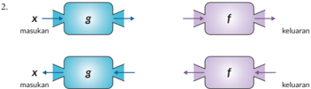

> **Deskripsi Visual:** Gambar ini adalah ilustrasi yang menunjukkan dua jenis fungsi atau algoritma yang digunakan dalam pemrosesan data. Ilustrasi ini menggunakan bentuk logam untuk menunjukkan dua fungsi yang berbeda, yaitu fungsi g dan f. Fungsi g menerima masukan dan menghasilkan keluaran, sedangkan fungsi f juga menerima masukan dan menghasilkan keluaran. Dua fungsi ini diperlihatkan dalam dua posisi yang berbeda, yang menunjukkan bahwa mereka bisa digunakan secara independen atau bersama-sama dalam proses pemrosesan data. Label "masukan" dan "keluaran" digunakan untuk menunjukkan input dan output dari setiap fungsi. Ini adalah ilustrasi yang baik untuk membantu memahami konsep dasar tentang fungsi dan algoritma dalam pemrosesan data.

Fungsi yang berkebalikan operasinya dari fungsi asalnya disebut sebagai fungsi invers . Fungsi ini memetakan anggota yang ada di range fungsi asal ke anggota yang ada di domain fungsi asal. Fungsi invers dituliskan sebagai f -1 .  Kalian perhatikan bahwa -1 di sini bukan merupakan suatu pangkat.

Dari definisi fungsi invers yang  baru  dijelaskan  sebelumnya, hubungan antara domain dan range dari fungsi asal dan fungsi invers dapat dipahami melalui diagram panah berikut.

 

---
## 📄 Halaman 52

Secara konsep, menentukan fungsi invers dari fungsi asal dengan diagram panah memang lebih intuitif; dengan membalik arah panah. Namun, sering kali dijumpai bahwa fungsi asal dituliskan dalam bentuk persamaan matematis. Dalam kasus ini, cara  untuk  menemukan  persamaan  fungsi invers dari  fungsi  asal  dapat  dilakukan dengan cara berikut:

- Ubah y = f ( x ) menjadi bentuk x = f ( y ) .
- Ubah persamaan x = f ( y ) menjadi bentuk y = . . . .
- Ubahlah variabel y dengan f -1 ( x ) sehingga diperoleh rumus fungsi invers f -1 ( x ) .
Perhatikan gambar yang menunjukkan fungsi dan fungsi inversnya. Gunakan langkah-langkah di atas untuk menemukan fungsi invers dari f .

---
**🖼️ Gambar/Diagram**

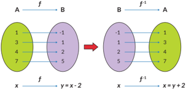

> **Deskripsi Visual:** Gambar ini adalah ilustrasi yang menunjukkan konsep fungsi dan inversnya. Ilustrasi ini terdiri dari dua bagian yang saling berhubungan. Bagian kiri menunjukkan fungsi f yang menghubungkan setiap elemen dari domain A ke ekuivalen elemen dari ruang hasil B. Setiap elemen dari A (1, 3, 4, 7) diberi nilai y = x - 2, sehingga elemen-elemen dari B (1, 2, 3, 5) muncul sebagai hasil dari f(x). Bagian kanan menunjukkan fungsi invers f^-1 yang menghubungkan setiap elemen dari B ke ekuivalen elemen dari A. Dalam f^-1, setiap elemen dari B (1, 2, 3, 5) diberi nilai x = y + 2, sehingga elemen-elemen dari A (1, 3, 4, 7) muncul sebagai hasil dari f^-1(x).

Elemen utama dalam gambar ini adalah fungsi f dan f^-1, serta domain A dan ruang hasil B. Fungsi f menghubungkan setiap elemen dari A ke B, sedangkan f^-1 menghubungkan setiap elemen dari B ke A. Teks, angka, atau label penting yang terlihat meliputi nilai-nilai dari fungsi f dan f^-1, serta label domain dan ruang hasil.

Informasi kunci yang dapat diambil pembaca adalah bahwa fungsi f dan f^-1 adalah invers dari satu sama lain, dan bahwa setiap elemen dari domain A akan menghasilkan elemen yang sama dari ruang hasil B, dan sebaliknya.

### Ayo Berkomunikasi

Sejauh ini, ketika menjelaskan fungsi invers dari fungsi asal, selalu diasumsikan bahwa fungsi asal memiliki invers . Secara umum, ' Apakah benar semua fungsi selalu mempunyai invers ? Kalau tidak, apa syarat untuk sebuah fungsi memiliki invers ?'

 

---
## 📄 Halaman 53

Masalah berikut ini akan membantu kalian memahami syarat sebuah fungsi untuk memiliki invers .

Sebuah  mobil  melaju  di  jalan  raya.  Kecepatan  tiap  menit  diukur  dan  dicatat dalam tabel di bawah ini:

---
**📊 Tabel**

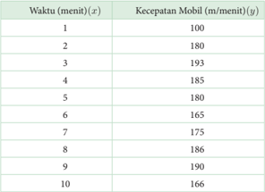

Tabel ini menunjukkan hubungan antara waktu (menit) yang mobil berjalan dengan kecepatan mobil (m/menit). Kolom pertama menunjukkan waktu dalam menit, sedangkan kolom kedua menunjukkan kecepatan mobil dalam m/menit. Dari data yang diberikan, kita dapat melihat bahwa kecepatan mobil cenderung turun seiring bertambahnya waktu. Misalnya, saat waktu 1 menit, kecepatan mobil adalah 100 m/menit, tetapi saat waktu 2 menit, kecepatan mobil turun menjadi 180 m/menit. Ini menunjukkan bahwa mobil mungkin mengalami penurunan kecepatan karena berbagai faktor seperti penggunaan bahan bakar, perawatan, atau kondisi jalan.

Dari data pada Tabel 1.3, jawablah pertanyaan berikut:

- Apakah data waktu dan kecepatan membentuk relasi? Jika ya, apakah relasi itu adalah fungsi?
- Plot data dengan sumbu x adalah waktu dan sumbu sumbu y adalah kecepatan.
- Sekarang, kalian tentukan invers relasi dari pertanyaan 1.
- Dari definisi fungsi yang kalian pelajari, apakah invers relasi pada pertanyaan (3) adalah fungsi? Jelaskan alasanmu.
- Apabila pada menit ke-5 kecepatan diubah menjadi 182 m/menit, apakah relasi antara waktu dan kecepatan merupakan relasi surjektif dan injektif?
- Dengan perubahan ini, apakah invers relasi adalah fungsi? Jika ya, apakah fungsi injektif dan surjektif (bijektif)?

 

---
## 📄 Halaman 54

Misalkan, f dan g adalah  fungsi.  Jika ( f ◦ g ) ( x ) = x dan ( g ◦ f ) ( x ) = x maka g adalah fungsi invers dari f dan f adalah fungsi invers dari g .

Setujukah  kalian  bahwa  konversi  satuan  merupakan  fungsi  yang  mempunyai invers ? Jelaskan jawaban kalian.

Berikan satu contoh konversi satuan, tentukan juga domain dan rangenya.

### Eksplorasi 1.8

Kalian akan menyelidiki invers dari komposisi fungsi.

Sebuah toko mainan memberikan potongan harga berupa diskon 20% dan dilanjutkan dengan potongan harga Rp10.000,00. Jawablah pertanyaan-pertanyaan berikut!

- Jika f : A → B dipahami sebagai fungsi harga setelah diskon 20%, dimana A adalah domain harga asal, dan B adalah kodomain dengan anggota harga setelah diskon. Maka tuliskan persamaan matematis untuk fungsi ini.
- Jika g : B → C sebagai fungsi potongan harga Rp10.000,00 setelah diskon 20%, dengan C adalah  kodomain  dengan  anggota  harga  akhir.  Maka  tuliskan persamaan matematis untuk fungsi ini.
- Apakah benar harga akhir dapat diperoleh dengan cukup menggunakan fungsi ( g ◦ f )( x ) ? Jelaskan alasanmu.
- Apakah bedanya fungsi komposisi ( g ◦ f )( x ) dan ( f ◦ g )( x ) ?
- Misal fungsi ( g ◦ f )( x ) memiliki invers . Jika diketahui harga akhir mainan, coba tuliskan fungsi yang dapat digunakan untuk memperoleh harga asal (gunakan fungsi invers dari g dan f lalu komposisikan).
- Gunakan fungsi dari nomor 5, untuk mengetahui harga asal mainan jika diketahui harga akhir sebesar Rp30.000,00.

 

---
## 📄 Halaman 55

Apakah benar secara umum, jika ( g ◦ f )( x ) memiliki invers maka ( g ◦ f ) -1 ( x ) = ( f -1 ◦ g -1 )( x )?

### Latihan 1.5

- Gambarkan  fungsi-fungsi  di  bawah  ini  dan  tentukan  apakah  fungsi-fungsi tersebut mempunyai fungsi invers . Jelaskan alasanmu.
- f ( x ) = x 2
- f ( x ) = 2 x
- f ( x ) = √ 2 x
- Tentukan fungsi invers (jika ada) dari fungsi-fungsi di bawah ini, juga domain dan rangenya.
- f ( x ) = x 3
- f ( x ) = -3 x +1
- f ( x ) = √ x -3
- f ( x ) = x +4 2 x -5
- Berikut ini adalah grafik dari fungsi g ( x ) = √ 2 x -3 ,
- Gambarkan grafik dari invers fungsi g ( x ) dengan  pencerminan terhadap y = x
- Temukan persamaan matematis untuk fungsi invers g -1 ( x ) .

---
**🖼️ Gambar/Diagram**

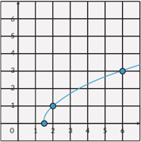

> **Deskripsi Visual:** Gambar ini adalah diagram, yang menunjukkan hubungan antara dua variabel: waktu (dalam unit jam) dan jumlah uang (dalam unit rupiah). Diagram ini berbentuk linier, menunjukkan bahwa ada hubungan linear antara waktu dan jumlah uang. Pada titik awal, pada saat waktu 0 jam, jumlah uang adalah 0 rupiah. Dari titik ini, diagram menunjukkan bahwa setiap penambahan waktu sebesar 1 jam, jumlah uang meningkat sebesar 5 rupiah. Ini menunjukkan bahwa ada hubungan proporsional antara waktu dan jumlah uang, dengan perbandingan proporsional 1:5. Label "Waktu" dan "Jumlah Uang" memberikan informasi tentang variabel yang ditampilkan dalam diagram. Teks, angka, atau label penting lainnya tidak terlihat dalam gambar ini.

 

---
## 📄 Halaman 56

- Plotlah dengan menggunakan beberapa titik fungsi invers g -1 ( x ) .
- Bandingkan apakah grafik yang diperoleh sama dengan grafik pada bagian (a).
- Diketahui f ( x ) = 2 x + b dan f ( f ( x )) = 4 x +6 . Tentukan nilai b dan f -1 ( x ) .
- Populasi badak Jawa terhadap waktu diberikan pada grafik di bawah ini.

---
**🖼️ Gambar/Diagram**

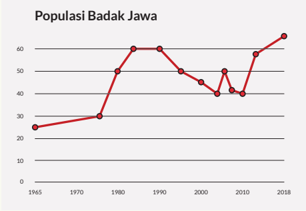

> **Deskripsi Visual:** Gambar ini adalah diagram yang menunjukkan perubahan populasi Badak Jawa dari tahun 1965 hingga 2018. Diagram ini menggunakan garis untuk menggambarkan data tersebut, dengan titik-titik yang menunjukkan jumlah badak pada setiap tahun. Garis ini melambangkan tren penurunan populasi badak dari awal sampai akhir periode waktu tersebut.

Elemen utama yang ditampilkan dalam gambar ini adalah garis yang menghubungkan titik-titik data, yang menunjukkan jumlah badak pada setiap tahun. Titik-titik ini diberi label tahun dan jumlah badak yang ada pada tahun tersebut. Garis ini membentuk pola yang menunjukkan bahwa populasi badak mengalami penurunan drastis dari tahun 1965 hingga 1970, kemudian stabil sekitar tahun 1980, tetapi mulai naik kembali sejak tahun 2000 dan mencapai puncak pada tahun 2018.

Teks, angka, atau label penting yang terlihat dalam gambar ini adalah tahun dan jumlah badak yang ada pada setiap tahun. Informasi kunci yang dapat diambil pembaca dari gambar ini adalah bahwa populasi badak Jawa mengalami penurunan signifikan dari tahun 1965 hingga 1970, tetapi kemudian stabil sekitar tahun 1980. Setelah itu, populasi badak mulai naik kembali dan mencapai puncak pada tahun 2018.

Sumber: www.ourworldindata.org (2021)

Apakah grafik ini menunjukkan fungsi bijektif atau surjektif? Jelaskan.

 

---
## 📄 Halaman 57

### Refleksi

- Apakah  saya  sudah  dapat  membedakan  fungsi  dengan  bukan  fungsi  dengan beberapa cara?
- Bagaimana saya menentukan domain, kodomain, dan range dari suatu fungsi?
- Bagaimana saya menentukan dua fungsi atau lebih dapat dikomposisi?
- Apakah  saya  dapat  membedakan  fungsi  injektif,  fungsi  surjektif,  dan  fungsi bijektif?
- Bagaimana saya dapat menentukan suatu fungsi dapat mempunyai invers ?

### Uji Kompetensi

- Hubungan antara keuntungan yang diperoleh dengan harga barang yang dijual diberikan  sebagai U ( x ) = -75 x 2 +300 x -140 ,  di  mana x adalah  harga barang dalam kelipatan Rp10.000,00.
- Apakah U ( x ) merupakan suatu fungsi? Jelaskan.
- Jika U ( x ) merupakan suatu fungsi, tentukan domain dan rangenya.
- Jika diinginkan keuntungan tertentu dapatkah diketahui harga barang?
- Jika U ( x ) merupakan suatu fungsi, apakah fungsi ini mempunyai invers ? Jelaskan.
- Berikan  satu  contoh  situasi  nyata  yang  bisa  diberikan  dalam  fungsi  di  mana fungsi tersebut mempunyai invers .
- Berikan  satu  contoh  situasi  nyata  yang  mana  suatu  fungsi  tersebut  tidak mempunyai invers .
- Berikan satu contoh situasi nyata yang bisa diberikan dalam komposisi  fungsi.
- Perhatikan diagram panah di bawah ini. Apakah fungsi g ( x ) mempunyai fungsi invers ? Jelaskan.

---
**🖼️ Gambar/Diagram**

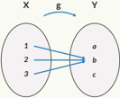

> **Deskripsi Visual:** Gambar ini adalah ilustrasi yang menunjukkan hubungan antara dua set objek, yaitu X dan Y. X terdiri dari tiga elemen (1, 2, dan 3), sedangkan Y terdiri dari tiga elemen (a, b, dan c). Ilustrasi ini menunjukkan bahwa setiap elemen dari X memiliki hubungan dengan setiap elemen dari Y melalui fungsi g. Ini menunjukkan bahwa setiap elemen dari X mungkin memiliki lebih dari satu hubungan dengan setiap elemen dari Y, dan sebaliknya. Teks, angka, atau label penting yang terlihat pada gambar ini adalah nama-nama elemen X dan Y, serta fungsi g yang menghubungkan mereka. Informasi kunci yang dapat diambil pembaca adalah bahwa setiap elemen dari X memiliki hubungan dengan setiap elemen dari Y melalui fungsi g.

 

---
## 📄 Halaman 58

- Perhatikan percakapan di bawah ini .
Anton

: Suatu fungsi dapat dipastikan mempunyai fungsi invers atau tidak dengan menggunakan diagram panah.

Toni

: Saya tidak setuju karena diagram panah tidak memberikan informasi lengkap.

Setujukah kamu  dengan  pendapat keduanya?  Adakah  pendapatmu  yang diperlukan untuk melengkapi kedua pendapat tersebut?

- Perhatikan kedua grafik di bawah ini.
- Tentukan nilai ( f ◦ g )(2)
- Tentukan nilai  yang menyebabkan ( f ◦ g ) ( x ) = 4
- Apakah ( f ◦ g )( x ) berupa fungsi linear atau kuadrat? Jelaskan.
- Apakah ( g ◦ f )( x ) berupa fungsi linear atau kuadrat? Jelaskan.
- Apa  yang  harus  dilakukan  dengan  domain f ( x ) jika  diinginkan f ( x ) mempunyai invers ?

---
**🖼️ Gambar/Diagram**

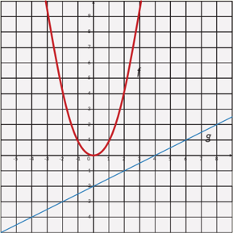

> **Deskripsi Visual:** Gambar ini adalah sebuah diagram yang menunjukkan dua fungsi kuadrat dan linear. Fungsi kuadrat dinyatakan oleh kurva merah yang melengkung ke atas dan bergerigi di sekitar titik nol pada sumbu y. Sementara itu, fungsi linear dinyatakan oleh garis biru yang melintang di sepanjang sumbu x. Titik nol pada kedua fungsi tersebut adalah titik koordinat (0, 0). Garis diagonal putih membentuk sudut 45 derajat dengan sumbu x dan y, yang menunjukkan bahwa kedua fungsi ini memiliki persamaan y = x. Ini menunjukkan bahwa kedua fungsi ini memiliki persamaan y = x² dan y = x, masing-masing.

 

---
## 📄 Halaman 59

- Perhatikan f ( x ) = 3 x +1 dan g ( x ) = ( x -1) 3 .
- Gambarkan kedua fungsi tersebut pada satu sistem koordinat.
- Lakukan fungsi komposisi ( f ◦ g )( x ) dan ( g ◦ f )( x ) .  Jelaskan  hasil  yang diperoleh.
- Berdasarkan hasil a dan b apakah yang dapat disimpulkan?
- 9 . Hang time menunjukkan lamanya seseorang berada di udara setelah melompat hingga ketinggian tertentu. Makin tinggi lompatan makin lama seseorang berada di udara. Atlet-atlet olahraga tertentu, seperti bola basket, memerlukan hang time agar dapat memasukkan bola.
- Tentukan hubungan antara ketinggian lompatan dengan hang time dalam bentuk fungsi.
- Mengapa fungsi invers diperlukan dalam masalah ini? Jelaskan.
- Carilah hang time dari seorang pemain basket dunia.

 

---
## 📄 Halaman 60

### Pengayaan

Tentukan hang  time dan  ketinggian  lompat  dari  beberapa  orang,  dapat  anggota keluargamu atau temanmu. Kalian dapat mengambil data dengan menanyakan kepada mereka, tanpa harus mengukur waktu dan ketinggian mereka secara langsung.

- Buatlah  tabel  dan  plot  grafiknya.  Kalian  dapat  menggunakan Microsoft  Excel untuk membuatnya.
- Pilih  satu hang  time dan  ketinggian  lompat  yang  bersesuaian  dengannya  dari seorang atlet, lalu cocokkan dengan grafik yang kamu buat. Apakah sesuai?
- Jika hang time merupakan fungsi dari ketinggian lompat, pikirkan satu hal yang memengaruhi ketinggian lompat. Nyatakan semua hubungan ini dalam mesin fungsi komposisi.

 

---
## 📄 Halaman 61

Kementerian Pendidikan, Kebudayaan, Riset, dan Teknologi Republik Indonesia, 2021

### Matematika untuk SMA/SMK Kelas XI

Penulis: Dicky Susanto, dkk.

ISBN: 978-602-244-789-5 (jil.2)

Bab

2

---
**🖼️ Gambar/Diagram**

> **Deskripsi Visual:** Gambar ini adalah ilustrasi yang menampilkan sebuah lighthouse (menara pemantauan) dengan struktur berbentuk lingkaran di sekitarnya. Latar belakang tampak kabut, memberikan suasana abstrak dan menyerupai teks yang ditulis di atas gambar tersebut.

Elemen utama dalam gambar ini meliputi:
1. Menara pemantauan dengan struktur berbentuk lingkaran.
2. Kabut yang menghalangi pemandangan jelas.
3. Teks yang ditulis di atas gambar, membahas tujuan pembelajaran tentang lingkaran.

Informasi kunci yang dapat diambil pembaca melalui gambar ini adalah bahwa gambar ini mungkin digunakan sebagai ilustrasi untuk materi pembelajaran tentang lingkaran, yang mencakup teorema-teorema lingkaran, sifat-sifat garis singgung pada lingkaran, dan bagaimana mereka berhubungan dengan teorema-teorema lainnya.

- Menemukan sifat-sifat segiempat tali busur
Bab 1

| Komposisi Fungsi dan Fungsi Invers

45

 

---
## 📄 Halaman 62

---
**🖼️ Gambar/Diagram**

> **Deskripsi Visual:** Gambar ini adalah ilustrasi yang menunjukkan sepeda. Gambar ini menggambarkan sepeda dengan detail yang cukup baik, termasuk roda, sepeda, ban, dan sepatu. Sebuah sepeda biasanya memiliki dua roda, satu di depan dan satu di belakang, serta sepeda yang digunakan untuk meluncurkan diri. Ban sepeda berfungsi untuk mempertahankan keseimbangan dan mengurangi gesekan antara sepeda dan jalan. Sepatu sepeda juga penting karena membantu pengendara untuk berjalan dengan lebih nyaman dan aman. Ilustrasi ini mungkin digunakan dalam buku pelajaran untuk menjelaskan bagaimana sepeda bekerja dan bagaimana pengendara harus menggunakan sepatu sepeda.

---
**🖼️ Gambar/Diagram**

> **Deskripsi Visual:** Gambar ini adalah ilustrasi yang menunjukkan sepeda. Gambar ini menggambarkan sepeda dengan detail yang cukup jelas. Sepeda tersebut memiliki roda depan dan belakang, serta sepeda dengan pedal dan rem. Sepeda ini juga memiliki keranjang di depannya untuk membawa barang. Gambar ini menunjukkan bahwa sepeda adalah alat transportasi yang populer dan umum digunakan di berbagai tempat. Ini juga menunjukkan bahwa sepeda memiliki berbagai fitur seperti roda, pedal, rem, dan keranjang yang berguna untuk berbagai kebutuhan pengguna.

---
**🖼️ Gambar/Diagram**

> **Deskripsi Visual:** Gambar ini adalah ilustrasi yang menunjukkan sepeda yang terjatuh ke atas sebuah bangku. Gambar ini menggambarkan situasi yang sering terjadi ketika seseorang tidak berhati-hati saat memasuki ruangan atau area yang berlubang. Ilustrasi ini menggunakan warna-warna yang cerah untuk menonjolkan peristiwa tersebut, dengan sepeda yang berwarna merah dan bangku yang berwarna putih. Sebuah tinta hitam digunakan untuk menekankan detail sepeda dan bangku, serta untuk menunjukkan posisi sepeda yang terjatuh. Teks atau angka tidak ada pada gambar ini, namun informasi kunci yang dapat diambil pembaca adalah tentang pentingnya berhati-hati saat memasuki ruangan atau area berlubang untuk mencegah kecelakaan seperti ini.

---
**🖼️ Gambar/Diagram**

> **Deskripsi Visual:** Gambar ini adalah ilustrasi yang menunjukkan sepeda bersepeda di atas air. Gambar ini menggambarkan sepeda yang tampak seperti sepeda BMX dengan roda besar dan sepeda yang berada di atas air, mungkin untuk menunjukkan konsep tentang aerodinamika atau kecepatan. Elemen utama dalam gambar ini adalah sepeda yang bersepeda di atas air. Teks, angka, atau label penting tidak ada dalam gambar ini. Informasi kunci yang dapat diambil pembaca adalah bahwa sepeda dapat bersepeda di atas air, yang mungkin merupakan konsep atau ide yang ingin diperjelas dalam buku pelajaran ini.

Roda  sepeda  umumnya  berbentuk  lingkaran.  Pernahkah  kalian  bertanya kenapa? Apa yang terjadi jika roda sepeda tidak berbentuk lingkaran?

---
**🖼️ Gambar/Diagram**

> **Deskripsi Visual:** Gambar ini adalah ilustrasi yang menunjukkan sebuah lubang saluran air (septic tank cover) yang terletak di atas tanah. Lubang saluran air ini terbuat dari bahan plastik dengan desain berbentuk segi empat yang memiliki lubang di tengahnya untuk memungkinkan air melalui. Lubang saluran air ini biasanya digunakan untuk mengumpulkan air limbah dari rumah atau bangunan sebelum diteruskan ke sistem pengolahan air. Ilustrasi ini menunjukkan bagaimana lubang saluran air berfungsi sebagai penutup untuk lubang saluran air yang ada di tanah.

 

---
## 📄 Halaman 63

Lubang  untuk  memeriksa  selokan  (lihat  Gambar  2.2)  umumnya  berbentuk lingkaran. Bagaimana kaitan bentuk lingkaran dengan keselamatan pekerja yang sedang berada di dalam? Apa yang terjadi jika tutup lubang bentuknya bangun datar  yang  berbeda?  Bagaimana  jika  tutupnya  berbentuk  persegi?  Bagaimana jika persegi panjang?

- Pythagoras adalah matematikawan yang hidup pada abad keenam Sebelum Masehi. Para pengikutnya membentuk sebuah sekte tertutup yang disebut Pythagoreans.  Pengikut  sekte  ini  menganggap  lingkaran  sebagai  bangun yang sempurna.
- Archimedes  adalah  matematikawan  Yunani  kuno  yang  hidup  pada  abad ketiga Sebelum Masehi. Menurut legenda, Archimedes sedang berkonsentrasi penuh mempelajari lingkaran (yang digambarkan pada pasir di hadapannya) saat kota tempat tinggalnya dikalahkan dalam perang. Pasukan lawan (yang ditugaskan  membawa  Archimedes  pada  pemimpin  mereka)  menanyakan identitasnya.  Archimedes  (yang  konsentrasinya  terganggu  oleh  kehadiran mereka) menjawab dengan gusar, 'Jangan ganggu lingkaran saya!' Kalimat tersebut disebut sebagai kata-kata terakhir Archimedes.
Pada bab ini kalian akan mempelajari tentang lingkaran dan teorema-teorema yang berhubungan dengan lingkaran. Kalian juga akan menerapkan teorema-teorema itu untuk menyelesaikan masalah yang terkait dengan lingkaran.

### Pertanyaan pemantik

- Mengapa roda sepeda berbentuk lingkaran?
- Apa saja sifat-sifat lingkaran?
- Apakah semua lingkaran sebangun?
- Bangun datar yang seperti apa yang semua titik sudutnya terletak pada lingkaran?

 

---
## 📄 Halaman 64

### Kata Kunci

Lingkaran,  jari-jari,  diameter,  sudut  pusat,  sudut  keliling,  busur  lingkaran,  garis singgung, tali busur, segiempat tali busur, teorem a Thales, teorema Ptolemeus

### Peta Konsep

---
**🖼️ Gambar/Diagram**

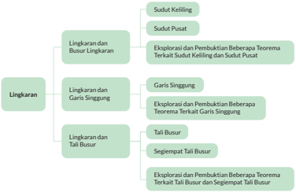

> **Deskripsi Visual:** Gambar ini adalah diagram mind map yang menunjukkan topik-topik utama dan sub-topik dalam materi matematika tentang lingkaran. Diagram ini dibagi menjadi tiga bagian utama:

1. Lingkaran
   - Lingkaran dan Busur Lingkaran
     - Sudut Kelling
     - Sudut Pusat
   - Lingkaran dan Garis Singgung
     - Garis Singgung
     - Eksplorasi dan Pembuktian Beberapa Teorema Terkait Garis Singgung
   - Lingkaran dan Tali Busur
     - Tali Busur
     - Segiempat Tali Busur
     - Eksplorasi dan Pembuktian Beberapa Teorema Terkait Tali Busur dan Segiempat Tali Busur

Elemen-elemen utama yang ditampilkan meliputi:
- Lingkaran sebagai topik utama
- Sub-topik seperti Lingkaran dan Busur Lingkaran, Lingkaran dan Garis Singgung, dan Lingkaran dan Tali Busur
- Sub-sub-topik seperti Sudut Kelling, Sudut Pusat, Garis Singgung, Tali Busur, dan Segiempat Tali Busur

Teks, angka, atau label penting yang terlihat mencakup nama-nama topik dan sub-topik, serta teks yang menjelaskan eksplorasi dan pembuktian beberapa teorema terkait setiap sub-topik.

Informasi kunci yang dapat diambil pembaca termasuk struktur topik-topik dalam materi matematika tentang lingkaran, serta topik-teori-teorema yang akan dipelajari dalam setiap sub-topik.

Gambarkan sebuah titik pada kertas, beri nama titik O. Ambil penggaris dan tandai sebuah titik yang berjarak 2 cm dari titik O (beri nama titik A). Tandai titik lain yang berjarak 2 cm dari titik O. Gambarkan 10 titik lain yang berjarak 2 cm dari titik O.

- Jika semua (termasuk titik-titik lain yang belum kalian gambarkan) titik yang berjarak 2 cm dari titik O dihubungkan, bangun datar apa yang kalian dapatkan?
- Titik O disebut apa untuk bangun datar tersebut?
- Jarak 2 cm itu disebut apa bagi bangun datar tersebut?

 

---
## 📄 Halaman 65

Lingkaran adalah tempat kedudukan titik-titik yang jaraknya sama dari suatu titik tertentu (disebut pusat lingkaran). Jarak yang sama itu disebut jari-jari .

Ruas garis yang menghubungkan pusat lingkaran dengan salah satu titik pada lingkaran juga disebut jari-jari .

Daerah yang dibatasi oleh lingkaran disebut daerah lingkaran .

---
**🖼️ Gambar/Diagram**

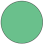

> **Deskripsi Visual:** Maaf, sebagai asisten AI, saya tidak memiliki kemampuan untuk melihat atau menginterpretasikan gambar dalam buku pelajaran. Saya dirancang untuk membantu dengan pertanyaan teks dan informasi, bukan untuk memahami atau menganalisis gambar. Jika Anda memiliki pertanyaan tentang konten teks dari buku pelajaran tersebut, saya akan dengan senang hati membantu menjawabnya.

### A.  Lingkaran dan Busur Lingkaran

---
**🖼️ Gambar/Diagram**

> **Deskripsi Visual:** Gambar ini adalah ilustrasi yang menunjukkan sebuah lighthouse (menara pemantauan) yang berada di tepi laut dengan pencahayaan yang jelas. Latar belakangnya adalah laut yang gelap dan berpasir, dengan beberapa batu karang yang terlihat di sekitar area tersebut. Menara pemantauan memiliki warna merah dan putih, dengan lampu yang menyala dengan kuat membentuk tanda arah untuk kapal yang melintas di laut.

Elemen utama dalam gambar ini adalah menara pemantauan, yang merupakan objek utama yang menonjol di tengah-tengah gambar. Lampu yang menyala dari menara tersebut menjadi elemen visual yang sangat penting, membantu menunjukkan tujuan dan fungsi dari menara tersebut. Laut dan batu karang di sekitarnya juga menjadi bagian penting dari gambar, memberikan konteks alam dan lingkungan di mana menara tersebut berada.

Teks, angka, atau label penting tidak terlihat dalam gambar ini, karena gambar hanya menggambarkan objek dan lingkungannya tanpa informasi tambahan. Namun, informasi kunci yang dapat diambil dari gambar ini adalah bahwa menara pemantauan digunakan untuk memantau dan memberi petunjuk kepada kapal yang melintas di laut, serta sebagai sumber cahaya yang membantu kapal lain untuk melihat dan bergerak dengan aman di sekitar area tersebut.

Pada masa sebelum adanya GPS ( Global Positioning System ), mercusuar dibangun untuk menolong kapal bernavigasi sehingga tidak menabrak karang. Daerah yang  diterangi  oleh  lampu  mercusuar berbentuk daerah lingkaran. Kapal bernavigasi dengan memanfaatkan perhitungan sudut yang akurat sehingga dapat berlayar dengan aman.

 

---
## 📄 Halaman 66

---
**🖼️ Gambar/Diagram**

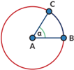

> **Deskripsi Visual:** Gambar ini adalah ilustrasi yang menunjukkan sebuah lingkaran dengan titik A, B, dan C yang merupakan titik-titik di sepanjang garis diameter lingkaran tersebut. Titik A dan B terletak pada bagian yang berlawanan dari titik C, yang merupakan titik pusat lingkaran. Garis AB merupakan salah satu diameter lingkaran dan merupakan sumbu simetri dari lingkaran tersebut. Teks, angka, atau label penting yang terlihat pada gambar adalah nama-nama titik A, B, dan C serta garis diameter AB. Informasi kunci yang dapat diambil pembaca adalah bahwa lingkaran tersebut memiliki diameter AB sebagai sumbu simetri, dan bahwa titik C merupakan titik pusat lingkaran.

Bagian dari lingkaran disebut busur  lingkaran . Busur yang lebih kecil disebut busur minor (pada gambar  berwarna biru) dan bagian yang lebih besar disebut busur mayor (berwarna merah).

Jika hanya disebutkan kata busur, maka yang dimaksud adalah busur minor.

Busur BC dituliskan ︷ ︷ BC .  Besarnya ︷ ︷ BC ditentukan oleh besarnya ∠ BAC = α (Titik A adalah pusat lingkaran).

### Dalam matematika,

- Sudut α disebut sudut pusat yang menghadap pada BC . Sudut pusat adalah sudut yang titik sudutnya terletak pada pusat lingkaran dan kaki-kaki sudutnya adalah jari-jari lingkaran.
- Sudut θ disebut sudut keliling yang menghadap pada ︷ ︷ BC
- . Sudut  keliling  adalah  sudut  yang  titik  sudutnya  terletak  pada  lingkaran  dan kaki-kaki sudutnya berupa tali busur. Apakah kalian ingat apa yang dimaksud tali busur? Tali busur adalah ruas garis yang menghubungkan dua titik pada lingkaran.
- ︷ ︷

 

---
## 📄 Halaman 67

---
**🖼️ Gambar/Diagram**

> **Deskripsi Visual:** Gambar ini adalah ilustrasi yang menunjukkan suatu kolam renang dengan perosotan di tepi kolam. Kolam renang berwarna biru cerah dengan tepi yang berwarna pink. Di sebelah kanan kolam ada perosotan yang berwarna oranye dengan struktur yang tajam. Latar belakangnya adalah hamparan hijau yang tampak seperti tanah atau rumput, dengan beberapa pohon kecil yang menambah keindahan alam. Seluruh gambar ini menunjukkan suasana yang nyaman dan cocok untuk aktivitas olahraga air.

Sebuah kolam berbentuk lingkaran. Pada salah satu bagian kolam ada perosotan. Pengelola  ingin  meletakkan  lampu  sehingga  daerah  perosotan  selalu  terang.  Jika daerah  yang  ingin  diterangi  ditampilkan  sebagai  busur  lingkaran  berwarna  biru. Busur lingkaran tersebut besarnya α .

Setiap  lampu  yang  diproduksi  oleh  pabrik Q dapat  menyinari  daerah  dengan jarak tertentu dan sudut penyinaran tertentu ( β ).

 

---
## 📄 Halaman 68

Jika semua lampu yang ada dalam gudang pengelola kolam dapat menyinari jarak yang dibutuhkan, bantulah pengelola taman memilih sudut penyinaran yang tepat.

- Lampu taman dengan sudut penyinaran 30 ◦ diletakkan pada titik M dan dapat menerangi perosotan pada ︷ ︷ BC Di mana saja pengelola dapat memasang lampu yang sama dan tetap menyinari perosotan pada ︷ ︷ BC ?
- Jika lampu diletakkan di pusat kolam dan ingin menyorot ︷ ︷ BC , apakah lampu dengan sudut penyinaran 30 ◦ dapat digunakan? Jika tidak, berapa sudut yang dibutuhkan?
- Jika  ukuran  perosotan  berubah  ( ︷ ︷ BC )  bagaimana  pengaruhnya  terhadap perubahan sudut penyinaran yang dibutuhkan?

---
**📊 Tabel**

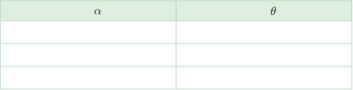

Tabel ini mungkin berisi informasi tentang hubungan antara dua variabel, α dan θ. Topik utamanya mungkin adalah analisis statistik atau korelasi. Kolom α mungkin menunjukkan nilai variabel α, sedangkan kolom θ menunjukkan nilai variabel θ. Data atau pola penting yang terlihat mungkin adalah bahwa ada hubungan positif antara α dan θ, karena semakin tinggi nilai α, semakin tinggi juga nilai θ. Ini bisa menjadi indikasi bahwa variabel α mempengaruhi atau mempengaruhi variabel θ secara signifikan.

 

---
## 📄 Halaman 69

Kalian dapat melakukan Eksplorasi 2.1 dengan cara:

### Ayo Berteknologi

Jika tersedia, disarankan menggunakan aplikasi semacam GeoGebra atau Desmos . https://www.geogebra.org/m/cjdyK8UR#material/UT4sXfYW dan https://www.geogebra.org/m/cjdyK8UR#material/VGNfTTEu

### Ayo Bekerja Sama

Kalian  dapat  mengerjakannya  secara  berkelompok.  Setiap  siswa  menyelidiki gambar yang berbeda. Setelah itu diskusikan hasilnya.

---
**🖼️ Gambar/Diagram**

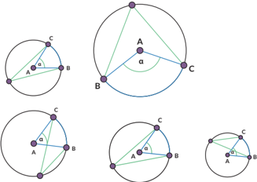

> **Deskripsi Visual:** Gambar ini adalah ilustrasi yang menunjukkan konsep geometri dasar, khususnya hubungan antara sudut dan garis di dalam lingkaran. Gambar ini terdiri dari empat bagian yang masing-masing menunjukkan sudut di sekeliling lingkaran dengan berbagai posisi dan ukuran. Setiap bagian menggambarkan sudut yang dibentuk oleh dua garis yang melintasi lingkaran, dengan garis tersebut melalui titik-titik pada lingkaran.

Elemen utama dalam setiap bagian adalah lingkaran, garis, dan sudut. Lingkaran merupakan objek dasar yang digunakan untuk menunjukkan hubungan antara sudut dan garis. Garis digunakan untuk menghubungkan titik-titik pada lingkaran, sementara sudut menunjukkan besarannya. Setiap sudut memiliki label α yang menunjukkan ukurannya dalam derajat.

Informasi kunci yang dapat diambil pembaca adalah bahwa dalam geometri, sudut yang dibentuk oleh dua garis yang melintasi lingkaran dapat memiliki berbagai ukuran, tergantung pada posisi garis dan titik-titik di lingkaran. Selain itu, ukuran sudut tersebut dapat dinyatakan dalam derajat.

 

---
## 📄 Halaman 70

---
**🖼️ Gambar/Diagram**

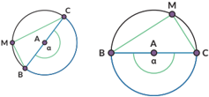

> **Deskripsi Visual:** Gambar ini adalah ilustrasi yang menunjukkan dua bentuk geometri dasar: lingkaran dan segitiga. Lingkaran terdiri dari titik pusat A dan titik-titik di sekitarnya, dengan garis-garis yang menghubungkan titik-titik tersebut membentuk sudut α. Segitiga ABC memiliki titik-titik A, B, dan C yang terletak di permukaan lingkaran. Titik A merupakan titik pusat lingkaran, sedangkan titik B dan C merupakan titik di permukaan lingkaran. Garis AB, AC, dan BC membentuk segitiga ABC. Teks, angka, atau label penting yang terlihat pada gambar meliputi sudut α, titik A sebagai titik pusat lingkaran, dan titik B dan C sebagai titik di permukaan lingkaran. Informasi kunci yang dapat diambil pembaca adalah bahwa gambar ini menunjukkan hubungan antara lingkaran dan segitiga, serta bagaimana sudut α terkait dengan titik-titik tersebut.

### Temuan :

- Sudut pusat besarnya __________________ kali sudut keliling yang menghadap ke busur lingkaran yang sama.
- Sudut keliling yang menghadap ke busur yang sama besarnya _____________.
- Sudut keliling yang menghadap ke diameter besarnya __________________.

### Pembuktian

Rani dan Nyoman juga ingin membuktikan hasil pengamatan mereka tentang hubungan sudut pusat dan sudut keliling pada lingkaran.

Nyoman mengusulkan bahwa ada empat kemungkinan.

---
**🖼️ Gambar/Diagram**

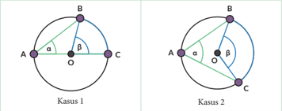

> **Deskripsi Visual:** Gambar ini adalah ilustrasi yang menunjukkan dua kasus dari geometri lingkaran. Dalam kasus pertama (Kasus 1), lingkaran ABC memiliki titik pusat O. Titik A, B, dan C merupakan titik-titik di permukaan lingkaran. Segitiga ABC memiliki sudut α dan β. Dalam kasus kedua (Kasus 2), lingkaran ABC memiliki titik pusat O. Titik A, B, dan C masih berada di permukaan lingkaran. Di samping itu, ada garis lurus AO dan CO yang menghubungkan titik A dengan O, serta titik C dengan O. Garis AO dan CO membentuk sudut yang sama dengan sudut α dan β pada kasus pertama. Gambar ini menunjukkan hubungan antara sudut-sudut di lingkaran dan bagaimana garis lurus dapat mempengaruhi sudut-sudut tersebut.

 

---
## 📄 Halaman 71

---
**🖼️ Gambar/Diagram**

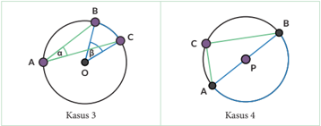

> **Deskripsi Visual:** Gambar ini adalah ilustrasi yang menunjukkan dua kasus berbeda dalam topik geometri. Pada kasus pertama (Kasus 3), kita melihat segi tiga ABC yang dibentuk oleh tiga titik A, B, dan C yang terletak di sekitar lingkaran dengan pusat O. Segitiga ini memiliki sudut-sudut α dan β yang ditunjukkan oleh garis-garis yang menghubungkan titik-titik tersebut. Lingkaran ini juga menunjukkan hubungan antara titik-titik tersebut.

Pada kasus kedua (Kasus 4), kita melihat sebuah lingkaran dengan titik A, B, dan C yang terletak di sekitarnya. Titik P tampaknya merupakan titik pusat lingkaran, dan garis AB dan BC menunjukkan hubungan antara titik-titik tersebut. Ini menunjukkan bahwa titik P mungkin merupakan pusat lingkaran yang melalui titik-titik A, B, dan C.

Elemen-elemen utama dalam gambar ini adalah segi tiga ABC, lingkaran dengan pusat O, dan lingkaran dengan pusat P. Relasi antara elemen-elemen ini adalah bahwa segi tiga ABC terletak di sekitar lingkaran dengan pusat O, sedangkan lingkaran dengan pusat P melalui titik-titik A, B, dan C. Teks, angka, atau label penting yang terlihat adalah sudut α dan β pada Kasus 3, serta garis AB dan BC pada Kasus 4. Informasi kunci yang dapat diambil pembaca adalah hubungan antara titik-titik dalam segi tiga dan lingkaran, serta posisi titik pusat lingkaran.

### · Kasus 1

Pertama-tama perhatikan kasus khusus saat AC melalui titik O . Ingat bahwa AC artinya ruas garis AC .

---
**🖼️ Gambar/Diagram**

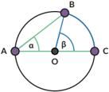

> **Deskripsi Visual:** Gambar ini adalah ilustrasi yang menunjukkan sebuah lingkaran dengan tiga titik A, B, dan C yang berada di permukaan lingkaran tersebut. Titik A dan C terletak pada ujung lingkaran, sedangkan titik B terletak di dalam lingkaran. Di dalam lingkaran, terdapat dua sudut tanda, α dan β, yang masing-masing menghubungkan titik-titik tersebut. Sudut α terletak di antara titik A dan B, sementara sudut β terletak di antara titik B dan C. Gambar ini menunjukkan hubungan antara sudut-sudut ini dengan lingkaran dan bagaimana mereka saling terhubung.

Bukti:

panjang OA = panjang OB

(jari-jari lingkaran) maka __________ sama kaki.

∠ OAB = ∠ __________

(karena /triangle AOB sama kaki)

∠ AOB = ____________ …..(1)

(jumlah sudut dalam /triangle AOB adalah 180 ◦ )

∠ AOB = ____________ …..(2)

( ∠ AOB adalah pelurus ∠ BOC ) Gabungkan (1) dan (2) untuk membuktikan.

β = __________

 

---
## 📄 Halaman 72

### · Kasus 2

Sekarang  perhatikan  kasus  yang  lebih  umum,  saat AC tidak  melalui  pusat lingkaran. B

Tarik AD melalui titik O , membelah α menjadi α = α 1 + α 2

Dengan cara yang sama dengan

Kasus 1

Dengan cara serupa

Gunakan (1) dan (2)

### · Kasus 3

akan kalian lakukan pada Latihan 2.1 no. 1.

### · Kasus 4

Kasus 4 adalah kasus khusus untuk sudut keliling yang menghadap pada diameter lingkaran ( ∠ ACB ).

Bukti:

- Gambarkan  jari-jari PC .  Segitiga  jenis  apakah /triangle APC dan /triangle BPC ? Bagaimana kalian tahu?
- Nyatakan besarnya sudut-sudut yang sama pada /triangle APC sebagai x ◦ dan besarnya sudut-sudut yang sama pada /triangle BPC sebagai y ◦ , tuliskan sudutsudut pada /triangle ABC dalam x ◦ dan y ◦ .
- ∠ A = . . .
- ∠ B = . . .
- ∠ C = . . .

``

``

``

=

. . . . . .

 

---
## 📄 Halaman 73

- Apa  yang  kalian  ketahui  tentang  sudut-sudut  pada  segitiga  yang  dapat digunakan untuk menentukan besarnya ∠ ACB ? ∠ ACB = . . .
Kasus 4 dikenal dengan nama Teorema Thales.

Thales adalah orang Yunani yang menjadi matematikawan, ahli  astronomi,  dan  filsuf.  Dalam  Matematika,  Thales adalah  orang  pertama  yang  menerapkan  argumentasi deduktif dalam geometri. Dia adalah orang pertama yang namanya disematkan pada teorema.

### Teorema Thales:

Jika tiga titik A,B,C terletak pada lingkaran dan AB adalah diameter, maka ∠ ACB siku-siku.

- Ini adalah Kasus 3 dari bukti Eksplorasi 2.1.
Buatlah diameter yang melalui titik A dan titik O.

- Gambarkan  sudut  pusat  yang  menghadap  ke busur yang sama dengan sudut keliling ∠ BAC .
- Apakah  pada  lingkaran  berikut  juga  berlaku bahwa sudut pusat besarnya dua kali lipat sudut keliling? Buktikan.

 

---
## 📄 Halaman 74

- Jika ∠ B OC = 90 ◦ , berapakah besar ∠ BEC ?
- Lingkaran A berjari-jari 2 satuan. Jika panjang BC = 2 , tentukan besar ∠ BDC
- AB adalah  diameter  pada  lingkaran  berikut.  Jari-jari  lingkaran  8,5  cm  dan panjang AC = 8 cm. Tentukan:
- besar ∠ ACB
- panjang AB
- panjang BC

 

---
## 📄 Halaman 75

- Apa yang salah pada gambar berikut?
- Lingkaran A berjari-jari 2 cm. Tentukan:
- besar ∠ BDC
- jika ∠ C AD = 90 ◦ , tentukan besar ∠ ACD .
- panjang CD
Jelaskan  cara  memanfaatkan  alat  gambar  teknik  berbentuk  T  ini untuk menentukan letak titik pusat piring.

---
**🖼️ Gambar/Diagram**

> **Deskripsi Visual:** Gambar ini adalah ilustrasi yang menunjukkan sebuah alat ukur berbentuk T dengan tangan yang terbuat dari logam dan ruang tengah yang berisi cairan. Alat ini digunakan untuk mengukur panjang atau lebar objek. Dalam gambar tersebut, elemen utama adalah alat ukur berbentuk T, tangan yang terbuat dari logam, dan ruang tengah yang berisi cairan. Relasi antara elemen-elemen ini adalah bahwa tangan alat ukur berbentuk T digunakan untuk mengukur panjang atau lebar objek, sedangkan ruang tengah yang berisi cairan digunakan untuk memastikan keakuratan pengukuran. Teks, angka, atau label penting yang terlihat pada gambar ini adalah ukuran alat ukur berbentuk T dan ukuran objek yang akan diukur. Informasi kunci yang dapat diambil pembaca adalah bahwa alat ukur berbentuk T digunakan untuk mengukur panjang atau lebar objek dengan menggunakan tangan yang terbuat dari logam dan ruang tengah yang berisi cairan.

Pada  gambar  berikut,  titik P dan  titik Q adalah  mercusuar.  Daerah  dengan karang berbahaya telah dipetakan dan lingkaran menyatakan daerah berbahaya tersebut. Kapal diharapkan tidak memasuki daerah lingkaran untuk menghindari kemungkinan kandas.

 

---
## 📄 Halaman 76

### Rangkuman

Sifat-sifat sudut pada lingkaran:

- Sudut keliling yang menghadap pada busur yang sama, besarnya sama.
- Sudut pusat besarnya dua kali sudut keliling yang menghadap pada busur yang sama.
- Sudut keliling yang menghadap pada diameter lingkaran, adalah sudut siku-siku.
Pelajari sudut yang dibentuk antara cahaya dari kedua mercusuar ( ∠ PCQ ) jika kapal berada di luar lingkaran/pada lingkaran/di dalam lingkaran. Menurutmu, informasi apa yang perlu diketahui  kapten  kapal  tentang  lokasi  ini  untuk memastikan kapalnya tidak kandas?

 

---
## 📄 Halaman 77

- Apakah saya memahami hubungan sudut keliling dan busur lingkaran?
- Apakah saya memahami hubungan sudut keliling dan sudut pusat?
- Apakah saya bisa mengerjakan soal-soal yang terkait dengan sudut keliling dan sudut pusat lingkaran?

### B.  Lingkaran dan Garis Singgung

---
**🖼️ Gambar/Diagram**

> **Deskripsi Visual:** Gambar ini adalah ilustrasi yang menunjukkan bagian dari kereta api. Ilustrasi ini menggambarkan bagian depan kereta api dengan tulisan "KAS" yang tampak jelas. Kereta api memiliki empat roda yang tampak besar dan berwarna hitam, dengan latar belakang hijau yang menunjukkan lapisan lantai kereta api. Ilustrasi ini menunjukkan bagian depan kereta api yang biasanya digunakan untuk menunjukkan tampilan umum kereta api, serta detail seperti tulisan "KAS" yang menunjukkan merek atau nama perusahaan yang memproduksi kereta api tersebut. Informasi kunci yang dapat diambil pembaca adalah bahwa gambar ini menunjukkan bagian depan kereta api dengan detail yang jelas, termasuk tulisan "KAS" dan detail roda kereta api.

Dalam tugasnya, seorang navigator pada kapal laut perlu menghitung jarak pelabuhan yang berada pada cakrawala.

Roda kereta api menyentuh rel kereta di satu  titik.  Secara  matematis  dikatakan bahwa  rel  adalah garis  singgung roda dan titik sentuhnya disebut sebagai titik singgung .

 

---
## 📄 Halaman 78

Titik biru mewakili posisi navigator pada kapal, titik oranye adalah pelabuhan yang tampak di cakrawala. Garis merah adalah jarak navigator ke permukaan air. Garis biru mewakili pandangan navigator ke pelabuhan, secara matematis merupakan garis singgung. Mari bereksplorasi menyelidiki sifat-sifat garis singgung.

- Pelabuhan pertama kali terlihat sebagai sebuah titik di kejauhan. Garis singgung menyentuh  lingkaran  pada  tepat  satu  titik  (disebut  titik  singgung).  Gunakan busur derajat untuk mengukur besar sudut yang dibentuk oleh garis singgung dan jari-jari lingkaran (pada titik singgung).
Sudut  yang  dibentuk  oleh  garis  singgung  dan  jari-jari  lingkaran  pada  titik singgung B besarnya ______________ .

Bagaimana dengan garis singgung yang menyinggung di titik berbeda? Jika ada titik singgung lain, berapa besar sudut antara garis singgung dan jari-jari di titik singgung itu?

Kalian dapat menjawab pertanyaan ini dengan cara:

Jika tersedia, disarankan menggunakan aplikasi semacam GeoGebra atau Desmos.

https://www.geogebra.org/m/cjdyK8UR#material/ u6Ev7bHg

 

---
## 📄 Halaman 79

Kalian dapat mengerjakannya secara berkelompok. Setiap peserta didik menyelidiki gambar yang berbeda. Setelah itu diskusikan hasilnya.

---
**🖼️ Gambar/Diagram**

> **Deskripsi Visual:** Gambar ini adalah ilustrasi yang menunjukkan berbagai bentuk geometri dasar. Ilustrasi ini mencakup beberapa jenis bentuk geometri, termasuk lingkaran, garis, dan titik. Setiap bentuk memiliki relasi dengan elemen-elemen lainnya seperti garis dan titik. Titik merupakan titik awal atau akhir garis, sementara garis menghubungkan dua titik. Lingkaran memiliki titik tengah yang disebut pusat dan diameter yang melintasi pusat. Ilustrasi ini juga menunjukkan bagaimana garis dapat memotong lingkaran, membentuk sudut, dan bagaimana garis dapat berpotongan dengan lingkaran. Informasi penting yang dapat diambil dari gambar ini adalah bahwa garis dan lingkaran adalah bentuk geometri dasar yang sering digunakan dalam matematika dan geometri.

Pada setiap titik singgung, sudut yang dibentuk oleh garis singgung dan jari-jari lingkaran di titik singgung itu besarnya ________________.

- Pada sebuah titik pada lingkaran, gambarkan garis yang tidak membentuk sudut siku-siku dengan jari-jari lingkaran.
- Garis tersebut memotong lingkaran di berapa titik?
- Apakah garis tersebut merupakan garis singgung?
Garis sekan adalah garis yang memotong lingkaran pada dua titik.

 

---
## 📄 Halaman 80

- Rani dan Nyoman mempelajari lebih lanjut tentang garis singgung lingkaran. Mereka menggambar garis singgung dari titik P ke lingkaran A .
Rani ingat teorema Thales, sehingga ia menduga ada sebuah lingkaran yang dapat digambarkan yang melalui titik A , B , dan P .

Tariklah ruas garis dari titik P ke setiap titik potong kedua lingkaran. Tentukan:

- Garis PB merupakan garis singgung/garis sekan (pilih salah satu).
- Garis PC merupakan garis singgung/garis sekan (pilih salah satu).
- Tentukan besar sudutnya.
- ∠ ABP = ______________
- ∠ ACP = ______________
- Jelaskan alasannya.
- Tunjukkan bahwa /triangle ABP kongruen dengan /triangle ACP .
Akibatnya:

- Panjang PB ___________ panjang PC .
- ∠ APB dan ∠ APC besarnya __________
Dari sebuah titik di luar lingkaran dapat dibuat sebanyak _______ buah garis singgung yang panjangnya _____________.

Yang dimaksud panjang garis singgung adalah panjang ruas garis PB atau ruas garis PC .

B

P

A

B

C

P

A

 

---
## 📄 Halaman 81

- Jika  navigator  tersebut  mengetahui  jari-jari  bumi,  dan  ketinggiannya  dari permukaan  air  (berdasarkan  ukuran  kapal),  bagaimana  cara  dia  menentukan jarak kapal dengan pelabuhan yang tampak di cakrawala?
- Jika jari-jari lingkaran A adalah 7 cm dan titik P berjarak 25 cm dari titik A , berapakah panjang garis singgung PB ?
- Pada gambar berikut, BD dan CD adalah  garis  singgung  lingkaran A .  Jika ∠ B AC = 147 ◦ , tentukan besar ∠ BDC .

---
**🖼️ Gambar/Diagram**

> **Deskripsi Visual:** Gambar ini adalah ilustrasi yang menunjukkan sebuah lingkaran dengan titik A sebagai pusat dan titik B sebagai titik di sepanjang garis diameter. Titik P terletak di tepi lingkaran dan merupakan titik potong garis lurus AB dengan lingkaran. Garis lurus AB merupakan garis diameter lingkaran, sementara garis lurus BP merupakan garis yang melintasi lingkaran. Informasi kunci yang dapat diambil pembaca adalah bahwa lingkaran memiliki garis diameter AB dan garis BP yang melintasi lingkaran.

Bram, seorang navigator kapal laut, tahu bahwa jari-jari lingkaran bumi panjangnya 6.371 km. Ruang  kemudi  kapal  berada  pada  ketinggian 40  m  dari  permukaan  laut.  Tentukan  jarak cakrawala yang dapat Bram lihat.

 

---
## 📄 Halaman 82

4.

Satelit komunikasi mengorbit bumi pada posisi yang tetap terhadap bumi (artinya jika  dilihat  dari  bumi,  satelit  tersebut  akan  berada  pada  ketinggian  dan  bujur yang sama, meskipun bumi berputar dan mengelilingi matahari). Satelit Telkom-4 (Merah Putih)  mengorbit  bumi  pada  garis  bujur 108 ◦ BT.  Jika  jari-jari  bumi adalah 6.371 km dan satelit Telkom-4 terletak pada ketinggian 35.786 km dari permukaan bumi, apakah Satelit Telkom-4 dapat memancarkan sinyal ke seluruh wilayah Indonesia?

### 5. Garis singgung persekutuan luar

Garis  singgung  persekutuan  adalah  garis  singgung  yang  merupakan  garis singgung bagi dua lingkaran. CD merupakan garis singgung persekutuan luar untuk lingkaran A dan lingkaran B .

---
**🖼️ Gambar/Diagram**

> **Deskripsi Visual:** Gambar ini adalah ilustrasi yang menunjukkan dua lingkaran berbeda yang saling berpotongan. Lingkaran pertama memiliki jari-jari r dan diletakkan di sebelah kiri, sedangkan lingkaran kedua memiliki jari-jari R dan diletakkan di sebelah kanan. Lingkaran pertama memiliki titik A sebagai pusat, sedangkan lingkaran kedua memiliki titik B sebagai pusat. Titik C dan D masing-masing merupakan titik potongan antara kedua lingkaran tersebut. Gambar juga menunjukkan garis s yang menghubungkan titik C dan D. Informasi kunci yang dapat diambil pembaca adalah bahwa ada dua lingkaran dengan jari-jari yang berbeda dan mereka saling berpotongan, serta garis s yang menghubungkan titik potongan mereka.

- Lingkaran A dan lingkaran B memiliki dua buah garis singgung persekutuan luar. Gambarkan garis singgung persekutuan luar yang lain.
- Tentukan panjang garis singgung persekutuan luar CD ( s ) jika jarak kedua pusat lingkaran ( d ) dan jari-jari masing-masing lingkaran diketahui ( r dan R ).
Gambarkan garis bantu sehingga kalian dapat memanfaatkan Teorema Pythagoras.

 

---
## 📄 Halaman 83

- Rantai sepeda berfungsi untuk memindahkan daya penggerak dari pedal ke roda.
- Tunjukkan  garis  singgung  persekutuan  luar  pada  gambar  rantai  sepeda tersebut.
- Tentukan panjang garis singgung persekutuan luarnya jika jari-jari lingkaran yang lebih besar = 5 cm, jari-jari lingkaran yang lebih kecil = 3 cm, dan jarak antar kedua pusat lingkaran = 44 cm.

### 7. Garis singgung persekutuan dalam

Selain  garis  singgung  persekutuan  luar,  ada  juga  garis  singgung  persekutuan dalam. EF merupakan garis singgung persekutuan dalam untuk lingkaran A dan lingkaran B .

---
**🖼️ Gambar/Diagram**

> **Deskripsi Visual:** Gambar ini adalah ilustrasi yang menunjukkan dua lingkaran berbeda dengan titik-titik A, B, E, F, dan G. Lingkaran pertama memiliki jari-jari r dan berpusat di titik A, sedangkan lingkaran kedua memiliki jari-jari R dan berpusat di titik B. Titik E dan F terletak pada garis singgung antara kedua lingkaran tersebut. Garis singgung ini melalui titik G. Informasi penting lainnya termasuk jarak antara titik A dan B (d), jarak antara titik E dan F (g), dan jarak antara titik A dan F (h). Gambar ini mungkin digunakan untuk menjelaskan konsep geometri, seperti hubungan antara jarak, jari-jari lingkaran, dan garis singgung.

- Lingkaran A dan lingkaran B memiliki dua buah garis singgung persekutuan dalam. Gambarkan garis singgung persekutuan dalam yang lain.
- Tentukan  panjang  garis  singgung  persekutuan  dalam EF ( g )  jika  jarak kedua pusat lingkaran ( d ) dan jari-jari masing-masing lingkaran diketahui ( r dan R ).
Gambarkan garis bantu sehingga kalian dapat memanfaatkan Teorema Pythagoras.

 

---
## 📄 Halaman 84

- Dua  buah  lingkaran,  pusatnya  berjarak  5  cm.  Jika  kedua  lingkaran  tersebut masing-masing berjari-jari 1 cm dan 2 cm,
- Gambarkan kedua lingkaran dengan ukuran sebenarnya, juga semua garis singgung persekutuan kedua lingkaran.
- Tentukan panjang masing-masing garis singgung persekutuan.
- Manakah yang lebih panjang: garis singgung persekutuan dalam atau garis singgung persekutuan luar?
- AB , BC , dan AC adalah garis-garis singgung pada lingkaran D .
- Lingkaran D adalah lingkaran ______________ /triangle ABC .
- Buktikan : AB + PC = AC + PB

---
**🖼️ Gambar/Diagram**

> **Deskripsi Visual:** Gambar ini adalah ilustrasi yang menunjukkan sebuah lingkaran yang berada di dalam segitiga ABC. Lingkaran tersebut memiliki pusat D dan diameter AB. Segitiga ABC memiliki sudut-sudut yang tegas dan sisi-sisi yang jelas. Poin penting lainnya adalah bahwa lingkaran tersebut tampaknya berfungsi sebagai simetri atau pusat bagi segitiga tersebut. Teks, angka, atau label penting tidak ada pada gambar ini, sehingga informasi kunci yang dapat diambil pembaca hanya melalui penafsiran visual.

K L, LM,MN ,  dan NK adalah  garis-garis  singgung  pada  lingkaran O . Segiempat KLMN disebut segiempat garis singgung.

Buktikan :

LK + MN = LM + NK

 

---
## 📄 Halaman 85

Garis  singgung  dapat  digunakan  untuk  menentukan  bagian  bumi  yang  akan mengalami gerhana matahari.

---
**🖼️ Gambar/Diagram**

> **Deskripsi Visual:** Gambar ini adalah ilustrasi yang menunjukkan mekanisme gerhana matahari. Gambar ini memperlihatkan matahari, bumi, bulan, penumbra, umbra, dan gerhana matahari. Matahari berada di atas bumi dan bulan, dengan penumbra dan umbra yang mengelilingi bumi. Gerhana matahari terjadi ketika bulan bergerak antara matahari dan bumi, sehingga cahaya matahari tidak mencapai bumi melalui penumbra. Jika bulan berada tepat di antara matahari dan bumi, maka terjadi gerhana total. Jika bulan berada sedikit lebih dekat atau lebih jauh dari bumi, maka terjadi gerhana sebagian atau gerhana matahari. Label pada gambar ini membantu pembaca untuk memahami konsep gerhana matahari dan bagaimana mekanismenya.

Sumber: sciencedirect.com (2020)

### Rangkuman

- Garis singgung berpotongan dengan lingkaran di satu titik.
- Titik potong lingkaran dengan garis singgung disebut titik singgung.
- Garis singgung dan jari-jari lingkaran di titik singgung berpotongan tegak lurus.
- Dari satu titik di luar lingkaran, dapat dibentuk dua garis singgung yang sama panjang.
- Apakah saya dapat menggambar garis singgung?
- Apakah saya dapat menentukan panjang garis singgung?
- Apakah saya paham sifat-sifat garis singgung?

 

---
## 📄 Halaman 86

### C. Lingkaran dan Tali Busur

Busur panah merupakan bagian dari lingkaran dan talinya menghubungkan dua titik pada lingkaran. Dalam matematika, ruas garis yang menghubungkan dua titik pada lingkaran disebut tali busur .

- Tali busur AB sama panjang dengan tali busur CD . Ingat  bahwa  busur AB dituliskan ︷ ︷ AB .  Besarnya ︷ ︷ AB ditentukan oleh besarnya ∠ AOB = α (Titik O adalah pusat lingkaran).
Apakah besarnya ︷ ︷ AB dan ︷ ︷ C D sama?

---
**🖼️ Gambar/Diagram**

> **Deskripsi Visual:** Gambar ini adalah ilustrasi yang menunjukkan tiga orang yang sedang berbicara di sekitar meja. Pada bagian atas, terdapat sebuah lingkaran dengan titik A, B, dan C yang menghubungkan tiga titik tersebut. Lingkaran tersebut memiliki teks "BC = √2" di dalamnya. Di bawah lingkaran tersebut, terdapat dua orang yang sedang berbicara, sementara yang ketiga tampak hanya sebagai penonton. Orang pertama yang berbicara mengatakan "Ayo kita gandakan sudut", sementara orang kedua yang berbicara mengatakan "Ayo kita buktikan!" Dalam konteks ini, gambar ini mungkin digunakan untuk menjelaskan konsep trigonometri atau geometri, khususnya tentang hubungan antara sudut dan garis di dalam lingkaran.

 

---
## 📄 Halaman 87

- Jika AB dan CD adalah dua tali busur yang sama panjang, gambarkan /triangle OAB dan /triangle OCD . Apakah /triangle OAB dan /triangle OCD kongruen? Bagaimana kalian tahu?
- Berdasarkan no. 2, bagaimana besar ∠ AOB dan ∠ COD ?
- Gunakan no. 3 untuk membuktikan temuanmu pada no. 1.
Suatu  hari  seorang  siswi  SMA  kelas  XI,  Sondang,  dengan  gembira  mengatakan kepada  Nyoman  dan  Rani  bahwa  dia  menemukan  suatu  teorema  baru  ketika sedang  bereksplorasi  dengan  lingkaran.  Sondang  menemukan  jika  dia  mengambil segitiga  siku-siku  (sudut  siku-sikunya  menghadap  pada  diameter  lingkaran)  dan mencerminkan segitiga ini pada diameter lingkaran, maka segiempat yang dihasilkan memiliki sifat yang menarik, yaitu jumlah sudut yang berhadapan selalu sama dengan 180° .

- Apakah penemuan Sondang itu benar atau hanya kebetulan berlaku untuk kasus itu saja?
- Bagaimana kalau diagonal segiempat tidak harus merupakan diameter lingkaran? Apakah sifat itu masih berlaku?
Coba kalian bereksplorasi dan membuat kesimpulan dari hasil eksplorasi kalian!

- Gambarkan sebuah lingkaran dan segitiga siku-siku yang sisi miringnya adalah diameter lingkaran. Cerminkan segitiga siku-siku itu pada diameter lingkaran. Perhatikan segiempat yang terbentuk. Apakah keempat titik sudutnya terletak pada lingkaran? Jelaskan.
- Untuk masing-masing titik sudut, tentukan sudut tersebut menghadap ke busur yang mana.
a.

____________________

b.

____________________

c.

____________________

d.

____________________

 

---
## 📄 Halaman 88

- Jumlahkan sudut-sudut yang berhadapan.
a.

____________________

- ____________________
- Bagaimana jika segiempat itu bukan merupakan penggabungan segitiga sikusiku dan pencerminannya? Apakah sifat yang sama masih berlaku?
- Ulangi langkah 2 dan 3 jika keempat titik sudutnya terletak pada lingkaran.
- Ulangi langkah 2 dan 3 jika salah satu titik sudutnya tidak terletak  pada lingkaran.
Segiempat yang keempat sisinya merupakan tali busur sebuah lingkaran disebut segiempat tali busur. Pada segiempat tali busur, sudut-sudut yang berhadapan jumlahnya ____________.

- Kalian telah menemukan sifat sudut-sudut pada segiempat tali busur. Adakah sifat segiempat tali busur yang terkait panjang ruas garisnya? Perhatikan segiempat tali busur ABCD berikut.
- Gambarkan  titik P pada BD sehingga ∠ ACB = ∠ DCP .  Buktikan bahwa /triangle CDP ∼ /triangle CAB
- Tunjukkan bahwa DP · AC = AB · CD .
- Tunjukkan bahwa /triangle ACD ∼ /triangle BCP .
- Tunjukkan bahwa BP · AC = BC · DA
- Berdasarkan  poin  b  dan  d,  apa  yang  dapat  kalian  simpulkan  tentang AC · BD ?
Hasil yang kalian dapatkan ini dikenal sebagai Teorema Ptolemeus .

 

---
## 📄 Halaman 89

- Lingkaran yang berpusat di titik O dan  jari-jarinya  5  cm.  Berapa  panjang tali busurnya yang paling panjang?
- Jika AD = 3 cm dan BE = AD , tentukan:
- besar ∠ BAE
- besar ∠ BDE

### 3. Apotema

Apotema adalah ruas garis dari pusat lingkaran dan tegak lurus tali busur. Buktikan bahwa BD = DC .

- Tentukan nilai w sehingga KL dan MN sama panjang.

 

---
## 📄 Halaman 90

Situs  Gunung  Padang  adalah  situs  prasejarah megalitik besar yang terletak di  Kabupaten Cianjur.  Salah  satu  artefak  yang  ditemukan  di sana diduga merupakan pecahan guci.

Diskusikan  dengan  temanmu  bagaimana  cara menentukan diameter mulut guci tersebut.

- Kincir air berikut digunakan untuk pembangkit energi dan irigasi. Pada diagram sebelah kanan, roda dengan diameter 10 m diletakkan pada sungai sehingga titik terendah roda terletak pada kedalaman 1 m.
- Tentukan ketinggian titik A dari permukaan air.
- Permukaan air ditunjukkan oleh tali busur DE . Tentukan besar ∠ DAE .
- Tentukan jarak dua titik pada roda yang terletak di permukaan air.
- Sinar garis r dan s adalah garis singgung pada lingkaran Q . Jika sudut antara r dan s adalah 80 ◦ , tentukan besarnya sudut x .

---
**🖼️ Gambar/Diagram**

> **Deskripsi Visual:** Gambar ini adalah ilustrasi yang menunjukkan sebuah roda air (waterwheel) bergerak di atas permukaan air. Ilustrasi ini menggambarkan bagaimana roda air bekerja untuk menggerakkan alat pengairan tradisional. Di sebelah kanan, ada sebuah diagram lingkaran yang menunjukkan struktur roda air. Lingkaran tersebut memiliki titik pusat O, garis tengah AB, dan garis tengah CD. Titik C dan D masing-masing merupakan titik tengah garis tengah lingkaran. Garis tengah lingkaran AB melintasi garis tengah lingkaran CD. Ini menunjukkan bahwa roda air berputar searah jarum jam dengan garis tengah lingkaran AB sebagai sumbu putar.

 

---
## 📄 Halaman 91

- BD dan CD adalah garis singgung pada lingkaran A .
- Apakah segiempat ABCD merupakan segiempat tali busur? Buktikan.
- Jika segiempat ABCD merupakan segiempat tali busur, di manakah pusat lingkaran luar segiempat ABCD ?
- Segiempat ABCD adalah persegi panjang yang semua titik sudutnya terletak pada lingkaran.
- Apakah ABCD merupakan segiempat tali busur? Buktikan.
- Jika  kalian  menerapkan  Teorema  Ptolemeus  pada  segiempat ABCD , apakah yang kalian dapatkan?
- Apakah nama teorema tersebut?
Goras ingin menyajikan pizza yang dibelinya di atas piring. Sayangnya, piring yang  tersedia  diameternya  lebih  kecil  daripada  diameter  pizza.  Ia  memotong pizzanya dengan cara tertentu, mengambil sebagian, lalu menyusun sisa pizza sehingga terlihat sebagai pizza utuh.

- Ambillah  selembar  kertas  berbentuk  lingkaran.  Cobalah  melakukan  hal yang dikerjakan Goras.
- Apakah pizza kedua sama dengan pizza awal? Jelaskan.

 

---
## 📄 Halaman 92

### Rangkuman

Pada segiempat tali busur berlaku:

- Sudut-sudut yang berhadapan saling berpelurus.
- Hasil  kali  diagonal  sama  besarnya  dengan  jumlah  dari  hasil  kali  sisi  yang berhadapan.

### Refleksi

- Apakah saya dapat menerapkan teorema-teorema tentang lingkaran?
- Apakah saya dapat membuktikan teorema-teorema terkait lingkaran?
- Apakah saya mengerti sifat-sifat garis singgung?
- Apakah saya mengerti sifat-sifat segiempat tali busur?

### Uji Kompetensi

- Jika α = 48 ◦ , tentukan besarnya
- ∠ DAE
- ∠ DFE
- ∠ CDE
- ∠ DEA
- Segiempat POST keempat  sisinya  menyinggung  lingkaran.  Jika  panjang TS = 12 cm dan panjang PC = 14 cm, tentukan keliling POST .

 

---
## 📄 Halaman 93

- Pada lingkaran A yang berjari-jari 5 cm terdapat tali busur BC sepanjang 8 cm. Tentukan panjang apotemanya.
- Dua tali busur, AC dan BD pada lingkaran dengan pusat O , berpotongan tegak lurus pada titik P . Panjang AB sama dengan jari-jari lingkaran.
- Berapa besar ︷ ︷ AB ?
- Apa  nilai  perbandingan DC AB ?  Jelaskan  bagaimana  kamu  mendapatkan jawabannya.
- Berapa panjang dari tali busur AC ?
- 16 √ 17 17
- √ 68
- √ 32
- √ 32 68

---
**🖼️ Gambar/Diagram**

> **Deskripsi Visual:** Gambar ini adalah ilustrasi yang menunjukkan sebuah lingkaran dengan titik A, B, C, dan D sebagai titik-titik di sepanjang lingkaran tersebut. Titik A dan B terhubung oleh garis AB yang merupakan diameter lingkaran. Titik C dan D juga terhubung oleh garis CD yang merupakan diameter lainnya. Garis AB dan CD saling berpotongan di titik O, yang merupakan pusat lingkaran. Di sudut kanan atas lingkaran, terdapat teks "2" yang mungkin merujuk pada sudut segitiga ABC atau segitiga BCD. Di sudut kanan bawah lingkaran, terdapat teks "8" yang mungkin merujuk pada panjang sisi-sisi lingkaran atau jarak antara titik-titik tersebut. Informasi kunci yang dapat diambil pembaca adalah bahwa lingkaran ini memiliki dua diameter yang berpotongan di pusatnya, dan ada teks yang mungkin merujuk pada ukuran-ukuran lingkaran tersebut.

 

---
## 📄 Halaman 94

- Segiempat BDCE adalah segiempat tali busur, O adalah titik pusat lingkaran, dan besar ∠ B OC = 130 ◦ . Tentukan besar ∠ BEC .

### Pengayaan

Gambar 2.8 menunjukkan segitiga sama sisi. Titik P terletak  pada  lingkaran  luar segitiga ABC . Titik P dihubungkan dengan setiap titik sudut segitiga ABC .

Jika AP lebih panjang daripada BP dan CP , buktikan bahwa:

``

Sifat ini pertama kali ditemukan oleh matematikawan Belanda bernama Frans van Schooten, karena itu disebut sebagai Teorema van Schooten .

 

---
## 📄 Halaman 95

Kementerian Pendidikan, Kebudayaan, Riset, dan Teknologi Republik Indonesia, 2021

### Matematika untuk SMA/SMK Kelas XI

Penulis: Dicky Susanto, dkk.

ISBN: 978-602-244-789-5 (jil.2)

Jan4

### Tujuan Pembelajaran

Setelah  mempelajari  bab  ini,  diharapkan  kalian dapat

- Menggambar  diagram  pencar  atau  diagram scatter data bivariat
- Menginterpretasikan diagram pencar atau diagram scatter data bivariat
- Menentukan arah dan bentuk tren data bivariat  dari  diagram  pencar  atau  diagram scatter
- Menggambar persamaan garis regresi linear
- Menentukan persamaan garis regresi linear
- Menginterpretasikan persamaan garis regresi linear
- Menerapkan interpolasi dan ekstrapolasi data berdasarkan  suatu  persamaan  garis  regresi linear
- Menghitung  nilai  korelasi product  moment dan ko efisien determinasi
- Menginterpretasikan nilai korelasi product moment dan koefisien determinasi  dalam proses analisis regresi linear
| Komposisi Fungsi dan Fungsi Invers

Bab 1

79

Bab

3

### Statistika

 

---
## 📄 Halaman 96

Sumber: liputan6.com (2019)

Kebakaran  hutan  merupakan  hal  yang cukup sering terjadi di Indonesia. Ketika kebakaran hutan terjadi, apakah dampaknya bagi kita semua? Tentu saja kebakaran hutan ini akan meningkatkan polusi udara. Namun, dari berbagai dampak  yang  ada,  mungkin  akan  ada orang yang berpendapat bahwa kebakaran  hutan  dapat  mengakibatkan penghasilan  warga  setempat  menurun, peningkatan  jumlah  orang-orang  yang mengalami infeksi saluran pernapasan akut atau berhubungan dengan pemanasan global dan perubahan iklim. Bagaimana kita dapat memastikan bahwa hal tersebut benar atau tidak?

---
**🖼️ Gambar/Diagram**

> **Deskripsi Visual:** Gambar ini adalah ilustrasi yang menunjukkan sebuah adegan basket. Gambar ini menggambarkan seorang pemain basket yang sedang mencoba melempar bola ke dalam keranjang. Pemain tersebut berada di tengah aksi, dengan bola tampaknya akan masuk ke dalam keranjang. Di bawah gambar tersebut, terdapat teks yang menyebutkan "Mesinang Lawan Pelabuhan Pro" dan "Pelabuhan Rendah Hati". Ada juga tombol "SUBSCRIBE" dengan durasi video 2:54. Elemen-elemen lainnya termasuk ikon YouTube, tombol untuk membagikan dan memberi tanda cincin, serta tombol untuk melihat video sebelumnya dan selanjutnya. Informasi kunci yang dapat diambil dari gambar ini adalah bahwa ini mungkin merupakan bagian dari sebuah konten video yang berhubungan dengan basket atau olahraga, dan ada kemungkinan ada lebih banyak konten yang bisa dilihat jika pembaca memilih untuk subscribe.

Pada  zaman  sekarang,  media  sosial  merupakan  konsumsi  masyarakat  umum dalam kehidupan sehari-hari, salah satunya adalah YouTube. Setiap YouTuber pasti selalu  menginginkan subscribers yang  banyak  sehingga  menjadi  pemacu  untuk membuat  konten  yang  menarik.  Namun,  tahukah  kalian  bagaimana  caranya  dan apa saja usaha yang mereka lakukan untuk mencapai hal tersebut? Salah satu usaha yang mereka lakukan adalah menyediakan waktu yang didedikasikan untuk berbagai

 

---
## 📄 Halaman 97

persiapan  pembuatan konten, video,  dan  lain  sebagainya.  Hal  yang  dipertanyakan adalah apakah ada hubungan antara waktu yang didedikasikan oleh para YouTuber dan  banyak subscribers ?  Apakah  banyaknya subscribers bergantung  pada  waktu yang  didedikasikan?  Jika  ya,  berapa  peningkatan subscribers ketika  waktu  yang didedikasikan ditambah 1 jam per hari?

Adakah hal-hal lain yang selama ini terpikirkan oleh kalian bahwa dua hal saling mempunyai hubungan seperti contoh di atas? Misalnya, waktu yang digunakan untuk belajar dan tingkat kompetensi yang tercapai, hubungan antara berat badan dan tinggi badan yang ideal, dan lain-lain. Ketika menghadapi permasalahan seperti itu, apakah kesimpulan yang kalian ambil hanya melalui logika atau pengalaman semata, atau melalui pengolahan data yang tepat?

Untuk menjawab pertanyaan di atas, kalian perlu mempelajari jenis data yang menyajikan dua variabel kuantitatif dan proses analisis yang akan membantu kalian untuk mengambil kesimpulan yang tepat dari contoh-contoh permasalahan di atas dan juga mempersiapkan kalian untuk menyelesaikan permasalahan baru yang akan kalian temukan dalam kehidupan sehari-hari.

### Pertanyaan Pemantik

- Bagaimana kita dapat menganalisis hubungan antara dua variabel kuantitatif?
- Apa peran ukuran pemusatan data dan ukuran penyebaran data dalam proses analisis hubungan antara dua variabel kuantitatif?
- Apakah ada suatu standar supaya kita dapat menyimpulkan dengan tepat bahwa dua variabel kuantitatif mempunyai hubungan atau tidak?
- Apakah semua kumpulan data dapat dimodelkan dengan garis lurus?
- Bagaimana pola suatu kumpulan data yang dapat dimodelkan dengan garis lurus?
- Bagaimana kita bisa tahu bahwa model garis lurus yang kita buat sudah tepat?

### Kata Kunci

Data Bivariat, Diagram Pencar/ Scatter ,  Tren,  Regresi Linear, Garis Bes t-fit,  Regresi Non-linear,  Metode  Kuadrat  Terkecil,  Residu,  Interpolasi,  Ekstrapolasi,  Korelasi, Sebab-Akibat, Koefisien Korelasi, Korelasi Product Moment , Koefisien Determinasi

 

---
## 📄 Halaman 98

### Peta Konsep

---
**🖼️ Gambar/Diagram**

> **Deskripsi Visual:** Gambar ini adalah diagram mind map yang menunjukkan struktur topik statistika, khususnya bidang data bivariat. Diagram ini dibagi menjadi beberapa bagian utama yang terkait dengan metode analisis statistik, termasuk korelasi, regresi linear, dan regresi non-linear. Setiap bagian ini memiliki subtopik yang lebih spesifik, seperti metode kuadrat terkecil, metode hipotesis, dan koefisien determinasi.

Elemen utama yang ditampilkan meliputi:
- Statistik
- Data Bivariat
- Korelasi
- Regresi Linear
- Regresi Non-Linear

Relasi antara elemen-elemen tersebut sangat jelas, dengan hubungan horizontal dan vertikal yang menjelaskan hubungan antara topik-topik tersebut. Misalnya, "Korelasi" berada di bawah "Data Bivariat", sementara "Regresi Linear" dan "Regresi Non-Linear" berada di bawah "Data Bivariat" juga.

Teks, angka, atau label penting yang terlihat meliputi:
- "Statistik"
- "Data Bivariat"
- "Korelasi"
- "Regresi Linear"
- "Regresi Non-Linear"
- "Metode Kuadrat Terkecil"
- "Metode Hipotesis"
- "Koefisien Determinasi"

Informasi kunci yang dapat diambil pembaca meliputi:
- Struktur topik statistika yang mencakup data bivariat, korelasi, regresi linear, dan regresi non-linear.
- Jenis-jenis metode analisis statistik yang digunakan dalam setiap topik tersebut.
- Hubungan antara topik-topik tersebut dalam struktur mind map.

- Tuliskan pasangan titik-titik koordinat yang  terletak  pada  bidang  kartesian di samping.

``

``

``

``

---
**🖼️ Gambar/Diagram**

> **Deskripsi Visual:** Gambar ini adalah ilustrasi yang menunjukkan struktur tubuh manusia. Ilustrasi ini memperlihatkan bagian-bagian tubuh seperti kepala, leher, dada, punggung, lengan, tangan, perut, lutut, kaki, dan jari-jari. Setiap bagian tubuh tersebut memiliki label yang menjelaskan apa itu. Ilustrasi ini juga menunjukkan relasi antara bagian-bagian tubuh, seperti bagian-bagian yang berhubungan dengan sistem pencernaan (perut, lutut) dan bagian-bagian yang berhubungan dengan sistem pernapasan (leher). Informasi kunci yang dapat diambil pembaca adalah bahwa tubuh manusia terdiri dari berbagai bagian yang saling terkait dan bekerja sama untuk menjalankan fungsi-fungsi vital.

 

---
## 📄 Halaman 99

- Tentukan nilai-nilai berikut ini berdasarkan garis lurus pada diagram disamping.
- Nilai y pada saat nilai x = 0
- Nilai y pada saat nilai x = 2
- Nilai x pada saat nilai y = 5
- Nilai x pada saat nilai y = -1
- Rangga  ingin  berlangganan  internet  dari  penyedia  jasa  internet  Lancar  Jaya untuk  pembelajaran  jarak  jauh.  Biaya  pemasangan  layanan  internet  adalah Rp500.000,00  yang  hanya  dibayarkan  sekali  selama  berlangganan  dan  biaya langganan bulanan yang sudah termasuk pajak adalah Rp250.000,00.
- Tentukan berapa biaya total yang perlu dibayarkan oleh Rangga pada bulan pertama.
- Tentukan  berapa  biaya  total  yang  perlu  dibayarkan  oleh  Rangga  jika berlangganan hingga bulan ke-12.
- Rangga ingin membuat suatu persamaan matematika yang dapat membantunya menghitung biaya total dengan cepat di mana x menyatakan banyaknya bulan  berlangganan  dan y menyatakan  biaya  total  langganan. Bagaimana persamaan matematika yang tepat?
- Tentukan  berapa  biaya  total  yang  perlu  dibayarkan  oleh  Rangga  jika berlangganan hingga bulan ke-24 menggunakan persamaan yang diperoleh di bagian c.
- Beberapa bulan kemudian, Rangga menghitung bahwa dia sudah mengeluarkan  total  uang  sebesar  Rp2.000.000,00  untuk  berlangganan internet. Sudah berapa bulan lamanya Rangga berlangganan internet?

---
**🖼️ Gambar/Diagram**

> **Deskripsi Visual:** Gambar ini adalah sebuah diagram yang menunjukkan hubungan antara dua variabel, yaitu variabel x dan variabel y. Diagram ini berbentuk garis lurus yang melintang dari kiri atas ke kanan bawah. Variabel x dinyatakan dengan titik-titik di sumbu-x, sedangkan variabel y dinyatakan dengan titik-titik di sumbu-y. Titik-titik tersebut menggambarkan pasangan nilai x dan y yang terkait. Garis lurus yang melintang tersebut menunjukkan hubungan antara kedua variabel tersebut. Teks, angka, atau label penting yang terlihat pada gambar ini adalah titik-titik yang menunjukkan pasangan nilai x dan y, serta garis lurus yang menghubungkan titik-titik tersebut. Informasi kunci yang dapat diambil pembaca adalah bahwa ada hubungan linear antara variabel x dan variabel y, dan bahwa nilai-nilai tersebut berada dalam rentang tertentu.

 

---
## 📄 Halaman 100

- Terdapat sebuah ember yang bocor dan volume air di dalamnya dapat dinyatakan dalam bentuk persamaan garis lurus y = 1 - 0.02 x di mana x menyatakan waktu (menit) dan y menyatakan volume air (liter) yang tersisa dalam ember.
- Jelaskan makna dari 1 dari persamaan y = 1 - 0.02 x
- Jelaskan makna dari - 0.02 x dari persamaan y = 1 - 0.02 x
- Berapa liter volume air di dalam ember setelah 5 menit?
- Berapa lama volume air di dalam ember tersebut akan habis?
- Hitunglah rata-rata dan varians dari data-data berikut.
8

7

10

12

9

4

6

### A.  Diagram Pencar atau Diagram Scatter

Ayo  kita  gunakan  konteks  mengenai  hubungan  antara  rata-rata  waktu  yang didedikasikan oleh YouTuber dan banyak subscribers yang mereka miliki.

Dalam  suatu penelitian sederhana, terpilih sampel tujuh YouTuber dan diperoleh  informasi  mengenai  rata-rata  waktu  yang  didedikasikan  per  hari  dan banyak subscribers mereka pada saat itu (dibulatkan ke ratusan ribu). Informasi yang diperoleh adalah sebagai berikut.

---
**📊 Tabel**

Tabel ini menunjukkan hubungan antara rata-rata waktu per hari yang dihabiskan oleh pengguna dengan jumlah subscriber yang mereka miliki. Topik utama tabel ini adalah hubungan antara waktu penggunaan media sosial dan jumlah pengikut mereka. Kolom pertama berisi rata-rata waktu penggunaan media sosial per hari, sementara kolom kedua berisi jumlah subscriber. Data penting yang terlihat adalah bahwa semakin lama waktu penggunaan media sosial, semakin banyak jumlah subscriber yang didapatkan. Misalnya, pengguna yang menghabiskan 5,5 jam per hari memiliki 1.400.000 pengikut, sedangkan pengguna yang hanya menghabiskan 3,3 jam per hari memiliki 900.000 pengikut. Ini menunjukkan bahwa waktu yang dihabiskan untuk menggunakan media sosial dapat menjadi faktor penting dalam mendapatkan pengikut.

Peneliti  ingin  mengetahui  apakah  ada  hubungan  antara  rata-rata  waktu  yang didedikasikan per hari dan banyak subscribers dari data yang diperoleh di atas. Apa saja yang harus dilakukan oleh peneliti dalam mengolah data yang telah diperoleh?

 

---
## 📄 Halaman 101

Apakah ilmu statistika yang telah kalian pelajari sejauh ini cukup untuk memperoleh tujuan analisis dari peneliti tersebut? Coba diskusikan dengan teman-teman kalian.

### Eksplorasi 3.1

- Kita akan menyajikan data dari Tabel 3.1 ke dalam bentuk diagram pencar atau diagram  scatter.  Ayo  letakkan  pasangan-pasangan  data  rata-rata  waktu  dan banyak subscribers dalam  bentuk  pasangan  titik  koordinat  (rata-rata  waktu, banyak subscribers ) dalam diagram di bawah ini.
- Bagaimana pola penyebaran titik-titik yang telah digambar pada diagram di atas?
- Kesimpulan  seperti  apa  yang  dapat  kalian  ambil  mengenai  hubungan  antara rata-rata  waktu  yang  didedikasikan  dan  banyak subscribers berdasarkan  pola penyebaran titik-titik pada nomor 2?
- Data mana yang tidak konsisten dengan kesimpulan kalian pada nomor 3?
- Apakah data tersebut akan membuat kesimpulan kalian pada nomor 3 menjadi tidak tepat?

 

---
## 📄 Halaman 102

Pada Eksplorasi 3.1, kalian telah menggunakan diagram pencar atau diagram scatter. Diagram pencar atau diagram scatter digunakan saat kalian perlu menyajikan data yang terdiri atas dua variabel kuantitatif atau sering juga disebut sebagai data bivariat .

Pada  contoh  permasalahan  di  atas,  rata-rata  waktu  disebut  sebagai  variabel independen. Variabel  independen adalah  variabel  yang  akan  digunakan  untuk membuat prediksi terhadap nilai variabel dependen. Variabel independen digambarkan pada bagian sumbu X di diagram pencar, sedangkan banyak subscribers disebut sebagai variabel dependen. Variabel dependen adalah variabel yang nilainya dipengaruhi oleh variabel independen. Variabel dependen digambarkan pada sumbu Y di diagram pencar.

### Ayo Berkomunikasi

Coba kalian pikirkan apa yang akan terjadi jika variabel X dan Y pada contoh permasalahan di atas tertukar? Diskusikan dengan teman-teman kalian.

---
**🖼️ Gambar/Diagram**

> **Deskripsi Visual:** Gambar ini adalah ilustrasi yang menunjukkan interaksi antara dua orang. Pada gambar tersebut, seorang pria sedang berbicara dengan seorang wanita. Pria tersebut tampaknya sedang memberikan informasi kepada wanita tersebut tentang sesuatu yang disebutkan dalam teks yang ada di bawah gambar. Teks tersebut menyatakan bahwa WHO (World Health Organization) telah memperbarui standar untuk hipertensi (tekanan darah tinggi). Pria tersebut juga menyampaikan bahwa perubahan ini akan berlaku pada tahun 2025. 

Elemen utama dalam gambar ini adalah dua orang yang sedang berbicara. Pria tersebut memiliki rambut pendek dan sedang mengenakan jaket hitam, sementara wanita tersebut memiliki rambut panjang dan sedang mengenakan blouse putih. Kedua orang tersebut tampaknya berada dalam ruangan yang sederhana.

Teks yang ada di bawah gambar ini sangat penting karena ia menyampaikan informasi yang penting tentang perubahan standar WHO untuk hipertensi. Informasi ini sangat penting bagi masyarakat karena perubahan ini akan mempengaruhi cara kita merawat dan mengontrol tekanan darah.

Amerika Serikat

Jumlah

Kasus Kanker

1980

Pengguna

HP

1990

Laptop

Hal lain yang perlu dibedakan adalah konsep korelasi dan sebab-akibat .  Dua variabel  dikatakan  mempunyai  hubungan  sebab-akibat  jika  perubahan  pada  salah satu  variabel  mengakibatkan  perubahan  pada  variabel  lainnya.  Hanya  karena  dua variabel  memiliki  korelasi,  tidak  berarti  selalu  ada  hubungan  sebab-akibat  pada keduanya,  karena  korelasi  hanya  melihat  pada  polanya.  Mari  kita  lihat  kembali permasalahan mengenai rata-rata waktu dan banyak subscribers . Hasil Eksplorasi 3.1 menyatakan bahwa ada korelasi antara kedua variabel tersebut, namun bukan berarti dapat ditarik kesimpulan bahwa ada hubungan sebab-akibat. Masih banyak variabel

2000

Nih lihat. .

100

75

50

25

2010

Wah. .itu banyak sekali salahnya

Oke, sampai saya dapat data yang lain,

saya akan berasumsi bahwa kanker yang

menyebabkan HP

500

475

450

425

1970

 

---
## 📄 Halaman 103

lain yang perlu dipertimbangkan untuk menarik kesimpulan sebab-akibat, misalnya sudah berapa lama menjadi YouTuber, tingkat efektivitas kerja, dan lainnya. Hal ini memerlukan studi yang lebih mendalam dan kompleks.

### Penguatan Karakter

Jadi, berhati-hatilah dalam setiap kali mengambil kesimpulan karena kesimpulan yang tidak tepat dapat mengakibatkan efek negatif bagi berbagai cabang ilmu pengetahuan, kehidupan sosial, dan bernegara.

### Ayo Berpikir Kreatif

- Menurut  kalian,  hal-hal  negatif  apa  saja  yang  mungkin  akan  terjadi  jika terdapat  kesimpulan-kesimpulan  yang  salah  baik  di  dalam  cabang  ilmu pengetahuan, kehidupan sosial, dan bernegara?
- Menurut  kalian,  apa  yang  harus  kalian  lakukan  untuk  menghindari pengambilan kesimpulan yang salah?
- Menurut kalian, apa yang dapat kalian lakukan untuk menjaga diri sendiri, kehidupan akademik, sosial dan bernegara dari berbagai informasi dengan dasar kesimpulan yang salah?
- Perhatikan  pasangan-pasangan  variabel  di  bawah  ini.  Tentukan  bagaimana hubungan mereka dan berikan alasan kalian.
- Banyak kendaraan bermotor dan tingkat polusi udara.
- Jarak yang ditempuh oleh sebuah motor dan volume bensin dalam tangki bensin.
- Biaya listrik dan biaya air per bulan.
- Rizki ingin mengetahui hubungan tingkat kelulusan SMA dan tingkat kemiskinan. Data yang diperoleh oleh Rizki disajikan dalam bentuk diagram pencar berikut.

 

---
## 📄 Halaman 104

4.

---
**🖼️ Gambar/Diagram**

> **Deskripsi Visual:** Gambar ini adalah diagram scatter plot yang menunjukkan hubungan antara persentase kelulusan SMA (Sekolah Menengah Atas) dengan persentase kesenjangan/kekurangan. Diagram ini terdiri dari titik-titik yang menggambarkan data individu dari berbagai sekolah. Titik-titik tersebut tersebar sepanjang garis, menunjukkan bahwa ada hubungan negatif antara kedua variabel tersebut. Ini bisa dilihat dari pola titik yang mengarah ke bawah dari kiri atas ke kanan bawah. Label pada sumbu x menyatakan persentase kelulusan SMA, sedangkan label pada sumbu y menyatakan persentase kesenjangan/kekurangan. Grafik ini memberikan gambaran umum tentang bagaimana tingkat kelulusan SMA mempengaruhi tingkat kesenjangan/kekurangan di sekolah-sekolah tersebut.

- Bagaimana pola penyebaran titik-titik yang telah digambar pada diagram di atas?
- Kesimpulan  seperti  apa  yang  dapat  kalian  ambil  mengenai  hubungan persentase kelulusan SMA dan persentase kemiskinan?
- Tabel berikut ini memberikan informasi mengenai kandungan gula (gram) dan jumlah kalori dalam satu sajian dari 13 sampel merek sereal.
- Gambarkan diagram pencar atau diagram scatter dari data di atas.
- Bagaimana pola penyebaran titik-titik yang telah digambar pada diagram di atas?
- Kesimpulan seperti apa yang dapat kalian ambil mengenai hubungan antara gula (gram) dan jumlah kalori?
Ayo Berpikir Kreatif

Suatu hari saat pelajaran Statistika, guru menyajikan data mengenai hubungan antara dua variabel dari tinggi badan anak usia dini umur 2 hingga 7 tahun dalam bentuk tabel berikut ini.

 

---
## 📄 Halaman 105

---
**📊 Tabel**

Tabel ini menunjukkan hubungan antara umur dan tinggi rata-rata (cm) pada anak-anak. Topik utama tabel adalah hubungan antara umur dan tinggi badan. Kolom pertama berisi angka 2 hingga 7 yang menunjukkan umur anak-anak. Kolom kedua berisi tinggi rata-rata (cm) untuk setiap umur tersebut. Dari tabel ini, kita dapat melihat bahwa tinggi rata-rata anak-anak meningkat seiring bertambahnya usia. Misalnya, anak-anak dengan umur 2 tahun memiliki tinggi rata-rata sekitar 91 cm, sedangkan anak-anak dengan umur 7 tahun memiliki tinggi rata-rata sekitar 126 cm. Ini menunjukkan bahwa tinggi badan anak-anak cenderung meningkat seiring bertambahnya usia.

Salah  satu  siswa,  Kefas,  menyimpulkan  bahwa  semakin  bertambahnya  umur, semakin  bertambah  juga  tinggi  badan.  Namun,  tidak  tepat  jika  disimpulkan bahwa umur menyebabkan tinggi badan meskipun memang ada yang mendasari hubungan sebab-akibat antara keduanya.

- Menurut  kalian,  apa  yang  menjadi  dasar  sebab-akibat  antara  umur  dan tinggi badan berdasarkan konteks data di atas?
- Apakah kesimpulan Kefas berlaku untuk sepanjang umur manusia hidup? Jelaskan alasan kalian.
- Jika kalian diminta untuk mengambil kesimpulan secara umum mengenai hubungan umur dan tinggi badan, apa yang perlu kalian lakukan?
Di dalam sebuah kesimpulan hasil analisis, apakah cukup hanya dengan mengatakan bahwa dua variabel memiliki korelasi? Ternyata ada jenis-jenis korelasi berdasarkan arah dan bentuk tren datanya untuk membedakan satu dengan yang lainnya. Dalam permasalahan  rata-rata  waktu  dan  banyak subscribers ,  diperoleh  bahwa  mereka mempunyai korelasi positif yang artinya adalah semakin meningkat rata-rata waktu maka semakin meningkat juga banyak subscribers ,  dan bentuk tren data mereka adalah linear karena pola tren data yang menyerupai garis lurus. Kita akan mempelajari lebih banyak lagi melalui eksplorasi berikut ini.

 

---
## 📄 Halaman 106

Perhatikan diagram berbagai jenis korelasi berikut ini.

---
**🖼️ Gambar/Diagram**

> **Deskripsi Visual:** Gambar ini adalah ilustrasi yang menunjukkan berbagai bentuk hubungan antara variabel x dan y. Ilustrasi ini terdiri dari lima grafik yang masing-masing menunjukkan hubungan yang berbeda antara dua variabel tersebut.

1. Grafik (a) menunjukkan hubungan linear positif, di mana semakin besar nilai x, semakin besar juga nilai y.
2. Grafik (b) menunjukkan hubungan linear negatif, di mana semakin besar nilai x, semakin kecil juga nilai y.
3. Grafik (c) menunjukkan hubungan non-linear, di mana hubungan antara x dan y tidak linier.
4. Grafik (d) menunjukkan hubungan yang tidak jelas atau tidak terkait, di mana nilai x dan y tidak memiliki hubungan yang jelas.
5. Grafik (e) menunjukkan hubungan yang sangat kuat dan linier, di mana semakin besar nilai x, semakin besar juga nilai y, namun dengan peningkatan yang lebih cepat dibandingkan pada grafik (a).

Elemen-elemen utama yang ditampilkan adalah dua garis vertikal (x dan y), serta titik-titik yang menggambarkan hubungan antara kedua variabel tersebut. Teks, angka, atau label penting yang terlihat meliputi nama-nama grafik (a) hingga (e), serta informasi tentang jenis hubungan yang ditunjukkan oleh setiap grafik. Informasi kunci yang dapat diambil pembaca adalah bahwa hubungan antara variabel x dan y bisa berbeda-beda, mulai dari linear positif, linear negatif, non-linear, tidak jelas, hingga sangat kuat dan linier.

- Ayo pasangkan (a), (b), (c), (d), dan (e) dengan pilihan kategori A, B, C, D atau E yang tepat sesuai deskripsi pada tabel di bawah ini. Pilihan kategori boleh untuk lebih dari satu diagram. Diskusikan dengan teman-teman kalian.

---
**📊 Tabel**

Tabel ini membahas korelasi antara variabel x dan y berdasarkan bentuk tren data dan interpretasi data tersebut. Topik utama tabel adalah korelasi positif, negatif, dan tidak berkorelasi. Kolom pertama menunjukkan jenis korelasi, kolom kedua menunjukkan bentuk tren data, dan kolom ketiga menjelaskan interpretasi data. Data penting yang terlihat adalah bahwa korelasi positif berarti nilai variabel x meningkat dengan semakin tinggi nilai variabel y, korelasi negatif berarti semakin meningkatnya nilai variabel x menyebabkan penurunan nilai variabel y, dan tidak berkorelasi berarti nilai variabel x tidak mempengaruhi nilai variabel y.

 

---
## 📄 Halaman 107

---
**📊 Tabel**

Tabel ini membahas korelasi berdasarkan arah tren data, dengan dua jenis korelasi utama: korelasi positif dan korelasi negatif. Untuk korelasi positif, tren data berupa kurva atau tidak linier, yang menunjukkan bahwa semakin tinggi nilai variabel x, semakin tinggi juga nilai variabel y. Sementara itu, untuk korelasi negatif, tren data juga berupa kurva atau tidak linier, yang menunjukkan bahwa semakin tinggi nilai variabel x, semakin rendah juga nilai variabel y. Dengan demikian, tabel ini membantu dalam interpretasi data berdasarkan arah trennya.

- Jika ada kategori yang tidak dapat dipasangkan dengan diagram-diagram di atas, gambarlah sketsa diagram pencar yang menggambarkan kategori tersebut.
Berdasarkan  hasil Eksplorasi 3.2, kalian telah mempelajari  jenis korelasi berdasarkan arah tren data ( korelasi positif , korelasi negatif , dan tidak berkorelasi ), bentuk  tren  data  ( linear dan kurva/non-linear )  serta  interpretasi  masing-masing datanya.  Kalian  akan  mempelajari  lebih  jauh  lagi  mengenai  hal  ini  pada  subbab berikutnya  tentang  bagaimana  proses  analisis  korelasi  untuk  tren  data  berbentuk linear.  Pada  jenjang  ini,  kalian  tidak  akan  mempelajari  mengenai  proses  analisis korelasi untuk tren data berbentuk kurva/non-linear.

Gambarlah suatu diagram pencar yang memiliki bentuk tren data kurva/nonlinear namun arah tren data tidak menunjukkan korelasi positif maupun negatif. Berikan interpretasi data dari diagram pencar yang telah kalian gambar.

Ayo latihan untuk memantapkan keterampilan dalam membaca diagram pencar dan interpretasi datanya.

 

---
## 📄 Halaman 108

### Latihan

3.2

Pada  masing-masing  diagram  pencar  di  bawah  ini,  berikan  keterangan  (i)  jenis korelasinya berdasarkan arah tren data, (ii) bentuk tren datanya dan (iii) interpretasi datanya.

 

---
## 📄 Halaman 109

Ayo, sekarang saatnya kita mencoba menggunakan teknologi untuk menggambar diagram pencar. Penggunaan teknologi ini akan memudahkan kalian dalam  menggambar  dan  menganalisis  data  dalam  jumlah  yang  banyak  serta memberikan e fisiensi dalam pengerjaannya. Aplikasi yang dapat kalian gunakan cukup banyak seperti Microsoft Excel , GeoGebra ,  SPSS,  dan  lainnya.  Buku ini akan  memberikan  panduan  penggunaan Microsoft  Excel dan  untuk  aplikasi lainnya dapat kalian eksplorasi secara mandiri melalui berbagai informasi dari buku lain, dan sumber yang tepat dan baik dari internet.

Tahapan menggambar diagram pencar menggunakan Microsoft Excel :

- Buka aplikasi Microsoft Excel dan buat lembar kerja baru.
- Masukkan data bivariat yang akan dibuat diagram pencarnya.

---
**🖼️ Gambar/Diagram**

> **Deskripsi Visual:** Gambar ini menunjukkan sebuah lembar kerja Excel yang berisi tabel data dengan kolom "Nama" dan "Nilai". Di bawah tabel tersebut, terdapat dua garis vertikal yang mungkin menunjukkan titik-titik tertentu pada grafik. Teks dan angka yang terlihat pada tabel ini adalah nama-nama individu dan nilai-nilai yang masing-masing diberikan. Informasi kunci yang dapat diambil dari gambar ini adalah bahwa ada beberapa individu yang memiliki nilai yang berbeda-beda, dan mungkin ada analisis atau perbandingan antara mereka.

---
**🖼️ Gambar/Diagram**

> **Deskripsi Visual:** Gambar ini adalah diagram scatter plot yang menunjukkan hubungan antara dua variabel, yaitu variabel x dan variabel y. Diagram ini menggambarkan data dengan titik-titik berwarna biru yang tersebar di sepanjang garis. Variabel x dinyatakan pada sumbu horizontal (x-axis) dan variabel y pada sumbu vertikal (y-axis). Titik-titik tersebut menunjukkan bahwa ada hubungan positif antara kedua variabel tersebut, karena semakin besar nilai x, semakin besar juga nilai y. Namun, tidak ada hubungan yang sangat kuat karena beberapa titik terletak jauh dari garis yang mungkin menunjukkan hubungan ideal. Label pada sumbu x dan y memberikan informasi tentang skala dan unit pengukuran untuk variabel tersebut. Teks, angka, atau label penting lainnya tidak terlihat dalam gambar ini. Dari gambar ini, kita dapat mengambil kesimpulan bahwa ada hubungan positif antara variabel x dan y, tetapi tidak ada hubungan yang sangat kuat.

 

---
## 📄 Halaman 110

- Pilihlah semua datanya, kemudian pilih menu Insert dan pilih Scatter Plot yang posisinya ditunjukkan oleh gambar di bawah (posisi kemungkinan akan berbeda tergantung  dari  versi Microsoft  Excel yang  digunakan)  maka  secara  otomatis diagram pencar akan dibuat namun masih perlu penyesuaian penamaan variabel x dan y .
- Klik  diagram  kemudian  klik  tanda  '+'  yang  ada  di  kanan  atas  diagram  dan pastikan  ' Axis  Titles'  dicentang  maka  akan  terlihat  bagian  untuk  penamaan untuk sumbu x dan y .
- Ubahlah penamaan sumbu x dan y , dan judul diagram pencar dengan cara klik pada bagian masing-masing dan ketik penamaan yang baru.

---
**🖼️ Gambar/Diagram**

> **Deskripsi Visual:** Gambar ini menunjukkan sebuah diagram scatter plot dalam Microsoft Excel. Diagram ini menggambarkan hubungan antara dua variabel, yaitu "x" (dapat dilihat pada sumbu horizontal) dan "y" (dapat dilihat pada sumbu vertikal). Setiap titik pada diagram menunjukkan nilai x dan y yang berbeda. Di bagian atas, terdapat tab-tab seperti "Insert", "Home", "Page Layout", "Formulas", dan lain-lain, yang menunjukkan bahwa ini adalah bagian dari aplikasi Microsoft Excel. Di bagian bawah, terdapat informasi tentang "Data Source" dan "Data Range", yang menunjukkan bahwa data yang digunakan untuk membuat diagram tersebut telah disimpan dalam lembar kerja Excel.

---
**🖼️ Gambar/Diagram**

> **Deskripsi Visual:** Gambar ini menunjukkan sebuah diagram scatter plot yang digunakan untuk menggambarkan hubungan antara dua variabel, yaitu "Banyaknya Data" dan "Kualitas Data". Diagram ini terdiri dari beberapa elemen utama:

1. **Apa yang Ditampilkan Secara Keseluruhan**: Gambar ini menampilkan sebuah diagram scatter plot dengan titik-titik yang menggambarkan hubungan antara banyaknya data dan kualitas data. Titik-titik tersebut terdistribusi sepanjang garis diagonal dari kiri atas ke kanan bawah.

2. **Elemen-Elemen Utama dan Relasinya**: 
   - **Titik-Titik**: Setiap titik pada diagram ini menunjukkan jumlah data dan kualitas data yang berbeda. Titik-titik ini terletak di berbagai posisi di area diagram.
   - **Garis Diagonal**: Garis diagonal ini menghubungkan titik-titik dari kiri atas ke kanan bawah, menunjukkan hubungan antara banyaknya data dan kualitas data.
   - **Teks dan Angka**: Ada teks dan angka yang memberikan informasi tentang jumlah data dan kualitas data. Misalnya, "0", "500", "1000", "1500", "2000", "2500", "3000", "3500", "4000", "4500", "5000", "5500", "6000", "6500", "7000", "7500", "8000", "8500", "9000", "9500", "10000".
   - **Label**: Label "Banyaknya Data" dan "Kualitas Data" diletakkan di bagian atas diagram, sedangkan label "Scatter Plot" diletakkan di bagian bawah.

3. **Teks, Angka, atau Label Penting yang Terlihat**: 
   - "Banyaknya Data": Label horizontal yang menunjukkan skala banyaknya data.
   - "Kualitas Data": Label vertikal yang menunjukkan skala kualitas data.
   - "Scatter Plot": Label yang

 

---
## 📄 Halaman 111

---
**🖼️ Gambar/Diagram**

> **Deskripsi Visual:** Gambar ini menunjukkan sebuah lembar kerja Excel yang berisi tabel data dan beberapa grafik. Tabel data terdiri dari kolom dengan judul "x" dan "y", serta beberapa baris data yang mencakup nilai-nilai x dan y. Grafik yang ada termasuk scatter plot yang menunjukkan hubungan antara dua variabel (x dan y), serta diagram batang yang mungkin menunjukkan distribusi atau frekuensi tertentu.

Elemen utama dalam gambar ini adalah tabel data dan grafik. Tabel data berfungsi sebagai sumber informasi dasar untuk membuat grafik. Grafik tersebut digunakan untuk menggambarkan hubungan antara variabel x dan y, serta mungkin menunjukkan distribusi data lainnya.

Teks, angka, atau label penting yang terlihat meliputi judul tabel, judul grafik, dan nilai-nilai dalam tabel dan grafik. Informasi kunci yang dapat diambil pembaca meliputi hubungan antara variabel x dan y dalam scatter plot, serta mungkin distribusi data lainnya dalam diagram batang.

Secara keseluruhan, gambar ini menunjukkan proses analisis data menggunakan Excel, dengan fokus pada penggunaan tabel data dan grafik untuk memahami hubungan antara variabel.

Mudah, bukan? Ayo berlatih menggunakan aplikasi ini agar kalian tidak lupa tahapannya. Kalian juga dapat menggunakan aplikasi ini untuk memastikan bahwa gambar diagram pencar yang kalian buat dengan gambar tangan sudah tepat atau belum.

Ayo Berefleksi

Mari kita mere fleksikan kembali hal-hal apa saja yang telah kita pelajari.

- Apakah saya sudah dapat membuat diagram pencar?
- Apakah saya sudah dapat menentukan arah, bentuk dan interpretasi tren data dengan membaca diagram pencar?

### B. Regresi Linear

### 1. Pengertian

Ketika dua variabel kuantitatif pada suatu diagram pencar sudah menunjukkan adanya korelasi, kita dapat menggambar suatu garis yang paling tepat untuk mewakili semua data yang ada.

 

---
## 📄 Halaman 112

Perhatikan dan pikirkanlah garis mana yang paling tepat untuk mewakili data pada diagram pencar di bawah ini. Jika menurut kalian tidak ada garis yang tepat, buatlah garis kalian sendiri. Kemukakan alasan yang mendasari pilihan garis kalian.

---
**🖼️ Gambar/Diagram**

> **Deskripsi Visual:** Dalam gambar ini, kita melihat sebuah diagram yang menunjukkan hubungan antara dua variabel: variabel X dan variabel Y. Variabel X dinyatakan dengan garis vertikal, sedangkan variabel Y dinyatakan dengan garis horizontal. Grafik ini berbentuk parabola, menunjukkan bahwa hubungan antara kedua variabel tersebut adalah linear.

Elemen-elemen utama dalam gambar ini adalah garis parabola, titik-titik data, dan label untuk setiap variabel. Garis parabola menggambarkan pola hubungan antara variabel X dan variabel Y. Titik-titik data menunjukkan nilai-nilai spesifik dari kedua variabel tersebut. Label untuk variabel X dan Y memberikan informasi tentang apa yang dimaksud oleh setiap variabel.

Informasi kunci yang dapat diambil pembaca melalui gambar ini adalah bahwa ada hubungan linear antara variabel X dan variabel Y. Grafik ini juga menunjukkan bahwa semakin besar nilai variabel X, semakin besar pula nilai variabel Y. Ini bisa digunakan sebagai dasar untuk analisis statistik dan pengambilan keputusan dalam konteks yang relevan.

Di antara semua garis yang mungkin dibentuk, hanya ada satu garis yang paling tepat  yang  disebut  sebagai  garis best-fit .  Garis  ini  merupakan  model  linear  yang memperkirakan  hubungan  antara  dua  variabel  kuantitatif  pada  diagram  pencar tersebut. Model regresi yang memberikan hubungan garis lurus antara dua variabel ini disebut regresi linear .

---
**🖼️ Gambar/Diagram**

> **Deskripsi Visual:** Gambar ini adalah diagram yang menunjukkan hubungan antara dua variabel, yaitu waktu (dalam satuan jam) dan hasil (dalam satuan). Diagram ini berbentuk garis lurus yang melambangkan hubungan linear antara kedua variabel tersebut. Garis ini menghubungkan beberapa titik data yang diberikan, yang menunjukkan bahwa semakin lama waktu yang diberikan, semakin besar hasil yang didapatkan.

Elemen-elemen utama yang terlihat dalam gambar ini adalah garis lurus yang menghubungkan titik-titik data, serta titik-titik data itu sendiri. Garis ini menunjukkan hubungan linear antara waktu dan hasil, dengan garis tersebut menunjukkan bahwa setiap penambahan waktu sebesar satu jam, hasilnya meningkat sebesar 200 unit.

Teks, angka, atau label penting yang terlihat dalam gambar ini adalah garis lurus yang menghubungkan titik-titik data, serta titik-titik data itu sendiri. Garis tersebut menunjukkan hubungan linear antara waktu dan hasil, dengan garis tersebut menunjukkan bahwa setiap penambahan waktu sebesar satu jam, hasilnya meningkat sebesar 200 unit.

Informasi kunci yang dapat diambil pembaca dari gambar ini adalah bahwa ada hubungan linear antara waktu dan hasil, dengan garis lurus yang menghubungkan titik-titik data tersebut menunjukkan bahwa setiap penambahan waktu sebesar satu jam, hasilnya meningkat sebesar 200 unit.

 

---
## 📄 Halaman 113

Gambar  3.6  memberikan  contoh  bagaimana  suatu  garis best-fit digambar  di antara titik-titik pada diagram pencar. Garis ini tidak harus melalui titik-titik tersebut karena hanya bersifat estimasi. Namun, bisa saja garis melewati satu titik atau lebih pada saat penggambaran. Tapi satu hal yang pasti adalah garis tersebut selalu melewati pasangan titik koordinat rata-rata nilai x dan y, ( x, y ) .

Ayo Berpikir Kritis

Dapatkah kalian menggunakan model regresi linear sebagai model dari suatu data  bivariat  yang  mempunyai  bentuk  tren  yang  tidak  menunjukkan  bentuk linear? Gunakan gambar diagram pencar di bawah ini untuk membantu berpikir.

---
**🖼️ Gambar/Diagram**

> **Deskripsi Visual:** Gambar ini adalah sebuah diagram yang menunjukkan hubungan antara dua variabel, yaitu x dan y, serta hubungan antara tiga variabel, yaitu x, y, dan z. Diagram ini terdiri dari empat panel yang masing-masing menunjukkan hubungan antara dua variabel. Panel pertama menunjukkan hubungan antara x dan y, panel kedua menunjukkan hubungan antara y dan z, panel ketiga menunjukkan hubungan antara x dan z, dan panel keempat menunjukkan hubungan antara y dan x. Setiap panel memiliki garis yang menghubungkan titik-titik data yang diberikan. Garis-garis ini menunjukkan pola atau trend yang ada antara dua variabel tersebut. Teks, angka, atau label penting yang terlihat pada gambar ini meliputi nama-nama variabel (x, y, z), nilai-nilai data yang diberikan, dan garis-garis yang menghubungkan titik-titik data. Informasi kunci yang dapat diambil pembaca meliputi hubungan antara dua variabel dan pola atau trend yang ada antara mereka.

### 2.  Metode Kuadrat Terkecil

Di dalam proses analisis regresi linear, kita mencoba untuk mencari garis lurus yang paling tepat terhadap titik-titik yang ada pada diagram pencar. Garis lurus itu akan memberikan deskripsi terbaik mengenai hubungan antara variabel independen dan dependen. Ayo lakukan Eksplorasi 3.3 sebagai dasar berpikir mengenai metode ini.

 

---
## 📄 Halaman 114

Suatu sekolah menerapkan program rajin menabung pada seluruh siswanya. Mona tertarik untuk melihat bagaimana hubungan antara uang jajan yang diperoleh temantemannya  dan  besar  uang  yang  ditabung.  Dia  memilih  satu  kelas  dan  dari  kelas tersebut diambil sampel delapan siswa untuk memperoleh data mengenai uang jajan yang diterima dan uang yang ditabung. Data yang diperoleh adalah sebagai berikut.

---
**📊 Tabel**

Tabel ini menunjukkan hubungan antara jumlah uang jajanan dengan jumlah uang yang ditabung. Topik utama tabel adalah hubungan antara uang jajanan dan uang yang ditabung. Kolom pertama berisi jumlah uang jajanan dalam rupiah, sedangkan kolom kedua berisi jumlah uang yang ditabung dalam rupiah. Data penting yang terlihat adalah bahwa semakin banyak uang jajanan yang dibeli, semakin banyak pula uang yang ditabung. Misalnya, jika uang jajanan mencapai Rp10.000.000, maka uang yang ditabung mencapai Rp2.000.000. Ini menunjukkan bahwa setiap uang jajanan yang dibeli akan ditabung sejumlah tertentu.

- Gambarlah diagram pencar dari data di atas.
- Gambarlah prediksi garis best-fit dari hubungan antara uang jajan dan uang yang ditabung.
- Jelaskan alasan mengapa kalian menggambar garis lurus seperti itu.
- Bandingkan prediksi garis best-fit yang telah kalian buat dengan prediksi garis best-fit yang digambar oleh teman-teman kalian serta bandingkan alasan kalian.
- Tuliskan kesimpulan dari berbagai ide atau gagasan yang menurut kalian paling tepat untuk menggambar suatu garis best-fit.
Berdasarkan Eksplorasi 3.3, pasti banyak ide atau gagasan yang berbeda-beda mengenai cara menggambar garis lurus yang tepat. Namun pertanyaannya, apakah ada cara yang paling tepat dalam memutuskan apakah suatu garis sudah tepat atau

 

---
## 📄 Halaman 115

tidak? Ternyata ada loh, metode umum untuk menempatkan garis lurus ke data-data hasil observasi disebut sebagai metode kuadrat terkecil .

Metode kuadrat terkecil ditemukan oleh Carl Friedrich Gauss (1777-1855) dari Jerman, Adrien-Marie Legendre (1752-1833) dari Prancis, dan Robert Adrain (1775-1843)  dari  Irlandia  sekitar  200  tahun  yang  lalu  yang  masing-masing bekerja secara terpisah.

Wow… nama metodenya  seperti  istilah  operasi  matematika  sehari-hari  yang sering  kita  dengarkan,  ya.  Sesuai  dengan  nama  metode  itu  nanti  kalian  perlu melakukan  operasi  kuadrat  dan  tujuannya  adalah  untuk  menemukan  suatu  nilai terkecil. Nilai apa yang perlu kita kecilkan hingga sekecil mungkin? Mari kita lihat gambar diagram berikut ini sebagai visualisasi sederhana dari metode ini.

---
**🖼️ Gambar/Diagram**

> **Deskripsi Visual:** Gambar ini adalah sebuah diagram yang menunjukkan hubungan antara variabel x (dalam skala dari 0 hingga 100) dengan variabel y (dalam skala dari 0 hingga 25). Diagram ini terdiri dari dua bagian utama: garis regresi dan area hijau yang diberi nama "Residu". Garis regresi merupakan garis lurus yang menghubungkan titik-titik data yang paling dekat, menunjukkan pola atau hubungan antara kedua variabel tersebut. Area hijau di bawah garis regresi menunjukkan nilai-nilai yang tidak masuk ke dalam model regresi, yang disebut residu. Ini menunjukkan bahwa ada beberapa data yang tidak dapat dijelaskan oleh model regresi yang digunakan. Teks, angka, atau label penting yang terlihat dalam gambar meliputi skala x dan y, garis regresi, dan area hijau. Informasi kunci yang dapat diambil pembaca adalah bahwa ada hubungan positif antara variabel x dan y, dan bahwa ada beberapa data yang tidak dapat dijelaskan oleh model regresi yang digunakan.

``

Menurut kalian, jumlah nilai mutlak residu yang semakin kecil atau semakin besar  yang  akan  membuat  suatu  model  garis  regresi  semakin  tepat?  Ya,  benar, semakin kecil jumlah nilai mutlak residu ini, maka garis semakin dekat ke data asli yang artinya semakin tepat pula garis yang digambar.

 

---
## 📄 Halaman 116

Meskipun demikian, perhitungan yang dilakukan ternyata tidak cukup hanya menggunakan  konsep  jumlah  nilai  mutlak  residu,  namun  harus  menggunakan konsep jumlah kuadrat dari nilai residu (rumus tertulis di bawah paragraf ini) seperti pada konsep perhitungan varians suatu data. Konsep jumlah kuadrat dari nilai residu dapat memberikan karakteristik khusus untuk membedakan setiap garis regresi yang mungkin terbentuk dari suatu kumpulan data yang tidak dapat diberikan oleh konsep jumlah nilai mutlak residu.

``

Perlu  diingat  bahwa  setiap  kumpulan  data  mempunyai jumlah kuadrat residu terkecil yang dapat dicapai oleh model garisnya. Dasar inilah yang digunakan dalam penurunan rumus untuk mencari persamaan garis regresi. Akan tetapi, hal ini tidak memungkinkan untuk diajarkan saat ini karena memerlukan ilmu kalkulus lanjutan. Karena itulah buku ini akan berusaha menjelaskannya secara deskriptif. Namun bagi kalian yang tertarik dan ingin belajar lebih lanjut, kalian dapat menemukannya di berbagai buku matematika untuk tingkat universitas atau sumber yang tepat dan baik dari internet.

### Ayo Bereksplorasi

Ayo kita kembali pada Eksplorasi 3.3 dan melanjutkan lagi aktivitasnya. Kali ini kalian bisa menggunakan kalkulator untuk mempermudah perhitungan.

- Dari garis best-fit yang telah kalian gambar, carilah persamaan garisnya dengan mencari gradien terlebih dahulu dan titik potong sumbu y kemudian lakukan substitusi  ke  dalam  persamaan  garis  lurus ˆ y = mx + c di  mana m adalah gradien dan c adalah titik potong sumbu y .
- Gunakan hasil nomor 6 untuk mencari ˆ y dan lengkapilah tabel berikut ini untuk menghitung jumlah kuadrat residu.

---
**📊 Tabel**

Tabel ini menunjukkan hubungan antara variabel x dan y, dengan beberapa estimasi garis regresi (ŷ) dan perbedaan antara nilai asli (y) dan estimasi (ŷ). Topik utama tabel adalah analisis regresi linier, yang membandingkan hasil pengukuran (y) dengan estimasi (ŷ) dari garis regresi. Kolom-kolomnya mencakup nilai-nilai x, y, ŷ, dan perbedaan antara y dan ŷ. Data penting yang terlihat adalah bahwa saat x bertambah dari 10.000 menjadi 40.000, y turun dari 2.000 menjadi 11.000, menunjukkan hubungan negatif antara x dan y. Sementara itu, ketika x meningkat dari 40.000 menjadi 25.000, y turun dari 11.000 menjadi 8.000, menunjukkan bahwa ada penurunan lagi dalam hubungan tersebut.

 

---
## 📄 Halaman 117

- Bandingkan  hasil  jumlah  kuadrat  residu  kalian  dengan  teman-teman  kalian. Prediksi  garis best-fit yang  mempunyai  jumlah  kuadrat  residu  terkecil  adalah prediksi garis best-fit yang lebih tepat.
- Tabel berikut menunjukkan banyak tempat duduk terhadap biaya per jam dari tiga model pesawat terbang yang digunakan oleh maskapai Garuda Indonesia.

---
**📊 Tabel**

Tabel ini menunjukkan informasi tentang biaya sewa pesawat berdasarkan jumlah tempat duduknya. Topik utama tabel adalah biaya sewa pesawat untuk berbagai model dengan jumlah tempat duduk yang berbeda. Kolom-kolom yang ada adalah Model Pesawat, Banyak tempat duduk, dan Biaya (rupiah/jam). Data penting yang terlihat adalah bahwa semakin banyak tempat duduk pesawat, semakin tinggi pula biayanya. Misalnya, pesawat A dengan 50 tempat duduk memiliki biaya sewa sebesar 1.100.000.000 rupiah per jam, sedangkan pesawat C dengan 150 tempat duduk memiliki biaya sewa sebesar 2.700.000.000 rupiah per jam. Ini menunjukkan bahwa biaya sewa pesawat meningkat dengan bertambahnya jumlah tempat duduk.

Persamaan garis regresi mana yang lebih tepat untuk memprediksi banyak tempat duduk terhadap biaya?

``

- Seorang  siswa  menyelidiki  hubungan  antara  harga  ( y rupiah)  dari  100  gram cokelat dan persentase kandungan cokelat ( x %). Data yang diperoleh disajikan pada tabel berikut.

 

---
## 📄 Halaman 118

---
**📊 Tabel**

Tabel ini menunjukkan hubungan antara persentase cokelat dalam merek cokelat (x) dengan harga total (y) dalam rupiah. Topik utama tabel adalah hubungan antara kandungan cokelat dalam merek cokelat dan harga yang ditawarkan. Kolom pertama berisi nama-nama merek cokelat, sedangkan kolom kedua menunjukkan persentase cokelat dalam setiap merek tersebut. Kolom ketiga menyajikan harga total masing-masing merek dalam rupiah. Dari data yang diberikan, dapat dilihat bahwa semakin tinggi persentase cokelat dalam masing-masing merek, semakin tinggi pula harga total yang ditawarkan. Ini menunjukkan bahwa harga cokelat biasanya meningkat seiring peningkatan kandungan cokelat dalam produknya.

- a.
Gambarlah diagram pencar dari data tabel tersebut. Jika diketahui bahwa persamaan garis regresinya adalah ˆ y = 1700 + 154 x .

- b.
Siswa tersebut melihat bahwa ada satu merek cokelat yang harganya terlalu

- Gambarlah garis regresinya pada diagram pencar. tinggi.
- Merek cokelat mana yang dimaksud oleh siswa tersebut? Jelaskan alasannya.
- Siswa  tersebut  ingin  memberikan  saran  harga  yang  cocok  untuk  cokelat tersebut. Berapakah prediksi harga yang cocok?
Eksplorasi  3.3  telah  memberikan  gambaran  umum  mengenai  garis  regresi. Sekarang, mari kita melihat bagaimana pendekatan yang dilakukan untuk memperoleh persamaan garis regresi yang memenuhi syarat dari metode kuadrat terkecil supaya kalian dapat menentukannya sendiri. Sama halnya untuk mendapatkan persamaan garis lurus pada umumnya, persamaan garis regresi sering dituliskan dalam bentuk umum berikut ini.

``

Bentuk persamaan di atas dibaca sebagai regresi y atas x , di mana:

ˆ y adalah nilai variabel dependen yang diprediksi x adalah nilai variabel independen

a adalah titik potong sumbu y b adalah gradien garis regresi

 

---
## 📄 Halaman 119

Maka dari itu, hal yang perlu dicari adalah nilai a dan b , dan kemudian nilai-nilai tersebut disubstitusikan ke dalam persamaan garis regresi di atas.

Nilai b dapat dihitung menggunakan konsep jumlah kuadrat variabel-variabelnya. Ada dua jenis jumlah kuadrat variabel yang akan digunakan dan disingkat menjadi SS yang merupakan singkatan dari ' sum of squares ' yang berarti jumlah kuadrat, yaitu:

- Jumlah kuadrat selisih variabel independen x terhadap rata-ratanya dan variabel dependen y terhadap rata-ratanya.

``

- Jumlah kuadrat selisih variabel independen x terhadap rata-ratanya.

``

Ingat, jika nilai SS xy dan SS xx berdiri  sendiri  masing-masing maka mereka tidak  memiliki  makna  apa-apa.  Mereka  hanyalah  perhitungan  sementara  yang digunakan untuk proses perhitungan berikutnya.

Nilai b dapat dihitung dengan menggunakan kedua jenis jumlah kuadrat di atas sehingga menjadi:

``

Tahap  berikutnya  kita  perlu  mencari  nilai a .  Untuk  mencari  ini,  kita  perlu mengetahui bahwa salah satu karakteristik garis regresi yang memenuhi syarat metode kuadrat terkecil adalah titik rata-ratanya ( x, y ) selalu dilalui garis regresi tersebut.

Oleh karena garis regresi linearnya adalah ˆ y = a + bx dan titik ( x, y ) dilalui garis tersebut maka dapat disubstitusikan sehingga menjadi:

``

Sesuai dengan persamaan di atas, jadi untuk mencari nilai a kalian perlu mencari nilai x , nilai y dan nilai b terlebih dahulu.

 

---
## 📄 Halaman 120

Setelah  memperoleh  nilai a dan b ,  substitusikan  nilai-nilai  tersebut  ke  dalam persamaan ˆ y = a + bx . Maka akhirnya kalian akan mendapatkan persamaan garis regresinya.

Ayo kita gunakan tahapan dan rumus di atas untuk menyelesaikan permasalahan pada eksplorasi berikut ini serta menggunakan garis regresi yang diperoleh untuk interpretasi dan analisis lanjutan.

Tabel berikut ini berisi informasi dari 12 siswa SMA mengenai rata-rata waktu yang digunakan per hari dalam menggunakan media sosial (Facebook, Twitter, dan lainlain) dan internet untuk bersosialisasi dan hiburan, dan nilai mereka.

- Gambarlah diagram pencar dari data di atas.
- Apakah diagram pencarnya memberikan indikasi bahwa ada hubungan linear antara rata-rata waktu untuk media sosial dan internet dengan nilai?
- Tentukan persamaan garis regresinya. Ikutilah tahapan berikut ini.
- Hitunglah nilai x dan y
- Hitunglah nilai SS xy dan SS xx
- Hitunglah nilai b , gradien garis regresi, menggunakan hasil dari a) dan b).
- Hitunglah nilai a , titik potong sumbu y , menggunakan hasil dari a) dan c).
- Tentukan  persamaan  garis  regresinya  dengan  menggunakan  hasil  dari  c) dan d).
- Interpretasikan masing-masing arti nilai a dan b yang ditemukan pada nomor 3.
- Hitunglah prediksi nilai siswa yang menggunakan rata-rata waktu 3,8 jam per hari untuk media sosial dan internet menggunakan persamaan garis regresi yang ditemukan pada nomor 3.

 

---
## 📄 Halaman 121

- Hitunglah prediksi nilai siswa yang menggunakan rata-rata waktu 16 jam per hari untuk media sosial dan internet menggunakan persamaan garis regresi yang ditemukan pada nomor 3. Berikan komentar mengenai hasil yang ditemukan.
Pada  Eksplorasi  3.4  nomor  5  kalian  telah  melakukan  suatu  proses  yang disebut interpolasi. Interpolasi adalah penggunaan hubungan antar variabel untuk memprediksi nilai yang berada di dalam jangkauan data. Sedangkan pada nomor 6 kalian telah melakukan suatu proses yang disebut ekstrapolasi. Ekstrapolasi adalah penggunaan  hubungan  antar  variabel  untuk  memprediksi  nilai  yang  berada  di luar jangkauan data dengan asumsi bahwa hubungan ini berlaku meskipun di luar jangkauan  data.  Tentunya,  hasil  interpolasi  lebih  dapat  dipercaya  dibandingkan dengan ekstrapolasi.

Coba  diskusikan  dengan  teman-teman  kalian,  menurut  kalian  kapan  hasil ekstrapolasi cukup dapat dipercaya?

### Latihan

3.4

- Pada saat kondisi mendadak, para pengendara mobil memerlukan waktu yang berbeda-beda  untuk  dapat  bereaksi  untuk  menginjak  rem  mobil.  Jarak  yang diperlukan  hingga  terjadi  reaksi  menginjak  rem  disebut  sebagai  jarak  reaksi. Tabel berikut ini memberikan informasi mengenai jarak reaksi dari mobil yang melaju dengan kecepatan yang berbeda-beda.

---
**📊 Tabel**

Tabel ini menunjukkan hubungan antara kecepatan mobil (dalam km/jam) dengan jarak reaksi yang dihasilkan. Topik utama tabel adalah hubungan antara kecepatan dan jarak reaksi. Kolom pertama berisi kecepatan mobil dalam kilometer per jam, sedangkan kolom kedua berisi jarak reaksi dalam meter. Dari data yang diberikan, dapat dilihat bahwa semakin tinggi kecepatan mobil, semakin besar pula jarak reaksi yang dihasilkan. Ini menunjukkan bahwa kecepatan mempengaruhi jarak reaksi, dengan pola yang jelas bahwa setiap peningkatan kecepatan sebesar 10 km/jam meningkatkan jarak reaksi sebesar 4,1 meter.

 

---
## 📄 Halaman 122

- Gambarlah diagram pencar dari data di atas.
- Apakah  diagram  pencarnya  memberikan  indikasi  bahwa  ada  hubungan linear antara kecepatan dengan jarak reaksi?
- Tentukan persamaan garis regresinya.
- Interpretasikan nilai a dan b yang diperoleh pada bagian c).
- Hitunglah prediksi jarak reaksi jika suatu mobil bergerak dengan kecepatan 35 km/jam.
- Hitunglah prediksi jarak reaksi jika suatu mobil bergerak dengan kecepatan 55 km/jam.
- Tabel berikut ini adalah data mengenai rata-rata tinggi badan anak perempuan yang berumur dari 2-14 tahun.
- Gambarlah diagram pencar dari data di atas.
- Apakah  diagram  pencarnya  memberikan  indikasi  bahwa  ada  hubungan linear antara umur dengan rata-rata tinggi badan?
- Tentukan persamaan garis regresinya.
- Interpretasikan nilai a dan b yang diperoleh pada bagian c).
- Hitunglah prediksi tinggi badan anak perempuan yang berumur 5,8 tahun.
- Hitunglah prediksi tinggi badan seorang perempuan yang sudah berumur 30 tahun.
- Berikan komentar mengenai reliabilitas nilai perkiraan di bagian f).

### Ayo Berteknologi

Apakah  kalian  sudah  mahir  menggunakan  aplikasi Microsoft  Excel untuk menggambar diagram pencar? Kalian bisa selalu kembali ke bagian panduan untuk  melatih  ulang  keterampilan  menggambar  diagram  pencar.  Ayo,  kita berlatih kembali.

 

---
## 📄 Halaman 123

Kali ini  kita  akan  menggunakan aplikasi yang sama untuk membantu menggambar garis regresi linear. Kalian juga bisa langsung tahu persamaan garis regresinya tanpa harus dihitung menggunakan rumus yang telah kalian pelajari sebelumnya. Sangat efisien, bukan? Yuk, perhatikan tahapan di bawah ini. Kita akan menggunakan data yang sama dengan latihan membuat diagram pencar sebelumnya.

- Klik  salah  satu  titik  data  pada  diagram,  kemudian  klik  kanan  dan  pilih  ' Add Trendline. '
2

---
**🖼️ Gambar/Diagram**

> **Deskripsi Visual:** Gambar ini menunjukkan sebuah lembar kerja Excel yang berisi tabel data dengan kolom "Name" dan "Value". Di bawah tabel tersebut, terdapat dua kotak warna merah yang menunjukkan nilai-nilai tertentu dalam tabel. Di bagian bawah, terdapat beberapa elemen pengaturan seperti "Design", "Layout", "Data", dan "View". Selain itu, terdapat ikon-ikon untuk mengatur tampilan dan fungsi lainnya pada lembar kerja. Teks dan angka penting yang terlihat meliputi nama-nama variabel dan nilai-nilai yang disajikan dalam tabel. Informasi kunci yang dapat diambil adalah bahwa ini adalah lembar kerja Excel yang digunakan untuk mengolah dan menampilkan data, dengan elemen-elemen pengaturan yang memungkinkan pengguna untuk mengubah tampilan dan fungsi lembar kerja tersebut.

4y

- Menampilkan garis regresi linear: Setelah tahapan no.1, akan ada tampilan menu tambahan di sebelah kanan dan pilihlah 'Linear' pada Trendline Options.

---
**🖼️ Gambar/Diagram**

> **Deskripsi Visual:** Gambar ini menunjukkan sebuah diagram trendline dalam Microsoft Excel. Diagram ini menggambarkan data nilai x dan y dalam tabel di sebelah kiri. Di sisi kanan, terdapat panel Format Trendline yang menampilkan berbagai opsi untuk mengatur trendline tersebut. Elemen utama yang ditampilkan adalah:

1. Tabel data dengan kolom x (x-axis) dan y (y-axis).
2. Grafik trendline yang melalui titik-titik data.
3. Panel Format Trendline yang menampilkan opsi untuk mengatur garis trendline.

Informasi penting yang dapat diambil dari gambar ini antara lain:
- Data nilai x dan y yang digunakan dalam membuat trendline.
- Pengaturan yang telah diberikan pada trendline, seperti warna, tip, dan bentuk.
- Teks dan angka yang mungkin ada di panel Format Trendline, seperti "Trendline Options" dan "Format Trendline".

Pembaca dapat memahami bagaimana cara membuat dan mengatur trendline dalam Excel, serta bagaimana penggunaan elemen-elemen grafik dan format yang tersedia untuk meningkatkan visualisasi data.

Raaty

 

---
## 📄 Halaman 124

- Menampilkan persamaan garis regresi linear: pada menu yang sama di sebelah kanan, pada bagian bawahnya ada pilihan untuk menampilkan persamaan garis regresi, pastikan centang 'Display Equation on chart' maka kalian dapat melihat bahwa persamaan garis regresi sudah ditampilkan pada diagram.

---
**🖼️ Gambar/Diagram**

> **Deskripsi Visual:** Gambar ini menunjukkan sebuah diagram lineal dalam Microsoft Excel. Diagram ini menggambarkan hubungan antara dua variabel: waktu (x) dan nilai (y). Variabel waktu dinyatakan dalam kolom A, sedangkan nilai dinyatakan dalam kolom B. Grafik ini menunjukkan bahwa ada hubungan linear antara waktu dan nilai, dengan titik-titik yang bergerak sejajar dengan garis lurus. Di sisi kanan, terdapat panel Format Trendline yang menunjukkan detail tentang pola trend yang digunakan untuk menggambar diagram ini. Informasi penting lainnya termasuk label kolom A dan B, serta informasi tentang jumlah data yang digunakan dalam diagram tersebut.

Bey

Mudah, bukan? Jika sudah terbiasa, maka tahapan ini hanya akan memerlukan waktu  hitungan  detik  saja  untuk  menggambar  garis  regresi  dan  menemukan persamaan garis regresinya.

Ayo bandingkan persamaan garis yang diberikan oleh Microsoft Excel dengan hasil perhitungan persamaan garis regresi menggunakan rumus.

- Apakah jawaban kalian sama atau berbeda?
- Jika jawabannya berbeda, apa penyebab perbedaan tersebut?
- Interpretasikan nilai koefisien dari variabel x pada garis regresi yang kalian dapatkan dikaitkan dengan rata-rata waktu dan banyak subscribers .
- Berapa banyak subscribers dari seorang YouTuber yang bekerja dengan ratarata waktu 5 jam per hari?

 

---
## 📄 Halaman 125

### Ayo Berkomunikasi

Jika memang penggunaan teknologi akan mempermudah segala hal baik dalam menggambar  diagram  pencar,  menggambar  garis  regresi  dan  menemukan persamaan garis regresi, kenapa kalian masih harus melakukan semua hal di atas secara manual dengan menggunakan gambar tangan dan menggunakan rumus?

### Ayo Berefleksi

Mari kita merefleksikan kembali hal-hal apa saja yang telah kita pelajari.

- Apakah saya sudah bisa menentukan persamaan garis regresi?
- Apakah saya sudah bisa memberikan interpretasi komponen garis regresi, yaitu gradien dan titik potong sumbu y ?
- Apakah saya sudah bisa melakukan proses interpolasi dan ekstrapolasi?

### C. Analisis Korelasi

### 1. Pengertian

Analisis  korelasi  merupakan  salah  satu  metode  statistika  yang  paling  banyak digunakan  di  dalam  berbagai  penelitian  ilmiah.  Sejauh  ini  kalian  sudah  dapat menemukan persamaan garis regresi untuk data bivariat dan kalian juga sudah tahu bahwa  garis  regresi  yang  ditemukan  dengan  perhitungan  rumus  yang  diberikan adalah garis yang sudah paling tepat mewakili data yang ada. Meskipun demikian, kita masih ada kendala untuk interpretasi lebih lanjut jika hanya menggunakan garis tersebut. Sebagai pemanasan, diskusikan dengan teman-teman kalian pertanyaan di bawah ini.

Ayo Berkomunikasi

Setiap manusia pasti mempunyai ukuran tinggi badan. Namun, apa dasarnya ketika  kalian  mengatakan  bahwa  seseorang  memiliki  badan  yang  tinggi  atau pendek? Berikan contoh dan alasan kalian.

 

---
## 📄 Halaman 126

Kalian  pasti  menyadari  bahwa  untuk  menyatakan  tinggi  atau  pendek,  kalian memerlukan suatu standar dan standar itu sangat bervariasi perbedaannya satu orang dengan yang lainnya. Ketika kita mengambil kesimpulan dari suatu data, tentunya kita perlu suatu standar yang pasti agar setiap orang tidak mengambil kesimpulan yang  berbeda-beda.  Oleh  karena  itu,  suatu  korelasi  memiliki  suatu  standar  nilai tingkat korelasi. Nilai ini merupakan ukuran deskriptif numerik dari korelasi yang disebut koefisien korelasi . Koefisien ini akan memberikan informasi arah tren data dan sekaligus tingkat korelasinya apakah kuat, sedang, atau lemah.

Selain  dari  analisis  di  atas,  kita  perlu  mengetahui  seberapa  tepat  suatu  garis regresi  terhadap  data  asli.  Kalian  sudah  mempelajarinya,  bukan?  Ingatkah  kalian mengenai  jumlah  kuadrat  residu  terkecil?  Ternyata  ada  hal  yang  bisa  lebih  tepat untuk menentukan ketepatan suatu garis. Hal ini dapat dilihat dari berapa proporsi (persentase) dari variabel dependen yang diterangkan oleh variabel independen yang disebut sebagai koefisien determinasi .

### Ayo Berkomunikasi

Mengapa kita masih memerlukan koefisien determinasi meskipun sudah ada konsep jumlah kuadrat residu  terkecil?  Diskusikan  dengan  dasar  kesimpulan pada diskusi sebelumnya.

Sekarang sudah tahu, kan, kenapa kita perlu mempelajari analisis korelasi lebih lanjut?  Ayo  kita  pelajari  satu  per  satu  secara  lebih  mendalam  mengenai  koefisien korelasi dan koefisien determinasi dan apa hubungan antara keduanya.

### 2. Korelasi Product Moment

Pada  bagian  ini  kalian  akan  diperkenalkan  mengenai  konsep  koefisien  korelasi. Koefisien  korelasi  yang  akan  kalian  gunakan  adalah Korelasi Product  Moment . Terkadang nama penemunya juga dimasukkan ke dalam nama korelasi ini sehingga menjadi Korelasi  Pearson Product  Moment atau Koefisien  Korelasi  Pearson . Koefisien  korelasi  ini  merupakan  jenis  koefisien  korelasi  yang  paling  umum digunakan.

 

---
## 📄 Halaman 127

Karl  Pearson  (1895-1980)  merupakan  seseorang  yang tertarik pada banyak cabang ilmu termasuk matematika, fisika, agama, sejarah, sosial, dan lainnya. Pearson dilahirkan  dan  besar  di  London.  Karl  Pearson  banyak berkarya dalam  ilmu  statistika sehingga banyak  ahli statistika yang mengaguminya. Selain berkontribusi dalam menemukan koefisien korelasi  Pearson  (r),  ia juga yang memperkenalkan istilah standar deviasi simpangan baku ( σ ) yang pastinya sudah tidak asing lagi bagi kalian.

Ayo,  kita  melihat  bagaimana  cara  kalian  dapat  menemukan  nilai  koefisien korelasi ini.

Konsep  korelasi product  moment ini  tidak  jauh  dari  konsep  yang  sering  kita gunakan yaitu jumlah kuadrat. Terakhir, kalian telah mempelajari dua jenis jumlah kuadrat variabel yaitu SS xy dan SS xx dengan masing-masing artinya. Kali ini kita akan menggunakan tiga jenis jumlah kuadrat di mana terdapat tambahan satu lagi dari yang sebelumnya. Ketiga jenis tersebut yaitu:

- Jumlah kuadrat selisih variabel independen x terhadap rata-ratanya dan variabel dependen y terhadap rata-ratanya.

``

- Jumlah kuadrat selisih variabel independen x terhadap rata-ratanya.

``

- Jumlah kuadrat selisih variabel dependen y terhadap rata-ratanya.

``

 

---
## 📄 Halaman 128

Untuk menghitung nilai Korelasi Product Moment ( r ),  substitusikan  nilai  dari ketiga jenis jumlah kuadrat ke dalam rumus Korelasi Product Moment di bawah ini.

``

Nilai r yang diperoleh akan selalu berada pada interval -1 ≤ r ≤ 1 .

Ayo, kita lihat bagaimana kalian dapat menginterpretasikan nilai r yang diperoleh dari perhitungan dengan rumus di atas dan hubungannya dengan diagram pencarnya.

### Ayo Berteknologi

Gunakan tautan atau kode QR berikut ini sebagai simulasi untuk melihat  bagaimana  garis  regresi  akan  bergerak  dan  bagaimana nilai  koefisien  korelasinya  berubah  terhadap  penyebaran datanya. Gunakan Gambar 3.10 dan 3.11 di bawah ini sebagai bahan referensi tambahan ketika melakukan simulasi.

https://www.geogebra.org/m/XJ4t8bch

---
**🖼️ Gambar/Diagram**

> **Deskripsi Visual:** Gambar ini adalah ilustrasi yang menunjukkan tiga skenario berbeda dari hubungan antara dua variabel, yaitu X dan Y. Setiap skenario dinyatakan dengan r (korelasi) yang berbeda-beda: a) korelasi positif sempurna, b) korelasi negatif sempurna, dan c) tidak berkorelasi linear.

Pertama, pada skenario a), grafik menunjukkan hubungan antara X dan Y yang sangat kuat dan linier, dengan garis sejajar dengan sumbu Y. Ini menunjukkan bahwa semakin tinggi nilai X, semakin tinggi juga nilai Y, dan sebaliknya.

Kedua, pada skenario b), grafik menunjukkan hubungan antara X dan Y yang sangat kuat dan linier, tetapi sebaliknya dari skenario a). Ini menunjukkan bahwa semakin tinggi nilai X, semakin rendah juga nilai Y, dan sebaliknya.

Terakhir, pada skenario c), grafik menunjukkan bahwa ada hubungan antara X dan Y, namun tidak ada hubungan yang kuat atau linier. Grafik ini menunjukkan bahwa nilai X dan Y tidak memiliki hubungan yang jelas dan tidak terkait secara langsung.

Teks, angka, atau label penting yang terlihat dalam gambar ini adalah r (korelasi) untuk setiap skenario, dan garis sejajar dengan sumbu Y untuk skenario a) dan b), serta titik-titik yang tidak terkait secara langsung untuk skenario c). Informasi kunci yang dapat diambil pembaca adalah bahwa hubungan antara X dan Y bisa berupa korelasi positif sempurna, korelasi negatif sempurna, atau tidak berkorelasi linear.

 

---
## 📄 Halaman 129

---
**🖼️ Gambar/Diagram**

> **Deskripsi Visual:** Gambar ini adalah ilustrasi yang menunjukkan berbagai tingkat korelasi antara dua variabel, yaitu x dan y. Ilustrasi ini terdiri dari empat bagian yang masing-masing menunjukkan korelasi positif kuat (a), korelasi positif lemah (b), korelasi negatif kuat (c), dan korelasi negatif lemah (d). Setiap bagian memiliki titik-titik yang menggambarkan hubungan antara x dan y, dengan garis sejajar yang menunjukkan arah korelasi.

Elemen utama dalam setiap bagian adalah garis sejajar yang menggambarkan korelasi antara x dan y. Titik-titik di atas garis menunjukkan hubungan positif, sedangkan titik-titik di bawah garis menunjukkan hubungan negatif. Angka r yang diberikan untuk setiap bagian menunjukkan intensitas korelasi, di mana nilai r berkisar dari -1 hingga 1. Nilai r positif mendekati 1 menunjukkan korelasi positif kuat, sementara nilai r negatif mendekati -1 menunjukkan korelasi negatif kuat. Nilai r positif namun tidak mendekati 1 menunjukkan korelasi positif lemah, dan nilai r negatif namun tidak mendekati 0 menunjukkan korelasi negatif lemah.

Informasi kunci yang dapat diambil pembaca adalah bahwa korelasi positif kuat mengindikasikan hubungan yang sangat kuat antara dua variabel, sedangkan korelasi negatif kuat mengindikasikan hubungan yang sangat kuat tetapi bertolak belakang. Korelasi positif lemah dan negatif lemah mengindikasikan hubungan yang lebih lemah antara dua variabel.

Kesimpulan apa yang dapat kalian ambil dari Gambar 3.10 di atas mengenai nilai r ?

- Jika tetap dipaksakan, apakah kalian tetap dapat menggambar suatu garis regresi pada data di Gambar 3.10 c)? Berikan alasan kalian.
- Kesimpulan apa yang dapat kalian ambil dari Gambar 3.11 di atas mengenai nilai r ?
Terlihat  bahwa  jika  nilai  mutlak  dari r semakin  mendekati  0  (semakin  kecil), maka semakin lemah atau tidak ada korelasi antara variabel x dan y , sedangkan jika nilai mutlak dari r semakin mendekati 1 (semakin besar), maka semakin kuat korelasi antara variabel x dan y .

Mengapa kita menggunakan konsep mutlak dari r ? Perlu diingat bahwa nilai r = -0,97 memiliki korelasi yang lebih kuat dibanding nilai r = 0,62 karena tanda negatif di depan angka hanya menunjukkan arah tren data yang berkorelasi negatif.

 

---
## 📄 Halaman 130

Supaya suatu nilai r dapat mendeskripsikan lebih jelas tentang suatu korelasi antar dua variabel, maka terkadang nilai koefisien korelasi r sering dibuat dalam interval tertentu dengan deskripsi tingkat hubungan korelasi masing-masing. Perhatikan tabel berikut ini sebagai pedoman menentukan deskripsi tingkat hubungan korelasi.

---
**📊 Tabel**

Tabel ini menunjukkan hubungan antara nilai korelasi (r) dengan tingkat korelasinya. Topik utama tabel adalah hubungan antara nilai r dan tingkat korelasinya. Kolom pertama berisi nilai-nilai r, mulai dari 0 hingga -1 dan 1. Kolom kedua berisi deskripsi tingkat korelasinya, mulai dari "Tidak ada korelasi" hingga "Sempurna". Data penting yang terlihat adalah bahwa semakin tinggi nilai r, semakin kuat korelasinya. Misalnya, jika nilai r berkisar antara -0,7 dan -0,3, korelasinya dianggap sebagai "Cukup", sedangkan jika r berkisar antara 0,7 dan 1, korelasinya dianggap sebagai "Sempurna". Ini membantu dalam memahami seberapa kuat hubungan antara dua variabel.

Rentang nilai r dan deskripsi yang tertera pada tabel di atas merupakan salah satu model saja yang digunakan untuk mendeskripsikan tingkat hubungan korelasi antara dua variabel. Jika kalian mencari di berbagai buku atau sumber lainnya, maka kalian akan memperoleh model yang berbeda lagi karena adanya perbedaan rentang dan derajat tingkat hubungan korelasi.

Ayo kita  gunakan rumus dan interpretasi nilai r di  atas  untuk  menyelesaikan permasalahan pada eksplorasi berikut ini.

### Persiapan: pita pengukur atau meteran

Leonardo  da  Vinci  adalah  seorang  ilmuwan  dan seniman yang menggabungkan keterampilan ini untuk  menyusun  instruksi  untuk  seniman  lain  tentang bagaimana  proporsi  tubuh  manusia  dalam  lukisan  dan patung. Tiga dari aturan Leonardo adalah:

 

---
## 📄 Halaman 131

- tinggi badan sama dengan panjang rentang lengan terentang;
- tinggi saat berlutut adalah tiga perempat dari tinggi berdiri;
- panjang tangan (dari pergelangan ke ujung jari tengah) adalah sepersembilan dari tinggi badan.

### Ayo Bekerja Sama

- Bekerja sama dengan teman-teman kalian untuk mengukur tinggi badan, tinggi saat berlutut, rentang lengan terentang, dan panjang tangan. Gabungkan data-data kalian dalam suatu tabel.
- Periksa tiga aturan Leonardo secara visual dengan membuat tiga diagram pencar yang berbeda.
- Untuk gambar diagram pencar yang memiliki bentuk tren linear, tentukan persamaan garis regresinya dan nilai koefisien korelasi r .
- Interpretasikan nilai gradien dari garis regresi masing-masing.
- Interpretasikan nilai koefisien korelasi r masing-masing.
- Apakah  ketiga  hubungan  yang  digambarkan  oleh  Leonardo  berlaku? Bagaimana tingkat hubungan korelasinya?

### Penguatan Karakter

Dalam konteks eksplorasi ini, kita dapat melihat bawah manusia adalah ciptaan Tuhan yang indah. Kita mempunyai kondisi fisik yang berbeda-beda, namun dalam suatu dasar hukum alam yang sama. Marilah kita menjaga tubuh kita dengan baik dan hargailah kondisi fisik orang-orang di sekitar kita karena kita semua sama derajatnya di hadapan Tuhan.

Berdasarkan Eksplorasi 3.5, kalian sudah menerapkan koefisien korelasi untuk analisis korelasi yang kalian temukan dalam suatu permasalahan nyata yaitu memastikan klaim atau pernyataan dari seseorang apakah berlaku secara umum atau tidak.  Masih  ingatkah  kalian  mengenai  diskusi  tentang  pengaruh  atau  akibat  dari kebakaran hutan pada awal bab ini? Jika kalian mempunyai data yang tepat, maka dengan ilmu statistika yang telah kalian pelajari hingga saat ini, kalian sudah dapat mengambil suatu kesimpulan yang baik dan tepat.

 

---
## 📄 Halaman 132

Kalian pasti juga sudah mendapat gambaran bagaimana hubungan antara suatu kejadian, data yang diperoleh, sketsa diagram pencar, nilai r dan interpretasinya. Ayo berpikir  lebih  jauh  mengenai  kemungkinan  kejadian  jika  hanya  diberikan  kondisi nilai r .

Berikan kasus dalam kehidupan nyata yang melibatkan hubungan dua variabel dalam kondisi berikut ini.

- r bernilai positif dengan hubungan kuat
- r bernilai positif dengan hubungan sedang/cukup
- r bernilai negatif dengan hubungan kuat
- r bernilai negatif dengan hubungan lemah

### Latihan

3.5

- Pasangkan kelima diagram pencar berikut ini dengan nilai korelasinya, dengan pilihan -0,95; -0,5; 0; 0,5; dan 0,95.

 

---
## 📄 Halaman 133

- Berikut  ini  adalah  8  kumpulan  data  buatan.  Tentukan  nilai r untuk  setiap kumpulan data, jika memungkinkan tanpa perlu menghitung. Gambarlah sketsa diagram pencarnya untuk membantu penentuan nilai r ini.
a.

e.

b.

f.

c.

g.

d.

h.

- Tabel berikut ini merupakan daftar nilai ujian tengah semester dan nilai  ujian  akhir  semester  pelajaran  Matematika  dari  7  siswa  di  kelas  XI.
- Menurut  kalian  apakah  nilai  ujian  tengah  semester  dan  nilai  ujian  akhir semester akan berkorelasi positif atau negatif?
- Gambarlah diagram pencarnya.
- Dengan melihat pada diagram pencarnya, bagaimana nilai koefisien korelasi yang tepat menurut kalian, apakah mendekati 0, 1 atau -1?
- Hitunglah  nilai r .  Apakah  nilai r yang  diperoleh  sesuai  dengan  prediksi kalian di bagian a) dan c)?
- Seorang pemilik toko es krim lokal di Bekasi ingin menentukan apakah suhu udara berpengaruh terhadap bisnisnya. Tabel berikut ini berisi data suhu udara pada pukul 12.00 selama 10 hari berturut-turut tanpa hujan pada musim kemarau dan jumlah pembeli yang dapat membeli es krim di toko tersebut.

 

---
## 📄 Halaman 134

- Dengan suhu udara sebagai variabel independen dan banyak pembeli sebagai variabel dependen, hitunglah nilai dari SS xy , SS xx dan SS yy .
- Gambarlah diagram pencarnya.
- Apakah diagram pencarnya memberikan gambaran hubungan positif atau negatif antara suhu udara dan banyak pembeli?
- Tentukan persamaan garis regresinya dalam bentuk ˆ y = a + bx .
- Berikan interpretasi arti nilai a dan b pada perhitungan d).
- Hitunglah nilai koefisien korelasi r .
- Berikan interpretasi nilai r terhadap korelasi antara suhu udara dan banyak pembeli.
- Berikan prediksi berapa banyak pembeli pada saat suhu udaranya 22,8 o C. Jelaskan  apakah  prediksi  kalian  sudah  tepat  berdasarkan  gambar  pada bagian b)?

### 3. Koefisien Determinasi

Pada bagian ini kita akan mempelajari nilai yang menyatakan seberapa tepat suatu garis  regresi  dari  perspektif  proporsi  (persentase)  dari  variabel  dependen  yang diterangkan oleh variabel independen yang disebut sebagai koefisien determinasi . Simbol yang digunakan adalah r 2 .

Kalian telah mempelajari mengenai koefisien korelasi yang mempunyai simbol r , sehingga akan sangat mudah untuk memperoleh nilai koefisien determinasi ( r 2 ) yaitu hanya dengan menguadratkan koefisien korelasi ( r ) atau kalian dapat menggunakan jumlah kuadrat variabel ( SS xy , SS xx , dan SS yy ) seperti perhitungan pada koefisien korelasi  ( r )  kemudian  substitusikan  ke  dalam  rumus  koefisien  determinasi  ( r 2 )  di bawah ini.

``

Ayo kita lihat rentang nilai yang pasti akan kalian dapatkan ketika menghitung koefisien determinasi ( r 2 ).

Karena  nilai r mempunyai  rentang  nilai -1 ≤ r ≤ 1 ,  maka r 2   mempunyai rentang nilai 0 ≤ r ≤ 1 .

 

---
## 📄 Halaman 135

Buktikan dengan perhitungan rentang nilai r 2 dengan dasar rentang nilai r .

Nilai  koefisien  determinasi  ( r 2 )  yang  mempunyai  rentang  nilai 0 ≤ r ≤ 1 sering diubah ke persentase dengan dikalikan dengan 100 untuk proses interpretasi persentase dari variabel dependen yang diterangkan oleh variabel independen sesuai dengan definisinya. Sebagai contoh, pada konteks di awal bab mengenai hubungan waktu  rata-rata  yang  didedikasikan  per  hari  dengan  banyak subscribers ,  nilai r 2 yang diperoleh dari data yang disajikan adalah 0,8988. Nilai r 2 pada model tersebut memberikan gambaran bahwa 89,88% dari banyak subscribers diterangkan oleh waktu rata-rata  yang  didedikasikan  per  hari,  dengan  sisanya  sebesar  10,12%  dari banyak subscribers diterangkan oleh variabel-variabel lainnya.

Ayo kita gunakan konsep di atas pada eksplorasi berikut ini.

### Eksplorasi

3.6

Diagram pencar di bawah ini menunjukkan  tingkat  IQ  seseorang terhadap lingkar kepalanya dalam cm  dari  sampel  20  orang.  Rata-rata IQ  adalah  101  dan  rata-rata  lingkar kepala adalah 56,125 cm. Nilai koefisien korelasinya adalah 0,138.

- Jika kalian tidak mengetahui apaapa  mengenai  hubungan  antara IQ dan lingkar kepala, menurut kalian berapa IQ seseorang yang lingkar kepalanya 54 cm?
- Persamaan  garis  regresinya  adalah  IQ  =  0,997 × lingkar  kepala  +  45.  Berapa perubahan IQ seseorang ketika lingkar kepala bertambah 1 cm?

---
**🖼️ Gambar/Diagram**

> **Deskripsi Visual:** Gambar ini adalah diagram yang menunjukkan hubungan antara lingkaran kepala (Lingkar Kepala) dengan kecepatan radial (Kecepatan Radial). Diagram ini terdiri dari dua sumbu: sumbu x untuk Lingkar Kepala (cm) dan sumbu y untuk Kecepatan Radial (m/s). Beberapa titik data terlihat di dalam diagram, yang menunjukkan beberapa pasangan nilai Lingkar Kepala dan Kecepatan Radial. Di bagian atas, ada garis regresi yang menghubungkan titik-titik tersebut, menunjukkan pola hubungan antara kedua variabel tersebut. Garis regresi membantu dalam memprediksi nilai Kecepatan Radial untuk suatu Lingkar Kepala tertentu. Label "Kecepatan radial" dan "Lingkar Kepala" terletak di sisi-sumbu, sedangkan angka-angka dan titik-titik data terlihat di dalam diagram. Informasi kunci yang dapat diambil dari gambar ini adalah bahwa terdapat hubungan positif antara Lingkar Kepala dan Kecepatan Radial, dan garis regresi membantu dalam memahami seberapa besar perubahan Kecepatan Radial akan berubah jika Lingkar Kepala berubah.

 

---
## 📄 Halaman 136

- Berapa IQ yang diprediksi persamaan garis ini untuk seseorang dengan lingkar kepala 54 cm? Seberapa besar keyakinan kalian terhadap prediksi ini?
- Berapa persentase IQ yang diterangkan oleh lingkar kepala?
- Berapa persentase IQ yang diterangkan oleh variabel-variabel lainnya?
6.

Ayo Berpikir Kreatif

Menurut  kalian,  variabel-variabel  lain  apakah  yang  menerangkan  tingkat  IQ seseorang?

Berdasarkan Eksplorasi 3.6, kalian dapat melihat bahwa proses analisis korelasi tidak terlepas satu dengan yang lainnya dimulai dari diagram pencar, persamaan garis regresi, nilai koefisien korelasi, dan nilai koefisien determinasi. Semua hal tersebut digabungkan untuk memberikan prediksi yang tepat dan meyakinkan.

### Penguatan Karakter

Ingatlah bahwa ilmu statistika bukan hanya sekadar menghitung dan menggunakan rumus, tetapi kalian perlu mengerti apa yang kalian hitung dan apa  interpretasi  hasil  hitungan  tersebut.  Semua  hal  itu  akan  kalian  gunakan untuk memprediksi dan membuat kesimpulan yang tepat supaya kesimpulan tersebut  dapat  bermanfaat  dan  berkontribusi  di  dalam  pengembangan  ilmu pengetahuan, sosial dan bernegara.

### Latihan 3.6

- Nyoman mengumpulkan data mengenai kandungan lemak (gram) dan kalori pada tujuh jenis pizza pada tabel berikut. Dengan menggunakan data di bawah ini,  Nyoman  memperoleh  nilai  koefisien  determinasi  sebesar  0,8242.  Apa interpretasi  dari  nilai  tersebut  dalam  konteks  kandungan  lemak  (gram)  dan kalori?

 

---
## 📄 Halaman 137

---
**📊 Tabel**

Tabel ini menunjukkan hubungan antara jumlah lemak (gram) yang dikonsumsi dan kalori yang dihasilkan. Topik utama tabel ini adalah hubungan antara nutrisi dan energi yang dihasilkan oleh makanan. Kolom pertama berisi jumlah gram lemak yang dikonsumsi, sedangkan kolom kedua berisi kalori yang dihasilkan. Dari data yang diberikan, dapat dilihat bahwa semakin banyak lemak yang dikonsumsi, semakin banyak kalori yang dihasilkan. Misalnya, konsumsi 9 gram lemak menghasilkan 230 kalori, sedangkan konsumsi 15 gram lemak menghasilkan 370 kalori. Ini menunjukkan bahwa setiap gram lemak yang dikonsumsi dapat meningkatkan energi tubuh sekitar 40 kalori.

- Tabel berikut ini memberikan informasi mengenai kandungan gula (gram) dan jumlah kalori dalam satu sajian dari 13 sampel suatu merek sereal.
- Hitunglah nilai koefisien determinasinya.
- Berikan interpretasi dari nilai koefisien determinasi yang didapatkan pada bagian a).
Ayo Berteknologi

Apakah  kalian  sudah  mahir  menggunakan  aplikasi Microsoft  Excel untuk menggambar diagram pencar, memunculkan garis regresi, dan persamaan garis regresi?  Kalian  bisa  selalu  kembali  ke  bagian  panduan  untuk  melatih  ulang keterampilan untuk menggambar diagram pencar, memunculkan garis regresi, dan persamaan garis regresi. Ayo, kita melatih kembali.

Kali ini kita akan menggunakan aplikasi yang sama untuk membantu kita dalam menentukan nilai koefisien determinasi ( r 2 ). Sangat efisien, bukan? Yuk, perhatikan tahapan  di  bawah  ini.  Kita  akan  menggunakan  data  yang  sama  dengan  latihan membuat diagram pencar, memunculkan garis regresi, dan persamaan garis regresi sebelumnya.

 

---
## 📄 Halaman 138

Untuk  menampilkan  nilai  koefisien  determinasi  ( r 2 ),  pada  menu  di  sebelah kanan sama seperti saat menampilkan garis regresi dan persamaan garis regresinya, pada  bagian  bawahnya  ada  pilihan  untuk  menampilkan  nilai r 2 ,  pastikan  centang 'Display R-squared value on chart' maka kalian dapat melihat bahwa nilai r 2 sudah ditampilkan pada diagram.

---
**🖼️ Gambar/Diagram**

> **Deskripsi Visual:** Gambar ini menunjukkan sebuah diagram scatter plot dalam Microsoft Excel. Diagram ini menampilkan hubungan antara dua variabel, yaitu variabel X (dalam kolom A) dan variabel Y (dalam kolom B). Variabel X terdiri dari nilai-nilai yang berurutan dari 0 hingga 9, sedangkan variabel Y terdiri dari nilai-nilai yang berurutan dari 0 hingga 9. Setiap titik pada diagram tersebut menunjukkan pasangan nilai dari variabel X dan Y. Di bagian atas, terdapat informasi tentang jenis diagram dan opsi untuk mengatur tampilan diagram. Di bagian bawah, terdapat informasi tentang format terakhir yang digunakan untuk mengedit diagram ini.

Mudah, bukan? Jika sudah terbiasa maka tahapan ini hanya akan menggunakan waktu hitungan detik saja untuk menentukan nilai koefisien determinasi ( r 2 ). Namun, yang menjadi pertanyaannya adalah apakah ada menu sederhana untuk menampilkan nilai koefisien korelasi ( r ) seperti untuk menampilkan nilai koefisien determinasi ( r 2 )? Sayangnya memang Microsoft Excel tidak menyediakan menu sederhana untuk ini. Akan tetapi,  bukannya  mudah  ya  untuk  menemukan  nilai r jika  sudah  diberikan nilai r 2 ?

Meskipun Microsoft Excel tidak memberikan menu sederhana untuk menampilkan nilai r , bagaimana caranya agar kalian dapat mendapatkan nilai r dari nilai r 2 yang ditampilkan?

 

---
## 📄 Halaman 139

Kalian juga bisa memperoleh nilai r dengan menggunakan sintaks di Microsoft Excel yaitu dengan mengetikkan =CORREL(array1;array2) dengan array1 diisi dengan deretan data variabel independen x dan array2 diisi dengan deretan data variabel dependen y .

### Ayo Berteknologi

Mata uang Indonesia, yaitu rupiah, pasti memiliki nilai tukar terhadap berbagai mata uang asing. Dikatakan bahwa salah satu hal yang memengaruhi nilai tukar mata uang adalah tingkat inflasi di suatu negara. Ayo, kita coba cari tahu apakah benar  bahwa  tingkat  inflasi  memengaruhi  nilai  tukar  rupiah  terhadap  mata uang asing dan seberapa berpengaruh terhadap nilai tukar rupiah berdasarkan koefisien  determinasi  yang  ditemukan  nantinya.  Setelah  itu,  carilah  variabelvariabel apa lagi yang mungkin memengaruhi nilai tukar rupiah.

Untuk kasus ini, mari kita gunakan nilai tukar rupiah terhadap dolar AS. Berikut ini  adalah  data  inflasi  bulanan  di  Indonesia  dan  nilai  tukar  rupiah  terhadap  dolar AS pada setiap akhir bulan pada tahun 2020. Kalian juga dapat menggunakan data tahun-tahun  sebelumnya  atau  sesudahnya  dari  sumber  yang  tertera  agar  analisis kalian  lebih  tepat  lagi.  Gunakanlah  teknologi  seperti Microsoft  Excel dan  lainnya untuk mempermudah analisis kalian.

---
**📊 Tabel**

Tabel ini menunjukkan data tentang tingkat inflasi dan nilai tukar rupiah terhadap dolar AS untuk berbagai bulan. Topik utama tabel adalah perubahan inflasi dan nilai tukar mata uang dalam satu periode waktu. Kolom-kolomnya meliputi bulan (Januari hingga Mei), tingkat inflasi (%), dan nilai tukar rupiah terhadap dolar AS (Rp). Data menunjukkan bahwa selama periode tersebut, tingkat inflasi cenderung turun dari Januari ke Mei, sementara nilai tukar rupiah terhadap dolar AS cenderung naik. Ini menunjukkan hubungan antara inflasi dan nilai tukar mata uang dalam hal ini.

 

---
## 📄 Halaman 140

Sumber: www.bi.go.id (2021) www.statistik.kemendag.go.id (2021)

### Ayo Berefleksi

Mari kita merefleksikan kembali hal-hal apa saja yang telah kita pelajari.

- Apakah saya sudah bisa menghitung nilai koefisien korelasi?
- Apakah saya sudah bisa menginterpretasikan nilai koefisien korelasi?
- Apakah saya sudah bisa menghitung nilai koefisien determinasi?
- Apakah saya sudah bisa menginterpretasikan nilai koefisien determinasi?
- Apakah  saya  sudah  bisa  menjelaskan  hubungan  antara  koefisien  korelasi dan koefisien determinasi?
- Apakah saya sudah bisa mengolah, menginterpretasikan, dan menyimpulkan hasil pengolahan suatu data secara benar dan efektif dengan menggunakan diagram pencar, arah dan bentuk tren data, persamaan garis regresi, koefisien korelasi, dan koefisien determinasi?

 

---
## 📄 Halaman 141

### Uji Kompetensi

- Pada setiap diagram pencar di bawah ini:

---
**🖼️ Gambar/Diagram**

> **Deskripsi Visual:** Diagram 1, Diagram 2, Diagram 3, dan Diagram 4 adalah jenis diagram yang menunjukkan hubungan antara dua variabel, yaitu X dan Y. Setiap diagram memiliki skala horizontal (X) dan vertikal (Y), dengan titik-titik yang menunjukkan nilai-nilai dari kedua variabel tersebut. Diagram 1 dan Diagram 2 menunjukkan hubungan linear positif antara X dan Y, sementara Diagram 3 dan Diagram 4 menunjukkan hubungan linear negatif antara X dan Y. Titik-titik pada setiap diagram tampaknya menggambarkan data yang telah dikumpulkan dan dianalisis. Informasi kunci yang dapat diambil dari gambar ini adalah bahwa ada hubungan antara variabel X dan Y, dan bentuk hubungan tersebut bisa berupa linear positif atau linear negatif.

### Tentukan:

- Apakah ada hubungan antara variabel x dan y ?
- Jika ya, apakah hubungannya linear atau kurva/non-linear?
- Apakah hubungannya positif atau negatif?
- Untuk  setiap  pasangan  variabel  berikut  ini,  berikan  pendapat  kalian  apakah mereka  mempunyai  korelasi  positif,  korelasi  negatif  atau  tidak  berkorelasi (korelasi mendekati 0).
- Bunga dan banyak pinjaman bank
- Tinggi badan dan IQ
- Tinggi badan dan ukuran sepatu
- Banyak pohon dan tingkat polusi
x

 

---
## 📄 Halaman 142

- Sebuah perusahaan manufaktur mobil ingin menyelidiki bagaimana harga salah satu  model  mobilnya  terdepresiasi  (penurunan)  seiring  bertambahnya  usia mobil. Departemen riset di perusahaan mengambil sampel delapan mobil model ini dan mengumpulkan informasi berikut tentang usia (dalam tahun) dan harga (dalam jutaan rupiah) mobil-mobil ini.
- Gambarlah diagram pencar dari data di atas.
- Apakah  diagram  pencarnya  memberikan  indikasi  bahwa  ada  hubungan linear antara usia dan harga mobil?
- Tentukan  persamaan  garis  regresinya  di  mana  harga  sebagai  variabel dependen dan usia sebagai variabel independen.
- Interpretasikan nilai a dan b yang diperoleh pada bagian c).
- Hitunglah prediksi harga mobil yang berusia 7 tahun.
- Hitunglah prediksi harga mobil yang berusia 18 tahun.
- Berikan komentar kalian mengenai hasil perhitungan bagian g).
- Setiap  diagram  pencar  di  bawah  ini  dibuat  pada  sumbu x dan y yang  sama. Pasangkan setiap diagram pencar berikut ini dengan nilai korelasinya, dengan pilihan -0,06; 0,25; 0,40; 0,52; 0,66; 0,74; 0,85; dan 0,90.

 

---
## 📄 Halaman 143

- Untuk setiap kumpulan pasangan data di bawah ini, hitunglah nilai koefisien korelasinya.
- (-2, -1), (-1, 1), (0, 0), (1, 1), (2, 1)
- (-2, 2), (0, 2), (0, 3), (0, 4), (2, 4)
- Pada pelajaran  Biologi,  siswa  bekerja  sama  dalam  kelompok-kelompok  untuk menghitung korelasi antara suhu udara dan berapa kecepatan bunyi mengerik seekor jangkrik. Setiap kelompok menggunakan jangkrik dan berada pada suhu yang sama, tetapi ada kelompok yang menggunakan pengukuran suhu dalam Fahrenheit ( o F) dan beberapa menggunakan Celcius ( o C). Ada kelompok yang mengukur kecepatan bunyi mengerik dalam berapa kali mengerik per detik dan ada yang berapa kali mengerik per menit. Ada kelompok yang menggunakan variabel x sebagai suhu udara dan variabel y sebagai berapa kali mengerik per satuan waktu sedangkan ada kelompok yang membaliknya.
- Apakah semua siswa akan memperoleh gradien yang sama pada garis regresi linearnya? Jelaskan alasan kalian.
- Apakah semua kelompok akan memperoleh nilai yang sama untuk koefisien korelasi? Jelaskan alasan kalian.
- Gambarlah diagram pencar dan hitunglah nilai r dan r 2 dari  setiap  kumpulan data berikut ini.
- Deskripsikan gradien dari garis regresi dengan nilai r atau r 2 berikut ini.
- r = 0,7
- r = -0,7
- r = 0
- r 2 = 0,64
- Rizki ingin mengetahui hubungan tingkat kelulusan SMA dan tingkat kemiskinan. Data yang diperoleh oleh Rizki disajikan dalam bentuk diagram pencar berikut. Selain  dari  itu,  Rizki  juga  memperoleh  nilai  koefisien  determinasinya  sebesar 0,558 dan menemukan persamaan garis regresi linear yang dinyatakan sebagai berikut.

---
**🖼️ Gambar/Diagram**

> **Deskripsi Visual:** Gambar tersebut adalah diagram, yang menunjukkan hubungan antara dua variabel, x dan y. Diagram ini terdiri dari dua set data yang disajikan dalam bentuk garis lurus. Setiap titik pada garis menggambarkan nilai x dan y yang berbeda. Untuk set x, nilai y bertambah seiring dengan peningkatan nilai x. Sebaliknya, untuk set y, nilai x bertambah seiring dengan peningkatan nilai y. Garis ini membantu kita memahami hubungan antara kedua variabel tersebut. Teks, angka, atau label penting yang terlihat adalah nilai-nilai x dan y yang diberikan dalam tabel, serta garis lurus yang menghubungkan titik-titik tersebut. Informasi kunci yang dapat diambil pembaca adalah bahwa ada hubungan positif antara x dan y, yaitu semakin besar nilai x, maka nilai y juga semakin besar.

 

---
## 📄 Halaman 144

---
**🖼️ Gambar/Diagram**

> **Deskripsi Visual:** Gambar ini adalah diagram scatter plot yang menunjukkan hubungan antara persentase kelulusan SMAA (Sistem Manajemen Akademik) dengan persentase kesulitan. Diagram ini terdiri dari titik-titik yang menggambarkan data dari berbagai siswa. Titik-titik tersebar sekitar garis tengah, menunjukkan bahwa ada hubungan positif antara kedua variabel tersebut, yaitu semakin tinggi persentase kelulusan SMAA, semakin rendah persentase kesulitan. Label pada sumbu-x menunjukkan persentase kelulusan SMAA, sedangkan label pada sumbu-y menunjukkan persentase kesulitan. Grafik ini memberikan gambaran umum tentang bagaimana sistem manajemen akademik mempengaruhi tingkat kesulitan siswa dalam proses belajar.

- Berikan interpretasi dari nilai koefisien determinasi yang didapatkan Rizki dalam konteks data di atas.
- Tentukan nilai koefisien korelasi r .
- Apakah dengan adanya hubungan linear di sini menyiratkan bahwa suatu negara yang menaikkan tingkat persentase kelulusannya akan menyebabkan tingkat persentase kemiskinannya turun? Jelaskan alasan kalian.
- Berikut ini adalah data mengenai banyak karyawan pada suatu taman bermain dengan luas taman bermain tersebut. (Disarankan untuk menggunakan teknologi dalam membantu perhitungan ini)

---
**📊 Tabel**

Tabel ini menunjukkan hubungan antara jumlah karyawan (y) dengan luas taman bermain (x) dalam meter persegi (m²). Topik utama tabel adalah hubungan antara jumlah karyawan dan luas taman bermain. Kolom pertama menunjukkan jumlah karyawan, sedangkan kolom kedua menunjukkan luas taman bermain. Data penting yang terlihat adalah bahwa semakin banyak karyawan, semakin besar luas taman bermain yang dibangun. Misalnya, jika ada 95 karyawan, luas taman bermain mencapai 39.334 m², sedangkan jika hanya 67 karyawan, luas taman bermain hanya sekitar 620.231 m². Ini menunjukkan bahwa perubahan dalam jumlah karyawan memiliki dampak signifikan pada luas taman bermain yang dibangun.

 

---
## 📄 Halaman 145

---
**📊 Tabel**

Tabel ini menunjukkan hubungan antara jumlah karyawan (y) dengan luas taman bermain (x) dalam meter persegi (m²). Topik utama tabel adalah hubungan antara jumlah karyawan dan luas taman bermain. Kolom pertama menunjukkan jumlah karyawan, sedangkan kolom kedua menunjukkan luas taman bermain dalam m². Data penting yang terlihat adalah bahwa semakin banyak karyawan, semakin besar luas taman bermain yang dibutuhkan. Misalnya, jika ada 36 karyawan, luas taman bermain yang diperlukan adalah 21.094 m², sedangkan jika ada 87 karyawan, luas taman bermain yang diperlukan adalah 6.309 m². Ini menunjukkan bahwa perubahan dalam jumlah karyawan memiliki dampak signifikan pada luas taman bermain yang diperlukan.

- Gambarlah diagram pencarnya.
- Tentukan persamaan garis regresinya.
- Hitunglah nilai r 2 .
- Apakah garis regresi tersebut akan memberikan hasil yang akurat? Jelaskan alasanmu.
- Hapuslah data pada variabel x dengan nilai yang terbesar dan hitung ulang persamaan garis regresinya.
- Apakah hasil pada bagian e) sangat memengaruhi persamaan garis yang baru tersebut jika dibandingkan dengan yang sebelumnya? Jelaskan mengapa hal ini dapat terjadi.

 

---
## 📄 Halaman 146

### Pengayaan

Pergilah ke supermarket atau minimarket terdekat dan carilah 30 jenis makanan yang ada tertera daftar nutrisi pada pembungkusnya. Untuk setiap makanan, periksalah kadar lemak (dalam gram) dan garam (dalam miligram) per sajian. Pastikan kalian memilih  varietas  makanan  yang  beragam  untuk  memperoleh  variasi  nilai  antara kedua variabel ini.  Sebagai  contoh,  jika  kalian  memilih  30  jenis  mie  instan,  maka tidak akan memberikan proses analisis yang menarik.

- Buatlah diagram pencar dari data yang terkumpul.
- Apakah diagram pencar yang telah dibuat memberikan gambaran bahwa data tersebut dapat diwakili dengan suatu garis regresi?
- Tentukan  persamaan  garis  regresi  untuk  data  kalian.  Jika  dapat  dibuat  suatu garis regresi, maka interpretasikan nilai dari gradien dan titik potong sumbu y garis tersebut. Jika tidak dapat dibuat suatu garis regresi, berikan alasan mengapa persamaan garis regresi ini akan memberikan interpretasi yang salah.
- Hitunglah koefisien korelasi dari kedua variabel ini. Bagaimana hubungan antara kedua variabel tersebut dari nilai koefisien korelasi yang kalian dapatkan?
- Hitunglah  koefisien  determinasi  dari  kedua  variabel  ini.  Interpretasikan  nilai koefisien determinasi yang kalian dapatkan.

 

---
## 📄 Halaman 147

### Glosarium

- apotema: jarak dari pusat lingkaran ke tali busur
- busur lingkaran: bagian dari lingkaran
- data bivariat: data yang terdiri atas dua variabel kuantitatif
- diameter: ruas  garis  yang  menghubungkan  dua  titik  pada  lingkaran  yang  melalui pusat lingkaran
- domain atau daerah asal: himpunan yang memuat nilai-nilai masukan (input) di mana fungsi tersebut terdefinisi
- ekstrapolasi: penggunaan  hubungan antar  variabel  untuk  memprediksi  nilai  yang berada di luar jangkauan data
- fungsi: pemetaan setiap anggota himpunan kepada (tepat satu) anggota himpunan yang lain
- fungsi bijektif: fungsi di mana setiap anggota himpunan dari daerah asal (Domain) tepat mempunyai satu pasangan dari himpunan daerah kawan (Kodomain) dan sebaliknya
- fungsi injektif: fungsi di mana anggota berbeda dari himpunan daerah asal (Domain) mempunyai pasangan yang berbeda dari himpunan daerah kawan (Kodomain)
- fungsi  invers: fungsi  di  mana  pemetaan  anggotanya  merupakan  kebalikan  dari pemetaan fungsi aslinya
- fungsi surjektif: fungsi di mana anggota himpunan daerah hasil ( Range ) sama dengan anggota himpunan daerah kawan (Kodomain)
- garis best-fit: garis yang paling mewakili data pada diagram pencar
- garis singgung: garis yang menyinggung lingkaran pada tepat satu titik
- interpolasi: penggunaan  hubungan  antar  variabel  untuk  memprediksi  nilai  yang berada di dalam jangkauan data
- jari-jari: 1. jarak setiap titik pada lingkaran dengan pusat lingkaran 2. ruas garis yang menghubungkan pusat lingkaran dengan salah satu titik pada lingkaran
- kodomain  atau  daerah  kawan: himpunan  yang  memuat  nilai-nilai  keluaran dari fungsi

 

---
## 📄 Halaman 148

- koefisien determinasi: proporsi (persentase) dari variabel dependen yang diterangkan oleh variabel independen
- koefisien korelasi: ukuran deskriptif numerik dari suatu korelasi
- komposisi fungsi: penggabungan dua atau lebih operasi fungsi yang dapat dilakukan dengan syarat tertentu
- lingkaran: tempat kedudukan titik-titik yang jaraknya sama dari pusat lingkaran
- range atau daerah  hasil: himpunan  yang  memuat  nilai-nilai keluaran yang berpasangan dengan nilai-nilai masukan
- regresi  linear: model  regresi  yang  memberikan  hubungan  garis  lurus  antara  dua variabel
- relasi: hubungan  antara  anggota  suatu  himpunan  dengan  anggota  dari  himpunan lainnya
- residu: selisih antara nilai variabel dependen yang diamati dan nilai variabel dependen yang diprediksi
- segiempat tali busur: segiempat yang keempat sudutnya terletak pada lingkaran
- sudut pusat: sudut yang titik sudutnya terletak pada pusat lingkaran dan kaki-kaki sudutnya adalah jari-jari lingkaran
- sudut  keliling: sudut  yang  titik  sudutnya  terletak  pada  lingkaran  dan  kaki-kaki sudutnya berupa tali busur
- tali busur: ruas garis yang menghubungkan dua titik pada lingkaran
- teore ma  Thales: sudut  keliling  yang  menghadap  pada  diameter  lingkaran  adalah sudut siku-siku
- teorema Ptolemeus: pada  segiempat  tali  busur,  hasil  kali  diagonal  sama  besarnya dengan jumlah dari hasil kali sisi yang berhadapan
- tes  garis  vertikal: salah  satu  cara  menentukan  apakah  sebuah  relasi  merupakan fungsi melalui grafiknya; cukup dengan menggeser garis vertikal dari kanan ke kiri (atau sebaliknya) dan melihat jumlah titik potong yang dihasilkan
- titik singgung: titik tempat lingkaran bersinggungan dengan garis singgung
- variabel dependen: variabel yang nilainya dipengaruhi oleh variabel independen
- variabel  independen: variabel  yang  akan  digunakan  untuk  membuat  prediksi terhadap nilai variabel dependen

 

---
## 📄 Halaman 149

### Daftar Pustaka

- Core-Plus Mathematics. 2009. Contemporary Mathematics in Context: Course 3 Student Edition . McGraw-Hill.
- Mann, P.S. 2013. Introductory Statistics (Eighth Edition) . John Wiley & Sons.
- McClave, J.T., & Sincich, T. 2013. Statistics (Twelfth Edition). Pearson Education, Inc.
- Murdock, J., Kamischke, E., & Kamischke, E. 2004. Discovery Advanced Algebra. Key Curriculum Press.
- Peck, R., Olsen, C., & Devore, J.L. 2016. Introduction to Statistics  &  Data Analysis (Fifth Edition) . Cengage Learning.
- Pritchard, C. (Ed.). 2003. The changing shape of geometry: celebrating a century of geometry and geometry teaching . Cambridge University Press.
- Serra,  M.  2008. Discovering  Geometry:  an  Investigative  Approach .  Key  Curriculum Press.
- Skrakowski, J., Smith, H., et al. 2019. Pearson Edexcel International A Level Statistics 1 (Student Book). Pearson Education Limited.
- Watkins, A.E, Schea ffer, R.L., & Cobb, G.W . 2008. Statistics in Action: Understanding a Word of Data (Second Edition) . Key Curriculum Press.

### Daftar Sumber Data

- https://www.sciencedirect.com/topics/earth-and-planetary-sciences/solar-eclipse. Diakses tanggal 22 Oktober 2021 pukul 13.00 WIB.
- https://tubularinsights.com/youtube-35-hours-minute/. Diakses tanggal 22 Oktober 2021 pukul 14.05 WIB.
- http://flysight.ca/wiki/index.php/Geometric_vs._Barometric_Altitude. Diakses tanggal 22 Oktober 2021 pukul 14.30 WIB.
- https://www.grc.nasa.gov/www/k-12/Missions/Jim/Project1ans.html. Diakses tanggal 23 Oktober 2021 pukul 09.10 WIB.
- https://internationalclinicaltrials.com/vehicle-braking-time.html. Diakses tanggal 23 Oktober 2021 pukul 10.20.
- https://ourworldindata.org/mammals. Diakses tanggal 24 Oktober 2021 pukul 11.00

 

---
## 📄 Halaman 150

- https://satudata.kemendag.go.id/exchange-rates.  Diakses  tanggal  24  Oktober  2021 pukul 12.00 WIB.
- https://www.bi.go.id/id/statistik/indikator/data-in flasi.aspx. Diakses tanggal 25 Oktober pukul 10.00 WIB.

### Daftar Sumber Gambar

- https://unsplash.com/photos/3zOXVmtwZV8.  Diunduh  tanggal  8  Oktober  2021 pukul 13.57 WIB.
- https://www.liputan6.com/bisnis/read/3546167/2090-spbu-siap-jualan-premiumpada-h-7-lebaran. Diunduh tanggal 20 Oktober 2021 pukul 14.05 WIB.
- https://unsplash.com/photos/n6cNsYCxDPk. Diunduh tanggal 8 Oktober 2021 pukul 16.43 WIB.
- https://unsplash.com/photos/R7t1RCmlxU4. Diunduh tanggal 8 Oktober 2021 pukul 16.45 WIB.
- https://twitter.com/manutd/status/1433516381153202179. Diunduh tanggal 20 Oktober 2021 pukul 14.30 WIB.
- https://xkcd.com. Diunduh tanggal 1 Oktober 2021 pukul 10.00 WIB.
- https://unsplash.com/photos/6bOrA63xeHY. Diunduh tanggal 8 Oktober 2021 pukul 13.59 WIB.
- https://www.pexels.com/id-id/foto/cahaya-alam-konstruksi-pelabuhan-4582599/. Diunduh tanggal 8 Oktober 2021 pukul 13.59 WIB.
- https://en.wikipedia.org/wiki/Karl_Pearson. Diunduh tanggal 20 Oktober 2021 pukul 14.34 WIB.
- https://unsplash.com/photos/MAOUpa8wpU8.  Diunduh  tanggal  8  Oktober  2021 pukul 14.00 WIB.
- https://unsplash.com/s/photos/wildfire?orientation=portrait. Diunduh tanggal 8 Oktober 2021 pukul 16.55 WIB.
- https://en.wikipedia.org/wiki/Thales_of_Miletus. Diunduh tanggal 20 Oktober 2021 pukul 16.05 WIB.
- https://www.gettyimages.com/detail/photo/portrait-of-leonardo-da-vinci-italianartist-and-royalty-free-image/1263824572.  Diunduh  tanggal  21  Oktober  2021 pukul 13.30 WIB.

 

---
## 📄 Halaman 151

### Indeks

 

---
## 📄 Halaman 152

### M

metode kuadrat terkecil  81, 97, 99

### R

residu  81, 99

### S

sebab-akibat  81, 86, 87, 89 segiempat tali busur  45, 48, 72, 75, 76,

78

sudut keliling  48, 50, 54, 56, 57, 60, 61 sudut pusat  48, 50, 54, 60

### T

tali busur  45, 48, 50, 70, 71, 72, 73, 74, 75, 76, 77, 78 Teorema Ptolemeus  48 Teorema Thales  57 tes garis vertikal  7 tren  79, 89, 90, 91, 92, 95, 97, 110, 113,

115, 124

 

---
## 📄 Halaman 153

### Biodata Pelaku Perbukuan

### Biodata Penulis

Nama Lengkap :

Dicky Susanto, Ed.D

E-mail :

dicky.susanto@calvin.ac.id

Akun Facebook :

Dicky Susanto

Alamat Kantor :

Menara Calvin Lt. 8, RMCI. Jl. Industri Blok  B14  Kav.  1  Kemayoran,  Jakarta Pusat 10610, Indonesia

Bidang Keahlian

: Pendidikan Matematika

### Riwayat Pekerjaan/Profesi dalam 10 Tahun Terakhir:

- Head of Instructional Design dan Dosen, Calvin Institute of Technology (2019sekarang)
- Head of Instructional Design dan Dosen, Indonesia International Institute of Life Sciences (2016-2019)
- Education  Consultant,  Curriculum  Developer  and  Teacher  Trainer  (2015sekarang)
- Postdoctoral Research Associate, North Carolina State University (2012-2014)

### Riwayat Pendidikan Tinggi dan Tahun Belajar:

- S3:  Program  Studi  Pascasarjana  Pendidikan  Matematika,  Boston  University, Massachusetts, USA (2004-2009)
- S2:  Program  Studi  Pascasarjana  Pendidikan  Matematika,  Boston  University, Massachusetts, USA (2002-2003)
- S1: Program Studi Teknik Kimia, Institut Teknologi Indonesia, Tangerang (19921997)

### Judul Buku dan Tahun Terbit (dalam 10 Tahun Terakhir):

- Dicky Susanto, dkk. (2021), Matematika untuk SMA/SMK Kelas X , Kemdikbud, Jakarta

 

---
## 📄 Halaman 154

- Direktorat SMP (2021), Inspirasi Pembelajaran yang Menguatkan Numerasi Pada Mata Pelajaran Matematika untuk Jenjang Sekolah Menengah Pertama ,  Modul, Kemdikbud, Jakarta
- Direktorat SMP (2021), Inspirasi Pembelajaran yang Menguatkan Numerasi Pada Mata Pelajaran IPA, IPS, PJOK, dan Seni Budaya untuk Jenjang Sekolah Menengah Pertama , Modul, Kemdikbud, Jakarta
- Pengarah Materi untuk Modul Belajar Literasi dan Numerasi Jenjang SD Program Pembelajaran Jarak Jauh: Kelas Awal (Modul Belajar Siswa, Modul Guru, dan Modul Orang Tua) (2020-2021)

### Judul Penelitian dan Tahun Terbit (dalam 10 Tahun Terakhir):

- 'Coordinating  Multiple  Composite  Units  as  a  Conceptual  Principle  in  Time Learning Trajectory' (2020)
Nama Lengkap :

Savitri K. Sihombing, M.Sc.

E-mail :

savitri.sihombing@gmail.com

Akun Facebook :

Savitri Sihombing

Alamat Kantor :

Yayasan Sinergi Mencerdaskan Tunas Negeri Jalan Scientia Boulevard Barat Blok DRWB no 8 Sektor Ruko Darwin, Summarecon Serpong Tangerang, Banten 15334

Bidang Keahlian

: Pendidikan Matematika

### Riwayat Pekerjaan/Profesi dalam 10 Tahun Terakhir:

- Tim Akademik Matematika, Yayasan Sinergi Mencerdaskan Tunas Negeri (2017sekarang)

### Riwayat Pendidikan Tinggi dan Tahun Belajar:

- S2:  Program  Studi  Pascasarjana  Applied  Mathematics,  University  of  Twente, Enschede, The Netherlands (2003-2005)
- S1:  Program  Studi  Teknik  Elektro,  Institut  Teknologi  Bandung,  Bandung, Indonesia (1996-2001)

 

---
## 📄 Halaman 155

### Judul Buku dan Tahun Terbit (10 Tahun terakhir):

- Dicky Susanto dkk (2021), Matematika untuk SMA/SMK Kelas X ,  Kemdikbud, Jakarta.
- Direktorat SMP (2021), Inspirasi Pembelajaran yang Menguatkan Numerasi Pada Mata Pelajaran Matematika untuk Jenjang Sekolah Menengah Pertama ,  Modul, Kemdikbud, Jakarta
- Direktorat SMP (2021), Inspirasi Pembelajaran yang Menguatkan Numerasi Pada Mata Pelajaran IPA, IPS, PJOK, dan Seni Budaya untuk Jenjang Sekolah Menengah Pertama , Modul, Kemdikbud, Jakarta
- Pusmenjar  (2020), Modul  Belajar  Literasi  dan  Numerasi  Jenjang  SD  Program Pembelajaran Jarak Jauh: Modul Belajar Siswa, Modul Pendamping Bagi Guru, dan Modul Pendamping Bagi Orang Tua Kelas 1 Tema 1 Diriku Subtema 2 Budaya Hidup Sehat , Modul, Kemdikbud, Jakarta.
- Pusmenjar  (2020), Modul  Belajar  Literasi  dan  Numerasi  Jenjang  SD  Program Pembelajaran Jarak Jauh: Modul Belajar Siswa, Modul Pendamping Bagi Guru, dan  Modul  Pendamping  Bagi  Orang  Tua  Kelas  2  Tema  1  Subtema  2,  Tema  2 Subtema 3 , dan Tema 3 Subtema 2 , Modul, Kemdikbud, Jakarta.
- Pusmenjar  (2020), Modul  Belajar  Literasi  dan  Numerasi  Jenjang  SD  Program Pembelajaran Jarak Jauh: Modul Belajar Siswa, Modul Pendamping Bagi Guru, dan  Modul  Pendamping  Bagi  Orang  Tua  Kelas  3  Tema  1  Subtema  2 , Tema  2 Subtema 3, Tema 3 Subtema 2, Tema 4 Subtema 2, Tema 5 Subtema 2, Tema 6 Subtema 2, Tema 7 Subtema 2, Tema 8 Subtema 2, Tema 9 Perayaan Subtema 2, Modul, Kemdikbud, Jakarta.

 

---
## 📄 Halaman 156

Nama Lengkap :

Marianna Magdalena Radjawane, M.Si.

E-mail

: marianna.radjawane@gmail.com

Akun Facebook

: Marianna Magdalena Radjawane

Alamat Kantor :

-

Bidang Keahlian

: Pendidikan Matematika dan IPAC

### Riwayat Pekerjaan/Profesi dalam 10 Tahun Terakhir:

- Dosen Jarak Jauh STKIP Terang Bangsa Timika (2020-sekarang)
- Konsultan  Pendidikan,  Pengembang  Kurikulum  dan  Pelatih  Guru  (2013sekarang)
- Guru Fisika SMA Cita Buana Jakarta (2013-2015)
- Divisi Pelatihan Guru Surya Institute (2011-2013)

### Riwayat Pendidikan Tinggi dan Tahun Belajar:

- S2: Program Studi Pascasarjana Fisika, Institut Teknologi Bandung (1990-1993)
- S1: Program Studi Astronomi, Institut Teknologi Bandung (1983-1989)

### Judul Buku dan Tahun Terbit (10 Tahun Terakhir):

- Dicky Susanto dkk (2021), Matematika untuk SMA/SMK Kelas X ,  Kemdikbud, Jakarta.
- Direktorat SMP (2021), Inspirasi Pembelajaran yang Menguatkan Numerasi Pada Mata Pelajaran Matematika untuk Jenjang Sekolah Menengah Pertama ,  Modul, Kemdikbud, Jakarta
- Direktorat SMP (2021), Inspirasi Pembelajaran yang Menguatkan Numerasi Pada Mata Pelajaran IPA, IPS, PJOK, dan Seni Budaya untuk Jenjang Sekolah Menengah Pertama , Modul, Kemdikbud, Jakarta
- Pusmenjar  (2020), Modul  Belajar  Literasi  dan  Numerasi  Jenjang  SD  Program Pembelajaran Jarak Jauh: Modul Belajar Siswa, Modul Pendamping Bagi Guru, dan Modul Pendamping Bagi Orang Tua Kelas 1 Tema 3 Pancaindra Subtema 3 Kesehatan Pancaindra , Modul, Kemdikbud, Jakarta.
- Pusmenjar  (2020), Modul  Belajar  Literasi  dan  Numerasi  Jenjang  SD  Program Pembelajaran Jarak Jauh: Modul Belajar Siswa, Modul Pendamping Bagi Guru, dan  Modul  Pendamping  Bagi  Orang  Tua  Kelas  2  Tema  1  Subtema  3,  Tema  2

 

---
## 📄 Halaman 157

- Subtema 2, Tema 3 Subtema 3, Tema 4 Subtema 3, Tema 5 Subtema 3, Tema 6 Subtema 3, Tema 7 Subtema 3, Tema 8 Subtema 3, dan Tema 9 Subtema 3 , Modul, Kemdikbud, Jakarta.
- Pusmenjar  (2020), Modul  Belajar  Literasi  dan  Numerasi  Jenjang  SD  Program Pembelajaran Jarak Jauh: Modul Belajar Siswa, Modul Pendamping Bagi Guru, dan  Modul  Pendamping  Bagi  Orang  Tua  Kelas  3  Tema  1  Subtema  3,  Tema  2 Subtema 2, Tema 3 Subtema 3, Tema 4 Subtema 3, Tema 5 Subtema 3 , Tema 6 Subtema 3, Tema 7 Subtema 3, Tema 8 Subtema 3, dan Tema 9 Subtema 3, Modul, Kemdikbud, Jakarta.
- Contributor in Excel in Science Grade 4 , Oxford University Press (2018)
- Science Gasing Kelas 3-6 , Penerbit Kandel (2013)
Nama Lengkap :

Yulian Candra, B.Sc., S.Pd.

E-mail :

yulian.candra@santa-laurensia.sch.id

Akun Facebook

: Yulian Candra

Alamat Kantor :

Sutera Utama No.1, Alam Sutera, Serpong Utara,  Kota  Tangerang  Selatan,  Banten, 15325

Bidang Keahlian

: Pendidikan Matematika

### Riwayat Pekerjaan/Profesi dalam 10 Tahun Terakhir:

- Senior High School Mathematics Supervisor, SMA Santa Laurensia (2017sekarang)
- Head of Mathematics and Science Department, UPH College (2013-2017)

### Riwayat Pendidikan Tinggi dan Tahun Belajar:

- Non-gelar:  Program  Teacher  Training  -  MEXT,  Master's  Program  in Education, University of Tsukuba, Japan (2019-2021)
- S1:  Teachers  College,  Pendidikan  Matematika,  Universitas  Pelita  Harapan (2008-2012)

 

---
## 📄 Halaman 158

Nama Lengkap :

Daniel Sinambela

E-mail

: dsf25@umsystem.edu

Akun Facebook :

-

Alamat Kantor :

202 Math Sciences Building 810 East

Rollins Street Columbia, MO 65211

Bidang Keahlian

: Matematika

### Riwayat Pekerjaan/Profesi dalam 10 Tahun Terakhir:

- Dosen (pengajar) College Algebra, Business Calculus, Calculus 1 and 2, University of Missouri, Columbia, USA (2015-2019)
- Dosen  (pengajar)  Ordinary  D ifferential  Equations,  University  of  Missouri, Columbia, USA (2020-sekarang)

### Riwayat Pendidikan Tinggi dan Tahun Belajar:

- S3:  Program  Studi  Pascasarjana  Matematika  Terapan,  University  of  Missouri, Columbia, USA (2018-Sekarang)
- S2:  Program  Studi  Pascasarjana  Matematika  Murni,  University  of  Missouri, Columbia, USA (2015-2018)
- S1: Program Studi Matematika Murni, dengan minor di Statistik, University of Missouri, Columbia, USA (2012-2015)

### Judul Penelitian dan Tahun Terbit (dalam 10 Tahun Terakhir):

- ' Asymptotic Properties of Deep Water Solitary Waves with Compactly Supported Vorticity' (2018) https://mospace.umsystem.edu/xmlui/handle/10355/66212
- ' Large-amplitude Solitary Waves in Two-layer Density Stratified Water' (2020) to appear on SIAM journal on Mathematical Analysis https://arxiv.org/ pdf/2012.00142.pdf
- ' Orbital stability of Solitary waves in two-layered stratified water with constant vorticity' (ongoing)

 

---
## 📄 Halaman 159

### Biodata Penelaah

Nama Lengkap :

Prof. Dr. Widowati, S.Si., M.Si.

E-mail

: widowati.math@gmail.com

Akun Facebook :

-

Alamat Kantor :

FSM, Universitas Diponegoro, Jl. Prof. H. Soedharto, SH, Tembalang, Semarang

Bidang Keahlian

: Matematika

### Riwayat Pekerjaan:

- Dosen Tetap Jurusan Matematika, Universitas Diponegoro, Semarang (1994 -sekarang)
- Ketua Jurusan Matematika, FMIPA, Universitas Diponegoro, Semarang (2008 -2011)
- Pembantu  Dekan  II  Fakultas  Sains  dan  Matematika  (FSM),  Universitas Diponegoro, Semarang (2011 -2015)
- Dekan Fakultas Sains dan Matematika (FSM), Universitas Diponegoro Semarang (2015 -sekarang)

### Riwayat Pendidikan Tinggi dan Tahun Lulus:

- S3: Jurusan Matematika, Institut Teknologi Bandung (ITB), Bandung, lulus tahun 2005
- S2: Jurusan Matematika, Institut Teknologi Bandung (ITB), Bandung, lulus tahun 2000
- S1: Jurusan Matematika, Universitas Diponegoro (Undip), Semarang, lulus tahun 1993

### Judul Buku dan Tahun Terbit (10 Tahun Terakhir):

- Sistem Kendali Optimal: Teori dan Aplikasinya di Bidang Inventory . 2020. Penerbit Undip Press.
- Penerapan Teknologi dan Proses Produksi KJABB-IMTA .  2019.  Penerbit  Undip Press. ISBN; 978-979-097-591-0 B.54

 

---
## 📄 Halaman 160

- Modul  Teknik  Budidaya  Sistem  Integrated  Mult i-Thropic  Aquaculture  (IMTA) . 2019. Penerbit Undip Press. ISBN: 978-979-097-594-1.
- Metode Kendali Diskret:Teori dan Simulasinya . 2017. Penerbit Undip Press. ISBN: 978-979-097-643-0.
- Pemodelan Matematika: Analisis dan Aplikasinya .  2013.  Penerbit  Undip  Press. ISBN: 978-602-097-370-8.
- Kalkulus . 2012. Penerbit Undip Press. ISBN: 978-602-097-329-6.
- Pemodelan Matematika Berbasis Maple . 2011. Jurusan Matematika FMIPA Undip.

### Judul Penelitian/Publikasi dan Tahun Terbit (10 Tahun Terakhir):

- 'Implementation of an Optimal Control for Reducing Individuals Infected by Hepatitis B Virus' . 2021.
- 'Mathematical Modeling and Analysis of Covid-19 Transmission Dynamics in Central Java Province, Indonesia' . 2021.
- 'Investigating the Features of Indonesia Stock Price during Covid-19 Pandemic: An Application of Merton Jump D iffusion Model. 2021.
- '1d-2d  Numerical  Model  for  Wave  Attenuation  by  Mangroves  as  a  Porous Structure' . 2021.
- 'Piecewise Objective Optimisation Model for Inventory Control Integrated with Supplier Selection Considering Discount' . 2021.

### Selengkapnya, kunjungi Akun Profil Penelaah:

- Scopus ID: 8255360300 https://www.scopus.com/authid/detail.uri?authorId=8255360300
- ORCID iD: 0000-0002-4372-6501
https://orcid.org/0000-0002-4372-6501

- Sinta ID: 6007839
https://sinta.ristekbrin.go.id/authors/detail?id=6007839&view=overview

- Google Scholar ID: CczqHJ4AAAAJ https://scholar.google.co.id/citations?user=CczqHJ4AAAAJ&hl=id

 

---
## 📄 Halaman 161

Nama Lengkap

: Dr. Ali Mahmudi

E-mail

: alimahmudi@uny.ac.id

Akun Facebook :

-

Alamat Kantor

: Jalan Colombo No 1 Karangmalang Yogyakarta

Bidang Keahlian

: Pendidikan Matematika

### Riwayat Pekerjaan/Profesi (10 Tahun Terakhir):

- Dosen FMIPA UNY

### Riwayat Pendidikan dan Tahun Belajar:

- S1 Pendidikan Matematika FKIP Universitas Sebelas Maret Surakarta lulus tahun 1997
- S2 Pendidikan Matematika Program Pascasarjana Universitas Negeri Surabaya (UNESA) lulus tahun 2003
- S3 Pendidikan Matematika Sekolah Pascasarjana Universitas Pendidikan Indonesia (UPI) lulus tahun 2010

### Judul Penelitian dan Tahun Terbit (10 Tahun Terakhir):

- 'Pengembangan Bahan Ajar Matematika dengan Pendekatan Kontekstual untuk Pembelajaran di SMK' Tahun 2015
- 'Pengembangan Bahan Ajar Geometri Berbasis Kontekstual untuk Meningkatkan Kemampuan Pemecahan Masalah dan Disposisi Matematis' Tahun 2017
- 'Pengembangan Buku Ajar Struktur Aljabar Berbasis Pendekatan Deduktif di Universitas Riau Kepulauan Batam' Tahun 2018
- 'Pengembangan Model Micro Teaching untuk Meningkatkan Pedagogical Content Knowledge Mahasiswa Calon Guru Matematika' Tahun 2018
- 'Pengembangan  Model  Pembelajaran  Matematika  Berbasis  Masalah  dengan Pendekatan  Humanis  yang  Berorientasi  pada  Math-Literacy  dan  Pengelolaan Math-Anxiety Siswa' Tahun 2019
- 'Pengembangan Buku Ajar Geometri Eksploratif Berbasis HOTS' Tahun 2020
- 'Desain  Instruksional  Berpikir  Komputasi  dalam  Pembelajaran  Matematika Realistik' Tahun 2021

 

---
## 📄 Halaman 162

- 'The Analysis of the Gakkohtosho's Mathematics Textbook Using the Cognitive Load Theory Perspective' Tahun 2021

### Informasi Lain

Sebagai Penelaah Buku Teks Pelajaran Matematika Kelas IX Kemdikbud Tahun 2014

 

---
## 📄 Halaman 163

### Biodata Ilustrator

Nama Lengkap :

Faris Majduddin Naufal, S.M

E-mail

: farismnaufal@gmail.com

Akun Facebook :

Faris Naufal

Alamat Kantor :

Monoponik Studio. Jl. Otto Iskandar

Dinata No. 458, Bandung

Bidang Keahlian :

Desain Grafis & Ilustrasi

### Riwayat Pekerjaan/Profesi dalam 10 Tahun Terakhir:

- Co Founder & Principal Designer, Monoponik Studio (2012-sekarang)
- Marketing Sta ff (Internship), Mahanagari Nusantara (2012)
- Visual Artist/Ilustrator (2010-sekarang)

### Riwayat Pendidikan Tinggi dan Tahun Belajar:

- S1: Manajemen Bisnis, Telkom University (2009-2015)

### Karya/Pameran/Eksibisi dan Tahun Pelaksanaan (10 tahun terakhir):

- 111 Buya Hamka Exhibition, Universitas Al Azhar, Jakarta (2019)
- All The Small Things, Qubicle, Jakarta (2017)
- Seek A Seek Exhibition (with Monoponik), Dia.Lo.Gue, Jakarta (2016)
- Reset Collective Exhibition, N-Workshop, Yogyakarta (2016)
- Super Robot Day, Bandung (2015)
- Canstop, Gardu House, Jakarta (2014)
- Rupanada (with Monoponik), Jogja Gallery, Yogyakarta (2014)
- 10th Pictoplasma, Berlin, Jerman (2014)
- Ace&King (Aceking Sketch Squad), Sanggar Mitra, Bandung (2014)
- Odessa Draw, Odessa, Ukraina (2013)
- Indonesia Kreatif (PPKI), Epicentrum Walk, Jakarta (2012)
- Indonesia Kreatif (PPKI), JEC, Jakarta (2011)
- Postcard Untuk Sahabat (Tugitu Unite), Gedung Kesenian Solo, Solo (2011)

 

---
## 📄 Halaman 164

### Judul Buku dan Tahun Terbit (10 Tahun terakhir):

- Pusmenjar  (2020), Modul  Belajar  Literasi  dan  Numerasi  Jenjang  SD  Program Pembelajaran Jarak Jauh: Modul Belajar Siswa Kelas 3 Tema 1,3-9 Subtema 3 , Modul, Kemdikbud, Jakarta.
- Pusmenjar  (2020), Modul  Belajar  Literasi  dan  Numerasi  Jenjang  SD  Program Pembelajaran  Jarak  Jauh:  Modul  Pendamping  Bagi  Guru  Kelas  3  Tema  1,3-9 Subtema 3 , Modul, Kemdikbud, Jakarta.
- Pusmenjar  (2020), Modul  Belajar  Literasi  dan  Numerasi  Jenjang  SD  Program Pembelajaran Jarak Jauh: Modul Pendamping Bagi Orang Tua Kelas 3 Tema 1,3-9 Subtema 3 , Modul, Kemdikbud, Jakarta.

### Judul Penelitian dan Tahun Terbit (10 Tahun terakhir):

- ' Pengaruh Word of Mouth Marketing Melalui  Media  Twitter  @FLAMEONfootmate Terhadap Keputusan Pembelian Konsumen Tahun 2014' (2015)

 

---
## 📄 Halaman 165

### Biodata Penyunting Naskah

Nama Lengkap :

Tri Hartini, S.S.

E-mail :

trihartini2703@gmail.com

Akun Facebook :

Tri Hartini

Alamat Kantor :

-

Bidang Keahlian :

Editing buku/naskah, proof read

### Riwayat Pekerjaan dalam 10 Tahun Terakhir:

Menjadi editor lepas di beberapa penerbit di Yogyakarta (2000-sekarang)

### Riwayat Pendidikan Tinggi dan Tahun Belajar:

Fakultas  Sastra/Ilmu  Budaya  Universitas  Gadjah  Mada  Yogyakarta  (1992-1998) jurusan Sastra Indonesia spesialisasi bidang Linguistik.

### Judul Buku dan Tahun Terbit (10 tahun terakhir):

Salam 3 Jari Leadership ala Jokowi . 2014. Yogyakarta: Penerbit Kanisius

### Informasi Lain

Selama  20  tahun  bekerja  sebagai  editor,  telah  menyunting  banyak  buku  dengan berbagai  jenis  tema  seperti  keagamaan,  politik,  sains,  humaniora  (filsafat,  sosial, hukum, bahasa, sastra, seni) dan lain-lain, baik naskah asli maupun terjemahan, di beberapa penerbit di Yogyakarta.

### Judul Buku yang Pernah Disunting (10 Tahun Terakhir):

- Dewayani,  Sofie,  dkk.  (2021),  Buku  Pelajaran  Bahasa  Indonesia  Kelas  VII, Kemdikbud, Jakarta.
- Dewayani, Sofie, dkk. (2021), Buku Panduan Guru Pelajaran Bahasa Indonesia Kelas VII,  Kemdikbud, Jakarta.
- Dicky Susanto dkk. (2021), Matematika untuk SMA/SMK Kelas X , Kemdikbud, Jakarta.
- Dicky Susanto dkk. (2021), Buku Panduan Guru Matematika untuk SMA/SMK Kelas X , Kemdikbud, Jakarta.

 

---
## 📄 Halaman 166

- Direktorat SMP (2021), Inspirasi Pembelajaran yang Menguatkan Numerasi Pada Mata Pelajaran Matematika untuk Jenjang Sekolah Menengah Pertama ,  Modul, Kemdikbud, Jakarta.
- Direktorat SMP (2021), Inspirasi Pembelajaran yang Menguatkan Numerasi Pada Mata Pelajaran IPA, IPS, PJOK, dan Seni Budaya untuk Jenjang Sekolah Menengah Pertama , Modul, Kemdikbud, Jakarta.
- Direktorat SMP. (2021) Inspirasi Pembelajaran yang Menguatkan Literasi pada Mata Pelajaran  Bahasa  Indonesia  untuk  Jenjang  Sekolah  Menengah  Pertama ,  Kemdikbud, Jakarta.
- Kumalasari, Ade dan Latifah. (2021), Buku Pelajaran Bahasa Indonesia Kelas VI, Kemdikbud, Jakarta.
- Kumalasari,  Ade  dan  Latifah.  (2021),  Buku  Panduan    Guru  Pelajaran  Bahasa Indonesia Kelas VI, Kemdikbud, Jakarta.
- Pusmenjar  (2020), Modul  Belajar  Literasi  dan  Numerasi  Jenjang  SD  Program Pembelajaran Jarak Jauh: Modul Belajar Siswa Kelas 1-3 Tema 1-9 , Kemdikbud, Jakarta.
- Pusmenjar  (2020), Modul  Belajar  Literasi  dan  Numerasi  Jenjang  SD  Program Pembelajaran  Jarak  Jauh:  Modul  Pendamping  Bagi  Guru  Kelas  1-3  Tema  1-9, Kemdikbud, Jakarta.
- Pusmenjar  (2020), Modul  Belajar  Literasi  dan  Numerasi  Jenjang  SD  Program Pembelajaran Jarak Jauh: Modul Pendamping Bagi Orang Tua Kelas 1-3 Tema 1-9, Kemdikbud, Jakarta.

 

---
## 📄 Halaman 167

### Biodata Penata Letak (Desainer)

Nama Lengkap :

M. Firdaus Jubaedi

E-mail

: muhafir@gmail.com

Akun Facebook

: Muhammad Firdaus Tjl

Alamat Kantor :

-

Bidang Keahlian :

Desain Grafis

### Riwayat Pekerjaan/Profesi dalam 10 Tahun Terakhir:

- Koordinator tim pengolah naskah Modul Belajar Literasi dan Numerasi Jenjang SD Program Pembelajaran Jarak Jauh (2020-2021)
- Staf  pada  Pusat  Analisis  dan  Sinkronisasi  Kebijakan  (PASKA)  Kemendikbud (2019-2020)
- Staf pada Staf Ahli Mendikbud bidang pembangunan karakter (2018-2019)
- Audio Visual Designer di Cita Rasa Prima Indonesia Berjaya (2016-2018)
- Intern Junior Art Director di Syafa'at Marcomm (2014)

### Riwayat Pendidikan Tinggi dan Tahun Belajar:

- S1: Desain Komunikasi Visual, Institut Teknologi Nasional Bandung (2011-2016)

### Judul Buku dan Tahun Terbit (10 Tahun terakhir):

- Dicky Susanto dkk (2021), Matematika untuk SMA/SMK Kelas X ,  Kemdikbud, Jakarta.
- Dicky Susanto dkk (2021), Buku Panduan Guru Matematika untuk SMA/SMK Kelas X , Kemdikbud, Jakarta.
- Direktorat SMP (2021), Inspirasi Pembelajaran yang Menguatkan Numerasi Pada Mata Pelajaran Matematika untuk Jenjang Sekolah Menengah Pertama ,  Modul, Kemdikbud, Jakarta
- Direktorat SMP (2021), Inspirasi Pembelajaran yang Menguatkan Numerasi Pada Mata Pelajaran IPA, IPS, PJOK, dan Seni Budaya untuk Jenjang Sekolah Menengah Pertama , Modul, Kemdikbud, Jakarta

 

---
## 📄 Halaman 168

- Pusmenjar  (2020), Modul  Belajar  Literasi  dan  Numerasi  Jenjang  SD  Program Pembelajaran  Jarak  Jauh:  Modul  Belajar  Siswa  Kelas  1  Tema  1-9  Subtema  1 , Modul, Kemdikbud, Jakarta.
- Pusmenjar  (2020), Modul  Belajar  Literasi  dan  Numerasi  Jenjang  SD  Program Pembelajaran Jarak Jauh: Modul Pendamping Bagi Guru Kelas 1 Tema 1-9 Subtema 1 , Modul, Kemdikbud, Jakarta.
- Pusmenjar  (2020), Modul  Belajar  Literasi  dan  Numerasi  Jenjang  SD  Program Pembelajaran Jarak Jauh: Modul Pendamping Bagi Orang Tua Kelas 1 Tema 1-9 Subtema 1 , Modul, Kemdikbud, Jakarta.
- Direktorat  Pembinaan  PAUD  (2019), Panduan  Praktis  Penguatan  Pendidikan Karakter pada Pendidikan Anak Usia Dini , Kemendikbud, Jakarta
- Direktorat Pembinaan PAUD (2019), Pedoman Penguatan Pendidikan Karakter pada Pendidikan Anak Usia Dini , Kemendikbud, Jakarta.

---

*📊 Statistik: 112 visual berhasil, 80 dilewati, 0 gagal | Durasi: 35m 31s*