# Matematika-BS-KLS-XII

*Diekstrak: 12 May 2026, 15:58*

---

---
## 📄 Halaman 1

Mohammad Tohir, dkk. 2022

SMA/SMK/MA KELAS XII

 

---
## 📄 Halaman 2

### Hak Cipta pada Kementerian Pendidikan, Kebudayaan, Riset, dan Teknologi Republik Indonesia Dilindungi Undang-Undang

Disclaimer: Buku ini disiapkan oleh Pemerintah dalam rangka pemenuhan kebutuhan buku pendidikan yang bermutu, murah, dan merata sesuai dengan amanat dalam UU No. 3 Tahun 2017. Buku ini disusun dan ditelaah oleh berbagai pihak di bawah koordinasi Kementerian Pendidikan,  Kebudayaan,  Riset,  dan  Teknologi  serta  Kementerian  Agama.  Buku  ini merupakan  dokumen  hidup  yang  senantiasa  diperbaiki,  diperbarui,  dan  dimutakhirkan sesuai dengan dinamika kebutuhan dan perubahan zaman. Masukan dari berbagai kalangan yang  dialamatkan  kepada  penulis  atau  melalui  alamat  surel  buku@kemdikbud.go.id diharapkan dapat meningkatkan kualitas buku ini.

### Matematika untuk SMA/SMK/MA Kelas XII

### Penulis

Mohammad Tohir Ahmad Choirul Anam Ibnu Taufiq

### Penelaah

Widowati Ali Mahmudi

### Penyelia/Penyelaras

Supriyatno E. Oos M. Anwas NPM Yuliarti Dewi

### Ilustrator

Ahmad Saad Ibrahim

### Editor

Cicilia Erni Setyowati

### Desainer

Erwin

### Penerbit

Pusat Perbukuan Badan Standar, Kurikulum, dan Asesmen Pendidikan Kementerian Pendidikan, Kebudayaan, Riset, dan Teknologi Kompleks Kemdikbudristek Jalan RS. Fatmawati, Cipete, Jakarta Selatan https://buku.kemdikbud.go.id

Cetakan Pertama, 2022 ISBN 978-602-244-525-8 (no.jil.lengkap) ISBN 978-602-244-738-2 (jil.3)

Isi buku ini menggunakan huruf Linux Libertine12/16pt., Philipp Poll xiv, 170 hlm.: 17,6 × 25 cm.

 

---
## 📄 Halaman 3

### Kata Pengantar

Pusat  Perbukuan;  Badan  Standar,  Kurikulum,  dan  Asesmen  Pendidikan; Kementerian Pendidikan, Kebudayaan, Riset, dan Teknologi memiliki tugas dan fungsi mengem  bangkan buku pendidikan pada satuan Pendidikan Anak Usia Dini, Pendidikan Dasar, dan Pendidikan Menengah. Buku yang dikembangkan saat ini mengacu pada Kurikulum Merdeka, dimana kurikulum ini memberikan keleluasaan bagi satuan/program pendidikan dalam mengembangkan potensi dan karakteristik  yang  dimiliki  oleh  peserta  didik.  Pemerintah  dalam  hal  ini Pusat  Perbukuan  mendukung  implementasi  Kurikulum  Merdeka  di  satuan pendidikan  Pendidikan  Anak  Usia  Dini,  Pendidikan  Dasar,  dan  Pendidikan Menengah dengan mengembangkan Buku Teks Utama.

Buku  teks  utama  merupakan  salah  satu  sumber  belajar  utama  untuk digunakan pada satuan pendidikan. Adapun acuan penyusunan buku teks utama adalah Capaian Pembelajaran PAUD, SD, SMP, SMA, SDLB, SMPLB, dan  SMALB  pada  Program  Sekolah  Penggerak  yang  ditetapkan  melalui Keputusan  Kepala  Badan  Penelitian  dan  Pengembangan  dan  Perbukuan Nomor 028/H/KU/2021 Tanggal 9 Juli  2021. Sajian buku dirancang dalam bentuk berbagai aktivitas pembelajaran untuk mencapai kompetensi dalam Capaian Pembelajaran tersebut. Buku ini digunakan pada satuan pendidikan pelaksana  implementasi  Kurikulum  Merdeka.

Sebagai dokumen hidup, buku ini tentu dapat diperbaiki dan disesuaikan dengan  kebutuhan  serta  perkembangan  keilmuan  dan  teknologi.  Oleh karena itu, saran dan masukan  dari para guru, peserta didik, orang tua, dan masyarakat sangat dibutuhkan untuk pengembangan buku ini di masa yang akan datang. Pada kesempatan ini, Pusat Perbukuan menyampaikan terima kasih kepada semua pihak yang telah terlibat dalam penyusunan buku ini, mulai  dari  penulis,  penelaah,  editor,  ilustrator,  desainer,  dan  kontributor terkait lainnya. Semoga buku ini dapat bermanfaat khususnya bagi peserta didik dan guru dalam meningkatkan mutu pembelajaran.

Jakarta, Juni 2022 Kepala Pusat,

Supriyatno NIP 19680405 198812 1 001

 

---
## 📄 Halaman 4

### Prakata

Puji syukur dipanjatkan ke hadirat Allah SWT karena hidayah dan inayahNya penulisan buku siswa ini dapat diselesaikan sesuai dengan waktu yang telah ditetapkan. Buku Siswa ini disusun sesuai Capaian Pembelajaran Fase F untuk SMA/MA Kelas XII sesuai dengan Keputusan Menteri Pendidikan dan Kebudayaan Republik Indonesia Nomor 028/H/KU/2021 Tanggal 9 Juli  2021 tentang Capaian Pembelajaran pada PAUD, SD, SMP, SMA, SDLB, SMPLB, dan SMALB.

Buku  siswa  ini  disusun  untuk  memenuhi  Kompetensi  Keterampilan 4Cs  ( Creativity,  Critical  Thinking,  Collaboration,  Communication )  dalam pembelajaran abad ke-21 yang meliputi: kehidupan dan karier, pembelajaran dan inovasi, serta informasi, media, dan teknologi. Oleh karena itu, dalam uraian  setiap  bab  akan  mengembangkan  kompetensi/keterampilan/sikap siswa antara lain: (i) berpikir tingkat tinggi ( HOTS ),  (ii)  berpikir kritis dan problem solving ,  kreatif  dan  inovatif,  komunikasi, dan kolaborasi, dan (iii) literasi  informasi,  media,  dan  teknologi. Untuk mempelajari materi dalam buku ini siswa lebih banyak diberi kesempatan secara aktif terlibat untuk mencari  tahu,  sedangkan  guru  akan  membantu  siswa  yang  mendapat hambatan belajar. Untuk mengembangkan keterampilan hidup dan karier, dalam  buku  ini  disediakan  projek  yang  harus  dilakukan  siswa  secara kolaborasi atau mandiri dan hasilnya untuk dikomunikasikan.

Secara  garis  besar  sajian  setiap  bab  memuat:  pengantar  bab,  tujuan pembelajaran,  kata  kunci,  pertanyaan  pemantik,  peta  konsep,  konteks atau  situasi  masalah  untuk  membangun  konsep/prinsip  matematika,  Ayo Mengingat Kembali, Ayo Bereksplorasi, Ayo Berpikir Kreatif, Ayo Berpikir Kritis,  Ayo  Mencoba,  Ayo  Berkomunikasi,  Ayo  Bekerja  Sama,  Penguatan Karakter sesuai dengan Profil Pelajar Pancasila, Petunjuk, Tahukah Kalian?, Ayo  Mengerjakan  Projek,  Ayo  Berefleksi,  Ayo  Menggunakan  Teknologi Latihan Soal, dan Uji Kompetensi.

Buku ini dibagi menjadi tiga bab. Bab 1 tentang Transformasi Fungsi, memuat: Translasi Fungsi, Refleksi Fungsi, Dilatasi Fungsi, Rotasi Fungsi, Kombinasi Transformasi Fungsi. Bab 2 tentang Busur dan Juring Lingkaran,

 

---
## 📄 Halaman 5

memuat: Busur Lingkaran, Pengertian Busur Lingkaran, Juring Lingkaran, Hubungan Panjang Busur dan Luas Juring Lingkaran, serta Tembereng. Bab 3  tentang  Kombinatorik,  memuat:  Aturan  Pengisian  Tempat, Permutasi, Kombinasi,  Peluang  Suatu  Kejadian,  Peluang  Kejadian  Majemuk  Saling Lepas, Peluang Kejadian Majemuk Saling Bebas, Peluang Kejadian Majemuk Saling Bebas Bersyarat.

Terima kasih disampaikan kepada Kepala Pusat Kurikulum dan Perbukuan  Kementerian  Pendidikan  dan  Kebudayaan  Republik  Indonesia yang telah memfasilitasi tim penulis sehingga penyusunan buku ini berjalan lancar.  Para  penulis  juga  menghaturkan  ucapan  terima  kasih  kepada berbagai  pihak  yang  telah  membantu  mewujudkan  buku  ini,  khususnya para penelaah, yaitu Prof. Dr. Widowati, S.Si., M.Si. (Universitas Diponegoro, Semarang) dan Dr. Ali Mahmudi, M.Pd. (Universitas Negeri Yogyakarta) atas segala masukan dan bimbingan yang sangat berharga dari draf awal, proses penulisan buku hingga buku ini diterbitkan.

Kami menyadari kekurangan buku ini. Oleh karena itu, saran dan kritik untuk memperbaiki buku ini sangat diharapkan dari semua pihak. Semoga buku  ini  bermanfaat  bagi  pembelajaran  secara  umum  dan  khusus  pada pembelajaran matematika di SMA/SMK/MA.

Jakarta, Oktober 2021 Penulis

Mohammad Tohir, dkk.

 

---
## 📄 Halaman 6

### Petunjuk Penggunaan Buku

### 1. Peta Konsep

Peta Konsep memberikan gambaran bab secara  umum,  yang  merupakan  diagram  yang menggambarkan hubungan yang bermakna antarkonsep yang ada dalam bab tersebut. Dengan adanya peta konsep ini diharapkan guru memiliki gambaran  utuh  tentang  hubungan  konsep  yang ada  sehingga  membantu  guru  dalam  memilih strategi pembelajaran yang tepat dan bermakna.

### 2. Ayo Bereksplorasi

Dalam  kegiatan Ayo  Bereksplorasi ini siswa diharapkan aktif dalam mencari informasi suatu pengetahuan  atau  konsep,  teknik  baru,  metode dan rumus baru, atau menyelidiki pola hubungan antarunsur  konsep  antarbab,  sambil  berusaha memahaminya.  Inti  kegiatan  eksplorasi  adalah pelibatan siswa dalam menelaah sesuatu hal baru yang ada di Buku Siswa dengan bimbingan guru. Pengetahuan tersebut bisa jadi berhubungan dengan  materi  pelajaran  sebelumnya  maupun yang benar-benar baru bagi siswa.

### 3. Ayo Berpikir Kritis

Dalam kegiatan Ayo Berpikir Kritis siswa diajak mencari  tahu  untuk  memahami  konsep  atau pengetahuan baru melalui penemuan terbimbing sehingga  mereka  yakin  betul  bahwa  apa  yang mereka  dapatkan  adalah  benar-benar  pengetahuan. Salah  satu  ciri  dari  siswa  yang  mampu  berpikir

 

---
## 📄 Halaman 7

kritis  adalah  mereka tidak mudah percaya terhadap informasi  yang  diterimanya  sebelum  melakukan proses  berpikir  yang  mendalam.  Kegiatan  ini perlu  dilatih  terus-menerus  agar  siswa  memiliki kemampuan  berpikir  kritis  yang  terlatih  untuk membangun pengetahuannya.

### 4. Ayo Berpikir Kreatif

Dalam kegiatan Ayo Berpikir Kreatif siswa diminta untuk mencari, membuat ide, atau alternatif jawaban atau solusi dari permasalahan yang ada sebanyak-banyaknya. Guru diharapkan memberikan ruang yang terbuka dengan memberi kesempatan siswa untuk berpikir dengan berbagai macam ide yang muncul dari siswa.

### 5. Ayo Mencoba

Dalam kegiatan Ayo Mencoba siswa diminta untuk mengerjakan  soal  latihan,  baik  secara  individu maupun  kelompok.  Hal  ini  penting  sekali  bagi siswa  untuk  menguji  kemampuan  siswa  dalam mengaplikasikan pengetahuan yang diperoleh dalam menyelesaikan permasalahan.

### 6.   Penguatan Karakter

Dalam kegiatan Penguatan Karakter, diharapkan kegiatan  pembelajaran  dapat  dikaitkan  dengan profil pelajar Pancasila. Guru  harus mencari ide-ide  yang  dapat  mengaitkan  semua  aspek pembelajaran dalam menanamkan nilai-nilai karakter dalam kehidupan sehari-hari.

 

---
## 📄 Halaman 8

### 7.   Ayo Berkomunikasi

Dalam kegiatan Ayo Berkomunikasi, diharapkan guru dapat memilih berbagai model diskusi yang sesuai agar siswa terlatih untuk bertukar pikiran, gagasan, ide, yang bermanfaat dalam membangun dan memperdalam  pengetahuan  siswa  dalam rangka menyelesaikan permasalahan atau menjawab pertanyaan.

### 8. Petunjuk

Dalam kegiatan Petunjuk, guru memberi petunjuk dan  langkah-langkah  untuk  memancing  siswa dalam pemecahan masalah. Bentuk dari kegiatan ini ada banyak variasi tergantung pada kebutuhan dan jenis permasalahan yang ada.

### 9.   Tahukah Kalian?

Dalam kegiatan Tahukah Kalian, siswa mendapat informasi  yang  berkaitan  dengan  materi  yang sedang dipelajari yang merupakan manfaat matematika  dalam  kehidupan  manusia  dalam sejarah kehidupan agar pengetahuan siswa semakin  kuat  dan  terbangun  semangat  untuk senang bermatematika.

### 10.  Ayo Berefleksi

Dalam kegiatan Ayo Berefleksi, siswa diajak untuk melihat  dan  mengingat  kembali  semua  materi yang  telah mereka  pelajari. Bentuk  kegiatan ini  dapat  berupa  membandingkan  pengetahuan yang sudah didapatkan dan diaplikasikan untuk menyelesaikan soal.

---
**🖼️ Gambar/Diagram**

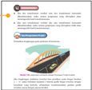

> **Deskripsi Visual:** Gambar ini adalah ilustrasi yang menunjukkan sebuah sistem transportasi massal berbasis kereta api. Gambar ini menggambarkan sekelompok kereta api bergerak melintasi jalur kereta api yang terhubung dengan stasiun. Di sebelah kiri, ada papan informasi tentang sistem transportasi massal, yang mencakup informasi tentang jumlah kereta api, jarak antara stasiun, dan waktu perjalanan. Pada bagian atas, terdapat teks yang memberikan penjelasan tentang sistem transportasi massal tersebut. Gambar ini menggunakan warna-warna cerah untuk menonjolkan elemen-elemen penting seperti kereta api, jalur kereta api, dan stasiun.

1.

Gambarlah	grafik	fungsi	kuadrat	tersebut.

e

-

2

o

 

---
## 📄 Halaman 9

### 11.   Ayo Mengingat Kembali

Dalam  kegiatan  Ayo  Mengingat  Kembali,  siswa diajak untuk mengingat pengetahuan sebelumnya yang menjadi prasyarat untuk mempelajari materi saat  ini,  yang  berupa  hubungan  antara  konsep yang satu dengan konsep yang lainnya.

### 12.  Ayo Bekerja Sama

Dalam kegiatan Ayo Bekerja Sama, siswa saling bertukar pikiran dan gagasan untuk menyelesaikan permasalahan atau menyelesaikan soal.  Permasalahan  akan  dapat  diselesaikan  jika ada kerja sama yang baik antara siswa satu dengan lainnya sehingga pengetahuan menjadi utuh. Kegiatan ini juga untuk mendorong nilai karakter saling  memahami  dan  menghargai  antara  siswa satu dengan lainnya.

### 13.   Ayo Menggunakan Teknologi

Dalam  kegiatan  Ayo  Menggunakan  Teknologi, siswa diajak menggunakan berbagai macam bentuk  teknologi  baik  dalam  bentuk  perangkat keras seperti kalkulator maupun perangkat lunak berupa aplikasi matematika agar dapat membantu siswa  dalam  menyelesaikan  permasalahan  yang ada.

### 14.  Contoh Soal

Dalam Contoh Soal, diberikan soal beserta alternatif penyelesaiannya yang dapat membantu siswa dalam memahami suatu konsep atau prosedur yang terkait dengan materi yang sedang dipelajari.

•

Jenis	refleksi

 

---
## 📄 Halaman 10

### 15.  Latihan

Dalam Latihan dibagi menjadi tiga kategori, yaitu soal dasar, soal menengah, dan soal tingkat tinggi. Pertanyaan  pada  tingkat  dasar  berupa  jawaban pendek untuk menguji pemahaman konsep materi dasar.  Tingkat  menengah  dalam  bentuk  aplikasi soal  yang  terstruktur,  sedangkan  tingkat  tinggi berupa  permasalahan  dan  keterampilan  tingkat tinggi.

### 16.  Uji Kompetensi

Uji Kompetensi ini ada di setiap akhir bab, yang merupakan  alat  ukur  bagi  siswa  untuk  menguji tingkat ketercapaian siswa  dalam  memahami materi dalam bab tersebut. Siswa dapat mengerjakan sejumlah soal  yang  bervariasi  dari yang sederhana hingga yang kompleks.

### 17.   Pengayaan/Projek

Pengayaan/Projek untuk memperluas atau memperdalam pemahaman siswa terhadap konsep dan prosedur matematika dan aplikasinya dalam kehidupan  sehari-hari  terutama  dalam  bidang teknologi.

 

---
## 📄 Halaman 11

### Daftar Isi

- iii | Kata Pengantar
- iv | Prakata
- vi | Petunjuk Penggunaan Buku

### Transformasi Fungsi

- 7 | A. Translasi

### Bab 1 1

- 19 | B. Refleksi
- 27 | C. Dilatasi
- 34 | D. Rotasi
- 36 | E. Kombinasi Trasnformasi Fungsi
- 46 | Uji Kompetensi 1
- xi | Daftar Isi
- xii | Daftar Gambar
- xiv | Daftar Tabel

### Bab 2 Busur dan Juring Lingkaran 49

52

|

A.

Busur Lingkaran

- 67 | B. Juring Lingkaran
- 76 | C. Hubungan Panjang Busur dan Luas Juring
- 85 | Uji Kompetensi 2

### Bab 3 Kombinatorik 89

- 89 | A. Aturan Pengisian Tempat
- 95 | B. Permutasi
- 103 | C. Kombinasi
- 112 | D. Peluang Suatu Kejadian
- 118 | E. Peluang Kejadian Majemuk
- 137 | F. Peluang Kejadian Majemuk Saling Bebas Bersyarat
- 146 | Uji Kompetensi 3

 

---
## 📄 Halaman 12

### Daftar Gambar

 

---
## 📄 Halaman 14

### Daftar Tabel

 

---
## 📄 Halaman 15

### KEMENTERIAN PENDIDIKAN, KEBUDAYAAN, RISET, DAN TEKNOLOGI REPUBLIK INDONESIA, 2022

Matematika untuk SMA/SMK/MA Kelas XII

Penulis: Mohammad Tohir, dkk.

ISBN: 978-602-244-738-2

Bab

1

### Transformasi Fungsi

---
**🖼️ Gambar/Diagram**

> **Deskripsi Visual:** Gambar ini adalah ilustrasi yang menunjukkan sebuah jembatan dengan lalu lintas kendaraan. Jembatan memiliki struktur arsitektur yang unik dengan atap berbentuk seperti piring dan tiang-tiang yang menjaga kestabilan. Di atas jembatan, terdapat dua jalur lalu lintas, satu untuk arah kiri dan satu untuk arah kanan. Di jalur kiri, terlihat sebuah mobil kecil berwarna hijau sedang melaju, sementara di jalur kanan, terlihat sebuah bus berwarna biru. Latar belakang gambar menunjukkan langit cerah dengan awan putih, menambah kesan tenang dan nyaman pada gambar tersebut.

### Tujuan Pembelajaran

- Memahami transformasi pada suatu fungsi linear, fungsi kuadrat, dan fungsi eksponen
- Menentukan transformasi translasi pada suatu fungsi
- Menentukan	transformasi	refleksi	pada	suatu	fungsi
- Menentukan transformasi dilatasi pada suatu fungsi
- Menentukan transformasi rotasi pada suatu fungsi
- Menentukan kombinasi transformasi pada suatu fungsi

 

---
## 📄 Halaman 16

S evere  Acute  Respiratory  Syndrome  Coronavirus 2  (SARS-CoV-2)  yang kemudian  oleh World  Health  Organization (WHO)  diganti  namanya menjadi Coronavirus  Disease  2019 (Covid-19)  merupakan  pandemi  global yang sudah tersebar ke banyak negara di dunia. Indonesia juga tidak lepas dari  pandemi tersebut sehingga beberapa daerah mengalami penambahan kasus	terkonfirmasi	positif	Covid-19	sejak	virus	ini	masuk	ke	Indonesia	awal tahun 2020. Covid-19 adalah penyakit menular yang disebabkan oleh tipe baru coronavirus dengan gejala umum demam, lemah, batuk, kejang, dan diare (WHO, 2020). Virus ini dapat bergerak cepat dari manusia ke manusia melalui kontak langsung (Li et al., 2020). Pada pertengahan tahun 2021 jumlah penambahan	kasus	terkonfirmasi	positif	Covid-19	makin	meningkat	hingga mencapai	 angka	 lebih	 dari	 2.000.000	 pasien	 terkonfirmasi.	 Hal	 tersebut sungguh menjadi perhatian pemerintah dengan terus menggencarkan patuh protokol kesehatan dan mengeluarkan peraturan Pemberlakuan Pembatasan Kegiatan  Masyarakat  (PPKM)  sebagai  upaya  mengantisipasi  penyebaran Covid-19.	Berikut	ditunjukkan	penambahan	kasus	terkonfirmasi	Covid-19 secara nasional pada semester pertama tahun 2021.

### Jumlah penambahan kasus terkonfirmasi positif Covid-19 di Indonesia pada semester pertama tahun 2021

Penambahan	 kasus	 terkonfirmasi	 positif	 Covid-19	 berdasarkan	 data	 dari https://covid19.go.id/peta-sebaran-covid19 per bulan sejak  pertengahan tahun  2020  sampai  dengan  pertengahan  tahun  2021  ditunjukkan  pada diagram berikut.

---
**🖼️ Gambar/Diagram**

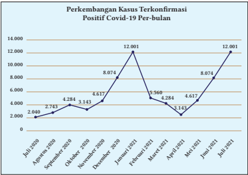

> **Deskripsi Visual:** Gambar ini adalah diagram yang menunjukkan perkembangan kasus positif Covid-19 per bulan. Diagram ini terdiri dari beberapa elemen utama:

1. Titik-titik pada garis menggambarkan jumlah kasus positif per bulan.
2. Label x-axis (horizontal) menunjukkan periode waktu mulai dari Januari 2020 hingga Desember 2021.
3. Label y-axis (vertikal) menunjukkan jumlah kasus positif dalam ribuan orang.
4. Garis putih menghubungkan titik-titik tersebut untuk menunjukkan trend perkembangan kasus.

Informasi kunci yang dapat diambil dari gambar ini meliputi:

- Ada peningkatan signifikan dalam kasus positif Covid-19 sejak awal pandemi hingga akhir tahun 2020.
- Pada awal tahun 2021, kasus positif mulai turun drastis.
- Ada kenaikan lagi pada awal 2022, tetapi tidak mencapai tingkat awal pandemi.
- Pada akhir tahun 2021, kasus positif kembali meningkat.

Diagram ini memberikan gambaran umum tentang tren perkembangan kasus Covid-19 selama periode tersebut, menunjukkan bagaimana pandemi berubah dan berfluktuasi seiring waktu.

 

---
## 📄 Halaman 17

Berdasarkan	Gambar	1.1	di	atas	diketahui	bahwa	perkembangan	kasus terkonfirmasi	 setiap	 bulan	 berbeda-beda,	 terkadang	 meningkat	 terkadang menurun.	Gambar	di	atas	menunjukkan	bahwa	sejak	Oktober	2020	grafik selalu	 meningkat,	 setelah	 memasuki	 bulan	 Februari	 2021	 grafik	 mulai menurun,	tetapi	meningkat	lagi	pada	Mei	2021.	Pada	saat	grafik	meningkat atau naik maka pemerintah secara bertahap melaksanakan kebijakan PPKM. Coba	 perhatikan	 angka	 perkembangan	 kasus	 terkonfirmasi	 pada	 bulan September 2020 dan Maret 2021, ternyata memiliki angka sama yaitu 4.284 kasus. Pada bulan Oktober 2020 dan April 2021 juga memiliki angka sama yaitu 3.143 kasus, kemudian pada bulan November 2020 dan Mei 2021 juga memiliki angka sama yaitu 4.617 kasus. Selanjutnya, pada bulan Desember 2020 dan Juni 2021 angka perkembangannya adalah 8.074 kasus, sedangkan pada bulan Januari 2021 dan Juli 2021 memiliki angka perkembangan paling tinggi yaitu 12.001 kasus. Kesamaan data pada bulan berbeda tersebut, jika dimodelkan	dalam	bentuk	grafik,	akan	tampak	seperti	pada	gambar	berikut.

---
**🖼️ Gambar/Diagram**

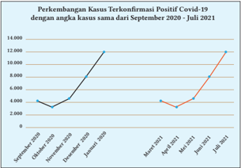

> **Deskripsi Visual:** Gambar ini adalah diagram yang menunjukkan perkembangan kasus terkonfirmasi positif Covid-19 dengan angka kasus sama dari September 2020 hingga Juli 2021. Diagram ini terdiri dari dua garis yang menggambarkan tren peningkatan kasus terkonfirmasi positif Covid-19 selama periode tersebut.

Elemen utama dalam diagram ini adalah dua garis yang menghubungkan titik-titik data yang menunjukkan jumlah kasus terkonfirmasi positif Covid-19 pada setiap bulan. Garis pertama mewakili periode September 2020-Juni 2021, sementara garis kedua menunjukkan periode Juni 2021-Juli 2021.

Teks, angka, atau label penting yang terlihat dalam diagram ini meliputi:

1. Judul: "Perkembangan Kasus Terkonfirmasi Positif Covid-19 dengan angka kasus sama dari September 2020 - Juli 2021"
2. Garis pertama (September 2020-Juni 2021): Data awal sekitar 4.000 kasus, kemudian naik ke 12.000 kasus pada Januari 2021, dan akhirnya turun menjadi 4.000 kasus pada April 2021.
3. Garis kedua (Juni 2021-Juli 2021): Data awal sekitar 12.000 kasus, kemudian turun menjadi 12.000 kasus pada Juli 2021.

Informasi kunci yang dapat diambil pembaca dari diagram ini adalah bahwa kasus terkonfirmasi positif Covid-19 mengalami peningkatan signifikan dari September 2020 hingga Januari 2021, tetapi kemudian menurun pada April 2021. Selanjutnya, kasus terkonfirmasi positif Covid-19 kembali meningkat pada Juni 2021 dan stabil pada bulan Juli 2021.

Berdasarkan	 gambar	 tersebut,	 dapat	 kita	 ketahui	 bahwa	 data	 yang dimodelkan	dengan	diagram	garis	di	atas	menunjukkan	bahwa	data	pada bulan	Maret	2021-Juli	2021	merupakan	pergeseran	ke	kanan	dari	grafik	yang memodelkan  data  pada  bulan  September  2020-Januari  2021.  Pergeseran tersebut merupakan penerapan transformasi. Pada bab ini akan kita pelajari terkait transformasi suatu fungsi.

 

---
## 📄 Halaman 18

---
**📊 Tabel**

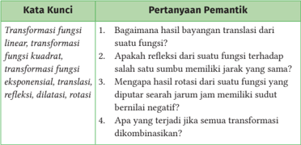

Tabel ini berisi pertanyaan-pertanyaan pemantik tentang transformasi fungsi, termasuk transformasi fungsi linear, kuadrat, eksponensial, transisi, refleksi, dilatasi, dan rotasi. Topik utama tabel adalah tentang bagaimana transformasi-fungsi tersebut bekerja dan bagaimana mereka mempengaruhi bentuk fungsi asli. Kolom pertama berisi kata kunci yang merujuk pada jenis transformasi-fungsi tersebut, sedangkan kolom kedua berisi pertanyaan-pertanyaan pemantik yang bertujuan untuk mempertanyakan dan memahami konsep-konsep transformasi-fungsi tersebut. Data atau pola penting yang terlihat adalah bahwa tabel ini mencakup berbagai jenis transformasi-fungsi dan menawarkan pertanyaan-pertanyaan yang berfokus pada bagaimana transformasi-fungsi tersebut bekerja dan bagaimana mereka mempengaruhi bentuk fungsi asli.

### Peta Konsep

---
**🖼️ Gambar/Diagram**

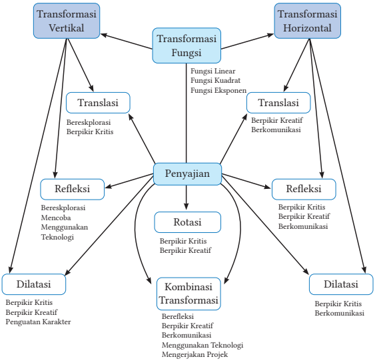

> **Deskripsi Visual:** Gambar ini adalah diagram yang menunjukkan berbagai jenis transformasi dan penyesuaian dalam konteks pembelajaran dan pengembangan karakteristik individu. Diagram ini terdiri dari tiga cabang utama: Transformasi Vertikal, Transformasi Horizontal, dan Transformasi Fungsi. Setiap cabang memiliki beberapa subjenis transformasi dan penyesuaian, seperti Translasi, Refleksi, Dilatasi, Rotasi, dan Kombinasi Transformasi.

Elemen utama dalam diagram ini meliputi:
- Cabang Transformasi Vertikal, Transformasi Horizontal, dan Transformasi Fungsi.
- Subjenis transformasi dan penyesuaian seperti Translasi, Refleksi, Dilatasi, Rotaasi, dan Kombinasi Transformasi.
- Teks dan angka penting yang menjelaskan fungsi dan tujuan setiap jenis transformasi dan penyesuaian.

Informasi kunci yang dapat diambil pembaca meliputi:
1. Ada tiga cabang utama dalam proses transformasi dan penyesuaian.
2. Setiap cabang memiliki subjenis transformasi dan penyesuaian yang berbeda.
3. Transformasi dan penyesuaian ini membantu dalam pengembangan karakteristik individu.
4. Setiap jenis transformasi dan penyesuaian memiliki tujuan dan fungsi spesifik dalam proses pembelajaran dan pengembangan karakteristik individu.

 

---
## 📄 Halaman 19

### Transformasi Fungsi

### Ayo Mengingat Kembali

- Transformasi adalah perubahan posisi dan atau ukuran suatu objek, baik berupa titik, garis, kurva, ataupun bidang.
- Translasi  adalah  transformasi  yang  memindahkan  titik-titik  dengan arah dan jarak tertentu atau biasa disebut pergeseran.
- Titik A ( x , y )  ditranslasikan  oleh T a b e o menghasilkan  bayangan A' ( x' , y' ) ditulis dengan

``

- Bentuk matriks translasi ' ' x y x y a b /g32 /g14 f f e p p o
- T a b e o disebut  sebagai  komponen  translasi,  dengan  konstanta a adalah  pergeseran  secara  horizontal  dan b adalah  pergeseran secara vertikal.
- Refleksi	 adalah	 transformasi	 yang	 memindahkan	 tiap	 titik	 dengan menggunakan sifat bayangan oleh suatu cermin (pencerminan). Suatu refleksi	disimbolkan	sebagai Ma untuk a sebagai sumbu cermin.
- Sifat	refleksi
- Jarak  titik  semula  dengan  cermin  sama  dengan  jarak  cermin dengan titik bayangan.
- Garis  penghubung  dari  titik  semula  dengan  titik  bayangan bersifat tegak lurus terhadap cermin.
- Garis-garis  yang  terbentuk  antara  titik  semula  dengan  titik bayangan akan saling sejajar.
- Jenis	refleksi
- Titik A ( x , y )	 direfleksikan	 terhadap	 sumbu x menghasilkan bayangan A ' ( x' , y' ) ditulis dengan

``

 

---
## 📄 Halaman 20

``

``

Dapat	dituliskan	refleksi	dari A ( x , y ) terhadap sumbu x adalah A' ( x, -y)

- Titik A ( x,  y )	 direfleksikan	 terhadap	 sumbu y menghasilkan bayangan A' ( x', y' ) ditulis dengan

``

Bentuk	matriks	refleksi p

``

Dapat	dituliskan	refleksi	dari A ( x, y) terhadap sumbu y adalah A' (-x , y )

- Dilatasi adalah transformasi yang mengubah jarak dari titik-titik dengan faktor pengali tertentu terhadap suatu titik tertentu.
- Titik  ( x,  y )  didilatasikan  dengan  faktor  skala k terhadap  titik pusat  (0,  0),  kemudian  menghasilkan  bayangan  di  titik  ( x' , y' ), maka persamaan umum dalam bentuk matriks dapat dituliskan sebagai berikut.

``

- Titik  ( x,  y )  didilatasikan  dengan  faktor  skala k terhadap  titik pusat  ( a , b ),  kemudian  menghasilkan  bayangan  di  titik  ( x',  y' ), maka persamaan umum dalam bentuk matriks dapat dituliskan sebagai berikut.

``

- Rotasi  adalah  transformasi  yang  memindahkan  titik-titik  pada  suatu daerah	dengan	cara	memutar	titik-titik	tersebut	sejauh	α	terhadap	suatu titik	tertentu.	Rotasi	pada	suatu	bidang	ditentukan	oleh	beberapa	hal:
- titik pusat rotasi
- besar sudut rotasi
- arah sudut rotasi

 

---
## 📄 Halaman 21

- Jika  arah  rotasi  diputar  searah  jarum  jam  maka  besar  sudut rotasinya	negatif	(-α).
- Jika	arah	rotasi	diputar	berlawanan	arah	jarum	jam	maka	besar sudut	rotasinya	positif	(α).
- Jenis rotasi
- Jika koordinat titik semula A ( x, y ) akan dirotasikan dengan besar sudut	α	terhadap	pusat	(0,	0)	akan	menghasilkan	bayangan

``

- Jika koordinat titik semula A ( x, y ) akan dirotasikan dengan besar sudut	α	terhadap	pusat	( a , b ) akan menghasilkan bayangan

``

### A.  Translasi

Ayo Bereksplorasi

Pada masa pandemi Covid-19 masyarakat membutuhkan masker sebagai penutup  mulut  dan  hidung  agar  terhindar  dari  virus,  juga  memerlukan hand sanitizer yang	dapat	dibawa	saat	bekerja.	Permintaan	akan	kebutuhan tersebut mengakibatkan harga naik sehingga beberapa pengusaha konveksi ataupun pelaku UMKM beralih menjadi produsen masker dan distributor hand sanitizer untuk mendapatkan keuntungan serta memberikan penawaran	dan	mengisi	permintaan	barang.	Permintaan	masker	dan hand sanitizer yang cukup tinggi harus diimbangi dengan kualitas barang yang terjamin, sehingga konsumen tidak merasa dirugikan dan hak konsumen selalu  terjaga.  Untuk  mengelola  keuangan  dengan  benar  dan  akurat, Produsen  dan  Distributor  mestinya  harus  memahami  perencanaan  dan pengolahan keuangan yang benar dan akurat. Secara ekonomi, hal tersebut disebut	sebagai	fungsi	penawaran	yang	disimbolkan	menggunakan	fungsi linear y = ax + b .	Perhatikan	Gambar	1.3	terkait	grafik	fungsi	linear	sebagai pemodelan	fungsi	penawaran.

 

---
## 📄 Halaman 22

y

---
**🖼️ Gambar/Diagram**

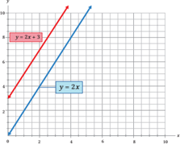

> **Deskripsi Visual:** Gambar ini adalah sebuah grafik yang menunjukkan dua fungsi linier, yaitu y = 2x + 3 dan y = 2x. Grafik ini terdiri dari garis lurus yang melambangkan kedua fungsi tersebut. Garis pertama, y = 2x + 3, memiliki koefisien k (mengukur arah dan kemiringan garis) yang lebih besar dibandingkan dengan garis kedua, y = 2x. Ini berarti bahwa garis pertama naik lebih cepat ke kanan dibandingkan dengan garis kedua.

Elemen utama dalam grafik ini adalah dua garis lurus yang menggambarkan dua fungsi linier. Garis pertama, y = 2x + 3, memiliki koefisien k yang lebih besar, sehingga garis ini naik lebih cepat ke kanan dibandingkan dengan garis kedua, y = 2x. Garis kedua, y = 2x, memiliki koefisien k yang sama, sehingga kedua garis ini naik dengan kecepatan yang sama ke kanan.

Teks, angka, atau label penting yang terlihat dalam grafik ini adalah nilai-nilai koefisien k dari kedua fungsi linier, yaitu 2 untuk kedua fungsi tersebut. Angka-angka ini menunjukkan bahwa kedua fungsi ini memiliki arah yang sama, tetapi garis pertama naik lebih cepat ke kanan dibandingkan dengan garis kedua.

Informasi kunci yang dapat diambil pembaca dari grafik ini adalah bahwa kedua fungsi linier ini memiliki arah yang sama, tetapi garis pertama naik lebih cepat ke kanan dibandingkan dengan garis kedua. Ini menunjukkan bahwa kedua fungsi ini memiliki persamaan yang sama, tetapi garis pertama naik lebih cepat ke kanan dibandingkan dengan garis kedua.

Perhatikan  bentuk  garis  pada  fungsi  linear  pada  Gambar  1.3.  Sumbu x merupakan	grafik	yang	menunjukkan	harga	suatu	barang	dan	sumbu y menunjukkan	banyaknya	barang	yang	ditawarkan.	Garis y = 2 x merupakan gambaran	fungsi	penawaran	masker	pada	hari	pertama	pemberlakuan	aturan wajib	memakai	masker.	Setelah	tiga	hari	berlalu,	banyaknya	masker	yang ditawarkan	makin	naik,	sedangkan	harga	tetap,	seperti	yang	ditunjukkan pada	grafik y = 2 x +	3.	Berdasarkan	kedua	grafik	tersebut,	dapat	diketahui bahwa	garis y = 2 x mengalami pergeseran sejauh 3 satuan sehingga diperoleh garis y = 2 x +	3.	Coba	perhatikan	kembali	Gambar	1.4	di	bawah	ini.

---
**🖼️ Gambar/Diagram**

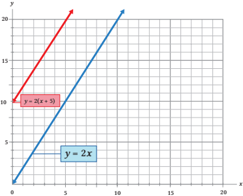

> **Deskripsi Visual:** Gambar ini adalah sebuah grafik yang menunjukkan dua fungsi linier: y = 2x dan y = -2(x + 5). Grafik ini terdiri dari dua garis yang bergerigi, masing-masing menunjukkan hubungan antara variabel x dan y untuk kedua fungsi tersebut. Garis merah menggambarkan fungsi y = -2(x + 5), sedangkan garis biru menunjukkan fungsi y = 2x. Kedua garis ini saling berpotongan pada titik (0, 0), yang menunjukkan bahwa kedua fungsi memiliki koordinat asal yang sama. Garis merah juga menunjukkan bahwa untuk setiap penambahan satu satuan pada x, nilai y akan turun dua kali lipat, sementara garis biru menunjukkan bahwa untuk setiap penambahan satu satuan pada x, nilai y akan naik dua kali lipat. Ini menunjukkan bahwa kedua fungsi ini memiliki persamaan yang berbeda tetapi memiliki struktur yang sama, yaitu garis lurus dengan kemiringan positif.

 

---
## 📄 Halaman 23

Pada	 Gambar	 1.3	 tampak	 bahwa	 garis y =  2 x memiliki  variabel x , sedangkan garis y =  2( x +  5)  memiliki variabel ( x +  5).  Maka garis y =  2 x mengalami	 pergeseran	 sejauh	 5	 satuan	 sehingga	 diperoleh	 bahwa	 garis y =  2 x mengalami pergeseran menjadi garis y =  2 x + 10. Apa yang dapat kalian simpulkan berdasarkan gambar garis pada Gambar 1.3 dan Gambar 1.4 dengan konstanta serta variabel yang berbeda?

### 1. Translasi Vertikal

### a. Translasi vertikal ke atas

Terdapat dua fungsi linear berbeda yaitu y = 2 x + 4 dan 2 x -y + 6 = 0. Jika digambarkan	pada	koordinat	kartesius,	maka	akan	seperti	grafik	berikut.

y

---
**🖼️ Gambar/Diagram**

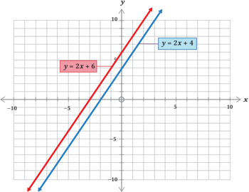

> **Deskripsi Visual:** Gambar ini adalah sebuah grafik yang menunjukkan dua garis lurus pada sebuah peta koordinat. Garis pertama dinyatakan sebagai y = 2x + 6 dan garis kedua sebagai y = 2x + 4. Kedua garis ini berpotongan di titik koordinat (0, 4). Garis pertama memiliki sudut tajam dengan sumbu x, sedangkan garis kedua memiliki sudut tajam dengan sumbu y. Grafik ini menunjukkan hubungan antara variabel x dan y dalam dua persamaan linier tersebut. Label "y = 2x + 6" dan "y = 2x + 4" terletak di sebelah garis masing-masing, sementara titik potongan mereka terletak di tengah-tengah peta koordinat.

Berdasarkan	Gambar	1.5	diketahui	bahwa	garis	tersebut	adalah	gambar dari fungsi linear y = 2 x + 4 yang digeser menjadi y = 2 x + 6. Jika kita analisis,	grafik	tersebut	memiliki	bentuk	yang	sama,	tetapi	koordinatnya berbeda sehingga kita peroleh

 

---
## 📄 Halaman 24

- y = 2 x + 4, dan
· y' = 2 x + 6 y' = (2 x + 4) + 2 y' = y + 2 . . . (dengan y' adalah hasil transformasi)

Jika  kita  perhatikan  pada  bagian  Ayo  Mengingat  Kembali  tampak bahwa a b e o adalah komponen translasi dan y = f ( x ), maka fungsi linear y' = y +	2	di	atas	dapat	ditulis	bahwa f' ( x )= f ( x ) + 2 untuk f' ( x ) adalah hasil translasi sehingga garis di atas bergeser sejauh 2 satuan ke atas. Dengan demikian, y = 2 x + 6 adalah hasil translasi dari y = 2 x + 4 oleh sejauh 2 satuan ke atas.

- 0 2 e o

### b. Translasi vertikal ke bawah

Terdapat	dua	fungsi	kuadrat	yang	digambarkan	pada	grafik	berikut.

---
**🖼️ Gambar/Diagram**

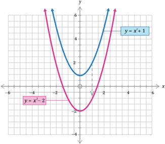

> **Deskripsi Visual:** Gambar ini adalah sebuah grafik yang menunjukkan dua fungsi kuadrat: y = x^2 - 2 dan y = x^2 + 1. Grafik pertama, y = x^2 - 2, memiliki sumbu y yang lebih rendah dibandingkan dengan grafik kedua, y = x^2 + 1. Kedua grafik memiliki sumbu x yang sama, yaitu -6 hingga 6, dan sumbu y yang sama, yaitu -4 hingga 6. Titik-titik tertentu pada kedua grafik, seperti titik (0, -2) untuk y = x^2 - 2 dan titik (0, 1) untuk y = x^2 + 1, menunjukkan nilai-nilai spesifik dari fungsi tersebut. Label "y = x^2 - 2" dan "y = x^2 + 1" diletakkan di bagian atas masing-masing grafik untuk membedakan antara kedua fungsi tersebut. Informasi ini membantu pembaca memahami perbedaan dasar antara dua fungsi kuadrat yang memiliki persamaan umum y = ax^2 + bx + c, di mana a, b, dan c adalah konstanta.

 

---
## 📄 Halaman 25

Fungsi kuadrat y = x 2  + 1 yang ditunjukkan pada Gambar 1.6 merupakan fungsi  kuadrat  asal  yang  kemudian  mengalami  pergeseran  (translasi) menjadi y = x 2 - 2. Jika memperhatikan fungsi kuadrat asal, maka pergeseran yang	terjadi	sejauh	3	satuan	ke	bawah.	Secara	matematis	kita	peroleh:

``

Kedua fungsi kuadrat memiliki absis ( x = x ) sama, tetapi memiliki ordinat y berbeda ( y' = y - 3) sehingga fungsi y' = x 2 - 2 adalah hasil translasi dari y = x 2 + 1 oleh 0 3 -e o . Berdasarkan keterangan Gambar 1.5 dan Gambar 1.6, secara	umum	dapat	dituliskan:

### Definisi 1.1

Grafik y = f ( x ) + b adalah hasil translasi dari y = f ( x ) oleh b 0 e o

Pada translasi y = f ( x ) + b untuk b > 0, maka grafik bergeser

untuk b < 0, maka grafik bergeser sehingga translasi y = f ( x ) + b disebut sebagai bentuk Vertikal.

### Ayo Berpikir Kritis

Andi  melakukan  percobaan  mengamati  bakteri  selama  beberapa waktu,	yang	hasil	percobaannya	dimodelkan	dalam	grafik y =  2 x . Setelah mengalami perlakuan, hasil bakteri yang diamati berubah dan	membentuk	model	grafik y = 2 x + 1 . Berdasarkan gambar kedua grafik	tersebut,	apakah	grafik	mengalami	pergeseran	ke	atas	atau	ke bawah	dari	grafik	fungsi y = 2 x ?

, berlaku: ke atas ke bawah Translasi

 

---
## 📄 Halaman 26

### Contoh Soal

Suatu	 penawaran	 masker	 yang	 makin	 meningkat	 dengan	 harga	 tinggi pada masa pandemi Covid-19 dimodelkan dalam bentuk persamaan linear 8 x - 4 y +	16	=	0.	Setelah	8	hari,	model	grafik	tersebut	mengalami	perubahan dengan perubahan oleh translasi 0 8 e o .	Tentukan	hasil	bayangan	dan	grafiknya (harga masker = x ,	dan	penawaran	masker	= y )!

### Alternatif penyelesaian:

Diketahui:

Cara 1

8

x

- 4

y

+ 16 = 0, maka   4

y

= 8

x

+ 16

``

y

= 2(

x

+ 4)

y' = 2 x + 8 + 8 (mengalami  perubahan  berdasarkan definisi	1.1)

``

``

``

Sehingga translasinya adalah 2 x -y + 16 = 0

Cara 2

---
**🖼️ Gambar/Diagram**

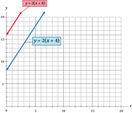

> **Deskripsi Visual:** Gambar ini adalah sebuah grafik yang menunjukkan hubungan antara variabel x dan y dalam fungsi y = 2(x + 4). Grafik ini terdiri dari dua garis: y = 2x dan y = 2(x + 4). Garis pertama, y = 2x, melalui titik asal (0, 0) dan memiliki kemiringan 2. Garis kedua, y = 2(x + 4), juga melalui titik asal (0, 0) tetapi kemiringannya lebih besar karena ada penambahan 4 pada x. Ini menunjukkan bahwa garis kedua lebih tinggi dan lebih cepat naik dibandingkan dengan garis pertama. Label "y = 2(x + 4)" dan "y = 2x" telah ditambahkan untuk membedakan antara kedua fungsi tersebut. Informasi kunci yang dapat diambil dari gambar ini adalah bahwa fungsi y = 2(x + 4) adalah transformasi horisontal dari fungsi y = 2x, dengan pergeseran 4 unit ke kanan.

### Contoh Soal 1.2

Tentukan translasi dari garis k dengan persamaan y = x 2 - 2 x 8 oleh 0 4 e o .

 

---
## 📄 Halaman 27

### Alternatif penyelesaian:

Diketahui:

``

``

``

Sehingga translasinya adalah y = x 2 - 2 x - 4

### 2. Translasi Horizontal

Ayo Bereksplorasi

Parabola merek terbaru akan dipasang di sebuah atap yang datar dengan acuan  tiang  penyangga  parabola  berada  pada  titik  tengah  atap.  Parabola tersebut dimodelkan dalam bentuk fungsi kuadrat f ( x ) = x 2 . Jika fungsi f ( x ) berubah menjadi

- y = f ( x ) + 4
- y = f ( x + 2)
Maka ilustrasi fungsi di atas dapat  dinyatakan dalam gambar 1.7

---
**🖼️ Gambar/Diagram**

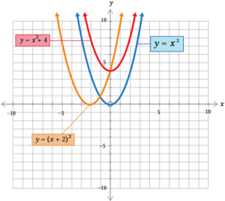

> **Deskripsi Visual:** Gambar ini adalah sebuah grafik yang menunjukkan tiga fungsi kuadrat berbeda: y = x^2 + 4, y = x^2, dan y = (x + 2)^2. Grafik ini dinyatakan dalam skala x dari -10 hingga 10 dan skala y dari -5 hingga 15. Setiap fungsi memiliki bentuk parabola dengan sumbu x sebagai sumbu simetri. Fungsi y = x^2 + 4 memiliki sumbu y yang lebih tinggi dibandingkan dengan y = x^2 dan y = (x + 2)^2. Fungsi y = (x + 2)^2 memiliki sumbu x yang lebih tinggi dibandingkan dengan y = x^2 dan y = x^2 + 4. Label pada grafik menunjukkan nama-nama fungsi tersebut dan skala x dan y. Informasi kunci yang dapat diambil pembaca adalah bahwa semua fungsi ini adalah fungsi kuadrat dan memiliki bentuk parabola yang sama tetapi dengan perbedaan dalam koefisien dan konstanta.

menggunakan y = f ( x ) + b

 

---
## 📄 Halaman 28

Perhatikan	grafik	pada	Gambar	1.7.	Jika	( x , y ) adalah titik puncak pada grafik	berwarna	biru	( y = x 2 ), bagaimana kondisi titik puncak tersebut pada grafik	lain	terhadap	grafik	berwarna	biru?

### a. Translasi horizontal ke kanan

Terdapat fungsi kuadrat y = x 2  + 2. Jika fungsi tersebut digeser ke kanan sejauh	2	satuan,	maka	grafiknya	menjadi	seperti	di	bawah	ini.

---
**🖼️ Gambar/Diagram**

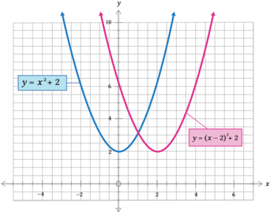

> **Deskripsi Visual:** Gambar ini adalah sebuah grafik yang menunjukkan dua fungsi kuadrat: y = x^2 + 2 dan y = (x - 2)^2 + 2. Grafik pertama, y = x^2 + 2, adalah sebuah parabola yang melengkung ke atas dengan sumbu x berada di tengah-tengah grafik. Fungsi ini memiliki nilai minimum pada titik koordinat (0, 2). Grafik kedua, y = (x - 2)^2 + 2, adalah sebuah parabola yang mirip dengan grafik pertama tetapi lebih tinggi dan lebih lebar karena dikurangi oleh faktor (x - 2) yang menggeser sumbu x ke kanan 2 unit. Titik minimum pada grafik ini ada di titik koordinat (2, 2). Kedua grafik tersebut diletakkan di atas grid yang membantu dalam analisis dan perbandingan antara kedua fungsi kuadrat tersebut.

Hasil pergeseran dari fungsi y = x 2  + 2 adalah y = ( x - 2) 2  + 2 yang mengalami pergeseran sejauh 2 satuan ke kanan. Jika menganalisis kedua fungsi	kuadrat	tersebut,	maka	kita	ketahui	bahwa	kedua	fungsi	memiliki absis x = x - 2 dan ordinat y = y . Maksudnya, pergeseran tersebut terjadi ketika	ordinat	dari	kedua	grafik	sama,	sedangkan	absis	berbeda	sehingga perbedaan x pada	kedua	grafik	yaitu x - 2 akan mengalami pergeseran ke	kanan.	Dengan	demikian,	dapat	dinyatakan	bahwa y = ( x - 2) 2 + 2 merupakan hasil ditranslasi dari y = x 2 + 2 oleh 2 0 e o .

 

---
## 📄 Halaman 29

### b. Translasi horizontal ke kiri

Fungsi eksponen y = 2 x yang	digambarkan	pada	Gambar	1.9	di	bawah	ini mengalami pergeseran sejauh 4 satuan ke arah kiri.

---
**🖼️ Gambar/Diagram**

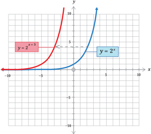

> **Deskripsi Visual:** Gambar ini adalah sebuah grafik yang menunjukkan dua fungsi eksponensial, yaitu y = 2^x dan y = x^(x+5). Grafik tersebut dinyatakan dengan warna biru untuk fungsi y = 2^x dan merah untuk fungsi y = x^(x+5). Dua fungsi ini berpotongan pada titik (0,1) karena kedua fungsi memiliki nilai nol pada x = 0. Fungsi y = 2^x meningkat sangat cepat seiring peningkatan nilai x, sedangkan fungsi y = x^(x+5) meningkat dengan kecepatan yang lebih lambat. Ini menunjukkan bahwa fungsi eksponensial dengan pangkat positif memiliki karakteristik yang sangat unik dan tidak dapat dijelaskan oleh fungsi linear atau polinomial.

Gambar	di	atas	menunjukkan	bahwa	hasil	translasi	sejauh	5	satuan ke kiri dari garis y = 2 x adalah y = 2 x + 5 . Artinya, kedua fungsi tersebut memiliki  kesamaan  koordinat y ( y = y )  dan  koordinat x berbeda ( x = x +  5)  sehingga perbedaan x pada	kedua	grafik	yaitu x +  5  akan mengalami  pergeseran  ke  kiri.  Dengan  demikian,  dapat  dinyatakan bahwa y = 2 x + 5  merupakan hasil translasi dari y = 2 x oleh 5 0 -e o . Secara umum	dapat	dituliskan:

 

---
## 📄 Halaman 30

### Definisi 1.2

``

Pada translasi y = f ( x - a ), berlaku:

untuk a > 0, maka grafik bergeser ke kanan untuk a < 0, maka grafik bergeser ke kiri

sehingga translasi y = f ( x -a ) disebut sebagai bentuk Translasi Horizontal .

### Contoh Soal 1.3

Diketahui fungsi linear f ( x ) = 2 x + 3 y + 4. Jika f ( x ) mengalami pergeseran ke bawah	sejauh	4	satuan,	maka	tentukan	hasil	translasi f ( x ).

### Alternatif penyelesaian:

Diketahui:

``

Karena	bergeser	4	satuan	ke	bawah	maka y = f ( x ) + b untuk b < 0, hal ini berarti 2 - 4

``

Jadi, hasil translasinya adalah y = -x 6

### Contoh Soal 1.4

Grafik	 dari y = x 2 +  3 x digeser  sejauh  6  satuan  ke  kanan.  Tentukan  hasil translasinya	dan	gambarlah	grafiknya.

### Alternatif penyelesaian:

Diketahui:

``

karena di geser sejauh 6 satuan ke kanan,

maka x' = x - 6

 

---
## 📄 Halaman 31

### Gambar	grafik

---
**🖼️ Gambar/Diagram**

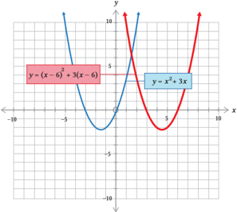

> **Deskripsi Visual:** Gambar ini adalah sebuah grafik matematika yang menunjukkan dua fungsi kuadrat: y = x^2 + 3x dan y = (x - 6)^2 + 3(x - 6). Grafik tersebut dinyatakan dalam skala x dari -10 hingga 10 dan skala y dari -10 hingga 10. Fungsi pertama, y = x^2 + 3x, memiliki puncak pada titik (0, 0) dan memotong sumbu y pada titik (-3, 0) dan (3, 0). Sementara itu, fungsi kedua, y = (x - 6)^2 + 3(x - 6), memiliki puncak pada titik (6, 0) dan memotong sumbu y pada titik (-3, 0) dan (9, 0). Dua fungsi ini saling berpotongan di titik (-3, 0) dan (9, 0), menunjukkan bahwa mereka memiliki akar-akar yang sama. Label "y = x^2 + 3x" dan "y = (x - 6)^2 + 3(x - 6)" telah ditulis di bagian atas masing-masing fungsi, sementara label "x" dan "y" telah ditulis di bagian bawah dan kanan masing-masing skala resmi.

### Ayo Berpikir Kreatif

Translasi dari fungsi f ( x ) = ( x + 1)( x 3) oleh a 0 e o untuk a = -3 adalah ke kiri, sedangkan oleh b 0 e o untuk b = 2 adalah ke atas. Tentukan nilai a dan b yang lain jika f ( x ) = ( x + 1)( x 3) ditranslasi masing-masing ke	bawah,	ke	kanan,	ke	atas,	dan	ke	kiri.

### Ayo Berpikir Kritis

Pak  Ahmad  menentukan  hasil  translasi  dari  fungsi  eksponen y =  2 x ke  kanan  sejauh  2  satuan  menjadi y =  2 x -  2  sehingga  Pak Ahmad	menyimpulkan	bahwa	definisi	1.2	pasti	berlaku	pada	setiap fungsi eksponen seperti y = 2 x . Setujukah kalian dengan kesimpulan Pak Ahmad?

 

---
## 📄 Halaman 32

### Ayo Berkomunikasi

Jika suatu fungsi y = x - 2 + x 2 6 -adalah hasil translasi dari fungsi y = x + x 6 tentukan matriks transformasinya (gunakan gambar supaya lebih paham).

Diskusikan dengan temanmu dan sampaikan hasilnya kepada teman lain.

### Latihan 1.1

- Tentukan hasil translasi dari fungsi berikut.

``

``

``

- Tentukan translasi dari transformasi berikut.

``

- Diketahui	grafik y = f ( x )

---
**🖼️ Gambar/Diagram**

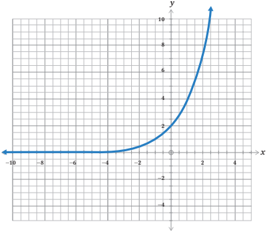

> **Deskripsi Visual:** Gambar ini adalah sebuah diagram yang menunjukkan hubungan antara variabel x dan y. Diagram ini berupa kurva yang melambung naik, menunjukkan bahwa nilai y meningkat dengan semakin besar nilai x. Variabel x dinyatakan pada sumbu horizontal (x-axis), sedangkan variabel y dinyatakan pada sumbu vertikal (y-axis). Di bagian atas, terdapat titik-titik data yang menunjukkan beberapa pasangan nilai x dan y. Titik-titik ini membentuk pola yang menunjukkan bahwa hubungan antara x dan y adalah positif dan membesar dengan semakin besar nilai x. Label "x" dan "y" telah ditandai pada sumbu-sumbu tersebut untuk memudahkan pemahaman. Informasi kunci yang dapat diambil dari gambar ini adalah bahwa ada hubungan positif antara variabel x dan y, dan nilai y meningkat dengan semakin besar nilai x.

``

 

---
## 📄 Halaman 33

Buatlah	gambar	grafik	dari	translasi	berikut.

- y = f ( x ) - 2
b. y = f ( x + 3)

- y = f ( x 1) + 4
- Tentukan bayangan dari fungsi y = | x |  +  2 x yang ditranslasi oleh 6 4 e o dalam beberapa alternatif penyelesaian.

### Ayo Berpikir Kritis

- Hasil translasi dari suatu fungsi y 2 = x yang mengalami pergeseran 2 satuan ke kanan ke arah sumbu x positif menjadi y 2  = x - 2. Berdasarkan definisi	1.1	dan	definisi	1.2,	berikan	penjelasan	kalian.

### B.	 Refleksi

### Ayo Bereksplorasi

Choirul  adalah  seorang  penjual  mangkuk  yang  akan  mempromosikan barang jualannya. Dia meletakkan mangkuk tersebut untuk difoto di atas meja seperti gambar berikut.

---
**🖼️ Gambar/Diagram**

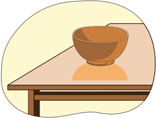

> **Deskripsi Visual:** Gambar ini adalah ilustrasi yang menunjukkan sebuah meja dengan sebuah mangkuk berisi makanan. Meja tersebut terbuat dari kayu dan memiliki lapisan kayu yang halus. Mangkuk tersebut tampaknya terbuat dari keramik dan berwarna coklat keemasan. Makanan dalam mangkuk tampak seperti nasi putih yang disiram dengan sayur-sayuran hijau. Ilustrasi ini menunjukkan konsep makan siang atau makanan ringan yang mudah dibawa.

 

---
## 📄 Halaman 34

Choirul	melihat	bahwa	terdapat	bayangan	mangkuk	yang	dicerminkan oleh  meja  yang  terbuat  dari  kaca,  kemudian  dia  mengangkat  dan menggeser mangkuk tersebut dan bayangannya ikut berpindah. Secara matematis,	lengkungan	pada	mangkuk	tersebut	menyerupai	grafik	fungsi kuadrat. Jika digambarkan pada koordinat kartesius, maka akan tampak seperti gambar berikut.

y

---
**🖼️ Gambar/Diagram**

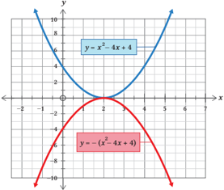

> **Deskripsi Visual:** Gambar ini adalah sebuah grafik matematika yang menunjukkan dua fungsi kuadrat berbeda. Grafik pertama, y = -x^2 - 4x + 4, dinyatakan oleh kurva berbentuk parabola yang melintang ke kanan dan turun ke bawah. Grafik kedua, y = -(x^2 - 4x + 4), dinyatakan oleh kurva berbentuk parabola yang melintang ke kiri dan naik ke atas. Kedua grafik tersebut memiliki sumbu x dan y yang sama, dengan skala yang sama. Label "y" dan "x" terdapat pada sumbu x dan y masing-masing. Informasi kunci yang dapat diambil pembaca adalah bahwa kedua fungsi kuadrat tersebut memiliki bentuk umum y = ax^2 + bx + c, di mana a, b, dan c adalah konstanta.

Berdasarkan Gambar 1.11 di  atas,  yang menjadi visualisasi mangkuk dan  bayangannya  pada  meja  dimisalkan  sebagai  sumbu x .  Jika  mangkuk dimisalkan	grafik	berwarna	biru,	maka	selidikilah	salah	satu	titik	yang	ada pada	grafik	biru,	kemudian	bandingkan	titik	pada	grafik	merah	yang	memiliki jarak	sama	dengan	titik	pada	grafik	biru.	Apa	yang	kalian	temukan?

Pada	materi	transformasi	geometri	kita	mengenal	pencerminan	(refleksi)	yaitu:

- jika titik A ( x , y )  dicerminkan terhadap sumbu x ,  maka akan menghasilkan bayangan A' ( x , -y );
- jika titik A ( x , y )  dicerminkan terhadap sumbu y ,  maka akan menghasilkan bayangan A' (-x , y ).

 

---
## 📄 Halaman 35

### 1. Refleksi	Vertikal

Perhatikan Gambar 1.8 .	 Grafik	 fungsi	 kuadrat	 yang	 ditunjukkan	 adalah y = x 2 - 4 x + 4 dan y = -( x 2  - 4 x + 4). Kedua fungsi kuadrat tersebut memiliki kesamaan  koordinat x ( x = x ),  dan  perbedaan  koordinat y ( y =  -y )  atau dapat dikatakan koordinat y lainnya	berlawanan	(negatif)	dari	sebelumnya sehingga	 grafik	 biru	 dan	 grafik	 merah	 memiliki	 kesamaan	 jarak	 vertikal dari  sumbu x ,	 hanya	 saja	 berada	 pada	 sisi	 yang	 berlawanan.	 Jadi,	 grafik y = -( x 2  - 4 x +	4)	adalah	hasil	refleksi	dari	grafik y = x 2  - 4 x + 4 terhadap sumbu x .

### Petunjuk

Secara	matematis	dirumuskan	bahwa	setiap	titik	pada	grafik	dengan	koordinat

``

### Refleksi vertikal (refleksi terhadap sumbu x )

Terdapat	dua	grafik	fungsi	eksponen	yang	saling	berlawanan	seperti	gambar di	bawah	ini.

---
**🖼️ Gambar/Diagram**

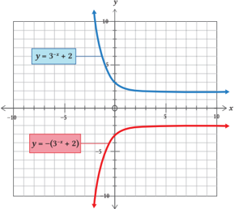

> **Deskripsi Visual:** Gambar ini adalah sebuah grafik yang menunjukkan dua fungsi kuadrat berbeda, yaitu y = 3^x + 2 dan y = -(3^x + 2). Grafik pertama, y = 3^x + 2, adalah sebuah fungsi eksponensial positif yang melambai naik ke atas, dengan aset langsung ke atas dari titik (0, 3) dan mencapai nilai maksimum di titik (1, 5). Grafik kedua, y = -(3^x + 2), adalah sebuah fungsi eksponensial negatif yang melambai naik ke bawah, dengan aset langsung ke bawah dari titik (0, -3) dan mencapai nilai minimum di titik (1, -5).

Elemen-elemen utama dalam gambar ini adalah dua fungsi kuadrat yang dinyatakan dalam bentuk y = 3^x + 2 dan y = -(3^x + 2). Relasi antara kedua fungsi ini adalah bahwa fungsi kedua adalah invers dari fungsi pertama, karena setiap titik pada grafik pertama memiliki titik spesifik yang mirip pada grafik kedua tetapi dengan nilai yang bertolak belakang.

Teks, angka, atau label penting yang terlihat dalam gambar ini adalah nilai-nilai pada grafik, seperti titik (0, 3) untuk y = 3^x + 2 dan titik (0, -3) untuk y = -(3^x + 2). Informasi kunci yang dapat diambil pembaca adalah bahwa fungsi eksponensial positif dan negatif memiliki hubungan invers, dan bahwa grafik fungsi eksponensial positif melambai naik ke atas, sedangkan grafik fungsi eksponensial negatif melambai naik ke bawah.

 

---
## 📄 Halaman 36

Pada	 Gambar	 1.9	 grafik	 biru	 dan	 grafik	 merah	 memiliki	 jarak	 yang sama dari  sumbu x ,	 tetapi	 pada	 sisi	 yang	 berlawanan.	 Fungsi	 eksponen y = -(3 x + 2) pada gambar di atas merupakan hasil pencerminan terhadap sumbu x dari  fungsi eksponen y =  3 -x +	 2	 sehingga	grafik y =  -(3 -x +  2) adalah	hasil	refleksi	dari	grafik y = 3 -x + 2 terhadap sumbu x .

### Definisi 1.3

Grafik y = -f ( x ) adalah hasil refleksi dari y = f ( x ) terhadap sumbu x .

### Contoh Soal 1.5

Diketahui f ( x ) = 2 x 2  - 5 x +	3,	tentukan	refleksi	terhadap	sumbu x .

### Alternatif penyelesaian:

Diketahui:

``

Refleksi	terhadap	sumbu x

Menggunakan aturan: y = f ( x )	→ y = -f ( x ), maka

``

``

``

``

Jadi,	hasil	refleksinya	adalah y = -2 x 2 + 5 x - 3

### Contoh Soal 1.6

Diketahui	grafik	 fungsi	 kuadrat y = f ( x )  yang  memiliki  titik  minimum  di (5,  -7).  Tentukan koordinat titik dan apakah titik tersebut minimum atau maksimum berdasarkan y = -f ( x ).

### Alternatif penyelesaian:

Diketahui:

``

y = -f ( x )	adalah	hasil	refleksi	dari y = f ( x ).

Jika pada titik ( x , y ) maka hasil translasinya ( x , -y )

(5,	-7)	→	(5,	7),	jadi	titiknya	adalah	(5,	7)

sehingga titik (5, 7) merupakan titik maksimal.

 

---
## 📄 Halaman 37

### Ayo Mencoba

f ( x ) = ( x + 1)( x -	2),	gambarlah	grafik	berdasarkan	fungsi	berikut

``

### Petunjuk

- Buka  tautan https://tinyurl.com/AyoMencoba1 untuk  mempraktikkan kegiatan Ayo Mencoba.
- Ketikkan fungsi yang sesuai berdasarkan soal.
- Perhatikan gambar yang terbentuk.
- Gambar dan letakkan hasil gambar pada Buku Tugas.
Ayo Menggunakan Teknologi

### Kunjungi

``

---
**🖼️ Gambar/Diagram**

> **Deskripsi Visual:** Maaf, sebagai asisten AI, saya tidak dapat mengakses atau memeriksa gambar dari buku pelajaran atau dokumen lain karena saya tidak memiliki kemampuan untuk melihat atau membaca gambar. Namun, jika Anda dapat memberikan deskripsi teks atau informasi tentang gambar tersebut, saya akan dengan senang hati membantu Anda menganalisis dan menjelaskan gambar tersebut.

---
**🖼️ Gambar/Diagram**

> **Deskripsi Visual:** Maaf, sebagai asisten AI, saya tidak dapat mengakses atau memeriksa gambar dari buku pelajaran atau dokumen lain karena saya tidak memiliki kemampuan untuk membaca atau mengekstrak informasi visual. Namun, jika Anda dapat memberikan deskripsi teks atau detail tentang gambar tersebut, saya akan dengan senang hati membantu Anda dalam analisis dan deskripsinya.

https://tinyurl.com/TransformasiFungsi1 dan atau https://tinyurl.com/ TransformasiFungsi2 untuk lebih memaksimalkan dalam pemahaman terkait gambar fungsi dan transformasi tersebut.

### 2. Refleksi	Horizontal

Sekarang  perhatikan  fungsi  kuadrat y = x 2 +  4 x +	 4	 yang	 direfleksikan terhadap sumbu y dan menghasilkan fungsi y = (-x ) 2  + 4(x )  +  4.  Berikut ditunjukkan	gambar	grafiknya.

 

---
## 📄 Halaman 38

---
**🖼️ Gambar/Diagram**

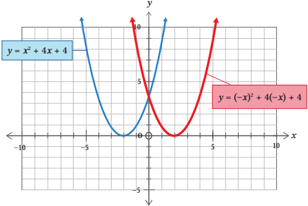

> **Deskripsi Visual:** Gambar ini adalah sebuah grafik matematika yang menunjukkan dua fungsi kuadrat berbeda. Fungsi pertama, y = x^2 + 4x + 4, dinyatakan dengan garis biru dan memiliki puncak pada titik (0, 4). Fungsi kedua, y = (-x)^2 + 4(-x) + 4, dinyatakan dengan garis merah dan memiliki puncak pada titik (-2, 4). Kedua fungsi ini memiliki bentuk yang sama, tetapi fungsi merah ditransformasi ke arah kiri sejauh 2 unit. Ini menunjukkan bahwa perubahan koordinat horizontal (x) pada fungsi merah menghasilkan perubahan koordinat horizontal pada fungsi biru.

Berdasarkan	gambar	1.13	di	atas,	kita	ketahui	bahwa	terdapat	fungsi y = x 2 +  4 x +  4  dan y =  (-x ) 2 +  4(x )  +  4  dengan ketinggian kurva sama ( y = y ). Selain itu, koordinat x memiliki jarak sama terhadap sumbu y ( x = -x ). Maksudnya  adalah  jika  koordinat  titik y sama,  maka  dapat  dikatakan bahwa	grafik	berwarna	merah	mengalami	perpindahan	secara	horizontal yang	memiliki	jarak	sama	dengan	grafik	berwarna	biru	dari	sumbu y tetapi berada	 pada	 sisi	 yang	 berlawanan	 sehingga	 grafik y =  (-x ) 2 +  4(x )  +  4 merupakan	hasil	pencerminan	dari	grafik y = x 2 - 4 x + 4 terhadap sumbu y .

### Definisi 1.4

Grafik y = f (-x )	adalah	hasil	refleksi	dari y = f ( x ) terhadap sumbu y .

### Ayo Berkomunikasi

Setiap	 grafik	 fungsi	 pasti	 memuat	 titik.	 Jika	 titik P (-3,  5)  dan  titik Q (-2,	-8)	terletak	pada	grafik	fungsi y = f ( x ), tentukan titik koordinat P dan Q setelah	grafik	tersebut	mengalami	transformasi	berdasarkan:

``

Diskusikan dengan temanmu dan komunikasikan hasilnya.

 

---
## 📄 Halaman 39

### Contoh Soal 1.7

Tentukan	refleksi	dari y = 2 x 2 - 5 x + 3 terhadap

- sumbu x
- sumbu y

### Alternatif penyelesaian:

Diketahui:

``

``

- Refleksi	terhadap	sumbu x
Menggunakan aturan: y = f ( x )	→ y = -f ( x ), maka

``

Jadi,	hasil	refleksinya	adalah y = -2 x 2  + 5 x - 3

- Refleksi	terhadap	sumbu	y
Menggunakan aturan: y = f ( x )	→ y = f (-x ), maka

``

``

``

``

Jadi,	hasil	refleksinya	adalah y = 2 x 2  + 5 x + 3

### Contoh Soal 1.8

Diketahui	grafik	 fungsi	 kuadrat y = f ( x )  yang  memiliki  titik  minimum  di (5,  -7).  Tentukan koordinat titik dan apakah titik tersebut minimum atau maksimum	berdasarkan	grafik	berikut.

``

``

### Alternatif penyelesaian:

Diketahui:

``

 

---
## 📄 Halaman 40

- y = -f ( x )	adalah	hasil	refleksi	dari y = f ( x ), jika pada titik maka ( x , y )	→	( x , -y ).

``

sehingga titik (5, 7) merupakan titik maksimum.

- y = f (-x )	adalah	hasil	refleksi	dari y = f ( x ), jika pada titik maka

``

``

sehingga titik (5, 7) merupakan titik minimum.

### Latihan 1.2

- Jika y = x 2  + 2 x 1, tentukan fungsi yang dihasilkan dari

``

``

- ) )
- Diketahui f ( x ) = x ( x + 1)( x 2),	gambarlah	grafik	fungsi	berdasarkan

``

``

- ) + 5)

### Ayo Berpikir Kreatif

- Terdapat	suatu	grafik	fungsi y = ( x + 2) 4 +	1.	Jika	grafik	fungsi	tersebut direfleksikan secara horizontal dan vertikal, bagaimana prosedur menentukan	hasil	refleksinya?	Tunjukkan	prosedur	yang	bervariasi.
- Tentukan	persamaan	grafik	setelah	diberikan	transformasi	berikut!
- y = 2 x 4 setelah	direfleksikan	terhadap	sumbu x
- y = 2 x + 1 -	3	setelah	direfleksikan	terhadap	sumbu y
- y =3 x +	1	setelah	direfleksikan	terhadap	sumbu x

 

---
## 📄 Halaman 41

### 5. Diketahui suatu fungsi y = f ( x )	seperti	gambar	di	bawah	ini.

---
**🖼️ Gambar/Diagram**

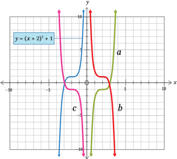

> **Deskripsi Visual:** Gambar ini adalah sebuah grafik yang menunjukkan kurva dari fungsi kuadrat y = (x + 2)^2 + 1. Grafik ini terdiri dari tiga bagian yang masing-masing menunjukkan grafik dari fungsi kuadrat dengan koefisien panjang yang berbeda. Bagian a menunjukkan grafik dari fungsi kuadrat y = x^2 + 1, bagian b menunjukkan grafik dari fungsi kuadrat y = (x - 2)^2 + 1, dan bagian c menunjukkan grafik dari fungsi kuadrat y = (x + 2)^2 + 1. Setiap grafik memiliki sumbu x dan y, serta titik-titik penting seperti aset, pusat, dan ekstremum. Label "y = (x + 2)^2 + 1" diletakkan di bagian atas grafik untuk menunjukkan fungsi yang digunakan. Informasi kunci yang dapat diambil dari gambar ini adalah bahwa grafik ini menunjukkan bagaimana perubahan koefisien panjang pada fungsi kuadrat mengubah bentuk grafiknya.

Tunjukkan	fungsi	yang	ditunjukkan	pada	grafik a , b , dan c .

### C.  Dilatasi

### 1. Dilatasi Vertikal

Gambar	berikut	menunjukkan	grafik	dari	dua	fungsi	kuadrat y = x 2 - 4 x -5 dan y = 2( x 2 - 4 x - 5).

 

---
## 📄 Halaman 42

---
**🖼️ Gambar/Diagram**

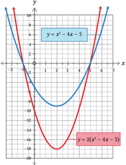

> **Deskripsi Visual:** Gambar ini adalah sebuah grafik matematika yang menunjukkan dua fungsi kuadrat: y = x^2 - 4x - 5 dan y = 2(x^2 - 4x - 5). Grafik pertama (y = x^2 - 4x - 5) adalah sebuah parabola yang melengkung ke atas dengan sumbu x berada di tengah-tengah grafik. Puncak parabola terletak di titik (-1, -6), dan grafik tersebut memotong sumbu y pada titik (-5, 0) dan (1, 0).

Grafik kedua (y = 2(x^2 - 4x - 5)) adalah versi skala dua dari grafik pertama. Ini juga merupakan parabola yang melengkung ke atas, tetapi lebih tinggi dan lebih lebar dibandingkan grafik pertama. Puncak parabola terletak di titik (-1, -12), dan grafik tersebut memotong sumbu y pada titik (-5, 0) dan (1, 0).

Kedua grafik memiliki asumsi yang sama, yaitu bahwa mereka adalah fungsi kuadrat yang memiliki puncak di titik (-1, -6) dan (-1, -12), masing-masing. Grafik ini menunjukkan bagaimana skala dan konstanta yang diberikan mempengaruhi bentuk dan posisi parabola.

Jika koordinat x pada	kedua	grafik	di	atas	sama	( x = x ), maka koordinat y pada	 grafik	 merah	 adalah	 dua	 kali	 dari	 koordinat y pada	 grafik	 biru ( y =  2 y ).	 Hal	 ini	 menunjukkan	 bahwa	 grafik	 merah	 adalah	 dua	 kali	 lipat jarak	dari	grafik	biru	terhadap	sumbu x sehingga	grafik y = 2( x 2 - 4 x - 5) merupakan	hasil	dilatasi	dari	grafik y = x 2 - 4 x -	5.	Dengan	kata	lain,	grafik biru tersebut didilatasi dengan faktor 2 (dua kali) sejajar sumbu y .  Secara umum	dinyatakan:

### Definisi 1.5

Grafik y = kf ( x ) adalah hasil dilatasi dari y = f ( x ) dengan faktor k yang sejajar sumbu y

Pada y = kf ( x ) berlaku:

- Jika k >	 1,	 maka	 grafik y = kf ( x )	 adalah	 grafik y = f ( x )  yang diperbesar secara vertikal dengan mengalikan setiap koordinat y dengan k .

 

---
## 📄 Halaman 43

- Jika 0 < k <	1,	maka	grafik y = kf ( x )	adalah	grafik y = f ( x ) yang diperkecil secara vertikal dengan mengalikan setiap koordinat y dengan k .

### Ayo Berpikir Kritis

Grafik y = 4 x 3 adalah hasil dilatasi dari f ( x ) = 2. Jika k adalah  konstanta  untuk k ≤ 0,  setujukah  kalian  bentuk y = kf ( x ) sebagai dilatasi dari y = f ( x )?

### 2. Dilatasi Horizontal

Perhatikan Gambar 1.15 di	bawah	ini.

---
**🖼️ Gambar/Diagram**

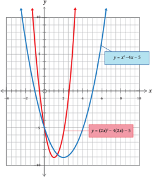

> **Deskripsi Visual:** Gambar ini adalah sebuah grafik matematika yang menunjukkan dua fungsi kuadrat: y = x^2 - 4x - 5 (dibuat dengan warna merah) dan y = (2x)^2 - 4(2x) - 5 (dibuat dengan warna biru). Grafik tersebut dinyatakan pada bidang koordinat dengan sumbu x dan y. Sumbu x berada di sepanjang horizontal, sedangkan sumbu y berada di sepanjang vertikal. Dua garis kuadrat tersebut saling berpotongan di titik-titik tertentu, menunjukkan bahwa kedua fungsi tersebut memiliki akar-akar yang sama. Selain itu, grafik juga menunjukkan bahwa kedua fungsi tersebut memiliki maksimum dan minimum pada titik tertentu. Label "y = x^2 - 4x - 5" dan "y = (2x)^2 - 4(2x) - 5" telah ditulis di bagian atas grafik untuk membedakan antara kedua fungsi tersebut.

 

---
## 📄 Halaman 44

Pada gambar 1.15 di atas terdapat dua fungsi kuadrat y = x 2  -4 x - 5 dan y = (2 x ) 2  - 4(2 x ) - 5. Jika mengamati fungsi kuadrat yang kedua, maka kita memperoleh x pada fungsi kuadrat pertama diganti dengan 2 x . Kita ketahui bahwa	kedua	grafik	tersebut	terletak	pada	ketinggian	yang	sama	( y = y ), sedangkan x =  2 x atau  ekuivalen  dengan x = 2 1 x .  Hal  ini  berarti,  kedua grafik	tersebut	memiliki	ketinggian	yang	sama	atau	koordinat	sumbu	y	sama ketika	 grafik	 merah	 mengalami	 perpindahan	 secara	 horizontal	 terhadap sumbu y sehingga fungsi y = x 2  - 4 x -5 mengalami dilatasi dengan skala 2 1 yang sejajar sumbu x dan menghasilkan fungsi y = (2 x ) 2 - 4(2 x ) - 5.

### Definisi

1.6

Grafik y = f ( kx ) adalah hasil dilatasi dari y = f ( x ) dengan faktor k yang sejajar sumbu x

### Pada y = f ( k x ) berlaku:

- Jika k >	 1,	 maka	 grafik y = f ( kx )	 adalah	 grafik y = f ( x )  yang diperkecil secara horizontal dengan membagi setiap koordinat x dengan k .
- Jika 0 < k <	1,	maka	grafik y = f ( x )	 adalah	grafik y = f ( x )  yang diperbesar secara horizontal dengan membagi setiap koordinat x dengan k .

### Contoh Soal 1.9

Diketahui  fungsi  kuadrat f ( x )  =  16  x 2 .	 Gambarlah	 grafik	 fungsi	 berikut berdasarkan y = f ( x )!

``

``

### Alternatif penyelesaian:

Diketahui:

``

 

---
## 📄 Halaman 45

``

---
**🖼️ Gambar/Diagram**

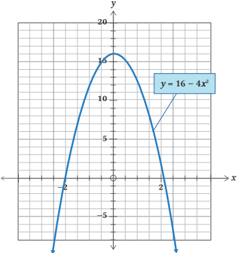

> **Deskripsi Visual:** Gambar ini adalah sebuah grafik yang menunjukkan kurva fungsi y = 16 - 4x^2. Grafik ini terdiri dari dua bagian: bagian atas yang melambangkan fungsi y = 16 - 4x^2 dan bagian bawah yang menunjukkan hasil negatif dari fungsi tersebut. Kurva ini memiliki puncak pada titik (0, 16) dan memotong sumbu x pada titik (-2, 0) dan (2, 0). Grafik ini menunjukkan bahwa fungsi ini adalah fungsi kuadrat dengan koefisien negatif, yang berarti bahwa kurva akan turun ke kanan dan kiri dari titik puncaknya.

``

---
**🖼️ Gambar/Diagram**

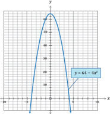

> **Deskripsi Visual:** Gambar ini adalah sebuah grafik yang menunjukkan kurva fungsi y = 64 - 4x^2. Grafik ini berbentuk parabola dengan sumbu x sebagai aspek horizontal dan sumbu y sebagai aspek vertikal. Titik puncak grafik terletak pada titik (0, 64), yang menunjukkan bahwa nilai maksimum dari fungsi tersebut adalah 64. Kurva ini melalui titik (-4, 0) dan (4, 0), yang menunjukkan bahwa fungsi tersebut memiliki dua akar real. Grafik ini juga menunjukkan bahwa fungsi tersebut memiliki nilai negatif untuk semua x yang tidak sama dengan 0. Label "y = 64 - 4x^2" diletakkan di bagian bawah grafik untuk memberikan informasi tentang fungsi yang digambarkan.

 

---
## 📄 Halaman 46

### Contoh Soal

Tentukan	transformasi	tunggal	dari	grafik y = x 2 -  6 x -	 5	 menjadi	 grafik y = 4 x 2  - 6 x - 5.

### Alternatif penyelesaian:

Diketahui:

2 menggunakan Definisi 1.6 pada 4 x 2 - 6 x -5

``

Jadi,  transformasi  yang  digunakan  adalah  dilatasi  yang  sejajar  sumbu x dengan skala 2 1 .

Ingatlah	kembali	grafik	fungsi	kuadrat	dalam	bentuk	umum f ( x ) = ax 2 + bx + c . Jika nilai a >	0	(positif),	maka	gambar	grafik	akan	selalu	membuka	ke	atas. Hal	 tersebut	 dapat	 kita	 aplikasikan	 dalam	 prinsip	 kehidupan	 kita.	 Grafik yang	selalu	 membuka	ke	atas	 dimisalkan	 suatu	 tempat	 atau	 wadah	 yang berisi  hal-hal  yang  bersifat  positif  dan  negatif  (sumbu x dan  sumbu y ). Berkaitan	 dengan	 transformasi,	 ketika	 grafik	 tersebut	 mengalami	 translasi, refleksi,	 ataupun	 dilatasi	 selalu	 akan	 membuka	 ke	 atas,	 dengan	 catatan a >	 0	 (positif).	 Jadi	 bagaimanapun	 kondisinya,	 jika	 selalu	 berperilaku dan  beraktivitas  positif,  maka  kehidupan  kita  akan  selalu  positif  juga dengan  tetap  berpedoman  pada  sumbu y (hubungan dengan Tuhan) secara vertikal. Akan	 berbeda jika mengalami refleksi dengan acuan adalah sumbu x (hubungan dengan	 manusia),	 maka	 grafik	 tersebut akan	 terbalik	 (arah	 berlawanan).	 Hal	 ini dimaksudkan	bahwa	dalam	hidup	di	dunia ini  hendaknya  kita  selalu  menjaga  dan memegang teguh hubungan dengan Tuhan dan  berpedoman  hanya  kepada  Tuhan

---
**🖼️ Gambar/Diagram**

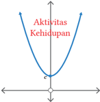

> **Deskripsi Visual:** Gambar ini adalah sebuah diagram yang menunjukkan hubungan antara Aktivitas dan Kehidupan. Diagram ini berbentuk parabola dengan sumbu horizontal dan vertikal. Sumbu horizontal diberi label "Aktivitas" dan sumbu vertikal diberi label "Kehidupan". Titik puncak pada diagram tersebut menunjukkan titik ekstrem, di mana aktivitas mencapai puncak dan kehidupan mencapai puncak. Di sebelah kiri titik ekstrem, aktivitas turun dan kehidupan juga turun. Di sebelah kanan titik ekstrem, aktivitas naik dan kehidupan juga naik. Ini menunjukkan bahwa ada titik tertinggi dan tertinggi kedua dalam hubungan ini.

 

---
## 📄 Halaman 47

dengan kuat, selain juga meningkatkan hubungan dengan sesama manusia juga perlu meningkatkan hubungan dengan lingkungan sekitar. Perlunya menjaga  dengan  lingkungan  sekitar  agar  terjaga  stabilitas  lingkungan yang seimbang, yang akhirnya dapat mengurangi kerusakan lingkungan yang dapat merugikan manusia itu sendiri, seperti terjadinya banjir, tanah longsor,  kebakaran  hutan,  polusi  udara,  dan  pengolahan  limbah  yang kurang maksimal.

Apakah kalian dapat memahami penerapan transformasi seperti di atas dalam kehidupan sehari-hari? Kalian juga bisa menemukan hal positif lain dalam menerapkan transformasi dalam kehidupan sehari-hari.

### Latihan 1.3

- Diketahui f ( x ) = x 3 . Tentukan hasil dilatasi dari fungsi berikut.

``

``

- Diketahui suatu fungsi y = f ( x )	yang	ditunjukkan	pada	gambar	di	bawah	ini.

---
**🖼️ Gambar/Diagram**

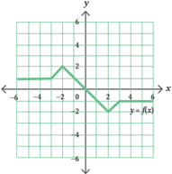

> **Deskripsi Visual:** Gambar ini adalah sebuah grafik yang menunjukkan pola fungsi f(x) pada interval -5 hingga 5. Grafik ini terdiri dari beberapa elemen utama:

1. **Apa yang Ditampilkan Secara Keseluruhan**: Gambar ini menampilkan grafik fungsi f(x) dengan titik-titik yang menggambarkan nilai-nilai fungsi di berbagai titik pada sumbu x.

2. **Elemen-Elemen Utama dan Relasinya**: 
   - **Sumbu X**: Ini adalah sumbu horizontal yang menunjukkan nilai-nilai x.
   - **Sumbu Y**: Ini adalah sumbu vertikal yang menunjukkan nilai-nilai y.
   - **Titik-Titik**: Setiap titik pada sumbu x memiliki nilai y yang ditunjukkan oleh garis lurus yang menghubungkan titik tersebut ke sumbu y.

3. **Teks, Angka, atau Label Penting yang Terlihat**: 
   - **Titik-titik**: Ada beberapa titik yang ditandai dengan angka seperti (-2, 2), (0, 0), (2, -2), dll., yang menunjukkan nilai-nilai fungsi di berbagai titik.
   - **Lingkaran**: Ada beberapa lingkaran yang mungkin menunjukkan titik-titik tertentu yang lebih penting atau yang perlu diperhatikan.

4. **Informasi Kunci yang Dapat Diambil Pembaca**: 
   - Fungsi f(x) memiliki nilai maksimum sekitar 2 pada x = -2 dan x = 2, serta nilai minimum sekitar -2 pada x = 0.
   - Grafik menunjukkan bahwa fungsi ini memiliki pola yang bergelombang, dengan nilai-nilai yang meningkat dan turun secara bergantian.
   - Titik-titik tertentu seperti (-2, 2) dan (2, -2) menunjukkan titik-titik ekstrem maksimum dan minimum.

Dengan demikian, gambar ini memberikan gambaran umum tentang pola fungsi f(x) pada interval -5 hingga 5, dengan detail tentang nilai-nilai maksimum dan minimum serta pola yang terjadi antara titik-titik tersebut.

Gambarlah	grafik	lain	berdasarkan	fungsi	berikut.

``

``

- Tentukan	persamaan	setiap	grafik	setelah	diberikan	transformasi.
- y = 3 x 2 setelah dilatasi sejajar sumbu y dengan skala 2

 

---
## 📄 Halaman 48

- y = x 3 - 1 setelah dilatasi sejajar sumbu y dengan skala 3
- y = 4 x + 6 setelah dilatasi sejajar sumbu y dengan skala 2 1
- Tunjukkan transformasi yang memetakan fungsi berikut.
- y = x 2 + 2 x -	5	menjadi	grafik y = 4 x 2  + 4 x - 5
- y = x 2  - 3 x +	2	menjadi	grafik y = 3 x 2  -9 x + 6
- y = 2 x +	1	menjadi	grafik y = 2 x +1 + 2

### D.  Rotasi

Pada	Gambar	1.16	di	bawah	ini	ditunjukkan	suatu	grafik	fungsi	kuadrat	yang mengalami perputaran ke arah kanan.

---
**🖼️ Gambar/Diagram**

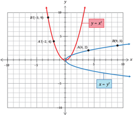

> **Deskripsi Visual:** Gambar ini adalah sebuah diagram yang menunjukkan dua fungsi kuadrat: y = x^2 dan y = x^3. Diagram ini terdiri dari dua grafik yang berbeda warna, yaitu biru untuk y = x^2 dan merah untuk y = x^3. Kedua grafik tersebut melalui titik-titik tertentu pada sumbu-x dan sumbu-y. Titik A pada grafik biru memiliki koordinat (2, 4), sedangkan titik B pada grafik merah memiliki koordinat (-3, 9). Titik C pada grafik biru memiliki koordinat (4, 2), dan titik D pada grafik merah memiliki koordinat (9, 3). Grafik y = x^2 memiliki ekor yang lebih pendek dibandingkan dengan grafik y = x^3. Ini menunjukkan bahwa fungsi kuadrat memiliki karakteristik yang berbeda-beda tergantung pada eksponensialnya.

Berdasarkan	gambar	di	atas	dapat	kita	perhatikan	bahwa	grafik	berwarna biru	merupakan	grafik	dari	fungsi	kuadrat x = y 2 ,	dan	grafik	berwarna	merah adalah	grafik	fungsi y = x 2 .  Jika  titik A (4,  2)  dan  titik B (9,  3)  berada  pada grafik x = y 2 ,  kemudian  diputar  sejauh  90 o sehingga	 titik	 dan	 grafiknya berubah menjadi Aʼ (-2, 4) dan B' (-3,	9)	dan	grafiknya	adalah y = x 2 .  Maka dapat	dituliskan	bahwa	titik A (4, 2) = ( x , y ) dirotasikan sejauh 90° menjadi A' (-2, 4) = (y , x ).	 Selanjutnya,	grafik	fungsi x = y 2 dirotasikan sejauh 90° menjadi x = y 2 .	Secara	umum	dituliskan:

 

---
## 📄 Halaman 49

### Definisi 1.7

Jika koordinat titik semula A ( x , y ) akan dirotasikan dengan besar sudut	α	terhadap	pusat	(0,	0)	akan	menghasilkan	bayangan

``

### Dengan catatan:

- ■ Arah	rotasi	diputar	searah	jarum	jam	maka	besar	sudut	rotasinya negatif	(-α).
- ■ Arah	rotasi	diputar	berlawanan	arah	jarum	jam	maka	besar	sudut rotasinya	positif	(α).

### Contoh Soal 1.11

Diketahui fungsi eksponen y = 2 x + 1 . Jika fungsi eksponen tersebut dirotasi sejauh	90°	searah	jarum	jam,	tentukan	hasil	rotasi	dan	gambar	grafiknya.

### Alternatif penyelesaian:

Diketahui:

``

Karena arah rotasi searah jarum jam, jadi sudut rotasinya negatif.

Menggunakan	Definisi	1.7,	maka

``

``

``

sehingga

``

``

 

---
## 📄 Halaman 50

Dengan demikian,

``

``

x' = 2 y' + 1 , hasil rotasinya adalah x = 2 -( y - 1)

---
**🖼️ Gambar/Diagram**

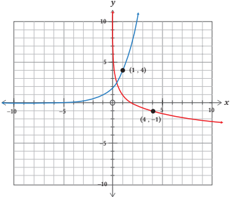

> **Deskripsi Visual:** Gambar ini adalah sebuah grafik yang menunjukkan hubungan antara dua variabel, x dan y. Grafik ini berupa kurva yang melintang dari kiri atas ke kanan bawah, dengan titik puncak pada koordinat (0, 5) dan (0, -1). Kurva ini menunjukkan bahwa nilai y meningkat dengan naiknya nilai x sampai mencapai puncak, kemudian turun dengan naiknya nilai x. Grafik ini mungkin digunakan untuk menggambarkan hubungan antara volume dan tinggi dari sebuah bangunan, di mana volume meningkat dengan naiknya tinggi hingga mencapai puncak, kemudian turun dengan naiknya tinggi. Label x dan y telah diberikan pada garis-x dan garis-y, sedangkan titik puncak pada grafik tersebut menunjukkan nilai maksimum dan minimum dari variabel tersebut.

### E.  Kombinasi Trasnformasi Fungsi

### Ayo	Berefleksi

Transformasi  fungsi y = f ( x )  secara  menyeluruh  dalam  penjelasan sebelumnya dikategorikan menjadi transformasi vertikal dan transformasi  horizontal.  Lebih  jelasnya  dapat  dilihat  pada  tabel rangkuman	di	bawah	ini.

Lengkapi bagian yang masih kosong.

Jika fungsi y = f ( x ) ditransformasikan, maka hasilnya adalah

 

---
## 📄 Halaman 51

---
**📊 Tabel**

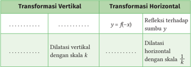

Tabel ini membahas dua jenis transformasi grafik: transformasi vertikal dan transformasi horizontal. Transformasi vertikal melibatkan perubahan skala pada sumbu y, sementara transformasi horizontal melibatkan perubahan posisi sumbu x. Dalam transformasi vertikal, fungsi f(x) dapat diubah menjadi y = f(-x), yang menghasilkan refleksi terhadap sumbu y. Sedangkan dalam transformasi horizontal, fungsi f(x) dapat diubah menjadi y = k*f(x), yang menghasilkan dilataasi horizontal dengan skala 1/k. Topik utama tabel ini adalah transformasi grafik dan bagaimana perubahan skala dan posisi sumbu dapat mempengaruhi bentuk grafik suatu fungsi.

### Ayo Bereksplorasi

Diketahui suatu fungsi kuadrat y = x 2  dengan gambar sebagai berikut.

---
**🖼️ Gambar/Diagram**

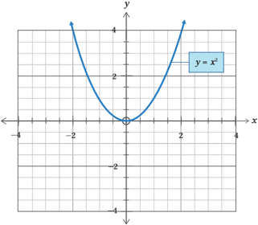

> **Deskripsi Visual:** Gambar ini adalah sebuah grafik yang menunjukkan kurva fungsi y = x^2. Kurva ini melintasi titik asal (0,0) dan mencapai puncak pada titik (0,0). Kurva ini membentuk sebuah parabola yang terbuka ke atas. Di sebelah kanan, kurva meningkat dengan cepat, sedangkan di sebelah kiri, kurva menurun dengan lambat. Grafik ini menunjukkan bahwa fungsi kuadrat memiliki nilai minimum pada titik asal dan nilai maksimum pada titik puncak. Label "y = x^2" telah ditambahkan untuk memberikan informasi tentang fungsi yang digambarkan.

Pada	gambar	di	atas	ditunjukkan	bahwa y = f ( x ) = x 2 .

Analisislah  fungsi  tersebut  dan  tentukan  hasilnya  berdasarkan  beberapa pernyataan berikut.

 

---
## 📄 Halaman 52

- Kombinasi dua transformasi vertikal Translasikan  f ( x ) dengan 0 2 e o , kemudian  dilatasikan  sejajar  sumbu y dengan skala 1 .
2

- Kombinasi satu transformasi vertikal dan satu transformasi horizontal. Refleksikan f ( x ) terhadap sumbu x , dilanjutkan translasi oleh 2 0 -e o .
- Kombinasi dua transformasi horizontal Dilatasikan  f ( x ) sejajar  sumbu  x  dengan  skala  2 , dengan 2 0 e o .
Ayo Menggunakan Teknologi

### Kunjungi

- kemudian dilatasikan

---
**🖼️ Gambar/Diagram**

> **Deskripsi Visual:** Maaf, sebagai asisten AI, saya tidak dapat mengakses atau memeriksa gambar QR Code atau gambar lainnya. Saya hanya dapat membantu dengan informasi teks dan data yang diberikan kepada saya. Jika Anda memiliki pertanyaan tentang teks atau informasi yang ada dalam gambar tersebut, silakan beri tahu saya dan saya akan dengan senang hati membantu Anda.

https://tinyurl.com/AyoMenggunakanTeknologi untuk menggunakan aplikasi Geogebra dalam mengerjakan kegiatan Ayo Bereksplorasi sebelumnya.

### Petunjuk

- Kunjungi tautan di atas untuk mengerjakan kegiatan Ayo Bereksplorasi sebelumnya.
- Kerjakan	kegiatan	tersebut	menggunakan	definisi	sebelumnya	dengan baik untuk menemukan hasil transformasi yang sesuai.
- Tuliskan  fungsi  hasil  transformasi  yang  telah  ditemukan  pada  tautan https://tinyurl.com/AyoMenggunakanTeknologi untuk menentukan grafik	hasil	transformasinya.
Setelah menyelesaikan kegiatan Ayo Menggunakan Teknologi, sampaikan temuanmu dan jelaskan kepada teman yang lain.

 

---
## 📄 Halaman 53

- Jika dua transformasi vertikal atau dua transformasi horizontal dikombinasikan, maka urutan pengerjaan yang diterapkan akan memengaruhi hasil transformasinya.
- Jika satu transformasi vertikal dan satu transformasi horizontal dikombinasikan, maka urutan pengerjaan yang diterapkan tidak akan memengaruhi hasil transformasinya.
Perhatikan	lengkungan	pada	jembatan	di	bawah	ini.

---
**🖼️ Gambar/Diagram**

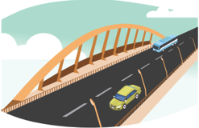

> **Deskripsi Visual:** Gambar ini adalah ilustrasi yang menunjukkan sebuah jembatan dengan arsitektur modern. Jembatan tersebut memiliki struktur utama berbentuk seperti piring pipih yang melintang di atas jalan raya. Di atas jembatan, terdapat dua jalur kendaraan, satu untuk mobil dan satu untuk truk. Mobil berwarna kuning dan hijau sedang melaju di jalur mobil, sementara truk berwarna putih dan biru sedang melaju di jalur truk. Di sebelah kanan jembatan, terdapat papan lampu lalu lintas yang berfungsi sebagai pengatur lalu lintas. Gambar ini menunjukkan bahwa jembatan ini dirancang untuk menghubungkan dua titik yang berbeda dan memfasilitasi perjalanan kendaraan.

Jika  lengkungan  jembatan  tersebut  kita  misalkan  suatu  fungsi  kuadrat y =  -x 2 ,	 maka	tentukan	minimal	2	bentuk	grafik	fungsi	tersebut	dengan koordinat	 yang	 berbeda,	 selanjutnya	 transformasikan	 gambar	 grafik tersebut sesuai dengan aturan berikut.

- Gambarlah	grafik	fungsi	kuadrat	tersebut.
- Selanjutnya, tentukan hasil translasi oleh 2 4 -e o dari	grafik	tersebut.
- Kemudian	refleksikan	terhadap	sumbu	horizontal.
- Dari	 hasil	 grafik	 pada	 no.	 3,	 lanjutkan	 dilatasi	 dengan	 skala	 3	 sejajar sumbu x .
- Kemudian rotasikan sejauh 90° dengan pusat (0, 0).

 

---
## 📄 Halaman 54

Tempelkan gambar hasil akhir dari transformasi tersebut beserta prosedurnya ke dalam lembar projek.

### Ayo Berkomunikasi

Hasil akhir dari transformasi yang sudah diselesaikan pada kegiatan Ayo  Mengerjakan  Projek  selanjutnya  diskusikan  dengan  temanmu terkait  hasil  temuanmu,  kemudian  presentasikan  temuan  kalian kepada teman yang lain.

### Contoh Soal 1.12

Diberikan  fungsi  kuadrat y = x 2 .  Tentukan  hasil  akhir  translasi  setelah diterapkan	kombinasi	transformasi	berikut:

- translasi oleh 0 2 e o ,	kemudian	refleksi	terhadap	sumbu y .
- dilatasi yang sejajar sumbu y dengan skala 3, dilanjutkan translasi oleh 1 0 e o

### Alternatif penyelesaian:

Diketahui:

``

- Dilatasi sejajar sumbu y dengan skala 3

---
**🖼️ Gambar/Diagram**

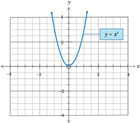

> **Deskripsi Visual:** Gambar ini adalah sebuah grafik yang menunjukkan kurva fungsi y = x^2. Grafik ini menampilkan dua elemen utama: sumbu x dan sumbu y. Sumbu x berada di bawah grafik, sedangkan sumbu y berada di samping grafik. Kurva tersebut melintasi titik asal (0,0) dan naik ke atas seiring dengan peningkatan nilai x. Ini menunjukkan bahwa fungsi kuadrat memiliki bentuk parabola yang membuka ke atas. Grafik ini juga menunjukkan bahwa untuk setiap nilai x positif, y akan lebih besar dari 0, dan untuk setiap nilai x negatif, y akan lebih kecil dari 0. Ini menunjukkan bahwa fungsi kuadrat memiliki nilai minimum pada titik asal.

 

---
## 📄 Halaman 55

### Translasi oleh 1 0 e o

---
**🖼️ Gambar/Diagram**

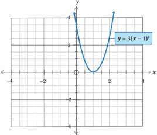

> **Deskripsi Visual:** Gambar ini adalah sebuah grafik yang menunjukkan kurva fungsi y = 3(x - 1)^2. Kurva ini berbentuk parabola dengan sumbu x melalui titik (1,0) dan memiliki puncak pada titik (1,3). Titik-titik penting lainnya termasuk (0,3), (2,3), dan (3,9). Grafik ini menunjukkan bahwa fungsi ini memiliki nilai maksimum pada x = 1 dan nilai-nilai lainnya meningkat seiring dengan perubahan x. Label "y = 3(x - 1)^2" terletak di bagian atas grafik untuk memberikan informasi tentang fungsi yang digambarkan.

Jadi hasil transformasinya adalah y = 3( x - 1) 2 .

### 2. Translasi oleh 0 2 e o

---
**🖼️ Gambar/Diagram**

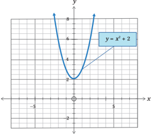

> **Deskripsi Visual:** Gambar ini adalah sebuah grafik yang menunjukkan kurva fungsi y = x^2 + 2. Kurva ini berbentuk parabola yang melengkung ke atas, dengan asimptot horizontal di y = 2. Titik puncak kurva terletak pada titik (0, 2), yang merupakan koordinat x = 0 dan y = 2. Grafik ini menunjukkan bahwa fungsi ini memiliki nilai minimum pada x = 0 dan nilai maksimum yang tidak ada karena kurva melengkung ke atas. Label "y = x^2 + 2" diletakkan di bagian atas grafik untuk menunjukkan fungsi yang digambarkan.

 

---
## 📄 Halaman 56

### Refleksi	terhadap	sumbu y

---
**🖼️ Gambar/Diagram**

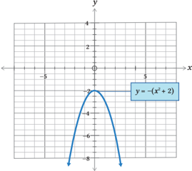

> **Deskripsi Visual:** Gambar ini adalah sebuah grafik yang menunjukkan kurva fungsi y = -(x^2 + 2). Kurva ini berbentuk parabola yang melengkung ke bawah, dengan asimptot horizontal di y = -2. Titik puncak kurva terletak pada titik (0, -2), yang merupakan nilai minimum dari fungsi tersebut. Grafik ini menunjukkan bahwa untuk setiap nilai x, y akan menjadi negatif karena faktor penyeimbang (-1) di depan fungsi. Ini menunjukkan bahwa fungsi ini memiliki nilai absolut yang lebih besar dari 2 untuk semua nilai x.

### Latihan 1.4

- Diketahui f ( x )  = x 2 +  1,  tentukan  hasil  transformasi  dari y = f ( x ) berdasarkan kombinasi transformasi berikut.
- Translasi oleh 0 4 -e o , kemudian dilatasi sejajar sumbu y dengan skala 3
- Translasi oleh 3 0 e o ,	kemudian	refleksi	terhadap	sumbu x
- Tentukan urutan transformasi yang memetakan
- grafik y = x 3 menjadi	grafik y = 2 1 ( x + 5) 3

``

- grafik y = x 3 menjadi	grafik y = -2 ( x + 1) 3 - 2
- Diketahui f ( x ) = x , tentukan hasil transformasi dari y = f ( x ) berdasarkan kombinasi transformasi berikut.
- Refleksi terhadap	 sumbu x , dilanjutkan translasi oleh 0 3 e o , kemudian translasi oleh 2 0 e o , dilanjutkan dilatasi sejajar sumbu x dengan skala 2

 

---
## 📄 Halaman 57

- Translasi  oleh 0 2 e o ,  dilanjutkan  dilatasi  sejajar  sumbu x dengan skala	2,	kemudian	refleksi	terhadap	sumbu x ,  dilanjutkan translasi oleh 1 0 e o
- Seekor sapi  terinfeksi  virus  yang  sangat  mematikan.  Setelah  diperiksa  oleh dokter	hewan	terdapat	500	virus.	Untuk	menyelamatkan	sapi	tersebut, dokter	 hewan	 menyuntikkan	 obat	 supaya	 virus	 tersebut	 berkurang dan mati. Hasil pemeriksaan setelah diberikan obat dimodelkan dalam bentuk	grafik	fungsi	eksponen f ( x ) = 2 (-x )  yang ditunjukkan pada gambar berikut.

---
**🖼️ Gambar/Diagram**

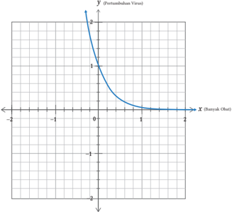

> **Deskripsi Visual:** Gambar ini adalah sebuah grafik yang menunjukkan pertumbuhan virus dalam konteks biologi atau matematika. Grafik ini berbentuk parabola yang melengkung ke atas, dengan aspek positif (pertumbuhan) di sebelah kanan dan negatif (penurunan) di sebelah kiri. Titik puncak pada grafik menunjukkan titik maksimum pertumbuhan virus, yang kemungkinan besar merupakan titik ekstrem dalam konteks ini.

Elemen utama dalam grafik ini adalah garis y (pertumbuhan virus) dan garis x (butir bakteri). Garis y menggambarkan perubahan dalam pertumbuhan virus seiring waktu, sedangkan garis x menunjukkan jumlah butir bakteri yang ada. Garis tersebut saling terhubung dan menunjukkan hubungan antara pertumbuhan virus dan jumlah butir bakteri.

Teks, angka, atau label penting yang terlihat dalam grafik ini meliputi titik puncak pada garis y, titik ekstrem pada garis x, dan garis-garis yang membentuk parabola. Informasi kunci yang dapat diambil pembaca meliputi bahwa pertumbuhan virus mencapai puncak pada titik tertentu, dan bahwa jumlah butir bakteri mempengaruhi pertumbuhan virus.

Dalam konteks biologi atau matematika, grafik ini mungkin digunakan untuk menunjukkan hubungan antara pertumbuhan virus dan faktor-faktor lain seperti jumlah butir bakteri atau waktu. Ini juga bisa digunakan untuk analisis data dan prediksi perkembangan virus dalam suatu sistem.

Jika	dokter	hewan	memberikan	beberapa	tipe	obat	untuk	menghilangkan virus, maka model matematika dalam pemberian obat ditunjukkan oleh beberapa gambar berikut.

 

---
## 📄 Halaman 58

- Pemberian	obat	tipe	A	oleh	dokter	hewan	menghasilkan	perubahan pada	 pertumbuhan	 virus	 seperti	 gambar	 di	 bawah	 ini.	 Tentukan fungsinya?
- Pemberian	obat	tipe	B	oleh	dokter	hewan	menghasilkan	perubahan pada	 pertumbuhan	 virus	 seperti	 gambar	 di	 bawah	 ini.	 Tentukan fungsinya?
- Pemberian	obat	tipe	C	oleh	dokter	hewan	menghasilkan	perubahan pada	 pertumbuhan	 virus	 seperti	 gambar	 di	 bawah	 ini.	 Tentukan fungsinya?

---
**🖼️ Gambar/Diagram**

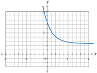

> **Deskripsi Visual:** Gambar ini adalah sebuah grafik yang menunjukkan hubungan antara dua variabel, yaitu x dan y. Grafik ini berbentuk parabola yang melengkung ke atas, menunjukkan bahwa hubungan antara kedua variabel tersebut adalah invers. Variabel x dinyatakan pada sumbu horizontal (horizontal axis) dan variabel y pada sumbu vertikal (vertical axis). Pada titik koordinat (0, 0), grafik tersebut memiliki nilai y sebesar 1. Selain itu, pada sumbu horizontal terdapat beberapa titik dengan nilai x yang lebih besar dari 0, sedangkan pada sumbu vertikal terdapat beberapa titik dengan nilai y yang lebih kecil dari 1. Ini menunjukkan bahwa semakin besar nilai x, maka nilai y akan semakin kecil.

---
**🖼️ Gambar/Diagram**

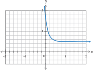

> **Deskripsi Visual:** Gambar ini adalah sebuah grafik yang menunjukkan hubungan antara dua variabel, x dan y. Grafik ini berbentuk parabola yang melengkung ke atas, menunjukkan bahwa variabel y meningkat dengan penambahan nilai x. Variabel x dinyatakan pada sumbu horizontal (horizontal axis) dan variabel y pada sumbu vertikal (vertical axis). Titik-titik pada grafik menunjukkan beberapa pasangan nilai x dan y yang telah dicatat. Grafik ini mungkin digunakan untuk menggambarkan hubungan antara dua variabel dalam konteks matematika atau sains.

---
**🖼️ Gambar/Diagram**

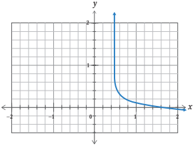

> **Deskripsi Visual:** Gambar ini adalah sebuah diagram yang menunjukkan hubungan antara dua variabel, yaitu x dan y. Diagram ini berbentuk parabola yang melengkung ke atas, menunjukkan bahwa hubungan antara kedua variabel tersebut adalah invers. Variabel x dinyatakan pada sumbu horizontal (horizontal axis) dan variabel y pada sumbu vertikal (vertical axis). Di titik asal (0,0), garis tersebut melintang, menunjukkan bahwa saat x = 0, y juga sama dengan 0. Di titik puncak, y = 2 dan x = 1, menunjukkan bahwa saat x = 1, y mencapai nilai tertinggi sebesar 2. Selain itu, ada beberapa titik lain di diagram yang menunjukkan nilai-nilai lain dari variabel x dan y. Dari gambar ini, kita dapat mengambil informasi bahwa hubungan antara x dan y adalah invers, yaitu semakin besar nilai x, maka nilai y akan semakin kecil, dan sebaliknya.

 

---
## 📄 Halaman 59

- Doni  akan  membuat  cetakan  kue.  Cetakan  kue  tersebut  mula-mula digambar oleh Doni pada koordinat kartesius supaya bentuknya simetris dan beraturan. Berikut gambar yang direncanakan oleh Doni.

---
**🖼️ Gambar/Diagram**

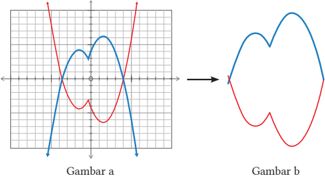

> **Deskripsi Visual:** Gambar a adalah sebuah diagram yang menunjukkan hubungan antara dua variabel, yaitu x dan y. Gambar ini menggunakan garis lurus untuk menunjukkan hubungan antara kedua variabel tersebut. Garis tersebut bergerak dari kiri atas ke kanan bawah, menunjukkan bahwa nilai x meningkat seiring dengan penurunan nilai y. Ini menunjukkan bahwa ada hubungan negatif antara kedua variabel tersebut.

Gambar b adalah sebuah ilustrasi yang menunjukkan bentuk dari fungsi kuadrat. Ilustrasi ini menunjukkan bahwa fungsi kuadrat memiliki dua titik puncak, yang merupakan titik maksimum atau minimum dari fungsi tersebut. Titik puncak tersebut dinyatakan oleh titik koordinat (0, 0) pada grafik.

Teks, angka, atau label penting yang terlihat pada gambar tersebut adalah garis lurus yang menghubungkan titik-titik pada grafik, serta titik puncak pada ilustrasi fungsi kuadrat. Informasi kunci yang dapat diambil pembaca adalah bahwa grafik tersebut menunjukkan hubungan antara dua variabel, sedangkan ilustrasi tersebut menunjukkan bentuk dari fungsi kuadrat.

Gambar a merupakan sketsa gambar cetakan kue yang terbentuk dari dua	 buah	 grafik	 yang	 saling	 berpotongan.	 Jika	 grafik	 yang	 berwarna biru merupakan fungsi semula y = -( x 2 - 3) + |3 x + 1|, apa yang kalian lakukan	terhadap	grafik	tersebut	supaya	membentuk	cetakan	kue	seperti gambar di atas?

Berdasarkan Gambar a di atas, jika kedua fungsi tersebut disatukan (menjadi suatu	bangun),	jelaskan	transformasi	yang	sesuai	jika	gambar	grafik	fungsi tersebut menjadi seperti gambar berikut.

 

---
## 📄 Halaman 60

### Uji Kompetensi 1

- Jika titik puncak suatu parabola y = g ( x )  adalah (2, -4), tentukan titik puncak yang lain pada parabola berdasarkan fungsi berikut.

``

``

- Diberikan g ( x ) = 3 x , sketsalah setiap kurva berikut ini.

``

``

``

``

``

- Diketahui fungsi f ( x )= -x 2 , x ∈	R	dan g ( x ) = x 2 + 2 x + 8, x ∈	R
- Tentukan g ( x ) dalam bentuk ( x + a ) 2 + b ,  di  mana a dan b adalah konstanta.
- Jelaskan dua transformasi dengan urutan sesuai yang digunakan dalam transformasinya sehingga g ( x ) adalah hasil transformasi dari f ( x ).
- Diketahui f ( x )  = 2 x +  1 -  4.  Tentukan g ( x )  sebagai hasil dari f ( x )  setelah mengalami	transformasi	berikut:
- translasi oleh 0 2 e o , dilanjutkan dilatasi vertikal dengan skala 3,
- translasi oleh 0 6 e o , dilanjutkan dilatasi vertikal dengan skala 2 1 ,
- refleksi	terhadap	sumbu	horizontal,	kemudian	ditranslasi	oleh 0 1 -e o ,
- refleksi	 terhadap	 sumbu	 horizontal,	 dilanjutkan	 dilatasi	 vertikal dengan skala 2 1 , kemudian ditranslasi oleh 0 e o ,
- 3 e. refleksi	terhadap	sumbu	horizontal,	kemudian	ditranslasi	oleh 0 6 -e o selanjutnya dilatasi vertikal dengan skala 2 3 .

 

---
## 📄 Halaman 61

- Fungsi f ( x )  = ax + b ditransformasikan  dengan  translasi  oleh 1 2 e o , kemudian	direfleksi	terhadap	sumbu y ,  dilanjutkan  dilatasi  horizontal dengan  skala 3 1 .  Jika  hasil  transformasinya  adalah g ( x )  =  4  -  15 x , tentukan nilai a dan b .
- Fungsi f ( x ) = ax 2  + bx + c ditransformasikan	melalui:
- ■		 refleksi	terhadap	sumbu x ,
- ■		 translasi	oleh 1 3 -e o ,
- ■		 dilatasi	horizontal	dengan	skala	2.
Jika hasil transformasinya adalah g ( x ) = 4 x 2  + ax - 6, tentukan nilai a , b , dan c .

 

---
## 📄 Halaman 62

---
**🖼️ Gambar/Diagram**

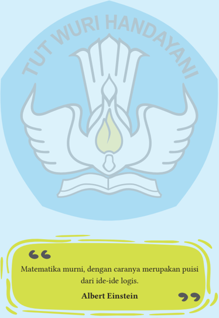

> **Deskripsi Visual:** Gambar ini adalah ilustrasi yang menampilkan logo sekolah dengan tulisan "TUT WURI HANDAYANI" di atasnya. Dibawah logo tersebut ada sebuah tulisan yang berbunyi "Matematika murni, dengan caranya merupakan puisi dari ide-ide logis." di bawahnya ada nama Albert Einstein. Gambar ini menggunakan warna biru dan putih serta memiliki elemen-elemen seperti tulisan, logo sekolah, dan kutipan teks.

 

---
## 📄 Halaman 63

### KEMENTERIAN PENDIDIKAN, KEBUDAYAAN, RISET, DAN TEKNOLOGI REPUBLIK INDONESIA, 2022

Matematika untuk SMA/SMK/MA Kelas XII

Penulis: Mohammad Tohir, dkk.

ISBN: 978-602-244-738-2

Bab

2

### Busur dan Juring Lingkaran

### Tujuan Pembelajaran

- Memahami ciri-ciri elemen lingkaran berupa ruas garis atau kurva lengkung: busur, tali busur, jari-jari, diameter, apotema, juring, dan tembereng
- Menganalisis hubungan antara elemen-elemen lingkaran
- Menentukan rumus panjang busur suatu lingkaran
- Menentukan rumus luas juring suatu lingkaran
- Mengeksplorasi hubungan sudut pusat lingkaran dengan panjang busurnya
- Mengeksplorasi hubungan sudut pusat lingkaran dengan luas juringnya
- Mengeksplorasi hubungan sudut pusat lingkaran, panjang busur, dan luas juringnya

 

---
## 📄 Halaman 64

T olak peluru adalah salah satu nomor yang terdapat dalam nomor lempar pada  cabang  atletik  bersama  dengan lempar cakram, lempar palu, dan lempar lembing. Permainan tolak peluru tidak luput  dari  bentuk  lapangannya  yang berbentuk  lingkaran,  mulai  dari  garis tengah  atau  diameter  lingkaran,  arah tolak peluru, dan daerah sektor (juring) tolak peluru.

Gambar 2.1 adalah bentuk lapangan olahraga tolak peluru, sedangkan Gambar  2.2 adalah ilustrasi bentuk lapangan olahraga tolak peluru.

Apabila kalian amati dengan cermat Gambar  2.2  di  bagian  lingkaran  pada anak  dengan  pusat  A,  maka  gambar lapangan  tolak  peluru  tersebut  akan seperti pada Gambar 2.3 berikut ini.

Perhatikan Gambar 2.3 di samping. Dapatkah  kalian  menghitung  berapa panjang garis lengkung yang dibentuk oleh sudut 45 o ? Kemudian, coba kalian amati dengan cermat Gambar 2.2, titik A  yang  terbentuk  sama  persis  seperti pada  Gambar  3.  Apabila  jarak  anak pada titik  A  dengan anak pada titik B sepanjang 100 m, maka dapatkah kalian menghitung  panjang  garis  lengkung anak  pada  titik  B  dengan  anak  pada titik C?

---
**🖼️ Gambar/Diagram**

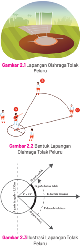

> **Deskripsi Visual:** Gambar 2.1 menunjukkan sebuah lapangan olahraga tolak peluru dengan bentuk oval. Gambar 2.2 menggambarkan bentuk lapangan tersebut, yang memiliki diameter sekitar 45 meter dan panjang 70 meter. Gambar 2.3 memberikan ilustrasi tentang bagaimana bola tolak peluru bergerak melalui lapangan tersebut. Dalam setiap gambar, elemen-elemen utama termasuk lapangan olahraga, garis-garis yang menunjukkan arah gerakan bola, dan informasi tentang ukuran lapangan. Teks penting dalam gambar ini mencakup ukuran lapangan (45 meter x 70 meter), arah gerakan bola (dari sudut 45 derajat), dan informasi tentang bagaimana bola bergerak melalui lapangan. Gambar ini membantu pembaca memahami struktur dan fungsi lapangan olahraga tolak peluru serta bagaimana bola bergerak di dalamnya.

Agar kalian bisa memecahkan masalah tersebut, kalian harus memahami konsep keliling lingkaran, luas lingkaran, besar sudut pusat, panjang busur, dan luas juring lingkaran.

 

---
## 📄 Halaman 65

---
**📊 Tabel**

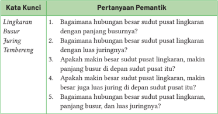

Tabel ini berisi pertanyaan pemantik tentang hubungan antara panjang sudut pusat lingkaran, panjang busur, dan luas juring. Topik utamanya adalah hubungan geometri antara lingkaran, busur, dan juring. Kolom pertama berisi pertanyaan pemantik, sedangkan kolom kedua berisi jawaban atau kunci untuk setiap pertanyaan. Data penting yang terlihat adalah bahwa semakin besar sudut pusat lingkaran, maka semakin besar juga luas juring di depan sudut pusat tersebut. Ini menunjukkan hubungan proporsional antara sudut pusat lingkaran, panjang busur, dan luas juring.

### Peta Konsep

---
**🖼️ Gambar/Diagram**

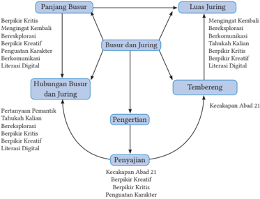

> **Deskripsi Visual:** Gambar ini adalah diagram yang menunjukkan hubungan antara berbagai konsep dan aspek pendidikan. Diagram ini terdiri dari beberapa bagian utama yang saling terkait, meliputi "Panjang Busur", "Busur dan Juring", "Tendereng", "Pengertian", "Penyajian", dan "Luas Juring". Setiap bagian ini memiliki label yang menjelaskan konsep atau aspek yang relevan dengan pendidikan.

"Panjang Busur" menggambarkan aspek-aspek seperti berpikir kritis, berkomunikasi, dan literasi digital. "Busur dan Juring" menunjukkan hubungan antara busur dan juring, yang mungkin merujuk pada metode pengajaran atau penilaian. "Tendereng" mungkin merujuk pada aspek kecakapan abad 21, seperti berpikir kritis dan berkomunikasi. "Pengertian" mungkin merujuk pada pemahaman konsep-konsep pendidikan. "Penyajian" mungkin merujuk pada cara-cara penyajian materi pendidikan. "Luas Juring" mungkin merujuk pada aspek lain dari pendidikan, seperti pengembangan karakter atau keterampilan.

Elemen-elemen utama dalam diagram ini adalah "Panjang Busur", "Busur dan Juring", "Tendereng", "Pengertian", "Penyajian", dan "Luas Juring". Relasi antara elemen-elemen ini mencerminkan hubungan antara berbagai aspek pendidikan dan bagaimana mereka saling berkaitan.

Teks, angka, atau label penting yang terlihat dalam diagram ini meliputi "Panjang Busur", "Busur dan Juring", "Tendereng", "Pengertian", "Penyajian", dan "Luas Juring". Informasi kunci yang dapat diambil pembaca meliputi bahwa diagram ini menunjukkan hubungan antara berbagai aspek pendidikan dan bagaimana mereka saling berkaitan.

Dalam paragraf ini, saya telah menjelaskan gambar dari buku pelajaran ini dalam satu paragraf yang informatif. Saya telah menentukan jenis gambar sebagai diagram, menjel

 

---
## 📄 Halaman 66

### A.  Busur Lingkaran

Gambar 2.4 di samping merupakan salah satu  contoh  aplikasi  busur  lingkaran dalam  bidang  pembangunan  jembatan lengkung  yang  banyak  digunakan  di beberapa  negara  dan  di  dalam  negeri. Untuk menentukan panjang besi yang melengkung berbentuk busur lingkaran, maka perlu dihitung dengan cermat  berapa  panjang  diameter  dan sudut pusat lingkaran.

---
**🖼️ Gambar/Diagram**

> **Deskripsi Visual:** Gambar ini adalah ilustrasi yang menunjukkan sebuah jembatan modern dengan struktur arsitektur yang unik. Jembatan ini terbuat dari baja dan memiliki bentuk seperti dua pilar berbentuk segitiga yang saling menghadap. Di atas jembatan, terdapat jalan raya yang melintasi sungai. Di sebelah kiri jembatan, terdapat tanaman sawah hijau yang menunjukkan bahwa lokasi ini berada di daerah pertanian. Di sebelah kanan jembatan, terdapat pemandangan hutan yang hijau dan berundak-undak, menunjukkan bahwa lokasi ini juga berada di daerah hutan. Gambar ini menunjukkan bahwa jembatan ini merupakan bagian dari infrastruktur transportasi yang memungkinkan mobilitas antar wilayah pertanian dan hutan.

### Sejarah Nilai π (pi)

Mungkin kalian pernah bertanya-tanya, "mengapa rumusnya diatur sedemikian rupa?" atau "dari mana rumus itu berasal?" Ada konstanta yang ditentukan dalam kedua formulasi, yaitu π (pi). Apakah kalian tahu dari mana angka pi berasal? Pada materi kali ini,  kalian akan belajar tentang asal-usul bilangan π,  menemukan rumus untuk menghitung keliling lingkaran dan luas lingkaran. Bilangan π merupakan salah satu dari banyak bilangan yang dikenal sejak zaman  kuno.  Bilangan  π  ini  menunjukkan  rasio keliling dengan diameter lingkaran.

Orang-orang kuno tertentu menggunakan angka 3 sebagai bilangan π. Angka 3 tersebut masih jauh  dari  akurat,  tetapi  lebih  mudah  digunakan dalam menghitung sesuai yang terkait. Sementara itu,  orang  Babilonia  telah  menggunakan  angka 3 + 8 1 ini  karena lebih akurat. Bangsa Mesir kuno yang  diperkirakan  hidup  sekitar  tahun  1650  SM, kemudian menggunakan nilai π yaitu 4 × 9 8 × . 9 8

 

---
## 📄 Halaman 67

Kemudian,  sekitar  250  SM,  Archimedes,  seorang  ahli  matematika  Yunani yang hebat, menggunakan poligon untuk membantunya menghitung nilai yang terletak antara 71 223 dan 7 22 .

Bilangan π penemuan Archimedes ini lebih tepat daripada penemuan seorang matematikawan bernama Zu Chungzhi pada tahun 50 SM. Nilai ini adalah 113 355 , dan unit desimal π seperti yang saat ini digunakan. Al Kashi, seorang matematikawan Persia, menentukan nilai π hingga 16 angka desimal pada tahun 1400. Dengan menggunakan teknik Archimedes, ia mengalikan sisi-sisinya sebanyak dua puluh tiga kali.

Pada  tahun  1700,  William  Jones,  seorang  ahli  matematika  Inggris, menciptakan simbol saat ini untuk "pi". Simbol 'π' dipilih karena bunyinya dalam bahasa Yunani mirip dengan huruf "p", yang berarti keliling (keliling lingkaran). Dengan adanya kemajuan teknologi, akhirnya nilai π ditemukan lebih dari satu triliunan digit di belakang tanda koma.

Nilai  konstanta  yang  telah  diketahui  saat  ini  adalah  perbandingan panjang  keliling  lingkaran  dengan  diameter.  Dapat  ditulis  dengan  simbol d K = π.

### Bagaimana cara memperoleh nilai π?

- Carilah  10  macam  benda  yang  berbentuk  lingkaran,  misalnya  uang logam, tutup gelas, kaleng, dan lain sebagainya.
- Ukurlah benda tersebut menggunakan pita pengukur atau lilitkan seutas benang pada keliling benda tersebut atau dengan cara menggelindingkan benda yang berbentuk lingkaran, yang telah ditandai tepinya (misalkan titik A) menyentuh meja sampai titik A menyentuh kembali. Catatlah ukurannya pada tabel keliling (K).
- Jiplaklah  benda  yang  berbentuk  lingkaran  di  atas  kertas,  kemudian kertas  digunting  sepanjang  kelilingnya.  Lipatlah  kertas  menjadi  dua sama  besar  (kongruen),  ukur  diameternya.  Catatlah  ukurannya  pada tabel diameter (d).

 

---
## 📄 Halaman 68

- Hitunglah nilai dari perbandingan d K dengan penulisan untuk masingmasing  benda  sampai  angka  seperseratusan  terdekat.  Tulislah  hasil perhitungannya pada kolom tabel berikut ini.
- Berdasarkan  tabel  di  atas,  tentukan  nilai  rata-rata  dari  hasil  (untuk selanjutnya disebut dengan π ).
- Kesimpulannya adalah ....

---
**📊 Tabel**

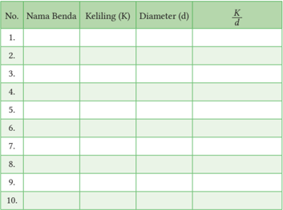

Tabel ini berisi informasi tentang berbagai benda dengan kolom-kolom berikut: Nama Benda, Keliling (K), Diameter (d), dan K/d. Topik utama tabel ini adalah studi tentang hubungan antara keliling dan diameter benda-benda tertentu. Data dalam tabel menunjukkan bahwa untuk setiap benda, nilai K/d selalu sama, menunjukkan bahwa hubungan antara keliling dan diameter tersebut konstan. Ini menunjukkan bahwa benda-benda tersebut memiliki ukuran yang proporsional, yaitu kelilingnya selalu dua kali lipat dari diameter.

Ciri-ciri elemen lingkaran yang terkait dengan busur, tali, dan sudut pusat lingkaran

### BUSUR

### Ciri-ciri

-  Berupa garis lengkung yang berbentuk kurva
-  Garis lengkung yang berhimpit dengan lingkaran
-  Apabila  panjang  garis  lengkungnya  kurang  dari  setengah  keliling lingkaran (besar sudut pusat  < 180 o ), maka disebut dengan busur minor.

 

---
## 📄 Halaman 69

-  Apabila panjang garis lengkungnya lebih dari setengah keliling lingkaran (besar sudut pusat  > 180 o ), maka disebut dengan busur mayor.
-  Apabila panjang garis lengkungnya sama dengan setengah keliling lingkaran (besar sudut pusat  = 180 o ), maka disebut dengan setengah lingkaran.
Jika tidak ada indikasi busur mayor atau busur minor, maka untuk selanjutnya disebut dengan busur minor.

Penulisan simbol busur:

### Ciri-ciri

-  Berbentuk ruas garis
-  Ruas garis yang dihubungkan oleh dua titik pada lingkaran
Penulisan simbol tali busur: AB , CD , dan EF

### Ciri-ciri

-  Kedua kaki sudutnya terbentuk dari kedua sinar garis.
-  Kedua kaki sudut-sudutnya berhimpitan dengan jari-jari lingkaran.
-  Titik sudutnya merupakan titik pusat lingkaran.
Pada gambar berikut ini, besar sudut pusat PAQ dapat ditulis ' ∠ PAQ ' atau 'α', besar sudut pusat RBS dapat ditulis ' ∠ RBS ' atau 'β', dan besar sudut pusat TCU dapat ditulis ' ∠ TCU ' atau 'θ'.

, , AB CD EF \\[

### TALI BUSUR

 

---
## 📄 Halaman 70

Berikan  tanda  centang  pada  pernyataan  berikut!  Jawab  dengan  " ya "  jika kalian  setuju  dengan  pernyataan  tersebut  dan  jawab  dengan  " tidak "  jika kalian tidak setuju dengan pernyataan tersebut.

Kemudian,  berikan  argumentasi  semenarik  mungkin  terhadap  tanggapan atas jawabanmu.

---
**📊 Tabel**

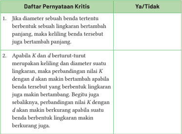

Tabel ini berisi dua pernyataan kritis tentang lingkaran dan diameter benda tertentu. Topik utamanya adalah hubungan antara keliling, diameter, dan konstanta K dalam lingkaran. Kolom pertama menyajikan pernyataan kritis, sedangkan kolom kedua menunjukkan jawaban "Ya" atau "Tidak". Data penting yang terlihat adalah bahwa jika diameter benda bertambah panjang, kelilingnya juga bertambah panjang. Selain itu, perbandingan nilai K dengan diameter diperkirakan akan berubah seiring peningkatan diameter, dengan nilai K menjadi lebih besar apabila diameter bertambah dan menjadi lebih kecil apabila diameter berkurang.

- Jari-jari lingkaran adalah ruas garis yang dihubungkan oleh suatu titik pada lingkaran dengan titik pusat lingkaran.
- Diameter lingkaran adalah ruas garis yang dihubungkan oleh dua titik pada lingkaran yang melalui titik pusat lingkaran.
- Tali busur adalah ruas garis yang dihubungkan oleh dua titik pada lingkaran.

 

---
## 📄 Halaman 71

### Pengertian Busur Lingkaran

Perbandingan panjang busur dengan besar sudut pusatnya di depan sudut pusat itu dengan busur yang sama adalah sebanding dengan perbandingan luas busur lingkaran dengan besar sudut pusatnya di depan sudut pusat itu dengan busur yang sama. Amati dengan cermat lengkungan merah pada Gambar 2.7 berikut ini.

Besar sudut pusat POQ atau ∠ POQ

Pada Gambar 2.7 di atas, panjang busur PQ sesuai dengan besar sudut pusat POQ atau α. Adapun besar sudut pusat suatu lingkaran berkisar mulai 0 o sampai 360 o .

Bagaimana cara kalian menghitung diameter lingkaran.Apabila diketahui panjang  jari-jari  sebuah  lingkaran,  maka  kalian  dapat  dengan  mudah menghitung panjang keliling lingkaran tersebut. Namun, bagaimana jika satusatunya pertanyaan adalah panjang busur lingkaran?

Melalui  kegiatan  eklporasi  ini,  kalian  akan  belajar  bagaimana  cara menemukan rumus panjang busur lingkaran. Kalian dapat dengan mudah memperoleh rumus panjang busur lingkaran dengan memeriksa hubungan keliling  lingkaran,  sudut  pusat,  dan  panjang  busurnya.  Garis  lengkung merah  merupakan  garis  lengkung  lingkaran  yang  berupa  panjang  busur lingkaran yang sesuai dengan sudut pusatnya. Amati dengan cermat Tabel 2.1 berikut ini dengan fokus pengamatan pada hasil perbandingan panjang busur lingkaran dengan kelilingnya.

 

---
## 📄 Halaman 72

---
**🖼️ Gambar/Diagram**

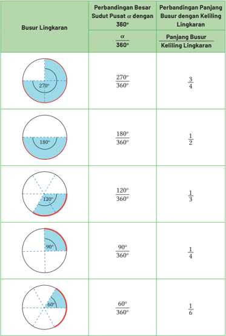

> **Deskripsi Visual:** Gambar ini adalah ilustrasi yang menunjukkan perbandingan besar sudut pusat dengan panjang busur lingkaran. Ilustrasi ini terdiri dari lima kotak berbeda, masing-masing menunjukkan sudut pusat dan panjang busur lingkaran untuk setiap sudut tersebut. Setiap kotak memiliki gambar lingkaran dengan sudut pusat tertentu dan panjang busur lingkaran yang disertai dengan perbandingan numerik. Misalnya, kotak pertama menunjukkan sudut pusat 270° dengan panjang busur 3/4 dari keliling lingkaran. Kotak-kotak ini membantu pembaca memahami hubungan antara sudut pusat dan panjang busur lingkaran dalam berbagai sudut.

---
**📊 Tabel**

Tabel ini membahas hubungan antara sudut pusat (α) dan panjang busur lingkaran dalam berbagai sudut besar. Topik utama tabel adalah perbandingan sudut pusat dengan panjang busur lingkaran. Kolom pertama menunjukkan sudut besar dalam derajat, sedangkan kolom kedua menunjukkan perbandingan sudut tersebut dengan 360 derajat. Kolom ketiga menyajikan perbandingan panjang busur lingkaran dengan keliling lingkaran untuk setiap sudut besar. Data penting yang terlihat adalah bahwa semakin kecil sudut besar, maka perbandingan panjang busur dengan keliling lingkaran semakin kecil, dan sebaliknya. Misalnya, jika sudut besar adalah 270 derajat, maka perbandingan panjang busur dengan keliling lingkaran adalah 3/4, yang berarti panjang busur lebih dari setengah keliling lingkaran.

 

---
## 📄 Halaman 73

Berdasarkan  Tabel  2.1  di  atas,  diskusikan  beberapa pertanyaaan  berikut  agar  kalian  lebih  memahami konsep luas juring lingkaran.

- Apakah besar sudut pusat lingkaran dengan panjang busurnya memiliki hubungan tertentu? Jelaskan!
- Benarkah  makin  besar  sudut  pusat  lingkaran, maka makin besar juga panjang busurnya yang sehadap?
- Bagaimana perbandingan dua sudut pusat pada dua busur lingkaran yang sama?

### Definisi 2.1

Busur lingkaran  adalah  sebuah  ruas  garis  lengkung  yang  berimpit dengan  lingkaran. Jika  kita  memiliki  sebuah  kawat  berbentuk lingkaran, kemudian kita bagi tiga kawat lingkaran tersebut, maka masing-masing lengkungan yang terbentuk merupakan busur lingkaran.

Setelah mengetahui panjang jari-jari busur lingkaran dan ukuran sudut pusat lingkaran, kita dapat menentukan panjang busur lingkaran tersebut. Sudut pusat busur adalah sudut pusat di depan busur itu. Adapun dua garis lurus yang menghubungkan ujung busur yang dimaksud adalah jari-jari lingkaran, sedangkan titik pusat busur yang dimaksud adalah titik pusat lingkaran.

Rumus menghitung panjang busur lingkaran dapat ditulis seperti berikut ini.

``

Jika  α  merupakan  besar  sudut  pusat  busur  dan r merupakan  jari-jari lengkungan tersebut (jari-jari lingkaran), hubungan antara besar sudut pusat

 

---
## 📄 Halaman 74

dan panjang busur adalah panjang busur suatu lingkaran sebanding dengan ukuran sudut pusat di depan busur itu. Dengan demikian, rumus panjang busur tersebut dapat dituliskan sebagai berikut.

``

### Contoh Soal 2.1

Diketahui sebuah busur lingkaran memiliki jari-jari 7 cm dan besar sudut pusatnya adalah 90 o . Tentukan panjang busur lingkaran itu.

### Alternatif penyelesaian:

``

Jadi, panjang busur lingkaran tersebut adalah 11 cm.

### Contoh Soal 2.2

Apabila  diketahui  panjang  busur  AB  adalah  17,6  cm  dan  besar ∠ AOB sebesar 72 o , maka berapakah panjang jari-jari lingkarannya?

### Alternatif penyelesaian:

``

Jadi, panjang jari-jari lingkarannya adalah 14 cm.

 

---
## 📄 Halaman 75

Pertimbangkan roda gigi besar yang diwakili oleh  lingkaran  dengan  sudut  pusat  titik  O, besar ∠ AOB adalah 60º, busur minor AB, dan busur  mayor  ACB  seperti  yang  ditunjukkan pada  gambar.  Pertimbangkan  roda  gigi  kecil yang  diwakili  oleh  lingkaran  E,  yang  berisi sudut  pusat,  besar ∠ FEG  adalah  60°,  busur kecil FG, dan busur utama FDG seperti yang ditunjukkan pada gambar.

- Apakah roda gigi besar serupa dengan roda gigi kecil? Jelaskan.
- Apakah panjang jari-jari roda gigi besar sebanding dengan panjang jarijari roda gigi kecil? Jelaskan.
- Tentukan besar busur minor pada setiap lingkaran.
- Berapa rasio ukuran derajat busur minor dengan ukuran derajat seluruh lingkaran untuk masing-masing dua roda gigi?
- Apakah  kedua  busur  yang  dipotong  tampak  sama  panjang?  Apakah besar busur potong pada roda gigi besar sama dengan ukuran derajat busur potong pada roda gigi kecil? Jelaskan.

### Ayo Berpikir Kritis

Halim  mengatakan  bahwa  apabila  dua  lingkaran  memiliki  sudut pusat  busur  yang  sama,  maka  panjang  busurnya  pastilah  sama panjang. Setujukah kalian dengan pernyataan Halim? Jelaskan.

 

---
## 📄 Halaman 76

### Ayo Berkomunikasi

Diskusikan permasalahan berikut dengan teman sebangku, kemudian sampaikan hasilnya kepada teman di kelompok lainnya!

Areal  lahan  rumput  di  belakang  rumah Pak  Hartono  berbentuk  segi  empat  dengan panjang  sisi-sisinya  berukuran  28 × 28  m 2 . Sebagian  areal  lahan  rumput  akan  dibuat menjadi kolam renang (area yang tidak terarsir),  sedangkan  sisanya  akan  menjadi rerumputan yang indah (area yang terarsir). Jika biaya peletakan rumput adalah Rp 100.000/m 2  dan biaya tukang Rp1.500.000.00, maka tentukan:

---
**🖼️ Gambar/Diagram**

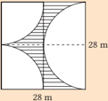

> **Deskripsi Visual:** Gambar ini adalah ilustrasi yang menunjukkan sebuah bangunan dengan struktur yang kompleks. Bangunan tersebut terdiri dari dua bagian utama: bagian depan yang lebih pendek dan bagian belakang yang lebih panjang. Bagian depan memiliki atap datar dan dinding berwarna putih, sedangkan bagian belakang memiliki atap melengkung dan dinding berwarna merah. Ilustrasi ini juga menunjukkan beberapa elemen lain seperti jendela, pintu, dan tangga. Informasi kunci yang dapat diambil dari gambar ini adalah bahwa bangunan tersebut memiliki desain arsitektur yang unik dengan kombinasi warna yang menonjol dan struktur yang kompleks.

- panjang keliling areal lahan rumput Pak Hartono.
- besar  anggaran  yang  harus  disiapkan  oleh  Pak  Hartono  untuk menggarap lahan rumputnya.

### Penguatan Karakter

Jembatan  Merah  Youtefa  membentang  di Teluk  Youtefa,  menghubungkan  Jayapura, Desa Hamadi, dan Kabupaten Muara Tami.  Ini  adalah  jembatan  lengkung  baja terpanjang di Papua. Panjang jembatan ini  total  11,6  kilometer,  termasuk  bentang tengah  433  meter,  jembatan  pendekat  sisi Youtefa sepanjang 900 meter, jalan pendekat sisi Hamadi sepanjang 320 meter, dan jalan akses 9.950 meter. Jembatan ini dapat

---
**🖼️ Gambar/Diagram**

> **Deskripsi Visual:** Gambar ini adalah ilustrasi yang menunjukkan sebuah jembatan yang melintasi sungai. Jembatan terbuat dari baja dan memiliki struktur yang kompleks dengan tiang-tiang yang menjulang tinggi. Sungai di sekitar jembatan tampak tenang dengan air biru cerah. Di sisi kanan jembatan, terdapat pohon-pohon hijau yang tumbuh di tepi sungai. Di sisi kiri jembatan, terdapat beberapa bangunan kecil yang tampak seperti rumah atau toko. Gambar ini menunjukkan hubungan antara jembatan, sungai, dan lingkungan sekitarnya. Teks, angka, atau label penting tidak terlihat pada gambar ini. Informasi kunci yang dapat diambil pembaca adalah bahwa jembatan ini mungkin merupakan bagian dari sistem transportasi atau infrastruktur di wilayah tersebut.

memperpendek jarak antara Kota Jayapura dan Kabupaten Muara Tami dengan Pos Perbatasan Negara (PLBN) Skouw. Sebelum dibangunnya jembatan ini, perjalanan  dari  kawasan  Pemkot  Jayapura  menuju  Kabupaten Muara Tami menempuh jarak 35 kilometer dan memakan waktu sekitar satu jam.

 

---
## 📄 Halaman 77

### Ayo Mencoba

Berdasarkan informasi tersebut, pikirkan bagaimana cara mengukur panjang  lengkungan  jembatan  yang  berwarna  merah.  Perkirakan panjang  lengkungan  jembatan  yang  berwarna  merah  tersebut  dan diskusikan dengan temanmu.

### Ayo Bekerja Sama

Diskusikan dengan teman di sebelahmu untuk menyelesaikan permasalahan berikut ini.

- Apakah ada tali busur lingkaran yang panjangnya lebih panjang dari diameter lingkarannya? Jelaskan.
- Diketahui bahwa tiga titik yang berbeda, misalnya P , Q ,  dan R ,  tidak segaris. Maka bagaimana kalian menggambar juring setengah lingkaran yang menghubungkan ketiga titik tersebut? Buatlah gambarnya.
P

- Tanggapilah  pernyataan  berikut  ini  dengan  menyebutkan  'selalu', 'kadang-kadang', atau 'tidak pernah'. Jelaskan pula alasanmu.
- Sudut pusat busur mayor suatu lingkaran membetuk sudut tumpul atau besar sudutnya lebih dari 180 o .
- Sudut pusat busur minor suatu lingkaran membentuk sudut lancip atau besar sudutnya kurang dari 180 o .
- Jumlah dari banyak sudut pusat sebuah lingkaran tergantung pada ukuran panjang jari-jarinya.
- Tali busur sebuah lingkaran merupakan diameter lingkaran.

 

---
## 📄 Halaman 78

### Ayo Berkomunikasi

Jelaskan bagaimana kalian menyelesaikan permasalahan berikut!

Bagaimana  cara  menentukan  rumus  panjang  busur PQ  apabila diketahui panjang  jari-jarinya adalah r dan  besar  sudut  pusatnya  adalah  α?  Ungkapkan pendapatmu.

### Ayo Berefleksi

- Salinlah tabel berikut, kemudian lengkapilah.
- Apabila diiketahui sudut pusat lingkaran sebesar 70 o  dan panjang jarijarinya 21 cm, maka berapakah panjang busur lingkaran tersebut?

### Ayo Menggunakan Teknologi

Tambahkan pengetahuan kalian tentang hubungan antara panjang  busur  lingkaran  dan  jari-jari  lingkaran  dengan mengunjungi tautan di samping karena ada sesuatu yang menarik.

 

---
## 📄 Halaman 79

Tulislah hasil percobaanmu.

- Jika sudut 20 o  dan diameter 20 cm, berapa jarak yang ditempuh untuk satu putaran roda?
- Jika sudut 30 o  dan diameter 24 cm, berapa jarak yang ditempuh untuk satu putaran roda?
- Jika sudut 40 o  dan diameter 28 cm, berapa jarak yang ditempuh untuk satu putaran roda?
- Jika sudut 50 o  dan diameter 20 cm, berapa jarak yang ditempuh untuk satu putaran roda?
- Jika sudut 60 o  dan diameter 24 cm, berapa jarak yang ditempuh untuk satu putaran roda?
- Jika sudut 70 o  dan diameter 28 cm, berapa jarak yang ditempuh untuk satu putaran roda?
- Jika sudut 80 o  dan diameter 20 cm, berapa jarak yang ditempuh untuk satu putaran roda?
- Jika sudut 90 o  dan diameter 24 cm, berapa jarak yang ditempuh untuk satu putaran roda?
Kesimpulan  apa  yang  kalian  dapatkan  setelah  melakukan  beberapa  kali percobaan? Jelaskan jawaban kalian.

### Latihan 2.1

- Panjang jari-jari lingkaran A sebesar 10 cm. Apabila pada lingkaran A terdapat beberapa tali busur yaitu busur KL, MN, OP, dan QR dengan berturut-turut  panjangnya  adalah  16  cm,  14  cm,  12  cm,  dan  10  cm, manakah  dari  apotema  tersebut  yang  terpanjang  jika  dibangun  dari pusat lingkaran A di sekitar setiap tali busur?
- Pada suatu lingkaran terdapat busur PQ \ , RS Z , TU \ , dan VW \ . Diketahui keempat busur tersebut memiliki panjang PQ \ > panjang RS Z > panjang TU \ > panjang VW \ .  Jika  pada  masing-masing  busur  tersebut  dibuat sudut  pusat  yang  bersesuaian,  maka  menghadap  sudut  apakah  sudut pusat terkecil tersebut?

 

---
## 📄 Halaman 80

Ada dua roda gigi yang memiliki jarijari yang sama yaitu 28 cm. Tentukan panjang sabuk lilitan yang diperlukan agar dapat melingkari kedua roda gigi tersebut jika jarak antara pusat kedua roda adalah 120 cm.

4.

5.

6.

### Ayo Berpikir Kritis

Menurut Wafi, makin panjang busur lingkaran, maka makin besar juga sudut pusat yang menghadap busur tersebut. Apabila panjang busur diperkecil, maka ukuran sudut pusat  yang  berhadapan  dengan  busur  tersebut  juga berkurang. Apakah kalian setuju dengan pernyataan Wafi? Jelaskan.

### Ayo Berkomunikasi

Perhatikan tabel di samping. Jajak pendapat online dilakukan untuk menentukan jumlah file musik yang dimiliki dan diterima melalui pengunduhan gratis.

Tentukan setiap ukuran sudut pusat setiap kategori tersebut jika kalian membuat diagram lingkaran dari data ini.

---
**🖼️ Gambar/Diagram**

> **Deskripsi Visual:** Diagram ini menunjukkan data mengenai jumlah file musik yang telah dikumpulkan oleh seorang pengguna selama beberapa tahun. Diagram ini terdiri dari tiga baris vertikal yang masing-masing menunjukkan persentase total file musik yang dikumpulkan dalam rentang waktu tertentu. Untuk rentang waktu 12 bulan pertama, sekitar 76% dari total file musik yang dikumpulkan berada di rentang 500 hingga 1000 file. Selanjutnya, untuk rentang waktu 12 bulan kedua, sekitar 86% dari total file musik yang dikumpulkan berada di rentang 1000 hingga 5000 file. Dan untuk rentang waktu 12 bulan ketiga, sekitar 95% dari total file musik yang dikumpulkan berada di rentang lebih dari 5000 file. Ini menunjukkan bahwa seiring berjalannya waktu, pengguna tersebut semakin banyak mengumpulkan file musik.

---
**📊 Tabel**

Tabel ini menunjukkan distribusi jumlah file musik yang diunduh secara gratis di berbagai kategori. Topik utamanya adalah frekuensi unduhan file musik. Kolom pertama menunjukkan jumlah file yang diunduh, sedangkan kolom kedua menunjukkan persentase total unduhan. Data penting yang terlihat adalah bahwa sekitar 76% dari total unduhan adalah untuk file musik dengan jumlah antara 100 hingga 500 file, sementara 3% adalah untuk lebih dari 500 file. Ini menunjukkan bahwa unduhan file musik dalam jumlah kecil (100-500 file) merupakan preferensi umum.

Gambarlah busur lingkaran yang sesuai kategori tersebut.

Buatlah diagram lingkaran dengan data pada tabel di samping.

### Ayo Bereksplorasi

Suatu  Kincir  Ria  yang  ditunjukkan  seperti gambar  di  samping  memiliki  diameter  50 cm.  Jika  busur  baja  yang  menghubungkan satu mobil penumpang ke mobil penumpang  lainnya  berbentuk  lingkaran. Tentukan  panjang  setiap  busur  baja  yang menghubungkan setiap mobil penumpang.

---
**🖼️ Gambar/Diagram**

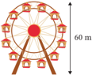

> **Deskripsi Visual:** Gambar ini adalah ilustrasi yang menunjukkan sebuah roda kincir angin dengan tinggi 60 meter. Ilustrasi ini menggambarkan struktur dasar roda kincir angin, termasuk tiang utama, papan putar, dan tiang-tiang pendukung yang membentuk struktur roda. Tiang utama berdiri tegak di tengah, dengan papan putar yang melingkar di atasnya. Tiang-tiang pendukung berdiri di setiap sisi papan putar, membentuk struktur tiga dimensi yang menyerupai roda. Ilustrasi ini memberikan gambaran umum tentang bagaimana struktur dasar roda kincir angin bekerja dan tampaknya sangat kompleks dan kuat untuk menahan beban yang besar.

 

---
## 📄 Halaman 81

7.

Gunakan diagram yang ditunjukkan untuk menjawab setiap pertanyaan.

- Jari-jari lingkaran pohon kecil (lingkaran kecil)  adalah r ,  dan  jari-jari  lingkaran  pohon yang lebih besar (lingkaran besar)  adalah  10r. Bagaimana  panjang  busur-busur  kecil  pada lingkaran  pohon  kecil  dibandingkan  dengan panjang busur-busur kecil pada lingkaran pohon besar?
- Jika panjang busur kecil pada lingkaran pohon kecil sama dengan 3 inci, berapakah panjang busur besar pada lingkaran pohon besar?
- Jika Besar sudut A = 20 derajat, jari-jari lingkaran pohon kecil adalah r , jari-jari lingkaran pohon besar adalah 10 r , dan panjang busur kecil lingkaran  pohon  kecil  adalah  3  inci,  tentukan  keliling  lingkaran pohon besar.

### B.  Juring Lingkaran

Ayo Mengingat Kembali

Ciri-ciri  elemen  lingkaran  yang  terkait  dengan  juring  dan  sudut pusat lingkaran

### JURING

### Ciri-ciri

-  Berbentuk suatu daerah pada lingkaran
-  Suatu daerah yang dibatasi oleh satu busur dan dua jari-jari lingkaran
-  Titik ujung busur lingkaran dibatasi oleh kedua jari-jari lingkaran.

---
**🖼️ Gambar/Diagram**

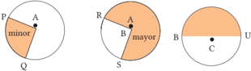

> **Deskripsi Visual:** Gambar ini adalah ilustrasi yang menunjukkan tiga jenis diagram: diagram lingkaran, diagram pie, dan diagram siklus. Diagram lingkaran (diagram A) menunjukkan dua bagian: minor dan major. Minor merupakan bagian kecil dari total, sedangkan major merupakan bagian besar. Diagram pie (diagram B) menunjukkan tiga bagian: mayor, minor, dan unik. Mayor merupakan bagian besar dari total, minor merupakan bagian kecil, dan unik merupakan bagian yang tidak ada di dua bagian lainnya. Diagram siklus (diagram C) menunjukkan empat bagian: R, S, B, dan U. R merupakan bagian pertama, S merupakan bagian kedua, B merupakan bagian ketiga, dan U merupakan bagian keempat. Teks, angka, atau label penting yang terlihat pada gambar ini adalah minor, major, mayor, minor, unik, R, S, B, dan U. Informasi kunci yang dapat diambil pembaca adalah bahwa diagram lingkaran, diagram pie, dan diagram siklus memiliki berbagai jenis bagian dan relasi antara mereka.

 

---
## 📄 Halaman 82

### Ciri-ciri

-  Kedua kaki sudutnya terbentuk dari kedua sinar garis.
-  Kedua kaki sudut-sudutnya berhimpitan dengan jari-jari lingkaran.
-  Titik sudutnya merupakan titik pusat lingkaran.
Pada gambar berikut ini, besar sudut pusat PAQ dapat ditulis ' ∠ PAQ ' atau  'α',  besar  sudut  pusat RBS dapat  ditulis  ' ∠ RBS '  atau  'β',  dan  besar sudut pusat TCU dapat ditulis ' ∠ TCU ' atau 'θ'.

### Definisi 2.2

Luas juring lingkaran adalah bagian dari lingkaran yang tertutup antara dua jari-jari dan busur yang menghubungkannya.

Juring  lingkaran  merupakan  suatu  daerah  ruang  tertutup  di  dalam batas suatu juring. Sebuah juring selalu berasal dari pusat lingkaran. Setengah lingkaran adalah juring paling umum dari sebuah lingkaran, yang mewakili setengah lingkaran.

Salah satu contoh  dalam  kehidupan nyata yang paling umum untuk daerah suatu juring lingkaran adalah sepotong piza. Irisan piza berbentuk lingkaran seperti juring. Sebuah piza dengan jari-jari 7 inci dipotong menjadi  6  irisan  yang  sama  ukurannya (lihat  Gambar  2.10  di  samping)  dan  setiap irisannya merupakan juring lingkaran.

---
**🖼️ Gambar/Diagram**

> **Deskripsi Visual:** Gambar 2.10 menunjukkan ilustrasi yang menggambarkan pizza dengan irisan yang telah dipotong. Gambar ini termasuk dalam jenis ilustrasi karena ia menampilkan visual yang lebih jelas daripada diagram, grafik, atau foto. Pada gambar tersebut, kita melihat pizza yang dibagi menjadi 360° dengan ukuran 7 inci. Ini menunjukkan bahwa pizza tersebut memiliki ukuran yang cukup besar untuk dimakan oleh beberapa orang. Irisan-irisan pizza yang telah dipotong menunjukkan bagaimana cara memotong pizza untuk disajikan. Teks, angka, atau label penting yang terlihat pada gambar adalah ukuran pizza (7 inci) dan jumlah irisan yang ada (360°). Informasi kunci yang dapat diambil pembaca adalah ukuran dan jumlah irisan pizza yang ada, serta bagaimana cara memotongnya.

### SUDUT PUSAT

 

---
## 📄 Halaman 83

Luas bidang yang dibentuk oleh setiap irisan piza dapat dihitung dengan menggunakan rumus luas bidang. Sekarang, bagaimana cara menghitung luas irisan piza berbentuk juring dengan menggunakan rumus luas juring?

Dapatkah  kalian  menghitung  luas  ketiga  daerah  merah  pada  tiga lingkaran yang diilustrasikan pada Gambar 2.11 apabila panjang jari-jari dan sudut pusat ketiga lingkaran diketahui?

Apabila kalian ingin mencari luas lingkaran A, tentunya akan mudah kalian  dapatkan  dengan  cara  mengetahui  dan  memahami  rumus  luas lingkaran. Akan tetapi, dapatkan kalian menentukan luas juring dari kedua lingkaran tersebut, yaitu lingkaran B dan lingkaran C? Ayo temukan rumus dalam menentukan besar ukuran luas juring lingkaran dengan memperhatikan bahwa daerah warna merah mewakili gambar lingkaran yang sesuai dengan sudut pusatnya. Pada Tabel 2.2, perhatikan baik-baik hubungan besar sudut pusat lingkaran dengan dan luas juringnya.

---
**📊 Tabel**

Tabel ini membahas hubungan antara sudut pusat juring lingkaran dengan luas juring tersebut. Topik utama tabel adalah perbandingan sudut pusat juring dengan 360 derajat dan perbandingan luas juring terhadap luas lingkaran. Kolom pertama berisi tiga sudut pusat juring: 270°, 180°, dan 90°. Kolom kedua menunjukkan perbandingan sudut juring terhadap 360°, di mana 270°/360° = 3/4. Kolom ketiga menunjukkan perbandingan luas juring terhadap luas lingkaran, di mana 270°/360° = 3/4. Data penting yang terlihat adalah bahwa setiap sudut pusat juring memiliki perbandingan luas juring yang sama dengan perbandingan sudutnya terhadap 360°.

 

---
## 📄 Halaman 84

---
**🖼️ Gambar/Diagram**

> **Deskripsi Visual:** Gambar ini adalah ilustrasi yang menunjukkan perbandingan sudut pusat α dengan 360° serta perbandingan luas juring terhadap luas lingkaran untuk berbagai busur lingkaran. Ilustrasi ini terdiri dari empat kotak yang masing-masing menunjukkan sudut pusat α dan luas juringnya terhadap luas lingkaran. Setiap kotak memiliki tiga kolom: kolom pertama menunjukkan sudut pusat α, kolom kedua menunjukkan perbandingan sudut tersebut dengan 360°, dan kolom ketiga menunjukkan panjang busur dan keliling lingkaran. Dalam setiap kotak, sudut pusat α disajikan dalam bentuk sudut segi empat, dan perbandingan sudut tersebut dinyatakan sebagai pecahan. Selain itu, informasi tentang panjang busur dan keliling lingkaran juga disajikan dalam bentuk pecahan. Gambar ini membantu pembaca memahami hubungan antara sudut pusat, luas juring, panjang busur, dan keliling lingkaran.

---
**📊 Tabel**

Tabel ini membahas hubungan antara sudut busur lingkaran dengan luas juring dan panjang busur lingkaran. Topik utama tabel adalah perbandingan sudut busur lingkaran dengan 360 derajat dan perbandingan luas juring dengan luas lingkaran. Kolom-kolomnya meliputi sudut busur lingkaran (α), perbandingan sudut busar lingkaran dengan 360 derajat, panjang busur lingkaran, dan perbandingan luas juring dengan luas lingkaran. Data penting yang terlihat adalah bahwa semakin kecil sudut busur lingkaran, maka luas juring juga semakin kecil dan panjang busur lingkaran juga semakin kecil. Ini menunjukkan bahwa luas juring dan panjang busur lingkaran secara proporsional terhadap sudut busur lingkaran.

### Ayo Berkomunikasi

Berdasarkan  Tabel  2.2  di  atas,  diskusikan  beberapa pertanyaaan  berikut  ini  agar  kalian  lebih  memahami konsep luas juring lingkaran.

- Apa yang dapat kalian  ketahui  tentang  hubungan sudut pusat lingkaran dengan luas juringnya?

 

---
## 📄 Halaman 85

- Benarkah  bahwa  apabila  makin  bertambah  besar  sudut  pusat lingkaran,  maka  akan  makin  bertambah  besar  pula  luas  juring yang sehadap?
- Bagaimana cara kalian menentukan keliling juring lingkaran?
- Bagaimana  dengan  luas  daerah  perpotongan  tali  busur  dangan panjang busur lingkaran (tembereng)?

### Tahukah Kalian

Besar sudut pusat untuk suatu lingkaran penuh adalah dari 0 sampai 360. Jika kalian perhatikan lebih dekat, kalian akan melihat bahwa makin besar luas juring dan panjang busur, maka akan makin besar sudut pusat lingkaran, begitu  juga  sebaliknya.  Akibatnya,  luas  juring  sebuah  lingkaran  akan sebanding dengan panjang busur lingkaran dan sudut pusat yang bersesuai. Apa sebenarnya hubungan yang didapat?

### Ayo Berpikir Kritis

Coba  kalian  pikirkan  dua  pernyataan  berikut.  Menurut  kalian, manakah pernyataan berikut yang lebih luas?

- Sebuah juring lingkaran A dengan jari-jari r dan sudut pusat α, ataukah
- Sebuah juring lingkaran B dengan jari jari 2 r dan sudut pusat 2 1 α.

### Ayo Berpikir Kreatif

Sebuah lingkaran dengan jari-jari r dan besar sudut pusat 2 1 α terdapat luas juring yang sama besar dengan luas lingkaran yang jari-jarinya r dan sudut pusatnya α. Carilah luas lingkaran lain yang jari-jari dan sudut pusatnya berbeda dari contoh tersebut, sehingga panjangnya sama dengan luas juring lingkaran dengan jari-jari r dan sudut pusat α. Buatlah setidaknya tiga juring lingkaran.

 

---
## 📄 Halaman 86

### Contoh Soal 2.3

Diketahui  besar ∠ AOB  =  90 o   dan  jari-jari  =  28  cm. Tentukan berapakah luas juring AOB tersebut?

### Alternatif penyelesaian:

``

Jadi, luas juring AOB adalah 616 cm 2

### Contoh Soal 2.4

Pada gambar di samping, diketahui besar ∠ AOD adalah 60 o , panjang OA adalah 14 cm, dan panjang AB adalah 7 cm. Tentukan luas daerah yang terarsir.

### Alternatif penyelesaian:

``

``

``

 

---
## 📄 Halaman 87

``

Luas daerah arsiran  = Luas Juring COB - Luas Juring AOD

= 231 - 102,67

= 128,33

Jadi, luas daerah arsiran adalah 128,33 cm 2

### Tahukah Kalian

- Dua busur lingkaran dapat dikatakan sama (kongruen) dalam lingkaran yang sama atau dapat dikatakan juga bahwa dua busur lingkaran adalah kongruen jika dan hanya jika besar sudut pusat busur yang bersesuaian adalah sama besar.
- Panjang busur lingkaran yang terbentuk dari dua busur saling berdekatan (salah satu titik ujungnya berhimpit dengan yang lain) dengan titik-titk ujungnya sama dengan jumlah kedua busur tersebut.

### Petunjuk

Kongruen adalah dua buah bangun tertentu yang sama dan sebangun.

### Ayo Menggunakan Teknologi

Setelah  mempelajari  luas  juring  lingkaran  yang  dibahas  pada  buku  ini, kembangkan  pengetahuan  kalian  tentang  luas  juring  lingkaran  dengan mengunjungi laman berikut.

---
**🖼️ Gambar/Diagram**

> **Deskripsi Visual:** Gambar ini adalah diagram yang menunjukkan dua metode untuk menghitung luas juring lingkaran. Diagram ini terdiri dari tiga bagian:

1. Bagian pertama menunjukkan metode menggunakan animasi untuk menghitung luas juring lingkaran.
2. Bagian kedua menunjukkan metode menggunakan radian untuk menghitung luas juring lingkaran.
3. Setiap bagian memiliki link QR Code yang menyediakan referensi lebih lanjut tentang cara menghitung luas juring lingkaran.

Elemen utama yang ditampilkan adalah dua metode penghitungan luas juring lingkaran, yaitu dengan animasi dan dengan radian. Relasi antara kedua metode ini adalah bahwa kedua metode ini digunakan untuk menghitung luas juring lingkaran, tetapi dengan cara yang berbeda.

Teks, angka, atau label penting yang terlihat meliputi:
- Judul "Menghitung Luas Juring Lingkaran"
- Judul "Luss Juring Lingkaran dengan Animasi"
- Judul "Luas Juring Lingkaran dengan Rad"
- Link QR Code untuk mengakses informasi lebih lanjut

Informasi kunci yang dapat diambil pembaca meliputi:
- Ada dua metode untuk menghitung luas juring lingkaran
- Metode dengan animasi dan metode dengan radian
- Pembaca dapat mengakses informasi lebih lanjut melalui QR Code

 

---
## 📄 Halaman 88

Setelah kalian melakukan penelusuran pada ketiga tautan tersebut, buatlah rangkuman tentang konsep luas juring lingkaran, serta sebutkan minimal ada 5 percobaan yang telah kalian lakukan untuk tautan kedua dan ketiga.

Pada subbab ini kalian telah belajar mengenai luas juring lingkaran.

- Apa  sajakah elemen-elemen  juring lingkaran, sudut pusat, dan tembereng?
- Apa itu juring lingkaran?
- Apa saja syarat suatu daerah di dalam lingkaran dapat dikatakan sebagai luas juring lingkaran?
- Bagaimana hubungan sudut pusat lingkaran dengan juringnya?

### Latihan 2.2

- Salinlah tabel berikut, kemudian lengkapilah.
- Tentukan  luas  juring  lingkaran  yang  berjari-jari  10  cm  dan  sudut pusatnya sebesar 70 o .
- Ibu Sulastri ingin membagi kue bolu menjadi enam bagian  sama  besar.  Berapakah  posisi  sudut  pusat masing-masing bagian? Dan seberapa besar bagian dasar setiap potong kue?

---
**📊 Tabel**

Tabel ini menunjukkan hubungan antara jari-jari, sudut pusat, dan luas juring dalam satuan cm². Topik utama tabel adalah hubungan geometris antara jari-jari, sudut pusat, dan luas juring. Kolom-kolom yang ada meliputi jari-jari (cm), π (pi), sudut pusat (°), dan luas juring (cm²). Data penting yang terlihat adalah bahwa luas juring meningkat seiring peningkatan jari-jari, tetapi tidak berubah dengan perubahan sudut pusat. Ini menunjukkan bahwa luas juring tergantung pada jari-jari, sedangkan sudut pusat tidak mempengaruhi luas juring dalam tabel ini.

4.

Ayo Berpikir Kreatif

Diketahui panjang jari-jari suatu lingkaran A adalah 14 cm. Bagaimana cara  menghitung  panjang  jari-jari  lingkaran  lain  dan  besar  sudut pusatnya agar luas juringnya sama dengan lingkaran A? Jelaskan.

 

---
## 📄 Halaman 89

5.

6.

8.

Bagaimana cara membuat lingkaran O dengan panjang jari-jari tertentu yang luasnya sama dengan luas juring pada lingkaran P dengan sudut pusat dan jari-jari tertentu juga? Jelaskan.

Ayo Berpikir Kritis dan

Ayo Berkomunikasi

Perhatikan gambar lingkaran di samping. Diketahui dua buah lingkaran tersebut konsentris dengan titik pusat E. Jika besar sudut AEB = 42 derajat, maka apa kriterianya agar panjang busur AB dua kali busur CD?

### Petunjuk

Konsentris  adalah  dua  buah  bangun  tertentu  yang  mempunyai  sudut pusat yang sama.

- Perhatikan gambar di samping. Coba kalian bandingkan panjang keliling lingkaran E dengan panjang keliling persegi panjang ABCD. Tentukan manakah pernyataan berikut yang benar. Jelaskan.
- Panjang keliling persegi panjang ABCD lebih besar daripada panjang keliling lingkaran E.
- Panjang keliling lingkaran E lebih besar daripada panjang persegi panjang ABCD.
- Panjang keliling lingkaran E sama dengan panjang persegi panjang ABCD.
- Informasi yang terdapat pada soal tidak cukup untuk menentukan perbandingan keliling keduanya.

### Ayo Berpikir Kreatif

Perhatikan  gambar  di  bawah.  Gambar  di  bawah  ini  merupakan  tiga gambar  segi  empat  dengan  ukuran  sama.  Masing-masing  dalam  segi empat  tersebut  terdapat  lingkaran  yang  ukurannya  sama.  Tentukan daerah yang diarsir = sisi luar lingkaran dalam persegi!

 

---
## 📄 Halaman 90

9.

Sebuah pabrik biskuit membuat biskuit sebanyak  dua  jenis  yang  berbentuk  cakram dengan diameter yang berbeda, tetapi ketebalannya sama. Masing-masing kue kecil dan besar memiliki diameter 7 cm dan 10 cm. Dua paket berbeda dibungkus dalam biskuit.

Sekotak kecil berisi 10 biskuit tersedia seharga Rp7.000,00, sedangkan paket  besar  berisi  sebanyak  7  biskuit  untuk  dijual  dengan  harga Rp10.000,00.  Manakah  yang  lebih  menguntungkan,  kemasan  biskuit kecil ataukah kemasan biskuit besar? Jelaskan alasannya.

### C.  Hubungan Panjang Busur dan Luas Juring

### Pertanyaaan Pemantik

Matematikawan Yunani, Eratosthenes (ca. 276-195 SM), mengukur keliling bumi dari pengamatan berikut. Dia memperhatikan bahwa pada hari tertentu matahari  bersinar  langsung  ke  bawah  sumur  (titik  pusat  bumi)  melalui Alexandria dan Syene (Aswan modern). Pada saat yang sama di Alexandria, 500 mil ke utara (pada meridian yang sama), sinar matahari bersinar pada sudut 7,2° ke zenit.

- Gunakan  informasi  ini  dan  Gambar  2.12  untuk  menemukan  jari-jari bumi. Bulatkan jawaban kalian ke sepuluh mil terdekat.
- Bagaimana cara mencari keliling bumi, panjang lengkungan Alexandria ke Syene (busur) dan sinar matahari pada bumi (juring)?

---
**🖼️ Gambar/Diagram**

> **Deskripsi Visual:** Gambar ini adalah ilustrasi yang menunjukkan posisi Alexandria dan Syene pada peta bumi, dengan jarak sekitar 500 mil antara kedua lokasi tersebut. Ilustrasi ini juga menunjukkan sinar matahari yang mengarah ke Alexandria dan Syene, yang menunjukkan bahwa Alexandria lebih dekat dengan matahari dibandingkan Syene. Informasi penting lainnya yang ditampilkan adalah sudut sinar matahari yang mengarah ke Alexandria, yaitu 7.2°. Ini menunjukkan bahwa Alexandria berada di sudut yang lebih rendah dari Syene, sehingga sinar matahari yang mengarah ke Alexandria lebih panjang. Dengan demikian, gambar ini membantu memahami hubungan antara lokasi geografis dan posisi matahari di atas permukaan bumi.

 

---
## 📄 Halaman 91

### Pelabelan Busur dan Juring Lingkaran

---
**🖼️ Gambar/Diagram**

> **Deskripsi Visual:** Gambar ini adalah ilustrasi yang menunjukkan tiga bentuk geometri dasar: juring, segitiga, garis, dan busur. Jaringan pertama menunjukkan juring dengan titik pusat O dan titik A dan B sebagai titik sudut juring. Jaringan kedua menunjukkan segitiga AOB dengan titik A, B, dan O sebagai titik-titik sudut segitiga. Jaringan ketiga menunjukkan garis AB dengan titik A dan B sebagai titik ujung garis. Jaringan keempat menunjukkan busur AB dengan titik A dan B sebagai titik ujung busur. Setiap elemen memiliki hubungan dengan titik pusat O, yang merupakan pusat jaringan juring dan segitiga, dan titik A dan B, yang merupakan titik sudut jaringan juring dan segitiga. Teks, angka, atau label penting yang terlihat adalah nama-nama geometri tersebut (juring, segitiga, garis, busur) dan titik-titik sudut mereka (A, B, dan O). Informasi kunci yang dapat diambil pembaca adalah bahwa gambar ini menunjukkan berbagai bentuk geometri dasar dan bagaimana mereka saling berkaitan dengan titik pusat dan titik sudut mereka.

Kalian mungkin menemukan busur dan juring yang masing-masing gambar disebut  sebagai  "panjang  busur  AB"  dan  "juring  AOB".  Beberapa  orang menjadi bingung dan berpikir bahwa AB harus berupa ruas garis lurus dan AOB harus berupa segitiga. Petunjuknya ada di susunan kata. Segitiga AOB tidak sama dengan besar juring AOB.

Ayo  menggali  informasi  agar  bisa  menjawab  Pertanyaan  Pemantik  dan informasi  pada  bagian  Tahukah  Kalian?  Amati  dengan  cermat  Tabel  2.3 tentang hubungan sudut pusat lingkaran, panjang busur, dan luas juringnya.

---
**🖼️ Gambar/Diagram**

> **Deskripsi Visual:** Gambar ini adalah ilustrasi yang menunjukkan rumus-rumus matematika untuk menghitung panjang busur dan luas juring pada lingkaran. Ilustrasi ini terdiri dari dua bagian utama: bagian pertama menunjukkan rumus untuk menghitung panjang busur (L) pada lingkaran dengan sudut pusat (θ) dan jari-jari (r), sedangkan bagian kedua menunjukkan rumus untuk menghitung luas juring (L) pada lingkaran dengan sudut pusat (θ). Setiap bagian memiliki teks yang menjelaskan rumusnya, termasuk definisi panjang busur dan luas juring, serta contoh penggunaan rumus tersebut. Elemen-elemen utama dalam gambar ini meliputi lingkaran, titik pusat, garis busur, dan sudut pusat. Relasi antara elemen-elemen ini adalah bahwa garis busur merupakan bagian dari lingkaran yang dibentuk oleh sudut pusat, dan panjang busur dan luas juring dapat dihitung menggunakan rumus yang diberikan. Teks penting dalam gambar ini mencakup definisi panjang busur dan luas juring, serta rumus yang digunakan untuk menghitungnya. Informasi kunci yang dapat diambil pembaca meliputi cara menghitung panjang busur dan luas juring pada lingkaran berdasarkan sudut pusat dan jari-jari.

---
**📊 Tabel**

Tabel ini membahas tentang panjang busur dan luas juring pada lingkaran dengan menggunakan rumus matematika. Topik utama tabel adalah perhitungan panjang busur dan luas juring pada lingkaran dengan berbagai sudut pusat. Kolom pertama menunjukkan panjang busur (L) dengan sudut pusat rata-rata 180 derajat dan sudut pusat 90 derajat. Kolom kedua menunjukkan rumus untuk menghitung panjang busur, yaitu dengan membagi jari-jari lingkaran dengan dua, kemudian dikalikan dengan sudut pusat dalam derajat. Kolom ketiga menunjukkan rumus untuk menghitung luas juring, yaitu dengan membagi sudut pusat dalam derajat dengan tiga puluh enam, kemudian dikalikan dengan pi kali jari-jari lingkaran. Data penting yang terlihat adalah bahwa panjang busur dan luas juring berhubungan dengan sudut pusat dan jari-jari lingkaran.

 

---
## 📄 Halaman 92

---
**📊 Tabel**

Tabel ini membahas tentang panjang busur dan luas juring pada lingkaran. Topik utamanya adalah rumus-rumus matematika untuk menghitung panjang busur dan luas juring di lingkaran dengan menggunakan sudut pusat atau radius lingkaran. Tabel dibagi menjadi tiga kolom: Lingkaran (L), Panjang Busur (-), dan Luas Juring (L). Kolom Lingkaran menunjukkan jenis lingkaran yang digunakan dalam rumus, baik lingkaran dengan sudut pusat 45° maupun lingkaran dengan sudut pusat α°. Kolom Panjang Busur (-) menyajikan rumus untuk menghitung panjang busur, yaitu dengan membagi 1/8 kali keliling lingkaran jika sudut pusat adalah 45°, atau dengan membagi α°/360° kali keliling lingkaran jika sudut pusat adalah α°. Kolom Luas Juring (L) menyediakan rumus untuk menghitung luas juring, yaitu dengan membagi 1/8 kali luas lingkaran jika sudut pusat adalah 45°, atau dengan membagi α°/360° kali luas lingkaran jika sudut pusat adalah α°. Data penting yang terlihat adalah bahwa panjang busur dan luas juring berhubungan dengan sudut pusat dan keliling atau luas lingkaran.

Simpulan penting adalah luas juring sebanding dengan ukuran sudut pusat dan panjang busurnya. Berdasarkan Tabel 2.3 di atas kalian temukan bahwa apabila titik A dan B pada L( r , α ), maka dapat disimpulkan sebagai berikut.

- (i) Panjang Busur AB:

``

- (ii)  Luas Juring AOB:

``

### Petunjuk

- Dua busur dikatakan kongruen pada lingkaran yang sama atau kongruen asalkan sudut pusat yang bersesuaian adalah sama.
- Panjang busur yang dibuat oleh dua busur yang berdekatan (salah satu titik  ujungnya  berhimpitan  satu  sama  lain)  ujungnya  sama  dengan jumlah kedua busur tersebut.
Ayo Mengerjakan Projek 2.2

Ayo selesaikan tahapan kegiatan projek berikut untuk memiliki pengetahuan yang  lebih  baik  tentang  hubungan  sudut  pusat,  panjang  busur,  dan  luas juring lingkaran.

 

---
## 📄 Halaman 93

- Sediakan jangka, spidol, penggaris, gunting, karton.
- Buatlah  sebuah  lingkaran  pada  selembar  karton dengan pusat di titik O dan jari-jari sebarang.
- Lukislah beberapa juring lingkaran yang berukuran sama.  Misalnya,  juring  tersebut  dibagi  menjadi  8 bagian yang sama seperti pada gambar di samping dengan besar sudut pusat 45 o . Kemudian, potonglah kedelapan juring lingkaran tersebut.
D

- Selanjutnya,  amati  dengan  cermat  kedelapan  bagian  juring  lingkaran yang  telah  dipotong.  Fokus  pengamatannya  pada  besar  sudut  pusat, panjang busur, dan luas juringnya.
- Kemudian,  lengkapi  perbandingan-perbandingan  berikut  pada  lembar kegiatanmu.
- sudut pusat sudut satu putaran = 45 o 360 o = ....
- panjang busur AB keliling lingkaran = ....
- luas juring AOB luas lingkaran = ....
- Berikutnya, buatlah juga sebuah lingkaran pada kertas karton dengan jari-jari  sesuai  dengan  keinginanmu  (sebarang).  Kemudian,  bagilah lingkaran tersebut  menjadi  16  juring  lingkaran  yang  sama  besar,  lalu potonglah keenam belas bagian juring tersebut seperti  kegiatan  pada langkah keempat dan kelima.
Kesimpulan  apa  yang  dapat  kalian  ambil  dari  menganalisis  ketiga perbandingan hubungan sudut pusat, panjang busur, dan luas lingkaran?

Setelah  menyelesaikan  pekerjaan  projek  dengan  sukses,  kalian  akan mendapatkan  nilai  perbandingan  sudut  pusat  dan  sudut  satu  putaran, panjang busur dan lingkaran lingkaran, dan luas lingkaran dan luas lingkaran. Akibatnya, dapat dituliskan seperti berikut ini.

``

 

---
## 📄 Halaman 94

Mari pahami contoh soal dan alternatif penyelesaian berikut ini untuk meningkatkan pemahaman kalian tentang hubungan sudut pusat lingkaran, panjang busur, dan luas juringnya.

### Contoh Soal 2.5

Pada  gambar  lingkaran  di  samping,  diketahui  besar ∠ POQ = 60 o , OQ = 21 cm. Tentukan panjang busur PQ dan luas juring POQ !

### Alternatif penyelesaian:

``

Jadi, panjang busur PQ = 22 cm.

``

Jadi, luas juring POQ = 231 cm 2

### TEMBERENG

Ciri-ciri

-  Suatu daerah yang terdapat pada lingkaran
-  Suatu daerah yang dibatasi oleh satu busur dan tali busur lingkaran

 

---
## 📄 Halaman 95

### Definisi

Tembereng adalah luas daerah di dalam lingkaran yang dibatasi oleh sebuah tali busur dan sebuah busur lingkaran di depan tali busur tersebut sehingga luas tembereng lingkaran adalah besar luas juring lingkaran dikurangi oleh luas segitiga yang kaki-kaki sudutnya merupakan dua jari-jari  lingkaran  yang  dibatasi  oleh  tali  busur  dan  busur  lingkaran yang menghubungkan batas tembereng tersebut.

### Ayo Bereksplorasi

Berdasarkan  definisi tembereng  di atas,  maka tembereng merupakan suatu daerah yang berada di  dalam  lingkaran  yang  dibatasi  oleh  tali  busur dan busur lingkaran. Gambar 2.13 menggambarkan lingkaran  dengan  pusat  O,  garis  lurus  AB  merupakan tali busur lingkaran, dan garis lengkung  AB merupakan busur lingkaran. Sementara itu, daerah arsiran adalah daerah yang dibatasi oleh tali busur AB dan busur AB. Prosedur untuk menghitung luas tembereng adalah sebagai berikut.

- Carilah luas juring AOB berdasarkan ukuran yang diketahui.
- Carilah panjang tali busur AB dengan memperhatikan sudut pusatnya.
- Carilah panjang garis apotema OC dengan memperhatikan segitiga yang terbentuk.
- Hitung luas segitiga AOB dengan memperhatikan panjang apotemanya. Luas segitiga = 2 1 × panjang tali busur AB × panjang apotema OC.
- Hitung luas tembereng yang didapat dari luas juring dikurangi dengan luas segitiga AOB.
- Luas tembereng = luas juring AOB - luas segitiga AOB,
Untuk lebih jelasnya, pelajari dan pahami contoh soal 2.6 berikut.

 

---
## 📄 Halaman 96

### Contoh Soal 2.6

Perhatikan lingkaran pada gambar berikut!

Pada gambar tersebut diketahui besar ∠ AOB adalah 90 o dan jari-jari lingkaran adalah 10 cm. Hitunglah:

- panjang busur,
- luas juring,
- luas tembereng.

### Alternatif penyelesaian:

``

Jadi, panjang busur AB = 15,714 cm.

``

Jadi, luas juring AOB = 78,571 cm 2

Luas tembereng  = luas juring AOB - luas segitiga ABO.

``

Jadi, luas tembereng adalah 28,571 cm 2

 

---
## 📄 Halaman 97

### Ayo Berpikir Kritis

Idris  mengatakan  bahwa  apabila  dua  juring  lingkaran  memiliki sudut pusat busur yang sama, maka kedua panjang busurnya akan sama panjang. Setujukah kalian dengan pernyataan Idris? Jelaskan jawaban kalian!

Papan dart standar ditampilkan. Setiap bagian papan dikelilingi oleh kawat dan angka menunjukkan skor untuk permainan. Untuk satu lemparan, skor setinggi mungkin  dapat  dicapai  dengan  mendaratkan  anak panah di bagian paling tengah atau tepat sasaran pada papan dart .

---
**🖼️ Gambar/Diagram**

> **Deskripsi Visual:** Gambar ini adalah ilustrasi yang menunjukkan sebuah dartboard dengan berbagai zona berbeda warna dan nomor. Dartboard terdiri dari tiga lapisan utama: lapisan luar berwarna hitam dengan zona berwarna-warni seperti merah, hijau, biru, dan lain-lain; lapisan tengah berwarna coklat dengan zona berwarna-warni yang lebih gelap; dan lapisan dalam berwarna putih dengan zona berwarna-warni yang lebih terang. Setiap zona memiliki nomor yang berbeda, mulai dari 0 sampai 20, yang menunjukkan jarak dari pusat dartboard. Dalam setiap zona, ada simbol yang menunjukkan jenis dart yang bisa diletakkan di sana. Ilustrasi ini digunakan untuk menggambarkan konsep tentang permainan dart dan bagaimana pemain dapat menargetkan zona tertentu untuk mencapai skor tertentu.

Luas juring lingkaran adalah suatu daerah ruang tertutup di dalam batas suatu juring. Papan dart dapat dibagi menjadi juring-juring yang kongruen.

- Tentukan  jumlah juring yang terdapat pada lingkaran terluar (perhatikan gambar di samping).
- Tentukan  besar  sudut  pusat  dan  besar  busur potong yang dibentuk oleh masing-masing sektor.
- Tentukan  perbandingan  panjang  setiap  busur yang dipotong dengan kelilingnya.
- Tentukan perbandingan luas setiap bagian dengan luas lingkaran.
- Tentukan luas yang dibentuk oleh masing-masing juring lingkaran tersebut.

---
**🖼️ Gambar/Diagram**

> **Deskripsi Visual:** Gambar ini adalah ilustrasi yang menunjukkan dartboard (papan dart) dengan berbagai zona berbeda. Pada dasarnya, papan dart terdiri dari tiga lapisan utama: lapisan luar berwarna putih dengan zona berbeda, lapisan tengah berwarna cokelat dengan zona berbeda, dan lapisan dalam berwarna hitam dengan zona berbeda. Setiap zona memiliki nomor yang menunjukkan skor tertentu. Zona terdekat dengan pusat memiliki nomor 0-5, sedangkan zona terjauh memiliki nomor 20-25. Dalam ilustrasi ini, zona 18 dan 19 tampaknya lebih besar dan lebih jelas dibandingkan dengan zona lainnya. Ini menunjukkan bahwa zona ini memiliki skor tertinggi dan paling sulit untuk melempar dart ke dalamnya. Ilustrasi ini mungkin digunakan sebagai bahan ajar dalam pembelajaran tentang permainan dart atau statistik skor dalam permainan tersebut.

Ayo Menggunakan Teknologi

Setelah mempelajari hubungan panjang busur dan luas juring yang dibahas pada buku ini, sekarang kembangkan pengetahuan kalian tentang hubungan

 

---
## 📄 Halaman 98

besar  sudut  pusat  lingkaran,  panjang  busur,  dan luas juringnya dengan cara mengunjungi laman di samping.  Lakukan  percobaan  dengan  besar  sudut dan panjang jari-jari berbeda sebanyak 5 kali percobaan, kemudian tuliskan apa yang dapat kalian simpulkan dari kelima percobaan tersebut.

### Latihan 2.3

- Berdasarkan  gambar  di  samping,  tentukan  perbandingan antara:
- besar ∠ POQ dengan ∠ AOB
- panjang PQ \ dengan AB \
- luas juring POQ dengan AOB
Kemudian, kesimpulan apa yang didapat dari hasil a, b, dan c?

---
**🖼️ Gambar/Diagram**

> **Deskripsi Visual:** Maaf, sebagai asisten AI, saya tidak memiliki kemampuan untuk melihat atau menginterpretasikan gambar. Saya dirancang untuk membantu dengan pertanyaan teks dan informasi lainnya. Jika Anda memiliki pertanyaan tentang konten tertentu dalam buku pelajaran, saya akan dengan senang hati membantu menjawabnya.

- Diketahui  panjang  busur  AB  adalah  6,28  cm,  maka bagaimana  cara  kalian  menemukan  panjang  jari-jari lingkaran tersebut? Jelaskan.
- Pada gambar di samping diketahui panjang jari-jari lingkaran 14 cm, panjang tali busur RS = 16 cm, dan besar sudut ROS = 90 o ,  maka tentukan panjang dan luas terbentuk:
- apotema TO,
- apotema OU,
- juring ROS,
- segitiga ROS,
- tembereng RS.
Sebuah  lingkaran  dengan  titik  pusatnya  di  titik  O memiliki luas daerah yang diarsir sebesar 20% dari luas lingkaran tersebut. Berapa besar ∠ AOB?

 

---
## 📄 Halaman 99

5.

### Ayo Berpikir Kritis

Menurut Ahmad, makin besar sudut pusat lingkaran, maka makin besar panjang busur dan luas juringnya. Sementara itu, Durahman menyatakan bahwa makin sempit sudut pusat lingkaran, maka makin kecil panjang busur dan ukuran luas juring lingkarannya. Apakah kalian setuju dengan pendapat Ahmad atau Durahman? Nyatakan sudut pandang kalian yang didukung dengan bukti.

### Ayo Berefleksi

Buatlah  daftar  hal-hal  penting  yang  telah  kalian  temukan  setelah mempelajari panjang busur lingkaran dan juringnya.

- Bagaimana  hubungan  sudut  pusat  lingkaran  dengan  sudut kelilingnya yang menghadap busur yang sama?
- Bagaimana hubungan sudut pusat lingkaran dengan panjang busurnya?
- Bagaimana hubungan sudut pusat lingkaran dengan luas juringnya?
- Bagaimana hubungan sudut pusat lingkran, panjang busur, dan luas juringnya?

### Uji Kompetensi 2

### A.  Soal Pilihan Ganda

- Apabila panjang busur lingkaran adalah 16,5 cm, maka besar sudut pusat lingkaran tersebut dengan diameter lingkaran 42 adalah .... (π = 7 22 )
- 180 o
- 135 o
- 90 o
- 45 o
- Diketahui sebuah busur lingkaran dengan panjang jari-jari 21 cm dan sudut pusat 30 o memiliki panjang ... cm. (π = 7 22 )
- 11
- 110
- 12
- 120

 

---
## 📄 Halaman 100

- Luas juring lingkaran memiliki besar sudut pusat 90 o . Apabila luas juring lingkaran tersebut adalah 78,5, maka jari-jari lingkarannya adalah ... cm. (π = 3,14)
- 7
- 10
- 49
- 100
- Panjang  busur  sebuah  lingkaran  adalah  44  cm.  Apabila  sudut  pusat busurnya adalah 120 o ,  maka  jari-jari  lingkaran  tersebut  adalah  ...  cm. (π = 7 22 )
- 28
- 21
- 14
- 7
- Luas  juring  lingkaran  diketahui  57,75  cm 2 .  Apabila  sudut  pusat  yang bersesuaian dengan juring lingkaran tersebut adalah sebesar 60 o , maka jari-jari lingkaran adalah .... cm. (π = 7 22 )
- 7
- 10,5
- 14
- 17,5

### B.   Soal Uraian

- Pada gambar berikut ini, diketahui panjang busur EF = 8 cm. Tentukan:
- nilai x
- panjang FG [
- panjang DE \
- panjang DG \
Sebuah  pabrik  memproduksi  biskuit  dalam  bentuk  lingkaran  dengan diameter  5  cm.  Perusahaan  juga  ingin  memproduksi  biskuit  dengan ketebalan yang sama tetapi berbentuk lingkaran dengan sudut tengah 90 o .  Tentukan  diameter  biskuit  sehingga  memiliki  bentuk  yang  sama dengan bentuk biskuit lingkaran.

 

---
## 📄 Halaman 101

- Diketahui  luas  daerah  arsiran  sebesar  setengah luas daerah yang tidak terarsir. Tentukan perbandingan panjang AB dengan panjang AC.
Persegi ABCD diketahui terdiri dari empat segi empat  yang  berukuran  sama  dengan  panjang sisi-sinya sepanjang 10 cm. Berapakah  luas daerah  yang  terarsir  pada  gambar  di  samping? Jelaskan jawaban kalian.

Gunakan pengetahuan kalian tentang ukuran  derajat  busur  dan  sudut  pusat untuk  menjawab  pertanyaan-pertanyaan berikut  yang  berkaitan  dengan  ukuran linier dan ukuran luas pada sistem penyiraman irigasi untuk mengairi lahan pertanian (lihat gambar di samping).

---
**🖼️ Gambar/Diagram**

> **Deskripsi Visual:** Gambar ini adalah ilustrasi yang menunjukkan sebuah bangunan berbentuk persegi panjang dengan sisi panjang 10 cm dan sisi lebar 10 cm. Di bagian atas bangunan tersebut, terdapat dua lingkaran yang saling berpotongan, dengan jari-jari masing-masing 10 cm. Lingkaran tersebut mengisi sebagian besar area bangunan, menciptakan bentuk segitiga di setiap sudut bangunan. Gambar ini menggunakan warna-warna dasar seperti hitam, putih, dan coklat untuk menonjolkan struktur bangunan dan lingkaran. Teks, angka, atau label penting tidak terlihat pada gambar ini. Informasi kunci yang dapat diambil pembaca adalah bahwa gambar ini mungkin digunakan untuk membahas konsep geometri, seperti luas dan keliling bangunan, serta hubungan antara lingkaran dan persegi panjang.

---
**🖼️ Gambar/Diagram**

> **Deskripsi Visual:** Gambar ini adalah ilustrasi yang menunjukkan sebuah bentuk geometris yang terdiri dari dua segitiga dan satu lingkaran. Segitiga besar memiliki panjang sisi sekitar 15 meter, sedangkan segitiga kecil memiliki panjang sisi sekitar 12 meter. Lingkaran tersebut memiliki diameter sekitar 15 meter. Ilustrasi ini mungkin digunakan untuk membantu memahami konsep tentang luas dan keliling bangun ruang, serta hubungan antara segitiga dan lingkaran dalam matematika.

- Berapakah  luas  bagian  sawah  yang  dialiri  air  yang  merupakan bidang lingkaran dengan jari-jari 15 meter?
- Jika petani ingin memagari bagian lahan ini, berapa panjang pagar yang dibutuhkan?

 

---
## 📄 Halaman 102

---
**🖼️ Gambar/Diagram**

> **Deskripsi Visual:** Gambar ini adalah ilustrasi yang menampilkan logo sekolah dengan tulisan "TUT WURI HANDAYANI" di atasnya. Logo ini terdiri dari sebuah bendera berwarna putih dengan lambang yang mirip dengan bunga lotus, di tengah-tengah bendera tersebut ada sepotong roti dengan api kecil di atasnya. Benda ini tampak seperti sebuah buku yang membuka, dengan tulisan "TUT WURI HANDAYANI" di bagian atas.

Bawah logo ini terdapat kutipan teks yang ditulis oleh Triani Retno A. Kutipan ini mengajarkan bahwa matematika membutuhkan latihan dan tidak cukup hanya dengan menghafal rumus. Pelajaran ini mengajarkan bahwa untuk belajar matematika dengan serius, seseorang harus berlatih secara konsisten.

Elemen-elemen utama dalam gambar ini adalah logo sekolah, kutipan teks, dan warna-warna yang digunakan dalam desain. Relasi antara elemen-elemen ini adalah bahwa logo sekolah menjadi latar belakang untuk kutipan teks yang memberikan pesan penting tentang cara belajar matematika. Warna-warna yang digunakan mencerminkan tema sekolah, yaitu warna putih dan biru yang menunjukkan kebersihan dan kecerdasan.

Informasi kunci yang dapat diambil pembaca adalah bahwa sekolah ini bernama "TUT WURI HANDAYANI", dan kutipan teks tersebut mengajarkan pentingnya latihan dan konsistensi dalam belajar matematika.

 

---
## 📄 Halaman 103

### KEMENTERIAN PENDIDIKAN, KEBUDAYAAN, RISET, DAN TEKNOLOGI REPUBLIK INDONESIA, 2022

Matematika untuk SMA/SMK/MA Kelas XII

Penulis: Mohammad Tohir, dkk.

ISBN: 978-602-244-738-2

### Kombinatorik

---
**🖼️ Gambar/Diagram**

> **Deskripsi Visual:** Gambar ini menunjukkan sebuah permainan tradisional yang dikenal sebagai Ludo atau Ludo. Permainan ini terdiri dari papan berbentuk persegi panjang dengan lubang-lubang di setiap sisi. Pada bagian tengah papan terdapat dua dadu putih yang digunakan untuk menghasilkan nomor acak. Di sekeliling papan terdapat 10 lubang yang diberi nomor dari 1 hingga 10. Setiap lubang memiliki jumlah batu yang berbeda-beda, mulai dari satu hingga sepuluh batu. Tujuan permainan adalah mencapai lubang nomor 10 terakhir dengan menggunakan batu yang tersedia. Gambar ini menunjukkan bagaimana papan Ludo dibuat dan bagaimana elemen-elemen penting seperti dadu dan lubang yang digunakan dalam permainan tersebut.

### Tujuan Pembelajaran

Bab ini dapat dipelajari siswa dengan harapan, siswa dapat:

- Mendeskripsikan aturan pengisian tempat
- Menentukan hasil dari permutasi
- Menentukan hasil dari kombinasi
- Mengevaluasi proses acak yang mendasari percobaan statistik
- Menggunakan peluang saling lepas, saling bebas, dan bersyarat untuk menafsirkan data
Bab

3

 

---
## 📄 Halaman 104

---
**🖼️ Gambar/Diagram**

> **Deskripsi Visual:** Gambar ini adalah ilustrasi yang menunjukkan peta sekitar sebuah desa atau kampung. Gambar ini menggambarkan berbagai fasilitas dan jalan-jalan yang ada di sekitar wilayah tersebut. Di bagian atas, terdapat kolam renang dengan tanda "KOLAM RENANG" dan fasilitas olahraga seperti lapangan sepak bola dengan tanda "LAR". Di sebelah kiri, terdapat balai desa dengan tanda "BALAI DESA". Di bawah balai desa, terdapat jalan-jalan seperti Jalan Merdeka dan Jalan Plenikuda. Di bagian tengah, terdapat taman dengan tanda "TANAH JORO" dan fasilitas pendidikan seperti sekolah dengan tanda "MASJID". Di bagian bawah, terdapat fasilitas umum seperti pasar dengan tanda "PAGAR". Seluruh gambar ini menunjukkan bahwa wilayah tersebut memiliki berbagai fasilitas yang memadai untuk kebutuhan masyarakatnya.

P ada denah di atas terdapat beberapa rumah yang dapat kita ketahui dan terletak di beberapa jalan. Jika Dani akan berkunjung ke rumah Dino, maka terdapat banyak kemungkinan rute perjalanan yang dapat digunakan Dani  menuju  ke  rumah  Dino.  Coba  analisis  banyak  kemungkinan  rute perjalanan yang digunakan Dani menuju rumah Dino. Banyak kemungkinan rute tersebut dapat diketahui melalui konsep kombinatorik.

---
**📊 Tabel**

Tabel ini berisi pertanyaan pemantik tentang kaidah pencacahan, permutasi, kombinasi, peluang, kejadian majemuk, kejadian bebas, dan kejadian saling bebas. Topik utamanya adalah pengenalan konsep-konsep matematika statistik dasar. Kolom pertama berisi kata kunci yang menunjukkan topik-topik tersebut, sedangkan kolom kedua berisi pertanyaan-pertanyaan pemantik yang bertujuan untuk memperdalam pemahaman tentang konsep-konsep tersebut. Data atau pola penting yang terlihat adalah bahwa setiap pertanyaan mencakup satu topik dari kaidah pencacahan, permutasi, kombinasi, peluang, kejadian majemuk, kejadian bebas, dan kejadian saling bebas.

Dino

 

---
## 📄 Halaman 105

### Peta Konsep

---
**🖼️ Gambar/Diagram**

> **Deskripsi Visual:** Gambar ini adalah diagram yang menunjukkan struktur kombinatorik dalam pendidikan. Diagram ini dibagi menjadi dua bagian utama: Kaidah Pencacahan dan Peluang. Kaidah Pencacahan terdiri dari Aturan Pengisian Tempat, Kombinasi, dan Permutasi. Setiap kaidah memiliki sub-kategori yang lebih spesifik, seperti Bereksplorasii, Berpikir Kritis, Berkomunikatif, Menggunakan Teknologi, dan Berpikir Kreatif. Peluang juga dibagi menjadi dua bagian: Peluang Suatu Kejadian dan Peluang Kejadian Majemuk. Setiap peluang memiliki sub-kategori yang lebih spesifik, seperti Berpikir Kritis, Berpikir Kreatif, Berkomunikatif, Menggunakan Teknologi, Mengevaluasi Proyek, dan Berpikir Kritis. Diagram ini memberikan gambaran jelas tentang struktur kombinatorik dalam pendidikan dan bagaimana kaidah-kaidah tersebut dapat digunakan untuk memecahkan masalah.

### A.  Aturan Pengisian Tempat

### Ayo Bereksplorasi

Pak Tohir akan membelikan anaknya handphone untuk digunakan pembelajaran online .  Terdapat  tiga merek handphone yang  ditawarkan oleh penjual yaitu Samusung , Viova ,  dan Oppia .  Setiap  merek handphone tersedia tiga jenis kapasitas RAM yang diberikan, yaitu  4GB,  6GB,  dan  8GB.  Serta empat jenis warna yang bagus yaitu hitam, putih, silver dan gold.

 

---
## 📄 Halaman 106

Ketika  Pak  Tohir  akan  menentukan  pilihan  dalam  memilih handphone yang  akan  dibeli,  dalam  pikiran  Pak  Tohir  terdapat  beberapa  pertimbangan. Ketika  mengacu  pada  merek,  Pak  Tohir  memiliki  3  pertimbangan,  dengan memperhitungkan  kapasitas  RAM  sebanyak  3  pertimbangan,  serta  warna dengan 4 pertimbangan. Coba kalian amati dan perhitungkan, berapa banyak kemungkinan Pak Tohir dalam menentukan pilihan untuk membeli handphone ?

### Aturan Pengisian Tempat

Aturan pengisian tempat terdiri atas tiga cara, yaitu:

### 1. Aturan Tabel

### Contoh Soal 3.1

Seorang  anak  memiliki  5  kaus  kaki  dan  3  sepatu.  Dengan  aturan  tabel, banyaknya pasangan kaus kaki dan sepatu yang bisa dipakai anak tersebut sebagai berikut.

---
**📊 Tabel**

Tabel ini menunjukkan hubungan antara jenis sepatu (S) dengan berbagai kaus kaki (K) dalam sebuah sistem produksi. Topik utama tabel ini adalah hubungan antara sepatu dan kaus kaki dalam proses pembuatan sepatu. Kolom-kolomnya meliputi jenis sepatu (S1, S2, S3), dan kaus kaki (K1, K2, K3, K4, K5). Data penting yang terlihat adalah bahwa setiap jenis sepatu memiliki beberapa kaus kaki yang berbeda, misalnya sepatu S1 menggunakan kaus kaki K1, K2, K3, K4, dan K5. Ini menunjukkan bahwa setiap jenis sepatu memerlukan berbagai kombinasi kaus kaki untuk menciptakan produk yang berbeda.

Berdasarkan aturan tabel di atas didapat 15 cara memakai kaus kaki dan sepatu.

### 2. Aturan Diagram Cabang

### Contoh Soal 3.2

Untuk mencapai kota Bandung (N), Ahmad berangkat dari kota Surabaya (K), melalui kota Semarang (L), kemudian kota Bekasi (M). Jika jalan dari kota Surabaya ke kota Semarang ada dua jalan, dari kota Semarang ke Bekasi ada tiga jalan, dan dari Bekasi ke Bandung ada dua jalan, maka banyak rute yang dapat dilalui sebagai berikut.

Permasalahan di atas dapat diketahui dengan mendaftar kemungkinan rute perjalanan yang dapat dilalui oleh Ahmad ketika melakukan perjalanan dari kota Surabaya ke kota Bandung.

 

---
## 📄 Halaman 107

---
**🖼️ Gambar/Diagram**

> **Deskripsi Visual:** Gambar ini adalah diagram yang menunjukkan hubungan antara dua set objek, yaitu K dan L. Objek K memiliki tiga sub-objek (M1, M2, M3), sedangkan objek L memiliki dua sub-objek (L1, L2). Setiap sub-objek dari K dan L masing-masing memiliki dua sub-sub-objek (N1, N2). Diagram ini menggunakan garis untuk menunjukkan hubungan antara objek dan sub-objek tersebut.

Elemen utama dalam diagram ini adalah objek K, L, M1, M2, M3, N1, dan N2. Hubungan antara mereka ditunjukkan oleh garis yang menghubungkan objek ke sub-objek dan sub-sub-objek. Garis ini menunjukkan bahwa setiap objek memiliki beberapa sub-objek, dan setiap sub-objek juga memiliki sub-sub-objek.

Teks, angka, atau label penting yang terlihat dalam diagram ini meliputi nama-nama objek seperti K, L, M1, M2, M3, N1, dan N2. Angka digunakan untuk menunjukkan jumlah sub-objek dan sub-sub-objek, misalnya "K" memiliki tiga sub-objek, "L" memiliki dua sub-objek, dan seterusnya.

Informasi kunci yang dapat diambil pembaca dari gambar ini adalah hubungan kompleks antara objek K dan L serta sub-objek dan sub-sub-objek mereka. Ini menunjukkan struktur dan hubungan yang kompleks dalam sistem yang ditunjukkan oleh gambar ini.

Berdasarkan aturan diagram panah di atas, didapat 12 rute perjalanan yang dapat  dilewati  dari  kota  Surabaya  (K)  ke  kota  Bandung  (L)  melalui  kota Semarang (M) dan Bekasi (N).

### 3. Aturan Perkalian Terurut

### Contoh Soal 3.3

Terdapat 5 buah angka yaitu 2, 3, 4, 5, dan 6. Banyak bilangan 3 angka yang bisa dibuat dari 5 angka tersebut sebagai berikut.

Apabila angka boleh berulang

5

5

5

5 × 5 × 5 = 125 bilangan

Apabila angka tidak boleh berulang

Pada suatu pemilihan OSIS terdapat empat calon kandidat untuk mengisi jabatan ketua dan wakil ketua OSIS. Berapa banyak kemungkinan susunan pengurus OSIS?

 

---
## 📄 Halaman 108

### Petunjuk:

- Kunjungi  tautan https://tinyurl.com/kaidahperkalian sebagai  bahan diskusi dengan temanmu terkait permasalahan tersebut.
- Pahami perintah yang ada pada tautan terkait materi dan latihan.
- Diskusikan dengan temanmu terkait permasalahan.
- Buat argumentasi dan penjelasan berdasarkan hasil diskusi.
- Presentasikan hasil diskusi kepada teman yang lain.

### Latihan 3.1

- Seorang siswa memiliki dua pasang sepatu dan lima pasang kaus kaki. Tentukan  berapa  banyak  orang  yang  memakai  sepatu  dan  kaus  kaki sesuai dengan aturan tabel.
- Achmad dan Budi merupakan calon ketua OSIS di SMA Semangat 45. Sementara Citra, Danita, dan Eko adalah calon wakil ketua. Kemudian terdapat  Fitri  dan  Gina  pesaing  untuk  sekretaris.  Tentukan  jumlah pasangan  potensial  pengurus  inti  OSIS  di  SMA  tersebut  dengan menggunakan diagram cabang.
- Pada Peringatan HUT RI ke-76 yang diselenggarakan oleh RT 04 Desa Makmur terdapat perlombaan lari  cepat  100  m.  Ahmad,  Rendi,  Doni, dan  Dendi  menjadi  peserta  terakhir  dalam  putaran  final  yang  akan memenangkan juara I dan II. Tentukanlah banyak susunan pemenang yang akan muncul sebagai juara lomba lari.
Gambar di samping mengilustrasikan perjalanan dari kota A ke kota C. Tentukan banyaknya rute kota A ke kota C.

- Tentukan banyaknya bilangan tiga angka yang  dapat  dibentuk  dari  angka  3,  4,  5, 6,  dan  7  jika  dan  hanya  jika  memenuhi syarat-syarat berikut:
- Apabila angkanya tidak boleh berulang
- Apabila angkanya bisa berulang

 

---
## 📄 Halaman 109

### Petunjuk

n faktorial, yang kemudian menandakan n !, disebut n perkalian bilangan asli berurutan dari 1 ke n atau sebaliknya dari n ke 1. Secara matematis dapat ditunjukkan sebagai berikut.

``

### Contoh:

5! = 5 × 4 × 3 × 2 × 1 = 120

### B.  Permutasi

Ayo Bereksplorasi

Kelas XIIA SMA Tunas Bangsa memilih pengurus kelas pada tahun ajaran baru.  Pengurus  kelasnya  terdiri  atas  ketua,  wakil  ketua,  sekretaris,  dan bendahara.  Contoh  susunan  pengurus  kelasnya  tampak  disajikan  seperti pada Gambar 3.3 berikut.

---
**🖼️ Gambar/Diagram**

> **Deskripsi Visual:** Gambar ini adalah diagram struktur organisasi yang menunjukkan struktur pengurus sekolah SMA Tunas Bangsa pada tingkat XII A. Diagram ini terdiri dari empat level, masing-masing dengan nama dan posisi pengurus yang berbeda.

Pertama, ada dua orang pengurus utama yang ditempatkan di level pertama: Kepala Sekolah dengan nama Ahmad Choirul M.Pd dan Wali Kehormatan dengan nama Afdia Putri S.Pd. Di bawah mereka, terdapat dua orang pengurus subyek yang bertugas sebagai Ketua Kelas, dengan nama First Last Name dan Second Last Name.

Di bawah pengurus subyek tersebut, terdapat tiga orang pengurus lainnya yang bertugas sebagai Sekretaris, Wakil Ketua Kelas, dan Bendahara. Semua pengurus ini memiliki nama lengkap yang ditampilkan di bawah mereka.

Informasi kunci yang dapat diambil dari gambar ini adalah bahwa struktur pengurus sekolah ini terdiri dari empat level dengan posisi pengurus yang berbeda-beda, mulai dari pengurus utama hingga pengurus subyek dan pengurus lainnya.

 

---
## 📄 Halaman 110

Pada  kelas  XIIA  terdapat  8  siswa  yang  bersedia  menjadi  pengurus kelas.  Berdasarkan  gambar  3.3  di  atas  diketahui  bahwa  terdapat  posisi pengurus yang belum terisi yaitu ketua kelas, wakil ketua kelas, sekretaris, dan bendahara. Apabila yang terpilih menjadi ketua kelas dan wakil ketua kelas adalah Roni dan Andi, maka berapa banyak cara yang mungkin dalam menyusun susunan pengurus yang belum terisi?

### Coba Perhatikan!

Banyak cara yang mungkin untuk mengisi susunan pengurus yang belum terisi dapat ditunjukkan sebagai berikut.

Terdapat 8 siswa yang bersedia, dan terdapat 2 siswa yang sudah mengisi susunan  pengurus,  yaitu  Roni  dan  Andi,  sehingga  tersisa  6  siswa  yang mungkin mengisi 2 susunan pengurus lain yang belum terisi.

Jadi, banyak cara yang mungkin untuk membuat susunan pengurus adalah 6 × 5 = 30 cara.

Secara  matematis,  perhitungan  banyaknya  susunan  pengurus  tersebut dituliskan sebagai berikut.

``

Hasil terakhir perhitungan, dapat dinotasikan sebagai berikut.

``

Berdasarkan perhitungan tersebut  kita  dapat  mengetahui  bahwa  susunan pengurus  kelas  yang  belum  terisi  adalah  sekretaris  dan  bendahara  yang dapat diisi oleh 6 siswa yang bersedia. Dengan demikian, secara matematis hal ini telah tersusun dan dibaca permutasi 2 dari 6 objek yang dinotasikan dengan P (6,2).

 

---
## 📄 Halaman 111

### Definisi 3.1

Permutasi r item  dari n objek  umumnya  adalah  jumlah  konfigurasi potensial  dari r objek  yang  diambil  dari n objek,  di  mana r ≤ n tidak ditampilkan  secara  matematis  dalam  setiap  kemungkinan  susunan r objek: Elemen permutasi r yang berbeda dari n adalah:

``

### Keterangan:

n P r dibaca Permutasi r objek dari n objek. n ! Dibaca n faktorial

``

### Ayo Berpikir Kritis

SMA Budi Mulya memiliki klub Olimpiade Matematika yang akan mempersiapkan  siswanya  mengikuti  olimpiade  tingkat  nasional. Anggota  klub  terdiri  atas  dua  siswa  laki-laki  dan  tiga  siswa perempuan. Sebagai persiapan, mereka diberikan try out kemudian diperingkat berdasarkan nilai ujian. Diasumsikan bahwa tidak ada dua siswa yang dianggap memiliki nilai tes yang sama. Setujukah kalian  bahwa  banyak  susunan  peringkat  berbeda  yang  mungkin dihasilkan akan sama dengan banyak susunan ketika siswa laki-laki dan perempuan diperingkat sendiri?

### Petunjuk

Rumus umum di atas dapat dimodifikasi berdasarkan konteks yang lebih khusus. Berikut beberapa permutasi khusus.

Tahukah Kalian

1! = 1

0! = 1

 

---
## 📄 Halaman 112

### 1. Permutasi n item dari n objek

Permutasi n item dari n objek yang disediakan dapat ditulis menjadi sebagai berikut.

``

### Contoh Soal 3.5

- Permainan  tradisional  galasin  (gobak  sodor)  terdiri  atas  6  orang. Banyaknya  cara  untuk  menyusun  formasi  yang  terdiri  atas  6  orang tersebut adalah ....

### Alternatif penyelesaian:

Diketahui 6 pemain galasin. Maka banyak cara menyusun formasi yang terdiri atas 6 orang adalah 6! = 6 × 5 × 4 × 3 × 2 × 1 = 720 cara.

- Ani, Ina, Ita, dan Onik merupakan sahabat sejati yang selalu kompak dalam  beraktivitas  dan  pergi  jalan-jalan  bersama.  Pada  hari  Minggu, mereka  akan  menonton  film  di  bioskop.  Karena  mereka  terlambat memesan tiket, hanya tersisa 4 kursi yang tersedia secara berdekatan. Ada  berapa  cara  formasi  susunan  yang  teratur  yang  dapat  mereka gunakan?

### Alternatif penyelesaian:

Karena ada 4 orang yang menempati 5 kursi bioskop, maka ada 4! cara atau  cara

Sehingga 4! = 4 × 3 × 2 × 1 = 24 cara

``

Jadi, banyak cara 4 orang remaja menempati tempat duduknya ada 24 cara.

 

---
## 📄 Halaman 113

### Perhatikan gambar berikut!

Seekor  tikus  akan  menuju  ke  lubang untuk bersembunyi dari kejaran kucing.  Diskusikan  dengan  temanmu, berapa banyak kemungkinan tikus lari dari kejaran  kucing  menuju  lubang persembunyiannya. Presentasikan hasil temuanmu.

---
**🖼️ Gambar/Diagram**

> **Deskripsi Visual:** Gambar ini adalah ilustrasi yang menunjukkan sebuah tikus berada di tengah-tengah sebuah kotak grid yang terdiri dari 16 kotak. Di sudut kanan atas kotak grid tersebut terdapat pintu kecil yang tampak seperti pintu kayu. Tikus tampak sedang bergerak menuju pintu tersebut. Ilustrasi ini mungkin digunakan untuk menggambarkan konsep tentang perjalanan atau kemampuan bergerak dari satu titik ke titik lain dalam suatu ruang.

### 2. Permutasi dengan objek yang sama

Jika ada objek yang sama di antara objek yang diatur, prinsip-prinsip berikut dapat menentukan jumlah formasi susunan:

Keterangan:

r k = banyak objek kek

### Contoh Soal 3.6

- Dalam huruf PALAPA, huruf P terdapat 2 huruf, huruf A terdapat 3 huruf, dan huruf L terdapat 1 huruf. Banyaknya susunan huruf yang berbeda dengan susunan dari huruf P, A, L, P, L, P, dan A adalah ! ! ! P 2 3 6 60 , 2 3 6 # = = susunan huruf.
- Tentukan banyak susunan sepuluh huruf dari huruf KALIMANTAN!

### Alternatif penyelesaian:

Banyaknya  susunan  10  huruf  yang  diambil  dari  huruf  KALIMANTAN, permasalahan ini merupakan permasalahan permutasi berulang misalkan q = munculnya huruf A, yaitu q = 3

1 1

q 1 = munculnya huruf N, yaitu q 1 = 2

``

 

---
## 📄 Halaman 114

``

Jadi, banyaknya susunan huruf KALIMANTAN adalah ada 5.040 cara.

### 3. Permutasi siklis

Jika 3 orang Abdul (a), Bayu (b), dan Charli (c) duduk berjajar, maka posisi duduk adalah abc , acb , bca , bac , cab , cba . Tetapi jika orang tersebut duduk mengelilingi meja bundar, maka posisi abc, bca, dan cab adalah sama. Juga posisi acb , cba , dan bac sama. Dengan demikian tiga orang a , b , c yang duduk melingkar hanya ada 2 posisi duduk, yaitu abc dan acb . Masalah seperti ini disebut Permutasi Siklis .

---
**🖼️ Gambar/Diagram**

> **Deskripsi Visual:** Gambar ini adalah ilustrasi yang menunjukkan tiga orang yang sedang berbicara di sekitar meja. Ilustrasi ini mungkin digunakan untuk menggambarkan konsep komunikasi, diskusi, atau pertemuan. Elemen utama dalam gambar ini adalah tiga orang yang duduk di sekitar meja, dengan posisi mereka yang menunjukkan bahwa mereka sedang berbicara atau berinteraksi. Teks, angka, atau label penting tidak terlihat dalam gambar ini, sehingga informasi kunci yang dapat diambil pembaca hanya melalui visual saja. Gambar ini mungkin digunakan untuk membantu pembaca memahami konsep-konsep yang berkaitan dengan komunikasi atau diskusi.

---
**🖼️ Gambar/Diagram**

> **Deskripsi Visual:** Gambar ini adalah ilustrasi yang menunjukkan tiga orang yang sedang berbicara di sekitar meja. Ilustrasi ini mungkin digunakan untuk menggambarkan konsep komunikasi, diskusi, atau pertemuan. Elemen utama dalam gambar ini adalah tiga orang yang duduk di sekitar meja, dengan posisi mereka yang menunjukkan bahwa mereka sedang berbicara atau berinteraksi. Teks, angka, atau label penting tidak terlihat dalam gambar ini. Informasi kunci yang dapat diambil pembaca adalah bahwa ada tiga orang yang sedang berbicara atau berinteraksi satu sama lain, yang mungkin menunjukkan konsep komunikasi atau diskusi.

Berdasarkan  gambar  tiga orang yang  duduk  di meja  bundar, dapat ditunjukkan bahwa

- Banyak permutasi dari 3 objek yang berbeda adalah 3
- Ada tiga jenis permutasi siklis yang sama
- Sehingga banyak susunan 3 objek berbeda dalam permutasi siklis adalah

``

Secara umum, dapat ditentukan bahwa

- Banyak permutasi dari n objek yang berbeda adalah n !
- Ada n jenis permutasi siklis yang sama

 

---
## 📄 Halaman 115

- Sehingga banyak susunan n objek berbeda dalam permutasi siklis adalah

``

Apabila n objek  disusun  secara  melingkar  (siklis),  maka  banyak  susunan objek dapat ditentukan dengan aturan:

``

### Ayo Berpikir Kritis

Secara matematis, jika terdapat permutasi siklis n objek dari r objek yang berbeda, apa yang dapat kalian temukan dengan menggunakan pemahaman yang sama? Jelaskan pendapatmu!

### Contoh Soal 3.7

- Terdapat  lima  siswa  yang  melakukan  diskusi  dengan  duduk  secara melingkar. Banyak susunan yang bisa dibentuk dari lima siswa tersebut adalah P 5 = (5 - 1)! = 4! = 24 susunan.
- Terdapat  lima  siswa  dan  tiga  siswi  duduk  mengelilingi  suatu  meja bundar, tentukan banyaknya cara duduk jika
- Duduk bebas
- Tidak ada siswi duduk berdampingan

### Alternatif penyelesaian:

Diketahui:

- 1 Terdapat  lima  siswa  dan  tiga  siswi  duduk  mengelilingi  meja  bundar, permasalahan ini termasuk permutasi siklis

``

Jadi, banyak cara duduk apabila duduknya bebas adalah ada sebanyak 5.040 cara.

 

---
## 📄 Halaman 116

- Setelah  siswa  duduk,  siswi  mempunyai  pilihan  sebanyak  lima  posisi. Gambar di bawah, Kursi dekat meja menunjukkan kemungkinan posisi yang sudah ditempati siswa.

---
**🖼️ Gambar/Diagram**

> **Deskripsi Visual:** Gambar ini adalah ilustrasi yang menunjukkan dua jenis peralatan makan: meja dan kursi. Meja berada di sebelah kiri dan memiliki lima kursi yang disusun berjajar. Di sisi kanan, ada tiga kursi yang diletakkan dekat satu sama lain. Ilustrasi ini menggunakan warna-warna pastel untuk menonjolkan perbedaan antara meja dan kursi, serta menggambarkan posisi kursi yang berbeda-beda. Teks atau angka tidak terlihat pada gambar ini, namun informasi penting yang dapat diambil pembaca meliputi jenis peralatan makan yang digambarkan dan posisinya.

Jika  kursi  dekat  meja  menunjukkan  kursi  yang  dapat  ditempati  oleh siswa, sedangkan kursi lain akan ditempati oleh siswi dengan mengisi posisi di antara kursi yang diduduki siswa. Karena dua siswi tidak boleh duduk berdampingan, maka siswi kedua mempunyai empat pilihan dan siswi ketiga mempunyai tiga pilihan, sehingga 4! × 5 × 4 × 3 = 4! × 60 = 24 × 60 = 1440

Jadi,  banyak  cara  duduk  apabila  tidak  ada  siswi  yang  duduknya berdampingan adalah sebanyak 1.440 cara.

### Latihan 3.2

- Sebuah restoran memiliki 8 juru masak. Dari 8 orang tersebut, 3 orang telah  dialokasikan  untuk  membuat  gulai,  rendang,  dan  rawon  secara acak. Tentukan berapa banyak cara juru masak dipilih.
- Ada tujuh orang siswa akan membentuk garis lurus. Tentukan banyaknya susunan barisan yang mungkin terjadi.
- Ayo Berpikir Kreatif
Panitia  percepatan  vaksinasi  di  Desa  Sukatani  berencana  mencetak nomor antrean peserta vaksin yang terdiri atas 1 huruf dan 3 angka. Apabila nomor antrean tersebut tidak memuat angka dan huruf yang sama, tentukan banyak kemungkinan dan berikan penjelasanmu dengan beberapa syarat berikut.

- Jika angka yang digunakan adalah bilangan prima kurang dari 10 dan huruf yang digunakan adalah huruf vokal
- Jika memuat bilangan genap dan huruf dari kata CORONA

 

---
## 📄 Halaman 117

4.

Suyoko  adalah  seorang  budayawan  yang  akan  mengadakan  pameran karya-karya  yang  sudah  pernah  dibuat  seperti  lukisan,  patung,  dan lain  sebagainya.  Terdapat  10  lukisan  prioritas  yang  akan  diletakkan di  beranda  utama  galeri  pamerannya. Event  Organizer (EO)  sebagai penanggung  jawab  kegiatan  pameran  menyarankan  kepada  Suyoko dengan syarat berikut.

- Urutan lukisan tidak diperhitungkan
- Terdapat 4 lukisan yang selalu berdampingan
- Berdasarkan pernyataan tersebut, tentukan banyak kemungkinan susunan pemasangan lukisan prioritas tersebut.
- Slogan Bhinneka Tunggal Ika ada pada Garuda Pancasila yang menjadi lambang  negara  Indonesia.  Simbolnya  adalah  burung  dengan  kepala Garuda. Tentukan susunan 6 huruf dari huruf "GARUDA".

### C.  Kombinasi

Ayo Bereksplorasi

Desa Sukatani mengadakan lomba futsal antar-RT dalam rangka memeriahkan peringatan kemerdekaan HUT RI ke-76. Pak Doni adalah ketua RT 02 yang sangat giat dalam mengajak warganya untuk mengikuti perlombaan tersebut. Warga yang bisa dan bersedia mengikuti perlombaan futsal tersebut sebanyak 5 orang dan akan dibuat formasi pemain seperti yang ditunjukkan pada gambar berikut.

---
**🖼️ Gambar/Diagram**

> **Deskripsi Visual:** Gambar ini adalah ilustrasi yang menunjukkan pertandingan sepak bola. Ilustrasi ini menggambarkan tiga pemain yang berada di lapangan sepak bola. Pemain pertama berada di tengah lapangan, sedangkan dua pemain lainnya berada di sisi lapangan. Lapangan sepak bola terlihat dengan jelas, termasuk garis-garis penting seperti area penalti dan garis gawang. Ilustrasi ini mungkin digunakan untuk menjelaskan konsep dasar dalam sepak bola, seperti posisi pemain dan struktur lapangan.

 

---
## 📄 Halaman 118

Pak Doni yang sekaligus sebagai manajer tim akan menentukan 2 orang sebagai flank dalam melakukan serangan terhadap lawan. Jika warga yang mengikuti futsal adalah Pak Daus, Pak Roni, Pak Agus, Pak Agung, dan Pak Dika, berapa banyak cara yang dapat digunakan Pak Doni dalam memilih dua orang sebagai flank ?

Berdasarkan kasus di atas, susunan flank yang mungkin adalah sebagai berikut.

Daus - Roni

Roni - Agus

Agus -Agung

Agung - Dika

Agung -Agus dan seterusnya

Pada susunan di atas diketahui bahwa terdapat beberapa pasangan yang akan bertindak sebagai flank . Coba perhatikan pasangan Agus - Agung dan Agung - Agus, meskipun tertulis pada pasangan yang berbeda, sesungguhnya pasangan tersebut berisi orang yang sama dalam penunjukan sebagai flank . Sehingga, kasus seperti di atas disebut sebagai kombinasi.

### Definisi 3.2

Kombinasi adalah  susunan  dari  suatu  objek  tertentu  yang tidak memperhatikan urutan .

Misalnya  kombinasi  kata  KAMU  akan  sama  dengan  kombinasi  kata AMUK karena memiliki huruf-huruf penyusun yang sama yaitu K, A, M, U. Secara formal dituliskan bahwa kombinasi k objek dari n objek yang diketahui merupakan susunan k objek dari n objek yang diketahui (dengan k ≤ n ).

Perhatikan ilustrasi kemungkinan susunan 2 pemain flank pada pemain futsal  dari  5  orang  pemain  yang  ada.  Mengingat  konsep  permutasi  sebelumnya, permutasi  2  objek  dari  5  objek  yang  diketahui  dituliskan P (5,  2).  Banyak susunannya yang sama dari setiap pasangan 2 objek adalah 2! (pada kasus di atas, misalkan susunan pasangan Agus - Agung sebenarnya orangnya sama

 

---
## 📄 Halaman 119

dengan pasangan Agung - Agus). Sehingga, banyak kombinasi 2 objek dari 5 objek yang dinotasikan C (5, 2) adalah sebagai berikut.

``

Secara  umum,  pengambilan k objek dari n objek  yang  berbeda menghasilkan permutasi k objek dari n objek dituliskan P ( n , k ). Banyaknya susunan  yang  mungkin  dan  sama  dari  pengambilan k objek  adalah k !, dengan demikian banyaknya kombinasi dari k objek dari n objek berbeda dinotasikan dengan C ( n , k ) adalah sebagai berikut.

``

Umumnya, jika k objek diambil dari n objek berbeda, maka k objek dari n objek adalah permutasi yang ditulis P ( n , k ). Banyak kombinasi k objek dari n objek adalah k! Uraian berikut ini merupakan banyak cara kombinasi k objek dari n objek yang dinotasikan dari C ( n , k ).

Asumsikan r adalah bilangan bulat non-negatif. Banyaknya himpunan bagian  dari  B  yang  merupakan  bagian  dari  objek r harus  merupakan kombinasi  dari r himpunan  B  yang  terdiri  dari n objek  yang  berbeda. Kombinasi juga digambarkan sebagai susunan r objek tertentu dari n hal yang ada diatur (dipilih).

### Petunjuk

Perhatikan bahwa apabila k > n , didefinisikan C ( n , k ) = 0. Apabila n = 0 dan k bilangan bulat positif, maka C (0, k ) = 0. Hal tersebut akan berakibat bahwa C (0,  0)  =  1.  Fakta  berikutnya  untuk  bilangan  bulat  non-negatif n berlaku C ( n , 0) = 1, C ( n , 1) = n , dan C ( n , n ) = 1.

 

---
## 📄 Halaman 120

### Contoh Soal

3.8

Sebuah pesta dihadiri oleh lima pasang pengunjung. Jika semua orang kecuali pasangannya tidak saling mengenal dan berjabat tangan dengan orang yang tidak dikenalnya, berapa kali jabat tangan yang terjadi?

### Alternatif penyelesaian:

Perhatikan bahwa ada sepuluh orang di pesta itu karena masing-masing dari mereka adalah pasangan, sehingga dapat diuraikan sebagai berikut.

``

Jadi, banyak jabat tangan yang terjadi adalah 40 kali.

### Contoh Soal 3.9

Pada sebuah kotak tertentu berisi lima bola merah, empat bola putih, tiga bola kuning, dan empat bola hijau. Berapa cara pengambilan secara acak untuk dua bola merah, tiga bola putih, dan satu bola kuning?

### Alternatif penyelesaian:

Dalam 5 bola merah, ada C 2 5 = 10 cara untuk memilih 2 bola merah.

Dalam 4 bola putih, ada C 3 4 = 4 cara untuk memilih 3 bola putih.

Dalam 3 bola kuning, ada C 1 3 = 3 cara untuk memilih 1 bola kuning

Jadi,  banyak cara memilih dua bola merah, tiga bola putih, dan satu bola kuning secara acak sebanyak 10 × 4 × 3 = 120 cara.

### Ayo Berpikir Kritis

Rino  melakukan  perhitungan  terkait  banyaknya  jalan  terpendek dari P ke Q adalah 126 cara sesuai dengan gambar berikut.

 

---
## 📄 Halaman 121

Banyaknya cara tersebut didapatkan dengan menggunakan rumus berikut. ( ) ! ! ! . C n r r n r n /g32 /g16 Setujukah kalian dengan pendapat Rino?

### Ayo Menggunakan Teknologi

Kunjungi tautan berikut untuk memahami dan belajar terkait permutasi dan kombinasi.

### Petunjuk

### Pada tautan 1

- Gunakan tautan 1: https://tinyurl.com/permutasidankombinasi1 untuk belajar  dan  memahami  lebih  lanjut  terkait  materi  permutasi  dan kombinasi.
- Baca dan pahami dengan baik.

### Pada tautan 2

- Gunakan tautan 2: https://tinyurl.com/permutasikombinasi1 untuk mengetahui hasil dari permutasi dan kombinasi.
- Pada bagian permutasi di tautan tersebut, kalian dapat menentukan hasil dari  permutasi  dengan  menggerakkan  titik  ( sleder )  atau  mengetikkan nilai n dan nilai r pada kolom yang disediakan.
- Pada bagian kombinasi di tautan tersebut, kalian dapat menentukan hasil dari  kombinasi  dengan  menggerakkan titik  ( sleder )  atau  mengetikkan nilai n dan nilai r pada kolom yang disediakan.

 

---
## 📄 Halaman 122

### Kombinasi Berulang

Kevin  adalah  salah  satu  atlet  kebanggaan  Indonesia  yang  selalu  menjaga kebugaran jasmani dengan olahraga setiap hari dan menjaga pola makan sebagai asupan  nutrisi  dalam  menjaga  stamina  tubuhnya.  Pada  saat mengikuti TC ( training center )  dalam menghadapi kejuaraan tingkat Asia, pihak  panitia  TC  menyiapkan  buah-buahan  sebagai    asupan  nutrisi  yang mengandung banyak vitamin seperti apel, jeruk, dan pisang pada sebuah keranjang  buah.  Pelatih  mengaharuskan  Kelvin  memakan  4  buah  dalam sehari. Jika Keranjang buah setidaknya berisi 4 buah dari setiap jenis buah, maka tentukan banyak cara memilih empat buah dari keranjang yang dapat dilakukan Kelvin untuk dapat dimakan setiap harinya?

Berdasarkan uraian di atas dapat diilustrasikan seperti berikut.

---
**🖼️ Gambar/Diagram**

> **Deskripsi Visual:** Gambar ini adalah ilustrasi yang menampilkan sepiring buah. Piring tersebut terbuat dari plastik merah dan berisi berbagai jenis buah seperti pisang, apel, jeruk, dan tomat. Pisang berada di bagian kiri atas piring, sedangkan apel dan jeruk terletak di bagian tengah dan kanan atas. Tomat berada di bagian bawah piring. Ilustrasi ini menunjukkan bahwa piring ini mengandung buah berwarna-warni dan berbeda-beda jenisnya. Ini mungkin digunakan untuk membantu pembaca memahami konsep tentang berbagai jenis buah dan manfaatnya.

 

---
## 📄 Halaman 123

Tabel  di  atas  merupakan  kemungkinan  cara  mengambil  buah  dari keranjang. Apa yang dapat kalian temukan dan berapa banyak susunan cara yang mungkin?

Berdasarkan tabel di atas diketahui bahwa terdapat 15 cara, selanjutnya kita perhatikan misalnya, buah apel dan jeruk masing-masing terambil dua kali.

Pada ilustrasi di atas sebenarnya dapat dituliskan jika n = jenis buah dan r = pengambilan, maka n = 3 dan r = 4. sehingga, kemungkinannya adalah

``

### Definisi 3.3

Misalkan r buah bola berwarna sama dan n buah kotak

- Maksimal  satu  bola  dapat  dimasukkan  ke  dalam  setiap  kotak. Banyak cara untuk mendapatkan bola: C ( n , r )
- Jika lebih dari satu bola yang mungkin ada di setiap kotak (tidak ada batasan jumlah bola), maka jumlah cara mendapatkan bola: C ( n + r - 1, r ).

``

### Contoh Soal 3.10

Terdapat 20 apel dan 15 jeruk untuk dibagikan kepada 5 orang anak. Jika lebih dari satu apel atau jeruk atau tidak ada sama sekali yang dapat diperoleh oleh setiap anak, maka berapakah banyak cara yang dapat dibagi terhadap buah tersebut?

### Alternatif penyelesaian:

Soal  ini  termasuk  contoh  soal  kombinasi  berulang,  untuk  itu  perhatikan penyelesaian soal berikut ini.

Bentuk umum dari kombinasi pengulangan: C ( n + r - 1, r )

 

---
## 📄 Halaman 124

Diketahui n = 5, r 1 = 20 (apel) dan r 2 = 15 (jeruk)

``

``

Sehingga cara pembagian dari kedua buah tersebut adalah sebagai berikut.

``

Jadi, jumlah cara pembagian yang dapat dilakukan adalah 41.186.376 cara.

### Tahukah Kalian

Kombinasi berulang juga dapat mengatasi masalah dalam perhitungan jumlah jawaban persamaan linier. Kita dapat menyatakan bahwa x 1 + x 2 + ⋅⋅⋅ + x r = n adalah persamaan. Jika x 1 adalah bilangan bulat non-negatif, berapa banyak cara penyelesaian yang mungkin? Permasalahan ini sesuai dengan pembagian menjadi r lokasi dari n item identik. Banyaknya solusi adalah n + r - 1 C n .

### Contoh Soal 3.11

Tentukan banyak solusi bilangan bulat non-negatif dari persamaan x 1 + x 2 + x 3 + x 4 = 7!

### Alternatif penyelesaian:

Soal ini bisa dikerjakan juga dengan kombinasi berulang, yakni:

Diketahui x + x + x + x = 7, artinya adalah n = 7 dan r

``

``

Jadi,  banyak  solusi  bilangan  bulat  non-negatif  dari  persamaan  tersebut adalah 120 cara.

 

---
## 📄 Halaman 125

Aysha dibelikan koper oleh ayahnya yang dilengkapi dengan kode kunci pengaman ( password ) tiga angka.

- Setujukah kalian bahwa kode 012 sama dengan 021?
- Ada berapa banyak kemungkinan kode kunci yang dapat dibuat?
- Mengapa kode kunci pengaman dengan tiga angka lebih aman dibanding dengan dua angka?

### Latihan 3.3

- Suatu kelas terdiri atas 15 putra dan 10 putri.
- Tentukan banyak kemungkinan pengiriman wakil kelas yang terdiri 5 orang.
- Tentukan banyak kemungkinan pengiriman wakil kelas yang terdiri 3 putra dan 2 putri.
- Dari  52  kartu  diambil  5  sembarang.  Hitung  banyaknya  kemungkinan bila semuanya sejenis dan hitung juga bila harus ada tepat tiga AS.
3.

---
**🖼️ Gambar/Diagram**

> **Deskripsi Visual:** Gambar ini adalah ilustrasi yang menampilkan tiga kartu remi. Kartu pertama adalah As of Club (Kereta), kartu kedua adalah 9 of Hearts (Hati), dan kartu ketiga adalah 7 of Diamonds (Batu). Setiap kartu memiliki warna dan nilai yang jelas, dengan As memiliki simbol spade, 9 memiliki simbol hati, dan 7 memiliki simbol batu. Ilustrasi ini mungkin digunakan untuk membantu pemahaman konsep dasar dalam permainan kartu remi, seperti cara mengidentifikasi dan menghitung nilai kartu.

Ada 8 dari  10  pertanyaan  tes  yang  harus  dijawab  oleh  siswa  dengan 5 jawaban pertama. Berapa banyak pilihan yang ada bagi siswa untuk memilih pertanyaan untuk dikerjakan?

 

---
## 📄 Halaman 126

- Diketahui 7 titik A, B, C, D, E, ..., G dan tidak ada titik yang segaris. Tentukan
- Banyaknya segitiga yang dapat dibuat
- Banyaknya segitiga yang mempunyai titik A sebagai titik sudut
- Yanti  adalah  desainer  pakaian  yang  akan  memadukan  pernak-pernik dengan gaya kekinian. Terdapat 5 jenis pernak-pernik berwarna merah, kuning, biru, hijau, dan putih. Jika Yanti hanya memadukan tiga warna pernak-pernik dengan desainnya yang sekarang, berapa banyak jenis pernak-pernik yang bisa dihasilkan?

### D.  Peluang Suatu Kejadian

### Ayo Bereksplorasi

---
**🖼️ Gambar/Diagram**

> **Deskripsi Visual:** Gambar ini adalah ilustrasi yang menunjukkan sebuah arena sepak bola tradisional dengan dua bola bermain berada di tengah lapangan hijau. Arena ini terdiri dari lantai kayu yang melengkapi area lapangan, dengan perkerasan yang lebih keras di sekitar area penyerahan bola. Ada juga beberapa elemen lain seperti pagar dan tiang yang mungkin digunakan untuk pertandingan. Teks, angka, atau label penting tidak terlihat pada gambar ini. Informasi kunci yang dapat diambil pembaca adalah bahwa ini adalah arena sepak bola tradisional dengan dua bola bermain di tengah lapangan hijau.

Pada  suatu  permainan shut  the  box terdapat dua buah dadu dilempar secara bersama-sama untuk mendapatkan total angka yang nantinya akan disusun berdasarkan angka-angka yang terdapat  pada  kepingan  angka.  Rudi berkeinginan  memenangkan permainan sehingga dia memiliki strategi dengan menghitung  kemungkinan  dadu  yang akan  dilempar  berjumlah  9  atau  10. Coba bantu Rudi menghitung peluangnya.

Dalam  rangka  membantu  Rudi  memenangkan  permainan,  kita  dapat menghitung peluang dari pelemparan dua dadu yang muncul dengan jumlah 9  atau  10.  Akan  lebih  mudah  menghitungnya  apabila  menggunakan  cara sebagai berikut

 

---
## 📄 Halaman 127

---
**📊 Tabel**

Tabel ini menunjukkan hubungan antara dua variabel, yaitu variabel X dan variabel Y. Variabel X terdiri dari angka 1 hingga 6, sedangkan variabel Y juga memiliki nilai yang sama. Setiap baris pada tabel menunjukkan pasangan nilai X dan Y. Misalnya, baris pertama menunjukkan bahwa jika X = 3, maka Y dapat berupa (3,1), (3,2), (3,3), (3,4), (3,5), atau (3,6). Pola penting yang terlihat adalah bahwa setiap nilai X memiliki sejumlah pasangan Y yang berbeda-beda, dan setiap pasangan Y memiliki sejumlah nilai X yang berbeda-beda. Ini menunjukkan bahwa hubungan antara variabel X dan variabel Y tidak linear tetapi mungkin lebih kompleks.

Berdasarkan  perhitungan  di  atas  dapat  diketahui  bahwa  banyaknya kemungkinan yang terjadi adalah 36, kemudian peluang munculnya mata dadu berjumlah 9 disebut A dan peluang muncul mata dadu 10 disebut B.

Secara matematis dituliskan bahwa

Banyaknya anggota n ( S ) = 36

Peluang munculnya mata dadu berjumlah  9( A ) = (6,3), (5,4), (4,5), (3,6)

``

Peluang munculnya mata dadu berjumlah  10( B ) = (6,4), (5,5), (4,6)

``

Peluang muncul jumlah mata dadu 9 atau 10

``

Berdasarkan ilustrasi di atas dapat diketahui bahwa peluang muncul mata dadu 9 atau 10 adalah . 36 7

### Peluang

Diketahui  bahwa  A  adalah  himpunan  bagian  dari  ruang  Sampel (S),  kejadian  A  disebut  kejadian  yang  diinginkan  atau  hasil  yang diinginkan. Peluang 1 dalam ruang sampel sama dengan total semua bobot.  Untuk  menentukan  peluang  kejadian  A,  semua  bobot  titik sampel  di  A  digabung.  Angka  ini  disebut  peluang  A  ditulis  P(A). Rentang probabilitas untuk A atau P(A) dimulai dari 0 hingga 1 atau

 

---
## 📄 Halaman 128

``

Jika n adalah banyak titik pada daerah sampel S dari percobaan, dan A adalah kejadian dengan banyaknya x dalam percobaan, maka peluang kejadian A dapat dituliskan. Jika hasil percobaan terjadi n kali dan x kejadian A (hasil yang diinginkan) dari hasil potensial, maka

``

Selanjutnya, konsep peluang dapat digambarkan sebagai berikut.

Misalkan S adalah ruang sampel untuk sebuah eksperimen di mana setiap anggota S memiliki peluang yang sama untuk terlibat. Apabila A adalah kejadian di mana A adalah himpunan bagian dari S, peluang terjadinya A sama dengan:

``

n ( A ) adalah jumlah elemen dalam himpunan A

- n ( S ) adalah jumlah elemen dalam himpunan ruang sample S

### Tahukah Kalian

Permainan Shut  the  box adalah  sebuah  permainan  yang  dapat  dimainkan oleh 4 orang pemain yang permainannya terdiri atas dua dadu dan kepingan angka.

### Cara bermain:

- Sebuah permainan dimainkan dalam 10 putaran. Dalam setiap putaran, setiap pemain memiliki satu giliran.
- Para pemain bergiliran dan melempar dadu sampai mereka tidak bisa menurunkan angka lagi.
- Pemain  pertama  melempar  kedua  dadu:  pemain  kemudian  memiliki beberapa kemungkinan solusi dan dapat menurunkan satu atau lebih angka selama jumlahnya sesuai dengan jumlah yang ditampilkan pada dua dadu.
Misalnya: Anda melempar dua dadu dan muncul angka 2 dan 5.

 

---
## 📄 Halaman 129

Jadi, total kedua dadu menjadi 7 dan Anda dapat menutup kepingan angka:

- entah 7,
- atau 2 dan 5,
- atau 6 dan 1,
- atau 3 dan 4,
- atau 4, 2, dan 1.
Selanjutnya,  Anda  melempar  kedua  dadu  itu  berulang-ulang,  sampai habis, yaitu sampai tidak ada kombinasi angka yang dapat diturunkan untuk mencapai total pada dadu. Ini mengakhiri giliran Anda. Tambahkan jumlah total yang tersisa dan catat poin.

Pemenangnya adalah pemain dengan jumlah poin terendah di akhir dari 10 putaran.

Empat  kali  berturut-turut  dua  koin  dilempar.  Tentukan  peluang  muncul angka pertama kali pada lemparan keempat.

### Alternatif penyelesaian:

Langkah  awal:  tentukan  semua  hasil  yang  mungkin  (ruang  sampel)  dari pelemparan dua koin tersebut.

Pada pelemparan pertama, semua hasil yang mungkin {AA, AG, GA, GG} ada sebanyak  4 kemungkinan.  (dapat dilihat pada tabel berikut)

### Mata Uang II

---
**📊 Tabel**

Tabel ini menunjukkan hasil dari perhitungan genetik menggunakan metode mendukung (support) untuk dua pasangan gen A dan G. Kolom pertama menunjukkan kombinasi gen A/G, sedangkan kolom kedua menunjukkan hasil mendukung (support) untuk setiap kombinasi tersebut. Data penting yang terlihat adalah bahwa kombinasi AA memiliki mendukung 100%, sedangkan kombinasi AG memiliki mendukung 50%. Ini menunjukkan bahwa gen A memiliki mendukung yang lebih tinggi dibandingkan dengan gen G.

 

---
## 📄 Halaman 130

Begitupun pada pelemparan kedua, ada  4 kemungkinan

- Pada pelemparan ketiga ada 4 kemungkinan, dan
- Pada pelemparan keempat ada 4 kemungkinan
Jadi,  banyaknya  semua  hasil  yang  mungkin  dari  empat  kali  pelemparan sebanyak

``

Misalkan  N  adalah  kejadian  munculnya angka ( A )  pertama  kali  pada pelemparan keempat.

``

Jadi, peluang munculnya angka pertama kali pada pelemparan ke-4 adalah . 4 3 4

### Contoh Soal 3.13

Sebuah perusahaan minuman mengadakan program promo hadiah dalam rangka merayakan HUT perusahaan serta sebagai strategi pemasaran untuk meningkatkan penjualan. Promo hadiah dapat ditemukan konsumen pada setiap  kotak  susu  yang  terjual,  satu  dari  empat  kriteria  hadiah.  Jika  Desi membeli  empat  kotak  susu,  tentukan  peluang  Desi  mendapatkan  semua kriteria hadiah.

### Alternatif penyelesaian:

Karena setiap hadiah yang dimuat dalam setiap kotak susu diambil secara acak, maka dalam setiap kotak susu terdapat 4 kemungkinan kriteria hadiah yang dimuat, sehingga banyaknya semua hasil yang mungkin dari 4 kotak susu atau banyaknya anggota Ruang Sampel  adalah 4 × 4 × 4 × 4 = 256.

Sedangkan  banyaknya  hasil  mungkin  agar  Desi  mendapatkan  semua kriteria hadiah (4 kriteria) adalah Permutasi dari 4 unsur yang berbeda yaitu 4! = 4 × 3 × 2 × 1 = 24.

Sehingga  peluang  Desi  mendapatkan  semua  kriteria  hadiah  dalam  empat kotak susu adalah:

Diketahui: n ( S ) = 256 dan n ( A ) = 24

``

Jadi, peluang Desi mendapatkan semua seri buku hadiah adalah . 32 3

 

---
## 📄 Halaman 131

### Ayo Berpikir Kritis

Seorang pembudi daya ikan baru saja menambahkan 60 ekor ikan ke dalam kolamnya. Akibat hujan deras dua hari sebelumnya, kolam ikan kebanjiran; pembudi daya ikan berusaha memperkirakan jumlah ikan di kolam saat ini dengan cara menangkap dan menghitungnya. Awalnya,  ia  menangkap  hingga  30  ekor  ikan  dan  memberi  tanda pada masing-masing ikan sebelum melepaskannya kembali ke kolam. Keesokan harinya, ia menangkap 40 ikan, termasuk dua ikan bertanda. Pembudi daya ikan yakin hasil tangkapannya tidak akan berkurang. Apakah Anda setuju dengan pendapat pembudi daya ikan tersebut?

Seorang siswa SMA kelas XII rajin berpuasa. Dia melaksanakan puasa Daud (sehari puasa dan sehari tidak, demikian seterusnya) dan puasa Senin-Kamis sehingga  kadang  ada  3  hari  berturut-turut  dia  berpuasa,  misalkan  hari Minggu, Senin, dan Selasa. Hari Minggu dan Selasa puasa Daud dan Seninnya puasa Senin-Kamis. Kejadian ini bisa menggunakan materi peluang untuk mengetahui ada berapa banyak kemungkinan dia berpuasa 3 hari berturutturut dalam satu tahun.

### Latihan 3.4

- Terdapat satu keluarga, yaitu ayah, ibu, dan tiga anak. Pada bulan April, ibu lahir. Seberapa besar kemungkinan anggota keluarga lainnya juga lahir di bulan April juga?
2.

### Ayo Berpikir Kreatif

Rombongan Indonesia pada tahun 2022 akan mengirim delegasi untuk tingkat  SMA di International  Mathematical  Olympiad (IMO).  Terdapat siswa sekolah menengah yang disiapkan terdiri dari enam siswa bidang Aljabar  dan  empat  siswa  bidang  Komputasi  selanjutnya  harus  dipilih secara  acak  dari  sepuluh  kandidat  yang  ada.  Berapa  kemungkinan peluang terpilih dari delegasi IMO tersebut terdiri dari dua siswa Aljabar atau satu siswa Komputasi?

 

---
## 📄 Halaman 132

- Pada suatu daerah terdapat 400 lansia. Peluang seorang lansia terserang Covid-19 di suatu daerah tersebut adalah 0,3. Berapa banyaknya lansia yang diperkirakan terserang Covid-19?
- Nomor baru di setiap sisi dialokasikan ke dua dadu bersisi enam. Jumlah dadu pertama adalah 1, 1, 2, 3, 3, 3. Angka pada mata dadu kedua adalah -1, -1, -2, -2, -3. Berapa peluang munculnya jumlah angka positif pada kedua sisi dadu ketika dilempar secara bersamaan?
- Ada  tiga  kelereng  merah,  empat  hijau,  dan  lima  biru.  Berapakah kemungkinan peluang dari ketiga kelereng yang akan dikeluarkan dari kotak tersebut?
- Semua kelereng merah
- Semua kelereng biru
- Dua merah dan satu hijau
- Satu berwarna merah, satu berwarna hijau, dan satu berwarna biru

### E.  Peluang Kejadian Majemuk

Pada  setiap  pertandingan  sepak  bola  ketika  akan  dimulai,  wasit  selalu memulai  dengan  pelantunan  koin  untuk  posisi  lawan  main.  Begitu  juga pelantunan  dadu  ketika  kegiatan  acara  peringatan  Hari  Kemerdekaan  17 Agustus di tingkat RT/RW.

---
**🖼️ Gambar/Diagram**

> **Deskripsi Visual:** Gambar ini adalah ilustrasi yang menunjukkan sebuah dadu dan koin dengan nilai 1000. Dadu berada di atas koin, yang tampaknya sedang berputar. Ilustrasi ini mungkin digunakan untuk menggambarkan konsep probabilitas atau risiko dalam permainan kasino. Dalam konteks pelajaran, gambar ini bisa digunakan untuk menjelaskan konsep dasar tentang kemungkinan hasil acak dalam permainan.

Perhatikan dengan cermat Gambar 3.8 di atas, kemudian coba kalian lakukan aktivitas pelantunan sebuah koin dan dadu secara bersamaan, Apabila hasil percobaan pelantunan kalian dilakukan dengan benar, maka hasil pelantunan yang mungkin terjadi dapat diuraikan pada Tabel 3.2 berikut.

 

---
## 📄 Halaman 133

---
**🖼️ Gambar/Diagram**

> **Deskripsi Visual:** Gambar ini adalah ilustrasi yang menunjukkan berbagai jenis kartu dan koin dalam permainan kartu. Ilustrasi ini mencakup dua jenis kartu: kartu dadu (Dadu) dan kartu koin (Koin). Kartu dadu terdiri dari tiga baris dengan lima kolom, masing-masing menampilkan berbagai kombinasi angka dan warna pada dadu. Kartu koin terdiri dari dua baris dengan sepuluh kolom, masing-masing menampilkan berbagai kombinasi angka dan simbol koin. Setiap elemen kartu memiliki warna dan angka yang berbeda-beda, yang menunjukkan variasi dalam permainan tersebut. Teks, angka, atau label penting yang terlihat meliputi nama jenis kartu (Dadu dan Koin), serta angka dan simbol yang digunakan dalam setiap kartu. Informasi kunci yang dapat diambil pembaca adalah bahwa gambar ini menggambarkan berbagai jenis kartu dalam permainan kartu, dengan fokus pada kombinasi angka dan warna pada kartu dadu dan koin.

Sehingga  kemungkinan  yang  akan  terjadi  di  antaranya  yaitu  {(A,  1);  (A, 2);  (A,  3);  (A,  4);  (A,  5);  (A,  6);  (G,  1);  (G,  2);  (G,  3);  (G,  4);  (G,  5);  (G,  6)}. Selanjutnya tulislah istilah matematisnya berdasarkan hasil ekplorasi yang kalian diskusikan.

### Definisi 3.4

Kejadian  majemuk  adalah  kombinasi  dari  dua  atau  lebih  kejadian yang terpisah dan berbeda. Kejadian majemuk juga bisa dikatakan merupakan  suatu  kejadian  yang  menggabungkan  dua  atau  lebih kejadian sederhana. Akan ditentukan kemungkinan kejadian majemuk  menggunakan  prosedur  antar-set.  Irisan  himpunan  ini adalah hubungan dua himpunan dengan dua himpunan.

### Ayo Berpikir Kritis

Setelah  kalian  melakukan  kegitan  Ayo  Berekplorasi  di  atas,  coba kalian pikirkan jawaban dari 2 permasalahan berikut:

- Rudi  bertanya  kepada  Anwar  tentang  apa  yang  mungkin terjadi pada kegiatan tersebut, yaitu paling sedikit ada berapa banyakkah  dalam  suatu  kejadian  yang  dapat  membentuk

 

---
## 📄 Halaman 134

- kejadian majemuk? Coba kalian bantu Anwar untuk menjawab pertanyaan tersebut.
- Setelah Anwar menjawab pertanyaan dari Rudi, Anwar bertanya balik  kepada  Rudi,  yaitu  hubungan  apa  sajakah  yang  dapat memungkinkan  terjadi  pada  kejadian  majemuk?  Coba  kalian bantu juga Rudi untuk menjawab pertanyaan tersebut.
Agar  pemahaman  kalian  terhadap  materi  kejadian  majemuk  lebih  luas pengetahuannya, maka diskusikan dan pelajarilah uraian pada contoh dan alternatif penyelesaian yang disajkan.

### Contoh Soal 3.14

Sebuah  wadah  yang  dimiliki  oleh  Ridwan  berisi bola dengan tiga warna yang berbeda, yaitu bola warna merah, bola  warna  putih,  dan  bola  warna hijau. Apabila dua bola diambil secara acak, maka  tentukan  kejadian  yang  mungkin  dalam pengambilan bola pada wadah tersebut.

### Alternatif penyelesaian:

Misalkan:  M = Kejadian pengambilan bola merah

P = Kejadian pengambilan bola putih

H = Kejadian pengambilan bola hijau

### Kejadian Pertama

Kejadian pengambilan bola merah dan putih, dapat dinotasikan dengan M ∩ P

### Kejadian Kedua

Kejadian pengambilan bola merah dan hijau, dapat dinotasikan dengan M ∩ H

### Kejadian Ketiga

Kejadian pengambilan bola putih dan hijau, dapat dinotasikan dengan P ∩ H

---
**🖼️ Gambar/Diagram**

> **Deskripsi Visual:** Gambar ini adalah ilustrasi yang menunjukkan seorang pria sedang memegang mangkuk berisi makanan. Ilustrasi ini menggambarkan tindakan seseorang yang sedang makan. Pada gambar tersebut, elemen utama adalah pria, mangkuk, dan makanan. Pria tampak sedang memegang mangkuk yang berisi dua jenis makanan, yaitu buah dan sayuran. Relasi antara elemen-elemen ini adalah bahwa pria sedang memegang mangkuk yang berisi makanan, yang mencerminkan tindakan makan. Teks, angka, atau label penting tidak ada pada gambar ini karena ia hanya menggambarkan tindakan seseorang. Informasi kunci yang dapat diambil pembaca adalah bahwa gambar ini menunjukkan tindakan makan dan makanan yang dimakan oleh pria tersebut.

 

---
## 📄 Halaman 135

Sebuah toko elektronik telah mengklasifikasikan pengunjung berdasarkan usia antara pria dan wanita di bawah usia 35 dan di atas usia 35. Tentukan kemungkinan kejadian majemuk.

### Alternatif penyelesaian:

Misalkan:  P = Kejadian pengunjung pria

Q = Kejadian pengunjung wanita

R = Kejadian pengunjung di bawah usia 35 tahun

S = Kejadian pengunjung di atas usia 35 tahun

### Kejadian Pertama

Kejadian pengunjung toko pria atau wanita, dapat dinotasikan dengan P ∪ Q

### Kejadian Kedua

Kejadian pengunjung toko di bawah 35 tahun atau di atas 35 tahun, dapat dinotasikan dengan R ∪ S

### Kejadian Ketiga

Kejadian  pengunjung  toko  pria  dan  usianya  di  bawah  35  tahun,  dapat dinotasikan dengan P ∩ R

### Kejadian Keempat

Kejadian  pengunjung  toko  pria  dan  usianya  di  atas  35  tahun,  dapat dinotasikan dengan P ∩ S

### Kejadian Kelima

Kejadian pengunjung toko wanita dan usianya di bawah 35 tahun, dapat dinotasikan dengan Q ∩ R

### Kejadian Keenam

Kejadian  pengunjung  toko  wanita  dan  usianya  di  ats  35  tahun,  dapat dinotasikan dengan Q ∩ S

 

---
## 📄 Halaman 136

Ada dua jenis literatur di Perpustakaan Sekolah Spirit 45, yaitu buku pelajaran dan buku bacaan. Maksimal ada 2 buku dapat dipinjam oleh setiap siswa. Apabila Rini  akan  meminjam kedua jenis buku di perpustakaan tersebut, maka cobalah kalian tentukan kejadian majemuk tersebut yang mungkin akan terjadi.

### Alternatif penyelesaian:

Misalkan:   A = Kejadian peminjaman buku pelajaran

B = Kejadian peminjaman buku bacaan

### Kejadian Pertama

Kejadian peminjaman buku pelajaran atau buku bacaan, dapat dinotasikan dengan A ∪ B

### Kejadian Kedua

Kejadian meminjam buku mata pelajaran dan buku bacaan, dapat dinotasikan dengan A ∩ B

### Ayo Berpikir Kreatif

Berdasarkan uraian pada Contoh 3.16, 3.17, dan 3.18, coba buatlah kesimpulan yang dapat kalian tulis tentang peluang suatu kejadian majemuk.

### Ayo Berkomunikasi

Sajikan  jawaban  kalian  terhadap  hasil  diskusi  pada  kegiatan Ayo Berpikir Kreatif di depan kelas. Kemudian, diskusikan dengan teman kelompok  kalian  yang  difasilitasi  oleh  guru  untuk  mendapatkan jawaban yang benar.

 

---
## 📄 Halaman 137

Jumlah  siswa  Sekolah  Menengah  Atas  kelas  XII  adalah  34,  ada  23 siswa  di  antaranya  suka  pelajaran  Matematika,  ada  19  siswa  suka pelajaran Biologi, dan ada 12 siswa suka kedua pelajaran tersebut. Ketika  seorang  siswa  dipilih  secara  acak,  maka  bagaimana  cara menentukan  kemungkinan  seorang  siswa  tersebut  yang  menyukai pelajaran Matematika atau Biologi.

### Alternatif penyelesaian:

Misalkan:

``

Sejumlah siswa menyukai pelajaran Matematika, n ( M ) = 23

Sejumlah siswa menyukai pelajaran Biologi, n ( B ) = 19

Sejumlah siswa menyukai pelajaran Matematika dan Biologi,

``

### Perhatikan ilustrasi gambar berikut:

---
**🖼️ Gambar/Diagram**

> **Deskripsi Visual:** Gambar ini adalah diagram Venn yang menunjukkan hubungan antara dua set anggota, yaitu M dan B. Diagram ini terdiri dari tiga bagian: bagian atas (S) yang merupakan gabungan dari M dan B, bagian tengah (M ∩ B) yang merupakan bagian umum dari kedua set, dan bagian bawah (M U B) yang merupakan gabungan dari kedua set tersebut. Angka-angka di dalam diagram menunjukkan jumlah elemen dalam setiap bagian. Misalnya, ada 11 elemen dalam M, 7 elemen dalam B, dan 12 elemen dalam M ∩ B. Jumlah total elemen dalam S adalah 23. Informasi kunci yang dapat diambil dari gambar ini adalah bahwa set M dan set B memiliki 12 elemen yang sama, dan set M dan set B masing-masing memiliki 11 dan 7 elemen yang unik.

Peluang terpilihnya siswa yang menyukai pelajaran Matematika atau Biologi dapat diuraikan sebagai berikut.

``

 

---
## 📄 Halaman 138

### Definisi

Peluang  kejadian  majemuk  adalah  peluang  suatu  kejadian  dengan dua atau lebih kejadian yang terjadi. Kejadian majemuk dinotasikan dengan  'dan'  dengan  lambang ∩ dan  'atau'  dengan  lambang ∪ . Apabila ada dua kejadian A dan kejadian B, maka rumus umumnya adalah sebagai berikut:

``

### Ayo Menggunakan Teknologi

Coba tambahkan pengetahuan kalian terkait dengan Peluang  Kejadian  Majemuk  dengan  mengunjungi tautan di samping, karena ada sesuatu yang menarik.

Coba tulislah hasil penelusuranmu.

- Pada  bagian  pendahuluan,  apa  yang  kalian ketahui tentang Peluang Kejadian Majemuk?
- Apakah  yang  dimaksud  dengan  suatu  kejadian  pasti  dan  tidak  pasti terjadi, serta berapakah peluangnya?
- Pada  bagian  Peluang  Kejadian  Gabungan,  apa  yang  kalian  ketahui tentang Peluang Kejadian Gabungan?
- Sebutkan ada berapa jenis kejadian majemuk dan sebutkan simbolnya.

### 1. Peluang Kejadian Majemuk Saling Lepas

Ayo Mengingat Kembali

Pada kegiatan acara peringatan Hari Kemerdekaan 17  Agustus  dilakukan  pelantunan  dua  mata  dadu sebanyak satu kali secara bersamaan. Hal ini untuk menentukan peserta yang akan mendapatkan tim  dalam  suatu  perlombaan  tertentu.  Ketua  tim ditentukan  oleh  individu  yang  menerima  jumlah mata dadu terbanyak. Pada Gambar 3.6 dan Tabel 3.2 merupakan ilustrasi dari pelantunannya.

 

---
## 📄 Halaman 139

---
**📊 Tabel**

Tabel ini menunjukkan hubungan antara dua set angka, yaitu "Dadu 1" dan "Dadu 2". Setiap baris menggambarkan hasil kombinasi dari kedua dadu, dengan angka 1 hingga 6 untuk kedua dadu. Topik utama tabel ini adalah analisis statistik dan probabilitas dalam permainan dadu. Kolom-kolomnya mencakup semua kombinasi mungkin dari kedua dadu, mulai dari (1,1) hingga (6,6). Data penting yang terlihat adalah bahwa setiap kombinasi memiliki kecenderungan yang sama, dengan setiap angka dari 1 hingga 6 muncul sebanyak 5 kali dalam 36 kombinasi total. Ini menunjukkan bahwa setiap kombinasi memiliki kecenderungan yang sama dalam permainan dadu.

### Ayo Bereksplorasi

Cobalah kalian buat kartu bernomor sebanyak 10 kartu, kemudian taruhlah pada sebuah kantong. Lakukan percobaan dengan mengambil sebuah kartu di dalam kantong tersebut secara acak. Apabila ditentukan bahwa kejadian yang pertama (A) terambilnya kartu bernomor genap dan kejadian kedua (B) terambilnya kartu yang bernomor prima ganjil, maka:

- bagaimana kalian dapat menyelidiki bahwa kejadian A dan B saling lepas?
- bagimana besar peluang dari kejadian A atau B?
Apabila  kalian  melakukan  percobaan  tersebut  dengan  benar,  maka  coba kalian bandingkan cara berikut dengan cara yang kalian temukan.

Perhatikan ilustrasi gambar berikut.

---
**🖼️ Gambar/Diagram**

> **Deskripsi Visual:** Gambar ini adalah diagram, yang menunjukkan dua set data numerik yang disusun dalam bentuk daftar. Set A terdiri dari angka-angka 2, 4, 6, 8, dan 10, sedangkan set B terdiri dari angka-angka 3, 5, 7. Setiap angka dalam set A dan set B diletakkan dalam kotak berbeda, dengan set A berada di sebelah kiri dan set B di sebelah kanan. Di bagian atas, ada label "S" yang mungkin merujuk pada suatu skala atau kategori yang tidak ditentukan dalam gambar tersebut. Informasi kunci yang dapat diambil pembaca adalah bahwa set A dan set B masing-masing terdiri dari angka genap dan setiap angka dalam set A lebih besar dari setiap angka dalam set B.

 

---
## 📄 Halaman 140

- Dikarenakan kejadian A dengan kejadian B tidak memiliki irisan, maka (A ∩ B) = {  }, sehingga kejadian A dan B saling lepas

``

``

Selanjutnya, kalian tuliskan istilah-istilah matematika pada kegiatan eksplorasi ini, kemudian diskusikanlah pertanyaan berikut:

- Suatu  kejadian  apakah  yang  dapat  membentuk  kejadian  majemuk saling lepas?
- Apa yang dapat kalian ketahui tentang kejadian majemuk saling lepas?
- Apakah  ciri-ciri  suatu  kejadian  dapat  dikatakan  sebagai  kejadian majemuk saling lepas?
- Bagaimanakan menentukan peluang dari kejadian majemuk saling lepas?

### Definisi 3.6

Dua kejadian A dan B disebut kejadian saling lepas satu sama lainnya apabila  keduanya  tidak  dapat  terjadi  pada  waktu  yang  bersamaan atau  tidak  saling  berhubungan  antara  keduanya,  dengan  kata  lain dua kejadian yang tidak memiliki irisan. Sehingga dapat dirumuskan sebagai berikut:

``

 

---
## 📄 Halaman 141

### Ayo Berpikir Kritis

Jalal mengatakan bahwa apabila ada sebuah keranjang yang berisi 4 buah apel berwarna merah dan 4 buah apel berwarna hijau, maka peluang yang mungkin terjadi adalah nol (0) untuk terpilihnya 2 apel merah dan 2 apel hijau, apabila di dalam keranjang tersebut diambil tiga  buah  apel  secara  acak.  Setujukah  kalian  dengan  pernyataan Jalal? Jelaskan.

### Contoh Soal

3.17

Apabila dua buah dadu dilantunkan sebanyak satu kali secara bersamaan, maka  bagaimana  cara  menentukan  peluang  munculnya  mata  dadu  yang berjumlah 5 atau berjumlah 7?

### Alternatif penyelesaian:

Misalkan:  A = Kejadian munculnya mata dadu yang berjumlah 5

B = Kejadian munculnya mata dadu yang berjumlah 7

Kejadian  ini  merupakan  peristiwa  kombinasi  yang  saling  mengecualikan atau kejadian saling lepas, karena munculnya mata dadu berjumlah 7 tidak mungkin didapat secara bersamaan dengan mata dadu berjumlah 5.

Peluang muncul mata dadu yang berjumlah 5 atau 7 dapat diuraikan seperti berikut ini.

Sedangkan banyak sampel seluruhnya adalah 36, sehingga ditulis menjadi n (S) = 36

Sampel mata dadu yang berjumlah 5 ada sebanyak 4 atau n (A) 4, yaitu A = {(1,4); (4,1); (2,3); (3,2)}

Sampel mata dadu berjumlah 7 ada sebanyak 6 atau n (B) = 6, yaitu B = {(1,6); (2,5); (3,4); (4,3); (5,2); (6,1)}

Sehingga peluang muncul mata dadu yang berjumlah 5 atau berjumlah 7 adalah sebagai berikut.

``

 

---
## 📄 Halaman 142

``

Jadi, peluang munculnya mata dadu yang berjumlah 5 atau 7 adalah 18 5 .

### Contoh Soal 3.18

Seorang manajer perusahaan Z secara acak mengambil sebuah berkas lamaran pekerjaan di antara 15 berkas yang diajukan oleh 10 lulusan di perguruan tinggi X dan 5 orang yang lulus di perguruan tinggi Y. Tiga kandidat telah diketahui  bahwa  mereka  telah  memiliki  pengalaman  kerja  pada  suatu perusahaan/organisasi tertentu yang kurang dari dua tahun, akan tetapi 7 di antaranya telah memiliki pengalaman kerja dengan pengalaman lebih dari 2 tahun, dan 5 tanpa pengalaman kerja. Bagaimana cara menentukan kejadian saling lepas dari kasus tersebut dan tentukan juga peluang kejadiannya.

### Alternatif penyelesaian:

Misalkan:   A  =  Kejadian pelamar dari lulusan perguruan tinggi X

B  =  Kejadian pelamar dari lulusan perguruan tinggi Y

- C  =  Kejadian pelamar yang memiliki pengalaman kerja kurang dari dua tahun
- D  =  Kejadian  pelamar  yang  memiliki  pengalaman  kerja  lebih dari dua tahun
E  =  Kejadian pelamar yang belum memiliki pengalaman kerja

### Kejadian Pertama

Kejadian pelamar dari lulusan perguruan tinggi X atau perguruan tinggi Y, dapat dinotasikan dengan A ∪ B

Kejadian  ini  merupakan  kejadian  saling  saling  lepas  karena  tidak  dapat terjadi  secara  bersamaan  dalam  memilih  berkas  pelamar  untuk  lulusan perguruan tinggi X dan lulusan perguruan tinggi Y. Peluang kejadian akan terpilihnya berkas pelamar dari lulusan perguruan tinggi X atau perguruan tinggi Y dapat diuraikan berikut ini.

``

 

---
## 📄 Halaman 143

``

### Kejadian Kedua

Pelamar memiliki pengalaman kerja kurang dari dua tahun atau lebih dari dua tahun, dapat dinotasikan dengan C ∪ D.

Kejadian  ini  adalah  kejadian  saling  lepas,  hal  ini  karena  pelamar  dengan pengalaman kurang dari dua tahun dan di atas dua tahun tidak dapat dipilih secara bersamaan. Memilih kandidat dengan pengalaman kerja kurang dari dua tahun dan kandidat dengan pengalaman kerja lebih dari dua tahun akan memberikan peluang berikut.

``

### Kejadian Ketiga

Pelamar  dengan  pengalaman  kerja  kurang  dari  2  tahun  dan  tidak  ada pengalaman kerja,, dapat dinotasikan dengan C ∪ E.

Kejadian ini merupakan kejadian majemuk saling lepas, karena penyaringan kandidat  dengan  pengalaman  profesional  kurang  dari  dua  tahun  dan mereka yang tidak memiliki pengalaman kerja tidak dapat dilakukan secara bersamaan.  Peluang  kemungkinan  terpilihnya  berkas  kandidat  dengan pengalaman  kerja  kurang  dari  dua  tahun  atau  tidak  sama  sekali  adalah sebagai berikut.

``

### Kejadian Keempat

Pelamar berpengalaman lebih dari dua tahun dan tidak memiliki pengalaman kerja, dapat dinotasikan dengan D ∪ E.

 

---
## 📄 Halaman 144

Kejadian ini merupakan kejadian saling lepas, karena pemilihan kandidat dengan pengalaman lebih dari dua tahun dan mereka yang tidak memiliki pengalaman  kerja  tidak  dapat  dilakukan  secara  bersamaan.  Berikut  ini adalah peluang untuk menyeleksi pelamar yang memiliki pengalaman kerja lebih dari dua tahun atau tidak.

``

### Ayo Berpikir Kreatif

Berdasarkan uraian pada Contoh 3.17 dan 3.18, coba buatlah kesimpulan yang dapat kalian tulis tentang peluang majemuk saling lepas.

### Ayo Berkomunikasi

Sajikan  jawaban  kalian  terhadap  hasil  diskusi  pada  kegiatan  Ayo Berpikir  Kreatif  di  depan  kelas.  Kemudian,  untuk  mendapatkan jawaban yang tepat dan lengkap, silakan diskusikan dengan teman dan guru.

### Ayo Menggunakan Teknologi

Coba tambahkan pengetahuan kalian terkait dengan  Peluang  Kejadian  Saling  Lepas  dengan mengunjungi tautan di samping, karena ada sesuatu yang menarik.

### Coba tulislah hasil penelusuranmu.

- Pada  bagian  pendahuluan,  apa  yang  kalian ketahui  tentang  peluang  kejadian  majemuk saling lepas?

 

---
## 📄 Halaman 145

- Temukan,  ada  berapa  banyak  bentuk  diagram  venn  untuk  kejadian majemuk saling lepas?
- Bagaimanakah  cara  menemukan  rumus  peluang  kejadian  majemuk saling lepas?
- Sebutkan ada berapa jenis kejadian majemuk saling lepas dan sebutkan simbolnya.

### 2. Peluang Kejadian Majemuk Saling Bebas

### Ayo Bereksplorasi

Coba kalian lakukan seperti yang dilakukan Rudi berikut.

Jika  Andi  melantunkan  dua  dadu  merah dan putih secara bersamaan, maka peluang munculnya  angka  2  pada  dadu  merah  dan angka  5  pada  dadu  putih  adalah  sebagai berikut.

Misalkan:  A =  Kejadian

sebuah muncul 2 pada dadu merah

dadu

B  =  Kejadian sebuah dadu muncul 5 pada dadu putih

Kejadian ini merupakan kejadian majemuk yang berdiri sendiri atau saling bebas karena tidak memengaruhi munculnya dadu pada dadu merah dan dadu putih.

Peluang munculnya 2 pada dadu merah dan 5 pada dadu putih adalah sebagai berikut.

Banyak sampel keseluruhannya, n (S) = 36

Sampel muncul mata dadu pada dadu warna merah ada 6 atau n (A) = 6, yaitu A = {(2,1); (2,2); (2,3); (2,4); (2,5) (2,6)}

Sampel muncul mata dadu 5 pada dadu warna putih ada 6 atau n (B) = 6, yaitu B = {(1,5); (2,5) (3,5); (4,5); (5,5); (6,5)}

``

 

---
## 📄 Halaman 146

``

Jadi, peluang munculnya 2 pada dadu merah dan 5 pada dadu putih adalah . 36 1

Coba kalian tuliskan istilah-istilah matematika pada kegiatan ekplorasi ini, kemudian diskusikanlah pertanyaan berikut:

- Kejadian seperti apa yang dapat membentuk kejadian majemuk saling bebas?
- Bagaimanakah cara menentukan peluang kejadian majemuk saling bebas?
- Apakah ada syarat tertentu suatu kejadian dikatakan sebagai kejadian majemuk saling bebas?

### Definisi 3.7

Dua  kejadian  A  dan  B  dapat  dikatakan  kejadian  majemuk  saling bebas, apabila kejadian A tidak memengaruhi kejadian B, begitu juga sebaliknya. Dengan kata lain, kejadian A dan B terhubung tetapi tidak saling  mengecualikan.  Secara  matematis  kejadian  A  dan  B  disebut sebagai kejadian saling bebas dengan rumus sebagai berikut:

``

### Contoh Soal 3.19

Satu  kendaraan  pemadam  kebakaran  dan  satu  ambulans  tersedia  di  kota dalam keadaan darurat. Peluang mobil pemadam kebakaran dapat diakses berdasarkan  permintaan  adalah  0,98,  tetapi  peluang  ambulans  siap  saat dibutuhkan  adalah  0,92.  Seberapa  besar  kemungkinan  kedua  mobil  akan bekerja jika terjadi kebakaran di gedung kota?

### Alternatif penyelesaian:

Misalkan:

A: peluang bahwa mobil pemadam kebakaran siap apabila diperlukan

B: peluang bahwa mobil ambulans siap apabila diperlukan

Peluang  mobil  pemadam  kebakaran  tersedia  jika  diperlukan  diketahui, demikian juga kemungkinan mobil ambulans siap jika diperlukan:

 

---
## 📄 Halaman 147

``

Akibatnya,  jika  sebuah  bangunan  di  kota  terbakar,  kemungkinan  kedua mobil tersebut siap berfungsi adalah 0,9016.

### Contoh Soal 3.20

Secara bersamaan dilantunkan sebuah mata dadu dan  sebuah  koin  sebanyak  satu  kali,  berapakah peluang  muncul  angka  genap  pada  dadu  dan muncul gambar (G) pada koin?

### Alternatif penyelesaian:

---
**🖼️ Gambar/Diagram**

> **Deskripsi Visual:** Gambar ini adalah ilustrasi yang menunjukkan dua objek: sebuah die (dies) berwarna merah dan sebuah uang koin berwarna emas. Die memiliki tiga sisi dengan simbol berbeda, sedangkan uang koin memiliki satu sisi dengan gambar matahari dan satu sisi dengan gambar monyet. Die dan uang koin tampak bersatu dalam satu frame, masing-masing berada di bagian atas dan bawah gambar. Die terletak di sebelah kiri dan uang koin di sebelah kanan. Teks, angka, atau label penting tidak terlihat pada gambar ini. Informasi kunci yang dapat diambil pembaca adalah bahwa gambar ini mungkin digunakan untuk menggambarkan konsep tentang keberuntungan atau keberhasilan dalam permainan atau transaksi.

Misalkan:  A = Kejadian munculnya angka genap pada dadu

- B  = Kejadian munculnya gambar (G) pada koin
Kejadian ini merupakan kejadian yang berdiri sendiri, hal ini dikarenakan munculnya dadu genap pada dadu tidak mengubah gambar (G) pada uang logam tersebut.

Peluang munculnya dadu dan gambar (G) dari uang logam bernomor genap adalah sebagai berikut.

Banyak sampel keseluruhannya, n (S) = 12

Banyak sampel terhadap munculnya mata dadu genap pada dadu ada 6 atau n (A) = 6, yaitu A = {(2,A); (2,G); (4,A); (4,G); (6,A) (6,G)}

Sampel dari munculnya gambar (G) ada 6 atau n (B) = 6, yaitu B = {(1,G); (2,G) (3,G); (4,G); (5,G); (6,G)}

``

Jadi, peluang muncul angka genap pada dadu dan muncul gambar (G) pada koin tersebut adalah 4 1 .

 

---
## 📄 Halaman 148

### Contoh Soal 3.21

Apabila dua dadu dilantunkan dua kali, berapa peluang munculnya dadu berjumlah 7 dan 11?

### Alternatif penyelesaian:

Misalkan:  Y

1

=  Kejadian munculnya berjumlah 7 pada lantunan pertama

Y 2 =  Kejadian munculnya berjumlah 7 pada lantunan kedua

Z 1 =  Kejadian munculnya berjumlah 11 pada lantunan pertama

---
**🖼️ Gambar/Diagram**

> **Deskripsi Visual:** Gambar ini adalah ilustrasi yang menunjukkan tangan seseorang memegang kubus dadu dan mengeluarkannya ke luar. Ilustrasi ini mungkin digunakan untuk menjelaskan konsep dasar statistik atau probabilitas dalam matematika. 

1. Gambar ini menunjukkan tangan seseorang yang memegang kubus dadu dan mengeluarkannya ke luar.
2. Elemen utama dalam gambar ini adalah tangan, kubus dadu, dan dua dadu yang keluar. Hubungan antara elemen-elemen ini adalah bahwa tangan memegang kubus dadu, dan kemudian dadu tersebut keluar.
3. Teks, angka, atau label penting tidak ada dalam gambar ini karena ia hanya berupa ilustrasi.
4. Informasi kunci yang dapat diambil pembaca adalah bahwa gambar ini mungkin digunakan untuk menjelaskan konsep dasar statistik atau probabilitas dalam matematika, seperti cara menghitung probabilitas dari hasil yang mungkin keluar ketika memutar kubus dadu.

Z 2 =  Kejadian munculnya berjumlah 11 pada lantunan kedua

Kejadian ini disebut kejadian yang berdiri sendiri atau saling bebas, seperti kemunculan pada lantunan pertama angka 7, kemunculan pada lantunan kedua angka 11 adalah saling bebas, begitu juga kemunculan pada lantunan pertama angka 11 dan kemunculan pada lantunan kedua angka 7 adalah saling bebas. Peluang kemungkinan muncul berjumlah 7 dan 11 terjadi pada dua kali lantunan dapat diuraikan sebagai berikut.

``

Jadi, peluang muncul berjumlah 7 dan 11 pada dua kali lantunan adalah . 54 1

### Ayo Berpikir Kreatif

Berdasarkan  uraian  pada  Contoh  3.19,  3.20,  dan  3.21,  coba  buatlah kesimpulan yang dapat kalian tulis tentang peluang majemuk saling bebas.

 

---
## 📄 Halaman 149

### Ayo Berkomunikasi

Sajikan  jawaban  kalian  terhadap  hasil  diskusi  pada  kegiatan  Ayo Berpikir Kreatif di depan kelas. Kemudian, diskusikan dengan guru dan teman untuk mendapatkan jawaban yang benar dan lengkap.

### Ayo Menggunakan Teknologi

Coba tambahkan pengetahuan kalian terkait dengan  Peluang  Kejadian  Saling  Bebas  dengan mengunjungi tautan disamping, karena ada sesuatu yang menarik.

Coba tulislah hasil penelusuranmu.

- Apa yang kalian ketahui tentang peluang kejadian majemuk saling bebas?
- Temukan,  ada  berapa  banyak  bentuk  diagram  venn  untuk  kejadian majemuk saling bebas?
- Bagaimana cara menemukan rumus peluang kejadian majemuk saling bebas?
- Sebutkan ada berapa jenis kejadian majemuk saling bebas dan sebutkan simbolnya.

### Ayo Berefleksi

Tuliskan apa yang Anda pelajari melalui mempelajari konten untuk kejadian majemuk saling lepas dan saling bebas.

- Apa yang dimaksud dengan kejadian majemuk, kejadian majemuk saling lepas, kejadian majemuk saling bebas?
- Bagaimana cara menentukan peluang dari kejadian majemuk?
- Bagaimana  cara  menentukan  peluang  dari  kejadian  majemuk saling lepas?
- Bagaimana  cara  menentukan  peluang  dari  kejadian  majemuk saling bebas?

 

---
## 📄 Halaman 150

- Apakah ada hubungannya antara kejadian majemuk saling lepas dengan kejadian majemuk saling bebas?

### Latihan 3.5

1.

### Ayo Berpikir Kreatif

Sekelompok ilmuwan ingin melakukan penelitian serangga berbahaya di Sulawesi Tenggara. Misalkan A mewakili kemungkinan cuaca buruk, B mewakili kemungkinan masalah dengan instansi pemerintah daerah, dan  C  mewakili  kemungkinan  masalah  dengan  peralatan  fotografi mereka.  Tentukan  minimal  setidaknya  tiga  kejadian  majemuk  yang mungkin terjadi.

- Apabila kejadian A adalah kejadian muncul dua mata dadu habis dibagi 6 dan kejadian B adalah kejadian dua mata dadu habis dibagi 5, maka tentukan peluang dari P(A ∩ B) dan P(A ∪ B).
3.

Ayo Berpikir Kritis

Rudi melakukan pelantunan dua dadu merah dan putih secara bersamaan. Eko yang melihatnya mengatakan bahwa peluang munculnya angka 2 pada dadu merah atau angka 4 pada dadu putih adalah satu per tiga. Sedangkan Anita tidak setuju dengan pendapat Eko yang juga sedang melihatnya, karena Anita memiliki pendapat sendiri terhadap peluang yang dimaksud, yaitu sebesar sebelas per tiga puluh enam. Bagaimana dengan pendapat kalian, kalian lebih setuju pendapat siapa? Jelaskan.

- Diketahui dalam sebuah keranjang berisi 4 buah apel berwarna merah dan 4 buah apel berwarna hijau. Jika kalian mengambil  3  buah  apel  dari  keranjang tersebut,  tentukan  peluang  terpilih  2 buah apel merah dan 2 buah apel hijau.

---
**🖼️ Gambar/Diagram**

> **Deskripsi Visual:** Gambar ini adalah ilustrasi yang menunjukkan sekelompok buah yang disimpan dalam keranjang. Ilustrasi ini menggambarkan dua jenis buah: apel merah dan mangga hijau. Apel merah terletak di sebelah kiri, sedangkan mangga hijau berada di sebelah kanan. Kedua buah tersebut tampak segar dan siap dikonsumsi. Ilustrasi ini mungkin digunakan untuk membantu pembaca memahami konsep tentang jenis buah dan cara penyimpanannya.

 

---
## 📄 Halaman 151

- Dalam sebuah tas terdapat 5 bola merah dan 2 bola biru. Tas lain berisi tiga bola merah  dan  satu  bola  biru.  Tentukan peluang  terambilnya  bola  biru  secara acak dari salah satu kantong.
6.

### Ayo Berpikir Kritis

Dua  set  kartu  ada  di  atas  meja,  setiap set kartu berisi 52 lembar dengan empat warna; yaitu merah, kuning, hijau, dan biru. Ada 13 kartu dalam setiap warna, bernomor 1 sampai 13. Satu kartu dari  dua  set  kartu  akan  dipilih  secara acak.  Tentukan  peluang  kemungkinan mendapat kartu merah atau angka 13.

---
**🖼️ Gambar/Diagram**

> **Deskripsi Visual:** Gambar ini adalah ilustrasi yang menunjukkan dua tas sekolah berbeda. Tas pertama berwarna biru dengan topi dan sepatu yang terletak di atasnya, sedangkan tas kedua berwarna orange dengan topi dan sepatu yang terletak di atasnya. Ilustrasi ini menunjukkan perbedaan warna dan isi tas sekolah yang berbeda-beda. Teks, angka, atau label penting tidak ada pada gambar ini. Informasi kunci yang dapat diambil pembaca adalah bahwa ada dua tas sekolah dengan perbedaan warna dan isi yang berbeda.

---
**🖼️ Gambar/Diagram**

> **Deskripsi Visual:** Gambar ini adalah ilustrasi yang menunjukkan sebuah lemari buku dengan berbagai jenis buku yang disusun secara rapi. Lemari buku tersebut terbuat dari kayu dan memiliki laci-laci yang berwarna-warni untuk memudahkan pengelolaan buku. Di atas lemari buku, terdapat beberapa buku yang terbuka, menunjukkan bahwa mereka sedang digunakan atau dibaca. Setiap buku memiliki judul yang ditulis di sampulnya, yang mencerminkan topik atau genre buku tersebut. Ilustrasi ini menunjukkan bagaimana cara penyimpanan dan pengelolaan buku yang efisien dan rapi dalam konteks pendidikan atau studi.

### F. Peluang Kejadian Majemuk Saling Bebas Bersyarat

### Ayo Bereksplorasi

Kartu remi terdapat sebanyak 52 kartu, Peluang untuk mendapatkan kartu Heart adalah sebagai berikut. Apabila dua kartu diambil secara acak satu per  satu  tanpa  pengembalian,  maka  cobalah  kalian  lakukan  percobaan berikut ini.

Perhatikan ilustrasi gambar berikut.

---
**🖼️ Gambar/Diagram**

> **Deskripsi Visual:** Gambar ini adalah ilustrasi yang menunjukkan kartu remi. Gambar ini menggambarkan lima kartu yang berbeda, masing-masing dengan simbol dan nilai yang berbeda. Dari kiri ke kanan, pertama adalah tiga kartu yang memiliki simbol spade (joker) dan nilai 10, 9, dan 8. Setelah itu, ada kartu dengan simbol heart (hati) dan nilai 5, 4, dan 3. Terakhir, ada kartu dengan simbol club (kubur) dan nilai 2, 1, dan 0. Semua kartu tersebut diletakkan di atas latar belakang biru cerah. Ini menunjukkan bagaimana cara bermain kartu remi dan bagaimana cara menentukan nilai kartu.

 

---
## 📄 Halaman 152

Banyak sampel keseluruhannya, n (S) = 52

Banyak sampel dari munculnya kartu Heart, n (A) = 13,

Misalkan:  A = Kejadian terambil kartu Heart pada pengambilan pertama

B = Kejadian terambil kartu Heart pada pengambilan kedua

Pengambilan pertama banyak kartu Heart ada sebanyak 13 kartu, sedangkan banyak kartu Heart pada pengambilan yang kedua sudah berkurang satu kartu, sehingga banyak kartu Heart menjadi 12. Hal ini terjadi karena kejadian pengambilan kartu Heart pertama berdampak pada kejadian pengambilan kartu Heart kedua, peluang terambilnya kedua Heart adalah sebagai berikut.

P(A) = 52 13 dan P(B|A) = 51 12 ,  sehingga peluang seluruhnya adalah sebagai berikut

``

Coba kalian tuliskan istilah-istilah matematika pada kegiatan eksplorasi ini, kemudian diskusikanlah pertanyaan berikut:

- Kejadian seperti apa yang dapat dikatakan sebagai kejadian majemuk saling bebas bersyarat?
- Bagaimanakah cara menentukan peluang dari kejadian majemuk saling bebas bersyarat?

### Definisi 3.8

Dua kejadian  A  dan  B  dapat  dikatakan  sebagai  kejadian  majemuk saling  bebas  bersyarat  apabila  memenuhi  persyaratan  saling  bebas dan terjadinya secara urutan.

Kejadian A dan B dikatakan kejadian majemuk bebas bersyarat yang secara matematis didefinisikan sebagai berikut:

``

 

---
## 📄 Halaman 153

Dari  rumus  ini  dapat  pula  diturunkan  ke  rumus  berikut,  di  mana: P(B|A) dibaca peluang kejadian B setelah A:

``

### Contoh Soal 3.22

Sebuah kartu dari sejumlah kartu remi dipilih secara acak. Berapa peluang terambilnya kartu berwarna merah jika lebih dari dua dan kurang dari sepuluh?

### Alternatif penyelesaian:

Misalkan:   C  =  Kejadian terambil kartu berwarna merah

D  =  Kejadian terambil kartu yang lebih besar dari dua dan lebih kecil dari sepuluh

---
**🖼️ Gambar/Diagram**

> **Deskripsi Visual:** Gambar ini adalah ilustrasi yang menunjukkan dua tangan saling bergerak untuk memegang kartu remi. Gambar ini mungkin digunakan sebagai representasi visual untuk menggambarkan konsep permainan kartu atau strategi dalam permainan tersebut. Elemen utama dalam gambar ini adalah dua tangan yang saling bergerak untuk memegang kartu remi. Relasi antara elemen-elemen ini adalah bahwa kedua tangan saling bergerak untuk memegang kartu remi, menunjukkan interaksi dan komunikasi dalam permainan kartu. Teks, angka, atau label penting tidak ada dalam gambar ini karena ia hanya menggambarkan dua tangan bergerak untuk memegang kartu remi. Informasi kunci yang dapat diambil pembaca adalah bahwa gambar ini mungkin digunakan untuk menggambarkan permainan kartu atau strategi dalam permainan tersebut.

Kejadian  ini  merupakan  kejadian  majemuk  bebas  bersyarat  karena  kartu yang diambil adalah kartu merah dengan nilai lebih dari dua dan kurang dari sepuluh. Peluang kemungkinan terambilnya kartu merah lebih dari dua tetapi kurang dari sepuluh adalah sebagai berikut.

``

### Contoh Soal 3.23

Formasi  manajemen  200  manajer  pada  suatu  perusahaan  ditunjukkan tabel berikut.

 

---
## 📄 Halaman 154

---
**📊 Tabel**

Tabel ini menunjukkan informasi tentang jumlah manajer dalam berbagai tingkat strata organisasi, dibagi antara laki-laki (L) dan perempuan (P). Topik utama tabel adalah distribusi gender di antara manajer senior, manajer menengah, dan manajer bawah. Kolom-kolomnya mencakup tiga tingkatan manajemen: Manajer Senior (S), Manajer Menengah (M), dan Manajer Bawah (B). Data penting yang terlihat adalah bahwa sebagian besar manajer senior adalah laki-laki, sedangkan sebagian besar manajer menengah dan bawah adalah perempuan. Ini menunjukkan adanya kesenjangan gender dalam strata manajemen tersebut.

- Berapa kemungkinan bahwa salah satu dari 200 manajer dipilih secara acak untuk manajer laki-laki atau manajer senior?
- Dua manajer dipilih secara acak, berapa kemungkinan pilihan manajer laki-laki dan manajer perempuan?
- Berapa peluang pilihan pertama dipilih oleh manajer laki-laki dan pilihan kedua oleh manajer laki-laki yang lain?

### Alternatif penyelesaian:

- Prosedur penyelesaian berikut digunakan untuk memilih peluang bagi manajer laki-laki atau senior:

``

Jadi, terpilih manajer laki-laki atau manajer senior adalah 5 2 .

- Peluang untuk seorang manajer laki-laki dan perempuan dari sampel acak dua manajer didapat dengan cara sebagai berikut:

``

Jadi, terpilih manajer seorang laki-laki dan perempuan dari pemilihan secara acak dua orang manajer adalah . . 19 900 2 379 .

- Peluang terpilih manajer laki-laki dari dua kali pemilihan secara berturutturut didapat dengan cara sebagai berikut:

 

---
## 📄 Halaman 155

``

Jadi,  terpilih  manajer  laki-laki  dari  dua  kali  pemilihan  berturut-turut adalah . . 19 900 3 003 .

### Ayo Berpikir Kreatif

Berdasarkan  uraian pada Contoh  3.22 dan 3.23, coba buatlah kesimpulan yang dapat kalian tulis tentang peluang majemuk saling bebas bersyarat.

### Ayo Berkomunikasi

Sajikan  jawaban  kalian  terhadap  hasil  diskusi  pada  kegiatan  Ayo Berpikir Kreatif di depan kelas. Kemudian, diskusikan dengan sesama siswa dan guru untuk mendapatkan jawaban yang benar dan lengkap.

### Ayo Menggunakan Teknologi

Coba tambahkan pengetahuan kalian terkait Peluang Kejadian Bersyarat dengan mengunjungi tautan di samping, karena ada sesuatu yang menarik.

### Coba tulislah hasil penelusuranmu.

- Apa yang kalian ketahui tentang peluang kejadian majemuk saling bebas bersyarat?
- Temukan, adakah bentuk diagram venn untuk kejadian majemuk saling bebas bersyarat?
- Bagaimana cara menemukan rumus peluang kejadian majemuk saling bebas bersyarat?

 

---
## 📄 Halaman 156

- Sebutkan ada berapa jenis kejadian majemuk saling bebas bersyarat dan sebutkan simbolnya.

### Ayo Berefleksi

Tuliskan  apa  yang  telah  kalian  pelajari  melalui  materi  tentang kejadian majemuk saling lepas dan saling bebas.

- Apa saja syarat suatu kejadian termasuk dalam kategori kejadian majemuk saling bebas bersyarat?
- Apa yang dimaksud dengan kejadian majemuk saling bebas bersyarat?
- Bagaimana cara menentukan peluang kejadian majemuk saling bebas bersyarat?
- Apakah ada hubungannya antara kejadian majemuk saling lepas, kejadian majemuk saling bebas dengan kejadian majemuk saling bebas bersyarat?

### Latihan 3.6

- Dalam  waktu  yang  bersamaan  dua  dadu  dilantunkan.  Jika  A  adalah kejadian muncul dua dadu yang hasil kalinya 12, dan B adalah kejadian muncul dua mata dadu berjumlah 8, tentukanlah P(A|B) dan P(B|A).
- Dua kartu dipilih secara acak satu per satu dari tumpukan kartu bridge tanpa  pengembalian.  Tentukan  peluang  terpilihnya  kartu  pertama adalah kartu As dan kartu kedua adalah kartu King?
3.

Dalam satu kelas terdapat 40 siswa, 34 siswa suka Matematika dan 22 siswa tidak menyukai keduanya. Ketika seorang siswa dipilih secara acak, maka temukan minimal sebanyak tiga cara berbeda untuk menentukan berapa  banyak  peluang  siswa  tersebut  menyukai  Matematika  setelah mengetahui dia menyukai Fisika.

 

---
## 📄 Halaman 157

- Diketahui  sebuah  kotak  berisi  empat bola hijau dan enam bola kuning. Apabila diambil empat bola satu per satu dari  dalam  kotak  tersebut,  tentukanlah peluang bahwa pada pengambilan pertama dan kedua terambil bola hijau serta pada pengambilan ketiga dan keempat terambil bola kuning. Di mana pengambilan itu disyaratkan bahwa:
- tanpa pengembalian
- dengan pengembalian
- Lima  bola  hitam  dan  lima  bola  putih berada  dalam  satu  kantong.  Jika  ada dua  bola  yang  dipilih  secara  acak  tiga kali berturut-turut, tentukanlah peluang kemungkinan akan terambilnya dua bola hitam, dua bola hitam dan dua bola putih pada pengambilan pertama, kedua, dan ketiga.  Di  mana  pengambilan  tersebut disyaratkan:
- tanpa pengembalian
- dengan pengembalian

### Ayo Berefleksi

- Bagaimana menentukan kaidah suatu kejadian?
- Apa yang dapat kalian ketahui tentang permutasi?
- Bagaimana cara menemukan rumus permutasi?
- Apa yang dapat kalian ketahui tentang kombinasi?
- Bagaimana cara menemukan rumus kombinasi?
- Bagaimana menentukan peluang suatu kejadian majemuk?
- Bagaimana menentukan kejadian majemuk saling lepas?

---
**🖼️ Gambar/Diagram**

> **Deskripsi Visual:** Gambar ini adalah ilustrasi yang menunjukkan sebuah kotak berisi beberapa buah buah kopi. Kotak tersebut terbuka dan diletakkan di atas latar belakang putih. Di dalam kotak tersebut, terdapat beberapa buah kopi yang tampak seperti sudah dipotong menjadi dua bagian. Setiap buah kopi memiliki warna kuning yang cerah dan tampak seperti telah dipotong menjadi dua bagian. Ilustrasi ini mungkin digunakan untuk menggambarkan konsep tentang bagian-bagian dari sesuatu atau bagaimana cara memotong atau memisahkan sesuatu menjadi dua bagian.

---
**🖼️ Gambar/Diagram**

> **Deskripsi Visual:** Gambar ini adalah ilustrasi yang menunjukkan sebuah tas belanja dengan logo perusahaan. Tas tersebut memiliki tiga warna dasar: putih, hitam, dan abu-abu. Di bagian atas tas, terdapat dua ikon berbentuk lingkaran yang berwarna putih dan hitam, masing-masing ikon memiliki tiga titik putih di tengahnya. Di bagian bawah tas, terdapat tiga bola berwarna putih yang tampak seperti bola sepak bola. 

Elemen-elemen utama dalam gambar ini adalah tas belanja, ikon lingkaran, dan bola sepak bola. Tas belanja merupakan objek utama yang menunjukkan produk atau layanan yang disajikan oleh perusahaan. Ikons lingkaran dan bola sepak bola digunakan sebagai elemen visual yang mencerminkan identitas perusahaan dan mungkin juga menunjukkan produk atau layanan yang berkaitan dengan olahraga atau hobi.

Teks, angka, atau label penting tidak terlihat dalam gambar ini. Namun, informasi kunci yang dapat diambil pembaca adalah bahwa gambar ini mungkin digunakan sebagai representasi atau logo untuk perusahaan tertentu yang bergerak di bidang olahraga atau hobi.

 

---
## 📄 Halaman 158

- Bagaimana menentukan kejadian majemuk saling bebas?
- Bagaimana menentukan kejadian majemuk saling bebas bersyarat?
- Bagaimana membedakan antara kejadian majemuk saling lepas dengan saling bebas?

### Pengayaan Bab 3

### Binom Newton

Binom Newton adalah cara untuk penjabaran bentuk ( x + y ) n dengan n adalah bilangan asli sehingga kita bisa mengetahui koefisien dari setiap sukunya.

``

``

Secara umum, dapat diperoleh rumusnya sebagai berikut.

``

Bilangan n C k merupakan koefisien untuk x n -k y k dinamakan koefisien binomial .

### Contoh Soal 3.24

Tentukan koefisien dari x 2 dari (1 x ) 2014 .

### Alternatif penyelesaian:

Soal ini termasuk contoh soal Binom Newton, untuk itu perhatikan berikut ini.

Rumus Binom Newton:

``

Diketahui dari soal (1 x ) 2014

 

---
## 📄 Halaman 159

Sehingga didapat: x = 1, y = -x , n = 2014

Koefisien dari x 2 didapat ketika k = 2

Dengan demikian:

``

Jadi, koefisien dari x 2 dari (1 x ) 2014  adalah 2027091.

### Contoh Soal 3.25

Tentukan konstanta dari x x 3 2 3 8 -b l .

### Alternatif penyelesaian:

Soal ini termasuk contoh soal Binom Newton, untuk itu perhatikan rumus berikut ini.

Rumus Binom Newton:

``

Konstanta  pada  bentuk x x 3 2 3 8 -b l adalah  suku  pada  deret  binomial sedemikian  hingga  hasil  kali x 3   dengan x 2 saling  meniadakan,  dengan memperhatikan  deret  binomialnya,  maka  dapat  ditentukan  hal  tersebut terjadi pada suku ke-7, sehingga n = 8 dan k = 6

``

``

Jadi, konstanta dari

adalah 16.128.

 

---
## 📄 Halaman 160

Tentukan  banyak  cara  dalam  menyusun  kata  KEMENDIKBUD berdasarkan  pola  susunan  yang  ditunjukkan  susunan  berikut  ini mulai dari baris bagian atas ke baris bagian bawah apabila huruf yang diambil harus berdekatan.

K E       E M       M       M E       E       E       E N       N       N       N       N D       D       D       D       D       D I         I         I         I         I         I         I K       K       K       K       K       K       K       K B       B       B       B       B       B       B       B       B U       U       U       U       U       U       U       U       U       U D       D       D       D       D       D       D       D       D       D       D

### Uji Kompetensi 3

### A.  Soal Pilihan Ganda

- Seseorang  mempunyai  5  model  baju  dan  3  model  celana.  Banyaknya cara (pasangan baju-celana) yang dapat dikenakan orang tersebut dalam berpakaian adalah ... cara.
- 8
- 10
- 12
- 14
- 15

 

---
## 📄 Halaman 161

2. Andi, Budi, dan Citra adalah calon ketua. Mona dan Lisa adalah calon sekretaris. Sedangkan Fitri dan Fina adalah calon bendahara. Banyaknya cara yang mungkin dibentuk dalam menyusun pengurus Karang Taruna yang terdiri atas seorang ketua, sekretaris, dan bendahara adalah ....

- 12 cara
- 24 cara
- 18 cara
- 30 cara
- 20 cara
3. Banyaknya  susunan  huruf  yang  terdiri  atas  tiga  huruf  berbeda  yang dapat disusun dari huruf-huruf K, E, C, I, L  jika huruf pertama harus konsonan adalah ....

- 60 susunan
- 42 susunan
- 36 susunan
- 44 susunan
- 38 susunan
4. Banyaknya  bilangan  asli  yang  terdiri  atas  empat  angka  berbeda  dan dapat disusun berdasarkan angka 0, 1, 2, 3, 4, dan 5, apabila bilangan tersebut nilainya lebih dari 3000 adalah ....

- 96 bilangan
- 180 bilangan
- 122 bilangan
- 196 bilangan
- 164 bilangan
- Dua buah mata dadu dan sebuah koin akan dilantunkan secara bersamaan dan  sisi  dadu  yang  muncul  akan  dicatat.  Jika  kemunculan  masing- masing dadu diyakini seimbang dan kemunculan masing-masing koin seimbang, maka peluang muncul sisi angka pada koin dan kedua mata dadu yang berjumlah 5 adalah ....
- 16 1
- 72 1
- 18 1
- 144 1
- 36 1

 

---
## 📄 Halaman 162

### B. Soal Uraian

- Dalam suatu pertemuan kecil dihadiri tiga pria dan tiga wanita. Mereka duduk mengelilingi meja bundar.
- Ada berapa banyak cara yang mungkin terjadi ketika mereka duduk?
- Ada berapa banyak cara yang mungkin terjadi apabila mereka duduk dengan semua wanita duduk berdekatan?
- Apabila  dua  wanita  tidak  duduk  berdekatan,  berapa  banyak  cara mereka bisa duduk?
- Sebuah dompet berisi 4 keping uang logam seribu rupiah dan 3 keping uang  logam  lima  ratus  rupiah.  Dompet  yang  kedua  berisi  3  keping uang logam seribu rupiah dan 5 keping uang logam lima ratus rupiah. Sekeping uang logam diambil dari dompet pertama dan dimasukkan ke dompet kedua. Jika kemudian diambil sekeping uang logam dari dompet kedua, berapakah peluang bahwa uang logam yang diambil dari dompet kedua tersebut adalah logam lima ratus rupiah?
- Setiap  huruf  adalah  kombinasi  dari  kata  "MUDAH"  dan  "SANGAT". Berapa  peluang  yang  mungkin  terjadi  bahwa  kedua  huruf  tersebut mengandung satu huruf vokal dan konsonan?
- Jika sebuah kantong berisi enam bola merah dan empat bola biru, akan diambil dua bola berturut-turut, berapa peluang terambilnya dua bola biru:
- apabila dengan pengembalian
- apabila tanpa pengembalian
Empat orang siswa makan siang di sebuah kantin. Di kantin tersebut masih tersedia 3 porsi nasi goreng, 20 porsi nasi pecel, dan 25 porsi nasi rawon, serta 19 gelas jus alpukat, 17 gelas jeruk panas, dan 15 gelas jus sirsak. Mereka ingin memesan 4 porsi makanan dan 3 gelas minuman. Tentukan  banyak  pilihan  komposisi  makanan  dan  minuman  yang mungkin mereka pesan.

 

---
## 📄 Halaman 163

### Glosarium

anggota himpunan : suatu objek dalam suatu himpunan.

apotema :  ruas  garis  yang tegak lurus terhadap tali busur dari titik pusat lingkaran.

busur :  garis  yang  terletak  pada  lingkaran  dan  menghubungkan  dua  titik sebarang di lingkungan tersebut.

- data :  ukuran  dari  suatu  nilai.  Data  biasanya  dalam  bentuk  bilangan, dikumpulkan dalam bentuk tabel, diolah dalam bentuk diagram.
- data  kontinu :  data  yang  dihubungkan  oleh  garis  pada  grafik.  Misalnya, grafik hubungan tinggi badan dengan usia.
datum : satu ukuran dari suatu nilai.

data berkelompok : data yang sudah dikelompokkan dalam kelas-kelas.

data tunggal : data mentah yang belum diolah atau dikelompokkan.

d esil : nilai yang membagi data menjadi 10 kelompok sama banyak.

deviasi standar : akar dari jumlah kuadrat deviasi dibagi banyaknya data.

diameter : garis lurus yang menghubungkan dua titik pada lengkungan dua titik sebarang di lengkungan tersebut.

- diagram :  suatu  representasi  simbolis  dari  suatu  informasi  dalam  bentuk geometri dua dimensi.
- diagram  Venn : suatu representasi grafis  dari  suatu  himpunan  atau himpunan-himpunan.
- diagram batang : gambar yang menggunakan batang secara horizontal atau vertikal untuk menunjukkan suatu data.
- dilatasi :  transformasi  yang  mengubah jarak dari titik-titik  dengan faktor pengali tertentu terhadap suatu titik tertentu.
- dilatasi vertikal : transformasi dilatasi yang sejajar sumbu x .

 

---
## 📄 Halaman 164

- dilatasi horizontal : transformasi dilatasi yang sejajar sumbu y .
- fungsi linear : sebuah fungsi yang mana variabelnya berpangkat satu atau suatu fungsi yang grafiknya adalah garis lurus.
- fungsi  kuadrat :  sebuah  fungsi  polinom  yang  memiliki  peubah/variabel dengan pangkat tertingginya adalah 2 (dua).
- fungsi eksponen : pemetaan bilangan real x ke ax dengan a > 0 dan a ≠ 1. Jika a > dan a ≠ 1, x ∈ R maka f :( x ) = ax .
- grafik : suatu kerangka atau gambar yang digunakan untuk membuat objek visualisasi dari data-data pada tabel.
- himpunan : unit yang terdiri beberapa anggota.
- himpunan berhingga : suatu himpunan dengan n elemen di mana n adalah suatu bilangan bulat tak negatif.
- himpunan tak berhingga :  suatu  himpunan yang anggotanya tak berhingga.
- himpunan  semesta :  himpunan  yang  memuat  semua  objek  di  bawah pertimbangan.
- jari-jari : ruas garis yang ditarik dari pusat lingkaran ke sebarang titik pada lingkaran; sama dengan setengah diameter.
- juring :  luas  daerah dalam lingkaran yang dibatasi oleh dua buah jari-jari lingkaran dan sebuah busur yang diapit oleh kedua jari-jari lingkaran tersebut.
- keliling lingkaran : panjang kurva lengkung tertutup yang berhimpit pada suatu lingkaran.
- kejadian : himpunan bagian dari ruang sampel.
- kejadian majemuk : dua atau lebih kejadian yang terjadi secara bersamaan.
- kelas : kelompok data berdasarkan kategori kuantitatif atau kualitatif.
- kombinasi : susunan yang mungkin dari unsur-unsur yang berbeda dengan tidak memperhatikan urutannya.
- kombinasi berulang : pengambilan objek dengan urutan tidak diperhitungkan (pengulangan/pengembalian diperbolehkan).
- linear : posisi yang terletak pada suatu garis lurus.

 

---
## 📄 Halaman 165

- lingkaran :  tempat  kedudukan  titik-titik  yang  berjarak  sama  terhadap sebuah titik tertentu.
- notasi : lambang/simbol.
- peluang : kemungkinan munculnya suatu kejadian.
- peluang saling bebas :  peluang dua atau lebih kejadian yang tidak saling memengaruhi.
- peluang saling bersyarat :  peluang dua kejadian yang saling bergantung apabila  terjadi  atau  tidak  terjadinya  kejadian  A  akan  memengaruhi terjadi atau tidak terjadinya kejadian B.
- peluang saling lepas : peluang dua atau lebih kejadian yang tidak mungkin terjadi bersama-sama.
- permutasi :  jumlah kemungkinan urutan objek-objek yang dipilih dengan memperhatikan urutan objek.
- permutasi siklis :  permutasi  yang  susunannya  melingkar  (urutan  melingkar).
- persentil : membagi data yang telah diurutkan menjadi 100 bagian yang sama.
- pi  (π) :  perbandingan  keliling  lingkaran  dengan  diameternya;  nilainya mendekati 3,141592654...
- persamaan : dua ekspresi aljabar yang dihubungkan dengan sama dengan.
- persamaan  linear :  persamaan  disebut  persamaan  linear  apabila  grafik semua penyelesaiannya terletak pada sebuah garis. Contoh: y = x +  3 adalah linear karena grafik semua penyelesaiannya terletak pada satu garis.
- persegi : suatu persegi panjang dengan empat sisi kongruen (sama panjang).
- persegi  panjang :  suatu  jajargenjang  dengan  dua  sisi  yang  sejajar  sama panjang dan besar keempat titik sudutnya 90 o .
- proporsi :  suatu persamaan dalam bentuk = yang menyatakan bahwa dua rasio adalah ekuivalen.
- refleksi : transformasi yang memindahkan tiap titik dengan menggunakan sifat bayangan oleh suatu cermin (pencerminan).
- refleksi vertikal : transformasi refleksi terhadap sumbu x .

 

---
## 📄 Halaman 166

- refleksi horizontal : transformasi refleksi terhadap sumbu y .
- rotasi : transformasi yang memindahkan titik-titik pada suatu daerah dengan cara memutar titik-titik tersebut sejauh α terhadap suatu titik tertentu.
- ruang  sampel : himpunan  semua  hasil yang mungkin  dalam  suatu eksperimen (dalam materi peluang). Misalnya, ruang sampel dua koin yang ditos adalah (A, A), (A, G), (G, A), (G, G).
- statistik : hasil analisis atau pengolahan data.
- statistika :  (1)  cabang  dari  matematika  terapan  yang  mempunyai  caracara mengumpulkan dan menyusun data, mengolah dan menganalisis data serta menyajikan data dalam bentuk kurva atau diagram, menarik kesimpulan, menafsirkan parameter dan menguji hipotesis yang didasarkan  pada  hasil  pengolahan  data.  (2)  ukuran  atau  karakteristik yang didapatkan menggunakan data dari sampel.
- sifat kesamaan pengurangan : apabila suatu bilangan dikurangkan dengan bilangan yang sama pada masing-masing ruas persamaan, maka kedua ruas tetap sama. Untuk setiap bilangan a , b , dan c , jika a = b , maka a -c = b -c . Contoh: jika x = 3, maka x - 2 = 3 - 2.
- sifat  kesamaan  penjumlahan :  apabila  suatu  bilangan  ditambahkan dengan bilangan yang sama pada masing-masing ruas persamaan, maka kedua ruas tetap sama. Untuk setiap bilangan a , b , dan c , jika a = b , maka a + c = b + c .
- sifat kesamaan perkalian : apabila kita menambahkan bilangan yang sama pada  masing-masing  ruas  persamaan,  kedua  ruas  tetap  sama.  Untuk setiap bilangan a , b , dan c , jika a = b , maka a × c = b × c .
- sudut :  gabungan  dua  sinar  berbeda  yang  tidak  terletak  pada  satu  garis dengan satu titik pangkal.
- sudut keliling : sudut yang titik sudutnya terletak pada lingkaran.
- sudut pusat :  sudut  yang  titik  sudutnya  berupa  titik  pusat  lingkaran  dan kaki-kakinya adalah jari-jari lingkaran itu.
- tali busur : garis lurus dalam lingkaran yang menghubungkan dua titik pada lengkungan dan tidak melalui titik pusat lingkaran.

 

---
## 📄 Halaman 167

- tembereng : luas daerah dalam lingkaran yang dibatasi oleh busur dan tali busur.
- teorema : kesimpulan umum yang dikemukakan untuk dibuktikan berdasarkan hipotesis tertentu yang diberikan.
- translasi : transformasi yang memindahkan titik-titik dengan arah dan jarak tertentu atau biasa disebut pergeseran.
- translasi vertikal : transformasi yang memindahkan titik-titik dengan arah dan jarak ke arah atas dan bawah.
- translasi  horizontal :  transformasi  yang  memindahkan titik-titik  dengan arah dan jarak ke arah kanan dan kiri.
- titik sampel : setiap hasil yang mungkin terjadi pada suatu percobaan.
- variabel : huruf atau simbol lain yang digunakan untuk mewakili bilangan atau nilai yang tidak ditentukan.

 

---
## 📄 Halaman 168

### Daftar Pustaka

- As'ari, A. R., Tohir, M., Valentino, E., Imron, Z., & Taufiq, I. 2017. Buku Guru Matematika Revisi . Jakarta: Pusat Kurikulum dan Perbukuan, Balitbang, Kemendikbud.
- As'ari,  A.  R.,  Tohir,  M.,  Valentino,  E.,  Imron,  Z.,  Taufiq,  I.,  Hariarti,  N.  S., &  Lukmana,  D.  A.  2017. Matematika  SMP/MTs  Kelas  VIII  Semester 2.  Edisi  Revisi .  Jakarta:  Pusat  Kurikulum  dan  Perbukuan,  Balitbang, Kemendikbud.
- As'ari, A.R., Chandra, T.D., Yuwono, I., Anwar, L., Nasution, S. H., Hasanah, D., Muksar, M., Sari, V. K., & Atikah, N. 2018. Buku Siswa Matematika SMA/MA Kelas XII . Jakarta: Pusat Kurikulum dan Perbukuan, Balitbang, Kemendikbud.
- As'ari, A.R., Chandra, T.D., Yuwono, I., Anwar, L., Nasution, S. H., Hasanah, D., Muksar, M., Sari, V. K., & Atikah, N. 2018. Buku Guru Matematika SMA/MA Kelas XII . Jakarta: Pusat Kurikulum dan Perbukuan, Balitbang, Kemendikbud.
- Beswick,  K.,  Chapman,  O.,  Jaworski,  B.,  &  Wood,  T.  2008. The  Handbook of  Mathematics  Teacher  Education:  Volume  4:  The  Mathematics  Teacher Educator as a Developing Professional . BRILL.
- Bishop, A., Clements, M. K., Keitel-Kreidt, C., Kilpatrick, J., & Leung, F. K. S. (Eds.). 2012. Second International Handbook of Mathematics Education (Vol. 10) . Springer Science & Business Media.
- Defantri, D. 2017. Modul Matematika SMA Kurikulum 2013 . in Lintongnihuta, IDN.
- Fernandes,  A.,  Koehler,  J.,  &  Reiter,  H.  2011.  Mathematics  teachers  circle around  problem  solving. Mathematics  Teaching  in  the  Middle  School , 17(2), 108-115.
- James,  M.  2018. Cambridge  International  AS  &  A  Level  Mathematics:  Pure Mathematics 1 Worked Solutions Manual . UK: Cambridge University Press.

 

---
## 📄 Halaman 169

- Jeffery, R. 2019. Chapter x. Rolle's theorem, mean value theorem, parametric equations,  arc  length,  surface  of  revolution,  curvature,  second  order differential  equations,  l'hospital's  rule .  In  Calculus  (Third  Edition)  (pp. 157-188). University of Toronto Press.
- Linsky, J., & Nicholson J., & Western B. 2018. Complete Pure Mathematics 1 for Cambridge International AS & A Level (second edition) .  UK: Oxford University Press.
- Mahmudi, A. 2019. Kombinatorika . Yogyakarta: Yogyakarta: Jurusan Pendidikan Matematika FMIPA UNY.
- Pemberton, S. 2018. Cambridge International AS & A Level Mathematics: Pure Mathematics 1 Coursebook . UK: Cambridge University Press.
- Pemberton, S. 2018. Cambridge International AS & A Level Mathematics: Pure Mathematics 1 Practice book . UK: Cambridge University Press.
- Rosen, K. H., & Krithivasan, K. 2012. Discrete Mathematics and Its Applications: with Combinatorics and Graph Theory . NY: Tata McGraw-Hill Education.
- Schoen,  H.  L.,  &  Hirsch,  C.  R.  2020.  The  Core-Plus  mathematics  project: Perspectives and student achievement. In Standards-Based School Mathematics Curricula (pp. 311-344) . UK: Routledge.
- Tohir, M. 2018. Pembinaan  Olimpiade  Matematika  SMP/MTs . Jember: Matematohir Scientific Publishing.

 

---
## 📄 Halaman 170

### Indeks

### A

Aturan pengisian tempat  92

### B

Busur  iv, v, xi, xii, xiv, 49, 51, 52, 57, 58, 59, 64, 70, 76, 77, 78

### D

Data  150

Diagram  92

Diameter  54, 56

### E

Eksponen  xii, 4, 21

Elemen  97

### F

Fungsi  iv, xi, xii, xiv, 1, 4, 5, 8, 9, 10, 11, 13, 14, 15, 20, 21, 22, 24, 28, 29, 34, 36, 37, 39, 47

Fungsi eksponen  15, 22

Fungsi kuadrat  11

### G

Garis  5, 8, 54, 57, 77, 159

Grafik  xii, 8, 10, 11, 14, 15, 16, 20, 21, 22, 24, 28, 29, 30, 32, 34, 37

### H

Himpunan  151

Horizontal  4, 13, 16, 23, 29, 36, 37

### J

Jari-jari  56, 64, 67, 74

Juring  iv, v, xi, xiii, 49, 51, 67, 68, 69, 70, 72, 73, 74, 76, 77, 78

### K

Kejadian  v, xi, 90, 91, 112, 117, 118, 119, 120, 121, 122, 124, 127, 128, 129, 130, 131, 132, 133, 134, 135, 137, 138, 139, 141

Keliling  54, 58, 69, 70

Koefisien  146

Kombinasi  iv, v, xi, 4, 36, 38, 90, 91, 103, 104, 105, 108, 110

Kombinasi berulang  110

Konstanta  xii, 8, 146

Kuadrat  xii, 4, 10, 13, 34, 37, 39

### L

Linear  xii, 4, 8

Luas juring  68, 80, 82, 83, 86

### M

Majemuk  v, xi, 90, 91, 118, 124, 131, 137

P

Panjang busur  57, 59, 60, 73, 78, 80, 82, 86

Parabola  13

 

---
## 📄 Halaman 171

100, 116

### R

Refleksi  iv, xi, xii, 4, 5, 19, 20, 21, 22, 23, 25, 37, 42 Rotasi  iv, xi, 4, 6, 34

### S

Sampel  113, 116, 127, 131, 133 Sudut pusat  59, 63

Sumbu x xii, 8, 20, 21, 28 Sumbu y xii, 24, 29

Susunan  96

### T

Tali busur  56, 63 Tembereng  v, xiii, 51, 81 Titik  5, 6, 22, 25, 55, 67, 68 Transformasi  iv, xi, xiv, 1, 4, 5, 36, 37

Translasi  iv, xi, xii, 4, 5, 7, 9, 10, 11,

13, 14, 15, 16, 17, 36, 41, 42, 43

### V

Variabel  xii, 8

Vertikal  4, 9, 11, 21, 27, 36, 37

 

---
## 📄 Halaman 172

### Biodata Pelaku Perbukuan

### Biodata Penulis

Nama Lengkap

:  Mohammad Tohir, S.Pd., M.Pd.

E-mail

:  matematohir@ibrahimy.ac.id

Alamat Kantor

:  Universitas Ibrahimy, Situbondo, Jl. KHR. Syamsul Arifin No.1-3, Sukorejo, Situbondo, Jawa Timur 68374

Bidang Keahlian

:  Pendidikan Matematika

### Riwayat Pekerjaan/Profesi dalam 10 Tahun Terakhir:

- 2019-sekarang: Dosen Tadris Matematika Universitas Ibrahimy, Situbondo
- 2015-sekarang: Guru Matematika di MTs Raudlatul Hasanah, Pamekasan
- 2016 2019: Guru Matematika di SMPN 2 Jember
- 2005-2015: Guru Matematika di SMP Islam Sabilillah Malang

### Riwayat Pendidikan Tinggi dan Tahun Belajar:

- S2:  Program  Studi  Pascasarjana  Pendidikan  Matematika,  Universitas Jember (UNEJ) (2016-2017)
- S1:  Program  Studi  Pendidikan  Matematika,  Universitas  Islam  Malang (UNISMA) (2000-2004)

### Judul Buku dan Tahun Terbit (dalam 10 Tahun Terakhir):

- Model Buku Teks Mata Pelajaran Matematika SMP/MTs Kelas VII (2019)
- Model Buku Panduan Guru Matematika SMP/MTs Kelas VII (2019)
- Pembinaan Olimpiade Matematika SMP/MTs (2018)
- Buku Siswa Matematika SMP/MTs Kelas VIII Semester 1 dan 2 (2017)
- Buku Guru Matematika SMP/MTs Kelas VIII (2017)
- Buku Pembinaan Olimpiade Matematika SMP/MTs (2017)
- Penguatan Konsep Garis dan Sudut Mata Pelajaran Matematika SMP/ MTs (2017)
- Buku Pengayaan UN Matematika SMP/MTs Kelas IX (2016)
- Pembinaan Olimpiade Guru Matematika SMP/MTs (2016)

 

---
## 📄 Halaman 173

- Buku Siswa Matematika SMP/MTs Kelas VII Semester 1 dan 2 (2016)
- Buku Guru Matematika SMP/MTs Kelas VII (2016)
- Buku Siswa Matematika SMP/MTs Kelas VII Semester 1 dan 2 (2014)
- Buku Guru Matematika SMP/MTs Kelas VII (2014)
- Buku Siswa Matematika SMP/MTs Kelas VIII Semester 1 dan 2 (2014)
- Buku Guru Matematika SMP/MTs Kelas VIII (2014)
- Teknologi Informasi dan Komunikasi untuk SMP Kelas VII (2011)
- Teknologi Informasi dan Komunikasi untuk SMP Kelas IX (2011)
- Teknologi Informasi dan Komunikasi untuk SMP Kelas VIII (2011)

### Judul Penelitian dan Tahun Terbit (dalam 10 Tahun Terakhir):

- Building  a  caring  community  in  problem  based  learning  to  improve students' mathematical connection capabilities (2021)
- Prospective teacher's expectation of students' critical thinking process in solving mathematical problems based on Facione stages (2021)
- Students'  creative  thinking  skills  in  solving  mathematics  higher  order thinking skills (HOTS) problems based on online trading arithmetic (2021)
- Analysis  of  reflective  student  analogy  reasoning  in  solving  geometry problems (2021)
- Prospective Teachers' Expectations of Students' Mathematical Thinking Processes in Solving Problems (2020)

### Selengkapnya, kunjungi Akun Profil Penulis:

- Scopus ID : 57204202856
https://www.scopus.com/authid/detail.uri?authorId=57204202856

- ORCID iD : 0000-0001-8342-0972
https://orcid.org/0000-0001-8342-0972

- WoS ResearcherID : AAE-8527-2019
https://publons.com/researcher/3226066/mohammad-tohir/

- Sinta ID : 6734675
https://sinta.ristekbrin.go.id/authors/detail?id=6734675&view=overview

- Google Scholar ID: c0s6OxUAAAAJ
https://scholar.google.co.id/citations?user=c0s6OxUAAAAJ&hl=id

 

---
## 📄 Halaman 174

Nama Lengkap

:  Ahmad Choirul Anam, M.Pd.

E-mail

:  choirulanam@ibrahimy.ac.id

Alamat Kantor

:  Universitas Ibrahimy, Situbondo, Jl. KHR. Syamsul Arifin No.1-3, Sukorejo, Situbondo, Jawa Timur 68374

Bidang Keahlian

:  Pendidikan Matematika

### Riwayat Pekerjaan/Profesi dalam 10 Tahun Terakhir:

- -2020-sekarang: Dosen Tadris Matematika Universitas Ibrahimy, Situbondo
- -2021-sekarang: Guru SMAN 1 Purwoharjo Banyuwangi

### Riwayat Pendidikan Tinggi dan Tahun Belajar:

- S2:  Program  Studi  Pascasarjana  Pendidikan  Matematika,  Universitas Negeri Surabaya (2017-2019)
- S1: Program Studi Pendidikan Matematika, UIN Sunan Ampel Surabaya (2012-2016)

### Judul Buku dan Tahun Terbit (dalam 10 Tahun Terakhir):

-

### Judul Penelitian dan Tahun Terbit (dalam 10 Tahun Terakhir):

- Abstraksi  Reflektif  Siswa  Sekolah  Menengah  Pertama  Pada  Materi Segiempat dan Segitiga (2021)
- Students' Mental Construction in Cube and Cuboid Concept Based on Mathematical Ability Differences (2020)
- Understanding the quadrilateral concept of junior high school students based on APOS theory in terms of differences in cognitive styles (2019)
- Integration  of  Ethnomathematics  with  probing-prompting  learning Models to train students' mathematical communication (2019)
- Pengembangan perangkat pembelajaran model probing-prompting berbasis  etnomatematika  untuk  melatihkan  kemampuan  komunikasi matematika (2016)

 

---
## 📄 Halaman 175

Nama Lengkap

:  Ibnu Taufiq, S.Pd., M.Pd.

E-mail

:  taufiqibnu13@gmail.com

Alamat Kantor

:  SMA Bahrul Maghfiroh Malang,

Jl. Joyo Agung Atas No. 2 Kota Malang

Bidang Keahlian

:  Pendidikan Matematika

### Riwayat Pekerjaan/Profesi dalam 10 Tahun Terakhir:

- 2009-Sekarang: Dosen PGSD Universitas Terbuka UPBJJ Malang
- 2013-Sekarang: Guru Matematika di SMA Bahrul Maghfiroh Malang
- 2014-Sekarang: Guru Matematika di SMP Bahrul Maghfiroh Malang
- 2003-2014: Guru Matematika di SMP Islam Sabilillah Malang
- 1997-2003: Guru Kelas di SD Islam Sabilillah Malang

### Riwayat Pendidikan Tinggi dan Tahun Belajar:

- S2:  Program  Studi  Pascasarjana  Pendidikan  Matematika,  Universitas Negeri Malang (2003-2006)
- S1: Program Studi Pendidikan Matematika, Universitas Negeri Malang (1991-1995)

### Judul Buku dan Tahun Terbit (dalam 10 Tahun Terakhir):

- Model Buku Teks Mata Pelajaran Matematika SMP/MTs Kelas VII (2019)
- Model Buku Panduan Guru Matematika SMP/MTs Kelas VII (2019)
- Buku Pengayaan UN Matematika SMP/MTs Kelas IX (2018)
- Buku Siswa Matematika SMP/MTs Kelas VIII Semester 1 dan 2 (2017)
- Buku Guru Matematika SMP/MTs Kelas VIII (2017)
- Buku Pembinaan Olimpiade Matematika SMP/MTs (2017)
- Buku Siswa Matematika SMP/MTs Kelas VII Semester 1 dan 2 (2016)
- Buku Guru Matematika SMP/MTs Kelas VII (2016)
- Buku Siswa Matematika SMP/MTs Kelas VII Semester 1 dan 2 (2014)
- Buku Guru Matematika SMP/MTs Kelas VII (2014)
- Buku Siswa Matematika SMP/MTs Kelas VIII Semester 1 dan 2 (2014)
- Buku Guru Matematika SMP/MTs Kelas VIII (2014)

### Judul Penelitian dan Tahun Terbit (dalam 10 Tahun Terakhir):

-

 

---
## 📄 Halaman 176

### Biodata Penelaah

Nama Lengkap

:  Prof. Dr. Widowati, S.Si., M.Si.

E-mail

:  widowati.math@gmail.com

Alamat Kantor

:  FSM, Universitas Diponegoro, Jl. Prof. H. Soedharto, SH, Tembalang, Semarang

Bidang Keahlian

:  Matematika

### Riwayat Pekerjaan/Profesi dalam 10 Tahun Terakhir:

- 1994-sekarang: Dosen Tetap Jurusan Matematika, Universitas Diponegoro, Semarang.
- 2008-2011: Ketua Jurusan Matematika, FMIPA, Universitas Diponegoro Semarang
- 2011-2015: Pembantu Dekan II Fakultas Sains dan Matematika (FSM), Universitas Diponegoro Semarang
- 2015-sekarang: Dekan Fakultas Sains dan Matematika (FSM), Universitas Diponegoro Semarang

### Riwayat Pendidikan Tinggi dan Tahun Belajar:

- S3: Program Studi Pascasarjana Pendidikan Matematika, Institut Teknologi Bandung (2005)
- S2: Program Studi Pascasarjana Pendidikan Matematika, Institut Teknologi Bandung (2000)
- S1:  Program  Studi  Pendidikan  Matematika,  Universitas  Diponegoro, Semarang (1993)

### Judul Buku dan Tahun Terbit (dalam 10 Tahun Terakhir):

- Sistem  Kendali  Optimal:  Teori  dan  Aplikasinya  Dibidang  Inventory (2020)
- Penerapan Teknologi dan Proses Produksi Kjabb-Imta (2019)
- Modul Teknik Budidaya Sistem Integrated Multi-Thropic Aquaculture (Imta) (2019)
- Metode Kendali Diskret: Teori dan Simulasinya (2017)
- Pemodelan Matematika: Analisis dan Aplikasinya (2013)

 

---
## 📄 Halaman 177

- Kalkulus (2012)
- Pemodelan Matematika Berbasis Maple (2011)

### Judul Penelitian dan Tahun Terbit (dalam 10 Tahun Terakhir):

- Implementation of an optimal control for reducing individuals infected by hepatitis B virus (2021)
- Mathematical modeling and analysis of COVID-19 transmission dynamics in Central Java Province, Indonesia (2021)
- Investigating  the  features  of  Indonesia  stock  price  during  covid-19 pandemic: An application of merton jump diffusion model (2021)
- 1d-2d numerical model for wave attenuation by mangroves as a porous structure (2021)
- Piecewise objective optimisation model for inventory control integrated with supplier selection considering discount (2021)

### Selengkapnya, kunjungi Akun Profil Penulis:

- Scopus ID : 8255360300
https://www.scopus.com/authid/detail.uri?authorId=8255360300

- ORCID iD : 0000-0002-4372-6501 https://orcid.org/0000-0002-4372-6501
- Sinta ID : 6007839
https://sinta.ristekbrin.go.id/authors/detail?id=6007839&view=overview

- Google Scholar ID : CczqHJ4AAAAJ https://scholar.google.co.id/ citations?user=CczqHJ4AAAAJ&hl=id

 

---
## 📄 Halaman 178

Nama Lengkap

:  Dr. Ali Mahmudi, M.Pd.

E-mail

:  alimahmudi@uny.ac.id

Alamat Kantor

:  Kampus FMIPA UNY Jl. Colombo 1. Karangmalang Yogyakarta

Bidang Keahlian

:  Pendidikan Matematika

### Riwayat Pekerjaan/Profesi dalam 10 Tahun Terakhir:

- -Dosen FMIPA UNY Yogyakarta sejak 1999

### Riwayat Pendidikan Tinggi dan Tahun Belajar:

- -S3 Pendidikan Matematika UPI Bandung (2007-2010)

### Judul Buku dan Tahun Terbit (dalam 10 Tahun Terakhir):

- Matematika untuk SMK Kelas X Tahun 2016
- Buku Teks Mata Pelajaran Matematika SMP Kurikulum 2013

### Judul Penelitian dan Tahun Terbit (dalam 10 Tahun Terakhir):

- Enhancing  students'  self-efficacy  through  metacognitive  strategies  in learning mathematics (2020)
- Reflective  pedagogical  paradigm  approach  in  mathematics  learning (2020)
- Pre-service  teacher's  pedagogical  content  knowledge:  What  teachers know about students' errors? (2020)

### Selengkapnya, kunjungi Akun Profil Penulis:

- Scopus ID : 57204364666 https://www.scopus.com/authid/detail.uri?authorId=57204364666
- ORCID iD : 0000-0001-7787-7036
https://orcid.org/0000-0001-7787-7036

- Sinta ID : 5993352
https://sinta.ristekbrin.go.id/authors/detail?id=5993352&view=overview

- Google Scholar ID : DF_u5VYAAAAJ
https://scholar.google.com/citations?user=DF_u5VYAAAAJ&hl=id

 

---
## 📄 Halaman 179

### Biodata Ilustrator

Nama Lengkap

:  Ahmad Saad Ibrahim, S.Ds.

E-mail

:  baimsaadkv10@gmail.com

Bidang Keahlian

:  Desain Grafis & Ilustrasi

### Riwayat Pekerjaan/Profesi dalam 10 Tahun Terakhir:

- Creative Director, Kakatu (2014-2018)
- Motion Grapher (Internship), Sindo TV (2013)
- Motion grapher video sosialisasi bahaya pornografi pada anak, Kemensos (2015-2016)
- Trainer  -  Parenting  Era  Digital  bersama  Kementerian  Pemberdayaan Perempuan & Perlindungan Anak (KPPPA) untuk Orangtua dan Anak di kota Banda Aceh, Manado, Denpasar, Padang & Tanjung Pinang
- Pembicara - Internet Baik, mengasuh anak di era digital dalam program CSR Telkomsel : Internet Baik di 17 Kota selama 2016 & 2017
- Ilustrator buku 'Aku lihat layar secukupnya' (2017)
- Kordinator, Gerakan Selamatkan Generasi Emas Anak Indonesia 2045 (Semai 2045) 2015 - 2017
- Senior Graphic Designer, Alami Inter Media (2018 - 2020)
- Desainer & Ilustrator Modul Pembelajaran Jarak Jauh Kemdikbud (2020 - 2021)
- Freelance desain grafis & Konsultan branding (2014 - Sekarang)

### Riwayat Pendidikan Tinggi dan Tahun Belajar:

- -S1: Desain Komunikasi Visual, Institut Teknologi Bandung (2010 - 2015)

 

---
## 📄 Halaman 180

### Biodata Editor

Nama Lengkap

:  Cicilia Erni Setyowati, S.S.

E-mail

:  ernisetyowati2009@gmail.com

Alamat Kantor :  -

Bidang Keahlian

:  Linguistik, Editing Naskah, Proof Read

### Riwayat Pekerjaan/Profesi dalam 10 Tahun Terakhir:

- Editor buku Anak
- Editor buku Pelajaran SD-SMP, PT, dan buku umum
- Kepala Bagian Redaksi Buku Kependidikan dan Umum
- Kepala Bagian Redaksi Kanisius Exclusive Publishing (KEP)
- Kepala Bagian Kanisius Exclusive Publishing (KEP) dan Buku Digital

### Riwayat Pendidikan Tinggi dan Tahun Belajar:

- -Universitas Gadjah Mada, Fakultas Sastra/Ilmu Budaya, Jurusan Sastra Indonesia, spesialisasi di bidang Linguistik 1992-1998

### Judul Buku dan Tahun Terbit (dalam 10 Tahun Terakhir):

- Buku Doa Anak diterbitkan oleh Penerbit Kanisius
- Buku Seri Orang Kudus diterbitkan oleh Penerbit Kanisius
- Editor buku pelajaran Tematik (tingkat SD), bahasa Jawa (tingkat SD dan SMP), bahasa Inggris (tingkat SD), Pendidikan Agama Katolik (tingkat SD)
- Editor buku Perguruan Tinggi
- Editor  dan  penerjemah  buku  anak  serial  Franklin  yang  diterbitkan Penerbit Kanisius
- Editor banyak buku anak, buku Perguruan Tinggi, buku humaniora, dan umum lainnya

### Judul Penelitian dan Tahun Terbit (dalam 10 Tahun Terakhir):

-

 

---
## 📄 Halaman 181

### Biodata Desainer

Nama Lengkap

:  Erwin

E-mail

:  wienk1241@gmail.com

Bidang Keahlian

:  Layout/Settting

### Riwayat Pekerjaan/Profesi (10 Tahun Terakhir):

2016 - sekarang  :  Freelancer CV. Eka Prima Mandiri

2015 - 2017

:   Freelancer Yudhistira

2014 - sekarang  :  Frelancer CV Bukit Mas Mulia

2013 - sekarang  :  Freelancer Pusat Kurikulum dan Perbukuan

2013 - 2019

:   Freelancer Agro Media Group

2012 - 2014

:   Layouter CV Bintang Anaway Bogor

2004 - 2012

:   Layouter CV Regina Bogor

### Judul Buku dan Tahun Terbit (10 Tahun Terakhir)

- Buku Teks Matematika kelas 9 Kemendikbud
- Buku Teks Matematika kelas 10 Kemendikbud
- SBMPTN 2014
- TPA Perguruan Tinggi Negeri & Swasta
- Matematika Kelas 7 CV Bintang Anaway
- Siap USBN PAI dan Budi Pekerti untuk SMP CV Eka Prima Mandiri
- Buku Teks Matematika Peminatan Kelas X SMA/MAK Kemendikbud

 

---
## 📄 Halaman 182

---
**🖼️ Gambar/Diagram**

> **Deskripsi Visual:** Gambar ini adalah ilustrasi yang menampilkan logo sekolah dan sebuah kutipan teks. Logo sekolah terdiri dari tulisan "TUT WURI HANDAYANI" di bagian atas, dengan gambar sekelilingnya berbentuk bunga dengan satu buah lilin di tengah. Untuk bagian bawah, terdapat kutipan teks dalam kotak berwarna kuning dengan garis putih di sekitarnya. Kutipan tersebut mengatakan, "Matematika seperti berolahraga bagi otakmu. Hal itu mempertajam pikiranmu." dan disusul oleh nama penulis, Danica Mckellar.

Elemen utama dalam gambar ini adalah logo sekolah dan kutipan teks. Relasi antara kedua elemen ini adalah bahwa logo sekolah menunjukkan identitas sekolah, sementara kutipan teks tersebut mungkin digunakan sebagai motivasi atau inspirasi bagi siswa atau pengguna buku pelajaran ini. Informasi kunci yang dapat diambil dari gambar ini adalah bahwa buku pelajaran ini mungkin berkaitan dengan matematika dan memiliki pengaruh positif terhadap perkembangan pikiran siswa.

168

 

---
## 📄 Halaman 183

_______________________________________________________________ _______________________________________________________________ _______________________________________________________________ _______________________________________________________________ _______________________________________________________________ _______________________________________________________________ _______________________________________________________________ _______________________________________________________________ _______________________________________________________________ _______________________________________________________________ _______________________________________________________________ _______________________________________________________________ _______________________________________________________________ _______________________________________________________________ _______________________________________________________________ _______________________________________________________________ _______________________________________________________________ _______________________________________________________________ _______________________________________________________________ _______________________________________________________________ _______________________________________________________________ _______________________________________________________________

 

---
## 📄 Halaman 184

_______________________________________________________________

_______________________________________________________________

_______________________________________________________________

_______________________________________________________________

_______________________________________________________________

_______________________________________________________________

_______________________________________________________________

_______________________________________________________________

_______________________________________________________________

_______________________________________________________________

_______________________________________________________________

_______________________________________________________________

_______________________________________________________________

_______________________________________________________________

_______________________________________________________________

_______________________________________________________________

_______________________________________________________________

_______________________________________________________________

_______________________________________________________________

_______________________________________________________________

_______________________________________________________________

_______________________________________________________________

---

*📊 Statistik: 110 visual berhasil, 46 dilewati, 0 gagal | Durasi: 28m 51s*