# Matematika BS KLS X Rev

*Diekstrak: 12 May 2026, 17:16*

---

---
## 📄 Halaman 1

### KEMENTERIAN PENDIDIKAN, KEBUDAYAAN, RISET, DAN TEKNOLOGI REPUBLIK INDONESIA 2023

Edisi Revisi

Dicky Susanto, dkk

SMA/MA/SMK/MAK Kelas X

 

---
## 📄 Halaman 2

### Hak Cipta pada Kementerian Pendidikan, Kebudayaan, Riset, dan Teknologi Republik Indonesia Dilindungi Undang-Undang

Penafian: Buku ini disiapkan oleh Pemerintah dalam rangka pemenuhan kebutuhan buku pendidikan yang bermutu, murah, dan merata sesuai dengan amanat dalam UU No. 3 Tahun 2017. Buku ini disusun dan ditelaah oleh berbagai pihak di bawah koordinasi Kementerian Pendidikan, Kebudayaan, Riset, dan Teknologi. Buku ini merupakan dokumen hidup yang senantiasa diperbaiki, diperbarui, dan dimutakhirkan sesuai dengan dinamika kebutuhan dan perubahan zaman. Masukan dari berbagai kalangan yang dialamatkan kepada penulis atau melalui alamat surel buku@kemdikbud.go.id diharapkan dapat meningkatkan kualitas buku ini.

### Matematika untuk SMA/MA/SMK/MAK Kelas X (Edisi Revisi)

### Penulis

Dicky Susanto Theja Kurniawan Savitri K. Sihombing Eunice Salim Marianna Magdalena Radjawane Ummy Salmah Ambarsari Kusuma Wardani

### Penelaah

Sunardi Azhary Masta

### Penyelia/Penyelaras

Supriyatno Lenny Puspita Ekawaty Maharani Prananingrum

### Kontributor

Iman Santoso Ali Murtandho

### Ilustrator

Faris M. Naufal M. Firdaus Jubaedi

### Editor

Tri Hartini Maharani Prananingrum

### Editor Visual

Is Yuniarto Nafawi

### Desainer

M. Firdaus Jubaedi

### Penerbit

Kementerian Pendidikan, Kebudayaan, Riset, dan Teknologi

Dikeluarkan oleh Pusat Perbukuan Kompleks Kemdikbudristek Jalan RS. Fatmawati, Cipete, Jakarta Selatan https://buku.kemdikbud.go.id

### Edisi Revisi, 2023

ISBN 978-623-118-557-0 (no.jil.lengkap PDF) ISBN 978-623-118-558-7 (jil.1 PDF)

Isi buku ini menggunakan huruf Noto Serif 10/12 pt., SIL Open Font License. xvii, 296 hlm.: 17,6 × 25 cm

 

---
## 📄 Halaman 3

### Kata Pengantar

Pusat  Perbukuan;  Badan  Standar,  Kurikulum,  dan  Asesmen  Pendidikan; Kementerian  Pendidikan,  Kebudayaan,  Riset,  dan  Teknologi  memiliki  tugas dan fungsi mengembangkan buku pendidikan pada satuan Pendidikan Anak Usia Dini, Pendidikan Dasar, dan Pendidikan Menengah, termasuk Pendidikan Khusus.  Buku  berkaitan  erat  dengan  kurikulum.  Buku  yang  dikembangkan saat ini mengacu pada kurikulum yang berlaku, yaitu Kurikulum Merdeka.

Salah satu bentuk dukungan terhadap implementasi Kurikulum Merdeka di  satuan  pendidikan  ialah  mengembangkan  buku  teks  utama  yang  terdiri atas  buku  siswa  dan  panduan  guru.  Buku  ini  merupakan  sumber  belajar utama dalam pembelajaran bagi siswa dan menjadi salah satu referensi atau inspirasi  bagi  guru  dalam  merancang  dan  mengembangkan  pembelajaran sesuai karakteristik, potensi, dan kebutuhan peserta didik. Keberadaan buku teks utama ini diharapkan menjadi fondasi dalam membentuk Profil Pelajar Pancasila  yang  beriman  dan  bertakwa  kepada  Tuhan  yang  Maha  Esa,  dan berakhlak  mulia;  berkebinekaan  global,  berjiwa  gotong  royong,  mandiri, kritis, dan kreatif.

Buku teks utama, sebagai salah satu sarana membangun dan meningkatkan budaya literasi masyarakat Indonesia, perlu mendapatkan perhatian khusus.  Pemerintah  perlu  menyiapkan  buku  teks  utama  yang  mengikuti perkembangan zaman untuk semua mata pelajaran wajib dan mata pelajaran peminatan, termasuk Pendidikan Khusus. Sehubungan dengan hal itu, Pusat Perbukuan  merevisi  dan  menerbitkan  buku-buku  teks  utama  berdasarkan Capaian Pembelajaran dalam Kurikulum Merdeka edisi terbaru.

Kami  mengucapkan  terima  kasih  kepada  semua  pihak  yang  telah berkolaborasi  dalam  upaya  menghadirkan  buku  teks  utama  ini.  Kami berharap  buku  ini  dapat  menjadi  landasan  dalam  memperkuat  ketahanan budaya bangsa, membentuk mentalitas maju, modern, dan berkarakter bagi seluruh generasi penerus. Semoga buku teks utama ini dapat menjadi tonggak perubahan  yang  menginspirasi,  membimbing,  dan  mengangkat  kualitas pendidikan kita ke puncak keunggulan.

Jakarta, Desember 2023 Kepala Pusat Perbukuan,

Supriyatno, S.Pd., M.A.

 

---
## 📄 Halaman 4

### Prakata

Puji  syukur  kami  panjatkan  kepada  Tuhan  Yang  Maha  Esa  atas  berkat  dan rahmat-Nya dalam menyelesaikan penulisan buku siswa ini. Buku ini disusun berdasarkan  Capaian  Pembelajaran  Fase  E  untuk    Kurikulum  Merdeka. Buku ini adalah edisi revisi menyesuaikan dengan perubahan pada Capaian Pembelajaran.

Matematika sering kali dianggap pelajaran yang abstrak, sulit, dan kurang relevan  dalam  kehidupan.  Padahal  pada  hakikatnya,  banyak  konsep  dan prinsip  matematika justru  muncul  di alam dan  dekat dengan kehidupan sehari-hari.  Harapan  kami, buku ini dapat mengubah mispersepsi mengenai matematika dengan menggunakan pendekatan  yang lebih kontekstual  melalui permasalahan  kehidupan  nyata  dan melibatkan siswa secara aktif dalam bereksplorasi dengan pertanyaan  penuntun. Sebagian besar  pembelajaran matematika  dalam  buku  ini  diupayakan  menarik perhatian dan minat siswa sehingga 'tidak merasa sedang belajar matematika'. Siswa akan diajak untuk  berpikir  kritis  dan  kreatif  untuk  mengembangkan  keterampilan berpikir  aras  tinggi  (HOTS).  Selain  itu,  di  banyak  kesempatan  siswa  akan berdiskusi, berkomunikasi, bekerja sama, dan menggunakan  teknologi dalam menyelesaikan permasalahan sehingga mengasah kemampuan sesuai dengan Profil Pelajar Pancasila dan keterampilan abad ke-21.

Akhir  kata,  kami  berharap  buku  ini  bermanfaat  bagi  pembelajaran matematika  Fase  E,  dan  semakin  banyak  siswa  yang  mulai  menyenangi matematika dan merasakan manfaat belajar matematika.

Selamat bermatematika!

Jakarta, Desember 2023 Tim Penulis

 

---
## 📄 Halaman 5

### Daftar Isi

 

---
## 📄 Halaman 7

### Daftar Gambar

 

---
## 📄 Halaman 11

### Tujuan Pembelajaran Petunjuk Penggunaan Buku

### Kata Kunci

Peta Materi Eksponen Sifat-Sifat Eksponen Fungsi Eksponensial Kata  atau  konsep  yang  merupakan  kunci  untuk  dihubungkan  dengan  kata atau  konsep  lain.  Pemahaman  terhadap  kata  kunci  menolong  kalian  untuk mengaitkan konsep yang satu dengan konsep lainnya.

Bentuk Akar

Kata Kunci

### Peta Materi

---
**🖼️ Gambar/Diagram**

> **Deskripsi Visual:** Gambar ini adalah diagram yang menunjukkan struktur materi eksponensial dalam buku pelajaran. Diagram ini terdiri dari tiga bagian utama: Sifat-Sifat Eksponensial, Bentuk Akar, dan Fungsi Eksponensial. Setiap bagian memiliki ikatan horizontal yang menghubungkan mereka satu sama lain, menunjukkan hubungan antara materi-materi tersebut.

Pada bagian pertama, "Sifat-Sifat Eksponensial", ada beberapa sifat yang disebutkan, seperti proporsionalitas, kekuatan, dan kecepatan pertumbuhan. Bagian kedua, "Bentuk Akar", menunjukkan bentuk-bentuk akar eksponensial, seperti akar kuadrat dan akar pangkat. Bagian ketiga, "Fungsi Eksponensial", menunjukkan contoh fungsi eksponensial, seperti fungsi eksponensial linear dan fungsi eksponensial logaritma.

Teks, angka, atau label penting yang terlihat dalam diagram ini meliputi nama-nama sifat-sifat eksponensial, bentuk-bentuk akar eksponensial, dan contoh fungsi eksponensial. Informasi kunci yang dapat diambil pembaca meliputi struktur dan hubungan antara materi-materi eksponensial dalam buku pelajaran.

Peta materi yang terdapat pada awal  bab  merupakan  diagram  yang menunjukkan alur penyajian materi bab dan subbab. Kalian perlu mencermati peta  materi  ini  untuk  mendapatkan  gambaran  yang  luas  tentang  isi  bab tersebut.

### Ayo, Bereksplorasi

Kalian  melakukan kegiatan ini untuk menyelidiki konsep matematika yang berkaitan dengan pembahasan materi. Eksplorasi selalu dilakukan sebelum kalian mendalami konsep matematika beserta aplikasinya.

 

---
## 📄 Halaman 12

### Ayo, Berpikir Kritis

Kalian berpikir kritis jika kalian dapat menganalisis informasi untuk mengambil kesimpulan atau menilai  suatu  hal  dengan  tepat.  Keterampilan ini  perlu  kalian  latih  terus-menerus  karena  merupakan  salah  satu  dari keterampilan abad ke-21.

### Ayo, Berpikir Kreatif

Kalian berpikir kreatif jika kalian dapat membuat ide atau alternatif solusi yang baru yang berbeda dari hal umum.

### Ayo, Mencoba

Kalian  diharapkan  dapat  mengerjakan  soal  atau  kegiatan  sejenis  setelah diberikan penjelasan penyelesaian satu atau lebih dari satu soal.

### Penguatan Karakter

Kalian diharapkan dapat menghayati dan menerapkan karakter-karakter profil Pancasila yang perlu dipupuk sepanjang hayat dalam kegiatan pembelajaran serta kehidupan sehari-hari.

### Keamanan Digital

Kalian  dapat  melihat  kaitan  matematika  dengan  keamanan  saat  berada  di dunia maya.

 

---
## 📄 Halaman 13

### Ayo, Berdiskusi

Bertukar pikiran dengan teman-teman dan menyatakan gagasan merupakan kegiatan yang bermanfaat untuk memperdalam pengetahuan sehingga dapat menyelesaikan masalah atau menjawab pertanyaan.

### Petunjuk

Petunjuk untuk kalian gunakan dalam pemecahan masalah. Baca dan gunakan bagian  ini  jika  kalian  mengalami  kendala  saat  mencari  solusi  dari  sebuah masalah.

### Tahukah Kamu?

Kalian mendapatkan informasi tambahan yang berkaitan dengan materi yang sedang  kalian  pelajari  yang  merupakan  aplikasi  matematika  dalam  suatu fenomena atau peristiwa.

### Ayo, Berefleksi

Merenungkan dan melihat kembali secara evaluatif dan mendalam apa yang sudah dipelajari, membandingkannya, dan menarik pelajaran atau kesimpulan sederhana.

 

---
## 📄 Halaman 14

### Ayo, Mengingat Kembali

Apa yang telah kalian pelajari di SMP berhubungan dengan apa yang akan kalian pelajari di kelas X. Kalian akan lebih mudah memahami materi pelajaran kelas X dengan pengetahuan yang telah dipelajari di SMP.

### Ayo, Bekerja Sama

Bekerja  sama  merupakan  salah  satu  bentuk  dari  bergotong  royong.  Kalian bekerja  sama  untuk  menyelesaikan  masalah  atau  menjawab  pertanyaan matematika sehingga pemahaman kalian terhadap materi pelajaran lebih baik lagi. Selain itu, bekerja sama memerlukan saling memahami dan menghargai satu sama lain.

### Ayo, Menggunakan Teknologi

Teknologi memudahkan kalian untuk menyelesaikan masalah atau pekerjaan matematika.  Kalian  dapat  memanfaatkan  kalkulator  dan  berbagai  aplikasi untuk mengerjakan tugas kalian. Kalian memilih teknologi yang sesuai dengan kebutuhan kalian. Ayo, Berpikir Kreatif

### Contoh Soal

---
**🖼️ Gambar/Diagram**

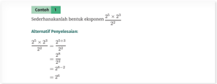

> **Deskripsi Visual:** Gambar ini adalah diagram yang menunjukkan contoh soal matematika tentang sederhanakanan bentuk eksponen. Gambar ini terdiri dari dua bagian utama: bagian atas berisi teks soal dan bagian bawah berisi alternatif jawaban. Teks soal menyebutkan bahwa kita perlu sederhanakan bentuk eksponen \(\frac{2^{5} \times 2^{3}}{2^{2}}\). Alternatif jawaban yang diberikan meliputi:

1. \(\frac{2^{5+3}}{2^{2}} = \frac{2^{8}}{2^{2}}\)
2. \(\frac{2^{5-3}}{2^{2}} = \frac{2^{2}}{2^{2}}\)
3. \(\frac{2^{5+3}}{2^{2}} = \frac{2^{8}}{2^{2}}\)

Elemen-elemen utama yang terlihat dalam gambar ini adalah teks soal, alternatif jawaban, dan angka yang muncul dalam bentuk eksponen. Informasi kunci yang dapat diambil pembaca adalah bahwa mereka harus menggunakan aturan eksponen untuk mengurangi pangkat dan memperoleh jawaban yang benar.

(

x

4

3

)

1

3

)

2

(

4

3

)

Alternatif Penyelesaian:

(

)

(

)

(

2

x

1

4

2

3

3

3

x

2

3

+

⇥

x

=

4

)

3

⇥

(

x

⇥

x

 

---
## 📄 Halaman 15

### Latihan

x

=

2

2

= 2

8

2

8

= 2

-

6

Bagian ini diberikan untuk membantu pemahaman kalian atas konsep yang dipelajari. Perhatikan contoh soal dan kaitkan dengan penjelasan sebelumnya agar kalian merasakan manfaat bagian tersebut. ( x 1 3 ) 2 ⇥ ( x 4 3 ) Alternatif Penyelesaian:

(

1

3

)

2

(

4

3

)

(

x

x

x

=

=

=

=

- ( 3 4 ) 2 = 3 p
x

4

3

)

``

``

- (3 π ) p = 27 π 3
Kalian mengerjakan soal-soal dengan tiga jenis tingkat kesulitan, yaitu dasar, menengah, dan tinggi. Pertanyaan pada tingkat dasar berupa jawaban pendek yang menguji pemahaman konsep dan keterampilan dasar. Tingkat menengah berupa  permasalahan  yang  lebih  terstruktur, sedangkan  tingkat tinggi merupakan permasalahan aplikasi dan keterampilan aras tinggi (HOTS).

### Uji Kompetensi

### Uji Kompetensi

``

``

``

Terdapat  pada  akhir  bab,  merupakan  sarana  bagi  kalian  untuk  mengukur pencapaian kalian dalam topik bab. Kalian dapat mengerjakan sejumlah soal yang bervariasi dari yang sederhana hingga yang kompleks. Selain itu, soal dapat berupa hitungan ataupun pemahaman konsep.

Pengayaan

Permainan Pangkat

x

2

3

2

3

+

6

3

2

)

4

3

(

⇥

x

2

⇥

 

---
## 📄 Halaman 16

### Pengayaan

---
**🖼️ Gambar/Diagram**

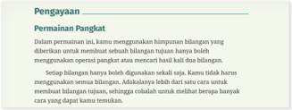

> **Deskripsi Visual:** Gambar ini adalah bagian dari buku pelajaran yang menunjukkan informasi tentang penggunaan perintah "permanen pangkat" dalam bahasa Indonesia. Gambar ini terdiri dari beberapa elemen utama:

1. Judul: "Penggunaan Permanen Pangkat"
2. Subjudul: "Dalam perintah permanen, kamu menggunakan himpunan bilangan yang diberikan untuk membuat sebuah bilangan pangkatnya juga boleh menggunakan operasi pangkat atau memasukkan hasil kali dua bilangan."
3. Deskripsi: Setiap bilangan hanya digunakan sekali saja. Adalah tidak harus menggunakan bilangan yang sama. Adalah tidak ada cara untuk membuat bilangan pangkat, sehingga harus menggunakan bilangan baru yang berbeda dengan cara yang dapat kamu temukan.

Informasi kunci yang dapat diambil pembaca melalui gambar ini adalah bahwa penggunaan perintah "permanen pangkat" memungkinkan pembuat bilangan pangkat menggunakan operasi pangkat atau memasukkan hasil kali dua bilangan. Selain itu, setiap bilangan hanya dapat digunakan sekali saja dan tidak ada cara untuk membuat bilangan pangkat yang sama.

2 3 = 8 32 ( 1 5 ) ⇥ 16 ( 1 2 ) Kegiatan  yang  dapat  digunakan  untuk  memperluas  atau  memperdalam wawasan dan pemahaman atas konsep matematika yang sedang dipelajari. Materi  pengayaan  dapat  bersifat  sebagai  pendalaman  materi,  penerapan dalam bidang teknologi/informatika, atau kegiatan eksplorasi/proyek. 9 log 81 2 log 64 -2 log 16 4 log 16 10 5 log 4 = m 4 log 3 = n 12 log 100 m n

### Refleksi

Asesmen Diri

Pada akhir bab atau subbab, kalian akan diajak memikirkan kembali apa yang sudah dipelajari dan seberapa dalam/tepat pemahamanmu atas pembelajaran pada bagian tersebut.

 

---
## 📄 Halaman 17

Kementerian Pendidikan, Kebudayaan, Riset, dan Teknologi Republik Indonesia, 2023

Matematika untuk SMA/MA/SMK/MAK Kelas X (Edisi Revisi)

Penulis: Dicky Susanto, dkk. ISBN: 978-623-118-558-7

Bab

1

 

---
## 📄 Halaman 18

### Tujuan Pembelajaran

Setelah kamu belajar bab ini, diharapkan kamu dapat mengidentifikasi sifatsifat eksponen, bentuk akar, dan fungsi eksponensial. Selain itu, kamu juga diharapkan mampu menyelesaikan permasalahan sehari-hari yang berkaitan dengan fungsi eksponensial.

### Kata Kunci

- eksponen
- pangkat
- fungsi eksponensial
- bentuk akar

---
**🖼️ Gambar/Diagram**

> **Deskripsi Visual:** Gambar ini adalah diagram yang menunjukkan struktur materi dalam buku pelajaran. Diagram ini terdiri dari dua bagian utama: "Sifat-Sifat Eksponen" dan "Bentuk Akar". Setiap bagian tersebut memiliki subbagian yang disebutkan sebagai "Eksponen" dan "Fungi Eksponensial". 

1. **Apa yang Ditampilkan Secara Keseluruhan**: Gambar ini menunjukkan struktur topik dalam materi pelajaran, dengan fokus pada sifat-sifat eksponen dan bentuk akar.

2. **Elemen-Elemen Utama dan Relasinya**: 
   - **Elemen Utama**: Ada dua bagian utama: "Sifat-Sifat Eksponen" dan "Bentuk Akar".
   - **Relasi**: "Sifat-Sifat Eksponen" dan "Bentuk Akar" merupakan dua cabang dari topik utama, sedangkan "Eksponen" dan "Fungi Eksponensial" merupakan subtopik yang lebih spesifik.

3. **Teks, Angka, atau Label Penting yang Terlihat**: 
   - **Teks Penting**: "Peta Materi", "Sifat-Sifat Eksponen", "Bentuk Akar", "Eksponen", "Fungi Eksponensial".
   - **Angka**: Tidak ada angka yang terlihat dalam gambar ini.
   - **Label Penting**: "Eksponen" dan "Fungi Eksponensial" diberikan sebagai subtopik untuk "Sifat-Sifat Eksponen".

4. **Informasi Kunci yang Dapat Diambil Pembaca**: 
   - Gambar ini memberikan pemahaman tentang struktur topik dalam materi pelajaran, memperjelas hubungan antara sifat-sifat eksponen, bentuk akar, eksponen, dan fungsi eksponensial.

Dengan demikian, gambar ini membantu pembaca memahami struktur dan topik-topik yang akan dipelajari dalam materi pelajaran tersebut.

Penyebaran virus, peredaran video yang viral, dan pertumbuhan penduduk dunia memiliki satu kesamaan yaitu setiap fenomena dapat dijelaskan oleh pertumbuhan eksponen.

Layaknya penyebaran virus yang berlipat ganda dari orang ke orang, rumah ke rumah, kota ke kota, begitu pula penyebaran video atau konten yang menarik di media sosial. Daya tarik sebuah konten di media sosial dapat membuat penyebaran konten melonjak dengan cepat disampaikan ke jutaan bahkan miliaran penonton.

Bayangkan penyebaran mulai dari 10 penonton pertama yang masingmasing menceritakan dan membagikan video tersebut ke 10 orang lainnya. Dalam fase penyebaran pertama ini, sudah ada penambahan 100 orang penonton!

 

---
## 📄 Halaman 19

---
**🖼️ Gambar/Diagram**

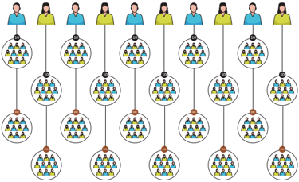

> **Deskripsi Visual:** Gambar ini adalah ilustrasi yang menunjukkan struktur organisasi atau hubungan antara individu dalam sebuah organisasi. Ilustrasi ini menggambarkan beberapa orang yang terhubung melalui ikatan kerja atau hubungan profesional. Setiap individu diilustrasikan dengan ikon yang berbeda, mungkin untuk menunjukkan peran atau posisi mereka dalam organisasi. Ikatan antara individu tersebut diperlihatkan dengan garis yang menghubungkan mereka, menunjukkan hubungan atau komunikasi antar mereka. Teks, angka, atau label penting tidak terlihat dalam gambar ini, sehingga informasi kunci yang dapat diambil pembaca hanya melalui visual dan interpretasi dari ikatan dan ikon yang digunakan.

Kamu juga dapat membayangkan dengan pola yang sama, pertumbuhan penduduk dunia terjadi. Simak grafik pertumbuhan populasi dunia berikut ini.

---
**🖼️ Gambar/Diagram**

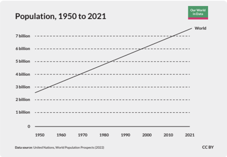

> **Deskripsi Visual:** Gambar ini adalah diagram yang menunjukkan perkembangan populasi dunia dari tahun 1950 hingga 2021. Diagram ini menggunakan garis lurus untuk menggambarkan tren pertumbuhan populasi yang meningkat secara signifikan sepanjang periode tersebut. Garis ini melintasi titik-titik pada skala populasi yang mencakup 1 miliar, 2 miliar, 3 miliar, 4 miliar, 5 miliar, dan 7 miliar. Label "World" menunjukkan bahwa data ini merujuk pada seluruh dunia. Teks di atas diagram menyatakan bahwa data ini diambil dari United Nations World Population Prospects (2022). Label "CC BY" menunjukkan hak cipta dan lisensi yang digunakan. Informasi kunci yang dapat diambil dari gambar ini adalah bahwa populasi dunia telah meningkat dari 1 miliar pada tahun 1950 menjadi lebih dari 7 miliar pada tahun 2021, menunjukkan peningkatan yang signifikan dalam jumlah penduduk global selama periode tersebut.

 

---
## 📄 Halaman 20

Eksponen merupakan konsep matematika yang ada di sekitar kita dan sangat bermanfaat bagi pemecahan masalah manusia. Kamu akan mempelajari konsep ini pada bab pertama.

Perkalian berulang adalah perkalian yang dilakukan secara berulang dengan faktor yang sama.

### Perhatikan contoh berikut ini.

- 2 ⇥ 2 ⇥ 2 ⇥ 2 ⇥ 2 ⇥ 2 ditulis dengan 2 6
- 15 ⇥ 15 ⇥ 15 ⇥ 15 ditulis dengan 15 4
- 5 ⇥ 5 ⇥ 5 ⇥ 5 ⇥ 5 ⇥ 5 ⇥ 5 ⇥ 5 ditulis dengan 5 8
- 7 ⇥ 7 ⇥ 7 ⇥ 7 ⇥ 7 ⇥ 7 ⇥ 7 ⇥ 7 ⇥ 7 ⇥ 7 ditulis dengan 7 10
- a ⇥ a ⇥ a ⇥ a ⇥ a ⇥ a ⇥ a ditulis dengan a 7

### A. Definisi Eksponen

Eksplorasi

2.1

Penyebaran Hoaks

Seseorang membagikan pesan berisi informasi yang salah (hoaks) kepada 2 orang temannya. Berikut isi pesannya.

---
**🖼️ Gambar/Diagram**

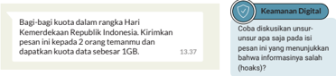

> **Deskripsi Visual:** Gambar ini adalah ilustrasi yang menunjukkan sebuah pesan atau informasi yang disampaikan dalam konteks Hari Kemerdekaan Republik Indonesia. Ilustrasi ini terdiri dari dua bagian utama: bagian atas yang berisi teks informasi dan bagian bawah yang menampilkan ikon atau logo yang mungkin merujuk pada asal-usul atau sumber informasi tersebut.

Teks informasi utama berisi instruksi untuk membagi kuota data dalam rangka Hari Kemerdekaan Republik Indonesia. Pesan ini diterima oleh 2 orang temanmu dan dapatkan kuota data sebesar 1GB. Ini menunjukkan bahwa ada program atau kampanye tertentu yang mengajak pengguna untuk membagi kuota data mereka dengan teman-temannya sebagai bentuk partisipasi dalam perayaan Hari Kemerdekaan.

Elemen-elemen utama yang terlihat dalam gambar ini meliputi:
1. Teks informasi yang memberikan detail tentang program atau kampanye.
2. Ikon atau logo yang mungkin menunjukkan asal-usul atau sumber informasi.
3. Waktu penayangan atau tanggal yang mungkin relevan dengan acara tersebut.

Informasi kunci yang dapat diambil pembaca meliputi:
- Ada program atau kampanye yang mengajak pengguna untuk membagi kuota data mereka dengan teman-temannya.
- Program ini dirancang untuk memeriahkan Hari Kemerdekaan Republik Indonesia.
- Pengguna harus membagi kuota data sebesar 1GB kepada 2 orang teman mereka.

Dengan demikian, gambar ini menunjukkan sebuah kampanye atau program yang bertujuan untuk meningkatkan partisipasi dan semangat dalam perayaan Hari Kemerdekaan Republik Indonesia melalui cara membagi kuota data.

Setelah membaca pesan ini, kedua orang tersebut mengikuti arahan dan membagikan pesan yang sama kepada 2 orang lainnya. Dengan asumsi setiap orang yang menerima pesan ini tidak mengetahui bahwa ini adalah hoaks, bayangkan betapa cepat hoaks ini akan tersebar.

 

---
## 📄 Halaman 21

Kamu akan mencoba menganalisis data penyebaran hoaks secara mandiri. Percobaan ini akan membantumu memahami konsep eksponen. Pastikan kamu punya waktu yang cukup untuk melakukan percobaan mandiri ini.

- Gunakan emoji senyum untuk mewakili 1 orang.
Gambarkan diagram pohon yang menunjukkan penyebaran hoaks hingga pesan sudah dibagikan 3 kali.

---
**🖼️ Gambar/Diagram**

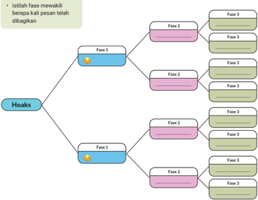

> **Deskripsi Visual:** Gambar ini adalah diagram yang menunjukkan struktur dan hubungan antara fase-fase dalam proses hoaks. Diagram ini terdiri dari dua barisan vertikal yang masing-masing berisi tiga fase. Setiap fase memiliki warna yang berbeda untuk membedakannya. Di bagian atas setiap baris, ada istilah "Fase 1" dan "Fase 2", yang mewakili dua tahap awal dalam proses hoaks. Untuk setiap fase, ada tiga sub-fase yang disebutkan sebagai "Fase 3". 

Elemen utama dalam diagram ini adalah dua barisan vertikal yang menggambarkan dua jenis hoaks, dengan setiap jenis tersebut memiliki tiga sub-fase. Relasi antara elemen-elemen ini adalah bahwa setiap sub-fase dalam setiap jenis hoaks memiliki hubungan dengan sub-fase lainnya dalam jenis hoaks yang sama.

Teks penting yang terlihat pada gambar ini adalah istilah "Hoaks" yang berada di bagian bawah diagram, yang menunjukkan topik utama dari diagram ini. Angka dan label penting yang terlihat adalah "Fase 1" dan "Fase 2" yang masing-masing mewakili dua tahap awal dalam proses hoaks, serta "Fase 3" yang mewakili tiga sub-fase dalam setiap jenis hoaks.

Informasi kunci yang dapat diambil pembaca dari gambar ini adalah bahwa proses hoaks terdiri dari dua jenis, yaitu "Hoaks 1" dan "Hoaks 2", dan setiap jenis ini memiliki tiga sub-fase. Ini menunjukkan bahwa proses hoaks melibatkan beberapa tahap dan sub-tahap yang harus diselesaikan sebelum hoaks dapat terjadi.

Lengkapilah tabel di bawah ini yang akan memberimu gambaran penyebaran di setiap fase hingga fase ke-8.

 

---
## 📄 Halaman 22

- Perhatikan jumlah orang pada setiap fasenya. Pola bilangan apa yang kamu temukan?
- Dengan memanfaatkan pola bilangan tersebut, hitung jumlah orang yang menerima hoaks tersebut pada fase ke-6? Bagaimana kamu mengetahuinya?
kamu boleh menuliskan rumus dalam bentuk kalimat tertulis maupun dalam bentuk kalimat matematika.

- Pada fase ke berapakah jumlah orang yang menerima hoaks akan melebihi 200 orang? Bagaimana kamu mengetahuinya?
- Jika banyak fase adalah n , tuliskan rumus sederhana untuk menghitung banyak orang yang menerima hoaks pada fase ken tersebut?

### Ayo, Bekerja Sama

Bagikan rumus yang kamu buat pada nomor 4 kepada satu temanmu. Bandingkan rumusmu dan gunakan rumus tersebut untuk menghitung jumlah orang pada fase ke-7. Apakah rumusmu menghasilkan jawaban yang benar? Apabila tidak, perbaiki rumusmu agar dapat menghasilkan jawaban yang benar.

Perhatikan kembali Eksplorasi 1.1 yang sudah kamu lakukan. Ada hubungan yang menarik antara fase penyebaran dengan jumlah orang yang menerima hoaks. Simak polanya sebagai berikut.

``

Jika banyak orang yang mendapatkan hoaks di fase ken dinyatakan dengan m , maka

``

Dengan memanfaatkan kesimpulan di atas, maka jumlah orang yang mendapatkan hoaks pada fase ke-5 dapat dengan mudah dihitung sebagai berikut.

``

Bentuk 2 1 , 2 2 , 2 3 , 2 4 dan 2 n ini merupakan bentuk bilangan pangkat. Bilangan berpangkat akan memudahkan kamu untuk menyederhanakan

 

---
## 📄 Halaman 23

bentuk perkalian berulang. Bilangan berpangkat atau disebut juga eksponen didefinisikan sebagai berikut.

Jika a adalah bilangan real dan n adalah bilangan bulat positif, maka a n menyatakan hasil kali bilangan a sebanyak n faktor dan ditulis dengan

``

Bilangan berpangkat dapat dinyatakan dengan

``

Berikut adalah beberapa definisi penting yang perlu kamu ketahui.

- Jika a adalah bilangan real dengan a /negationslash = 0 dan n bilangan bulat positif, maka a -n = ( 1 a ) n
- Jika a adalah bilangan real dengan a /negationslash = 0 dan n bilangan bulat positif, maka a 1 n = p adalah bilangan real positif, sehingga p n = a
- Jika a adalah bilangan real dengan a /negationslash = 0 dan dan m,n bilangan bulat positif, maka a m n = ( a 1 n ) m

### B.  Sifat-Sifat Eksponen

Sifat-Sifat Eksponen

Perhatikan tabel yang menunjukkan bentuk eksponen 2 n di bawah ini.

2 3

2 4

2 5

2 6

2 n

2 1

2 2

2 7

2 8

2 9

2 10

 

---
## 📄 Halaman 24

Sekarang kamu amati bentuk eksponen di bawah ini. Selesaikan dan diskusikan dengan teman kelompokmu.

---
**📊 Tabel**

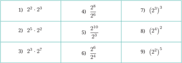

Tabel ini berisi perhitungan eksponensial dan pembagian bilangan bulat. Topik utamanya adalah operasi matematika yang melibatkan eksponen dan pembagian. Kolom pertama menunjukkan hasil dari perhitungan eksponensial, sedangkan kolom kedua menunjukkan hasil dari pembagian. Data penting yang terlihat adalah bahwa banyak perhitungan memiliki hasil yang sama, menunjukkan bahwa beberapa operasi eksponensial dan pembagian dapat diperoleh dengan cara yang sama. Misalnya, 2^3 * 2^3 = (2^3)^3 dan 2^5 / 2^2 = 2^(5-2) = 2^3. Ini menunjukkan bahwa pemisahan eksponen dan pembagian dapat dilakukan dengan cara yang sama, yang dapat membantu dalam memahami konsep dasar matematika.

Dari pengamatan di atas, apa yang dapat kamu simpulkan dari sifat-sifat eksponen tersebut?

- Secara umum apakah bentuk lain dari a m · a n ?
- Secara umum apakah bentuk lain dari a m a n ?
- Secara umum apakah bentuk lain dari ( a m ) n ?
Itu merupakan beberapa sifat-sifat yang berlaku pada eksponen. Berikut sifat-sifat eksponen yang perlu kamu ketahui. Kamu sudah membuktikan sifat 1, 2, dan 3.

- a m · a n = a m + n , dengan a /negationslash = 0 , m, n bilangan bulat
- ( a m ) n = a m ⇥ n , dengan a /negationslash = 0 , m, n bilangan bulat
- a m a n = a m -n , dengan a /negationslash = 0 , m, n bilangan bulat
- ( ab ) m = a m × b m dengan a, b /negationslash = 0 , dan m bilangan bulat
- ( a m n ) ( a p n ) = ( a ) m + p n dengan a > 0 , m n dan p n bilangan rasional dengan n /negationslash = 0
- ( a b ) m = a m b m dengan b /negationslash = 0 , dan m bilangan bulat
- ( a m n ) ( a p q ) = ( a ) m n + p q dengan a > 0 , m n dan p n bilangan rasional dengan n, q /negationslash = 0

 

---
## 📄 Halaman 25

Bagaimana kamu membuktikan Sifat 4 dan 5? Diskusikan bersama temanmu.

Perhatikan contoh 1 dan 2 berikut.

### Contoh 1

Sederhanakanlah bentuk eksponen 2 5 ⇥ 2 3 2 2

### Alternatif Penyelesaian:

``

### Contoh 2

Sederhanakan bentuk eksponen ( x 1 3 ) 2 ⇥ ( x 4 3 )

### Alternatif Penyelesaian:

``

- Buktikan sifat eksponen nomor 6 dan 7.
- Tentukan nilai p sedemikian sehingga persamaan berikut ini tepat
- b p · b 5 = 3 9
- (3 π ) p = 27 π 3
- ( 3 4 ) 2 = 3 p

 

---
## 📄 Halaman 26

### 3. Sederhanakanlah

``

- ( 3 u 3 v 5 ) ( 9 u 4 v ) c. ( n -1 r 4 5 n -6 r 4 ) 2 , n /negationslash = 0 , r /negationslash = 0

### C.  Fungsi Eksponenial

Fungsi Eksponensial

Seseorang terjangkit virus dan menulari 3 orang lainnya. Pada fase selanjutnya, setiap orang menulari 3 orang lainnya lagi.

- Berapakah orang yang akan tertular pada setiap fase selanjutnya?
- Berapa orang yang akan tertular virus tersebut pada fase ke-20?
- Manakah dari grafik fungsi berikut ini yang merepresentasikan peningkatan jumlah orang yang tertular virus tersebut jika proses penularan terjadi terus-menerus? Mengapa demikian?
- Fungsi apakah yang tepat menggambarkan penularan tersebut?

### Perhatikan Eksplorasi 1.3

Pada fase pertama 3 orang tertular dari orang pertama dan kemudian menularkan masing-masing ke 3 orang lainnya. Kemudian 3 orang tersebut menularkan lagi ke masing-masing 3 orang berikutnya, begitu seterusnya.

 

---
## 📄 Halaman 27

Jika disajikan dalam bentuk tabel maka diperoleh seperti berikut ini.

Kalau kamu perhatikan, untuk menentukan banyaknya orang yang tertular virus tersebut, pola yang muncul adalah 3 x , dengan x adalah fase penyebaran virus. Jika f ( x ) adalah banyaknya orang yang tertular virus tersebut, sementara x adalah fase penyebaran virus, maka banyaknya orang yang tertular virus tersebut dapat dinyatakan dengan,

``

f ( x ) = 3 x adalah salah satu contoh fungsi eksponensial.

### Definisi Fungsi Eksponensial

Sebuah fungsi eksponensial dinyatakan dengan

``

dengan a adalah bilangan pokok, a > 0 , a /negationslash = 1 , n adalah bilangan real tak nol dan x adalah sebarang bilangan real.

Apakah kamu sudah memahami definisi di atas? Coba diskusikan pertanyaan berikut ini.

- Bagaimana jika a = 1 ?
- Bagaimana jika a = 0 ?
Beberapa contoh fungsi eksponensial lainnya adalah sebagai berikut.

- f ( x ) = 4 x
- f ( x ) = 3 x +1
- f ( x ) = 5 2 x -1

 

---
## 📄 Halaman 28

Jika kamu perhatikan, perubahan nilai pada fungsi eksponensial sangatlah signifikan. Pada Eksplorasi 1.3 dapat kamu amati bahwa pada fase-fase selanjutnya, semakin banyak orang yang tertular virus tersebut.

Grafik fungsi eksponensial pada f ( x ) = 3 x ditunjukkan pada gambar di bawah ini.

Fungsi eksponensial dibedakan menjadi dua bentuk, yaitu pertumbuhan eksponensial dan peluruhan eksponensial.

Perhatikan ketiga fungsi berikut ini.

- f ( x ) = 2
- x b. f ( x ) = 2 x c. f ( x ) = x 2
- Gambarlah ketiga grafik fungsi tersebut.
- Apa yang membedakan ketiga grafik fungsi tersebut?
- Dari ketiga grafik fungsi tersebut, grafik yang manakah yang paling cepat peningkatannya?

### 1.  Pertumbuhan Eksponen

Kurva pada Gambar 1.3 adalah salah satu kurva yang menunjukkan pertumbuhan eksponen, yang tingkat pertumbuhannya berbanding lurus dengan besarnya nilai kuantitasnya. Contoh yang lainnya misalnya pada

 

---
## 📄 Halaman 29

pertumbuhan bakteri di mana pada fase-fase selanjutnya bakteri tentu akan semakin banyak jumlahnya.

Fungsi pertumbuhan eksponen dituliskan dengan

``

Ada sebuah dongeng rakyat dari India yang menunjukkan bagaimana ide pertumbuhan eksponen dimanfaatkan seorang anak untuk menolong penduduk di kotanya yang kelaparan. Judul dongeng ini adalah One Grain of Rice dan ditulis oleh Demi.

Dengarkan dongeng ini dengan mencarinya di kanal Youtube menggunakan kata kunci ' One Grain of Rice '. Kerjakan aktivitas yang mengikuti. Kamu dapat menyetel fungsi terjemah otomatis dari Youtube jika dirasa perlu.

Permintaan anak perempuan ini merupakan contoh pertumbuhan eksponen. Dengan teman sekelompokmu, cari tahu berapa biji beras yang diterima anak perempuan di dalam cerita ini setiap harinya selama 30 hari.

---
**📊 Tabel**

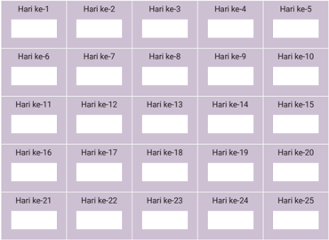

Tabel ini menunjukkan data harian yang disusun dalam 25 hari, mulai dari Hari ke-1 hingga Hari ke-25. Setiap baris menggambarkan satu hari, sementara kolom-kolom berisi informasi tentang aktivitas atau peristiwa tertentu yang terjadi pada setiap hari tersebut. Topik utama tabel ini adalah log atau catatan harian, yang dapat digunakan untuk memantau perkembangan atau perubahan dalam suatu aspek hidup, seperti kesehatan, pendidikan, atau kegiatan sosial. Data penting yang terlihat meliputi tanggal-tanggal tertentu di mana ada perubahan atau peningkatan dalam aktivitas atau kondisi yang diukur.

 

---
## 📄 Halaman 30

Sekarang mari kita lihat beberapa contoh berikut ini.

Untuk mengamati pertumbuhan suatu bakteri pada inangnya, seorang peneliti mengambil potongan inang yang sudah terinfeksi bakteri tersebut dan mengamatinya selama 5 jam pertama. Pada inang tersebut, terdapat 30 bakteri. Setelah diamati, bakteri tersebut membelah menjadi dua setiap 30 menit.

- Modelkan fungsi pertumbuhan bakteri pada setiap fase.
- Gambarkan grafik pertumbuhan bakteri tersebut.
- Pada jam ke-5 berapa banyak bakteri baru yang tumbuh?

### Alternatif Penyelesaian:

- Pada awal pengamatan, bakteri yang diamati berjumlah 30 sehingga untuk 30 menit berikutnya dapat digambarkan pertumbuhan bakterinya sebagai berikut. Misalkan x adalah fase pertumbuhan bakteri setiap 30 menit, maka
Untuk x = 0 , banyak bakteri = 30 ;

Untuk x = 1 , banyak bakteri = 60 = 2 1 · 30 ;

Untuk x = 3 , banyak bakteri = 240 = 2 3 · 30 ;

Untuk x = 2 , banyak bakteri = 120 = 2 2 · 30 ;

``

Pertumbuhan bakteri dapat dimodelkan dengan fungsi eksponensial

``

- Grafik fungsi eksponensial pertumbuhan bakteri f ( x ) = 30 · (2 x ) dapat digambarkan sebagai berikut.

 

---
## 📄 Halaman 31

---
**🖼️ Gambar/Diagram**

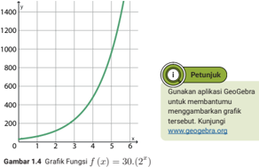

> **Deskripsi Visual:** Grafik pada Gambar 1.4 menunjukkan grafik fungsi f(x) = 30(2^x). Grafik ini adalah bentuk diagram yang menggambarkan hubungan antara variabel x dan y. Variabel x dinyatakan pada sumbu horizontal, sedangkan variabel y dinyatakan pada sumbu vertikal. Grafik ini menunjukkan bahwa fungsi f(x) = 30(2^x) adalah fungsi eksponensial dengan asumsi awal yaitu x = 0, di mana nilai y adalah 30. Grafik ini menunjukkan bahwa fungsi ini meningkat dengan cepat seiring naiknya nilai x. Ini juga menunjukkan bahwa untuk setiap peningkatan 1 unit pada x, nilai y akan meningkat 60 kali lipat. Jadi, informasi kunci yang dapat diambil pembaca adalah bahwa fungsi eksponensial f(x) = 30(2^x) meningkat dengan cepat dan memiliki asumsi awal yaitu x = 0 dengan nilai y = 30.

- Jam ke-5 terjadi pada fase ke-10 (ingat kembali pembelahan terjadi setiap 30 menit), sehingga:

``

Jadi banyak bakteri yang tumbuh pada jam ke-5 atau fase ke-10 adalah 30.720 bakteri.

Jika banyak bakteri di awal adalah 50, 100 dan 200, bagaimana kamu memodelkan pertumbuhan bakteri tersebut?

Diskusikan dengan teman kelompok kalian.

### Contoh 4

Seorang peneliti mengamati pertumbuhan bakteri selama beberapa jam. Setelah diamati, bakteri tersebut membelah menjadi n bakteri setiap jam. Setelah diamati, jumlah bakteri pada 2 jam pertama adalah 8.000

 

---
## 📄 Halaman 32

bakteri. Dua jam kemudian jumlah bakteri sudah mencapai 32.000 bakteri. Berapakah jumlah bakteri setelah 10 jam?

### Alternatif Penyelesaian:

Misalkan x 0 adalah banyaknya bakteri pada waktu t = 0 .

Jika a adalah banyaknya bakteri setelah pembelahan setiap jam, maka

Untuk t = 0 , banyak bakteri = x 0 ;

Untuk t = 1 , banyak bakteri = a 1 · x 0 ;

Untuk t = 3 , banyak bakteri = a 3 · x 0 ;

Untuk t = 2 , banyak bakteri = a 2 · x 0 ;

Untuk t = 4 , banyak bakteri = a 4 · x 0 ;

dan seterusnya.

Kamu harus mencari nilai a terlebih dahulu untuk mengetahui banyak bakteri yang dihasilkan ketika sebuah bakteri membelah dalam 1 jam. Jika banyak bakteri pada 2 jam pertama adalah x 2 dan banyak bakteri pada 2 jam berikutnya (4 jam kemudian) adalah x 4 , maka:

``

Jadi, setiap 1 jam bakteri akan membelah menjadi dua bakteri.

Selanjutnya kamu akan mencari banyak bakteri di awal yaitu x 0 . Kamu dapat menggunakan persamaan x 2 = a 2 · x 0 dengan substitusikan nilai a = 2 pada x 2 = a 2 x 0

``

``

 

---
## 📄 Halaman 33

Jadi, banyaknya bakteri mula-mula adalah 2.000 bakteri.

Untuk mencari banyak bakteri pada 10 jam kemudian, maka digunakan persamaan x 10 = a 10 .x 0 . Substitusikan nilai a = 2 dan x 0 = 2 . 000 pada x 10 = a 10 · x 0 .

``

Jadi, banyaknya bakteri setelah 10 jam adalah 2.048.000 bakteri.

Jawablah pertanyaan berikut ini.

- Bakteri E.coli menyebabkan penyakit diare pada manusia. Seorang peneliti mengamati pertumbuhan 50 bakteri ini pada sepotong makanan dan menemukan bahwa bakteri ini membelah menjadi 2 setiap seperempat jam.
- Gambarkan tabel dan grafik yang menunjukkan pertumbuhan bakteri ini dari fase 0 sampai fase 5.
- Modelkan fungsi yang menggambarkan pertumbuhan bakteri E.coli setiap seperempat jam.
- Prediksi berapa banyaknya bakteri setelah 3 dan 4 jam pertama.
- Pada tahun 2015 kasus positif HIV-AIDS berjumlah sekitar 36 juta jiwa. Jumlah ini meningkat rata-rata 2% setiap tahun dari tahun 2010 hingga 2015. Jika peningkatan kasus positif HIV di tahun-tahun berikutnya diprediksi bertambah secara eksponen pada peningkatan 2% setiap tahun, berapa banyak kasus yang terjadi pada tahun 2020?
Sumber: https://pusdatin.kemkes.go.id/ (dengan berbagai penyesuaian)

Berikan sebuah contoh penerapan pertumbuhan eksponen lainnya.

Gunakan aplikasi GeoGebra untuk membantumu menggambarkan grafik tersebut. Kunjungi www.geogebra.org

 

---
## 📄 Halaman 34

### 2.  Peluruhan Eksponen

Fungsi eksponensial tidak hanya menggambarkan pertumbuhan yang signifikan dari waktu ke waktu. Fungsi eksponensial juga menggambarkan penurunan secara konsisten pada periode waktu tertentu. Ini disebut peluruhan eksponen. Perhatikan grafik fungsi peluruhan eksponen pada Gambar 1.5 . Apa perbedaannya dengan grafik pertumbuhan eksponen? Diskusikan dengan temanmu.

---
**🖼️ Gambar/Diagram**

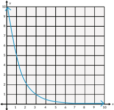

> **Deskripsi Visual:** Gambar ini adalah sebuah diagram yang menunjukkan hubungan antara dua variabel, yaitu variabel x dan y. Variabel x dinyatakan pada sumbu horizontal (horizontal axis) dan variabel y pada sumbu vertikal (vertical axis). Diagram ini berbentuk parabola yang melengkung ke bawah, menunjukkan bahwa hubungan antara kedua variabel tersebut adalah invers.

Elemen utama yang ditampilkan dalam diagram ini adalah garis yang menghubungkan titik-titik pada sumbu x dan y. Garis ini menunjukkan hubungan antara nilai-nilai x dan y. Garis ini juga membantu pembaca untuk memahami pola atau tren dalam data tersebut.

Teks, angka, atau label penting yang terlihat dalam diagram ini adalah titik-titik pada garis yang menunjukkan nilai-nilai x dan y. Titik-titik ini membantu pembaca untuk mengidentifikasi nilai-nilai tertentu pada kedua variabel tersebut.

Informasi kunci yang dapat diambil pembaca dari diagram ini adalah bahwa ada hubungan invers antara variabel x dan y. Semakin besar nilai x, semakin kecil nilai y, dan sebaliknya. Ini dapat digunakan untuk membuat prediksi atau analisis lebih lanjut tentang hubungan antara kedua variabel tersebut.

Fungsi peluruhan eksponen dapat dituliskan sebagai f ( x ) = n × a x , dengan 0 < a < 1 , n bilangan real tak nol , x adalah  sebarang bilangan real.

### Contoh 5

Obat penahan rasa sakit disuntikkan kepada pasien yang mengalami luka berat akibat kecelakaan. Dosis obat yang disuntikkan adalah 50 mikrogram. Satu jam setelah penyuntikan, setengah dosis tersebut akan luruh dan dikeluarkan dari dalam tubuh. Proses tersebut akan terus berulang setiap jam.

 

---
## 📄 Halaman 35

- Berapa banyak dosis obat yang masih tertinggal di dalam tubuh pasien setelah 1 jam, 2 jam, dan 3 jam?
- Bagaimana model matematika yang dapat menyatakan peluruhan dosis obat tersebut?

### Alternatif Penyelesaian:

- Dosis awal = 50 mikrogram
Misalkan dosis pada x waktu dilambangkan dengan f ( x ) , maka

``

``

``

``

Jadi, dosis pada 1 jam pertama tersisa 25 mikrogram, pada 2 jam pertama tersisa 12,5 mikrogram, dan setelah 3 jam tersisa 6,25 mikrogram.

- Berdasarkan soal nomor 1, fungsi eksponensial yang dapat menyatakan peluruhan dosis obat tersebut dari dalam tubuh pasien pada jam tertentu adalah f ( x ) = 50 ( 1 2 ) x dengan x adalah waktu yang dibutuhkan obat tersebut untuk meluruh sebanyak setengah dosis dari dosis sebelumnya.
Diskusikan mengapa fungsi f ( x ) = 50 ( 1 2 ) x dapat menggambarkan permasalahan di atas.

Prediksilah, berapa jam yang dibutuhkan sehingga dosis obat tersebut masih ada di dalam tubuh pasien kurang dari 0,1 mikrogram.

 

---
## 📄 Halaman 36

### Jawablah pertanyaan berikut ini.

- Dua ratus mg zat disuntikkan ke dalam tubuh pasien yang menderita penyakit kanker paru-paru. Zat tersebut akan dikeluarkan dari dalam tubuh melalui ginjal setiap jam. Jika setiap 1 jam 50% zat tersebut dikeluarkan dari dalam tubuh pasien, berapa mg zat tersebut yang masih tersisa di dalam tubuh pasien setelah 5 jam?
- Massa suatu zat radioaktif adalah 0,3 kg pada pukul 10 pagi. Tingkat peluruhan zat radioaktif tersebut adalah 15 % setiap jam. Berapakah jumlah zat radioaktif tersebut 8 jam kemudian?
- Sebuah bola basket dijatuhkan dari ketinggian 3 meter. Bola tersebut menyentuh tanah dan kemudian melambung kembali setinggi 3 5 dari tinggi sebelumnya. Bola tersebut terpantul dan melambung kembali dengan ketinggian yang sama sampai akhirnya benar-benar berhenti melambung dan jatuh ke tanah.
- Gambarkan grafik fungsi perubahan ketinggian lambungan bola hingga akhirnya menyentuh tanah.
- Pada lambungan ke berapa, bola akhirnya berhenti melambung?

### Penguatan Karakter

Pada sebuah novel berjudul Pay It Forward yang ditulis oleh Catherine Ryan Hyde, seorang anak bernama Trevor ditugaskan gurunya untuk memikirkan ide yang dapat membuat dunia menjadi lebih baik. Ide yang dicetus Trevor adalah untuk melakukan kebaikan tanpa syarat kepada 3 orang dan meminta 3 orang tersebut membalas kebaikannya bukan untuk dirinya tetapi untuk 3 orang lainnya. Ide ini dinamakan Pay It Forward yang dapat diterjemahkan menjadi Melanjutkan Kebaikan Kedepan.

---
**🖼️ Gambar/Diagram**

> **Deskripsi Visual:** Gambar ini adalah ilustrasi yang menampilkan dua tangan yang sedang memegang sebuah pita putih dengan tulisan "Pay It Forward" yang ditulis di atasnya. Pita tersebut melambangkan ide untuk mengirimkan kebaikan kepada orang lain. Di sebelah kanan pita tersebut ada sebuah kupu-kupu yang sedang terbang, yang mungkin merujuk pada ide untuk melanjutkan kebaikan dari generasi ke generasi. Gambar ini menggunakan warna-warna cerah dan menyenangkan, yang membuatnya mudah dipahami dan menarik perhatian pembaca. Teks "Pay It Forward" menjadi elemen penting karena ia memberikan pesan utama dari gambar ini, yaitu tentang bagaimana kita bisa mengirimkan kebaikan kepada orang lain.

Ide Pay It Forward ini dapat menghasilkan pertumbuhan eksponensial yang sangat tinggi. Bayangkan apabila ide tersebut diterapkan oleh banyak

 

---
## 📄 Halaman 37

orang di dunia. Bayangkan juga betapa lebih baiknya dunia kita apabila kita menerapkan ide ini. Menurutmu, jika diterapkan, dalam berapa lamakah aksi kebaikan ini bisa dirasakan 100 orang? Bagaimana dengan 1 juta orang?

Tuliskan 3 ide aksi kebaikan tanpa syarat yang dapat kamu lakukan hari ini. Aksi kebaikan tidak harus hal yang besar dan harus dipersiapkan lama. Aksi kebaikan dapat hal sekecil apapun. Apakah kamu  mau mencoba ide Pay It Forward ini?

### D.  Bentuk Akar

### 1.  Hubungan Bilangan Pangkat dan Akar

Perhatikan kembali Contoh 5 sebelumnya. Fungsi eksponensial yang menyatakan peluruhan dosis obat di dalam tubuh pasien dituliskan dalam fungsi f ( x ) = 50(0 , 5) x dengan x adalah waktu yang dibutuhkan obat tersebut untuk meluruh sebanyak setengah dosis dari dosis sebelumnya. Jika kamu ingin mengetahui banyaknya dosis yang meluruh setelah 30 menit, bagaimana cara yang kamu lakukan?

Fungsi untuk permasalahan tersebut adalah f ( x ) = 50(0 , 5) x

Setelah 30 menit, banyak dosis obat yang meluruh adalah f ( 1 2 ) = 50(0 , 5) 1 2

Akan mudah bagimu untuk menentukan hasil penghitungan dengan pangkat bilangan bulat positif. Sementara bentuk (0 , 5) 1 2 tentu menyulitkan untuk menentukan hasil perpangkatannya dengan penghitungan manual.

Bentuk lain dari (0 , 5) 1 2 adalah √ 0 , 5 . Bentuk ini disebut bentuk akar. Bentuk akar didefinisikan sebagai berikut.

Untuk setiap bilangan pangkat rasional m n , dengan m dan n adalah bilangan bulat dan n > 0 , didefinisikan

``

Sifat-sifat eksponen juga dapat kamu gunakan untuk bentuk pangkat pecahan ini.

 

---
## 📄 Halaman 38

Sederhanakanlah bentuk (2 √ x ) (3 3 √ x ) untuk x > 0

### Alternatif Penyelesaian:

``

Apakah bentuk √ a + b = √ a + √ b benar? Jelaskan jawabanmu.

### 2.  Merasionalkan Bentuk Akar

Untuk merasionalkan bentuk akar, maka yang dapat dilakukan adalah dengan mengalikannya dengan bentuk akar sekawannya.

Untuk merasionalkan bentuk a √ b dilakukan dengan cara mengalikan dengan sekawannya yaitu √ b √ b , sehingga diperoleh:

``

Untuk merasionalkan bentuk c √ a + √ b , c √ a - √ b , c a + √ b , dan c a - √ b dilakukan dengan mengalikannya dengan sekawannya. Bentuk √ a + √ b dan √ a -√ b adalah sekawan, serta bentuk a + √ b dan a -√ b juga sekawan.

Ayo, Berpikir Kreatif

Coba rasionalkan bentuk-bentuk ini: c √ a + √ b , c √ a - √ b , c a + √ b , dan c a - √ b

Diskusikan cara yang kamu gunakan.

 

---
## 📄 Halaman 39

- Sederhanakan bentuk akar berikut ini.
- ( 8 x 5 y -4 16 y -1 4 ) 1 2
- ( p 5 q -10 p 5 q -4 ) 1 2 ( p 1 4 q -1 2 p -1 2 q -1 2 ) 1 2
- ( 5 √ x 5 ) (3 3 √ x )
- Rasionalkan bentuk berikut ini.
- 2 4 √ b 3
- Selesaikanlah:

``

- Selesaikanlah:

``

- Sebuah bangun berbentuk seperti di bawah ini. Bangun tersebut kemudian dibagi menjadi 4 bangun yang kongruen.
- Buatlah tabel yang merepresentasikan banyaknya bangun yang kongruen di setiap tahap.
- 2 √ 3 + √ 5
- m √ m + n

 

---
## 📄 Halaman 40

- Bagaimana model matematika yang tepat untuk menggambarkan permasalahan di atas?
- Pada tahap ke-12, berapa banyak bangun kongruen yang dapat dibuat?
- Sita menyusun sebuah fraktal seperti gambar di bawah ini.
Sita membuat sebuah pola tertentu sehingga setiap tahap jumlah segmen garis yang dihasilkan semakin banyak walaupun dengan ukuran yang lebih kecil. Sita terus melanjutkan fraktal tersebut dengan menghasilkan lebih banyak segmen garis pada tahap-tahap selanjutnya dengan pola yang sama.

- Buatlah sebuah tabel yang menunjukkan peningkatan jumlah segmen garis pada fraktal yang dibuat oleh Sita.
- Berapa banyak segmen garis yang dihasilkan setelah 20 tahap pertama?
- Rini mengamati bahwa penjualan tas kulit yang diproduksinya mendapatkan hasil penjualan terbesar pada bulan pertama produk tersebut diperjualbelikan. Setelah Rini amati, penjualan tas miliknya pada bulan kedua sebesar   dari penjualan tas pada bulan pertama. Demikian pula pada bulan ketiga, penjualan tas hanya   dari bulan kedua. Hal tersebut ternyata berlangsung sampai beberapa bulan kemudian.
- Jika Rini menjual 500 buah tas kulit pada bulan pertama, berapa banyak tas yang terjual pada bulan kedua dan ketiga?
- Berapa prediksi penjualan pada bulan ke-10?
- Pada bulan ke berapakah prediksi penjualan akan kurang dari 10 tas saja?

 

---
## 📄 Halaman 41

- Cangkang kerang merupakan salah satu contoh bentuk matematika yang ada di alam.
Perhatikan cangkang kerang berikut ini. Setiap ruang cangkang memiliki bentuk segitiga siku-siku dengan panjang sisi luarnya adalah 1 cm. Bagaimana panjang hipotenusa pada ruang cangkang ke-n?

- Tanpa perlu menentukan hasil perpangkatannya, berapakah bilangan satuan dari 7 1 2 3 ?
- Sebuah filter cahaya masih dapat ditembus oleh cahaya sebesar 60%. Berapa banyak filter cahaya yang dibutuhkan agar intensitas cahayanya menjadi kurang dari 5% dari intensitas cahaya di awal?

 

---
## 📄 Halaman 42

### Uji Kompetensi

### 1. Selesaikanlah

``

``

``

``

- Sebuah koloni bakteri terdiri atas 500 bakteri yang akan membelah diri menjadi dua setiap 1 jam.
- Tentukan fungsi yang menyatakan hubungan antara banyak bakteri setelah jam tertentu.
- Berapa lama waktu yang dibutuhkan sehingga koloni bakteri tersebut berjumlah 5.000 bakteri?
- Berapa lama waktu yang dibutuhkan sehingga koloni bakteri tersebut mencapai 100.000 bakteri?

### Pengayaan

### Permainan Pangkat

Dalam permainan ini, kamu menggunakan himpunan bilangan yang diberikan untuk membuat sebuah bilangan tujuan hanya boleh menggunakan operasi pangkat atau mencari hasil kali dua bilangan.

Setiap bilangan hanya boleh digunakan sekali saja. Kamu tidak harus menggunakan semua bilangan. Adakalanya lebih dari satu cara untuk membuat bilangan tujuan, sehingga cobalah untuk melihat berapa banyak cara yang dapat kamu temukan.

Contoh:

Himpunan bilangan: 2, 3, 4, 5, 16, 32 dan bilangan tujuan: 8

Cara 1: 2 3 = 8

``

``

 

---
## 📄 Halaman 43

``

Apakah kamu dapat menemukan berbagai cara lain untuk membuat 8? Apakah ada cara untuk menggunakan semua bilangan?

### Permasalahan 1

Himpunan Bilangan: 2, 4, 5, 25, 27, 81

Bilangan Tujuan: 125

### Permasalahan 2

Himpunan Bilangan: 2, 5, 16, 243, 343, 512

- Bilangan Tujuan: 49
- Bilangan Tujuan: 89
- Bilangan Tujuan: 1024
- Bilangan Tujuan: 216
- Bilangan Tujuan: 64
Berapa banyak cara yang dapat kamu temukan untuk setiap bilangan tujuan?

Apakah ada bilangan tujuan yang tidak dapat kamu buat? Seberapa dekatkah bilangan yang dapat kamu buat dengan bilangan tujuan tersebut?

Sumber: nrich.maths.org (2023)

### Logaritma

Sebuah koloni bakteri terdiri atas 2.000 bakteri yang akan membelah diri menjadi dua setiap 1 jam. Pertumbuhan bakteri tersebut mengikuti bentuk fungsi eksponensial

``

Untuk memulai, cobalah menuliskan bilangan yang lebih besar sebagai bentuk pangkat dari bilanganbilangan yang lebih kecil, dan bilangan yang lebih kecil sebagai bentuk akar dari bilangan yang lebih besar.

 

---
## 📄 Halaman 44

- Berapa lama waktu yang dibutuhkan sehingga koloni bakteri tersebut berjumlah 64.000 bakteri?
- Berapa lama waktu yang dibutuhkan sehingga koloni bakteri tersebut mencapai 100.000 bakteri?
Untuk menentukan waktu yang dibutuhkan koloni bakteri sampai berjumlah 64.000 bakteri tentu masih mudah.

Perhatikan tabel berikut ini.

Selanjutnya bagaimana menentukan waktu yang dibutuhkan sehingga terdapat 100.000 bakteri?

Setelah memasukkan berbagai nilai x , ternyata waktu yang dibutuhkan bukan berupa bilangan bulat.

Waktu yang terdekat adalah

``

Dengan demikian, 100.000 bakteri akan muncul antara 5 sampai 6 jam. Dengan kata lain, kamu harus menemukan nilai x sehingga berlaku 100 . 000 = 2 . 000(2 x )

Jika nilai x = 5 , 5 disubstitusi pada fungsi tersebut, maka diperoleh

``

``

``

``

Dalam waktu 5,5 jam sudah terdapat sekitar 90.509 bakteri di koloni tersebut. Dengan demikian, waktu yang dibutuhkan hingga mencapai 100.000 bakteri lebih dari 5,5 jam.

Kegiatan mencoba-coba dapat terus kita lakukan sampai menemukan waktu yang paling tepat. Akan tetapi, tentu hal tersebut menjadi tidak efisien.

 

---
## 📄 Halaman 45

Untuk menentukan waktu hingga bakteri berjumlah 100.000, kamu memiliki x

``

``

Dengan kata lain untuk mendapatkan nilai x kamu mencari nilai perpangkatan dua yang hasilnya adalah 50.

Untuk memudahkan perhitungan semacam itu, para matematikawan menemukan sebuah konsep yang membuat perhitungan tersebut menjadi lebih efisien yang disebut dengan logaritma . Selanjutnya 50 = 2 x ditulis dengan x = 2 log 50 .

Dahulu para matematikawan pada awalnya menyusun logaritma yang akan memudahkan mereka untuk menentukan nilai suatu logaritma. Sekarang ini kamu dapat menggunakan kalkulator saintifik untuk menentukan nilai logaritma. Logaritma biasanya ditulis dengan log .

### Definisi Logaritma

Misalkan a adalah bilangan positif dengan 0 < a < 1 atau a > 1 , b > 0 , a log b = c jika dan hanya jika b = a c

dengan, a adalah bilangan pokok atau basis logaritma b adalah numerus c adalah hasil logaritma

Jadi, antara eksponen dan logaritma saling terkait. Logaritma adalah inversi atau kebalikan dari eksponen. Perhatikan tabel di bawah ini.

---
**📊 Tabel**

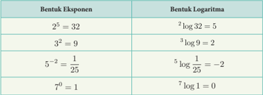

Tabel ini membandingkan bentuk eksponen dengan bentuk logaritma untuk beberapa contoh bilangan bulat. Topik utama tabel adalah hubungan antara eksponen dan logaritma. Kolom pertama berisi bentuk eksponen, sedangkan kolom kedua berisi bentuk logaritma. Data penting yang terlihat adalah bahwa setiap bilangan eksponen memiliki logaritma yang sama, dan sebaliknya, setiap logaritma memiliki eksponen yang sama. Misalnya, 2^5 = 32 memiliki logaritma 2 log 32 = 5, dan 3^2 = 9 memiliki logaritma 3 log 9 = 2. Ini menunjukkan bahwa logaritma dan eksponen adalah invers dari satu sama lain.

 

---
## 📄 Halaman 46

Bentuk logaritma yang juga perlu kamu ketahui adalah logaritma dengan basis 10 yang biasa disebut dengan Logaritma Umum. Bentuk logaritma umum ini biasanya juga dapat kamu tulis dengan menghilangkan basis logaritmanya. Bentuk logaritma umum didefinisikan sebagai berikut.

### Definisi Logaritma Umum

Logaritma yang memiliki basis 10 disebut dengan logaritma umum dan dituliskan sebagai berikut:

``

### Sifat-Sifat Logaritma

Seperti halnya eksponen, logaritma juga memiliki sifat-sifat yang penting untuk kamu ketahui. Sifat-sifat logaritma yang perlu kamu ketahui adalah sebagai berikut.

Misalkan a > 0 dan a /negationslash = 1 , b > 0 , c > 0 , m> 0 , m /negationslash = 1 , dengan a, b, c, m, n adalah bilangan Real, maka berlaku:

- a log a = 1
- a log 1 = 0
- a log a n = n
- a log( b × c ) = a log b + a log c

``

``

- a log c = a log b × b log c

### Contoh 7

Buktikan sifat logaritma a log ( b × c ) = a log b + a log c

### Alternatif Pembuktian:

Misalkan a log b = m dan a log c = n .

 

---
## 📄 Halaman 47

kamu dapat menuliskan bentuk eksponennya sebagai berikut.

``

Ingat kembali sifat eksponen a m · a n = a m + n

``

Buktikan a log  ( b × c ) = a log b + a log c dengan cara yang lain.

### Ayo, Berdiskusi

Bagaimana membuktikan sifat-sifat logaritma yang lainnya? Diskusikan dengan temanmu.

### Contoh 8

Sederhanakanlah bentuk logaritma berikut ini: 2 log 16 + 2 log 8

### Alternatif Penyelesaian:

``

### Contoh 9

Arif menabung uangnya di bank sebesar Rp3.000.000,00 dan mendapatkan bunga sebesar 5% per tahun. Berapa lama Arif harus menyimpan uang di bank agar tabungannya tersebut menjadi tiga kali lipat dari tabungan awal?

 

---
## 📄 Halaman 48

### Alternatif Penyelesaian:

Dimisalkan

M 0 = modal awal

M t = modal setelah menabung selama t tahun.

i = bunga per tahun

Tabungan awal ( M 0 ) Arif adalah Rp3.000.000,00 Tabungan setelah t tahun ( M t ) = Rp9.000.000,00

Dengan mengeksplorasi tabungan awal dan bunga yang diperoleh Arif, kamu dapat menentukan rumus tabungan Arif setelah t tahun. Untuk menentukan total tabungan Arif setelah t tahun, diperoleh rumus penambahan uangnya sebagai M t = 3 . 000 . 000(1 + 0 , 05) t

Jika Arif menginginkan tabungan akhirnya menjadi 3 kali lipat, maka berlaku: 9 . 000 . 000 = 3 . 000 . 000(1 + 0 , 5) t

Bagaimana menentukan M t = 3 . 000 . 000(1 + 0 , 05) t ?

Dengan menggunakan sifat-sifat logaritma, kamu dapat menentukan waktu yang dibutuhkan agar tabungan Arif menjadi 3 kali lipat.

``

``

### Tips Penyelesain

### t = 22 , 5 a log b n = n · a log b Gunakan kalkulator atau tabel log Tips Penyelesain

Jadi, Arif membutuhkan waktu 22,5 tahun agar tabungannya menjadi 3 kali lipat.

 

---
## 📄 Halaman 49

- Sederhanakan bentuk akar berikut ini.
- 9 log 81
- 2 log 64 -2 log 16 c. 4 log 16 10
- Jika 5 log 4 = m , 4 log 3 = n , nyatakan 12 log 100 dalam m dan n .
- Penduduk kota A pada tahun 2010 sebanyak 300.000 jiwa. Pertumbuhan penduduk kota A rata-rata per tahun adalah 6%. Jika diasumsikan pertumbuhan penduduk setiap tahun sama, dalam berapa tahun penduduk kota A menjadi 1 juta jiwa?
- Berapa waktu yang dibutuhkan sehingga uang Dini yang tadinya Rp2.000.000,00 dapat menjadi Rp6.500.000,00 jika dia menabung di suatu bank yang memberinya bunga sebesar 12%?

### Refleksi

Dalam bab ini kamu sudah belajar tentang bilangan eksponen dan fungsi eksponensial. Ayo refleksikan pembelajaranmu dengan menjawab pertanyaan berikut.

- Apa itu bilangan eksponen?
- Seperti apa bentuk fungsi eksponensial?
- Apa yang membedakan fungsi pertumbuhan eksponen dan peluruhan eksponen?

### Asesmen Diri

---
**📊 Tabel**

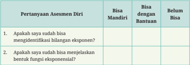

Tabel ini berisi pertanyaan asesmen diri tentang kemampuan seseorang dalam identifikasi bilangan eksponensial dan menjelaskan bentuk fungsi eksponensial. Topik utama tabel adalah kemampuan individu dalam melakukan asesmen diri terkait matematika eksponensial. Kolom "Bisa Mandiri" menunjukkan apakah individu dapat menjawab pertanyaan tersebut tanpa bantuan, sedangkan kolom "Bisa dengan Bantuan" menunjukkan apakah individu memerlukan bantuan untuk menjawab pertanyaan tersebut. Kolom "Belum Bisa" menunjukkan apakah individu tidak memiliki kemampuan untuk menjawab pertanyaan tersebut. Data penting yang terlihat adalah bahwa individu harus mampu mengidentifikasi bilangan eksponensial dan menunjukkan pengetahuan mereka tentang bentuk fungsi eksponensial.

 

---
## 📄 Halaman 50

---
**📊 Tabel**

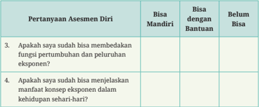

Tabel ini berisi pertanyaan tentang kemampuan diri siswa dalam memahami konsep eksponen, yang terdiri dari dua pertanyaan: apakah mereka bisa membahas fungsi pertumbuhan dan peluruhan eksponen, serta menjelaskan manfaat konsep eksponen dalam kehidupan sehari-hari. Dalam tabel tersebut, kolom "Bisa Mandiri" menunjukkan bahwa siswa dapat menjawab pertanyaan tersebut tanpa bantuan, kolom "Bisa dengan Bantuan" menunjukkan bahwa mereka dapat menjawab pertanyaan tersebut dengan bantuan, dan kolom "Belum Bisa" menunjukkan bahwa mereka belum mampu menjawab pertanyaan tersebut. Topik utama tabel ini adalah kemampuan diri siswa dalam memahami konsep eksponen.

 

---
## 📄 Halaman 51

Kementerian Pendidikan, Kebudayaan, Riset, dan Teknologi Republik Indonesia, 2023

Matematika untuk SMA/MA/SMK/MAK Kelas X (Edisi Revisi)

Penulis: Dicky Susanto, dkk. ISBN: 978-623-118-558-7

Bab

2

### Barisan dan Deret

- Apa perbedaan barisan dan deret aritmetika dengan barisan dan deret geometri?

 

---
## 📄 Halaman 52

### Tujuan Pembelajaran

Setelah mempelajari bab ini, diharapkan kamu dapat menyelesaikan permasalahan kehidupan sehari-hari yang berkaitan dengan konsep barisan aritmetika dan barisan geometri serta konsep deret aritmetika dan deret geometri. Selain itu, kamu juga diharapkan mampu menggunakan konsep barisan dan deret untuk menyelesaikan permasalahan yang berkaitan dengan bunga tunggal dan bunga majemuk.

### Kata Kunci

- barisan aritmetika
- barisan geometri
- deret aritmetika
- deret geometri
- bunga

---
**🖼️ Gambar/Diagram**

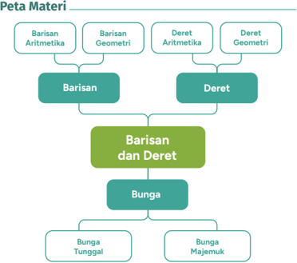

> **Deskripsi Visual:** Gambar ini adalah diagram yang menunjukkan struktur materi matematika tentang barisan dan deret. Diagram ini dibagi menjadi beberapa bagian utama, yaitu Barisan Aritmetika, Barisan Geometri, Deret Aritmetika, Deret Geometri, Barisan dan Deret, serta Bunga. Setiap bagian ini memiliki subbagian yang lebih spesifik seperti Bunga Tunggal dan Bunga Majemuk. Jaringan antara elemen-elemen ini menunjukkan hubungan antar materi yang disajikan dalam buku pelajaran ini. Teks, angka, atau label penting yang terlihat meliputi nama-nama materi matematika tersebut, seperti Barisan Aritmetika, Barisan Geometri, Deret Aritmetika, Deret Geometri, Barisan dan Deret, serta Bunga. Informasi kunci yang dapat diambil pembaca adalah bahwa buku ini membahas berbagai konsep matematika tentang barisan dan deret, termasuk konsep-konsep dasarnya dan variasi yang ada.

 

---
## 📄 Halaman 53

Barisan dan deret sangat erat kaitannya dengan konsep pola bilangan yang telah kamu pelajari pada jenjang SMP. Penerapan barisan dan deret sangat mudah ditemui dalam kehidupan sehari-hari.

Konsep barisan dan deret terkait dengan menghitung susunan kursi dengan banyaknya kursi yang berbeda di tiap barisnya. Kamu dapat menentukan banyak objek yang disusun dengan pola piramida di mana objek tersebut dapat bertambah atau berkurang secara konstan. Kamu dapat mempelajari pembelahan bakteri. Kamu juga dapat menentukan panjang lintasan dari bola yang dipantulkan. Bunga uang juga menggunakan konsep barisan dan deret.

Jika kamu dihadapkan pada rangkaian susunan bilangan berikut, dapatkah kamu menebak bilangan berikutnya?

2

4

6

8

...

Dapatkah kamu menebak dua bilangan berikut pada susunan berikut?

1

2

4

8

...

Untuk lebih jelasnya, mari belajar tentang Barisan dan Deret!

### A.  Barisan

### 1. Barisan Aritmetika

Banyaknya Kursi

Ayo, bandingkan banyak meja dan kursi pada Gambar 2.1 dan Gambar 2.2 . Pada Gambar 2.1 , terdapat satu meja berbentuk segi empat yang dilengkapi empat kursi. Jika dua meja disatukan, maka dapat dilengkapi dengan 6 kursi ( Gambar 2.2 )

...

...

 

---
## 📄 Halaman 54

---
**🖼️ Gambar/Diagram**

> **Deskripsi Visual:** Gambar ini adalah ilustrasi yang menunjukkan sebuah ruang makan sederhana dengan meja dan empat kursi. Meja berwarna oranye dengan lapisan kayu dan memiliki tiga sudut yang ditempatkan pada tiap sudutnya. Di sekeliling meja, ada empat kursi dengan desain yang sama, semua kursi memiliki bantalan yang berwarna biru dan duduk di atasnya. Setiap kursi memiliki satu kaki yang terbuat dari logam dan diletakkan di sisi meja. Ilustrasi ini menunjukkan konsep dasar dari ruang makan yang umum digunakan dalam kehidupan sehari-hari.

Jawablah pertanyaan berikut dengan berdiskusi bersama teman kelompokmu.

- Berapa orang yang dapat duduk di kursi dengan sejumlah meja yang disatukan? Ayo, berkolaborasi dengan temanmu dalam mengisi Tabel 2.1 untuk menjawab pertanyaan tersebut.
- Jika terdapat 20 orang yang akan makan bersama di satu meja, maka berapa meja yang perlu disatukan? Bagaimana kamu mengetahuinya? Jelaskan jawabanmu.
Jika diamati lebih teliti, pola bilangan di atas disusun berdasarkan aturan tertentu. Pola bilangan yang demikian disebut dengan barisan bilangan.

Berapa suku barisan bilangan tersebut?

- Suku ke-1 dilambangkan dengan U 1 = ...
- Suku ke-2 dilambangkan dengan U 2 = ...
- Suku ke-3 dilambangkan dengan U 3 = ...
- Suku ke-4 dilambangkan dengan U 4 = ...

---
**🖼️ Gambar/Diagram**

> **Deskripsi Visual:** Gambar ini adalah ilustrasi yang menunjukkan sebuah ruang kerja dengan meja dan kursi. Meja berwarna oranye dengan lapisan kayu putih, sedangkan kursi berwarna biru dengan lapisan kayu putih. Ruang kerja ini tampak sederhana namun efektif untuk kegiatan produktif. Ilustrasi ini mungkin digunakan dalam buku pelajaran untuk menggambarkan konsep tentang ruang kerja atau tempat kerja yang efisien.

 

---
## 📄 Halaman 55

- Suku ken dilambangkan dengan U n

``

- Selanjutnya, aturan apa yang ada pada barisan bilangan pada Tabel 2.1 ?
- Operasi penghitungan apa yang ada di antara suku-suku pada barisan bilangan di atas?
- Berapakah beda atau selisih antara dua suku yang berdekatan?

``

``

- Apakah beda atau selisih antara dua suku yang berdekatan selalu sama?
Suatu barisan dengan beda atau selisih antara dua suku berurutan selalu tetap atau konstan disebut BARISAN ARITMETIKA . Beda pada barisan aritmetika dilambangkan dengan b .

Seperti yang telah diuraikan di atas, untuk mencari beda dapat dilakukan dengan cara  mengurangkan  dua  suku  yang  berurutan  sehingga  dapat  dituliskan  sebagai berikut.

``

``

``

Jadi, beda pada barisan aritmetika dapat dinyatakan dengan

``

 

---
## 📄 Halaman 56

### Gedung Pertunjukan Seni

Ayo, cermati banyak kursi di tiap baris pada gedung pertunjukkan seni yang tampak pada Gambar 2.3 :

Baris ke-1 = 20

Baris ke-2 = 24

Baris ke-3 = 28

Baris ke-4 = 32

Baris ke-5 = 36

Berapakah jumlah kursi pada baris ke-15?

---
**🖼️ Gambar/Diagram**

> **Deskripsi Visual:** Gambar ini adalah ilustrasi yang menunjukkan sebuah mobil polisi berwarna merah dengan pintu belakang terbuka. Mobil tersebut tampaknya sedang berada di dekat sebuah bangunan dengan pintu masuk yang sama warna. Ilustrasi ini menunjukkan beberapa elemen penting seperti:

1. **Pintu Belakang Terbuka**: Pintu belakang mobil polisi terbuka, menunjukkan bahwa mobil tersebut sedang dalam proses pengangkutan atau telah diparkir.

2. **Mobil Polisi**: Mobil polisi memiliki desain khas dengan warna merah dan emas, serta logo polisi yang jelas.

3. **Bangunan**: Di sebelah kanan mobil, terdapat bangunan dengan pintu masuk yang sama warna dengan mobil. Bangunan tersebut tampak seperti gedung kepolisian atau pusat operasi.

4. **Lampu Mobil**: Mobil memiliki lampu depan dan belakang yang terlihat jelas, menunjukkan bahwa mobil tersebut siap untuk digunakan.

5. **Lampu Kepala**: Mobil juga memiliki lampu kepala yang terlihat, menambahkan detail visual yang lebih realistis pada ilustrasi.

Informasi kunci yang dapat diambil dari gambar ini adalah bahwa mobil polisi sedang dalam keadaan siap untuk operasi atau pengangkutan, dan terletak di dekat sebuah bangunan yang mungkin merupakan pusat operasi kepolisian.

Untuk menentukan banyak kursi pada baris ke-15, sebelumnya kamu amati terlebih dahulu banyak kursi di tiap baris.

- Berapa beda atau selisih banyak kursi pada tiap baris?
- Baris ke-1 = 20
- Baris ke-2 = 24  = 20+ 4 (20 ditambah 4 sebanyak 1 kali) = 20 + (1×4)
- Baris ke-3 = 28  = 20 + ... + ... (20 ditambah 4 sebanyak ... kali) = 20 + (… × 4)
- Baris ke-4 = 32  = 20 + ... +... +... (20 ditambah ... sebanyak ... kali) = 20 + (… × …)
- Baris ke-5 = 36  = 20 + ... + ... + ... +...   (20 ditambah ... sebanyak ... kali) = 20 + (… × …)
- Jadi, pada baris ke-15 = 20 ditambah … sebanyak …. kali = 20 + (… × …) = ...
Baris ke-15 = 20 + (… × …) = ...

Suku ke-

n

(

U n

)

selisih/beda

(

n-

1

)

(

b

)

 

---
## 📄 Halaman 57

Jadi, rumus umum menentukan suku ken pada barisan aritmetika adalah:

``

a = suku pertama n = nomor suku

Keterangan:

U n = suku ken

### Contoh 1

Diketahui suatu barisan aritmetika, suku ke-3 = 9, suku ke-6 = 18. Tentukan rumus suku ken .

### Alternatif penyelesaian:

Rumus suku ken :

``

``

Jadi, rumus suku ke -n dari barisan tersebut adalah U n = 3 n

### Contoh 2

Rudi menabung di bank dengan selisih kenaikan nominal uang yang ditabung antarbulan tetap. Jika pada bulan ke-5, nominal uang yang ditabung Rp70.000,00 dan pada bulan ke-9 Rudi menabung sebesar Rp90.000,00.

b = beda

 

---
## 📄 Halaman 58

- Berapa rupiah selisih nominal uang yang ditabung antarbulan?
- Tentukan berapa rupiah uang yang ditabung Rudi untuk pertama kalinya?

### Alternatif Penyelesaian:

``

Eliminasi Persamaan 1 dan 2

``

b adalah beda atau selisih.

Jadi, selisih nominal uang yang ditabung Rudi antarbulan adalah Rp5.000,00.

Selanjutnya, menentukan uang yang ditabung Rudi pertama kali, yaitu menentukan suku pertama yang dilambangkan dengan a dengan bantuan nilai b (beda) yang telah diketahui.

Gunakan persamaan 1 , lalu substitusi nilai b (beda) yang telah diperoleh.

``

Jadi, uang yang ditabung Rudi untuk pertama kalinya adalah sebesar Rp50.000,00.

Penjelasan di atas menggunakan Persamaan 1 untuk menentukan suku pertama. Bagaimana jika menggunakan Persamaan 2 ? Apakah hasilnya akan sama?

 

---
## 📄 Halaman 59

- Tuliskan dua suku berikutnya dari barisan bilangan di bawah ini.
- 8, 5, 2, -1, …
- 2, 3, 5, 8,
- -15, -11, -7, …
- …10, 8, 4, -2, …
Pertanyaan singkat di bawah ini dapat membantumu dalam menjawab soal nomor 1.

- Apakah barisan di atas barisan aritmetika?
- Jika iya, berapa beda dari barisan tersebut? Lalu, tentukan dua suku berikutnya dari barisan di atas.
- Jika tidak, maka aturan apa yang terdapat pada barisan bilangan tersebut?
Tentukan suku ke-50 dari barisan berikut: 5, -2, -9, -16, … Pertanyaan singkat di bawah ini dapat membantumu dalam menjawab soal nomor 2.

- Berapa beda pada barisan tersebut?

``

Maka, suku ke -

``

- Jika diketahui barisan aritmetika dengan suku

``

rumahnya. Setiap kali, pengurus panti mencatat banyaknya nasi bungkus

- Setiap hari Jumat, Pak Hasan memberikan sepuluh bungkus nasi ke panti asuhan di dekat yang pernah diberikan oleh Pak Hasan.
- 2.

 

---
## 📄 Halaman 60

---
**📊 Tabel**

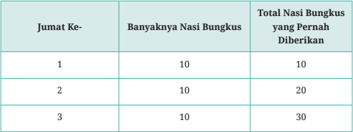

Tabel ini menunjukkan data tentang jumlah nasi bungkus yang diberikan dalam beberapa jumat berurutan. Topik utama tabel adalah jumlah nasi bungkus yang diberikan setiap hari. Kolom pertama menunjukkan nomor jumat, sedangkan kolom kedua menunjukkan jumlah nasi bungkus yang diberikan pada setiap jumat. Kolom ketiga menunjukkan total jumlah nasi bungkus yang telah diberikan selama periode tersebut. Dari tabel ini, kita dapat melihat bahwa setiap jumat sekitar 10 nasi bungkus diberikan, dan totalnya meningkat seiring dengan waktu. Ini menunjukkan pola konsisten dalam penyaluran nasi bungkus tersebut.

Kolom ketiga adalah total nasi bungkus yang pernah diberikan oleh Pak Hasan.

- Berapa yang tertulis dalam kolom ketiga setelah sepuluh minggu?
- Setelah satu tahun, berapa bilangan terakhir yang tercatat?
- Ivan membagikan permen kepada teman-temannya dengan cara tertentu. Teman pertama mendapat tiga permen. Teman kedua mendapat lima permen. Teman ketiga mendapat tujuh permen. Dia melanjutkan pola ini hingga sepuluh temannya mendapat permen. Berapa permen yang didapat oleh teman kesepuluh?

### 2.  Barisan Geometri

Lima anak berbagi kue dengan aturan berikut.

- Anak pertama mengambil setengah kue dan memberikan sisanya kepada anak kedua.
- Anak kedua mengambil setengah dari kue yang diterimanya dan memberikan sisanya kepada anak ketiga.
- Demikian seterusnya. Setiap anak mengambil setengah dari yang diterimanya dan memberikan sisanya kepada anak berikutnya.
Perbandingan kue yang diambil dengan kue yang diterima konstan. Dikatakan rasio kue yang diambil terhadap kue yang diterima adalah setengah.

Rasio adalah hal yang penting dalam Barisan Geometri. Mari, belajar tentang Barisan Geometri.

 

---
## 📄 Halaman 61

Siapkan kertas berbentuk persegi panjang. Ayo, bereksplorasi melipat kertas beberapa kali. Jika kertas tersebut dilipat sebanyak 1 kali seperti pada Gambar 2.4 , maka kertas akan terbagi menjadi 2 bagian sama besar. Lanjutkan melipat kertas sebanyak beberapa kali, lalu tuliskan jumlah bagian sama besar yang terbentuk pada

Temukan cara melipat kertas yang berbeda. Bagaimana dengan jumlah bagian sama besar yang terbentuk? Apakah sama dengan yang ada pada tabel? Jelaskan.

- Apakah banyaknya bagian yang sama besar pada lipatan kertas membentuk barisan bilangan?
- Aturan apa yang terdapat pada barisan bilangan tersebut?
- Operasi hitung apa yang ada di antara suku-suku pada barisan bilangan di atas?
- Ayo amati rasio antara dua suku yang berdekatan.

``

 

---
## 📄 Halaman 62

- Apakah rasio antara dua suku yang berdekatan selalu sama?
Suatu barisan dengan rasio antara dua suku berurutan selalu tetap atau konstan disebut BARISAN GEOMETRI . Rasio pada barisan geometri dilambangkan dengan r .

Seperti yang telah diuraikan di atas, untuk mencari rasio dapat dengan membagi dua suku yang berurutan. Dengan demikian, dapat dituliskan sebagai berikut.

``

``

Jadi, rasio pada barisan geometri dapat dinyatakan dengan

``

### Pembelahan Bakteri

Bakteri merupakan makhluk hidup yang berkembang biak dengan cara membelah diri. Dalam waktu dua jam, satu sel bakteri membelah diri menjadi 3 bagian seperti pada Gambar 2.5 . Ayo, mencari jumlah bakteri setelah 20 jam, jika jumlah awal adalah 2 sel bakteri.

---
**🖼️ Gambar/Diagram**

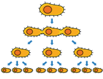

> **Deskripsi Visual:** Gambar ini adalah ilustrasi yang menunjukkan proses reproduksi sel. Ilustrasi ini menggambarkan dua sel yang berinteraksi untuk menghasilkan empat sel baru. Sel-sel ini memiliki struktur yang mirip dengan sel induk mereka, menunjukkan bahwa proses ini melibatkan pembelahan sel. Ilustrasi ini juga menunjukkan bagaimana sel-sel baru dibentuk dari sel induk, yang menunjukkan bahwa proses ini melibatkan pembelahan sel. Ini adalah ilustrasi yang sangat informatif tentang proses reproduksi sel.

Untuk menentukan jumlah sel bakteri setelah 20 jam, kamu harus melengkapi pernyataan di bawah ini.

- Suku pertama pada permasalahan di atas adalah ….

 

---
## 📄 Halaman 63

- Tiap dua jam, membelah menjadi 3, maka rasio pada barisan di atas adalah ….
Dalam 20 jam, terjadi pembelahan sebanyak 20 jam : 2 jam = · · · kali → n = 10 .

``

``

``

U 10 = 2 dikali 3 sebanyak … kali

Jadi, rumus umum menentukan suku ke-n pada barisan geometri adalah:

``

Keterangan:

``

### Contoh 3

Suku pertama dari suatu barisan geometri adalah 4 dan suku ke-4 adalah 108. Tentukan rasio dari barisan tersebut.

### Alternatif penyelesaian:

``

 

---
## 📄 Halaman 64

Jadi, rasio barisan geometri tersebut adalah 3.

### Contoh

4

Seutas tali dibagi menjadi 5 bagian dengan ukuran panjang membentuk suatu barisan geometri. Jika tali yang paling pendek adalah 16 cm dan tali yang paling panjang adalah 81 cm, maka tentukan panjang tali pada potongan ketiga.

### Alternatif penyelesaian:

Tali yang paling pendek :

a = 16

Tali yang paling panjang :

`U 5 = 81 U 3 =  …`

Kalian harus menentukan rasio terlebih dahulu.

``

``

``

substitusi nilai a )

``

Jadi, panjang tali pada potongan ketiga adalah 36 cm.

 

---
## 📄 Halaman 65

- Tuliskan dua suku berikutnya dari barisan bilangan di bawah ini.
- 1 8 , 1 4 , 1 2 , ··· ··· , ··· ···
- 25, 5, 1, … , …
- 2, 2, 4, 12, …
- 3, 3, 3, 3, …
Pertanyaan singkat di bawah ini dapat membantumu dalam menjawab soal nomor 1.

- Apakah barisan di atas merupakan barisan geometri atau aritmetika? Bagaimana kamu mengetahuinya? Lalu, tentukan dua suku berikutnya dari barisan di atas.
- Jika bukan keduanya, maka aturan apa yang ada pada barisan bilangan tersebut? Ayo diskusikan dengan teman kelompokmu.
- Tentukan suku ke-10 dari barisan 64, 32, 16, 8, …. Pertanyaan singkat di bawah ini dapat membantumu dalam menjawab soal nomor 2.
- Berapa rasio pada barisan tersebut?
- •
Maka, suku ke -10 = U 10 = …   … … … …

- Jika diketahui barisan geometri dengan suku ke -2 = 80 dan suku ke -6 = 5. Tentukan tiga suku pertama dari barisan geometri tersebut.
- Dina mengirimkan sebuah foto kepada tiga orang temannya. Keesokan harinya, setiap teman ini akan mengirimkan foto itu kepada tiga temannya. Demikian seterusnya, setiap orang yang menerima foto akan meneruskan foto itu kepada tiga teman lain di hari berikutnya. Jika diasumsikan setiap orang hanya menerima foto satu kali, berapa orang yang menerima foto pada hari keenam?
- Dalam proses pembelahan sel, satu sel membelah menjadi dua, dua sel membelah menjadi empat, dan seterusnya (pada setiap tahap, setiap sel membelah menjadi dua sel). Berapa sel yang ada pada tahap ke-20?
Berikan contoh aplikasi barisan bilangan dalam kehidupan sehari-hari selain dari yang telah dibahas pada subbab A.

 

---
## 📄 Halaman 66

Seorang temanmu mengatakan bahwa jika rasio pada barisan geometri berupa bilangan bulat/bilangan pecahan positif, maka barisan geometri tersebut terdiri atas bilangan bulat/pecahan positif. Dan apabila rasionya bilangan bulat/pecahan negatif, maka barisan geometri tersebut terdiri atas bilangan bulat/pecahan negatif. Setujukah kamu dengan pendapatnya? Jelaskan.

---
**📊 Tabel**

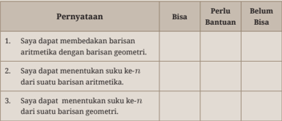

Tabel ini berisi pernyataan tentang kemampuan siswa dalam membedakan antara barisan aritmetika dan barisan geometri, serta menentukan suku ke-n dari kedua jenis barisan tersebut. Topik utama tabel adalah kemampuan matematika siswa dalam memahami dan menggunakan konsep barisan aritmetika dan geometri. Kolom "Bisa" menunjukkan apakah siswa dapat melakukan pernyataan tersebut dengan benar, sedangkan kolom "Perlu Bantuan" menunjukkan apakah mereka memerlukan bantuan untuk melakukannya. Kolom "Belum Bisa" menunjukkan apakah siswa tidak dapat melakukan pernyataan tersebut. Data penting yang terlihat adalah bahwa sebagian besar siswa (dalam kolom "Bisa") dapat membedakan antara kedua jenis barisan tersebut, tetapi hanya sebagian kecil siswa (dalam kolom "Belum Bisa") tidak dapat menentukan suku ke-n dari kedua jenis barisan tersebut.

### B.  Deret

Barisan bilangan, terdiri atas barisan aritmetika dan barisan geometri.

- Beda pada barisan aritmetika dinyatakan dengan
- Suku ke-n barisan aritmetika dinyatakan dengan .
- Rasio pada barisan geometri dinyatakan dengan .
- Suku ke-n barisan geometri dinyatakan dengan

 

---
## 📄 Halaman 67

Ayo bereksplorasi dengan melakukan jabat tangan dengan beberapa teman yang ada di kelompokmu. Setiap pasangan berjabat tangan tepat satu kali.

---
**🖼️ Gambar/Diagram**

> **Deskripsi Visual:** Gambar ini adalah ilustrasi yang menunjukkan dua orang yang saling berjabat tangan. Ilustrasi ini mungkin digunakan untuk menggambarkan konsep hubungan sosial, saling menghormati, atau bahkan konsep kerjasama dalam sebuah organisasi. Dalam konteks ini, elemen utama adalah kedua orang yang saling berjabat tangan, yang menunjukkan hubungan positif antara mereka. Teks, angka, atau label penting tidak ada dalam gambar ini, sehingga fokus utama pada visualisasi interaksi manusia. Informasi kunci yang dapat diambil pembaca adalah bahwa hubungan antara dua individu dalam gambar ini adalah saling menghormati atau saling menghargai.

Setelah itu, jawablah pertanyaan berikut dengan berkolaborasi bersama anggota kelompok.

- 1.
- Jika ada 2 orang, berapa banyak jabat tangan yang terjadi? ………………..
- Jika ada 3 orang, berapa banyak jabat tangan yang terjadi? ………………..
- Jika ada 4 orang, berapa banyak jabat tangan yang terjadi? ………………..
- Berapa total siswa dalam kelompokmu, dan berapa banyak jabat tangan yang terjadi? Bagaimana kamu mengetahuinya? ………………..
Apakah banyak jabat tangan di atas membentuk barisan? Jelaskan jawabanmu.

Dari Eksplorasi 2.5 , banyak jabat tangan yang terjadi dapat dinyatakan sebagai berikut.

---
**📊 Tabel**

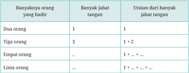

Tabel ini menunjukkan hubungan antara jumlah orang yang hadir dan uraian dari banyak jabatan tangan. Topik utama tabel adalah uraian dari banyak jabatan tangan berdasarkan jumlah orang yang hadir. Kolom pertama menunjukkan jumlah orang yang hadir, sedangkan kolom kedua menunjukkan banyak jabatan tangan. Data penting yang terlihat adalah bahwa jika hanya dua orang hadir, maka hanya satu uraian dari banyak jabatan tangan. Jika tiga orang hadir, maka ada total 3 uraian dari banyak jabatan tangan. Namun, jika empat orang hadir, maka tidak ada uraian dari banyak jabatan tangan karena tidak ada uraian tambahan dibandingkan dengan tiga orang. Sementara itu, jika lima orang hadir, maka ada total 5 uraian dari banyak jabatan tangan. Ini menunjukkan bahwa jumlah uraian dari banyak jabatan tangan meningkat seiring dengan penambahan jumlah orang yang hadir.

 

---
## 📄 Halaman 68

- Apakah uraian dari jumlah jabat tangan merupakan bentuk penjumlahan dari barisan bilangan?
Bentuk penjumlahan dari barisan bilangan akan membentuk deret bilangan. Jadi, deret bilangan adalah jumlah suku-suku penyusun barisan bilanga n. Deret bilangan, terdiri atas deret aritmetika dan deret geometri.

### 1. Deret Aritmetika

Carl Friedrich Gauss (1777-1855) adalah seorang matematikawan Jerman yang telah menunjukkan bakatnya sejak kecil. Ketika duduk di kelas 4 SD, guru matematikanya memberikan soal berupa penjumlahan bilangan

``

Tidak membutuhkan waktu yang lama, Gauss yang saat itu masih berusia 10 tahun langsung menjawab '5.050'.

Berikut cara Gauss menyelesaikan penjumlahan bilangan tersebut.

---
**🖼️ Gambar/Diagram**

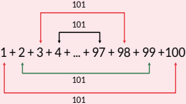

> **Deskripsi Visual:** Gambar ini adalah diagram yang menunjukkan proses penjumlahan bilangan bulat dari 1 hingga 100. Diagram ini dibagi menjadi dua bagian utama: bagian atas dan bagian bawah. Bagian atas menggambarkan jumlah total dari 1 hingga 99, sementara bagian bawah menggambarkan jumlah total dari 1 hingga 100. Setiap bagian memiliki tanda panah yang mengarah ke bagian lain, menunjukkan hubungan antara kedua jumlah tersebut. Di bagian atas, ada tanda panah yang mengarah ke bagian bawah, menunjukkan bahwa jumlah dari 1 hingga 99 sama dengan jumlah dari 1 hingga 100. Di bagian bawah, ada tanda panah yang mengarah ke bagian atas, menunjukkan bahwa jumlah dari 1 hingga 100 sama dengan jumlah dari 1 hingga 99. Teks "1+2+3+4+...+97+98+99+100" terdapat di bagian tengah, menunjukkan urutan bilangan yang akan dijumlahkan. Angka-angka 101 muncul di setiap bagian atas dan bawah, menunjukkan jumlah total dari setiap urutan bilangan. Label penting yang terlihat adalah "1+2+3+4+...+97+98+99+100", "101", dan "101". Informasi kunci yang dapat diambil pembaca adalah bahwa jumlah dari 1 hingga 100 sama dengan jumlah dari 1 hingga 99, dan bahwa jumlah dari 1 hingga 99 sama dengan jumlah dari 1 hingga 100.

Ia mengelompokkan suku-suku pada deret tersebut sehingga memiliki nilai yang sama ketika dijumlahkan.

``

 

---
## 📄 Halaman 69

---
**🖼️ Gambar/Diagram**

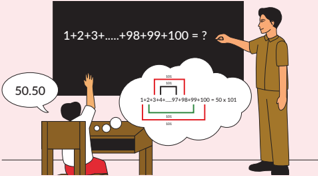

> **Deskripsi Visual:** Gambar ini adalah ilustrasi yang menunjukkan proses penyelesaian soal matematika. Gambar ini menggambarkan seorang guru yang sedang memberikan penjelasan kepada seorang murid tentang cara menghitung jumlah bilangan dari 1 hingga 100. Guru menggunakan papan tulis untuk menunjukkan langkah-langkah penyelesaian, sementara murid sedang berusaha memahami konsep tersebut.

Elemen utama dalam gambar ini meliputi guru, murid, papan tulis, dan teks yang menjelaskan proses penyelesaian soal. Guru menggunakan tanda panah merah untuk menunjukkan langkah-langkah yang harus dilakukan, sementara teks di papan tulis membantu menjelaskan konsep matematika yang digunakan.

Informasi kunci yang dapat diambil dari gambar ini adalah bahwa guru sedang memberikan penjelasan tentang cara menghitung jumlah bilangan dari 1 hingga 100, menggunakan metode yang efektif dan mudah dipahami.

Sekarang, ayo cermati kembali deret bilangan di atas.

``

- Apakah bilangan pada deret di atas membentuk barisan?
- Barisan apakah yang dibentuk dari suku-suku pada deret di atas?
Deret aritmetika adalah suatu deret yang diperoleh dari menjumlahkan suku-suku pada barisan aritmetika.

Dari barisan aritmetika: U 1 , U 2 , U 3 , U 4 , . . . . . . . . . , U n .

Dapat dibentuk deret aritmetika: U 1 + U 2 + U 3 + U 4 + . . . . . . . . . + U 10

``

Jumlah 4 suku pertama deret aritmetika: S ₄

``

 

---
## 📄 Halaman 70

Jumlah 10 suku pertama deret aritmetika: S 10

``

Jumlah 4 suku pertama deret aritmetika

``

Jumlah 10 suku pertama deret aritmetika

``

Dari kedua contoh di atas, maka dapat disimpulkan bahwa rumus jumlah n suku pertama deret aritmetika:

``

S n dapat juga dituliskan S n = U n + U n -1 + . . . + U 2 + U 1

``

``

Bisakah kamu membuktikan dengan cara yang berbeda?

 

---
## 📄 Halaman 71

Rumus untuk menghitung jumlah suku-suku deret aritmetika adalah

``

### Keterangan:

Sn = jumlah deret sebanyak n suku pertama

a = suku pertama

b = beda

n = banyaknya suku

### Ayo, Mencoba

Dengan rumus di atas, ayo hitunglah berapa jumlah deret bilangan

``

Apakah hasilnya sama dengan penghitungan Gauss?

### Contoh 5

Diketahui deret: 13 + 16 + 19 + 22 + ……

Jumlah 30 suku pertama deret tersebut adalah ……

### Alternatif penyelesaian:

``

 

---
## 📄 Halaman 72

### 2.  Deret Geometri

### Jumlah Pasien Terinfeksi Covid-19

Di suatu kota tercatat peningkatan yang signifikan dari jumlah pasien yang terinfeksi Covid-19. Berikut data yang dihimpun dari Gugus Covid-19 kota tersebut.

Jawablah pertanyaan di bawah ini terkait data pada Tabel 2.4 .

- Apakah jumlah pasien membentuk barisan bilangan?
- Berapa beda atau rasio dari barisan tersebut?
- Berapa suku barisan tersebut?
Ayo cermati jumlah suku-suku deret geometri dengan melengkapi Tabel 2.5 melalui data yang ada pada Tabel 2.4 bersama teman kelompokmu.

---
**📊 Tabel**

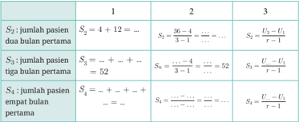

Tabel ini berisi informasi tentang jumlah pasien dalam beberapa periode waktu, dengan topik utama adalah perhitungan jumlah pasien dalam periode tertentu. Tabel dibagi menjadi tiga kolom: Kolom 1 menunjukkan periode waktu (1, 2, 3), Kolom 2 menunjukkan jumlah pasien dalam dua bulan pertama, Kolom 3 menunjukkan jumlah pasien dalam tiga bulan pertama, dan Kolom 4 menunjukkan jumlah pasien dalam empat bulan pertama. Data penting yang terlihat adalah bahwa jumlah pasien dalam setiap periode meningkat secara proporsional, dengan rasio yang sama antara jumlah pasien dalam periode berikutnya dan periode sebelumnya. Ini menunjukkan pola aritmatika proporsional.

 

---
## 📄 Halaman 73

### Dari kolom nomor 3 diperoleh:

``

Sehingga, rumus untuk menghitung jumlah suku-suku deret geometri adalah:

``

### Keterangan:

Sn = jumlah deret sebanyak n suku pertama a = suku pertama

r = rasio n = banyaknya suku

Apa yang terjadi jika r = 1 ?

### Contoh 6

Hasil produksi sebuah perusahaan sepeda pada tahun 2020 meningkat setiap bulannya dan membentuk barisan geometri. Produksi pada bulan Januari sebanyak 120 unit. Pada bulan April, hasil produksi mencapai 3.240 unit. Berapakah total hasil produksi sepeda hingga bulan Mei?

### Alternatif penyelesaian:

Hasil produksi Januari:

`U 1 = a = 120`

Hasil produksi April:

U 4 = 3 . 240

 

---
## 📄 Halaman 74

Total hasil produksi hingga bulan Mei: S

Sebelum menentukan S , harus dicari ratio ( r ) terlebih dahulu.

5 5

``

Jadi, total hasil produksi sepeda hingga bulan Mei adalah sebanyak 14.520 unit.

- Tentukanlah jumlah bilangan kelipatan 4 di antara bilangan 10 dan 99. Petunjuk singkat di bawah ini dapat membantumu dalam menjawab soal nomor 1.
- Tuliskan terlebih dahulu bilangan kelipatan 4 dari 10 hingga 100:
- 12 + … + … + …. + …+ …. + ….
- Suku terakhir dari deret bilangan tersebut adalah ………...
- Suku terakhir: U n =a+( n - 1) b
Untuk mengetahui banyaknya suku pada deret tersebut, kamu harus mengetahui suku pertama, beda dan banyak suku terlebih dahulu.

 

---
## 📄 Halaman 75

- Selanjutnya, menentukan S n dengan nilai n yang telah diketahui sebelumnya.
- •
- Jadi, jumlah bilangan kelipatan 4 di antara bilangan 10 dan 99 adalah ……………
- Suku pertama dan rasio dari suatu deret geometri berturut-turut adalah 9 dan 3. Tentukan banyak suku jika diketahui jumlah deret bilangan tersebut adalah 9.837.
Petunjuk singkat di bawah ini dapat membantumu dalam menjawab soal nomor 2.

- Dari soal, diketahui:

``

- Dengan tiga informasi di atas, maka dapat ditentukan n = · · ·
- Diketahui deret geometri berikut ini: 3 2 +3+6+12+ · · · + Y = 762 4 Tentukan nilai Y .
Petunjuk singkat di bawah ini dapat membantumu dalam menjawab soal nomor 3.

- Dengan nilai a , r dan S n yang telah terdapat pada soal, kamu akan mendapatkan nilai n .
- Setelah memperoleh nilai n , kamu dapat menentukan nilai Y .
- Vina membagikan permen kepada tujuh temannya dengan cara tertentu. Teman pertama mendapat dua permen. Teman kedua mendapat lima permen. Teman ketiga mendapat delapan permen. Dia melanjutkan pola ini, setiap teman mendapat tiga permen lebih banyak daripada teman sebelumnya, sampai semua temannya mendapat permen. Berapa permen yang harus Vina siapkan?
- Dani mengirimkan sebuah foto kepada dua orang temannya. Keesokan harinya, setiap teman ini akan mengirimkan foto itu kepada dua temannya. Demikian seterusnya, setiap orang yang menerima foto akan meneruskan foto itu kepada dua teman lain di hari berikutnya. Jika diasumsikan setiap orang hanya menerima foto satu kali, setelah tujuh hari, berapa orang yang telah melihat foto tersebut?

 

---
## 📄 Halaman 76

### 3.  Deret Geometri Tak Hingga

Memotong Kertas

Untuk eksplorasi ini kamu membutuhkan selembar kertas origami.

- Lipat kertas menjadi dua bagian yang sama besar dan gunting sesuai lipatan.
- Ambil salah satu potongan kertas, lipat menjadi dua bagian yang sama besar dan gunting sesuai lipatan. Potongan kertas ini besarnya 1 4 dari kertas origami awal.
- Ambil salah satu potongan kertas dan lakukan hal yang sama. Potongan kertas ini besarnya _______________ dari kertas origami awal.
- Lakukan seterusnya.
- Kumpulkan potongan-potongan kertas yang ada. Perhatikan bahwa potongan-potongan kertas tersebut, makin lama makin kecil ukurannya.
- Tulislah deret yang menyatakan nilai potongan-potongan kertas ini. S n = ______________________
- Susun potongan-potongan kertas tersebut menyerupai bentuk kertas origami utuh.
a.

Apa artinya fakta ini bagi nilai S n

- Pikirkan: berapa hasil penjumlahan deret ini?
Eksplorasi 2.7 adalah salah satu contoh deret geometri yang hasilnya mendekati suatu nilai tertentu. Deret geometri yang mempunyai sifat seperti ini adalah deret geometri yang memiliki | r | < 1 . Amati bahwa untuk nilai | r | < 1 , makin besar nilai n maka nilai r n makin kecil, namun selalu merupakan bilangan positif. Dengan kata lain, makin lama makin mendekati nilai 0.

 

---
## 📄 Halaman 77

Deret geometri tak hingga adalah deret geometri yang memiliki banyak sekali suku (tak terhingga banyaknya). Ada dua jenis deret geometri tak hingga.

- Deret geometri konvergen. S n = 1 2 + 1 4 + 1 8 + . . . + 1 2 n adalah salah satu contoh deret geometri konvergen. Deret geometri konvergen memiliki | r | < 1 dan jumlah deretnya menuju ke suatu nilai tertentu. (Konvergen artinya menuju ke suatu nilai tertentu.)

``

``

- Deret geometri divergen, yaitu deret geometri yang memiliki nilai | r | > 1 . Pada deret geometri divergen, S n makin lama makin besar, tanpa batasan tertentu. Dikatakan nilai S n = ± ∞ .

### Latihan 2.4

- Suku pertama suatu deret geometri tak hingga adalah x . Tentukan x yang memenuhi sehingga jumlah deret geometri tak hingga tersebut adalah 10.
Petunjuk singkat di bawah ini dapat membantumu dalam menjawab soal nomor 1.

- Soal di atas hanya berisi informasi yaitu S ∞ = 10.
- Karena S ∞ = 10 maka deret geometri tak hingga yang dimaksud pada soal adalah deret geometri tak hingga konvergen.
- Hubungkan rumus jumlah deret geometri tak hingga dengan syarat rasio pada deret konvergen.
Dalam menyelesaikan soal deret tak hingga, kamu harus selalu ingat syarat rasio dari deret konvergen maupun divergen

 

---
## 📄 Halaman 78

- Agar deret geometri 1 + ( m - 1) + ( m -1)2  + ( m - 1)3  + .... merupakan deret konvergen, tentukan nilai m .
Petunjuk singkat di bawah ini dapat membantumu dalam menjawab soal nomor 2.

- Tentukan terlebih dahulu rasio dari deret tersebut.
- Tentukan jumlah deret geometri tak hingga 4 + 12 + 36 + 108 + … Petunjuk singkat di bawah ini dapat membantumu dalam menjawab soal nomor 3.
- Selidiki terlebih dahulu, deret geometri tak hingga tersebut merupakan deret konvergen atau divergen.
- Tentukan S ∞ .
Melalui subbab B, kamu telah belajar mengenai deret aritmetika dan geometri.

---
**📊 Tabel**

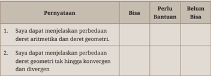

Tabel ini berisi pernyataan tentang kemampuan seseorang dalam menjelaskan perbedaan antara deret aritmetika dan geometri, serta perbedaan antara deret geometri tak hingga yang konvergen dan divergen. Kolom "Bisa" menunjukkan kemampuan seseorang untuk menjelaskan perbedaan tersebut dengan baik, sedangkan kolom "Perlu Bantuan" menunjukkan bahwa mereka memerlukan bantuan untuk menjelaskan perbedaan tersebut. Kolom "Belum Bisa" menunjukkan bahwa mereka belum memiliki kemampuan untuk menjelaskan perbedaan tersebut. Topik utama tabel ini adalah pemahaman tentang deret matematika dan perbedaannya.

Berikan contoh aplikasi deret bilangan dalam kehidupan sehari-hari selain dari yang telah dibahas.

Berikan contoh aplikasi deret geometri tak hingga konvergen dan divergen selain dari yang telah dibahas pada subbab B.

 

---
## 📄 Halaman 79

- Suku ke-3 suatu barisan aritmetika adalah 28.500 dan suku ke-7 adalah 22.500. Tentukan nilai n agar suku ke-n = 0.
- Suku ketiga dan kelima barisan geometri berturut-turut adalah 20 dan 80. Tentukan suku ke-10 barisan tersebut.
- Hitunglah jumlah dari deret berikut.

``

- Sebuah kue dimakan bersama oleh dua orang kakak beradik. Kakak mengambil sepertiga kue. Adik mengambil sepertiga dari sisanya. Lalu kakak mengambil sepertiga dari sisanya. Demikian seterusnya.
- Jika banyaknya kue yang diambil dituliskan, deret apakah yang didapatkan?
- Apakah deret ini konvergen? Jelaskan alasannya!
- Jika deret ini konvergen, berapakah jumlahnya?
- Bola tenis dilemparkan ke atas setinggi 1 m. Bola tersebut akan terus memantul sampai akhirnya berhenti. Setelah dicermati, setiap kali bola memantul, tingginya menjadi 1 4 kali dari tinggi pantulan sebelumnya. Kira-kira berapa panjang lintasan bola sampai akhirnya berhenti?
- Pertambahan penduduk di suatu desa setiap tahunnya membentuk barisan geometri. Pada tahun 2021, penduduk bertambah sebanyak 10 orang, lalu pada tahun 2023 sebanyak 90 orang. Berapa jumlah pertambahan penduduk pada tahun 2025?
- Pak Artus seorang peternak ayam. Ia mengumpulkan telur ayam sebanyak 30.000 butir selama 2 bulan. Banyak telur yang Pak Artus kumpulkan membentuk barisan aritmetika. Pada hari pertama ia mengumpulkan telus ayam sebanyak 50 butir. Berapa butir telur yang Pak Artus kumpulkan pada hari terakhir?
- Penambahan jumlah pasien yang terjangkit virus Covid-19 di suatu kota melonjak dua kali lipat di tiap minggunya. Berdasarkan data yang di rumah sakit, pada minggu pertama terdapat 24 orang yang dinyatakan

 

---
## 📄 Halaman 80

- positif. Pada minggu ketiga, tercatat 96 pasien positif Covid-19. Berapa total jumlah pasien pada bulan kedua?
- Sebuah bola dijatuhkan dari ketinggian 8 meter. Apabila ketinggian yang dicapai saat memantul tiga perlima kali tinggi sebelumnya, tentukan panjang lintasan yang dilalui bola tersebut hingga berhenti memantul.
- Keliling lima buah lingkaran membentuk barisan aritmetika. Jika luas lingkaran terbesar adalah 1 . 368 cm 2 dan luas lingkaran terkecil adalah 154 cm 2 . Tentukan keliling lingkaran pada urutan ketiga. π = 22 7
- Sisipkan 5 bilangan di antara 3 dan 192 agar susunan bilangan tersebut membentuk barisan geometri.
- Sisi segitiga sama sisi panjangnya 20 cm . Di dalamnya terdapat segitiga sama sisi kedua dengan menghubungkan titik-titik tengah sisi-sisi segitiga pertama. Hal yang sama untuk segitiga ketiga, keempat, kelima, dan keenam. Berapa total keliling semua segitiga?

### C.  Bunga

Jika kalian menabung uang di bank, kalian akan mendapatkan bunga. Sebaliknya, jika kamu meminjam uang dari bank, maka bank akan mengenakan bunga. Menurut Otoritas Jasa Keuangan, bunga simpanan adalah balas jasa dari bank kepada nasabah atas jasa nasabah menyimpan uangnya di bank. Sedangkan bunga pinjaman adalah balas jasa yang ditetapkan bank kepada peminjam atas pinjaman yang didapatkannya. Ada dua jenis bunga, yaitu bunga tunggal dan bunga majemuk.

### 1.  Bunga Tunggal

Bunga tunggal adalah bunga yang besarnya hanya ditentukan oleh pokok uangnya. Seberapa lamanya uang disimpan di bank, bunganya hanya tergantung nilai pokok uangnya.

Angga menabung di bank sebesar Rp1.000.000,00. Setiap tahun dia mendapat bunga sebesar 5%.

 

---
## 📄 Halaman 81

### Tabungan dengan Bunga Tunggal

- Lengkapilah tabel berikut

---
**📊 Tabel**

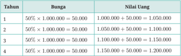

Tabel ini menunjukkan perubahan nilai uang dalam 4 tahun berdasarkan bunga yang diberikan setiap tahun. Topik utama tabel adalah perubahan nilai uang dengan bunga 50% pada setiap tahun. Kolom-kolomnya meliputi Tahun, Bunga, dan Nilai Uang. Data penting yang terlihat adalah bahwa setiap tahun, nilai uang meningkat sebesar 50% dari nilai uang sebelumnya. Misalnya, pada tahun pertama, nilai uang awal adalah 1.000.000,00 dan setelah diberikan bunga 50%, nilai uang menjadi 1.500.000,00. Ini menunjukkan bahwa setiap tahun, nilai uang naik sebesar 50% dari nilai uang sebelumnya, menciptakan pola perubahan yang konsisten.

- Perhatikan kolom nilai uang. Barisan jenis apakah yang dibentuk oleh nilai uang yang disimpan dengan bunga tunggal?
Barisan __________ dengan U 1 = ...... dan b = ......

- Tentukan bentuk umum untuk nilai uang setelah disimpan n tahun.
U

n

=

......

Nilai uang yang disimpan di bank dengan bunga tunggal membentuk barisan ______________ .

### 2.  Bunga Majemuk

Dalam perhitungan bunga majemuk, bunga yang didapat dalam periode sebelumnya dimasukkan ke pokok tabungan. Bunga periode berikutnya dihitung dengan nilai pokok tabungan yang baru.

- Lengkapilah tabel berikut.

---
**📊 Tabel**

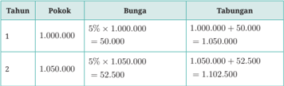

Tabel ini menunjukkan perkembangan tabungan seorang individu selama dua tahun dengan menggunakan metode bunga kumulatif. Topik utama tabel adalah perubahan tabungan setelah diberikan bunga pada setiap tahun. Kolom-kolomnya meliputi Tahun, Pokok, Bunga, dan Tabungan. Data penting yang terlihat adalah bahwa setiap tahun tabungan meningkat seiring dengan penambahan bunga yang diterima. Misalnya, pada tahun pertama, tabungan awal 1.000.000 menjadi 1.050.000 setelah diberikan bunga 5%. Di tahun kedua, tabungan menjadi 1.102.500 setelah diterima bunga tambahan dari tahun pertama. Ini menunjukkan bahwa metode bunga kumulatif dapat meningkatkan jumlah tabungan secara signifikan dalam jangka waktu yang singkat.

 

---
## 📄 Halaman 82

---
**📊 Tabel**

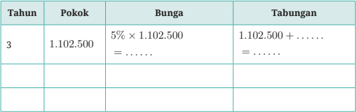

Tabel ini menunjukkan proses perhitungan bunga pada pinjaman dengan tingkat bunga 5% per tahun selama 3 tahun. Topik utama tabel adalah perhitungan bunga pinjaman. Kolom-kolomnya meliputi Tahun, Pokok, Bunga, dan Tabungan. Data penting yang terlihat adalah bahwa pada tahun pertama, pokok pinjaman adalah 1.102.500, dan setiap tahun selanjutnya, jumlah tabungan akan meningkat seiring penambahan bunga.

- Perhatikan kolom nilai uang. Barisan jenis apakah yang dibentuk oleh nilai uang yang disimpan dengan bunga majemuk?
Barisan __________ dengan U 1 = . . . . . . dan r = . . . . . .

- Tentukan bentuk umum untuk nilai uang setelah disimpan  tahun.

`U 1 = . . . . . .`

Nilai uang yang disimpan di bank dengan bunga majemuk membentuk barisan ______________ .

- Firman menyimpan uang sejumlah Rp10.000.000,00 di bank dalam bentuk deposito dengan bunga 3% per tahun. Setiap tahun bank mengirim bunga ke rekening tabungan Firman.
- Berapa bunga yang diterima Firman di rekening tabungannya setiap tahun?
- Berapa uang Firman setelah satu tahun?
- Berapa uang Firman setelah dua tahun?
- Berapa uang Firman setelah lima tahun?
- Gigih juga memiliki deposito sejumlah Rp10.000.000,00 di bank dengan bunga 3% per tahun. Setiap tahun, saat perpanjangan deposito, Gigih meminta bank untuk menambahkan bunganya ke dalam nilai depositonya.
- Lengkapilah tabel berikut.

 

---
## 📄 Halaman 83

---
**📊 Tabel**

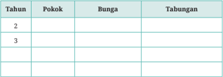

Tabel ini menunjukkan perkembangan pokok, bunga, dan tabungannya selama beberapa tahun. Topik utama tabel adalah pertumbuhan pokok, bunga, dan tabungannya. Kolom-kolomnya meliputi tahun, pokok, bunga, dan tabungan. Data penting yang terlihat adalah bahwa pada tahun 2, tidak ada data untuk pokok, bunga, dan tabungan. Pada tahun 3, data untuk semua kolom tersedia. Selama periode ini, tampaknya ada peningkatan yang signifikan dalam pertumbuhan pokok, bunga, dan tabungan. Ini menunjukkan bahwa setiap tahun, pokok, bunga, dan tabungan tersebut mungkin telah ditanam dengan benih atau bibit baru, sehingga mereka dapat tumbuh dan berkembang secara signifikan.

- Berapa uang Gigih setelah satu tahun?
- Berapa uang Gigih setelah dua tahun?
- Setelah lima tahun, lebih banyak uang Firman atau Gigih? Berapa selisihnya?
- Jika kamu memiliki uang seperti Firman dan Gigih, apa yang akan kamu lakukan? Mengapa?
- Dalam keadaan seperti apa kamu akan bertindak seperti Firman? Seperti Gigih?
- Made meminjam uang sejumlah Rp2.500.000,00 dengan bunga 4% per tahun. Dia berjanji mengembalikan selama dua tahun dengan cicilan tetap setiap bulan. Berapakah cicilan yang harus dia bayarkan setiap bulannya?
- Dina meminjam uang senilai Rp3.000.000,00 dengan bunga 3% per tahun selama tiga tahun. Dia mencicil utangnya setiap tahun. Pokok utang yang telah dibayar, tidak dibayarkan lagi bunganya. Lengkapilah tabel berikut.

---
**📊 Tabel**

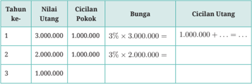

Tabel ini menunjukkan data tentang cicilan pokok dan cicilan utang selama tiga tahun. Topik utama tabel adalah perhitungan cicilan untuk hutang pinjaman. Kolom-kolomnya meliputi Tahun ke-1, Tahun ke-2, dan Tahun ke-3. Data penting yang terlihat adalah bahwa cicilan pokok tetap sebesar 1 juta rupiah setiap tahun, sementara bunga diterapkan pada jumlah utang sebelumnya. Untuk tahun pertama, cicilan utang mencapai 1 juta rupiah karena tidak ada utang awal. Di tahun kedua, cicilan utang menjadi 2 juta rupiah karena utang awal 3 juta rupiah dikurangi dengan bunga 3% dari 3 juta rupiah. Di tahun ketiga, cicilan utang menjadi 1 juta rupiah karena utang awal 2 juta rupiah dikurangi dengan bunga 3% dari 2 juta rupiah. Pola ini menunjukkan bahwa cicilan utang bertambah seiring dengan penambahan bunga pada jumlah utang sebelumnya.

 

---
## 📄 Halaman 84

### Uji Kompetensi

- Tentukan suku ke-10 dan jumlah 10 suku pertama dari deret berikut.
- 4 + 2 + 1 + …

``

- Tentukan suku ke-9 barisan aritmetika, jika diketahui jumlah dari suku ke-2, suku ke-5, dan suku-20 adalah 54.
- Sebuah pipa dipotong menjadi 5 bagian. Panjang setiap bagian membentuk barisan geometri. Jika potongan pipa terpendek sepanjang 4 cm, dan potongan pipa terpanjang adalah 324 cm, maka tentukan panjang pipa semula.
- Pada suatu ruang pertemuan, jumlah kursi pada baris tertentu lebih banyak 2 kursi dari baris sebelumnya. Perbandingan banyak kursi pada baris ke-5 dan baris ke-13 adalah 1 : 2. Baris terakhir terisi 50 kursi. Berapa total kursi pada ruang pertemuan tersebut?
- Tentukan jumlah deret geometri tak hingga … …, jika diketahui .

``

### Pengayaan

Selain barisan dan deret aritmetika dan geometri, ada barisan dan deret yang lain, salah satunya barisan dan deret Fibonacci. Contoh barisan Fibonacci:

``

Barisan Fibonacci memiliki sifat U n = U n -1 + U n -2 dengan berbagai nilai U 1 dan U 2 .

Perhatikan bilangan pada barisan Fibonacci:

``

Kapan bilangannya genap dalam barisan?

Apakah ada polanya? Mengapa?

Bilangan Fibonacci manakah yang dapat dibagi habis 3?

 

---
## 📄 Halaman 85

---
**🖼️ Gambar/Diagram**

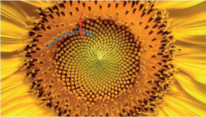

> **Deskripsi Visual:** Gambar ini adalah ilustrasi yang menunjukkan bagian depan bunga matahari. Gambar ini memperlihatkan struktur dasar bunga matahari dengan pola yang menyerupai spiral. Dalam gambar tersebut, ada dua garis warna berbeda yang menunjukkan pola spiral yang sama. Garis biru menunjukkan pola spiral yang lebih besar dan lebih jauh dari pusat bunga, sedangkan garis merah menunjukkan pola spiral yang lebih kecil dan dekat dengan pusat bunga. Ini menunjukkan bahwa pola spiral pada bunga matahari tidak hanya berlaku di sekitar pusat, tetapi juga meluas ke seluruh struktur bunga. Gambar ini menunjukkan bahwa bunga matahari memiliki struktur yang sangat kompleks dan menarik, dengan pola spiral yang menarik perhatian.

Barisan Fibonacci dapat ditemukan di alam. Salah satunya pada bunga matahari. Jika kamu menghitung banyaknya spiral pada susunan biji bunga matahari pada Gambar 2.8 yang searah dengan garis biru, kamu akan mendapatkan 34 spiral. Sedangkan yang searah dengan garis berwarna merah ada 55 spiral.

### Refleksi

---
**📊 Tabel**

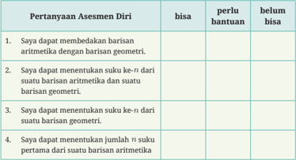

Tabel ini berisi pertanyaan-pertanyaan asesmen diri tentang kemampuan seseorang dalam menyelesaikan soal-soal matematika berkaitan dengan barisan aritmetika dan geometri. Topik utama tabel adalah kemampuan dalam menentukan suku ke-n dari suatu barisan aritmetika dan geometri, serta menentukan jumlah n suku pertama dari suatu barisan aritmetika. Kolom "bisa" menunjukkan apakah seseorang dapat menjawab pertanyaan tersebut sendiri tanpa bantuan, kolom "perlu bantuan" menunjukkan apakah seseorang memerlukan bantuan untuk menjawab pertanyaan tersebut, dan kolom "belum bisa" menunjukkan apakah seseorang tidak dapat menjawab pertanyaan tersebut sama sekali. Data penting yang terlihat adalah bahwa sebagian besar orang memiliki kemampuan untuk menjawab pertanyaan-pertanyaan ini, tetapi masih ada beberapa orang yang memerlukan bantuan atau bahkan belum bisa menjawabnya.

 

---
## 📄 Halaman 86

---
**📊 Tabel**

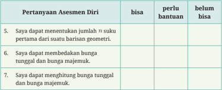

Tabel ini menunjukkan pertanyaan-pertanyaan asesmen diri yang harus dijawab oleh siswa. Topik utamanya adalah kemampuan matematika dalam menghitung jumlah suku pertama dari barisan geometri, membedakan bunga tunggal dan bunga majemuk, serta menghitung bunga tunggal dan bunga majemuk. Kolom "bisa" menunjukkan apakah siswa dapat menjawab pertanyaan tersebut dengan sendiri tanpa bantuan, kolom "perlu bantuan" menunjukkan apakah siswa memerlukan bantuan untuk menjawab pertanyaan tersebut, dan kolom "belum bisa" menunjukkan apakah siswa tidak dapat menjawab pertanyaan tersebut sama sekali. Data penting yang terlihat adalah bahwa semua pertanyaan memiliki kolom "belum bisa", menunjukkan bahwa tidak ada siswa yang dapat menjawab semua pertanyaan tersebut dengan sendiri tanpa bantuan.

 

---
## 📄 Halaman 87

Kementerian Pendidikan, Kebudayaan, Riset, dan Teknologi Republik Indonesia, 2023

Matematika untuk SMA/MA/SMK/MAK Kelas X (Edisi Revisi)

Penulis: Dicky Susanto, dkk.

ISBN: 978-623-118-558-7

Bab

3

### Perbandingan Trigonometri

Mengapa perbandingan trigonometri berguna dalam kehidupan sehari-hari?

 

---
## 📄 Halaman 88

### Tujuan Pembelajaran

Setelah mempelajari bab ini, diharapkan kamu dapat memahami bahwa perbandingan trigonometri menunjukkan hubungan antara sudut dan sisi pada segitiga siku-siku. Selain itu, kamu diharapkan mampu menerapkan perbandingan trigonometri dalam permasalahan.

### Kata Kunci

- perbandingan trigonometri
- sinus (sin)
- cosinus (cos)
- tangen (tan)

---
**🖼️ Gambar/Diagram**

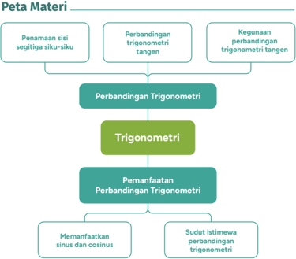

> **Deskripsi Visual:** Gambar ini adalah diagram yang menunjukkan struktur materi dalam buku pelajaran trigonometri. Diagram ini terdiri dari empat tingkatan utama:

1. Pada tingkat pertama, ada dua subtopik utama: "Penamaan sisi segitiga siku-siku" dan "Perbandingan trigonometri tangen". Kedua subtopik ini berada di bawah topik utama "Perbandingan Trigonometri".

2. Di tingkat kedua, topik utama "Perbandingan Trigonometri" menjadi bagian dari topik "Trigonometri", yang merupakan bagian dari peta materi.

3. Di tingkat ketiga, topik "Trigonometri" terbagi menjadi dua subtopik utama: "Pemanfaatan Perbandingan Trigonometri" dan "Sudut istimewa perbandingan trigonometri".

4. Di tingkat keempat, subtopik "Pemanfaatan Perbandingan Trigonometri" terbagi menjadi dua subsubtopik: "Memanfaatkan sinus dan cosinus" dan "Sudut istimewa perbandingan trigonometri".

Elemen-elemen utama dalam diagram ini meliputi topik-topik utama seperti penamaan sisi segitiga siku-siku, perbandingan trigonometri tangen, pemanfaatan perbandingan trigonometri, serta sudut istimewa perbandingan trigonometri. Relasi antara elemen-elemen ini terlihat jelas melalui struktur diagram, dengan topik-topik utama dan subtopiknya saling terhubung melalui garis bintang.

Teks, angka, atau label penting yang terlihat dalam diagram ini meliputi nama-nama topik dan subtopik yang disebutkan, serta simbol-simbol seperti garis bintang untuk menunjukkan hubungan antar elemen.

Informasi kunci yang dapat diambil pembaca meliputi struktur dan topik-topik utama dalam materi trigonometri, serta bagaimana topik-topik tersebut terkait satu sama lain dalam pembelajaran trigonometri.

 

---
## 📄 Halaman 89

Coba lihat gambar dan keterangan gunung tertinggi di Indonesia dan di dunia berikut ini.

Gunung Tertinggi di Indonesia Puncak Jaya atau Carstensz

Pyramid

### 4.884 m

Sumber: Alfindra Primaldhi/commons.wikimedia.org (2007)

Gunung Tertinggi di Dunia Gunung Everest

### 8.849 m

Tinggi Gunung Everest hampir dua kali lipat dibanding tinggi Gunung

---
**🖼️ Gambar/Diagram**

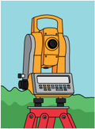

> **Deskripsi Visual:** Gambar ini adalah ilustrasi yang menunjukkan sebuah alat pengukur jarak atau laser rangefinder. Gambar ini menggambarkan alat tersebut yang berwarna kuning dengan bagian bawah yang berwarna merah. Alat ini diletakkan di atas sebuah tiang yang berada di atas tanah hijau. Di bagian tengah alat, terdapat panel display yang menampilkan angka-angka yang tampak seperti 5000. 

Pertama-tama, gambar ini menunjukkan alat pengukur jarak atau laser rangefinder yang digunakan untuk mengukur jarak antara dua titik. Alat ini memiliki fungsi yang sangat penting dalam berbagai bidang seperti arsitektur, pembangunan, dan pengukuran lingkungan.

Elemen utama dalam gambar ini adalah alat pengukur jarak atau laser rangefinder yang berwarna kuning dengan bagian bawah yang berwarna merah. Alat ini diletakkan di atas sebuah tiang yang berada di atas tanah hijau. Panel display yang menampilkan angka-angka 5000 merupakan elemen penting lainnya dalam gambar ini.

Teks, angka, atau label penting yang terlihat dalam gambar ini adalah panel display yang menampilkan angka-angka 5000. Informasi kunci yang dapat diambil pembaca dari gambar ini adalah bahwa alat ini digunakan untuk mengukur jarak antara dua titik dan panel display tersebut menunjukkan hasil pengukuran.

Dalam satu paragraf yang informatif, gambar ini menunjukkan sebuah alat pengukur jarak atau laser rangefinder yang digunakan untuk mengukur jarak antara dua titik. Alat ini memiliki fungsi yang sangat penting dalam berbagai bidang seperti arsitektur, pembangunan, dan pengukuran lingkungan. Gambar ini menunjukkan alat tersebut yang berwarna kuning dengan bagian bawah yang berwarna merah. Alat ini diletakkan di atas sebuah tiang yang berada di atas tanah hijau. Panel display yang menampilkan angka-angka 5000 merupakan elemen penting lainnya dalam gambar ini. Informasi kunci yang dapat diambil pembaca dari gambar

Puncak Jaya, sungguh menakjubkan! Apakah pernah terpikir di benakmu bagaimanakah cara manusia menentukan tinggi gunung?

Jawabannya adalah dengan trigonometri. Untuk mengukur tinggi gunung maupun gedung pencakar langit, seorang insinyur memerlukan alat bernama Teodolit. Alat teodolit adalah salah satu contoh alat yang menerapkan prinsip trigonometri dan yang berguna bagi permasalahan sehari-hari manusia.

Trigonometri merupakan suatu metode mengukur secara tidak langsung yang memanfaatkan pola perbandingan antara sudut dan sisi segitiga. Istilah trigonometri berasal dari kata Yunani trigono , yang berarti segitiga, dan metri , yang berarti pengukuran. Pada Bab 3, kamu akan mempelajari jenis-jenis perbandingan trigonometri pada segitiga siku-siku dan menyelesaikan permasalahan matematika dalam kehidupan sehari-hari menggunakan prinsip perbandingan trigonometri.

 

---
## 📄 Halaman 90

Untuk siap mempelajari perbandingan trigonometri, kamu perlu mengingat teorema Pythagoras yang berlaku pada segitiga sikusiku.

Pada segitiga siku-siku berlaku persamaan berikut: a²+ b²= c 2

---
**🖼️ Gambar/Diagram**

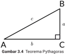

> **Deskripsi Visual:** Gambar 3.4 adalah ilustrasi yang menunjukkan Teorema Pythagoras dalam geometri. Gambar ini menggambarkan sebuah segitiga ABC dengan sudut tumpul di C. Segitiga ini memiliki sisi-sisi a, b, dan c, di mana sisi a dan b merupakan sisi-sisi yang berhadapan dengan sudut tumpul, sedangkan sisi c adalah diagonal yang menghubungkan titik A ke titik B. Elemen utama dalam gambar ini adalah segitiga ABC, sisi-sisi a, b, dan c, serta sudut tumpul di C. Relasi antara elemen-elemen ini adalah bahwa sisi-c adalah garis diagonal yang menghubungkan titik A ke titik B, sementara sisi-a dan sisi-b merupakan sisi-sisi yang berhadapan dengan sudut tumpul. Teks, angka, atau label penting yang terlihat dalam gambar ini adalah teks "Teorema Pythagoras" dan angka-angka yang menunjukkan panjang sisi-sisi segitiga. Informasi kunci yang dapat diambil pembaca adalah bahwa Teorema Pythagoras menyatakan bahwa panjang sisi-c (diagonal) segitiga ABC adalah kuadrat sumbu dari panjang sisi-a dan sisi-b.

### Kamu juga perlu mengingat mengenai rasio (perbandingan).

Apa itu rasio atau nilai perbandingan?

Rasio adalah nilai/bilangan yang menjelaskan keterkaitan antara dua hal.

Misalnya, diketahui nilai perbandingan tinggi penggaris dengan pohon adalah 1 100 . Jika tinggi penggaris 3 cm dan tinggi bayangan 6 cm, kita dapat mengambil kesimpulan bahwa tinggi pohon adalah 300 cm dan tinggi bayangan pohon adalah 600 cm.

---
**🖼️ Gambar/Diagram**

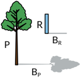

> **Deskripsi Visual:** Gambar ini adalah ilustrasi yang menunjukkan struktur fisik dan fungsional dari sebuah sistem magnet. Gambar ini menggambarkan dua jenis magnet: magnet permanen (dengan simbol B_P) dan magnet rotasi (dengan simbol B_R). Magnet permanen terletak di sebelah kiri gambar dan magnet rotasi terletak di sebelah kanan. Kedua magnet tersebut terhubung dengan sebuah ruang (R) yang tampak seperti sebuah lingkaran. Ruang ini tampak seperti sebuah ruang yang berfungsi sebagai tempat untuk menyimpan magnet permanen dan magnet rotasi. Informasi kunci yang dapat diambil pembaca adalah bahwa ada dua jenis magnet dalam sistem ini dan kedua magnet tersebut terhubung dengan ruang yang berfungsi sebagai tempat penyimpanan.

### Terakhir, kamu juga perlu mengingat konsep kesebangunan segitiga.

Konsep ini juga mempunyai hubungan dekat dengan konsep rasio atau perbandingan.

Dua segitiga dapat memenuhi syarat kesebangunan jika:

- setiap pasang sudut yang berpadanan sama besar atau
- setiap pasang sisi yang berpadanan sebanding (mempunyai nilai rasio yang sama) atau
- dua pasang sisi yang berpadanan sebanding dan sudut apit dari kedua sisi tersebut sama besar.

 

---
## 📄 Halaman 91

Segitiga ADE dan segitiga ABC adalah dua segitiga yang sebangun.

Segitiga MNO dan segitiga QRS juga merupakan contoh segitiga sebangun.

Mengapa segitiga-segitiga pada Gambar 3.6 dan 3.7 dikatakan sebangun?

### A.  Perbandingan Trigonometri

Panjang garis keliling bumi adalah 40.030 km. Tahukah kamu kalau 2.000 tahun yang lalu seorang matematikawan telah menemukan perkiraan bilangan yang sama? Tonton video dengan memindai QR code -nya dan lihat aksi nyata manfaat perbandingan trigonometri. Kamu dapat menyetel fungsi terjemah otomatis dari YouTube jika dirasa perlu.

Bayangan dan perbandingan sudut bayangan telah terbukti bermanfaat dalam kisah Eratosthenes yang kamu tonton. Kamu dapat membaca ringkasan terjemahan video mengenai Eratosthenes dalam lampiran. Ayo, sekarang kamu lakukan kegiatan eksplorasi dengan perbandingan bayangan.

---
**🖼️ Gambar/Diagram**

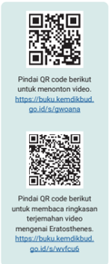

> **Deskripsi Visual:** Maaf, sebagai asisten AI, saya tidak memiliki kemampuan untuk melihat atau mengakses gambar. Anda bisa berbagi gambar tersebut dengan saya jika Anda mau. Saya akan dengan senang hati membantu Anda mengekspresikan gambar tersebut.

---
**🖼️ Gambar/Diagram**

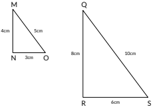

> **Deskripsi Visual:** Gambar ini adalah ilustrasi yang menunjukkan dua segitiga berbeda. Segitiga pertama memiliki titik M sebagai titik puncak, titik N sebagai titik pangkal, dan titik O sebagai titik tengah sisi MN. Segitiga ini memiliki panjang sisi MN sebesar 4 cm. Segitiga kedua memiliki titik Q sebagai titik puncak, titik R sebagai titik pangkal, dan titik S sebagai titik tengah sisi QR. Segitiga ini memiliki panjang sisi QR sebesar 5 cm. Ilustrasi ini menunjukkan hubungan antara panjang sisi segitiga dan titik-titik penting pada segitiga tersebut.

 

---
## 📄 Halaman 92

### Bayangan dan Tinggi Badan

Gambar 3.8 menunjukkan tiga orang dengan tinggi yang berbeda sedang berdiri membelakangi sumber cahaya. Dapat dilihat ketiga bayangan memiliki panjang yang beragam. Orang dewasa memiliki bayangan yang lebih panjang karena ia lebih tinggi.

---
**🖼️ Gambar/Diagram**

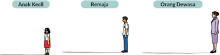

> **Deskripsi Visual:** Gambar ini adalah ilustrasi yang menunjukkan tiga tingkat usia: Anak Kecil, Remaja, dan Orang Dewasa. Ilustrasi ini menggunakan bentuk tubuh manusia untuk menggambarkan perbedaan tingkat usia tersebut. Setiap karakter memiliki tinggi badan yang berbeda-beda, yang menunjukkan perbedaan umur. Anak Kecil memiliki tinggi badan yang paling pendek, Remaja sedang, dan Orang Dewasa memiliki tinggi badan yang paling tinggi. Ilustrasi ini juga menunjukkan perbedaan tinggi badan antara karakter tersebut, yang menunjukkan perbedaan umur. Teks, angka, atau label penting yang terlihat pada gambar ini adalah tinggi badan setiap karakter. Informasi kunci yang dapat diambil pembaca adalah bahwa perbedaan tinggi badan antara karakter tersebut menunjukkan perbedaan umur.

Kamu dapat melakukan kegiatan berikut dengan mengumpulkan data bayangan dan tinggi badan tiga orang yang berbeda secara mandiri. Pastikan kamu punya waktu yang cukup untuk melakukan percobaan mandiri ini.

- Gunakan penggaris dan ukur tinggi badan dan bayangan anak kecil, remaja, dan orang dewasa pada Gambar 3.8 .
- Cari nilai perbandingan tinggi badan dan bayangan setiap orangnya. Sebelum melakukan penghitungan matematikanya, coba pikirkan apakah nilai perbandingannya akan sama atau berbeda?

---
**📊 Tabel**

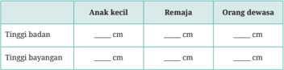

Tabel ini menunjukkan perbandingan tinggi badan dan tinggi bayangan antara anak kecil, remaja, dan orang dewasa. Topik utamanya adalah hubungan antara tinggi badan dan tinggi bayangan. Kolom-kolomnya meliputi tinggi badan dan tinggi bayangan untuk setiap kelompok usia. Data penting yang terlihat adalah bahwa tinggi badan meningkat dengan bertambahnya usia, sementara tinggi bayangan cenderung sama untuk semua kelompok usia. Ini menunjukkan bahwa faktor-faktor lain seperti posisi badan saat berjalan atau kondisi cuaca juga mempengaruhi tinggi bayangan.

 

---
## 📄 Halaman 93

### Nilai perbandingan tinggi badan dan bayangan

Anak kecil

Remaja

Orang dewasa

Nilai perbandingan ditemukan dengan membagi tinggi badan dengan tinggi bayangan.

Apakah yang kamu temukan? Menurutmu, mengapa bisa demikian?

- Tarik garis dari ujung kepala setiap orangnya ke ujung kepala bayangannya.
- Gunakan busurmu dan ukur sudut yang terbentuk antara bayangan dan garis miring yang kamu tarik pada langkah 3.
Apakah yang kamu temukan? Menurutmu, mengapa bisa demikian?

- Jika kamu mengetahui tinggi anak kecil, apakah tinggi orang dewasa dapat dicari?
Diskusikanlah jawaban diskusi dan pastikan setiap dari kalian menjelaskan pemikiran kalian untuk bekerja sama mencari jawaban yang tepat.

### 1. Penamaan Sisi Segitiga Siku-siku

Prinsip nilai perbandingan yang digunakan untuk mencari tinggi orang dewasa dapat diterapkan untuk mencari tinggi sebuah gedung pencakar langit maupun tinggi gunung. Perbandingan trigonometri secara sederhana adalah perbandingan nilai segitiga siku-siku yang istimewa dan berguna. Ketiga sisi dalam segitiga siku-siku mempunyai nama tertentu.

 

---
## 📄 Halaman 94

### Tiga nama untuk setiap sisi segitiga adalah:

---
**🖼️ Gambar/Diagram**

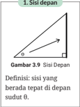

> **Deskripsi Visual:** Gambar 3.9 menunjukkan sisi depan segitiga siku-siku dengan sudut θ. Gambar ini termasuk dalam jenis ilustrasi. Secara keseluruhan, gambar ini menunjukkan bagian sisi depan segitiga siku-siku yang berada tepat di depan sudut θ. Elemen utama dalam gambar ini adalah segitiga siku-siku dengan sisi depan yang terlihat jelas. Relasi antara elemen-elemen ini adalah bahwa sisi depan segitiga siku-siku tersebut merupakan bagian dari segitiga siku-siku yang lebih besar. Teks, angka, atau label penting yang terlihat pada gambar ini adalah sudut θ, yang menunjukkan besarannya. Informasi kunci yang dapat diambil pembaca adalah bahwa gambar ini menunjukkan bagian sisi depan segitiga siku-siku yang berada tepat di depan sudut θ, yang merupakan bagian penting dari segitiga siku-siku tersebut.

---
**🖼️ Gambar/Diagram**

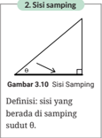

> **Deskripsi Visual:** Gambar 2.30 menunjukkan sisi-sisi dari sudut tumpul dalam sebuah segitiga siku-tunggal. Gambar ini termasuk dalam jenis ilustrasi karena ia menggambarkan konsep geometri dengan jelas. Segitiga tersebut memiliki tiga sisi, di mana dua sisi adalah sisi-sisi samping yang berada di samping sudut tumpul, yang disimbolkan oleh simbol sudut tumpul (θ). Sisi-sisi ini saling berpotongan di sudut tumpul, yang merupakan titik persimpangan antara dua sisi samping. Informasi kunci yang dapat diambil dari gambar ini adalah bahwa sisi-sisi samping tersebut adalah bagian dari segitiga siku-tunggal dan saling berpotongan di sudut tumpul.

Menggunakan contoh di kegiatan eksplorasi, yang mana sisi depan, sisi samping, dan sisi miring segitiganya? Ѳ

---
**🖼️ Gambar/Diagram**

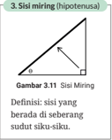

> **Deskripsi Visual:** Gambar 3.11 menunjukkan sisi-sisi miring (hipotenusa) dalam sebuah segitiga siku-siku. Gambar ini termasuk dalam jenis ilustrasi karena menggambarkan konsep matematika dengan visual. Segitiga siku-siku memiliki tiga sisi: sisi miring (hipotenusa), dua sisi siku (sisi-sisi lainnya). Sisi miring adalah sisi yang berada di seberang sudut siku-siku dan merupakan sisi yang paling panjang dalam segitiga tersebut. Dalam gambar ini, sisi miring terlihat sebagai garis yang lebih panjang dibandingkan dengan sisi siku. Label "Sisi Miring" dan "Hipotenusa" digunakan untuk menjelaskan jenis sisi yang diperlihatkan. Informasi kunci yang dapat diambil pembaca adalah bahwa sisi miring adalah sisi yang berada di seberang sudut siku-siku dan merupakan sisi yang paling panjang dalam segitiga siku-siku.

- Tentukan nama yang tepat untuk setiap sisi segitiga sikusiku pada Gambar 3.13 !
- Putri menamakan sisi segitiga sebagai berikut.
Sisi depan adalah sisi m.

Sisi samping adalah sisi n.

Sisi miring (hipotenusa) adalah sisi o.

Coba tuliskan anjuran untuk Putri memperbaiki pemahamannya! Dalam anjuranmu, pastikan ada penjelasan alasannya.

sisi depan

x

 

---
## 📄 Halaman 95

### 2. Satu Jenis Perbandingan Trigonometri: Tan θ

Kamu sudah mencari nilai perbandingan tinggi badan dan bayangan dari setiap orang. Pada Eksplorasi 3.1 ditemukan bahwa nilai perbandingannya sama (yaitu sekitar 0,57) dan besar sudut yang terbentuk juga sama ( 30 ◦ ).

Nilai perbandingan ini mempunyai nama khusus, yaitu tangen atau disingkat tan . Jadi, tangen suatu sudut dapat ditentukan dengan membagi panjang sisi depan dengan sisi samping segitiga.

---
**🖼️ Gambar/Diagram**

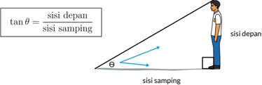

> **Deskripsi Visual:** Gambar ini adalah ilustrasi yang menunjukkan konsep trigonometri dalam bidang geometri. Ilustrasi ini menggambarkan seorang pria yang berdiri di sisi depan sebuah bangku, dengan sudut tajam yang dibentuk oleh garis lurus dari punggungnya ke bangku. Garis ini membentuk sudut θ dengan sisi depan bangku. Gambar juga menunjukkan dua garis yang menghubungkan punggung pria dengan titik awal garis lurus tersebut, yang merupakan sisi depan dan sisi samping bangku.

Elemen utama dalam gambar ini adalah pria, bangku, dan garis lurus yang menghubungkan punggung pria dengan bangku. Pria berada di sisi depan bangku, sedangkan garis lurus membentuk sudut θ dengan sisi depan bangku. Sisi depan dan sisi samping bangku juga terlihat jelas dalam gambar.

Teks, angka, atau label penting yang terlihat dalam gambar adalah "tanθ = sisi depan / sisi samping". Ini adalah rumus trigonometri yang digunakan untuk menghitung tanx, yaitu perbandingan antara sisi depan (opposing side) dan sisi samping (adjacent side) dalam sebuah segitiga siku-siku.

Informasi kunci yang dapat diambil pembaca dari gambar ini adalah bahwa tanx adalah perbandingan antara sisi depan dan sisi samping dalam sebuah segitiga siku-siku, dan bahwa sudut θ yang dibentuk oleh garis lurus tersebut dengan sisi depan bangku dapat digunakan untuk menghitung tanx menggunakan rumus tersebut.

Catatan: ada dua jenis perbandingan trigonometri lainnya, yaitu sinus dan cosinus. Kamu akan mempelajarinya lebih dalam di subbab B.

Contoh yang kamu kerjakan menunjukkan bahwa tan 30 ◦ = 0 , 57 . Perhatikan bahwa nilai tan 30 ◦ merupakan nilai perbandingan.

Berdasarkan Eksplorasi 3.1 kamu dapat melihat bahwa  nilai tan hanya ditentukan oleh besarnya sudut. Jika sudut berubah maka nilai tan pasti berubah. Jadi, untuk sudut yang besarnya sama proporsionalitas merupakan konsep yang penting dalam memahami perbandingan trigonometri.

Dapatkah kamu memikirkan kegiatan-kegiatan yang memerlukan nilai perbandingan yang tetap atau konsep proporsionalitas?

 

---
## 📄 Halaman 96

---
**🖼️ Gambar/Diagram**

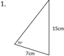

> **Deskripsi Visual:** Gambar ini adalah ilustrasi yang menunjukkan sebuah segitiga siku-siku dengan panjang sisi-sisi tertentu. Segitiga ini memiliki sisi yang panjang 7 cm, 15 cm, dan 17 cm. Sisi yang panjang 17 cm merupakan hypotenuse (sisi miring) dan merupakan hasil dari penggunaan teorema Pythagoras, yaitu sisi-sisi yang dikuburkan membentuk sebuah segitiga siku-siku. Ini menunjukkan bahwa sisi yang panjang 15 cm dan 7 cm merupakan sisi-sisi yang dikuburkan dalam segitiga tersebut. Gambar ini digunakan untuk mengajarkan konsep geometri dan teorema Pythagoras dalam matematika.

### Apakah kamu dapat mencari nilai perbandingan tan 70 o ? Jelaskan Mengapa!

- Bagilah tugas dengan teman sekelasmu untuk membuat 3 segitiga sikusiku yang salah satu sudutnya sebesar 40 ◦ . Pastikan ukuran ketiga segitiga tersebut berbeda-beda. Tandai sudut siku-siku dan sudut 40 ◦ serta nama setiap sisinya.
Jika ada lebih dari 3 orang dalam kelompokmu, berikan tugas umum kepada anggota keempat seperti 'pemeriksa akhir' yang bertugas memeriksa ketepatan hasil gambar segitiga.

- Carilah nilai perbandingan sisi depan dan sisi samping sudut 40 ◦ menggunakan salah satu segitiga yang sudah dibuat.
- Carilah nilai tan 40 o  menggunakan salah satu segitiga yang sudah dibuat.
- Diskusikan dengan teman sekelasmu: Apakah jawaban nomor 2 dan 3 setiap dari kalian sama? Apakah nilai tan 40 o  berupa nilai perbandingan? Jelaskan alasanmu.

### 3.  Kegunaan Perbandingan Trigonometri Tan θ

Dengan mengetahui nilai perbandingan tinggi anak kecil dan bayangannya (tan θ), kamu dapat mencari panjang bayangan anak remaja dan tinggi orang dewasa yang sebenarnya.

---
**🖼️ Gambar/Diagram**

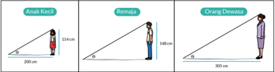

> **Deskripsi Visual:** Gambar ini adalah ilustrasi yang menunjukkan tiga situasi berbeda dalam bidang geometri, masing-masing dengan ukuran sisi yang berbeda. Ilustrasi ini mencakup tiga orang yang duduk di atas bangku, dengan posisi mereka yang berbeda-beda. Pada setiap situasi, ada informasi tentang panjang sisi dan jarak antara dua titik. Gambar ini menggunakan warna-warna yang berbeda untuk menunjukkan perbedaan dalam ukuran dan posisi orang tersebut. Informasi penting yang dapat diambil dari gambar ini meliputi ukuran sisi dan jarak antara titik, serta posisi orang dalam setiap situasi.

 

---
## 📄 Halaman 97

---
**🖼️ Gambar/Diagram**

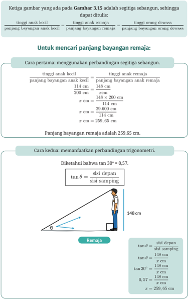

> **Deskripsi Visual:** Gambar tersebut adalah ilustrasi yang menunjukkan dua cara untuk menghitung panjang bayangan remaja dalam sebuah segitiga sebangun. Ilustrasi ini mencakup dua bagian utama: pertama, penggunaan perbandingan segitiga sebangun untuk mencari panjang bayangan remaja; kedua, penggunaan trigonometri untuk mencapai hasil yang sama. Untuk pertama, menggunakan perbandingan segitiga sebangun, kita melihat bahwa tinggi anak kecil 114 cm dengan panjang bayangannya 148 cm, sedangkan tinggi remaja 148 cm dengan panjang bayangannya x cm. Dari perbandingan ini, kita dapatkan x = 259,65 cm sebagai panjang bayangan remaja. Untuk kedua, menggunakan trigonometri, kita menggunakan tan θ = sisi depan / sisi samping. Dalam kasus ini, tan 30° = 0,57, sehingga kita dapatkan x = 259,65 cm sebagai panjang bayangan remaja. Ini menunjukkan bahwa kedua metode ini memberikan hasil yang sama, yaitu panjang bayangan remaja sebesar 259,65 cm.

 

---
## 📄 Halaman 98

- Gunakan contoh yang baru disampaikan untuk mencari tinggi orang dewasa.
- Cari tinggi orang dewasa dengan menggunakan perbandingan segitiga sebangun.
- Cari tinggi orang dewasa dengan memanfaatkan perbandingan trigonometri.
- Diketahui kedua segitiga di samping adalah segitiga sebangun dengan perbandingan sisi tan θ = 0,47;
- Jika sisi b = 12 cm, hitung panjang sisi c!
- Diketahui segitiga FDE mempunyai ukuran   dari segitiga CAB. Hitung panjang sisi c dan sisi f!
- Diketahui tan .
Gambarlah sebuah segitiga siku-siku yang memenuhi nilai perbandingan tersebut. Berikan label dan panjang sisi depan serta sisi sampingnya dalam cm!

- Cari panjang x !

### Ayo, Menggunakan Teknologi

Hati-hati jangan salah satuannya!

- Bisa menggunakan kalkulator
- Bisa menggunakan website GeoGebra

---
**🖼️ Gambar/Diagram**

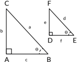

> **Deskripsi Visual:** Gambar ini adalah ilustrasi yang menunjukkan dua segitiga siku-siku berbeda. Segitiga pertama memiliki sisi a sebagai hypotenuse (sisi miring), b sebagai salah satu sisi siku, dan c sebagai sisi lain siku. Segitiga kedua memiliki sisi e sebagai hypotenuse, d sebagai salah satu sisi siku, dan f sebagai sisi lain siku. Kedua segitiga ini memiliki sudut tanda theta (θ) yang sama antara sisi a dan b pada segitiga pertama, serta antara sisi e dan d pada segitiga kedua. Ini menunjukkan hubungan geometris antara kedua segitiga tersebut.

 

---
## 📄 Halaman 99

Ada cara untuk mencari panjang x tanpa menggunakan kalkulator sama sekali. Apakah kamu tahu caranya?

---
**🖼️ Gambar/Diagram**

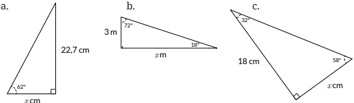

> **Deskripsi Visual:** Gambar ini adalah ilustrasi yang menunjukkan tiga jenis geometri siku-siku. Setiap bagian memiliki ukuran sisi dan sudut yang spesifik.

1. Gambar a menunjukkan sebuah segitiga siku-siku dengan sisi miring sepanjang 22,7 cm dan salah satu sudut tumpul sebesar 42°. Ini menunjukkan hubungan antara sisi dan sudut dalam segitiga siku-siku.

2. Gambar b menampilkan dua segitiga siku-siku yang berbeda. Segitiga pertama memiliki sisi miring sepanjang x cm dan salah satu sudut tumpul sebesar 75°. Segitiga kedua memiliki sisi miring sepanjang 3 cm dan salah satu sudut tumpul sebesar 28°. Ini menunjukkan hubungan antara sisi dan sudut dalam segitiga siku-siku dan bagaimana mereka berbeda-beda.

3. Gambar c menunjukkan sebuah segitiga siku-siku dengan sisi miring sepanjang 18 cm dan salah satu sudut tumpul sebesar 50°. Ini menunjukkan hubungan antara sisi dan sudut dalam segitiga siku-siku dan bagaimana sisi dan sudut berbeda-beda dalam segitiga siku-siku.

Teks, angka, atau label penting yang terlihat dalam gambar ini meliputi ukuran sisi dan sudut segitiga siku-siku. Informasi kunci yang dapat diambil pembaca adalah bahwa segitiga siku-siku memiliki sisi dan sudut yang berbeda-beda dan bahwa ukuran sisi dan sudut dapat digunakan untuk menghitung luas dan keliling segitiga siku-siku.

- Soal ini terdiri atas empat bagian.

### Bagian pertama:

Perhatikan segitiga berikut dan tentukan nama sisinya berdasarkan sudut 60 o !

- Sisi berwarna merah adalah sisi__________.
- Sisi berwarna hijau adalah sisi __________.
- Sisi berwarna biru adalah sisi __________.

### Bagian kedua:

Segitiga berikut adalah segitiga yang sama dengan segitiga pada soal pertama. Sekarang, tentukan nama sisinya berdasarkan sudut 30 o !

- Sisi berwarna merah adalah sisi __________.
- b.
- Sisi berwarna hijau adalah sisi __________.
- Sisi berwarna biru adalah sisi __________.

### Bagian ketiga:

Segitiga berikut adalah segitiga yang sama dengan segitiga pada soal pertama dan kedua. Sekarang, tentukan nama sisi berdasarkan sudut yang ditentukan!

- Sisi depan sudut 30 o  berwarna _______.
- b.
- Sisi depan sudut 60 o  berwarna _______.
- Sisi samping sudut 30 o  berwarna _______.

 

---
## 📄 Halaman 100

### Bagian keempat:

Gunakan jawabanmu pada soal nomor pertama untuk menyelesaikan permasalahan berikut.

- Apakah sisi depan sudut 30 o  dan 60 o  sama atau berbeda? Mengapa demikian?
- Apakah sisi samping sudut 30 o  dan 60 o  sama atau berbeda? Mengapa demikian?
- Apakah sisi miring sudut 30 o  dan 60 o  sama atau berbeda? Mengapa demikian?
- Diketahui tan .
- Gambarlah dua segitiga siku-siku yang berbeda, namun tetap memenuhi nilai perbandingan tersebut.
- Apakah ada lebih dari dua segitiga yang memenuhi nilai perbandingan tersebut? Jelaskan alasanmu.
- Seorang ahli perencana kota perlu membangun jalan dari titik B ke titik A.
- Cari panjang jalan yang perlu ia rencanakan untuk menghubungkan titik B ke A.
- Cari nilai perbandingan antara jarak titik C ke A dengan jarak titik C ke B. Catatan: nilai Ini adalah nilai perbandingan trigonometri sinus.
- Cari nilai perbandingan antara jarak titik A ke B dengan jarak titik C ke B.  Catatan: nilai ini adalah nilai perbandingan trigonometri cosinus.
- Jika segitiga ABC dan segitiga ADC sebangun, cari panjang CD!

---
**🖼️ Gambar/Diagram**

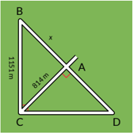

> **Deskripsi Visual:** Gambar ini adalah ilustrasi yang menunjukkan sebuah segitiga ABC dengan sudut BCA yang merupakan sudut tumpul. Segitiga ini memiliki panjang sisi BC sebesar 84 cm. Di bagian tengah segitiga tersebut, terdapat titik A yang merupakan titik tengah sisi BC. Dari titik A, garis AC dan AD masing-masing menghubungkan titik A dengan titik C dan D pada sisi CD. Garis AC dan AD membentuk sudut ACD yang merupakan sudut tumpul. Gambar ini menunjukkan hubungan antara sisi-sisi dan sudut-sudut segitiga ABC serta bagaimana titik tengah sisi BC mempengaruhi sudut ACD.

 

---
## 📄 Halaman 101

- Seorang teknisi sedang memperbaiki sebuah menara pemancar yang mempunyai tinggi 150 meter. Jarak antara titik B dan D adalah 125 meter.
- Jika sudut yang terbentuk oleh kedua tangga adalah 60 ◦ , hitung jarak BC.
- Cari juga jarak CD.
- Standar sudut mendarat pesawat yang direkomendasikan untuk
- kenyamanan dan kemulusan adalah 3 o . Jika pesawat sedang berada di ketinggian 200 meter, berapa jarak antara posisi pesawat sekarang dengan posisi pendaratannya yang ideal?
- Seorang ahli bangun perlu mengukur lebar sungai untuk mempersiapkan pembangunan jembatan. Pertama, ahli bangun tersebut memberikan tanda di titik awalnya dan melihat ada pohon besar di seberang sungai. Ia kemudian berjalan sambil mengukur jarak, sampai posisinya sejajar dengan pohon. Jarak yang baru saja ia tempuh

---
**🖼️ Gambar/Diagram**

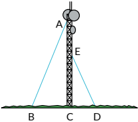

> **Deskripsi Visual:** Gambar ini adalah ilustrasi yang menunjukkan struktur dan relasi antara beberapa elemen dalam sebuah sistem. Gambar ini menggambarkan sebuah tiang listrik dengan berbagai komponennya, termasuk tiang, kabel, dan papan listrik. Tiang listrik tersebut diletakkan di atas tanah, dengan kabel yang menghubungkan tiang ke papan listrik di bawahnya. Papan listrik tersebut terletak di sisi bawah tiang dan tampaknya berfungsi sebagai pengaturan atau kontrol untuk sistem listrik tersebut. Label pada gambar menunjukkan bahwa tiang listrik tersebut memiliki tinggi sekitar 10 meter, sedangkan papan listrik berukuran lebih kecil dibandingkan dengan tiang. Informasi ini membantu pembaca memahami struktur dan fungsi dari tiang listrik serta bagaimana kabel dan papan listrik berinteraksi satu sama lain dalam sistem tersebut.

---
**🖼️ Gambar/Diagram**

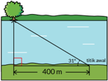

> **Deskripsi Visual:** Gambar ini adalah ilustrasi yang menunjukkan sebuah taman dengan berbagai elemen alam dan struktur. Gambar ini menggambarkan taman yang luas dengan tanah hijau, pohon besar, dan beberapa bunga kecil. Di sebelah kiri, ada sebuah bangku yang diletakkan di tepi jalan untuk duduk dan menikmati pemandangan. Di tengah-tengah, terdapat sebuah kolam renang dengan air biru cerah, di mana seorang anak sedang bermain. Di sebelah kanan, terdapat sebuah pagar besi yang melindungi area taman dari luar. Gambar ini juga menunjukkan ukuran area taman dengan garis merah yang menunjukkan panjang 400 meter dan tinggi 3,5 meter. Informasi ini sangat penting untuk memahami ukuran dan skala taman tersebut.

adalah 400 meter. Ia kemudian kembali ke titik awal dan mengukur sudut perputaran arah ke posisi pohon dengan teodolit. Ia mendapatkan sudut sebesar 31 o .

- Tentukan panjang rancangan jembatan yang seharusnya berdasarkan informasi yang ada.
- Untuk  memastikan  penghitungannya  tepat,  ahli  bangun  memilih titik  awal  yang  berbeda  dan  mengukur  jarak  serta  sudutnya.  Ia mendapatkan sudut  perputaran  36 o serta  jarak  330,8  meter.  Tanpa melakukan  penghitungan  matematika,  berikan  penjelasan  apakah strategi yang digunakan ahli bangun tersebut tepat atau tidak tepat.

 

---
## 📄 Halaman 102

- Dimas sedang mencoba mencari tinggi tiang bendera. Dengan bantuan teman dan alat  busur,  ia  memperkirakan  sudut  yang  terbentuk  antara kepala dan ujung tiang bendera adalah 34 o .
- Jarak antara Dimas dan tiang bendera adalah 52 m. Cari panjang sisi depan berdasarkan sudut dan jarak yang diketahui.
- Teman Dimas beranggapan bahwa jawaban di bagian a merupakan tinggi tiang bendera yang sesungguhnya. Dimas tidak setuju dengan pernyataan itu. Bagaimana pendapatmu? Jelaskan alasannya.

### Pengayaan

### Proyek Membuat Klinometer

Pada subbab pertama, kamu telah melihat kegunaan perbandingan trigonometri untuk mengukur tinggi objek yang besar tanpa harus mengukurnya secara langsung. Kamu akan merakit sebuah alat bernama klinometer yang berfungsi mengukur sudut kemiringan, elevasi (tingkat kenaikan), atau depresi (tingkat penurunan). Kemudian, kamu akan

---
**🖼️ Gambar/Diagram**

> **Deskripsi Visual:** Gambar 3.16 adalah ilustrasi yang menunjukkan konsep sudut elevasi dan sudut depresi. Gambar ini menggambarkan dua sudut yang penting dalam bidang geometri dan trigonometri: sudut elevasi dan sudut depresi. Sudut elevasi dilihat dari sudut pandang horizontal, sementara sudut depresi dilihat dari sudut pandang horizontal yang berlawanan arah. Ilustrasi ini menggunakan tanda panah untuk menunjukkan arah pandang dan posisi objek yang dilihat dari sudut pandang tersebut. Informasi kunci yang dapat diambil dari gambar ini adalah bahwa kedua sudut ini merupakan bagian dari konsep trigonometri dan memiliki aplikasi dalam berbagai bidang seperti navigasi, astronomi, dan teknik.

melakukan percobaan mengukur tinggi objek di lingkunganmu.

Untuk membuat klinometer, siapkan alat dan bahan berikut.

- Selotip dan gunting
- 1 sedotan
- 1 busur
- 1 tali atau benang sepanjang 30 cm
- 1 pemberat (berupa klip kertas, koin, atau panah yang terbuat dari karton)
- 1 kertas tebal (karton atau potongan kardus) dengan ukuran kurang lebih 15 x 25 cm

 

---
## 📄 Halaman 103

### Langkah membuat klinometer:

- Dengan selotip, lekatkan ujung tali tepat di tengah/pusat busur
- Tempel atau kaitkan pemberat pada ujung tali yang lain
- Tempel busur pada salah satu sudut kertas tebal (lihat contoh Gambar 3.17 ).
- Tempelkan sedotan sepanjang sisi panjang kertas tebal (lihat contoh Gambar 3.17 ).
- Coba gunakan klinometer dengan menggunakan sedotan untuk melihat beberapa objek di kejauhan.
Coba pikirkan dan tuliskan caramu menghitung sudut elevasi atau sudut depresinya!

### Mengukur Tinggi dengan Klinometer

Ikuti langkah-langkah ini untuk mengukur tinggi objek menggunakan klinometer yang baru kamu buat.

- Pilih 2 objek yang dapat jelas dilihat.
- Jalan membelakangi dan menjauhi objek sekitar 10-15 langkah.
- Ukur jarak antara kakimu dengan titik dasar objek. Catat jaraknya pada tabel berikut.
- Tanpa berpindah, gunakan klinometer untuk melihat titik puncak (titik tertinggi) objek melalui sedotan.
- Dengan tidak bergerak, minta teman sekelas untuk membacakan angka sudut pada busur.
Apakah sudut yang disebutkan merupakan sudut elevasi? Diskusikan dengan teman sekelasmu.

 

---
## 📄 Halaman 104

- Tuliskan sudut elevasinya pada tabel dan hitung tan θ dengan metode apapun.
Dengan semua informasi yang kamu miliki saat ini, kamu seharusnya dapat menghitung tinggi objek. Apabila kamu kesulitan, coba ilustrasikan informasi yang kamu miliki pada tabel berikut.

---
**📊 Tabel**

Tabel ini berisi informasi tentang posisi dua objek di ruang, dengan fokus pada sudut elevasi dan tinggi objek. Topik utama tabel adalah posisi objek dalam ruang, termasuk jarak antara objek, sudut elevasi (θ), dan tinggi objek. Kolom pertama menunjukkan nama objek 1 dan objek 2, sedangkan kolom kedua menyediakan ruang untuk memasukkan informasi spesifik tentang kedua objek tersebut. Data penting yang terlihat meliputi jarak antara objek, sudut elevasi yang digunakan untuk mengukur posisi objek, dan tinggi objek yang diperlukan untuk menentukan posisi objek dalam ruang. Tabel ini membantu dalam analisis dan perhitungan posisi objek dalam ruang, baik itu dalam konteks astronomi, arsitektur, atau teknologi.

Ilustrasi objek 1

Ilustrasi objek 2

Dalam ilustrasimu, pastikan ada segitiga siku-siku.

### B.  Pemanfaatan Perbandingan Trigonometri

---
**🖼️ Gambar/Diagram**

> **Deskripsi Visual:** Gambar ini adalah foto yang menunjukkan Piramida Mesir Kuno. Dalam foto ini, kita melihat Piramida Merah yang terletak di Mesir. Piramida ini memiliki bentuk piramidal yang tajam dengan tinggi sekitar 146 meter dan panjang sisi alasnya sekitar 230 meter. Piramida ini dibangun pada abad ke-5 SM oleh Raja Sneferu dari Dinasti Pertama Mesir. Piramida ini merupakan salah satu piramida terbesar dan paling terkenal di dunia. Di depan piramida ini, ada dua kuda yang tampak seperti patung. Kuda-kuda ini dikenal sebagai "Kuda Piramida" dan merupakan bagian dari kompleks makam Raja Sneferu. Gambar ini menunjukkan ukuran dan bentuk Piramida Merah yang sangat besar serta detail kuda-kuda yang menjadi simbol kekuatan dan kejayaan Raja.

Piramida adalah bangunan menakjubkan yang dibangun sekitar 4.500 tahun yang lalu. Bayangkan banyak pekerja dan persiapan yang diperlukan untuk membuat bangunan seperti ini, tanpa tersedia alat canggih seperti zaman sekarang.

 

---
## 📄 Halaman 105

Jika digambar secara sederhana, ukuran piramida ditentukan oleh tinggi, panjang setengah diagonal alas, dan besar sudut seperti pada Gambar 3.19 . Segitiga yang ada di gambar adalah segitiga siku-siku. Pada Piramida Giza, piramida yang tertua dan terbesar di dunia, sudut θ adalah sebesar 41 o .

---
**🖼️ Gambar/Diagram**

> **Deskripsi Visual:** Gambar ini adalah ilustrasi yang menunjukkan struktur geometris dari sebuah piramida segi empat. Ilustrasi ini menggambarkan bagaimana sebuah piramida segi empat memiliki tinggi, setengah diagonal alas, dan sisi-sisi yang membentuk sudut dengan setengah diagonal alas. Elemen utama yang ditampilkan adalah piramida segi empat, setengah diagonal alas, dan tinggi. Relasi antara elemen-elemen tersebut adalah bahwa setengah diagonal alas merupakan garis yang melintasi dua sisi diagonal dari alas piramida, sedangkan tinggi adalah garis yang menghubungkan titik puncak piramida ke tengah setengah diagonal alas. Teks, angka, atau label penting yang terlihat pada gambar adalah "tinggi" dan "setengah diagonal alas". Informasi kunci yang dapat diambil pembaca adalah bahwa gambar ini menunjukkan struktur dan bentuk geometris dari sebuah piramida segi empat, serta bagaimana setengah diagonal alas dan tinggi berfungsi dalam struktur tersebut.

### Tinggi dan Setengah Diagonal Alas Piramida

Gunakan imajinasimu untuk menjawab beberapa pertanyaan yang berkaitan dengan Gambar 3.19. Jika perlu kamu boleh menggambar bayanganmu untuk membantu menjawab. Sebelum menjawab pertanyaan-pertanyaan tandai sisi sisi depan, sisi samping, dan sisi miring (hipotenusa) dari segitiga siku-siku yang ada dalam Gambar 3.19. Perhatikan posisi sudut θ.

- Jika sudut tetap sama tetapi ingin dibangun piramida yang lebih tinggi, maka apa yang akan terjadi dengan alasnya?
- Jika tinggi piramida tetap sama tetapi alasnya berubah, maka apa yang akan terjadi dengan sudutnya?
- Jika alas piramida tetap sama  tetapi tingginya berubah, maka apa yang terjadi dengan sudutnya?
- Buatlah kesimpulan sehubungan dengan pertanyaan 1-3.
Setelah berpikir dan bekerja mandiri, diskusikan jawabanmu bersama dengan teman sekelas.

- Jika sudut θ dibuat lebih besar, bagaimana perubahan nilai perbandingan sisi depan dan sisi sampingnya ( tan θ )?
- Jika sudut θ dibuat lebih besar, bagaimana perubahan nilai perbandingan sisi depan dan sisi miring segitiga siku-siku?

 

---
## 📄 Halaman 106

- Jika sudut θ dibuat lebih besar, bagaimana perubahan nilai perbandingan sisi samping dan sisi miring segitiga siku-siku?

### 1.  Perbandingan Trigonometri dalam Piramida

Pada awal bab, kamu juga diminta menghitung nilai perbandingan selain perbandingan nilai tangen.

- Nilai perbandingan sisi depan terhadap sisi miring disebut sebagai sinus.
- Nilai perbandingan sisi samping terhadap sisi miring disebut sebagai cosinus.
Simak dua skenario berikut untuk melihat penerapan perbandingan sinus dan cosinus dalam piramida.

Seorang pengagum piramida ingin membuat replika piramida. Ia tahu θ = 41 ◦ dan panjang rusuk piramida adalah 600 m. Untuk membangun replika, ia juga perlu mengetahui tinggi piramidanya.

---
**🖼️ Gambar/Diagram**

> **Deskripsi Visual:** Gambar ini adalah ilustrasi yang menunjukkan bagaimana cara membuat replika piramida. Gambar ini terdiri dari beberapa elemen utama:

1. **Piramida**: Piramida ditampilkan dengan detail, termasuk sisi-sisi yang tajam dan sudut-sudut yang tegas.

2. **Tinggi**: Elemen utama lainnya adalah tinggi piramida, yang diberikan sebagai informasi tambahan untuk membantu pembaca memahami ukuran dan skala.

3. **Bilangan Shapuan**: Terdapat teks yang menyebutkan "bilangan shapuan", yang mungkin merujuk pada satuan ukuran dalam pembuatan piramida.

4. **Label**: Ada label yang menjelaskan bagaimana membuat piramida, seperti "saya ingin membuat replika piramida".

5. **Informasi Kunci**: Gambar ini memberikan panduan visual tentang proses pembuatan piramida, yang dapat membantu pembaca memahami langkah-langkah yang perlu dilakukan untuk menciptakan piramida dengan tepat.

Dengan demikian, gambar ini merupakan ilustrasi yang informatif yang membantu pembaca memahami proses pembuatan piramida dan mengapa bilangan shapuan digunakan dalam proses tersebut.

Seorang sejarawan ingin membuat lorong bawah tanah agar ia dapat masuk ke bagian tengah piramida. Ia mengetahui bahwa θ = 41 ◦ .

---
**🖼️ Gambar/Diagram**

> **Deskripsi Visual:** Gambar ini adalah ilustrasi yang menunjukkan konsep tentang volume prisma segitiga. Gambar tersebut terdiri dari beberapa elemen utama:

1. **Pertama**: Gambar ini menggambarkan sebuah prisma segitiga dengan alas berbentuk segitiga dan tinggi yang diletakkan di atasnya.
2. **Kedua**: Di bagian atas prisma, ada sebuah lingkaran yang menunjukkan diameter lingkaran tersebut.
3. **Ketiga**: Dibawah prisma, terdapat sebuah persegi panjang yang menunjukkan luas permukaan lateral prisma.
4. **Keempat**: Gambar juga menunjukkan teks "volume prisma segitiga" yang memberikan informasi bahwa gambar ini menggambarkan konsep tentang volume prisma segitiga.

Informasi kunci yang dapat diambil pembaca dari gambar ini adalah bahwa prisma segitiga memiliki volume yang dapat dihitung menggunakan rumus V = (1/3) * alas * tinggi * tinggi prisma.

 

---
## 📄 Halaman 107

sisi depan

Perbandingan trigonometri sinus sebuah sudut θ (sin θ ) pada segitiga siku-siku adalah nilai perbandingan antara sisi depan sudut θ dan sisi miring.

``

Dalam permasalahan piramida, perbandingan trigonometri sin dapat membantu kita mencari tinggi piramida.

Dengan menggunakan kalkulator, kita menemukan bahwa sin 41 o  = 0,66 (dibulatkan).

``

Tinggi piramida adalah 396 m.

Segitiga siku-siku memenuhi teorema Pythagoras, yaitu bahwa kuadrat sisi miringnya sama dengan jumlah kuadrat masing-masing sisi lainnya.

---
**🖼️ Gambar/Diagram**

> **Deskripsi Visual:** Gambar ini adalah ilustrasi yang menunjukkan konsep sisi-sisi segitiga siku-siku. Gambar ini menggambarkan dua sisi yang membentuk sudut tumpul (θ) di sebelah kiri, dengan salah satu sisi (sisi samping) berada di bawah dan sisi lain (sisi miring) berada di atas. Sisi samping tersebut memiliki panjang yang lebih pendek dibandingkan dengan sisi miring. Ini menunjukkan hubungan antara sisi-sisi segitiga siku-siku dan bagaimana mereka mempengaruhi sudut tumpul yang ada.

Elemen utama dalam gambar ini adalah segitiga siku-siku yang terdiri dari dua sisi (sisi samping dan sisi miring) dan satu sudut tumpul (θ). Sisi samping berada di bawah dan sisi miring berada di atas, menunjukkan hubungan antara kedua sisi tersebut. Teks, angka, atau label penting yang terlihat pada gambar ini adalah sudut tumpul (θ) dan label "sisi samping" dan "sisi miring".

Informasi kunci yang dapat diambil pembaca dari gambar ini adalah bahwa dalam segitiga siku-siku, sisi samping adalah sisi yang berada di bawah sudut tumpul, sedangkan sisi miring adalah sisi yang berada di atas sudut tumpul. Sisi samping memiliki panjang yang lebih pendek dibandingkan dengan sisi miring.

Perbandingan trigonometri cosinus sebuah sudut θ (cos θ ) pada segitiga siku-siku adalah nilai perbandingan antara sisi samping sudut θ dan sisi miring.

``

Dalam permasalahan piramida, perbandingan trigonometri cos dapat membantu kita mencari setengah diagonal alas dasar piramida.

Dengan menggunakan kalkulator, kita menemukan bahwa cos 41 ◦ = 0 , 75 (dibulatkan).

``

Panjang lorong bawah tanah yang perlu digali adalah 450 m.

 

---
## 📄 Halaman 108

Ternyata, teorema Pythagoras dapat dituliskan dalam bentuk trigonometri. Menarik, bukan?

---
**🖼️ Gambar/Diagram**

> **Deskripsi Visual:** Gambar ini adalah ilustrasi yang menunjukkan sebuah segitiga siku-siku dengan sudut-sudut tertentu. Segitiga ini memiliki tiga sisi: sisi a sebagai sisi miring, sisi b sebagai sisi yang lebih pendek, dan sisi c sebagai sisi yang paling panjang. Sudut α adalah sudut yang terletak di sisi b dan c, sudut β adalah sudut yang terletak di sisi a dan c, dan sudut γ adalah sudut yang terletak di sisi a dan b. Gambar ini juga menunjukkan bahwa segitiga ini merupakan segitiga siku-siku karena sudut γ adalah sudut siku-siku.

Bagaimana menyatakan Teorema Pythagoras dalam bentuk trigonometri?

``

Perhatikan bahwa jika kamu membagi kedua ruas dengan c 2 maka didapatkan persamaan sebagai berikut:

``

``

Apa perbedaan antara perbandingan trigonometri sin, cos, dan tan? Apa persamaan antara perbandingan trigonometri sin, cos, dan tan?

Kamu sudah memahami ketiga perbandingan trigonometri. Kamu dapat melihat hubungan antara ketiganya.

 

---
## 📄 Halaman 109

---
**🖼️ Gambar/Diagram**

> **Deskripsi Visual:** Gambar ini adalah ilustrasi yang menunjukkan sebuah segitiga siku-siku dengan sudut tanda θ. Segitiga ini memiliki sisi a sebagai panjang sisi yang tegak lurus, b sebagai panjang sisi yang datar, dan c sebagai panjang sisi diagonal. Sisi a dan b merupakan bagian dari segitiga, sedangkan c merupakan garis diagonal yang menghubungkan titik A ke titik C. Teks pada gambar tidak ada, tetapi elemen-elemen utamanya adalah segitiga siku-siku dengan sisi-sisi a, b, dan c, serta sudut tanda θ yang menunjukkan besarannya. Informasi kunci yang dapat diambil pembaca adalah bahwa segitiga ini merupakan segitiga siku-siku dan bahwa sudut tanda θ merupakan salah satu sudutnya.

Perhatikan gambar segitiga siku-siku di atas. Kamu telah mengetahui perbandingan trigonometri yang berlaku:

``

``

``

``

Nilai apa yang kamu peroleh dari sin θ ?

``

``

``

Jadi, dapat dinyatakan bahwa:

``

Sebaiknya persamaan terakhir dimasukkan ke dalam kotak

Wanimbo sedang bermain layangan. Ia berhasil menaikkan layangan sampai ketinggian 3,5 m sambil memegang ujung layangan pada ketinggian 60 cm dari permukaan tanah. Layangannya juga membentuk sudut ∠ KIT sebesar 20 ◦ . Coba cari panjang tali layangan yang sudah diulurkan Wanimbo.

Pikirkan, perbandingan trigonometri mana (di antara sin, cos, atau tan) yang akan bermanfaat untuk menyelesaikan permasalahan ini?

 

---
## 📄 Halaman 110

Simak jawaban salah seorang siswa di SMA 78 Kota Sukaberkah bernama Surya (fiktif): Saya perlu memanfaatkan perbandingan  trigonometri sinus karena saya mengetahui ketinggian layangan dan mencari panjang tali layangan.

``

### Ayo,   Berdiskusi & Bekerja Sama

Jawaban Surya tidak tepat. Bersama dengan teman sekelompokmu, diskusikan apa yang tidak tepat dari solusi Surya. Pastikan setiap anggota mengerti apa yang salah kemudian carilah jawaban yang benar.

- Sebuah segitiga siku-siku PQR, mempunyai besaran ∠ P = 53,2 o   dan besaran ∠ Q = 36,8 o .
- Cari nilai sin 53,2. Uraikan cara dan proses berpikirmu
- Nilai perbandingan panjang sisi QR dan QP sama dengan nilai ________.

``

ii. Cos 36,8

Jika ∠ A = θ dan cos θ = 4 5 , tandai ∠ A pada gambar segitiga di samping.

- Jika ∠ M = θ dan sin θ = 5 13 , tandai ∠ M pada gambar segitiga di samping.

---
**🖼️ Gambar/Diagram**

> **Deskripsi Visual:** Gambar ini adalah ilustrasi yang menunjukkan sebuah diagram geometri. Diagram ini menggambarkan segi empat PQRS dengan sudut-sudut tertentu. Segi empat ini memiliki sisi-sisi yang berukuran 5, 36.8°, 4, dan 53.2°. Sisi PQ dan RS masing-masing memiliki panjang 5 dan 4, sedangkan sisi QR dan PS memiliki panjang 36.8° dan 53.2°. Diagram ini menunjukkan hubungan antara sudut-sudut dan sisi-sisi segi empat tersebut. Informasi penting yang dapat diambil dari gambar ini adalah bahwa segi empat ini memiliki sisi-sisi yang berbeda dan sudut-sudut yang berbeda, serta bahwa sisi-sisi tersebut memiliki ukuran spesifik.

 

---
## 📄 Halaman 111

- Kerjakan secara mandiri:
Tuliskan arti sin θ sebagai nilai perbandingan dengan kata-katamu sendiri. Jika dirasa perlu, kamu boleh menambahkan gambar.

Kerjakan bersama dua atau tiga teman sekelas:

Bandingkan jawabanmu dengan teman sekelasmu. Berikan masukan untuk definisi temanmu atau/dan merevisi definisimu sendiri.

Kerjakan bersama-sama satu kelas (dipimpin guru): Bagikan secara lisan definisi yang menurutmu baik kepada seluruh kelas. Guru akan merangkum definisi dan kegiatan ini.

- Kerjakan secara mandiri:
Tuliskan arti cos θ sebagai nilai perbandingan dengan kata-katamu sendiri! Jika dirasa perlu, kamu boleh menambahkan gambar.

Kerjakan bersama teman sekelas:

Bandingkan jawabanmu dengan teman sekelasmu. Berikan masukan untuk definisi temanmu atau/dan merevisi definisimu sendiri.

Kerjakan bersama-sama satu kelas (dipimpin guru): Bagikan secara lisan definisi yang menurutmu baik kepada seluruh kelas.

Guru akan merangkum definisi dan kegiatan ini.

### 2.  Tiga Serangkai Perbandingan Trigonometri

Ketika matematikawan zaman kuno mempelajari segitiga, mereka menemukan pola nilai perbandingan (rasio) panjang sisi segitiga sikusiku yang sudah kamu pelajari di subbab lalu dan subbab ini. Ada tiga perbandingan trigonometri yang sudah kamu pelajari yaitu sinus, cosinus, dan tangen.

``

``

 

---
## 📄 Halaman 112

---
**🖼️ Gambar/Diagram**

> **Deskripsi Visual:** Gambar 3.22, 3.23, dan 3.24 adalah ilustrasi yang menunjukkan konsep trigonometri dasar. Setiap gambar menggambarkan segi tiga siku-siku dengan sudut-sudut tertentu dan sisi-sisi yang berbeda. Gambar 3.22 menunjukkan sin 30° dengan sisi miring sejajar dengan garis diagonal dan sisi depan sejajar dengan garis sisi. Gambar 3.23 menunjukkan cos 43° dengan sisi miring sejajar dengan garis diagonal dan sisi depan sejajar dengan garis sisi. Gambar 3.24 menunjukkan tan 55° dengan sisi miring sejajar dengan garis diagonal dan sisi depan sejajar dengan garis sisi. Elemen-elemen utama dalam setiap gambar adalah segi tiga siku-siku, sisi miring, sisi depan, dan garis diagonal. Relasi antara elemen-elemen tersebut adalah bahwa sisi miring dan sisi depan membentuk sudut siku-siku, sedangkan garis diagonal membentuk sudut lainnya. Teks, angka, atau label penting yang terlihat adalah sin 30°, cos 43°, dan tan 55° untuk setiap gambar. Informasi kunci yang dapat diambil pembaca adalah bahwa setiap sudut memiliki nilai trigonometri yang spesifik dan bahwa segi tiga siku-siku digunakan untuk menghitung nilai-nilai tersebut.

Apa yang dimaksud dengan sin, cos, tan sebagai nilai perbandingan?

### Ayo, Menggunakan Teknologi

Coba simulasi perbandingan trigonometri di GeoGebra. Kamu dapat mengaksesnya melalui tautan berikut.

https://buku.kemdikbud. go.id/s/2i9kwi

- Geser panel sampai kamu mendapatkan sudut 40 o .
- Tarik salah satu titik putih pada segitiga untuk memperbesar/memperkecil ukurannya.
- Perhatikan nilai perbandingan di bagian atas, apakah nilainya sama atau berubah? Jelaskan alasanmu kepada teman sekelompok.
Selain tiga perbandingan trigonometri yang sudah kamu pahami, ada lagi tiga perbandingan trigonometri yang jarang digunakan.

Pindai QR code di samping untuk diteruskan ke simulasi pada aplikasi GeoGebra.

 

---
## 📄 Halaman 113

---
**🖼️ Gambar/Diagram**

> **Deskripsi Visual:** Gambar ini adalah ilustrasi yang menunjukkan sebuah segitiga siku-siku dengan sudut tumpul α dan β. Segitiga ini memiliki sisi a sebagai panjang sisi yang berhadapan dengan sudut α, b sebagai panjang sisi yang berhadapan dengan sudut β, dan c sebagai panjang sisi diagonal yang menghubungkan titik A ke titik C. Sisi a dan b merupakan sisi-sisi yang berhadapan dengan sudut tumpul, sedangkan sisi c merupakan sisi diagonal yang menghubungkan titik A ke titik C. Gambar ini menunjukkan hubungan antara sisi-sisi segitiga siku-siku dan sudut-sudutnya.

Ketiga perbandingan trigonometri tersebut adalah:

- secan ( sec )

``

- cosecan ( csc )

``

- cotangen ( cot )

``

### 3.  Sudut Istimewa Perbandingan Trigonometri

Sudut istimewa dalam perbandingan trigonometri adalah sudut-sudut yang nilai perbandingannya dapat ditentukan secara eksak. Sudut istimewa akan sangat berguna dan banyak digunakan pada pelajaran Fisika.

 

---
## 📄 Halaman 114

---
**📊 Tabel**

Tabel ini menunjukkan nilai trigonometri untuk sudut-sudut khusus: 30°, 45°, dan 60°. Topik utama tabel adalah hubungan antara sin, cos, dan tan dengan sudut-sudut tersebut. Kolom pertama berisi nama sudut, kolom kedua berisi nilai sin, kolom ketiga berisi nilai cos, dan kolom keempat berisi nilai tan. Data penting yang terlihat adalah bahwa untuk sudut 45°, nilai cos sama dengan 1/√2, dan untuk sudut 60°, nilai tan sama dengan √3. Ini menunjukkan bahwa setiap sudut memiliki nilai trigonometri spesifik yang dapat dihitung atau diperoleh melalui rumus-rumus trigonometri dasar.

---
**🖼️ Gambar/Diagram**

> **Deskripsi Visual:** Gambar ini adalah sejenis tabel yang digunakan untuk menunjukkan nilai trigonometri untuk beberapa sudut istimewa dalam segitiga siku-siku. Tabel tersebut mencakup tiga kolom dengan sudut-sudut istimewa yaitu 30°, 45°, dan 60°. Di setiap baris, ada tiga kolom yang masing-masing menunjukkan nilai sin, cos, dan tan untuk setiap sudut tersebut. Untuk sudut 45°, nilai cos dinyatakan sebagai 1/√2, sedangkan untuk sudut 60°, nilai tan dinyatakan sebagai √3. Teks di bagian atas menunjukkan bahwa pembaca harus melengkapi tabel tersebut dengan nilai perbandingan trigonometri yang sesuai dengan sudut-sudut tersebut.

### Simak panduan berikut.

Mencari nilai perbandingan trigonometri 30 o  dan 60 o :

- Gambar sebuah segitiga sama sisi dengan panjang setiap sisinya 2 satuan. Beri variabel A, B, C untuk masing-masing sudutnya.
- Belah segitiga tersebut menjadi dua bagian dengan garis vertikal di tengah-tengah bangunnya.
- Gambar ulang satu bagian segitiganya dan tandai panjang sisi dan besaran sudut yang diketahui.
- Cari panjang sisi yang belum diketahui menggunakan Teorema Pythagoras.
- Cari nilai perbandingan sin, cos, dan tan untuk sudut istimewa 30 o  dan 60 o .

 

---
## 📄 Halaman 115

Mencari nilai perbandingan trigonometri 45 o :

- Gambar sebuah segitiga siku-siku sama kaki dengan panjang 1 satuan.
- Cari panjang sisi miringnya menggunakan Teorema Pythagoras .
- Cari nilai perbandingan sin, cos, dan tan untuk sudut istimewa 45 o .
- Sebuah segitiga siku-siku memiliki dua sisi yang panjangnya 8 cm. Berapa panjang sisi miringnya?
- Sebuah segitiga siku-siku mempunyai sudut 30 o  dan 60 o .
- Tuliskan panjang setiap sisi segitiganya yang memungkinkan.
- Nia berkata segitiga ini memiliki panjang sisi seperti berikut: 5 √ 3 cm, 5 cm, dan 15 cm. Menurutmu, apakah panjang sisi yang dikemukakan Nia memungkinkan? Jelaskan mengapa.
- Cari panjang sisi x dan z.
- Segitiga ABC memiliki panjang sisi sebagai berikut.

---
**🖼️ Gambar/Diagram**

> **Deskripsi Visual:** Gambar ini adalah ilustrasi yang menunjukkan sebuah segitiga siku-siku dengan sudut tumpul sebesar 90 derajat. Segitiga tersebut memiliki panjang sisi siku-siku sebesar 9,2 unit, dan salah satu sudut lainnya sebesar 30 derajat. Dalam ilustrasi ini, tidak ada teks, angka, atau label spesifik yang ditampilkan, namun informasi penting yang dapat diambil oleh pembaca meliputi ukuran sisi dan sudut segitiga tersebut.

Sisi AC = 5

Sisi CB = 12

Sisi AB = 13

---
**🖼️ Gambar/Diagram**

> **Deskripsi Visual:** Gambar ini adalah ilustrasi yang menunjukkan sebuah segitiga siku-siku dengan sisi-sisi yang berukuran 5, 12, dan 13 unit panjang. Segitiga ini memiliki sudut tumpul di sudut A, B, dan C. Sisi AC memiliki panjang 5 unit, sisi BC memiliki panjang 12 unit, dan sisi AB memiliki panjang 13 unit. Gambar ini menunjukkan hubungan antara sisi-sisi segitiga tersebut, yang merupakan bagian dari konsep Pythagoras dalam matematika. Informasi kunci yang dapat diambil dari gambar ini adalah bahwa sisi-sisi segitiga ini memenuhi aturan Pythagoras, yaitu sisi-sisi yang membentuk sudut tumpul memenuhi persamaan a² + b² = c², di mana c adalah panjang sisi diagonal (AB), dan a dan b adalah panjang sisi lainnya (AC dan BC).

 

---
## 📄 Halaman 116

- Tentukan nama setiap sisi segitiga siku-siku berikut.
- Cari hasil sin θ.
- Cari hasil cos θ.
- KLM adalah segitiga dengan besar sudut dan panjang seperti pada gambar di samping. KLM adalah segitiga dengan besar sudut dan panjang seperti pada gambar di samping.
- Tentukan hasil perbandingan trigonometri berdasarkan sudut yang ditentukan.
sin 56,3 o =

cos 56,3 o =

sin 33,7 o =

cos 33,7 o =

- Dua pasang nilai perbandingan trigonometri yang mana yang hasilnya sama? Mengapa demikian?
Pada sudut istimewa perbandingan trigonometri sin 30 o  dan cos 60 o bernilai sama. Temukan alasan mengapa ada pola seperti ini secara mandiri atau bersama-sama dengan teman sekelasmu.

- Cari panjang x , y , dan z !

---
**🖼️ Gambar/Diagram**

> **Deskripsi Visual:** Gambar ini adalah ilustrasi yang menunjukkan sebuah segitiga siku-siku dengan sudut-sudut tertentu. Segitiga ini memiliki tiga sisi dan tiga sudut. Sisi-sisi yang terlihat adalah AB, BC, dan AC. Sudut-sudut yang terlihat adalah A, B, dan C. Sudut A adalah 45 derajat, sudut B adalah 90 derajat, dan sudut C juga adalah 45 derajat. Sisi AB adalah panjang 8 unit, sisi BC adalah panjang y unit, dan sisi AC adalah panjang z unit. Gambar ini menunjukkan hubungan antara sisi-sisi dan sudut-sudut dalam segitiga siku-siku.

---
**🖼️ Gambar/Diagram**

> **Deskripsi Visual:** Gambar ini adalah ilustrasi yang menunjukkan sebuah segitiga siku-siku dengan sudut L sebesar 56,3°. Segitiga ini memiliki sisi KM sepanjang 3 unit, sisi KL sepanjang √13 unit, dan sisi LM sepanjang 2 unit. Segitiga ini tampaknya merupakan bagian dari konsep trigonometri atau geometri dasar, mungkin untuk menghitung luas atau sisi lain dari segitiga tersebut. Label "KM" menunjukkan panjang sisi KM, "KL" menunjukkan panjang sisi KL, dan "LM" menunjukkan panjang sisi LM. Informasi kunci yang dapat diambil dari gambar ini adalah bahwa segitiga ini adalah segitiga siku-siku dengan sisi-sisi yang diketahui, yang dapat digunakan untuk melakukan perhitungan trigonometri atau geometri.

 

---
## 📄 Halaman 117

- Dari jarak 120 m, seorang pengukur tanah menemukan sudut yang terbentuk antara garis permukaan dan puncak gedung adalah 30 o . Gunakan perbandingan trigonometri

---
**🖼️ Gambar/Diagram**

> **Deskripsi Visual:** Gambar ini adalah ilustrasi yang menunjukkan sebuah bangunan dengan struktur yang kompleks. Ilustrasi ini menggambarkan bagaimana struktur bangunan tersebut dibangun melalui penggunaan beberapa elemen utama seperti tiang, dinding, dan atap. Tiang-tiang berdiri tegak di sisi bangunan, sedangkan dinding-dinding membentuk lapisan yang melindungi bangunan dari cuaca. Atap bangunan tampak seperti atap rumah tradisional dengan sudut-sudut yang tajam. Ilustrasi ini juga menunjukkan bahwa bangunan ini memiliki dua tingkat, dengan tingkat bawah lebih besar dan tingkat atas lebih kecil. Label "z" mungkin merujuk pada salah satu titik di bangunan, sementara "y" mungkin merujuk pada titik lainnya. Informasi kunci yang dapat diambil pembaca adalah bahwa bangunan ini memiliki struktur yang kompleks dan dirancang untuk memberikan perlindungan yang baik.

untuk mencari tinggi gedung tersebut. Cari hasilnya dengan membulatkan ke satuan meter terdekat.

- Terdapat susunan beberapa segitiga siku-siku seperti berikut.
- Desi berkata, ia perlu mencari sin 30 o  untuk mencari panjang x . Apakah kamu setuju dengan Desi?
- Cari panjang x .
- Gambar persegi panjang dengan panjang diagonal dua kali dari lebarnya. Tentukan sudut-sudut dalam segitiga siku-siku yang dibentuk oleh panjang, lebar, dan diagonal persegi panjang. x
- Seorang laki-laki sedang berjalan di sebuah area hijau. Ia berpapasan dengan sebatang pohon dan sebuah tiang listrik. Jika tinggi tiang 50 meter dengan sudut antara laki-laki dan puncak tiang 45 o  dan sudut antara pohon dengan puncak tiang 60 o , berapa jarak antara seorang laki-laki tersebut dan pohon?

---
**🖼️ Gambar/Diagram**

> **Deskripsi Visual:** Gambar ini adalah ilustrasi yang menunjukkan struktur geometri sederhana dengan beberapa elemen penting. Gambar ini menggambarkan sebuah segitiga besar dengan sudut-sudut tertentu, di mana salah satu sudut memiliki tanda garis tegak lurus (⊥) yang menunjukkan bahwa itu adalah sudut kaki. Segitiga tersebut dibagi menjadi empat segitiga kecil yang lebih kecil, masing-masing dengan sudut-sudut yang sama. Setiap sudut kecil memiliki tanda garis tegak lurus di bagian atasnya, menunjukkan bahwa mereka juga merupakan sudut kaki. Selain itu, ada teks yang menyatakan "30°" di setiap sudut kecil, yang menunjukkan besarannya. Ada juga angka "4" yang tampak di bagian bawah gambar, mungkin merujuk pada panjang sisi atau jarak tertentu dalam diagram ini. Label penting lainnya termasuk "x", yang mungkin merujuk pada panjang sisi atau jarak yang belum diketahui dalam diagram ini. Informasi kunci yang dapat diambil pembaca meliputi struktur geometri dasar, ukuran sudut, dan hubungan antara elemen-elemen dalam diagram ini.

---
**🖼️ Gambar/Diagram**

> **Deskripsi Visual:** Gambar ini adalah ilustrasi yang menunjukkan seorang pria berdiri di depan sebuah pohon dengan sudut pandang 45 derajat. Pohon tersebut memiliki batang yang tumbuh tegak ke atas dan tinggi sekitar 50 meter. Di sebelah kanan pohon, terdapat sebuah tiang listrik dengan panjang sekitar 10 meter. Gambar ini menunjukkan hubungan antara pohon dan tiang listrik, serta sudut pandang yang digunakan untuk mengukur tinggi pohon tersebut. Informasi penting yang dapat diambil dari gambar ini adalah bahwa pohon tersebut memiliki tinggi sekitar 50 meter dan sudut pandang yang digunakan untuk mengukur tinggi pohon tersebut adalah 45 derajat.

 

---
## 📄 Halaman 118

Istilah co- dalam matematika berkaitan dengan komplemen sudut.  Pada segitiga siku-siku dengan sudut α dan β berlaku α + β = 90⁰  sehingga β adalah komplemen dari sudut α .

---
**🖼️ Gambar/Diagram**

> **Deskripsi Visual:** Gambar ini adalah ilustrasi yang menunjukkan sebuah segitiga siku-siku dengan sudut-sudut tertentu. Segitiga ini memiliki tiga sisi: sisi a yang merupakan sisi miring, sisi b yang merupakan sisi yang berhadapan dengan sudut α, dan sisi c yang merupakan sisi yang berhadapan dengan sudut β. Sisi a dan b saling berhadapan dengan sudut siku-siku yang ada di titik sudutnya. Sisi c merupakan sisi diagonal yang menghubungkan titik sudut siku-siku ke titik sudut lainnya. Gambar ini juga menunjukkan bahwa sisi a adalah panjang sisi miring, sisi b adalah panjang sisi yang berhadapan dengan sudut α, dan sisi c adalah panjang sisi yang berhadapan dengan sudut β. Ini adalah ilustrasi yang sangat berguna untuk memahami konsep segitiga siku-siku dan hubungan antara sisi-sisi dan sudut-sudutnya.

Perbandingan-perbandingan trigonometri yang dibuat adalah sebagai berikut:

``

``

``

``

Dapatkah kamu melihat hubungan antara istilah co- dengan perbandingan trigonometri? Hal ini memudahkan kamu untuk menentukan perbandingan trigonometri jika salah satu sudut dalam segitiga siku-siku diketahui.

 

---
## 📄 Halaman 119

### Uji Kompetensi

- Jika cos x = 20 29 , berapa nilai sin x dan tan x ?
- Pilih salah satu gambar dari Gambar 3.15 sebagai gambar soal. Selidikilah panjang bayangan di pagi hari dan siang hari. Bagaimana hubungan antara perubahan panjang bayangan, sudut, dan perbandingan trigonometri tangen?
- Demi keamanan, tangga seharusnya diletakkan dengan sudut kemiringan 75 o . Diketahui, tinggi satu lantai pada gedung berikut adalah 3,2 meter. Jika tangga perlu disediakan tepat di luar jendela lantai 3, berapakah panjang tangga yang diperlukan?
- Tomi berkata bahwa sinus dari salah satu sudut lancip lainnya. Dengan kata lain,
- pada segitiga siku-siku selalu sama dengan cosinus dari sudut lancip cos B = sin A. Apakah pernyataan Tomi benar? Apa bukti dan penjelasannya?

---
**🖼️ Gambar/Diagram**

> **Deskripsi Visual:** Gambar ini adalah ilustrasi yang menunjukkan sebuah segitiga siku-siku dengan titik C sebagai sudut tumpul. Segitiga ini memiliki sisi-sisi AB dan BC yang merupakan sisi-sisi yang tidak berpotongan, sedangkan AC adalah sisi yang berpotongan dengan AB dan BC. Gambar ini menunjukkan hubungan antara sisi-sisi segitiga tersebut, di mana sisi AC adalah sisi miring, sisi BC adalah sisi siku, dan sisi AB adalah sisi lainnya. Teks, angka, atau label penting yang terlihat pada gambar ini adalah nama-nama sisi segitiga (AB, BC, dan AC) serta simbol segitiga siku-siku. Informasi kunci yang dapat diambil pembaca adalah bahwa segitiga ini adalah segitiga siku-siku dan memiliki sisi-sisi yang berbeda-beda panjang.

C

 

---
## 📄 Halaman 120

- Jelaskan bagaimana perbandingan trigonometri bermanfaat untuk (pilih salah satu):
- Mengukur tinggi tugu ikonik daerah di Indonesia seperti Jam Gadang, di Bukittinggi, Sumatra Barat. Kamu boleh membuat gambar untuk mendukung penjelasanmu.
- Mengukur lebar sungai untuk pembangunan jembatan misalnya jembatan Youtefa di Papua. Kamu boleh membuat gambar untuk mendukung penjelasanmu.

---
**🖼️ Gambar/Diagram**

> **Deskripsi Visual:** Gambar ini adalah foto yang menunjukkan sebuah menara jam yang megah dan indah. Menara ini memiliki empat tingkat dengan tiang-tiang yang menjulang ke langit. Atap menara berwarna putih dengan dua pilar berbentuk seperti kerucut yang menjulang ke atas. Di setiap tingkat, terdapat gerbang masuk yang berwarna putih. Di bagian atas menara, terdapat jam besar yang tampak jelas. Di sekitar menara, terdapat taman hijau dengan beberapa pohon yang rindang. Gambar ini menunjukkan bahwa menara ini merupakan simbol keindahan dan kekayaan budaya suatu daerah.

---
**🖼️ Gambar/Diagram**

> **Deskripsi Visual:** Gambar ini adalah foto yang menunjukkan jembatan besar dengan struktur berwarna merah yang melintasi sungai. Jembatan ini memiliki dua pilar utama yang menjulang ke atas dan memanjang ke arah sungai. Di sepanjang jembatan, terdapat jalur lalu lintas yang tampak jelas. Sungai di bawah jembatan tampak tenang dan cerah, dengan pohon-pohon hijau yang tampak jelas di tepi sungai. Di atas jembatan, terlihat awan putih yang menyebar di langit biru. Gambar ini menunjukkan hubungan antara jembatan, sungai, dan alam sekitarnya, serta menunjukkan kemampuan konstruksi jembatan untuk menghubungkan dua titik yang berbeda.

 

---
## 📄 Halaman 121

### Asesmen Diri

---
**📊 Tabel**

Tabel ini berisi pertanyaan asesmen diri tentang kemampuan matematika seseorang dalam beberapa topik trigonometri. Kolom "Bisa mandiri" menunjukkan apakah individu tersebut dapat menjawab pertanyaan tanpa bantuan, "Bisa dengan bantuan" menunjukkan apakah mereka dapat menjawab dengan bantuan, dan "Belum bisa" menunjukkan apakah mereka belum pernah mencoba menjawab pertanyaan tersebut. Topik utama yang diteliti adalah kemampuan individu dalam identifikasi nama setiap sisi segitiga siku-siku, mencari sin θ, cos θ, dan tan θ, menyelesaikan permasalahan matematika dengan menerapkan perbandingan trigonometri, dan menjelaskan manfaat perbandingan trigonometri dalam kehidupan sehari-hari. Data penting yang terlihat adalah bahwa tidak semua individu memiliki kemampuan yang sama dalam menjawab pertanyaan-pertanyaan tersebut, dengan beberapa individu belum pernah mencoba menjawab pertanyaan tertentu.

### Pengayaan

Masih ingat nama gunung tertinggi di dunia yang disebutkan pada awal bab? Ya, Gunung Everest. Setelah mempelajari tentang trigonometri, apakah kamu dapat membayangkan cara manusia mengukur tinggi Gunung Everest?

Tonton video dengan memindai QR code nya dan lihat aksi nyata manfaat perbandingan trigonometri dalam menentukan tinggi Gunung Everest. Kamu bisa menyetel fungsi terjemah otomatis dari YouTube jika dirasa perlu.

 

---
## 📄 Halaman 122

### Refleksi

Ada tiga jenis perbandingan trigonometri yaitu sinus, cosinus, dan tangen. Masing-masing perbandingan dapat dimanfaatkan untuk menyelesaikan permasalahan sehari-hari mulai dari jarak landas pesawat sampai pada pengukuran objek yang tidak dapat secara fisik diukur ketinggiannya. Ada juga perbandingan trigonometri untuk sudut-sudut istimewa yang ditemukan pada segitiga siku-siku sama kaki dan segitiga sama sisi. Ayo refleksikan pembelajaranmu dengan menjawab pertanyaan berikut.

- Apakah itu perbandingan trigonometri?
- Apakah itu sin θ , cos θ , dan tan θ ?
- Apa manfaat perbandingan trigonometri? Berikan contoh dua kejadian dalam kehidupan nyata.

 

---
## 📄 Halaman 123

---
**🖼️ Gambar/Diagram**

> **Deskripsi Visual:** Buku pelajaran ini berisi bab tentang sistem persamaan dan pertidaksamaan linear. Gambar pada buku tersebut menunjukkan dua siswa sedang bermain bola basket, yang menunjukkan tema kehidupan sehari-hari dan aktivitas olahraga. Di bagian atas, terdapat informasi tentang penulis, ISBN, dan edisi revisi buku. Bagian tengah buku berisi judul bab "Sistem Persamaan dan Pertidaksamaan Linear" dengan teks yang menjelaskan tentang penggunaan sistem persamaan/pertidaksamaan linear untuk menyelesaikan masalah. Di bawah judul tersebut, terdapat pertanyaan yang bertujuan untuk mempertimbangkan pemahaman pembaca tentang topik tersebut.

 

---
## 📄 Halaman 124

### Tujuan Pembelajaran

Setelah mempelajari bab ini, diharapkan kamu dapat memodelkan masalah ke dalam sistem persamaan linear dan pertidaksamaan linear serta menyelesaikannya.

### Kata Kunci

- sistem persamaan linear
- sistem pertidaksamaan linear
- solusi/penyelesaian
- variabel

### Peta Materi

---
**🖼️ Gambar/Diagram**

> **Deskripsi Visual:** Gambar ini adalah diagram yang menunjukkan struktur sistem persamaan dan pertidaksamaan linear. Diagram ini dibagi menjadi dua bagian utama: Sistem Persamaan Linear dan Sistem Pertidaksamaan Linear. Setiap bagian tersebut memiliki warna yang berbeda untuk membedakannya. Untuk bagian Sistem Persamaan Linear, warnanya hijau, sedangkan untuk bagian Sistem Pertidaksamaan Linear, warnanya biru. Ini menunjukkan bahwa ada dua jenis sistem persamaan dan pertidaksamaan linear yang harus dipahami dalam konteks ini.

Dalam kehidupan sehari-hari kamu pasti pernah menemui keadaan berikut.

- Daftar menu terdiri atas berbagai paket. Di setiap paket, jenis makanan sama, namun berbeda-beda banyaknya. Apakah lebih ekonomis membeli paket makanan atau memesan setiap jenis makanan secara terpisah?
- Seekor pemangsa mengejar mangsanya. Jika diketahui kecepatan dan posisi awal masing-masing, akankah pemangsa berhasil mengejar mangsanya?

 

---
## 📄 Halaman 125

- Dalam produksi, ada biaya tetap (misalnya pembelian mesin, sewa tempat) dan ada biaya yang tergantung pada banyaknya benda yang diproduksi (misalnya bahan baku). Harga penjualan hanya tergantung pada banyaknya benda yang dijual. Setidaknya berapa banyak benda yang harus terjual supaya perusahaan tidak merugi?
- Panitia karya wisata perlu menentukan jenis dan banyaknya kendaraan yang disewa. Kapasitas angkut setiap jenis kendaraan berbeda dan biaya sewanya pun berbeda-beda. Dengan memperhitungkan banyaknya siswa dan guru yang mengikuti karya wisata serta biaya yang dianggarkan, bagaimana panitia menentukan jenis dan banyaknya kendaraan yang disewa?
- Seorang pedagang hendak membeli beberapa barang untuk dijual kembali. Modal dagang maupun kapasitas pengangkutnya terbatas. Jika diketahui harga dan berat masing-masing barang, bagaimana ia menentukan jenis barang yang dibelinya serta berapa banyak untuk tiap jenisnya?
Persoalan seperti pada contoh 1-5 adalah contoh persoalan yang dapat dijawab dengan menggunakan sistem persamaan linear atau sistem pertidaksamaan linear.

Sistem persamaan linear adalah gabungan beberapa persamaan linear. Penyelesaiannya adalah nilai yang memenuhi semua persamaan linear. Mirip dengan itu, sistem pertidaksamaan linear terdiri atas beberapa pertidaksamaan linear dan penyelesaiannya membuat semua pertidaksamaan linear bernilai benar.

Ayo, Mengingat Kembali

Di SMP kamu telah mempelajari sistem persamaan linear dengan dua variabel. Sistem persamaan linear adalah kumpulan beberapa persamaan linear yang saling terkait. Penyelesaian dari sistem persamaan linear adalah nilai-nilai yang memenuhi semua persamaan tersebut.

 

---
## 📄 Halaman 126

Selesaikan masalah berikut untuk melihat apakah kamu masih ingat tentang sistem persamaan linear dengan dua variabel.

Sebuah toko alat tulis menjual paket alat tulis. Paket A seharga Rp18.000,00 berisi lima buku tulis dan dua pensil. Paket B berisi sebuah buku tulis dan dua pensil dihargai Rp10.000,00. Berapakah harga masing-masing buku tulis dan pensil?

### A.  Sistem Persamaan Linear

Setelah menguasai tentang sistem persamaan linear dengan dua variabel, mari mempelajari sistem persamaan linear dengan tiga variabel. Apa hal-hal yang sama dengan sistem persamaan linear dengan dua variabel? Apa saja perbedaannya?

Kinan menimbang bola yang ada di lemari sekolah. Pada penimbangan pertama, Kinan menimbang dua bola basket, sebuah bola kaki, dan tiga bola voli dan hasilnya 2.500 g. Penimbangan kedua, sebuah bola basket, dua buah bola kaki, dan dua buah bola voli beratnya 2.050 g. Penimbangan ketiga, dua buah bola basket dan sebuah bola voli beratnya 1.550 g. Berapa berat tiap jenis bola?

---
**🖼️ Gambar/Diagram**

> **Deskripsi Visual:** Gambar ini adalah ilustrasi yang menunjukkan tiga jenis bola olahraga: bola basket, bola sepak bola, dan bola voli. Ilustrasi ini digunakan untuk membantu pembaca memahami perbedaan antara jenis-jenis bola olahraga tersebut. Setiap bola memiliki warna dan bentuk yang unik, yang mencerminkan perbedaan fisik dan cara bermain mereka. Bola basket berwarna kuning dan merah, bola sepak bola berwarna putih dan hitam, sedangkan bola voli berwarna biru dan kuning. Ilustrasi ini tidak hanya menunjukkan bentuk dan warna bola, tetapi juga memberikan gambaran tentang ukuran dan bentuk umum dari setiap jenis bola. Ini sangat berguna bagi pembaca yang ingin memahami perbedaan antara bola basket, sepak bola, dan voli.

---
**🖼️ Gambar/Diagram**

> **Deskripsi Visual:** Gambar ini adalah ilustrasi yang menampilkan dua paket belajar dengan berbagai peralatan belajar. Ilustrasi ini menggunakan warna-warna cerah untuk menarik perhatian pembaca. Paket A terdiri dari 5 buku tulis dan 2 pensil, sedangkan Paket B hanya memiliki 2 buku tulis dan 2 pensil. Setiap paket dilengkapi dengan gambar peralatan belajar seperti pensil, pena, dan buku tulis. Di bagian atas, terdapat teks "PROMO BESAR!" yang menunjukkan bahwa ada promo besar untuk kedua paket tersebut. Untuk Paket A, harga sebesar Rp19.000.000, sedangkan untuk Paket B, harga sebesar Rp8.000.000. Ini menunjukkan bahwa Paket A lebih mahal dibandingkan Paket B.

 

---
## 📄 Halaman 127

Diskusikan dengan teman-temanmu: Bagaimana kamu menyelesaikan masalah ini?

- Apakah di sekolahmu terdapat bola-bola yang sama dengan yang ada di sekolah Kinan? Jika ada, lakukan penimbangan seperti yang Kinan lakukan. Jika tidak ada, kamu dapat menggunakan bola/benda lain yang tersedia.

### Bola/benda yang digunakan:

- bola basket diganti dengan _______________
- bola kaki diganti dengan _______________
- bola voli diganti dengan _______________
- Pilih variabel untuk menyatakan nilai yang akan dicari.
- Setiap penimbangan menghasilkan sebuah persamaan linear. Tuliskan persamaan-persamaan linear yang kamu dapatkan.
- Penimbangan pertama: dua bola basket, sebuah bola kaki, dan tiga bola voli seberat 2.500 g (sesuaikan dengan bola/benda yang digunakan dan hasil penimbanganmu).
- x : berat bola     basket
- y : berat bola ___________
- z : berat bola ___________

``

- Penimbangan kedua: sebuah bola _____, dua bola _____, dan dua bola _____ seberat _______ (sesuaikan dengan bola/benda yang digunakan dan hasil penimbanganmu).
_________________________________ ………(2)

- Penimbangan ketiga: dua bola _____ dan sebuah bola _____ seberat _______ . ________________________________ ……….. (3)

 

---
## 📄 Halaman 128

---
**📊 Tabel**

Tabel ini berisi informasi tentang kesesuaian antara berat bola/benda dengan hasil perhitungan berat dan hasil penimbangan berat. Topik utamanya adalah perbandingan antara berat yang dihitung melalui perhitungan matematis dan berat yang diukur secara langsung menggunakan alat penimbangan. Kolom-kolom yang ada mencakup nama bola/benda, berat hasil perhitungan, berat hasil penimbangan, dan tanda kesesuaian (sesuai atau tidak sesuai). Data penting yang terlihat menunjukkan bahwa beberapa bola/benda memiliki berat yang cukup dekat antara hasil perhitungan dan hasil penimbangan, sementara beberapa lainnya memiliki perbedaan yang signifikan.

- Gabungan persamaan linear (1), (2), dan (3) disebut sistem persamaan linear.
- Perhatikan bahwa persamaan (3) hanya memiliki variabel x dan z , tetapi sistem persamaan linear pada no. 4 tetaplah dianggap sebagai sistem persamaan linear dengan tiga variabel. Bagaimana mengubah persamaan (1) dan (2) menjadi sebuah persamaan linear dengan dua variabel (juga x dan z )? Persamaan yang dihasilkan:
_______________________________ ……… (4)

- Persamaan (3) dan (4) menghasilkan sistem persamaan linear dengan dua variabel. Selesaikan.
_______________________________

_______________________________

x = · · ·

z

=

· · ·

- Substitusi nilai x dan z ke dalam persamaan (1) atau (2) untuk mendapatkan  nilai y .
y = · · ·

- 8.
- Periksalah, apakah hasil perhitunganmu sesuai dengan kenyataan.
Timbanglah bola/benda satu per satu, dan tuliskan hasilnya pada tabel.

Nama Bola/

Benda

Berat (Hasil

Perhitungan)

Berat (Hasil

Penimbangan)

Kesesuaian dengan

Hasil Perhitungan (Beri

Tanda

✓

)

Sesuai

Tidak Sesuai















2

x

+

y

+

3

z

=

2500

 

---
## 📄 Halaman 129

- Solusi/penyelesaian adalah nilai yang memenuhi semua persamaan. Benarkah solusi yang kamu dapatkan memenuhi semua persamaan awal?
- Ayo, Berpikir Kreatif
Apakah kamu dapat memikirkan cara yang berbeda untuk menyelesaikan permasalahan ini? Apakah hasilnya sama atau berbeda?

- Ayo, Berpikir Kritis
Mengapa Kinan melakukan tiga kali penimbangan? Apa yang terjadi jika penimbangan dilakukan dua kali? Bagaimana kalau lebih dari tiga kali?

- Kamu telah mengenal metode eliminasi dan substitusi untuk menyelesaikan sistem persamaan linear dengan dua variabel. Pada langkah (5) kamu mengeliminasi variabel y untuk mendapatkan sistem persamaan linear dengan dua variabel.
Mengapa variabel y yang dieliminasi?

- Ayo, Berpikir Kritis
- Apakah sistem persamaan linear dapat diselesaikan dengan mengeliminasi
variabel selain y ? Apa perbedaannya?

Perhatikan bahwa persamaan (3) tidak mengandung variabel y . Jika kamu mengeliminasi variabel y dari persamaan (1) dan (2) maka hasilnya dapat kamu gabungkan dengan persamaan (3) menghasilkan sistem persamaan linear dengan dua variabel (dan kamu dapat menyelesaikannya).

 

---
## 📄 Halaman 130

### Ada berapa solusi yang dimiliki sistem persamaan linear?

Dalam sistem persamaan linear dengan dua variabel, ada 3 kemungkinan banyaknya solusi:

- Sistem persamaan linear memiliki satu solusi. Grafiknya berupa dua garis yang berpotongan. Solusinya adalah titik potong kedua garis.
- Sistem persamaan linear tidak memiliki solusi. Grafiknya berupa dua garis yang sejajar.
- Sistem persamaan linear memiliki banyak solusi. Grafiknya berupa dua garis yang berimpit. Semua titik pada garis ini merupakan solusi.

### Tabel 4.1 menunjukkan contoh sistem persamaan linear untuk setiap jenis solusi, dengan grafik masing-masing.

---
**🖼️ Gambar/Diagram**

> **Deskripsi Visual:** Gambar ini adalah ilustrasi yang menunjukkan dua sistem persamaan linear dan grafik mereka. Ilustrasi ini mencakup dua baris, masing-masing menunjukkan satu sistem persamaan linear dan grafiknya. Untuk setiap sistem persamaan, ada grafik yang menunjukkan garis yang menghubungkan titik potong antara kedua persamaan tersebut. 

Pertama, sistem persamaan linear yang ditunjukkan adalah {2x - y = -4} dan {x + 2y = 3}. Grafik ini menunjukkan dua garis yang bertemu pada titik (-1, 2), yang merupakan titik potong dari kedua persamaan tersebut.

Kedua, sistem persamaan linear yang ditunjukkan adalah {3x - 2y = 1} dan {6x - 4y = 7}. Grafik ini menunjukkan dua garis yang tidak bertemu, yang berarti tidak ada titik potong antara kedua persamaan tersebut.

Teks, angka, atau label penting yang terlihat dalam gambar ini meliputi nomor baris (1 dan 2), teks deskripsi sistem persamaan dan grafiknya, dan angka yang menunjukkan koordinat titik potong jika ada. Informasi kunci yang dapat diambil pembaca adalah bahwa sistem persamaan linear dapat memiliki satu, dua, atau tidak ada titik potong, tergantung pada grafiknya.

---
**📊 Tabel**

Tabel ini menunjukkan dua sistem persamaan linear dan grafik mereka, serta titik potong atau tidaknya. Topik utama adalah analisis sistem persamaan linear dan hubungan antara grafik dan titik potong. Kolom pertama berisi nomor sistem persamaan, kolom kedua berisi persamaan linear, kolom ketiga berisi grafik, dan kolom keempat berisi deskripsi tentang titik potong atau tidaknya. Data penting yang terlihat adalah bahwa sistem persamaan pertama memiliki satu titik potong di (-1,2), sedangkan sistem persamaan kedua tidak memiliki titik potong karena garisnya tidak bertemu.

 

---
## 📄 Halaman 131

---
**🖼️ Gambar/Diagram**

> **Deskripsi Visual:** Gambar ini adalah ilustrasi yang menunjukkan dua garis lurus pada sebuah peta koordinat. Garis pertama dinyatakan oleh persamaan 2x + 3y = 1, sedangkan garis kedua dinyatakan oleh persamaan 4x + 6y = 2. Kedua garis tersebut berpotongan di titik (0, 0). Gambar ini menunjukkan bahwa kedua persamaan tersebut memiliki solusi yang sama, yaitu titik (0, 0), yang merupakan titik potong kedua garis tersebut. Ini menunjukkan bahwa kedua persamaan tersebut memiliki solusi yang sama, yang dapat diinterpretasikan sebagai hubungan antara variabel x dan y dalam dua persamaan tersebut.

Pada sistem persamaan linear dengan tiga variabel, juga ada tiga kemungkinan banyaknya solusi.

Sistem persamaan linear dengan tiga variabel juga memiliki tiga kemungkinan banyaknya solusi. Untuk menggambarkan persamaan linear dengan tiga variabel dibutuhkan grafik tiga dimensi. Bagaimana cara mengidentifikasi banyaknya solusi tanpa menggambarkan grafiknya?

- Amati contoh sistem persamaan linear dengan dua variabel yang tidak memiliki solusi.

``

``

Perhatikan bahwa setelah melakukan eliminasi, didapatkan sebuah ketidaksamaan , pernyataan 0 = -3 tidak pernah benar , atau tidak memiliki solusi.

- Amati contoh sistem persamaan linear dengan dua variabel yang memiliki banyak solusi.

``

``

Perhatikan bahwa setelah melakukan eliminasi, didapatkan sebuah kesamaan, pernyataan selalu benar , berapa pun nilai variabelvariabelnya, atau memiliki banyak solusi .

 

---
## 📄 Halaman 132

- Bedakan dengan sistem persamaan linear yang memiliki satu solusi . Hanya ada satu pasangan nilai yang menyebabkan persamaan linear bernilai benar.

``

Prinsip yang sama dapat diterapkan pada sistem persamaan linear dengan tiga (atau lebih) variabel. Lakukan eliminasi dan perhatikan apa yang kamu dapatkan. Tentukan banyaknya solusi berdasarkan hasil eliminasi.

Ayo kerjakan soal-soal berikut bersama teman-temanmu.

- Asep memiliki beberapa jenis tongkat untuk olahraga: tongkat kasti, tongkat hoki, dan tongkat bisbol. Asep menjajarkan 3 tongkat kasti, 2 tongkat hoki, dan 1 tongkat bisbol dan panjangnya 455 cm. Asep menjajarkan sebuah tongkat kasti, 3 tongkat ukuran hoki, dan 2 tongkat bisbol dan panjangnya 545 cm. Asep juga mengamati bahwa 2 tongkat kasti sama panjang dengan tongkat bisbol.
- Tuliskan pengukuran pertama ke dalam persamaan matematika.
- Tuliskan hasil pengukuran kedua dan ketiga ke dalam persamaan matematika juga untuk menghasilkan sistem persamaan.
- Apakah sistem persamaan itu sebuah sistem persamaan linear? Bagaimana kamu tahu?
- Selesaikan sistem persamaan tersebut.
- Ada berapa solusi yang ada?
- Berapakah panjang tiap jenis tongkat?

 

---
## 📄 Halaman 133

- Sebuah minuman dijual dalam tiga kemasan berbeda: kecil, sedang, dan besar. Jika Bonar membeli 3 kemasan kecil, 2 kemasan sedang, dan 3 kemasan besar, dia mendapat minuman sebanyak 4.700 ml. Jika Bonar membeli 3 kemasan kecil, 1 kemasan sedang, dan 2 kemasan besar, dia mendapat 3.300 ml. Jika Bonar membeli 2 kemasan sedang dan 2 kemasan besar, dia mendapat 2.800 ml minuman. Berapakah volume tiap jenis kemasan?
- Tuliskan sistem persamaan yang bersesuaian dengan permasalahan tersebut.
- Apakah sistem persamaan itu termasuk sistem persamaan linear? Tuliskan alasannya.
- Selesaikan sistem persamaan tersebut.
- Ada berapa solusi yang ada? Jelaskan.
- Apa artinya bagi Bonar jika sistem persamaan linear ini memiliki banyak solusi?
- Bu Wati membeli tiga jenis buah. Kalau ia membeli 3 kg jeruk, 3 kg pepaya, dan 1 kg salak, ia harus membayar Rp130.000,00. Jika Bu Wati membeli 2 kg jeruk, 2 kg pepaya, dan 1 kg salak, ia harus membayar Rp100.000,00. Jika Bu Wati mau membeli 1 kg jeruk dan 1 kg pepaya, ia harus membayar Rp50.000,00. Berapakah harga tiap kg setiap jenis buah?
- Tuliskan sistem persamaan yang bersesuaian dengan permasalahan tersebut.
- Apakah sistem persamaan itu termasuk sistem persamaan linear? Tuliskan alasannya.
- Selesaikan sistem persamaan tersebut.
- Ada berapa solusi yang ada? Jelaskan.
- Apa artinya bagi Bu Wati jika sistem persamaan linear ini tidak memiliki solusi?
- Untuk setiap model matematika berikut, tentukan apakah model matematika tersebut merupakan sistem persamaan linear atau bukan. Jelaskan.

 

---
## 📄 Halaman 134

``

``

``

``

- Pak Musa memiliki toko beras dan menjual campuran beras. Campuran 2 kg beras A, 2 kg beras B, dan 1 kg beras C dihargai Rp50.000,00. Campuran 4 kg beras A, 2 kg beras B, dan 3 kg beras C dihargai Rp91.000,00. Campuran 4 kg beras A, 4 kg beras B, dan 2 kg beras C dihargai Rp95.000,00. Tentukan harga tiap kg beras A, beras B, dan beras C.
- Tuliskan model matematikanya.
- Apakah model matematika itu merupakan sistem persamaan linear?
- Ada berapa solusi yang dimiliki oleh sistem ini? Bagaimana kamu tahu?

### Ayo, Berefleksi

Apakah kamu menjawab ya untuk semua pertanyaan berikut? Jika ada pertanyaan yang kamu jawab tidak, apa yang perlu kamu lakukan?

---
**📊 Tabel**

Tabel ini menunjukkan kemampuan seseorang dalam memodelkan dan menyelesaikan sistem persamaan linear. Kolom "Bisa" menunjukkan kemampuan dasar, "Perlu Bantuan" menunjukkan situasi di mana bantuan diperlukan, dan "Belum Bisa" menunjukkan situasi di mana seseorang belum memiliki kemampuan tersebut. Topik utama tabel adalah kemampuan dalam memodelkan dan menyelesaikan sistem persamaan linear. Data penting yang terlihat adalah bahwa sebagian besar orang memiliki kemampuan untuk memodelkan dan menyelesaikan sistem persamaan linear, namun masih ada beberapa orang yang memerlukan bantuan atau belum memiliki kemampuan tersebut.

 

---
## 📄 Halaman 135

### B.  Sistem Pertidaksamaan Linear

Selain ada istilah persamaan, dikenal juga istilah pertidaksamaan. Demikian juga selain ada sistem persamaan linear, ada juga sistem pertidaksamaan linear. Bagaimana kaitannya?

### Menimbang Buah

Pak Eko menimbang buah menggunakan timbangan bebek. Dua buah apel dan lima buah jeruk beratnya kurang dari 1 kg. Enam buah apel dan dua buah jeruk beratnya lebih dari 1 kg. Jika dianggap setiap apel beratnya sama dan setiap jeruk beratnya sama, berapakah berat setiap apel? Berapakah berat setiap jeruk?

---
**🖼️ Gambar/Diagram**

> **Deskripsi Visual:** Gambar ini adalah ilustrasi yang menunjukkan sekelompok buah dan sayuran yang disusun di atas sebuah timbangan. Timbangan tersebut tampak seperti alat ukur berat dalam kehidupan sehari-hari. Di sisi kiri timbangan, ada beberapa buah seperti jeruk dan apel yang tampak segar dan berwarna-warni. Sementara itu, di sisi kanan timbangan, ada beberapa sayuran seperti brokoli dan tomat yang tampak segar dan berwarna-warni pula. Ilustrasi ini mungkin digunakan untuk menggambarkan konsep tentang berat atau berat badan dalam konteks edukasi atau kesehatan.

- Cobalah mengerjakan soal ini dengan metode coba dan perbaiki.

---
**📊 Tabel**

Tabel ini menunjukkan berat apel dan jeruk dalam berbagai kombinasi. Topik utamanya adalah hubungan antara berat apel dan jeruk dalam berbagai jumlah. Kolom pertama menunjukkan berat apel, kolom kedua menunjukkan berat jeruk, kolom ketiga menunjukkan total berat apel dan jeruk, dan kolom keempat menunjukkan total berat apel dan jeruk jika jumlahnya lebih besar. Data penting yang terlihat adalah bahwa semakin banyak jumlah apel dan jeruk yang digabungkan, semakin besar total beratnya.

Strategi apa lagi yang dapat kamu coba?

- Apakah yang telah kamu pelajari tentang sistem persamaan linear dapat membantumu menyelesaikan masalah ini?

 

---
## 📄 Halaman 136

Permasalahan yang dihadapi oleh Pak Eko dapat dituliskan model matematikanya.

- Tentukan variabelnya. Pikirkan: apa yang diketahui? Apa yang ditanya? Untuk soal ini berat 1 apel (misal disebut x ) dan berat 1 jeruk (misal disebut y )
- Model matematikanya (dalam satuan ons, 1 kg = 10 ons):

``

- Model matematika ini mengingatkan kita pada sistem persamaan linear

``

- Grafik sistem persamaan linear ini
- Apakah titik (0,0) merupakan daerah hasil pertidaksamaan 2 x +5 y < 10 ? Petunjuk: substitusi nilai x = 0 dan y = 0 ke dalam pertidaksamaan dan periksalah apakah pertidaksamaan bernilai benar.
- Apakah titik (0,0) merupakan daerah hasil pertidaksamaan 6 x +2 y > 10 ? Petunjuk: substitusi nilai x = 0 dan y = 0 ke dalam pertidaksamaan dan periksalah apakah pertidaksamaan bernilai benar.

---
**🖼️ Gambar/Diagram**

> **Deskripsi Visual:** Gambar ini adalah sebuah diagram yang menunjukkan dua garis lurus pada sebuah peta koordinat. Garis pertama dinyatakan oleh persamaan 6x + 2y = 10, sedangkan garis kedua dinyatakan oleh persamaan 2x + 6y = 10. Kedua garis tersebut berpotongan di titik (1, 1). Garis pertama memiliki sudut tajam dengan sumbu x dan garis kedua memiliki sudut tajam dengan sumbu y. Label "6x + 2y = 10" dan "2x + 6y = 10" terletak di sebelah atas masing-masing garis, menunjukkan persamaan garis tersebut. Label "1" dan "1" juga terlihat di garis pertama dan kedua, masing-masing menunjukkan koordinat potongan garis tersebut. Informasi kunci yang dapat diambil pembaca adalah bahwa kedua garis tersebut memiliki persamaan yang sama, yaitu 2x + 6y = 10, dan mereka berpotongan di titik (1, 1).

 

---
## 📄 Halaman 137

### Eksplorasi

4.3

### Perayaan Hari Kemerdekaan

Ayo, Bereksplorasi

---
**🖼️ Gambar/Diagram**

> **Deskripsi Visual:** Gambar ini adalah ilustrasi yang menunjukkan tiga orang yang sedang berjalan di atas tas besar. Setiap orang memiliki posisi yang berbeda: satu orang berdiri tegak, satu orang berjalan dengan kaki yang terpisah, dan satu orang berjalan dengan kaki yang tergabung. Semua orang tersebut tampak sangat kecewa atau tidak puas karena posisi mereka di atas tas. Ilustrasi ini mungkin digunakan untuk menggambarkan situasi di mana seseorang merasa tidak dihargai atau tidak diperlakukan dengan baik oleh orang lain.

Kiki adalah panitia perayaan hari kemerdekaan di RT. Dari kas RT ada uang sebesar Rp500.000,00 yang dapat digunakan. Untuk penyelenggaraan perlombaan, dibutuhkan Rp20.000,00 per anak. Hadiah untuk pemenang dianggarkan Rp40.000,00 untuk setiap jenis perlombaan. Diharapkan ada lebih dari 13 anak yang berpartisipasi. Tentukan apa saja kemungkinannya.

Diskusikan dengan teman-temanmu: Bagaimana kamu menyelesaikan masalah ini?

- Salah satu strategi yang dapat kamu gunakan adalah tebak dan perbaiki. Tebak, hitung nilainya. Jika tidak memenuhi syarat, perbaiki tebakanmu.

---
**📊 Tabel**

Tabel ini menunjukkan detail biaya untuk berbagai perlombaan, termasuk hadiah, anak, penyelenggaraan, dan total biaya. Topik utama tabel adalah biaya perlombaan, yang terdiri dari berbagai jenis perlombaan seperti lomba renang, lomba bola sepak, dan lainnya. Kolom-kolom yang ada mencakup jumlah hadiah, jumlah anak yang berpartisipasi, biaya penyelenggaraan, dan total biaya. Data penting yang terlihat adalah bahwa jumlah hadiah, jumlah anak, dan biaya penyelenggaraan bervariasi antar perlombaan, sementara total biaya untuk setiap perlombaan sama. Ini menunjukkan bahwa biaya penyelenggaraan adalah faktor yang stabil, sedangkan jumlah hadiah dan jumlah anak yang berpartisipasi dapat berubah-ubah.

 

---
## 📄 Halaman 138

- Tuliskan strategi lain yang kamu coba.
Apakah strategi yang berbeda menghasilkan jawaban yang sama? Mengapa?

- Apakah yang telah kamu pelajari tentang sistem persamaan linear dapat membantumu menyelesaikan masalah ini?

### Alternatif Penyelesaian

Masalah yang dihadapi Kiki dapat diselesaikan dengan sistem pertidaksamaan linear.

- Tentukan model matematikanya. Jika x menyatakan banyaknya peserta dan y menyatakan banyaknya perlombaan maka model matematikanya adalah:

``

Ini adalah sebuah sistem pertidaksamaan linear dengan dua variabel

- Kalian telah belajar menyelesaikan sistem persamaan linear. Pengetahuan ini dapat dimanfaatkan untuk menyelesaikan sistem pertidaksamaan linear.
- Gambarkan grafik sistem persamaan linear yang berpadanan, yaitu sistem persamaan linear yang didapat dengan mengubah tanda pertidaksamaan menjadi tanda persamaan.

``

- Perlu dicatat bahwa garis yang didapat dari pertidaksamaan lebih atau sama dengan dan kurang atau sama dengan digambarkan dengan garis utuh (artinya garis tersebut termasuk daerah jawaban) sedangkan garis yang didapat dari pertidaksamaan lebih dari atau kurang dari digambarkan dengan garis putus-putus (artinya garis tersebut hanya batas, tidak termasuk daerah jawaban).
- Pilih sebuah titik, misalnya (0,0), lalu substitusikan ke dalam pertidaksamaan. Jika nilainya memenuhi ketidaksamaan maka

 

---
## 📄 Halaman 139

daerah yang memuat (0,0) diarsir untuk menunjukkan bahwa daerah inilah yang merupakan daerah hasil. Garis persamaan linear menjadi pembatas antara daerah jawab dan bukan daerah jawab.

---
**🖼️ Gambar/Diagram**

> **Deskripsi Visual:** Gambar ini adalah sebuah diagram yang menunjukkan hubungan antara dua variabel, yaitu x dan y, dalam konteks matematika. Diagram ini berupa garis lurus merah yang melintasi titik (0, 25) dan (25, 0), menunjukkan bahwa untuk setiap nilai x, ada satu nilai y yang sesuai dengan persamaan 20x + 40y = 500. Garis tersebut membentuk sebuah segitiga di atasnya, yang menunjukkan bahwa untuk setiap nilai x yang lebih besar dari 0, nilai y juga akan lebih besar dari 0. Label pada diagram ini mencakup titik-titik penting seperti (0, 25) dan (25, 0), serta garis yang menghubungkannya. Informasi kunci yang dapat diambil dari gambar ini adalah bahwa hubungan antara x dan y dalam persamaan tersebut adalah linear, dan bahwa nilai maksimum dari y adalah 12.5 saat x adalah 0, dan nilai minimum dari y adalah 0 saat x adalah 12.5.

- Lakukan hal yang sama untuk pertidaksamaan yang lain.
- Solusinya adalah daerah yang merupakan irisan semua daerah jawab.
- Tentukan makna solusi ini dalam masalah awal.

---
**🖼️ Gambar/Diagram**

> **Deskripsi Visual:** Gambar ini adalah sebuah diagram yang menunjukkan grafik persamaan linear 20x + 40y = 500. Diagram ini terdiri dari garis merah yang melambangkan persamaan tersebut, serta area hijau yang menunjukkan solusi untuk persamaan tersebut. Garis merah ini berada di antara dua titik pada sumbu x dan y, yaitu (25, 0) dan (0, 12.5). Titik-titik ini merupakan titik potensial di mana garis tersebut akan bertemu sumbu x dan y. Area hijau yang diberikan oleh garis merah menunjukkan bahwa semua titik di dalam area tersebut memenuhi persamaan 20x + 40y = 500. Ini menunjukkan bahwa semua pasangan bilangan x dan y yang memenuhi persamaan tersebut akan berada di dalam area tersebut.

Kamu dapat menggunakan GeoGebra untuk menggambarkan grafik sistem pertidaksamaan linear ini. Bandingkan hasilnya dengan grafik yang kamu buat.

 

---
## 📄 Halaman 140

- Bonar memiliki dua pekerjaan paruh waktu. Untuk mengantar barang, Bonar dibayar Rp15.000,00 per jam. Untuk pekerjaan mencuci piring di restoran, Bonar dibayar Rp9.000,00 per jam. Dia tidak dapat bekerja lebih dari 10 jam. Bonar membutuhkan uang sebesar Rp120.000,00. Berapa jam dia harus bekerja untuk masing-masing pekerjaan?
- Tuliskan model matematikanya.
- Apakah model matematika tersebut merupakan sistem pertidaksamaan linear?
- Gambarkan grafiknya.
- Tentukan koordinat titik-titik potongnya.
- Tentukan daerah yang memenuhi sistem pertidaksamaan linear.
- Apakah Bonar bisa mendapatkan uang yang dia butuhkan dengan bekerja mengantar barang selama 4 jam?
- Apakah Bonar bisa mendapatkan uang yang dibutuhkan jika bekerja selama 9 jam?
- Nova membeli pupuk dan tanaman untuk kebunnya. Nova memiliki uang sebesar Rp100.000,00. Setiap kantong pupuk harganya Rp20.000,00 dan setiap tanaman harganya Rp10.000,00. Nova ingin membeli setidaknya 5 tanaman. Berapa banyak tanaman dan pupuk yang dapat Nova beli?
- Bu Dini membutuhkan telur ayam dan telur puyuh. Telur ayam harganya Rp22.000,00 per kg dan telur puyuh harganya Rp30.000,00 per kg. Bu Dini memiliki uang sebesar Rp150.000,00. Karena khawatir telurnya pecah di perjalanan, Bu Dini tidak mau membawa lebih dari 6 kg telur. Apakah Bu Dini dapat membeli 6 kg telur?
- Sebuah UMKM memproduksi dua jenis sabun cair, yaitu sabun mandi dan sabun cuci tangan. Untuk setiap liter sabun mandi, dibutuhkan biaya produksi Rp15.000,00 per liter. Biaya produksi sabun cuci tangan Rp10.000,00 per liter. Selain itu, pabrik juga harus mengeluarkan biaya tetap sebesar Rp500.000,00. UMKM tersebut memiliki modal sebesar Rp2.500.000,00. Gudang yang ada dapat menampung 150 liter sabun cair.

 

---
## 📄 Halaman 141

Sabun mandi dijual seharga Rp25.000,00 per liter dan sabun cuci tangan Rp20.000,00 per liter. Apakah mereka bisa mendapatkan keuntungan dengan harga tersebut? Berikan contoh banyaknya sabun mandi dan sabun cuci masing-masing yang dijual sehingga pendapatan mereka lebih dari pengeluaran.

### Uji Kompetensi

- Bu Sri bertugas untuk menyiapkan hadiah untuk siswa berprestasi di sekolah. Bu Sri telah menetapkan bahwa hadiah berupa alat tulis (buku tulis, pena, dan penghapus). Bu Sri mengunjungi dua toko alat tulis dan mendapati alat tulis dijual dalam bentuk paket sebagai berikut.

---
**🖼️ Gambar/Diagram**

> **Deskripsi Visual:** Gambar ini adalah ilustrasi yang menunjukkan berbagai paket pengetahuan yang tersedia di dua toko, Toko A dan Toko B. Ilustrasi ini terdiri dari beberapa elemen utama:

1. **Paket Pengetahuan**: Ilustrasi ini menunjukkan berbagai paket pengetahuan dengan warna-warna yang berbeda, masing-masing dengan huruf besar yang menunjukkan subjek atau topik yang diberikan.

2. **Teks dan Angka**: Di sekeliling setiap paket pengetahuan ada teks yang memberikan informasi tentang harga dan spesifikasi paket tersebut. Misalnya, "Paket Hemat" dengan harga Rp50.000/200, "Paket Elektronik" dengan harga Rp75.000/200, dan lain-lain.

3. **Relasi**: Ilustrasi ini menunjukkan hubungan antara paket pengetahuan dengan harga mereka. Paket dengan warna-warna yang lebih cerah biasanya memiliki harga yang lebih murah, sedangkan paket dengan warna-warna yang lebih gelap memiliki harga yang lebih mahal.

4. **Label Penting**: Label penting yang terlihat adalah nama toko (Toko A dan Toko B), harga paket, dan spesifikasi paket.

5. **Informasi Kunci**: Dari gambar ini, pembaca dapat memahami bahwa ada berbagai pilihan paket pengetahuan dengan harga yang berbeda-beda, serta topik-topik yang disajikan dalam setiap paket.

Secara keseluruhan, gambar ini menunjukkan variasi dalam pilihan paket pengetahuan yang tersedia di kedua toko, dengan harga dan spesifikasi yang jelas ditunjukkan melalui warna dan teks.

Berdasarkan harga tiap paket yang tersedia di toko A dan toko B, hitunglah harga dari setiap alat tulis di masing-masing toko (buku tulis, pena, dan penghapus) dan jawablah pertanyaan berikut.

- Manakah yang lebih mahal: harga sebuah buku tulis di toko A atau di toko B?
- Manakah yang lebih mahal: harga sebuah penghapus di toko A atau di toko B?
- Manakah yang lebih mahal: harga sebuah pena di toko A atau di toko B?

 

---
## 📄 Halaman 142

- Pak Budi memiliki uang sebanyak Rp100.000.000,00. Ia ingin mendepositokan uangnya. Bank A memberikan bunga sebesar 4% dan bank B memberikan bunga sebesar 6%. Pak Budi ingin mendapatkan bunga setidaknya Rp550.000,00 namun ia tidak ingin mendepositokan uangnya pada satu bank saja. Apakah hal itu mungkin? Jika ya, sebutkan salah satu kemungkinannya.
- Maria adalah penjaga tiket di sirkus. Ada tiga jenis tiket yang dijual. Keluarga Andi membeli 4 tiket anak-anak, 2 tiket dewasa, dan 1 tiket lansia dan membayar Rp640.000,00. Keluarga Butet membeli 1 tiket anakanak, 3 tiket dewasa, dan 2 tiket lansia dan membayar Rp550.000,00. Keluarga Danu membeli 3 tiket anak-anak, 1 tiket dewasa, dan 1 tiket lansia dan membayar Rp450.000,00. Berapakah harga setiap jenis tiket yang dijual Maria?
- Butet ingin membeli buah. Semua buah yang ada sudah dikemas menjadi paket. Paket A terdiri atas 5 jeruk, 1 mangga, dan 8 salak beratnya 1,5 kg. Paket B terdiri atas 10 jeruk, 2 mangga, dan 4 salak beratnya 2 kg. Paket C terdiri atas 3 mangga, dan 12 salak beratnya 2 kg. Jika setiap jenis buah itu identik, berapakah berat masing-masing jenis buah?
- Siswa kelas 10 akan melakukan studi lapangan. Mereka perlu menyewa bus selama satu hari. Ada 168 siswa dan 12 guru yang akan mengikuti studi lapangan. Berikut tabel harga sewa bus berdasarkan ukurannya. Anggaran yang tersedia sebesar Rp11.000.000,00.
Tentukan semua kemungkinan kendaraan yang mereka sewa (jenis dan banyak kendaraan yang mereka sewa).

- Selesaikan sistem persamaan linear berikut

``

 

---
## 📄 Halaman 143

- Gambarkan daerah hasil dari sistem pertidaksamaan linear berikut

``

### Pengayaan

Kamu akan bermain dengan bidang koordinat.

Peserta:

dua orang siswa

Alat dan bahan: kertas berpetak atau jika tersedia, kamu juga dapat menggunakan aplikasi Graphing Calculator seperti GeoGebra atau Desmos.

Tujuan: Menentukan sistem pertidaksamaan linear yang daerah hasilnya memuat titik target, tetapi tidak memuat dua titik lainnya.

### Langkah-langkah:

- Pemain pertama menentukan sebuah titik target (sebut titik K) pada bidang koordinat.
- Pemain kedua menentukan dua titik lain (sebut titik P dan Q) pada bidang koordinat.
- Pemain pertama menentukan sebuah pertidaksamaan (yang memuat titik K, tetapi tidak memuat titik P maupun titik Q).
- Pemain kedua menentukan pertidaksamaan lain (yang memuat titik K, tetapi tidak memuat titik P maupun titik Q).
- Demikian bergantian sampai titik K berada di dalam daerah yang tertutup.
- Apakah kamu bisa mendapatkan daerah yang memenuhi syarat tersebut dengan lebih sedikit garis?
- Jika bisa, buatlah daerah tersebut.
- Jika tidak bisa, apa alasanmu untuk yakin bahwa ini adalah yang paling sedikit?
- Ulangi untuk titik K, P, dan Q yang berbeda.

 

---
## 📄 Halaman 144

### Refleksi

---
**📊 Tabel**

Tabel ini berisi pertanyaan asesmen diri tentang kemampuan seseorang dalam menyelesaikan masalah menggunakan sistem persamaan linear. Topik utamanya adalah kemampuan analitis dan pemecahan masalah dalam matematika. Kolom "Bisa", "Perlu Bantuan", dan "Belum Bisa" menunjukkan tingkat kemampuan individu dalam menjawab setiap pertanyaan. Data penting yang terlihat adalah bahwa sebagian besar pertanyaan (3 dari 5) memerlukan bantuan atau belum bisa diselesaikan oleh individu, menunjukkan bahwa mereka mungkin memerlukan lebih banyak latihan atau bimbingan untuk memahami konsep ini dengan baik.

 

---
## 📄 Halaman 145

Kementerian Pendidikan, Kebudayaan, Riset, dan Teknologi Republik Indonesia, 2023

Matematika untuk SMA/MA/SMK/MAK Kelas X (Edisi Revisi)

Penulis: Dicky Susanto, dkk. ISBN: 978-623-118-558-7

5

### Persamaan dan Fungsi Kuadrat

- Bagaimana menggunakan persamaan dan fungsi kuadrat untuk menyelesaikan masalah dalam kehidupan sehari-hari?

 

---
## 📄 Halaman 146

### Tujuan Pembelajaran

Setelah mempelajari bab ini, diharapkan kamu dapat menyelesaikan masalah yang berkaitan dengan persamaan kuadrat dalam kehidupan seharihari dan menggunakan fungsi kuadrat untuk menyelesaikan masalah dalam kehidupan sehari-hari.

### Kata Kunci

- persamaan kuadrat
- akar-akar persamaan kuadrat
- variabel

### Peta Materi

---
**🖼️ Gambar/Diagram**

> **Deskripsi Visual:** Gambar ini adalah diagram yang menunjukkan struktur materi matematika tentang persamaan kuadrat dan fungsi kuadrat. Diagram ini terdiri dari empat level, masing-masing menunjukkan topik yang lebih spesifik. Pada level pertama, ada dua poin utama: "Memfaktorkan" dan "Melengkapi kuadrat sempurna". Kedua poin ini merupakan langkah-langkah awal dalam memecahkan persamaan kuadrat.

Pada level kedua, ada satu poin utama yang disebutkan sebagai "Persamaan Kuadrat", yang merupakan dasar dari materi ini. Level ketiga menggambarkan "Persamaan dan Fungsi Kuadrat", yang merupakan penyelesaian dari persamaan kuadrat. Level keempat memiliki tiga sub-level, masing-masing menunjukkan aspek-aspek penting dari fungsi kuadrat: "Karakteristik fungsi kuadrat", "Konstruksi fungsi kuadrat", dan "Penyelesaian masalah".

Teks, angka, atau label penting yang terlihat dalam diagram ini meliputi: "Memfaktorkan", "Melengkapi kuadrat sempurna", "Persamaan Kuadrat", "Persamaan dan Fungsi Kuadrat", "Fungsi Kuadrat", "Karakteristik fungsi kuadrat", "Konstruksi fungsi kuadrat", dan "Penyelesaian masalah". Informasi kunci yang dapat diambil pembaca meliputi struktur dan proses pemecahan masalah matematika berkaitan dengan persamaan kuadrat dan fungsi kuadrat.

- fungsi kuadrat
- diskriminan

 

---
## 📄 Halaman 147

Persamaan kuadrat dan fungsi kuadrat digunakan dalam kehidupan seharihari.  Contoh sederhana dari penerapan persamaan kuadrat adalah menentukan sisi sebuah persegi jika diketahui luasnya, yaitu x 2 = 16 . Contoh lainnya adalah menentukan waktu yang diperlukan oleh bola kaki agar tiba di tanah, setelah ditendang. Masyarakat Babilonia diyakini sudah menggunakan persamaan kuadrat. Contohnya adalah mereka menggunakannya untuk menentukan dua bilangan positif yang hasil penjumlahan dan perkalian kedua bilangan tersebut diketahui.  Mereka juga menghubungkan pemahaman luas sebuah persegi dengan persegi panjang dengan mencari solusi persamaan kuadrat.

Bagaimana dengan fungsi kuadrat? Contoh penerapan fungsi kuadrat adalah menentukan hubungan biaya yang diperlukan dengan pendapatan dari penjualan sejumlah produksi tertentu. Fungsi kuadrat juga ditemukan dalam perumusan lintasan parabola yang dilalui oleh sebuah bola basket.

---
**🖼️ Gambar/Diagram**

> **Deskripsi Visual:** Gambar ini adalah ilustrasi yang menunjukkan seorang pemain bola basket sedang melempar bola ke dalam ring gawang. Gambar ini menggambarkan proses permainan bola basket dengan detail yang cukup. Pemain tersebut berada di sisi depan ring gawang, sedang memegang bola dan mengeksekusi lemparan. Bola-bola yang sedang dilempar tampak jelas dan bergerak arah gawang, menunjukkan gerakan dan kecepatan lemparan. Di latar belakang, terlihat penonton yang sedang menonton pertandingan, menambah nuansa kompetitif dan dinamis pada gambar tersebut. Ilustrasi ini mungkin digunakan untuk membantu pembaca memahami konsep dasar permainan bola basket, seperti teknik lemparan dan posisi pemain saat melakukan tindakan tersebut.

### Ayo, Mengingat Kembali

Di SMP, kamu telah mempelajari fungsi dan persamaan linear. Kamu tentu bisa membedakan kedua hal ini. Contohnya adalah pembayaran tagihan listrik berdasarkan pemakaian energi listrik dalam satuan kWh, dengan biaya per kWh berbeda untuk golongan listrik yang berbeda. Jika biaya sebesar Rp1.467,28 per kWh untuk batas daya 1300 VA maka fungsi biaya sebagai jumlah kWh yang digunakan menjadi B ( x ) = 1 . 467 , 28 x +75 . 124 B ( x ) = 1 . 467 , 28 x +75 . 124 dengan x merupakan jumlah

 

---
## 📄 Halaman 148

kWh dan 75.124 merupakan biaya awal. Jika 1 . 467 , 28 x +75 . 124 = 100 . 000 , maka dapat ditentukan jumlah kWh yang memenuhi persamaan tersebut.

Kamu juga telah mempelajari faktorisasi dan sifat distributif untuk menyelesaikan soal-soal matematika. Contoh penggunaan sifat distributif adalah 2( x +5) = 2 x +10 dan 15 x +10 = 5(3 x +2) .  Faktorisasi dan sifat distributif digunakan dalam penyelesaian persamaan kuadrat.

Coba kamu kerjakan soal-soal di bawah ini.

- Lima baju serupa berharga Rp420.000.  Berapa harga tujuh baju? Jika uang kamu sebesar Rp1.008.000, berapa baju yang kamu peroleh?
- Jabarkan 4 (2x - 6).
- Faktorkan 14x + 36.

### A.  Persamaan Kuadrat

Lakukan kegiatan eksplorasi berikut untuk memahami bagaimana merumuskan suatu masalah dalam bentuk persamaan kuadrat.

### Perumusan Masalah dalam Bentuk Persamaan Kuadrat

- Empat sudut baca berukuran sama dibuat dalam sebuah ruang kelas berukuran 4 m x 6 m (lihat Gambar 5.2 ). Tentukan luas kelas yang tersisa untuk mengatur susunan tempat duduk para siswa.

---
**🖼️ Gambar/Diagram**

> **Deskripsi Visual:** Gambar ini adalah ilustrasi yang menunjukkan sebuah bangunan dengan struktur geometris yang kompleks. Bangunan tersebut terdiri dari beberapa elemen utama: sebuah bangunan utama yang berbentuk persegi panjang dengan ukuran 6 meter x 4 meter, dan empat bangunan sampingan yang berbentuk persegi dengan ukuran x meter. Setiap bangunan memiliki satu pintu dan satu jendela. Pintu dan jendela tersebut tampaknya memiliki ukuran yang sama, yaitu x meter. Gambar ini mungkin digunakan untuk membantu pembaca memahami konsep tentang ukuran bangunan dan struktur bangunan secara umum.

 

---
## 📄 Halaman 149

- Perkalian dua bilangan adalah 63. Penjumlahannya adalah 16. Tunjukkan persamaan matematika yang dibuat untuk menyelesaikan masalah ini.
- Sebuah kendaraan menempuh jarak sejauh 320 km dengan kelajuan tertentu dalam waktu tertentu. Jika kendaraan melaju lebih cepat 24 km/jam daripada biasanya, maka waktu tempuhnya berkurang  tiga jam untuk menempuh jarak yang sama. Berapa kelajuan mula-mula? Tunjukkan persamaan matematika yang dibuat untuk menyelesaikan masalah ini.
Persamaan kuadrat merupakan suatu persamaan matematika yang melibatkan bentuk kuadrat.

``

dengan a , b , dan c merupakan bilangan real dan a /negationslash = 0 . Persamaan kuadrat tetap berlaku jika b atau c atau keduanya sama dengan nol. Persamaan kuadrat merupakan suatu polinom dengan pangkat tertinggi adalah 2. Suatu persamaan polinom dinyatakan sebagai berikut.

``

dengan a merupakan suatu bilangan yang disebut sebagai koefisien dan n > 0 ( n adalah bilangan asli) merupakan pangkat tertinggi dari polinom.

Istilah kuadrat berasal dari kata bahasa Latin, yaitu quadatrus , yang berarti membuat persegi.

Apakah bentuk-bentuk di bawah ini merupakan persamaan kuadrat?

- 1 x +2 x +4 = 0
- 1 x -5 + 1 x -3 = x 2 -4
Penyelesaian persamaan kuadrat dapat menghasilkan dua solusi. Jenis solusi yang dihasilkan oleh persamaan kuadrat akan dibahas lebih mendalam. Solusi persamaan kuadrat disebut juga sebagai akar-akar persamaan kuadrat.

 

---
## 📄 Halaman 150

Berikan dua contoh soal yang dapat dinyatakan dalam persamaan kuadrat.

- Tentukan apakah persamaan-persamaan matematika di bawah ini merupakan persamaan kuadrat.
- x 3 + x 2 + x = 0
- 3 x 2 +2 x -1 = 0
- 1 x +5 x = 0
- x 2 + 1 x +3 = 0
- Jabarkan
- ( x +2)( x +3) = 0
- ( 1 3 x -4)( x +9) = 0
- (2 x -8)( x +5) = 0
- Jabarkan luas persegi panjang di bawah ini.
- Luas bangun datar di bawah ini adalah 20 m 2 . Bangun datar tersebut terdiri atas satu persegi dan empat persegi panjang yang sama besar.

---
**🖼️ Gambar/Diagram**

> **Deskripsi Visual:** Gambar ini adalah ilustrasi yang menunjukkan sebuah persegi panjang dengan panjang sisi yang berbeda. Gambar tersebut memiliki dua sisi yang bertemu di sudut kiri atas, yang disebut sebagai (x+a) dan (x-b). Sisi lainnya, yang lebih panjang, berada di sisi kanan atas dan diberi label (x+a). Sisi bawah persegi panjang juga diberi label (x-b), sedangkan sisi kiri bawah tidak diberi label namun tampaknya memiliki panjang yang sama dengan sisi kiri atas. Ini mungkin digunakan untuk menggambarkan konsep matematika seperti luas atau keliling persegi panjang, atau bahkan untuk memvisualisasikan konsep dalam fisika atau geometri.

 

---
## 📄 Halaman 151

---
**🖼️ Gambar/Diagram**

> **Deskripsi Visual:** Gambar ini adalah ilustrasi yang menunjukkan sebuah bangun ruang segi empat yang terdiri dari dua bagian: bagian atas dan bagian bawah. Bagian atas memiliki panjang sisi 2x dan tinggi x², sedangkan bagian bawah juga memiliki panjang sisi 2x tetapi tingginya tidak disebutkan namun sama dengan panjang sisi atas. Ilustrasi ini mungkin digunakan untuk membantu memahami konsep tentang luas dan volume bangun ruang segi empat, serta hubungan antara panjang sisi dan tinggi bangun tersebut.

- Nyatakan luas bangun datar yang merupakan gabungan persegi dan empat persegi panjang yang sama besar tersebut dalam bentuk persamaan kuadrat.
- Jika bangun datar tersebut dibuat berbentuk persegi maka tentukan tambahan luas yang diperlukan oleh bangun datar di atas.  Nyatakan juga luas persegi yang dibuat dalam bentuk persamaan kuadrat.
- Perhatikan gambar sebuah bangun datar di samping ini. Luas bangun datar adalah  150 m 2 . Nyatakan luas bangun datar dalam persamaan kuadrat.

---
**🖼️ Gambar/Diagram**

> **Deskripsi Visual:** Gambar ini adalah ilustrasi yang menunjukkan sebuah persegi panjang dengan panjang sisi x dan lebar b. Gambar ini menggambarkan konsep luas bangun datar. Dalam ilustrasi ini, elemen utama adalah persegi panjang dengan sisi-sisi x dan b. Sisi-sisi tersebut memiliki relasi horizontal dan vertikal, membentuk sebuah persegi panjang. Teks, angka, atau label penting yang terlihat pada gambar ini adalah ukuran sisi x dan b, serta ukuran persegi panjang yang dibentuk oleh kedua sisi tersebut. Informasi kunci yang dapat diambil pembaca adalah bahwa persegi panjang tersebut memiliki luas yang dapat dihitung menggunakan rumus luas persegi panjang, yaitu luas = panjang x lebar.

### 1.  Menyelesaikan Persamaan Kuadrat dengan Faktorisasi

---
**🖼️ Gambar/Diagram**

> **Deskripsi Visual:** Gambar ini adalah ilustrasi yang menunjukkan proses menyelesaikan persamaan kuadrat dengan ubin aljabar (faktorisasi). Gambar ini terdiri dari beberapa elemen utama:

1. **Apa yang Ditampilkan Secara Keseluruhan**: Gambar ini menggambarkan langkah-langkah faktorisasi persamaan kuadrat menggunakan metode ubin aljabar. Terdapat dua baris persegi besar yang masing-masing didekati oleh beberapa segitiga kecil berwarna merah dan biru.

2. **Elemen-Elemen Utama dan Relasinya**: 
   - **Baris Persegi Besar**: Ini merupakan persegi besar yang akan dibagi menjadi dua bagian.
   - **Segitiga Kecil**: Segitiga kecil berwarna merah dan biru yang digunakan untuk membagi persegi besar tersebut.
   - **Teks dan Angka**: Ada teks "5.2 Menyelesaikan Persamaan Kuadrat dengan Ubin Aljabar (Faktorisasi)" yang memberikan konteks tentang topik yang dipelajari.

3. **Teks, Angka, atau Label Penting yang Terlihat**:
   - **Teks**: "5.2 Menyelesaikan Persamaan Kuadrat dengan Ubin Aljabar (Faktorisasi)"
   - **Angka**: Tidak ada angka yang jelas terlihat pada gambar ini, namun teks menyebutkan bahwa ini adalah topik yang berkaitan dengan persamaan kuadrat.

4. **Informasi Kunci yang Dapat Diambil Pembaca**:
   - Gambar ini menunjukkan langkah-langkah faktorisasi persamaan kuadrat menggunakan metode ubin aljabar, yang merupakan teknik matematika yang digunakan untuk memecahkan persamaan kuadrat dengan cara yang lebih efisien daripada metode tradisional.

Dengan demikian, gambar ini membantu pembaca memahami proses faktorisasi persamaan kuadrat menggunakan metode ubin aljabar, yang merupakan teknik yang berguna dalam matematika dan aplikasi lainnya.

Ubin aljabar dapat digunakan untuk menyelesaikan persamaan kuadrat. Ubin aljabar terdiri atas ubin bernilai x 2 ( x × x ) ,  ubin bernilai x ( x × 1) , dan ubin bernilai 1(1 × 1) .   Penyelesaian dengan ubin aljabar menggunakan

 

---
## 📄 Halaman 152

pendekatan perkalian sebagai luas bangun datar yang berupa persegi atau persegi panjang. Perhatikan Gambar 5.3

---
**🖼️ Gambar/Diagram**

> **Deskripsi Visual:** Gambar ini adalah ilustrasi yang menunjukkan dua bentuk matematika dasar: persegi panjang dengan panjang sisi 2 dan persegi panjang dengan panjang sisi 1. Persegi panjang biru memiliki panjang sisi 2, sedangkan persegi panjang hijau memiliki panjang sisi 1. Di sebelah kanan, ada sebuah persegi panjang dengan panjang sisi 1. Ini menunjukkan bahwa persegi panjang biru dan hijau memiliki panjang sisi yang sama, yaitu 2 dan 1, masing-masing. Informasi ini penting untuk memahami konsep dasar geometri dan perbandingan panjang sisi dalam persegi panjang.

Cari solusi atau akar-akar dari  persamaan kuadrat x 2 +3 x +2 = 0 dengan menggunakan ubin aljabar.

---
**🖼️ Gambar/Diagram**

> **Deskripsi Visual:** Gambar ini adalah ilustrasi yang menunjukkan konsep perkalian aljabar. Gambar tersebut menggambarkan bentuk umum dari perkalian kuadrat, yaitu X². Ilustrasi ini terdiri dari beberapa elemen utama:

1. **Apa yang Ditampilkan Secara Keseluruhan**: Gambar ini menunjukkan sebuah persegi panjang dengan ukuran X², yang kemudian dibagi menjadi empat bagian yang sama, masing-masing dengan ukuran X.

2. **Elemen-Elemen Utama dan Relasinya**: 
   - Persegi panjang dengan ukuran X² merupakan hasil perkalian dua X.
   - Empat persegi kecil dengan ukuran X masing-masing merupakan hasil perkalian dua X.
   - Dua persegi kecil dengan ukuran 1 masing-masing merupakan hasil perkalian satu X.

3. **Teks, Angka, atau Label Penting yang Terlihat**: 
   - X² (X squared) untuk menunjukkan persegi panjang dengan ukuran X.
   - X (X) untuk menunjukkan persegi kecil dengan ukuran X.
   - 1 (One) untuk menunjukkan persegi kecil dengan ukuran 1.

4. **Informasi Kunci yang Bisa Diambil Pembaca**: 
   - Gambar ini membantu memahami konsep perkalian aljabar, khususnya perkalian kuadrat.
   - Menunjukkan bahwa X² = X × X.
   - Menggambarkan bahwa perkalian dua X sama dengan perkalian satu X dua kali.

Dengan demikian, gambar ini sangat efektif dalam membantu pemahaman konsep perkalian aljabar, terutama perkalian kuadrat.

Susunlah ubin-ubin aljabar sehingga terbentuk persegi atau persegi panjang.

---
**🖼️ Gambar/Diagram**

> **Deskripsi Visual:** Gambar ini adalah ilustrasi yang menunjukkan konsep matematika dasar tentang perkalian. Gambar ini terdiri dari tiga bagian utama:

1. Bagian pertama menunjukkan persegi dengan ukuran X², yang mungkin merujuk pada suatu bentuk atau konsep matematika tertentu.
2. Bagian kedua dan ketiga menunjukkan dua persegi kecil yang diberi tanda "x", yang mungkin menunjukkan faktor-faktor yang dikali bersamaan.
3. Bagian bawah menunjukkan dua persegi kecil yang diberi tanda "x" dan angka 1, yang mungkin menunjukkan hasil dari perkalian tersebut.

Informasi kunci yang dapat diambil pembaca melalui gambar ini adalah bahwa perkalian dapat dilakukan antara dua atau lebih bilangan, dan hasilnya adalah jumlah total dari semua faktor yang dikali bersamaan.

Berdasarkan Gambar 5.5

jelaslah bahwa persamaan kuadrat

``

 

---
## 📄 Halaman 153

akar-akar dari persamaan kuadrat x 2 +3 x +2 = 0 adalah x = -2 dan x = -1 .

Bentuk persamaan kuadrat ax 2 + bx + c = 0 menjadi a ( x -x 1 )( x -x 2 ) jika dilakukan faktorisasi dengan x 1 dan x 2 merupakan dua solusi persamaan kuadrat atau akar-akar persamaan kuadrat.

Penggunaan ubin aljabar menolong pemahaman dalam menyelesaikan persamaan kuadrat dengan cara faktorisasi.

Kerjakan tugas di bawah ini secara berpasangan.

- Selesaikan persamaan kuadrat x 2 +6 x +5 = 0 dengan menggunakan ubin aljabar.
- Selesaikan persamaan kuadrat 2 x 2 +5 x +2 = 0 dengan menggunakan ubin aljabar.
Perhatikan diagram di bawah ini untuk memahami peran koefisien dari persamaan kuadrat ax 2 + bx + c = 0 . Bentuk  kuadrat x 2 +6 x +8 merupakan hasil perkalian dari ( x +2)( x +4) . Bentuk  kuadrat 2 x 2 +7 x +6 merupakan hasil perkalian dari (2 x +3)( x +2) .

---
**🖼️ Gambar/Diagram**

> **Deskripsi Visual:** Gambar ini adalah ilustrasi yang menunjukkan dua tabel matematika yang berbeda. Tabel a menggambarkan hubungan antara variabel X dan hasil operasi matematika seperti penjumlahan, pengurangan, perkalian, dan pemotongan. Variabel X muncul di sel-sel pertama dan kedua, sedangkan hasil operasi matematika seperti +4, X², 4x, dan 2x muncul di sel-sel lainnya. Tabel b juga menunjukkan hubungan antara variabel X dan hasil operasi matematika, tetapi dengan penambahan angka tambahan seperti 2X, +3, 2X², dan 3x. Variabel X muncul di sel-sel pertama dan kedua, sedangkan hasil operasi matematika seperti +2, 2x, 4x, dan 6 muncul di sel-sel lainnya. Teks, angka, atau label penting yang terlihat adalah variabel X dan hasil operasi matematika. Informasi kunci yang dapat diambil pembaca adalah bahwa kedua tabel ini menunjukkan hubungan antara variabel X dan hasil operasi matematika.

Berdasarkan Gambar 5.6a , nilai c sebesar 8 merupakan hasil perkalian dari 4 dan 2 sedangkan nilai b sebesar 6 merupakan hasil penjumlahan 4 dan 2. Berdasarkan Gambar 5.6b , nilai c sebesar 6 merupakan hasil perkalian dari 3 dan 2 sedangkan nilai b sebesar 7 merupakan hasil penjumlahan dari (2 × 2) dan (1 × 3) . Pemfaktoran dari 2 adalah 1 dan 2 sedangkan pemfaktoran dari 3 adalah 1 dan 3. Coba kamu pikirkan jika salah satu atau kedua koefisien bernilai negatif, bagaimana hubungannya dengan pemfaktoran persamaan kuadrat.

 

---
## 📄 Halaman 154

Nilai koefisien c dari persamaan kuadrat ax 2 + bx + c = 0 menentukan faktorisasi. Jika a = 1 maka nilai b merupakan penjumlahan kedua faktor. Jika a /negationslash = 1 maka gabungan pemfaktoran a dan c memberikan nilai b .

Perhatikan contoh soal penyelesaian persamaan kuadrat ini. Salah satu akar dari persamaan kuadrat x 2 + bx +6 = 0 adalah -3 . Tentukan nilai b dan  akar lainnya.

Penyelesaian:

``

``

Contoh lainnya adalah persamaan kuadrat 2 x 2 -18 x = 0 diselesaikan dengan cara pemfaktoran.

``

Akar-akarnya adalah 0 dan 9 .

### Pemfaktoran dengan Ubin Berbeda

Bagaimana jika kamu diminta menyelesaikan x 2 - 2 x - 3= 0 dengan menggunakan ubin aljabar? Ubin-ubin aljabar, yang digunakan untuk menyelesaikan persamaan kuadrat pada eksplorasi sebelumnya, mewakili nilai koefisien yang positif. Kamu perlu menentukan ubin-ubin aljabar yang mewakili nilai koefisien negatif. Ubin aljabar untuk mewakili nilai negatif diberikan warna yang berbeda daripada yang bernilai positif. Kamu bisa menerapkan  warna apa saja untuk menentukannya. Pada buku ini, maka ubin yang mewakili nilai -x berwarna merah dan ubin yang mewakili nilai -1 berwarna oranye.

Guna menyelesaikan soal di atas maka diperlukan satu ubin biru bernilai x 2 , dua ubin bernilai x , dan tiga ubin bernilai -1.

 

---
## 📄 Halaman 155

---
**🖼️ Gambar/Diagram**

> **Deskripsi Visual:** Gambar ini adalah diagram yang menunjukkan jumlah penjualan produk dalam periode tertentu. Diagram ini terdiri dari dua bagian utama: bagian atas berwarna biru muda menunjukkan total penjualan, sedangkan bagian bawah berwarna oranye menunjukkan penjualan produk A, B, C, D, dan E. Setiap warna memiliki jumlah penjualan yang berbeda, dengan warna biru muda yang lebih besar menunjukkan jumlah penjualan total, sementara warna oranye menunjukkan penjualan produk yang lebih kecil. Di bagian bawah, ada tiga kotak merah yang mungkin menunjukkan penjualan produk yang tidak termasuk dalam diagram tersebut. Informasi kunci yang dapat diambil pembaca adalah bahwa penjualan produk A, B, C, D, dan E berbeda-beda dalam periode tersebut, dengan penjualan produk A dan B yang lebih tinggi dibandingkan dengan C, D, dan E.

Dapatkah kamu menyusun sebuah persegi atau persegi panjang dari ubin-ubin aljabar di atas? Jika kamu mencoba membuatnya maka kamu mendapatkan bahwa tidak mungkin membangun sebuah persegi atau persegi panjang. Bagaimana menyelesaikan persamaan kuadrat ini dengan menggunakan ubin aljabar?  Perhatikan gambar di bawah ini.

---
**🖼️ Gambar/Diagram**

> **Deskripsi Visual:** Gambar ini adalah diagram yang menunjukkan hubungan antara dua variabel, yaitu jumlah orang yang berbeda usia. Diagram ini terdiri dari tiga bagian horizontal yang masing-masing menunjukkan jumlah orang dalam setiap usia tertentu. Bagian pertama menunjukkan jumlah orang di bawah usia 18 tahun, yang tampaknya lebih banyak dibandingkan dengan bagian kedua dan ketiga. Bagian kedua menunjukkan jumlah orang di antara usia 18-60 tahun, sedangkan bagian ketiga menunjukkan jumlah orang di atas usia 60 tahun. Jumlah orang di setiap bagian tidak disertai dengan angka, tetapi relasi antara jumlah orang dalam setiap usia dapat dilihat dari ukuran bagian tersebut. Diagram ini memberikan gambaran umum tentang distribusi usia dalam populasi tersebut.

Nampak bahwa dibutuhkan dua ubin aljabar dengan luas x (dapat bernilai positif atau negatif) untuk membuat sebuah bentuk persegi panjang. Kedua ubin tersebut terdiri atas satu ubin bernilai positif dan satu ubin bernilai negatif. Jika kedua ubin ini ditambahkan maka persamaan kuadrat tidak berubah.

---
**🖼️ Gambar/Diagram**

> **Deskripsi Visual:** Gambar ini adalah diagram yang menunjukkan perbandingan antara jumlah orang dalam kelompok-kelompok berbeda. Diagram ini terdiri dari tiga bagian yang masing-masing menunjukkan jumlah orang dalam setiap kelompok. Bagian pertama, yang berwarna biru, menunjukkan jumlah orang yang paling banyak, sekitar dua kali lipat dari jumlah orang dalam kelompok kedua dan ketiga. Bagian kedua, yang berwarna oranye, menunjukkan jumlah orang yang sedang, sedikit lebih banyak daripada jumlah orang dalam kelompok ketiga, yang berwarna hijau. Kelompok ketiga, yang berwarna hijau, menunjukkan jumlah orang yang paling sedikit. Semua elemen ini disusun secara horizontal dan memiliki label yang menjelaskan jumlah orang dalam setiap kelompok. Teks, angka, atau label penting yang terlihat dalam gambar ini adalah jumlah orang dalam setiap kelompok dan warna-warna yang digunakan untuk menunjukkan perbandingan tersebut. Informasi kunci yang dapat diambil pembaca adalah bahwa ada perbedaan signifikan dalam jumlah orang dalam setiap kelompok, dengan kelompok pertama memiliki jumlah orang paling banyak, kemudian kelompok kedua, dan terakhir kelompok ketiga.

 

---
## 📄 Halaman 156

Penyusunan kembali akan memberikan bentuk di bawah ini.

---
**🖼️ Gambar/Diagram**

> **Deskripsi Visual:** Gambar ini adalah diagram yang menunjukkan perbandingan antara dua jenis data: jumlah orang yang berbeda jenis. Gambar ini terdiri dari tiga bagian: bagian pertama menunjukkan jumlah orang yang berbeda jenis, bagian kedua menunjukkan jumlah orang yang berbeda jenis dengan warna hijau, dan bagian ketiga menunjukkan jumlah orang yang berbeda jenis dengan warna merah. Jumlah orang yang berbeda jenis ditunjukkan dengan warna biru, hijau, dan merah. Informasi kunci yang dapat diambil pembaca adalah bahwa ada lebih banyak orang yang berbeda jenis dengan warna biru dibandingkan dengan orang yang berbeda jenis dengan warna hijau dan merah.

Persamaan kuadrat x 2 - 2 x - 3 dapat dituliskan sebagai ( x + 1) ( x - 3) .

Akar-akarnya adalah -1 atau 3 .

Coba  kamu selesaikan persamaan kuadrat 2 x 2  + 5 x - 3 = 0 . Ubin-ubin aljabar yang bersesuaian dengan persamaan kuadrat tersebut diberikan di bawah ini.

---
**🖼️ Gambar/Diagram**

> **Deskripsi Visual:** Gambar ini adalah ilustrasi yang menunjukkan konsep matematika dasar, mungkin dalam konteks pengajaran tentang operasi penjumlahan dan pengurangan. Gambar terdiri dari dua bagian utama: sebelah kiri adalah dua persegi panjang dengan ukuran x³, yang mungkin merujuk pada suatu bentuk atau konsep matematika tertentu; sebelah kanan adalah tiga persegi panjang dengan ukuran x, yang mungkin menggambarkan jumlah atau jumlah total dari beberapa elemen; dan di bawahnya ada tiga persegi panjang dengan ukuran -1, yang mungkin menunjukkan nilai negatif atau pengurangan.

Elemen-elemen utama dalam gambar ini adalah dua persegi panjang besar dengan ukuran x³, tiga persegi panjang kecil dengan ukuran x, dan tiga persegi panjang dengan ukuran -1. Relasi antara elemen-elemen ini tampaknya berkaitan dengan operasi matematika, mungkin penjumlahan atau pengurangan.

Teks, angka, atau label penting yang terlihat dalam gambar ini adalah ukuran persegi panjang (x³, x, -1) dan warna mereka (biru, hijau, merah). Informasi kunci yang dapat diambil pembaca melalui gambar ini adalah bahwa ada operasi matematika yang melibatkan penjumlahan dan pengurangan, serta bahwa ukuran persegi panjang tersebut mungkin memiliki arti dalam konteks matematika tertentu.

Ingat kembali bahwa bahwa gabungan ubin x dan ubin x bernilai 0 karena x + (-x ) = 0

 

---
## 📄 Halaman 157

---
**🖼️ Gambar/Diagram**

> **Deskripsi Visual:** Gambar ini adalah ilustrasi yang menunjukkan konsep matematika tentang bentuk aljabar. Gambar ini terdiri dari empat bagian yang masing-masing menunjukkan bentuk aljabar berbeda. Di bagian atas, ada dua kotak biru yang menggambarkan x². Di bawah kotak biru tersebut, ada dua garis hijau yang menggambarkan x. Di bagian bawah, ada dua kotak hijau yang menggambarkan x² dan -1. Relasi antara elemen-elemen ini adalah bahwa x² dikalikan dengan x untuk menghasilkan x³, dan -1 dikalikan dengan x untuk menghasilkan -x. Informasi kunci yang dapat diambil pembaca adalah bahwa bentuk aljabar dapat diperluas dengan menggabungkan operasi perkalian dan pengurangan.

Bagaimana menuliskan pemfaktoran ini? Perhatikan tabel di bawah ini.

``

``

Bagaimana menyelesaikan persamaan kuadrat di bawah  ini secara pemfaktoran tetapi tanpa menggunakan ubin aljabar?

``

Perhatikan langkah-langkah penyelesaian persamaan kuadrat tersebut yang terdapat dalam tabel di bawah ini.

---
**📊 Tabel**

Tabel ini berisi dua baris yang masing-masing menunjukkan contoh perhitungan matematika. Topik utama tabel adalah operasi penjumlahan dan perkalian bilangan bulat. Dalam baris pertama, kita melihat perkalian 3 dengan -10, yang menghasilkan -30. Baris kedua menunjukkan contoh di mana jika kita kali 15 dengan -2, hasilnya adalah -30, dan jika kita tambahkan 15 dengan -2, hasilnya adalah 13. Pola penting yang terlihat adalah bahwa hasil dari perkalian dua bilangan bulat dengan tanda negatif akan memiliki tanda negatif juga, sedangkan hasil dari penjumlahan dua bilangan bulat dengan tanda negatif bisa memiliki tanda positif atau negatif tergantung pada jumlah bilangan tersebut.

 

---
## 📄 Halaman 158

---
**🖼️ Gambar/Diagram**

> **Deskripsi Visual:** Gambar ini adalah ilustrasi yang menunjukkan langkah-langkah pemfaktoran suatu bentuk aljabar. Ilustrasi ini mencakup beberapa elemen penting seperti teks, angka, dan label. Teks berisi instruksi tentang bagaimana mengidentifikasi koefisien kuadrat dalam persamaan dan bagaimana memfaktorkannya menjadi bentuk yang lebih sederhana. Angka-angka seperti 3x² + 13x - 10, 3, 13, dan -10 digunakan untuk menunjukkan koefisien dalam persamaan tersebut. Label seperti "Koefisien a = 3" dan "Bilangan -2 dinyatakan sebagai perkalian -2 x" memberikan penjelasan tambahan tentang bagaimana koefisien dan bilangan tersebut berfungsi dalam proses pemfaktoran. Informasi kunci yang dapat diambil pembaca meliputi cara mengidentifikasi koefisien kuadrat, bagaimana memfaktorkan persamaan, dan bagaimana mengubah persamaan menjadi bentuk yang lebih sederhana.

Catatan: Tidak semua persamaan kuadrat dapat diselesaikan dengan pemfaktoran.

 

---
## 📄 Halaman 159

- Salah satu akar dari persamaan kuadrat 2 x 2 -bx -6 = 0 adalah 6 . Tentukan nilai b dan akar lainnya.
- Salah satu akar dari persamaan kuadrat ax 2 -17 x -6 = 0 adalah 6 . Tentukan nilai a dan akar lainnya.
- Salah satu akar dari persamaan kuadrat 2 x 2 -3 x + c = 0 adalah -6 . Tentukan nilai c dan  akar lainnya.
- Tentukan solusi atau akar-akar dari persamaan kuadrat 2 x 2 -8 x +6 = 0 .
- Tentukan akar-akar dari persamaan kuadrat 2 x 2 -5 x -18 = 0 .
- Tentukan akar-akar dari persamaan kuadrat 2 x 2 -18 = 0 .
- Akar-akar   persamaan kuadrat dari ax 2 + bx + c = 0 adalah -1 2 dan 3 . Tentukan b , dan c jika a = 2 .
- Akar-akar persamaan kuadrat ax 2 + bx + c = 0 adalah 2 3 dan -4 . Tentukan a dan b jika c = -8 .
- Suatu bilangan terdiri atas dua angka. Jika penyusun bilangan dikalikan diperoleh hasil 12. Jika bilangan tersebut dikurangi 9 maka diperoleh bilangan yang penyusun bilangan sebelumnya bertukar tempat. Tentukan bilangan tersebut.
- Dua pipa, A dan B, mengisi sebuah tangki dalam waktu 24 menit. Pipa A mengisi tangki tersebut 36 menit lebih cepat daripada pipa B. Tentukan waktu yang diperlukan oleh pipa B untuk mengisi penuh tangki.

---
**🖼️ Gambar/Diagram**

> **Deskripsi Visual:** Gambar ini adalah ilustrasi yang menunjukkan sebuah sistem pompa air. Gambar ini menggambarkan dua pipa, A dan B, yang terhubung ke pompa air. Pipa A diletakkan di atas pipa B, yang berfungsi sebagai sumber air. Pompa air terletak di tengah-tengah pipa B dan bertanggung jawab untuk memompa air dari sumber ke pipa A. Ini menunjukkan bahwa sistem ini dirancang untuk mengalirkan air dari sumber ke tempat yang lebih tinggi atau lebih tinggi. Informasi kunci yang dapat diambil dari gambar ini adalah bahwa sistem ini menggunakan pompa air untuk mengalirkan air dari sumber ke tempat yang lebih tinggi atau lebih tinggi.

 

---
## 📄 Halaman 160

### 2.  Melengkapi Kuadrat Sempurna

### Menyelesaikan Persamaan Kuadrat dengan Melengkapi Kuadrat Sempurna

Selesaikan persamaan kuadrat x 2 +4 x +2 = 0 . Bentuk ini sulit diselesaikan dengan faktorisasi. Perhatikan petunjuk untuk menyelesaikan persamaan kuadrat ini dengan cara berbeda.

- Perhatikan diagram yang ditunjukkan oleh Gambar 5.6 . Buatlah perkalian ( x +2)( x +2) dengan menggunakan diagram.
- Tuliskan hubungan antara ( x +2) 2 dengan x 2 +4 x +2 .
- Selesaikanlah nomor 2.
- Ulangi langkah 1-3 untuk menyelesaikan persamaan kuadrat lainnya x 2 +10 x +6 = 0 .
- Apa yang menjadi kunci penyelesaian dengan cara seperti ini? Jelaskan.
Cara menyelesaikan persamaan kuadrat seperti yang dilakukan dalam kegiatan eksplorasi di atas disebut sebagai cara melengkapi kuadrat sempurna. Melengkapi kuadrat sempurna adalah mengubah bentuk persamaan kuadrat ax 2 + bx + c = 0 menjadi bentuk ( x + m ) 2 = n

Suatu persamaan kuadrat berbentuk x 2 +14 x = 32

- Gunakan luas bangun datar untuk menggambarkan x 2 +14 x sehingga nantinya dengan penambahan luas maka bangun datar tersebut menjadi bentuk persegi. Bangun datar mencakup satu luas persegi x 2 dan dua luas persegi panjang sebesar 7 x .
luas persegi panjang 14 x dibuat menjadi 7 x +7 x

- Perluas bangun datar yang ditunjukkan oleh gambar nomor 1 agar terbentuk persegi. Nyatakan luas persegi sebagai perkalian sisi dengan sisi. Nyatakan juga nilai luas persegi. Jika keduanya membentuk persamaan maka didapatkan bentuk melengkapi persamaan kuadrat. Selesaikan persamaan kuadrat x 2 +14 x = 32 .

 

---
## 📄 Halaman 161

Selesaikan persamaan kuadrat  dengan cara melengkapi kuadrat sempurna.

``

``

``

``

``

### 3.  Menggunakan Rumus Persamaan Kuadrat

Membuktikan Rumus Mencari Akar-Akar dari Persamaan Kuadrat

Buktikan bahwa akar-akar dari persamaan kuadrat ax 2 + bx + c = 0 adalah

``

Persamaan kuadrat dapat diselesaikan dengan menggunakan rumus persamaan kuadrat .

Akar-akar persamaan kuadrat berbentuk ax 2 + bx + c = 0 adalah x 1 dan x 2 . Tunjukkan

- hubungan antara penjumlahan kedua akar dengan koefisien-koefisien persamaan kuadrat, yaitu x 1 + x 2 = -b a .
- hubungan antara perkalian kedua akar dengan koefisien-koefisien persamaan kuadrat, yaitu x 1 x 2 = c a .

---
**🖼️ Gambar/Diagram**

> **Deskripsi Visual:** Gambar ini menunjukkan sebuah diagram yang menggambarkan suksesan persamaan kuadrat $ax^2 + bx + c = 0$. Diagram ini terdiri dari dua bagian utama: bagian atas menunjukkan grafik persamaan kuadrat, sedangkan bagian bawah menunjukkan penyelesaian persamaan tersebut.

Grafik persamaan kuadrat ini adalah sebuah parabola yang melintang dari kiri ke kanan. Titik puncak parabola ini menunjukkan titik maksimum atau minimum nilai fungsi, tergantung pada nilai $b$ dan $c$ dalam persamaan.

Pada bagian bawah, terdapat tiga titik yang masing-masing menunjukkan solusi dari persamaan kuadrat tersebut. Titik pertama dan kedua menunjukkan dua akar real yang berbeda, sementara titik ketiga menunjukkan akar duplikat (jika $b^2 - 4ac = 0$).

Informasi kunci yang dapat diambil dari gambar ini adalah bahwa persamaan kuadrat memiliki tiga solusi: dua akar real yang berbeda dan satu akar duplikat. Ini juga menunjukkan bahwa grafik persamaan kuadrat adalah parabola yang melintang dari kiri ke kanan, dengan titik puncak yang menunjukkan titik maksimum atau minimum nilai fungsi.

 

---
## 📄 Halaman 162

Suatu persamaan kuadrat x 2 + 4 x + 3 memiliki dua akar berbeda, yaitu p dan q . Bagaimana bentuk persamaan kuadrat yang baru dengan akar 2 p dan 2 q ?

Penjumlahan kedua akar p q b a /g14 /g32 /g16 /g32 /g16 4

Perkalian kedua akar pq c a /g32 /g16 /g32 3

Misalkan, kedua  akar baru P = 2 p dan Q = 2 q membentuk persamaan kuadrat Ax 2 + Bx + C = 0 .

Penjumlahan kedua akar

``

``

``

``

``

Persamaan kuadrat yang baru adalah A x 2 + 8 Ax + 12 A = 0 atau x 2 + 8 x + 12 = 0 Perhatikan contoh yang lain.

Suatu persamaan kuadrat x 2 + 4 x - 21 = 0 memiliki dua akar berbeda yaitu p dan q .   Bagaimana bentuk persamaan kuadrat yang baru dengan akar 1 2 p dan 1 2 q ?

Penjumlahan kedua akar p q b a /g14 /g32 /g16 /g32 /g16 4

Perkalian kedua akar pq c a /g32 /g16 /g32 21

Misalkan, kedua  akar baru P p = 1 2 dan Q q = 1 2 membentuk persamaan kuadrat A x 2 + Bx + C = 0 .

Penjumlahan kedua akar P + Q

``

 

---
## 📄 Halaman 163

``

``

Perkalian kedua akar PQ

``

Maka

``

``

Persamaan kuadrat yang baru adalah

``

``

Selesaikan persamaan kuadrat  dengan cara menggunakan rumus persamaan kuadrat.

``

``

``

``

``

 

---
## 📄 Halaman 164

### 4.  Jenis-Jenis Akar Persamaan Kuadrat

Ada tiga jenis solusi persamaan kuadrat, yaitu solusi dengan dua akar real yang berbeda, solusi dengan akar real yang kembar (sama), dan solusi dengan dua akar imajiner (tidak real) yang berbeda.

Lakukan eksplorasi di bawah ini untuk memahami solusi berupa akarakar  imajiner atau tidak nyata.

### Eksplorasi

5.5

### Akar-Akar Tidak Nyata atau Imajiner

Selesaikan x 2 +4 x +8 = 0 dengan cara menggunakan rumus persamaan kuadrat yang dikerjakan dalam Eksplorasi 5.4 .

Apakah yang menjadi kendala dalam menyelesaikan persamaan kuadrat di atas?

Selama ini kamu mengenal bilangan yang nyata atau real. Pada garis bilangan, setiap bilangan real dapat menunjukkan suatu panjang yang tepat ( √ 3 dan π juga bilangan real). Selain bilangan real, ada juga yang disebut bilangan imajiner. Bilangan imajiner merupakan akar dari bilangan negatif, yang didefinisikan sebagai √ -1 = i . Contoh, √ -9 = √ 9 · √ -1 = 3 i . Bilangan kompleks merupakan gabungan bilangan real dan bilangan imajiner, misalnya 2 + 3 i . Bagaimana hasil Eksplorasi 5.5 ?

Perhatikan kembali penggunaan rumus persamaan kuadrat untuk menyelesaikan persamaan kuadrat berbentuk ax 2 + bx + c = 0 .

``

Jika b 2 -4 ac = 0 maka akan diperoleh solusi persamaan kuadrat yang berupa akar real yang kembar (atau yang sama).

Jika b 2 -4 ac bernilai positif maka akan diperoleh solusi persamaan kuadrat yang berupa dua nilai akar real berbeda.

Jika b 2 -4 ac bernilai negatif maka akan diperoleh solusi persamaan kuadrat yang berupa dua nilai akar imajiner berbeda.

Pernyataan matematika b 2 -4 ac disebut sebagai diskriminan (D).

 

---
## 📄 Halaman 165

Tentukan jenis-jenis akar dari persamaan kuadrat di bawah ini dengan mengecek nilai diskriminan.

``

``

- 1 2 x 2 +5 x +9 = 0

``

- 1 3 x 2 +4 x -3 = 0

### Ayo, Berefleksi

- Apakah saya dapat menyelesaikan persamaan kuadrat dengan faktorisasi?
- Apakah saya dapat menyelesaikan persamaan kuadrat dengan melengkapkan kuadrat sempurna?
- Apakah saya dapat menyelesaikan persamaan kuadrat dengan menggunakan rumus persamaan kuadrat?
- Apakah saya dapat membedakan jenis solusi persamaan kuadrat dengan memperhatikan diskriminan?

### B.  Fungsi Kuadrat

Di SMP kamu telah belajar membedakan fungsi linear dengan fungsi nonlinear. Saat ini kamu akan belajar tentang fungsi kuadrat. Fungsi kuadrat adalah salah satu fungsi nonlinear. Grafiknya tentu bukan merupakan garis lurus. Bagaimana mengenali fungsi kuadrat? Bagaimana karakteristik fungsi kuadrat? Bagaimana grafiknya? Dalam kehidupan sehari-hari, fungsi kuadrat dapat ditemui dalam keadaan apa saja? Mari belajar bersama.

 

---
## 📄 Halaman 166

### 1. Karakteristik Fungsi Kuadrat

### Karakteristik Fungsi Kuadrat

Melalui eksplorasi ini diharapkan kamu mengenal karakteristik fungsi kuadrat.

Sebelumnya, perhatikan terlebih dahulu contoh di bawah ini.

Buatlah grafik fungsi dengan cara:

### a. Melengkapi Tabel 5.1

---
**📊 Tabel**

Tabel ini menunjukkan hubungan antara variabel x dan y dalam fungsi f(x) = x². Topik utama tabel adalah pola kuadrat dari fungsi f(x) = x². Kolom pertama berisi nilai-nilai x, sedangkan kolom kedua berisi nilai-nilai y. Dari tabel ini, kita dapat melihat bahwa setiap nilai x memiliki dua nilai y yang sama, yaitu 4 untuk x = -2 dan 2, serta 1 untuk x = -1 dan 1. Ini menunjukkan bahwa fungsi f(x) = x² adalah fungsi kuadrat dengan akar nol di x = 0 dan memiliki nilai maksimum atau minimum di titik x = 0.

 

---
## 📄 Halaman 167

- Plot setiap titik pada Tabel 5.1 ke dalam sistem koordinat. Koordinat titik yang didapatkan dari Tabel 5.1 adalah (-2,4), (-1,1), (0,0), (1,1), dan (2,4).
- Hubungkan titik-titik dalam sistem koordinat sehingga didapatkan grafik fungsinya.

---
**🖼️ Gambar/Diagram**

> **Deskripsi Visual:** Gambar ini adalah ilustrasi yang menunjukkan sebuah diagram sederhana. Diagram ini berupa garis lurus yang melintasi dua titik pada sumbu x dan y. Titik-titik tersebut diberi label dengan angka 0 dan 4, masing-masing. Garis tersebut menghubungkan titik-titik ini, menunjukkan hubungan antara kedua variabel tersebut. Di bagian bawah, ada teks yang menyebutkan "Diagram Sederhana", yang menunjukkan bahwa gambar ini adalah ilustrasi yang digunakan untuk membantu memahami konsep matematika dasar.

---
**🖼️ Gambar/Diagram**

> **Deskripsi Visual:** Gambar ini adalah sebuah grafik yang menunjukkan hubungan antara variabel x dan y dalam fungsi y = x^2. Grafik ini berbentuk parabola yang melintang dari kiri atas ke kanan bawah. Titik-titik pada grafik tersebut menunjukkan beberapa nilai dari fungsi tersebut, seperti (0, 0), (1, 1), dan (2, 4). Grafik ini menunjukkan bahwa untuk setiap nilai positif dari x, y juga positif dan bertambah dengan kubikannya. Ini menunjukkan bahwa grafik ini adalah grafik fungsi kuadrat.

- Kamu perlu bekerja sama untuk melakukan eksplorasi dengan menggambar grafik-grafik fungsi kuadrat terlebih dahulu. Jika kamu memiliki graphic calculator atau aplikasi  GeoGebra, kamu boleh menggunakannya. Grafik yang digambar adalah dengan adalah fungsi kuadrat yang berbentuk .

 

---
## 📄 Halaman 168

Lakukan langkah-langkah yang sama untuk setiap fungsi kuadrat ini, gunakan kertas berpetak.

``

``

``

``

``

``

``

``

``

- j.
Gunakan hasilnya untuk menjawab pertanyaan-pertanyaan selanjutnya.

- Selidiki peran tanda pada nilai a ( a > 0 atau a < 0) .
- a > 0
- Tuliskan fungsi-fungsi dengan a > 0
- Bagaimana bentuk grafiknya?
- a < 0
- Tuliskan fungsi-fungsi dengan a < 0
- Bagaimana bentuk grafiknya?
- Mengapa dalam daftar fungsi kuadrat di atas tidak ada fungsi dengan nilai a = 0 ?
- Lengkapi tabel dengan menggambar bentuk grafik.
- Titik potong grafik fungsi kuadrat dengan sumbu y .

---
**📊 Tabel**

Tabel ini membahas tentang bentuk grafik fungsi kuadrat f(x) = ax^2 + bx + c, di mana a, b, dan c adalah koefisien yang berbeda-beda. Topik utama tabel adalah hubungan antara nilai a dengan bentuk grafik fungsi kuadrat tersebut. Dalam kolom pertama, kita melihat bahwa jika a lebih besar dari nol (a > 0), maka grafik fungsi kuadrat tersebut akan membentuk parabola yang membuka ke atas. Sementara itu, jika a kurang dari nol (a < 0), maka grafik fungsi kuadrat tersebut akan membentuk parabola yang membuka ke bawah. Ini menunjukkan bahwa nilai a memiliki pengaruh signifikan pada arah penutupan parabola.

 

---
## 📄 Halaman 169

---
**📊 Tabel**

Tabel ini berisi informasi tentang titik potong grafik fungsi kuadrat dengan sumbu y untuk fungsi f(x) = ax^2 + bx + c. Topik utama tabel adalah hubungan antara koefisien fungsi kuadrat dengan titik potong grafiknya. Kolom-kolom yang ada meliputi nomor (No.), fungsi kuadrat (f(x)), titik potong grafik fungsi dengan sumbu y, dan nilai c. Data penting yang terlihat adalah bahwa untuk fungsi f(x) = -x^2, titik potong grafiknya adalah (0, 0), yang menunjukkan bahwa nilai c (konstanta) adalah 0. Ini menunjukkan bahwa dalam fungsi kuadrat f(x) = ax^2 + bx + c, jika titik potong grafiknya adalah (0, 0), maka nilai konstanta c adalah 0.

Untuk setiap fungsi kuadrat f ( x ) = ax 2 + bx + c , titik potong grafik dengan sumbu y terletak pada koordinat __________________

- Titik potong grafik fungsi kuadrat dengan sumbu .

---
**📊 Tabel**

Tabel ini berisi informasi tentang fungsi kuadrat f(x) = ax^2 + bx + c, termasuk nilai discriminan D = b^2 - 4ac dan banyak titik potong grafik dengan sumbu x. Topik utama tabel adalah analisis grafik fungsi kuadrat. Kolom-kolomnya meliputi: No., fungsi kuadrat f(x), nilai discriminan D, dan banyak titik potong grafik dengan sumbu x. Data penting yang terlihat antara lain bahwa untuk fungsi f(x) = -x^2, nilai discriminan D adalah nol dan grafiknya tidak memotong sumbu x, sehingga tidak ada titik potong grafik dengan sumbu x.

 

---
## 📄 Halaman 170

---
**📊 Tabel**

Tabel ini membahas tentang hubungan antara diskriminan (D) dalam persamaan kuadrat ax² + bx + c = 0 dengan banyaknya akar dan titik potong grafik dengan sumbu x. Topik utama tabel adalah analisis sifat-sifat persamaan kuadrat berdasarkan nilai diskriminan. Kolom pertama menunjukkan nilai diskriminan D, kolom kedua menunjukkan banyaknya akar, dan kolom ketiga menunjukkan banyaknya titik potong grafik dengan sumbu x. Data penting yang terlihat adalah bahwa jika D > 0, maka persamaan memiliki dua akar real dan berbeda; jika D = 0, maka persamaan memiliki satu akar kembar; dan jika D < 0, maka persamaan tidak memiliki akar real.

- Menentukan sumbu simetri dari setiap grafik. Contoh sumbu simetri dari f ( x ) = x 2 adalah x = 0 .
- Menentukan titik maksimum atau minimum dari setiap grafik. Contoh titik minimum dari y = x 2 adalah 0 , 0 .
Berdasarkan Eksplorasi 5.6 kamu menemukan bahwa fungsi kuadrat terbuka ke atas jika dan terbuka ke bawah jika .

Eksplorasi 5.6 menunjukkan peran   dalam fungsi kuadrat yaitu menentukan titik potong grafik dengan sumbu y. Nilai menentukan titik potong grafik dengan sumbu y.

 

---
## 📄 Halaman 171

- a.     Tentukan gambar parabola yang terbuka ke atas dan ke bawah.
- Bandingkan kedua parabola. Menurut kamu, parabola mana lebih lebar terbukanya? Konstanta dari fungsi kuadrat mana yang menentukan terbukanya sebuah parabola?
- Fungsi kuadrat yang terbuka ke atas adalah______________(Jawaban dapat lebih dari satu)

---
**🖼️ Gambar/Diagram**

> **Deskripsi Visual:** Gambar ini adalah ilustrasi yang menunjukkan dua jenis jembatan, yaitu Jembatan A dan Jembatan B. Jembatan A terletak di atas sungai dengan latar belakang kota malam, sedangkan Jembatan B berada di atas sungai dengan latar belakang matahari terbit. Kedua jembatan memiliki struktur yang berbeda, dengan Jembatan A memiliki struktur penyangga yang lebih tinggi dan lebar, sementara Jembatan B memiliki struktur penyangga yang lebih rendah dan sempit. Gambar ini menunjukkan perbedaan desain dan fungsi antara kedua jembatan tersebut.

``

``

``

- d.
- Fungsi kuadrat yang terbuka ke bawah adalah______________(Jawaban dapat lebih dari satu)

``

``

``

- d.

 

---
## 📄 Halaman 172

- Kamu perhatikan bahwa posisi awal tidak dimulai pada nol.
- Isi tabel jarak tempuh mobil terhadap waktu.
- Gambarkan grafik jarak terhadap waktu pada kertas berpetak.
- Apakah hasilnya menggambarkan bentuk parabola?
- Berapa nilai c jika merujuk pada y = ?
- Tabel di bawah menunjukkan jarak tempuh sebuah mobil pada setiap waktu.

---
**🖼️ Gambar/Diagram**

> **Deskripsi Visual:** Gambar ini adalah jenis diagram, yang menunjukkan jumlah mobil berdasarkan ukuran mereka. Diagram ini terdiri dari beberapa elemen utama:

1. **Apa yang Ditampilkan Secara Keseluruhan**: Gambar ini menunjukkan sejumlah mobil yang berbeda ukuran, dari mobil kecil hingga mobil besar.

2. **Elemen-Elemen Utama dan Relasinya**: 
   - Mobil kecil diletakkan di sebelah kiri.
   - Mobil sedang diletakkan di tengah.
   - Mobil besar diletakkan di sebelah kanan.
   - Setiap mobil memiliki ukuran yang berbeda, yang ditunjukkan oleh panjang garis yang menghubungkan titik-titik di bawah mobil.

3. **Teks, Angka, atau Label Penting yang Terlihat**: 
   - Ada angka di atas setiap mobil yang menunjukkan ukurannya.
   - Angka-angka tersebut mungkin berupa angka desimal atau bilangan bulat untuk menggambarkan ukuran mobil.

4. **Informasi Kunci yang Bisa Diambil Pembaca**: 
   - Gambar ini memberikan informasi tentang perbandingan ukuran mobil dari kecil ke besar.
   - Pembaca dapat melihat bahwa mobil kecil memiliki ukuran paling kecil, sedangkan mobil besar memiliki ukuran paling besar.
   - Diagram ini juga menunjukkan bahwa ada perbedaan signifikan dalam ukuran mobil dari satu jenis ke jenis lain.

Dengan demikian, gambar ini memberikan gambaran yang jelas tentang perbandingan ukuran mobil berdasarkan ukuran mereka.

Tanpa menggambar grafik, tentukan apakah grafik fungsi kuadrat terbuka ke atas atau ke bawah. Jelaskan alasanmu.

- Tabel di bawah menunjukkan keuntungan penjualan produk untuk jumlah produk yang terjual.
Tanpa menggambar grafik, tentukan apakah grafik fungsi kuadrat terbuka ke atas atau ke bawah. Jelaskan alasanmu.

 

---
## 📄 Halaman 173

Dapatkah kamu menyebutkan karakteristik lain dari fungsi kuadrat berdasarkan Eksplorasi 5.6.

---
**🖼️ Gambar/Diagram**

> **Deskripsi Visual:** Gambar ini adalah sebuah grafik yang menunjukkan sebuah fungsi kuadrat. Dalam gambar tersebut, sumbu x dan y merupakan dua garis vertikal dan horizontal yang bertemu di titik asal koordinat (0,0). Garis tersebut membentuk sebuah parabola yang melengkung ke atas, menunjukkan bahwa fungsi kuadrat tersebut memiliki nilai maksimum pada titik tertentu.

Elemen utama dalam gambar ini adalah parabola itu sendiri, yang merupakan hasil dari fungsi kuadrat tersebut. Titik puncak parabola tersebut menunjukkan titik maksimum dari fungsi kuadrat tersebut. Sumbu x dan y juga merupakan elemen penting dalam gambar ini, karena mereka membantu dalam menentukan posisi dan ukuran dari parabola.

Teks, angka, atau label penting yang terlihat dalam gambar ini adalah sumbu x dan y, serta titik puncak parabola. Angka-angka tersebut menunjukkan koordinat dari titik-titik tersebut, sementara teks menunjukkan nama-nama elemen-elemen tersebut.

Informasi kunci yang dapat diambil pembaca dari gambar ini adalah bahwa fungsi kuadrat tersebut memiliki nilai maksimum pada titik tertentu, dan bahwa sumbu x dan y merupakan dua garis vertikal dan horizontal yang membentuk parabola tersebut.

Gambar ulang berdasarkan tautan https://buku.kemdikbud.go.id/s/jqpbfj.

Perhatikan Gambar 5.10 dan amati beberapa titik istimewa dalam fungsi kuadrat:

- Titik potong dengan sumbu y, yaitu . Apakah kamu masih ingat bagaimana menentukan titik potong dengan sumbu y?
- Titiktitik potong dengan sumbu x, yaitu (-1,0) dan .
- Vertex disebut juga sebagai titik puncak, dapat berupa titik maksimum atau titik minimum (sesuai dengan grafik terbuka ke atas atau ke bawah). Titik minimum dalam grafik yaitu .
- Sumbu simetri selalu melalui titik puncak,
- Bagaimana karakteristik grafik fungsi kuadrat dengan dan ?
- Bagaimana hubungan antara titik potong dengan sumbu x dengan jenis akar persamaan kuadrat?
Titik potong dengan sumbu x menunjukkan bahwa , artinya kamu mencari akar-akar persamaan kuadrat.

---
**🖼️ Gambar/Diagram**

> **Deskripsi Visual:** Maaf, sebagai asisten AI, saya tidak dapat mengakses atau memeriksa gambar dari buku pelajaran atau dokumen lain karena saya tidak memiliki kemampuan untuk melihat atau membaca gambar. Namun, jika Anda dapat memberikan deskripsi atau teks tentang gambar tersebut, saya akan dengan senang hati membantu Anda mengekstrak informasi dan menjawab pertanyaan Anda berdasarkan deskripsi tersebut.

 

---
## 📄 Halaman 174

---
**🖼️ Gambar/Diagram**

> **Deskripsi Visual:** Gambar ini adalah ilustrasi yang menunjukkan tiga jenis grafik fungsi kuadrat berdasarkan titik potongnya. Setiap grafik memiliki bentuk parabola dengan sumbu x sebagai aspek horizontal dan sumbu y sebagai aspek vertikal. 

1. Grafik pertama menunjukkan bahwa tidak ada titik potong antara sumbu x dan grafik. Ini menunjukkan bahwa fungsi kuadrat tersebut tidak mempunyai akar real.

2. Grafik kedua menunjukkan bahwa hanya ada satu titik potong antara sumbu x dan grafik. Ini menunjukkan bahwa fungsi kuadrat tersebut memiliki satu akar real.

3. Grafik ketiga menunjukkan bahwa ada dua titik potong antara sumbu x dan grafik. Ini menunjukkan bahwa fungsi kuadrat tersebut memiliki dua akar real.

Elemen-elemen utama yang ditampilkan adalah grafik fungsi kuadrat, sumbu x, dan sumbu y. Relasi antara elemen-elemen ini adalah bahwa sumbu x dan y merupakan aspek horizontal dan vertikal dari grafik fungsi kuadrat, sedangkan grafik itu sendiri menunjukkan pola dari fungsi kuadrat tersebut.

Teks, angka, atau label penting yang terlihat pada gambar adalah sumbu x dan y, serta titik potong antara sumbu x dan grafik. Informasi kunci yang dapat diambil pembaca adalah bahwa grafik fungsi kuadrat dapat memiliki jumlah akar real yang berbeda-beda, mulai dari tidak ada hingga dua.

Dalam satu paragraf yang informatif, gambar ini menunjukkan tiga jenis grafik fungsi kuadrat berdasarkan jumlah titik potongnya, yang mencakup tidak ada titik potong, satu titik potong, dan dua titik potong. Grafik-fungsi kuadrat tersebut ditampilkan melalui sumbu x dan y, dengan relasi yang jelas antara sumbu x dan y serta grafiknya. Informasi penting yang dapat diambil dari gambar ini adalah bahwa jumlah akar real dari fungsi kuadrat dapat berbeda-beda, mulai dari tidak ada hingga dua.

Gambar ulang berdasarkan tautan kemdikbud.go.id/s/jqpbfj .

Pada fungsi kuadrat berbentuk , diskriminan diberikan oleh nilai untuk menentukan jumlah titik potong dengan sumbu x.

maka ada dua titik potong dengan sumbu x. (dua akar real berbeda)

maka ada satu titik potong dengan sumbu x. (akar real kembar)

maka tidak ada titik potong dengan sumbu x. (dua akar imajiner)

- Tentukan banyak titik potong dengan sumbu x dari fungsi kuadrat berikut.
- a.

``

``

``

``

``

``

- h.
https://buku.

 

---
## 📄 Halaman 175

- Tentukan koordinat titik puncak, sumbu simetri, koordinat titik potong dengan sumbu y,  dan banyak titik potong dari grafik fungsi-fungsi kuadrat di bawah ini.
Apakah hubungan antara titik puncak dengan grafik terbuka ke atas atau ke bawah?

- Perhatikan tabel di bawah ini, yang menunjukkan jarak tempuh sebuah mobil sebagai fungsi dari waktu
- Berapa jarak maksimum yang ditempuh?
- Berapa koordinat titik maksimum?
- Tentukan persamaan garis sumbu simetri.
- Perhatikan tabel di bawah ini, yang menunjukkan biaya produksi sebagai fungsi dari jumlah barang.
- Berapa biaya minimum?
- Berapa koordinat titik minimum?
- Tentukan persamaan garis sumbu simetri.

 

---
## 📄 Halaman 176

Untuk setiap kasus di bawah ini tentukan apakah grafik fungsi kuadrat terbuka ke atas atau ke bawah.

- Biaya produksi sebagai fungsi dari jumlah barang.
- Keuntungan sebagai fungsi dari jumlah barang.
- Kualitas bunyi dari sound system sebagai fungsi dari amplitudo gelombang bunyi.
- Efektivitas obat sebagai fungsi dari dosis obat.
- Keselamatan pemakaian suatu jenis bahan sebagai fungsi dari waktu pemakaian.

### 2.  Mengonstruksi Fungsi Kuadrat

Menentukan Fungsi Kuadrat dari Lengkungan Busur

Tentukan tiga titik yang melalui busur.

---
**🖼️ Gambar/Diagram**

> **Deskripsi Visual:** Gambar ini adalah sebuah diagram yang menunjukkan pola atau trend suatu data melalui kurva. Diagram ini mungkin digunakan untuk menggambarkan perubahan atau perkembangan suatu fenomena dalam waktu. Di sini, elemen utama yang ditampilkan adalah kurva yang melengkung dan bergerigi-gerigi, yang menunjukkan bahwa ada perubahan atau variasi dalam data tersebut. Kurva ini tampaknya menggambarkan tren yang bergerigi-gerigi, yang bisa menunjukkan adanya variasi atau perubahan yang tidak teratur dalam data tersebut.

Elemen-elemen lain yang penting dalam diagram ini termasuk titik-titik pada kurva yang menunjukkan titik-titik tertentu di mana data tersebut mencapai nilai tertinggi atau terendah. Titik-titik ini mungkin merupakan titik penting dalam analisis data tersebut, seperti titik puncak atau titik nol.

Teks, angka, atau label penting yang terlihat dalam diagram ini adalah titik-titik pada kurva dan label yang mungkin menunjukkan nama variabel atau skala pada sumbu-x dan sumbu-y. Label-label ini sangat penting untuk memahami apa yang ditunjukkan oleh diagram dan bagaimana data tersebut berkaitan satu sama lain.

Informasi kunci yang dapat diambil pembaca dari gambar ini adalah bahwa ada variasi atau perubahan dalam data tersebut, dan bahwa kurva ini mungkin menunjukkan tren yang bergerigi-gerigi atau tidak teratur. Ini bisa membantu pembaca untuk memahami bagaimana data tersebut berkaitan satu sama lain dan bagaimana perubahan atau variasi tersebut berlaku.

 

---
## 📄 Halaman 177

Bagaimana kamu menentukan fungsi kuadrat dari lengkungan busur?

Jika tiga titik diketahui maka dapat ditentukan. Kamu dapat menggunakan sistem persamaan tiga variabel untuk menentukan nilai , , dan .

### Contoh:

Carilah persamaan fungsi kuadrat yang grafiknya melalui titik , , dan .

### Alternatif Penyelesaian 1:

Substitusi koordinat K(-1,0) ke dalam fungsi, didapat persamaan:

``

---
**🖼️ Gambar/Diagram**

> **Deskripsi Visual:** Gambar ini adalah sebuah grafik yang menunjukkan kurva kuadratik dengan sumbu x dan y. Kurva ini melambangkan fungsi kuadratik y = ax^2 + bx + c, di mana a, b, dan c adalah koefisien yang diberikan oleh pembuat grafik. Grafik ini menunjukkan bahwa fungsi ini memiliki dua titik maksimum atau minimum, yang terletak pada titik-titik tertentu di sumbu y. Titik-titik ini disebut sebagai titik ekstrem atau titik puncak. Selain itu, grafik ini juga menunjukkan bahwa fungsi ini memiliki asimetri, yang berarti jika kita memutar grafik tersebut sekitar sumbu y, maka hasilnya akan sama dengan grafik aslinya. Ini menunjukkan bahwa fungsi kuadratik adalah fungsi yang simetris.

Substitusi koordinat L(0,-3) didapat persamaan:

``

Substitusi koordinat M(1,-4) didapat persamaan:

``

Dari tiga persamaan ini didapatkan sistem persamaan linear

``

Kamu telah mempelajari sistem persamaan linear dan solusinya adalah

``

Persamaan fungsi kuadrat yang melalui titik K(-1,0), L(0,-3), dan M(1,-4) adalah

``

### Alternatif Penyelesaian 2:

Memanfaatkan fakta bahwa M(1,-4) adalah titik puncak fungsi, maka

``

 

---
## 📄 Halaman 178

``

``

Sehingga persamaan fungsi kuadratnya adalah

Kamu dapat mengeksplorasi berbagai bentuk fungsi kuadrat berdasarkan grafik-grafik yang telah kamu buat sebelumnya.

### Menuliskan Fungsi Kuadrat

Gunakan grafik-grafik dalam rubrik Ayo, Bekerja Sama dalam hal. 141.

- Memfaktorkan bentuk fungsi
- a.
- Tentukan fungsi yang dapat dituliskan dalam bentuk

``

- Tentukan nilai dan
- Tentukan titik potong grafik dengan sumbu x
- Tentukan nilai
- Tentukan akar-akar persamaan kuadrat
- Tentukan fungsi yang dapat dituliskan dalam bentuk
- Tentukan nilai
- Bagaimana letak grafik dengan sumbu x ? Berapa koordinatnya?
- Tentukan nilai
- Tentukan akar-akar persamaan kuadrat
- Tentukan fungsi yang tidak melalui sumbu x .
- Tentukan nilai
- Tentukan akar-akar persamaan kuadrat
- Bagaimana nilai menentukan banyak perpotongan grafik fungsi dengan sumbu x ?

 

---
## 📄 Halaman 179

---
**📊 Tabel**

Tabel ini membahas tentang fungsi kuadrat f(x) = ax^2 + bx + c dan hubungan antara bentuk faktor dan koordinat titik potong dengan sumbu x. Topik utama adalah analisis grafis fungsi kuadrat berdasarkan nilai discriminan D. Jika D > 0, maka fungsi memiliki dua akar real dan grafiknya memotong sumbu x di dua titik. Jika D = 0, maka fungsi memiliki satu akar (jika a > 0) atau dua akar identik (jika a < 0), dan grafiknya hanya memotong sumbu x di satu titik. Jika D < 0, maka fungsi tidak memiliki akar real dan grafiknya tidak memotong sumbu x. Pola penting lainnya adalah bahwa koordinat titik potong dengan sumbu x dapat diperoleh melalui persamaan f(x) = 0.

- Sumbu simetri adalah garis yang melalui titik puncak.  Untuk setiap grafik fungsi yang ada:
- Tentukan sumbu simetrinya
- Tentukan kaitan nilai pada no. 1 dengan sumbu simetri
- Tentukan nilai
- Tuliskan dua cara menentukan sumbu simetri.
- Titik puncak adalah koordinat titik maksimum atau titik  minimum. Untuk setiap grafik fungsi yang ada:
- Tentukan koordinat titik puncaknya
- Tentukan hubungan nilai absis titik puncak dengan sumbu simetri
- Substitusi nilai sumbu simetri pada fungsi . Nilai ini sama dengan apa?
- Hitung nilai . Nilai ini sama dengan apa?
- Ubah bentuk menjadi bentuk . Nilai menunjukkan apa?
- Tuliskan berbagai cara menentukan koordinat titik puncak grafik fungsi kuadrat.
Berdasarkan eksplorasi kamu melihat ada tiga bentuk untuk menuliskan fungsi kuadrat.

- Bentuk standar
- Titik potong dengan sumbu x pada dan , yaitu

``

- Bentuk dengan titik puncak yaitu

 

---
## 📄 Halaman 180

- Fungsi kuadrat dengan titik puncak (2,6) dan melalui titik (1,7). Nyatakan fungsi kuadrat dalam ketiga bentuk.
- Sebuah bola dilemparkan dari ketinggian awal 4 m dan mencapai ketinggian maksimum 8 m setelah dua detik sejak dilempar. Nyatakan fungsi kuadrat dalam ketiga bentuk.
Untuk setiap kasus di bawah ini tentukan apakah diskriminan fungsi kuadrat sama dengan nol, lebih kecil dari nol atau lebih besar dari nol.

- Pendapatan dari penjualan sebagai fungsi dari jumlah barang.
- Keuntungan sebagai fungsi dari jumlah barang.
- Kualitas bunyi dari sound system sebagai fungsi dari amplitudo gelombang bunyi.
- Efektivitas obat sebagai fungsi dari dosis obat.
- Keselamatan pemakaian suatu jenis bahan sebagai fungsi dari waktu pemakaian.

### 3.  Menyelesaikan Masalah Fungsi Kuadrat

Menentukan Penghematan Maksimum dari Grafik

Suatu kajian dilakukan untuk mengetahui penghematan bahan bakar (km/ liter) terhadap kelajuan mobil (km/jam). adalah penghematan bahan bakar dan adalah kelajuan mobil.

Sumber: Transportation Energy Data Book

 

---
## 📄 Halaman 181

- Buat grafik terhadap dengan bentuk parabola, mungkin saja ada titik-titik yang tidak melalui grafik.
- Setelah mendapatkan bentuk grafiknya tentukan fungsi kuadratnya.
- Berapa kelajuan yang menghasilkan penghematan bahan bakar maksimum?
Kamu dapat menggunakan kalkulator atau aplikasi Desmos atau GeoGebra untuk menentukan fungsi kuadrat dari sekelompok data.

Petunjuk menggunakan kalkulator untuk membuat fungsi kuadrat dari sekelompok data.

- Masukkan data pada kalkulator.
- Buatlah sebaran data yang tampak pada layar kalkulator.
- Gunakan fitur quadratic regression untuk mendapatkan grafik kuadrat terbaik.
- Untuk mendapatkan kelajuan yang bersesuaian dengan penghematan bahan bakar maksimum, gunakan fitur maksimum pada kalkulator.

### Menentukan Luas Maksimum

Seorang petani ingin membuat pagar pembatas tanaman seperti yang ditunjukkan oleh gambar di bawah ini. Panjang kawat adalah 96 m. Berapa luas maksimum yang dapat dibuat oleh petani?

---
**🖼️ Gambar/Diagram**

> **Deskripsi Visual:** Gambar ini adalah ilustrasi yang menunjukkan sebuah bangun datar persegi panjang dengan panjang x dan lebar y. Bangun ini terdiri dari tiga garis lurus yang membentuk persegi panjang, masing-masing dengan panjang x. Garis-garis ini menghubungkan titik-titik pada sisi-sisi persegi panjang tersebut. Gambar ini menggunakan warna-warna dasar untuk menunjukkan bentuk dan ukuran bangun tersebut. Informasi kunci yang dapat diambil dari gambar ini adalah bahwa bangun tersebut adalah persegi panjang dengan panjang x dan lebar y.

Dua contoh di atas menunjukkan salah satu kegunaan fungsi kuadrat untuk dapat mengetahui nilai maksimum atau minimum. Kamu sudah

 

---
## 📄 Halaman 182

mempelajari beberapa cara untuk mendapatkan nilai minimum atau maksimum.

Fungsi kuadrat digunakan dalam berbagai bidang kehidupan, seperti olahraga, bangunan, ekonomi, kesehatan, dan lainnya.

Harga 1 buku diberikan oleh h = 900 -0 , 25 x dengan adalah banyak buku yang diproduksi. Jika  pendapatan dari penjualan adalah , tentukan banyak buku yang diproduksi agar diperoleh pendapatan optimal atau maksimal.

- Bandingkan fungsi linear dengan fungsi kuadrat.

---
**📊 Tabel**

Tabel ini menunjukkan perubahan jarak tempuh seorang pemuda selama 6 detik. Kolom pertama berisi waktu dalam detik, mulai dari 0 hingga 6. Kolom kedua menunjukkan jarak tempuh dalam meter, yang bertambah setiap detik. Kolom ketiga juga menunjukkan jarak tempuh dalam meter, tetapi dengan penambahan yang lebih besar setiap detik dibandingkan kolom kedua. Dari tabel ini, dapat dilihat bahwa jarak tempuh meningkat secara linear setiap detik, dengan penambahan yang sama setiap detik. Ini menunjukkan bahwa pemuda tersebut sedang bergerak dengan kecepatan konstan.

Apakah untuk setiap detik perubahan jarak sama untuk kedua fungsi? Jelaskan.

- Tabel di bawah menunjukkan hubungan antara kelajuan mobil dengan efisiensi bahan bakar. Buatlah pendekatan grafik fungsi kuadrat dengan adalah penghematan bahan bakar dan x adalah kelajuan mobil.

 

---
## 📄 Halaman 183

Berapa kelajuan yang menghasilkan penghematan maksimum?

- Bandingkan fungsi eksponensial dengan fungsi kuadrat. Apakah fungsi eksponensial mempunyai nilai maksimum atau nilai minimum?

### Ayo, Berefleksi

- Apakah kamu sudah memahami karakteristik fungsi kuadrat?
- Apakah kamu dapat membentuk fungsi kuadrat jika diketahui tiga titik dari fungsi kuadrat?
- Apakah kamu dapat membentuk fungsi kuadrat jika diketahui titik potong dengan sumbu x ?
- Apakah kamu dapat membentuk fungsi kuadrat jika diketahui titik puncak?
- Apakah kamu dapat membuat grafik fungsi kuadrat jika diberikan sekelompok data?
- Apakah kamu dapat membuat fungsi kuadrat dari suatu masalah dan menyelesaikannya?

### Uji Kompetensi

- Suatu masalah matematika dari Babilonia berbunyi sebagai berikut, 'Berapa sisi sebuah persegi jika luas persegi dikurangi sisi persegi adalah 600?'.
- Suatu persamaan kuadrat berbentuk x 2 -5 x -14 = 0 .
- Tentukan jumlah dan hasil perkalian kedua akar persamaan kuadrat.
- Buatlah suatu persamaan kuadrat yang baru dengan setiap akarnya merupakan hasil penjumlahan akar persamaan kuadrat lama dengan 3.
- Buatlah suatu persamaan kuadrat yang baru dengan setiap akarnya merupakan hasil perkalian akar persamaan kuadrat lama dengan 3.
- Suatu persamaan kuadrat berbentuk 2 x 2 -7 x -6 = 0 .
- Tentukan jumlah dan hasil perkalian kedua akar persamaan kuadrat

 

---
## 📄 Halaman 184

- Buatlah suatu persamaan kuadrat yang baru dengan setiap akarnya merupakan hasil penjumlahan akar persamaan kuadrat lama dengan 1 2 .
- Buatlah suatu persamaan kuadrat yang baru dengan setiap akarnya merupakan hasil perkalian  akar persamaan kuadrat lama dengan 1 2 .
- Perhatikan gambar di bawah ini. Apakah bola basket akan masuk ke dalam basket ( ring )? Jelaskan jawabanmu.
- Para ilmuwan mengukur konsentrasi obat dalam darah seiring dengan berjalannya waktu. Fungsi kuadrat digunakan untuk memodelkan hal ini, yaitu C ( t ) = -0 , 0003 t 2 +0 , 09 t dengan satuan t adalah menit dan konsentrasi obat dalam mg/L. Tentukan  berapa lama waktu yang diperlukan agar konsentrasi obat menjadi nol dan konsentrasi maksimum obat yang terdapat dalam darah.
- Perhatikan tabel di bawah ini yang menunjukkan hubungan antara harga jual sebuah pulpen dengan jumlah pulpen yang terjual.

---
**🖼️ Gambar/Diagram**

> **Deskripsi Visual:** Gambar ini adalah ilustrasi yang menunjukkan pertandingan bola basket. Ilustrasi ini menggambarkan seorang pemain basket yang sedang melempar bola ke arah ring basket. Pemain tersebut berada di dekat papan angin, sedangkan bola tampaknya sedang bergerak menuju papan angin. Ilustrasi ini juga menunjukkan beberapa bola yang telah melewati papan angin dan berada di atasnya. Papan angin terlihat dengan jelas, dengan garis vertikal dan horizontal yang menunjukkan posisi bola saat melewati papan angin. Ilustrasi ini menunjukkan proses permainan bola basket, termasuk melempar bola, melewati papan angin, dan mencetak skor.

 

---
## 📄 Halaman 185

Biaya pembuatan satu pulpen ialah Rp2.000,00. Tentukan:

- fungsi J(p) yang menyatakan hubungan antara harga sebuah pulpen dengan penjualan sejumlah pulpen,
- fungsi keuntungan yang merupakan selisih dari harga penjualan dengan biaya pembuatan sejumlah pulpen, dan
- harga jual sebuah pulpen untuk mendapatkan keuntungan terbesar.
- Dari grafik berikut, yang manakah yang merupakan grafik fungsi kuadrat?
a.

---
**🖼️ Gambar/Diagram**

> **Deskripsi Visual:** Gambar ini adalah sebuah grafik yang menunjukkan hubungan antara dua variabel, mungkin x dan y. Grafik ini berbentuk sektor dengan garis lurus yang melintasi titik asal (0,0) dan berakhir di titik (2,3). Garis ini menunjukkan bahwa untuk setiap increment x, y meningkat sebanding dengan increment tersebut. Ini menunjukkan bahwa hubungan antara x dan y adalah linear dan positif. Grafik ini juga menunjukkan bahwa nilai maksimum y adalah 3 dan nilai minimum y adalah -2. Label pada sumbu x dan y memberikan informasi tentang skala dan interval yang digunakan dalam grafik. Informasi kunci yang dapat diambil pembaca adalah bahwa grafik ini menunjukkan hubungan linear positif antara dua variabel, dengan nilai maksimum y sebesar 3 dan nilai minimum y sebesar -2.

 

---
## 📄 Halaman 186

---
**🖼️ Gambar/Diagram**

> **Deskripsi Visual:** Gambar ini adalah ilustrasi yang menunjukkan dua jenis grafik matematika. Grafik a menunjukkan sebuah fungsi kuadrat dengan akar-akar x = -2 dan x = 2, serta memiliki nilai maksimum pada titik (0, -2). Grafik b menunjukkan sebuah fungsi eksponensial yang meningkat dengan cepat, dengan asumsi bahwa fungsi ini berada di bawah garis y = 0 untuk semua x > 0.

Grafik a adalah sebuah parabola yang melengkung ke atas, dengan sumbu x sebagai sumbu simetri. Titik puncak parabola terletak pada titik (0, -2), yang menunjukkan bahwa fungsi ini memiliki nilai minimum pada titik tersebut. Akar-akar dari fungsi ini adalah x = -2 dan x = 2, yang menunjukkan bahwa fungsi ini memiliki dua titik nol.

Grafik b adalah sebuah kurva yang melengkung ke atas dan meningkat dengan cepat, yang menunjukkan bahwa fungsi ini adalah fungsi eksponensial. Kurva ini berada di atas garis y = 0 untuk semua x > 0, yang menunjukkan bahwa fungsi ini selalu positif untuk semua nilai x positif.

 

---
## 📄 Halaman 187

---
**🖼️ Gambar/Diagram**

> **Deskripsi Visual:** Gambar d dan e adalah dua jenis grafik yang menunjukkan pola fungsi eksponensial. Gambar d menunjukkan grafik fungsi eksponensial dengan asumsi bahwa fungsi tersebut memiliki koefisien a positif dan b negatif. Ini menunjukkan bahwa fungsi tersebut meningkat dengan cepat saat x meningkat dan turun dengan lambat saat x turun. Gambar e juga menunjukkan grafik fungsi eksponensial, tetapi dengan asumsi bahwa fungsi tersebut memiliki koefisien a negatif dan b positif. Ini menunjukkan bahwa fungsi tersebut turun dengan lambat saat x meningkat dan meningkat dengan cepat saat x turun. Kedua grafik ini menunjukkan bahwa fungsi eksponensial memiliki sifat yang sangat unik dan penting dalam matematika dan aplikasi lainnya.

 

---
## 📄 Halaman 188

---
**🖼️ Gambar/Diagram**

> **Deskripsi Visual:** Gambar f adalah sebuah grafik yang menunjukkan hubungan antara variabel x dan y. Grafik ini berbentuk parabola yang melengkung ke atas, dengan titik puncak pada koordinat (0, 5). Kurva ini mengindikasikan bahwa nilai y meningkat seiring peningkatan nilai x, tetapi dengan kecepatan yang semakin lambat. Grafik ini mungkin digunakan untuk menunjukkan hubungan antara dua variabel dalam konteks matematika atau sains.

Grafik g adalah sebuah kurva sinusoidal yang melintasi garis y = 0. Kurva ini bergerak melalui titik-titik tertentu di sepanjang garis x, menunjukkan periode lengkap dari suatu fungsi sinusoidal. Kurva ini memiliki asink pada titik -1 dan 1, yang menunjukkan nilai maksimum dan minimum dari fungsi tersebut. Ini mungkin digunakan untuk menunjukkan siklus periodik dalam konteks fisika atau sains.

 

---
## 📄 Halaman 189

---
**🖼️ Gambar/Diagram**

> **Deskripsi Visual:** Gambar ini adalah dua jenis grafik yang berbeda. Pertama, grafik h merupakan grafik sinusoidal yang menunjukkan pergerakan sepanjang garis x dari -150° hingga 330°. Grafik ini menunjukkan periode lengkap dari satu siklus sinusoidal, dengan nilai maksimum y sekitar 1 dan nilai minimum y sekitar -1. Kedua, grafik i adalah grafik parabola yang menunjukkan pola penurunan dan peningkatan sepanjang garis x dari -6 hingga 6. Grafik ini memiliki titik puncak pada x = 2 dan nilai maksimum y sekitar 4, serta nilai minimum y sekitar -2. Beberapa elemen penting lainnya termasuk skala x dan y, serta titik-titik penting pada kedua grafik tersebut. Informasi kunci yang dapat diambil dari gambar ini adalah bahwa kedua grafik tersebut menunjukkan pola periodik dan parabola, masing-masing dengan periode dan nilai maksimum dan minimum yang berbeda.

 

---
## 📄 Halaman 190

---
**🖼️ Gambar/Diagram**

> **Deskripsi Visual:** Gambar ini adalah sebuah grafik yang menunjukkan hubungan antara variabel x dan y. Grafik ini berupa kurva yang melintang dari kiri atas ke kanan bawah, menunjukkan bahwa nilai y meningkat dengan peningkatan nilai x. Kurva ini memiliki asimetri dan menunjukkan pola eksponensial. Elemen utama dalam grafik ini adalah kurva yang menghubungkan titik-titik pada garis-x dan garis-y. Garis-x dan garis-y membentuk koordinat kartesius yang digunakan untuk menentukan posisi setiap titik pada grafik. Teks, angka, atau label penting yang terlihat pada grafik ini adalah titik-titik pada garis-x dan garis-y, serta angka-angka yang menunjukkan nilai-nilai tersebut. Informasi kunci yang dapat diambil pembaca adalah bahwa grafik ini menunjukkan hubungan eksponensial antara variabel x dan y, dengan nilai y yang meningkat dengan peningkatan nilai x.

- Gambarkan grafik fungsi
- Tentukan titik potong grafik dengan sumbu x.
- Tentukan titik potong grafik dengan sumbu y.
- Tentukan sumbu simetrinya.
- Apakah fungsi ini memiliki nilai maksimum atau minimum? Tentukan nilainya.
- Bola dilemparkan ke atas dari tanah dengan kecepatan tertentu sehingga  ketinggian yang  dicapai merupakan fungsi dari waktu, . Berapa ketinggian maksimum yang dicapai oleh bola?
- Pendapatan dari hasil penjualan barang ditentukan oleh jumlah barang yang diproduksi . . Tentukan pendapatan maksimal atau optimal dan jumlah barang yang bersesuaian dengannya.

 

---
## 📄 Halaman 191

### Pengayaan

### Persamaan Kuadrat Berpangkat

Carilah semua solusi real dari persamaan berikut: ( 2 = 1

``

Ada enam kemungkinan solusi untuk persamaan tersebut. Apakah kamu dapat menemukan keenam solusinya?

Berikut ini beberapa permasalahan untuk diselesaikan:

- Carilah semua solusi untuk ( x 2 -7 x +11) ( x 2 -13 x +42) = 1 . Bagaimana solusi
Untuk persamaan bilangan berpangkat a b = 1 , nilai a dan b apa yang memenuhi persamaan tersebut? Jika a = 1 , maka apa kemungkinan nilai b ? Jika a = -1 , maka apa kemungkinan nilai b ? Jika a = 2 , maka b harus memiliki nilai apa?

ini dibandingkan dengan persamaan yang pertama?

- Dapatkah kamu menentukan sebuah persamaan kuadrat berpangkat dengan solusi 3, 4, 5, 6, 7, 8? Bagaimana dengan 4, 5, 6, 7, 8, 9?
- Jelaskan mengapa hanya ada 4 solusi untuk ( x 2 -5 x +5) ( x 2 -4) = 1 ?
- Jelaskan mengapa hanya ada 3 solusi untuk ( x 2 -6 x +10) ( x 2 + x -2) = 1 ?
- Dapatkah kamu menentukan sebuah persamaan kuadrat berpangkat dengan tepat 2 solusi? 5 solusi?
Sumber: https://nrich.maths.org/11009

### Refleksi

---
**📊 Tabel**

Tabel ini menunjukkan pertanyaan-pertanyaan asesmen diri tentang kemampuan seseorang dalam memecahkan persamaan kuadrat. Topik utamanya adalah kemampuan untuk identifikasi, merumuskan, dan menyelesaikan persamaan kuadrat. Kolom "Bisa" menunjukkan kemampuan yang dimiliki, "Perlu Bantuan" menunjukkan kebutuhan bantuan, dan "Belum Bisa" menunjukkan kesulitan dalam melakukan tugas tersebut. Data penting yang terlihat adalah bahwa sebagian besar pertanyaan (2 dan 3) ditempatkan di kolom "Perlu Bantuan", menunjukkan bahwa masih banyak orang yang memerlukan bantuan untuk memecahkan persamaan kuadrat dengan cara faktoriasi.

 

---
## 📄 Halaman 192

---
**📊 Tabel**

Tabel ini menunjukkan pertanyaan-pertanyaan asesmen diri yang diberikan kepada siswa untuk mengukur kemampuan mereka dalam berbagai topik matematika, termasuk pemecahan persamaan kuadrat, identifikasi jenis-jenis solusi, penggambaran grafik fungsi kuadrat, dan konstruksi fungsi kuadrat. Kolom "Bisa" menunjukkan apakah siswa dapat menjawab pertanyaan tersebut dengan sendiri tanpa bantuan, kolom "Perlu Bantuan" menunjukkan apakah mereka memerlukan bantuan seseorang untuk menjawabnya, dan kolom "Belum Bisa" menunjukkan apakah mereka belum pernah mencoba menjawab pertanyaan tersebut sama sekali. Topik utama tabel ini adalah pemahaman dan kemampuan matematika siswa dalam berbagai topik, seperti pemecahan persamaan kuadrat, identifikasi jenis-jenis solusi, dan konstruksi fungsi kuadrat. Data penting yang terlihat adalah bahwa banyak siswa memiliki kesulitan dalam beberapa topik, seperti pemecahan persamaan kuadrat dan konstruksi fungsi kuadrat, yang menunjukkan bahwa mereka memerlukan lebih banyak latihan dan bantuan untuk memahami konsep-konsep ini.

 

---
## 📄 Halaman 193

Kementerian Pendidikan, Kebudayaan, Riset, dan Teknologi Republik Indonesia, 2023

Matematika untuk SMA/MA/SMK/MAK Kelas X (Edisi Revisi)

Penulis: Dicky Susanto, dkk. ISBN: 978-623-118-558-7

Bab

6

### Representasi dan Interpretasi Data

spot-1.276,820-23:00:00 13 giu (CEST)

ot（Bid），1minute#159/300,ogarithmicHen

- Bagaimana representasi dan interpretasi data dapat membantu kita dalam pengambilan keputusan?

 

---
## 📄 Halaman 194

### Tujuan Pembelajaran

Setelah mempelajari bab ini, diharapkan kamu dapat merepresentasikan data dalam berbagai bentuk grafik dan menganalisisnya, menentukan grafik mana yang sesuai dengan jenis data yang ingin ditampilkan serta mampu menghitung ukuran pemusatan dan ukuran penyebaran dari suatu kelompok data serta menggunakannya untuk membandingkan dua kelompok.

### Kata Kunci

- histogram
- mean
- median
- modus

### Peta Materi

---
**🖼️ Gambar/Diagram**

> **Deskripsi Visual:** Gambar ini adalah diagram yang menunjukkan struktur materi dalam sebuah kursus statistik deskriptif. Diagram ini terdiri dari empat level utama, masing-masing menunjukkan topik yang berbeda dalam statistik deskriptif. Pada level pertama, ada dua ukuran penempatan dan ukuran pemusatan, yang merupakan bagian dasar dari statistik deskriptif. Di bawah itu, ada representasi dan interpretasi data, yang mencakup dua sub-level: representasi data dan representasi data lanjutan. Representasi data meliputi histogram dan frekuensi relatif, sementara representasi data lanjutan termasuk box plot dan diagram pencar. Setiap sub-level memiliki elemen-elemen yang spesifik, seperti histogram yang menunjukkan distribusi data, frekuensi relatif yang memberikan informasi tentang frekuensi setiap nilai, box plot yang digunakan untuk menggambarkan distribusi data dengan menggunakan quartil, dan diagram pencar yang digunakan untuk mengeksplorasi hubungan antara dua variabel. Teks, angka, atau label penting yang terlihat pada gambar ini adalah nama-nama topik dan elemen-elemen tersebut, serta informasi tentang bagaimana mereka terkait satu sama lain dalam struktur materi kursus tersebut.

- kuartil
- box plot
- diagram pencar

 

---
## 📄 Halaman 195

Dalam kehidupan sehari-hari, kita selalu berhubungan dengan data. Pernahkah kamu melihat kumpulan data, atau pernahkah kamu mengumpulkan data? Saat pandemi Covid-19, kita dapat melihat data berapa banyak orang yang terkena infeksi karena virus korona. Dari data harian yang kita kumpulkan, kita dapat melakukan analisis sederhana, seperti daerah mana yang tingkat penularannya sudah makin turun, mana daerah yang justru tingkat penularannya semakin naik. Selain itu, kita juga dapat melihat berapa rata-rata tingkat kesembuhan dari pasien Covid-19 setiap harinya. Untuk dapat menarik kesimpulan dari hal-hal di atas, kita memerlukan data lalu mengolahnya sehingga kita dapat memahami situasi yang sesungguhnya berdasarkan fakta yang aktual, bukan berdasarkan perasaan atau berita hoaks.

Sebagai contoh, ketika vaksin Covid-19 berhasil ditemukan di beberapa negara, muncul berita hoaks yang menyebutkan bahwa vaksin tersebut bermasalah. Dari data yang berhasil dikumpulkan dan diolah, ternyata dari setiap 40.000 orang yang divaksin, rata-rata akan ada 5 orang atau sekitar 0,01% yang mengalami masalah. Hal ini disebabkan berbagai hal seperti usia lanjut, penyakit bawaan, dan sebagainya. Sementara itu, diketahui bahwa rata-rata tingkat kematian dari pasien Covid-19 yang tidak sempat divaksin di Indonesia mencapai 3%, atau jika ada 6.000 pasien baru, maka diperkirakan rata-rata 200 pasien akan berakhir dengan kematian. Dari fakta ini kita dapat melihat bahwa persentase pasien Covid-19 yang tidak divaksin 300 kali lebih berisiko daripada persentase orang yang bermasalah karena vaksin. Wow! 300 kali lebih berisiko tanpa vaksin. Jumlah yang tidak sedikit. Jadi, dengan melihat data tersebut kita dapat memahami situasi dengan lebih baik sehingga kita mampu mengambil keputusan dengan lebih tepat.

Statistik adalah ilmu yang akan membantumu menguasai berbagai hal yang terkait dengan data, mulai dari pengumpulan data, mengolahnya, menganalisis sampai akhirnya mengambil keputusan berdasarkan data. Pada waktu SMP, kamu telah belajar bagaimana untuk melihat ukuran pemusatan dari sekumpulan data, kamu mencari rata-rata atau mean , modus, dan median. Saat ini, kamu akan mempelajari jenis data, ukuran penyebaran serta ukuran lokasi dari sekumpulan data supaya kamu dapat menarik kesimpulan dengan lebih baik.

 

---
## 📄 Halaman 196

### A.  Representasi Data

- Diagram lingkaran sederhana atau diagram batang sederhana dapat digunakan untuk menampilkan informasi yang tersedia, baik dalam bentuk data tunggal maupun dalam bentuk tabel frekuensi.
- Dari data tunggal sederhana atau data dalam tabel distribusi frekuensi, dapat diperoleh ukuran pemusatan: mean , modus, dan median yang dapat memberikan gambaran tentang kumpulan data tersebut.
Penggunaan Diagram Batang untuk Menganalisis Data

Pandemi Covid-19 melanda seluruh dunia pata tahun 2020. Setiap harinya jumlah pasien yang terinfeksi virus Covid-19 terus bertambah. Pada tabel berikut, kamu dapat melihat rata-rata pertambahan pasien baru positif Covid-19 setiap minggunya di Provinsi DKI Jakarta.

---
**📊 Tabel**

Tabel ini menunjukkan data positif Covid-19 yang ditemukan setiap minggu pada periode waktu antara Desember 2020 hingga Januari 2021. Topik utama tabel adalah peningkatan kasus Covid-19 di Indonesia selama periode tersebut. Kolom pertama berisi tanggal, sedangkan kolom kedua berisi jumlah pasien baru yang positif Covid-19. Data penting yang terlihat adalah bahwa kasus positif Covid-19 meningkat secara signifikan dari minggu ke-1 Desember 2020 hingga minggu ke-5 Desember 2020, mencapai puncak pada minggu ke-5 dengan 1.900 kasus. Selanjutnya, kasus positif mulai turun pada minggu ke-6 Desember 2020 dan meningkat lagi pada minggu ke-1 Januari 2021, mencapai 2.120 kasus. Ini menunjukkan tren peningkatan dan kemudian penurunan kasus positif Covid-19 di Indonesia selama periode tersebut.

*jumlah dibulatkan ke puluhan terdekat. Sumber: corona.jakarta.go.id

 

---
## 📄 Halaman 197

- Dari Tabel 6.1 , pada minggu ke berapakah yang mengalami rata-rata kenaikan jumlah pasien positif Covid-19 yang paling besar?
- Berdasarkan Tabel 6.1 , lengkapilah diagram batang di bawah ini.

---
**🖼️ Gambar/Diagram**

> **Deskripsi Visual:** Gambar ini adalah diagram batang yang menunjukkan jumlah pasien baru Covid-19 di Provinsi DKI Jakarta rata-rata per minggu. Diagram ini terdiri dari empat batang yang mewakili periode waktu mulai dari Minggu ke 1 Desember hingga Minggu ke 5 Januari 2021. Setiap batang memiliki panjang yang berbeda-beda, yang menunjukkan jumlah pasien baru yang muncul setiap minggu. Batang terpanjang, yang berada pada Minggu ke 5 Januari, menunjukkan bahwa ada lebih banyak pasien baru yang muncul pada awal bulan Januari dibandingkan dengan periode sebelumnya. Ini menunjukkan tren peningkatan kasus baru Covid-19 di Provinsi DKI Jakarta selama periode tersebut.

Setiap siswa memberikan estimasinya disertai alasannya.

- Jika pola penambahan rata-rata mingguan jumlah pasien positif Covid-19 ini terus bertambah, berikan estimasimu untuk jumlah pasien positif Covid-19 pada minggu ke-2 Januari 2021. Jelaskan alasanmu!
Pemilihan grafik yang tepat akan memberikan gambaran yang lebih tepat.

 

---
## 📄 Halaman 198

- Saat menentukan kenaikan jumlah pasien Covid-19 yang paling besar, manakah yang lebih mudah digunakan, tabel atau diagram batang? Jelaskan!

### 1.  Histogram

Ada berbagai tipe diagram. Diagram mana yang paling baik untuk digunakan sangat tergantung pada data apa yang kamu miliki dan informasi apa yang ingin kamu sampaikan.

Salah satu diagram yang dapat kamu gunakan adalah histogram. Histogram hampir serupa dengan diagram batang, namun histogram berbeda dengan diagram batang. Gambar 6.1 dan 6.2 menunjukkan contoh histogram dan diagram batang.

Dari Gambar 6.1 dan Gambar 6.2 , carilah perbedaan dari histogram dan diagram batang.

---
**🖼️ Gambar/Diagram**

> **Deskripsi Visual:** Gambar ini adalah histogram yang menunjukkan penggunaan telepon genggam oleh siswa SMA. Histogram ini terdiri dari dua elemen utama: lama penggunaan HP (dalam jam) dan frekuensi penggunaan (dalam persen). Frekuensi penggunaan terbagi menjadi tiga interval, yaitu 0-2 jam, 2-4 jam, dan 4-6 jam. Dari data tersebut, dapat dilihat bahwa sekitar 80% siswa menghabiskan waktu antara 2-4 jam untuk menggunakan telepon genggam, sedangkan sisanya lebih banyak yang menggunakan HP selama kurang dari 2 jam atau lebih dari 4 jam.

Teks penting dalam histogram ini meliputi judul yang menyatakan topik analisis (penggunaan telepon genggam oleh siswa SMA), serta label pada setiap interval waktu yang digunakan untuk memahami frekuensi penggunaan. Angka-angka yang terlihat dalam histogram ini menunjukkan frekuensi penggunaan yang berbeda-beda untuk setiap interval waktu, yang membantu dalam memahami perilaku penggunaan telepon genggam oleh siswa SMA.

---
**🖼️ Gambar/Diagram**

> **Deskripsi Visual:** Diagram batang merek telepon genggam yang digunakan siswa SMA A. Diagram ini menunjukkan jumlah telepon genggam yang digunakan oleh siswa SMA A. Terdapat 6 merek telepon genggam yang digunakan, yaitu R, V, S, L, O, dan N. Merek R digunakan paling banyak dengan jumlah 15 unit, sedangkan merek N digunakan paling sedikit dengan jumlah 3 unit. Diagram ini menunjukkan bahwa siswa SMA A lebih cenderung menggunakan telepon genggam merek R dibandingkan dengan merek lainnya.

X

Histogram biasanya digunakan untuk menunjukkan distribusi dari suatu kelompok data, sedangkan diagram batang digunakan untuk membandingkan data. Histogram menampilkan data yang sifatnya

 

---
## 📄 Halaman 199

kuantitatif dengan rentang data yang dikelompokkan ke dalam interval, sedangkan diagram batang menampilkan data yang sifatnya kategori.

Perbedaan lainnya, pada histogram, gambar batang menempel satu sama lain, sedangkan pada diagram batang, ada spasi antarbatang. Perbedaan terakhir, diagram batang biasanya memiliki batang dengan lebar yang sama, sedangkan lebar batang dalam histogram tidak perlu sama selama luas totalnya seratus persen jika digunakan persen atau luas total sama dengan jumlah data. Oleh karena itu, frekuensi data dalam diagram batang dilihat dari panjang batang, sedangkan frekuensi dalam histogram diberikan berdasarkan area pada masing-masing batang.

Perhatikan Gambar 6.3 . Kedua histogram menampilkan data yang sama. Cobalah mencari bagaimana kedua histogram ini menjelaskan data yang sama walaupun terlihat berbeda.

---
**🖼️ Gambar/Diagram**

> **Deskripsi Visual:** Gambar ini adalah dua histogram yang menunjukkan penggunaan telepon genggam oleh siswa SMA dalam periode waktu tertentu. Histogram pertama menunjukkan data untuk periode 0-6 jam penggunaan, sedangkan histogram kedua menunjukkan data untuk periode 6-12 jam penggunaan. Kedua histogram memiliki sumbu horizontal yang menunjukkan lama penggunaan HP (dalam jam) dan sumbu vertikal yang menunjukkan jumlah siswa yang menggunakan HP dalam periode tersebut.

Elemen-elemen utama yang ditampilkan dalam gambar ini adalah histogram, sumbu horizontal, sumbu vertikal, dan data yang diperlihatkan. Sumbu horizontal menggambarkan periode penggunaan HP (0-6 jam dan 6-12 jam), sementara sumbu vertikal menunjukkan jumlah siswa yang menggunakan HP dalam periode tersebut. Data yang diperlihatkan meliputi jumlah siswa yang menggunakan HP dalam periode 0-6 jam dan 6-12 jam.

Informasi kunci yang dapat diambil dari gambar ini adalah bahwa sebagian besar siswa SMA menggunakan telepon genggam dalam periode 0-6 jam, dengan sedikitnya siswa yang menggunakan HP selama periode 6-12 jam. Ini menunjukkan bahwa penggunaan telepon genggam oleh siswa SMA lebih banyak dalam periode awal penggunaannya dibandingkan dengan periode akhir penggunaannya.

Kamu dapat menggunakan pendekatan luas persegi panjang dalam menggambar histogram.

### Pada histogram sebelah kiri:

- Frekuensi Kelas 0-2 adalah 8, luas persegi panjangnya adalah 2 # 8 = 16
- Frekuensi Kelas 2-4 adalah 16, luas persegi panjangnya adalah 2 # 16 = 32

 

---
## 📄 Halaman 200

- Luas gabungan kedua kelas tersebut adalah 41 2 =8 GLYPH<26>GLYPH<25> GLYPH<24>

### Pada histogram sebelah kanan:

- Frekuensi Kelas 0-4 adalah 12, luas persegi panjangnya adalah 4 × 12 = 48
Jadi, kelas 0-2 dan 2-4 pada histogram kiri memiliki luas yang sama dengan kelas 2-4 pada histogram kanan, sehingga dapat dikatakan bahwa histogram kiri dan histogram kanan menjelaskan data yang sama.

Coba kamu buktikan mengapa kelas 8-10 dan kelas 10-12 pada histogram kiri dapat digabung menjadi kelas 8-12 pada histogram kanan. Jelaskan jawabanmu.

- Perhatikan diagram batang berikut. Diagram berikut menunjukkan waktu yang ditempuh oleh para atlet di Olimpiade 1998 cabang Lintas Alam 10 km.

---
**🖼️ Gambar/Diagram**

> **Deskripsi Visual:** Gambar ini adalah diagram yang menunjukkan waktu yang ditempuh peserta cabang lintas alam Olimpiade 1998 berdasarkan asal negara mereka. Diagram ini terdiri dari beberapa elemen utama:

1. **Apa yang Ditampilkan Secara Keseluruhan**: Gambar ini menunjukkan data waktu yang ditempuh oleh peserta dari berbagai negara dalam cabang lintas alam Olimpiade tahun 1998.

2. **Elemen-elemen Utama dan Relasinya**: 
   - **Axis X (Horizontal)**: Menunjukkan asal negara peserta, mulai dari Indonesia, Malaysia, Thailand, Singapura, Brunei, dan Brunei Darussalam.
   - **Axis Y (Vertical)**: Menunjukkan waktu yang ditempuh dalam menit.
   - **Bar Chart**: Setiap negara memiliki bar yang mewakili waktu yang ditempuh oleh peserta dari negara tersebut.

3. **Teks, Angka, atau Label Penting yang Terlihat**:
   - Untuk setiap negara, ada bar yang menunjukkan waktu yang ditempuh dalam menit.
   - Misalnya, untuk Indonesia, bar tersebut mencapai sekitar 35 menit.
   - Untuk Malaysia, bar tersebut mencapai sekitar 30 menit.
   - Untuk Thailand, bar tersebut mencapai sekitar 25 menit.

4. **Informasi Kunci yang Dapat Diambil Pembaca**:
   - Gambar ini memberikan gambaran umum tentang kemampuan peserta dari berbagai negara dalam cabang lintas alam Olimpiade 1998.
   - Dari data ini, kita bisa melihat bahwa negara-negara Asia Tenggara seperti Indonesia, Malaysia, dan Thailand cenderung memiliki waktu yang lebih lama dibandingkan dengan negara-negara lain yang lebih jauh di Asia Timur seperti Brunei Darussalam dan Brunei.

Secara keseluruhan, gambar ini memberikan informasi yang penting tentang performa peserta dari berbagai negara dalam cabang lintas alam Olimpiade 1998, dengan fokus pada waktu yang ditempuh sebagai indikator kinerja.

 

---
## 📄 Halaman 201

- Dari Gambar 6.4 , ada berapa atlet yang berpartisipasi dalam cabang lintas alam? Ada berapa negara yang berpartisipasi dalam cabang ini?
Untuk dapat memahami diagram dengan lebih baik, kamu perlu memahami situasi dan konteks dari diagram.

- Peserta dari negara manakah yang mendapatkan medali emas? Berapakah catatan waktunya?
- Berapakah atlet yang menyelesaikan lomba ini dengan interval catatan waktu antara 31 menit dan 32 menit 59 detik?
Ayo berpikir kreatif dalam menyesuaikan tampilan diagram batang untuk menjawab permasalahan.

- Gambar 6.4 disusun berdasarkan abjad dari nama depan asal negara atlet. Pikirkanlah cara lain untuk menyusun diagram batang ini. Pertanyaan seperti apakah yang mudah untuk dijawab dari susunan diagram batang yang baru tersebut?
Saat menjawab soal bagian c) di atas, mungkin kamu memerlukan waktu yang lebih lama karena harus melihat catatan waktu dari tiap atlet peserta. Meskipun kamu mudah membaca catatan waktu dari tiap atlet, tidak terlalu mudah untuk menemukan banyaknya atlet yang menyelesaikan lomba dengan interval catatan waktu tertentu.

Sekarang, kamu akan menggunakan histogram untuk menampilkan data catatan waktu dari para atlet. Dalam histogram, data dibagi ke dalam interval yang sama, dengan 1 gambar batang untuk setiap interval. Tinggi dari setiap batang menunjukkan banyaknya data yang masuk dalam interval tersebut.

 

---
## 📄 Halaman 202

- Dari data catatan waktu para atlet cabang Lintas Alam pada Gambar 6.4 , selesaikan soal berikut.
- Lengkapilah kolom Frekuensi pada Tabel 6.2 .
- Buatlah histogram yang menunjukkan banyaknya atlet yang menyelesaikan lomba Lintas Alam dalam tiap interval catatan waktu. Satu batang untuk interval waktu 31:00-32:59 telah digambar pada histogram di bawah ini.

---
**📊 Tabel**

Tabel ini menunjukkan catatan waktu atlet dalam rentang waktu 27:00-48:59 menit dan detik. Kolom "Catatan Waktu Atlet" berisi waktu yang diukur dalam format menit:detik, sementara kolom "Frekuensi" menunjukkan frekuensi masing-masing waktu tersebut. Data penting yang terlihat adalah bahwa waktu 31:00-32:59 memiliki frekuensi tertinggi, yang kemudian turun ke waktu-waktu sebelumnya dan setelahnya. Ini menunjukkan bahwa atlet cenderung berlatih pada waktu-waktu tertentu, dengan frekuensi tertinggi pada jam 31.

---
**🖼️ Gambar/Diagram**

> **Deskripsi Visual:** Gambar ini adalah diagram batang yang menunjukkan catatan waktu atlet lintas alam. Diagram ini memperlihatkan waktu (dalam menit) yang ditempuh oleh atlet dalam berbagai lomba. Waktu yang paling sering dicatat adalah sekitar 30 menit, dengan jumlah poin yang lebih tinggi dibandingkan dengan waktu lainnya. Label pada sumbu x menunjukkan rentang waktu yang ditempuh, sementara pada sumbu y menunjukkan jumlah poin yang dicatat. Informasi kunci yang dapat diambil pembaca adalah bahwa atlet lintas alam biasanya mencapai waktu sekitar 30 menit dalam perlombaan mereka.

 

---
## 📄 Halaman 203

- Interval waktu manakah yang memiliki jumlah atlet paling banyak?
- Bentuk dari susunan batang-batang pada histogram menunjukkan distribusi dari data-data yang ada. Distribusi data menunjukkan bagaimana data tersebar, seperti di mana kebanyakan data berada, di mana tidak ditemui data apa pun, dan di mana data sangat sedikit. Apa yang dapat kamu simpulkan dari distribusi data catatan waktu para atlet pada Tabel 6.2 ?

### 2.  Frekuensi Relatif

Frekuensi pada histogram tidak harus selalu menunjukkan banyaknya data yang ada dalam setiap interval. Histogram juga dapat menggunakan persentase sebagai frekuensi relatif dari setiap kelas intervalnya.

Ayo, berdiskusi dengan menjawab pertanyaan berikut.

---
**🖼️ Gambar/Diagram**

> **Deskripsi Visual:** Gambar ini adalah diagram batang yang menunjukkan hasil ulangan matematika siswa. Diagram ini terdiri dari empat bagian yang masing-masing menunjukkan perbandingan jumlah siswa dengan nilai ulangan tertentu. Jumlah siswa yang mendapatkan nilai antara 65-70% diperkirakan sekitar 15%, 70-75% sekitar 25%, 75-80% sekitar 30%, dan 80-85% sekitar 20%. Sementara itu, siswa yang mendapatkan nilai di atas 85% sekitar 10%, dan siswa yang mendapatkan nilai di bawah 65% sekitar 5%. Ini menunjukkan bahwa sebagian besar siswa mendapatkan nilai antara 70-85%, sedangkan sebagian kecil mendapatkan nilai di bawah 65% atau di atas 85%.

Dari histogram pada Gambar 6.5 , ditunjukkan bahwa ada 16% siswa yang mendapatkan nilai matematika antara 70 sampai 75.

 

---
## 📄 Halaman 204

- Apakah ini berarti ada 16 siswa yang berada di kelas tersebut? Jelaskan.
- Interval kelas manakah yang memiliki persentase terbesar? Berapa persen kelas dengan interval tersebut?
Misalkan ada 200 siswa yang mengikuti ulangan matematika tersebut. Berapakah banyaknya siswa yang mendapatkan nilai 85 ke atas tapi di bawah 90?

Apabila kamu menambahkan seluruh persen pada setiap interval, berapakah seharusnya jumlah total persen yang kamu peroleh? Jelaskan.

Histogram dengan frekuensi relatif sangat efektif jika digunakan untuk membandingkan dua kelompok data dengan jumlah data yang berbeda, misalnya, jika kamu ingin membandingkan data harian berapa persen penduduk di Jakarta dengan penduduk di Bali yang telah sembuh dari Covid-19. Karena jumlah total penduduk yang terinfeksi Covid-19 di Jakarta berbeda dengan Bali, maka penggunaan persentase sebagai frekuensi relatif memberikan gambaran yang lebih baik.

Ayo, bekerja sama dalam melengkapi tabel di bawah ini agar waktu yang diperlukan menjadi lebih sedikit.

- Kamu pernah belajar mengenai perkalian dari 0 # 0 sampai 12 12 # . Lengkapilah tabel perkalian di bawah ini.

---
**📊 Tabel**

Tabel ini menunjukkan hasil perkalian dari angka 0 hingga 4 dengan berbagai angka dari 1 hingga 12. Topik utama tabel adalah operasi matematika perkalian. Kolom pertama menunjukkan hasil perkalian dari 0 hingga 4 dengan setiap angka dari 1 hingga 12. Kolom kedua menunjukkan hasil perkalian dari 1 hingga 4 dengan setiap angka dari 1 hingga 12. Kolom ketiga menunjukkan hasil perkalian dari 2 hingga 4 dengan setiap angka dari 1 hingga 12. Kolom keempat menunjukkan hasil perkalian dari 3 hingga 4 dengan setiap angka dari 1 hingga 12. Kolom kelima menunjukkan hasil perkalian dari 4 hingga 4 dengan setiap angka dari 1 hingga 12. Data atau pola penting yang terlihat adalah bahwa semua hasil perkalian dari 0 hingga 4 dengan setiap angka dari 1 hingga 12 sama dengan angka tersebut sendiri.

 

---
## 📄 Halaman 205

---
**📊 Tabel**

Tabel ini menunjukkan hasil perkalian dari angka 5 hingga 12 dengan angka 0 hingga 12 sebagai faktor. Topik utama tabel ini adalah perhitungan perkalian. Kolom pertama berisi angka 0 hingga 12, sedangkan baris pertama berisi angka 5 hingga 12. Data penting yang terlihat adalah bahwa setiap kali faktor bertambah satu, hasil perkalian meningkat seiring dengan penambahan faktor tersebut. Misalnya, jika faktor adalah 6, maka hasil perkalian akan lebih besar dibandingkan jika faktor adalah 5. Ini menunjukkan bahwa perkalian memang melibatkan penjumlahan yang berulang.

Kamu dapat membuat kelompok hasil perkalian di atas dengan mengelompokkan ke dalam kelas-kelas dengan panjang kelas 10. Sebagai contoh, kelas pertama adalah kelas 0-9, kelas kedua: 10-19, kelas ketiga: 20-29, dan seterusnya sampai kelas: 140-149.

- Buatlah tabel frekuensi dengan panjang kelas 10.
- Lalu gambarlah histogramnya.
- Menurutmu, apakah hasil kali tersebut akan terdistribusi merata ke setiap kelas yang panjang kelasnya 10? Atau apakah ada kelas tertentu yang memiliki hasil kali lebih banyak dari kelas lainnya?
- Sekarang buatlah histogram lainnya dengan panjang kelas 20, dimulai dari 0-19, 20-39, 40-59, dan seterusnya.
- Jelaskanlah persamaan dan perbedaan dari kedua histogram yang kamu hasilkan.
- Dari sebuah survei terhadap siswa SMP mengenai berapa banyak waktu yang mereka habiskan bersama orang tua mereka di akhir pekan, diperoleh hasil survei sebagai berikut.

 

---
## 📄 Halaman 206

---
**📊 Tabel**

Tabel ini menunjukkan informasi tentang waktu yang dihabiskan siswa laki-laki dan perempuan bersama keluarga di akhir pekan. Topik utama tabel adalah waktu yang dihabiskan oleh siswa laki-laki dan perempuan dalam berbagai kondisi. Kolom-kolomnya meliputi "Siswa Laki-Laki" dan "Siswa Perempuan", dengan sub-kolom yang mencakup "Sepanjang Sabtu dan Minggu", "Hanya salah satu hari saja", "Hanya 1/2 hari saja", dan "Kurang dari 1/2 hari". Data penting yang terlihat adalah bahwa siswa laki-laki lebih sering dihabiskan bersama keluarga selama dua hari (40,5%), sementara siswa perempuan lebih sering dihabiskan bersama keluarga selama 1/2 hari (49,6%). Siswa laki-laki juga lebih sering dihabiskan bersama keluarga selama satu hari saja (18,6%) dibandingkan siswa perempuan (21,8%). Sementara itu, siswa perempuan lebih sering dihabiskan bersama keluarga selama kurang dari 1/2 hari (11,5%) dibandingkan siswa laki-laki (25,1%).

Jika kamu ingin membandingkan hasil survei siswa laki-laki dengan hasil survei siswa perempuan, kamu dapat menampilkannya dalam 2 buah diagram lingkaran.

---
**🖼️ Gambar/Diagram**

> **Deskripsi Visual:** Gambar ini adalah diagram pie yang menunjukkan waktu yang dihabiskan bersama keluarga di akhir pekan oleh siswa laki-laki dan perempuan. Diagram ini dibagi menjadi dua bagian utama: satu untuk siswa laki-laki dan satu untuk siswa perempuan.

Elemen utama dalam diagram ini adalah dua set pie yang masing-masing menunjukkan waktu yang dihabiskan oleh siswa laki-laki dan perempuan. Setiap set pie dibagi menjadi beberapa bagian dengan teks yang memberikan informasi tentang waktu yang dihabiskan. Misalnya, bagi siswa laki-laki, 25,1% menghabiskan waktu lebih dari 2/2 hari, 10,8% menghabiskan waktu antara 1/2 hari hingga 2/2 hari, dan sebagainya.

Teks penting yang terlihat dalam diagram ini meliputi nama-nama waktu yang dihabiskan (seperti Sabtu-Minggu, Hanya 1/2 hari, Hanya 1 hari, Hanya 2 hari, Hanya 3 hari, Hanya 4 hari, Hanya 5 hari, Hanya 6 hari, Hanya 7 hari) dan angka yang menunjukkan persentase setiap waktu tersebut.

Informasi kunci yang dapat diambil dari gambar ini adalah bahwa sebagian besar siswa laki-laki (60,5%) menghabiskan waktu lebih dari 2/2 hari di akhir pekan, sementara siswa perempuan (49,4%) lebih suka menghabiskan waktu antara 1/2 hari hingga 2/2 hari. Ini menunjukkan bahwa ada perbedaan dalam gaya hidup dan aktivitas akhir pekan antara siswa laki-laki dan perempuan.

- Mengapa data yang ditampilkan dalam bentuk persentase?
- Kamu juga dapat menampilkan data-data di atas dalam grafik batang ganda, yang dalam setiap kategori memiliki 2 batang, yang satu menunjukkan persentase banyaknya siswa laki-laki di kategori tersebut dan yang lainnya menunjukkan persentase siswa perempuan.

 

---
## 📄 Halaman 207

### Lengkapilah diagram batang berikut.

---
**🖼️ Gambar/Diagram**

> **Deskripsi Visual:** Gambar ini adalah diagram yang menunjukkan waktu yang dihabiskan bersama keluarga di akhir pekan oleh siswa laki-laki dan perempuan. Diagram ini dibagi menjadi dua bagian berdasarkan jenis kelamin siswa, dengan warna biru untuk laki-laki dan merah untuk perempuan.

Elemen utama dalam diagram ini adalah dua baris vertikal yang masing-masing menunjukkan waktu yang dihabiskan oleh siswa laki-laki dan perempuan. Baris pertama menunjukkan waktu yang dihabiskan selama satu hari, sedangkan baris kedua menunjukkan waktu yang dihabiskan antara 1/2 hari hingga satu hari.

Teks, angka, atau label penting yang terlihat dalam diagram ini meliputi:

- Judul: "Waktu yang Dihabiskan Bersama Keluarga di Akhir Pekan"
- Keterangan: "Siswa Laki-laki" dan "Perempuan"
- Warna: Biru untuk laki-laki dan merah untuk perempuan
- Angka: 80% untuk laki-laki dan 50% untuk perempuan selama satu hari; 20% untuk laki-laki dan 50% untuk perempuan antara 1/2 hari hingga satu hari

Informasi kunci yang dapat diambil pembaca adalah bahwa sebagian besar siswa laki-laki (80%) menghabiskan waktu lebih dari satu hari di akhir pekan bersama keluarga, sementara siswa perempuan (50%) lebih cenderung menghabiskan waktu antara 1/2 hari hingga satu hari. Ini menunjukkan perbedaan dalam gaya hidup dan kegiatan sosial antara siswa laki-laki dan perempuan.

Dengan memilih representasi grafik yang tepat, akan memudahkan kita dalam membandingkan 2 kelompok data.

- Menurutmu, diagram manakah yang lebih mudah digunakan untuk membandingkan 2 kelompok data? Berikan alasan dari pilihanmu.
- Dani sering bermain games online sehingga nilai kuis matematikanya jelek. Orang tua Dani melarang Dani untuk bermain games online sampai hasil nilai kuis matematika Dani berubah secara signifikan. Guru matematika Dani setiap minggu memberikan kuis matematika dengan nilai tertinggi 100. Dani membuat grafik batang untuk menunjukkan kepada orang tuanya bahwa nilai kuisnya sudah membaik dalam 5 minggu terakhir.
- Panjang batang nilai kuis 5 Dani tiga kali lebih tinggi dari panjang batang nilai kuis 1-nya. Apakah nilai kuis 5-nya tiga kali dari nilai kuis 1-nya?

 

---
## 📄 Halaman 208

- Orang tua Dani mengatakan bahwa grafik batang yang dibuat Dani menyesatkan karena dari grafik ini terlihat ada perbaikan signifikan dari nilai kuis Dani dibandingkan dengan kenyataannya. Hal manakah pada grafik ini yang menyebabkan grafik ini memberikan kesimpulan yang salah?

---
**🖼️ Gambar/Diagram**

> **Deskripsi Visual:** Gambar ini adalah diagram batang yang menunjukkan hasil kuis matematika untuk lima kuis berbeda. Diagram ini terdiri dari lima batang yang berwarna-warni, masing-masing dengan tinggi yang berbeda-beda, yang menunjukkan nilai yang diperoleh oleh siswa dalam setiap kuis. Batang pertama berwarna ungu dengan tinggi sekitar 40, batang kedua berwarna biru dengan tinggi sekitar 45, batang ketiga berwarna merah dengan tinggi sekitar 45, batang keempat berwarna kuning dengan tinggi sekitar 50, dan batang kelima berwarna hijau dengan tinggi sekitar 55. Label x pada diagram ini menunjukkan nomor kuis, sedangkan label y menunjukkan nilai yang diperoleh. Dari gambar ini, kita bisa melihat bahwa nilai yang diperoleh siswa dalam kuis matematika bervariasi, dengan nilai tertinggi mencapai 55.

### Penguatan Karakter

- Buatlah diagram batang yang baru yang dapat memberikan hasil yang lebih akurat dan menggambarkan performa Dani yang sebenarnya di kuis matematika mingguan.

### Ayo, Berefleksi

Dalam subbab ini, kamu sudah belajar mengenai diagram batang dan histogram. Selain itu, kamu juga telah mengenal frekuensi dan frekuensi relatif dalam diagram batang dan histogram.

- Apa saja perbedaan diagram batang dengan histogram?
- Kapan kita sebaiknya menggunakan frekuensi relatif daripada frekuensi?

 

---
## 📄 Halaman 209

### B.  Statistik Deskriptif

### 1.  Ukuran Pemusatan

### a. Modus dan Median

Modus dan median adalah dua ukuran pemusatan untuk melihat kecenderungan kumpulan data.

Median adalah nilai data yang berada tepat di tengah ketika seluruh data diurutkan dari yang terkecil sampai yang terbesar. Untuk mencari letak median, bagilah banyaknya data dengan 2.

- Jika hasilnya adalah bilangan bulat, m, maka median terletak di tengahtengah antara urutan kem dan ke-( m + 1).
- Jika hasil baginya bukan merupakan bilangan bulat, bulatkanlah hasilnya ke atas, maka median terletak di urutan sesuai hasil pembulatan.
Modus dari sebuah kumpulan data adalah data yang paling sering muncul atau memiliki frekuensi paling besar. Kedua ukuran pemusatan ini memiliki keuntungan, yaitu tidak terpengaruh jika kumpulan data memiliki data pencilan atau data yang berbeda dari kumpulan datanya.

Selain modus dan median, kamu dapat melihat rentang dari kumpulan data melalui range atau jangkauan. Jangkauan adalah selisih antara data terkecil dengan data terbesar.

Basket merupakan olahraga yang digandrungi banyak siswa SMA/MA, khususnya pria. Untuk dapat bermain basket, kamu perlu menggunakan sepatu olahraga. Berikut adalah data penjualan sepatu olahraga di toko A yang terdiri atas beberapa merek dan ukuran pada akhir pekan pertama bulan Januari.

 

---
## 📄 Halaman 210

- Buatlah Diagram Dot Plot untuk menunjukkan ukuran sepatu yang terjual pada akhir pekan pertama bulan Januari. Diagram Dot Plot adalah sebuah garis bilangan dengan banyaknya tanda X yang menunjukkan banyaknya data yang muncul dengan nilai tertentu. Sebagai contoh, 45 muncul dua kali. Jadi, kamu tuliskan tanda X di atas angka 45.
Gambar 6.9 Dot Plot Ukuran Sepatu

- Jelaskan bentuk dari Dot Plot yang kamu hasilkan. Bagaimana bentuk Dot Plot ini dapat menjelaskan distribusi data ukuran sepatu di atas? Ketika kamu mendeskripsikan sebuah kumpulan data, biasanya kamu juga perlu menentukan data terkecil dan data terbesar dari kumpulan data tersebut.

 

---
## 📄 Halaman 211

- Tentukanlah data terkecil dan data terbesar dari kumpulan data ukuran sepatu yang terjual.
- Bagaimana kamu dapat menemukan data terkecil dan data terbesar dengan melihat Diagram Dot Plot?
- Tentukanlah jangkauan dari data ukuran sepatu pada Tabel 6.4 .
- Tentukanlah modus dari data ukuran sepatu pada Tabel 6.4 .
- Bagaimana kamu dapat menentukan modus sekumpulan data dari Diagram Dot Plot?
- Urutkanlah data ukuran sepatu di atas dari yang terkecil sampai yang terbesar, lalu tentukanlah mediannya.
- Bagaimana kamu dapat menentukan median dari sekumpulan data dengan melihat Diagram Dot Plot?
Jika terjadi penambahan data baru, bagaimana modus, median, dan jangkauan akan terpengaruh?

- Ternyata ada data penjualan di toko sepatu A yang tertinggal. Data-data tersebut adalah 41, 43, 44, 44, dan 46. Berapakah nilai dari jangkauannya sekarang? Berapakah modusnya sekarang?
Bagaimana perbedaan mencari median pada kelompok dengan banyaknya data ganjil dan genap?

- Ketika banyaknya data adalah bilangan genap, maka tidak ada data yang diambil sebagai median tunggal. Dalam hal ini, median diambil dari nilai tengah di antara dua nilai data yang berada di tengah. Carilah median dari kumpulan data yang baru.

 

---
## 📄 Halaman 212

### b. Mean (Rerata atau Rata-Rata)

Rerata atau mean adalah ukuran pemusatan lain selain median dan modus. Mean dari sebuah kumpulan data adalah bilangan yang diperoleh dengan mendistribusikan secara merata ke seluruh anggota dari kumpulan data. Kamu dapat menghitung mean dengan cara menambahkan seluruh nilai data dan membagi dengan total banyaknya data.

Atau jika ditulis dalam bentuk formula: dengan:

``

adalah mean , dibaca bar. menyatakan jumlah total data dan menunjukkan banyaknya data.

OSIS Sekolah A yang beranggotakan 10 orang akan melakukan aksi sosial untuk membantu para korban bencana alam. Mereka sepakat untuk mengumpulkan pakaian bekas layak pakai untuk membantu para korban bencana alam. Adapun jumlah baju yang dikumpulkan setiap pengurus OSIS adalah sebagai berikut.

3

5

7

10

5

3

4

6

9

- Tentukanlah nilai mean , median, dan modus dari jumlah baju yang dikumpulkan oleh para pengurus tersebut.
Bagaimana penambahan data berpengaruh terhadap ukuran pemusatan?

- Keesokan harinya, ada dua siswa yang bukan pengurus OSIS, namun mereka terinspirasi dengan aksi sosial yang dilakukan oleh para pengurus OSIS. Mereka langsung ikut menyumbangkan baju layak pakai sebanyak 20 dan 22 buah. Tentukan mean , median, dan modus dari kumpulan data yang baru.
8

 

---
## 📄 Halaman 213

### c. Penggunaan Ukuran Pemusatan

Setelah kamu mempelajari cara menentukan mean , median, dan modus, maka hal yang juga penting adalah mengetahui karakteristik dari setiap ukuran pemusatan ini, agar kita dapat memilih ukuran pemusatan mana yang paling tepat sesuai dengan konteks permasalahan.

Masih dari kisah para pengurus OSIS Sekolah A sebelumnya. Bagaimana hasil pengamatanmu setelah membandingkan mean , median, dan modus data sumbangan 10 pengurus OSIS dengan mean , modus dan median data sumbangan ke-12 siswa?

Di antara mean , median, dan modus, manakah nilai yang tetap? Manakah nilai yang berubah? Jelaskan.

Cobalah berpikir ekstrem dengan mengganti 1 data dengan nilai yang sangat berbeda, lalu amati perubahannya.

Bagaimana jika seandainya siswa ke-12 bukan menyumbang 22 buah, tetapi menyumbang 100 pakaian. Menurutmu, tanpa menghitung dahulu mean , median, dan modus yang baru, manakah di antara mean , median, dan modus yang nilainya berubah? Manakah yang nilainya tetap? Jelaskan.

Sekarang cobalah kamu menghitung mean , median, dan modus yang baru. Apakah analisis kamu di atas sudah benar?

 

---
## 📄 Halaman 214

---
**📊 Tabel**

Tabel ini membahas tiga metode statistik: modus, median, dan mean. Modus digunakan untuk jenis data kualitatif atau kuantitatif binodal, sementara median digunakan untuk data kuantitatif yang memiliki nilai ekstrem (pencilan). Mean, yang merupakan metode yang paling umum digunakan, digunakan untuk data kuantitatif dengan nilai sebelumnya. Data penting yang terlihat adalah bahwa modus dan median tidak mempertimbangkan nilai ekstrem, sedangkan mean mengurangi dampak nilai ekstrem tersebut.

### d.  Mean (Rata-Rata) Data Kelompok

Data penjualan sepatu di toko A pada Tabel 6.4 merupakan kumpulan data tunggal. Kalian dapat mengelompokkan data-data ini menjadi data kelompok dengan panjang kelas sama dengan 2 sehingga menjadi tabel frekuensi data kelompok sebagai berikut.

Cara menghitung rata-rata dari data kelompok di atas adalah menggunakan nilai tengah dari tiap kelompok. Data tunggal dalam kelompok diasumsikan tersebar secara merata, sehingga nilai tengah dari setiap kelompok dapat diasumsikan mewakili kelompok tersebut.

Nilai tengah kelompok 37-39 adalah 38, Nilai tengah kelompok 40-42 adalah 41, Nilai tengah kelompok 43-45 adalah 44, dan Nilai tengah kelompok 46-48 adalah 47.

Rata-rata dari kelompok di atas:

``

 

---
## 📄 Halaman 215

Bagaimana rata-rata data tunggal dibandingkan dengan rata-rata data kelompok? Apakah masih bisa merepresentasikan kelompok data?

Bandingkanlah hasil rata-rata data kelompok ini dengan hasil rata-rata data tunggal dari penjualan sepatu di toko A. Apakah menurutmu, kedua hasil rata-rata masih cukup dekat?

- Jika data penjualan sepatu di toko A pada Tabel 6.4 kita ubah menjadi tabel Frekuensi data tunggal sebagai berikut.
- Tentukanlah modus, median, dan mean dari kumpulan data di atas.
- Untuk menentukan rencana pemesanan sepatu bulan depan, jelaskan mengapa pemilik toko sebaiknya menggunakan modus.
- Data berikut menunjukkan jumlah kue yang dijual melalui situs online setiap harinya:
0 3

2

7

4

2

3

0

4

0

6

5

- Tentukanlah modus dan median dari data di atas.
- Menurutmu, ukuran pemusatan manakah yang lebih untuk data di atas, modus atau median? Jelaskan.
5

2

4

0

 

---
## 📄 Halaman 216

- Buatlah kumpulan data dengan banyaknya data, ada sebanyak 13 buah dan memenuhi kondisi:
- Data terkecil = 3
- Data terbesar = 13
- Modus = 4, dan
- Median = 8
- Dari 2 kelas siswa SD di sekolah 'Pancasila' diperoleh data tinggi siswa (dalam cm) sebagai berikut:
- Kelas A: 117, 117, 119, 122, 127, 127, 104, 137, 99, 107, 114, 127,   122, 114, 120, 125, 119
- Kelas B: 130, 147, 137, 142, 140, 135, 135, 142, 142, 137, 135, 132, 135, 120, 119, 125, 142
- Untuk masing-masing kelas, buatlah grafik Box Plot.
- Tentukanlah range , modus, dan median dari setiap kelas.
- Kedua kelas berasal dari tingkat yang berbeda. Kelas manakah menurutmu yang memiliki tingkat yang lebih tinggi?
- Berapa persen siswa dari kelas B yang memiliki tinggi sama atau lebih tinggi dari median tinggi badan siswa kelas A?
- Pernahkah kamu mendengar bahwa Indonesia adalah salah satu paruparu dunia? Hutan tropis di Indonesia memiliki peranan yang sangat penting untuk memberikan sumbangan terhadap lingkungan dunia. Pohon Borneo adalah salah satu jenis pohon yang banyak ditemukan di hutan Kalimantan.
- Tentukanlah kelas modus.
- Prediksi nilai mean dari data kelompok di atas.
- Tentukan kelas median.

 

---
## 📄 Halaman 217

Dalam subbab ini, kamu sudah belajar mengenai ukuran pemusatan: mean , median, dan modus. Kamu juga telah menentukan manakah ukuran pemusatan yang sesuai.

- Ukuran pemusatan manakah yang terpengaruh dengan pencilan? Manakah yang tidak terpengaruh pencilan?
- Saat data tunggal dikelompokkan, lalu kamu menghitung mean data tunggal dan mean data kelompok, bagaimana hasil dari kedua mean tersebut? Apakah berbeda jauh atau berbeda sedikit?

### e. Median dan Kelas Modus Data Kelompok

Eksplorasi

6.6

Membandingkan Modus dan Median Data Tunggal dengan Data Kelompok

Kita masih akan menggunakan data penjualan sepatu di toko A pada Tabel 6.5 yang merupakan Tabel Distribusi Data Kelompok. Sekarang, mari kita bandingkan modus. Pada data tunggal, kelompok data ini memiliki dua modus atau disebut bimodal, yaitu 43 dan 44 karena kedua data tersebut memiliki frekuensi yang paling tinggi yaitu 7.

Pada data kelompok, kita dapat melihat bahwa kelas modus adalah kelas 43-45 yaitu dengan frekuensi 16. Jadi, walaupun data tunggal diubah ke dalam data kelompok, ternyata kelas modus tetap dapat memberikan gambaran estimasi di mana data modus berada.

Bagaimana dengan median?

Untuk data tunggal, karena jumlah data ada sebanyak 30 data, maka karena 30 dibagi 2 adalah 15, sehingga median terletak di antara data ke15 dan data ke-16. Data yang terletak di urutan ke-15 adalah 43 dan data di urutan ke-16 adalah 43. Maka median dari kelompok data tunggal adalah = 43.

 

---
## 📄 Halaman 218

Untuk mencari median dari data kelompok, kita akan menggunakan interpolasi. Bagaimana interpolasi bekerja? Pertama, tentukan dahulu kelas median. Karena jumlah data sebanyak 30, maka data median berada di urutan ke × 30 = 15. Data ke-15 berada di kelas 43-45.

Tepi bawah kelas 43-45 adalah 42,5 dan tepi atasnya adalah 45,5. Setelah itu kamu perlu menentukan banyaknya data yang nilainya di bawah 42,5 dan 45,5.

Banyaknya data yang nilainya di bawah 42,5 yaitu banyaknya data di kelas 37-39 dan kelas 40-42 yaitu ada sebanyak 2 + 11 = 13.

Banyaknya data yang nilainya di bawah 45,5 yaitu banyaknya data di kelas 37-39, kelas 40-42 dan kelas 43-45 yaitu ada sebanyak 2 + 11 + 16 = 29.

Semua data yang diperoleh, diletakkan dalam garis bilangan berikut:

``

Bilangan di atas garis merupakan tepi bawah dan tepi atas dari kelas median. Bilangan di bawah garis merupakan banyaknya data yang terletak di bawah 42,5, di bawah urutan median, dan di bawah 45,5.

Lalu, kamu tinggal membandingkan selisih dari bilangan-bilangan yang ada pada garis bilangan tersebut:

``

Ternyata median dari data berkelompok, yaitu 42,875 tidak jauh berbeda dengan median dari data tunggal, yaitu 43. Jadi, walaupun data dikelompokkan, median data kelompok dapat tetap mewakili median dari data tunggal.

 

---
## 📄 Halaman 219

### 2.  Ukuran Penempatan ( Measure of Location )

### Kuartil Data Tunggal

Sebelumnya kamu telah mempelajari mengenai median. Median membagi kumpulan data yang telah diurutkan menjadi 2 sama besar (50%). Kamu dapat menentukan ukuran penempatan lainnya seperti kuartil dan persentil.

---
**🖼️ Gambar/Diagram**

> **Deskripsi Visual:** Gambar ini adalah ilustrasi yang menunjukkan bagaimana menghitung quartil dalam data. Ilustrasi ini terdiri dari beberapa elemen utama:

1. **Konteks**: Gambar ini menunjukkan bagaimana menghitung quartil dalam data. Quartil adalah bagian dari data yang dibagi menjadi empat bagian sama banyak.

2. **Elemen Utama dan Relasinya**: 
   - **Kuartil (Q)**: Ini adalah titik di mana data dibagi menjadi empat bagian yang sama banyak.
   - **Kuartil Pertama (Q1)**: Ini adalah titik di mana 25% dari data berada di bawahnya.
   - **Kuartil Kedua (Q2)**: Ini adalah titik di mana 50% dari data berada di bawahnya dan 50% di atasnya.
   - **Kuartil Ketiga (Q3)**: Ini adalah titik di mana 75% dari data berada di atasnya.
   - **Kuartil Atas (Q4)**: Ini adalah titik di mana 85% dari data berada di atasnya.

3. **Teks, Angka, atau Label Penting**:
   - **Angka**: Ada beberapa angka yang penting seperti 25%, 50%, 75%, dan 85% yang menunjukkan persentase tertentu dari data.
   - **Label**: Ada label untuk setiap quartil, yaitu Q1, Q2, Q3, dan Q4.

4. **Informasi Kunci**:
   - Gambar ini memberikan pemahaman tentang bagaimana menghitung quartil dalam data dan bagaimana mereka membagi data menjadi empat bagian yang sama banyak.
   - Ini membantu dalam analisis statistik dan pengolahan data.

Dengan demikian, gambar ini sangat informatif dan membantu dalam pemahaman tentang konsep quartil dalam data.

Serupa dengan mencari letak median, maka untuk mencari letak kuartil bawah atau Q 1 , bagilah banyaknya data dengan 4.

- Jika hasilnya adalah bilangan bulat, m, maka Q 1 terletak di tengah-tengah antara urutan kem dan ke-( m + 1).
- Tetapi jika hasil baginya bukan merupakan bilangan bulat, bulatkanlah hasilnya ke atas, maka Q 1 terletak di urutan sesuai hasil pembulatan.
Misalkan jika banyaknya data ada 20 buah, di manakah letak median? Di manakah letak Q 1 ?

Untuk median, 20 dibagi 2 = 10, maka median terletak di antara data urutan ke-10 dan ke-11.

Untuk Q 1 , 20 dibagi 4 = 5, maka Q 1 terletak di antara data urutan ke-5 dan ke-6. Agar lebih jelas, kamu dapat melihat ilustrasi berikut.

 

---
## 📄 Halaman 220

---
**🖼️ Gambar/Diagram**

> **Deskripsi Visual:** Gambar ini adalah ilustrasi yang menunjukkan proses pengurutan data menggunakan median. Gambar ini terdiri dari beberapa elemen utama:

1. **Data**: Terdapat 25 data yang diperlihatkan dalam bentuk lingkaran hijau. Data ini dibagi menjadi dua bagian: 5 data pertama (data ke-1 hingga data ke-5) dan 20 data kedua (data ke-6 hingga data ke-25).

2. **Median**: Di atas data, terdapat teks "median" yang menunjukkan posisi median dalam urutan data.

3. **Elemen-elemen Utama dan Relasinya**: 
   - **Median**: Menunjukkan posisi data yang berada di tengah-tengah urutan data.
   - **Data**: Dibagi menjadi dua bagian dengan jumlah data yang berbeda (5 data pertama dan 20 data kedua).
   - **Teks dan Angka**: Teks "median" dan angka 5 dan 20 menunjukkan jumlah data pada masing-masing bagian.

4. **Informasi Kunci yang Dapat Diambil Pembaca**:
   - Gambar ini menggambarkan proses pengurutan data menggunakan median.
   - Median merupakan nilai tengah dalam urutan data.
   - Jumlah data yang lebih banyak dibandingkan dengan jumlah data yang lebih sedikit.

Dengan demikian, gambar ini memberikan gambaran tentang bagaimana median digunakan untuk mengurutkan data, serta memperlihatkan perbandingan antara jumlah data yang lebih sedikit dan lebih banyak.

Dari ilustrasi di atas, kamu dapat melihat bahwa Median = Q 1 , yaitu membagi kumpulan data menjadi 2 sama besar yaitu, 10 data di sebelah kiri dan 10 data di sebelah kanan.

Adapun Q 1 membagi dua ke-10 data yang berada di sebelah kiri menjadi masing-masing sebanyak 5 data.

Nah, dapatkah kamu mencari di mana letak Q 3 atau kuartil atas agar dia membagi ke-10 data di sebelah kanan Q 2 sama banyak?

Benar sekali, Q 3 terletak di antara data ke-15 dan ke-16.

---
**🖼️ Gambar/Diagram**

> **Deskripsi Visual:** Gambar ini adalah ilustrasi yang menunjukkan proses pengurutan data menggunakan metode median. Gambar ini terdiri dari beberapa elemen utama:

1. Data: Terdapat 20 data yang diperlihatkan dalam bentuk lingkaran hijau.
2. Median: Dalam gambar, median terletak pada posisi ke-10 (Q2), yang merupakan titik tengah antara dua set data yang sama jumlahnya.
3. Quartiles: Ada tiga quartiles (Q1, Q2, dan Q3) yang menunjukkan bagian-bagian data yang dibagi menjadi empat bagian sama banyak.
4. Teks dan Angka: Teks "median" menunjukkan posisi median dalam data, sedangkan angka-angka seperti 5 data, 10 data, dan 20 data menunjukkan jumlah data dalam setiap bagian.

Informasi kunci yang dapat diambil pembaca melalui gambar ini adalah bahwa median adalah nilai tengah dalam data yang telah diurutkan, dan dalam kasus ini, median terletak pada posisi ke-10 dari 20 data.

Dari ilustrasi di atas, kamu dapat melihat bahwa Q 1 , Q 2 dan Q 3 membagi kumpulan data menjadi 4 bagian yang sama besar, yaitu masing-masing terdiri dari 5 data.

 

---
## 📄 Halaman 221

Atau dapat dikatakan bahwa di antara Q 1 dan Q 2 terdapat 25% data. Demikian juga di antara Q 2 dan Q 3 terdapat 25% data.

Dapatkah kamu menentukan rumus untuk mencari Q 3 ? Coba pikirkan dulu sejenak.

Benar, serupa dengan mencari letak median dan Q 1 , maka untuk mencari letak kuartil atas atau Q 3 adalah dengan mengalikan banyaknya data dengan  .

- Jika hasilnya adalah bilangan bulat m, maka Q 3 terletak di tengah-tengah antara urutan kem dan ke-( m + 1).
- Tapi jika hasil baginya bukan merupakan bilangan bulat, bulatkanlah hasilnya ke atas, maka Q 3 terletak di urutan sesuai hasil pembulatan.
Jika banyaknya data ada 20 buah, maka × 20 = 15. Karena 15 merupakan bilangan bulat, maka letak Q ada di antara data ke-15 dan ke-16.

3

Bandingkan hasilnya dengan ilustrasi di atas. Apakah sama atau berbeda?

Carilah Q 1 , Q 2 , dan Q 3 dari data penjualan sepatu pada Tabel 6.6 .

### C.  Representasi Data Lanjutan

### 1.  Diagram Box-and-Whisker atau Box plot

---
**🖼️ Gambar/Diagram**

> **Deskripsi Visual:** Gambar 6.13 menunjukkan sebuah diagram yang menggambarkan berbagai bilangan dan angka yang terdapat pada gambar tersebut. Diagram ini terdiri dari beberapa elemen utama, yaitu:

1. **Apa yang ditampilkan secara keseluruhan**: Gambar ini menampilkan berbagai bilangan dan angka yang terdapat pada gambar tersebut.

2. **Elemen-elemen utama dan relasinya**: 
   - **Bilangan-bilangan**: Ada beberapa bilangan yang terlihat, seperti 1, 2, 3, 4, 5, dll.
   - **Angka**: Ada beberapa angka yang terlihat, seperti 10, 20, 30, dll.
   - **Relasi**: Bilangan dan angka ini diletakkan secara teratur dan terpisah-pisah dalam diagram.

3. **Teks, angka, atau label penting yang terlihat**: 
   - Teks: Ada beberapa teks yang mungkin menjelaskan atau memberikan informasi tentang bilangan dan angka tersebut.
   - Angka: Ada beberapa angka yang mungkin menunjukkan jumlah atau nilai tertentu.
   - Label: Jika ada, label mungkin menjelaskan apa yang dimaksud oleh bilangan dan angka tersebut.

4. **Informasi kunci yang dapat diambil pembaca**: 
   - Pembaca dapat memahami bahwa gambar ini menggambarkan berbagai bilangan dan angka yang terdapat pada gambar tersebut.
   - Mereka juga dapat memahami hubungan antara bilangan dan angka tersebut dalam konteks diagram tersebut.

Dengan demikian, gambar ini membantu pembaca untuk memahami struktur dan informasi yang terkandung dalam diagram tersebut.

Cobalah mengaitkan bilangan-bilangan ini dengan tugas Ayo, Mencoba yang baru saja kamu hitung sebelum ini. Apakah yang kamu temukan?

 

---
## 📄 Halaman 222

Diskusikan temuan kamu dan kaitannya dengan konsep kuartil yang telah kamu pelajari.

Diagram Box-and-Whisker (atau dikenal juga dengan box plot) adalah salah satu cara memvisualkan distribusi data dalam satu diagram. Diagram ini menampilkan data berdasarkan lima ukuran data yaitu: nilai minimum, kuartil pertama (Q1), median, kuartil ketiga (Q3), dan nilai maksimum.

Penjelasan kelima ukuran data yang akan digunakan dalam box plot adalah sebagai berikut.

- Nilai Minimum dan Maksimum , merupakan data terkecil dan terbesar dalam kumpulan data.
- Kuartil , membagi data menjadi empat bagian sama besar.
- Kuartil Pertama (Q1) : 25% data.
- Kuartil Ketiga (Q3) : 75% data.
- Median (Q2) : 50% data.
- Jangkauan Inter Kuartil atau Inter Quartile Range (IQR) , adalah rentang dengan 50% data  tengah berada. IQR dihitung dengan cara IQR = Q3 - Q1
- Pencilan , adalah data yang letaknya jauh dari data-data lainnya. Biasanya lebih dari 1,5 kali IQR di atas Q3 atau di bawah Q1.
Kelima ukuran data ini digambar menjadi Diagram Box-and-Whisker berikut ini.

 

---
## 📄 Halaman 223

---
**🖼️ Gambar/Diagram**

> **Deskripsi Visual:** Gambar ini adalah ilustrasi yang menunjukkan diagram boxplot, sebuah alat visual yang digunakan untuk menggambarkan distribusi data. Diagram ini melukiskan interval interquartil (IQR), yang merupakan bagian dari boxplot yang menunjukkan interval antara quartil pertama (Q1) dan quartil ketiga (Q3). Boxplot juga menunjukkan whiskers, yang merupakan garis yang menghubungkan Q1 dan Q3 dengan nilai minimum dan maksimum data. Pencarianan (penciller) pada gambar ini menunjukkan titik-titik tertinggi dan terendah dalam data tersebut.

Elemen utama yang ditampilkan dalam gambar ini adalah boxplot, whiskers, dan pencarianan. Boxplot menunjukkan interval IQR, yang merupakan bagian yang berisi 50% dari data. Whiskers menunjukkan batas-batas data yang tidak masuk ke dalam boxplot, sementara pencarianan menunjukkan nilai tertinggi dan terendah dalam data tersebut.

Teks, angka, atau label penting yang terlihat dalam gambar ini adalah IQR, Q1, Q3, minimum, dan maksimum. Informasi kunci yang dapat diambil pembaca dari gambar ini adalah bahwa boxplot digunakan untuk menggambarkan distribusi data dan bahwa interval IQR menunjukkan interval antara quartil pertama dan quartil ketiga, yang merupakan bagian yang berisi 50% dari data.

Untuk lebih jelas lagi marilah kita melihat contoh berikut.

Sebuah perusahaan penyedia layanan internet ingin menilai kecepatan unduh yang diterima oleh pelanggannya di sebuah kota besar. Dari 20 pelanggan yang diambil sampelnya, perusahaan mendapatkan data kecepatan unduh (dalam Mbps) sebagai berikut:

20, 25, 23, 22, 26, 24, 23, 22, 23, 21, 36, 24, 25, 26, 23, 25, 24, 27, 25, 26

- Buatlah Diagram Box and Whisker dari data di atas.
- Apakah kumpulan data ini memiliki pencilan? Jika ada, jelaskan kenapa?
- Dari gambar box plot, berapa persenkah banyaknya data yang terletak antara 24 dan 27?
Mari kita selesaikan masing-masing soal dengan analisis deskriptif berdasarkan data yang diberikan:

- Pertama , urutkan data: 20, 21, 22, 22, 23, 23, 23, 23, 24, 24, 24, 25, 25, 25,

`25, 26, 26, 26, 27, 36`

Lalu kita tentukan nilai Q1, Median, dan Q3:

Q1: Nilai tengah antara angka pertama dan median = (23+23)/2 = 23

Median: (24+24)/2 = 24

Q3: Nilai tengah antara median dan angka terakhir = (25+26)/2 = 25,5

Selanjutnya kita tentukan IQR.

`IQR = Q3 - Q1 = 25,5 - 23 = 2,5`

Tentukan batas atas dan bawah untuk pencilan:

 

---
## 📄 Halaman 224

Batas bawah: Q1 - 1.5 x IQR = 23 - 3,75 = 19,25 (tidak ada data di bawah ini) Batas atas: Q3 + 1.5 x IQR = 26 + 3.75 = 29,75

---
**🖼️ Gambar/Diagram**

> **Deskripsi Visual:** Gambar ini adalah diagram boxplot, yang digunakan untuk menggambarkan distribusi data dengan melibatkan beberapa elemen penting. Diagram ini menunjukkan data sebanyak dua sampel, masing-masing dengan batas bawah dan atas yang berbeda. Batas bawah (Batas bawah) dan atas (Batas atas) menunjukkan nilai minimum dan maksimum resmi data, sedangkan garis tengah (Pencilanan) menunjukkan nilai median. Boxplot ini juga menunjukkan penyebaran data melalui panjang box, yang menunjukkan jarak antara batas bawah dan atas. Garis merah menunjukkan data yang lebih tinggi, sementara garis biru menunjukkan data yang lebih rendah. Teks dan angka penting yang terlihat termasuk batas bawah dan atas, pencilanan, dan angka-angka yang menunjukkan nilai-nilai tertentu dalam skala. Informasi kunci yang dapat diambil pembaca adalah bahwa data ini memiliki penyebaran yang luas dan median yang lebih tinggi dibandingkan dengan batas bawah dan atas.

- Dari data yang ada, 36 jelas melebihi batas atas, 36 > 29,75 sehingga 36 adalah pencilan.
Diagram Box-and-Whisker akan memiliki whisker atau 'kumis' atas yang panjang, menunjukkan adanya outlier di angka 36. Angka ini mungkin disebabkan oleh kesalahan teknis atau kondisi lain yang membuat kecepatan unduh sangat tinggi. Saat meletakkan data tersebut dalam Diagram Box-and-Whisker, data 36 Mbps tampak sebagai pencilan karena jauh dari data lainnya.

- Dari gambar Box Plot, dapat dilihat bahwa Q2 = 24 dan data maksimum = 27.
Antara Q2 dan Q3, terdapat 25% data Antara Q3 dan data maksimum, juga terdapat 25% data Maka antara Q2 dan data maksimum, terdapat 50% data.

Dalam upaya untuk mempromosikan penggunaan energi yang efisien, Kota Tangerang melakukan survei terhadap konsumsi listrik bulanan (dalam kWh) dari 10 rumah tangga:

300, 320, 310, 305, 315, 320, 750, 310, 325, 315

- Buatlah Diagram Box-and-Whisker dari data di atas.
- Mengapa angka 750 kWh dapat dianggap sebagai pencilan?
- Apa yang mungkin menyebabkan pencilan tersebut?

 

---
## 📄 Halaman 225

### Menggunakan Box Plot Untuk Membandingkan Dua atau Lebih Kelompok Data

Box Plot tidak hanya berguna untuk melihat bagaimana sebaran dari suatu kelompok data, namun  diagram ini juga dapat membantu kita untuk menganalisis  dua atau lebih kelompok data, sehingga kita dapat membandingkannya lalu mengambil keputusan terkait data yang ditampilkan.

Mari, kita lihat contoh berikut.

Jika kita menggunakan bola lampu 60 watt selama satu jam, maka artinya lampu tersebut akan  membutuhkan listrik sebesar 0.06 kilowatt hour. Bila digunakan selama seribu jam, maka akan membutuhkan 60 kilowatt jam listrik. Bila bola lampu 60 watt dinyalakan selama 8 jam per hari selama 30 hari, energi yang digunakan adalah 0,06 kWh  x 8 jam x 30 hari = 14.4 kWh . Jadi mari menghemat listrik dengan cara sederhana yaitu matikan lampu saat tidak sedang digunakan.

Jumlah penduduk dunia yang terus bertambah, artinya semakin banyak membutuhkan energi. Ditambah dengan isu lingkungan dan dunia yang lebih bersih, maka banyak negara terus mencoba mengganti penggunaan energi yang berasal dari fosil atau batu bara dengan energi terbarukan yang lebih bersih, antara lain energi dari panel surya dan energi dari turbin angin.

Dua kota, A dan B, sedang menguji sumber energi terbarukan mereka. Kota A mengandalkan panel surya, sedangkan Kota B menggunakan turbin angin. Selama sepuluh hari, mereka mencatat jumlah energi (dalam kilowatthour atau kWh) yang mereka hasilkan:

Berdasarkan Diagram Box-and-Whisker dari kedua dataset, kota mana yang memiliki produksi energi yang lebih konsisten? Jelaskan alasanmu.

Kita perlu menentukan 5 data yang diperlukan untuk menggambar masing-masing Box Plot.

Pada tabel di bawah ini, sudah dilengkapi 5 ukuran data, range dan IQR untuk energi surya. Lengkapilah 5 ukuran data, range dan IQR untuk energi turbin angin.

 

---
## 📄 Halaman 226

---
**📊 Tabel**

Tabel ini menunjukkan data minimum, quartil (Q1, Q2, Q3), dan maksimum untuk dua jenis energi: Energi Surya dan Turbin Angin. Topik utama tabel adalah analisis statistik untuk kedua jenis energi tersebut. Kolom "Energi Surya" berisi data minimum 150, quartil Q1 158, quartil Q2 161, quartil Q3 165, dan maksimum 170. Sementara itu, kolom "Turbin Angin" hanya memiliki data maksimum 147. Dari data ini, dapat dilihat bahwa Energi Surya memiliki rentang nilai yang lebih luas dibandingkan dengan Turbin Angin, dengan nilai minimum 150 hingga maksimum 170, sementara Turbin Angin hanya mencapai maksimum 147.

Kita juga dapat menentukan range dan IQR dari masing-masing kelompok.

Dari data di atas, kita gambar kedua Box Plot .

---
**🖼️ Gambar/Diagram**

> **Deskripsi Visual:** Gambar ini adalah diagram yang menunjukkan hubungan antara panel surya dan turbin angin. Diagram ini terdiri dari dua bagian yang berbeda: panel surya dan turbin angin. Panel surya terletak di sebelah kanan dan memiliki panjang 158 hingga 170, sedangkan turbin angin terletak di sebelah kiri dan memiliki panjang 140 hingga 147. Dua elemen ini terhubung oleh garis putih yang menghubungkan mereka, menunjukkan bahwa panel surya dan turbin angin saling terkait. Teks, angka, atau label penting yang terlihat pada gambar adalah panjang panel surya dan turbin angin, serta garis putih yang menghubungkannya. Informasi kunci yang dapat diambil pembaca adalah bahwa panel surya dan turbin angin saling terkait dan memiliki panjang yang berbeda.

Diskusikanlah dengan teman sebangkumu, hal-hal apa saja yang dapat kamu peroleh dari diagram pada Gambar 6.16 . Setelah selesai berdiskusi, kamu dapat melihat beberapa contoh analisis dari Box Plot pada Gambar 6.16 .

- Secara umum, energi yang dihasilkan oleh tenaga surya lebih besar dari energi yang dihasilkan oleh turbin angin.
- Box Plot turbin angin memiliki IQR dan range yang lebih kecil daripada energi surya, artinya energi yang dihasilkan oleh turbin angin walaupun lebih kecil, namun  lebih konsisten.

 

---
## 📄 Halaman 227

- 50% data energi turbin angin yang dihasilkan terletak di antara 142 kwh sampai 147 kwh
- 50% data energi tenaga surya yang dihasilkan terletak di antara 158 kwh sampai 165 kwh
- Energi terbesar yang dihasilkan oleh turbin angin adalah 150 kWh, ini sama dengan besar energi terkecil yang dihasilkan oleh panel surya.
- Batas atas turbin angin = 147 + 1,5 x 5 = 154,5 Batas bawah turbin angin = 142 - 1,5 x 5 = 134,5 Artinya tidak ada pencilan pada kumpulan data energi turbin angin
- Batas atas energi surya = 165 + 1,5 x 7 = 175,5 Batas bawah energi surya = 158 - 1,5 x 7 = 147,5 Artinya tidak ada pencilan pada kumpulan data energi panel surya
Jika kota kamu akan menerapkan penggunaan energi terbarukan, manakah yang akan kamu pilih? Energi tenaga surya atau energi turbin angin? Pertimbangkan juga kondisi daerahmu, antara lain apakah daerahmu sering berawan atau kondisi angin kurang kencang untuk memutar turbin.

Selain energi surya dan energi angin, salah satu sumber energi lainnya adalah energi hidro atau energi yang dihasilkan oleh tenaga air untuk memutar turbin listrik. Energi hidro termasuk salah satu sumber energi terbarukan yang ramah lingkungan. Hanya saja saat musim kemarau panjang, energi hidro ini menjadi sulit dihasilkan.

Dua rumah tangga membandingkan konsumsi energi bulanan (dalam kwh) mereka setelah memasang sumber energi terbarukan. Rumah A menggunakan energi surya, sedangkan Rumah B menggunakan energi hidro:

- Rumah A (Energi Surya): 320, 325, 310, 315, 320, 328, 319, 321, 322, 317
- Rumah B (Energi Hidro): 300, 305, 310, 308, 306, 307, 309, 304, 302, 301
Rumah mana yang memiliki konsumsi energi median yang lebih tinggi?

Berdasarkan rentang interkuartil, konsumsi energi rumah tangga mana yang lebih konsisten?

 

---
## 📄 Halaman 228

- Perhatikan Box Plot dari data waktu yang diperlukan (dalam menit) untuk pengisian HP dari 0% sampai 100%.
- Tentukanlah nilai dari data minimum, Q1, Q2, Q3 dan data maksimum dari data tersebut.
- Buatlah kumpulan data dengan banyaknya data sebanyak 10 buah yang memiliki Box Plot di atas.
- Dalam upaya untuk mempromosikan penggunaan energi yang efisien, sebuah kota melakukan survei terhadap konsumsi listrik bulanan (dalam kWh) dari 10 rumah tangga diperoleh data sebagai berikut.

---
**🖼️ Gambar/Diagram**

> **Deskripsi Visual:** Gambar ini adalah diagram boxplot yang menunjukkan waktu pengisian daya HP (Handphone) dalam berbagai persentase dari 0% hingga 100%. Boxplot ini terdiri dari beberapa elemen penting:

1. **Apa yang Ditampilkan Secara Keseluruhan**: Gambar ini menunjukkan distribusi waktu pengisian daya HP dalam berbagai persentase. Boxplot meliputi rentang data, median, dan quartil.

2. **Elemen Utama dan Relasinya**: 
   - **Box**: Menunjukkan rentang data antara quartil pertama (Q1) dan quartil ketiga (Q3).
   - **Lembaran**: Menunjukkan median (Q2), yang merupakan tengah nilai dari data.
   - **Pendekatan**: Menunjukkan data ekstrem ( outliers ) di luar rentang box.
   - **Lembaran**: Menunjukkan quartil pertama (Q1) dan quartil ketiga (Q3).

3. **Teks, Angka, atau Label Penting yang Terlihat**:
   - **Label X-Axis**: Waktu pengisian daya HP dalam persentase (%).
   - **Label Y-Axis**: Rentang waktu pengisian daya HP dalam menit.
   - **Median**: 72 menit.
   - **Quartil Pertama (Q1)**: 68 menit.
   - **Quartil Ketiga (Q3)**: 76 menit.
   - **Outliers**: Data ekstrem di sekitar 68% dan 76%.

4. **Informasi Kunci yang Dapat Diambil Pembaca**:
   - **Distribusi Waktu Pengisian Daya**: Waktu pengisian daya HP berkisar antara 68% hingga 76%, dengan median sekitar 72%.
   - **Rentang Data**: Data ekstrem terletak di sekitar 68% dan 76%, menunjukkan bahwa ada beberapa kasus pengisian daya yang lebih cepat atau lebih lambat dibandingkan rata-rata.
   - **Kesimpulan**: Pengisian daya HP biasanya memakan waktu antara 68% hingga 76% dari total waktu peng

``

- Buat Diagram Box-and-Whisker dari data di atas.
- Mengapa angka 750 kWh dapat dianggap sebagai pencilan?
- Apa yang mungkin menyebabkan pencilan tersebut?
- Dua model Artificial Intelligence (AI) dilatih untuk mengenali gambar. Waktu pelatihan (dalam jam) untuk setiap model selama sepuluh sesi pelatihan berbeda adalah sebagai berikut.
Model P: 5; 5,5; 5,2; 5,3; 5,4; 5,1; 5,3; 5,2; 5,4; 5,3

Model Q: 4,5; 5; 4,8; 5,1; 4,9; 4,7; 4,8; 5,2; 4,6; 4,7

Berdasarkan Diagram Box-and-Whisker dari kedua kumpulan data di atas, model mana yang umumnya memerlukan waktu lebih sedikit untuk pelatihan? Model mana yang memiliki rentang waktu pelatihan yang lebih seragam?

 

---
## 📄 Halaman 229

- Selama 20 hari, empat siswa mencatat lamanya mereka belajar untuk mengerjakan pekerjaan rumah/PR setiap malamnya (dalam menit). Data tersebut disajikan dalam Diagram Box-and-Whisker berikut.
- Siswa manakah yang memiliki median yang paling tinggi?
- Jika sekolah menyarankan untuk setiap siswa, bahwa median dari waktu belajar yang paling pas adalah 70 menit, siswa manakah yang paling mengikuti saran dari sekolah?
- Siswa manakah yang waktu belajarnya paling lama dalam semalam?
- Siswa manakah yang memiliki range waktu belajar paling kecil?
- Siswa manakah yang memiliki waktu belajar setidaknya 50 menit?
- Berapa banyakkah siswa yang belajar lebih dari 2 jam dalam 1 malam?

---
**🖼️ Gambar/Diagram**

> **Deskripsi Visual:** Gambar ini adalah diagram boxplot yang menunjukkan data waktu (menit) yang diperlukan oleh empat orang untuk menyelesaikan tugas tertentu. Diagram ini terdiri dari empat kotak berbeda warna yang masing-masing menunjukkan waktu yang dibutuhkan oleh Andi, Budil, Clara, dan Troy. Setiap kotak mengandung rentang waktu yang disertai dengan garis tengah yang menunjukkan nilai median. Garis panjang di sepanjang setiap kotak menunjukkan jarak antara minimal dan maksimal waktu yang dibutuhkan oleh individu tersebut. Informasi penting lainnya termasuk ukuran kotak yang besar menunjukkan bahwa waktu yang dibutuhkan oleh beberapa individu sangat bervariasi, sedangkan kotak yang lebih kecil menunjukkan bahwa waktu yang dibutuhkan oleh beberapa individu lebih konstan.

### 2.  Diagram Pencar (Scatter Plot)

Ibu Tuti, guru Bahasa Indonesia Sekolah Pancasila menyampaikan ke para siswanya, bahwa agar mereka dapat berhasil dalam ulangan Bahasa Indonesia, mereka perlu rajin membaca buku-buku nonfiksi yang disarankan Bu Tuti.

 

---
## 📄 Halaman 230

Untuk membuktikan pernyataan Bu Tuti tersebut, Bima mencoba mengumpulkan data jumlah buku yang dia baca dan hasil nilai ulangan Bahasa Indonesia tiap bulannya selama 10 bulan. Data-data ini ditulis dalam Tabel 6.8 .

Lalu Bima menggambar diagram pencar dari tabel tersebut seperti gambar berikut.

Coba diskusikan dengan temanteman sekelasmu. Bagaimana menggambar diagram pencar di samping berdasarkan tabel yang diberikan.

Dari data yang diberikan, kita dapat membuat Diagram Pencar dengan sumbu x menunjukkan jumlah buku yang dibaca dan sumbu y menunjukkan nilai ujian bahasa.

Menurutmu, apakah kita boleh membalik kedua kelompok data ini, dengan nilai ujian bahasa di sumbu x dan jumlah buku yang dibaca di sumbu y ?

Dengan memplot data ke diagram, kita akan melihat titik-titik data menunjukkan kecenderungan naik. Ini berarti, seiring dengan meningkatnya jumlah buku yang dibaca oleh siswa, nilai ujian bahasa mereka juga cenderung meningkat. Berdasarkan Diagram Pencar tersebut, dapat

---
**🖼️ Gambar/Diagram**

> **Deskripsi Visual:** Gambar ini adalah diagram yang menunjukkan hubungan antara jumlah buku yang dibaca per bulan dengan nilai ulangan bahasa Indonesia. Diagram ini berupa garis lurus yang menghubungkan titik-titik data yang diberikan. Titik-titik tersebut menunjukkan bahwa semakin banyak buku yang dibaca, semakin tinggi pula nilai ulangan bahasa Indonesia. Ini menunjukkan hubungan positif antara kedua variabel tersebut.

Elemen-elemen utama yang terlihat dalam gambar ini adalah garis lurus yang menghubungkan titik-titik data, titik-titik data itu sendiri, dan label x dan y pada sumbu-x dan sumbu-y. Label x menyatakan jumlah buku yang dibaca per bulan, sedangkan label y menyatakan nilai ulangan bahasa Indonesia.

Informasi kunci yang dapat diambil pembaca dari gambar ini adalah bahwa ada hubungan positif antara jumlah buku yang dibaca dan nilai ulangan bahasa Indonesia. Semakin banyak buku yang dibaca, semakin tinggi pula nilai ulangan bahasa Indonesia.

 

---
## 📄 Halaman 231

dikatakan bahwa ada korelasi positif antara jumlah buku yang dibaca per bulan dengan nilai ujian bahasa siswa. Korelasi positif menunjukkan bahwa kedua variabel bergerak ke arah yang sama; jika satu variabel bertambah, maka variabel lainnya juga jadi meningkat atau dalam konteks ini dapat disimpulkan hubungan sebab-akibat sebagai berikut: makin banyak buku yang dibaca, maka nilai ujian bahasa akan makin baik.

Teman Bima, Nakula juga membaca buku sama banyaknya dengan Bima setiap bulannya, namun nilainya hanya mendapatkan nilai 40 sampai 45. Kenapa hal ini bisa terjadi? Diskusikan dengan temanmu.

### Apa itu Diagram Pencar?

Diagram Pencar (juga dikenal sebagai Scatter Plot) adalah diagram dengan dua set data direpresentasikan sebagai titik-titik di sebuah bidang dengan koordinat Kartesius. Setiap titik mewakili dua nilai data yang dipasangkan dengan koordinat x (sumbu horizontal) mewakili satu nilai dan koordinat y (sumbu vertikal) mewakili nilai lainnya. Tujuan dari diagram pencar ini adalah untuk memvisualisasikan hubungan atau korelasi antara dua set data.

Ketika menganalisis Scatter Plot, salah satu hal yang sering kita cari adalah pola atau tren dalam titik-titik data. Jenis-jenis korelasi dalam Diagram Pencar adalah sebagai berikut.

- Korelasi Positif: Ketika nilai satu variabel meningkat, nilai variabel lainnya juga meningkat.
- Korelasi Negatif: Ketika nilai satu variabel meningkat, nilai variabel lainnya menurun.
- Tidak Ada Korelasi: Tidak ada hubungan yang jelas antara dua variabel.

 

---
## 📄 Halaman 232

Menurutmu, bagaimana korelasi antar kelompok data yang ditunjukkan pada masing-masing diagram? Diskusikanlah terlebih dahulu dengan temanmu.

Diagram a dan c, keduanya menunjukkan korelasi positif yang kuat, makin besar nilai x maka makin besar pula nilai y -nya. Apa perbedaan antara diagram a dengan diagram c?

Walaupun sama-sama memiliki korelasi positif, diagram a dapat dikatakan memiliki korelasi positif kuat, sedangkan diagram c memiliki korelasi positif sedang. Menurutmu apakah alasannya?

Perbedaan antara korelasi positif kuat dan korelasi positif sedang pada Scatter Plot umumnya dapat dilihat pada seberapa dekat titik-titik data tersebut membentuk suatu garis lurus. Pada korelasi positif kuat, titik-titik data pada Scatter Plot cenderung sangat dekat dan menyerupai garis linear. Distribusi titik-titik data mengikuti pola garis lurus yang cenderung naik. Seiring dengan meningkatnya nilai variabel x, nilai variabel y juga meningkat dengan konsistensi yang jelas.

 

---
## 📄 Halaman 233

Adapun pada korelasi positif sedang, titik-titik data pada Scatter Plot cenderung berada di sekitar garis linear, tetapi dengan deviasi yang lebih besar dibandingkan dengan korelasi positif kuat. Meskipun ada pola kenaikan yang terlihat, beberapa titik mungkin jauh dari garis linear. Ada hubungan positif antara variabel X dan Y, tetapi hubungannya tidak sekuat dalam kasus korelasi positif kuat.

Bagaimana dengan diagram b dan d? Apakah  persamaan dan perbedaan dari kedua diagram ini? Kedua diagram, sama-sama memiliki korelasi negatif. Ketika nilai x makin bertambah, ternyata nilai y makin berkurang. Perbedaannya adalah diagram b menunjukkan korelasi negatif kuat, sedangkan diagram d memiliki korelasi negatif sedang.

Polusi udara  adalah masalah yang seringkali muncul di kota-kota besar. Bagaimana mengetahui seberapa bersih atau kotornya udara di sekitar kita?

Tingkat polusi udara merupakan seberapa banyak kumpulan dari berbagai jenis partikel dan gas yang berasal dari berbagai sumber, dan PM2.5 adalah salah satu komponen utama dari banyak zat pencemar yang ditemukan di udara. Dari semua zat pencemar udara, PM2.5 sering kali dianggap sebagai yang paling berbahaya bagi kesehatan manusia karena ukurannya yang sangat kecil memungkinkan partikel-partikel ini menembus lebih dalam ke dalam sistem pernapasan, mencapai paru-paru dan bahkan dapat memasuki aliran darah. PM2.5 dapat berasal dari berbagai sumber, termasuk pembakaran bahan bakar fosil, kebakaran hutan, kegiatan industri, dan kendaraan bermotor. PM2.5 diukur dalam mikrogram per meter kubik (μg/m 3 ) untuk menentukan kualitas udara. Berdasarkan pengukuran ini, berbagai organisasi dan pemerintah menetapkan standar atau batasan untuk konsentrasi PM2.5 untuk melindungi kesehatan masyarakat. Di Indonesia, batas PM2.5 adalah 55 μg/m 3 .

Mengurangi konsentrasi PM2.5 di udara sering kali menjadi fokus utama dalam upaya mengurangi polusi udara, karena partikel ini memiliki dampak kesehatan yang signifikan. Strategi pengurangan dapat meliputi peningkatan efisiensi pembakaran, penggunaan bahan bakar yang lebih

 

---
## 📄 Halaman 234

bersih, pengendalian emisi dari industri, dan promosi transportasi yang ramah lingkungan.

Dengan kata lain, PM2.5 adalah salah satu faktor kunci yang berkontribusi pada polusi udara dan memiliki dampak kesehatan yang signifikan, sehingga memahami dan mengendalikannya penting dalam upaya untuk meningkatkan kualitas udara dan kesehatan masyarakat.

Berikut adalah 20 data yang menunjukkan jumlah pohon yang ditanam setiap tahun dengan tingkat polusi udara (diukur dalam level PM2.5).

---
**📊 Tabel**

Tabel ini menunjukkan hubungan antara jumlah pohon ditanam setiap tahun dengan tingkat polusi udara (Level PM 2.5) di sekitar kota. Topik utama tabel adalah hubungan antara pengembangan lingkungan dan efek polusi udara. Kolom-kolomnya meliputi tingkat polusi udara (Level PM 2.5), jumlah pohon ditanam (tiap tahun), dan tingkat polusi udara (Level PM 2.5) setelah beberapa tahun. Data penting yang terlihat adalah bahwa semakin banyak pohon yang ditanam, semakin rendah tingkat polusi udara di sekitar kota tersebut. Misalnya, jika 200 pohon ditanam setiap tahun, tingkat polusi udara akan turun dari 47 ke 50. Namun, jika tingkat polusi udara sudah sangat tinggi, seperti 280 Level PM 2.5, penambahan pohon tidak akan signifikan dalam menurunkan tingkat polusi tersebut.

- Buatlah Diagram Pencar dari data pada Tabel 6.9 , dengan jumlah pohon sebagai sumbu x dan tingkat polusi udara sebagai sumbu y .
- Tentukanlah jenis korelasinya, lalu apakah masuk dalam kategori kuat atau sedang?

 

---
## 📄 Halaman 235

Sebuah kota telah melakukan pengukuran tingkat polusi udara berdasarkan konsentrasi PM2.5 selama 20 hari. Pengukuran dilakukan untuk menilai kualitas udara dan potensi dampaknya terhadap kesehatan masyarakat. Data yang diperoleh diberikan dalam tabel berikut.

---
**📊 Tabel**

Tabel ini menunjukkan konsentrasi Partikel Makanan 2,5 (PM2.5) pada berbagai hari dalam satu bulan. Topik utama tabel adalah konsentrasi PM2.5 selama periode waktu tertentu. Kolom pertama menunjukkan hari ke-1 sampai hari ke-20, sedangkan kolom kedua menunjukkan konsentrasi PM2.5 dalam mikrogram per meter kubik (µg/m³). Data yang penting yang terlihat adalah bahwa konsentrasi PM2.5 cenderung meningkat pada hari-hari tertentu, terutama pada hari ke-13, 17, dan 19, dengan nilai tertinggi mencapai 48 µg/m³ pada hari ke-13.

- Buatlah diagram pencar dengan sumbu x menunjukkan hari pengukuran dan sumbu y menunjukkan konsentrasi PM 2.5
- Korelasi apakah yang kamu temui dari diagram pencar ini? Jelaskan.
- Menurutmu, apakah ada kebutuhan untuk pemerintah setempat melakukan tindakan pengurangan polusi udara di kota tersebut? Mengapa?
- Bagaimana dengan tingkat polusi di kotamu? Kamu dapat mengumpulkan data tingkat polusi harian selama 1 bulan melalui website https://www. iqair.com. Lalu cobalah membuat diagram pencar dari data yang kamu kumpulkan. Analisislah korelasi dari data yang kamu kumpulkan.
Perlu kamu ketahui, bahwa tidak semua korelasi menunjukkan hubungan sebab-akibat ya. Seperti pada contoh di atas, bahwa data yang menunjukkan urutan hari, tidak ada kaitannya dengan tingkat polusi. Namun kita dapat melihat bagaimana kecenderungan tren dari tingkat polusi di kota tersebut.

 

---
## 📄 Halaman 236

- Sebuah perusahaan teknologi melakukan penelitian terhadap 15 aplikasi AI yang mereka kembangkan. Mereka mencatat jumlah jam pelatihan yang diberikan kepada setiap model AI dan akurasinya dalam menyelesaikan tugas tertentu.

---
**📊 Tabel**

Tabel ini menunjukkan hubungan antara jumlah jam pelatihan model dengan akurasi model dalam percobaan pengujian. Topik utama tabel adalah hubungan antara waktu pelatihan dan akurasi prediksi model. Kolom pertama berisi jumlah jam pelatihan model, sedangkan kolom kedua berisi akurasi model setelah pelatihan. Data penting yang terlihat adalah bahwa semakin banyak waktu pelatihan model, semakin tinggi akurasi model. Misalnya, saat pelatihan model selama 10 jam, akurasi model mencapai 68%. Selain itu, ada beberapa data yang kurang lengkap, seperti jumlah jam pelatihan 5 jam dan 9 jam tidak memiliki data akurasi yang disajikan.

Buatlah diagram pencar berdasarkan data yang diberikan, dengan sumbu x menunjukkan jumlah jam pelatihan dan sumbu y menunjukkan akurasi model. Apakah terdapat korelasi antara jumlah jam pelatihan dan akurasi model? Jelaskan.

- Sebuah studi dilakukan untuk mengetahui hubungan antara jumlah postingan per minggu di media sosial oleh selebriti dengan jumlah pengikut baru yang mereka peroleh. Data dikumpulkan selama 8 minggu.

---
**📊 Tabel**

Tabel ini menunjukkan data tentang jumlah posting per minggu dan pengikut baru yang ditambahkan setiap minggu. Topik utama tabel adalah tren pertumbuhan pengikut dan postingan di media sosial. Kolom-kolomnya meliputi: Jumlah Posting per Minggu, Jumlah Pengikut Baru, Jumlah Posting per Minggu, dan Jumlah Pengikut Baru. Dari data yang diberikan, dapat dilihat bahwa setiap kali jumlah posting per minggu meningkat, jumlah pengikut baru juga meningkat secara proporsional. Misalnya, saat jumlah posting per minggu naik dari 3 menjadi 4, jumlah pengikut baru naik dari 2100 menjadi 2400. Ini menunjukkan bahwa semakin banyak posting yang dilakukan, semakin banyak pengikut baru yang didapatkan.

 

---
## 📄 Halaman 237

---
**📊 Tabel**

Tabel ini menunjukkan data tentang jumlah posting per minggu dan pengikut baru yang ditambahkan setiap minggu. Topik utama tabel adalah tren pertumbuhan pengikut dan postingan di media sosial. Kolom-kolomnya meliputi: Jumlah Posting per Minggu, Jumlah Pengikut Baru, Jumlah Posting per Minggu, dan Jumlah Pengikut Baru. Dari data yang terlihat, kita dapat melihat bahwa setiap minggu ada penambahan jumlah posting dan pengikut baru yang berbeda-beda. Misalnya, pada minggu pertama, ada 6 posting dengan 3100 pengikut baru, sedangkan pada minggu kedua, ada 2 posting dengan 1700 pengikut baru. Ini menunjukkan bahwa jumlah posting dan pengikut baru tidak konsisten dari satu minggu ke minggu lainnya.

Dengan menggunakan Diagram Pencar, gambarkan hubungan antara jumlah postingan per minggu (sumbu x ) dan jumlah pengikut baru (sumbu y ). Apakah selebriti yang lebih sering memposting mendapatkan lebih banyak pengikut baru? Analisis dan interpretasikan pola yang kamu lihat.

### Uji Kompetensi

- Di antara keempat grafik di bawah ini, manakah yang merupakan grafik dari:
- Perubahan berat badan seekor kucing dari lahir sampai usia 2 tahun.
- Aktivitas kegiatan anak dari sebelum tidur dan setelah tidur.
- Jumlah penduduk di 6 kota yang berbeda.
- Ketinggian permukaan air laut dari kondisi pasang ke kondisi surut.

 

---
## 📄 Halaman 238

- Saat pelajaran Matematika, para siswa di kelas 10 menggambar Box Plot yang menunjukkan banyaknya anggota keluarga dari setiap siswa.
- Berapakah banyaknya orang yang terdapat dalam keluarga para siswa di kelas tersebut?
- Seorang siswa yang bernama Jono berkata, ' Dot plot ini salah! Anggota keluarga saya berjumlah 8 orang. Saya memiliki jumlah anggota keluarga yang terbanyak, mengapa tanda X di atas angka 8 malah jadi yang paling pendek?' Jawablah pertanyaan Jono.
- Hasil 4 ulangan Matematika Dodi adalah 81, 79, 90, dan 70. Ulangan ke-5 baru akan dibagikan. Guru Dodi menyampaikan ke Dodi bahwa Dodi boleh memilih apakah mau menggunakan median atau mean sebagai nilai rapornya, tetapi Dodi harus menentukan sebelum ia menerima hasil tes matematika yang ke-5.
- Hitunglah mean dan median dari keempat hasil ulangan Matematika Dodi.
- Jika Dodi tidak yakin dengan hasil ulangan ke-5 nya, manakah yang sebaiknya ia pilih, mean atau median? Jelaskan.
- Jika Dodi yakin dengan hasil ulangan ke-5 nya, manakah yang sebaiknya ia pilih, mean atau median? Jelaskan.
- Dalam ujian Fisika, rata-rata nilai dari delapan siswa adalah 65. Ratarata grup kedua yang berjumlah 12 siswa adalah 72. Hitunglah rata-rata gabungan dari kedua kelompok ini yang berjumlah 20 siswa.

---
**🖼️ Gambar/Diagram**

> **Deskripsi Visual:** Gambar ini adalah diagram, yang menunjukkan data statistik dalam bentuk garis. Diagram ini menggambarkan jumlah penjualan produk selama beberapa periode waktu. Elemen utama yang terlihat adalah garis vertikal yang menunjukkan periode waktu (dari 1 hingga 8) dan garis horizontal yang menunjukkan jumlah penjualan produk. Garis vertikal membagi diagram menjadi 8 bagian, setiap bagian menunjukkan periode waktu tertentu. Garis horizontal berisi titik-titik yang menunjukkan jumlah penjualan produk untuk setiap periode waktu. Teks, angka, atau label penting yang terlihat meliputi nama produk, periode waktu, dan jumlah penjualan produk. Informasi kunci yang dapat diambil pembaca termasuk tren penjualan produk sepanjang waktu, tingkat penjualan tertinggi dan terendah, serta perbedaan penjualan antara periode waktu tertentu.

 

---
## 📄 Halaman 239

- Selama tahun ajaran yang lalu, diperoleh data banyaknya hari saat siswa tidak hadir.
- Hitunglah Q 1 dari data ini, lalu interpretasikan hasilnya.
- Hitunglah jangkauan interkuartil dari data ini.
- Hitunglah standar deviasi dari data jumlah hari absen tersebut.
- Dalam suatu lomba lari, diperoleh data catatan waktu sebagai berikut:
- Hitunglah mean .
- Gunakanlah interpolasi untuk menghitung jangkauan interkuartil.
- Jika diketahui dan dengan x adalah nilai tengah dari tiap kelas, maka tentukanlah nilai dari varian dan simpangan baku dari catatan waktu para pelari.
dikerjakan setelah materi pengayaan dibahas

### Pengayaan

### Kuartil Data Kelompok

Sama seperti menentukan median (Q 2 ) dalam data kelompok, menentukan Q 1 dan Q 3 juga menggunakan cara yang sama, yaitu dengan cara interpolasi.

Dalam data kelompok, letak Q 1 , Q 2 dan Q 3 adalah sebagai berikut.

Kelompok data ditampilkan dalam tabel frekuensi kumulatif, lalu letak kuartil adalah sebagai berikut:

- Q 1 = data ke 1 4 dari total data
- Q 2 = data ke 1 2 dari total data
- Q 3 = data ke 3 4 dari total data

 

---
## 📄 Halaman 240

Mari kita gunakan contoh penjualan sepatu di toko A pada Tabel 6.5 .

Karena total data ada sebanyak 30 buah, maka letak Q 1 ada di data ke 1 4 × 30 = 7 , 5

Pada tabel, data ke 7,5 terletak pada kelas 40-42. Masihkah kamu ingat metode interpolasi?

Tepi bawah kelas 40-42 adalah 39,5 dan tepi atas kelas 40-42 adalah 42,5. Banyaknya data yang berada sebelum 39,5 ada sebanyak 2 buah. Banyaknya data yang berada sebelum 42,5 ada sebanyak 13 buah. Tempatkan angka-angka tersebut dalam garis bilangan sebagai berikut.

``

Q 1 = 41, artinya 25% dari sepatu yang terjual memiliki ukuran lebih kecil sama dengan 41, atau ukuran 38, 39, 40, dan 41.

Sebanyak 75% sepatu yang terjual merupakan sepatu dengan ukuran di atas 41.

Carilah Q 3 dari data berkelompok penjualan sepatu di toko A pada Tabel 6.5 . Bandingkanlah hasil Q 1 dan Q 3 dari data berkelompok dengan Q 1 dan Q 1 dari data tunggal. Jelaskan.

 

---
## 📄 Halaman 241

Jadi, saat menghitung kuartil, pastikan terlebih dahulu apakah data yang kamu akan hitung adalah data tunggal atau data kelompok agar metode yang dipilih lebih tepat.

### Persentil Data Kelompok

Sebelumnya kamu telah mempelajari bahwa kuartil membagi data menjadi 4 bagian sama besar. Ukuran penempatan yang lain adalah persentil. Hanya saja persentil membagi data menjadi 100 bagian sama besar. Persentil ke-10 ditulis dengan simbol P 10 artinya sebelum P 10 terdapat 10% data dan sesudah P 10 terdapat 90% data.

Cara menentukan persentil dalam data kelompok, sama dengan cara menentukan kuartil dalam data kelompok. yaitu dengan cara interpolasi.

Kelompok data ditampilkan dalam tabel frekuensi kumulatif, lalu letak persentil adalah sebagai berikut.

- P 10 = data ke 10 100 dari total data
- P 10 = data ke 85 100 dari total data
Eksplorasi

Persentil Data Kelompok

Ayo, Bereksplorasi

- Mari, kita lihat data berikut. Data berikut menampilkan lamanya waktu yang diperlukan ketika seseorang mengurus KTP di kelurahan M selama 1 minggu.
Hitunglah P 65 .

 

---
## 📄 Halaman 242

Ketika kita melihat pengumuman atau klaim dari seseorang atau siapa pun, ada baiknya kita mempertanyakan dasar dari klaim atau pengumuman tersebut, tidak begitu saja menerimanya tanpa data pendukung. Kehatihatian ini menjadi bekal yang sangat penting saat menghadapi berbagai masalah.

- Di papan pengumuman kantor kelurahan tertulis poster sebagai berikut.

### Untuk pengurusan KTP

Hanya 10% dari warga yang perlu menunggu lebih dari 56 menit

Dengan menghitung persentil yang sesuai, berikan komentarmu tentang benar atau tidaknya isi dari poster tersebut.

### Alternatif Penyelesaian

- Karena data di atas merupakan data kelompok, maka kita akan menggunakan interpolasi untuk menemukan persentil ke-65. Pertama kita tentukan dahulu letak P 65 buah.
. Total frekuensi ada sebanyak 49

- P 65 terletak pada data ke 65 100 × 49 = 31 , 85
- Jadi P 65 ada di kelas dengan interval 40-49.
Tepi bawah kelas 40-49 adalah 39,5 dan tepi atas kelas 40-49 adalah 49,5. Banyaknya data sebelum 39,5 ada sebanyak 16 data. Banyaknya data sebelum 49,5 ada sebanyak 34 data.

Tempatkan angka-angka tersebut dalam garis bilangan sebagai berikut:

 

---
## 📄 Halaman 243

Lalu kita gunakan interpolasi:

``

P 65 = 48,31 artinya 65% warga menunggu kurang dari 48,31 menit atau 35% warga menunggu lebih dari 46,31 menit.

- Untuk menentukan apakah isi poster tersebut benar atau tidak, maka kamu perlu mencari Persentil ke-90.
Pertama kita tentukan dahulu letak P 65 .

- P 65 terletak pada data ke × 49 = 44,1
- Data ke-44,1 terletak pada kelas 50-59
- Jadi P 65 ada di kelas 50-59.
Kelas 50-59 memiliki tepi bawah = 49,5 dan tepi atas = 59,5.

Banyaknya data sebelum 49,5 ada sebanyak 34 data.

Banyaknya data sebelum 59,5 ada sebanyak 47 data.

Tempatkan angka-angka tersebut dalam garis bilangan sebagai berikut:

 

---
## 📄 Halaman 244

Lalu, kita kembali menggunakan interpolasi:

``

Interpretasi dari hasil P 90 = 57,3 artinya 90% warga menunggu pengurusan KTP sampai 57,3 menit dan ada 10% warga yang menunggu lebih dari 57,3 menit. Jadi isi poster yang menyebutkan bahwa hanya 10% warga yang menunggu lebih dari 56 menit tidak tepat. Karena pasti lebih dari 10% warga yang menunggu lebih dari 56 menit.

Alternatif lain, kamu dapat mencari banyaknya warga yang menunggu lebih dari 56 menit.

Data 56 menit berada di kelas 50-59.

Tepi bawah dan tepi atas kelas 50-59 adalah 49,5 dan 59,5.

Banyaknya data sebelum 49,5 ada sebanyak 34 data.

Banyaknya data sebelum 59,5 ada sebanyak 47 data.

Tempatkan angka-angka tersebut dalam garis bilangan sebagai berikut.

Sama seperti sebelumnya, kita kembali menggunakan metode interpolasi:

 

---
## 📄 Halaman 245

``

Setelah mendapatkan hasil di atas kita coba interpretasikan hasilnya.

Total data = 49.

42,45 warga menunggu pengurusan KTP kurang dari 56 menit.

Banyaknya warga menunggu pengurusan KTP lebih dari 56 menit =

``

Persentase warga yang menunggu lebih dari 56 menit =

``

Jadi, klaim kantor kelurahan bahwa hanya 10% warga yang menunggu lebih dari 56 menit tidak benar.

- Secara geografis Indonesia dilalui oleh garis khatulistiwa sehingga hanya terdapat 2 musim, yaitu musim panas dan musim hujan. Oleh karena itu, sangat penting bagi kita untuk memahami faktor penting apa saja yang ada pada kedua musim tersebut agar kita dapat mempersiapkan diri dengan lebih baik dalam usaha hidup berdamai dengan alam. Salah satu faktor yang penting yang menentukan musim adalah faktor curah hujan.
Curah hujan adalah jumlah air hujan yang turun pada suatu daerah dalam kurun waktu tertentu. Dengan kata lain, curah hujan adalah

 

---
## 📄 Halaman 246

volume air hujan yang terkumpul dalam bidang datar dalam periode tertentu.

Biasanya curah hujan dinyatakan dalam satuan milimeter. Data curah hujan yang ditampilkan adalah ketinggian air hujan yang terkumpul di tempat datar seluas 1 meter persegi. Jadi, jika curah hujan sebesar 1 mm artinya volume air hujan yang terkumpul pada tempat datar seluas 1 meter persegi ada sebanyak 1 liter. Pada umumnya curah hujan dikategorikan menjadi 3 kategori, yaitu rendah (0-100 mm), menengah (100-300 mm), dan tinggi (300-500 mm).

Perhatikan data curah hujan di Kota Samarinda sepanjang tahun 2017 berikut (dalam mm, dibulatkan ke satuan terdekat):

161 139 88 343 309 421 161 250 100 152 219 223

Sumber: https://samarindakota.bps.go.id

- Tentukanlah median dari data tersebut.
- Tentukanlah Q 1 dan Q 3 dari data tersebut. Apakah kamu perlu melakukan interpolasi?
- Menjelang Hari Raya Kurban, biasanya para peternak sapi mempersiapkan sapi-sapi yang akan dijual. Berikut data berat 31 ekor sapi yang akan dijual oleh peternak.
- Tentukanlah estimasi dari median berat sapi di atas.
- Carilah Q 1 . Apakah kamu perlu melakukan interpolasi?
- Carilah Q 3 .
- Interpretasikanlah hasil Q 3 yang kamu dapatkan di bagian c.
- Carilah P 10 , lalu interpretasikan hasilnya.
- Indonesia adalah negara yang kaya dan terkenal dengan faunanya yang beraneka ragam. Bahkan, banyak hewan yang hanya terdapat di Indonesia karena keunikan kondisi alamnya. Karena itulah kita harus melestarikan dan memperhatikan hewan langka yang masih tersisa agar kelak generasi selanjutnya tetap dapat menyaksikan kelangsungan hidup

 

---
## 📄 Halaman 247

hewan langka ini. Salah satu contoh hewan langka adalah burung elang jawa ( Nisaetus bartelsi ). Jumlahnya saat ini diperkirakan hanya tinggal sekitar 300-500 ekor saja.

Tabel di bawah ini menunjukkan panjang bentang sayap elang jawa dalam meter yang berhasil dikumpulkan oleh para peneliti lingkungan.

- Tentukanlah Q 1 dan Q 3 .
- Tentukanlah persentil ke-80 dan interpretasikanlah hasilnya.
- Jelaskan mengapa tidak mungkin dapat menemukan persentil ke-90.
Dalam subbab ini, kamu sudah belajar mengenai ukuran lokasi: kuartil dan persentil.

- Kuartil berapakah yang sama dengan median?
- Ada berapa persen datakah yang di atas Q 3 ?
- Ada berapa persen datakah yang di atas Q 1 ?
- Ada berapa persen datakah yang di bawah P 15 ?
- Kuartil berapakah yang nilainya sama dengan P 25 ? P 75 ?

### Ukuran Penyebaran

### 1. Jangkauan Interkuartil

Ukuran penyebaran dari sekumpulan data mengukur seberapa jauh datadata tersebut tersebar. Dua kelompok data yang memiliki mean yang sama, dapat memiliki uluran penyebaran yang sangat berbeda.

 

---
## 📄 Halaman 248

### Membandingkan Ukuran Penyebaran dari Dua Kelompok Data Tunggal

Kelompok pertama yang terdiri atas 12 orang memiliki umur: 13, 14, 15, 15, 16, 16, 17, 17, 17, 17, 17, 18

Kelompok kedua yang juga terdiri atas 12 orang memiliki umur: 1, 3, 4, 5, 7, 8, 12, 27, 28, 29, 32, 36

Hitunglah mean , Q 1 , dan Q 3 dari kedua kelompok di atas.

Rata-rata umur dari kelompok pertama maupun kelompok kedua adalah 16 tahun.

Walaupun kedua kelompok memiliki mean yang sama, jika kamu memperhatikan setiap data dari kedua kelompok, manakah yang menurutmu lebih mewakili kelompok umur siswa? Manakah yang lebih mewakili umur orang dewasa dan anak kecil? Jelaskan alasanmu.

Salah satu ukuran penyebaran yang telah kamu pelajari sebelumnya adalah jangkauan ( range ).

Range kelompok pertama = 18 - 13 = 5

Range kelompok kedua = 36 - 1 = 35

Range kelompok kedua lebih besar dari range kelompok pertama, berarti data pada kelompok kedua jauh lebih tersebar dibanding kelompok pertama.

Ukuran penyebaran lain yang dapat digunakan adalah jangkauan interkuartil. Jangkauan interkuartil diperoleh dengan cara mencari selisih antara kuartil atas (Q 3 ) dan kuartil bawah (Q 1 ).

Menghitung Q 1 dan Q 3 kelompok pertama, tidak perlu menggunakan metode interpolasi karena data merupakan data tunggal.

Karena   data = × 12 = 3, maka Q 1 terletak di antara data ke-3 dan ke-4

Sedangkan × 12 = 9, maka Q 3 terletak di antara data ke-9 dan ke-10

Kelompok pertama: Q 1 = 15 dan Q 3 = 17

Kelompok kedua: Q = 4,5 dan Q

1 3 = 28,5

 

---
## 📄 Halaman 249

Jangkauan interkuartil kelompok pertama = 17-15 = 2, sedangkan jangkauan interkuartil kelompok kedua = 28,5 - 4,5 = 24.

Jika hasil di atas kita tampilkan dalam tabel, akan diperoleh hasil sebagai berikut.

Maka dari itu, kita dapat menyimpulkan bahwa walaupun kedua kelompok memiliki rata-rata umur yang sama yaitu 16, kamu akan dapat menemukan teman-teman yang seumuran denganmu pada kelompok pertama daripada kelompok kedua. Hal ini dikarenakan data-data yang tersebar pada kelompok pertama memiliki ukuran penyebaran ( range dan jangkauan interkuartil) yang lebih kecil dibanding kelompok kedua. Jadi, data pada  kelompok pertama banyak yang besarnya di sekitar mean .

### 2.  Varian dan Simpangan Baku Data Tunggal

Ukuran penyebaran lainnya yang biasa digunakan untuk mengetahui sebaran data adalah varian.

Makin kecil varian, maka data-data dalam kelompok tersebut makin seragam mendekati mean kelompok. Demikian juga sebaliknya.

Varian diperoleh dengan cara mengurangi setiap data dengan mean , atau dengan rumus berikut:

``

Varian sering diberikan ditulis dalam simbol σ².

Adapun simpangan baku adalah akar dari varian. Simbol untuk simpangan baku adalah σ.

``

 

---
## 📄 Halaman 250

### Membandingkan Varian dari Dua Kelompok Data Tunggal

Kembali ke soal kelompok umur:

Kelompok pertama yang terdiri atas 12 orang memiliki umur: 13, 14, 15, 15, 16, 16, 17, 17, 17, 17, 17, 18.

Kelompok kedua yang juga terdiri atas 12 orang memiliki umur: 1, 3, 4, 5, 7, 8, 12, 27, 28, 29, 32, 36.

Hitunglah varian dan simpangan baku dari kedua kelompok umur ini.

Rata-rata dari kelompok pertama maupun kedua = 16. Selanjutnya, mari kita hitung varian masing-masing kelompok.

``

### σ² Kelompok 2

``

Simpangan baku (σ) kelompok 1 = σ¹ =

``

Kita dapat melihat bahwa nilai σ² yang besar menunjukkan bahwa data-data umur pada kelompok 2 memiliki sebaran yang jauh dari mean kelompok 2. Adapun kelompok 1 memiliki data-data yang relatif seragam dan mendekati mean kelompok 1.

Cara lain dalam menghitung varian:

``

 

---
## 📄 Halaman 251

Mari, kita menghitung ulang nilai dari varian kelompok 1 dengan rumus di atas dan membandingkan hasilnya dengan cara sebelumnya.

``

Karena jumlah data ada sebanyak 12, maka n = 12

``

Mengapa rumus kedua bisa memberikan hasil yang sama?

Bagaimana hasil varian dengan cara ini dibanding cara sebelumnya? Apakah sama?

- 1.
- Jika ada kelompok ketiga yang juga beranggotakan 12 orang, dan semuanya berusia 16 tahun, tanpa melakukan perhitungan menggunakan rumus, dapatkah kamu menentukan mean , varian, dan simpangan baku dari kelompok ketiga ini?

``

### 3.  Varian dan Simpangan Baku Data Kelompok

Sama halnya seperti mencari mean dari data kelompok, kita akan selalu mengasumsikan bahwa data-data yang terdapat dalam kelas interval tertentu diasumsikan tersebar merata sehingga kita dapat menggunakan nilai tengah dari setiap kelas interval. Mari, kita lihat soal berikut.

 

---
## 📄 Halaman 252

### Varian dalam Data Kelompok

Dari suatu penelitian mengenai lamanya baterai HP, diperoleh data sebagai berikut.

Tentukanlah varian dan simpangan dari durasi baterai tersebut.

Untuk data berkelompok, maka kita perlu menentukan nilai tengah dari masing-masing kelas terlebih dahulu. Lalu mencari nilai dan . Agar lebih mudah, kita tempatkan semua nilai dalam tabel berikut.

---
**📊 Tabel**

Tabel ini menunjukkan data tentang durasi baterai (jam) untuk berbagai nilai tengah, dengan frekuensi (f) dan hasil perhitungan f x_i^2. Topik utama tabel adalah analisis statistik tentang durasi baterai. Kolom-kolomnya meliputi durasi baterai (jams), nilai tengah (x_i), frekuensi (f), hasil perkalian f x_i, dan hasil perkalian f x_i^2. Data penting yang terlihat adalah bahwa nilai tengah baterai berkisar dari 8 hingga 28 jam, dengan frekuensi yang berbeda-beda. Selain itu, hasil perkalian f x_i^2 menunjukkan bahwa nilai tengah yang lebih tinggi memiliki frekuensi yang lebih rendah, menunjukkan bahwa banyaknya baterai dengan durasi lebih panjang cenderung lebih sedikit dibandingkan dengan baterai dengan durasi yang lebih pendek.

Dari tabel di atas kita memperoleh:

``

``

 

---
## 📄 Halaman 253

- Dari suatu survei tentang banyaknya buku yang dibaca oleh siswa SMA dalam 1 bulan, diperoleh hasil yang diambil secara acak. Banyaknya buku yang dibaca 7 orang siswa adalah sebagai berikut.
- Sebelum pandemi Covid-19, sekolah mencatat waktu yang diperlukan oleh siswa untuk makan siang di kantin (dibulatkan ke menit terdekat). Hasilnya adalah sebagai berikut:
- Tentukanlah rata-rata dari data tersebut.
- Tentukanlah simpangan bakunya.
- Diketahui sekumpulan data memiliki data-data sebagai berikut.
3

4

6

2

8

8

5

Tentukanlah varian dan simpangan dari data tersebut.

Carilah:

- mean
- Varian, σ²
- Simpangan baku, σ
- Dari data kelompok pertama yang terdiri atas 10 bilangan diperoleh sebagai berikut.

``

Sedangkan kelompok kedua yang terdiri atas 15 bilangan diperoleh sebagai berikut.

``

``

Tentukanlah mean dan simpangan baku dari gabungan kedua kelompok tersebut yang terdiri atas 25 bilangan.

- Guru berbeda mengajar 2 kelas yang berbeda, kelas A dan kelas B, dengan beda metode mengajar. Siswa dari kedua kelas tersebut

 

---
## 📄 Halaman 254

mengikuti ujian yang sama pada akhir semester. Berikut hasil ujian dari kedua kelas.

- Hitunglah mean dari masing-masing kelompok.
- Dari hasil a, menurutmu, apakah metode guru yang satu lebih baik dari metode guru lainnya? Jelaskan alasan dari jawabanmu.

### Refleksi

Dalam bab ini, kamu sudah belajar mengenai ukuran pemusatan dan ukuran lokasi dari suatu kelompok data dan menggunakan berbagai ukuran tersebut dalam melakukan pengambilan keputusan.

- Bagaimana menemukan mean , modus, dan median data kelompok?
- Bagaimana menemukan ukuran lokasi seperti persentil dan kuartil dalam data tunggal?
- Bagaimana memilih ukuran pemusatan yang tepat dan sesuai dengan konteks masalah?

 

---
## 📄 Halaman 255

Kementerian Pendidikan, Kebudayaan, Riset, dan Teknologi Republik Indonesia, 2023

Matematika untuk SMA/MA/SMK/MAK Kelas X (Edisi Revisi)

Penulis: Dicky Susanto, dkk. ISBN: 978-623-118-558-7

Bab

7

Peluang

Bagaimana kamu dapat memprediksi kemungkinan terjadinya sebuah peristiwa dengan menggunakan matematika?

 

---
## 📄 Halaman 256

### Tujuan Pembelajaran

Setelah mempelajari bab ini, diharapkan kamu dapat menentukan ruang sampel dan distribusi peluang kejadian; membedakan antara frekuensi relatif dan frekuensi harapan, menggunakan frekuensi harapan untuk memprediksi peluang suatu kejadian, membedakan antara kejadian saling lepas dan kejadian tidak saling lepas, menggunakan aturan penjumlahan untuk menentukan peluang dua kejadian saling lepas, memodifikasi aturan penjumlahan untuk menentukan peluang dua kejadian tidak saling lepas.

### Kata Kunci

- ruang sampel
- frekuensi harapan

### Peta Materi

- kejadian saling bebas
- kejadian saling lepas

---
**🖼️ Gambar/Diagram**

> **Deskripsi Visual:** Gambar ini adalah diagram yang menunjukkan struktur dan aturan dalam distribusi peluang. Diagram ini terdiri dari dua cabang utama: "Distribusi Peluang" dan "Peluangan". Cabang "Peluangan" dibagi menjadi dua sub-cabang utama: "Aturan Penjumlahan" dan "Aturan Perkalian".

Untuk cabang "Aturan Penjumlahan", ada dua sub-cabang: "Kejadian Saling Lepas" dan "Kejadian Tidak Saling Lepas". Untuk cabang "Aturan Perkalian", ada satu sub-cabang: "Kejadian Saling Bebas".

Teks, angka, atau label penting yang terlihat dalam gambar ini meliputi nama-nama cabang dan sub-cabang yang disebutkan di atas. Informasi kunci yang dapat diambil pembaca meliputi struktur dasar distribusi peluang, aturan penjumlahan dan perkalian, serta jenis kejadian yang dikenali dalam distribusi peluang.

 

---
## 📄 Halaman 257

---
**🖼️ Gambar/Diagram**

> **Deskripsi Visual:** Gambar ini adalah ilustrasi yang menunjukkan dua jenis darah manusia dan virus corona. Ilustrasi ini mencakup dua bagian utama: bagian atas menunjukkan empat jenis darah manusia (A, B, O, dan AB) dengan warna berbeda, dan bagian bawah menunjukkan seorang pria yang sedang tidur dengan wajahnya tertutup oleh virus corona. 

Elemen utama dalam gambar ini adalah dua jenis darah manusia dan virus corona. Jumlah jenis darah manusia ada empat dan disimbolkan dengan warna berbeda. Virus corona tampak di sebelah kanan pria tidur, menunjukkan hubungan antara virus corona dan jenis darah manusia.

Teks, angka, atau label penting yang terlihat dalam gambar ini adalah jenis-jenis darah manusia (A, B, O, dan AB) dan virus corona. Informasi kunci yang dapat diambil pembaca adalah bahwa virus corona dapat menyerang semua jenis darah manusia, baik A, B, O, maupun AB.

Seberapa besar kemungkinan akan turun hujan? Berapa persen kemungkinan seseorang terpapar Covid-19? Berapa persen kemungkinan seseorang memiliki golongan darah AB? Semua pertanyaan ini berhubungan dengan kemungkinan suatu kejadian yang merupakan bagian dari kehidupan kita sehari-hari. Kamu dapat memprediksi kemungkinan suatu kejadian dengan menggunakan salah satu bidang Matematika yang disebut peluang .

Peluang adalah suatu ukuran tentang kemungkinan suatu kejadian ( event ) yang akan terjadi (atau tidak terjadi) di masa mendatang. Dalam bab ini, kamu akan mempelajari mengenai ruang sampel dan distribusi peluang, dan menggunakan aturan penjumlahan untuk menemukan peluang bahwa peristiwa A terjadi atau peristiwa B terjadi.

### Peluang Sederhana

- Jika sebuah kejadian tidak mungkin terjadi, maka peluangnya 0.
- Jika sebuah kejadian pasti terjadi, maka peluangnya 1.
- Peluang memiliki nilai antara 0 dan 1 inklusif (0 dan 1 termasuk).
- Peluang dituliskan dalam bentuk pecahan atau desimal.
- Ruang sampel adalah himpunan semua hasil yang mungkin dalam suatu percobaan (eksperimen) peluang dan diberikan lambang S.
- Banyaknya semua anggota S ditulis dengan simbol .
- Titik sampel adalah anggota dari ruang sampel.
- Peluang terjadinya kejadian A adalah , di mana adalah banyaknya anggota dalam kejadian A dan adalah banyaknya anggota dalam himpunan ruang sampel.

 

---
## 📄 Halaman 258

### A.  Distribusi Peluang

---
**🖼️ Gambar/Diagram**

> **Deskripsi Visual:** Gambar ini adalah ilustrasi yang menunjukkan berbagai elemen dari permainan Monopoly. Gambar pertama menunjukkan kartu Monopoly dengan judul "Monopoly" dan "Property". Kartu tersebut memiliki warna-warna yang berbeda dan gambar properti seperti rumah dan tanah. Gambar kedua menunjukkan dua die yang digunakan dalam permainan Monopoly, dengan angka 1 hingga 6 terlihat jelas. Gambar ketiga menunjukkan kartu Monopoly dengan judul "Go to Jail", yang merupakan kartu khusus dalam permainan Monopoly. Gambar keempat menunjukkan kartu Monopoly dengan judul "Chance", yang juga merupakan kartu khusus dalam permainan Monopoly. Setiap elemen ini memiliki fungsi dan relasi yang penting dalam permainan Monopoly, seperti kartu properti untuk membeli dan menjual properti, die untuk menghasilkan nomor acak, dan kartu khusus seperti "Go to Jail" dan "Chance" untuk memberikan efek khusus pada pemain. Informasi kunci yang dapat diambil pembaca adalah bahwa Monopoly adalah permainan yang melibatkan penjualan dan pembelian properti, serta penggunaan die untuk menghasilkan nomor acak.

)

Sumber: Wilhei/Pixabay (2015); Meghmollar2017/commons. wikimedia.org (2020); Jorge Franganillo/commons.wikimedia.org (2019); F1 Digitals/Pixabay (2018)

Dalam mendesain permainan, perlu dipastikan bahwa peluang untuk menang sama besarnya untuk setiap pemain. Sering kali permainan tersebut menggunakan dadu untuk menentukan jumlah langkah. Dadu memiliki bentuk simetris dan dengan asumsi dadu tersebut adil sehingga setiap sisi memiliki kemungkinan yang sama besarnya saat dadu dilempar.

Distribusi Peluang

Misalnya kamu melempar dua buah dadu yang memiliki warna berbeda, satu merah dan satu putih.

- Ayo salin dan lengkapi Tabel 7.1 untuk menunjukkan semua kemungkinan hasil melemparkan sekali kedua dadu tersebut.

---
**🖼️ Gambar/Diagram**

> **Deskripsi Visual:** Gambar ini adalah diagram, yang menunjukkan hubungan antara jumlah dan jumlah sudut pada sebuah kartu dadu. Diagram ini terdiri dari dua set data: satu set untuk jumlah 1.1 dan satu set untuk jumlah 3.2. Setiap baris menggambarkan jumlah kartu dadu, sedangkan kolom menggambarkan jumlah sudut yang muncul. Jumlah kartu dadu dinyatakan dengan angka di atas garis, sementara jumlah sudut yang muncul dinyatakan dengan angka di bawah garis. Teks, angka, atau label penting yang terlihat termasuk jumlah kartu dadu (1.1, 3.2) dan jumlah sudut yang muncul (3, 2, 4, 5). Informasi kunci yang dapat diambil pembaca meliputi hubungan antara jumlah kartu dadu dan jumlah sudut yang muncul serta frekuensi munculnya setiap jumlah sudut.

 

---
## 📄 Halaman 259

Apa arti 3, 2? Apakah berbeda dengan 2, 3? Mengapa?

- Apakah semua hasil sama kemungkinannya?
Jika kedua dadu memiliki warna yang sama, apakah hasil kemungkinan tetap sama? Jelaskan.

- Apakah peluang mendapatkan angka yang sama pada kedua dadu adalah sama besarnya dengan peluang mendapatkan angka yang berbeda dengan peluang mendapatkan angka yang berbeda?
- Berapa peluang mendapatkan setidaknya satu dadu yang menunjukkan angka 5?
- Mana yang lebih memungkinkan, mendapatkan setidaknya satu angka 4 atau mendapatkan dua angka yang sama? Jelaskan.
Ayo, Menggunakan Teknologi

Kamu dapat melakukan pelemparan dadu secara daring di https://buku. kemdikbud.go.id/s/tkbath.

Tabel 7.1 pada Eksplorasi disebut sebagai ruang sampel untuk situasi melempar dua dadu. Sebuah ruang sampel merupakan himpunan semua kemungkinan hasil. Untuk dadu yang adil, semua 36 hasil pada ruang sampel sama kemungkinannya untuk terjadi. Sama kemungkinan artinya setiap hasil memiliki peluang yang sama untuk terjadi. Ketika hasil sama kemungkinannya, peluang sebuah kejadian ditentukan oleh

``

 

---
## 📄 Halaman 260

### Contoh:

Peluang jumlah 11 adalah =

---
**🖼️ Gambar/Diagram**

> **Deskripsi Visual:** Gambar ini adalah diagram, yang menunjukkan struktur atau hubungan antara dua set data. Di sini, elemen utama adalah dua baris vertikal yang masing-masing berisi tiga kolom horizontal. Setiap baris memiliki nomor yang menunjukkan urutan atau rangkuman, sedangkan setiap kolom memiliki warna yang berbeda untuk menunjukkan informasi atau nilai tertentu. Teks, angka, atau label penting yang terlihat meliputi nomor urutan (1-6) dan warna yang digunakan untuk menggambarkan informasi. Informasi kunci yang dapat diambil pembaca termasuk bahwa ada dua set data yang disajikan dalam bentuk diagram, dengan setiap set memiliki tiga elemen yang disebutkan oleh nomor urutan.

Peluang angka 2 di setidaknya satu dadu atau berjumlah 2 adalah =

---
**🖼️ Gambar/Diagram**

> **Deskripsi Visual:** Gambar ini adalah ilustrasi yang menunjukkan sebuah grid dengan beberapa baris dan kolom. Grid tersebut terdiri dari 6 baris dan 7 kolom, dengan warna hijau dan kuning yang digunakan untuk menandai beberapa area tertentu. Di bagian atas grid, terdapat teks "1" sampai "6" yang menunjukkan baris, sedangkan di sisi kiri grid ada angka 1 hingga 7 yang menunjukkan kolom. Ilustrasi ini mungkin digunakan untuk membantu pembaca memahami konsep tentang struktur atau pola dalam matematika, seperti grid atau matriks.

Peluang angka sama dan berjumlah 8 adalah

---
**🖼️ Gambar/Diagram**

> **Deskripsi Visual:** Gambar ini adalah ilustrasi yang menunjukkan sebuah kotak berwarna kuning yang diletakkan pada posisi (4, 5) di sebuah grid yang terdiri dari 6 baris dan 6 kolom. Grid tersebut memiliki titik-titik merah yang menandai posisi setiap kotak. Kotak kuning tersebut tampaknya merupakan objek utama dalam gambar ini, dengan posisinya yang jelas dan mudah dikenali. Grid dan titik merah membantu dalam memahami posisi dan ukuran kotak tersebut. Tidak ada teks, angka, atau label tambahan yang terlihat dalam gambar ini, sehingga fokus utamanya adalah pada posisi dan warna kotak tersebut.

 

---
## 📄 Halaman 261

### Peluang angka sama atau berjumlah 8 adalah =

---
**🖼️ Gambar/Diagram**

> **Deskripsi Visual:** Gambar ini adalah ilustrasi yang menunjukkan struktur dari sebuah sistem komunikasi. Ilustrasi ini menggambarkan beberapa elemen utama yang terkait dengan sistem komunikasi tersebut. Pertama, ada dua papan yang mungkin berfungsi sebagai saluran komunikasi utama. Papan pertama terletak di bagian atas dan memiliki tiga baris dan enam kolom, sedangkan papan kedua terletak di bagian bawah dan memiliki empat baris dan enam kolom. Setiap baris pada papan-papan ini terdiri dari beberapa kotak berwarna kuning, yang mungkin menunjukkan posisi atau lokasi tertentu dalam sistem komunikasi tersebut.

Elemen-elemen utama lainnya termasuk tiga garis putih yang mungkin menunjukkan jalur atau arah komunikasi. Garis pertama berada di bagian tengah papan atas dan menghubungkan dua kotak berwarna kuning. Garis kedua berada di bagian tengah papan bawah dan menghubungkan dua kotak berwarna kuning. Garis ketiga berada di bagian tengah papan bawah dan menghubungkan dua kotak berwarna kuning.

Teks, angka, atau label penting yang terlihat dalam gambar ini tidak ada. Namun, informasi kunci yang dapat diambil pembaca adalah bahwa sistem komunikasi ini mungkin memiliki beberapa saluran utama dan posisi atau lokasi tertentu yang penting dalam sistem tersebut.

---
**🖼️ Gambar/Diagram**

> **Deskripsi Visual:** Gambar ini adalah ilustrasi yang menunjukkan sebuah grid dengan beberapa elemen berbeda. Grid ini terdiri dari 6 baris dan 6 kolom, total 36 cell. Di bagian atas grid, ada 6 baris yang diberi nomor 1 hingga 6, sedangkan di sisi kiri ada 6 kolom yang diberi nomor 1 hingga 6. Beberapa cell di grid tersebut tampak berbeda warna, dengan cell yang berwarna kuning dan satu cell yang berwarna putih.

Elemen utama yang ditampilkan adalah grid dan cell yang berbeda warna. Relasi antara elemen ini adalah bahwa cell yang berbeda warna terletak di dalam grid yang sama. Teks, angka, atau label penting yang terlihat pada gambar adalah nomor yang menunjukkan baris dan kolom di grid.

Informasi kunci yang dapat diambil pembaca melalui gambar ini adalah bahwa grid ini memiliki 36 cell, 6 baris, dan 6 kolom. Selain itu, beberapa cell di grid ini tampak berbeda warna, yang mungkin menunjukkan informasi tambahan seperti status atau kondisi tertentu.

---
**🖼️ Gambar/Diagram**

> **Deskripsi Visual:** Gambar ini adalah ilustrasi yang menunjukkan sebuah diagram grid dengan jumlah baris dan kolom yang berbeda. Grid tersebut terdiri dari 6 baris dan 6 kolom, total 36 cell. Di beberapa cell tertentu, ada warna kuning yang menandakan bahwa mereka telah dipilih atau diperhatikan. Di bagian atas, terdapat teks yang menyatakan bahwa 9 adalah hasil dari perhitungan $\frac{10}{\frac{5}{18}}$. Ini menunjukkan bahwa grid tersebut mungkin digunakan untuk mengajarkan konsep matematika seperti pembagian dan operasi matematika dasar.

 

---
## 📄 Halaman 262

- Coba kamu tentukan peluang untuk kejadian berikut.
- jumlah 2 atau 3
- jumlah lebih besar daripada 3
- jumlah setidaknya 3
- jumlah lebih kecil daripada 3
- Distribusi peluang adalah deskripsi dari semua kemungkinan hasil dari situasi acak bersama dengan peluang terjadinya masing-masing. Distribusi peluang berbeda dari ruang sampel karena semua hasil harus berupa angka tunggal dan peluang harus ditentukan. Misalnya, Tabel 7.2 distribusi peluang di bawah ini menunjukkan semua kemungkinan jumlah yang dapat diperoleh dari lemparan dua dadu.

---
**📊 Tabel**

Tabel ini menunjukkan jumlah peluang yang berbeda untuk berbagai hasil dalam sebuah permainan atau percobaan. Topik utamanya adalah distribusi peluang atau probabilitas. Kolom pertama berisi angka 2 hingga 12, yang mungkin merujuk pada hasil tertentu dalam permainan seperti lotere atau acara lainnya. Kolom kedua berisi peluang atau probabilitas untuk setiap hasil tersebut. Data penting yang terlihat adalah bahwa peluang untuk setiap hasil dapat bervariasi, dengan beberapa hasil memiliki peluang lebih tinggi dibandingkan dengan hasil lainnya. Ini menunjukkan bahwa distribusi peluang dalam permainan ini tidak sama untuk semua hasil.

Salin dan lengkapi distribusi peluang ini dengan mengisi peluangnya.

- Berapa jumlah dari semua peluang?
- Bagaimana kamu dapat menggunakan tabel distribusi peluang untuk mencari peluang pada soal nomor 1?

 

---
## 📄 Halaman 263

- Misalnya kamu melempar dua dadu dan mencatat angka yang lebih besar daripada dua dadu tersebut. (Jika angkanya sama, catat angka tersebut.)
- Gunakan ruang sampel pada Eksplorasi 7.1 untuk membantumu melengkapi tabel distribusi peluang untuk situasi ini.
- Berapa peluang bahwa angka yang lebih besarnya adalah 3? Adalah 2 atau 3? Adalah 3 atau kurang? Adalah lebih dari 3?
- Sekarang misalnya kamu melempar dua dadu dan mencatat nilai mutlak dari selisih kedua bilangan.
- Gunakan ruang sampel pada Eksplorasi 7.1 untuk membantumu melengkapi tabel distribusi peluang untuk situasi ini.
- Berapa peluang bahwa nilai mutlak dari selisihnya adalah 3? Adalah 2 atau 3? Adalah setidaknya 2? Adalah tidak lebih dari 2?

---
**📊 Tabel**

Tabel ini menunjukkan hubungan antara angka yang lebih besar dan peluang. Topik utama tabel adalah hubungan antara angka dan peluang. Kolom pertama berisi angka yang lebih besar, mulai dari 1 hingga 4. Kolom kedua berisi informasi tentang peluang. Data penting yang terlihat adalah bahwa semakin tinggi angka yang lebih besar, semakin tinggi juga peluangnya. Ini menunjukkan bahwa ada hubungan positif antara angka yang lebih besar dan peluang.

---
**📊 Tabel**

Tabel ini menunjukkan peluang nilai mutlak dari selisih dua dadu. Topik utamanya adalah peluang hasil dari permainan dadu. Kolom pertama berisi nilai-nilai mutlak dari selisih dua dadu, sedangkan kolom kedua berisi peluang masing-masing nilai tersebut. Data penting yang terlihat adalah bahwa peluang untuk memiliki selisih 0 adalah 1/36, karena setiap kombinasi dadu memiliki peluang 1/36. Selisih lainnya, seperti 1, 2, 3, 4, 5, 6, 7, 8, 9, 10, 11, 12, memiliki peluang masing-masing yang berbeda.

 

---
## 📄 Halaman 264

Sekarang kamu mencoba sendiri menentukan distribusi peluang untuk kejadian melempar dua keping uang logam dengan dua kemungkinan hasil {gambar, angka} dengan membuat tabel seperti di bawah ini.

Gambar 7.3 Gambar Uang Logam dengan Dua Sisinya

---
**📊 Tabel**

Tabel ini menunjukkan peluang berdasarkan jumlah gambar yang ada. Topik utamanya adalah hubungan antara jumlah gambar dan peluang. Kolom pertama berisi angka 0, 1, dan 2, yang mewakili jumlah gambar tertentu. Kolom kedua berisi informasi tentang peluang untuk setiap jumlah tersebut. Data penting yang terlihat adalah bahwa semakin banyak jumlah gambar, semakin tinggi juga peluangnya. Ini menunjukkan bahwa ada hubungan positif antara jumlah gambar dan peluang.

Ayo, Berpikir Kritis

Seorang temanmu mengatakan bahwa untuk hasil kali dua dadu, peluang mendapatkan bilangan genap lebih besar daripada peluang mendapatkan bilangan ganjil. Setujukah kamu dengan dia? Jelaskan.

Diskusikan apa yang dikatakan para siswa. Kamu lebih setuju dengan siapa?

 

---
## 📄 Halaman 265

---
**🖼️ Gambar/Diagram**

> **Deskripsi Visual:** Gambar ini adalah ilustrasi yang menunjukkan proses pembuatan hadiah untuk wisuda. Gambar ini terdiri dari empat karakter yang sedang berbincang-bincang. Karakter A sedang memegang sebuah botol dengan tinta hitam dan pensil, sedangkan karakter B sedang menunjukkan tanda-tanda pada botol tersebut. Karakter C sedang menunjukkan bagian dari botol yang telah dipotong dan ditarik ke bawah, sementara karakter D sedang menunjukkan bagian yang telah dipotong dan ditarik ke atas. Teks di dalam gambar menyebutkan bahwa mereka sedang membuat hadiah untuk wisuda dengan menggunakan tinta hitam dan pensil. Label penting yang terlihat adalah "A", "B", "C", dan "D" yang menunjukkan posisi karakter dalam proses pembuatan hadiah tersebut. Informasi kunci yang dapat diambil pembaca adalah bahwa mereka sedang membuat hadiah untuk wisuda dengan menggunakan tinta hitam dan pensil.

Pada bagian ini, kamu telah belajar bagaimana membuat distribusi peluang dari ruang sampel dari hasil yang sama kemungkinannya.

- Apa perbedaan antara ruang sampel dan distribusi peluang?
- Mengapa hasil dari ruang sampel melempar dua dadu sama kemungkinannya?

### B.  Aturan Penjumlahan

Aturan Penjumlahan

Pada eksplorasi sebelumnya, kamu membuat distribusi peluang untuk jumlah dari dua dadu. Kamu menemukan bahwa untuk menentukan peluang untuk hasil penjumlahan dua dadu mendapat 3 atau 4, kamu dapat menjumlahkan peluang untuk mendapatkan jumlah 3 dengan peluang mendapatkan jumlah 4, yaitu . Saat mengerjakan eksplorasi ini, pikirkan jawaban untuk pertanyaan berikut: Dalam kondisi apa kamu dapat

 

---
## 📄 Halaman 266

menjumlahkan masing-masing peluang kejadian untuk menentukan peluang dari kejadian yang berhubungan?

Ada siswa yang menggunakan hanya satu moda transportasi ke sekolah, tetapi ada pula yang menggunakan beberapa moda transportasi. Ayo, salin dan lengkapi tabel berikut untuk moda transportasi yang digunakan oleh semua siswa di kelasmu hari ini ke sekolah. (Catatan: Jika menggunakan lebih dari satu, pilih yang jarak terpanjang.)

Pikirkan cara mengumpulkan informasi ini dengan efisien.

---
**📊 Tabel**

Tabel ini menunjukkan informasi tentang cara transportasi yang digunakan oleh siswa untuk pergi ke sekolah hari ini. Topik utamanya adalah metode transportasi yang paling sering digunakan oleh siswa. Kolom pertama berisi nama-nama metode transportasi, sedangkan kolom kedua berisi jumlah siswa yang menggunakan metode tersebut. Dari tabel ini, kita bisa melihat bahwa sebagian besar siswa menggunakan jalan kaki sebagai metode transportasi, sementara yang menggunakan motor dan mobil lebih sedikit dibandingkan dengan yang menggunakan sepeda atau kendaraan umum. Ini menunjukkan bahwa transportasi kaki masih menjadi pilihan populer bagi banyak siswa untuk pergi ke sekolah.

Sekarang lengkapi tabel berikut dengan mencatat jumlah siswa di kelasmu yang dapat menggunakan moda transportasi tersebut (bisa lebih dari satu).

---
**📊 Tabel**

Tabel ini menunjukkan informasi tentang berbagai modus transportasi yang dapat digunakan siswa untuk perjalanan ke sekolah. Topik utama tabel ini adalah pilihan transportasi yang tersedia bagi siswa. Kolom pertama berisi nama-nama modus transportasi yang bisa digunakan, termasuk jalan kaki, sepeda, motor, mobil, dan kendaraan umum. Kolom kedua berisi jumlah siswa yang menggunakan modul transportasi tersebut. Dari tabel ini, kita bisa melihat bahwa sebagian besar siswa menggunakan jalan kaki atau sepeda sebagai cara transportasi mereka ke sekolah, sementara motor dan mobil lebih sedikit digunakan. Sementara itu, kendaraan umum juga tidak banyak digunakan oleh siswa. Ini menunjukkan bahwa transportasi pribadi seperti jalan kaki dan sepeda adalah pilihan yang paling populer untuk perjalanan ke sekolah di antara siswa yang diteliti.

 

---
## 📄 Halaman 267

Dalam matematika, kata 'atau' berarti 'salah satu atau kedua-duanya'. Maka, kejadian bahwa seorang siswa menggunakan sepeda atau menggunakan motor ke sekolah termasuk semua hasil berikut.

- Siswa tersebut dapat menggunakan sepeda, tetapi tidak dapat menggunakan motor ke sekolah.
- Siswa tersebut dapat menggunakan motor, tetapi tidak dapat menggunakan sepeda ke sekolah.
- Siswa tersebut dapat menggunakan baik sepeda maupun motor ke sekolah.
Diskusikan pertanyaan-pertanyaan ini dengan pasangan atau teman kelompok dan bersiap untuk mempresentasikan hasilnya.

- Tentukan manakah dari pertanyaan berikut ini yang dapat kamu jawab dengan hanya menggunakan data dari tabel. Kemudian, jawablah pertanyaan tersebut.
- Berapa peluang seorang siswa yang dipilih secara acak dari kelasmu yang hari ini menggunakan sepeda atau motor ke sekolah?
- Berapa peluang seorang siswa yang dipilih secara acak dari kelasmu yang biasanya menggunakan sepeda atau motor ke sekolah?
- Mengapa pertanyaan lain di nomor 1 tidak dapat dijawab hanya dengan menggunakan informasi pada tabel? Informasi apa yang dibutuhkan untuk menjawab pertanyaan tersebut?
Pada Eksplorasi 7.1 , kamu dapat menjawab pertanyaan 'atau' dengan menjumlahkan peluang masing-masing. Demikian juga untuk tabel pertama dari Eksplorasi 7.2 di mana masing-masing siswa hanya boleh memilih satu jawaban. Tidaklah demikian dengan tabel kedua di mana siswa boleh memilih lebih dari satu jawaban. Karakteristik apa dari tabel yang memungkinkan untuk menjumlahkan untuk menjawab sebuah pertanyaan 'atau'? Perbedaannya adalah antara kejadian yang saling lepas dan yang tidak saling lepas.

 

---
## 📄 Halaman 268

Dua kejadian dikatakan saling lepas (atau disjoint ) jika tidak mungkin bagi keduanya untuk terjadi pada hasil yang sama. Misalnya, perhatikan kejadian berikut ini. Manakah yang merupakan dua kejadian yang saling lepas dari contoh-contoh berikut ini?

Pikirkan pertanyaan ini sendiri kemudian diskusikan dengan berpasangan atau anggota kelompok lainnya.

- Melemparkan sepasang dadu dan mendapatkan jumlah 7; mendapatkan angka yang sama pada saat yang sama.
- Melemparkan sepasang dadu dan mendapatkan jumlah 8; mendapatkan angka yang sama pada saat yang sama.
- Abi menggunakan mobil ke sekolah hari ini; Abi menggunakan kendaraan umum ke sekolah hari ini.
- Zain menggunakan motor ke sekolah hari ini; Zain menggunakan sepeda ke sekolah.
Secara teoretis, peluang untuk mendapatkan angka genap adalah 3 6 = 1 2 , namun ketika dilakukan percobaan, hasilnya bisa berbeda. Misalnya, ketika melakukan percobaan melempar dadu sebanyak 20 kali, frekuensi munculnya angka genap adalah 8 kali. Berapa peluang dari hasil percobaan tersebut? Coba pikirkan jawabannya sebelum melanjutkan ke bagian berikut.

Jika jawabanmu adalah 8 20 atau 2 5 , maka kamu benar. Peluang dari hasil percobaan atau eksperimen disebut juga frekuensi relatif, dan didapatkan dengan membagi jumlah kejadian yang diinginkan dengan jumlah percobaan yang dilakukan. Tentu dengan makin banyak percobaan yang dilakukan, maka hasilnya akan makin mendekati peluang teoretis. (Catatan: Kamu dapat mencoba melakukan percobaan yang banyak dengan melibatkan teman sekelasmu).

 

---
## 📄 Halaman 269

Berdasarkan frekuensi relatif yang didapat dari hasil percobaan melempar dadu di atas, berapa kali kamu dapat mengharapkan munculnya angka genap jika dilakukan percobaan sebanyak 66 kali? Bagaimana dengan 200 kali? Coba diskusikan dengan temanmu sebelum melanjutkan ke bagian berikut.

Frekuensi relatif pelemparan angka genap pada percobaan melempar dadu di atas adalah 40% atau 0,4. Kamu dapat mengharapkan munculnya angka genap sebesar 40%. Untuk percobaan 66 kali melempar dadu, maka 40% dari 66 adalah 26,4 dan untuk percobaan 200 kali melempar dadu, 40% dari 200 adalah 80. Artinya, jika kamu melempar dadu yang sama sebanyak 66 kali, kamu akan mendapatkan angka genap sebanyak 26 kali dan jika kamu melemparnya 200 kali, kamu akan mendapatkan angka genap sebanyak 80 kali. Ini disebut dengan frekuensi harapan , yaitu berapa banyak kali hasil yang diharapkan akan muncul. Perlu diingat meskipun kamu berharap mendapatkan angka genap sebanyak 80 kali, hal ini tidak dijamin, dan hasil sebenarnya mungkin akan berbeda.

- Ali melakukan percobaan melempar dadu sebanyak 100 kali dan hasil munculnya angka lima (5) adalah 14 kali.
- Tentukan peluang percobaan mendapatkan angka lima, dan jawablah dengan pecahan dalam bentuk paling sederhana.
- Ubah jawaban a) dalam bentuk persen.
- Dari hasil percobaan tersebut, jika akan dilakukan percobaan sebanyak 200 kali, berapa kali diharapkan (frekuensi harapan) untuk mendapatkan angka lima?

 

---
## 📄 Halaman 270

- Sebuah pabrik lampu pijar mengadakan uji coba untuk menentukan rata-rata berapa lama lampu pijar dapat bertahan menyala. Hasil uji coba tersebut ditampilkan pada tabel berikut.
- Hitung frekuensi relatif dari pengujian lampu pijar yang kurang dari 3.000 jam, tetapi lebih dari 1.000 jam.
- Jika ada pesanan 2.000 dari lampu ini, berapa banyak yang diharapkan (frekuensi harapan) dapat menyala lebih dari 3.000 jam?
- Sebuah survei dilakukan yang meminta responden memilah satu dari lima kategori film yang disukai. Hasilnya ditampilkan pada tabel berikut ini.
- Berapa banyak responden yang ikut dalam survei ini?
- Satu orang lagi bergabung sebagai responden dan diberikan pertanyaan yang sama. Perkirakan peluang orang tersebut akan memilih 'petualangan'.

---
**📊 Tabel**

Tabel ini menunjukkan frekuensi lampu pijar yang menyala dalam berbagai interval waktu dalam jam. Topik utama tabel adalah distribusi frekuensi lampu pijar yang menyala dalam periode waktu tertentu. Kolom pertama menunjukkan interval waktu dalam jam, sedangkan kolom kedua menunjukkan frekuensi lampu pijar yang menyala dalam setiap interval tersebut. Data penting yang terlihat adalah bahwa sekitar 30% lampu pijar menyala dalam interval waktu kurang dari 1000 jam, sedangkan sekitar 75% menyala dalam interval waktu antara 1000 hingga 2000 jam. Ini menunjukkan bahwa sebagian besar lampu pijar memiliki frekuensi penyalaan yang lebih tinggi jika dilihat dari perspektif waktu.

---
**📊 Tabel**

Tabel ini menunjukkan frekuensi jenis film di sebuah daerah atau kota tertentu. Topik utamanya adalah jenis-jenis film yang paling sering ditonton oleh penggemar film tersebut. Kolom pertama berisi nama-nama jenis film, sedangkan kolom kedua berisi frekuensi penontonan setiap jenis film tersebut. Dari tabel ini, dapat dilihat bahwa film petualangan memiliki frekuensi tertinggi dengan 28 penontonan, kemudian Aksi laga dengan 20 penontonan, komedi dengan 14 penontonan, dan lain-lain dengan 13 penontonan. Film horor memiliki frekuensi yang paling rendah dengan hanya 5 penontonan. Pola penting yang terlihat adalah bahwa film petualangan dan Aksi laga merupakan jenis film yang paling populer di daerah tersebut, sementara film horor memiliki frekuensi penontonan yang paling rendah.

 

---
## 📄 Halaman 271

- Survei ini dilakukan di sebuah daerah dengan total populasi 480 penduduk. Jika setiap orang pada daerah tersebut mengisi survei, perkirakan jumlah orang yang akan memilih 'horor'.
- Hasil penelitian menunjukkan bahwa peluang seseorang kidal (yaitu dominan menggunakan tangan kiri) adalah 0,23. Berapa banyak orang yang tidak kidal yang diharapkan dari sebuah populasi terdiri atas 10.000 penduduk?

### 1. Dua Kejadian A dan B Saling Lepas

- Menurutmu diagram Venn manakah berikut ini yang menggambarkan situasi dua kejadian yang saling lepas?
- Untuk dua kejadian A dan B saling lepas, apa peluang bahwa A dan B terjadi pada hasil yang sama? Peluang ini ditulis P ( A dan B ) atau .
- Ketika A dan B saling lepas, bagaimana caramu menentukan peluang bahwa A terjadi atau B terjadi (atau keduanya terjadi)? Peluang ini ditulis P ( A atau B ) atau .
Secara simbolis kamu dapat menuliskan aturan untuk menghitung peluang bahwa A terjadi atau B terjadi dengan = P ( A atau B ) . Peraturan ini disebut aturan penjumlahan untuk kejadian saling lepas .

 

---
## 📄 Halaman 272

### 2.  Dua Kejadian A dan B Tidak Saling Lepas

- Pada Gambar 7.4 , diagram mana yang menggambarkan situasi dua kejadian yang tidak saling lepas?
- Untuk dua kejadian A dan B yang tidak saling lepas, apa peluang bahwa A dan B terjadi pada hasil yang sama, yaitu ?
- Di manakah peluang ini dinyatakan pada diagram Venn yang kamu pilih?
Lihat kembali pekerjaanmu pada Eksplorasi 7.2 . Dengan diagram Venn, jelaskan bagaimana kamu dapat memodifikasi aturanmu dari soal bagian A untuk dua kejadian saling lepas untuk menghitung ketika A dan B tidak saling lepas.

Secara simbolis kamu dapat menuliskan aturan untuk menghitung untuk dua kejadian tidak saling lepas dengan = P ( A ) + P ( B ) -. Aturan ini disebut aturan penjumlahan .

Perhatikan luas daerah peluang kejadian A dan luas daerah peluang kejadian B pada diagram Venn dan bandingkan dengan luas daerah peluang A atau B.

Gunakan aturan penjumlahan untuk soal-soal berikut mengenai sepasang dadu yang dilempar.

- Tentukan peluang mendapatkan dua angka sama atau berjumlah 5.
- Apakah kedua kejadian ini saling lepas atau tidak saling lepas?
- Peluang mendapatkan dua angka sama adalah P ( A ) = .
- Peluang mendapatkan jumlah 5 adalah P ( A ) = .
- Peluang mendapatkan dua angka sama dan berjumlah 5, = …
- Maka peluang mendapatkan dua angka sama atau berjumlah 5 adalah …
- Tentukan peluang mendapatkan dua angka sama atau berjumlah 2.
- Apakah kedua kejadian ini saling lepas atau tidak saling lepas?
- Tentukan peluang mendapatkan dua angka sama, peluang mendapatkan jumlah 2, dan peluang mendapatkan dua angka yang sama dan berjumlah 2.

 

---
## 📄 Halaman 273

- Tentukan peluang bahwa nilai mutlak dari selisihnya adalah 2 atau mendapatkan jumlah 5.
- Tentukan peluang bahwa nilai mutlak dari selisihnya adalah 2 atau mendapatkan jumlah 11.
Melalui Eksplorasi 7.2 , kamu telah belajar bagaimana menghitung peluang untuk terjadinya peristiwa A atau peristiwa B.

Apa perbedaan dua kejadian yang saling lepas dan yang tidak saling lepas berdasarkan aturan penjumlahannya? Mengapa?

Berikan sebuah contoh dua kejadian yang saling lepas yang berbeda dari yang di eksplorasi.

### C.  Aturan Perkalian

Aturan Perkalian

Perhatikan masalah berikut: Berapa peluang mendapatkan tepat dua kali pelemparan sepasang dadu sehingga menghasilkan angka yang sama (dobel) pertama kalinya?

- Jelaskan mengapa masuk akal untuk melabel baris dari model luas pada gambar di bawah. Berikan label pada enam kolom untuk menyatakan hasil yang mungkin pada lemparan dadu kedua.

 

---
## 📄 Halaman 274

### Lemparan Kedua Sepasang Dadu

---
**🖼️ Gambar/Diagram**

> **Deskripsi Visual:** Gambar ini adalah diagram tabel yang menunjukkan berbagai kemungkinan pertemuan antara dua orang dengan kondisi kedua angka mereka sama atau tidak sama. Diagram ini dibagi menjadi empat kolom dan tiga baris, masing-masing menunjukkan kondisi tertentu. Kolom pertama menunjukkan bahwa kedua angka sama (dobel), kolom kedua menunjukkan bahwa kedua angka tidak sama (tidak dobel), kolom ketiga menunjukkan kondisi ketiga, dan kolom keempat menunjukkan kondisi keempat. Baris pertama menunjukkan kondisi pertama, baris kedua menunjukkan kondisi kedua, dan baris ketiga menunjukkan kondisi ketiga. Teks, angka, atau label penting yang terlihat dalam diagram ini adalah nama-nama kondisi dan angka-angka yang menggambarkan kondisi tersebut. Informasi kunci yang dapat diambil pembaca adalah bahwa diagram ini menunjukkan berbagai kemungkinan pertemuan antara dua orang dengan kondisi kedua angka mereka sama atau tidak sama.

- Arsir kotak yang menyatakan kejadian tidak mendapatkan angka yang sama pada lemparan pertama dan mendapatkan angka yang sama pada lemparan kedua.
- Berapa peluang tidak mendapatkan angka yang sama pada lemparan pertama dan kemudian mendapatkan angka yang sama pada lemparan kedua?
- Gunakan model luas untuk menentukan peluang mendapatkan angka yang sama pada kedua lemparan.
- Gunakan model luas untuk menentukan peluang tidak mendapatkan angka yang sama pada kedua lemparan.
Pasangan kejadian pada masalah di atas adalah saling bebas , yaitu kejadian yang satu tidak memengaruhi peluang kejadian yang lainnya.

 

---
## 📄 Halaman 275

---
**🖼️ Gambar/Diagram**

> **Deskripsi Visual:** Gambar tersebut adalah ilustrasi yang menunjukkan bagaimana menghitung peluang tanpa menggunakan model luas. Gambar ini memperlihatkan dua kejadian A dan B yang saling bebas. Metode yang digunakan untuk menghitung peluang ini melibatkan melengkapi aturan berikut dengan menggunakan simbol P(A dan B). Notasi P(A dan B) dibaca sebagai "peluang untuk kejadian A dan kejadian B". Ini menunjukkan bahwa peluang untuk kejadian A dan B adalah jumlah total dari peluang untuk setiap kejadian tersebut.

Kadangkala masalah peluang lebih mudah dipahami jika dituliskan dalam bentuk kata-kata yang lebih spesifik dari kata-kata yang digunakan pada soal. Misalnya, untuk masalah eksplorasi di atas:

Berapa peluang mendapatkan tepat dua kali pelemparan sepasang dadu sehingga menghasilkan angka yang sama?

Masalah ini dapat dinyatakan dan diselesaikan dengan cara berikut: P ( tidak dobel pada lemparan pertama dan dobel pada lemparan kedua ) = P (tidak dobel pada lemparan pertama)∙ P (dobel pada lemparan kedua) = ( 5 6 ) ( 1 6 ) = 5 36

Melalui eksplorasi di atas, kamu mendapatkan jika dua kejadian adalah saling bebas, maka untuk menentukan peluang terjadinya kedua kejadian tersebut dapat menggunakan aturan perkalian. Perlu diperhatikan bahwa aturan ini tidak berlaku jika kedua kejadian tidak saling bebas. Misalnya, kamu mengambil bola dari sebuah tas yang berisi bola berwarna berbeda. Pilihan bola pertama tidak memengaruhi pilihan bola kedua. Namun jika setelah ambil bola pertama, kamu tidak mengembalikan bola pertama, maka kejadiannya tidak saling bebas. Ada satu bola lebih sedikit untuk pilihan kedua sehingga peluangnya akan berubah.

Catatan: Kamu dapat menghitung peluang terjadinya dua kejadian yang saling bebas, A dan B, baik ketika kedua kejadian tersebut terjadi secara berurutan, maupun terjadi pada saat yang bersamaan.

 

---
## 📄 Halaman 276

``

``

``

Misalnya, ketika melempar dua koin dapat dilakukan dengan melempar koin pertama baru kemudian melempar koin kedua, atau dapat juga kedua koin dilempar pada waktu bersamaan.

- Kirana sedang memainkan sebuah permainan yang menggunakan dadu. Dia harus melemparkan sepasang dadu dan mendapatkan angka dobel dan pada lemparan kedua mendapatkan jumlah enam. Dia ingin tahu berapa peluang ini dapat terjadi.
- Manakah opsi berikut paling baik menjelaskan peluang yang ingin ditentukan oleh Kirana?

### Opsi 1:

P ( lemparan pertama angka dobel atau lemparan kedua jumlah enam )

Opsi 2:

P ( lemparan pertama angka dobel dan lemparan kedua jumlah enam )

### Opsi 3:

P ( angka dobel dan jumlah enam )

- Jelaskan mengapa aturan perkalian dapat digunakan untuk menentukan peluang ini? Berapa peluangnya?
- Sani dan Oka sedang bermain bola basket. Peluang bagi Sani untuk memasukkan bola dalam keranjang adalah 0,1, sedangkan untuk Oka 0,2.  Keberhasilan atau kegagalan Sani dan Oka memasukkan bola saling bebas. Sani dan Oka masing-masing melemparkan bola sekali. Berapa peluang bahwa:
- Keduanya memasukkan bola dalam keranjang
- Sani memasukkan bola dalam keranjang, tetapi Oka tidak
- Sebuah dadu dilempar dua kali. Hitung peluang untuk mendapatkan
- keduanya angka enam.
- dua angka genap

 

---
## 📄 Halaman 277

- kedua angka yang sama
- kedua angka berbeda
- Sebuah tas berisi 12 bola dengan warna sebagai berikut: lima bola merah dan selebihnya berwarna biru. Sebuah bola diambil secara acak dari dalam tas. Bola tersebut kemudian dikembalikan ke dalam tas, dan bola kedua diambil. Warna masing-masing bola dicatat.
- Daftarkan semua kemungkinan dari percobaan ini.
- Hitung peluang berikut ini.
- Bola pertama biru
- Bola kedua merah
- Bola pertama biru dan bola kedua merah
- Kedua bola memiliki warna yang sama
- Kedua bola memiliki warna yang berbeda
- Kedua bola bukan merah
- Setidaknya satu bola merah

### Ayo, Berefleksi

- Bagaimana kamu dapat menggunakan model luas untuk menentukan peluang dua kejadian yang saling bebas?
- Mengapa masuk akal untuk mengalikan masing-masing peluang dari dua kejadian saling bebas untuk mendapatkan peluang untuk kedua kejadian terjadi bersama?
- Misalnya kamu melemparkan uang logam tiga kali.
- Buatlah daftar ruang sampel untuk semua 8 hasil yang mungkin. Sebagai contoh, salah satu hasil adalah gambar, angka, angka (GAA).
- Apakah hasil di dalam ruang sampelmu sama besar kemungkinan terjadinya? Jelaskan.
- Buatlah tabel distribusi peluang untuk jumlah gambar. Apa peluang untuk mendapatkan tepat 2 gambar? Paling banyak 2 gambar?

 

---
## 📄 Halaman 278

- Yang manakah dari pasangan peristiwa berikut ini yang saling lepas? Jelaskan alasannya.
- Melempar sepasang dadu: mendapatkan jumlah 6; mendapatkan satu dadu 6.
- Melemparkan uang logam 7 kali: mendapatkan tepat 3 gambar; mendapatkan tepat 5 gambar.
- Melemparkan uang logam 7 kali: mendapatkan setidaknya 3 gambar; mendapatkan setidaknya 5 gambar.
- Gunakan bentuk yang sesuai dari aturan penjumlahan untuk menentukan peluang dari melempar sepasang dadu dan
- mendapatkan jumlah 6 atau mendapatkan satu dadu dengan 6,
- mendapatkan jumlah 6 atau mendapatkan angka yang untuk:
- Misalnya kamu melemparkan sebuah dadu dan kemudian melemparkannya kembali. Dadu berbentuk tetrahedron (limas segitiga) beraturan dan terdapat angka 1, 2, 3, dan 4 pada sisinya.
- Buatlah bagan yang menunjukkan ruang sampel dari semua kemungkinan hasilnya.
- Ada berapa hasil kemungkinan? Apakah semua sama besar kemungkinannya?

---
**🖼️ Gambar/Diagram**

> **Deskripsi Visual:** Gambar ini adalah ilustrasi yang menunjukkan sebuah bentuk geometris yang terdiri dari dua segitiga berwarna merah. Segitiga pertama memiliki teks "1" di sisi bawahnya, sedangkan segitiga kedua memiliki teks "2" di sisi bawahnya. Kedua segitiga tersebut saling berpotongan dan membentuk sebuah poligon tiga sudut. Ilustrasi ini mungkin digunakan untuk menggambarkan konsep tentang jumlah sudut pada bentuk geometris tertentu, seperti segitiga, atau mungkin sebagai contoh dalam pembelajaran matematika dasar.

 

---
## 📄 Halaman 279

- Buatlah tabel distribusi peluang untuk selisih dari kedua dadu (dadu pertama-dadu kedua). [Keterangan: Bukan nilai mutlak dari selisih]
- Selisih apa yang paling mungkin kamu dapatkan?
- Berapa peluang bahwa selisihnya paling besar 2?
- Misalnya kamu melemparkan dadu berbentuk tetrahedron (limas segitiga beraturan) dan sebuah dadu biasa (berbentuk kubus dengan enam sisi) pada saat yang sama.
- Buatlah bagan yang menunjukkan ruang sampel dari semua hasil yang mungkin.
- Berapa banyak hasil yang mungkin? Apakah semuanya sama besar kemungkinannya?
- Buatlah tabel untuk distribusi peluang dari jumlah kedua dadu.
- Jumlah apa yang paling mungkin didapat?
- Berapa peluang bahwa jumlahnya paling banyak 3?
- Gunakan hasil kerjamu pada soal nomor 4 dan bentuk yang sesuai dari aturan penjumlahan untuk menjawab pertanyaan berikut yang berhubungan dengan melempar dua dadu tetrahedron.
- Berapa peluang mendapatkan selisih 3 atau mendapatkan 2 pada dadu pertama?
- Berapa peluang mendapatkan selisih 2 atau mendapatkan angka yang sama?
- Berapa peluang mendapatkan selisih 0 atau mendapatkan angka yang sama?
- Berapa peluang mendapatkan selisih 0 atau jumlah 6?
- Untuk kasus dua dadu dilempar dua kali, pertimbangkan peluang mendapatkan dua angka yang sama pada lemparan pertama atau pada lemparan kedua.
- Apakah benar bahwa peluang mendapatkan dua angka yang sama pada lemparan pertama atau pada lemparan kedua adalah 1 6 + 1 6 ? Berikan penjelasan untuk jawabanmu.
- Apakah benar bahwa peluang mendapatkan dua angka
- yang sama pada setidaknya satu dari enam giliran adalah

``

 

---
## 📄 Halaman 280

- Misalnya kamu melemparkan uang logam empat kali dan mencatat gambar (G) atau angka (A) sesuai urutan munculnya.
- Buatlah daftar semua 16 hasil yang mungkin.
- Apakah hasil ini sama besar kemungkinannya?
- Buatlah tabel distribusi peluang untuk jumlah gambar.
- Berapa peluang yang kamu dapatkan tepat 2 gambar? Paling banyak 2 gambar?
- Perhatikan dadu khusus yang ditunjukkan sisi-sisinya sebagai berikut. Misalnya dalam sebuah permainan kamu memilih salah satu dadu, dan temanmu memilih satu dari sisanya. Masing-masing melemparkan dadunya. Siapa yang mendapatkan angka yang lebih besar memenangkan permainan.

---
**🖼️ Gambar/Diagram**

> **Deskripsi Visual:** Gambar ini menunjukkan tiga jenis diagram: diagram persegi panjang, diagram garis, dan diagram segitiga. Diagram persegi panjang berisi angka-angka 4, 0, dan 4, dengan elemen-elemen tersebut disusun secara horizontal dan vertikal. Diagram garis menggambarkan jumlah 3, 8, dan 3, dengan elemen-elemen tersebut disusun secara horizontal dan vertikal. Diagram segitiga menggambarkan jumlah 1, 1, dan 1, dengan elemen-elemen tersebut disusun secara horizontal dan vertikal. Teks, angka, atau label penting yang terlihat adalah angka-angka yang digunakan untuk menggambarkan jumlah atau nilai dari setiap elemen dalam diagram tersebut. Informasi kunci yang dapat diambil pembaca adalah bahwa semua diagram memiliki jumlah yang sama (3) dan elemen-elemen yang berbeda dalam setiap diagram.

Misalnya temanmu memilih dadu biru. Supaya kesempatan menang lebih besar, dadu mana yang kamu akan pilih? Jika temanmu memilih dadu hijau, dadu mana yang kamu akan pilih? Jika temanmu memilih dadu merah, dadu mana yang kamu akan pilih? Apa kejutan di sini?

- Pikirkan tiga kejadian A , B, dan C .
- Gambarlah diagram Venn yang menyatakan situasi A dan B adalah saling lepas, A dan C adalah saling lepas, dan B dan C adalah saling lepas.
- Gambarlah diagram Venn yang menyatakan situasi A dan B adalah saling lepas, A dan C adalah saling lepas, tetapi B dan C tidak saling lepas.

 

---
## 📄 Halaman 281

- Gambarlah  diagram  Venn  yang  menyatakan  situasi  A  dan  B  tidak saling lepas, A dan C tidak saling lepas, dan B dan C tidak saling lepas.
Gunakan diagram yang sesuai untuk membantumu menuliskan sebuah aturan penjumlahan yang dapat kamu gunakan untuk menentukan ketika

- A dan B adalah saling lepas, A dan C adalah saling lepas, dan B dan C adalah saling lepas.
- A dan B adalah saling lepas, A dan C adalah saling lepas, tetapi B dan C tidak saling lepas.
- A dan B tidak saling lepas, A dan C tidak saling lepas, dan B dan C tidak saling lepas.

### Asesmen Diri

---
**📊 Tabel**

Tabel ini berisi pertanyaan-pertanyaan asesmen diri yang bertujuan untuk menilai kemampuan siswa dalam menentukan ruang sampel kejadian, distribusi suatu kejadian, membedakan antara kejadian saling lepas dan tidak saling lepas, menggunakan aturan penjumlahan untuk menentukan peluang dua kejadian saling lepas, serta menentukan peluang dua kejadian tidak saling lepas. Topik utama tabel ini adalah statistika probabilitas. Kolom "Bisa Mandiri" menunjukkan apakah siswa dapat menjawab pertanyaan tersebut tanpa bantuan, "Bisa dengan Bantuan" menunjukkan apakah siswa dapat menjawab pertanyaan tersebut dengan bantuan, dan "Belum Bisa" menunjukkan apakah siswa belum bisa menjawab pertanyaan tersebut. Data penting yang terlihat adalah bahwa sebagian besar siswa masih memerlukan bantuan untuk menjawab pertanyaan-pertanyaan ini, menunjukkan bahwa mereka masih memerlukan latihan lebih lanjut dalam statistika probabilitas.

 

---
## 📄 Halaman 282

### Uji Kompetensi

- Sebuah dadu dilempar, berapa peluang mendapatkan hasil berikut?
- 4
- 4 atau lebih
- Kurang daripada 4
- Bilangan genap
- Dadu berbentuk oktahedral memiliki 8 sisi. Misalnya kamu melemparkan dua dadu oktahedral dengan masingmasing sisi tertulis angka 1 sampai 8.
- Buatlah ruang sampel yang menunjukkan semua kemungkinan hasil.
- Buatlah tabel distribusi peluang untuk jumlah kedua dadu tersebut.
- Berapa peluang mendapatkan jumlah 8? Setidaknya jumlah 8?
- Buatlah tabel distribusi peluang untuk nilai absolut dari selisih kedua dadu tersebut.
- Berapa peluang mendapatkan selisih 6? Setidaknya selisih 6?
- Untuk lemparan dua dadu berbentuk oktahedral, tentukan peluang kejadian berikut.
- Peluang mendapatkan angka yang sama atau berjumlah 7?
- Peluang mendapatkan angka yang sama atau berjumlah 8?
- Peluang mendapatkan jumlah 7 atau jumlah 8?

---
**🖼️ Gambar/Diagram**

> **Deskripsi Visual:** Gambar ini adalah ilustrasi yang menunjukkan sebuah bentuk geometris yang mirip dengan sebuah benda tiga dimensi, mungkin sebuah bola atau sebuah benda yang memiliki permukaan datar tetapi bergerigi. Gambar ini tidak hanya menunjukkan bentuk dasarnya, tetapi juga bagian-bagian yang lebih spesifik seperti titik-titik, garis-garis, dan sudut-sudut yang membentuk struktur tersebut.

Elemen utama yang ditampilkan adalah bentuk dasar yang tampaknya berbentuk segi empat dengan sudut-sudut yang tajam. Ada tiga titik yang terletak di bagian atas, tengah, dan bawah dari bentuk ini. Setiap titik tersebut memiliki angka yang berbeda, yaitu 1, 2, dan 3, masing-masing menunjukkan posisi atau titik tertentu pada bentuk tersebut.

Teks, angka, atau label penting yang terlihat dalam gambar ini adalah angka-angka yang menunjukkan posisi atau titik pada bentuk dasar. Informasi kunci yang dapat diambil pembaca melalui gambar ini adalah bahwa bentuk ini memiliki tiga titik yang berbeda dan setiap titik memiliki nomor yang berbeda, yang mungkin merupakan bagian dari analisis geometri atau topologi.

 

---
## 📄 Halaman 283

### Pengayaan:

### Percobaan Jarum Buffon (Proyek Aktivitas ICT)

Dalam aktivitas ini, kamu akan menggunakan aplikasi Spreadsheet, misalnya Microsoft Excel.

Bangsawan Prancis Le Comte de Buffon menciptakan sebuah percobaan peluang sebagai berikut.

- Ukurlah panjang sebatang korek api (dengan bagian kepala dipotong) seakurat mungkin.
- Pada sebuah kertas kosong gambarlah serangkaian garis yang saling sejajar. Jarak antara setiap garis haruslah sama panjangnya dengan batang korek api.
- Ambillah sepuluh batang korek api yang sama panjangnya dan jatuhkan secara acak di atas kertas. Hitunglah jumlah korek api yang memotong atau menyentuh garis mana pun. Sebagai contoh dalam gambar berikut, jumlah korek api yang memotong atau menyentuh garis ada enam.
- Ulangi percobaan sembilan kali lagi, dan catat hasilnya, sehingga keseluruhan kamu telah menjatuhkan 100 korek api.
- Buatlah Spreadsheet yang mirip dengan yang di bawah ini dan masukkan hasilmu pada cell B2 .

---
**🖼️ Gambar/Diagram**

> **Deskripsi Visual:** Gambar ini adalah ilustrasi yang menunjukkan beberapa elemen geometris dasar. Gambar ini menggambarkan tiga segitiga berbeda ukuran dan warna, serta beberapa garis lurus yang membentuk sudut-sudut. Segitiga yang paling besar berwarna merah, sedangkan dua segitiga kecil lainnya berwarna hijau dan biru. Garis-garis tersebut membentuk sudut-sudut yang berbeda, menunjukkan hubungan antara garis dan sudut dalam geometri dasar. Tidak ada teks, angka, atau label spesifik yang terlihat pada gambar ini, namun informasi yang dapat diambil adalah tentang struktur geometri dasar dan bagaimana garis dan sudut saling berinteraksi.

 

---
## 📄 Halaman 284

---
**🖼️ Gambar/Diagram**

> **Deskripsi Visual:** Gambar ini adalah diagram tabel yang menunjukkan hubungan antara jumlah jatuhkan (N) dengan jumlah korek memotong/garis (n), peluang memotong garis (p = n/N), dan probabilitas (P). Tabel ini terdiri dari kolom A sampai K, dengan baris 1 sampai 4. Kolom pertama (A) berisi nama variabel seperti "Jumlah jatuhkan (N)", "Jumlah korek memotong/menyentuh garis (n)", "Peluang memotong garis (p = n/N)", dan "Probabilitas (P)". Baris pertama (1) menunjukkan nilai-nilai yang diberikan untuk N, sedangkan baris kedua (2) menunjukkan jumlah korek memotong/garis (n) untuk setiap nilai N. Baris ketiga (3) menunjukkan peluang memotong garis (p = n/N) untuk setiap nilai N, dan baris keempat (4) menunjukkan probabilitas (P) untuk setiap nilai N. Dari gambar ini, kita dapat melihat bahwa semakin banyak jatuhkan (N), semakin besar peluang memotong garis (p = n/N) dan probabilitas (P).

- Ulangi menjatuhkan 100 korek api lagi, sehingga total ada 200 kali, dan masukkan hasil kumulatif pada cell C2.
- Dengan menggabungkan hasil dengan siswa lain, masukkan hasil kumulatif menjatuhkan korek api 300-1.000 kali di masing-masing cell D2-K2.
- Dengan menggunakan rumus yang sesuai, gunakan Spreadsheet untuk menyelesaikan perhitungan di baris 3 dan 4.
- Gunakan Spreadsheet untuk membuat plot grafik garis dari N terhadap 2 p .
- Nilai apa yang 2 p semakin mendekati?
Sumber: https://www.mathsisfun.com/activity/buffons-needle.html

 

---
## 📄 Halaman 285

### Refleksi

Dalam bab ini, kamu sudah belajar bagaimana menentukan peluang menggunakan ruang sampel dari kejadian yang hasilnya sama kemungkinannya. Ayo, refleksikan kembali dengan menjawab pertanyaan berikut.

- Apa itu distribusi peluang?
- Apa itu kejadian yang saling lepas? Berikan contoh dua kejadian yang saling lepas. Berikan dua contoh kejadian yang tidak saling lepas.
- Bagaimana menentukan ketika A dan B saling lepas dan ketika tidak saling lepas?

 

---
## 📄 Halaman 286

 

---
## 📄 Halaman 287

### Glosarium

---
**📊 Tabel**

Tabel ini berisi definisi dan deskripsi singkat untuk beberapa konsep matematika dan statistik. Topik utamanya adalah tentang konsep-konsep matematika dan statistik yang berkaitan dengan barisan bilangan, deret, distribusi peluang, diskriminan, eksponensial, fungsi kuadrat, kejadian saling lepas, dan peluang. Kolom pertama menyebutkan nama konsep, sedangkan kolom kedua menjelaskan definisi atau deskripsi singkat dari konsep tersebut. Data penting yang terlihat antara lain bahwa cosinus adalah perbandingan nilai sisi samping dan sisi miring sebuah sudut pada segitiga siku-siku, clinometer adalah alat sederhana untuk mengukur sudut elevasi atau sudut depresi, dan distribusi peluang adalah deskripsi dari semua kemungkinan hasil dari situasi acak, bersama dengan peluang terjadinya masing-masing.

 

---
## 📄 Halaman 288

---
**📊 Tabel**

Tabel ini berisi definisi dan penjelasan singkat untuk beberapa istilah statistik yang sering digunakan dalam analisis data. Topik utama tabel adalah istilah-istilah statistik dan pengertian mereka. Kolom pertama menyajikan istilah, sedangkan kolom kedua menjelaskan definisi atau penjelasan singkat tentang istilah tersebut. Data penting yang terlihat meliputi istilah seperti "pertumbuhan eksponensial", "median", "modus", "rang", "line plot", "mean", "kuartil", "linear", "persamaan", "percentil", "pertidaksamaan", dan "pola bilangan". Setiap istilah memiliki definisi atau penjelasan yang spesifik, membantu dalam pemahaman konsep statistik.

 

---
## 📄 Halaman 289

---
**📊 Tabel**

Tabel ini berisi definisi dan penjelasan tentang beberapa konsep matematika dan teknik yang berkaitan dengan geometri dan trigonometri. Topik utama tabel adalah "sinus" dan "tangen", dua fungsi trigonometri yang digunakan untuk menghitung perbandingan nilai sisi dalam segitiga siku-siku. Kolom pertama menyebutkan istilah atau konsep tersebut, sedangkan kolom kedua memberikan penjelasan singkat tentang definisi atau penggunaannya. Data penting yang terlihat antara lain bahwa sinus adalah perbandingan nilai sisi depan dengan sisi miring dalam segitiga siku-siku, sedangkan tangen adalah perbandingan nilai sisi depan dengan sisi samping dalam segitiga siku-siku.

 

---
## 📄 Halaman 290

### Daftar Pustaka

- Attwood, G., Bettison, I. 2019. Pearson Edexcel International A Level: Statistics 1. Pearson Education Limited.
- Batanero, C., J Chernoff, E., Engel, J., Lee, H.S., & Sánchez, E. 2016. Research on Teaching and Learning Probability . Springer Nature.
- Brahier, D.J. 2020. Teaching Secondary and Middle School Mathematics. Routledge.
- Brumbaugh, D.K., & Rock, D. 2010. Teaching Secondary Mathematics . Routledge.
- Foster, C. 2012. The Essential Guide to Secondary Mathematics: Successful and Enjoyable Teaching and Learning . Routledge.
- Goos, M., Vale, C., Stillman, G., Makar, K., Herbert, S., & Geiger, V. 2020. Teaching Secondary School Mathematics: Research and Practice for The 21st Century. Routledge.
- Hirsch, C. R. 2008. Core-plus Mathematics: Contemporary Mathematics in Context. Course 1 Student Edition . Glencoe/McGraw-Hill.
- Hirsch, C. R. 2008. Core-plus Mathematics: Contemporary Mathematics in Context. Course 2 Student Edition . Glencoe/McGraw-Hill.
- Jones, G. A. (Ed.). 2006. Exploring Probability in School: Challenges for Teaching and Learning (Vol. 40). Springer Science & Business Media.
- Johnston-Wilder, S., & Pimm, D. 2004. Teaching Secondary Mathematics with ICT. McGraw-Hill Education (UK).
- Larson, R. 2011. Algebra and Trigonometry, eighth edition . Cengage Learning.
- Murdock, J., Kamischke, E., & Kamischke, E. 2007. Discovering Algebra: An Investigative Approach, Second Edition. Key Curriculum Press.
- Pimentel, R., Wall, T. 2013. Mathematics Core and Extended , 3 rd  Edition. Cambridge IGCSE, Hodder Education
- https://www.forbes.com/sites/naomirobbins/2012/01/04/a-histogram-is-not-abar-chart/?sh=13ebb1326d77
- https://corona.jakarta.go.id/id/data-pemantauan

 

---
## 📄 Halaman 291

- https://www.mathsisfun.com/activity/buffons-needle.html. Diunduh tanggal 18 Januari 2021 pukul 22.00 WIB.
- https://math.libretexts.org/Bookshelves/Calculus/Book%3A_Calculus_ (OpenStax)/12%3A_Vectors_in_Space/12.1%3A_Vectors_in_the_Plane. Diunduh pada tanggal 19 Januari 2021 pukul 21.52 WIB.
- https://www.maths.usyd.edu.au/u/MOW/vectors/vectors-7/v-7-1.html. Diunduh pada tanggal 19 Januari 2021 pukul 21.52 WIB.
- Sharma, R.D. 2001. Objective Mathematics Textbook . Dhanpat Rai Publications (P) Ltd.
- Stewart, J., Redlin, L., & Watson, S. 2015. Algebra and Trigonometry. Cengage Learning.
- Sutisna, E., 2020. Modul Pembelajaran SMA, Matematika Peminatan Kelas X. Kementerian Pendidikan dan Kebudayaan Indonesia.
- Tan, S. 2008. College Mathematics for the Managerial, Life, and Social Sciences, seventh edition. Thomson Brooks/Cole.
- Watson, A., Jones, K., & Pratt, D. 2013. Key Ideas in Teaching Mathematics: Research-based Guidance for Ages 9-19 . OUP Oxford.
- Yeo, J., Seng, T. K., Yee, L. C., Chow, I., Meng, N. C., & Liew, J. 2013. New Syllabus Mathematics Textbook 1 . Shing Lee Publishers Pte Ltd.
- Yeo, J., Seng, T. K., Yee, L. C., & Chow, I. 2013. New Syllabus Additional Mathematics Textbook . Shing Lee Publishers Pte Ltd.
- University of Cambridge. 'Power Countdown', diakses pada tanggal ....... https://nrich.maths.org/6448
- Sumber: https://sikapiuangmu.ojk.go.id/FrontEnd/CMS/Article/20649
- Otoritas Jasa Keuangan, 'Mengenal Jenis-Jenis Suku Bungan Bank.' Sikapiuangmu.ojk.go.id.
- https://sikapiuangmu.ojk.go.id/FrontEnd/CMS/Article/20649
- OpenStax College. Precalculus. OpenStax. http://cnx.org/contents/fd53eae1fa23-47c7-bb1b-972349835c3c@5.175:1/Preface.
- nrich. Mega Quadratic Equations. https://nrich.maths.org/problems/megaquadratic-equations

 

---
## 📄 Halaman 292

### Daftar Sumber Gambar

Gambar kover buku dan bab diolah dari berbagai sumber gambar yang diunduh dari:

- https://www.pexels.com/photo/silhouette-of-a-man-playingbasketball-13820499/ pada tanggal 11 November 2023 pukul 23.05 WIB
- https://www.pexels.com/photo/a-boy-standing-near-the-ball-8941614/ pada tanggal 29 Oktober 2023 pukul 13.35 WIB
- https://www.flickr.com/photos/188454520@N02/49913653136 pada tanggal 23 November 2023 pukul 09.19 WIB
- https://www.pexels.com/photo/man-dunking-the-ball-163452/ pada tanggal 30 Oktober 2023 pukul 19.30 WIB
- -  https://www.dreamstime.com/stock-image-surveyor-engineermaking-measure-field-image35957071 pada tanggal 15 November 2023 pukul 22.30 WIB
- https://www.pexels.com/photo/person-solving-distance-ofpoints-2714073/ pada tanggal 17 November 2023 pukul 16.34 WIB
- https://www.pexels.com/photo/aftermath-of-an-earthquake-inbhaktapur-7806169/ pada tanggal 23 November 2023 pukul 19.32 WIB
- Savitri/kemendikbudristek (2023)
- Gambar 2.7: diunduh dari https://id.wikipedia.org/wiki/Carl_Friedrich_ Gauss#/media/Berkas:Carl_Friedrich_Gauss_1840_by_Jensen.jpg pada tanggal 28 Oktober 2023 pukul 20.23 WIB
- Gambar 2.8 diunduh dari https://pixabay.com/photos/flower-sunflower-plantdisk-flowers-94187/ pada tanggal 14 Oktober 2023 pukul 09.37 WIB
- Gambar 3.1 diunduh dari https://commons.wikimedia.org/wiki/ File:Puncakjaya.jpg pada tanggal 22 September 2023 pukul 11.24 WIB
- Gambar 3.2 diunduh dari https://commons.wikimedia.org/wiki/File:Mount_ Everest,_Himalayas.jpg pada tanggal 22 September 2023 pukul 13.34 WIB
- Gambar 3.18 diunduh dari https://unsplash.com/photos/HcgK4WoBwzg pada tanggal 28 Februari 2021 pukul 20.45 WIB

 

---
## 📄 Halaman 293

- Gambar 3.25 diunduh dari https://commons.wikimedia.org/wiki/File:Jam_ Gadang,_Bukittinggi,_2016-02-12_01.jpg pada tanggal 26 Oktober 2023 pukul 14.45 WIB
- Gambar 3.26 diunduh dari https://commons.wikimedia.org/wiki/ File:Jembatan_Youtefa_2.jpg pada tanggal 27 Oktober 2023 pukul 15.15 WIB

### Gambar 7.1 diunduh dari:

- https://commons.wikimedia.org/wiki/File:Snakes_and_Ladders_board.jpg pada tanggal 28 Februari 2021 pukul 20.57 WIB;
- https://commons.wikimedia.org/wiki/File:Monopoly_Barcelona_ (40222232563).jpg pada tanggal 19 Oktober 2023 pukul 16.27 WIB;
- https://pixabay.com/photos/dice-six-gambling-to-play-689618/ pada tanggal 30 September 2023 pukul 09.08 WIB;
- https://pixabay.com/photos/game-board-ludo-child-dice-blue-3723084/ pada tanggal 1 Okrober 2023 pukul 10.10 WIB.

 

---
## 📄 Halaman 294

### Indeks

Fungsi Kuadrat  154, 157, 160

 

---
## 📄 Halaman 295

### K

kejadian  240, 241, 243, 246, 248, 250, 251, 252, 255, 256, 257, 264, 266,

268 saling bebas  240, 251, 252, 255, 256,

257, 262, 264, 265, 268

Kejadian  240 kejadian saling lepas  240, 255, 256

### O

Orang tua  280, 282, 283, 284, 285, 286, 289, 293

### P

Aturan Perkalian  vi, 257 kejadian saling lepas  240, 255, 256 kejadian tidak saling bebas  256 percobaan  241, 266, 267 Aturan Penjumlahan  249 distribusi  180, 182, 187, 194, 241, 246, 247, 248, 249, 261, 262, 263, 264, 266, 268 Distribusi  240 ruang sampel  240, 241, 243, 246, 247,

Peluang  240, 241, 242, 244, 245, 246, 247, 248, 249, 255, 256, 266, 267 249, 261, 262, 263, 266, 268 Ruang sampel  240 percobaan  76, 86, 241, 266, 267

### R

ruang sampel  240, 241, 243, 246, 247, 249, 261, 262, 263, 266, 268 Ruang sampel  240

### S

segitiga  25, 64, 74, 75, 77, 78, 79, 80, 81, 82, 83, 84, 85, 89, 90, 94, 95, 96, 98, 99, 100, 101, 103, 262, 263 segitiga sebangun  75, 81, 82 Segitiga Siku-siku  77 segitiga siku-siku sama kaki  99 sumbu simetri  159, 163

### T

tabel distribusi peluang  246, 247, 261, 262, 264, 266 tangen  72, 79, 90, 95, 103, 106, 274 teori Pythagoras  98, 99 Theodolit  73 cosinus  79, 84, 90, 95, 103 perbandingan trigonometri  74, 75, 79, 81, 82, 84, 86, 91, 92, 93, 94, 95, 96, 97, 98, 99, 100, 101, 104 sinus  79, 84, 90, 91, 94, 95, 103 sisi depan  78, 79, 80, 82, 84, 86, 89, 90 sisi miring  78, 84, 89, 90 sisi samping  78, 79, 80, 84, 90

Sudut Istimewa  97

 

---
## 📄 Halaman 296

trigonometri  74, 75, 77, 79, 81, 82, 84, 86, 91, 92, 93, 94, 95, 96, 97, 98, 99, 100, 101, 104

### U

angka  194, 222, 224, 226, 227, 228, 243, 244, 245, 246, 247, 248, 252, 256, 261, 262, 263, 264, 266 gambar  12, 24, 80, 81, 89, 94, 95, 100, 104, 165, 183, 185, 248, 261, 262, 263, 264, 267 uang logam  248, 261, 262, 263

 

---
## 📄 Halaman 297

### Biodata Pelaku Perbukuan

### Biodata Penulis

Nama Lengkap

: Dicky Susanto, Ed.D

E-mail :

dicky.susanto@calvin.ac.id

Alamat Kantor :

Menara Calvin Lt. 8, RMCI. Jl. Industri Blok B14 Kav. 1 Kemayoran, Jakarta Pusat 10610, Indonesia

Bidang Keahlian

: Pendidikan Matematika

### Riwayat Pekerjaan/Profesi dalam 10 Tahun Terakhir:

- Head of Instructional Design dan Dosen, Calvin Institute of Technology (2019-sekarang)
- Head of Instructional Design dan Dosen, Indonesia International Institute of Life Sciences (2016-2019)
- Education Consultant, Curriculum Developer and Teacher Trainer (2015sekarang)
- Postdoctoral Research Associate, North Carolina State University (2012-2014)

### Riwayat Pendidikan Tinggi dan Tahun Belajar:

- S3: Program Studi Pascasarjana Pendidikan Matematika, Boston University, Massachusetts, USA (2004-2009)
- S2: Program Studi Pascasarjana Pendidikan Matematika, Boston University, Massachusetts, USA (2002-2003)
- S1: Program Studi Teknik Kimia, Institut Teknologi Indonesia, Tangerang (1992-1997)

### Judul Buku dan Tahun Terbit (dalam 10 Tahun Terakhir):

- Pengarah Materi untuk Modul Belajar Literasi dan Numerasi Jenjang SD Program Pembelajaran Jarak Jauh: Kelas Awal (Modul Belajar Siswa, Modul Guru, dan Modul Orang Tua) (2020-2021)

### Judul Penelitian dan Tahun Terbit (dalam 10 Tahun Terakhir):

- 'Coordinating Multiple Composite Units as a Conceptual Principle in Time Learning Trajectory' (2020)

 

---
## 📄 Halaman 298

Nama Lengkap

: Theja Kurniawan

E-mail :

theja.kurniawan@santa-laurensia. sch.id

Alamat Kantor :

Jalan Sutera Utama No. 1, Alam Sutera, Tangerang Selatan 15325

Bidang Keahlian

: Pendidikan Matematika

### Riwayat Pekerjaan/Profesi dalam 10 tahun Terakhir:

- Kepala SMA Santa Laurensia (2013-sekarang)
- Head of Mathematics Department, Sekolah Santa Laurensia (2006-2013)

### Riwayat Pendidikan Tinggi dan Tahun Belajar:

- S2: Program Studi Pascasarjana Pendidikan, Universitas Pelita Harapan (2005-2007)
- S2: Program Studi Manajemen Operasi, PPM (1999-2001)
- S1: Program Studi Teknik Sipil, Universitas Tarumanagara (1994-1999)

### Judul Buku dan Tahun Terbit (10 Tahun terakhir)

- Tidak ada.

### Judul Penelitian dan Tahun Terbit (10 Tahun terakhir):

- Tidak ada.

 

---
## 📄 Halaman 299

Nama Lengkap

: Savitri Sihombing, M.Sc.

E-mail :

savitri.sihombing@gmail.com

Alamat Kantor

: Yayasan Sinergi Mencerdaskan Tunas Negeri Jalan Scientia Boulevard Barat Blok DRWB No. 8 Sektor Ruko Darwin, Summarecon Serpong Tangerang, Banten 15334

https://www.yayasansimetri.or.id/

Bidang Keahlian

: Pendidikan Matematika

### Riwayat Pekerjaan/Profesi dalam 10 Tahun Terakhir:

- Tim Akademik Matematika, Yayasan Sinergi Mencerdaskan Tunas Negeri (2017-sekarang)

### Riwayat Pendidikan Tinggi dan Tahun Belajar:

- S2: Program Studi Pascasarjana Applied Mathematics, University of Twente, Enschede, The Netherlands (2003-2005)
- S1: Program Studi Teknik Elektro, Institut Teknologi Bandung, Bandung, Indonesia (1996-2001)

### Judul Buku dan Tahun Terbit (10 Tahun terakhir):

- Dicky Susanto, dkk (2022), Matematika untuk SD Kelas VI, Kemdikbud, Jakarta.
- Dicky Susanto dkk (2022), Matematika untuk SMP Kelas VII, Kemdikbud, Jakarta.
- Dicky Susanto, dkk (2021), Matematika untuk SMA/SMK  Kelas  XI, Kemdikbud, Jakarta.
- Dicky Susanto dkk (2021), Matematika untuk SMA/SMK Kelas X, Kemdikbud, Jakarta.
- Direktorat SMP (2021), Inspirasi Pembelajaran yang Menguatkan Numerasi Pada  Mata  Pelajaran  Matematika  untuk  Jenjang  Sekolah  Menengah Pertama, Modul, Kemdikbud, Jakarta
- Direktorat SMP (2021), Inspirasi Pembelajaran yang Menguatkan Numerasi Pada Mata Pelajaran IPA, IPS, PJOK, dan Seni Budaya untuk Jenjang Sekolah Menengah Pertama, Modul, Kemdikbud, Jakarta
- Pusmenjar (2020), Modul Belajar Literasi dan Numerasi Jenjang SD Program Pembelajaran Jarak Jauh: Modul Belajar Siswa, Modul Pendamping Bagi

 

---
## 📄 Halaman 300

- Guru, dan Modul Pendamping Bagi Orang Tua Kelas 1 Tema 1 Subtema 2, Modul, Kemdikbud, Jakarta.
- Pusmenjar (2020), Modul Belajar Literasi dan Numerasi Jenjang SD Program Pembelajaran Jarak Jauh: Modul Belajar Siswa, Modul Pendamping Bagi Guru, dan Modul Pendamping Bagi Orang Tua Kelas 2 Tema 1 Subtema 2, Tema 2 Subtema 3, dan Tema 3 Subtema 2, Modul, Kemdikbud, Jakarta.
- Pusmenjar (2020), Modul Belajar Literasi dan Numerasi Jenjang SD Program Pembelajaran Jarak Jauh: Modul Belajar Siswa, Modul Pendamping Bagi Guru, dan Modul Pendamping Bagi Orang Tua Kelas 3 Tema 1 Subtema 2, Tema 2 Subtema 3, Tema 3 Subtema 2, Tema 4 Subtema 2, Tema 5 Subtema 2,  Tema  6  Subtema  2,  Tema  7  Subtema  2,  Tema  8  Subtema  2,  Tema  9 Subtema 2, Modul, Kemdikbud, Jakarta.
- Pusmenjar  (2020),  Modul  Belajar  Literasi  dan  Numerasi  Jenjang SD Program Pembelajaran Jarak Jauh: Modul Belajar Siswa, Modul Pendamping Bagi Guru, dan Modul Pendamping Bagi Orang Tua Kelas 3 Tema 7 Bumi dan Benda di Langit Subtema 2 Bulan dan Bintang, Modul, Kemdikbud, Jakarta.
- Pusmenjar  (2020),  Modul  Belajar  Literasi  dan  Numerasi  Jenjang SD Program Pembelajaran Jarak Jauh: Modul Belajar Siswa, Modul Pendamping Bagi Guru, dan Modul Pendamping Bagi Orang Tua Kelas 3 Tema 8 Profesi Subtema 2 Produsen, Modul, Kemdikbud, Jakarta.
- Pusmenjar  (2020),  Modul  Belajar  Literasi  dan  Numerasi  Jenjang SD Program Pembelajaran Jarak Jauh: Modul Belajar Siswa, Modul Pendamping Bagi Guru, dan Modul Pendamping Bagi Orang Tua Kelas 3 Tema 9 Perayaan Subtema 2 Hari Besar Nasional, Modul, Kemdikbud, Jakarta.

 

---
## 📄 Halaman 301

Nama Lengkap

: Eunice Salim, M.Ed.

E-mail :

esalim@asu.edu

Alamat Kantor :

Menara Calvin Lt. 13, RMCI. Jl. Industri Blok B14 Kav. 1. Kemayoran, Jakarta Pusat 10610, Indonesia

Bidang Keahlian

: Pendidikan Matematika

### Riwayat Pekerjaan/Profesi dalam 10 Tahun Terakhir:

- Chief Networking Officer , Paideia Educational Solutions, Bali, Indonesia (2020-sekarang)
- Staf Kurikulum, Sekolah Kristen Calvin, Jakarta, Indonesia (2019-sekarang)
- Guru Kelas 4 SD, Indian Hills Elementary, Gallup, USA (2016-2019)

### Riwayat Pendidikan Tinggi dan Tahun Belajar:

- S2: Program Studi Pascasarjana Learning Design and Technologies, Arizona State University, Phoenix, USA (2017-2019)
- S1: Program Studi Elementary Math Education, Calvin University, Grand Rapids, USA (2012-2016)

### Judul Buku dan Tahun Terbit (10 Tahun terakhir):

- Pusmenjar (2020), Modul Belajar Literasi dan Numerasi Jenjang SD Program Pembelajaran  Jarak  Jauh:  Modul  Belajar  Siswa,  Modul  Pendamping  Bagi Guru,  dan  Modul  Pendamping  Bagi  Orang  Tua  Kelas  3  Tema  1  Diriku Subtema 4 Perasaanku , Modul, Kemdikbud, Jakarta.
- Pusmenjar (2020), Modul Belajar Literasi dan Numerasi Jenjang SD Program Pembelajaran  Jarak  Jauh:  Modul  Belajar  Siswa,  Modul  Pendamping  Bagi Guru,  dan  Modul  Pendamping  Bagi  Orang  Tua  Kelas  2  Tema  2  Makhluk Hidup  dan  Benda  Mati  di  Lingkungan  Kita  Subtema  4  Mainan ,  Modul, Kemdikbud, Jakarta.
- Pusmenjar (2020), Modul Belajar Literasi dan Numerasi Jenjang SD Program Pembelajaran  Jarak  Jauh:  Modul  Belajar  Siswa,  Modul  Pendamping  Bagi Guru,  dan  Modul  Pendamping  Bagi  Orang  Tua  Kelas  3  Tema  2  Makhluk Hidup  dan  Benda  Mati  di  Lingkungan  Kita  Subtema  4  Mainan ,  Modul, Kemdikbud, Jakarta.

 

---
## 📄 Halaman 302

- Pusmenjar  (2020),  Modul  Belajar  Literasi  dan  Numerasi  Jenjang SD Program Pembelajaran Jarak Jauh: Modul Belajar Siswa, Modul Pendamping  Bagi  Guru,  dan  Modul  Pendamping  Bagi  Orang Tua Kelas 2 Tema 3 Pancaindra Subtema 4 Alat yang Membantu Pancaindra, Modul, Kemdikbud, Jakarta.
- Pusmenjar  (2020),  Modul  Belajar  Literasi  dan  Numerasi  Jenjang SD Program Pembelajaran Jarak Jauh: Modul Belajar Siswa, Modul Pendamping  Bagi  Guru,  dan  Modul  Pendamping  Bagi  Orang Tua Kelas 3 Tema 3 Pancaindra Subtema 4 Alat yang Membantu Pancaindra, Modul, Kemdikbud, Jakarta.
- Pusmenjar  (2020),  Modul  Belajar  Literasi  dan  Numerasi  Jenjang SD Program Pembelajaran Jarak Jauh: Modul Belajar Siswa, Modul Pendamping Bagi Guru, dan Modul Pendamping Bagi Orang Tua Kelas 1 Tema 4 Memelihara Diri dan Lingkungan Kita Subtema 4 Bencana Alam, Modul, Kemdikbud, Jakarta.
- Pusmenjar  (2020),  Modul  Belajar  Literasi  dan  Numerasi  Jenjang SD Program Pembelajaran Jarak Jauh: Modul Belajar Siswa, Modul Pendamping Bagi Guru, dan Modul Pendamping Bagi Orang Tua Kelas 2 Tema 4 Memelihara Diri dan Lingkungan Kita Subtema 4 Bencana Alam, Modul, Kemdikbud, Jakarta.
- Pusmenjar  (2020),  Modul  Belajar  Literasi  dan  Numerasi  Jenjang SD Program Pembelajaran Jarak Jauh: Modul Belajar Siswa, Modul Pendamping Bagi Guru, dan Modul Pendamping Bagi Orang Tua Kelas 3 Tema 4 Memelihara Diri dan Lingkungan Kita Subtema 4 Bencana Alam, Modul, Kemdikbud, Jakarta.
- Pusmenjar  (2020),  Modul  Belajar  Literasi  dan  Numerasi  Jenjang SD Program Pembelajaran Jarak Jauh: Modul Belajar Siswa, Modul Pendamping Bagi Guru, dan Modul Pendamping Bagi Orang Tua Kelas 1 Tema 5 Lingkungan dan Alam Indonesiaku Subtema 4 Cuaca di Pulauku, Modul, Kemdikbud, Jakarta.
- Pusmenjar  (2020),  Modul  Belajar  Literasi  dan  Numerasi  Jenjang SD Program Pembelajaran Jarak Jauh: Modul Belajar Siswa, Modul Pendamping Bagi Guru, dan Modul Pendamping Bagi Orang Tua Kelas 2 Tema 5 Lingkungan dan Alam Indonesiaku Subtema 4 Cuaca di Pulauku, Modul, Kemdikbud, Jakarta.

 

---
## 📄 Halaman 303

Nama Lengkap

: Marianna Magdalena Radjawane, M.Si.

E-mail :

marianna.radjawane@gmail.com

Alamat Kantor :

-

Bidang Keahlian

: Pendidikan Matematika dan Fisika

### Riwayat Pekerjaan/Profesi dalam 10 Tahun Terakhir:

- Dosen Jarak Jauh STKIP Terang Bangsa Timika (2020-2022)
- Konsultan Pendidikan, Pengembang Kurikulum dan Pelatih Guru (2013-sekarang)
- Guru Fisika SMA Cita Buana Jakarta (2013-2015)
- Divisi Pelatihan Guru Surya Institute (2007-2013)

### Riwayat Pendidikan Tinggi dan Tahun Belajar:

- S2: Program Studi Pascasarjana Fisika, Institut Teknologi Bandung (1990-1993)
- S1: Program Studi Astronomi, Institut Teknologi Bandung (1983-1989)

### Judul Buku dan Tahun Terbit (10 Tahun Terakhir):

- Pusmenjar (2020), Modul Belajar Literasi dan Numerasi Jenjang SD Program Pembelajaran  Jarak  Jauh:  Modul  Belajar  Siswa,  Modul  Pendamping  Bagi Guru,  dan  Modul  Pendamping  Bagi  Orang  Tua  Kelas  2  Tema  1  Diriku Subtema 3 Aktivitas yang Menyehatkan , Modul, Kemdikbud, Jakarta.
- Pusmenjar (2020), Modul Belajar Literasi dan Numerasi Jenjang SD Program Pembelajaran  Jarak  Jauh:  Modul  Belajar  Siswa,  Modul  Pendamping  Bagi Guru,  dan  Modul  Pendamping  Bagi  Orang  Tua  Kelas  3  Tema  1  Diriku Subtema 3 Aktivitas yang Menyehatkan , Modul, Kemdikbud, Jakarta.
- Pusmenjar (2020), Modul Belajar Literasi dan Numerasi Jenjang SD Program Pembelajaran  Jarak  Jauh:  Modul  Belajar  Siswa,  Modul  Pendamping  Bagi Guru,  dan  Modul  Pendamping  Bagi  Orang  Tua  Kelas  2  Tema  2  Makhluk Hidup dan Benda Mati di Lingkungan Kita Subtema 2 Serangga dan Hewan Kecil , Modul, Kemdikbud, Jakarta.

 

---
## 📄 Halaman 304

Nama Lengkap

: Ummy Salmah, M.Pd.,M.Sc

E-mail :

ummysalmah87@gmail.com

Instansi :

SEAMEO QITEP in Mathematics

Alamat Kantor

: JL. Kaliurang KM 6, Sambisari, Condongcatur Depok, Sleman, DI Yogyakarta.

Bidang Keahlian

: Pendidikan matematika, Realistic Mathematics Education, STEM Education.

### Riwayat Pekerjaan/Profesi dalam 10 Tahun Terakhir:

- Dosen Pendidikan Matematika, Fakultas Tarbiyah UIN Alauddin Makassar (2016-2017)
- Training Specialist, SEAMEO Regional Centre for QITEP in Mathematics, Yogyakarta (2017-sekarang)

### Riwayat Pendidikan Tinggi dan Tahun Belajar:

- S2: Science and Mathematics Education, Curtin University (2015)
- S2: Pendidikan Matematika, Universitas Sriwijaya (2012-2014)
- S1: Pendidikan Matematika, Universitas Negeri Makassar (2006-2010)

### Judul Buku dan Tahun Terbit (10 Tahun terakhir):

- Buku Seri 1:  Konsep Dasar Numerasi untuk Guru SD (2024). Kementerian Pendidikan, Kebudayaan, Riset, dan Teknologi.
- Buku Seri 2:  Konsep Dasar Numerasi untuk Guru SD (2024). Kementerian Pendidikan, Kebudayaan, Riset, dan Teknologi.
- Matematika untuk SD/MI Kelas VI. (2022). Kementerian Pendidikan, Kebudayaan, Riset, dan Teknologi.

### Judul Penelitian dan Tahun Terbit (10 Tahun terakhir):

- Ten-Structure as Strategy of Addition 1-20 by Involving Spatial Structuring Ability  for  First  Grade  Students.  (2015).  International  Education  Studies, 8(11), 16-252.
- Mathematics  Teachers'  Perception  and  Readiness  in  Implementing  STEM Education. (2017). SMTE Conference Proceeding.
- Elementary school teachers' perceptions of STEM: What do teachers perceive? (2020). In Journal of Physics: Conference Series (Vol. 1581, No. 1, p. 012039). IOP Publishing.

 

---
## 📄 Halaman 305

Nama Lengkap

: Ambarsari Kusuma Wardani, M.Pd.

E-mail :

ambarsariks_uin@radenfatah.ac.id

Alamat Kantor :

Jl.  Prof.  K.  H.  Zainal  Abidin  Fikri,  Km 3.5, Palembang.

Bidang Keahlian

: Pendidikan Matematika

### Riwayat Pekerjaan/Profesi dalam 10 Tahun Terakhir:

- Dosen Pendidikan Matematika, Fakultas Ilmu Tarbiyah dan Keguruan, UIN Raden Fatah Palembang (2016-sekarang)
- Guru Matematika, SMA Negeri 17 Palembang (2014-2016)

### Riwayat Pendidikan Tinggi dan Tahun Belajar:

- S2: Pendidikan Matematika, Universitas Sriwijaya (2012-2014)
- S1: Pendidikan Matematika, Universitas Sriwijaya (2007-2011)

### Judul Buku dan Tahun Terbit (10 Tahun terakhir):

- Buku Seri 1:  Konsep Dasar Numerasi untuk Guru SD (2024). Kementerian Pendidikan, Kebudayaan, Riset, dan Teknologi.
- Buku Seri 2:  Konsep Dasar Numerasi untuk Guru SD (2024). Kementerian Pendidikan, Kebudayaan, Riset, dan Teknologi.
- Literasi  Matematis  sebagai  Kecakapan  Abad  21.  (2023),  Numerasia, Surabaya.
- Matematika  untuk  SD/MI  Kelas  VI.  (2022).  Kementerian  Pendidikan, Kebudayaan, Riset, dan Teknologi.
- Matematika untuk SMP/ Mts Kelas VII. (2022). Kementerian Pendidikan, Kebudayaan, Riset, dan Teknologi.

### Judul Penelitian dan Tahun Terbit (10 Tahun terakhir):

- 'Pengembangan E-Modul Berbasis Canva dengan Konteks Kearifan Lokal pada Pembelajaran Matematika Sekolah' (2022)
- 'Pengembangan  Modul  Numerasi  Terintegrasi  Nilai  Islam  untuk  Siswa Sekolah Dasar' (2021)
- 'Pengembangan  Soal  Pemecahan  Masalah  Matematika  dengan  Konteks Islami untuk Siswa Sekolah Menengah Pertama' (2020)

 

---
## 📄 Halaman 306

### Biodata Penelaah

Nama Lengkap

: Prof. Dr. Sunardi, M.Pd.

E-mail :

sunardi.fkip@unej.ac.id

Alamat Kantor

: FKIP Universitas Jember, Jalan Kalimantan Nomor 37 Jember

Bidang Keahlian : Pendidikan Matematika

### Riwayat Pekerjaan/Profesi dalam 10 Tahun Terakhir:

- Sebagai dosen Pendidikan Matematika sejak tahun 1983 sampai sekarang
- Sebagai Editor Buku Matematika Kelas VII tahun 2019
- Sebagai Penelaah Buku Matematika Kelas X, XI, XII tahun 2021

### Riwayat Pendidikan Tinggi dan Tahun Belajar:

- S3: Pendidikan Matematika Universitas Negeri Surabaya tahun masuk 1999
- S2: Pendidikan Matematika IKIP Malang tahun masuk 1992
- S1: Pendidikan Matematika IKIP Malang tahun masuk 1977

### Judul Buku dan Tahun Terbit (10 Tahun terakhir):

- Titik Sugiarti, Dinawati Trapsilasiwi, Sunardi, Erfan Yudianto, . 2022. Kapita Selekta: Relasi & Fungsi, Limit, Turunan, dan Integral. UNEJ Press. 978-623-6039-91-5
- Sunardi, Erfan Yudianto, Harina Fitriyani, M.Pd.. 2020. Geometri Analitik: Tinjauan pada Bidang Datar. KHD Production. 978-623-94790-8-4
- Erfan Yudianto, Sunardi, . 2014. Teori dan Soal-soal Geometri Analitika Bidang. Jember University Press. 978-602-9030-73-0

### Judul Penelitian dan Tahun Terbit (10 Tahun terakhir)

- Sunardi, Nurcholif Diah Sri Lestari, Dian Kurniati, Didik Sugeng Pambudi, 2023. The Mathematics Prospective Teachers Activities when Solving Mathematics Projects Outdoor Learning Mathematics Projects in the Campus Garden. Mathematics Teaching Research Journal (MTRJ). 15(3). http://siakad.unej.ac.id/commons.hostos.cuny.edu/mtrj/
- Sunardi, Erfan Yudianto, 2023. Ethnomathematics Exploration in Coffee Planting Activities at Durjo Jember Plantation. International Journal of Current Science Reasearch and Review. 6(3). https://ijcsrr.org/singleview/?id=9824&pid=9555

 

---
## 📄 Halaman 307

Nama Lengkap

: Dr. Al Azhary Masta, M.Si.

E-mail :

alazhari.masta@upi.edu

Instansi

: Prodi Matematika FPMIPA UPI

Alamat Kantor

: FPMIPA Universitas Pendidikan Indonesia, Jl. Dr. Setiabudi No .229, Isola, Kec. Sukasari, Kota Bandung, Jawa Barat 40154

Bidang Keahlian

: Matematika Analisis

### Riwayat Pekerjaan/Profesi dalam 10 tahun Terakhir:

Dosen Program Studi S1 Program studi Matematika FPMIPA Universitas Pendidikan Indonesia (2015 - sekarang)

### Riwayat Pendidikan Tinggi dan Tahun Belajar:

- S3: Matematika, Institut Teknologi Bandung (2013 - 2018)
- S2: Matematika, Institut Teknologi Bandung (2011 - 2013)
- S1: Matematika, Universitas Pendidikan Indonesia (2007 - 2011)

### Judul Buku yang Pernah Ditelaah/Editor (10 tahun terakhir)

- Buku digital pusat perbukuan  untuk Program kelas IV , V , VI (2019)
- Buku Siswa dan Guru Matematika SMA/ MA/ SMK kelas X. Penerbit Pusat Perbukuan, Balitbang, Kemdikbud, tahun 2020
- Buku Siswa dan Guru Matematika Sekolah Dasar Kelas 1. Penerbit Pusat Perbukuan, Balitbang, Kemdikbud, tahun 2022
- Buku Siswa dan Guru Matematika Sekolah Dasar Kelas 2. Penerbit Pusat Perbukuan, Balitbang, Kemdikbud, tahun 2022

### Judul Buku dan Tahun Terbit (10 Tahun terakhir)

- Math Project (Pembelajaran Matematika Berbasis Pendekatan Saintifik) untuk kelas I SD, IV SD, VII SD. Penerbit Yrama Widya Bandung pada tahun 2014.
- Buku Siswa dan Guru Matematika Peminatan SMA/ MA/ SMK kelas X. Penerbit Pusat Perbukuan, Balitbang, Kemdikbud, tahun 2019
- Buku Siswa dan Guru Matematika Tingkat Lanjut SMA kelas XI. Penerbit Pusat Perbukuan, Balitbang, Kemdikbud, tahun 2021

### Judul Penelitian dan Tahun Terbit (10 Tahun terakhir):

Hasil Penelitian selengkapnya dapat dilihat di laman

Id Scopus

57189662322

Id Google Scholar

5cxkPMUAAAAJ

Id Sinta

6007709

 

---
## 📄 Halaman 308

### Biodata Ilustrator

Nama Lengkap

: Faris Majduddin Naufal, S.M

E-mail :

farismnaufal@gmail.com

Alamat Kantor

: Monoponik Studio. Jl. Otto Iskandar Dinata No. 458, Bandung

Bidang Keahlian :

Desain Grafis & Ilustrasi

### Riwayat Pekerjaan/Profesi dalam 10 Tahun Terakhir:

- Co Founder & Principal Designer, Monoponik Studio (2012-sekarang)
- Marketing Staff (Internship), Mahanagari Nusantara (2012)
- Visual Artist / Illustrator (2010-sekarang)

### Riwayat Pendidikan Tinggi dan Tahun Belajar:

- S1: Manajemen Bisnis, Telkom University (2009-2015)

### Karya/Pameran/Eksibisi dan Tahun Pelaksanaan (10 tahun terakhir)

- 111 Buya Hamka Exhibition, Universitas Al Azhar, Jakarta (2019)
- All The Small Things, Qubicle, Jakarta (2017)
- Seek A Seek Exhibition (with Monoponik), Dia.Lo.Gue, Jakarta (2016

### Judul Buku dan Tahun Terbit (10 Tahun terakhir):

- Pusmenjar (2020), Modul Belajar Literasi dan Numerasi Jenjang SD Program Pembelajaran Jarak Jauh: Modul Belajar Siswa Kelas 3 Tema 1,3-9 Subtema 3 , Modul, Kemdikbud, Jakarta.
- Pusmenjar (2020), Modul Belajar Literasi dan Numerasi Jenjang SD Program Pembelajaran Jarak Jauh: Modul Pendamping Bagi Guru Kelas 3 Tema 1,3-9 Subtema 3 , Modul, Kemdikbud, Jakarta.
- Pusmenjar (2020), Modul Belajar Literasi dan Numerasi Jenjang SD Program Pembelajaran Jarak Jauh: Modul Pendamping Bagi Orang Tua Kelas 3 Tema 1,3-9 Subtema 3 , Modul, Kemdikbud, Jakarta.

### Judul Penelitian dan Tahun Terbit (10 Tahun terakhir):

- ' Pengaruh Word of Mouth Marketing Melalui Media Twitter @ FLAMEONfootmate Terhadap Keputusan Pembelian Konsumen Tahun 2014' (2015)

 

---
## 📄 Halaman 309

### Biodata Penyunting Naskah 1

Nama Lengkap :

Tri Hartini, S.S.

E-mail :

trihartini2703@gmail.com

Alamat Kantor :

-

Bidang Keahlian

: Editing buku/naskah, proof read

### Riwayat Pekerjaan/Profesi dalam 10 Tahun Terakhir:

2001-sekarang: Editor Freelance

### Riwayat Pendidikan Tinggi dan Tahun Belajar:

S-1: Fakultas Sastra Universitas Gadjah Mada Yogyakarta jurusan Sastra Indonesia spesialisasi bidang Linguistik, 1992-1998

### Judul Buku dan Tahun Terbit (10 tahun terakhir):

- Ideologi Fantasi dalam Sastra Indonesia, Kanisius 2024
- Pancasila Jati Diri Bangsa Indonesia, Kanisius 2023
- Pendidikan Pancasila SMP/MTs Kelas VII (Edisi Revisi), Pusbuk 2023
- Kumpulan Artikel Pendek Bank Indonesia, Kanisius 2023
- Jujur Terhadap Pancasila, Kanisius 2022
- Penulisan dan Penerbitan Artikel di Jurnal Internasional Bereputasi, Kanisius 2022
- Menulis Esai Akademis, Buku Ajar Mata Kuliah Umum Bahasa Indonesia, Kanisius 2022
- Matematika SD/MI Kelas VI, Pusbuk 2022
- Buku Panduan Guru Matematika SD/MI Kelas VI, Pusbuk 2022
- Matematika SMP/MTs Kelas VII, Pusbuk 2022
- Buku Panduan Guru Matematika SMP/MTs Kelas VII, Pusbuk 2022
- Analisis Model Kurikulum Operasional Satuan Pendidikan, Pusbuk 2022
- Bahasa Indonesia SD/MI Kelas VI, Pusbuk 2021
- Buku Panduan Guru Bahasa Indonesia SD/MI Kelas VI, Pusbuk 2021
- Bahasa Indonesia SMP/MTs Kelas VII, Pusbuk 2021

 

---
## 📄 Halaman 310

### Biodata Penyunting Naskah 2

Nama Lengkap

: Maharani Prananingrum, S.Si., M.A

E-mail :

maharaniprananingrum@gmail.com

Instansi

: Pusat Perbukuan Kemendikbudristek

Alamat Kantor

: Kompleks Kemendikbudristek (Gedung D) Jl. RS. Fatmawati, Cipete Jakarta Selatan

Bidang Keahlian

: Penyuntingan Naskah, Pengembang Perbukuan

### Riwayat Pekerjaan/Profesi dalam 10 Tahun Terakhir:

2005 - sekarang: Pusat Perbukuan Kemdikbudristek

### Riwayat Pendidikan Tinggi dan Tahun Belajar:

- S1: Matematika di Universitas Pendidikan Indonesia, 1998-2003
- S2: Psikometrika Terapan di Fakultas Psikologi Universitas Gadjah Mada, 2016-2019

### Judul Buku dan Tahun Terbit (10 tahun terakhir):

- Matematika untuk SD/MI Kelas III, Pusat Perbukuan 2022.
- Buku Panduan Guru Matematika untuk SD/MI Kelas III, Pusat Perbukuan 2022.
- Panduan Penyelenggaraan PAUD Berkualitas Seri 9 - Lingkungan Belajar Partisipatif, Direktorat Pendidikan Anak Usia Dini 2022.
- Buku Panduan Guru Dasar-Dasar Nautika Kapal Niaga untuk SMK/MAK Kelas X, Pusat Perbukuan 2022.

### Judul Penelitian dan Tahun Terbit (10 tahun terakhir):

- Kajian Pemanfaatan Buku Guru dalam Proses Pembelajaran untuk Jenjang Sekolah Dasar, Pusat Perbukuan 2021

 

---
## 📄 Halaman 311

### Biodata Editor Visual

Nama Lengkap

: Is Yuniarto

E-mail :

isyuniarto@gmail.com

Instansi

: Wind Rider Studio

Alamat Kantor

: Surabaya

Bidang Keahlian

: Komik, ilustrasi, desain.

### Riwayat Pekerjaan/Profesi dalam 10 Tahun Terakhir:

- Illustrator dan komikus
- General Manager Bumilangit Comic Media
- Dosen honorer di Universitas Kristen Petra, Universitas Ciputra, iSTTS Surabaya.

### Riwayat Pendidikan Tinggi dan Tahun Belajar:

S1 jurusan Desain Komunikasi Visual, Universitas Kristen Petra. 1999-2003

### Judul Buku dan Tahun Terbit (10 tahun terakhir):

- Grand Legend Ramayana vol 7 - Reon Comics, 2023
- Grand Legend Ramayana vol 6 - Reon Comics, 2022
- Grand Legend Ramayana vol 5 - Reon Comics, 2020
- Gundala Son of Lightning - Line Webtoon2., 2019
- Garudayana Saga format scroll - Ciayo Comics, 2018
- Grand Legend Ramayana Japan edition - Digital Catapult, 2016
- Garudayana Saga Japan edition - Digital Catapult, 2015
- Garudayana Saga vol 4-6 - CAB Publishing, 2015
- Garudayana Saga vol 1-3 - CAB Publishing, 2014
- Grand Legend Ramayana - Reon Comics, 2013

 

---
## 📄 Halaman 312

### Biodata Penata Letak (Desainer)

Nama Lengkap

: M. Firdaus Jubaedi

E-mail :

muhafir@gmail.com

Alamat Kantor :

-

Bidang Keahlian :

Desain Grafis

### Riwayat Pekerjaan/Profesi dalam 10 Tahun Terakhir:

- Koordinator tim pengolah naskah Modul Belajar Literasi dan Numerasi Jenjang SD Program Pembelajaran Jarak Jauh (2020-2021)
- Staf pada Pusat Analisis dan Sinkronisasi Kebijakan (PASKA) Kemendikbud (2019-2020)
- Staf pada Staf Ahli Mendikbud bidang pembangunan karakter (2018-2019)
- Audio Visual Designer di Cita Rasa Prima Indonesia Berjaya (2016-2018)

### Riwayat Pendidikan Tinggi dan Tahun Belajar:

- S1: Desain Komunikasi Visual, Institut Teknologi Nasional Bandung (2011-2016)

### Judul Buku dan Tahun Terbit (10 Tahun terakhir):

- Pusmenjar (2020), Modul Belajar Literasi dan Numerasi Jenjang SD Program Pembelajaran Jarak Jauh: Modul Belajar Siswa Kelas 1 Tema 1-9 Subtema 1 , Modul, Kemdikbud, Jakarta.
- Pusmenjar (2020), Modul Belajar Literasi dan Numerasi Jenjang SD Program Pembelajaran Jarak Jauh: Modul Pendamping Bagi Guru Kelas 1 Tema 1-9 Subtema 1 , Modul, Kemdikbud, Jakarta.
- Pusmenjar (2020), Modul Belajar Literasi dan Numerasi Jenjang SD Program Pembelajaran Jarak Jauh: Modul Pendamping Bagi Orang Tua Kelas 1 Tema 1-9 Subtema 1 , Modul, Kemdikbud, Jakarta.

---

*📊 Statistik: 213 visual berhasil, 43 dilewati, 0 gagal | Durasi: 55m 41s*