### [HALAMAN_1]

## PANDUAN GURU PENDIDIKAN JASMANI, OLAHRAGA, DAN KESEHATAN
Anggara Aditya Kurniawan Damar Pamungkas

### [HALAMAN_2]

## Hak Cipta pada Kementerian Pendidikan, Kebudayaan, Riset, dan Teknologi Republik Indonesia Dilindungi Undang-Undang
PenaƼan: Buku ini disiapkan oleh Pemerintah dalam rangka pemenuhan kebutuhan buku pendidikan yang bermutu, murah, dan merata sesuai dengan amanat dalam UU No. 3 Tahun 2017. Buku ini disusun dan ditelaah oleh berbagai pihak di bawah koordinasi Kementerian Pendidikan, Kebudayaan, Riset, dan Teknologi. Buku ini merupakan dokumen hidup yang senantiasa diperbaiki, diperbarui, dan dimutakhirkan sesuai dengan dinamika kebutuhan dan perubahan zaman. Masukan dari berbagai kalangan yang dialamatkan kepada penulis atau melalui alamat surel buku@kemdikbud.go.id diharapkan dapat meningkatkan kualitas buku ini.

## Pendidikan Jasmani, Olahraga, dan Kesehatan untuk SMA/MA/SMK/MAK Kelas XI

## Penulis
Anggara Aditya Kurniawan Damar Pamungkas

## Penelaah
Caly Setiawan Abi Fajar Fathoni

## Penyelia/Penyelaras
Supriyatno Lenny Puspita Ekawaty Eko Budiono Putri Ainur Islam

## Kontributor
Adum Teguh Karya

## Ilustrator
Nana Maulana

## Editor
Yukharima Minna Budyahir

## Editor Visual
M. Rizal Abdi

## Desainer
Muhamad Isnaini

## Penerbit
Kementerian Pendidikan, Kebudayaan, Riset, dan Teknologi

## Dikeluarkan oleh
Pusat Perbukuan Kompleks Kemdikbudristek Jalan RS Fatmawati, Cipete, Jakarta Selatan https://buku.kemdikbud.go.id

## Cetakan pertama, 2024
ISBN  978-634-00-0103-7 (no.jil.lengkap) ISBN  978-634-00-0105-1 (jil.2 PDF)
Isi buku ini menggunakan huruf Noto Serif 10/12 pt., SIL Open Font License. xvi , 264 hlm.: 17,6 x 25 cm.

### [HALAMAN_3]

## Kata Pengantar
Pusat Perbukuan; Badan Standar, Kurikulum, dan Asesmen Pendidikan; Kementerian Pendidikan, Kebudayaan, Riset, dan Teknologi memiliki tugas dan fungsi mengembangkan buku pendidikan pada satuan Pendidikan Anak Usia Dini, Pendidikan Dasar, dan Pendidikan Menengah, termasuk Pendidikan Khusus. Buku berkaitan erat dengan kurikulum. Buku yang dikembangkan saat ini mengacu pada kurikulum yang berlaku, yaitu Kurikulum Merdeka.
Salah satu bentuk dukungan terhadap implementasi Kurikulum Merdeka di satuan pendidikan ialah mengembangkan buku teks utama yang terdiri atas buku siswa dan panduan guru. Buku ini merupakan sumber belajar utama dalam pembelajaran bagi siswa dan menjadi salah satu referensi atau inspirasi bagi guru dalam merancang dan mengembangkan pembelajaran sesuai karakteristik, potensi, dan kebutuhan peserta didik. Keberadaan buku teks utama ini diharapkan menjadi fondasi  dalam membentuk Profil Pelajar Pancasila yang beriman dan bertakwa kepada Tuhan yang Maha Esa, dan berakhlak mulia; berkebinekaan global, berjiwa gotong royong, mandiri, kritis, dan kreatif.
Buku teks utama, sebagai salah satu sarana membangun dan meningkatkan budaya literasi masyarakat Indonesia, perlu mendapatkan perhatian khusus. Pemerintah perlu menyiapkan  buku teks utama yang mengikuti perkembangan zaman untuk semua mata pelajaran wajib dan mata pelajaran peminatan, termasuk Pendidikan Khusus. Sehubungan dengan hal itu, Pusat Perbukuan merevisi dan menerbitkan buku-buku teks utama berdasarkan Capaian Pembelajaran dalam Kurikulum Merdeka.
Kami mengucapkan terima kasih kepada semua pihak yang telah berkolaborasi dalam upaya  menghadirkan buku teks utama ini. Kami berharap buku ini dapat menjadi landasan   dalam memperkuat ketahanan budaya bangsa, membentuk mentalitas maju, modern, dan berkarakter bagi seluruh generasi penerus. Semoga buku teks utama ini dapat menjadi tonggak perubahan yang menginspirasi, membimbing, dan mengangkat kualitas pendidikan kita ke puncak keunggulan.
Jakarta, Oktober 2024 Kepala Pusat Perbukuan,
Supriyatno, S.Pd., M.A.

### [HALAMAN_4]

## Prakata
Puji syukur penulis panjatkan kepada Allah Tuhan Yang Maha Esa atas terselesaikannya penulisan Buku Siswa kelas XI SMA/MA/SMK/MAK ini. Pendidikan Jasmani, Olahraga, dan Kesehatan (PJOK) merupakan komponen esensial dalam kurikulum pendidikan di Indonesia yang bertujuan untuk menciptakan individu yang sehat, aktif, dan berkarakter. Buku ini dirancang untuk membantu mencapai pemahaman mendalam tentang keterampilan gerak, strategi taktis, serta konsep gerak yang relevan untuk mendukung pembelajaran yang bermakna sepanjang hayat, sehingga membuat gaya hidup aktif lebih menyenangkan dan bermanfaat.
Salah  satu  fokus  pada  pengembangan  keterampilan  gerak  yang  lebih  optimal melalui pembelajaran berbasis praktik dan evaluasi. Selain itu, peserta didik juga akan mempelajari strategi dan taktik dalam permainan dan olahraga, sehingga dapat lebih efektif menghadapi berbagai situasi gerak yang menantang maupun situasi baru. Hal ini penting untuk meningkatkan kemampuan berpikir kritis dan pengambilan keputusan dalam aktivitas fisik.
Lebih jauh lagi, buku ini berperan penting dalam membimbing, memahami pentingnya perilaku etis dan nilai-nilai fair play , yang tidak hanya relevan dalam aktivitas olahraga, tetapi juga dalam kehidupan sehari-hari. Dengan pembahasan pentingnya kebugaran jasmani, kamu diharapkan mampu merancang dan menjalankan program kebugaran pribadi yang dapat meningkatkan kualitas hidup secara keseluruhan yang tentunya berdampak pada kesehatan dan produktivitas.
Tidak kalah penting, buku ini juga membantu peserta didik untuk memahami risiko kesehatan akibat gaya hidup tidak aktif serta pentingnya gizi seimbang dalam mendukung aktivitas fisik. Materi dalam buku ini dirancang untuk memberikan wawasan praktis tentang cara mengadvokasi kesehatan diri sendiri dan orang lain, sehingga peserta didik dapat menjadi agen perubahan yang mampu memberikan kontribusi positif dalam masyarakat.
Dengan pendekatan yang terstruktur dan kontekstual, buku ini tidak hanya berfungsi sebagai panduan pembelajaran, tetapi juga sebagai alat untuk membentuk kebiasaan hidup sehat dan aktif sepanjang hayat. Penulis berharap, buku ini dapat memberikan manfaat besar dalam mendukungmu menjadi individu yang berdaya saing, sehat, dan berbudi pekerti luhur.
Buku ini bersifat terbuka dan progresif, oleh karena itu kritik dan saran yang membangun sangat kami harapkan demi penyempurnaan buku ini di masa mendatang. Akhir kata, semoga buku ini dapat menjadi bekal yang berharga dalam proses pembelajaran Pendidikan Jasmani, Olahraga dan Kesehatan di masa mendatang.
Selamat mengajar dan semoga sukses selalu.
Jakarta,   Oktober 2024
Tim Penulis

### [HALAMAN_5]

## Daftar Isi

### [HALAMAN_6]

### [HALAMAN_7]

## BAB III

## Panduan Khusus

### [HALAMAN_8]

## BAB IV

### [HALAMAN_9]

### [HALAMAN_10]

### [HALAMAN_11]

## Daftar Tabel

## Panduan Umum
Tabel 1
Distribusi Profil Pelajar Pancasila dalam Aktivitas
Pembelajaran pada Buku Siswa Kelas XI PJOK Fase F SMA/
SMK
Capaian Pembelajaran Elemen PJOK Fase F
Tujuan Pembelajaran Mata Pelajaran PJOK Fase F
Tabel 2
Tabel 3
Tabel 4
Alur Tujuan Pembelajaran (ATP) Mata Pelajaran PJOK Fase F

## Panduan Khusus
7
13
15
17

### [HALAMAN_12]

### [HALAMAN_13]

## Daftar Gambar

## Panduan Umum

### [HALAMAN_14]

### [HALAMAN_15]

## Petunjuk Penggunaan Buku

## Panduan Khusus
Panduan khusus merupakan panduan bagi guru dalam melaksanakan pembelajaran sesuai dengan buku siswa pada setiap babnya. Panduan ini tidak bersifat mengikat, hanya berupa contoh atau inspirasi yang dapat diaplikasikan pada setiap pembelajaran.

## Pendahuluan
Pendahuluan terdiri atas tujuan pembelajaran dan kriteria ketercapaian tujuan pembelajaran yang dapat membantu guru untuk memahami tujuan yang akan dicapai peserta didik.

## Peta Materi
Peta materi pada setiap awal bab panduan khusus merupakan bagan yang menunjukkan hubungan antarkonsep dalam bab tersebut. Dengan memahami peta materi, guru dapat melihat gambaran umum isi bab secara menyeluruh.

## Keterkaitan dengan Materi Bab Lain
Merupakan bagian dari pendahuluan untuk mengetahui keterkaitan materi pada bab ini dengan materi yang ada pada bab lain.

## Saran Periode/Waktu Pembelajaran Bab
Berisi saran waktu pembelajaran untuk bab tersebut. Periode waktu tersebut tidak bersifat mutlak, guru dapat menyesuaikan dengan kebutuhan.

## Konsep dan Keterampilan Prasyarat
Berisi penjelasan kemampuan prasyarat yang harus dimiliki peserta didik sebelum mempelajari materi pada setiap bab. Guru dapat menggunakan asesmen awal untuk mengukur kemampuan awal peserta didik.
itertulan iheegts ttstail Bat Lata
4tert:pr9(h 3eti t

## Panduan Umum
Panduan umum berisi tentang penjabaran umum mengenai buku siswa PJOK kelas XI. Panduan umum mencakup tujuan PJOK, Proࢉl Pelajar Pancasila pada fase F, Capaian Pembelajaran PJOK fase F, alur tujuan pembelajaran serta beberapa panduan strategi pembelajaran yang dapat digunakan dalam proses penerapan pembelajaran PJOK kelas XI fase F beserta asesmennya.
ongais Ratyaia lus T 4tieiale grser cit q9e, nped μuan xv KEMENTERIAN PENDIDIKAN, KEBUDAYAAN, RISET, DAN TEKNOLOGI REPUBLIK INDONESIA, 2024

### [HALAMAN_16]

### [HALAMAN_17]

Panduan Guru Pendidikan Jasmani, Olahraga, dan Kesehatan untuk SMA/SMK/MA/MAK Kelas XI
Penulis: Anggara Aditya Kurniawan, Damar Pamungkas ISBN: 978-634-00-0105-1 (jil.2 PDF)

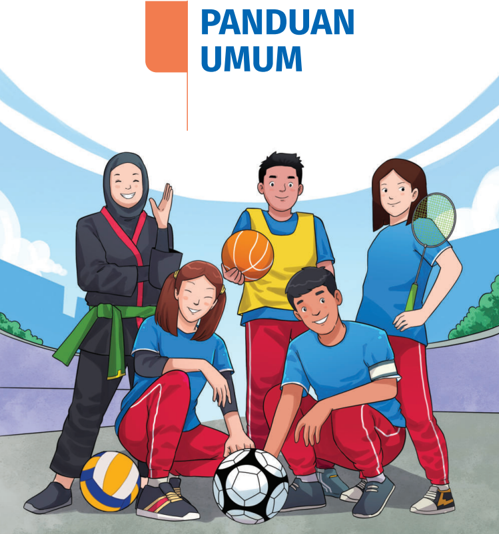
> **[Konteks Visual]**: Gambar ini menampilkan empat orang anak yang sedang bermain olahraga. Mereka semua berdiri di atas lapangan olahraga dengan latar belakang biru cerah dan hijau. Dari kiri ke kanan:

1. Anak pertama adalah seorang perempuan yang mengenakan jubah hitam dengan topi hitam dan merah. Dia sedang menggenggam bola voli dan tersenyum.

2. Anak kedua adalah seorang pria yang mengenakan seragam sepak bola putih dan biru. Dia sedang menggenggam bola sepak dan tersenyum.

3. Anak ketiga adalah seorang perempuan yang mengenakan seragam badminton biru. Dia sedang menggenggam raket badminton dan tersenyum.

4. Anak keempat adalah seorang pria yang mengenakan seragam futsal biru dan merah. Dia sedang menggenggam bola futsal dan tersenyum.

Di atas gambar tersebut terdapat tulisan "PANDUAN UMUM" dalam huruf besar dan warna biru.

### [HALAMAN_18]

## A. Pendahuluan
Pendidikan Jasmani, Olahraga, dan Kesehatan (PJOK) memiliki peran strategis dalam kurikulum pendidikan sebagai upaya pembelajaran yang ditujukan bagi seluruh peserta didik. Tujuannya adalah mengembangkan keterampilan, pengetahuan, pemahaman, serta sikap positif terhadap hidup aktif dan kesehatan. Melalui PJOK, peserta didik didorong untuk menemukan kesenangan dalam aktivitas jasmani dan menjaga kesehatan secara berkelanjutan dalam kehidupan sehari-harinya kini dan nanti.
Kurikulum PJOK dirancang sebagai proses pembelajaran bertahap yang berfokus pada peningkatan keterampilan gerak, konsep, dan strategi. Proses ini dimulai dengan penguasaan dan pengoptimalan keterampilan gerak. Peserta didik yang aktif berpartisipasi dalam kegiatan olahraga atau aktivitas jasmani sepanjang hayat umumnya memiliki keterampilan gerak yang lebih baik, yang mendukung partisipasi aktif mereka dalam berbagai aktivitas jasmani dalam kehidupan sehari-hari.

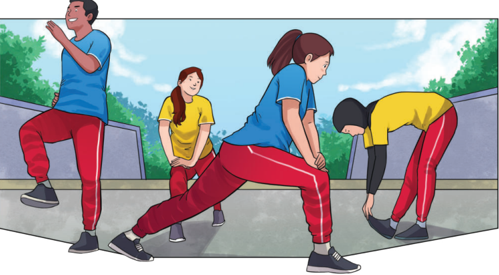
> **[Konteks Visual]**: Gambar ini menunjukkan empat orang yang sedang berolahraga di luar. Mereka semua berdiri dengan posisi yang berbeda: satu orang berdiri dengan kaki samping, satu orang berdiri dengan kaki samping dan tangan di perut, satu orang berdiri dengan kaki samping dan tangan di pinggul, dan satu orang berdiri dengan kaki samping dan tangan di pinggul. Semua orang tersebut mengenakan pakaian olahraga yang sama, yaitu kaos biru dan celana merah. Latar belakangnya adalah area hijau dengan beberapa pohon dan pagar. Udara tampak cerah dan segar.

Panduan Guru Pendidikan Jasmani, Olaharaga, dan Kesehatan untuk SMA/SMK/MA/MAK Kelas XI

### [HALAMAN_19]

## PENTING!
Perubahan utama dalam pembelajaran PJOK saat ini tercermin dalam Capaian Pembelajaran yang diimplementasikan melalui buku PJOK. Buku ini menghadirkan pembelajaran berbasis aktivitas atau cabang olahraga sebagai media (situasi gerak) untuk mengembangkan berbagai aspek, seperti keterampilan gerak, konsep gerak, strategi gerak, perilaku etis, nilai fair play , kebugaran dan kesehatan. Pendekatan ini bertujuan untuk mendorong peserta didik menemukan kesenangan dalam bergerak sekaligus membiasakan pola hidup aktif sepanjang hayat. Peserta didik juga dapat mentransfernya untuk mempelajari dan menguasai jenis keterampilan gerak baru. Dalam pelaksanaannya, guru dan peserta didik memiliki ƽeksibilitas untuk memilih jenis aktivitas atau cabang olahraga yang sesuai dengan kondisi fasilitas, minat peserta didik, dan budaya gerak di lingkungan setempat. Contoh konkret penerapan pendekatan ini dapat dilihat pada bagian strategi alternatif dalam Alur Tujuan Pembelajaran (ATP), yang memberikan panduan langkah-langkah pembelajaran secara lebih terstruktur dan kontekstual.
PJOK tidak hanya berfokus pada kesehatan fisik, tetapi juga mencakup dimensi manfaat kesehatan sebagai bagian penting dari proses pembelajaran. Melalui PJOK, peserta didik dibimbing untuk memahami isu-isu kesehatan serta mengambil keputusan yang tepat terkait gaya hidup sehat. Pembelajaran ini bersifat holistik, mengintegrasikan pengembangan aspek fisik, personal, dan  sosial.  Selain  itu,  interaksi  dalam  aktivitas  gerak  memberikan  ruang bagi penguatan keterampilan sosial, seperti fair play dan kerja tim yang juga mendukung penguasaan keterampilan abad ke-21, termasuk pengambilan keputusan, komunikasi, dan kolaborasi.
Kompetensi yang diperoleh melalui pembelajaran PJOK membentuk satu kesatuan yang kokoh untuk mempersiapkan peserta didik menghadapi tantangan dan perubahan di masa depan. Kompetensi ini tidak hanya bermanfaat bagi kesejahteraan pribadi, tetapi juga memungkinkan peserta didik berkontribusi positif bagi lingkungan sosialnya. Hal ini sejalan dengan tujuan pendidikan secara umum yang menempatkan peserta didik sebagai pusat pembelajaran.
Buku Panduan Guru ini dirancang dengan mengacu pada Capaian Pembelajaran, karakteristik mata pelajaran PJOK, serta tujuan pembelajaran PJOK. Pada fase F, peserta didik memasuki tahap pengembangan keahlian ( Developing Expertise) , yang sesuai dengan model kurikulum PJOK berbentuk berlian (Graham et.all: 2010). Pada fase ini, peserta didik mulai dilatih untuk mengambil keputusan dalam mengembangkan aktivitas gerak sesuai minat dan preferensi mereka.

### [HALAMAN_20]

Proses ini mengedepankan prinsip ' voice , choice , dan ownership '. Peserta didik diberi ruang untuk menyuarakan pendapat, memilih aktivitas yang diminati, dan memiliki rasa kepemilikan terhadap proses pembelajaran. Tentu saja pilihan tidak bersifat terlalu terbuka, melainkan pilihan yang terarah sesuai dengan fasilitas sekolah. Pendekatan ini bertujuan membentuk budaya hidup aktif sepanjang hayat yang dapat diterapkan dalam kehidupan sehari-hari.

## 1. Latar Belakang dan Tujuan Panduan
Buku Panduan Guru PJOK Kelas XI SMA/MA/SMK dirancang untuk mendukung guru dalam mengarahkan peserta didik menggunakan Buku Siswa PJOK Kelas XI  secara  terpadu.  Kedua  buku  ini  saling  melengkapi  dalam  mewujudkan pembelajaran PJOK yang berpusat pada peserta didik ( Student-Centered Learning ) dan berbasis aktivitas.
Panduan ini bertujuan memberikan pedoman praktis dan inspirasi kepada guru dalam melaksanakan pembelajaran PJOK sesuai dengan strategi pembelajaran yang direkomendasikan. Buku ini dilengkapi dengan materi esensial, materi pengayaan, serta uji kompetensi, sehingga dapat membantu guru mengelola proses pembelajaran secara lebih efektif, kontekstual, dan bermakna bagi peserta didik.
Buku Panduan Guru PJOK Kelas XI ini disajikan dalam dua bagian utama, yaitu panduan Umum dan Panduan Khusus.

## a. Panduan Umum
Panduan  Umum  memuat  informasi  penting  untuk  membantu  guru melaksanakan pembelajaran PJOK secara efektif. Bagian ini mencakup beberapa komponen utama sebagai berikut.
Pendahuluan yang berisi latar belakang pembelajaran PJOK, peran PJOK dalam Kurikulum Merdeka, karakteristik dan tujuan pembelajaran PJOK, serta pengembangan Profil Pelajar Pancasila, seperti kemandirian, gotong royong, dan kreativitas.

### [HALAMAN_21]

Capaian Pembelajaran (CP), Tujuan Pembelajaran (TP), dan Alur Tujuan Pembelajaran (ATP) pada fase F yang berfungsi sebagai panduan dalam merencanakan proses pembelajaran secara bertahap dan terstruktur.
Strategi Pembelajaran yang mencakup metode dan pendekatan pembelajaran berbasis aktivitas untuk mendorong partisipasi aktif peserta didik.
Asesmen yang menyediakan panduan dan contoh-contoh bentuk asesmen untuk menilai keterampilan gerak, pengetahuan, dan perilaku peserta didik melalui asesmen formatif dan sumatif. Panduan ini dirancang agar guru dapat melaksanakan pembelajaran PJOK sesuai dengan prinsip Kurikulum secara lebih efektif, terarah, dan kontekstual.

## b. Panduan Khusus
Panduan Khusus dirancang untuk membantu guru mengarahkan pembelajaran pada setiap bab dalam Buku Siswa PJOK Kelas XI SMA/SMK. Panduan ini memberikan strategi pembelajaran yang terperinci untuk setiap bab yang kemudian dipecah ke dalam subbab. Setiap subbab mencakup satu atau lebih aktivitas yang bertujuan membantu peserta didik mencapai capaian pembelajaran yang telah ditentukan.
Bagian ini mencakup beberapa komponen penting, di antaranya pendahuluan yang berisi Tujuan Pembelajaran (TP) dari bab tersebut, posisi bab dalam Alur Tujuan Pembelajaran (ATP), kriteria keberhasilan tujuan pembelajaran, pokok materi, hubungan antar pokok materi, koneksi antara bab dengan materi PJOK lainnya, peta konsep, serta rekomendasi durasi pembelajaran. Selain itu, panduan ini juga mencakup konsep dan keterampilan prasyarat, materi esensial, apersepsi, dan penilaian awal pembelajaran.
Untuk  mendukung  proses  pembelajaran,  disediakan  pula  panduan pembelajaran  untuk  memandu  penggunaan  buku  siswa,  yang  mencakup langkah-langkah pengajaran, strategi pengayaan dan remedial, serta asesmen yang meliputi panduan dan bentuk-bentuk penilaian. Bagian ini juga dilengkapi dengan rubrik penilaian, refleksi pembelajaran, dan sumber belajar utama yang dapat digunakan guru dan peserta didik. Panduan ini bertujuan memberikan kemudahan bagi guru dalam mengelola pembelajaran secara terarah, efektif, dan sesuai dengan capaian pembelajaran.

### [HALAMAN_22]

Dengan model pengaturan yang telah dijelaskan, diharapkan guru dapat lebih mudah memahami berbagai aspek dalam kurikulum PJOK, termasuk tujuan pembelajaran, materi ajar, metode pembelajaran, dan penilaian yang digunakan.
Bagian pertama buku ini memberikan gambaran umum mengenai mata pelajaran PJOK yang sangat penting bagi guru agar dapat memahami materi secara lebih rinci seperti yang dijelaskan di bagian kedua. Pemahaman ini akan membantu guru mencapai tujuan pembelajaran yang diinginkan. Sebaiknya, guru membaca bagian pertama ini di awal setiap semester atau tahun ajaran untuk  merencanakan  pembelajaran  dengan  lebih  baik.  Jika  guru  merasa belum sepenuhnya memahami pada awalnya, disarankan untuk melanjutkan ke bagian kedua terlebih dahulu, dan kemudian kembali ke bagian pertama setelah mempraktikkan beberapa bab di bagian kedua. Dengan membaca secara berulang, diharapkan pemahaman guru terhadap mata pelajaran PJOK akan semakin mendalam. Selain itu, guru juga disarankan untuk terus belajar dengan membaca referensi yang tercantum dalam buku ini atau mencari sumber lain yang relevan untuk memperkaya pengetahuan.

## 2. Tujuan Pembelajaran PJOK
Mata pelajaran PJOK memiliki tujuan sebagai berikut.
Membantu peserta didik mengembangkan, menerapkan, dan mengevaluasi keterampilan gerak dengan penuh kepercayaan diri, kompetensi, dan kreativitas untuk berpartisipasi dalam aktivitas jasmani.
Memberi dukungan dalam memilih gaya hidup sehat dan aktif secara jasmani.
Membangun keterampilan sosial dan emosional melalui pembelajaran nilainilai seperti fair play , kerja tim, dan inklusivitas.
Menanamkan apresiasi dan sikap positif terhadap gaya hidup aktif secara jasmani untuk meningkatkan kualitas hidup secara keseluruhan.

### [HALAMAN_23]

## 3. Profil Pelajar Pancasila
Berikut Profil Pelajar Pancasila yang disertai implementasi atau distribusinya dalam aktivitas pada setiap babnya.

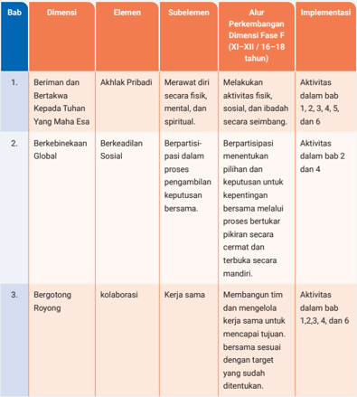
> **[Konteks Visual]**: Tabel ini mungkin berisi informasi tentang dimensi, elemen, subelemen, alur perkembangan dinensi, dan implementasi dalam konteks pendidikan atau pembelajaran. Berikut adalah penjelasan singkat dari setiap kolom:

1. **Bab**: Mungkin merupakan nomor atau judul bab dalam buku atau sumber daya belajar.
2. **Dimensi**: Mungkin merujuk pada aspek atau kategori utama dalam topik tersebut.
3. **Elemen**: Mungkin merujuk pada sub-aspek atau konsep utama dalam dimensi tertentu.
4. **Subelemen**: Mungkin merujuk pada sub-konsep atau detail lebih lanjut dari elemen.
5. **Alur Perkembangan Dinensi Fase F (XI-XII/16-18 tahun)**: Mungkin merujuk pada tahapan perkembangan atau proses pembelajaran dalam periode tersebut.
6. **Implementasi**: Mungkin merujuk pada cara atau metode yang digunakan untuk mengimplementasikan aspek-aspek di atas.

Tabel ini mungkin digunakan untuk membantu dalam pengajaran, evaluasi, atau pengembangan kurikulum.

> **[Konteks Visual]**: Tabel ini mungkin berisi informasi tentang dimensi, elemen, subelemen, alur perkembangan dinensi, dan implementasi dalam konteks pendidikan atau pembelajaran. Berikut adalah penjelasan singkat dari setiap kolom:

1. **Bab**: Mungkin merupakan nomor atau judul bab dalam buku atau sumber daya belajar.
2. **Dimensi**: Mungkin merujuk pada aspek atau kategori utama dalam topik tersebut.
3. **Elemen**: Mungkin merujuk pada sub-aspek atau konsep utama dalam dimensi tertentu.
4. **Subelemen**: Mungkin merujuk pada sub-konsep atau detail lebih lanjut dari elemen.
5. **Alur Perkembangan Dinensi Fase F (XI-XII/16-18 tahun)**: Mungkin merujuk pada tahapan perkembangan atau proses pembelajaran dalam periode tersebut.
6. **Implementasi**: Mungkin merujuk pada cara atau metode yang digunakan untuk mengimplementasikan aspek-aspek di atas.

Tabel ini mungkin digunakan untuk membantu dalam pengajaran, evaluasi, atau pengembangan kurikulum.

Panduan Umum
7

### [HALAMAN_24]

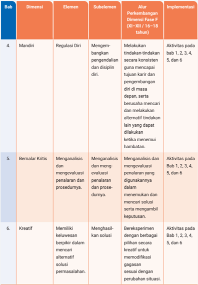
> **[Konteks Visual]**: Tabel ini mungkin merupakan bagian dari sebuah prosedur atau skema untuk mengembangkan dimensi tertentu dalam suatu program atau pendidikan. Berikut adalah penjelasan detail dari setiap baris dalam tabel tersebut:

1. **Bab 4: Mandiri**
   - **Dimensi:** Regulasi Diri
   - **Element:** Mengembangkan pengendalian dan disiplin diri
   - **Subelement:** Melakukan tindakan-tindakan secara konsisten guna mencapai tujuan karir dan pengembangan diri di masa depan, serta berusaha mencari dan melakukan alternatif tindakan lain yang dapat dilakukan ketika menemui hambatan.
   - **Alur Pengetahuan Dimensi Fase F (XI-XII / 16-18 tahun):** Aktivitas pada bab 1, 2, 3, 4, 5, dan 6.

2. **Bab 5: Bernalar Kritis**
   - **Dimensi:** Menganalisis dan mengevaluasi penalaran dan prosedurnya.
   - **Element:** Menganalisis dan meng evaluasi penalaran yang digunakannya dalam menemukan dan mencari solusi serta mengambil keputusan.
   - **Alur Pengetahuan Dimensi Fase F (XI-XII / 16-18 tahun):** Aktivitas pada Bab 1, 2, 3, 4, 5, dan 6.

3. **Bab 6: Kreatif**
   - **Dimensi:** Memiliki keluasan berpikir dalam mencari alternatif solusi permasalahan.
   - **Element:** Menghasilkan solusi dengan berbagai pilihan secara kreatif untuk memodifikasi gagasan sesuai dengan perubahan situasi.
   - **Alur Pengetahuan Dimensi Fase F (XI-XII / 16-18 tahun):** Aktivitas pada Bab 1, 2, 3, 4, 5, dan 6.

Tabel ini mungkin merujuk kepada beberapa bab dalam sebuah buku atau sumber daya belajar yang membahas tentang pengembangan karakteristik individu dalam hal mandiri, bernalar kritis, dan kreatif. Setiap baris dalam tabel

> **[Konteks Visual]**: Tabel ini mungkin merupakan bagian dari sebuah prosedur atau skema untuk mengembangkan dimensi tertentu dalam suatu program atau pendidikan. Berikut adalah penjelasan detail dari setiap baris dalam tabel tersebut:

1. **Bab 4: Mandiri**
   - **Dimensi:** Regulasi Diri
   - **Element:** Mengembangkan pengendalian dan disiplin diri
   - **Subelement:** Melakukan tindakan-tindakan secara konsisten guna mencapai tujuan karir dan pengembangan diri di masa depan, serta berusaha mencari dan melakukan alternatif tindakan lain yang dapat dilakukan ketika menemui hambatan.
   - **Alur Pengetahuan Dimensi Fase F (XI-XII / 16-18 tahun):** Aktivitas pada bab 1, 2, 3, 4, 5, dan 6.

2. **Bab 5: Bernalar Kritis**
   - **Dimensi:** Menganalisis dan mengevaluasi penalaran dan prosedurnya.
   - **Element:** Menganalisis dan meng evaluasi penalaran yang digunakannya dalam menemukan dan mencari solusi serta mengambil keputusan.
   - **Alur Pengetahuan Dimensi Fase F (XI-XII / 16-18 tahun):** Aktivitas pada Bab 1, 2, 3, 4, 5, dan 6.

3. **Bab 6: Kreatif**
   - **Dimensi:** Memiliki keluasan berpikir dalam mencari alternatif solusi permasalahan.
   - **Element:** Menghasilkan solusi dengan berbagai pilihan secara kreatif untuk memodifikasi gagasan sesuai dengan perubahan situasi.
   - **Alur Pengetahuan Dimensi Fase F (XI-XII / 16-18 tahun):** Aktivitas pada Bab 1, 2, 3, 4, 5, dan 6.

Tabel ini mungkin merujuk kepada beberapa bab dalam sebuah buku atau sumber daya belajar yang membahas tentang pengembangan karakteristik individu dalam hal mandiri, bernalar kritis, dan kreatif. Setiap baris dalam tabel

8
Panduan Guru Pendidikan Jasmani, Olaharaga, dan Kesehatan
untuk SMA/SMK/MA/MAK Kelas XI

### [HALAMAN_25]

## B. Capaian Pembelajaran

## 1. Karakteristik Mata Pelajaran
Karakteristik Mata Pelajaran Pendidikan Jasmani, Olahraga, dan Kesehatan (PJOK) memiliki tujuh poin penting.
Menggunakan pendekatan holistik dalam memaknai well-being . Meskipun penamaan mata pelajaran ini mengisyaratkan fokus pada jasmani, PJOK membahas juga aspek-aspek mental, sosial, emosional, dan karakter, serta keterkaitan dimensi-dimensi tersebut.
Menekankan pembelajaran aktif dan pembelajaran yang berpusat pada peserta didik. Terdapat pergeseran dari situasi pembelajaran dengan guru sebagai satu-satunya otoritas, menjadi pembelajaran yang turut diarahkan oleh peserta didik dan lebih kolaboratif. Pendekatan pembelajaran ini menempatkan peserta  didik  sebagai  pusat  dari  proses  pembelajaran, menekankan partisipasi aktif, mengembangkan otonomi, dan kepemilikan terhadap pembelajaran mereka sendiri.
Memfasilitasi pengalaman belajar yang dapat mengembangkan keterampilan. Pengalaman belajar ini dimulai dengan mengenalkan peserta didik dengan keterampilan gerak fundamental, mengelaborasi berbagai keterampilan gerak, dan mengembangkan keterampilan gerak spesifik yang diperlukan untuk merespons berbagai aktivitas jasmani.
Menanamkan tanggung jawab dan perilaku belajar sepanjang hayat untuk berkomitmen terhadap aktivitas jasmani dan kesehatan. Peserta didik belajar untuk menetapkan tujuan yang hendak dicapai, bertanggungjawab terhadap kesehatannya sendiri dan orang-orang di sekitarnya, dan mengembangkan sikap  positif  terhadap  aktivitas  jasmani.  Aktivitas  pembelajaran  juga mendorong mereka untuk bekerja secara kolaboratif, berkomunikasi secara efektif, dan mempertunjukkan sikap hormat dan peduli dalam konteks gerak dan kehidupan sehari-hari.

### [HALAMAN_26]

Mendorong keterampilan berpikir kritis dan pemecahan masalah. Peserta didik menganalisis pola gerak, mengevaluasi strategi, mengambil keputusan selama aktivitas jasmani, dan menerapkan teknik pemecahan masalah untuk mengatasi masalah dan meningkatkan penampilan gerak.
Menciptakan lingkungan yang inklusif dan menghargai perbedaan individu. Pembelajaran PJOK mendorong partisipasi semua peserta didik tanpa terkecuali dan mengembangkan lingkungan yang aman, suportif, dan bebas dari diskriminasi.
Memfasilitasi refleksi dan penilaian otentik. PJOK memberikan kesempatan peserta didik untuk merenungkan proses dan hasil belajarnya, mengevaluasi penampilan mereka sendiri dan orang lain, menetapkan tujuan untuk meningkatkan, dan mengembangkan strategi pemantauanya.

### [HALAMAN_25]

### [HALAMAN_26]

## 2. Capaian Pembelajaran Fase F
Capaian Pembelajaran (CP) adalah standar pencapaian yang diharapkan peserta didik raih pada akhir setiap fase pembelajaran. CP yang disusun untuk memenuhi kebutuhan kompetensi peserta didik terbagi ke dalam beberapa fase, sesuai dengan jenjang pendidikan.
Fase Fondasi: Pendidikan Anak Usia Dini (PAUD)/RA
Fase A: Kelas I-II SD/MI/Paket A/sederajat
Fase B: Kelas III-IV SD/MI/Paket A/sederajat
Fase C: Kelas V-VI SD/MI/Paket A/sederajat
Fase D: Kelas VII-IX SMP/MTs/Paket B/sederajat
Fase E: Kelas X SMA/SMK/MA/MA K/Paket C/sederajat
Fase F: Kelas XI-XII SMA/MA/Paket C/sederajat dan SMK/MAK program 3 (tiga) tahun; dan Kelas XI-XIII SMK/MAK program 4 (empat) tahun
Peserta didik yang memiliki kebutuhan khusus dengan hambatan intelektual dapat menggunakan CP Pendidikan Khusus, sementara peserta didik dengan kebutuhan khusus tanpa hambatan intelektual dapat menggunakan CP umum dengan menerapkan prinsip-prinsip modifikasi kurikulum.

### [HALAMAN_27]

Termasuk dalam mata pelajaran PJOK Capaian Pembelajaran dimulai dari Fase A hingga Fase F. Pada mata pelajaran PJOK, capaian pembelajaran terdiri atas 4 elemen sebagai berikut.

## a. Elemen Terampil Bergerak
Elemen ini merujuk pada pembelajaran keterampilan gerak (fundamental dan spesifik) yang esensial untuk dapat terlibat dalam aktivitas jasmani dan gaya hidup sehat. Peserta didik juga menerapkan konsep dan strategi gerak untuk meningkatkan penampilan dan bergerak dengan kompeten dan serta kepercayaan diri. Konten dan aktivitas pembelajaran ini beragam jenis sesuai dengan minat peserta didik, kebutuhan dan tempat tinggal mereka. Beberapa contohnya termasuk permainan tradisional, olahraga individu maupun tim, bela diri, permainan kooperatif, latihan kebugaran, aktivitas luar ruang dan petualangan. Terampil bergerak bertujuan untuk membangun fondasi dasar keterampilan motorik dan literasi jasmani, memperoleh dan menghaluskan berbagai keterampilan aktivitas jasmani, dan pada akhirnya menjadi mumpuni dalam aktivitas jasmani yang menjadi minat dan kegemaran masing-masing. Pengalaman pembelajaran dalam elemen ini harus memaksimalkan waktu belajar untuk menerapkan dan mempraktikkan gerak.

## b. Belajar melalui Gerak
Konten PJOK dalam elemen ini difokuskan pada keterampilan personal dan sosial yang dikembangkan melalui partisipasi dalam gerak dan aktivitas jasmani.  Keunikan PJOK dalam memfasilitasi keterampilan ini adalah melalui pembelajaran yang menekankan fair play dan kerja tim. Potensi yang dapat dicapai adalah keterampilan komunikasi, kerja sama, pengambilan keputusan, pemecahan masalah, berpikir kritis dan kreatif, kolaborasi, dan kepemimpinan. Aktivitasnya meliputi pembelajaran secara mandiri maupun berkelompok untuk menampilkan gerak atau memecahkan masalah gerak. Pengalaman belajar peserta didik juga dapat dikembangkan melalui pembelajaran pengambilan berbagai peran dalam konteks olahraga dan aktivitas jasmani.

### [HALAMAN_28]

## c. Bergaya Hidup Aktif
Elemen ini menitikberatkan pada promosi gaya hidup aktif dan mengembangkan kapasitas peserta didik untuk merancang, menerapkan, dan mengevaluasi kebugaran mereka sendiri. Tujuannya adalah untuk membekali mereka dengan pengetahuan, keterampilan, dan sikap yang dibutuhkan untuk mengambil keputusan yang tepat tentang pilihan aktivitas jasmani dan memprioritaskan keseluruhan kesehatan dan well-being mereka. Konten dalam elemen ini mencakup manfaat hidup aktif dan partisipasi dalam aktivitas  jasmani  untuk  kebugaran. Peserta didik juga belajar tentang aspek-aspek perilaku yang terkait dengan aktivitas fisik yang teratur dan mengembangkan disposisi yang akan mendorong mereka menjadi individu yang aktif.

## d. Memilih Hidup yang Menyehatkan
Elemen memilih hidup sehat menekankan pentingnya menentukan pilihan positif yang terkait dengan kesehatan. Kompetensi ini dimungkinkan ketika peserta didik memiliki kapasitas literasi kesehatan, yakni mendapatkan, memahami, dan menerapkan informasi dan layanan kesehatan dalam rangka mempromosikan dan menjaga kesehatan. Area konten yang dapat dicakup dalam elemen ini meliputi nutrisi dan pola makan sehat, kebugaran dan aktivitas fisik, lingkungan dan masyarakat yang sehat, serta keselamatan dan pencegahan cedera.
Pada akhir Fase F, peserta didik menerapkan dan mengevaluasi keterampilan gerak spesifik, konsep gerak, dan strategi gerak dalam berbagai situasi gerak baru yang menantang untuk meningkatkan kinerja gerak. Peserta didik memperagakan dan mengevaluasi fair play , perilaku etis, pendekatan kepemimpinan, dan strategi kolaborasi dalam berbagai konteks gerak. Mereka mengevaluasi efektivitas strategi peningkatan partisipasi dan aktivitas kebugaran untuk kesehatan.
Secara lebih rinci capaian pembelajaran dijabarkan dalam setiap elemen sebagai berikut.

### [HALAMAN_29]

## Elemen Terampil Bergerak
Peserta didik merancang, menerapkan, menghaluskan, dan mengevaluasi keterampilan gerak spesiƼk di dalam berbagai situasi gerak yang menantang untuk meningkatkan kinerja gerak. Peserta didik menciptakan, mengembangkan, dan mengevaluasi strategi gerak untuk mendapatkan keberhasilan capaian keterampilan gerak melintasi berbagai situasi gerak yang menantang. Peserta didik menerapkan konsep gerak di dalam situasi gerak baru yang menantang dan mengevaluasi dampak tiap konsep pada capaian keterampilan gerak.

## Elemen Belajar melalui Gerak
Peserta didik mengadaptasi dan mengevaluasi strategi gerak yang telah dikuasai dalam situasi gerak baru yang menantang. Peserta didik mengevaluasi fair play dan mereƽeksikan pengaruh perilaku etis terhadap capaian aktivitas jasmani bagi individu dan kelompok. Peserta didik merancang dan mengevaluasi strategi pengambilan keputusan dalam kerja tim yang mempertunjukkan keterampilan kepemimpinan dan kolaborasi.

## Elemen Bergaya Hidup Aktif
Peserta didik berpartisipasi dalam aktivitas kebugaran dan mengevaluasi dampak partisipasi yang teratur terhadap kesehatan. Peserta didik berpartisipasi dalam aktivitas kebugaran di luar ruang dan/atau lingkungan alam, dan mengevaluasi strategi peningkatan pemanfaatannya. Peserta didik mengevaluasi efektivitas strategi peningkatan aktivitas kebugaran untuk kesehatan.

## Elemen Memilih Hidup yang Menyehatkan
Peserta didik mengadvokasi gaya hidup aktif dan sehat melalui aktivitas jasmani menggunakan berbagai media, mengadvokasi makanan sehat dan bergizi seimbang kepada orang lain sesuai kebutuhan aktivitas jasmaninya, dan mempraktikkan tindakan Resusitasi Jantung-Paru (RJP) sesuai Prosedur Operasional Standar (POS) sebagai upaya penyelamatan hidup.

### [HALAMAN_30]

## 3. Tujuan Pembelajaran (TP) Per Fase
Setelah memahami Capaian Pembelajaran (CP), guru perlu merencanakan materi yang harus dipelajari oleh peserta didik di setiap fase. Pada tahap ini, guru meng  identifikasi kata kunci dari CP untuk merumuskan Tujuan Pembelajaran (TP). TP ini harus dapat dicapai oleh peserta didik dalam satu atau lebih sesi pembelajaran, agar mereka dapat memenuhi CP di akhir fase tersebut.
Pada tahap merumuskan TP, guru sebaiknya tidak terlalu fokus pada urutan tujuan, tetapi lebih mengutamakan penyusunan tujuan yang jelas dan dapat diukur. Urutan tujuan akan disesuaikan pada tahap berikutnya. Dengan cara ini, guru dapat merancang rencana pembelajaran secara bertahap dan terstruktur.
Penulisan tujuan pembelajaran mencakup dua komponen utama berikut.
Kompetensi: kemampuan atau keterampilan yang perlu ditunjukkan atau didemonstrasikan oleh peserta didik dapat dijelaskan dengan menggunakan pertanyaan panduan untuk guru, seperti:
Kemampuan apa yang harus peserta didik tampilkan secara jelas?
Tahapan berpikir seperti apa yang perlu mereka tunjukkan selama proses pembelajaran?
Lingkup materi: konten dan konsep utama yang perlu dipahami oleh peserta didik pada akhir setiap unit pembelajaran dapat diidentifikasi dengan pertanyaan panduan untuk guru, seperti:
Apa saja hal-hal penting yang harus dipelajari dari konsep besar yang tercakup dalam Capaian Pembelajaran (CP)?
Guru memiliki beberapa pilihan untuk merumuskan tujuan pembelajaran.
Menyusun tujuan pembelajaran langsung dari CP.
Menyusun tujuan pembelajaran dengan menganalisis 'kompetensi' dan 'lingkup materi' dalam CP.
Menyusun tujuan pembelajaran yang mencakup berbagai elemen dalam CP.

### [HALAMAN_31]

Tujuan pembelajaran mata pelajaran PJOK dapat dikembangkan oleh guru yang disesuaikan dengan karakteristik peserta didik dan satuan pendidikan. Berikut ini adalah contoh pembuatan tujuan pembelajaran PJOK pada Fase F.

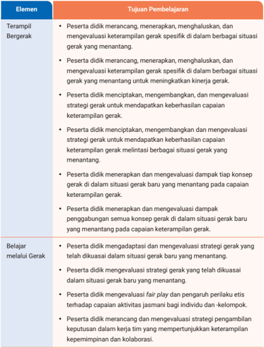
> **[Konteks Visual]**: Tabel ini berisi informasi tentang tujuan pembelajaran dalam konteks pengembangan keterampilan gerak. Tabel ini terdiri dari dua kolom utama: "Elemen" dan "Tujuan Pembelajaran". 

- Kolom "Elemen" mencakup beberapa poin yang mungkin melibatkan proses atau aspek tertentu dalam pembelajaran:
  - Terampil Bergerak
  - Belajar Melalui Gerak

- Kolom "Tujuan Pembelajaran" menyajikan tujuan yang ingin dicapai oleh peserta didik dalam setiap elemen tersebut:
  - Peserta didik merancang, menerapkan, menghaluskan, dan mengevaluasi keterampilan gerak spesifik di dalam berbagai situasi gerak yang menantang.
  - Peserta didik merancang, menerapkan, menghaluskan, dan mengevaluasi keterampilan gerak spesifik di dalam berbagai situasi gerak yang menantang untuk meningkatkan kinerja gerak.
  - Peserta didik menciptakan, mengembangkan, dan mengevaluasi strategi gerak untuk mendapatkan keberhasilan capaian keterampilan gerak.
  - Peserta didik menciptakan, mengembangkan, dan mengevaluasi strategi gerak untuk mendapatkan keberhasilan capaian keterampilan gerak.
  - Peserta didik merancang, menerapkan, menghaluskan, dan mengevaluasi keterampilan gerak spesifik di dalam berbagai situasi gerak yang menantang.
  - Peserta didik merancang, menerapkan, menghaluskan, dan mengevaluasi keterampilan gerak spesifik di dalam berbagai situasi gerak yang menantang untuk meningkatkan kinerja gerak.
  - Peserta didik merancang, menerapkan, menghaluskan, dan mengevaluasi keterampilan gerak spesifik di dalam berbagai situasi gerak yang menantang.
  - Peserta didik merancang, menerapkan, menghaluskan, dan mengevaluasi keterampilan gerak spesifik di dalam berbagai situasi gerak yang menant

### [HALAMAN_32]

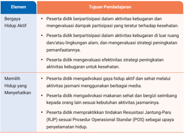
> **[Konteks Visual]**: Tabel ini berisi dua kolom utama: "Elemen" dan "Tujuan Pembelajaran". Kolom "Elemen" mencakup dua baris, yaitu "Bergaya Hidup Aktif" dan "Memilih Hidup yang Menyehatkan". Kolom "Tujuan Pembelajaran" menyajikan tujuan pembelajaran untuk setiap elemen tersebut.

1. Untuk elemen "Bergaya Hidup Aktif":
   - Peserta dididik berpartisipasi dalam aktivitas kebugaran dan mengevaluasi dampak partisipasi yang terbatas terhadap kesehatan.
   - Peserta dididik berpartisipasi dalam aktivitas kebugaran di luar ruang dan/atau lingkungan alam, dan mengevaluasi strategi peningkatan pemanfaatannya.
   - Peserta dididik mengevaluasi efektivitas strategi peningkatan aktivitas kebugaran untuk kesehatan.

2. Untuk elemen "Memilih Hidup yang Menyehatkan":
   - Peserta dididik mengadvokasi gaya hidup aktif dan sehat melalui aktivitas jasmani menggunakan berbagai media.
   - Peserta dididik mengadvokasi makanan sehat dan bergizi seimbang kepada orang lain sebagai upaya keberhasilan aktivitas jasmani.
   - Peserta dididik tidak praktisikan tindakan Resesusi Jantung-Paru (RJP) sesuai Prosedur Operasional Standar (POS) sebagai upaya penyelamatan hidup.

Tabel ini memberikan panduan tentang tujuan pembelajaran yang ingin dicapai dalam program edukasi kesehatan, dengan fokus pada aktivitas fisik dan pola makan yang sehat.

## 4. Alur Tujuan Pembelajaran (ATP) Per Fase
Jika Capaian Pembelajaran (CP) merujuk pada kemampuan yang harus dimiliki peserta didik di akhir setiap fase, maka Alur Tujuan Pembelajaran (ATP) adalah urutan Tujuan Pembelajaran (TP) yang disusun secara teratur dan logis dalam fase pembelajaran. Tujuan dari ATP agar peserta didik dapat mencapai capaian pembelajaran tersebut. Dengan demikian, setelah merumuskan TP, langkah selanjutnya dalam merencanakan pembelajaran adalah menyusun ATP.
Guru dapat menggunakan ATP yang mereka susun sendiri berdasarkan CP,  mengembangkan dan menyesuaikan contoh ATP yang telah ada, atau menggunakan contoh ATP yang disediakan oleh pemerintah. Bagi guru yang menyusun ATP sendiri, tujuan pembelajaran yang telah dirumuskan sebelumnya diorganisir dalam urutan yang terstruktur dan logis, dimulai dari awal hingga akhir fase. ATP harus disusun secara linear, berjalan satu arah, dan tidak bercabang, menggambarkan rangkaian kegiatan pembelajaran yang dilakukan secara bertahap dari hari ke hari. Berikut contoh ATP untuk mata pelajaran PJOK Fase F dalam buku ini.

### [HALAMAN_33]

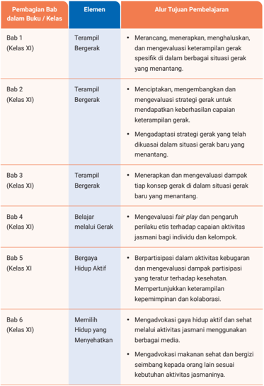
> **[Konteks Visual]**: Tabel ini menunjukkan struktur pembelajaran dalam buku atau kelas untuk kelas XI. Tabel ini terdiri dari enam bab dengan berbagai elemen dan tujuan pembelajaran yang ditetapkan. Bab 1 fokus pada gerak yang menantang, Bab 2 tentang strategi gerak, Bab 3 tentang dampak konsep gerak baru, Bab 4 tentang fair play dan pengaruh perilaku, Bab 5 tentang partisipasi dalam kegiatan kesehatan, dan Bab 6 tentang advokasi gaya hidup dan makanan sehat. Setiap bab memiliki tujuan pembelajaran yang spesifik untuk mencapai tujuan akhir yang lebih besar.

### [HALAMAN_34]

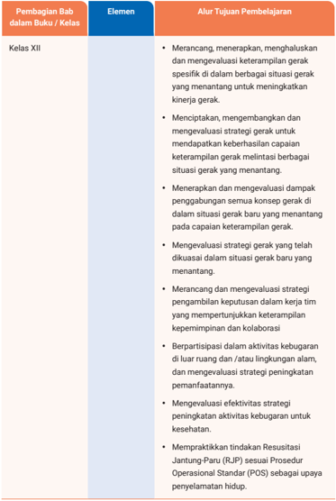
> **[Konteks Visual]**: Tabel ini mungkin merupakan bagian dari sebuah kurikulum atau pedoman pembelajaran yang menggambarkan pembagian bab dalam buku atau kelas untuk kelas XII. Tabel tersebut mencakup beberapa elemen utama:

1. Pembagian Bab dalam Buku/Kelas: Ini mungkin merujuk pada bagaimana materi pembelajaran di kelas XII dibagi menjadi beberapa bab atau topik.

2. Elemen: Ini mungkin merujuk pada berbagai aspek atau keterampilan yang harus dipelajari dalam setiap bab.

3. Alur Tujuan Pembelajaran: Ini mungkin menunjukkan langkah-langkah atau tujuan-tujuan yang ingin dicapai dalam pembelajaran tersebut.

4. Kebijakan: Ini mungkin merujuk pada kebijakan atau standar yang harus dipatuhi dalam proses pembelajaran.

5. Keterampilan: Ini mungkin merujuk pada keterampilan atau kemampuan yang harus dipelajari dalam setiap bab.

6. Keterampilan: Ini mungkin merujuk pada keterampilan atau kemampuan yang harus dipelajari dalam setiap bab.

7. Keterampilan: Ini mungkin merujuk pada keterampilan atau kemampuan yang harus dipelajari dalam setiap bab.

8. Keterampilan: Ini mungkin merujuk pada keterampilan atau kemampuan yang harus dipelajari dalam setiap bab.

9. Keterampilan: Ini mungkin merujuk pada keterampilan atau kemampuan yang harus dipelajari dalam setiap bab.

10. Keterampilan: Ini mungkin merujuk pada keterampilan atau kemampuan yang harus dipelajari dalam setiap bab.

11. Keterampilan: Ini mungkin merujuk pada keterampilan atau kemampuan yang harus dipelajari dalam setiap bab.

12. Keterampilan: Ini mungkin merujuk pada keterampilan atau kemampuan yang harus dipelajari dalam setiap bab.

13. Keterampilan: Ini mungkin merujuk pada keterampilan atau kemampuan yang harus dipelajari dalam setiap bab.

14. Keterampilan: Ini mungkin merujuk pada keterampilan

### [HALAMAN_35]

## 5. Penjelasan Membuat ATP Alternatif Sesuai dengan Kondisi Peserta Didik
Alur Tujuan Pembelajaran (ATP) di atas adalah contoh yang digunakan dalam menggunakan Buku Siswa PJOK Kelas XI SMA/SMK. Beberapa alternatif yang dapat dilakukan guru dalam menyusun Alur Tujuan Pembelajaran PJOK Fase F Kelas XI SMA/SMK antara lain sebagai berikut ini.
Guru dapat menggunakan contoh alur tujuan pembelajaran yang sudah tersedia, menyesuaikan, dan memodifikasi contoh tersebut sesuai dengan kebutuhan peserta didik serta karakteristik dan kesiapan satuan pendidikan.
Selain itu, guru juga dapat menyusun alur tujuan pembelajaran sendiri sesuai dengan kondisi satuan pendidikan.
Tidak ada format baku yang ditetapkan oleh pemerintah, sehingga komponen alur tujuan pembelajaran dapat disesuaikan agar mudah digunakan dalam merancang pembelajaran PJOK di satuan pendidikan.

## Contoh Implementasi Alternatif ATP yang Disesuaikan
Implementasi ATP disesuaikan dengan jenis aktivitas/olahraga yang dipilih berdasarkan sarana prasarana, minat, dan kultur gerak. Sebagai contoh satuan pendidikan menentukan untuk 1 tahun pembelajaran, peserta didik mempelajari bola voli. Maka guru menyajikan pembelajaran bola voli sebagai berikut.
Pertemuan 1 - 8 Pembelajaran mengoptimalkan keterampilan gerak dalam permainan bola voli.
Pertemuan 9 - 16 Pembelajaran menyempurnakan strategi gerak berupa keterampilan taktis dalam bermain bola voli dan pengembangan perilaku etis dan fairplay pada saat bermain.
Pertemuan 17 - 24 Pembelajaran penerapan dampak konsep gerak, seperti cara bergerak secara efektif, arah gerakan, besaran usaha yang diperlukan, dan partner melakukan gerakan.

### [HALAMAN_36]

Pertemuan 25 - 32 Pembelajaran perancangan dan penerapan aktivitas untuk mengembangkan kebugaran jasmani diri melalui berbagai aktivitas latihan dan bermain bola voli.
Pertemuan 33 - 36 Pembelajaran mengadvokasi risiko kesehatan akibat kurangnya aktivitas fisik dan gizi dalam makanan yang mendukung aktivitas fisik/bermain bola voli.

### [HALAMAN_35]

### [HALAMAN_36]

Alokasi pertemuan tersebut hanyalah contoh dan dapat disesuaikan dengan kebutuhan peserta didik. Guru juga dapat menentukan lebih dari satu jenis aktivitas/cabang olahraga.

## C. Strategi Mencapai Tujuan Pembelajaran
Tujuan pembelajaran ( goals) adalah sasaran yang ingin dicapai oleh peserta didik dalam aktivitas pembelajaran. Untuk mencapai tujuan tersebut, diperlukan strategi yang tepat agar pembelajaran dapat berlangsung secara efektif. Beberapa strategi yang perlu diterapkan untuk mencapai tujuan pembelajaran PJOK pada Fase F Kelas XI, antara lain menetapkan kriteria keberhasilan tujuan pembelajaran dan tujuan pembelajaran harian ( objective ), menentukan asesmen yang sesuai, serta menggunakan berbagai pendekatan atau metode dalam menjalankan langkahlangkah pembelajaran.
Berikut beberapa strategi yang dapat digunakan dalam mencapai tujuan pembelajaran pada Buku Siswa PJOK Kelas XI.

## 1. Strategi Mencapai Tujuan Pembelajaran dalam Bab 1-5
Untuk mencapai tujuan pembelajaran setiap bab, strategi yang dapat diterapkan meliputi beberapa tahapan dan pendekatan yang terstruktur. Berikut adalah beberapa strategi yang dapat digunakan.

## a. Pemahaman Teori dan Konsep
Peserta didik mengeksplorasi berbagai konsep dan teori melalui pertanyaan pemantik atau dengan menyajikan deskripsi fakta dan narasi disertai dengan aktivitas praktik. Peserta didik belajar memahami bahwa memiliki keterampilan gerak yang baik tidak hanya berguna untuk menjadi atlet, tetapi juga penting untuk meningkatkan partisipasi dan menikmati aktivitas jasmani dalam kehidupan sehari-hari.

### [HALAMAN_37]

## b. Latihan Terstruktur
Peserta didik melakukan berbagai bentuk latihan yang terstruktur, dimulai dari latihan yang sederhana, kemudian berlanjut ke latihan yang lebih menantang, serta memberikan kesempatan untuk menciptakan gerakan baru serta berperan dalam mengambil berbagai keputusan gerak maupun bentuk latihan.

## c. Pembelajaran Berbasis Praktik
Peserta didik menerapkan konsep dan teori yang telah dipahami dalam praktik, serta memberikan pengalaman kontekstual yang dapat mendukung proses perbaikan dan penyempurnaan keterampilan gerak.

## d. Pembelajaran Tidak Disengaja
Peserta  didik  mengeksplorasi  berbagai  cara  dan  bentuk  latihan,  serta memungkinkan mereka untuk belajar dari kesalahan dan memperbaikinya secara alami dalam proses pembelajaran.

## e. Diskusi dan Analisis
Peserta didik mendiskusikan dan menganalisis hubungan antara konsep, teori, dan pengalaman gerak yang mereka alami selama latihan, dengan tujuan untuk menemukan atau menentukan rencana perbaikan yang berkelanjutan.

## f. Latihan Berulang dan Umpan Balik
Peserta didik berlatih secara berulang sambil memberikan umpan balik konstruktif. Umpan balik ini dapat diberikan langsung oleh guru, oleh teman sekelas, atau bahkan memberikan kesempatan bagi peserta didik untuk memberikan umpan balik kepada diri mereka sendiri.

## g. Pengembangan Kreativitas
Peserta didik mengembangkan kreativitas dalam latihan yang sesuai dengan pengembangan kemampuan pribadi. Selain itu, guru juga memberikan banyak peluang bagi peserta didik untuk mengambil keputusan, baik secara individu maupun kelompok.

### [HALAMAN_38]

## 2. Strategi Mencapai Tujuan Pembelajaran dalam Bab 6
Pada bab 6, materi yang dibahas berkaitan dengan mengadvokasi kesehatan pribadi, sosial, dan sekitar yang memiliki karakteristik berbeda dengan bab 1-5 yang didominasi aktivitas fisik, sehingga beberapa strategi yang dapat digunakan untuk mencapai tujuan pembelajaran pada bab tersebut berbeda. Berikut strategi yang dapat dilakukan khusus pada bab 6.

## a. Penguatan teori dan konsep
Peserta  didik  mengeksplorasi,  menggunakan  berbagai  media  seperti presentasi, video, diskusi kelompok, dan memberikan studi kasus nyata atau simulasi yang menggambarkan risiko kesehatan akibat gaya hidup tertentu, serta mengidentifikasi dan mengevaluasi risiko tersebut. Peserta didik juga dapat mengembangkan kemampuan mengadvokasi dengan mendorong mereka untuk merancang kampanye atau inisiatif yang mempromosikan gaya hidup sehat kepada teman-teman mereka, serta mengedukasi lingkungan sekitar tentang pentingnya menjaga kesehatan melalui perubahan pola hidup.

## b. Aktivitas Pembelajaran yang Bervariasi
Peserta didik dibagi menjadi beberapa kelompok untuk merencanakan program pencegahan kesehatan yang berfokus pada perubahan gaya hidup dan peningkatan aktivitas fisik, serta makanan yang mendukung aktivitas fisik. Hal ini juga dapat mencakup sesi refleksi untuk menentukan bentuk strategi advokasi yang digunakan untuk membawa perubahan gaya hidup yang lebih sehat.

## c. Mempromosikan gaya hidup di media sosial
Peserta didik berkesempatan untuk menggunakan berbagai media, seperti desain poster, pembuatan video, dan teknik presentasi untuk mengadvokasi orang lain. Peserta didik membuat kampanye promosi gaya hidup sehat menggunakan media pilihan mereka untuk disebarkan kepada teman sekelas atau dipublikasikan di media sosial sekolah.
Beberapa strategi tersebut merupakan contoh yang dapat dikembangkan sesuai dengan karakteristik peserta didik dan berbagai daya dukung yang ada di masing-masing satuan pendidikan.

### [HALAMAN_39]

## D.  Asesmen
Perencanaan pembelajaran dengan menggunakan metode backward design dimulai dengan menetapkan tujuan pembelajaran terlebih dahulu, kemudian menentukan bagaimana cara mengukur pencapaian tujuan tersebut melalui asesmen, dan baru setelah itu menyusun langkah-langkah pembelajaran atau aktivitas yang akan dilakukan oleh peserta didik. Dengan demikian, asesmen menjadi  salah  satu  elemen  yang  sangat  penting  dalam  perencanaan  dan pelaksanaan pembelajaran, karena berfungsi sebagai alat untuk memastikan bahwa tujuan pembelajaran dapat tercapai dengan efektif.
Dalam pembelajaran PJOK, asesmen mencakup tiga komponen utama, yaitu psikomotor, kognitif, dan afektif yang dievaluasi melalui aktivitas jasmani. Asesmen pembelajaran tidak hanya berfungsi sebagai pelaporan administratif, tetapi juga sebagai sumber informasi penting untuk merancang pembelajaran yang sesuai dengan kebutuhan peserta didik. Hal ini sangat penting untuk mendukung pembelajaran berdiferensiasi, yang berfokus pada perkembangan peserta didik secara menyeluruh. Bahkan, Andrew Miller (2016) meyakini bahwa dengan memanfaatkan praktik-praktik terbaik dalam asesmen formatif, pembelajaran berdiferensiasi dapat diimplementasikan dengan pendekatan yang berbasis bukti dan alamiah.
Selain itu, buku ini juga menyajikan berbagai bentuk asesmen otentik dalam pembelajaran PJOK. Tujuan utama pembelajaran PJOK adalah mengembangkan keterampilan gerak peserta didik dalam situasi nyata, serta meningkatkan kepercayaan diri dan motivasi mereka untuk berpartisipasi dalam aktivitas fisik di luar sekolah. Untuk mencapai tujuan tersebut, dibutuhkan asesmen otentik yang dapat mengukur kemampuan peserta didik dalam menerapkan pengetahuan dan keterampilan mereka dalam konteks dunia nyata. Asesmen ini melibatkan observasi langsung, proyek berbasis aktivitas fisik, dan evaluasi kontinu untuk menilai kemajuan peserta didik dalam aspek fisik, sosial, dan emosional.

### [HALAMAN_40]

## 1. Jenis Asesmen
Beberapa ahli, seperti Jacalyn Lea Lund, Metzler, Hastie, dan Martin, menekankan pentingnya asesmen berbasis kinerja, yang tidak hanya mengukur keterampilan fisik, tetapi juga pengetahuan dan sikap dalam aktivitas nyata. Asesmen tersebut berfungsi sebagai alat untuk memperbaiki proses pembelajaran dan merupakan bagian integral dari pengalaman belajar itu sendiri. Sebagai contoh, dalam aktivitas melempar bola pitching dalam softball , asesmen tidak dilakukan dengan cara meletakkan sasaran, melainkan dengan menghadapi pemukul yang sebenarnya, hal ini lebih menggambarkan situasi dunia nyata.
Berdasarkan hal-hal tersebut, asesmen dalam buku panduan guru PJOK kelas XI SMA/SMK ini mencakup asesmen formatif, baik asesmen awal maupun proses, serta asesmen sumatif untuk mengukur ketercapaian tujuan pembelajaran serta mendukung pembelajaran berdiferensiasi. Dalam konteks pembelajaran berdiferensiasi, asesmen ini difokuskan pada proses belajar peserta didik yang dapat bervariasi, meskipun mereka terlibat dalam aktivitas yang sama. Berikut penjelasan mengenai asesmen yang digunakan dalam buku ini.

## a. Asesmen Formatif
Asesmen formatif bertujuan untuk memantau dan memperbaiki proses pembelajaran serta menilai pencapaian tujuan belajar. Asesmen ini membantu mengidentifikasi kebutuhan belajar peserta didik, hambatan yang dihadapi, dan perkembangan mereka. Informasi yang diperoleh dari asesmen ini menjadi umpan balik bagi peserta didik dan guru. Asesmen formatif dibagi menjadi dua jenis berdasarkan waktu pelaksanaannya.

## 1) Awal Pembelajaran
Asesmen di awal pembelajaran dilakukan untuk mengukur kesiapan peserta didik dalam mempelajari materi dan mencapai tujuan yang telah ditentukan. Asesmen ini termasuk asesmen formatif, karena tujuannya adalah membantu guru merancang pembelajaran yang efektif, bukan untuk menilai hasil belajar yang tercantum dalam rapor.

### [HALAMAN_41]

Dalam  buku  ini,  asesmen  awal  diberikan  di  setiap  awal  bab dengan tujuan untuk mengetahui kesiapan belajar peserta didik dalam mempelajari bab tersebut dan untuk menentukan titik awal pembelajaran. Berikut beberapa hal yang terkait dengan asesmen awal pembelajaran dalam buku ini.

## a) Bentuk Asesmen Awal
Bentuk asesmen awal pembelajaran menggunakan daftar centang/ periksa diri yang berkaitan dengan pengetahuan, keterampilan, dan refleksi keseharian. Asesmen ini berupa pertanyaan yang dapat dijawab peserta didik dengan mencentang kolom 'sudah' atau 'belum'. Selain itu ada juga dalam bentuk aktivitas praktik dan dilanjutkan dengan mengisi lembar periksa diri atau diobservasi oleh guru.

## b) Tindak Lanjut Asesmen Awal Pembelajaran
Hasil  asesmen  awal  peserta  didik  digunakan  untuk  memulai proses belajar sesuai dengan daftar yang telah diisi. Guru dapat mengarahkan proses pembelajaran untuk dimulai dari poin-poin yang dijawab 'belum' oleh peserta didik. Jika peserta didik menjawab 'sudah' semua, maka proses pembelajaran dapat dilanjutkan dengan pengembangan level capaian belajar yang lebih tinggi. Bentuk-bentuk tindak lanjut disajikan dalam setiap bab buku Panduan Guru PJOK Kelas XI ini.

## 2) Proses Pembelajaran
Asesmen dalam proses pembelajaran digunakan untuk memantau perkembangan peserta didik dan memberikan umpan balik cepat. Asesmen  ini  dilakukan  selama,  di  tengah,  atau  di  akhir  kegiatan pembelajaran, dan termasuk kategori asesmen formatif.
Dalam buku ini, asesmen formatif terdiri atas umpan balik langsung berdasarkan pengamatan dan umpan balik berdasarkan rubrik kriteria asesmen. Berikut penjelasan dari keduanya.

### [HALAMAN_42]

## a) Umpan Balik Langsung
Umpan balik langsung diberikan berdasarkan hasil pengamatan saat peserta didik melakukan aktivitas fisik atau menjawab pertanyaan yang diajukan. Umpan balik ini dapat diberikan oleh guru atau oleh peserta didik lain yang ditugaskan untuk mengamati dan memberikan umpan balik secara bergantian.

## b) Umpan Balik dengan Rubrik
Guru menggunakan rubrik asesmen untuk menilai perkembangan belajar peserta didik berdasarkan lembar kriteria capaian level. Dalam buku ini, level yang digunakan adalah 1-5, dengan kategori awal berkembang, berkembang, layak, cakap, dan mahir. Setiap kategori memiliki indikator pencapaian. Capaian level ini digunakan untuk memberikan umpan balik kepada peserta didik agar mereka dapat meningkatkan level capaian mereka, sehingga setiap anak dapat berproses sesuai dengan level yang berbeda.
Penggunaan rubrik ini memungkinkan pembelajaran berdiferen  siasi terjadi secara alami, sesuai dengan capaian belajar masing-masing peserta didik. Rubrik ini dapat digunakan oleh guru, teman sejawat, atau diri sendiri untuk memberikan umpan balik yang fokus pada peningkatan pembelajaran di langkah selanjutnya.

## b. Asesmen Sumatif
Asesmen sumatif dilakukan untuk memastikan semua tujuan pembelajaran tercapai, biasanya dilakukan di akhir proses pembelajaran atau untuk beberapa tujuan sekaligus sesuai dengan keputusan guru dan kebijakan sekolah. Berbeda dengan asesmen formatif, asesmen sumatif digunakan untuk penilaian akhir materi/unit, akhir semester, akhir tahun ajaran, atau akhir jenjang pendidikan, serta digunakan sebagai pelaporan di buku rapor.
Dalam buku ini, asesmen sumatif diberikan di akhir setiap bab berupa penugasan otentik  yang  dilengkapi  dengan  rubrik  asesmen  dengan  5

### [HALAMAN_43]

kategori. Hasil pengkategorian ini kemudian dikonversi menjadi angka untuk mendapatkan nilai. Selain itu, asesmen sumatif juga dapat menggunakan instrumen rubrik yang mengukur proses pembelajaran hingga capaian akhir yang kemudian dikonversi menjadi angka.

## 2. Teknik Asesmen
Berikut teknik asesmen yang digunakan dalam buku ini.

## a. Penilaian Diri
Penilaian diri digunakan dalam asesmen awal dan asesmen formatif selama proses pembelajaran untuk memantau perkembangan belajar setiap peserta didik dan membantu menyusun rencana pengembangan diri.

## b. Penilaian Antarteman
Penilaian antarteman dalam buku ini lebih fokus pada asesmen formatif selama proses pembelajaran. Peserta didik saling memberikan umpan balik berdasarkan lembar pengamatan atau kriteria rubrik yang telah ditetapkan.

## c. Observasi
Penilaian observasi digunakan oleh guru untuk mengamati secara langsung perkembangan belajar peserta didik selama asesmen formatif dalam proses pembelajaran.

## d. Kinerja
Penilaian kinerja dilakukan selama proses pembelajaran sebagai asesmen formatif, diikuti dengan pemberian umpan balik, dan juga digunakan dalam asesmen sumatif.

## e. Proyek
Penilaian proyek digunakan dalam asesmen sumatif, berupa penugasan kelompok dan projek individu dalam penyusunan program latihan secara personal.

### [HALAMAN_44]

Portofolio
Penilaian portofolio berupa catatan perkembangan belajar peserta didik sesuai dengan kriteria capaian level pembelajaran. Teknik ini juga digunakan untuk mengembangkan kebugaran diri peserta didik.

### [HALAMAN_45]

KEMENTERIAN PENDIDIKAN, KEBUDAYAAN, RISET, DAN TEKNOLOGI REPUBLIK INDONESIA, 2024
Panduan Guru Pendidikan Jasmani, Olahraga, dan Kesehatan untuk SMA/SMK/MA/MAK Kelas XI
Penulis: Anggara Aditya Kurniawan, Damar Pamungkas ISBN: 978-634-00-0105-1 (jil.2 PDF)

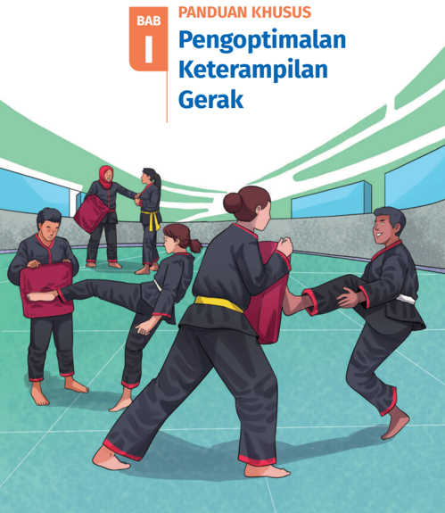
> **[Konteks Visual]**: Gambar ini menampilkan ilustrasi dari sebuah buku panduan khusus tentang pengoptimalan keterampilan gerak. Judul bab ini ditulis di bagian atas dengan huruf besar dan berwarna merah. Gambar dalam buku tersebut menunjukkan beberapa orang sedang melakukan latihan gerakan beladiri atau seni bela diri. Mereka berada dalam sebuah arena olahraga dengan lantai berlapis karpet biru. Dua orang di tengah melakukan gerakan serangan dan balasan, sementara dua orang lainnya berdiri di sebelah mereka, mungkin sebagai instruktur atau pemantau. Semua orang tersebut mengenakan pakaian beladiri tradisional, termasuk celana hitam dengan simpul merah dan kaus berwarna merah. Latar belakang terlihat luas dengan langit biru dan beberapa pilar hijau.

### [HALAMAN_46]

## A.  Pendahuluan

## 1. Tujuan Pembelajaran dan Kriteria Ketercapaian Tujuan Pembelajaran (KKTP)

## a. Tujuan Pembelajaran
Peserta didik mampu merancang, menerapkan, menghaluskan, dan mengevaluasi keterampilan gerak spesifik di dalam berbagai situasi gerak yang menantang.

## b. Kriteria Ketercapaian Tujuan Pembelajaran
Peserta didik mampu merancang bentuk-bentuk latihan untuk mengembangkan keterampilan gerak secara optimal dalam olahraga atau permainan tertentu.
Peserta didik mampu menerapkan hasil rancangan bentuk-bentuk latihan untuk mengembangkan keterampilan gerak secara optimal dalam olahraga atau permainan tertentu.
Peserta didik mampu menghaluskan keterampilan gerak yang dikembangkan dalam berbagai situasi yang menantang.
Peserta didik mampu mengevaluasi bentuk-bentuk latihan yang dilakukan  untuk  mengoptimalkan  keterampilan  gerak  dalam olahraga atau permainan tertentu.
Peserta didik mampu mengadaptasi dan mentransfer keterampilan gerak dalam konteks situasi gerak yang baru dan menantang.

### [HALAMAN_47]

## 2. Peta Materi/Peta Konsep
Pada bab 1 ini materi esensial yang diajarkan adalah mengoptimalkan keterampilan gerak dalam berbagai situasi yang menantang dan situasi gerak yang baru. Pada pembelajaran ini, untuk dapat memberikan pembelajaran bermakna kepada peserta didik, maka mengoptimalkan keterampilan gerak dapat dicapai melalui 3 subbab pembelajaran, yaitu sebagai berikut.

## a. Perkembangan Keterampilan Gerak
Mengobservasi Penguasaan Keterampilan Gerak
Level Keterampilan Gerak ( Generic Level of Skill Proficiency)

## b. Mengoptimalkan Keterampilan Gerak
Penyusunan Jurnal Refleksi Latihan
Melaksanakan Jurnal Refleksi Latihan
Menganalisis Hasil Evaluasi Level Keterampilan Gerak
Menganalisis Hasil Umpan Balik

## c. Perbaikan Keterampilan Gerak dalam Berbagai Situasi
Rencana Perbaikan Jangka Pendek dan Jangka Panjang
Menentukan Siklus Pengoptimalan Keterampilan Gerak

### [HALAMAN_48]

## 3. Keterkaitan dengan Materi Bab Lain
Materi pada bab ini memiliki keterkaitan dengan materi pada bab lain, baik secara langsung ataupun tidak langsung, karena aktivitas mengoptimalkan keterampilan gerak yang dipelajari pada bab ini akan menjadi bekal untuk peserta didik sehingga lebih mudah ketika mempelajari bab lain.

## 4. Saran Periode/Waktu Pembelajaran Bab I
Materi pada bab ini dapat dipelajari selama 8 pertemuan. Berikut rincian materi untuk setiap petemuannya.
Pertemuan Ke-1: Subbab 1 perkembangan keterampilan gerak sampai pada aktivitas 1.
Pertemuan Ke-2 dan 3: melanjutkan pertemuan ke-1 sampai dengan aktivitas 2.
Pertemuan Ke-4 dan 5: Subbab 2 bagian a dan b.
Pertemuan Ke-6: Subbab 2 bagian c.
Pertemuan Ke-7: Subbab 2 bagian d.
Pertemuan Ke-8: Subbab 3
Jumlah pertemuan bersifat saran/rekomendasi, guru dapat mengubah dan  menyesuaikan  sesuai  dengan  kebutuhan  peserta  didik  di  satuan pendidikannya masing-masing.

## B.  Konsep dan Keterampilan Prasyarat
Kemampuan prasyarat untuk mempelajari bab I adalah peserta didik telah mengetahui dan menguasai pola gerak dasar yang dapat digunakan dalam keterampilan gerak yang akan dipelajari. Gunakan penilaian sebelum pembelajaran untuk mengetahui penguasaan keterampilan gerak awal peserta didik yang akan dikembangkan.

### [HALAMAN_49]

## C.  Apersepsi
Peserta didik mendiskusikan alasan perlunya mengoptimalkan keterampilan gerak yang dapat memengaruhi aktivitas fisik dalam kehidupan sehari-hari dan kebermanfaatannya untuk mendapatkan kenikmatan bergerak.
Peserta didik mendiskusikan alasan perlunya mereka mengetahui perkembangan keterampilan geraknya melalui kegiatan observasi keterampilan gerak yang diawali dengan membaca kisah 'Liliyana Natsir Mencapai Batas Maksimal' yang selalu diikuti dengan memantau perkembangan keterampilan geraknya menuju kesuksesan.
Peserta didik diajak untuk mengetahui level keterampilan gerak mereka berdasarkan GLSP ( Generic Level of Skills Proficiency ). Apakah mereka berada pada level prakontrol ( precontrol ), kontrol ( control ), mampu menggunakan ( utilization ), atau mahir ( proficiency ) disertai dengan aktivitas praktik?
Ajaklah peserta didik untuk mempelajari cara mengoptimalkan keterampilan gerak  dengan  memanfaatkan  jurnal  latihan  untuk  perencanaan  dan pelaksanaanya.
Peserta didik mengevaluasi level keterampilan geraknya dan berusaha meningkatkannya ke level keterampilan di atasnya atau mempertahankan level tertinggi jika sudah mencapainya.
Peserta didik merencanakan perbaikan keterampilan gerak terus menerus dalam waktu jangka pendek maupun jangka panjang dan belajar membuat siklus pengoptimalan keterampilan gerak.
Peserta didik diajak untuk dapat menggunakan cara pengoptimalan keterampilan gerak dalam situasi gerak berupa aktivitas olahraga atau permainan baru.

### [HALAMAN_50]

## D.  Penilaian Sebelum Pembelajaran
Sebelum mempelajari materi pada bab ini, lakukanlah asesmen awal untuk mengetahui capaian keterampilan gerak pada aktivitas olahraga atau permainan tertentu. Berikut contoh instrumen penilaian sebelum pembelajaran, Guru dapat menggunakan instrumen lain yang sesuai dengan jenis aktivitas gerak yang akan dipelajari peserta didik.

## 1. Contoh Instrumen
Mempraktikkan Aktivitas Permainan Bola Basket
Instruksi : Peserta didik menggiring bola melewati satu lawan secara bergantian dan permainan lempar tangkap bola 3 lawan 3.

## Rubrik Penilaian
Berikut contoh rubrik penilaian yang dapat digunakan untuk praktik menggiring dan melempar bola basket.

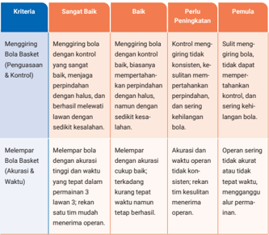
> **[Konteks Visual]**: Tabel ini mungkin berisi kriteria penilaian untuk sebuah kegiatan atau tugas tertentu, masing-masing dengan tingkat kualitas yang ditentukan. Berikut adalah deskripsi singkat dari setiap kolom:

1. Kriteria: Kolom ini mungkin berisi nama-nama kriteria atau standar yang digunakan dalam penilaian.

2. Sertifikasi: Kolom ini mungkin menunjukkan tingkat kualitas atau kinerja yang diharapkan untuk setiap kriteria. Tingkat ini mungkin berupa "Sangat Baik", "Baik", "Perlu Peningkatan", atau "Pemula".

3. Deskripsi: Kolom ini mungkin berisi deskripsi atau penjelasan tentang apa yang dimaksud dengan tingkat kualitas tersebut. Misalnya, "Menggiring bola Basket dengan kontrol" mungkin berarti menggiring bola basket dengan kontrol yang baik, tetapi mungkin juga berarti menggiring bola basket dengan kontrol yang sangat baik.

4. Tindakan: Kolom ini mungkin berisi tindakan atau langkah-langkah yang perlu dilakukan untuk mencapai tingkat kualitas tertentu. Misalnya, "Menggiring bola dengan kontrol" mungkin berarti harus menggiring bola dengan kontrol yang baik, tetapi mungkin juga berarti harus menggiring bola dengan kontrol yang sangat baik.

5. Keterampilan: Kolom ini mungkin berisi keterampilan atau kemampuan yang dibutuhkan untuk mencapai tingkat kualitas tertentu. Misalnya, "Menggiring bola dengan kontrol" mungkin berarti harus memiliki keterampilan atau kemampuan untuk menggiring bola dengan kontrol yang baik, tetapi mungkin juga berarti harus memiliki keterampilan atau kemampuan untuk menggiring bola dengan kontrol yang sangat baik.

6. Keterampilan: Kolom ini mungkin berisi keterampilan atau kemampuan yang dibutuhkan untuk mencapai tingkat kualitas tertentu. Misalnya, "Menggiring bola dengan kontrol" mungkin berarti harus memiliki keterampilan atau kemampuan untuk menggiring bola dengan kontrol yang baik, tetapi mungkin juga berarti harus memiliki keterampilan atau kemampuan untuk menggiring bola

### [HALAMAN_51]

## b. Mempraktikkan Aktivitas Pencak Silat
Instruksi : Peserta didik mempraktikkan keterampilan gerak menendang, memukul, menangkis, dan lainnya.

## Rubrik Penilaian
Berikut contoh rubrik penilaian yang dapat digunakan untuk praktik gerakan dalam pencak silat.

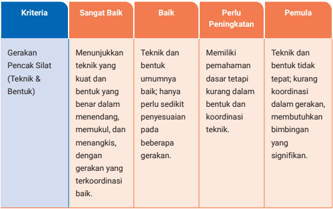
> **[Konteks Visual]**: Tabel ini menunjukkan kriteria untuk mengukur kemampuan seseorang dalam melakukan gerakan pencak silat. Tabel ini dibagi menjadi tiga kolom: Kriteria, SANGAT Baik, dan Baik. Untuk setiap kriteria, ada beberapa tingkat penilaian yang ditentukan.

1. **Gerakan Pencak Silat (Teknik/Bentuk):**
   - **SANGAT Baik:** Menunjukkan teknik yang kuat dan bentuk yang baik, dengan gerakan yang terkoordinasi.
   - **Baik:** Teknik dan bentuk umumnya baik, hanya perlu peningkatan pada beberapa gerakan.
   - **Perlu Peningkatan:** Memiliki pemahaman dasar tetapi kurang dalam koordinasi dan keterampilan teknik.
   - **Penuh:** Memiliki pemahaman yang mendalam tentang teknik, tetapi masih ada kesalahan dalam koordinasi dan gerakan.

2. **Menunjukkan Teknik yang kuat dan bentuk yang baik:** 
   - **SANGAT Baik:** Gerakan pencak silat yang kuat dan bentuk yang baik, dengan gerakan yang terkoordinasi.
   - **Baik:** Gerakan pencak silat yang kuat dan bentuk yang baik, hanya perlu peningkatan pada beberapa gerakan.
   - **Perlu Peningkatan:** Gerakan pencak silat yang kuat dan bentuk yang baik, tetapi masih ada kesalahan dalam koordinasi dan gerakan.
   - **Penuh:** Gerakan pencak silat yang kuat dan bentuk yang baik, dengan gerakan yang terkoordinasi dan tidak ada kesalahan.

3. **Memiliki pemahaman dasar tetapi kurang dalam koordinasi dan keterampilan teknik:**
   - **SANGAT Baik:** Memiliki pemahaman dasar teknik pencak silat, tetapi masih ada kesulitan dalam koordinasi dan keterampilan teknik.
   - **Baik:** Memiliki pemahaman dasar teknik pencak silat, tetapi masih ada kesulitan dalam koordinasi dan keterampilan teknik.
   - **Perlu Peningkatan:** Memiliki pemahaman dasar teknik pencak silat, tetapi masih ada

> **[Konteks Visual]**: Tabel ini menunjukkan kriteria penilaian untuk dua tingkat: "Sangat Baik" dan "Baik". Kriteria ini meliputi:

1. Gerakan Pencak Silat (Teknik/Bentuk)
   - Menunjukkan teknik yang kuat dan bentuk berdasar dalam operasi, memulai, dan mengakhiri, dengan gerakan yang terkoordinasi.
   - Teknik dan bentuk umumnya baik, hanya perlu penyesuaian pada beberapa gerakan.

2. Perlu Peningkatan
   - Memiliki pemahaman dasar tetapi kurang dalam koordinasi teknik.
   - Memiliki pemahaman dasar tetapi kurang dalam koordinasi teknik.

3. Pemula
   - Memiliki pemahaman dasar tetapi kurang dalam koordinasi teknik.
   - Memiliki pemahaman dasar tetapi kurang dalam koordinasi teknik.

Elemen dekoratif seperti garis dan warna tidak relevan untuk penjelasan.

## c. Mempraktikkan Aktivitas Lompat Jauh
Instruksi : Peserta didik melakukan aktivitas keterampilan gerak lompat jauh dari awalan, tolakan, hingga mendarat.

## Rubrik Penilaian
Berikut contoh rubrik penilaian yang dapat digunakan untuk praktik keterampilan gerak dalam lompat jauh.

### [HALAMAN_52]

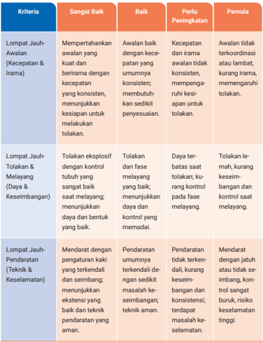
> **[Konteks Visual]**: Tabel ini mungkin berisi informasi tentang kriteria atau standar untuk menilai tingkat kemampuan atau keterampilan seseorang dalam melakukan tugas tertentu. Tabel tersebut mencakup beberapa kriteria yang diukur, termasuk:

1. Lompat Jauh Awal: Ini mungkin merujuk pada kemampuan seseorang untuk melompat dengan jarak yang cukup jauh dan kuat.

2. Lompat Jauh Tolakan: Ini mungkin merujuk pada kemampuan seseorang untuk melompat dengan tolakan, yang dapat mencakup berbagai posisi dan kondisi.

3. Lompat Jauh Pendarat: Ini mungkin merujuk pada kemampuan seseorang untuk melompat dengan pendarat, yang dapat mencakup berbagai teknik dan posisi.

4. Lompat Jauh Eksploratif: Ini mungkin merujuk pada kemampuan seseorang untuk melompat dengan eksploitasi, yang dapat mencakup berbagai teknik dan posisi.

5. Lompat Jauh Melayan: Ini mungkin merujuk pada kemampuan seseorang untuk melompat dengan melayan, yang dapat mencakup berbagai teknik dan posisi.

6. Lompat Jauh Perlu Peningkatan: Ini mungkin merujuk pada kemampuan seseorang untuk melompat dengan perlu peningkatan, yang dapat mencakup berbagai teknik dan posisi.

7. Lompat Jauh Pemula: Ini mungkin merujuk pada kemampuan seseorang untuk melompat dengan pemula, yang dapat mencakup berbagai teknik dan posisi.

8. Lompat Jauh Keseimbangan: Ini mungkin merujuk pada kemampuan seseorang untuk melompat dengan keseimbangan, yang dapat mencakup berbagai teknik dan posisi.

9. Lompat Jauh Teknik Keselamatan: Ini mungkin merujuk pada kemampuan seseorang untuk melompat dengan teknik keselamatan, yang dapat mencakup berbagai teknik dan posisi.

10. Lompat Jauh Kecepatan: Ini mungkin merujuk pada kemampuan s

Rubrik Asesmen tersebut sebagai contoh inspirasi, silakan kembangkan sesuai keterampilan gerak yang akan dipelajari peserta didik.

### [HALAMAN_53]

## 2. Tindak Lanjut Hasil Penilaian
Penilaian sebelum pembelajaran menjadi bermakna apabila disertai dengan tindak lanjutnya dalam proses pembelajaran. Hasil penilaian tersebut digunakan sebagai dasar bagi peserta didik untuk memulai pembelajaran. Perhatikan beberapa langkah berikut untuk menindaklanjuti hasil penilaian sebelum pembelajaran.

## a. Kategorikan Kemampuan Awal Peserta Didik
Kategorikan keterampilan awal peserta didik berdasarkan penilaian menggunakan rubrik (penilaian dapat dilakukan melalui observasi guru, penilaian diri sendiri, atau penilaian antarteman).
Kategori Mahir: peserta didik dengan hasil penilaian sangat baik.
Kategori Menengah: peserta didik dengan hasil penilaian baik dan perlu peningkatan.
Kategori Dasar: peserta didik  dengan hasil penilaian pemula.
Perhatikan aspek keterampilan gerak tertentu ketika kemampuan peserta didik cenderung lemah atau membutuhkan perbaikan. Sebagai contoh, beberapa peserta didik membutuhkan peningkatan dalam koordinasi atau ketepatan saat mengoper bola, sementara yang lain mungkin membutuhkan bantuan dalam kontrol saat menggiring bola.
Kategori-kategori di atas bersifat sebagai bahan rujukan atau inspirasi, guru dapat mengubah dan menyesuaikan kebutuhan belajar peserta didik.

## b. Mengelompokkan Peserta Didik
Peserta didik dikelompokkan berdasarkan tingkat kemampuannya sesuai dengan hasil penilaian awal. Guru kemudian memberikan tugas sesuai dengan tingkat kemampuan mereka.

### [HALAMAN_54]

Kelompok Mahir: Diberikan tantangan yang lebih tinggi, seperti kombinasi gerakan atau berbagai rintangan dalam situasi permainan nyata. Sebagai contoh, mereka dapat mengaplikasikan keterampilan dengan tantangan yang lebih besar.
Kelompok Menengah: Fokus pada penyempurnaan keterampilan gerak dengan memperhatikan kecepatan, ketepatan, dan kontrol. Sebagai contoh, kelompok ini dilatih untuk memperdalam pemahaman permainan dan mengasah keterampilan dalam situasi yang lebih dinamis.
Kelompok Dasar: Fokus pada penguasaan keterampilan gerak dasar secara bertahap dan memberikan lebih banyak bantuan serta waktu untuk memahami keterampilan, contohnya fokus pada pengulangan untuk mengembangkan keterampilan gerak yang belum dikuasai.
Guru juga dapat membagi kelompok secara heterogen dengan kemampuan berbeda, namun berikan tugas individu yang berbeda pula sesuai dengan kemampuan awal mereka. Libatkan peserta didik yang lebih mahir sebagai tutor bagi teman-temannya yang membutuhkan bantuan.

## c. Berikan Umpan Balik secara Terus Menerus
Berikan umpan balik yang spesifik dan positif sesuai dengan level peserta didik. Fokuskan pada kemajuan keterampilan geraknya, bukan hanya hasil akhir, agar setiap peserta didik merasa dihargai atas usaha yang dilakukan.

## d. Evaluasi secara Berkala dan Penyesuaian Rencana Pembelajaran
Lakukan evaluasi secara berkala untuk mengukur perkembangan setiap kelompok. Hasil evaluasi ini dapat digunakan untuk mengatur ulang kelompok sesuai dengan perkembangan keterampilan gerak peserta didik atau menyesuaikan tingkat kesulitan kegiatan di pembelajaran berikutnya.

### [HALAMAN_55]

## E.  Panduan Pembelajaran Buku Siswa

## 1. Tujuan Pembelajaran
Alur tujuan pembelajaran dan indikator ketercapaian tujuan pembelajaran

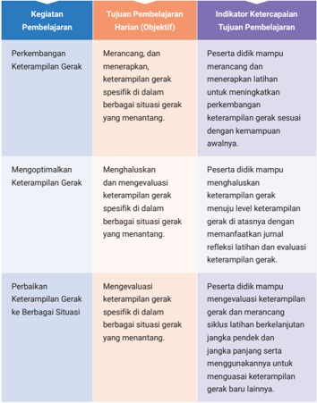
> **[Konteks Visual]**: Tabel ini berisi informasi tentang kegiatan pembelajaran, tujuan pembelajaran harian (objektif), dan indikator ketercapaiannya. Berikut adalah deskripsi detail dari setiap kolom:

1. Kegiatan Pembelajaran:
   - Perkembangan Keterampilan Gerak
   - Mengoptimalkan Keterampilan Gerak
   - Perbaikan Keterampilan Gerak ke Berbagai Situasi

2. Tujuan Pembelajaran Harian (Objektif):
   - Merancang, dan menerapkan, keterampilan gerak spesifik dalam berbagai situasi gerak yang menantang.
   - Menghaluskan dan mengevaluasi keterampilan gerak spesifik dalam berbagai situasi gerak yang menantang.
   - Mengevaluasi keterampilan gerak spesifik dalam berbagai situasi gerak yang menantang.

3. Indikator Ketercapaian Tujuan Pembelajaran:
   - Peserta tidak mampu merancang, dan menerapkan, keterampilan gerak spesifik dalam berbagai situasi gerak yang menantang.
   - Peserta tidak mampu menghaluskan dan mengevaluasi keterampilan gerak spesifik dalam berbagai situasi gerak yang menantang.
   - Peserta tidak mampu menevaluasi keterampilan gerak spesifik dalam berbagai situasi gerak yang menantang.

Tabel ini digunakan untuk mengukur perkembangan peserta didik dalam hal keterampilan gerak mereka, dengan fokus pada pengembangan, optimasi, dan perbaikan keterampilan tersebut dalam berbagai situasi gerak. Indikator ketercapaian objektif tersebut mencakup peluang untuk mengevaluasi keterampilan gerak peserta didik dalam berbagai situasi yang menantang.

### [HALAMAN_56]

## 2. Aktivitas Pembelajaran
a.

## Perkembangan Keterampilan Gerak

## Bagian 1

## Tujuan Pembelajaran Harian:
Merancang, dan menerapkan keterampilan gerak spesifik di dalam berbagai situasi gerak yang menantang.
Mengobservasi Penguasaan Keterampilan Gerak
Peserta  didik  terlebih  dahulu  merefleksikan  pengalaman  belajar mereka dalam mengembangkan keterampilan gerak spesifik di kelas sebelumnya. Kemudian ajak peserta didik membaca kisah Liliyana Natsir Mencapai Batas Maksimal dan beberapa kisah lain yang menggambarkan keberhasilan seseorang dalam melakukan keterampilan gerak melalui observasi keterampilan gerak secara terus menerus.
Aktivitas 1    Belajar Mendalam Kegiatan 1 dan 2

## Sebelum Aktivitas Praktik
Peserta didik merefleksikan keterampilan gerak awal yang telah dikuasainya (jenis keterampilan sesuaikan dengan aktivitas olahraga atau permainan yang akan dipelajari), kemudian tuliskan pada rubrik tabel 1.1 pada buku siswa.
Peserta didik membaca kisah sukses Liliyana Natsir dalam mengembangkan keterampilan gerak.
Peserta didik diajak untuk memaknai kisah Liliyana Natsir dengan menjawab pertanyaan refleksi berikut ini.
Apa saja cara yang digunakan Liliyana Natsir untuk mengobservasi keterampilan geraknya?

### [HALAMAN_57]

Bagaimana kombinasi jenis-jenis observasi keterampilan gerak yang digunakan untuk mengembangkan keterampilan gerak sampai batas maksimal?

## Selama Aktivitas Praktik
Peserta didik mempraktikkan cara mengobservasi keterampilan gerak agar pembelajaran lebih mendalam.
Bentuk aktivitas olahraga atau permainan dalam buku ini bersifat contoh, guru dapat mengganti dengan aktivitas lain yang sesuai dengan satuan pendidikan masing-masing.
Kegiatan 1: Peserta didik mengamati dan mengevaluasi keterampilan gerak teman saat bermain bulu tangkis berpasangan. Fokuskan observasi  pada  penguasaan  keterampilan  gerak  pukulan  dan ketepatan pukulan.

## Berikan Instruksi:
Peserta didik membuat kelompok dengan anggota berjumlah 4-8 orang.
Peserta didik menentukan pasangan dalam satu kelompok. Setiap pasangan terdiri atas satu pemain dan satu pengamat
Peserta didik melakukan pemanasan sebelum latihan.
Pemain melakukan latihan pukulan bulu tangkis ( forehand , backhand , smash , netting ) dalam permainan tunggal atau ganda selama 5 menit.
Pengamat mengamati pemain dan mencatat keterampilan gerak pada lembar observasi yang terdapat pada aktivitas 1 kegiatan 1 pada buku siswa. Pencatatan dapat dibuat secara manual atau memanfaat  kan teknologi ( form online atau yang lainnya).

### [HALAMAN_58]

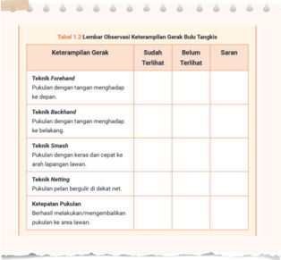
> **[Konteks Visual]**: Tabel 1.2 Lembur Observasi Keterampilan Gerak Bulu Tangkis

| Keterampilan Gerak | Sudah Terlihat | Belum Terlihat | Saran |
|--------------------|----------------|----------------|-------|
| Teknik Fendish     |               |                 |       |
| Pukulan dengan tangan menghadap ke depan. |               |                 |       |
| Teknik Backhand    |               |                 |       |
| Pukulan dengan tangan menghadap ke belakang. |               |                 |       |
| Teknik Smash       |               |                 |       |
| Pukulan dengan kena dan cepat ke arah lapanan lawan. |               |                 |       |
| Teknik Netting     |               |                 |       |
| Pukulan pelan bergulir di dekat net. |               |                 |       |
| Ketepatan Pukulan |               |                 |       |
| Berhasil melebakkan/mengembalikan pukulan ke area lawan. |               |                 |       |

Gambar ini adalah tabel yang menunjukkan hasil observasi keterampilan gerak dalam olahraga bulu tangkis. Tabel ini mencakup beberapa teknik pukulan yang biasanya digunakan dalam permainan tersebut, seperti Fendish, Backhand, Smash, Netting, dan Ketepatan Pukulan. Setiap teknik memiliki kolom untuk menunjukkan apakah pemain sudah mampu melakukan teknik tersebut atau belum. Selain itu, tabel juga memberikan saran untuk pemain yang belum berhasil melakukan teknik tertentu.

Kegiatan 2: Peserta didik mengamati dan mengevaluasi keterampilan gerak teman saat melakukan aktivitas lompat tinggi. Fokuskan observasi pada penguasaan keterampilan gerak awalan, tolakan, dan capaian lompatan.

## Berikan Instruksi:
Peserta didik membuat kelompok dengan anggota berjumlah 4-8 orang.
Peserta didik menentukan pasangan dalam satu kelompok. Setiap pasangan terdiri atas satu pemain dan satu pengamat.
Peserta didik melakukan pemanasan sebelum latihan.
Pemain berlatih lompat tinggi sebanyak 3-4 kali percobaan.

### [HALAMAN_59]

Pengamat mengamati pemain dan mencatat keterampilan gerak pada lembar observasi yang terdapat pada aktivitas 1 kegiatan 2 pada buku siswa. Pencatatan dapat dibuat secara manual atau memanfaatkan teknologi ( form online atau yang lainnya).
Pemain kemudian bertukar peran dengan pengamat.
Setelah  sesi  latihan,  pasangan  berdiskusi  mengenai  hasil observasi.
Pengamat memberikan umpan balik konstruktif berdasarkan catatan observasi.
Peserta didik bersama-sama menentukan hasil pengamatan keterampilan gerak yang sudah baik dan keterampilan gerak yang masih membutuhkan perbaikan.

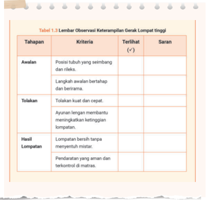
> **[Konteks Visual]**: Tabel 1.2 Lembur Observasi Keterampilan Garak Lompat tinggi

| Tahapan | Kriteria | Terliah (+) | Saran |
|---------|----------|-------------|-------|
| Awal    | Posisi tubuh yang seimbang dan fleksibel | Langkah awalannya beratapal dan teratur. | - |
| Tolakan | Tolakan kuat dan cepat | Ayunan langsung membantu menerapkan ketegangan lompatan. | - |
| Hasil   | Lompatan berdih titang menyeberang misitir. | Pendahan yang aman dan tarkontrol di matras. | - |

Gambar ini adalah tabel observasi keterampilan garak lompat tinggi yang mencakup tahapan awal, tolakan, dan hasil lompatan. Tabel ini mengandung kriteria untuk setiap tahapan, termasuk posisi tubuh yang seimbang dan fleksibel, langkah awalannya beratapal dan teratur, tolakan kuat dan cepat, ayunan langsung membantu menerapkan ketegangan lompatan, lompatan berdih titang menyeberang misitir, dan pendahan yang aman dan tarkontrol di matras. Saran yang disediakan untuk setiap tahapan juga diberikan dalam tabel ini.

### [HALAMAN_60]

## Setelah Aktivitas Praktik
Peserta didik diminta menjawab pertanyaan reflektif yang ada pada akhir aktivitas 1 pada buku siswa.
Berikan penguatan kepada peserta didik bahwa menjadi observer / pengamat itu juga bagian dari proses belajar.

## Asesmen Formatif
Guru melakukan asesmen formatif dengan memberikan umpan balik terhadap kegiatan yang telah dilakukan peserta didik terutama terhadap cara mereka mengobservasi keterampilan diri atau orang lain.
Guru memberikan umpan balik terhadap hasil observasi keterampilan yang dilakukan.
Guru memberikan umpan balik terhadap jawaban pertanyaan reflektif setelah aktivitas.
Umpan balik yang diberikan bersifat positif dan konstruktif, misalnya 'Ketika kamu melakukan pukulan forehand tampak sudah mengayun dengan cepat namun pukulan belum keras, coba gunakan gerakan pergelangan tangan dan perhatikan perbedaannya'.
Guru  memberikan  penguatan  mengenai  perlunya  melakukan observasi keterampilan gerak yang telah dikuasai untuk mengoptimalkan keterampilan gerak. 'Mengobservasi keterampilan gerak yang telah dikuasai berguna untuk menentukan jenis latihan yang kamu lakukan sehingga semakin menguatkan pengembangan keterampilan gerakmu'.
Umpan balik yang diberikan guru diarahkan untuk menggunakan hasil observasi keterampilan gerak untuk menentukan fokus latihan pengembangan keterampilan gerak.

### [HALAMAN_61]

## Generic

## Bagian 2 Level Keterampilan Gerak ( Level of Skill Proficiency )
Setelah  melakukan  observasi  keterampilan  gerak,  ajaklah  peserta didik untuk mengetahui level keterampilan geraknya. Apakah posisi keterampilan gerak peserta didik secara individu berada pada level prakontrol  ( pre-control ),  kontrol  ( control ),  mampu  menggunakan ( utilization ), atau mahir ( proficiency )?

## Keterampilan Gerak pada Level Pre-Control
Ajaklah peserta didik untuk mengenali bentuk keterampilan gerak pada level pre-control dengan cara mengingat kembali (refleksi) pengalaman belajar mereka ketika melakukan keterampilan gerak dalam berolahraga masih merasa sulit untuk mengontrol gerakan.
Sebelumnya peserta didik sudah melakukan kegiatan praktik untuk mengobservasi keterampilan geraknya lalu berikan lembar identifikasi kategori  level  keterampilan  prakontrol.  Guru  juga  dapat  meminta peserta didik untuk kembali melakukan aktivitas praktik kemudian mengidentifikasi level keterampilan geraknya. Setelah itu, lengkapi lembar observasi berikut sesuai capaian keterampilan gerak peserta didik.

### [HALAMAN_62]

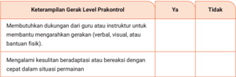
> **[Konteks Visual]**: Tabel ini berisi dua kolom: "Keterampilan Gerak Level Prakontrol" dan "Ya/Tidak". Kolom pertama menunjukkan keterampilan gerak yang harus dilatih pada tingkat prakontrol, sementara kolom kedua menunjukkan apakah keterampilan tersebut memerlukan dukungan dari guru atau instruktur untuk membantu mengajar gerakan (verbal, visual, atau bantuan fisik) atau tidak.

Dalam kolom pertama, terdapat dua baris:
1. Membutuhkan dukungan dari guru atau instruktur untuk membantu mengajar gerakan (verbal, visual, atau bantuan fisik)
2. Mengalami kesulitan beradaptasi dan bereaksi dengan cepat dalam situasi permainan

Pada baris pertama, keterampilan tersebut membutuhkan dukungan dari guru atau instruktur untuk membantu mengajar gerakan, baik melalui pendekatan verbal, visual, maupun bantuan fisik. Ini mungkin berarti bahwa peserta didik memerlukan bantuan tambahan untuk memahami dan mengimplementasikan gerakan yang diinginkan.

Sementara itu, pada baris kedua, keterampilan tersebut mengalami kesulitan beradaptasi dan bereaksi dengan cepat dalam situasi permainan. Hal ini dapat berarti bahwa peserta didik memiliki kesulitan dalam mengadaptasi diri ke situasi baru atau cepat bereaksi terhadap perubahan dalam permainan.

Tabel ini memberikan gambaran tentang jenis keterampilan gerak yang harus dilatih pada tingkat prakontrol dan apakah mereka memerlukan dukungan tambahan dari guru atau instruktur.

Jika  jawaban  peserta  didik  lebih  dominan  'Ya',  maka  level keterampilannya berada pada level pre-control .  Berikan penguatan Jika peserta didik masih berada pada level ini. Berikan motivasi untuk memperbaiki dan meningkatkan keterampilan gerak melalui latihan yang intens dan terarah.

## Keterampilan Gerak pada Level Control
Sama seperti sebelumnya, ajaklah peserta didik untuk mengenali bentuk keterampilan gerak pada level control dengan cara mengingat kembali (refleksi) pengalaman belajar mereka ketika melakukan keterampilan gerak dalam berolahraga. Mereka mulai dapat mengendalikan gerakan tapi masih harus berkonsentrasi penuh saat melakukannya, kadang kehilangan kendali, tetapi hasil gerakan sudah lebih terarah.
Agar peserta didik lebih mudah menentukan apakah keterampilan geraknya pada level control atau belum guru dapat menggunakan lembar observasi keterampilan gerak level control berikut.

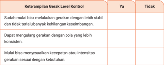
> **[Konteks Visual]**: Tabel ini mungkin berisi informasi tentang keterampilan gerak dan kontrol, dengan kolom "Ya" dan "Tidak". Kolom "Ya" mungkin menunjukkan bahwa seseorang telah mencapai tingkat kontrol tertentu dalam melakukan gerakan, sedangkan kolom "Tidak" mungkin menunjukkan bahwa mereka belum mencapai tingkat kontrol tersebut. Tabel ini mungkin digunakan untuk mengukur kemajuan individu dalam hal keterampilan gerak dan kontrol mereka.

### [HALAMAN_63]

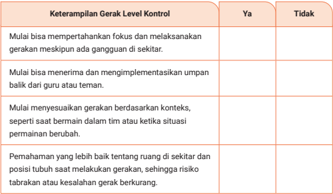
> **[Konteks Visual]**: Tabel ini berisi keterampilan gerak Level Kontrol yang harus dilakukan oleh individu. Tabel ini dibagi menjadi dua kolom: "Ya" dan "Tidak". Kolom pertama menunjukkan keterampilan gerak yang harus dilakukan, sedangkan kolom kedua menunjukkan apakah individu dapat melakukan keterampilan tersebut.

1. Mulai bisa mempertahankan fokus dan melaksanakan gerakan meskipun ada gangguan di sekitar.
2. Mulai bisa menerima dan mengimplementasikan umpan balik dari guru atau teman.
3. Mulai menyusunkan gerakan berdasarkan konteks, seperti saat bermain dalam tim atau ketika situasi permainan berubah.
4. Pemahaman yang lebih baik tentang ruang di sekitar dan posisi tubuh saat melaksanakan gerakan, sehingga risiko tabrakan atau kesalahan gerakan berkurang.

Tabel ini memberikan panduan untuk individu dalam meningkatkan keterampilan gerak mereka. Individu harus mulai mempertahankan fokus dan melaksanakan gerakan meskipun ada gangguan di sekitar mereka. Mereka juga harus menerima dan mengimplementasikan umpan balik dari guru atau teman. Selain itu, mereka harus mulai menyusunkan gerakan berdasarkan konteks, seperti saat bermain dalam tim atau ketika situasi permainan berubah. Terakhir, mereka harus memiliki pemahaman yang lebih baik tentang ruang di sekitar dan posisi tubuh saat melaksanakan gerakan, sehingga risiko tabrakan atau kesalahan gerakan berkurang.

Jika jawaban lebih dominan 'Ya', maka peserta didik mulai berhasil meningkatkan level keterampilan gerak pada level control .  Berikan motivasi untuk memperbaiki dan meningkatkan terus gerakan tersebut hingga keterampilan gerak semakin baik dan menyenangkan.

## Keterampilan Gerak pada Level Utilization
Guru memberikan pengenalan mengenai level keterampilan utilization . Mintalah peserta didik untuk melakukan keterampilan gerak. Apabila mereka sudah semakin mudah mengontrol gerakan dan menikmatinya, serta konsisten melakukan keterampilan gerak dengan mudah dalam berbagai situasi, maka mereka sudah berada pada level utilization . Ajak peserta didik untuk mengisi lembar observasi keterampilan gerak level utilization .

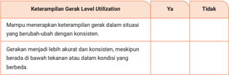
> **[Konteks Visual]**: Tabel ini berisi dua kolom: "Keterampilan Gerak" dan "Level Utilization". Kolom "Ya" dan "Tidak" masing-masing memiliki dua baris untuk menunjukkan apakah keterampilan gerak tersebut dapat diaplikasikan dalam situasi yang berubah-ubah dengan konsisten, serta apakah gerakan menjadi lebih akurat dan konsisten meskipun berada di bawah tekanan atau dalam kondisi yang berbeda.

### [HALAMAN_64]

Keterampilan gerak peserta didik berada pada level utilization jika lembar observasi didominasi oleh jawaban 'Ya'. Keterampilan gerak pada level utilization baru dapat dicapai setelah melakukan perbaikan latihan dalam jangka waktu yang cukup lama dan konsisten. Meskipun demikian, berikan motivasi peserta didik untuk tidak cepat merasa puas, peserta didik masih dapat memperbaiki dan meningkatkan gerakan hingga keterampilan geraknya semakin baik pada level berikutnya.

## Keterampilan Gerak pada Level Proficiency (Cakap/Mahir)
Ajaklah peserta didik yang sudah mahir melakukan aktivitas olahraga/ permainan untuk mengobservasi level keterampilan geraknya pada level proficiency .
Pada level ini peserta didik sudah mampu melakukan gerakan dengan sangat baik, bahkan dalam permainan yang sulit atau di bawah tekanan. Level ini merupakan level tertinggi dalam penguasaan keterampilan gerak. Jika peserta didik berada pada level ini, mereka akan sangat menikmati aktivitas gerak dengan kepercayaan diri yang tinggi. Guru dapat mengecek menggunakan lembar observasi keterampilan gerak level proficiency .

### [HALAMAN_65]

Jika terdapat banyak tanda centang pada kolom 'Ya', beri selamat kepada peserta didik, artinya mereka telah berhasil mencapai level tertinggi dari keterampilan gerak. Peserta didik dapat menggunakannya dalam berbagai permainan atau aktivitas fisik lainnya, bahkan dengan mudah mentransfer ke dalam keterampilan gerak yang lain.

### [HALAMAN_66]

## Sebelum Aktivitas Praktik
Ajak peserta didik untuk mempraktikan salah satu keterampilan gerak kemudian observasi secara mandiri dari video yang direkam temannya.
Keterampilan gerak yang dilakukan dalam aktivitas 2 ini adalah keterampilan gerak pencak silat. Keterampilan gerak tersebut dapat diganti dengan aktivitas lain yang akan dipelajari di satuan pendidikan.

## Selama Aktivitas Praktik
Berikan instruksi berikut kepada peserta didik.
Peserta didik menyediakan kamera atau ponsel dengan kemampuan merekam video.
Peserta  didik  memasang  kamera  atau  ponsel  untuk  merekam aktivitas dan gerakan.
Peserta didik melakukan pemanasan untuk menghindari cedera.
Peserta didik mempraktikkan gerakan pencak silat, seperti serangan dasar, tendangan, dan pukulan selama 3-5 menit.
Setelah selesai, minta peserta didik menonton kembali video tersebut dan amati teknik, posisi tubuh, dan kekuatan yang dilakukan.
Peserta didik mencatat hasil pengamatan pada lembar pengamatan yang ada pada aktivitas 2 pada buku siswa.
Peserta didik mencatat keterampilan gerak yang perlu diperbaiki.
Minta peserta didik merencanakan latihan lanjutan untuk memperbaiki keterampilan gerak yang masih kurang.

### [HALAMAN_67]

## Setelah Aktivitas Praktik
Mintalah peserta didik menjawab pertanyaan refleksi yang terdapat pada bagian akhir aktivitas 2.
Observasi keterampilan gerak merupakan bagian dari proses penting untuk mengenali kekuatan dan kelemahan, menerima umpan balik yang konstruktif, dan merencanakan latihan lanjutan untuk perbaikan hingga mencapai peningkatan kinerja gerak yang berkelanjutan.

## Asesmen Formatif
Berikan umpan balik terhadap hasil observasi yang menentukan level keterampilan gerak dan berikan dorongan untuk meningkatkan ke level berikutnya.
Berikan tugas atau latihan seperti yang terdapat pada buku siswa halaman 22.
Berikan umpan balik terhadap jawaban peserta didik dan berikan masukan  terhadap  rancangan  pengembangan  keterampilan geraknya, contohnya 'tambahkan tantangan yang lebih sulit untuk meningkatkan keterampilan gerakmu'.

### [HALAMAN_68]

## Mengoptimalkan Keterampilan Gerak

## Tujuan Pembelajaran Harian:
Menghaluskan dan mengevaluasi keterampilan gerak spesifik di dalam berbagai situasi gerak yang menantang.

## Bagian 1 Penyusunan Jurnal Refleksi Latihan
Pada awal kegiatan berikan pertanyaan pemantik sebagai berikut.

## 'Bagaimana cara kamu mengetahui keterampilan gerakmu berkembang dari waktu ke waktu?'
Ajaklah peserta didik membaca kisah kesuksesan Michael Phelps dan Eko Yuli Irawan yang berhasil mengembangkan keterampilan gerak dengan menggunakan jurnal latihan secara berkelanjutan.

## Aktivitas 3    Belajar Mendalam

## Sebelum Aktivitas Praktik
Ajak peserta didik untuk mendiskusikan manfaat menggunakan jurnal latihan untuk membantu mengembangkan keterampilan gerak.
Ajak peserta didik membuat lembar catatan jurnal latihan sebagai refleksi sesuai dengan kebutuhan latihan.

## Selama Aktivitas Praktik
Berikan instruksi kepada peserta didik untuk menyusun jurnal refleksi.
Peserta didik membuat format jurnal catatan refleksi diri sesuai kebutuhannya sendiri.
Format jurnal dapat berupa tabel atau paragraf yang mencakup hal-hal berikut.

### [HALAMAN_69]

Tanggal: Tanggal latihan
Tujuan: Tujuan spesifik untuk sesi latihan tersebut.
Deskripsi Aktivitas: Deskripsi singkat mengenai aktivitas yang dilakukan.
Observasi: Hasil pengamatan selama latihan.
Analisis: Alasan latihan berhasil atau tidak.
Rencana Perbaikan: Langkah-langkah spesifik yang akan diambil untuk perbaikan.

## Setelah Aktivitas Praktik
Ajak peserta didik untuk bertukar jurnal yang telah dibuatnya kemudian saling memberikan umpan balik.

## Asesmen Formatif
Berikan  umpan balik jurnal  latihan  yang  dibuat  dan  rencana pelaksanaanya.
Berikan umpan balik terhadap proses pemantauan latihan menggunakan jurnal yang telah dibuat.

## Bagian 2 Melaksanakan Jurnal Refleksi Latihan
Peserta didik mempraktikkan jurnal latihan yang telah disusun untuk mengembangkan keterampilan gerak.

## Aktivitas 4    Belajar Mendalam

## Sebelum Aktivitas Praktik
Peserta didik melaksanakan latihan sesuai perencanaan jurnal yang telah dibuat.
Peserta  didik  berlatih  secara  berulang  dan  memperhatikan perbedaanya.

### [HALAMAN_70]

Peserta didik diminta untuk saling bekerja sama dengan teman dalam berlatih dan mengisi jurnal bersama.

### [HALAMAN_69]

### [HALAMAN_70]

## Selama Aktivitas Praktik
Berikan instruksi agar peserta didik melakukan aktivitas bersama kelompok atau secara berpasangan dan saling berbagi peran.
Peserta didik melakukan aktivitas latihan seperti yang direncanakan sebelumnya (misalnya latihan melempar bola ke ring basket atau renang gaya bebas).
Teman mengamati dan menuliskan hasil pengamatan dalam jurnal.
Setelah selesai, mintalah peserta didik bertukar peran dan melakukan kembali aktivitas yang sama.
Peserta didik mencatat setiap hasil latihan.
Peserta didik mengamati dan menganalisis hasil latihan. Temukan bagian yang sudah berkembang dan belum berkembang.
Peserta didik menuliskan catatan refleksi dan membuat rencana perbaikan.
Catatan: Aktivitas/jenis olahraga dapat diganti sesuai dengan kondisi sekolah.

## Setelah Aktivitas Praktik
Peserta didik diajak untuk menjawab pertanyaan refleksi pada akhir aktivitas yang terdapat pada buku siswa halaman 26.

## Asesmen Formatif
Berikan umpan balik terhadap penggunaan jurnal latihan yang dibuat.
Berikan umpan balik agar jurnal latihan tersebut berguna untuk mengembangkan keterampilan gerak.

### [HALAMAN_71]

## Bagian 3 Menganalisis Hasil Evaluasi

## Level Keterampilan Gerak
Berikan pertanyaan pemantik sebagai pembuka pembelajaran.

## 'Bagaimana kamu menjalankan latihan untuk meningkatkan keterampilan gerakmu?'
Sebelumnya peserta didik sudah mengobservasi keterampilan gerak dan memanfaatkan jurnal latihan. Selanjutnya ajaklah peserta didik untuk menganalisis hasil evaluasi level keterampilan gerak untuk ditingkatkan pada level di atasnya. Ajaklah peserta didik untuk melakukan aktivitas di bawah ini sesuai hasil capaian keterampilan gerak saat ini.

## Keterampilan Gerak pada Level Pre-Control Menuju Level Control
Bagi peserta didik yang masih berada di level pre-control , ajaklah untuk melakukan aktivitas penghalusan keterampilan gerak dengan meningkatkan level keterampilan gerak menuju control .

## Aktivitas 5    Belajar Mendalam
Jenis olahraga dalam aktivitas ini dapat diganti sesuai jenis olahraga yang tersedia di satuan pendidikan, poin utamanya yakni mengembangkan keterampilan gerak dari level prekontrol menuju kontrol.

## Sebelum Aktivitas Praktik
Ajak peserta didik untuk mengembangkan level keterampilan gerak dari pre-control menuju control, contoh dalam permainan sepak bola dan lari cepat.

### [HALAMAN_72]

## 2) Kegiatan 1 (permainan sepak bola)
Menendang bola berpasangan dalam jarak dekat dan semakin lama semakin menjauh, kemudian berpindah tempat.
Sampaikan  tujuan  mengembangkan  kontrol  dasar  dalam mengoper bola.

## 3) Kegiatan 2 (atletik)
Lari lurus di lintasan pendek kemudian lari dengan perubahan percepatan.
Sampaikan tujuan untuk mengembangkan koordinasi dan kontrol dalam gerakan lari.

## Selama Aktivitas Praktik

## Kegiatan 1: Mengoper Bola dalam Permainan Sepak Bola
Peserta didik secara berpasangan menendang bola dengan jarak 1-2 meter.
Kegatan dilakukan secara berulang sampai terasa nyaman.
Kemudian ubah jarak antarpasangan menjadi lebih jauh, misalnya 4-5 meter. Ulangi kembali dengan jarak tendang yang semakin jauh.
Selanjutnya lakukan aktivitas yang sama, namun setelah menendang bola segera berpindah tempat untuk menjauh atau mendekat untuk menerima bola.
Peserta didik berlatih secara berulang sampai terasa nyaman dalam melakukan operan. Variasikan latihan dengan menambah jumlah pemain.
Selanjutnya peserta didik melakukan penilaian diri. Apakah keteram  pilan geraknya sudah mencapai level control ? Jika sudah, kembangkan terus latihan gerak dan apabila belum, minta peserta didik untuk merencanakan ulang latihannya.

### [HALAMAN_73]

Peserta didik menulis hasil analisis pada lembar analisis pengembang  an keterampilan gerak seperti yang ada pada lembar aktivitas halaman 29. Pada kolom tindak lanjut, tuliskan level keterampilan yang sesuai kriteria ( pre-control/control ) kemudian minta peserta didik menuliskan rencana latihan selanjutnya.

## Kegiatan 2: Lari lurus di lintasan pendek kemudian lari dengan perubahan percepatan (atletik).
Peserta didik berlari dalam jarak pendek (10-15 meter) dengan fokus pada gerakan lari, tanpa memperhatikan teknik khusus.
Peserta didik berlari lurus secepat mungkin dari titik A ke titik B.
Selanjutnya berlari pada jarak yang sama tetapi dengan variasi kecepatan. Fokus pada kontrol kecepatan.
Peserta didik mulai dengan berjalan cepat, lalu berlari secepat mungkin, dan perlahan melambat di garis finish .
Peserta didik melakukan penilaian diri.
Peserta didik menuliskan hasil analisis pada lembar analisis pengembangan keterampilan gerak seperti yang ada pada lembar aktivitas halaman 30. Pada kolom tindak lanjut tuliskan level keterampilan sesuai kriteria ( pre-control/control ) kemudian tuliskan rencana latihan selanjutnya.

## Setelah Aktivitas Praktik
Peserta didik menjawab pertanyaan refleksi yang terdapat pada buku siswa halaman 31.

### [HALAMAN_74]

## Asesmen Formatif
Berikan umpan balik terhadap upaya yang dilakukan dalam mengembangkan keterampilan gerak.
Berikan umpan balik terhadap rencana tindak lanjut pengembangan latihan keterampilan gerak.

## Keterampilan Gerak pada Level Control Menuju Level Utilization
Bagi peserta didik yang sudah berada di level control , ajaklah untuk melakukan aktivitas penghalusan keterampilan gerak dengan meningkatkan level keterampilan gerak menuju utilization .

## Aktivitas 6    Belajar Mendalam
Jenis olahraga dalam aktivitas ini dapat diganti sesuai jenis olahraga yang tersedia di satuan pendidikan, poin utamanya yakni mengembangkan keterampilan gerak dari level control menuju utilization.

## Sebelum Aktivitas Praktik
Ajak peserta didik untuk mengembangkan level keterampilan gerak dari control menuju utilization melalui permainan bola voli dan pencak silat.
Bola voli
Kegiatan 1: Melakukan passing dalam kelompok dengan target bergerak.
Kegiatan 2: Melakukan aktivitas latihan smash dengan umpan aktif.
Pencak silat
Kegiatan 1: Berlatih tendangan depan atau tendangan samping dengan target yang dipegang oleh teman yang terus bergerak di area terbatas.

### [HALAMAN_75]

Kegiatan 2: Berlatih kombinasi pukulan (pukulan depan dan pukulan samping) dengan teman yang memegang target dan memberikan pertahanan ringan (menahan atau menghindar).

## Selama Aktivitas Praktik

## Bola Voli

## Kegiatan 1: Passing dalam Permainan Bola Voli
Sampaikan tujuan latihan yaitu meningkatkan keterampilan passing dan smash dari kontrol dasar menuju penggunaan dalam permainan sebenarnya.
Bentuklah kelompok kecil (3-4 orang).
Peserta didik melakukan pemanasan sebelum memulai latihan.
Peserta didik melakukan passing dengan mengarahkan bola kepada teman yang terus bergerak. Peserta didik mengamati posisi teman sebelum melakukan passing .
Peserta didik melakukan aktivitas latihan secara berulang hingga terasa nyaman dalam melakukan operan. Variasikan dengan menambah jarak atau jumlah pemain.

## Kegiatan 2: Latihan Smash dengan Umpan Aktif
Buatlah  kelompok  ber  anggo  ta  kan  3  orang.  Gunakan  setengah lapang  an bola voli untuk satu permainan, sehingga 1 lapangan dapat diguna  kan untuk 4 kelompok yang saling berhadapan (antar 2 kelompok dibatasi net).
Lakukan permainan seperti yang dijelaskan pada akti  vitas yang terdapat pada buku siswa halaman 32.
Peserta didik melakukan penilaian diri terhadap perkembangan keterampilan gerak menggunakan rubrik yang ada pada buku siswa halaman 33. Pada kolom tindak lanjut, peserta didik menuliskan level keterampilan sesuai kriteria ( control/utilization ) kemudian menuliskan rencana latihan selanjutnya.

### [HALAMAN_76]

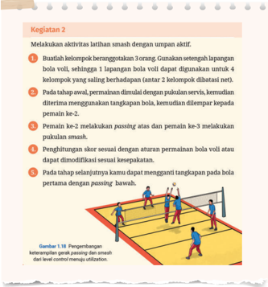
> **[Konteks Visual]**: Gambar tersebut menunjukkan sebuah aktivitas latihan smash dalam permainan voli. Gambar ini mungkin merupakan bagian dari buku atau sumber belajar yang mengajarkan cara melakukan smash dengan tepat. Di sini, beberapa langkah yang harus dilakukan dalam melakukan smash dapat dilihat:

1. Pada awal tahap, pemain melalui dimulai dengan pukulan servis, kemudian diterima menggunakan tangkapan bola, kemudian diputar kepada pemain ke-2.
2. Pemain ke-2 melakukan passing atas dan pemain ke-3 melakukan pukulan smash.
3. Penghitungan skor sesuai dengan aturan permainan bola atau dapat dimodifikasi sesuai kesepakatan.
4. Pada tahap selanjutnya, kamu dapat mengganti tangkapan pada bola pertama dengan passing bawah.

Gambar ini juga menunjukkan bahwa setiap pemain memiliki posisi yang berbeda-beda dalam permainan, yang menunjukkan bahwa mereka harus bekerja sama untuk mencapai tujuan mereka.

## Pencak Silat

## Kegiatan 1: Latihan Tendangan dalam Pencak Silat
Tujuan: Mengembangkan keterampilan tendangan dan pukulan dari kontrol dasar menuju penggunaan dalam simulasi pertarungan.
Peserta didik secara berpasangan melakukan pemanasan sebelum memulai latihan (pasangan memegang sasaran tendangan).
Peserta didik berlatih tendangan sesuai dengan arahan yang terdapat pada aktivitas halaman 34 pada buku siswa.

### [HALAMAN_77]

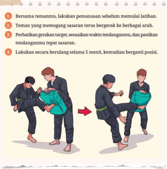
> **[Konteks Visual]**: Gambar tersebut menunjukkan prosedur latihan bela diri bersama teman. Berikut adalah deskripsi detail dari setiap langkah:

1. Pemanasan sebelum memulai latihan: Dua orang sedang berjalan kaki sambil melakukan gerakan pemanasan.

2. Teman yang memegang sasaran: Seseorang sedang memegang sasaran (seperti bola) sambil bergerak ke berbagai arah.

3. Perhatikan gerakan target: Gerakan target harus sesuai dengan waktu tendangan, dan pastikan tendangan tepat arah.

4. Berulang selama 5 menit: Latihan dilakukan secara berulang selama 5 menit, kemudian berganti posisi.

Elemen-elemen lainnya dalam gambar meliputi:
- Kaki dan tangan yang digunakan dalam gerakan tendangan
- Waktu yang ditentukan untuk berulang latihan
- Posisi tubuh saat melakukan tendangan

Tidak ada teks tambahan di gambar, hanya instruksi dalam bahasa Indonesia.

## Kegiatan 2: Latihan Pukulan dalam Pencak Silat
Peserta didik secara berpasangan (pasangan memegang sasaran tendangan) melakukan pemanasan sebelum memulai latihan.
Peserta didik melakukan kombinasi pukulan, mengawasi pertahanan teman, dan menyesuaikan pukulan dengan perubahan posisinya.
Peserta didik yang memegang target memberikan pertahanan ringan, misalnya menahan atau menghindar.
Lakukan aktivitas selama 5 menit dan lakukan dengan berbagai pengulangan  dan  variasi  bentuk  pukulan  agar  peserta  didik menemukan gerakan yang tepat dan nyaman.

### [HALAMAN_78]

Ulangi kegiatan setelah pergantian posisi. Giliran peserta didik yang memegang sasaran yang melakukan pukulan.
Peserta didik melakukan penilaian diri, Jika sudah mencapai level utilization dapat mengembangkan latihan geraknya. Jika belum, dapat merencanakan ulang latihan.

### [HALAMAN_77]

### [HALAMAN_78]

Peserta didik menulis hasil analisis pada lembar analisis pengembangan keterampilan gerak yang terdapat pada buku siswa halaman 36. Pada kolom tindak lanjut tuliskan level keterampilan sesuai kriteria ( control/utilization ) kemudian tuliskan rencana latihan selanjutnya.

## Setelah Aktivitas Praktik
Peserta didik menjawab pertanyaan refleksi yang terdapat pada buku siswa halaman 36.

## Asesmen Formatif
Berikan  umpan  balik  terhadap  upaya  yang  dilakukan  dalam mengembangkan keterampilan gerak.
Berikan umpan balik terhadap rencana tindak lanjut pengembangan latihan keterampilan gerak.

## Keterampilan Gerak pada Level Utilization Menuju Proficiency
Bagi  peserta  didik  yang  sudah  berada  di  level utilization ,  ajaklah untuk melakukan aktivitas penghalusan keterampilan gerak dengan meningkatkan level keterampilan gerak menuju proficiency .

## Aktivitas 7    Belajar Mendalam
Jenis olahraga dalam aktivitas ini dapat diganti sesuai jenis olahraga yang tersedia di satuan pendidikan, poin utamanya yakni mengembangkan keterampilan gerak dari level utilization menuju proficiency.

### [HALAMAN_79]

## Sebelum Aktivitas Praktik
Peserta didik mendiskusikan mengapa perlu mengembangkan level keterampilan sampai tingkat proficiency kemudian ajak peserta didik untuk mengembangkan level keterampilan gerak dari utilization menuju proficiency melalui permainan tenis lapangan dan sofbol.
Permainan Tenis
Kegiatan 1: Peserta didik melakukan pukulan forehand dan backhand dalam situasi pertandingan.
Kegiatan 2: Peserta didik berlatih setengah lapangan dengan variasi pukulan.

## 3) Sofbol
Kegiatan 1: Peserta didik melatih pukulan bersama pitcher yang memiliki lemparan bagus (keras dan akurat).
Kegiatan 2: Peserta didik berlatih menangkap bola dengan situasi simulasi pertandingan.

## Selama Aktivitas Praktik

## Tenis Lapangan

## Kegiatan 1: Pukulan Forehand dan Backhand
Sampaikan tujuan aktivitas, yaitu meningkatkan kontrol, akurasi, dan kekuatan pukulan dalam situasi permainan yang lebih kompleks dan cepat.
Bentuklah kelompok kecil (berpasangan atau ganda 4 orang).
Peserta didik melakukan pemanasan sebelum memulai latihan.
Peserta didik bermain reli dengan pasangan.
Peserta didik mencoba mengarahkan bola ke area target yang ditentukan, misalnya sudut lapangan atau dekat net.
Fokus pada penempatan bola dan peserta didik harus mengembalikan bola dengan kekuatan yang tepat.

### [HALAMAN_80]

Dalam latihan ini, bola harus tetap dalam permainan dan fokus pada akurasi dan penempatan, bukan hanya kekuatan.
Peserta didik mengulangi latihan sampai terasa nyaman dalam melaku  kan pukulan dengan akurasi yang tinggi. Ajak peserta didik untuk mem  variasikan pukulan dengan menambah kekuatan dan arah yang tak terduga.

### [HALAMAN_79]

### [HALAMAN_80]

## Kegiatan 2: Latihan Setengah Lapangan dengan Variasi Pukulan
Peserta didik dibagi dalam kelompok yang beranggotakan 4 orang.
Setiap kelompok berlatih menggunakan setengah lapangan tenis yang saling berhadapan sesuai dengan arahan yang terdapat pada buku siswa halaman 39.

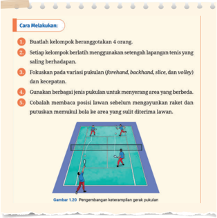
> **[Konteks Visual]**: Gambar tersebut menunjukkan instruksi tentang cara melakukan pertandingan bulu tangkis. Berikut adalah deskripsi detail dari gambar tersebut:

1. Pertama, instruksi mengajarkan untuk membuat kelompok beranggotakan 4 orang.

2. Setelah itu, instruksi memberikan petunjuk untuk menggunakan setengah lapangan tenis saling berhadapan.

3. Fokus pada variasi pukulan (forehand, backhand, slice, dan volley) dan kecepatan.

4. Gunakan berbagai jenis pukulan untuk menyerang area yang berbeda.

5. Cobalah membaca posisi lawan sebelum menggunakkan raket dan putuskan memukul bola ke area yang sulit diterima lawan.

6. Terdapat gambar yang menunjukkan dua pemain bermain bulu tangkis di lapangan dengan posisi yang berbeda-beda.

7. Gambar juga menunjukkan posisi pemain saat mereka bergerak dan berpukul bola.

8. Di bawah gambar, terdapat teks yang menjelaskan tentang perubahan keterampilan gerak pukulan dalam pertandingan bulu tangkis.

9. Gambar ini juga menunjukkan posisi pemain saat mereka bergerak dan berpukul bola.

10. Gambar ini juga menunjukkan posisi pemain saat mereka bergerak dan berpukul bola.

11. Gambar ini juga menunjukkan posisi pemain saat mereka bergerak dan berpukul bola.

12. Gambar ini juga menunjukkan posisi pemain saat mereka bergerak dan berpukul bola.

13. Gambar ini juga menunjukkan posisi pemain saat mereka bergerak dan berpukul bola.

14. Gambar ini juga menunjukkan posisi pemain saat mereka bergerak dan berpukul bola.

15. Gambar ini juga menunjukkan posisi pemain saat mereka bergerak dan berpukul bola.

16. Gambar ini juga menunjukkan posisi pemain saat mereka bergerak dan berpukul bola.

17. Gambar ini juga menunjukkan posisi pemain saat mereka bergerak dan berpukul bola.

18. Gambar ini juga menunjukkan pos

### [HALAMAN_81]

Peserta didik melakukan penilaian diri menggunakan rubrik.
Peserta didik menuliskan hasil analisis pada lembar analisis pengembangan keterampilan gerak seperti yang terdapat pada buku siswa halaman 40. Pada kolom tindak lanjut tuliskan level keterampilan sesuai kriteria ( utilization/proficiency ) kemudian menuliskan rencana latihan selanjutnya.

## Sofbol

## Kegiatan 1: Pukulan dengan Pitcher yang Memiliki Lemparan Bagus (Keras dan Akurat)
Sampaikan tujuan pembelajaran yaitu meningkatkan ketepatan, kekuatan, dan kemampuan menangkap serta memukul bola dalam situasi pert  andingan yang lebih sulit.
Peserta didik melakukan pemanasan sebelum memulai latihan.
Pitcher (pelempar) memberikan lemparan dengan variasi kecepatan dan arah (lemparan cepat, lambat, dan melengkung).
Peserta didik fokus pada gerakan memukul yang tepat dan pastikan untuk memukul bola sesuai dengan arah dan kecepatannya.
Peserta didik mencoba untuk mengontrol kekuatan pukulan agar bola tidak terlalu tinggi atau rendah.
Peserta didik melakukan pukulan secara berulang sebanyak 3-5 pukulan kemudian saling bergantian.

## Kegiatan 2: Latihan Menangkap Bola dengan Situasi Simulasi Pertandingan
Peserta didik melakukan pemanasan sebelum latihan.
Latihan dilakukan dalam situasi simulasi permainan.

### [HALAMAN_82]

Pemain di posisi lapangan ( outfield atau infield ) harus menangkap bola, kemudian memutuskan dengan cepat untuk melempar bola ke base atau home plate .
Peserta didik memfokuskan latihan pada akurasi dan kekuatan lemparan sambil memperhatikan posisi lawan (membaca permainan).
Lakukan aktivitas sesuai durasi yang disepakati, misalnya 5-7 inning .
Peserta didik melakukan penilaian diri, apakah keterampilan geraknya sudah mencapai level proficiency ? Jika sudah, peserta didik dapat mengembangkan dan menjaga level keterampilan geraknya. Jika belum, rencanakan ulang latihan.

### [HALAMAN_81]

### [HALAMAN_82]

Peserta didik menuliskan hasil analisis pada lembar analisis pengembangan keterampilan gerak seperti yang terdapat pada buku siswa halaman 42. Pada kolom tindak lanjut menuliskan level keterampilan sesuai kriteria ( utilization/proficiency ) kemudian tuliskan merencanakan latihan selanjutnya.

## Setelah Aktivitas Praktik
Peserta didik menjawab pertanyaan refleksi yang terdapat pada akhir akvitias 7 pada buku siswa halaman 42.

## Asesmen Formatif
Berikan  umpan  balik  terhadap  upaya  yang  dilakukan  dalam mengembangkan keterampilan gerak.
Berikan umpan balik terhadap rencana tindak lanjut pengembangan latihan keterampilan gerak.

## Keterampilan Gerak pada Level Proficiency (Cakap/Mahir)
Berikan pertanyaan pemantik kepada peserta didik sebelum memulai pembelajaran.
'Mengapa kamu perlu terus menjaga keterampilan gerak pada level proficiency?"

### [HALAMAN_83]

Ajaklah peserta didik yang sudah berada di level proficiency untuk terus mempertahankan level keterampilan gerak pada level ini .
Berikan penguatan cara mempertahankan level proficiency seperti berikut.
Tingkatkan pemahaman taktik dan strategi.
Berpartisipasi dalam berbagai kompetisi, baik untuk prestasi maupun rekreasi.
Berlatih di bawah tekanan/target.
Meningkatkan kondisi fisik.
Menganalisis performa.
Membangun kekuatan mental.
Menjadi mentor bagi teman yang lain.
Berikan penguatan seperti di bawah ini.
Peserta didik dapat menikmati aktivitas gerak tidak hanya ketika pada level tertinggi yaitu proficiency . Peserta didik sudah dapat menikmati aktivitas gerak mulai pada level control bahkan dalam aktivitas gerak sederhana seseorang bisa menikmati pada level precontrol yang tidak memerlukan keakuratan gerak yang tinggi misalnya joging, senam aerobik, dan lainnya. Pada prinsipnya, keterampilan gerak yang terus kamu tingkatkan akan semakin menyenangkan dan bermanfaat bagi kesehatan.

## Bagian 4

## Menganalisis Hasil Umpan Balik
Pada  aktivitas  sebelumnya,  peserta  didik  telah  mempelajari  cara mengembangkan level keterampilan dan menganalisis capaiannya dari waktu ke waktu. Selanjutnya ajak peserta didik untuk menganalisis dan mengevaluasi jenis-jenis umpan balik yang diterima agar dapat membantu mengoptimalkan keterampilan geraknya. Ajaklah peserta didik melakukan aktivitas berikut ini.

### [HALAMAN_84]

Jenis aktivitas olahraga dapat diganti sesuai jenis olahraga yang ada di sekolah, poin utamanya yakni saling memberikan umpan balik dan mengevaluasinya untuk menentukan umpan balik yang membantu pengembangan keterampilan gerak.

## Sebelum Aktivitas Praktik
Sampaikan tujuan aktivitas yaitu menganalisis dan mengevaluasi jenis umpan balik yang paling efektif dalam membantu mengembangkan keterampilan gerak diri sendiri dan orang lain.
Permainan bola tangan
Kegiatan  1: Menganalisis  dan  mengevaluasi  umpan  balik eksplisit.
Kegiatan 2: Menganalisis dan mengevaluasi umpan balik diri sendiri.
Kegiatan  3: Menganalisis  dan  mengevaluasi  umpan  balik terhadap hasil gerakan.
Kegiatan 4: Diskusi dan evaluasi semua umpan balik.

## Selama Aktivitas Praktik

## Kegiatan 1: Umpan Balik Ekplisit
Peserta didik berpartisipasi dalam permainan bola tangan sambil mendengarkan umpan balik lisan dari pasangannya di luar lapangan.
Umpan balik diberikan setiap kali pemain selesai melakukan aksi teknik tertentu ( passing , dribbling , penempatan posisi, atau shooting ).
Umpan balik harus singkat dan spesifik, seperti:
'Tatapan ke depan saat passing ',
'Geser ke kanan, temukan ruang kosong' atau
'Luruskan pergelangan tangan saat shooting '.

### [HALAMAN_85]

Setelah beberapa menit, peserta didik yang menjadi pemain dan pasangannya berdiskusi singkat, jika umpan balik eksplisit ini membantu atau malah membuat mereka terlalu berpikir mengenai gerakan mereka  .

## Kegiatan 2: Umpan balik Diri Sendiri
Arahkan peserta didik untuk menganalisis umpan balik diri sendiri dengan mengikuti langkah-langkah aktivitas yang terdapat pada buku siswa halaman 45.

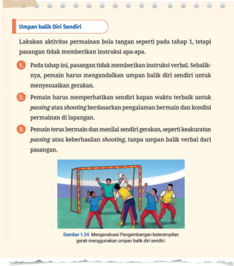
> **[Konteks Visual]**: Gambar tersebut menunjukkan sebuah aktivitas permainan bola tanpa instruksi verbal. Dalam gambar tersebut, beberapa pemain sedang bermain sepak bola di lapangan. Pemain-pemain tersebut sedang bergerak dan berusaha untuk mencetak gol. Gambar tersebut juga menunjukkan bahwa pemain harus memperhatikan kapan waktu terbaik untuk melakukan passing atau shooting. Selain itu, pemain harus menilai sendiri gerakan mereka sendiri dan tidak memerlukan umpan balik verbal dari pasangan.

### [HALAMAN_86]

## Kegiatan 3: Umpan Balik terhadap Hasil Gerakan
Arahkan peserta didik untuk menganalisis umpan balik terhadap hasil gerakan dengan mengikuti langkah-langkah aktivitas yang terdapat pada buku siswa halaman 46 - 47.

## Kegiatan 4: Diskusi dan Evaluasi Semua Umpan Balik
Setelah ketiga tahap selesai, pasangan peserta didik kembali bersama dan mendiskusikan jenis umpan balik yang paling membantu meningkatkan keterampilan.
Peserta didik menganalisis umpan balik yang lebih efektif dalam konteks pengembangan keterampilan geraknya.
Peserta didik menentukan jenis umpan balik yang membuat terlalu fokus pada gerakan atau justru membantu adaptasi yang lebih alami.
Mintalah peserta didik menuliskan evaluasi singkat mengenai pengalaman menerima umpan balik dan jenis umpan balik yang paling berguna dalam meningkatkan keterampilan gerak pada tabel yang tersedia pada buku siswa halaman 47.

## Setelah Aktivitas Praktik
Peserta didik menjawab pertanyaan refleksi yang terdapat pada buku siswa halaman 47.

## Asesmen Formatif
Berikan  umpan  balik  terhadap  upaya  yang  dilakukan  dalam memanfaatkan  umpan balik untuk mengembangkan keterampilan gerak.
Berikan umpan balik terhadap rencana tindak lanjut mengoptimalkan latihan keterampilan gerak.

### [HALAMAN_87]

## Perbaikan Keterampilan Gerak dalam Berbagai Situasi
Bagian 1

## Tujuan Pembelajaran Harian:
Mengevaluasi keterampilan gerak spesifik di dalam berbagai situasi gerak yang menantang.
Rencana Perbaikan Jangka Pendek dan Jangka Panjang
Pada tahap pembelajaran ini ajaklah peserta didik secara sistematis untuk membuat rencana perbaikan untuk mengoptimalkan keterampilan gerak untuk jangka pendek dan jangka panjang berdasarkan level keterampilan geraknya saat ini. Guru dapat memberikan instruksi penyusunan rencana perbaikan dengan cara berikut ini.
Ajaklah peserta didik membuat rencana perbaikan bentuk latihan jangka pendek dan jangka panjang. Keterampilan gerak tersebut dapat digunakan dalam berbagai situasi.
Peserta didik perlu menentukan siklus rencana latihan untuk dapat mengoptimalkan keterampilan geraknya.
Berikan contoh rencana perbaikan keterampilan gerak seperti contoh tabel yang tersedia pada buku siswa halaman 48.
Selanjutnya minta peserta didik membuat tabel tersebut sesuai dengan kebutuhan masing-masing untuk membuat perencanaan perbaikan secara sederhana.
Peserta didik dapat membuatnya menggunakan komputer, tablet, telepon pintar, atau ditulis dalam buku catatan.

### [HALAMAN_88]

## Bagian 2 Menentukan Siklus Pengoptimalan Keterampilan Gerak
Rencana  latihan  tentunya  tidak  berhenti  setelah  semua  rencana dilaksanakan. Peserta didik perlu membuat siklus pengembangan latihan gerak untuk meningkatkan atau menjaga level keterampilan gerak yang dimiliki. Guru dapat memberikan contoh penyusunan siklus latihan seperti yang terdapat pada gambar 1.28 pada buku siswa halaman 49.
Berikan penguatan kepada peserta didik bahwa dengan mengoptimalkan keterampilan gerak tersebut dapat digunakan untuk mentransfernya ke jenis olahraga atau permainan yang lain. Sebagai contoh peserta didik belajar mengoptimalkan keterampilan gerak bermain bola basket dengan cara mengembangkan dan mengoptimalkan keterampilan yang sama untuk menguasai jenis permainan baru, misalnya bola voli atau olahraga yang lain.
Kemudian berikan pertanyaan refleksi berikut sebelum menutup pembelajaran.
'Setelah mengikuti seluruh rangkaian pembelajaran pengoptimalan keterampilan gerak, apakah kamu sudah menemukan cara terbaik untuk meningkatkan keterampilan gerakmu? Dapatkah kamu menggunakannya untuk mengembangkan keterampilan gerak yang lain?'

### [HALAMAN_89]

## F. Tindak Lanjut
Peserta didik yang belum mencapai tujuan pembelajaran diberikan umpan balik dan aktivitas belajar ke level berikutnya sesuai dengan perkembangan mereka berdasarkan rubrik asesmen dan kriteria ketercapaian tujuan pembelajaran, atau dapat juga dengan menggunakan pembelajaran tutor sebaya dan guru memantau perkembangan proses belajarnya.
Peserta didik yang telah mencapai tujuan pembelajaran diberikan tugas pengayaan di bawah ini.
Mengembangkan dan mempresentasikan sebuah proyek inovasi gerak yang mencakup penelitian, desain, penerapan, dan evaluasi.
Proyek ini harus memperkenalkan sebuah keterampilan gerak baru atau modifikasi dari keterampilan yang ada untuk meningkatkan kinerja dalam konteks tertentu, seperti olahraga, permainan, atau aktivitas sehari-hari.
Selanjutnya menerapkan proyek tersebut dalam aktivitas gerak.
Peserta didik melakukan pencatatan hasil latihan yang dilakukan untuk mengetahui kemajuan latihan.
Peserta didik mengevaluasi jika aktivitas tersebut efektif untuk mendorong sampai batas maksimal keterampilan geraknya, dan mencatat hasil tersebut dalam buku tugas.

### [HALAMAN_90]

## G.  Asesmen Sumatif
Asesmen  sumatif  ini  digunakan  untuk  mengukur  ketercapaian  tujuan pembelajaran dalam satu lingkup materi yaitu pengoptimalan keterampilan gerak. Guru dapat menggunakan uji kompetensi dengan cara berikut ini atau juga dapat mengembangkan dalam bentuk yang lain.

## Contoh Uji Kompetensi pada Buku Siswa
Rancang dan praktikkanlah latihan untuk pengembangan keterampilan gerak spesifik dengan situasi gerak yang menantang, kemudian terapkan dalam permainan sebenarnya!

## Uji kompetensi ini untuk mengukur KKTP:
merancang dan menerapkan bentuk-bentuk latihan untuk mengembangkan keterampilan gerak secara optimal dalam olahraga atau permainan tertentu.
Lakukan perbaikan dan penghalusan keterampilan gerak sesuai dengan umpan balik dari guru/teman!

## Uji kompetensi ini untuk mengukur KKTP:
menghaluskan keterampilan gerak yang dikembangkan dalam berbagai situasi yang menantang.
Buatlah catatan evaluasi kinerja dalam menerapkan dan menghaluskan keterampilan gerak dalam situasi latihan yang menantang dan situasi nyata!

## Uji kompetensi ini untuk mengukur KKTP:
mengevaluasi bentuk-bentuk latihan yang dilakukan untuk mengoptimalkan keterampilan gerak dalam olahraga atau permainan tertentu.
mengadaptasi dan mentransfer keterampilan gerak dalam konteks situasi gerak yang baru dan menantang.

### [HALAMAN_91]

> **[Konteks Visual]**: Tabel ini menggambarkan proses pembelajaran dalam berbagai skor (1-5) untuk empat kategori utama: Perancangan Latihan, Pelaksanaan Latihan di Situasi Menantang, dan Perbaikan Keterampilan melalui Umpan Balik. Setiap skor mencakup beberapa tahapan yang berkaitan dengan keterampilan yang dibutuhkan. 

1. **Perancangan Latihan**:
   - **Awal Berkembang (Skor 1-2)**: Latihan kurang struktur dan tidak memiliki tujuan keterampilan spesifik.
   - **Berkembang (Skor 3-4)**: Latihan mulai struktur, namun hanya menyangkut keterampilan spesifik.
   - **Layak (Skor 5-6)**: Latihan cukup struktur, relevan dengan keterampilan spesifik, dan menunjukkan pemahaman dasar dalam perancangan.
   - **Cakap (Skor 7-8)**: Latihan sangat struktur, jelas, sesuai tujuan keterampilan, dan menantang.
   - **Mahir (Skor 9-10)**: Latihan sangat struktur, inovatif, dan mencapai semua aspek untuk pe ngembangan keterampilan spesifik.

2. **Pelaksanaan Latihan di Situasi Menantang**:
   - **Menghadapi Kesulitan Serius dalam Menerapkan Latihan di Situasi Menantang**: Mampu menjalankan latihan dengan cukup baik dan dapat menantang diri ketika, tetapi tetap tidak terbatas dalam keterampilan sesuai situasi.
   - **Menyerapkan Latihan dengan Cukup Lancar, Menunjukkan Keterampilan Sesuai Situasi Menantang**: Mampu menerapkan latihan dengan cukup baik dan dapat menantang diri ketika, tetapi tetap tidak terbatas dalam keterampilan sesuai situasi.
   - **Menerima Umpan Balik dari Guru/Teman**: Menerima umpan balik dari guru/teman, namun terbatas pada aspek-aspek tertentu.
   - **Aktif Mem

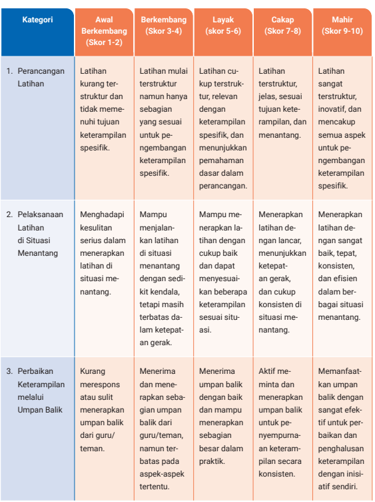
> **[Konteks Visual]**: Tabel ini menggambarkan proses pembelajaran dalam berbagai skor (1-5) untuk empat kategori utama: Perancangan Latihan, Pelaksanaan Latihan di Situasi Menantang, dan Perbaikan Keterampilan melalui Umpan Balik. Setiap skor mencakup beberapa tahapan yang berkaitan dengan keterampilan yang dibutuhkan. 

1. **Perancangan Latihan**:
   - **Awal Berkembang (Skor 1-2)**: Latihan kurang struktur dan tidak memiliki tujuan keterampilan spesifik.
   - **Berkembang (Skor 3-4)**: Latihan mulai struktur, namun hanya menyangkut keterampilan spesifik.
   - **Layak (Skor 5-6)**: Latihan cukup struktur, relevan dengan keterampilan spesifik, dan menunjukkan pemahaman dasar dalam perancangan.
   - **Cakap (Skor 7-8)**: Latihan sangat struktur, jelas, sesuai tujuan keterampilan, dan menantang.
   - **Mahir (Skor 9-10)**: Latihan sangat struktur, inovatif, dan mencapai semua aspek untuk pe ngembangan keterampilan spesifik.

2. **Pelaksanaan Latihan di Situasi Menantang**:
   - **Menghadapi Kesulitan Serius dalam Menerapkan Latihan di Situasi Menantang**: Mampu menjalankan latihan dengan cukup baik dan dapat menantang diri ketika, tetapi tetap tidak terbatas dalam keterampilan sesuai situasi.
   - **Menyerapkan Latihan dengan Cukup Lancar, Menunjukkan Keterampilan Sesuai Situasi Menantang**: Mampu menerapkan latihan dengan cukup baik dan dapat menantang diri ketika, tetapi tetap tidak terbatas dalam keterampilan sesuai situasi.
   - **Menerima Umpan Balik dari Guru/Teman**: Menerima umpan balik dari guru/teman, namun terbatas pada aspek-aspek tertentu.
   - **Aktif Mem

### [HALAMAN_92]

### [HALAMAN_93]

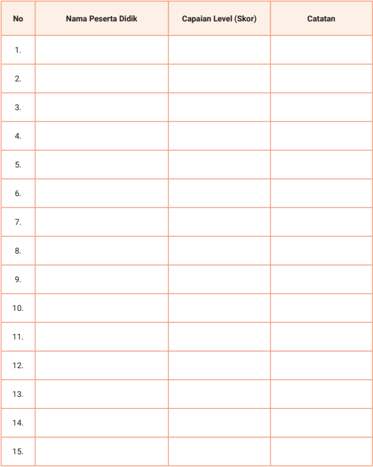
> **[Konteks Visual]**: Tabel ini adalah struktur dasar untuk menampilkan informasi tentang peserta didik dalam sebuah program atau ujian. Berikut adalah penjelasan lebih lanjut tentang setiap kolom:

1. No: Kolom ini mungkin digunakan untuk menyimpan nomor urutan peserta didik.

2. Nama Peserta Didik: Kolom ini akan berisi nama-nama peserta didik yang mengikuti program atau ujian tersebut.

3. Capaian Level (Skor): Kolom ini mungkin digunakan untuk menyimpan skor atau nilai capaian peserta didik pada setiap level atau tahap dalam program atau ujian tersebut.

4. Catatan: Kolom ini mungkin digunakan untuk menyimpan catatan tambahan atau informasi lain yang berkaitan dengan peserta didik atau capaian mereka.

Struktur tabel ini dapat diubah atau ditambahkan sesuai kebutuhan spesifik program atau ujian.

Nilai Sumatif =
Total Skor diperoleh X 100
Total Skor Maksimal

### [HALAMAN_94]

## H.  Refleksi

## 1. Refleksi Peserta Didik
Peserta  didik  diminta  menyalin  tabel  refleksi  dalam  buku  tugas.  Lalu memberikan tanda centang sesuai dengan pengalamannya pada kolom sudah mampu melakukan atau masih perlu belajar. Guru perlu menggaris bawahi bahwa refleksi bukan sebagai penilaian sehingga yang perlu mereka lakukan adalah mengisi dengan jujur. Refleksi digunakan untuk belajar ke tahap selanjutnya. Pertanyaan Refleksi terdapat pada buku siswa halaman 50.
batas maksimal keterampilan gerakmu. Catat hasil tersebut dalam buku tugas.

## Refleksi
Selamat! Kamu sudah menyelesaikan bab pertama di buku PJOK kelas 11 ini. Selanjutnya, coba periksa apa saja yang sudah kamu pelajari pada bab 1 ini? Salin tabel berikut di buku tugas. Lalu beri tanda centang (√) sesuai dengan pengalamanmu!

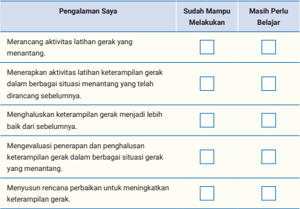
> **[Konteks Visual]**: Tabel ini berisi kolom "Pengalaman Saya" dan dua baris sub-kolom: "Sudah Mampu Melakukan" dan "Masih Perlu Belajar". Setiap baris sub-kolom memiliki tiga pilihan jawaban: "Tidak", "Ya", dan "Belum Tentu". Tabel ini mungkin digunakan untuk mengukur kemampuan seseorang dalam melakukan berbagai aktivitas latihan gerak.

### [HALAMAN_95]

## 2. Refleksi Guru
Refleksi guru erat kaitannya dengan hasil refleksi peserta didik untuk mengevaluasi dan mengembangkan pembelajaran yang semakin baik. Gunakan pertanyaan berikut ini untuk melakukan refleksi terhadap pembelajaran pengoptimalan keterampilan gerak.
Apakah sudah memfasilitasi peserta didik untuk merancang dan mene  rap  kan aktivitas latihan yang mendorong proses pengembangan keterampilan gerak?
Apakah sudah memfasilitasi peserta didik menghaluskan pengoptimalan keterampilan gerak melalui latihan?
Apakah sudah memfasilitasi peserta didik dalam mengevaluasi penerapan dan penghalusan keterampilan gerak dalam berbagai situasi gerak yang menantang?
Apakah sudah memfasilitasi peserta didik dalam menyusun rencana perbaikan untuk meningkatkan keterampilan gerak?
Apakah sudah memfasilitasi peserta didik mentransfer pengoptimalan keterampilan gerak dalam situasi gerak/jenis aktivitas yang baru?
Tindak lanjut kegiatan dilakukan berdasarkan hasil refleksi peserta didik maupun refleksi guru.
Peserta didik masih perlu belajar merancang aktivitas latihan untuk meningkatkan level keterampilan gerak, maka guru dapat memberikan pendampingan oleh rekan sejawat yang sudah berhasil atau melakukan bimbingan khusus terhadap peserta didik tersebut.
Peserta didik masih perlu belajar dalam membangun motivasi intrinsik untuk membuat dan menjalankan aktivitas latihan, maka guru menggali kembali tujuan dari peserta didik untuk mengoptimalkan keterampilan gerak agar menemukan rasa senang dan nikmatnya bergerak, manfaat apa yang akan diperolehnya, dukungan apa yang diperlukan untuk mencapai tujuan tersebut.
Guru dapat mengembangkan lagi berbagai langkah tindak lanjut hasil refleksi sesuai dengan kebutuhan belajar peserta didik.

### [HALAMAN_96]

## I. Sumber Belajar
Guru dapat menggunakan berbagai sumber belajar untuk mengedukasi peserta didik dalam mengoptimalkan keterampilan gerak dan menggunakannya dalam mengembangkan keterampilan gerak baru.
Sumber buku utama adalah Buku Siswa mata pelajaran PJOK untuk kelas XI SMA/SMK.
Sumber alternatif lain dapat menggunakan buku dari Pamela S. HaibachBeach dkk. (2018) tentang motor learning and development .
Guru juga dapat menggunakan sumber lain yang relevan dan terpercaya.

### [HALAMAN_97]

KEMENTERIAN PENDIDIKAN, KEBUDAYAAN, RISET, DAN TEKNOLOGI REPUBLIK INDONESIA, 2024
Panduan Guru Pendidikan Jasmani, Olahraga, dan Kesehatan untuk SMA/SMK/MA/MAK Kelas XI
Penulis: Anggara Aditya Kurniawan, Damar Pamungkas ISBN: 978-634-00-0105-1 (jil.2 PDF)

## PANDUAN KHUSUS

## Menyempurnakan Keterampilan Taktis

> **[Konteks Visual]**: Gambar ini menunjukkan beberapa orang bermain bola basket di lapangan. Mereka sedang bergerak dan berinteraksi satu sama lain. Ada dua tim yang terlihat, dengan satu tim berpakaian biru dan merah, dan tim lainnya berpakaian kuning dan biru. Pemain-pemain tampak aktif dan berusaha untuk mencuri bola atau menghalangi lawannya. Lapangan bola basket tampak jelas dengan garis dan latar belakang hijau.

### [HALAMAN_98]

## A.  Pendahuluan

## 1. Tujuan Pembelajaran dan Kriteria Ketercapaian Tujuan Pembelajaran (KKTP)

## a. Tujuan Pembelajaran
Menciptakan, mengembangkan, dan mengevaluasi strategi gerak untuk mendapatkan keberhasilan capaian keterampilan gerak.
Mengadaptasi strategi gerak yang telah dikuasai dalam situasi gerak baru yang menantang.

## b. Kriteria Ketercapaian Tujuan Pembelajaran
Peserta didik mampu menciptakan bentuk-bentuk strategi gerak untuk mendapatkan keberhasilan capaian keterampilan gerak (kemenangan/keberhasilan).
Peserta didik mampu mengembangkan bentuk-bentuk strategi gerak yang sudah diciptakan untuk mendapatkan keberhasilan capaian keterampilan gerak (kemenangan/keberhasilan).
Peserta didik mampu mengevaluasi bentuk-bentuk strategi gerak yang efektif digunakan untuk mendapatkan keberhasilan capaian keterampilan gerak (kemenangan/keberhasilan).
Peserta didik mampu mengadaptasi bentuk-bentuk strategi gerak yang digunakan dalam situasi gerak baru yang berubah-ubah dan menantang.

### [HALAMAN_99]

## 2. Peta Materi/Peta Konsep
Pada bab 2 ini materi yang diajarkan adalah menyempurnakan keterampilan gerak dalam berbagai situasi yang menantang dan situasi gerak yang baru. Pada pembelajaran ini, guru memberikan pembelajaran bermakna kepada peserta didik dalam menyempurnakan keterampilan taktis yang dapat dicapai melalui 4 subbab pembelajaran sebagai berikut.
Menyempurnakan Pengambilan Keputusan
Memahami Situasi Permainan
Mengantisipasi Gerakan Lawan
Menyesuaikan Strategi Langsung ( Real-time )
Mengeksekusi Keterampilan Gerak ( Skill Execution )
Menguasai Keterampilan Gerak
Berlatih Keterampilan di Bawah Tekanan
Menerapkan Pemahaman Ruang
Menyempurnakan Pemahaman Taktis
Keterampilan Taktis Menyerang
Keterampilan Taktis Bertahan

### [HALAMAN_100]

## d. Pemahaman terhadap Permainan dan Evaluasi Transfer Keterampilan Taktis
Transfer Keterampilan Taktis Permainan Invasi
Transfer Keterampilan Taktis Permainan Net
Transfer Keterampilan Taktis Permainan Striking and Fielding

## 3. Keterkaitan dengan Materi Bab Lain
Keterkaitan bab ini dengan materi bab lain yaitu sebagai berikut.
Aktivitas  dalam  pembelajaran  ini  membutuhkan  dan  mendukung pengoptimalan keterampilan gerak dan konsep gerak yang terdapat pada bab 1 dan 3.
Perilaku etis dan fair play yang diterapkan dalam pembelajaran bab ini terdapat pada pembelajaran bab 4.
Aktivitas gerak dalam bab ini juga dapat digunakan untuk meningkatkan kebugaran pada bab 5.

## 4. Saran Periode/Waktu Pembelajaran Bab 2
Bab 2 dengan materi menyempurnakan keterampilan taktis dapat diajarkan oleh guru selama 8 pertemuan dengan rincian sebagai berikut.
Pertemuan Ke-1: Subbab 1 materi menyempurnakan pengambilan keputusan pada memahami situasi permainan sampai pada aktivitas 1.
Pertemuan Ke-2: Subbab 1 materi menyempurnakan pengambilan keputusan pada mengantisipasi gerakan lawan dan menyesuaikan strategi langsung ( real-time ) sampai pada aktivitas 4.
Pertemuan Ke-3: Subbab 2 materi mengeksekusi keterampilan gerak ( skill execution ) sampai pada aktivitas 5.
Pertemuan Ke-4: Subbab 2 melanjutkan materi pada pertemuan ke-3 sampai pada aktivitas 6.
Pertemuan Ke-5: Subbab 3 menyempurnakan pemahaman taktis sampai pada aktivitas 7.

### [HALAMAN_101]

Pertemuan Ke-6: Subbab melanjutkan materi pada pertemuan ke-5 sampai pada aktivitas 8.
Pertemuan Ke-7:  Subbab  4  pemahaman  terhadap  permainan  dan evaluasi transfer keterampilan taktis sampai aktivitas 9 pada transfer keterampilan taktis dalam permainan invasi.
Pertemuan Ke-8: Subbab 4 melanjutkan materi pada pertemuan ke-7 sampai pada transfer keterampilan taktis di permainan net dan striking & fielding.
Jumlah pertemuan bersifat saran/rekomendasi, guru dapat mengubah dan menyesuaikan sesuai dengan kebutuhan peserta didik di satuan pendidikan masing-masing.

## B.  Konsep dan Keterampilan Prasyarat
Kemampuan prasyarat pada bab 2 ini adalah peserta didik telah mengetahui konsep aktivitas atau permainan yang akan dipelajari untuk menerapkan strategi gerak dalam berbagai situasi permainan/aktivitas. Gunakan penilaian sebelum pembelajaran untuk mengetahui penguasaan keterampilan taktis awal peserta didik yang akan dikembangkan.

## C.  Apersepsi
Ajaklah peserta didik untuk mendiskusikan keterampilan taktis dengan memberikan pertanyaan pemantik, 'Pernahkah kalian menggunakan strategi untuk mengalahkan lawan dalam olahraga atau permainan?'
Peserta didik mendiskusikan perlunya menyempurnakan keterampilan taktis untuk meraih tujuan aktivitas/permainan dan juga mendapatkan kesenangan dalam bergerak.
Peserta didik melakukan penilaian kemampuan awal dengan melakukan aktivitas praktik kemudian mengisi lembar evaluasi diri untuk mengetahui

### [HALAMAN_102]

keterampilan taktis (pengambilan keputusan, mengeksekusi keterampilan dan pemahaman taktis serta pemahaman permainan) yang dikuasai saat ini.
Peserta didik mempelajari cara menyempurnakan pengambilan keputusan melalui pemahaman konsep dan aktivitas praktik dan saling mengamati untuk mengetahui kemampuan dalam mengambil keputusan dan terus melakukan perbaikan.
Peserta  didik  mengembangkan  keterampilan  dalam  mengeksekusi keterampilan  gerak  dalam  berbagai  situasi  yang  menantang  melalui pemahaman konsep dan aktivitas praktik.
Peserta didik menyempurnakan pemahaman taktis dalam situasi menyerang (untuk mencetak skor/poin) dan pada saat bertahan melalui aktivitas praktik dan evaluasi diri dan antarteman.
Peserta didik menyempurnakan pemahaman terhadap permainan dan evaluasi transfer keterampilan taktis ke dalam jenis permainan yang lain melalui aktivitas praktik dan evaluasi.

## D.  Penilaian Sebelum Pembelajaran
Sebelum mempelajari materi pada bab 2 ini, lakukanlah penilaian awal untuk mengetahui  capaian  keterampilan  taktis  pada  olahraga  atau  permainan tertentu. Berikut contoh instrumen penilaian sebelum pembelajaran, Guru dapat menggunakan instrumen lain yang sesuai dengan jenis keterampilan taktis pada aktivitas gerak yang akan dipelajari peserta didik.

## 1. Contoh Instrumen

## Mempraktikkan Permainan Futsal

## Instruksi:
Mintalah peserta didik bermain sepak bola mini/futsal atau bola tangan dengan lapangan kecil (setengah lapangan basket atau futsal). Sesuaikan dengan sarana dan prasarana di sekolah masing-masing.

### [HALAMAN_103]

Bentuk tim dengan anggota 3 - 4 orang per tim.
Permainan berlangsung selama 5-7 menit dengan aturan dasar seperti permainan sepak bola mini atau bola tangan.
Setiap tim harus menggunakan strategi untuk mencetak skor, seperti bekerja sama dalam operan, menjaga posisi, dan melakukan pertahanan.
Setiap tim juga harus mengubah taktik berdasarkan situasi permainan, misalnya saat menyerang atau bertahan.
Setelah permainan selesai, minta peserta didik melengkapi rubrik penilaian diri yang terdapat pada buku siswa halaman 55.
Mintalah peserta didik merefleksikan keterampilan taktis yang dimiliki saat ini. Kemudian cari tahu keterampilan taktis yang akan di  tingkatkan dengan menjawab pertanyaan-pertanyaan  berikut.
Keterampilan taktis apa yang sudah kamu kuasai, sebagian dikuasai, dan belum dikuasai?
Apa keterampilan gerak yang paling perlu kamu tingkatkan?
Rubrik Asesmen tersebut sebagai contoh inspirasi, silakan kembangkan sesuai keterampilan taktis pada aktivitas/permainan yang akan dipelajari peserta didik.

## 2. Tindak Lanjut Hasil Penilaian
Perhatikan beberapa langkah berikut untuk menindaklanjuti hasil penilaian sebelum pembelajaran.

## a. Kategorikan Kemampuan Awal Peserta didik
Kategorikan keterampilan awal peserta didik berdasarkan penilaian menggunakan rubrik. Penilaian dapat dilakukan melalui observasi guru, penilaian diri sendiri, atau penilaian antarteman.
Kategori Mahir: peserta didik dengan hasil penilaian diri lebih dari 7 poin pertanyaan menjawab sudah.

### [HALAMAN_104]

Kategori Menengah: peserta didik dengan hasil penilaian baik dan perlu peningkatan, yaitu dari hasil penilaian diri sebanyak 5-7 poin pertanyaan menjawab sudah.
Kategori Dasar: peserta didik  dengan hasil penilaian pemula yakni yang menjawab hasil penilaian diri kurang dari 4 poin pertanyaan menjawab sudah.
Perhatikan aspek keterampilan taktis peserta didik yang cenderung lemah atau membutuhkan perbaikan. Ada kemungkinan beberapa peserta didik yang membutuhkan peningkatan dalam pengambilan keputusan secara tepat dan cepat.
Pengategorian di atas hanya sebagai contoh, guru dapat mengubah atau menyesuaikan dengan kebutuhan belajar peserta didik.

## b. Mengelompokkan Peserta didik
Buat kelompok berdasarkan tingkat kemampuan peserta didik sesuai dengan hasil penilaian awal. Guru dapat memberikan tugas yang sesuai dengan tingkat kemampuan mereka.
Kelompok Mahir: Diberikan tantangan yang lebih tinggi, seperti kombinasi taktis atau berbagai tekanan dalam situasi permainan nyata. Sebagai contoh, mereka dapat mengaplikasikan keterampilan taktis dengan tekanan dan tantangan yang lebih besar.
Kelompok Menengah: Fokus pada penyempurnaan keterampilan taktis yang masih perlu ditingkatkan. Berikan mereka aktivitas untuk memperdalam kemampuan mengeksekusi keterampilan gerak dalam situasi dibawah tekanan.
Kelompok Dasar: Fokus pada penguasaan keterampilan taktis dasar secara bertahap dan memberikan lebih banyak bantuan serta waktu untuk memahami keterampilan. Sebagai contoh, fokus pada pemahaman permainan dan pengambilan keputusan.

### [HALAMAN_105]

Guru juga dapat membagi kelompok secara heterogen dengan kemampuan berbeda, namun berikan pula tugas individu yang berbeda sesuai dengan kemampuan awal mereka. Libatkan peserta didik yang lebih mahir sebagai tutor bagi teman-temannya yang membutuhkan bantuan.

## c. Berikan Umpan Balik Secara Terus Menerus
Berikan umpan balik yang spesifik dan positif sesuai dengan level peserta didik. Fokuskan pada kemajuan keterampilan taktisnya, bukan hanya hasil akhir, agar setiap peserta didik merasa dihargai atas usaha yang
dilakukan.
Evaluasi Secara Berkala dan Penyesuaian Rencana Pembelajaran Lakukan evaluasi secara berkala untuk mengukur perkembangan setiap kelompok. Hasil evaluasi ini dapat digunakan untuk mengatur ulang kelompok sesuai dengan perkembangan keterampilan taktis yang sudah dikuasai peserta didik.

## E.  Panduan Pembelajaran Buku Siswa

## 1. Tujuan Pembelajaran
Berikut alur tujuan pembelajaran dan indikator ketercapaian tujuan pembelajaran bab 2.

### [HALAMAN_106]

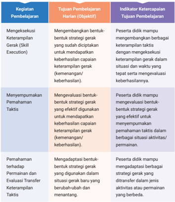
> **[Konteks Visual]**: Tabel ini berisi informasi tentang kegiatan pembelajaran, tujuan pembelajaran harian (objektif), dan indikator ketercapaiannya. Berikut penjelasan lebih lanjut:

1. **Kegiatan Pembelajaran**:
   - Mengkesejuki Keterampilan Gerak (Skill Execution)
   - Menyempurnakan Pemahaman Taktis
   - Memahami Peran dan Evaluasi Transfer Keterampilan Taktis

2. **Tujuan Pembelajaran Harian (Objektif)**:
   - Mengembangkan bentuk strategi gerak yang sudah dipicu untuk mendapatkan keberhasilan capaian keterampilan gerak (kemampuan/keberhasilan).
   - Mengevaluasi bentuk-bentuk strategi gerak yang efektif digunakan untuk mendapatkan keberhasilan capaian keterampilan gerak (kemampuan/keberhasilan).
   - Mengadaptasi bentuk-bentuk strategi gerak yang digunakan dalam situasi gerak baru yang berubah-ubah dan menantang.

3. **Indikator Ketercapaiannya Tujuan Pembelajaran**:
   - Peserta didik mampu mengembangkan berbagai keterampilan taktis dengan mengkesejuki keterampilan gerak dalam situasi dan waktu yang tepat serta mengevaluasi keberhasilannya.
   - Peserta didik mampu menevaluasi bentuk-bentuk strategi gerak yang efektif untuk menyempurnakan pemahaman taktis dalam berbagai situasi aktivitas/permainan.
   - Peserta didik mampu mengadaptasi berbagai bentuk strategi gerak yang ditransfer dalam jenis aktivitas atau permainan yang berbeda.

Tabel ini membantu dalam merencanakan proses pembelajaran yang terstruktur dan mencakup berbagai aspek keterampilan gerak dan pemahaman taktis.

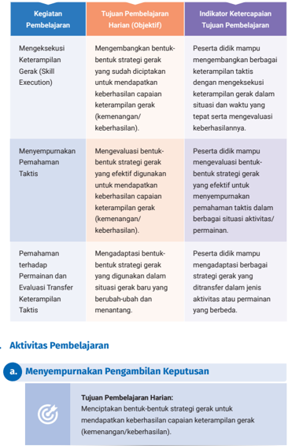
> **[Konteks Visual]**: Tabel ini berisi informasi tentang kegiatan pembelajaran, tujuan pembelajaran harian (objektif), dan indikator ketercapaiannya. Tabel ini terdiri dari kolom berikut:

1. Kegiatan Pembelajaran: Ini adalah tugas atau aktivitas yang harus dilakukan oleh peserta didik.
2. Tujuan Pembelajaran Harian (Objektif): Ini adalah tujuan yang ingin dicapai dalam setiap kegiatan pembelajaran.
3. Indikator Ketercapaiannya: Ini adalah cara untuk mengevaluasi apakah tujuan pembelajaran telah dicapai.

Beberapa contoh baris dalam tabel ini:

- Mengeksekusi Keterampilan Gerak (Skill Execution): Tujuan adalah mengembangkan bentuk strategi gerak yang ditentukan untuk mendapatkan keberhasilan keterampilan gerak (kemenangan/keberhasilan). Indikator ketercapaiannya adalah peserta didik mampu mengembangkan berbagai keterampilan taktis dengan keberhasilan gerak dalam situasi dan waktu yang tepat serta mengevaluasi keberhasilannya.
- Menyempurnakan Pemahaman Taktis: Tujuan adalah mevaluasi bentuk-bentuk strategi gerak yang efektif digunakan untuk mendapatkan keberhasilan keterampilan gerak (kemenangan/keberhasilan). Indikator ketercapaiannya adalah peserta didik mampu mengevaluasi bentuk-bentuk strategi gerak yang efektif untuk menyempurnakan pemahaman taktis dalam berbagai situasi aktivitas/permainan.
- Pemahaman terhadap Permanen dan Evaluasi Transfer Keterampilan Taktis: Tujuan adalah mengadaptasi bentuk-bentuk strategi gerak yang digunakan dalam situasi gerak yang berubah-ubah dan menantang. Indikator ketercapaiannya adalah peserta didik mampu mengadaptasi berbagai strategi gerak yang ditransfer dalam jenis aktivitas atau permainan yang berbeda.

Aktivitas Pembelajaran: Menyempurnakan Pengambilan Keputusan

Tujuan Pembelajaran Harian: Menciptakan bentuk-bentuk strategi gerak untuk mendapatkan keber

### [HALAMAN_107]

## Bagian 1 Memahami Situasi Permainan
Pada subbab menyempurnakan pengambilan keputusan ini, guru dapat mengawali dengan memotivasi dan mendorong semangat belajar peserta didik mengenai keterampilan taktis dengan memberikan pertanyaan pemantik, 'Bagaimana cara terbaik untuk membuat keputusan cepat dan tepat di tengah tekanan permainan, sehingga mampu meraih kemenangan?'

## Aktivitas 1    Belajar Mendalam

## Sebelum Aktivitas Praktik
Peserta didik mendiskusikan pengambilan keputusan dalam situasi taktis suatu permainan atau olahraga terutama dalam memahami situasi permainan.
Peserta didik membaca cara memahami situasi permainan yakni dengan menilai kondisi permainan saat ini dan mengidentifikasi momen taktis.
Peserta didik mendalami kedua hal tersebut melalui pembelajaran praktik pada aktivitas 1.

## Selama Aktivitas Praktik
Peserta didik mempraktikkan cara mengambil keputusan dalam situasi  permainan modifikasi. Guru memastikan peserta didik memiliki banyak kesempatan untuk mengambil keputusan.
Bentuk aktivitas olahraga atau permainan dalam buku ini hanya contoh, guru dapat mengganti dengan aktivitas lain yang sesuai dengan satuan pendidikan masing-masing.
Tujuan: Mengembangkan kemampuan menilai kondisi permainan dan membuat keputusan cepat dan mengidentifikasi momen taktis kunci untuk menyerang atau bertahan.

### [HALAMAN_108]

Berikan Instruksi seperti yang terdapat pada aktivitas 1 halaman 61 pada buku siswa.
Setiap pengamat diminta untuk melengkapi lembar pengamatan sederhana yang terdapat pada buku aktivitas 1. Setelah permainan selesai, pengamat akan bergabung kembali dengan pemain dan mendiskusikan keputusan-keputusan yang dibuat di lapangan. Apa yang mereka lihat? Apakah ada peluang untuk menyerang atau bertahan yang tidak dimanfaatkan?
Mintalah peserta didik untuk bertukar peran. Pemain menjadi pengamat dan begitu pula sebaliknya.

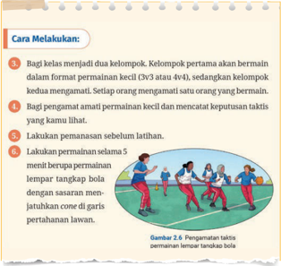
> **[Konteks Visual]**: Gambar tersebut menunjukkan instruksi tentang cara melakukan latihan permainan sepak bola. Berikut adalah deskripsi detail dari gambar tersebut:

1. Gambar tersebut berisi instruksi dalam bahasa Indonesia.
2. Instruksi dibagi menjadi beberapa baris, masing-masing dengan nomor di sebelah kiri.
3. Baris pertama memberikan informasi bahwa kelas akan dibagi menjadi dua kelompok.
4. Kelompok pertama akan bermain dalam format permainan kecil (3v3 atau 4v4).
5. Kelompok kedua akan mengamati permainan kecil tersebut.
6. Bagi pemain yang mengamati permainan kecil, mereka harus mencatat keputusan taktis yang dilakukan.
7. Langkah-langkah ini harus dilakukan sebelum latihan.
8. Latihan akan dilakukan selama 5 menit, dimulai dengan bermain permainan kecil.
9. Setelah itu, pemain akan bermain permainan kecil lagi, tetapi dengan sasaran menjatuhkan cone di garis pertahanan lawan.

Elemen-elemen lainnya seperti gambar orang bermain sepak bola, cone, dan garis pertahanan lawan juga dapat dilihat dalam gambar tersebut.

### [HALAMAN_109]

## Setelah Aktivitas Praktik
Peserta didik diminta menjawab pertanyaan refleksi berikut ini.
Apa yang telah kamu pelajari tentang menilai situasi permainan?
Apakah kamu melihat momen taktis kunci yang tidak kamu sadari sebelumnya?
Bagaimana kamu akan menyesuaikan keputusanmu di lain waktu?
Berikan penguatan bagi peserta didik bahwa menjadi observer / pengamat adalah bagian dari proses belajar.

## Asesmen Formatif
Guru melakukan asesmen formatif berupa umpan balik terhadap kegiatan yang dilakukan peserta didik terutama terhadap cara mereka mengambil keputusan berdasarkan kemampuan memahami situasi permainan.
Guru memberikan umpan balik terhadap hasil observasi keterampilan yang dilakukan.
Guru memberikan umpan balik terhadap jawaban pertanyaan reflektif setelah aktivitas.
Umpan balik yang diberikan bersifat positif dan konstruktif, 'Kamu tadi bergerak mundur terlebih dahulu saat ditekan lawan, itu gerakan yang bagus untuk mendapatkan ruang untuk mengoper bola'
Guru  memberikan  penguatan  perlunya  memahami  situasi permainan, 'Memahami situasi permainan sangat penting untuk dapat mengambil keputusan yang tepat dalam mencapai keberhasilan taktis pada situasi permainan yang dinamis'.
Umpan balik yang diberikan guru diarahkan untuk menggunakan kemampuan memahami situasi permainan akan menyempurnakan kemampuan pengambilan keputusan yang tepat.

### [HALAMAN_110]

## Bagian 2 Mengantisipasi Gerakan Lawan
Setelah peserta didik mempelajari bahwa memahami situasi permainan dapat membantu mereka dalam kemampuan pengambilan keputusan yang tepat, selanjutnya ajak peserta didik untuk mampu mengantisipasi pergerakan lawan, sehingga dapat mengambil keputusan taktis yang tepat. Berikut dua cara untuk mengantisipasi gerakan lawan.

## Memprediksi Aksi Lawan
Peserta didik belajar untuk memprediksi pergerakan lawan sebelum melakukan pergerakan. Kemampuan memprediksi pergerakan lawan dapat dilakukan dengan memperhatikan dua hal berikut.
Gerakan tubuh lawan: apakah mereka menunjukkan tanda-tanda akan menyerang atau bertahan?
Pola permainan: apakah mereka cenderung menggunakan gerakan yang sama berulang kali?

## Merencanakan Counter-move
Setelah mampu memprediksi aksi lawan, peserta didik belajar untuk merencanakan counter-move .  Jika  peserta  didik  tahu  lawan  akan menyerang ke kanan, maka bersiap-siap untuk memotong pergerakan mereka atau mengarahkan mereka ke sisi lapangan yang lebih sulit. Strategi ini dapat digunakan baik dalam menyerang maupun bertahan. Berikut beberapa strategi yang dapat peserta didik gunakan untuk melakukan counter-moved .
Counter-attack (serangan balik): segera menyerang saat lawan kehilangan kendali.
Blokade  defensif: menghadang  pergerakan  lawan  yang  akan menyerang.
Selanjutnya ajaklah peserta didik melakukan aktivitas praktik untuk menerapkan dan memperkuat pemahaman tentang kemampuan mengantisipasi pergerakan lawan.

### [HALAMAN_111]

## Sebelum Aktivitas Praktik
Ajak peserta didik untuk mempraktikan penerapan kemampuan mengantisipasi pergerakan lawan.
Dalam aktivitas ini peserta didik akan melakukan keterampilan gerak sepak bola.
Keterampilan gerak sepak bola dapat diganti dengan aktivitas lain yang akan dipelajari di masing-masing satuan pendidikan.

## Selama Aktivitas Praktik
Berikan instruksi aktivitas 2 kepada peserta didik seperti yang terdapat pada buku siswa halaman 65.

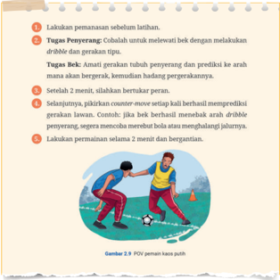
> **[Konteks Visual]**: Gambar tersebut menunjukkan instruksi latihan sepak bola untuk pemain muda. Berikut adalah deskripsi detail dari instruksi tersebut:

1. Latihan pemantauan setelah latihan.
2. Tugas penyaringan: Cobalah untuk melewati bek dengan melakukan dribble dan gerakan tipis.
3. Tugas Bek: Anak-anak gerakkan tubuh untuk penyaringan dan prediksi ke arah mana akan bergerak, kemudian hadang perpukalanannya.
4. Setelah 2 menit, silahkan berlatih berpasang.
5. Selanjutnya, pikiran counter-move selalu berusaha memprediksi gerakan lawan. Contoh: jika bek berhasil merebut arah dribble penyaringan, segera menunda merebut bola saat menghalangi jurusannya.
6. Lakukan pemantauan selama 2 menit dan berganti.

Elemen-elemen yang terlihat dalam gambar tersebut adalah instruksi latihan sepak bola, tugas-tugas yang harus dilakukan oleh pemain, dan petunjuk tentang cara melakukan pemantauan dan penyaringan. Gambar tersebut juga menunjukkan dua orang pemain sepak bola sedang bermain.

### [HALAMAN_112]

## Setelah Aktivitas Praktik
Mintalah peserta didik menjawab pertanyaan refleksi berikut ini.
Bagaimana kamu dapat memprediksi gerakan lawan dengan lebih baik?
Tindakan apa yang kamu rencanakan untuk menghadapi lawan?
Bagaimana prediksi gerakan lawan membantumu dalam permainan?

## Asesmen Formatif
Berikan umpan balik terhadap kemampuan peserta didik dalam memprediksi pergerakan lawan dan dorong untuk menemukan antisipasi yang paling efektif.
Berikan umpan balik terhadap jawaban peserta didik dan berikan masukan  terhadap  rancangan  pengembangan  kemampuan mengantisipasi pergerakan lawan, 'Kamu sudah membuat rencana yang bagus ketika berhasil merebut bola dari lawan, segera mencari teman yang berada di area yang kosong'.

## Bagian 3 Menyesuaikan Strategi Langsung ( Real time )
Setelah peserta didik mempelajari bahwa mengantisipasi aksi lawan dapat membantu mereka dalam kemampuan pengambilan keputusan yang tepat, selanjutnya ajak peserta didik untuk mampu menyesuaikan strategi langsung ( real time) . Situasi permainan sering berubah dengan cepat, maka peserta didik perlu menyesuaikan strategi secara real-time, artinya pemain harus mengubah taktik dengan cepat berdasarkan situasi yang ada di lapangan. Kemampuan ini penting untuk menghadapi keputusan lawan dan memaksimalkan peluang tim untuk meraih kesuksesan.

### [HALAMAN_113]

## Sebelum Aktivitas Praktik
Ajak peserta didik untuk mempraktikan penerapan menyesuaikan strategi real time .
Dalam aktivitas ini contoh aktivitasnya adalah keterampilan gerak bulutangkis. Keterampilan gerak tersebut dapat diganti dengan aktivitas  lain  yang  akan  dipelajari  di  masing-masing  satuan pendidikan.

## Selama Aktivitas Praktik
Berikan instruksi aktivitas 3 kepada peserta didik seperti yang ada pada buku siswa halaman 66 - 67.

## Setelah Aktivitas Praktik
Mintalah peserta didik menjawab pertanyaan refleksi berikut ini.
Bagaimana kamu bereaksi ketika lawan tiba-tiba mengubah strategi mereka?
Apa hal yang paling sulit dilakukan saat mencoba menyesuaikan strategi secara cepat?

## Asesmen Formatif
Berikan umpan balik terhadap kemampuan peserta didik dalam menyesuaikan strategi secara real time dan dorong untuk menemukan penyesuaian strategi yang paling efektif.
Berikan umpan balik terhadap jawaban peserta didik dan berikan masukan terhadap rancangan pengembangan kemampuan menyesuaikan strategi secara real time , 'Kamu sudah mampu mengubah strategi sesuai kondisi permainan, kamu dapat melakukannya dengan lebih cepat untuk mendapatkan kesempatan yang lebih besar'.

### [HALAMAN_114]

## Sebelum Aktivitas Praktik
Peserta didik diajak untuk mempraktikkan penerapan pengambilan keputusan.
Keterampilan gerak yang dilakukan dalam aktivitas ini adalah permainan  invasi . Keterampilan  gerak  tersebut  dapat  diganti dengan aktivitas lain yang akan dipelajari di masing-masing satuan pendidikan.
Tujuan aktivitas permainan adalah sebagai berikut.
Mendorong peserta didik untuk menciptakan strategi yang sesuai dengan situasi permainan.
Mengembangkan kemampuan pengambilan keputusan di bawah tekanan.
Mengevaluasi kualitas keputusan yang peserta didik buat selama permainan.
Mengadaptasi strategi  saat  aturan  atau  situasi  permainan berubah.
Dalam aktivitas ini, peserta didik akan berlatih dalam zona taktik yang berbeda.
Setiap zona memiliki tantangan taktis yang unik. Peserta didik akan membuat keputusan cepat berdasarkan perubahan situasi permainan.
Setelahnya, peserta didik akan mengevaluasi keputusannya dan berlatih menyesuaikan strategi untuk menghadapi situasi gerak baru.

## Selama Aktivitas Praktik
Berikan instruksi aktivitas tahap 1 sampai dengan tahap 3 kepada peserta didik seperti yang terdapat pada buku siswa halaman 68 - 71.

### [HALAMAN_115]

## Setelah Aktivitas Praktik
Mintalah peserta didik menjawab pertanyaan refleksi di masing-masing tahapan.

## Asesmen Formatif
Berikan umpan balik terhadap kemampuan peserta didik dalam menyesuaikan strategi  dalam  berbagai  situasi  di  setiap  tahap aktivitas, dorong untuk menemukan penyesuaian strategi yang paling efektif.
Berikan umpan balik terhadap jawaban peserta didik dan berikan masukan terhadap rancangan pengembangan kemampuan menyesuai  kan strategi secara real time .  Sebagai contoh, 'Kamu sudah mampu mengubah strategi ketika aturan diubah, kamu dapat melaku  kan  nya dengan lebih memanfaatkan ruang-ruang kosong untuk mengurangi tekanan lawan'.

## b. Mengeksekusi Keterampilan Gerak ( Skill Execution )

## Tujuan Pembelajaran Harian:
Mengembangkan bentuk-bentuk strategi gerak yang sudah diciptakan untuk mendapatkan keberhasilan capaian keterampilan gerak (kemenangan/ keberhasilan).
Pada awal kegiatan berikan pertanyaan pemantik berikut.
'Bagaimana caramu menjaga ketepatan dan kontrol keterampilan gerak teknis, beradaptasi dengan tekanan lawan, dan perubahan situasi permainan?'
Ajaklah  peserta  didik  merefleksikan  pengalaman  belajar  mereka menggunakan keterampilan gerak yang dikuasai untuk mendukung keberhasilan strategi atau taktik dalam sebuah permainan atau olahraga. Berikan penguatan bahwa kemampuan mengeksekusi keterampilan gerak dengan baik memberikan pengaruh yang besar terhadap keberhasilan taktik atau strategi. Mintalah peserta didik untuk memperhatikan gambar 2.16 pada buku siswa untuk memahami cara mengeksekusi keterampilan gerak dalam situasi taktis.

### [HALAMAN_116]

## Sebelum Aktivitas Praktik
Peserta didik diajak untuk mempraktikkan kemampuan mengeksekusi keterampilan gerak dalam situasi permainan invasi.
Dalam aktivitas ini contoh aktivitasnya adalah permainan invasi. Keterampilan gerak tersebut dapat diganti dengan aktivitas lain yang akan dipelajari di satuan pendidikan.
Sampaikan tujuan dari aktivitas ini, yaitu melatih kemampuan mengontrol bola ( dribbling ) dan mengoper ( passing ) dengan akurasi, bahkan di bawah tekanan lawan.

## Selama Aktivitas Praktik
Berikan instruksi aktivitas tahap 1 dan tahap 2 kepada peserta didik seperti yang terdapat pada buku siswa halaman 73 - 74.

## Setelah Aktivitas Praktik
Ajak peserta didik untuk menjawab pertanyaan refleksi berikut ini.
Bagaimana kamu mengontrol bola saat menggiring?
Bagaimana kamu menjaga akurasi/ketepatan operanmu saat di bawah tekanan?

## Asesmen Formatif
Berikan umpan balik terhadap kemampuan peserta didik dalam mengeksekusi keterampilan dalam situasi taktis.

### [HALAMAN_117]

Berikan kesempatan kepada peserta didik untuk menilai diri sendiri atau saling menilai antarteman mengenai kemampuan mengeksekusi keterampilan dalam berbagai situasi taktis.
Berikan umpan balik terhadap jawaban dari pertanyaan refleksi yang diberikan.

### [HALAMAN_116]

### [HALAMAN_117]

## Sebelum Aktivitas Praktik
Ajak peserta didik untuk mempraktikkan kemampuan mengeksekusi keterampilan gerak dalam situasi permainan net.
Aktivitas ini akan mengasah keterampilan gerak dalam permainan net . Keterampilan gerak tersebut dapat diganti dengan aktivitas lain yang akan dipelajari di masing-masing satuan pendidikan.
Sampaikan tujuan dari aktivitas ini yaitu melatih kemampuan passing dan setting untuk melakukan serangan.

## Selama Aktivitas Praktik
Dalam aktivitas ini, peserta didik akan berlatih melakukan gerakan passing dan setting untuk menyerang dalam permainan bola voli (dapat disesuaikan dengan sarana dan prasarana sekolah atau sesuai kesepakatan bersama).
Instruksikan peserta didik untuk mengikuti langkah-langkah kegiatan tahap 1 dan tahap 2 yang terdapat pada buku siswa halaman 75 dan 76.

## Setelah Aktivitas Praktik
Ajak peserta didik untuk menjawab pertanyaan refleksi berikut ini.
Bagaimana cara kamu untuk berhasil melakukan passing dengan tepat?
Bagaimana melihat ruang saat melakukan serangan?

### [HALAMAN_118]

## Asesmen Formatif
Berikan umpan balik terhadap kemampuan peserta didik dalam mengeksekusi keterampilan dalam dua situasi yang berbeda.
Berikan kesempatan peserta didik untuk saling memberikan umpan balik antarteman.
Berikan umpan balik terhadap jawaban pertanyaan refleksi.
Berikan penguatan atas kemampuan peserta didik dalam menggunakan pendekatan yang sama untuk mengeksekusi keterampilan gerak dalam berbagai situasi taktis dalam bentuk permainan atau olahraga yang lain.

## c. Menyempurnakan Pemahaman Taktis

## Tujuan Pembelajaran Harian:
Mengevaluasi bentuk-bentuk strategi gerak  yang efektif digunakan untuk mendapatkan keberhasilan capaian keterampilan gerak (kemenangan/ keberhasilan).
Sebelum lebih jauh mempelajari materi ini, ajak peserta didik untuk berbagi  pengalaman  belajar  mereka  menemukan  cara  meraih kemenangan atau keberhasilan dalam permainan atau olahraga.
Sebagai awal pembelajaran berikan pertanyaan pemantik berikut. 'Bagaimana meningkatkan efektivitas strategi dalam menciptakan peluang dan mencegah serangan lawan?'

## Bagian 1

## Keterampilan Taktis Menyerang
Pada tahap pembelajaran ini ajaklah peserta didik untuk mengembangkan keterampilan taktis menyerang agar mendapatkan skor dari sebuah aktivitas permainan atau olahraga. Ajaklah peserta didik mendapatkan pengalaman belajar dengan mempraktikkan aktivitas belajar berikut ini.

### [HALAMAN_119]

## Sebelum Aktivitas Praktik
Ajak peserta didik untuk mempraktikkan kemampuan mengembangkan keterampilan taktis menyerang.
Aktivitas ini akan mempraktikkan permainan invasi. Keterampilan gerak  tersebut  dapat  diganti  dengan  aktivitas  lain  yang  akan dipelajari di masing-masing satuan pendidikan.
Sampaikan tujuan dari aktivitas ini yaitu menciptakan ruang dalam berbagai taktik pertahanan lawan.

## Selama Aktivitas Praktik
Instruksikan peserta didik untuk mengikuti langkah-langkah aktivitas 7 yang terdapat pada buku siswa halaman 79 dan 82.

## Setelah Aktivitas Praktik
Berikan  penguatan  kepada  peserta  didik  bahwa  mengembangkan pengetahuan taktis merupakan proses untuk menciptakan, mengembangkan, mengevaluasi, dan menyesuaikan strategi. Dalam olahraga, taktik menyerang yang baik sangat bergantung pada kemampuan pemain untuk berpikir cepat, menciptakan ruang, dan membuat keputusan yang tepat. Berlatih dengan skenario taktis yang beragam akan membantu peserta didik dalam memahami waktu dan cara yang tepat dalam menggunakan taktik menyerang dalam permainan yang sesungguhnya.

## Asesmen Formatif
Berikan umpan balik spesifik terhadap kemampuan peserta didik dalam mengembangkan keterampilan taktis menyerang dalam tiga aktivitas tersebut.
Berikan kesempatan peserta didik untuk saling memberikan umpan balik antarteman.
Berikan umpan balik terhadap respon peserta didik ketika menjawab pertanyaan refleksi.

### [HALAMAN_120]

## Bagian 2 Keterampilan Taktis Bertahan
Pada bagian ini peserta didik mendiskusikan bahwa dalam satu kesatuan utuh sebuah permainan tidak hanya tentang menyerang tetapi juga yang tidak kalah penting yaitu bertahan. Peserta didik akan mengembangkan keterampilan taktis bertahan melalui aktivitas praktik di bawah ini.

## Aktivitas 8    Belajar Mendalam

## Sebelum Aktivitas Praktik
Peserta didik akan mempraktikkan kemampuan mengembang  kan keterampilan taktis bertahan.
Kemampuan mengembangkan keterampilan taktis bertahan dalam aktivitas ini akan dipraktikkan dalam permainan invasi. Keterampilan gerak tersebut dapat diganti dengan aktivitas lain yang akan dipelajari di masing-masing satuan pendidikan.
Sampaikan tujuan dari masing-masing aktivitas.
Kegiatan 1: Mengurangi ruang lawan dan menjaga pemain lawan.
Kegiatan 2: Mengembangkan taktik bertahan dalam permainan.
Kegiatan 3: Mengevaluasi dan mengadaptasi taktik bertahan.

## Selama Aktivitas Praktik

## Kegiatan 1: Menciptakan Strategi Bertahan
Tujuan: Mengembangkan pemahaman taktik bertahan dengan fokus pada mengurangi ruang lawan dan menjaga pemain, dan melatih kemampuan beradaptasi dengan situasi permainan yang berubah.
Instruksikan peserta didik untuk mengikuti tahapan seperti yang ada pada buku siswa halaman 83.

### [HALAMAN_121]

## Kegiatan 2: Mengembangkan Taktik Bertahan dalam Permainan
Instruksikan peserta didik untuk mengikuti tahapan seperti yang ada pada buku siswa halaman 84.
Peserta didik yang berperan sebagai pengamat mengisi lembar observasi yang ada pada aktivitas 8.

### [HALAMAN_122]

Mintalah peserta didik menjawab pertanyaan berikut.
Apakah strategi bertahanmu bekerja dengan baik ketika berada di bawah tekanan?
Apa yang dapat diperbaiki untuk menutup ruang lebih cepat?

### [HALAMAN_121]

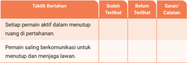
> **[Konteks Visual]**: Tabel ini berisi kolom-kolom berikut:

1. Taktik Bertahan
2. Sudah Terlihat
3. Belum Terlihat
4. Saran/Catatan

Tabel ini mungkin digunakan untuk mengorganisir informasi tentang taktik bertahan dalam suatu pertandingan atau situasi tertentu. Kolom "Sudah Terlihat" mungkin menunjukkan taktik-taktik yang telah dijalankan atau dilihat sebelumnya, sedangkan kolom "Belum Terlihat" mungkin menunjukkan taktik-taktik yang belum pernah dilakukan atau dilihat. Kolom "Saran/Catatan" mungkin digunakan untuk menyajikan saran atau catatan tentang taktik-taktik tersebut.

Namun, tanpa informasi tambahan, sulit untuk memberikan deskripsi lebih lanjut tentang isi tabel ini.

> **[Konteks Visual]**: Tabel ini berisi kolom-kolom berikut:

1. Taktik Bertahan
2. Sudah Terlihat
3. Belum Terlihat
4. Saran/Catatan

Tabel ini mungkin digunakan untuk mengorganisir informasi tentang taktik bertahan dalam suatu pertandingan atau situasi tertentu. Kolom "Sudah Terlihat" mungkin menunjukkan taktik-taktik yang telah dijalankan atau dilihat sebelumnya, sedangkan kolom "Belum Terlihat" mungkin menunjukkan taktik-taktik yang belum pernah dilakukan atau dilihat. Kolom "Saran/Catatan" mungkin digunakan untuk menyimpan saran atau catatan tambahan yang berkaitan dengan taktik-taktik tersebut.

Namun, tanpa informasi lebih lanjut tentang konteks atau isi dari tabel ini, sulit untuk memberikan deskripsi yang lebih spesifik.

### [HALAMAN_122]

## Kegiatan 3: Mengevaluasi dan Mengadaptasi Taktik Bertahan
Instruksikan peserta didik untuk mengikuti tahapan seperti yang ada pada buku siswa halaman 85.

## Setelah Aktivitas Praktik
Mintalah peserta didik menjawab pertanyaan berikut ini.
Bagaimana kamu akan mengadaptasi strategi bertahanmu untuk situasi yang lebih kompleks?
Apakah timmu dapat lebih cepat bereaksi saat lawan mengubah strategi mereka?

## Asesmen Formatif
Berikan umpan balik spesifik terhadap kemampuan peserta didik dalam mengembangkan keterampilan taktis bertahan dalam tiga tahap aktivitas tersebut.
Berikan kesempatan peserta didik untuk saling memberikan umpan balik antarteman.
Berikan umpan balik terhadap respon peserta didik ketika menjawab pertanyaan refleksi.

### [HALAMAN_123]

## d. Pemahaman terhadap Permainan dan Evaluasi Transfer Keterampilan Taktis

## Tujuan Pembelajaran Harian:
Mengadaptasi bentuk-bentuk strategi gerak yang digunakan dalam situasi gerak baru yang berubah-ubah dan  menantang.
Pada awal kegiatan berikan pertanyaan pemantik berikut.
'Bagaimana pemahaman taktis yang kamu kembangkan dalam satu permainan dapat meningkatkan keputusan dan performa pada olahraga yang lainnya?'
Ajaklah peserta didik merefleksikan pengalaman belajar mereka ketika menggunakan keterampilan taktis yang hampir sama namun dapat diterapkan dalam situasi atau jenis aktivitas permainan atau olahraga yang berbeda. Kemampuan mentransfer keterampilan taktis ini memberikan kemudahan bagi pemain untuk beradaptasi dalam berbagai situasi yang baru atau berbeda.
Berikan  penguatan  kepada  peserta  didik  bahwa  kemampuan mentransfer keterampilan taktis dapat berguna untuk aktivitas gerak yang mereka lakukan. Sebagai contoh, selama pembelajaran di sekolah peserta didik belajar permainan bola voli, dan setelah lulus di komunitas barunya banyak yang menyukai bulutangkis, maka peserta didik akan mampu beradaptasi dengan baik dalam menguasai jenis olahraga atau permainan yang baru dipelajari.
Beberapa hal yang dapat diberikan sebagai penguatan kunci kepada peserta didik dalam menyempurnakan dan mengevaluasi keterampilan taktis melalui gambar 2.26 pada buku siswa.
Selanjutnya peserta didik mempraktikkan aktivitas menyempurnakan keterampilan taktis dan mentransfernya dalam permainan yang berbeda.

### [HALAMAN_124]

## Sebelum Aktivitas Praktik
Peserta didik mempraktikkan kemampuan mengevaluasi transfer keterampilan taktis.
Kemampuan mengevaluasi transfer keterampilan taktis dalam aktivitas ini akan dipraktikkan melalui permainan invasi, permainan net, dan permainan striking and fielding . Keterampilan gerak tersebut dapat diganti dengan aktivitas lain yang akan dipelajari di masingmasing satuan pendidikan.
Sampaikan rencana masing-masing aktivitas.
Transfer  Keterampilan  Pengambilan  Keputusan  ( Invasion Games ).
Tujuan khusus: latihan dalam permainan kecil 3v3 atau 4v4 yang mengharuskan pemain untuk membuat keputusan cepat mengenai waktu yang tepat untuk menyerang, mengoper, atau bertahan dalam permainan sepak bola/futsal kemudian menggunakan  cara  yang  sama  untuk  diterapkan  dalam permainan bola basket.
Transfer  Keterampilan  Menciptakan  dan  Menutup  Ruang (Permainan Net).
Tujuan khusus: latihan untuk menciptakan dan menutup ruang selama serangan dan pertahanan pada permainan bola voli kemudian dibawa ke dalam permainan bulu tangkis.
Transfer Keterampilan Taktis dengan Fokus pada Adaptasi Taktis ( Striking and Fielding Games ).
Tujuan khusus: latihan untuk menyesuaikan taktik menyerang dan bertahan dalam situasi permainan yang berbeda pada permainan sofbol kemudian dibawa ke dalam permainan kriket.

### [HALAMAN_125]

## Selama Aktivitas Praktik
Instruksikan peserta didik untuk mengikuti langkah-langkah aktivitas pada setiap tahapnya seperti yang terdapat pada buku siswa halaman 88 - 90.
Catatan: Aktivitas/jenis olahraga dapat diganti sesuai dengan kondisi sarana dan prasarana sekolah, minat ataupun kultur gerak di daerahmu. Poin Pentingnya adalah menghadirkan permainan sejenis.

## Setelah Aktivitas Praktik
Mintalah peserta didik merefleksikan pembelajaran mereka dengan menjawab pertanyaan berikut ini.
Apa tantangan yang kamu temukan saat mentransfer keterampilan taktis dalam permainan lain?
Bagaimana cara kamu dapat beradaptasi dengan cepat terhadap perubahan jenis permainan?
Berikan penguatan bahwa untuk mentransfer keterampilan taktis secara efektif dan memperkuat game sense ,  peserta didik harus menguasai beberapa keterampilan kunci, seperti pengambilan keputusan cepat, menciptakan dan menutup ruang, kemampuan membaca permainan, serta beradaptasi dengan situasi yang berbeda.

## Asesmen Formatif
Berikan umpan balik spesifik terhadap kemampuan peserta didik dalam menyempurnakan dan mentransfer keterampilan taktis dalam aktivitas permainan yang berbeda. Sebagai contoh berikan umpan balik berikut, 'Gunakan cara yang sama dalam permainan sebelumnya untuk membuka ruang'.
Berikan kesempatan peserta didik untuk saling memberikan umpan balik antarteman.
Berikan umpan balik setelah peserta didik menjawab pertanyaan refleksi.

### [HALAMAN_126]

## F. Tindak Lanjut
Peserta didik yang belum mencapai tujuan pembelajaran diberikan umpan balik dan aktivitas belajar ke level berikutnya sesuai dengan perkembangan mereka berdasarkan rubrik asesmen dan kriteria ketercapaian tujuan pembelajaran. Selain itu, dapat juga dengan menggunakan pembelajaran tutor sebaya dan guru memantau perkembangan proses belajarnya.
Peserta didik yang telah mencapai tujuan pembelajaran diberikan tugas pengayaan sebagai berikut.
Mengembangkan  dan  mempresentasikan  sebuah  proyek  rencana pengembangan dan evaluasi keterampilan dalam melaksanakan strategi gerak. Mengadopsi cara menyempurnakan keterampilan taktis sebagai strategi gerak dalam olahraga individu seperti atletik dan bela diri!
Peserta didik melakukan pencatatan hasil rancangan dan  latihan yang dilakukan untuk mengetahui progres latihan.
Peserta didik mengevaluasi secara mandiri efektivitas aktivitas tersebut untuk mentransfer keterampilan taktis sebagai strategi gerak olahraga individu atletik atau beladiri.
Peserta didik mencatat hasil tersebut dalam buku tugas/catatan.

## G.  Asesmen Sumatif
Asesmen sumatif ini digunakan untuk mengukur ketercapaian tujuan pembelajaran dalam satu lingkup materi yaitu menyempurnakan keterampilan taktis. Guru dapat menggunakan uji kompetensi dengan cara berikut ini atau juga dapat mengembangkan dalam bentuk yang lain.
Contoh Uji Kompetensi pada Buku Siswa
Buatlah rencana strategi dan taktik dalam salah satu permainan atau olahraga!

## Uji kompetensi ini untuk mengukur KKTP:
menciptakan bentuk-bentuk strategi gerak untuk mendapatkan keberhasilan capaian keterampilan gerak (kemenangan/keberhasilan).

### [HALAMAN_127]

Praktikkan  dan  kembangkan  strategi  yang  sudah  kamu  buat  dengan meningkatkan keterampilan taktis dalam tim!

## Uji kompetensi ini untuk mengukur KKTP:
mengembangkan bentuk-bentuk strategi gerak yang sudah diciptakan untuk mendapatkan keberhasilan capaian keterampilan gerak (kemenangan/ keberhasilan).
Buatlah catatan evaluasi untuk memperbaiki dan mengefektifkan taktik yang sudah dijalankan.

## Uji kompetensi ini untuk mengukur KKTP:
mengevaluasi bentuk-bentuk strategi gerak  yang efektif digunakan untuk mendapatkan keberhasilan capaian keterampilan gerak (kemenangan/keberhasilan).
Apa  saja  yang  perlu  diadaptasi  oleh  setiap  pemain  dalam  tim  dalam menyesuai  kan dengan situasi permainan!

## Uji kompetensi ini untuk mengukur KKTP:
mengadaptasi bentuk-bentuk strategi gerak yang digunakan dalam situasi gerak baru yang berubah-ubah dan  menantang.

## Tabel 2.2. Rubrik Asesmen Uji Kompetensi

### [HALAMAN_128]

> **[Konteks Visual]**: Tabel ini mungkin berisi kriteria evaluasi atau penilaian untuk sebuah program atau proses tertentu. Berikut adalah deskripsi singkat dari setiap kolom:

1. Kategori: Mungkin merupakan kriteria utama yang digunakan dalam penilaian.

2. Anal Berkembang (Skor 1-2): Menunjukkan tingkat kemampuan atau perkembangan awal dalam kategori tersebut.

3. Berkembang (Skor 3-4): Menunjukkan tingkat perkembangan sedang.

4. Layak (Skor 5-6): Menunjukkan tingkat layak atau baik.

5. Cakap (Skor 7-8): Menunjukkan tingkat cakap atau sangat baik.

6. Mahir (Skor 9-10): Menunjukkan tingkat mahir atau sangat cakap.

7. Pengembangan Taktik: Mungkin menunjukkan kemampuan untuk mengembangkan strategi atau taktik.

8. Evaluasi dan Perbaikan: Mungkin menunjukkan kemampuan untuk melakukan evaluasi dan perbaikan.

9. Adaptasi pada Situasi: Mungkin menunjukkan kemampuan untuk adaptasi terhadap situasi yang berubah.

Tabel ini mungkin digunakan dalam konteks pendidikan, pengembangan profesional, atau evaluasi proyek.

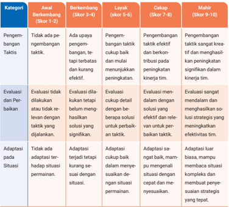
> **[Konteks Visual]**: Tabel ini mungkin berisi kriteria evaluasi atau penilaian untuk sebuah program atau proses tertentu. Berikut adalah deskripsi singkat dari setiap kolom:

1. Kategori: Mungkin merupakan kriteria utama yang digunakan dalam penilaian.

2. Anal Berkembang (Skor 1-2): Menunjukkan tingkat kemampuan atau perkembangan awal dalam kategori tersebut.

3. Berkembang (Skor 3-4): Menunjukkan tingkat perkembangan sedang.

4. Layak (Skor 5-6): Menunjukkan tingkat layak atau baik.

5. Cakap (Skor 7-8): Menunjukkan tingkat cakap atau sangat baik.

6. Mahir (Skor 9-10): Menunjukkan tingkat mahir atau sangat cakap.

7. Pengembangan Taktik: Mungkin menunjukkan kemampuan untuk mengembangkan strategi atau taktik.

8. Evaluasi dan Perbaikan: Mungkin menunjukkan kemampuan untuk melakukan evaluasi dan perbaikan.

9. Adaptasi pada Situasi: Mungkin menunjukkan kemampuan untuk adaptasi terhadap situasi yang berubah.

Tabel ini mungkin digunakan dalam konteks pendidikan, pengembangan profesional, atau evaluasi proyek.

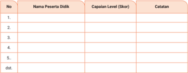
> **[Konteks Visual]**: Tabel ini mungkin digunakan untuk menyimpan informasi tentang peserta didik dalam sebuah program atau ujian tertentu. Tabel tersebut memiliki kolom berikut:

1. No: Kolom ini mungkin digunakan untuk menunjukkan nomor urut dari setiap peserta didik yang diinputkan.

2. Nama Peserta Didik: Kolom ini mungkin digunakan untuk menyimpan nama-nama peserta didik yang mengikuti program atau ujian tersebut.

3. Capaian Level (Skor): Kolom ini mungkin digunakan untuk menyimpan skor atau capaian level peserta didik dalam program atau ujian tersebut.

4. Catatan: Kolom ini mungkin digunakan untuk menyimpan catatan atau informasi tambahan yang berkaitan dengan peserta didik tersebut.

Tabel ini tampaknya dirancang untuk memudahkan pengelolaan dan analisis data tentang peserta didik dalam program atau ujian tertentu.

Nilai Sumatif =
Total Skor diperoleh X 100
Total Skor Maksimal

### [HALAMAN_129]

## H.  Refleksi

## 1. Refleksi Peserta Didik
Peserta  didik  diminta  menyalin  tabel  refleksi  dalam  buku  tugas.  Lalu memberikan tanda centang sesuai dengan pengalamannya pada kolom sudah mampu melakukan atau masih perlu belajar. Guru perlu menggarisbawahi bahwa refleksi bukan sebagai penilaian sehingga yang perlu mereka lakukan adalah mengisi dengan jujur. Refleksi digunakan untuk belajar ke tahap selanjutnya. Pertanyaan Refleksi terdapat pada buku siswa halaman 92.

## 2. Refleksi Guru
Refleksi Guru erat kaitannya dengan hasil refleksi peserta didik untuk mengevaluasi dan mengembangkan pembelajaran yang semakin baik. Gunakan  pertanyaan  berikut  ini  untuk  melakukan  refleksi  terhadap pembelajaran pengoptimalan keterampilan gerak.
Apakah sudah memfasilitasi peserta didik untuk menciptakan strategi gerak dalam aktivitas latihan yang mendorong proses penyempurnaan keterampilan taktis?
Apakah sudah memfasilitasi peserta didik mengembangkan strategi gerak melalui berbagai aktivitas latihan?
Apakah sudah memfasilitasi peserta didik dalam mengevaluasi dan menemukan strategi gerak yang efektif dalam berbagai situasi?
Apakah sudah memfasilitasi peserta didik mengadaptasi dan mentransfer strategi gerak sesuai dengan kondisi atau situasi permainan?
Strategi dan tindak lanjut pembelajaran berikutnya berdasarkan hasil refleksi peserta didik maupun refleksi guru, seperti contoh berikut.
Peserta didik masih perlu belajar menciptakan dan mengembangkan strategi gerak dalam berbagai situasi maka guru dapat memberikan pendampingan atau bersama rekan sejawat yang sudah berhasil atau melakukan bimbingan khusus terhadap peserta didik tersebut.

### [HALAMAN_130]

Peserta didik masih perlu belajar dalam membangun motivasi intrinsik untuk membuat dan menjalankan aktivitas latihan, maka guru menggali kembali tujuan dari peserta didik untuk menyempurnakan keterampilan taktis agar menemukan rasa senang dan nikmatnya bergerak, manfaat apa yang akan diperolehnya, dukungan apa yang diperlukan untuk mencapai tujuan tersebut.
Guru dapat mengembangkan lagi berbagai langkah tindak lanjut hasil refleksi sesuai dengan kebutuhan belajar peserta didik.

## I. Sumber Belajar
Guru dapat menggunakan berbagai sumber belajar untuk mengedukasi peserta didik dalam menyempurnakan keterampilan taktis dan menggunakannya dalam berbagai situasi gerak lainnya.
Sumber buku utama adalah Buku Siswa mata pelajaran PJOK untuk kelas XI SMA/SMK.
Sumber alternatif lain dapat menggunakan buku dari Stephen A. Mitchell_ Judith L. Oslin_ Linda L. Griffin Teaching Sport Concepts and Skills_ A Tactical Games Approach-Human Kinetics (2020).
Guru juga dapat menggunakan sumber lain yang relevan dan terpercaya.

### [HALAMAN_131]

KEMENTERIAN PENDIDIKAN, KEBUDAYAAN, RISET, DAN TEKNOLOGI REPUBLIK INDONESIA, 2024
Panduan Guru Pendidikan Jasmani, Olahraga, dan Kesehatan untuk SMA/SMK/MA/MAK Kelas XI
Penulis: Anggara Aditya Kurniawan, Damar Pamungkas ISBN: 978-634-00-0105-1 (jil.2 PDF)

## PANDUAN KHUSUS

## Mengevaluasi Dampak Konsep Gerak

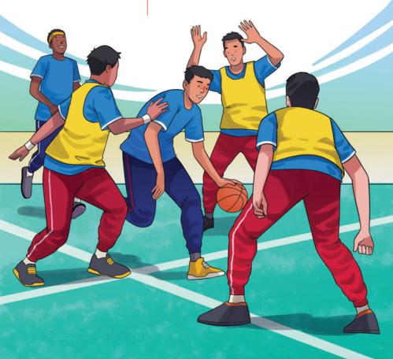
> **[Konteks Visual]**: Gambar ini menunjukkan beberapa orang bermain bola basket di lapangan. Mereka semua berdiri di lapangan dengan latar belakang yang menunjukkan area lapangan basket. Ada dua tim yang terlihat, satu tim berwarna biru dan lainnya berwarna kuning. Tim berwarna biru sedang berusaha mengambil bola dari tim berwarna kuning. Tim berwarna kuning tampak bergerak untuk menghalangi atau mencoba untuk mengambil bola tersebut. Semua pemain tampak bergerak aktif dalam pertandingan tersebut.

### [HALAMAN_132]

## A.  Pendahuluan

## 1. Tujuan Pembelajaran dan Kriteria Ketercapaian Tujuan Pembelajaran (KKTP)

## a. Tujuan Pembelajaran
Memahami konsep dasar gerak, termasuk elemen ruang, waktu, tenaga, dan hubungan.
Menerapkan konsep gerak untuk menyelesaikan tantangan fisik dengan efektif dan efisien.
Menumbuhkan kepercayaan diri, sikap pantang menyerah, dan refleksi kritis terhadap pengalaman belajar fisik.

## b. Kriteria Ketuntasan Tujuan Pembelajaran (KKTP)
Peserta didik dapat menjelaskan konsep gerak (ruang dan tenaga) dengan benar dalam konteks tertentu.
Peserta didik dapat mengidentifikasi prinsip-prinsip biomekanika sederhana dalam aktivitas fisik.
Melakukan aktivitas fisik seperti senam lantai (guling depan dan split) dengan teknik yang benar dan aman.
Menyusun strategi gerak berdasarkan situasi permainan misalnya, menyesuaikan langkah dalam lari estafet.
Menunjukkan kerja sama yang baik dalam aktivitas tim.
Memberikan umpan balik konstruktif kepada teman sekelas.
Melakukan refleksi atas hasil evaluasi gerak dengan menyebutkan area perbaikan.

### [HALAMAN_133]

## 2. Peta Konsep

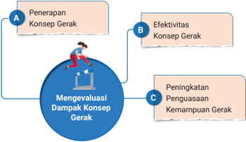
> **[Konteks Visual]**: Gambar tersebut mungkin merupakan representasi dari sebuah diagram atau grafik yang menunjukkan hubungan antara tiga aspek utama dalam proses pembelajaran atau pengembangan keterampilan gerak. Aspek-aspek tersebut adalah:

1. A: Penerapan Konsep Gerak - Ini mungkin merujuk pada bagaimana konsep gerak dapat diaplikasikan dalam praktik.

2. B: Efektivitas Konsep Gerak - Ini mungkin mengacu pada tingkat efektivitas atau kemampuan konsep gerak dalam konteks tertentu.

3. C: Peningkatan Penguasaan Kemampuan Gerak - Ini mungkin merujuk pada peningkatan keterampilan atau kemampuan individu dalam melakukan gerakan tertentu.

Dalam diagram ini, ada seorang orang yang sedang bergerak, yang mungkin menunjukkan bahwa proses pembelajaran atau pengembangan keterampilan gerak ini melibatkan aktivitas fisik atau gerakan.

Untuk lebih mendalam, diagram ini mungkin ingin menunjukkan bahwa penerapan konsep gerak (A) mempengaruhi efektivitas konsep gerak (B), yang kemudian dapat meningkatkan penguasaan kemampuan gerak (C).

Materi esensial yang akan dipelajari pada bab ini adalah mengevaluasi dampak konsep gerak. Untuk dapat memberikan pembelajaran bermakna kepada peserta didik mengenai materi ini dicapai melalui 3 subbab pembelajaran sebagai berikut.
Penerapan Konsep Gerak dalam Aktivitas Jasmani
Efektivitas Konsep Gerak
Peningkatan Kemampuan Penguasaan Gerak

## 3. Keterkaitan dengan Materi Bab Lain
Keterkaitan bab ini dengan materi bab lain yaitu aktivitas dalam pembelajaran ini membutuhkan dan mendukung pengoptimalan keterampilan gerak dan konsep gerak yang terdapat pada bab 1.

## 4. Saran Periode/Waktu Pembelajaran Bab 3
Agar pembelajaran dapat berlangsung secara efektif, waktu pelaksanaannya disarankan sebagai berikut.

### [HALAMAN_134]

## a. Pertemuan ke-1: Pendahuluan dan Apersepsi
Guru memperkenalkan konsep gerak dan relevansinya dalam kehidupan sehari-hari.
Aktivitas apersepsi berfungsi untuk menghubungkan pembelajaran sebelumnya dengan materi baru.

## b. Pertemuan ke-2 dan ke-3: Asesmen Awal dan Penyajian Materi
Melaksanakan asesmen awal untuk mengidentifikasi kemampuan dasar peserta didik.
Penyajian materi dan kegiatan pembelajaran, seperti senam lantai dan permainan berbasis tantangan.

## c. Pertemuan ke-4 dan ke-5: Latihan dan Penerapan Konsep Gerak
Latihan berulang untuk meningkatkan penguasaan gerak.
Simulasi permainan seperti lari estafet dan modifikasi sepak bola.

## d. Pertemuan ke-6: Efektivitas Konsep Gerak
Memahami dan menerapkan konsep ruang, waktu, tenaga, dan hubungan secara efektif.
Pertemuan ke-7: Peningkatan Penguasaan Kemampuan Gerak
Mengembangkan kemampuan mengarahkan objek dengan presisi ke target tertentu

## f. Pertemuan ke-8: Evaluasi dan Refleksi
Evaluasi kinerja melalui asesmen sumatif.
Diskusi kelompok untuk refleksi pengalaman belajar.

## B.  Konsep dan Keterampilan Prasyarat
Kemampuan prasyarat pada bab 3 adalah peserta didik memahami dasar konsep ruang, waktu, tenaga, dan hubungan. Menguasai keterampilan dasar gerak, seperti keseimbangan, koordinasi, dan kelenturan. Mampu melakukan teknik dasar yang relevan dengan aktivitas fisik yang akan diajarkan, seperti guling depan, handstand, plank, dribbling, passing , atau shooting dalam permainan bola basket, sepak bola, lari jarak pendek, atau melompat dengan teknik yang aman.

### [HALAMAN_135]

## C.  Apersepsi
Peserta didik berdiskusi mengenai efektivitas konsep ruang dalam aktivitas guling depan dan guling belakang.
Peserta didik menceritakan pengalamannya dalam melakukan gerakan tertentu, seperti guling depan atau lari cepat. Apakah gerakan tersebut mudah atau sulit? Apa yang memengaruhi kesuksesan gerakan tersebut?'

## D.  Penilaian Sebelum Pembelajaran
Sebelum mempelajari materi pada bab 3, lakukanlah asesmen awal untuk mengetahui capaian kemampuan mengadvokasi gaya hidup aktif dan sehat. Di bawah ini adalah contoh instrumen penilaian sebelum pembelajaran. Guru dapat menggunakan instrumen lain yang sesuai dengan jenis aktivitas gerak yang akan dipelajari peserta didik.

## 1. Contoh Instrumen

## a. Tes Pengetahuan Konsep Gerak
Guru memberikan soal atau pertanyaan singkat untuk mengukur pemahaman teoretis peserta didik.
Apa yang dimaksud dengan konsep ruang dalam gerakan?
Bagaimana konsep tenaga memengaruhi efektivitas sebuah gerakan?
Berikan contoh penerapan konsep waktu dalam aktivitas fisik seperti lari estafet.
Bagaimana koordinasi tubuh dapat membantu dalam permainan bola voli?
Kriteria Penilaian: Jawaban benar, relevansi dengan konteks, dan kemampuan peserta didik menjelaskan konsep dengan kata-kata mereka sendiri.

### [HALAMAN_136]

## b. Observasi Keterampilan Gerak Dasar
Guru melakukan observasi langsung terhadap kemampuan gerak peserta didik melalui aktivitas fisik sederhana.
Peserta didik secara berpasangan berlari dan melakukan variasi gerakan, seperti berhenti mendadak, berbelok cepat, atau melompat. Kriteria Penilaian:
Kecepatan saat berlari.
Kemampuan berhenti tanpa kehilangan keseimbangan.
Efisiensi penggunaan ruang saat bergerak.
Berdiri di atas satu kaki selama beberapa detik atau menggulingkan bola ke arah target tertentu.
Kriteria Penilaian: Kemampuan menjaga stabilitas tubuh, kelancaran gerakan, dan ketepatan dalam mencapai tujuan gerakan.
Kuesioner Sikap Mental Peserta Didik terhadap Tantangan Fisik Kuesioner  ini  membantu  mengevaluasi  cara  peserta  didik  ketika menghadapi tantangan fisik dan menyikapi proses pembelajaran.
Kriteria Penilaian: Jawaban menunjukkan tingkat kepercayaan diri, motivasi, dan ketangguhan mental peserta didik.

## 2. Tindak Lanjut Hasil Penilaian
Penilaian sebelum pembelajaran menjadi bermakna apabila disertai dengan tindak lanjutnya dalam proses pembelajaran. Hasil penilaian tersebut digunakan sebagai dasar bagi peserta didik untuk memulai pembelajaran. Perhatikan beberapa langkah berikut untuk menindaklanjuti hasil penilaian sebelum pembelajaran.

## a. Kategorikan Kemampuan Awal Peserta didik
Kategorikan keterampilan awal peserta didik berdasarkan penilaian menggunakan rubrik. Penilaian dapat dilakukan melalui observasi guru, penilaian diri sendiri, atau penilaian antarteman.
Kategori Mahir: peserta didik dengan hasil penilaian sangat baik.

### [HALAMAN_137]

Kategori Menengah: peserta didik dengan hasil penilaian baik dan perlu peningkatan.
Kategori Dasar: peserta didik  dengan hasil penilaian pemula.

### [HALAMAN_136]

### [HALAMAN_137]

Perhatikan aspek keterampilan gerak tertentu bagi peserta didik yang cenderung lemah atau membutuhkan perbaikan. Sebagai contoh beberapa peserta didik mungkin membutuhkan peningkatan dalam keseimbangan atau kecepatan dalam melakukan reaksi, sementara yang lain mungkin membutuhkan bantuan dalam komponen kekuatan.
Pengategorian tersebut hanya sebagai contoh atau inspirasi. Guru dapat mengubah dan menyesuaikan kebutuhan belajar peserta didik di satuan pendidikan masing-masing.

## b. Mengelompokkan Peserta Didik
Buat kelompok berdasarkan tingkat kemampuan. Dengan mengelompokkan peserta didik sesuai dengan hasil penilaian awal, guru dapat memberikan tugas yang sesuai dengan tingkat kemampuan mereka.
Guru  juga  dapat  membagi  kelompok  secara  heterogen  dengan kemampu  an berbeda, namun berikan pula tugas individu yang berbeda sesuai dengan kemampuan awal mereka. Libatkan peserta didik yang lebih mahir sebagai tutor bagi teman-temannya yang membutuhkan bantuan.

## c. Berikan Umpan Balik Secara Terus Menerus
Berikan umpan balik yang spesifik dan positif sesuai dengan level peserta didik. Fokuskan pada kemajuan keterampilan geraknya, bukan hanya hasil akhir, agar setiap peserta didik merasa dihargai atas usaha yang
dilakukan.
Evaluasi Secara Berkala dan Penyesuaian Rencana Pembelajaran Lakukan evaluasi secara berkala untuk mengukur perkembangan setiap kelompok. Hasil evaluasi ini dapat digunakan untuk mengatur ulang kelompok sesuai dengan perkembangan keterampilan gerak peserta didik atau menyesuaikan tingkat kesulitan kegiatan di pembelajaran berikutnya.

### [HALAMAN_138]

## E.  Panduan Pembelajaran Buku Siswa

## 1. Tujuan Pembelajaran
Berikut  alur  tujuan  pembelajaran  dan  indikator  ketercapaian  tujuan pembelajaran bab 3.

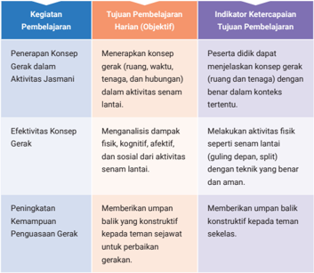
> **[Konteks Visual]**: Tabel ini berisi informasi tentang kegiatan pembelajaran, tujuan pembelajaran harian (objektif), dan indikator ketercapaiannya. Berikut adalah deskripsi detail dari setiap kolom:

1. Kegiatan Pembelajaran:
   - Penerapan Konsep Gerak dalam Aktivitas Jasmani
   - Efektivitas Konsep Gerak
   - Peningkatan Kemampuan Penggunaan Gerak

2. Tujuan Pembelajaran Harian (Objektif):
   - Menerapkan konsep gerak (ruang, waktu, tenaga, dan hubungan) dalam aktivitas senam lantai.
   - Melakukan aktivitas fisik seperti senam lantai (guling depan, split) dengan teknik yang benar dan aman.
   - Memberikan umpan balik yang konstruktif kepada teman sejawat untuk perbaikan gerakan.

3. Indikator Ketercapaian Tujuan Pembelajaran:
   - Peserta didik dapat menjelaskan konsep gerak (ruang dan tenaga) dengan benar dan dalam konteks tertentu.
   - Melakukan aktivitas fisik seperti senam lantai (guling depan, split) dengan teknik yang benar dan aman.
   - Memberikan umpan balik konstruktif kepada teman sejawat untuk perbaikan gerakan.

Tabel ini mungkin digunakan dalam kurikulum atau program pembelajaran untuk mengukur kemajuan peserta didik dalam menguasai konsep gerak dan melakukan aktivitas fisik secara efektif.

## 2. Aktivitas Pembelajaran
a.

## Penerapan Konsep Gerak dalam Aktivitas Jasmani
Tujuan Pembelajaran Harian
Menerapkan konsep gerak (ruang, waktu, tenaga, dan hubungan) dalam aktivitas senam lantai.

### [HALAMAN_139]

## Aktivitas 1    Belajar Mendalam

## Penerapan Konsep Gerak dengan Aktivitas Senam Lantai

## Sebelum Aktivitas Praktik
Peserta didik melakukan pemanasan sebelum melakukan aktivitas senam lantai, seperti peregangan dinamis (gerakan melipat tubuh ke depan untuk meregangkan otot belakang, rotasi bahu dan pergelangan tangan), lompatan ringan untuk meningkatkan detak jantung, latihan keseimbangan sederhana (berdiri dengan satu kaki selama 10 detik).

## Selama Aktivitas Praktik
Peserta didik berlatih teknik dasar senam lantai secara bertahap dengan fokus pada elemen gerak tertentu. Berikut contoh kegiatan yang dapat dilakukan.
Keseimbangan
} Melatih posisi headstand dan handstand .
} Menggunakan dinding sebagai penyangga untuk membantu keseimbangan.
} Guru memberikan panduan bagaimana mengatur posisi tubuh agar stabil.
Kelenturan
} Melakukan gerakan split.
} Peserta didik diajarkan teknik melenturkan kaki secara perlahan untuk menghindari cedera.
Kekuatan
} Melakukan plank selama 20-30 detik untuk melatih otot inti.
} Variasi plank : plank samping untuk melatih otot

### [HALAMAN_140]

Koordinasi
} Latihan guling depan dari posisi jongkok hingga berdiri kembali.

### [HALAMAN_139]

### [HALAMAN_140]

}
Kombinasi guling depan dengan berdiri satu kaki untuk meningkatkan koordinasi tubuh.
Peserta didik menerapkan keterampilan dasar dalam kombinasi gerakan yang lebih kompleks.

## Contoh Kegiatan:
Kombinasi guling depan, plank , dan berdiri satu kaki.
Latihan headstand diikuti dengan guling depan.
Membentuk kelompok kecil, setiap peserta didik melakukan gerakan yang berbeda sesuai peran masing-masing, kemudian menganalisis keselarasan gerakan.
Peserta didik merefleksikan dampak aktivitas senam lantai terhadap aspek fisik, kognitif, afektif, dan sosial. Aktivitas refleksi dapat dilakukan melalui diskusi dalam kelompok kecil.
Peserta didik melakukan pendinginan dengan peregangan statis dan mendiskusikan pengalaman selama latihan.

## Setelah Aktivitas Praktik
Ajak peserta didik untuk merefleksikan kembali aktivitas yang sudah dilakukan dengan panduan refleksi tertulis.
Tuliskan satu hal yang kamu lakukan dengan baik.
Tuliskan satu hal yang masih perlu diperbaiki.
Jelaskan bagaimana latihan ini dapat membantumu dalam aktivitas lain.
Selain aktivitas senam lantai, peserta didik dapat melakukan aktivitas lain yang lebih menantang dalam menerapkan konsep gerak, seperti bermain bola basket dengan durasi permainan yang cukup panjang.

### [HALAMAN_141]

Dapat juga dengan melakukan aktivitas fisik lari dengan berbagai bidang permukaan lintasan yang berbeda. Selain itu, peserta didik juga dapat diajak untuk bermain sepak bola dengan pengalaman gerak dengan berbagai tantangan dalam permainan.

## Asesmen Formatif
Kegiatan di atas dapat digunakan sebagai asesmen formatif. Berikut rubrik penilaian keterampilan senam lantai yang dapat digunakan untuk asesmen formatif.

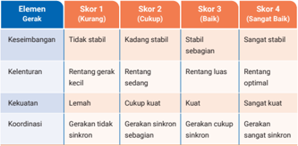
> **[Konteks Visual]**: Tabel ini menunjukkan skor untuk empat kategori elemen gerak dalam sebuah sistem atau proses. Setiap kategori diurutkan dari Skor 1 (Kurang) hingga Skor 4 (Sangat Baik). Skor 1 menggambarkan kondisi yang sangat buruk atau kurang, sedangkan Skor 4 menggambarkan kondisi yang sangat baik atau optimal. Tabel ini membantu dalam evaluasi dan pengawasan kinerja elemen gerak dalam suatu sistem.

## b. Efektivitas Konsep Gerak

## Tujuan Pembelajaran Harian
Menganalisis dampak Ƽsik, kognitif, afektif, dan sosial dari aktivitas senam lantai.
Peserta didik diajak untuk belajar menerapkan konsep gerak secara efektif dalam aktivitas jasmani, seperti memaksimalkan kinerja fisik, meningkatkan koordinasi dan kesadaran tubuh, mendukung peningkatan kebugaran  jasmani,  mengurangi  risiko  cedera,  membantu  dalam pemecahan masalah taktis, meningkatkan motivasi dan partisipasi aktif, dan memberikan dasar untuk gaya hidup aktif.

### [HALAMAN_142]

## Lari Estafet dengan Variasi Kecepatan

## Sebelum Aktivitas Praktik
Peserta didik mempraktikkan salah satu keterampilan gerak lari estafet dengan variasi kecepatan.
Dalam aktivitas ini peserta didik dibimbing untuk memahami dan menerapkan konsep ruang, waktu, tenaga, dan hubungan secara efektif.

## Selama Aktivitas Praktik
Berikan instruksi aktivitas berikut kepada peserta didik.
Peserta didik melakukan pemanasan dengan lari ringan keliling lapangan. Lanjutkan dengan peregangan dinamis seperti ayunan lengan, peregangan kaki dengan lunges, latihan melompat ringan untuk meningkatkan ritme tubuh.
Peserta didik diminta untuk berlatih memberikan dan menerima tongkat estafet di zona transisi.
Peserta didik berlari dalam lintasan pendek (20-30 meter) dengan kecepatan  berbeda:  kecepatan  lambat,  kecepatan  sedang,  dan kecepatan maksimal.
Peserta didik dibagi dalam kelompok yang beranggotakan 4 orang tiap tim.
Peserta didik mensimulasikan aktivitas lari estafet sepanjang lintasan (100-200 meter). Pada titik tertentu lintasan berikan isyarat untuk mempercepat kecepatan (selama 10 meter) atau memperlambat kecepatan (saat mendekati zona transisi), isyarat dapat berupa visual (bendera) atau audio (peluit).
Peserta didik mendiskusikan dan menganalisis efisiensi pergantian tongkat, penggunaan tenaga pada setiap tahap kecepatan, kesesuaian waktu dan koordinasi tim.

### [HALAMAN_143]

Peserta didik melakukan aktivitas pendinginanan dengan berjalan santai keliling lapangan.

## Setelah Aktivitas Praktik
Peserta didik merefleksikan aktivitas fisik lari estafet dengan variasi kecepatan dalam kelas.
Peserta didik merefleksikan aktivitas tim dalam lari estafet. Setiap tim mendiskusikan kelebihan dan kekurangan strategi mereka.
Peserta  didik  merefleksikan  secara  individu  dengan  panduan pertanyaan refleksi berikut.
Bagaimana saya memanfaatkan tenaga selama berlari?
Apakah saya sudah memahami isyarat kecepatan dengan baik?
Apa yang akan saya lakukan untuk meningkatkan kemampuan saya?

## Asesmen Formatif
Lakukan asesmen dengan menggunakan rubrik penilaian yang mencakup aspek penilaian individu dan penilaian tim/kelompok.
Komponen Asesmen Formatif
Penilaian Keterampilan Individu
Penilaian ini difokuskan pada kemampuan teknis peserta didik selama lari estafet.

## Aspek yang dinilai:
} Kemampuan peserta didik merespons isyarat kecepatan dengan cepat dan tepat.
} Penggunaan tenaga secara efisien tanpa memboroskan energi.
} Keterampilan dalam memberikan dan menerima tongkat estafet dengan lancar.

### [HALAMAN_144]

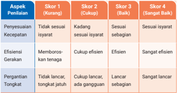
> **[Konteks Visual]**: Tabel ini menunjukkan skor untuk empat aspek penilaian: Penyesuaian Kecepatan, Efisiensi Gerakan, Memboroskan tenaga, dan Pergantian Tongkat. Setiap aspek memiliki empat skor yang berbeda-beda, dari Skor 1 (Kurang) hingga Skor 4 (Sangat Baik). Skor 1 menggambarkan situasi yang sangat buruk, sedangkan Skor 4 menggambarkan situasi yang sangat baik. Tabel ini digunakan untuk memberikan evaluasi atau penilaian tentang kinerja seseorang dalam melakukan tugas tertentu.

## b) Penilaian Kerja Sama Tim
Penilaian ini mengukur kemampuan peserta didik dalam bekerja sama dengan anggota tim selama aktivitas.

## Aspek yang dinilai:
} Kemampuan tim untuk menjaga ritme lari dan pergantian tongkat secara kolektif.
} Pemahaman tim mengenai penggunaan lintasan secara efektif.
} Penyesuaian strategi berdasarkan situasi, seperti mempercepat atau memperlambat ritme sesuai isyarat.

> **[Konteks Visual]**: Tabel ini mungkin menunjukkan skor untuk beberapa aspek penilaian dalam sebuah proyek atau tugas. Berikut adalah deskripsi singkat dari setiap kolom dan baris:

1. Kolom "Aspek Penilaian" berisi nama-nama aspek yang perlu diukur atau ditinjau dalam konteks penilaian tersebut.

2. Baris "Skor 1 (Kurang)" menunjukkan skor minimum yang diperlukan untuk memenuhi standar tertentu dalam aspek tersebut.

3. Baris "Skor 2 (Cukup)" menunjukkan skor yang cukup baik tetapi masih perlu ditingkatkan.

4. Baris "Skor 3 (Baik)" menunjukkan skor yang baik dan memenuhi standar yang ditetapkan.

5. Baris "Skor 4 (Sangat Baik)" menunjukkan skor yang sangat baik dan melebihi standar yang ditetapkan.

6. Setiap aspek penilaian memiliki skor yang berbeda-beda untuk setiap tingkat penilaian.

7. Skor 1 (Kurang) biasanya berada di bawah 50%, skor 2 (Cukup) antara 50% dan 75%, skor 3 (Baik) antara 75% dan 90%, dan skor 4 (Sangat Baik) di atas 90%.

8. Tabel ini mungkin digunakan untuk mengukur kinerja tim, efisiensi ruang kerja, dan strategi tim dalam suatu proyek atau tugas.

9. Skor yang lebih tinggi biasanya menunjukkan penilaian yang lebih baik atau lebih baik daripada standar yang ditetapkan.

10. Tabel ini mungkin digunakan oleh manajer atau koordinator untuk mengukur kinerja tim dan menentukan langkah-langkah peningkatan jika diperlukan.

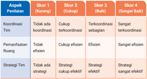
> **[Konteks Visual]**: Tabel ini mungkin menunjukkan skor untuk beberapa aspek penilaian dalam sebuah proyek atau tugas. Berikut adalah deskripsi singkat dari setiap kolom dan baris:

1. Kolom "Aspek Penilaian" berisi nama-nama aspek yang perlu diukur atau ditinjau dalam konteks penilaian tersebut.

2. Baris "Skor 1 (Kurang)" menunjukkan skor minimum yang diperlukan untuk memenuhi standar tertentu dalam aspek tersebut.

3. Baris "Skor 2 (Cukup)" menunjukkan skor yang cukup baik tetapi masih perlu ditingkatkan.

4. Baris "Skor 3 (Baik)" menunjukkan skor yang baik dan memenuhi standar yang ditetapkan.

5. Baris "Skor 4 (Sangat Baik)" menunjukkan skor yang sangat baik dan melebihi standar yang ditetapkan.

6. Setiap aspek penilaian memiliki skor yang berbeda-beda untuk setiap tingkat penilaian.

7. Skor 1 (Kurang) biasanya berada di bawah 50%, skor 2 (Cukup) antara 50% dan 75%, skor 3 (Baik) antara 75% dan 90%, dan skor 4 (Sangat Baik) di atas 90%.

8. Tabel ini mungkin digunakan untuk mengukur kinerja tim, efisiensi ruang kerja, dan strategi tim dalam suatu proyek atau tugas.

9. Skor yang lebih tinggi biasanya menunjukkan penilaian yang lebih baik atau lebih baik daripada standar yang ditetapkan.

10. Tabel ini mungkin digunakan oleh manajer atau koordinator untuk mengukur kinerja tim dan menentukan langkah-langkah peningkatan jika diperlukan.

### [HALAMAN_145]

Refleksi Individu
Peserta didik merefleksikan kinerja mereka secara mandiri untuk mendorong pemahaman lebih mendalam dan peningkatan diri.

## Aspek yang direfleksikan:
} Bagaimana saya menyesuaikan kecepatan saat berlari?
} Apakah saya memberikan dan menerima tongkat dengan lancar?
} Apa yang bisa saya tingkatkan untuk aktivitas berikutnya?
Refleksi Kelompok

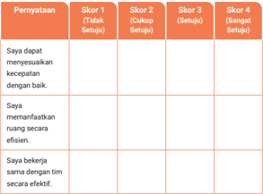
> **[Konteks Visual]**: Tabel ini mungkin berisi skor untuk beberapa pertanyaan atau kriteria dalam sebuah evaluasi atau penilaian. Setiap baris mungkin menunjukkan skor yang berbeda untuk setiap pertanyaan atau kriteria tersebut. Skor 1 mungkin berarti "tidak setuju", skor 2 mungkin berarti "cukup setuju", skor 3 mungkin berarti "setuju", dan skor 4 mungkin berarti "sangat setuju". Tabel ini mungkin digunakan untuk mengumpulkan dan mengevaluasi opini atau pendapat dari beberapa orang tentang suatu hal atau situasi tertentu.

> **[Konteks Visual]**: Tabel ini mungkin berisi skor untuk beberapa pertanyaan atau kriteria dalam sebuah evaluasi atau penilaian. Setiap baris mungkin menunjukkan skor yang berbeda untuk setiap pertanyaan atau kriteria tersebut. Skor 1 mungkin berarti "tidak setuju", skor 2 mungkin berarti "cukup setuju", skor 3 mungkin berarti "setuju", dan skor 4 mungkin berarti "sangat setuju". Tabel ini mungkin digunakan untuk mengumpulkan dan mengevaluasi opini atau pendapat dari beberapa orang tentang suatu hal atau situasi tertentu.

Tim/kelompok  mendiskusikan  kinerja  mereka  secara keseluruhan.

## Aspek yang didiskusikan:
} Apa keberhasilan dalam kerja sama tim kami?
} Apa kendala yang tim hadapi selama lari estafet?
} Apa yang akan tim ubah atau tingkatkan pada aktivitas berikutnya?

### [HALAMAN_146]

## Instrumen : Panduan Refleksi Kelompok
} Tulis tiga hal positif tentang kinerja tim.
} Sebutkan satu kendala utama yang dihadapi tim.
} Usulan strategi perbaikan untuk aktivitas berikutnya.

## c. Peningkatan Kemampuan Penguasaan Gerak
Pada penguasaan gerak ini ajaklah peserta didik untuk mempelajari elemen fundamental dalam aktivitas jasmani yang mencakup kemampuan untuk memahami, melaksanakan, dan menyesuaikan berbagai jenis gerakan  dalam  konteks  aktivitas  fisik.  Peningkatan  kemampuan penguasaan gerak tidak hanya berdampak pada performa fisik, tetapi juga pada perkembangan kognitif, sosial, dan emosional. Tahapan dalam peningkatan gerak dapat dilakukan sebagai berikut.
Proses Peningkatan Penguasaan Gerak
z Pemahaman Konseptual
z Latihan Berulang ( Repetition )
z Adaptasi dalam Situasi Berbeda
Strategi untuk Meningkatkan Penguasaan Gerak
z Penggunaan Model atau Demonstrasi
z Latihan Progresif
z Penggunaan Umpan Balik Konstruktif
z Penggabungan Variasi Latihan
z Simulasi dan Permainan
Dampak dari Peningkatan Penguasaan Gerak
z Peningkatan Performa Fisik
z Meningkatkan Kebugaran Jasmani
z Meningkatkan Kepercayaan Diri
z Mengurangi Risiko Cedera
z Mengembangkan Kemampuan Sosial
z Meningkatkan Pemecahan Masalah dalam Gerakan

### [HALAMAN_147]

Sesi kali ini ajaklah peserta didik untuk berlatih lemparan dengan akurasi. Aktivitas ini dirancang untuk melatih peserta didik mengembangkan kemampuan mengarahkan objek dengan presisi ke target tertentu. Latihan ini tidak hanya bertujuan untuk meningkatkan keterampilan teknis, tetapi juga melatih koordinasi, konsentrasi, dan pengelolaan tenaga secara efisien.

## Aktivitas 3    Belajar Mendalam

## Latihan Lemparan dengan Akurasi

## Sebelum Aktivitas Fisik
Peserta didik belajar untuk memahami konsep dasar yang mendukung keterampilan melempar dengan akurasi.
Pastikan peserta didik mengetahui tujuan dari aktivitas ini sehingga peserta didik lebih termotivasi dan memahami relevansi latihan.
Peserta didik diajak untuk melakukan latihan teknik dasar melempar untuk memastikan mereka memahami posisi tubuh, tangan, dan sudut lemparan.

## Selama Aktivitas Fisik
Peserta didik diminta melakukan aktivitas pemanasan dengan latihan peregangan dinamis berupa rotasi bahu dan lengan, peregangan otot  tangan,  bahu,  dan  punggung,  lari  kecil  di  tempat  sambil menggerakkan tangan seperti gerakan melempar.
Peserta didik diperkenalkan pada gerakan melempar tanpa bola untuk melatih posisi tubuh dan tangan.
Peserta didik diinstruksikan untuk mempraktikkan berbagai variasi latihan lemparan menggunakan bola atau objek lainnya, dimulai dari teknik dasar.

### [HALAMAN_148]

Latihan Lemparan ke Target Statis
} Peserta didik melempar bola ke target yang tidak bergerak, seperti keranjang atau lingkaran di dinding.

### [HALAMAN_147]

### [HALAMAN_148]

}
Target diletakkan pada berbagai jarak dan ketinggian untuk meningkatkan tantangan.
}
Dimulai dengan jarak dekat, kemudian secara bertahap ditingkatkan.
Latihan Lemparan ke Target Bergerak
}
Target bergerak dioperasikan oleh rekan tim atau diikat pada alat yang bergerak.
}
Peserta didik melempar bola ke arah target yang berpindahpindah, melatih kemampuan prediksi arah, dan kecepatan target.
Latihan Lemparan Berpasangan
} Peserta didik bekerja dalam pasangan untuk melempar dan menangkap bola.
}
Variasi: Jarak antar pasangan diperbesar secara bertahap untuk meningkatkan kesulitan.
Latihan Lemparan dengan Penghalang
}
Peserta didik melempar bola melewati rintangan fisik, seperti cone atau net sebelum mencapai target.
}
Fokus pada penggunaan sudut dan tenaga untuk melewati penghalang dan mengenai target.
Peserta didik mensimulasikan dan melakukan permainan berikut.
Bermain Permainan Target Berbasis Poin
} Peserta didik dibagi menjadi kelompok kecil untuk melempar bola ke berbagai target dengan nilai poin berbeda.
} Target kecil bernilai 10 poin, target besar bernilai 5 poin.

### [HALAMAN_149]

} Setiap kelompok mencatat skor untuk menilai tingkat akurasi mereka.
Bermain Permainan Lempar Bola Berhambatan
} Peserta didik berkompetisi untuk melempar bola melewati rintangan ke target dengan waktu yang terbatas.
} Fokus pada pengambilan keputusan cepat untuk menentukan sudut dan tenaga lemparan.
Peserta didik melakukan aktivitas pendinginan dengan peregangan statis berpasangan.

### [HALAMAN_148]

### [HALAMAN_149]

## Setelah Aktivitas Fisik
Berikan instruksi kepada peserta didik untuk melakukan refleksi individu dan diskusi kelompok.
Refleksi Individu
Peserta didik menjawab panduan pertanyaan berikut.
} Apakah saya sudah melempar dengan akurat?
} Bagaimana saya mengontrol tenaga saat melempar?
} Apa yang dapat saya tingkatkan untuk latihan berikutnya?
Diskusi Kelompok
} Setiap kelompok membahas kinerja mereka dalam permainan.
} Pandu peserta didik dalam diskusi untuk mengidentifikasi area perbaikan.

## Asesmen Formatif
Lakukan asesmen dengan menggunakan rubrik penilaian yang mencakup aspek penilaian keterampilan individu dan penilaian kerja sama dalam kelompok.

### [HALAMAN_150]

## Komponen Asesmen Formatif
Penilaian Keterampilan Individu
Penilaian berfokus pada akurasi dan teknik peserta didik dalam melempar bola.

## Aspek yang dinilai:
Ketepatan Lemparan
}
Kemampuan peserta didik untuk mengenai target dengan akurat.
}
Contoh: Melempar bola tepat ke lingkaran di dinding atau sasaran lainnya.
Penggunaan Tenaga
}
Kemampuan peserta didik mengatur kekuatan sesuai jarak dan jenis target.
}
Contoh: Tidak menggunakan tenaga berlebihan atau kurang saat melempar ke target jauh atau dekat.
Koordinasi Mata dan Tangan
} Sinkronisasi antara penglihatan dan gerakan tangan selama lemparan.
} Contoh: Arah bola sesuai dengan target yang diincar.

## Tabel 3.6 Instrumen Rubrik Penilaian Keterampilan Individu

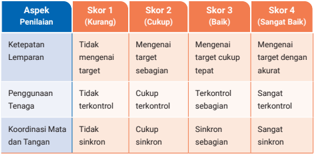
> **[Konteks Visual]**: Tabel ini mungkin menunjukkan skor untuk beberapa aspek penilaian, dengan skor yang berbeda di setiap aspek. Skor 1 (Kurang) mungkin berarti bahwa aspek tersebut belum mencapai target, sedangkan skor 4 (Baik) mungkin berarti bahwa aspek tersebut telah mencapai target dengan akurat. Tabel ini juga mungkin menunjukkan tingkat kontrol aspek penilaian, dengan skor 2 (Cukup terkontrol) mungkin berarti bahwa aspek tersebut sedikit terkontrol, sedangkan skor 3 (Sinkron) mungkin berarti bahwa aspek tersebut sangat terkontrol.

> **[Konteks Visual]**: Tabel ini mungkin menunjukkan skor untuk beberapa aspek penilaian, dengan skor yang berbeda di setiap aspek. Skor 1 (Kurang) mungkin berarti bahwa aspek tersebut belum mencapai target, sedangkan skor 4 (Baik) mungkin berarti bahwa aspek tersebut telah mencapai target dengan akurat. Tabel ini juga mungkin menunjukkan tingkat kontrol aspek penilaian, dengan skor 2 (Cukup terkontrol) mungkin berarti bahwa aspek tersebut sedikit terkontrol, sedangkan skor 3 (Sinkron) mungkin berarti bahwa aspek tersebut sangat terkontrol.

### [HALAMAN_151]

Penilaian Kerja Sama dalam Kelompok
Penilaian ini dilakukan jika aktivitas melibatkan kolaborasi, seperti latihan lemparan berpasangan atau permainan berbasis tim.

## Aspek yang dinilai:
Kemampuan Komunikasi
} Peserta didik berkomunikasi dengan baik untuk memastikan kejelasan dalam aktivitas berpasangan atau tim.
Kolaborasi
}
Peserta didik menunjukkan kerja sama yang baik selama latihan, seperti saling memberi umpan bola atau mendukung pasangan untuk meningkatkan akurasi.
Strategi Berpasangan/Tim
} Peserta didik dan pasangan/tim mengembangkan strategi untuk meningkatkan efektivitas latihan, seperti pengaturan posisi atau kecepatan bola.

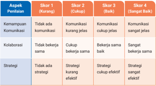
> **[Konteks Visual]**: Tabel ini menunjukkan skor untuk empat aspek penilaian: Kemampuan Komunikasi, Kolaborasi, dan Strategi. Setiap aspek diukur dalam empat skor yang berbeda: Kurang (Skor 1), Cukup (Skor 2), Baik (Skor 3), dan Sangat Baik (Skor 4). Skor ditentukan berdasarkan kualitas perilaku atau tindakan yang dilakukan oleh individu atau tim dalam setiap aspek tersebut.

> **[Konteks Visual]**: Tabel ini menunjukkan skor untuk empat aspek penilaian: Kemampuan Komunikasi, Kolaborasi, dan Strategi. Setiap aspek memiliki empat skor yang berbeda, dari Kurang (Skor 1) hingga Sangat Baik (Skor 4). Skor tertinggi adalah 4, yang berarti aspek tersebut sangat baik, sedangkan skor terendah adalah 1, yang berarti aspek tersebut kurang. Tabel ini digunakan untuk mengukur kinerja individu atau tim dalam hal komunikasi, kolaborasi, dan strategi.

### [HALAMAN_152]

## d. Penyempurnaan Kemampuan Gerak
Peserta  didik  dibawa  untuk  memahami  bahwa  penyempurnaan kemampuan gerak adalah bagian penting dari pembelajaran fisik yang tidak hanya meningkatkan performa fisik, tetapi juga membangun rasa percaya diri, motivasi, dan kerja sama melalui aktivitas modifikasi permainan sepak bola.

## Aktivitas 4    Belajar Mendalam

## Permainan Sepak Bola yang DimodiƼkasi

## Sebelum Aktivitas Fisik
Peserta didik diajak untuk memahami prinsip-prinsip dasar yang akan diterapkan dalam permainan sepak bola. Guru menjelaskan elemen gerak  yang  relevan,  seperti  ruang,  waktu,  usaha,  dan keterhubungan.
Jelaskan tujuan dan manfaat permainan yang dimodifikasi, sehingga peserta didik termotivasi untuk berpartisipasi secara aktif.

## Selama Aktivitas Fisik
Peserta didik melakukan pemanasan dengan latihan dinamis lari ringan mengelilingi lapangan sambil menggiring bola.
Peserta  didik  melakukan  pemanasan  dengan  latihan  dinamis merotasikan pergelangan kaki, pinggul, dan bahu untuk melatih fleksibilitas.
Peserta didik berlatih teknik dasar passing bola berpasangan dengan berbagai variasi jarak (dekat, sedang, jauh).
Peserta didik berlatih teknik dasar dribbling bola melewati cone atau rintangan dengan tempo lambat hingga cepat.
Peserta didik berlatih teknik dasar shooting sederhana ke gawang kecil.

### [HALAMAN_153]

Berikan penjelasan kepada peserta didik mengenai bentuk modifikasi permainan sepak bola yang akan dilakukan. Berikut contoh bentuk modifikasi dalam permainan sepak bola.
Pengurangan jumlah pemain. Setiap tim terdiri atas 5-7 pemain untuk membuat permainan lebih sederhana dan fokus pada penguasaan bola.
Ukuran lapangan dibuat lebih kecil agar pemain lebih mudah memahami penggunaan ruang.
Penggunaan bola yang lebih kecil atau lebih ringan untuk mempermudah kontrol, terutama bagi pemula.
Tentukan aturan khusus. Sebagai contoh permainan tidak menggunakan penjaga gawang, sehingga peserta didik lebih banyak belajar menyerang dan bertahan. Selain itu, dapat juga diterapkan aturan bahwa setiap pemain harus melakukan minimal 3 passing sebelum mencetak gol. Guru dapat memodifikasi aturan sesuai dengan kesepakatan bersama peserta didik
Peserta didik dengan bantuan guru menentukan peran atau posisi pemain (penyerang, gelandang, bek).
Berikan isyarat untuk fokus pada aspek tertentu selama permainan, seperti berikut ini.
Passing : Semua pemain harus melakukan passing minimal sekali sebelum mencetak gol.
Penguasaan Ruang: Setiap tim harus menjaga posisi agar tidak menumpuk di satu area lapangan.
Pertahanan : Tim bertahan fokus pada strategi merebut bola tanpa kontak fisik berlebihan.
Peserta didik diminta melakukan aktivitas pendinginan dengan berjalan santai sambil bernyanyi keliling lapangan.

### [HALAMAN_154]

## Setelah Aktivitas Fisik
Ajak peserta didik untuk mengevaluasi dan merefleksikan aktivitas yang sudah dilakukan.
Peserta didik diminta melakukan refleksi individu dengan menjawab panduan refleksi tertulis mengenai kinerja mereka selama permainan.
Apakah saya sudah melakukan passing dengan akurat?
Bagaimana saya memanfaatkan ruang selama permainan?
Apa yang dapat saya tingkatkan dalam permainan berikutnya?
Peserta didik diminta melakukan refleksi kelompok dengan menjawab panduan refleksi tertulis mengenai kinerja mereka selama permainan.
Apa kekuatan tim dalam permainan ini?
Apa kelemahan yang perlu tim perbaiki?
Strategi apa yang akan tim gunakan pada permainan berikutnya?

## Asessmen Formatif
Lakukan asesmen dengan menggunakan rubrik penilaian yang mencakup aspek penilaian keterampilan individu dan penilaian kerja sama dalam kelompok.
Penilaian Keterampilan Individu
Penilaian ini dilakukan untuk mengamati kemampuan peserta didik dalam menguasai teknik dasar permainan sepak bola.

## Aspek yang dinilai:
Passing :  Kemampuan memberikan bola kepada rekan tim dengan akurat.
Dribbling :  Kemampuan menggiring bola secara  terkontrol melewati lawan atau rintangan.
Shooting :  Kemampuan menendang bola ke gawang dengan akurasi dan tenaga yang sesuai.
Penguasaan Bola: Kemampuan menjaga bola dari lawan dan mengontrol bola saat menerima operan.

### [HALAMAN_155]

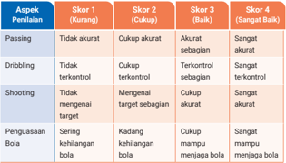
> **[Konteks Visual]**: Tabel ini menunjukkan skor untuk berbagai aspek penilaian dalam sebuah latihan olahraga, masing-masing dengan skor yang berbeda. Skor 1 (Kurang) mencakup "Passing", "Dribbling", "Shooting", dan "Penguasaan Bola". Skor 2 (Cukup) mencakup "Passing", "Dribbling", "Shooting", dan "Penguasaan Bola". Skor 3 (Baik) mencakup "Passing" dan "Dribbling". Skor 4 (Sangat Baik) mencakup semua aspek penilaian.

## 2) Penilaian Kerja Sama dalam Tim
Penilaian ini mengukur kemampuan peserta didik untuk berkolaborasi secara efektif selama permainan.

## Aspek yang dinilai:
Komunikasi Tim: Peserta didik aktif berkomunikasi dengan rekan tim untuk menyusun strategi atau memberi instruksi.
Kolaborasi: Peserta didik bekerja sama dalam menyerang atau bertahan untuk mencapai tujuan tim.
Pemanfaatan Ruang: Tim menggunakan ruang lapangan secara efisien untuk menciptakan peluang mencetak gol atau bertahan.

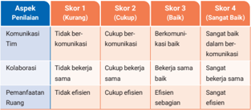
> **[Konteks Visual]**: Tabel ini menunjukkan skor untuk empat aspek penilaian: Komunikasi, Kolaborasi, Pemanfaatan Ruang, dan Skor 4 (Kurang). Setiap aspek memiliki empat skor yang berbeda-beda, dari "Tidak berkomunikasi" hingga "Sangat baik dalam komunikasi". Skor tertinggi adalah "Sangat baik", sementara skor terendah adalah "Tidak berkomunikasi".

### [HALAMAN_156]

## F. Tindak Lanjut
Peserta didik yang belum mencapai tujuan pembelajaran diberikan umpan balik dan aktivitas belajar ke level berikutnya sesuai dengan perkembangan mereka berdasarkan rubrik asesmen dan kriteria ketercapaian tujuan pembelajaran. Dapat juga dengan menggunakan pembelajaran tutor sebaya dan guru memantau perkembangan proses belajarnya.
Peserta didik yang telah mencapai tujuan pembelajaran diberikan tugas pengayaan sebagai berikut.
Pemberian tugas mandiri yang lebih kompleks seperti latihan kombinasi dribbling dan shooting dengan target tertentu, membuat proyek kecil seperti membuat video tutorial yang menjelaskan cara meningkatkan teknik dasar sepak bola, seperti passing atau dribbling untuk pemula.
Peserta didik diminta mengaplikasikan teknologi untuk memperkaya pengalaman belajar, misalnya menggunakan aplikasi perekam gerakan untuk menganalisis teknik mereka.

## G.  Asesmen Sumatif

## 1. Penilaian Kognitif
Penilaian ini dilakukan untuk mengukur pemahaman konsep gerak secara teoritis.

## Contoh Soal Penilaian Kognitif
Jelaskan bagaimana konsep ruang memengaruhi efektivitas gerakan dalam olahraga seperti sepak bola atau bola basket.
Bagaimana  penggunaan  tenaga  yang  efisien  dapat  meningkatkan performa dalam lompat jauh?
Berikan contoh situasi pentingnya koordinasi ruang dan waktu dalam aktivitas fisik.

### [HALAMAN_157]

## Instrumen Penilaian
Tes esai singkat atau lembar kerja analisis.

> **[Konteks Visual]**: Tabel ini menunjukkan skor untuk berbagai aspek penilaian dalam dua skor: Skor 1 (Kurang) dan Skor 2 (Baik). Tabel ini mencakup empat kolom:

1. Aspek Penilaian
2. Skor 1 (Kurang)
3. Skor 2 (Baik)
4. Skor 3 (Sangat Baik)

Dalam setiap baris, ada beberapa poin penilaian yang disebutkan:
- Pemahaman Konsep Gerak
- Penerapan dalam Situasi
- Keterkaitan Antarskopik

Skor 1 (Kurang) mencakup:
- Tidak menjelaskan sebagian
- Tidak relevan sebagian
- Tidak menghubungkan sebagian

Skor 2 (Baik) mencakup:
- Menjelaskan sebagian
- Relevan sebagian
- Menghubungkan baik

Skor 3 (Sangat Baik) mencakup:
- Menjelaskan dengan baik
- Menghubungkan baik
- Menghubungkan secara mendalam

Skor 4 (Sangat Baik) mencakup:
- Menjelaskan secara mendalam
- Menghubungkan secara mendalam

Tabel ini digunakan untuk menilai kinerja dalam berbagai aspek penilaian, dari pemahaman konsep hingga keterkaitan antarskopik.

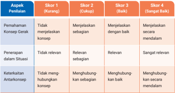
> **[Konteks Visual]**: Tabel ini menunjukkan skor untuk berbagai aspek penilaian dalam dua skor: Skor 1 (Kurang) dan Skor 2 (Baik). Tabel ini mencakup empat kolom:

1. Aspek Penilaian
2. Skor 1 (Kurang)
3. Skor 2 (Baik)
4. Skor 3 (Sangat Baik)

Dalam setiap baris, ada beberapa poin penilaian yang disebutkan:
- Pemahaman Konsep Gerak
- Penerapan dalam Situasi
- Keterkaitan Antarskopik

Skor 1 (Kurang) mencakup:
- Tidak menjelaskan sebagian
- Tidak relevan sebagian
- Tidak menghubungkan sebagian

Skor 2 (Baik) mencakup:
- Menjelaskan sebagian
- Relevan sebagian
- Menghubungkan baik

Skor 3 (Sangat Baik) mencakup:
- Menjelaskan dengan baik
- Menghubungkan baik
- Menghubungkan secara mendalam

Skor 4 (Sangat Baik) mencakup:
- Menjelaskan secara mendalam
- Menghubungkan secara mendalam

Tabel ini digunakan untuk menilai kinerja dalam berbagai aspek penilaian, dari pemahaman konsep hingga keterkaitan antarskopik.

## 2. Penilaian Psikomotorik
Penilaian ini berfokus pada kemampuan peserta didik menerapkan konsep gerak dalam aktivitas fisik yang nyata.

## Aktivitas Penilaian
Latihan Gerak Kombinasi
Peserta didik melakukan kombinasi gerakan seperti lari cepat, berhenti mendadak, dan melompat untuk menunjukkan pemahaman ruang, waktu, dan tenaga.
Contoh kombinasi gerakan dapat berupa lari zigzag melewati cone dan melompat ke target tertentu.

## b. Simulasi Permainan
Peserta didik berpartisipasi dalam permainan kecil, contohnya permainan bola, dengan fokus pada penerapan konsep ruang dan hubungan.
Contoh: Menggunakan ruang kosong untuk menyerang atau bertahan secara strategis.

### [HALAMAN_158]

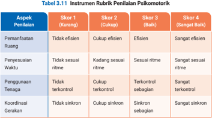
> **[Konteks Visual]**: Tabel 3.1.1 berisi rubrik penilaian psikomotorik dengan skor yang ditentukan untuk setiap aspek penilaian. Berikut adalah deskripsi detail dari rubrik tersebut:

1. **Aspek Penilaian**:
   - Pemanfaatan Ruangan
   - Penyesuaian Waktu
   - Penggunaan Tenaga
   - Koordinasi Gerakan

2. **Skor 1 (Kurang)**:
   - Tidak efisien
   - Tidak sesuai ritme
   - Tidak terkontrol
   - Tidak sinkron

3. **Skor 2 (Cukup)**:
   - Cukup efisien
   - Kadang sesuai ritme
   - Cukup terkontrol
   - Cukup sinkron

4. **Skor 3 (Baik)**:
   - Efisien
   - Sesuai ritme
   - Terkontrol sebagian
   - Sintak sinkron sebagian

5. **Skor 4 (Sangat Baik)**:
   - Sangat efisien
   - Sangat sesuai ritme
   - Sangat terkontrol
   - Sangat sinkron

Tabel ini digunakan untuk menilai kemampuan psikomotorik individu dalam berbagai aspek, mulai dari pemanfaatan ruangan hingga koordinasi gerakan. Skor yang diberikan memberikan gambaran tentang tingkat keterampilan dan kemampuan psikomotorik seseorang dalam melakukan tugas-tugas tertentu.

> **[Konteks Visual]**: Tabel 3.1.1 berisi rubrik penilaian psikomotorik dengan skor yang ditentukan untuk setiap aspek penilaian. Berikut adalah deskripsi detail dari rubrik tersebut:

1. **Aspek Penilaian**:
   - Pemanfaatan Ruangan
   - Penyesuaian Waktu
   - Penggunaan Tenaga
   - Koordinasi Gerakan

2. **Skor 1 (Kurang)**:
   - Tidak efisien
   - Tidak sesuai ritme
   - Tidak terkontrol
   - Tidak sinkron

3. **Skor 2 (Cukup)**:
   - Cukup efisien
   - Kadang sesuai ritme
   - Cukup terkontrol
   - Cukup sinkron

4. **Skor 3 (Baik)**:
   - Efisien
   - Sesuai ritme
   - Terkontrol sebagian
   - Sintak sinkron sebagian

5. **Skor 4 (Sangat Baik)**:
   - Sangat efisien
   - Sangat sesuai ritme
   - Sangat terkontrol
   - Sangat sinkron

Tabel ini digunakan untuk menilai kemampuan psikomotorik individu dalam berbagai aspek, mulai dari pemanfaatan ruangan hingga koordinasi gerakan. Skor yang diberikan memberikan gambaran tentang tingkat keterampilan dan kemampuan psikomotorik seseorang dalam melakukan tugas-tugas tertentu.

## 3. Penilaian Afektif
Penilaian ini mengukur sikap peserta didik selama aktivitas pembelajaran, seperti kerja sama, motivasi, dan tanggung jawab.

## Aspek yang dinilai
Kerja Sama: Kemampuan peserta didik untuk bekerja sama dengan rekan dalam aktivitas tim.
Motivasi: Keterlibatan aktif selama latihan dan permainan.
Kepatuhan pada Aturan: Kesediaan peserta didik untuk mengikuti instruksi dan aturan yang diberikan.

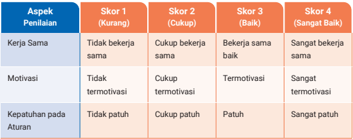
> **[Konteks Visual]**: Tabel ini mungkin berisi informasi tentang skor penilaian untuk beberapa aspek penilaian. Skor 1 (Kurang) menunjukkan bahwa sesuatu belum mencapai standar yang diharapkan. Skor 2 (Cukup) menunjukkan bahwa sesuatu sudah mencapai standar yang diharapkan namun masih ada ruang untuk peningkatan. Skor 3 (Baik) menunjukkan bahwa sesuatu sudah sangat baik dan memenuhi standar yang diharapkan. Skor 4 (Sangat Baik) menunjukkan bahwa sesuatu sudah sangat baik dan melebihi standar yang diharapkan. Tabel ini mungkin digunakan untuk mengukur kinerja atau prestasi seseorang dalam beberapa aspek tertentu.

> **[Konteks Visual]**: Tabel ini mungkin berisi informasi tentang skor penilaian untuk beberapa aspek penilaian. Skor 1 (Kurang) menunjukkan bahwa sesuatu belum mencapai standar yang diharapkan. Skor 2 (Cukup) menunjukkan bahwa sesuatu sudah mencapai standar yang diharapkan namun masih ada ruang untuk peningkatan. Skor 3 (Baik) menunjukkan bahwa sesuatu sudah sangat baik dan memenuhi standar yang diharapkan. Skor 4 (Sangat Baik) menunjukkan bahwa sesuatu sudah sangat baik dan melebihi standar yang diharapkan. Tabel ini mungkin digunakan untuk mengukur kinerja atau prestasi seseorang dalam beberapa aspek tertentu.

### [HALAMAN_159]

## 4. Proyek Akhir atau Tugas Refleksi
Peserta didik diminta untuk membuat proyek akhir atau tugas refleksi yang menunjukkan pemahaman dan evaluasi mereka terhadap konsep gerak.

## Contoh Proyek/Tugas
Video Analisis Gerakan
Peserta didik membuat video yang menunjukkan gerakan mereka sendiri selama latihan, dengan analisis tentang penggunaan ruang, waktu, tenaga, dan hubungan.
Laporan Refleksi
Peserta didik menulis laporan tentang kekuatan dan kelemahan mereka selama pembelajaran, serta strategi untuk perbaikan di masa depan.

## Kriteria Penilaian
Kesesuaian isi dengan konsep gerak.
Kemampuan menganalisis kekuatan dan kelemahan diri.
Keterampilan komunikasi visual atau tulisan

## H.  Refleksi
Untuk memahami pencapaian, tantangan, dan langkah perbaikan yang diperlukan maka perlu dilakukan refleksi.

## 1. Refleksi Peserta Didik
Gunakan tabel refleksi untuk peserta didik yang terdapat pada buku siswa halaman 126. Mintalah peserta didik untuk memberikan tanda centang sesuai dengan keadaan yang dirasakan!
Setelah mengisi tabel tersebut, berikan waktu kepada peserta didik untuk mendiskusikannya secara berkelompok untuk berbagi pengalaman. Diskusi ini akan membuka perspektif baru dan membantu peserta didik belajar dari pengalaman teman-teman yang lain.
143

### [HALAMAN_160]

## 2. Refleksi Guru
Panduan untuk guru mengevaluasi efektivitas metode pengajaran dengan menjawab beberapa pertanyaan reflektif berikut.
Apakah tujuan pembelajaran yang saya rancang sudah tercapai?
Apakah aktivitas yang saya pilih efektif untuk membantu peserta didik memahami konsep gerak?
Apakah alokasi waktu untuk setiap aktivitas sudah sesuai?
Apakah saya berhasil memberikan instruksi yang jelas kepada peserta didik?
Bagaimana keterlibatan peserta didik selama pembelajaran?
Apakah saya mampu mengelola kelas dengan baik, termasuk aktivitas individu dan kelompok?
Apakah instrumen asesmen yang saya gunakan sudah mencakup semua aspek yang ingin dinilai?
Bagaimana saya memberikan umpan balik kepada peserta didik? Apakah umpan balik saya membantu mereka memahami kekuatan dan kelemahan mereka?
Apa yang saya pelajari dari pengalaman mengajar materi ini?
Apa yang dapat saya lakukan untuk meningkatkan efektivitas pembelajaran pada materi ini di masa depan?
Apakah saya perlu mencari atau mengembangkan metode baru untuk pembelajaran konsep gerak?

## I. Sumber Belajar
Guru dapat menggunakan berbagai sumber belajar untuk mengedukasi peserta didik dalam mengevaluasi dampak konsep gerak.
Sumber buku utama adalah Buku Siswa mata pelajaran PJOK untuk kelas XI SMA/SMK.
Sumber alternatif lain dapat menggunakan buku dari David kirk dkk (2004) tentang learning physical activity
Guru juga dapat menggunakan sumber lain yang relevan dan terpercaya.

### [HALAMAN_161]

## KEMENTERIAN PENDIDIKAN, KEBUDAYAAN, RISET, DAN TEKNOLOGI REPUBLIK INDONESIA, 2024
Panduan Guru Pendidikan Jasmani, Olahraga, dan Kesehatan untuk SMA/SMK/MA/MAK Kelas XI
Penulis: Anggara Aditya Kurniawan, Damar Pamungkas ISBN: 978-634-00-0105-1 (jil.2 PDF)

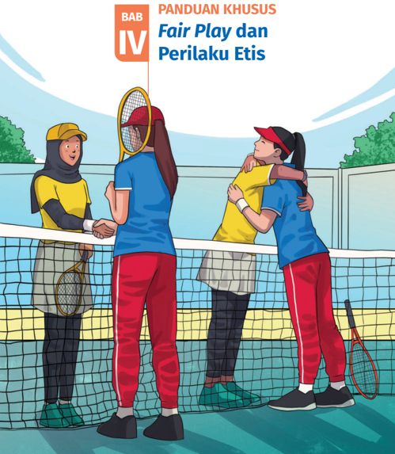
> **[Konteks Visual]**: Gambar ini menampilkan tiga orang yang sedang bermain tenis di lapangan. Mereka semua mengenakan pakaian olahraga dan memegang raket tenis. Dua dari mereka tampaknya berbicara dan saling menghormati dengan saling menyentuh leher. Latar belakang menunjukkan pagar lapangan tenis dan beberapa pohon. Di atas gambar tersebut terdapat tulisan "BAB IV PANDUAN KHUSUS Fair Play dan Perilaku Etis".

### [HALAMAN_162]

## A.  Pendahuluan

## 1. Tujuan Pembelajaran dan Kriteria Ketercapaian Tujuan Pembelajaran (KKTP)

## a. Tujuan Pembelajaran
Menganalisis dan mengevaluasi fair play terhadap capaian aktivitas jasmani.
Menganalisis dan mengevaluasi pengaruh perilaku etis terhadap capaian aktivitas jasmani bagi individu dan kelompok.

## b. Kriteria Ketercapaian Tujuan Pembelajaran
Peserta didik mampu menganalisis dan mengevaluasi pengaruh fair play terhadap capaian aktivitas jasmani.
Peserta didik mampu menganalisis dan mengevaluasi pengaruh perilaku etis terhadap capaian aktivitas jasmani.

## 2. Peta Konsep

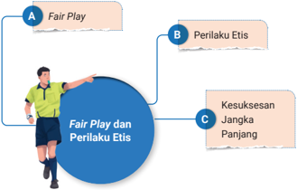
> **[Konteks Visual]**: Gambar tersebut menunjukkan sebuah diagram yang menggambarkan hubungan antara Fair Play, Perilaku Etis, dan Kesuksesan Jangka Panjang. 

- Poin A menunjukkan istilah "Fair Play" dengan sebuah gambar yang menampilkan seorang wasit sepak bola.
- Poin B menunjukkan istilah "Perilaku Etis" dengan sebuah gambar yang menampilkan seorang pemain sepak bola.
- Poin C menunjukkan istilah "Kesuksesan Jangka Panjang" dengan sebuah gambar yang menampilkan seorang pemain sepak bola.

Tidak ada teks atau data lain yang ditampilkan dalam gambar tersebut.

### [HALAMAN_163]

Materi esensial yang akan diajarkan pada bab ini adalah fair play dan perilaku etis. Tujuan pembelajaran materi fair play dan perilaku etis serta pengaruhnya terhadap capaian jasmani dapat dicapai melalui 3 subbab pembelajaran berikut.
Memahami Fair Play dan Perilaku Etis
Definisi Fair Play
Penerapan Fair Play dalam Aktivitas Fisik
Analisis Dampak Fair Play Fair Play
Persamaan dan Perbedaan dan Perilaku Etis
Menganalisis Manfaat Jangka Panjang Fair Play dan Perilaku Etis

## 3. Saran Periode/Waktu Pembelajaran Bab 4
Bab 4 Fair  Play dan  Perilaku  Etis  dapat  diajarkan  oleh  guru  selama  5 pertemuan dengan rincian sebagai berikut.
Pertemuan Ke-1: Sub Bab 1 Materi memahami fair play dan perilaku etis sampai pada aktivitas 1.
Pertemuan Ke-2 dan Ke-3: Materi subbab 2 sampai dengan aktivitas 2.
Pertemuan Ke-4 dan ke-5: Materi subbab 3
Jumlah pertemuan bersifat saran/rekomendasi, guru dapat mengubah dan  menyesuaikan  sesuai  dengan  kebutuhan  peserta  didik  di  satuan pendidikannya masing-masing.

## 4. Keterkaitan dengan Materi Bab Lain
Materi bab ini hampir berkaitan dengan semua bab yang lainnya. Fair play dan perilaku etis harus diterapkan dalam segala kondisi, baik itu dalam permainan/olahraga di lapangan, aktivitas jasmani di kehidupan seharihari, bahkan pada kehidupan sosial sekalipun.

### [HALAMAN_164]

## B.  Konsep dan Keterampilan Prasyarat
Kemampuan  prasyarat  pada  untuk  bab  4  ini  adalah  peserta  didik  telah mengetahui fair play dalam olahraga. Gunakan penilaian sebelum pembelajaran untuk mengetahui penguasaan fair play dan perilaku etis dalam aktivitas fisik maupun aktivitas sehari-hari sebagai kemampuan awal peserta didik yang akan dikembangkan.

## C.  Apersepsi
Peserta didik mengobservasi video tentang fair play dalam olahraga.
Peserta didik diminta untuk menjawab pertanyaan berikut, 'Menurutmu mengapa ada orang yang mengutamakan kemenangan daripada nilai fair play ? Apakah itu salah?
Peserta didik berbagi pengalaman aktivitas fisik yang pernah dilakukan yang dilakukan dan sikap fair play .
Peserta didik mengingat kembali sikap mereka menerapkan perilaku etis dalam kehidupan sehari-hari.
Peserta didik menganalisis perbedaan fair play dan perilaku etis.

## D.  Penilaian Sebelum Pembelajaran
Sebelum mempelajari materi bab 4, lakukanlah asesmen awal untuk mengetahui capaian kemampuan memahami fair play dan perilaku etis. Berikut contoh instrumen penilaian sebelum pembelajaran. Guru dapat menggunakan instrumen lain yang sesuai dengan jenis aktivitas gerak yang akan dipelajari peserta didik.

## 1. Contoh Instrumen
Mintalah peserta didik untuk menjawab pertanyaan berikut dengan jelas.
Mengapa kamu harus mengenakan pakaian seragam olahraga saat berolahraga di sekolah?
Bagaimana sikap kamu jika melihat seorang teman melanggar aturan dalam permainan?

### [HALAMAN_165]

Analisis jawaban yang disampaikan oleh peserta didik dan berikan umpan balik awal.

## 2. Tindak Lanjut Hasil Penilaian
Penilaian sebelum pembelajaran menjadi bermakna apabila disertai dengan tindak lanjutnya dalam proses pembelajaran. Hasil penilaian tersebut digunakan  sebagai  dasar  awal  peserta  didik  memulai  pembelajaran. Perhatikan beberapa langkah berikut untuk menindaklanjuti hasil penilaian sebelum pembelajaran.

## a. Kategorikan Kemampuan Awal Peserta Didik
Kategorikan keterampilan awal peserta didik berdasarkan jawaban pertanyaan esai.
Jawaban Sangat Baik: Peserta didik memahami konsep secara jelas, memberikan contoh konkret, dan menunjukkan pemikiran kritis.
Jawaban Cukup Baik: Peserta didik memahami konsep dasar tetapi kurang memberikan penjelasan atau contoh yang mendalam.
Jawaban Perlu Peningkatan: Peserta didik menunjukkan pemahaman yang terbatas atau memiliki kesalahpahaman. terhadap konsep.
Pertanyaan esai tersebut sebagai contoh inspirasi, silakan kembangkan sesuai pemahaman fair play dan perilaku etis yang akan dipelajari peserta didik.

## b. Mengelompokkan Peserta Didik
Buat kelompok berdasarkan tingkat kemampuan awal peserta didik, dengan mengelompokkan peserta didik sesuai dengan hasil penilaian awal.  Guru  dapat  memberikan  tugas  yang  sesuai  dengan  tingkat kemampuan mereka.
Kelompok Sangat Baik: Diberikan tantangan yang lebih tinggi, seperti fokuskan pada pengembangan kemampuan analisis dan penerapan nilai fair play dan perilaku etis dalam situasi kompleks.

### [HALAMAN_166]

Kelompok Baik: Berikan penjelasan konsep dasar secara mendalam melalui contoh nyata. Gunakan media pembelajaran, seperti video, cerita inspiratif, atau ilustrasi tentang fair play .
Kelompok Cukup: Mulai dari definisi dasar, contoh sederhana, dan diskusi terbimbing untuk memperkuat pemahaman dasar.

### [HALAMAN_165]

### [HALAMAN_166]

Guru juga dapat membagi kelompok secara heterogen dengan kemampuan berbeda, namun berikan tugas individu yang berbeda pula sesuai dengan kemampuan awal mereka. Libatkan peserta didik yang sangat baik pemahamannya sebagai tutor bagi teman-temannya yang membutuhkan bantuan.

## c. Strategi Pembelajaran Berkelanjutan
Diskusi Kelompok: Setelah pemahaman dasar diperoleh, instruksikan peserta didik untuk melakukan diskusi kelompok membahas kasuskasus nyata yang berkaitan dengan fair play dan perilaku etis.
Studi Kasus: Berikan skenario yang membutuhkan analisis dan pengambilan keputusan etis untuk melatih penerapan konsep dalam situasi nyata.
Refleksi  Individu:  Minta  peserta  didik  menulis  jurnal  harian mengenai pengalaman mereka dalam menerapkan fair play dan perilaku etis selama aktivitas fisik atau interaksi sehari-hari.
Simulasi dan Praktik: Peserta didik melakukan simulasi aktivitas fisik yang menekankan nilai-nilai fair play dan mendiskusikan pengalaman mereka setelah kegiatan.
Evaluasi Secara Berkala dan Penyesuaian Rencana Pembelajaran Lakukan evaluasi secara berkala untuk mengukur perkembangan setiap kelompok. Hasil evaluasi ini dapat digunakan untuk mengatur ulang kelompok sesuai dengan perkembangan keterampilan gerak peserta didik atau menyesuaikan tingkat kesulitan kegiatan di pembelajaran berikutnya.

### [HALAMAN_167]

## E.  Panduan Pembelajaran Buku Peserta Didik

## 1. Tujuan Pembelajaran

> **[Konteks Visual]**: Tabel ini berisi informasi tentang kegiatan pembelajaran, tujuan pembelajaran harian (objectif), dan indikator ketercapain tujuan pembelajaran. Berikut adalah deskripsi detail dari setiap kolom:

1. Kegiatan Pembelajaran:
   - Memahami Fair Play dan Perilaku Etis
   - Analisis dampak Fair Play Terhadap Perkembangan Individu
   - Mengenal Nilai Jangka Panjang Fair Play dan Perilaku Etis

2. Tujuan Pembelajaran Harian (Objectif):
   - Definisien fair play dan perilaku etis secara jelas dan benar.
   - Bekerja sama dalam tim dengan menjunjung nilai fair play.
   - Mempelajari manfaat jangka panjang fair play dan perilaku etis.

3. Indikator Ketercapain Tujuan Pembelajaran:
   - Peserta didapat memberikan definisi fair play dan perilaku etis.
   - Peserta didapat mampu menunjukkan kerja sama dalam tim dengan menjunjung nilai fair play.
   - Peserta didapat dapat praktikkan sikap sportif dalam aktivitas fisik, seperti memberikan penghormatan kepada lawan atau membantu rekan yang kesulitan.

Tabel ini menggambarkan proses pembelajaran yang melibatkan pemahaman konsep fair play dan perilaku etis, analisis dampaknya, serta pengetahuan tentang manfaat jangka panjang dari praktek tersebut. Indikator-indikator tersebut menunjukkan bahwa peserta belajar secara komprehensif dan dapat menerapkannya dalam situasi nyata.

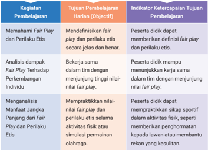
> **[Konteks Visual]**: Tabel ini berisi informasi tentang kegiatan pembelajaran, tujuan pembelajaran harian (objectif), dan indikator ketercapain tujuan pembelajaran. Berikut adalah deskripsi detail dari setiap kolom:

1. Kegiatan Pembelajaran:
   - Memahami Fair Play dan Perilaku Etis
   - Analisis dampak Fair Play Terhadap Perkembangan Individu
   - Mengenal Nilai Jangka Panjang Fair Play dan Perilaku Etis

2. Tujuan Pembelajaran Harian (Objectif):
   - Definisien fair play dan perilaku etis secara jelas dan benar.
   - Bekerja sama dalam tim dengan menjunjung nilai fair play.
   - Mempelajari manfaat jangka panjang fair play dan perilaku etis.

3. Indikator Ketercapain Tujuan Pembelajaran:
   - Peserta didapat memberikan definisi fair play dan perilaku etis.
   - Peserta didapat mampu menunjukkan kerja sama dalam tim dengan menjunjung nilai fair play.
   - Peserta didapat dapat praktikkan sikap sportif dalam aktivitas fisik, seperti memberikan penghormatan kepada lawan atau membantu rekan yang kesulitan.

Tabel ini menggambarkan proses pembelajaran yang melibatkan pemahaman konsep fair play dan perilaku etis, analisis dampaknya, serta pengetahuan tentang manfaat jangka panjang dari praktek tersebut. Indikator-indikator tersebut menunjukkan bahwa peserta belajar secara komprehensif dan dapat menerapkannya dalam situasi nyata.

## 2. Aktivitas Pembelajaran

## Bagian 1

## Definisi fair play dan perilaku etis
Di kelas XI SMA/SMK ini, ajak peserta didik terlebih dahulu merefleksikan pengalaman belajar mereka dalam memahami fair play dan perilaku etis. Kemudian ajak peserta didik membaca artikel di media cetak maupun elektronik mengenai beberapa atlet yang menerapkan fair play dalam pertandingan olahraga, misalnya sepak bola ataupun bulu tangkis.

### [HALAMAN_168]

## Sebelum Aktivitas Praktik
Peserta didik merefleksikan diri terkait pengetahun awal yang telah dikuasai (mengapa harus berlaku adil dalam pertandingan, mengapa harus menaati peraturan di sekolah, dan lain-lain).
Peserta didik membaca artikel di media cetak ataupun elektronik tentang penerapan fair play dalam pertandingan sepakbola di liga italia. Seorang pemain Bernama Miroslav Klose melakukan tindakan fair play yaitu mengaku kepada wasit bahwa dia telah menyentuh bola dengan tangan saat mencetak gol, sehingga kemudian gol tersebut dianulir.
Selain itu,  peserta didik dapat juga membaca artikel kejadian di kejuaraan bulu tangkis All England saat Mohammad Ahsan dan Hendra Setiawan menunjukkan sikap fair play yang mengagumkan ketika tampil menghadapi Fajar Alfian/Rian Ardianto dalam final All England 2023 seperti yang terdapat pada buku siswa halaman 130.

> **[Konteks Visual]**: Mohammad Ahsan secara efektif bulat-bulatkan asal Indonesia menjalani satu permainan faiy play yang mendapatkan ketika memainkan Fajar Affian Rian Ardianto dalam final di England 2023. Dalam periode ini, Mohammad Ahsan Hendra Setiawan kalah dengan skor 17:14 dan 21:12. Pertandingan tersebut terjadi di set pertama, Fajar/Rian mengambil kemenangan dengan skor 21:7. Di set kedua, Fajar/Rian mengambil kemenangan dengan skor 20:14. Namun, ketika lawan itu satu lagi poing untuk mencapai kemenangan, mereka menolak untuk melanjutkan permainan agar lawan dapat mengambil kemenangan dari lapangan. Ini merupakan satu permainan faiy play yang dilakukan oleh tim Indonesia dengan memilih sang lawan.

### [HALAMAN_169]

## Memahami Fair Play dan Perilaku Etis

## Selama Aktivitas Praktik
Peserta didik mengamati video atau gambar yang menunjukkan contoh penerapan fair play .
Mulailah dengan mengajukan pertanyaan reflektif kepada peserta didik.
"Apa yang terlintas di pikiran kalian saat mendengar istilah fair play ?"
"Mengapa sikap adil dan sportif penting dalam olahraga?"
Peserta didik menyimak peristiwa fair play (seperti Miroslav Klose) yang diceritakan secara menarik dan tanyakan pendapat peserta didik mengenai kasus tersebut dengan contoh pertanyaan berikut.
"Apa pendapatmu tentang tindakan Klose?"
"Bagaimana tindakan itu menunjukkan nilai fair play ?"
Mintalah peserta didik untuk menulis refleksi pribadi mengenai pe  ngalaman atau pendapat mereka terkait fair play .  Ggunakan panduan pertanyaan refleksi berikut.
Apa definisi fair play menurutmu?
Apakah kamu pernah mengalami situasi ketika kamu harus memilih  antara  menang  dan  melakukan  hal  yang  benar? Ceritakan!
Bagaimana menurutmu, fair  play memengaruhi hubungan antarteman atau rekan satu tim?
Peserta didik diberikan waktu untuk berdiskusi berbagi hasil refleksi di kelompok masing-masing, berikan umpan balik pada anggota kelompok saat menyampaikan nilai-nilai fair play dalam diskusi.

### [HALAMAN_170]

Berikan ringkasan pentingnya fair play dalam membangun integritas, kerja sama, dan hubungan sosial yang positif.
Peserta didik dihimbau untuk menerapkan sikap fair play tidak hanya dalam permainan atau olahraga saja, tetapi juga pada aktivitas sehari-hari dan interaksi sosial.
Bentuk aktivitas dalam buku ini bersifat contoh, guru dapat mengganti dengan aktivitas lain yang sesuai dengan satuan pendidikan masingmasing.

### [HALAMAN_169]

### [HALAMAN_170]

## Setelah Aktivitas Praktik
Peserta  didik  merefleksikan  kembali  aktivitas  fisik  yang  sudah dilakukan melalui permainan beregu. Setelah itu, bimbing mereka untuk  menganalisis  secara  mendalam  semua  pemain  yang  telah menjujung tinggi fair play . Dalam permainan, kemenangan bukanlah satu-satunya tujuan yang ingin dicapai, lebih dari itu kerja sama yang baik, menghormati lawan, dan menaati peraturan juga harus diutamakan.

## Asesmen Formatif
Lakukan asesmen dengan menilai kedalaman pemikiran peserta didik berdasarkan jawaban refleksi mereka. Amati juga partisipasi dan keterlibatan peserta didik selama diskusi kelompok dan kelas.

### [HALAMAN_171]

## Format Asesmen

## 1) Rubrik Penilaian

> **[Konteks Visual]**: Tabel ini mungkin menunjukkan skor untuk beberapa aspek penilaian, seperti pemahaman konsep, relevansi, refleksi, kualitas analisis, dan partisipasi dalam diskusi. Skor ditentukan berdasarkan tingkat kebaikan atau ketidakbaikan dari setiap aspek tersebut. Skor 1 (Kurang) biasanya berarti bahwa aspek tersebut belum mencapai standar yang diharapkan. Skor 4 (Baik) berarti bahwa aspek tersebut telah mencapai standar yang diharapkan. Tabel ini mungkin digunakan sebagai alat evaluasi untuk mengukur kinerja individu atau tim dalam suatu proyek atau tugas tertentu.

> **[Konteks Visual]**: Tabel ini mungkin menunjukkan skor untuk beberapa aspek penilaian, seperti pemahaman konsep, relevansi, refleksi, kualitas analisis, dan partisipasi dalam diskusi. Skor ditentukan berdasarkan tingkat kebaikan atau ketidakbaikan dari setiap aspek tersebut. Skor 1 (Kurang) biasanya berarti bahwa aspek tersebut belum mencapai standar yang diharapkan. Skor 4 (Baik) berarti bahwa aspek tersebut telah mencapai standar yang diharapkan. Tabel ini mungkin digunakan sebagai alat evaluasi untuk mengukur kinerja individu atau tim dalam suatu proyek atau tugas tertentu.

## 2) Instrumen Asesmen
Guru dapat menggunakan instrumen berikut untuk mendukung penilaian.
Refleksi Tertulis (Individual)
Jawablah  pertanyaan-pertanyaan  berikut  secara  tertulis. Tuliskan pemikiranmu dengan jujur dan mendalam.
} Apa yang kamu pahami tentang fair play ?
} Pernahkah kamu berada dalam situasi ketika kamu harus memilih antara menang atau melakukan hal yang benar? Ceritakan pengalamanmu.
} Menurutmu pendapatmu, bagaimana fair play dapat memengaruhi hubungan antarpemain atau teman dalam suatu aktivitas?
} Jika kamu menjadi pemimpin dalam sebuah tim, bagaimana caramu memastikan timmu mempraktikkan fair play ?

### [HALAMAN_172]

> **[Konteks Visual]**: Gambar tersebut adalah tabel yang berisi kolom dan baris dengan judul "Aspek" dan "Indikator". Kolom pertama berisi aspek-aspek yang harus dipertimbangkan dalam evaluasi, sedangkan kolom kedua berisi indikator-indikator yang berkaitan dengan setiap aspek tersebut. Skor dari setiap aspek ditentukan melalui skala 1-4. Tabel ini digunakan untuk mengukur kualitas pengetahuan, pemahaman, relevansi, refleksi, analisis, dan penyampaian ide dalam konteks pembelajaran atau pengajaran.

## Skala Penilaian :
} 1  : Tidak memadai
} 2  : Kurang memadai
} 3 : Baik
}
4 : Sangat baik
Observasi Diskusi Kelompok
Gunakan lembar observasi berikut untuk menilai partisipasi
dan kontribusi peserta didik selama diskusi kelompok.

> **[Konteks Visual]**: Tabel ini berisi informasi tentang aspek-aspek partisipasi aktif peserta dalam diskusi dan penilaian skor mereka. Tabel tersebut terdiri dari kolom berikut:

1. Aspek: Ini adalah kategori-kategori yang digunakan untuk menilai partisipasi peserta.
2. Indikator: Ini adalah kriteria atau standar yang digunakan untuk mengukur setiap aspek.
3. Skor (1-4): Ini adalah skala yang digunakan untuk memberikan nilai partisipasi peserta.

Beberapa contoh aspek, indikator, dan skor yang mungkin muncul dalam tabel ini:

Aspek: Keterbukaan Ide
Indikator: Peserta mendengarkan pendapat teman dan merespons dengan sopan
Skor: 4 (Tinggi)

Aspek: Relevansi Kontribusi
Indikator: Kontribusi peserta didasarkan pada topik yang sedang dibahas
Skor: 3 (Sangat Baik)

Aspek: Kolaborasi
Indikator: Peserta bekerja sama dengan anggota kompetisi untuk mencapai kesimpulan
Skor: 2 (Baik)

Tabel ini digunakan untuk mengukur partisipasi peserta dalam diskusi dan memberikan skor yang menunjukkan tingkat partisipasi mereka. Skor dapat bervariasi dari 1 hingga 4, dengan 4 menunjukkan tingkat partisipasi yang paling tinggi.

### [HALAMAN_173]

## Skala Penilaian:
} 1  : Tidak memadai
} 2  : Kurang memadai
} 3 : Baik
} 4 : Sangat baik

## 3) Rubrik Penilaian Keseluruhan
Refleksi Tertulis dan Diskusi Kelompok mempunyai bobot penilaian sebagai berikut.

> **[Konteks Visual]**: Tabel ini menunjukkan skor akhir untuk dua aspek utama dalam sebuah evaluasi: Refleksi Tertulis dan Diskusi Kelompok. 

- Untuk Aspek Refleksi Tertulis, skor maksimal adalah 16 dan nilai yang diberikan adalah 60%.
- Untuk Aspek Diskusi Kelompok, skor maksimal juga adalah 16 dan nilai yang diberikan adalah 40%.

Total skor yang diperoleh dari kedua aspek tersebut adalah 100%, dengan skor maksimal total sebesar 32.

## Konversi Skor ke Huruf :
} 28-32 : A (Sangat Baik)
} 24-27 : B (Baik)
} 20-23 : C (Cukup)
} <20 : D (Perlu Perbaikan)

## Bagian 2 Partisipasi Fair Play Aktivitas Fisik

## dan Perilaku Etis dalam
Peserta didik diajak untuk melakukan aktivitas permainan beregu/ tim, permainan ini bertujuan untuk mengintegrasikan konsep fair play dengan praktik langsung melalui permainan beregu/tim. Aktivitas ini melibatkan pengamatan, penerapan nilai fair play , dan refleksi setelah kegiatan untuk meningkatkan pemahaman dan kesadaran peserta didik mengenai pentingnya perilaku etis dalam aktivitas fisik.

### [HALAMAN_174]

## Aktivitas 1b    Belajar Mendalam

## Partisipasi dalam Aktivitas Fisik

## Sebelum Aktivitas Praktik
Tentukan permainan yang melibatkan kerja sama tim, seperti futsal, sepak bola mini, bola basket, atau permainan lainnya. Pastikan permain  an tersebut dapat dilakukan dengan peraturan yang sederhana.
Tentukan peraturan permainan yang jelas dan mudah diikuti. Tekankan bahwa permainan ini akan dinilai berdasarkan fair play , bukan hanya kemenangan.
Bentuklah tim secara acak untuk memastikan kemampuan anggota yang heterogen.
Jelaskan tujuan dari aktivitas ini adalah melatih fair play dalam permainan tim.

## Selama Aktivitas Praktik
Berikan pengantar singkat tentang fair play , pentingnya fair play , dan sikap fair play yang dapat diterapkan dalam permainan.
Berikan penekanan bahwa yang paling penting dalam permainan ini adalah saling menghormati, bekerja sama, dan menjaga kejujuran.
Instruksikan pada setiap tim untuk membagi tugas atau posisi yang jelas, contohnya pemain, penjaga gawang, atau pelatih (untuk permainan berbasis tim, seperti sepak bola atau futsal).
Peserta didik diperbolehkan untuk memulai permainan dengan peraturan yang jelas, seperti berikut.
Tidak ada perilaku kasar atau curang.
Semua pemain harus mengikuti aturan dan menerima keputusan wasit dengan sportif.
Jika ada pelanggaran, pemain harus mengakui kesalahan tanpa menunggu wasit.

### [HALAMAN_175]

Lakukan pengawasan dalam permainan dan berikanlah catatan perilaku yang sesuai dengan fair play dan yang tidak.

## Setelah Aktivitas Praktik
Berikan tugas untuk melakukan refleksi kelompok dengan cara berbagi pengalaman mereka selama permainan.
Tanyakan kepada peserta didik, 'Apa yang kamu pelajari tentang pentingnya fair play dalam permainan ini?
'Bagaimana fair play dapat memengaruhi hubunganmu dengan teman dan lawan?
Peserta didik menyampaikan kesimpulan dari pembelajaran dan kaitkan dengan pentingnya perilaku etis dalam kehidupan sehari-hari.
Berikan dorongan kepada peserta didik untuk selalu berperilaku adil, jujur, dan menghormati orang lain, baik dalam olahraga maupun dalam interaksi sosial lainnya.

## Asesmen Formatif

## Asesmen dan Evaluasi
Observasi selama permainan berlangsung, mengenai perilaku peserta didik berdasarkan konsep fair play .  Fokuskan Pengamatan pada aspek berikut.
Kepatuhan terhadap aturan permainan.
Sikap terhadap lawan dan wasit (sportif dan menghormati).
Kerja sama tim dan dukungan antaranggota tim.
Kejujuran (mengakui kesalahan atau pelanggaran sendiri).
Lakukan penilaian refleksi dan diskusi kelompok berdasarkan kedalam  an pemahaman nilai fair play peserta didik dan kemampuan mereka dalam mengaitkan prinsip tersebut dengan pengalaman langsung.
Gunakan contoh rubrik berikut untuk menilai aktivitas.

### [HALAMAN_177]

Penerapan nilai yang diharapkan setelah aktivitas ini.
Peserta didik menunjukkan sikap fair play yang nyata dalam berbagai konteks permainan atau aktivitas fisik.
Peserta didik memahami kemenangan bukanlah segalanya, namun yang lebih penting adalah cara kita berinteraksi dengan orang lain.
Peserta  didik  mengintegrasikan  nilai-nilai fair  play dalam kehidupan sehari-hari, baik di sekolah, rumah, atau dalam masyarakat.

### [HALAMAN_175]

### [HALAMAN_176]

> **[Konteks Visual]**: Tabel ini menunjukkan skor untuk berbagai aspek penilaian dalam sebuah pertandingan olahraga. Tabel ini terdiri dari empat skor (Skor 1, Skor 2, Skor 3, dan Skor 4) yang mengukur tingkat keberhasilan atau keterampilan dalam berbagai aspek penilaian tersebut. Aspek penilaian ini meliputi:

1. Kepatuhan terhadap aturan
2. Sikap terhadap lawan
3. Kerja sama dalam tim
4. Kejujuran
5. Refleksi Pasca-Permainan

Setiap aspek penilaian memiliki empat skor yang berbeda-beda, mulai dari "Sering melanggar aturan" hingga "Selalu mematuhi aturan permainan". Skor 4 (Sangat Baik) adalah skor tertinggi yang diharapkan untuk setiap aspek penilaian.

Tabel ini digunakan untuk memberikan skor kepada peserta dalam pertandingan berdasarkan keterampilan mereka dalam berbagai aspek penilaian tersebut. Skor yang diberikan akan membantu pihak penyelenggara untuk menilai kinerja peserta dalam pertandingan tersebut.

### [HALAMAN_177]

## Bagian 3

## Penerapan Fair Play dalam Aktivitas Fisik

## Tujuan pembelajaran harian
Bekerja sama dalam tim dengan menjunjung tinggi nilai-nilai fair play .
Peserta didik terlebih dahulu merefleksikan pengalaman belajar mereka. Kemudian peserta didik membaca dan menganalisis artikel di media cetak maupun elektronik mengenai peristiwa yang terjadi pada Pekan Olahraga Nasional (PON) 2024 yang diselenggarakan di Aceh, Sumatera Utara pada cabang olahraga sepak bola.

## Aktivitas 2    Belajar Mendalam

## Menganalisis Fair Play dalam Olahraga

## Sebelum Aktivitas Praktik
Tentukan kasus nyata untuk dibaca dan dianalisis. Sebagai contoh, insiden kontroversial pelanggaran fair play dalam pertandingan sepak bola dalam PON 2024.

### [HALAMAN_178]

Siapkan panduan untuk analisis kasus yang mencakup elemenelemen seperti identifikasi pelanggaran, penyebab, dampak, serta solusi dan pencegahan.
Peserta didik dibagi dalam beberapa kelompok yang beranggotakan 3 - 4 orang per kelompok. Setiap kelompok akan menganalisis kasus secara bersama-sama.

### [HALAMAN_177]

### [HALAMAN_178]

## Selama Aktivitas Praktik
Jelaskan tujuan dari aktivitas ini yaitu untuk menganalisis penerapan fair play dalam olahraga melalui studi kasus.
Berikan penekanan mengenai definisi fair play dan pentingnya konsep ini dalam olahraga kompetitif. Jelaskan bahwa fair play mencakup rasa hormat terhadap lawan, peraturan, dan kejujuran dalam permainan.
Bagilah peserta didik menjadi kelompok-kelompok kecil (3 - 4 peserta didik per kelompok).
Setiap kelompok diberikan kasus yang telah disiapkan oleh guru.
Presentasikan satu kasus kepada seluruh kelas. Kasus dapat berupa narasi singkat, video, atau artikel tentang insiden yang berkaitan dengan pelanggaran fair play . Jika kasus yang digunakan adalah PON 2024 yang melibatkan pemukulan wasit oleh pemain, uraikan kejadian tersebut, termasuk apa yang terjadi, siapa yang terlibat, dan apa akibat dari kejadian itu.
Minta Setiap kelompok mendiskusikan kasus yang diberikan dan menganalisisnya berdasarkan panduan yang disediakan. Panduan analisis dapat meliputi berikut ini:
identifikasikan pelanggaran yang terjadi,
penyebab terjadinya pelanggaran,
dampak terhadap tim/individu/olahraga, dan
solusi dan pencegahannya.

### [HALAMAN_179]

Instruksikan kepada setiap kelompok untuk merangkum hasil diskusi dalam bentuk laporan singkat atau peta konsep.
Setiap kelompok mempresentasikan hasil analisis mereka di depan kelas.  Presentasi  ini  mencakup  poin-poin  utama  dari  analisis kelompok, seperti identifikasi pelanggaran, penyebab, dampak, serta solusi yang disarankan.
Berikan umpan balik terhadap presentasi kelompok, termasuk memberikan pertanyaan atau opini untuk menggali lebih dalam.

### [HALAMAN_178]

### [HALAMAN_179]

## Setelah Aktivitas Praktik
Sampaikan ringkasan pentingnya fair play dalam olahraga dan bagaimana hal tersebut memengaruhi hasil pertandingan dan hubungan antar pemain, tim, dan wasit.
Berikan motivasi agar peserta didik dapat mengaplikasikan nilai-nilai fair play tidak hanya dalam olahraga, tetapi juga dalam kehidupan sehari-hari, baik di sekolah, keluarga, maupun masyarakat.

## Asessmen Formatif
Lakukan asesmen untuk mengetahui pemahaman dan penguasaan peserta didik dalam fair play melalui aktivitas analisis kasus. Berikut contoh penilaian analisis kasus.Penilaian laporan analisis kasus (kelompok), isi laporan mencakup elemen identifikasi pelanggaran, penyebab pelanggaran, dampak terhadap tim/individu, dan solusi serta pencegahannya
Penilaian presentasi kelompok, memuat Penjelasan, pembahasan,, solusi dan langkah-langkah pencegahan di masa yang akan datang.
Penilaian partisipasi keaktifan dalam diskusi.

### [HALAMAN_180]

Untuk  penilaian aktivitas di atas, dapat menggunakan contoh rubrik berikut.

> **[Konteks Visual]**: Tabel ini mungkin merupakan bagian dari evaluasi atau penilaian untuk sebuah kegiatan atau proyek tertentu. Tabel tersebut memiliki empat kolom utama:

1. Aspek Penilaian: Ini mungkin merujuk pada berbagai aspek atau kriteria yang harus dipertimbangkan dalam evaluasi.

2. Slot 1 (Kurang): Ini mungkin menunjukkan tingkat rendah atau kurangnya pemahaman atau pengetahuan tentang aspek penilaian tersebut.

3. Slot 2 (Cukup): Ini mungkin menunjukkan tingkat cukup atau minimalisasi dari aspek penilaian tersebut.

4. Slot 3 (Baik): Ini mungkin menunjukkan tingkat baik atau optimal dari aspek penilaian tersebut.

5. Slot 4 (Sangat Baik): Ini mungkin menunjukkan tingkat sangat baik atau paling optimal dari aspek penilaian tersebut.

Tabel ini mungkin digunakan untuk mengukur sejauh mana individu, tim, atau organisasi telah mencapai tujuan atau standar tertentu dalam aspek-aspek tertentu. Setiap aspek penilaian mungkin memiliki beberapa kriteria atau indikator yang harus dipenuhi untuk mendapatkan skor tertentu.

Contoh aspek penilaian mungkin termasuk:

- Identifikasi Pelanggaran: Apakah individu, tim, atau organisasi dapat dengan jelas dan tepat identifikasi pelanggaran atau masalah yang muncul dalam proses atau tugas mereka.
- Penyebaran Pelanggaran: Apakah individu, tim, atau organisasi dapat dengan tepat dan efektif menyebarluaskan informasi tentang pelanggaran atau masalah tersebut kepada orang-orang yang perlu tahu.
- Dampak Terhadap Tim/Individu: Apakah individu, tim, atau organisasi dapat dengan tepat dan efektif menanggapi dampak dari pelanggaran atau masalah tersebut kepada tim atau individu yang terlibat.
- Solusi dan Pencegahan: Apakah individu, tim, atau organisasi dapat dengan tepat dan efektif mencari solusi atau cara untuk mencegah pelanggaran atau masalah tersebut dari terulang.
- Kualitas Presentasi: Apakah individu, tim

## Penilaian Total
Laporan Analisis Kasus: 40%
Presentasi Kelompok: 40%
Partisipasi dalam Diskusi: 20%

## Skala Penilaian Total:
36-40: Sangat Baik
30-35: Baik
24-29: Cukup
<24: Perlu Perbaikan

### [HALAMAN_181]

## Analisis dampak Fair Play terhadap Perkembangan Individu

## Tujuan Pembelajaran Harian
Dengan mempraktikkan fair play , peserta didik tidak hanya menjadi olahragawan yang baik, tetapi juga warga masyarakat yang etis dan bertanggung jawab.

## Bagian 1
Menganalisis Dampak Fair Play dalam Pertandingan Futsal

## Aktivitas 3    Belajar Mendalam

## Sebelum Aktivitas Praktik
Bagilah  peserta  didik  dalam  beberapa  kelompok  yang  akan mengamati pertandingan futsal. Setiap kelompok akan bertugas untuk mengamati dan menganalisis dampak dari perilaku fair play selama permainan.
Berikan instruksi yang jelas mengenai aspek-aspek yang perlu diamati:
kepatuhan terhadap aturan permainan,
sikap terhadap lawan dan wasit,
kerja sama tim dan komunikasi, dan
kejujuran dalam bermain, contohnya mengakui kesalahan atau pelanggaran.

## Selama Aktivitas Praktik
Berikan penjelasan tujuan dan pentingnya fair play dalam bermain futsal.
Paparkan dampak positif dan negatif dari perilaku fair play terhadap pemain, tim, dan pertandingan secara umum.

### [HALAMAN_182]

Jelaskan aturan permainan futsal dengan menekankan pentingnya sikap adil dan sportif.
Peserta didik dibagi menjadi beberapa kelompok yang akan bertugas mengamati pertandingan futsal. Setiap kelompok harus fokus pada satu aspek fair play :
Kelompok A: Kepatuhan terhadap aturan.
Kelompok B: Sikap terhadap lawan.
Kelompok C: Kerja sama tim.
Kelompok D: Kejujuran dalam bermain.
Peserta didik diinstruksikan untuk mulai bermain pertandingan futsal sesuai dengan aturan yang telah disepakati, dengan mengamati dan mencatat penerapan fair play selama pertandingan.
Perintahkan setiap kelompok untuk mencatat contoh penerapan atau pelanggaran yang terjadi selama permainan (pemain mengakui kesalahan, menghormati keputusan wasit, atau bekerja sama dengan baik dalam tim).
Peserta didik melakukan aktivitas refleksi setelah pertandingan selesai. Setiap kelompok berkumpul untuk menganalisis dan men  diskusi  kan dampak fair play yang mereka amati dalam pertandingan futsal.
Peserta didik mempresentasikan hasil analisis di depan kelas, menjelaskan penerapan fair play yang dapat memengaruhi berbagai aspek permainan.

### [HALAMAN_181]

### [HALAMAN_182]

## Setelah Aktivitas Fisik
Peserta didik merefleksikan kembali aktivitas pertandingan futsal yang sudah dilakukan kemudian mengambil esensi fair play dari pertandingan.

### [HALAMAN_183]

## Bagian 2 Perbedaan dan Persamaan Fair Play Perilaku Etis

## Aktivitas 4    Belajar Mendalam

## Permainan Beregu/Tim dengan Menerapkan Etika

## Sebelum Aktivitas Praktik
Ajaklah peserta didik untuk memahami persamaan dan perbedaan fair play dan perilaku etis dengan mencari informasi melalui media cetak maupun elektronik.
Peserta didik diajak mendiskusikan artikel mengenai beberapa mantan atlet professional yang kemudian sukses dengan karir di bidang lain, seperti Arnold Schwarzeneger.

## Selama Aktivitas Praktik
Peserta didik bermain permainan beregu/tim dengan menerapkan etika.
Permainan sama seperti aktivitas sebelumnya, namun penekanan pada penerapan nilai-nilai etika, seperti:
kerja sama,
komunikasi,
respek, dan
kejujuran.

## Sesudah Aktivitas Praktik
Peserta didik diminta merefleksikan permainan yang sudah dilakukan dengan cara saling memberikan umpan balik dari permainan yang sudah dilakukan, Tanyakan pada peserta didik yang mengamati apakah selama permainan sudah diterapkan etika dalam bermain dengan baik.

## dan

### [HALAMAN_184]

## Bagian 2

## Evaluasi Dampak Fair Play dan Perilaku Etis

## Aktivitas 5    Belajar Mendalam

## Debat Terarah

## Sebelum Aktivitas Praktik
Peserta didik menentukan topik debat, seperti:
z 'Apakah aktivitas jasmani senam di Jumat sehat penting bagi peserta didik?'
Bagilah tim dalam kelas menjadi 2 tim, yaitu tim yang mendukung dan yang tidak mendukung aktivitas jasmani di program Jumat sehat.

## Selama Aktivitas Praktik
Peserta didik menyusun argumen utama dan mendiskusikan strategi debat.
Peserta didik mengikuti prosedur debat seperti yang terdapat pada buku siswa halaman 148 dan 149.

## Setelah Aktivitas Praktik
Peserta didik berdiskusi reflektif secara bersama-sama dengan menjawab  pertanyaan panduan berikut.
Seberapa penting beraktivitas jasmani pada program Jumat sehat di sekolah?
Bagaimana  berperilaku  etis  dalam  menyikapi  perbedaan pendapat dalam program Jumat sehat ini?
Apa nilai yang dapat diterapkan dalam kehidupan sehari-hari? Bagaimana menerapkannya?

### [HALAMAN_185]

## c. Menganalisis Manfaat Jangka Panjang dari Fair Play dan Perilaku Etis
Konsistensi dalam mempraktikkan nilai-nilai fair play dan perilaku etis mungkin akan mengalami pencapaian pribadi dan kelompok yang lebih baik. Sebagai contoh, pencapaian dalam kesuksesan karir, mental dan fisik lebih sehat, memiliki hubungan sosial bermasyarakat yang lebih baik, menjadi panutan dalam sebuah komunitas dan lainnya.

## Aktivitas 6    Belajar Mendalam
Proyek Penelitian Mini: Memahami Manfaat Perilaku Etis pada Kesuksesan Jangka Panjang

## Sebelum Aktivitas Praktik
Persiapkan Proyek dengan menentukan topik penelitian yang akan dilaksanakan. Pilihlah tema yang umum, seperti 'Peran Perilaku Etis dalam Karier' atau 'Kesuksesan Organisasi yang Menjunjung Etika.'
Kemudian Tentukanlah subtopik spesifik, seperti:
Perilaku Etis dalam Olahraga
Perusahaan yang Sukses karena Menjunjung Tinggi Nilai Etika
Pemimpin Terkenal yang Menjadi Panutan karena Integritas Mereka
Bagi peserta didik dalam kelompok kecil (3-5 orang).

## Selama Aktivitas Praktik
Ajak peserta didik untuk mulai mengumpulkan data, baik data primer maupun data sekunder.
Peserta didik menentukan metode pengumpulan data yang akan digunakan, seperti wawancara, observasi, ataupun riset pustaka. Berikut contoh data yang dapat dikumpulkan.

### [HALAMAN_186]

Kronologi peristiwa yang menunjukkan perilaku etis.
Dampak jangka pendek dan jangka panjang dari perilaku tersebut.
Ulasan dari orang-orang di sekitar tokoh atau organisasi yang diteliti.
Instruksikan peserta didik untuk menganalisis data dengan mengklasifikasikan jenis data.
Identifikasi perilaku yang mencerminkan nilai etika.
Dampak perilaku etis pada individu, tim, atau organisasi.
Hasil yang dicapai dalam jangka panjang.
Berikan panduan kepada peserta didik dalam proses menganalisis dengan menggunakan Pertanyaan Panduan Analisis berikut.
Apa nilai-nilai etis yang terlihat dalam contoh ini?
Bagaimana  perilaku  etis  membantu  mereka  mencapai kesuksesan?
Apa saja tantangan yang mereka hadapi, dan bagaimana mereka mengatasinya?
Apa pelajaran yang dapat diambil?
Peserta didik diminta menyusun laporan dengan struktur laporan:
pendahuluan
deskripsi kasus
analisis
kesimpulan dan rekomendasi
pilihan format
Peserta  didik  mempresentasikan  hasil  penelitian  yang  sudah dilakukan.
Lanjutkan kegiatan dengan diskusi dan berikan umpan balik.

### [HALAMAN_185]

### [HALAMAN_186]

### [HALAMAN_187]

## Setelah Aktivitas Fisik
Peserta didik menuliskan refleksi pribadi tentang pengalaman dalam proyek penelitian ini.
Apa yang kamu pelajari dari proyek ini?
Bagaimana proyek ini memengaruhi pandangan tentang perilaku etis?

## Asesmen Formatif
Lakukan asesmen untuk mengevaluasi kemampuan peserta didik dalam melakukan penelitian, menganalisis data, menyusun laporan, dan mempresentasikan hasil dengan baik.

## Asesmen Proyek Penelitian Mini

## Komponen yang Dinilai
Perencanaan Penelitian (20%):
z Kesiapan dan kejelasan rencana penelitian, termasuk tujuan, topik, dan sumber data.
Pengumpulan Data (20%):
z Kemampuan peserta didik dalam mencari dan mengorganisasi data relevan dari sumber primer atau sekunder.
Analisis Data dan Kesimpulan (30%):
z Kedalaman analisis terhadap data yang diperoleh dan relevansi kesimpulan dengan topik penelitian.
Laporan Tertulis (20%):
z Struktur laporan, kejelasan penulisan, dan penyampaian ide secara logis.
Presentasi Hasil (10%):
z Kejelasan, struktur, dan efektivitas dalam menyampaikan hasil penelitian kepada audiens.

### [HALAMAN_188]

## Rubrik Penilaian
Berikut contoh rubrik yang dapat digunakan untuk penilaian proyek penelitian mini.

> **[Konteks Visual]**: Tabel ini menunjukkan skor untuk berbagai aspek penilaian dalam sebuah penelitian. Tabel ini terdiri dari kolom "Aspek Penilaian" dan baris "Skor 1 (Kurang)", "Skor 2 (Cukup)", "Skor 3 (Baik)", dan "Skor 4 (Sangat Baik)". Setiap aspek penilaian diuraikan dalam beberapa sub-aspek, dengan skor yang ditentukan untuk setiap sub-aspek. Skor 1 (Kurang) adalah skor terendah, sedangkan skor 4 (Sangat Baik) adalah skor tertinggi.

### [HALAMAN_189]

## F. Tindak Lanjut
Peserta didik yang belum mencapai tujuan pembelajaran diberikan umpan balik dan aktivitas belajar ke level berikutnya sesuai dengan perkembangan mereka berdasarkan rubrik asesmen dan kriteria ketercapaian tujuan pembelajaran. Selain itu, dapat juga dengan menggunakan pembelajaran tutor sebaya dan guru memantau perkembangan proses belajarnya.
Peserta didik yang telah mencapai tujuan pembelajaran diberikan tugas pengayaan sebagai berikut.
Mengembangkan dan mempresentasikan sebuah proyek mengadvokasi budaya  hidup  aktif  dan  sehat  yang  mencakup  penelitian,  desain, penerapan, dan evaluasi.
Proyek ini harus memperkenalkan sebuah kampanye baru dengan media yang mampu menjangkau semua kalangan baik di tempat yang mempunyai fasilitas lengkap maupun terbatas.
Selanjutnya menerapkan proyek tersebut dalam aktivitas mengadvokasi budaya hidup aktif dan sehat.
Peserta didik mengevaluasi konten dalam mengadvokasi budaya hidup sehat dan mencatat refleksinya dalam buku tugas.

## G.  Asesmen Sumatif
Asesmen  sumatif  ini  digunakan  untuk  mengukur  ketercapaian  tujuan pembelajaran dalam satu lingkup materi yaitu fair play dan perilaku etis. Guru dapat menggunakan uji kompetensi dengan cara seperti berikut ini atau juga dapat mengembangkan dalam bentuk yang lain.
Guru dapat menggunakan atau memodifikasi desain asesmen sumatif berikut untuk mengevaluasi pemahaman dan penerapan peserta didik terhadap materi fair play dan perilaku etis. Asesmen ini mencakup evaluasi individu dan kelompok yang mengintegrasikan pengetahuan, analisis, serta aplikasi nilai fair play dan perilaku etis dalam berbagai situasi.

### [HALAMAN_190]

Pilihan Ganda (20%)
Jumlah Soal : 10 soal
Tujuan : Mengukur pemahaman peserta didik terhadap konsep dasar fair play dan perilaku etis, termasuk definisi, perbedaan, persamaan, dan contoh aplikasinya.
Esai (30%)
Jumlah Soal : 2 soal
Tujuan : Mengukur kemampuan peserta didik untuk menganalisis dan menghubungkan konsep fair play dan perilaku etis dengan situasi nyata.
Kriteria Penilaian Esai
Pemahaman konsep (30%)
Relevansi contoh yang diberikan (30%)
Kedalaman analisis (30%)
Kejelasan dan struktur jawaban (10%)
Studi Kasus (50%)
Peserta didik menganalisis sebuah studi kasus nyata atau hipotetis yang mencerminkan pelanggaran atau penerapan fair play dan perilaku etis.
Langkah-Langkah
Guru memberikan studi kasus, seperti:
Seorang pemain yang menolak mencetak gol karena pelanggaran aturan.
Kontroversi di pertandingan olahraga yang melibatkan keputusan wasit yang tidak adil.
Peserta didik menganalisis kasus dengan menjawab pertanyaan:
Apa pelanggaran atau penerapan fair play dalam kasus ini?
Apa dampak tindakan tersebut terhadap individu atau tim?
Apa solusi  atau  pencegahan yang dapat diterapkan untuk meningkatkan fair play dan perilaku etis?

### [HALAMAN_191]

Kriteria Penilaian Studi Kasus
Identifikasi masalah (20%)
Analisis dampak (20%)
Solusi dan pencegahan (30%)
Kejelasan dan struktur jawaban (20%)
Kreativitas dan kedalaman analisis (10%)

### [HALAMAN_190]

### [HALAMAN_191]

## Rubrik Penilaian
Berikut contoh rubrik penilaian yang dapat digunakan untuk penilaian Asesmen Sumatif.

> **[Konteks Visual]**: Tabel ini menunjukkan skor untuk berbagai aspek penilaian dalam sebuah ujian atau evaluasi. Setiap aspek penilaian diurutkan dari Skor 1 (Kurang) hingga Skor 4 (Sangat Baik). Berikut adalah deskripsi singkat setiap aspek penilaian:

1. **Pemahaman Konsep**: Skor 1 (Kurang) - Pemahaman sangat terbatas dan tidak akurat.
   - Skor 2 (Cukup) - Pemahaman cukup, tetapi kurang kualitas konsep.
   - Skor 3 (Baik) - Pemahaman baik dan sesuai konsep.
   - Skor 4 (Sangat Baik) - Pemahaman sangat mendalam dan sesuai konsep.

2. **Relevansi Analisis**: Skor 1 (Kurang) - Tidak relevan atau tidak sesuai dengan kasus.
   - Skor 2 (Cukup) - Analisis relevan, tetapi kurang mendalam.
   - Skor 3 (Baik) - Analisis relevan dan cukup mendalam.
   - Skor 4 (Sangat Baik) - Analisis sangat relevan, relevan, dan mendalam.

3. **Kreativitas Solusi**: Skor 1 (Kurang) - Tidak ada solusi atau solusi tidak realistis.
   - Skor 2 (Cukup) - Solusi cukup relevan, tetapi kurang inovatif.
   - Skor 3 (Baik) - Solusi relevan dan cukup inovatif.
   - Skor 4 (Sangat Baik) - Solusi sangat relevan, inovatif, dan aplikatif.

4. **Kejelasan dan Struktur Jawaban**: Skor 1 (Kurang) - Jawaban tidak jelas dan sulit dipahami.
   - Skor 2 (Cukup) - Jawaban jelas, tetapi kurang struktural.
   - Skor 3 (Baik) - Jawaban jelas dan cukup struktural.
   - Skor 4 (Sangat Baik) - Jawaban sangat jelas, struktural, dan menarik.

5. **Present

> **[Konteks Visual]**: Tabel ini menunjukkan skor untuk berbagai aspek penilaian dalam sebuah ujian atau evaluasi. Setiap aspek penilaian diurutkan dari Skor 1 (Kurang) hingga Skor 4 (Sangat Baik). Berikut adalah deskripsi singkat setiap aspek penilaian:

1. **Pemahaman Konsep**: Skor 1 (Kurang) - Pemahaman sangat terbatas dan tidak akurat.
   - Skor 2 (Cukup) - Pemahaman cukup, tetapi kurang kualitas konsep.
   - Skor 3 (Baik) - Pemahaman baik dan sesuai konsep.
   - Skor 4 (Sangat Baik) - Pemahaman sangat mendalam dan sesuai konsep.

2. **Relevansi Analisis**: Skor 1 (Kurang) - Tidak relevan atau tidak sesuai dengan kasus.
   - Skor 2 (Cukup) - Analisis relevan, tetapi kurang mendalam.
   - Skor 3 (Baik) - Analisis relevan dan cukup mendalam.
   - Skor 4 (Sangat Baik) - Analisis sangat relevan, relevan, dan mendalam.

3. **Kreativitas Solusi**: Skor 1 (Kurang) - Tidak ada solusi atau solusi tidak realistis.
   - Skor 2 (Cukup) - Solusi cukup relevan, tetapi kurang inovatif.
   - Skor 3 (Baik) - Solusi relevan dan cukup inovatif.
   - Skor 4 (Sangat Baik) - Solusi sangat relevan, inovatif, dan aplikatif.

4. **Kejelasan dan Struktur Jawaban**: Skor 1 (Kurang) - Jawaban tidak jelas dan sulit dipahami.
   - Skor 2 (Cukup) - Jawaban jelas, tetapi kurang struktural.
   - Skor 3 (Baik) - Jawaban jelas dan cukup struktural.
   - Skor 4 (Sangat Baik) - Jawaban sangat jelas, struktural, dan menarik.

5. **Present

### [HALAMAN_192]

## H.  Refleksi

## 1. Refleksi Peserta Didik
Peserta didik diminta mengisi lembar refleksi menggunakan model 4F/4P seperti yang terdapat dalam buku siswa halaman 156. Refleksi ini berfungsi untuk mengetahui apa saja yang sudah dipelajari pada bab ini.

## 2. Refleksi Guru
Refleksi ini penting bagi guru untuk mengevaluasi keberhasilan pembelajaran dan meningkatkan kualitas pengajaran. Dengan merefleksikan perencanaan, pelaksanaan, hasil belajar peserta didik, dan peran guru sendiri, pembelajaran menjadi lebih bermakna dan relevan. Refleksi ini juga membantu memastikan bahwa materi seperti fair play dan perilaku etis tidak hanya disampaikan dengan baik, tetapi juga memiliki dampak positif yang nyata pada peserta didik.
Berikut contoh refleksi yang dapat dilakukan.
Apakah pembelajaran yang dilakukan sudah sesuai dengan rencana?
Hal apa yang paling disukai peserta didik dalam pembelajaran ini?
Apa kendala utama yang saya temui selama proses pembelajaran?
Bagaimana saya mengatasinya?
Apa pencapaian peserta didik yang paling menonjol?
Apa yang perlu ditingkatkan di masa depan?
Apa yang akan saya lakukan secara berbeda untuk bab serupa di masa depan?

## I. Sumber Belajar
Guru dapat menggunakan berbagai sumber belajar untuk mengedukasi peserta didik dalam fair play dan berperilaku etis.
Sumber buku utama adalah Buku Siswa mata pelajaran PJOK untuk kelas XI SMA/SMK.
Sumber alternatif lain dapat menggunakan buku Lumpkin, A., Stoll, S. K., & Beller, J. M. (2011). Sport Ethics: Applications for Fair Play (4th ed.). McGraw-Hill.
Guru juga dapat menggunakan sumber lain yang relevan dan terpercaya.
176

### [HALAMAN_193]

## KEMENTERIAN PENDIDIKAN, KEBUDAYAAN, RISET, DAN TEKNOLOGI REPUBLIK INDONESIA, 2024
Panduan Guru Pendidikan Jasmani, Olahraga, dan Kesehatan untuk SMA/SMK/MA/MAK Kelas XI
Penulis: Anggara Aditya Kurniawan, Damar Pamungkas ISBN: 978-634-00-0105-1 (jil.2 PDF)

> **[Konteks Visual]**: Gambar ini menampilkan beberapa orang dalam sebuah ruangan olahraga atau gym. Di sisi kiri, seorang wanita sedang berjalan di treadmill. Di tengah, seorang pria sedang berjalan dengan membawa selembar kertas. Di sisi kanan, seorang wanita sedang berbicara dengan seorang pria yang juga sedang berjalan. Semua orang tersebut mengenakan pakaian olahraga biru dan merah. Di atas gambar tersebut terdapat tulisan "PANDUAN KHUSUS Menjaga Kebugaran Jasmani Sehari-hari" dan "BAB V".

### [HALAMAN_194]

## A.  Pendahuluan

## 1. Tujuan Pembelajaran dan Kriteria Ketercapaian Tujuan Pembelajaran (KKTP)

## a. Tujuan Pembelajaran
Meningkatkan dan menjaga partisipasi dalam aktivitas kebugaran di luar ruang secara konsisten.
Mengevaluasi strategi peningkatan dalam bergerak aktif sehari-hari.

## b. Kriteria Ketercapaian Tujuan Pembelajaran
Peserta didik mampu meningkatkan partisipasi dalam aktivitas kebugaran di luar ruangan secara konsisten.
Peserta didik mampu menjaga partisipasi dalam aktivitas kebugaran di luar ruang secara konsisten.
Peserta didik mampu mengevaluasi strategi peningkatan kebugaran jasmani melalui aktivitas gerak aktif sehari hari.

## 2. Peta Materi/Peta Konsep

### [HALAMAN_195]

Materi esensial yang akan diajarkan pada bab ini adalah menjaga kebugaran jasmani dalam kehidupan sehari-hari. Pada pembelajaran ini, guru memberikan pembelajaran bermakna kepada peserta didik untuk menjaga kebugaran jasmani sehari-hari yang dapat dicapai melalui 4 subbab pembelajaran sebagai berikut.
Kebugaran dan Aktivitas Gerak
Menentukan dan Mengevaluasi Intensitas Zona Latihan
Menyesuaikan Program Latihan FITT
Mengevaluasi Prinsip dan Jenis-jenis Latihan Kebugaran
Latihan Kekuatan dan Daya Tahan Otot
Latihan Fleksibilitas
Dampak Partisipasi Teratur
Meningkatkan Partisipasi Latihan Kebugaran di Luar Ruangan
Meningkatkan Partisipasi dalam Aktivitas Kebugaran Bersama Komunitas
Mengevaluasi Pemanfaatan Teknologi Pendukung Kebugaran

## 3. Keterkaitan dengan Materi Bab Lain
Keterkaitan bab ini dengan bab lain yaitu aktivitas latihan yang dipelajari di bab lain terutama bab 1,2 dan 3 dapat digunakan sebagai aktivitas pendukung dalam menjaga kebugaran jasmani sehari-hari. Begitu juga sebaliknya, hasil dari menjaga kebugaran akan berpengaruh terhadap capaian hasil belajar keterampilan gerak yang dipelajari pada bab-bab tersebut.

## 4. Saran Periode/Waktu Pembelajaran Bab 5
Materi pada bab 5 ini dapat diajarkan oleh guru selama 8 pertemuan dengan rincian sebagai berikut.
Pertemuan Ke-1: Subbab 1 materi kebugaran dan aktivitas gerak pada bagian menentukan dan mengevaluasi intensitas zona latihan.

### [HALAMAN_196]

Pertemuan Ke-2: Subbab 1 materi kebugaran dan aktivitas gerak pada bagian menyesuaikan program FITT.
Pertemuan Ke-3: Subbab 2 materi mengevaluasi prinsip dan jenis-jenis latihan kebugaran pada bagian latihan kekuatan dan daya tahan otot.
Pertemuan Ke-4: Subbab 2 materi mengevaluasi prinsip dan jenis-jenis latihan kebugaran pada bagian latihan kekuatan dan daya tahan otot.
Pertemuan Ke-5: Subbab 2 materi mengevaluasi prinsip dan jenis-jenis latihan kebugaran pada bagian  latihan fleksibilitas.
Pertemuan Ke-6: Subbab 3 materi dampak partisipasi teratur pada bagian meningkatkan partisipasi latihan kebugaran di luar ruangan.
Pertemuan Ke-7: Subbab 3 materi dampak partisipasi teratur pada bagian meningkatkan partisipasi dalam aktivitas kebugaran bersama komunitas.
Pertemuan Ke-8: Subbab 4 materi mengevaluasi pemanfaatan teknologi pendukung kebugaran .

### [HALAMAN_195]

### [HALAMAN_196]

Jumlah pertemuan bersifat saran/rekomendasi. Guru dapat mengubah dan  menyesuaikan  sesuai  dengan  kebutuhan  peserta  didik  di  satuan pendidikannya masing-masing.

## B.  Konsep dan Keterampilan Prasyarat
Kemampuan prasyarat yang diperlukan pada untuk bab 5 ini adalah peserta didik telah mengetahui konsep kebugaran jasmani dan telah menguasai penerapan prinsip latihan FITT yang sudah dilaksanakan di kelas 10.

## C.  Apersepsi
Peserta didik mendiskusikan cara menjaga kebugaran jasmani agar menjadi kebiasaan sehat untuk hidup yang lebih baik di masa kini dan nanti.
Peserta didik mendiskusikan alasan pentingnya menjaga kebugaran jasmani dan manfaatnya dalam kehidupan sehari-hari.

### [HALAMAN_197]

Peserta didik melakukan aktivitas penilaian kemampuan awal untuk mengetahui perencanaan latihan kebugaran, target zona latihan, prinsip FITT, dan penggunaan teknologi pendukung kebugaran secara sederhana dan cepat.
Peserta didik mendiskusikan aktivitas fisik mereka sehari-hari yang dapat mendukung kebugaran dan manfaat personal yang diperoleh dari kebugaran jasmani yang meningkat dan terjaga.
Peserta didik mengevaluasi dan menentukan zona latihan untuk latihan kekuatan, daya tahan otot, dan fleksibilitas. Peserta didik mengevaluasi dan menyesuaikan program latihan menggunakan prinsip FITT yang pernah dibuat dengan menambahkan latihan kekuatan, daya tahan otot, dan fleksibilitas.
Peserta didik mengevaluasi prinsip-prinsip dan jenis latihan yang sudah diterapkan untuk menjaga kebugaran jasmani dalam kehidupan sehari-hari.
Peserta didik mengevaluasi partisipasi diri dalam berbagai latihan kebugaran yang teratur serta mengevaluasi penggunaan teknologi pendukung untuk membantu menjaga kebugaran jasmani di kehidupan sehari-hari.

## D.  Penilaian Sebelum Pembelajaran
Sebelum mempelajari materi, lakukanlah penilaian awal sebelum pembelajaran untuk mengetahui capaian awal pemahaman dan pengalaman dalam melakukan aktivitas latihan untuk menjaga kebugaran diri. Berikut contoh instrumen penilaian sebelum pembelajaran. Guru dapat menggunakan instrumen lain yang sesuai untuk mengetahui perencanaan latihan kebugaran, target zona latihan, prinsip FITT, dan penggunaan teknologi pendukung kebugaran secara sederhana dan cepat.

## 1. Contoh Instrumen
Instrumen penilaian kebugaran jasmani diri sendiri.
Instruksi: Peserta didik menjawab dengan jujur pertanyaan yang disediakan pada buku siswa halaman 160 dengan memberikan tanda centang (√) pada kolom yang sesuai.

### [HALAMAN_198]

Setelah menjawab pertanyaan pada penilaian awal, mintalah peserta didik untuk mengklasifikasikan mana yang sudah dilakukan/dimiliki dan bagian mana yang belum. Selanjutnya mintalah peserta didik membuat rencana sederhana untuk menindaklanjuti hasil jawabannya!
Rubrik asesmen tersebut sebagai contoh inspirasi silahkan kembangkan sesuai aktivitas latihan kebugaran jasmani yang akan dipelajari peserta didik.

## 2. Tindak Lanjut Hasil Penilaian
Perhatikan beberapa langkah berikut untuk menindaklanjuti hasil penilaian sebelum pembelajaran.

## a. Kategorikan Kemampuan Awal Peserta Didik
Kategorikan keterampilan awal peserta didik berdasarkan penilaian menggunakan rubrik (penilaian dapat dilakukan melalui observasi guru, penilaian diri sendiri, atau penilaian antarteman).
Kategori Mahir: peserta didik dengan hasil penilaian diri lebih dari 6 poin pertanyaan menjawab sudah.
Kategori Menengah: peserta didik dengan hasil penilaian baik dan perlu peningkatan yaitu dari hasil penilaian diri sebanyak 4-5 poin pertanyaan menjawab sudah.
Kategori  Dasar:  peserta  didik    dengan  hasil  penilaian  pemula yakni yang menjawab hasil penilaian diri kurang dari dari 4 poin pertanyaan menjawab sudah.
Perhatikan  aspek  kebugaran  jasmani  tertentu  yang  peserta didik  cenderung  lemah  atau  membutuhkan  perbaikan.  Misalnya, beberapa peserta didik mungkin membutuhkan peningkatan dalam mengembangkan program latihan kebugaran dengan prinsip FITT.
Pengategorian tersebut sebagai inspirasi saja, guru dapat mengubah dan menyesuaikan kebutuhan belajar peserta didik di satuan pendidikannya masing-masing.

### [HALAMAN_199]

## b. Mengelompokkan Peserta Didik
Kelompokkan peserta didik sesuai dengan hasil penilaian awal. Guru dapat memberikan tugas yang sesuai dengan tingkat kemampuan mereka.
Kelompok Mahir: Diberikan tantangan yang lebih tinggi, seperti meningkatkan intensitas zona latihan, variasi latihan, durasi latihan dan lainnya. Mereka dapat meningkatkan frekuensi latihan menjadi 5/7 hari dengan intensitas menengah ke atas.
Kelompok Menengah: Fokus pada penyempurnaan aspek kebugaran jasmani yang masih perlu ditingkatkan. Sebagai contoh, meningkatkan zona latihan.
Kelompok Dasar: Fokus pada penguasaan pengembangan program latihan sederhana secara personal, seperti fokus pada pembuatan dan penerapan program latihan dengan intensitas rendah - menengah. Guru juga dapat membagi kelompok secara heterogen dengan kemampuan berbeda namun memberikan tugas individu yang berbeda sesuai dengan kemampuan awal mereka. Libatkan peserta didik yang lebih mahir sebagai tutor bagi teman-temannya yang membutuhkan bantuan.

## c. Berikan Umpan Balik Secara Terus Menerus
Berikan umpan balik yang spesifik dan positif sesuai dengan level peserta didik. Fokuskan pada kemajuan dalam upaya meningkatkan atau menjaga kebugaran jasmaninya, bukan hanya hasil akhir, agar setiap peserta didik merasa dihargai atas usaha yang dilakukan.
Evaluasi Secara Berkala dan Penyesuaian Rencana Pembelajaran Lakukan evaluasi secara berkala untuk mengukur perkembangan setiap kelompok. Hasil evaluasi ini dapat digunakan untuk mengatur ulang kelompok sesuai dengan perkembangan penerapan latihan kebugaran dalam kehidupan sehari-hari.

### [HALAMAN_200]

## E.  Panduan Pembelajaran Buku Siswa

## 1. Tujuan Pembelajaran
Berikut  alur  tujuan  pembelajaran  dan  indikator  ketercapaian  tujuan pembelajaran.

> **[Konteks Visual]**: Tabel ini berisi informasi tentang kegiatan pembelajaran, tujuan pembelajaran harian (objektif), dan indikator ketercapaian tujuan pembelajaran untuk beberapa aspek kebugaran. Berikut adalah deskripsi singkat dari setiap baris dalam tabel tersebut:

1. **Menentukan dan Mengevaluasi Intensitas Zona Latihan Kebaguran**
   - Tujuan: Meningkatkan dan menjaga partisipasi dalam aktivitas kebugaran di luar ruangan secara konsisten.
   - Indikator: Peserta tidak mampu meningkatkan partisipasi dalam aktivitas kebugaran di luar ruangan secara konsisten.

2. **Mengevaluasi Prinsip dan Jenis-Jenis Latihan Kebaguran**
   - Tujuan: Mengevaluasi strategi peningkatan dalam bergerak aktif sehari-hari.
   - Indikator: Peserta tidak mampu meng evaluasi strategi peningkatan kebugaran jasmani melalui aktivitas gerak aktif sehari-hari.

3. **Partisipasi Latihan Kebaguran Secara Teratur**
   - Tujuan: Meningkatkan dan menjaga partisipasi dalam aktivitas kebugaran di luar ruangan secara konsisten.
   - Indikator: Peserta tidak mampu meningkatkan partisipasi dalam aktivitas kebugaran di luar ruangan secara konsisten.

4. **Mengevaluasi Pemanfaatan Teknologi Pendukung Kebaguran**
   - Tujuan: Mengevaluasi strategi peningkatan dalam bergerak aktif sehari-hari.
   - Indikator: Peserta tidak mampu mengevaluasi strategi peningkatan kebugaran jasmani melalui aktivitas gerak aktif sehari-hari.

Tabel ini menyajikan informasi tentang tujuan pembelajaran harian yang ingin dicapai peserta didik, serta indikator yang digunakan untuk menilai sejauh mana tujuan tersebut telah dicapai. Setiap baris menggambarkan satu aspek kebugaran yang diupayakan untuk ditingkatkan, dengan tujuan dan indikator yang spesifik untuk setiap aspek tersebut.

### [HALAMAN_201]

## 2. Aktivitas Pembelajaran

## Kebugaran dan Aktivitas Gerak

## Tujuan Pembelajaran Harian:
Meningkatkan dan menjaga partisipasi dalam aktivitas kebugaran di luar ruang secara konsisten.
Sebelum mempelajari kebugaran dan aktivitas gerak untuk mendukung kebugaran jasmani, peserta didik mendiskusikan dan merefleksikan pengalaman belajar mereka dalam menerapkan latihan kebugaran jasmani sehari-hari. Ajaklah Peserta didik berbagi pengalaman mengenai jenis latihan yang sudah sering atau pernah mereka lakukan seperti latihan  kardiovaskular,  daya  tahan  otot,  dan  kekuatan  otot  atau fleksibilitas.
Selanjutnya peserta didik diminta untuk mengingat kembali zona latihan kebugaran jasmani, kemudian lanjutkan dengan pembelajaran berikut ini.

## Bagian 1
Menentukan dan Mengevaluasi Intensitas Zona Latihan
Setelah  peserta  didik  mengingat  kembali  zona  latihan  daya  tahan kardiovaskular pada pembelajaran kelas X, selanjutnya peserta didik menentukan zona latihan kekuatan, daya tahan otot, dan fleksibilitas. Peserta didik juga akan mempelajari cara mengevaluasi zona latihan.
Pada pembelajaran zona latihan kekuatan, daya tahan otot, dan fleksibilitas, peserta didik belajar mengenal istilah beban, repetisi, dan set yang dibahas pada buku siswa halaman 165.

### [HALAMAN_202]

Peserta didik akan memiliki pemahaman dan pengalaman lebih baik ketika mempelajari zona latihan melalui aktivitas praktik. Sebelum melakukan aktivitas praktik, ajaklah peserta didik untuk mengetahui cara menghitung repetisi maksimum.
Beban x (1+ (0,0333 x repetisi)
10 kg x (1+(0,0333 x 12)
maka 1 RM = 14 kg
Berikan penguatan kepada peserta didik bahwa penentuan zona latihan ini dapat dimasukkan dalam program latihan intensitas latihan. Selanjutya ajak peserta didik untuk menguatkan pemahaman dengan melakukan aktivitas praktik berikut ini.

## Aktivitas 1    Belajar Mendalam

## Menentukan Intensitas Zona Latihan Kekuatan Otot

## Sebelum Aktivitas Praktik
Sampaikan tujuan aktivitas belajar mendalam ini yaitu untuk menentukan intensitas latihan kekuatan otot yang tepat melalui pemilihan beban, repetisi, set, serta durasi istirahat yang sesuai dengan kemampuan.
Peserta didik mendalami hal tersebut melalui pembelajaran praktik pada aktivitas 1.

## Selama Aktivitas Praktik
Peserta didik mempraktikkan cara menentukan intensitas latihan kekuatan otot.
Berikan Instruksi kepada peserta didik seperti yang terdapat pada aktivitas 1 buku siswa halaman 167-169.

### [HALAMAN_203]

## Setelah Aktivitas Praktik
Peserta didik diminta menjawab pertanyaan refleksi yang terdapat pada akhir aktivitas 1 halaman 169 pada buku siswa.
Jawaban pertanyaan refleksi ditulis dalam buku catatan peserta didik.
Berikan penguatan bahwa dengan latihan ini, peserta didik akan mengetahui cara menyesuaikan intensitas latihan kekuatan otot berdasarkan kemampuan sendiri. Ingatkan bahwa untuk selalu mengevaluasi latihan dan menyesuaikan beban, repetisi, dan set di setiap sesi untuk mencapai hasil yang optimal. Berikan semangat berlatih dan menjaga postur tubuh yang benar selama latihan!

## Asesmen Formatif
Guru melakukan asesmen formatif dengan memberikan umpan balik terhadap kegiatan yang dilakukan peserta didik, terutama cara mereka menentukan intensitas latihan yang tepat agar latihan memberikan dampak yang positif bagi kebugaran jasmaninya.
Guru memberikan umpan balik terkait jawaban refleksi setelah aktivitas.
Umpan balik yang diberikan bersifat positif dan konstruktif. Sebagai contoh guru dapat berkata, 'Kamu tadi terlihat sudah sangat kelelahan dan tidak melakukan gerakan dengan benar di pe  ngulangan terakhir, akan lebih baik kalau kamu menurunkan repetisinya'.
Guru  memberikan  penguatan  mengenai  alasan  pentingnya memahami intensitas latihan, seperti 'intensitas latihan yang tepat dapat memberikan dampak yang baik terhadap kebugaran jasmani, latihan yang terlalu berat justru akan membuat overtraining dan cedera, dan intensitas latihan yang terlalu rendah tidak akan banyak memberikan dampak terhadap kebugaran jasmani'.

### [HALAMAN_204]

Umpan balik yang diberikan guru diarahkan agar peserta didik menggunakan kemampuan mengevaluasi dan menentukan inten  sitas zona latihan yang tepat sesuai kebutuhan dan kemampuan tubuh.

## Aktivitas 2    Belajar Mendalam

## Menentukan Intensitas Zona Latihan Daya Tahan Otot

## Sebelum Aktivitas Praktik
Sampaikan tujuan aktivitas belajar mendalam ini, yaitu menentukan intensitas latihan daya tahan otot.
Peserta didik mendalami hal tersebut melalui pembelajaran praktik pada aktivitas 2.

## Selama Aktivitas Praktik
Sampaikan tujuan aktivitas 2, yaitu menentukan intensitas latihan daya tahan otot dengan memilih beban, repetisi, set, dan durasi istirahat yang sesuai, sehingga otot dapat bertahan lebih lama saat melakukan aktivitas fisik berulang.
Berikan Instruksi sesuai yang terdapat pada aktivitas 2 buku siswa halaman 170 - 172.

## Setelah Aktivitas Praktik
Peserta didik diminta menjawab pertanyaan refleksi yang terdapat pada akhir aktivitas 2.
Jawaban ditulis dalam buku catatan peserta didik.
Berikan  penguatan  bahwa  latihan  tersebut  bertujuan  untuk menyesuaikan intensitas latihan daya tahan otot sesuai dengan kemampuan masing-masing individu. Peserta didik mengevaluasi dan menyesuaikan latihan dengan perkembangan ototnya. Pastikan

### [HALAMAN_205]

untuk menjaga teknik gerakan yang benar selama latihan agar mendapatkan hasil yang optimal. Berikan semangat kepada peserta didik untuk terus berlatih dan menjaga postur tubuh yang benar selama latihan!

## Asesmen Formatif
Guru melakukan asesmen formatif dengan memberikan umpan balik terhadap kegiatan yang dilakukan peserta didik, terutama terhadap cara mereka menentukan intensitas latihan yang tepat agar latihan memberikan dampak yang positif pada kebugaran jasmaninya.
Guru memberikan umpan balik terkait jawaban pertanyaan refleksi setelah aktivitas.
Umpan balik yang diberikan bersifat positif dan konstruktif, seperti 'kamu tadi terlihat sudah sangat kelelahan dan tidak melakukan gerakan dengan benar di pengulangan terakhir, jadi kamu harus menurunkan repetisinya'.
Guru memberikan penguatan mengenai alasan perlunya memahami intensitas  latihan,  seperti  'intensitas  latihan  yang  tepat  dapat memberikan dampak yang baik terhadap kebugaran jasmani, latihan yang terlalu berat justru akan membuat overtraining dan cedera, dan intensitas latihan yang terlalu rendah tidak akan banyak memberikan dampak terhadap kebugaran jasmani'.
Umpan balik yang diberikan guru diarahkan agar peserta didik menggunakan kemampuan mengevaluasi dan menentukan intensitas zona latihan pada latihan daya tahan otot yang tepat sesuai kebutuhan dan kemampuan tubuh.
Perbedaan latihan kekuatan otot dan daya tahan otot seringkali membingungkan, karena bentuk latihan juga relatif sama. Maka guru perlu mengajak peserta didik untuk menemukan perbedaannya. Berikan contoh tabel yang terdapat pada buku siswa halaman 173 agar peserta didik menemukan perbedaan latihan kekuatan otot dan daya tahan otot.

### [HALAMAN_206]

## Aktivitas 3    Belajar Mendalam

## Menentukan Intensitas Zona Latihan Fleksibilitas

## Sebelum Aktivitas Praktik
Sampaikan tujuan aktivitas belajar mendalam ini, yaitu menentukan intensitas latihan fleksibilitas.
Peserta didik mendalami hal tersebut melalui pembelajaran praktik pada aktivitas 3.

## Selama Aktivitas Praktik
Sampaikan tujuan aktivitas 3 kepada peserta didik. Tujuan aktivitas ini adalah agar peserta didik meningkatkan kelentukan otot hamstring (belakang paha) dan punggung bawah, serta mengajarkan cara menentukan intensitas peregangan yang tepat.
Berikan Instruksi seperti yang terdapat pada buku siswa halaman 175 - 176.

## Setelah Aktivitas Praktik
Peserta didik diminta menjawab pertanyaan refleksi yang terdapat pada akhir aktivitas 3.
Jawaban pertanyaan refleksi tersebut ditulis dalam buku catatan peserta didik.

## Asesmen Formatif
Guru melakukan asesmen formatif dengan memberikan umpan balik terhadap kegiatan yang dilakukan peserta didik terutama terhadap cara mereka menentukan intensitas latihan fleksibilitas

### [HALAMAN_207]

yang tepat agar latihan memberikan dampak yang positif terhadap peningkatan fleksibilitas tubuhnya.
Guru memberikan umpan balik terkait jawaban pertanyaan refleksi setelah aktivitas.
Umpan balik yang diberikan bersifat positif dan konstruktif, seperti 'kamu tadi terlihat sudah masih belum merasakan apa-apa saat melakukan gerakan, coba kamu tambahkan peregangannya dan pertahankan'
Umpan balik yang diberikan guru diarahkan agar peserta didik menggunakan kemampuan mengevaluasi dan menentukan intensitas zona latihan pada latihan ƽeksibilitas yang tepat sesuai kebutuhan dan kemampuan tubuh.

## Bagian 2

## Menyesuaikan Program Latihan FITT
Setelah peserta didik mempelajari cara mengevaluasi dan menentukan intensitas latihan yang tepat untuk latihan kekuatan otot, latihan daya tahan otot, dan fleksibilitas, ajaklah peserta didik untuk mengingat kembali cara membuat program latihan yang telah dilakukan di kelas 10. Apabila peserta sudah membuat program latihan di kelas 10, maka ajaklah untuk mengevaluasi dan membuat program latihan dengan memasukkan latihan kekuatan, daya tahan otot, dan fleksibilitas. Jika peserta didik kesulitan membuat program latihan dengan FITT maka ingatkan kembali cara dan langkah-langkahnya.
Ajaklah  peserta  didik  untuk  mengevaluasi  dan  menyesuaikan program latihan dengan prinsip FITT melalui aktivitas pembelajaran praktik berikut ini.

### [HALAMAN_208]

## Sebelum Aktivitas Praktik
Peserta didik mengevaluasi dan menyesuaikan program latihan (FITT).
Aktivitas 4 dilaksanakan dalam 5 langkah kegiatan pembelajaran.

## Selama Aktivitas Praktik
Berikan instruksi aktivitas kepada peserta didik.

## Langkah 1:  Catat Program Latihan yang Pernah Dilakukan
Pertama, mintalah peserta didik mengingat kembali atau catat program latihan yang pernah dibuat dan dilakukan selama satu pekan terakhir.
Peserta didik menuliskan program latihan yang sudah dijalani, termasuk jenis latihan, frekuensi, durasi, dan intensitasnya. Contoh format program latihan terdapat pada buku siswa halaman 179.

## Langkah 2:  Evaluasi Frekuensi Latihan
Berikan pertanyaan apakah peserta didik sudah melakukan latihan 3-5 kali per pekan?
Jika hanya berlatih 1-2 kali per pekan, minta peserta didik untuk menambah hari latihan agar mencapai hasil yang lebih optimal.

## Langkah 3:  Evaluasi Intensitas Latihan
Pastikan latihan yang dijalani peserta didik sudah cukup menantang, misalnya latihan kardiovaskular mencapai 60-85% dari detak jantung maksimal. Peserta didik dapat menghitung detak jantung maksimal dengan rumus: 220 - usia.

### [HALAMAN_209]

Untuk latihan kekuatan tanyakan kepada peserta didik apakah peserta didik merasa kelelahan saat mendekati repetisi terakhir? Jika latihan terasa mudah, peserta didik harus menambah intensitas.

### [HALAMAN_208]

### [HALAMAN_209]

## Langkah 4:  Evaluasi Durasi Latihan
Tanyakan kepada peserta didik apakah sudah berlatih cukup lama. Latihan  kardiovaskular  biasanya  membutuhkan  20-60  menit, sementara latihan kekuatan dapat memakan waktu 30-45 menit.
Jika durasi latihan masih kurang dari itu, maka perlu diperpanjang agar lebih efektif.

## Langkah 5:  Evaluasi Jenis Latihan
Tanyakan kepada peserta didik jika program latihannya sudah seimbang atau belum. Apakah sudah mencakup latihan kardiovaskular, kekuatan, dan fleksibilitas?
Jika peserta didik hanya fokus pada satu jenis latihan, minta mereka untuk menambahkan variasi agar melatih semua aspek kebugaran.
Catatan: Jika peserta didik belum memiliki/belum pernah membuat program latihan dengan prinsip FITT, peserta didik diajak untuk mulai dengan menyusun program latihan terlebih dahulu, melaksanakan, dan kemudian mengevaluasinya.

## Langkah 6:  Menyesuaikan Program Latihan
Berdasarkan hasil evaluasi tadi, ajaklah peserta didik membuat program latihan baru yang lebih seimbang.
Jika durasi latihan terlalu pendek, perpanjang waktu latihan untuk mendapatkan hasil yang lebih maksimal.

### [HALAMAN_210]

## Tugas Praktik
Peserta didik berlatih satu sesi program baru yang telah dibuat. Selama latihan, fokus pada penerapan prinsip FITT.
Setelah latihan selesai, peserta didik mencatat hasilnya. Apakah latihan baru ini terasa lebih efektif dibandingkan program sebelumnya atau tidak?

## Setelah Aktivitas Praktik
Berikan peguatan bahwa selain prinsip program latihan FITT, peserta didik juga perlu mengetahui prinsip-prinsip latihan kebugaran seperti yang terdapat pada buku siswa halaman 181.

> **[Konteks Visual]**: Gambar ini menunjukkan sebuah diagram yang menggambarkan konsep keseimbangan dalam olahraga. Diagram ini terdiri dari empat bagian berbeda:

1. **Overload (Menambah Beban)**: Dalam bagian ini, dua orang sedang melakukan olahraga dengan beban yang lebih besar dibandingkan dengan biasanya. Mereka tampak sedang berlatih dengan intensitas tinggi.

2. **Progressive (Intensitas yang Tinggi)**: Dua orang lagi sedang melakukan olahraga dengan intensitas yang lebih tinggi dibandingkan dengan biasanya. Mereka tampak sedang berlatih dengan intensitas yang lebih tinggi untuk meningkatkan kekuatan dan耐力.

3. **Regularity (Latihan Teratur)**: Dua orang lagi sedang melakukan olahraga dengan reguler dan teratur. Mereka tampak sedang berlatih dengan reguler dan teratur untuk memperbaiki kondisi fisik dan mental mereka.

4. **Specificity (Latihan Sesuai Tujuan)**: Dua orang lagi sedang melakukan olahraga yang sesuai dengan tujuan mereka. Mereka tampak sedang berlatih dengan cara yang tepat untuk mencapai tujuan mereka, seperti latihan olahraga yang tepat untuk meningkatkan kekuatan otot.

5. **Individuality (Cerdas dan Kreatif)**: Dua orang lagi sedang melakukan olahraga dengan cerdas dan kreatif. Mereka tampak sedang berlatih dengan cara yang unik dan kreatif untuk mencapai tujuan mereka.

Diagram ini menunjukkan bahwa keseimbangan dalam olahraga melibatkan beberapa faktor, termasuk menambah beban, intensitas yang tinggi, latihan teratur, latihan sesuai tujuan, dan kreativitas.

∑
Berikan pertanyaan reflektif,  'Apakah kamu pernah menerapkan prinsip-prinsip tersebut dalam latihanmu? Jika belum lakukanlah!'

### [HALAMAN_211]

## Asesmen Formatif
Berikan umpan balik terhadap kemampuan peserta didik dalam menyusun dan mengevaluasi efektivitas program latihan dengan prinsip FITT.
Berikan umpan balik terhadap jawaban peserta didik dan berikan masukan terhadap rancangan pengembangan program latihannya, seperti 'Kamu sudah membuat rencana yang bagus, tapi bagaimana jika kamu menambah frekuensi latihan agar tujuan latihanmu tercapai?'

## b. Mengevaluasi Prinsip dan Jenis-Jenis Latihan Kebugaran

## Tujuan Pembelajaran Harian:
Mengevaluasi strategi peningkatan dalam bergerak aktif sehari-hari.
Pada awal kegiatan berikan pertanyaan pemantik seperti yang terdapat dalam buku siswa halaman 182.
Ajaklah peserta didik merefleksikan pengalaman mereka dalam menjalankan aktivitas latihan kebugaran. Apakah mereka pernah merasa bahwa latihannya terlalu mudah atau terlalu sulit? Mungkin ada ketika berlatih keras, tapi merasa lelah dan tidak sempat berolahraga lagi di hari-hari berikutnya? Atau mungkin merasa sudah melakukan banyak push-up , tetapi kekuatan otot tidak bertambah?

### [HALAMAN_212]

Gunakan  hasil  pengalaman-pengalaman  peserta  didik  untuk menyampaikan bahwa sebenarnya hal-hal tersebut berkaitan dengan cara tubuh merespon latihan. Di sinilah pentingnya memahami jenisjenis latihan kebugaran dan prinsip-prinsip latihan. Setiap latihan yang dilakukan, baik itu lari untuk daya tahan, squat untuk kekuatan otot kaki, atau peregangan untuk kelenturan, akan lebih efektif jika peserta didik menerapkan prinsip-prinsip yang tepat. Perkuat pemahaman peserta didik mengenai cara mengevaluasi prinsip dan latihan kebugarannya dengan melakukan aktivitas praktik berikut ini.

## Sebelum Aktivitas Praktik
Ajak peserta didik untuk mempraktikkan latihan kekuatan otot dan daya tahan otot.
Sampaikan tujuan dari aktivitas ini adalah meningkatkan kekuatan otot-otot besar di tubuh, seperti lengan, kaki, dan otot inti.

## Selama Aktivitas Praktik
Berikan instruksi aktivitas kepada peserta didik seperti yang terdapat pada buku siswa halaman 183 - 185.

## Setelah Aktivitas Praktik
Berikan lembar latihan (tabel 5.4 dan tabel 5.5) yang terdapat pada buku siswa halaman 185.
Lembar  latihan  ini  untuk  membantu  peserta  didik  melacak kemajuannya. Peserta didik mencatat berapa kali mereka dapat melakukan repetisi atau berapa lama mampu menahan posisi, lalu peserta didik membandingkan dari sesi ke sesi. Tujuannya adalah untuk terus memantau perkembangan!
Ajak peserta didik untuk menjawab pertanyaan refleksi yang terdapat pada kahir aktivitas 5.

### [HALAMAN_213]

## Asesmen Formatif
Berikan umpan balik terhadap kemampuan peserta didik dalam mengevaluasi dan meningkatkan latihan.
Berikan kesempatan kepada peserta didik untuk menilai diri sendiri atau antarteman mengenai kemampuan meningkatkan latihan.
Berikan umpan balik terhadap jawaban dari pertanyaan refleksi yang diberikan.

## Sebelum Aktivitas Praktik
Peserta didik mempraktikkan latihan fleksibilitas.
Sampaikan tujuan dari aktivitas ini adalah meningkatkan kelenturan dan mencegah kekakuan otot.
Aktivitas latihan berupa peregangan punggung bawah ( child's pose ).
Otot yang dilatih adalah hamstring (otot belakang paha) dan punggung bawah.

## Selama Aktivitas Praktik
Peserta didik memulai dari posisi berlutut di lantai dengan jari-jari kaki menyentuh dan lutut selebar pinggul.
Peserta didik duduk di atas tumit, lalu perlahan-lahan bawa tubuh bagian atas ke depan hingga dahi menyentuh lantai.
Peserta didik merentangkan tangan ke depan di lantai, meluruskan lengan, dan merasakan peregangan di punggung bawah dan pinggul.
Durasi: Peserta didik menahan selama 20-30 detik, dan mengulangi 3 kali.
Catatan Kemajuan: Dorong peserta didik untuk mencoba membawa tangan lebih jauh ke depan untuk peregangan yang lebih dalam. Pastikan punggung dan pinggul tetap dalam posisi yang nyaman dan tidak terasa sakit.

### [HALAMAN_214]

## Setelah Aktivitas Praktik
Berikan lembar latihan (tabel 5.6 dan tabel 5.7) yang terdapat pada buku siswa halaman 187. Lembar latihan dapat membantu melacak kemajuan peserta didik. Ajak peserta didik mencatat repetisi yang mampu mereka lakukan atau berapa lama mereka mampu menahan posisi. Bandingkan dari sesi ke sesi. Tujuannya adalah untuk terus berkembang!
Ajak peserta didik untuk menjawab pertanyaan refleksi yang terdapat pada akhir aktivitas 6. Untuk pertanyaan superkompensasi dijawab pada pertemuan selanjutnya.

## Asesmen Formatif
Berikan umpan balik terhadap kemampuan peserta didik dalam melakukan latihan fleksibilitas.
Berikan kesempatan peserta didik untuk saling memberikan umpan balik terhadap diri sendiri atau antarteman.
Berikan umpan balik terhadap catatan latihan dan jawaban refleksi peserta didik.
Setelah mempelajari cara mengevaluasi jenis-jenis latihan kebugaran di atas, berikan pertanyaan kepada peserta didik apakah mereka dapat  menemukan kata kunci yang perlu diperhatikan untuk meningkatkan latihan kebugaran atau tidak.

### [HALAMAN_215]

## Partisipasi Latihan Kebugaran Secara Teratur

## Tujuan Pembelajaran Harian:
Meningkatkan dan menjaga partisipasi dalam aktivitas kebugaran di luar ruang secara konsisten
Sebelum lebih jauh mempelajari materi ini, ajak peserta didik untuk berbagi pengalaman belajar mereka dalam berpartisipasi meningkatkan berbagai bentuk latihan kebugaran jasmani secara teratur sesuai dengan pertanyaan pemantik yang diberikan pada awal pembelajaran.

## Bagian 1 Meningkatkan Partisipasi Latihan Kebugaran
di Luar Ruangan
Pada tahap pembelajaran ini ajaklah peserta didik untuk beraktivitas luar ruang di luar jam sekolah dan minta mereka untuk melakukannya secara rutin. Ajaklah peserta didik mendapatkan pengalaman belajar dengan mempraktikkan aktivitas belajar berikut ini.

## Sebelum Aktivitas Praktik
Berikan gambaran contoh aktivitas di luar sekolah yang dapat dilakukan secara rutin oleh peserta didik.

### [HALAMAN_216]

Peserta didik memilih dan menentukan aktivitas di luar sekolah yang akan mereka lakukan secara rutin.
Sampaikan tujuan dari aktivitas ini, yaitu melakukan aktivitas jasmani di luar sekolah secara rutin bersama teman dan membuat catatan apa yang diperoleh dari latihan tersebut.

### [HALAMAN_215]

### [HALAMAN_216]

## Selama Aktivitas Praktik
Berikan penjelasan kepada peserta didik mengenai aktivitas ruang yang dapat mereka lakukan seperti yang terdapat pada buku siswa halaman 190 - 191.

## Setelah Aktivitas Praktik
Setelah melakukan aktivitas tersebut secara rutin dalam periode tertentu (sebagai sebuah projek) selanjutnya mintalah peserta didik menjawab pertanyaan refleksi yang terdapat pada akhir aktivitas 7.
Ajak peserta didik menemukan aktivitas lain yang dapat lakukan di luar ruangan untuk mendukung kebugaran.

## Asesmen Formatif
Berikan umpan balik spesifik terhadap kemampuan peserta didik dalam memilih aktivitas di luar sekolah yang memberikan dampak positif terhadap kebugaran.
Berikan kesempatan kepada peserta didik untuk saling memberikan umpan balik antarteman.
Berikan umpan balik terhadap jawaban refleksi peserta didik.

### [HALAMAN_217]

## Meningkatkan Partisipasi dalam Aktivitas

## Bagian 2 Kebugaran Bersama Komunitas
Pada bagian ini ajak peserta didik untuk melakukan aktivitas kebugaran dengan membentuk atau bergabung dengan berbagai komunitas sehingga akan semakin menyemarakkan budaya hidup aktif.
Berikan  penguatan  bahwa  berolahraga  akan  terasa  lebih menyenangkan ketika dilakukan bersama teman atau komunitas tertentu. Berpartisipasi dalam komunitas kebugaran dapat membantu untuk lebih konsisten dan termotivasi. Peserta didik dapat bergabung dengan kelompok lari, bersepeda, atau permainan olahraga di lingkungannya. Hal ini akan meningkatkan motivasi peserta didik untuk terus hidup aktif. Beberapa contoh yang dapat peserta didik lakukan untuk berpartisipasi dalam komunitas dapat dilihat pada buku siswa halaman 192.
Berikan pertanyaan menantang berikut ini. 'Apakah  kamu  tertarik  untuk  bergabung  dengan  komunitas  atau membuat komunitas kecil bersama teman-temanmu?'

## d. Mengevaluasi Pemanfaatan Teknologi Pendukung Kebugaran

## Tujuan Pembelajaran Harian:
Mengevaluasi strategi peningkatan dalam bergerak aktif sehari-hari.
Pada awal kegiatan berikan pertanyaan pemantik seperti yang terdapat pada buku siswa halaman 193.

### [HALAMAN_218]

Peserta didik mengingat kembali pembelajaran di kelas 10 mengenai teknologi yang dapat dimanfaatkan untuk memantau langkah, jarak tempuh, dan penghitung denyut nadi.
Berikan pertanyaan kepada peserta didik apakah mereka pernah mengevaluasi pemanfaatan teknologi tersebut pada peningkatan kebugaran jasmani.
Berikan penguatan bahwa teknologi akan memberikan dampak yang baik jika dapat memanfaatkan dengan optimal dan tepat.
Mengevaluasi pemanfaatan teknologi kebugaran dapat dimulai dengan melacak kemajuan kondisi fisik secara rutin, meninjau data yang dikumpulkan, dan membandingkannya dengan target kebugaran yang telah ditetapkan.
Jika  peserta  didik  menggunakan  aplikasi  penghitung  langkah, mintalah untuk mencoba mengamati apakah jumlah langkah sudah meningkat dari pekan ke pekan.
Jika peserta didik menggunakan pelacak denyut jantung, perhatikan intensitas latihan apakah sudah masuk dalam zona latihan yang optimal atau belum.
Untuk mengetahui sejauh mana manfaat teknologi tersebut, berikan pertanyaan yang terdapat pada buku siswa halaman 193 untuk memandu evaluasi.

### [HALAMAN_219]

Berlatih dengan memanfaatkan teknologi kebugaran harus disertai dengan evaluasi berkala. Tanpa evaluasi, data yang dihasilkan oleh teknologi hanya menjadi angka tanpa makna. Evaluasi ini dapat membantu peserta didik melihat progres dan hasil yang nyata. Cara dalam mengoptimalkan teknologi juga dapat membantu untuk mencapai hasil yang lebih baik.

## F. Tindak Lanjut
Peserta didik yang belum mencapai tujuan pembelajaran diberikan umpan balik dan aktivitas belajar ke level berikutnya sesuai dengan perkembangan mereka berdasarkan rubrik asesmen dan kriteria ketercapaian tujuan pembelajaran. Selain itu, dapat juga dengan menggunakan pembelajaran tutor sebaya dan guru memantau perkembangan proses belajarnya.
Peserta didik yang telah mencapai tujuan pembelajaran diberikan tugas pengayaan yang terdapat pada buku siswa halaman 195.

### [HALAMAN_220]

## G.  Asesmen Sumatif
Asesmen sumatif ini digunakan untuk mengukur ketercapaian tujuan pembelajaran dalam satu lingkup materi, yaitu menjaga kebugaran sehari-hari. Guru dapat menggunakan uji kompetensi dengan cara berikut ini atau juga dapat mengembangkan dalam bentuk yang lain.
Contoh Uji Kompetensi:
Lakukan latihan kebugaran di luar ruangan yang berfokus pada kekuatan otot, daya tahan otot, dan fleksibilitas selama 7 hari. Pilih aktivitas sederhana, seperti berikut.
Push-up atau plank (untuk kekuatan otot lengan dan inti).
Squat atau lunges (untuk kekuatan dan daya tahan otot kaki).
Peregangan seperti child's pose atau hamstring stretch (untuk fleksibilitas otot paha dan punggung).

## Uji kompetensi ini untuk mengukur KKTP:
Peserta didik mampu meningkatkan partisipasi dalam aktivitas kebugaran di luar ruangan secara konsisten.
Peserta didik mampu menjaga partisipasi dalam aktivitas kebugaran di luar ruang secara konsisten.
Buat lembar catatan aktivitas seperti di bawah ini.

> **[Konteks Visual]**: Tabel ini mungkin berisi informasi tentang latihan kekuatan, daya tahan, peregangan (fleksibilitas), durasi latihan, dan perasaan setelah latihan. Tabel tersebut dapat digunakan untuk mengukur perkembangan fisik seseorang selama proses latihan. Namun, tanpa informasi lebih lanjut, saya tidak dapat memberikan detail lebih lanjut tentang isi tabel tersebut.

### [HALAMAN_221]

## Uji kompetensi ini untuk mengukur KKTP:
Peserta didik mampu mengevaluasi strategi peningkatan kebugaran jasmani melalui aktivitas gerak aktif sehari hari.
Setelah 7 hari, lakukan refleksi dengan menjawab pertanyaan berikut.
Apakah kamu merasa lebih kuat atau lebih fleksibel setelah latihan selama satu pekan?
Apakah kamu merasa lebih senang atau lebih termotivasi berolahraga di luar ruangan?
Apakah latihan ini membuatmu lebih bersemangat dalam belajar atau aktivitas sehari-hari?
Apa yang dapat kamu tingkatkan dari latihanmu?

## Uji kompetensi ini untuk mengukur KKTP:
Peserta didik mampu mengevaluasi strategi peningkatan kebugaran jasmani melalui aktivitas gerak aktif sehari hari.
Presentasikan hasil latihanmu di kelas atau dalam kelompok kecil. Ceritakan jenis latihan yang kamu pilih, durasi latihan, dan manfaat yang kamu rasakan.
Diskusikan strategi peningkatan kebugaran dengan teman. Bagikan tip atau ide cara menjaga konsistensi dan membuat latihan lebih menyenangkan.

## Uji kompetensi ini untuk mengukur KKTP:
Peserta didik mampu mengevaluasi strategi peningkatan kebugaran jasmani melalui aktivitas gerak aktif sehari hari.

### [HALAMAN_222]

> **[Konteks Visual]**: Tabel ini menunjukkan aspek-aspek penilaian dalam sebuah program latihan, dengan indikator-indikator yang digunakan untuk mengukur kualitas latihan serta kategori penilaian yang berdasarkan pada indikator tersebut. Tabel ini terdiri dari tiga kolom utama: Aspek Penilaian, Indikator, dan Kategori Penilaian.

1. **Aspek Penilaian**: Ini adalah kumpulan aspek atau karakteristik yang akan diukur dalam program latihan. Di sini, ada tiga aspek utama:
   - Konsistensi Latihan
   - Kualitas Latihan
   - Refleksi Diri

2. **Indikator**: Setiap aspek memiliki beberapa indikator yang digunakan untuk mengukur kualitasnya. Indikator ini mencakup:
   - Awal Berkembang (Skor 1-2): Metakeling latihan selama 1-2 hari atau tidak lengkap pada semua aspek.
   - Berkembang (3-4): Metakeling latihan selama 3-4 hari dengan beberapa jenis latihan tertentu.
   - Layak (5-6): Metakeling latihan selama 5-6 hari dengan semua jenis latihan tercakup.
   - Cakap (7-8): Metakeling latihan selama 7 hari penuh, tetapi ada 1-2 aspek latihan yang kurang optimal.
   - Mahir (9-10): Metakeling semua jenis latihan dengan sempurna selama 7 hari berturut-turut.

3. **Kategori Penilaian**: Setiap indikator memiliki kategori penilaian yang berdasarkan pada skor yang diberikan oleh penilai. Kategori ini mencakup:
   - Awal Berkembang: Menjawab 1 dari 4 pertanyaan refleksi.
   - Berkembang: Menjawab 2 dari 4 pertanyaan refleksi dengan jawaban yang kurang mendalam.
   - Layak: Menjawab 3 dari 4 pertanyaan refleksi dengan jawaban yang baik.
   - Cakap: Menjawab 4 dari 4 pertanyaan refleksi dengan jawaban yang baik.

Tabel ini memberikan panduan tentang

### [HALAMAN_223]

> **[Konteks Visual]**: Tabel ini berisi aspek penilaian, indikator, dan kategori penilaian untuk evaluasi kegiatan belajar mengajar. Berikut adalah deskripsi detail dari setiap baris dalam tabel tersebut:

1. **Aspek Penilaian**: "Presentasi Hasil"
   - **Indikator**: Mampu menyampaikan hasil latihan di kelas/kelompok dengan percaya diri.
   - **Kategori Penilaian**:
     - **Layak**: Menjalankan tugas sesuai dengan tujuan yang ditentukan.
     - **Cakap**: Menjalankan tugas dengan baik dan efektif.
     - **Mahir**: Menjalankan tugas dengan kreativitas dan inovasi.

2. **Aspek Penilaian**: "Berpartisipasi aktif dalam diskusi kelompok terkait strategi peningkatan kebugaran."
   - **Indikator**: Berpartisipasi aktif dalam diskusi kelompok.
   - **Kategori Penilaian**:
     - **Layak**: Berpartisipasi dalam diskusi kelompok dengan minat dan semangat.
     - **Cakap**: Berpartisipasi aktif dengan memberikan ide yang relevan dan membantu kelompok.
     - **Mahir**: Berpartisipasi aktif dengan memberikan ide kreatif, memotivasi teman kelompok, dan menyelesaikan tugas dengan efektif.

Tabel ini digunakan untuk mengukur keterampilan dan kompetensi siswa dalam berbagai aspek penilaian, termasuk presentasi hasil, partisipasi aktif dalam diskusi, dan keterampilan berpikir kritis. Indikator-indikator tersebut diukur melalui kategori-kategori penilaian yang mencakup layak, cakap, dan mahir.

### [HALAMAN_224]

## 5. Bobot Penilaian:
Konsistensi Latihan: 25%
Kualitas Latihan: 25%
Refleksi Diri: 20%
Presentasi Hasil: 15%
Kolaborasi dan Diskusi: 15%

> **[Konteks Visual]**: Tabel ini adalah struktur dasar untuk mengeksploitasi data peserta didik dalam konteks penilaian atau evaluasi. Berikut adalah deskripsi detail dari setiap kolom:

1. **No.**: Kolom ini mungkin digunakan untuk menyimpan nomor urut atau indeks peserta didik. Ini dapat membantu dalam proses pengolahan data.

2. **Nama Peserta Didik**: Kolom ini bertujuan untuk menyimpan nama-nama peserta didik yang akan diuji atau dievaluasi. Nama-nama ini harus unik dan lengkap untuk menghindari duplikasi.

3. **Capaian Level (Skor)**: Kolom ini mungkin digunakan untuk menyimpan skor atau nilai yang diperoleh oleh peserta didik pada setiap level atau tahapan dalam proses penilaian. Skor ini dapat berupa angka, huruf, atau bahkan kategori tertentu.

4. **Catatan**: Kolom ini mungkin digunakan untuk menyimpan informasi tambahan atau catatan penting tentang hasil penilaian, misalnya keterbatasan, kelebihan, atau komentar dari pengawas atau pembimbing.

Tabel ini dirancang untuk memungkinkan pengumpulan data yang sistematis dan mudah diproses. Dengan menggunakan kolom-kolom ini, pengguna dapat dengan mudah melacak perkembangan peserta didik, mengevaluasi capaian mereka, dan membuat keputusan berdasarkan data yang disajikan.

## H.  Refleksi

## 1. Refleksi Peserta Didik
Peserta didik diminta menyalin tabel refleksi yang terdapat pada buku siswa halaman 196 pada buku tugasnya. Lalu memberikan tanda centang sesuai dengan pengalaman belajarnya pada kolom sudah mampu melakukan atau masih perlu belajar. Guru perlu menggaris bawahi bahwa refleksi bukan sebagai penilaian sehingga yang perlu mereka lakukan adalah mengisi dengan jujur, refleksi digunakan untuk belajar ke tahap selanjutnya.

### [HALAMAN_225]

## 2. Refleksi Guru
Refleksi guru erat kaitannya dengan hasil refleksi peserta didik untuk mengevaluasi dan mengembangkan pembelajaran yang semakin baik. Gunakan pertanyaan berikut untuk melakukan refleksi terhadap pembelajaran menjaga kebugaran jasmani sehari-hari.
Apakah sudah memfasilitasi peserta didik untuk meningkatkan partisipasi latihan kebugaran?
Apakah sudah memfasilitasi peserta didik dalam mengevaluasi program latihan?
Apakah  sudah  memfasilitasi  peserta  didik  dalam  mengevaluasi peningkatan intensitas latihan?
Apakah sudah memfasilitasi peserta didik dalam menerapkan prinsip latihan kebugaran?
Apakah sudah memfasilitasi peserta didik dalam menyusun strategi peningkatan kebugaran diri?
Apakah  sudah  memfasilitasi  peserta  didik  dalam  mengevaluasi penggunaan teknologi pendukung kebugaran?
Hasil refleksi kemudian ditindaklanjuti guru. Berikut contoh tindak lanjut tersebut.
Peserta didik masih perlu belajar menerapkan dan mengevaluasi program latihan.
Peserta didik masih perlu belajar menerapkan prinsip latihan kebugaran jasmani.
Guru dapat mengembangkan lagi berbagai langkah tindak lanjut hasil refleksi sesuai dengan kebutuhan belajar peserta didik.

### [HALAMAN_226]

## I. Sumber Belajar
Guru dapat menggunakan berbagai sumber belajar untuk mengedukasi peserta didik dalam menyempurnakan keterampilan taktis dan menggunakannya dalam berbagai situasi gerak lainnya.
Sumber buku utama adalah Buku Siswa mata pelajaran PJOK untuk kelas XI SMA/SMK.
Sumber alternatif lain dapat menggunakan buku dari Corbin, Charles B., Le Masurier, Guy C., Lambdin, Dolly Fitness for Life: Middle School-Human Kinetics (2018).
Guru juga dapat menggunakan sumber lain yang relevan dan terpercaya.

### [HALAMAN_227]

## KEMENTERIAN PENDIDIKAN, KEBUDAYAAN, RISET, DAN TEKNOLOGI REPUBLIK INDONESIA, 2024
Panduan Guru Pendidikan Jasmani, Olahraga, dan Kesehatan untuk SMA/SMK/MA/MAK Kelas XI
Penulis: Anggara Aditya Kurniawan, Damar Pamungkas ISBN: 978-634-00-0105-1 (jil.2 PDF)

> **[Konteks Visual]**: Gambar ini menampilkan sekelompok orang sedang beraktivitas di luar ruangan. Di sisi kiri, seorang wanita dengan rambut panjang merokok dan minum air dari botol. Di tengah, beberapa orang sedang berbicara dan bermain. Di kanan, dua orang sedang berjalan dan satu orang sedang memegang alat tanam. Latar belakang menunjukkan taman atau area hijau dengan pohon dan pagar. Gambar ini tampaknya menggambarkan aktivitas sehari-hari dan kegiatan fisik.

### [HALAMAN_228]

## A.  Pendahuluan

## 1. Tujuan Pembelajaran dan Kriteria Ketercapaian Tujuan Pembelajaran (KKTP)

## a. Tujuan Pembelajaran
Merancang kampanye gaya hidup aktif dan sehat melalui aktivitas jasmani menggunakan berbagai media.
Menyusun asupan makanan sehat dan bergizi seimbang sesuai kebutuhan aktivitas jasmani.

## b. Kriteria Ketercapaian Tujuan Pembelajaran
Peserta didik mampu merancang kampanye gaya hidup aktif dengan berbagai media cetak.
Peserta didik mampu merancang kampanye gaya hidup aktif dengan berbagai media elektronik/media sosial.
Peserta didik mampu menyusun asupan makanan sehat dan bergizi seimbang sesuai dengan kebutuhan jasmaninya.

## 2. Peta Konsep

> **[Konteks Visual]**: Gambar tersebut mungkin merupakan representasi dari sebuah proses atau strategi yang melibatkan tiga aspek utama: A, B, dan C. Aspek A mungkin berkaitan dengan pembentukan pengetahuan dasar tentang manfaat hidup aktif dan sehat. Aspek B mungkin berkaitan dengan komunikasi, sedangkan aspek C mungkin berkaitan dengan media dan teknologi. Ada juga elemen visual yang menunjukkan seseorang yang sedang membawa buku, yang mungkin berhubungan dengan pembelajaran atau informasi yang disampaikan dalam proses ini.

### [HALAMAN_229]

Pada bab ini guru akan mengajarkan materi esensial mengadvokasi atau mengampanyekan gaya hidup aktif dan sehat. Untuk dapat memberikan pembelajaran bermakna kepada peserta didik mengenai materi tersebut, maka diperlukan 3 subbab pembelajaran sebagai berikut.
Membangun pengetahuan dasar manfaat hidup aktif dan sehat
Manfaat Kesehatan fisik
Manfaat Mental dan emosional
Manfaat Sosial
Komunikasi
Media dan Teknologi
Media
Media Sosial untuk Mengadvokasi
Teknologi

## 3. Saran Periode/Waktu Pembelajaran Bab 6
Bab 6 dengan materi mengadvokasi gaya hidup aktif dan sehat dapat diajarkan oleh guru selama 6 pertemuan dengan rincian sebagai berikut.
Pertemuan Ke-1: Subbab 1 materi membangun pengetahuan dasar manfaat hidup aktif dan sehat sampai pada aktivitas 1.
Pertemuan Ke-2 dan 3: Subbab 2 materi komunikasi sampai dengan aktivitas 2.
Pertemuan Ke-4: Subbab 3 membahas tentang media.
Pertemuan Ke-5: Subbab 3 membahas tentang media sosial untuk mengadvokasi.
Pertemuan Ke-6: Subbab 3 membahas tentang teknologi.
Jumlah pertemuan bersifat saran/rekomendasi, guru dapat mengubah dan  menyesuaikan  sesuai  dengan  kebutuhan  peserta  didik  di  satuan pendidikannya masing-masing.

### [HALAMAN_230]

## B.  Konsep dan Keterampilan Prasyarat
Kemampuan prasyarat pada bab ini adalah peserta didik telah mengetahui dan mengampanyekan aktivitas fisik harian serta pola makan yang dibutuhkan. Gunakan penilaian sebelum pembelajaran untuk mengetahui penguasaan aktivitas fisik dan cara berkampanye sebagai kemampuan awal peserta didik yang akan dikembangkan.

## C.  Apersepsi
Ajaklah peserta didik untuk berdiri kemudian melakukan peregangan singkat sambil menyampaikan manfaat aktivitas fisik bagi energi tubuh.
Tanyakan pendapat peserta didik mengapa ada orang yang tidak mau berolahraga. Lalu tanyakan pula upaya apa yang akan dilakukan peserta didik untuk membantu mereka mau berolahraga.
Peserta didik berbagi pengalaman aktivitas fisik yang sering dilakukan saat waktu luang di rumah.
Peserta didik mengingat kembali upaya mereka mengampanyekan aktivitas fisik yang telah dilakukan melalui media cetak.
Peserta didik bersiap untuk mengampanyekan budaya hidup aktif dan sehat melalui media sosial.
Peserta didik diajak untuk memaksimalkan teknologi yang ada untuk menunjang gaya hidup aktif dan sehat.

## D.  Penilaian Sebelum Pembelajaran
Sebelum mempelajari materi pada bab ini lakukanlah asesmen awal untuk mengetahui capaian kemampuan mengadvokasi gaya hidup aktif dan sehat. Berikut ini contoh instrumen penilaian sebelum pembelajaran, Guru dapat menggunakan instrumen lain yang sesuai dengan jenis aktivitas gerak yang akan dipelajari peserta didik.

### [HALAMAN_231]

## 1. Contoh Instrumen
Mintalah peserta didik membuat bagan sederhana rutinitas harian mereka. Bagan mencakup:
waktu yang dihabiskan untuk aktivitas fisik,
pilihan makanan (sehat atau tidak sehat), dan
waktu tidur dan istirahat.

## b. Analisislah pola umum yang terlihat dari bagan peserta didik dan berikan umpan balik awal.
Panduan Khusus Bab VI
Mengadvokasi Gaya Hidup Aktif dan Sehat
215

### [HALAMAN_232]

> **[Konteks Visual]**: Tabel ini mungkin berisi kriteria penilaian untuk sebuah tugas atau ujian tertentu. Berikut adalah deskripsi singkat dari setiap aspek penilaian:

1. **Refleksi dan Analisis**:
   - Kriteria Unggul: Peserta dapat menjelaskan identifikasi area yang perlu ditinjau, memberikan alasan logis, dan menyatakan langkah nyata untuk perbaikan.
   - Kriteria Baik: Peserta dapat identifikasi beberapa area untuk perbaikan dan memberikan saran yang cukup mendalam.
   - Kriteria Cukup: Peserta dapat mengidentifikasi area perbaikan atau memberikan saran konkrit.
   - Kriteria Perbaikan: Peserta tidak memiliki analisis atau refleksi yang berarti.

2. **Presentasi Visual**:
   - Kriteria Unggul: Bagan atau diagram sangat rapi, kreatif, dan mudah dibaca, dengan penggunaan warna atau simbol untuk menyoroti informasi penting.
   - Kriteria Baik: Bagan atau diagram cukup rapi dan mudah dibaca, meskipun kurang elemen yang kreatif atau penerapan visual.
   - Kriteria Cukup: Bagan atau diagram cukup rapi, namun elemen yang dibuat atau informasi yang disajikan tidak terstruktur dengan baik.
   - Kriteria Perbaikan: Tidak ada suara yang menunjukkan bagan atau diagram yang terorganisir; presentasi visual tidak mendukung komunikasi informasi.

3. **Komunikasi dan Penjelasan**:
   - Kriteria Unggul: Peserta dapat menjelaskan lisan cakupan jelas, tetapi kadang-kadang kurang struktur atau mendalam, meskipun metapet relevan dengan tugas.
   - Kriteria Baik: Peserta menjelaskan lisan cukup jelas, tetapi tidak terlalu struktur, atau mendalam dengan banyak informasi yang tidak masuk akal atau tidak dijelaskan dengan baik.
   - Kriteria Cukup: Peserta menjelaskan lisan koheren, sambil dimengerti, atau tidak menunjukkan pemahaman tentang konsep yang gagal hidup aktif dan sehat.
   - Kriteria Perbaikan: Tidak ada kes

> **[Konteks Visual]**: Tabel ini mungkin berisi kriteria penilaian untuk sebuah tugas atau ujian tertentu. Berikut adalah deskripsi singkat dari setiap aspek penilaian:

1. **Refleksi dan Analisis**:
   - Kriteria Unggul: Peserta dapat menjelaskan identifikasi area yang perlu ditinjau, memberikan alasan logis, dan menyatakan langkah nyata untuk perbaikan.
   - Kriteria Baik: Peserta dapat identifikasi beberapa area untuk perbaikan dan memberikan saran yang cukup mendalam.
   - Kriteria Cukup: Peserta dapat mengidentifikasi area perbaikan atau memberikan saran konkrit.
   - Kriteria Perbaikan: Peserta tidak memiliki analisis atau refleksi yang berarti.

2. **Presentasi Visual**:
   - Kriteria Unggul: Bagan atau diagram sangat rapi, kreatif, dan mudah dibaca, dengan penggunaan warna atau simbol untuk menyoroti informasi penting.
   - Kriteria Baik: Bagan atau diagram cukup rapi dan mudah dibaca, meskipun kurang elemen yang kreatif atau penerapan visual.
   - Kriteria Cukup: Bagan atau diagram cukup rapi, namun elemen yang dibuat atau informasi yang disajikan tidak terstruktur dengan baik.
   - Kriteria Perbaikan: Tidak ada suara yang menunjukkan bagan atau diagram yang terorganisir; presentasi visual tidak mendukung komunikasi informasi.

3. **Komunikasi dan Penjelasan**:
   - Kriteria Unggul: Peserta dapat menjelaskan lisan cakupan jelas, tetapi kadang-kadang kurang struktur atau mendalam, meskipun metapet relevan dengan tugas.
   - Kriteria Baik: Peserta menjelaskan lisan cukup jelas, tetapi tidak terlalu struktur, atau mendalam dengan banyak informasi yang tidak masuk akal atau tidak dijelaskan dengan baik.
   - Kriteria Cukup: Peserta menjelaskan lisan koheren, sambil dimengerti, atau tidak menunjukkan pemahaman tentang konsep yang gagal hidup aktif dan sehat.
   - Kriteria Perbaikan: Tidak ada kes

Rubrik asesmen di atas hanya sebagai inspirasi, silakan kembangkan sesuai keterampilan mengadvokasi yang akan dipelajari peserta didik di masing-masing satuan pendidikan.
216
Panduan Guru Pendidikan Jasmani, Olaharaga, dan Kesehatan
untuk SMA/SMK/MA/MAK Kelas XI

### [HALAMAN_233]

## 2. Tindak Lanjut Hasil Penilaian
Penilaian sebelum pembelajaran menjadi bermakna apabila disertai dengan tindak lanjut dalam proses pembelajaran. Hasil penilaian tersebut digunakan sebagai awalan peserta didik memulai pembelajaran. Perhatikan beberapa langkah berikut untuk menindaklanjuti hasil penilaian sebelum pembelajaran.

## a. Kategorikan Kemampuan Awal Peserta didik
Kategorikan keterampilan awal peserta didik berdasarkan penilaian menggunakan rubrik (penilaian dapat dilakukan melalui observasi guru, penilaian diri sendiri, atau penilaian antarteman).
Adapun hasil interpretasi skor dari penilaian menggunakan rubrik adalah sebagai berikut.
 16 - 20 : Peserta didik sangat memahami konsep gaya hidup sehat dan mampu menganalisis rutinitas mereka dengan sangat baik.
 11 - 15 : Peserta didik memiliki pemahaman yang baik mengenai gaya hidup sehat, tetapi perlu memperbaiki refleksi atau presentasi.
 6 - 10 : Peserta didik menunjukkan pemahaman yang cukup dan perlu bimbingan lebih lanjut dalam menganalisis gaya hidup mereka.
 1 - 5 : Peserta didik kurang memahami konsep gaya hidup sehat dan perlu pembelajaran tambahan serta umpan balik mendalam.

## b. Mengelompokkan Peserta Didik
Kelompokkan peserta didik sesuai dengan hasil penilaian awalnya. Guru dapat memberikan tugas yang sesuai dengan tingkat kemampuan mereka.
Kelompok Sangat Baik: Diberikan tantangan yang lebih tinggi, seperti memaksimalkan teknologi untuk mengadvokasi gaya hidup aktif dan sehat. Mereka dapat memaksimalkan fungsi aplikasi pada gawai yang dimiliki untuk mengadvokasi gaya hidup aktif dan sehat.
Kelompok Baik: Fokus pada penyempurnaan mengadvokasi gaya hidup sehat dengan platform media sosial yang sering digunakan oleh semua orang saat ini. Mereka dapat mengampanyekan aktivitas fisik harian dengan platform TikTok dalam bentuk video pendek.
217

### [HALAMAN_234]

Kelompok Cukup: Fokus pada penguasaan mengadvokasi gaya hidup sehat dengan media sederhana, misalnya membuat poster gaya hidup aktif dan sehat.
Kelompok Kurang: Fokus pada pemahaman pentingnya beraktivitas fisik sehari-hari dan manfaat yang diperolehnya. Anggota kelompok ini dapat melakukan aktivitas fisik lari pagi setiap hari libur Minggu.
Guru juga dapat membagi kelompok secara heterogen dengan kemampuan berbeda, namun berikan tugas individu yang berbeda pula sesuai dengan kemampuan awal mereka. Libatkan peserta didik yang sangat baik pemahamannya sebagai tutor bagi teman-temannya yang membutuhkan bantuan.

## c. Berikan Umpan Balik Secara Terus Menerus
Berikan umpan balik yang spesifik dan positif sesuai dengan level peserta didik. Fokuskan pada kemajuan mengadvokasi gaya hidup aktif dan sehat, bukan hanya hasil akhir, agar setiap peserta didik merasa dihargai
atas usaha yang dilakukan.
Evaluasi Secara Berkala dan Penyesuaian Rencana Pembelajaran Lakukan evaluasi secara berkala untuk mengukur perkembangan setiap kelompok. Hasil evaluasi ini dapat digunakan untuk mengatur ulang kelompok sesuai dengan perkembangan keterampilan gerak peserta didik atau menyesuaikan tingkat kesulitan kegiatan di pembelajaran berikutnya.

### [HALAMAN_235]

## E.  Panduan Pembelajaran Buku Peserta Didik

## 1. Tujuan Pembelajaran
Berikut  alur  tujuan  pembelajaran  dan  indikator  ketercapaian  tujuan pembelajaran.

> **[Konteks Visual]**: Tabel ini berisi informasi tentang kegiatan pembelajaran, tujuan pembelajaran harian (objektif), dan indikator ketercapaiannya. Berikut adalah deskripsi singkat dari setiap baris dalam tabel tersebut:

1. Kegiatan Pembelajaran: Membangun Pengetahuan Dasar Manfaat Hidup Aktif dan Sehat
   Tujuan Pembelajaran Harian (Objektif): Merancang dan menerapkan aktivitas fisik harian serta kebutuhan asupan gizi sesuai dengan kemampuan awalnya.
   Indikator Ketercapaian Tujuan Pembelajaran: Peserta didik dapat merancang dan menerapkan aktivitas fisik harian serta asupan gizi sesuai dengan kemampuan awalnya.

2. Komunikasi
   Tujuan Pembelajaran Harian (Objektif): Memahami dan mampu mempraktekkan komunikasi yang efektif.
   Indikator Ketercapaian Tujuan Pembelajaran: Peserta didik dapat mampu menunjukkan komunikasi yang efektif sesuai dengan audiens yang dijadikan sasaran menyampaikan pesan.

3. Media dan Teknologi
   Tujuan Pembelajaran Harian (Objektif): Mengadvokasi budaya hidup aktif dan sehat melalui berbagai media serta memanfaatkan teknologi yang tepat guna dalam budaya hidup aktif dan sehat.
   Indikator Ketercapaian Tujuan Pembelajaran: Peserta didik dapat mengadvokasi budaya hidup aktif dan sehat melalui berbagai media, dan mampu memanfaatkan teknologi dalam penerapan budaya hidup aktif dan sehat.

Tabel ini membantu dalam pengorganisasian dan penilaian proses pembelajaran, memberikan gambaran tentang tujuan yang ingin dicapai oleh peserta didik dan cara untuk mengevaluasi pencapaian tujuan tersebut.

### [HALAMAN_236]

## 2. Aktivitas Pembelajaran

## Tujuan Pembelajaran Harian:
Merancang dan menerapkan aktivitas Ƽsik harian serta kebutuhan asupan gizinya.

## a. Membangun Pengetahuan Dasar Manfaat Hidup Aktif dan Sehat

## Memahami Manfaat Aktivitas Fisik
Peserta didik terlebih dahulu merefleksikan pengalaman belajar mereka dalam memahami manfaat aktivitas fisik pada kesehatan fisik seseorang. Kemudian ajak peserta didik membaca artikel di media cetak maupun elektronik  mengenai  manfaat  aktivitas  fisik  dalam  meningkatkan kesehatan jantung dan pembuluh darah, mengontrol berat badan, menguatkan otot dan tulang, meningkatkan fleksibilitas dan mobilitas, serta meningkatkan sistem imun tubuh manusia.

## Aktivitas 1    Belajar Mendalam

## Manfaat Aktivitas Fisik

## Sebelum Aktivitas Praktik
Peserta didik merefleksikan pengetahun awal yang telah mereka dikuasai (aktivitas fisik harian, manfaatnya, dan rancangan konsumsi makanan yang dibutuhkan sesuai dengan aktivitas jasmaninya).
Peserta didik membaca artikel di media cetak ataupun elektronik mengenai manfaat aktivitas fisik.

## Selama Aktivitas Praktik
Peserta didik merancang dan mempraktikkan catatan aktivitas fisik harian, menganalisis, dan merefleksikan sehingga memahami pentingnya peran aktivitas fisik dalam gaya hidup sehat.

### [HALAMAN_237]

Bentuk aktivitas dalam buku ini bersifat contoh, guru dapat mengganti dengan aktivitas lain yang sesuai dengan yang dipelajari di satuan pendidikan masing-masing.
Mulailah dengan mengajukan pertanyaan reflektif kepada peserta didik.
z 'Apakah kalian tahu berapa lama kalian bergerak atau aktif dalam sehari?'
z 'Apa  yang  biasanya  kalian  lakukan  untuk  bergerak,  selain olahraga di sekolah?'
Diskusikan pertanyaan reflektif agar muncul kesadaran awal peserta didik tentang pola aktivitas mereka.
Jelaskan tujuan dari catatan aktivitas fisik.
z Peserta didik akan mencatat semua aktivitas fisik yang dilakukan selama 24 jam dalam sehari.
z Peserta didik akan mempelajari apakah mereka sudah memenuhi rekomendasi minimal 60 menit aktivitas fisik per hari sesuai pedoman kesehatan  .
Bagikan lembar kerja atau formulir yang sudah terstruktur, yang memuat kolom berikut.
z Waktu: Jam aktivitas dilakukan.
z Jenis Aktivitas: berjalan kaki, bersepeda, bermain bola, atau aktivitas lain.
z Durasi (menit): Berapa lama aktivitas tersebut dilakukan.
z Intensitas: Ringan (misalnya, berjalan santai), sedang (misalnya, bersepeda), atau berat (misalnya, bermain bola dengan intensitas tinggi).
Pandu peserta didik untuk mencatat aktivitas fisik yang mereka lakukan pada hari sebelumnya sebagai simulasi.

### [HALAMAN_238]

## Contoh pengisian:
z Waktu: 07.00-07.15
z Jenis Aktivitas: Berjalan kaki ke sekolah
z Durasi: 15 menit
z Intensitas: Sedang
Peserta didik dibagi ke dalam kelompok kecil untuk mendiskusikan hasil catatan mereka. Berikan panduan diskusi, seperti berikut.
z 'Apa jenis aktivitas fisik yang paling sering kalian lakukan?'
z 'Apakah ada aktivitas yang bisa diganti dengan pilihan yang lebih sehat?'
z 'Berapa banyak waktu yang kalian habiskan untuk aktivitas fisik intensitas sedang hingga berat?'
Peserta didik mencatat aktivitas fisik mereka secara mandiri selama 3 hari ke depan menggunakan formulir yang sama.
 Peserta didik berdiskusi refleksi awal dengan cara berbagi hasil catatan mereka di kelas.
Peserta didik dapat menceritakan temuan mereka, seperti:
z 'Saya baru sadar ternyata aktivitas fisik saya sedikit sekali dalam sehari.'
z 'Saya sering bergerak, tapi hanya dengan intensitas ringan seperti berjalan.'
 Berikan komentar konstruktif sebagai bentuk umpan balik pada hasil peserta didik.
z 'Bagus sekali! Cobalah tambahkan aktivitas yang lebih intens, seperti lari atau bermain olahraga tim.'
z 'Jika terlalu sibuk, aktivitas fisik ringan seperti peregangan atau berjalan bisa menjadi awal yang baik.'

### [HALAMAN_239]

 Berikan tekanan pada poin penting aktivitas ini, yaitu:
z mencapai rekomendasi minimal 60 menit aktivitas fisik sehari,
z mengombinasikan aktivitas fisik intensitas sedang dan berat,
z memanfaatkan waktu luang untuk bergerak, seperti berjalan saat istirahat atau bermain di sore hari.

### [HALAMAN_238]

### [HALAMAN_239]

## Setelah Aktivitas Praktik
Peserta didik menuliskan pemikiran mereka di jurnal pribadi mengenai  pengalaman  belajar  hari  ini  dengan  memberikan pertanyaan refleksi seperti contoh dibawah ini.
z 'Apa yang paling kamu pelajari dari pembelajaran hari ini?'
z 'Bagaimana kamu dapat menerapkan pembelajaran ini dalam kehidupan sehari-hari?'
z 'Apa tantangan yang kamu hadapi saat memahami materi atau melakukan aktivitas, dan bagaimana cara mengatasinya?'
Peserta didik diberikan waktu 10-15 menit untuk menuliskan refleksi mereka.

## Asesmen Formatif
Lakukan asesmen dengan menggunakan rubrik penilaian yang mencakup aspek kelengkapan data, pemahaman konsep, analisis, dan refleksi.

## 1) Rubrik Penilaian
Untuk mengukur keberhasilan peserta didik dalam melakukan aktivitas 1, maka dapat menggunakan rubrik penilaian berikut ini.

### [HALAMAN_240]

> **[Konteks Visual]**: Tabel ini menunjukkan skor penilaian untuk berbagai aspek penilaian dalam konteks kegiatan atau aktivitas. Tabel ini memiliki kolom "Aspek Penilaian" yang mencakup empat aspek: Kelengkapan Catatan, Kesesuaian Aktivitas, Kemampuan Analisis, dan Refleksi dan Rencana. Setiap aspek tersebut diurutkan dari 1 (Perlu perbaikan) hingga 4 (Unggul). Untuk setiap aspek, ada beberapa poin penilaian yang ditentukan dengan skor tertentu.

### [HALAMAN_241]

## 2) Instrumen Asesmen
Guru dapat menggunakan instrumen berikut untuk mendukung penilaian.
Lembar Kerja Catatan Aktivitas Fisik
Berisi tabel dengan kolom untuk mencatat waktu, jenis aktivitas, durasi, dan intensitas.
Contoh:

> **[Konteks Visual]**: Tabel ini menunjukkan aktivitas dan intensitas kerja seseorang pada dua waktu tertentu:

1. Pada jam 07:00-07:15:
   - Aktivitas: Berjalan ke sekolah
   - Durasi: 15 menit
   - Intensitas: Sedang

2. Pada jam 16:00-16:45:
   - Aktivitas: Bermain bola
   - Durasi: 45 menit
   - Intensitas: Berat

Tabel ini mungkin digunakan untuk mengukur produktivitas atau keseimbangan antara aktivitas fisik dan aktivitas khusus lainnya.

Pertanyaan Analisis dan Refleksi
} Apa pola aktivitas fisik utama yang kamu temukan dari catatan ini?
} Apakah aktivitas fisik harianmu sudah memenuhi rekomendasi minimal 60 menit? Mengapa atau mengapa tidak?
} Aktivitas apa yang dapat kamu tambahkan untuk meningkatkan gaya hidup sehatmu?
Tugas Mandiri
Peserta didik diminta membuat rencana aktivitas fisik untuk seminggu ke depan berdasarkan temuan catatan mereka.

## 3) Penilaian Akhir
Memberikan nilai berdasarkan rubrik dan memberikan umpan balik yang mencakup hal berikut.
Apresiasi untuk elemen yang sudah dilakukan dengan baik.
Saran untuk memperbaiki kebiasaan fisik atau catatan yang kurang lengkap.
Motivasi untuk menerapkan rencana aktivitas fisik yang telah dibuat.
225

### [HALAMAN_242]

## Komunikasi

## Tujuan Pembelajaran Harian
Memahami dan mampu mempraktikkan komunikasi yang efektif.
Mengadvokasi budaya hidup aktif dan sehat membutuhkan lebih dari sekadar pengetahuan manfaat aktivitas fisik dan pola hidup sehat. Untuk memastikan pesan tersebut sampai dengan efektif, diterima dengan baik, dan menghasilkan perubahan perilaku, kemampuan dalam ilmu komunikasi sangatlah penting. Komunikasi bukan hanya tentang menyampaikan pesan, tetapi juga tentang memahami audiens, memilih pendekatan yang tepat, dan membangun hubungan yang mendukung tujuan advokasi.Terkait dengan kesehatan, maka komunikasi yang efektif sangatlah dibutuhkan bagi penerima informasi. Ajaklah peserta didik untuk menggunakan bahasa yang sederhana dan positif, berfokus pada manfaat yang akan diperoleh. Usahakan pesan tidak terlalu panjang dan mudah diingat, serta berikan arahan yang jelas kepada audiens tentang apa yang harus dilakukan.

## Aktivitas 2    Belajar Mendalam

## Komunikasi Menggunakan Storytelling

## Sebelum Aktivitas Praktik
Melalui storytelling ,  peserta didik diharapkan dapat memahami konsep hidup aktif dan sehat secara lebih personal dan emosional. Berikut tujuan dari aktivitas ini.
z Meningkatkan pemahaman tentang pentingnya gaya hidup sehat melalui cerita nyata.
z Menginspirasi peserta didik untuk menerapkan gaya hidup aktif dan sehat dalam kehidupan sehari-hari.

### [HALAMAN_243]

z Melatih kemampuan komunikasi peserta didik dengan berbagi cerita pribadi atau fiksi terkait gaya hidup sehat.
Berikan pertanyaan pemantik kepada peserta didik.
z 'Apakah kalian pernah mendengar kisah seseorang yang me  ngubah hidupnya menjadi lebih sehat? Apa yang membuat cerita itu menarik?'
z 'Mengapa menurut kalian cerita sering kali lebih mudah diingat daripada fakta atau angka?'
Jelaskan kepada peserta didik bahwa storytelling adalah cara yang kuat untuk menyampaikan pesan. Cerita dapat memengaruhi emosi, menginspirasi tindakan, dan membuat pesan lebih mudah diingat.
Sampaikan juga kepada peserta didik aktivitas apa yang harus mereka lakukan.
z Peserta didik akan membuat dan menyampaikan cerita tentang pengalaman pribadi yang menggambarkan gaya hidup yang aktif dan sehat.
z Cerita harus mencakup tantangan yang dihadapi, solusi yang ditemukan, dan dampak positif dari perubahan tersebut.

## Selama Aktivitas Praktik
Bagikan sebuah cerita pendek tentang seseorang yang berhasil mengubah hidupnya menjadi lebih sehat.
z 'Ini adalah kisah seorang anak yang selalu merasa lelah karena terlalu sering bermain game. Suatu hari, dia mulai bersepeda ke sekolah. Dalam beberapa minggu, dia merasa lebih energik, lebih bahagia, dan bahkan lebih fokus di kelas.'
Peserta didik diminta untuk mendiskusikan hal berikut
z Apa tantangan dalam cerita ini?
z Apa yang membuat tokoh dalam cerita berhasil berubah?
z Bagaimana cerita ini relevan dengan hidup mereka?
227

### [HALAMAN_244]

Berikan tugas kepada peserta didik untuk membuat cerita pribadi atau fiksi tentang gaya hidup aktif dan sehat.
Panduan cerita
}
Awal: Jelaskan tantangan atau masalah (kebiasaan buruk atau kurangnya aktivitas fisik).
}
}
Tengah:  Ceritakan  langkah-langkah  yang  diambil  untuk berubah (mencoba olahraga baru atau mengubah pola makan).
Akhir: Jelaskan hasil positif dari perubahan tersebut (merasa lebih energik, sehat, atau percaya diri).
Guru dapat membantu peserta didik yang kesulitan dengan memberikan ide cerita atau struktur sederhana.
Meminta peserta didik untuk berbagi cerita (storytelling) mereka dengan teman sekelas.
z
Format dapat berupa:
} Presentasi Lisan: Peserta didik menceritakan kisah mereka di depan kelas.
}
Pasangan: Peserta didik berbagi cerita dengan teman sebaya dalam kelompok kecil.
Ajak peserta didik untuk melakukan diskusi refleksi di kelas dengan pertanyaan berikut.
z Apa yang kalian pelajari dari cerita teman-teman kalian?
z
Apakah ada cerita yang membuat kalian ingin mencoba perubahan gaya hidup tertentu?
z
Bagaimana perasaan kalian saat berbagi cerita pribadi atau mendengar cerita orang lain?
Peserta  didik  membuat  kesimpulan  dan  menekankan  bahwa perubahan gaya hidup sehat sering kali dimulai dari langkah kecil. Cerita yang dibagikan hari ini menunjukkan bahwa siapa pun dapat memulai, terlepas dari tantangan yang dihadapi.

### [HALAMAN_245]

Berikan tugas mandiri pada peserta didik berupa menuliskan cerita yang mereka bagikan dalam bentuk esai pendek dan menyebutkan satu langkah konkret yang akan mereka lakukan untuk menerapkan gaya hidup sehat dalam satu pekan ke depan.

### [HALAMAN_244]

### [HALAMAN_245]

## Setelah Aktivitas Praktik
Peserta didik akan belajar mengetahui manfaat aktivitas storytelling .
Penguatan Emosi: Cerita membantu peserta didik memahami dampak gaya hidup sehat dengan lebih mendalam secara emosional.
Komunikasi Efektif: Peserta didik belajar menyampaikan pesan dengan cara yang memotivasi orang lain.
Inspirasi Kolektif: Dengan mendengar pengalaman teman, peserta  didik  termotivasi  untuk  memulai  perubahan  gaya hidup yang serupa.
Aktivitas ini membangun suasana kelas yang suportif, sekaligus menanamkan nilai bahwa setiap individu dapat menjadi agen perubahan untuk gaya hidup aktif dan sehat.

## Asessmen Formatif
Lakukan asessmen untuk mengetahui sejauh mana pemahaman dan penguasaan peserta didik dalam komunikasi mengadvokasi gaya hidup aktif dan sehat melalui aktivitas storytelling .  Berikut contoh rubrik penilaian storytelling .

### [HALAMAN_246]

> **[Konteks Visual]**: Tabel ini menunjukkan skor penilaian untuk berbagai aspek penilaian cerita. Tabel ini terdiri dari kolom "Aspek Penilaian" dan baris "1 (Unggul)", "2 (Baik)", "3 (Cukup)", dan "4 (Perlu Perbaikan)". Setiap aspek penilaian diurutkan dari 1 (Unggul) hingga 4 (Perlu Perbaikan). Untuk setiap aspek penilaian, ada beberapa kriteria yang ditentukan untuk mengukur tingkat keberhasilan dalam mencapai standar tersebut.

## c. Media dan Teknologi

## Bagian 1
Media
Peserta didik akan mempraktikkan kampanye budaya hidup aktif dan sehat menggunakan material sederhana, seperti poster. Bentuk atau media kampanye silakan disesuaikan dengan kondisi sekolah masingmasing.

### [HALAMAN_247]

## Membuat Poster Edukasi Sederhana

## Sebelum Aktivitas Praktik
Melalui aktivitas membuat poster edukasi budaya hidup aktif dan sehat yang sederhana, diharapkan peserta didik dapat:
memahami dan menyampaikan pesan tentang pentingnya gaya hidup aktif dan sehat,
mengembangkan keterampilan kreatif dan komunikatif melalui pembuatan poster, dan
menyusun informasi edukatif dengan cara yang menarik dan mudah dipahami.

## Selama Aktivitas Praktik
Peserta didik berdiskusi tentang media sederhana, berikan pertanyaan pemantik seperti:
z 'Apakah kalian pernah melihat poster yang menginspirasi kalian untuk melakukan sesuatu, seperti berolahraga atau makan sehat?'
z 'Menurut kalian, apa yang membuat poster tersebut menarik atau mudah diingat?'
Pandu peserta didik agar menyadari bahwa poster adalah salah satu alat komunikasi visual sederhana yang efektif untuk menyampaikan pesan edukatif.
Guru menjelaskan aktivitas yang akan dilakukan, yaitu membuat poster edukasi sederhana tentang gaya hidup sehat.
z Peserta didik memilih tema, seperti manfaat aktivitas fisik, penting  nya pola makan sehat, atau cara mudah untuk tetap aktif setiap hari.
z Poster harus memiliki elemen visual menarik dan pesan yang jelas.

### [HALAMAN_248]

Tunjukkan beberapa contoh poster edukasi sederhana yang efektif, seperti poster kesehatan atau kampanye olahraga.
Ajak peserta didik mengidentifikasi elemen penting dalam poster:
z Pesan utama, contoh: 'Bergerak 30 Menit Setiap Hari untuk Hidup Sehat'.
z Elemen visual (gambar, warna, tata letak).
z Sederhana (tidak terlalu banyak teks).
Tekankan pentingnya komunikasi yang jelas dan daya tarik visual untuk menjangkau audiens.
Mengajak peserta didik untuk membuat poster.

## Langkah 1:  Pilih Tema
Guru memberikan pilihan tema, seperti:Pentingnya aktivitas fisik.
z Cara membuat kebiasaan makan sehat.
z Tips untuk menghindari gaya hidup sedentari.

## Langkah 2:  Perencanaan
Peserta didik membuat sketsa poster mereka di kertas kosong atau langsung di media digital (jika memungkinkan).
z Pesan utama: Tentukan judul atau slogan yang menarik.
z Visualisasi: Pilih gambar atau ikon yang relevan.
z Susun informasi: Gunakan poin-poin untuk membuat pesan lebih mudah dipahami.

## Langkah 3:  Pembuatan Poster
z Peserta didik membuat poster menggunakan kertas, spidol, pensil warna, atau aplikasi desain digital.
z Pastikan poster mencakup:

### [HALAMAN_249]

} Judul atau slogan.

### [HALAMAN_248]

### [HALAMAN_249]

}
}
Ilustrasi atau gambar.
Pesan utama yang informatif namun singkat.
Peserta didik memajang poster mereka di papan tulis atau ditayangkan melalui layar proyektor.
Beberapa peserta didik dipilih untuk mempresentasikan poster mereka dengan menjelaskan:
z tema yang dipilih,
z pesan utama yang ingin disampaikan, dan
z inspirasi di balik desain poster.
 Guru memimpin diskusi reflektif dengan pertanyaan:
z 'Apa yang membuat poster teman-teman kalian menarik?'
z 'Apa yang kalian pelajari tentang menyampaikan pesan gaya hidup sehat melalui visual?'
 Peserta didik menempelkan poster mereka di tempat yang relevan untuk mengedukasi teman-teman lainnya.
 Guru memberi tugas lanjutan berupa refleksi singkat.
z 'Bagaimana reaksi orang terhadap postermu?
z Apakah mereka memahami pesanmu?'

## Setelah Aktivitas Praktik
Ajak peserta didik untuk merefleksikan, dengan menjawab pertanyaan berikut.
Bagaimana  kamu  menggunakan  poster  sebagai  media  untuk mengadvokasi budaya hidup aktif dan sehat?
Media sederhana apa lagi selain poster yang dapat kamu gunakan untuk mengadvokasi budaya hidup aktif dan sehat berikutnya?

### [HALAMAN_250]

## Asesmen Formatif
Lakukan asesmen untuk mengetahui sejauh mana penguasaan peserta didik dalam membuat poster edukasi sederhana. Berikut contoh rubrik penilaian poster.

> **[Konteks Visual]**: Tabel ini menunjukkan skor untuk berbagai aspek penilaian dalam sebuah poster. Setiap aspek penilaian diukur dengan empat kriteria: 4 (unggul), 3 (baik), 2 (cukup), dan 1 (perlu perbaikan). Aspek penilaian termasuk pesan utama, daya tarik visual, kreativitas, dan presentasi lisan. Skor ditentukan berdasarkan kualitas dan keterkaitan pesan dengan audiens, keunikan visual, kreativitas desain, dan presentasi yang jelas dan memahami pesan.

### [HALAMAN_251]

## Bagian 2

## Media Sosial untuk Mengadvokasi

## Tujuan Harian Pembelajaran
Peserta didik memahami cara menyusun kampanye digital untuk mempromosikan gaya hidup aktif dan sehat.
Peserta didik mampu membuat konten kreatif dan edukatif yang relevan untuk audiens media sosial.
Peserta didik mengembangkan keterampilan kolaborasi, komunikasi, dan kreativitas dalam menyampaikan pesan.
Saat ini media sosial telah menjadi alat yang sangat efektif untuk menyampaikan pesan kepada berbagai kelompok masyarakat. Dalam mengadvokasi budaya hidup aktif dan sehat, media sosial menawarkan kesempatan untuk menjangkau audiens secara luas dengan cara yang menarik, informatif, dan interaktif.
Ajaklah peserta didik untuk mempraktikkan mengembangkan kampanye budaya hidup aktif dan sehat menggunakan media sosial yang sedang digandrungi. Sesuaikan dengan audiens yang ingin dijangkau, karena tiap platform media sosial memiliki audiens masing-masing.

## Aktivitas 4    Belajar Mendalam

## Pengembangan Kampanye Menggunakan Media Sosial

## Sebelum Aktivitas Praktik
Peserta  didik  mengamati  media  sosial  masing-masing  yang menampilkan konten inspiratif kesehatan.
Peserta didik mencari informasi alasan media sosial menjadi alat yang efektif untuk menyebarkan pesan.

### [HALAMAN_252]

## Selama Aktivitas Praktik
Berikan instruksi agar peserta didik bekerja dalam kelompok kecil antara 3-5 orang untuk merancang kampanye media sosial sederhana dengan tema gaya hidup aktif dan sehat.
Minta peserta didik untuk melakukan aktivitas brainstorming untuk memilih tema, menentukan pesan utama, dan identifikasi audiens yang ingin dijangkau.
Peserta didik merencanakan konten yang akan dikampanyekan dengan memasukan elemen konten visual, hashtag ,  dan strategi engagement .
Peserta didik kemudian membuat konten dengan bentuk prototipe konten berupa poster digital atau infografik, video pendek, slide presentasi.
Lanjutkan dengan meminta peserta didik di kelompok untuk mempresentasikan konten kampanye di depan kelas, pastikan presentasi mencakup tema kampanye, bentuk konten kampanye, strategi melibatkan audiens. Peserta didik dari kelompok lain diminta memberikan apresiasi atau saran untuk menyempurnakan apa yang sudah dipresentasikan kelompok lain.
Akhiri dengan kegiatan diskusi refleksi dengan beberapa pertanyaan pemandu, seperti berikut.
z 'Kampanye mana yang menurutmu paling menarik? Mengapa?'
z 'Bagaimana perasaan kalian saat membuat dan menyampaikan pesan tentang gaya hidup sehat?'
z 'Apa yang bisa dilakukan agar kampanye ini lebih efektif?'

## Setelah Aktivitas Praktik
Peserta didik menggunggah kampanye mereka di media sosial (jika memungkinkan).
Jika tidak dapat menggunakan media sosial, peserta didik dapat menem  pel  kan karya mereka di area sekolah atau berbagi di forum kelas.

### [HALAMAN_253]

## Asesmen Formatif
Lakukan asesmen untuk mengetahui penguasaan peserta didik dalam membuat kampanye melalui media sosial. Berikut contoh rubrik penilaian kampanye dengan media sosial.

> **[Konteks Visual]**: Tabel ini menunjukkan skor untuk berbagai aspek penilaian dalam sebuah kuis atau tes. Tabel ini memiliki dua kolom utama: "Aspek Penilaian" dan "Skor". Kolom "Aspek Penilaian" mencakup beberapa poin penting seperti Pesan Utama, Kreativitas Konten, Engagement Strategi, dan Kerja Sama Kelompok. Skor ditentukan berdasarkan tingkat kebaikan atau kurangnya sesuai dengan standar tertentu. Skor dapat berada di antara 1 (Perlu perbaikan) hingga 4 (Unggul).

### [HALAMAN_254]

## Bagian 3 Teknologi untuk Menunjang Gaya Hidup Aktif dan Sehat
Teknologi telah menjadi alat yang sangat efektif untuk membantu individu memulai, memantau, dan meningkatkan gaya hidup aktif dan sehat. Dengan berbagai inovasi, teknologi memungkinkan akses ke informasi, motivasi, dan strategi yang lebih personal dalam menjalankan pola hidup sehat.
Peserta didik akan mencoba melacak aktivitas kebugaran dengan memanfaatkan aplikasi pelacakan aktivitas fisik, seperti Strava, Map My Run, Relive ataupun aplikasi lainnya untuk mengetahui jarak tempuh aktivitas fisik yang dilakukan, berapa langkah yang dilakukan saat berlari, berapa jumlah kalori yang terbakar. Setelah itu peserta didik diminta untuk membagikan aktivitas fisik tersebut di media sosial. Ingatkan agar jangan lupa untuk memberikan kalimat motivasi kepada audiens agar mereka selalu terdorong untuk bergaya hidup aktif.

## Aktivitas 5    Belajar Mendalam

## Pelacakan, Catat Langkahmu, Bagikan Semangatmu!

## Sebelum Aktivitas Praktik
Berikan pertanyaan pertanyaan reflektif.
z 'Apakah kalian tahu berapa banyak langkah yang kalian ambil setiap hari?'
z 'Kenapa menurut kalian penting untuk memonitor aktivitas fisik harian kita?'
Peserta didik belajar memahami bahwa aplikasi pelacakan aktivitas dapat membantu untuk lebih sadar akan kebiasaan aktivitas fisik kita.

### [HALAMAN_255]

## Selama Aktivitas Praktik
Peserta didik berdiskusi dengan cara tanya jawab mengenai kebiasaan dalam melacak aktivitas fisik dan manfaat berbagi aktivitas fisik di media sosial untuk menginspirasi orang lain.
Peserta didik mengunduh dan memasang aplikasi pelacakan aktivitas fisik di ponsel dan mencoba fitur dasarnya.
z Membuat akun.
z Melacak aktivitas sederhana (berjalan di sekitar kelas atau lapangan).
z Melihat statistik aktivitas seperti durasi, jarak, dan kalori.
Peserta didik berbagi perangkat dengan teman yang tidak membawa ponsel atau melihat demo menggunakan proyektor.
Berikan tantangan kepada peserta didik melakukan aktivitas fisik harian selama 3 hari berturut-turut menggunakan aplikasi atau alat pelacakan.
Peserta didik membuat unggahan sederhana (di buku catatan atau media sosial kelas) mengenai tantangan tersebut.
Peserta didik dibagi dalam kelompok kecil 3-4 orang kemudian diminta untuk membuat konten promosi di media sosial dengan menentukan jenis konten, seperti poster digital atau video pendek untuk di promosikan di media sosial.
Peserta didik mempresentasikan konten mereka di depan kelas.

## Setelah Aktivitas Praktik
Peserta didik merefleksikan secara singkat materi yang sudah dipelajari.
'Bagaimana aplikasi pelacakan aktivitas fisik dapat membantu saya tetap aktif?'
'Apa saja tantangan dalam membuat konten promosi?'
Bagaimana promosi melalui media sosial dapat memotivasi orang lain untuk menjalani gaya hidup sehat?

### [HALAMAN_256]

## Asesmen Formatif
Lakukan asesmen untuk mengetahui kemampuan peserta didik dalam memanfaatkan teknologi untuk melacak aktivitas fisik harian mereka. Berikut contoh rubrik penilaian untuk aktivitas 4.

> **[Konteks Visual]**: Tabel ini menunjukkan skor penilaian untuk empat aspek penilaian: pemahaman teknologi, catatan langkah harian, motivasi, dan partisipasi. Setiap aspek diukur dengan empat tingkat penilaian, dari 1 (perlu perbaikan) hingga 4 (unggul). Untuk setiap tingkat penilaian, deskripsi singkat tentang kriteria penilaian dapat dilihat di bawahnya.

1. **Pemahaman Teknologi**: 
   - **Unggul (4)**: Peserta didik sangat mampu memahami cara kerja aplikasi dan menggunakan aplikasi dengan baik.
   - **Baik (3)**: Peserta didik cukup mampu memahami cara kerja aplikasi, tetapi masih ada beberapa kebingungan.
   - **Cukup (2)**: Peserta didik tidak memahami dasar penggunaan aplikasi, tetapi dapat menggunakan aplikasinya.
   - **Perlu Perbaikan (1)**: Peserta didik tidak memahami cara kerja aplikasi atau tidak menggunakan aplikasinya.

2. **Catatan Langkah Harian**:
   - **Unggul (4)**: Catatan lengkap, akurat, dan mencakup refleksi mendalam.
   - **Baik (3)**: Catatan cukup lengkap dan mencakup refleksi sederhana.
   - **Cukup (2)**: Catatan tidak lengkap atau refleksi sangat terbatas.
   - **Perlu Perbaikan (1)**: Tidak ada catatan atau refleksi yang disampaikan.

3. **Motivasi**:
   - **Unggul (4)**: Peserta didik sangat aktif mengikuti tantangan dan memberikan motivasi kepada teman.
   - **Baik (3)**: Peserta didik cukup aktif mengikuti tantangan dan berpartisipasi dalam diskusi.
   - **Cukup (2)**: Peserta didik tidak berpartisipasi secara minimal dalam tantangan dan diskusi.
   - **Perlu Perbaikan (1)**: Peserta didik tidak menunjukkan partisipasi dalam tantangan atau diskusi.

4. **Partisipasi**

### [HALAMAN_257]

## F. Tindak Lanjut
Peserta didik yang belum mencapai tujuan pembelajaran diberikan umpan balik dan aktivitas belajar ke level berikutnya sesuai dengan perkembangan mereka berdasarkan rubrik asesmen dan kriteria ketercapaian tujuan pembelajaran. Dapat juga dengan menggunakan pembelajaran tutor sebaya dan guru memantau perkembangan proses belajarnya.
Peserta didik yang telah mencapai tujuan pembelajaran diberikan tugas pengayaan berikut.
Mengembangkan dan mempresentasikan sebuah proyek mengadvokasi budaya hidup aktif dan sehat yang mencakup penelitian, desain, penerap  an, dan evaluasi.
Proyek ini harus memperkenalkan sebuah kampanye baru dengan media yang mampu menjangkau semua kalangan, baik di tempat yang mempunyai fasilitas lengkap maupun terbatas.
Menerapkan proyek tersebut dalam aktivitas mengadvokasi budaya hidup aktif dan sehat.
Peserta didik mengevaluasi konten dalam mengadvokasi budaya hidup sehat dan mencatat refleksinya dalam buku tugas.

## G.  Asesmen Sumatif
Asesmen sumatif ini digunakan untuk mengukur ketercapaian tujuan pembelajaran dalam satu lingkup materi yaitu mengadvokasi budaya hidup aktif dan sehat. Guru dapat menggunakan uji kompetensi dengan cara berikut ini atau juga dapat mengembangkan dalam bentuk yang lain.

## 1. Proyek Kampanye Digital
Peserta didik diminta untuk membuat kampanye digital sederhana yang mempromosikan gaya hidup aktif dan sehat, menggunakan platform seperti video pendek, infografis digital, atau unggahan media sosial (simulasi jika tanpa akses).
241

### [HALAMAN_258]

> **[Konteks Visual]**: Tabel ini berisi deskripsi penilaian untuk beberapa aspek dalam sebuah kampanye. Aspek-aspek tersebut termasuk Pesan Utama, Kreativitas Konten, Daya Tarik Visual, Strategi, dan Engagement. Deskripsi penilaian untuk setiap aspek tersebut juga disebutkan.

Skor Maksimal: 20 poin

## 2. Presentasi dan Poster Edukasi
Peserta didik membuat poster edukasi dengan topik tertentu, seperti manfaat aktivitas fisik, pola makan sehat, atau dampak gaya hidup sedentari. Poster dipresentasikan kepada teman dikelas atau komunitas sekolah.
Adapun untuk kriteria penilaian adalah sebagai berikut.

> **[Konteks Visual]**: Tabel ini berisi informasi tentang aspek-aspek penilaian poster dan presentasi edukasi. Berikut adalah deskripsi singkat untuk setiap aspek:

1. **Isi dan Pesan**: Poster harus menyajikan informasi yang akurat, relevan, dan mendukung tujuan edukasi.

2. **Desain Visual**: Poster harus dirancang dengan menarik, mudah dibaca, dan menggunakan elemen visual yang efektif.

3. **Kemampuan Presentasi**: Peserta didik harus mampu menyampaikan informasi dengan percaya diri, jelas, dan memotivasi audiens.

4. **Refleksi dari Audiens**: Poster dan presentasi harus berhasil mempengaruhi atau melibatkan audiens.

Tabel ini memberikan panduan umum untuk menilai kualitas poster dan presentasi dalam konteks edukasi.

Skor Maksimal: 20 poin

## 3. Ujian Tertulis
Ujian dapat berupa pilihan ganda, isian singkat, dan esai pendek yang menilai pemahaman peserta didik tentang konsep, strategi advokasi, dan manfaat hidup aktif dan sehat.

### [HALAMAN_259]

## Nilai Akhir dan Bobot Penilaian Sumatif

> **[Konteks Visual]**: Tabel ini berisi informasi tentang komponen asesmen dengan bobot (%) untuk setiap komponen. Berikut adalah deskripsi detail dari tabel tersebut:

1. Kolom "Komponen Asesmen" menyajikan tiga poin utama:
   - Proyek Kampanye Digital
   - Presentasi dan Poster Edukasi
   - Ujian Tertulis

2. Kolom "Bobot (%)" menunjukkan persentase bobot masing-masing komponen dalam total asesmen.

3. Bobot untuk Proyek Kampanye Digital adalah 35%
4. Bobot untuk Presentasi dan Poster Edukasi adalah 35%
5. Bobot untuk Ujian Tertulis adalah 30%

Tabel ini digunakan untuk mengukur kualitas dan keterlibatan siswa dalam proyek kampanye digital, presentasi dan poster edukasi, serta ujian tertulis. Bobot yang ditentukan menunjukkan prioritas dan tingkat pentingnya setiap komponen dalam proses asesmen.

Total: 100%

## H.  Refleksi

## 1. Refleksi Peserta Didik
Peserta didik diminta mengisi lembar refleksi menggunakan segitiga refleksi seperti yang terdapat pada buku siswa halaman 220.

### [HALAMAN_260]

## 2. Refleksi Guru
Refleksi ini penting bagi guru untuk mengevaluasi keberhasilan pembelajaran dan meningkatkan kualitas pengajaran. Dengan merefleksikan perencanaan, pelaksanaan, hasil belajar peserta didik, dan peran guru sendiri, pembelajaran menjadi lebih bermakna dan relevan. Refleksi ini juga membantu memastikan bahwa materi ini tidak hanya disampaikan dengan baik tetapi juga memiliki dampak positif yang nyata pada peserta didik.
Berikut contoh refleksi yang dapat dilakukan oleh guru.
Bagaimana pembelajaran yang dilakukan apakah sudah sesuai dengan rencana?
Hal apa yang paling disukai peserta didik dalam pembelajaran ini?
Apa kendala utama yang saya temui selama proses pembelajaran?
Bagaimana saya mengatasinya?
Apa pencapaian peserta didik yang paling menonjol?
Apa yang perlu ditingkatkan di masa depan?
Apa yang akan saya lakukan secara berbeda untuk bab serupa di masa depan?

## I. Sumber Belajar
Guru dapat menggunakan berbagai sumber belajar untuk mengedukasi peserta didik dalam mengevaluasi dampak konsep gerak:
Sumber buku utama adalah Buku Siswa mata pelajaran PJOK untuk kelas XI SMA/SMK.
Sumber alternatif lain dapat menggunakan buku U.S. Department of Health and Human Services. (2008). Physical activity guidelines for Americans. Washington, D.C.: U.S. Government Printing Office.
Guru juga dapat menggunakan sumber lain yang relevan dan terpercaya.

### [HALAMAN_261]

## Glosarium
1 RM ( One Repetition Maximum ) : Beban maksimal yang dapat diangkat dalam satu kali angkatan.
Adaptasi Gerak: Proses penyesuaian teknik dan strategi gerakan berdasarkan perubahan kondisi lingkungan atau tantangan ȴsik yang dihadapi.
Adaptasi Strategi :  Proses  menyesuaikan strategi  secara real-time berdasarkan perubahan situasi di lapangan permainan.
Aktivitas Luar Ruangan : Kegiatan ȴsik yang dilakukan di luar ruangan den -gan tujuan meningkatkan kebugaran jasmani.
AMRAP  ( As  Many  Reps  As  Possible ) :  Salah  satu  metode  latihan,  peserta melakukan sebanyak mungkin repetisi dalam satu set hingga mencapai titik kelelahan.
Beban :  Berat  atau resistance yang  digunakan  saat  latihan,  seperti  barbel, dumbel, atau berat tubuh saat push-up .
Biomekanika: Studi tentang cara kerja tubuh manusia selama bergerak, termasuk  mekanika  otot,  sendi,  dan  tulang,  untuk  meningkatkan  kinerja  dan mengurangi risiko cedera.
Capaian Jasmani: Hasil  yang  dicapai  seseorang  melalui  aktivitas  ȴsik,  men -cakup kebugaran, kemampuan motorik, kerja sama tim, dan pengembangan karakter.
Child's Pose :  Posisi  peregangan  yang  melibatkan tubuh condong ke depan, dahi menyentuh lantai, dan lengan lurus ke depan, untuk meregangkan punggung bawah dan hamstring .
Counter-Move : Tindakan balasan yang dilakukan pemain untuk mengantisipasi atau menghadapi gerakan lawan.

### [HALAMAN_262]

Dampak Sosial: Konsekuensi dari suatu tindakan terhadap hubungan sosial, baik dalam konteks kelompok olahraga maupun kehidupan masyarakat luas. Daya Tahan Otot : Kemampuan otot untuk melakukan kontraksi berulang tanpa mengalami kelelahan dalam waktu yang lama. Durasi :  Waktu  yang  dihabiskan  dalam  satu  sesi  latihan,  baik  dalam  menit maupun jam. Efisiensi Energi: Kemampuan untuk menggunakan energi secara optimal dalam aktivitas ȴsik, sehingga mengurangi pemborosan dan meningkatkan per -forma. Empati: Kemampuan untuk memahami dan merasakan emosi atau kondisi orang lain, sering kali menjadi dasar perilaku etis dalam interaksi sosial. Evaluasi  Gerak: Penilaian  terhadap  efektivitas,  eȴsiensi,  dan  keselamatan gerakan berdasarkan prinsip gerak yang telah dipelajari. Fair Play: Prinsip dalam olahraga dan aktivitas ȴsik yang menekankan keju -juran, keadilan, penghormatan terhadap aturan, lawan, wasit, dan semangat sportivitas. Feedback Konstruktif: Umpan balik yang diberikan secara positif dan spesiȴk untuk membantu memperbaiki kinerja atau teknik dalam gerakan. Fleksibilitas : Kemampuan otot dan sendi untuk bergerak dalam rentang gerak penuh. Frekuensi :  Seberapa sering latihan dilakukan dalam satu minggu, misalnya 3-5 kali per minggu. Game Sense : Pemahaman terhadap permainan yang memungkinkan pemain untuk membaca situasi permainan dan memilih taktik terbaik untuk tim. Gaya Hidup Aktif: Pola  hidup  yang  melibatkan  aktivitas  ȴsik  secara  teratur untuk menjaga kesehatan ȴsik, mental, dan sosial. Gaya Hidup Sehat: Pola  hidup  yang  mencakup  aktivitas  ȴsik,  asupan  makanan sehat, dan kebiasaan positif lainnya untuk meningkatkan kesejahteraan ȴsik
dan mental.

### [HALAMAN_263]

Gerak Efektif: Gerakan yang mencapai tujuan dengan memaksimalkan hasil dan meminimalkan risiko cedera atau pemborosan energi.
Gerak Estetik: Gerakan yang tidak hanya efektif tetapi juga indah secara visual, sering kali ditemukan dalam konteks senam dan tari.
Infografik: Visualisasi data atau informasi dalam bentuk graȴk yang menarik, digunakan untuk menyampaikan pesan secara ringkas dan mudah dipahami.
Integritas: Kualitas kejujuran dan konsistensi dalam tindakan berdasarkan nilai moral yang kuat.
Intensitas : Tingkat kesulitan atau beratnya suatu latihan, dapat diukur melalui beban, repetisi, atau denyut jantung saat latihan.
Keadilan Kompetitif: Kondisi ketika semua peserta memiliki peluang yang sama  tanpa  adanya  kecurangan  atau  bias  yang  menguntungkan  pihak  tertentu.
Kejujuran: Nilai moral yang menekankan pentingnya berkata dan bertindak sesuai kenyataan, tanpa manipulasi atau kecurangan.
Kekuatan Otot :  Kemampuan otot untuk mengerahkan tenaga maksimal dalam satu kali kontraksi.
Kesadaran Ruang: Pemahaman akan posisi tubuh dalam lingkungan, termasuk hubungan dengan objek lain, untuk mengoptimalkan gerakan.
Kesadaran Situasional: Kemampuan untuk memahami kondisi lingkungan ȴsik  dan  dinamis,  termasuk  posisi  lawan  dan  rekan,  dalam  konteks  aktivitas ȴsik.
Keseimbangan: Kemampuan untuk mempertahankan stabilitas tubuh, baik dalam posisi diam maupun bergerak, dengan mengontrol pusat gravitasi terhadap dasar tumpuan.
Keterampilan Gerak Spesifik : Jenis keterampilan gerak yang digunakan dalam situasi atau permainan tertentu dan membutuhkan penguasaan teknik khusus.

### [HALAMAN_264]

Keterampilan  Taktis :  Kemampuan  untuk  membuat  keputusan  yang  tepat, baik  dalam  menyerang  maupun  bertahan,  melalui  pemahaman  terhadap strategi permainan.
Kinerja Gerak : Tingkat efektivitas seseorang dalam melaksanakan keterampilan gerak, mencakup aspek kecepatan, ketepatan, kekuatan, dan keluwesan.
Komposisi Tubuh :  Persentase lemak tubuh dibandingkan dengan massa tubuh tanpa lemak (otot, tulang, dan organ).
Komunikasi Verbal: Proses penyampaian pesan melalui kata-kata yang diucapkan atau dituliskan, yang digunakan untuk menyampaikan gagasan kepa-
da audiens. Komunikasi Nonverbal: Penyampaian pesan melalui gerakan tubuh, ekspresi wajah, atau gestur yang mendukung komunikasi verbal. Kompetisi Sehat: Persaingan yang dilakukan dengan semangat sportivitas, kejujuran, dan tanpa melanggar aturan. Konsep Gerak: Prinsip-prinsip dasar yang mendasari gerakan manusia, meliputi  keseimbangan,  koordinasi,  timing,  kesadaran  ruang,  dan  penerapan kekuatan, yang memungkinkan individu bergerak secara efektif dalam berbagai situasi. Koordinasi: Sinkronisasi  gerakan  berbagai  anggota  tubuh  untuk  mencapai hasil  yang  diinginkan  dengan  eȴsien  dan  efektif. Media Sederhana: Alat  komunikasi yang mudah diperoleh dan digunakan, seperti  pamȵet, poster, atau buku. Media Sosial: Platform digital yang digunakan untuk berbagi informasi dan berinteraksi secara daring, seperti Instagram, TikTok, dan YouTube. Momen  Taktis  Kunci :  Waktu  atau  situasi  penting  dalam  permainan  yang membutuhkan keputusan cepat, seperti waktu yang tepat untuk menyerang atau bertahan.
Mengadvokasi: Kegiatan memengaruhi orang lain untuk mendukung suatu ide, seperti gaya hidup aktif dan sehat, melalui komunikasi yang efektif.

### [HALAMAN_265]

Overload : Prinsip latihan yang memberikan beban lebih banyak dari biasanya agar dapat berkembang dan meningkatkan kebugaran. Pemahaman Taktis :  Kesadaran pemain terhadap posisi, strategi, dan peran mereka dalam tim selama permainan berlangsung. Pengembangan Karakter: Proses pembentukan sifat-sifat positif, seperti disiplin, tanggung jawab, dan kerja sama, melalui pengalaman, termasuk olahraga. Penguasaan Gerak: Tingkat keterampilan dalam melakukan berbagai gerakan dengan tepat, eȴsien, dan sesuai konteks. Penyempurnaan Gerak: Peningkatan  kualitas  gerakan  melalui  latihan  terstruktur, evaluasi, dan penerapan teknik yang benar. Perilaku Etis: Tindakan yang didasarkan pada nilai-nilai moral, seperti kejujuran, tanggung jawab, integritas, dan keadilan, baik dalam konteks olahraga maupun kehidupan sehari-hari. Plank : Latihan isometrik, tubuh ditopang oleh lengan dan kaki dalam posisi lurus sejajar dengan lantai untuk melatih otot inti ( core ). Progressive Overload : Prinsip peningkatan beban secara bertahap agar tubuh terus berkembang dan beradaptasi terhadap tantangan baru. Reaksi Real-Time : Kemampuan pemain untuk merespons secara cepat terhadap perubahan strategi atau tindakan lawan dalam permainan. Reȵeksi: Proses evaluasi diri terhadap gerakan yang dilakukan untuk memahami kekuatan, kelemahan, dan peluang perbaikan. Reȵeksi  Keterampilan  Taktis :  Proses  mengevaluasi  pengalaman  bermain untuk  mengidentiȴkasi  taktik  yang  efektif  dan  yang  perlu  ditingkatkan. : Jumlah pengulangan gerakan dalam satu set latihan, seperti
Repetisi ( Reps ) 10 kali push-up.
Repetisi Maksimal (RM) : Jumlah pengulangan maksimum yang bisa dilakukan dengan beban tertentu sebelum mencapai titik kelelahan.

### [HALAMAN_266]

Respons Adaptif :  Kemampuan untuk menyesuaikan gerak dan strategi saat menghadapi situasi baru atau berubah dalam permainan atau olahraga.
Set : Sekelompok repetisi yang dilakukan tanpa istirahat, contohnya 3 set pushup dengan 10 repetisi per set.
Simulasi: Latihan yang dirancang menyerupai situasi nyata untuk membantu penerapan keterampilan dalam konteks yang lebih realistis.
Situasi Gerak yang Menantang :  Situasi  ketika  seseorang  harus  melakukan keterampilan gerak dalam kondisi yang tidak biasa atau sulit, seperti di bawah tekanan waktu, kehadiran lawan, atau medan yang berbeda.
Skill Execution : Pelaksanaan atau pengaplikasian keterampilan teknis dalam permainan, seperti menggiring, mengoper, dan menembak bola.
Sportivitas: Sikap menghormati lawan, keputusan wasit, dan aturan permainan, serta menerima kemenangan dan kekalahan dengan sikap positif.
Squat : Latihan kekuatan tubuh bagian bawah dengan gerakan jongkok berdiri yang melibatkan otot paha, gluteus, dan pinggul.
Storytelling : Teknik komunikasi yang menggunakan cerita pribadi atau narasi untuk menyampaikan pesan, mempengaruhi emosi, dan menginspirasi audiens.
Strategi Gerak : Rencana tindakan yang dirancang tim untuk mencapai tujuan permainan, seperti mencetak gol atau mencegah skor lawan.
Strategi Penyerangan : Rencana taktik untuk menciptakan peluang mencetak skor, misalnya melalui serangan cepat atau operan pendek.
Strategi  Pertahanan :  Rencana  taktik  untuk  melindungi  area  bertahan  dan mencegah lawan mencetak skor, misalnya dengan menutup ruang gerak lawan.
Superkompensasi :  Proses pemulihan tubuh setelah latihan, di mana tubuh menjadi lebih kuat dari kondisi awal sebagai respons terhadap beban latihan.

### [HALAMAN_267]

Taktik Bertahan : Pendekatan atau cara yang digunakan untuk menghentikan pergerakan lawan dan mencegah mereka mencetak skor. Taktik Menyerang : Strategi yang digunakan tim saat mencoba mencetak skor melalui penguasaan bola, operan, dan tembakan. Teknologi Pendukung Kebugaran :  Perangkat atau aplikasi yang digunakan untuk memantau aktivitas ȴsik dan kebugaran, seperti jam tangan pintar atau aplikasi kebugaran. Timing : Penyesuaian waktu yang tepat dalam melakukan gerakan agar hasilnya efektif dan sesuai dengan tujuan. Tipe Latihan : Jenis latihan yang dipilih, seperti latihan kekuatan, ȵeksibilitas, atau latihan kardiovaskular. Transfer Keterampilan Taktis : Proses menerapkan keterampilan dan pemahaman taktis dari satu jenis permainan ke permainan lainnya yang memiliki pola gerak serupa. Umpan Balik ( Feedback ) :  Informasi yang diterima peserta didik dari guru, teman, atau alat rekam tentang kinerja mereka dalam melakukan keterampilan gerak. Wearable Devices: Perangkat yang dapat dikenakan, seperti smartwatch dan pelacak  kebugaran,  yang  digunakan  untuk  memantau  aktivitas  ȴsik,  detak jantung, kalori terbakar, dan data kesehatan lainnya. : Tingkat intensitas latihan yang ditentukan berdasarkan denyut jantung atau tingkat usaha, seperti zona latihan kekuatan, daya tahan, dan
Zona Latihan ȵeksibilitas.

### [HALAMAN_268]

## Daftar Pustaka
Arnold, P. J. Sport, Ethics, and Education. London: Cassell, 1997.
Butler, Joy dan Linda Griffin. More Teaching Games for Understanding: Moving Globally. Champaign: Human Kinetics, 2010.
Carr, G. A. Mechanics of Sport: Biomechanics Applied to Sport Skills. Champaign, IL: Human Kinetics, 1997.
Corbin, Charles B., Le Masurier, Guy C., Lambdin, Dolly. Fitness for Life: Middle School Second Edition. Campaign: Human Kinetics, 2018.
Darst, et al. Dynamic Physical Education for Secondary School Students. Edinburgh: Pearson Education Limited, 2014.
Gallahue, David L., Ozmun, John C., Goodway, Ja. (2012). Understanding Motor Development: Infants, Children, Adolescents, Adults. New York: McGrawHill Companies, Inc, 2012.
Gentile, A. M. 'Skill Acquisition: Action, Movement, and Neuromotor Processes '. Neuroscience Letters, 102, no. 4 (2000): 147-155.
Graham, George, Holt/Hale, Shirley Ann, and Parker, Melisa. Children Moving: A Reflective Approach to Teaching Physical Education. Seventh Edition. New York: McGraw-Hill Companies, 2010.
Griffin, L. L., Mitchell, S. A., & Oslin, J. L. Teaching Sport Concepts and Skills: A Tactical Games Approach. Champaign, IL: Human Kinetics, 1997.
Griffin, L.L. & Butler, J.L. Teaching Games for Understanding Theory, Research, and Practice. Champaign: Human Kinetics, 2005.
Griffin, L.L. & Patton, K. Two Decades of Teaching Games for Understanding: Looking at the Past, Present, and Future. Champaign, IL: Human Kinetics, 2005.
Haibach-Beach, Pamela S., et al. Motor Learning and Development, Second Edition. Campaign: Human Kinetics, 2018.
International Fair Play Committee (CIFP). (2021). Fair Play Manual. Diakses dari https://www.fairplayinternational.org.
International Olympic Committee (IOC). (2020). The Olympic Values Education Programme. Diakses dari https://www.olympic.org/.

### [HALAMAN_269]

Kemdikbudristek. Panduan Pembelajaran dan Asesmen. Jakarta: Kemdikbudristek, 2024.
Kementerian  Pendidikan  dan  Kebudayaan  Republik  Indonesia. Panduan Pembelajaran Berbasis Proyek dalam Pendidikan Jasmani dan Olahraga. Jakarta: Kemendikbud, 2021.
Kirk, D., Burges, R., Kiss, M., Lahey, J., & Penney, D. Senior Physical Education - An Integrated Approach. Champaign, IL: Human Kinetics, 2004.
Kurniawan, Anggara A. Pendidikan Jasmani, Olahraga dan Kesehatan Kelas XI. Bogor: Yudhistira, 2023.
Magill,  R.  A.,  &  Anderson,  D.  I. Motor Learning and Control: Concepts and Applications (11th ed.). New York, NY: McGraw-Hill Education, 2017.
Marilyn, M. Buck, et al. Instructional Strategies for Secondary School Physical Education. New York: McGraw Hill Companies, 2007.
Metzler, M. W. (2011). Instructional Models for Physical Education (3rd edn). Scottsdale, AZ: Holcomb-Hathaway, 2011.
Mitchell, Stephen A., Oslin, Judith L., and Griffin, Linda L. Teaching Sport Concepts and Skills: A Tactical Games Approach. Campaign: Human Kinetics, 2021.
MyFitnessPal. (n.d.). Diakses dari https://www.myfitnesspal.com.
Rink, Judith E. (2010). Teaching Physical Education for Learning. New York: McGraw-Hill Companies, 2010.
Schmidt, R. A. 'Motor Schema Theory after 27 Years: Reflections and Implications for a New Theory '. Research Quarterly for Exercise and Sport, 74, no. 4 (2003): 366-375.
Schmidt, R. A., & Lee, T. D. Motor Learning and Performance: From Principles to Application (6th ed.). Champaign, IL: Human Kinetics, 2019.
Schmidt, R. A., & Wrisberg, C. A. Motor Learning and Performance: A SituationBased Learning Approach. Champaign, IL: Human Kinetics, 2008.
Setiawan, Caly. Pengembangan Media Pembelajaran untuk Pendidikan Jasmani dan Pedagogi Olahraga. Yogyakarta: Fakultas Ilmu Keolahragaan Universitas Negeri Yogyakarta, 2017.
SHAPE America. National Standards & Grade-Level Outcomes for K-12 Physical Education. Reston, VA: SHAPE America, 2014.
SHAPE America. (n.d.). Resources for Physical Education Teachers. Diakses dari https://www.shapeamerica.org.
Shimon, J. Introduction to Teaching Physical Education 2nd Edition With Web Resource. Champaign, IL: Human Kinetics, 2023.

### [HALAMAN_270]

Simon, R. L., Torres, C. R., & Hager, P. F. Fair Play: The Ethics of Sport. Westview Press, 2015.
Strava. (n.d.). Diakses dari https://www.strava.com.
Pitaloka, Putri Safira, Febriansyah, Randy Fauzi, dan Triyogo, Arkhelaus Wisnu. ' Ricuh Sepakbola PON 2024 Aceh vs Sulawesi Tengah .' tempo, 17 September 2024. https://www.tempo.co/olahraga/ricuh-sepak-bola-pon2024-aceh-vs-sulawesi-tengah-wasit-kena-bogem-pemain-ini-responserick-thohir-8952
International Charter of Physical Education, Physical Activity and Sport. UNESCO, Diakses pada 23 Oktober, 2024, https://www.unesco.org/en/sport-andanti-doping/international-charter-sport
U.S. Department of Health and Human Services. (2008). Physical Activity Guidelines for Americans. Washington, D.C.: U.S. Government Printing Office, 2008.
Williams, N. F. The Physical Education Hall of Shame. Journal of Physical Education, Recreation & Dance, 65 no. 2, (1994): 17-20.

### [HALAMAN_268]

### [HALAMAN_269]

### [HALAMAN_270]

### [HALAMAN_271]

## Indeks
108
Konsep Gerak  83, 117, 119, 120, 121, 124, 125, 127, 144
Koordinasi  126, 127, 131, 137, 145

## M

## Media
Sosial  219, 241, 243
Mengadvokasi  17, 217, 219, 225, 231,
241, 250

## P
Pemahaman Taktis  83, 90, 102 Penguasaan Gerak  119, 124, 132, 133 Perilaku Etis  149, 150, 151, 155, 157,
171, 172, 173, 174

## R
Refleksi  31, 51, 52, 53, 57, 78, 79, 115, 120, 131, 132, 136, 146, 147, 154, 158, 159, 160, 161, 165, 181, 212, 213, 215, 222, 230, 231, 248, 249, 250

## S
Simulasi  47, 65, 120, 133, 145, 154 Skill Execution 83, 90, 99 Squat 210 Storytelling 232, 235

## T

### [HALAMAN_272]

Taktik Bertahan  105 Teknologi Pendukung Kebugaran  185, 190, 207 Transfer Keterampilan Taktis  84, 90, 107, 108

## U
Umpan Balik  21, 26, 31, 67, 68, 70, 75, 89, 123, 133, 189

## Z
Zona Latihan  185, 190, 191, 192, 194, 196

### [HALAMAN_273]

## Profil Pelaku Perbukuan

## Profil Penulis
Nama Lengkap
:  Anggara Aditya Kurniawan
Email
:  anggaraaditya22@gmail.com
Instansi
:  SMK Negeri 7 Surakarta
Alamat Instansi
:  Jl. Ahmad Yani 374 Kota Surakarta
Bidang Keahlian  :  Pendidikan Jasmani,
Olahraga dan Kesehatan

## Riwayat Pekerjaan/Profesi (10 Tahun Terakhir)
Guru PJOK di SMK Negeri 7 Surakarta 2014 - Sekarang
Wakil Kepala Sekolah Bid. Kurikulum 2021 - Sekarang

## Riwayat Pendidikan dan Tahun Belajar
S1-Pend. Jasmani, Kesehatan dan Rekreasi, FIK- Universitas Negeri Yogyakarta Tahun 2007
Short Course di The University of Queensland Australia Tahun 2019

## Judul Buku dan Tahun Terbit (10 Tahun Terakhir)
Buku Panduan Guru Pendidikan Jasmani, Olahraga dan Kesehatan Kelas XII SMA (2023) Penerbit Kementerian Pendidikan, Kebudayaan, Riset dan Teknologi RI.
Buku Pendidikan Jasmani, Olahraga dan Kesehatan Kelas X SMA/SMK (2022) Penerbit Yudhistira.
Buku Pendidikan Jasmani, Olahraga dan Kesehatan Kelas XI SMA/SMK (2023) Penerbit Yudhistira.
Buku  Pendidikan  Jasmani,  Olahraga  dan  Kesehatan  Kelas  XII  SMA/SMK  (2023)  Penerbit Yudhistira.
Buku Pendidikan Jasmani, Olahraga dan Kesehatan Kelas II SD (2022) Penerbit Quadra
Buku Pendidikan Jasmani, Olahraga dan Kesehatan Kelas III SD (2023) Penerbit Quadra
Buku Pendidikan Jasmani, Olahraga dan Kesehatan Kelas IV SD (2022) Penerbit Quadra
Buku Pendidikan Jasmani, Olahraga dan Kesehatan Kelas V SD (2022) Penerbit Quadra
Buku Pendidikan Jasmani, Olahraga dan Kesehatan Kelas VI SD (2023) Penerbit Quadra.
Buku Panduan Tes Kebugaran Siswa Indonesia Fase E & F (2021) Penerbit PPPPTK Penjas dan BK.
 Modul Program PKG PJOK Modul 2.6 Asesmen Otentik dalam Pembelajaran PJOK (2023) Direktorat Jendral GTK Kemdikburistek RI.
 Modul Program PKG PJOK Modul 2.5 Model Pembelajaran Sport Education (2023) - Direktorat Jendral GTK Kemdikburistek RI.
 Buku Siswa Pendidikan Jasmani, Olahraga dan Kesehatan untuk SMA/MA/SMK/MAK Kelas X Penerbit Kemdikbudristek (2024)
Buku Panduan Guru Pendidikan Jasmani, Olahraga dan Kesehatan untuk SMA/MA/SMK/MAK Kelas X Penerbit Kemdikbudristek (2024)
Panduan Pendidikan Kesehatan Penerbit Kemdikbudristek (2024)

## Judul Penelitian dan Tahun Terbit (10 Tahun Terakhir):
Pengembangan Aplikasi 'SEKAK' Berbasis Android Sebagai Media Pembelajaran PJOK pada Materi Senam Irama di SMK Negeri 7 Surakarta Tahun 2018.
Pengembangan Proȴl Pelajar Pancasila melalui Program Projek Kolaborasi Antar Mata Pelajaran di SMK Negeri 7 Surakarta Tahun 2023.
'Petik Talas' Pendekatan Pengembangan Metode Coaching untuk melejitkan potensi guru dalam Transformasi Pendidikan. Tahun 2022.

### [HALAMAN_274]

## Profil Penulis
Nama Lengkap
:  Damar Pamungkas, S. Pd. Jas., M. Pd.
E-mail
:  Damarpamungkas6@Gmail.Com,
Damarpamungkas@
Sman1cangkringan.Sch.Id
Alamat
:  Plaosan, Tlogoadi, Mlati,
Sleman, Yogyakarta

## Riwayat Pekerjaan/Profesi (10 Tahun Terakhir)
 Guru PJOK di SMA Negeri 2 Playen
 Guru PJOK di SMA Negeri 1 Cangkringan
 Guru PJOK di SMA Negeri 2 Ngaglik
 Pengurus Kabupaten PBVSI Sleman Periode 2022 - 2026
 Pelatih di Klub Bola Voli Sleman United
 Wakil Ketua MGMP PJOK Kabupaten Sleman Periode 2022-2025
 Ketua Ikatan Guru Olahraga Nasional Kabupaten Sleman Periode 2022-2026
 Wakil Ketua BAPOPSI Kabupaten Sleman Periode 2023-2027

## Riwayat Pendidikan dan Tahun Belajar
 Pt (S2) : Universitas Negeri Semarang Jurusan Manajemen Pendidikan
 Pt (S1) : Universitas Negeri Yogyakarta Jurusan Pendidikan Jasmani Kesehatan Dan Rekreasi (PJKR)

### [HALAMAN_275]

## Profil Penelaah
Nama Lengkap
:  Prof. Caly Setiawan, Ph.D.
Email
:  csetiawan@uny.ac.id
Instansi
:  Universitas Negeri Yogyakarta
Alamat Instansi
:  Jalan Kolombo No 1 Yogyakarta
Bidang Keahlian  :  Pedagogi Olahraga

## Riwayat Pekerjaan/Profesi (10 Tahun Terakhir)
 Guru Besar Universitas Negeri Yogyakarta

## Riwayat Pendidikan dan Tahun Belajar
 Sarjana Pendidikan, Pendidikan Jasmani, Kesehatan, & Rekreasi, Fakultas Ilmu Keolahragaan, Universitas Negeri Yogyakarta, 2000.
 Master of Science, Educational Policy Studies, School of Education, State University of New York at Albany, 2007.
 Doctor of Philosophy, Sport Pedagogy, School of Sport and Exercise Science, University of Northern Colorado, 2015.

## Judul Buku dan Tahun Terbit (10 Tahun Terakhir)
Setiawan, C. (2021). Pengembangan Media Pembelajaran untuk Pendidikan Jasmani dan Pedagogi Olahraga . Yogyakarta: FIK UNY Press.
 Hariono,  A.,  Kriswanto,  E.,  Nasrulloh,  A.,  … Setiawan,  C. (2021). Kearifan  Sang  Professor: Transformasi Olahraga untuk Pendidikan dan Kesehatan Indonesia. Yogyakarta: UNY Press.
Setiawan,  C. (2022). Mengonstrusi  Tema:  Konsep  dan  Panduan  Praktis  dengan  ATLAS.ti . Yogyakarta: UNY Press.
 Ardiyanto, H. & Setiawan, C . (2022). Lingkungan Pengembangan Bakat Olahraga: Study pada Klub Bulu Tangkis di Indonesia. Yogyakarta: UNY Press.

## Judul Penelitian dan Tahun Terbit (10 Tahun Terakhir)
 Indra, E. N., Sumaryanto, & Setiawan. C. (2023). Public pedagogy of healthy living: a thematic analysis of social media posts about obesity, physical activity, and diet. Annals of Applied Sport Science , 11 (1).
 Setiawan, C. (2023). Obesitas, olahraga, dan diet: Analisis sentimen pada Twitter berbasis analisik big data. Jurnal Olahraga Kebugaran an Rehabilitasi, 3 (1), 71-81.
 Setiawan, C. (2023). Representing physical education in social media: A summative content analysis of a school subject through big data analytics. European Journal of Educational Research, 12 (2), 891-900.
 Ardiansyah, R. & Setiawan, C. (2023). Physical education teachers' reȵection about their learning in post-pandemic era: A mixed-method study. International Journal of Social Science Research and Review, 6 (6), 279-286.
 Prihono, E.W., Waluyo, B.W., Lepele, F., Retnawati, H., Setiawan, C. (2023). Analyzing madrasah teacher performance assessment in underdeveloped areas: A phenomenological study in Maluku Province. Indonesian Journal of Islamic Education, 6 (10: 1-16.
 Limiansi, K., Suranto, Paidi, & Setiawan, C. (2023). Biology teachers' perspective on change of curriculum policy: A case for implementation of 'independent' curriculum. The Qualitative Report, 28 (9), 2620-2638.
 Arifudin,  A.,  Zuchdi,  D…, Setiawan, C. (2023).  Strengthening  of  early  children's  character education stunting children in Indonesia. Journal of Education and Health Promotion, 12 (1), 307.
 Mawardi, A.K. & Setiawan, C. (2023). What is the meaning of the experience of standing on the podium at an international championship among Kalimantan Sport Climbing Athletes. International Journal of Multidisciplinary Research and Analysis, 06 (11).

### [HALAMAN_276]

## Profil Penelaah
Nama Lengkap
: Abi Fajar Fathoni
Email
: fajarfathoniabi@gmail.com
Instansi
: Universitas Negeri Malang
Alamat Instansi
: Jalan Semarang no. 5 Kota
Malang, Jawa TImur
Bidang Keahlian
: Pendidikan Jasmani,
Kesehatan dan Rekreasi

## Riwayat Pekerjaan/Profesi (10 Tahun Terakhir)
Pelatih Bolabasket SMP Negeri 17 Malang, 2015-2021
 Pelatih Bimasakti Basketball Academy Malang, 2019-2020
 Pelatih Bolabasket PT PLN (Persero) UPT Malang, 2018 sampai sekarang
 Dosen Fakultas Ilmu Keolahragaan, Universitas Negeri Malang 2021 sampai sekarang

## Riwayat Pendidikan dan Tahun Belajar
 S1 Pendidikan Jasmani Kesehatan dan Rekreasi, FIK - Universitas Negeri Malang
 S2 Pendidikan Olahraga, Pascasarjana Universitas Negeri Malang

## Judul Buku dan Tahun Terbit (10 Tahun Terakhir)
Rancangan pembelajaran pendidikan jasmani dan olahraga (2019) Penerbit Wineka Media
 Rancangan pembelajaran pendidikan jasmani dan olahraga (2019) Penerbit Wineka Media
 Kajian bahan ajar mobile learning senam lantai (2019) Penerbit Wineka Media
 Kajian bahan ajar mobile learning senam lantai (2019) Penerbit Wineka Media
 Sistem Sport Human Connection (SHC) bagi pelaku olahraga (2020) Penerbit Wineka Media
 Panduan penggunaan aplikasi sport human connection bagi pelatih olahraga (2021) Penerbit Fakultas Ilmu Keolahragaan Universitas Negeri Malang
 Monograp sport human connection sebagai marketplace pelatih olahraga selama pandemi Covid-19 (2021) Penerbit Fakultas Ilmu Keolahragaan Universitas Negeri Malang

## Judul Penelitian dan Tahun Terbit (10 Tahun Terakhir)
Aprovechar la digitalización para mejorar la publicación y el marketing de servicios deportivos (Leveraging Digitalization for Enhanced Publication and Marketing of Sports Services), tahun 2024
 The Effectiveness and Eɘciency of Blended Learning at Sport Schools in Indonesia, tahun 2020
 Audio-Visual Teaching Materials Supporting Tennis, tahun 2022
 Development of Gross Motor Skills Exercise Models and Physical Activities to Enhance Physical Fitness of Elementary School Students, tahun 2022
 Sport Human Connection (SHC) Application as A Marketplace for Publication and Marketing of Sports Coach Services, tahun 2022
 Physical Education Learning Management System for Senior High Schools, tahun 2024
 Physical Education Learning Management System for Senior High Schools, tahun 2024
 Resultados de la medición del salto vertical utilizando el VJMeter y la tabla de pie: observación del nivel de precisión del VJMeter (Vertical jump measurement results using the VJMeter and standing board: Observation of the VJMeter accuracy level), tahun 2024
 Beneȴts of the SHC System on Publication Management and Promotion of Sports Actor Services, tahun 2022
 Mobile Learning Sebagai Fasilitas Belajar Mandiri Pembelajaran Senam Lantai pada Mahasiswa Jurusan Ilmu Keolahragaan, tahun 2020
 Aplikasi Sport Human Connection (SHC) sebagai Marketplace untuk Publikasi dan Pemasaran Layanan Pelatih Olahraga, tahun 2023
 Bahan Ajar Audio Visual Penunjang Pembelajaran Mata Kuliah Tenis Lapangan, tahun 2022
 Peningkatan Daya Tahan Membran Sel Eritrosit Dan Jumlah Sel Eritrosit Akibat Latihan Aerobik Intensitas Sedang, tahun 2022

### [HALAMAN_277]

## Profil Editor
Nama Lengkap
: Yukharima Minna Budyahir
E-mail
: yukha.budyahir@gmail.com
Bidang Keahlian
: Menyunting naskah
Sertiȴkat Editor Buku   : BNSP/58110 26412 0 0001625 2020

## Riwayat pekerjaan/profesi dalam 10 tahun terakhir
2019 - Sekarang Editor Lepas di Pusat perbukuan

## Riwayat Pendidikan Tinggi dan Tahun Belajar
S-1: Fakultas Sastra Universitas Padjadjaran Bandung

## Judul Buku dan Tahun Terbit (3 Tahun Terakhir)

## Informasi Lain
Mengikuti Uji Sertiȴkasi Penyuntingan Naskah LSP PEP dengan hasil Kompeten (2020).

### [HALAMAN_278]

## Profil Editor Visual
Nama Lengkap
:  M Rizal Abdi
Surel
:  kotakpesandarimu@gmail.com
Instansi
:  Center for Religious and Cross-cultural Studies, Sekolah Pascasarjana, Universitas Gadjah Mada
Bidang Keahlian  :  Editorial desain dan ilustrasi

## Riwayat Pekerjaan/Profesi (10 Tahun Terakhir):
 Desainer. Hocuspocus Rekavasthu (2006-2012)
 Desainer editorial dan ilustrator beberapa penerbit indie di Yogyakarta, Jakarta, dan California (2015-sekarang)
 Editor lepas beberapa penerbit indie di Yogyakarta dan Jakarta (2017-sekarang)
 Staf Pendidikan Publik, Center for Religious and Cross-cultural Studies, Sekolah Pascasarjana, Universitas Gadjah Mada (2021-sekarang)

## Riwayat Pendidikan Tinggi dan Tahun Belajar:
 S1 - Ilmu Komunikasi, Fisipol, UGM (2004)
2.  S2 - Center for Religious and Cross-cultural Studies
Sekolah Pascasarjana UGM (2015)

## Judul Buku yang Dilayout/Diilustrasi dan Tahun Terbit (10 Tahun Terakhir):
Indonesian Pluralities: a companion book , 2023 (Boston University)
Menjadi Hawa: Antologi Pengalaman Biologis dan Sosial Perempuan , 2022. Editor. (Penerbit Gading)
 Buddhisme Militan , 2021. Editor. (Penerbit Gading)
 Gerombolan Kucing Bandel , 2021, Editor. (Penerbit Pocer)
 Bangga Jadi MD: 40 Tahun Bertumbuh, Berubah, dan Berinovasi . 2020.  (Magister dan Doktor Ilmu-Ilmu Ekonomi, Fakultas Ekonomika dan Bisnis, Universitas Gadjah Mada)
 Kudus: Yerusalem di Tanah Jawa . 2019. Penulis, bersama Revianto Budi Santosa. (Yayasan Masjid, Menara, dan Makam Sunan Kudus)
 Jejak Amnesti Pajak . Editor. (Direktorat Jenderal Pajak D.I. Yogyakarta, March, 2017)
(
CRCS
)
.

> **[Konteks Visual]**: Maaf, saya tidak dapat membaca atau menginterpretasikan gambar, diagram, atau tabel yang Anda berikan. Saya hanya dapat menerima teks dan tidak memiliki kemampuan untuk mengekstrak informasi dari gambar. Untuk mendapatkan deskripsi atau penjelasan lebih lanjut tentang gambar tersebut, Anda mungkin perlu menyertakan teks atau detail lainnya yang relevan.

### [HALAMAN_279]

## Profil Ilustrator
Nama Lengkap
: Nana Maulana, S.Sn.
Surel
: kartunaung@gmail.com
Akun Media Sosial  : kartunaung
Bidang Keahlian
: Menulis, Ilustrasi, Komik,
Karikatur, Percetakan
Hobi
: Nonton, Game

## Riwayat Pekerjaan/Profesi (10 Tahun Terakhir):
Percetakan Citra Kharisma Bunda (2011)
Kartunis Penerbit Gerrmedia Komik (2011-2015)
Guru Seni dan Budaya SMA BINTARA DEPOK (2015-2018
Owner Bikindong Creative Studio (2017-Sekarang)

## Riwayat Pendidikan dan Tahun Belajar:
 SD
: SD Al Khoeriyah (1992-1998)
 SMP
: SLTP Negeri 6 Depok (1998-2001)
 SMA
: SMK Budi Utomo Depok (2001-2004)
 S1
: Universitas Indraprasta PGRI (2007-2011)

## Judul Buku dan Tahun Terbit (10 Tahun Terakhir):
 Buku Jakarta Penuh Hantu
 Buku Komik Serba 90-an dalam Komik
 Komik Siap Komandan

## Prestasi/Informasi lain (10 Tahun Terakhir):
  Juara 1 Lomba Komik Pembelajaran SD (2019)
  Juara 2 Lomba Komik Polisi Nasional (2020)
  Juara 2 Lomba Komik BCA (2018)
  Juara 3 Lomba Komik PPATK (2020)
  Juara 3 Lomba Komik Polisi Nasional (2019)
  Juara 3 Lomba Komik Bank Indonesia (2021)
  Juara Harapan Lomba Komik Jalur Rempah (2020)
  Juara 1 Lomba Konten Kreatif HUT PT Pupuk Indonesia (2018)
  Juara 1 Lomba Konten Kreatif HUT PT Pupuk Kujang (2019)
 Juara 1 Lomba Komik BRI (2021)
 Juara 1 Lomba Komik Silihtulungan Jawa Barat (2020)
 Juara 2 Lomba Komik PPATK (2022)

### [HALAMAN_280]

## Profil Layouter
Nama Lengkap
:  Muhamad Isnaini
Email
:  surat159@gmail.com
Bidang Keahlian   :  Percetakan, Desain Graȴs dan Web

## Riwayat Pekerjaan/Profesi (10 Tahun Terakhir)
Freelance

## Riwayat Pendidikan dan Tahun Belajar
S-1 Perbankan Islam UIN Syarif Hidayatullah Jakarta

## Judul Buku yang Pernah Didesain dan Tahun Terbit (10 Tahun Terakhir)
Buku Inklusi Bukan Fantasi, Kemdikbudristek (2023)
Buku Panduan Guru Seni Tari untuk SMA/MA/SMK/MAK Kelas X, Kemdikbudristek (2023)
Buku Panduan Guru Seni Tari untuk SMA/MA/SMK/MAK Kelas VII, Kemdikbudristek (2023)
Buku Siswa dan Panduan Guru Pendidikan Pancasila untuk SMA/MA/SMK/MAK Kelas X, Kemdikbudristek (2023)
Buku Siswa dan Buku Panduan Guru Dasar-Dasar Usaha Pertanian Terpadu untuk SMK/ MAK Kelas X, Kemdikbudristek (2022)
Buku Siswa dan Buku Panduan Guru Dasar-Dasar Desain Komunikasi Visual untuk SMK/ MAK Kelas X Semester 1 dan Semester 2, Kemdikbudristek (2022)
Buku Siswa dan Panduan Guru PPKn Kelas X, XI, dan XII, Puskurbuk (2021-2022)
Buku Panduan Bantuan Hukum Struktural, YLBHI (2022)
Buku Pemiskinan, Perubahan Iklim, dan Pelanggaran Hak Asasi Manusia, YLBHI (2022)