# PJOK BS KLS X

*Diekstrak: 12 May 2026, 18:33*

---

---
## 📄 Halaman 1

### Pendidikan Jasmani, Olahraga, dan Kesehatan (PJOK)

Anggara Aditya Kurniawan Teguh Karya

SMA/MA/SMK/MAK KELAS X

 

---
## 📄 Halaman 2

### Hak Cipta pada Kementerian Pendidikan, Kebudayaan, Riset, dan Teknologi Republik Indonesia Dilindungi Undang-Undang

Pena昀椀an: Buku ini disiapkan oleh Pemerintah dalam rangka pemenuhan kebutuhan buku pendidikan yang bermutu,  murah,  dan  merata  sesuai  dengan  amanat  dalam  UU  No.  3 Tahun  2017.  Buku  ini  disusun  dan ditelaah oleh berbagai pihak di bawah koordinasi Kementerian Pendidikan, Kebudayaan, Riset, dan Teknologi. Buku ini merupakan dokumen hidup yang senantiasa diperbaiki, diperbarui, dan dimutakhirkan sesuai dengan dinamika  kebutuhan  dan  perubahan  zaman.  Masukan  dari  berbagai  kalangan  yang  dialamatkan  kepada penulis atau melalui alamat surel buku@kemdikbud.go.id diharapkan dapat meningkatkan kualitas buku ini.

Pendidikan Jasmani, Olahraga, dan Kesehatan untuk Kelas SMA/MA/SMK/MAK Kelas X

### Penulis

Anggara Aditya Kurniawan Teguh Karya

### Penelaah

Caly Setiawan Bujang

### Penyelia

Supriyatno Lenny Puspita Ekawaty Eko Budiono

### Kontributor

Adum Ropik Hidayat

### Ilustrator

Sulton Salim

### Editor

Cicilia Heni Eko Budiono

### Editor Visual

M. Firdaus Jubaedi

### Penata Letak (Desainer)

Basa Ageng Setra

### Penerbit:

Kementerian Pendidikan, Kebudayaan, Riset, dan Teknologi

### Cetakan pertama, 2024

ISBN 978-634-00-0093-1 (no.jil.lengkap) ISBN 978-634-00-0094-8 (jil.1 PDF)

Isi buku ini menggunakan huruf Noto Serif 10/16pt., SIL Open Font License. xviii, 222 hlm.: 17,6 cm × 25 cm.

 

---
## 📄 Halaman 3

### Kata Pengantar

Pusat Perbukuan; Badan Standar, Kurikulum, dan Asesmen Pendidikan; Kementerian Pendidikan, Kebudayaan, Riset, dan Teknologi memiliki tugas dan fungsi mengembangkan buku pendidikan pada satuan Pendidikan Anak Usia Dini, Pendidikan Dasar, dan Pendidikan Menengah, termasuk Pendidikan Khusus. Buku berkaitan erat dengan kurikulum. Buku yang dikembangkan saat ini mengacu pada kurikulum yang berlaku, yaitu Kurikulum Merdeka.

Salah satu bentuk dukungan terhadap implementasi Kurikulum Merdeka di satuan pendidikan ialah mengembangkan buku teks utama yang terdiri atas buku siswa dan panduan guru. Buku ini merupakan sumber belajar utama dalam pembelajaran bagi siswa dan menjadi salah satu referensi atau inspirasi bagi guru dalam merancang dan mengembangkan pembelajaran sesuai karakteristik, potensi, dan kebutuhan peserta didik. Keberadaan buku teks utama ini diharapkan menjadi fondasi  dalam membentuk Pro昀椀l Pelajar Pancasila yang beriman dan bertakwa kepada Tuhan yang Maha Esa, dan berakhlak mulia; berkebinekaan global, berjiwa gotong royong, mandiri, kritis, dan kreatif.

Buku teks utama, sebagai salah satu sarana membangun dan meningkatkan budaya literasi masyarakat Indonesia, perlu mendapatkan perhatian khusus. Pemerintah perlu menyiapkan  buku teks utama yang mengikuti perkembangan zaman untuk semua mata pelajaran wajib dan mata pelajaran peminatan, termasuk Pendidikan Khusus. Sehubungan dengan hal itu, Pusat Perbukuan merevisi dan menerbitkan buku-buku teks utama berdasarkan Capaian Pembelajaran dalam Kurikulum Merdeka.

Kami mengucapkan terima kasih kepada semua pihak yang telah berkolaborasi dalam upaya  menghadirkan buku teks utama ini. Kami berharap buku ini dapat menjadi landasan   dalam memperkuat ketahanan budaya bangsa, membentuk mentalitas maju, modern, dan berkarakter bagi seluruh generasi penerus. Semoga buku teks utama ini dapat menjadi tonggak perubahan yang menginspirasi, membimbing, dan mengangkat kualitas pendidikan kita ke puncak keunggulan.

Jakarta, Juli  2024

Kepala Pusat Perbukuan,

Supriyatno, S.Pd., M.A.

 

---
## 📄 Halaman 4

### Prakata

Pendidikan Jasmani, Olahraga, dan Kesehatan yang disingkat dengan PJOK, merupakan bagian integral dari pendidikan secara keseluruhan, bertujuan untuk mengembangkan aspek  kebugaran  jasmani,  keterampilan  gerak,  keterampilan  berpikir  kritis,  dalam rangka mencapai tujuan pendidikan nasional.

Pendidikan  merupakan  suatu  proses  pembinaan  manusia  yang  berlangsung seumur hidup. PJOK yang diajarkan di sekolah memiliki peranan sangat penting, yaitu memberikan kesempatan kepada peserta didik untuk terlibat langsung dalam berbagai pengalaman belajar melalui aktivitas PJOK terpilih yang dilakukan secara sistematis. Pembekalan  pengalaman  belajar  itu  diarahkan  untuk  membina  pertumbuhan  昀椀sik dan  pengembangan  psikis  yang  lebih  baik,  sekaligus  membentuk  pola  hidup  sehat dan bugar sepanjang hayat. Melalui proses pembelajaran yang dilakukan, diharapkan peserta didik terampil dalam berolahraga. Oleh karena itu, PJOK dimasukkan ke dalam struktur mata pelajaran dalam kurikulum nasional jenjang SD/MI, SMP/MTs, SMA/MA, dan SMK.

Terampil berolahraga bukan berarti peserta didik dituntut untuk menguasai cabang olahraga dan permainan tertentu, melainkan mengutamakan proses perkembangan gerak dari waktu ke waktu. Dalam aktivitasnya, peserta didik dibawa dalam suasana gembira sehingga dapat bereksplorasi dan menemukan sesuatu secara tidak langsung. Untuk  mengaktualisasikan  PJOK  seperti  ini,  peserta  didik  harus  dijadikan  sebagai subjek didik.

Saat  ini  Kemendikbud  sedang  mengembangkan  kurikulum  penyederhanaan atau Kurikulum Paradigma Baru. Kurikulum ini memberikan keleluasan bagi satuan pendidikan dan guru untuk mengembangkan potensinya serta keleluasan bagi peserta didik untuk belajar sesuai dengan kemampuan dan perkembangannya dalam rangka Merdeka Belajar. Untuk mendukung pelaksanaan kurikulum tersebut, Pusat Perbukuan Kemendikbudristek menyediakan Buku Siswa yang sesuai dengan kurikulum tersebut.

Harapan penulis semoga buku ini dapat memberikan sumbangan yang berarti bagi pengembangan pendidikan, khususnya Mata Pelajaran Pendidikan Jasmani, Olahraga, dan Kesehatan di Sekolah Menengah Akhir (SMA/MA) Kelas X.

Jakarta,   Mei 2024

Penulis

 

---
## 📄 Halaman 5

### Daftar Isi

 

---
## 📄 Halaman 6

### Daftar Gambar

Diterima

Orang

 

---
## 📄 Halaman 7

konsep

gerakan

 

---
## 📄 Halaman 8

lempar-tangkap.

 

---
## 📄 Halaman 11

### Daftar Tabel

 

---
## 📄 Halaman 12

### Petunjuk Penggunaan Buku

### Tujuan Pembelajaran

### Tujuan Pembelajaran

Pada bab ini, kamu akan merancang, menerapkan, dan memperhalus penyempurnaan keterampilan gerak dalam situasi yang menantang dengan melibatkan pengembangan strategi gerak yang dapat diterapkan dalam berbagai situasi yang berbeda, seperti permainan olahraga, serta menganalisis dampaknya terhadap kemajuan keterampilan gerak. Selain itu, kamu akan mentransfer dan mengadaptasi strategi gerak yang telah dipelajari ke dalam konteks gerak yang baru.

Terdapat pada awal bab yang menjadi arahan tercapainya kompetensi setelah mempelajari  bab  tersebut.  Tujuan  Pembelajaran  membantu  kalian  untuk memonitor  perkembangan  belajar  kalian  dalam  bab  tersebut  yang  akan dihubungkan  dengan  re昀氀eksi  pada  akhir  pembahasan.

### Kata Kunci

- adaptasi
- situasi gerak
- modi昀椀kasi
- penyempurnaan
Kata  atau  konsep  yang  merupakan  kunci  untuk  dihubungkan  dengan  kata atau  konsep  lain.  Pemahaman  terhadap  kata  kunci  menolong  kalian  untuk mengaitkan konsep yang satu dengan konsep lainnya.

 

---
## 📄 Halaman 13

### Peta Konsep

---
**🖼️ Gambar/Diagram**

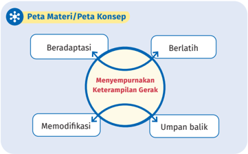

> **Deskripsi Visual:** Gambar ini adalah diagram yang menunjukkan peta materi atau peta konsep tentang "Menyempurnakan Keterampilan Gerak". Diagram ini terdiri dari empat elemen utama yang terhubung oleh garis lingkaran, yang menunjukkan hubungan antara mereka:

1. Beradaptasi
2. Berlatih
3. Memodifikasi
4. Umpan balik

Elemen-elemen ini masing-masing memiliki peran penting dalam proses menyempurnakan keterampilan gerak. Beradaptasi membantu individu untuk mengubah perilaku atau kebiasaan jika diperlukan. Berlatih memperkuat keterampilan dan meningkatkan kemampuan. Memodifikasi melibatkan penyesuaian atau perubahan yang diperlukan untuk mencapai tujuan. Umpan balik memberikan feedback tentang hasil kerja dan membantu dalam pengembangan.

Teks penting dalam diagram ini adalah "Menyempurnakan Keterampilan Gerak", yang menjadi titik pusat semua elemen lainnya. Ini menunjukkan bahwa semua elemen lainnya berada dalam konteks proses ini.

Informasi kunci yang dapat diambil pembaca adalah bahwa proses menyempurnakan keterampilan gerak melibatkan berbagai langkah, termasuk adaptasi, latihan, modifikasi, dan umpan balik. Setiap langkah ini saling berkaitan dan berfungsi bersama-sama untuk mencapai tujuan akhir.

Peta  konsep  yang  terdapat  pada  awal  bab  merupakan  diagram  yang menunjukkan hubungan antarkonsep yang terdapat dalam setiap bab. Kalian perlu mencermati peta konsep ini untuk mendapatkan gambaran yang luas tentang isi bab tersebut

### Pembuka Bab

### Siap-Siap Belajar

Di SMP, kamu  sudah belajar tentang cara menganalisis dan memperhalus keterampilan gerak yang diterapkan dalam berbagai situasi  gerak  yang  dimanfaatkan  untuk  meningkatkan  capaian. Selanjutnya, di Kelas X ini, kamu akan belajar menyempurnakannya sehingga keterampilan gerak yang kamu kuasai menjadi makin baik. Tentu  saja  penyempurnaan  keterampilan  gerak  yang  dimaksud tidak  dalam  rangka  membentuk  kamu  menjadi  atlet.  Akan  tetapi, jika  dalam  aktivitas  apa  pun  kamu  menguasai  keterampilan  gerak dengan baik, aktivitasmu menjadi makin menyenangkan.

 

---
## 📄 Halaman 14

Kalian menemukan Pembuka Bab sebagai bagian paling awal dari bab yang memberikan  gambaran  besar  mengenai  topik  yang  akan  dipelajari.  Ada rasionalisasi  dalam  bab  sehingga  timbul  minat  dan  motivasi  kalian  untuk mempelajari ide utama atau ide besar yang menghubungkan konsep-konsep.

### Tahukah Kamu?

### Latihan adalah Kunci Utama Kesuksesan

### · Megawati Hangestri Pertiwi

Apakah kamu tahu bahwa Megawati Hangestri berlatih keras setiap hari? Sebagian besar  waktunya  ia  habiskan  untuk  berlatih keras,  menerapkan  pola  makan  dan  pola istirahat yang sehat serta disiplin yang tinggi. Hasil dari latihan-latihan tersebut, ia mampu menciptakan smash keras  yang  terkenal  dan membuatnya  mampu  berkarir  internasional bersama tim Red Sparks Korea Selatan.

### · Michael Jordan

Michael Jordan adalah pebasket yang sangat terkenal dengan kualitas permainannya yang luar biasa hingga mampu meraih banyak gelar dan menjadi legenda. Apakah kamu tahu jika ternyata  ia  pernah  gagal  dalam  9.000 shoot , kalah  dalam  300  pertandingan,  dan  26  kali gagal menentukan kemenangan. Namun, kegagalan-kegagalan itulah yang membuatnya terus  berlatih  dan  menjadikannya  berhasil menjadi seorang atlet dunia.

Aktivitas  ini  untuk  memberikan  wawasan  tambahan  bagi  peserta  didik, seperti fakta menarik tentang sejarah atau perkembangan olahraga, manfaat kesehatan dari aktivitas 昀椀sik, informasi tentang tokoh inspiratif dalam dunia olahraga, serta tips kesehatan dan kebugaran. Tujuannya adalah agar peserta

 

---
## 📄 Halaman 15

didik  mendapatkan  pengetahuan  yang  lebih  luas  dan  termotivasi  untuk menjalani gaya hidup sehat serta aktif.

### Aktivitas/Belajar Mendalam

### Belajar Mendalam

Tugas  : melakukan  aktivitas passing berpasangan,  kemudian dilanjutkan dalam situasi permainan.

### Aturan Permainan :

- Lakukan aktivitas passing berpasangan secara berulang hingga keterampilan teknis gerak tersebut dikuasai.
- Selanjutnya,  lakukan  permainan passing dengan  membagi pemain menjadi tim pengumpan dan tim penghalang.
- Tim  pengumpan  berusaha  menguasai  bola  selama  mungkin dengan saling melakukan passing .
- Tim penghalang bertugas menghalangi dan merebut bola.
- Apabila  bola  keluar  atau  berhasil  direbut,  kedua  kelompok bertukar peran.
Aktivitas ini bertujuan mendorong peserta didik mengeksplorasi topik secara mendalam  dan  kritis.  Aktivitas  ini  memungkinkan  peserta  didik  untuk menggali lebih jauh konsep-konsep inti, menerapkan teori ke dalam situasi nyata, serta menganalisis dan mengevaluasi informasi yang didapat. Misalnya, dalam mata pelajaran PJOK, peserta didik mungkin diminta untuk melakukan penelitian  tentang  manfaat  kebugaran,  menyusun  program  latihan  yang mendukung  gaya  hidup  sehat,  atau  mengevaluasi  peran fair  play dalam olahraga. Aktivitas ini dirancang agar peserta didik dapat mengaitkan materi dengan pengalaman sehari-hari sehingga pemahaman mereka menjadi lebih mendalam dan aplikatif.

 

---
## 📄 Halaman 16

### Uji Kompetensi

### Uji Kompetensi

- Buatlah  satu aktivitas latihan dan  jelaskan, serta  praktikkan terkait cara kamu melakukan adaptasi terhadap lingkungan serta peralatan, dan tugas gerak untuk meningkatkan keterampilan gerak dalam situasi yang menantang.
- Buatlah satu modi昀椀kasi aktivitas atau permainan yang membuatmu meningkatkan  keterampilan  gerak!  Selanjutnya,  praktikkan  dan tuliskan hasilnya!
- Bagaimana kamu memanfaatkan umpan balik dalam konteks gerak untuk memperbaiki kinerja gerakmu? Umpan balik seperti apa yang paling efektif untuk menyempurnakan keterampilan gerakmu?
Aktivitas  ini  untuk  mengukur  pemahaman  dan  keterampilan  peserta  didik terkait  materi  yang  telah  dipelajari.  Biasanya  berupa  soal  atau  tugas  yang menilai  pengetahuan,  keterampilan,  dan  penerapan  konsep  utama.  Dalam PJOK, uji kompetensi bisa berupa tes keterampilan praktis, pemahaman aturan permainan,  atau  kemampuan  menerapkan  konsep  gerak.  Tujuannya  adalah menilai  pencapaian  belajar  dan  mengidenti昀椀kasi  area  yang  perlu  ditingkatkan.

### Pengayaan

### Pengayaan

Rancang  dan  lakukan  aktivitas  latihan  olahraga  atau  permainan bersama temanmu. Aktivitas latihan tersebut hendaknya

- -bersifat kontekstual dengan aktivitas sebenarnya,
- -memuat aktivitas yang membuatmu beradaptasi dan berlatih lebih kompetitif,
- -memuat modi昀椀kasi, dan
- -mendorong umpan balik diri  sendiri  ataupun  umpan  balik  fokus eksternal.

 

---
## 📄 Halaman 17

Lakukan  pencatatan  atas hasil latihan  yang  kamu  lakukan  untuk mengetahui progres latihan dan evaluasi. Kegiatan evaluasi diperlukan agar untuk menyempurnakan keterampilan gerakmu. Catat hasil tersebut dalam buku tugasmu.

Aktivitas  ini  ditujukan  untuk  peserta  didik  yang  sudah  menguasai  materi dasar dan ingin memperluas pemahaman mereka. Aktivitas ini bisa berupa proyek, penelitian, atau tugas kreatif yang memberikan tantangan tambahan. Dalam  PJOK,  pengayaan  dapat  berupa  latihan  keterampilan  lanjutan,  studi tentang teknik olahraga yang lebih kompleks, atau riset tentang gaya hidup sehat. Tujuannya adalah memperkaya pengalaman belajar dan meningkatkan kemampuan peserta didik di luar materi dasar.

### Re昀氀eksi

Selamat! Kamu sudah menyelesaikan Bab 1 di buku ini. Selanjutnya, coba periksa lagi dari awal. Hal-hal apa saja yang sudah kamu pelajari pada Bab 1 ini?

Salin tabel berikut di buku tugasmu, lalu beri tanda centang sesuai dengan pengalamanmu!

---
**📊 Tabel**

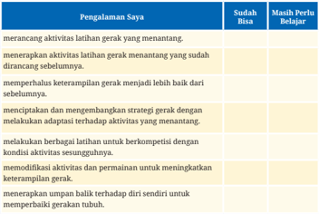

Tabel ini berisi pengalaman belajar seorang individu tentang latihan gerak yang menantang. Kolom "Sudah Bisa" mencakup aktivitas seperti merancang latihan gerak yang menantang, memperluas keterampilan gerak menjadi lebih baik, menciptakan strategi gerak dengan melakukan adaptasi terhadap aktivitas yang menantang, melaksanakan berbagai latihan untuk berkompetisi dengan kondisi aktivitas sesungguhnya, memodifikasi aktivitas dan permainan untuk meningkatkan keterampilan gerak, serta menerapkan umpan balik terhadap diri sendiri untuk memperbaiki gerakan tubuh. Sementara itu, kolom "Masih Perlu Belajar" mencakup aktivitas seperti merancang latihan gerak yang menantang, memperluas keterampilan gerak menjadi lebih baik, menciptakan strategi gerak dengan melakukan adaptasi terhadap aktivitas yang menantang, melaksanakan berbagai latihan untuk berkompetisi dengan kondisi aktivitas sesungguhnya, memodifikasi aktivitas dan permainan untuk meningkatkan keterampilan gerak, serta menerapkan umpan balik terhadap diri sendiri untuk memperbaiki gerakan tubuh. Topik utama tabel ini adalah pengalaman belajar seorang individu tentang latihan gerak yang menantang.

 

---
## 📄 Halaman 18

Aktivitas ini melibatkan pertanyaan atau panduan yang membantu peserta didik merenungkan apa yang telah dipelajari dan bagaimana penerapannya. Re昀氀eksi bisa berupa penulisan jurnal tentang pengalaman.

---
**🖼️ Gambar/Diagram**

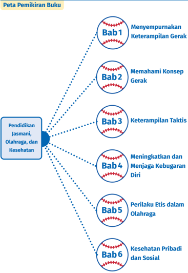

> **Deskripsi Visual:** Gambar ini adalah diagram yang menunjukkan struktur topik dalam sebuah buku pelajaran tentang Pendidikan Jasmani, Olahraga, dan Kesehatan. Diagram ini terdiri dari enam bab yang disusun secara hierarkis, dengan Bab 1 berada di atas Bab 2 hingga Bab 6. Bab 1 berisi topik "Menyempurnakan Keterampilan Gerak", Bab 2 berisi "Memahami Konsep Gerak", Bab 3 berisi "Keterampilan Taktis", Bab 4 berisi "Meningkatkan dan Menjaga Kebugaran Diri", Bab 5 berisi "Perilaku Etis dalam Olahraga", dan Bab 6 berisi "Kesehatan Pribadi dan Sosial". Setiap bab memiliki ikon bola sepak yang menunjukkan hubungan antara bab-bab tersebut. Ini menunjukkan bahwa Bab 1 merupakan bab dasar yang membahas konsep umum gerak, sementara Bab 2, 3, 4, 5, dan 6 masing-masing membahas aspek spesifik dari olahraga dan kesehatan.

 

---
## 📄 Halaman 19

### KEMENTERIAN PENDIDIKAN, KEBUDAYAAN, RISET, DAN TEKNOLOGI REPUBLIK INDONESIA, 2023

Buku Siswa Pendidikan Jasmani, Olahraga, dan Kesehatan (PJOK)

untuk SMA/MA/SMK/MAK Kelas X (Edisi Revisi)

Penulis   : Anggara Aditya Kurniawan, Teguh Karya

ISBN

: 978-634-00-0094-8

### Aktivitas Jasmani dan Olahraga

### Menyempurnakan Keterampilan Gerak

?

Tentu kamu pernah mempelajari berbagai keterampilan gerak dari salah satu atau berbagai aktivitas olahraga.  Mengapa  keterampilan  gerak tersebut perlu disempurnakan?

昀椀sik/

 

---
## 📄 Halaman 20

Pada  bab  ini,  kamu  akan  merancang,  menerapkan,  dan  memperhalus penyempurnaan keterampilan gerak dalam situasi yang menantang dengan melibatkan  pengembangan  strategi  gerak  yang  dapat  diterapkan  dalam berbagai situasi yang berbeda, seperti permainan olahraga, serta menganalisis dampaknya terhadap kemajuan keterampilan gerak.  Selain  itu,  kamu  akan mentransfer dan mengadaptasi strategi gerak yang telah dipelajari ke dalam konteks gerak yang baru.

- adaptasi
- situasi gerak
- modi昀椀kasi
- penyempurnaan

---
**🖼️ Gambar/Diagram**

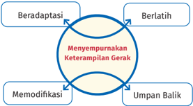

> **Deskripsi Visual:** Gambar ini adalah diagram yang menunjukkan proses beradaptasi dalam konteks keterampilan gerak. Diagram ini terdiri dari empat elemen utama yang saling terkait:

1. Berlatih: Ini merupakan langkah awal dalam proses adaptasi.
2. Menyempurnakan Keterampilan Gerak: Langkah ini melibatkan peningkatan keterampilan gerak setelah berlatih.
3. Beradaptasi: Langkah ini melibatkan penyesuaian diri dengan perubahan yang dihasilkan oleh keterampilan baru.
4. Umpan Balik: Langkah ini menghubungkan semua langkah sebelumnya untuk memastikan bahwa proses beradaptasi berjalan dengan efektif.

Elemen-elemen ini saling terkait dalam siklus adaptasi, dimulai dari berlatih, kemudian menyempurnakan keterampilan gerak, beradaptasi, dan akhirnya umpan balik untuk memastikan proses beradaptasi berjalan dengan baik. Teks penting dalam diagram ini adalah "Menyempurnakan Keterampilan Gerak", yang merupakan titik tengah dalam proses adaptasi.

Informasi kunci yang dapat diambil pembaca adalah bahwa proses beradaptasi dalam konteks keterampilan gerak melibatkan berlatih, menyempurnakan keterampilan, beradaptasi, dan umpan balik untuk memastikan efektivitas proses tersebut.

 

---
## 📄 Halaman 21

Di  SMP,  kamu  sudah  belajar  tentang  cara  menganalisis  dan  memperhalus keterampilan  gerak  yang  diterapkan  dalam  berbagai  situasi  gerak  yang dimanfaatkan untuk meningkatkan capaian. Selanjutnya, di Kelas X ini, kamu akan belajar menyempurnakannya sehingga keterampilan gerak yang kamu kuasai menjadi makin baik. Tentu saja penyempurnaan keterampilan gerak yang  dimaksud  tidak  dalam  rangka  membentuk  kamu  menjadi  atlet.  Akan tetapi,  jika  dalam  aktivitas  apa  pun  kamu  menguasai  keterampilan  gerak dengan baik, aktivitasmu menjadi makin menyenangkan.

Untuk menyempurnakan keterampilan gerak, kamu perlu berlatih secara efektif. Latihan yang dilakukan perlu dirancang agar kamu mampu beradaptasi dalam berbagai situasi dan meningkatkan kinerja gerakmu. Sebagai contoh, ketika kamu sedang berlatih menggiring bola, kamu akan beradaptasi dengan lingkungan,  seperti  posisi  lawan,  arah  yang  dituju,  dan  penguasaan  bola. Dapatkah kamu menyebutkan contoh lainnya?

Sebelum  belajar  tentang  cara  menyempurnakan  latihan,  kamu  dapat mencari  bentuk-bentuk  latihan  keterampilan  gerak  dari  berbagai  sumber internet  dan  lainnya,  kemudian  mengamati  berbagai  reaksi  pemainnya selama  proses  latihan  sehingga  mereka  dapat  menyesuaikan  diri.  Tuliskan hasil pengamatanmu di buku tugas atau buku tulismu, ya!

### A. Beradaptasi dengan Situasi Gerak yang Menantang

Hasil interaksi yang berlangsung terus-menerus antara individu dan berbagai hal yang ada di sekitarnya akan menghasilkan kebiasaan gerakan. Gerakan tersebut  merupakan  hasil  dari  sebuah  proses  adaptasi.  Proses  beradaptasi dengan situasi gerak yang menantang dapat dilakukan dengan berbagai cara, seperti  beradaptasi  dengan  lingkungan,  peralatan,  dan  lainnya.  Berikut  ini penjelasan atas berbagai cara tersebut.

### 1. Beradaptasi terhadap Lingkungan

Apakah  kamu  pernah  mendengar  atau  membaca  cerita  tentang  seseorang dengan  keterampilan gerak yang berasal dari adaptasi lingkungan di sekitarnya? Coba kamu simak sebuah kisah menarik berikut.

 

---
## 📄 Halaman 22

### Muhammad Zohri

Lalu Muhammad Zohri, seorang anak desa dari Lombok, tumbuh di lingkungan yang sederhana, tetapi penuh dengan potensi. Sejak kecil, dia memiliki minat yang besar untuk menjadi pelari cepat terbaik di dunia. Namun, fasilitas pelatihan yang terbatas dan medan yang sulit di desanya menjadi tantangan besar baginya.

Meskipun demikian, Zohri tidak menyerah. Dia memanfaatkan apa pun yang ada di sekitarnya untuk melatih keterampilan larinya. Setiap pagi, dia berlari di atas bukit-bukit pasir dan di sepanjang pantai yang panjang, menghadapi terpaan angin laut yang kencang dan medan yang bergelombang.  Meskipun  terkadang  terjatuh  dan  terluka,  Zohri  terus berlatih dengan tekad yang kuat.

Pada  suatu  hari,  keberuntungan  datang  menghampirinya,  yaitu ketika  seorang  pelatih  lari  terkenal  berkunjung  ke  desanya.  Terkesan dengan usaha dan semangat Zohri, pelatih itu menawarkan diri untuk melatihnya secara intensif. Zohri dengan senang hati menerima tawaran itu dan mulai bekerja keras bersama pelatih tersebut.

Dengan  bantuan  pelatihnya,  Zohri  mulai  memperbaiki  teknik  lari untuk meningkatkan kecepatan dan kekuatannya. Mereka menyesuaikan latihan  sesuai  dengan  kondisi  lingkungan  Zohri,  misalnya  dengan berlatih di atas pasir bergelombang untuk meningkatkan kekuatan dan ketahanan kaki.

Hasilnya tidak memerlukan waktu lama. Zohri mulai menonjol dalam kompetisi lokal dan nasional. Ketika akhirnya mewakili Indonesia dalam kompetisi internasional, Zohri berhasil meraih prestasi gemilang dengan memenangkan beberapa medali emas.

Kisah  Zohri  menjadi  inspirasi  bagi  banyak  orang,  terutama  para pelari  muda  di  desanya.  Mereka  belajar  bahwa  dengan  tekad  kuat dan  kemauan  untuk  beradaptasi  dengan  lingkungan,  impian  mereka untuk meraih kesuksesan dalam olahraga pun dapat terwujud.

 

---
## 📄 Halaman 23

Zohri membuktikan bahwa medan yang sulit dan fasilitas yang terbatas tidak menghalangi seseorang untuk menjadi yang terbaik dalam bidangnya.

---
**🖼️ Gambar/Diagram**

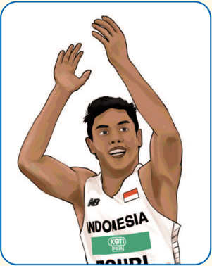

> **Deskripsi Visual:** Gambar ini adalah ilustrasi yang menampilkan seorang atlet lari berlari dengan posisi tangan di atas kepala. Atlet tersebut mengenakan seragam olahraga putih dengan logo tim dan bendera Indonesia. Namun, informasi tentang nama atlet atau konteks lebih lanjut tidak dapat dilihat dalam gambar ini.

 

---
## 📄 Halaman 24

### Belajar Mendalam

Dari  kisah  Muhammad  Zohri,  kamu  mengetahui  bahwa  Zohri  berlatih dalam berbagai kondisi lingkungan alam yang membuatnya makin kuat dan  cepat.  Selain  itu,  pertemuannya  dengan  pelatih  yang  kemudian membimbingnya  berlatih  di  lingkungan  yang  diciptakan  membuatnya memiliki teknik lari yang makin sempurna.

- Menurutmu,  faktor  spesi昀椀k  apa  dalam  diri  Muhammad  Zohri  dan lingkungannya  yang  memengaruhi  perkembangan  keterampilan larinya?
- Bagaimana kombinasi faktor-faktor lingkungan alam dan buatan dari pelatih mampu menghasilkan keterampilan gerak yang efektif?
Selanjutnya,  untuk  mengetahui  adaptasi  yang  kamu  lakukan  terhadap lingkungan, coba praktikkan aktivitas berikut ini.

Tugas: melakukan dan menyelesaikan tugas aktivitas, kemudian mere昀氀eksikan berbagai adaptasi yang perlu kamu lakukan.

### Aturan Permainan

- Bentuklah kelompok dengan beranggotakan 5-6 orang anak.
- Setiap anggota dalam kelompok berlari melewati rute lurus, berbelok, menanjak, dan permukaan tidak rata secara bergantian.
- Lari  dimulai  dari  'titik  kumpul'.  Setelah  pelari  pertama  berlari dan kembali ke 'titik kumpul', lakukan 'tos tangan' dengan pelari kedua yang kemudian melanjutkan lari. Demikian seterusnya sampai seluruh anggota tim melakukan lari.
- Setiap kelompok mencatat waktu tempuh dari pelari pertama hingga terakhir.
- Setelah  memiliki  pengalaman  berlari  satu  putaran,  berdiskusilah bersama anggota tim untuk berbagi pengalaman berlari satu putaran dan  berbagi  strategi  adaptasi  untuk  dapat  bergerak  secara  efektif dalam berbagai kondisi.
- Lakukan aktivitas  lari  tersebut  dengan  memperhatikan  perubahan catatan waktu perubahan catatan waktu.

 

---
## 📄 Halaman 25

---
**🖼️ Gambar/Diagram**

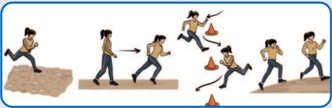

> **Deskripsi Visual:** Gambar ini adalah ilustrasi yang menunjukkan proses latihan olahraga. Gambar ini terdiri dari beberapa langkah yang menggambarkan langkah-langkah latihan olahraga. Langkah pertama menunjukkan seseorang berlari di tanah datar. Langkah kedua menunjukkan seseorang berjalan dengan peralatan olahraga seperti bola atau bola voli. Langkah ketiga menunjukkan seseorang berlari dengan menggunakan sepatu lari. Langkah keempat menunjukkan seseorang berlari dengan menggunakan sepatu lari dan sepatu lari. Langkah kelima menunjukkan seseorang berlari dengan menggunakan sepatu lari dan sepatu lari. Langkah keenam menunjukkan seseorang berlari dengan menggunakan sepatu lari dan sepatu lari. Langkah ketujuh menunjukkan seseorang berlari dengan menggunakan sepatu lari dan sepatu lari. Langkah kedelapan menunjukkan seseorang berlari dengan menggunakan sepatu lari dan sepatu lari. Langkah kesembilan menunjukkan seseorang berlari dengan menggunakan sepatu lari dan sepatu lari. Langkah kesepuluh menunjukkan seseorang berlari dengan menggunakan sepatu lari dan sepatu lari. Langkah ke-11 menunjukkan seseorang berlari dengan menggunakan sepatu lari dan sepatu lari. Langkah ke-12 menunjukkan seseorang berlari dengan menggunakan sepatu lari dan sepatu lari. Langkah ke-13 menunjukkan seseorang berlari dengan menggunakan sepatu lari dan sepatu lari. Langkah ke-14 menunjukkan seseorang berlari dengan menggunakan sepatu lari dan sepatu lari. Langkah ke-15 menunjukkan seseorang berlari dengan menggunakan sepatu lari dan sepatu lari. Langkah ke-16 menunjukkan seseorang berlari dengan menggunakan sepatu lari dan sepatu lari. Langkah ke-17 menunjukkan seseorang berlari dengan menggunakan sepatu lari dan sepatu lari.

### Pertanyaan

- Bagaimana kamu dan kelompokmu berlari dengan berbagai situasi lingkungan yang berbeda?
- Hal penting apa yang kamu peroleh dalam proses adaptasi lingkungan tersebut?
Kamu dapat menemukan kisah atlet lain yang beradaptasi dengan lingkungan dan  mampu  menyempurnakan  keterampilan  gerak  mereka,  misalnya  Cliff Young  dengan  gaya  ' shuttle '-nya dalam  lari  maraton,  Khabib  dengan kunciannya  ketika  beradaptasi  melalui  latihan  bergulat  melawan  beruang, dan masih banyak lagi.

Satu hal yang menjadi kata kunci yaitu keterampilan gerak dapat dibentuk dan disempurnakan melalui adaptasi lingkungan, baik lingkungan alam maupun lingkungan yang diciptakan dalam pelatihan.

### 2. Beradaptasi dengan Perubahan Peralatan

Coba perhatikan alat-alat yang biasa kamu gunakan dalam aktivitas seharihari.  Apa  yang  terjadi  jika  karena  suatu  hal,  alat  tersebut  harus  diganti dan  kamu  harus  menggunakan  penggantinya,  yaitu  alat  yang  berbeda? Misalnya, menggunakan pensil dengan diameter berbeda saat menulis atau menggambar, menggunakan raket yang berbeda ketika bermain bulu tangkis, dan  sebagainya.  Agar  dapat  menggunakan  dengan  baik,  tentu  kamu  perlu penyesuaian, bukan? Mengapa demikian?

 

---
## 📄 Halaman 26

Untuk  memahami  hal  tersebut,  mari  kita  pelajari  dengan  melakukan aktivitas berikut

### Belajar Mendalam

Kamu akan mempelajari proses adaptasi melalui aktivitas berikut ini.

Tugas  : Memainkan  bola  dalam  lapangan  berukuran  kurang  lebih 20 x 10 meter dengan jumlah pemain 5 lawan 5.

### Permainan 1

Melakukan lempar-tangkap menggunakan bola besar, misalnya bola voli atau sejenisnya.

### Permainan 2

Melakukan lempar-tangkap menggunakan bola kecil, misalnya bola tenis atau sejenisnya.

### Aturan Permainan

- Permainan dimainkan oleh dua kelompok/tim; setiap tim beranggota 5 orang. Pemain kedua tim berdiri saling berhadapan.
- Permainan  ini  bertujuan  menangkap  bola  di  garis  akhir  wilayah pertahanan lawan.
- Para pemain melakukan lempar-tangkap bola untuk mencapai tujuan. Pemain yang memegang bola tidak boleh berlari.
- Pemain bertahan hanya boleh menghalangi bola, tidak boleh merebut.
- Pemenang  permainan  adalah  tim  yang  paling  banyak  menangkap bola di garis akhir lawan.
Durasi Permainan:

5-7 menit untuk setiap permainan.

Instruksi Guru:

Guru menjelaskan peraturan permainan.

 

---
## 📄 Halaman 27

---
**🖼️ Gambar/Diagram**

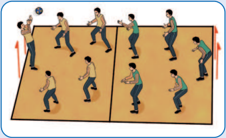

> **Deskripsi Visual:** Gambar ini adalah ilustrasi yang menunjukkan pertandingan bola voli antara dua tim. Gambar ini menggambarkan berbagai posisi pemain saat mereka bermain voli. Di sisi kiri, ada sepuluh pemain yang sedang bergerak untuk memukul bola ke sisi kanan. Pemain-pemain tersebut memiliki posisi yang berbeda-beda, mulai dari yang berdiri tegak, yang berjalan, hingga yang berjalan dengan cepat. Di sisi kanan, juga ada sepuluh pemain yang sedang bergerak untuk menerima bola. Mereka tampak berada di berbagai posisi, mulai dari yang berdiri tegak, yang berjalan, hingga yang berjalan dengan cepat. Semua pemain tampak aktif dan bergerak dengan cepat untuk mencapai bola. Ini menunjukkan bahwa pertandingan voli adalah permainan yang intensif dan memerlukan keterampilan dan koordinasi yang baik.

---
**🖼️ Gambar/Diagram**

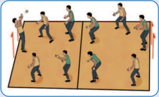

> **Deskripsi Visual:** Gambar ini adalah ilustrasi yang menunjukkan proses pembuatan makanan. Gambar ini terdiri dari beberapa elemen utama:

1. **Pertama**: Gambar ini menunjukkan dua orang yang sedang membuat makanan. Mereka menggunakan alat seperti pisau dan wajan.

2. **Elemen Utama dan Relasinya**: 
   - **Orang Pertama**: Memegang pisau dan sedang memotong bahan makanan.
   - **Orang Kedua**: Memegang wajan dan sedang menggoreng makanan.
   - **Alat**: Pisau dan wajan digunakan untuk memotong dan menggoreng makanan.
   - **Latar Belakang**: Ruangan dapur dengan meja dan peralatan masak lainnya.

3. **Teks, Angka, atau Label Penting**:
   - Teks tidak ada dalam gambar ini.
   - Ada label "Pisau" dan "Wajan" yang menunjukkan alat yang digunakan.

4. **Informasi Kunci yang Dapat Diambil Pembaca**:
   - Gambar ini menunjukkan proses pembuatan makanan, mulai dari memotong hingga menggoreng.
   - Ini menunjukkan bagaimana alat dan teknik yang digunakan dalam memasak.

Dengan demikian, gambar ini memberikan gambaran tentang proses pembuatan makanan dan alat-alat yang digunakan dalam proses tersebut.

### Pertanyaan

Setelah bermain lempar-tangkap menggunakan bola voli dan bola tenis, bagaimana cara kamu dan teman-temanmu beradaptasi dan merespons perbedaan berat dan ukuran bola yang digunakan?

Selanjutnya,  bandingkan  beberapa  hal  dengan  menjawab  pertanyaan berikut.

- Perbedaan apa yang kamu dan anggota tim rasakan ketika melakukan berbagai operan (tinggi, jauh, dekat) dengan menggunakan dua jenis bola yang berbeda?

 

---
## 📄 Halaman 28

- Bagaimana perbedaan jarak antarpemain (menyebar atau berkumpul) ketika  operan  dilakukan  menggunakan  bola  berukuran  besar  dan bola berukuran kecil?
- Bagaimana perbedaan aktivitas pemain penyerang/pelempar, terutama dalam mencari posisi dan pemanfaatan ruang pada aktivitas dengan dua jenis bola yang digunakan?
- Bagaimana perbedaan aktivitas pemain bertahan/penangkap dalam menekan ( pressing ) pembawa bola lawan pada aktivitas dengan dua jenis bola yang digunakan?

### 3. Beradaptasi Melalui Pembelajaran yang Tidak Disengaja

Pernahkah  kamu  memiliki  pengalaman  tidak  sengaja dan  tanpa  disadari  mempelajari  suatu  keterampilan gerak?  Mungkin  hal  itu  terjadi  ketika  kamu  bermain dengan  teman-temanmu  atau  berjalan-jalan  di  taman/ kebun. Aktivitas sederhana seperti itu sering kali menjadi momen pembelajaran tak terduga yang tanpa kita sadari mengasah keterampilan gerak.

Dalam aktivitas keterampilan gerak, pembelajaran yang tidak disengaja sering  kali  terjadi  ketika  kita  berada  dalam  situasi  yang  santai  dan  tanpa tekanan atau ekspektasi. Misalnya, ketika kita melemparkan bola atau berlari mengejar  teman,  tubuh  kita  secara  otomatis  beradaptasi  dan  memperbaiki gerakan kita untuk mencapai hasil yang diinginkan.

Hal ini menunjukkan bahwa pembelajaran tidak selalu terjadi di kelas atau dalam situasi formal. Kadang-kadang, pengalaman sehari-hari juga menjadi guru yang luar biasa. Dalam aktivitas keterampilan gerak yang tidak terencana, kamu  memiliki  kesempatan  untuk  melakukan  eksperimen,  mencoba-coba, dan  belajar  dari  setiap  tindakan  yang  dilakukan.  Misalnya,  ketika  bermain sepak  bola  dengan  teman-teman  di  lapangan,  tanpa  kamu  sadari,  kamu terus-menerus berlatih mengontrol bola dan melakukan tendangan dengan berbagai teknik. Setelah beberapa waktu, kamu baru menyadari bahwa kamu telah memperbaiki keterampilan gerak pada saat mengontrol dan mengoper bola, tanpa memikirkan pelatihan formal atau instruksi langsung.

 

---
## 📄 Halaman 29

Mari  menikmati  setiap  momen  dalam  aktivitas  keterampilan  gerak karena, siapa tahu, di balik setiap lemparan bola atau langkah berlari, ada pelajaran tak terduga yang menunggu untuk ditemukan. Hal ini merupakan proses pembelajaran yang tidak disengaja.

Sesungguhnya, tubuh kita dapat memecahkan masalah keterampilan gerak dengan sendirinya ketika kita secara berulang mengeksplorasi berbagai kemungkinan dan membiarkan melakukan kesalahan.

### a. Pembelajaran yang Tidak Disengaja dalam Keterampilan Gerak

Sampai  saat  ini,  kamu  telah  memiliki  beberapa  keterampilan  gerak, antara  lain  mengendarai  sepeda,  menombak/memanah,  meluncur  di atas skateboard ,  atau  bersepatu  roda.  Coba  ingat  kembali  saat  kamu mempelajari keterampilan gerak tersebut untuk pertama kali. Pada saat kamu belajar melakukan keterampilan gerak tersebut, apakah kamu selalu mendapatkan  contoh  cara  melakukannya,  instruksi  secara  verbal,  dan umpan balik untuk memperbaiki kesalahan? Sebaliknya, apakah kamu mengeksplorasi sendiri, mengambil risiko tanpa takut gagal, dan membuat kesalahan selama proses melakukan keterampilan gerak tersebut?

Kebanyakan dari kita mempelajari keterampilan gerak secara tidak sengaja melalui proses eksplorasi dan eksperimen untuk mengetahui benar atau salah nya. Ternyata dengan memberikan waktu dan membiarkan kita membuat kesalahan, kita belajar dan sampai akhirnya dapat menguasai suatu keterampilan gerak.

Pada buku catatanmu, tuliskan pengalaman belajar keterampilan gerak secara tidak sengaja yang pernah kamu alami.

Gunakan  pengalaman  belajar  secara  tidak  sengaja  tersebut  untuk beraktivitas guna meningkatkan keterampilan gerakmu.

Aktivitas  ini  dapat  kamu  sesuaikan  dengan  minat  dan  saranaprasarana yang ada di sekolahmu. Kunci dari kegiatan ini adalah kamu berani melakukan keterampilan gerak yang menantang tanpa takut gagal.

 

---
## 📄 Halaman 30

### Belajar Mendalam

Kamu akan mempelajari proses pembelajaran yang terjadi secara tidak sengaja melalui aktivitas berikut ini.

Tugas : Memainkan bola voli dengan jumlah pemain 6 lawan 6. Terus berupaya  mengembangkan keterampilan gerakmu tanpa takut gagal.

### Aturan Permainan

- Permainan dimainkan oleh dua kelompok/tim; setiap tim beranggota 6 orang. Pemain kedua tim berdiri saling berhadapan.
- Tujuan permainan ini adalah setiap  pemain  mengembangkan keterampilan  gerak  yang  belum  terlalu  dikuasai  tanpa  rasa  takut gagal dan berupaya terus mencoba.
- Para pemain bermain bola voli sesuai peraturan permainan bola voli yang dimulai dengan pukulan servis.
- Pemenang permainan adalah tim yang lebih dahulu meraih poin 25.
Durasi Permainan:

1 gim ( game ) untuk setiap pertandingan.

Instruksi Guru:

Guru menjelaskan peraturan permainan.

---
**🖼️ Gambar/Diagram**

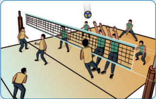

> **Deskripsi Visual:** Gambar ini adalah ilustrasi yang menunjukkan pertandingan voli. Gambar ini menggambarkan beberapa pemain voli sedang bermain di lapangan voli. Di tengah lapangan terdapat net yang memisahkan dua sisi lapangan. Pemain-pemain tersebut sedang berusaha mencetak bola ke sisi lawan mereka menggunakan teknik voli. Di sebelah kiri, ada dua orang pemain yang sedang berdiri dan tampaknya sedang menunggu bola untuk dibolakan. Di sebelah kanan, ada beberapa pemain yang sedang bergerak maju untuk mencoba mengeksekusi serangan. Net yang memisahkan dua sisi lapangan tampak jelas dengan warna hitam dan putih. Pemain-pemain tersebut tampaknya sedang berada di posisi yang berbeda-beda, menunjukkan bahwa pertandingan sedang berlangsung aktif.

 

---
## 📄 Halaman 31

### Pertanyaan

Setelah  kamu  memainkan  permainan  tersebut,  ceritakan  pengalaman yang  kamu  peroleh  ketika  mengembangkan  keterampilan  tanpa  rasa takut akan kegagalan!

### b. Pembelajaran yang Tidak Disengaja di Lingkungan Bermain

Coba  kamu  ingat  lagi  masa  kecilmu  ketika  melakukan  permainan yang  menggunakan  aktivitas  jasmani  di  lingkungan  rumahmu.  Pada saat  bermain  tersebut,  kamu  mampu  mengembangkan  keterampilan gerak  dan  perkembangan  pada  saat  bermain  tersebut,  kamu  mampu mengembangkan keterampilan gerak dan mental secara alamiah melalui belajar dari kondisi lingkungan.

Banyak  atlet  profesional  memiliki  teknik  unik  yang  diperoleh  dari proses bermain di jalan-jalan, halaman rumah, dan sebagainya. Jika kamu penggemar sepak bola, kamu tidak asing dengan para pemain Brazil yang memiliki banyak trik dalam memainkan bola, seperti Ronaldinho, Neymar Jr., Vinicius Jr., Antony, dan masih banyak lagi. Mereka menguasai banyak trik  yang  membuat permainan menjadi sangat indah dan itu diperoleh dari  proses  bermain  secara  bebas  di  jalanan  atau  gang-gang  tempat tinggal  mereka  sewaktu  kecil.  Mereka  melakukan  hal-hal  itu  dengan hati  gembira,  terus-menerus,  hingga  keterampilan  gerak  tersebut  hadir sebagai tampilan yang indah.

Ketika kamu mengembangkan keterampilan gerak, itu tidak sematamata agar kamu menjadi seorang atlet, tetapi agar kamu bisa bermain atau berolahraga dengan lebih menyenangkan. Bukankah keterampilan gerak yang  menyenangkan  itu  akan  hadir  ketika  kita  memiliki  kemampuan untuk melakukannya?

 

---
## 📄 Halaman 32

### Latihan

- Berdasarkan  pengalaman  belajarmu  tentang  beradaptasi  dengan situasi gerak yang menantang, kira-kira hal apa saja yang bisa menjadi kunci keberhasilan dalam mengembangkan keterampilan gerak?
- Coba buatlah aktivitas latihan untuk mengembangkan proses adaptasi  tersebut.  Kamu  dan  temanmu  dapat  memilih  aktivitas jasmani/olahraga yang sesuai dengan minat dan peralatan yang ada. Selanjutnya, ceritakan hal-hal yang kamu rasakan dari proses adaptasi tersebut.

### B. Menyempurnakan Keterampilan Gerak dengan Berlatih

Salah satu cara untuk menyempurnakan keterampilan adalah dengan latihan. Ketika  kamu  makin  terampil,  kamu  akan  makin  dapat  menikmati  aktivitas 昀椀sik  atau  permainan olahraga. Di sini kita dapat meniru mereka yang berlatih untuk  kompetisi.  Bagi  kamu,  berlatih  bertanding  bukan  berarti  melakukan latihan  hanya  untuk  pertandingan  resmi,  melainkan  untuk  pertandingan persahabatan dengan teman yang sifatnya rekreasional.

### Latihan adalah Kunci Utama Kesuksesan

### · Megawati Hangestri Pertiwi

Apakah  kamu  tahu  bahwa  Megawati Hangestri  berlatih  keras  setiap  hari? Sebagian  besar  waktunya  ia  habiskan untuk berlatih keras, menerapkan pola makan  dan  pola  istirahat  yang  sehat serta  disiplin  yang  tinggi.  Hasil  dari latihan-latihan tersebut, ia mampu menciptakan smash keras yang terkenal dan membuatnya mampu berkarir internasional  bersama  tim  Red  Sparks Korea Selatan.

 

---
## 📄 Halaman 33

### · Michael Jordan

Michael Jordan adalah pebasket yang  sangat  terkenal  dengan  kualitas permainannya yang luar biasa hingga  mampu  meraih  banyak  gelar dan  menjadi  legenda.  Apakah  kamu tahu  jika  ternyata  ia  pernah  gagal dalam  9.000 shoot ,  kalah  dalam  300 pertandingan, dan 26 kali gagal menentukan kemenangan. Namun, kegagalan-kegagalan itulah yang membuatnya terus berlatih dan menjadikannya seorang atlet dunia.

Beberapa fakta kasus yang telah disebutkan merupakan contoh keberhasilan seseorang dalam menampilkan performa terbaiknya dan itu diperoleh dari komitmen yang sangat besar dalam latihan. Keberhasilan sangat dipengaruhi oleh  berbagai  faktor,  seperti  motivasi  diri,  bakat  alamiah,  dan  lingkungan yang  mendukung.  Namun,  kunci  utamanya  adalah  berlatih  sangat  penting bagi pengembangan keterampilan gerak.

Tentu  saja,  kamu  tidak  harus  berlatih  untuk  menjadi  seperti  mereka. Namun  demikian,  dengan berlatih keterampilanmu akan berkembang. Kegiatan olahraga atau aktivitas jasmani akan menjadi lebih menyenangkan saat kamu menguasai keterampilan tersebut.

### 1. Latihan Drill dan Penggunaan Keterampilan Teknis

Apakah kamu pernah melakukan latihan menggiring bola melewati rintangan atau  melakukan passing berpasangan  dalam  sepak  bola  secara  berulangulang? Latihan semacam itu sering dilakukan oleh pelatih ataupun guru PJOK untuk  memperhalus  atau  menyempurnakan  keterampilan  teknis.  Latihan semacam ini disebut drill .

Metode drill dapat membantumu mengembangkan keterampilan teknik.  Akan  tetapi,  perlu  diingat  bahwa drill bukan  segala-galanya  dalam menyempurnakan keterampilan gerakmu.

 

---
## 📄 Halaman 34

---
**🖼️ Gambar/Diagram**

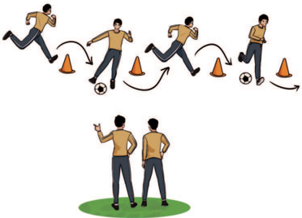

> **Deskripsi Visual:** Gambar ini adalah ilustrasi yang menunjukkan proses latihan sepak bola melalui latihan dengan menggunakan kerucut sebagai alat bantu. Gambar ini terdiri dari dua bagian: bagian atas menunjukkan tindakan latihan sepak bola, sedangkan bagian bawah menunjukkan penilaian atau pengawasan oleh dua orang yang berdiri di belakang pemain.

Elemen utama dalam gambar ini adalah pemain sepak bola yang sedang bergerak mengelilingi kerucut, sementara dua orang penilai berdiri di belakang mereka. Relasi antara elemen-elemen ini adalah bahwa pemain sepak bola melakukan gerakan latihan yang disaksikan oleh dua orang penilai yang berdiri di belakang mereka.

Teks, angka, atau label penting yang terlihat dalam gambar ini tidak ada, karena gambar hanya berisi ilustrasi tanpa teks atau angka.

Informasi kunci yang dapat diambil pembaca dari gambar ini adalah bahwa latihan sepak bola melibatkan gerakan mengelilingi kerucut untuk meningkatkan kecepatan dan keterampilan bermain sepak bola. Penilaian atau pengawasan oleh dua orang penilai menunjukkan bahwa latihan ini dilakukan dalam konteks latihan profesional atau pelatihan tim sepak bola.

Jika  dilihat  dari  ilustrasi  tersebut,  kamu  dapat  mengetahui  bahwa menggiring bola melewati rintangan cone dilakukan menggunakan tendangan terkontrol pendek dengan kaki bagian dalam atau luar yang dominan secara berulang-ulang.

Setelah  keterampilan  teknis  dikuasai  dalam  latihan  yang  berulang, terapkan keterampilan gerak tersebut dalam situasi lingkungan kinerja yang sesungguhnya,  misalnya  dalam  situasi  permainan  yang  lebih  kompetitif. Sering  kali  keterampilan  gerak  yang  telah  dilatih  melalui drill tidak  selalu berhasil diterapkan dalam situasi sebenarnya. Untuk lebih memahami hal ini, lakukan aktivitas berikut ini bersama teman-temanmu.

 

---
## 📄 Halaman 35

### Belajar Mendalam

Tugas : melakukan aktivitas passing berpasangan, kemudian dilanjutkan dalam situasi permainan.

### Aturan Permainan

- Lakukan  aktivitas passing berpasangan  secara  berulang  hingga keterampilan teknis gerak tersebut dikuasai.
- Selanjutnya,  lakukan  permainan passing dengan  membagi  pemain menjadi tim pengumpan dan tim penghalang.
- Tim pengumpan berusaha menguasai bola selama mungkin dengan saling melakukan passing .
- Tim penghalang bertugas menghalangi dan merebut bola.
- Apabila bola keluar atau berhasil direbut, kedua kelompok bertukar peran.
Durasi Permainan:

5-10 menit untuk setiap permainan

Instruksi Guru:

Guru menjelaskan peraturan permainan.

---
**🖼️ Gambar/Diagram**

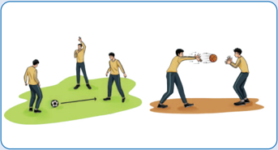

> **Deskripsi Visual:** Gambar ini adalah ilustrasi yang menunjukkan dua situasi berbeda dalam aktivitas olahraga sepak bola. Pada bagian kiri, ada seorang pemain sepak bola yang sedang berusaha mencetak gol dengan bola di depannya. Di sisi lain, pada bagian kanan, ada dua pemain sepak bola yang sedang bermain voli. Dua pemain tersebut tampak bergerak aktif, salah satunya mengejar bola yang ditarik oleh pemain lainnya. Ilustrasi ini menunjukkan perbedaan antara sepak bola dan voli dalam hal cara bermain dan posisi pemain.

Elemen-elemen utama dalam gambar ini adalah pemain sepak bola dan voli, bola, dan lapangan. Pemain sepak bola terlihat bergerak aktif untuk mencetak gol, sementara pemain voli tampak bergerak untuk mengejar bola. Bola terlihat jelas di kedua situasi ini, menunjukkan peran pentingnya dalam aktivitas olahraga tersebut.

Teks, angka, atau label penting tidak terlihat dalam gambar ini karena ia hanya menggambarkan dua situasi berbeda dalam olahraga sepak bola dan voli. Namun, informasi kunci yang dapat diambil dari gambar ini adalah bahwa olahraga sepak bola dan voli memiliki cara bermain yang berbeda, serta posisi pemain yang berbeda dalam setiap olahraga tersebut.

 

---
## 📄 Halaman 36

---
**🖼️ Gambar/Diagram**

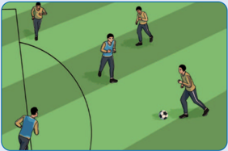

> **Deskripsi Visual:** Gambar ini adalah ilustrasi yang menunjukkan sebuah pertandingan sepak bola. Ilustrasi ini menggambarkan beberapa pemain sepak bola yang sedang bermain di lapangan. Di tengah lapangan, ada bola sepak yang sedang dipukul oleh salah seorang pemain. Pemain lainnya tampak berada di posisi yang berbeda, dengan beberapa berdiri di samping lapangan dan beberapa lainnya berada di dekat bola. Ilustrasi ini menunjukkan aktivitas dan posisi pemain dalam sebuah pertandingan sepak bola.

---
**🖼️ Gambar/Diagram**

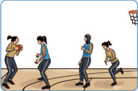

> **Deskripsi Visual:** Gambar ini adalah ilustrasi yang menunjukkan sebuah pertandingan bola basket antara dua tim. Gambar ini menggambarkan empat pemain yang sedang bermain, dengan dua pemain dari setiap tim berada di lapangan. Pemain dari tim satu sedang berusaha memukul bola ke arah temannya yang berada di depannya, sementara pemain dari tim dua berada di belakang mereka, tampaknya siap untuk bertindak jika bola mencapai mereka. Lingkungan lapangan bola basket terlihat jelas dengan garis-garis yang menunjukkan area permainan. Ilustrasi ini menunjukkan aktivitas fisik dan kompetisi dalam olahraga bola basket.

### Pertanyaan

Setelah  kamu  melakukan  dua  aktivitas  tersebut,  jawablah  pertanyaan berikut ini.

- Apakah kamu merasakan perbedaan kesulitan ketika kamu melakukan  keterampilan  gerak passing berpasangan  dan passing dalam situasi permainan?
- Bagaimana  pendapatmu  tentang  prediksi  gerak  yang  akan  kamu lakukan  dalam  dua  aktivitas  tersebut?  Mana  yang  lebih  mudah diprediksi dan mana yang lebih sulit?

 

---
## 📄 Halaman 37

### Catatan

Dalam latihan drill ,  pemain tidak memiliki tekanan atau tindakan yang tidak terduga dari pemain lawan yang berbeda dengan situasi permainan  sesungguhnya.  Latihan  dengan  cara drill memang diperlukan, tetapi itu saja tidak cukup memadai. Mari, kita simak cara berlatih yang lain.

### 2. Latihan Drill , Keterampilan Pembacaan (Persepsi), dan Pengambilan Keputusan

Ketika kamu sedang berlatih dengan cara drill ,  kamu cenderung mengikuti apa yang dicontohkan atau diinstruksikan sehingga pengambilan keputusan lebih  banyak  dilakukan  oleh  guru  dan  kamu  lebih  banyak  fokus  pada keterampilan teknis. Perhatikan gambar berikut ini.

---
**🖼️ Gambar/Diagram**

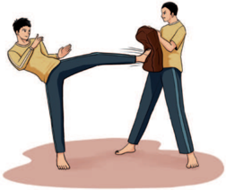

> **Deskripsi Visual:** Gambar ini adalah ilustrasi yang menunjukkan dua orang yang sedang berlatih pertempuran. Pada gambar tersebut, seorang pria dengan rambut panjang sedang melakukan gerakan kick dengan kaki kanannya ke arah seorang pria lain yang berdiri tegak. Pria yang berdiri tegak tampak sedang berusaha untuk menghindari serangan tersebut dengan posisi tubuh yang tegak dan kaki yang ditekuk.

Elemen-elemen utama dalam gambar ini adalah dua orang yang sedang berlatih pertempuran, dua kaki yang digunakan dalam gerakan kick, dan posisi tubuh kedua orang yang menunjukkan pergerakan dan reaksi mereka terhadap serangan. 

Teks, angka, atau label penting tidak ada dalam gambar ini karena ia hanya berupa ilustrasi. Namun, informasi kunci yang dapat diambil pembaca adalah bahwa ada pertempuran sederhana antara dua orang, dengan salah satu melakukan serangan dengan kick dan yang lainnya berusaha untuk menghindarinya.

Ketika  berada  dalam  situasi  pertandingan  dengan  lingkungan  yang berbeda dan lebih sulit diprediksi maka mengandalkan latihan drill saja sering menimbulkan masalah. Hal itu karena pada situasi gerak yang harus dilakukan terdapat banyak masalah yang harus dipecahkan sendiri oleh pemain.

 

---
## 📄 Halaman 38

---
**🖼️ Gambar/Diagram**

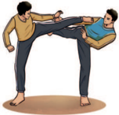

> **Deskripsi Visual:** Gambar ini adalah ilustrasi yang menunjukkan dua orang melakukan pertarungan kickboxing. Gambar ini menggambarkan posisi dan gerakan mereka dengan detail yang cukup untuk memahami konsep pertarungan kickboxing. Pada gambar tersebut, salah satu pria sedang melakukan gerakan kick ke arah pria lainnya, sementara pria lainnya berusaha melawan dengan tangan. Ilustrasi ini menunjukkan posisi tubuh dan gerakan yang kompleks yang diperlukan dalam kickboxing.

Elemen-elemen utama dalam gambar ini adalah dua orang yang sedang bergerak, posisi mereka yang berbeda, dan gerakan mereka. Relasi antara elemen-elemen ini adalah bahwa kedua orang berada dalam posisi yang berbeda dan sedang bergerak untuk bertarung. Teks, angka, atau label penting tidak ada dalam gambar ini karena ia hanya menggambarkan posisi dan gerakan tanpa teks atau angka tambahan.

Informasi kunci yang dapat diambil pembaca dari gambar ini adalah bahwa kickboxing adalah olahraga yang memerlukan keterampilan fisik dan mental yang tinggi, serta posisi dan gerakan yang kompleks. Gambar ini juga menunjukkan bahwa kickboxing adalah pertarungan yang membutuhkan keterampilan dan strategi untuk berhasil.

Pada situasi lingkungan sesungguhnya, yaitu permainan olahraga atau  bela  diri,  pemain/pesilat  akan  terlebih  dahulu  membaca  permainan/ situasi  secara  terus-menerus  untuk  mendapatkan  peluang  (keterampilan persepsi). Berdasarkan  hasil pembacaan  situasi  tersebut,  pemain  akan memutuskan  tindakan  apa  yang  akan  dilakukan,  kapan  waktu  yang  tepat untuk  melakukannya,  dan  bagaimana  cara  terbaik  untuk  melakukannya (keterampilan pengambilan keputusan).

Latihan drill memisahkan antara keterampilan teknis dengan keterampilan persepsi dan pengambilan keputusan. Dengan demikian, untuk meningkatkan latihan, diperlukan juga latihan yang menggambarkan situasi sesungguhnya.

Pembelajaran gerak yang terbaik adalah ketika guru mengalihkan keputusan lebih banyak kepada peserta didik.

### Belajar Mendalam

Tugas : melakukan aktivitas latihan dilanjutkan dalam situasi sebenarnya.

### Aturan Permainan

- Lakukan  aktivitas passing dalam  bola  basket  secara  berpasangan. Lakukan  berulang  sambil  berlari  dari  titik  awal  hingga  titik  akhir yang berjarak 10 meter.

 

---
## 📄 Halaman 39

- Perhatikan  pengambilan  keputusan  yang  kamu  lakukan  dalam aktivitas ini.
- Selanjutnya,  lakukan  permainan  bola  basket  3  lawan  3  dengan menggunakan satu ring.
- Perhatikan  pengambilan  keputusan  yang  kamu  lakukan  dalam permainan tersebut.

### Catatan

Jenis aktivitas jasmani/olahraga tidak harus bola basket, dapat diganti dengan aktivitas lain sesuai kondisi sekolah. Poin pentingnya adalah harus  ada  aktivitas  latihan  dan  permainan  yang  dibandingkan dan aktivitas/permianan tersebut menekankan pada keterampilan persepsi dan pengambilan keputusan.

### Durasi Permainan

5-10 menit untuk setiap aktivitas atau sesuai kesepakatan.

### Instruksi Guru

Guru menjelaskan peraturan permainan.

---
**🖼️ Gambar/Diagram**

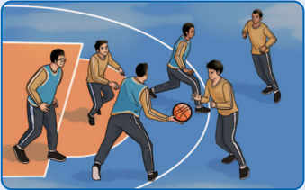

> **Deskripsi Visual:** Gambar ini adalah ilustrasi yang menunjukkan pertandingan bola basket antara dua tim. Gambar ini menggambarkan seorang pemain tim home tengah yang sedang berusaha melewati lawan dengan bola basket. Pemain lawan yang berada di depannya sedang berusaha untuk menghentikannya. Di sebelah kanan, ada beberapa pemain tim away yang sedang bergerak menuju bola basket. Di sebelah kiri, ada pemain tim home yang sedang berdiri dan tampaknya sedang menunggu. Seluruh gambar ini menunjukkan aksi pertandingan bola basket yang seru dan kompetitif.

 

---
## 📄 Halaman 40

### Pertanyaan

Setelah kamu melakukan kedua aktivitas tersebut, jawablah pertanyaan berikut ini.

- Berdasarkan dua aktivitas tersebut, bagaimana pengambilan keputusan dalam latihan pada situasi kinerja sesungguhnya?
- Bagaimana  kamu  merancang  aktivitas  latihan  yang  membuatmu meningkatkan  keterampilan  gerak  dan  lebih  banyak  mengambil keputusan?

### 3. Latihan Drill dan Pengembangan Kreativitas

Latihan  yang  hanya  dilakukan  dengan drill cenderung  akan  membuat permainan dan aktivitas 昀椀sikmu menjadi kaku dan mudah ditebak. demikian, bagaimana latihan seharusnya dilakukan?

Jika

Latihan sebaiknya dilakukan dengan berbagai macam variasi yang lebih menantang  dan  membuatmu  memiliki  lebih  banyak  kesempatan  untuk bereksperimen  menciptakan  keterampilan  gerak  dan  taktik  yang  baru. Eksperimen yang kamu lakukan dalam latihan dapat mengembangkan kreativitas dan 昀氀eksibilitas, serta memiliki keterampilan gerak yang tidak mudah ditebak.

---
**🖼️ Gambar/Diagram**

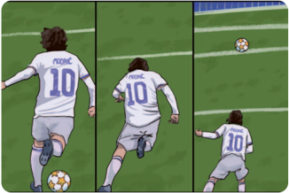

> **Deskripsi Visual:** Gambar ini adalah ilustrasi yang menunjukkan seorang pemain sepak bola sedang melakukan gerakan untuk melepaskan bola. Pemain tersebut berada di tengah lapangan dengan posisi yang menunjukkan bahwa dia telah mengambil bola dan siap untuk melepaskannya ke arah yang berbeda. Pemain tersebut memegang bola dengan tangan kanan dan kaki kiri yang sedang bergerak untuk melepaskan bola. Pemain tersebut juga memiliki nomor 10 pada jerseynya, yang menunjukkan bahwa ia merupakan pemain tim yang bermain di lapangan. Gambar ini menunjukkan posisi dan gerakan pemain sepak bola saat dia sedang bermain.

 

---
## 📄 Halaman 41

Pemain  sepak  bola Real Madrid  dan  Kroasia, Luka  Modric, memiliki keterampilan gerak mengumpan dengan kaki bagian luar yang melengkung dan  sangat  indah,  bahkan  jurnalis  sepak  bola  terkenal,  Fabrizio  Romano, mengatakan jika itu bukan sepak bola, melainkan karya seni yang tinggi.

Kemampuan  Luka  Modric  tersebut  merupakan  hasil  dari  eksperimen yang terus dia lakukan dalam latihan. Kemampuan tersebut tidak serta merta berhasil  dalam  sekali  mencoba,  tetapi  melalui  banyak  kegagalan  hingga akhirnya berhasil.

Para ahli di bidang olahraga dan PJOK menyatakan bahwa, keterampilan gerak yang kreatif justru banyak lahir dari aktivitas eksperimen dalam latihan nonformal  yang  dilakukan  para  pemain  karena  pemain  akan  banyak bereksperimen tanpa rasa takut gagal.

'Jika kamu tidak melakukan kesalahan, maka kamu tidak belajar apa pun' -John Allpress

### Belajar Mendalam

Tugas  : melakukan  aktivitas  bermain  sepak  bola  dan  bereksperimen untuk mengembangkan keterampilan gerak.

### Aturan Permainan

- Lakukan aktivitas permainan sepakbola yang dimodi昀椀kasi.
- Selanjutnya, bersama teman-temanmu, buatlah aturan yang disepakati bersama.
- Poin  utama  dalam  aktivitas  ini  adalah  kamu  mencoba  berbagai keterampilan  gerak  baru  sesuai  kreativitasmu  untuk  mencapai tujuan, yaitu mencetak gol dan mencegah lawan mencetak gol.

 

---
## 📄 Halaman 42

\

---
**🖼️ Gambar/Diagram**

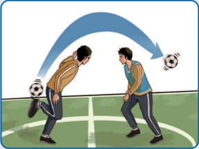

> **Deskripsi Visual:** Gambar ini adalah ilustrasi yang menunjukkan pertandingan sepak bola antara dua pemain. Pada gambar tersebut, salah satu pemain sedang berusaha memukul bola dengan kaki sementara pemain lawannya berdiri di depannya. Pemain yang mencoba memukul bola menggunakan kaki kanannya, sedangkan pemain lawannya berdiri dengan posisi yang menunjukkan siap untuk bertahan. Bola tampaknya berada di tengah kedua pemain, menunjukkan bahwa pertandingan sedang dalam keadaan aktif. Ilustrasi ini mungkin digunakan untuk menjelaskan konsep dasar sepak bola seperti teknik memukul bola dan posisi pemain dalam pertandingan.

### Catatan

Jenis aktivitas jasmani/olahraga dilakukan sesuai minat atau kondisi sekolah. Poin pentingnya adalah peserta didik dapat bereksperimen mencoba berbagai keterampilan gerak yang belum dikuasai.

### Durasi Permainan

5-10 menit untuk setiap aktivitas atau sesuai kesepakatan.

### Instruksi Guru

Guru menjelaskan aktivitas yang dilakukan.

### Pertanyaan

Setelah kamu melakukan kedua aktivitas tersebut, jawablah pertanyaan berikut ini.

- Apa yang kamu peroleh setelah bereksperimen melakukan berbagai gerak yang baru?
- Bagaimana latihan kreatif membantumu  dalam meningkatkan strategi dalam menghadapi lawan?
- Bagaimana kamu dapat menerapkan latihan latihan kreatif ini secara mandiri di luar kelas?

 

---
## 📄 Halaman 43

### 4. Latihan yang Kontekstual

Latihan  yang  kontekstual  merupakan  latihan  yang  kamu  lakukan  sesuai dengan bentuk permainan olahraga atau aktivitas 昀椀sik yang sebenarnya. Dengan latihan yang kontekstual, kamu akan lebih mudah mentransfer hasil latihan ke dalam penggunaan keterampilan gerak dalam situasi sebenarnya.

Di sinilah perlunya bentuk latihan yang menggambarkan situasi nyata itu sendiri.  Dengan  demikian,  kondisi  latihan  yang  dilakukan  harus  mencakup berbagai situasi kondisi aktivitas sebenarnya. Sebagai contoh, dalam latihan servis bulu tangkis perlu diperhatikan situasi nyata, seperti posisi lawan, net, ukuran lapangan, situasi permainan bahkan tekanan yang mungkin dialami.

---
**🖼️ Gambar/Diagram**

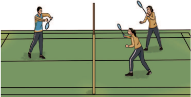

> **Deskripsi Visual:** Gambar ini adalah ilustrasi yang menunjukkan pertandingan tenis. Gambar ini menggambarkan tiga pemain tenis yang sedang bermain di lapangan dengan latar belakang yang menunjukkan garis-garis lapangan tenis. Pemain pertama berada di sisi kanan, sedangkan dua pemain lainnya berada di sisi kiri. Mereka semua sedang memegang raket dan tampak siap untuk bertarung. Garis-garis pada gambar menunjukkan posisi mereka di lapangan, serta posisi bola yang tampaknya sedang dalam permainan. Informasi kunci yang dapat diambil dari gambar ini adalah bahwa ini adalah pertandingan tenis antara tiga pemain, dan posisi mereka di lapangan.

Hadirnya situasi nyata aktivitas/permainan tersebut akan meningkatkan keterampilan perseptual, seperti membaca posisi lawan dan luas lapangan. Misalnya,  ketika  berlatih  servis  bulu  tangkis  dengan  situasi  berhadapan dengan lawan, maka kamu akan melakukan servis dengan membaca posisi lawan dalam area servis untuk mengambil keuntungan. Hal ini tentu berbeda dengan berlatih servis tanpa ada lawan yang hanya fokus pada target saja. Selain itu, keterampilan mempersepsikan juga  dapat  mengembangkan keterampilan dalam mengambil keputusan, seperti jenis servis akan dilakukan dalam jarak pendek atau panjang.

 

---
## 📄 Halaman 44

### Belajar Mendalam

Tugas : melakukan aktivitas  latihan  bersama  temanmu dengan situasi nyata sesuai dengan jenis olahraga yang kalian minati atau sesuai peralatan yang ada di sekolah.

### Aturan Permainan

- Lakukan aktivitas latihan yang tidak menghadapi situasi nyata.
- Selanjutnya, lakukan latihan olahraga yang menggambarkan situasi sesungguhnya.

### Catatan

Jenis  aktivitas  jasmani/olahraga  disesuaikan  dengan  minat  atau kondisi sekolah. Poin pentingnya adalah harus ada aktivitas latihan dalam lingkungan atau situasi  tidak  nyata  dan  situasi  nyata  yang dibandingkan

### Durasi Permainan

5-10 menit untuk setiap aktivitas atau sesuai kesepakatan.

### Instruksi Guru

Guru menjelaskan peraturan permainan.

### Pertanyaan

Setelah kamu melakukan kedua aktivitas tersebut, jawablah pertanyaan berikut ini.

- Berdasarkan  dua  aktivitas  tersebut,  apa  saja  yang  kamu  temukan dalam latihan sesuai kondisi permainan sesungguhnya?
- Hal-hal  apa  yang  hilang  dalam  latihan  atau  yang  ternyata  muncul dalam situasi permainan sesungguhnya?
- Seberapa baik kamu bisa membaca permainan lawan dalam situasi permainan sesungguhnya?

 

---
## 📄 Halaman 45

### 5. Menyederhanakan Latihan yang Kontekstual

Kamu  sudah  mempelajari  dan  mencoba  latihan  dengan  menggunakan situasi yang sebenarnya. Latihan tersebut sangat membantu pengembangan keterampilan  gerak, baik secara teknis,  strategi,  maupun  keterampilan perseptual dan pengambilan  keputusan. Namun,  menghadirkan  situasi kontekstual di lingkungan sekolah biasanya memiliki banyak  kendala, terutama terkait keterbatasan sarana dan prasarana, keterampilan gerak yang belum dikuasai, dan sebagainya.

Bagaimana  solusinya  jika  menemui  kendala-kendala  tersebut?  Tentu saja  perlu  dilakukan  penyederhanaan  dalam  berbagai  hal  untuk  tetap menghadirkan  kondisi  kontekstual  dan  mengatasi  kendala-kendala  yang muncul. Penyederhanaan dapat dilakukan dengan memodi昀椀kasi ukuran, jumlah pemain, dan peralatan. Misalnya, mengubah ukuran gawang, mengubah tinggi ring basket, memperpendek jarak lintasan awalan lompat jauh, menambah atau mengurangi jumlah pemain, menggunakan peralatan pengganti, dan sebagainya.

Contoh penyederhanaan yang tetap kontekstual dalam aktivitas lompat jauh  yaitu  memodi昀椀kasi  jarak  awalan  dengan  lebih  pendek.  Penyederhanaan ini lebih baik untuk dilakukan daripada memisahkan antara latihan awalan dan lompatan.

---
**🖼️ Gambar/Diagram**

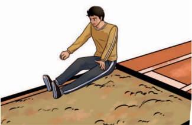

> **Deskripsi Visual:** Gambar ini adalah ilustrasi yang menunjukkan seorang pria sedang berjalan di atas jalan berlubang. Gambar ini menggambarkan situasi yang sering terjadi di jalan raya, di mana lubang-lubang sering kali menyebabkan kecelakaan. Pria tersebut tampak sedang berjalan dengan hati-hati, menunjukkan perhatian yang tinggi terhadap lingkungan sekitarnya. Lubang-lubang di jalan berlubang tampak jelas dan berisiko, menunjukkan bahwa situasi ini harus diperhatikan dengan baik untuk mencegah kecelakaan. Ilustrasi ini mungkin digunakan untuk membantu pembaca memahami bahaya yang tersembunyi di jalan raya dan pentingnya pengawasan lingkungan sekitar.

 

---
## 📄 Halaman 46

### C. Memodi昀椀kasi Aktivitas dan Permainan

Perhatikan  ilustrasi  berikut.  Kamu  hendak  mengembangkan  keterampilan gerak penempatan posisi di ruang kosong ketika bermain bola tangan, tetapi kamu  ingin  berlatih  dengan  latihan  yang  kontekstual.  Maka  dari  itu,  guru memberikan latihan dengan cara bermain bola tangan tanpa menggunakan keterampilan gerak menggiring ( dribble ) sehingga permainan hanya menggunakan passing dan shooting .

---
**🖼️ Gambar/Diagram**

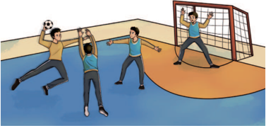

> **Deskripsi Visual:** Gambar ini adalah ilustrasi yang menunjukkan sebuah pertandingan sepak bola di lapangan olahraga. Ilustrasi ini menggambarkan empat pemain yang sedang bermain sepak bola. Pemain pertama berada di posisi yang menyerang, sedangkan pemain kedua dan ketiga berada di posisi bertahan. Pemain keempat tampaknya sedang berusaha mencetak gol ke gawang. Lapangan olahraga tampak jernih dengan lantai berlapis kayu dan tiang gawang yang jelas. Ilustrasi ini menunjukkan aktivitas fisik dan kompetisi tim dalam permainan sepak bola.

Kondisi tersebut  merupakan  modi昀椀kasi  aktivitas  dalam  permainan bola  tangan  untuk  membentuk  perilaku  yang  memfokuskan  pada  latihan penempatan posisi para pemain. Kondisi ini dinamakan sebagai batasan tugas gerak.

### Belajar Mendalam

Tugas : melakukan aktivitas latihan permainan bola tangan. Kelompok/ tim yang tidak bermain bertugas sebagai pengamat dan wasit.

### Aturan Permainan

- Lakukan aktivitas permainan bola tangan dengan hanya menggunakan passing dan shooting.
- Pemain yang membawa bola tidak boleh berlari.

 

---
## 📄 Halaman 47

### Catatan

Jenis  aktivitas  jasmani/olahraga  disesuaikan  dengan  minat  atau kondisi sekolah. Poin pentingnya harus ada batasan tugas pada saat bermain.

### Tugas Pengamat

- Apakah peraturan sudah ditegakkan oleh wasit?
- Apakah batasan tugas sudah diterapkan dengan benar?
- Apakah permainan berjalan kompetitif saling berusaha menang?

### Durasi Permainan

2 x 5 menit untuk setiap permainan.

### Instruksi Guru

Guru menjelaskan peraturan permainan.

### Pertanyaan

Setelah kamu melakukan aktivitas tersebut, jawablah pertanyaan berikut ini.

- Hal apa saja yang bisa kamu tingkatkan dalam latihan?
- Apa  hal-hal  yang  perlu  kamu  kembangkan  dalam  latihan  dengan pembatasan tugas gerak?

### 1. Modi昀椀kasi Peraturan Permainan

Peraturan  permainan  pada  aktivitas  latihan  dapat  dimodi昀椀kasi  untuk mendapatkan fokus latihan yang diharapkan. Berikut ini beberapa contoh modi昀椀kasi peraturan permainan.

### a. Permainan Sepak Bola

Batasan tugas/perubahan aturan: permainan sepak bola dilakukan dengan hanya menggunakan 1 sentuhan (tidak ada gerakan menggiring).

### Perilaku yang diharapkan:

- -pemain lebih banyak mencari ruang untuk menerima umpan,

 

---
## 📄 Halaman 48

- -pemain  akan  membaca  posisi  pemain  lain  sebelum  melakukan sentuhan, dan
- -pemain akan lebih banyak melihat lapangan dan posisi lawan.

---
**🖼️ Gambar/Diagram**

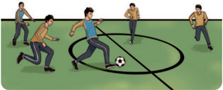

> **Deskripsi Visual:** Gambar ini adalah ilustrasi yang menunjukkan sebuah pertandingan sepak bola. Ilustrasi ini menggambarkan empat pemain sepak bola yang sedang bermain di lapangan. Pemain yang berada di tengah lapangan sedang menggelar bola dan tampaknya sedang mencoba untuk melemparnya ke salah satu pihak lawan. Pemain-pemain lainnya berdiri di sekitar mereka, tampaknya siap untuk bertindak jika bola mereka dibawa ke arah mereka. Ilustrasi ini menunjukkan tindakan aktif dan kompetitif dalam pertandingan sepak bola, dengan pemain-pemain yang bergerak dan berusaha untuk mencapai bola.

### b. Permainan Bola Voli

Batasan tugas/perubahan aturan: pemain depan tidak diperbolehkan menerima bola pertama.

### Perilaku yang diharapkan:

- -pemain depan akan fokus menyiapkan serangan dan
- -pemain depan akan selalu siap menerima bola di posisi mana pun, termasuk  menutup  posisi  pemain  depan  untuk  menerima  bola pertama.
-

---
**🖼️ Gambar/Diagram**

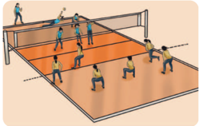

> **Deskripsi Visual:** Gambar ini adalah ilustrasi yang menunjukkan pertandingan bola voli. Gambar ini menggambarkan sepuluh pemain yang bermain bola voli di lapangan dengan net yang memisahkan dua sisi lapangan. Setiap pemain memiliki posisi dan tindakan yang berbeda, menunjukkan aktivitas dan strategi dalam pertandingan tersebut. Net yang berada di tengah lapangan memisahkan dua sisi lapangan, dengan pemain di setiap sisi berusaha untuk melempar bola ke sisi lawan. Pemain di sisi kanan tampak sedang berusaha melempar bola, sementara pemain di sisi kiri tampak sedang berusaha menerima bola. Ini menunjukkan interaksi tim dalam pertandingan bola voli, dengan setiap pemain memiliki peran dan tugas yang berbeda.

 

---
## 📄 Halaman 49

### 2. Modi昀椀kasi Penskoran

Contoh modi昀椀kasi peskoran dilakukan dalam permainan bola basket.

Batasan tugas/perubahan skor: 2 poin untuk bola yang masuk dari dalam garis lengkung, 1 poin untuk bola yang masuk dari luar garis lengkung.

Perilaku yang diharapkan: pemain akan lebih fokus mengejar poin yang lebih  tinggi  sehingga  akan  lebih  banyak  berlatih  melakukan  tembakan jarak dekat yang memiliki peluang berhasil lebih besar.

---
**🖼️ Gambar/Diagram**

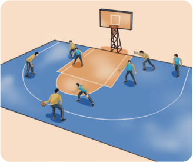

> **Deskripsi Visual:** Gambar ini adalah ilustrasi yang menunjukkan pertandingan bola basket. Dalam gambar tersebut, kita melihat sepuluh pemain bermain di lapangan basket dengan latar belakang yang menunjukkan permainan basket. Pemain-pemain tersebut terdiri dari dua tim yang saling bertarung untuk mencetak poin. Di tengah lapangan, ada pemain yang sedang memegang bola dan tampaknya sedang berusaha untuk melemparnya ke dalam rongga basket. Di sebelah kanan, ada pemain yang sedang bergerak menuju bola, sementara pemain lainnya berada di posisi yang berbeda untuk mendukung atau menghalangi pemain lawan. Di atas lapangan, terdapat rongga basket yang tampaknya siap untuk memasukkan bola jika berhasil melewati pemain-lawan. Gambar ini menunjukkan skenario yang umum terjadi dalam pertandingan bola basket, dimana pemain harus bergerak cepat, strategis, dan berinteraksi dengan pemain-lawan untuk mencapai tujuan mereka.

### 3. Modi昀椀kasi Jumlah Pemain

Modi昀椀kasi  jumah  pemain,  misalnya  dilakukan  dalam  permainan  bola tangan.

Batasan  tugas/perubahan  jumlah  pemain: setengah  lapangan  (area sendiri) hanya boleh diisi maksimal 3 pemain.

Perilaku yang diharapkan: pemain dapat mengoptimalkan cara bertahan ketika mendapat serangan dan juga memiliki peluang melakukan serangan balik.

 

---
## 📄 Halaman 50

---
**🖼️ Gambar/Diagram**

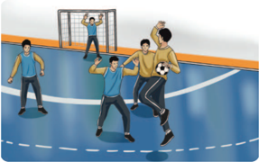

> **Deskripsi Visual:** Gambar ini adalah ilustrasi yang menunjukkan sebuah pertandingan sepak bola di lapangan olahraga. Gambar ini menggambarkan beberapa pemain sepak bola yang sedang bermain, dengan fokus pada dua pemain yang sedang bertarung untuk memegang bola. Pemain yang sedang berusaha memegang bola tampak sangat bersemangat dan berusaha keras untuk mempertahankan posisi mereka. Di sebelah kiri, ada dua pemain yang sedang berdiri dan tampaknya sedang menunggu aksi selanjutnya. Di sebelah kanan, ada dua pemain yang sedang bergerak maju menuju bola, tampaknya sedang mencoba untuk memperoleh bola tersebut. Seluruh gambar ini menunjukkan kegiatan dan permainan sepak bola yang intens dan dinamis.

### 4. Modi昀椀kasi Ukuran

Modi昀椀kasi ukuran lapangan misalnya dilakukan dalam permainan bulu tangkis.

Batasan  tugas/perubahan  ukuran: permainan  tunggal  dengan  hanya menggunakan setengah lapangan.

Perilaku  yang  diharapkan: pemain  memiliki  lebih  banyak  peluang memukul  untuk  meningkatkan  kualitas  pukulan  dan  lebih  tertantang untuk bisa mematikan lawan.

---
**🖼️ Gambar/Diagram**

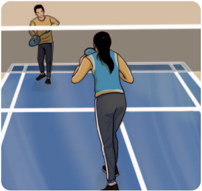

> **Deskripsi Visual:** Gambar ini adalah ilustrasi yang menunjukkan dua orang bermain badminton. Gambar ini menggambarkan dua karakter yang sedang bermain olahraga badminton di lapangan. Karakter di sebelah kiri adalah pemain laki-laki yang sedang berdiri dengan posisi yang siap untuk memukul bola. Karakter di sebelah kanan adalah pemain perempuan yang sedang berjalan menuju bola yang sedang jatuh di lapangan. Kedua karakter tersebut memiliki pakaian olahraga yang sesuai dengan aktivitas mereka, seperti topi, kaos, dan celana panjang. Lapangan badminton tampak jelas dengan garis-garis yang menunjukkan area permainan. Ilustrasi ini menunjukkan kegiatan fisik dan olahraga yang seru dan menyenangkan.

 

---
## 📄 Halaman 51

Modi昀椀kasi-modi昀椀kasi  aktivitas  dan  permainan  tersebut  hanya sebagai  contoh.  Kamu  dapat  melakukan  dan  mengembangkannya dengan  menyesuaikan  pada  minat  dan  kondisi  di  sekolah.  Modi昀椀kasi aktivitas  dan  permainan  ini  akan  membantumu  menyempurnakan keterampilan gerak dengan fokus berlatih keterampilan gerak tertentu dalam bentuk yang kontekstual sesuai situasi yang nyata  dan  keefektifan  penggunaan  keterampilan  gerak  tersebut. Dengan demikian, kamu akan dapat menikmati kesenangan bergerak dan  kamu  akan  melakukannya  terus-menerus  dalam  kehidupan sehari-hari.

### D. Umpan Balik untuk Menyempurnakan Keterampilan Gerak

Ketika kamu berlatih dan ingin meningkatkan kualitas keterampilan  gerak,  maka  kamu  juga  membutuhkan umpan balik untuk mengetahui hal-hal yang perlu ditingkatkan dari keterampilanmu saat ini. Namun,  apakah  semua  bentuk  umpan  balik  akan membuatmu  makin  berkembang  atau  justru  tidak berdampak apa-apa?

### Umpan balik dalam konteks gerak:

informasi tentang bagaimana gerakan dilakukan. Ini membantu memperbaiki cara bergerak atau melakukan sesuatu.

Sebelum  belajar  lebih  jauh  tentang  umpan  balik yang  dapat  membantu  meningkatkan  keterampilan  dan  performa,  cobalah menjawab pertanyaan berikut.

- Pada  saat  melakukan  gerakan  dalam  olahraga,  pernahkah  kamu mendapatkan instruksi dari orang lain untuk memperbaiki keterampilan teknismu? Misalnya, 'Angkat kakinya lebih tinggi!' dan sebagainya. Kira-kira, umpan balik semacam ini akan membantumu atau justru mengganggumu?
- Pada saat melakukan aktivitas olahraga, pernahkah kamu berbicara kepada  diri  sendiri  untuk  memberi  umpan  balik  terhadap  diri sendiri?  Misalnya,  'Seharusnya  aku  tadi  mengumpan  lebih  tinggi.' Apakah umpan balik seperti ini akan membantumu meningkatkan keterampilan gerak?
Tuliskan jawabanmu dalam buku tugasmu!

 

---
## 📄 Halaman 52

Setelah  menjawab  pertanyaan  tersebut,  kamu  dapat  menggunakan  umpan balik  sebagai  informasi  tentang  kualitas  atau  hasil  gerakan  yang  dilakukan sehingga  kamu  dapat  memperbaiki  keterampilan  gerakmu.  Umpan  balik membantu dalam mengembangkan keterampilan gerak, memperbaiki postur tubuh, dan mengembangkan kepekaan terhadap pergerakan.

Dalam konteks gerak, terdapat beberapa jenis umpan balik, yakni umpan balik  eksplisit,  umpan  balik  diri  sendiri,  dan  umpan  balik  terhadap  hasil gerakan. Mari, kita pelajari satu per satu jenis-jenis umpan balik tersebut.

### 1. Umpan balik eksplisit

Ketika kamu melakukan kesalahan dalam gerakan olahraga, kemudian orang lain secara lisan membetulkan gerakanmu, inilah yang disebut umpan balik eksplisit.  Umpan  balik  ini  banyak  digunakan  dan  mungkin  sudah  sering kalian alami. Namun, tidak semua umpan balik ini efektif untuk membantu meningkatkan kualitas keterampilan gerak.

---
**🖼️ Gambar/Diagram**

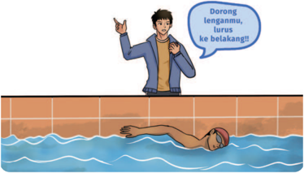

> **Deskripsi Visual:** Gambar ini adalah ilustrasi yang menunjukkan seorang pelajar berenang di kolam renang sambil mendengarkan instruksi dari guru. Pelajar tersebut sedang berada di tengah-tengah kolam dengan lengan lurus ke belakang, menunjukkan posisi tubuh yang benar saat berenang. Guru yang berdiri di tepi kolam sedang mengarahkan pelajar tersebut dengan menggunakan tangan kanan dan menunjuk ke arah belakang. Di atas kepala guru terdapat teks yang membaca "Dorong lenganmu, lurus ke belakang!!!" yang menunjukkan instruksi yang diberikan oleh guru kepada pelajar.

Elemen-elemen utama dalam gambar ini meliputi pelajar, guru, kolam renang, dan teks instruksi. Guru adalah elemen yang paling dominan karena posisinya yang lebih tinggi dan lebih jelas. Pelajar berada di tengah-tengah kolam, menunjukkan bahwa ia adalah subjek utama dari gambar ini. Kolam renang menjadi latar belakang yang menunjukkan tempat berenang. Teks instruksi yang ada pada gambar memberikan informasi tambahan tentang apa yang harus dilakukan oleh pelajar saat berenang.

Informasi kunci yang dapat diambil dari gambar ini adalah bahwa pelajar harus memposisikan lengan mereka lurus ke belakang saat berenang untuk meningkatkan efisiensi dan keselamatan. Ini juga menunjukkan bahwa guru memiliki peran penting dalam mengajarkan teknik berenang kepada pelajar. Gambar ini menggambarkan situasi praktis dalam pelajaran renang, yang seringkali melibatkan pengajaran langsung dari guru kepada pelajar.

Untuk lebih mendalami tentang umpan balik eksplisit ini, lakukan aktivitas berikut bersama temanmu.

 

---
## 📄 Halaman 53

### Aturan Permainan 1

- Lakukan  aktivitas  latihan  keterampilan  gerak  apa  saja  yang  ingin kamu  kuasai,  misalnya  lemparan  dalam  bola  basket,  tendangan dalam sepak bola, smash dalam bola voli, tendangan dalam pencak silat, dan sebagainya.
- Pada saat kamu melakukan gerakan, mintalah temanmu memperhatikan gerakanmu dan memberikan arahan untuk membetulkan gerakanmu.
- Pastikan kamu mendengarkan instruksi temanmu dan tetap melakukan gerakan (tidak berhenti).

---
**🖼️ Gambar/Diagram**

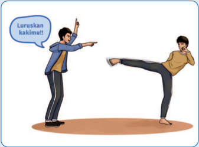

> **Deskripsi Visual:** Gambar ini adalah ilustrasi yang menunjukkan dua orang yang sedang bermain sepak bola. Pemain pertama sedang berdiri dengan posisi yang rapi, sementara pemain kedua sedang melakukan tendangan jarak jauh. Pemain pertama mengarahkan pandangan ke arah pemain kedua, sementara pemain kedua sedang berusaha memperbaiki posisi kaki untuk tendangan. Gambar ini menunjukkan hubungan antara kedua pemain dalam sebuah pertandingan sepak bola, dimana salah satu pemain sedang berusaha memperbaiki posisi kaki untuk tendangan sementara pemain lainnya sedang berusaha memperbaiki posisi tubuh untuk menyerang.

### Aturan Permainan 2

- Lakukan aktivitas yang sama dengan Aktivitas Permainan 1.
- Cobalah  untuk  tidak  mendengarkan  instruksi  temanmu  dan  fokus untuk menyelesaikan tugas gerakmu.

### Belajar Mendalam

 

---
## 📄 Halaman 54

### Catatan

Jenis  aktivitas  jasmani/olahraga  disesuaikan  dengan  minat  atau kondisi sekolah.

### Pertanyaan

Setelah melakukan aktivitas tersebut, jawablah pertanyaan berikut ini.

- Perbedaan yang kamu alami pada aktivitas 1 dan 2?
- Jenis umpan  balik mana  yang  lebih efektif  untuk  membantu meningkatkan kinerja gerakmu?
Ternyata bentuk umpan balik lisan secara langsung tidak selalu efektif dalam membantu  peningkatan  kinerja  gerak.  Adakalanya  umpan  balik  ini  justru memaksamu untuk sadar dan lebih banyak berpikir tentang gerak tubuh yang sedang kamu lakukan.

Umpan balik eksplisit ini mungkin saja tepat untuk melakukan aktivitas keterampilan gerak yang rumit seperti aerobik atau senam lantai. Namun, bagi sebagian yang lain, memaksa untuk melakukan gerakan sambil memikirkan gerak tubuh yang sedang dilakukan dapat mengganggu proses adaptasi tubuh secara alami yang memengaruhi kinerjanya.

Jika kamu  harus menjadi orang yang memberikan  umpan  balik, sampaikan umpan balik secara pendek dalam bentuk 1-2 kata atau frasa yang menandakan gerakan yang benar. Misalnya, 'Tatapan mata ke depan!' atau 'Tekuk lutut!'

### 2. Umpan Balik Diri Sendiri

Coba kamu amati anak kecil yang belajar merangkak, berjalan, dan berlari tanpa  mendapat banyak instruksi  lisan  tentang  gerak  tubuhnya  dari  orang lain. Kira-kira, bagaimana hasil pengamatanmu?

Secara  alamiah  tubuh  akan  menyesuaikan  diri  untuk  memperbaiki gerakannya  sesuai  dengan  kondisi  atau  lingkungan  sekitarnya.  Misalnya, ketika  sedang  berjalan  dan  tiba-tiba  ada  lubang  di  depannya  maka  secara alamiah kamu akan melompat untuk menghindari lubang tersebut. Hal ini

 

---
## 📄 Halaman 55

terjadi  karena  kamu  memberikan  umpan  balik  kepada  diri  sendiri  untuk mengubah gerakan tubuh.

Dalam  pembelajaran  aktivitas  permainan  tenis,  misalnya,  pada  latihan pukulan forehand , sering kali kesalahan yang terjadi adalah pemain menarik raket terlalu cepat sebelum bola mencapai titik ideal. Melihat kondisi tersebut, seorang  guru  kemudian  memintanya  memasang  penghalang,  yaitu  tongkat atau  benda  yang  diletakkan  di  depan  pemain  yang  harus  dihindari  saat melakukan pukulan forehand .

---
**🖼️ Gambar/Diagram**

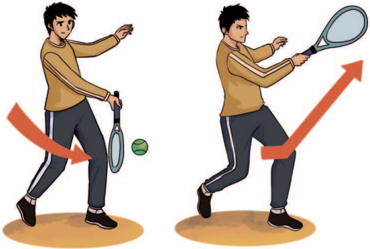

> **Deskripsi Visual:** Gambar ini adalah ilustrasi yang menunjukkan dua posisi pemain tenis yang berbeda. Pada gambar sebelah kiri, pemain tengah mengambil bola dengan raketnya, sedangkan pada gambar sebelah kanan, pemain tersebut sudah bergerak maju dengan raketnya, menunjukkan gerakan serangan. Ilustrasi ini menunjukkan perbedaan posisi dan gerakan dalam permainan tenis, serta bagaimana pemain harus bereaksi sesuai dengan situasi pertandingan.

Kondisi dengan penghalang akan membuat pemain tersebut memberikan umpan balik kepada diri sendiri, yaitu untuk menunggu bola mencapai titik yang tepat sebelum menarik raket. Hal inilah yang dinamakan umpan balik diri sendiri.

 

---
## 📄 Halaman 56

### Tugas

- Rancanglah  aktivitas  yang  dapat  digunakan  untuk  memperbaiki gerakan lompat jauh, terutama karena seringnya terjadi kesalahan dalam  momentum  langkah  sebelum  menumpu,  misalnya  langkah tidak teratur dan tidak ada percepatan!
- Buatlah aktivitas menggunakan pola seperti pada contoh tenis di atas. Itu berarti kalian berusaha menciptakan situasi yang membuat diri sendiri melakukan penyesuaian sehingga dapat melakukan gerakan dengan benar.

---
**🖼️ Gambar/Diagram**

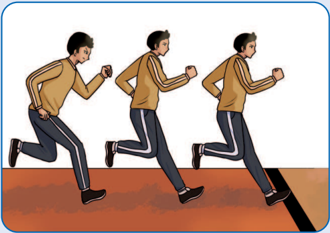

> **Deskripsi Visual:** Gambar ini adalah ilustrasi yang menunjukkan seorang pria sedang berlari. Ilustrasi ini menggambarkan tiga posisi berbeda dari pria tersebut saat berlari, yang menunjukkan gerakan dan kecepatan. Pria tersebut memakai jaket coklat dan celana hitam dengan garis putih di pinggang. Latar belakangnya adalah tanah merah dan garis putih yang mungkin menunjukkan jalur atau area berlari. Ilustrasi ini digunakan untuk menjelaskan tentang gerakan berlari dan posisi tubuh saat berlari.

### Catatan

Jenis  aktivitas  jasmani/olahraga  disesuaikan  dengan  minat  atau kondisi sekolah. Poin pentingnya harus ada batasan tugas pada saat bermain.

### Belajar Mendalam

 

---
## 📄 Halaman 57

### Pertanyaan

Setelah kamu melakukan aktivitas tersebut, jawablah pertanyaan berikut ini .

- Apakah  rancangan  yang  kamu  buat  efektif  untuk  meningkatkan kinerja gerakmu?
- Apakah rancangan aktivitas tersebut membuat tubuhmu menyesuaikan diri untuk melakukan gerakan dengan benar?

### 3. Umpan Balik terhadap Hasil Gerakan

Dengan jenis ini, kamu akan mendapatkan umpan balik yang berfokus pada hasil  gerakanmu,  bukan  pada  posisi  tubuh.  Misalnya,  guru  memintamu memperbaiki gerakan renang gaya bebas dengan menjaga tubuhmu sejajar dengan permukaan  air. Contoh lainnya,  guru  memintamu  melakukan lemparan bola basket agar membentuk lintasan melengkung seperti pelangi untuk menembakkan ke ring basket.

Umpan balik ini tidak mengarah pada cara yang harus kamu lakukan, tetapi pada apa yang harus kamu lakukan. Hal ini memberimu kesempatan untuk mengeksplorasi  berbagai  macam  cara  untuk  menyelesaikan  permasalahan. Cara ini sebaiknya digunakan setelah kamu memiliki waktu yang cukup untuk mengeksplorasi lingkungan tempat kamu mempraktikkan gerakanmu.

---
**🖼️ Gambar/Diagram**

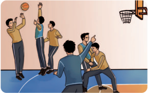

> **Deskripsi Visual:** Gambar ini adalah ilustrasi yang menunjukkan sebuah pertandingan bola basket. Gambar ini menggambarkan beberapa pemain basket yang sedang bermain di lapangan basket. Di sebelah kiri, ada dua pemain yang sedang berusaha mencuri bola dari pemain di tengah. Pemain di tengah sedang berusaha melepaskan bola ke arah papan basket. Di sebelah kanan, ada dua pemain yang sedang berusaha melindungi bola dari pemain di tengah. Papan basket tampak jelas di sudut kanan atas gambar. Gambar ini menunjukkan interaksi antara pemain-pemain dalam pertandingan basket, serta posisi dan gerakan mereka saat bermain.

 

---
## 📄 Halaman 58

Dengan menggunakan berbagai jenis umpan balik, kamu dapat memperbaiki keterampilan gerakmu secara efektif, mulai dari umpan balik eksplisit yang mengarahkan gerakan secara langsung, umpan balik diri sendiri yang  memungkinkan  adaptasi  alami  tubuh,  hingga  umpan  balik  terhadap hasil  gerakan  yang  memberikan  kebebasan  eksplorasi.  Dengan  memahami jenis-jenis umpan balik ini, kamu dapat mengoptimalkan proses pembelajaran dan meningkatkan kinerja gerakmu. Teruslah berlatih dan eksplorasi untuk mencapai kemajuan yang lebih baik!

- Buatlah satu aktivitas latihan dan jelaskan, serta praktikkan terkait cara kamu  melakukan  adaptasi  terhadap  lingkungan  serta  peralatan,  dan tugas gerak untuk meningkatkan keterampilan gerak dalam situasi yang menantang!
- Buatlah  satu  modi昀椀kasi  aktivitas  atau  permainan  yang  membuatmu meningkatkan keterampilan gerak! Selanjutnya, praktikkan dan tuliskan hasilnya!
- Bagaimana kamu memanfaatkan umpan balik dalam konteks gerak untuk memperbaiki  kinerja  gerakmu?  Umpan  balik  seperti  apa  yang  paling efektif untuk menyempurnakan keterampilan gerakmu?
Rancang  dan  lakukan  aktivitas  latihan  olahraga  atau  permainan  bersama temanmu. Aktivitas latihan tersebut hendaknya

- -bersifat kontekstual dengan aktivitas sebenarnya,
- -memuat  aktivitas  yang  membuatmu  beradaptasi  dan  berlatih  lebih kompetitif,
- -memuat modi昀椀kasi, dan
- -mendorong umpan balik diri sendiri ataupun umpan balik fokus eksternal.

 

---
## 📄 Halaman 59

Lakukan pencatatan atas hasil latihan yang kamu lakukan untuk mengetahui progres  latihan  dan  evaluasi.  Kegiatan  evaluasi  diperlukan  agar  untuk menyempurnakan  keterampilan  gerakmu.  Catat  hasil  tersebut  dalam  buku tugasmu.

Selamat!  Kamu  sudah  menyelesaikan  Bab  1  di  buku  ini.  Selanjutnya,  coba periksa lagi dari awal. Hal-hal apa saja yang sudah kamu pelajari pada Bab 1 ini?

Salin tabel berikut di buku tugasmu, lalu beri tanda centang sesuai dengan pengalamanmu!

---
**📊 Tabel**

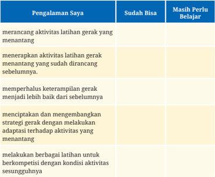

Tabel ini menunjukkan pengalaman belajar seorang individu dalam berbagai aspek latihan gerak, dibagi menjadi dua kategori: "Sudah Bisa" dan "Masih Perlu Belajar". Topik utama tabel adalah pengembangan kemampuan latihan gerak, termasuk merancang aktivitas latihan, menerapkan aktivitas yang sudah dirancang, memperbaiki keterampilan gerak, menciptakan strategi adaptif, dan melakukan berbagai latihan untuk bersaing dengan kondisi baru. Dalam kategori "Sudah Bisa", individu telah berhasil merancang aktivitas latihan, menerapkannya, dan meningkatkan keterampilan gerak. Sementara itu, dalam kategori "Masih Perlu Belajar", individu masih memerlukan pengetahuan lebih lanjut tentang strategi adaptif dan latihan berkelanjutan untuk berkompetisi dengan kondisi baru.

 

---
## 📄 Halaman 60

---
**📊 Tabel**

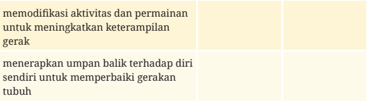

Tabel ini berisi dua baris dan dua kolom, dengan topik utama tentang modifikasi aktivitas dan permainan untuk meningkatkan keterampilan gerak, serta menerapkan umpan balik terhadap diri sendiri untuk memperbaiki gerakan tubuh. Kolom pertama berisi judul "modifikasi aktivitas dan permainan untuk meningkatkan keterampilan gerak", sedangkan kolom kedua berisi "menerapkan umpan balik terhadap diri sendiri untuk memperbaiki gerakan tubuh". Data atau pola penting yang terlihat adalah bahwa tabel ini mencakup dua aspek utama dalam pembelajaran gerakan, yaitu modifikasi aktivitas dan permainan serta menerapkan umpan balik terhadap diri sendiri.

memodi昀椀kasi aktivitas dan permainan untuk meningkatkan keterampilan gerak

menerapkan umpan balik terhadap diri sendiri untuk memperbaiki gerakan tubuh

Apa saja yang akan kamu tingkatkan?

 

---
## 📄 Halaman 61

### KEMENTERIAN PENDIDIKAN, KEBUDAYAAN, RISET, DAN TEKNOLOGI REPUBLIK INDONESIA, 2023

Buku Siswa Pendidikan Jasmani, Olahraga, dan Kesehatan (PJOK)

untuk SMA/MA/SMK/MAK Kelas X (Edisi Revisi)

Penulis   : Anggara Aditya Kurniawan, Teguh Karya

ISBN

: 978-634-00-0094-8

### Aktivitas Jasmani dan Olahraga

### Mendalami Konsep Gerak

?

Cara apa yang akan kamu lakukan agar sukses melakukan gerakan dengan mendalami  konsep  gerak di berbagai aktivitas gerak yang menantang?

 

---
## 📄 Halaman 62

Pada  bab  ini  kamu  akan  merancang,  menerapkan,  dan  menghaluskan keterampilan gerak spesi昀椀k dengan memperhatikan konsep gerak digunakan  di  dalam  berbagai  situasi  gerak  yang  menantang.  Selanjutnya, kamu akan menerapkan konsep gerak tersebut dalam situasi gerak yang baru dan menantang. Kamu juga dapat menganalisis berbagai dampak yang muncul dari tiap konsep gerak terhadap peningkatan capaian keterampilan gerakmu.

- konsep gerak
- efekti昀椀tas konsep gerak
- prinsip bermain dan konsep gerak

---
**🖼️ Gambar/Diagram**

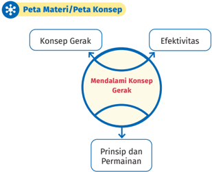

> **Deskripsi Visual:** Gambar ini adalah diagram yang menunjukkan struktur konsep dalam materi belajar. Diagram ini berbentuk lingkaran dengan tiga bagian utama: Konsep Gerak, Efektivitas, dan Prinsip dan Permainan. Dalam bagian tengah, ada teks "Mendalami Konsep Gerak" yang menggambarkan hubungan antara konsep gerak dan efektivitas. Di bagian bawah, ada teks "Prinsip dan Permainan", yang mungkin merujuk pada prinsip-prinsip dasar dan permainan yang digunakan dalam pembelajaran tersebut.

Elemen-elemen utama dalam diagram ini adalah lingkaran yang mengelilingi tiga bagian utama, yang masing-masing memiliki label yang jelas. Teks "Peta Materi/Peta Konsep" terletak di bagian atas, menunjukkan tujuan diagram ini sebagai peta konsep materi belajar. Label "Konsep Gerak", "Efektivitas", dan "Prinsip dan Permainan" memberikan informasi tentang bagaimana konsep-konsep tersebut terkait satu sama lain.

Informasi kunci yang dapat diambil pembaca melalui gambar ini adalah bahwa struktur materi belajar ini mencakup konsep gerak, efektivitas, dan prinsip-prinsip dasar serta permainan yang digunakan untuk mendalami konsep tersebut. Diagram ini membantu pembaca memahami hubungan antara konsep-konsep ini dalam konteks pembelajaran.

yang

 

---
## 📄 Halaman 63

Pada  saat  kamu  bergerak,  apakah  kamu  menyadari  tentang  bagaimana gerakan itu kamu lakukan? Misalnya, saat berlari, apakah kamu menyadari bagian  tubuh  mana  yang  digunakan,  ke  arah  mana  saja  kamu  bergerak, seberapa besar usaha yang kamu perlukan, dan terkait dengan jalan/benda/ tanda  atau  orang  lain  saat  berlari.  Untuk  melakukan  gerakan  yang  efektif dan  e昀椀sien,  kamu  dapat  mempelajari  berbagai  aspek  yang  memengaruhinya, seperti cara kerja tubuh, kontrol gerakan, dan faktor lain yang memengaruhi gerakan. Pembelajaran ini melibatkan pemahaman tentang bagaimana cara tubuh  bergerak,  fungsi  otot,  dan  cara  meningkatkan  kemampuan  gerak. Adakah konsep gerak yang ingin kamu ketahui lebih lanjut?

Sebelum  belajar  tentang  mencapai  keberhasilan  di  berbagai  macam aktivitas gerak yang menantang, kamu dapat mencari bentuk-bentuk aktivitas gerak yang efektif dan e昀椀sien dari berbagai macam sumber media informasi. Tulis bentuk aktivitas gerak yang kamu temukan di buku tugas, ya!

### A. Konsep Gerak ( Movement Concepts )

Sesungguhnya, kamu dapat menganalisis setiap bentuk gerak atau aktivitas 昀椀sik,  seperti  berjalan,  berlari,  melompat,  meluncur,  berguling,  menderap, menjatuhkan  diri,  dan  bersepeda.  Analisis  dapat  kamu  lakukan  dengan mengkajinya melalui empat konsep gerak ( movement concepts ) berikut.

- Apa yang dapat dilakukan tubuh ( body awareness )?
- Kemana tubuh bergerak ( spatial awareness )?
- Bagaimana tubuh bergerak ( effort )?
- Dengan siapa atau apa tubuh bergerak ( relationship )?
Jika  kamu  mampu memahami dan menerapkan keempat konsep gerak tersebut,  kamu  akan  lebih  efektif  dan  e昀椀sien  dalam  melakukan  gerakan.

 

---
## 📄 Halaman 64

---
**🖼️ Gambar/Diagram**

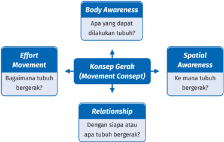

> **Deskripsi Visual:** Gambar ini adalah diagram yang menunjukkan struktur dasar gerakan manusia. Diagram ini terdiri dari empat bagian utama yang saling terkait:

1. **Body Awareness** (Kepedulian tentang tubuh): Ini mengeksplorasi apa yang dapat dilakukan oleh tubuh manusia.

2. **Effort Movement** (Gerakan Upaya): Bagaimana tubuh bergerak?

3. **Spatial Awareness** (Kepedulian tentang ruang): Ke mana tubuh bergerak?

4. **Konsep Gerak (Movement Concept)**: Bagaimana tubuh bergerak? Ini melibatkan pemahaman tentang cara tubuh bergerak dan hubungan antara tubuh dengan lingkungannya.

Jaringan antara elemen-elemen ini menunjukkan bahwa setiap bagian memainkan peran penting dalam pemahaman tentang gerakan manusia. Body Awareness membantu kita memahami kemampuan tubuh, Effort Movement menggambarkan bagaimana tubuh bergerak, Spatial Awareness menjelaskan arah gerakan, dan Movement Concept memberikan pemahaman tentang konsep gerakan secara keseluruhan.

Informasi kunci yang dapat diambil pembaca adalah bahwa pemahaman tentang gerakan manusia melibatkan pemahaman tentang kemampuan tubuh, bagaimana tubuh bergerak, arah gerakan, dan konsep gerakan secara keseluruhan.

Pada  saat  melakukan  aktivitas  昀椀sik  atau  berolahraga,  adakalanya  kamu belum mencapai hasil yang diharapkan, misalnya pada saat berlari dengan kecepatan tertentu ternyata belum berhasil mencapai target waktu atau pada saat shooting bola  ke  gawang  dan  memasukan  bola  ke  ring  basket  belum berhasil mencapai sasaran. Menurutmu, mengapa hal itu bisa terjadi? Kamu perlu  menganalisis  konsep  gerak  yang  kamu  gunakan  dalam  melakukan keterampilan  gerak  spesi昀椀k.

Pemahaman  terhadap  konsep  gerak  yang  kemudian  diterapkan  dalam beraktivitas gerak dapat memberikan pengaruh yang besar terhadap keberhasilan  gerak  yang  kamu  lakukan.  Misalnya,  ketika  bermain  bulu tangkis, kamu memahami atau dapat memperkirakan jarak antara raket dan net  sehingga  kamu  dapat  memperhitungkan  seberapa  kuat  pukulan  yang kamu perlukan untuk melakukan pukulan dropshot .

Kriteria  konsep  gerak  dapat  mencakup  beberapa  aspek  yang  menjadi acuan atau standar dalam memahami, mengevaluasi, dan mengaplikasikan konsep gerak dalam konteks aktivitas 昀椀sik atau olahraga. Berikut ini beberapa kriteria umum untuk mengukur konsep gerak.

 

---
## 📄 Halaman 65

### 1. Relevansi

Konsep  gerak  harus  relevan  dengan  tujuan  dan  konteks  aktivitas  昀椀sik yang sedang dilakukan. Misalnya, konsep gerak untuk lari akan berbeda dengan konsep gerak untuk berenang.

### 2. Keterpaduan

Konsep gerak harus dapat terintegrasi dengan prinsip-prinsip biomekanika, kontrol motorik, dan faktor-faktor lain yang memengaruhi gerak manusia.

### 3. Kesesuaian

Konsep  gerak  harus  sesuai  dengan  karakteristik  individu,  seperti  usia, tingkat  kebugaran  昀椀sik,  dan  tujuan  pribadi  dalam  melakukan  aktivitas 昀椀sik.

### 4. Efektivitas

Konsep  gerak  harus  efektif  dalam  mencapai  tujuan  gerakan  yang diinginkan, baik itu dalam hal kinerja maupun pencegahan cedera.

### 5. E昀椀siensi

Konsep gerak harus mempertimbangkan e昀椀siensi energi dan upaya yang diperlukan dalam melakukan gerakan sehingga dapat menghemat tenaga dan mengoptimalkan kinerja.

### 6. Keterukuran

Konsep  gerak  harus  dapat  diukur  atau  dinilai  secara  objektif  sehingga kemajuan atau perbaikan dalam gerakan dapat dipantau dan dievaluasi.

### 7. Keselarasan

Konsep  gerak  harus  selaras  dengan  prinsip-prinsip  etika  dan fair  play dalam aktivitas 昀椀sik atau olahraga.

### 8. Kontinuitas

Konsep gerak harus bersifat kontinu dan dapat diterapkan secara konsisten dalam jangka waktu yang panjang untuk mencapai hasil yang optimal.

Menerapkan kriteria-kriteria ini dalam memahami dan mengembangkan konsep gerak dapat membantu kamu dalam meningkatkan kualitas gerakan dan mencapai tujuan dalam aktivitas 昀椀sik atau olahraga.

 

---
## 📄 Halaman 66

---
**🖼️ Gambar/Diagram**

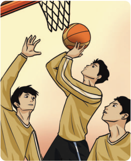

> **Deskripsi Visual:** Gambar ini adalah ilustrasi yang menunjukkan adegan bola basket. Dalam gambar tersebut, ada tiga pemain yang sedang bermain basket. Pemain tengah sedang mencoba melempar bola ke dalam net basket sambil ditemani oleh dua pemain lawan yang berdiri di depannya. Pemain tengah mengenakan seragam warna kuning dengan lengan panjang putih, sedangkan pemain lawan berdiri di sebelahnya juga mengenakan seragam sama namun dengan warna yang berbeda. Net basket tampak jelas di bagian atas gambar, menunjukkan posisi di mana bola harus dilempar untuk mencapai skor. Gambar ini menunjukkan aksi permainan basket yang intens dan kompetitif, menekankan posisi dan gerakan pemain saat melakukan tendangan.

Sebelumnya, kamu  sudah mengenal istilah konsep gerak. Konsep ini merupakan  kombinasi  antara  pengetahuan  dan  keterampilan  yang  dapat kamu  terapkan  untuk  melakukan  gerakan.  Keberhasilan  gerak  ini  sangat dipengaruhi  oleh  kemampuanmu  kamu  dalam  menyesuaikan  diri  dan lingkungan sekitar dengan membangun kesadaran terhadap beberapa konsep gerak.  Bagaimana  menerapkan konsep gerak dan menganalisis dampaknya terhadap keberhasilan gerakmu? Mari, menyimak penjelasan berikut ini.

### 1. Kesadaran Tubuh ( Body Awareness )

Kesadaran tubuh adalah kemampuan untuk menyadari bagian-bagian tubuh yang  perlu  digerakkan  secara  efektif  saat  melakukan  suatu  aktivitas  atau gerakan. Kamu akan belajar mengenali bagian-bagian tubuhmu, posisi setiap bagian, dan peran yang bisa dilakukan oleh setiap bagian saat belajar bergerak, seperti saat berjalan, berlari, melempar, atau menyeimbangkan tubuh.

 

---
## 📄 Halaman 67

Misalnya,  saat  kamu  menggiring  bola  basket  di  lapangan,  fokuskan pada  postur  tubuh  yang  benar,  cara  tangan  dan  jari-jari  mengontrol  bola, serta  gerakan  kaki  untuk  menjaga  keseimbangan.  Kesadaran  atas  bagianbagian  tubuh  mana  saja  yang  perlu  digerakkan  dalam  melakukan  gerakan tersebut menunjukkan bahwa kamu sudah mampu menerapkan konsep gerak kesadaran tubuh ( body awareness ).

### 2. Ruang ( Spatial Awareness )

Kesadaran ruang berkaitan dengan ruang, tempat, atau posisi di mana kamu bergerak.  Ketika  kamu  bergerak  di  ruang  pribadi  atau  umum,  kamu  akan memahami ruang sekitarmu. Hal ini membantumu untuk bisa bergerak ke semua  arah,  ke  jalan  yang  berbeda,  bahkan  menyesuaikan  ketinggian  dan lebar  ruang  yang  kamu lewati. Kamu juga menyadari ciri lokasi tempatmu berada, seperti ruang pribadi, ruang umum, dan ruang terbatas.

Ada  beberapa  kegiatan  yang  bisa  dilakukan  untuk  membantumu  lebih memahami ruang di sekitarmu.

---
**🖼️ Gambar/Diagram**

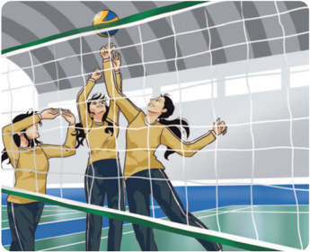

> **Deskripsi Visual:** Gambar ini adalah ilustrasi yang menunjukkan pertandingan voli. Gambar ini menggambarkan tiga pemain voli yang sedang bermain di lapangan voli. Pemain di tengah mencoba mengeksekusi tendangan voli ke arah net. Pemain di sisi kanan dan kiri tampaknya sedang berusaha untuk mencegah bola tersebut. Net yang menjadi bagian penting dari pertandingan ini tampak jelas di belakang pemain. Warna-warna yang digunakan dalam gambar mencerminkan suasana olahraga yang dinamis dan kompetitif.

 

---
## 📄 Halaman 68

Beberapa  aktivitas  olahraga  atau  permainan  bisa  membantumu  lebih memahami ruang di sekitarmu. Contohnya, saat kamu belajar memukul bola bisbol  kamu  akan  memperkirakan  jarak  pukulan.  Ketika  kamu  melakukan servis bola voli, kami akan melihat ruang/lapangan sehingga dapat mengatur kekuatan  saat  melempar  bola  melewati  net.  Hal  itu  akan  membantumu mengerti dengan lebih baik jarak antar objek.

### 3. Upaya ( Effort)

Pemahaman tentang cara tubuh kamu bergerak disebut upaya. Kamu belajar bagaimana mengatur kekuatan, waktu, dan aliran agar gerakanmu menjadi lebih baik dan memiliki ciri khas yang unik.

### 4. Hubungan ( Relationship)

Kesadaran hubungan membahas tentang cara tubuhmu berinteraksi dengan bagian-bagian tubuhmu, temanmu, atau benda-benda lain saat kamu bergerak. Ini akan membantumu memahami bagaimana bagian-bagian tubuhmu saling bekerja saat kamu bergerak, serta bagaimana kamu berinteraksi dengan orang lain, kelompok, dan benda.

---
**🖼️ Gambar/Diagram**

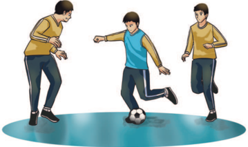

> **Deskripsi Visual:** Gambar ini adalah ilustrasi yang menunjukkan tiga orang bermain sepak bola. Pada gambar tersebut, dua orang sedang bermain sepak bola sementara yang ketiga berdiri di sebelah mereka. Pemain yang sedang bermain sepak bola tampak memegang bola dan sedang bergerak untuk mencoba melempar atau menyerang lawan. Pemain yang berdiri tampak berada di posisi yang strategis untuk melihat pertandingan dan mungkin memberikan nasihat atau bantuan kepada pemain lainnya. Gambar ini menunjukkan aktivitas fisik dan komunikasi tim dalam permainan sepak bola.

 

---
## 📄 Halaman 69

Coba kamu perhatikan ringkasan berbagai konsep gerak dibawah ini.

Tabel 2.1 Ringkasan berbagai konsep gerak

### Kesadaran Tubuh : Apa yang dapat dilakukan tubuh?

- -Bagian-bagian tubuh, seperti lengan, kaki, siku, lutut, kepala, bahu, dan punggung.
- -Bentuk tubuh, seperti bulat, lebar, sempit, melingkar, terentang, terpilin, simetris, dan asimetris.
- -Gerakan tubuh, seperti mendukung, memimpin, menerima berat badan, melentur, memanjang, berputar, berayun, mendorong, dan menarik.

### Kesadaran Ruang: Ke mana tubuh bergerak?

- -Arah, contohnya depzan, belakang, samping, diagonal, naik, turun, kiri, dan kanan.
- -Tingkat, contohnya tinggi, sedang, dan rendah.
- -Jalur, contohnya zigzag, lurus, melengkung, dan berombak.
- -Bidang, contohnya frontal, horizontal, vertikal, dan sagital.
- -Perluasan, contohnya dekat dan jauh
- -Bidang (contohnya, frontal, horizontal, vertikal, sagital)
- -Perluasan (contohnya, dekat, jauh)

### Upaya : Bagaimana tubuh kamu bergerak?

- -Waktu, contohnya cepat, sedang, lambat, berlanjut, dan tiba-tiba.
- -Kekuatan, contohnya kuat dan ringan.
- -Aliran, contohnya terikat, bebas, berkelanjutan, dan terputus-putus.

### Hubungan : Dengan siapa atau dengan apa tubuh bergerak?

- -Orang, seperti saat bertemu, sejajar, berbeda, mengikuti, memimpin, meniru, mencerminkan, mengejar, bergerak bersama, mendekati atau menjauhi orang lain, dan berinteraksi dengan pasangan atau kelompok.
- -Posisi benda, misalnya, di atas, bawah, samping, depan, belakang, dekat, jauh, serta melalui atas dan bawah.
- -Unsur-unsur dalam lingkungan, seperti musik, angin, suhu, dan medan.

 

---
## 📄 Halaman 70

### Belajar Mendalam

- Gunakan  konsep  gerakan  kesadaran  tubuh,  ruang,  usaha,  dan hubungan untuk menggambarkan gerakan berikut.
- atletik Nomor Lempar
- lomba renang gaya bebas 50 meter
- lempar cakram pada kegiatan atletik
- penampilan senak Irama atau pertunjukan menari oleh temantemanmu
- cabang olahraga atau unit kegiatan ekstrakurikuler yang kamu ikuti
- Sajikan  temuanmu  dalam  bentuk  tabel  dengan  format  seperti berikut ini.

---
**📊 Tabel**

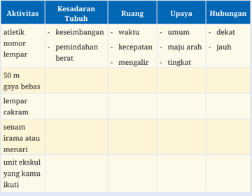

Tabel ini menunjukkan hubungan antara aktivitas olahraga dengan kesadaran tubuh, ruang, upaya, dan hubungan. Topik utama adalah hubungan antara aktivitas olahraga dan kondisi fisik. Kolom-kolomnya meliputi: Aktivitas, Kesadaran Tubuh, Ruang, Upaya, dan Hubungan. Data penting yang terlihat adalah bahwa atletik dan nomor lempar memerlukan kesadaran tubuh yang baik untuk keseimbangan, kecepatan, dan mengalir. Lebih lanjut, 50 m gaya bebas membutuhkan waktu dan kecepatan, sementara lempar cakram memerlukan kecepatan dan kekuatan. Senam irama atau menari membutuhkan keseimbangan dan kekuatan, sedangkan unit ekskul yang kamu ikuti tidak memiliki kesadaran tubuh spesifik.

 

---
## 📄 Halaman 71

- Bandingkan hasil analisismu dengan hasil analisis temanmu.
- Lakukan  identi昀椀kasi tentang cara konsep gerak yang  berbeda diterapkan dalam setiap aktivitas 昀椀sik.
- Lakukan evaluasi efektivitas konsep gerak pada setiap aktivitas 昀椀sik tersebut dengan menjawab pertanyaan berikut.
- Bagaimana  masing-masing  aktivitas  昀椀sik  menggunakan  konsep gerak secara berbeda?
- Berdasarkan  evaluasi  Anda  terhadap  konsep  gerak,  bagaimana kinerja dalam setiap aktivitas ditingkatkan?

---
**🖼️ Gambar/Diagram**

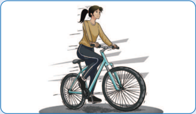

> **Deskripsi Visual:** Gambar ini adalah ilustrasi yang menunjukkan seorang wanita sedang bersepeda. Gambar ini menggambarkan seorang wanita dengan rambut panjang yang ditarik ke belakang, memakai jaket warna coklat dan celana hitam. Ia sedang bersepeda dengan posisi yang teguh, dengan kedua tangan mengendalikan sepeda. Latar belakangnya tampak putih, sementara sepedanya memiliki desain modern dengan roda besar dan sepatu berwarna biru.

Elemen utama dalam gambar ini adalah seorang wanita bersepeda. Relasi antara elemen-elemen tersebut adalah bahwa wanita tersebut adalah subjek utama yang sedang melakukan aktivitas bersepeda. Teks, angka, atau label penting tidak ada dalam gambar ini karena ia hanya menggambarkan seorang wanita bersepeda tanpa detail tambahan.

Informasi kunci yang dapat diambil pembaca dari gambar ini adalah bahwa seorang wanita sedang melakukan olahraga bersepeda. Ini bisa menjadi representasi dari gaya hidup sehat dan aktif.

### Belajar Mendalam

Kamu akan mempelajari penerapan konsep gerakan kesadaran tubuh, kesadaran ruang, usaha, dan hubungan melalui aktivitas berikut ini.

Tugas : menyimulasikan aktivitas 昀椀sik atau olahraga melalui permainan net bulu tangkis dengan satu lapangan bulu tangkis digunakan oleh pemain 3 lawan 3.

 

---
## 📄 Halaman 72

### Permainan 1

Gunakan raket bulu tangkis atau sejenisnya atau kok atau sejenisnya.

### Aturan Permainan

- Permainan dimainkan oleh dua kelompok/tim yang saling berhadapan; setiap tim beranggota 3 orang.
- Tujuan permainan ini adalah melakukan aktivitas permainan bulu tangkis dengan mengombinasikan pukulan fore hand dan back hand
- Pemain  bermain  bulu  tangkis  dengan  berlatih  mengombinasikan pukulan forehand dan backhand untuk  mencapai  tujuan,  yaitu mampu mengendalikan  kok  dengan  baik  dan  memenangkan  poin untuk tim dengan cara mencegah kok jatuh di lapangan sendiri.
- Pemenang  permainan  adalah  tim  yang  berhasil  mengontrol  kok dengan baik dan memenangkan poin dalam permainan bulu tangkis tanpa membiarkan kok jatuh di lapangan sendiri.

### Durasi Permainan

Setiap permainan dilakukan selama 5-7 menit.

### Instruksi Guru

Guru menjelaskan peraturan permainan.

---
**🖼️ Gambar/Diagram**

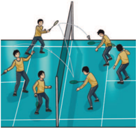

> **Deskripsi Visual:** Gambar ini adalah ilustrasi yang menunjukkan pertandingan bulu tangkis. Gambar ini menggambarkan empat pemain yang sedang bermain di lapangan bulu tangkis dengan posisi mereka yang berbeda-beda. Pemain di sisi kiri memiliki raket dan memegang bola, sedangkan pemain di sisi kanan sedang berdiri dengan posisi yang lebih tegak. Di tengah-tengah, terdapat net yang memisahkan dua sisi lapangan. Setiap pemain memiliki posisi yang berbeda untuk menangkap bola dan menyerang lawannya. Ilustrasi ini menunjukkan kegiatan aktif dan kompetitif dalam permainan bulu tangkis.

 

---
## 📄 Halaman 73

### Pertanyaan

Setelah memainkan permainan tersebut, jawablah pertanyaan berikut

- Bagaimana  kamu  mengartikan  konsep  gerak  'kesadaran  tubuh' dalam konteks permainan bulu tangkis?
- Mengapa saat bermain, seorang pemain harus memiliki kesadaran tubuh yang baik?
- Bagaimana kamu menerapkan konsep kesadaran ruang, usaha, dan kerja sama dengan rekan setim dalam permainan bulu tangkis? Apa hubungannya  dengan  konsep  adaptasi?  Mengapa  hal  ini  penting untuk dipahami?

### 5. Kefektifan Konsep Gerak

Bagaimana  kamu  tahu  jika  kamu  berhasil  mencapai  apa  yang  ingin  kamu capai?  Apa  yang  menjadi  pedoman  untuk  mengetahuinya?  Ketika  kamu melakukan  ataupun  memperhatikan  suatu  aktivitas  gerak,  kamu  akan menyadari  bagaimana  setiap  konsep  gerak  diterapkan  dan  seberapa  baik penerapannya.

Dengan  memahami  konsep  gerak,  seperti  kesadaran  tubuh,  kesadaran ruang,  upaya,  dan  hubungan,  kamu  bisa  mengevaluasi  penampilan  yang berlangsung  dan  menentukan  seberapa  sukses  suatu  penampilan  dalam permainan. Ketika  kamu  ikut  serta,  kamu  bisa  menerapkan  konsep-konsep gerak  ini  dalam  penampilanmu  sendiri  dan  berpikir  tentang  cara  untuk meningkatkan kualitas.

### Studi Kasus

Kamu akan memahami bahwa setiap gerakan 昀椀sik dapat dianalisis dengan memeriksa  interaksi  antara  empat  konsep  gerakan.  Keempat  unsur tersebut, yaitu kesadaran tubuh, kesadaran ruang, usaha, dan hubungan atau kerja sama saling berinteraksi untuk menentukan kualitas gerakan..

Bayangkan,  kamu  adalah  seorang  pelatih  yang  bertanggung  jawab mempersiapkan  penampilan  kelompok  dan  akan  memberikan  umpan balik berkaitan dengan penampilan kelompok.

 

---
## 📄 Halaman 74

### Pertanyaan:

- Rekamlah  aktivitas  gerak  dengan  hand  phone  untuk  memberikan informasi aktivitas gerak yang kalian lakukan dalam bentuk video. Berikanlah  umpan balik  atau  evaluasi  tentang  bagaimana  anggota kelompok  kamu  melakukan  aktivitas  gerak  dalam  konteks  konsep gerakan tersebut.
- Buatlah lembar kerja untuk membantu kamu menyelesaikan tugas ini  yaitu  dari  data  yang  sudah  di  kaji,  selanjutnya  berikan  umpan balik tentang bagaimana gerakan-gerakan lainnya yang berbeda dari gerakan sebelumnya  bisa lebih baik dengan mengkajianya melalui ke empat konsep gerakan.

### Catatan

Jenis Aktivitas 昀椀sik di atas dapat diganti dengan aktivitas gerak lain yang dapat kamu lakukan

- Lakukanlah pengamatan pada kelompok lain bagaimana menerapkan konsep gerakan dalam kinerja mereka dan mengevaluasi seberapa efektif atau baik pelaksanaannya !
- Apakah penilaiannya berguna? Bicarakan penilaian tersebut dengan kelompokmu

 

---
## 📄 Halaman 75

### B. Prinsip Permainan dan Konsep Gerak

Coba kamu ingat! Pernahkah kamu melakukan aktivitas 昀椀sik atau olahraga permainan, misalnya bermain futsal atau bola voli? Sebagai seorang pemain, apa  yang  harus  kamu  lakukan  untuk  menghadapi  berbagai  macam  situasi dan  kondisi  dalam  permainan  tersebut?  Bagaimana  mengambil  keputusan untuk bertindak? Bagaimana kamu menilai situasi permainan, memprediksi kemungkinan yang terjadi, dan mengantisipasi dari berbagai hal? Contohnya, ketika  lawan  bersiap  untuk  melakukan spike dalam  permainan  bola  voli, pemain depan harus siap untuk menghadang bola atau menerima tipuan dari lawannya.

Untuk menghadapi itu semua, kamu perlu mengetahui cara mengembangkan gerakan yang baik dan e昀椀sien dalam berbagai atau  olahraga.  Hal  itu  dilakukan  dengan  menggabungkan  keempat  konsep gerak (kesadaran tubuh, kesadaran ruang, upaya, dan hubungan) dengan taktik dan strategi. Konsep gerak, taktik, dan strategi dipadukan dalam permainan dengan menggunakan pendekatan taktis ( The Tactical Games Model ) bertujuan mengajarkan konsep olahraga dengan cara membuatmu lebih aktif. Metode ini membantumu memahami prinsip-prinsip dasar olahraga melalui pengalaman bermain langsung sehingga kamu dapat mengembangkan keterampilan dan pemahaman yang lebih baik tentang permainan yang kamu mainkan.

---
**🖼️ Gambar/Diagram**

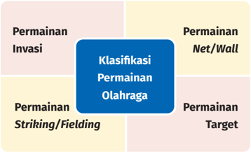

> **Deskripsi Visual:** Gambar ini adalah diagram yang menunjukkan klasifikasi permainan olahraga berdasarkan tiga dimensi utama: Permainan Invasi, Permainan Net/Wall, dan Permainan Target. Setiap dimensi tersebut memiliki sub-kategori yang disebutkan dengan warna-warna berbeda. Permainan Invasi terdiri dari Klasifikasi Permainan Olahraga, Permainan Striking/Fielding, dan Permainan Net/Wall. Permainan Net/Wall juga memiliki sub-kategori yang disebutkan dengan warna berbeda. Permainan Target juga memiliki sub-kategori yang disebutkan dengan warna berbeda. Diagram ini memberikan gambaran umum tentang struktur dan klasifikasi permainan olahraga.

aktivitas

 

---
## 📄 Halaman 76

Berdasarkan  bentuknya,  permainan  dibedakan  menjadi  empat  kategori, yaitu  permainan target,  permainan  net,  permainan  pukul-tangkap-lari,  dan permainan serangan.

- Permainan target ( target games ) adalah permainan yang dilakukan dengan pemain mencoba mencetak skor dengan melempar atau memukul bola atau objek serupa ke target yang sudah ditentukan. Makin sedikit usaha yang diperlukan untuk mencapai target, makin baik hasilnya.
- Permainan net/wall ( net/wall games ) adalah permainan dengan lapangan dibagi-bagi menggunakan net dengan tinggi tertentu. Tujuan permainan ini adalah untuk menyeberangkan objek melewati net sedemikian rupa sehingga tim lawan tidak dapat mengembalikannya.
- Permainan pukul-tangkap-lari ( striking/昀椀elding )  adalah  permainan yang dilakukan  dengan  salah  satu  pemain  tim  memukul  bola  atau  objek, lalu  pemain  memukul  berlari  mencari  tempat  yang  aman  yang  sudah ditetapkan dan kembali ke ' base '.
- Permainan  serangan/invasi  ( invasion  games )  adalah  permainan  yang dilakukan dengan pemain tim mencoba untuk memasuki area lawan dan memasukkan bola atau objek serupa ke dalam gawang atau keranjang lawan.  Demikian  juga  sebaliknya.  Permainan  invasi  bertujuan  untuk mencegah lawan untuk masuk ke area dan mencetak skor.
Sumber: Grif昀椀n, L.L., Mitchell, S. A., &Oslin, J.L. (1997)

---
**📊 Tabel**

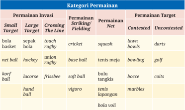

Tabel ini memperlihatkan kategori permainan invasi dalam olahraga, dengan berbagai jenis permainan yang termasuk dalam setiap kategori. Topik utama tabel adalah permainan invasi dalam olahraga, yang mencakup berbagai jenis permainan seperti bola basket, sepak bola, netball, korfball, lacrosse, frisbee, handball, dan banyak lagi. Tabel ini juga menunjukkan bahwa beberapa permainan memiliki target yang sama, seperti golf dan darts, sementara beberapa permainan memiliki target yang berbeda, seperti tenis meja dan bocce. Selain itu, tabel ini juga menunjukkan bahwa beberapa permainan memiliki target yang tidak diakui, seperti marbles dan coits. Dari data yang terlihat, dapat disimpulkan bahwa permainan invasi dalam olahraga sangat beragam dan memiliki banyak variasi.

 

---
## 📄 Halaman 77

Pentingnya konsep ini adalah menekankan bahwa kamu sebagai peserta didik merupakan pusat metode belajar taktik. Jadi, ketika guru atau pendidik atau guru mengajarkan permainan pada Pelajaran Jasmani, Olahraga, dan Kesehatan, mereka harus memikirkan cara agar kamu belajar secara efektif. Ketika pendidik membuat keputusan tentang cara mengajar, mereka memperhatikan  perilaku,  perasaan,  dan  cara  berpikirmu.  Coba  perhatikan siklus proses pembelajaran melalui pendekatan taktik berikut.

---
**🖼️ Gambar/Diagram**

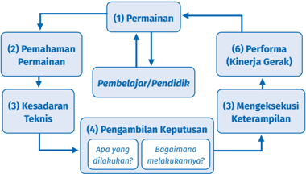

> **Deskripsi Visual:** Gambar ini adalah diagram yang menunjukkan proses belajar dan pengembangan keterampilan. Diagram ini terdiri dari enam elemen utama yang saling terkait:

1. Permainan (1) - Ini merupakan langkah awal dalam proses belajar.
2. Pemahaman Permainan (2) - Dalam permainan, pemahaman tentang permainan menjadi penting.
3. Kesadaran Teknis (3) - Ini melibatkan pemahaman teknis tentang permainan.
4. Pengambilan Keputusan (4) - Langkah ini mencakup penentuan apa yang dilakukan dan bagaimana melakukan hal tersebut.
5. Mengeksekusi Keterampilan (5) - Ini melibatkan pelaksanaan keterampilan yang telah dipelajari.
6. Performa (Kinerja Gerak) (6) - Langkah akhir yang menunjukkan hasil kinerja.

Elemen-elemen ini saling terkait dan bergerak dari permainan ke performa, menunjukkan proses belajar dan pengembangan keterampilan. Teks, angka, atau label penting yang terlihat adalah nomor urut setiap elemen dan teks yang menjelaskan fungsi masing-masing elemen.

Informasi kunci yang dapat diambil pembaca adalah bahwa proses belajar dan pengembangan keterampilan melibatkan permainan, pemahaman permainan, kesadaran teknis, pengambilan keputusan, dan akhirnya performa. Setiap langkah dalam proses ini sangat penting untuk mencapai hasil yang diinginkan.

Sumber: Bunker & Thorpe dalam Grif昀椀n & Patton (2005: 3)

Dalam jenis permainan target, prinsip-prinsip yang digunakan mencoba mengarahkan ke suatu sasaran, menempatkan objek dengan memperhatikan rintangan dan sasaran, serta memperhitungkan putaran atau belokan yang diperlukan  untuk  sukses  mencapai  target..  Ambil  contoh  pada  permainan boling, skor ditentukan oleh jumlah pin yang berhasil dijatuhkan setiap kali melempar bola. Selain keterampilan melempar bola dengan tepat, kamu juga harus  memperhitungkan  faktor-faktor  seperti  kecepatan,  sudut,  dan  rotasi bola agar lemparan menjadi lebih efektif. Dalam permainan boling, penting untuk  memiliki  keterampilan  teknis  dan  konsistensi  dalam  melempar  bola untuk mencapai skor tinggi.

 

---
## 📄 Halaman 78

---
**🖼️ Gambar/Diagram**

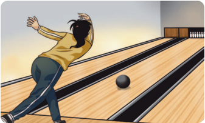

> **Deskripsi Visual:** Gambar ini adalah ilustrasi yang menunjukkan seorang pemain bermain tenis meja. Pemain tersebut sedang berdiri di sisi kanan meja, dengan posisi tubuh yang menunjukkan gerakan serangan. Meja tenis meja tampak jelas dengan pemain berada di sisi kanan dan lawannya di sisi kiri. Di tengah-tengah meja, bola tenis meja tampak bergerak dari sisi kanan ke sisi kiri. Ilustrasi ini menunjukkan situasi pertandingan yang seru dan dinamis, dengan pemain yang siap untuk melakukan serangan.

Prinsip-prinsip  bermain  dalam  permainan  target  ini  berhubungan  erat dengan empat konsep gerak yang telah diuraikan sebelumnya pada bab ini, yaitu kesadaran tubuh, kesadaran ruang, upaya, dan hubungan. Apakah kamu bisa menjelaskan bagaimana prinsip-prinsip bermain dalam permainan net dan wall terkait dengan konsep gerakan tersebut?

---
**🖼️ Gambar/Diagram**

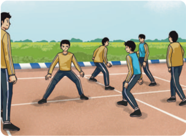

> **Deskripsi Visual:** Gambar ini adalah ilustrasi yang menunjukkan sebuah pertandingan sepak bola di lapangan olahraga. Gambar ini menggambarkan beberapa pemain sepak bola yang sedang bermain, dengan posisi mereka yang menunjukkan bahwa mereka sedang bergerak untuk mencoba mencetak gol. Di sebelah kiri, ada seorang penonton yang sedang memantau pertandingan. Latar belakang menunjukkan lapangan olahraga yang terlihat lapang dan terbuka, dengan pemandangan hijau di luar area lapangan. Gambar ini menunjukkan aktivitas fisik dan kompetisi dalam olahraga sepak bola.

 

---
## 📄 Halaman 79

Hubungan penting antara prinsip bermain dan konsep gerak juga terlihat dalam kategori permainan lainnya. Konsep kesadaran tubuh berkaitan dengan upaya mencetak poin atau mencegah lawan mencetak poin dalam permainan pukul-tangkap-lari ataupun dalam permainan invasi/serangan wilayah. Konsep gerak kesadaran ruang berhubungan dengan penempatan, ketepatan, dan serangan. Sementara itu, konsep upaya mengacu pada belokan, kekuatan, dan mempertahankan posisi. Konsep hubungan melibatkan keterkaitan antara semua strategi berbeda yang dijelaskan dalam prinsip-prinsip bermain.

- 3.

### PJOK & Sains

Menurut para ahli, proses kognitif dalam olahraga, seperti pengambilan keputusan  dan  strategi,  berlangsung  dengan  cepat  dan  dalam  batasan waktu yang ketat. Tekanan tinggi dihadapi pemain saat bermain karena keputusan harus diambil dengan cepat, sedangkan strategi yang harus dilakukan  sering  kali  memberikan  hasil  yang  tidak  dapat  diprediksi. Strategi  yang  diambil  mencakup  keputusan  tentang  cara,  waktu,  serta arah  pergerakan.  Semua  itu  dibuat  dalam  situasi  berubah-ubah  dan kadang tak terduga selama permainan berlangsung.

### Belajar Mendalam

- Pikirkan  jenis  aktivitas  昀椀sik  yang  pernah  kamu  lakukan  pada pelajaran Pendidikan Jasmani, Olahraga, dan Kesehatan.
- Kategori apa yang sesuai dengan aktivitasmu? Mengapa?
- Mengapa kamu memilih aktivitas tersebut dan bukan aktivitas yang lain?
- Perhatikan gambar berikut. Bagaimana konsep kesadaran tubuh, kesadaran ruang, upaya, dan hubungan berperan dalam aktivitas 昀椀sik  atau  olahraga  pada  gambar tersebut?

 

---
## 📄 Halaman 80

---
**🖼️ Gambar/Diagram**

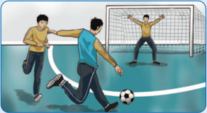

> **Deskripsi Visual:** Gambar ini adalah ilustrasi yang menunjukkan pertandingan sepak bola. Dalam gambar tersebut, ada dua pemain yang sedang berlari menuju bola yang sedang dipukul oleh salah satu pemain lainnya. Pemain yang memukul bola tampak sangat fokus dan berusaha untuk mencetak gol. Pemain yang berlari menuju bola tampak sangat cepat dan siap untuk mengambil bola jika bola jatuh. Pemain yang berada di depan gawang tampak sangat bersemangat dan siap untuk melakukan tendangan penalti. Gambar ini menunjukkan kecepatan, ketekunan, dan keberanian dalam bermain sepak bola.

- Lakukanlah aktivitas 昀椀sik atau olahraga permainan yang kamu sukai. Gambar-gambar berikut menunjukkan beberapa aktivitas 昀椀sik atau olahraga.

---
**🖼️ Gambar/Diagram**

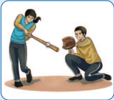

> **Deskripsi Visual:** Gambar ini adalah ilustrasi yang menunjukkan dua orang yang sedang bermain sepak bola. Pemain pertama, yang berada di posisi penyerang, sedang berusaha mencetak gol dengan memukul bola ke arah gawang. Pemain kedua, yang berada di posisi bek, sedang berusaha menghalangi penyerang tersebut dengan menggunakan tangan. Ilustrasi ini menunjukkan konflik antara dua pemain dalam permainan sepak bola, dimana salah satu pemain mencoba mencetak gol sementara yang lainnya berusaha untuk menghalangi.

---
**🖼️ Gambar/Diagram**

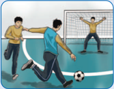

> **Deskripsi Visual:** Gambar ini adalah ilustrasi yang menunjukkan pertandingan sepak bola. Gambar ini menggambarkan dua pemain sepak bola sedang berlomba-lomba untuk mencuri bola dari pemain lawan mereka. Pemain yang berada di tengah memiliki bola dan tampaknya sedang mencoba memukulnya ke arah temannya. Pemain yang berada di sisi kanan tampaknya sedang berusaha untuk menghalangi pemain lawan tersebut. Pemain yang berada di sisi kiri tampaknya sedang berusaha untuk mencuri bola tersebut. Gambar ini menunjukkan permainan sepak bola yang intens dan kompetitif.

---
**🖼️ Gambar/Diagram**

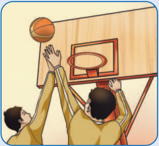

> **Deskripsi Visual:** Gambar ini adalah ilustrasi yang menunjukkan dua orang pemain bola basket sedang berusaha mencetak poin. Pemain di sebelah kiri tengah memegang bola basket dan sedang berusaha melempar bola ke dalam ring basket yang ditempatkan di atas pintu. Pemain di sebelah kanan tengah tampaknya sedang berusaha menghalangi atau mencegat pemain di sebelah kiri. Gambar ini menunjukkan aksi pertandingan bola basket yang seru dan kompetitif.

---
**🖼️ Gambar/Diagram**

> **Deskripsi Visual:** Gambar ini adalah ilustrasi yang menunjukkan sebuah pertandingan sepak bola di lapangan olahraga. Gambar ini menggambarkan beberapa pemain sepak bola sedang bermain, dengan posisi mereka yang berbeda-beda. Pemain-pemain tersebut dikenakan seragam warna kuning dan hitam, yang menunjukkan tim mereka. Lapangan olahraga tampak jernih dengan garis-garis yang jelas, menunjukkan bahwa ini adalah lapangan yang digunakan untuk pertandingan sepak bola. Di sekitar lapangan, terlihat beberapa penonton yang sedang menyaksikan pertandingan. Gambar ini menunjukkan aktivitas fisik dan kompetisi tim dalam sepak bola.

 

---
## 📄 Halaman 81

### Catatan

Jenis aktivitas jasmani/olahraga dapat diganti dengan menyesuaikan pada minat peserta didik atau kondisi sekolah.

- Bagaimana  kamu  menerapkan  taktik  atau  strategi  penting  untuk aktivitasmu! Jelaskan!
- Buatlah  analisis prinsip-prinsip bermain untuk aktivitasmu tersebut!
- Buatlah rancangan aktivitas atau permainan dan terapkan melalui praktik bersama  temanmu  tentang  penggunaan  empat  konsep  gerak  untuk meningkatkan keterampilan gerak!
- Buatlah analisis tentang dampak penerapan empat konsep gerak dengan aktivitas/permainan  yang  sudah  kamu  rancang  untuk  meningkatkan capaian keterampilan gerak!
Bersama temanmu, lakukan analisis dan penilaian terhadap suatu permainan atau olahraga menggunakan rubrik kriteria tertentu. Rubrik tersebut memuat konsep gerak yang dapat diamati pada setiap aktivitas 昀椀sik yang dilakukan.

Untuk mengetahui proses pemahamanmu terhadap setiap aktivitas yang dilakukan,  catatlah  di  buku  tugasmu,  hasil  penerapan  analisis  gerak  yang efektif  dan  e昀椀sien  dalam  permainan/aktivitas  昀椀sik.

Selamat! Kamu sudah menyelesaikan Bab 2 buku ini. Selanjutnya, coba periksa dari awal materi-materi yang sudah kamu pelajari pada bab ini

 

---
## 📄 Halaman 82

Salinlah tabel berikut di buku tugasmu, lalu beri tanda centang (√) sesuai dengan pengalamanmu!

 

---
## 📄 Halaman 83

### KEMENTERIAN PENDIDIKAN, KEBUDAYAAN, RISET, DAN TEKNOLOGI REPUBLIK INDONESIA, 2023

Buku Siswa Pendidikan Jasmani, Olahraga, dan Kesehatan (PJOK)

untuk SMA/MA/SMK/MAK Kelas X (Edisi Revisi)

Penulis   : Anggara Aditya Kurniawan, Teguh Karya

ISBN

: 978-634-00-0094-8

### Aktivitas Jasmani dan Olahraga

### Keterampilan Taktis

?

Bagaimana  kamu  dapat  memanfaatkan keterampilan  gerak  yang  kamu  kuasai atau mengatasi kelemahan yang kamu miliki dengan menggunakan keterampilan taktis?

 

---
## 📄 Halaman 84

Pada bab ini, kamu akan mengembangkan cara-cara menggunakan keterampilan  gerak  untuk  mencapai  keberhasilan  dalam  berbagai  situasi aktivitas  gerak/olahraga  yang  menantang.  Kamu  juga  akan  mengadaptasi strategi gerak yang telah kamu kuasai dan menyempurnakan kemampuanmu mengambil keputusan dalam berbagai situasi taktis.

- keterampilan taktis
- situasi gerak
- pengambilan keputusan
- gerak menantang
- strategi gerak

---
**🖼️ Gambar/Diagram**

> **Deskripsi Visual:** Gambar ini adalah diagram yang menunjukkan peta materi atau peta konsep tentang keterampilan taktis dalam konteks belajar. Diagram ini terdiri dari empat blok utama yang saling terhubung melalui arah bergerigi:

1. **Pertama**: "Memahami Keterampilan Taktis" - Ini merupakan langkah awal dalam proses belajar.
2. **Kedua**: "Mengembangkan Kesadaran Taktis" - Langkah ini mengarah pada pemahaman lebih mendalam tentang taktik.
3. **Ketiga**: "Memilih Taktis yang Sesuai" - Langkah ini meminta pemilihan taktik yang tepat sesuai dengan situasi.
4. **Keempat**: "Memilih Tingkat Kesulitan" - Langkah ini mengarah pada pemilihan tingkat kesulitan tugas yang sesuai.

Setiap langkah memiliki hubungan dengan langkah-langkah sebelumnya dan setelahnya, menunjukkan proses yang berkelanjutan dalam pembelajaran keterampilan taktis. Label "Keterampilan Taktis" berada di tengah diagram, menunjukkan bahwa semua langkah ini berkaitan langsung dengan keterampilan taktis tersebut.

Informasi kunci yang dapat diambil pembaca adalah bahwa proses belajar keterampilan taktis melibatkan pemahaman dasar, pengembangan kesadaran, pemilihan taktik yang tepat, dan pemilihan tingkat kesulitan tugas. Setiap langkah ini penting untuk mencapai tujuan akhir yaitu keterampilan taktis yang baik.

 

---
## 📄 Halaman 85

Sebelumnya, kamu sudah belajar tentang cara dan upaya menyempurnakan keterampilan gerak, mendalami konsep gerak, dan sebagainya. Pada bab ini, kamu akan mempelajari cara menggunakan keterampilan gerak yang sudah kamu  kuasai  dan  strategi  yang  perlu  digunakan  untuk  mengembangkan keterampilan taktis. Contohnya, ketika kamu sudah menguasai keterampilan taktis dalam permainan sepak bola berupa mencari posisi yang kosong untuk mendapatkan  operan  dari  teman,  kamu  dapat  mengetahui  kapan  harus mendekat ke teman yang membawa bola serta kapan saatnya menjauh dan mencari tempat yang kosong untuk membangun serangan. Dapatkah kamu memberikan contoh yang lain?

Sebelum belajar lebih jauh, kamu dapat mencari informasi dari berbagai sumber  tentang  cara-cara  menggunakan  keterampilan  gerak  yang  dimiliki untuk  mengembangkan  keterampilan  taktis  dalam  permainan.  Tuliskan informasi yang kamu temukan di buku tugasmu.

### A. Memahami Keterampilan Taktis

### Kejutan Piala Asia 2024

Pada  pertandingan  sepak  bola  Piala  Asia  2024,  Tim  Nasional  Yordania mampu mengalahkan Tim  Nasional  Korea  Selatan  pada  babak  semi昀椀nal, padahal  Yordania  memiliki ranking FIFA  yang  jauh  di  bawah  Korea Selatan. Apakah kamu pernah melihat contoh yang sama di pertandingan atau perlombaan yang lain?

### Penyerang Unik Bernama Filippo Inzaghi

Pada  periode  tahun  2003-2011  AC  Milan  memiliki  penyerang  dengan kemampuan  yang  biasa-biasa  saja,  tetapi  begitu  mematikan  di  depan gawang.  Salah  satu  keunggulan  yang  ia  miliki  adalah  keterampilan taktis yang sangat baik, yaitu mencari ruang kosong untuk mendapatkan peluang mencetak gol.

 

---
## 📄 Halaman 86

---
**🖼️ Gambar/Diagram**

> **Deskripsi Visual:** Gambar ini adalah ilustrasi yang menunjukkan pertandingan sepak bola. Dalam gambar tersebut, kita melihat beberapa pemain sepak bola bermain di lapangan hijau dengan latar belakang yang berwarna oranye. Pemain-pemain tersebut sedang bergerak dan berinteraksi dengan bola yang berada di tengah lapangan. Di sebelah kanan, ada seorang penonton yang sedang memantau pertandingan. Penonton tersebut mengenakan pakaian olahraga dan tampak tertarik pada permainan. Selain itu, ada juga tanda-tanda yang menunjukkan posisi dan arah pergerakan pemain, serta bola yang menjadi fokus utama dalam pertandingan tersebut. Gambar ini memberikan gambaran tentang aktivitas dan strategi yang digunakan dalam pertandingan sepak bola.

Dalam kasus lain bisa saja terjadi sebaliknya. Misalnya, seorang pemain dalam tim memiliki  kemampuan mengontrol bola, berlari cepat, dan melakukan tendangan yang akurat, tetapi tingkat keberhasilannya dalam mencetak gol tetap rendah. Dalam analisis taktis, mungkin  saja  tim/pemain  tersebut  kurang  memiliki strategi penyerangan yang efektif atau kesulitan dalam membaca pergerakan lawan di lapangan.

### Keterampilan Taktis:

kemampuan membaca permainan, mengidenti昀椀kasi masalah, dan memilih taktik yang sesuai.

Dalam hal ini, transfer keterampilan taktis menjadi kunci untuk meningkatkan kinerja tim/pemain. Keterampilan taktis ini mencakup kemampuan membaca permainan, mengidenti昀椀kasi masalah, memilih yang  sesuai,  dan  menjalankan  taktik  tersebut  dengan  keterampilan  teknis yang dimiliki.

Secara prinsip, keterampilan taktis sangat erat kaitannya dengan keterampilan  dalam  mengambil  keputusan  saat  melakukan  aktivitas  atau olahraga. Seorang pesilat akan tahu kapan dia harus menyerang dan bertahan, pemain  bulu  tangkis  dapat  memutuskan  kapan  harus  memukul  keras, dropshot , atau dengan pukulan yang lain.

taktik

 

---
## 📄 Halaman 87

### Belajar Mendalam

Kamu akan mempelajari penerapan keterampilan taktis melalui aktivitas berikut ini.

Tugas : memainkan  bola  dengan  jumlah  pemain  2  lawan  2.  Pemain dibagi menjadi tim penyerang dan tim bertahan.

### Aturan Permainan

- Tim  penyerang  dan  tim  bertahan  saling  berhadapan.  Setiap  tim terdiri atas 2 pemain.
- Tujuan permainan adalah melakukan lempar-tangkap bola sebanyak mungkin selama 2 menit.
- Para  pemain  melakukan  lempar-tangkap  bola  untuk  mencapai tujuan. Pemain yang memegang bola tidak boleh berlari.
- Pemain bertahan hanya boleh menghalangi bola, tidak boleh merebut bola.
- Setelah 2 menit kedua tim berganti posisi.

### Durasi Permainan

Satu sesi permainan dilakukan selama 10-14 menit atau sesuai kesepakatan.

### Instruksi Guru

Guru menjelaskan peraturan permainan.

---
**🖼️ Gambar/Diagram**

> **Deskripsi Visual:** Gambar ini adalah ilustrasi yang menunjukkan sebuah pertandingan bola voli antara dua tim. Gambar ini menggambarkan seorang pemain voli putih yang sedang melempar bola ke arah pemain lawan. Di sebelah kiri, ada beberapa pemain putih yang berada dalam posisi siap bertahan, sementara di sebelah kanan ada beberapa pemain biru yang tampak sedang bergerak untuk mengejar bola. Pemain putih yang melempar bola tampak sangat aktif dan bersemangat, sedangkan pemain biru tampak lebih tenang dan siap untuk bertahan. Ilustrasi ini menunjukkan kecepatan dan keberanian dalam permainan bola voli, serta kompetisi antar pemain dari kedua tim.

 

---
## 📄 Halaman 88

### Catatan

Jenis  aktivitas  atau  olahraga  dapat  diganti  dengan  aktivitas  lain sesuai kondisi sekolah. Poin pentingnya adalah harus ada aktivitas untuk membaca situasi atau permainan dan mengambil keputusan.

### Pertanyaan

Setelah melakukan permainan tersebut, jawablah pertanyaan berikut ini.

- Bagaimana  kamu  memahami  ruang  untuk  menerima  bola  atau membaca posisi lawan agar bisa mengumpan ke teman yang kosong?
- Hal  apa  saja  yang  kadang  membuatmu  berhasil  dan  gagal  dalam aktivitas permainan?
Dalam  permainan  sepak  bola,  jumlah  pemain  yang  tidak  membawa bola lebih banyak dibandingkan pemain yang membawa bola. Dengan demikian,  keterampilan  taktis  dalam  mencari  ruang  dan  melakukan penjagaan  menjadi  hal  yang  tidak  kalah  penting  jika  dibandingkan keterampilan  teknis  pada  saat  menguasai  bola,  seperti  menggiring, mengoper, menendang, dan lain-lain.

### 1. Permainan Sejenis dengan Pendekatan Taktis yang Sama

Pernahkah  kamu  mengamati  beberapa  jenis  permainan  olahraga  yang meskipun  teknik  yang  digunakan  berbeda,  tetapi  cara  bermainnya  relatif sama?  Sebaliknya,  beberapa  permainan  memiliki  tujuan  serupa  dan  taktik yang mirip, tetapi menuntut keterampilan teknis yang berbeda.

 

---
## 📄 Halaman 89

Jika  diperhatikan,  permainan  sepak  bola  dan  bola  basket  memiliki kemiripan  dalam  cara  bermain.  Kedua  permainan  ini  bertujuan  mencetak skor. Kedua permainan ini sama-sama menyerang daerah pertahanan lawan dengan mengadopsi keterampilan taktis atau strategi berupa memanfaatkan lebar  lapangan  untuk  merenggangkan  pertahanan  lawan,  menciptakan ruang  di  tengah  lapangan,  dan  memanfaatkannya  untuk  mencetak  skor. Dalam situasi bertahan untuk mencegah lawan mencetak skor juga memiliki kemiripan dalam mempertahankan ruang dan mencegah lawan mendekati wilayah pertahanan, baik mempertahankan ruang dengan 1 lawan 1 maupun dengan pertahanan wilayah.

Meskipun kedua permainan tersebut memiliki kemiripan, bahkan relatif sama dalam pendekatan taktisnya, tetapi secara teknis penggunaan keterampilan geraknya berbeda, yaitu bahwa bermain sepak bola dilakukan dengan  cara  menendang  bola,  sedangkan  bola  basket  dimainkan  dengan menggunakan tangan.

---
**🖼️ Gambar/Diagram**

> **Deskripsi Visual:** Gambar ini adalah ilustrasi yang menunjukkan pertandingan bola basket. Gambar ini menggambarkan sepuluh pemain yang bermain di lapangan basket dengan latar belakang yang menunjukkan papan bola basket dan pagar lapangan basket. Pemain-pemain tersebut terdiri dari lima pemain tim tuan rumah dan lima pemain tim tamu. Mereka sedang berada dalam posisi yang berbeda, menunjukkan bahwa mereka sedang bermain atau akan melakukan tindakan selanjutnya dalam pertandingan. Ilustrasi ini menunjukkan hubungan antara pemain-pemain, posisi mereka di lapangan, dan permainan yang sedang berlangsung.

---
**🖼️ Gambar/Diagram**

> **Deskripsi Visual:** Gambar ini adalah ilustrasi yang menunjukkan pertandingan sepak bola. Dalam gambar tersebut, ada beberapa pemain sepak bola yang sedang bermain di lapangan. Pemain-pemain tersebut terdiri dari dua tim dengan warna seragam yang berbeda. Tim satu menggunakan seragam biru dan tim lain menggunakan seragam kuning. Pemain-pemain tersebut sedang bergerak dan berusaha untuk mencetak gol.

Elemen-elemen utama dalam gambar ini adalah pemain sepak bola, lapangan sepak bola, dan bola sepak. Pemain-pemain tersebut merupakan subjek utama dan mereka terlibat dalam pertandingan sepak bola. Lapangan sepak bola adalah tempat pertandingan dan merupakan latar belakang utama. Bola sepak adalah objek yang digunakan dalam pertandingan dan merupakan elemen penting dalam pertandingan tersebut.

Teks, angka, atau label penting tidak terlihat dalam gambar ini karena gambar hanya menggambarkan adegan sepak bola tanpa teks atau angka tambahan. Namun, informasi kunci yang dapat diambil dari gambar ini adalah bahwa ada pertandingan sepak bola sedang berlangsung antara dua tim dengan pemain yang bergerak dan berusaha mencetak gol.

 

---
## 📄 Halaman 90

Selain kedua permainan tersebut, adakah permainan lain yang sejenis? Tentu saja ada. Jenis-jenis permainan dalam olahraga dikategorikan sebagai berikut.

### a.  Permainan Invasi ( Invasion Game )

---
**🖼️ Gambar/Diagram**

> **Deskripsi Visual:** Gambar ini adalah ilustrasi yang menunjukkan tiga orang bermain sepak bola. Pemain pertama sedang mencoba memukul bola dengan tangannya, sementara pemain kedua dan ketiga berusaha menghalangi bola tersebut. Pemain kedua tampak sedang berjalan ke arah bola, sedangkan pemain ketiga tampak sedang berdiri di belakang pemain kedua, mungkin untuk membantu atau menghalangi pemain pertama. Ilustrasi ini menunjukkan interaksi antara pemain dalam sebuah pertandingan sepak bola, menekankan peran dan gerakan mereka dalam mencoba memainkan bola.

Tujuan: menyerang daerah lawan untuk mencetak skor dengan memasukkan bola ke gawang, ring, atau melewati garis, juga mempertahankan daerah sendiri dari serangan lawan.

### Keterampilan Taktis:

- -Penyerangan: mencari posisi untuk menerima bola dan mencari peluang mencetak angka.
- -Pertahanan: menjaga dan menekan lawan yang mendekati pertahanan dan berusaha merebut bola.
- -Contoh: sepak bola, bola basket, hoki, bola tangan, korfball , rugbi, sepak bola Amerika, dan lain-lain.

### b.  Permainan Net dan Dinding ( Net and Wall Game )

---
**🖼️ Gambar/Diagram**

> **Deskripsi Visual:** Gambar 3.5 menunjukkan permainan net, yang merupakan salah satu jenis ilustrasi dalam buku pelajaran. Gambar ini menggambarkan dua orang pemain yang sedang bermain voli di lapangan net. Pemain di sebelah kiri tengah berusaha melempar bola ke arah pemain di sebelah kanan tengah. Net berada di tengah-tengah gambar, memisahkan kedua pemain tersebut. Pemain di sebelah kiri tengah tampak sedang bergerak naik untuk mencoba menangkap bola, sementara pemain di sebelah kanan tengah tampak berada di posisi menendang bola. Teks pada gambar tidak ada, namun elemen-elemen seperti pemain, bola, dan net sangat jelas dan membantu dalam memahami konteks permainan tersebut. Informasi kunci yang dapat diambil dari gambar ini adalah bahwa permainan net melibatkan dua pemain yang saling berlawanan, dengan net sebagai penghubung antara mereka.

Tujuan: menyeberangkan benda ke lapangan lawan melewati atas net sedemikian rupa sehingga lawan tidak bisa mengembalikannya.

### Keterampilan Taktis:

- -Penyerangan: bergerak untuk memukul benda ke ruang lawan yang paling kosong.
- -Pertahanan: melindungi ruang pertahanan sendiri dari pukulan maupun servis lawan.

 

---
## 📄 Halaman 91

- -Contoh: bola voli, tenis lapangan, tenis meja, bulu tangkis, sepak takraw, skuas, tekbal, dan lain-lain.

### c.  Permainan Lapangan ( Striking and Fielding Games )

---
**🖼️ Gambar/Diagram**

> **Deskripsi Visual:** Gambar ini adalah ilustrasi yang menunjukkan sebuah pertandingan sepak bola. Gambar ini menggambarkan empat pemain sepak bola yang sedang bermain di lapangan sepak bola. Setiap pemain memiliki posisi dan gerakan yang jelas, menunjukkan bahwa mereka sedang berusaha untuk mencetak gol atau mempertahankan pertahanan. Lapangan sepak bola tampak jelas dengan garis-garis yang menunjukkan area permainan. Ilustrasi ini menggunakan warna-warna yang cerah untuk menonjolkan pemain dan lapangan, serta menggunakan pencahayaan yang realistis untuk membuat gambar terlihat lebih hidup. Teks, angka, atau label penting tidak ada pada gambar ini karena ia hanya menggambarkan situasi tanpa informasi tambahan. Informasi kunci yang dapat diambil pembaca adalah bahwa ini adalah pertandingan sepak bola dan semua pemain sedang berusaha untuk mencapai tujuan mereka.

Tujuan: berlari melewati seluruh pos dan kembali ke home setelah pukulan.

### Keterampilan Taktis:

- -Penyerangan: memukul bola ke arah yang sulit dijangkau penjaga (lawan) untuk memberi kesempatan pemain satu tim yang berada di pos untuk berlari menuju home .
- -Pertahanan: mencari posisi untuk mendapatkan bola dan mencegah lawan kembali ke home .merebut bola.
- -Contoh: sofbol, bisbol, kriket, rounders , kasti, dan lain-lain.

### d.  Permainan Target ( Target Game )

---
**🖼️ Gambar/Diagram**

> **Deskripsi Visual:** Gambar ini adalah ilustrasi yang menunjukkan dua orang siswa sedang belajar menggambar. Gambar ini tidak hanya menampilkan dua siswa, tetapi juga menunjukkan alat-alat yang digunakan untuk menggambar, seperti pensil, papan tulis, dan kertas. Siswa di sebelah kiri sedang menggunakan pensil untuk menggambar, sementara siswa di sebelah kanan sedang menggunakan pensil untuk menulis. Papan tulis berada di antara kedua siswa, menunjukkan bahwa mereka sedang bekerja sama dalam proses belajar. Informasi kunci yang dapat diambil dari gambar ini adalah bahwa siswa sedang belajar menggambar dan menggunakan berbagai alat untuk mendukung proses belajar tersebut.

Tujuan: mendorong atau menggerakkan benda ke target/sasaran yang dipukul/ dilakukan dengan cara sesedikit mungkin.

### Keterampilan Taktis:

Pemain menempatkan bola sedekat mungkin pada sasaran untuk mendapatkan keuntungan diri sendiri atau merugikan lawan.

### Contoh:

woodball, frisbee (cakram terbang), boling, golf, biliar, dan lain-lain.

 

---
## 📄 Halaman 92

### 2. Contoh Penerapan Keterampilan Taktis dalam Permainan Net

Pada pembahasan sebelumnya, kamu telah mempelajari jenis-jenis permainan, termasuk  tujuannya.  Permainan  apa  yang  sering  kamu  mainkan  bersama teman-temanmu?  Apakah  kamu  sudah  menerapkan  keterampilan  taktis saat  bermain?  Pada  pembahasan  kali  ini,  kamu  akan  mempelajari  contoh penerapan  keterampilan  taktis  dalam  permainan  net.  Kalian  juga  dapat mengembangkannya pada jenis permainan yang lain.

Seperti  sudah  kalian  ketahui,  permainan  net  memiliki  tujuan  berupa menyeberangkan benda/bola ke lapangan lawan melewati atas net sedemikian rupa  sehingga  lawan  tidak  bisa  mengembalikannya.  Untuk  memahami keterampilan taktis yang diterapkan pada permainan net, lakukan aktivitas berikut ini.

### Belajar Mendalam

Kamu akan mempelajari proses penerapan keterampilan taktis menyerang pada permainan net melalui aktivitas berikut ini.

### Tugas :

- Di internet, carilah video pertandingan bola voli yang memperlihatkan gerakan pemain mencetak skor.
- Perhatikan video yang kamu peroleh, lalu isilah tabel hasil pengamatan berikut.
- Selanjutnya,  tutup  videomu,  lalu  mainkan  permainan  bola  voli  6 lawan 6 bersama teman kelasmu.
- Lakukan  permainan  secara  bergantian.  Ketika  temanmu  bermain bola voli, amatilah gerakan mereka. Sebaliknya, ketika kamu bermain bola voli, temanmu akan mengamati gerakanmu. Kalian juga dapat merekam permainan dalam bentuk video.
- Amati  dan  bandingkan  perbedaan  penerapan  keterampilan  taktis menyerang dalam permainan di video dan dalam permainan yang dimainkan  oleh  teman-temanmu.  Berikan  tanda  centang  (√)  pada kolom yang sesuai berdasarkan hasil pengamatan kalian.

 

---
## 📄 Halaman 93

---
**📊 Tabel**

Tabel ini memperlihatkan permainan net yang berkaitan dengan keterampilan taktilis menyerang dalam sepak bola voli. Topik utamanya adalah teknik dan strategi yang diperlukan untuk bermain net secara efektif. Kolom "Tim Bola Voli dalam Video" dan "Tim Bola Voli di Kelasmu" masing-masing menunjukkan bagaimana pemain harus melakukan permainan net dalam konteks video sepak bola voli dan dalam situasi sehari-hari di kelas mereka. Data penting yang terlihat meliputi teknik seperti passing, smash, mengatur posisi, dukungan pemain lain saat menyerang, penggunaan transisi, komunikasi antara setter dan spiker, serta kreativitas individu dalam mengelabui pertahanan lawan.

### Durasi Permainan

Satu sesi permainan berakhir setelah salah satu tim mencapai skor 25.

### Instruksi Guru

Guru menjelaskan peraturan permainan.

 

---
## 📄 Halaman 94

---
**🖼️ Gambar/Diagram**

> **Deskripsi Visual:** Gambar ini adalah ilustrasi yang menunjukkan pertandingan voli. Gambar ini menggambarkan dua tim bermain voli di lapangan dengan net yang memisahkan mereka. Di sisi kiri, pemain satu tim sedang mencoba mengeksekusi serangan dengan melompat ke udara dan menendang bola. Di sisi kanan, pemain lain tampaknya sedang berusaha untuk mencegah serangan tersebut dengan menangkap bola di dekat net. Net yang berwarna putih dengan garis merah memisahkan dua area permainan. Pemain-pemain tampaknya sedang berada di posisi yang berbeda, menunjukkan bahwa pertandingan sedang berlangsung aktif. Ini menunjukkan bahwa gambar ini adalah ilustrasi yang digunakan untuk menjelaskan konsep atau teknik dalam olahraga voli.

### Pertanyaan

Setelah menonton video dan melakukan permainan bola voli, jawablah pertanyaan berikut ini.

- Bagaimana  kamu  melihat  perbedaan  antara  keterampilan  taktis menyerang  dalam  permainan  bola  voli  pada  video  dan  dalam permainan yang dimainkan oleh teman kelasmu?
- Dari video dan permainan tersebut, apa yang dapat kamu pelajari dan kembangkan?

### Belajar Mendalam

Kamu akan mempelajari proses penerapan keterampilan taktis bertahan melalui aktivitas berikut ini.

### Tugas

- Di internet, carilah video pertandingan bola voli yang memperlihatkan pemain mencegah lawan mencetak poin.
- Perhatikan video yang kamu peroleh, lalu isilah tabel hasil pengamatan berikut.

 

---
## 📄 Halaman 95

- Selanjutnya,  tutup  videomu,  lalu  mainkan  permainan  bola  voli  6 lawan 6 bersama teman kelasmu.
- Lakukan  permainan  secara  bergantian.  Ketika  temanmu  bermain voli, amatilah gerakan mereka. Sebaliknya, ketika kamu bermain voli, temanmu akan mengamati gerakanmu. Kalian juga dapat merekam permainan dalam bentuk video.
- Amati  dan  bandingkan  perbedaan  penerapan  keterampilan  taktis bertahan  dalam  permainan  di  video  dan  dalam  permainan  yang dimainkan  oleh  teman-temanmu.  Berikan  tanda  centang  (√)  pada kolom berikut berdasarkan hasil pengamatan kalian.

---
**📊 Tabel**

Tabel ini berisi informasi tentang permainan net dan keterampilan taktis bertahan yang diperlukan untuk tim bola voli di sekolah. Topik utama tabel adalah keterampilan bertahan dalam permainan net, yang meliputi menjaga jarak di lapangan sendiri, bertahan terhadap serangan lawan, bertahan sebagai tim, dan kreativitas individu. Kolom "Tim Bola Voli dalam Video" menunjukkan contoh keterampilan bertahan yang dilakukan oleh tim bola voli dalam video, sementara kolom "Tim Bola Voli di Kelasmu" menunjukkan keterampilan bertahan yang harus dimiliki oleh tim bola voli di kelas masing-masing siswa. Data penting yang terlihat adalah bahwa keterampilan bertahan yang diperlukan sangat variatif dan melibatkan berbagai aspek seperti menjaga jarak, bertahan terhadap serangan, bertahan sebagai tim, dan kreativitas individu.

 

---
## 📄 Halaman 96

### Durasi Permainan

Satu sesi permainan berakhir setelah salah satu tim mencapai skor 25.

### Instruksi Guru

Guru menjelaskan peraturan permainan.

---
**🖼️ Gambar/Diagram**

> **Deskripsi Visual:** Gambar ini adalah ilustrasi yang menunjukkan pertandingan voli. Gambar ini menggambarkan dua tim bermain voli di lapangan dengan net yang memisahkan mereka. Di sisi kanan, ada dua pemain yang sedang berusaha mencetak bola ke gawang lawan. Pemain di depannya sedang berdiri dengan tangan di atas kepala, menunjukkan sikap siap untuk bertahan. Di sisi kiri, ada dua pemain lain yang sedang berdiri dengan tangan di atas kepala, tampaknya menantikan bola. Net yang berwarna biru memisahkan dua tim tersebut. Gambar ini menunjukkan aktivitas dan strategi dalam permainan voli, serta posisi pemain saat pertandingan sedang berlangsung.

### Pertanyaan

Setelah menonton video dan melakukan permainan bola voli, jawablah pertanyaan berikut ini.

- Bagaimana  kamu  melihat  perbedaan  antara  keterampilan  taktis bertahan dalam permainan bola voli pada video dan dalam permainan yang kalian lakukan?
- Keterampilan  taktis  bertahan  apa  yang  dilakukan  dalam  video tersebut?
- Keterampilan taktis bertahan apa yang kalian mainkan?
- Dari video dan permainan tersebut, apa yang dapat kamu pelajari dan kembangkan?

 

---
## 📄 Halaman 97

### B. Mengembangkan Kesadaran Taktis

Menurut  pendapatmu,  mengapa  memahami  kompleksitas  permainan  itu penting? Bagaimana hal itu dapat membantumu melakukan aktivitas gerak dengan lebih baik ketika bermain? Dengan mempelajari materi ini, kamu akan mendapatkan informasi tentang cara membaca permainan. Dalam membaca permainan dibutuhkan latihan secara terus-menerus dan kemampuan berpikir tingkat tinggi meskipun peraturan dan strukturnya sudah disederhanakan.

Meningkatkan keterampilan taktis pemain atau peserta didik membutuhkan  waktu  cukup  lama.  Hal  itu  karena  pembelajaran  tentang keterampilan  taktis  diperoleh  dari  kesalahan-kesalahan  yang  dibuat  ketika bermain  dalam  permainan  sebenarnya.  Oleh karena itu, pelatih atau guru  berusaha  semaksimal  mungkin  mempercepat  proses  pembelajaran keterampilan taktis melalui berbagai macam pendekatan.

Pendekatan-pendekatan yang digunakan akan membuatmu lebih menguasai  keterampilan  taktis.  Kamu  akan  diminta  untuk  memecahkan masalah taktis dalam permainan  yang dimodi昀椀kasi. Seru, kan? Jadi, meningkatkan  keterampilan  taktis  yang  kamu  miliki,  kamu  akan  belajar langsung dari masalah-masalah dalam permainan.

Selanjutnya, coba lakukan aktivitas permainan berikut ini.

### Belajar Mendalam

Tugas: melakukan permainan sepak bola atau futsal.

Masalah  keterampilan  taktis: para  penyerang  melakukan  tekanan (pressing) di sekitar lawan.

### Aturan Permainan yang Dimodi昀椀kasi ( Constrains )

- Peserta didik dibagi menjadi dua kelompok, yaitu
- -kelompok yang melakukan permainan dan
- -kelompok pengamat (observer) yang melakukan observasi/ pengamatan.
Observasi  atau  pengamatan  dilakukan  dengan  memberikan  tanda centang  (√)  pada  Tabel  Hasil  Pengamatan  Penggunaan Keterampilan untuk

 

---
## 📄 Halaman 98

Taktis dan Pemecahan Masalah Taktikal. Kedua kelompok berganti posisi setelah satu sesi permainan.

- Kelompok yang bermain dibagi menjadi dua tim, yaitu tim penyerang dan tim bertahan.
- Pemain yang menguasai bola boleh menyentuh bola maksimal dua kali.
- Setelah sentuhan pertama, pemain memiliki waktu 2-3 detik sebelum melakukan  sentuhan  kedua.  Selama  waktu  tersebut,  pemain  tidak boleh diganggu atau direbut, pemain bertahan berjarak 2 meter.
- Setelah  sentuhan  kedua,  pemain  bertahan  berusaha  merebut  atau menghalangi bola.
- Jumlah sentuhan dapat dimodi昀椀kasi sesuai dengan kondisi peserta didik.

### Durasi Permainan

Satu sesi permainan dilakukan 10-15 menit atau sesuai kesepakatan.

### Instruksi Guru

Guru memberikan kebebasan kepada para pemain untuk aktif memecahkan masalah dan menemukan solusinya. Peraturan ditegakkan oleh  wasit  dan  permainan  bersifat  kompetitif,  termasuk  dalam  hal penghitungan skor ketika bola gol.

---
**🖼️ Gambar/Diagram**

> **Deskripsi Visual:** Gambar ini adalah ilustrasi yang menunjukkan pertandingan sepak bola. Dalam gambar tersebut, ada empat pemain sepak bola yang sedang bermain di lapangan. Pemain yang berada di tengah lapangan sedang menggelar bola dan tampaknya sedang mencoba untuk melemparnya ke gawang lawan. Pemain lainnya tampaknya sedang berusaha untuk menghentikan bola dengan cara yang berbeda. Di sebelah kanan, pemain lawan tampaknya sedang berusaha untuk mencoba mengejar bola. Seluruh gambar menunjukkan suasana pertandingan yang seru dan kompetitif.

 

---
## 📄 Halaman 99

---
**📊 Tabel**

Tabel ini berisi informasi tentang keterampilan taktis dalam sepak bola, dibagi menjadi dua kategori: "Lebih Banyak Berhasil" dan "Lebih Banyak Gagal". Topik utama tabel adalah keterampilan taktis yang diperlukan untuk bermain sepak bola dengan efektif. Kolom-kolomnya mencakup berbagai aspek keterampilan, seperti melepaskan diri dari tekanan lawan, dukungan pemain lain, penggunaan lebar lapangan, pergerakan tanpa bola, dan kreativitas. Data penting yang terlihat menunjukkan bahwa beberapa keterampilan, seperti dukungan pemain lain dan penggunaan lebar lapangan, lebih sering berhasil dibandingkan dengan keterampilan lainnya. Ini menunjukkan bahwa pemain yang mampu melakukan dukungan pemain lain dan menggunakan lebar lapangan lebih sukses dalam pertandingan.

### Pertanyaan

Keterampilan taktis apa yang kamu gunakan ketika menguasai bola dan mendapatkan  tekanan  dari  lawan,  sementara  kamu  hanya  memiliki kesempatan dua kali menyentuh bola?

 

---
## 📄 Halaman 100

Kesadaran  taktis  meningkatkan  kemampuan  membaca  permainan  dan berkinerja lebih baik saat bermain. Pendekatan taktis memberikan kerangka kerja  yang  memungkinkan  kamu  belajar  tentang  cara  melihat/membaca permainan sebagai dasar mengambil tindakan yang tepat.

Berikut  ini  contoh  langkah-langkah  pengambilan  keputusan  dengan mengembangkan kesadaran teknis pada permainan bola voli.

- Ketika permainan dimulai, kamu harus membaca situasi untuk memutuskan di posisi mana kamu harus berada di dalam lapangan.
- Saat kamu  mulai  mengenali  tanda-tanda pergerakan,  kamu  harus merespons dengan  melakukan  gerakan  yang  sesuai  untuk  berpindah ke  tempat  yang  pas  dan  menggunakan  keterampilan  yang  tepat  untuk situasinya.  Misalnya,  ketika  bola  servis  datang  dengan  keras,  kamu dapat segera berpindah ke arah perkiraan jatuhnya bola dengan gerakan footwork yang efektif.
- Dalam permainan bola voli, ketika bola masuk ke dalam lapangan, kamu harus segera melakukan reaksi terhadap  kekuatan,  putaran,  dan  arah bola  dengan  menyesuaikan  dirimu  untuk  menggunakan  keterampilan yang tepat.
- Setelah  melakukan  keterampilan  tersebut,  kamu  harus  segera  kembali ( recovery )  dengan  melakukan gerakan tanpa bola yang sesuai sehingga dapat bersiap-siap untuk segera membaca situasi lagi.

---
**🖼️ Gambar/Diagram**

> **Deskripsi Visual:** Gambar ini adalah diagram yang menunjukkan proses pemilihan gerakan untuk eksekusi dalam sepak bola. Diagram ini melibatkan empat tahap utama: Membaca, Kesadaran Taktis, Reaksi, dan Recovery. Setiap tahap memiliki peran yang berbeda dalam proses tersebut.

1. **Apa yang ditampilkan secara keseluruhan**: Gambar ini menunjukkan sebuah siklus yang melibatkan empat tahap utama dalam pemilihan gerakan untuk eksekusi sepak bola. Setiap tahap memiliki peran yang berbeda dalam proses tersebut.

2. **Elemen-elemen utama dan relasinya**: 
   - **Membaca** adalah tahap pertama, dimana pemain memeriksa situasi lapangan dan lawan.
   - **Kesadaran Taktis** adalah tahap kedua, dimana pemain mempertimbangkan strategi dan taktik yang akan digunakan.
   - **Reaksi** adalah tahap ketiga, dimana pemain membuat keputusan dan melakukan gerakan sesuai dengan strategi yang telah dipilih.
   - **Recovery** adalah tahap keempat, dimana pemain memperbaiki keadaan jika ada kesalahan atau masalah dalam eksekusi.

3. **Teks, angka, atau label penting yang terlihat**: 
   - Ada teks yang menjelaskan setiap tahap, seperti "Membaca", "Kesadaran Taktis", "Reaksi", dan "Recovery".
   - Ada angka yang mengindikasikan urutan tahap, seperti 1, 2, 3, dan 4.

4. **Informasi kunci yang dapat diambil pembaca**: 
   - Proses pemilihan gerakan untuk eksekusi sepak bola melibatkan empat tahap utama: Membaca, Kesadaran Taktis, Reaksi, dan Recovery.
   - Setiap tahap memiliki peran yang berbeda dalam proses tersebut, mulai dari memeriksa situasi lapangan hingga memperbaiki keadaan jika ada kesalahan.
   - Diagram ini membantu pemain memahami langkah-langkah yang harus diikuti dalam proses pemilihan gerakan untuk eksekusi.

 

---
## 📄 Halaman 101

### Belajar Mendalam

Tugas: melakukan  permainan  lempar-tangkap  bola  voli  menyeberangi net dengan pemain 3 lawan 3.

Permasalahan  taktik: menggunakan  keterampilan  gerak  yang  tepat untuk merespons datangnya bola.

---
**🖼️ Gambar/Diagram**

> **Deskripsi Visual:** Gambar ini adalah ilustrasi yang menunjukkan pertandingan voli di lapangan olahraga. Gambar ini menggambarkan beberapa pemain voli yang sedang bermain. Di tengah lapangan, seorang pemain tengah melempar bola ke arah pemain lawan. Pemain lainnya sedang berdiri di posisi mereka masing-masing, siap untuk bertindak. Net voli tampak jelas di tengah lapangan, memisahkan dua sisi lapangan. Di sebelah kiri, ada dua pemain yang sedang berdiri, sedangkan di sebelah kanan ada tiga pemain yang sedang berdiri. Semua pemain tersebut terlihat siap untuk bertindak dalam pertandingan. Ini menunjukkan bahwa pertandingan voli sedang berlangsung dengan intensitas tinggi.

### Aturan Permainan

- Permainan  dilakukan  di  lapangan  dengan  ukuran  kira-kira  satu lapangan bulu tangkis.
- Lakukan permainan kecil oleh dua tim dengan setiap tim beranggota 3 orang.
- Tujuan  permainan  adalah  melakukan  permainan  modi昀椀kasi  bola voli dengan gerakan lempar-tangkap untuk menerima dan mengoper bola  serta  menyeberangkan  bola  melintasi  net  menuju  lapangan lawan menggunakan smash .
- Tim  mendapatkan  poin  ketika  lawan  tidak  dapat  mengembalikan bola, artinya bola jatuh di lapangan sendiri atau bola keluar lapangan oleh pukulan lawan.
- Jika  perlu,  sederhanakan  peraturan  agar  mudah  dimainkan  untuk mencapai tujuan yang kamu rancang.

 

---
## 📄 Halaman 102

- Peserta didik lain yang tidak bermain bertugas menjadi pengamat. Lakukan  pergantian  peran  (antara  pemain  dan  pengamat)  setelah satu sesi permainan.

### Durasi Permainan

Satu sesi permainan berakhir setelah salah satu tim mencapai skor 25.

### Catatan

Aktivitas  permainan  dapat  diubah  dan  disesuaikan  dengan  minat peserta  didik  serta  kondisi  sarana  dan  prasarana  yang  dimiliki sekolah.  Poin  utama  permainan  adalah  menyediakan  kesempatan bagi  pemain  untuk  mempraktikkan  siklus  pembacaan  permainan dan mengambil keputusan mengeksekusi gerakan.

### Pertanyaan

Pada  aktivitas  tersebut,  ketika  kamu  bermain,  temanmu  melakukan pengamatan dan sebaliknya, ketika temanmu bermain, kamu melakukan pengamatan. Berikan pendapatmu untuk mengevaluasi atau mengkritisi penampilan bermain bola voli yang diperagakan oleh temanmu berdasarkan fakta yang kamu lihat. Evaluasi yang diberikan dengan kesadaran taktis, yaitu membaca, menanggapi, bereaksi, recover dan membaca situasi.

Kamu dapat makin menguatkan kesadaran taktis dengan melakukan latihan lanjutan berikut ini.

### Belajar Mendalam

Tugas: melakukan permainan bola voli modi昀椀kasi lempartangkap passing atas  dan smash untuk  menyeberangi  net  dengan pemain 3 lawan 3.

Permasalahan taktik: membaca arah pukulan ke area kosong lawan.

terkait

 

---
## 📄 Halaman 103

---
**🖼️ Gambar/Diagram**

> **Deskripsi Visual:** Gambar ini adalah ilustrasi yang menunjukkan pertandingan voli. Gambar ini menggambarkan empat pemain voli yang sedang bermain di lapangan voli. Pemain di sisi kanan tengah sedang mencoba melempar bola ke arah pemain di sisi kiri atas. Pemain di sisi kiri bawah sedang berusaha untuk mencegah bola tersebut dengan menggunakan tangan mereka. Pemain di sisi kiri atas sedang berada di posisi siap untuk menerima bola jika bola tersebut berhasil dilempar oleh pemain di sisi kanan tengah. Pemain di sisi kanan bawah sedang berada di posisi siap untuk menerima bola jika bola tersebut berhasil dilempar oleh pemain di sisi kiri atas. Semua pemain tersebut sedang berada di dalam area permainan voli yang terbagi menjadi dua bagian oleh net. Net ini merupakan elemen penting dalam pertandingan voli karena memisahkan dua tim. Gambar ini menunjukkan bahwa pertandingan voli adalah olahraga yang memerlukan koordinasi dan kecepatan serta kemampuan untuk beradaptasi dengan situasi yang berubah-ubah selama pertandingan.

### Aturan Permainan

- Permainan dimainkan oleh dua tim, 3 lawan 3. Peserta didik yang tidak bermain bertugas menjadi pengamat.
- Tingkat kesulitan permainan bola voli modi昀椀kasi dinaikkan, misalnya mengombinasikan gerakan lempar-tangkap dan mengoper menggunakan passing bola voli serta diakhiri dengan pukulan smash .
- Permainan dilakukan hingga salah satu tim meraih poin 25.
- Setelah satu sesi permainan, tim pengamat berganti posisi menjadi tim bermain.

### Tugas Pengamat

Memberikan pendapat untuk mengevaluasi atau mengkritik penampilan teman-teman yang bermain voli berdasarkan fakta yang dilihat terkait kesadaran taktis (membaca dan mengeksploitasi area lawan yang lemah).

### Catatan

Aktivitas  permainan  dapat  diubah  dan  disesuaikan  dengan  minat peserta  didik  serta  kondisi  sarana  dan  prasarana  yang  dimiliki sekolah. Poin utama permainan ini adalah menyediakan kesempatan bagi  pemain  untuk  mempraktikkan  siklus  pembacaan  permainan dan mengambil keputusan mengeksekusi gerakan.

 

---
## 📄 Halaman 104

### Pertanyaan

Setelah  melakukan aktivitas  permainan  tersebut,  jawablah  pertanyaan berikut.

- Bagaimana  timmu  membaca  area  di  lapangan  lawan  yang  paling memungkinkan untuk diserang? Mengapa?
- Bagaimana timmu menggunakan area yang paling efektif di lapangan sendiri saat kalian mengambil umpan dan bersiap untuk melakukan serangan? Mengapa?

### Meningkatkan permainan untuk mengembangkan kesadaran taktis.

- Kembangkan  beberapa  aturan  lebih  lanjut  untuk  meningkatkan kompleksitas permainan.
- Buatlah prediksi yang mungkin  terjadi jika ukuran lapangan diperbesar.
- Variabel  lain  apa  yang  dapat  digunakan  untuk  meningkatkan kompleksitas permainan?
- Buatlah  peraturan  untuk  mendukung  tujuan  awal  permainan  dan pemecahan permasalahan taktis.

### C. Memilih Strategi yang Sesuai

Ketika melakukan aktivitas olahraga/permainan, kamu tentu pernah memikirkan cara untuk mendapatkan skor atau poin, bahkan kemenangan. Bagaimana kamu mempertimbangkan pemilihan cara atau strategi tersebut? Kamu  tentu  akan  memiliki  strategi  dengan  menyesuaikan  kondisi  lawan yang  dihadapi.  Kamu  harus  membaca  kondisi  atau  keadaan  lawan  untuk mengetahui kelemahan lawan dan mengoptimalkan kekuatan diri/tim.

Pemilihan  strategi  memiliki  peran  yang  sangat  penting  karena  hal ini  berpengaruh  besar  dalam  mencapai  tujuan  permainan/kemenangan. Kesalahan  memilih  strategi  dapat  membuatmu  atau  timmu  mengalami kesulitan dan gagal mencapai tujuan. Jika kamu memilih strategi yang tepat, kamu akan merasakan beberapa keuntungan berikut.

 

---
## 📄 Halaman 105

### 1. Mengoptimalkan kinerja

Pemilihan strategi yang sesuai dapat membuatmu atau timmu mengoptimalkan  kinerja  untuk  mencapai  tujuan  dengan  efektif  dan e昀椀sien. Hal tersebut juga dapat meningkatkan peluang berhasil meminimalkan peluang gagal.

### 2. Menyesuaikan dengan konteks

Setiap  aktivitas/permainan  dipengaruhi  oleh  berbagai  kondisi,  seperti lingkungan,  peralatan,  lawan,  dan  tujuan  yang  akan  dicapai.  Dalam hal  inilah  tampak  perlunya  menentukan  strategi  untuk  menyesuaikan/ beradaptasi dengan kondisi-kondisi tersebut.

### 3. Meningkatkan jiwa kompetitif

Kamu dapat membangun jiwa kompetitif agar makin kuat dengan membiasakan memilih strategi yang sesuai. Tindakan ini dapat membuatmu memikirkan banyak cara kreatif untuk mencapai tujuan.

### 4. Meningkatkan kerja sama

Penentuan  strategi  sering  dilakukan  dengan  melibatkan  banyak  pihak. Hal ini akan memperkuat keterampilan bekerja sama dengan orang lain dalam tim untuk memudahkan pencapaian tujuan bersama.

Mari  pelajari  secara  mendalam  cara  memilih  strategi  yang  sesuai  untuk mengembangkan keterampilan taktis dengan melakukan aktivitas berikut ini.

### Belajar Mendalam

Kamu akan mempelajari cara memilih strategi dalam permainan sofbol/ kasti, baik sebagai pemain pemukul maupun penjaga. Dalam aktivitas ini, peserta didik dibagi menjadi dua kelompok, yaitu

- -kelompok yang melakukan permainan dan
- -kelompok tidak bermain yang berperan sebagai wasit dan pengamat (observer) yang melakukan observasi/pengamatan.
Kedua kelompok berganti posisi setelah satu sesi permainan.

dan

 

---
## 📄 Halaman 106

Tugas Tim Pemukul: melakukan aktivitas latihan permainan sofbol/kasti sebagai tim pemukul.

Tujuan Taktis : mencetak poin sebanyak-banyaknya.

### Aktivitas Permainan

- Sebelum  memulai  permainan,  berdiskusilah  dengan  kelompokmu untuk menentukan strategi yang akan digunakan ketika tim kalian berperan sebagai tim pemukul dan untuk menentukan pembagian tugas antarpemain.
- Gunakan berbagai macam pukulan untuk menjalankan strategi yang telah disepakati oleh kelompokmu.
- Selama  bermain,  selalu  komunikasikan  strategi  yang  digunakan bersama kelompokmu.

---
**🖼️ Gambar/Diagram**

> **Deskripsi Visual:** Gambar ini adalah ilustrasi yang menunjukkan empat orang yang sedang bermain sepak bola. Setiap orang memiliki posisi dan gerakan yang berbeda-beda, menunjukkan aktivitas fisik dan koordinasi tim. Ilustrasi ini mungkin digunakan untuk membantu pembaca memahami konsep dasar sepak bola, seperti gerakan pemain, posisi, dan koordinasi tim. Teks, angka, atau label penting tidak terlihat dalam gambar ini, namun ilustrasi ini sangat efektif untuk menjelaskan konsep sepak bola secara visual.

Tugas Tim Penjaga: melakukan aktivitas latihan permainan sofbol/kasti sebagai tim penjaga.

Tujuan  Taktis: mematikan  lawan  secepatnya  dan  mencegah  lawan mencetak poin.

### Aktivitas Permainan

- Sebelum  permainan  dimulai,  berdiskusilah  dengan  kelompokmu untuk  menentukan  strategi  pertahanan  yang  akan  digunakan  dan pembagian tugas yang jelas untuk anggota kelompok.

 

---
## 📄 Halaman 107

- Gunakan berbagai macam lemparan untuk mencegah lawan mencetak poin.
- Selama  bermain,  selalu  komunikasikan  strategi  yang  digunakan bersama kelompokmu.

---
**🖼️ Gambar/Diagram**

> **Deskripsi Visual:** Gambar ini adalah ilustrasi yang menunjukkan sebuah pertandingan bola sepak di lapangan olahraga. Gambar ini menggambarkan dua tim bermain sepak bola, dengan satu tim berada di tengah lapangan dan tim lawan berada di luar. Tim di tengah memiliki pemain yang sedang berusaha mencetak gol, sementara pemain lawan berada di sekitar area penalti. Pemain di tengah menggunakan tongkat untuk mencoba mencetak gol, sementara pemain lawan berada di sekitar area penalti, tampaknya siap untuk bertindak. Gambar ini menunjukkan kegiatan fisik dan kompetisi dalam pertandingan sepak bola.

### Catatan

Aktivitas  permainan  dapat  diubah  dan  disesuaikan  dengan  minat peserta  didik  serta  kondisi  sarana  dan  prasarana  yang  dimiliki sekolah. Poin pentingnya adalah harus ada aktivitas yang menuntut pemilihan strategi yang sesuai.

### Tugas Pengamat

- Bagaimana  tim  menjalankan  strategi yang disepakati?  Apakah strategi tersebut efektif untuk dilakukan?
- Bagaimana peran dan tanggung jawab setiap pemain dalam menjalankan strategi yang dipilih oleh tim?

### Instruksi Guru

Guru menjelaskan peraturan permainan.

 

---
## 📄 Halaman 108

### Pertanyaan

Setelah kamu melakukan aktivitas tersebut, jawablah pertanyaan berikut ini.

- Berdasarkan  aktivitas  yang  sudah  kamu  lakukan,  bagaimana  cara memilih strategi pada saat menjadi tim penyerang dan bertahan?
- Bagaimana kamu mempertimbangkan pemilihan strategi dan kondisi yang ada?
- Bagaimana  kamu  menilai  keberhasilan  pemilihan  strategi  yang dijalankan?

### Transfer Keterampilan Taktis

Kamu telah mempelajari cara memilih strategi yang sesuai untuk digunakan dalam aktivitas yang berbeda (menyerang dan bertahan). Bagaimana penggunaan keterampilan taktis dalam jenis aktivitas/permainan yang berbeda?  Apakah  keterampilan  tersebut  bisa  ditransfer  dari  satu  aktivitas/ olahraga ke aktivitas/olahraga yang lain?

Tentu saja keterampilan taktis dapat ditransfer dari satu aktivitas/olahraga ke aktivitas/olahraga yang lain, terutama yang sejenis. Misalnya, taktik untuk membuka pertahanan lawan, mencari posisi, atau melakukan serangan dalam permainan futsal juga dapat kamu gunakan ketika bermain bola basket, bola tangan,  atau  aktivitas  sejenisnya.  Untuk  lebih  mendalami  hal  ini,  lakukan aktivitas berikut.

### Tugas Permainan 1

Lakukan aktivitas latihan permainan futsal. Dalam aktivitas ini, peserta didik dibagi menjadi dua kelompok, yaitu

- -kelompok yang melakukan permainan dan
- -kelompok tidak bermain yang berperan sebagai wasit dan pengamat (observer) yang melakukan observasi/pengamatan.

### Belajar Mendalam

 

---
## 📄 Halaman 109

Kedua kelompok berganti posisi setelah satu sesi permainan.

Kelompok bermain dibagi menjadi dua tim yang saling berhadapan.

### Fokus Keterampilan Taktis

Penguasaan bola dan penempatan posisi pemain

### Aturan Permainan

- Lakukan aktivitas permainan futsal dengan jumlah pemain 5 lawan 5.
- Kedua tim bermain futsal dengan fokus utama pada penguasaan bola.
- Aturan permainan dimodi昀椀kasi dengan pemain hanya boleh 2 kali menyentuh bola.
- Permainan dilakukan selama 5-10 menit.

---
**🖼️ Gambar/Diagram**

> **Deskripsi Visual:** Gambar ini adalah ilustrasi yang menunjukkan pertandingan sepak bola. Gambar ini menggambarkan dua tim bermain sepak bola di lapangan hijau dengan garis-garis yang menunjukkan area permainan. Tim satu berdiri di sisi lapangan, sedangkan tim lain berada di sisi yang berlawanan. Pemain-pemain tampak aktif dan bergerak, menunjukkan kegiatan sepak bola yang dinamis. Ilustrasi ini menunjukkan posisi pemain, posisi bola, dan posisi gawang. Informasi penting yang dapat diambil dari gambar ini adalah bahwa ada dua tim yang bermain sepak bola dan mereka berada di lapangan hijau dengan garis-garis yang menunjukkan area permainan.

### Tugas Permainan 2

Lakukan aktivitas latihan permainan bola tangan. Kelompok yang tidak bermain bertugas sebagai pengamat dan wasit.

 

---
## 📄 Halaman 110

### Aktivitas Permainan

- Lakukan aktivitas permainan bola tangan dengan jumlah pemain 6 lawan 6.
- Kedua tim bermain dengan fokus utama pada penguasaan bola dan penempatan posisi.
- Peraturan dimodi昀椀kasi dengan pemain tidak diperbolehkan melakukan dribbling sehingga  pemain  yang  memegang  bola  tidak boleh berpindah tempat dan maksimal menguasai bola tidak lebih dari 2 detik.

---
**🖼️ Gambar/Diagram**

> **Deskripsi Visual:** Gambar ini adalah ilustrasi yang menunjukkan pertandingan futsal antara dua tim. Ilustrasi ini menggambarkan berbagai posisi pemain pada lapangan futsal dengan detail yang jelas. Pemain-pemain tampak berada di berbagai posisi, mulai dari pemain yang sedang bergerak menuju bola hingga pemain yang berdiri di posisi bertahan. Lapangan futsal tampak jelas dengan garis-garis yang menunjukkan area permainan. Ilustrasi ini memberikan gambaran yang jelas tentang struktur lapangan futsal dan posisi pemain dalam sebuah pertandingan.

### Catatan

Jenis aktivitas jasmani/olahraga dapat disesuaikan dengan minat  peserta  didik  atau  kondisi  sarana  dan  prasarana  sekolah. Poin  pentingnya  adalah  harus  ada  aktivitas  yang  menggunakan keterampilan gerak yang mirip.

### Tugas Pengamat

- Tuliskan macam-macam keterampilan taktis yang digunakan pemain dalam dua permainan tersebut!
- Keterampilan taktis apa yang efektif digunakan oleh tim?

 

---
## 📄 Halaman 111

### Durasi Permainan

Satu sesi permainan dilakukan selama 5-10 menit atau sesuai kesepakatan.

### Instruksi Guru

Guru menjelaskan peraturan permainan.

### Pertanyaan

Setelah kamu melakukan aktivitas tersebut, jawablah pertanyaan berikut ini.

- Berdasarkan aktivitas yang sudah kamu lakukan, bagaimana kamu menggunakan keterampilan taktis yang sama dalam dua permainan tersebut?
- Bagaimana kamu menyesuaikan cara menjalankan taktik yang sama/ mirip dalam permainan yang berbeda?
Setelah  melakukan  aktivitas  tersebut  tentu  kamu  dapat  menemukan  cara melakukan transfer keterampilan taktis dari satu aktivitas ke aktivitas yang lain.  Tentu  saja  hal  ini  akan  memberikan  kemudahan  untuk  melakukan berbagai  aktivitas  gerak  yang  berbeda.  Kamu  dapat  lebih  mengeksplorasi berbagai aktivitas yang menggunakan keterampilan taktis dan keterampilan tersebut dapat kamu adopsi ke dalam aktivitas yang lain.

### D. Memilih Tingkat Kesulitan Keterampilan Taktis

Coba ingat kembali pengalamanmu ketika mengerjakan tugas yang diberikan oleh guru mata pelajaran apa pun. Apa  yang  membuatmu  mengerjakan  tugas  tersebut? Apakah karena jika kamu mengerjakan tugas tersebut, kamu  akan  mendapat  penghargaan  atau  nilai  yang bagus, tetapi jika kamu  tidak mengerjakan tugas tersebut, kamu akan mendapatkan hukuman? Apakah karena alasan lain?

---
**🖼️ Gambar/Diagram**

> **Deskripsi Visual:** Gambar ini adalah jenis diagram. Diagram ini menunjukkan motivasi dalam konteks pembelajaran. Pada bagian atas, terdapat teks "Motivasi:" yang menjelaskan tujuan utama dari gambar ini. Selanjutnya, ada dua baris teks berwarna biru dengan tulisan "keinginan untuk meningkatkan diri dan terlibat dalam perkembangan" dan "keinginan untuk meningkatkan diri dan terlibat dalam perkembangan." Ini menunjukkan bahwa motivasi dalam konteks pembelajaran adalah keinginan untuk meningkatkan diri dan terlibat dalam perkembangan.

Jika kamu melakukan sesuatu untuk mendapatkan hadiah/penghargaan atau untuk menghindari hukuman/masalah maka motivasi ini berasal dari luar dan disebut dengan motivasi ekstrinsik. Apakah motivasi ini bersifat menetap atau

 

---
## 📄 Halaman 112

hanya sementara? Motivasi ekstrinsik cenderung bersifat sementara sehingga ketika tidak ada penghargaan/hukuman maka kamu menjadi enggan untuk melakukannya.

Sebaliknya  ketika  motivasi  mengerjakan  tugas  karena  rasa  ingin  tahu, tertarik  dengan  tantangan,  atau  ingin  meningkatkan  kapasitas  diri,  maka motivasi  ini  berasal  dari  dalam  diri  dan  disebut  dengan  motivasi  intrinsik. Motivasi  intrinsik  cenderung  bersifat  lebih  lama  dan  kontinu  karena  akan membuatmu  melakukan  usaha  yang  lebih  banyak  untuk  menyelesaikan tantangan tertentu. Motivasi intrinsik juga akan terbentuk jika kamu memilih tingkat kesulitan yang sesuai dengan tujuan yang akan dicapai.

Sebagai salah satu contoh,  beberapa  waktu  yang  lalu,  Tim  Sepak bola Nasional Indonesia  menyelenggarakan  pertandingan  persahabatan dengan Juara Piala Dunia 2022, yaitu tim Argentina. Salah satu tujuan dari kegiatan ini adalah meningkatkan tingkat kesulitan untuk mempelajari dan mengembangkan  keterampilan  taktis  pemain  ketika  berhadapan  dengan tim yang lebih kuat. Peningkatan tingkat kesulitan ini akan menumbuhkan motivasi  intrinsik  dalam  diri  setiap  pemain  untuk  memberikan  kinerja terbaiknya.

### Motivasi dalam Pendidikan Jasmani, Olahraga, dan Kesehatan

Motivasi intrinsik sangat diperlukan untuk mengembangkan keterampilan, terutama  untuk  menghadapi  situasi  gerak  yang  menantang  dan  berbeda. Guru akan menciptakan berbagai situasi pembelajaran yang dapat kamu pilih sesuai  dengan  kemampuanmu.  Hal  ini  akan  memberikan  dorongan  dalam dirimu untuk terus mencoba hal yang lebih dari kemampuanmu saat ini. Guru akan memberikan kebebasan untuk kamu mengeksplorasi dan meningkatkan keterampilan.  Pembelajaran  ini  juga  memungkinkan  kamu  menjadi  lebih kooperatif dan interaktif untuk saling mendukung satu sama lain. Untuk lebih memahami hal ini, mari lakukan aktivitas berikut ini!.

 

---
## 📄 Halaman 113

### Belajar Mendalam

Tugas  : Melakukan  aktivitas  permainan  bulu  tangkis  dengan  tingkat kesulitan berbeda.

### Aktivitas 1: Permainan bulu tangkis 2 lawan 1

- -Permainan  bulu  tangkis  2  lawan  1  dengan  luas  lapangan  pemain tunggal setengah lapangan.
- -Mainkan permainan bulu tangkis dengan berbagai macam pukulan yang dikuasai untuk mematikan lawan.
- -Permainan dilakukan menggunakan rally point dengan skor akhir 21.
- -Peserta didik yang tidak bermain bertugas sebagai pengamat.

---
**🖼️ Gambar/Diagram**

> **Deskripsi Visual:** Gambar ini adalah ilustrasi yang menunjukkan pertandingan bulu tangkis. Gambar ini menggambarkan tiga orang pemain yang sedang bermain bulu tangkis di lapangan dengan net yang memisahkan mereka. Pemain di sisi kanan dan tengah sedang berdiri di atas lapangan, sedangkan pemain di sisi kiri sedang berjalan menuju net. Net tersebut tampak jelas dengan garis-garis yang menjelaskan posisi dan area permainan. Pemain di sisi kanan dan tengah sedang menggunakan raket untuk menangkap bola, sementara pemain di sisi kiri sedang bergerak untuk menyerang atau menendang bola. Gambar ini menunjukkan aktivitas dan posisi pemain dalam pertandingan bulu tangkis, serta bagaimana mereka menggunakan alat permainan mereka.

 

---
## 📄 Halaman 114

### Catatan

Jenis  aktivitas  jasmani/olahraga  dapat  disesuaikan  dengan  minat peserta  didik  serta  kondisi  sarana  dan  prasarana  yang  dimiliki sekolah.

Setelah kamu melakukan aktivitas tersebut, berikan pendapatmu tentang kebenaran pernyataan di bawah ini dengan melingkari angka yang sesuai.

### Keterangan

Skor 1 : jika pernyataan tidak benar

Skor 3 : jika pernyataan agak benar

Skor 5 : jika pernyataan sangat benar

---
**📊 Tabel**

Tabel ini menunjukkan hasil evaluasi dari suatu kegiatan belajar, dengan berbagai aspek yang diukur meliputi kesuksesan, dukungan, pilihan, pengalaman, dan upaya. Topik utama adalah evaluasi kinerja peserta didik dalam sebuah kegiatan belajar. Kolom-kolomnya mencakup: "Sukses", "Dukungan", "Pilihan", "Enjoy", dan "Upaya". Data yang penting menunjukkan bahwa peserta didik merasa puas dengan performa mereka, merasa lebih terhubung dengan peserta didik lain, memiliki kebebasan dalam bertindak dan memutuskan, sangat menyukai aktivitas pembelajaran, dan telah berupaya keras dalam kegiatan tersebut. Pola yang terlihat adalah bahwa peserta didik merasa cukup puas dengan kegiatan belajar mereka, merasa terhubung dengan peserta didik lain, memiliki kebebasan dalam bertindak, sangat menyukai aktivitas pembelajaran, dan telah berusaha keras dalam kegiatan tersebut.

Selanjutnya,  jumlahkan  skormu  dan  coba  kamu  cek  seberapa  besar motivasi intrinsik yang kamu miliki selama berpartisipasi dalam aktivitas ini.

 

---
## 📄 Halaman 115

---
**📊 Tabel**

Tabel ini menunjukkan kategori dan skor yang digunakan untuk mengukur tingkat kecenderungan seseorang dalam berbagai situasi. Topik utama tabel adalah pengukuran tingkat kecenderungan atau perilaku seseorang dalam berbagai situasi. Kolom pertama berisi kategori yang diukur, sedangkan kolom kedua berisi skor yang diberikan untuk setiap kategori tersebut. Data penting yang terlihat adalah bahwa skor tertinggi adalah 25, sedangkan skor terendah adalah 7. Skor 22-25 diberikan untuk kategori "Sangat tinggi", 17-21 untuk "Tinggi", 12-16 untuk "Sedang", 7-11 untuk "Rendah", dan skor di bawah 7 diberikan untuk "Sangat rendah". Ini menunjukkan bahwa skor yang lebih tinggi menunjukkan tingkat kecenderungan atau perilaku yang lebih tinggi dalam berbagai situasi.

Setelah mengetahui skormu, kamu dapat merencanakan perbaikan yang akan kamu lakukan dalam aktivitas pembelajaran selanjutnya.

- Rancang  dan  demonstrasikan  sebuah  strategi  gerak  untuk  aktivitas/ permainan yang melibatkan formasi saat bertahan dan menyerang. Berikan penjelasan bagaimana strategi ini dapat diadaptasi saat menghadapi tim lawan yang berbeda gaya permainannya!
- Buatlah  re昀氀eksi  tertulis  tentang  pengalamanmu  dalam  mentransfer strategi gerak dari satu aktivitas/permainan ke aktivitas/permainan lain yang berbeda. Jelaskan Tantangan apa yang kamu hadapi dan bagaimana kamu mengatasinya? Jelaskan!
Rancang  dan  lakukan  latihan  aktivitas/olahraga  atau  permainan  bersama temanmu. Kemudian, lakukan evaluasi mengenai seberapa efektif aktivitas tersebut mengembangkan keterampilan taktis dan menggunaan keterampilan teknis dalam menjalankan strategi, serta menumbuhkan motivasi instrinsik dari para pemain.

Lakukan evaluasi diri terkait partisipasimu dalam aktivitas tersebut dan berikan rencana perbaikan yang akan kamu lakukan.

 

---
## 📄 Halaman 116

Selamat! Kamu sudah menyelesaikan Bab 4 buku ini. Selanjutnya, coba ingat kembali apa yang sudah kamu pelajari.

Salinlah  tabel  berikut  di  buku  tugasmu,  lalu  beri  tanda  centang  (√)  sesuai dengan pengalamanmu!

---
**📊 Tabel**

Tabel ini menunjukkan pengalaman belajar dan perkembangan seseorang dalam berbagai aspek keterampilan taktis dan motivasi intrinsik. Topik utama tabel adalah pengalaman belajar dan perkembangan dalam berbagai aspek keterampilan taktis dan motivasi intrinsik. Kolom "Sudah Bisa" menunjukkan apa yang telah berhasil dilakukan oleh individu, sedangkan kolom "Masih Perlu Belajar" menunjukkan aspek-aspek yang masih perlu diperbaiki atau ditingkatkan. Data penting yang terlihat adalah bahwa individu sudah mampu menggunakan strategi sesuai dengan aktivitas/permianannya, mentransfer keterampilan taktis ke aktivitas lainnya, mengembangkan motivasi intrinsik dalam melakukan aktivitas, mengambil keputusan dalam berbagai aktivitas, dan berusaha maksimal dalam setiap aktivitas. Ini menunjukkan bahwa individu telah mencapai kemajuan signifikan dalam menguasai keterampilan taktis dan motivasi intrinsik, namun masih ada beberapa aspek yang perlu ditingkatkan untuk mencapai tingkat keahlian yang lebih tinggi.

 

---
## 📄 Halaman 117

### KEMENTERIAN PENDIDIKAN, KEBUDAYAAN, RISET, DAN TEKNOLOGI REPUBLIK INDONESIA, 2023

Buku Siswa Pendidikan Jasmani, Olahraga, dan Kesehatan (PJOK)

untuk SMA/MA/SMK/MAK Kelas X (Edisi Revisi)

Penulis   : Anggara Aditya Kurniawan, Teguh Karya

ISBN

: 978-634-00-0094-8

### Aktivitas Jasmani dan Olahraga

### Meningkatkan dan Menjaga Kebugaran Diri

?

Kamu telah mempelajari berbagai macam aktivitas yang dapat meningkatkan kebugaran jasmani. Untuk meningkatkan kebugaran jasmani, mengapa kamu perlu merancang latihan secara personal?

 

---
## 📄 Halaman 118

Pada  bab  ini,  kamu  akan  menginvestigasi  dan  berpartisipasi  aktif  dalam pengembangan aktivitas kebugaran yang berdampak pada kesehatan. Selain itu,  kamu juga akan merancang strategi peningkatan kebugaran diri secara personal  dengan  membuat  program  latihan  dan  pemanfaatan  teknologi pendukungnya.

- kebugaran personal
- zona latihan
- program latihan FITT
- teknologi pendukung

### Peta Materi/Peta Konsep

---
**🖼️ Gambar/Diagram**

> **Deskripsi Visual:** Gambar ini adalah diagram yang menunjukkan hubungan antara berbagai aspek dalam meningkatkan dan menjaga kebugaran diri. Diagram ini terdiri dari empat elemen utama yang saling terkait:

1. **Perencanaan Latihan Personal** - Ini merupakan langkah awal dalam proses latihan, dimana individu memplan dan merencanakan latihan mereka sendiri.

2. **Target Zona Latihan** - Ini adalah area di mana latihan dilakukan untuk mencapai efisiensi dan kemampuan maksimal.

3. **Prinsip FITT** - Ini adalah prinsip dasar dalam latihan yang melibatkan Fokus (Focus), Intensitas (Intensity), Frekuensi (Frequency), dan Teknik (Time).

4. **Teknologi Pendukung Kebugaran** - Ini mencakup teknologi dan alat-alat yang digunakan untuk membantu dalam proses latihan dan pemantauan kebugaran.

Elemen-elemen ini saling terkait dan saling mempengaruhi, dengan perencanaan latihan personal yang baik menjadi dasar untuk mencapai target zona latihan. Prinsip FITT memberikan panduan tentang bagaimana melakukan latihan secara efektif, sementara teknologi pendukung kebugaran membantu dalam pemantauan dan pengukuran hasil. Semua aspek ini bekerja bersama-sama untuk mencapai tujuan utama yaitu meningkatkan dan menjaga kebugaran diri.

 

---
## 📄 Halaman 119

Kamu sudah belajar tentang berbagai macam pengembangan keterampilan dan latihan. Dalam aktivitas tersebut, secara tidak langsung kamu juga sedang melakukan aktivitas yang berpengaruh pada kebugaran jasmani. Selanjutnya, pada bab ini kamu akan belajar tentang cara mengembangkan aktivitas latihan yang mendukung kebugaran dan menyusun strategi peningkatan kebugaran jasmani secara personal serta pemanfaatan teknologi pendukungnya. Contohnya adalah ketika kamu mengembangkan latihan kebugaran jasmani pada  komponen  daya  tahan  kardiovaskuler  dengan  merencanakan  dan melaksanakan  latihan  tersebut  secara  mandiri  sesuai  kemampuan  dan memanfaatkan  aplikasi  pada  ponsel  untuk  memantau  perkembangannya. Dapatkah kamu memberikan contoh yang lain?

Sebelum  belajar  tentang  kebugaran  diri,  kamu  dapat  mencari  video berbagai bentuk program latihan kebugaran di internet, kemudian amati caracara mengembangkan dan menjalankan program latihan pada video tersebut. Tulislah hasil pengamatanmu di buku tugas, ya.

### A. Perencanaan Aktivitas Fisik secara Personal

Kemajuan teknologi yang pesat untuk mengakses media sosial, game, dan lainnya, ditambah juga adanya pandemi Covid-19 menjadi tantangan tersendiri bagi budaya gerak anak-anak dan remaja di Indonesia. Tahukah kamu, National  Center  of  Biotechnology  Information memublikasikan hasil  penelitiannya,  bahwa  33,8%  anak-anak  di  Indonesia  menerapkan gaya hidup tidak aktif secara 昀椀sik (perilaku sedenter). Apakah hal ini juga terjadi padamu atau orang-orang di sekitarmu?

---
**🖼️ Gambar/Diagram**

> **Deskripsi Visual:** Gambar ini adalah ilustrasi yang menunjukkan seorang pria sedang berolahraga dengan menggunakan dumbbell. Gambar ini menggambarkan aktivitas fisik yang dilakukan oleh individu untuk menjaga kesehatan dan kebugaran. Pada gambar tersebut, elemen utama adalah pria yang sedang berlatih dengan dumbbell, yang merupakan alat olahraga yang digunakan untuk meningkatkan kekuatan otot. Dumbbell ini diletakkan di depan tubuh pria, menunjukkan bahwa ia sedang melakukan latihan otot perut atau paha. Selain itu, ada juga papan olahraga yang digunakan sebagai tempat untuk melakukan latihan ini. Teks, angka, atau label penting tidak terlihat pada gambar ini karena hanya ada gambar saja tanpa teks atau angka tambahan. Informasi kunci yang dapat diambil dari gambar ini adalah bahwa olahraga fisik seperti berlatih dengan dumbbell dapat membantu meningkatkan kebugaran dan kesehatan fisik.

 

---
## 📄 Halaman 120

Aktivitas sehari-hari dengan banyak duduk untuk mengikuti pelajaran di sekolah, menonton televisi atau memainkan gawai di rumah, juga aktivitas pasif  secara  昀椀sik  di  lingkungan  masyarakat  perlu  mendapat perhatian karena dilakukan dalam waktu lama dan terus menerus. Dari fakta penelitian tersebut bagaimana kamu melihat gaya hidup aktif melalui aktivitas 昀椀sik terkait dengan kebugaran dan kesehatan?

Setiap individu memiliki kondisi 昀椀sik yang berbeda sesuai dengan gaya hidup  sehari-harinya,  sehingga  kebutuhan  peningkatan  kebugaran  jasmani tentu bersifat personal. Hal ini akan berkaitan dengan perencanaan aktivitas 昀椀sik  yang  dilakukan  secara  matang  untuk  disesuaikan  dengan  kondisi  昀椀sik dan kebutuhan setiap individu saat ini.

### Manfaat Aktivitas Fisik

Sebelum lebih jauh membuat rencana latihan aktivitas 昀椀sik untuk kebugaran secara  personal,  terlebih  dahulu  kamu  perlu  tahu  keuntungan-keuntungan apa  saja  yang  diperoleh  dari  aktivitas  昀椀sik  yang  akan  membuatmu  menjadi aktif dan lebih menikmati hidup.

Aktivitas  昀椀sik/berolahraga  bukan  hanya  tentang  membuat  tubuh  lebih kuat, tetapi juga membawa banyak manfaat lain dalam kehidupan sehari-hari. Keuntungan yang dapat kamu peroleh antara lain bisa bertemu dan berteman dengan orang baru yang membuat hidup lebih seru. Selain itu aktivitas 昀椀sik menjadikanmu lebih percaya diri karena kamu menjadi lebih kuat dan mampu mengatasi berbagai tantangan.

Rutin berolahraga bisa menjaga tubuh tetap sehat dan mengurangi risiko terkena  beberapa  penyakit,  seperti  penyakit  jantung,  membuat  tulang  dan otot  kita  lebih  kuat,  serta  memperbaiki  postur  tubuh  agar  tetap  tegap  dan seimbang.  Tidak  hanya  itu,  aktivitas  昀椀sik  akan  membuatmu  merasa  lebih rileks,  mengurangi  rasa  cemas,  dan  menghilangkan  stres.  Jadi,  berolahraga bukan hanya tentang menjaga tubuh tetap sehat, tetapi juga membantu kita tumbuh dan berkembang dengan baik.

Dari berbagai manfaat atau keuntungan melakukan aktivitas 昀椀sik tersebut, manfaat apa yang sudah atau ingin kamu rasakan?

 

---
## 📄 Halaman 121

### Rekomendasi Perencanaan Aktivitas Fisik

Seberapa sering kamu melakukan aktivitas 昀椀sik dalam kehidupan seharihari?  Kementerian  Kesehatan  Republik  Indonesia  menganjurkan  remaja melakukan aktivitas 昀椀sik dengan intensitas sedang sampai tinggi selama  60  menit  per  hari.  Waktu  60  menit  tersebut  merupakan  waktu akumulasi di sepanjang hari, misalnya dicapai dengan melakukan aktivitas 昀椀sik  pagi  hari  15  menit,  siang  hari  10  menit,  dan  sore  hari  35  menit.  Budaya gaya hidup aktif ini  akan  makin  mudah dilakukan bila memiliki ekosistem yang mendukung dari lingkungan sekitar, termasuk keluarga.

---
**🖼️ Gambar/Diagram**

> **Deskripsi Visual:** Gambar ini adalah ilustrasi yang menunjukkan dua orang yang sedang berada dalam situasi berbeda. Di bagian atas, seorang wanita sedang bersepeda dengan posisi yang tegak, sementara di bagian bawah, seorang pria sedang berenang dengan tubuh yang terendam di air. Ilustrasi ini menunjukkan perbedaan antara aktivitas luar ruangan yang dilakukan oleh dua individu tersebut.

Elemen utama dalam gambar ini adalah dua orang, sepeda, dan air. Wanita di atas menggunakan sepeda untuk bergerak, sementara pria di bawah berenang. Relasi antara mereka adalah bahwa wanita sedang bersepeda dan pria sedang berenang, menunjukkan aktivitas fisik yang berbeda.

Teks, angka, atau label penting tidak ada dalam gambar ini karena ia hanya menggambarkan dua orang dan aktivitas mereka tanpa informasi tambahan.

Informasi kunci yang dapat diambil pembaca adalah bahwa gambar ini mungkin digunakan untuk membahas tentang aktivitas fisik, perbedaan gaya hidup, atau bahkan perbandingan antara bersepeda dan berenang sebagai cara transportasi atau olahraga.

Sebelumnya sudah sering disebutkan bahwa latihan aktivitas 昀椀sik bersifat persoal. Hal ini karena bentuk aktivitas 昀椀sik dan olahraga yang menyenangkan bagi  satu  orang  hapus  berbeda  dengan  orang  yang  lain.  Beberapa  orang menyukai permainan informal dan tidak terstruktur, sebagian yang lain lebih suka menikmati alam bebas, workout di gym ,  bersepeda, joging, permainan tradisional, dan sebagainya. Sebagian yang lain lagi lebih menyukai olahraga yang  terstruktur  di  klub  olahraga,  tim  sekolah,  atau  perkumpulan,  seperti sepak bola, bola basket, bola voli, pencak silat, dan sebagainya.

minimal

 

---
## 📄 Halaman 122

Perbedaan itu sangat dipengaruhi oleh faktor lingkungan alam dan sosial. Misalnya, kamu yang tinggal di perkotaan, akan sering sering memilih olahraga futsal,  joging.  Ini  berbeda  dengan  orang  yang  tinggal  di  pegunungan  atau pantai.  Selain  itu  faktor  lingkungan  sosial  juga  berpengaruh  misalnya  di sekitar tempat tinggalnya banyak orang yang bermain bola voli, sepak bola, tenis meja, bulutangkis dan lain sebagainya, maka kamu cenderung menyukai aktivitas/olahraga tersebut.

Faktor-faktor tersebut akan memberimu banyak pilihan untuk melakukan aktivitas sehari-hari sesuai dengan  apa  yang  kamu  minati  dan  sukai  sehingga dengan  sukarela  kamu  akan  melakukan  aktivitas tersebut secara berulang seiring berjalannya waktu. Kamu  akan  selalu  menemukan  alasan  untuk  tidak melakukan aktivitas 昀椀sik, tetapi apabila kamu melakukan aktivitas bersama teman-temanmu dalam suatu  komunitas,  itu  akan  menumbuhkan  motivasi yang  kamu  butuhkan  untuk  beraktivitas  昀椀sik.

### aktivitas 昀椀sik:

aktivitas yang dilakukan dengan berbagai cara di berbagai tempat di sepanjang waktu sehingga membuat tubuh bergerak serta pernapasan dan denyut jantung meningkat menjadi lebih cepat.

Kamu dapat  menemukan  banyak  komunitas  yang  melibatkan  aktivitas di lingkunganmu. Di Indonesia ada banyak jenis komunitas yang dimaksud, seperti komunitas sepeda, komunitas joging ,  komunitas sepatu roda, komunitas olahraga permainan, komunitas permainan tradisional dan berbagai komunitas lainnya.

Kamu  perlu  mengatur  dan  merencanakan  waktu  dan  tujuan  dengan jelas untuk melakukan aktivitas 昀椀sik sehingga kamu dapat merasakan keberhasilannya. Kamu perlu merencanakan kapan akan melakukan aktivitas 昀椀sik, misalnya sebelum berangkat sekolah, sepulang sekolah, atau hanya di akhir pekan. Dalam merencanakan waktu ini kamu perlu realistis terhadap waktu yang tersedia  untukmu.  Manajemen  waktu,  perencanaan  yang  baik, dan komitmen diri, akan membuatmu mampu meningkatkan kebugaran tanpa harus menghabiskan waktu berjam-jam untuk berolahraga setiap harinya.

 

---
## 📄 Halaman 123

### Aktivitas 昀椀sik intensitas sedang:

aktivitas yang memerlukan usaha, tetapi tetap bisa dilakukan sambil berbicara, misalnya jalan cepat dan bersepeda.

Kamu  tentu  masih  ingat  dengan  rekomendasi aktivitas  昀椀sik  dari  Kementerian  Kesehatan,  yaitu  bahwa anak-anak dan remaja perlu melakukan aktivitas 昀椀sik 60  menit  per  hari  dengan  beberapa  jam  melakukan aktivitas  昀椀sik  dengan  intensitas  sedang.  Rata-rata  waktu yang  diperlukan  untuk  mendapatkan  manfaat  dari aktivitas  昀椀sik  yang  dilakukan  adalah  setelah  mencapai 30 menit per hari.

### termasuk Aktivitas Fisik Intensitas Tinggi:

Apa saja yang diperlukan untuk mengoptimalkan aktivitas 昀椀sik sehari-hari? Agar aktivitas yang dilakukan sehari-hari optimal, kamu perlu menggabungkan beberapa aktivitas 昀椀sik dengan intesitas tinggi, aktivitas 昀椀sik untuk memperkuat otot dan Namun  demikian,  aktivitas  aerobik  harus  menjadi aktivitas yang dominan, sedangkan penguatan otot dan tulang dapat dilakukan tiga hari dalam seminggu.

Latihan kekuatan tidak selalu harus menggunakan alat,  kamu  dapat  menggunakan  tubuh  sendiri  untuk melakukan latihan penguatan otot misalnya, push-up, plank, pull-up dan lainnya. Jenis latihan tersebut dapat kamu lakukan dimana saja, termasuk di dalam kamar tidurmu.

tulang. aktivitas yang memerlukan usaha sehingga membuatmu bernapas lebih cepat (terengah-engah), misalnya joging, bulu tangkis, sepak bola, dan sebagainya.

### Aktivitas aerobik:

Pemerintah Indonesia melalui Kementerian Kesehatan memberikan perhatian kepada para remaja untuk menerapkan pola hidup aktif. Hal itu dilakukan antara  lain  dengan  membuat  beberapa  rekomendasi aktivitas  昀椀sik  dan  perilaku  sedenter/penggunaan  layar ( screen  time )  untuk  kamu  dan  teman-temanmu.  Coba kamu perhatikan rekomendasi aktivitas 昀椀sik pada tabel berikut ini.

aktivitas 昀椀sik yang melibatkan gerakan berulang dengan intensitas sedang hingga tinggi, serta dilakukan dalam waktu yang cukup lama. (joging, berenang, dll.).

 

---
## 📄 Halaman 124

---
**📊 Tabel**

Tabel ini berisi rekomendasi aktivitas fisik dan perilaku untuk anak-anak dan remaja berdasarkan usia mereka. Topik utamanya adalah tentang cara menjaga kesehatan fisik dan mental melalui aktivitas fisik dan pengurangan waktu pemakaian gadget. Dalam kolom "Rekomendasi Aktivitas Fisik", ada beberapa poin penting seperti luangkan waktu setidaknya 60 menit per hari, melakukan latihan dengan intensitas sedang hingga tinggi setiap hari, melakukan aerobik, termasuk aktivitas fisik dengan intensitas tinggi, serta latihan penguatan otot dan tulang tiga hari dalam seminggu. Sedangkan dalam kolom "Rekomendasi Perilaku Menetapkan Waktu Pemakaian Gawai", ada beberapa poin penting seperti menentukan waktu yang dianihkan untuk dihabiskan diam dalam waktu yang sama setiap harinya, batasi waktu pemakaian gawai tidak lebih dari dua jam per hari, waktu layar (screen time) adalah waktu yang masih bisa digunakan untuk menggunakan media elektronik. Dengan demikian, tabel ini memberikan panduan yang baik bagi orang tua atau pendidik untuk membantu anak-anak dan remaja menjaga kesehatan fisik dan mental mereka.

### Komponen Kebugaran Jasmani Terkait Kesehatan

Pada  pembahasan  sebelumnya  kamu  telah  mempelajari  berbagai  manfaat yang dapat kamu peroleh melalui aktivitas latihan 昀椀sik. Manfaat tersebut dapat kamu  rasakah  secara  昀椀sik  ataupun  non昀椀sik.  Secara  昀椀sik,  kamu  akan  merasa lebih sehat dan lebih terampil dalam melakukan aktivitas gerak. Apakah kamu sudah mengetahui komponen kebugaran jasmani apa saja yang terkait dengan kesehatan? Mari kita bahas secara singkat satu per satu komponen kebugaran jasmani terkait kesehatan.

### 1. Daya Tahan Kardiorespiratori

Tentu kamu pernah melakukan aktivitas 昀椀sik dalam waktu yang lama, bukan? Kemampuan melakukan aktivitas yang melibatkan seluruh tubuh dalam  durasi  lama  tanpa  merasa  cepat  lelah  merupakan  salah  satu komponen kebugaran jasmani terkait kesehatan yang disebut daya tahan kardiorespiratori. Untuk dapat melakukan aktivitas tersebut, tubuh harus bisa mengatur otot besar, jantung, paru-paru, dan pembuluh darah dengan baik  sehingga  selama  beraktivitas  tetap  mendapatkan  cukup  oksigen. Komponen ini kadang juga disebut kebugaran aerobik atau kardiovaskular. Ketika kamu mampu melakukan joging, berenang, atau bersepeda untuk

 

---
## 📄 Halaman 125

waktu  yang  lama,  itu  menunjukkan  bahwa  kamu  punya  daya  tahan kardiorespiratori yang baik. kebugaran jasmani terkait kesehatan yaitu daya tahan kardiorespiratori. Untuk bisa melakukan ini, tubuh kita harus bisa  mengatur  otot  besar  dan  juga  jantung,  paru-paru,  dan  pembuluh darah dengan baik supaya bisa mendapatkan cukup oksigen. Kadang juga disebut  kebugaran  aerobik  atau  kardiovaskular.  Nah,  misalnya  ketika kamu mampu melakukan joging, berenang, atau bersepeda untuk waktu yang lama, itu menunjukkan bahwa kamu punya daya tahan kardiorespiratori yang baik.

---
**🖼️ Gambar/Diagram**

> **Deskripsi Visual:** Gambar ini adalah ilustrasi yang menunjukkan dua orang sedang berjalan di jalan raya. Pria di sebelah kiri sedang bersepeda dengan posisi yang tegak, sedangkan wanita di sebelah kanan sedang berjalan dengan posisi yang lebih lemah. Kedua orang tersebut tampaknya sedang bergerak ke arah yang sama. Ilustrasi ini mungkin digunakan untuk menggambarkan situasi di mana seseorang harus berhenti atau beristirahat karena keadaan jalan yang tidak aman atau berbahaya.

### 2. Fleksibilitas

Salah satu faktor yang membuatmu dapat bergerak bebas adalah keluasan gerak sendi yang baik. Keluasan gerak sendi sering disebut 昀氀eksibilitas. Misalnya, ketika hendak menari, menjadi cheerleader , atau bermain sepak bola dibutuhkan otot yang panjang supaya sendi-sendi bisa gerak dengan lancar. Jadi, 昀氀eksibilitas memang penting untuk bisa melakukan gerakangerakan  dalam  berbagai  aktivitas  昀椀sik  yang  seru  dengan  baik.  Kamu dapat  melakukan  latihan  昀氀eksibilitas  melalui  berbagai  gerakan,  seperti penguluran berbagai sendi, yoga, dan lainnya.

---
**🖼️ Gambar/Diagram**

> **Deskripsi Visual:** Gambar ini adalah ilustrasi yang menunjukkan berbagai gerakan yoga. Gambar ini menggambarkan empat posisi yoga yang berbeda, masing-masing dengan posisi tubuh yang berbeda. Pada setiap posisi, penjelasan tentang gerakan yang harus dilakukan dapat dilihat pada gambar tersebut. Ilustrasi ini membantu pembaca memahami posisi dan gerakan yang perlu dilakukan dalam melakukan yoga.

 

---
## 📄 Halaman 126

### 3. Komposisi Tubuh

Apakah  kamu  sudah  tahu  komposisi  tubuhmu?  Komposisi  tubuh  itu seperti gabungan dari semua bagian tubuh, seperti tulang, otot, organ, dan lemak. Tulang, otot, dan organ disebut jaringan tubuh ramping. Seharusnya, sebagian besar tubuh kita terdiri atas jaringan ramping daripada lemak. Nah, komposisi tubuh dapat dihitung menggunakan Indeks Massa Tubuh (IMT)/ Body Mass Index (BMI). Indeksi ini dihitung dengan membandingkan data tinggi dan berat badan. Untuk mengetahui banyaknya lemak dalam tubuh dilakukan dengan mengukur lemak di bawah kulit menggunakan alat yang disebut calipers .

### Body Mass Index

---
**🖼️ Gambar/Diagram**

> **Deskripsi Visual:** Gambar ini adalah ilustrasi yang menunjukkan konsep Body Mass Index (BMI) dalam bentuk diagram. Diagram ini menggambarkan berbagai tingkat BMI dengan menggunakan warna-warna yang berbeda untuk menunjukkan indeks berat badan yang berbeda. Setiap orang dalam gambar memiliki tinggi badan yang sama tetapi berbeda berat badan, yang ditunjukkan melalui panjang pakaian mereka. 

Elemen utama dalam gambar ini adalah:
1. Gambar-gambar manusia yang menunjukkan berbagai tingkat BMI.
2. Skala BMI yang diberikan di bawah gambar.
3. Rumus BMI yang ditunjukkan pada kotak berwarna biru.

Teks, angka, atau label penting yang terlihat dalam gambar ini adalah:
- Tinggi badan yang sama untuk semua orang.
- Berbagai tingkat BMI yang ditunjukkan oleh panjang pakaian.
- Rumus BMI = (Weight (Kg)) / (Height (M))².

Informasi kunci yang dapat diambil pembaca dari gambar ini adalah bahwa BMI adalah ukuran umum untuk mengukur berat badan relatif terhadap tinggi badan. Semakin tinggi indeks BMI, semakin besar risiko penyakit kesehatan.

### Dengan:

- -Weight badan diukur dalam kilogram (kg)
- -Height badan diukur dalam meter (m)

### Contoh :

Jika berat badan kamu adalah 60 kg dan tinggi badannya adalah 1,70 m, maka BMI mereka adalah

 

---
## 📄 Halaman 127

``

Jadi,  BMI  kamu  adalah  sekitar  20,76.  Apa  artinya?  Coba  bandingkan angka tersebut dengan data pada gambar Body Mass Index (BMI). Dapat diketahui bahwa angka tersebut masuk dalam kategori normal.

### 4. Kekuatan

Dalam  kehidupan  sehari-hari,  kamu  tentu  pernah  mengangkat  benda, bukan? Kamu tentu pernah mengangkat benda mulai dari yang ringan hingga berat. Apa yang membuatmu mampu mengangkat benda tersebut? Kemampuan tubuh untuk mampu mengangkat benda disebut kekuatan otot.  Kekuatan  ini  tampak  pada  kemampuan  otot  mengangkat  beban berat atau dengan usaha keras. Jadi, orang-orang yang sering mengangkat beban  berat,  seperti  penarik  beban,  olahragawan  bela  diri,  atau  orang tua dan pekerja yang sering mengangkat anak atau benda berat mampu melakukan kegiatan tersebut karena mempunyai otot yang kuat.

Dalam  olahraga,  kamu  sering  melihat  orang-orang  melatih  otot  di tempat 昀椀tness centre atau atlet angkat besi. Kamu dapat melakukan latihan otot dengan menggunakan  beban tubuhmu  sendiri, yaitu dengan melakukan push-up, pull-up, dan sit up ,  atau menggunakan benda berbeban lain seperti barbel.

### 5. Daya Tahan Otot

Apakah kamu pernah menahan beban dalam waktu yang cukup lama? Pada  saat  kamu  melakukannya,  komponen  tubuh  yang  bekerja  adalah daya  tahan  otot.  Selain  kekuatan  昀椀sik,  kemampuan  ini  juga  mencakup ketahanan  untuk  menggunakan  kekuatan  tersebut  dalam  waktu  yang lama.  Sebagai  contoh,  melakukan  beberapa  kali push-up menunjukkan kekuatan  otot,  sedangkan  melakukan  banyak push-up menunjukkan

 

---
## 📄 Halaman 128

kemampuan  ketahanan  otot.  Aktivitas  seperti plank ,  mendaki,  dan mendayung juga memerlukan kemampuan ketahanan otot. Contoh lain adalah  pekerja  profesional  yang  bekerja  memuat  dan  membongkar barang-barang  rumah  tangga  ketika  pindahan  rumah  memerlukan ketahanan otot untuk melakukan tugas.

---
**🖼️ Gambar/Diagram**

> **Deskripsi Visual:** Gambar ini adalah ilustrasi yang menunjukkan dua jenis olahraga: latihan peregangan dan renang. Pada bagian kiri, seorang pria sedang melakukan peregangan di lantai dengan menggunakan dumbbell sebagai alat bantu. Pria tersebut berdiri dengan posisi badan tegak, tangan di depan tubuh, dan kaki di samping tubuh. Dumbbell diletakkan di antara lutut dan pergelangan tangan.

Pada bagian kanan, dua orang berenang di kolam renang. Mereka menggunakan perahu kayu dan berpose untuk memperkuat otot-otot mereka. Kedua orang tersebut mengenakan topi dan topi renang, serta peralatan renang lainnya.

Ilustrasi ini menunjukkan bahwa olahraga peregangan dan renang merupakan aktivitas fisik yang berbeda namun sama-sama penting untuk kesehatan dan kebugaran.

### Belajar Mendalam

Kamu akan melakukan investigasi tentang aktivitas 昀椀sik dengan intensitas sedang dan tinggi melalui aktivitas berikut ini.

### Tugas:

Lakukan  beberapa  aktivitas  昀椀sik  berikut  ini,  tentukan  aktivitas  yang termasuk  intensitas  sedang  dan  yang  termasuk  intensitas  tinggi,  serta yang termasuk latihan otot.

### Aturan Permainan

- Sebelum beraktivitas, silakah menghitung komposisi tubuhmu dengan rumus BMI yang sudah kamu pahami.
- Lakukan satu per satu aktivitas berikut ini, kemudian investigasilah yang  termasuk  aktivitas  昀椀sik  intensitas  sedang,  tinggi,  serta  yang termasuk latihan otot.
- jalan ditempat selama 2 menit
- jalan cepat selama 3 menit.
- joging selama 3 menit.
- jumping jack selama 2 menit.
- push-up selama 1 menit
- plank selama 1 menit.

 

---
## 📄 Halaman 129

### Instruksi Guru : Guru menjelaskan perpindahan aktivitas.

---
**🖼️ Gambar/Diagram**

> **Deskripsi Visual:** Gambar ini adalah ilustrasi yang menunjukkan berbagai jenis olahraga dan gerakan fisik. Gambar tersebut terdiri dari beberapa sketsa yang menggambarkan tindakan-tindakan olahraga seperti "Jalan di tempat", "Jalan cepat", "Jogging", "Jumping jack", "Push up", dan "Plank". Setiap sketsa menunjukkan posisi tubuh yang berbeda untuk melakukan olahraga tersebut. 

Elemen-elemen utama dalam gambar ini adalah sketsa tubuh manusia yang menunjukkan berbagai gerakan olahraga. Relasi antara elemen-elemen ini adalah bahwa setiap sketsa menunjukkan tindakan olahraga yang berbeda, dengan posisi tubuh yang berbeda untuk melakukan setiap olahraga.

Teks, angka, atau label penting yang terlihat pada gambar ini adalah nama-nama olahraga yang diberikan di bawah setiap sketsa. Nama-nama tersebut adalah "Jalan di tempat", "Jalan cepat", "Jogging", "Jumping jack", "Push up", dan "Plank".

Informasi kunci yang dapat diambil pembaca dari gambar ini adalah berbagai jenis olahraga dan gerakan fisik yang dapat dilakukan untuk menjaga kesehatan dan kebugaran. Gambar ini juga menunjukkan bahwa ada banyak cara untuk melakukan olahraga, mulai dari olahraga lari hingga gerakan peregangan seperti push up dan plank.

### Catatan

Jenis  aktivitas  jasmani/olahraga  dapat  diganti  aktivitas  lain  sesuai minat  atau  kondisi  sekolah.  Poin  pentingnya  adalah  harus  ada perbedaan intensitas dan latihan kekuatan otot.

### Pertanyaan

Setelah kamu melakukan aktivitas di atas, tersebut, jawablah pertanyaan berikut ini.

- Aktivitas  apa  saja  yang  dapat  kamu  lakukan  dengan  tetap  bisa berbicara?
- Aktivitas apa saja yang membuatmu terengah-engah?
- Aktivitas apa saja yang mengandalkan kekuatan otot untuk menopang tubuhmu?

 

---
## 📄 Halaman 130

- Menurutmu, aktivitas 昀椀sik apa saja yang cocok untuk kamu lakukan sehari-hari  guna  meningkatkan  kebugaran  jasmani  sesuai  dengan kondisi BMI-mu?
Dalam kehidupan sehari-hari, sebuah keberhasilan akan lebih berpeluang tercapai apabila kamu memiliki target dalam perencanaannya. Demikian pula  dengan target  pencapaian kebugaran jasmani akan lebih mudah tercapai  jika  dilakukan  dengan  menetapkan target  zona  latihan.  Pada bagian  sebelumnya,  kamu  sudah  mengetahui  komponen-komponen kebugaran  jasmani  terkait  kesehatan  (Health  Related  Fitness),  kan? Berikut ini komponen-komponen kebugaran jasmani terkait kesehatan yang dimaksud.

### B. Target Zona Latihan

Ketika  beraktivitas  昀椀sik,  coba  rasakan  detak  jantungmu.  Apakah  detak jantungmu menjadi lebih kencang dan membuatmu terengah-engah? Kamu perlu tahu bahwa detak jantung yang cepat akibat aktivitas 昀椀sik memberikan dampak yang baik untuk membakar lemak, meningkatkan daya tahan jantung dan  paru-paru,  serta  membuatmu  menjadi  tidak  mudah  lelah.  Manfaat tersebut  dapat  diperoleh  apabila  aktivitas  昀椀sik  yang  kamu  lakukan  mencapai target zona latihan.

Dalam kehidupan sehari-hari, sebuah keberhasilan akan lebih berpeluang tercapai apabila kamu memiliki target dalam perencanaannya. Demikian pula dengan target pencapaian kebugaran jasmani akan lebih mudah tercapai jika dilakukan dengan menetapkan target zona latihan. Pada bagian sebelumnya, kamu  sudah  mengetahui  komponen-komponen  kebugaran  jasmani  terkait kesehatan  ( Health  Related  Fitness ),  kan?  Berikut  ini  komponen-komponen kebugaran jasmani terkait kesehatan yang dimaksud.

 

---
## 📄 Halaman 131

- daya tahan kardiovaskular ( cardiovascular ),  ( fokus pembahasan )
- kelenturan/昀氀eksibilitas ( 昀氀exibility )
- komposisi tubuh ( body composition )
- kebugaran  otot:  kekuatan  &  daya  tahan  Otot  ( muscular  strength  & muscular endurance )

---
**🖼️ Gambar/Diagram**

> **Deskripsi Visual:** Gambar ini adalah ilustrasi yang menunjukkan berbagai aspek kesehatan fisik dan gaya hidup sehat. Ilustrasi ini terdiri dari beberapa bagian yang masing-masing menunjukkan konsep kardiovaskular, fleksibilitas, komposisi tubuh, kekuatan, dan daya tahan tubuh.

Pertama, bagian kardiovaskular menunjukkan aktivitas fisik seperti bersepeda dan berjalan kaki, yang merupakan cara untuk meningkatkan kardiovaskular. Bagian fleksibilitas menunjukkan gerakan yoga dan pilates, yang membantu meningkatkan fleksibilitas tubuh. Komposisi tubuh menunjukkan berbagai bentuk tubuh, mulai dari berat badan ideal hingga obesitas, yang menunjukkan pentingnya manajemen berat badan. Kekuatan dan daya tahan tubuh menunjukkan latihan seperti push-up dan sit-up, yang membantu meningkatkan kekuatan otot dan daya tahan tubuh.

Teks, angka, atau label penting yang terlihat pada gambar ini adalah nama-nama konsep kesehatan fisik dan gaya hidup sehat yang disertakan pada setiap bagian ilustrasi. Informasi kunci yang dapat diambil pembaca adalah pentingnya menjaga keseimbangan antara berbagai aspek kesehatan fisik dan gaya hidup sehat, serta pentingnya melakukan aktivitas fisik secara teratur untuk memelihara kesehatan tubuh.

Berdasarkan ilustrasi  tersebut,  ketika  disebutkan  komponen  kebugaran jasmani berupa daya tahan kardiovaskular, tentu kamu  sudah  dapat membayangkan jenis aktivitas yang dilakukan dan bagaimana rasanya setelah melakukan aktivitas tersebut. Dalam pembahasan kali ini kamu akan fokus pada pembahasan zona latihan kardiovaskular. Daya tahan kardiovaskular ini melibatkan kinerja jantung dan paru-paru. Kinerja jantung ini dapat kamu ketahui melalui denyut nadi. Apakah kamu sudah tahu berapa denyut nadi pada saat istirahat?

Saat  bangun  tidur  menjadi  waktu  yang  paling  tepat  untuk  menghitung denyut  nadi  istirahat  atau  sering  disebut  dengan  denyut  nadi  basal.  Sesaat setelah  bangun  tidur,  segera  hitung  denyut  nadi  dengan  sedikit  menekan pergelangan tangan atau leher selama 15 detik. Untuk untuk mendapatkan denyut  nadi  basal  selama  1  menit,  kamu  tinggal  mengalikan  4  banyaknya denyut nadi selama 15 menit.

 

---
## 📄 Halaman 132

Bagi kamu yang memiliki dan memakai arloji pintar, kamu dapat langsung mengecek denyut nadi basalmu sesaat setelah bangun tidur dengan memilih menu cek denyut nadi/ heart rate dengan posisi masih berbaring.

Detak jantung atau denyut nadi saat istirahat ( Resting Heart Rate - RHR) biasanya berada dalam kisaran 70-80 BPM ( Beat Per Minute ).

Namun, pada atlet yang memiliki tingkat kebugaran kardiovaskular yang sangat baik, detak jantung saat istirahat dapat turun menjadi sekitar 40-50 BPM.

Catatan: BPM adalah singkatan dari Beat Per Minute , yang mengukur jumlah denyut jantung dalam satu menit.

Setelah mengetahui  detak jantung istirahat, di atas coba lakukan penghitungan denyut nadi ketika kamu bangun tidur dengn cara seperti telah dijelaskan. Berapa denyut nadi istirahatmu?

Denyut nadi istirahat  merupakan jumlah denyut nadi per menit ketika sedang beristirahat atau tidak melakukan  aktivitas 昀椀sik. Dalam  konteks kebugaran, apa hubungan  antara denyut nadi istirahat dan tingkat kebugaran seseorang?

Kamu dapat memaknainya bahwa denyut nadi istirahat mencerminkan seberapa  e昀椀sien  jantung  seseorang  dalam  memompa  darah  ketika  tubuh sedang  beristirahat.  Mengapa  denyut  nadi  istirahat  yang  rendah  sering dianggap sebagai tanda kebugaran yang baik?

Kamu dapat mengamati bahwa latihan kardiovaskular yang teratur dapat menguatkan jantung.  Jantung  yang  lebih  kuat  dan  e昀椀sien  akan  memompa lebih banyak darah dengan setiap denyut sehingga menghasilkan denyut nadi istirahat yang rendah. Dengan demikian, denyut nadi istirahat yang rendah pada seorang atlet bisa menjadi indikasi bahwa jantungnya telah beradaptasi dengan  latihan  yang  intens  dan  tubuhnya  mampu  menanggung  beban kardiovaskular  yang  lebih  tinggi  selama  aktivitas  昀椀sik.

Perhatikan Tabel 4.2 untuk melihat gambaran aktivitas latihan daya tahan kardiovaskuler  yang  berkaitan  dengan  kinerja  jantung.  Sebelumnya,  kamu

 

---
## 📄 Halaman 133

perlu mengetahui cara menghitung denyut nadi maksimum ( maximum heart rate ), yaitu menggunakan rumus berikut.

`MHR = 220 - Umur`

*MHR : Maximum Heart Eate

Berdasarkan rumus tersebut, coba cek denyut nadimu dan tuliskan denyut nadi maksimumnya.

Selanjutnya,  kamu  dapat  mengetahui  zona  latihan  aerobik  yang  kamu lakukan dengan menghitung menggunakan rumus berikut.

``

Catatan:

DN Latihan

= Denyut Nadi saat Latihan/Aktivitas 昀椀sik

DN Maksimum = MHR

Denyut nadi latihan dapat kamu hitung sesaat setelah kamu melakukan aktivitas 昀椀sik dengan intensitas dan durasi tertentu selama 1 menit. Untuk lebih mudahnya, kamu dapat menghitung nadi selama 15 detik, kemudian hasilnya dikalikan 4 sehingga diperoleh denyut nadi selama 1 menit. Bagi kamu yang memakai smartwatch bisa langsung memilih menu heart rate sesaat setelah latihan. Selanjutnya, gunakan rumus tersebut untuk mengetahui banyaknya persen zona latihanmu.

Pada  pembahasan  sebelumnya,  sudah  sedikit  disinggung  hal  tentang latihan  aerobik.  Apakah  kamu  sudah  mengetahui  yang  dimaksud  dengan latihan aerobik dan anaerobik? Mari, bahas perbedaan keduanya.

Ada berbagai macam aktivitas 昀椀sik, di antaranya berlari, bersepeda, dan berenang. Kamu tentu pernah melakukan minimal salah satu dari aktivitas tersebut. Bagaimana kamu melakukan pernapasan ketika melakukan aktivitas tersebut? Aktivitas tersebut membutuhkan oksigen melalui pernapasan yang digunakan untuk memproduksi energi dengan durasi yang lebih lama dan dengan  intensitas  rendah  hingga  sedang.  Aktivitas  tersebut  menghasilkan energi secara e昀椀sien, meskipun tidak menghasilkan asam laktat dalam

 

---
## 📄 Halaman 134

metabolismenya. Aktivitas inilah yang dinamakan aktivitas aerobik. Aktivitas aerobik  banyak  digunakan  untuk  membakar  lemak  dan  meningkatkan kebugaran berupa komponen daya tahan kardiovaskuler.

Adapun  aktivitas  lari  cepat  jarak  pendek,  mengangkat  beban  selama beberapa saat, dan sejenisnya dilakukan dalam durasi yang singkat dan  intensitas  yang  tinggi  sehingga  tidak  membutuhkan  oksigen  dalam memproduksi energi. Aktivitas jenis ini menghasilkan energi lebih cepat, tetapi kurang  e昀椀sien  dan  menghasilkan  asam  laktat  sehingga  lebih  melelahkan. Aktivitas  dengan  ciri  tersebut  dinamakan  aktivitas  anaerobik.  Aktivitas  ini banyak  digunakan  untuk  menambah  massa  otot  serta  meningkatkan  daya tahan otot dan beberapa keterampilan gerak.

Selanjutnya, kamu dapat kembali fokus membahas zona latihan aerobik dengan menggunakan denyut nadi sebagai indikator pencapaian latihan. Zona latihan denyut nadi perlu kamu targetkan sesuai dengan tujuan yang akan kamu capai. Perhatikan beberapa contoh target denyut nadi dan dampaknya terhadap hasil kebugaran pada tabel berikut ini.

---
**📊 Tabel**

Tabel ini membahas berbagai aktivitas fisik yang direkomendasikan untuk target zona latihan kardiiovaskular, yang mencakup latihan aerobik dan kardiiovaskular, serta kinerja tinggi/anaerobik. Topik utama tabel adalah manfaat dan aktivitas fisik yang direkomendasikan untuk setiap zona latihan tersebut. Kolom-kolomnya meliputi aktivitas fisik yang disarankan, apa yang dirasakan, dan manfaat. Data penting yang terlihat adalah bahwa latihan aerobik dan kardiiovaskular dapat meningkatkan kecepatan, power, dan kekinianan otot, sementara kinerja tinggi/anaerobik dapat meningkatkan terasa berat dan kelelahan.

Beberapa  literatur  menyebutkan  bahwa  manfaat  dari  latihan  kebugaran, terutama  komponen  daya  tahan  kardiovaskular  mulai  dapat  dirasakan

 

---
## 📄 Halaman 135

peningkatannya setelah secara konsisten dilakukan selama 8 minggu. Dengan demikian, kamu tidak perlu khawatir jika dalam beberapa hari belum melihat perubahan. Terus lakukan aktivitas 昀椀sik secara konsisten untuk merasakan manfaatnya.

### C. Prinsip Program Latihan Kebugaran Jasmani dengan FITT

Bayangkan latihan  kebugaran  jasmani  itu  seperti  sebuah  perjalanan  untuk mencapai tujuan yang jauh, misalnya kamu ingin mencapai sebuah gunung yang menjulang tinggi sebagai tujuanmu. Prinsip-prinsip latihan adalah alat navigasi yang membantumu mencapai puncak tersebut.

Kamu  harus  memahami  kapan  harus  meningkatkan  intensitas  latihan (diibaratkan  ketika  mendaki  lereng  yang  curam),  kapan  harus  istirahat (diibaratkan  ketika  beristirahat  di  tempat  datar  untuk  mengembalikan energi),  dan  bagaimana  mempertahankan  konsistensi  (diibaratkan  dengan harus  melanjutkan  perjalanan  meskipun  terasa  berat).  Kamu  juga  harus memperhitungkan faktor-faktor lain, seperti nutrisi, istirahat, dan pemulihan untuk  memastikan  kamu  tetap  berjalan  di  jalur  yang  benar  dan  mencapai tujuanmu dengan aman dan efektif.

perjalanan,

Dengan  memahami  prinsip-prinsip latihan, kamu  dapat mengelola perjalanan kebugaran dengan lebih efektif, menghindari cedera, dan mencapai tujuanmu dengan lebih cepat dan e昀椀sien. Seperti dalam pemahaman yang baik tentang prinsip-prinsip latihan akan membawamu ke tempat tujuan dengan lebih mantap dan bermakna.

Coba re昀氀eksikan pertanyaan terkait latihan kebugaran yang kamu lakukan berikut ini.

- Apakah kamu pernah merancang program latihan?
- Berapa frekuensi latihan 昀椀sik yang kamu lakukan dalam satu minggu?
- Jenis latihan apa saja yang kamu lakukan?
- Berapa lama waktu yang kamu butuhkan untuk melakukan latihan tersebut?

 

---
## 📄 Halaman 136

Sebagaimana  diilustrasikan  dengan  kegiatan  mendaki  gunung,  latihan kebugaran  juga  tidak  akan  efektif  jika  dilakukan  secara  asal-asalan.  Kamu perlu memahami prinsip-prinsip dalam merancang program latihan. Prinsip menyusun program latihan kebugaran jasmani yang banyak digunakan adalah prinsip  FITT.  Apakah  kamu  pernah  mengetahui  prinsip  FITT?  Perhatikan gambar berikut ini.

### FITT

### Frequency

Frekuensi merupakan seberapa sering kamu merencanakan latihan dalam bentuk jadwal latihan dan istirahat harian dalam satu minggu

Misalnya: Senin  latihan, Selasa istirahat, Rabu latihan, dst.

### Intensity

Intensitas merupakan tingkat usaha yang dilakukan dalam berakti昀椀tas.

Misalnya : intensitas sedang, intensitas tinggi, 70-80% DN Maksimum.

Setelah  memperhatikan  infogra昀椀k  dari  prinsip  FITT  dalam  merancang program latihan tersebut, apakah kamu sudah memiliki gambaran bagaimana cara  menggunakan  prinsip  FITT  untuk  merencanakan  program  latihan kebugaranmu secara personal? Mari kita bahas satu per satu prinsip-prinsip yang ada pada FITT.

### 1. Frekuensi ( Frequency )

Frekuensi  yang  optimal  tergantung  pada  jenis  aktivitas  yang  kamu lakukan dan bagian kebugaran yang ingin kamu kembangkan. Misalnya, untuk mengembangkan kekuatan, kamu mungkin perlu berolahraga dua kali  dalam  seminggu  (dua  hari),  sedangkan  untuk.  Sedangkan,  untuk menurunkan lemak, sebaiknya kamu berolahraga setiap hari.

### 2. Intensitas ( Intensity )

Jika  aktivitas  yang  kamu  lakukan  terlalu  mudah,  kamu  tidak  dapat memperkuat  kebugaran  dan  tidak  mendapat  manfaat  lainnya.  Akan

### Time

Waktu merupakan keseluruhan durasi  yang  digunakan  selama melakukan latihan dalam sehari

Misalnya:

60 menit

### Type

Jenis aktivitas latihan yang dilakukan  sesuai  waktu  yang dijadwalkan

Misalnya: Joging , bersepeda, dll.

 

---
## 📄 Halaman 137

tetapi, kamu harus selalu ingat, bahwa aktivitas yang terlalu berat juga bisa berbahaya  kalau kamu  tidak melakukannya  secara  bertahap. Intensitas setiap aktivitas berbeda, tergantung pada jenis aktivitas yang kamu lakukan dan jenis kebugaran yang ingin kamu tingkatkan.

Sebagai contoh, kamu bisa menggunakan frekuensi detak jantungmu untuk menentukan seberapa keras kamu sebaiknya berolahraga dalam upaya  meningkatkan  daya  tahan  kardiorespirasi.  Sementara  itu,  kamu akan menggunakan berat yang kamu angkat untuk menentukan intensitas dalam membangun kekuatan.

Beberapa indikator berikut ini dapat kamu gunakan untuk mengetahui seberapa intensitas latihan kardiovaskular yang kamu lakukan.

### a. Talk Test (Tes Bicara)

Talk test menjadi salah satu cara sederhana untuk menilai intensitas latihan 昀椀sik berdasarkan kemampuan untuk berbicara selama latihan. Jika  selama  latihan  kamu bisa  berbicara  dengan  nyaman tanpa kesulitan  bernapas  atau  terengah-engah,  itu  menunjukkan  bahwa kamu  berada  dalam  zona  latihan  ringan  hingga  sedang.  Namun, jika  kamu kesulitan  untuk  berbicara dan  harus  menghentikan pembicaraan karena sulit bernapas, itu menandakan bahwa intensitas latihanmu sudah mencapai tingkat yang lebih tinggi.

Talk test sangat berguna karena merupakan indikator langsung dari bagaimana tubuhmu bereaksi terhadap dan dapat membantumu mengatur intensitas latihan sesuai dengan kebutuhan dan tujuanmu.

### b. Rating of Perceived Exertion (RPE) / Persepsi Tingkat Usaha

10,

RPE  menjadi  salah  satu  cara  untuk  menilai  seberapa  keras  kamu bekerja  selama  latihan  tanpa  memperhatikan  detak  jantung  atau tingkat kebugaran. Skala RPE biasanya berkisar dari 1 hingga dengan 1 berarti kamu merasa sangat ringan dan 10 artinya kamu merasa  sangat  berat  atau  sangat  sulit.  Dengan  menggunakan  skala RPE, kamu  dapat  menyesuaikan  intensitas  latihan sesuai  dengan tingkat kenyamanan dan kebutuhan tubuhmu.

Misalnya, jika kamu ingin berada di zona latihan yang nyaman, kamu  mungkin  akan  menargetkan  RPE  sekitar  5  atau  6,  sedangkan

 

---
## 📄 Halaman 138

jika  kamu  ingin  meningkatkan  intensitas,  kamu  mungkin  akan menargetkan  RPE  sekitar  7  atau  8.  Skala  RPE  ini  sangat  berguna  untuk memantau  dan  mengatur  latihan  昀椀sikmu agar sesuai dengan  tujuan dan kondisi tubuhmu.

---
**📊 Tabel**

Tabel ini menunjukkan skala RPE (Rating of Perceived Exertion) yang digunakan untuk mengukur intensitas latihan fisik. Skala ini mencakup beberapa kategori mulai dari "Sangat Ringan" hingga "Sangat Berat", dengan setiap kategori memiliki indikator RPE yang berbeda-beda. Skala ini membantu individu untuk merasakan intensitas latihan mereka sendiri dan memastikan bahwa aktivitas fisik dilakukan dengan cara yang aman dan efektif. Dalam tabel ini, "Talk test" juga disebutkan sebagai indikator RPE, yang menunjukkan tingkat kemampuan seseorang untuk berbicara selama melakukan aktivitas fisik. Skala ini sangat berguna bagi atlet dan individu yang ingin mengontrol intensitas latihan mereka sendiri.

- Heart Rate Training Zone (Rentang Detak Jantung Zona Latihan)
Rentang detak jantung kamu targetkan saat berlatih untuk mencapai tujuan tertentu, seperti meningkatkan kebugaran, membakar lemak, atau  meningkatkan  daya  tahan.  Rentang  ini  bisa  berbeda-beda tergantung pada apa yang ingin kamu capai.

Misalnya,  kamu  ingin  meningkatkan  kebugaran,  rentang  detak jantung  yang  kamu  targetkan  berada  di  antara  50-85%  dari  detak jantung maksimalmu. Nah, dengan melacak detak jantungmu selama latihan,  kamu  bisa  memastikan  bahwa  kamu  berada  di  zona  yang tepat untuk mencapai tujuan latihanmu dengan lebih efektif.

Sebelumnya, kamu sudah mempelajari cara menghitung denyut nadi/detak jantung latihan dan detak jantung maksimum. Selanjutnya, perhatikan gambar zona latihan di bawah ini.

 

---
## 📄 Halaman 139

---
**📊 Tabel**

Tabel ini menunjukkan berbagai zonasi intensitas latihan berdasarkan kecepatan maksimum (MHR) dan durasi interval untuk tujuan kesehatan dan kinerja fisik. Topik utama tabel adalah zonasi intensitas latihan berdasarkan MHR dan durasi interval. Kolom-kolomnya meliputi Zona Target, Intensitas % MHR, Durasi Interval, dan Tujuan. Data penting yang terlihat adalah bahwa zonasi intensitas latihan berbeda-beda tergantung pada tujuan, seperti meningkatkan kecepatan maksimum, meningkatkan toleransi anaerobik, meningkatkan daya tahan aerobik, memperbaiki perekan darah, memperlancar tubuh, dan membantu pemulihan setelah latihan berat.

Tabel di  bawah  ini  akan  membantumu  mengetahui  detak jantungmu  pada  rentang  usia  14-18  tahun.  Ini  akan  membantumu menentukan seberapa keras kamu harus berlatih.

 

---
## 📄 Halaman 140

Hal yang perlu kamu perhatikan adalah bahwa zona latihan ini akan memberikan dampak yang signi昀椀kan apabila dilakukan secara rutin dan terus-menerus.

### 3. Waktu ( Time )

Waktu  merujuk  pada  seberapa  lama  kamu  melakukan  aktivitas  昀椀sik. Seperti halnya frekuensi dan intensitas, durasi waktu untuk melakukan aktivitas  昀椀sik  tergantung  pada  jenis  aktivitas  yang  kamu  lakukan  dan bagian  kebugaran  yang  ingin  kamu  kembangkan.  Misalnya,  untuk meningkatkan  昀氀eksibilitas,  kamu  harus  berlatih  selama  15  detik  atau  lebih untuk setiap kelompok otot, sedangkan untuk meningkatkan daya tahan kardiorespirasi, kamu perlu beraktivitas dengan keras selama minimal 20 menit.

### 4. Tipe ( Type )

Jenis  aktivitas  merujuk  pada  jenis  kegiatan  yang  kamu  lakukan  untuk mengembangkan  bagian  tertentu  dari  kebugaran  atau  mendapatkan manfaat tertentu. Satu jenis aktivitas mungkin bagus untuk membangun satu  bagian  kebugaran  tetapi  tidak  untuk  membangun  bagian  lainnya. Misalnya,  melakukan  aerobik  yang  keras  membangun  daya  tahan kardiorespirasi, tetapi tidak banyak membantu mengembangkan 昀氀eksibilitasmu.

Kamu  dapat  melihat  contoh  tipe  aktivitas  dari  C.B  Corbin  (2018) berupa  Langkah  Piramida  Aktivitas  Fisik.  Setiap  jenis aktivitas ini membantu membangun bagian-bagian berbeda dari kebugaran tubuhmu dan  memberikan  manfaat  kesehatan  yang  berbeda.  Untuk  memenuhi rekomendasi 60 menit aktivitas harian, kamu bisa memilih dari berbagai jenis aktivitas yang ada.

Agar  kamu  mendapatkan  manfaat  maksimal,  sebaiknya  lakukan aktivitas dari semua bagian piramida setiap minggunya. Jadi, meskipun aktivitas di bagian bawah piramida mungkin perlu dilakukan lebih sering atau lebih lama, semua bagian tersebut penting untuk membantu kamu tetap sehat dan bugar.

 

---
## 📄 Halaman 141

---
**🖼️ Gambar/Diagram**

> **Deskripsi Visual:** Gambar ini adalah diagram yang menunjukkan keseimbangan energi manusia dalam berbagai aktivitas fisik dan non-fisik. Diagram ini dibagi menjadi lima tingkatan, masing-masing dengan warna yang berbeda untuk menunjukkan tingkat intensitas aktivitas. 

1. **Apa yang ditampilkan secara keseluruhan**: Gambar ini menunjukkan diagram piramida yang menggambarkan keseimbangan energi manusia dalam berbagai aktivitas fisik dan non-fisik. Tingkat intensitas aktivitas diperlihatkan melalui warna yang berbeda pada setiap tingkatan.

2. **Elemen-elemen utama dan relasinya**: 
   - **Tingkat 1 (Keseimbangan Aktivitas)**: Ini mencakup aktivitas seperti berjalan kaki, bersepeda, atau berlari ringan. Warna yang digunakan adalah biru.
   - **Tingkat 2 (Keseimbangan Aktivitas)**: Ini mencakup aktivitas seperti bersepeda, berlari, atau bermain bola ringan. Warna yang digunakan adalah hijau.
   - **Tingkat 3 (Keseimbangan Aktivitas)**: Ini mencakup aktivitas seperti bersepeda, berlari, atau bermain bola ringan. Warna yang digunakan adalah merah.
   - **Tingkat 4 (Keseimbangan Aktivitas)**: Ini mencakup aktivitas seperti bersepeda, berlari, atau bermain bola ringan. Warna yang digunakan adalah oranye.
   - **Tingkat 5 (Keseimbangan Aktivitas)**: Ini mencakup aktivitas seperti bersepeda, berlari, atau bermain bola ringan. Warna yang digunakan adalah kuning.
   - **Tingkat 6 (Keseimbangan Aktivitas)**: Ini mencakup aktivitas seperti bersepeda, berlari, atau bermain bola ringan. Warna yang digunakan adalah merah.
   - **Tingkat 7 (Keseimbangan Aktivitas)**: Ini mencakup aktivitas seperti bersepeda, berlari, atau bermain bola ringan. Warna yang digunakan adalah kuning.
   - **T

Prinsip FITT dalam penyusunan program latihan ini dapat memberikan kemudahan bagimu untuk mencapai tujuan kebugaran yang kamu  inginkan.  Selain  itu,  prinsip  FITT  dapat  kamu  gunakan  sebagai panduan  dalam  beraktivitas  dengan  sistematis  dan  terstruktur  untuk mencapai  tujuan  kebugaran  personalmu.  Perhatikan  contoh  pengisian rencana program latihan menggunakan prinsip FITT berikut ini.

Tujuan: meningkatkan daya tahan kardiovaskular.

---
**📊 Tabel**

Tabel ini menunjukkan jadwal rutinitas sehari-hari dengan detail tentang frekuensi dan jenis kegiatan yang dilakukan setiap hari dari Senin hingga Minggu. Topik utama tabel adalah rutinitas harian seseorang, yang mencakup berbagai aktivitas seperti latihan fisik dan instruksi. Kolom-kolomnya meliputi hari seminggu: Senin, Selasa, Rabu, Kamis, Jumat, Sabtu, dan Minggu. Data penting yang terlihat adalah bahwa kegiatan latihan fisik dilakukan secara berkala selama mingguan, sedangkan instruksi hanya dilakukan pada hari Senin dan Minggu. Ini menunjukkan bahwa seseorang mungkin memiliki rutinitas olahraga yang teratur namun juga memerlukan waktu untuk belajar atau mendapatkan pengetahuan baru pada hari tertentu.

 

---
## 📄 Halaman 142

---
**📊 Tabel**

Tabel ini membandingkan dua jenis latihan intensitas tinggi: interval jumping jack dan interval sprint. Topik utama tabel adalah perbandingan antara kedua jenis latihan tersebut dalam hal seberapa tinggi intensitas, durasi, dan jenis gerakan yang dilakukan. Kolom-kolomnya mencakup Intensivitas/Intensitas, Zona detensif, Tinggi, Zona detensif, Tinggi, dan Type/Tipe. Data penting yang terlihat adalah bahwa interval jumping jack memiliki seberapa tinggi intensitas yang lebih tinggi dibandingkan dengan interval sprint, namun memiliki durasi yang lebih singkat. Interval sprint juga memiliki seberapa tinggi intensitas yang lebih tinggi, tetapi memiliki jenis gerakan yang berbeda (interval jumping jack vs. bersepeda).

### Belajar Mendalam

- Lakukan penelitian tentang pengembangan program latihan kebugaran jasmani secara personal.
- Pilihlah aktivitas latihan kebugaran jasmani yang terkait kesehatan atau keterampilan, rencanakan secara personal, catat data dalam tabel di buku catatan, dan ambil fotonya. Kamu juga dapat mengembangkan secara digital jika memiliki perangkat yang mendukung.
- Kembangkan perencanaanmu setidaknya 20 menit per hari selama 7 hari (1 minggu) dengan 1 hari istirahat jika diperlukan.
- Tetapkan  rencana  latihan  kebugaran  jasmanimu  dan  target  zona detak jantung sesuai dengan tujuanmu. Catat dalam buku harianmu atau  bisa  menggunakan  aplikasi  jika  perangkat  memadai  untuk mengetahui perkembangan latihanmu.
- Catat  detak  jantung/denyut  nadi  sebelum  latihan,  saat  latihan dan setelah latihan selama 1 menit (bpm).
- Catat hasil tes bicara ( talk test ) (cek Gambar 4.11)
- Catat penggunaan tenaga yang dirasakan (cek Gambar 4.11)
- Tuliskan perasaanmu dan manfaat yang kamu rasakan setelah latihan.
- Gunakan tabel berikut untuk mencatat perkembanganmu. Kamu juga bisa menambahkan hal lain pada tabel tersebut sesuai kebutuhanmu.

 

---
## 📄 Halaman 143

### A. Tabel Perencanaan Program Latihan Kebugaran Jasmani dengan Prinsip FITT

### Tujuan Latihan   :

Mempertahankan kebugaran tubuh melalui pemeliharaan kemampuan sistem aerobik, yaitu mampu melakukan aerobik selama 30-60 menit secara berkelanjutan tanpa merasa lelah secara signi昀椀kan.

---
**📊 Tabel**

Tabel ini merupakan alat untuk merencanakan latihan fisik rutin sehari-hari. Topik utamanya adalah FITTI (Frequency/Rekuiensi, Intensity/Intensitas, Time/Waktu, dan Type/Type). Kolom-kolomnya mencakup Senin, Selasa, Rabu, Kamis, Jumat, Sabtu, dan Minggu. Data penting yang terlihat meliputi frekuensi latihan fisik setiap minggu, intensitas latihan fisik, waktu total yang digunakan dalam latihan fisik, dan jenis aktivitas fisik yang dilakukan pada setiap hari. Ini membantu individu merencanakan pola latihan yang efektif dan teratur.

- Tabel  Pemantauan Perkembangan Program Latihan Kebugaran Jasmani dengan Target Zona Latihan Detak Jantung
Nama

: ........................

Kelas

: ........................

DN Maksimum  : 220 - Umur =

aktivitas

 

---
## 📄 Halaman 144

---
**📊 Tabel**

Tabel ini menunjukkan detail tentang latihan rutin harian seorang atlet, termasuk jenis latihan, durasi, target zona jantung, detak jantung saat latihan, tes bicara, penggunaan tenaga, dan ketercapaiannya. Topik utama tabel adalah latihan fisik dan kesehatan. Kolom-kolomnya meliputi hari, jenis latihan, durasi (menit), target zona jantung (%), detak jantung saat latihan (bpm), tes bicara (Feet per mile), penggunaan tenaga, dan ketercapaiannya. Data penting yang terlihat adalah bahwa latihan ini dilakukan setiap hari kecuali Minggu, dengan durasi antara 30-60 menit, target zona jantung berkisar di atas 70%, dan ketercapaiannya mencapai 90% pada tes bicara.

---
**🖼️ Gambar/Diagram**

> **Deskripsi Visual:** Tabel 4.6 dalam buku pelajaran ini adalah bentuk diagram yang menunjukkan pemantauan perkembangan program latihan kebugaran jasmani dengan target zona latihan detak jantung. Tabel ini terdiri dari kolom berisi hari seminggu, durasi latihan (menit), target zona detak jantung (dalam persen), detak jantung saat latihan (detar), tes bicara (First Talk), penggunaan tenaga, dan ketercapaian. Setiap baris menggambarkan program latihan yang dilakukan pada hari tertentu, termasuk jenis latihan, durasi, target zona detak jantung, detak jantung saat latihan, tes bicara, penggunaan tenaga, dan ketercapaian. Teks, angka, atau label penting yang terlihat meliputi nama tabel, judul kolom, dan informasi tentang program latihan yang disajikan. Informasi kunci yang dapat diambil pembaca meliputi jenis latihan yang dilakukan setiap hari, target zona detak jantung, detak jantung saat latihan, tes bicara, penggunaan tenaga, dan ketercapaian dari program latihan tersebut.

### D. Teknologi untuk Kebugaran

Teknologi  menjadi  sebuah  kebutuhan  hidup  generasi  saat  ini.  Pernahkah kamu  memanfaatkan  teknologi  untuk  sesuatu  yang  bermanfaat?  Misalnya untuk  belajar,  mencari  informasi,  dan  sebagainya.  Saat  ini  teknologi  juga dapat kamu manfaatkan untuk merencanakan, menerapkan, bahkan untuk memantau  rencana/perkembangan  dari  aktivitas  昀椀sik  yang  kamu  lakukan. Teknologi juga akan memudahkan usahamu mencapai tujuan meningkatkan dan menjaga kebugaran jasmani.

Teknologi juga dapat membuatmu lebih nyaman dan menikmati suasana ketika melakukan aktivitas 昀椀sik, misalnya berlari pagi atau bersepeda sambil mendengarkan musik. Teknologi juga dapat dimanfaatkan untuk mengetahui/ memantau denyut nadi yang menandakan intensitas aktivitas 昀椀sik, bahkan waktu untuk recovery . Bahkan teknologi bisa kita gunakan untuk terkoneksi dengan  orang  lain  dalam  melakukan  aktivitas  昀椀sik,  juga  untuk  aktivitas pembelajaran PJOK. Makin menyenangkan, bukan?

 

---
## 📄 Halaman 145

Perlu kamu ketahui bahwa pemanfaatan teknologi ini tidak bersifat wajib, teknologi bisa sebagai penunjang dalam merencanakan, memantau dan mendorong peningkatan kebugaran jasmani. Sehingga kamu tidak perlu khawatir ketika kamu berada di daerah yang sulit terjangkau teknologi, atau tidak memiliki perangkat yang memadai, kamu tetap bisa menyusun program latihan, memantau atau mengukur pengembangan kebugaran jasmani  secara  manual.  Tentu  saja,  kamu  tidak  akan  kehilangan  rasa bahagia kamu saat beraktivitas kok.

Saat  ini  kamu  dapat  dengan  mudah  menemukan  berbagai  perangkat  dan aplikasi yang dapat kamu gunakan untuk merencanakan dan melaksanakan kebugaran jasmani yang secara personal.  Rencanakan aktivitas apa pun yang akan membuatmu berhasil. Keberhasilan itu akan diperoleh jika perencanaan yang  meliputi  kerangka  waktu,  target  capaian,  dan  cara  sesuai  dengan kebutuhanmu dan itu tentu berbeda kebutuhan dengan temanmu yang lain. Kamu dapat  mencari  berbagai  aplikasi  tentang  aktivitas  昀椀sik  di  gawai  yang kamu miliki.

Kamu  dapat  mencapai  keberhasilan  tujuan  latihan  kebugaran  jika menyadari bahwa hasil yang akan dicapai tersebut membutuhkan waktu. Oleh karenanya, dibutuhkan kegigihan dan komitmen untuk melakukan aktivitas 昀椀sik  yang  sudah  direncanakan.  Untuk  itu  penting  untuk  memastikan  tujuan tersebut realistis/dapat dicapai.

---
**🖼️ Gambar/Diagram**

> **Deskripsi Visual:** Gambar ini adalah ilustrasi yang menunjukkan dua orang melakukan aktivitas fisik. Pada gambar sebelah kiri, seorang pria sedang berjalan dengan cepat, sementara pada gambar sebelah kanan, seorang wanita sedang berlari dengan energi. Kedua orang tersebut tampak memegang alat-alat olahraga seperti jam tangan dan pedometer. Gambar ini menunjukkan aktivitas fisik sebagai bagian dari gaya hidup sehat.

 

---
## 📄 Halaman 146

Perhatikan  Tabel  4.7  di  bawah  ini.  Pada  tabel  tersebut  terdapat  beberapa contoh situasi, tujuan, kerangka waktu, dan metode latihan yang dapat kamu terapkan  untuk  mencapai  tujuan  latihan  kebugaran.  Dengan  perencanaan yang matang dan realistis, serta usaha yang diikuti kesabaran terus-menerus, maka tujuan yang kamu rencanakan akan tercapai.

---
**📊 Tabel**

Tabel ini berisi informasi tentang tujuan, kerangka waktu, dan aktivitas fisik untuk berbagai situasi personal, seperti atlet, remaja yang tidak banyak bergerak, remaja dengan jadwal sibuk, remaja dengan lingkungan yang tidak mendukung, dan remaja yang ingin menurunkan berat badan. Topik utama tabel adalah strategi untuk meningkatkan kesehatan dan kebugaran secara keseluruhan. Kolom-kolomnya meliputi situasi personal, tujuan, kerangka waktu, dan aktivitas fisik. Data penting yang terlihat antara lain bahwa atlet harus melakukan latihan fartlek dan latihan dengan kecepatan/interval tertentu, remaja yang tidak banyak bergerak harus melakukan loging, bersepeda, dan berjalan-jalan, remaja dengan jadwal sibuk harus melakukan latihan kekuatan tubuh setiap hari selama 30-45 menit, remaja dengan lingkungan yang tidak mendukung harus melakukan latihan di ruangan, dan remaja yang ingin menurunkan berat badan harus mematuhi rekomendasi dokter dan melakukan program pola makan sehat dan aktivitas fisik.

 

---
## 📄 Halaman 147

Perhatikan  infogra昀椀k  tentang  pemanfaatan  teknologi  untuk  mencapai kebugaran berikut ini.

---
**🖼️ Gambar/Diagram**

> **Deskripsi Visual:** Gambar ini adalah ilustrasi yang menunjukkan berbagai perangkat teknologi yang digunakan dalam aktivitas fisik dan kesehatan. Ilustrasi ini terdiri dari beberapa elemen utama:

1. Pedometer/Akselerometer: Perangkat yang digunakan untuk mengukur jarak dan kecepatan gerakan tubuh.
2. Penggunaan GPS: Perangkat yang memantau lokasi dan aktivitas seperti berjalan dan bersepeda.
3. Memantau Detak Jantung: Perangkat yang memantau detak jantung dan intensitas latihan.
4. Video Game Interaktif: Permainan video yang menggunakan perangkat untuk mengukur aktivitas fisik.

Elemen-elemen ini saling terkait dalam konteks pengukuran dan pemantauan aktivitas fisik dan kesehatan. Teks, angka, atau label penting yang terlihat mencakup nama-nama perangkat tersebut dan deskripsi singkat tentang fungsi masing-masing.

Informasi kunci yang dapat diambil pembaca meliputi pentingnya teknologi dalam pengukuran aktivitas fisik dan kesehatan, serta bagaimana perangkat-perangkat tersebut bekerja untuk mendukung kegiatan olahraga dan kesehatan.

### 1. Perangkat Pedometer dan Akselerometer

Pernahkah  kamu  menghitung  langkah  dalam  sehari?  Ternyata  dengan kemajuan teknologi, ada perangkat yang mampu  mendeteksi  dan menghitung  langkah  yang  kamu  tempuh.  Perangkat  seperti  pedometer dan akselerometer yang dipakai atau digenggam misalnya smartwatch / smartphone .  Perangkat  tersebut  dapat  kamu gunakan untuk memantau dan menghitung jumlah langkah dalam sehari dan mencatat akselerasi tubuh  dari  menit  ke  menit.  Akselerometer  ini  mampu  memberikan informasi tentang frekuensi, durasi, intensitas, dan pola gerakan secara terperinci.

yang akan

昀椀sik

Data  yang  dihasilkan  dari  akselerometer  ini  dapat  memperkirakan pengeluaran energi. Selain itu, beberapa fakta yang sudah banyak dialami penggunaan perangkat ini mampu  meningkatkan kesadaran akan kebutuhan dan pilihan aktivitas 昀椀siknya sesuai dengan tujuan dicapai sehingga mampu memotivasi untuk meningkatkan aktivitas dalam pola latihan sehari-hari.

Coba gunakan perangkat pedometer dalam aplikasi di ponsel untuk menghitung jumlah langkah harianmu dan usahakan menyadari setiap peluang  bergerak  untuk  menambah  langkah,  misalnya  lebih  memilih jalan kaki daripada naik sepeda motor untuk jarak yang dekat.

 

---
## 📄 Halaman 148

Jalan  kaki  memiliki  banyak  manfaat  bagi  kesehatan  昀椀sik  dan  mental. Selain  membantu  meningkatkan  kebugaran  kardiovaskular,  menjaga berat badan, dan meningkatkan kekuatan otot, aktivitas ini juga dapat meningkatkan  suasana  hati  dan  mengurangi  stres.  Penelitian  yang dilakukan oleh Peneliti Universitas Stanford  menunjukkan  bahwa berjalan kaki secara teratur dapat meningkatkan kreativitas dan membantu dalam proses pemikiran. Dengan demikian, jalan kaki bukan hanya  memberikan  manfaat  昀椀sik,  tetapi  juga  dapat  meningkatkan kesejahteraan secara keseluruhan.

### Belajar Mendalam

Kamu akan memanfaatkan teknologi pedometer dan akselerometer untuk memantau aktivitas 昀椀sik dengan intensitas sedang dan tinggi melalui aktivitas berikut ini.

### Tugas

Melakukan  aktivitas  昀椀sik  yang  kamu  sukai  kemudian  ukur  jumlah langkah selama kamu beraktivitas.

### Aturan Aktivitas

- Unduh salah satu aplikasi penghitung jumlah langkah di toko aplikasi di ponselmu, misalnya aplikasi Google Fit, Pedometer, MyFitnessPal, Step Counter , dan lain-lain.
- Buka aplikasimu dan mulai jalankan penghitung langkah.
- Lakukan aktivitas yang kamu sukai dengan berpindah-pindah tempat selama  10  menit.  Aktivitas  yang  dapat  kamu  lakukan  antara  lain bermain  sepak  bola,  bola  basket,  berlari,  berjalan,  bermain  gobak sodor, dan lain-lain.
- Setelah  beraktivitas  selama  10  menit,  silakan  mengecek  jumlah langkah yang sudah tercatat oleh aplikasi tersebut.

 

---
## 📄 Halaman 149

### Instruksi Guru: Guru menjelaskan panduan aktivitas.

---
**🖼️ Gambar/Diagram**

> **Deskripsi Visual:** Gambar ini adalah ilustrasi yang menunjukkan sebuah peta jalan dengan beberapa orang berjalan di sekitarnya. Peta jalan tersebut tampak seperti sebuah garis lurus dengan beberapa titik penanda, mungkin untuk menunjukkan lokasi atau tujuan. Di sekeliling peta jalan, ada tiga orang yang sedang berjalan, dua di sisi kiri dan satu di sisi kanan. Mereka tampak sedang berbicara dan bergerak maju ke arah peta jalan. Gambar ini mungkin digunakan untuk menggambarkan konsep tentang perjalanan, tujuan, atau arah dalam konteks pembelajaran.

### Catatan

Coba perhatikan detak jantungmu ketika melakukan aktivitas 昀椀sik. Apakah  melakukan  aktivitas  昀椀sik  akan  menaikan  detak  jantung? Kamu dapat menggunakan teknologi yang ada dalam smartwatch, smartphone (telepon pintar), oksimeter, atau perangkat lain untuk mengukur  denyut  jantungmu  selama  satu  menit.  Pengukuran denyut jantung ini berguna untuk mengetahui kinerja jantung dalam pengambilan  oksigen.  Pengambilan  oksigen  yang  makin  banyak saat kamu bernapas ketika melakukan aktivitas 昀椀sik/olahraga menunjukkan  bahwa  terjadi  peningkatan  detak  jantung  secara proporsional. Dengan demikian, informasi data ini dapat digunakan untuk memprediksi pengeluaran energi secara individu.

### Pertanyaan:

Setelah kamu melakukan aktivitas tersebut, jawablah pertanyaan berikut.

- Berapa  jumlah  langkah  yang  kamu  lakukan  selama  melakukan aktivitas  yang  kamu  pilih?  Apakah  jumlah  tersebut  sudah  sesuai dengan harapanmu?
- Apa  yang  terpikirkan  olehmu  untuk  dapat  menambah  jumlah langkah?
- Apakah kamu menyukai teknologi penghitung langkah?
- Apa manfaat teknologi penghitung langkat tersebut untukmu?

 

---
## 📄 Halaman 150

### 2. Perangkat Memonitor Denyut Nadi ( Smartwatch, Smartphone, Oximeter )

Ketika  melakukan  aktivitas  昀椀sik  coba  kamu  perhatikan  apakah  terjadi kenaikan detak jantung, pernahkah kamu menghitungnya? Kamu dapat menggunakan  teknologi  yang  ada  dalam  smartwatch,  ponsel,  oximeter atau perangkat lainnya untuk mengukur denyut jantung kamu dalam satu menit. Pengukuran denyut jantung ini memiliki kegunaan untuk mengetahui  kinerja  jantung  dalam  pengambilan  oksigen.  Pengambilan oksigen  yang  semakin  banyak  saat  kamu  bernafas  dalam  aktivitas  昀椀sik/ berolahraga  menunjukkan  bahwa  terjadi  peningkatan  detak  jantung secara proporsional. Sehingga informasi data ini dapat digunakan untuk memprediksi pengeluaran energi secara individu.

---
**🖼️ Gambar/Diagram**

> **Deskripsi Visual:** Gambar ini adalah ilustrasi yang menunjukkan seorang pria sedang berjalan di luar dengan menggunakan ponsel pintar yang menampilkan aplikasi untuk mengukur jarak yang telah ditempuh. Ponsel tersebut menampilkan gambar seorang laki-laki berjalan dengan jarak 3 km yang telah ditempuh. Pada bagian atas ponsel, terdapat sebuah hati yang menunjukkan bahwa pria tersebut sedang berjalan dengan sehat. Di sebelah kanan ponsel, ada seorang pria yang sedang berjalan dengan posisi tubuh yang tegak dan tenang. Latar belakang gambar tersebut menunjukkan taman hijau dengan pohon-pohon yang rindang.

Ketika  kamu  dan  temanmu  melakukan  aktivitas  berlari  mengelilingi lapangan dengan durasi dan jarak yang sama, kalian belum tentu memiliki jumlah detak jantung yang sama. Hal ini menunjukkan bahwa pengeluaran energi  yang  terjadi  pada  setiap  individu  berbeda.  Meskipun  demikian, secara umum peningkatan detak jantung tidak hanya dipengaruhi faktor aktivitas 昀椀sik saja, ada faktor-faktor lain yang memengaruhi peningkatan detak jantung, seperti kecemasan, perubahan suhu, usia, dan sebagainya.

 

---
## 📄 Halaman 151

Selain menggunakan teknologi, kamu dapat menghitung denyut jantung secara manual, yaitu dengan menekan perlahan pada bagian pergelangan tangan atau di area leher selama 60 detik. Kamu juga dapat melakukannya selama 15 detik, lalu hasilnya dikalikan 4 untuk hasil pengukuran salama 60 detik. Misalnya denyut nadi dihitung selama 15 detik adalah 20 detak, maka denyut nadi 60 detik = 20 x 4 yaitu 80.

---
**🖼️ Gambar/Diagram**

> **Deskripsi Visual:** Gambar ini adalah ilustrasi yang menunjukkan seorang siswa sedang melakukan ujian tes dengan menggunakan jam pengukur waktu. Ilustrasi ini menggambarkan dua tangan yang sedang memegang jam pengukur waktu, yang berfungsi untuk mengukur waktu yang dibutuhkan siswa untuk menjawab soal-soal ujian. Siswa tersebut tampak sedang beristirahat atau beristirahat setelah selesai menjawab beberapa soal. Ilustrasi ini menunjukkan hubungan antara waktu yang dibutuhkan siswa untuk menjawab soal-soal ujian dan hasil akhirnya, yaitu kemampuan siswa dalam menjawab soal-soal ujian. Gambar ini juga menunjukkan bahwa ujian ini dilakukan dengan menggunakan jam pengukur waktu sebagai alat bantu untuk mengukur waktu yang dibutuhkan oleh siswa dalam menjawab soal-soal ujian.

Untuk mengetahui intensitas latihan aktivitas 昀椀sik telah memasuki level zona latihan maka dapat dihitung menggunakan informasi denyut nadi/ jantung.  Perhitungannya  dilakukan  dengan  menggunakan  persentase denyut  nadi  selama  latihan  dibandingkan  denyut  nadi  maksimum. Denyut Nadi Maksimum berasal dari 220 denyut nadi per menit (bpm/ beat per minute ) dikurangi usia. Misalnya kamu berusia 15 tahun maka Denyut Nadi Maksimum kamu adalah 220 - 15 = 205 bpm.

Denyut  jantung  ketika  istirahat  rata-rata  untuk  usia  15  tahun  ke  atas adalah 60-100 bpm. Namun, seorang atlet yang terlatih atau seseorang yang terbiasa beraktivitas 昀椀sik berat dapat memiliki denyut jantung 40-60 bpm pada saat istirahat.

 

---
## 📄 Halaman 152

### Belajar Mendalam

Kamu  akan  memanfaatkan  teknologi  penghitung  denyut  nadi  untuk memantau  aktivitas 昀椀sik dengan intensitas sedang dan tinggi melalui aktivitas berikut ini.

Tugas: Melakukan aktivitas 昀椀sik yang kamu sukai kemudian ukur denyut nadi selama kamu beraktivitas.

### Aturan aktivitas

- Unduh salah satu aplikasi penghitung detak jantung di toko aplikasi di  ponselmu,  misalnya  Google  Fit,  Heart  Rate  Monitor,  Heart  Rate Plus, dan lain-lain.
- Buka aplikasi dan mulai jalankan penghitung denyut nadi.
- Catat hasil penghitungan denyut nadi awal.
- LLakukan  Aktivitas  1,  yaitu  aktivitas  yang  kamu  sukai  selama  5 menit.  Kamu  dapat  bermain  bulu  tangkis,  lompat  tali,  sepak  bola, bola basket, berlari, berjalan, bermain gobak sodor, dan lain-lain.
- Setelah  5  menit,  silakan  cek  denyut  nadi  dengan  aplikasi  dalam ponselmu dan catatlah hasilnya.
- Selanjutnya,  lakukan  Aktivitas  2,  yaitu  aktivitas  lain  yang  berbeda dari Aktivitas 1 selama 5 menit.
- Setelah  5  menit,  silakan  cek  denyut  nadi  dengan  aplikasi  dalam ponselmu dan catatlah hasilnya.
Instruksi Guru : Guru menjelaskan panduan aktivitas.

---
**🖼️ Gambar/Diagram**

> **Deskripsi Visual:** Gambar ini adalah ilustrasi yang menunjukkan dua orang berjalan di taman dengan pemandangan alam sekitar. Di sisi kanan, terdapat sebuah smartphone yang menampilkan data detak jantung (HRV) dan tekanan darah (BP). Data tersebut mencerminkan kondisi kesehatan fisik mereka saat berolahraga.

Elemen utama dalam gambar ini adalah dua orang berjalan, pemandangan taman, dan smartphone yang menampilkan data kesehatan. Relasi antara elemen-elemen ini adalah bahwa orang-orang tersebut sedang berolahraga di taman, dan data kesehatan mereka disajikan melalui smartphone yang digunakan untuk mengukur detak jantung dan tekanan darah mereka.

Teks, angka, atau label penting yang terlihat dalam gambar ini adalah detak jantung (HRV) yang berada di sekitar 60 kali per detik, tekanan darah (BP) yang berada di sekitar 100 mmHg, dan informasi lain yang mungkin terkait dengan kondisi kesehatan mereka seperti kecepatan jantung dan tekanan darah.

Informasi kunci yang dapat diambil pembaca dari gambar ini adalah bahwa orang-orang tersebut sedang melakukan aktivitas fisik dan memiliki data kesehatan yang diperoleh melalui smartphone mereka. Ini bisa membantu mereka memantau kesehatan fisik mereka selama aktivitas olahraga.

 

---
## 📄 Halaman 153

### Durasi Permainan

Satu sesi permainan berakhir setelah salah satu tim mencapai skor 25.

### Catatan

Jenis aktivitas 昀椀sik dapat diganti dengan  aktivitas lain. Poin pentingnya harus pemanfaatan teknologi penghitung detak jantung untuk mengetahui intensitas latihan.

### Pertanyaan :

Setelah kamu melakukan aktivitas tersebut, jawablah pertanyaan berikut.

- Adakah perbedaan jumlah denyut nadi sebelum melakukan aktivitas dan setelah melakukan aktivitas?
- Adakah perbedaan denyut nadi antara Aktivitas 1 dan Aktivitas 2?
- Apa yang dapat kamu simpulkan dari pengaruh aktivitas terhadap denyut nadi?
- Apa yang kamu rasakan terkait dengan dampak dari kenaikan denyut nadi?

### 3. Perangkat GPS

Bagi pengguna Ponsel Pintar ( smartwatch) tentu terbiasa dengan teknologi Global  Positioning  System (GPS),    terutama  ketika  mencari  alamat  atau lokasi  tertentu.  Pernahkah  kamu  menggunakan  teknologi  GPS  untuk memantau  aktivitas  昀椀sik  yang  sedang  kamu  lakukan?  Mungkin  sebagian  di antara kamu sudah ada yang menggunakannya ketika bersepeda, joging, atau aktivitas yang lain, kemudian membagikannya di media sosial.

 

---
## 📄 Halaman 154

---
**🖼️ Gambar/Diagram**

> **Deskripsi Visual:** Gambar ini adalah ilustrasi yang menunjukkan seorang pria berjalan dengan telanjang di depan sebuah ponsel pintar yang memperlihatkan peta jalan. Pria tersebut tampak sedang mencoba untuk menavigasi atau menemukan jalan menggunakan aplikasi navigasi di ponselnya. 

Elemen utama dalam gambar ini meliputi pria yang sedang berjalan, ponsel pintar yang menampilkan peta jalan, dan latar belakang yang menunjukkan jalanan. Relasi antara elemen-elemen ini adalah bahwa pria tersebut sedang menggunakan ponsel pintarnya untuk mencari jalan, yang tampaknya menjadi subjek utama dari gambar ini.

Teks, angka, atau label penting tidak ada dalam gambar ini karena semua informasi yang diperlukan dapat dilihat langsung dari peta jalan yang ditampilkan pada layar ponsel. Informasi kunci yang dapat diambil dari gambar ini adalah bahwa pria tersebut sedang menghadapi masalah dalam menavigasi atau mencari jalan, mungkin karena kondisi cuaca atau keadaan jalan yang sulit.

Dalam konteks buku pelajaran, gambar ini mungkin digunakan untuk menjelaskan konsep tentang navigasi digital, teknologi transportasi, atau bahkan situasi di mana seseorang harus mencari jalan tanpa bantuan teknologi.

Teknologi  GPS  ini  dapat  membantumu  mengetahui  jarak  tempuh, waktu tempuh, bahkan kecepatan selama melakukan aktivitas 昀椀sik atau  kompetisi.  Untuk  mendapatkan  informasi  pemantauan  aktivitas tersebut, kamu dapat menggunakan beberapa aplikasi spesi昀椀k aktivitas  kebugaran  dengan  memanfaatkan  teknologi  GPS,  seperti  Run Tracker,  Running  Distance,  dan  sebagainya.  Gra昀椀k  yang  dihasilkan  dari teknologi ini dapat membantu mengetahui informasi yang akurat tentang kelemahan dan kekuatan atlet atau seseorang ketika melakukan aktivitas 昀椀sik sehingga dapat membantu dalam menyusun rencana strategi gerak untuk mencapai tujuan yang akan dicapai, misalnya dalam perlombaan.

untuk

Unit GPS ini juga dapat digunakan bersamaan dengan akselerometer untuk memantau aktivitas 昀椀sik. Teknologi GPS ini juga dapat memberimu informasi  yang  dapat  meningkatkan  motivasi  untuk  meningkatkan capaian aktivitas 昀椀sik yang diinginkan. Kemajuan teknologi kita  manfaatkan  dan  menjadi  pilihan  yang  realistis  untuk  mendorong peningkatan kebugaran jasmani secara personal.

dapat

 

---
## 📄 Halaman 155

### Belajar Mendalam

Kamu akan memanfaatkan teknologi  GPS  untuk  memantau  jarak  dari aktivitas  昀椀sik  yang  kamu  lakukan.

Tugas: Melakukan  aktivitas  昀椀sik  yang  kamu  sukai,  kemudian  mengukur jarak tempuh selama kamu beraktivitas.

### Aturan aktivitas:

- Unduh salah satu aplikasi deteksi GPS di toko aplikasi di ponselmu, misalnya Google Fit, Run Tracker, Running Distance, dan sebagainya.
- Buka aplikasi dan mulai jalankan.
- Pastikan ponsel dibawa dan aman saat dipakai dalam aktivitas.
- Lakukan aktivitas yang kamu sukai dengan berpindah-pindah tempat selama 10 menit. Kamu dapat bermain sepak bola, bola basket, berlari, berjalan, bermain gobak sodor, dan lain-lain.
- Setelah 10 menit silahkan cek seberapa jauh jarak tempuh yang sudah tercatat oleh aplikasi dalam ponselmu.
Instruksi Guru:

Guru menjelaskan panduan aktivitas.

---
**🖼️ Gambar/Diagram**

> **Deskripsi Visual:** Gambar ini adalah ilustrasi yang menunjukkan sebuah pertandingan lari di lapangan dengan beberapa atlet berlari di sekitar kerucut. Gambar ini menggambarkan situasi di mana atlet harus bergerak cepat dan tepat waktu untuk mencapai tujuan tertentu. Ilustrasi ini juga menunjukkan bagaimana atlet harus berpikir strategis dan beradaptasi dengan lingkungan yang berubah-ubah. Label penting pada gambar meliputi posisi atlet, posisi kerucut, dan arah gerakan atlet. Informasi kunci yang dapat diambil pembaca adalah pentingnya kecepatan, strategi, dan adaptabilitas dalam olahraga lari.

 

---
## 📄 Halaman 156

### Catatan

Jenis  aktivitas  昀椀sik  dapat  diganti  dengan  aktivitas  lain  sesuai minatmu. Poin pentingnya adalah pada aktivitas tersebut harus ada pemanfaatan teknologi GPS.

### Pertanyaan

Setelah kamu melakukan aktivitas tersebut, jawablah pertanyaan berikut.

- Berapa jarak tempuh yang kamu lalui selama kamu beraktivitas?
- Apa yang kamu pikirkan ketika mengetahui jarak tempuhmu?
- Apakah kamu menyukai pemanfaatan teknologi GPS?
- Apa manfaat teknologi GPS bagimu? Dapatkah kamu mengidenti昀椀kasi peluang apa yang dapat dilakukan untuk menambah jarak? Jelaskan..

### Catatan

Jika  kamu  tidak  memiliki  dukungan  perangkat  pendeteksi  GPS, kamu  dapat  menggantinya  dengan  bekerja  sama  dengan  teman untuk saling menghitung jarak tempuh selama beraktivitas.

### 4. Perangkat Game

Hampir semua anak dan remaja saat ini sangat menyukai bermain game . Hal  ini  merupakan  teknologi  yang  menjadi  bagian  hidup  masyarakat modern. Apakah perangkat teknologi berupa game ini dapat dimanfaatkan untuk meningkatkan aktivitas 昀椀sik? Tentu sebagian teknologi tersebut dapat kamu  manfaatkan untuk meningkatkan kebugaran jasmani. Teknologi game yang  dapat  kamu  manfaatkan  untuk  meningkatkan aktivitas 昀椀sik dan kebugaran jasmani tersebut hanya bisa dilakukan dengan menggerakkan tubuh secara terus-menerus.

Teknologi game ini  biasanya  dapat  dengan  mudah  kamu  temukan di  pusat perbelanjaan di daerahmu. Coba ingat kembali macam-macam game yang ada di sana dan hanya dapat dimainkan dengan menggerakkan tubuh! Jenis game ini cocok digunakan untuk menambah porsi aktivitas 昀椀sik dengan cara yang menyenangkan dan menantang. Aktivitas 昀椀sik yang dilakukan  ketika  memainkan game ini  ada  yang  intensitasnya  sedang,

 

---
## 📄 Halaman 157

bahkan sampai level dengan intensitas tinggi. Pemanfaatan teknologi ini juga dapat membantumu menambah aktivitas 昀椀sik untuk meningkatkan kebugaran yang ingin kamu capai.

---
**🖼️ Gambar/Diagram**

> **Deskripsi Visual:** Gambar ini adalah ilustrasi yang menunjukkan seorang siswa berdiri di atas sebuah papan permainan yang terbuat dari kertas. Papan permainan tersebut memiliki berbagai bentuk dan warna yang mencerminkan elemen-elemen permainan seperti kotak, lingkaran, dan garis. Siswa tersebut sedang berpose dengan tangan di dada dan kaki di atas papan permainan, menunjukkan posisi yang serupa dengan posisi karakter dalam permainan. Di sekeliling papan permainan, terdapat beberapa elemen lain seperti benda-benda kecil yang tampak seperti koin atau kartu, serta gambar-gambar yang mungkin menunjukkan karakter atau elemen permainan lainnya. Gambar ini mungkin digunakan untuk menggambarkan konsep tentang permainan atau strategi dalam pembelajaran matematika atau permainan digital.

Teknologi game ini memang tidak memberikan aktivitas 昀椀sik seperti pada permainan sesungguhnya, tetapi mampu meningkatkan pengeluaran energi dibandingkan game yang dimainkan dengan tidak banyak bergerak. Adapun  jenis  teknologi game seperti dance ini  termasuk  teknologi persuasif.  Disebut  persuasif  karena  teknologi  ini  mampu  memengaruhi atau  membujuk  perilaku  penggunanya  untuk  melakukan  aktivitas  昀椀sik dengan cara yang menyenangkan. Teknologi persuasif semacam ini sangat mendukung untuk membuat remaja untuk bergerak lebih aktif sehingga mampu mempromosikan perilaku hidup aktif dan sehat.

Kamu sudah mempelajari berbagai teknologi yang dapat dimanfaatkan untuk meningkatkan aktivitas 昀椀sikmu dalam mendukung peningkatan kebugaran.  Untuk  lebih  mendalami  penggunaan  teknologi  secara  lebih kompleks,  coba  kamu  lakukan  melalui  aktivitas  belajar  mendalam  di bawah ini.

 

---
## 📄 Halaman 158

### Belajar Mendalam

- Carilah  artikel  tentang  pemanfaatan  teknologi  untuk  memantau aktivitas 昀椀sik atlet. Berdasarkan informasi pada artikel tersebut, jawablah pertanyaan berikut.
- Apa saja yang diperhatikan oleh para atlet dalam menggunakan teknologi?
- Bagaimana pengaruh positif dari pemanfaatan teknologi tersebut?
- Menurut prediksimu, berkaitan dengan aktivitas 昀椀sik, apa  yang  dapat  dipantau  dengan  menggunakan  teknologi  di masa mendatang?
- Untuk  mengetahui  peningkatan  kebugaranmu,  mari  melakukan beberapa aktivitas berikut ini di luar sekolah.
- mengukur berat badan (komposisi tubuh)
- aktivitas jalan/lari sejauh 1,6 kilometer (daya tahan kardiovaskular)
- aktivitas sit-up (kekuatan dan daya tahan otot)
- aktivitas push-up (kekuatan)
- aktivitas V-sit and reach (昀氀eksibilitas)
- Selesaikan latihan-latihan tersebut selama seminggu. Buatlah rencana atau jadwal aktivitas yang kamu lakukan setiap harinya. Kamu boleh mengganti dengan aktivitas lain yang sejenis.
- Setelah satu minggu buatlah daftar aktivitas 昀椀sik yang ingin kamu tambahkan  untuk  meningkatkan  kebugaran  jasmanimu.  Misalnya berenang, senam aerobik, yoga, dan sebagainya.
- Kamu dapat bekerja sama dengan teman untuk melakukan aktivitas bersama dan saling memotivasi. Kamu juga boleh melakukan latihan kebugaran terkait keterampilan, seperti kecepatan, kelincahan, koordinasi, waktu reaksi, dan keseimbangan..
hal-hal

 

---
## 📄 Halaman 159

- Tambahkan aktivitas 昀椀sik partisipatif termasuk olahraga permainan kompetitif individu atau tim, perlombaan, dan lainnya, minimal tiga aktivitas baru sebagai bagian dari rencana program kebugaranmu.
- Buatlah  jurnal  tentang  apa  yang  sudah  kamu  lakukan,  bagaimana kamu melakukan, dan apa yang kamu rasakan!
- Carilah dua buah video di internet yang memperlihatkan dua aktivitas/ olahraga dengan intensitas yang berbeda dan juga durasi dalam melakukan latihan tersebut.
- Bagaimana intensitas dan durasi tersebut memengaruhi kebugaran jasmani? Lakukan investigasi terkait hal tersebut. Berikan rekomendasimu untuk program latihan!
- Lakukan beberapa kali uji coba dalam periode waktu tertentu dengan melakukan  latihan  dalam  video  dan  buatlah  laporan  mengenai dampak intensitas dan durasi aktivitas 昀椀sik terhadap kebugaran jasmani! Berikan rekomendasimu sebagai program latihan!
- Pada  aktivitas  pembelajaran,  kamu  telah  merancang  program  latihan secara personal. Laksanakan program latihan tersebut selama 4 minggu dan  catatlah  laporan  perkembanganmu.  Selanjutnya,  strategi  apa  yang akan kamu lakukan untuk meningkatkan hal-hal berikut.
- target zona denyut jantung
- intensitas zona latihan
- durasi aktif secara 昀椀sik semakin lebih besar daripada kebiasaan tidak aktif (sedenter)
- motivasi internal dalam meningkatkan kebugaran jasmani

 

---
## 📄 Halaman 160

Kembangkan program latihan yang makin meningkat setiap dua bulan sekali atau  lebih  cepat.  Selanjutnya,  lakukan  evaluasi  seberapa  efektif  aktivitas tersebut meningkatkan kebugaran jasmanimu.

Lakukan  evaluasi  diri  terkait  partisipasimu  dalam  mengembangkan  dan meningkatkan aktivitas  tersebut  dan  berikan  rencana  pengembangan  yang akan kamu lakukan.

Selamat! Kamu sudah menyelesaikan Bab 4 buku ini. Selanjutnya, coba periksa lagi dari awal. Apa saja yang sudah kamu pelajari pada Bab 4 ini?

Salinlah  tabel  berikut  di  buku  tugasmu,  lalu  beri  tanda  centang  (√)  sesuai dengan pengalamanmu!

---
**📊 Tabel**

Tabel ini menunjukkan pengalaman belajar dan perkembangan seseorang dalam bidang latihan kebugaran jasmani. Topik utamanya adalah pengalaman belajar dan kemampuan untuk melakukan berbagai aspek latihan kebugaran. Kolom "Sudah Bisa" menunjukkan kemampuan seorang individu untuk melakukan tugas tertentu, sedangkan kolom "Masih Perlu Belajar" menunjukkan aspek-aspek yang masih perlu diperbaiki atau ditingkatkan. Data penting yang terlihat adalah bahwa individu sudah mampu merencanakan latihan kebugaran secara personal, memanfaatkan teknologi dalam mendukung latihan kebugaran, memahami target zona latihan, dan membuat program latihan menggunakan prinsip FITTT. Namun, masih ada beberapa aspek seperti mentransfer keterampilan taktis ke aktivitas lainnya, mengembangkan motivasi instrinsik dalam melakukan aktivitas, dan mengambil keputusan dalam berbagai aktivitas berupa maksimal dalam setiap aktivitas yang perlu ditingkatkan.

 

---
## 📄 Halaman 161

### KEMENTERIAN PENDIDIKAN, KEBUDAYAAN, RISET, DAN TEKNOLOGI REPUBLIK INDONESIA, 2023

Buku Siswa Pendidikan Jasmani, Olahraga, dan Kesehatan (PJOK)

untuk SMA/MA/SMK/MAK Kelas X (Edisi Revisi)

Penulis   : Anggara Aditya Kurniawan, Teguh Karya

ISBN

: 978-634-00-0094-8

Aktivitas Jasmani dan Olahraga

### Perilaku Etis dalam Olahraga

Bagaimana cara kamu berkolaborasi  untuk merancang serta mengimplementasikan solusi terhadap tantangan gerak?

 

---
## 📄 Halaman 162

Pada bab ini kamu akan merencanakan, menerapkan, dan menyempurnakan strategi  pengambilan  keputusan  dalam  kerja  tim  yang  mempertunjukan keterampilan kepemimpinan dan berkolaborasi. Kamu juga akan memperagakan fair play dan mengevaluasi pengaruh perilaku etis terhadap capaian aktivitas jasmani bagi individu dan kelompok.

- pengambilan keputusan
- kolaborasi
- fair play
- perilaku etis

---
**🖼️ Gambar/Diagram**

> **Deskripsi Visual:** Gambar ini adalah diagram yang menunjukkan peta materi atau peta konsep tentang "Perilaku Etis dalam Olahraga". Diagram ini terdiri dari empat elemen utama yang terhubung oleh hubungan simbolik:

1. **Perilaku Etis** - Ini adalah titik pusat diagram, menggambarkan bahwa perilaku etis merupakan subjek utama yang akan dibahas.

2. **Kesetaraan** - Hubungan simbolik dari "Perilaku Etis" ke "Kesetaraan" menunjukkan bahwa kesetaraan merupakan salah satu aspek dari perilaku etis dalam olahraga.

3. **Fair Play** - Hubungan simbolik dari "Perilaku Etis" ke "Fair Play" menunjukkan bahwa fair play juga merupakan salah satu aspek dari perilaku etis dalam olahraga.

4. **Pengambilan Keputusan, Kepernimpinan, dan Kolaborasi** - Hubungan simbolik dari "Perilaku Etis" ke "Pengambilan Keputusan, Kepernimpinan, dan Kolaborasi" menunjukkan bahwa pengambilan keputusan, kepernimpinan, dan kolaborasi juga merupakan aspek dari perilaku etis dalam olahraga.

Teks, angka, atau label penting yang terlihat dalam diagram ini adalah:
- "Perilaku Etis dalam Olahraga" sebagai titik pusat diagram.
- "Perilaku Etis", "Kesetaraan", "Fair Play", dan "Pengambilan Keputusan, Kepernimpinan, dan Kolaborasi" sebagai elemen-elemen utama yang terhubung oleh hubungan simbolik.

Informasi kunci yang dapat diambil pembaca dari gambar ini adalah bahwa perilaku etis dalam olahraga melibatkan berbagai aspek seperti kesetaraan, fair play, pengambilan keputusan, kepernimpinan, dan kolaborasi.

 

---
## 📄 Halaman 163

Dalam  bab  ini,  kamu  akan  mempelajari  hal-hal  yang  memengaruhi sikapmu,  caramu  berhubungan  dengan  orang  lain,  caramu  mengambil keputusan,  dan  perilakumu  ketika  bermain  atau  berolahraga.  Kamu  juga akan  memeriksa  dampak  pandangan  tentang  perbedaan  terhadap  koneksi komunitas dan perasaan kesejahteraan. Kamu akan memahami perasaan yang muncul dalam situasi yang berbeda dan mencari informasi tentang kesehatan yang  berguna.  Kamu  juga  akan  mencoba  meningkatkan  kebugaran  dan aktivitas 昀椀sik di komunitasmu.  Selain itu,  kamu  akan  belajar  menunjukkan jiwa  kepemimpinan  dan  bekerja  sama  dalam  berbagai  aktivitas  gerak  dan kesehatan.  Kamu  akan  menggunakan  kemampuanmu  dalam  pengambilan keputusan dan pemecahan masalah untuk meningkatkan kesehatanmu dan teman-temanmu. Kamu juga akan mengevaluasi gerakan atau penampilanmu. Bersama teman-temanmu, kamu akan mencari solusi atas masalah-masalah gerak dan kesehatan.

Sebelum mempelajari perilaku etis dalam olahraga, untuk memperdalam pemahaman,  kamu  dapat  mencari  informasi  terkait  hal tersebut dari berbagai sumber yang dapat dipercaya. Kemudian, perhatikan strategi yang bisa  digunakan untuk mendorong kesetaraan dan akses terhadap olahraga. Tuliskan hasil temuanmu di buku tugas!

### A. Perilaku Etis dalam Masyarakat Olahraga

Setiap  orang  ingin  agar  kamu  dan  semua  orang  lain  berperilaku  baik  saat hidup bersama. Kamu tentu akan menghargai orang yang lebih memikirkan kepentingan bersama daripada kepentingan pribadinya sendiri.

Mengapa perilaku etis sangat penting dalam konteks masyarakat olahraga? Di dalam olahraga, kita berharap semua orang diperlakukan sama dan tidak ada yang mendapat perlakuan istimewa. Itu berarti kamu harus adil kepada semua orang.

Mungkin  kamu  sering  mendengar  orang  berkata,  'Menang  bukanlah segalanya,'  dan  'Baik  menang  maupun kalah adalah hal yang biasa dalam persaingan, tetapi yang lebih penting adalah bagaimana kita bersikap dengan baik  dalam  persaingan  tersebut.'  Cara  berpikir  semacam  ini  memengaruhi cara kita bertindak. Agar bisa bertindak dengan baik, kamu perlu 1) tahu yang

 

---
## 📄 Halaman 164

benar dan yang salah (moralitas), 2) memiliki kemampuan untuk bertindak dengan baik, 3) mau belajar dari pengalaman masa lalu, dan 4) siap untuk berubah menjadi lebih baik di masa depan.

Pemahaman moralitas bukanlah hal yang mudah mudah. Kadang kamu merasa mengerti tentang moral sejak lahir, tetapi pengalaman hidupmu akan memperdalam  pemahamanmu.  Pengalaman-pengalaman  itu  membentuk panduan moralmu, mulai dari lingkungan keluarga, teman-teman, dan budaya. Dari sana kamu dapat menentukan cara menjalani kehidupan sehari-hari.

Namun  ternyata,  hanya  memahami  moral  saja  belum  cukup.  Untuk bertindak secara baik, kamu juga perlu memiliki keterampilan yang sesuai. Misalnya,  ketika  bermain  bola  atau  tinju,  jika  kamu  tahu  bahwa  lawanmu mengalami cedera parah, kamu tentu harus mengambil keputusan yang tepat untuk melanjutkan pertandingan atau tidak.

Ada  dua  hal  penting  yang  menunjukkan  seseorang  berperilaku  baik, yaitu  memiliki  keyakinan  pada  diri  sendiri  dan  memiliki  kemampuan memimpin.  Dengan  memegang  teguh  prinsip  dan  keyakinan,  kamu  bisa menjadi  orang  yang  memberikan  dampak  positif  bagi  masyarakat.  Ada pepatah yang bilang, "Dalam berenang, ikuti arusnya, tetapi dalam berprinsip, berdirilah  seperti  batu."  Pepatah  ini  mengajarkan  kepada  kita  untuk  tetap teguh pada prinsip sambil tetap bisa menyesuaikan diri. Seseorang yang bisa merenungkan  pengalaman  hidupnya  akan  belajar  dari  kesalahan  dan  bisa membuat keputusan yang tepat untuk masa depan. Meskipun kegagalan bisa memberikan pelajaran berharga untuk perubahan dan kesuksesan, tetaplah menjaga perilaku yang baik dan menjadi pribadi yang positif. Perilaku orang lain, termasuk idola olahraga kita, juga bisa memengaruhi kita.

Gus Dur, yang juga dikenal sebagai K.H. Abdurrahman Wahid, adalah seorang pejuang hak asasi manusia (HAM) di Indonesia. Menurut LIPI, Gus Dur menunjukkan bahwa semua orang harus diperlakukan sama di mata hukum, tanpa memandang warna kulit, suku, agama, atau pandangan politiknya.

 

---
## 📄 Halaman 165

Masyarakat Indonesia sangat menghargai olahraga dan para atlet elit yang diidolakan harus menyadari bahwa mereka menjadi contoh bagi masyarakat. Dengan mengembangkan dan mempertahankan standar perilaku etis, kamu memberikan kesempatan yang sama kepada semua orang untuk berpartisipasi, berkontribusi, dan merasakan kesuksesan.

---
**🖼️ Gambar/Diagram**

> **Deskripsi Visual:** Gambar ini adalah diagram yang menunjukkan proses pengembangan etika melalui berbagai tahap. Diagram ini terdiri dari empat bagian utama: Morals, Skills, Behaving ethically, dan Evaluation. Morals dan Skills merupakan dua elemen utama yang saling terkait, dengan Morals mengarah ke Skills melalui proses Reinforcement Modification Skill acquisition. Behaving ethically adalah hasil dari proses ini. Setelah itu, ada tahap Evaluation dan Reflection yang memeriksa dan merenungkan hasil pengembangan etika tersebut.

Teks penting dalam diagram ini meliputi "Morals", "Skills", "Reinforcement Modification Skill acquisition", "Behaving ethically", "Evaluation", dan "Reflection". Informasi kunci yang dapat diambil pembaca adalah bahwa proses pengembangan etika melibatkan peningkatan moral, peningkatan keterampilan, penggunaan reinforcement untuk modifikasi dan peningkatan keterampilan, melakukan perilaku etis, evaluasi hasil, dan refleksi.

### Ayo, Pelajari Lebih Saksama

Kamu  akan  mempelajari  perilaku  etis,  baik  secara  individu  maupun kelompok, dengan menyelesaikan aktivitas berikut.

### Tugas

Lakukan beberapa aktivitas 昀椀sik berikut ini kemudian kajilah aktivitas mana yang termasuk dalam aktivitas 昀椀sik dengan intensitas sedang dan tinggi.

### Aturan Permainan

- Tentukan perilaku baik saat ujian, mengerjakan tugas, dan menggunakan  internet  di  sekolah.  Berdiskusilah  dengan  temantemanmu untuk mencari solusinya.
- Tuliskan pendapatmu tentang "orang yang tidak mengikuti aturan" dan "yang sengaja melanggar aturan". Kemudian, cari tahu konsekuensinya!
- Tuliskan  alasan  pentingnya  melakukan  evaluasi  dan  re昀氀eksi  dalam rangka belajar perilaku baik.
- Lengkapi Isi tabel di bawah dengan dampak-dampak dari perilaku etis yang kamu pikirkan

 

---
## 📄 Halaman 166

### Tabel 5.1 Dampak Perilaku Etis yang Kamu Pikirkan

Seorang ketua kontingen salah satu cabang olahraga mengetahui adanya salah satu pelatih yang berbohong tentang usia atletnya, sedangkan saat untuk veri昀椀kasi atlet sudah tiba.

Memutuskan untuk mengabaikan masalah tersebut  dengan harapan tidak terdeteksi oleh panitia.

Hasilnya :

....................................................

....................................................

....................................................

Memutuskan untuk mengakui kesalahan tersebut dan menerima kesalahannya.

Hasilnya :

....................................................

....................................................

....................................................

Seorang bendahara suatu organisasi kepanitiaan diperintahkan oleh ketua pelaksana untuk membayar honor seorang wasit/juri secara tunai agar tidak terjadi keterlambatan pembayaran.

Memutuskan untuk tidak melakukan pembayaran secara.

Hasilnya :

………………………………………

………………………………………

………………...............................

Memutuskan melakukan pembayaran.

Hasilnya :

………………………………………

………………………………………

………………...............................

....................................................

Seorang wasit/juri dibujuk untuk menerima suap agar memihak kepada salah satu tim.

Memutuskan untuk tidak menerima suap.

Hasilnya :

………………………………………

………………………………………

……………...................................

Memutuskan untuk menerima suap dan memihak.

Hasilnya :

....................................................

....................................................

Seorang pemain sepak bola dengan sengaja melakukan tarikan kepada lawannya sehingga lawan tersebut terjatuh saat perebutan bola.

Memutuskan untuk tidak mengakui kesalahannya.

Hasilnya :

....................................................

....................................................

....................................................

....................................................

....................................................

Memutuskan untuk mengakui kesalahannya dan menerima konsekuensinya.

Hasilnya :

....................................................

....................................................

....................................................

- Tulislah  pendapatmu  tentang  sportivitas.  Mengapa  ada  beberapa orang yang sulit  memaknainya? Gunakanlah gambar di bawah ini sebagai stimulus dalam menjawab pertanyaan tersebut.

 

---
## 📄 Halaman 167

---
**🖼️ Gambar/Diagram**

> **Deskripsi Visual:** Gambar ini adalah ilustrasi yang menunjukkan dua orang yang sedang berbicara di sebuah jembatan. Ilustrasi ini menunjukkan dua karakter utama yang terlibat dalam percakapan. Keduanya tampak serius dan fokus pada percakapan mereka. Jembatan di latar belakang menunjukkan bahwa mereka berada di tempat yang tinggi dan memiliki pemandangan yang luas. Ilustrasi ini mungkin digunakan untuk menggambarkan konsep komunikasi, hubungan, atau interaksi sosial. Teks, angka, atau label penting tidak terlihat dalam gambar ini. Informasi kunci yang dapat diambil pembaca adalah bahwa ada dua orang yang sedang berbicara dan mereka berada di jembatan.

### B. Partisipasi yang Setara dalam Olahraga

Keadilan berarti memperlakukan semua orang dengan adil, tanpa pilih kasih terhadap siapa pun. Untuk mencapai kesetaraan, kita perlu menghormati perbedaan dalam masyarakat, seperti usia, jenis kelamin, suku, kemampuan, dan status ekonomi. Namun, kita juga harus berhati-hati agar tidak membuat anggapan negatif tentang orang lain berdasarkan perbedaan tersebut.

Apa yang dapat dilakukan untuk mendorong partisipasi yang setara dalam olahraga di semua tingkatan? Kesetaraan akses dalam olahraga sangat penting karena menciptakan lingkungan yang adil dan inklusif bagi semua orang. Ini memungkinkan individu  dari  berbagai  latar  belakang  untuk  berpartisipasi dan berkembang dalam olahraga. Untuk mencapai kesetaraan tersebut, kita harus memperhatikan faktor-faktor betikut.

### 1. Kompetisi yang adil

Peraturan dalam olahraga dibuat secara adil. Ketika semua orang bisa ikut serta dengan kesempatan yang sama, itu membuat pertandingan menjadi adil. Dalam hal ini dapat diartikan bahwa penentu kemenangan adalah kemampuan, kerja  keras,  dan  semangat  yang  diberikan,  bukan  hal-hal dari luar yang memengaruhi.

### 2. Inklusivitas dan Keragaman

Kesetaraan akses memastikan bahwa  semua  orang, dari berbagai latar  belakang,  seperti  beda  ras,  jenis  kelamin,  status  ekonomi,  atau kemampuan  昀椀sik,  bisa  ikut  dalam  olahraga.  Ini  membuat  semua  orang merasa  termasuk,  mengatasi  rintangan,  dan  merasa  nyaman  di  dalam komunitas olahraga. Kamu bisa belajar lebih banyak tentang keragaman dan inklusi dalam olahraga di sini.

 

---
## 📄 Halaman 168

### 3. Kesehatan dan Kesejahteraan

Berolahraga penting untuk tubuh tetap sehat dan baik. Kesetaraan akses dalam olahraga mendorong banyak orang untuk rajin bergerak, membuat gaya hidup lebih sehat, dan mengurangi risiko sakit

### 4. Pertumbuhan sosial

Olahraga memiliki peran penting  dalam  perkembangan  hubungan sosial individu. Dengan memberikan akses yang sama, olahraga menjadi wadah  untuk  berinteraksi  sosial,  kerja  sama  tim,  dan  pengembangan keterampilan  hidup  berharga  seperti  komunikasi,  kepemimpinan,  dan disiplin. Selain itu, olahraga juga dapat menyatukan seluruh komunitas, membantu menciptakan pengalaman bersama dan perayaan yang berarti.

### 5. Kesempatan Ekonomi

Kesetaraan akses bisa membawa lebih banyak peluang uang di olahraga. Ketika  orang-orang  dari  berbagai  latar  belakang  bisa  ikutan  main,  ada banyak kesempatan buat karier, jadi sponsor, atau buka usaha di dunia olahraga.

---
**🖼️ Gambar/Diagram**

> **Deskripsi Visual:** Gambar ini adalah ilustrasi yang menunjukkan seorang atlet bersepeda dalam posisi kompetitif. Gambar ini menggambarkan atlet yang sedang bersepeda dengan posisi tubuh yang sangat menekan pada sepedanya, menunjukkan kekuatan dan ketekunan dalam olahraga tersebut. Atlet tersebut menggunakan topi dan helm untuk perlindungan, serta pakaian olahraga yang sesuai untuk aktivitas bersepeda.

Elemen utama dalam gambar ini meliputi atlet bersepeda, sepeda, topi dan helm, serta latar belakang yang menunjukkan lapangan bersepeda. Topi dan helm menunjukkan bahwa atlet mematuhi aturan keselamatan olahraga, sementara sepeda dan posisi tubuh menunjukkan aktivitas bersepeda yang intens.

Teks, angka, atau label penting tidak ada dalam gambar ini karena ia hanya menggambarkan posisi dan peralatan atlet bersepeda. Namun, informasi kunci yang dapat diambil pembaca adalah bahwa gambar ini menunjukkan atlet bersepeda dalam posisi kompetitif dan mematuhi aturan keselamatan olahraga.

Coba perhatikan gambar di bawah ini. Ini adalah kerangka yang dibuat oleh  Profesor  Peter  Figueroa.  Ini  membantu  kita  memahami  kesetaraan dan akses terhadap layanan olahraga. Kerangka ini membantu kita melihat berbagai  faktor  yang  memengaruhi  layanan  olahraga,  seperti  orang-orang, organisasi, dan masyarakat. Semua bagian ini saling berkaitan dan penting. Ayo kita pelajari setiap bagian dengan lebih dalam.

 

---
## 📄 Halaman 169

### 1. Tingkat Individu

Setiap  orang  perlu  memeriksa  diri  dan  memikirkan  perasaan  dan pemikiran  mereka  tentang  olahraga.  Pengalaman  pribadi  memberikan pemahaman unik, dan kamu harus menyadari bahwa prasangka kamu bisa memengaruhi cara kamu melihat orang lain.

### 2. Tingkat Interpersonal

Ini  berkaitan  dengan  cara  kita  berinteraksi  dengan  orang  lain,  baik teman sebaya maupun orang lain di lingkungan kita. Untuk mengurangi prasangka dan stereotip, kamu perlu lebih memahami dan mendukung orang lain.

### 3. Tingkat Kelembagaan

Ini melibatkan pemikiran kritis tentang aturan dan kebijakan di tempat tertentu. Terkadang, aturan ini dapat dimanfaatkan oleh beberapa orang dan merugikan orang lain.

### 4. Tingkat Struktural

Ini membahas bagaimana masyarakat memengaruhi partisipasi olahraga, siapa  yang  memiliki  kekuasaan,  dan  bagaimana  sumber  daya  dikelola serta status sosial memengaruhi partisipasi dalam olahraga.

### 5. Tingkat Budaya

Ini membicarakan nilai dan keyakinan yang dipegang oleh kelompok  masyarakat. Sebagai anggota masyarakat, penting untuk mempertimbangkan  perubahan  dalam  kebiasaan  untuk  menghadapi tantangan di era modern.

---
**🖼️ Gambar/Diagram**

> **Deskripsi Visual:** Gambar ini adalah diagram yang menunjukkan struktur hierarkis dari berbagai aspek keberagaman sosial. Diagram ini terdiri dari lima lapisan yang masing-masing menunjukkan aspek keberagaman yang berbeda:

1. Lapisan paling luar diberi label "CULTURAL" dan merupakan lapisan terluas, menunjukkan bahwa aspek keberagaman sosial ini mencakup segala aspek budaya.

2. Lapisan kedua diberi label "STRUKTURAL" dan menunjukkan bahwa ada aspek keberagaman sosial yang berkaitan dengan struktur sosial dan ekonomi.

3. Lapisan ketiga diberi label "KEMEJAGAAN" dan menunjukkan bahwa ada aspek keberagaman sosial yang berkaitan dengan kemajuan dan perkembangan individu.

4. Lapisan keempat diberi label "ANTAPUBBEH" dan menunjukkan bahwa ada aspek keberagaman sosial yang berkaitan dengan aspek-aspek yang lebih kompleks dan kompleks.

5. Lapisan paling dalam diberi label "INDIVIDU" dan menunjukkan bahwa ada aspek keberagaman sosial yang berkaitan dengan aspek-aspek yang paling dasar dan fundamental.

Informasi kunci yang dapat diambil pembaca adalah bahwa keberagaman sosial meliputi berbagai aspek yang saling berkaitan dan saling mempengaruhi satu sama lain.

 

---
## 📄 Halaman 170

---
**🖼️ Gambar/Diagram**

> **Deskripsi Visual:** Gambar ini adalah ilustrasi yang menunjukkan tiga orang bersepeda di jalan raya. Gambar ini menggambarkan situasi sehari-hari di mana orang-orang menggunakan transportasi bersepeda sebagai alternatif transportasi yang ramah lingkungan dan sehat. 

Elemen utama dalam gambar ini adalah tiga orang yang sedang bersepeda. Mereka tampak aktif dan bergerak dengan cepat, menunjukkan bahwa mereka sedang bersepeda untuk tujuan transportasi. Jalan raya yang mereka lalui tampak jernih dan bersih, menunjukkan kondisi jalan yang baik dan aman.

Teks, angka, atau label penting tidak ada dalam gambar ini karena gambar hanya menggambarkan situasi tanpa informasi tambahan. Namun, informasi kunci yang dapat diambil pembaca adalah bahwa transportasi bersepeda adalah pilihan transportasi yang populer dan ramah lingkungan.

### Ayo, Pelajari Lebih Saksama

Kali  ini  kamu  akan  mempelajari  perilaku  etis,  baik  secara  individu maupun kelompok dengan menyelesaikan aktivitas berikut.

### Tugas

- Bacalah cerita berikut.
Seorang laki-laki lanjut usia sering menggunakan transportasi umum pada setiap kegiatannya. Di setiap perjalanannya, ia selalu menyoroti perilaku  para  remaja  yang  sering  bersamanya  dalam  perjalanan, yaitu mendengarkan musik keras, bertutur kata kurang sopan, dan tidak  memberikan  kesempatan  kepadanya  untuk  duduk  di  kursi prioritas. Atas hal tersebut, dia menarik kesimpulan bahwa 'semua anak muda itu berjiwa kasar'.

Tulislah penjelasanmu terkait posisi cerita tersebut dalam kerangka Figueroa!  Berikanlah  pendapatmu  tentang  cara  yang  dapat  kamu lakukan  untuk  memberikan  motivasi  pada  laki-laki  tersebut  agar dapat menyesuaikan pandangannya.

Asosiasi sepak bola lokal di wilayah tempat tinggalmu mempunyai peraturan yang mengatur para pemain dalam pertandingan campuran antartim. Dalam sorotanmu, setiap tim yang terdiri atas tujuh orang, hanya diperbolehkan maksimal 4 orang laki-laki, serta nilai 2 poin untuk pemain perempuan yang mencetak gol dan 1 poin untuk pemain laki-laki yang mencetak gol.

Tulislah penjelasanmu terkait posisi cerita tersebut dalam kerangka Figueroa! Berikanlah pendapatmu tentang peraturan dengan pemikiran seperti dalam cerita tersebut.

 

---
## 📄 Halaman 171

- Setiap individu yang terlibat dalam ajang pertandingan atau perlombaan  olahraga  memiliki  peran  masing-masing,  baik  sebagai atlet, pelatih, o昀椀sial, petugas administrasi, maupun penonton. Tulislah  pendapatmu  atau  hal  yang  kamu  pikirkan  ketika  kamu memiliki peran-peran tersebut dan saat itu kamu harus memastikan tercapainya partisipasi yang adil, merata, dan jujur!

### C. Pengambilan Keputusan dalam Kerja Tim, Keterampilan Kepemimpinan, dan Kolaborasi dalam Aktivitas Jasmani

Pengambilan  keputusan  sangat  penting  dalam  setiap  aktivitas  昀椀sik  atau permainan olahraga. Kita sering dihadapkan pada situasi di lapangan yang memerlukan keputusan cepat dan tepat. Misalnya, kapan harus melakukan operan  bola,  menembak,  atau  merespons  pergerakan  lawan.  Semua  itu memerlukan  kemampuan  membuat  keputusan  yang  baik  sehingga  bisa melakukan  aktivitas  jasmani  atau  permainan  olahraga  dengan  baik  dan menyenangkan.

dapat

Pernahkah  kamu  membayangkan  bahwa  pengambilan  keputusan  dalam melakukan aktivitas 昀椀sik atau aktivitas permainan olahraga membantumu meningkatkan keterampilan di lapangan? Kamu perlu mengetahui pentingnya pengambilan keputusan dalam pembelajaran aktivitas 昀椀sik atau permainan olahraga serta memberikan tips dan teknik yang dapat membantu kamu dalam membuat keputusan yang tepat saat berpartisipasi dalam kegiatan 昀椀sik.

### Pengambilan Keputusan dalam Kerja Tim

Pengambilan  keputusan  melibatkan  serangkaian  proses  mental,  seperti pengamatan,  fokus,  memori,  dan  penilaian.  Pengambilan  keputusan  juga dipengaruhi  oleh  faktor  internal  dan  eksternal,  seperti  emosi,  tekanan dari  situasi  bermain,  dan  strategi  yang  diterapkan  lawan.  Semua  itu  dapat memengaruhi cara membuat keputusan di lapangan. Jika demikian, bagaimana kamu  dapat  meningkatkan  keterampilan  pengambilan  keputusanmu  saat melakukan  aktivitas  昀椀sik  dan  permainan  olahraga?  Pengambilan  keputusan melibatkan berbagai proses kognitif, seperti fokus, emosi, dan pengalaman.

 

---
## 📄 Halaman 172

### 1. Fokus

Kamu perlu belajar mengontrol fokusmu untuk meningkatkan performa di lapangan, termasuk fokus pada hal-hal penting seperti posisi bola, gerakan lawan, dan posisi rekan setim. Dengan mengembangkan kemampuan ini, kamu bisa membuat keputusan yang lebih baik saat berpartisipasi dalam aktivitas 昀椀sik dan olahraga.

### 2. Emosi

Emosi  juga  berperan  penting  dalam  pengambilan  keputusan.  Kamu sering mengalami berbagai emosi, seperti kecemasan, kegembiraan, dan frustrasi,  yang  dapat  memengaruhi  kemampuanmu  untuk  membuat keputusan yang tepat di lapangan. Misalnya, kecemasan bisa membuatmu memikirkam  banyak  hal  atau  ragu-ragu,  sementara  kegembiraan  bisa memicu keputusan yang impulsif dan berisiko. Mengelola emosi adalah kunci  dalam  pengambilan  ketika  berolahraga  dan  bisa  ditingkatkan melalui teknik-teknik psikologis, seperti relaksasi dan visualisasi.

### 3. Pengalaman

Pengalaman  juga berperan penting dalam pengambilan keputusan ketika berolahraga. Mereka yang memiliki pengalaman biasanya memahami  lebih  baik  situasi  permainan  sehingga  membantu  mereka membuat keputusan  yang  tepat  dan  efektif.  Kamu  juga  mungkin  telah mengembangkan berbagai strategi pengambilan keputusan untuk berbagai situasi, seperti meramalkan gerakan lawan atau menggunakan isyarat  visual.  Dalam  setiap  kegiatan  olahraga,  kamu  bisa  belajar  dari pengalaman ini untuk meningkatkan kemampuanmu dalam menghadapi tantangan dan membuat keputusan yang cerdas di lapangan.

### Strategi Pengambilan Keputusan yang Efektif dalam Aktivitas Jasmani dan Permainan Olahraga

Pengambilan  keputusan  yang  baik  dalam  olahraga  sangat  penting  untuk mencapai  kesuksesan  di  lapangan.  Kamu  dapat  menggunakan  berbagai strategi  dan  teknik  untuk  meningkatkan  kemampuanmu  dalam  membuat keputusan  yang  tepat  sehingga  kamu  bisa  melakukan  hal-hal  yang  lebih baik  dalam  berbagai  situasi  bermain.  Pernahkah  kamu  membayangkan bahwa  menggunakan  strategi  dan  teknik  dalam  pengambilan  keputusan

 

---
## 📄 Halaman 173

dapat membantumu meningkatkan performa di lapangan selama melakukan aktivitas  昀椀sik  atau  permainan  olahraga?  Untuk  itu,  kamu  perlu  mengetahui strategi dan teknik yang dapat digunakan untuk meningkatkan kemampuan pengambilan keputusan dalam berbagai macam aktivitas 昀椀sik dan permainan olahraga berikut ini.

### 1. Mempersiapkan Situasi Permainan

Persiapan  dalam  menghadapi  situasi  permainan  merupakan  strategi penting untuk pengambilan keputusan yang baik di lapangan. Ini meliputi mempelajari gaya bermain lawan, menganalisis skenario permainan yang mungkin terjadi, dan memvisualisasikan berbagai pilihan serta hasil yang mungkin  terjadi.  Dengan  mempersiapkan  diri  secara  baik  menghadapi berbagai  situasi  permainan,  kamu  dapat  meningkatkan  pemahaman tentang  faktor-faktor  yang  mempengaruhi  pengambilan  keputusan  dan dapat membuat pilihan yang lebih tepat saat berpartisipasi dalam aktivitas 昀椀sik atau permainan olahraga

### 2. Menganalisis situasi permainan

Menganalisis  situasi  permainan.  Ini  melibatkan  mengenali  variabel penting seperti posisi lawan dan rekan setim, sisa waktu dalam permainan, dan skor. Dengan melakukan analisis ini, kamu dapat mengevaluasi risiko dan  peluang,  mempertimbangkan  hasil  yang  mungkin  dari  berbagai pilihan,  dan  memilih  tindakan  yang  dapat  meningkatkan  kesempatan untuk  berhasil  dalam  aktivitas  昀椀sik  dan  aktivitas  permainan  olahraga.

### 3. Isyarat visual dan kemampuan antisipasi

Kegiatan  ini  merupakan  strategi  yang  efektif  dalam  pengambilan  keputusan. Kamu dapat memprediksi gerakan lawan dengan memperhatikan isyarat penting seperti posisi tubuh dan gerakan, serta menggunakan informasi ini untuk membuat keputusan dengan cepat dan tepat. Selain itu, isyarat visual  membantu  kamu  dalam  mengevaluasi  situasi  permainan  seperti posisi rekan setim dan lawan sehingga mereka dapat membuat keputusan yang sesuai dalam berbagai aktivitas jasmani atau aktivitas permainan olahraga.

### 4. Pola pikir yang 昀氀eksibel

Hal ini mencakup kemampuan untuk mempertimbangkan berbagai pilihan dan  strategi  sesuai  dengan  kebutuhan.  Kamu  harus  dapat  beradaptasi

 

---
## 📄 Halaman 174

dengan perubahan yang terjadi dalam situasi permainan dan mengambil keputusan secara cepat berdasarkan informasi yang kamu miliki selama aktivitas 昀椀sik dan permainan olahraga.

### Keterampilan Kepemimpinan dalam aktivitas 昀椀sik atau permainan olahraga

Dalam  aktivitas  昀椀sik  atau  permainan  olahraga,  kepemimpinan  merupakan gambaran kualitas untuk mencapai kesuksesan. Menurutmu, seberapa penting peran  seorang  pemimpin  dalam  pengambilan  keputusan  yang  tepat  ketika beraktivitas  昀椀sik  atau  permainan  olahraga?  Kamu  perlu  mengetahui  bahwa seorang  pemimpin di  berbagai  macam  aktivitas  昀椀sik  atau  permainan  olahraga harus dapat menginspirasi dan memotivasi anggota tim, membuat keputusan yang tepat, serta memimpin dengan integritas dan dedikasi.

Menjadi  seorang  pemimpin  di  berbagai  macam  aktivitas  昀椀sik  ataupun permainan  olahraga  merupakan  suatu  keterampilan  yang  sangat  penting untuk menggapai kesuksesan. Misalnya, sebagai seorang pemimpin yang baik, kamu harus mampu mewujudkan suasana yang positif, memotivasi anggota tim,  serta  memberikan  arahan  dan  bimbingan  untuk  mencapai  tujuan bersama.  Karakteristik  kepemimpinan  yang  penting  adalah  memiliki  visi dan rencana, komunikasi yang baik, kesediaan bekerja keras, dan memimpin dengan memberikan keteladanan supaya menjadi contoh kebaikan.

Berikut beberapa karakteristik  kepemimpinan  yang  penting  dalam olahraga.

- Visi dan Strategi :  pemimpin harus memiliki visi yang jelas dan strategi untuk mencapai tujuan tim.
- Komunikasi  yang  Efektif: pemimpin  harus  mampu  berkomunikasi dengan jelas dan efektif agar pesan dan instruksi dipahami dan dijalankan dengan baik oleh anggota tim.
- Kesediaan untuk Bekerja Keras : kepemimpinan dalam olahraga memerlukan kerja keras dan dedikasi untuk memotivasi dan menginspirasi anggota tim.
- Kepemimpinan dengan Contoh: pemimpin harus menjadi teladan bagi anggota tim dengan menunjukkan kompetensi, etika kerja yang baik, dan sikap positif.

 

---
## 📄 Halaman 175

### Kolaborasi yang Efektif

Pernahkah kamu membayangkan seberapa penting setiap aktivitas 昀椀sik dan permainan olahraga dapat memberikan dampak positif yang menumbuhkan kompetensi sosialmu? Dampak positif tersebut misalnya memiliki ketahanan emosional, tumbuh rasa persatuan, bahkan kamu bisa menemukan sahabat baru dan mempererat persahabatan dengan semua orang.

Menurutmu, seberapa penting hubungan persahabatan dan rasa persatuan dapat diperkuat melalui kegiatan aktivitas jasmani atau aktivitas permainan olahraga? Kamu perlu tahu aktivitas jasmani atau aktivitas olahraga permainan seperti sepak bola, bola basket, bola voli, lomba lari estafet dan lain sebagainya memberikan dampak yang positif dan mendorongmu untuk berkomunikasi, berkolaborasi, dan saling mendukung, bahkan memberikan tantangan kepada semua orang untuk bekerjasama untuk mencapai tujuan berama.

Melalui berbagai jenis olahraga dan aktivitas 昀椀sik, kamu belajar bekerja sama  dan  berkomunikasi  dengan  baik,  baik  di  lapangan  maupun  dalam kehidupan  sehari-hari.  Kemampuan  bekerja  sama  ini  penting  tidak  hanya untuk  bermain  bersama,  tetapi  juga  untuk  sukses  dalam  olahraga  dan kegiatan jasmani lainnya, serta untuk membangun persahabatan yang erat. Dengan menghadapi rintangan bersama, merencanakan strategi bersama, dan saling  mendukung, kamu dapat tumbuh dan berkembang dalam hubungan sosialmu. Pelajari pentingnya bekerja sama melalui pengalaman olahraga dan aktivitas  lainnya,  serta  cari  tahu  strategi  yang  bisa  membantu  kerja  timmu untuk keuntungan jangka panjang dalam perkembangan pribadi, di sekolah, dan dalam kehidupan sehari-hari.

Berbagai jenis olahraga menekankan pentingnya komunikasi, kerja sama, dan koordinasi dalam tim. Sepak bola membutuhkan sinergi untuk mencetak gol dan mempertahankan wilayah. Bola basket menuntut pemikiran strategis dan  pengambilan  keputusan  kolaboratif  dalam  situasi  yang  cepat  berubah.

 

---
## 📄 Halaman 176

Bola voli mendorong pemain untuk berkoordinasi dalam posisi dan berkomunikasi untuk mengalahkan lawan. Lomba lari estafet mengajarkan kolaborasi dengan mengandalkan anggota tim untuk mencapai kemenangan bersama.

Melalui kegiatan bermain bersama, kamu belajar menyelesaikan masalah bersama, menilai situasi dengan baik, dan membuat keputusan dengan cepat. Keterampilan ini penting untuk menghadapi rintangan dan menemukan solusi baru,  baik  di  lapangan  maupun  di  luar  lapangan.  Dengan  ikut  serta  dalam kegiatan yang mendorong kerja sama tim, kamu dapat belajar memilih opsi, memprediksi  hasil,  dan  menyesuaikan  rencana  mereka  sesuai  kebutuhan. Keterampilan  ini  membantumu  tumbuh,  sukses  di  sekolah,  dan  siap  untuk masa depan yang cerah.

Dengan  bermain  bersama  dalam  olahraga  dan  kegiatan  tim,    kamu membangun persahabatan yang kuat dan merasa lebih baik secara emosional. Komitmen  untuk  mencapai  tujuan  bersama  juga  mendorong  kamu  untuk mengatasi tantangan, merayakan pencapaian, dan belajar dari setiap kesalahan.

Untuk  lebih  baik  dalam  melakukan  kegiatan  bersama  tim,  kamu  bisa mencoba beberapa hal praktis. Pilih aktivitas kelompok yang membutuhkan komunikasi dan kerja sama agar kamu bisa belajar bekerja bersama dalam berbagai situasi. Terima umpan balik yang membangun untuk memperbaiki cara  kamu  berkontribusi  dalam  tim.  Pelajari  prinsip  sportivitas  dengan bermain adil dan menghormati teman serta lawan. Terakhir, tetapkan tujuan bersama dengan timmu untuk belajar bekerja sama dan mencapai kesuksesan bersama. Kamu harus memahami pentingnya bekerja sama dan kolaborasi dalam mencapai kesuksesan bersama.

### Ayo, Pelajari Lebih Saksama

Kali ini kamu akan mempelajari aktivitas pengambilan keputusan dalam kerja tim, keterampilan kepemimpinan, dan kolaborasi dalam aktivitas jasmani, baik secara individu maupun kelompok, dengan menyelesaikan aktivitas berikut.

 

---
## 📄 Halaman 177

### Tugas

- Lakukan identi昀椀kasi tentang cara membuat keputusan dalam konteks kerja  tim  olahraga  atau  aktivitas  昀椀sik.  Identi昀椀kasilah  juga  strategi yang digunakan untuk mencapai kesepakatan dan solusi yang efektif.
- Lakukan penelusuran tentang peran kepemimpinan dalam kelompok olahraga.  Fokuskan  pada  bagaimana  kepemimpinan  memengaruhi kinerja tim. Identi昀椀kasilah juga karakteristik dan kualitas yang membuat seorang pemimpin efektif di lapangan!
- Lakukanlah analisis tentang pengaruh kolaborasi terhadap hasil yang diperoleh dalam olahraga atau kegiatan 昀椀sik. Analisislah juga alasan kerja sama dengan rekan tim dapat meningkatkan kinerja individu dan kelompok.
Tugas  ini  mengharuskan  kamu  untuk  mengumpulkan  informasi  dari berbagai sumber, seperti buku, artikel, atau wawancara dengan pelatih atau  atlet.  Buatlah  laporan  atau  presentasi  yang  mencakup  temuantemuanmu dan jelaskan bagaimana konsep-konsep ini dapat diterapkan dalam kehidupan sehari-hari.

### D. Fair Play

Coba bayangkan ketika kamu beraktivitas 昀椀sik atau berolahraga! Kamu tentu pernah merasakan kalah ataupun menang. Kamu perlu tahu bahwa menang atau kalah bukanlah tujuan utama dalam aktivitas atau permainan olahraga. Lebih dari menang ataupun kalah, kamu akan berlatih berlaku sportif, jujur, dan saling menghargai serta memiliki hati yang bersih dan semangat yang tulus. Itu semua akan menjadikanmu seorang pribadi atau pemain teladan.

Kamu harus ingat bahwa keberhasilan atau kesuksesan yang sejati datang dari usaha yang jujur dan sikap yang adil. Kamu harus memiliki komitmen kuat  untuk  selalu  menjunjung  tinggi fair  play dalam  setiap  aktivitas  yang kamu lakukan. Bermain dengan fair play berarti kita bermain penuh dengan rasa hormat, baik untuk diri sendiri maupun orang lain. Ini merupakan dasar dari semua aktivitas olahraga dan aktivitas 昀椀sik yang kita cintai.

 

---
## 📄 Halaman 178

### Media Vietnam Puji Aksi Sportif Odekta Naibaho di Final SEA Games

---
**🖼️ Gambar/Diagram**

> **Deskripsi Visual:** Gambar ini adalah ilustrasi yang menunjukkan seorang atlet lari wanita sedang berlari di jalur lari. Atlet tersebut mengenakan seragam lari dengan nomor 416, lengkap dengan topi dan sarung tangan. Latar belakang menunjukkan lapangan lari dengan pagar dan pemandangan hijau. Atlet tampak bersemangat dan fokus pada lomba. Ini menunjukkan aktivitas olahraga dan persaingan lintas jarak jauh.

Jakarta, CNN Indonesia -- Atlet lari jarak jauh Indonesia, Odekta Elvina Naibaho, mendapat pujian dari media Vietnam setelah berusaha memberi bantuan kepada dua atlet Vietnam pada 昀椀nal 10.000 meter putri SEA Games 2023, Jumat (12/5).

Odekta dua kali membantu Nguyen Thi Oanh yang meraih emas dan Pham Thi Hong Le yang merebut perak. Meski dikalahkan dua atlet Vietnam, Odekta  tetap  menunjukkan  sikap  sportif.  Dua  kali  Odekta  berusaha membantu  Thi  Oanh  dan  Thi  Hong  Le  dengan  memberi  minuman  di tengah lomba.

Bantuan pertama terjadi saat balapan berjalan lebih dari 20 menit. Usai melakukan water break dengan minum sedikit dan mengguyur kepala, sambil berlari Odekta berusaha memberikan air minum sisa kepada Thi Oanh. Tapi atlet Vietnam peraih emas itu menolaknya.

Baca Artikel Selengkapnya di CNN Indonesia "Media Vietnam Puji Aksi Sportif  Odekta  Naibaho  di  Final  SEA  Games"  https://www.cnnindonesia.

 

---
## 📄 Halaman 179

com/olahraga/20230513100027-178-949050/media-vietnam-puji-aksisportif-odekta-naibaho-di-昀椀nal-sea-games.

Diakses pada 1 September 2024

Apakah  kamu  pernah  menyaksikan  contoh  keteladanan  serupa  dalam pertandingan atau kompetisi yang lain?

### Konsep Fair Play

Pernahkah  kamu  membayangkan,  mengalami,  atau  melihat fair  play tidak benar-benar diterapkan dalam kehidupan sehari-hari? Misalnya, ketika kamu beraktivitas 昀椀sik atau melakukan permainan olahraga, kamu merasakan fair play tidak  bisa  diterapkan.  Terkait  hal  tersebut,  bagaimana  perasaan  yang kamu rasakan? Bagaimana kamu berusaha untuk mewujudkan sikap fair play di berbagai sendi kehidupan?

Kamu perlu menyadari pentingnya setiap individu bersikap fair  play di setiap  sendi  kehidupan.  Terlebih,  sebagai  pribadi  yang  gemar  beraktivitas 昀椀sik  atau  mengikuti  permainan  olahraga,  kamu  harus  memiliki  sikap fair play dan selalu menerapkannya di setiap aktivitas. Mengapa? Fair play dapat menciptakan  lingkungan  yang  positif  dan  adil  dalam  olahraga.  Penerapan sikap fair  play juga  membangun  karakter  dan  mengajarkan  nilai-nilai penting,  seperti  kejujuran,  tanggung  jawab,  dan  saling  menghormati.  Nilainilai  itu  berguna  dalam  kehidupan  sehari-hari. Fair  play juga  membantu meningkatkan  hubungan  di  antara  peserta  dan  menciptakan  pengalaman yang lebih menyenangkan dan bermakna dalam olahraga.

Fair play mengandung nilai-nilai dasar tentang bagaimana kita seharusnya berperilaku dalam kompetisi, seperti menghormati lawan, mematuhi aturan, bersikap adil, dan menerima hasil dengan sportif. Fair play adalah ide yang meliputi  sejumlah  nilai  dasar  yang  fundamental,  yang  tidak  hanya  penting dalam konteks olahraga, tetapi juga memiliki relevansi dalam berbagai aspek kehidupan sehari-hari. Kamu perlu memahami arti dari dasar nilai-nilai fair play tersebut.

Mari memahami dan mecermati nilai-nilai dasar fair play yang dianjurkan Komite Fair Play International berikut ini.

 

---
## 📄 Halaman 180

- Persaingan  yang  adil :  Untuk  meraih  kesuksesan,  penting  untuk  tidak hanya  fokus  pada  kemenangan  semata.  Kita  perlu  memastikan  bahwa setiap  kemenangan  dicapai  melalui  persaingan  yang  adil,  jujur,  dan dengan sikap sportif.
- Menghormati :  Penting  bagi  kamu  harus  mematuhi  aturan  yang  ada dan menunjukkan sikap hormat kepada lawan, teman sekelas, guru, dan semua orang yang terlibat. Bermain dengan adil dan sportif adalah hal yang penting untuk dipraktikkan.
- Persahabatan :  Kita    bisa  bersaing  dengan  sportif  dan  tetap  menjaga persahabatan dengan setiap orang, baik di lapangan atau di mana pun. Bahkan, persahabatan bisa tumbuh lebih kuat dari persaingan yang sehat.
- Semangat Tim : Setiap orang bisa menjadi lebih kuat saat bekerja sendiri, tetapi  kekuatan  akan  lebih  besar  ketika  bekerja  bersama  dalam  tim. Menikmati  momen  kemenangan  bersama  tim  merupakan  pengalaman yang sangat menyenangkan
- Persamaan : Penting untuk bersaing secara adil dalam olahraga agar kita dapat mengukur kinerja dengan benar.
- Olahraga  tanpa  Doping :  Bermain  olahraga  dengan  jujur  berarti  tidak menggunakan  cara  curang  seperti  menggunakan  obat  terlarang  atau melakukan  doping.  Melakukan  hal  ini  dapat  mengganggu  pengalaman bermain olahraga bagi orang lain yang berusaha berkompetisi secara fair dan adil.
- Integritas :  Penting untuk selalu jujur dan memiliki prinsip moral yang kuat saat berolahraga. Hal ini sangat penting untuk menjadi juara sejati dalam olahraga.
- Solidaritas :  Penting  karena melibatkan saling mendukung dan berbagi perasaan, tujuan, serta impian bersama. Dengan adanya dukungan timbal balik ini, kita bisa meraih kesuksesan bersama, baik itu dalam aktivitas di lapangan ataupun dalam kehidupan sehari-hari.
- Toleransi :  Kemampuan  untuk  menerima  pilihan  atau  keputusan  yang mungkin berbeda dengan pendapat kita. Ini membantu kita mengontrol diri dengan baik, yang dapat memengaruhi hasil kompetisi yang kita ikut i.

 

---
## 📄 Halaman 181

- Peduli : Juara yang sejati peduli satu sama lain karena mereka tahu bahwa mereka  tidak  bisa  mencapai  kesuksesan  tanpa  bantuan  dan  perhatian dari orang lain.

### Tugas

Kali ini, kamu akan menjelajahi konsep Fair Play (permainan adil) dalam olahraga  melalui  penelitian  individu  atau  kolaborasi  dengan  temantemanmu. Berikut adalah langkah-langkah yang perlu kamu lakukan :

- Pelajari dan diskusikan apa yang dimaksud dengan Fair Play dalam konteks olahraga. Cari contoh konkret tentang bagaimana Fair Play diterapkan atau dilanggar dalam berbagai jenis olahraga.
- Diskusikan  temuanmu  dengan  teman-teman  atau  kelompokmu. Lakukan kegiatan berbagi pandangan tentang pentingnya Fair Play dalam  mempromosikan  nilai-nilai  sportivitas,  keadilan,  dan  rasa hormat dalam olahraga.
- Diskusikan  temuanmu  dengan  teman-teman  atau  kelompokmu terkait  konsep Fair Play dapat diterapkan dalam kehidupan seharihari di luar olahraga, seperti di sekolah, keluarga, dan komunitas.
- Buatlah sebuah presentasi atau laporan yang merangkum temuanmu.
- Re昀氀eksikan  bagaimana  pembelajaranmu  tentang Fair  Play dapat memengaruhi perilaku dan keputusan pribadimu di masa depan
Tugas ini akan membantu kamu memahami pentingnya Fair Play dalam olahraga dan bagaimana nilai-nilai ini dapat membentuk karakter dan perilaku baik dalam kehidupan sehari-hari.

Analisislah  kerangka  Figueroa  berdasarkan  pengalaman  yang  kamu  miliki dengan menyesuaikannya pada kegiatan olahraga yang ada di daerahmu.

### Ayo, Pelajari Lebih Saksama

 

---
## 📄 Halaman 182

Lakukanlah pengayaan dengan menganalisis yang mendalam dan temukan informasi  di  berbagai    media  informasi  berdasarkan  materi  pada  bab  ini yaitu mengenai Kenikmatan olahraga bergantung pada partisipasi aktif dan keberhasilan  semua  individu  yang  terlibat,  itulah  sebabnya  perilaku  etis sangat penting. Untuk mempromosikan keadilan dan kesempatan yang sama, penting  untuk  memprioritaskan  keunggulan  dalam  perilaku  etis  di  antara para  pemain,  pelatih,  o昀椀sial,  dan  administrator.  Masing-masing  pemangku kepentingan  tersebut  mempunyai  peran  penting  dalam  menjunjung  tinggi prinsip sportivitas.

Lakukan pencatatan hasil pengayaan yang kamu lakukan untuk mengetahui progres pemahamanmu dalam buku tugasmu.

Selamat! Kamu sudah menyelesaikan Bab 5 buku ini. Selanjutnya, coba periksa lagi dari awal materi yang sudah kamu pelajari pada bab ini.

Salinlah tabel berikut di buku tugasmu, lalu beri tanda centang (√) sesuai dengan pengalamanmu!

---
**📊 Tabel**

Tabel ini berisi pengalaman belajar dan perkembangan seseorang dalam hal etis dan perilaku profesional. Topik utamanya adalah pengetahuan dan keterampilan dalam menjaga integritas dan etika dalam berbagai situasi kerja. Kolom "Sudah Bisa" menunjukkan kemampuan seorang individu untuk melakukan tugas-tugas tertentu dengan baik, seperti mengenali keragaman dalam masyarakat, merancang aktivitas yang mendukung kesetaraan, menetapkan prioritas keunggulan dalam perilaku etis, memahami peran penting dalam menjaga tingkat etika, moderasi penikiran atau anggapannya, dan memberikan umpan balik terhadap diri sendiri. Sementara itu, kolom "Masih Perlu Belajar" menunjukkan aspek-aspek yang masih perlu diperbaiki atau ditingkatkan, seperti mengenal karakteristik orang lain, mempromosikan kesetaraan, menetapkan prioritas keunggulan dalam perilaku etis, dan memberikan umpan balik terhadap diri sendiri. Dari tabel ini, dapat disimpulkan bahwa individu ini telah mencapai kemajuan dalam beberapa aspek etis dan profesional, tetapi masih memiliki ruang untuk meningkatkan pengetahuan dan keterampilan dalam beberapa bidang lainnya.

 

---
## 📄 Halaman 183

### KEMENTERIAN PENDIDIKAN, KEBUDAYAAN, RISET, DAN TEKNOLOGI REPUBLIK INDONESIA, 2023

Buku Siswa Pendidikan Jasmani, Olahraga, dan Kesehatan (PJOK)

untuk SMA/MA/SMK/MAK Kelas X (Edisi Revisi)

Penulis   : Anggara Aditya Kurniawan, Teguh Karya

ISBN

: 978-634-00-0094-8

### Aktivitas Jasmani dan Olahraga

### Kesehatan Pribadi dan Sosial

Bagaimana cara yang dapat kamu lakukan  untuk  menerapkan  kesehatan, keselamatan, dan kesejahteraan bagi dirimu dan orang lain ?

 

---
## 📄 Halaman 184

Pada bab ini, kamu akan mengevaluasi risiko kesehatan akibat gaya hidup dan  tindakan  pencegahan  yang  dapat  dilakukan  melalui  aktivitas  jasmani serta  mempromosikannya  menggunakan  berbagai  media.  Selain  itu,  kamu juga akan mengevaluasi pilihan makanan  sehat berdasarkan analisis kandungan gizi sesuai kebutuhan aktivitas jasmani. Selanjutnya, kamu akan menerapkan serta mempraktikkan pertolongan pertama sesuai prinsip dan prosedur operasional standar (POS) untuk mengelola situasi yang mengancam keselamatan sendiri atau orang lain.

- risiko kesehatan
- gaya hidup
- tindakan pencegahan
- aktivitas jasmani
- promosi kesehatan
- analisis gizi
- pilihan makanan sehat
- pertolongan pertama
- prosedur operasional standar (POS)
- keselamatan

---
**🖼️ Gambar/Diagram**

> **Deskripsi Visual:** Gambar ini adalah diagram yang menunjukkan hubungan antara kesehatan pribadi dan sosial dengan prinsip-prinsip dan prosedur pertolongan pertama, makanan sehat dan bergizi, serta gaya hidup sehat, aktif, dan berkelanjutan. Diagram ini membentuk lingkaran yang mengelilingi kesehatan pribadi dan sosial, yang merupakan titik pusat dari semua elemen lainnya.

Elemen utama yang ditampilkan dalam diagram ini meliputi:
1. Mengevaluasi Resiko Kesehatan
2. Prinsip dan Prosedur Pertolongan Pertama
3. Gaya Hidup Sehat, Aktif, dan Berkelanjutan
4. Makanan Sehat dan Bergizi

Relasi antara elemen-elemen tersebut adalah bahwa semua elemen ini saling berkaitan dan mempengaruhi kesehatan pribadi dan sosial. Misalnya, gaya hidup sehat dan aktif dapat membantu mencegah resiko kesehatan, sementara makanan sehat dan bergizi dapat meningkatkan daya tahan tubuh. Prinsip-prinsip dan prosedur pertolongan pertama sangat penting untuk mendapatkan bantuan medis jika terjadi kecelakaan atau kondisi medis darurat.

Teks, angka, atau label penting yang terlihat dalam diagram ini adalah "Kesehatan Pribadi dan Sosial" sebagai titik pusat lingkaran, dan "Mengevaluasi Resiko Kesehatan", "Prinsip dan Prosedur Pertolongan Pertama", "Gaya Hidup Sehat, Aktif, dan Berkelanjutan", dan "Makanan Sehat dan Bergizi" sebagai elemen-elemen yang mengelilingi lingkaran tersebut.

Informasi kunci yang dapat diambil pembaca dari gambar ini adalah bahwa kesehatan pribadi dan sosial dipengaruhi oleh berbagai faktor, termasuk prinsip-prinsip dan prosedur pertolongan pertama, gaya hidup sehat, aktif, dan berkelanjutan, serta makanan sehat dan bergizi. Semua faktor ini harus diperhatikan dan dipertimbangkan dalam upaya menj

 

---
## 📄 Halaman 185

Pada  bab-bab  sebelumnya  kamu  telah  belajar  tentang  berbagai  macam hal  berkaitan  dengan  aktivitas  jasmani.  Pada  bab  ini,  kamu  akan  belajar mengevaluasi  risiko  kesehatan  akibat  gaya  hidup,  kemudian  menemukan tindakan pencegahan melalui aktivitas jasmani serta berbagi dengan teman yang lain dengan mempromosikannya menggunakan berbagai media. Hidup sehat, selain dilakukan dengan membangun budaya hidup aktif juga dilakukan  dengan  memperhatikan  pilihan  makanan  sehat  berdasarkan analisis kandungan gizi (AKG) sesuai kebutuhan aktivitas jasmani yang kamu lakukan sehari-hari. Pada bab ini kamu juga akan belajar menerapkan dan mempraktikkan  pertolongan  pertama  sesuai  dengan  prinsip  dan  prosedur operasional  standar  (POS)  sehingga  jika  ketika  beraktivitas  kamu  menemui situasi darurat, kamu dapat mengelola situasi yang mengancam keselamatan sendiri atau orang lain.

Sebelum belajar tentang Kesehatan Pribadi dan Sosial, kamu dapat mencari informasi  terkait  hal  tersebut  dari  berbagai  sumber.  Amati  informasi  yang disampaikan oleh sumber-sumber yang kredibel, kemudian gabungkan dan terapkan informasi kesehatan tersebut untuk menyarankan dan membenarkan suatu tindakan atas masalah kesehatan tertentu. Tulis informasi yang kamu temukan di buku tugasmu, ya!

### A. Mengevaluasi Resiko Kesehatan

Menurut kamu, seberapa penting bagi seseorang untuk memahami dan bisa mengevaluasi risiko kesehatan akibat gaya hidup? Penting untuk tahu bahwa menjalani gaya hidup sehat adalah bagian yang penting dari kehidupan setiap orang. Apalagi sekarang, gaya hidup modern telah mengubah banyak caramu menjalani  hidup  sehari-hari,  gaya  hidup  yang  tidak  sehat,  akan  membuat kamu sangat  rentan  terkena  penyakit,  dan  akhirnya  mengganggu  aktivitas sehari-hari

Pernahkah  kamu  merasa  lelah  dan  sakit  setelah  menjalani  gaya  hidup tertentu,  seperti  kurang  tidur  atau  terlalu  banyak  mengkonsumsi  makanan yang  tinggi  garam,  gula  atau  lemak  ?  kamu  perlu  mengetahui    kurang berakti昀椀tas jasmani atau mengkonsumsi makanan tidak sehat dan berlebihan dapat megakibatkan risiko kesehatan. Gaya hidup sehat penting stres

 

---
## 📄 Halaman 186

dilakukan  setiap  hari  untuk  mendapatkan  tubuh  dan  pikiran  yang  sehat, sehingga kamu bisa menjalani hidup dengan bahagia dan sejahtera. Jika tubuh dan pikiranmu sehat, kamu akan lebih mampu menjalani aktivitas sehari-hari dengan produktif dan meningkatkan kesejahteraan. Kamu dapat memahami apa yang dimaksud dengan sehat dengan melihat infogra昀椀s dibawah ini :

---
**🖼️ Gambar/Diagram**

> **Deskripsi Visual:** Gambar ini adalah ilustrasi yang menunjukkan konsep tentang "Sahat" dalam konteks pendidikan kesehatan. Gambar ini terdiri dari beberapa elemen utama:

1. **Apa yang ditampilkan secara keseluruhan**: Gambar ini menggambarkan dua aspek utama dari konsep "Sahat": "Sahat Fisik" dan "Sahat Sosial". Setiap aspek ini diilustrasikan dengan gambar-gambar yang menunjukkan bagaimana masyarakat atau individu dapat menjaga kesehatan fisik dan sosial mereka.

2. **Elemen-elemen utama dan relasinya**: 
   - **Sahat Fisik**: Dibagikan menjadi dua bagian utama: "Makanan Sehat" dan "Kegiatan Olahraga". Makanan sehat melibatkan makanan yang seimbang dan berbagai nutrisi, sementara olahraga membantu menjaga kesehatan fisik.
   - **Sahat Sosial**: Ini mencakup "Kesadaran Kesehatan", "Pengertian Kesehatan", dan "Kesadaran Kesehatan Masyarakat". Kesadaran kesehatan melibatkan pemahaman tentang pentingnya kesehatan, pengertian kesehatan melibatkan pengetahuan tentang cara menjaga kesehatan, dan kesadaran kesehatan masyarakat melibatkan upaya untuk meningkatkan kesehatan masyarakat secara keseluruhan.

3. **Teks, angka, atau label penting yang terlihat**: 
   - Ada beberapa teks yang penting, seperti "Sahat Fisik", "Sahat Sosial", "Makanan Sehat", "Olahraga", "Kesadaran Kesehatan", "Pengertian Kesehatan", dan "Kesadaran Kesehatan Masyarakat".
   - Angka atau label penting lainnya mungkin tidak ada dalam gambar ini, tetapi teks tersebut sangat penting untuk memahami konsep.

4. **Informasi kunci yang dapat diambil pembaca**: Gambar ini memberikan gambaran umum tentang bagaimana m

Sumber: P2PTM Kemenkes RI.

Masa  remaja  adalah  waktu  yang  sangat  penting  karena  kamu  bisa mencoba banyak hal baru yang bisa membantu karier dan kesehatanmu di masa  depan.  Namun,  masalah  kesehatan  sering  menghambat  kesempatan ini. Contohnya, kebiasaan tidak sehat seperti makan makanan sembarangan, kurang minum air putih, dan bergadang untuk hal-hal yang tidak penting dapat menjadi masalah. Mengubah gaya hidup agar menjadi lebih sehat adalah hal penting yang perlu dilakukan supaya masalah kesehatan tidak mengganggu perkembangan 昀椀sik dan mentalmu.

Perhatikan  anjuran  Kemenkes  RI  tentang  tips  gaya  hidup  sehat  untuk remaja yang dapat kamu lakukan di bawah ini:

- melakukan aktivitas 昀椀sik secara rutin minimal 30 menit setiap hari;
- kurangi mengonsumsi makanan manis;
- mengonsumsi makanan yang sehat dan bergizi seimbang untuk membantu proses pertumbuhan;
- cukup tidur minimal 8 jam sehari, kurangi bergadang untuk hal-hal yang tidak bermanfaat;
- minum air putih minimal 8 gelas sehari;

 

---
## 📄 Halaman 187

- mempertahankan berat badan agar tidak berpotensi mengalami obesitas saat dewasa; dan
- khusus remaja putri, jangan lupa rutin minum Tablet Tambah Darah (TTD) seminggu sekali untuk mencegah anemia dan supaya makin glowing.

### Resiko Kesehatan Akibat Gaya Hidup

Pernahkah kamu berpikir bahwa penyakit tidak hanya disebabkan oleh infeksi atau  kekebalan  tubuh  yang  lemah?  Penting  untuk  kamu  tahu  bahwa  gaya hidup tidak sehat juga berperan besar dalam perkembangan berbagai penyakit. Risiko kesehatan yang dapat muncul akibat gaya hidup tidak sehat antara lain obesitas, diabetes, dan penyakit jantung. Pernahkah kamu merasa lelah dan sakit setelah menjalani gaya hidup tertentu, seperti kurang tidur atau terlalu banyak mengonsumsi makanan yang tinggi garam, gula, atau lemak? Kamu perlu  mengetahui  bahwa  kebiasaan  sehari-hari  yang  tidak  sehat  akan berdampak negatif bagi kesehatanmu.

---
**🖼️ Gambar/Diagram**

> **Deskripsi Visual:** Gambar ini adalah ilustrasi yang menunjukkan informasi tentang cara mengatur waktu untuk aktivitas fisik. Gambar ini terdiri dari beberapa elemen utama:

1. Judul: "Berdasarkan Aspirasi Muncul Timbus, Inga Mengungkapkan Aktivitas Fisik"
2. Gambar: Gambar dua orang berjalan di luar, salah satunya sedang berjalan dengan cepat.
3. Informasi: 
   - "Mengatur Waktu"
   - "Menyediakan Ruang"
   - "Membuat Tujuan"
   - "Membuat Rencana"
   - "Membuat Jadwal"
   - "Membuat Alat Bantu"
   - "Membuat Motivasi"
   - "Membuat Konsistensi"

4. Teks: Teks ini memberikan panduan langkah demi langkah tentang bagaimana mengatur waktu untuk aktivitas fisik, mencakup aspek-aspek seperti menyediakan ruang, membuat tujuan, merencanakan jadwal, menggunakan alat bantu, membangun motivasi, dan memastikan konsistensi.

5. Grafik: Grafik yang menunjukkan proses dari aspirasi menjadi realitas melalui pengaturan waktu dan aktivitas fisik.

6. Angka: Angka tidak ada dalam gambar ini.

7. Label: Label yang penting adalah judul dan teks yang menjelaskan setiap langkah dalam proses mengatur waktu untuk aktivitas fisik.

Dengan demikian, gambar ini membantu pembaca memahami proses yang harus dilalui untuk mengatur waktu untuk aktivitas fisik, serta memberikan panduan praktis untuk mencapai tujuan tersebut.

Gaya  hidup  yang tidak sehat dapat menyebabkan  berbagai  risiko kesehatan, antara lain sebagai berikut.

昀椀sik,

- Penyakit  jantung: Pola makan  tidak sehat, kurangnya aktivitas merokok,  dan  konsumsi  alkohol  berlebihan  dapat  meningkatkan  risiko penyakit jantung.
- Diabetes tipe 2: Gaya  hidup sedentari dan pola makan tinggi gula dan lemak dapat meningkatkan risiko terkena diabetes tipe 2.

 

---
## 📄 Halaman 188

- Obesitas: Kurangnya aktivitas 昀椀sik dan pola makan berkalori tinggi dapat menyebabkan penambahan berat badan dan obesitas yang berhubungan dengan berbagai masalah kesehatan lainnya.
- Hipertensi (tekanan darah tinggi): Pola makan tinggi garam, stres, dan kurang  olahraga  dapat  menyebabkan  hipertensi  yang  meningkatkan risiko stroke dan penyakit jantung.
- Kanker: Beberapa  kebiasaan  kurang  baik,  seperti  merokok,  konsumsi alkohol  berlebihan,  dan  pola  makan  buruk,  dapat  meningkatkan  risiko berbagai jenis kanker.
- Masalah mental: Stres kronis, kurang tidur, dan gaya hidup yang tidak seimbang  dapat  berkontribusi  pada  masalah  kesehatan  mental,  seperti depresi dan kecemasan.
- Osteoporosis: Kurangnya  aktivitas  昀椀sik,  terutama  latihan  beban,  serta asupan kalsium dan vitamin D yang rendah dapat meningkatkan risiko osteoporosis.
- Gangguan pencernaan: Pola makan yang tidak sehat dapat menyebabkan berbagai  masalah  pencernaan,  seperti  sembelit,  sindrom  iritasi  usus besar,  dan  penyakit  re昀氀uks  gastroesofagus  (GERD).

---
**🖼️ Gambar/Diagram**

> **Deskripsi Visual:** Gambar ini adalah ilustrasi yang menunjukkan hubungan antara gaya hidup dan osteoporosis. Ilustrasi ini terdiri dari beberapa elemen utama:

1. Gambaran umum: Ilustrasi ini menggambarkan bagaimana gaya hidup tidak sehat seperti konsumsi alkohol berlebihan, merokok, dan minuman berkarbonat dapat meningkatkan risiko terjadinya osteoporosis.

2. Elemen utama dan relasinya: 
   - Gambaran umum tersebut melibatkan tiga poin utama: konsumsi alkohol berlebihan, merokok, dan minuman berkarbonat.
   - Setiap poin tersebut memiliki ikon yang menunjukkan dampak negatifnya pada tubuh, seperti cacingan, mata, dan gigi.

3. Teks, angka, atau label penting yang terlihat:
   - Ada teks yang memberikan informasi tentang hubungan antara gaya hidup dan osteoporosis.
   - Ada angka yang menunjukkan jumlah poin (3) dan jumlah poin yang diberikan untuk setiap poin (5).

4. Informasi kunci yang dapat diambil pembaca:
   - Gaya hidup tidak sehat seperti konsumsi alkohol berlebihan, merokok, dan minuman berkarbonat dapat meningkatkan risiko terjadinya osteoporosis.
   - Ilustrasi ini membantu memahami hubungan antara gaya hidup dan kesehatan tulang.

 

---
## 📄 Halaman 189

### Menilai Risiko Kesehatan

Pernahkah kamu merasa khawatir tentang kesehatanmu sendiri atau orang terdekatmu karena kebiasaan tertentu, seperti kurang olahraga atau terlalu banyak mengonsumsi makanan tinggi garam, gula, dan lemak? Kamu perlu mengetahui  kebiasaan  sehari-hari  seperti  mengonsumsi  makanan  tidak sehat, waktu istirahat tidur yang kurang, atau sering mengalami stres dapat berdampak  negatif  pada  kesehatan.  Seberapa  sering  kamu  mengevaluasi kebiasaan dan faktor-faktor dalam gaya hidup yang memengaruhi kesehatan jangka panjang?

Mengevaluasi  gaya  hidup  bisa  sangat  menarik  karena  memberi  kamu kesempatan untuk memahami seberapa sehat kamu saat ini. Dengan menilai pola  makan,  aktivitas  昀椀sik,  kualitas  tidur,  dan  kebiasaan  sehari-hari  secara rutin, kamu bisa melihat apa yang sudah baik dan apa yang perlu diperbaiki. Penilaian ini bisa membantumu menemukan cara baru untuk menjadi lebih sehat,  seperti  mencoba  resep  makanan  sehat  baru  atau  menemukan  jenis olahraga yang kamu nikmati.

---
**🖼️ Gambar/Diagram**

> **Deskripsi Visual:** Gambar ini adalah diagram yang menunjukkan prosedur untuk mengukur indeks massa tubuh (IMT) menggunakan alat kesehatan. Diagram ini terdiri dari dua bagian utama:

1. Bagian pertama menunjukkan langkah-langkah untuk mengukur IMT:
   - Langkah 1: Mengukur panjang badan dengan kain yang lembut.
   - Langkah 2: Mengukur lingkar dada dengan kain yang lembut.

2. Bagian kedua menunjukkan hasil analisis data:
   - Hasil analisis data ditampilkan dalam tabel berwarna hijau dan merah.
   - Angka-angka seperti 18.5, 20.0, 22.5, 25.0, 27.5, 30.0, 32.5, 35.0, 37.5, 40.0, 42.5, 45.0, 47.5, 50.0, 52.5, 55.0, 57.5, 60.0, 62.5, 65.0, 67.5, 70.0, 72.5, 75.0, 77.5, 80.0, 82.5, 85.0, 87.5, 90.0, 92.5, 95.0, 97.5, 100.0, 102.5, 105.0, 107.5, 110.0, 112.5, 115.0, 117.5, 120.0, 122.5, 125.0, 127.5, 130.0, 132.5, 135.0, 137.5, 140.0, 142.5, 145.0, 147.5, 150.0, 152.5, 155.0, 1

Sumber: P2PTM Kemenkes RI

Penting untuk menyadari kebiasaan yang berpotensi berbahaya dan mengambil tindakan  untuk  memperbaikinya  guna  mengurangi  risiko  terkena  penyakit atau masalah kesehatan. Misalnya, merokok dan minum alkohol berlebihan sangat berbahaya dan dapat meningkatkan risiko penyakit jantung, kanker, dan masalah kesehatan yang lain. Dengan menyadari bahaya ini, kamu bisa

 

---
## 📄 Halaman 190

mengambil  langkah  untuk  mengubah  kebiasaan  tersebut,  seperti  mencari dukungan untuk berhenti merokok atau mencoba minuman non-alkohol yang menarik. Selain  itu,  mengadopsi  kebiasaan  sehat  seperti  berolahraga  rutin, makan makanan bergizi, dan menjaga keseimbangan antara pekerjaan dan istirahat bisa meningkatkan kualitas hidupmu secara keseluruhan.

### Belajar Mendalam

Kamu  akan  mempelajari  cara  meningkatkan  dan  memperbaiki  gaya hidup untuk kesehatan yang lebih baik lagi melalui aktivitas berikut ini.

Tugas : Melakukan pengamatan, dan analisis, tentang bagaimana meningkatkan  dan  memperbaiki  gaya  hidup  untuk  kesehatan yang lebih baik

### Uraian Tugas :

- Isilah kuisioner berikut ini untuk menilai kebiasaan dan faktor-faktor dalam gaya hidupmu :

---
**📊 Tabel**

Tabel ini berisi pertanyaan tentang aktivitas fisik, pola makan, kebiasaan tidur, dan kesehatan mental. Topik utamanya adalah bagaimana seseorang menjalani rutinitas sehari-hari. Kolom pertama berisi pertanyaan, sedangkan kolom kedua berisi pilihan jawaban. Data penting yang terlihat adalah bahwa banyak orang kurang berolahraga, makan secara tidak seimbang, tidur kurang, dan sering merasa stres atau cemas. Ini menunjukkan adanya tantangan dalam menjaga kesehatan fisik, mental, dan pola makan yang sehat.

 

---
## 📄 Halaman 191

---
**📊 Tabel**

Tabel ini berisi informasi tentang kebiasaan merokok dan konsumsi alkohol, serta kesehatan umum. Topik utamanya adalah hubungan antara gaya hidup tersebut dengan kesehatan. Kolom-kolomnya meliputi pertanyaan-pertanyaan tentang kebiasaan merokok dan alkohol, seberapa sering minum alkohol, dan kesehatan umum seperti riwayat penyakit kronis keluarga dan tingkat tekanan darah. Data penting yang terlihat adalah bahwa sebagian besar responden merokok dan minum alkohol secara berulang-ulang, dengan kurang dari 5 hari seminggu untuk merokok dan sekitar 3-4 kali dalam seminggu untuk minum alkohol. Selain itu, banyak responden memiliki riwayat penyakit kronis keluarga dan tingkat tekanan darah yang rendah.

- Setelah mengisi kuisioner, analisislah jawabanmu untuk menentukan area  yang  perlu  diperbaiki.  Tuliskan  hasil  analisis  tersebut  dalam sebuah paragraf singkat dengan mempertimbangkan hal-hal berikut.
- Apakah kamu cukup berolahraga?
- Apakah pola makanmu sudah sehat?
- Bagaimana kualitas tidurmu?
- Bagaimana kamu mengelola stres?
- Apakah  kamu  memiliki  kebiasaan  merokok  atau  minum  alkohol yang perlu diubah?
- Berdasarkan  hasil  analisismu,  buatlah  rencana  perbaikan  untuk meningkatkan kesehatanmu. Tuliskan rencana tersebut dalam sebuah paragraf singkat dengan mempertimbangkan hal-hal berikut.
- Langkah-langkah untuk meningkatkan aktivitas 昀椀sik.
- Perubahan pola makan yang lebih sehat.
- Tips untuk memperbaiki kualitas tidur.
- Cara mengelola stres dengan lebih baik.
- Upaya untuk berhenti merokok atau mengurangi konsumsi alkohol (jika ada).

 

---
## 📄 Halaman 192

### Mencegah Risiko Kesehatan dengan Aktivitas Jasmani

Menurutmu,  apa  saja  jenis  aktivitas  jasmani  yang  bisa  dilakukan  untuk mencegah risiko kesehatan dan bagaimana aktivitas-aktivitas tersebut dapat membantu menjaga tubuh tetap sehat? Kamu perlu tahu bahwa salah satu upaya mencegah risiko kesehatan adalah dengan melakukan aktivitas jasmani, seperti bersepeda, berenang, berjalan kaki, rekreasi aktif, dan sebagainya.

Aktivitas  jasmani  sangat  penting  untuk  menjaga  kesehatan  tubuh  dan mencegah  berbagai  penyakit.  Dengan  bergerak  secara  teratur,  kita  bisa membuat tubuh kita lebih  kuat  dan  sehat  serta  mengurangi  risiko  terkena berbagai masalah kesehatan. Misalnya, berolahraga secara rutin membantu menjaga berat badan ideal, menjaga kesehatan jantung, dan mengontrol kadar gula darah. Selain itu, aktivitas 昀椀sik juga baik untuk otot dan tulang kita serta membuat kita merasa lebih bahagia dan mengurangi stres.

---
**🖼️ Gambar/Diagram**

> **Deskripsi Visual:** Gambar ini adalah ilustrasi yang menunjukkan konten materi pelajaran tentang "Mantafat Aktivitas Fisik" dari buku pelajaran. Gambar ini terdiri dari beberapa elemen utama:

1. **Pertama**: Gambar ini menggambarkan berbagai aktivitas fisik seperti bersepeda, berlari, bermain bola, dan berjalan-jalan. Ini menunjukkan bahwa materi ini membahas berbagai jenis olahraga dan aktivitas fisik.

2. **Elemen-elemen Utama dan Relasinya**: 
   - **Bersepeda** (di kanan atas): Menunjukkan aktivitas bersepeda.
   - **Berlari** (di tengah kanan): Menunjukkan aktivitas berlari.
   - **Bermain Bola** (di tengah kiri): Menunjukkan aktivitas bermain bola.
   - **Berjalan-Jalan** (di bawah): Menunjukkan aktivitas berjalan-jalan.
   - **Menyentuh Kaki** (di bawah): Menunjukkan aktivitas menyentuh kaki.
   - **Menyentuh Tangan** (di bawah): Menunjukkan aktivitas menyentuh tangan.
   - **Menyentuh Dada** (di bawah): Menunjukkan aktivitas menyentuh dada.

3. **Teks, Angka, atau Label Penting yang Terlihat**:
   - Ada teks yang menjelaskan berbagai aktivitas fisik, seperti "Bersepeda", "Berlari", "Bermain Bola", dll.
   - Ada juga teks yang memberikan informasi tambahan tentang manfaat olahraga, seperti "Menyentuh Kaki", "Menyentuh Tangan", dll.

4. **Informasi Kunci yang Dapat Diambil Pembaca**:
   - Gambar ini menunjukkan berbagai jenis aktivitas fisik yang dapat dilakukan sebagai bagian dari program olahraga.
   - Informasi tentang manfaat olahraga, seperti meningkatkan kesehatan fisik dan mental.
   - Penjelasan tentang cara melakukan beberapa aktivitas fisik, seperti bersepeda, berlari, bermain bola, dll.

Dengan demikian, gambar ini merupakan ilustr

Sumber: P2PTM Kemenkes RI

Untuk  memulai  dan  menjaga  kebiasaan  aktif,  cobalah  untuk  mulai dengan aktivitas ringan dan tingkatkan sedikit demi sedikit. Pilihlah aktivitas yang kamu nikmati agar lebih termotivasi dan tetapkan jadwal rutin untuk berolahraga. Kamu juga bisa mengajak teman atau keluarga untuk berolahraga bersama agar lebih seru dan menyenangkan.

Jika kamu merasa tidak punya banyak waktu, manfaatkan waktu luang yang ada untuk bergerak. Jika semangatmu mulai menurun, tetapkan tujuan

 

---
## 📄 Halaman 193

kecil  yang  bisa  dicapai  dan  beri  hadiah  pada  diri  sendiri  ketika  berhasil mencapainya. Jika tidak punya fasilitas olahraga yang lengkap, manfaatkan lingkungan sekitar, seperti taman atau halaman rumah.

---
**🖼️ Gambar/Diagram**

> **Deskripsi Visual:** Gambar ini adalah ilustrasi yang menunjukkan bagaimana meningkatkan aktivitas fisik. Gambar ini terdiri dari beberapa elemen utama:

1. Judul: "Tingkatkan Aktivitas Fisik"
2. Gambar: Gambaran sederhana tentang aktivitas fisik seperti berjalan, bersepeda, berlari, dan bermain bola.
3. Informasi: 
   - "Aktivitas fisik adalah sesuatu yang penting karena bisa mengurangi risiko penyakit jantung dan stroke."
   - "Aktivitas fisik dapat membantu dalam peningkatan kesehatan secara umum."
   - "Berolahraga secara rutin dapat mengurangi risiko penyakit jantung dan stroke."
   - "Berolahraga secara intensif dapat mengurangi risiko penyakit jantung dan stroke."

4. Teks: Teks yang memberikan informasi tentang pentingnya aktivitas fisik untuk kesehatan dan cara meningkatkannya.

5. Grafik: Grafik yang menunjukkan hubungan antara aktivitas fisik dan peningkatan kesehatan.

6. Logo: Logo dari PT. Trisakti, perusahaan yang mungkin terlibat dalam pengembangan atau penerapan program ini.

7. Informasi tambahan: Informasi tentang manfaat lain dari aktivitas fisik, seperti peningkatan kualitas tidur dan peningkatan keseimbangan fisik.

Dengan demikian, gambar ini mencerminkan pentingnya menjaga kesehatan fisik melalui aktivitas fisik dan memberikan informasi tentang cara meningkatkan aktivitas fisik untuk mendukung kesehatan.

Sumber: P2PTM Kemenkes RI

Dengan  melakukan  berbagai  aktivitas  jasmani,  kamu  tidak  hanya  bisa mencegah berbagai penyakit, tetapi juga meningkatkan kualitas hidup secara keseluruhan.  Jadi,  mulailah  sekarang,  pilih  aktivitas  yang  kamu  suka,  dan jadikan kebiasaan aktif sebagai bagian dari gaya hidup sehatmu.

### Belajar Mendalam

Kamu akan mempelajari bagaimana pencegahan risiko kesehatan dapat dilakukan melalui aktivitas jasmani dan bagaimana cara mempromosikan gaya hidup sehat menggunakan berbagai media dalam aktivitas berikut ini.

### Tugas :

- Buatlah  rancangan  media  promosi  dalam  bentuk  video,  brosur, artikel blog, infogra昀椀k, atau presentasi slide yang di dalamnya memuat tiga risiko kesehatan utama yang dapat timbul akibat gaya

 

---
## 📄 Halaman 194

- hidup tidak sehat, misalnya obesitas, diabetes, atau penyakit jantung. Selanjutnya, berikan penjelasan singkat tentang bagaimana aktivitas jasmani membantu mencegah risiko kesehatan tersebut!
- Rencanakan  dan  tentukanlah  cara  penyebaran  yang  akan  kamu lakukan, misalnya menempelkan poster di area umum, mengunggah video ke media sosial, atau membagikan brosur di sekolah.

### B. Prinsip dan Prosedur Pertolongan Pertama

Kapan pun dan di mana pun kamu bisa saja mengalami hal-hal yang sifatnya kedaruratan. Hal ini bisa terjadi pada situasi apa pun, misalnya pada saat kita di perjalanan ke sekolah, saat menunggu atau menaiki kendaraan umum, juga bisa saja terjadi saat melakukan olahraga dan bahkan saat bersama temantemanmu makan bersama di resto atau kantin sekolahmu. Mungkin saja di saat mengantre makan, salah satu teman kakinya tergelincir dan tak sadarkan diri.

Apa yang akan kamu lakukan jika ada temanmu yang pingsan di sekolah? Bagaimana  kamu  merespons  jika  melihat  seseorang  mengalami  serangan jantung di tempat umum? Dalam kondisi seperti itu, kamu harus mempunyai pengetahuan dan keterampilan untuk merespons hal tersebut, yaitu kemampuan untuk melihat situasi dengan cepat serta membuat keputusan dan bertindak cepat.

Serangan  jantung  yang  tak  terduga  bisa  menjadi  situasi  yang  sangat serius dan berpotensi fatal. CPR (cardiopulmonary resuscitation) atau resusitasi  jantung  dan  paru  (RJP)  merupakan  langkah  awal  yang  krusial dalam memberikan pertolongan kepada seseorang yang mengalami serangan jantung. Dalam CPR, tindakan dilakukan dengan memberikan tekanan pada dada korban dan memberikan napas buatan untuk membantu aliran oksigen ke otak dan tubuh.

Pernahkah kamu membayangkan, ketika beraktivitas 昀椀sik atau melakukan aktivitas permainan olahraga seketika terjadi situasi darurat atau mendesak dan  membutuhkan  tindakan  yang  harus  kami  lakukan  untuk  pertama kali?  Situasi  yang  dimaksud  misalnya  serangan  jantung  mendadak,  tidak berfungsinya jantung, kecelakaan karena luka berdarah, pingsan, sesak napas, dan  lain  sebagainya.  Kamu  perlu  mengetahui  dan  memiliki  kemampuan

 

---
## 📄 Halaman 195

untuk melakukan tindakan pertama atau pertolongan pertama sebagai upaya penyelamatan  di  dalam  situasi  yang  mengancam  keselamatan  sendiri  atau orang lain.

Henti jantung terjadi ketika jantung tiba-tiba berhenti berdetak, menyebabkan  kehilangan  kesadaran,  berhenti  bernapas,  dan  bahkan  bisa berujung pada kematian. Kesiapsiagaan dan pengetahuan tentang penanganan keadaan darurat sangat penting karena tindakan cepat dapat meningkatkan peluang selamat.

Serangan  jantung  mendadak  disebabkan  oleh  gangguan  pada  ritme atau  detak  jantung  yang  kemudian  menghambat  pemompaan  darah  ke seluruh  tubuh,  terutama  ke  organ  vital  seperti  otak.  Sering  kali  serangan jantung mendadak tidak menunjukkan gejala sebelumnya dan bisa dialami oleh siapa pun, di mana pun, dan kapan pun. Oleh karena itu, pengetahuan tentang  respons  darurat  terhadap  serangan  jantung  sangat  penting  untuk menyelamatkan nyawa.

Penting bagi kita untuk memiliki pengetahuan dan keterampilan dalam memberikan pertolongan pertama pada situasi darurat medis seperti serangan jantung mendadak. Demi menyelamatkan nyawa, tindakan apa pun, termasuk resusitasi  jantung  dan  paru,  lebih  baik  daripada  tidak  melakukan  apa-apa. Langkah-langkah  melakukan  pertolongan  pertama  pada  serangan  jantung mendadak dapat dipelajari  dari  Panduan  Kementerian  Kesehatan  Republik Indonesia oleh Ditjen P2P di bawah ini.

- Lakukan telepon darurat ke nomor 119 atau rumah sakit terdekat untuk meminta pertolongan tenaga medis dan ambulans.
- Mintalah pertolongan bantuan hidup dasar oleh tenaga medis atau seorang awam terlatih (resusitasi jantung dan paru).
- Lakukan de昀椀brilasi menggunakan Automatic External De昀椀brilation (AED).
- Segera bawa penderita ke instalasi gawat darurat (IGD) di rumah sakit terdekat.
- Lakukan bantuan hidup lanjut dan perawatan di rumah sakit.
Peluang  seseorang  untuk  hidup  meningkat  dengan  kita  dapat  melakukan tindakan pertolongan pertama seperti di atas.

 

---
## 📄 Halaman 196

---
**🖼️ Gambar/Diagram**

> **Deskripsi Visual:** Gambar ini adalah ilustrasi yang menunjukkan informasi tentang pertolongan pertama pada serangan jantung. Gambar ini terdiri dari beberapa elemen utama:

1. Judul: "Pertolongan Pertama pada Serangan Jantung" yang terletak di bagian atas gambar.

2. Gambaran Ilustrasi: Gambaran ilustrasi yang menunjukkan berbagai langkah pertolongan pertama, termasuk cara merawat pasien, menghubungi layanan darurat, dan melakukan perawatan dasar.

3. Informasi Teknis: Terdapat beberapa angka dan label penting yang memberikan detail tentang langkah-langkah pertolongan pertama, seperti "119" untuk menghubungi layanan darurat, "110" untuk menghubungi layanan kesehatan, dan "112" untuk menghubungi layanan kesehatan.

4. Gambaran Ilustrasi: Gambaran ilustrasi yang menunjukkan berbagai langkah pertolongan pertama, termasuk cara merawat pasien, menghubungi layanan darurat, dan melakukan perawatan dasar.

5. Informasi Teknis: Terdapat beberapa angka dan label penting yang memberikan detail tentang langkah-langkah pertolongan pertama, seperti "119" untuk menghubungi layanan darurat, "110" untuk menghubungi layanan kesehatan, dan "112" untuk menghubungi layanan kesehatan.

6. Gambaran Ilustrasi: Gambaran ilustrasi yang menunjukkan berbagai langkah pertolongan pertama, termasuk cara merawat pasien, menghubungi layanan darurat, dan melakukan perawatan dasar.

7. Informasi Teknis: Terdapat beberapa angka dan label penting yang memberikan detail tentang langkah-langkah pertolongan pertama, seperti "119" untuk menghubungi layanan darurat, "110" untuk menghubungi layanan kesehatan, dan "112" untuk menghubungi layanan kesehatan.

8. Gambaran Ilustrasi: Gambaran ilustrasi yang menunjukkan berbagai langkah pertolongan pertama, termasuk cara merawat pasien

Sumber: Ditjen P2P Kemenkes.

### PJOK & SAINS

Henti  jantung  adalah  hilangnya  fungsi  jantung  secara  tiba-tiba  yang diakibatkan oleh adanya kerusakan sistem kelistrikan jantung sehingga jantung  tidak  dapat  memompa  darah  keseluruh  tubuh.  Henti  jantung membutuhkan penanganan yang cepat dan tepat karena dapat menyebabkan  kerusakan  organ  otak  hingga  kematian  (Kemenkes  RI: Dirjen Pelayanan Kesehatan).

### Pertolongan Pertama pada Kedaruratan

Seberapa penting seseorang memahami resusitasi jantung paru (RJP) sebagai upaya penyelamatan? Kamu perlu mengetahui dan menguasai keterampilan mengelola situasi yang mengancam kesehatan dan keselamatan sendiri atau orang lain, memahami prosedur dan langkah-langkah pertolongan pertama sebagai bentuk  respons  situasi darurat. Salah satunya ialah resusitasi jantung paru (RJP) merupakan teknik atau tata cara melakukan pertolongan dengan melakukan suatu tindakan kombinasi antara mengompresi dada dan memberikan bantuan pernapasan, baik dari mulut ke mulut atau dari mulut ke hidung. Dengan melakukan teknik ini, otot jantung dan otak diharapkan

 

---
## 📄 Halaman 197

dapat menerima aliran darah dan suplai oksigen kembali setelah mengalami henti atau serangan jantung mendadak.

Perhatikan pedoman langkah-langkah melakukan resusitasi jantung paru menurut Dirjen Pelayanan Kesehatan Kemenkes RI berikut ini.

---
**🖼️ Gambar/Diagram**

> **Deskripsi Visual:** Gambar ini adalah ilustrasi yang menunjukkan langkah-langkah resusitasi jantung dan paru (RJP) yang dilakukan oleh petugas kesehatan. Gambar ini terdiri dari beberapa panel yang masing-masing menunjukkan langkah-langkah yang harus dilakukan saat melakukan resusitasi jantung dan paru. Setiap panel memiliki teks yang menjelaskan langkah-langkah tersebut. Panel pertama menunjukkan pengecekan untuk menemukan benda-benda berbahaya di sekitar korban. Panel kedua menunjukkan cara menghentikan pernapasan korban dengan menggunakan metode resusitasi jantung dan paru. Panel ketiga menunjukkan cara mendapatkan bantuan medis jika diperlukan. Panel keempat menunjukkan cara memposisikan korban agar lebih mudah dilakukan resusitasi. Panel kelima menunjukkan cara melakukan kompresi jantung. Panel keenam menunjukkan cara memberikan nafas buatan. Panel ketujuh menunjukkan cara ambil nafas dan melakukan kompresi ulang. Setiap panel memiliki angka yang menunjukkan urutan langkah-langkah yang harus dilakukan. Label penting yang terlihat pada gambar adalah "Dirjen Pelayanan Kesehatan, Kemhenri RI" yang menunjukkan bahwa gambar ini merupakan hasil kerja sama antara Dirjen Pelayanan Kesehatan dan Kemhenri RI. Informasi kunci yang dapat diambil pembaca adalah bahwa resusitasi jantung dan paru adalah proses yang harus dilakukan segera setelah korban tidak berpulang.

Gambar 6.8 Langkah-Langkah Resusitasi Jantung dan Paru yang efektif

Sumber: Dirjen Pelayanan kesehatan, Kemenkes RI, oleh dr. Arief Faisal Rachman, Rumah sakit Jantung dan Pembuluh Darah Harapan Kita, Jakarta.

 

---
## 📄 Halaman 198

### Belajar Mendalam

Kamu akan mempelajari penerapan tentang respon Situasi Kegawatdaruratan melalui aktivitas berikut ini:

---
**🖼️ Gambar/Diagram**

> **Deskripsi Visual:** Gambar ini adalah ilustrasi yang menunjukkan dua orang wanita sedang memegang dan memperhatikan dua tas besar berwarna cokelat. Ilustrasi ini mungkin digunakan untuk menjelaskan konsep tentang penggunaan atau pemeliharaan tas, atau mungkin sebagai contoh dalam pembelajaran tentang perawatan barang pribadi. Elemen-elemen utama dalam gambar ini meliputi dua tas besar berwarna cokelat, dua orang wanita yang sedang memegang tas tersebut, dan latar belakang yang sederhana untuk menonjolkan objek utama. Teks, angka, atau label penting tidak ada dalam gambar ini, sehingga fokus utama pada visual objek dan tindakan orang-orang tersebut. Gambar ini dapat membantu pembaca memahami bagaimana cara menggunakan atau memelihara tas, serta memberikan gambaran visual tentang ukuran dan bentuk tas tersebut.

- Lakukanlah  simulasi  resusitasi  jantung-paru  menggunakan  bantal misalnya atau benda lain yang sejenis! Selanjutnya secara bergiliran menerapkan  prosedur  yang  benar.  Mintalah  rekan  Anda  untuk mengevaluasi teknik Anda, dengan mengamati naik turunnya dada, memeriksa kedalaman kompresi, dan mengatur kecepatan kompresi!
- Dengan menerapkan pengetahuan tentang prosedur darurat, kembangkan  permainan  peran  dengan  menggunakan  skenario berikut.  Bayangkan  situasi  kamu  sedang  berada  di  kolam  renang ketika kamu melihat seorang balita mengambang telungkup di kolam renang. Sang ibu berada di tepi kolam, tetapi dalam keadaan pingsan tak sadarkan diri. Tiba-tiba ibu tersebut siuman dan melihat anaknya mengambang  di  kolam  renang.  Ibu  tersebut  kemudian  berteriak minta tolong. Apa yang harus kamu lakukan?

---
**🖼️ Gambar/Diagram**

> **Deskripsi Visual:** Gambar ini adalah ilustrasi yang menunjukkan dua orang berenang di kolam renang. Ilustrasi ini menggambarkan situasi di mana salah satu orang sedang berusaha memanjat ke tepi kolam sementara orang lain berada di bawah air. Ilustrasi ini menunjukkan interaksi antara dua orang dalam konteks aktivitas berenang.

Elemen utama dalam ilustrasi ini adalah dua orang yang sedang berenang, kolam renang, dan tepi kolam. Orang pertama sedang berusaha memanjat ke tepi kolam, sementara orang kedua berada di bawah air. Relasi antara elemen-elemen ini adalah bahwa kedua orang berada dalam lingkungan kolam renang, dan interaksi mereka terjadi di dalam air.

Teks, angka, atau label penting yang terlihat dalam ilustrasi ini tidak ada, karena gambar hanya menggambarkan situasi tanpa teks atau angka tambahan.

Informasi kunci yang dapat diambil pembaca dari ilustrasi ini adalah tentang aktivitas berenang dan interaksi antar individu dalam lingkungan kolam renang. Ilustrasi ini juga menunjukkan kemampuan seseorang untuk beradaptasi dengan lingkungan air dan mencoba melakukan tindakan tertentu, seperti memanjat tepi kolam.

 

---
## 📄 Halaman 199

- Buatlah  daftar  kasus  tentang  situasi  yang  membutuhkan  respons kegawatdaruratan!
- Untuk  mencapai  keberhasilanmu  memahami  materi  ini,  carilah sumber  pengetahuan  di  berbagai  media  informasi  untuk  menguji pemahamanmu!

---
**🖼️ Gambar/Diagram**

> **Deskripsi Visual:** Gambar ini adalah ilustrasi yang menunjukkan sebuah mobil yang mengalami kecelakaan. Mobil tersebut tampaknya mengalami kerusakan pada bagian depan, terutama pada lampu depan yang terlihat terbakar. Mobil berwarna putih dengan detail warna hitam dan merah. Di samping mobil, ada seorang pria yang sedang memeriksa kerusakan tersebut. Pria tersebut berdiri di samping mobil, tampaknya sedang memeriksa kerusakan pada mobil tersebut. Gambar ini mungkin digunakan untuk membahas tentang kecelakaan mobil dan bagaimana mengidentifikasi kerusakan pada mobil.

### Belajar Mendalam/Studi Kasus

Tugas  : Mempelajari  kasus  dan  memutuskan  tindakan  pertolongan darurat yang dilakukan.

---
**🖼️ Gambar/Diagram**

> **Deskripsi Visual:** Gambar ini adalah ilustrasi yang menunjukkan situasi kecelakaan di jalan raya. Gambar ini menggambarkan tiga orang yang terlibat dalam kecelakaan. Dua orang lainnya sedang berjalan di sepanjang jalan, sementara yang ketiga terjatuh di tengah jalan. Latar belakang menunjukkan jalan raya dengan pohon dan rumah-rumah di sekitarnya. Terdapat juga sejumlah kendaraan yang terparkir di samping jalan. Gambar ini menunjukkan bahwa kecelakaan bisa terjadi di mana saja dan kapan saja, dan perlu adanya pengawasan dan kesadaran diri untuk mencegah kecelakaan.

Bacalah dengan saksama kasus berikut.

Bayangkan situasi kamu bertugas sebagai juru masak di sebuah restoran atau  kafe.  Pada  saat  bertugas,  kamu  menyaksikan  kecelakaan  yang

 

---
## 📄 Halaman 200

dialami  oleh  dua  teman  sejawatmu.  Ketika  sedang  memasak,  salah seorang temanmu tiba tiba kakinya tergelincir dan membentur temanmu yang lain. Keduanya terjatuh di lantai dapur.

Ketika jatuh di lantai, salah satu temanmu berada pada posisi tubuh telentang  tidak  sadarkan  diri,  sedangkan  teman  satunya  lagi  dengan tubuh telungkup dan masih sadar. Keduanya mengalami pendarahan di kepala.

Dengan  kompor  yang  masih  menyala  besar,  kamu  memeriksa temanmu  yang  tidak  sadarkan  diri  dan  sepertinya  tidak  bernapas, sedangkan temanmu yang jatuh telungkup sedang berteriak kesakitan.

Saat kejadian itu, kamu adalah orang pertama yang berada di lokasi. Sebelum kejadian, teman tersebut sedang memasak dengan api besar di kompor dan ketika terjatuh, mereka masih memegang wajan panas yang tadi digunakan untuk memasak. Seketika itu juga, keadaan makin kacau karena ada bau gas yang menyengat dari bawah kompor akibat terkena wajan yang terjatuh.

### Pertanyaan

Berdasarkan situasi tersebut, jawablah pertanyaan berikut.

- Langkah pertama apa yang kamu lakukan? Mengapa?
- Risiko apa yang kamu lihat dari kejadian tersebut?
- Tindakan apa yang dapat kamu lakukan agar situasi menjadi lebih aman?
- Di antara kedua teman tersebut, siapakah yang pertama kali kamu berikan pertolongan? Mengapa?
- Apa yang dapat kamu lakukan untuk dapat membantu ambulans dan anggota staf layanan darurat lain yang mulai tiba?
Alat de昀椀brilator eksternal otomatis (AED/ Automated External De昀椀brillator ) dapat  kamu  beli  di  pusat  perbelanjaan,  kendaraan  darurat,  bandara, hotel, beberapa sekolah, dan tempat-tempat umum lainnya.

 

---
## 📄 Halaman 201

### Pemeliharaan Kesehatan

Pernahkah  kamu  melakukan  aktivitas 昀椀sik atau berolahraga  bersama temanmu,  lalu  terjadi  benturan  atau  tabrakan  sehingga  menyebabkan temanmu mengalami robek atau luka dan berdarah? Apa yang kamu lakukan sebagai tindakan pertolongan pertama pada cedera luka dan pendarahan?

Kamu  perlu  mengetahui  bahwa  luka  yang  terbuka  dan  berdarah  bisa mengakibatkan infeksi virus melalui kontak darah dengan luka yang terbuka. Meskipun  kemungkinan  untuk  tertular  virus  saat  berolahraga  relatif  kecil, tetapi kamu harus tetap waspada. Maka dari itu, kamu harus mengerti dan memahami hal ini agar tidak terjadi infeksi virus ketika beraktivitas 昀椀sik atau berolahraga.

Berikut ini langkah-langkah pertolongan pertama untuk  menolong luka pendarahan menurut dr. Zaenab, S.Kep., Ns. dari RS Jiwa Dr. Radjiman Wediodiningrat Lawang (Dirjen Pelayanan Kesehatan Kemenkes RI).

- Cuci tanganmu atau kenakan sarung tangan sekali pakai, jika memungkinkan.  Hal  ini  dapat  melindungimu  dari  beberapa  penyakit, seperti virus hepatitis dan HIV/AIDS.
- Bilas luka dengan air.
- Tutupi luka dengan kain kasa atau kain (handuk, selimut, pakaian, atau apa pun yang tersedia).
- Tekan langsung kain untuk menghentikan aliran darah dan mempercepat pembekuan darah.
- Jika  memungkinkan,  tinggikan  bagian  tubuh  yang  berdarah  sehingga lebih tinggi dari posisi jantung.
- Jangan lepaskan kain jika sudah basah kuyup, tetapi tambahkan lapisan baru  langsung  di  atas  kain  lama.  Mengangkat  lapisan  pertama  akan mengganggu proses pembekuan  dan mengakibatkan lebih banyak kehilangan darah.
- Setelah  pendarahan  berhenti,  gunakan  perban  bersih  untuk  menutup luka.

 

---
## 📄 Halaman 202

### Belajar Mendalam

Kamu  akan  mempelajari  pengelolaan  cedera  luka  berdarah  dalam aktivitas berikut ini.

### Tugas:

Buatlah poster atau infogra昀椀s yang memuat bagan langkah-langkah agar terhindar dari infeksi virus yang ditularkan melalui darah!

### C. Makanan Sehat dan Bergizi

Coba,  kamu  ingat-ingat.  Kapan  terakhir  kali  kamu  mengonsumsi  makanan siap  saji  atau  makanan  yang  disajikan  secara  instan.  Menurutmu,  apakah makanan  siap  saji  dan  instan  dapat  menjadikan  tubuhmu  kuat?  Seberapa pentingkah  makanan  siap  saji  dan  instan  itu  dapat  menunjang  aktivitas  昀椀sik atau berolahraga? Apakah kamu mengira makanan siap saji dan instan dapat menunjang kesehatanmu dan orang lain?

Kamu perlu tahu bahwa untuk mempertahankan derajat kesehatan, selain beraktivitas 昀椀sik atau olahraga sebagai salah satu unsur penunjang, asupan energi  yang  cukup  melalui  makanan  sehat  merupakan  salah  satu  faktor yang sangat penting. Bagaimana kamu memilih makanan untuk memenuhi kebutuhan energi yang cukup dan berdampak pada kesehatanmu dan orang lain?

### Perkembangan Baru di Industri Makanan

Makanan  siap  saji  atau  cepat  saji  yang  sering  disebut junk  food telah menjadi  gaya  hidup  dan  kebiasaan  makan  generasi  saat  ini.  Apakah  kamu pernah  memikirkan  alasanmu  lebih  memilih  jenis  makanan  ini  meskipun mengandung  tinggi  lemak,  gula,  dan  garam?  Kebiasaan  makan  junk  food dimulai  dari  pengaruh  globalisasi  yang  membawa  perubahan  budaya  dan gaya hidup, termasuk cara orang mengonsumsi makanan.

Sekarang ini, banyak remaja dan anak muda lebih menyukai makanan siap saji dan cepat saji karena cara penyajiannya cepat, mudah ditemukan, dan rasanya familiar dengan lidah orang Indonesia. Permintaan akan makanan jenis ini makin meningkat, terutama di kalangan mereka yang berkarier dan sibuk secara sosial, yang membutuhkan makanan dengan daya tahan lama

 

---
## 📄 Halaman 203

dan  mudah  disiapkan.  Selain  itu,  permintaan  akan  makanan  yang  diolah secara  minimal  dan  menggunakan  bahan  baku  murah  diharapkan  dapat meningkatkan pertumbuhan ekonomi.

Dalam  sebuah  penelitian  yang  dilakukan  oleh  Nielsen,  makanan  dan minuman  menduduki  peringkat  kedua  (42%)  sebagai  kategori  barang yang paling sering dibeli secara online oleh masyarakat Indonesia.

### Perbedaan antara Makanan Cepat Saji dan Siap Saji serta

### Makanan Sehat

Sebelum mempelajari materi tentang anjuran memilih makanan sehat, coba ingat-ingat seberapa sering kamu mengonsumsi makanan siap saji dan cepat saji. Saat ini banyak himbauan yang mengajak masyarakat untuk mengurangi konsumsi makanan kurang sehat dan beralih ke makanan bergizi. Tahukah kamu, makanan kurang sehat itu seperti apa?

Tim  Promkes  (Promosi  Kesehatan)  RSST-RSUP  dr.  Soeradji  Tirtonegoro, Klaten dan Kemenkes RI melalui Dirjen Pelayanan Kesehatan menyampaikan bahwa  seorang  remaja  usia  12-18  tahun  memiliki  kebutuhan  nutrisi  yang spesial  dibandingkan  kelompok  umur  lainnya.  Pada  usia  remaja  terjadi pertumbuhan  yang  pesat  dan  perubahan  kematangan  昀椀siologis  sehubungan dengan masa pubertas.

Makanan  praktis atau makanan  cepat saji ( fast food )  merupakan makanan  yang  sebelumnya  telah  diolah  atau  dikemas  sehingga  pada  saat hendak  disajikan,  konsumen  tidak  membutuhkan  waktu  yang  lama  untuk mengolahnya. Makanan ini mengandung lemak jenuh, jumlah garam dan gula tinggi, serta minim serat dan mineral. Adapun makanan siap saji ( junk food ) merupakan makanan dengan nilai gizi minim, tetapi tinggi lemak, gula, dan garam. Makanan siap saji biasanya sudah diproses atau dimasak sebelumnya sehingga konsumen hanya perlu memanaskannya kembali.

Sebenarnya,  mengapa  remaja  dan  anak  muda  cenderung  menyukai makanan cepat saji? Menurut Kemenkes RI, melalui Dirjen Pusat Kesehatan Masyarakat, ada beberapa faktor yang memengaruhi perilaku remaja dalam hal mengonsumsi makanan cepat saji. Perhatikan infogra昀椀k di bawah ini.

 

---
## 📄 Halaman 204

---
**🖼️ Gambar/Diagram**

> **Deskripsi Visual:** Gambar ini adalah diagram yang menunjukkan berbagai keuntungan dan manfaat dari makanan cepat saji. Diagram ini terdiri dari 8 baris berwarna biru dengan teks berwarna putih yang menjelaskan berbagai keuntungan, mulai dari pengetahuan tentang nutrisi, pengaruh teman sebaya, tempat nyaman untuk berkumpul, kecepatan dan praktisnya, rasa yang enak, uang yang murah, harga yang murah, hingga brand makanan cepat saji. Setiap baris memiliki nomor di atasnya, yang menunjukkan urutan keuntungan tersebut.

Sumber: Tim Promkes RSST - RSUP dr. Soeradji Tirtonegoro Klaten. Dirjen Pelayanan Kesehatan (2023)

Gaya hidup memengaruhi pola dan gaya makan seseorang. Makanan cepat saji  atau  siap  saji  menjadi  budaya  perkembangan makanan saat ini karena penyajiannya  yang  cepat,  mudah  didapat  secara  luas,  dan  rasanya  enak. Namun, perlu disadari, mengonsumsi makanan cepat saji secara berlebihan bisa berdampak  buruk  pada  kesehatan. Makanan  cepat  saji biasanya mengandung kalori tinggi, tetapi minim gizi sehingga jika dikonsumsi secara berlebihan dapat menyebabkan obesitas dan meningkatkan risiko hipertensi, diabetes, kanker, penyakit jantung, dan strok.

 

---
## 📄 Halaman 205

Survei KNEKS juga menunjukkan bahwa 27% orang Indonesia mengonsumsi makanan cepat saji setiap hari dan 22% mengkonsumsinya tiga sampai empat kali per minggu.

### Memilih Keragaman Kuliner Khas Daerah

Kamu  sudah  mengetahui  tren perkembangan  makanan  saat  ini, juga memahami  jika  makanan  cepat  saji  dikonsumsi  secara  berlebihan  dalam jangka panjang akan berakibat buruk bagi kesehatan pribadimu dan orang lain. Di sisi lain, coba perhatikan sekitarmu. Selain makanan cepat saji, ada banyak pilihan makanan lokal ada di sekitarmu. Dapatkah kamu menyebutkan nama makanan lokal dari daerahmu?

Kamu  tentu  sudah  terbiasa  makan  makanan  khas  lokal  daerahmu. Menurutmu,  seberapa  penting  seseorang  harus  memilih  makanan  khas daerahnya? Pernahkah kamu  membayangkan  bahwa  dengan  memilih makanan khas daerahmu, kamu dapat mendukung keberlangsungan lingkungan tempat tinggalmu?

Kamu  perlu  menyadari  bahwa  generasi  muda  memiliki  peran  untuk melakukan  perubahan  pola  konsumsi  makanan,  baik  untuk  diri  sendiri maupun orang lain, yaitu dengan memilih makanan khas lokal yang sehat, adil, dan lestari.

Negara Kesatuan Republik Indonesia (NKRI) sangat kaya akan makanan lokal dengan kekhasannya masing-masing dan tersebar di puluhan ribu pulau dan ratusan sukunya. Setiap produk makanan olahan lokal khas daerah tidak hanya bernilai gizi tinggi, tetapi juga memiliki aspek lain yang juga menjadi perhatian  utama,  yaitu  menjunjung  kearifan  lokal,  melestarikannya,  dan tak  kalah  penting  adalah  bertanggung  jawab  terhadap  keberlangsungan lingkungan. Keanekaragaman makanan khas lokal daerah merupakan salah satu ciri kekuatan bangsa Indonesia.

Apakah makanan khas daerah selalu sehat? Apa dampaknya jika kita tidak menyadari atau mengabaikan risiko dari konsumsi makanan tradisional yang tidak sehat bagi kesehatan kita dan generasi mendatang? Makanan tradisional berasal dari berbagai budaya dan memiliki cita rasa yang unik serta membawa nilai-nilai sejarah yang penting. Namun, jika dilihat dari kandungan gizinya, ada sebagian makanan tradisional tersebut yang dapat menimbulkan risiko

 

---
## 📄 Halaman 206

bagi kesehatan, yaitu makanan tradisional yang tinggi lemak jenuh, garam, gula,  dan  bahan  pengawet.  Kandungan  tersebut  sering  menjadi  penyebab berbagai penyakit, seperti obesitas, diabetes, atau masalah jantung.

Saat  ini  masih  banyak  orang  yang  belum  menyadari  bahaya  ini  dan terus mengonsumsi makanan semacam itu. Oleh karena itu, sangat penting untuk  memiliki  pengetahuan  dan  mau  terus  belajar  tentang  makanan  dan cara memilih makanan yang baik untuk kesehatan yang sesuai dengan selera sehingga tubuh tetap sehat dan kuat.

### Belajar Mendalam

Kamu  akan  mempelajari  cara  memilih  makanan  lokal  khas  daerah Indonesia terkait keragaman budaya kuliner, nilai gizi, proses pembuatan, pelestarian, dan upaya mempromosikannya melalui aktivitas berikut.

### Tugas :

Melakukan  pengamatan,  analisis,  dan  diskusi  kelompok  tentang  cara memilih  makanan  lokal  daerah  di  sekitar tempat  tinggalmu, lalu mempresentasikan hasilnya.

### Uraian Tugas :

- 1). Lakukanlah pengamatan dan analisis tentang proses pembuatan atau pengolahan makanan lokal khas Indonesia yang ada di daerah tempat tinggalmu  dan  merupakan  makanan  terfavoritmu.  Selanjutnya, buatlah presentasi individu yang menggambarkan proses pembuatan makanan tersebut beserta alat dan bahan yang digunakan.
- 2). Bersama temanmu dalam kelompok, lakukan diskusi untuk mengidenti昀椀kasi keunikan, kelezatan, dan nilai gizi dari lokal khas Indonesia yang kalian pilih.
- 3).  Tulislah  pengalamanmu  dalam  mencoba,  memilih,  dan  menikmati makanan lokal khas daerah Indonesia yang menggambarkan pengaruh budaya dan identitasmu.
makanan

 

---
## 📄 Halaman 207

### Periklanan dan Makanan Cepat Saji atau Siap Saji

Di media televisi atau layar gadget, kita dapat menyaksikan banyak tayangan yang mengiklankan makanan saji atau siap saji. Iklan-iklan tersebut sering menampilkan makanan cepat saji yang tinggi lemak, gula, garam, dan sudah tentu  nilai  gizinya  rendah.  Jika  iklan  ini  selalu  ditampilkan  terus-menerus, ternyata dapat berakibat buruk pada anak-anak dan usia remaja karena akan memengaruhi pola makan mereka. Dari fakta ini, bagaimana kamu melihat bahwa  gaya  hidup  seseorang  dipengaruhi  oleh  iklan  sehingga  memilih makanan  siap  saji  yang  berakibat  buruk  pada  kualitas  kesehatan  jangka panjang? Ketika memilih makanan, pernahkan kamu melakukannya dengan membayangkan iklan makanan cepat saji atau siap saji?

Kemenkes RI memberikan anjuran tentang perilaku sehat menyikapi dampak globalisasi. Beberapa tips yang dapat kamu lakukan tampak dalam infogra昀椀s berikut ini.

---
**🖼️ Gambar/Diagram**

> **Deskripsi Visual:** Gambar ini adalah ilustrasi yang menunjukkan berbagai dampak globalisasi pada kehidupan sehari-hari. Ilustrasi ini terdiri dari beberapa elemen utama:

1. **Pertama**: Gambar ini menggambarkan seorang anak yang sedang memegang sebuah smartphone, yang kemudian berubah menjadi berbagai perangkat teknologi modern seperti laptop, tablet, dan komputer.

2. **Elemen Utama dan Relasinya**: 
   - **Anak dengan Smartphone**: Ini menunjukkan bagaimana teknologi telah masuk ke dalam kehidupan sehari-hari anak-anak.
   - **Perubahan Perangkat**: Dari smartphone menjadi laptop, tablet, dan komputer, menunjukkan perubahan teknologi yang signifikan.
   - **Konteks Lingkungan**: Gambar juga menunjukkan lingkungan sekitar yang lebih modern dan teknologis, seperti pohon dan gedung.

3. **Teks, Angka, atau Label Penting**:
   - Ada teks yang menyebutkan "Dampak Globalisasi" dan "Berdasarkan temuan yang digunakan dalam buku ini".
   - Ada angka yang mungkin merujuk pada informasi statistik atau data yang disajikan dalam buku tersebut.

4. **Informasi Kunci**:
   - Gambar ini menunjukkan bagaimana globalisasi telah mempengaruhi kehidupan sehari-hari manusia, terutama melalui peningkatan akses terhadap teknologi dan perubahan lingkungan.

Secara keseluruhan, gambar ini menggambarkan bagaimana globalisasi telah mempengaruhi kehidupan sehari-hari manusia, terutama melalui peningkatan akses terhadap teknologi dan perubahan lingkungan.

Sumber: P2PTM Kemenkes RI (2019)

Iklan bertujuan memengaruhi konsumen agar tertarik membeli produk yang diiklankan.  Untuk  itu,  iklan  menggunakan  beberapa  cara  untuk  menarik perhatikan. Berikut ini beberapa cara yang dilakukan media iklan makanan untuk memengaruhi konsumen.

- Melibatkan tokoh populer untuk menciptakan kesan positif dari merek atau brand dagang supaya dapat memengaruhi minat konsumen.

 

---
## 📄 Halaman 208

- Dalam hal publikasi produk, digunakan warna dan desain produk yang menarik  di  setiap  alat  peraga  iklan  agar  membangkitkan  selera  dan menarik perhatian konsumen.
- Dalam promosi yang disampaikan melalui iklan, ditawarkan ragam bentuk diskon, hadiah, dan kemudahan yang ditujukan khusus untuk kaum muda sehingga menjadi daya tarik untuk membelinya.
- Produsen memasarkan produk tersebut di berbagai media sosial dalam bentuk hiburan yang menarik perhatian generasi muda.
- Iklan menggunakan musik dan jingle yang menarik agar mudah dan selalu menjadi  media  pengingat  serta  penghubung  antara brand atau  merek dengan konsumen.
- Menciptakan  karakter  melalui  karton  atau  menciptakan  maskot  yang humoris serta menjadi gaya tarik untuk merek atau brand yang ikonik dan mudah dikenali dan disukai generasi muda.
- Komunitas teman sebaya menjadi target sasaran dalam iklan, menikmati makanan cepat saji secara bersama-sama guna membuat rasa penasaran dan keinginan untuk bergabung dalam pengalaman secara bersama.
Dalam kehidupan sehari-hari, seberapa sering kamu memilih makanan sehat  meskipun  terpengaruh  oleh  iklan  makanan  cepat  saji  dan  siap  saji? Kementerian Kesehatan Republik Indonesia membagikan tips kuliner sehat untuk kita dengan memilih makanan dan porsi yang sehat untuk disantap, yaitu

- pilihlah  menu  makanan yang mengandung serat, seperti sayur dan buah;
- jika makan dengan porsi yang berlebih, ingat selalu untuk membakar kalori dengan aktivitas 昀椀sik setelahnya;
- perhatikan jumlah kalori yang dimakan; dan
- hindari  perut  kosong  sebelum  kulineran  untuk  mencegah  makan berlebihan.
Kebutuhan  maksimal  orang  per  hari  setara  dengan  Gula  4  sendok  makan, Garam 1 sendok teh, Lemak 5 sendok makan (G4G1L5).

 

---
## 📄 Halaman 209

---
**🖼️ Gambar/Diagram**

> **Deskripsi Visual:** Gambar ini adalah ilustrasi yang menunjukkan tips kuliner sehat dalam bentuk poster. Poster ini terdiri dari beberapa elemen utama:

1. Judul: "TIPS Kuliner Sehat" yang terletak di bagian atas poster.

2. Gambar: Ilustrasi dua orang yang sedang makan, menunjukkan konsep makanan sehat.

3. Informasi: Terdapat beberapa tip kuliner sehat yang ditulis dalam bahasa Indonesia, seperti menghindari makanan berlemak, mengonsumsi sayuran dan buah, dan memilih makanan yang seimbang.

4. Angka: Ada angka 40% yang menunjukkan bahwa 40% dari makanan yang dikonsumsi oleh masyarakat Indonesia adalah makanan berlemak.

5. Label: Terdapat label "INGAT!" yang menekankan pentingnya memperhatikan informasi yang diberikan pada poster.

6. Konteks: Poster ini digunakan untuk membantu pembaca memahami pentingnya makanan sehat dan cara menghindari pola makan yang tidak sehat.

7. Tujuan: Poster ini bertujuan untuk meningkatkan kesadaran masyarakat tentang pentingnya makanan sehat dan cara mengubah pola makan menjadi lebih sehat.

Dengan demikian, poster ini merupakan contoh ilustrasi yang efektif dalam menyampaikan informasi penting tentang makanan sehat kepada pembaca.

### Belajar Mendalam

Kamu  akan  mempelajari  tentang  bagaimana  dampak  iklan  makanan cepat  saji  atau  siap  saji  memengaruhi  keputusanmu  dalam  memilih makanan melalui aktivitas berikut ini.

### Tugas

Melakukan pengamatan, analisis, dan diskusi kelompok tentang pengaruh iklan makanan cepat saji atau siap saji pada pengambilan keputusan saat memilih makanan, lalu mempresentasikannya.

### Uraian Tugas

- Lakukanlah diskusi kelompok dengan teman sebangkumu di kelas. Gunakan pertanyaan berikut ini sebagai bahan diskusi.
- Bagaimana temanmu menilai iklan makanan cepat saji atau siap saji yang pernah kalian lihat?
- Bagaimana iklan tersebut memengaruhi keputusan dalam memilih makanan?
- Lakukanlah analisis pada iklan makanan siap saji atau cepat saji di lingkunganmu. Analisis yang dilakukan meliputi

 

---
## 📄 Halaman 210

- strategi pemasaran yang digunakan,
- pesan yang disampaikan pada penonton, dan
- bagaimana nilai gizi makanan.
Sajikan hasil analisimu secara terperinci dalam bentuk tabel.

---
**🖼️ Gambar/Diagram**

> **Deskripsi Visual:** Gambar ini adalah diagram yang menunjukkan informasi nilai gizi dari makanan tertentu. Diagram ini terdiri dari beberapa elemen utama:

1. **Apa yang Ditampilkan Secara Keseluruhan**: Gambar ini menunjukkan diagram nilai gizi untuk makanan tertentu, yang mencakup berbagai jenis nutrisi seperti protein, karbohidrat, lemak, vitamin, mineral, dan kalori.

2. **Elemen-Elemen Utama dan Relasinya**: 
   - **Latar Belakang**: Latar belakang putih dengan teks dan diagram yang jelas.
   - **Teks**: Informasi tentang nilai gizi, seperti "Informasi Nilai Gizi", "Protein", "Karbohidrat", "Lemak", "Vitamin", "Mineral", dan "Kalori".
   - **Angka dan Label**: Angka-angka yang menunjukkan jumlah nutrisi dalam setiap jenis makanan, seperti 7 gram protein, 25 gram karbohidrat, dll.
   - **Diagram**: Diagram berbentuk lingkaran yang menunjukkan persentase kontribusi nutrisi tersebut pada total nutrisi yang diperoleh dari makanan tersebut.

3. **Teks, Angka, atau Label Penting yang Terlihat**:
   - "Protein": 7 gram
   - "Karbohidrat": 25 gram
   - "Lemak": 10 gram
   - "Vitamin": 100% dari kebutuhan harian
   - "Mineral": 100% dari kebutuhan harian
   - "Kalori": 200 kalori

4. **Informasi Kunci yang Dapat Diambil Pembaca**:
   - Makanan tersebut sangat baik untuk kebutuhan nutrisi harian karena mengandung semua jenis nutrisi yang penting.
   - Makanan ini memiliki kontribusi yang signifikan terhadap kebutuhan harian untuk vitamin dan mineral.
   - Makanan ini juga cukup rendah kalori, menjadikannya pilihan yang baik untuk diet rendah kalori.

Dengan demikian, gambar ini memberikan gambaran yang jelas tentang nilai gizi dari makanan tersebut, membantu pembaca mem

### Memilih Makanan Yang Sehat

Seberapa penting kamu memilih makanan sehat dalam kehidupan sehari-hari? Kemenkes RI melalui Permenkes Nomor 30 Tahun 2013 tentang Pencantuman Informasi Kandungan Gula, Garam, dan Lemak serta Pesan Kesehatan pada Pangan  Olahan  dan  Pangan  Siap  Saji  memberikan  anjuran  dalam  memilih makanan sebagai berikut.

- Anjuran konsumsi gula per orang per hari adalah 10% dari total energi (200 kkal) atau setara dengan 4 (empat) sendok makan per orang per hari (50 gram).
- Anjuran  konsumsi  GARAM  adalah  2.000  mg  natrium  atau  setara dengan 1 (satu) sendok teh (sdt.) per orang per hari (5 gram).
- Anjuran  konsumsi  LEMAK  per  orang  per  hari  adalah  20-25%  dari total energi (702 kkal) atau setara dengan lemak 5 sendok makan per orang per hari (67 gram).

 

---
## 📄 Halaman 211

Gaya  hidup  modern  berdampak  besar  pada  perubahan  pola  makan sehari-hari. Makanan cepat saji sering dipilih karena dianggap lebih praktis meskipun  tidak  semua  memiliki  nilai  gizi  yang  baik  karena  kandungan lemak  dan  bahan  tambahan  lain  yang  berbahaya.  Konsumsi  makanan bergizi penting untuk kesehatan, membantu menjaga berat badan ideal, dan mengurangi  risiko  penyakit  kronis,  seperti  diabetes  dan  kanker.  Makanan sehat  memengaruhi  kesehatan  昀椀sik  dan  mental  serta  mengandung  berbagai nutrisi yang diperlukan tubuh. Kebutuhan gizi setiap orang berbeda sehingga penting  untuk  mengonsumsi  makanan  beragam  jenis,  baik  dari  sumber hewani maupun nabati agar kebutuhan nutrisi yang berbeda-beda terpenuhi.

Setiap orang harus memahami kebutuhan gizi untuk diri pribadinya dan untuk orang lain. Untuk itu, kita harus mampu memahami setiap informasi nilai  gizi  yang  tercantum  pada  label  pangan.  Sebagai  generasi  muda  usia remaja, apa kamu sudah memahami informasi nilai gizi yang tercantum pada label makanan?

Pesan kesehatan yang dianjurkan oleh Kemenkes RI melalui Ditjen P2P menyatakan bahwa, 'Konsumsi gula kurang dari 54 gram, garam kurang dari 2.000 miligram, dan lemak kurang dari 72 gram per orang per hari mencegah risiko hipertensi, strok, diabetes, dan serangan jantung.'

Dengan memperhatikan pesan kesehatan tersebut, masyarakat dapat mengurangi  asupan  gula,  garam,  dan  lemak  untuk  mencegah  risiko  penyakit. Kebiasaan-kebiasaan  yang  kurang  baik  sejak  saat  ini  harus  disesuaikan  untuk mencapai kesehatan pribadi dan orang lain. Kebiasaan-kebiasaan baik dalam pola makan sehat merupakan hal yang penting untuk menjadi perhatian. Kebiasaan baik dalam pola makan sehat dapat kamu cermati pada gambar berikut ini.

---
**🖼️ Gambar/Diagram**

> **Deskripsi Visual:** Gambar ini adalah ilustrasi yang menunjukkan informasi tentang kebiasaan makan sehat dan label pangan. Gambar ini terdiri dari dua bagian utama:

1. Bagian pertama menunjukkan contoh makanan yang baik dan buruk dalam konteks makan sehat. Makanan yang baik seperti sayuran hijau, buah-buahan, dan protein ditempatkan di bagian atas, sementara makanan yang tidak sehat seperti minuman berkarbonat, makanan cepat saji, dan makanan berlemak ditempatkan di bagian bawah.

2. Bagian kedua menunjukkan contoh label pangan dengan teks "Label Pangan" dan "Apa yang perlu Anda ketahui?". Di bawahnya ada beberapa poin penting tentang label pangan, termasuk informasi tentang nutrisi, kandungan garam, dan kandungan lemak.

Elemen-elemen utama dalam gambar ini meliputi:
- Konten makanan yang baik dan buruk
- Label pangan dengan informasi nutrisi
- Teks yang memberikan petunjuk tentang pentingnya label pangan

Informasi kunci yang dapat diambil pembaca meliputi:
- Pentingnya memilih makanan yang sehat
- Cara membaca label pangan untuk memahami kandungan nutrisi dan kesehatan makanan
- Contoh makanan yang baik dan buruk dalam konteks makan sehat

 

---
## 📄 Halaman 212

### Menganjurkan Pilihan - Pilihan Sehat

Apa saja yang perlu kamu ketahui tentang cara memilih makanan dengan nilai gizi simbang untuk kesehatan pribadi dan orang lain? Kamu perlu memahami cara melakukan pola hidup sehat dan gizi seimbang untuk pribadi dan orang lain.

Untuk  memilih  makanan  agar  mendapatkan  gizi  seimbang,  Kemenkes RI  memberikan sepuluh pedoman yang dapat diterapkan dalam kehidupan sehari-hari, yaitu

- biasakan mengonsumsi aneka ragam makanan pokok,
- batasi konsumsi pangan manis, asin, dan lemak,
- lakukan aktivitas 昀椀sik dan pertahankan berat badan ideal,
- biasakan mengonsumsi lauk pauk yang mengandung protein tinggi,
- cuci tangan pakai sabun dengan air mengalir,
- biasakan sarapan pagi,
- biasakan minum air putih yang cukup dan aman,
- banyak makan buah dan sayur,
- biasakan membaca label pada kemasan pangan, serta
- syukuri dan nikmati aneka ragam makanan.

---
**🖼️ Gambar/Diagram**

> **Deskripsi Visual:** Gambar ini adalah ilustrasi yang menunjukkan sepuluh pedoman gizi sembangan. Ilustrasi ini terdiri dari berbagai elemen yang saling terkait dan membentuk konsep gizi seimbang. 

1. **Apa yang Ditampilkan Secara Keseluruhan**: Gambar ini menggambarkan sepuluh pedoman gizi seimbang dalam bentuk ilustrasi yang menarik dan informatif. Setiap pedoman disajikan dengan gambar yang menunjukkan aspek-aspek penting dari gizi seimbang.

2. **Elemen-Elemen Utama dan Relasinya**: 
   - **Pedoman Gizi**: Dapat dilihat sebagai elemen utama yang meliputi semua pedoman yang ada.
   - **Gambar-Gambar**: Setiap pedoman disertai dengan gambar yang menunjukkan aspek-aspek penting dari gizi seimbang, seperti makanan sehat, pola makan, dan aktivitas fisik.
   - **Teks dan Angka**: Teks dan angka yang penting mencakup informasi tentang nutrisi, pola makan seimbang, dan manfaatnya bagi kesehatan.

3. **Teks, Angka, atau Label Penting yang Terlihat**:
   - **Teks Penting**: "Gizi Sembang", "Pedoman Gizi", "Makanan Sehat", "Pola Makan Seimbang", "Kesehatan".
   - **Angka Penting**: Angka-angka yang mungkin termasuk jumlah pedoman (sepuluh), angka yang mungkin menunjukkan jumlah hari dalam minggu, atau angka yang mungkin menunjukkan jumlah nutrisi yang diperlukan.

4. **Informasi Kunci yang Bisa Diambil Pembaca**:
   - **Pengertian Gizi Sembang**: Gambar ini memberikan pemahaman dasar tentang apa itu gizi seimbang dan bagaimana mempraktekkannya.
   - **Manfaat Gizi Sembang**: Informasi tentang manfaat gizi seimbang untuk kesehatan.
   - **Pendekatan Praktis**: Cara praktis dalam menjalankan gizi seimbang, seperti memilih makanan sehat, memper

Sumber: P2PTM Kemenkes RI (2019)

 

---
## 📄 Halaman 213

### Belajar Mendalam

Kamu  akan  mempelajari  anjuran  memelihara  kesehatan  pribadi  dan orang lain yang dapat dilakukan sehari-hari melalui aktivitas berikut ini.

### Tugas:

Merancang resep makanan sehat dengan memperhitungkan kandungan serat, lemak jenuh, dan garam.

Tugas dilakukan dalam kelompok kecil yang terdiri atas 2-3 peserta didik.

### Uraian Tugas:

- Rancanglah resep makanan dengan memperhatikan kriteria berikut
- Setiap  porsi  makanan  harus  mengandung  setidaknya  5  gram serat.
- Lemak  jenuh  dalam  satu  porsi  makanan  harus  kurang  dari  5 gram.
- Kandungan garam dalam satu porsi makanan harus kurang dari 500 miligram.
- Berdasarkan kriteria tersebut, rancanglah resep makanan sehat yang memenuhi  standar  gizi.  Berikan  penjelasan  terkait  bahan-bahan yang kamu gunakan dan bagaimana kamu mempersiapkan makanan tersebut untuk memastikan kebutuhan nutrisi terpenuhi.

### D. Gaya Hidup Sehat, Aktif, dan Berkelanjutan

Seberapa penting kamu menjalani gaya hidup sehat, aktif, dan berkelanjutan dalam kehidupan sehari-hari? Kamu perlu memahami dan terampil menerapkan  gaya  hidup  tersebut  dalam  upaya  menjalani  kehidupan  yang sehat  dan  sejahtera,  baik  untuk  pribadimu  maupun  orang  lain.  Dalam kehidupan sehari-hari, kamu melibatkan berbagai kebiasaan dan praktik yang mendukung kesehatan 昀椀sik, mental, dan lingkungan, seperti mengonsumsi makanan sehat, aktivitas  昀椀sik  yang  teratur,  mengendalikan  stres,  istirahat yang  cukup,  mengontrol  berat  badan,  selalu  hidup  bersih,  menggunakan transportasi ramah lingkungan, terlibat aktif di sosial masyarakat, dan selalu melakukan  upaya  pencegahan  supaya  tidak  mudah  terkena  penyakit.  Apa yang dapat kamu lakukan untuk memotivasi diri dan orang lain di sekitarmu untuk menjalani gaya hidup sehat, aktif, dan berkelanjutan?

 

---
## 📄 Halaman 214

Derajat  kesehatan  sangat  dipengaruhi  oleh  faktor  lingkungan.  Selama  ini orang beranggapan bahwa faktor pelayanan kesehatan memengaruhi derajat kesehatan.  Itu  berarti  bahwa  lingkungan  tempat  seseorang  tinggal  sangat berpengaruh pada kelangsungan kesehatan dan kesejahteraan.

### Menciptakan Lingkungan Yang Sehat

Pernahkah  kamu  membayangkan  bahwa  lingkungan  yang  sehat  sangat berpengaruh pada kesehatan dan kesejahteraan diri sendiri dan orang lain? Sebagai contoh, ada taman joging untuk kamu berolahraga lari, ada jalur sepeda untuk kamu melakukan olahraga sepeda, ada trotoar jalan untuk kamu mudah dan aman berjalan santai, dan ada kualitas udara yang baik di lingkunganmu saat kamu beraktivitas 昀椀sik atau berolahraga bersama temanmu.

Apa yang pernah kamu  lakukan untuk ikut ambil peran dalam menciptakan lingkungan yang sehat dan berkelanjutan di tempatmu? Kamu perlu tahu bahwa menciptakan lingkungan yang sehat merupakan gambaran keseimbangan antara kebutuhan manusia dan keberlanjutan lingkungan.

---
**🖼️ Gambar/Diagram**

> **Deskripsi Visual:** Gambar ini adalah diagram yang menunjukkan konsep utama lingkungan yang sehat. Diagram ini terdiri dari beberapa bagian utama yang saling terkait dan mendukung satu sama lain untuk mencapai tujuan lingkungan yang sehat.

1. **Apa yang Ditampilkan Secara Keseluruhan**: Gambar ini menggambarkan konsep lingkungan yang sehat dari berbagai sudut pandang, termasuk manajemen, pengendalian, dan peningkatan kualitas lingkungan. Setiap bagian diagram tersebut menunjukkan bagaimana elemen-elemen lingkungan dapat saling berinteraksi dan mempengaruhi satu sama lain untuk mencapai tujuan lingkungan yang sehat.

2. **Elemen-Elemen Utama dan Relasinya**: 
   - **Manajemen Lingkungan**: Ini melibatkan pengendalian dan pengelolaan sumber daya alam, seperti air, tanah, dan energi.
   - **Pengendalian Lingkungan**: Ini melibatkan upaya untuk mengurangi dampak negatif lingkungan, seperti polusi dan pencemaran.
   - **Peningkatan Kualitas Lingkungan**: Ini melibatkan upaya untuk meningkatkan kualitas lingkungan, seperti peningkatan kehidupan alam dan kebersihan lingkungan.
   - **Kesadaran Lingkungan**: Ini melibatkan pemahaman dan kesadaran masyarakat tentang pentingnya lingkungan dan upaya untuk menjaga dan meningkatkan kualitas lingkungan.
   - **Kesadaran Lingkungan**: Ini melibatkan upaya untuk meningkatkan kesadaran masyarakat tentang pentingnya lingkungan dan upaya untuk menjaga dan meningkatkan kualitas lingkungan.

3. **Teks, Angka, atau Label Penting yang Terlihat**: 
   - **Manajemen Lingkungan**: Dapat dilihat pada bagian pertama diagram.
   - **Pengendalian Lingkungan**: Dapat dilihat pada bagian kedua diagram.
   - **Peningkatan Kualitas Lingkungan**: Dapat dilihat pada bagian ketiga diagram.
   - **Kesadaran Lingkungan**: Dapat d

 

---
## 📄 Halaman 215

### Aktif Berjalan Kaki

Kesehatan  dan  kesejahteraan  diri  sendiri  dan  orang  lain  di  tempatmu beraktivitas dalam kehidupan sehari-hari sangat tergantung pada lingkungan yang sehat dan berkelanjutan. Bagaimana kamu melihat bahwa penerapan gaya hidup aktif melalui lingkungan binaan yang sehat dapat memengaruhi aktivitas 昀椀sik atau olahraga sehari-hari?

Kamu perlu memahami lingkungan yang sehat memberikan manfaat bagi kesehatan diri sendiri dan orang lain, misalnya adanya fasilitas pendukung untuk berjalan atau bersepeda berupa trotoar atau jalur khusus sepeda.

.

---
**🖼️ Gambar/Diagram**

> **Deskripsi Visual:** Gambar ini adalah ilustrasi yang menunjukkan seorang pria sedang bersepeda di jalan sepeda yang berada di tepi jalan raya. Di sisi jalan sepeda, terdapat seorang pria yang sedang berjalan. Sebelum jalan sepeda, terdapat pagar dan pohon-pohon yang menjulang tinggi. Di sebelah jalan raya, terdapat tanaman hijau yang menghiasi lingkungan. Gambar ini menunjukkan hubungan antara aktivitas sepeda dengan aktivitas jalan kaki, serta bagaimana lingkungan alam yang sehat dan hijau dapat menjadi tempat yang nyaman untuk berolahraga dan berjalan kaki.

Ketika  melakukan  aktivitas  sehari-hari,  misalnya  dalam  menempuh perjalanan menuju sekolah, kamu bisa mempunyai banyak kesempatan untuk meningkatkan kemampuan 昀椀sik, misalnya melalui berjalan kaki dengan jarak yang wajar dan tidak selalu menggunakan alat transportasi umum yang dapat menurunkan kualitas udara karena terlalu banyak menggunakan kendaraan bermotor.

Dilansir dari Direktorat Jendral Pelayanan Kesehatan, jalan kaki memberi banyak manfaat jika dilakukan secara rutin setidaknya 30 menit setiap hari. Idealnya aktivitas jalan kaki dilakukan sebanyak 10.000 langkah setiap hari atau minimal 6.000 langkah agar memberi dampak positif bagi kesehatan.

 

---
## 📄 Halaman 216

---
**🖼️ Gambar/Diagram**

> **Deskripsi Visual:** Gambar ini adalah ilustrasi yang menunjukkan manfaat berjalan kaki. Gambar ini terdiri dari dua bagian utama: bagian atas yang menunjukkan seorang anak laki-laki berjalan kaki dengan senyum, dan bagian bawah yang berisi teks informasi tentang manfaat berjalan kaki.

Elemen utama dalam gambar ini adalah seorang anak laki-laki yang sedang berjalan kaki dengan senyum, yang menunjukkan aktivitas fisik dan positifnya. Di bagian bawah, ada beberapa teks yang memberikan informasi tentang manfaat berjalan kaki, seperti meningkatkan kesehatan jantung, meningkatkan kesehatan otot, meningkatkan kesehatan tulang, meningkatkan kesehatan kulit, meningkatkan kesehatan mata, meningkatkan kesehatan hati, meningkatkan kesehatan ginjal, meningkatkan kesehatan paru-paru, meningkatkan kesehatan pernapasan, meningkatkan kesehatan pencernaan, meningkatkan kesehatan sistem imun, meningkatkan kesehatan sistem saraf, meningkatkan kesehatan sistem endokrin, meningkatkan kesehatan sistem saraf pusat, meningkatkan kesehatan sistem saraf perifer, meningkatkan kesehatan sistem saraf perifer, meningkatkan kesehatan sistem saraf perifer, meningkatkan kesehatan sistem saraf perifer, meningkatkan kesehatan sistem saraf perifer, meningkatkan kesehatan sistem saraf perifer, meningkatkan kesehatan sistem saraf perifer, meningkatkan kesehatan sistem saraf perifer, meningkatkan kesehatan sistem saraf perifer, meningkatkan kesehatan sistem saraf perifer, meningkatkan kesehatan sistem saraf perifer, meningkatkan kesehatan sistem saraf perifer, meningkatkan kesehatan sistem saraf perifer, meningkatkan kesehatan sistem saraf perifer, meningkatkan kesehatan sistem saraf perifer, meningkatkan kesehatan sistem saraf perifer, meningkatkan kesehatan sistem

### Aktivitas Fisik Yang Bersifat Insidental

Menurutmu,  seberapa  penting  aktivitas  昀椀sik  yang  terjadi  secara  insidental atau  berkebetulan  memengaruhi  kesehatan  masyarakat?  Mengapa?  Secara umum, masyarakat Indonesia masih belum banyak yang menyadari bahwa aktivitas  昀椀sik  harian  di  lingkungannya  bekerja  atau  tempat  tinggalnya  dapat dilakukan  dengan  tanpa  direncanakan.  Aktivitas  昀椀sik  tersebut  justru  terjadi karena  sarana  atau  propertinya  mendukung,  misalnya  tangga  lantai  di sekolahmu atau saat membersihkan ruang kelas di sekolahmu sehingga sarana dan prasarana atau properti tersebut mendorongmu untuk dapat melakukan aktivitas 昀椀sik secara berkebetulan.

Kamu  perlu  tahu  bahwa  aktivtias  昀椀sik  memiliki  banyak  manfaat  bagi kesehatan tubuhmu. Saat kamu bergerak dan aktif secara teratur, tubuhmu akan  menjadi  lebih  kuat  dan  sehat.  Aktivitas  昀椀sik  dapat  membantu  menjaga berat  badan  yang  sehat,  meningkatkan  kekuatan  otot  dan  tulang,  serta meningkatkan sistem kekebalan tubuh.

Selain  itu,  aktivitas  昀椀sik  juga  bisa  meningkatkan  energi  dan mood -mu serta membantu mengurangi stres dan kecemasan. Jadi, sangat penting untuk mengatur waktu dan membuat jadwal untuk berolahraga setiap hari, baik itu dengan  berjalan-jalan,  berlari,  maupun  melakukan  kegiatan  昀椀sik  lain  yang kamu sukai. Ingatlah, aktivitas 昀椀sik adalah kunci untuk menjaga tubuh dan

 

---
## 📄 Halaman 217

pikiranmu tetap sehat dan kuat. Anjuran Direktorat Promosi Kesehatan dan Pemberdayaan  Masyarakat,  Kemenkes  RI  bahwa  'Aktivitas  昀椀sik  yang  cukup (minimal  30  menit  setiap  hari)  dapat  dilakukan  di  mana  saja,  tidak  harus di  tempat  pusat  kebugaran  atau  menggunakan  berbagai  macam  peralatan olahraga yang mahal harganya'.

---
**🖼️ Gambar/Diagram**

> **Deskripsi Visual:** Gambar ini adalah ilustrasi yang menunjukkan tiga langkah untuk bergerak aktif di tempat umum. Ilustrasi ini menggunakan warna-warna cerah dan desain yang sederhana untuk memudahkan pemahaman.

1. **Apa yang Ditampilkan Secara Keseluruhan**: Gambar ini menggambarkan tiga langkah yang harus dilakukan untuk bergerak aktif di tempat umum. Setiap langkah ditandai dengan gambar yang menunjukkan tindakan yang harus dilakukan oleh individu.

2. **Elemen-Elemen Utama dan Relasinya**: 
   - **Langkah Pertama**: Gambar ini menunjukkan seorang individu yang sedang berjalan dengan cepat dan tenang. Ini menunjukkan bahwa individu harus bergerak dengan cara yang sehat dan tidak mengganggu orang lain.
   - **Langkah Kedua**: Gambar ini menunjukkan seorang individu yang sedang berjalan dengan cara yang efisien dan tidak mengganggu orang lain. Ini menunjukkan bahwa individu harus bergerak dengan cara yang efisien dan tidak mengganggu orang lain.
   - **Langkah Ketiga**: Gambar ini menunjukkan seorang individu yang sedang berjalan dengan cara yang sehat dan tidak mengganggu orang lain. Ini menunjukkan bahwa individu harus bergerak dengan cara yang sehat dan tidak mengganggu orang lain.

3. **Teks, Angka, atau Label Penting yang Terlihat**: 
   - Teks yang penting dalam gambar ini adalah "Aktif Bergerak di Tempat Umum" yang terletak di bagian atas gambar.
   - Angka yang penting dalam gambar ini adalah angka 1, 2, dan 3 yang menunjukkan tiga langkah yang harus dilakukan.

4. **Informasi Kunci yang Dapat Diambil Pembaca**: 
   - Gambar ini memberikan informasi tentang tiga langkah yang harus dilakukan untuk bergerak aktif di tempat umum.
   - Individu harus bergerak dengan cara yang sehat dan tidak mengganggu orang lain.
   - Individu harus bergerak dengan cara yang efisien dan tidak mengganggu orang lain.
   - Individu harus bergerak dengan cara yang sehat dan tidak meng

Sumber: P2PTM Kemenkes RI (2024)

Kamu  bisa mendapatkan manfaat dari aktivitas 昀椀sik insidental atau berkebetulan dengan cara berikut.

- Melakukan aktivitas 昀椀sik dengan melakukan pekerjaan-pekerjaan rumah ketika di rumah atau di ruang kelas ketika di sekolahmu.
- Ketika  di  sekolah,  dari  pada  menggunakan  lift  atau  sejenisnya,  kamu dapat memanfaatkan tangga untuk naik-turun lantai walaupun mungkin itu hanya satu lantai saja.
- Berjalan kaki atau bersepeda saat pergi dan pulang sekolah dengan jarak yang wajar.
- Ketika  di  tempat  umum,  kamu  bisa  memperbanyak  jumlah  langkah kakimu, misalnya berjalan kaki ketika pergi ke warung atau beli pulsa, tetap berjalan ketika menaiki eskalator, joging santai di taman kota, dan sebagainya.

 

---
## 📄 Halaman 218

---
**🖼️ Gambar/Diagram**

> **Deskripsi Visual:** Gambar ini adalah ilustrasi yang menunjukkan tiga orang yang sedang berjalan di jalan raya. Mereka semua mengenakan pakaian sekolah dan membawa tas sekolah. Dua orang di belakang sedang berbicara sementara orang di depan sedang diam-diam memandang sesuatu di sebelah mereka. Gambar ini menunjukkan suasana harian di sekolah, dengan siswa-siswa yang sedang berjalan menuju atau keluar dari sekolah. Ilustrasi ini mungkin digunakan untuk membantu pembaca memahami situasi sosial dan lingkungan sekolah.

### Aktivitas Fisik Yang Bersifat Rekreasional

Seberapa  sering  kamu  berolahraga  di  waktu  luang  dengan  memanfaatkan fasilitas  di  lingkungan  yang  sehat?  Lingkungan  yang  sehat  mendorong aktivitas 昀椀sik rekreasi dengan  menyediakan  berbagai  fasilitas, seperti  taman umum, lapangan olahraga, dan ruang terbuka hijau. Fasilitas lain, seperti jalur pejalan kaki dan sepeda, juga mendorong partisipasi aktif dalam aktivitas 昀椀sik.

Apa  yang  kamu  lakukan  untuk  meningkatkan  aktivitas  昀椀sik  di  waktu luangmu? Kamu bisa menggunakan fasilitas di lingkungan yang sehat untuk berolahraga.  Kegiatan  tersebut  tidak  hanya  baik  untuk  tubuh,  tetapi  juga memberi kesempatan untuk bersosialisasi dan berinteraksi dengan orang lain.

Aktivitas 昀椀sik rekreasi adalah melakukan kegiatan 昀椀sik untuk hiburan atau kesenangan, seperti berjalan-jalan, bersepeda, berenang, atau bermain olahraga ringan. Tujuannya adalah meningkatkan kesehatan, menghilangkan stres, dan meningkatkan kualitas hidup.

---
**🖼️ Gambar/Diagram**

> **Deskripsi Visual:** Gambar ini adalah ilustrasi yang menunjukkan lalu lintas di jalan raya. Gambar ini menggambarkan dua jalur lalu lintas berbeda: jalur untuk sepeda dan jalur untuk mobil. Jalur sepeda memiliki tanda berbentuk lingkaran dengan garis diagonal putih, sementara jalur mobil memiliki tanda berbentuk lingkaran dengan garis diagonal biru. Di sisi kiri, ada dua orang pedemo berjalan di jalur sepeda, sedangkan di sisi kanan, ada sebuah mobil berwarna biru yang sedang melaju di jalur mobil. Gambar ini menunjukkan bahwa jalur sepeda dan jalur mobil harus dipisahkan agar pengguna jalan raya dapat bergerak dengan aman dan efisien.

 

---
## 📄 Halaman 219

### Membangun Hubungan Sosial

Dalam beraktivitas 昀椀sik, kamu lebih suka yang mana: beraktivitas 昀椀sik sendiri atau  beraktivitas  昀椀sik  bersama-sama  teman  atau  komunitasmu?  Seberapa sering kamu melakukan aktivitas 昀椀sik sekaligus membangun hubungan sosial yang baik dengan orang lain? Selain dengan berolahraga bersama, aktivitas 昀椀sik  bersama juga dapat dilakukan misalnya dengan memelihara kebersihan lingkungan dengan melakukan kerja bakti bersama-sama, membantu menata keindahan lingkungan, dan bekerja sama menjaga keberlangsungan lingkungan

Membangun hubungan sosial di lingkungan binaan yang sehat sangatlah penting.  Adanya  fasilitas  ruang  publik  yang  inklusif,  aman,  nyaman,  dan rekreatif  dapat  mendorong setiap  individu  ataupun  kelompok  mengambil  peran untuk memperkuat rasa kebersamaan dan solidaritas sehingga meningkatkan kesejahteraan  secara  keseluruhan,  baik  secara  mental,  emosional,  maupun 昀椀sik.

---
**🖼️ Gambar/Diagram**

> **Deskripsi Visual:** Gambar ini adalah ilustrasi yang menunjukkan berbagai aktivitas sosial di sekitar sebuah jalan. Gambar ini mencakup beberapa elemen utama:

1. **Pertama**: Gambar ini menunjukkan berbagai aktivitas sosial di sekitar jalan. Ada beberapa orang sedang berjalan-jalan, sementara beberapa lainnya sedang beristirahat di tempat-tempat bermain anak-anak.

2. **Elemen-elemen Utama dan Relasinya**: 
   - **Jalan**: Jalan menjadi pusat perhatian dengan banyak orang berjalan-jalan di sekelilingnya.
   - **Tempat Bermain Anak-anak**: Ada beberapa anak-anak yang sedang bermain di tepi jalan.
   - **Orang-orang yang Sedang Beristirahat**: Beberapa orang sedang duduk atau berbaring di tempat-tempat bermain anak-anak.
   - **Perumahan**: Di sebelah kiri gambar, terlihat beberapa bangunan rumah yang menunjukkan lingkungan perkotaan.

3. **Teks, Angka, atau Label Penting yang Terlihat**: 
   - Teks tidak ada dalam gambar ini, tetapi ada beberapa angka yang mungkin menunjukkan informasi tentang jumlah orang atau waktu tertentu.
   - Label penting tidak ada, tetapi elemen-elemen seperti jalan, tempat bermain anak-anak, dan bangunan rumah dapat digunakan untuk memahami konteks.

4. **Informasi Kunci yang Dapat Diambil Pembaca**: 
   - Gambar ini menunjukkan kehidupan sehari-hari di lingkungan perkotaan, dengan banyak aktivitas sosial dan lingkungan yang ramah anak-anak.
   - Ini menunjukkan bahwa jalan di sekitar tempat tinggal memiliki fungsi sosial dan fisik yang penting bagi komunitas.

Dengan demikian, gambar ini menggambarkan kehidupan sehari-hari di lingkungan perkotaan, menunjukkan aktivitas sosial dan lingkungan yang ramah anak-anak.

### Hubungan Dengan Alam

Tahukah kamu bahwa berolahraga di lingkungan yang sehat bisa membantu mengatasi  stres  dan  membuatmu  lebih  rileks?  Misalnya,  berjoging  atau bermain  futsal  di  taman  yang  hijau  dan  nyaman.  Untuk  itu,  penting memperlakukan  alam  dengan  baik  agar  lingkungan  tetap  sehat.  Manusia tidak hanya tergantung pada alam secara materi, tetapi juga secara psikologis, emosional, dan spiritual. Aktivitas 昀椀sik di alam, seperti berolahraga di taman kota  atau  menanam  pohon,  penting  untuk  kesehatan  dan  kesejahteraan

 

---
## 📄 Halaman 220

kita.  Kamu juga bisa menciptakan lingkungan yang sehat di rumah dengan menanam dan merawat pohon agar memberikan energi positif bagi kesehatan mental dan 昀椀sikmu.

---
**🖼️ Gambar/Diagram**

> **Deskripsi Visual:** Gambar ini adalah ilustrasi yang menampilkan taman kota dengan berbagai elemen penting. Gambar ini menunjukkan taman yang indah dengan pohon-pohon besar, tanaman hijau, dan pagar yang mengelilingi area tersebut. Di sepanjang jalan taman, terdapat beberapa orang yang sedang berjalan atau beristirahat. Di bagian atas gambar, terdapat teks "ALUN-ALUN MALANG" yang menunjukkan tempat yang ditampilkan.

Elemen-elemen utama dalam gambar ini meliputi taman kota, pohon-pohon besar, tanaman hijau, pagar, dan orang-orang yang berjalan. Pohon-pohon besar dan tanaman hijau menunjukkan keindahan alam yang ada di taman. Pagar yang mengelilingi area taman menunjukkan bahwa itu adalah area yang teratur dan aman untuk dikunjungi. Orang-orang yang berjalan menunjukkan bahwa taman ini digunakan oleh masyarakat untuk bersantai dan olahraga.

Teks "ALUN-ALUN MALANG" yang terletak di bagian atas gambar sangat penting karena ia memberikan informasi tentang lokasi taman tersebut. Ini membantu pembaca untuk memahami konteks dan lokasi taman yang ditampilkan dalam gambar.

Dari gambar ini, kita dapat mengambil beberapa informasi kunci seperti lokasi taman, keindahan alam yang ada, dan aktivitas yang dilakukan oleh masyarakat di taman tersebut.

### Belajar Mendalam

Kamu akan mempelajari gaya hidup aktif, sehat, dan berkelanjutan untuk memelihara kesehatan dan kesejahteraan pribadi dan orang lain dalam kehidupan sehari-hari melalui aktivitas berikut ini.

### Tugas:

- 1). Kerjakan  tugas  ini  secara  individu  atau  kelompok  kecil.  Lakukan identi昀椀kasi  dan  analisis  tentang  kapasitas  atau  sumber  daya  yang dimiliki  oleh  lingkungan  binaan  yang  sehat  di  wilayah  tempat tinggalmu ditinjau dari
- a). akses berjalan kaki atau bersepeda,
- b). aktivitas 昀椀sik yang bersifat insidental,
- c). aktivitas 昀椀sik yang bersifat rekreasional,
- d). aktivitas hubungan sosial, dan
- e). hubungan dengan alam.
- 2). Buatlah pam昀氀et atau selebaran untuk memberikan informasi kepada komunitasmu.  Isi  pam昀氀et  menggambarkan  promosi  gaya  hidup sehat, aktif dan berkelanjutan.

 

---
## 📄 Halaman 221

### Tanggung Jawab Lingkungan

Pernahkah  kamu  dan  temanmu  melakukan  aktivitas  昀椀sik  dalam  kegiatan menjaga lingkungan yang merupakan tanggung jawab bersama? Aktivitas 昀椀sik yang dimaksud misalnya menanam pohon, merawat tanaman, membersihkan saluran air, dan meminimalisasi penggunaan plastik. Menurutmu, seberapa penting kita harus menjaga lingkungan untuk kesehatan dan kesejahteraan sendiri dan orang lain?

Kamu  perlu  tahu  bahwa  tanggung  jawab  menjaga  lingkungan  adalah kewajiban  semua  orang,  termasuk  kamu  daan  komunitasmu.  Misalnya bertanggung jawab terhadap keberlangsungan dari interaksi alam sekitarmu. Lingkungan  alam  adalah  pemberian  Tuhan  yang  harus  kita  jaga  dan lestarikan  keberlangsungannya.  Kamu  dan  komunitasmu  harus  ikut  serta menjamin keberlangsungan interaksi alam di sekitarmu untuk kehidupan dan berkembangnya diri kita dan orang lain.

Tanggung jawab terhadap lingkungan tidak hanya dilakukan di lingkungan tempat tinggalmu. Kamu juga harus menunjukkan rasa tanggung jawabmu di sekolah, tempat bimbingan belajar, tempat umum, dan berbagai tempat yang lain.

---
**🖼️ Gambar/Diagram**

> **Deskripsi Visual:** Gambar ini adalah ilustrasi yang menunjukkan tindakan sosial dan lingkungan. Gambar ini menggambarkan empat orang yang sedang berpartisipasi dalam kegiatan pembersihan lingkungan. Mereka sedang membuang sampah ke dalam tas yang disediakan, menanam pohon, dan merawat tanaman lainnya. Ilustrasi ini menunjukkan interaksi antara manusia dengan alam dan lingkungan sekitar mereka.

Elemen-elemen utama dalam gambar ini meliputi empat orang yang sedang bekerja sama untuk menjaga lingkungan. Mereka menggunakan alat seperti tas sampah, tukik, dan kantong plastik untuk membantu proses pembersihan dan penanaman. Pohon yang ditanam menunjukkan upaya untuk meningkatkan kehidupan alam dan menciptakan lingkungan yang lebih hijau.

Teks, angka, atau label penting yang terlihat dalam gambar ini tidak ada, karena gambar ini hanya menggambarkan tindakan dan tidak memiliki informasi numerik atau teks tambahan.

Informasi kunci yang dapat diambil pembaca dari gambar ini adalah pentingnya peran individu dalam menjaga lingkungan dan pentingnya upaya-upaya kecil untuk menciptakan lingkungan yang lebih baik. Gambar ini juga menunjukkan bahwa kegiatan bersama-sama dapat membawa perubahan positif pada lingkungan.

Tanggung  jawab  terhadap  lingkungan  adalah  tanggung  jawab  kita bersama  masyarakat,  lembaga  swadaya,  dan  lembaga  pemerintah.  Semua bahu-membahu melakukan perubahan terhadap  kebiasaan-kebiasaan  yang memberikan dampak terhadap keterpurukan kondisi alam sekitar. Tindakan sekecil apa pun dapat berkontribusi kepada kelangsungan alam. Kemendikbud, melalui Dirjen SMP, menyampaikan beberapa anjuran berikut:

 

---
## 📄 Halaman 222

- tidak membuang sampah sembarangan;
- tidak  membakar  sampah  karena  gas  hasil  pembakaran  dapat merusak ozon;
- menghemat energi,
- menggunakan produk daur ulang,
- menanam pohon, dan
- mengurangi sampah.

---
**🖼️ Gambar/Diagram**

> **Deskripsi Visual:** Gambar ini adalah ilustrasi yang menunjukkan dua orang yang sedang berdiri di sebuah jembatan atau platform tinggi, menikmati pemandangan indah dari atas. Di sekitar mereka, terdapat banyak pulau-pulau kecil dengan hutan hijau yang luas, dan sungai yang mengalir melalui area tersebut. Langit cerah dan segala sesuatu tampak jernih, menunjukkan bahwa waktu itu adalah siang hari.

Elemen utama dalam gambar ini adalah dua orang yang sedang berdiri di jembatan, pulau-pulau kecil dengan hutan hijau, dan sungai yang mengalir. Kedua orang tampak seperti sedang menikmati pemandangan, sementara pulau-pulau kecil dan sungai menjadi bagian penting dari latar belakang. 

Teks, angka, atau label penting tidak ada dalam gambar ini. Namun, informasi kunci yang dapat diambil pembaca adalah bahwa gambar ini mungkin digunakan untuk membahas topik tentang ekosistem, lingkungan, atau pengetahuan alam.

### Belajar Mendalam

Kamu  akan belajar menunjukkan  rasa tanggung jawab terhadap lingkungan untuk kesehatan dan kesejahteraan pribadi dan orang lain dalam kehidupan sehari-hari melalui aktivitas berikut.

### Tugas:

- 1). Identi昀椀kasilah potensi hubungan negara dan masyarakat sekitar, baik secara individu maupun kelompok, bisa juga komunitas di wilayah tempat tinggalmu.
- 2). Lakukan analisis tentang bagaimana masyarakat berpartisipasi pada kegiatan  aktivitas  昀椀sik,  seperti  menari  tradisional,  berjalan  kaki, bersepeda, dan permainan olahraga, dalam upaya mengambil peran dalam lingkungan yang sehat dan berkelanjutan.

 

---
## 📄 Halaman 223

- Dalam situasi darurat yang melibatkan risiko serangan jantung mendadak dan cedera luka berdarah,
- jelaskan langkah-langkah yang akan kamu ambil untuk mengevaluasi risiko kesehatan terkait serangan jantung, tindakan resusitasi jantung paru (RJP), dan pertolongan pertama pada cedera luka berdarah.
- Sertakan faktor risiko kesehatan yang terkait dengan serangan jantung dan tindakan konkret yang akan kamu lakukan dalam situasi keadaan darurat untuk menanggapi kedua skenario tersebut!
- Buatlah presentasi ringkas tentang topik 'Makanan Sehat dan Bergizi'.
- Dalam presentasi tersebut jelaskan bagaimana perkembangan baru di  industri  makanan  telah  membantu  meningkatkan  ketersediaan makanan yang sehat dan bergizi.
- Selanjutnya, diskusikan perbedaan antara makanan  cepat saji, makanan  siap  saji,  dan  makanan  sehat,  serta  caramu  memilih makanan  yang  sehat  di  tengah-tengah  beragamnya  kuliner  khas daerah!
- Berikan contoh bagaimana iklan makanan memengaruhi pilihan kita, terutama dalam konteks makanan cepat saji atau siap saji.
- Terakhir, berikan rekomendasi pilihan makanan sehat kepada temantemanmu berdasarkan pengetahuan yang kamu peroleh!
- Menjalani gaya hidup sehat,
- Bagaimana  kamu  menjalani  gaya hidup sehat sehari-hari dan mengintegrasikan  prinsip-prinsip tersebut ke  dalam  lingkungan sekolahmu?
- Jelaskan rutinitas atau kebiasaan yang kamu terapkan untuk menjaga kesehatan 昀椀sik dan mentalmu setiap hari!
- Selain  itu,  jelaskan  langkah-langkah  konkret  yang  dapat  dilakukan oleh kamu dan staf sekolah untuk menciptakan lingkungan yang sehat di  lingkungan  sekolahmu,  termasuk  bagaimana  aktif  berjalan  kaki, mengintegrasikan  aktivitas  昀椀sik  insidental,  merencanakan  kegiatan 昀椀sik  rekreasional,  memperkuat  hubungan  sosial,  menjalin  hubungan dengan alam, dan mempromosikan tanggung jawab lingkungan!

 

---
## 📄 Halaman 224

- Berikan  contoh  konkret  dan  langkah-langkah  yang  dapat  diambil untuk  meningkatkan  kesejahteraan  dan  kelestarian  lingkungan  di sekolahmu!
Rancang dan lakukan evaluasi atas rancanganmu tersebut dengan menerapkan pentingnya kesehatan pribadi, sosial, dan komunitasmu.

Ciptakan  satu  strategi  yang  dapat  memastikan  keselamatanmu  dan teman-temanmu di sebuah kegiatan. Jelaskan strategi yang kalian pilih dan lakukanlah  evaluasi  terkait  faktor  kontekstual  yang  paling  berpengaruh terhadap pilihan kesehatan remaja-sikap dan perilaku individu, situasi sosial, faktor budaya, atau lingkungan tempat tinggal remaja.

Selamat! Kamu sudah menyelesaikan Bab 6 buku ini. Selanjutnya, coba periksa lagi dari awal materi yang sudah kamu pelajari pada Bab 6 ini?

Salinlah  tabel  berikut  di  buku  tugasmu,  lalu  beri  tanda  centang  (√)    sesuai dengan pengalamanmu!

---
**📊 Tabel**

Tabel ini berisi pengalaman belajar dan perkembangan seseorang dalam menghadapi situasi darurat dan menjaga kesehatan secara keseluruhan. Topik utamanya adalah bagaimana seseorang dapat menerapkan respon cepat dan efektif terhadap keadaan darurat, serta bagaimana mereka dapat meminimalisir risiko saat beraktivitas fisik dan berolahraga. Kolom "Sudah Bisa" menunjukkan kemampuan seseorang untuk melakukan tugas-tugas tertentu, sedangkan kolom "Masih Perlu Belajar" menunjukkan aspek-aspek yang masih perlu diperbaiki atau ditingkatkan. Data penting yang terlihat adalah bahwa seseorang telah berhasil menerapkan beberapa langkah-langkah konkrit untuk menjaga kesehatan, seperti makanan sehat dan keputusan yang tepat dalam kehidupan sehari-hari. Namun, masih ada beberapa aspek yang perlu ditingkatkan, seperti menerapkan pertolongan pertama dan mengenali keadaan darurat dengan lebih baik.

 

---
## 📄 Halaman 225

### Glosarium

Adaptasi :

Proses  penyesuaian  diri  terhadap  lingkungan  atau situasi  tertentu  untuk  meningkatkan  keterampilan gerak.

Akselerometer :

Alat yang mengukur dan mencatat akselerasi tubuh, memberikan  informasi  tentang frekuensi, durasi, intensitas, dan pola gerakan.

Aktivitas Fisik Yang Bersifat Insidental :

Tempat penyimpanan/kabinet yang biasanya menjadi furnitur  pelengkap  pada  ruang  tamu  atau  ruang makan sesuai dengan selera.

Aktivitas Fisik :

Yang Bersifat

Rekreasional

Kegiatan olahraga yang dilakukan untuk bersenang- senang,  seperti  berenang,  bersepeda,  atau  bermain bola. Aktivitas ini membuat tubuh sehat dan pikiran lebih rileks.

Analisis Gizi :

Proses penilaian dan  pengukuran  terhadap  nilai nutrisi dari makanan atau minuman yang dikonsumsi seseorang.

Body Awareness :

(Kesadaran

Tubuh)

Pemahaman tentang bagian-bagian tubuh, fungsinya, dan bagaimana mereka dapat bergerak dan bekerja sama dalam berbagai aktivitas 昀椀sik.

Drills

:

Latihan berulang-ulang yang bertujuan untuk menghaluskan atau menyempurnakan keterampilan teknis,  seperti  menggiring  bola  melewati  rintangan dalam sepak bola.

Efektivitas :

Kemampuan  konsep  gerak  untuk  mencapai  tujuan gerakan  yang  diinginkan,  baik  dalam  hal  kinerja maupun pencegahan cedera.

E昀椀siens :

Pertimbangan e昀椀siensi energi dan upaya yang diperlukan dalam melakukan gerakan, sehingga dapat menghemat tenaga dan mengoptimalkan kinerja.

 

---
## 📄 Halaman 226

dado joint :

Pertimbangan e昀椀siensi energi dan upaya yang diperlukan dalam melakukan gerakan, sehingga dapat menghemat tenaga dan mengoptimalkan kinerja.

Effort (Upaya) :

Aspek  gerakan  yang  berkaitan  dengan  cara  tubuh mengatur kekuatan, waktu, dan aliran gerakan untuk membuat gerakan lebih efektif dan e昀椀sien.

Evaluasi dan :

Re昀氀eksi

Proses  menilai  tindakan  atau  keputusan  yang  telah diambil dan merenungkan pengalaman tersebut untuk perbaikan di masa depan.

Fair Play :

Konsep bermain secara adil, menghormati lawan, dan mengikuti aturan dalam olahraga.

Gaya Hidup :

Sehat

Cara hidup yang mengutamakan kegiatan dan kebiasaan yang baik untuk kesehatan 昀椀sik dan

Gerak :

Menantang

Aktivitas  昀椀sik  yang  memerlukan  usaha  ekstra  dan keterampilan untuk mengatasi tantangan yang ada.

Gizi Seimbang :

Kondisi  di  mana  tubuh  mendapatkan  semua  nutrisi yang  diperlukan  dalam  jumlah  yang  tepat  untuk menjaga kesehatan.

Hubungan :

( Relationship )

Cara tubuh berinteraksi dengan bagian tubuh lainnya, teman, atau benda saat bergerak.

Hubungan :

Dengan Alam

Interaksi antara manusia dan lingkungan alam sekitarnya.

Hubungan :

Sosial

Interaksi antara individu atau kelompok yang melibatkan komunikasi, keterlibatan, dan pertukaran sosial.

Inklusivitas :

Praktik atau kebijakan yang memastikan semua orang dapat berpartisipasi tanpa diskriminasi berdasarkan ras, jenis kelamin, status ekonomi, atau kemampuan 昀椀sik.

mental.

 

---
## 📄 Halaman 227

Kebugaran :

Personal

Kebugaran yang dirancang dan dipersonalisasi sesuai dengan  kebutuhan  dan  kemampuan  individu  untuk meningkatkan kesehatan jasmani.

Kedekatan dan :

Keterlibatan

Proses membangun hubungan yang dekat dan terlibat dengan orang lain dalam aktivitas 昀椀sik atau olahraga.

Kesadaran :

Ruang ( Spatial

Awareness )

Pemahaman tentang di mana tubuh bergerak, termasuk arah, tingkat, jalur, bidang, dan perluasan gerakan dalam ruang pribadi maupun umum.

Kesadaran :

Taktis

Pemahaman tentang cara-cara menggunakan keterampilan  gerak  untuk  mencapai  keberhasilan dalam berbagai situasi aktivitas gerak atau olahraga.

Keterampilan :

Taktis

Kemampuan membaca permainan, mengidenti昀椀kasi masalah, memilih taktik yang sesuai, dan menjalankannya  dengan  keterampilan  teknis  yang dimiliki.

Kompetisi yang :

Adil

Pertandingan  atau  perlombaan  yang  diatur  dengan aturan  yang  adil  sehingga  semua  peserta  memiliki kesempatan  yang  sama  untuk  menang  berdasarkan kemampuan mereka.

Konsep Gerak :

Prinsip-prinsip dasar yang digunakan untuk memahami  dan  mengembangkan  gerakan  tubuh dalam berbagai aktivitas 昀椀sik.

Kontinuitas :

Penerapan  konsep  gerak  secara konsisten  dalam jangka  waktu  yang  panjang  untuk  mencapai  hasil yang optimal.

Kepemimpinan :

Kemampuan untuk mempengaruhi dan mengarahkan orang lain menuju pencapaian tujuan.

Kritisisme yang :

Konstruktif

Memberikan umpan balik yang berfokus pada perbaikan  dan  pengembangan  kemampuan,  bukan untuk mengkritik

 

---
## 📄 Halaman 228

---
**📊 Tabel**

Tabel ini membahas berbagai jenis latihan fisik dan makanan yang penting untuk kesehatan tubuh. Topik utamanya adalah latihan dan makanan yang dapat meningkatkan kualitas hidup, kesejahteraan, dan kekuatan otot. Kolom-kolomnya mencakup latihan Fartlek, Latihan Interval, Latihan Kekuatan Tubuh, Latihan Sirkuit, Lingkungan Buatan, Lingkungan Yang Sehat, Makanan Cepat Saji, Makanan Sehat, dan Makanan Sehat dan Bergizi. Data penting yang terlihat meliputi latihan Fartlek yang melibatkan perubahan kecepatan dan intensitas secara acak, Latihan Interval yang melibatkan periode aktivitas intensitas tinggi yang diikuti oleh periode istirahat, Latihan Kekuatan Tubuh yang bertujuan untuk meningkatkan kekuatan otot seperti push-up, sit-up, dan squats, dan Makanan Sehat yang baik untuk tubuh kita, seperti buah, sayuran, ikan, dan susu rendah lemak.

 

---
## 📄 Halaman 229

Makanan Siap :

Saji

Makanan yang sudah disiapkan dan dikemas, sehingga bisa dimakan langsung tanpa harus dimasak lagi.

Pemeliharaan :

Kesehatan

Serangkaian langkah-langkah yang kita lakukan untuk menjaga tubuh kita tetap sehat dan kuat.

Pengaruh :

Lingkungan

Faktor-faktor eksternal atau kondisi yang mempengaruhi perilaku atau kinerja dalam konteks gerakan atau aktivitas 昀椀sik.

Penyempurnaan :

Keterampilan

Gerak

Proses meningkatkan kemampuan  gerak melalui latihan berulang, umpan balik, dan adaptasi terhadap berbagai situasi. Perilaku Etis

Perilaku Etis :

Tindakan  yang  sesuai  dengan  nilai-nilai  moral  dan prinsip-prinsip yang berlaku dalam masyarakat, khususnya dalam konteks olahraga.

Perilaku :

Sedenter

Gaya hidup yang ditandai dengan sedikit atau tidak adanya  aktivitas  昀椀sik,  seringkali  melibatkan  banyak waktu duduk atau berbaring.

Pertolongan :

Pertama

Tindakan-tindakan sederhana yang dilakukan segera setelah terjadi kecelakaan atau keadaan darurat medis untuk  memberikan  bantuan  awal  sebelum  bantuan medis profesional tiba.

Pertumbuhan :

Sosial

Proses di mana individu mengembangkan keterampilan sosial dan membangun hubungan yang positif melalui partisipasi dalam aktivitas bersama.

Pilihan :

Makanan Sehat

Makanan  yang  memberikan  nutrisi  penting  bagi tubuh  tanpa  menambahkan  terlalu  banyak  kalori atau bahan tambahan yang tidak sehat.

Program :

Latihan FITT

Metode latihan yang mencakup empat elemen utama: Frequency (Frekuensi), Intensity (Intensitas), Time (Waktu), dan Type (Jenis) latihan.

Promosi :

Kesehatan

Upaya  untuk  mengajak  dan  membantu  orang  agar hidup lebih sehat.

 

---
## 📄 Halaman 230

Prosedur :

Operasional

Standar (POS)

Langkah-langkah tertulis dan terstruktur yang harus diikuti  untuk  menangani  keadaan  darurat  dengan cepat dan efektif.

Relevansi :

Kesesuaian konsep gerak dengan tujuan dan konteks aktivitas 昀椀sik yang dilakukan.

Resusitasi :

Jantung dan

Paru (RJP)

Serangkaian  langkah-langkah  pertolongan  pertama yang dilakukan pada seseorang yang mengalami henti jantung atau henti napas.

Risiko :

Kesehatan

Potensi bahaya yang dapat mempengaruhi kesehatan seseorang  akibat  pilihan  gaya  hidup  atau  kondisi lingkungan.

Serangan :

Jantung

Mendadak

Kondisi darurat yang terjadi ketika jantung tiba-tiba berhenti berdetak secara efektif.

Situasi Gerak :

Keadaan  yang  dihadapi  seseorang  saat  melakukan gerakan  atau  aktivitas  昀椀sik.

Situasi Gerak :

yang Menantang

Keadaan yang memerlukan keterampilan gerak yang  lebih  tinggi  dan  pemecahan  masalah  untuk menyelesaikannya.

Sportivitas :

Sikap atau perilaku yang menjunjung tinggi kejujuran, keadilan, dan rasa hormat dalam berolahraga.

Strategi Gerak :

Rencana  atau  pendekatan  yang  digunakan  untuk mencapai tujuan tertentu dalam gerakan atau aktivitas 昀椀sik.

Striking and

Fielding Games

(Permainan

Memukul dan

Melempar)

:

Jenis  permainan  yang  melibatkan  memukul  dan melempar bola, seperti baseball atau cricket.

Tactical :

Games Model

(Pendekatan

Taktis)

Pendekatan yang menekankan pemahaman dan pengembangan keterampilan taktis dalam permainan.

 

---
## 📄 Halaman 231

Teknologi Pendukung :

Alat dan aplikasi digital yang digunakan untuk memantau kebugaran, memberikan umpan balik, dan mengelola program latihan.

Tindakan :

Pencegahan

Langkah-langkah yang diambil untuk mencegah terjadinya cedera atau masalah kesehatan lainnya.

Zona Latihan :

Daerah atau rentang intensitas yang digunakan dalam latihan 昀椀sik untuk mencapai manfaat tertentu, seperti meningkatkan kebugaran kardiorespiratori atau kekuatan otot.

 

---
## 📄 Halaman 232

### Daftar Pustaka

- A mezdroz,  G.,  dkk.  (2016).  Health  and  Physical  Education  for  Australian Curriculum 9&10. Melbourne:  Cambridge University Press.
- Daniel & Rakovac, Marija & Foster, Carl. (2022). An Examination and Critique of Subjective Methods to Determine Exercise Intensity: The Talk Test, Feeling Scale,  and  Rating  of  Perceived  Exertion.  Sports  Medicine.  52.  10.1007/ s40279-022-01690-3.
- Butler, Joy dan Linda Gri昀케n. (2010). More Teaching Games for Understanding: Moving Globally. Champaign: Human Kinetics.
- Corbin, Charles B., Le Masurier, Guy C., Lambdin, Dolly. (2018). Fitness for Life: Middle School Second Edition: Campaign: Human Kinetics.
- Darst, et all. (2014). Dynamic Physical Education for Secondary School Students. Edinburgh: Pearson Education Limited.
- Ditjen Pelayanan Kesehatan Kemenkes RI. (2022) 4 Skill Pertolongan Pertama yang  Wajib  Kamu  Kuasai.  Oleh  Zaenab,  S.Kep.,Ns  .[Internet].  [cited 2024 March 14]. Available from: https://yankes.kemkes.go.id/view_ artikel/2063/4-skill-pertolongan-
- Ditjen Pelayanan Kesehatan Kemenkes RI. (2023) Gizi Seimbang Pada Remaja. Oleh dr. Purtiantini, SGz, MM - RS Ortopedi Prof.Dr.R.Soeharso Surakarta. [Internet]. [cited 2024 March 14]. Available from:  https://yankes.kemkes. go.id/view_artikel/2487/giziseimbang-pada-remaja
- Gallahue David L., Ozmun, John C., Goodway Ja. (2012). Understanding motor development : infants, children, adolescents, adults. New York: McGrawHill Companies, Inc.
- Graham, George, Holt/Hale, Shirley Ann, and Parker, Melisa. (2010). Children Moving:  A  Re昀氀ective  Approach  to  Teaching  Physical  Education.  Seventh Edition. New York: McGraw-Hill Companies.
- Gri昀케n,  L.  L.,  Mitchell,  S.  A.,  &  Oslin,  J.  L.  (1997).  Teaching  sport  concepts  and skills: A tactical games approach. Champaign, IL: Human Kinetics.

 

---
## 📄 Halaman 233

- Gri昀케n, L.L.& Patton, K. (2005). Two  Decades  of Teaching Games  for Understanding: Looking at the Pat, Present, and Future. Champaign, IL: Human Kinetics.
- Gri昀케n L.L. & Butler, J.L. (2005). Teaching Games for Understanding Theory, Research, and Practice. Champaign: Human Kinetics
- Haibach-Beach,  Pamela  S.  et  all.  (2018).  Motor  Learning  and  Development, Second  Edition.  Campaign:  Human  Kinetics.
- Kemdikbudristek.  (2022).  Panduan  Pembelajaran  dan  Asesmen.  Jakarta: Kemdikbudristek.
- Kiss, M., Rasi, M., Kleodis, T., & Stewart, R. (2010). 'Step Forward: Senior Physical Education for Queensland.' Cambridge Press. Vic.
- Kurniawan, Anggara A. (2022). Pendidikan Jasmani, Olahraga dan Kesehatan. Bogor: Yudhistira.
- Marilyn, M. Buck, et.all. (2007). Instructional Strategies for Secondary School Physical Education. New York: McGraw Hill Companies.
- Metzler, M. W. (2011). Instructional models for physical education (3rd edn). Scottsdale, AZ: Holcomb-Hathaway.
- Mitchell,  Stephen  A.,  Oslin,  Judith  L.  and  Gri昀케n,  Linda  L.  (2021).  Teaching Sport Concepts and Skills: A Tactical Games Approach. Campaign: Human Kinetics.
- P2PTM  Kemenkes  RI.  (2019)  Rekomendasi  Aktivitas  Fisik  Bagi  Remaja  di Sekolah. [Internet]. [cited 2024 March 14]. Available from: https://p2ptm. kemkes.go.id/infographic-p2ptm/penyakit-paru-kronik/rekomendasiaktivitas-昀椀sik-bagi-remaja-di-luar-lingkungan-sekolah
- P2PTM Kemenkes RI. (2021) Cara Membaca Informasi Nilai Gizi.  [Internet]. [cited 2024 March 14]. Available from:
- https://p2ptm.kemkes.go.id/infographic-p2ptm/obesitas/yuk-simak-caramembaca-informasi-nilai-gizi
- Porcari, J. (2018). A Comparison of the Talk Test and Percent Heart-rate Reserve. ACE - Certi昀椀ed™: Special Research Issue. American Council on Exercise. Retrieved from ACE Fitness website.

 

---
## 📄 Halaman 234

- Rink, Judith E. (2010). Teaching Physical Education for Learning. New York: McGraw-Hill Companies
- Robergs, R. A., & Landwehr, R. (2002). The surprising history of the 'HRmax=220age' equation. Journal of Exercise Physiology Online, 5(2), 1-10
- Saryono  &  Andriyani,  Fitria  Dewi  (2017).  Pembelajaran  Pendekatan  Taktik Pada Permainan Invasi, Yogyakarta: UNY Press.
- Shimon,  J.  (2023).  Introduction  to  Teaching  Physical  Education  2nd  Edition With Web Resource. Champaign, IL: Human Kinetics.

 

---
## 📄 Halaman 235

### Index

### A

Adaptasi  7, 207 Akselerometer  129, 207 Aktivitas Fisik Yang Bersifat Insidental  198, 207 Aktivitas Fisik Yang Bersifat Rekreasional  200, 207 Analisis Gizi  207

### B

Body Awareness (Kesadaran Tubuh)  207

### D

dado joint  208 Drills  207

### E

Efektivitas  44, 47, 207 Effort  46, 50, 208 E昀椀siens  207 Evaluasi dan Re昀氀eksi  208

### F

Fair Play  144, 159, 161, 163, 208

### G

Gaya Hidup Sehat  166, 195, 208 Gerak Menantang  208 Gizi Seimbang  194, 208, 214

### H

Hubungan Dengan Alam  201, 208 Hubungan (Relationship)  50, 208 Hubungan Sosial  201, 208

### I

Inklusivitas  149, 150, 208

### K

Kebugaran Personal  209 Kedekatan dan Keterlibatan  209

Kepemimpinan  144, 153, 156, 209 Kesadaran Ruang (Spatial Awareness)  209 Kesadaran Taktis  79, 82, 209 Keterampilan Taktis  xviii, 65, 66, 67, 68, 72, 73, 74, 75, 77, 79, 81, 90, 91, 93, 209 Kompetisi yang Adil  209 Konsep Gerak  xviii, 43, 44, 45, 46, 52, 55, 57, 209 Kontinuitas  47, 209 Kritisisme yang Konstruktif  209 Kualitas Hidup  210

### L

Latihan Fartlek  210 Latihan Interval  210 Latihan Kekuatan Tubuh  210 Latihan Sirkuit  210 Lingkungan Buatan  210 Lingkungan Yang Sehat  196, 210

### M

Makanan Cepat Saji  185, 186, 189, 210 Makanan Sehat  166, 184, 185, 205, 210, 211 Makanan Sehat dan Bergizi  166, 184, 205, 210 Makanan Siap Saji  211

### P

Pemeliharaan Kesehatan  183, 211 Pengaruh Lingkungan  211 Penyempurnaan Keterampilan Gerak  211 Perilaku Etis  xviii, 143, 144, 145, 147, 148, 211 Perilaku Sedenter  211 Pertolongan Pertama  166, 176, 178, 211, 214 Pertumbuhan Sosial  211 Pilihan Makanan Sehat  211 Program Latihan FITT  118, 211 Promosi Kesehatan  185, 199, 211 Prosedur Operasional Standar (POS)  212

### R

Relevansi  47, 212

 

---
## 📄 Halaman 236

### Pro昀椀l Pelaku Pembukuan

### Pro昀椀l Penulis

Nama Lengkap  :

Anggara Aditya Kurniawan

Email :

anggaraaditya22@gmail.com

Instansi :

SMK Negeri 7 Surakarta

Alamat Instansi :

Jl. Ahmad Yani 374 Kota Surakarta

Bidang Keahlian :

Pendidikan Jasmani, Olahraga, dan Kesehatan

### Riwayat Pekerjaan/Profesi (10 Tahun Terakhir):

- Guru PJOK di SMK Negeri 7 Surakarta 2014 - Sekarang
- Wakil Kepala Sekolah Bid. Kurikulum 2021 - Sekarang

### Riwayat Pendidikan dan Tahun Belajar:

- S-1 Pendidikan  Jasmani, Kesehatan, dan  Rekreasi Fakultas  Ilmu  Keguruan Universitas Negeri Yogyakarta Tahun 2007
- Short Course di The University of Queensland Australia Tahun 2019

### Judul Buku dan Tahun Terbit (10 Tahun Terakhir):

- Buku Panduan Guru Pendidikan Jasmani, Olahraga, dan Kesehatan Kelas XII SMA (2023) Penerbit Kementerian Pendidikan, Kebudayaan, Riset dan Teknologi RI.
- Buku  Pendidikan  Jasmani,  Olahraga,  dan  Kesehatan  Kelas  X  SMA/SMK  (2022) Penerbit Yudhistira.
- Buku  Pendidikan  Jasmani,  Olahraga,  dan  Kesehatan  Kelas  XI  SMA/SMK  (2023) Penerbit Yudhistira.
- Buku  Pendidikan  Jasmani,  Olahraga,  dan  Kesehatan  Kelas  XII  SMA/SMK  (2023) Penerbit Yudhistira.
- Buku  Pendidikan  Jasmani,  Olahraga  dan  Kesehatan  Kelas  II  SD  (2022)  Penerbit Quadra
- Buku Pendidikan Jasmani, Olahraga, dan Kesehatan Kelas III SD (2023) Penerbit Quadra
- Buku Pendidikan Jasmani, Olahraga, dan Kesehatan Kelas IV SD (2022) Penerbit Quadra
- Buku Pendidikan Jasmani, Olahraga, dan Kesehatan Kelas V SD (2022) Penerbit Quadra
- Buku Pendidikan Jasmani, Olahraga, dan Kesehatan Kelas VI SD (2023) Penerbit Quadra.
- Buku Panduan Tes Kebugaran Siswa Indonesia Fase E & F (2021) Penerbit PPPPTK Penjas dan BK.
- Modul Program PKG PJOK Modul 2.6 Asesmes Otentik dalam Pembelajaran PJOK (2023) - Direktorat Jendral GTK Kemdikburistek RI.
- Modul Program PKG PJOK Modul 2.5 Model Pembelajaran Sport Education (2023) Direktorat Jendral GTK Kemdikburistek RI.
- Penulis  Panduan  Pendidikan  Kesehatan  (2024)  Isu  Prioritas  Pendidikan  -  Pusat Kurikulum dan Pembelajaran Kemdikbudristek RI.

 

---
## 📄 Halaman 237

### Judul Penelitian dan Tahun Terbit (10 Tahun Terakhir):

- Pengembangan Aplikasi 'SEKAK' Berbasis Android sebagai Media Pembelajaran PJOK pada Materi Senam Irama di SMK Negeri 7 Surakarta Tahun 2018.
- Pengembangan Pro昀椀l Pelajar Pancasila melalui Program Projek Kolaborasi Antar Mata Pelajaran di SMK Negeri 7 Surakarta Tahun 2023.
- 'Petik  Talas'  Pendekatan  Pengembangan  Metode  Coaching  untuk  Melejitkan Potensi Guru dalam Transformasi Pendidikan Tahun 2022.

### Informasi Lain dari Penulis/Penelaah/Ilustrator/Editor:

- Pengembang Capaian Pembelajaran PJOK Kemdikburistek RI (2023)
- Penyusun  Buku  Panduan  Capaian  Pembelajaran  PJOK  -  Pusat  Kurikulum  dan Pembelajaran. (2024)
- Penyusun ATP dan Modul Ajar - Pusat Kurikulum dan Pembelajaran (2021 dan 2022).
- Fasilitator Guru Penggerak (2023-2024)
- Fasilitator dan Tim Pengembang Program PKG PJOK (2023-2024)

### Pro昀椀l Penulis

Nama Lengkap   :

Teguh Karya

Email :

tkarya590@gmail.com

Instansi :

SMA Negeri 75 Jakarta

Alamat Instansi  :

Jl. Tipar Cakung, Semper Barat., Kec. Cilincing, Jakarta Utara,

Bidang Keahlian :

Pendidikan Jasmani, Olahraga, dan Kesehatan

### Riwayat Pekerjaan/Profesi (10 Tahun Terakhir):

- Guru PJOK di SMA Negeri 75 Jakarta 2018-Sekarang
- Guru PJOK di SMK Negeri 36 Jakarta 2014-2018

### Riwayat Pendidikan dan Tahun Belajar:

S-1 Ilmu Keolahragaan Fakultas Ilmu Keolahragaan Universitas Negeri Jakarta Tahun 2008

### Informasi Lain dari Penulis/Penelaah/Ilustrator/Editor:

- Guru Penggerak Angkatan 8 Provinsi DKI Jakarta (2023-2024)
- Penyusun dan Pengembang perangkat Ajar Mata Pelajaran PJOK Kemendikbudristek RI (2024)
- Fasilitator Program Pengembangan Kompetensi Guru (PKG) PJOK
- Penyusun dan Pengembang Perangkat Ajar Mata Pelajaran PJOK Kemendikbudristek RI (2024)

 

---
## 📄 Halaman 238

### Pro昀椀l Penelaah

Nama Lengkap  :

Prof. Caly Setiawan, Ph.D.

Email :

csetiawan@uny.ac.id

Instansi :

Universitas Negeri Yogyakarta

Alamat Instansi :

Jl. Kolombo No 1 Yogyakarta

Bidang Keahlian :

Pendidikan Jasmani, Olahraga, dan Kesehatan

Riwayat Pekerjaan/Profesi (10 Tahun Terakhir):

Guru Besar Universitas Negeri Yogyakarta

### Riwayat Pendidikan dan Tahun Belajar:

- Sarjana Pendidikan, Pendidikan Jasmani, Kesehatan, dan Rekreasi, Fakultas Ilmu Keolahragaan, Universitas Negeri Yogyakarta, 2000.
- Master of Science, Educational Policy Studies, School of Education, State University of New York at Albany, 2007.
- Doctor  of  Philosophy,  Sport  Pedagogy,  School  of  Sport  and  Exercise  Science, University of Northern Colorado, 2015.

### Pro昀椀l Penelaah

Nama Lengkap  :

Dr. Bujang

Email :

bujangsalamaek@yahoo.co.id

Instansi :

UNISMA

Alamat Instansi :

Jl. Cut Mutia No.83, Margahayu,

Kec. Bekasi Tim., Kota Bks, Jawa Barat

Bidang Keahlian :

Pendidikan Jasmani, Olahraga, dan Kesehatan

### Riwayat Pekerjaan/Profesi (10 Tahun Terakhir):

- Ketua Program Studi Magister Pendidikan Jasmani 2014 sampai sekarang
- Wakil Rektor Bidang Kerjasama UNISMA Bekasi 2013-2017
- Wakil Rektor Bidang Akademik UNISMA Bekasi 2006-2013
- Dekan Fakultas Keguruan dan Ilmu Pendidikan 1996-1999 dan 2003-2006

### Riwayat Pendidikan dan Tahun Belajar:

- S-1 Kepelatihan. IKIP Padang (Sekarang Univ Negeri Padang) 1986
- S-2 Manajemen. Uiversitas Gadjah Mada Yogyakarta 2002
- S-3 Pendidikan Olahraga. Universitas Negeri Jakarta 2022

 

---
## 📄 Halaman 239

### Pro昀椀l Editor

Nama Lengkap      :

Eko Budiono

Email :

eko.budiono@kemdikbud.go.id

Instansi :

Pusat Perbukuan

Alamat  Instansi  :

Komplek  Kemdikbud,  Jl.  RS.  Fatmawati  Raya Gedung D, Cipete Jakarta Selatan - 12410

Bidang Keahlian :

Pengembang Perbukuan

### Riwayat Pendidikan dan Tahun Belajar:

- Perekayasa - Pusat Kurikulum dan Perbukuan (2018-2019)
- Analis Penilaian dan Akreditasi - Pusat Kurikulum dan Perbukuan (2019-2021)
- Pengembang Perbukuan  - Pusat Perbukuan (2022-Sekarang)

### Pro昀椀l Editor

Nama Lengkap      :

Cicilia Heni Lestari

Email :

heniejogja@gmail.com

Instansi :

PT Kanisius

Alamat Instansi    :

Jalan Cempaka 9, Deresan, Caturtunggal, Depok, Sleman, D.I. Yogyakarta, 55281

Bidang Keahlian   :

editing, proofread

Riwayat Pekerjaan/Profesi (10 Tahun Terakhir):

Editor di PT Kanisius

### Riwayat Pendidikan dan Tahun Belajar:

S1 Jurusan Kimia, Fakultas MIPA, Universitas Gadjah Mada (1999-2004)

### Riwayat Pendidikan dan Tahun Belajar:

- Pendidikan  Pancasila:  Upaya  Internalisasi  Nilai-Nilai  Kebangsaan  diterbitkan Kanisius tahun 2024.
- Teaching 5.0 diterbitkan Kanisius tahun 2023.
- Ekosistem Perumahan diterbitkan Kanisius tahun 2023.
- Kreatif - Buku Penunjang Pembelajaran IPS SMP Kelas VII-IX (6 buku) diterbitkan Kanisius tahun 2022.
- Seri Pendidikan Karakter untuk SD Kelas IV, V, VI (3 buku) diterbitkan Kanisius 2022.
- Terapi Menulis demi Ketangguhan Diri, diterbitkan Kanisius tahun 2022.
- Menilik Lebih Dalam PAUD diterbitkan Kanisius tahun 2022.
- Human Capital Management diterbitkan Kanisius tahun 2022.

 

---
## 📄 Halaman 240

### Pro昀椀l Ilustrator

Nama Lengkap  :

Sulton Salim

Email :

sulton.salim@gmail.com

Instansi :

Freelance Ilustrator

Alamat Instansi :

Bidang Keahlian :

Ilustrasi

Riwayat Pekerjaan/Profesi (10 Tahun Terakhir):

Ilustrator Buku Anak

Riwayat Pendidikan dan Tahun Belajar:

S1 Teknik Elektro Telekomunikasi Universitas Brawijaya Malang 2004

### J udul Buku dan Tahun Terbit (10 Tahun Terakhir):

- Buku Anak - Bunda Pohon Itu Haus - Zain (2023)
- Buku anak berjudul - Masih Suka Main Air - Zain
- Buku anak berjudul - Kasus Terpecahkan - Zain
- Buku anak berjudul - Jangan Buang Bijinya - Zain
- Buku anak berjudul - FAKFAK - Papua
- Buku anak berjudul - Apa Masjid Favoritmu? - Maskana Kids
- Buku anak audio - Tahu Bulat Digoreng Dadakan - Erlangga Kids

### Pro昀椀l Desainer

Nama Lengkap  :

Basa Ageng Setra, S.Tr.Ds.

Email :

basageng@gmail.com

Instansi :

Praktisi

Alamat Instansi :

Jakarta

Bidang Keahlian :

Desainer Gra昀椀s

Riwayat Pekerjaan/Profesi (10 Tahun Terakhir):

2021-Desainer Gra昀椀s

### Riwayat Pendidikan dan Tahun Belajar:

D4: Desain Gra昀椀s, Politeknik Negeri Jakarta, Jurusan Teknik Gra昀椀ka dan Penerbitan (2017-2021)

---

*📊 Statistik: 149 visual berhasil, 15 dilewati, 0 gagal | Durasi: 40m 29s*