# pendidikan-agama-buddha-dan-budi-pekerti-untuk-smasmk-kelas-xii

*Diekstrak: 12 May 2026, 21:23*

---

---
## 📄 Halaman 1

### Pendidikan dan Budi Pekerti Agama Buddha

Katman

Tupari

2022

 

---
## 📄 Halaman 2

### Hak Cipta pada Kementerian Pendidikan, Kebudayaan, Riset, dan Teknologi Republik Indonesia Dilindungi Undang-Undang

Disclaimer: :  Buku  ini  disiapkan  oleh Pemerintah dalam rangka pemenuhan kebutuhan buku pendidikan yang bermutu, murah, dan merata sesuai dengan amanat dalam UU No. 3 Tahun 2017. Buku ini disusun dan ditelaah oleh berbagai pihak di bawah koordinasi Kementerian Pendidikan, Kebudayaan, Riset, dan Teknologi  serta  Kementerian  Agama.  Buku  ini  merupakan  dokumen  hidup  yang  senantiasa  diperbaiki, diperbarui, dan dimutakhirkan sesuai dengan dinamika kebutuhan dan perubahan zaman. Masukan dari berbagai  kalangan  yang  dialamatkan  kepada  penulis  atau  melalui  alamat  surel  buku@kemdikbud.go.id diharapkan dapat meningkatkan kualitas buku ini.

### Buku Pendidikan Agama Buddha dan Budi Pekerti untuk SMA/SMK Kelas XII

### Penulis

Katman Tupari

### Penelaah

Sukiman Hesti Sadtyadi

### Penyelia/Penyelaras

Supriyatno Caliadi E. Oos M. Anwas Paniran Yanuar Adi Sutrasno Futri Fuji Wijayanti

### Ilustrator

Cindyawan

Rintania Rosita Citra Dewi

### Editor

Christina Tulalessy

### Desainer

Wahyudiyanta Frisna Yulinda Natasya

### Penerbit

Pusat Perbukuan

Badan Standar, Kurikulum, dan Asesmen Pendidikan Kementerian Pendidikan, Kebudayaan, Riset, dan Teknologi Kompleks Kemdikbudristek Jalan RS. Fatmawati, Cipete, Jakarta Selatan https://buku.kemdikbud.go.id

Cetakan pertama, 2022 ISBN 978-602-244-497-8 (jilid lengkap) ISBN 978-602-244-568-5 (jilid 3)

Isi buku ini menggunakan huruf Linux Libertine - Philipp H. Poll, 12pt. xii, 220hlm.: 17,6x25cm.

 

---
## 📄 Halaman 3

### KATA PENGANTAR

Pusat Perbukuan; Badan Standar, Kurikulum, dan Asesmen Pendidikan; Kementerian Pendidikan, Kebudayaan, Riset, dan Teknologi memiliki tugas dan fungsi mengembangkan buku pendidikan pada satuan Pendidikan Anak Usia Dini, Pendidikan Dasar, dan Pendidikan Menengah. Buku yang dikembangkan saat ini mengacu pada Kurikulum  Merdeka,  dimana  kurikulum  ini  memberikan  keleluasaan  bagi  satuan/ program pendidikan dalam mengembangkan potensi dan karakteristik yang dimiliki oleh peserta didik. Pemerintah dalam hal ini Pusat Perbukuan mendukung implementasi Kurikulum  Merdeka  di  satuan  pendidikan  Pendidikan  Anak  Usia  Dini,  Pendidikan Dasar, dan Pendidikan Menengah dengan mengembangkan Buku Teks Utama.

Buku teks utama merupakan salah satu sumber belajar utama untuk digunakan pada satuan pendidikan. Adapun acuan penyusunan buku teks utama adalah Capaian Pembelajaran  PAUD,  SD,  SMP,  SMA,  SDLB,  SMPLB,  dan  SMALB  pada  Program Sekolah Penggerak yang ditetapkan melalui Keputusan Kepala Badan Penelitian dan Pengembangan dan Perbukuan Nomor 028/H/KU/2021 Tanggal 9 Juli  2021. Penyusunan Buku Teks Pelajaran Pendidikan Agama Buddha dan Budi Pekerti ini terselenggara atas kerja sama antara Kementerian Pendidikan dan Kebudayaan (Nomor: 60/IX/PKS/2020) dengan  Kementerian  Agama  (Nomor:  136  TAHUN  2020).  Sajian  buku  dirancang dalam  bentuk  berbagai  aktivitas  pembelajaran  untuk  mencapai  kompetensi  dalam Capaian Pembelajaran tersebut. Buku ini digunakan pada satuan pendidikan pelaksana implementasi Kurikulum Merdeka.

Sebagai dokumen hidup, buku ini tentu dapat diperbaiki dan disesuaikan dengan kebutuhan serta perkembangan keilmuan dan teknologi. Oleh karena itu, saran dan masukan  dari para guru, peserta didik, orang tua, dan masyarakat sangat dibutuhkan untuk pengembangan buku ini di masa yang akan datang. Pada kesempatan ini, Pusat Perbukuan menyampaikan terima kasih kepada semua pihak yang telah terlibat dalam penyusunan  buku  ini,  mulai  dari  penulis,  penelaah,  editor,  ilustrator,  desainer,  dan kontributor terkait lainnya. Semoga buku ini dapat bermanfaat khususnya bagi peserta didik dan guru dalam meningkatkan mutu pembelajaran.

Jakarta, Juni 2022 Kepala Pusat,

Supriyatno NIP 19680405 198812 1 001

 

---
## 📄 Halaman 4

### KATA PENGANTAR

Rasa syukur senantiasa kita panjatkan kehadirat Tuhan Yang Maha Esa, Tiratana , Para Buddha dan Bodhisatva yang penuh cinta dan kasih sayang atas limpahan berkah nan terluhur, sehingga buku Mata Pelajaran Pendidikan Agama Buddha dan Budi Pekerti dapat diselesaikan dengan baik.

Buku mata pelajaran Pendidikan Agama Buddha dan Budi Pekerti ini disusun berdasarkan Capaian Pembelajaran Mata Pelajaran Pendidikan Agama Buddha dan Budi Pekerti yang terdiri atas tiga elemen yaitu Sejarah, Ritual, dan Etika. Selaras dengan nilai-nilai  Pancasila  dasar  negara  adalah  menjadi  Pelajar  Pancasila  yang berakhlak  mulia  dan  berkebhinnekaan  global,  melalui  upaya  memajukan  dan melestarikan  kebudayaan  memperkuat  moderasi  beragama,  dengan  menyelami empat pengembangan holistik sebagai entitas Pendidikan Agama Buddha mencakup pengembangan fisik ( kāya-bhāvanā ),  pengembangan moral dan sosial ( sīla-bhāvanā ), pengembangan mental ( citta-bhāvanā ), serta pengembangan pengetahuan dan kebijaksanaan ( paññā -bhāvanā ).

Kami  mengucapkan  terima  kasih  kepada  para  penyusun  buku  yang  telah menyumbangkan waktu, tenaga dan pemikiran sehingga dapat tersusun buku mata pelajaran Pendidikan Agama Buddha dan Budi Pekerti ini. Semoga dengan buku ini dapat mendukung meningkatkan kompetensi lulusan semua satuan pendidikan sesuai dengan tuntutan zaman.

Jakarta,    Juni 2021 Dirjen Bimas Buddha Kementerian Agama Republik Indonesia

Caliadi

 

---
## 📄 Halaman 5

### PRAKATA

Puji  syukur  kepada  Tuhan  Yang  Maha  Esa  dan Triratna ,  penulis  telah  dapat menyelesaikan Buku Siswa edisi perdana yang berjudul 'Pendidikan Agama Buddha dan  Budi  Pekerti'  untuk    Sekolah  Menengah  Atas  (SMA)  /Sekolah  Menengah Kejuruan  (SMK)    Kelas  XII.  Buku  ini  disusun  berdasarkan  kurikulum  Capaian Pembelajaran Fase F yang mengaplikasikan nilai-nilai Profil Pelajar Pancasila.

Pembelajaran buku ini dikemas dengan berbasis  aktivitas  peserta didik yang menyenangkan dan memadukan pemahaman konsep untuk mengantarkan peserta didik  menuju  penguasaan  kompetensi  sikap,  pengetahuan,  dan  keterampilan. Belajar  tidak  hanya  untuk  mengetahui  dan  mengingat  ( pariyatti ),  tetapi  juga untuk  melaksanakan  ( patipatti ),  dan  mencapai  hasil  ( pativedha ).  'Belajar  akan meningkatkan  pengetahuan,  pengetahuan  akan  meningkatkan  kebijaksanaan, kebijaksanaan akan mengetahui tujuan,  dan mengetahui tujuan akan membawa kebahagiaan.' ( Theragatha: 141 ). 'Seseorang banyak membaca kitab suci, tetapi tidak berbuat sesuai dengan ajaran, orang yang demikian itu sama seperti gembala yang menghitung sapi milik orang lain, ia tidak akan memperolah manfaat kehidupan suci. ' ( Dh.19 ).

Dari hasil pembelajaran di atas, peserta didik diharapkan memiliki karakter yang    berlandaskan  dengan  nilai-nilai  Ajaran  Buddha  yang  terintegrasi  dengan Profil Pelajar Pancasila. Salah satu ciri keberhasilannya adalah peserta didik mampu menyiapkan diri menjadi generasi muda dalam menghadapi tantangan dan Revolusi Industri 4.0. Sumber daya manusia yang unggul merupakan pelajar sepanjang hayat yang  memiliki  kompetensi  secara  global  dan  mampu  berperilaku  sesuai  dengan nilai-nilai Pancasila

.

Jakarta, Juni 2021

Penulis

 

---
## 📄 Halaman 6

### DAFTAR ISI

 

---
## 📄 Halaman 8

### DAFTAR GAMBAR

80

85

 

---
## 📄 Halaman 11

### DAFTAR TABEL

 

---
## 📄 Halaman 12

---
**🖼️ Gambar/Diagram**

> **Deskripsi Visual:** Gambar ini adalah ilustrasi yang menampilkan Buddha sedang bermeditasi. Buddha duduk dengan posisi lotus, tangan di atas pergelangan tangan, menghadap ke arah kanan. Dia mengenakan pakaian tradisional Buddha, yaitu sotra, yang berwarna oranye. Latar belakangnya adalah warna hijau yang tenang dan damai, mencerminkan suasana meditasi Buddha. Ilustrasi ini mungkin digunakan untuk membantu pembaca memahami konsep meditasi Buddha dalam konteks pelajaran.

Ada  lima cara  guru  memperlakukan  siswa seperti arah Selatan:

- Mereka melatih siswa  sedemikian rupa, sehingga  terlatih dengan baik;
- Mereka membuat ia menguasai apa yang telah diajarkan;
- Mereka mengajarkan secara mendalam ilmu pengetahuan dan kesenian;
- Mereka bicara baik tentang siswanya di antara sahabat dan kawan-kawannya;
- Mereka  menjaga  siswanya    demi  keamanan  dalam  setiap arah. ( Sigālovada Sutta, Dīgha Nikāya )

 

---
## 📄 Halaman 13

KEMENTERIAN PENDIDIKAN, KEBUDAYAAN, RISET, DAN TEKNOLOGI REPUBLIK INDONESIA, 2022

Pendidikan Agama Buddha dan Budi Pekerti untuk SMA/SMK Kelas XII

Penulis: Katman  dan Tupari

Isbn: 978-602-244-568-5 (jilid 3)

### HARMONI DALAM KERAGAMAN AGAMA BUDDHA

### Tujuan Pembelajaran

Peserta  didik  mampu  meneladan  sikap  tokoh  pendukung  agama  Buddha dengan bersikap bijaksana dan terbuka terhadap keragaman agama Buddha.

---
**🖼️ Gambar/Diagram**

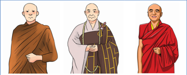

> **Deskripsi Visual:** Gambar ini adalah ilustrasi yang menunjukkan tiga jenis pakaian tradisional yang digunakan oleh orang-orang tertentu dalam budaya tertentu. Ilustrasi ini menggambarkan tiga karakter yang berbeda, masing-masing dengan pakaian yang berbeda. Karakter pertama memakai pakaian yang tipis dan lembut, karakter kedua menggunakan pakaian yang lebih tebal dan formal, sedangkan karakter ketiga menggunakan pakaian yang berwarna merah dan memiliki detail yang lebih kompleks. Setiap karakter memiliki posisi yang berbeda, menunjukkan perbedaan dalam gaya dan budaya mereka. Ilustrasi ini memberikan gambaran tentang perbedaan budaya dan kebiasaan dalam pakaian antara individu yang berbeda.

- Bagaimana keragaman agama Buddha?
- Apa keteladanan tokoh pendukung Buddha dalam keragaman agama?
- Bagaimana keragaman budaya Buddhis?

 

---
## 📄 Halaman 14

---
**🖼️ Gambar/Diagram**

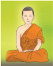

> **Deskripsi Visual:** Gambar ini adalah ilustrasi yang menampilkan seorang orang berjubah berdiri dengan posisi yang rapi. Orang tersebut mengenakan jubah berwarna kuning yang menunjukkan karakteristik tradisional dari budaya tertentu. Latar belakangnya berwarna hijau cerah yang memberikan kesan tenang dan damai. Ilustrasi ini mungkin digunakan untuk membantu pembaca memahami atau menggambarkan karakteristik atau kebiasaan dari orang tersebut dalam konteks budaya tertentu.

### Duduk Hening!

Duduklah dengan rileks, mata terpejam, perhatikan dan sadari napas kalian, rasakan dalam hati:

- 'Menyadari, .......... napas masuk'
- 'Menyadari, .......... napas keluar'
- 'Menyadari, .......... napas masuk'
- 'Menyadari, .......... napas keluar'.
Keragaman, agama, Buddha,  Indonesia, dunia, sikap-sikap, tokoh, pendukung, sejarah, Buddhis

Amati gambar di bawah ini, kemudian lakukan tanya jawab terkait pesanpesan yang terkandung di dalamnya!

 

---
## 📄 Halaman 15

### A.  Menghargai Keragaman Agama Buddha

Pada dasarnya, agama lahir sebagai fenomena sosial yang menyangkut persoalan kemanusiaan. Sebelum manusia mengenal agama, manusia meyakini adanya alam  dan  fenomena.  Dorongan  keyakinan  tersebut  karena  adanya  kekuatan yang dianggap paling tinggi daripada kekuatan yang ada pada diri manusia.

Dalam perkembangannya, manusia menghormati kekuatan gaib pada benda-benda tertentu  ( dinamisme )  dan menghormati roh atau jiwa  yang terdapat  pada  benda-benda ( animisme ).  Perubahan  kepercayaan animisme menjadi agama membuat banyak bermunculan agama-agama yang menawarkan  ajaran  yang  berbeda.  Pada  intinya,  agama-agama  tersebut mengajarkan keselamatan serta kebahagiaan duniawi dan surgawi.

Agama  Buddha  sebagai  agama  yang  berdasarkan  kebenaran  ditemukan oleh petapa Gotama setelah mencapai pencerahan. Buddha mengajarkan ajaran kepada para siswa agar terbebas dari penderitaan ( dukkha )  selama 45 tahun. Buddha  tidak  menunjuk  seorang  penerus  pun  untuk  menggantikan-Nya.  Ia berkata bahwa pemahaman dan penegakan Dharma sebagai guru sudah cukup untuk menolong seseorang dalam menjalankan kehidupan suci ( Dhammananda, 2005:217 ).

Sebagaimana  halnya  dengan  agama-agama  lain,  pada  agama  Buddha pun,  timbul  beberapa  aliran  di  kalangan  para  pengikutnya.  Setelah  Buddha Mahaparinibbana , terjadi perpecahan menjadi beberapa aliran/sekte di kalangan pengikut-Nya. Aliran dalam agama Buddha berkembang karena ajaran Buddha yang menyebar ke berbagai negara mengalami akulturasi atau bercampur dengan budaya setempat. Dari segi esensi ajaran, berbagai sekte dengan kemasan budaya yang beragam dapat dipandang bersifat partikular. Dharma hanya mempunyai satu rasa, yaitu rasa kebebasan ( Udana. 56, Khuddhaka Nikāya, Sutta Pitaka ).

Semua tradisi  Buddhis  mengajarkan  dan  menjalankan  ajaran  Buddha sehingga  tidak  ada  tradisi  yang  lebih  baik  dan  buruk.  Semua  sama, melaksanakan ajaran kebenaran (Dharma) sehingga antar aliran harus saling toleransi  dan  menghargai  perbedaan.  Sedangkan  perkembangan  tradisi ajaran  Buddha  setelah  Buddha  Maha Parinibbana ,  muncullah  2  golongan atau kelompok besar, yaitu Sthaviravada dan Mahasanghika .

 

---
## 📄 Halaman 16

Buddha membabarkan ajaran-Nya dengan penyajian yang berbeda karena manusia mempunyai kemampuan, kebiasaan, dan minat yang berbeda-beda. Dharma telah ditunjukkan dalam penyajian yang berbeda. Setelah Dharma ditunjukkan  dalam  penyajian  yang  berbeda  diharapkan  para  siswa  mau mengakui,  menyetujui,  dan  menerima  apa  yang  telah  dinyatakan  dengan baik bahwa mereka akan berdiam dalam kerukunan sebagai kawan dan tidak berselisih,  bagai  susu  dan  air,  memandang  satu  sama  lain  dengan  tatapan ramah ( Bahuvedaniya Sutta, Majjhimma Nikāya, Sutta Pitaka ).

Buddha tidak pernah mengharapkan semua cocok dengan satu bentuk sehingga  ajaran-Nya  pun  disajikan  atau  diajarkan  dalam  banyak  cara  dan beragam teknik melatih diri. Buddha mengajarkan ajaran kepada para siswa yang berbeda, pada tempat, dan pokok ajaran berbeda serta penyajian yang berbeda. Dengan demikian, tiap orang dapat menemukan sesuatu, yang sesuai dengan tingkat kesadaran dan kepribadiannya.

Perbedaan aliran atau pandangan yang ditemui di dalam kehidupan seharihari akan mengajarkan sikap saling menghargai dan menerima perbedaan itu. Akibatnya,  perbedaan  yang  ditemui  tidak  menimbulkan  konflik  beragama. Perbedaan aliran yang ditemui di lingkungan sekitar tidak dijadikan alasan untuk  memusuhi  orang  lain.  Akan  tetapi,  mampu  hidup  berdampingan di  antara  perbedaan  yang  ada  tersebut  dengan  menerapkan  sikap  saling menghargai dan menghormati kepercayaan yang dianut orang lain.

Nilai-nilai  humanisme  dijadikan  sebagai  alat  bantu  untuk  mencapai harmoni bersama aliran-aliran. Prinsip-prinsip harmoni bersama aliran-aliran agar umat manusia dapat mencapai level perdamaian dan harmoni di antara hubungan sesama manusia. Adapun prinsip-prinsip humanis yang meliputi, saling  menghargai  hak-hak  dan  kewajiban  setiap  individu,  menghilangkan religious egoism, tetap menghargai semua manusia.

4

 

---
## 📄 Halaman 17

### Aktivitas Peserta Didik

- Mengapa terbentuk  aliran-aliran setelah  Buddha Parinibbana ?
- Apa dampak positif  dari  timbulnya keragaman aliran dalam agama Buddha?
- Temukan  sikap-sikap  yang  perlu  dikembangkan  dalam  keragaman agama Buddha.
- Presentasikan jawaban kalian di depan kelas!

### Inspirasi Dharma

'Mengembaralah, o para bhikkhu, demi kesejahteraan banyak makhluk, demi kebahagiaan banyak makhluk, demi belas kasih terhadap dunia, demi kebaikan, kesejahteraan, serta kebahagiaan para dewa  dan manusia.' ( Samyutta Nikāya 4.5 )

### Kisah Upali Berdebat

Upali adalah salah seorang murid terbaik dari guru agama lain yang bernama Nigantha Nathaputta, yang ajarannya berbeda dengan ajaran Buddha. Karena sangat  mahir  dalam  hal  berdebat,  Upali  diminta  guru  agamanya  untuk mendekati  Buddha.  Upali  diminta  mengalahkan  dengan  ajaran  tertentu tentang  Hukum  Sebab  Akibat  ( Kamma ).  Setelah  melewati  diskusi  yang panjang, Buddha mampu meyakinkan Upali bahwa pandangan-pandangan dari guru agamanya adalah keliru.

Upali sangat terkesan dengan  ajaran Buddha  sehingga langsung meminta  untuk  diterima  sebagai  pengikut  Buddha.  Ia  tercengang  ketika Buddha menasihatinya, 'Upali, engkau adalah orang yang terkenal. Yakinlah benar-benar bahwa engkau tidak mengubah agama/kepercayaanmu dalam pengaruh emosi/perasaanmu. Periksalah sepenuhnya ajaran Buddha dengan pikiran terbuka sebelum engkau memutuskan untuk menjadi siswa Buddha.'

 

---
## 📄 Halaman 18

Dengan  semangat  pemeriksaan  yang  bebas  terhadap  ajaran  Buddha.  Upali bahkan makin senang dan berkata, 'Yang Mulia, adalah sangat menakjubkan bahwasanya Anda meminta saya untuk mempertimbangkannya dengan hatihati. Jika itu adalah guru-guru yang lain, mereka akan segera menerimaku dengan  tanpa  ragu-ragu,  membawaku  berkeliling  di  jalan-jalan  dalam suatu prosesi dan mengumumkan bahwa seorang jutawan yang demikiandemikian  telah  meninggalkan  agama/kepercayaan  lamanya  dan  sekarang memeluk  ajaran  mereka.  Ya,  benar-benar,  Yang  Mulia,  sudilah  menerima saya sebagai pengikut-Mu.'

Buddha akhirnya setuju menerima Upali sebagai pengikut awam-Nya, tetapi dengan menasihatinya demikian, 'Meskipun engkau sekarang telah menjadi pengikut-Ku, Upali, engkau harus mempraktikkan toleransi dan rasa welas-asih. Teruslah memberi dana kepada guru-guru agama terdahulumu karena  mereka  masih  amat  bergantung  pada  tunjanganmu.  Engkau  tidak boleh mengabaikan mereka dalam menghentikan tunjangan yang biasanya engkau  berikan  kepada  mereka.'  ( Upali  Sutta,  Majjhimma  Nikāya,  Sutta Pitaka ).

### Aktivitas Peserta Didik

- Mengapa terjadi perdebatan antara Upali dan Buddha?
- Apa tanggapan kalian terhadap dua guru pada kisah tersebut?
- Nilai-nilai apa yang perlu diteladan dari peristiwa tersebut?
- Tuliskan  contoh  tindakan  yang  sudah  kalian  lakukan  berdasarkan nilai-nilai  tersebut!

 

---
## 📄 Halaman 19

### Nyanyikan lagu Buddhis berikut!

---
**🖼️ Gambar/Diagram**

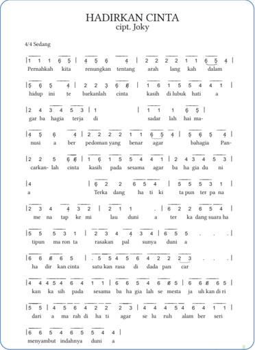

> **Deskripsi Visual:** Gambar ini adalah diagram yang menunjukkan struktur teks dalam sebuah puisi berjudul "Hadirkan Cinta" yang ditulis oleh Joky. Diagram ini terdiri dari baris-baris teks yang disusun secara horizontal dan vertikal, dengan angka yang menunjukkan urutan baris dan kolom. Setiap baris mengandung beberapa baris teks yang disusun dalam format yang sama, dengan angka yang menunjukkan urutan baris dalam setiap baris.

Elemen utama yang ditampilkan adalah teks puisi, angka yang menunjukkan urutan baris dan kolom, serta simbol yang digunakan untuk membedakan antara baris dan kolom. Teks tersebut membahas tentang perasaan cinta dan kehidupan, dengan menggunakan perbandingan antara cinta dan kehidupan sebagai tema utama.

Informasi kunci yang dapat diambil pembaca melalui gambar ini adalah bahwa puisi ini memiliki struktur yang sederhana namun efektif dalam menyampaikan pesan tentang cinta dan kehidupan. Diagram ini juga memberikan gambaran yang jelas tentang bagaimana teks puisi tersebut dibuat dan diterapkan dalam konteks pembelajaran.

 

---
## 📄 Halaman 20

### Aktivitas Peserta Didik

- Apa  nilai-nilai yang terkandung dalam lagu Hadirkan Cinta?
- Apa makna  yang terkadung dalam lagu tersebut?
- Sikap apa yang perlu dikembangkan dan hal yang perlu dihindari dari lagu tersebut?
- Apa tanggapanmu tentang lagu Hadirkan Cinta?

### B.  Menghargai Keragaman Agama Buddha di Dunia

Ajaran Buddha memiliki suatu keunikan yang bersifat universal di mana mampu senantiasa berkembang sesuai dengan kebudayaan dan kebiasaan setempat. Sehingga kini terdapat berbagai sekte dan aliran yang terkadang kelihatannya sangat berbeda, namun pada intinya mempunyai tujuan yang sama,  yaitu  untuk  mencapai  pembebasan  ( nibbana ).  Ajaran  Buddha  yang dikenal  sebagai  ajaran  berdasarkan  cinta  kasih  dan  kasih  sayang,  telah tersebar di  seluruh Asia, Amerika, dan Eropa.

### 1. Keragaman Agama  Buddha Dunia

Ajaran Buddha saat ini telah berkembang  ke seluruh pelosok dunia, menjadi pegangan bagi manusia dari berbagai negara, ras, etnis, di antara kalangan umat beragama. Abad ke-21 menjadi saksi berbagai perubahan cepat akibat perkembangan ilmu pengetahuan dan  teknologi ditandai dengan kreativitas pikiran  manusia  modern.  Hal  inilah  yang  tampaknya  sedikit  banyak memberikan peluang  Buddhis berkembang, karena ajaran Buddha sangat menitikberatkan pada masalah pikiran. Selain itu, kompleksitas yang lahir sebagai produk manusia sendiri, tanpa disadari telah semakin menjauhkan manusia dari hakikat diri yang sesungguhnya. Penderitaan semakin dapat dirasakan  oleh  setiap  manusia  dalam  kehidupan,  ajaran    ajaran  Buddha memberikan  solusi yang dapat langsung dirasakan.

Perkembangan agama Buddha di negara-negara Eropa, Amerika, Australia,  Afrika  hingga  Timur  Tengah  beberapa  tahun  belakangan  ini menunjukkan perkembangan dengan semakin dipahaminya ajaran Buddha secara  benar,  dan  penerapannya.  Meditasi  telah  menjadi  kebutuhan  atau

 

---
## 📄 Halaman 21

cara untuk mengatasi masalah dalam kehidupannya, bahkan menjadi tren karena telah merasakan sendiri manfaat meditasi, praktik meditasi sudah mulai  dilakukan di sekolah-sekolah di negara-negara barat sebagian telah menjadikan meditasi sebagai salah satu praktik sebelum mulai aktivitas atau kerja.  Pusat-pusat Buddhis juga terus berkembang, sebagian oleh imigran dari negara-negara Buddhis tradisional seperti Tibet, Thailand, Taiwan, Sri Lanka, dan lain-lain.

Hal    yang  menyebabkan  masyarakat  Barat  tertarik  ajaran  Buddha  yaitu sebagai berikut.

- Ada kesesuaian filsafat Buddha dengan cara pemikiran Barat. Ajaran agama Buddha  berdasarkan  filosofi  yang  mudah  dimengerti  untuk  dunia  Barat karena berpikir kritis, berpandangan, bertanya secara bebas, dan berdiskusi secara terbuka sesuai dengan status personal.
- Meditasi  adalah  inti,  sentral  dasar  agama  Buddha,  jalan  untuk  menuju pencerahan utama ( enlightenment ). Manfaat meditasi sudah mulai dirasakan umat di Eropa dan di seluruh dunia sudah diakui. Praktik meditasi cara Buddha dijalankan di banyak negara sehingga secara langsung atau tidak langsung ajaran Buddha masuk ke insan masyarakat Barat.
- Buddha menjauhi segala bentuk kekerasan.  Buddha  tidak  membenarkan segala bentuk kekerasan seperti menyiksa, membunuh, menyakiti seluruh makhluk hidup.  Pembunuhan yang berbentuk apapun tidak dibenarkan, peperangan yang mempergunakan nama agama dalam agama Buddha tidak ada.  Dasar  pandangan  ini  yang  masuk  ke  hati  masyarakat  Barat  karena masyarakat di Eropa tidak suka dengan segala bentuk kekerasan.
- Diri sendiri yang menentukan kebahagiaan dan penderitaan kelihatannya sesuai dengan pemikiran masyarakat di dunia Barat zaman sekarang ini. Segala perbuatan manusia akan ada akibatnya. Manusia sendiri yang akan menentukan  segala  kebahagian  dan  penderitaan  ( sukkha  dukkha )  yaitu tergantung dengan perbuatannya (sebab dan akibat hukum karma ).

### 2. Sebaran Buddhisme di beberapa Negara

Ajaran  Buddha  telah  tersebar  ke  beberapa  negara.  Berikut  ini  kita  akan melihat perkembagan ajaran Buddha di Vietnam, Thailand, dan Cina.

### a. Vietnam

Dalam  kajian  agama  Buddha,  Buddhisme  di  Vietnam  mendapatkan  sedikit perhatian dari dunia akademisi di Eropa-Amerika. Sebagian karena prasangka

 

---
## 📄 Halaman 22

akademis  yang  mendukung  ajaran  Buddhisme  yang  mengacu  pada  naskah daripada yang bersumber dari ritual ajaran agama Buddha sehari-hari. Budaya berdasarkan  naskah  agama  Buddha  di  Vietnam  belum  berkembang  pada tingkatan yang sama dengan agama Buddha di beberapa tempat lain.

Sehubungan dengan  sub-bahasan  tertentu  dalam  Buddhisme  dan  peranannya dalam sejarah Vietnam, Woodside (1976), Mc. Hale (2004), dan DeVido (2007, 2009) telah menjelaskan mengenai kebangkitan agama Buddha pada abad ke20  di  Vietnam.  Kebangkitan ini  berusaha  untuk memperkuat dan mengubah Buddhisme di Vietnam dan membawanya kembali ke zaman keemasan ketika Buddhisme berada dalam kejayaan. Perwujudan masyarakat Vietnam ini adalah berusaha membangun identitas nasional yang lebih kuat dengan melibatkan pendukung perubahan Buddhisme yang kuat dan modern.

Pergerakan Buddhisme modern kebangkitan ini berusaha untuk memperbaiki  dan  menghilangkan  ritual  yang  tidak  terdapat  dalam  kitab agama  Buddha  seperti  pemujaan,  pembakaran  uang-uangan,  dan  praktik tahayul. Naskah-naskah agama Buddha yang baru dan lama diterjemahkan dan  dianggap  dapat  memberikan  keselamatan  sehingga  para  penganutnya dianjurkan untuk membaca, belajar dan memahami naskah-naskah tesebut daripada menghafalkan tanpa mengetahui isinya.

Pendukung kebangkitan Vietnam menitikberatkan pada keterlibatannya dalam  masyarakat,  seperti  mendirikan  sekolah,  klinik,  organisasi  dan kegiatan sosial. Pergerakan kebangkitan ini menghasilkan Buddhisme yang modern dan aktif kegiatan sosial kemanusiaan disebut oleh Thích Nhat Hanh sebagai ' engaged Buddhism ' (kepedulian buddhism ).

### b. Thailand

Agama Buddha di Thailand sebagian besar berasal dari  aliran  Theravada, yang diikuti oleh 95 persen populasi. Thailand memiliki populasi Buddha terbesar ketiga di dunia, setelah Cina dan Jepang. Agama Buddha di Thailand juga telah terintegrasi dengan agama rakyat serta agama-agama Tionghoa dari populasi Tionghoa Thai yang besar. Vihara-vihara  Buddha di Thailand dicirikan dengan stupa emas yang tinggi, dan arsitektur Buddha di Thailand serupa dengan yang ada di negara-negara Asia Tenggara lainnya, terutama Kamboja dan Laos, dengan Thailand berbagi warisan budaya dan sejarah.

 

---
## 📄 Halaman 23

Sejarah perkembangan agama Buddha di Thailand sejak 250 SM, pada masa Kaisar India Ashoka. Sejak itu, agama Buddha telah memainkan peran penting dalam budaya dan masyarakat Thailand. Agama Buddha dan monarki Thailand sering  kali  terjalin,  dengan  raja-raja  Thailand  yang  secara  historis  dipandang sebagai  pelindung  utama  agama  Buddha.  Meskipun  politik  dan  agama  pada umumnya terpisah  untuk  sebagian  besar  sejarah  Thailand,  hubungan  agama Buddha dengan negara Thailand akan meningkat di pertengahan abad ke-19 setelah  reformasi  Raja  Mongkut,  yang  akan  mengarah  pada  perkembangan sekte-sekte agama  Buddha yang didukung oleh kerajaan.

Tiga kekuatan utama telah mempengaruhi perkembangan agama Buddha di Thailand. Pertama pengaruh yang paling terlihat adalah aliran Buddhisme Theravada,  yang  didatangkan  dari  Srilanka.    Pengaruh  besar  kedua  pada Buddhisme Thailand adalah kepercayaan Hindu yang diterima dari Kamboja, khususnya selama Kerajaan Sukhothai. Hinduisme memainkan peran yang kuat dalam institusi kerajaan Thailand awal, seperti yang terjadi di Kamboja, dan memberikan pengaruh dalam penciptaan hukum dan ketertiban bagi masyarakat Thailand serta agama Thailand.  Sedangkan pengaruh ketiga yang lebih kecil dapat diamati yang berasal dari kontak dengan aliran Mahayana.

### c. Cina

Agama Buddha berkembang ke Cina sekitar abad kedua sebelum Masehi melalui Asia  Tengah  serta  mulai  berpengaruh  pada  masa  pemerintahan  Kaisar  Ming (58-75 M). Sejak Dinasti Han (25-220M) pengaruh agama Buddha mulai menjadi perhatian dan persoalan. Kira-kira pada masa itulah Mo Tzu menyusun bukunya Li-huo-lun (Menangkis Kekeliruan) sebagai apologia (pembelaan) agama Buddha.

Perkembangan agama Buddha di Cina disebabkan oleh banyak tokoh pergi ke India atau Sri Lanka untuk belajar melalui kitab-kitab dan filsafat agama Buddha di India  atau  Sri  Lanka.  Di  India  maupun  Sri  Lanka  para pelajar tersebut belajar dengan guru yang berbeda-beda. Sehingga pelajaran tentang agama Buddha yang didapat  juga berbeda-beda. Setelah kembali ke negaranya, pengetahuan yang telah didapatkan itu kemudian diajarkan kepada masyarakat sehingga ajaran agama Buddha menyebar.

Para  terpelajar  mempunyai  banyak  pengikut  dan  mendirikan  aliran tersendiri yang sendiri sesuai dengan ajarannya masing-masing. Di samping mengajarkan  tentang  agama  Buddha  para  pelajar  juga  menerjemahkan kitab Agama Buddha ke dalam bahasa Cina. Ketika agama Buddha masuk ke Cina, pada dasarnya tidak mau menerima karena masyarakat berangapan

 

---
## 📄 Halaman 24

bahwa agama Buddha merupakan agama mistik. Karena pada saat  itu  di Cina terdapat aliran Konghucu dan Tao sehingga masyarakat belum dapat menerima kedatangan agama Buddha.

Masyarakat  di  Cina  menerima  agama  Buddha  dan  memandang  serta menerima Buddha Sakyamuni sesuai dengan pandangan Mahayana, di mana Buddha Sakyamuni diterima sebagai perwujudan Dharmakaya. Masyarakat di Cina  juga  memberikan  perhatian  kepada  para Bodhisattva yang  menyempurnakan kebajikan ( paramita ) dan bertekad menolong manusia. (Tim Penyusun, 2003:73)

### Aktivitas Peserta Didik

- Apa tanggapanmu terhadap keragaman agama Buddha di dunia?
- Mengapa Buddhisme berkembang pesat di dunia Barat?
- Sikap    apa  yang  kalian  kembangkan  terhadap  keragaman  agama Buddha di dunia?
- Tindakan  apa  yang  dapat  kalian  lakukan  dalam  keragaman  agama Buddha di dunia!

### C.  Sikap-Sikap dalam  Keberagaman Agama Buddha

Sikap keberagaman memiliki peran penting dalam  pembentukan perilaku keberagaman.  Sikap keberagaman yang baik akan  berdampak positif pada perilaku keberagaman yang baik. Sikap  keberagaman yang kurang baik akan menimbukan perilaku keberagaman yang kurang baik. Untuk  membentuk perilaku  keberagaman  individu  harus  dimulai  dari  pembentukan  sikap keberagamaan.

Sikap  keberagaman  adalah  kondisi  internal    yang  masih  ada  dalam diri manusia. Keadaan internal menyebabkan munculnya kesiapan untuk  berperilaku  sesuai  dengan  ajaran  agama  yang  diyakininya.  Sikap keberagaman  terbentuk  karena  adanya  integrasi  secara  kompleks  antara keyakinan yang kuat  pada  ajaran agama, perasaan senang pada agama dan perilaku  yang sesuai dengan ajaran agama.

 

---
## 📄 Halaman 25

Sikap keberagamaan  dapat   mendorong untuk bergerak dan berusaha untuk  mencapai  suatu  tujuan.  Sikap  keberagaman  berupa  pengetahuan yang diikuti dengan kesediaan dan kecenderungan untuk berprilaku  sesuai pengetahuannya.

Dalam konteks kemajemukan agama dan keyakinan kerukunan umat beragama  perlu dijaga dan dipelihara dalam bingkai kehidupan bernegara. Kerukunan umat beragama merupakan pilar kerukunan  dunia. Kemajemukan yang  dimiliki  bangsa  merupakan  pendorong  lahirnya  saling  pengertian, toleransi, kerjasama dalam bermasyarakat dan bernegara. Kondisi tersebut mendorong dinamika saling berinteraksi, dan kerja sama dalam kehidupan bermasyarakat, berbangsa dan bernegara.

Agama-agama mempunyai pandangan yang sama mengenai dunia yang harmonis yang akan terwujud dengan sikap toleransi. Pada hakikat toleransi pada intinya usaha kebaikan, khususnya pada kemajemukan agama yang memiliki tujuan luhur  tercapainya kerukunan intern agama maupun antar agama.

Bersikap  toleran  adalah  salah  satu  jalan  yang  harus  ditempuh  oleh umat beragama dalam usahanya untuk mewujudkan kerukunan hidup umat beragama.  Menjadi  toleran  dalam  beragama  adalah  dengan  membiarkan atau membolehkan orang lain menjadi diri sendiri, menghargai orang lain, menghargai asal usul dan latar belakang keyakinan yang berbeda-beda.

Dalam menjalani kehidupan internal  ada beberapa sikap yang seharusnya kita kembangkan yaitu inklusivisme, pluralisme, dan universalisme. Dengan sikap ini maka kerukunan, toleransi dan saling menghormati serta  saling menghargai bisa terwujud.

Inklusivisme  maksudnya  menerima  kebenaran  tradisi  sendiri  tanpa menyangkal  kebenaran  yang  beraneka  ragam.  Seseorang  menjalankan agamanya sendiri tanpa mencela yang lain dan tidak menganggap ajaran yang dianutnya lebih mulia dibanding yang lain. Sikap ini membuat seseorang tidak hanya berdamai pada dirinya sendiri tetapi juga dengan yang lain.

Inklusivisme  merupakan  paham  yang  menganggap  bahwa  kebenaran tidak  hanya  terdapat  pada  kelompok  sendiri,  melainkan  juga  ada  pada kelompok  lain.  Dalam  inklusivisme  diniscayakan  adanya  pemahaman tentang yang lain yang mana selalu ada dimensi kesamaan substansi nilai. Harus dipahami bahwa kebenaran dan keselamatan tidak lagi dimonopoli agama atau aliran tertentu.

 

---
## 📄 Halaman 26

Pluralisme merupakan sikap mengakui dan menerima adanya perbedaan dan  tidak  mempertentangkannya  perbedaan  tersebut.  Sikap  pluralisme membangun rasa persatuan, kerja sama dan pengertian antar tradisi yang majemuk. Dengan sikap pluralisme maka toleransi, kerukunan dan saling menghargai diantara tradisi Buddhis akan terwujud.

Sedangkan  universalisme  adalah  paham  yang  meliputi  segala-galanya. Universalisme sebagai  suatu cara pandang bahwa kebenaran itu bersifat umum, berlaku  untuk  siapa  saja,  dimana  saja  dan  kapan  saja.    Dengan  menganut universalisme memandang  bahwa setiap individu seharusnya berupaya mencapai tujuan mencapai keabadian atau pembebasan bersama.

Akibat  jika  tidak  mempunyai  wawasan  inklusivisme,  pluralisme,  dan universalisme antara lain sebagai berikut.

- Sering terjadi konflik atau perpecahan.
- Mengembangkan sikap fanatik.
- Menebarkan kebencian.
- Membawa pada kemerosotan batin.
- Menimbulkan kesombongan bahwa 'aliranku yang paling baik'.
- Mengikis sikap toleransi.
Upaya membangun kerukunan antaraliran dalam agama Buddha dapat dilakukan  dengan  berbagai  mekanisme.  Mekanisme  internal  dilakukan dengan tiga cara.

- Melakukan interpretasi terhadap teks kitab  suci  dalam  semangat  perdamaian, mengedepankan  hal  asasi  manusia,  toleransi, rekonsiliasi,  kebebasan beragama, dan menghormati orang yang berbeda agama dan keyakinan.
- Melakukan dialog internal, mengingat bahwa setiap agama memiliki berbagai denominasi dan aliran. Dialog internal bukan untuk menyamakan melainkan untuk memahami, menerima dan menghormati terhadap perbedaan.
- Optimalisasi  peran  para  pemimpin  agama  agar  dapat  mengembangkan kepemimpinan yang positif untuk mengimbangi kepemimpinan yang negatif.

 

---
## 📄 Halaman 27

### Inspirasi Dharma

Keteladanan hidup para siswa Buddha  hidup dalam kerukunan, saling menghargai, tanpa perselisihan, bercampur bagaikan susu dengan air, serta saling menatap dengan tatapan ramah ( Upakkilesa Sutta, Majjhima Nikāya, Sutta Pitaka ).

### Penerapan Nilai Luhur

Kerukunan umat beragama merupakan kondisi dimana antar umat beragama dapat  saling  menerima,  saling  menghormati  keyakinan  masing-masing, saling tolong menolong, dan bekerja sama dalam mencapai tujuan bersama. Nilai-nilai  luhur  saling  menghormati, berbagi, saling menolong perlu kita kembangkan dalam kehidupan sehari-hari. Pengembangan nilai-nilai luhur dapat dilakukan secara bertahap. Bertekad untuk mengembangkan:

- cinta kasih dalam pikiran;
- cinta kasih dalam ucapan;
- cinta kasih dalam perbuatan jasmani;
- perilaku baik;
- kemurahan hati; dan
- kebijaksanaan. ( Kosambiya Sutta, Majjhima Nikāya, Sutta Pitaka ).

 

---
## 📄 Halaman 28

### Aktivitas Peserta Didik

### Isilah titik-titik pada tabel berikut!

---
**📊 Tabel**

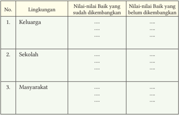

Tabel ini menunjukkan perkembangan nilai baik di berbagai lingkungan: keluarga, sekolah, dan masyarakat. Dalam kolom "Nilai-nilai Baik yang sudah dikembangkan", terdapat beberapa poin penting seperti keberanian, kreativitas, dan kemampuan berkomunikasi yang telah ditingkatkan oleh individu. Sementara itu, dalam kolom "Nilai-nilai Baik yang belum dikembangkan", terdapat beberapa hal seperti ketekunan, keterampilan berpikir kritis, dan kemampuan beradaptasi dengan lingkungan baru yang masih perlu ditingkatkan. Topik utama tabel ini adalah perkembangan nilai baik dalam berbagai lingkungan hidup seseorang, yang merupakan aspek penting dalam pembentukan karakter dan kepribadian.

### D.  Keteladanan  Pendukung Agama Buddha

 

---
## 📄 Halaman 29

### Aktivitas Peserta Didik

- Bagaimana perjuangan tokoh di atas?
- Sikap  keteladan  apa  yang  bisa  kalian  terapkan  dalam  kehidupan sehari-hari sesuai tokoh di atas?
- Bagaimana  kalian  menggambarkan  cinta  kasih  berdasarkan  tokoh pada gambar tersebut?
- Apa  yang  kalian  lakukan  jika  kalian  berperan  sebagai  siswa  dari tokoh di atas?

### 1. Keteladanan Bhikkhu Bodhi

---
**🖼️ Gambar/Diagram**

> **Deskripsi Visual:** Gambar ini adalah ilustrasi yang menampilkan seorang orang tua berjubah merah muda sedang berbicara dengan tangan yang ditekuk. Orang tua tersebut tampak serius dan menunjukkan ekspresi yang menunjukkan kepedulian atau pengertian. Ilustrasi ini mungkin digunakan untuk menggambarkan konsep tentang pendidikan, kebijaksanaan, atau interaksi sosial antara orang tua dan anak-anak. Teks, angka, atau label penting tidak terlihat pada gambar ini. Informasi kunci yang dapat diambil pembaca adalah bahwa gambar ini mungkin digunakan untuk membahas topik-topik seperti pendidikan, kebijaksanaan, atau interaksi sosial antara orang tua dan anak-anak.

Bhikkhu Bodhi merupakan seorang bhikkhu  dari  New  York,  Amerika  lahir pada  tahun  1944.  Ia  memperoleh  gelar BA dalam bidang filsafat dari Brooklyn College  dan  gelar  Ph.D  dalam  bidang filsafat dari Claremont Graduate School. Setelah menyelesaikan studi universitasnya dia pergi ke Sri Lanka, di mana dia menerima pentahbisan pemula pada tahun 1972 dan pentahbisan penuh  pada  tahun  1973,  keduanya  di bawah biksu terkemuka Sri Lanka, YM. Balangoda Ananda Maitreya (1896-1998).

Beliau  sebagai  editor  untuk Buddhist  Publication  Society di  Kandy,  di mana dia tinggal selama sepuluh tahun dengan biksu senior Jerman, YM. Nyanaponika Thera (1901-1994). Bhikkhu Bodhi memiliki banyak publikasi penting, baik sebagai penulis, penerjemah, atau editor.

Bhikkhu Bodhi juga seorang penulis dari beberapa karya penting mengenai Ajaran Buddha dan juga selama beberapa waktu memegang tanggung jawab sebagai  ketua,  peninjau,  pengamat  ( editor )  dari Buddhist  Publication  Society (BPS), yang telah banyak sekali menerbitkan baik berupa buklet ataupun bukubuku mengenai Buddhisme dengan berbagai topik dari berbagai pengarang yang telah memiliki pengalaman Dharma, sebuah ajaran yang dilaksanakan

 

---
## 📄 Halaman 30

dan dipelajari sejak 2546 tahun yang lalu hingga sekarang.

Bhikkhu  Bodhi  mendirikan Buddhist  Global  Relief, sebuah  organisasi nirlaba yang mendukung penanggulangan kelaparan, pertanian berkelanjutan, dan pendidikan di negara-negara yang menderita kemiskinan kronis  dan  kekurangan  gizi.  Yang  Mulia  Bhikkhu  Bodhi  menyerukan solidaritas,  cinta,  kasih  sayang,  dan  keadilan  sebagai  penangkal  krisis jaman yang ditimbulkan oleh keserakahan. Beliau menunjuk pada masalah sosial,  lingkungan,  dan  ekonomi  saat  ini  yang  didorong  oleh  pencarian untuk memperluas keuntungan, untuk keuntungan yang lebih tinggi bagi pemegang  saham,  untuk  pengembalian  yang  lebih  tinggi  atas  investasi keuangan, untuk peningkatan akumulasi modal, yang akan dicapai dengan menekan upah dan tunjangan bagi pekerja, dengan kerja kontrak tidak tetap.

Nasihat Bhikkhu Bodhi 'Kebahagiaan sejati tidak datang dari memaksimalkan kepentingan  pribadi  seseorang  tetapi,  kebahagiaan  bergantung pada hubungan manusia yang bermakna, memuaskan, dan persahabatan, kerja sama dengan orang lain dalam meningkatkan kebaikan'. Beliau juga bergerak dalam bidang kemanusian seperti mengatasi kelaparan dan kekurangan gizi, dan mempromosikan pendidikan serta memerangi kemiskinan.

### Aktivitas Peserta Didik

- Apa tanggapanmu terhadap keteladanan Bhikkhu Bodhi?
- Tuliskan bentuk-bentuk perjuangan dan karya Bhikkhu Bodhi dalam pelestarian Dharma!
- Apa nilai-nilai yang perlu kita terapkan dalam kehidupan sehari-hari dari Bhikkhu Bodhi?

### 2.  Keteladanan  Master Cheng Yen

Master Cheng Yen terlahir dengan nama Wang Jinyun pada tahun 1937 di desa  Chingshui,  Kabupaten  Taichung,  Taiwan.  Pamannya  tidak  memiliki anak, sehingga Wang Jinyun diberikan untuk dibesarkan oleh paman dan bibinya.  Dia  mengalami  langsung  penderitaan  selama  Perang  Dunia  II karena  dia  dibesarkan  di  Taiwan  yang  dikuasai  oleh  Jepang.  Pengalaman inilah yang mengajarkan dia mengenai konsep ketidak-kekalan di dunia.

 

---
## 📄 Halaman 31

---
**🖼️ Gambar/Diagram**

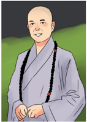

> **Deskripsi Visual:** Gambar ini adalah ilustrasi yang menampilkan seorang orang tua berjubah berdiri di depan sebuah bangunan dengan latar belakang alam. Orang tua tersebut tampak tenang dan senyuman lebar, menunjukkan suasana hati yang baik. Ilustrasi ini mungkin digunakan untuk menggambarkan tema kebahagiaan, kestabilan, atau kehidupan sehari-hari. Teks, angka, atau label penting tidak terlihat pada gambar ini. Informasi kunci yang dapat diambil pembaca adalah bahwa gambar ini mungkin digunakan untuk membahas tentang kebahagiaan, kestabilan, atau kehidupan sehari-hari.

Beliau benar-benar sosok teladan dalam menebarkan cinta kasih, sebuah cinta dan kasih  universal  kepada  semua  umat  dan makhluk tanpa memandang perbedaan apa  pun  itu,  ketulusan,  kepercayaan  dan kebijaksanaannya  telah  membuat  sebuah dunia  yang  indah,  dunia  yang  memang seharusnya  seperti  ini,  dunia  yang  satu keluarga.

Dari  perjuangan  dan  tekad  besar  serta keteguhannya menghadapi dan melewati berbagai  rintangan  berat  membuat  Master Cheng Yen mampu mendirikan Tzu Chi hingga saat ini. Perjuangan yang dilandasi  cinta kasih universal dan semangat pantang menyerahnya Master Cheng Yen pantas diteladani.

Waktu terus berjalan, kegigihannya pun terbukti menjadi hal yang indah, bersama dengan ibu-ibu rumah tangga  setiap hari menabung sebesar 5 sen untuk menolong orang yang kesusahan. Pada suatu saat master mengunjungi sebuah Rumah Sakit dan melihat bekas darah, ia lekas bertanya kepada suster noda darah apakah itu, dan suster pun mengatakan itu adalah bekas darah seorang ibu (berasal dari tempat/daerah yang jauh) yang ingin melahirkan namun tak punya biaya sehingga ia tidak jadi melahirkan dan pergi. Master pun tertegun dan sedih bagaimana nasibnya setelah itu, apakah ia baik-baik saja, mengapa hanya karena uang ia tak bisa melahirkan di sana.

Master bertekad untuk membangun sebuah rumah sakit besar dengan fasilitas yang lengkap. Pembangunan rumah sakit ini bukan hal yang mudah, walaupun banyak kerikil dan batu besar yang menghambat, mereka tetap tidak menyerah dan terus berusaha agar rumah sakit ini dapat berdiri.

### Aktivitas Peserta Didik

- Apa tanggapanmu terhadap keteladanan Master Cheng Yen?
- Tuliskan aksi-aksi kemanusiaan  dan sosial dari Master Cheng Yen!
- Apa nilai-nilai yang perlu kita diterapkan dalam kehidupan sehari-hari dari Master Cheng Yen?

 

---
## 📄 Halaman 32

### Inspirasi Master Cheng Yen

- Genggamlah kesempatan untuk berbuat kebajikan. Bila menunggu, kesempatan itu akan berlalu dan semuanya sudah terlambat.
- Kesuksesan  hidup  selama  puluhan  tahun  merupakan  akumulasi perilaku setiap hari, maka setiap hari kita harus menjaga perilaku dengan sebaik-baiknya.
- Memberi  dan  melayani  jauh  lebih  berharga  dan  membahagiakan daripada diberi dan dilayani.
Kalian telah mengikuti serangkaian pembelajaran materi 'Harmoni dalam Keragaman  Agama  Buddha'  dengan  model  pembelajaran  yang  berbeda. Tuliskan refleksi di bawah ini.

- Pengetahuan baru apa yang kalian perolah?
- Apa nilai-nilai yang dapat kalian temukan dalam pembelajaran ini?
- Sikap apa yang dapat kalian teladani dari tokoh pejuang agama Buddha dalam kehidupan sehari-hari?
- Apa tindakan nyata yang dapat kalian lakukan setelah pembelajaran ini?

### A.  Penilaian Pengetahuan

### 1. Studi Kasus

Di suatu desa terdapat komunitas masyarakat yang multiagama. Penduduk di desa itu meyakini agama masing-masing  dengan kuat dan baik. Sebagian penduduk beragama Buddha hidup berdampingan dengan agama yang lain. Pada awalnya masyarakat Buddhis hidup berdampingan dengan rukun dan harmonis. Masyarakat Buddhis awalnya mengenal agama Buddha tanpa ada sekte-sekte.

 

---
## 📄 Halaman 33

Pada suatu hari ada seorang umat yang mempunyai sahabat  di daerah lain. Umat itu mengundang  sahabatnya  ke desanya. Sahabat itu mempunyai wawasan tentang aliran atau sekte-sekte.  Sahabat itu berharap ada aliran atau sekte dalam komunitas masyarakat Buddhis. Sahabat itu mengenalkan aliran sesuai yang diikutinya.

Setelah umat mendengarkan pengarahan tentang aliran, sejak itu sebagai awal terbentuk aliran di desa itu yang diawali dengan pro dan kontra. Ada yang setuju dengan kehadiran aliran baru dan ada yang tidak setuju. Umat yang tidak setuju akhirnya tidak ke tempat ibadah yang akhirnya mendirikan tempat ibadah sendiri.

Tampak perubahan dalam masyarakat Buddhis tidak harmonis, saling curiga,  dan saling berprasangka. Ada beberapa pemuda menganggap aliran lama tetap yang terbaik dalam Budhisme dan ada umat yang tertarik aliran terbaru  yang  dianggap  modern.  Mereka  menyimpan  kebencian  melalui pikiran tampak dalam ucapan dan perbuatan.

Pada  akhirnya    di  daerah  tersebut  ada  dua  sekte  atau  aliran.  Mereka melakukan  puja  bakti  di  vihara  masing-masing.  Umat  saling  belajar  dan praktik  Dharma  sehingga  mendorong  untuk  bisa  hidup  rukun,  saling mengormati, bersatu dan saling membantu  serta tolong menolong. Akhirnya masyarakat Buddhis saling toleransi  dan  harmonis  serta  menjalani  hidup dengan damai dan tenang.

### 2. Soal-soal

- Mengapa terjadi perpecahan di kalangan masyarakat Buddhis?
- Bagaimana  tanggapan  kalian  terhadap  kehadiran  sahabat    yang mengenalkan aliran?
- Bagaimana  cara  memecahkan  bila  terjadi  kasus  seperti  kisah tersebut?
- Bagaimana perkembangan agama Buddha yang akan datang jika di antara umat saling bermusuhan?
- Tindakan  apa  yang  kalian  lakukan  jika  sebagai  umat  di  tempat tersebut?

 

---
## 📄 Halaman 34

### B.   Penilaian Sikap (Penilaian Diri)

Setelah  mengikuti  pembelajaran  pada  materi  ini,  lakukan  penilaian  diri untuk menguatkan profil pelajar Pancasila yang kalian latih pada dimensi Beriman,  Bertakwa  Kepada  Tuhan  Yang  Maha  Esa,  dan  Berakhlak  Mulia yaitu  pelajar  Indonesia  yang  bertoleransi,  menghormati  penganut  lain, menjaga kerukunan hidup sesama umat beragama, menghormati kebebasan menjalankan ibadah, berempati, welas asih kepada orang lain bersikap jujur, adil, dan rendah hati.

Isilah dengan tanda chek list ( ) pada kolom di bawah ini!

- 1 = Tidak pernah
- 2 = Jarang
- 3 = Sering
- 4 = Selalu

---
**📊 Tabel**

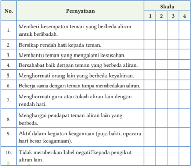

Tabel ini berisi 10 pernyataan yang mungkin digunakan sebagai indikator untuk menilai tingkat kebersamaan antara teman-teman berbeda aliran. Kolom "Skala" menyediakan empat pilihan skor: 1, 2, 3, dan 4, yang mungkin menunjukkan tingkat keberhasilan atau kesuksesan dalam menjalankan pernyataan tersebut. Topik utama tabel ini adalah tentang bagaimana teman-teman berbeda aliran dapat saling menghormati, bekerja sama, dan mendukung satu sama lain dalam berbagai situasi. Data atau pola penting yang terlihat adalah bahwa semua pernyataan memiliki skor yang sama (1, 2, 3, atau 4), menunjukkan bahwa setiap pernyataan dianggap penting dan harus dicapai oleh semua teman dalam hubungan mereka.

 

---
## 📄 Halaman 35

Untuk  menambah  wawasan  dan  pemahaman  kalian  tentang  menghargai keragaman  agama  Buddha,  keragaman  agama  Buddha  di  dunia,  sikapsikap dalam keragaman agama Buddha dan keteladanan pendukung agama Buddha lakukan hal-hal berikut ini.

- Membuat narasi tentang perkembangan agama Buddha di Sri Lanka!
- Mencari tokoh-tokoh pendukung agama Buddha lainnya dalam keragamanan agama Buddha!

 

---
## 📄 Halaman 36

---
**🖼️ Gambar/Diagram**

> **Deskripsi Visual:** Gambar ini adalah ilustrasi yang menampilkan Buddha sedang bermeditasi. Buddha duduk dengan posisi lotus, tangan di atas pergelangan tangan, menunjukkan pose meditasi yang sering digunakan dalam budaya Buddha. Dia dilingkari oleh warna hijau yang tenang dan damai, sementara latar belakangnya berwarna merah muda yang lebih cerah, mungkin untuk menonjolkan keindahan dan keharmonisan dalam meditasi. Ilustrasi ini mungkin digunakan sebagai representasi dari konsep kebodohan dan kebijaksanaan dalam budaya Buddha, yang menggambarkan meditasi sebagai cara untuk mencapai kebijaksanaan.

Bagaikan orang yang menaiki perahu kokoh yang dilengkapi dengan dayung dan kemudi, yang memiliki pengetahuan tentang cara mengemudikannya, yang terampil serta bijaksana, dengan perahu itu dia dapat membawa banyak orang menyeberang sungai.  Terlebih lagi, orang yang telah memiliki pengetahuan dan mempunyai pikiran yang terlatih baik, yang terpelajar dan tidak goyah. Dengan jelas dia mengetahui bahwa dia dapat membantu orang-orang lain untuk mengerti, yaitu mereka yang penuh perhatian untuk mendengarkan dan telah siap untuk memahami.

(Nava Sutta, Culavagga, Sutta Nipata)

 

---
## 📄 Halaman 37

KEMENTERIAN PENDIDIKAN, KEBUDAYAAN, RISET, DAN TEKNOLOGI REPUBLIK INDONESIA, 2022

Pendidikan Agama Buddha dan Budi Pekerti untuk SMA/SMK Kelas XII

Penulis: Katman dan Tupari

Isbn: 978-602-244-568-5 (jilid 3)

### KERAGAMAN BUDAYA BUDDHIS

### Tujuan Pembelajaran

Peserta  didik  meneladan  sikap  tokoh  pendukung  agama  Buddha  dengan bersikap menghargai dan terbuka terhadap keragaman budaya Buddhis.

---
**🖼️ Gambar/Diagram**

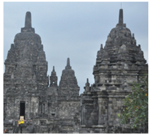

> **Deskripsi Visual:** Gambar ini adalah foto yang menunjukkan bagian dari candi bersejarah yang terletak di Indonesia. Candi ini memiliki arsitektur tradisional Jawa dengan struktur bangunan yang kompleks dan tinggi. Dua candi utama terlihat jelas, dengan tiang-tiang yang menjulang ke langit dan atap-atap yang rapi. Di sekitar candi, terlihat beberapa pohon hijau yang menambah nuansa alami pada gambar. Gambar ini menunjukkan bagaimana arsitektur tradisional Jawa yang indah dan rumit dapat menciptakan keindahan yang luar biasa.

- Apa yang dimaksud dengan keragaman budaya Buddhis?
- Bagaimana bentuk keragaman budaya Buddhis?
- Apa keteladanan tokoh pendukung Buddha dalam keragaman budaya Buddhis?

 

---
## 📄 Halaman 38

---
**🖼️ Gambar/Diagram**

> **Deskripsi Visual:** Gambar ini adalah ilustrasi yang menampilkan seorang Buddha sedang bermeditasi. Ilustrasi ini menunjukkan Buddha duduk dengan posisi yang tenang dan penuh kebijaksanaan, mengenakan pakaian tradisional Buddha yang khas. Latar belakangnya berwarna hijau cerah yang memberikan suasana tenang dan penuh kedamaian. Ilustrasi ini menunjukkan hubungan antara Buddha dan meditasi, serta menekankan pada kebijaksanaan dan ketenangan yang dapat diambil dari praktik meditasi. Teks, angka, atau label penting tidak terlihat dalam gambar ini. Informasi kunci yang dapat diambil pembaca adalah bahwa meditasi adalah bagian penting dari kehidupan Buddha dan dapat membawa kedamaian dan kebijaksanaan.

### Duduk Hening!

Duduklah dengan rileks, mata terpejam, perhatikan dan sadari napas kalian, rasakan dalam hati:

- 'Menyadari, .......... napas masuk'
- 'Menyadari, .......... napas keluar'
- 'Menyadari, .......... napas masuk'
- 'Menyadari, .......... napas keluar'.
Keragaman, budaya, Buddhis, unsur, identitas, dunia, sikap-sikap, tokoh, pendukung, sejarah

Amati gambar di bawah ini, kemudian beri tanggapan sesuai  pesan-pesan yang terkandung di dalamnya!

---
**🖼️ Gambar/Diagram**

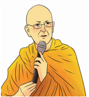

> **Deskripsi Visual:** Gambar ini adalah ilustrasi yang menampilkan seorang orang berwajah tua dengan topi hitam dan kacamata, sedang membawa mikrofon. Orang tersebut tampak seperti seorang pemimpin atau penggembala, mungkin seseorang yang sedang memberikan pidato atau mengadakan acara publik. Warna dominan pada gambar adalah kuning, yang menunjukkan bahwa karakter tersebut sedang memakai pakaian tradisional atau seragam. 

Elemen utama dalam gambar ini adalah karakter manusia yang sedang berbicara menggunakan mikrofon. Mikrofon tersebut tampak besar dan diletakkan di depan wajah karakter, menunjukkan bahwa ia adalah subjek utama dari gambar ini. Topi hitam dan kacamata yang dikenakan oleh karakter juga menjadi elemen penting yang menunjukkan identitas atau posisi sosialnya.

Teks, angka, atau label penting tidak terlihat dalam gambar ini karena ia hanya berupa ilustrasi. Namun, informasi kunci yang dapat diambil dari gambar ini adalah bahwa karakter tersebut sedang berbicara atau memberikan pidato, yang bisa menjadi tema dari konteks yang lebih luas dari gambar ini.

 

---
## 📄 Halaman 39

---
**🖼️ Gambar/Diagram**

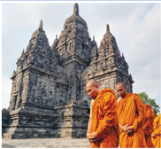

> **Deskripsi Visual:** Gambar ini adalah foto yang menunjukkan seorang biksu berjalan di depan sebuah candi bersejarah. Candi tersebut memiliki arsitektur klasik dengan empat menara tinggi yang menjulang ke langit. Bikers tersebut mengenakan pakaian berwarna kuning yang mencolok, yang menonjol di antara batu-batu abu-abu candi. Langit cerah dengan awan tipis tampak di latar belakang, memberikan suasana tenang dan spiritual. 

Elemen utama dalam gambar ini adalah candi bersejarah yang memiliki empat menara tinggi, biksu berjalan di depannya, dan langit cerah dengan awan tipis di latar belakang. Relasi antara elemen-elemen ini adalah bahwa candi menjadi objek utama yang menarik perhatian, sementara biksu dan langit menjadi elemen pendukung yang memberikan konteks waktu dan suasana.

Teks, angka, atau label penting tidak terlihat dalam gambar ini. Namun, informasi kunci yang dapat diambil pembaca melalui gambar ini adalah bahwa ini mungkin merupakan foto dari sebuah destinasi wisata atau tempat bersejarah yang populer, yang sering dikunjungi oleh orang-orang untuk berwisata religi atau berkelana.

### A.  Makna Keragaman Budaya Buddhis

Keragaman  budaya  terbentuk  karena  berbagai  hal,  di  antaranya:  faktor geografis, pola kehidupan, keyakinan/kepercayaan, dan sebagainya. Keragaman budaya tidak hanya menjadi ciri khas bagi suatu daerah atau bangsa,  tetapi  dapat  menjadi  ciri  khas  suatu  agama,  di  antaranya  agama Buddha.

### 1. Pengertian Budaya Buddhis

Budaya memiliki suatu makna yang berhubungan dengan adat istiadat, akal, budi dan tingkah laku manusia. Budaya ini tumbuh dan berkembang di tengah masyarakat, dan diwariskan secara turun-temurun. Menurut Edward Burnett Tylor,  budaya  merupakan  keseluruhan  yang  kompleks,  yang  di  dalamnya terkandung kesenian, pengetahuan, kepercayaan, moral, adat istiadat, hukum dan kemampuan-kemampuan lain yang diperoleh seseorang sebagai anggota masyarakat (Laning, 2015:12).

Kebudayaan terdiri atas konsep-konsep, teori-teori, dan metode-metode yang  berisi  tentang  pengetahuan  dan  keyakinan  yang  digunakan  secara selektif  oleh  manusia.  Agama  bersifat  universal,  tepatnya  pada  tingkatan tekstual yang berisi tentang kebenaran. Pada tingkatan operasional, ajaranajaran kebenaran harus dipahami oleh pemeluknya dan dijadikan pedoman hidup  di  lingkungannya.  Budaya  Buddhis  merupakan  suatu  gambaran Buddhisme  yang  berkembang  di  suatu  daerah  sesuai  dengan  budaya setempat. ( Mukti, 2006:357 ).

---
**🖼️ Gambar/Diagram**

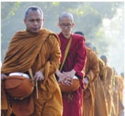

> **Deskripsi Visual:** Gambar ini adalah foto yang menunjukkan beberapa orang yang sedang berjalan di luar. Mereka semua mengenakan pakaian tradisional, dengan warna dominan merah dan kuning. Beberapa orang tampak membawa tas atau barang lainnya. Latar belakangnya tampak seperti sebuah area hijau atau taman, dengan pohon-pohon yang tinggi dan cahaya matahari yang cerah. Gambar ini mungkin digunakan untuk tujuan edukasi atau dokumentasi tentang budaya atau kegiatan sosial tertentu.

 

---
## 📄 Halaman 40

### 2. Makna Keragaman Budaya Buddhis

Dalam kehidupan bermasyarakat dijumpai beragam tradisi dan budaya yang berkembang di sekitar. Tradisi dan budaya tersebut merupakan hasil kreasi dan kepercayaan yang diyakini oleh masyarakat di daerah tersebut. Setiap tempat memiliki keunikannya tersendiri. Hal ini antara lain dipengaruhi oleh keyakinan  dan  kepercayaan,  tempat,  keadaan  alam,  kemajuan  peralatan, pola kehidupan dan cara berpikir masyarakat di daerah itu.

Ajaran  Buddha  memiliki  suatu  keunikan  atau  kekhasan  yang  bersifat universal  dimana  mampu dapat berkembang sesuai dengan kebudayaan dan kebiasaan  setempat.  Sehingga  kini  terdapat  berbagai  sekte  dan  aliran  yang terkadang kelihatannya sangat berbeda, namun pada intinya mempunyai tujuan yang sama, membimbing umat untuk mencapai pembebasan. Ajaran Buddha yang dikenal sebagai ajaran damai dengan semboyan suci yaitu  Cinta Kasih dan Kasih Sayang, telah tersebar di hampir seluruh Asia, Amerika dan Eropa.

Setiap  negara  biasanya  mempunyai  ciri  khasnya  tersendiri  dalam menerima Ajaran  Buddha yang merupakan suatu jawaban atas tuntutan dan  pengaruh  filosofis,  sosial  dan  kebudayaan  setempat.  Buddha  sendiri, lebih menekankan mengetahui sedikit ajaran tetapi praktik ajaran ( Dharma ) yang lebih intensif. Beliau juga menegaskan bahwa ajaran itu sebagai sarana untuk dipakai bila diperlukan dan ditinggalkan ketika tujuan telah tercapai yang diibaratkan rakit dipakai untuk menyeberangi sungai. ( Alagadhupama Sutta, Majjhima Nikāya, Sutta Pitaka )

Dampak  positif  dari  keragaman  budaya  Buddhis  yang  berkembang pada saat ini, antara lain: menciptakan identitas umat Buddha, menambah kekayaan  kebudayaan  Buddhis,  memperkuat  persaudaraan  dan  toleransi, menjadi sumber pengetahuan, meningkatkan kerukunan, serta menggalang persatuan dan kesatuan. Dampak negatif dari keragaman budaya Buddhis, antara  lain:  timbulnya  konflik  atau  perpecahan,  munculnya  persaingan, kesulitan  mengupayakan  persatuan  dan  kesatuan,  serta  adanya  sikap fanatisme dan ekslusivisme.

Pluralisme  kebudayaan  pada  masyarakat  penganut  agama  Buddha merupakan  konsekuensi  dari  penerapan  ajaran  yang  bersifat  pragmatis, toleran dan demokratis. Setiap komunitas Buddhis memiliki dan mempertahankan nilai-nilai tradisional yang dipandang sesuai atau relevan untuk menyempurnakan kehidupan manusia ( Mukti, 2006:372 )

 

---
## 📄 Halaman 41

Sikap-sikap yang perlu dikembangkan dalam keragaman budaya Buddhis, antara lain: saling menghormati  terhadap  perbedaan,  sikap toleransi terhadap berbedaan, sikap suka menolong, dan cinta damai, serta sikap persaudaraan.

### 3. Macam-Macam Seni Bercorak Buddhis

Seni berdasarkan klasifikasinya terdapat seni sastra (prosa, puisi), seni suara (vokal, musik), seni gerak (tari, teater) dan seni rupa (lukis, patung, grafis, seni dekoratif, seni kerajinan, dan seni arsitektur).

### a. Seni sastra bercorak Buddhis

Seni sebagai bagian dari kebudayaan yang dapat diartikan sebagai keahlian mengekspresikan  ide  estetika  sehingga  menciptakan  suatu  karya  yang bermutu.  Seni  budaya  berkenaan  dengan  keahlian  untuk  menghasilkan sesuatu  dalam  bentuk  tulisan,  percakapan,  dan  benda  bermanfaat  yang diperindah ( Mukti, 2005:382 )

Ajaran  Buddha  akan  lebih  mudah  dipahami  apabila  disajikan  dalam bentuk syair ( gatha )  dan  khotbah dengan gaya bahasa prosa yang diikuti sajak  sebagai  pengulangan  dan  ringkasan  ( geyya ).  Para  siswa  Buddha menulis tentang apa yang diajarkan dengan gayanya sendiri secara kreatif.

Karya-karya sastra itu sering dipandang sebagai tafsir ajaran menurut latar  belakang  budaya  penulisnya.  Buddhacarita,  misalnya,  syair  berupa kisah  yang  ditulis  oleh  Asvaghosa  mengenai  riwayat  hidup  Buddha. ( Nasiman, 2019: 144 )

---
**🖼️ Gambar/Diagram**

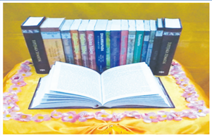

> **Deskripsi Visual:** Gambar ini menunjukkan sebuah buku pelajaran yang terbuka di tengah-tengah, dengan beberapa buku lainnya yang terletak di sekelilingnya. Buku yang terbuka tampaknya adalah buku referensi atau teks pelajaran yang lebih spesifik, karena terdapat tulisan yang jelas dan detail di halaman tersebut. Di sekeliling buku terbuka, terdapat beberapa buku lain yang tampaknya berisi materi yang sama atau terkait dengan buku tersebut. Semua buku tampaknya diletakkan di atas meja atau permukaan yang bersih dan rapi, dengan latar belakang yang cerah dan netral. Teks, angka, atau label penting tidak terlihat dalam gambar ini, sehingga informasi kunci yang dapat diambil pembaca hanya melalui konteks visual dan pengetahuan tentang buku pelajaran tersebut.

 

---
## 📄 Halaman 42

### b. Seni suara bercorak Buddhis

Seni suara merupakan sebuah lantunan suara, nadanya memiliki nilai yang dapat menggerakkan isi hati sang pendengar. Seni suara merupakan sesuatu yang indah dan dapat menyentuh perasaan, di dalamnya terdapat unsur kebaikan dan kejujuran.

Pada zaman Buddha, seni suara juga sudah digunakan sebagai media dalam pengembangan spiritual dan penghormatan ( puja ). Menjelang saat parinibbana, suara musik surgawi terdengar dari angkasa memuliakan Buddha. Orang-orang pun menghormati jenazah Buddha dengan persembahan tari, lagu pujian, dan musik ( Maha Parinibbana Sutta, Digha Nikāya ). Konon, saat Buddha Gautama masih sebagai pertapa, beliau meninggalkan cara bertapa yang ekstrim setelah mendengar lirik lagu mengenai cara menyetel senar kecapi ( Mukti, 2005:386 )

Pada umumnya, seni suara dikolaborasikan dengan seni gerak, artinya seni suara sering diikuti oleh gerakan-gerakan tarian. Demikian sebaliknya, seni gerak atau tari sering diiringi oleh musik maupun suara. Hal ini tidak lain karena keduanya memang menjadi satu kesatuan yang saling melengkapi. Seni tari dalam konteks Buddhis  sering  dimunculkan  dalam  kegiatan-kegiatan  tertentu  seperti  perayaan Dharmasanti  Waisak,  pentas  seni  Buddhis,  bahkan  sampai  pada  perlombaan Buddhis. Hal ini bertujuan untuk menampilkan kreasi generasi muda Buddha yang bercirikan Buddhis. Seni tari yang merupakan hasil kreasi generasi muda Buddhis merupakan karya seni yang pantas menjadi kebanggaan umat Buddhis.

---
**🖼️ Gambar/Diagram**

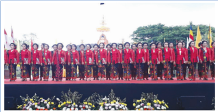

> **Deskripsi Visual:** Gambar ini adalah foto yang menunjukkan sebuah acara resmi di mana banyak orang berdiri bersama-sama. Orang-orang tersebut tampaknya sedang mengikuti upacara atau perayaan, karena mereka semua berdiri dengan posisi yang rapi dan seragam. Di sekitar mereka, terlihat beberapa bendera dan papan pengumuman yang mungkin menyatakan informasi tentang acara tersebut. Gambar ini menunjukkan keharmonisan dan kerja sama dalam suatu acara besar, mungkin untuk memperingati hari kemerdekaan atau acara penting lainnya.

 

---
## 📄 Halaman 43

### c.   Seni rupa bercorak Buddhis

Seni  rupa  bercorak  Buddhis  adalah  karya  seni  yang  berupa rupang , lukisan, kerajinan, dan arsitektur, terutama yang berkaitan dengan sarana peribadatan yang kaya dengan simbol-simbol keagamaan. Lukisan dan relief di vihara atau candi mengungkapkan riwayat hidup Buddha dan Bodhisatwa. ( Nasiman, 2019: 144 )

Setiap  vihara  dengan  berbagai  aliran  memiliki  perbedaan-perbedaan dalam penampilan, bentuk bangunan, dan ornamen vihara. Demikian juga dengan rupang Buddha. Buddha tidak pernah memerintahkan atau membuat peraturan untuk vihara, rupang , dan candi agar dibuat secara seragam. Jadi, semua yang ada hanyalah hasil karya seni  manusia  yang  tinggi.  Dengan demikian,  karya  seni  itu  pantas  dan  layak  dijadikan  sebagai  simbol  dan objek dalam mengembangkan dan memahami Ajaran Buddha, agar mudah mengembangkan kebajikan.

Setiap karya seni keagamaan tidak hanya merupakan benda fisik, namun selalu  memiliki  isi  yaitu  semangat  atau  jiwa  yang  membuatnya  memiliki peran dalam kehidupan  keagamaan.  Seperti rupang kecil bodhisatva Siddharta yang berdiri di atas teratai dengan tangan kanan menunjuk ke langit dan tangan kiri menunjuk ke bumi, mengingatkan kita pada peristiwa kelahiran Pangeran Siddharta. ( Master Lok To, 1998:283 )

### Aktivitas Peserta Didik

- Apa hubungan budaya Buddhis dan praktik ajaran Buddha?
- Sikap-sikap apa yang perlu dikembangkan dalam keragaman budaya Buddhis?
- Apa makna  keragaman  budaya Buddhis?

 

---
## 📄 Halaman 44

Beberapa keluarga ( kulaputta ) belajar Dharma melalui khotbah-khotbah ( sutta-sutta ), bait-bait ( geyya ), eksposisi-eksposisi ( veyyakarana ), syairsyair ( gatha ), pernyataan-pernyataan gembira ( Udāna ), kata-kata ( itivuttaka ), cerita-cerita kelahiran ( jataka ), Dharma yang menakjubkan ( abbhutadhamma )  dan  tanya-jawab  ( vedalla ).  Setelah  itu  memeriksa arti ajaran-ajaran itu dengan kebijaksanaan, dan mendapat pengertian benar  dari  ajaran-ajaran  itu.  Mereka  tidak  belajar  Dharma  untuk memenangkan perdebatan, mengalami kebaikan sesuai dengan tujuan mempelajari Dharma akan memperoleh  kesejahteraan dan kebahagiaan mereka untuk masa yang lama. ( Alagaddupama Sutta, Majjhima Nikāya )

### B.  Unsur-Unsur  Budaya Buddhis

Unsur dan faktor budaya meliputi bahasa, sistem pengetahuan, sistem religi, sistem  kemasyarakatan,  sistem  mata  pencaharian,  dan  sistem  kesenian. ( Laning, 2015:12 ).

### 1. Sistem Bahasa

Unsur pertama yang terdapat dalam budaya adalah bahasa. Bahasa merupakan sebuah  media  yang  berfungsi  sebagai  cara  atau  metode  bagi  manusia  untuk berkomunikasi. Dalam konteks Buddhis, setelah Buddha mengajar ajaran yang pertama kali,  kemudian  mengutus Arahat untuk  mengembara  seorang  diri  ke tempat yang berbeda-beda. Dalam hal tersebut, tentu Arahat akan bersentuhan dengan  bahasa  yang  berbeda  sesuai  wilayahnya.  Hal  itu  menandakan  bahwa budaya dapat menjadi indikasi  atau  tanda  akan  adanya  peradaban  di  wilayah tertentu. 'Janganlah dua orang pergi dalam satu arah, ajarkan Dharma yang indah pada awal, indah pada pertengahan dan indah pada akhir. ( Narada, 1995:76 ).

### 2. Sistem Pengetahuan

Unsur  selanjutnya  dalam  kebudayaan  adalah  sistem  Pengetahuan.  Unsur ini  mencakup pengetahuan tentang berbagai hal, mulai dari kondisi alam sekitar hingga perilaku sosial manusia. Agama Buddha yang lahir di  India telah bersentuhan dengan kebudayaan India. Pada awalnya banyak orang berpandangan bahwa pengikut Buddha identik dengan penganut kebudayaan

 

---
## 📄 Halaman 45

India. Kebudayaan Buddhis bervariasi dari daerah yang satu dengan yang lain sebagaimana beragamnya bahasa dan adat istiadat.

### 3. Sistem Religi

Sistem  religi  mencakup  agama  dan  aliran  kepercayaan  yang  dianut  oleh sekelompok masyarakat. Unsur agama dalam sebuah budaya meliputi praktik yang bersifat suci, yaitu berupa kehidupan monastik (menjalani hidup sebagai pertapa),  upacara-upacara  keagamaan  seperti Uposatha dan Kathina yang sudah ada sejak jaman Buddha, alat-alat yang digunakan pada saat upacara, persembahan puja, maupun tradisi yang berkaitan dengan keagamaan.

---
**🖼️ Gambar/Diagram**

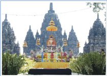

> **Deskripsi Visual:** Gambar ini adalah ilustrasi yang menunjukkan kompleks candi Prambanan, sebuah situs warisan dunia UNESCO di Yogyakarta, Indonesia. Kompleks candi ini terdiri dari beberapa candi utama yang dibangun pada abad ke-9 Masehi oleh Raja Sriwijaya. Candi-candi utamanya adalah Candi Kidal, Candi Banyunibo, dan Candi Penataran. Ilustrasi ini menunjukkan bagaimana arsitektur candi yang indah dengan detail relief dan ukiran yang menggambarkan kehidupan Buddha dan para dewa Hindu.

Elemen-elemen utama dalam gambar meliputi candi-candi utama yang terletak di tengah-tengah kompleks, pohon-pohon besar yang menghiasi sekitar kompleks, dan hamparan tanah hijau yang membentuk latar belakang. Relasi antara elemen-elemen ini adalah bahwa candi-candi utama menjadi pusat perhatian, dengan pohon-pohon yang memberikan nuansa alami dan hijau, serta tanah hijau yang memberikan nuansa alam semula jadi.

Teks, angka, atau label penting yang terlihat dalam gambar adalah tidak ada, karena gambar ini hanya berupa ilustrasi tanpa teks atau angka tambahan.

Informasi kunci yang dapat diambil pembaca dari gambar ini adalah bahwa Prambanan adalah kompleks candi yang megah dan memiliki arsitektur yang indah, serta pentingnya keberadaan pohon-pohon besar dan tanah hijau sebagai bagian dari keindahan alam semula jadi.

### 4. Sistem Kemasyarakatan

Sistem kemasyarakatan merupakan unsur budaya yang terdiri atas sekelompok masyarakat yang memiliki kesamaan di dalamnya. Unsur sistem kemasyarakatan ini berperan sangat penting dalam pewarisan budaya. Umat Buddha bila dilihat dari cara menjalani kehidupan terdiri atas dua kelompok besar  yaitu pabbajita ( bhikkhu,  bhikkhuni,  samanera, dan samaneri )  dan perumah tangga ( gharavasa ) yaitu upasaka upasika ( Rashid, 1997:23 ).

### 5. Sistem Mata Pencaharian

Unsur berikutnya yang terdapat dalam budaya adalah sistem mata pencaharian.  Unsur  ini  merupakan  upaya  manusia  untuk  bertahan  hidup dengan  melakukan  berbagai  kegiatan  yang  dapat  menghasilkan  barang atau jasa yang diperlukan. Dalam agama Buddha ada kelompok gharavasa (perumah tangga) adalah orang yang menjalani hidup berkeluarga, mempunyai pekerjaan seperti petani, pedagang, militer dan lain-lain yang memberikan penghasilan untuk biaya kehidupan ( Rashid, 1997:23 ).

 

---
## 📄 Halaman 46

### 6. Sistem Kesenian

Unsur terakhir dalam budaya adalah kesenian. Unsur ini berupa setiap karya atau produk yang dibuat oleh manusia dan mengandung unsur estetika atau keindahan di dalamnya. Unsur ini meliputi berbagai bentuk, mulai dari seni tari, musik, lukis, arsitektur dan lain sebagainya. Unsur kesenian juga menjadi unsur dari budaya karena seni ini juga berasal dari gagasan dan pemikiran manusia yang diimplementasikan melalui sebuah tindakan. Seni dalam agama Buddha  memiliki  peran  penting  sebagai  sarana  lebih  mudah  memahami ajaran. Ajaran Buddha yang disampaikan ke para siswa dalam bentuk gatha (syair), kotbah ( sutta ), tanya jawab, inspirasi sebagai bagian dari seni. Buddha memberikan  kesempatan  kepada  para  siswa  untuk  menerangkan  ajaran dengan penyajian berbeda sesuai dengan kemampuan batin para siswa.

### Aktivitas Peserta Didik

- Identifikasikan unsur-unsur budaya yang ada di daerahmu!
- Jelaskan unsur-unsur budaya Buddhis?
- Bagaimana sistem kemasyarakatan sebagai unsur budaya Buddhis ?
- Apakah  masyarakat  Buddhis  di  daerahmu  menerima  keragaman budaya Buddhis?

### C.  Keragaman Budaya Buddhis sebagai Identitas Umat Buddha

Budaya dan agama terjalin erat dalam masyarakat dan tak terpisahkan dari kehidupan  manusia.  Nilai  kemanusiaan,  keterampilan,  kecerdasan,  dan keindahan  estetika  dapat  dilihat  melalui  praktik  budaya.  Budaya  adalah ekspresi  dari  tradisi  yang  diperhalus,  diperindah,  dan  diadaptasi  dengan baik untuk memengaruhi  kehidupan  manusia.  Praktik budaya  dapat menginspirasi pikiran manusia.

Berdasarkan  ajaran  Buddha,  seseorang  hendaknya  tidak  begitu  saja menerima  atau  menolak  suatu  tradisi  tanpa  mempertimbangkan  dahulu, apakah  praktik  semacam  itu  bermanfaat  dan  memiliki  makna  baginya. ( Anggutara Nikāya I.189 ).

 

---
## 📄 Halaman 47

Budaya juga dapat melindungi dan mempromosikan suatu agama. Ketika memperkenalkan ajaran agama melalui praktik budaya, kegiatan keagamaan sehari-hari  akan  lebih  menarik.  Praktik  budaya  yang  bersifat  religius merupakan  batu  loncatan  untuk  memahami  cara  hidup  religius.  Mereka yang awalnya tidak beragama, pada akhirnya akan terbiasa menghadiri dan mengapresiasi  kegiatan  keagamaan.  Dengan  mengikuti  kegiatan  tersebut, secara bertahap, orang-orang akan mendapatkan kesempatan untuk meningkatkan pengetahuan dan pemahaman agama yang benar.

Seorang penganut agama tidak hanya menempatkan agamanya sebagai kebudayaan  atau  pedoman  bagi  kehidupan,  melainkan  juga  menjadikan atribut jati diri dalam interaksi sosial. ( Suparlan, 1999:20 ).

Agama  memiliki  kontribusi  besar  dalam  memperkaya  budaya.  Banyak pandangan yang mengatakan bahwa di negara-negara Asia, pada umumnya, praktik agama berkaitan dengan aktivitas budaya. Tarian, lagu, seni, dan drama sebagian besar terinspirasi dari mata pelajaran agama. Tanpa budaya, kegiatan keagamaan mungkin akan menjadi sangat hambar dan tidak menarik.

Pada saat yang sama, mempraktikkan agama Buddha tanpa mengganggu tradisi  atau  penganut  agama  lain  merupakan  bentuk  toleransi.  Hidup berdampingan secara damai dengan perilaku terhormat dan sikap lembut, juga dapat dianggap sebagai aspek budaya. Bentuk-bentuk budaya Buddhis sebagai identitas umat Buddha dunia, antara lain:

- kehidupan para bhikkhu/pola hidup samana ;
- simbol-simbol  Buddhis,  seperti  bendera  Buddhis,  stupa,  cakra,  dan swastika;
- peninggalan budaya Buddhis, seperti candi Borobudur, candi Mendut, candi Pawon dan Candi sewu;
- upacara keagamaan, seperti upacara Asadha Puja yang sudah menjadi tradisi  rutin  di  Thailand,  dan  Waisak  Puja  di  candi-candi  yang  sudah mengakar kuat bagi umat Buddha di Indonesia;
- komunitas masyarakat  Buddhis  ( pabbajita  dan  gharavasa )  mengembangkan cinta kasih dan kasih sayang pada sesama;
- kitab suci dengan berbagai versi bahasa yang berbeda;
- seni Buddhis seperti lagu, relief, dan tarian;
- perilaku-perilaku  keagamaan  Buddha  seperti puja  bakti , pindapata , hidup berkesadaran

 

---
## 📄 Halaman 48

---
**🖼️ Gambar/Diagram**

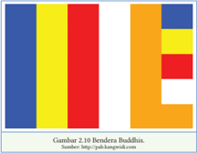

> **Deskripsi Visual:** Gambar 2.10 menunjukkan rendera Budhisme, yang merupakan representasi visual dari sistem filosofis dan agama Buddha. Gambar ini terdiri dari beberapa elemen utama yang saling terkait:

1. Gambar secara keseluruhan menunjukkan struktur dan bentuk yang kompleks, yang mungkin menggambarkan konsep-konsep filosofis atau teori-teori dalam budhisme.

2. Elemen-elemen utama termasuk warna-warna yang berbeda yang mungkin menunjukkan berbagai aspek atau konsep dalam budhisme. Warna-warna tersebut mungkin memiliki makna khusus dalam konteks budhisme.

3. Teks "Gambar 2.10 Rendera Budhisme" dan "Sumber: http://pahak.langkawi.net" memberikan informasi tentang sumber dan konteks gambar tersebut.

4. Informasi kunci yang dapat diambil pembaca meliputi bahwa gambar ini adalah representasi visual dari sistem filosofis dan agama Buddha, dengan elemen-elemen yang mungkin memiliki makna khusus dalam konteks budhisme.

Dengan demikian, gambar ini menunjukkan struktur dan bentuk yang kompleks yang mungkin menggambarkan konsep-konsep filosofis atau teori-teori dalam budhisme, dengan elemen-elemen yang mungkin memiliki makna khusus dalam konteks budhisme.

Agama Buddha yang diajarkan Buddha kepada para siswanya mempunyai kekhasan  atau  keunikan  dibandingkan  dengan  agama-agama  lain  yang berkembang di dunia. Keunikan agama Buddha ini, akhirnya dikenal oleh masyarakat dunia. Hal ini terjadi karena agama Buddha:

- tidak membedakan kelas atau lapisan sosial/kasta,
- berdasarkan cinta kasih yang universal,
- mengajarkan diri sendiri sebagai pelindung,
- merupakan agama antikekerasan,
- berlandaskan pada Ehipassiko , dan
- mengajarkan hukum sebab akibat. ( Nasiman, 2017:82-85 ).

### Aktivitas Peserta Didik

- Apa  tanggapan  kalian  tentang  budaya  Buddhis  sebagai  identitas umat Buddha?
- Identifikasikan bentuk budaya Buddhis yang berbeda dengan budaya lainya.
- Nilai-nilai  apa  yang  bisa  digali  dari  keragaman  Budaya  Buddhis sebagai identitas umat Buddha dunia?

### Inspirasi Dharma

Semua  ilmu  pengetahuan,  baik  yang  tinggi,  sedang,  ataupun  rendah,  patut dipelajari,  diketahui,  dan  dimengerti  maknanya,  walaupun  tidak  seluruhnya perlu  diterapkan.  Suatu  hari  kelak,  jika  tiba  saatnya,  pengetahuan  itu  akan membawa banyak manfaat ( Khuddaka Nikāya 817 ).

 

---
## 📄 Halaman 49

### D.  Tokoh Pendukung Agama Buddha dalam  Keragaman Budaya Buddhis

Perkembangan dan penyebaran keragaman budaya Buddhis tidak lepas dari peran para tokoh pejuang agama Buddha. Mereka merupakan sosok pemimpin spiritual  yang  memiliki  peranan  sangat  penting  dalam  memperkenalkan Buddhisme  kepada  umat  manusia.  Adapun  tokoh-tokoh  pejuang  agama tersebut, di antaranya ialah Thich Nhat Hanh dan Ajahn Brahmavamso.

### 1.   Hidup Penuh Kesadaran Thich Nhat Hanh

Thich  Nhat  Hanh  lahir  di  Vietnam dengan nama Nguyen Xuan Bao pada tanggal 11 Oktober 1926. Thich Nhat Hanh merupakan  seorang pemimpin spiritual, penulis, penyair, dan aktivis perdamaian dan anti kekerasan. Dia memainkan  peranan  penting  dalam mengenalkan  Buddhisme  ke  dunia Barat  dan  mendirikan  vihara-vihara dan tempat pelatihan meditasi lebih dari 1000 komunitas Sangha .

Pada  perang  Vietnam,  beliau  berjuang  tanpa  henti  untuk  rekonsiliasi antara  Vietnam  Utara  dan  Vietnam  Selatan.    Sikap  non-diskriminasi  dan enggan berpihak pada dua kubu yang sedang bertikai menyebabkan beliau tidak diijinkan pulang ke kampung halamannya. ( Thich Nhat Hanh, Pikiran Buddha, Tubuh Buddha, 2010 ).

Beliau hidup dalam pengasingan di sebuah komunitas kecil di Prancis, tempat  beliau  mengajar,  menulis,  berkebun,  dan  bekerja  membantu pengungsi di seluruh dunia. Thich Nhat Hanh mengadakan banyak retret kesadaran  ( mindfulness )  di  Eropa  dan  Amerika  Utara  untuk  membantu veteran, kanak-kanak, pencinta alam, psikoterapis, artis, dan ribuan insan yang mencari kedamaian dalam hati.

Thich  Nhat  Hanh  hidup  dalam  pengasingan  jauh  dari  Vietnam  sejak tahun 1966, ketika beliau diusir oleh pemerintahan komunis dan nonkomunis Vietnam. Beliau diusir karena perannya dalam mencegah kekerasan yang menimpa  rakyatnya.  Dia  memperjuangkan  sebuah  gerakan  yang  dikenal

 

---
## 📄 Halaman 50

sebagai ' engaged  buddhism '  yang  menggabungkan  pelatihan  meditasi tradisional dengan gerakan protes non-kekerasan. Beliau juga membentuk organisasi pertolongan untuk membangun kembali desa-desa yang hancur, mendirikan  Sekolah  Pemuda  Bakti  Sosial,  menerbitkan  sebuah  majalah perdamaian,  dan  mendesak  pemimpin  dunia  untuk  mengutamakan  nonkekerasan dalam menyelesaikan masalah.

Meskipun terasing dari tanah kelahirannya, perjuangan Thich Nhat Hanh mendapat penghargaan di seluruh dunia. Beliau membantu pembentukan misi pertolongan hingga tahun 1970-an bagi orang Vietnam yang ingin melarikan diri  dari  penindasan  politik.  Bahkan,  setelah  kondisi  politik  di  Vietnam stabil, Thich Nhat Hanh tetap tidak diizinkan pulang. Pemerintahan Vietnam menganggap  dirinya  sebagai  ancaman.  Sebuah  ironi,  mengingat  ajarannya tentang  menghormati  hidup,  kemurahan  hati,  tingkah  laku  seksual  yang bertanggung jawab, komunikasi dengan cinta kasih, serta melatih gaya hidup yang sehat.

Thich  Nhat  Hanh  merupakan  seorang  guru  Buddhis  yang  sangat terkenal  di  dunia  Barat.  Beliau  mengajarkan  latihan  yang  sangat  selaras dengan berbagai orang yang berasal dari latar belakang religius, spiritual, dan pandangan politik yang berbeda. Beliau menawarkan latihan perhatian penuh  ( mindfulness )  yang  merupakan  adaptasi  dari  sensibilitas  nuansa Barat. Pada tahun 1966, beliau mendirikan Order of Interbeing , pusat latihan monastik dan pusat latihan lainnya di berbagai belahan dunia.

Beliau diizinkan pulang ke Vietnam pada tahun 2005 dan 2007. Selama di pengasingan, beliau telah menulis lebih dari 100 judul buku, mencakup lebih dari  40  judul  yang  berbahasa  Inggris.  Beliau  juga  menerbitkan  Ceramah Dharma per kuarter dalam Jurnal Order of Interbeing, The Mindfulness Bell.

Thich Nhat Hanh terus aktif berkarya dalam pergerakan perdamaian, memberi retret  untuk  peserta  dari  Israel  dan  Palestina,  serta  mendukung kedua  pihak  untuk  mendengar  secara  mendalam  dan  saling  belajar  dari sesamanya. Beliau berulang kali berpidato untuk mendesak negara-negara yang  terlibat  dalam  pertikaian  agar  berhenti  berperang  dan  menjadikan nonkekerasan sebagai solusi atas semua permasalahan.

 

---
## 📄 Halaman 51

### Inspirasi Thich Nhat Hanh

Kedamaian ditemukan di sini dan saat ini, di dalam diri, dan di setiap aktivitas yang kita lakukan dan temui. Pertanyaannya adalah, apakah kita mampu menyentuh kedamaian tersebut? Kita tidak perlu berjalan jauh  untuk  menikmati  birunya  langit.  Kita  tidak  perlu  meninggalkan kota atau tetangga kita untuk menikmati keriangan.

### Aktivitas Peserta Didik

- Apa makna  inspirasi dari Thich Nhat Hanh?
- Bagaimana kesan kalian terhadap tokoh Thich Nhat Hanh?
- Jelaskan peran Thich Nhat Hanh dalam perkembangan agama Buddha di Eropa!
- Sikap apa yang menginspirasi kalian dalam kehidupan sehari-hari?

---
**🖼️ Gambar/Diagram**

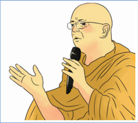

> **Deskripsi Visual:** Gambar ini adalah ilustrasi yang menampilkan seorang orang berwajah tua dengan topi hitam dan kacamata, sedang berbicara menggunakan mikrofon. Orang tersebut mengenakan pakaian tradisional, tampaknya adalah seorang pemimpin atau guru. Ilustrasi ini mungkin digunakan untuk membantu pembaca memahami konsep atau cerita yang berkaitan dengan kehidupan seorang guru atau pemimpin spiritual.

Elemen utama dalam gambar ini adalah orang tua dengan topi hitam dan kacamata, yang sedang berbicara menggunakan mikrofon. Topi hitam dan kacamata menunjukkan bahwa orang tersebut mungkin memiliki status atau peran tertentu, mungkin sebagai seorang pemimpin atau guru. Mikrofon menunjukkan bahwa orang tersebut sedang berbicara atau memberikan pidato.

Teks, angka, atau label penting tidak ada dalam gambar ini. Namun, informasi kunci yang dapat diambil dari gambar ini adalah bahwa gambar ini mungkin digunakan untuk membantu pembaca memahami konsep atau cerita yang berkaitan dengan kehidupan seorang guru atau pemimpin spiritual.

### 2. Kepiawaian Ajahn Brahmavamso Dalam Membabarkan Dharma

Ajahn  Brahm  lahir  di  London pada tanggal 7 Agustus 1951 dengan nama Peter Betts. Beliau lahir di keluarga pekerja di London,  pada  masa  usai  Perang Dunia II, sebuah masa yang sulit  bagi  banyak  orang.  Meski kekurangan materi, tetapi keluarga Betts adalah tempat yang  baik  untuk  bertumbuhnya anak  kecil.  Ada  sebuah  ucapan dari ayah Peter yang begitu membekas bagi Peter, 'Pintu rumahku akan selalu terbuka untukmu, tak peduli apa pun yang kamu lakukan dalam hidup.'

Ajahn  Brahmavamso  memandang  dirinya  sebagai  seorang  Buddhis saat  beliau  berusia  17  tahun  melalui  buku  agama  Buddha  yang  dibacanya saat  masih  sekolah.  Beliau  tertarik  pada  agama  Buddha  dan  meditasi  yang telah  berkembang  ketika  belajar  teori  fisika  di  Universitas  Cambridge.

 

---
## 📄 Halaman 52

Setelah menyelesaikan pendidikannya, beliau  melakukan  perjalanan  ke  Thailand. Di  Thailand,  beliau  menjadi  bhikkhu  dan ditahbiskan di Bangkok saat berusia 23 tahun oleh  kepala  biara,  Wat  Saket.  Selanjutnya, beliau menghabiskan 9 tahun untuk belajar dan berlatih Tradisi Meditasi Hutan dari Y.M. Ajahn Chah. Ajahn Brahmavamso memiliki keahlian dalam menyampaikan pesan-pesan dari Buddha Gautama melalui sebuah cerita. Postur dan mimik pembawaannya sangatlah bagus. Banyak umat yang merasakan kebahagiaan setelah mendengarkan tuntunan Dharma secara langsung dari beliau.

---
**🖼️ Gambar/Diagram**

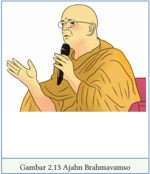

> **Deskripsi Visual:** Gambar 2.13 menunjukkan seorang ajahn Brahmaswamisu sedang berbicara dengan menggunakan mikrofon. Ia duduk di atas kursi merah muda, mengenakan pakaian monastik tradisional Buddha. Ajahn tersebut tampak sangat serius dan bersemangat saat berbicara. Gambar ini menunjukkan elemen-elemen penting seperti ajahn, kursi, mikrofon, dan pakaian monastik. Informasi kunci yang dapat diambil dari gambar ini adalah bahwa ajahn Brahmaswamisu sedang memberikan pidato atau pengajaran, yang menunjukkan bahwa ia memiliki peran penting dalam kehidupan monastik atau budaya Buddha.

Peter  melanjutkan  kuliah  di Cambridge  University dengan  beasiswa penuh karena kecerdasannya. Dia mempelajari teori fisika selama tiga tahun dan  menemukan  bahwa  kecerdasan  dan  kebijaksanaan  adalah  hal  yang sangat berbeda. Ajahn Brahm senang membabarkan Dharma menggunakan cerita, kiasan, dan lelucon. Dharma itu sukacita, bahagia, kuat, bertenaga, dan bersemangat. Lelucon cerdas nan inspiratif dalam setiap ceramahnya membuat kehadirannya selalu ditunggu-tunggu ribuan orang.

Ajahn  Brahm  ialah  guru  Buddhis.  Dia  populer  di  kalangan  komunitas Buddhis  internasional  yang  terus  berkembang.  Komunitas  Buddhis  yang  tertarik untuk belajar meditasi dan mengembangkan pemahaman spiritual yang lebih tinggi. Ajahn Brahm telah menjadi pemimpin Buddhis yang terkenal. Seperti halnya Dalai Lama, beliau sering berpidato ketika ada ketidakadilan sosial dan pelanggaran  hak  asasi  manusia.  Beliau  telah  merangkul  multikulturalisme dalam tindakan dengan menjadi pemimpin komunitas yang sangat beragam di  Perth.  Beliau  pernah  berpidato  tentang  penderitaan  para  pencari  suaka. Beliau telah mengambil tindakan nyata untuk memastikan bahwa perempuan memiliki status dan kesempatan yang sama.

Ajahn  Brahm  ialah  duta  spiritual  untuk  Australia  karena  dia  sering berkeliling  dunia,  terutama  di  Asia.  Beliau  memberikan  ceramah  kepada puluhan ribu orang. Kedudukan tinggi untuk Ajahn Brahm telah mengangkat profil agama Buddha di Australia dan memberikan rasa percaya diri yang lebih besar kepada masyarakat setempat. Ada banyak orang yang pindah ke

 

---
## 📄 Halaman 53

Perth untuk hidup di bawah bimbingan spiritualnya. Ajahn Brahm berada di  tengah  komunitas  yang  sedang  berkembang.  Mereka  mengembangkan identitas Buddha Australia yang unik.

Ajahn Brahm telah melayani masyarakat dengan menawarkan nasihat bijak  dan  kasih  sayang  bagi  siapa  saja  yang  datang  kepadanya,  tanpa memandang  ras,  jenis  kelamin,  keyakinan  agama,  atau  status  sosial.  Dia selalu fokus melayani orang-orang yang ada di depannya setiap saat, baik itu orang sakit kanker stadium akhir, orang yang menderita depresi, narapidana, orang  yang berurusan dengan masalah perkawinan, seorang meditator yang berdedikasi, atau siapa pun, tanpa diskriminasi. Tujuan hidupnya ialah untuk mengajari  orang  bagaimana  menjadi  bahagia  dan  mengatasi  penderitaan mereka dalam hidup.

### Aktivitas Peserta Didik

- Apa tanggapan kalian mengenai dua guru spiritual Thich Nhat Hanh dan Ajahn Brahmavamso?
- Bagamana kepiawaian Ajahn Brahm dalam membabarkan Dhamma?
- Sikap apa yang menginspirasi Ajahn Brahmavamso dalam  kehidupan sehari-hari?

### Orang Buta dan Gajah

Ajahn Brahmavamso menggambarkan tentang seorang raja yang bijaksana. Dia mengumpulkan beberapa orang buta dalam festival besar di negeri itu. Raja memerintahkan setiap orang buta itu untuk menyentuh bagian tubuh yang berbeda dari seekor gajah dan meminta mereka untuk menggambarkan seperti apa gajah itu. Secara mengejutkan, ada seorang buta yang berkata bahwa gajah itu seperti gentong air lantaran dia menyentuh hanya bagian perutnya. Orang buta yang lain mengatakan bahwa gajah itu seperti ular, lantaran dia hanya memegang ekornya saja, dan seterusnya sampai orangorang buta itu mempertengkarkan pendapat yang lain.

 

---
## 📄 Halaman 54

Ajahn  Brahm  dalam  cerita  tersebut  hendak  menyentil  keegoisan dalam  diri  manusia.  Manusia  hanya  mengetahui  sebagian  saja  dari kebenaran.  Jika  manusia  memegang  teguh  pengetahuannya  sebagai kebenaran  mutlak,  manusia  tak  ubahnya  sama  seperti  salah  satu  dari orang buta yang meraba satu bagian dari seekor gajah. ( Kitab Udāna 68, Khuddhaka Nikāya, Sutta Pitaka ).

### Aktivitas Peserta Didik

- Apa makna inspiratif dari cerita orang buta dan gajah?
- Apa tujuan Ajahn Brahmavamso memberikan cerita tersebut?
- Nilai-nilai apa yang perlu kita hindari dan kembangkan berdasarkan cerita tersebut?

### Penerapan Nilai Luhur

Ajaran  Buddha  memiliki  suatu  keunikan  atau  kekhasan  yang  bersifat universal,  yaitu  mampu  berkembang  sesuai  dengan  kebudayaan  dan kebiasaan  setempat.  Oleh  sebab  itu,  tradisi  Buddhis  berkembang  seiring dengan dinamika masyarakat Buddhis. Kata kunci yang mendasari kemajemukan aliran itu adalah kerukunan dan persaudaraan.

Mari,  kita  menjalin  persaudaraan  antaraliran  dalam  agama  Buddha. Persaudaran  tidak  hanya  sebatas  satu  aliran  atau  sekte  tertentu,  tetapi persaudaraan  menyangkut  seluruh  kehidupan  ini.  Persaudaraan  sejati tidak  memandang  nama  sekte,  nama  guru,  ritual,  bahasa,  dan  kelompok masyarakat.  Harmoni  dan  kerukunan  merupakan  nilai  dasar  yang  harus tetap terjaga dalam kehidupan yang majemuk.

Persaudaraan harus tetap dibangun dan dipupuk sepanjang masa. Ketika seseorang berhenti memupuk persaudaran, pada waktu yang sama, dia telah memberi peluang terjadinya perpecahan. Persaudaran merupakan salah satu unsur yang terpenting untuk tetap terjaganya kehidupan yang harmonis. Tanpa persaudaraan, kehidupan ini akan mudah tercerai-berai.

 

---
## 📄 Halaman 55

Kalian  telah  mengikuti  serangkaian  pembelajaran  materi  'Keragaman Budaya  Buddhis'  dengan  model  pembelajaran  nilai  ( value  learning )  dan pendekatan pembelajaran berbasis aktivitas ( action learning approach ).

- Pengetahuan baru apa yang kalian peroleh setelah mengikuti pembelajaran 'Keragaman Budaya Buddhis'?
- Karya seni Buddhis apa yang bisa kalian kembangkan untuk meningkatkan budaya Buddhis?
- Sikap apa yang dapat kalian teladani dari tokoh pejuang agama Buddha dalam keragaman budaya Buddhis?
- Apa tindakan nyata yang dapat kalian lakukan setelah pembelajaran ini?

### A.  Penilaian Pengetahuan

- Para  tokoh  Agama  Buddha  menyebarkan  Dharma  ke  daerah-daerah bersentuhan dengan tradisi dan budaya setempat. Ada  tradisi dan budaya yang selaras dengan Dharma dan ada pula yang tidak sejalan dengan Dharma. Bagaimana menentukan tradisi itu sesuai dengan Dharma dan tradisi itu tidak sesuai dengan Dharma?
- Dewasa  ini  perkembangan  ilmu  pengetahuan  dan  teknologi  sangat pesat sehingga mempengaruhi pola pikir dan hidup bagi anak-anak dan pemuda. Banyak anak-anak hanya menikmati barang-barang teknologi seperti smartphone sehingga membawa pengaruh pada perkembangan budaya Buddhis. Bagaimana meningkatkan budaya Buddhis di tengah maraknya perkembangan teknologi sekarang ini?
- Apa manfaat bentuk-bentuk budaya Buddhis bagi umat Buddha?
- Jelaskan  budaya  Buddhis  sebagai  identitas  umat  Buddha  yang  ada  di daerah kalian!

 

---
## 📄 Halaman 56

### B.   Penilaian Sikap

### Penilaian Diri

Setelah mengikuti pembelajaran pada materi keragaman Budaya Buddhis, lakukan  penilaian diri untuk  menguatkan  profil  pelajar Pancasila yang kalian latih pada dimensi berkebhinekaan global, yaitu menghargai  budaya,  mendeskripsikan  pembentukan  identitas  dirinya memahami, menerima keberadaan, dan menghargai keunikan masingmasing budaya sebagai sebuah kekayaan perspektif sehingga terbangun kesalingpahaman dan empati terhadap sesama.

Isilah dengan tanda √ pada kolom di bawah ini!

1 = Tidak pernah

2 = Jarang

3 = Sering

4 = Selalu

---
**📊 Tabel**

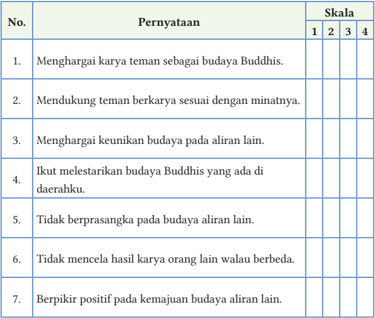

Tabel ini berisi 7 perynayaan yang berkaitan dengan budaya Buddha dan kepentingannya dalam masyarakat. Kolom pertama berisi nomor urut dari 1 hingga 7, sedangkan kolom kedua berisi skala yang dapat diisi oleh responden, yaitu 1, 2, 3, atau 4. Data penting yang terlihat adalah bahwa semua perynayaan memiliki skala yang sama, yaitu 1, 2, 3, atau 4, menunjukkan bahwa setiap perynayaan memiliki nilai yang sama dalam skala tersebut. Ini menunjukkan bahwa setiap perynayaan memiliki nilai yang sama dalam skala tersebut.

 

---
## 📄 Halaman 57

---
**📊 Tabel**

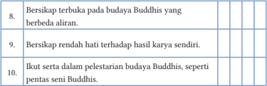

Tabel ini berisi tiga baris yang masing-masing menunjukkan prinsip-prinsip budaya Buddha. Topik utama tabel adalah "Bersikap terbuka pada budaya Buddha yang berbeda aliran", "Bersikap rendah hati terhadap hasil karya sendiri", dan "Ikut serta dalam pelestarian budaya Buddha, seperti seni seni Buddha". Kolom pertama menunjukkan topik, kolom kedua menunjukkan nilai-nilai yang diharapkan, kolom ketiga menunjukkan tingkat kesesuaian dengan nilai-nilai tersebut, dan kolom keempat menunjukkan skor yang diberikan untuk setiap topik. Data penting yang terlihat adalah bahwa semua topik memiliki nilai 100%, menunjukkan bahwa semua prinsip yang ditentukan dalam tabel ini dianggap sangat penting oleh pembuat tabel.

### C.   Penilaian Keterampilan

### Membuat Kliping

Kliping merupakan sekumpulan konten materi  dari berbagai media cetak yang berisi tentang informasi-informasi penting, dan kemudian disatukan.

- Carilah  informasi  penting  tentang  perkembangan  budaya  Buddhis  di daerah!
- Buatlah    analisis  penjelasan  tentang  sejarah  budaya,  unsur  budaya, makna dan perkembangan budaya tersebut!
- Perhatikan  aspek  kesesuian  tema,  estetika,  dan  orisinalitas  kliping tersebut.
Untuk  menambah  wawasan  dan  pemahaman  kalian    tentang  makna keragaman  budaya  Buddhis,  unsur-unsur  budaya  Buddhis,  keragaman budaya  Buddhis  sebagai  identitas  umat  Buddha,  serta  tokoh  pendukung agama Buddha dalam keragaman budaya, lakukan hal-hal berikut!

- Mencari contoh-contoh seni budaya Buddhis lainnya baik seni sastra, seni suara, dan seni rupa.
- Mendeskripsikan bentuk-bentuk budaya Buddhis sebagai identitas umat Buddha di lingkungan tempat tinggal.
- Mencari  tokoh-tokoh  pendukung  agama  Buddha  dalam  keragamanan budaya Buddhis lainnya.

 

---
## 📄 Halaman 58

---
**🖼️ Gambar/Diagram**

> **Deskripsi Visual:** Gambar ini adalah ilustrasi yang menampilkan Buddha sedang bermeditasi. Buddha duduk dengan posisi lotus, tangan di atas pergelangan tangan, menunjukkan pose meditasi yang sering digunakan dalam budaya Buddha. Dia dilingkari oleh warna hijau yang tenang dan damai, sementara latar belakangnya berwarna merah muda yang lebih cerah, mungkin untuk menonjolkan keindahan dan keharmonisan dalam meditasi. Ilustrasi ini mungkin digunakan sebagai representasi dari konsep kebodohan dan kebijaksanaan dalam budaya Buddha, yang menggambarkan meditasi sebagai cara untuk mencapai kebijaksanaan.

Mereka yang di dalam dirinya tidak dapat ditemukan rasa malu dan takut berbuat salah, telah menyimpang dari sumber yang terang, dan akan terseret kembali pada kelahiran dan kematian. Namun mereka yang di dalam dirinya selalu ada rasa malu dan takut berbuat salah, yang damai, mantap dalam kehidupan suci, mereka dapat mengakhiri kelahiran dan kematian.

(Sukkadhamma Sutta, Itivuttaka 42)

 

---
## 📄 Halaman 59

KEMENTERIAN PENDIDIKAN, KEBUDAYAAN, RISET, DAN TEKNOLOGI REPUBLIK INDONESIA, 2022

Pendidikan Agama Buddha dan Budi Pekerti untuk SMA/SMK Kelas XII

Penulis: Katman  dan Tupari

Isbn: 978-602-244-568-5 (jilid 3)

### MENGATASI MASALAH DENGAN MEDITASI

Tujuan Pembelajaran

Peserta  didik  dapat  mengatasi  masalah  dalam  kehidupan  sehari-hari dengan pengembangan batin.

---
**🖼️ Gambar/Diagram**

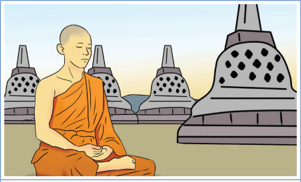

> **Deskripsi Visual:** Gambar ini adalah ilustrasi yang menampilkan seorang biksu berjubah merah sedang bermeditasi dengan posisi jari tangan berada di depan dada. Dia berdiri di depan sebuah stupa yang memiliki pola bulat-bulat di permukaannya. Di latar belakang, terlihat beberapa stupa lainnya yang mirip dengan stupa utama tersebut. Gambar ini menunjukkan suasana tenang dan penuh meditasi, yang biasanya digunakan untuk menggambarkan kehidupan dan praktek Buddha.

Elemen utama dalam gambar ini adalah seorang biksu yang sedang bermeditasi, stupa yang menjadi objek utama, dan beberapa stupa lainnya yang membentuk latar belakang. Relasi antara elemen-elemen ini adalah bahwa stupa utama menjadi pusat perhatian dan simbol keagungan dan keindahan budaya Buddha, sementara stupa lainnya menunjukkan keberagaman dan keberlanjutan tradisi Buddha.

Teks, angka, atau label penting tidak ada dalam gambar ini karena ia hanya berupa ilustrasi. Namun, informasi kunci yang dapat diambil dari gambar ini adalah tentang kehidupan dan praktek Buddha, serta keindahan dan keagungan budaya Buddha melalui stupa sebagai simbol keagungan dan keindahan budaya Buddha.

- Apa arti masalah dalam kehidupan?
- Mengapa masalah muncul dalam kehidupan?
- Bagaimana  cara mengatasi masalah?
- Apakah meditasi merupakan solusi semua masalah?

 

---
## 📄 Halaman 60

---
**🖼️ Gambar/Diagram**

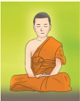

> **Deskripsi Visual:** Gambar ini adalah ilustrasi yang menampilkan seorang Buddha sedang bermeditasi. Ilustrasi ini menunjukkan Buddha duduk dengan posisi meditasi yang serasi, mengenakan pakaian tradisional Buddha yang khas, yaitu jubah kuning dengan lengan panjang. Latar belakangnya berwarna hijau cerah yang memberikan suasana tenang dan penuh kedamaian. Ilustrasi ini menunjukkan hubungan antara Buddha dan meditasi, yang merupakan bagian penting dari kehidupan Buddha dan praktik Buddha. Teks, angka, atau label penting tidak terlihat pada gambar ini. Informasi kunci yang dapat diambil pembaca adalah bahwa gambar ini menunjukkan Buddha sedang bermeditasi, yang merupakan bagian penting dari kehidupan Buddha dan praktik Buddha.

### Duduk Hening!

Duduklah dengan rileks, mata terpejam, perhatikan dan sadari napas kalian, rasakan dalam hati:

- 'Menyadari, .......... napas masuk'
- 'Menyadari, .......... napas keluar'
- 'Menyadari, .......... napas masuk'
- 'Menyadari, .......... napas keluar'.
mengatasi, masalah, cara, meditasi, ketenangan, batin, teknik, manfaat

Amati gambar di bawah ini, kemudian beri tanggapan sesuai  pesan-pesan yang terkandung di dalamnya!

---
**🖼️ Gambar/Diagram**

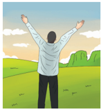

> **Deskripsi Visual:** Gambar ini adalah ilustrasi yang menunjukkan seorang pria berdiri dengan tangan di atas kepala, menghadap ke arah matahari yang terbit di awan cerah. Pemandangan sekitarnya terlihat tenang dengan tanah hijau dan pohon-pohon di latar belakang. Ilustrasi ini mungkin digunakan untuk menggambarkan konsep positif seperti kebahagiaan, kepuasan, atau kemajuan dalam hidup.

Elemen utama dalam gambar ini meliputi:
1. Pria yang sedang berdiri dengan tangan di atas kepala.
2. Matahari yang terbit di awan cerah.
3. Latar belakang yang terdiri dari tanah hijau dan pohon-pohon.

Relasi antara elemen-elemen tersebut adalah bahwa pria tersebut tampak sangat bahagia atau puas, yang bisa dilihat dari posisinya yang teguh dan tangan yang diangkat. Matahari yang terbit menunjukkan harapan atau kemajuan, sementara latar belakang yang tenang menunjukkan suasana hati yang damai dan tenang.

Teks, angka, atau label penting yang terlihat dalam gambar ini tidak ada, sehingga informasi kunci yang dapat diambil pembaca hanya dari visual saja.

Dalam satu paragraf yang informatif, gambar ini mungkin digunakan untuk menggambarkan konsep positif seperti kebahagiaan, kepuasan, atau kemajuan dalam hidup. Gambar tersebut menunjukkan seorang pria yang berdiri dengan tangan di atas kepala, menghadap ke arah matahari yang terbit di awan cerah. Latar belakang yang terdiri dari tanah hijau dan pohon-pohon menambahkan nuansa damai dan tenang pada gambar tersebut.

---
**🖼️ Gambar/Diagram**

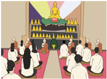

> **Deskripsi Visual:** Gambar ini adalah ilustrasi yang menunjukkan sebuah pertemuan religius atau keagamaan. Gambar ini menggambarkan sekelompok orang yang sedang berdiri dan mendengarkan seseorang yang duduk di atas panggung. Orang yang duduk tampak seperti seorang pemimpin atau guru, mungkin Buddha, karena posisinya yang duduk dan lingkungan yang menyerupai tempat ibadah Buddha. Orang-orang yang berdiri tampak seperti murid atau pengikutnya, menunjukkan hubungan antara mereka. Lingkungan yang menunjukkan tempat ibadah Buddha dengan altar, lampu, dan ornamen yang menarik perhatian. Teks, angka, atau label penting tidak terlihat dalam gambar ini. Informasi kunci yang dapat diambil pembaca adalah bahwa ini adalah sebuah pertemuan religius atau keagamaan, mungkin dalam konteks Buddha atau agama lainnya, dengan seorang pemimpin atau guru yang sedang memberikan pidato atau pengajaran kepada murid-muridnya.

 

---
## 📄 Halaman 61

### A.  Masalah dalam Kehidupan

Manusia  adalah  makhluk  sosial  yang  sering  berinteraksi  dengan  orangorang di sekitarnya. Bahkan, mungkin mereka berinteraksi dengan orang yang sama sekali tidak pernah bertemu. Akibatnya, mereka tidak bisa lepas dari masalah. Semua orang tentu mendambakan hidup yang lebih tenang, bahagia, dan bebas dari segala kesulitan serta masalah yang membelenggu.

### 1. Pengertian Masalah

Masalah merupakan suatu kesenjangan antara apa yang seharusnya terjadi dan  apa  yang  sudah  terjadi;  antara  kenyataan  yang  terjadi  dan  yang  seharusnya terjadi; serta antara harapan dan kenyataannya. Secara sederhana, masalah diartikan sebagai sesuatu yang menghambat, merintangi, atau mempersulit seseorang dalam mencapai tujuan tertentu ( Nurwito. 2018:96 )

Berdasarkan  pemaparan  di  atas,  dapat  disimpulkan  bahwa  masalah adalah kesenjangan antara harapan dan kenyataan. Semakin tinggi ketidaksesuaian dengan sesuatu yang diharapkan atau kenyataannya sebagai masalah yang besar. Tetapi semakin rendah ketidaksesuaian dengan sesuatu yang diharapkan berati masalah yang dihadapi semakin kecil.

### 2. Hakikat Suatu Masalah

Bentuk konkret dari rintangan itu bermacam-macam, misalnya: gangguan dari dalam atau dari luar, maupun tantangan yang ditimbulkan oleh situasi kehidupan.  Masalah  yang  timbul  dalam  kehidupan  pun  beraneka  ragam, salah  satunya  ialah  masalah  perkembangan  individu.  Menjaga  kesehatan mental menjadi salah satu topik yang menarik perhatian bagi setiap kalangan milenial dan orang dewasa. Salah satu bentuknya ialah gangguan kecemasan dan kegelisahan.

Beberapa  terapi  untuk  gangguan  kecemasan  pun  bermunculan,  salah satunya melalui meditasi. Berlatih meditasi mengajarkan seseorang untuk mengenali,  mendengar,  dan  mengerti  kecemasan  yang  ada  di  dalam pikirannya.  Mengendalikan  pikiran  akan  membuat  kalian  menjadi  orang yang lebih tenang, jauh lebih bahagia, serta terbebas dari perasaan takut, khawatir, dan cemas. Dengan meditasi dapat mengatasi berbagai masalah yang berhubungan dengan mental, melenyapkan ketegangan dan tekanan yang datang dari kehidupan sehari-hari ( Mukti. 2005:218 )

 

---
## 📄 Halaman 62

---
**🖼️ Gambar/Diagram**

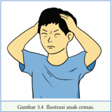

> **Deskripsi Visual:** Gambar 3.4 merupakan ilustrasi yang menunjukkan seorang anak yang cemas. Gambar ini menggambarkan tindakan anak yang sedang memegang kedua telinganya dengan tangan, menunjukkan rasa cemas atau stres yang dialami oleh anak tersebut. Ilustrasi ini mencerminkan perasaan emosional yang dialami oleh individu, yaitu ketakutan atau kecemasan. Ini adalah bentuk visual yang efektif untuk menggambarkan perasaan emosional, sehingga pembaca dapat memahami dan merasakan perasaan cemas yang dialami oleh anak tersebut.

Besar kecilnya suatu masalah tak lepas dari kondisi  pikiran.  Terkadang, tanpa disadari, sebuah masalah kecil bisa menjadi besar karena pikiran mengondisikannya seperti itu. Ketika masalah  sedang  menghampiri,  pastikan agar pikiran tidak terbawa arus masalah tersebut.  Tidak  ada  masalah  yang  tanpa solusi. Namun, dibutuhkan pikiran yang jernih untuk dapat mengetahui cara  menghadapi  masalah  yang  datang bertubi-tubi dan membelit kehidupan.

Elizabeth  Hoge  dari  Harvard  Medical  School  mengatakan  bahwa bermeditasi dengan perhatian penuh untuk mengatasi gangguan kecemasan merupakan  hal  yang  masuk  akal.  Orang  dengan  gangguan  kecemasan, biasanya memiliki masalah dalam menghadapi pikiran yang mengganggunya. Meditasi dapat mengatasi kecemasan dan menurunkan ketegangan. Dengan mengikuti latihan meditasi, proses menenangkan diri umumnya akan lebih mudah dilakukan.

Banyak  alasan yang dapat menyebabkan  kalian kesulitan untuk menenangkan diri  atau  memusatkan  perhatian.  Sebagian  orang  kesulitan untuk berdiam diri tanpa melakukan apa pun karena mereka terbiasa selalu aktif. Selain itu, mereka kesulitan untuk mencegah gangguan dari pikiran negatif saat ingin tenang karena terlalu sibuk dengan segala aktivitas.

Hakikat  dari  penyelesaian  masalah  adalah  cara  menghadapi  atau pendekatan masalah dengan cara sebagai berikut.

### a. Berusaha Menenangkan Pikiran

Kalian  tidak  akan  pernah  bisa  menghadapi  dan  mengatasi  masalah dalam kondisi pikiran yang kacau. Salah satu caranya, dengan kondisikan pikiran  dan  hati  agar  lebih  tenang.  Karena  ketenangan  dapat  membuka pikiran sehingga dapat menghadapi masalah secara lebih positif. Temukan Akar atau Penyebab Masalah. Kalian juga tidak dapat menemukan cara yang paling  tepat  dalam  mengatasi  masalah  hidup  apabila  belum  menemukan akar  permasalahannya.  Ketahui  dan  pahami  dengan  jelas  masalah  yang membelenggu sehingga kalian akan mempunyai arah yang jelas dan tepat untuk menemukan solusinya. Dengan mengetahui akar permasalahannya secara jelas, kalian dapat mengetahui dengan benar dan jelas bahwa upaya

 

---
## 📄 Halaman 63

yang dilakukan sudah berada di jalan yang benar. Namun, terkadang masalah juga dapat muncul dari hal-hal yang tak pernah terpikirkan sebelumnya.

### b. Tidak Membesar-besarkan Masalah

Hal yang harus dicamkan saat mencari cara mengatasi masalah adalah tidak  membesar-besarkan  masalah  yang  terjadi.  Seseorang  yang  sering membesar-besarkan masalah adalah orang yang menderita oleh pikirannya sendiri. Oleh karena itu, pastikan pikiran kalian tetap terkontrol, terjaga, dan tidak membuat hidup kalian menjadi lebih buruk.

### c. Selalu Berpikir Positif

Anda  tidak  akan  bisa  menemukan  cara  untuk  mengatasi  masalah ketika pikiran kalian masih dipenuhi hal-hal negatif. Saat prasangka buruk memenuhi pikiran dan hati, kalian hanya akan menemukan jalan yang gelap, bukan  jalan  yang  terang.  Jalan  teranglah  yang  bisa  membimbing  kalian untuk  mendapatkan  solusi  dari  masalah  yang  dihadapi.  Berpikir  positif menjadi salah satu jalan yang harus dilalui jika kalian ingin bisa mengatasi masalah. Dengan berpikir positif, kalian akan terbantu untuk mengurangi beban akibat masalah tersebut. Saat beban sudah terasa lebih ringan, pikiran otomatis  akan  lebih  jernih  dan  mampu  melihat  jalan  mana  yang  harus ditempuh untuk mendapatkan solusi.

### d. Melakukan Evaluasi Diri

Apapun masalah yang menimpa, sebaiknya kalian selalu mawas diri. Melihat  lebih  seksama  masalah  yang  terjadi,  karena  kesalahan  sendiri. Mengevaluasi diri atas kesalahan yang pernah dilakukan merupakan cara yang tidak boleh dilewatkan saat menemui masalah. Melakukan introspeksi diri juga akan menjauhkan dari kemungkinan menyalahkan orang lain atas masalah yang dihadapi. Tindakan ini jauh lebih mulia dibandingkan dengan melempar  kesalahan  pada  orang  lain.  Pahami  dulu  sumbernya  sebelum mulai mencari cara untuk mengatasi masalah. Hal tersebut dapat membantu kalian dalam menemukan solusi yang paling paling tepat.

 

---
## 📄 Halaman 64

### Aktivitas Peserta Didik

- Apakah kalian pernah mengalami  masalah?
- Mengapa masalah terjadi dalam diri kalian?
- Bagaimana cara kalian menyelesaikan masalah tersebut?
- Tindakan apa yang perlu kalian lakukan agar masalah tersebut tidak muncul kembali?

### Inspirasi Dharma

Dharma tidak  hanya  menganjurkan  untuk  menghentikan  segala  kejahatan dan meningkatkan kebaikan. Dharma mengajarkan tentang pemurnian batin.  Pemurnian    batin  merupakan  akar  dari  segala  kebaikan,  serta sebab terjadinya kebahagiaan. Ajaran Buddha adalah sistem pelatihan batin yang paling lengkap dan efektif di dunia.

### B.  Mengatasi Masalah dalam Pendekatan Buddhis

Dalam kehidupan sehari-hari, banyak sekali permasalahan yang dihadapi, ada  hal  yang  menyenangkan,  tetapi  ada  pula  yang  tidak  menyenangkan. Ketika kalian mengalami hal-hal yang menyenangkan, kalian akan merasa senang, gembira, dan bahagia. Sebaliknya, ketika kalian mengalami hal-hal yang tidak menyenangkan, kalian akan merasa sedih, susah, kecewa, gelisah, khawatir,  tertekan,  bahkan  ada  yang  sampai  stres  maupun  bunuh  diri. Penyebab yang paling mendasar ialah karena tidak bisa mengatasi masalah tersebut sehingga tidak mengetahui atau tidak mempunyai cara bagaimana agar bisa mengatasi masalah tersebut.

Kehidupan manusia tidak lepas dari suatu masalah. Suatu masalah tentu ada sumber, cara mengatasi dan jalan yang harus dilaksanakan agar tidak diliputi masalah. Terkait dengan hal tersebut, Buddha membabarkan empat kebenaran mulia ( cattari ariya saccani ).  Khotbah pertama Buddha berisi empat

 

---
## 📄 Halaman 65

- kebenaran mulia, yaitu: 1) Kebenaran mulia tentang penderitaan ( Dukkha );
- Kebenaran  mulia  tentang  asal  mula  penderitaan  ( Dukkha  samudaya );
- Kebenaran  mulia  tentang  akhir  penderitaan  ( Dukkha  Nirodha );  dan  4) Kebenaran  mulia  tentang  jalan  yang  menuju  akhir  penderitaan  ( Dukkha Nirodagaminipatipada ) ( Dhammacakkapavattana Sutta, Samyutta Nikāya ).
Cara  mengatasi  masalah  atau  problem  yang  timbul  dalam  kehidupan sehari-hari  dapat  dilakukan  melalui  pendekatan  Ajaran  Buddha,  yaitu dengan  belajar  Ajaran  Buddha  ( pariyatti  Dharma )  dan  mempraktikkan Ajaran  Buddha  ( pattipati  Dharma )  agar  dapat  mengatasi  problem  atau masalah yang timbul tersebut.

Salah  satu  esensi  Ajaran  Buddha  yang  mendasari  untuk  mengatasi masalah  ialah  dengan  cara  berpikir  kritis  seperti  yang  tersirat  dalam empat kesunyataan mulia. Cara berpikir kritis yang terdapat dalam empat kebenaran  mulia,  yaitu:  memahami  suatu  masalah,  melenyapkan  sumber masalah,  merealisasi  terhentinya  masalah,  dan  mengembangkan  jalan menuju terhentinya masalah.

### 1. Memahami Suatu Masalah

Dalam kehidupan ini semua manusia tidak bisa lepas dari masalah. Dalam ajaran  Buddha  adanya  masalah  dalam  kehidupan  adalah  hal  yang  wajar. Buddha mengajarkan ajaran bahwa hakikat kehidupan ini adalah penderitaan ( dukkha ). Dengan memahami hal ini maka ketika masalah terjadi sebaiknya memahami  sebagai  sesuatu  yang  wajar.  Ketika  merasa  wajar  mengalami masalah, maka akan menanggapi masalah dengan tidak sedih berlarut-larut.

Masalah dan kesulitan akan menjadi bagian dari pengalaman hidup yang menjadikan manusia makin dewasa. Hidup manusia selalu berubah atau silih berganti dengan delapan kondisi duniawi yaitu untung, rugi, tenar, cemar, dipuji, dicela, suka, dan duka ( Anggutara Nikāya VIII.6 ).

### 2. Menemukan Sumber  Masalah

Buddha  menekankan mengenai tanggung jawab manusia atas penderitaan di dunia. Buddha menyatakan sumber dari dukkha adalah keinginan. Orang yang diliputi keinginan tak pernah merasakan puas, banyak masalah dalam hidupnya.  Orang  yang  mempunyai  keinginan  cenderung  tamak  sehingga menginginkan  banyak  hal  sehingga  tak  segan  berbuat  kejahatan  dan menciptakan masalah baru bagi dirinya dan orang lain.

 

---
## 📄 Halaman 66

Orang yang berusaha memuaskan nafsu keinginan ibarat memberi air garam kepada orang yang haus. Semakin minum akan  bertambah  haus  dan  dahaganya  tak pernah  hilang.  Orang  yang  memuaskan nafsu keinginan, ketamakan akan tumbuh makin kuat, mudah kecewa, putus  asa,  sedih,  frustasi    dan    banyak diliputi permasalahan. Selalu berusaha untuk  melekatkan  diri  pada  nafsu  indera sebenarnya  melestarikan penderitaan.

### 3.   Cara Menyelesaikan Masalah

Dalam  kehidupan  sehari-hari,  orang    selalu  berusaha  untuk  memenuhi dan  memuaskan  'keinginan'  agar  mencapai  kebahagiaan.  Akan  tetapi, ketika  melakukan    sesungguhnya    melekatkan  diri    pada  hal-hal  yang sebenarnya tidak stabil, berubah terus menerus dan tidak permanen. Buddha mengajarkan kepada para siswa bahwa segala sesuatu selalu berubah atau mengalami ketidakkekalan ( anicca) .  Begitu  juga  masalah  akan  mengalami perubahan, akan berakhir.

Salah  satu  cara  mengakhiri  masalah  ialah  dengan  tidak  menjadikan permasalahan sebagai masalah. Orang cenderung mempermasalahkan hal yang sebenarnya bukan masalah. Buddha pernah berkata kepada para siswa 'Apa pun yang engkau pikirkan, itu akan lain jadinya.'( Sutta Nipata 3.12, Khuddhaka Nikāya, Sutta Pitaka ).  Maksudnya, orang yang terlalu banyak memikirkan masalah dengan berlebihan, terlalu banyak berasumsi, masalah tersebut akan makin membuatnya menderita.

### 4.   Menjalankan Cara Menyelesaikan Masalah

Buddha telah memberikan jalan menuju akhir dukkha yang disebut satu jalan berunsur delapan. Satu jalan berunsur delapan bisa menjadi tuntunan dalam menyelesaikan  berbagai  persoalan  sosial  maupun  pribadi.  Ini  merupakan solusi yang tepat  jikalau 'keinginan' adalah penyebab penderitaan, maka jalan penghentian penderitaan adalah dengan cara meninggalkannya, melepaskannya atau membiarkannya lenyap. Inilah yang sebenarnya merupakan tujuan dari jalan Buddha, dengan  pencapaian kebahagiaan tertinggi ( nibbana ).

---
**🖼️ Gambar/Diagram**

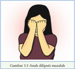

> **Deskripsi Visual:** Gambar 3.5 menunjukkan seorang anak yang sedang menghadapi masalah. Anak tersebut tampak sangat stres dan tidak nyaman, dengan kedua tangannya menutupi wajahnya. Ini menunjukkan emosi negatif seperti kecemasan atau kekhawatiran. Gambar ini mungkin digunakan untuk membantu siswa memahami dan merasakan perasaan anak-anak yang menghadapi masalah. Teks "Gambur 3.5. Analisasi masalah" menunjukkan bahwa gambar ini adalah bagian dari analisis masalah dalam buku pelajaran.

 

---
## 📄 Halaman 67

Salah satu Dharma yang bisa pelajari dan praktikkan untuk mengatasi masalah dengan  lima kekuatan ( pañcabala ). Jika  seseorang bisa memiliki dan  mempraktikkan  lima  kekuatan  tersebut,  maka  ketika  ada  masalah timbul, tidak akan membuat orang tersebut menderita. Lima kekuatan ini juga bisa digunakan untuk mengatasi rintangan batin dan mencapai tujuan hidup agar  terbebas dari penderitaan.

Lima kekuatan ( pañcabala ) yaitu sebagai berikut.

### a. Kekuatan keyakinan ( saddhabala )

Ini adalah kekuatan pertama yang perlu dimiliki yaitu adanya keyakinan. Keyakinan  yang  harus  dimiliki    umat  Buddha  yaitu  keyakinan  terhadap Buddha, Dharma, dan Sangha, dan jalan pembebasan ( nibbana ).

### b.   Kekuatan semangat ( viriyabala )

Semangat sangat diperlukan untuk mendukung keyakinan yang sudah  dimiliki.  Semangat  yang  dimaksudkan    adalah  bersemangat  dalam menghindari hal-hal yang buruk, dan bersemangat dalam mengembangkan hal-hal yang baik, berdaya upaya, berhasrat teguh, dan tidak menelantarkan tugas pada hal-hal yang baik.

### c.    Kekuatan perhatian ( satibala )

Pengembangan  perhatian  dapat  dilakukan  dengan  cara  berhati-hati dalam bertindak, berhati-hati dalam berucap, dan memiliki perhatian pada apa  yang  sedang  dilakukan.  Apabila  mempunyai  perhatian  yang  penuh, kalian tidak akan mudah terserang oleh kekotoran batin dan perbuatan jahat.

### d.   Kekuatan konsentrasi (samadhibala)

Dengan kekuatan konsentrasi, meditasi dapat mengendalikan pikiran. Semua  perbuatan  baik  maupun  buruk  bersumber  pada  pikiran.  Dengan melatih  pikiran  untuk  berkonsentrasi,  sama  halnya  dengan  memupuk kesadaran. Pikiran yang terkonsentrasi dengan kuat dan terpusat pada suatu objek ( jhana )  akan lebih mudah diarahkan untuk melakukan hal-hal yang baik dan menghindari hal-hal yang buruk.

 

---
## 📄 Halaman 68

### e.   Kekuatan kebijaksanaan (paññabala)

Kebijaksanaan  adalah  mengetahui  mana  yang  benar  dan  mana  yang salah, mana yang baik dan mana yang buruk, serta mengetahui mana yang berguna  dan  mana  yang  tidak  berguna.  Dalam  hal  ini,  dengan  memiliki kekuatan  kebijaksanaan,  kita  akan  mampu  untuk  menyadari  muncul  dan lenyapnya batin dan jasmani ( Aṅguttara Nikāya III.10, Sutta Pitaka ).

Lima  kekuatan  tersebut,  apabila  dilaksanakan  dengan  benar,  akan dapat memperkuat batin untuk berani dan kuat dalam menghadapi segala permasalahan dan problem yang timbul dalam kehidupan. Kita bisa berani dan kuat karena telah memiliki keyakinan terhadap Dharma, semangat yang tak  tergoyahkan,  perhatian  yang  tepat,  pikiran  yang  terkonsentrasi,  dan kebijaksanaan yang luhur.

### Inspirasi Dharma

Hendaknya, seseorang seperti batu karang yang tak tergoyahkan oleh badai ombak yang menerjang.

Demikian juga halnya dalam kehidupan, seseorang haruslah tetap tegar dan tenang dalam menghadapi fenomena yang terjadi.

( Dhammapada, Pandita Vagga, Gatha 81) )

### Aktivitas Peserta Didik

- Identifikasikan	satu	masalah	yang	pernah	kalian	alami	di	sekolah!
- Analisis permasalahan tersebut berdasarkan pendekatan empat kebenaran mulia!
- Bagaimana cara menjalani kehidupan agar bebas dari masalah?

 

---
## 📄 Halaman 69

Bacalah kisah berikut dengan saksama!

### Kisah Kalayakkhini

Kisah  ini  bercerita  tentang  seorang  suami  yang  memiliki  istri  yang mandul. Karena merasa mandul dan takut diceraikan oleh suaminya, istrinya menganjurkan  suaminya  untuk  menikah  lagi  dengan  wanita  pilihannya. Suaminya menyetujui anjuran dari istinya. Tak berapa lama kemudian istri mudanya itu mengandung.

Ketika  istri  tua  mengetahui  bahwa  istri  muda  sedang  mengandung, dia  menjadi  tidak  senang.  Dia  merencanakan  untuk  menggugurkan  janin yang ada dalam rahim istri muda tersebut. Pada suatu kesempatan, istri tua berkata kepada istri muda, 'Jika kamu mengandung,  beritahu saya, karena saya punya ramuan yang cocok untuk ibu yang sedang mengandung.' Istri muda tidak curiga dan selalu mengabarkan kehamilannya kepada istri tua. Beberapa hari kemudian, istri tua mengirimkan ramuan yang sebenarnya adalah racun untuk menggugurkan kandungannya. Tak ayal lagi, istri muda pun keguguran.

Pada kehamilan yang kedua, istri tua juga melakukan hal yang sama. Akhirnya pada kehamilan istri muda yang kedua juga berhasil digugurkan berkat ramuan istri tua.

Segala  kejahatan  sudah  ditutupi,  akhirnya  akan  ketahuan  juga.  Istri muda  sempat  bercerita  dengan  tetangganya  mengenai  masalah  yang dideritanya. Tetangga itu menasihati istri muda, agar tidak memberitahukan kehamilannya kepada istri tua.

Pada kehamilannya yang ketiga, ia tidak memberitahu kepada istri tua. Melihat badannya yang makin membesar, kehamilan itu diketahui oleh istri tua.  Berbagai  cara  diakukan  oleh  istri  tua  agar  kandungan  istri  muda  itu keguguran. Tetapi akibat dari tindakannya itu istri muda meninggal pada saat persalinan. Sebelum meninggal, wanita malang itu dengan hati dilipui dendam, dan kebencian, kemudian mengucapkan sumpah untuk membalas dendam kepada istri tua. Akhirnya permusuhan itu pun dimulai terjadi.

Pada kelahiran  selanjutnya,  istri  muda  terlahir  sebagai  seekor  kucing dan istri tua terlahir sebagai seekor ayam. Ayam mati dimangsa kucing.

 

---
## 📄 Halaman 70

---
**🖼️ Gambar/Diagram**

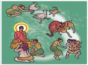

> **Deskripsi Visual:** Gambar ini adalah ilustrasi yang menunjukkan sebuah pertemuan atau perayaan tradisional. Gambar ini menggambarkan beberapa orang yang berdiri atau berjalan di sekeliling seseorang yang duduk di tengah-tengah, tampaknya sedang memberikan sesuatu kepada mereka. Orang-orang tersebut tampaknya berpakaian dengan pakaian tradisional, yang menunjukkan bahwa ini mungkin merupakan acara atau upacara budaya lokal.

Elemen utama dalam gambar ini adalah orang-orang yang terlibat dalam perayaan, seseorang yang duduk di tengah, dan lingkungan yang menunjukkan suasana tradisional. Relasi antara elemen-elemen ini adalah bahwa orang-orang di sekitar seseorang yang duduk di tengah tampaknya berpartisipasi dalam acara tersebut, mungkin sebagai penghormatan atau penghormatan terhadap orang yang duduk di tengah.

Teks, angka, atau label penting tidak terlihat dalam gambar ini. Namun, informasi kunci yang dapat diambil pembaca adalah bahwa ini mungkin merupakan acara atau upacara budaya lokal, dan bahwa ada interaksi sosial antara orang-orang yang terlibat dalam perayaan tersebut.

Kemudian, saat terlahir kembali, istri tua terlahir sebagai seekor macan tutul dan istri muda terlahir sebagai seekor rusa betina. Rusa betina mati diterkam macan tutul. Pada kelahiran selanjutnya, istri tua terlahir sebagai seorang	 wanita	 perumah	 tangga	 di	 Kota	 Savatthi	 dan	 istri	 muda	 terlahir sebagai peri yang bernama Kali.

Suatu Ketika,  sang  peri  ( Kalayakkhini )  terlihat  sedang  mengejar-ngejar wanita tersebut dengan bayinya. Ketika wanita itu mendengar bahwa Buddha sedang	 membabarkan	 Dharma	 di	 Vihāra	 Jetavana,	 dia	 berlari	 ke	 sana	 dan meletakkan bayinya di kaki Buddha sambil memohon perlindungan. Adapun sang peri ditahan di depan pintu vihara oleh dewa penjaga vihara. Akhirnya, Buddha mengizinkan supaya peri diperkenankan masuk, dan keduanya pun diberi nasihat oleh Buddha.

Buddha  menceritakan  asal  mula  permusuhan  mereka  pada  kehidupan yang lampau, yaitu sebagai seorang istri tua dan istri muda dari seorang suami. Kemudian, mereka terlahir kembali sebagai seekor ayam betina dan seekor kucing, lalu di kelahiran selanjutnya mereka menjadi seekor macan tutul dan seekor  rusa  betina.  Mereka  dipertemukan  untuk  melihat  bahwa  kebencian hanya dapat menyebabkan permusuhan yang berlarut-larut, tetapi kebencian akan berakhir melalui persahabatan dan kasih sayang ( Dhammapada Atthakatha, Gatha 291 ).

### Dhammapada Ayat 291 Kukkutandakhadika Vatthu.

Barang  siapa  yang  menginginkan kebahagiaan  bagi  dirinya  sendiri dengan  menimbulkan  penderitaan bagi orang lain, maka ia tidak akan terbebas  dari  kebencian,  ia  akan terjerat dalam kebencian.

 

---
## 📄 Halaman 71

### Aktivitas Peserta Didik

- Apa tanggapanmu mengenai kisah di atas?
- Mengapa terjadi permusuhan?
- Nilai-nilai  apa  yang  bisa  kalian  kembangkan  agar  tidak  terjadi permusuhan?
- Apa akibatnya jika permusuhan terjadi berlarut-larut?
- Apa yang kalian lakukan jika melihat secara nyata kisah tersebut?

### C.  Dasar-Dasar Meditasi Ketenangan Batin

### 1. Pemahaman Meditasi Ketenangan Batin

Meditasi merupakan pendekatan psikologis untuk pengembangan, pelatihan dan pemurnian pikiran. Dalam hal ini umat Buddha mempraktikkan meditasi untuk pelatihan  batin  dan  pengembangan  spiritual.  Secara  alamiah,  batin  yang  tak terlatih dan sangat sukar untuk dikendalikan akan membawa ketidaktenangan, kecemasan, kegelisahan dan kesedihan.  Seseorang yang tahu bagaimana cara bermeditasi akan dapat mengendalikan batinnya.

Adapun  langkah  awal  dalam  bermeditasi  ialah  persiapan  di  dalam diri.  Langkah ini  meliputi  kesempurnaan melaksanakan lima sila, ada guru pembimbing ( kalyanamitta ), kesungguhan hati, tekad ( adhiññhāna ), memiliki semangat ( viriya ),  disiplin,  ulet,  dan  memiliki  badan  yang  sehat,  pemilihan tempat meditasi yang sesuai (tenang, sunyi, dan sirkulasi udara baik), memilih waktu yang sesuai, memilih posisi tubuh yang sesuai, dan memilih objek yang sesuai (Nurwito, 2018:45).

Mengawali  latihan  meditasi  cinta  kasih,  seseorang  dapat  melakukannya dengan melafalkan kalimat persiapan cinta kasih yang diawali dari diri sendiri terlebih dahulu. Kalimat yang diucapkan seperti: semoga aku berbahagia; semoga aku  terbebas  dari  derita;  semoga  aku  terbebas  dari  mendengki;  semoga  aku terbebas dari menyakiti; atau semoga aku terbebas dari derita jasmani dan batin.

Latihan meditasi yang selanjutnya adalah memancarkan cinta kasih kepada orang-orang  yang  dihormati,  orang  yang  sangat  disayangi,  teman-teman, musuh-musuh, serta kepada semua makhluk. Dengan cara berkata di dalam batin

 

---
## 📄 Halaman 72

'Semoga semua makhluk berbahagia, bebas dari derita, bebas dari mendengki, bebas dari menyakiti, serta bebas dari derita jasmani dan batin. '

Fondasi yang kokoh akan menjamin keberhasilan meditasi yang perlu dikembangkan. Hal-hal tersebut, antara lain sebagai berikut.

- Berkelakuan  baik  agar  tidak  mengalami  penyesalan  dan  kekawatiran serta ketakutan.
- Selalu menjaga pancaindra dengan saksama. Maksudnya, mata tidak melihat objek yang membawa nafsu, telinga tidak dimanjakan dengan musik, hidung tidak dimanjakan dengan bau yang harum-harum, mulut tidak dibiarkan ketagihan dengan rasa yang enak-enak, dan badan tak sembarang disentuh dan menyentuh objek-objek yang membawa nafsu.
- Makan  secukupnya  dan  tidak  berlebihan.  Makan  secukupnya  hanya untuk	 menghilangkan	 rasa	 lapar	 dan	 menambah	 energi	 fisik	 untuk melaksanakan praktik meditasi.
- Tekun  berusaha  membersihkan  batin.  Pada  saat  siang  dan  sore  hari, ketika  duduk  maupun  berjalan,  hilangkanlah  pikiran-pikiran  yang merugikan  dan  menghambat  perkembangan  batin.  ( Majjhima  Nikāya 107, Sutta Pitaka )
Akhir-akhir ini, meditasi menjadi makin populer karena latihan meditasi dapat memecahkan masalah dan dapat mencapai tingkat pengendalian pikiran dan konsentrasi. Oleh karena itu, Buddha mengajarkan cara bermeditasi untuk melepaskan diri dari masalah-masalah tersebut.

### 2.   Praktik Meditasi Ketenangan Batin

Bagi pemula, meditasi dapat dilakukan dengan waktu yang singkat. Cobalah beberapa  menit  setiap  harinya.  Setelah  itu,  tingkatkan  durasinya  secara bertahap  sambil  terus  mempelajari  cara  untuk  lebih  rileks  dan  tenang. Berikut ini adalah cara sederhana yang dapat kalian ikuti untuk memulai latihan meditasi demi menghilangkan gejala gangguan kecemasan.

- Penuhi syarat dan persiapan untuk melaksanakan meditasi ketenangan batin.
- Pergi ke suatu tempat meditasi (ruangan atau tempat terbuka) di bawah bimbingan seorang guru meditasi.
- Pada  tahap  awal  meditasi  pandangan  terang  akan  diarahkan  pada meditasi ketenangan batin terlebih dahulu.
- Pengambilan objek bagi  pemula  yaitu Ānāpānassati (meditasi  dengan objek pernapasan).

 

---
## 📄 Halaman 73

Adapun  tahap  awal  meditasi samatha (meditasi  ketenangan  batin)  akan mengambil  objek ānāpānassati (meditasi  pernapasan)  sebagai kaya  nupassana (perhatian terhadap tubuh). Berikut ini tata cara meditasi dengan objek pernapasan.

### a. Sikap Duduk

Sikap duduk saat berlatih meditasi harus tegak, tetapi santai. Sikap duduk tersebut  dapat  membantu  bertahan  dalam  waktu  cukup  lama.  Sikap  duduk padmasana dengan cara kedua kaki disilangkan satu sama lain. Bagi kalian yang sudah  terlatih,  sikap  ini  akan  terasa  nyaman  karena  membantu  berada  dalam posisi tegak dan seimbang. Bagi kalian yang baru berlatih, kalian dapat mengambil sikap duduk setengah padmasana , (satu kaki disilangkan di bawah yang lain).

### b. Mengendurkan Ketegangan

Setelah  memilih  sikap  duduk  yang  rileks  secara  mental,  urutkanlah dari  atas  (kepala),  lalu  ke  bawah  hingga  ujung  kaki.  Gerakan  ini  untuk mengendurkan ketegangan otot-otot yang ada, misalnya otot kening, otot leher, dan otot punggung. Jika napas terasa tertahan, tariklah napas dalamdalam  dan  hembuskan  napas  perlahan-lahan  sehingga  akan  terasa  lebih santai dan otot pun mengendur.

### c. Bernapas dengan Wajar

Praktik meditasi dengan objek pernapasan tidak bertujuan untuk mengatur napas menjadi panjang atau pendek.  Bernapas  tidak  perlu  diaturatur,  sebaliknya  bernapaslah  dengan wajar sehingga tubuh ini mempunyai mekanisme yang dapat membuat napas menjadi teratur. Tahapan-tahapan melaksanakan  meditasi  dengan  objek pernapasan adalah sebagai berikut.

### 1) Tahap pertama: Menghitung napas

Menghitung  napas  ditujukan  kepada  kalian  yang  baru  pertama  kali berlatih  meditasi.  Tujuannya  untuk  mengarahkan  pikiran  yang  biasanya berkelana kian kemari melalui hitungan napas. Pada meditasi ini, pernapasan dilakukan melalui hidung, dengan memperhatikan sentuhan napas di ujung hidung. Setiap kali napas masuk, dihitung 'satu', napas masuk berikutnya dihitung 'dua', dan seterusnya sampai 'sepuluh'. Selanjutnya, kembali mulai lagi dari hitungan satu.

 

---
## 📄 Halaman 74

### 2) Tahap kedua: mengikuti napas

Pada tahap kedua mengikuti napas dilakukan dengan cara memperhatikan saat  napas  menyentuh  ujung  hidung,  lalu  diteruskan  hingga  proses  menarik napas. Perlu diperhatikan bahwa napas yang masuk, kemudian berangsur-angsur menjadi berhenti. Selanjutnya memulai proses mengeluarkan napas, sentuhan di ujung hidung sebagai awal dan kemudian mengeluarkan napas berangsur-angsur secara perlahan hingga berhenti, lalu memulai menarik napas kembali.

Mengikuti  napas  maksudnya  ialah  mengikuti  napas  dengan  penuh perhatian. Ketika meditator menarik napas panjang, dia harus mengetahui bahwa dia sedang menarik napas panjang; dan ketika menarik napas pendek, dia pun harus mengetahui bahwa dia sedang menarik napas pendek.

Setelah  berlatih  'mengikuti  napas'  dengan  tekun,  meditator  dapat memusatkan perhatian sepenuhnya pada napas dan akan timbul ketenangan yang  belum  pernah  dialami  sebelumnya  disertai  dengan  kegembiraan. Apabila pikiran tidak berkeliaran ke mana-mana, jasmani pun mulai menjadi tenang, selaras, dan terasa menyenangkan. Napas makin lama makin halus dan panjang. Akibatnya, perasaan letih pun lenyap dan jasmani pun terasa segar dan menyenangkan.

### 3) Tahap ketiga: memperhatikan sentuhan napas

Sebagian orang merasa terkejut ketika mengalami napas yang semakin lama makin halus dan tenang sehingga seolah-olah tidak terasa. Dia mengira bahwa dirinya sudah tidak bernapas lagi. Padahal sesungguhnya napasnya masih tetap ada. Akan tetapi, karena sedemikian halusnya, terasa seolaholah lenyap. Dengan menyadari bahwa napas akan selalu ada di sepanjang kehidupan,  hanya  karena  sangat  halus  sehingga  tidak  terasa.  Langkah terbaik yang harus dilakukan ialah dengan kembali memusatkan perhatian pada ujung hidung.

### 4) Tahap keempat: menenangkan napas

Perhatian pada proses keseluruhan dari napas (awal, tengah, dan akhir) dari setiap proses menarik dan mengeluarkan napas tidak terputus-putus. Dari proses itu, tampak bahwa ketika proses napas itu bergelombang dengan kasar, proses mental yang mengikutinyapun menjadi bergelombang sesuai dengan napas yang diamati.

 

---
## 📄 Halaman 75

### Aktivitas Peserta Didik

- Apa dasar dari pelaksanaan meditasi ketenangan batin?
- Persiapan apa yang  perlu diperhatikan dalam pelaksanaan meditasi ketenangan batin?
- Bagaimana  pengaruh  faktor  luar,  seperti  tempat,  objek,  dan  guru pembimbing terhadap keberhasilan meditasi?
- Tuliskan pengalamanmu saat melakukan persiapan meditasi ketenangan batin beserta gangguan yang biasanya timbul!

### Inspirasi Dharma

Sebelumnya  pikiran  ini  mengembara  semaunya.  Sesuai  kehendaknya dan  sesuai  kesenangannya.  Tapi  hari  ini,  saya  akan  menguasainya penuh perhatian. Seperti pawang menguasai gajah dengan kaitannya. ( Dhammapada 326, Khuddaka Nikāya )

### Praktik Meditasi

Praktikkanlah  meditasi  dengan  mengambil  obyek  pernapasan  sesuai dengan tahapan-tahapannya. Lakukan dengan bimbingan guru.

### Berlatih

Ceritakan kembali pengalaman kalian setelah mempraktikan meditasi tersebut pada kolom berikut!

 

---
## 📄 Halaman 76

### Praktik  Meditasi dengan Obyek Pernafasan

---
**📊 Tabel**

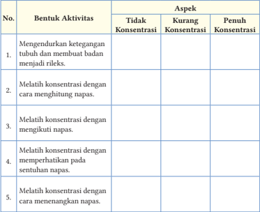

Tabel ini berisi informasi tentang berbagai aktivitas konsentrasi yang dapat dilakukan untuk meningkatkan kemampuan konsentrasi seseorang. Topik utama tabel adalah "Bentuk Aktivitas" dan "Aspek", yang mencakup tiga aspek: Tidak Konsentrasi, Kurang Konsentrasi, dan Penuh Konsentrasi. Setiap aktivitas diurutkan dalam urutan tertentu, dan dalam setiap baris, ada beberapa aspek yang mungkin relevan dengan aktivitas tersebut. Misalnya, aktivitas pertama, "Mengendurkan ketegangan tubuh dan membuat badan menjadi rileks," mungkin lebih relevan dengan aspek "Tidak Konsentrasi" karena itu bisa membantu meredakan stres dan memungkinkan tubuh untuk beristirahat. Sementara itu, aktivitas keempat, "Melatih konsentrasi dengan memperhatikan pada sentuhan napas," mungkin lebih relevan dengan aspek "Penuh Konsentrasi" karena itu melibatkan fokus ekstensif pada detail dan perasaan. Dengan demikian, tabel ini memberikan panduan tentang bagaimana berbagai aktivitas dapat membantu meningkatkan konsentrasi dan memilih aspek mana yang paling relevan untuk setiap aktivitas.

### Inspirasi Dharma

Pemusatan pikiran pada masuk dan keluarnya napas. Apabila dipupuk dan dikembangkan, akan menjadi suatu kedamaian, sesuatu yang istimewa, suatu  yang  sempurna,  dan  suatu  cara  hidup  yang  menyenangkan. Pemusatan  pikiran  juga  dapat  menghalau  pikiran  jahat,  tak  terlatih yang telah timbul, hingga membuatnya hilang seketika. Bagaikan debu dan kotoran yang beterbangan ketika bulan terakhir di musim panas, seketika turun ke bumi karena diguyur oleh hujan deras yang turun tibatiba dan menenangkan ( Saṃyutta Nikāya V: 321 ).

 

---
## 📄 Halaman 77

### D.  Manfaat Praktik Meditasi Ketenangan Batin

Meditasi memberi kesempatan untuk  mengenal  diri  sendiri  dan mengembangkan pengetahuan yang sangat berguna bagi kesejahteraan diri sendiri, keluarga, dan  lingkungan.  Kemajuan  zaman sekarang  ini  perkembangan  ilmu teknologi  modern  juga  membawa dampak yang membahayakan bagi pertumbuhan hidup umat

---
**🖼️ Gambar/Diagram**

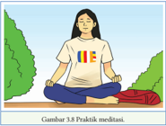

> **Deskripsi Visual:** Gambar ini adalah ilustrasi yang menunjukkan praktik meditasi. Gambar ini menggambarkan seorang individu yang sedang bermeditasi dengan posisi jodha, mata tertutup, dan tubuh yang rileks. Latar belakangnya adalah taman hijau dengan pohon besar, yang memberikan suasana tenang dan damai. Pada baju yang dikenakan oleh orang tersebut, terdapat logo yang tampak seperti empat segi yang berwarna merah, biru, kuning, dan hijau, mungkin merupakan simbol atau logo dari organisasi atau institusi yang mendukung praktik meditasi.

Elemen-elemen utama dalam gambar ini adalah orang yang sedang meditasi, posisi jodha yang mereka ambil, dan latar belakang taman hijau. Relasi antara elemen-elemen ini adalah bahwa orang yang sedang meditasi adalah subjek utama, sedangkan latar belakang taman hijau memberikan konteks alam yang damai dan tenang untuk praktik meditasi tersebut.

Teks, angka, atau label penting yang terlihat pada gambar ini adalah logo yang ada pada baju orang yang sedang meditasi. Informasi kunci yang dapat diambil pembaca dari gambar ini adalah bahwa praktik meditasi dilakukan dalam lingkungan yang damai dan tenang, yang dapat membantu dalam proses pemulihan diri dan peningkatan kesejahteraan mental.

manusia, seperti perampokan, kemalasan, iri hati, ketegangan mental, stres, bunuh diri,  dan  kecemasan.  Untuk  dapat  mengimbangi  kemajuan  zaman, agar dapat hidup bahagia dan terbebas dari ketegangan batin, dengan cara melaksanakan meditasi.

Meditasi adalah latihan untuk mengelola pikiran dan mengarahkannya pada  nilai-nilai  luhur  yang  membawa  manfaat.  Nilai-nilai  luhur  tersebut patut  untuk  dikembangkan  di  dalam  batin  karena  akan  membantu  saat menghadapi masalah, kesulitan, bahkan tekanan dalam hidup.

Dengan  bermeditasi,  seseorang  akan  berusaha  untuk  mengarahkan pikirannya  pada  nilai-nilai  yang  bajik.  Tujuan  bermeditasi  adalah  memunculkan sekaligus menumbuhkan nilai-nilai luhur di dalam batin, dan mengeluarkan nilai-nilai yang tidak baik dari dalam batin. Buddha membabarkan manfaat meditasi dengan objek pernapasan, yaitu hidup akan damai dan luhur, suatu keberdiaman bagaikan surga, dan akan memadamkan kondisi-kondisi buruk yang tidak bermanfaat ( Vesāli Sutta, Saṃyutta Nikāya 54.9 ).

Meditasi adalah latihan untuk menciptakan ketenangan pikiran dan tubuh yang rileks. Kuncinya hanya satu, yaitu suasana yang tenang. Meditasi dapat memberikan manfaat bagi kesehatan tubuh, yaitu sebagai berikut.

### 1. Mengurangi Stres

Saat stres muncul, kadar hormon kortisol di dalam tubuh yang akan meningkat, dan tubuh akan melepaskan bahan kimia perangsang peradangan yang disebut sitokin.  Sitokin  yang  diproduksi  oleh  tubuh  dapat  mengganggu  tidur,  meningkatkan tekanan darah, serta menimbulkan depresi dan cemas sepanjang waktu.

 

---
## 📄 Halaman 78

### 2. Melawan Depresi

Stres  dalam  jangka  panjang  tanpa  perawatan  dapat  berakhir  dengan  depresi. Meditasi  memberikan  ketenangan  dan  kenyamanan  sehingga  dapat  dijadikan terapi untuk melawan depresi.

### 3. Mengontrol Rasa Cemas

Selain stres, beberapa orang juga bisa merasakan cemas yang kadang sangat berlebihan.

### 4. Meningkatkan Kualitas Tidur

Stres, depresi, dan kecemasan dapat menyebabkan sulit tidur. Kondisi mental yang  buruk  ditambah  dengan  kondisi  tubuh  yang  kurang  istirahat  akan memperparah kondisi jasmani. Walaupun bisa diatasi dengan mengonsumsi obat  tidur,  tetapi  penggunaannya  sering  kali  menyebabkan  efek  samping yang  merugikan.  Untuk  itu,  meditasi  dianggap  sebagai  cara  yang  paling aman untuk mengatasi gangguan tidur.

### 5. Meningkatkan Sistem Kekebalan Tubuh

Jika	sering	kali	tertular	flu	atau	pilek,	kita	perlu	untuk	meningkatkan	sistem kekebalan tubuh dengan cara bermeditasi.

### 6. Memperkuat Daya Ingat

Makin bertambah tua, fungsi otak seseorang akan makin menurun. Meditasi yang  menggabungkan  nyanyian  dan  gerakan  berulang  dapat  melatih konsentrasi seseorang.

### 7. Menurunkan Tekanan Darah

Tekanan  darah  tinggi  bisa  membuat  jantung  bekerja  lebih  keras  untuk memompa  darah.  Akibatnya,  fungsi  jantung  makin  buruk  dan  risiko terkena penyakit jantung makin besar, seperti aterosklerosis (penyempitan arteri  jantung),  serangan  jantung,  dan  stroke  jadi  lebih  besar.  Meditasi dapat mengurangi ketegangan pada jantung sehingga tekanan darah akan menurun.

Manfaat melaksanakan meditasi ketenangan batin antara lain:

- meditasi memberikan ketenangan;
- membuat manusia memiliki moral yang baik;
- menjadi badan lebih sehat;

 

---
## 📄 Halaman 79

- mudah konsentrasi;
- mengikis kesombongan;
- mudah mengendalikan emosi (Nurwito, 2018:68).
Menjalankan  meditasi  secara  benar  akan  menimbulkan  manfaat  bagi diri sendiri antara lain sebagai berikut.

- Bagi pedagang, dengan menditasi dapat membantu mengatasi ketegangan dan menjadi rileks.
- Bila mempunyai banyak persoalan meditasi menimbulkan ketabahan dan keberanian serta mengembangkan kekuatan untuk mengatasi persoalan.
- Kalau seorang pelajar, meditasi dapat menguatkan daya ingat sehingga belajar akan lebih seksama dan berguna.
- Bagi  seorang  yang  pemarah,  dengan  bermeditasi  dapat  mengatasi kemarahan, kebencian, rasa dendam menjadi lebih sabar.

### Aktivitas Peserta Didik

- Apa manfaat pelaksanaan meditasi bagi kesehatan?
- Apakah meditasi cocok dilaksanakan oleh pelajar?
- Apa manfaat meditasi dalam agama Buddha?
- Apakah orang yang banyak masalah  dapat melaksanakan meditasi?

### Pesan Buddha

Orang bijaksana yang tekun bersamadhi, hidup bersemangat dan selalu berusaha dengan sungguh-sungguh, pada akhirnya akan mencapai Nibbana . ( 29, Khuddaka Nikāya )

 

---
## 📄 Halaman 80

### 'Kisah Meghiya Thera '

Bagi  pemula  dalam meditasi, ketika memejamkan mata untuk berkonsentrasi pada  satu  obyek  misalnya  pernafasan,  pikirannya  akan  bergerak  ke  sana kemari. Kadang bisa berkonsentrasi, tetapi dalam waktu yang cepat pikiran teringat  ke masa lalu, masa yang akan datang, dan  perbuatan  yang baru dilakukan.

Cara  melatih    pikiran  dibaratkan  seperti  ikan  yang  dikeluarkan  dari air dan dilempar ke atas tanah. Pikiran selalu menggelepar  kontak dengan obyek-obyek yang terus berganti. Kisah  Bhikkhu Meghiya Thera tertarik pada suatu hutan Mangga yang menyenangkan dan cocok untuk bermeditasi. Ia  meminta  ijin  Buddha  untuk  berdiam  di  hutan  Mangga.  Buddha  minta Meghiya Thera agar  menundanya  beberapa  waktu,  karena  dengan  hanya menyenangi tempat saja tidak akan mendorong  kemajuan dalam meditasi.

Bhikkhu Meghiya Thera pergi ke hutan Mangga duduk di bawah pohon dan berlatih meditasi. Tetapi ketika meditasi pikirannya berkeliaran terus tanpa tujuan dan sukar berkonsentrasi.

Bhikkhu  Meghiya Thera menemui  Buddha  dan  mohon  bimbingan. Mengapa sepanjang waktu pikirannya dipenuhi nafsu indria, dan pikiran jahat? Atas pertanyaan itu Buddha kemudian membabarkan syair Dhammapada 33 dan 34.

'Pikiran itu mudah goyah dan tidak tetap, pikiran itu susah dikendalikan dan dikuasai. Orang Bijaksana meluruskan bagaikan seorang membuat anak panah  meluruskan  anak  panah.  Bagaikan  ikan  yang  dikeluarkan  dari  air dan dilemparkan ke atas tanah, pikiran selalu menggelepar. Oleh karena itu cengekeraman dari mara harus ditaklukkan.

### Aktivitas Peserta Didik

- Apa makna kisah  Meghiya Thera ?
- Mengapa tertarik pada tempat saja tidak mendukung dalam kemajuan meditasi?
- Apa ajaran kebenaran yang dibabarkan Buddha kepada Meghiya Thera ?

 

---
## 📄 Halaman 81

### Penerapan Nilai Luhur

- Berlatihlah membangun kebiasaan pikiran yang baik dengan meditasi sehingga tingkah laku yang buruk dalam kehidupan sehari-hari dapat berubah berangsur-angsur. Sifat pemarah, serakah, dan benci pun akan hilang sehingga kalian mampu membuat keputusan yang lebih baik.
- Mari,  bangkitkan  motivasi  untuk  bermeditasi  dalam  rangka  membuat persiapan untuk kehidupan yang akan datang, mencapai keterbebasan dari siklus berbagai masalah, atau mencapai kecerahan penuh demi kebaikan semua makhluk.
- Menjalani  latihan  meditasi  secara  teratur  adalah  sangat  bermanfaat, bahkan jika latihan itu hanya berlangsung sejenak saja setiap hari.
- Luangkan waktu untuk bermeditasi, sisihkan waktu sesaat untuk duduk hening setiap hari sebelum memulai aktivitas.
Tuliskan tekadmu setelah membaca penanaman nilai luhur!

### Aktivitas Peserta Didik

 

---
## 📄 Halaman 82

Kalian telah mengikuti serangkaian pembelajaran materi 'Mengatasi Masalah Dengan Meditasi' menggunakan model pembelajaran nilai ( value learning ) renungkan dengan saksama pernyataan berikut.

'Peliharalah pikiran kalian karena pikiran akan membuahkan ucapan. Peliharalah  ucapan  kalian  karena  ucapan  akan  membuahkan  tindakan. Peliharalah tindakan kalian karena tindakan akan membuahkan kebiasaan. Peliharalah kebiasaan kalian karena kebiasaan akan membuahkan karakter. Peliharalah karakter kalian karena karakter akan membuahkan kepribadian. Kemudian,  kepribadian  kalian  itulah  yang  akan  menjadi  hidup  kalian' ( Bhiksuni Zong Kai ).

### A.  Penilaian Pengetahuan

### 1. Studi Kasus

### Gangguan Kecemasan Seorang Pemuda

Alkisah  ada  seorang  remaja  berusia  24  tahun  yang  mengalami  gangguan kecemasan ( anxiety disorder ) dan psikosomatis.  Kisah hidupnya merupakan salah satu cerminan bahwa gangguan kecemasan dapat dialami siapa saja tanpa  pandang  bulu  termasuk  remaja.  Dia    mengalami  perasaan  cemas, khawatir, gelisah, dan takut berlebihan.

Terlahir dari keluarga yang serba berkecukupan, bahkan layak dikatakan 'berlebihan'  nyatanya  tak  menjamin  suatu  ketenangan  dan  kebahagiaan. Sepanjang  hidupnya,  ia  memiliki  segudang  pengalaman  yang  menantang karena  harus  melawan  gangguan  kecemasan  dan  kekawatiran.  Dia  anak pemalu karena ibunya melarang bergaul keluar rumah sejak kecil sehingga jarang berkenalan dengan teman-teman sebaya.  Kecemasan sudah dirasakan sejak di Sekolah Dasar ketika mau ujian nasional, orang tuanya menyimpan harapan  besar  tetapi  ia  kesulitan  dalam  hal  akademik.  Tekanan  semakin besar ketika mau masuk ke perguruan tinggi (PT).

 

---
## 📄 Halaman 83

Tekanan yang berlebih akhirnya memuncak sampai membuat badannya sakit  namun tidak diketahui pasti apa penyebabnya ada indikasi jantungnya berbedar kencang hingga sesak napas. Ia sendiri cukup memahami bahwa gangguan	 fisik	 dan	 mental	 yang	 dirasakan	 bisa	 dipicu	 oleh	 beragam faktor.  Peran orang tua  agar tidak  meremehkan masalah yang mungkin dianggap  masalahnya  simpel.  Padahal  anak  sebenarnya  butuh  dukungan dan  kekuatan.  Tumbuh  kembang  anak  hingga  remaja  tidak  hanya  cukup materi tetapi perhatian dan kasih sayang juga sebagai landasananya. Kisah itu meyakinkan  bahwa peran pola asuh orang tua sangat berperan penting terhadap kesehatan mental anak.

### 2. Soal-soal

- Faktor-faktor  apa  yang  menyebabkan  seorang  pemuda  mengalami gangguan kecemasan ( anxiety disorder ) dan psikosomatis?
- Bagaimana cara mengatasi gangguan kecemasan ( anxiety disorder ) dan psikosomatis dalam pendekatan hukum-hukum kebenaran?
- Bagaimana pesan  dari kisah 'Gangguan Kecemasan Seorang Pemuda'?
- Bagaimana cara mengatasi gangguan kecemasan ( anxiety disorder ) dan psikosomati dalam pendekatan meditasi ketenangan batin?

### B.   Penilaian Sikap

Setelah  mengikuti  pembelajaran  pada  materi  ini,  lakukan  penilaian  diri untuk	menguatkan	profil	pelajar	Pancasila	yang	kalian	latih	pada	dimensi Beriman,  Bertakwa  Kepada  Tuhan  Yang  Maha  Esa,  dan  Berakhlak  Mulia yaitu  pelajar  Indonesia  yang  bertoleransi,  menghormati  penganut  lain, menjaga kerukunan hidup sesama umat beragama, menghormati kebebasan menjalankan ibadah, berempati, welas asih kepada orang lain bersikap jujur, adil, dan rendah hati.

Isilah	dengan	tanda	√	pada	kolom	di	bawah	ini!

1 = Tidak pernah

2 = Jarang

3 = Sering

4 = Selalu

 

---
## 📄 Halaman 84

---
**📊 Tabel**

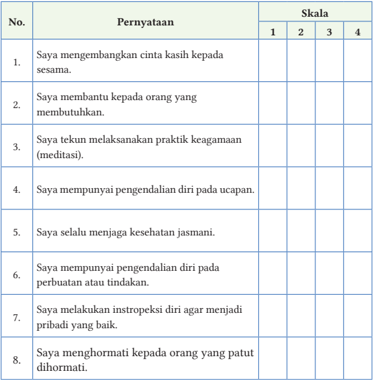

Tabel ini berisi 8 poin yang mungkin merujuk pada karakteristik atau perilaku individu dalam konteks moralitas dan etika. Kolom "Pernyataan" menyajikan berbagai pernyataan yang mungkin digunakan untuk menilai tingkat keberhasilan seseorang dalam menjalankan prinsip-prinsip moral. Skala yang ada di kolom "Skala" menunjukkan skor yang dapat diberikan kepada setiap poin, dengan skor 1-4 yang mungkin menunjukkan tingkat keberhasilan atau kesadaran individu dalam menjalankan prinsip-prinsip tersebut. Topik utama tabel ini adalah evaluasi perilaku moral dan etika individu, dengan fokus pada empati, bantuan sosial, praktik keagamaan, pengendalian diri, kesehatan fisik, pengendalian diri dalam berbicara, pengendalian diri dalam tindakan, dan penghormatan terhadap orang lain. Data atau pola penting yang terlihat adalah bahwa semua poin memiliki skor yang sama, yaitu 1-4, yang menunjukkan bahwa setiap poin memiliki nilai yang sama dalam skala penilaian.

Untuk  menambah  wawasan  dan  pemahaman  kalian  tentang  masalah  dalam kehidupan,  masalah  dalam  pendekatan  Buddhis,  dasar-dasar  meditasi  ketenangan batin, manfaat praktik meditasi ketenangan batin, kerjakan hal berikut!

- Lakukan kajian praktik meditasi ketenangan batin dalam hubungannya dengan prestasi kalian di sekolah.

 

---
## 📄 Halaman 85

KEMENTERIAN PENDIDIKAN, KEBUDAYAAN, RISET, DAN TEKNOLOGI REPUBLIK INDONESIA, 2022

Pendidikan Agama Buddha dan Budi Pekerti untuk SMA/SMK Kelas XII

Penulis: Katman  dan Tupari

Isbn: 978-602-244-568-5 (jilid 3)

### MEDITASI HIDUP BERKESADARAN

### Tujuan Pembelajaran

Peserta  didik  dapat  melaksanakan  praktik  hidup  berkesadaran  dalam aktivitas sehari-hari.

- Bagaimana dasar meditasi hidup berkesadaran?
- Apa teknik-teknik meditasi hidup berkesadaran ?
- Bagaimana praktik meditasi hidup berkesadaran?
- Apa manfaat praktik meditasi hidup berkesadaran?

 

---
## 📄 Halaman 86

---
**🖼️ Gambar/Diagram**

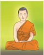

> **Deskripsi Visual:** Gambar ini adalah ilustrasi yang menampilkan seorang Buddha sedang bermeditasi. Ilustrasi ini menunjukkan Buddha duduk dengan posisi meditasi yang serasi, mengenakan pakaian tradisional Buddha yang biasanya berwarna oranye. Latar belakangnya berwarna hijau cerah yang memberikan suasana tenang dan penuh kebijaksanaan. Ilustrasi ini mungkin digunakan untuk membantu pembaca memahami konsep meditasi Buddha atau bagaimana Buddha meraih kebijaksanaan melalui proses meditasi.

### Duduk Hening!

Duduklah dengan rileks, mata terpejam, perhatikan dan sadari napas kalian, rasakan dalam hati:

'Menyadari, .......... napas masuk'

- 'Menyadari, .......... napas keluar'
- 'Menyadari, .......... napas masuk'
- 'Menyadari, .......... napas keluar'.
meditasi, dasar, teknik, praktik, manfaat, hidup, berkesadaran

Amati gambar di bawah ini, kemudian beri tanggapan sesuai  pesan-pesan yang terkandung di dalamnya!

---
**🖼️ Gambar/Diagram**

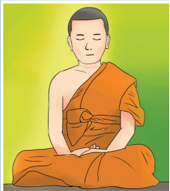

> **Deskripsi Visual:** Gambar ini adalah ilustrasi yang menampilkan seorang orang berjubah berdiri dengan posisi meditasi. Orang tersebut sedang berbaring dengan kedua tangan di bawah kepala, menunjukkan posisi meditasi yang umum digunakan dalam praktik Buddha. Latar belakangnya berwarna hijau cerah, memberikan suasana tenang dan penuh rasa damai. Ilustrasi ini mungkin digunakan untuk menggambarkan konsep meditasi atau kegiatan spiritual dalam konteks budaya Buddha.

---
**🖼️ Gambar/Diagram**

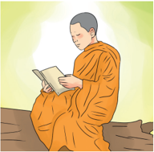

> **Deskripsi Visual:** Gambar ini adalah ilustrasi yang menampilkan seorang biksu sedang membaca buku. Ilustrasi ini menggambarkan suasana tenang dan penuh refleksi, dengan latar belakang yang cerah dan hijau yang menunjukkan keindahan alam. Buku yang dibaca oleh biksu tampak besar dan berwarna putih, menunjukkan bahwa ia sedang memperhatikan isi buku tersebut dengan serius. Bikersi tersebut mengenakan rambut pendek dan mengenakan jubah kuning yang tradisional, menunjukkan identitasnya sebagai seorang biksu. Ilustrasi ini menunjukkan bahwa aktivitas utama dalam gambar adalah membaca buku, yang merupakan bagian penting dari kehidupan sehari-hari seorang biksu.

 

---
## 📄 Halaman 87

### A.  Dasar-Dasar  Meditasi Hidup Berkesadaran

Meditasi merupakan wujud dari salah satu tiga perilaku kebajikan sebagaimana dibabarkan dalam ajaran Buddha. Tujuan dari meditasi ialah agar  seseorang  lebih  mampu  menyadari  segala  bentuk  perilaku  badan dan  ucapannya.  Setelah  mencapai  tingkat  meditasi  konsentrasi  ( samatha bhavana ),  meditator  dapat  melanjutkan  latihan  meditasi  tingkat  lanjutan yang  disebut  dengan  meditasi  mengembangkan  kesadaran  ( Vipassanā bhavana ).

### 1. Pengertian Meditasi Hidup Berkesadaran

Meditasi berasal dari kata bhavana yang berati pengembangan batin. Dalam praktiknya, ditemukan berbagai pendekatan yaitu meditasi ketenangan dan meditasi  pandangan  terang.  Teknik  meditasi  yang  terdapat  dalam  ajaran Buddha adalah Vipassanā bhavana atau pengembangan pandangan terang yang dapat dipraktikkan dalam segala situasi. Intisari dari praktik Vipassanā adalah perhatian murni atau penuh kesadaran ( sati ).

Memiliki suatu perhatian penuh dengan kesadaran merupakan energi kewaspadaan  dan  keterjagaan  setiap  saat.  Latihan  ini  merupakan  latihan yang  berkesinambungan  untuk  terus  menyentuh  seluruh  momen  dalam kehidupan sehari-hari. Hidup berkesadaran membuat hidup menjadi nyata bersama  dengan  apa  pun  yang  sedang  dilakukan.  Menyelaraskan  badan jasmani dan pikiran setiap saat sebagai sari dari mindfulness. Sesungguhnya dasar  atau  fondasi  dari  meditasi  pandangan  terang  itu  adalah  sadar  pada setiap momen.

Menjalani latihan sadar-penuh berarti menjadikan hidup yang sesungguhnya,  dan  sadar  sepenuhnya  terhadap  apa  pun  yang  sedang dilakukan. Kalian menyelaraskan tubuh dan pikiran saat belajar, berkendara, menggunakan gawai, menyapu, dan sebagainya. Latihan kesadaran penuh tidak hanya di ruang meditasi, tetapi sadar dalam setiap aktivitas sehari-hari.

Meditasi dapat dilakukan dalam kegiatan seharihari, di mana pun, orang lain tidak perlu mengetahui bahwa kalian sedang bermeditasi. ( Mingyur Rinpoche )

 

---
## 📄 Halaman 88

### 2.   Dasar Meditasi Hidup Berkesadaran

Makna secara mendalam hidup berkesadaran sesungguhnya adalah  melihat ke dalam diri  secara jernih atau terang,  melihat setiap unsur sebagai sesuatu yang berbeda  dan  terpisah,  serta  menembus  sehingga  memahami  realitas.  Esensi hidup berkesadaran  adalah melihat sesuatu apa adanya bukan apa nampaknya.

Melaksanakan hidup berkesadaran, dapat melenyapkan kekotoran batin. Kehidupan manusia itu bersifat tidak kekal atau berubah ( anicca ), menderita ( dukkha ), dan tanpa aku ( anatta ) atau tiga corak universal ( tilakkhana ) meliputi sebagai berikut.

- Menyadari semua fenomena alam termasuk jasmani dan batin selalu berubah atau mengalami ketidakkekalan ( Anicca ).
- Menyadari semua fenomena alam termasuk jasmani dan batin diliputi penderitaan ( Dukkha ).
- Menembus dan menyadari sifat sejati yang  tidak memiliki 'diri' atau 'inti' ( Anatta ).
Meditasi hidup berkesadaran dilaksanakan dengan memperhatikan gerak-gerik batin dan jasmani, dengan demikian, dapat melihat dengan jelas bahwa batin dan jasmani dicengkeram oleh anicca (ketidakkekalan), dukkha (derita), dan anatta (tanpa aku).

Lima  kelompok  kehidupan  ( Pancakhanda )  dalam  kaitannya  dengan meditasi pandangan terang disebut juga dengan empat landasan perhatian ( satipatthana ). Empat perenungan tersebut seperti berikut.

### a. Perhatian terhadap Badan Jasmani ( Kaya Nupassana )

Salah satu contoh yang paling praktis tentang meditasi dengan objek badan jasmani adalah anapanasati (menyadari keluar dan masuknya nafas). Dalam anapanasati ini nafas secara biasa dan wajar saja, tidak ada paksaan pada pernafasan, panjang atau pendeknya pernafasan harus disadari tidak dibuat-buat.

Kesadaran terhadap pernafasan pada tingkat permulaan dianggap sebagai meditasi  ketenangan  batin  tetapi  sangat  berguna  untuk  mengembangkan ketenangan batin. Dalam meditasi pernafasan yang dipakai sebagai suatu objek  perhatian  murni,  naik  turunnya  gelombang  kehidupan  yang  tidak kekal, yang timbul tenggelam dan dapat disadari dengan mudah.

 

---
## 📄 Halaman 89

### b. Perhatian terhadap Perasaan ( Vedanā Nupassana )

Merenungkan dengan seksama perasaan yang sedang dialami, baik perasaan senang, perasaan tidak senang, maupun perasaan acuh tak acuh. Kemudian, renungkan keadaan perasaan yang sebenarnya, bagaimana timbul, berlangsung, dan lenyap. Seorang mengalami perasaan yang menyenangkan, ia sadar mengalami perasaan yang menyenangkan Sebaliknya ia mengalami perasaan  yang  tidak  menyenangkan,  ia  sadar  akan  hal  itu,  mengalami perasaan yang tidak menyenangkan (Mahavirothavaro, 2009:200).

### c. Perhatian terhadap Pikiran ( Citta Nupassana )

Citta  nupassana adalah merenungkan segala gerak-gerik pikiran. Seorang siswa  tahu  dan  sadar  ketika  pikirannya  timbul  kebencian,  ia  sadar  jika pikirannya timbul kebodohan dan ia sadar jika pikirannya tidak tenang dan gelisah.  Empat  kesadaan  terhadap  bentuk-bentuk  pikiran  yaitu  sadar  jika ada nafsu keinginan timbul dalam diri seseorang, sadar jika nada kebencian timbul  dalam  diri  seseorang,  sadar  jika  ada  kebodohan  timbul  dalam  diri seseorang, dan sadar jika ada keragu-raguan timbul dalam diri seseorang.

### d. Perhatian terhadap Fenomena ( Dhamma Nupassana )

---
**🖼️ Gambar/Diagram**

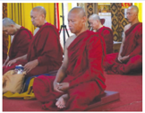

> **Deskripsi Visual:** Gambar ini adalah foto yang menunjukkan kelompok orang yang tampaknya sedang berada dalam situasi meditasi atau kegiatan spiritual. Kelompok ini terdiri dari beberapa orang yang duduk dengan posisi yang seragam, mungkin menunjukkan bahwa mereka sedang mengikuti sesi meditasi bersama. Mereka semua mengenakan pakaian tradisional merah yang menunjukkan kemungkinan bahwa ini adalah bagian dari tradisi atau budaya tertentu.

Elemen-elemen utama dalam gambar ini meliputi kelompok orang yang sedang duduk, pakaian merah yang mereka kenakan, dan lingkungan yang tampaknya sederhana dan tenang. Relasi antara elemen-elemen ini adalah bahwa semua orang tampaknya berada dalam suasana yang sama, menunjukkan harmoni dan ketenangan.

Teks, angka, atau label penting tidak terlihat dalam gambar ini karena ia hanya sebuah foto. Namun, informasi kunci yang dapat diambil dari gambar ini adalah bahwa ini mungkin merupakan bagian dari sebuah kursus atau program pelatihan spiritual, dan bahwa para peserta sedang mengikuti sesi meditasi bersama-sama.

Orang yang melaksanakan meditasi memperhatikan  bentuk-bentuk pikiran sebagaimana adanya. Bentuk-bentuk pikiran  timbul  karena  adanya  rintangan batin.  Salah  satu  cara  memperhatikan bentuk-bentuk pikiran terhadap rintangan batin adalah jika seorang meditasi timbul nafsu indera, kemauan jahat, kemalasan, kelelahan dan kelambanan, kekhawatiran harus segera disadari. Sebaliknya jika dalam dirinya tidak timbul rintangan juga disadari, ia tahu bentuk-bentuk pikiran datang dan timbul.

Terdapat empat usaha untuk dapat menemukan pandangan terang. Keempat usaha tersebut adalah sebagai berikut.

### 1) Usaha dengan Mengendalikan

Usaha dengan mengendalikan ialah seorang yang membangkitkan keinginan  untuk  tidak  memunculkan  kualitas-kualitas  buruk  yang  tidak bermanfaat yang belum muncul, serta berusaha membangkitkan kegigihan dan mengerahkan pikirannya.

 

---
## 📄 Halaman 90

### 2) Usaha dengan Meninggalkan

Usaha  dengan  meninggalkan  adalah  seseorang  membangkitkan  keinginannya untuk meninggalkan kualitas-kualitas buruk yang tidak bermanfaat yang telah muncul serta berusaha membangkitkan kegigihan dan mengerahkan pikirannya.

### 3) Usaha dengan Mengembangkan

Usaha dengan mengembangkan ialah seseorang membangkitkan keinginannya untuk memunculkan  kualitas-kualitas bermanfaat yang belum muncul serta berusaha membangkitkan kegigihan dan mengerahkan pikirannya.

### 4)   Usaha dengan Melindungi

Usaha  dengan  melindungi ialah  seseorang  membangkitkan  keinginannya untuk  mempertahankan  kualitas-kualitas  bermanfaat  yang  telah  muncul, untuk ketidakmundurannya, meningkatkan, memperluas, dan memenuhinya melalui  pengembangan,  membangkitkan  kegigihan,  serta  mengerahkan pikirannya. ( Padhana Sutta, Aṅguttara Nikāya ).

### Aktivitas Peserta Didik

- Jelaskan pengertian meditasi hidup berkesadaran?
- Jelaskan  hubungan  meditasi  hidup  berkesadaran  dengan  tiga  corak universal!
- Jelaskan 4 landasan perhatian!
- Bagaimana cara melaksanakan perenungan terhadap pikiran?
- Jelaskan empat usaha untuk mencapai pandangan terang!

### Inspirasi Dharma

Pelaksanaan    empat  perhatian  benar  adalah  satu-satunya  jalan  untuk memperoleh kehidupan suci dan melenyapkan kesedihan, rataptangis,  penderitaan,  dan  kesengsaraan,  serta  jalan  yang  benar  untuk merealisasikan Nibbana. ( Satipathana Sutta, Majjhima Nikāya )

 

---
## 📄 Halaman 91

### B.  Teknik Meditasi Hidup Berkesadaran

Teknik meditasi yang diajarkan oleh para guru meditasi berbeda-beda, tetapi tetap berpegang pada samatha dan vipassana . Pada dasarnya, meditasi hidup berkesadaran  dilakukan  perlahan-lahan  sehingga  dapat  menyadari  penuh gerakan  tubuh.  Berikut  ini  beberapa  teknik  kesadaran  yang  dapat  kalian lakukan dalam kehidupan sehari-hari.

### Praktik Hidup Berkesadaran dengan Empat Posisi Dasar

Ada empat posisi dasar dalam hidup berkesadaran, yaitu seperti berikut.

### 1.   Meditasi Duduk Penuh  Kesadaran

Cara  melakukan  meditasi  duduk  secara  umum,  yaitu  dengan  cara  duduk dengan tulang belakang lurus, tidak condong ke depan maupun ke belakang. Tegakkan tulang bagian belakang perut dan jangan membungkuk. Ambil posisi duduk yang nyaman, tegak, tidak terlalu kaku dan tidak terlalu santai. Meditasi duduk dapat dilakukan di dalam ruangan ataupun di luar ruangan.

Saat menarik napas, rasakan udara dingin saat masuk ke lubang hidung, rasakan udara hangat yang keluar dari lubang hidung.  Ketahui, sadari hal itu sebagai 'dingin' dan 'hangat' atau sekedar merasakan. Usahakan rileks pada saat napas masuk dengan penuh perhatian dan rileks saat membuang napas dengan penuh pengamatan.

---
**🖼️ Gambar/Diagram**

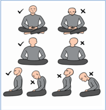

> **Deskripsi Visual:** Gambar ini adalah ilustrasi yang menunjukkan dua jenis meditasi: meditasi lotus dan meditasi zafu. Ilustrasi ini terdiri dari empat panel, masing-masing menunjukkan salah satu jenis meditasi.

Pertama, pada panel pertama, ada dua orang sedang melakukan meditasi lotus. Mereka duduk dengan kedua kaki di atas tubuh mereka, yang merupakan posisi yang sering digunakan dalam meditasi lotus.

Kedua, pada panel kedua, ada dua orang sedang melakukan meditasi zafu. Mereka duduk dengan kedua kaki di atas tubuh mereka, tetapi dengan kaki yang diletakkan di samping tubuh mereka, yang merupakan posisi yang sering digunakan dalam meditasi zafu.

Ilustrasi ini menunjukkan bahwa meditasi lotus dan meditasi zafu adalah dua cara yang berbeda untuk melakukan meditasi, namun keduanya memerlukan posisi yang sama untuk duduk. Ini juga menunjukkan bahwa meditasi lotus dan meditasi zafu adalah dua cara yang berbeda untuk melakukan meditasi, namun keduanya memerlukan posisi yang sama untuk duduk.

Teks, angka, atau label penting yang terlihat dalam gambar ini adalah posisi duduk yang digunakan dalam meditasi lotus dan meditasi zafu. Informasi kunci yang dapat diambil pembaca adalah bahwa meditasi lotus dan meditasi zafu adalah dua cara yang berbeda untuk melakukan meditasi, namun keduanya memerlukan posisi yang sama untuk duduk.

Bernapaslah  secara  alami,  ketika duduk kalian merasakan banyak sensasi dalam tubuh seperti sakit, kesemutan,  ketegangan,  kaku,  gatal, dingin, panas, hal tersebut kalian amati  secara  pasif.  Biarkan  perasaan dan segala bentuk-bentuk pikiran datang dan biarkan juga perasaan dan bentuk-bentuk    pikiran  pergi  dengan penuh  kesadaran.  Apabila  kaki  dan telapak kaki mulai pegal, kalian boleh mengatur posisi duduk dengan catatan benar-benar menyadari gerakan tubuhmu.

 

---
## 📄 Halaman 92

Meditasi  duduk  merupakan  posisi  meditasi  yang  umum  dilakukan banyak orang, karena ketika duduk tubuh menjadi cukup rileks namun tidak menjadi malas. Namun jika kalian merasa lelah atau jenuh ketika melakukan meditasi duduk bisa bermeditasi dengan posisi yang lain.

Meditasi duduk penuh kesadaran dapat dilakukan di manapun dan kapanpun, misalnya saat duduk di kelas menunggu pelajaran mulai, duduk di kantin, duduk di mobil dan duduk di teras ruang kelas ketika jam istirahat sekolah.

### 2.   Meditasi Berdiri Penuh Kesadaran

Kalian dapat melatih meditasi berdiri penuh kesadaran setelah melaksanakan meditasi duduk. Berdirilah dengan tegak, kaki sedikit terbuka, jangan membungkuk, dan lakukan dengan santai. Kalian dapat meletakkan  telapak  tangan  kalian saling bertumpu pada perut bagian depan. Kalian dapat mengubah posisi  dengan  cara  berdiri  sambil berjalan  perlahan,  di  antara  sesi meditasi, kalian dapat berlatih meditasi berjalan di ruangan.

---
**🖼️ Gambar/Diagram**

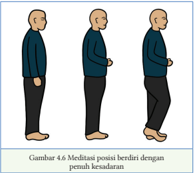

> **Deskripsi Visual:** Gambar ini adalah ilustrasi yang menunjukkan tiga posisi badan seseorang dalam meditasi berdiri dengan pemalasan. Gambar ini terdiri dari tiga orang yang berdiri tegak, masing-masing memiliki posisi badan yang sedikit berbeda. Pada gambar ini, tidak ada teks, angka, atau label spesifik yang terlihat, namun gambar ini menunjukkan bagaimana posisi badan yang benar dalam meditasi berdiri dapat membantu memperbaiki postur tubuh dan meningkatkan kesehatan fisik.

Melangkahlah bersamaan dengan setiap napas yang masuk dan keluar. Kalian dapat  merasakan  keselarasan  karena  memiliki  tubuh  yang  lebih  besar,  yaitu tubuh komunitas berkesadaran. Setiap orang bergerak bersama, perlahan-lahan, dan  penuh  perhatian.  Meditasi  berdiri  penuh  kesadaran  dapat  dilakukan  di manapun dan kapanpun, misal saat berdiri di bus, berdiri saat menunggu antrian dan berdiri saat upacara bendara.

### 3.   Meditasi  Berjalan Penuh Kesadaran

Meditasi berjalan ialah posisi meditasi yang dapat kalian lakukan setiap hari. Tentukan arah ke mana kalian akan berjalan. Berjalanlah dengan tangan di depan atau di belakang tubuh, pandangan mata menatap ke bawah sejauh 2 sampai 3 meter. Rasakan tiap gerakan kaki melangkah, rasakan ketika kaki kananmu yang bergerak atau kaki kiri yang bergerak, rasakan ketika kakimu diangkat, dan kembali menginjak tanah.

Biasanya  meditasi  berjalan  secara  alamiah  dimulai  dengan  meditasi berdiri,  lalu  kalian  amati  dan  rasakan  seluruh  sensasi  badan  saat  berdiri.

 

---
## 📄 Halaman 93

Mulai  mengangkat  kaki  secara  perlahan,  sadarilah  saat  kaki  melangkah, kemudian kaki menurun, hingga posisi kaki turun kembali.

Meditasi berjalan dapat dilakukan secara kelompok, tidak perlu membentuk  barisan.  Penekanan  lebih  pada  kesadaran  tiap  langkah  yang diambil bersama dengan tubuh. Berjalanlah bersama selaras dengan alam, selaras di dalam kelompok (tidak terlalu jauh, tidak terlalu dekat). Perhatikan gambar posisi meditasi berjalan dengan penuh kesadaran.

Kalian dapat berlatih  meditasi  di  mana  pun  kalian  berjalan.  Maksudnya,  kalian tahu bahwa diri kalian sedang berjalan. Kalian berjalan hanya untuk berjalan. Berjalan dengan wajar tidak tergesa-gesa. Kalian hadir dalam setiap langkah, dan ketika kalian ingin berbicara, berhentilah. Lalu, curahkan perhatian penuh kepada  lawan  bicara,  perhatikan  kata-katanya,  dan  dengarkan  sepenuhnya. Berjalan dengan cara demikian bukanlah sesuatu yang hanya dilakukan pada waktu-waktu tertentu, tetapi kalian seharusnya dapat melakukannya setiap saat.

---
**🖼️ Gambar/Diagram**

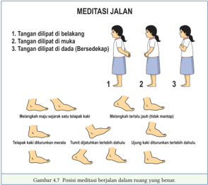

> **Deskripsi Visual:** Gambar ini adalah ilustrasi yang menunjukkan posisi meditasi berjalan dalam ruang yang benar. Ilustrasi ini terdiri dari tiga langkah yang menjelaskan posisi tangan dan kaki saat meditasi berjalan. Setiap langkah dilengkapi dengan gambar yang menunjukkan posisi tangan dan kaki dalam bentuk manusia.

Elemen utama dalam gambar ini adalah manusia yang sedang berjalan dan bermeditasi. Teks pada gambar memberikan instruksi tentang posisi tangan dan kaki, seperti "Tangan diputus di belakang," "Tangan diputus di mukuh (bersidekapan)," dan "Tangan diputus di dada." Angka-angka di samping setiap langkah membantu memahami urutan langkah-langkah tersebut.

Informasi kunci yang dapat diambil pembaca melalui gambar ini adalah bagaimana melakukan meditasi berjalan dengan benar, termasuk posisi tangan dan kaki serta cara mengatur posisi telapak kaki. Gambar ini sangat berguna untuk membantu pembaca memahami dan mengikuti teknik meditasi berjalan dengan tepat.

### 4.   Meditasi Berbaring Penuh Kesadaran

Pertama  yang  harus  dilakukan  adalah  kalian  harus  mencari  tempat untuk berbaring. Jika ingin menggunakan bantal, maka jangan terlalu tinggi. kepala, leher, dan tulang belakang harus berada pada permukaan yang sama. Lengan letakan di samping badan, tutup mata, dan lepaskan semua pikiran.

 

---
## 📄 Halaman 94

Menyatulah secara total dengan napas masuk dan napas keluar. Istirahatkan tubuh dan batin secara bersamaan. Lakukan dengan posisi berbaring di atas alas yang lurus (di lantai dengan alas tipis, bukan tempat tidur).

Posisi  tubuh  berbaring  dengan  rileks,  tangan  di  samping  kiri  dan  kanan tubuh menghadap ke atas. Walaupun posisi berbaring, kalian diharapkan tidak tertidur, tetapi tetap menjaga kesadaran.

Ketika  leher  kalian  mulai  terasa  agak  tegang,  kalian  boleh  berganti posisi, bahkan kalian juga tidak dilarang untuk berbaring ke samping kiri. Jika tubuh kalian sangat lelah, kalian boleh bermeditasi berbaring dengan seluruh punggung terbaring dan seluruh bagian belakang kepala menyentuh lantai atau matras.

Ketika  kalian  melakukan  meditasi  dengan  posisi  berbaring,  kalian harus menjaga kesadaran agar tidak cepat tertidur. Jika bermeditasi untuk merasa rileks atau beristirahat, kalian dapat bermeditasi sampai benar-benar tertidur. Setelah itu, kalian akan merasa lebih segar dan dapat melanjutkan meditasi dengan posisi lain.

Setelah  melaksanakan  meditasi  penuh  kesadaran,  ungkapkan  pengalaman kalian dengan mengisi kolom di bawah ini!

---
**📊 Tabel**

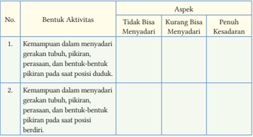

Tabel ini membandingkan kemampuan seseorang dalam menyadari gerakan tubuh, pikiran, perasaan, dan bentuk-bentuk pikiran pada saat posisi duduk dengan kemampuannya dalam menyadari gerakan tubuh, pikiran, perasaan, dan bentuk-bentuk pikiran pada saat posisi berdiri. Topik utama tabel ini adalah perbandingan kemampuan menyadari aktivitas fisik dan mental dalam dua posisi berbeda. Kolom "Bentuk Aktivitas" mencakup dua baris: satu untuk posisi duduk dan satu untuk posisi berdiri. Kolom "Aspek" menunjukkan tiga aspek yang diukur: "Tidak Bisa Menyadari", "Kurang Bisa Menyadari", dan "Penuh Kesadaran". Data penting yang terlihat adalah bahwa dalam posisi duduk, sebagian besar individu memiliki kemampuan menyadari aktivitas fisik dan mental mereka, sedangkan dalam posisi berdiri, kemampuan tersebut lebih sedikit. Ini menunjukkan bahwa posisi berdiri mungkin mempengaruhi kemampuan individu untuk menyadari aktivitas fisik dan mental mereka.

 

---
## 📄 Halaman 95

---
**📊 Tabel**

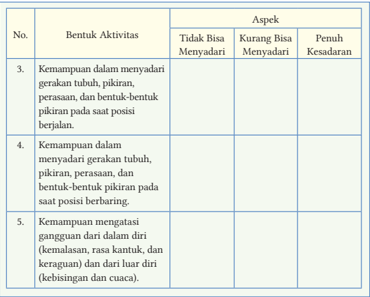

Tabel ini menunjukkan kemampuan anak dalam menyadari gerakan tubuh, pikiran, perasaan, dan bentuk-bentuk pikiran pada posisi berjalan dan berbaring. Topik utamanya adalah kemampuan anak dalam menyadari dan mengatasi gangguan diri. Kolom-kolomnya meliputi No., Bentuk Aktivitas, Aspek, Tidak Bisa Menyadari, Kurang Bisa Menyadari, dan Penuh Kesadaran. Data penting yang terlihat adalah bahwa anak memiliki kemampuan untuk menyadari gerakan tubuh, pikiran, perasaan, dan bentuk-bentuk pikiran pada posisi berjalan dan berbaring, tetapi mereka kurang bisa menyadari dan penuh kesadaran pada aspek tersebut. Ini menunjukkan bahwa anak memerlukan latihan tambahan untuk meningkatkan kemampuan mereka dalam menyadari dan mengatasi gangguan diri.

### Inspirasi Dharma

Ketika sedang berjalan, mengerti  sedang jalan; Ketika sedang berdiri, mengerti sedang berdiri; Ketika sedang duduk, mengerti sedang duduk; Ketika sedang berbaring, mengerti sedang berbaring; Tubuh sedang apa pun, mengerti segala aktivitas tubuhnya. ( Kāyagatāsati Sutta, Majjhima Nikāya )

 

---
## 📄 Halaman 96

### Meditasi Perumpamaan Petani

---
**🖼️ Gambar/Diagram**

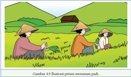

> **Deskripsi Visual:** Gambar 4.9 adalah ilustrasi yang menunjukkan petani menanam padi. Gambar ini menggambarkan tiga orang petani sedang berada di sawah yang luas, dengan tanaman padi yang tertanam. Petani tersebut menggunakan topi bambu tradisional untuk melindungi diri dari sinar matahari. Latar belakang gambar menunjukkan pemandangan alam yang tenang dengan pohon-pohon besar dan hutan yang hijau. 

Elemen-elemen utama dalam gambar ini adalah tiga orang petani, tanaman padi yang tertanam, dan alam sekitar seperti sawah dan hutan. Relasi antara elemen-elemen ini adalah bahwa petani adalah manusia yang melakukan aktivitas menanam padi, tanaman padi adalah hasil dari kegiatan tersebut, dan alam sekitar adalah lingkungan di mana mereka bekerja.

Teks, angka, atau label penting yang terlihat dalam gambar ini adalah nama gambar (Gambar 4.9) dan judul gambar (Ilustrasi petani menanam padi). Informasi kunci yang dapat diambil pembaca adalah tentang kegiatan petani menanam padi dan lingkungan sekitarnya.

Pelaksanaan  meditasi  dapat  dianalogikan  dengan  menanam  padi.  Petani menanam padi memerlukan proses atau tahapan: mulai menyiapkan area tanam atau pengolahan tanah yang subur, menabur benih, perawatan setelah tanam (memupuk padi, mengusir hama, dan mencabuti ilalang yang tumbuh di sekitar benih), serta mengusir hama dan burung-burung pemakan padi.

Begitu juga meditator dalam meditasi, ia memerlukan kesehatan jasmani, guru  pembimbing,  tempat,  serta  menjaga Sīla yang  baik.  Meditator  juga harus menyingkirkan gangguan dan rintangan batin yang sumber pokoknya berasal dari keserakahan ( lobha ), kebencian ( dosa ), dan kebodohan ( moha ).

Petani  tidak  menganggur  dan  berpangku  tangan  di  rumah  sambil menunggu musim panen tiba. Petani setiap hari ke sawah merawat padi agar tumbuh dengan subur. Petani merawat dan menjaga padi dengan baik agar hasil panennya berlimpah.

Kalian harus hidup dengan kesabaran seperti petani yang menantikan musim panen. Sabar melakukan segala upaya sampai masa penuaian tiba. Sabar bukan berarti duduk berpangku tangan. Sabar berarti tetap melakukan pekerjaan dan tetap fokus pada masa penuaian. Petani menanam padi tidak bisa mengharapkan panen dengan hasil yang berlimpah dalam waktu satu minggu  karena  dalam  jangka  waktu  satu  minggu,  daun  padi  baru  mulai menghijau. Begitu juga dengan petani yang mengharapkan dapat memanen padinya dalam jangka waktu satu bulan, tentu belum bisa, karena padi tersebut baru menumbuhkan daunnya dengan subur.

 

---
## 📄 Halaman 97

Begitu  pun  halnya  dengan  meditator.  Dia  melaksanakan  meditasi sebentar,  tetapi  banyak  berharap  ingin  mendapatkan  kesaktian,  ingin memperoleh jhana-jhana, dan ingin memperoleh kemampuan spiritual serta mencapai kesucian. Dengan melaksanakan meditasi secara bertahap, kalian akan mendapatkan perubahan yang dapat mengikis kekotoran batin, seperti kemarahan, kesombongan, kebencian, dan hawa nafsu. ( Sumber https://www. youtube.com/watch?v=DDMSHoh00_s)

### Aktivitas Peserta Didik

- Apa tanggapan kalian terhadap perumpamaan  di atas?
- Nilai-nilai apa yang dapat kalian  kembangkan dari kisah tersebut?
- Jelaskan maksud dari sabar dalam pelaksanaan meditasi!
- Apa tekad kalian setelah membaca perumpamaan tersebut?

### C.  Praktik Meditasi Hidup Berkesadaran

Perhatian  murni  atau  penuh  kesadaran    dapat  dipraktikkan  tak  terbatas waktu, terbatas tempat sesuai dengan aktivitas kita sehari-hari.  Perhatian murni dalam setiap  aktivitas    sebagai  sarana  efektif  yang  akan  membuat hidup berubah lebih baik dan maju dalam perkembangan spiritual.

### 1. Praktik Berkesadaran Saat Belajar

Belajar merupakan  salah satu aktivitas bagaimana orang mendalami perihal salah satu pelajaran meliputi  pengetahuan alam, teknologi, budaya, politik, sosial, maupun yang lainya. Setiap insan  mempunyai teknik berbeda dalam  belajar.  Ada  yang  belajar menggunakan cara membaca, belajar  menggunakan cara menulis, belajar dengan mendengarkan, serta  belajar dengan cara melihat.

Belajar dengan penuh kesadaran merupakan hal yang sangat penting bagi seorang pelajar.

---
**🖼️ Gambar/Diagram**

> **Deskripsi Visual:** Gambar ini adalah ilustrasi yang menunjukkan seorang siswa sedang belajar di meja belajar. Gambar ini menggambarkan beberapa elemen penting:

1. **Apa yang Ditampilkan Secara Keseluruhan**: Gambar ini menampilkan seorang siswa yang sedang bersekolah. Dia duduk di meja belajar dengan buku, pensil, dan papan tulis di depannya. Di sebelah kiri, terdapat sebuah bola dunia yang menunjukkan bumi dan beberapa negara.

2. **Elemen-Elemen Utama dan Relasinya**: Siswa adalah elemen utama yang memperlihatkan aktivitas belajar. Meja belajar di sekelilingnya menunjukkan alat-alat belajar seperti buku, pensil, dan papan tulis. Bola dunia di sebelah kiri menunjukkan konteks global atau studi geografi.

3. **Teks, Angka, atau Label Penting yang Terlihat**: Gambar tidak memiliki teks, angka, atau label spesifik yang mencerminkan informasi khusus. Namun, elemen-elemen tersebut membantu dalam interpretasi konteks belajar dan studi.

4. **Informasi Kunci yang Dapat Diambil Pembaca**: Gambar ini menggambarkan situasi belajar yang serius dan fokus, menunjukkan bagaimana siswa menggunakan alat-alat belajar untuk belajar. Konteks global melalui bola dunia menunjukkan bahwa belajar tidak hanya tentang materi lokal tetapi juga tentang pemahaman global.

Dengan demikian, gambar ini menggambarkan aktivitas belajar yang serius dan fokus, menunjukkan bagaimana siswa menggunakan alat-alat belajar untuk belajar, serta menekankan pentingnya pemahaman global dalam pendidikan.

 

---
## 📄 Halaman 98

Belajar dengan penuh kesadaran di sekolah, di rumah akan membantu kalian memahami dengan jelas dengan apa yang dipelajari sehingga bisa menerapkan pelajaran dengan baik pada kehidupan sehari-hari.

Cara belajar dengan penuh kesadaran bisa diawali dengan  duduk hening untuk  konsentrasi  sejenak.  Sadari  dengan  apa  yang  kalian  dengar  ketika gurumu menerangkan. Jangan melakukan dan memikir hal yang telah berlalu atau hal yang akan datang. Pahami apa yang diajarkan guru, sadari apa yang kalian baca. Jangan membaca sambil lalu tanpa memahami maknanya.

Sadari dengan penuh kesadaran apa yang kalian tulis atau kalian ketik sebagai  catatan  atau  tugas  latihan/ulangan.  Sadari  dan  pahami  apa  yang kalian  katakan,  ketika  bertanya,  menjawab,  pertanyaan  dan  presentasi. Sadari dengan penuh kesadaran tiap gerakan tangan dan tubuhmu, ketika kalian  mengambil alat tulis,  memegang alat tulis,  menulis,  mengetik,  dan meletakkan alat tulis kembali.

### 2. Praktik Berkesadaran Saat Makan dan Minum

Makan merupakan salah satu kegiatan yang pokok manusia untuk menunjang kehidupan. Tanpa makanan kalian tidak bisa bertahan hidup. Kadang kita makan hanya  berlalu  begitu  saja  tanpa  menyadari  dan  menghargai  akan

---
**🖼️ Gambar/Diagram**

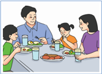

> **Deskripsi Visual:** Gambar ini adalah ilustrasi yang menunjukkan keluarga sedang makan bersama di meja makan. Ilustrasi ini menggambarkan tiga orang dewasa dan dua anak makan bersamaan. Mereka sedang duduk di sekitar meja makan yang berisi berbagai makanan seperti nasi, sayuran, telur, dan minuman. Setiap orang tampak senang dan aktif dalam proses makan. Ilustrasi ini menunjukkan hubungan harmonis antara anggota keluarga dan suasana makan yang menyenangkan.

makanan. Makan dengan penuh kesadaran  akan  membuat  menyadari tiap gerakan, tiap suap, tiap rasa makanan sehingga akan lebih menikmati dan menghargai makanan.

Pertama dengan melakukan perhatian penuh saat mengambil makan  ke  piring.  Kalian  menyadari pada saat menyuapkan makanan ke mulut, serta menyadari ketika merasakan makanan dan mengunyah makanan. Kalian dapat menyadari rasa makanan berupa rasa asin, asam, pahit, dan lain-lain. Kalian menyadari dan dapat membedakan rasa, berupa rasa menyenangkan, tidak menyenangkan, ataupun netral.

Pada saat kalian mengunyah, sadari proses mengunyah, pergerakan gigi, mulut, dan lidah. Ketika menelan, sadari dan rasakan makanan yang turun melalui kerongkongan dan masuk ke lambung. Kalian dapat memperhatikan niat untuk menambah makanan, menyadari semua gerakan dan sensasi yang

 

---
## 📄 Halaman 99

terlibat ketika menjulurkan tangan untuk mengambil makanan, dan ketika menyuapkan makanan ke mulut.

Begitu  juga  jika  ada  kehendak  untuk  minum.  Sadari  sensasi  pikiran yang  timbul  dan  sadari  gerak  tubuh  ketika  mengambil  minuman.  Sadari ketika  kaki  melangkah,  tangan  menyentuh  gelas,  serta  sadari  timbulnya sensasi rasa dingin, panas, dan netral. Perhatikan dan sadari ketika tangan mengangkat gelas, mendekatkan gelas ke mulut, kemudian minum. Sadari timbulnya  sensasi  setelah  permukaan  lidah  merasakan  air,  tetap  dalam kondisi  sadar  ketika  air  memasuki  kerongkongan,  serta  sadari  timbulnya berbagai kesan-kesan, seperti dorongan untuk minum lagi, menolak minum lagi, dan kesegaran tubuh. (Nurwito, 2018:76)

### Praktik Meditasi

Praktikkan meditasi berkesadaran saat makan dan minum. Persiapkan sarana dan bahan yang dipergunakan, yaitu ruang, alat-alat makan, serta makanan dan minuman. Lakukan sesuai dengan petunjuk guru.

Setelah kalian praktik meditasi berkesadaran saat makan dan minum kerjakan tugas berikut. Isilah dengan tanda chek list ( ) pada kolom di bawah ini!

---
**📊 Tabel**

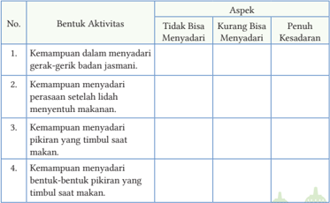

Tabel ini menunjukkan berbagai kemampuan sensorik dan kognitif yang dapat diukur dalam dua skala: "Tidak Bisa Menyadari" dan "Penuh Kesadaran". Topik utamanya adalah kemampuan untuk menyadari dan memahami berbagai aspek tubuh dan lingkungan sekitar. Kolom-kolomnya mencakup empat aktivitas yang melibatkan berbagai aspek sensorik dan kognitif, seperti kemampuan untuk menyadari gerakan badan, perasaan setelah makan, dan pemahaman tentang pikiran yang timbul saat makan. Data atau pola penting yang terlihat adalah bahwa semua aktivitas memiliki skala yang sama, baik untuk "Tidak Bisa Menyadari" maupun "Penuh Kesadaran", menunjukkan bahwa semua kemampuan tersebut dapat diukur secara objektif dan tidak tergantung pada tingkat kesadaran individu.

 

---
## 📄 Halaman 100

- Gangguan dan rintangan yang timbul sebelum, saat, dan setelah makan dan minum dengan penuh kesadaran.

### Inspirasi Dharma

Sebelumnya, pikiran ini  mengembara semaunya, sesuai kehendaknya, dan  sesuai  kesenangannya.  Tapi  hari  ini,  saya  akan  menguasainya penuh perhatian,  seperti  pawang  menguasai  gajah  dengan  kaitannya. ( Dhammapada: 326, Khuddaka Nikāya. )

Bacalah dengan saksama kisah Dharma inspiratif berikut!

### Raja Makan Sebakul Nasi

Raja  Pasenadi  dari  Kerajaan  Kosala  mempunyai  kebiasaan  makan  nasi  sebakul penuh dengan saus kari yang berlimpah. Suatu hari, setelah selesai makan pagi, karena tidak mampu menahan rasa kantuk akibat makan berlebihan, dia pergi menemui Buddha dan berjalan di hadapan  beliau  dengan  keadaan  letih. Raja  Pasenadi  ingin  tidur,  tetapa  tidak berani berbaring dan merentangkan tubuhnya. Raja hanya duduk di satu sisi.

Kemudian, Buddha berkata kepadanya, 'Paduka, apakah Anda datang  setelah  istirahat  yang  cukup?' 'Oh,  tidak,  Bhante;  tetapi  saya  merasa sangat menderita setelah  menyantap makanan.'  Buddha  bertutur,  'Paduka, kelebihan  makan  pada  akhirnya  akan membawa penderitaan seperti ini. '

---
**🖼️ Gambar/Diagram**

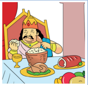

> **Deskripsi Visual:** Gambar ini adalah ilustrasi yang menunjukkan seorang raja sedang makan makanan berat. Raja tersebut duduk di atas kursi kerajaan yang besar dengan latar belakang yang indah. Di depan raja ada sebuah meja makan yang penuh dengan berbagai makanan, termasuk nasi putih, ayam, sayuran, dan buah-buahan. Raja sedang memegang sendok dan mengunyah makanannya dengan serius. Ilustrasi ini menunjukkan suasana makan malam yang istimewa dan penuh kekayaan.

 

---
## 📄 Halaman 101

Beliau  melanjutkan  dengan  mengucapkan,  'Jika  seseorang  bermalas-malasan, berlebihan dalam makan. Hanya menghabiskan waktu untuk tidur dan berbaring saja, serta berguling ke sana kemari, seperti seekor babi yang memakan biji-bijian. Begitulah orang dungu, yang terus-menerus akan mengalami kelahiran kembali. '

'Paduka, seseorang hendak-nya tidak berlebihan dalam menyantap makanan karena  sederhana  dalam  makan  adalah  menyenangkan. '  Buddha  meneruskan dengan mengucapkan syair berikut, 'Ketika seseorang senantiasa penuh perhatian, mengetahui kecukupan atau batas dalam menyantap makanan, penyakitnya akan berkurang, dia menua dengan lambat, dan dapat menjaga kehidupannya. '

Pada saat itu, Brahmana Muda Sudassana sedang berdiri di belakang Raja Pasenadi  dari  Kosala.  Raja  kemudian  berkata  kepadanya,  'Marilah  Sudassana, pelajarilah syair dengan baik dari Buddha ini dan ucapkan kepadaku ketika aku makan.  Aku  akan  menganugerahkan  seratus kahapana kepadamu  setiap  hari secara terus-menerus. '

'Baiklah, Baginda!' Brahmana Muda Sudassana menjawab. Setelah mempelajari syair ini dari Bhagava, setiap Raja Pasenadi sedang makan, Brahmana Muda Sudassana kembali melantunkan syair tersebut. Raja mengurangi jumlah makanan  yang  disantapnya  secara  bertahap  yang  akhirnya  raja  memuaskan dirinya dengan makan nasi sedikit setiap harinya, tanpa pernah berlebihan.

Ketika tubuhnya telah menjadi cukup langsing, Raja Pasenadi dari Kosala  menepuk  badannya  dengan  tangannya  dan  pada  kesempatan  itu,  dia mengucapkan  ungkapan  inspiratif  ini,  'Buddha  menunjukkan  kasih  sayang kepadaku sehubungan dengan kedua jenis kebaikan dalam kehidupan sekarang dan kehidupan yang akan datang. ' ( Donapaka Sutta, Samyutta Nikāya )

### Aktivitas Peserta Didik

- Apa tanggapan kalian terhadap  kisah tersebut?
- Nilai-nilai apa yang dapat kalian kembangkan dari kisah tersebut?
- Mengapa raja makan berlebihan?
- Apa manfaat besar khotbah tersebut bagi raja?
- Apa tekad kalian setelah membaca kisah tersebut?

 

---
## 📄 Halaman 102

### 3. Berkesadaran Saat Menjelang dan Bangun Tidur

---
**🖼️ Gambar/Diagram**

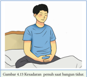

> **Deskripsi Visual:** Gambar ini adalah ilustrasi yang menunjukkan seorang pria sedang tidur dengan posisi tubuh yang nyaman. Ilustrasi ini menggambarkan kondisi keadaan tubuh seseorang saat mereka beristirahat. Pria tersebut tampak tenang dan nyenyak, dengan mata tertutup dan posisi tubuh yang menunjukkan kepuasan dan rileksasi. Ilustrasi ini mungkin digunakan untuk membantu memahami konsep tentang keadaan tubuh saat beristirahat, seperti keadaan pernafasan yang baik dan sistem saraf yang relaks. Teks, angka, atau label penting yang terlihat pada gambar ini tidak ada, sehingga fokus utama adalah pada penjelasan visual tentang kondisi tubuh saat beristirahat.

T idur merupakan aktivitas yang diperlukan  tiap  hari.  Tidur  membuat tubuh  istirahat  dan  bangun  dengan segar.  Dengan tidur  tubuh  mendapatkan energi baru untuk melakukan kegiatan. Sadari  ketika  tubuh  memberi  tanda untuk  beristirahat  atau  rasa  kantuk mulai muncul.

Sadari  ketika  berjalan  ke  kamar tidur,  duduk  di  tempat  tidur.  Sadari tubuh mulai menurun dengan sendirinya  dan  ketika  kepala  menyentuh  bantal,  serta  tangan  menaruh selimut di badan, dan sadari ketika mata mulai terpejam.

Setelah  berbaring  dan  tubuh  serta  sensasi  tubuh  setelah  menyentuh matras dan bantal. Lakukan perhatian pada masuk dan keluar napas. Jika kalian  mau  mengubah  posisi  tidur  atau  memiringkan  badan  ke  sisi  lain, lakukanlah dengan perhatian murni. Jika kalian melakukan kesadaran penuh menjelang  tidur  dapat  mengatasi  kesulitan  dan  kegelisahan  tidur.  Kalian akan bagun dengan badan segar dan pikiran tenang.

Saat bangun pagi, awali dengan melakukan perhatian murni. Sadarilah kalian  sudah  bangun,  bukalah  mata  dengan  penuh  kesadaran.  Bersyukur hari ini bertekad melakukan kebajikan.

Kemudian,  lakukan  apa  yang  seharusnya  dilakukan  dengan  penuh kesadaran,  berjalan  ke  kamar  mandi,  membuka  pintu,  dan  memakai  alas kaki.  Sadari  dengan  penuh  kesadaran  ketika  kalian  melakukan  aktivitas rutin,  seperti  buang  air  kecil,  mengambil  sikat  gigi,  membuka  pasta  gigi, menggosok  gigi,  berkumur,  membasuh  wajah,  dan  mengeringkan  wajah dengan  handuk.  Sadari  ketika  kembali  ke  kamar  tidur  untuk  merapikan tempat tidur, melipat selimut, dan berganti pakaian.

### 4. Berkesadaran Saat Menggunakan Gawai

Globalisasi  menyebabkan  perkembangan  teknologi  yang  dapat  dirasakan dalam tiap sendi kehidupan di masyarakat. Peralihan dari alat tradisional zaman  dahulu  seperti  merpati  pos  ke  telegram  hingga  sekarang  Gawai, menunjukkan  pesatnya  perkembangan  teknologi  yang  dibawa  sebagai dampak globalisasi.

 

---
## 📄 Halaman 103

Pada era digital yang memungkinkan produksi gawai keluaran terbaru makin gencar, banyak orang yang menjadi lupa diri dan mengabaikan etika ketika  menggunakannya.  Tak  peduli  pada  orang  lain  lagi,  yang  penting dirinya sudah terbekali dengan gawai yang teknologinya paling mutakhir. Ini  yang  dikhawatirkan  sehingga  makin  lama  rasa  peduli  terhadap  orang lain  menjadi  makin  berkurang karena kesibukan. Pada saat ini, teknologi mengalami kemajuan yang sangat pesat sehingga memudahkan kita dalam kehidupan sehari-hari. Dampak yang ditimbulkan dari kemajuan teknologi dapat berupa dampak positif ataupun dampak negatif. Penggunaan gawai secara  cerdas  dan  bijak  akan  membawa  kemajuan  atau  dampak  positif dengan dasar perhatian dan penuh kesadaran. Berikut ini, hal yang perlu diperhatikan dalam menggunakan gawai.

---
**🖼️ Gambar/Diagram**

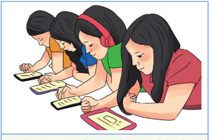

> **Deskripsi Visual:** Gambar ini adalah ilustrasi yang menunjukkan tiga siswa sedang belajar. Siswa di sebelah kiri menggunakan pensil untuk menulis, sementara dua siswi di sebelah kanan menggunakan pena untuk menulis. Semua siswi tampak fokus pada buku mereka, menunjukkan suasana belajar serius. Ilustrasi ini mungkin digunakan untuk menggambarkan aktivitas belajar di kelas, menekankan peran penulisan dalam proses belajar.

Pada saat gawai berdering, sadarilah bunyi itu dengan membuat catatan batin 'mendengar, mendengar'. Sadari dan perhatikan pada saat  tubuh  bergerak,  tangan mulai  menyentuh  gawai,  dan pada saat tangan mengangkat gawai ke dekat telinga.

Sadari  bahwa  hal  yang  kalian  lakukan  di  dalam  gawai  kalian  adalah sesuatu yang bermanfaat. Sadari berapa lama kalian sudah berada di depan gawai, jaga jarak layar dengan mata, serta sadari tubuh dan batin kalian tidak merasa lelah. Sadari apa yang kalian katakan secara lisan ataupun tulisan pada gawai kalian. Sadari betul gambar atau video yang akan kalian unggah. Jika kata-kata, gambar, atau video kurang bermanfaat, kalian lebih baik tidak mengunggahnya. Sadari  gerakan  tangan  dan  seluruh  tubuh  kalian  ketika sedang beraktivitas di internet melalui gawai. Apa pun pikiran, perkataan, dan perbuatan yang kita lakukan di dunia maya, semua akan membuahkan karma.  Pancarkan  kasih  sayang  kepada  teman  bicara  kalian  meskipun  di dunia maya.

 

---
## 📄 Halaman 104

Setelah  itu,  pancarkan  cinta  kasih  kepada  orang  di  seberang  gawai, siapa  pun  mereka.  Semoga  mereka  selalu  berbahagia  dan  sehat,  terbebas dari kejahatan dan mara bahaya, serta terbebas dari penderitaan batin dan jasmani. Curahkan kesadaran penuh dan perhatian murni saat menjawab gawai. Gelombang niat baik yang kalian sampaikan dan perhatian penuh, sesungguhnya merupakan penghargaan bagi orang tersebut. Berbicaralah dengan konsentrasi dan tanggapilah dengan sewajarnya. Bicaralah dengan halus,  ramah,  tenang,  tulus,  dan  jujur.  Jika  bicara  kalian  terlalu  cepat, lambatkanlah  sedikit,  dan  cobalah  menenangkan  diri  dengan  menyadari masuk dan keluarnya napas.

Pada saat kalian berbicara, tetaplah menyadari sensasi tubuh dari waktu ke  waktu,  misalnya  menyadari  tangan  ketika  memegang  gawai,  badan duduk di kursi, dan kaki menyentuh lantai. Bawalah pikiran pada kesadaran tubuh. Hal tersebut sangat bermanfaat untuk menjadikannya lebih tenang, terpusat, dan teduh saat berbicara. Hal yang terpenting atas segala sesuatu yang kalian lakukan ialah praktik untuk menyadari pergerakan dan sensasi tubuh dengan penuh kesadaran. Sebagai contoh, jika saya membungkukkan badan untuk mengambil sesuatu, saya akan menyadari keinginan saya untuk membungkuk dan menyadari gerakan membungkukkan badan.

### Praktik Meditasi

Tuliskan pengalamanmu setelah melakukan praktik menggunakan gawai dengan penuh kesadaran! Konsultasikan kemajuan meditasi dan rintangan atau hambatan selama praktik menggunakan gawai  kesadaran.

 

---
## 📄 Halaman 105

Tuliskan pengalaman kalian setelah praktik berkesadaran saat menggunakan gawai.

### Menggunakan Gawai

---
**📊 Tabel**

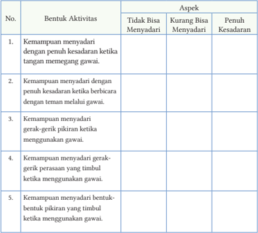

Tabel ini menunjukkan berbagai kemampuan yang dapat dianalisis melalui aktivitas menggunakan gawai, dengan fokus pada aspek kesadaran dan keterampilan. Topik utama tabel adalah kemampuan menyadari dan merespons berbagai situasi menggunakan gawai. Kolom-kolomnya mencakup tiga aspek: tidak bisa menyadari, kurang bisa menyadari, dan penuh kesadaran. Data penting yang terlihat adalah bahwa semua kemampuan tersebut memerlukan tingkat kesadaran yang lebih tinggi untuk diuji, menunjukkan bahwa penggunaan gawai memerlukan pengetahuan dan pemahaman yang lebih baik tentang diri sendiri dan lingkungan sekitar.

### Inspirasi Dharma

Ketika  pikiran  tenang,  rileks,  dan  penuh  perhatian,  rasa  sakit  yang dialami bukan sebagai gumpalan padat melainkan sebagai suatu aliran yang datang dan pergi dari waktu ke waktu.

Duduklah  dengan  pikiran  yang  rileks  dan  tenang,  perhatikan  aliran sensasi-sensasi tanpa penolakan dan tanpa pengharapan.

 

---
## 📄 Halaman 106

### D.  Manfaat Meditasi Hidup Penuh Kesadaran

Pada  hakikatnya,  melakukan  aktivitas  dengan  penuh  kesadaran  akan menghindarkan kalian dari  kesalahan  sehingga  kalian  akan  bersemangat, damai,  dan  bahagia.  Dengan  melakukan  semua  aktivitas  dengan  penuh kesadaran, hidup kalian akan teratur, lebih baik, lebih berhasil, dan  lebih bahagia. Lakukan perhatian pada napas sejenak sebelum memulai aktivitas sehingga akan membantu kalian untuk lebih tenang sepanjang hari.

Hidup penuh kesadaran merupakan pola kehidupan yang benar-benar hidup dalam arti sesungguhnya. Dalam hidup penuh kesadaran, kehidupan hadir dan menyatu dengan orang yang ada di sekitar kita, serta kita sadar sepenuhnya dengan apa yang kita lakukan di sini dan saat ini.

Manfaat meditasi pandangan terang adalah mengembangkan kebijaksanaan  dan  melenyapkan  kekotoran  batin  seperti  kemauan  jahat, nafsu keinginan, kemalasan, kegelisahan, kekawatiran, serta keragu-raguan. Batin  dikembangkan  berdasarkan  kebijaksanaan  akan  terbebas  dari  noda ( asava ) yaitu nafsu indrawi, pandangan salah dan kebodohan batin .

Manfaat meditasi hidup penuh kesadaran, antara lain:

- menuntun diri untuk dapat hidup selaras dengan alam;
- meningkatkan pengendalian diri;
- dapat mengikis keserakahan, kebodohan, dan kebencian;
- meningkatkan kesehatan badan jasmani;
- membangkitkan energi murni dalam diri;
- mengembangkan kesabaran;
- mengatasi gangguan tidur;
- membuat hidup lebih rileks;
- memahami diri sendiri dan mampu menjaga diri dengan baik;
- meningkatkan konsentrasi belajar. (Nurwito, 2018:91-92)
Manfaat praktik meditasi penuh kesadaran ( mindfulness ) bagi pelajar, antara lain untuk meningkatkan:

- fokus dan konsentrasi di sekolah;
- kemampuan untuk mengelola stres;
- kemampuan untuk memperhatikan dan berkonsentrasi;
- pengaturan emosi, meningkatkan kecerdasan emosional,
- keterampilan resolusi konflik;

 

---
## 📄 Halaman 107

- empati dan pemahaman terhadap orang lain;
- kapasitas untuk mengatasi tantangan;
- keterlibatan dalam aktivitas fisik;
- kreativitas dan kolaborasi, serta meningkatkan ekspresi seni kreatif.
Bhikkhu Ananda membabarkan empat jalan yang membawa kesucian dan mencapai tingkat kesucian Arahat , yaitu sebagai berikut.

- Seorang yang telah mengembangkan pandangan terang yang didahului oleh ketenangan.
- Seorang yang telah mengembangkan ketenangan yang didahului oleh pandangan terang.
- Seorang yang telah mengembangkan ketenangan bersama-sama dengan pandangan terang.
- Seorang  yang  pada  saat  meditasi,  timbul  kegelisahan  sehubungan  dengan Dharma,  pada  saat  pikirannya  tenang  dan  terkonsentrasi,  kemudian  sang jalan timbul dan belenggu pun lenyap. ( Yuganaddha Sutta, Aṅguttara Nikāya ).
Berdasarkan  pengalaman  meditator,  meditasi  hidup  berkesadaran  banyak membawa manfaat dalam hidupnya, antara lain sebagai berikut.

- Meditasi praktis untuk memurnikan pikiran dan mencapai hidup yang lebih berkualitas.
- Bagi para pekerja, pikiran menjadi lebih terkonsentrasi dan kelelahan berkurang.
- Meditasi  dapat  mengatasi  kesulitan  tidur  dan  membuat  pikirannya menjadi lebih jernih.
- Meditasi dapat meningkatkan kesabaran dan menghilangkan perilaku negatif, seperti marah, cemburu, dan iri hati.
- Meditasi dapat membasmi kekotoran mental dan menghasilkan kebahagiaan tertinggi.
- Meditasi dapat membasmi tiga penyebab dari semua ketidakbahagiaan, yaitu nafsu keinginan, kemarahan, dan ketidaktahuan.
- Meditasi dapat mengembangkan energi positif dan kreatif.
- Meditasi meningkatkan kekebalan tubuh (terhadap penyakit) dan dapat mengembangkan struktur otak berkaitan dengan pemikiran yang positif.
- Meditasi  dapat  mengurai  emosi,  menstabilkan  perhatian/minat,  dan mengurangi  kerentanan  otak  kita  dari  kebingungan  dan  kekacauan pikiran.
- Meditasi  dapat  digunakan untuk memperbaiki masalah medis, seperti pusing, tekanan darah tinggi, sakit punggung, dan penyakit jantung.

 

---
## 📄 Halaman 108

### Aktivitas Peserta Didik

- Apa manfaat praktik meditasi penuh kesadaran bagi pelajar?
- Apakah meditasi cocok dilaksanakan bagi seorang pekerja?
- Apa  empat  jalan  yang  membawa  kesucian  dan  mencapai  tingkat kesucian Arahat?
- Apa manfaat meditasi penuh kesadaran bagi kesehatan badan jasmani?

### Penerapan Nilai Luhur

- 1 . Berlatihlah hidup sadar agar hidup menjadi nyata bersama dengan siapa pun yang sedang kalian lakukan.
- Berlatihlah kesadaran penuh tidak hanya di vihara atau ruang meditasi, tetapi  sadar  dalam  setiap  aktivitas  sepanjang  hari,  seperti  berjalan, bekerja, dan makan dengan sadar-penuh.
- Berlatihlah  menyadari  gerakan  tubuh,  pikiran,  perasaan,  dan  bentukbentuk pikiran pada saat posisi duduk, berdiri, berjalan, dan berbaring.
- Berlatihlah  sabar  dalam  melaksanakan  meditasi  dan  tidak  banyak berharap pada hal yang bersifat duniawi.

### Aktivitas Peserta Didik

Tuliskan tekadmu setelah membaca penanaman nilai luhur!

 

---
## 📄 Halaman 109

Setelah mengikuti serangkaian pembelajaran materi 'Meditasi  Hidup Berkesadaran'  dengan  model  pembelajaran  nilai  ( value learning )  dan pendekatan  pembelajaran  berbuat  ( action  learning  approach ),  jawablah pertanyaan-pertanyaan berikut!

- Pengetahuan baru apa yang kalian peroleh setelah mengikuti pembelajaran 'Meditasi Hidup Berkesadaran'?
- Bagaimana pengalaman kalian setelah melaksanakan praktik meditasi hidup berkesadaran?
- Apakah  ada  rintangan  dan  gangguan  selama  melaksanakan  meditasi hidup berkesadaran?
- Aktivitas  apa  yang  kalian  lakukan  dalam  praktik  meditasi  hidup berkesadaran?

### A.  Penilaian Pengetahuan

### Soal Uraian Bebas

- Jelaskan Pañcakhandha (lima  kelompok  kehidupan)  dan  hubungan dengan empat landasan perhatian!
- Bagaimana cara melakukan meditasi berdiri dengan penuh kesadaran?
- Apa  manfaat  melakukan  meditasi  makan  dan  minum  dengan  penuh kesadaran?
- Jelaskan manfaat meditasi penuh kesadaran bagi seorang pelajar!
- Apa  manfaat  praktik  meditasi    menggunakan  gawai  dengan  penuh kesadaran?

### B.   Penilaian Sikap

### Penilaian Diri

Setelah  mengikuti  pembelajaran  pada  materi  ini,  lakukan  penilaian  diri  untuk menguatkan  profil  pelajar  Pancasila  yang  kalian  latih  pada  dimensi  Beriman, Bertakwa  Kepada  Tuhan  Yang  Maha  Esa,  dan  Berakhlak  Mulia  yaitu  pelajar

 

---
## 📄 Halaman 110

Indonesia  aktif  mengikuti  kegiatan  agama,    mengeksplorasi  guna  memahami secara  mendalam  ajaran,  menghargai  diri  sendiri,  menjaga  kesehatan  fisik  dan spritul, berempati, welas asih kepada orang lain bersikap jujur, adil, dan rendah hati.

Isilah dengan tanda √ pada kolom di bawah ini!

1 = Tidak pernah

2 = Jarang

3 = Sering

4 = Selalu

### Bertakwa Kepada Tuhan Yang Maha Esa, dan Berakhlak Mulia

---
**📊 Tabel**

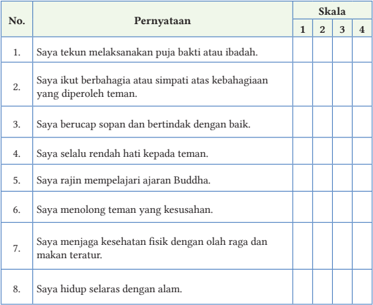

Tabel ini berisi 8 pernyataan yang diukur menggunakan skala 1 hingga 4 untuk menilai tingkat keberhasilan atau keterlibatan individu dalam berbagai aspek kehidupan spiritual dan sosial. Topik utama tabel adalah tentang perilaku dan sikap individu dalam berbagai situasi, mulai dari melakukan puja bakti atau ibadah, berbagi kebahagiaan dengan teman, berbicara sopan, hingga menjaga kesehatan fisik dan hidup relasional dengan alam. Kolom "Pernyataan" menyajikan 8 pernyataan yang harus diisi oleh individu, sedangkan kolom "Skala" menunjukkan skor yang diberikan kepada setiap pernyataan. Data penting yang terlihat adalah bahwa semua pernyataan memiliki skor yang sama, yaitu 3, menunjukkan bahwa individu tersebut memiliki tingkat keberhasilan atau keterlibatan yang sama dalam semua aspek yang diukur.

 

---
## 📄 Halaman 111

### C.  Penilaian Keterampilan

Praktikkan  meditasi  berkesadaran  menjelang  tidur  dan  bangun  tidur. Kemudian,  tuliskan  pengalaman  kalian  tentang  praktik  dengan  penuh kesadaran tersebut.

---
**📊 Tabel**

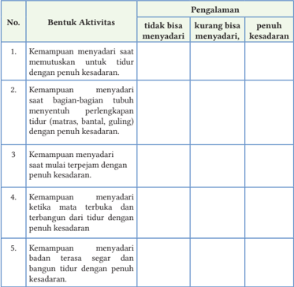

Tabel ini berisi informasi tentang kemampuan menyadari aktivitas tidur dengan penulisan yang berbeda. Topik utamanya adalah kemampuan menyadari aktivitas tidur dengan penulisan yang berbeda. Kolom-kolomnya meliputi "Bentuk Aktivitas" dan "Pengalaman". Data penting yang terlihat adalah bahwa tidak ada aktivitas tertentu yang hanya bisa dianggap sebagai "tidur dengan penulisan yang berbeda", tetapi ada beberapa aktivitas yang lebih baik atau kurang baik dalam hal ini. Misalnya, kemampuan menyadari saat memutuskan untuk tidur dengan penulisan yang berbeda lebih baik daripada ketika matanya terbuka dan terbangun dari tidur dengan penulisan yang berbeda. Ini menunjukkan bahwa ada variasi dalam kemampuan menyadari aktivitas tidur dengan penulisan yang berbeda.

Untuk menambah wawasan dan pengalaman tentang praktik meditasi hidup berkesadaran  lakukan  praktik  hidup  berkesadaran  pada  aktivitas-aktivitas kalian  setiap  hari.  Bentuk  aktivitas  yang  dapat  kalian  lakukan  antara  lain: belajar dengan penuh kesadaran dan puja bakti dengan penuh kesadaran.

 

---
## 📄 Halaman 112

100

---
**🖼️ Gambar/Diagram**

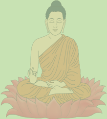

> **Deskripsi Visual:** Gambar ini adalah ilustrasi yang menampilkan Buddha sedang bermeditasi. Buddha duduk dengan posisi lotus di atas bunga lotus, yang biasanya digunakan sebagai simbol kebijaksanaan dan keindahan dalam budaya Buddha. Kepala Buddha tertutup dengan topi tradisional, menunjukkan keadaan meditasi dan ketenangan. Wajah Buddha tampak tenang dan penuh kedamaian, menunjukkan kebijaksanaan dan kebijaksanaan yang diharapkan dalam praktik Buddha. Ilustrasi ini mungkin digunakan untuk menggambarkan konsep kebijaksanaan dan meditasi dalam konteks budaya Buddha.

Kita menelusuri dunia yang luas ini dengan pikiran kita, tidak akan menemukan orang yang lebih dekat daripada diri kita sendiri. Karena demikian dekatnya kita kepada diri sendiri maka ia yang menyayangi diri tidak  akan melukai lainnya.

(Sonatherassa Vagga, Udāna)

 

---
## 📄 Halaman 113

KEMENTERIAN PENDIDIKAN, KEBUDAYAAN, RISET, DAN TEKNOLOGI REPUBLIK INDONESIA, 2022

Pendidikan Agama Buddha dan Budi Pekerti untuk SMA/SMK Kelas XII

Penulis: Katman  dan Tupari

Isbn: 978-602-244-568-5 (jilid 3)

### EKONOMI SEIMBANG

### Tujuan Pembelajaran

Peserta didik mampu menunjukkan sikap dan perilaku mengambil peran dan posisi terhadap masalah perekonomian, menjadikan nilainilai hukum kebenaran sebagai pola pikir dalam memaknai fenomena dan  masalah  kehidupan  terkait  dengan  posisi  dan  peran  manusia dalam perekonomian dunia modern, bangsa, dan masyarakat, serta tetap  berpedoman  pada  nilai-nilai  agama  Buddha  dan  Pancasila sebagai dasar negara dalam upaya menghadapinya.

---
**🖼️ Gambar/Diagram**

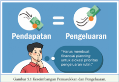

> **Deskripsi Visual:** Gambar 5.1 adalah ilustrasi yang menunjukkan keseimbangan antara pendapatan dan pengeluaran dalam konteks keuangan. Gambar ini menggunakan simbol mata uang untuk menggambarkan dua poin utama: pendapatan (dengan tanda mata uang) dan pengeluaran (dengan tanda mata uang). Di sebelah kiri gambar, ada simbol mata uang yang mengarah ke simbol mata uang lainnya, menunjukkan bahwa pendapatan dan pengeluaran harus saling berimbang. Di sebelah kanan, ada teks yang menyatakan "Harus membuat keseimbangan antara pendapatan dan pengeluaran". Ini menekankan pentingnya menjaga keseimbangan antara kedua aspek tersebut dalam manajemen keuangan. Gambar ini bertujuan untuk memberikan pemahaman visual tentang pentingnya keseimbangan dalam manajemen keuangan.

- Bagaimana cara hidup seimbang?
- Apa pendapat kalian tentang budaya konsumerisme?
- Mengapa terjadi budaya konsumerisme?

 

---
## 📄 Halaman 114

---
**🖼️ Gambar/Diagram**

> **Deskripsi Visual:** Gambar ini adalah ilustrasi yang menampilkan seorang Buddha sedang bermeditasi. Ilustrasi ini menunjukkan Buddha duduk dengan posisi yang tenang dan penuh kebijaksanaan, mengenakan pakaian tradisional Buddha yang khas. Latar belakangnya berwarna hijau cerah yang memberikan suasana tenang dan penuh kedamaian. Ilustrasi ini menunjukkan hubungan antara Buddha dan meditasi, serta menekankan pada kebijaksanaan dan ketenangan yang dapat diambil dari praktik meditasi. Teks, angka, atau label penting tidak terlihat dalam gambar ini. Informasi kunci yang dapat diambil pembaca adalah bahwa meditasi adalah bagian penting dari kehidupan Buddha dan dapat membawa kedamaian dan kebijaksanaan.

### Duduk Hening!

Duduklah dengan rileks, mata terpejam, perhatikan dan sadari napas kalian, rasakan dalam hati:

- 'Menyadari, .......... napas masuk'
- 'Menyadari, .......... napas keluar'
- 'Menyadari, .......... napas masuk'
- 'Menyadari, .......... napas keluar'.
ekonomi, masalah ekonomi, konsumtif, konsumerisme, hidup seimbang, materialistis, budaya konsumtif

Amati fenomena di bawah ini, kemudian lakukan tanya jawab terkait pesanpesan yang terkandung di dalamnya!

---
**🖼️ Gambar/Diagram**

> **Deskripsi Visual:** Gambar ini adalah ilustrasi yang menunjukkan peringatan "STOP! MEMELIHARA BUDAYA KONSUMTIF". Gambar ini terdiri dari beberapa elemen utama:

1. Peringatan "STOP!" yang berada di bagian atas gambar, bertujuan untuk menarik perhatian pembaca.
2. Gambar dua orang yang sedang berbelanja dengan tas belanja besar, menunjukkan konsumsi yang berlebihan.
3. Gambar seorang pria yang sedang membeli barang dengan harga tinggi, menunjukkan kecenderungan konsumsi yang mahal.
4. Gambar sebuah pohon dengan daun-daun berwarna hijau, menunjukkan konsep memelihara budaya konsumtif.

Elemen-elemen ini saling berkaitan dalam menggambarkan masalah konsumsi yang berlebihan dan konsumsi yang mahal. Informasi kunci yang dapat diambil pembaca adalah pentingnya memelihara budaya konsumtif dalam kehidupan sehari-hari.

### A.  Masalah Ekonomi dalam Perspektif Buddhis

Krisis  ekonomi  dapat  didefinisikan  sebagai  kegiatan  ekomoni  yang  mengalami kemerosotan sehingga menimbulkan depresi. Depresi ini diakibatkan oleh kepekaan terhadap kenaikan maupun penurunan ekonomi secara cepat dan bebas yang terjadi di masyarakat.

---
**🖼️ Gambar/Diagram**

> **Deskripsi Visual:** Gambar ini adalah ilustrasi yang menunjukkan konsep "Menanamkan Hidup Sederhana". Gambar tersebut menggambarkan seorang anak yang sedang memasukkan uang ke dalam botol berisi kue-kue. Botol tersebut tampak seperti sebuah tabung emas dengan tanda "Rp" yang menunjukkan bahwa uang tersebut adalah rupiah. Di atas botol tersebut ada tulisan "Menanamkan Hidup Sederhana" yang membantu menjelaskan tema dari gambar tersebut.

Elemen utama dalam gambar ini adalah anak, botol, dan kue-kue. Anak tersebut tampak sangat antusias dalam proses menabung, menunjukkan bahwa ia memahami pentingnya menyimpan uang untuk masa depan. Botol yang besar dan berwarna emas menunjukkan bahwa tabungan ini penting dan harus disimpan dengan baik. Kue-kue yang ada di dalam botol menambahkan nuansa positif dan menyenangkan pada gambar tersebut.

Teks, angka, atau label penting yang terlihat dalam gambar ini adalah "Menanamkan Hidup Sederhana", "Rp", dan "botol berisi kue-kue". Teks ini membantu pembaca memahami bahwa gambar tersebut adalah tentang pentingnya menyimpan uang dengan cara yang sederhana dan menyenangkan.

Informasi kunci yang dapat diambil pembaca dari gambar ini adalah pentingnya menyimpan uang dengan cara yang sederhana dan menyenangkan. Ini juga menunjukkan bahwa tabungan adalah bagian penting dari hidup sederhana.

 

---
## 📄 Halaman 115

Krisis ekonomi selalu menjadi isu global yang menakutkan bagi setiap negara. Hal itu disebabkan karena negara yang dilanda krisis ekonomi akan mengalami penurunan  yang  sangat  drastis  dalam  bidang  ekonomi.  Banyak  pihak  yang dirugikan ketika suatu negara mengalami krisis. Misalnya, harga kebutuhan pokok melambung  tinggi  sementara  jumlah  produksi  terbatas.  Tingkat  produktivitas yang  tinggi  menandakan  bahwa  ekonomi  tumbuh  dengan  baik.  Begitu  juga sebaliknya, produktivitas yang rendah menandakan adanya penurunan ekonomi. Oleh  sebab  itu,  produktivitas  dapat  digunakan  sebagai  tolak  ukur  dari  baik buruknya perekonomian suatu negara.

Sukirno (2005:7) menjelaskan bahwa kemampuan memproduksi barang dan jasa  lebih  rendah  dibandingkan  dengan  jumlah  keinginan  masyarakat  karena faktor-faktor yang tersedia untuk diproduksi relatif terbatas jumlahnya. Karena kondisi  yang  demikian,  setiap  pelaku  ekonomi  harus  membuat  pilihan  dalam kegiatan memproduksi maupun mengonsumsi barang dan jasa. Tujuannya ialah supaya sumber daya yang ada dapat digunakan secara untuk memenuhi kebutuhan masyarakat.  Ketimpangan  antara  keinginan  masyarakat  untuk  mengonsumsi barang dan jasa dengan produktivitas inilah yang menyebabkan krisis ekonomi.

Agama  Buddha  memandang  bahwa krisis ekonomi merupakan hal yang biasa  terjadi  dalam  kehidupan  manusia. Krisis  itu  harus  diselesaikan  supaya  tidak menimbulkan  akibat yang luas. Untuk menyelesaikan krisis ekonomi, umat Buddha harus memahami tentang konsep prinsip  ekonomi  secara  agama  Buddha. Buddha tidak mengajarkan ilmu ekonomi secara  khusus.  Akan  tetapi,  lebih  kepada penguatan prinsip ekonomi dan cara

---
**🖼️ Gambar/Diagram**

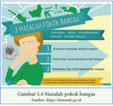

> **Deskripsi Visual:** Gambar ini adalah ilustrasi yang menunjukkan tiga masalah pokok bangsa. Gambar ini menggunakan elemen visual seperti gambar seseorang yang sedang berjalan dengan penuh kecepatan, yang mewakili masalah pertama, kemudian dua orang yang sedang berbicara, yang mewakili masalah kedua, dan akhirnya sekelompok orang yang sedang berjalan dengan penuh kecepatan, yang mewakili masalah ketiga. Teks pada gambar menyebutkan bahwa gambar ini menunjukkan tiga masalah pokok bangsa, yaitu kemiskinan, kurangnya akses ke pendidikan, dan kurangnya akses ke kesehatan. Angka-angka dan label penting yang terlihat pada gambar adalah 3, 5, dan 6, yang masing-masing menunjukkan jumlah masalah pokok bangsa tersebut. Informasi kunci yang dapat diambil pembaca adalah bahwa gambar ini menunjukkan tiga masalah pokok bangsa yang perlu diselesaikan oleh pemerintah untuk meningkatkan kualitas hidup rakyat.

pandang umat Buddha terhadap materi duniawi. Pemahaman terhadap prinsip ekonomi ini akan menjadi dasar cara hidup yang baik. Lalu, bagaimanakah prinsip ekonomi dalam agama Buddha? Prinsip ekonomi dalam agama Buddha ialah mata pencaharian benar ( sammã-ajiva ),  yang secara khusus termasuk kelompok sila dalam Jalan Mulia Berunsur Delapan. Kelompok sila terdiri atas tiga unsur, yaitu ucapan benar, perbuatan benar, dan mata pencaharian benar. Mata pencaharian benar  ialah  penghidupan  yang  tidak  merugikan,  tidak  mencelakakan,  tidak menyakiti, atau tidak membuat diri sendiri atau pihak lain menderita.

Prinsip ekonomi dalam agama Buddha mengacu kepada ajaran jalan tengah yang  menyatakan  bahwa  harus  terdapat  keseimbangan  antara  kesejahteraan secara ekonomi dan kesejahteraan spiritual. Kesejahteraan ekonomi diperlukan

 

---
## 📄 Halaman 116

untuk mendukung  peningkatan  kesejahteraan spiritual. Misalnya, dengan kekayaan  yang  dimilikinya,  orang  akan  banyak  memiliki  kesempatan  untuk melakukan kebajikan:  memberi  dana  kepada  Sangha,  membantu  panti  jompo, membantu korban bencana alam, dan sebagainya.

Prinsip ekonomi agama Buddha ialah hidup sederhana dan tanpa kekerasan. Hidup sederhana ialah dengan memiliki pengendalian diri terhadap keinginan ( tanha )  yang  berlebihan  pada  kesenangan  duniawi.  Dengan  demikian,  dapat menekan  keserakahan  ( lobha ) yang  berwujud  gaya  hidup  boros,  budaya konsumerisme,  berfoya-foya,  dan  sebagainya.  Adapun  tanpa  kekerasan  ialah menjalankan prinsip ekonomi tanpa membuat pihak lain menderita. Misalnya, tidak  mengambil  keuntungan  yang  terlalu  besar,  tidak  memperdagangkan makhluk hidup, tidak menjual racun, maupun tidak memperjualbelikan senjata tajam yang dapat membahayakan orang lain. Perilaku ekonomi yang demikian dapat menghindarkan adanya ketimpangan ekonomi di masyarakat yang dapat mengganggu stabilitas kemananan.

Dalam Kutadanta Sutta (Silakkhanda Vagga, Digha Nikāya) yang diterjemahkan oleh Team Giri Mangala Publication (2009: 89), dijelaskan bahwa ketimpangan  ekonomi  menimbulkan  stabilitas  keamanan  negara  terganggu. Mengeksekusi  pelaku  kejahatan  dengan  hukuman  penjara,  menyita  hartanya, atau  mengusirnya,  tidak  akan  menyelesaikan  permasalahan.  Solusi  untuk mengatasi krisis ekonomi tersebut akan lebih baik apabila dilakukan dengan cara memberikan bantuan modal usaha, memberikan benih bagi petani, memberikan makanan ternak bagi peternak, memberikan upah yang sesuai bagi pekerja, serta memberikan  perlakuan  hak  dan  kewajiban  yang  sama  kepada  seluruh  warga negara.

### Aktivitas Peserta Didik

### Berdiskusi

Berikut  adalah  beberapa  pertanyaan  mendasar  yang  harus  kalian  jawab sehingga diharapkan kalian dapat memiliki sikap untuk membantu mengatasi masalah perekonomian dunia. Pertanyaan-pertanyaan berikut ini dapat kalian jawab dengan cara berdiskusi bersama teman atau dengan membaca bukubuku referensi agar memiliki pengetahuan dan sikap yang lebih komprehensif.

- Faktor-faktor apa saja yang dapat menyebabkan terjadinya krisis ekonomi?
- Apa dampak krisis ekonomi bagi kalian?
- Bagaimana solusi untuk menghadapi krisis ekonomi menurut pandangan agama Buddha?

 

---
## 📄 Halaman 117

### B.  Menangkal Masalah Ekonomi dengan Dharma

---
**🖼️ Gambar/Diagram**

> **Deskripsi Visual:** Gambar 5.5 adalah ilustrasi yang menunjukkan budaya konsumtif. Gambar ini menggambarkan dua orang wanita yang sedang berbelanja di sebuah toko. Mereka membawa banyak tas belanjaan berwarna-warni, menunjukkan bahwa mereka telah melakukan pembelian yang cukup besar. Lingkungan sekitar mereka tampak ramai dengan berbagai pakaian dan barang-barang lain yang tersedia untuk dibeli. Ilustrasi ini menekankan pada kebiasaan konsumtif yang umum ditemui di masyarakat modern, di mana individu sering kali membeli barang-barang yang tidak pernah mereka butuhkan atau hanya sekedar untuk memenuhi kebutuhan konsumsi mereka.

Perubahan ekonomi  yang begitu cepat memicu  munculnya  perilaku konsumtif,  yaitu  perilaku  membeli  yang  berlebihan  sehingga  membuat orang terjebak dalam budaya konsumerisme. Budaya konsumerisme menjadi salah satu masalah ekonomi global, yang tidak hanya melanda masyarakat perkotaan,  tetapi  juga  pedesaan,  dan  bahkan  menjadi  tren  di  kalangan generasi  milenial.  Tentu  ini  menjadi  sebuah  keprihatinan  karena  pelajar sebagai  generasi  muda  merupakan  generasi  penerus  dan  pembangunan bangsa ini. Apa yang akan terjadi jika suatu negara lebih mengutamakan gaya hidup materialistis?

Budaya  konsumerisme  adalah kebiasaan perilaku individu dalam menggunakan  atau  mengonsumsi  kebutuhan  hidupnya  baik  kebutuhan primer maupun kebutuhan sekunder. Budaya konsumerisme berhubungan dengan  moral  pelakunya  terutama  tentang  pemahaman  dan  penerimaan terhadap  gaya  hidup.  Gaya  hidup  merupakan  manifestasi  perilaku  setiap orang dalam hidupnya.

Gaya  hidup  dan  budaya  konsumtif  ini  mengikuti  tuntutan  zaman seiring  dengan  berkembangnya  ilmu  pengetahuan  dan  teknologi.  Gaya hidup menurut Safuwan (2007:45) merupakan suatu produk yang dihasilkan akibat  kemajuan  dalam  berbagai  bidang  melalui  daya  cipta,  rasa,  dan karsa  manusia.  Gaya  hidup  adalah  tampilan  perilaku  individu  dalam kehidupannya, sedangkan pola konsumsi adalah kebiasaan perilaku individu dalam  mengonsumsi  sejumlah  kebutuhan  hidupnya  baik  primer  maupun

 

---
## 📄 Halaman 118

sekunder. Dalam operasionalnya, gaya hidup dan pola konsumsi manusia akan mengikuti kebudayaan, tuntutan zaman, pengaruh lingkungan sekitar, efek media, kemajuan ilmu pengetahuan dan teknologi.

---
**🖼️ Gambar/Diagram**

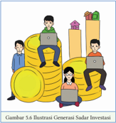

> **Deskripsi Visual:** Gambar ini adalah ilustrasi yang menunjukkan generasi sadar investasi. Gambar ini terdiri dari beberapa elemen utama:

1. **Pertama**: Gambar ini menampilkan tiga orang yang sedang bekerja dengan laptop di atas sekelompok uang besar. Mereka tampak senang dan bersemangat, menunjukkan semangat dan motivasi dalam dunia investasi.

2. **Elemen Utama dan Relasinya**: 
   - **Uang Besar**: Uang besar yang diletakkan di atas mereka menunjukkan bahwa investasi dapat memberikan hasil yang signifikan.
   - **Laptop**: Laptop yang digunakan oleh semua individu menunjukkan bahwa teknologi telah menjadi alat penting dalam dunia investasi.
   - **Orang-orang**: Ketiga orang tersebut menunjukkan bahwa investasi tidak hanya dilakukan oleh orang dewasa, tetapi juga oleh generasi muda yang aktif dalam dunia bisnis dan finansial.

3. **Teks, Angka, atau Label Penting**:
   - **Uang Besar**: Uang besar yang diletakkan di atas mereka menunjukkan jumlah investasi yang signifikan.
   - **Laptop**: Laptop yang digunakan oleh semua individu menunjukkan bahwa teknologi telah menjadi alat penting dalam dunia investasi.

4. **Informasi Kunci yang Dapat Diambil Pembaca**:
   - Investasi memiliki potensi untuk memberikan hasil yang signifikan.
   - Teknologi telah menjadi alat penting dalam dunia investasi.
   - Generasi muda aktif dalam dunia bisnis dan finansial.

Dengan demikian, gambar ini menggambarkan bagaimana investasi dapat menjadi cara yang efektif untuk memperoleh keuntungan dan bagaimana teknologi telah menjadi alat penting dalam dunia ini.

Kemudahan  yang  dirasakan  untuk mem  peroleh ke  butuhan  hidup  menggunakan teknologi membuat pergeseran peradaban dan perubahan sosial dari  yang  semula  bersifat  tradisional mengarah kepada modernisasi. Masalahnya  ialah  tidak  semua  orang mampu mengendalikan diri supaya tidak  terjebak  dalam  kesenangan  indra secara berlebihan. Budaya konsumtif merupakan sebuah keperihatinan karena  cenderung  merugikan  dari  sisi pelakunya. Konsumerisme dapat menyebabkan hidup boros, malas bekerja, rendahnya  daya  juang  serta  nilai-nilai  penting  dalam  kehidupannya. Perilaku-perilaku demikian dapat terus meluas dan menjadi masalah yang lebih  besar  karena  dapat  menjadi  salah  satu  indikasi  kemerosotan  moral anak bangsa.

Fenomena perilaku konsumtif merupakan perilaku yang cenderung bersifat mengharapkan  sesuatu  yang  instan.  Menurut  Rohman  (2016:238)  perilaku konsumtif  adalah  perilaku  yang  mencerminkan  'serba-instan, '  atau  perilaku yang tidak mengindahkan proses, bahkan tidak peduli dengan proses. Perilaku konsumtif  juga sering dilawankan dengan perilaku produktif. Bahkan, konsumtif cenderung mengarah pada gaya hidup glamor, boros, dan hedon.

Budaya  konsumtif  di  kalangan  pelajar  perlu  ditanggulangi.  Ajaran Buddha tentang Hukum Empat Kebenaran Mulia dan Tiga Corak Universal dapat  dijadikan  sebagai  cara  untuk  menghadapi  permasalahan  budaya konsumtif. Empat Kebenaran Mulia yang terdiri atas dukkha , sebab dukkha , lenyapnya dukkha, dan  jalan  menuju  lenyapnya dukkha. Tiga  Corak Universal  yang  terdiri  atas  corak  ketidakkekalan  ( anicca ),  ketidakpuasan ( dukkha ), dan tanpa inti diri ( anatta ) merupakan satu kesatuan ajaran yang dapat  digunakan  untuk  memaknai  permasalahan  perekonomian,  salah satunya tentang budaya konsumtif.

 

---
## 📄 Halaman 119

### 1. Menangkal Budaya Konsumtif dengan Prinsip Empat

### Kebenaran Mulia

Pemahaman  nilai-nilai  umum  Hukum  Empat  Kebenaran  Mulia  dalam memaknai masalah ekonomi adalah sebagai berikut.

### a. Kebenaran tentang Dukkha

Budaya  konsumtif  dipahami  sebagai  penderitaan  yang  berdampak buruk dan kompleks sehingga perlu dihentikan. Dampak buruk ini misalnya terganggu kegiatan belajar peserta didik karena lebih fokus pada keinginan untuk  menghambur-hamburkan  uang  sehingga  mengakibatkan  kegiatan belajar terganggu.

### b. Kebenaran tentang Sebab Dukkha

Pada tahap ini pelajar merefleksi penyebab munculnya budaya konsumtif dalam diri kita sehingga dapat menemukan cara untuk menghentikannya. Umumnya,  penyebab  munculnya  budaya  konsumtif  ialah  keinginan  dan keserakahan  yang  tidak  terkendalikan.  Selain  itu,  gaya  hidup,  gengsi, lingkungan, dan teknologi juga dapat menjadi penyebab seseorang memiliki budaya konsumtif.

### c. Kebenaran tentang Lenyapnya Dukkha

Pada  tahap  ini,  dipahami  bahwa  masalah  budaya  konsumtif  dapat dihentikan sehingga muncullah pola hidup seimbang. Lenyapnya perilaku ini dapat membawa kebahagiaan dan keuntungan pada diri kita karena terbebas dari segala permasalahan yang dapat ditimbulkan dari budaya konsumtif.

### d. Jalan Menuju Lenyapnya Dukkha

Jalan  untuk  menghentikan  perilaku  konsumtif  ialah  dengan  budaya hidup  seimbang,  hidup  sederhana,  memiliki  pengendalian  diri,  dan  tidak mengembangkan keserakahan.

### 2. Menangkal Budaya Konsumtif dengan Tiga Corak Universal

Pemahaman  nilai-nilai  umum  Tiga  Corak  Universal  dalam  menangkal permasalahan  ekonomi  khususnya  budaya  konsumtif,  dapat  dijabarkan sebagai berikut.

### a. Corak Ketidakkekalan ( Anicca )

Pada corak ini, kita menyadari bahwa kondisi kehidupan tidaklah kekal, mengalami perubahan, baik menyenangkan maupun tidak menyenangkan.

 

---
## 📄 Halaman 120

Begitu juga dengan barang-barang apa yang kita inginkan maupun sudah kita miliki, semuanya juga mengalami perubahan. Berdasarkan pemahaman pada fakta ini,  kita  menyadari  bahwa  keinginan  untuk  memuaskan  indra dengan  membeli  berbagai  macam  barang,  pada  dasarnya  mengarah  pada kondisi yang akan mengalami perubahan. Kondisi itu tidak bertahan lama. Oleh  sebab  itu,  hendaknya  kita  memiliki  sikap  yang  bijaksana  terhadap segala sesuatu.

### b. Corak Ketidakpuasan ( Dukkha )

Corak ketidakpuasan ( dukkha ) mengajarkan kepada kita untuk memiliki pemahaman bahwa apa yang kita miliki juga akan membawa penderitaan yang baru. Jika barang yang diinginkan dapat dimiliki, kita merasa bahagia. Akan  tetapi,  jika  tidak  dapat  dimiliki,  kita  merasa  sedih;  jika  rusak  atau hilang, kita juga menjadi sedih. Kebahagiaan karena memiliki apa yang kita sukai  tidak  bisa  dipertahankan  secara  permanen.  Semuanya  mengalami perubahan, suka dan duka. Berdasarkan pemahaman pada fakta tersebut, kita menyadari bahwa keinginan untuk memuaskan indra dengan membeli berbagai macam barang, pada dasarnya mengarahkan kita pada kondisi yang akan membuat kita mengalami ketidakpuasan. Oleh sebab itu, hendaknya kita bersikap bijaksana terhadap segala sesuatu.

### c. Corak Tanpa Inti Diri ( Anatta )

Corak  tanpa  inti  diri  ( anatta )  menjelaskan  bahwa  kondisi  kehidupan tidak berdiri sendiri, tetapi merupakan perpaduan dari berbagai aspek. Orang yang  tidak  menyadari  kebenaran  ini  akan  cenderung  mementingkan  diri sendiri dan egois, serta menganggap bahwa apa yang diinginkannya harus tercapai.  Sepanjang  kita  menganggap  memiliki  diri,  sikap  'aku-punyakumilikku'  akan  menguasai  hidup  kita  dan  membawa  berbagai  macam masalah.  Berdasarkan  pemahaman  pada  fakta  tersebut,  kita  menyadari bahwa keinginan untuk memuaskan indra dengan membeli berbagai macam barang pada dasarnya akan mengarahkan kita pada sikap egois. Oleh sebab itu,  hendaknya  kita  memiliki  sikap  bijaksana  terhadap  segala  sesuatu. Dengan demikian, kita dapat menghadapi situasi sehari-hari dengan lebih baik dan membantu kemajuan menuju kebahagiaan sejati atau pencerahan.

 

---
## 📄 Halaman 121

### Aktivitas Peserta Didik

### Berdiskusi

Diskusikan  bersama  teman  kalian  atau  carilah  referensi  dari  berbagai sumber!

- Sebagai  pelajar,  bagaimana  pemahaman  kalian  mengenai  nilai-nilai umum Tiga Corak Universal dalam memaknai budaya konsumtif?
- Bagaimana dampak budaya konsumtif bagi pelajar?
- Bagaimana peran nilai-nilai agama Buddha dan Pancasila dasar negara dalam menghadapi budaya konsumtif?

### Inspirasi Dharma

Buddha bersabda tentang kesederhanaan kepada para siswa:

'Makanlah  sedikit  saja  dan  sederhanalah  dalam  hal  makan.  Dengan sedikit keinginan dan bebas dari ketamakan, dia tidak terserang penyakit keinginan. Dia berada dalam keadaan tanpa nafsu dan tenang.' ( Sutta

Nipata 707, Khuddaka Nikāya)

### Membaca

### C.  Budaya Hidup Seimbang

Perkembangan teknologi sebagai salah satu indikator globalisasi memberikan banyak  kemudahan  kepada  masyarakat  untuk  mengakses  produk-produk yang sebelumnya  tidak pernah  dibayangkan atau bahkan  dinikmati. Banyaknya layanan belanja online yang menawarkan kemudahan berbelanja membuat masyarakat dapat dengan mudah melakukan transaksi. Tidak perlu susah payah melakukan transaksi secara tunai cukup dengan memanfaatkan internet dan gadget barang yang diinginkan pun segera datang di tempat tujuan. Inilah yang menjadi tren di masa kini.

Selain  memberikan  dampak  positif,  globalisasi  juga  dapat  memberikan dampak  negatif  yaitu  tumbuhnya  perilaku  konsumtif  yang  berlebihan  di masyarakat, tidak terkecuali di kalangan pelajar. Menyadari hal ini, penting adanya  upaya  untuk  melakukan  gaya  hidup  seimbang.  Sifat  konsumtif yang berlebihan merupakan gaya hidup yang tidak seimbang karena dapat

 

---
## 📄 Halaman 122

menimbulkan ketidak  seimbangan antara pemasukan dengan pengeluaran. Kita  harus  berani  melawan  arus  tren masa kini, jika secara ke  mampuan, kita belum dapat men  cukupi. Kita juga perlu memiliki  rencana  di  masa  depan  agar dapat memenuhi kebutuhannya dengan baik.  Hal  itu  agar  tidak  menimbulkan permasalahan di kemudian hari.

---
**🖼️ Gambar/Diagram**

> **Deskripsi Visual:** Gambar ini adalah ilustrasi yang menunjukkan kata-kata "MENTAL HEALTH" yang terbuat dari beberapa kubus kecil berwarna-warni. Setiap kubus memiliki tulisan singkat yang membentuk kata-kata tersebut. Warna-warna yang digunakan mencerminkan warna-warna yang biasanya digunakan dalam perawatan kesehatan mental, seperti hijau untuk kesehatan, merah untuk emosi, dan biru untuk rasa. Ilustrasi ini mungkin digunakan sebagai bagian dari buku pelajaran kesehatan mental untuk mengajarkan konsep tentang kesehatan mental dan bagaimana ia terkait dengan emosi dan rasa.

Penyelesaian  permasalahan  ekonomi  menjadi  tanggung  jawab  bersama  dari semua pihak, tidak terkecuali pelajar. Pelajar harus mampu menunjukkan sikap dan perilaku mengambil peran dan posisi terhadap masalah perekonomian. Pelajar juga harus menumbuhkan Profil Pelajar Pancasila yaitu pada dimensi mandiri dan berpikir kritis. Mandiri artinya bertanggung jawab terhadap diri sendiri untuk terus belajar dan menyesuaikan diri dengan berbagai tantangan yang ada saat ini. Adapun berpikir kritis bahwa pelajar harus menggunakan nalar dengan baik untuk mengolah dan mengambil keputusan dengan baik, tentunya harus selaras dengan nilai-nilai agama Buddha dan Pancasila dasar negara. Mengapa harus sejak dini? Karena generasi muda inilah yang akan menjadi  penerus  bangsa  ini.  Kita  mempunyai  tanggung  jawab  yang  sama untuk memastikan bangsa ini agar makin baik.

Generasi  muda  juga  dituntut  untuk  memenuhi  tugas  dan  tanggung jawabnya  untuk  berkontribusi  dan  berperan  aktif  dalam  menyelesaikan berbagai  permasalahan  bangsa,  salah  satunya  ialah  permasalahan  ekonomi. Kalian juga dapat menunjukkan perilaku yang selaras dengan nilai-nilai agama Buddha dan Pancasila dasar negara sebagai bentuk kontribusi dalam mengatasi masalah perekonomian. Di antaranya adalah sebagai berikut.

### 1. Belajar dengan Tekun

Sebagai pelajar, sebaiknya kalian memfokuskan diri untuk belajar dengan baik, daripada berfoya-foya, menghambur-hamburkan kekayaan, dan memenuhi keinginan yang tidak terbatas. Belajar dan berusaha dengan tekun setiap hari dapat menghindarkan diri kalian dari sikap konsumtif. Apabila kalian menjadi sibuk, tidak banyak waktu untuk berselancar di dunia maya. Maka, hal ini dapat menjadi salah satu peran nyata dari kontribusi kalian dalam mengatasi permasalahan ekonomi.

 

---
## 📄 Halaman 123

### 2. Turut Menjaga Kekayaan

Meskipun masih berperan sebagai seorang pelajar, kalian perlu untuk belajar menjaga dan melindungi kekayaan kedua orang tua kalian. Caranya ialah dengan tidak  boros  meskipun  hidup  berkecukupan,  tidak  menghambur-hamburkan uang untuk hal-hal yang tidak penting, dan menggiatkan budaya menabung.

### 3. Menjalin Persahabatan yang Baik

Persahabatan  yang  baik  dapat  membawa  manfaat  yang  luar  biasa  bagi perkembangan kita, baik secara fisik maupun batin. Sahabat yang baik ialah sahabat yang selalu ada dalam setiap kondisi, baik senang maupun susah. Sahabat  dapat  membawa  kita  kepada  kemajuan  bukan  kemunduran,  dan tidak membawa kita kepada pemborosan. Jika kalian menemukan sahabat yang demikian, hendaknya dijalin dengan baik.

### 4. Belajar Mengelola Keuangan

Memiliki  keseimbangan  dalam  pemasukan  dan  pengeluaran  merupakan cara untuk mencegah timbulnya masalah ekonomi. Seseorang yang mampu mengelola keuangan dengan baik akan memikirkan dengan cermat setiap biaya  yang  akan  dikeluarkannya.  Dia  tidak  akan  mengeluarkan  biaya melebihi pemasukannya supaya tidak menimbulkan utang. Misalnya, ketika seorang  pelajar  diberi  uang  jajan  oleh  orang  tuanya,  dia  harus  mampu mengelola agar uang yang diberikan tidak habis dan dia bisa menabung.

### 5. Aktif Melakukan Kegiatan Positif

Keyakinan  yang  kuat  terhadap  Tri  Ratna  merupakan  kekuatan  untuk menangkal permasalahan ekonomi. Keyakinan yang kuat dapat mendorong orang untuk lebih aktif dalam melakukan kegiatan-kegiatan positif, misalnya berolahraga, belajar kelompok, bermain seni peran, drama, dan sebagainya. Akibatnya, dia dapat menghindari sikap konsumtif karena memperhatikan dampak yang akan ditimbulkan dari sikap tersebut.

### 6. Berperilaku Baik

Memiliki  moral  dan  perilaku  yang  baik  sangat  memengaruhi  kualitas kehidupan pelakunya. Perilaku bermoral dan baik tidak berkorelasi dengan pendidikan.  Artinya,  walaupun  masih  sebagai  pelajar,  seseorang  dapat memiliki moral dan perilaku yang baik. Jika demikian, apa sebenarnya yang menjadikan seseorang makin baik? Perilaku yang baik ini harus diupayakan sendiri  oleh  setiap  orang.  Jika  semua  orang  memiliki  perilaku  yang  baik dan bermoral, tidak akan ada yang mau menjadi pencuri, koruptor, penipu, penghasut, dan sejenisnya.

 

---
## 📄 Halaman 124

### 7. Murah Hati dan Suka Menolong

Sebagai seorang pelajar, sikap murah hati dan suka menolong dapat dilakukan dengan cara berikut. Kalian dapat menyisihkan uang jajan untuk membeli makanan atau minuman, kemudian diberikan kepada teman yang sedang membutuhkan atau tidak mampu. Jika sikap seperti ini sering dilakukan, hal  ini  akan  menjadi  kebiasaan  yang  baik  hingga  dewasa  nanti.  Itu  akan berdampak  baik  bagi  perkembangan  pelakunya  maupun  bagi  negara. Seorang  pelajar  yang  memiliki  sikap  dermawan  dan  suka  menolong  dia, akan menjadi figur pemimpin yang diharapkan di masa depan.

### 8. Belajar menjadi Bijaksana

Seseorang dikatakan bijaksana jika dia dapat menggunakan akal budinya (pengalaman  dan  pengetahuannya).  Bijaksana  juga  diartikan  dengan  arif, bersikap  pandai  dan  hati-hati  (cermat,  teliti,  dan  sebagainya)  apabila  dia menghadapi kesulitan.  Sikap  pelajar  yang  demikian  menunjukkan  bahwa dia sudah memiliki pengendalian diri yang baik. Tidak mengandalkan emosi dalam  menghadapi  permasalahan.  Sikap  ini  akan  berdampak  baik  pula terhadap perkembangan ekonomi suatu negara.

### Aktivitas Peserta Didik

### Berlatih

Berdasarkan materi tentang Gaya Hidup Seimbang, jawablah pertanyaanpertanyaan berikut ini!

- Bagaimana ajaran Buddha tentang cara hidup seimbang?
- Apa dampak jika hidup tidak seimbang?
- Apa yang dimaksud dengan ungkapan bahwa generasi muda harus menjadi solusi penyelesaian masalah ekonomi?
- Sebagai  peserta  didik,  bagaimana  peran  kalian  terhadap  masalah perekonomian selaras dengan nilai-nilai agama Buddha dan Pancasila dasar negara?

 

---
## 📄 Halaman 125

Setelah  mengikuti serangkaian pembelajaran materi 'Ekonomi Seimbang' dengan model pembelajaran nilai ( value learning ) dan pendekatan pembelajaran berbuat ( action learning approach ), silakan lakukan refleksi ke dalam diri kalian masing-masing untuk menemukan hal-hal berikut ini.

- Pengetahuan baru apa yang kalian peroleh?
- Nilai-nilai baik apa yang dapat kalian temukan dalam pembelajaran ini?
- Sikap dan perilaku seperti apa yang kalian lakukan untuk menunjukkan peran dan posisi kalian terhadap masalah perekonomian yang selaras dengan  nilai-nilai  agama  Buddha  dan  Pancasila  dasar  negara  dalam kehidupan sehari-hari?
- Rencana tindakan nyata apa yang akan kalian lakukan setelah pembelajaran ini, yang ada kaitannya dengan permasalahan ekonomi?

### A.  Penilaian Pengetahuan

### 1. Soal pilihan ganda

Jawablah pertanyaan-pertanyaan berikut ini dengan memberi tanda silang (x) pada huruf a, b, c, d, atau e pada lembar jawaban yang disediakan!

- Menurut agama Buddha, mengapa dapat terjadi krisis ekonomi?
- Karena  adanya kamma buruk  yang  dimiliki  seseorang  sehingga tidak memiliki kemampuan baik secara ekonomi.
- Karena nafsu keinginan (tanha) manusia  yang  tidak  terbatas  atas dorongan keserakahan (lobha) terhadap segala sesuatu.
- Karena  hal  ini  sudah  diramalkan  Buddha  dalam Kutadanta  sutta bahwa akan terjadi kekacauan karena ekonomi.
- Karena manusia tidak mampu mengelola kegiatan ekonomi dengan baik sehingga terjadi ketimpangan antara pemasukan dan pengeluaran.
- Karena  pemerintah  yang  tidak  membagikan  dana  secara  adil sehingga menyebabkan kekacauan yang memicu krisis ekonomi.

 

---
## 📄 Halaman 126

- Buddha menjelaskan bahwa kekayaan tidak menjamin spiritual seseorang  menjadi  berkembang  jika  tidak  mampu  mengelola  dengan baik. Jika sebagai pelajar, apa yang mesti dilakukan?
- Belajar dengan rajin sambil mendalami ajaran agama Buddha supaya kelak memperoleh kekayaan dengan benar dan memanfaatkannya untuk meningkatkan spiritualitas.
- Belajar dengan rajin dan menempuh pendidikan yang tinggi supaya dapat  mengubah  keadaan  menjadi  lebih  baik  dan  menjadi  orang kaya dalam waktu yang cepat.
- Memberi  pengetahuan  kepada  orang-orang  kaya  tentang  cara menggunakan kekayaan dengan benar sehingga dapat menyokong perkembangan agama Buddha.
- Memfokuskan diri mempelajari ajaran agama Buddha supaya batin berkembang dan tidak dikotori oleh keinginan duniawi.
- Belajar sambil mencari penghasilan melalui online supaya menambah perekonomian keluarga dan menggunakannya untuk membangun vihara.
- Sebagai  pelajar,  Ani  sudah  sering  berbelanja online sekadar  untuk kesenangan saja. Jika dihubungkan dengan pemahaman nilai-nilai Hukum Empat Kebenaran Mulia, ini adalah penderitaan. Mengapa demikian?
- Karena dapat menyebabkan harta orang tua menjadi berkurang.
- Karena mengganggu belajar yang dapat menyebabkan prestasi menurun.
- Karena keinginan yang tidak terbatas itu sendiri adalah penderitaan.
- Karena  Ani  tidak  dapat  menghentikan  keinginan  untuk  terus berbelanja online.
- Karena sesuai ajaran Buddha bahwa keinginan harus dihentikan.
- Bagaimana sikap  sebagai  pelajar  Buddhis  menghadapi  arus  perkembangan global yang sangat cepat?
- Mengikuti setiap perkembangan dengan sekuat tenaga supaya tidak tertinggal.
- Pelajar Buddhis harus menjadi contoh untuk setiap perkembangan yang terjadi.
- Mengabaikan perkembangan yang ada dan fokus belajar supaya sukses.
- Harus up  to  date dengan  setiap  perkembangan  yang  ada  supaya tidak dibilang kuno atau kurang update.
- Mengikuti perkembangan yang ada sesuai kemampuan dengan tetap memfilter supaya tidak salah arah

 

---
## 📄 Halaman 127

- Bagaimana pandangan berikut ini yang tepat terhadap budaya konsumtif?
- Budaya konsumtif  baik karena  mendorong  perkembangan ekonomi negara sehingga perlu didukung.
- Budaya konsumtif merupakan peluang mata pencaharian di masa kini.
- Budaya konsumtif bukan hanya dapat memicu krisis ekonomi tetapi juga meningkatkan pendapatan.
- Budaya konsumtif harus dihindari dengan cara melakukan berbagai macam kegiatan positif seperti puja bakti, meditasi, berolahraga.
- Budaya konsumtif belum berpengaruh terhadap kehidupan pelajar.

### 2. Soal Esai

### Studi Kasus

Putri merupakan seorang pelajar SMA terkenal di kotanya. Dia berasal dari keluarga yang berada. Ayahnya seorang pengusaha batu bara dan ibunya memiliki usaha di bidang periklanan. Secara ekonomi, Putri tidak pernah kekurangan.  Karena  memiliki  harta  yang  berlimpah,  Putri  sering  pergi ke  mal  bersama  teman-temannya  untuk  membeli  kebutuhan  pribadinya, meskipun terkadang hal itu tidak diperlukan karena sudah tercukupi dari keluarganya. Selain ke mal, dia juga sering berbelanja secara online melalui aplikasi e-commerce , yaitu aktivitas jual beli yang dilakukan secara online .

Putri memiliki hati yang baik. Dia sering mentraktir teman-temannya atau membelikan mereka barang-barang kesukaannya. Hal tersebut membuat teman-temannya makin senang bergaul dengannya dan patuh pada perintahnya. Putri juga sering membantu orang yang sedang kesusahan.

Suatu hari, Putri sedang membuka aplikasi belanja online dan melihat ada barang yang disukainya, dengan edisi terbatas dan sedang dijual cepat. Dia  tertarik  untuk  membelinya  dan  siap  untuk  melakukan  pembayaran. Tiba-tiba, gawainya berdering. Ternyata, salah seorang teman baiknya yang bernama Hany menelpon. Hany menyampaikan bahwa orang tua dari salah satu teman mereka mengalami kecelakaan dan membutuhkan biaya untuk pengobatan.  Karena  teman  mereka  itu  tidak  memiliki  uang  yang  cukup, Hany berinisiatif untuk meminjam uang tersebut kepada Putri.

 

---
## 📄 Halaman 128

### Soal-soal

Berdasarkan narasi di atas, jawablah pertanyaan-pertanyaan berikut ini!

- Bagaimana tanggapan kalian terhadap gaya hidup Putri?
- Bagaimana seharusnya sikap Putri terhadap permintaan Hany?
- Bagaimana seharusnya tindakan Putri dalam mengelola keuangannya?
- Tindakan  apa  yang  kalian  lakukan  supaya  bisa  hidup  berkecukupan seperti Putri?
- Nilai-nilai baik apa yang bisa kalian teladani dari cerita tersebut?

### B.  Penilaian Sikap

Setelah  mengikuti  pembelajaran  pada  materi  ini,  lakukan  penilaian  diri untuk menguatkan Profil Pelajar Pancasila yang kalian latih pada dimensi Mandiri. Pelajar Indonesia harus memiliki kemandirian, yaitu bertanggung jawab atas proses dan hasil belajar yang kalian lakukan, memiliki prakarsa untuk mengembangkan dirinya, dan memiliki tujuan serta rencana strategis dengan tindakan belajar.

Nama :

Kelas :

### Petunjuk Pengisian:

Isilah dengan tanda chek list (√) pada kolom di bawah ini!

1 = Tidak pernah

2 = Jarang

3 = Sering

4 = Selalu

---
**📊 Tabel**

Tabel ini berisi dua poin pernyataan yang diukur menggunakan skala 1 hingga 4. Topik utama tabel adalah tentang refleksi diri dan pengembangan diri. Kolom pertama berisi poin-poin pernyataan, sedangkan kolom kedua berisi skala penilaian. Data penting yang terlihat adalah bahwa kedua poin pernyataan memiliki skala yang sama, yaitu 1 hingga 4, namun hanya satu poin pernyataan memiliki nilai tertinggi 4. Ini menunjukkan bahwa refleksi diri dan pengembangan diri merupakan aspek yang penting dalam evaluasi diri sendiri.

 

---
## 📄 Halaman 129

---
**📊 Tabel**

Tabel ini berisi 15 poin yang membahas emosi, strategi belajar, dan perilaku yang diharapkan dalam proses belajar. Topik utamanya adalah tentang bagaimana seseorang harus merespons situasi belajar dengan baik. Kolom pertama menyajikan poin-poin tersebut, sedangkan kolom kedua dan ketiga digunakan untuk mengevaluasi tingkat kesesuaian dengan pernyataan "Saya". Data penting yang terlihat adalah bahwa setiap poin mencakup emosi, strategi, dan perilaku yang diharapkan, serta tingkat kesesuaian dengan pernyataan "Saya". Pola penting yang terlihat adalah bahwa setiap poin memiliki satu pernyataan "Saya" yang harus diisi sesuai dengan tingkat kesesuaian dengan poin tersebut.

 

---
## 📄 Halaman 130

Guna  menambah  pengetahuan  dan  wawasan  kalian  tentang  Ekonomi Seimbang, carilah dari berbagai sumber tentang Empat Macam Kebahagiaan dan cara memperolehnya saat ini. Dapatkah kalian melihat kaitannya dengan Ekonomi Seimbang?

---
**🖼️ Gambar/Diagram**

> **Deskripsi Visual:** Gambar ini adalah ilustrasi yang menampilkan seorang Buddha sedang bermeditasi. Buddha tersebut duduk dengan posisi lotus, tangan di depan tubuh dalam posisi jari tangan yang membentuk mudra. Kepala Buddha tertutup dengan topi tradisional, menunjukkan keadaan meditasi yang serius dan penuh rasa damai. Latar belakangnya sederhana, fokus pada Buddha dan posisinya yang menunjukkan kebijaksanaan dan ketenangan.

Elemen-elemen utama dalam gambar ini adalah Buddha yang sedang bermeditasi, posisi lotus, dan topi Buddha. Relasi antara elemen-elemen ini adalah bahwa Buddha adalah subjek utama, sedangkan posisi lotus dan topi Buddha menunjukkan keadaan dan gaya hidup Buddha dalam praktik meditasi.

Teks, angka, atau label penting tidak ada dalam gambar ini karena ia hanya menggambarkan visual tanpa teks atau informasi tambahan.

Informasi kunci yang dapat diambil pembaca adalah bahwa gambar ini mungkin digunakan untuk menggambarkan kebijaksanaan Buddha dalam praktik meditasi, menunjukkan posisi lotus sebagai simbol kebijaksanaan dan ketenangan, serta topi Buddha sebagai simbol kebijaksanaan dan kepercayaan Buddha.

Kesehatan adalah keuntungan yang paling besar. Kepuasan adalah kekayaan yang paling berharga. Kepercayaan adalah saudara yang paling baik. Nibbana adalah kebahagiaan yang tertinggi

(Dhammapada 204, Khuddaka Nikāya)

 

---
## 📄 Halaman 131

KEMENTERIAN PENDIDIKAN, KEBUDAYAAN, RISET, DAN TEKNOLOGI REPUBLIK INDONESIA, 2022

Pendidikan Agama Buddha dan Budi Pekerti untuk SMA/SMK Kelas XII

Penulis: Katman  dan Tupari

Isbn: 978-602-244-568-5 (jilid 3)

BAB VI

### MENJADI PELAJAR MODERAT

### Tujuan Pembelajaran

Peserta  didik  dapat  menunjukkan  sikap  dan  perilaku  mengambil  peran dan posisi terhadap masalah isu-isu global, dan isu kontroversial lain selaras dengan nilai-nilai agama Buddha dan Pancasila dasar negara.

---
**🖼️ Gambar/Diagram**

> **Deskripsi Visual:** Gambar ini adalah ilustrasi yang menampilkan Prasasti Raja Asoka. Gambar ini menggambarkan seorang pria berjubah putih dengan tangan di depannya, tampaknya sedang membaca atau menulis sebuah prasasti. Pria tersebut tampak tenang dan serius, menunjukkan keberanian dan ketekunan dalam mencatat sejarah. Di bawah gambar tersebut, terdapat teks yang menjelaskan bahwa prasasti ini merupakan bukti bahwa raja Asoka memperkenalkan agama Buddha dan menghormati agama Buddha sendiri. Ini menunjukkan bahwa prasasti ini memiliki makna penting dalam sejarah India dan peranannya dalam mempromosikan agama Buddha. Gambar ini juga menunjukkan bahwa prasasti ini merupakan bukti dari kebijaksanaan dan ketulusan raja Asoka dalam mempromosikan agama Buddha.

- Apa konsep moderasi beragama?
- Bagaimana penerapan moderasi beragama dalam lingkungan sekolah?
- Apakah pelajar perlu menerapkan moderasi beragama?

 

---
## 📄 Halaman 132

---
**🖼️ Gambar/Diagram**

> **Deskripsi Visual:** Gambar ini adalah ilustrasi yang menampilkan seorang Buddha sedang bermeditasi. Ilustrasi ini menunjukkan Buddha duduk dengan posisi meditasi yang serasi, mengenakan pakaian tradisional Buddha yang khas, yaitu jubah kuning dengan lengan panjang. Latar belakangnya berwarna hijau cerah yang memberikan suasana tenang dan penuh kedamaian. Ilustrasi ini menunjukkan hubungan antara Buddha dan meditasi, yang merupakan bagian penting dari kehidupan Buddha dan praktik spiritualnya. Teks, angka, atau label penting tidak terlihat pada gambar ini. Informasi kunci yang dapat diambil pembaca adalah bahwa gambar ini mungkin digunakan untuk membantu memahami konsep meditasi dalam konteks budaya Buddha.

### Kata Kunc

pelajar, moderat, moderasi, beragama, lingkungan sekolah, toleransi, kerukunan, beragama, berbangsa, bernegara

### Apersepsi

Amati fenomena di bawah ini, kemudian lakukan tanya jawab terkait pesanpesan yang terkandung di dalamnya!

---
**🖼️ Gambar/Diagram**

> **Deskripsi Visual:** Gambar ini adalah ilustrasi yang menunjukkan berbagai budaya dan ras di dunia. Gambar ini mencakup lima orang yang berbeda ras dan budaya, masing-masing dengan pakaian tradisional mereka. Mereka berdiri di atas peta dunia yang menunjukkan lokasi geografis mereka. Ilustrasi ini menunjukkan bahwa dunia terdiri dari berbagai budaya dan ras yang saling berinteraksi dan berkomunikasi. Ini juga menunjukkan bahwa setiap budaya memiliki keunikan dan nilai-nilai uniknya sendiri.

### A.  Moderasi Beragama dalam Agama Buddha

Beberapa  tahun  terakhir,  muncul  berbagai  macam  isu  terkait  kerukunan umat beragama dan radikalisasi di Indonesia dan bahkan juga sudah menjadi perhatian  di  dunia  internasional.  Generasi  muda  atau  generasi  milenial yang memiliki pemahaman ajaran agama yang dangkal seringkali menjadi sasaran radikalisasi. Oleh sebab itu, penanaman dan pengembangan ajaran agama yang benar kepada generasi muda menjadi sangat penting sebagai

### Duduk Hening!

Duduklah dengan rileks, mata terpejam, perhatikan dan sadari napas kalian, rasakan dalam hati:

- 'Menyadari, .......... napas masuk'
- 'Menyadari, .......... napas keluar'
- 'Menyadari, .......... napas masuk'
- 'Menyadari, .......... napas keluar'.

 

---
## 📄 Halaman 133

cara pandang mereka dalam memahami dan mendalami ajaran agamanya. Berdasarkan hal inilah, pemerintah Indonesia terus berupaya membangun pemahaman masyarakat terhadap pentingnya moderasi beragama dengan empat indikator utama, yaitu komitmen kebangsaan, sikap antikekerasan, akomodatif terhadap budaya-budaya lokal, dan toleransi.

Moderasi ialah jalan tengah. Moderasi juga berarti 'sesuatu yang terbaik''. Sesuatu yang ada di tengah biasanya berada di antara dua hal yang buruk, contohnya ialah keberanian. Sifat berani dianggap baik karena ia terhindar dari sifat ceroboh dan sifat takut. Sifat dermawan juga dianggap baik karena ia berada terhindar dari sifat boros dan kikir. Moderasi sebagai jalan tengah diibaratkan seperti wasit yang menjadi penengah dalam pertandingan, dia tidak berpihak kepada salah satu pihak dan bersikap adil kepada siapa pun yang mengikuti perlombaan.

Dalam  konteks  beragama,  sikap moderat merupakan pilihan untuk memiliki  cara  pandang,  sikap,  dan perilaku  di  antara  beberapa  pilihan ekstrem yang ada. Ekstremisme beragama  ialah  cara  pandang,  sikap, dan  perilaku  yang  melebihi  batasbatas moderasi  dalam  pemahaman dan  praktik  beragama.  Berdasarkan hal tersebut, moderasi beragama dapat dipahami sebagai cara pandang, sikap,

---
**🖼️ Gambar/Diagram**

> **Deskripsi Visual:** Gambar ini adalah ilustrasi yang menunjukkan beberapa orang yang sedang berbicara atau berinteraksi dengan satu sama lain. Ilustrasi ini mungkin digunakan untuk menggambarkan situasi sosial, pertemuan, atau dialog antar individu. Elemen utama dalam gambar ini meliputi:

1. Orang-orang yang terlihat sedang berbicara atau berinteraksi.
2. Pose dan gerakan mereka menunjukkan interaksi sosial.
3. Latar belakang yang sederhana untuk memfokuskan perhatian pada karakter utama.

Teks, angka, atau label penting tidak terlihat dalam gambar ini karena ia hanya berupa ilustrasi. Informasi kunci yang dapat diambil pembaca meliputi:

- Sifat sosial dan interaksi antar individu.
- Konteks situasi yang mungkin terjadi dalam konteks tersebut.
- Perilaku dan ekspresi wajah yang menunjukkan emosi atau perasaan.

Dalam konteks ini, gambar ini mungkin digunakan untuk membantu pembaca memahami konsep-konsep sosial, interaksi manusia, atau bahkan untuk mengajar tentang perilaku sosial dalam situasi tertentu.

dan perilaku yang selalu mengambil posisi di tengah-tengah, selalu bertindak adil, dan tidak ekstrem dalam beragama (Tim Penyusun, 2019: 17-18).

Cara  seseorang  beragama  harus  senantiasa  dimoderasi  supaya  tidak berubah  menjadi  perilaku  yang  berlebihan  dalam  menjalankan  ajaran agama  sehingga  menjadi  ekstrem.  Orang  yang  demikian  harus  selalu didorong ke jalan tengah. Bukan agamanya yang harus dimoderasi karena agama sudah mengajarkan tentang moderasi. Seseorang yang menjalankan beragama dengan jalan tengah berarti sudah memiliki moderasi beragama. Orang yang mempraktikkan moderasi agama disebut moderat. Pelajar yang mempraktikkan moderasi agama disebut pelajar moderat.

Dampak dari sikap orang yang tidak mengutamakan moderasi beragama dalam  kehidupan  ialah  maraknya  intoleransi,  ektrimisme,  dan  fanatisme berlebihan. Pada akhirnya, hal itu akan menghancurkan kerukunan umat

 

---
## 📄 Halaman 134

beragama. Sehubungan dengan bahaya dari sikap antimoderasi beragama tersebut, sikap moderasi beragama harus dipahami sejak dini oleh generasi muda.  Sikap  ini  menjadi  salah  satu  formula  ampuh  untuk  merespons dinamika zaman yang sedang marak dengan intoleransi, ektremisme, dan fanatisme berlebihan. Moderasi beragama merupakan strategi kebudayaan kita  dalam merawat keindonesiaan dan telah berhasil menyatukan semua kelompok agama, etnis, bahasa, dan budaya.

Agama Buddha menyadari adan menerima adanya keyakinan dan agama lain.  Umat  Buddha  berusaha  untuk  hidup  rukun,  damai,  dan  harmonis melalui  toleransinya  yang  besar  terhadap  ajaran  lain.  Ajaran  Buddha tentang moderasi beragama pernah dijelaskan oleh Buddha Gotama ketika Beliau berada di kota suku Kalama yang disebut Kesaputta. Suku Kalama menanyakan kepada Buddha mengenai kebingungan mereka terhadap guruguru  spiritual  mereka.  Guru-guru  mereka  menjelaskan  tentang  doktrindoktrin mereka sendiri dengan menjelek-jelekkan doktrin ajaran guru lain. Buddha pun kemudian memberikan khotbah kepada mereka sebagai berikut.

'Nah, suku Kalama, janganlah begitu saja mengikuti apa yang telah diperoleh karena berulang kali didengar; atau yang berdasarkan tradisi;  atau  yang  berdasarkan  desas-desus;  atau  yang  ada  di kitab suci; atau yang berdasarkan dugaan; atau yang berdasarkan aksioma; atau yang berdasarkan penalaran yang tampaknya bagus; atau  yang  berdasarkan  kecondongan  ke  arah  dugaan  yang  telah dipertimbangkan berulang kali; atau yang kelihatannya berdasarkan kemampuan  seseorang; atau yang berdasarkan pertimbangan, 'Bhikkhu  itu  adalah  guru  kita.'  Para  Kalama,  jika  kalian  sendiri mengetahui: 'Hal-hal ini baik, hal-hal ini tidak dapat disalahkan, halhal ini dipuji oleh para bijaksana, jika dilakukan dan dijalankan, halhal ini akan menuju pada keuntungan dan kebahagiaan,' masuklah dan berdiamlah di dalamnya.' (Kalama Sutta, Anguttara Nikāya).

Khotbah Buddha ini menjelaskan bahwa hendaknya kita tidak langsung menerima  begitu  saja  sebuah  berita  atau  ajaran  tanpa  terlebih  dahulu melakukan penyelidikan dan pembuktian. Kita harus menyadari dan mau menerima  bahwa  terdapat  kebenaran  dan  keyakinan  lain  di  luar  agama yang kita yakini. Kebenaran tidak perlu dipertentangkan karena hanya akan menimbulkan perpecahan yang merugikan semua pihak.

Teladan  Buddha  tentang  moderasi  beragama  dibuktikan  dalam Upāli Sutta .  Upāli  adalah  seorang  murid  terkemuka  dari  Nigantha  Nataputta

 

---
## 📄 Halaman 135

dan  memiliki  kepandaian  dalam  berdebat.  Karena  kepandaiannya  inilah, dia diutus oleh gurunya untuk berdebat dengan Buddha dan mengalahkan Buddha  dalam  perdebatan  tersebut.  Upāli  mendebat  Buddha  tentang hal  yang  menghasilkan  akibat  yang  lebih  besar,  yaitu  perbuatan  melalui pikiran, tubuh, atau ucapan. Buddha mengajarkan bahwa perbuatan melalui pikiranlah yang menghasilkan akibat yang lebih besar, sedangkan Nigantha Nathaputa  mengajarkan  bahwa  perbuatan  melalui  tubuh  menghasilkan akibat yang lebih besar. Pada akhir perdebatan, Upāli mengakui kebenaran ajaran  Buddha dan menyatakan tekad menjadi pengikut Buddha. Buddha kemudian  mengatakan  kepada  Upāli  untuk  tetap  menjadi  penyokong. Tetap memberikan dana makanan kepada gurunya terdahulu beserta para siswanya, sebagaimana kebiasaan Upāli yang telah dijalankannya sejak lama.

Berdasarkan  hal  ini,  terlihat  bahwa  Buddha  menganjurkan  beberapa hal. Para pengikut Buddha yang berasal dari keyakinan lain, walaupun telah menjadi  pengikut  Beliau,  mereka  harus  tetap  memberikan  penghormatan kepada para guru agamanya yang terdahulu. Mereka harus menerima para gurunya dengan baik jika mereka datang ke rumah untuk meminta dana makanan. Sikap Buddha ini bisa menjadi teladan moderasi beragama dalam agama Buddha.

### Aktivitas Peserta Didik

### Berdiskusi

Terdapat  beberapa  pertanyaan  mendasar  yang  harus  kalian  jawab. Kalian diharapkan dapat memiliki sikap kritis terhadap isu-isu global dan dampaknya bagi berbagai aspek kehidupan.

Pertanyaan-pertanyaan  berikut  dapat  kalian  jawab  dengan  berdiskusi bersama  teman  atau  membaca  buku-buku  referensi,  agar  memiliki pengetahuan dan sikap yang lebih komprehensif.

- Mengapa bisa terjadi antimoderasi beragama?
- Bagaimana  dampak  moderasi  beragama  terhadap  berbagai  aspek kehidupan?
- Pentingkah moderasi beragama pada saat ini?

 

---
## 📄 Halaman 136

### B.  Menghindari Dua Praktik Ekstrem

---
**🖼️ Gambar/Diagram**

> **Deskripsi Visual:** Gambar ini adalah ilustrasi yang menunjukkan konsep moderasi dalam konteks ekstrim kiri dan ekstrim kanan. Gambar ini menggunakan bentuk jalan raya dengan tanda "MODERASI" di tengah, yang mengarah ke dua arah: "EKSTREM KIRI" dan "EKSTREM KANAN". Ini menunjukkan bahwa moderasi adalah titik tengah antara kedua ekstrim tersebut.

Elemen utama dalam gambar ini adalah tanda jalan yang berwarna hijau dengan tulisan "MODERASI" besar dan jelas di tengah. Dua peta arah di sisi kiri dan kanan menunjukkan arah "EKSTREM KIRI" dan "EKSTREM KANAN", masing-masing dengan garis lurus yang mengarah ke tengah. 

Teks penting dalam gambar adalah "MODERASI" yang menunjukkan titik tengah antara kedua ekstrim. Angka atau label penting tidak ada dalam gambar ini, namun informasi kunci yang dapat diambil pembaca adalah bahwa moderasi adalah pendekatan yang berada di tengah antara kedua ekstrim ekstrem kiri dan ekstrem kanan.

Buddha menjelaskan terdapat dua jalan ekstrem dalam kehidupan ini yang harus dihindari karena terlalu berlebihan, yaitu mengumbar nafsu indriya ( kāmasukhallikānuyoga )  dan  menyiksa  diri  ( attakilamathānuyoga ).  Dalam konteks kehidupan beragama, jalan ekstrem adalah pengertian 'berlebihan'. Ini dapat diterapkan untuk merujuk pada orang yang bersikap ekstrem, serta melebihi batas dan ketentuan ajaran agama yang dianutnya.

Tim  Penyusun  Buku  Moderasi  Beragama  Kementerian  Agama  RI menjelaskan bahwa moderasi beragama pada dasarnya untuk menemukan titik  tengah  dari  dua  praktik  ekstrem  beragama.  Terdapat  dua  kelompok ekstrem beragama yang perlu dimoderasi, yaitu kelompok ekstrem ultrakonservatif pemeluk agama yang memiliki keyakinan mutlak kebenaran satu tafsir teks agama dan menganggap sesat penafsir selainnya, dan kelompok ekstrem liberal yang mendewakan akal hingga mengabaikan kesucian agama, atau mengorbankan kepercayaan dasar ajaran agamanya demi toleransi yang tidak pada tempatnya kepada pemeluk agama lain. (Tim Penyusun, 2019: 7).

Mengapa orang yang ekstrem perlu dimoderasi? Orang yang termasuk dalam kelompok ekstrem sering terjebak dalam berbagai praktik beragama yang mengatasnamakan Tuhan untuk membela keagungan-Nya saja. Mereka mengabaikan aspek lain yang juga penting, yaitu kemanusiaan. Orang yang menjalankan praktik beragama dengan cara demikian rela merendahkan dan menyakiti sesama manusia, meskipun dia mengetahui bahwa salah satu inti dari ajaran agama yang dianutnya adalah menjaga kemanusiaan.

 

---
## 📄 Halaman 137

Orang yang menjalankan praktik beragama secara ekstrem menyebabkan kehidupan  agama  menjadi  tidak  seimbang  mulai  melakukan  eksploitasi ajaran agama untuk memenuhi keinginan hawa nafsunya. Maka, moderasi beragama  menjadi  penting  karena  menjadi  cara  untuk  mengembalikan praktik  beragama  supaya  sesuai  dengan  esensinya.  Moderasi  agama  juga penting  supaya  agama  benar-benar  berfungsi  dalam  menjaga  harkat  dan martabat manusia, bukan malah merendahkan manusia.

Pada  dasarnya,  sikap  moderat  ialah  keadaan  yang  dinamis  karena merupakan proses yang harus terus berlangsung dalam kehidupan bermasyarakat. Moderasi dan sikap moderat dalam beragama selalu berkontestasi dengan nilai-nilai yang ada di sekitarnya.

Sikap keberagaman seseorang sangat dipengaruhi oleh dua hal, yakni: akal  dan  wahyu.  Keberpihakan  yang  kebablasan  pada  akal  bisa  dianggap sebagai  ekstrem  kiri.  Hal  ini  tidak  jarang  mengakibatkan  lahirnya  sikap mengabaikan  teks.  Sebaliknya,  pemahaman  literal  terhadap  teks  agama juga  bisa  mengakibatkan sikap konservatif jika  dia  secara  ekstrem  hanya menerima kebenaran mutlak sebuah tafsir agama. Seorang yang moderat akan berusaha mengompromikan kedua sisi tersebut. Dia bergerak ke kiri untuk memanfaatkan akalnya, tetapi tidak diam ekstrem di tempatnya. Dia berayun  ke  kanan  untuk  berpedoman  pada  teks,  tetapi  tetap  memahami konteksnya (Tim Penyusun, 2019: 42).

Ajaran Buddha bahwa Dharma diajarkan atas dasar cinta kasih (Mettā) . Mettā ialah sebuah ajaran yang berpegang teguh pada cinta kasih universal, cinta kasih yang dikembangkan tanpa pilih kasih, dan berbasis pada nilainilai kemanusiaan seperti toleransi, kesetaraan, keharmonisan, perdamaian, tanpa kekerasan, dan solidaritas. Oleh sebab itu, kehidupan umat Buddha harus mencerminkan nilai kemanusiaan yang dijabarkan pada kasih sayang, toleransi,  dan  kesetaraan.  Jalan  tengah  merupakan  sebuah  cara  untuk melenyapkan dukkha yang bertumpu pada hawa nafsu dan egoisme untuk mencapai tujuan hidup, akhir kebahagiaan sejati, yaitu Nibbana . Pada titik inilah,  semua ajaran Buddha bermuara pada satu titik, yaitu jalan tengah atau moderat.

Ajaran cinta kasih tak terbatas menjadi dasar untuk mengembangkan sikap  toleransi,  solidaritas,  kesetaraan  dan  tanpa  kekerasan.  Semua  sikap itu dibutuhkan dalam menjalani hubungan, antarumat beragama, hubungan internal umat beragama, dan multikultural umat beragama. Dengan demikian, tidak terjebak dalam dua jalan ekstrem tersebut. Sebagaimana dikhotbahkan

 

---
## 📄 Halaman 138

oleh Buddha bahwa: 'Jangan karena marah dan benci, mengharapkan yang lain celaka.' ( Mettā Sutta, Sutta Nipata) Oleh sebab itu, perbedaan yang ada janganlah membuat marah dan menimbun kebencian, apalagi mengharapkan orang lain celaka.

Dalam Mettā  Sutta ,  Buddha  juga  menjelaskan  bahwa  cinta  kasih  itu bagaikan  seorang  ibu  yang  berjuang  mempertaruhkan  nyawanya  untuk melindungi putra tunggalnya. Oleh sebab itu, kepada semua makhluk, harus dikembangkan pikiran cinta kasih tanpa batas, ke atas, ke bawah, dan ke sekeliling, tanpa rintangan, tanpa benci, dan tanpa permusuhan kepada siapa pun. Jika dikembangkan dengan baik oleh umat Buddha khususnya pelajar, ajaran ini dapat menjadikan pelajar sebagai umat Buddha yang moderat.

### Aktivitas Peserta Didik

### Berdiskusi

Diskusikan bersama teman kalian atau carilah referensi dari berbagai sumber untuk menjawab pertanyaan-pertanyaan berikut ini.

- Apa bahayanya jika dua jalan ekstrem dikembangkan?
- Bagaimana cara meninggalkan dua jalan ekstrem?
- Mengapa orang dapat terjebak dalam dua jalan ekstrem?

### Inspirasi Dharma

Kepada  seorang  bhikkhu  bernama  Subhadda,  Buddha  menjelaskan bahwa: 'Dalam ajaran dan disiplin mana pun, Subhadda, di mana tidak terdapat Jalan Mulia Berunsur Delapan, tidak akan mungkin ditemukan para  pertapa  yang  telah  mencapai  kesucian  pertama  ( Sotapanna ), kesucian kedua ( Sakadagami ), kesucian ketiga ( Anagami ), dan kesucian keempat ( Arahat ). Akan tetapi, dalam ajaran dan disiplin mana pun, di mana terdapat Jalan Mulia Berunsur Delapan, di sana dapat ditemukan para pertapa yang telah mencapai kesucian pertama, kedua, ketiga, dan keempat.' ( Mahaparinibbana Sutta, Digha Nikāya )

 

---
## 📄 Halaman 139

### C.  Moderasi Beragama di Lingkungan Sekolah

---
**🖼️ Gambar/Diagram**

> **Deskripsi Visual:** Gambar ini adalah ilustrasi yang menunjukkan keluarga berbentuk lingkaran dengan beberapa orang dewasa dan anak-anak. Di tengah lingkaran tersebut, ada tiga orang dewasa yang tampak lebih besar dan dua anak-anak yang tampak lebih kecil. Di sekeliling lingkaran, terdapat beberapa bunga putih yang menghiasi gambar.

Elemen-elemen utama dalam gambar ini adalah keluarga, lingkaran, dan bunga putih. Keluarga terdiri dari empat orang, dua dewasa dan dua anak-anak. Lingkaran menggambarkan hubungan antara anggota keluarga, sementara bunga putih menambahkan elemen estetika pada gambar.

Teks yang terlihat dalam gambar adalah "Bhinneka Tunggal Ika" dan "berbeda-beda tetapi tetap satu". Angka atau label penting tidak terlihat dalam gambar ini.

Informasi kunci yang dapat diambil pembaca adalah bahwa gambar ini mungkin digunakan untuk membahas konsep harmoni keluarga, di mana anggota keluarga berbeda namun tetap saling mendukung dan saling menghormati.

Sekolah merupakan salah satu komunitas belajar yang di dalamnya terdapat beragam  suku,  agama,  ras,  budaya,  dan  sebagainya.  Komunitas  ini  memiliki potensi terjadinya intoleransi, diskriminasi, fanatisme berlebihan, ekstremisme jika tidak dibentengi dengan pemahaman ajaran agama dengan benar. Pelajar harus memiliki pemahaman yang benar bahwa bangsa Indonesia dibangun atas dasar perbedaan tersebut, dan sudah menjadi  contoh model bagi bangsa lain bahwa bangsa Indonesia adalah bangsa yang toleran, menghargai pluralisme, dan menjunjung tinggi persatuan dan kesatuan.

Menilik  sejarah  pada  masa  Kerajaan  Majapahit  yang  menganut  agama Hindu dan Buddha, kehidupan beragama pada masa itu berlangsung rukun dan harmonis. Hal itu tersirat dalam ungkapan Jawa Kuno yang tertulis dalam kitab Sutasoma.  Ungkapan  itu  berbunyi  ' Bhinneka  tunggal  ika,  tan  hana  Dharma mangrwa '.  Artinya,  berbeda-beda,  tetapi  tetap  satu,  tiada  kebenaran  yang mendua. Hal ini dapat menjadi teladan bagi pelajar untuk menerapkan moderasi beragama di lingkungan sekolah.

Moderasi beragama di lingkungan sekolah dapat dilakukan dalam beberapa bentuk. Misalnya, dengan tidak membeda-bedakan agama dalam setiap kegiatan, memberi  kesempatan  kepada  semua  pemeluk  agama  untuk  memperoleh pelajaran pendidikan agama sesuai dengan agama yang dianutnya, mengadakan kegiatan lintas agama, mengadakan seminar atau diskusi terhadap isu-isu aktual untuk memperoleh informasi yang baik, dan sebagainya.

 

---
## 📄 Halaman 140

Moderasi beragama di lingkungan sekolah penting untuk dibudayakan sebagai upaya dalam membentengi generasi muda dari paham radikalisme dan kekerasan. Radikalisme dan kekerasan dalam konteks moderasi beragama dapat dipahami sebagai suatu ideologi dan paham dari individu atau kelompok menggunakan cara-cara kekerasan dengan mengatasnamakan agama untuk melakukan  perubahan  pada  sistem  sosial  dan  politik.  Kekerasan  yang dilakukan dapat melalui kekerasan verbal, kekerasan fisik, maupun pikiran. Ini merupakan dampak yang sangat mengerikan jika tidak dipahami sejak dini. Oleh sebab itu, sekolah menjadi salah satu basis pendidikan moderasi beragama yang harus didukung oleh semua pihak.

Toleransi  di  lingkungan  sekolah  harus  terus  dibina  agar  kejadian intoleransi tidak terjadi. Semua warga sekolah yang berbeda suku, agama, etnis,  dan  golongan  dapat  saling  mendukung  sebagai  manusia.  Generasi muda harus disiapkan dan dibekali tidak hanya dengan intelektualitas saja, tetapi juga emosionalitas dan spiritualitas yang baik. Semua warga sekolah memiliki tanggung jawab bersama dalam mengawasi institusinya. Sekolah harus  inklusif  tidak  boleh  eksklusif  supaya  tidak  muncul  benih-benih intoleransi  dan  radikalisme.  Hal  ini  mengingatkan  kita  bersama  betapa pentingnya penyadaran, penanaman, serta implementasi sikap dan perilaku kebangsaan di lingkungan sekolah.

Pelajar Indonesia harus memiliki sikap berkebinekaan global  agar  mampu  menerima kemajemukan yang ada di Indonesia, bahwa keragaman adalah kenyataan hidup yang tak bisa dihindari. Dengan memiliki sikap  moderasi  beragama  yang baik, pelajar Indonesia sudah memiliki salah satu indikator berkebinekaan global. Pelajar Indonesia harus memandang

bahwa kebinekaan sebagai kekayaan budaya dan bukan ancaman, sehingga memiliki modal penting untuk dapat hidup bersama dengan orang lain yang berbeda  agama  maupun  berbeda  aliran  agamanya.  Pelajar  Indonesia  yang memiliki  rasa  bertanggung  jawab  dan  aktif  berkontribusi  untuk  kemajuan bangsa dan dunia akan menjauhkannya dari intoleransi dan radikalisme global.

 

---
## 📄 Halaman 141

Intoleransi dan radikalisme menjadi isu global yang harus diselesaikan bersama. Kalian juga harus mengambil  peran  dan bagian. Memiliki pandangan benar dan memahami Tiga Corak Universal menjadi salah satu cara dalam memaknai masalah isu global serta upaya menghadapinya. Dalam Mahasatipatthana,  Digha  Nikāya Buddha  menjelaskan  bahwa  pandangan benar  adalah  pengetahuan  mengenai  adanya dukkha, penyebab dukkha , penghentian dukkha ,  dan  jalan  menghentikan dukkha .  Pandangan  benar yang sesuai dengan Empat Kebenaran Mulia dalam memaknai permasalahan intoleransi dan radikalisme, dijabarkan sebagai berikut.

### 1. Pandangan Benar tentang Dukkha

Pelajar  menyadari  dampak  buruk  dari  sikap  ekstremisme  yang  dapat memunculkan  sikap  intoleransi,  radikalisme,  perpecahan,  permusuhan, kebencian, dan tindakan-tindakan yang dapat mengancam keutuhan NKRI dan menghambat kebinekaan global sehingga perlu diatasi.

### 2. Pandangan Benar tentang Dukkha

Pelajar merefleksi penyebab munculnya sikap ekstrem beragama dalam diri sendiri sehingga menemukan cara untuk menghentikannya. Selain itu, harus menerima keragaman yang terdapat di Indonesia dan tidak menganggap diri sendiri paling benar.

### 3. Pandangan Benar tentang Lenyapnya Dukkha

Pada  tahap  ini,  pelajar  menyadari  bahwa  sikap  ekstrem  yang  berdampak pada intoleransi dan radikalisme dapat dilenyapkan pada diri setiap individu. Sikap ini memunculkan kondisi kehidupan yang damai, rukun, toleran, dan saling menghargai serta memperlakukan satu sama lain dengan penuh cinta kasih.  Lenyapnya  paham  ektrem  membawa  kebahagiaan  hidup  bagi  diri sendiri maupun masyarakat luas.

### 4. Pandangan Benar tentang Jalan Menuju Lenyapnya Dukkha

Pelajar memiliki kesadaran bahwa terdapat jalan untuk menghentikan sikap ekstrem beragama, yaitu dengan moderasi beragama. Moderasi beragama harus  disadari,  ditanamkan,  dan  diimplementasikan  dalam  kehidupan sehingga berkembang cinta kasih, kedamaian, dan toleransi sebagai wujud kebinekaan global.

Dengan tetap berpedoman pada nilai-nilai agama Buddha dan Pancasila dasar  negara  supaya  kalian  menjadi  pelajar  yang  memiliki  kebinekaan global, pemahaman nilai-nilai umum Tiga Corak Universal dalam menangkal permasalahan global khususnya intoleransi, dijabarkan sebagai berikut.

 

---
## 📄 Halaman 142

### 1. Corak Ketidakkekalan ( Anicca )

Manusia  sebagai makhluk  sosial  selalu  mengalami  perubahan  dalam kehidupan.  Kita  tidak  dapat  hidup  sendiri,  tetapi  terus  berdampingan dengan orang lain. Hal ini berarti bahwa kita akan selalu berhubungan atau berinteraksi dengan orang lain yang memiliki perbedaan dengan kita. Kita tidak  akan  bisa  dan  tidak  akan  mungkin  hidup  tanpa  orang  lain,  apalagi sebagai seorang pelajar. Berdasarkan fakta bahwa kehidupan ini tidak kekal dan akan selalu mengalami perubahan, penting bagi kita untuk hidup rukun dengan siapa pun, baik di lingkungan sekolah maupun masyarakat luas.

### 2. Corak Ketidakpuasan ( Dukkha )

Segala bentuk intoleransi dan radikalisme membawa penderitaan, baik bagi pelaku  maupun  korban.  Masyarakat  tidak  akan  hidup  damai  jika  mereka hidup  di  tengah  masyarakat  berkonflik.  Begitu  juga  dengan  lingkungan sekolah, kalian tidak akan dapat belajar dan menempuh pendidikan dengan baik dan berprestasi jika situasi dan kondisi di sekolah tersebut tidak bisa memberikan kenyamanan dan rasa aman. Berdasarkan fakta tersebut, kita harus  menyadari  bahwa  tidak  ada  untungnya  menebar  kebencian  dan antimoderasi beragama. Justru dengan mengedepankan moderasi beragama, kehidupan kita akan menjadi berkualitas.

### 3. Corak Tanpa Inti Diri ( Anatta )

Hidup  merupakan  rangkaian  kesinambungan  dari  berbagai  aspek.  Tidak ada inti maupun diri yang patut dibanggakan, termasuk seberapa kuat dan hebatnya diri kita dalam semua aspek kehidupan. Berdasarkan pemahaman tersebut,  kita  menyadari  bahwa  keinginan  untuk  intoleransi  dan  radikal pada dasarnya mengarah pada sikap egois. Oleh sebab itu, hendaknya kita membantu kemajuan menuju bangsa Indonesia yang berkarakter. dengan memiliki  sikap  bijaksana  terhadap  segala  sesuatu  dan  dapat  menghadapi situasi sehari-hari dengan lebih baik.

### Aktivitas Peserta Didik

### Berdiskusi

Berdasarkan  materi  tentang  Moderasi  Beragama  di  Lingkungan  Sekolah, diskusikan dan jawablah pertanyaan-pertanyaan berikut.

- Apakah pelajar harus memiliki sikap moderasi beragama?
- Generasi  muda  adalah  generasi  penerus  bangsa.  Apa  dampak  bagi bangsa ini jika generasi muda tidak memiliki moderasi beragama?
- Bagaimana  aksi  nyata  sikap  moderasi  beragama  yang  telah  kalian lakukan di sekolah?

 

---
## 📄 Halaman 143

### D.  Menjadi Pelajar yang Moderat

Generasi muda merupakan benteng Pancasila. Oleh sebab itu, pemahaman moderasi  beragama  menjadi  bagian  yang  tidak  bisa  ditawar-tawar  lagi karena konflik berlatar agama sangat berpotensi terjadi di Indonesia sebagai negara yang plural dan multikultur. Moderasi beragama menjadi solusi dan kunci  penting  mewujudkan  kehidupan  keagamaan  yang  berdampingan rukun, harmoni, damai, dan seimbang. Pelajar yang moderat adalah pelajar yang mampu mewujudkan kondisi kehidupan yang rukun, harmoni, damai, dan seimbang.

Melalui  sikap  moderat  inilah,  pelajar  memiliki  sikap  dan  penyadaran bahwa terdapat orang yang memiliki keyakinan, pandangan hidup, serta gaya hidup berbeda dari dirinya merupakan suatu kewajaran dan kemungkinan yang  terjadi  dalam  kehidupan.  Bagaimana  seorang  pelajar  bisa  menjadi moderat? Jika memiliki dan mengembangkan hal-hal sebagai berikut.

### 1. Memiliki Cara Pandang dan Praktik Beragama yang Baik

Upaya  menangkal  radikalisme  di  kalangan  pelajar  salah  satunya  dengan memberi  penyadaran  kepada  mereka  tentang  cara  pandang,  sikap,  dan praktik  beragama  yang  baik.  Inilah  yang  disebut  perilaku  yang  baik. Lakonawa  menjelaskan  bahwa  perilaku  manusia  sangat  ditentukan  oleh cara pandangnya tentang realitas di sekitarnya dan dibangun atas nilai-nilai, keutamaan moral, dan prinsip-prinsip hidup yang diyakini oleh seseorang. Berbagai institusi misalnya sekolah menjadi salah satu institusi yang dapat mengarahkan  proses  pembelajaran  dan  pembentukan  cara  pandang  dari seseorang khususnya peserta didik (Lakonawa, 2013: 791).

Kesediaan menerima praktik dan perilaku beragama yang didasarkan pada  keutamaan  tanpa  bertentangan  dengan  ajaran  prinsip  dalam  agama merupakan praktik beragama yang akomodatif terhadap pluralisme. Pelajar harus memiliki kejujuran, tidak egois, memiliki kepekaan sosial, bertanggung jawab dalam setiap perkataan dan perbuatan, memiliki kreativitas, inovatif, dan daya juang yang tinggi. Pelajar juga harus memiliki cara pandang yang luas untuk bisa berkarya menjadi pahlawan bangsa, bukan dengan bertempur menggunakan  senjata,  tetapi  dicapai  bisa  lewat  jalur  kekinian,  misalnya menjadi atlet untuk mengharumkan bangsa Indonesia, menyebarkan konten positif  tentang  perdamaian  dengan  menjadi  Youtuber,  belajar  menjadi

 

---
## 📄 Halaman 144

wirausahawan dan sebagainya dengan memanfaatkan perkembangan ilmu  pengetahuan  dan  teknologi.  Perilaku-perilaku  baik  demikian  akan menjauhkan pelajar dari paham radikal.

### 2. Mengembangkan Sikap Toleransi dan Kerukunan Beragama

Pelajar juga harus memiliki kesadaran bahwa bangsa Indonesia lahir dari segala bentuk keragaman. Dengan demikian, akan ditemukan orang yang memiliki  keyakinan,  pandangan  hidup,  serta  gaya  hidup  yang  berbeda. Dalam  menghadapi  perbedaan  tersebut,  kita  harus  mengutamakan  sikap toleran dan kerukunan beragama. Sikap tersebut ditunjukkan dengan cara mampu bersikap rasional dan kontekstual terhadap ajaran agamanya. Kita harus mampu membingkainya dengan kesantunan, keramahan, cinta kasih, dan  kedamaian,  baik  secara  internal  (dalam  dirinya)  maupun  eksternal (dengan orang lain).

Toleransi merupakan sikap menghindari diskriminasi atau merendahkan dalam kelompok yang berbeda dengan saling menghormati dan menghargai mereka baik secara kelompok maupun individu dalam kehidupan bermasyarakat, berbangsa, dan bernegara. Dalam konteks beragama, toleransi  merupakan  sikap  saling  menghormati  dan  menghargai  intern agama maupun antarpenganut agama lain. Misalnya, sebagai pelajar  kita tidak  mencela  atau  menghina  teman  yang  beragama lain,  tidak  melarang atau mengganggu teman yang berbeda agama untuk beribadah sesuai dengan agamanya,  serta  tidak  memaksakan  teman  yang  berbeda  agama  untuk menganut agama seperti yang kita anut. Sikap baik seperti ini harus dimiliki oleh pelajar, sehingga dapat menjadi pelajar yang berkarakter Pancasila.

---
**🖼️ Gambar/Diagram**

> **Deskripsi Visual:** Gambar 8.8 merupakan ilustrasi dari sebuah buku pelajaran yang menunjukkan elemen-elemen kunci berkebinekan global dalam konteks pelajar Indonesia. Gambar ini terdiri dari beberapa karakter yang mewakili pelajar, guru, dan lingkungan sekolah. 

1. **Apa yang Ditampilkan Secara Keseluruhan**: Gambar ini menggambarkan pelajar Indonesia yang sedang berinteraksi dengan lingkungan sekolah mereka. Mereka tampak aktif dan berkomunikasi dengan baik, menunjukkan sikap positif dan berkebinekan.

2. **Elemen-Elemen Utama dan Relasinya**: 
   - **Pelajar Indonesia**: Karakter-karakter ini menunjukkan pelajar Indonesia yang berinteraksi dengan lingkungan sekolah.
   - **Guru**: Gaya interaksi antara pelajar dan guru menunjukkan komunikasi yang efektif dan saling menghargai.
   - **Lingkungan Sekolah**: Lingkungan sekolah yang ramah dan mendukung interaksi antara pelajar dan guru.

3. **Teks, Angka, atau Label Penting yang Terlihat**: 
   - **Berkebinekan Global**: Ini adalah judul utama gambar yang menunjukkan tujuan dari interaksi antara pelajar dan guru.
   - **Elemen Kunci Berkebinekan Global**: Ini adalah subjudul yang menjelaskan tiga elemen kunci yang harus dimiliki oleh pelajar untuk berkebinekan global.

4. **Informasi Kunci yang Dapat Diambil Pembaca**: Gambar ini mengajarkan bahwa pelajar Indonesia harus memiliki kemampuan komunikasi intelektual yang baik, menghargai dan menghormati budaya lain, serta memiliki refleksi dan tanggapan yang positif terhadap pengalaman kebineakan. Ini membantu mereka menjadi individu yang berkebinekan global.

 

---
## 📄 Halaman 145

### 3. Terbuka terhadap Perbedaan

Semua agama mengajarkan cinta kasih dan perdamaian sebagai hal yang utama. Oleh sebab itu, seharusnya, tidak ada orang yang menyakiti sesama manusia  apalagi  mengatasnamakan  agama.  Menjadi  pelajar  harus  cerdas dalam  arti  memiliki  kepekaan  sosial  untuk  menangkis  segala  bentuk kebencian dan paham radikal. Jangan sampai dunia pendidikan terdapat celah atau bahkan menjadi tempat favorit bagi para teroris untuk menyebarkan paham radikal.

Negara  Indonesia  adalah  negara  yang  kaya,  negara  yang  plural  dan multikultural  baik  suku,  ras,  etnis,  bahasa,  budaya,  maupun  keragaman agama  seperti  Islam,  Kristen,  Katolik,  Hindu,  Buddha,  dan  Khonghucu. Keragaman yang ada di Indonesia ini merupakan suatu keniscayaan yang harus  diterima  oleh  seluruh  warga  negara.  Pelajar  tidak  boleh  eksklusif dengan menganggap bahwa hanya dirinya atau kelompoknya yang paling benar sehingga tidak mau menerima perbedaan.

### 4. Menyelesaikan Permasalahan dengan Cara Damai

Paham-paham  intoleran  yang  secara masif berkembang di masyarakat harus  ditangkal  bersama-sama  untuk menciptakan  kehidupan  yang  damai. Belajar  di  tengah  kemajemukan  akan selalu berhadapan dengan konflik jika setiap permasalahan yang muncul diselesaikan dengan kekerasan, apalagi sebagai generasi muda yang memiliki kontrol emosi belum seimbang. Sebagaimana dikotbahkan Buddha dalam Karaniya Mettā Sutta, Sutta Nipata, 'Jangan  menipu  orang  lain

---
**🖼️ Gambar/Diagram**

> **Deskripsi Visual:** Gambar ini adalah ilustrasi yang menunjukkan sebuah acara sosialisasi di sebuah sekolah. Gambar ini menggambarkan sekelompok siswa dan guru yang sedang berdiri di depan ruangan yang dipenuhi kursi. Di tengah ruangan, terdapat beberapa papan tulis dengan teks yang tidak jelas. Siswa-siswa tersebut tampaknya sedang mendengarkan seseorang yang sedang berbicara di belakang mereka. Guru-guru tersebut tampaknya sedang membantu siswa-siswa tersebut dalam proses sosialisasi tersebut. Gambar ini menunjukkan bahwa acara sosialisasi ini dilakukan di sekolah dan melibatkan siswa dan guru.

atau menghina siapa saja. Jangan karena marah dan benci, mengharap orang lain celaka. ' Khotbah Buddha ini menjelaskan bahwa tindakan menipu atau menghina merupakan bentuk kejahatan yang tidak mengarah pada kedamaian.

Jika terdapat permasalahan harus diselesaikan dengan cara musyawarah dan kekeluargaan. Sebagai pelajar, kalian selalu berusaha untuk tidak  berbuat kesalahan  walaupun  kecil  yang  dapat  dicela  oleh  para  bijaksana,  selalu berpikir semoga semua makhluk berbahagia dan tenteram. Jika perilaku ini dilakukan akan menjadi karakter atau watak untuk selalu menyelesaikan

 

---
## 📄 Halaman 146

permasalahan dengan cara-cara yang damai. Sikap dan wawasan kebangsaan juga harus menjadi pegangan dalam menjalani kehidupan sebagai pelajar. Dengan meresapi makna Pancasila, kemudian menerapkan dalam kehidupan sehari-hari dari hal-hal yang kecil, misalnya mengembangkan musyawarah untuk mencapai mufakat dalam menyelesaikan permasalahan.

### Aktivitas Peserta Didik

Setelah  mempelajari  materi  Menjadi  Pelajar  yang  Moderat,  jawablah pertanyaan-pertanyaan berikut ini.

- Bagaimana cara menjadi pelajar yang moderat?
- Bagaimana menciptakan keseimbangan peran sebagai pelajar dengan sikap moderasi beragama di sekolah dan di masyarakat?
- Sampai kapan sikap moderasi harus dikembangkan? Mengapa?

### E.  Menjadi Pelajar Beragama, Berbangsa, dan Bernegara (3B)

Kunci  terciptanya  toleransi  dan  kerukunan  baik  di  sekolah  maupun  di masyarakat adalah moderasi beragama. Caranya ialah harus berani menolak ekstremisme dan liberalisme dalam beragama sebagai jalan ekstrem. Dengan cara, setiap umat beragama saling memperlakukan orang lain dengan penuh cinta  kasih  dan  rasa  hormat,  menerima  perbedaan,  dan  pada  akhirnya

---
**🖼️ Gambar/Diagram**

> **Deskripsi Visual:** Gambar ini adalah ilustrasi yang menunjukkan dua orang siswa sedang berdiri dengan salam tangan. Keduanya mengenakan seragam sekolah yang sama, dengan baju putih berlengan pendek dan celana panjang. Di sebelah kiri, ada sebuah bendera merah putih yang ditekuk di atas kepala salah satu siswa. Siswa lainnya tampak lebih dekat ke kamera dibandingkan dengan siswa di sebelah kiri.

Elemen-elemen utama dalam gambar ini adalah dua siswa, bendera merah putih, dan posisi mereka yang saling berhadapan. Siswa di sebelah kiri memegang bendera merah putih, sementara siswa di sebelah kanan tampak lebih dekat ke kamera dan sedang berdiri dengan salam tangan.

Teks, angka, atau label penting tidak terlihat dalam gambar ini. Namun, informasi kunci yang dapat diambil pembaca adalah bahwa gambar ini mungkin digunakan untuk menggambarkan upacara atau kegiatan patriotik di sekolah, dengan siswa yang sedang berdiri dengan salam tangan sebagai simbol kejujuran dan penghormatan terhadap negara.

dapat hidup bersama dalam kerukunan  dan  kedamaian  tanpa meninggalkan ajaran prinsip dalam agamanya. Inilah yang disebut manusia beragama.

Sebagai pelajar, disebut pelajar beragama adalah pelajar yang mempraktikkan ajaran Buddha berdasarkan pandangan benar sehingga tidak terjebak dalam praktik  yang  salah.  Praktik  baik berdasarkan pandangan benar diwujudkan  dalam  pengendalian pikiran untuk tidak membenci

 

---
## 📄 Halaman 147

orang  lain,  menjaga  ucapan  supaya  hanya  mengucapkan  kebenaran  dan kedamaian,  serta  menjaga  perbuatan  untuk  tidak  melakukan  kejahatan terhadap  orang  lain.  Dengan  cara  demikian,  terjadi  kesimbangan  antara praktik pengembangan diri sendiri sebagai wujud pelajar beragama, seraya menjaga bangsa, dan negara. Inilah yang disebut menjadi pelajar beragama, berbangsa, dan bernegara (3B).

Kepada Bhikkhu Rahula, Buddha menjelaskan bahwa perbuatan melalui jasmani, ucapan, dan pikiran harus dilakukan pencerminan secara berulangulang.  Pencerminan  itu  adalah  sebagai  berikut.  'Kapan  pun  kamu  ingin melakukan perbuatan melalui jasmani, kamu harus bercermin: 'Perbuatan melalui  jasmani  yang  ingin  kulakukan  ini  akankah  ia  membawa  pada penderitaan bagi diri  sendiri,  orang  lain,  atau  keduanya?'  ( Ambalatthikarahulovada  Sutta,  Majjhima  Nikāya ).  Lebih  lanjut  Buddha  menjelaskan jika  dari  hasil  refleksi  tersebut  mengetahui  bahwa  ia  akan  membawa pada  penderitaan  bagi  diri  sendiri,  orang  lain,  atau  keduanya,  perbuatan tersebut tidak baik dan tidak pantas untuk dilakukan. Namun, jika dalam refleksi tersebut diketahui bahwa perbuatan yang akan dilakukan tersebut membawa kebahagiaan dan hasil yang menyenangkan, perbuatan jasmani yang semacam itu pantas untuk dilakukan.

Sebagai  pelajar  Buddhis,  kalian  dapat  mengambil  sikap  dan  perilaku, mengambil peran dan posisi terhadap masalah moderasi beragama selaras dengan nilai-nilai agama Buddha dan Pancasila dasar negara.

### 1. Pelajar yang Sadar

Pelajar yang sadar di sini adalah pelajar yang menyadari bahwa Indonesia bukan negara sekuler, teokratis, atau agama. Negara Indonesia merupakan negara  kebangsaan  yang  berketuhanan.  Indonesia  tidak  memberlakukan hukum  satu  agama  sebagai  hukum  nasional  sehingga  Indonesia  bukan negara agama. Indonesia juga tidak memisahkan sepenuhnya urusan negara dan agama sehingga Indonesia bukanlah negara sekuler. Dengan memahami posisi negara Indonesia inilah, pemahaman yang benar bagi pelajar bahwa moderasi  beragama  merupakan  suatu  kewajiban  bukan  sebuah  pilihan sehingga harus dikuatkan dan dilakukan secara kontinu.

 

---
## 📄 Halaman 148

### 2. Pelajar yang Mendukung Amanat Negara untuk Memberikan Jaminan Kebebasan Beragama

Agama  merupakan  urusan  paling  pribadi  dari  setiap  individu.  Apakah seseorang  meyakini  ajaran  agamanya,  kemudian  melaksanakannya  atau tidak, itu merupakan tanggung jawab pribadi. 'Beragama adalah menjadikan suatu  ajaran  agama  sebagai  jalan  dan  pedoman  hidup  berdasarkan keyakinan bahwa jalan tersebut adalah jalan yang benar. Karena bersumber dari keyakinan diri, hal yang paling menentukan keberagamaan seseorang adalah hati nurani. Oleh karena itu, agama merupakan urusan paling pribadi. Apakah  seseorang  meyakini  dan  menjalankan  ajaran  suatu  agama  atau tidak, ditentukan oleh keyakinan dan motivasi pribadi dan konsekuensinya pun ditanggung secara pribadi' (Tim Penyusun, 2019: 54). Atas dasar inilah, seluruh warga negara wajib melaksanakan amanat ini.

### 3. Pelajar yang Mendukung Negara untuk Melindungi Kebinekaan dalam Agama, Budaya, dan Ras

Setiap pemeluk agama dapat mengekspresikan keberagamaan tanpa harus khawatir  mendapat  tekanan  dari  pemeluk  agama  lainnya.  Hal  itu  karena negara  sudah  memberikan  jaminan  kepada  setiap  pemeluk  agama  untuk melaksanakan  ajaran  agamanya  dengan  baik.  Sebagai  pelajar  yang  baik, sudah  seharusnya  juga  kalian  memiliki  kewajiban  untuk  merawat  hal tersebut. Tidak lagi mempermasalahkan perbedaan keyakinan, budaya, ras, ideologi, dalam rangka menjaga dan merawat Indonesia. Semangat secara kolektif untuk saling menguatkan merupakan cara untuk gagasan atau ide secara kolektif dalam merawat kebinekaan.

Ajaran  toleransi  selain  diajarkan  oleh  Buddha  sebagai  orang  yang sangat moderat, juga dapat meneladan sikap toleransi dari Raja Asoka. Raja Asoka banyak berjasa mengutus para misionaris Buddhis ke seluruh dunia. Raja Asoka, walaupun beragama Buddha, tetapi beliau banyak mendanakan sejumlah gua sebagai tempat pertapaan bagi para pertapa ajaran lain. Raja Asoka juga banyak mendirikan prasasti yang mengajarkan toleransi. Di antara sekian banyak prasasti peninggalan Raja Asoka, terdapat sebuah prasasti yang mengajarkan toleransi  antarumat  beragama.  Bunyi  dari  prasasti  itu  menjelaskan bahwa untuk menghormati agama sendiri, tidak boleh dengan mencela agama lain. Begitu juga agama lain harus dihormati atas dasar tertentu. Dengan cara demikian kita membuat agama yang kita anut berkembang dan agama lain, juga merasa tenang.

 

---
## 📄 Halaman 149

Berdasarkan prasasti ini, Raja Asoka mengajarkan bahwa kehidupan harus mengutamakan  sikap  saling  menghormati  antaragama.  Dengan  menghormati orang yang berbeda agama, berarti dia sudah membangun sikap agar orang lain juga menghormati agamanya. Begitu juga sebaliknya, jika dia menghina agama orang lain, dia akan merugikan agamanya sendiri.

### Aktivitas Peserta Didik

### Berlatih

Berdasarkan  materi  tentang  Menjadi  Pelajar  Moderat,  praktik  baik  apa  saja yang sudah kalian lakukan? Tuliskan jawaban kalian pada kolom berikut!

---
**📊 Tabel**

Tabel ini berisi informasi tentang sikap dan nilai-nilai kebaikan yang diukur melalui penilaian. Topik utamanya adalah evaluasi sikap dan nilai-nilai kebaikan individu. Tabel memiliki dua kolom utama: "Sikap" dan "Nilai-Nilai Kebaikan". Kolom "Sikap" mungkin mencakup berbagai tindakan atau perilaku yang diukur, sementara kolom "Nilai-Nilai Kebaikan" mungkin menunjukkan tingkat kebaikan atau kualitas moral yang diukur berdasarkan sikap tersebut. Data atau pola penting yang terlihat adalah bahwa tabel ini mungkin digunakan untuk membandingkan dan mengevaluasi sikap dan nilai-nilai kebaikan individu secara objektif dan sistematis.

Setelah mengikuti serangkaian pembelajaran materi 'Menjadi Pelajar Moderat' dengan model pembelajaran nilai ( value learning ) dan pendekatan pembelajaran berbuat ( action learning approach ), silakan kalian melakukan refleksi ke dalam diri kalian masing-masing untuk menemukan hal-hal berikut ini.

- Pengetahuan baru apa yang kalian peroleh?
- Nilai-nilai baik apa yang dapat kalian temukan dalam pembelajaran ini?
- Sikap dan perilaku seperti apa yang kalian lakukan untuk menunjukkan peran  dan  posisi  kalian  terhadap  moderasi  beragama,  selaras  dengan

 

---
## 📄 Halaman 150

- nilai-nilai agama Buddha dan Pancasila dasar negara dalam kehidupan sehari-hari?
- Rencana tindakan nyata apa yang akan kalian lakukan setelah pembelajaran ini, terkait dengan intoleransi di sekolah dan masyarakat?

### A.  Penilaian Pengetahuan

### 1. Soal pilihan ganda

Jawablah pertanyaan-pertanyaan berikut ini dengan memberi tanda silang (x) pada huruf a, b, c, d, atau e pada lembar jawaban yang disediakan!

- Sikap moderat ialah pilihan untuk memiliki cara pandang, sikap, dan perilaku  di  antara  pilihan  ekstrem  yang  ada.  Sedangkan  ekstremisme beragama adalah cara pandang, sikap, dan perilaku melebihi batas-batas moderasi dalam pemahaman dan praktik beragama.
Bagaimana jika Pelajar mengabaikan kedua hal ini dan memilih hidup tidak mementingkan agama tetapi lebih fokus belajar?

- Sebagai  pelajar,  sebaiknya  memiliki  keseimbangan  antara  sikap moderat dan belajar.
- Sikap  demikian  bagus  sehingga  menjauhkannya  dari  pengaruh intoleransi dan radikalisme.
- Pelajar harus giat belajar supaya prestasi belajar meningkat, urusan agama dapat dilatih jika sudah dewasa.
- Kebebasan  beragama  merupakan  hak  setiap  warga  negara.  Jadi orang lain tidak boleh ikut campur dengan pilihan hidup orang lain.
- Pelajar  yang  tidak  memiliki  keseimbangan  antara  intelektual  dan spiritual akan mengalami banyak hambatan dalam kehidupannya.
- Moderasi beragama dalam lingkungan sekolah dapat dilakukan misalnya dengan  tidak  membeda-bedakan  pelajar  yang  berbeda  agama,  tetapi bersatu  untuk  menciptakan  kondisi  yang  lebih  baik  dan  kondusif  di lingkungan sekolah dan masyarakat. Bagaimana jika ada yang berbeda agamanya, tetapi lebih berprestasi dan mendominasi?
- Menyarankan supaya dia membatasi dirinya supaya tidak menimbulkan kecemburuan sosial.
- Mengikuti ajaran agamanya supaya dapat menjadi seperti dirinya.

 

---
## 📄 Halaman 151

- Menjadikannya  sebagai  inspirasi  untuk  memperbaiki  diri  sendiri supaya menjadi lebih baik.
- Mendekatinya dan menjadikan sahabat supaya dapat memperoleh ilmu baru dan kebanggaan tersendiri karena memiliki teman yang cerdas.
- Berusaha dengan keras untuk menjadikan diri kita sebagai saingan supaya ada kompetisi yang positif.
- Melalui  sikap  moderat  inilah,  pelajar  memiliki  sikap  dan  kesadaran bahwa keberadaan orang yang memiliki keyakinan, pandangan hidup, serta gaya hidup yang berbeda dari dirinya, merupakan suatu kewajaran dan  hal  yang  mungkin  terjadi  dalam  kehidupan.  Sikap  yang  harus diambil terhadap perbedaan tersebut adalah ....
- mempermasalahkannya karena akan menimbulkan perbedaan dalam kehidupan.
- orang yang memiliki pandangan dan gaya hidup berbeda dari diri kita akan menjadi hambatan sehingga perlu disamakan.
- menerima setiap perbedaan yang ada dengan tetap mengutamakan yang memiliki pandangan dan keyakinan sama.
- setiap orang memiliki hak untuk memillih keyakinan, pandangan, dan gaya hidupnya dan kita berkewajiban menghormatinya.
- keyakinan, pandangan, dan gaya hidup orang yang berbeda harus disatukan dalam moderasi beragama supaya satu pandangan.
- Moderasi beragama merupakan praktik hidup seimbang dengan jalan tengah. Hal itu untuk menciptakan keseimbangan sikap beragama antara pengalaman agama sendiri (inklusif) dan sikap menghormati orang lain yang  memiliki  perbedaan  keyakinan  (eksklusif).  Praktik  jalan  tengah dalam beragama merupakan cara untuk menghindarkan diri dari sikap ekstrem  dan  fanatik  berlebihan,  serta  sikap-sikap  revolusioner  dalam beragama.
Berdasarkan narasi di atas, bagaimana implementasi sikap moderat di kalangan pelajar?

- Tekun  menjalankan  agama  tanpa  memperdulikan  orang  yang berbeda agama.
- Mempraktikkan cinta kasih kepada semua teman tanpa melihat latar belakangnya.
- Mau menerima bahwa terdapat kebenaran pada agama lain.
- Mempraktikkan ajaran agama meskipun prestasi belajar menurun.

 

---
## 📄 Halaman 152

- Mengajak  teman  yang  berbeda  agama  untuk  turut  serta  menjadi anggota ekstrakurikuler.
- Moderasi beragama menjadi kunci terciptanya toleransi dan kerukunan, baik di  sekolah  maupun di masyarakat, yaitu dengan berani menolak ekstremisme dan liberalisme dalam beragama sebagai jalan ekstrem.
Nyatakan  apakah  Anda  merasa  pernyataan  berikut  ini  'Benar'  atau 'Salah'. Baris pertama telah dikerjakan sebagai contoh.

---
**📊 Tabel**

Tabel ini berisi pernyataan tentang sikap toleransi dan ekstremisme yang diharapkan dalam diri pelajar. Kolom pertama berisi pernyataan yang harus dibenarkan atau dianggap salah, sedangkan kolom kedua berisi jawaban yang sesuai dengan pernyataan tersebut. Topik utama tabel ini adalah sikap toleransi dan ekstremisme dalam diri pelajar. Data penting yang terlihat adalah bahwa sikap toleransi yang diharapkan oleh pelajar adalah benar, sedangkan sikap ekstremisme dalam diri seorang seorang adalah salah. Selain itu, pernyataan bahwa Buddha mengajarkan tentang toleransi juga dianggap benar, sementara sikap seperti seorang pelajar seharusnya tidak memiliki sikap ekstremisme adalah salah.

### 2. Soal esai

### Studi Kasus

Di sebuah kota, terdapat sekolah dengan ciri khas agama tertentu yang lebih dominan. Pada suatu waktu, dilakukan proses pemilihan ketua dan wakil ketua OSIS. Berdasarkan hasil pemilihan yang dilakukan secara langsung, ternyata pasangan ketua dan wakil ketua yang berbeda agama justru terpilih berdasarkan suara terbanyak. Hal ini menimbulkan pro dan kontra. Ada yang setuju dengan hasil  pemilihan,  tetapi  ada  juga  yang  menolak  dengan  alasan  yang  menjadi ketua dan wakil ketua OSIS di sekolah tersebut haruslah yang seagama.

### Soal-soal

Berdasarkan narasi di atas, jawablah pertanyaan-pertanyaan berikut ini!

- Bagaimana tanggapan kalian terhadap fenomena cerita di atas?
- Bagaimana ketua dan wakil ketua OSIS terpilih meredam situasi tersebut?
- Bagaimana seharusnya proses pemilihan ketua dan wakil ketua OSIS di sekolah tersebut?
- Tindakan  apa  yang  kalian  lakukan  agar  tidak  terjadi  intoleransi  di sekolah?
- Nilai-nilai baik apa yang bisa kalian teladani dari cerita tersebut?

 

---
## 📄 Halaman 153

### B.  Penilaian Sikap

Setelah mengikuti pembelajaran pada materi ini, lakukan Penilaian Diri  untuk  menguatkan  Profil  Pelajar  Pancasila  yang  kalian  latih  pada dimensi berkebinekaan global yaitu pelajar Indonesia sebagai bagian dari kemajemukan harus menyadari bahwa keragaman adalah kenyataan hidup yang tak bisa dihindari sehingga menganggap kebinekaan sebagai kekayaan budaya dieksplorasi dan diapresiasi.

### Tabel 6.1 Instrumen Penilaian Diri Dimensi Berkebinekaan Global

Nama :

Kelas :

Petunjuk Pengisian:

Isilah dengan tanda centang (√) pada kolom di bawah ini!

Penilaian Diri

1 = Tidak pernah

2 = Jarang

3 = Sering

4 = Selalu

---
**📊 Tabel**

Tabel ini berisi 8 pernyataan yang diukur menggunakan skala 1 hingga 4 untuk menilai tingkat kesesuaian dengan pandangan atau perilaku yang diharapkan. Topik utama tabel adalah tentang sikap dan perilaku yang positif dalam masyarakat, termasuk toleransi agama, kebersamaan, dan kontribusi sosial. Kolom pertama berisi pernyataan, sedangkan kolom kedua sampai kelima berisi skala penilaian. Data penting yang terlihat adalah bahwa semua poin memiliki skor rata-rata sekitar 3, menunjukkan bahwa responden umumnya memiliki tingkat kesesuaian yang baik dengan prinsip-prinsip yang diusulkan dalam tabel ini.

 

---
## 📄 Halaman 154

---
**📊 Tabel**

Tabel ini berisi dua pertanyaan yang bertujuan untuk mengevaluasi tingkat partisipasi individu dalam kegiatan sosial dan perilaku interaksi sosial. Topik utama tabel adalah bagaimana individu berpartisipasi dalam mewujudkan keadilan sosial baik di tingkat lokal, nasional, maupun global. Pertanyaan pertama meminta informasi tentang apakah individu aktif berpartisipasi dalam mewujudkan keadilan sosial baik di tingkat lokal, nasional, maupun global. Pertanyaan kedua meminta informasi tentang apakah individu mengembangkan pikiran cinta kasih, ucapan yang baik, dan perbuatan yang mencirikan kerukunan. Dari tabel ini, dapat dilihat bahwa individu harus aktif berpartisipasi dalam mewujudkan keadilan sosial baik di tingkat lokal, nasional, maupun global, dan juga harus mengembangkan pikiran cinta kasih, ucapan yang baik, dan perbuatan yang mencirikan kerukunan.

### C.  Penilaian Keterampilan

Buatlah karya inovatif tentang rencana aksi yang berkaitan dengan moderasi beragama di lingkungan sekolah! Tuliskan proposal atau rancangan kegiatan kalian dengan baik.

Guna  menambah  pengetahuan  dan  wawasan  kalian  tentang  Pelajar Moderat, jawablah pertanyaan-pertanyaan berikut ini.

- Pelajar  harus  berani  melakukan  hal-hal  besar  dalam  kebaikan  dan turut  serta  menjadi  bagian  dalam  pembangunan  bangsa  ini,  yaitu membangun karakter, pengetahuan, sikap, dan keterampilan. Apakah tujuannya?
- Bagaimana  prinsip  moderasi  yang  sudah  terkandung  dalam  setiap agama?

 

---
## 📄 Halaman 155

KEMENTERIAN PENDIDIKAN, KEBUDAYAAN, RISET, DAN TEKNOLOGI REPUBLIK INDONESIA, 2022

Pendidikan Agama Buddha dan Budi Pekerti untuk SMA/SMK Kelas XII

Penulis: Katman  dan Tupari

Isbn: 978-602-244-568-5 (jilid 3)

### MENJAGA KESEIMBANGAN MORAL

### Tujuan Pembelajaran

Peserta  didik  dapat  menunjukkan  sikap  dan  perilaku  sesuai  nilai-nilai agama  Buddha  dalam  menjaga  keseimbangan  moral  sesuai  konteks kehidupannya sebagai bagian dari sekolah, keluarga, dan masyarakat.

---
**🖼️ Gambar/Diagram**

> **Deskripsi Visual:** Gambar ini adalah ilustrasi yang menampilkan empat remaja berdiri bersama membawa banner bertuliskan "Mari Menjadi Remaja Bermanal". Mereka semua mengenakan pakaian warna-warni dan berpose dengan senyum, menunjukkan semangat positif dan kebersamaan. Dalam konteks pembelajaran, gambar ini mungkin digunakan untuk mengajarkan tentang pentingnya menjadi remaja yang bermoral dan bertanggung jawab. Elemen-elemen utama dalam gambar ini meliputi empat remaja, banner, dan pakaian mereka. Teks pada banner adalah informasi kunci yang mencakup pesan motivasi untuk menjadi remaja yang bermoral.

- Bagaimana kualitas moral pelajar di masa kini?
- Mengapa terjadi degradasi nilai moral pelajar?
- Bagaimana cara meningkatkan kualitas moral pelajar?

 

---
## 📄 Halaman 156

---
**🖼️ Gambar/Diagram**

> **Deskripsi Visual:** Gambar ini adalah ilustrasi yang menampilkan seorang Buddha sedang bermeditasi. Ilustrasi ini menunjukkan Buddha duduk dengan posisi yang tenang dan penuh kebijaksanaan, mengenakan pakaian tradisional Buddha yang khas. Latar belakangnya berwarna hijau cerah yang memberikan suasana tenang dan penuh kedamaian. Ilustrasi ini menunjukkan hubungan antara Buddha dan meditasi, serta menekankan pada kebijaksanaan dan ketenangan yang dapat diambil dari praktik meditasi. Teks, angka, atau label penting tidak terlihat dalam gambar ini. Informasi kunci yang dapat diambil pembaca adalah bahwa meditasi adalah bagian penting dari kehidupan Buddha dan dapat membawa kedamaian dan kebijaksanaan.

moral, keseimbangan moral, intelektual, prestasi, retreat, pelajar bermoral

### Apersepsi

Amati fenomena di bawah ini, kemudian lakukan tanya jawab terkait pesanpesan yang terkandung di dalamnya!

---
**🖼️ Gambar/Diagram**

> **Deskripsi Visual:** Gambar ini adalah ilustrasi yang menampilkan berbagai profesi dan profesi profesional. Gambar ini menggambarkan lima orang yang berbeda dalam berbagai profesi, mulai dari dokter, polisi, guru, tenaga medis, hingga prajurit. Setiap orang memiliki pakaian yang sesuai dengan profesi mereka, seperti baju dokter, seragam polisi, baju guru, topi tenaga medis, dan seragam militer. Mereka tampak senang dan bersemangat, menunjukkan bahwa setiap profesi memiliki nilai dan kepentingan yang sama. Gambar ini menunjukkan bahwa setiap individu memiliki peran dan tanggung jawab yang berbeda dalam masyarakat, namun semua memiliki peran penting untuk mencapai tujuan bersama.

### A.  Kualitas Moral Pelajar di Masa Kini

Sering  kali,  kita  mendengar  kata moral .  Moral  adalah  akhlak  atau  budi pekerti,  yang dalam budaya bangsa Indonesia juga dikenal dengan istilah etika. Kata moral kemudian diterjemahkan menjadi 'tata susila' yang berarti

### Duduk Hening!

Duduklah dengan rileks, mata terpejam, perhatikan dan sadari napas kalian, rasakan dalam hati:

- 'Menyadari, .......... napas masuk'
- 'Menyadari, .......... napas keluar'
- 'Menyadari, .......... napas masuk'
- 'Menyadari, .......... napas keluar'.

 

---
## 📄 Halaman 157

kaidah atau aturan yang baik dalam budi bahasa, kesopanan, pengetahuan, atau ilmu yang berhubungan dengan adab. Dalam agama Buddha, dikenal dengan istilah Sīla , yang diterjemahkan sebagai aturan, etika, sifat, karakter, perilaku,  kebiasaan,  moralitas  umat  Buddha.  Jika  dihubungkan  dengan pelajar, dapat didefinisikan moral pelajar adalah akhlak, etika, sifat, perilaku yang dimiliki oleh pelajar dalam menjalani kehidupan sehari-hari. Wujud dari kaidah ini ialah pikiran, ucapan, dan perbuatan yang baik.

Sīla dalam pengertian sempit ialah ucapan, perbuatan jasmaniah, dan mata pencaharian sebagaimana manifestasinya. Sīla sebagai moral mendapat kedudukan tertentu dalam agama Buddha, karena Sīla menurut ajaran agama Buddha mempunyai hubungan dengan karma, misalnya dalam ungkapan ' adhammo  nirayamam  neti,  dhammo  papeti  suggatim '  yang  berarti  yang jahat masuk neraka, yang baik masuk surga' ( Rashid, 1997:7 ).

Moral  sangat  terkait  dengan  diri sendiri dalam hubungan bagaimana seseorang bersikap kepada orang lain  dan  lingkungan.  Moral  berperan penting dalam kehidupan karena berhubungan dengan penilaian baik dan buruk terhadap tingkah laku seseorang berdasarkan norma-norma yang ada di masyarakat. Jika seseorang memiliki  tingkah  laku  sesuai  dengan norma  yang  ada  di  masyarakat  dapat dikatakan sebagai orang yang bermoral. Sebaliknya,  jika  menyimpang,  disebut amoral atau mengalami degradasi moral.

---
**🖼️ Gambar/Diagram**

> **Deskripsi Visual:** Gambar ini adalah ilustrasi yang menunjukkan informasi tentang nomophobia (kecanduan smartphone). Gambar ini terdiri dari beberapa elemen utama:

1. Judul: "Apa Kau Termasuk Nomophobia?"
2. Gambar: Seorang pria sedang bermain smartphone dengan telaten.
3. Konten: Gambar ini menggambarkan kecanduan smartphone dan bagaimana penggunaan smartphone yang berlebihan dapat merusak kesehatan fisik dan mental.
4. Informasi: Gambar ini mencakup teks yang menjelaskan apa itu nomophobia, bagaimana penggunaan smartphone yang berlebihan dapat merusak kesehatan fisik dan mental, serta bagaimana cara mengatasi kecanduan smartphone.

Dalam gambar ini, elemen-elemen utama seperti judul, gambar, dan teks saling terkait untuk memberikan informasi yang jelas tentang topik nomophobia. Gambar yang menunjukkan seorang pria sedang bermain smartphone dengan telaten menjadi visual yang menarik dan membantu pembaca memahami konsep nomophobia. Teks yang disertakan memberikan penjelasan lebih lanjut tentang bagaimana penggunaan smartphone yang berlebihan dapat merusak kesehatan fisik dan mental, serta bagaimana cara mengatasi kecanduan smartphone.

Degradasi moral adalah fenomena adanya kemerosotan atau penurunan kualitas  perilaku  baik  secara  individu  maupun  berkelompok.  Hendaknya peserta didik menghindari degradasi moral dengan menghindari tindakan bullying , seks bebas, penyalahgunaan narkoba, nomophobia, tawuran pelajar, dan sebagainya. Bullying merupakan perbuatan memperlakukan orang lain dengan  tidak  semestinya,  misalnya  menghina,  menyakiti,  merendahkan, dan  lain-lain.  Tindakan  seperti  ini  merupakan  tindakan  yang  tidak  baik karena pelakunya menggunakan kekuatan atau kekuasaan untuk menyakiti seseorang  ataupun  kelompok  secara  verbal,  fisik,  maupun  psikis  yang membuat korban menjadi tertekan, mengalami trauma, dan tidak berdaya. Sudah banyak terjadi kasus-kasus bullying di sekolah yang mengakibatkan

 

---
## 📄 Halaman 158

korban mengalami celaka, trauma, bahkan kematian.

Perilaku seks bebas dan penyalahgunaan narkoba juga menjadi masalah moral  yang  serius  di  kalangan  pelajar.  Seks  bebas  merupakan  hubungan seksual di luar pernikahan sebagai akibat mereka tidak dapat mengontrol kehidupan. Biasanya, perilaku demikian terjadi akibat mereka tidak mampu mengendalikan diri dari efek globalisasi. Adapun penyalahgunaan narkoba akan berdampak buruk bagi mereka karena perbuatan ini jelas melanggar Pancasila Buddhis dan juga hukum negara.

Degradasi  moral  akan  berdampak  buruk,  baik  bagi  pelajar  maupun bangsa  Indonesia.  Budaya  bangsa  Indonesia  akan  luntur  dan  nilai-nilai kearifan lokal akan ditinggalkan. Orang akan mengejar gaya hidup hedonis, yaitu gaya hidup yang  hanya mengejar kesenangan duniawi. Kesenangan yang  dicari  melalui  berbagai  cara,  misalnya  menikmati  hiburan  malam, mengumpulkan harta sebanyak-banyaknya, kegiatan seksual, korupsi, dan sebagainya.  Hal  ini  akan  membuat  bangsa  ini  menjadi  hancur  jika  tidak segera ditanggulangi.

Pergaulan  bebas  memang  menjadi  tren  masa  kini  bagi  remaja.  Bagi sebagian  remaja,  pergaulan  bebas  dianggap  sebagai  sesuatu  yang  keren dan  dapat  dibanggakan.  Padahal,  pergaulan  bebas  merupakan  salah  satu faktor  hancurnya  masa  depan  bagi  remaja.  Kebahagiaan  yang  didapat dari  pergaulan  bebas  hanya  bersifat  sementara.  Tanpa  disadari,  ketika remaja,  asyik  menikmati  pergaulan  bebas.  Mereka  melewatkan  hal  untuk memikirkan dan mempersiapkan diri untuk masa depan. Seharusnya, bukan pergaulan bebas yang dilakukan oleh remaja melainkan pergaulan yang baik karena  pergaulan  yang  baik  dapat mendukung masa depan yang cerah.

Degradasi  moral  yang  dialami oleh remaja didasari oleh motif-motif tertentu yang menjadi dorongan. Seperti yang dijelaskan oleh Kartono (2017:  9),  bahwa  terdapat  beberapa motif yang mendorong remaja mengalami  degradasi  moral  antara lain: (1) keinginan dari remaja untuk  memuaskan  kecenderungan dan keserakahan, (2) remaja mengalami  peningkatan  agresivitas

---
**🖼️ Gambar/Diagram**

> **Deskripsi Visual:** Gambar ini adalah ilustrasi yang menunjukkan berbagai simbol untuk mengajak masyarakat untuk menghindari masalah moral, terutama dengan menggunakan alkohol, rokok, dan narkoba. Ilustrasi ini terdiri dari lima lingkaran berbeda, masing-masing menampilkan simbol yang berbeda untuk menggambarkan bahaya dari penggunaan obat-obatan非法. Simbol pertama menunjukkan seorang pria sedang merokok, simbol kedua menunjukkan botol alkohol, simbol ketiga menunjukkan seorang wanita sedang memegang sabu, simbol keempat menunjukkan seorang anak yang sedang memegang senjata api, dan simbol kelima menunjukkan seorang orang tua yang sedang menangis. Seluruh ilustrasi ini disertai dengan teks "JUST SAY NO DRUGS" yang berarti "HANYA SAYA TIDAK MENYUKAI OBAT". Ini menekankan bahwa penggunaan obat-obatan非法 adalah tindakan yang tidak dianjurkan dan harus dihindari.

 

---
## 📄 Halaman 159

dan  dorongan  seksual,  (3)  pola  asuh  yang  salah  dari  orang  tua  sehingga menyebabkan mental anak menjadi lemah, (4) keinginan berkumpul dengan teman yang merasa senasib dan sebaya, dan kesuksesan untuk meniru segala sesuatu, (5) kecenderungan pembawaan yang patologis atau abnormal, dan (6)  adanya pelampiasan, pelarian diri, serta pembelaan diri yang irasional dari konflik batin sendiri.

Menurut agama Buddha, kemerosotan moral terjadi karena pelakunya mulai  menjauh  dari  sebab  terdekat  yang  menimbulkan sila ,  yaitu  adalah adanya hiri dan ottappa . Hiri adalah malu berbuat salah dan ottappa adalah takut  pada  akibat  perbuatan  salah. Hiri-ottappa adalah  pelindung  dunia (lokapaladhamma) karena jika semua orang memiliki dua Dharma ini, tidak akan ada orang yang melakukan tindakan merugikan diri sendiri maupun masyarakat  luas  sehingga  dunia  ini  penuh  dengan  ketenteraman  dan kedamaian.

Secara umum, beberapa penyebab terjadinya penurunan moral pelajar dapat dibedakan menjadi faktor internal dan faktor eksternal. Faktor internal merupakan faktor dari dalam diri pelajar yang berhubungan dengan sikap pikiran, perasaan, pencerapan, kontak indera dengan objek. Faktor ini banyak didominasi oleh keserakahan (lobha) , kebencian (dosa) , dan kebodohan batin (moha) .  Adapun faktor eksternal antara lain sebagai berikut.

---
**🖼️ Gambar/Diagram**

> **Deskripsi Visual:** Gambar ini adalah ilustrasi yang menunjukkan tiga orang belajar bersama-sama di sebuah ruangan belajar. Ilustrasi ini menunjukkan tiga siswa yang sedang bersekolah, dengan dua siswi berdiri di depan dan satu siswa berdiri di belakang. Mereka semua sedang menulis di buku tulisannya. Di sebelah kiri, ada seorang guru yang sedang memberikan penjelasan kepada siswa-siswanya. Guru tersebut tampaknya sedang berbicara dan menunjuk ke arah salah satu siswa. Ilustrasi ini menunjukkan hubungan antara guru dan siswa dalam proses belajar. Teks, angka, atau label penting yang terlihat pada gambar ini tidak ada. Informasi kunci yang dapat diambil pembaca adalah bahwa ini adalah situasi belajar di sekolah dan guru sedang memberikan bimbingan kepada siswa.

### emosionalnya.

### 2. Kurang Bijaksana Menyikapi Perkembangan IPTEK

Perkembangan  ilmu  pengetahuan  dan  teknologi  yang  sangat  cepat  dan tidak  dapat  dibendung  membawa  dampak  luar  biasa  bagi  perkembangan moral seseorang. Selain membawa manfaat bagi kehidupan manusia, iptek juga  dapat  menimbulkan  dampak  negatif  jika  tidak  diimbangi  dengan pengetahuan yang benar serta pengendalian diri yang baik. Banyak kejahatan

### 1. Kurangnya Peran Keluarga

Keluarga sebagai unit terkecil sangat berperan penting dalam membentuk karakter  anak.  Tidak  jarang  tindak kejahatan yang dilakukan anak disebabkan oleh keluarga yang tidak berfungsi  dengan  baik.  Kurangnya perhatian dan kasih sayang kepada anak  membuatnya  mencari  tempat atau komunitas untuk melampiaskan

 

---
## 📄 Halaman 160

muncul disebabkan tidak ada filter terhadap perkembangan iptek, misalnya tayangan-tayangan  adegan  kekerasan,  pornografi  dan  pornoaksi,  yang dapat ditemukan dengan mudah diinternet. Akibat kurangnya pengawasan dan edukasi, tayangan seperti ini akan mereka tiru karena dianggap tidak menyimpang.

### 3. Pengaruh Pergaulan yang Tidak Baik

Pergaulan juga merupakan salah satu faktor yang memengaruhi kualitas moral pelajar. Jika bergaul dengan teman-teman berprestasi, tentu akan memberikan dorongan  menjadi  lebih  baik,  begitu  juga  sebaliknya.  Terlebih  lagi  mereka dalam usia yang memiliki rasa ingin tahu yang besar terhadap hal-hal yang menurut mereka asing. Akibatnya, tidak heran jika beberapa di antara mereka mengambil keputusan yang tidak bijak dan melanggar norma agama.

### 4. Kurang Bijaksana dalam Menginternalisasi Budaya

Cepatnya arus globalisasi membuat bangsa Indonesia harus  mampu memfilter semua budaya yang masuk. Kebiasaan dari budaya luar yang makin berkembang pesat melalui berbagai media cenderung merusak dan melanggar norma-norma masyarakat Indonesia, misalnya mabuk-mabukkan, kebebasan pergaulan, cara berpakaian, berciuman atau bermesraan di depan umum yang dilakukan oleh remaja. Pengaruh budaya demikian melunturkan budaya lokal yang lebih mengedepankan norma kesopanan dan kesantunan. Meskipun tidak semua budaya dari luar berdampak negatif bagi bangsa Indonesia, terdapat juga budaya dari luar yang dapat kita terima, misalnya perkembangan ilmu dan pengetahuan, sikap kedisiplinan, komitmen, tanggung jawab dan sebagainya yang sudah diterapkan di negara-negara maju.

### Aktivitas Peserta Didik

### Berdiskusi

Diskusikan bersama temanmu atau carilah referensi dari berbagai sumber untuk menjawab pertanyaan-pertanyaan berikut.

- Apa bahayanya jika remaja tidak memiliki moralitas?
- Bagaimana cara agar remaja dapat mempraktikan moralitas?
- Mengapa remaja  dapat  terjebak  dalam  pergaulan  bebas  yang  dapat membuat kemerosotan moral?

 

---
## 📄 Halaman 161

### Aktivitas Peserta Didik

### Berlatih

Guna memperkuat pemahaman kalian tentang subbab pada pembelajaran ini, bacalah narasi berikut, kemudian jawablah pertanyaan-pertanyaan di bawahnya!

### Nomophobia

Nomophobia ( no  mobile  phone  phobia )  merupakan  bentuk  ketakutan  atau phobia atau  yang terjadi bagi seseorang jika tidak memegang handphone . Kecenderungan yang akan terjadi adalah orang tersebut akan menjadi stres. Orang yang terkena nomophobia akan mengalami kesulitan lepas dari gadget terutama smartphone, kapan pun dan di mana pun.

Berdasarkan  hasil  penelitian  kepada  para  pelajar  tentang  penyakit nomophobia ini,  sekitar  72%  dari  hampir  1.000  pelajar  yang  berumur antara  11-12  tahun  sudah  memiliki  ponsel  atau smartphone sendiri. Biasanya,  mereka  dapat  menghabiskan  waktu  rata-rata  5-6  jam  sehari untuk bermain ponsel. Dari hasil penelitian tersebut, terungkap bahwa 25% anak-anak menunjukkan gejala penyakit nomophobia ini.

Lebih lengkap tentang informasi ini melalui scan barcode di atas. (Sumber: Sunarto, 2018)

Berdasarkan narasi di atas, jawablah pertanyaan-pertanyaan berikut.

- Bagaimana kasus nomophobia di Indonesia berdasarkan data tersebut?
- Mengapa orang dapat mengalami nomophobia ?
- Bagaimana dampak dari nomophobia terhadap perkembangan moral pelajar?
- Bagaimana cara agar dapat terhindar dari nomophobia ?
Pertanyaan-pertanyaan tersebut dapat kalian jawab dengan melakukan diskusi bersama teman atau dengan membaca buku-buku referensi agar memiliki pengetahuan dan sikap yang lebih komprehensif.

 

---
## 📄 Halaman 162

### B.  Menjadi Pelajar Bermoral

---
**🖼️ Gambar/Diagram**

> **Deskripsi Visual:** Gambar ini menunjukkan sebuah ruangan yang tampak seperti tempat ibadah atau aula keagamaan. Ruangan ini dilengkapi dengan altar yang berisi patung-patung keagamaan, lampu-lampu, dan ornamen tradisional. Di depan altar, terdapat beberapa orang yang sedang berdiri dan berdoa, sementara beberapa orang lainnya duduk di kursi. Atap ruangan terbuat dari kayu dan diberi pencahayaan yang cukup. Di sekeliling ruangan, terdapat papan tulis dan meja untuk pengumpulan donasi. Gambar ini menunjukkan bahwa tempat ini digunakan untuk kegiatan religius dan mungkin juga untuk kegiatan sosial atau bantuan.

Degradasi  moral  yang  dialami  bangsa  ini  menjadi  sebuah  keprihatinan, terutama  jika  pelakunya  adalah  para  pelajar  yang  merupakan  tumpuan  bangsa. Setiap orang memang dibesarkan menjadi dirinya sendiri, bertanggung jawab atas  dirinya  sendiri,  dan  menjadi  pelindung  untuk  dirinya  sendiri.  Akan tetapi, kehidupannya tidak hanya untuk dirinya sendiri. Kehidupan harus bermartabat  supaya  dapat  mengangkat  derajatnya,  keluarga,  dan  bangsa. Seperti yang terdapat dalam syair Dhammapada berikut ini: 'Bukan seorang ibu, ayah, ataupun sanak keluarga lain yang dapat melakukannya, melainkan pikiran sendiri yang diarahkan secara benar yang akan mengangkat derajat seseorang.' ( Dhammapada 43, Khuddaka Nikāya ).

Cara meningkatkan martabat kehidupan untuk mengangkat derajatnya, keluarga, dan bangsa dengan mengikuti kegiatan-kegiatan pembinaan moral pelajar, misalnya pabbajja samanera atau latihan atthasilani, kegiatan retret pelajar,  praktik uposatha ,  latihan  meditasi  dan  sebagainya.  Pada  kegiatan Pabbajja samanera bagi pria atau latihan atthasilani bagi wanita merupakan program latih diri untuk melatih pesertanya mempraktikkan ajaran Buddha dengan baik. Peserta kegiatan mempraktikkan ajaran Buddha berupa Pūjā bakti , bekerja bakti membersihkan tempat kegiatan, mendalami teori pokokpokok  dasar  agama  Buddha,  dan  latihan  meditasi.  Diharapkan  kegiatan demikian  dapat  dipraktikkan  dalam  kehidupan  bermasyarakat  sehingga membawa dampak perubahan yang positif.

 

---
## 📄 Halaman 163

---
**🖼️ Gambar/Diagram**

> **Deskripsi Visual:** Gambar ini adalah ilustrasi yang menunjukkan tiga orang sedang melakukan meditasi bersama-sama. Gambar ini menggambarkan suasana tenang dan damai dengan latar belakang ruangan yang sederhana dan cerah. Setiap orang duduk dengan posisi meditasi yang sama, menunjukkan bahwa mereka berada dalam keadaan yang serupa. Ilustrasi ini mungkin digunakan untuk membantu pembaca memahami konsep meditasi dan bagaimana cara melakukan meditasi bersama-sama.

Kegiatan retret dilakukan untuk melatih peserta kegiatan menjalani hidup secara berkesadaran, misalnya saat makan, minum, mencuci piring,  berbicara,  dan  semua aktivitas yang dilakukan dijalani  dengan  sadar  penuh di bawah bimbingan guru pembimbing. Kegiatan uposatha atau  hari  keluhuran dalam agama Buddha dilaksanakan setiap tanggal 1,

8, 15, dan 23 penanggalan lunar . Kegiatan uposatha dilaksanakan sejak terbit matahari  dan  berakhir  keesokan  harinya  dengan  berlatih  melaksanakan Athasila. Kegiatan atthasila antara lain bertekad menghindari makan setelah lewat tengah hari, menghindari menyanyi, bermain musik, menghias diri, dan sebagainya.

Latihan meditasi juga sangat penting untuk mengembangkan kesadaran pelajar.  Menurut  Ven.  H.  Gunaratana  Mahathera  (tanpa  tahun:  33),  konsentrasi dipandang sangat tinggi, tetapi ada elemen baru yang dianggap jauh lebih penting, yaitu kesadaran. Semua meditasi bertujuan untuk mengebangkan kesadaran dan konsentrasi hanya sebagai digunakan sebagai alat. Kegiatankegiatan  keagamaan  ini  dapat  menjadi  benteng  bagi  pelajar  menghadapi derasnya arus globalisasi supaya dapat mengikuti perkembangan globalisasi dengan tetap mengedepankan moralitas.

Seorang pelajar harus memiliki integritas untuk berani menolak segala bentuk  ajakan  penyelewengan  moral,  agar  dapat  disebut  sebagai  pelajar bermoral. Beberapa cara agar dapat menjadi pelajar bermoral, seperti berikut.

### 1.  Menguatkan Hiri dan Ottappa

Sebagaimana diketahui bahwa malu berbuat jahat ( hiri ) dan takut akan akibat dari  perbuatan  yang  salah  ( ottappa )  merupakan  Dharma  pelindung  dunia. Orang  yang  memiliki  sikap  malu  berbuat  jahat  dan  takut  akan  akibat  dari perbuatan  jahatnya,  berarti  dia  sudah  mempraktikkan  Dharma  dengan  baik. Mengapa demikian? Karena dengan memahami kedua Dharma ini, dia akan berpikir dengan baik sebelum melakukan tindakan amoral, dia akan memikirkan dampaknya jika melakukan perbuatan yang bertentangan dengan Sīla .

 

---
## 📄 Halaman 164

Sejak dini, pelajar harus dikenalkan dan diikutkan dalam berbagai kegiatan religius agar dapat membentuk kepribadian yang baik, sehingga dapat menjadi bekal untuk melawan hal-hal negatif yang datang dari dalam dirinya maupun dari luar dirinya. Contoh-contoh perbuatan religius yang dapat meningkatkan kekuatan diri pelajar ialah mengikuti pabbajja ,  melatih atthangasila ,  praktik uposatha , meditasi, Pūjā bakti, dana paramita , dan sebagainya.

### 2. Memiliki Sahabat yang Baik

Sahabat yang baik atau disebut kalyāṇamitta merupakan sahabat yang dapat meningkatkan kualitas hidup kita menjadi lebih baik. Sahabat sejati memiliki ciri  suka  menolong,  selalu  ada  waktu  di  kala  kita  senang  maupun  susah, sahabat yang suka memberi nasehat baik, dan bersimpati dalam setiap kondisi. Jika  menemukan  sahabat  yang  demikian,  hendaknya  kalian  dapat  terus bersamanya. Seperti yang disabdakan Buddha dalam Dhammapada : 'Apabila dalam  pengembaraanmu,  engkau  dapat  menemukan  seorang  sahabat  yang berkelakuan baik, pandai, dan bijaksana, hendaknya ikutilah, dia yang akan membawa kebahagiaan dan kesadaran bagi dirimu, serta akan menghindarkan dirimu dari kesukaran dan marabahaya' ( Dhammapada 328, Khuddaka Nikāya ).

Buddha juga menegaskan akan pentingnya menghindari orang yang tidak baik karena mereka hanya akan membawa kemunduran, baik moral maupun intelektual.  Orang  yang  bergaul  dengan  pergaulan  yang  salah  memiliki kecenderungan untuk terlibat dalam tindak kejahatan, misalnya tawuran pelajar, penyalahgunaan  narkoba,  pergaulan  bebas,  dan  sebagainya.  Sebagaimana dikhotbahkan Buddha dalam Rāhula Sutta bahwa 'Bergaulah dengan kawankawan yang baik, kendalikanlah lima indra, maka akan memperoleh ketenangan hidup. '  ( Rāhula  Sutta ).  Dalam Maṅgala  Sutta juga  dijelaskan  tentang  berkah mulia karena bergaul dengan orang bijaksana: 'Tak bergaul dengan orang yang tak  bijaksana,  bergaul  dengan  orang  yang  bijaksana,  itu  merupakan  berkah utama.' ( Maṅgala Sutta, Khuddakapāṭha, Khuddaka Nikāya ).

### 3. Orientasi ke Masa Depan

Setiap  orang  harus  memikirkan  dengan  matang  sebelum  melakukan perbuatan, memikirkan dampaknya di masa mendatang, apakah membawa kemajuan atau kemunduruan, begitu juga sebagai seorang pelajar. Pelajar harus memiliki visi dan misi ke depan serta memiliki orientasi untuk masa depan.  Dengan  demikian,  masa  mudanya  tidak  dihabiskan  dengan  hanya mengejar  kesenangan  sesaat,  tetapi  berakibat  jangka  panjang.  Salah  satu cara  untuk  mencapai  masa  depan  yang  lebih  baik  ialah  dengan  melihat berbagai kesuksesan dan pencapaian orang-orang di sekelilingnya, kemudian

 

---
## 📄 Halaman 165

menjadikannya  sebagai  motivasi  untuk  membangun  masa  depan  yang bahagia, sehingga dapat menjadi kebanggaan orang tua, bangsa, dan negara.

Dalam upaya mempersiapkan masa depan, diperlukan adanya moralitas, lingkungan, dan sahabat yang baik. karena sahabat yang baik akan mendukung dan menemani untuk mewujudkan masa depan yang cerah serta mengingatkan untuk tidak terjerumus dalam pergaulan bebas. Oleh karena itu,  Buddha  mengajarkan  kita  untuk  bergaul  dengan  sahabat  yang  baik, seperti yang Buddha jelaskan dalam Dhammapada 'Jangan bergaul dengan orang jahat, jangan bergaul dengan orang berbudi rendah, tetapi bergaullah dengan  sahabat  yang  baik,  bergaullah  dengan  orang  yang  berbudi  luhur. ' ( Dhammapada 78, Khuddaka Nikāya ).

Pelajar  harus  berperan  serta  dalam  menjaga  moralitas  yang  baik, yaitu dengan cara memahami nilai-nilai umum Hukum Empat Kebenaran Mulia dan Tiga Corak Universal, dengan tetap berpedoman pada nilai-nilai agama  Buddha  dan  Pancasila  dasar  negara.  Tabel  berikut  ini  pemaparan dari pemahaman nilai-nilai umum Hukum Empat Kebenaran Mulia dalam memaknai permasalahan kemerosotan moral pelajar.

---
**📊 Tabel**

Tabel ini membahas dua aspek penting dari empati kebenaran mulia: dukkha dan sebab dukkha. Dukkha merujuk pada perasaan kesedihan atau kebencian yang muncul ketika seseorang melihat atau mendengar tentang perbuatan-perbuatan yang berdampak buruk seperti seks bebas, nomophobia, tawuran, narkoba, penganut bebas, dan lain-lain. Dukkha juga mencakup situasi di mana seseorang merasa tidak nyaman dengan perilaku atau kebiasaan orang lain yang dapat mengancam masa depan mereka sendiri. Sebab dukkha, di sisi lain, menekankan pentingnya refleksi diri sendiri untuk memahami penyebab munculnya kemerahan moral remaja, sehingga mereka dapat menemukan cara untuk mengendalikan keinginan, kesenangan saat, serta perbuatan buruk supaya suara tersebut tidak merusak masa depan. Topik utama tabel ini adalah empati kebenaran mulia dan bagaimana pemahaman nilai-nilai umum dapat membantu dalam mengatasi permasalahan moral yang berdampak buruk.

 

---
## 📄 Halaman 166

---
**📊 Tabel**

Tabel ini membahas dua aspek penting dari pemahaman moral dan pengembangan karakter pelajar. Topik utama adalah "Akhir dukkha" dan "Jalan menuju lenyapnya dukkha". Dalam aspek pertama, pelajar diharapkan memahami bahwa tidak mengikuti perbuatan-perbuatan yang menyebabkan degradasi moral akan membantu mereka terbebas dari masalah dan penderitaan. Pelajar juga diharapkan bebas dari masalah hidup dan memiliki masa depan yang cerah sehingga berguna bagi kedua orang tua, bangsa, dan negara Indonesia.

Aspek kedua, "Jalan menuju lenyapnya dukkha", mengajarkan bahwa kemerosen moral pelajar berdampak pada masa depan dan dapat dilihat pada setiap individu dengan cara memilih teman bergaul baik, memiliki lingkungan yang baik, tetapi dengan kedua orang tua, menunjukkan hiri dan oppatta. Ini mengajarkan sikap yang dapat menumbuhkan moralitas yang baik bagi pelajar, serta mendukung terwujudnya masa depan yang cerah.

Pemahaman nilai-nilai umum Tiga Corak Universal dalam menangkal masalah moralitas dijabarkan sebagai berikut.

### 1. Corak Ketidakkekalan ( anicca )

Berdasarkan pemahaman pada fakta bahwa kondisi kehidupan tidak kekal dan  selalu  mengalami  perubahan,  kesenangan  karena  pergaulan  bebas, narkoba, nomophobia , dan sejenisnya juga tidak dapat dipertahankan, hanya sesaat, dan akan berdampak buruk. Karena semuanya tidak kekal, perbuatan itu  dapat  ditinggalkan.  Penting  untuk  memilih  sahabat  yang  baik  dalam bergaul karena sahabat yang buruk tidak akan bertahan lama mendampingi kita. Mereka hanya akan ada saat kita bahagia dan meninggalkan saat kita susah.  Menjaga  komunikasi  yang  baik  dengan  keluarga,  menguatkan hiri dan ottappa ,  memilih lingkungan bergaul yang baik juga merupakan cara bebas dari permasalahan.

### 2. Corak Ketidakpuasan ( dukkha )

Segala bentuk pergaulan bebas, penyalahgunaan narkoba, tawuran pelajar, dan  sebagainya  akan  menimbulkan  kemerosotan  moral  dan  membawa penderitaan.  Sebagai  pelajar,  kalian  tidak  akan  bisa  hidup  damai  dan menjalankan pembelajaran di sekolah dengan baik jika sudah terjerumus

 

---
## 📄 Halaman 167

dalam perilaku yang demikian karena hanya akan fokus pada kesenangan semata  tanpa  memikirkan  masa  depan.  Peserta  didik  juga  tidak  akan dapat belajar dan menempuh pendidikan dengan baik apalagi berprestasi. Berdasarkan  pemahaman  pada  fakta  ini,  harus  disadari  bahwa  tidak ada  untungnya  melakukan  perbuatan  tidak  bermoral,  Namun,  dengan mengedepankan moralitas, kehidupan akan menjadi berkualitas.

### 3. Corak Tanpa Inti Diri ( anatta )

Berdasarkan pemahaman pada fakta ini, kita menyadari bahwa keinginan untuk menjadikan pergaulan bebas dan perilaku  buruk lainnya sebagai gaya hidup  dan  menyebabkan  kemerosotan  moral  pada  remaja  pada  dasarnya mengarah  pada  sikap keakuan,  Dengan  demikian,  hendaknya  kalian memiliki  sikap  bijaksana  terhadap  segala  sesuatu  dan  dapat  menghadapi situasi sehari-hari dengan lebih baik. Dengan berperilaku demikian kalian sudah membantu kemajuan menuju bangsa Indonesia yang berkarakter dan membuat masa depan yang cerah.

### Aktivitas Peserta Didik

### Berdiskusi

Berdasarkan  materi  tentang  Menjadi  Remaja  Bermoral,  diskusikan pertanyaan-pertanyaan berikut.

- Mengapa pelajar harus memiliki sikap moralitas yang baik?
- Generasi muda adalah generasi penerus bangsa ini. Apakah dampak bagi bangsa ini jika generasi muda tidak memiliki masa depan yang baik?
- Bagaimana  implementasi  moralitas  yang  telah  kalian  lakukan  di sekolah, demi mewujudkan masa depan yang cerah?

### C.  Menjaga Keseimbangan Intelektual dan Spiritual

Setiap manusia dibekali dengan kecerdasan intelektual, kecerdasan spiritual, dan  kecerdasan  emosional.  Kecerdasan  intelektual  adalah  kemampuan untuk menyelesaikan masalah, kemampuan untuk belajar, dan mengenali serta  menggunakan  abstraksi  tersebut  dalam  setiap  momen.  Kecerdasan

 

---
## 📄 Halaman 168

intelektual  ini  berkaitan  erat  dengan  kesadaran  akan  ruang,  kesadaran terhadap sesuatu yang tampak, serta penguasaan seseorang pada matematika dan  logis  sistematis.  Wujud  kecerdasan  intelektual  adalah  kemampuan seseorang untuk menyesuaikan diri pada hal-hal baru dengan menggunakan pikirannya sesuai tujuan yang ingin dicapainya sehingga tindakannya dapat terarah, dan dipikirkan dengan baik.

Kecerdasan spiritual merupakan kemampuan untuk menghadapi setiap persoalan  yang  ada  dan  mencari  solusi  dari  setiap  persoalan  tersebut. Kecerdasan inilah yang menilai bahwa tindakan atau jalan hidup yang kita jalani  lebih  bermakna dibandingkan dengan orang lain. Tanda dari orang yang memiliki kecerdasan spiritual dengan baik ialah kemampuan mereka untuk  mudah  menyesuaikan  diri  dengan  lingkungannya  disertai  dengan kesadaran yang benar, hidup dengan tujuan yang jelas, dan mengerti tentang arti dari hidupnya sendiri.

Kecerdasan intelektual harus diimbangi dengan kecerdasan spiritual agar terjadi  keseimbangan.  Orang  yang  cerdas secara intelektual harus memiliki moralitas yang baik agar dapat menggunakan kecerdasan yang dimilikinya dengan baik. Oleh sebab itu, kecerdasan spiritual harus menjadi dasar dari kecerdasan intelektual. Misalnya,  pelajar  Buddhis  yang  memiliki kecerdasan  intelektual di atas rata-rata terpilih mengikuti kompetisi sains nasional

maupun lomba-lomba yang bersifat keagamaan karena sudah melalui seleksi dari  sekolah  maupun  lembaga  yang  berwenang.  Ketika  bertanding  dalam perlombaan, dia harus jujur dan mampu menghadapi setiap situasi yang terjadi dalam perlombaan, termasuk kemungkinan jika dia gagal menjadi juara. Jika menjadi juara, dia tidak berbangga diri lalu menjadi sombong. Jika gagal, dia tidak  menjadi  frustasi  tetapi  menerima  dengan  jiwa  besar  dan  menjadikan sebagai refleksi untuk belajar lebih baik lagi. Di sinilah terjadi keseimbangan antara kecerdasan intelektual dan spiritual.

Terkadang, ditemukan pelajar yang mengalami degradasi moral, padahal dia merupakan pelajar yang cerdas dan berasal dari keluarga yang berada. Hal ini bisa saja terjadi karena karma baik yang mendukungnya terlahir di keluarga kaya, memiliki asupan gizi yang cukup, tetapi kurang mendapat

 

---
## 📄 Halaman 169

perhatian dan kasih sayang dari keluarganya. Akibatnya, pada usia remaja yang sedang mencari jati diri ini, meraka terjerembab dalam pergaulan yang salah dan berakhir dengan sia-sia.

Keseimbangan intelektual dan moral perlu dijaga sejak dini oleh pelajar Buddhis supaya kehidupan bermasyarakat, berbangsa, dan bernegara dapat terbina dengan baik. Caranya ialah dengan mengamalkan nilai-nilai agama Buddha  dan  nilai-nilai  Pancasila  dasar  negara  sebagai  pedoman  untuk menjaga keseimbangan moral dalam kehidupan bermasyarakat, berbangsa, dan bernegara, di antaranya seperti berikut.

### 1. Menyadari Kehidupan Pelajar Sangat Berharga

Pelajar adalah generasi penerus bangsa ini. Keberlangsungan bangsa Indonesia menjadi lebih baik di masa mendatang menjadi tanggung jawab para pelajar saat ini. Oleh sebab itu, pelajar harus menyadari bahwa kehidupannya sangat berharga.  Banyak  karya  yang  bisa  dihasilkan  sebagai  seorang  pelajar,  dari karya yang sederhana hingga karya yang fenomenal. Tidak jarang, pelajar yang sudah mencapai kesuksesan baik secara materi maupun berprestasi di usia SMA. Hal ini karena dia menyadari hidupnya sangat berharga sehingga menggali potensi yang ada pada dirinya untuk diasah sejak dini.

### 2. Mengamalkan Pancasila Dasar Negara

Setiap  pelajar  memiliki  potensi  yang  dapat  dikembangkan  dengan  sebaik mungkin, tetapi  intelektual  saja  tidak  cukup  jika  tidak  diimbangi  dengan moralitas  yang  baik.  Pancasila  sebagai  dasar  negara  mengajarkan  supaya dalam kehidupan, dapat berpegang teguh pada pedoman yang baik sesuai dengan  butir-butir dalam  Pancasila. Dapat  dijabarkan secara singkat implementasi Pancasila sebagai berikut.

- Sila pertama, kita menjalankan agama Buddha yang kita yakini dengan tetap  memperhatikan  umat  lain  di  sekitar  kita,  tidak  mengganggu ketertiban  umum  dan  keamanan  pada  saat  mengadakan  kegiatan keagamaan, menjaga toleransi antarumat beragama, dan tidak memaksakan agama kita kepada orang lain.
- Sila  kedua,  dengan  cara  menjaga  kesopanan,  kebaikan  budi  pekerti, menjaga keseimbangan hak dan kewajiban, menghargai setiap perbedaan, dan menjaga ketenangan dalam berbagai kondisi.
- Sila  ketiga,  sebagai  pelajar  berusaha  menghasilkan  prestasi  akademik maupun non-akademik yang membanggakan bangsa Indonesia, baik di tingkat provinsi, nasional, bahkan internasional.

 

---
## 📄 Halaman 170

- Sila keempat, mengedepankan musyawarah dalam mengambil keputusan bersama,  menghormati  hasil  musyawarah  yang  diputuskan  bersama meskipun tidak sesuai dengan usulan kita, tidak memaksakan kehendak kepada orang lain, dan tidak memaksa orang lain agar setuju dengan apa yang kita katakan atau lakukan.
- Sila  kelima, menguatkan sikap simpati dan juga empati sosial dengan mengadakan kegiatan untuk membantu sesama, misalnya kerja bakti, donor darah, menolong orang yang sedang kesusahan, menghargai hasil karya orang lain, dan lain sebagainya.

### 3. Memilih Teman dan Lingkungan yang Baik

Teman dan lingkungan sangat memengaruhi kualitas kehidupan. Oleh sebab itu, pelajar harus cerdas dan bermartabat dalam memilih teman dan lingkungan pergaulan. Hal ini bukan berarti harus pilih-pilih dalam menjalin hubungan dengan orang lain.  Menjalin  hubungan  baik  dapat  dilakukan  dengan  siapa saja,  tetapi  jika  selama  bergaul  dengan  teman  tertentu  atau  berada  dalam lingkungan tertentu merasakan ada kemajuan intelektual maupun spiritual, yang demikian hendaknya diteruskan, namun jika ternyata membawa dampak kemunduran  hendaknya  segera  untuk  meninggalkannya  sebelum  berakhir dengan lebih buruk. Hal yang penting juga ialah komunikasikan kepada kedua orang tua dengan siapa kita bergaul dan lingkungan seperti apa agar orang tua dapat memantau dan mengarahkan ke hal yang lebih baik.

### 4. Tidak Mudah Terpengaruh

Pelajar  harus  membentuk  ketahanan  diri  agar  tidak  mudah  terpengaruh jika  ternyata  teman  sebaya  atau  komunitas  tempat  bergaul  tidak  sesuai dengan harapan. Ketahanan ini juga sikap madya atau netral terhadap setiap perubahan yang disebabkan oleh pesatnya perkembangan zaman. Misalnya, produk gawai yang menawarkan berbagai macam kecanggihan dalam setiap rilisnya, produk fashion yang terus berubah, kemudahan belanja online lewat ecommerce .  Tidak  terpengaruh  dengan  ajakan  mengomsumsi  minuman keras  atau  narkoba,  pergaulan  bebas,  tawuran  pelajar,  dan  menggunakan gawai dengan bijak, merupakan pelajar yang seimbang antara kecerdasan intelektual dan kecerdasan spiritual.

 

---
## 📄 Halaman 171

### Aktivitas Peserta Didik

### Berdiskusi

Setelah  kalian  mempelajari  materi  mengenai  Keseimbangan  Kecerdasan Intelektual dan Spiritual, bacalah teks berikut, diskusikan bersama teman, kemudian jawablah pertanyaan-pertanyaannya.

### Bacalah narasi berikut dengan saksama!

Pada bulan September 2020, terjadi peristiwa yang sangat mengagetkan, yaitu peristiwa pembunuhan sadis yang dilakukan oleh LAS (27) bersama kekasihnya  DAF  (26)  kepada  RHW  (32).  LAS  ternyata  adalah  lulusan Sarjana Kimia, salah satu universitas ternama di Indonesia. Hal ini seperti yang disampaikan oleh Kabid Humas Polda Metro Jaya Komisaris Besar Yusri Yunus. Fakta ini terungkap setelah polisi melakukan rekonstruksi kasus di Mapolda Metro Jaya Jakarta Pusat.

Tindakan kriminal yang dilakukan oleh LAS dan DAF tergolong sadis, yaitu  bersekongkol  memeras  dan  menipu  RHW,  membunuhnya,  serta memutilasinya untuk menguasai harta dari RHW. Sangat disayangkan, karena  LAS  tergolong  cerdas,  semasa  kuliah,  ia  pernah  mengikuti Olimpiade  Kimia  tingkat  provinsi  mewakili  kampusnya.  Saat  ini  LAS juga menjadi pengajar di beberapa kampus di Jakarta. Kejadian ini tentu sangat menggemparkan karena sebagai orang yang berpendidikan tinggi, tetapi melakukan perbuatan yang sangat keji tersebut.

Berdasarkan narasi tersebut, diskusikan bersama teman, kemudian jawablah pertanyaan-pertanyaan berikut:

- Mengapa orang yang cerdas seperti LAS tega melakukan kejahatan seperti itu?
- Bagaimana agar peristiwa tersebut tidak terjadi lagi?
- Bagaimana sikap kalian sebagai pelajar agar memiliki keseimbangan intelektual dan moralitas?
- Apa yang terjadi jika seseorang hanya memiliki kecerdasan intelektual, tetapi tidak diimbangi dengan moralitas yang baik?

 

---
## 📄 Halaman 172

### D.	 Refleksi	Moral	untuk	Masa	Depan

Terdapat tiga dimensi waktu yang menyertai kehidupan kita, yaitu masa lalu, masa sekarang, dan masa depan. Masa lalu merupakan kenangan yang dapat diambil pembelajarannya untuk kehidupan saat ini, dan kehidupan saat ini akan bekal masa depan. Masa depan harus direncanakan sejak dini supaya tercapai dengan baik. Meskipun demikian, kita tidak boleh menyesali ataupun terbuai dengan kenangan masa lalu atau merisaukan masa depan karena semua hanya delusi pikiran. Supaya tidak dipengaruhi oleh delusi pikiran, kita memfokuskan secara  utuh  fisik,  pikiran,  perhatian,  dan  kesadaran  dalam  setiap  momen kehidupan kita. Hal ini sebagaimana disabdakan Buddha dalam Bhaddekaratta sutta , Majjhima Nikāya sebagai berikut.

'Janganlah  seseorang  menghidupkan  kembali  masa  lalu  atau membangun  harapan  di  masa  depan;  karena  masa  lalu  telah ditinggalkan dan masa depan belum dicapai. Melainkan lihatlah dengan  pandangan  terang  tiap-tiap  kondisi  yang  muncul  saat ini;  ketahuilah  hal  itu  dan  yakinlah  pada  hal  itu,  dengan  tak terkalahkan,  tak  tergoyahkan.  Hari  ini  usaha  harus  dilakukan; besok  mungkin  kematian  datang,  siapa  yang  tahu?  Tidak  ada tawar-menawar dengan kematian yang dapat menjauhkannya dan gerombolannya...' ( Bhaddekaratta Sutta, Majjhima Nikāya ).

Sebagai pelajar, terdapat tiga hal penting  yang harus direfleksi berkaitan dengan penyadaran diri agar tidak terjebak dalam kemerosotan moral, yaitu hadir seutuhnya bagi diri sendiri sendiri, hadir seutuhnya bagi keluarga, dan hadir seutuhnya bagi orang lain, masyarakat, dan bangsa. Bhikkhu Karunasilo (2018) menjelaskan bahwa, 'Ketika tiga hal ini terabaikan, hidup kita terasa hampa karena tidak melakukan perbuatan bagi diri sendiri, keluarga, dan orang lain.' Ketiga hal tersebut dijelaskan sebagai berikut.

### 1. Hadir Seutuhnya bagi Diri Sendiri

Langkah pertama untuk merefleksi moral adalah melakukan penyadaran diri dengan perhatian penuh dan kesadaran. Ini berarti kita harus menghadirkan diri  sendiri  secara  utuh.  Bhikkhu  Karunasilo  (2018)  menjelaskan  bahwa, 'Hadir seutuhnya bagi diri sendiri adalah upaya untuk menyadari setiap saat kegiatan yang dilakukan dengan perhatian penuh dan kesadaran. Sebuah upaya untuk membimbing diri dengan yang benar-benar di dalam Maṅgala

 

---
## 📄 Halaman 173

Sutta , yakni Attasammāpanidhi ca, etamman-galamuttaman'ti yang artinya 'membimbing diri dengan benar-benar berkah utama.

Sebagai  pelajar,  tidak  boleh  menyia-nyiakan  saat  ini  untuk  hal-hal  yang tidak berfaedah dan merugikan, tetapi harus terus berusaha untuk menjadi lebih baik karena semua akan kembali pada diri sendiri. Sebagaimana dikhotbahkan Buddha  dalam Dhammapada bahwa: ' Oleh  diri  sendiri  kejahatan  dilakukan, oleh diri sendiri pula orang ternodai. Oleh diri sendiri kejahatan tak dilakukan, oleh diri sendiri pula seseorang menjadi suci. Suci tidak suci tergantung pada diri sendiri, tak seorang pun yang dapat menyucikan orang lain. ' ( Dhammapada 165, Khuddaka Nikāya )

### 2. Hadir Seutuhnya bagi Keluarga

Sebagai pelajar, hadir  seutuhnya bagi keluarga ialah bagaimana terjalinnya kontak emosional dengan  kedua  orang  tua  maupun anggota keluarga yang lain. Dengan demikian akan terbina saling perhatian dan kasih sayang, yang berarti bahwa keluarga memberikan  fungsi  perlindungan. Komunikasi yang baik dengan semua anggota keluarga akan menjauhkan pelajar dari pergaulan

---
**🖼️ Gambar/Diagram**

> **Deskripsi Visual:** Gambar dari buku pelajaran ini adalah ilustrasi yang menunjukkan manfaat keterlibatan orang tua dalam pendidikan anak. Gambar ini terdiri dari dua bagian utama:

1. Bagian kiri: Menggambarkan seorang ibu dan anak berjalan di halaman rumah. Ibu sedang membawa anak ke sekolah, menunjukkan keterlibatan orang tua dalam proses pendidikan anak.

2. Bagian kanan: Menggambarkan seorang guru dan anak bermain di ruang belajar. Guru sedang memberikan bantuan kepada anak, menunjukkan bagaimana orang tua dapat membantu anak dalam proses belajar.

Elemen-elemen utama dalam gambar ini adalah:
- Orang tua (ibu)
- Anak
- Guru
- Rumah
- Sekolah
- Ruang belajar

Teks, angka, atau label penting yang terlihat dalam gambar adalah:
- "Manfaat Keterlibatan Orang Tua Dalam Pendidikan Anak"
- "Meningkatkan Kualitas Pendidikan Anak untuk Masa Depan"

Informasi kunci yang dapat diambil pembaca dari gambar ini adalah bahwa keterlibatan orang tua dalam pendidikan anak dapat meningkatkan kualitas pendidikan anak dan membantu mereka meraih kemajuan dalam masa depan.

bebas, penyalahgunaan narkoba, nomophobia , tawuran pelajar, dan sebagainya. Dengan  begitu,  akan  terbangun  keterbukaan  dan  saling  mendukung.  Poin penting dalam hal ini ialah semua harus hadir seutuhnya bukan sebutuhnya.

Setiap keluarga memiliki cara mendidik anak di rumah dalam menumbuhkan budi pekerti dan budaya prestasinya. Orang tua perlu terus belajar untuk menyesuaikan perkembangan anak dan zaman. Orangtua perlu melakukan beberapa hal, yaitu (1) pembiasaan di keluarga, (2) menciptakan lingkungan rumah yang aman, nyaman, dan menyenangkan, dan (3) melindungi anak dari berbagai ancaman di seputar mereka (Kementerian Pendidikan dan Kebudayaan,  2017:  29).  Berdasarkan  hubungan  tersebut Sigālovāda  Sutta, Dīgha Nikāya menjelaskan bahwa anak harus memperlakukan kedua orang tuanya, dan juga orang tua harus memperlakukan anak-anaknya. Jika kedua unsur ini saling memahami peran masing-masing, hubungan yang harmonis pun akan terjalin, dan semuanya bisa hadir seutuhnya bagi keluarga.

 

---
## 📄 Halaman 174

### 3. Hadir Seutuhnya bagi Orang Lain, Masyarakat, dan Bangsa

---
**🖼️ Gambar/Diagram**

> **Deskripsi Visual:** Gambar ini adalah foto yang menunjukkan sebuah acara religius di sebuah kuil Buddha. Dalam foto tersebut, beberapa orang berdiri di sekeliling bangku yang ditempati oleh beberapa orang yang sedang bersempat. Mereka semua mengenakan pakaian tradisional Buddha, dengan warna dominan kuning dan merah. Di depan mereka ada beberapa orang yang sedang berjalan dan berdiri, tampaknya menyaksikan atau menghadiri acara tersebut. Di sebelah kanan, ada dua orang yang sedang berbicara atau berkomunikasi. Gambar ini menunjukkan hubungan sosial dan budaya dalam konteks keagamaan Buddha.

Selain hadir bagi diri sendiri dan hadir untuk keluarga, pelajar juga harus mulai  hadir  untuk  orang  lain,  masyarakat,  ataupun  negara.  Sumbangsih yang diberikan dapat berupa moralitas yang baik dengan tidak membebani keluarga, masyarakat, dan negara dengan tindakan amoral maupun dengan memberikan sumbangsih berupa pencapaian prestasi yang membanggakan.

Sebagaimana  tertuang  dalam  Undang-Undang  Nomor  20  tahun  2003 tentang Sistem Pendidikan Nasional, pada Pasal 3 disebutkan bahwa tujuan pendidikan  nasional  adalah  mengembangkan  potensi  peserta  didik  agar menjadi manusia yang beriman dan bertakwa kepada Tuhan Yang Maha Esa, berakhlak mulia, sehat, berilmu, cakap, kreatif, mandiri, dan menjadi warga negara yang demokratis serta bertanggung jawab. Oleh sebab itu, jika pelajar terbebas dari tindakan tercela dengan menjadi manusia sebagaimana tujuan pendidikan tersebut, dapat disebut pelajar sudah hadir seutuhnya bagi orang lain, masyarakat, dan bangsa.

Berikut diuraikan bahan  renungan  untuk  merefleksi moral  guna mempersiapkan masa depan.

- Saya terlahir sempurna, saya tidak boleh menyia-nyiakan kehidupan.
- Oleh diri sendiri kejahatan dilakukan, saya akan membuat hidup saya jauh dari kejahatan.
- Saya malu berbuat jahat, saya akan melakukan kebaikan.
- Saya takut akibat dari perbuatan jahat, saya akan meninggalkan kejahatan.
- Saya mewarisi kamma -ku sendiri, masa depan adalah tanggung jawab saya.

 

---
## 📄 Halaman 175

### Aktivitas Peserta Didik

### Berlatih

Setelah kalian mempelajari materi Merefleksi Moral untuk Masa Depan, jawablah pertanyaan-pertanyaan berikut.

- Jika saya harus bertanggung jawab terhadap kamma yang diperbuat, mengapa saya harus mengedepankan moralitas?
- Mengapa masa depan harus direncanakan sementara semua berhubungan dengan kamma ?
- Apakah moralitas masih diperlukan di masa mendatang?
Kalian telah mengikuti serangkaian pembelajaran materi 'Menjaga Keseimbangan Moral'  dengan  model  pembelajaran  nilai  ( value  learning )  dan  pendekatan pembelajaran berbuat ( action learning approach ), sekarang, silakan lakukan refleksi ke dalam diri kalian masing-masing untuk menemukan hal-hal berikut.

- Pengetahuan baru apa yang kalian peroleh dari pembelajaran ini?
- Nilai-nilai baik apa yang dapat kalian temukan dalam pembelajaran ini?
- Sikap dan perilaku seperti apa yang kalian lakukan untuk menunjukkan peran dan posisi pelajar terhadap masalah moral selaras dengan nilai-nilai agama Buddha dan Pancasila dasar negara dalam kehidupan sehari-hari?
- Rencana tindakan nyata apa yang akan kalian lakukan setelah pembelajaran ini berkaitan dengan penerapan keseimbangan intelektual dan moralitas di sekolah dan masyarakat?

### A.  Penilaian Pengetahuan

### 1. Soal Pilihan Ganda

Jawablah pertanyaan-pertanyaan berikut dengan memberi tanda silang (x) huruf a, b, c, d, atau e pada lembar jawaban yang disediakan!

 

---
## 📄 Halaman 176

- Degradasi moral menjadi masalah global, termasuk di kalangan pelajar yang dapat berdampak luas. Berikut ini dampak yang lebih luas adalah ....
- masa depan generasi penerus bangsa yang tidak jelas arah dan tujuannya
- lunturnya  budaya  bangsa  Indonesia  dan  nilai-nilai  kearifan  lokal akan ditinggalkan
- pelajar kurang memiliki Profil Pelajar Pancasila sehingga menjalani kehidupan dengan gaya hidup hedonis
- pemerintah memiliki tugas lebih berat untuk membenahi moralitas pelajar
- pelajar kurang memiliki prestasi baik di tingkat nasional maupun internasional yang menyebabkan peringkat Indonesia menurun di mata dunia
- Pada suatu hari, Andri melihat Doni dan kawan-kawannya yang terkenal berandalan di sekolah membuli Fian, baik secara verbal maupun fisik. Fian yang tidak berdaya hanya diam tidak berani membalas. Bagaimana seharusnya tindakan Andri?
- Membiarkan peristiwa itu karena bukan menjadi urusannya.
- Merekam kejadian itu kemudian memposting di media sosial supaya menjadi viral.
- Menghentikan tindakan tersebut meskipun risikonya juga menjadi sasaran pembulian.
- Merekam peristiwa tersebut,  kemudian  melaporkan  kepada  pihak sekolah untuk ditindaklanjuti.
- Menasihati  Doni  dan  kawan-kawanya  agar  tidak  melakukan bullying yang merupakan pelanggaran hukum.
- Pada tanggal 15 lunar, Wulia bertekad melaksanakan Uposatha untuk melatih batinnya. Ternyata, pada hari yang sama, sahabat baiknya yang bernama Cindy mengundang untuk menghadiri acara ulang tahunnya yang ke-17 tahun. Dia sangat mengharapkan Wulia hadir karena dapat memberikan semangat dan dukungan bagi dirinya. Bagaimana tindakan Wulia?
- Tetap  menghadiri  acara  ulang  tahun  karena  itu  merupakan  momen yang tidak akan terulang lagi Cindy.
- Tidak menghadirinya karena harus melaksanakan Uposatha .
- Menunda Uposatha dan mengunjungi acara ulang tahun Cindy
- Melaksanakan Uposatha tetapi  tetap  menghadiri  acara  ulang tahun Cindy.
- Tetap  melaksanakan Uposatha dan  menyampaikan  kepada  Cindy untuk datang ke rumahnya pada hari berikutnya.

 

---
## 📄 Halaman 177

- Melaksanakan  Pancasila  Dasar  negara  merupakan  salah  satu  wujud menjaga keseimbangan antara moral dan intelektual. Kedua hal ini harus dilaksanakan bersama supaya menjadi kekuatan yang utuh. Bagaimana cara pelajar mengembangkan sila pertama jika ditinjau dari kedua hal tersebut?
- Belajar dengan tekun tanpa mengabaikan pelaksanaan ajaran agama Buddha untuk menguatkan moralitas.
- Fokus  pada  belajar  untuk  mencapai  cita-cita  baru  menguatkan moralitas jika sudah sukses.
- Mengadakan kegiatan keagamaan di sekolah dengan tidak mengganggu peserta didik lain yang berbeda agama.
- Mengadakan  lomba-lomba  keagamaan  dengan  melibatkan  semua pelajar dari berbagai agama.
- Membanggakan Indonesia dengan berprestasi baik ditingkat nasional bahkan internasional.
- Diri sendiri, keluarga, dan masyarakat merupakan tiga hal yang tidak boleh  diabaikan  oleh  pelajar.  Manakah  perbuatan  berikut  ini  yang mencirikan ketiga hal tersebut?
- Pelajar membantu orang tua bekerja untuk mendukung perekonomian keluarga.
- Kedua  orang  tua  mengajak  anggota  keluarga  melakukan  rekreasi sebagai cara melaksanakan fungsi keluarga.
- Bersama  keluarga  mengadakan  latihan  meditasi  supaya  dapat memiliki  pemahaman  benar  dalam  menghadapi  setiap  situasi  di masyarakat.
- Mengajak masyarakat di sekitar tempat tinggal mengadakan kerja bakti supaya anggota keluarga dapat hidup berdampingan dengan masyarakat.
- Menggerakkan gerakan kepemudaan, misalnya Karang Taruna dan mengajak orang tua kita menjadi donaturnya.

### 2. Studi esai

Bacalah narasi berikut dengan saksama!

### Raeni, Anak Tukang Becak Raih Gelar S3 di Inggris

Beberapa tahun yang lalu sempat viral di media sosial cerita tentang Raeni.  Raeni  adalah  anak  tukang  becak  dari  Kendal,  Jawa  Tengah  yang menjadi lulusan terbaik di Pendidikan Akuntasi, Fakultas Ekonomi, Universitas Negeri Semarang (Unnes). Ia merupakan lulusan terbaik dengan

 

---
## 📄 Halaman 178

Indeks Prestasi Kumulatif (IPK) 3,96. Raeni dianggap menjadi sosok inspiratif karena  berhasil  membuktikan  bahwa  prestasi  yang  cemerlang  juga  bisa diraih oleh orang yang berasal dari keluarga kurang mampu. Tekadnya yang kuat  untuk  memperbaiki  keadaan  ekonomi  keluarganya  serta  tidak  malu mengakui  kondisi  keluarganya  yang  hidup  sederhana  menjadi  inspirasi banyak orang.

Pada  tahun  2014,  Raeni  mendapatkan beasiswa program S2 dari Presiden Ke-6 RI Susilo  Bambang  Yudhoyono  (SBY)  sebagai bentuk apresiasinya. Akhirnya, Raeni melanjutkan pendidikannya untuk program master di University of Birmingham, Inggris sampai 2016 setelah lulus dari Unnes. Usai menempuh  pendidikan S2, Raeni  mengabdikan  diri  di  almamaternya dengan menjadi dosen non PNS. Karer dan

prestasi Raeni makin gemilang di bidang pendidikan. Pada tahun 2018, Raeni mendaftarkan diri dan mendapatkan beasiswa dari Lembaga Pengelola Dana Pendidikan (LPDP) untuk menempuh pendidikan di kampus yang sama pada jenjang S3. Raeni saat ini mengabdikan dirinya menjadi Dosen di Fakultas Ekonomi Unnes dan berhasil mengangkat harkat, derajat, dan perekonomian keluarganya. Inilah sosok Raeni, yaitu cerdas, bermoral baik, dan sederhana.

Berdasarkan narasi di atas, jawablah pertanyaan-pertanyaan berikut!

- Mengapa  Raeni  yang  hanya  anak  tukang  becak  mampu  berprestasi hingga tingkat internasional?
- Mengapa Raeni bisa menjadi sosok inspiratif?
- Dalam kisah Raeni, bagaimana hubungan antara keseimbangan intelektual dan moralitas?
- Bagaimana penerapan nilai-nilai umum Hukum Empat Kebenaran Mulia ketika seorang pelajar terlibat dalam aksi membolos sekolah?
- Bagaimana  tindakan  yang  akan  kalian  lakukan  jika  terdapat  teman sekelas yang berprestasi secara akademik, tetapi sombong dan kurang menghormati guru?

 

---
## 📄 Halaman 179

### B.  Penilaian Sikap

Setelah  mengikuti  pembelajaran  pada  materi  ini,  lakukan  Penilaian  Diri untuk menguatkan Profil Pelajar Pancasila yang kalian latih pada Dimensi Beriman,  bertakwa  kepada  Tuhan  YME,  dan  berakhlak  mulia.  Pelajar Indonesia  menyadari  bahwa  proses  belajar  yang  dilakukan  ditujukan untuk memperbaiki moralitas pribadinya. Senantiasa memperdalam pemahamannya  terhadap ajaran agama dan menerapkannya dalam kehidupan sejari-hari.

Isilah dengan tanda centang (√) pada kolom di bawah ini!

- 1 = Tidak pernah
- 2 = Jarang
- 3 = Sering
- 4 = Selalu

---
**📊 Tabel**

Tabel ini berisi 5 pernyataan yang diukur menggunakan skala 1 hingga 4 untuk menilai tingkat kesesuaian dengan sifat-sifat Ketuhanan YME dalam kehidupan sehari-hari. Topik utama tabel adalah tentang bagaimana seseorang merasa dan berperilaku sesuai dengan prinsip-prinsip Ketuhanan YME. Kolom pertama berisi pilihan pernyataan, sedangkan kolom kedua berisi skala penilaian. Data penting yang terlihat adalah bahwa semua pilihan pernyataan memiliki skala yang sama, yaitu 1 hingga 4, yang menunjukkan bahwa setiap pilihan pernyataan dapat dianalisis secara seragam dan objektif.

 

---
## 📄 Halaman 180

---
**📊 Tabel**

Tabel ini berisi 18 pertanyaan yang bertujuan untuk mengukur keterampilan dan perilaku sosial seseorang. Topik utamanya adalah tentang pengertian dan penilaian terhadap persamaan, kemanusiaan, dan lingkungan alam. Kolom-kolomnya mencakup berbagai aspek seperti mendengarkan pendapat yang berbeda, menentang perbuatan yang merusak lingkungan, dan mendorong teman-teman untuk berpeduli. Data penting yang terlihat adalah bahwa sebagian besar responden mengakui adanya persamaan dan kemanusiaan, serta tidak merusak lingkungan alam. Namun, beberapa responden juga mengakui adanya konflik dan kepentingan pribadi yang bisa mempengaruhi perilaku mereka.

 

---
## 📄 Halaman 181

### C.  Penilaian Keterampilan

Buatlah  karya  inovatif  tentang  rencana  aksi  yang  menunjukkan  keseimbangan moral sebagai  pelajar,  misalnya  membuat  proposal  lomba Sippa  Dhamma Samajja tingkat  sekolah,  proposal  lomba  cerdas  cermat  agama  Buddha, proposal  bakti  sosial,  dan  sebagainya!  Tuliskan  proposal  atau  rancangan kegiatan Anda dengan baik!

Setelah mengikuti pembelajaran pada materi Menjaga Keseimbangan Moral, untuk menambah pengetahuan dan wawasan kalian, carilah bacaan tentang prestasi pelajar Indonesia di kancah internasional. Kalian dapat mencarinya di internet atau sumber bacaan lainnya.

 

---
## 📄 Halaman 182

---
**🖼️ Gambar/Diagram**

> **Deskripsi Visual:** Gambar ini adalah ilustrasi yang menampilkan Buddha sedang bermeditasi. Buddha duduk dengan posisi lotus, tangan di atas pergelangan tangan, menunjukkan pose meditasi yang sering digunakan dalam budaya Buddha. Dia dilingkari oleh warna hijau yang tenang dan damai, yang mungkin merujuk pada kejernihan pikiran dan keabadian dalam meditasi. Ilustrasi ini mungkin digunakan untuk membantu pembaca memahami konsep meditasi Buddha atau bagaimana meditasi dapat membawa ke damai dan kejernihan pikiran.

Jika orang menemukan sahabat yang bijaksana, seorang kawan yang hidup dengan moralitas yang luhur, yang berhati-hati, dan telah mengatasi segala bahaya, maka hiduplah bersamanya dengan bahagia, dengan penuh perhatian dan kewaspadaan.

(Sutta Nipata 45, Khuddaka Nikāya).

 

---
## 📄 Halaman 183

KEMENTERIAN PENDIDIKAN, KEBUDAYAAN, RISET, DAN TEKNOLOGI REPUBLIK INDONESIA, 2022

Pendidikan Agama Buddha dan Budi Pekerti untuk SMA/SMK Kelas XII

Penulis: Katman  dan Tupari

Isbn: 978-602-244-568-5 (jilid 3)

### MENJAGA KESEIMBANGAN SOSIAL

### Tujuan Pembelajaran

Peserta  didik  dapat  menunjukkan  sikap  dan  perilaku  sesuai  nilainilai  agama  Buddha  dalam  menjaga  keseimbangan  sosial  sesuai konteks  kehidupannya  sebagai  bagian  dari  sekolah,  keluarga,  dan masyarakat.

---
**🖼️ Gambar/Diagram**

> **Deskripsi Visual:** Gambar 8.1 adalah ilustrasi yang menunjukkan peringatan untuk menghentikan kerukulan remaja dengan menggunakan teks "STOP! KENAKALAN REMAJA" yang berada di bagian atas dan tangan yang menunjukkan gestur stop di bagian bawah. Gambar ini menggunakan warna kuning dan hitam pada bagian atas dan merah pada bagian bawah, serta tinta hitam untuk teks. Elemen-elemen utama dalam gambar ini adalah teks "STOP! KENAKALAN REMAJA" dan tangan yang menunjukkan gestur stop. Informasi kunci yang dapat diambil pembaca adalah bahwa gambar ini bertujuan untuk mengajak masyarakat untuk menghentikan kerukulan remaja.

- Apa saja permasalahan yang terjadi di masyarakat?
- Mengapa terjadi permasalahan sosial?
- Bagaimana cara meningkatkan sikap pelajar dalam menjaga keseimbangan sosial?

 

---
## 📄 Halaman 184

---
**🖼️ Gambar/Diagram**

> **Deskripsi Visual:** Gambar ini adalah ilustrasi yang menampilkan seorang Buddha sedang bermeditasi. Ilustrasi ini menunjukkan Buddha duduk dengan posisi meditasi yang serasi, mengenakan pakaian tradisional Buddha yang biasanya berwarna oranye. Latar belakangnya berwarna hijau cerah yang memberikan suasana tenang dan penuh kebijaksanaan. Ilustrasi ini mungkin digunakan untuk membantu pembaca memahami konsep meditasi Buddha atau bagaimana Buddha meraih kebijaksanaan melalui proses meditasi.

### Duduk Hening!

Duduklah dengan rileks, mata terpejam, perhatikan dan sadari napas kalian, rasakan dalam hati:

- 'Menyadari, .......... napas masuk'
- 'Menyadari, .......... napas keluar'
- 'Menyadari, .......... napas masuk'
- 'Menyadari, .......... napas keluar'.
keseimbangan sosial, keseimbangan, permasalahan sosial, hidup berkesadaran, perspektif Buddhis

Amati fenomena di bawah ini, kemudian lakukan tanya jawab terkait pesanpesan yang terkandung di dalamnya!

---
**🖼️ Gambar/Diagram**

> **Deskripsi Visual:** Gambar ini adalah diagram yang menunjukkan keadaan ketenagakerjaan Indonesia pada Februari 2020. Diagram ini terdiri dari beberapa elemen utama:

1. **Pertama**: Gambar ini menunjukkan data statistik tentang ketenagakerjaan Indonesia pada Februari 2020. Data tersebut mencakup jumlah pekerja, pengangguran, dan tingkat ketenagakerjaan.

2. **Elemen Utama dan Relasinya**: 
   - **Teks**: Gambar ini berisi teks yang menjelaskan setiap elemen diagram, seperti "Jumlah Pekerja", "Jumlah Pengangguran", dan "Tingkat Ketenagakerjaan".
   - **Angka**: Ada beberapa angka yang menunjukkan jumlah pekerja, pengangguran, dan tingkat ketenagakerjaan. Misalnya, jumlah pekerja sebesar 8.9 juta, pengangguran sebesar 6.9 juta, dan tingkat ketenagakerjaan sebesar 75.1%.
   - **Label**: Ada label yang menjelaskan apa yang ditunjukkan oleh setiap elemen diagram, seperti "Total Jumlah Pekerja", "Total Jumlah Pengangguran", dan "Tingkat Ketenagakerjaan".

3. **Informasi Kunci**:
   - **Jumlah Pekerja**: Sebanyak 8.9 juta orang bekerja di Indonesia pada Februari 2020.
   - **Jumlah Pengangguran**: Sebanyak 6.9 juta orang tidak memiliki pekerjaan.
   - **Tingkat Ketenagakerjaan**: Tingkat ketenagakerjaan mencapai 75.1%, menunjukkan bahwa sekitar 75.1% dari populasi Indonesia sedang bekerja.

Dengan demikian, gambar ini memberikan gambaran umum tentang kondisi ketenagakerjaan di Indonesia pada Februari 2020, termasuk jumlah pekerja, pengangguran, dan tingkat ketenagakerjaan.

---
**🖼️ Gambar/Diagram**

> **Deskripsi Visual:** Gambar ini adalah diagram yang menunjukkan berbagai saluran penyebab berita hoax dan bentuk hoax. Diagram ini dibagi menjadi dua bagian utama: "Saluran Penyebab Berita Hoax" dan "Bentuk Hoax". Di bagian pertama, ada lima saluran yang disebutkan dengan angka persentase: media sosial (12%), aplikasi chatting (10%), situs web (14%), televisi (8%), dan media cetak (12%). Di bagian kedua, ada tiga bentuk hoax yang disebutkan dengan angka persentase: penipuan online (6%), penipuan seringkali ditiru (5%), dan penipuan e-mail (3%). Selain itu, ada juga informasi tentang bentuk hoax lainnya seperti racun (0%) dan penipuan online (0%). Diagram ini memberikan gambaran umum tentang berbagai saluran penyebab berita hoax dan bentuk hoax yang paling sering terjadi.

Gambar 7.3 Info Grafis saluran penyebaran berita hoaks.

Sumber: https://diskominfo.jabarprov.go.id

 

---
## 📄 Halaman 185

### A.  Perspektif Buddhis tentang Permasalahan Sosial

Kehidupan bermasyarakat identik dengan gesekan permasalahan yang ditimbulkan oleh  adanya  ketidaksesuaian  unsur-unsur  kebudayaan  yang  terdapat di dalam masyarakat. Hal tersebut tentu saja memberikan dampak negatif bagi masyakat dan bahkan dapat membahayakan kehidupan suatu kelompok sosial. Kondisi demikian dapat dikategorikan sebagai permasalahan sosial.

### 1. Perspektif Terhadap Permasalahan Sosial

---
**🖼️ Gambar/Diagram**

> **Deskripsi Visual:** Gambar ini adalah ilustrasi yang menunjukkan pertemuan antara seorang wanita dengan beberapa orang pria yang tampaknya adalah guru atau pemimpin dalam suatu komunitas. Wanita tersebut sedang berbicara kepada para pria tersebut, mungkin memberikan informasi atau memberi tahu mereka sesuatu penting. Para pria tersebut tampaknya mendengarkan dengan serius dan tertarik. Di sekitar mereka ada beberapa orang lain yang tampaknya juga terlibat dalam pertemuan ini. Gambar ini menunjukkan hubungan sosial dan komunikasi dalam suatu komunitas, serta menekankan pentingnya komunikasi dalam membangun hubungan dan memperkuat komunitas.

Setiap  kehidupan  manusia  tidak  lepas  dari  masalah,  baik  itu  masalah  yang  sederhana maupun yang kompleks. Begitupun dalam kehidupan sosial, permasalahan terjadi sebagai akibat dari adanya interaksi sosial dalam upaya memenuhi kebutuhan hidup. Interaksi ini dapat terjadi antarindividu, antarkelompok, maupun antaraindividu dengan kelompok yang ada di masyarakat tersebut.

Masalah  merupakan  bagian  yang  selalu  terjadi  dalam  kehidupan  manusia sebagai  makhluk  sosial.  Interaksi  sosial  yang  sedemikian  padat  membuat  setiap individu  akan  bersentuhan  langsung  dengan  kondisi  kehidupan  yang  beragam. Buddha  menjelaskan  bahwa  manusia  dilingkupi  oleh  delapan  kondisi kehidupan,  yaitu:  (1)  mendapatkan  keuntungan  ( labha ),  (2)  mengalami kerugian ( alabha ), (3) mendapatkan kedudukan atau kesuksesan ( yasa ), (4)

 

---
## 📄 Halaman 186

tidak mendapatkan kedudukan atau mengalami kegagalan ( ayasa ), (5) dicela, dihina, atau difitnah ( ninda ),  (6)  dipuji, disegani, dan dihormati ( pasamsa ), (7)  merasakan  kebahagiaan  dan  kesenangan  ( sukkha ),  dan  (8)  merasakan penderitaan dan kesusahan ( dukkha ) ( Anguttara Nikāya , VIII:2).

Setiap masalah memang tidak selalu menjadi permasalahan sosial, tetapi setiap  permasalahan  harus  diselesaikan  agar  tidak  menimbulkan  dampak buruk. Seperti yang disabdakan oleh Buddha dalam syair Dhammapada bahwa hendaknya seseorang seperti batu karang, yang tak tergoyahkan oleh badai ombak yang menerjang. Seseorang haruslah tetap tegar  dan  tenang  dalam menghadapi fenomena yang terjadi. ( Dhammapada 81 , Khuddaka Nikāya ).

Penyelesaian masalah  sosial  menjadi  tanggung  jawab  bersama,  dan harus dimulai dari diri sendiri. Setiap orang memiliki tanggung jawab untuk memperbaiki kualitas dirinya terlebih dahulu supaya tidak menjadi beban bagi orang lain dan masyarakat. Jika semua orang sudah memiliki kesadaran menata dirinya akan terjadi kontrol sosial. Mukti (2003: 462) menjelaskan bahwa kontrol sosial menyangkut kesadaran bersama sebagai manusia untuk bertingkah laku berdasarkan etika dan moral yang melindungi kepentingan semua pihak.

Permasalahan yang dialami oleh manusia belum tentu menjadi permasalahan  sosial,  misalnya  seorang  pelajar  yang  memperoleh  nilai  di bawah KKM (Kriteria  Ketuntasan  Minimal)  pada  mata  pelajaran  tertentu atau  anak  yang  ditegur  oleh  orang  tuanya  karena  melakukan  kesalahan, contoh tersebut bukanlah merupakan  permasalahan sosial. Peristiwa tersebut  merupakan  masalah,  tetapi  bukan  permasalahan  sosial  karena tidak berdampak pada kehidupan sebagian besar masyarakat sehingga tidak menjadi hambatan dan gangguan bagi kehidupan bermasyarakat.

### 2. Karakteristik Permasalahan Sosial

Permasalahan sosial  merupakan  bagian  yang  tidak  terpisahkan  dari  kehidupan sosial manusia di masyarakat. Permasalahan sosial ini timbul sebagai bentuk interaksi  antara  manusia  dan  gejala  sosial.  Adapun  karakteristik  dari permasalahan sosial, di antaranya sebagai berikut.

- Adanya gejala sosial di masyarakat yang menjadi sumber permasalahan sosial,  yaitu  perbedaan  antara  kenyataan  dan  nilai-nilai  yang  dianut masyarakat setempat.
- Permasalahan sosial dapat bersifat nyata ataupun tersembunyi.
- Terjadi gesekan antara nilai sosial dan tindakan sosial.
- Kondisi tersebut menuntut penyelesaian agar tidak menjadi penghambat ataupun membahayakan masyarakat.

 

---
## 📄 Halaman 187

### 3. Jenis Permasalahan Sosial

Beberapa jenis permasalahan sosial, yaitu sebagai berikut.

### a. Pengangguran

Pengangguran merupakan salah satu permasalahan  sosial.  Pengangguran  atau tunakarya adalah kondisi di mana orang sama sekali tidak bekerja ataupun sedang mencari pekerjaan. Terbatasnya lapangan pekerjaan dibandingkan dengan jumlah pencari kerja menyebabkan  orang  tidak  mempunyai pekerjaan.  Adanya  pengangguran  dapat  menyebabkan  kemiskinan  serta masalah-masalah sosial lainnya, seperti pencurian, perampokan dan tindakan kriminal lainnya.

Pengangguran terdiri atas pengangguran terbuka, setengah menganggur, dan pengangguran terselebung. Pengangguran terbuka terjadi karena yang bersangkutan  tidak  mencari  pekerjaan  apalagi  menciptakan  lowongan pekerjaan.  Selain  itu,  pengangguran  terbuka  juga  terjadi  karena  tidak tersedianya  lapangan  pekerjaan.  Setengah  menganggur  adalah  situasi  di mana orang memiliki banyak kesempatan bekerja, tetapi kurang produktif, sehingga waktu dan tenaga banyak yang tidak termanfaatkan dengan baik, misalnya orang yang bekerja hanya sebagai tenaga paruh waktu ( freelance ). Pengangguran terselubung adalah situasi di mana tenaga kerja bekerja tidak optimal karena tidak sesuai dengan bakat dan kemampuan yang dimiliki, misalnya antara keterampilan yang dimiliki tidak sesuai dengan pekerjaan yang ditekuni sehingga berdampak kurang produktif.

### b. Kemiskinan

Kemiskinan adalah suatu kondisi di mana individu atau kelompok tidak sanggup untuk  memenuhi kebutuhan dasar  maupun kebutuhan sehari-hari,  misalnya pangan, tempat tinggal, sandang, pendidikan, maupun kebutuhan kesehatan. Orang  yang  tergolong  miskin  biasanya  akan  mengalami  kesulitan  dalam mengakses hal tersebut. Pada umumnya, orang menilai kemiskinan berdasarkan harta benda yang dimiliki dan keadaan hidupnya yang tidak layak.

Definisi dan metode perhitungan angka kemiskinan dapat berbeda-beda, tetapi  secara  formal  metode  kemiskinan  yang  digunakan  adalah  metode dari Badan Pusat Statistik (BPS). Menurut Ningrum (2019) data formal yang digunakan  untuk  menunjukkan  angka  kemiskinan  adalah  menggunakan metode kemiskinan yang dihitung oleh Badan Pusat Statistik (BPS). Kriteria keluarga miskin dengan metode BPS  menggunakan  pendekatan basic needs (dasar  keinginan),  hal  ini  dikarenakan kemiskinan dipandang sebagai

 

---
## 📄 Halaman 188

---
**🖼️ Gambar/Diagram**

> **Deskripsi Visual:** Gambar ini adalah diagram yang menunjukkan tingkat kemiskinan di Indonesia pada Maret 2020. Diagram ini terdiri dari dua bagian utama: bagian atas menunjukkan jumlah penduduk yang berada di bawah garis kemiskinan, sedangkan bagian bawah menunjukkan jumlah penduduk yang berada di atas garis kemiskinan.

Elemen-elemen utama yang terlihat dalam diagram ini meliputi:

1. Garis kemiskinan yang diberikan sebagai titik tengah antara dua kategori penduduk.
2. Data yang disajikan dalam bentuk angka dan warna-warna yang berbeda untuk membedakan kategori penduduk (kemiskin dan tidak kemiskin).
3. Label yang memberikan informasi tentang jenis data yang diperlihatkan (jumlah penduduk).

Teks, angka, atau label penting yang terlihat dalam diagram ini termasuk:

- Angka 28,6% yang menunjukkan jumlah penduduk yang berada di bawah garis kemiskinan.
- Angka 71,4% yang menunjukkan jumlah penduduk yang berada di atas garis kemiskinan.
- Warna-warna yang digunakan untuk membedakan kategori penduduk (kemiskin dan tidak kemiskin).

Informasi kunci yang dapat diambil pembaca dari gambar ini adalah bahwa sekitar 28,6% dari populasi Indonesia berada di bawah garis kemiskinan pada Maret 2020, sementara 71,4% berada di atas garis tersebut. Ini menunjukkan bahwa tingkat kemiskinan di Indonesia masih cukup tinggi pada saat itu.

ketidakmampuan  dari  sisi  ekonomi untuk memenuhi kebutuhan makanan maupun nonmakanan yang bersifat mendasar. Faktor penyebab kemiskinan ini antara lain: angka pengangguran yang tinggi, pertumbuhan penduduk yang  sangat  cepat,  bencana  alam yang merusak tatanan ekonomi, beban  keluarga  yang  terlalu  berat, tingkat pendidikan yang rendah, dan  kemiskinan  yang  disebabkan oleh faktor malas bekerja.

### c. Kenakalan Remaja

Kenakalan remaja merupakan berbagai  macam  perilaku  remaja yang  tidak  dapat  diterima  oleh  lingkungan  sosial.  Kenakalan  remaja  ini mencakup  semua  perilaku  yang  menyimpang  dari  norma-norma  hukum maupun norma masyarakat sehingga merugikan diri sendiri dan masyarakat. Kenakalan  remaja  menjadi  permasalahan  sosial  karena  perilaku  yang menyimpang ini mengganggu keamanan dan ketertiban masyarakat.

Kenakalan remaja yang termasuk ke dalam kenakalan ringan, di  antaranya keluyuran tengah malam, menghabiskan waktu dengan berhura-hura, dan meminum  minuman  keras.  Kenakalan  remaja  yang  termasuk  ke  dalam kenakalan berat di antaranya menggunakan obat-obatan terlarang, tawuran, berjudi, terlibat aksi kriminal, dan sebagainya. Kenakalan-kenakalan tersebut merupakan tindakan yang merugikan diri sendiri, keluarga, dan masyarakat luas.  Oleh  sebab  itu,  tindakan  yang  demikian  seyogianya  dihindari  oleh seluruh pelajar Buddhis.

### d. Berita Hoaks

Hoaks  (bahasa  Indonesia), hoax atau fake  news dalam  bahasa  Inggris merupakan berita bohong, berita  yang  tidak  jelas,  atau  berita  yang  tidak berdasarkan fakta. Hoaks juga dapat dijelaskan sebagai serangkaian informasi yang menyesatkan berkaitan dengan hal tertentu, tetapi dibuat seolah-olah sebagai sebuah kebenaran. Tujuan dibuatnya hoaks ada yang hanya sekadar sebagai hiburan, ada yang bertujuan untuk memecah belah, dan ada juga

 

---
## 📄 Halaman 189

yang  memiliki  tujuan  politis.  Hoaks  lebih  mudah  disebarluaskan  dengan memanfaatkan media sosial.

Tingkat  hoaks  di  Indonesia  termasuk  tinggi.  Data  dari  Kementerian Komunikasi dan Informatika (Kemenkominfo) menyebutkan bahwa terdapat sekitar  800.000  situs  di  Indonesia  yang  terindikasi  sebagai  situs  penyebar  berita bohong atau informasi palsu. Media yang digunakan untuk menyebarkan hoaks  adalah  internet,  yaitu  dengan  cara  menyebarkan  konten-konten negatif yang menimbulkan keresahan dan saling mencurigai di masyarakat untuk memperoleh keuntungan pribadi ataupun kelompoknya.

---
**🖼️ Gambar/Diagram**

> **Deskripsi Visual:** Gambar ini adalah ilustrasi yang menunjukkan tips untuk mengatasi hoaks di media sosial. Gambar ini terdiri dari beberapa elemen utama:

1. **Pertama**: Gambar ini memperlihatkan seorang pria yang sedang membaca berita di ponselnya. Ia tampak sedang berpikir dan mempertimbangkan informasi yang dia baca.

2. **Elemen Utama dan Relasinya**: 
   - **Pria dengan Ponsel**: Ini adalah elemen utama yang menunjukkan seseorang yang sedang berinteraksi dengan media sosial.
   - **Informasi di Layar Ponsel**: Ini menunjukkan berita atau informasi yang dibaca oleh pria tersebut.
   - **Bentuk Informasi**: Ini menunjukkan berbagai bentuk informasi seperti teks, gambar, dan video yang bisa menjadi sumber hoaks.
   - **Tanda Tanya**: Ini menunjukkan pertanyaan-pertanyaan yang harus diperhatikan saat membaca berita atau informasi online.

3. **Teks, Angka, atau Label Penting**:
   - **Teks**: "LAWAN HOAX" dan "Gambar 8.6 Tips Menangkal Hoaks." Ini merupakan judul dan subjudul yang memberikan konteks tentang isi gambar.
   - **Angka**: "8.6" mungkin merujuk pada nomor bab atau halaman di buku pelajaran ini.
   - **Label**: Ada beberapa label yang menunjukkan bagian-bagian informasi yang perlu diperhatikan, seperti "ALAMAT SITUS", "PERIKSA TANGGALNYA", dan "CEK GAMBAR ATAU VIDEO".

4. **Informasi Kunci yang Dapat Diambil Pembaca**:
   - **Pertama**: Pelajaran ini mengajarkan pentingnya mempertimbangkan sumber informasi dan memeriksa tanggalan saat membaca berita atau informasi online.
   - **Kedua**: Ini juga mengajarkan pentingnya memeriksa alamat situs web yang digunakan sebagai sumber informasi.
   - **Ketiga**: Pelajaran ini mengajarkan pentingnya memeriksa format penulisan dan tampilan gambar atau video yang digunakan sebagai sumber

### 4. Faktor Penyebab Permasalahan Sosial

Permasalahan sosial seperti yang diuraikan di atas terjadi karena beberapa faktor, antara lain faktor ekonomi,  budaya,  biologis,  dan psikologis. Permasalahan sosial yang muncul karena faktor ekonomi misalnya masalah pengangguran dan kemiskinan. Permasalahan sosial yang muncul karena

 

---
## 📄 Halaman 190

faktor budaya misalnya masalah kenakalan remaja, tawuran pelajar, dan seks bebas. Permasalahan sosial yang muncul karena faktor biologis, misalnya masalah gizi buruk, penyakit menular, dan pandemi Covid-19. Permasalahan sosial yang muncul karena faktor psikologis, misalnya masalah penyebaran berita hoaks, masalah kontrol emosi, dan sebagainya.

### a. Pengaruh Kamma Buruk

Kondisi yang dialami oleh setiap orang tidak lepas dari hasil kehidupan masa  lampau.  Seseorang  yang  terlahir  dengan  kondisi  cacat,  miskin, maupun memiliki kekurangan tertentu merupakan akibat dari perbuatan buruk  yang  pernah  dilakukan  pada  kehidupan  lampau.  Semua  makhluk memiliki kammanya  sendiri,  mewarisi kammanya  sendiri,  lahir  dari kamma -nya sendiri, berhubungan dengan kammanya sendiri, dan terlindung oleh kammanya sendiri. Oleh sebab itulah, kamma juga yang menjadikan semua makhluk menjadi berbeda, hina atau mulia, miskin atau kaya, dan hidup senang atau susah.

Dalam Cūlakammavibhanga Sutta ; Majjhima Nikāya Buddha menjelaskan bahwa penyebab mengapa seseorang terlahir miskin dan tidak memiliki pekerjaan ialah karena di masa lampau, dia tidak mau berdana memberikan makanan, minuman, pakaian, kereta, kalung bunga, wangiwangian, salep, tempat tidur, tempat tinggal, dan pelita kepada para petapa atau para brahmana. Oleh sebab itu, bagaimanapun kondisi ekonomi yang kita  alami  sekarang,  tidak  terlepas  dari  perbuatan  yang  kita  lakukan  di masa lampau.

### b. Krisis moral

Krisis  moral  sangat  memengaruhi  kedamaian  dalam  kehidupan  sosial. Buddha  menjelaskan  rentetan  panjang  krisis moral  akibat keinginan manusia memenuhi kebutuhan hidupnya. Kenakalan remaja dan penyebaran hoaks merupakan permasalahan sosial yang disebabkan oleh krisis moral pelakunya.  Dampaknya  ialah  disharmonisasi  kehidupan  di  masyarakat, masyarakat menjadi terganggu dan terpecah belah.

Dalam Cakkavatti-Sīhanāda  Sutta,  Digha  Nikāya dijelaskan  bahwa kemerosotan  moral  disebabkan  karena  persembahan  atau  bantuan  tidak diberikan  secara  tepat  kepada  mereka  yang  membutuhkan.  Hal  tersebut menimbulkan permasalahan sosial, yaitu berkembangnya kemiskinan sehingga berdampak  pada meningkatnya tindakan pencurian. Ketika

 

---
## 📄 Halaman 191

tindak  pencurian  meningkat,  penggunaan  senjata  tajam  juga  meningkat, sehingga menyebabkan meningkatnya tindakan pembunuhan. Akibat dari meningkatnya  pembunuhan  ialah  umur  kehidupan  manusia  yang  makin menurun,  kecantikan  mereka  memudar,  anak-anak  mereka  yang  umur kehidupannya delapan puluh ribu tahun menjadi hanya hidup selama empat puluh ribu tahun, dan seterusnya hingga umur manusia mencapai sepuluh tahun saja.

### c. Keserakahan ( lobha )

Keserakahan ( lobha ) merupakan  salah satu akar dari segala bentuk tindakan kejahatan. Banyak perilaku menyimpang terjadi karena dorongan keserakahan untuk memiliki sesuatu atau hanya untuk kesenangan. Objek dari keserakahan adalah hal-hal  yang  menyenangkan.  Dalam Aganna Sutta, Digha Nikāya, dijelaskan bahwa keserakahan menyebabkan hilangnya  kenikmatan  kehidupan  dan  berubah  menjadi  tindakan  tercela, yaitu pencurian. Akibat dari tindakan pencurian ini, orang menangkapnya dan  memarahinya,  bahkan  sebagian  orang  memukulnya  dengan  tinju, menggunakan batu maupun tongkat. Di sinilah, permasalahan sosial muncul ditandai dengan adanya gangguan keamanan dan stabilitas masyarakat.

Perbuatan menyebarkan berita tidak benar untuk memperoleh keuntungan  dan  kesenangan  adalah  perbuatan  jahat  yang  didasari  oleh keserakahan  ( lobha ).  Keserakahan  ( lobha )  bagaikan  kita  melihat  bunga mawar  yang  indah,  lalu  tergerak  untuk  memetik  bunga  mawar  tersebut meskipun mengetahui risiko dari perbuatan itu, yaitu akan tertusuk durinya. Jika tangan kita tertusuk duri bunga mawar, makin digenggam erat makin dalam  duri  menusuk  ke  tangan.  Begitu  juga  keserakahan,  makin  dituruti makin banyak perbuatan jahat yang dilakukan.

### d. Kebodohan/Ketidaktahuan ( Moha )

Moha adalah akar dari segala kejahatan. Moha juga yang menjadi penyebab seseorang tidak dapat melihat atau mengetahui Empat Kesunyataan Mulia. Moha ini  bukanlah  ketidaktahuan  yang  berhubungan  dengan  intelektual, misalnya sulit  memahami terhadap pelajaran Pendidikan Agama Buddha, Fisika,  Biologi,  Ekonomi,  dan  sebagainya. Moha berhubungan  dengan ketidakmampuan batin dalam membedakan baik dan buruk, menganggap kehidupan ini sebagai sesuatu yang menyenangkan, bahkan menganggap kehidupan ini sebagai sesuatu yang patut untuk dinikmati sepuas-puasnya.

 

---
## 📄 Halaman 192

Ketidaktahuan ini yang menyebabkan banyak orang terjebak dalam lingkaran kehidupan karena melakukan tindakan-tindakan kejahatan.

Moha adalah lawan dari kebijaksanaan ( paññā ). Maka, terkadang moha disebut  juga  sebagai  kebodohan  batin  ( avijjā ).  Kenakalan  remaja  pada umumnya  disebabkan  oleh moha .  Pelakunya  tidak  dapat  membedakan perbuatan  baik  atau  buruk,  tidak  dapat  mempertimbangkan  hasil  atau dampak  dari  tindakan  tersebut  bagi  dirinya  sendiri  ataupun  bagi  orang lain. Akibatnya, yang ada dalam pikiran pelaku kenakalan remaja hanyalah keinginan untuk bersenang-senang.

### 5. Dampak Permasalahan Sosial

Masalah tentu saja akan mendatangkan dampak. Pada umumnya, dampak yang ditimbulkan dari masalah sosial ialah dampak yang negatif, misalnya peningkatan  tindak  kriminalitas,  kesenjangan  antara  orang  kaya  dan orang miskin, bertambahnya perilaku menyimpang, perpecahan kelompok masyarakat, dan peningkatan jumlah pengangguran.

### a. Kehidupan Sekarang

Permasalahan sosial seperti pengangguran, kemiskinan, kenakalan remaja, dan penyebaran berita hoaks dapat mendatangkan dampak bagi pelakunya maupun  bagi  masyarakat  sebagai  korban.  Dampak  bagi  pelaku  tindakan kenakalan remaja dan penyebar berita bohong dalam kehidupan ini ialah mereka  akan  dikucilkan  oleh  masyarakat,  dipandang  rendah,  dan  pada akhirnya, berurusan dengan hukum karena Indonesia adalah negara hukum.

---
**🖼️ Gambar/Diagram**

> **Deskripsi Visual:** Gambar 8.7 merupakan ilustrasi yang menunjukkan ketimpangan antara kaya dan si miskim. Gambar ini terdiri dari dua bagian yang berbeda. Pada bagian pertama, terdapat dua orang anak yang sedang bermain di atas tangga, sementara orang tua mereka sedang duduk di bawah tangga. Ini menunjukkan situasi di mana keluarga miskin tidak memiliki akses ke fasilitas fisik yang lebih baik.

Pada bagian kedua, terdapat dua orang dewasa yang sedang makan bersama di sebuah restoran. Mereka tampak bahagia dan terlihat makan dengan gembira. Ini menunjukkan situasi di mana keluarga kaya memiliki akses ke fasilitas makanan yang lebih baik dan lebih baik.

Dalam gambar ini, elemen-elemen utama adalah dua kelompok keluarga, dua orang anak, dua orang dewasa, tangga, dan restoran. Relasi antara elemen-elemen ini adalah bahwa keluarga miskin tidak memiliki akses ke fasilitas fisik yang lebih baik seperti tangga, sementara keluarga kaya memiliki akses ke fasilitas makanan yang lebih baik dan lebih baik.

Teks, angka, atau label penting yang terlihat pada gambar ini adalah "Gambar 8.7 Ilustrasi ketimpangan antara kaya dan si miskim". Informasi kunci yang dapat diambil pembaca adalah bahwa gambar ini menunjukkan ketimpangan antara kesejahteraan sosial antara keluarga miskin dan keluarga kaya.

Pengangguran  dan  kemiskinan  saling  berhubungan  erat.  Orang  yang tidak  mau  bekerja  dan  lebih  memilih  untuk  menganggur,  risikonya  ialah hidup  miskin.  Ketika  sudah  hidup  miskin,  segala  kesulitan  hidup  akan dialaminya  termasuk  juga  dapat  berurusan  dengan  hukum.  Dalam  kitab

 

---
## 📄 Halaman 193

Anguttara  Nikāya ,  VI:45  Buddha  menjelaskan  tentang  kemiskinan  yang merupakan penderitaan beserta dampak yang akan dialami. Dijelaskan oleh Buddha  bahwa  kemiskinan  merupakan  penderitaan  di  dunia  bagi  orang yang menjalani kehidupan sebagai perumah tangga. Ketika hidup miskin dia akan terbelit utang, setelah terbelit utang dia harus membayar bunganya; ketika tidak dapat membayar, para kreditor akan menagih dan mengejarnya, dan pada akhirnya, jika tidak mampu membayar akan dimasukkan ke dalam penjara. Jadi, kemiskinan, terbelit utang; membayar bunga utang, ditekan dan  diusik  oleh  para  penagih  utang,  serta  masuk  penjara,  merupakan penderitaan di dunia bagi orang yang menikmati kesenangan-kesenangan indra atau hidup sebagai perumah tangga.

### b. Kehidupan yang Akan Datang

Perbuatan apa pun yang dilakukan pada kehidupan saat ini akan mendatangkan  hasil  pada  kehidupan  selanjutnya.  Jika  perbuatan  yang dilakukan membawa kebaikan, akan mendatangkan kebahagiaan. Demikian sebaliknya,  jika  perbuatan  yang  dilakukan  membawa  kejahatan  akan mendatangkan penderitaan. Kehidupan selanjutnya tidak harus didefinisikan sebagai  kehidupan  setelah  meninggal  dunia,  tetapi  kehidupan  kita  pada menit-menit  setelah  saat  ini  pun  dapat  dikategorikan  sebagai  kehidupan selanjutnya. Oleh sebab itu, sebisa mungkin, setiap momen kehidupan harus diisi dengan kebaikan karena perbuatan yang dilakukan buahnya tidak harus diterima setelah meninggal dunia.

Jika dihubungkan dengan kehidupan setelah kematian, perbuatan yang dilakukan atas dasar keserakahan (lobha) akan membuat seseorang terlahir kembali  menjadi  setan/hantu  kelaparan (peta) atau  jin/raksasa (asura) . Adapun  perbuatan  jahat  yang  dilakukan  dengan  dasar  kebencian (dosa) akan  membuat  seseorang  terlahir  kembali  menjadi  makhluk  penghuni neraka (niraya) . Begitu pun halnya dengan perbuatan yang dilakukan atas dorongan  kebodohan (moha) akan  membuat  seseorang  terlahir  kembali menjadi binatang (tiracchāna) .

 

---
## 📄 Halaman 194

### Aktivitas Peserta Didik

### Berlatih

### HOAKS TENTANG COVID-19

Hingga 5 Agustus 2020, terdapat 1.016 informasi menyesatkan (disinformasi)  dan  hoaks  mengenai  Covid-19  yang  beredar  di  melalui website, platform media sosial dan pesan instan. Hal ini berdasarkan data dari hasil pantauan Tim AIS Direktorat Pengendalian Direktorat Jenderal Aplikasi Informatika. Sebelumnya, pada bulan Mei 2020, terdapat 1.401 konten hoaks dan disinformasi Covid-19 telah beredar di masyarakat.

Menteri Johnny menjelaskan bahwa jumlah konten isu hoaks yang ditemukenali di facebook sebanyak 999 dan telah dilakukan proses tindak lanjut (takedown) sebanyak 759, dan 240 konten sedang ditindaklanjuti, instagram sebanyak  17  isu  hoaks, twitter terdapat  375  isu  hoaks  telah diminta take  down ,  sebanyak  220  telah  ditindaklanjuti  dan  155  dalam proses, dan melalui youtube sebanyak sepuluh isu hoaks telah diajukan.

Diadaptasi dari: https://aptika.kominfo.go.id/2020/05/kominfo-temu -kan-1-401-sebaran-isu-hoaks-terkait-covid-19/

Berdasarkan narasi tersebut, diskusikan bersama teman kalian, lalu jawablah pertanyaan-pertanyaan berikut!

- Mengapa orang tega menyebarkan hoaks tentang pandemi covid-19?
- Mengapa media sosial menjadi media yang dipilih?
- Bagaimana cara mencegah agar hoaks tidak terus terjadi?
- Bagaimana pelajar Buddhis bersikap terhadap peristiwa di masyarakat?
- Mengapa peristiwa pada berita tersebut menjadi permasalahan sosial?

### B.  Solusi Mengatasi Permasalahan Sosial dalam Perspektif Buddhis

Buddhisme sebagai agama (way of life) mempunyai dasar filosofi bahwa hidup merupakan masalah dan menawarkan jalan pengentasan terhadap permasalahan secara nyata. Khotbah pertama Buddha secara tegas menjelaskan bahwa semua fenomena  kehidupan  mengandung  permasalahan,  tetapi  dapat  diatasi  dengan menghilangkan faktor penyebab masalah tersebut. ( Samyutta Nikāya , V .421-422).

 

---
## 📄 Halaman 195

Setiap  jenis  permasalahan  sosial  yang  terjadi  memiliki  solusi  yang berbeda-beda dalam penanganannya. Misalnya, permasalahan pengangguran dapat diatasi dengan menyediakan banyak lapangan pekerjaan, pemerintah menjalankan  program  padat  karya  sehingga  banyak  menyerap  tenaga kerja,  akses  yang  mudah  untuk  memperoleh  informasi  dan  mendapatkan pekerjaan, pemberian modal usaha, dan sebagainya.

Masalah kemiskinan dapat diatasi misalnya dengan memperluas lapangan pekerjaan, meningkatkan bantuan pendidikan, memberikan fasilitas umum yang merata di setiap wilayah, memberikan penyuluhan dan pembinaan  keterampilan  kepada  masyarakat  supaya  kreatif  dan  inovatif, dan sebagainya.

Kenakalan  remaja  dapat  diatasi,  misalnya  dengan  memberikan  ruang yang cukup kepada remaja untuk melakukan hal-hal positif dan produktif, memberikan  pelatihan soft  skill maupun hard  skill ,  banyak  melakukan aktivitas pendalaman keagamaan, menguatkan hubungan harmonis dengan keluarga, dan sebagainya.

Berita  hoaks  dapat  diminimalisir  dengan  meningkatkan  kemampuan masyarakat dalam berliterasi, terutama dalam menggunakan media sosial sehingga tidak sembarangan  menyebarkan  informasi  yang  diperoleh, periksa  terlebih  dahulu  keaslian  berita  dengan  mencari  sumbernya,  turut serta  dalam  grup-grup  antihoaks  di  media  sosial,  memanfaatkan  internet dan media sosial dengan bijak, dan sebagainya.

Alternatif solusi untuk mengatasi permasalahan sosial ini lebih mengacu kepada solusi yang ditawarkan untuk membangun diri sendiri. Membangun diri  sendiri  diharapkan  dapat  menjadi  teladan  bagi  orang  lain  dalam menguatkan  praktik  baik  sehingga  dapat  mengatasi  permasalahan  sosial. Adapun alternatif solusi tersebut di antaranya sebagai berikut.

### 1. Mengembangkan Kemurahan Hati

Memberi sesuatu yang bermanfaat tanpa mengharapkan imbalan apa pun dari  pemberian  itu  termasuk  tidak  mengharapkan  ucapan  terima  kasih dari orang yang kita beri, merupakan inti dari kemurahan hati. Perbuatan bermurah  hati  sangat  dianjurkan  dalam  agama  Buddha  karena  hal  ini merupakan praktik Dharma yang sangat luhur dan penyempurnaan parami pertama yang dilakukan oleh Buddha Gotama. Meski tanpa mengharapkan imbalan apa pun, hasil dari perbuatan yang dilakukan secara otomatis akan datang kepada pelaku kemurahan hati.

 

---
## 📄 Halaman 196

---
**🖼️ Gambar/Diagram**

> **Deskripsi Visual:** Gambar ini adalah ilustrasi yang menunjukkan sebuah pertemuan antara sekelompok orang tua dan seorang guru atau pemimpin. Orang tua tersebut duduk di bangku-bangku berwarna merah, sedangkan guru berdiri di belakang mereka. Guru mengenakan pakaian tradisional dengan topi, sementara orang tua mengenakan pakaian formal. Di sebelah kiri, ada dua orang tua yang sedang berbicara dengan guru, sementara di sebelah kanan ada beberapa orang tua yang tampak mendengarkan. Latar belakang menunjukkan ruangan dengan dekorasi tradisional, termasuk tirai dan kerucut hijau. Ilustrasi ini mungkin digunakan untuk menjelaskan konsep tentang hubungan antara guru dan murid, atau mungkin bagaimana cara berinteraksi dalam situasi sosial tradisional.

Saat memberi, seseorang sebaiknya tidak melakukannya sebagai tindakan  fisik  saja,  tetapi  juga  dengan  hati  dan  pikiran  yang  benar. Dhammananda (2005: 245) menjelaskan bahwa terdapat perbedaan antara memberi sebagai tindakan normal kemurahan hati dan dana. Dalam tindakan normal kemurahan hati, seseorang memberi sebagai bentuk belas kasih dan kebaikan karena melihat orang lain yang membutuhkan bantuan. Adapun dana adalah memberi sebagai cara untuk mengembangkan kemurahan hati, mengurangi keegoisan, dan melatih kebijaksanaan.

Mengapa kemurahan hati menjadi solusi dalam mengatasi pengangguran dan  kemiskinan?  Hal  ini  berdasarkan  penjelasan  Buddha  kepada  Putri Sumana ketika Beliau sedang berdiam di dekat Savatthi di Hutan Jeta. Putri Sumana menanyakan tentang perbandingan kelahiran dari orang yang sering memberi dana dan tidak memberi dana. Buddha menjelaskan bahwa orang yang sering berdana akan lebih unggul di dalam lima hal, yaitu jangka waktu kehidupan, keelokan, kebahagiaan, kemasyuran, dan kekuatan ( Anguttara Nikāya , V.31).

### 2. Pengendalian Diri

Pelajar  harus  berlatih  memiliki  pengendalian  diri  terhadap  segala  hal, termasuk terhadap keinginan untuk memiliki suatu barang, keinginan untuk memuaskan indra dengan bersenang-senang, dan pengendalian diri dalam menyebarkan  berita  maupun  informasi  yang  belum  jelas  kebenarannya. Pengendalian  diri  penting  dikembangkan  untuk  memahami  tujuan  hidup supaya tidak terlibat dalam perbuatan yang tidak baik.

 

---
## 📄 Halaman 197

Dalam  kitab Anguttara  Nikāya ,  VI.52,  Buddha  menjelaskan  bahwa tujuan hidup sebagai perumah tangga adalah kekayaan, yang dicari adalah pengetahuan,  penopangnya  adalah  keterampilan,  keinginannya  adalah bekerja,  dan  cita-citanya  adalah  menyelesaikan  pekerjaan.  Berdasarkan pemahaman pada Dharma ini, sebagai pelajar, kalian harus memiliki tujuan yang jelas yaitu lulus tepat waktu, yang dicari ialah ilmu pengetahuan dan keterampilan,  penopangnya  ialah  kecerdasan  intelektual,  emosional,  dan spiritual, keinginananya ialah memperoleh nilai yang baik, dan cita-citanya aialah menyelesaikan studi.

Cara  melatih  pengendalian  diri  ialah  dengan  memiliki  pandangan benar terhadap segala tindakan yang akan dilakukan, memikirkan dengan baik sebelum bertindak, dan memahami dampak yang ditimbulkan. Seperti yang  disabdakan  Buddha  dalam  kitab Sutta  Nipata ,  bahwa  orang  yang terpelajar adalah orang yang telah mendengarkan semua pandangan dengan kebijaksanaan,  dia  mengetahui  apa  yang  dicela  dan  apa  yang  tanpa  cela, memiliki  pengetahuan,  terbebas,  serta  berada  di  luar  kebingungan  dan gangguan. ( Sutta Nipata: 534 , Khuddaka Nikāya ).

### 3. Terapkan Prinsip Ehipassiko

Segala sesuatu yang diterima sebaiknya diperiksa terlebih dahulu kebenarannya, termasuk berita atau informasi yang diterima melalui media sosial.  Setiap  berita  yang  kita  terima  wajib  untuk  dibaca  atau  dicermati dengan  teliti  sebelum  dibagikan  kepada  orang  lain.  Caranya,  tanyakan kebenarannya kepada pemberi informasi, cek kebenarannya melalui sumber lain, dan pastikan informasinya sudah benar, baru kemudian dapat dibagikan jika perlu untuk dibagikan. Apabila informasi tersebut tidak perlu dibagikan kepada orang lain, cukup disimpan atau dihapus saja sehingga tidak menimbulkan dampak tertentu.

Buddha mengajarkan agar setiap orang untuk menjadi bijaksana dengan prinsip  ajaran ehipassiko, yaitu  mengundang untuk membuktikan dengan mendengarkan, merenungkan, memahami sehingga muncul kebijaksanaan intelektual  ( sutamaya  pañña ).  Kemudian  melakukan  penyelidikan  atau pemikiran dengan merenungkan terhadap apa yang telah dilihat atau didengar sehingga muncul kebijaksanaan kontemplatif antara pemahaman dan fakta ( cintamaya pañña ). Dengan memahami alur Dharma ini, diharapkan setiap berita yang diterima dapat ditelaah terlebih dahulu sehingga tidak menjadi bagian dari penyebar berita bohong atau hoaks.

 

---
## 📄 Halaman 198

### Aktivitas Peserta Didik

### Berdiskusi

Bacalah dengan saksama petikan khotbah Buddha berikut:

Sang Buddha menjawab: 'Semua makhluk adalah pemilik perbuatannya sendiri, pewaris perbuatannya sendiri, lahir dari perbuatannya sendiri, berkerabat dengan perbuatannya sendiri, dan bergantung pada perbuatannya sendiri. Perbuatan apa pun yang akan mereka lakukan, baik ataupun buruk, perbuatan itulah yang akan mereka warisi. Karena perbuatan yang dilakukan oleh setiap orang dalam kehidupan masa lampau dan kehidupan saat ini tentu berbeda-beda, keadaan pun berbeda-beda. ' ( Cūlakammavibanga Sutta, Majjhima Nikāya ).

Berdasarkan  narasi tersebut,  diskusikan  bersama  teman  kemudian jawablah pertanyaan-pertanyaan berikut!

- Bagaimana permasalahan kemiskinan dan pengangguran jika dihubungkan dengan khotbah di atas?
- Bagaimana dampak kenakalan remaja sesuai khotbah di atas?
- Apa dampak bagi penyebar hoaks jika dikaitkan dengan khotbah di atas?

### C.  Memaknai Permasalahan Sosial dengan Dharma

Pelajar harus berperan serta dalam menjaga supaya tidak terjadi peningkatan permasalahan sosial, yaitu dengan cara memahami nilai-nilai umum Hukum Empat Kebenaran Mulia dan Tiga Corak Universal, dengan tetap berpedoman pada nilai-nilai agama Buddha dan Pancasila dasar negara. Pemahaman nilainilai umum Hukum Empat Kebenaran Mulia dalam memaknai permasalahan sosial adalah sebagai berikut.

### 1. Pemahaman terhadap Permasalahan Sosial yang Muncul

Ajaran  pertama  dalam  hukum  Empat  Kebenaran  Mulia  adalah dukkha yang  didefinisikan  sebagai  ketidakpuasan,  penderitaan,  kesedihan,  atau kemalangan.  Hal  ini  dapat  dimaknai  bahwa  pengangguran,  kemiskinan, kenakalan remaja, berita hoaks, dan permasalahan lain merupakan masalah sosial yang berdampak buruk, baik bagi pelaku maupun orang lain sebagai korban sehingga kita sebagai bagian dari masyarakat sosial harus berperan aktif menghindarinya.

 

---
## 📄 Halaman 199

### 2. Memahami Penyebab Permasalahan Sosial

Kehidupan  merupakan  rangkaian  hukum  sebab  dan  akibat,  begitu  juga dengan  permasalahan  sosial  yang  muncul  karena  didahului  oleh  sebab yang mengondisikan. Merefleksi penyebab munculnya permasalahan sosial untuk menemukan cara mengatasinya. Masalah pengangguran salah satunya disebabkan oleh kemalasan ( thina ) dan kelambanan ( middha) yang melemahkan  semangat  ( virya )  bekerja.  Akibatnya  orang  lebih  memilih bersantai  dan  bermalas-malasan  daripada  bekerja.  Kemiskinan  bisa  saja disebabkan  oleh kamma buruk  masa  lampau  akibat  tidak  mau  berdana. Hal  ini  harus  dilawan  dengan  praktik  kemurahan  hati  dan  melakukan usaha-usaha yang lebih giat dan sesuai dalam memenuhi kebutuhan hidup. Kenakalan remaja dan penyebaran berita hoaks berhubungan sikap moral yang menurun dan juga adanya keserakahan (lobha) serta  ketidaktahuan/ kebodohan batin (moha) . Mengetahui penyebab dari permasalahan sosial ini menumbuhkan keyakinan untuk dapat mengatasinya.

### 3. Merealisasikan Keadaan Bebas dari Permasalahan Sosial

Pelajar memahami bahwa jika tidak mengikuti perbuatan-perbuatan yang menyebabkan permasalahan sosial, membuatnya terbebas dari masalah dan penderitaan, baik di kehidupan ini maupun kehidupan yang akan datang. Bebas dari masalah membuat hidup bahagia dan memiliki masa depan yang cerah sehingga berguna bagi kedua orang tua, bangsa, dan negara Indonesia, bukan menjadi beban negara. Kondisi sosial yang bebas dari permasalahan sosial adalah situasi dimana masyarakat dapat hidup sejahtera, damai, bebas dari perpecahan, dan permusuhan.

### 4. Mengembangkan Cara-cara untuk Menyelesaikan Permasalahan Sosial

Permasalahan sosial yang diuraikan dalam subbab ini dapat diatasi dengan mengedepankan  faktor  intern  dan  ekstern.  Faktor  intern  berhubungan sikap moral pelaku,  yaitu  dengan  mengembangkan  semangat  ( viriya ), mengembangkan kemurahan hati, menjauhkan diri dari sikap serakah ( lobha ), dan menekan kebodohan batin ( moha ).  Faktor  ektern  berhubungan dengan faktor di luar diri pelaku, misalnya pemerintah, orang tua, pihak sekolah.

Pemerintah  bertanggung  jawab  untuk  menyejahterakan  warganya  dengan membuka lapangan pekerjaan yang luas, memberikan akses pendidikan dan kesehatan, memberikan jaminan sosial, dan sebagainya. Orang tua memiliki peran untuk menjaga dan memastikan kebutuhan anak-anaknya terpenuhi sehingga tidak mencari jati diri dengan cara-cara yang salah, pengawasan

 

---
## 📄 Halaman 200

terhadap  penggunaan  media  sosial  juga  harus  ditingkatkan  kepada  anak. Pihak  sekolah  dapat  melakukan  upaya-upaya  edukasi  melalui  penguatan literasi, membekali peserta didik dengan keterampilan baik soft skill maupun hard skill , mengintensifkan kegiatan ekstrakurikuler dan sebagainya.

Adapun  pemahaman  nilai-nilai  umum  Tiga  Corak  Universal  dalam menangkal permasalahan sosial dijabarkan sebagai berikut.

### 1. Corak Ketidakkekalan ( Anicca )

Ketidakkekalan  ( anicca )  merupakan  suatu  fakta  yang  bersifat  universal, netral,  dan  tidak  memihak.  Fenomena  apa  pun  yang  ada  di  dalam  alam semesta  ini  selalu  mengalami  perubahan  yang  berkesinambungan  dan mengalami proses, yaitu timbul ( uppada ), berlangsung ( thiti ), dan berakhir/ lenyap ( bhanga ).

Berdasarkan  pemahaman  pada  fakta  bahwa  kondisi  kehidupan  tidak kekal dan selalu mengalami perubahan, maka seseorang tidak boleh putus asa  dalam  menjalani  kehidupannya.  Kondisi  menganggur,  miskin,  nakal, ataupun  kebiasaan  menyebar  berita  bohong  juga  tidak  tetap.  Seiring berjalannya  waktu,  orang  akan  mengalami  perubahan,  dan  harapannya adalah terjadi perubahan ke arah yang lebih baik. Perubahan ini akan terjadi jika semua berkomitmen untuk mau berubah menjadi lebih baik.

### 2. Corak Ketidakpuasan ( Dukkha )

Segala bentuk permasalahan membawa pada penderitaan. Sebagai pelajar kalian  tidak  akan  bisa  hidup  damai  dan  menjalankan  pembelajaran  di sekolah  dengan  baik  jika  sudah  terjerumus  dalam  kenakalan  remaja  dan menyebarkan  berita  bohong  karena  mengejar  kesenangan  semu  tanpa memikirkan  masa  depan.  Jika  sudah  terjerumus  di  dalamnya  proses pendidikan bisa terganggu dan bahkan bisa dikeluarkan dari sekolah, tidak memiliki ijazah atau keterampilan dalam bidang apa pun yang membuatnya menjadi pengangguran dan pada akhirnya jatuh miskin.

Berdasarkan pemahaman pada fakta ini, harus disadari bahwa tidak ada untungnya  melakukan  perbuatan  tidak  bermoral  yang  hanya  membawa pada penderitaan baik di kehidupan ini maupun di kehidupan selanjutnya, baik penderitaan secara fisik, penderitaan sebagai akibat perubahan, maupun penderitaan yang timbul karena kondisi yang berubah tersebut. Oleh sebab

 

---
## 📄 Halaman 201

itu, sebaiknya sejak dini, pelajar memanfaatkan waktu dengan baik untuk melakukan hal-hal yang dapat mendatangkan kebahagiaan dan manfaat.

### 3. Corak Tanpa Inti Diri ( Anatta )

Corak ini menjelaskan bahwa yang disebut sebagai inti diri atau ego adalah tidak  ada.  Di  dalam Anattalakkhana  Sutta;  Samyutta  Nikāya, Buddha menjelaskan jasmani ( rupa ), perasaan ( vedana ), pencerapan ( sanna ), bentukbentuk pikiran ( sankhara ), dan kesadaran ( vinnana ) disebut lima kelompok kehidupan ( pancakkhanda ) yang semuanya bukanlah diri sejati karena masih mengalami perubahan.

Berdasarkan pemahaman pada fakta ini, kita harus menyadari bahwa pada dasarnya, sifat keakuan atau sifat egois hanyalah persepsi, tidak ada yang kekal tidak berubah atau tetap karena semua merupakan kombinasi dari berbagai unsur. Harus menyadari bahwa persepsi terhadap segala sesuatu adalah berbentuk dan solid adalah pandangan keliru agar kita menyadari bahwa  pemikiran  'ini  milikku,  punyaku,  harus  aku  yang  memiliki,  dan sebagainya' harus segera ditinggalkan.

### Aktivitas Peserta Didik

### Berdiskusi

Berdasarkan  materi  tentang  Memaknai  Permasalahan  Sosial  dengan Dharma, diskusikan pertanyaan-pertanyaan berikut.

- Mengapa  pelajar  harus  memiliki  pemahaman  yang  benar  terhadap Empat Kebenaran Mulia?
- Pelajar adalah generasi penerus bangsa ini. Bagaimana bangsa ini jika para pelajar tidak memiliki pengendalian diri yang baik?
- Bagaimana  implementasi  dari  hukum  Tiga  Corak  Umum  terhadap permasalahan sosial yang pernah kalian alami?

 

---
## 📄 Halaman 202

### D.  Peran Umat Buddha Menjaga Keseimbangan Sosial

Umat  Buddha  memiliki  peran  dan  tanggung  jawab  untuk  turut  serta menjaga keseimbangan sosial dengan tidak menimbulkan permasalahan di masyarakat. Peran umat Buddha dalam menjaga keseimbangan sosial dapat diwujudkan dengan cara berikut.

### 1. Menjaga Moralitas

### a. Memiliki Mata Pencaharian yang Benar

---
**🖼️ Gambar/Diagram**

> **Deskripsi Visual:** Gambar 8.9. Bertani merupakan metode penanaman tanaman yang dilakukan di lahan pertanian. Gambar ini menunjukkan dua orang petani sedang memanen padi di sawah. Sawah tersebut tampak berair dan dipenuhi dengan tanaman padi yang tumbuh subur. Petani tersebut menggunakan alat pertanian seperti tongkat untuk memanen padi. Gambar ini menunjukkan bahwa bertani adalah cara tradisional untuk mendapatkan makanan dan hasil pertanian.

Elemen-elemen utama dalam gambar ini adalah dua orang petani, sawah yang berair dan tumbuh padi, serta alat pertanian seperti tongkat. Relasi antara elemen-elemen ini adalah bahwa petani menggunakan tongkat untuk memanen padi di sawah yang berair dan tumbuh padi. 

Teks, angka, atau label penting yang terlihat dalam gambar ini adalah nama gambar (Gambar 8.9) dan judul (Bertani). Informasi kunci yang dapat diambil pembaca adalah bahwa bertani adalah metode penanaman tanaman yang dilakukan di sawah dan melibatkan penggunaan alat pertanian seperti tongkat untuk memanen padi.

Umat Buddha harus bekerja untuk memenuhi  kebutuhan  hidup  serta agar  terhindar  dari  pengangguran dan kemiskinan. Begitu juga dalam memilih pekerjaan, umat Buddha harus menekuni pekerjaan sesuai dengan ajaran Buddha. Tidak semua jenis usaha atau pekerjaan dianjurkan oleh Buddha, terutama jika pekerjaan tersebut berhubungan dengan makhluk atau orang lain yang dirugikan, hal ini sangat tidak dianjurkan.

Mata  pencaharian  benar  dalam  agama  Buddha  disebut samma  ajiva . Kriterianya  ialah  jika  penghidupan  atau  mata  pencaharian  yang  dilakukan bersifat legal, tidak bertentangan dengan hukum, diperoleh dengan jujur bukan penipuan dan kebohongan, serta tidak menimbulkan bahaya dan penderitaan bagi  orang  lain  maupun  makhluk  lain.  Intinya,  suatu  pekerjaan  menjadi penghidupan  salah  apabila  dilakukan  dengan  cara-cara  yang  melanggar ucapan benar dan atau perbuatan benar.

Secara  spesifik  Buddha  menyebutkan  lima  macam  penghidupan  atau mata  pencaharian  salah  yang  harus  dihindari  oleh  umat  Buddha  karena mempertimbangkan konsekuensi dari pekerjaan tersebut terhadap makhluk lain, yaitu: 1) menjual senjata, 2) perdagangan makhluk hidup (membesarkan binatang untuk disembelih, perdagangan manusia, dan prostitusi), 3) menjual daging atau yang berasal dari penganiayaan makhluk hidup, 4) menjual racun, dan 5) menjual barang-barang yang memabukkan (yang membuat ketagihan).

 

---
## 📄 Halaman 203

### b. Menjaga Perilaku

Menjaga  perilaku  dengan  melaksanakan  sila  ialah  upaya  umat,  Buddha memberi  peran  dalam  menjaga  keseimbangan  sosial.  Dengan  menjaga perilaku agar sesuai Dharma, dia tidak akan terjerumus dalam perbuatan salah  yang  melanggar  hukum,  misalnya  kenakalan  remaja,  pencurian, penipuan, dan sebagainya. Dengan demikian, dia melindungi dirinya sendiri dan memberi rasa aman untuk orang-orang di sekelilingnya.

Buddha menjelaskan, terdapat empat jenis manusia di dunia ini, yaitu 1) orang yang pergi bersama arus, 2) orang yang pergi melawan arus, orang yang berdiri kokoh, 3) orang yang telah menyeberang dan sampai di pantai seberang,  dan  4)  orang  yang  berdiri  di  daratan  yang  kering  ( Anguttara Nikāya. IV.5).  Sifat  orang  yang  pergi  bersama  arus  adalah  orang  yang menuruti nafsu indra dan banyak melakukan perbuatan salah. Sifat orang yang pergi melawan arus adalah kebalikannya, dia menjalankan kehidupan yang baik, walaupun perjuangannya menyakitkan, sulit, dengan keluh kesah, dan  air  mata.  Sifat  orang  yang  telah  menyeberang  dan  sampai  di  pantai seberang adalah orang yang mencapai nibbana pada kehidupan ini karena telah berlatih dengan giat. Sifat orang yang berdiri kokoh adalah orang yang terlahir lagi di alam surgawi dan mencapai nibbana .

### c. Menjaga Lisan

Ucapan  benar  merupakan  salah  satu  bagian  dari  Jalan  Mulia  Berunsur Delapan yang harus dikembangkan oleh umat Buddha. Dengan selalu berucap benar,  umat  Buddha  telah  menunjukkan  peran  turut  serta  dalam  menjaga keseimbangan sosial agar terbebas dari permasalahan sosial. Dalam Subhasita Sutta;  Suta  Nipata, dapat  ditemukan  penjelasan  Buddha  tentang  empat  ciri ucapan yang baik, yaitu; 1) berbicara hanya yang bermanfaat, 2) berbicara hanya yang berharga, 3) berbicara hanya yang menyenangkan, dan 4) berbicara hanya yang benar dan bukan yang tidak benar. Ucapan yang bercirikan empat faktor ini ucapan benar dan bukan ucapan buruk serta tidak salah dan tidak dicela oleh para bijaksana ( Sutta Nipata. 450, Khuddaka Nikāya ).

Lebih lanjut, Buddha dalam Kokalika sutta, juga menjelaskan akibat buruk dari  orang  yang  selalu  mengucapkan  ucapan  yang  tidak  baik,  wataknya cenderung serakah akan menghina orang lain melalui kata-kata, tidak memiliki keyakinan, bersikap tamak, kikir, dan suka memfitnah, tidak tulus dan rendah, suka memfitnah, jahat dan berperilaku buruk, dengki, dan jelek, sebaiknya tidak terlalu banyak bicara karena perbuatan ini akan menyebabkan pelakunya terlahir di alam penderitaan. ( Sutta Nipata. 663-664, Khuddaka Nikāya ).

 

---
## 📄 Halaman 204

### 2. Praktik Hidup Berkesadaran (Meditasi)

Pada Bab 4, telah dibahas mengenai penerapan hidup berkesadaran dalam kehidupan sehari-hari. Dalam pembahasan ini, kita akan membahas bahwa meditasi  hidup  berkesadaran  merupakan  salah  satu  peran  umat  Buddha dalam menjaga keseimbangan sosial.

Meditasi merupakan praktik baik yang harus dikembangkan. Jika orang melakukan meditasi maka hal tersebut dapat menjauhkannya dari perbuatan buruk. Dengan bermeditasi, kita dapat menekan keinginan-keinginan yang tidak baik. Meditasi perlu dilakukan secara rutin agar menjadi kebiasaan. Buddha menegaskan pentingnya meditasi meskipun hanya sebentar, tetapi berkualitas, bahkan diibaratkan selama sejentikan jari  memancarkan buah  pikir  cinta  kasih,  mengembangkannya,  dan  memberikan  perhatian kepadanya. ( Anguttara Nikāya , vi, 3-5).

Buddha juga menegaskan bahwa segala bentuk kejahatan dan ksesusahan harus ditinggalkan  karena  semua  orang  memiliki  kesempatan  untuk melakukan  kebaikan.  Mengapa  demikian?  Karena  semua  manusia  dapat meninggalkan kejahatan. Buddha menegaskan demikian. 'Seandainya saja manusia tidak mungkin meninggalkan kejahatan. Aku tidak akan menyuruh kalian  melakukannya.  Tetapi,  karena  hal  itu  dapat  dilakukan,  Kukatakan, 'Tinggalkanlah kejahatan!'. ( Anguttara Nikāya , II.ii.9).

### 3. Mengembangkan Kebijaksanaan

Buddha menerangkan bahwa perbedaan-perbedaan batin, intelektual, kondisi kehidupan, moral, dan watak setiap manusia pada prinsipnya disebabkan oleh perbuatan-perbuatannya sendiri yang dilakukan pada masa lampau dan masa sekarang. Semua  tidak  lepas  dari  hukum kamma , perbuatan baik akan

---
**🖼️ Gambar/Diagram**

> **Deskripsi Visual:** Gambar ini adalah ilustrasi yang menunjukkan dua orang yang sedang berbicara tentang media sosial. Gambar tersebut memiliki judul "Bijak Dalam Media Sosial" dan subjudul "Pastikan informasi yang kita tulis atau tangkap sesuai dengan fakta". Ilustrasi ini menggambarkan dua orang yang sedang berbicara, salah satunya sedang menulis di papan tulis, sementara yang lainnya sedang membaca atau memeriksa informasi. Ini menunjukkan bahwa penting untuk berhati-hati dalam menggunakan media sosial dan memastikan bahwa informasi yang kita tulis atau tangkap sesuai dengan fakta.

membuahkan  kebaikan  dan  perbuatan  jahat  akan  membuahkan  kesedihan. Namun kondisi seseorang tidaklah mutlak hanya karena akibat dari apa yang dilakukan pada masa lampau. Semua dapat berproses dan berubah, misalnya seorang pelajar  yang  sekarang  hidup  dalam  kemiskinan,  kemudian  belajar  dengan tekun hingga lulus sarjana, memperoleh pekerjaan, dan akhirnya menjadi kaya raya. Hal ini sangat memungkinkan, sehingga orang harus bijaksana menyikapi

 

---
## 📄 Halaman 205

kehidupan. Jangan karena miskin kemudian mencari penghasilan dengan caracara yang salah, misalnya menjadi pencuri, merampok, menipu, dan sebagainya yang justru malah merugikan dirinya sendiri.

Ketika  menerima  informasi  yang  belum  jelas,  kita  harus  memiliki kebijaksanaan sebelum mengambil tindakan. Jika informasi itu diterima melalui media  sosial,  kita  harus  memiliki  kebijaksanaan  sebelum  membagikannya kepada  orang  lain  supaya  tidak  menimbulkan  dampak  buruk.  Buddha menjelaskan  dalam  kitab Anguttara  Nikāya bahwa  melalui  4  hal,  karakter seseorang dapat diketahui yaitu: 1)  dengan  hidup  bersama  seseorang moralitasnya dapat diketahui; 2) untuk mengetahui integritas seseorang, kita dapat mengadakan hubungan dengannya; 3) ketika mendapatkan kemalangan ketabahan seseorang dapat diketahui; 4) melalui percakapan, kebijaksanaan seseorang dapat diketahui. ( Anguttara Nikāya , IV.192).

Kebijaksanaan dapat diketahui melalui percakapan, tidak hanya terbatas pada  percakapan  secara  verbal,  tetapi  juga  melalui  aplikasi  media  sosial, misalnya melalui aplikasi WhatsApp, telegram, FB, twitter, IG dan sebagainya. Jika apa kita sampaikan membawa kedamaian, mengajarkan kedamaian, tidak memprovokasi, tidak memecah belah, dan tidak menyebarkan berita bohong, akan membantu menciptakan kondisi keamanan di masyarakat sehingga tidak menimbulkan permasalahan baru di masyarakat. Dalam konteks seperti inilah kita sudah dapat dikatakan bijaksana.

### Aktivitas Peserta Didik

### Berlatih

Setelah kalian mempelajari materi mengenai Peran Umat Buddha dalam Menjaga Keseimbangan Sosial, jawablah pertanyaan-pertanyaan berikut.

- Bagaimana  peran  kalian  sebagai  pelajar  Buddhis  untuk  menjaga keseimbangan sosial?
- Bagaimana alternatif pengembangan peran umat Buddha selain dari yang telah diuraikan di atas?
- Bagaimana sikap kalian sebagai pelajar supaya memiliki kebijaksanaan?
- Apa yang terjadi jika pelajar tidak memiliki pengendalian diri?

 

---
## 📄 Halaman 206

Kalian telah mengikuti serangkaian pembelajaran materi 'Menjaga Keseimbangan  Sosial'  dengan  model  pembelajaran  nilai (value  learning) dan pendekatan pembelajaran berbuat (action learning approach) . Sekarang lakukan refleksi ke dalam diri kalian masing-masing untuk menemukan halhal berikut.

- Pengetahuan baru apa yang kalian peroleh dari pembelajaran ini?
- Nilai-nilai baik apa yang dapat kalian temukan dalam pembelajaran ini?
- Sikap  dan  perilaku  seperti  apa  yang  telah  kalian  lakukan  untuk menunjukkan  peran  dan  posisi  pelajar  terhadap  permasalahan  sosial selaras  dengan  nilai-nilai  agama  Buddha  dan  Pancasila  dasar  negara dalam kehidupan sehari-hari?
- Rencana tindakan nyata apa yang akan kalian lakukan setelah pembelajaran  ini,  yang  ada  kaitannya  dengan  peran  untuk  menjaga keseimbangan sosial?

### A.  Penilaian Pengetahuan

### 1. Soal Pilihan Ganda

Jawablah pertanyaan-pertanyaan berikut ini dengan memberi tanda silang (x) pada huruf a, b, c, d, atau e pada lembar jawaban yang disediakan!

- Orang  yang  terlahir  miskin  merupakan  akibat  dari  perbuatan  masa lampaunya, yaitu kurangnya berdana. Dapatkah dirubah dalam kehidupaan saat ini?
- Apa yang dialami saat ini dapat diubah asalkan mau berusaha dan banyak melakukan kebajikan.
- Tidak  dapat  diubah  karena  semua  sudah  merupakan  takdir  yang tidak bisa dipungkiri.
- Bisa diubah dengan cara banyak melakukan puja bakti dan sering memohon melalui doa.
- Tidak bisa diubah meskipun sudah berusaha dengan giat belajar dan berdoa karena kamma yang menentukan.
- Belajar  dan  bekerja  dengan  giat  niscaya  kehidupan  akan  berubah meskipun tidak berdoa.

 

---
## 📄 Halaman 207

- Pengangguran berdampak pada kemiskinan yang pada akhirnya menimbulkan  kekacauan  pada  negara.  Bagaimana  tindakan  kalian supaya tidak menjadi salah satu penyebab kekacauan?
- Saat ini hanya fokus belajar, biarkan orang tua yang mencari nafkah.
- Fokus bekerja supaya tidak menjadi beban orang tua dan negara.
- Belajar  dengan  tekun  supaya  berprestasi  dan  mampu  mengubah kehidupan menjadi lebih baik.
- Menasihati  orang-orang  yang  menganggur  untuk  bekerja  supaya tidak menimbulkan permasalahan sosial.
- Mengajak  orang-orang  yang  menganggur  ke  vihara  dan  berdoa bersama supaya mendapatkan kesuksesan.
- Pada suatu hari, Anggie yang sedang berada di sekolah mendapat telepon dari  seseorang  yang  mengaku  dari  rumah  sakit  mengabarkan  bahwa orang tuanya mengalami kecelakaan dan butuh dana untuk melakukan tindakan  operasi.  Anggie  diminta  untuk  mentransfer  sejumlah  uang supaya  orang  tuanya  segera  diberikan  penanganan  medis.  Tindakan yang harus dilakukan Anggie adalah ....
- segera mencari uang untuk ditransfer supaya kedua orang tuanya tertolong
- meminta izin kepada pihak sekolah untuk pulang lebih awal karena akan mengambil uang.
- segera pergi ke rumah sakit yang dimaksud untuk melihat kondisi orang tuanya.
- memarahi penelepon dan mengancam akan melaporkannya kepada pihak berwajib.
- tetap tenang dan menelusuri kebenaran dari berita tersebut dengan prinsip ehipassiko.
- Salah satu cara menjaga keseimbangan sosial dengan mempraktikkan hidup berkesadaran, yaitu selalu sadar dalam melakukan setiap aktivitas. Apakah dampaknya untuk masyarakat jika melakukan hal demikian?
- Dengan melakukan praktik hidup berkesadaran, kita tidak melakukan perbuatan yang termasuk dalam kategori permasalahan sosial.
- Semua aktivitas yang kita lakukan di masyarakat menjadi lambat karena kita harus fokus untuk memperhatikan setiap aktivitas kita.
- Warga masyarakat akan melihat sebagai orang yang baik dan tekun beribadah sehingga menciptakan kedamaian lingkungan tempat tinggal.

 

---
## 📄 Halaman 208

- Terjaga semua indra kita, sadar ketika berpikir, berucap, dan berbuat sehingga  dapat  memahami  dan  mengendalikan  diri  dalam  setiap situasi.
- Praktik keagamaan kita menjadi makin baik sehingga masyarakat dapat mencontoh apa yang kita lakukan.
- Sebagai  pelajar  Buddhis,  bagaimana  kalian  dapat  disebut  memiliki kebijaksanaan dalam bermedia sosial?
- Meneruskan setiap pesan yang kita peroleh supaya orang lain juga mendapatkan informasi juga.
- Memfilter setiap informasi yang diperoleh dan hanya membagikan informasi yang dapat dipertanggungjawabkan kebenarannya.
- Sering  mem -posting pesan-pesan Dharma supaya orang lain mengikuti ajaran Buddha.
- Mempergunakan media sosial untuk menyalurkan hobi dan aktivitas kita supaya orang lain tahu.
- Menggunakan  media  sosial  untuk  menyampaikan  permasalahan yang kita alami sehingga orang lain dapat memberikan bantuan.

### 2. Soal esai

### Studi kasus

Cerita ini hanya fiktif belaka, persamaan nama dan karakter hanya sebuah kebetulan saja.

Bacalah narasi di bawah ini dengan saksama!

Andri terlahir dalam keluarga yang kaya raya, orang tuanya memiliki banyak usaha. Apa pun keinginan yang dia inginkan, selalu terpenuhi. Andri memiliki pacar bernama Rani, teman satu SMA-nya. Suatu hari, Rani mengirim pesan WhatsApp kepada Andri bahwa dia meminta putus karena ingin fokus belajar supaya dapat diterima di perguruan tinggi Negeri mengingat mereka sudah kelas XII, serta Rani selama ini merasa tertekan dengan sikap Andri. Andri merasa  tidak  terima  atas  keputusan  Rani.  Berulang  kali,  dia  menyatakan kepada  Rani  untuk  balikan,  tetapi  selalu  ditolak  oleh  Rani.  Karena  sakit hati, Andri mengupload foto dan video mereka selama pacaran, terutama foto  dan  video  yang  mengarah  pada  perilaku  asusila  melalui WA, FB, IG, Telegram, dan media sosial lainnya dengan memberi keterangan yang tidak pantas. Selama pacaran, mereka tidak pernah melakukan seks bebas.

 

---
## 📄 Halaman 209

Dalam caption yang diberikan pada foto dan video yang diunggah, Andri cenderung merendahkan Rani dengan kalimat yang tidak pantas. Andri juga menyebut bahwa Rani adalah anak dari Pak Ranu yang bekerja di sebuah perusahaan tertentu dengan nama dan alamat, serta bidang usaha yang jelas disebutkan dan dengan keterangan yang kurang pantas.

Unggahan  Andri  langsung  viral  di  media  sosial.  Rani  yang  melihat unggahan  tersebut  mengirim  pesan  kepada  Andri  untuk  menghapus unggahannya  dan  meminta  maaf  kepada  Ayah  Rani  dan  perusahaan tempatnya bekerja. Sudah beberapa kali Rani meminta kepada Andri tetapi tidak pernah di respons, bahkan Andri makin menjadi-jadi.

Karena tidak ada niat baik dari Andri, akhirnya Rani didampingi Pak Ranu melaporkan Andri ke kantor polisi dengan pasal pencemaran nama baik  dan  melanggar  Undang-Undang  ITE.  Perusahaan  tempat  Pak  Ranu bekerja juga mensomasi orang tua Andri agar menasihati anaknya. Upaya damai pun sudah dilakukan tetapi tidak menemui titik temu. Akhirnya, pihak perusahaan pun melaporkannya ke kantor polisi. Merasa orang tuanya kaya raya, Andri tidak menghiraukannya.

Tidak berapa lama menerima laporan tersebut, polisi menangkap Andri. Dari hasil pemeriksaan, Andri terbukti dinyatakan bersalah dan ditetapkan sebagai tersangka. Ternyata, kasus Andri melebar, dia terlibat kasus kenakalan remaja, yaitu mengonsumsi  narkoba. Setelah menjalani persidangan, akhirnya,  Andri  ditetapkan  bersalah  dan  dijatuhi  hukuman  penjara  serta denda. Mendengar putusan tersebut, ayah Andri terkena serangan jantung, akhirnya meninggal dunia. Untuk menutupi denda dan biaya persidangan, ibu  Andri  menjual  aset-aset  keluarga.  Karena  tidak  memiliki  kemampuan mengelola usaha suaminya akhirnya, menjadi bangkrut dan jatuh miskin.

Berdasarkan narasi di atas, jawablah pertanyaan-pertanyaan berikut.

- Bagaimana tanggapan kalian terhadap cerita di atas?
- Apakah penyebab Andri dan keluarganya jatuh miskin?
- Mengapa  penyebab  masalah  yang  kesannya  sederhana,  tetapi  bisa menyebabkan dampak yang luas?
- Jika kalian menjadi Andri, apa yang seharusnya dilakukan supaya tidak terjadi kasus seperti Andri?
- Nilai-nilai baik apa yang bisa kalian teladani dari kisah tersebut?

 

---
## 📄 Halaman 210

### B.  Penilaian Sikap

Penilaian  sikap  dalam  pembelajaran  fenomena  permasalahan  sosial  di masyarakat diarahkan pada pencapaian Profil Pelajar Pancasila khususnya pada dimensi bernalar kritis. Pelajar diharapkan dapat bernalar secara kritis dalam upaya mengembangkan dirinya dan menghadapi tantangan, terutama tantangan di abad ke-21. Penilaian sikap dapat dilakukan dengan observasi dalam  rangka  penilaian  untuk  proses  belajar  ( assessment  for  learning ) menggunakan Penilaian diri ( self assessment ) dengan format sebagai berikut. Isilah dengan tanda √ pada kolom di bawah ini!

1 = Tidak pernah

2 = Jarang

3 = Sering

4 = Selalu

---
**📊 Tabel**

Tabel ini berisi 7 pernyataan yang mungkin digunakan untuk menilai tingkat keterampilan seseorang dalam memproses informasi dan gagasan. Kolom "Skala" menunjukkan skala penilaian yang dapat digunakan untuk mengukur tingkat kesetaraan antara poin 1 hingga 4. Topik utama tabel ini adalah keterampilan memproses informasi dan gagasan, termasuk kemampuan untuk memproses dengan baik, menggunakan data kualitatif maupun kuantitatif, memiliki keingintahuan tinggi terhadap informasi yang akurat, sering mengajukan pertanyaan yang relevan, mengidentifikasi dan mengklarifikasi gagasan dan informasi yang peroleh, mengolah setiap informasi dengan baik, dan tidak membagikan informasi yang belum dikonfirmasi. Data atau pola penting yang terlihat adalah bahwa semua poin dalam skala memiliki nilai yang sama, yaitu 0, 0.5, 1, dan 2, yang menunjukkan bahwa setiap poin dalam skala memiliki nilai yang sama dan tidak ada perbedaan signifikan antara poin-poin tersebut.

 

---
## 📄 Halaman 211

---
**📊 Tabel**

Tabel ini berisi pertanyaan-pertanyaan tentang perilaku dan sikap yang positif dalam masyarakat remaja. Topik utamanya adalah tentang bagaimana remaja dapat menjaga diri dari berbagai situasi negatif seperti kenakalan remaja, hoaks, dan gangguan sosial lainnya. Kolom-kolomnya mencakup berbagai aspek seperti tidak terlibat dalam kenakalan remaja, tidak menyebarkan hoaks, menggunakan media sosial dengan bijak, mengklarifikasi berita yang belum jelas kebenarannya, memiliki cita-cita sukses, berkontribusi memberi rasa aman dan damai, tidak menyalahkan orang lain karena malas bekerja, dan belajar dengan giat agar sukses. Data atau pola penting yang terlihat adalah bahwa remaja diharapkan untuk tidak terlibat dalam kenakalan remaja, tidak menyebarkan hoaks, menggunakan media sosial dengan bijak, mengklarifikasi berita yang belum jelas kebenarannya, memiliki cita-cita sukses, berkontribusi memberi rasa aman dan damai, tidak menyalahkan orang lain karena malas bekerja, dan belajar dengan giat agar sukses.

 

---
## 📄 Halaman 212

### C.  Penilaian Keterampilan

Buatlah  karya  inovatif  tentang  rencana  aksi  yang  menunjukkan  keseimbangan sosial  sebagai  pelajar,  misalnya  membuat  pamflet  ajakan  lawan  hoaks, membuat proposal pelatihan keterampilan kerja, membuat pamflet ajakan orang untuk bekerja, dan sebagainya!

Setelah mengikuti pembelajaran pada materi Menjaga Keseimbangan Sosial, untuk menambah pengetahuan dan wawasan kalian, carilah dari berbagai sumber  tentang  Empat  Usaha  Benar.  Bagaimana  penerapan  empat  usaha benar  tersebut  dalam  upaya  menanggulangi  permasalahan  sosial  seperti pengangguran, kemiskinan, kenakalan remaja, dan berita hoaks?

 

---
## 📄 Halaman 213

### GLOSARIUM

- anguttara nikāya (AN) : bagian dari sutta pitaka yang yang berisi khotbahkhotbah Buddha yang disusun berdasarkan angka atau nomor
- anapanasati : meditasi dengan menggunakan objek pernapasan, memperhatikan masuk dan keluarnya napas
- anatta : tanpa inti yang permanen karena semua terbentuk oleh keterpaduan dari  unsur-unsur  pembentuknya.  Tiada  yang  dapat  berdiri  sendiri, semua saling melengkapi saling membutuhkan satu sama lain
- arahat : tingkat kesucian tertinggi dan tidak akan terlahir kembali di alam mana pun
- bodhisattva : calon  Buddha  atau  makhluk  yang  memiliki  aspirasi  untuk mencapai ke-Buddha-an
- buddhacharita : merupakan  sebuah  puisi  epik  dalam  bahasa  Sanskerta mahakarya  yang  menggambarkan  kehidupan  Buddha  Gotama  oleh Aśvaghosa
- cakra: simbol dari perputaran ajaran Buddha pertama kali demi kebahagiaan semua makhluk
- culasila: aturan  kemoralan  yang  berukuran  kecil  yang  dilaksanakan perumahtangga
- dhammapada : salah  satu  kitab  ke-2  dari  Khuddaka  Nikāya  yang  berisi kumpulan kotbah-kotbha Buddha yang terdiri atas 423 syair dalam 26 vagga
- depresi: ekonomi  keadaan ekonomi yang sukar dan lesu
- dukkha : penderitaan, ketidakpuasan, kesedihan, kemalangan dan keputusasaan
- dharmakaya : realitas tertinggi, yang meliputi segalanya, hakikat pengetahuan dan belas kasih, Yang Absolut
- ehipassiko : datang, lihat, dan buktikan
- ekonomi: ilmu  mengenai  berbagai  asas  produksi  barang,  distribusi,  dan pemakaian  barang  serta  kekayaan.  ilmu  yang  mempelajari  cara memanfaatkan sumber daya yang terbatas untuk memenuhi keinginan manusia yang tidak terbatas
- hedonisme: pandangan  yang  menganggap  bahwa  tujuan  utama  dalam hidup adalah kesenangan dan kenikmatan materi

 

---
## 📄 Halaman 214

- jhana: pemusatan pikiran pada satu objek
- konsumtif: hanya sebagai pemakai, tidak menghasilkan atau memproduksi sendiri
- konsumerisme: suatu paham atau gaya hidup tidak hemat yang menjadikan bahwa barang-barang mewah sebagai ukuran kebahagiaan, kesenangan, dan sebagainya
- majjhimma nikāya (MN): bagian  dari  kitab  Sutta  Pitaka  yang  memuat khotbah-khotbah berukuran menengah atau yang memiliki panjang sedang
- mindfulness: memperhatikan  dengan  cara  tertentu,  perhatian  murni, kesadaran penuh.
- moderat: menghindarkan perilaku atau pengungkapan yang ekstrem dan memiliki kecenderungan ke arah jalan tengah
- monastik: praktik tinggal bersama selama musim hujan (vassa), yang diajarkan oleh  Sang  Buddha,  sedikit  demi  sedikit  berkembang  menjadi  kehidupan monastik  bersifat  menetap  yang  berpusat  pada  hidup  dalam  sebuah komunitas. nama kelompok batin terdiri dari perasaan (vedana), pencerapan (sanna), bentuk-bentuk pikiran (sankhara) dan kesadaran (vinnana)
- nibbana : pemadam api nafsu keinginan, kebencian, dan khayalan
- pragmatis: sesuatu yang membuktikan  dirinya sebagai yang benar dengan melihat kepada akibat-akibat atau hasilnya yang bermanfaat secara  praktis/bersifat  praktis  dan  berguna  bagi  umum;  bersifat mengutamakan segi kepraktisan dan kegunaan (kemanfaatan); mengenai atau bersangkutan dengan nilai-nilai praktis
- pradaksina: sikap  penghormatan  yang  dilaksanakan  dengan  berjalan mengelilingi obyek puja tiga kali, searah dengan jarum jam atau obyek puja ada di sebelah kanan, tanpa alas kaki
- radikalisme: paham  atau  aliran  yang  menginginkan  perubahan  sosial, politik, dan agama dengan cara kekerasan atau drastis
- raja  Asoka: seorang  penganut  agama  Buddha,  yang  menguasai  sebagian besar anak benua India. Raja Asoka sangat menjunjung tinggi toleransi antarumat bergama
- rupa: unsur materi atau jasmani yang terdiri atas empat unsur dasar (padat, cair, panas dan udara) dan dua puluh empat materi yang berasal dari empat unsur dasar yang besar

 

---
## 📄 Halaman 215

- samyutta : Nikāya koleksi besar ke tiga dari khotbah-khotbah Sang Buddha dalam Sutta Pitaka yang dikelompokkan berdasarkan topik atau tema
- samma ajiva : penghidupan benar, mata pencaharian yang tidak bertentangan dengan Dhamma
- sanna: pencerapan, arti secara luas mengenali objek, manifestasinya adalah tindakan menafsirkan objek berkenaan dengan tanda yang diberikan
- sekuler: bersifat duniawi atau kebendaan (bukan bersifat keagamaan atau kerohanian)
- sutta nipata (Sn): salah satu kitab ke-5 dari Khuddaka Nikāya yang terdiri atas lima vagga memuat 71 sutta berisi etika dan psikologi Buddhisme
- stupa  menurut  KBBI: bangunan  dari  batu  yang  bentuknya  seperti genta,  biasanya  merupakan  bangunan  suci  agama  Buddha  (tempat menyimpan relik atau benda-benda suci sang Buddha
- swastika: keadaan menuju baik/hal-hal yang dan positif
- thay: sebutan nama sering dipergunakan untuk bhiksu Thich Nhat Hanh
- tilakkhana : tiga ciri, corak, karakter semua perwujudan di dunia ini, yaitu ciri  berubah,  bersifat  tidak  memuaskan,  dan  tanpa  unsur  inti  yang permanen
- toleransi: sifat atau sikap toleran terhadap orang yang beragama lain untuk menjalankan ajaran agamanya.
- udana: salah satu kitab yang terdapat dalam kitab suci Sutta Pitaka berisi kotbah-kotbah inspirasi Buddha berukuran pendek.
- uposatha: hari  bagi  umat  perumah  tangga  menjalankan  praktik  delapan sila  (Atthasila)  dan  para  Bhikkhu  akan  mengulang  aturan-aturan kebhikkhuan/vinaya (Patimokha), yaitu setiap tanggal 1, 8, 15, dan 23 penanggalan lunar
- vedana: arti secara harafiah mengalami, perasaan, makna luasnya kemampuan mengenal rasa atau merasakan objek yang muncul ketika objek menyentuh salah satu indra
- vinaya: makna  secara  harafiah  mengusir,  melenyapkan,  memusnahkan segala perilaku yang menghalangi kemajuan dalam peningkatan batin/ peraturan bagi para bhikkhu
- vipassana bhavana : meditasi untuk mencapai pandangan terang

 

---
## 📄 Halaman 216

### DAFTAR PUSTAKA

- __________,  2009. Khotbah-khotbah  Panjang  Sang  Buddha  Digha  Nikàya. Terjemahan. Team Giri Mangala Publication. Dhamma Citta Press: Jakarta
- Abdurahman  Mas'ud,  Ahmad  Syafi'i  Mufid,  Emma  Nurmawati  Hadian (editor). 2011. Kerukunan Umat Beragama .  Jakarta: Seketariat Jenderal, Pusat Kurukunan Umat beragama.
- Ajahn Bram. 2018. Bear Meditation Meditasi menjinakkan pikiran . Ehipassiko Foundation
- Dhammananda, Sri. 2005. Keyakinan Umat Buddha . Ehipassiko Foundation.
- Dhammananda, Sri. 2005. Keyakinan Umat Buddha . Cetakan Ke-3. Terjemahan. Ida Kurniati. Jakarta: Karaniya.
- Dhammananda, Sri. 2018. Hidup Sukses dan Bahagia. Tanpa Takut Cemas. Terjemahan. E. Swarnasanti. Jakarta: Karaniya.
- Dhammapada Atthakata Kisah-Kisah Dhammapada. 2005.  Medan: SAMVARA Tim Penerbit Bodhi Buddhist Centre Indonesia.
- Dhammasukha, Priastana, Jo. 1999. Pokok-pokok Dasar Mahayana .  Jakarta: Penerbit Yasodara Putri
- Dhyanasukha. Meditasi  Pernapasan .  Pencinta  &  Penyalur  Buku  Bermutu (PPBB) AYUSTA.
- Goldstein, Joseph. Meditasi Mengenal Diri. Jakarta: Penerbit Dian Dharma
- Gunaratana. 2016. Meditasi tentang persepsi. Klaten: Wisma Sambodhi.
- H.R.H.  The  late  Supreme  Patriach  Prince  Vajirananavarorasa  Vajirananavarorasa. Dhamma Vibhaga II Penggolongan Dhamma. Jakarta: C.V. Lovina Indah.
- Hartiningsih, Maria. 2012. Secangkir Teh Bersama Guru. Jakarta: Ehipassiko Foundation.
- Jotidhammo, Bhikkhu (Penyunting). 1997. Dhammapada Atthakatha--KisahKisah Dhammapada . Yogyakarta: Vidyasena
- Ibnu  Hasan  Muchtar,  Farhan  Mustafa.  2015. Efektivitas  FKUB  dalam Pemeliharaan  Kerukunan  Umat  Beragama. Jakarta:  Badan  Litbang  dn Diklat Puslitbang Kehidupan Keagamaan.
- Jinapiya. Hidup Bahagia Dengan Meditasi . Jakarta Utara: Ayusta
- Kartika Swarnacitta, Ana Upakarika. 2019. Buku Pendidikan Agama Buddha dan Budi Pekerti 'EHIPASSIKO'. Ehipassiko Foundation
- Kartono, Kartini. 2017. Patologi Sosial II: Kenakalan Remaja. Jakarta: Rajawali Pers
- Karunasilo, Bhikkhu 2018. Hadir Seutuhnya Saat Ini, https://dhammacakka. org/?channel=ceramah&mode=detailbd&id=912  diakses  01  November 2020 pukul 19:27 WIB.

 

---
## 📄 Halaman 217

- Kementerian Pendidikan dan Kebudayaan. 2017. Menjadi Orang Tua Hebat Untuk Keluarga dengan Anak Usia SMA/SMK Cetakan Kedua .  Jakarta: Kementerian Pendidikan dan Kebudayaan
- Lakonawa,  Petrus.  2013. Agama  dan  Pembentukan  Cara  Pandang  Serta Perilaku  Hidup  Masyarakat. Jurnal  HUMANIORA  Vol.4  No.2  Oktober 2013: 790-799
- Laning,  Vina  Dwi,  2015. Hidup  Berbhineka  Tunggal  Ika. Klaten:  Penerbit Cempaka Putih.
- Lanny Anggawati dan  Wena Cintiawati (Penerjemah). 1999. Sutta Nipata Kitab Suci Agama Buddha . Klaten: Vihara Buddhavamsa.
- Lanny Anggawati dan  Wena Cintiawati (Penerjemah).2001, Khuddakapatha . Klaten: Wisma Sambodhi
- Lanny  Anggawati  dan    Wena  Cintiawati  (Penerjemah).  1988. Itivuttaka . Bandung: Lembaga Anagarini Indonesia
- Mahavirothavaro,  Mettadewi  W,  Douglas  M.  Burns.  2009. Meditasi  II. Yanwreko Wahana Karya.
- Marjono Eswe, 2020. Moderasi Beragama dan Kebangsaan di Kalangan Pelajar https://www.kompasiana.com/tentangpakjono/5f113e70097f367a235a7d62/ moderasi-beragama-dan-kebangsaan-di-kalangan-pelajar?page=3 diakses 21 Oktober 2020 pukul 04:31 WIB.
- Master Lok To, Dharma 1998. The Seeker's Glossary of Buddhism. New York: Sutra Translation Committe of the U.S. & Canada.
- Mukti,  Krishnanda  Wijaya.  2003. Wacana Buddha-Dharma. Cet.3. Jakarta: Yayasan Dharma Pembangunan.
- Mukti, Krisnanda Wijaya. 2003. Wacana Buddha Dhamma. Jakarta: Yayasan Dharma Pembangunan dan Ekayana Buddhist Centre.
- Narada Mahathera. 1993. Dhammapada Sabda Sabda Sang Buddha Gotama . Yayasan Penerbit Karaniya.
- Narada.  1995. Sang  Buddha  dan  Ajaran-Ajaran-Nya. Jakarta:  Yayasan Dhammadipa Arama.
- Nasiman, Nurwito. 2019. Pendidikan Agama Buddha dan Budi Pekerti Kelas X. Jakarta: Kementerian Pendidikan dan Kebudayaan Republik Indonesia.
- Ningrum,  Vanda.  2019. Kemiskinan  Dalam  Perspektif  Global,  Nasional, Dan Lokal. https://kependudukan.lipi.go.id/id/kajian-kependudukan/ kemiskinan/681-kemiskinan-dalam-perspektif-global-nasional-danlokal, diakses 5 November 2020 pukul 20:37 WIB.
- Nurwito, Katman, 2018. Pendidikan Agama Buddha dan Budi Pekerti Kelas XII . Jakarta: Kementerian Pendidikan dan Kebudayaan Republik Indonesia.

 

---
## 📄 Halaman 218

- Petikan Anguttara Nikāya 3, Kitab Suci Agama Buddha. 2003, Klaten: Vihara Bodhivamsa Visma Dhammaguna.
- Rashid, Teja SM. 1997. Sila dan Vinaya. Cet. 1. Jakarta: Buddhis Bodhi bekerja sama dengan Yayasan Jakarta Dhammacakka Jaya.
- Rohman, Abdur.  2016. Jurnal  Sosial  dan  Budaya  Keislaman  Vol.  24  No.  2, Desember 2016: 237-253 Copyright (c) 2016 by Karsa. All Right Reserved
- Safuwan, 2007. Gaya Hidup, Konsumerisme dan Modernitas. Jurnal SUWA Universitas Malikussaleh, Vol. V, No. 1, April 2007
- Sukirno, Sadono. 2005. Mikroekonomi Teori Pengantar. Jakarta: Raja Grafindo Persada.
- Sunarto, 2018. NOMOPHOBIA . https://itjen.kemdikbud.go.id/public/post/ detail/nomophobia, diakses 13 Desember 2020, pukul 20:41 WIB.
- Suparlan, Parsudi. 1999. Kehidupan Beragama dan Problematika Dewasa ini, Makalah pada sarasehan Pembinaan Kerukunan Hidup Umat Beragama . Pemda DKI Jakarta
- Sutar Soemitro dan Widodo. 2015. Pendidikan Karakter Berbasis Nilai-Nilai Buddhis, Badan Koordinasi Pendidikan Indonesia (BKPBI).
- Team Penyusun. 2009. Buku Panduan Latih Dir Studi Meditasi Aksi LD_SMA Nasional Cipayung . Sekber PMVBI.
- Thich Nhat Hanh, 2010. P ikiran Buddha Tubuh Buddha (Buddha Mind Buddha Body). Karaniya)
- Thich Nhat Hanh, 2010. Keajaiban Hidup Sadar. Karaniya.
- Thich Nhat Hanh. 2005. Saat ini adalah saat Terindah. Palembang: Yayasan Svarnadipa Sriwijaya
- Thich Nhat Hanh. 2010. Practice From The Heart. Plum Village Indonesia.
- Thitaketuko, Bhikkhu, 2012. Catatan Meditasi Vippassana. Denpasar
- Tim Penulis. 2015. Pendidikan Karakter Berbasis Nilai-nilai Buddhis, Badan Koordinasi Pendidikan Buddhis Indonesia (BKPBI).
- Tim  Penulis,  Thariq  Modanggu,  Sefriyono,  Nurhidayah,  Angga  Teguh Prasetyo,  Moch.  Choirul  Arif.  2015. Model  Rembug  Keragaman dalam Membangun  Toleransi  Umat  Beragama. Jakarta:  Badan  Litbang  dan Diklat Puslitbang Kehidupan Keagamaan.
- Tim  Penyusun  Kementerian  Agama  RI.  2019. Moderasi  Beragama.  Cetakan Keempat, Februari 2020. Jakarta: Kementerian Agama RI.
- Tim Penyusun. 2003. Materi Kuliah Sejarah Perkembangan Agama Buddha . Jakarta: CV. Dewi Kayana Abadi.

 

---
## 📄 Halaman 219

- Ven.  H.  Gunaratana  Mahathera,  tanpa  tahun. Meditasi  dalam  Kehidupan Sehari-hari. Terjemahan. Lanny Anggawati dan Wena Cintiawati. Klaten: Wisma Sambodhi
- Vijjananda. Handaka. 2017. Inilah ajaran Buddha. Ehipassiko Foundation.
- Vimala Devi (Penerjemah) 1994. Udana . Penerbit Fakultas Dharma Acarya IIAB Smaratungga  Medan
- Visudhacara.  2004. Halo  Meditasi  Perhatian  Murni  &  Cinta  Kasih  Dalam Setiap Detak Hidup. Karaniya.
- Wahid Witono (penerjemah). 2006. Bagaimana Mengembangkan Kebahagiaan Dalam Kehidupan sehari-hari. Jakarta: Penerbit Dian Dharma.
- Wahyono, Mulyadi. 1992. Sejarah Perkembangan Agama Buddha 1. Jakarta: Direktorat  Jendral  Bimbingan  Masyarakat  Hindu  dan  Buddha  dan Universitas Terbuka.
- Wena Cintiawati dan Lanny Anggawati (Penerjemah) 2005. Majjhima Nikaya 2 . Klaten: Wisma Sambodhi
- Wena Cintiawati dan Lanny Anggawati (Penerjemah) 2005. Majjhima Nikaya 7 . Klaten: Wisma Sambodhi
- Wena  Cintiawati dan Lanny  Anggawati  (Penerjemah). 2003. Petikan Anggutara Nikaya Klaten: Wisma Sambodhi.
- Witono,  Hemajayo,  Sulan.  2012. Buku  Pendidikan  Agama  Buddha  Sesuai Kurikulum Berbasis Karakter. Jakarta: CV. Karunia Jaya
- Wowor, Corneles. 1991. Pandangan Sosial Agama Buddha . Jakarta: penerbit Aryasuryacandra.
- Wowor,  Corneles. Dhamma  Vibhaga  I  Penggolongan  Dhamma. Jakarta: penerbit Aryasuryacandra.
- Yang Mulia Dalai Lama dan Master Chan Sheng Yen. 2004. Dialog Buddhisme Tibet dan Cina. Palembang: Yayasan Svarnadipa Sriwijaya.
- Yu Ing Ching. 2009. Master Cheng Yen: Teladan Cinta Kasih. Jakarta: Penerbit PT Elex Media Komputindo.
- Yusuf Asry. 2013. Masyarakat Membangun Harmoni. Jakarta: Badan Litbang dn Diklat Puslitbang Kehidupan Keagamaan.
- Yusuf  Asry.  2013. Masyarakat  Membangun  Harmoni,  Resolusi  Konflik  dan Bina Damai Etnorelijius di Indonesia. Jakarta: Badan Litbang dan Diklat, Kementerian Agama RI.

 

---
## 📄 Halaman 220

### Sumber Internet:

http://unnes.ac.id/berita/diapresiasi-publik-raeni-peroleh-tawaran-beasiswa-s2ke-inggris.html https://aptika.kominfo.go.id/2020/05/kominfo-temukan-1-401-sebaran-isuhoaks-terkait-covid-19/

https://kominfo.go.id/index.php/content/

detail/5185/3+Masalah+Pokok+Bangsa/0/infografis, diakses 11-12-2020 Pukul 21:33 WIB

https://www.pertanian.go.id/home/?show=news&act=view&id=2440, diakses 12-12-2020 Pukul 10:25 WIB.

http://www.lndonesia.org/2020/05/istana-peringatkan-penyebar-hoax-covid. html, diakses 12-12-2020 pukul 10:53 WIB

https://diskominfo.jabarprov.go.id/blog/244-Infografis-HOAX, diakses 08 November 2020 Pukul 09:33 WIB

https://itjen.kemdikbud.go.id/public/img/post/post1796.jpeg, diakses 20 Januari 2020 Pukul 21:39 WIB

http://www.polresprobolinggokota.com/2019/08/jaga-persatuan-dan-kesatuanpolisi.html, diakses 24 Januari 2020, pukul 08:40 WIB.

https://jatengprov.go.id/publik/pramuka-dituntut-berdayakan-masyarakat/ diakses 24 Januari 2020, pukul 10:21 WIB.

https://www.bps.go.id/galeri#, diakses 28 Januari 2020, pukul 21:50 WIB.

https://alitarimbawa.wordpress.com/2011/12/21/menentramkan-si-kudabinalpikiran

Htps://samaggi-phala.or.id/tipitaka/kisah-raja-pasenadi-dari-kosala/

https://lifestyle.kompas.com/read/2008/01/10/23271462/Vipassana.Meditasi. untk.Memurnikan.Pikiran https://sites.google.com/site/tamanbudicipta/kisah-sebuah-rakit-tua-edisi-ii-

https://www.kompasiana.com/anthony.leong/550095f8a33311a96f5118ea/ perkembangan-agama-buddha-di-barat, diakses tanggal 9 Desember 2020

https://www.kompasiana.com/hilma/550117df813311cb60fa847c/penganutbuddha-in-eropa-yang-bertambah-banyak https://www.kompasiana.com/hilma/550117df813311cb60fa847c/penganut-

 

---
## 📄 Halaman 221

buddha-in-eropa-yang-bertambah-banyak https://cakraphala.wordpress.com/2015/08/09/mengapa-begitu-banyak-tradisisekte-dalam-agama-buddha/

https://kyotoreview.org/bahasa-indonesia/directions-buddhist-studiesvietnam/, diakses tanggal 13 Oktober 2020

https://en.wikipedia.org/wiki/Buddhism_in_Thailand, diakses tanggal 13 Oktober 2020

https://ecs7.tokopedia.net/img/cache/700/ product-1/2019/10/5/340762969/340762969_a3670491-7cce-4c44-96eb-cfc5ddb8bee6_1070_1070.jpg...gambar dunia https://media.pri.org/s3fs-public/styles/story_main/public/tibet-monksnuns-2012-02-22.jpg?itok=4IYD6rR-

https://ae01.alicdn.com/kf/HTB1DviPKFXXXXaMXFXXq6xXFXXX0/IndahAnak-anak-Biksu-Kecil-Abu-abu-Kostum-Fotografi-Kostum-Penuh-Set-untukanak-kecil-100.jpg https://cdn.pixabay.com/photo/2017/08/03/13/02/smallmonk-2576115_960_720.jpg

https://tzuchingindo.wordpress.com/2010/09/07/resensi-master-cheng-yenteladan-cinta-kasih/

https://www.thextraordinary.org/media/k2/items/cache/ ebe9ac202a3149b75a8ae8adb2e1d8a7_L.jpg http://buddhistcelebrities.blogspot.com/2011/04/buddhist-personalit-mastercheng-yen.html

http://mitta.tripod.com/upali.htm https://reader012.staticloud.net/reader012/

html5/20190324/5a764e157f8b9aa3618d1ca5/bg2.png https://encrypted-tbn0.gstatic.com/images?q=tbn%3AANd9GcR3-h25Z6IZfp3pi IdV0FqT8XGKCb6r8CGXYg&usqp=CAU

https://www.buddhistpeacefellowship.org/wp-content/uploads/2019/03/ThichNhat-Hanh-walking-square.png https://www.army.lk/news/students-serve-alms-monks-%C3%A2%E2%82%AC% CB%9Cpindapatha%C3%A2%E2%82%AC%E2%84%A2-0

 

---
## 📄 Halaman 222

https://farm5.staticflickr.com/4847/31603847357_c88c7153f9_b.jpg https://i.ytimg.com/vi/Qx_1bkH_q0s/maxresdefault.jpg

https://assets-a2.kompasiana.com/items/album/2020/06/28/24757341571126707490-c5ede511033af-5ef7e93ed541df5b3625c4f7.jpg?t=o&v=760

https://mettarefuge.files.wordpress.com/2010/01/ajahn-brahm-4.jpg?w=584

https://bswa.org/teachers/ajahn-brahm/ajahn-brahm-bio/

https://endrawantan.com/2008/09/18/quote-ym-thich-nhat-hanh-letter-fromthay-oktober-200736/

https://blogs.psychcentral.com/mindfulness/2014/11/a-mindful-gift-from-thichnhat-hanh-thay-to-all-of-us/

https://dhammacakka.org/?channel=ceramah&mode=detailbd&id=432

https://mmc.tirto.id/image/otf/1024x535/2020/04/10/ilustrasi-meditasi-istock_ ratio-2x1.jpg https://primadaily.com/wp-content/uploads/2020/08/hidup-tenang.png diakses tanggal 20 Oktober 2020

https://cdn.pixabay.com/photo/2014/10/09/14/02/woman-481902_960_720.jpg https://nibbana.id/wp-content/uploads/2019/07/1.png

https://encrypted tbn0.gstatic.com/images?q=tbn%3AANd9GcQTb66oB3qof5O MUzeE-c-zWKMTzHTIvs8XdQ&usqp=CAU

https://www.suara.com/health/2020/01/21/220000/teknik-meditasi-ini-ampuhbantu-atasi-gangguan-kecemasan-coba-yuk?page=2

https://3.bp.blogspot.com/-SmR1VtC0_I0/W1Zp2ArGDRI/

AAAAAAAACDs/5vwDRjW5yYk4nWWu9_HbvSFTND7c74GBwCKgBGAs/ s1600/05847078-58AA-40F1-A815-F60963E8C585.jpeg https://pixabay.com/id/photos/wanita-meditasi-spa-buddha-481902/

https://encrypted-tbn0.gstatic.com/images?q=tbn%3AANd9GcTNMS63N0GnsCTCvTFNP9mMwyeTJUHfXA-kg&usqp=CAU

http://repository.uin-suska.ac.id/3921/2/BAB%20I.pdf data:image/jpeg;base64,/9j/

https://i0.wp.com/buddhazine.com/wp-content/uploads/2015/07/20150707Saatnya-Liburan-Saatnya-Meditasi_3.jpg

 

---
## 📄 Halaman 223

https://i0.wp.com/buddhazine.com/wp-content/uploads/2015/07/20150707Saatnya-Liburan-Saatnya-Meditasi_4.jpg

Https://i0.wp.com/buddhazine.com/wp-content/uploads/2015/07/20150707Saatnya-Liburan-Saatnya-Meditasi_3.jpg https://sites.google.com/site/tamanbudicipta/kisah-sebuah-rakit-tua-edisi-ii-

https://images.bisnis-cdn.com/posts/

https://blogs.psychcentral.com/

https://jadikaryawan.com/wp-content/uploads/2019/07/

https://2.bp.blogspot.com/-9sEIjNg1YMo/

http://belajarbuddhisme123.blogspot.com/2017/11/8

https://okdogi.com/wp-content/

https://p7.hiclipart.com/preview/714/791/752/meditation-theravada-buddhismbhikkhu-religion-buddhism.jpg https://i.pinimg.com/originals/69/dc/8f/69dc8f2f7e45b42fa48367671fe3f0e8.jpg

https://news.mit.edu/2018/venerable-bhikkhu-bodhi-presents-moral-vision-inage-of-crisis-0501

https://wisdomexperience.org/content-author/bhikkhu-bodhi/

(https://m.caping.co.id/news/detailmi/6559018?uid=1002997688

(https://samaggi-phala.or.id/naskah-dhamma/dasar-dasar-meditasi).

https://wisdomexperience.org/content-author/bhikkhu-bodhi ttps://cdn1-production-images-kly.akamaized.net/FVFj9jvEAfQyDUMZrOIwQ548Lw=/1231x710/smart/filters:quality(75):strip_ icc():format(jpeg)/kly-media-production/medias/2359641/ original/078992500_1536997962-Umat-Buddha1.jpg

https://bswa.org/teachers/ajahn-brahm/ajahn-brahm-bio/

https://dhammamanggala.com/images/Article/NewsDetail-201607/200016/ bendera-budhis.jpg https://plumvillage.or.id/kisah-hidup-thich-nhat-hanh/

http://www.chillaworld.com/NEWS/LIFE-INSPIRATION/

 

---
## 📄 Halaman 224

### PROFIL PENULIS

Nama Lengkap :

Katman, S.Ag, M.Pd

Alamat E-mail     :

katman209191@gmail.com

Alamat Kantor :

Jl. Baru Ampel - Boyolali, Jawa Tengah

Bidang Keahlian  :

Guru  Pendidikan  Agama  Buddha  dan Budi Pekerti

### Riwayat Pekerjaan/Profesi dalam 10 Tahun Terakhir

- Guru Pendidikan Agama Buddha SMK Pembangunan Ampel tahun 2002 s.d. sekarang.
- Guru Pendidikan Agama Buddha SMA Negeri 1 Cepogo tahun 2013 s.d. sekarang.

### Riwayat Pendidikan Tinggi dan Tahun Belajar

- S2:  Jurusan  Manajemen  Pendidikan  Program  Studi  Manajemen Pendidikan di Universitas Negeri Semarang (UNNES) (masuk tahun 2002 dan lulus tahun 2005).
- S1: Jurusan Dharma Achariya /program studi Dhammaachariya di Sekolah Tinggi Ilmu Agama Buddha (STIAB Smaratungga) (masuk tahun 1993 dan lulus tahun 1999).

### Judul Buku dan Tahun Terbit (10 Tahun Terakhir)

- Buku Pendidikan Agama Buddha dan Budi Pekerti kelas XI (Buku Siswa SMALB Tunagrahita) Tahun 2015).
- Buku Pendidikan Agama Buddha dan Budi Pekerti kelas XI (Buku Guru SMALB Tunagrahita) Tahun 2015.
- Buku  Pendidikan  Agama  Buddha  dan  Budi  Pekerti  kelas  XII Kurkulum 2013 (Buku Siswa)
- Buku  Pendidikan  Agama  Buddha  dan  Budi  Pekerti  kelas  XII Kurikulum 2013 (Buku Guru)

### Judul Penelitian dan Tahun Terbit (10 Tahun Terakhir)

- Pengaruh Minat Baca Sutta terhadap kemampuan Dhammadesana Dhammaduta di Vihara-vihara Kecamatan Ampel Kabupaten Boyolali tahun 2012.
- Pengaruh Keterampilan Kepala Sekolah dan Kepuasan Kerja Guru Terhadap Kinerja Guru Pendidikan Agama Buddha Tingkat Sekolah Dasar (SD) di Kabupaten Boyolali Tahun Ajaran 2012/2013.

 

---
## 📄 Halaman 225

### PROFIL PENULIS

Nama Lengkap    :

Tupari, S.Ag., MM.

Alamat E-mail     :

toeparie@gmail.com

Alamat Kantor :

Jl. Dr. Setia Budi No. 7/8

Bandar Lampung, Lampung

Bidang Keahlian  :

Guru  Pendidikan  Agama  Buddha  dan Budi Pekerti

### Riwayat Pekerjaan/Profesi dalam 10 Tahun Terakhir

- 2008-2020:  Guru  Pendidikan  Agama  Buddha  dan  Budi  Pekerti  di SMA Bodhisattva Bandar Lampung.
- 2003-2020:  Guru  Pendidikan  Agama  Buddha  dan  Budi  Pekerti  di SMA Negeri 2 Bandar Lampung.
- 2016-2018: Instruktur Nasional Implementasi Kurikulum  2013 di Direktorat Pembinaan SMA,  Kementerian Pendidikan dan Kebudayaan RI.
- 2017-2021: Kepala Sekolah pada SMA Bodhisattva Bandar Lampung.
- 2008-2021:  Ketua  MGMP  Pendidikan  Agama  Buddha  SMA/SMK Provinsi Lampung.

### Riwayat Pendidikan Tinggi dan Tahun Belajar

- S2 : Magister Managemen Pendidikan/Universitas Sang Bumi Ruwa Jurai Lampung  (2009-2011).
- S1 : Dharma Acariya/Sekolah Tinggi Ilmu Agama Buddha Smaratungga (1999-2003).

### Judul Buku yang ditelaah dan Tahun Terbit (10 Tahun Terakhir)

- Buku Guru Pendidikan Agama Buddha dan Budi Pekerti Kelas X SMALB Direktorat Pembinaan PKLK, Kementerian Pendidikan dan Kebudayaan RI Tahun 2015.
- Buku Guru Pendidikan Agama Buddha dan Budi Pekerti Kelas VII Edisi Revisi, Kementerian Agama RI, Tahun 2019.

### Judul Penelitian dan Tahun Terbit (10 Tahun Terakhir)

- Penelitian Tindakan Kelas, Meningkatkan Hasil Belajar Pendidikan Agama Buddha Standar Kompetensi Kemampuan memahami makna beriman  kepada  Tuhan  Melalui  Penerapan  Model  Pembelajaran STAD (Student Teams Achievement Division) Pada Siswa Kelas X SMA Bodhisattva Tahun Pelajaran 2015/2016.

 

---
## 📄 Halaman 226

- Implementasi Pendidikan Karakter Melalui Puja Bakti Bahasa Jawa Untuk Memperkuat Karakter Bangsa, 2016.
- Penelitian Tindakan Kelas, Penerapan Metode Pembelajaran Berbasis Multimedia Powerpoint Untuk Meningkatkan Prestasi Belajar Siswa Kelas XI IPS Pada Mata Pelajaran  Pendidikan Agama Buddha Dan Budi Pekerti Di SMA Bodhisattva Bandar Lampung Tahun Pelajaran 2018/2019.

### PROFIL PENELAAH

Nama Lengkap :

Sukiman, S.Ag., M.Pd.B.

Alamat E-mail     :

sukimannamikus@gmail.com

Alamat Kantor :

Jl. KH. Agus Salim No. 181 Kota Bekasi

Bidang Keahlian  :

Guru Pendidikan Agama Buddha dan Budi Pekerti

### Riwayat Pekerjaan/Profesi dalam 10 Tahun Terakhir

- 2003-2020:  Guru  Pendidikan  Agama  Buddha  dan  Budi  Pekerti  di SMA Negeri 1 Kota Bekasi.
- 2005-2017: Dosen Mata Kuliah Pokok-pokok Dasar Agama Buddha di STAB Dutavira Jakarta.
- 2005-2012: Dosen Mata Kuliah Pokok-pokok Dasar Agama Buddha Kitab Suci Sutta Pitaka di STAB Nalanda Jakarta.
- 2012-2017:  Guru  Pendidikan  Agama  Buddha  dan  Budi  Pekerti  di SMA Negeri 18 Kota Bekasi.
- 2012-2016:  Guru  Pendidikan  Agama  Buddha  dan  Budi  Pekerti  di SMA Ananda Bekasi.
- 2013-2017:  Dosen  Mata  Kuliah  Pendidikan  Agama  Buddha  di Universitas Dharma Persada Jakarta.
- 2017-2020:  Dosen  Mata  Kuliah  Pendidikan  Agama  Buddha  di Universitas Bhayangkara Jakarta Raya (Kampus Bekasi).
- 2020: Dosen Mata Kuliah Pokok-pokok Dasar Agama Buddha dan Kitab Suci Sutta Pitaka di STAB Nalanda Jakarta.
- 2015-2017: Instruktur Nasional Implementasi Kurikulum  2013 di Direktorat Pembinaan SMA,  Kementerian Pendidikan dan Kebudayaan RI.
- 2017-2020: Tim Pengembang Kurikulum di Direktorat Pembinaan SMA, Kementerian Pendidikan dan Kebudayaan RI

 

---
## 📄 Halaman 227

- 2016-2019:  Tim  Pengembang  Kurikulum  Keagamaan  Buddha  di Direktorat  Jenderal  Bimbingan  Masyarakat  Buddha,  Kementerian Agama RI.

### Riwayat Pendidikan Tinggi dan Tahun Belajar

- S2:  Magister  Pendidikan  Agama  Buddha/Sekolah  Tinggi  Agama Buddha Maha Prajna Jakarta  (2007-2010)
- S1: Dharma Acariya/Sekolah Tinggi Agama Buddha Nalanda Jakarta (1999-2003)

### Judul Buku dan Tahun Terbit (10 Tahun Terakhir)

- Buku Siswa Pendidikan Agama Buddha dan Budi Pekerti Kelas XI, Kementerian Pendidikan dan Kebudayaan RI, Tahun 2014.
- Buku Guru Pendidikan Agama Buddha dan Budi Pekerti Kelas XI, Kementerian Pendidikan dan Kebudayaan RI, Tahun 2014.
- Buku Siswa Pendidikan Agama Buddha dan Budi Pekerti Kelas XI Edisi Revisi, Kementerian Pendidikan dan Kebudayaan RI, Tahun 2017.
- Buku Guru Pendidikan Agama Buddha dan Budi Pekerti Kelas XI Edisi Revisi, Kementerian Pendidikan dan Kebudayaan RI, Tahun 2017.
- Buku Siswa Pendidikan Agama Buddha dan Budi Pekerti Kelas II Edisi Revisi, Kementerian Pendidikan dan Kebudayaan RI, Tahun 2017.
- Buku Guru Pendidikan Agama Buddha dan Budi Pekerti Kelas II Edisi Revisi, Kementerian Pendidikan dan Kebudayaan RI, Tahun 2017.
- Buku Siswa Pendidikan Agama Buddha dan Budi Pekerti Kelas II Edisi Revisi, Kementerian Agama RI, Tahun 2019.
- Buku Guru Pendidikan Agama Buddha dan Budi Pekerti Kelas II Edisi Revisi, Kementerian Agama RI, Tahun 2019.
- Buku Siswa Pendidikan Agama Buddha dan Budi Pekerti Kelas XI Edisi Revisi, Kementerian Agama RI, Tahun 2019.
- Buku Guru Pendidikan Agama Buddha dan Budi Pekerti Kelas XI Edisi Revisi, Kementerian Agama RI, Tahun 2019.

### Judul Penelitian dan Tahun Terbit (10 Tahun Terakhir)

- Persepsi, Sikap, Perilaku Mahasiswa STAB Nalanda Tentang Sistem Pembelajaran Koperatif di Mata Kuliah Ilmu Alamiah Dasar, Jurnal Penelitian STAB Nalanda 2012.
- Hubungan Pemahaman Konsep Tilakkhana dengan Pencapaian Tiga Tingkat Kesadaran, Jurnal Penelitian STAB Dutavira 2014.

 

---
## 📄 Halaman 228

### PROFIL PENELAAH

Nama Lengkap :

Prof. Dr. Hesti Sadtyadi, S.E.,M.Si.

Email :

15hestisadtyadi@gmail.com

Alamat Kantor :

STAB Negeri Raden Wijaya

Wonogiri Jawa Tengah

Bidang Keahlian :

Evaluasi Pendidikan

### Riwayat Pekerjaan/Profesi dalam 10 Tahun Terakhir

Dosen  pada  Sekolah  Tinggi  Agama  Buddha  Negeri  Raden  Wijaya Wonogiri Jawa Tengah.

### Riwayat Pendidikan Tinggi dan Tahun Belajar

- S3: UNY Tahun 2014.
- S2: UNAIR Tahun 2002.
- S1: UNS Tahun 1996.

### Judul Buku dan Tahun Terbit (10 Tahun Terakhir)

- Buku Pendidikan Agama Buddha SD Kelas 1 s.d. 6 Tahun 2015
- Buku  Pendidikan  Agama  Buddha  dan  Budipekerti    SD  Kelas  VI (Kurtilas) Tahun 2014, 2016.
- Kompetensi Kepribadian Guru Pendidikan Agama Buddha, 2015.
- Menilai Lingkup Manajemen Kinerja Dalam Bidang Pendidikan dan Sosial, 2018.
- Kinerja,  Percaya  Diri,  dan  Stres  Kerja  Dalam  Pelaksanaan  Tugas Guru (Evaluasi Hasil Penelitian Pendidikan Agama Buddha), 2019.

### Judul Penelitian dan Tahun Terbit (10 Tahun Terakhir)

- 2011: Nilai Anak Dalam Keluarga.
- 2012: Refleksi  Pemberdayaan  Masyarakat  Dalam  Tugas  Guru Pendidikan Agama Buddha Melalui Pembina Agama (Guru Tidak Tetap) di Wonogiri.
- 3 2013: Pengembangan Model Penilaian Sila  Peserta Didik Beragama Buddha Dalam Meningkatkan Motivasi Belajar.
- 4 2013: Pengembangan Instrumen Motivasional, Kepuasan Kerja dan Kinerja Guru Pendidikan Agama Buddha.
- 5 2013: Pegembangan Model Asesmen Otentik Pada Pendidikan Agama Buddha Di Sekolah Dasar Dalam Rangka Peningkatan Kinerja Guru.

 

---
## 📄 Halaman 229

- 6 2014: Pengembangan Instrumen Penilaian Kompetensi Kepribadian Guru Pendidikan Agama Buddha.
- 7 2015: Konstruk Kepemimpinan dalam Agama Buddha.
- 8 2015: Evaluasi Reflektif Pendidikan Agama Buddha Tingkat Sekolah Dasar Dalam Pengembangan Karakter Bangsa.
- 9 2016:  Evaluasi  Refleksi  Pendidikan  Karakter  dan  Agama  Buddha Dalam Lingkungan Keluarga.
- 10 2016: Pengembangan Instrumen Penilaian Pendidikan Karakter dan Agama Buddha Dalam Lingkungan Keluarga.
- 11 2017: Analisis Tingkat Pemahaman Guru Pendidikan Agama Buddha Dalam Pengembangan Bahan Ajar dan Model Penilaian
- 12 2017: Analisis Faktor Yang Mempengaruhi Burnout dan Self Estem Dalam Pelaksanaan Tugas Guru Pendidikan Agama Buddha Dalam Membimbing.
- 13 2018: Telaah Penggunaan Skala Sikap dalam Penilaian dengan Dua Model Skala (Dengan contoh Penilaian Silla).
- 14 2018: Analisis Faktor yang Mempengaruhi Percaya Diri dan Prestasi Dalam Pelaksanaan Tugas Guru Pendidikan Agama Buddha.
- 15 2019:  Evaluasi  Pelaksanaan  Kurikulum  2013  Pendidikan  Agama Buddha.
- 16 2019: Evaluasi Pelaksanaan Ujian Akhir Sekolah Bertaraf Nasional (UASBN) Pendidikan Agama Buddha.

### PROFIL ILUSTRATOR

Nama Lengkap

:    Cindyawan.

Instans

:    SMK Grafika Ign. Slamet

Riyadi Surakarta

Alamat Instansi  :    Jl. Alor 3 Kebalen Tengah

Kanpung Baru - Surakarta

E-mail

:    cindyawanssn@gmail.com

### Riwayat Pekerjaan/profesi dalam 10 tahun terakhir

- 2010-sekarang : Guru SMK Grafika Ign. Slamet Riyadi Surakarta
- 2010-sekarang : DLB FSRD D3 DKV UNS Surakarta
- 2015-2020 : DLB FEB D3 MP UNS Surakarta

 

---
## 📄 Halaman 230

### PROFIL ILUSTRATOR

Nama Lengkap

:    Rintania Rosita Citra Dewi, S.Ds

Instans

:    milkteabear88@gmail.com

Alamat Instansi  :    Jl. A. Yani, Gg. Srikandi, Muara Teweh, Barito Utara - Kalimantan Tengah

Bidang Keahlian  :

Ilustrasi dan Desain

- Riwayat Pekerjaan/profesi dalam 10 tahun terakhir
- Riwayat Pendidikan Tinggi dan Tahun Belajar
2018 - 2019

: Ilustrator di CV. Putra Nugraha Surakarta

2020 - Sekarang

: Feelance Ilustrator dan Desainer

S1: Desain Komunikasi Visual Institut Seni Indonesia Surakarta (2012).

### PROFIL EDITOR

Nama Lengkap :

Dr. Christina Tulalessy

Email :

nonatula6@gmail.com

Alamat Kantor :

Pusat Kurikulum dan Perbukuan

Bidang Keahlian :

Kurikulum, Penelitian dan Evaluasi Pendidikan, Editor

### Riwayat Pekerjaan

- Pusat Perbukuan 1988-2010.
- Pusat Kurikulum dan Perbukuan 2010-saat ini.

### Riwayat Pendidikan Tinggi dan Tahun Belajar

- S3: Penelitian dan Evaluasi Pendidikan UNJ 2017.
- S2: Penelitian dan Evaluasi Pendidikan UHAMKA 2006.
- S1: Tata Busana IKIP Jakarta 1988.

### Judul Buku dan Tahun Terbit (10 Tahun Terakhir)

- Penelitian Tindakan Kelas: Apa, Mengapa, Bagaimana tahun 2020.
- Info Lain Editor
Asesor Kompetensi Penulis dan Penyunting.

 

---
## 📄 Halaman 231

### DESAINER

Nama

:  Wahyudiyanta, A.Md

Tempat/Tanggal lahir

:  Klaten, 11 November 1975

Alamat Kantor

:  Jalan Jatinom-Penggung KM 2 Jetis RT 08 RW 05   Padas Karanganom Klaten Jawa Tengah

E-mail

:  yantawahyudi@gmail.com yudi_neta@yahoo.com

- Riwayat Pekerjaan/profesi dalam 10 tahun terakhir
- Riwayat Pendidikan Tinggi dan Tahun Belajar
2010 - 2014

:  Setting dan  Editing di  PT  Inti  Prima  Aksara Surakarta.

2015 - Sekarang

:   Jasa Pracetak Buku dan LKS (Freelance).

D3: Ekonomi Akuntansi Politeknik Pratama Mulia Surakarta.

D1: Desain Grafis Alfabank Surakarta.

### DESAINER

Nama Lengkap

:    Frisna Y. Nathasia Harahap, S.Des

E-mail

:   frisna.yn@gmail.com

Alamat Kantor :

Bekasi Utara 17214

Bidang Keahlian :

Desain Komunikasi Visual.

- Riwayat Pekerjaan/profesi dalam 10 tahun terakhir
- Riwayat Pendidikan Tinggi dan Tahun Belajar
- 2013-2017 :
Artistik Majalah GADIS.

- 2016 :
Desainer Georgian Furniture.

- 3.
2016- sekarang :   Kreatif design & Marketing Sepatu.Capung

- 4.
2016 - sekarang  :   Owner Greengrass Shoes & Triof Shoes

S1: Desain Komunikasi Visual (2009-2013)

- Karya/Pameran/Eksibisi dan Tahun Pelaksanaan (10 Tahun Terakhir):
Pameran Tugas Akhir, Sekolah Tinggi Media Komunikasi Trisakti (2013).

 

---
## 📄 Halaman 232

### Judul Penelitian dan Tahun Terbit (10 Tahun Terakhir):

- Ilustrasi '10 Cerita Rakyat Indonesia' Departemen Kebudayaan (2012)
- Perancangan  Buku  Ilustrasi  sebagai  Media  Pengenalan  Penyandang Tunagrahita  (2013).
- Design dan Ilustrasi Buku Kurikulum 2013 (2013-2021)

### Informasi Lain dari Penulis (tidak wajib):

### Portofolio dapat dilihat di:

https://www.behance.net/Frisna https://id.linkedin.com/in/frisna-y-n-669039a5

---

*📊 Statistik: 105 visual berhasil, 14 dilewati, 0 gagal | Durasi: 26m 13s*