# pendidikan-agama-hindu-dan-budi-pekerti-untuk-smasmk-kelas-xii

*Diekstrak: 12 May 2026, 21:49*

---

---
## 📄 Halaman 1

### Pendidikan Agama Hindu dan Budi Pekerti

Ni Made Adnyani 2022

SMA/SMK Kelas XII

 

---
## 📄 Halaman 2

### Hak Cipta pada Kementerian Pendidikan, Kebudayaan, Riset, dan Teknologi Republik Indonesia Dilindungi Undang-Undang

Disclaimer: Buku  ini  disiapkan  oleh  Pemerintah  dalam  rangka  pemenuhan  kebutuhan  buku  pendidikan yang bermutu, murah, dan merata sesuai dengan amanat dalam UU No. 3 Tahun 2017. Buku ini disusun dan ditelaah oleh berbagai pihak di bawah koordinasi Kementerian Pendidikan, Kebudayaan, Riset, dan Teknologi serta Kementerian Agama. Buku ini merupakan dokumen hidup yang senantiasa diperbaiki, diperbarui, dan dimutakhirkan sesuai dengan dinamika kebutuhan dan perubahan zaman. Masukan dari berbagai kalangan yang  dialamatkan  kepada  penulis  atau  melalui  alamat  surel  buku@kemdikbud.go.id  diharapkan  dapat meningkatkan kualitas buku ini.

### Pendidikan Agama Hindu dan Budi Pekerti untuk SMA/SMK Kelas XII

### Penulis

Ni Made Adnyani

### Penelaah

I Ketut Subagiasta Ida Ayu Gde Yadnyawati

### Penyelia/Penyelaras

Supriyatno Tri Handoko Seto E. Oos M. Anwas NPM Yuliarti Dewi

### Ilustrator

Yudha Benny Hartawan Adie

### Editor

Indah Sulistiyawati

### Desainer

Muhammad Robby Maulana

### Penerbit

Pusat Perbukuan Badan Standar, Kurikulum, dan Asesmen Pendidikan Kementerian Pendidikan, Kebudayaan, Riset, dan Teknologi Kompleks Kemdikbudristek Jalan RS. Fatmawati, Cipete, Jakarta Selatan https://buku.kemdikbud.go.id

Cetakan pertama, 2021 ISBN 978-602-244-363-6 (Jilid Lengkap) ISBN 978-602-244-571-5 (Jilid 3)

Isi buku ini menggunakan huruf Linux Libertine, 11/12 pt., Philipp H. Poll. xvi., 216 hlm.: 17,6 x 25 cm.

 

---
## 📄 Halaman 3

### Kata Pengantar

Pusat Perbukuan; Badan Standar, Kurikulum, dan Asesmen Pendidikan; Kementerian  Pendidikan,  Kebudayaan,  Riset,  dan  Teknologi  memiliki  tugas  dan fungsi  mengembangkan  buku  pendidikan  pada  satuan  Pendidikan  Anak  Usia Dini,  Pendidikan  Dasar,  dan  Pendidikan  Menengah.  Buku  yang  dikembangkan saat  ini  mengacu  pada  Kurikulum  Merdeka,  dimana  kurikulum  ini  memberikan keleluasaan bagi satuan/program pendidikan dalam mengembangkan potensi dan karakteristik  yang  dimiliki  oleh  peserta  didik.  Pemerintah  dalam  hal  ini  Pusat Perbukuan  mendukung  implementasi  Kurikulum  Merdeka  di  satuan  pendidikan Pendidikan Anak Usia Dini, Pendidikan Dasar, dan Pendidikan Menengah dengan mengembangkan Buku Teks Utama.

Buku teks utama merupakan salah satu sumber belajar utama untuk digunakan pada  satuan  pendidikan.  Adapun  acuan  penyusunan  buku  teks  utama  adalah Capaian  Pembelajaran  PAUD,  SD,  SMP,  SMA,  SDLB,  SMPLB,  dan  SMALB  pada Program  Sekolah  Penggerak  yang  ditetapkan  melalui  Keputusan  Kepala  Badan Penelitian dan Pengembangan dan Perbukuan Nomor 028/H/KU/2021 Tanggal 9 Juli 2021. Penyusunan Buku Teks Pelajaran Pendidikan Agama Hindu dan Budi Pekerti ini terselenggara atas kerja sama antara Kementerian Pendidikan dan Kebudayaan (Nomor: 61/IX/PKS/2020) dengan Kementerian Agama (Nomor: 01/PKS/09/2020). Sajian  buku  dirancang  dalam  bentuk  berbagai  aktivitas  pembelajaran  untuk mencapai kompetensi dalam Capaian Pembelajaran tersebut. Buku ini digunakan pada satuan pendidikan pelaksana implementasi Kurikulum Merdeka.

Sebagai  dokumen  hidup,  buku  ini  tentu  dapat  diperbaiki  dan  disesuaikan dengan  kebutuhan  serta  perkembangan  keilmuan  dan  teknologi.  Oleh  karena itu, saran dan masukan  dari para guru, peserta didik, orang tua, dan masyarakat sangat  dibutuhkan  untuk  pengembangan  buku  ini  di  masa  yang  akan  datang. Pada kesempatan ini, Pusat Perbukuan menyampaikan terima kasih kepada semua pihak yang telah terlibat dalam penyusunan buku ini, mulai dari penulis, penelaah, editor, ilustrator, desainer, dan kontributor terkait lainnya. Semoga buku ini dapat bermanfaat  khususnya  bagi  peserta  didik  dan  guru  dalam  meningkatkan  mutu pembelajaran.

Jakarta, Juni 2022 Kepala Pusat,

Supriyatno

NIP 19680405 198812 1 001

 

---
## 📄 Halaman 4

### Kata Pengantar

Pendidikan dengan paradigma baru merupakan suatu keniscayaan dalam menghadapi  tantangan  global  yang  semakin  kompleks.  Salah  satu  upaya  untuk mengimplementasikannya adalah dengan menghadirkan bahan ajar yang mampu menjawab tantangan tersebut. Hadirnya Buku Teks Pelajaran Pendidikan Agama Hindu dan Budi Pekerti ini sebagai salah satu bahan ajar diharapkan memberikan warna baru dalam pembelajaran di sekolah. Desain pembelajaran yang mengacu pada kecakapan abad ke-21 dalam buku ini dapat dimanfaatkan oleh para pendidik untuk mengembangkan seluruh potensi peserta didik dalam menyelesaikan capaian pembelajarannya secara berkesinambungan dan berkelanjutan.

Di samping itu, elaborasi dengan semangat Merdeka Belajar dan Profil Pelajar Pancasila sebagai bintang penuntun pembelajaran yang disajikan dalam buku ini akan mendukung pengembangan sikap dan karakter peserta didik yang memiliki sraddha dan bhakti (bertakwa kepada Tuhan Yang Maha Esa dan berakhlak mulia), berkebhinnekaan global, bergotong royong, kreatif, bernalar kritis,  dan  mandiri. Ini tentu sejalan dengan visi Kementerian Agama yaitu: Kementerian Agama yang profesional dan andal dalam membangun masyarakat yang saleh, moderat, cerdas dan  unggul  untuk  mewujudkan  Indonesia  maju  yang  berdaulat,  mandiri,  dan berkepribadian berdasarkan gotong royong.

Selanjutnya muatan Veda, Tattwa/Sraddha, Susila, Acara, dan Sejarah Agama Hindu dalam buku ini akan mengarahkan peserta didik menjadi pribadi yang baik, berbakti kepada Hyang Widhi Wasa, mencintai sesama ciptaan Tuhan, serta mampu menjaga dan mengimplementasikan nilai-nilai keluhuran Veda dan kearifan lokal yang diwariskan oleh para leluhurnya.

Akhirnya terima kasih dan apresiasi yang setinggi-tingginya saya sampaikan kepada semua pihak yang telah turut berpartisipasi dalam penyusunan buku teks pelajaran ini. Semoga buku ini dapat memberikan manfaat yang sebesar-besarnya bagi para pendidik dan peserta didik dalam pembelajaran Agama Hindu.

Jakarta, Juni 2021 Dirjen Bimas Hindu Kementerian Agama RI

Dr. Tri Handoko Seto, S.Si., M.Sc.

 

---
## 📄 Halaman 5

### Prakata

### ॐ स्वस्त्यस्तु

Om Swastyastu

Salam Rahayu

Satnam, atas Asung Kerta Waranugraha Hyang Widhi Wasa, pada akhirnya buku ini dapat diselesaikan oleh penulis tepat pada waktunya. Buku ini diperuntukkan bagi siswa Kelas XII pada jejang SMA dan SMK. Besar harapan agar dapat dijadikan sebagai salah satu sumber belajar.

Apa yang tersurat dan tersirat dalam buku ini diharapkan dapat membantu para peserta didik untuk mempelajari, menghayati, dan mengamalkan ajaran agama Hindu dalam kehidupan. Tan hana wwang sarwa annulus (tidak ada manusia yang sempurna, demikian dalam sastra disebutkan. Bagi para pengguna buku ini, penulis mohon saran perbaikan. Semoga bermanfaat.

ॐ  शान्तिः  शान्तिः  शान्तिः  ॐ

Om Śāntiḥ, Śāntiḥ, Śāntiḥ Om

Bontang, Juni 2021

Penulis

 

---
## 📄 Halaman 6

### Daftar Isi

 

---
## 📄 Halaman 7

### Bab 3 Mokṣa

 

---
## 📄 Halaman 8

### Daftar Gambar

Bab 1

 

---
## 📄 Halaman 12

### Daftar Tabel

 

---
## 📄 Halaman 13

### Pedoman Transliterasi dalam Śāstra dan Suśāstra Hindu

Kaṇṭhya/Guttural

: क (ka) ख (kha) ग (ga) घ (gha) ङ (ṅ/nga)

अ (a) आ (ā)

Tālawya/Palatal

: च (ca) छ (cha) ज (ja) झ (jha) ञ (ña)

य (ya) श (śa) इ (i) ई (ī)

Murdhanya/Lingual

: ट (ṭa) ठ (ṭha) ड (ḍa) ढ (ḍha) ण (ṇa)

र (ra) ष (ṣa) ऋ (ṛ) ॠ (ṝ)

Danthya/Dental

: त (ta) थ (tha) द (da) ध (dha) न (na)

ल (la) स (sa) ऌ (ḷ) ॡ (ḹ)

Oṣṭhya/Labial :

प (pa) फ (pha) ब (ba) भ (bha) म (ma)

व (wa) उ (u) ऊ (ū)

Gutturo-palatal :

ए (e) ऐ (ai)

Gutturo-labial :

ओ (o) औ (au)

Aspirat :

ह (ha)

Anuswara :

(ṁ)

Wisarga :

(ḥ)

 

---
## 📄 Halaman 14

### Petunjuk Penggunaan Buku

Buku Pendidikan Agama Hindu dan Budi Pekerti untuk Kelas XII ini terdiri atas 4 materi pokok, yaitu Veda , Tri Guṇa , Mokṣa, dan Yogācāra . Berikut penyajian materi dan pengayaan yang terdapat dalam buku ini:

---
**🖼️ Gambar/Diagram**

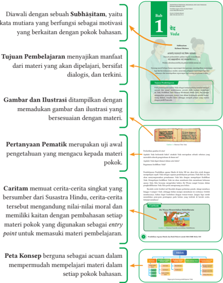

> **Deskripsi Visual:** Gambar dari buku pelajaran ini adalah diagram yang menggambarkan struktur dan tujuan pembelajaran dalam sebuah materi pendidikan. Diagram ini terdiri dari beberapa bagian utama yang menjelaskan cara kerja buku pelajaran tersebut:

1. **Subhāṣītam**: Ini adalah kata mutiara yang berfungsi sebagai motivasi yang berkaitan dengan pokok bahasan. Dalam diagram ini, subhāṣītam ditunjukkan dengan garis hijau dan bertuliskan "Subhāṣītam".

2. **Tujuan Pembelajaran**: Ini menunjukkan bahwa tujuan pembelajaran adalah menyajikan manfaat dari materi yang akan dipelajari, bersifat dialogis, dan terkini. Tujuan pembelajaran ditunjukkan dengan garis biru dan bertuliskan "Tujuan Pembelajaran".

3. **Gambar dan Ilustrasi**: Ini menunjukkan bahwa gambar dan ilustrasi ditampilkan dengan memadukan gambar dan ilustrasi yang bersesuaian dengan materi. Gambar dan ilustrasi ditunjukkan dengan garis kuning dan bertuliskan "Gambar dan Ilustrasi".

4. **Pertanyaan Pematik**: Ini merupakan uji awal pengetahuan yang mengacu kepada materi pokok. Pertanyaan pematik ditunjukkan dengan garis merah dan bertuliskan "Pertanyaan Pematik".

5. **Caritam**: Ini adalah cerita-cerita singkat yang berasal dari Suasastra Hindu, memiliki kaitan dengan pembahasan setiap materi pokok yang digunakan sebagai entry point untuk memasuki materi pembelajaran. Caritam ditunjukkan dengan garis hijau dan bertuliskan "Caritam".

6. **Peta Konsep**: Ini berguna sebagai acuan dalam mempermudah mempelajari materi dalam setiap pokok bahasan. Peta konsep ditunjukkan dengan garis hijau dan bertuliskan "Peta Konsep".

Jadi, diagram ini secara keseluruhan menunjukkan struktur dan tujuan pembelajaran dalam sebuah buku pelajaran, serta bagaimana elemen-elemen seperti subhāṣītam, tujuan pembelajaran, gambar dan ilustrasi, pertanya

Kata  Kunci:

Veda

,  Veda  Śruti,  Veda  Smṛti,  Lontar,  Dewa-Dewa,  Monotheisme,

Pantheisme

, Etika, Penerapan Veda.

A.  Memahami

Veda

Dalam kehidupan ini, segala sesuatu berjalan di bawah pengaturan

Hyang Widhi

.  segala  sesuatu  terjadi  di  bawah  pengawasan-Nya.  Bagaimana  kita  dapat

Wasa memahami-Nya? Dalam

Vedānta disebutkan bahwa cara memahami

adalah dengan mempelajari kitab suci

Veda

Hyang Widhi

. Dalam kitab Brahmā Sūtra, I.1.3 dinya takan

शास्त्रयोस्नत्वत

्

(

Śāstrayonitvat)

yang artinya hami-Nya.

4

Pendidikan Agama Hindu dan Budi Pekerti untuk SMA/SMK Kelas XII

-

adalah sumber untuk mema-

Veda

 

---
## 📄 Halaman 15

Kata Kunci merupakan kunci dari suatu konsep dalam materi yang akan memudahkan kalian untuk mengingat konsep tersebut.

Aktivitasku merupakan tugas yang diberikan kepada kalian berkaitan dengan materi yang dipelajari. Hal ini bertujuan mengajak kalian untuk berpikir kritis, kreatif, dan inovatif. Aktivitas ini terdapat dalam setiap sub pokok bahasan.

Asesmen merupakan sarana untuk memperkuat dan memperdalam konsep yang kalian kuasai. Asesmen ini memuat daftar pertanyaan dengan pilihan ganda, pilihan ganda kompleks dan essay. Asesmen ini terdapat dalam setiap bab.

Widya Info memuat informasi menarik yang berkaitan dengan materi pokok

Indeks berisi rujukan kata-kata dalam bab yang memudahkan kalian dalam pencarian kata-kata penting.

Glosarium memuat definisi istilah-istilah yang dapat membantu kalian dalam memahami materi dengan baik.

3.

4.

Bagaimana peran Ganesha dalam cerita tersebut?

Apakah hubungan cerita tersebut dengan materi

Veda

?

.......................................................................................................................................

.......................................................................................................................................

.......................................................................................................................................

.......................................................................................................................................

.......................................................................................................................................

.......................................................................................................................................

.......................................................................................................................................

Pembelajaran untuk

ini terdiri

dari beberapa

bagian, pemahaman kalian, perhatikan peta konsep berikut ini!

oleh

Rsi

Veda Wyasa dan ditulis oleh Ganesha. Itulah mengapa tidak mempermudah

ada koma untuk menunjukkan jeda dalam

Veda

A.  Memahami

Mahābhārata

Weda Wyasa.

Weda Wyasa juga tidak berhenti setelah menyelesaikan kalimat. Tapi

### Wasa .  segala  sesuatu  terjadi  di  bawah  pengawasan-Nya.  Bagaimana  kita  dapat memahami-Nya? Dalam Vedānta disebutkan bahwa cara memahami Hyang Widhi Ganesha  tahu  kapan  kalimat  itu  berakhir,  dan  menandainya  dengan cepat kemudian melanjutkan ke kalimat berikutnya.

Dalam kehidupan ini, segala sesuatu berjalan di bawah pengaturan

्

Hyang Widhi

Pendidikan Agama Hindu dan Budi Pekerti untuk SMA/SMK Kelas XII adalah dengan mempelajari kitab suci Veda . Dalam kitab Brahmā Sūtra, I.1.3 dinya -takan शास्त्रयोस्नत्वत ( Śāstrayonitvat) yang artinya Veda adalah sumber untuk memahami-Nya. Rsi Wyasa tua bercerita terus menerus membuatnya  lelah. Terkadang, dia sangat membutuhkan istirahat. Pada saat seperti itu, dia akan menggunakan banyak kata yang sulit. Bahkan Ganesha merasa sulit. Saat Ganesha menggaruk kepalanya, Weda Wyasa akan menarik napas dalam-dalam dan dengan cepat meneguk air untuk mendapatkan kembali kekuatannya. Dia akan siap dengan baris berikutnya pada saat Ganesha menemukan artinya dan menuliskan kata-katanya.

Berdasarkan cerita di atas, coba tuliskan poin-poin penting dari cerita tersebut pada kolom di bawah ini! Pertanyaan berikut dapat memandu kalian untuk menemukan poin-poin pentingnya!

- Siapakah nama tokoh utama dari cerita tersebut?
- Apa yang dilakukan oleh tokoh utama dalam cerita tersebut?
Bab 1 | Veda

C.

D.

Janaka

Daśaratha yang  berisi  tentang  irama,  didalamnya  terdapat  guru  dan  laghu

dalam menyanyikan Veda adalah kitab.... A. Chānda Tahukah kamu, tuntunan hidup yang digunakan masyarakat Hindu Kaharingan?

B. Nirukta C. Siksa D. Kalpa E. Wyakarana Panaturan  adalah  kitab  suci  agama  Hindu  Kaharingan.  Kitab  ini  ditulis dalam  bahasa  Sangiang  dengan  huruf  latin.  Panaturan  diterbitkan  oleh  Majelis Besar  Agama  Hindu  Kaharingan  yang  berpusat  di Palangkaraya, Kalimantan Tengah, Indonesia.  Kata  Panaturan  berasal  dari  kata  "Naturan"  yang  artinya menuturkan atau menyilsilahkan tentang penciptaan dan fungsinya bagi manusia. Panaturan diyakini sebagai wahyu dari Ranying Hatala Langit (Tuhan yang Maha Esa) yang diyakini oleh seluruh umat Kaharingan.

Bab 1 |

Veda

Pendapatku

Berilah tanda cek list (√) pada kolom S (bila Setuju), R (bila Ragu-ragu) dan TS (bila

Tidak Setuju) lengkap dengan alasannya !

### Indeks

Aṣṭaṅga Namaskara

x, 165, 205

Aṣṭaṅga Yogā  114, 117-118, 122, 125, 205

Abhyasa

205

Acintyarūpa

23, 205

Adi Mokṣa

79, 83, 205

Adiyogi

ix, 110, 116, 133, 205

Aisarya

60, 205

Ṣaṭkona

139, 207

Anahata  137-138, 162, 172, 180, 187-188,

205

Annadatta,

205

Chakra

118-119, xii,

ix, x, 120, 134, 137-138, 149, 151-154,

156-157, 161-170, 172-180, 187-189,

203, 205-207

Chanakya

viii, 16, 205

Chandra Bhujangāsana

xi, 205

Chandra Kumarāsana xi, 173, 178, 205

Chandranamaskara  x, 113, 141, 143, 171-

172, 189, 193, 205

Chandra Sanchālanāsana  xi, 174, 177, 205

Chandra Uttanāsana

xi, 174, 178, 205

Chānda

11, 34-35, 205

No

Pernyataan

S

R

TS

Alasannya

1

Veda

bersifat tanpa awal. Veda

melampaui ruang dan waktu dan

merupakan Napas Hyang Widhi.

2

Kitab

Veda

merupakan pengetahuan

suci yang sifatnya teoritis,

maka ajaran

Veda

tidak dapat di

praktikkan.

3

Veda

adalah bukti dari semua

Dharma.

Dengan mempraktikkan

Dharma,

kita telah mempelajari

Veda

.

4

Ardha Titali Āsana

149, 152, 205

Dengan mempelajari lontar-lontar, kita telah mempelajari

Śarīra Kṛta

6, 207

Ācāra

Veda

.

5

Arthaśāstra

Lontar

-lontar bersumber pada ajaran

Darśana

5-6, 30, 205

5, 9, 17-18, 124-125, 205

Atman  5, 80, 83-84, 86-87, 89-91, 101, 103,

### Glosarium 16, 205 Dewa Rna , untuk itu

Veda

205

6, 205

melaksanakan petunjuk-petunjuk

Śādhanapāda

125, 207

abhinivesha :  takut  mati,  berpegang  teguh  pada  kehidupan;  terakhir  dari kleshas. Aśubha Karma 86, 205 Aśva Sanchālanāsana 205 dharana 90, 117, 122, 185, 198, 200, 205 Dharana 90, 122, 185, 205 dalam lontar merupakan penerapan ajaran Veda .

: latihan yang konstan, teratur dan tidak terputus.

180-181, 207

Śavāsana abhyasa

Dharma  7, 11, 18, 24, 30, 33, 39, 57, 60-61,

Awidya acharya

: pembimbing atau guru spiritual.

Banten adhara

205

74, 77-78, 101, 119, 133, 144, 160, 195-

196, 205

33

Bab 1 |

Veda

72, 196, 205

Dharma Buddhi

60, 205

: wadah, bagian bawah.

Bhakta

: secara harfiah berarti 'tuan pertama'; guru primordial dari semua.

dhyana  88, xi, 90, 108, 117, 122, 124, 137,

205

- adwaita :  secara harfiah berarti 'tanpa dua'; filosofi monistik yang mengatakan hanya ada satu keadaan kesadaran murni. Bhakti  6, 30, 43, 55, 57, 87, 123-124, 132, 163, 199, 205 Bhujaṅgāsana 130, 166, 176, 205 182-183, 185, 198, 200, 205 Dhyana  xi, 90, 108, 122, 124, 137, 183, 185, 205
adinath agama : kesaksian, wahyu; Tantra shastra. Bindu 138, 205

dhyana Yogā

Bīja Mantra

Etika

88, 205

vi, 4, 27, 29, 205

agni

: api.

139, 205

Brahman 5, 23, 36, 38, 80, 83-84, 86-87,

: salah satu panca Tattwa; elemen api.

Gana

44, 77, 205

89-90, 101, 139, 148, 198, 205

agni tattwa

Gandharva

Brahmanda

14, 119, 205

agnisar kriya

: salah satu shatKarma, sama dengan vahnisar dhauti.

: ego, 'aku. '

205

Garuda

10, 14, 91-94, 205

205

Golf Chakra x, 149, 151, 205

Brāhmaṇa, aham

:  fakultas  ego,  kesadaran  akan  keberadaan  'Aku';  pusat  mental,

Catur Marga Yogā

79, 86-87, 205

ahamkara emosional, psikis dan fisik individu berfungsi.

Golf Naman

: tanpa kekerasan, tanpa cedera.

ahimsa ajapa japa

: pengulangan spontan mantra 'soham'.

: luar angkasa, eter, langit.

akasha

: nektar; tanpa kematian.

amrita

: pusat psikis / prana yang terletak di wilayah itu; Jantung anahata chakra

dan pleksus jantung; cakra keempat dalam evolusi manusia.

: keadaan bahagia, ekstasi.

ananda ananda samadhi

:  tingkat  kelima  dari  sabeeja  Samādhi  menurut  Patanjali, setelah nirvichara dan sebelum asmita samadhi. Ananta - tak berujung;

menurut mitologi Hindu, seekor ular melambangkan keabadian.

:  lapisan  kelima  keberadaan  manusia;  selubung  atau anandamaya  kosha

tubuh; kebahagiaan dan kesadaran supramental.

anga

: bagian, anggota tubuh, merupakan bagian.

x, 149, 151, 205

4

205

35

 

---
## 📄 Halaman 16

### Prarambha Mantraḥ

ॐ

सह नाववतु सह नौ भुनक्ु saha nāvavatu saha nau bhunaktu सह वीययं करवावहै तेजस्वि saha vīryaṁ karavāvahai tejasvi नावधीतमस्ु मा स्वस्विसावहै nāvadhītamastu mā vidviṣāvahai

Semoga Hyang Widhi senantiasa melindungi kita; menjernihkan pikiran kita. Semoga kita dapat belajar dan berkarya bersama dengan penuh semangat; semoga apa yang akan kita pelajari mencerahkan dan tidak menyebabkan kesalahpahaman

 

---
## 📄 Halaman 17

### 1 Bab

KEMENTERIAN PENDIDIKAN, KEBUDAYAAN, RISET, DAN TEKNOLOGI REPUBLIK INDONESIA, 2022

Pendidikan Agama Hindu dan Budi Pekerti untuk SMA/SMK Kelas XII

Penulis: Ni Made Adnyani

ISBN: 978-602-244-571-5 (jil.3)

### वेद Veda

### Subhāṣitam Kalimat Mutiara

आचारायात् पादमादत्ते पादं शिष्यः  स्वमतेधरा। Ācāryāt pādamādatte pādaṁ śiṣyaḥ svamedhayā, पादं सब्रह्मचारिभ्यः  पादं कालक्रमतेण च ।। Pādaṁ sabrahmacāribhyaḥ pādaṁ kālakrameṇa ca.

Seorang murid belajar hanya seperempat dari gurunya, mendapatkan seperempat lagi dari kecerdasannya sendiri, menerima pelajaran seperempat lagi dari rekannya dan mendapatkan seperempat lagi seiring perjalanan waktu.

### Tujuan Pembelajaran

Pada pembelajaran materi Veda sebagai tuntunan hidup melalui berbagai metode  dan  model  pembelajaran,  peserta  didik  mampu  memahami isi Veda ,  Kodifikasi Veda ,  Konsep Ketuhanan dalam Veda ,  dan  mampu menganalisis penerapan Ajaran Veda dalam kehidupan melalui ruangruang  diskusi,  berpikir  kritis  sehingga  menjadi  pelajar  yang  sejalan dengan profil Pancasila.

 

---
## 📄 Halaman 18

Perhatikan gambar di atas!

Apakah Veda berbentuk  buku?  ataukah Veda merupakan  sebuah  sebutan  yang mewakili seluruh pengetahuan di dunia ini?

Apakah Veda dapat dimuat dalam satu buku?

Bagaimana kodifikasi Veda ?

Pembelajaran Pendidikan agama Hindu di kelas XII ini, akan kita awali dengan mempelajari aspek Veda sebagai capaian pembelajaran pertama. Pada Bab ini, kita akan  menyempurnakan  pemahaman Veda kita  dengan  mempelajari  Kodifikasi Veda .  Mempelajari kodifikasi Veda ini  akan  membantu kita memahami keluasan ajaran Veda .  Kita  bersama  mengetahui  bahwa Rsi Wyasa  sangat  berjasa  dalam pengkodifikasian Veda . Kita perlu mengenang jasa beliau.

Bacalah cerita berikut ini! Bacalah dengan perhatian penuh, ulangi membaca hingga 2 sampai 3 kali, sehingga kalian mampu memahami isi ceritanya. Setelah membacanya,  kalian  dapat  berdiskusi  dengan  teman-teman.  Jangan  lupa  untuk menuliskan  poin-poin  pentingnya  pada  kolom  yang  terletak  di  bawah  cerita. Selamat membaca!

---
**🖼️ Gambar/Diagram**

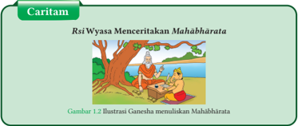

> **Deskripsi Visual:** Gambar 1.2 menunjukkan ilustrasi Ganesha sedang menulis Mahābhārata. Gambar ini termasuk dalam jenis ilustrasi. Dalam gambar tersebut, Ganesha duduk di bawah pohon, sementara seorang pria berdiri di depannya. Pria tersebut tampaknya sedang mendengarkan cerita atau narasi dari Ganesha. Ilustrasi ini menunjukkan hubungan antara Ganesha sebagai penulis dan pria sebagai penerima cerita. Teks pada gambar menyebutkan "Rsi Wyasa Menceritakan Mahābhārata" dan "Gambar 1.2 Ilustrasi Ganesha menuliskan Mahābhārata", yang menunjukkan bahwa gambar ini adalah bagian dari sebuah caritam atau cerita kiasan tentang Ganesha dan Mahābhārata. Informasi kunci yang dapat diambil dari gambar ini adalah bahwa Ganesha memiliki peran penting dalam menceritakan atau menulis Mahābhārata, yang merupakan salah satu karya sastra terbesar dalam bahasa Sanskerta.

 

---
## 📄 Halaman 19

Rsi Wyasa memutuskan untuk menyusun Mahābhārata .  Dia  berpikir, ia akan menceritakan kisah Mahābhārata tersebut dan seseorang dapat menuliskannya. Tapi siapa yang akan menulis kisah hebat ini? Setelah pencarian yang cermat, Rsi Weda Wyasa memilih Ganesha, Penguasa Kebijaksanaan. Rsi Wyasa  menemui  Ganesha  dan  menyampaikan permohonannya. 'Hanya Anda yang mampu menulis epik ini saat saya menceritakannya' kata Rsi Weda Wyasa. Ganesha langsung menyetujui permintaan Wyasa. 'Tapi saya punya syarat,' kata Ganesha. 'Anda harus menceritakan  epik  itu  kepada  saya  tanpa  henti.  Saat  Anda  berhenti, saya juga akan berhenti dan pergi.'

Weda  Wyasa  menyetujui  syarat  tersebut  dan  cerita  dimulai.  Itu adalah cerita terpanjang yang pernah ada. 100.000 Śloka disampaikan oleh Rsi Veda Wyasa dan ditulis oleh Ganesha. Itulah mengapa tidak ada koma untuk menunjukkan jeda dalam Mahābhārata Weda Wyasa. Weda Wyasa juga tidak berhenti setelah menyelesaikan kalimat. Tapi Ganesha  tahu  kapan  kalimat  itu  berakhir,  dan  menandainya  dengan cepat kemudian melanjutkan ke kalimat berikutnya.

Rsi Wyasa  tua bercerita terus menerus membuatnya  lelah. Terkadang, dia sangat membutuhkan istirahat. Pada saat seperti itu, dia akan menggunakan banyak kata yang sulit. Bahkan Ganesha merasa sulit. Saat Ganesha menggaruk kepalanya, Weda Wyasa akan menarik napas dalam-dalam dan dengan cepat meneguk air untuk mendapatkan kembali kekuatannya. Dia akan siap dengan baris berikutnya pada saat Ganesha menemukan artinya dan menuliskan kata-katanya.

Berdasarkan cerita di atas, coba tuliskan poin-poin penting dari cerita tersebut pada kolom di bawah ini! Pertanyaan berikut dapat memandu kalian untuk menemukan poin-poin pentingnya!

- Siapakah nama tokoh utama dari cerita tersebut?
- Apa yang dilakukan oleh tokoh utama dalam cerita tersebut?

 

---
## 📄 Halaman 20

- Bagaimana peran Ganesha dalam cerita tersebut?
- Apakah hubungan cerita tersebut dengan materi Veda ?
.......................................................................................................................................

.......................................................................................................................................

.......................................................................................................................................

.......................................................................................................................................

.......................................................................................................................................

.......................................................................................................................................

.......................................................................................................................................

Pembelajaran ini terdiri dari beberapa bagian, untuk mempermudah pemahaman kalian, perhatikan peta konsep berikut ini!

---
**🖼️ Gambar/Diagram**

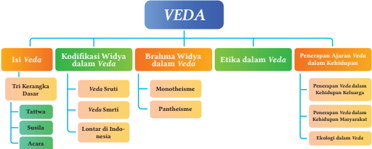

> **Deskripsi Visual:** Gambar ini adalah diagram yang menunjukkan struktur dan elemen-elemen penting dalam Veda, sebuah tradisi keagamaan dan filsafat yang penting dalam budaya India. Diagram ini dibagi menjadi empat bagian utama:

1. **Istilah Veda**: Ini adalah bagian dasar yang menjelaskan apa itu Veda.

2. **Kodifikasi Wilayah dalam Veda**: Bagian ini menggambarkan bagaimana wilayah-wilayah dalam Veda telah dikodifikasi.

3. **Rahaman Wilayah dalam Veda**: Ini menunjukkan bagaimana prinsip-prinsip dan nilai-nilai dalam Veda telah diterapkan.

4. **Etika dalam Veda**: Bagian ini membahas bagaimana etika dan norma moral dalam Veda telah ditetapkan.

Setiap bagian memiliki subbagian yang lebih spesifik, seperti "Tiga Rangkaian Dinas" untuk kodifikasi wilayah, "Veda Sutradha" untuk prinsip-prinsip, dan "Lantai di Radha-mesin" untuk etika. Setiap subbagian memiliki label yang menjelaskan apa yang dimaksud, seperti "Mandirinah" untuk prinsip-prinsip dan "Pemupukan Ajaran Siswa" untuk etika.

Informasi kunci yang dapat diambil dari gambar ini adalah bahwa Veda mencakup berbagai aspek, termasuk kodifikasi wilayah, prinsip-prinsip, etika, dan pemupukan ajaran siswa. Diagram ini memberikan pandangan umum tentang struktur dan isi Veda, serta bagaimana setiap aspek tersebut saling berkaitan.

Kata  Kunci: Veda ,  Veda  Śruti,  Veda  Smṛti,  Lontar,  Dewa-Dewa,  Monotheisme, Pantheisme, Etika, Penerapan Veda.

### A.  Memahami Veda

्

Dalam kehidupan ini, segala sesuatu berjalan di bawah pengaturan Hyang Widhi Wasa .  segala  sesuatu  terjadi  di  bawah  pengawasan-Nya.  Bagaimana  kita  dapat memahami-Nya? Dalam Vedānta disebutkan bahwa cara memahami Hyang Widhi adalah dengan mempelajari kitab suci Veda . Dalam kitab Brahmā Sūtra, I.1.3 dinyatakan शास्त्रयोनित्वत ( Śāstrayonitvat) yang artinya Veda adalah sumber untuk memahami-Nya.

 

---
## 📄 Halaman 21

### 1. Isi Veda

Veda memuat ajaran-ajaran luhur yang disarikan  keyakinan  dalam Tri Kerangka Dasar Agama Hindu di Indonesia. Tri Kerangka Dasar ini terdiri dari aspek Tattwa , Susila dan Ācāra .  Ketiga  aspek  ini diumpamakan sebagai sebutir telur,  dimana Tattwa adalah  bagian  terdalamnya,  kuning telur, Susila adalah  bagian  putih  telur  dan Ācāra adalah bagian terluarnya. Ācāra adalah yang paling luar dan nampak jelas. Kulit telur berfungsi menjaga bagian dalamnya.

### a. Tattwa

Tattwa merupakan istilah filsafat  yang  telah  umum dipakai oleh umat Hindu di Indonesia, sedangkan di India pada umumnya disebut Darśana . Darśana kaitannya dengan ajaran Agama Hindu dengan uraian yang ilmiah mengupas inti hakikat kebenaran yang kekal abadi ( Brahman ). Tattwa merupakan apinya Agama, yang memberikan  sinar  kepada  bagian  lainnya  dan  refleksinya  diwujudkan  pada upacara-upacara. Upakara, simbol-simbol (Lambang), gambar-gambar ( Rerajahan ), huruf-huruf Suci, merupakan perwujudan dari Tattwa. Adapun kata Tattwa dapat kita artikan; Kebenaran, Inti Hakikat, Filsafat; Tat itu : Kebenaran, Twa : Bersifat, mempunyai  sifat. Tattwa merupakan  landasan  teologi  dalam  praktik  beragama di  Indonesia. Tattwa juga  merupakan sumber-sumber sastra dari praktik-praktik beragama. Tattwa dalam ajaran Hindu di Indonesia dikelompokkan ke dalam ajaranajaran Srādha yang  dikenal  sebagai Pañca Srādha.  Srādha ialah  keimanan  atau kepercayaan yang tulus yang menegaskan kebenaran dan hukum untuk mengikat nilai-nilai spiritual pada diri manusia.

Pañca Srādha adalah lima pilar keyakinan utama umat Hindu di antaranya:

- Brahman Srādha
- Atman Srādha
- Karmaphala Srādha
- Punarbhava Srādha
- Mokṣa Srādha

---
**🖼️ Gambar/Diagram**

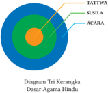

> **Deskripsi Visual:** Gambar ini adalah diagram yang menunjukkan struktur dasar agama Hindu dalam bentuk tiga kerangka. Diagram ini terdiri dari tiga kerangka besar yang saling berhubungan, masing-masing dengan warna yang berbeda: kerangka paling luar berwarna hijau, kerangka tengah berwarna oranye, dan kerangka paling dalam berwarna biru. Kerangka hijau melambangkan TATTWA, kerangka oranye melambangkan SUSAILA, dan kerangka biru melambangkan ACARA.

Teks pada gambar tersebut membahas tentang struktur dasar agama Hindu, yang mencakup tiga elemen utama: TATTWA (tiga prinsip dasar), SUSAILA (tiga keadaan), dan ACARA (tiga bentuk kehidupan). Setiap elemen ini memiliki peran penting dalam menjelaskan struktur dan fungsi agama Hindu.

Informasi kunci yang dapat diambil pembaca adalah bahwa agama Hindu memandang dunia sebagai sebuah kerangka yang terdiri dari tiga prinsip dasar, tiga keadaan, dan tiga bentuk kehidupan. Ini menunjukkan bahwa agama Hindu menggambarkan dunia sebagai sebuah sistem yang kompleks dan dinamis, dengan setiap elemen memiliki peran dan fungsi yang spesifik dalam menjelaskan dan memahami dunia.

 

---
## 📄 Halaman 22

### b. Susila

Susila adalah landasan etis yang menerapkan ajaran agama dalam kehidupan. Susila merupakan  perilaku  dan  etika  yang  dijadikan  sebagai  wujud  mengejawantahan ajaran agama. Susila berpedoman pada kitab suci Veda . Susila di antaranya:

- Tri Kaya Parisudha
- Karmaphala

### c. Ācāra

Ācāra merupakan landasan tradisi dan kebudayaan religius. Beberapa bentuk Ācāra dalam kehidupan berupa ajaran Tri Rna , Pañca Yājña dan Tri Hita Karana . Masingmasing ajaran tersebut di antaranya:

- Tri Rna yaitu tiga jenis hutang manusia.
- Dewa Rna , hutang pada Hyang Widhi Wasa
- Rsi Rna , hutang pada Pandita , Pinandita , dan Rsi .
- Pitra Rna , hutang pada orang tua, hutang ini di antaranya:
- Śarīra Kṛta adalah hutang kepada orang tua atas badan yang kita miliki. Śarīra Kṛta ini disebut juga hutang badan.
- Prānadatta adalah hutang kepada orang tua atas pertumbuhan jiwa yang kita miliki. Prānadatta disebut juga hutang jiwa.
- Annadatta adalah hutang kepada orang tua atas makanan yang diberikan orang tua kita sejak kita terlahir.
- Pañca Yājña yaitu  lima  persembahan  yang  dilandasi  dengan Srādha,  Sreya , Buddhi dan Bhakti . Pañca Yājña di  antaranya Dewa Yājña , Rsi Yājña , Pitra Yājña , Manusia Yājña , Butha Yājña .
- Dewa Yājña yaitu persembahan suci kepada Hyang Widhi Wasa.
- Rsi Yājña yaitu persembahan suci kepada para Pandita , Pinandita, dan guruguru suci.
- Pitra Yājña yaitu persembahan suci kepada leluhur dan orang tua
- Manusia Yājña yaitu persembahan suci kepada sesama manusia untuk mencapai kesucian dirinya.
- Butha Yājña yaitu persembahan suci kepada lingkungan hidup untuk menjaga keseimbangan kinerja alam semesta.
- Tri  Hita  Karana yaitu  tiga  penyebab  kebahagiaan  manusia  untuk  mencapai keselarasan hidup. Tri Hita Karana di antaranya:

 

---
## 📄 Halaman 23

- Parahyangan yaitu hubungan dengan Hyang Widhi Wasa dan personifikasinya.
- Pawongan yaitu hubungan dengan sesama manusia.
- Palemahan yaitu hubungan dengan lingkungan.
Demikian keluhuran isi Veda yang diterapkan oleh masyarakat Indonesia. Untuk memudahkan pemahaman kalian, perhatikan bagan berikut ini!

---
**🖼️ Gambar/Diagram**

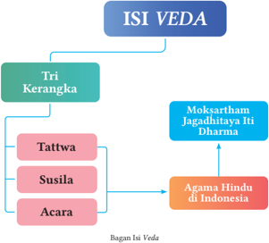

> **Deskripsi Visual:** Gambar ini adalah diagram yang menunjukkan struktur dan konten dari isi Veda dalam konteks agama Hindu di Indonesia. Diagram ini terdiri dari tiga bagian utama: Tri Kerangka, Moksartham Jagadhitayya Iti Dharma, dan Agama Hindu di Indonesia. Tri Kerangka meliputi Tattwa, Susila, dan Acara. Moksartham Jagadhitayya Iti Dharma merupakan hubungan antara Tri Kerangka dengan Agama Hindu di Indonesia. Informasi kunci yang dapat diambil dari gambar ini adalah bahwa isi Veda mencakup tiga bagian utama yang saling terkait dengan konsep agama Hindu di Indonesia.

Berdasarkan uraian tentang isi Veda di atas, coba tuliskan poin-poin penting dari uraian tersebut pada kolom di bawah ini! Pertanyaan berikut dapat memandu kalian untuk menemukan poin-poin pentingnya!

- Apa saja yang merupakan isi Veda ?
- Jelaskan yang dimaksud dengan aspek Tattwa dan Susila ?
.......................................................................................................................................

.......................................................................................................................................

.......................................................................................................................................

 

---
## 📄 Halaman 24

.......................................................................................................................................

.......................................................................................................................................

.......................................................................................................................................

.......................................................................................................................................

### 2. Kodifikasi Veda

Secara umum Veda berarti pengetahuan namun dalam agama Hindu Veda berarti pengetahuan suci. Veda dibagi menjadi dua kelompok yaitu kitab-kitab Śruti dan Smṛti . Śruti merupakan  sumber  ajaran  agama  Hindu  yang  pertama  dan Smṛti sumber yang kedua.

### a. Veda Śruti

Śruti artinya  apa  yang  didengar. Rsi -Rsi agung  dikatakan  mendengar  kebenaran agama yang abadi dan mewarisi kita dalam bentuk tertulis sebagai tuntunan hidup. Tulisan-tulisan inilah yang disebut Veda .  Bagian tertua dari Veda adalah mantra yang dihimpun dalam empat bagian.

### 1) Kitab Mantra

- Ṛgv eda,  memuat  tentang  pujaan,  terdiri  atas  10.552  mantra. Ṛgveda terdiri dari 10 Manḍalaḥ yang tidak sama panjangnya, Manḍalaḥ 2, 3, 4, 5, 6, 7, dan 8 merupakan himpunan mantramantra dari keluarga-keluarga Maharsi tunggal, sedangkan Manḍalaḥ 1, 9, dan 10 merupakan himpunan dari banyak Maharsi .
- Sāmaveda , memuat tentang nyanyian, terdiri dari 1.875 mantra yang sebagian besar diambil dan mantramantra Ṛgveda . Karena ia disesuaikan dengan melodi yang dinyanyikan pada waktu upacara Soma , maka ia disebut Saman .
- Yajurveda , memuat tentang doa terdiri atas 1.975 mantra. Menurut Bhagawān Patañjali , kitab ini terdiri atas 101 resensi dengan membaginya menjadi 2 aliran yaitu:
- Yayurveda  Hitam ( Kṛṣṇa  Yayurveda )  yang  terdiri  dari  4  resensi  yaitu Katakha  Saṁhitā,  Mapisthalakatha  Saṁhitā,  Maitrayami Saṁhitā dan Taithiriya Saṁhitā Yayurveda Hitam terdiri dari 2 resensi Apaṣṭamba dan hiranyakesin . Kitab ini memuat tentang mantra-mantra yang menguraikan arti Yājña .
- Yayurveda Putih ( Sukla Yayurveda )  juga  dikenal  sebagai Wajasaneyi Saṁhitā . Kitab ini terdiri dari 2 resensi yaitu Kanwa dan Madhayandina .

 

---
## 📄 Halaman 25

kitab Yayurveda Putih memuat tentang berbagai jenis Yājña besar seperti Wajapeya, Rajasuya, Asvamedha dan sejenisnya. Seluruh Yayurveda putih ini  terdiri  dari mantra-mantra yang  harus  di  ucapkan  pendeta  dalam upacara.

- Atharwaveda, terdiri atas 5.987 mantra. Atharwaveda disebut juga Atharwavedangira, merupakan samhita yang berasal dari Ṛgveda . Kitab ini terdiri dari 2 resensi yaitu Saunaka dan Paiplada.

### 2) Kitab Brāhmaṇa

Kitab ini disebut juga Karma Kāṇḍa .  Tiap-tiap Mantra ( Ṛgveda , Sāmaveda , Yayurveda dan Atharwaveda ) memiliki Brāhmaṇa .

- Kitab Brāhmaṇa dari Ṛgveda yaitu Kausitaki Brāhmaṇa dan Aitareya Brāhmaṇa.
- Kitab Brāhmaṇa dari Sāmaveda adalah Pañca Wimsa dan Ṣaḍ Wimsa.

### 3) Kitab Āraṇyaka

Kitab Āraṇyaka yaitu  tulisan-tulisan  untuk  para  pertapa  yang  tinggal  di  hutanhutan  dan  renungan  filsafat.  Renungannya  pada  kosmogoni  dan  eschatologi mengantarkan ajaran ini ke dalam ajaran Wedānta .

### 4) Kitab Upaniṣad

Secara tradisional  diungkapkan di  dalam kitab Muktika Upaniṣad bahwa jumlah semua Upaniṣad adalah 108 buah, di antaranya:

- Upaniṣad  dalam  kelompok Ṛgveda semuanya  berjumlah  10  buah Upaniṣad , yaitu Aitarya,  Kausitaki,  Nada-bindu,  Atmaprabodha,  Nirwana,  Mudagala, Aksamalika, Tripura, Sambhaya, dan Bahwrca Upaniṣad .
- Upaniṣad dalam  kelompok Sāmaveda ,  terdiri  atas: Kena,  Aruni,  Chandogya, Maitrayani, Maitreyi, Wajrasucika, Yogāsudamani, Wasudewa, Mahat, Sanyasa, Awyakta,  Kondika,  Sawirei,  Rudraks-jabala,  Darśana,  dan  Jabali  Upaniṣad , semuanya berjumlah 16 buah.
- Upaniṣad kelompok Yayurveda , terdiri atas dua bagian besar, yaitu:
- Upaniṣad dari Yayurveda hitam  terdiri  atas: Kathawali,  Yaittiriyaka, Brahma, Kaiwalya, Swetaswatara, Garbha, Narayana, Amrtabindu, Asartanada, Katagnirudra, Kansikasi, Sarwasara, Sukharahasya, Tejobindu, Dhyanabindu, Brahmawidya, YogāTattwa, Daksinamurti, Skāṇḍa, Sariraka, Yogāsikha, Ekaksara, Aksi, Awadhuta, Katha, Rudrahrdya, Yogākundalini, Pancabrahma, Pramagnikotra, Waraha, Kalisandarana, dan Saraswatirahasya , yang semuanya berjumlah 32 buah.

 

---
## 📄 Halaman 26

- Upaniṣad dari Yayurveda Putih  terdiri  dari  atas  19  buah  buku Upaniṣad ,  yaitu Isawasya, BrhadĀraṇyaka, Jabala, Harusa, Paramaharusa, Subata, Mantrika, Niralamba, TrisihiBrāhmaṇa, Manḍalaḥ Brahma, Adwannyataraka, Pingalu biksu,  Turiyatika,  Adhyatma,  Tarasara,  Yājñawalkya,  Satyayani, dan Muktika Upaniṣad.
- Upaniṣad dalam  kelompok Atharwaweda , terdiri dari Prasna,  Mundaka, Mandukhya, Atharwasira, Atharwasikha, Brhajjabala, Nrsimhatapini, Naradapariwrajaka, Sita, Mahanarayana, Ramarahasya, Ramatapini, Sandilya, Paramaharusa pariwrajaka, AnnapuRna, Surya, Atma, Pasupata, ParaBrāhmaṇa, Tripuratapini,  Dewi,  Bhawana,  Brahma,  Ganapati,  Pahawakya,  Gopalatapini, Kṛṣṇa, Hayagriwa, Dattareya, dan Garuda Upaniṣad ,  semuanya berjumlah 31 buah.
Di antara jumlah Upaniṣad yang 108 buah tersebut, ada 12 Upaniṣad dipandang penting atau tergolong utama, yaitu Isa, Kena, Katha, Prasna, Mundaka, Mandukya, Aitareya,  Taittiriya,  Chandogya,  BrihadĀraṇyaka,  Kausitaki,  dan  Swetaswatara Upaniṣad .  Kitab-kitab Upaniṣad inilah  yang  banyak  dipergunakan  untuk  menganalisis dan membahas Brahma Sūtra . Ini berarti Upaniṣad -Upaniṣad pokok tersebut sangat menentukan dan mempengaruhi jalan pemikiran dan pengembangan ajaran agama Hindu selama masa sejarah pertumbuhannya.

Kitab Upaniṣad yang lain dari keduabelas kitab Upaniṣad yang dipandang utama itu,  dinilai  lebih  bersifat  religius  daripada  filosofis  yang  pokok  pembahasannya mendekati alam pikiran Purāṇa dan Tantra. Dalam hubungan ini pembahasan aspek ketuhanannya adalah mengenai aspek Dewata seperti Śīva, Sakti, dan Wisnu.

### b. Veda Smṛti

Smṛti berarti ingatan, kitab suci Veda yang disusun berdasarkan ingatan para Rsi . Smṛti dikelompokkan menjadi tiga yaitu Vedaṅga , Upaveda, dan Nibhanda.

### 1) Vedaṅga

Vedaṅga berarti batang tubuh Veda. Kitab Vedaṅga terdiri dari:

- Śikṣa (Phonetika). Kitab ini memuat tentang cara mengucapkan mantra .  Kitab  ini  disebut juga sebagai Pratisakhya . Pratisakhya terdiri  dari Ṛgveda Pratisakhya , Taithiriya Pratisakhya Sūtrawajasaneyi Prati  sakhya Sūtrasama Pratisakhya , Atharwaveda Pratisakhya Sūtra .

 

---
## 📄 Halaman 27

- Vyākaraṇa adalah pengetahuan tentang tata bahasa, di antara beberapa tokoh terkenal  yang  menulis  tata  bahasa  adalah Bhagawan Panini .  Beliau  menulis Aṣṭa Dhyayi dan Patañjali Bhasa .
- Nirukta ,  Kitab  ini  memuat  pengetahuan  tentang  penafsiran  otentik  yang berhubungan dengan kata-kata yang di muat dalam Veda. kitab Nirukta di tulis oleh Bhagawan Yaska, yang memuat tentang tiga hal yaitu:
- Naighantuka Kānda yaitu  pengetahuan yang memuat tentang kata-kata yang memiliki arti yang sama;
- Naighama Kānda yaitu  pengetahuan  yang  memuat  kata-kata  yang memiliki arti ganda;
- Daiwatganda yaitu pengetahuan yang memuat tentang nama-nama Dewa.
- Chānda  adalah  pengetahuan  tentang  Lagu.  ada  dua  jenis  kitab Chānda yaitu Midana Sūtra dan Chānda Sūtra .
- Jyotiṣa yaitu pengetahuan tentang peredaran tata Surya ,  bulan, dan angkasa yang  dianggap  memiliki  pengaruh  dalam  pelaksanaan Yājña .  Kitab  ini  juga memuat pengetahuan astronomi.
- Kalpa yaitu  uraian-uraian  tentang  ritual  di  antaranya Srauta Sūtra -memuat tata cara melakukan Yājña ; Ghṛya Sūtra memuat tentang aturan pelaksanaan Yājña yang  dilaksanakan  oleh  orang  yang  sudah  berumah  tangga; Dharma Sūtra memuat  tentang  berbagai  macam  aspek  mengenai  peraturan  hidup bermasyarakat dan bernegara; dan Sulwa Sūtra memuat tentang petunjuk dan peraturan-peraturan mengenai tata cara membuat dan mendirikan tempat suci.

### 2) Upaveda

Upaveda merupakan pengetahuan yang dekat dengan Veda , atau merupakan Veda tambahan. Kitab Upaveda terdiri dari:

- Itihasa , Kitab ini terdiri dari Rāmāyana dan Mahābhārata .
- Rāmāyana terdiri dari Sapta Kāṇḍa : Bāla Kāṇḍa, Ayodhya Kāṇḍa, Āraṇyaka Kāṇḍa, Kiskhinda Kāṇḍa, Sundara Kāṇḍa, Yudha Kāṇḍa , dan Uttara Kāṇḍa (Subramaniam, 2006)
- Mahābhārata Sebuah  Epos  besar  dengan  tema  kehidupan  Pandawa  dan Kurawa mahakarya dari Rsi Wyasa . Mahābhārata dianggap sebagai Veda kelima  dengan  gelar Bhāratam  Pañcamovedah .  Ini  adalah  keagungan yang diberikan kepada Mahābhārata karena terdapat banyak kisah moral di  dalamnya. Mahābhārata menjadi  sumber  Puisi  Sanskerta.  Di  dalam Bhisma  Parwa terdapat Bhāgawad  Gītā terdiri  dari Aṣṭadaśa  Adhyaya . Mahābhārata terdiri dari Aṣṭadaśaparwa . Berdasarkan pada buku

 

---
## 📄 Halaman 28

Mahābhārata oleh  Nyoman  S.  Pendit (2003) Aṣṭadaśaparwa adalah  sebagai berikut:

- (a) Adi Parwa
- (b) Sabha Parwa
- (c) Wana Parwa
- (d) Wirata Parwa
- (e) Udyogā Parwa
- (f) Bisma Parwa
- (g) Drona Parwa
- (h) Karna Parwa
- (i) Salya Parwa
- (j) Sauptika Parwa
- (k) Stri Parwa
- (l) Shanti Parwa
- (m) Anusāsana Parwa
- (n) Aswamedika Parwa
- (o) Asrama Parwa
- (p) Mausala Parwa
- (q) Mahaprashthanika Parwa
- (r) Swarga Rohana Parwa
- Purāṇa ,  secara  etimologi  memiliki  akar  kata pura yang  berarti  kuno  atau Zaman kuno, dan ana berarti mengatakan. Jadi Purāṇa adalah sejarah kuno. Purāṇa menceritakan cerita Dewa-Dewa, raja-raja, dan Rsi-Rsi kuno. Purāṇa juga berarti cerita kuno, penceritra sejarah, koleksi cerita. Setiap cerita Purāṇa intinya mengandung ajaran agama. Kata pura dalam Purāṇa mengandung dua pengertian,  yaitu  yang  lalu  dan  yang  akan  datang.  Purāṇa  dikelompokkan menjadi 18 Mahapurāṇa dan 18 Upapurāṇa . Berikut di sajikan 18 Mahapurāṇa melalui sebuah Śloka dari Dewi Bhagawata

### मद्वयं भद्वयं च ै व ब्रत्रयं व चत ु ष्टयम

्

ma-dvayaṁ bha-dvayaṁ caiva bra-trayaṁ va catuṣṭayam

### अिापनिङ्गक ू स्ानि प ु राणानि प्रचक्षते

a-nā-pa-liṅ-ga-kū-skā-ni purāṇāni pracakṣate

Dewi Bhagawata, I.3.2

### MAHABHARATA

---
**🖼️ Gambar/Diagram**

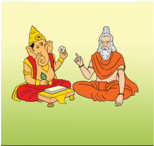

> **Deskripsi Visual:** Gambar ini adalah ilustrasi yang menunjukkan dua orang yang sedang berbicara. Pada gambar tersebut, salah satu orang tampak seperti seorang raja atau pemimpin, dengan pakaian yang lebih formal dan topi yang menunjukkan statusnya. Sementara itu, orang lain tampak seperti seorang pemuda atau murid, dengan pakaian yang lebih sederhana dan tidak memiliki topi. Kedua orang tersebut duduk di atas bangku, dan tampaknya sedang berbicara dengan penuh perhatian. Gambar ini mungkin digunakan untuk menggambarkan hubungan antara pemimpin dan murid dalam konteks pendidikan atau kekuasaan.

 

---
## 📄 Halaman 29

### Terjemahan:

Ma dua kali, Bha dua kali, bra tiga kali, va empat kali Anapalingakuska adalah suku kata depan dari Purāṇa .

Berdasarkan Śloka tersebut, jenis-jenis MahaPurāṇa adalah:

- ma-dvayaṁ yaitu  ada  2  jenis  dengan  suku  kata  depan  adalah ma di antaranya Matsya Purāṇam dan Mārkaṇḍeya Purāṇam.
- bha-dvayaṁ  yaitu ada  2  jenis  dengan  suku  kata  depan  adalah Bha di antaranya Bhagawata Purāṇam dan Bhawiṣya Purāṇam .
- bra-trayaṁ  yaitu ada  3  jenis  dengan  suku  kata  depan  adalah Bra di antaranya Brahmāṇḍa Purāṇam , Brahmawaivarta Purāṇam, dan Brahma Purāṇam.
- wa catuṣṭayam yaitu ada 4 jenis dengan suku kata depan adalah Wa di antaranya Wāmana Purāṇam , Warāh a Purāṇam , Wiṣṇu Purāṇam, dan Wāyu Purāṇam.
- a-nā-pa-liṅ-ga-kū-skāadalah suku kata depan dari Purāṇa di antaranya: Agni Purāṇam , Nārada Purāṇam, Padma Purāṇam, Liṅga Purāṇam, Garuḍa Purāṇam, Kūrma Purāṇam dan Skāṇḍa Purāṇam .  Secara  keseluruhan 18 Mahapurāṇa adalah sebagai berikut:
- (a) मत्स्य प ु राणं Matsya Purāṇam
- (b) माक्क ण्ेय प ु राणं Mārkaṇḍeya Purāṇam
- (c) भगवत पुराणं Bhagavata Purāṇam
- (d) भनवष्य प ु राणं Bhaviṣya Purāṇam
- (e) ब्रह्ाण् प ु राणं Brahmāṇḍa Purāṇam
- (f) ब्रह्वैवत्क  प ु राणं Brahmawaivarta Purāṇam
- (g) ब्रह् प ु राणं Brahma Purāṇam
- (h) वामि प ु राणं Wāmana Purāṇam
- (i) वराह प ु राणं Warāha Purāṇam
- (j) नवष् ु  प ु राणं Wiṣṇu Purāṇam
- (k) वायु  प ु राणं Wāyu Purāṇam
- (l) अननि प ु राणं Agni Purāṇam
(m)

िार् प ु राणं

Nārada Purāṇam

- (n) पद्म प ु राणं Padma Purāṇam
- (o) निङ्ग प ु राणं Liṅga Purāṇam
- (p) ्गरुड पु राणं Garuḍa Purāṇam

 

---
## 📄 Halaman 30

- (q) क ू म ्क  प ु राणं Kūrma Purāṇam
- (r) स्न्द प ु राणं SKāṇḍa Purāṇam
Berdasarkan pada pengelompokan Satwika , Rajasika dan Tamasika Purāṇa , maka disajikan pengelompokkan sebagai berikut:

- Satwika Purāṇam terdiri  dari Wisnu Purāṇa, Narada Purāṇa, Bhagawata Purāṇa, Garuda Purāṇa, Waraha Purāṇa, dan Padma Purāṇa.
- Rajasika  Purāṇam terdiri dari Brahma Purāṇa, Brahman da Purāṇa, Brahmawaivarta Purāṇa, Bhavisya Purāṇa, Vamana Purāṇa, dan Markandeya Purāṇa.
- Tamasika Purāṇa terdiri dari Śīva Purāṇa, Matsya Purāṇa, Kurma Purāṇa, Liṅga Purāṇa, Skāṇḍa Purāṇa, dan Agni Purāṇa.

### c) Āyurveda

Āyurveda merupakan ilmu kedokteran Hindu.  Kata ayus memiliki pengertian hidup, baik, panjang umur. Āyurveda tidak  hanya  memuat  tentang  penyakit, pencegahan penyakit, pengobatan, dan penyembuhan, namun memuat pengetahuan tentang kehidupan Manusia di Bumi (Nala, 1991).

Āyurveda juga  memuat  pengetahuan tentang berbagai jenis tanaman yang dapat  digunakan  sebagai  obat.  Menurut isi  kajian Āyurveda dapat  dibagi  menjadi delapan bidang yang disebut dengan Aṣṭaṅga Ayurveda , yaitu:

- Śalya , bidang kajian bedah.
- Salakya , bidang kajian penyakit.
- Kāyacikitsa , bidang kajian obat-obatan.
- Bhūtawidya , bidang kajian psiko terapi.
- Kaumārabhṛtya , bidang kajian perawatan anak-anak.
- Agada Tantra, bidang kajian racun (toxin).
- Rasāyama Tantra, bidang kajian non medis.
- Wajikarana Tantra, bidang kajian remaja.

---
**🖼️ Gambar/Diagram**

> **Deskripsi Visual:** Gambar ini adalah ilustrasi yang menampilkan seorang guru berdiri di depan kelas, sedang memberikan penjelasan kepada murid-muridnya. Guru tersebut sedang menulis pada papan tulis, sementara murid-muridnya tampak tertarik dan mengamati apa yang diajarkan. Ilustrasi ini menunjukkan hubungan antara guru dan murid dalam proses pembelajaran, dengan guru sebagai tokoh yang memberikan informasi dan murid sebagai subjek yang menerima dan memahami.

Elemen-elemen utama dalam gambar ini meliputi guru, murid, papan tulis, dan alat-alat belajar lainnya seperti pensil dan buku. Guru didefinisikan oleh posisinya di depan kelas dan tindakan menulis pada papan tulis, sementara murid dilihat dengan posisi yang menunjukkan keikutsertaan mereka dalam proses belajar. Papan tulis dan alat-alat belajar lainnya menunjukkan lingkungan belajar yang aktif dan interaktif.

Teks, angka, atau label penting yang terlihat dalam gambar ini tidak ada, karena gambar ini hanya menggambarkan situasi tanpa teks atau angka yang spesifik. Namun, informasi kunci yang dapat diambil pembaca melalui gambar ini adalah tentang proses pembelajaran dan interaksi antara guru dan murid dalam lingkungan belajar.

---
**🖼️ Gambar/Diagram**

> **Deskripsi Visual:** Gambar ini adalah ilustrasi yang menampilkan tema Ayurveda, yang merupakan tradisi medis alami dari India. Gambar ini terdiri dari beberapa elemen utama yang saling berkaitan:

1. **Apa yang Ditampilkan Secara Keseluruhan**: Gambar ini menggambarkan berbagai komponen tradisional Ayurveda, termasuk daun, biji-bijian, minyak, dan obat-obatan. Semua elemen ini disusun dengan rapi dan menunjukkan hubungan antara mereka.

2. **Elemen-Elemen Utama dan Relasinya**: 
   - **Daun**: Dapat dilihat di bagian atas gambar, mungkin menunjukkan kepentingan daun dalam praktik Ayurveda.
   - **Biji-Bijian**: Terletak di tengah gambar, mungkin menunjukkan peran biji-bijian dalam pengobatan tradisional.
   - **Minyak**: Terletak di bawah biji-bijian, mungkin menunjukkan peran minyak dalam proses penyembuhan.
   - **Obat-Obatan**: Terletak di bawah minyak, mungkin menunjukkan peran obat-obatan dalam praktik Ayurveda.

3. **Teks, Angka, atau Label Penting yang Terlihat**: 
   - Di bagian bawah gambar, terdapat teks "Ayurveda" yang menunjukkan topik utama gambar.
   - Di sebelah kanan, terdapat teks "the science of life", yang menekankan bahwa Ayurveda adalah ilmu tentang kehidupan.

4. **Informasi Kunci yang Bisa Diambil Pembaca**: 
   - Gambar ini menunjukkan bahwa Ayurveda adalah sebuah sistem yang melibatkan berbagai komponen alami seperti daun, biji-bijian, minyak, dan obat-obatan.
   - Ini menekankan bahwa Ayurveda adalah ilmu yang berfokus pada kehidupan, menunjukkan bahwa praktik ini tidak hanya tentang penyembuhan, tetapi juga tentang pemahaman tentang cara hidup yang sehat dan seimbang.

Dengan demikian, gambar ini memberikan gambaran umum tentang apa itu Ayurveda

 

---
## 📄 Halaman 31

Āyurveda merupakan kitab upaveda dari Ṛgveda . Dalam literatur Agnivesh Tantra, Āyurveda disusun oleh Agnivesha. Ia menyusun Caraka Samhitā . Menurut Caraka Samhitā terdapat delapan bidang, yaitu:

- Sūtrasthāna , bidang pengobatan
- Nidānasthāna , bidang penyakit
- Wimānasthāna, bidang phatologi
- Indriyasthāna , bidang diagnosa dan prognosa
- Saristhāna , bidang anatomi dan embriologi.
- Cikitsāsthāna , bidang terapi
- Khalpasthāna
- Siddhi.
Secara umum, ciri mahkluk hidup adalah bernapas, bergerak, dan bereksresi. Namun menurut Āyurveda , ciri mahkluk hidup yaitu:

- Memiliki raga  sarira atau stula sarira (badan kasar);
- Memiliki suksma sarira (badan halus);
- Memiliki manah (kemampuan berpikir);
- Memiliki indriya (kemampuan mengindera);
- Memiliki atma ( jiwatman ).
Secara fisik, tubuh manusia menurut āyurveda , merupakan perpaduan antara unsur:

- Tri  dosḥa (cairan  hormonal),  yaitu  unsur vata (angin, udara), pitta (api)  dan kapha (air).
- Sapta dhatu (jaringan tubuh), yaitu rasa (plasma), rakta (darah), mamsa (otot), meda (lemak), asthi (tulang), majja (sumsum), dan sukra (energi vital).
- Tri mala (limbah buangan, ekskresi).

 

---
## 📄 Halaman 32

### d) Arthaśāstra

Arthaśāstra merupakan upaveda dari kitab Atharwaveda.  Arthaśāstra adalah  ilmu  tentang politik  dan  ilmu  tentang  pemerintahan.  Kitab Mahābhārata dan Rāmāyana juga memuat pokok-pokok  ajaran Arthaśāstra dengan  nama Rājadharma. Kautilya menulis Arthaśāstra pada abad ke 4 SM . Kitab inilah yang dianggap paling  sempurna  sehingga Kautilya / Canakya/ Wiṣṇugupta adalah  Bapak  Ilmu  Politik  Hindu (Astana, 2015).

Untuk mendalami ilmu politik Hindu seseorang dapat mempelajari dengan  tekun kitab Itihāsa, Purāna, Dharmaśāstra, dan Canakya  Arthaśāstra.  Arthaśāstra juga  ditulis oleh Manu, Yājñavalkya, Usaṇa, Bṛhaspati, Wisalaksa,  Bharadwāja,  Parasara. Penulis  lain tentang Arthaśāstra adalah Bhagavan  Sūkra yang menulis Śukrānitiśāstra. Buku ini memuat ± 2200 syair. (Astana, 2015)

### e) Gandharwaveda

Gandharwaveda merupakan upaveda dari Sāmaveda . Gandharwaveda merupakan ilmu tentang  musik,  seni  suara,  dan  tari.  Penulis Gandharwaveda di antaranya SadaŚīva, Brahma, dan Bharata. Bharata menulis Natyasāstra yaitu ilmu seni  tari  dan  musik.  Dalam  sistem  Yoga, Śīva dikenal sebagai penari, dengan tarian Natarāja atau Śīvanatarāja.

Nama lain Natyasāstra adalah Satasahasri. Dattila menulis kitab disebut Dattila yang memuat tentang musik. Atas dasar kitabkitab  itu  akhirnya  berkembang  luas  penulisan Gandharwa  Veda antara lain Nātya Śāstra, Rasarnawa, dan Rasarat Nasamucaya.

---
**🖼️ Gambar/Diagram**

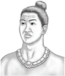

> **Deskripsi Visual:** Gambar ini adalah ilustrasi yang menunjukkan seorang pria dengan rambut panjang dan rapi yang dikenakan topi tradisional. Pria tersebut juga mengenakan perhiasan seperti kalung dan gelang. Ilustrasi ini mungkin digunakan untuk membantu pembaca memahami atau menggambarkan karakter atau situasi tertentu dalam konteks buku pelajaran.

---
**🖼️ Gambar/Diagram**

> **Deskripsi Visual:** Gambar ini adalah ilustrasi yang menampilkan seorang wanita sedang makan nasi putih dengan sayur-sayuran. Ilustrasi ini menunjukkan beberapa elemen penting:

1. **Apa yang Ditampilkan Secara Keseluruhan**: Gambar ini menampilkan seorang wanita yang sedang makan nasi putih dengan sayur-sayuran. Latar belakangnya adalah warna-warna cerah yang menunjukkan suasana malam atau pagi hari.

2. **Elemen-Elemen Utama dan Relasinya**: 
   - **Wanita**: Ibu berjenggot tersebut sedang memegang sendok dan menggoreng nasi putih.
   - **Makanan**: Nasi putih dan sayur-sayuran yang disajikan di atas piring.
   - **Latar Belakang**: Warna-warna cerah yang menunjukkan suasana malam atau pagi hari.

3. **Teks, Angka, atau Label Penting yang Terlihat**: 
   - Teks tidak ada pada gambar ini.
   - Angka atau label penting tidak ada pada gambar ini.

4. **Informasi Kunci yang Bisa Diambil Pembaca**: Gambar ini menunjukkan hidangan tradisional yang disajikan dengan cara yang menyenangkan dan sehat. Ini bisa menjadi contoh untuk pendidikan makanan atau kebiasaan makan yang sehat.

---
**🖼️ Gambar/Diagram**

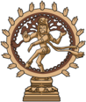

> **Deskripsi Visual:** Gambar ini adalah ilustrasi yang menampilkan Nataraja, dewa hindu yang dikenal sebagai Shiva. Gambar ini menggambarkan Shiva berdiri di atas bumi, dengan tubuh yang penuh energi dan kekuatan. Ia memiliki mata yang besar dan berbulu, serta rambut yang panjang dan bergerigi. Dua tangan Shiva berada di depannya, sedangkan tangan lainnya berada di belakangnya. Kedua kaki Shiva berada di atas bumi, sementara kedua kaki lainnya berada di bawahnya. Di sekeliling Shiva, terdapat simbol-simbol Hindu seperti lingga dan yoni, serta simbol-simbol astrologi seperti zodiak. Ini menunjukkan bahwa Shiva adalah dewa yang memiliki banyak fungsi dan peran dalam kepercayaan Hindu.

 

---
## 📄 Halaman 33

### f) Kama Śāstra

Kitab  ini  adalah  kitab  yang  memuat  tentang rasa,  asmara,  seni,  atau  rasa  indah.  Kitab  ini ditulis oleh Watsyayana .

### 3) Nibhanda

Kitab Nibhanda terdiri  dari: Darśana , Wedānta Sūtra , Tantra, Brahma Sūtra ,  dan Teks Kearifan Lokal di Nusantara.

### a) Darśana

Pengetahuan Darśana terdiri dari Ṣaḍ Darsana, di antaranya:

- Nyāya Darśana dikenal  sebagai Tarka Wāda atau perdebatan dan Vāda -vidyā  (ilmu  diskusi).  Tokoh  penyusun ajaran  ini  adalah Ṛṣi  Gautama .  Nama lain Ṛṣi Gautama adalah Akṣapāda dan Dīrghatapas .  Dalam Nyāya Darśana dikenal empat metoda menemukan pengetahuan yang disebut dengan Catur Pramāṇa yaitu Pratyakṣa Pramāṇa, Anumāna Pramāṇa, Upamāṇa Pramāṇa, dan Śabda Pramāṇa.
- Waiśeṣika Darśana ,  kata Waiśeṣika berasal dari kata Wiśesa yang artinya kekhususan, yang merupakan ciri-ciri pembeda dari benda-benda. Waiśeṣika muncul pada abad ke-4 SM, dengan tokohnya ialah Rṣi Kaṇāda , yang  juga  dikenal  sebagai Ṛṣi  Ūluka .  Sistem  ini  juga  dikenal  sebagai Aūlukya Darśana dan juga dengan nama Kaśyapa dan dianggap seorang Dewa-Ṛṣi . Kata Ūluka artinya burung hantu. Pokok ajaran dari Waiśeṣika ada 7 yaitu  1) Drawya (Substansi), 2) Guṇa (Kualitas), 3) Karma (Aktivitas), 4) Sāmānya (Universal), 5) Wiśeṣa ) (kekhususan), 6) Samawāya (Hubungan Niscaya), dan 7) Abhāwa (Penyangkalan/Negasi).
- Sāṁkya Darśana disusun  oleh Ṛṣi  Kapila . Sāṁkya mempergunakan  3 sistem  atau  cara  mencari  pengetahuan  dan  kebenaran,  yaitu: Pratyakṣa (pengamatan  langsung), Anumāṇa (penyimpulan),  dan Apta  Wākya (penegasan  yang  benar).  Filsaafat  ini  mengenalkan  konsep Purusa dan Prakerti.

 

---
## 📄 Halaman 34

- Yogā Darśana, ajaran  ini  didirikan  oleh Mahāṛṣi  Patañjali .  Tuhan  dan Ajaran Yogā disebut sebagai Ìśvara . Pokok ajaran Yogā ini adalah Aṣṭa ngga Yogā .
- Mīmāmsā  Darśana disusun  oleh Mahāṛṣi  Jaimini . Sūtra pertama  dari Mīmāmsā Sūtra berbunyi: Athato  Dharmajijñasa ,  yang  menyatakan keseluruhan  dari  sistemnya  yaitu,  suatu  keinginan  untuk  mengetahui Dharma atau  kewajiban,  yang  terkandung  dalam  pelaksanaan  upacaraupacara  dan  kurban-kurban  yang  diuraikan  oleh  kitab Veda .  Ajaran Mīmāmsā bersifat pluralistis dan realistis yang mengakui jiwa yang jamak dan alam semesta yang nyata serta berbeda dengan jiwa. Mengenai jīwa, Mīmāmsā menyatakan bahwa jiwa itu banyak dan tak terhingga, bersifat kekal,  ada  dimana-mana,  dan  meliputi  segala  sesuatu.  Karena  adanya hubungan antara jiwa dengan benda, maka jiwa mengalami awidyā dan diikat oleh Karmawasana. Jaimini tidak mempercayai adanya Mokṣa dan hanya mempercayai keberadaan Svarga (surga), yang dapat dicapai melalui Karma atau kurban.
- Wedānta Darśana merupakan  bunga  di  antara  semua Darśana ,  Tokoh pendirinya adalah Rsi Wyasa. Wedānta mengajarkan bahwa Mokṣa dapat dicapai dalam kehidupan sekarang ini, tak perlu menunggu setelah mati untuk mencapainya. Nirwāna adalah kesadaran terhadap diri sejati. Sekali mengetahui hal itu, walau sekejap seseorang tak akan pernah lagi dapat di  perdaya  oleh  kabut  individualitas.  Terdapat  dua  tahap  pembedaan dalam kehidupan, yaitu yang pertama, bahwa orang yang mengetahui diri sejatinya tak akan dipengaruhi oleh hal apa pun. Kedua, bahwa hanya dia sendirilah yang dapat melakukan kebaikan pada dunia.
- Wedānta Sūtra
- Tantra
- Brahma Sūtra
- Lontar Ganapati Tattwa dan Lontar Vrhaspati Tattwa
- Teks Kearifan Lokal di Nusantara seperti Ślokāntara, Sewaka Dharma, Vratti Sasana, Sang Hyang Maha , dan lain sebagainya. Teks kearifan lokal ini dapat dipelajari pada buku Dvipantara Dharma Sastra (Krishna, 2015).

 

---
## 📄 Halaman 33

---
**🖼️ Gambar/Diagram**

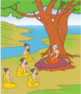

> **Deskripsi Visual:** Gambar ini adalah ilustrasi yang menunjukkan tiga orang dewasa dan dua anak bermain di tepi sungai di bawah pohon besar dengan daun hijau. Pohon tersebut memiliki batang yang kuat dan tinggi, dengan daun yang lebat dan hijau. Sungai berada di sebelah kiri gambar, dengan air jernih dan cerah. Di sebelah kanan, terdapat tanah yang berwarna cokelat dengan beberapa tanaman kecil. Di tengah-tengah, ada sebuah pohon kecil yang lebih kecil dibandingkan pohon besar di sebelah kiri. 

Elemen-elemen utama dalam gambar ini adalah tiga orang dewasa dan dua anak, pohon besar, sungai, dan tanah. Orang dewasa tampak seperti orang tua yang sedang bermain bersama anak-anak mereka. Anak-anak tampak seperti bermain dengan air sungai. Pohon besar menjadi elemen penting karena memperlihatkan ukuran dan bentuknya yang besar serta hijau.

Teks, angka, atau label penting tidak terlihat dalam gambar ini. Namun, informasi kunci yang dapat diambil pembaca melalui gambar ini adalah tentang aktivitas keluarga, lingkungan alam, dan perasaan positif yang ditunjukkan oleh posisi dan gerakan orang dalam gambar.

 

---
## 📄 Halaman 35

Berdasarkan uraian tentang kodifikasi Veda di atas, coba tuliskan poin-poin penting dari uraian tersebut pada kolom di bawah ini! Pertanyaan berikut dapat memandu kalian untuk menemukan poin-poin pentingnya!

- Apa saja yang merupakan Veda Śruti ?
- Apa saja yang merupakan Veda Smṛti ?
.....................................................................................................................................................

.....................................................................................................................................................

.....................................................................................................................................................

.....................................................................................................................................................

.....................................................................................................................................................

.....................................................................................................................................................

.....................................................................................................................................................

.....................................................................................................................................................

.....................................................................................................................................................

.....................................................................................................................................................

.....................................................................................................................................................

.....................................................................................................................................................

.....................................................................................................................................................

.....................................................................................................................................................

.....................................................................................................................................................

.....................................................................................................................................................

.....................................................................................................................................................

.....................................................................................................................................................

.....................................................................................................................................................

.....................................................................................................................................................

 

---
## 📄 Halaman 36

Dalam  upaya  mempermudah  pemahaman  kalian  mengenai  kodifikasi Veda , perhatikan kodifikasi Veda di bawah ini.

---
**🖼️ Gambar/Diagram**

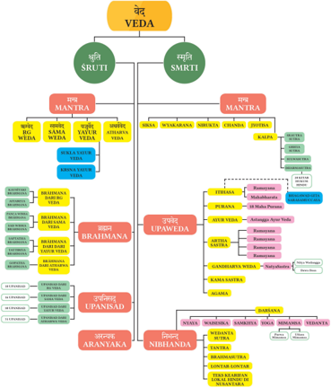

> **Deskripsi Visual:** Gambar ini adalah diagram yang menunjukkan struktur dan bagian-bagian dari Veda, sebuah tradisi keagamaan dan filsafat kuno di India. Diagram ini dibagi menjadi dua cabang utama: Sruti dan Smriti. Sruti meliputi Mantra dan Brahma, sedangkan Smriti meliputi Mantra dan Upanisad. Mantra adalah bagian dari Smriti yang berisi mantra-mentara yang digunakan dalam upacara dan ritual. Brahma adalah bagian dari Sruti yang berisi teks-teks tentang kehidupan spiritual dan filosofi. Upanisad adalah bagian dari Smriti yang berisi teks-teks tentang pengetahuan spiritual yang lebih dalam dan pribadi. Diagram ini juga menunjukkan hubungan antara bagian-bagian tersebut, seperti Brahma adalah bagian dari Sruti dan Upanisad adalah bagian dari Smriti. Label penting lainnya termasuk nama-nama bagian-bagian Veda seperti Mantra, Brahma, dan Upanisad. Informasi kunci yang dapat diambil pembaca adalah bahwa Veda terdiri dari dua cabang utama: Sruti dan Smriti, dengan Mantra sebagai bagian dari kedua cabang tersebut.

 

---
## 📄 Halaman 37

Ciri utama Veda yaitu (1) tanpa awal ( Anadi ); (2) tidak mempunyai kepengarangan manusia ( Apaurusheya ); dan (3) merupakan akar dari semua penciptaan. Ketiga hal ini adalah ciri sekaligus kehebatan Veda .  Suara saat melantunkan Veda mengaktifkan pusat-pusat  saraf  kita  dan  memengaruhi  atmosfer  sehingga  menghasilkan  rasa sejahtera pada individu maupun secara kolektif.

Berdasarkan  pada  paragraf  di  atas,  bagaimana  pendapat  kalian?  Uraikanlah pendapat kalian pada kolom di bawah ini, dan kaitkan dengan penelitian-penelitian yang menyebutkan pengaruh Mantra Sāmaveda terhadap gelombang otak manusia.

.......................................................................................................................................................

.......................................................................................................................................................

.......................................................................................................................................................

.......................................................................................................................................................

.......................................................................................................................................................

.......................................................................................................................................................

.......................................................................................................................................................

.......................................................................................................................................................

.......................................................................................................................................................

.......................................................................................................................................................

.......................................................................................................................................................

.......................................................................................................................................................

.......................................................................................................................................................

.......................................................................................................................................................

.......................................................................................................................................................

.......................................................................................................................................................

.......................................................................................................................................................

.......................................................................................................................................................

 

---
## 📄 Halaman 38

### d) Lontar-Lontar di Indonesia

Beberapa Lontar di Indonesia di antaranya dapat dilihat dalam bagan berikut ini:

---
**🖼️ Gambar/Diagram**

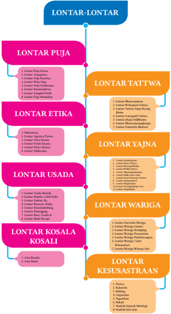

> **Deskripsi Visual:** Gambar ini adalah diagram yang menunjukkan struktur dan topik-topik dalam sebuah program pelajaran. Diagram ini terdiri dari berbagai lontar (subtopik) yang disusun dalam bentuk garis horizontal. Setiap lontar memiliki judul yang jelas dan sub-judul yang lebih spesifik.

1. **Apa yang Ditampilkan Secara Keseluruhan**: Gambar ini menunjukkan struktur topik-topik dalam sebuah program pelajaran yang terbagi menjadi beberapa lontar, masing-masing dengan sub-topik yang lebih detail.

2. **Elemen-Elemen Utama dan Relasinya**: 
   - **LONTAR PUJA** terletak di bagian paling atas dan merupakan lontar utama.
   - **LONTAR TATTWA**, **LONTAR ETIKA**, **LONTAR YAJNA**, **LONTAR USADA**, **LONTAR WARIGA**, **LONTAR KOSALA KOSALI**, dan **LONTAR KESUSASTRAAN** adalah lontar-lontar yang berada di bawah lontar utama.
   - Setiap lontar memiliki sub-judul yang menjelaskan topik-topik yang akan dipelajari dalam lontar tersebut.

3. **Teks, Angka, atau Label Penting yang Terlihat**: 
   - Judul "LONTAR-LONTAR" yang terletak di bagian atas.
   - Judul "LONTAR PUJA", "LONTAR TATTWA", "LONTAR ETIKA", "LONTAR YAJNA", "LONTAR USADA", "LONTAR WARIGA", "LONTAR KOSALA KOSALI", dan "LONTAR KESUSASTRAAN" yang masing-masing berada di bagian bawah.
   - Sub-judul untuk setiap lontar, seperti "Lontar Puja Samsa", "Lontar Puja Samsa", dll.

4. **Informasi Kunci yang Dapat Diambil Pembaca**: 
   - Program ini menggambarkan struktur topik-topik dalam sebuah pelajaran yang terbagi menjadi lontar-lontar.
   - Pembaca dapat memahami bahwa setiap lontar memiliki sub-topik yang lebih

Bagan Jenis-jenis Lontar

 

---
## 📄 Halaman 39

### 3. Brahma Widya dalam Veda

Brahma Widya atau Brahma Tattwa adalah pengetahuan tentang Tuhan (Theologi) dalam Veda memiliki  penggambaran  yang  jelas.  Dalam Upaniṣad ,  Hyang  Widhi  disebut  sebagai Brahman yang  memiliki  sifat Saguna dan Nirguna .  Imanen dan Transendent. Sebagai Saguna ,  Tuhan disebutkan dalam berbagai nama dan rupa. Sedangkan Nirguna , Tuhan disebutkan tidak berwujud disebut dengan Acintyarūpa yang dalam bahasa Jawa Kuno dinyatakan  sebagai Tan  Kagrahita  dening  manah mwang  indriya (tidak  terjangkau  oleh  akal  dan indra  manusia).  Menurut  susastra Brahmāśūtra, Vedantasutra atau Vedāntasāstra , Maharsi Wyasa menjelaskan  Hyang  Widhi  sebagai  J anmādyasya yataḥ (I.1.2) yang artinya Brahman adalah asal mula dari semesta raya. Namun demikian, Upaniṣad juga mempertegas bahwa Hyang Widhi tidak memiliki definisi yang tepat disebut sebagai neti-neti (bukan ini, bukan ini).

### Monotheisme

Hyang Widhi dalam kitab suci Veda disebutkan bersifat monotheistis yaitu memuja Hyang Widhi Yang Esa, bukan polytheistis menyembah Hyang Widhi yang banyak (Pereira, 2015). Penegasan serta penjelasan bahwa umat Hindu menyembah Tuhan Yang Tunggal (satu) diungkapkan pada Kitab Suci Veda , di antaranya:

### Chandogya Upanisad, IV. 2. 1

### एकं  एव अनद्वत्ं ब्रह्ि

्

Ekam Eva Advityam Brahman Terjemahan:

Brahman hanya satu, tiada duanya

### Ṛgveda, I.164.46

### एकं  सत ् नवप्ररः बहुध व्नति

Ekam Sat Viprah bahudha vadanti

Terjemahan:

Hyang Widhi hanya satu, namun para Maharsi menyebut dengan berbagai nama

 

---
## 📄 Halaman 40

### Nārāyaṇa Upaniṣad 2

### िारायण एवे्ं सववं यद्ूतं यच्छ भव्यम ्

nārāyaṇa evedaṁ sarvaṁ yadbhūtaṁ yaccha bhavyam

### निष्किङ्ो निरञ्जिो निर्वकल्ो

niṣkalaṅko nirañjano nirvikalpo

निराख्ातरः शुद्ो ्ेव एको िारायणो ि नद्वतीयोऽनति कनचित ्

nirākhyātaḥ śuddho deva eko nārāyaṇo na dvitīyo'sti kaścit

### Terjemahan:

Dari Engkaulah semua ini berasal dan kembali, yang telah ada dan yang akan ada di semesta raya ini. Hyang Widhi Maha Gaib mengatasi segala kegelapan, tak termusnahkan, maha cemerlang maha suci (tidak ternoda), tidak terucapkan, tiada dua-Nya).

### Kakawin Sutasoma

्

नभन्ेक तु न्गगि ्  इक ति हि धम्क मन्र्व

Bhinneka Tunggal Ika tan hana Dharma mangrwa Terjemahan:

Berbeda-beda tetapi satu, tak ada Dharma (Tuhan) yang dua.

्

### Kakawin Arjuna Wiwaha वह्यध्यनमिक सेम्बनहन् ् हुलुि इ जोन् ्  त ति हि विेरः

्

Vahyadhyatmika sembahing hulun i jong ta tan hana vaneh

Terjemahan:

Lahir Batin sembah hamba ke hadapan Tuhan tak ada lainnya *Kalimat ini diucapkan oleh Arjuna waktu menyembah kepada Tuhan - Śīva.

### Yajurveda, 32.8

Tuhan dinyatakan dalam bentuk netral Tat Sat (Yang ada Itu).

### Sāmaveda 372 समेत नवस्व ओजस पतत न्वोय एक इद्ुर ्  नतनिज्कििम ्

्

Sameta visva ojasa patim divoya eka idbhur tithirjananam स पु व्य्यो ि ु तिम अनजनगसि ्  तम ्  चत्कनिरि ु  ववृत एक इनत

sa purvyo nutanam ajigisan tam vartanir anu vavrta eka iti

 

---
## 📄 Halaman 41

### Terjemahan:

Datanglah Engkau bersama dengan kekuatan jiwa kepada penguasa langit. Dia Yang Maha Esa, tamu semua orang. Dia yang purba ingin menjadi baru. KepadaNyalah semua jalan berpaling. Sesungguhnyalah Ia hanya Tunggal.

### Atharvaveda XIII.4 य एतमं ्ेवं एकवृतं वे् ि नद्वनतय ि तृनतयस ् चतुि्यो िप् ु च्यते

ya etaṁ devaṁ ekavrtaṁ veda na dvitiya na trtiyas caturtho napyucyate ि पञ्चमो ि सषिह ्  सप्तमो िप् ु च्यते िाष्टमो ि िवमो ्शमो िप् ु च्यते

na pañcamo na saṣthah saptamo napyucyate na aṣṭamo na navamo daśamo napyucyate

### स सव्कस्ै नव पस्यनत यच्च प्रिनत यच्च ि तनम्ं नमगतं सहह ्

sa sarvasmai vi pasyati yacca pranati yacca na tamidam migatam sahah स एस एक एकव्् ्  एक एव सववे अनस्ि ्  ्ेव एकवृतो भवनति

sa esa eka ekavrd eka eva sarve asmin deva ekavrto bhavanti. Terjemahan:

Kepada Dia yang mengetahui Tuhan ini hanyalah Esa. Tidak ada yang kedua, pun pula ketiga, keempat ia dipanggil Tidak ada yang kelima, keenam, ketujuh ia dipanggil. Tidak ada yang kedelapan, kesembilan, kesepuluh ia dipanggil ia melihat semua yang bernapas dan yang tidak bernapas Kepada-Nya kembali tenaga penakluk Ia hanya Esa, Esa belaka di dalam Dia semua Dewa menjadi satu saja.

### Pantheisme

Beberapa sumber sastra yang menyebutkan tentang Pantheisme adalah:

- Ṛgveda X.129 terdapat ajaran Ketuhanan yang bersifat pantheisme. Dalam hal ini Tuhan disebut Parama Purusa yang mempunyai kepala seribu, mata seribu dan berkaki seribu. Ia mengisi seluruh alam semesta namun pula mengatasinya. Apa saja yang sedang terjadi, apa saja yang telah terjadi dan apa saja yang akan terjadi adalah Parama Purusa . Ia adalah Tuhan yang abadi. Ia tidak dipengaruhi oleh Karmaphala . Seluruh alam semesta ini adalah seperempat dari diri-Nya. Sisanya tiga perempat lagi tinggal sebagai keabadian surgawi. Parama Purusa bersifat transendental dan immanen . Ia immanen yaitu menyusupi seluruh alam semesta.
- Ṛgveda X.72 dinyatakan bahwa elemen dasar dunia ini ialah Asat atau ketiadaan yang sama dengan Aditi yaitu ketakterbatasan. Semua yang ada ini adalah diti yaitu yang terikat.

 

---
## 📄 Halaman 42

- Ṛgveda X.127 dinyatakan bahwa semesta raya ini diciptakan oleh Hyang Widhi dan unsur yang sudah ada. Hiranyagarbha muncul pada awalnya dari air yang amat besar yang memenuhi seluruh angkasa ini. Ia membangun dunia yang indah ini dan kekacauan yang tanpa bentuk.
Berdasarkan uraian tentang Brahmawidya di atas, coba tuliskan poin-poin penting dari uraian tersebut pada kolom di bawah ini! Pertanyaan berikut dapat memandu kalian untuk menemukan poin-poin pentingnya!

- Bagaimana konsep monotheisme dalam Hindu?
- Bagaimana konsep pantheisme dalam Hindu?
.......................................................................................................................................................

.......................................................................................................................................................

.......................................................................................................................................................

.......................................................................................................................................................

.......................................................................................................................................................

.......................................................................................................................................................

.......................................................................................................................................................

.......................................................................................................................................................

.......................................................................................................................................................

.......................................................................................................................................................

.......................................................................................................................................................

.......................................................................................................................................................

.......................................................................................................................................................

.......................................................................................................................................................

.......................................................................................................................................................

.......................................................................................................................................................

 

---
## 📄 Halaman 43

### 4. Etika dalam Veda

Ajaran etika yang penting ialah ajaran Rta . Pada mulanya Rta berarti jalan segala sesuatu tetapi kemudian mengandung arti hukum yang mendukung alam semesta. Rta adalah hukum yang melingkupi seluruh semesta raya. Bila karena sesuatu hal akibatnya tidak tampak di dunia ini, maka buahnya yang akan tampak.

Rta merupakan  kebenaran.  Orang  yang  baik  adalah  orang  yang  menuruti jalan Rta yaitu kebenaran dan aturan yang berlaku. Tingkah laku yang baik yang mengikuti aturan yang berlaku disebut Wrata . Wratni adalah jalan hidup orangorang yang menuruti Rta.

Veda mengajarkan tentang hubungan yang dekat antara manusia dan Hyang Widhi. Seringkali Tuhan dipanggil ayah, saudara atau teman. Tuhan menuntun dan mengawasi hidup segala hal. Nyanyian berikut menyatakan hal itu.

### यस ्  नतस्थनत चरनतय च वनचनत यो नित्म ्  चरनत यक ्  प्रतन् ं

्

yas tisthati caratiya ca vancati yo nityam carati yak pratankaṁ द्ववौ सनन्अद्य यम मन्तेय्चते रनज त् ्  वे् वरुिस नत्रतीयरः

्

dvau sanniadya yam mantreycte raji tad veda varunas tritīyaḥ (Atharva Veda, 11.16.2)

Siapa  pun  berdiri,  berjalan,  bergerak  dengan  sembunyi-sembunyi,  siapa  pun membaringkan diri atau bangun, apa pun yang dua orang yang duduk bersama bisikan satu dengan yang lainnya, semuanya Tuhan, sang Raja mengetahuinya. Ia adalah yang ketiga hadir di sana.

Seseorang memiliki kewajiban terhadap sesamanya. Cinta kasih, kebaikan hati, dan kesukaan memberi adalah kebajikan-kebajikan yang amat besar.

### ि स सखा यो ि ््ानत सख्े सचाभुवे सचमािायनपत्वरः

Na sa sakhā yo na dadāti sakhye sacābhuve sacamānāyapitvaḥ अपास्ात ्  प्रेयाि ्  ि त्ोको अनति पृणतिमन्यमरणं नचन्छेत ्

apāsmāt preyān na tadoko asti pṛṇantamanyamaraṇaṁ cidichet Ṛgveda, X.117.22

Terjemahan:

Tiada teman bagi dia yang tidak mau memberi apa pun kepada teman dan kawan yang datang meminta makanan. Biarlah sudah ia pergi dan lebih baik ia mencari orang asing untuk membantunya. Di sini tidak ada rumah bagi dia untuk beristirahat.

 

---
## 📄 Halaman 44

Apakah  kalian  pernah  membuat  agenda  tentang  aktivitas  diri  sendiri  sebagai wujud keseriusan kalian dalam melakukan manajemen diri? Jika sudah, itu sangat baik.  Lanjutkan  dan  coba  tambahkan  dengan  kegiatan  berikut.  Apabila  belum pernah  membuat  agenda  harian,  cobalah  buat  agenda  harian  kalian.  Kemudian buatlah komitmen untuk diri sendiri bahwa kalian akan menjadi pelajar disiplin dan mandiri. Setelah membuat agenda, kemudian buatlah jurnal harian. Petunjuk pengisian jurnal Harian ini adalah:

- Amati  dan  buatlah  program  untuk  diri  kalian  dalam  waktu  satu  minggu. Catatlah pada kolom-kolom sesuai pernyataan. Misalnya pernyataan pertama, berapa kali mempraktikkan Seva (pelayanan), isilah dengan jumlah, misalnya 2 kali, yaitu pelayanan kepada Ibu/keluarga dan pelayanan kepada tanaman, kemudian keesokan harinya juga di catat sampai penuh seminggu. Jangan lupa untuk mencatat tanggalnya.
- Apabila  kalian  telah  menyelesaikan challenge ini,  cobalah  buat  refleksinya. Pikirkan  perubahan  apa  yang  telah  kalian  lakukan  pada  diri  sendiri.  Bila membutuhkan bantuan orang tua, cobalah untuk berdiskusi dengan orang tua kalian. Selamat mencoba!

### Jurnal Harian

---
**📊 Tabel**

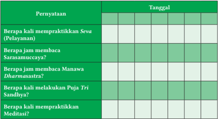

Tabel ini berisi informasi tentang berbagai praktik spiritual yang dilakukan oleh individu, termasuk berapa kali mereka mempraktekkan Srva (Pelayanan), berapa jam mereka membaca Sarasamuccaya, berapa jam mereka membaca Manawa Dharmastra, berapa kali mereka melakukan Puja Tri Sandhya, dan berapa kali mereka mempraktekkan Meditasi. Topik utama tabel ini adalah praktik spiritual dan waktu yang dihabiskan untuk berbagai kegiatan spiritual tersebut. Kolom-kolomnya mencakup berbagai jenis praktik spiritual, seperti Pelayanan, membaca, meditasi, dan praktik spiritual lainnya. Data atau pola penting yang terlihat adalah bahwa individu ini sangat aktif dalam berbagai praktik spiritual, dengan waktu yang signifikan dihabiskan untuk membaca, meditasi, dan melakukan Puja Tri Sandhya. Ini menunjukkan bahwa individu ini memiliki kecenderungan untuk berpartisipasi secara aktif dalam praktik spiritual dan mungkin memiliki tujuan spiritual yang kuat.

 

---
## 📄 Halaman 45

### B.  Penerapan Ajaran Veda dalam Kehidupan

Penerapan  ajaran Veda di  Indonesia  sangat  dipengaruhi  oleh  kondisi  sosial  dan geografis. Keragaman budaya Indonesia turut serta dalam penerapan ajaran Veda . Nilai-nilai ajaran yang termuat dalam kitab Śruti dan Smṛti diperkaya oleh teologi lokal,  budaya,  seni,  adat,  dan  tradisi  melahirkan  kearifan  lokal  yang  dituangkan dalam lontar-lontar di Indonesia. Lontar-lontar tersebut kemudian di sarikan dalam indik-indik atau juklak-juklak yang mengerucut pada Tri kerangka dasar agama Hindu. Penerapannya kemudian dipengaruhi oleh Kāla (waktu), Desa (tempat ), dan Patra (keadaan). Skema penerapan ajaran Veda di  Indonesia yang menjadi wajah Hindu Indonesia, dapat dilihat pada bagan berikut ini!

---
**🖼️ Gambar/Diagram**

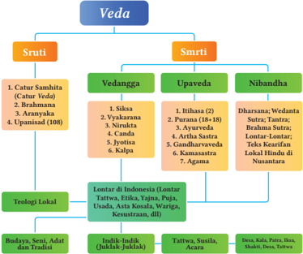

> **Deskripsi Visual:** Gambar ini adalah diagram yang menunjukkan struktur dan bagian-bagian dari Veda, sebuah tradisi agama dan filsafat dalam kebudayaan Hindu. Diagram ini dibagi menjadi dua bagian utama: Sruti dan Smrti. Sruti meliputi Catur Samhita (Catur Veda), Brahmana, Yajnavalkya, dan Upanishad (108). Smrti terdiri dari Vedanga, Upaveda, dan Nibandha. Vedanga mencakup Siśsa, Vyākaraṇa, Purāṇa (18-18), Canda, Jyotisha, dan Kalpa. Upaveda termasuk Hīrāhita (2), Aranyakā, Kṣetraśāstra, Gandharvaveda, dan Agama. Nibandha mencakup Dharṣana; Vedanta Sūtra; Tantra; Brahma Sutra; dan Teks Keifarian Lokal Hindu di Nusantara. Di bawah itu ada teologi lokal seperti Lontari di Indonesia, yang meliputi Budaya, Seni, Adat, dan Tradisi. Untuk lebih mendalam, ada sub-kategori seperti Indik-Indik (Juklak-Juklak), Tattwa, Suzila, Acara, dan lain-lain. Teks, angka, atau label penting yang terlihat meliputi nama-nama tradisi, sub-kategori, dan teks-teks lokal. Informasi kunci yang dapat diambil pembaca adalah bahwa Veda terdiri dari berbagai bagian yang saling berkaitan dan memiliki hubungan dengan teologi lokal di Indonesia.

Setelah memperhatikan skema tersebut di atas, dapat diketahui wajah Hindu Indonesia.  Keluwesan  penerapannya  menunjukkan  bahwa  ajaran Veda sangat menghargai  kearifan  lokal,  mengakomodir,  memperkaya,  serta  memberi  napas dalam kehidupan. Hal ini dapat dilihat pada bagan berikut ini.

 

---
## 📄 Halaman 46

---
**🖼️ Gambar/Diagram**

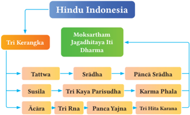

> **Deskripsi Visual:** Gambar ini adalah diagram yang menunjukkan struktur filosofis dan agama Hindu di Indonesia. Diagram ini terdiri dari tiga bagian utama: Tri Kerangka, Moksartha, dan Tri Hita Karana. Tri Kerangka meliputi Tattwa, Susila, dan Aacara, yang masing-masing terbagi menjadi lebih banyak sub-kategori. Moksartha adalah pilar utama agama Hindu, yang terdiri dari Jagaddhitya, Dharma, dan Sradha. Tri Hita Karana adalah tiga aspek kehidupan yang harus dipenuhi oleh manusia untuk hidup dengan damai, yaitu Kama, Artha, dan Dharma. Setiap elemen dalam diagram memiliki hubungan dengan elemen lainnya, menunjukkan hubungan antara konsep-konsep filosofis dan agama Hindu di Indonesia. Label penting dalam diagram termasuk "Tri Kerangka", "Moksartha", "Tri Hita Karana", "Tattwa", "Sradha", "Panci Sradha", "Susila", "Tri Kaya Pariyudha", "Karma Phala", "Aacara", "Tri Rna", dan "Panca Yajina". Informasi kunci yang dapat diambil pembaca adalah bahwa agama Hindu di Indonesia memiliki struktur filosofis yang kompleks dan terorganisir, dengan berbagai konsep dan prinsip yang saling berkaitan.

### 1. Penerapan Ajaran Veda di Lingkungan Keluarga

Beberapa  penerapan  ajaran Veda di  lingkungan  keluarga  berdasarkan  bagan tersebut di atas di antaranya:

a.

Melaksanakan puja

Tri

Sandhya, membaca kitab suci lainnya sebagai bentuk penerapan Pañca

Sadhana

Veda

Srādha.

- Menjaga kesucian pikiran, perkataan, dan perbuatan sebagai wujud Tri Kaya Parisudha.
- Menerapkan ajaran Karmaphala.
- Melaksanakan Yājña sesa, naimitika Yājña di rumah masing-masing.
- Menjaga kebersihan dan keseimbangan lingkungan alam di area pekarangan rumah.

### 2. Penerapan Ajaran Veda di Lingkungan Masyarakat

- Melaksanakan pujawali ,  melaksanakan Dharma tula  dan  kegiatan  keumatan untuk meningkatkan Sraddha dan Bhakti umat Hindu.
- Melaksanakan Seva (pelayanan sosial), terlibat dalam berbagai kegiatan sosial kemasyarakatan sebagai wujud Tri Kaya Parisudha.
- Menjaga ketertiban masyarakat sebagai penerapan ajaran Karmaphala .
- Melaksanakan Dana Punia.
- Menjaga  kebersihan  dan  keseimbangan  lingkungan  masyarakat  di  desa ataupun kelurahan.
, praktik

Yogā, dan

 

---
## 📄 Halaman 47

### 3. Ekologi dalam Veda

Veda mewakili  filosofi  timur  yang  memberikan  penggambaran  yang  terang benderang mengenai lingkungan. Ṛgveda sebagai kitab tertua menjabarkan tentang elemen pembentuk semesta raya serta hubungannya dengan kehidupan manusia.

Demikian halnya Atharvaveda secara spesifik pada Manḍalaḥ XII memuat Prtivi Sukta .  Selain  itu,  pengetahuan  tentang alam juga ditemukan dalam kitab Upaniṣad dan Bhāgawad Gītā . Purāṇa maupun Itihasa juga  kental  dengan  pesan-pesan utuh  dan  padu  tentang  etika  terhadap alam.  Menurut Ṛgveda dan dipertegas dalam Atharvaveda , hubungan antara manusia dengan semesta raya ibarat hubungan antara ayah dan ibu.

---
**🖼️ Gambar/Diagram**

> **Deskripsi Visual:** Gambar ini adalah ilustrasi yang menunjukkan sebuah candi Bali yang terletak di atas air. Candi ini memiliki struktur tradisional dengan dua menara yang tinggi dan ramping, serta bangunan utama berwarna putih dengan atap merah. Candi ini dikelilingi oleh air yang jernih, menunjukkan bahwa candi ini mungkin terletak di tepi pantai atau di atas air. Di sekitar candi, terdapat beberapa pohon yang tumbuh, menambah keindahan alam sekitarnya. Gambar ini menunjukkan hubungan antara candi tradisional Bali dengan alam sekitarnya, serta menunjukkan bagaimana arsitektur tradisional Bali dapat beradaptasi dengan lingkungan alam.

### सिरः नपतेव सूिवेऽनिे सूपायिो भव, सचस्वा िरः स्वतिये

Sanaḥ piteva sūnave'gne sūpāyano bhava, sacasvā nah svastaye Terjemahan:

Jadilah dengan kita mudah didekati, seperti seorang ayah dan anaknya, Agni bersamalah dengan kita.

Ṛgv eda, I.1.9

### माता भूनमरः प ु त्रोऽहं पृनतव्यारः

Mātā bhūmiḥ putro'haṁ pṛtivyāḥ

Bumi adalah ibuku dan aku adalah anaknya.

Atharva Veda , 12.1.12

Menurut Veda , sumber utama energi disebut sebagai ayah. Demikian juga halhal yang ada di atas bumi (atau langit) dinyatakan sebagai ayah. Sedangkan bumi itu sendiri yang menyusui langsung keberadaan manusia dinyatakan sebagai ibu. Ini adalah konsep praktis di dalam sikap hidup manusia, bagaimana harus bertindak dan  memperlakukan  alam  dengan  baik.  Jika  bumi  dan  langit  adalah  orang  tua sendiri, maka merusak bumi dan mengotori langit dengan polutan adalah sebuah kesalahan yang fatal. Segala sesuatu yang hidup akan selamanya bergantung pada langit dan bumi seperti anak yang selalu tergantung dengan orang tuanya.

 

---
## 📄 Halaman 48

Disinilah logika mengapa kedekatan antara kehidupan manusia dengan alam dinyatakan sebagai hubungan orang tua dan anak. Di antara ayah dan ibu sebagai orang  tua,  maka  hubungan  dengan  ibu  lebih  intim  dengan  anaknya.  Sehingga dengan demikian penjabaran Veda ,  khususnya Atharvaveda (XII.1) tentang Prtivi Sukta (sebanyak 63 mantra), diuraikan dengan indah bagaimana kedekatan  manusia dengan alam sebagai Prthivi (ibu).

---
**🖼️ Gambar/Diagram**

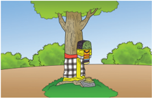

> **Deskripsi Visual:** Gambar ini adalah ilustrasi yang menunjukkan seorang anak berdiri di bawah pohon besar dengan daun hijau. Anak tersebut mengenakan pakaian berwarna putih dengan pola hitam dan merah, serta topi berwarna biru. Anak tersebut tampak sedang berbicara atau bergerak, dengan wajah yang tertawa dan mulut terbuka. Pohon besar tersebut memiliki batang tebal dan daun hijau yang lebat, menunjukkan bahwa ia tumbuh dengan baik. Latar belakangnya adalah tanah berwarna coklat dan beberapa pohon kecil lainnya yang juga tumbuh di sekitar area tersebut. Ilustrasi ini mungkin digunakan untuk membantu mengajar tentang lingkungan, pertumbuhan, atau bahkan tentang perasaan dan emosi anak-anak.

Di  dalam  kitab  suci  dinyatakan  bahwa  setiap  unsur  alam  semesta  adalah percikan suci ( dev ) dari yang Maha Tinggi (Prabhuji, 2002: 74). Jadi Dewa adalah representasi  dari  kekuatan  unsur-unsur  alam  semesta  atau  setiap  unsur  alam tersebut  adalah  kekuatan  yang  membentuk  kesatuan  alam  semesta.  Manusia adalah salah satu spesies pembentuk alam semesta yang juga merupakan salah satu kekuatan. Manusia adalah salah satu bagian dari sekian unsur pembentuk alam, maka dari sudut pandang kosmos mereka tidak bisa dikatakan sebagai pembentuk subjek pelaku Yājña ,  sebab  jika  dikatakan  sebagai subjek, maka unsur yang lain juga  mesti  seperti  demikian.  Manusia  hanya  sebagai  alat  alam  semesta.  Namun meskipun  demikian  jika  tetap  dibicarakan  dari  sudut  pandang  manusia,  maka tindakan Yājña harus memiliki tujuan. Dalam Bhagawad Gītā (III. 11) disebutkan:

### ्ेवाि ्  भावयतािेि ते ्ेवा भावयतिु वरः

Devān bhāvayatānena te devā bhāvayantu vaḥ

परस्परं भावयतिरः श्ेयरः परम ्  अवाप्स्यि

Parasparaṁ bhāvayantaḥ śreyaḥ param avāpsyatha

### Terjemahan:

Dengan  melakukan  ini  ( Yājña )  engkau  memelihara  kelangsungan  para Dewa , semoga para Dewata juga memberkahimu, dengan saling menghormati seperti itu, engkau akan mencapai kebajikan tertinggi (Radhakrishnan, 2010)

 

---
## 📄 Halaman 49

Tahukah kamu, tuntunan hidup yang digunakan masyarakat Hindu Kaharingan?

Panaturan  adalah  kitab  suci  agama  Hindu  Kaharingan.  Kitab  ini  ditulis dalam  bahasa  Sangiang  dengan  huruf  latin.  Panaturan  diterbitkan  oleh  Majelis Besar  Agama  Hindu  Kaharingan  yang  berpusat  di  Palangkaraya,  Kalimantan Tengah,  Indonesia.  Kata  Panaturan  berasal  dari  kata  "Naturan"  yang  artinya menuturkan atau menyilsilahkan tentang penciptaan dan fungsinya bagi manusia. Panaturan diyakini sebagai wahyu dari Ranying Hatala Langit (Tuhan yang Maha Esa) yang diyakini oleh seluruh umat Kaharingan.

Berilah tanda cek list (√) pada kolom S (bila Setuju), R (bila Ragu-ragu) dan TS (bila Tidak Setuju) lengkap dengan alasannya !

 

---
## 📄 Halaman 50

Menulis  refleksi  itu  sebenarnya  seperti  menulis  di  buku  harian.  Tentang  apa yang kalian lihat dan rasakan dalam kurun waktu tertentu. Dalam hal ini, setelah mempelajari bab kodifikasi Veda . Vedaṅga merupakan batang tubuh Veda , dimana Wyākaraṇam adalah tata bahasa Veda, Siksa merupakan hidung dan paru-paru dari Veda , Chānda adalah kaki Veda , Nirukta adalah telinga Veda , J yotiṣa adalah mata Veda , dan Kalpa adalah lengan Veda . Pernahkan kalian membaca salah satu cabang dari Vedaṅga tersebut? Apabila belum pernah, pernahkah kalian membaca Itihasa dan Purāṇa sebagai kaca pembesar Veda ? Coba renungkan? Tuliskan perenungan dengan baik dan jelas. Jujurlah terhadap diri sendiri. Pertanyaan-pertanyaan berikut akan memandu kalian untuk dapat menuliskan refleksinya.

- Apakah  kalian  telah  meluangkan  waktu  untuk  membaca  salah  satu  dari pengetahuan Veda !
- Sudahkah kalian mengenal Veda kalian dengan baik!
- Sudahkah kalian memiliki keinginan dan kecintaan terhadap Veda !
- Adakah sesuatu yang kalian belum pahami dalam pembelajaran Veda !
- Perubahan  apa  yang  kalian  rasakan  setelah  mempelajari Veda ?  Adakah  hal baru yang kalian rasakan!
- Perubahan  sikap  dan  perilaku  apa  yang  ingin  kalian  tumbuhkan  setelah mempelajari Veda !
- Keterampilan  apa  saja  yang  kalian  dapat  kembangkan  setelah  mempelajari Veda !
Setelah melakukan dialog dengan diri sendiri, tuliskanlah dalam buku harian kalian.  Kalian  juga  dapat  membagikan  refleksi  ini  kepada  teman-teman  di  kelas kalian.

 

---
## 📄 Halaman 51

### I. Pilihan Ganda

Jawablah  pertanyaan  berikut  ini  dengan  memilih  salah  satu  pilihan  jawaban yang benar!

- Seorang dokter spesialis kandungan atau obgyn telah menimba  ilmu pengetahuan tentang anatomi dan embryology .  Pengetahuan ini dalam kitab Ayurveda disebut….
- Sutrathana
- Nidanasthana
- Wimanasthana
- Saristhana
- Indiyasthana
- Kitab Veda yang memuat tentang ilmu politik dan ilmu pemerintahan adalah kitab….
- Purāṇa
- Artasastra
- Gandarwa Veda
- Ayur Veda
- Dhanur Veda
- Kitab Sarasamuccaya dihimpun ketika Maharsi Vaisampayana menyampaikan pengetahuan suci kepada Raja….
- Parikesit
- Janamejaya
- Janaka
- Daśaratha
- Pandu
- Kitab Veda yang  berisi  tentang  irama,  didalamnya  terdapat  guru  dan  laghu dalam menyanyikan Veda adalah kitab….
- Chānda
- Nirukta
- Siksa
- Kalpa
- Wyakarana

### Asesmen

 

---
## 📄 Halaman 52

- Berikut ini Kitab yang memuat tentang falsafah Yoga adalah….
- Chanda
- Nirukta
- Wratti Sāsana
- Kalpa
- Wyakarana

### II. Pilihan Ganda Kompleks

Jawablah  pertanyaan  berikut  ini  dengan  memilih  beberapa  (lebih  dari  satu) pilihan jawaban yang benar!

- Brahma Widya dalam Veda diuraikan dengan konsep monotheisme dan juga pantheisme. Berikut ini yang merupakan monotheisme dalam Veda adalah….
- Pengetahuan Veda tentang ekologi dapat kita temukan dalam kitab….
- Pengetahuan tentang monotheisme Veda dapat kita temukan dalam kitab….

 

---
## 📄 Halaman 53

- Berikut  ini  yang  merupakan  teks-teks  kearifan  lokal  atau  kebijaksanaan nusantara adalah…..
- Berikut ini yang merupakan bentuk-bentuk penerapan ajaran Veda di Indonesia adalah….

### III.  Essay

Jawablah pertanyaan berikut ini dengan benar!

- Salah satu tujuan mempelajari Veda adalah mengetahui kebenaran Atma. apa saja tujuan lain mempelajari Veda ?
………………………………………………………………………………………………………………..

………………………………………………………………………………………………………………..

………………………………………………………………………………………………………………..

………………………………………………………………………………………………………………..

………………………………………………………………………………………………………………..

 

---
## 📄 Halaman 54

- Jika kalian mendapatkan tugas dari guru untuk membaca salah satu susastra Veda , Susastra apa yang akan kalian baca? Mengapa?
………………………………………………………………………………………………………………..

………………………………………………………………………………………………………………..

………………………………………………………………………………………………………………..

………………………………………………………………………………………………………………..

………………………………………………………………………………………………………………..

- Pada ajaran Upaveda memuat tentang Itihasa ,  yaitu Rāmāyana dan Mahābhārata . Apakah kalian telah membaca Rāmāyana ? Tuliskan garis besar isi Rāmāyana dengan  bahasa  kalian  sendiri.  Apabila  belum  pernah  membacanya,  bacalah terlebih dahulu kemudian buatlah resumenya!
………………………………………………………………………………………………………………..

………………………………………………………………………………………………………………..

………………………………………………………………………………………………………………..

………………………………………………………………………………………………………………..

………………………………………………………………………………………………………………..

- Dalam Mundaka Upaniṣad , 3.8 disebutkan:
यि िद्यरः स्यन्दमिरः समु द्े Yatha nadyaḥ syandamanaḥ samudre अतिं गच्छनति िमरुपे नवहय Aṣṭam gacchanti namarupe vihaya ति नवद्वन्मरुप् ् wइमु क्रः Tatha vidvannamarupadwimuktaḥ परत्परं प ु रुसम ु प ै नत न्व्यं Paratparam purusamupaiti divyam

Terjemahan:

Seperti sungai-sungai yang akhirnya mengalir ke samudra , dengan melepaskan nama dan bentuk mereka. Demikian pula seseorang yang menyadari Brahman akan terlepas dari unsur nama dan bentuk, akan mencapai Paramapurusa .

Berdasarkan kutipan mantra dari Manduka Upaniṣad tersebut, bagaimana ciriciri orang yang menyadari Brahman ?

………………………………………………………………………………………………………………..

 

---
## 📄 Halaman 55

………………………………………………………………………………………………………………..

………………………………………………………………………………………………………………..

………………………………………………………………………………………………………………..

………………………………………………………………………………………………………………..

- Manduka  Upaniṣad  adalah Upaniṣad terpendek  yang  hanya  terdiri  dari  12 mantra. Namun, Upaniṣad ini memiliki tempat khusus. Jelaskan keistimewaan dari Manduka Upaniṣad !
………………………………………………………………………………………………………………..

………………………………………………………………………………………………………………..

………………………………………………………………………………………………………………..

………………………………………………………………………………………………………………..

………………………………………………………………………………………………………………..

### IV.  Penilaian Kinerja

Veda adalah  bukti  dari Dharma. Melaksanakan Dharma adalah  sangat  utama. Amatilah lingkungan sekitar kalian sehubungan  dengan  orang-orang yang dipandang mampu melaksanakan Dharma, misalnya orang-orang yang memiliki kepedulian  terhadap  alam  lingkungan,  ataupun  orang-orang  yang  berkiprah  di dunia pendidikan dan lain sebagainya. Buatlah catatan seperlunya dan diskusikanlah dengan orang tua! Apakah yang terjadi? Buatlah narasinya. Selamat mengerjakan!

Dalam upaya menapak jalan spiritual,  mempelajari Veda adalah  keharusan,  dan bahkan menjadi syarat utama memasuki dunia spiritual. Hal ini disampaikan oleh Adi Sankaracarya dalam Sopāna Pañcaka .

Sopāna Pañca di  kenal  juga  sebagai Sādhana Pañcaka atau Advaita Pañcaka . Sopāna Pañcaka adalah lima langkah dalam praktik atau olah batin yang merupakan keharusan bagi pencari spiritual. Langkah-langkah tersebut adalah:

- Veda Adhyayanam , yaitu mempelajari Veda secara tekun.
- Swadharma Anushtayam , yaitu melaksanakan berbagai Yājña yang di tetapkan dalam kitab suci Veda .

 

---
## 📄 Halaman 56

- Upāsana , melaksanakan meditasi dan pemusatan pikiran pada Hyang Widhi.
- Vidhiyatam , yaitu melaksanakan pemujaan secara rutin.
- Mahawakyam , yaitu menjadikan mahavakya sebagai panduan dalam hidup.
Berdasarkan pada Sādhana Pancaka tersebut, kita perlu mempelajari kitab suci kita. mempelajari Veda sangat tepat pada masa Brahmacāri seperti kalian. Mulailah dari membaca Susastra hindu yang kalian miliki di rumah masing-masing, misalnya Sarasamuccaya, Bhāgawad Gītā, Yogā Sūtra  Patañjali, dan  lontar-lontar.  Bacalah secara  rutin  setiap  hari  Purnama  dan  Tilem.  Setelah  terbiasa,  bacalah  seminggu sekali, dan kemudian bacalah setiap hari. Bacalah satu sloka, satu bait, ataupun satu Adhyaya .

Sebagai referensi, kalian dapat membaca buku Sarasamuccaya oleh  Prof.  Dr. Tjok Rai Sudharta (Sudharta, 2014) atau Buku Sarasamuccaya oleh I Nyoman Kajeng (dkk, 2010). Selain itu, kalian juga memiliki pilihan kitab Lontar Ganapati Tattwa dan Vrhaspati Tattwa pada buku Dvīpāntara Jñāna Śāstra (Krishna, 2016).

Satu-satunya cara untuk memahami Bhāgawad Gītā adalah dengan membaca berulang-ulang. Seseorang yang membiasakan diri, menjadikannya bahan renungan, dengan demikian Bhāgawad Gītā akan menemukan jalannya merasuk ke dalam jiwa dan membawa perubahan pada karakter.

(Holden Edward Sampson, 1923)

 

---
## 📄 Halaman 57

### 2 Bab

KEMENTERIAN PENDIDIKAN, KEBUDAYAAN, RISET, DAN TEKNOLOGI REPUBLIK INDONESIA, 2022

Pendidikan Agama Hindu dan Budi Pekerti untuk SMA/SMK Kelas XII

Penulis: Ni Made Adnyani

ISBN: 978-602-244-571-5 (jil.3)

### त्रि गुन Tri Guṇa

Subhāṣitam Kalimat Mutiara

क्रियाक्िक््घिः ित्वे भवक्ि, महिां नोपकरणवे

Kriyāsiddhiḥ stave bhavati, mahatām nopakaraṇe

Keberhasilan pekerjaan orang-orang hebat terletak pada kekuatan dalam diri mereka, bukan pada bantuan dari luar diri mereka.

### Tujuan Pembelajaran

Pada pembelajaran ini, Peserta didik menganalisis Ajaran Tri Guṇa dalam Kehidupan, dengan memahami Tri Guṇa dan bagian-bagiannya, Karakter yang di pengaruhi oleh Tri Guṇa , dan bagaimana Penerapan ajaran Tri Guṇa pada kehidupan keluarga dan masyarakat, sehingga peserta didik mampu menjadi profil pelajar Pancasila.

 

---
## 📄 Halaman 58

Perhatikan gambar di samping!

Seseorang yang sedang menonton pada layar.

Jika  ia  sedang  menonton  sebuah  film,  Apakah adegan  dalam  film  yang  ditonton  akan  mempengaruhi penontonnya?

Apakah  dalam  adegan  film  yang  ditonton  itu memuat  karakter  tenang,  aktif,  dan  lamban? Apa hubungan antara gambar tersebut dengan materi pembelajaran Tri Guṇa yang akan kita pelajari?

---
**🖼️ Gambar/Diagram**

> **Deskripsi Visual:** Gambar ini adalah ilustrasi yang menunjukkan seorang wanita sedang menonton Netflix di komputer. Gambar ini menggambarkan tindakan seseorang yang sering dilakukan saat ini, yaitu menonton film atau serial TV di platform streaming seperti Netflix. 

Elemen utama dalam gambar ini adalah wanita yang sedang duduk di depan komputer, menunjukkan bahwa ia sedang berinteraksi dengan perangkat digital. Komputer tersebut menampilkan logo Netflix, yang menunjukkan bahwa ia sedang menonton konten Netflix.

Teks, angka, atau label penting yang terlihat dalam gambar ini adalah logo Netflix yang tampak jelas pada layar komputer. Ini menunjukkan bahwa gambar ini mungkin digunakan untuk tujuan edukatif atau promosi, karena menunjukkan logo perusahaan yang populer.

Informasi kunci yang dapat diambil pembaca dari gambar ini adalah bahwa orang-orang sering menggunakan teknologi digital untuk hiburan dan informasi, dan Netflix adalah salah satu platform streaming yang populer.

Pembelajaran  Pendidikan  agama  Hindu  di  kelas  XII  ini  akan  kita  lanjutkan pada  aspek Susila melalui  capaian  pembelajaran  tentang Tri  Guṇa .  Kalian  telah mempelajari aspek Veda pada capaian pembelajaran pertama, Mempelajari Veda tidaklah cukup hanya dengan membacanya saja, kalian perlu menjadikan ajaran Veda sebagai laku hidup, karena itu kita mempelajari Susila khususnya Tri Guṇa .

Setiap  dari  kita  memiliki  karakter  bawaan  yang  unik,  karakter  inipun menunjukkan  dominasinya  secara  bergantian.  Untuk  memahami  hal  ini,  kalian perlu  membaca  sebuah  kisah  dari  Ganesha.  Bacalah  cerita  berikut  ini!  Bacalah dengan penuh perhatian, ulangi membaca hingga 2 sampai 3 kali, sehingga kalian mampu  memahami  isi  ceritanya.  Setelah  membacanya,  kalian  dapat  berdiskusi dengan teman-teman. Jangan lupa untuk menuliskan poin-poin pentingnya pada kolom yang terletak di bawah cerita. Selamat membaca!

### Caritam

### Putra Śīva Berkepala Gajah

Kisah ini diangkat dari kitab Śīva Purāṇa . Dikisahkan Śīva dan Parwa ti telah memiliki seorang  putra  bernama  Kartikeya  dan  seorang Putri  bernama  Sundari,  keduanya  telah  tumbuh dewasa,  dan  masing-masing  telah  memiliki  dan mengemban tanggung jawabnya masing-masing.

---
**🖼️ Gambar/Diagram**

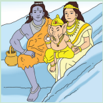

> **Deskripsi Visual:** Gambar ini adalah ilustrasi yang menampilkan ketiga karakter utama dari mitologi Hindu: Shiva, Parvati, dan Ganesha. Shiva didekorasi dengan pakaian tradisional dan berdiri di sebelah kiri, sedangkan Parvati berdiri di sebelah kanan dengan pakaian kuning yang cerah. Ganesha, yang merupakan anak Shiva, berdiri di tengah mereka, mengenakan pakaian putih dan berpose dengan tangan yang menunjukkan simbol keberuntungan. Semua karakter tersebut tampak sangat penuh warna dan detail, menunjukkan keindahan dan kekayaan dalam seni tradisional India.

Elemen-elemen utama dalam gambar ini adalah ketiga karakter utama mitologi Hindu tersebut. Mereka saling berhubungan melalui hubungan keluarga dan identitas dalam mitologi Hindu. Shiva dan Parvati adalah pasangan suami istri, sementara Ganesha adalah anak mereka. Ganesha juga memiliki peran penting dalam mitologi Hindu sebagai dewa keberuntungan dan pelindung.

Teks, angka, atau label penting tidak terlihat dalam gambar ini karena ia hanya berupa ilustrasi. Namun, informasi kunci yang dapat diambil pembaca adalah bahwa gambar ini mungkin digunakan untuk membantu memahami hubungan antara karakter-karakter ini dalam konteks mitologi Hindu.

 

---
## 📄 Halaman 59

Parwa ti merasa kesepian berada di rumahnya,  dan berniat menciptakan  seorang  putra  yang  akan  menjaganya  dalam  situasi

---
**🖼️ Gambar/Diagram**

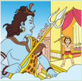

> **Deskripsi Visual:** Gambar ini adalah ilustrasi yang menunjukkan dewa Hindu Shiva sedang berdiri di atas sebuah pohon, dengan tongkatnya yang panjang dan berbulu di hadapannya. Di sebelah kanan Shiva, ada seorang anak kecil yang sedang berjalan menuju Shiva. Shiva memegang tongkatnya dengan tangan kanan dan menghadap ke arah anak kecil tersebut. Pohon yang duduk di bawah Shiva memiliki daun-daun hijau dan berwarna cerah. Ilustrasi ini mungkin digunakan untuk membantu pembaca memahami hubungan antara dewa-dewa dalam mitologi Hindu, serta bagaimana mereka berinteraksi dalam kehidupan sehari-hari.

.

apapun. Kemudian dalam meditasinya yang  dalam,  Ia  membayangkan  seorang putra dan membuat patung dari tanah liat. Setelah  terbentuk,  Ia  kemudian  berdoa kepada Śīva, Śīva hadir dalam diri Parwa ti dan menghidupkan patung tersebut. Seorang bayi laki-laki telah hidup di depan Parwa ti  yang akan menghiburnya. Parwa ti  sangat  gembira  dan  bahagia.  Ia bercengkrama  dengan  bayi  ajaib  yang penuh dengan anugrah kesaktian dan Bhakti

Suatu  hari Parwa ti  ingin  mandi,  Ia  tidak  ingin  ada  seorangpun datang  mengganggu  ritual  mandinya.  Ia  meminta  putranya  untuk berjaga  di  depan  ruang  mandi  dan  berpesan  agar  putranya  melaksanakan perintahnya dengan penuh ketaatan. Putranya bersedia melaksanakan tugas tersebut dan mulai berjaga. Beberapa saat kemudian, Dewa Śīva datang. Ia ingin menemui Parwa ti.  Putranya  tidak  mengenali bahwa tamu yang datang adalah ayahnya. Ia mencegah Śīva memasuki ruangan dan  menjelaskan  bahwa  Ia  sedang  melaksanakan  perintah  ibunya. Terjadilah dialog di antara keduanya. Mereka saling mempertahankan keinginan  mereka.  Kata-kata  yang  dikeluarkan  oleh  anak  kecil  ini, demikian arogan,  sombong  dan  keras  kepala.  Hal  ini  membuat Śīva menjadi marah. Dialog tidak lagi berguna, merekapun saling beradu kekuatan. Mereka bertarung satu sama lain, Śīva melihat kemampuan anak  kecil  ini. Śīva perlu  memberi  pelajaran  penting  atas  kejadian ini. Śīva melepaskan Tri  Sula nya  untuk  mengakhiri  keangkuhan sang anak.

 

---
## 📄 Halaman 60

Tepat  setelah  kejadian  tersebut, Parwa ti  telah  menyelesaikan ritual  mandinya  dan  keluar  ruangan.  Ia  sangat  terkejut  melihat  apa yang  terjadi.  Ia  menangis  dan  berteriak  juga  marah  kepada Śīva. Parwa ti  mengatakan  bahwa  Ia  akan  menghancurkan  alam  semesta beserta isinya. Śīva telah berani memisahkan seorang ibu dari putranya. Melihat hal ini, para Dewa datang dan bergetar melihat kejadian ini. Śīva mencoba menenangkan Parwa ti, dengan mengatakan bahwa, Śīva akan memberi anugrah dan menghidupkan kembali putranya dengan syarat  mengganti  kepala  ganesha  dengan  mahkluk  lain.  Setelah mendengar  hal  itu, Parwa ti  menjadi  tenang  dan  kemudian  segera meminta  para  gana,  para Rsi dan  para Dewa untuk  membantunya menemukan makhluk yang pertama kali ditemui.

Dalam pencariannya, Para Gana menemukan  seekor  gajah  yang  sedang mabuk  dan  tertidur  dalam  posisi  yang melanggar aturan. Atas pelanggaran tersebut, kemudian para Gana memenggal kepala  gajah  tersebut  dan  membawanya kepada Śīva dan Parwati. Śīva memasang kepala gajah tersebut pada tubuh putranya. dan  Putranya  hidup  kembali,  Ia  memberi nama Ganesha . Ia yang menjadi pemimpin para Gana .  Ia  yang  telah  dibebaskan  dari sifat-sifat keangkuhan dan ketamakan.

Setelah kalian membaca cerita di atas, coba tuliskan poin-poin penting dari cerita tersebut pada kolom di bawah ini! Pertanyaan berikut dapat memandu kalian untuk menemukan poin-poin pentingnya!

- Siapakah saja nama tokoh dari cerita tersebut?
- Apa yang dilakukan oleh setiap tokoh dalam cerita tersebut?
- Bagaimana karakter tokoh dalam cerita diatas?

---
**🖼️ Gambar/Diagram**

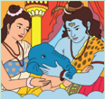

> **Deskripsi Visual:** Gambar ini adalah ilustrasi yang menunjukkan dua karakter utama, seorang pria tua dengan rambut berwarna gelap dan wanita muda dengan rambut berwarna coklat. Keduanya sedang berada di tepi laut, dengan pria tua sedang memegang telapak tangan wanita muda. Di sebelah mereka, terdapat seekor ikan paus yang tampak seperti berenang di atas air. Pria tua dan wanita muda tampak senang dan bahagia, sementara ikan paus tampak seperti bermain atau berinteraksi dengan mereka.

Elemen-elemen utama dalam gambar ini adalah dua karakter manusia (pria tua dan wanita muda) serta ikan paus. Pria tua dan wanita muda tampak saling berhubungan dan berinteraksi dengan ikan paus, yang tampak seperti bermain atau berinteraksi dengan mereka. 

Teks, angka, atau label penting yang terlihat dalam gambar ini tidak ada, karena gambar hanya menggambarkan situasi tanpa teks atau angka tambahan.

Informasi kunci yang dapat diambil pembaca dari gambar ini adalah hubungan antara dua karakter manusia dengan ikan paus, serta suasana hati kedua karakter yang tampak senang dan bahagia.

 

---
## 📄 Halaman 61

.....................................................................................................................................................

.....................................................................................................................................................

.....................................................................................................................................................

.....................................................................................................................................................

.....................................................................................................................................................

.....................................................................................................................................................

.....................................................................................................................................................

.....................................................................................................................................................

Pembelajaran ini terdiri dari beberapa bagian, untuk mempermudah pemahaman kalian, perhatikan peta konsep berikut ini!

---
**🖼️ Gambar/Diagram**

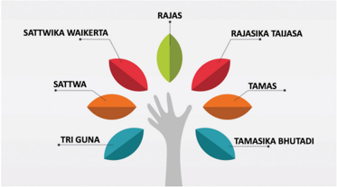

> **Deskripsi Visual:** Gambar ini adalah ilustrasi yang menunjukkan konsep "Tri Guna" dalam budaya Hindu, yang merupakan bagian dari filosofi Vaiseshika. Gambar ini terdiri dari tiga daun besar yang mewakili tiga elemen utama: Sattwa, Rajas, dan Tamas. Setiap daun tersebut memiliki beberapa cabang kecil yang mewakili sub-elemen atau guna lainnya.

1. **Apa yang ditampilkan secara keseluruhan**: Gambar ini menggambarkan struktur dan hubungan antara tiga elemen utama dalam konsep Tri Guna, yang meliputi Sattwa, Rajas, dan Tamas. Setiap elemen ini memiliki sub-elemen atau guna lainnya yang disajikan dalam bentuk cabang kecil.

2. **Elemen-elemen utama dan relasinya**: 
   - **Sattwa** (daun hijau) adalah elemen yang bersih, tenang, dan positif.
   - **Rajas** (daun merah) adalah elemen yang energik, bersemangat, dan aktif.
   - **Tamas** (daun oranye) adalah elemen yang gelap, abstrak, dan negatif.
   - **Tri Guna** (daun biru) adalah kombinasi dari Sattwa, Rajas, dan Tamas.
   - **Rajasika Taijasa** (cabang hijau) adalah sub-elemen dari Rajas yang lebih kuat.
   - **Tamasika Bhutadi** (cabang oranye) adalah sub-elemen dari Tamas yang lebih kuat.

3. **Teks, angka, atau label penting yang terlihat**: 
   - **SATTWA**, **RAJAS**, dan **TAMAS** adalah label untuk tiga elemen utama.
   - **TRI GUNA**, **RAJASIKA TAIJASA**, dan **TAMASIKA BHUTADI** adalah label untuk sub-elemen atau guna yang lebih spesifik.

4. **Informasi kunci yang dapat diambil pembaca**: Gambar ini memberikan gambaran umum tentang struktur dan hubungan antara tiga elemen utama dalam konsep Tri Guna. Ini membantu pembaca memahami bagaimana elemen-e

Peta konsep Pembelajaran Tri Guṇa

Kata Kunci: Tri Guṇa, Sattwam, Rajas, Tamas, Satwika Waikerta, Rajasika Taijasa, Tamasika Bhutadi.

Pada Bab ini, kalian akan mempelajari pengertian Tri Guṇa . Dengan memperoleh pemahaman tentang Tri  Guṇa ,  kalian  akan  mengerti  pembagian  dari Tri  Guṇa, dimana ketiganya memungkinkan dominansi satu sama lain.

 

---
## 📄 Halaman 62

### A. Pengertian Tri Guṇa

Tri  Guṇa merupakan kata dalam bahasa sanskerta. Kata Tri berarti  Tiga  (3)  dan Guṇa berarti sifat. Arti keseluruhannya yaitu tiga sifat dasar segala isi alam yang bersumber pada alam semesta yang disebut Prakreti.

Bagian Tri Guṇa :

- Sattwam
- Rajas
- Tamas
Sattwa berasal  dari  kata Sat dan Twa . Sat berarti  benar,  dan Twa berarti mempunyai sifat. Sattwam berarti mempunyai sifat yang benar. Di sini berarti sifat ringan bagi benda dan sifat baik bagi makhluk hidup. Dalam kehidupan manusia, apabila  kecenderungan  kepribadiannya  dominan Sattwam ,  seseorang  di  sebut sebagai seorang Satwika Waikerta.

Rajas (Rajah), berasal dari kata Raj yang berarti mengendalikan. Raj berarti bersinar, Raja berarti yang mengendalikan. Arti Rajas dalam Tri Guṇa ini berarti sifat yang menjadi penggerak dari segala benda yang ada di alam semesta, dan bagi makhluk hidup berarti sifat yang memberi kekuatan untuk mengerjakan sesuatu atau kekuatan yang menyebabkan makhluk aktif dalam hidupnya. Kecenderungan sifat-sifat seseorang yang dominan Rajas disebut sebagai Rajasika Taijasa.

Tamas berasal dari urat kata Tam , yang berarti susah atau gelap. Tamas artinya sifat yang menyebabkan segala makhluk di dalam kegelapan dan kemalasan; bagi benda yang mati Tamas ini berarti sifat yang menyebabkan benda itu lamban (statis) atau tidak bergerak. Pada kehidupan seseorang yang dominan, Tamasika disebut sebagai Tamasika Bhutadi.

Pada mahkluk hidup, Sattwam sifatnya baik, jernih, dan terang. Rajas sifatnya aktif dan penuh gerak; Tamas sifatnya kasar, berat, dan gelap. Karakter ataupun wujud  dari  segala  sesuatu  yang  bersifat maya ini  ditentukan  oleh  ketiga Guṇa tersebut dalam persentase yang berbeda-beda dan terjalin erat satu sama lain.

Pada manusia, kalau pikirannya bersifat Sattwam maka ia cenderung kepada segala  kebaikan,  menjadi  orang  yang  cerdas,  dan  bijaksana,  kalau  pikirannya bersifat Rajas maka ia akan menjadi orang yang rajin, aktif, dan kreatif, sedangkan jika pikirannya bersifat Tamas maka ia akan menjadi orang yang dungu, malas, dan apatis. Penjabaran ketiga sifat ini dapat dilihat pada tabel berikut:

 

---
## 📄 Halaman 63

---
**📊 Tabel**

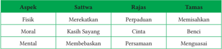

Tabel ini menunjukkan hubungan antara tiga aspek kehidupan: fisik, moral, dan mental, dengan tiga konsep atau nilai-nilai yang berbeda: sittwa, rajas, dan tamas. Sittwa melibatkan perpaduan dan memisahkan diri, rajas melibatkan kasih sayang dan cinta, sedangkan tamas melibatkan benci dan menguasa. Aspek fisik berkaitan dengan sittwa, moral dengan rajas, dan mental dengan tamas. Pola yang penting adalah bahwa setiap aspek kehidupan memiliki dua konsep yang berbeda, yang mencerminkan dua arah dalam pengembangan diri manusia.

Mari kita memantapkan pemahaman. Berikut ini disajikan diagram pohon yang memuat  sumber-sumber Śloka yang  menjelaskan  tentang Tri  Guṇa .  Cobalah temukan  isi Śloka tersebut,  uraikan  pula  pemahaman  kalian  mengenai Śloka tersebut pada tabel di bawahnya.

---
**🖼️ Gambar/Diagram**

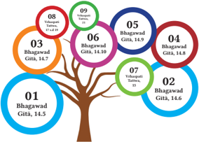

> **Deskripsi Visual:** Gambar ini adalah diagram yang menunjukkan hubungan antara beberapa bagian dari Bhagavad Gita. Diagram ini berbentuk pohon dengan tiga cabang utama yang masing-masing menggambarkan bagian-bagian dari Bhagavad Gita. Setiap cabang memiliki nomor dan teks yang menjelaskan bagian tersebut.

Cabang pertama, nomor 01, menunjukkan Bhagavad Gita, versi 14,5. Cabang kedua, nomor 02, menunjukkan Bhagavad Gita, versi 14,6. Cabang ketiga, nomor 03, menunjukkan Bhagavad Gita, versi 14,7. Selain itu, ada juga cabang tambahan yang lebih kecil yang menunjukkan Bhagavad Gita, versi 14,8 (nomor 04), Bhagavad Gita, versi 14,9 (nomor 05), dan Bhagavad Gita, versi 14,10 (nomor 06).

Teks pada diagram ini memberikan informasi tentang bagian-bagian dari Bhagavad Gita yang disebutkan dalam gambar. Angka-angka di dalam diagram menunjukkan versi tertentu dari setiap bagian. Label "Bhagavad Gita" digunakan untuk menunjukkan bahwa semua bagian yang dinyatakan dalam diagram adalah bagian dari Bhagavad Gita.

Dari gambar ini, kita dapat mengambil informasi bahwa ada beberapa versi dari Bhagavad Gita yang disebutkan dalam buku pelajaran ini, dan bahwa setiap versi memiliki nomor yang unik.

Diagram pohon, Śloka yang memuat tentang ajaran Tri Guṇa

### Tabel 2.2 Isi Śloka

---
**📊 Tabel**

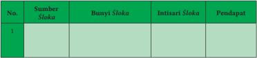

Tabel ini menunjukkan informasi tentang sumber-sumber, bunyi, intisari, dan pendapat dari beberapa ayat suci (sloka). Topik utama tabel ini adalah analisis dan interpretasi ayat suci dalam konteks keagamaan. Kolom-kolomnya meliputi nomor urutan (No.), sumber ayat suci, bunyi ayat suci, intisari ayat suci, dan pendapat atau penafsiran. Data penting yang terlihat adalah bahwa tabel ini mungkin digunakan untuk membandingkan berbagai sumber ayat suci dalam sebuah studi teks agama atau untuk membantu dalam proses pembelajaran dan pemahaman ayat suci.

 

---
## 📄 Halaman 64

---
**📊 Tabel**

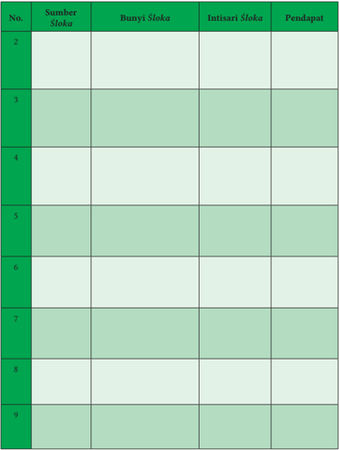

Tabel ini berisi informasi tentang beberapa sumber surat suci Al-Quran, dengan kolom-kolom yang mencakup nomor sumber, bunyi surat, intisari surat, dan pendapat. Topik utama tabel ini adalah analisis dan pemahaman tentang surat-surat suci Al-Quran. Kolom-kolomnya membahas secara mendalam tentang struktur dan makna dari setiap surat, termasuk bunyi yang digunakan, intisari yang menjelaskan konten umum, dan pendapat yang mengevaluasi relevansi dan kepentingan surat tersebut dalam konteks Al-Quran. Data penting yang terlihat meliputi bahwa banyak surat-surat ini memiliki intisari yang singkat namun mengandung makna yang mendalam, serta pendapat yang menunjukkan bahwa beberapa surat memiliki pengaruh yang signifikan dalam kehidupan umat Islam.

### B.  Karakteristik Tri Guṇa

Dalam Lontar Tattwa Jñāna,  disebutkan  tentang Tri  Guṇa .  Khususnya  pada  bab ketiga. Bab ini memuat 4 Śloka yang menjelaskan asal-usul dan ciri-ciri Ahangkara yang melahirkan Daśa Indriya, Panca Tan Matra , dan Panca Maha Bhuta . Ahangkara

 

---
## 📄 Halaman 65

dibagi  menjadi  tiga  bagian,  yaitu ahangkara  sang  waikrta adalah  buddi  sattwa, ahangkara si taijasa adalah Buddhi rajah , dan ahangkara sang bhutadi adalah Buddhi tamah. Berdasarkan Lontar ini, maka Tri Guṇa adalah bagian dari Ahangkara atau keegoan. Tri Guṇa menjadi sifat dasar dalam penciptaan.

Hal senada juga diuraikan dalam Mahanirwana Tantra bahwa Tri Guṇa sebagai sifat dasar penciptaan. Tri Guṇa ini disebutkan sebagai Waikarika yaitu sifat yang dominan Sattwika ; Taijasa yaitu sifat yang dominan dalam Rajasika ; dan Bhutadika yaitu  sifat  yang  dominan Tamasika .  Berikut  ini  secara  terperinci  dijelaskan karakteristik Tri Guṇa .

### 1. Sattwam

---
**🖼️ Gambar/Diagram**

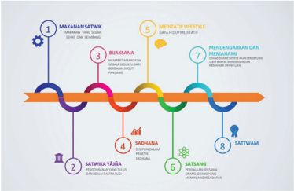

> **Deskripsi Visual:** Gambar ini adalah diagram yang menunjukkan proses atau langkah-langkah dalam sebuah metode atau teknik. Diagram ini terdiri dari tiga baris horizontal yang masing-masing berisi tiga elemen berbeda. Setiap elemen memiliki warna dan simbol yang unik, serta teks yang menjelaskan apa yang dimaksud oleh elemen tersebut.

Elemen pertama (warna biru) berisi teks "MAKANAN SATWIK" dengan simbol makanan. Elemen kedua (warna merah) berisi teks "SADHANA" dengan simbol meditasi. Elemen ketiga (warna hijau) berisi teks "MENDENGARKAN DAN MEMAHAMI" dengan simbol mendengarkan.

Elemen-elemen ini terhubung oleh garis putih yang menghubungkan mereka satu sama lain, menunjukkan hubungan antara setiap langkah dalam proses tersebut. Garis ini juga membentuk bentuk lingkaran yang melingkar sekitar elemen-elemen ini, menunjukkan bahwa setiap langkah dalam proses ini merupakan bagian dari proses keseluruhan.

Teks, angka, atau label penting yang terlihat dalam gambar ini adalah:

1. "MAKANAN SATWIK"
2. "SADHANA"
3. "MENDENGARKAN DAN MEMAHAMI"
4. "BENTUK LINGKARAN"

Informasi kunci yang dapat diambil pembaca dari gambar ini adalah bahwa proses ini terdiri dari empat langkah utama, yaitu makanan satwik, sadhana, mendengarkan dan memahami, dan bentuk lingkaran yang melingkar sekitar elemen-elemen ini menunjukkan bahwa setiap langkah dalam proses ini merupakan bagian dari proses keseluruhan.

Sifat  Sattwam  yaitu  sifat  tenang,  bijaksana,  suci,  cerdas,  jujur,  dan  disiplin, sifat-sifat  ini  menjadi  sifat  bawaannya  sejak  kelahiran,  sebagaimana  Yudistira, telah menunjukkan karakter Sattwam nya sejak Ia dilahirkan, senantiasa bersyukur, dan tindakannya selalu berhati-hati. Sattwam juga diartikan sebagai sifat stabil dan seimbang.

Keseimbangan ini tidak hanya tentang sifat atau karakter manusia, keseimbangan juga ada dalam jenis-jenis makanan. Sebagaimana diuraikan dalam kitab suci:

 

---
## 📄 Halaman 66

### Terjemahan:

'Makanan yang menunjang kehidupan, kemuliaan, kekuatan, kesehatan, kebahagiaan, dan kepuasan adalah yang mengandung banyak jus atau cairan dan berlemak lembut (baik), mudah mengenyang-kan (mengandung banyak serat), lezat, enak rasanya, dan tidak membebani pencernaan, sangat disukai mereka yang bersifat Sāttvika (Radhakrishnan, 2010) .

Orang-orang  berkarakter Satwika akan  mempraktikkan  segala  sesuatunya dengan  dasar yang  jelas,  demikian  pula  visi  dan  misinya  juga  jelas.  Seseorang dengan  sifat Sattwam akan  memilih  mempraktikkan Yājña yang  sesuai  dengan ketentuan sastra suci, sebagaimana disebutkan dalam Bhāgawad Gītā berikut:

### अपलकक्सिक्भर ्  यजनो क्वक्र क्िस्ो य इज्यिवे

apalakansibhir yajno vidhi-disto ya ijyate

यस्व्यम ्  एववेक्ि मनिः िमरय ि िक्त्किः

yAṣṭavyam eveti manah samadhaya sa satvikaḥ

Bhāgawad Gītā17.11

### Terjemahan:

'Persembahan yang dilakukan dengan niat yang mulia, yakni tanpa mengharapkan imbalan, tetapi semata karena diyakini sebagai perbuatan baik dan baik untuk dilakukan, adalah bersifat Sāttvika . '

Selain memilih makanan dan praktik Yājña yang dilakukan oleh seorang yang bersifat Sattwam , kita juga dapat mengamatinya dalam tapa brata yang dipilihnya sebagai gaya hidup. Tapa Brata yang dilakukan oleh orang Satwika adalah:

- Sariram Tapa yaitu tapa brata ragawi ( Bhāgawad Gītā, 17.14)
- Vakyam Tapa yaitu tapa brata dalam ucapan ( Bhāgawad Gītā, 17.15)
- Manasa Tapa yaitu tapa brata dalam pikiran ( Bhāgawad Gītā, 17.16)
Orang yang mempraktikkan ketiga Tapa brata ini sebagai Tri tunggal di sebut sebagai tapa brata Satwika sebagaimana di sebutkan dalam Śloka berikut ini:

### आयुिः ित्त्व बलारोगय ि ु ख प्रीक्ि क्ववर्ध नािः

āyuḥ-sattva-balārogya-sukha-prīti-vivardhanāḥ

रसािः क्निगरािः क्थिरा हृद्ा आहारािः िाक्त्त्वक क्प्यािः

rasyāḥ snigdhāḥ sthirā hṛdyā āhārāḥ sāttvika-priyāḥ

Bhāgawad Gītā17.8

 

---
## 📄 Halaman 67

### Terjemahan:

Mereka yang menjalani tritunggal tapa-brata tersebut dengan penuh keyakinan, dan tanpa mengharapkan imbalan materi, adalah disebut Sāttvika.

(Radhakrishnan, 2010)

Keutamaan seorang yang memiliki sifat Sattwam , ia pun akan melaksanakan dana punia dengan melandaskan tindakannya bersifat Sattwam .  Perhatikan Śloka berikut ini:

### िािव्यम ्  इक्ि यि ्  िानं िरीयिवे न ु पकाक्रन वे

dātavyam iti yad dānaṁ dīyate'nupakāriṇe िवेशवे कालवे च पारिवे च िि ्  िानं िाक्त्त्वक ं  स्मृिम

्

deśe kāle ca pātre ca tad dānaṁ sāttvikaṁ smṛtam

Bhāgawad Gītā17.20

### Terjemahan:

Berderma secara tulus, tanpa mengharapkan imbalan; pada saat dan tempat yang tepat; kepada orang yang tepat dan layak untuk menerimanya - disebut Sāttvika. (Radhakrishnan, 2010)

### 2. Rajas

---
**🖼️ Gambar/Diagram**

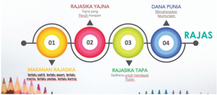

> **Deskripsi Visual:** Gambar ini adalah diagram yang menunjukkan proses pengajian dalam agama Hindu, terutama dalam konteks Jaina. Diagram ini terdiri dari empat tahap utama yang disebut "Rajas" dan "Dana Punia", yang merupakan bagian dari proses pengajian yang lebih luas yang disebut "Rajaskya Yajna". Setiap tahap memiliki tugas dan tujuan spesifik dalam proses pengajian tersebut.

Elemen utama dalam diagram ini meliputi:
1. Tahap 1: "Makarana Yajna" - Ini adalah tahap awal di mana prajaksa (pemimpin pengajian) memberikan perintah kepada para prajaksa untuk memulai proses pengajian.
2. Tahap 2: "Rajaska Tapa" - Di sini, prajaksa melakukan tugas-tugas yang berat seperti pembersihan lingkungan, memperbaiki tempat pengajian, dan menjaga kebersihan.
3. Tahap 3: "Rajaska Dana Punia" - Ini adalah tahap di mana prajaksa mengumpulkan dana untuk kebutuhan pengajian, seperti biaya transportasi, makanan, dan perlengkapan lainnya.
4. Tahap 4: "Rajas" - Ini adalah tahap akhir di mana prajaksa mengumpulkan hasil pengajian dan menyampaikannya kepada para prajaksa.

Teks, angka, atau label penting yang terlihat dalam diagram ini meliputi:
- Angka 1 sampai 4 untuk menggambarkan empat tahap pengajian.
- Nama-nama tahap seperti "Makarana Yajna", "Rajaska Tapa", "Rajaska Dana Punia", dan "Rajas".
- Nama-nama prajaksa yang bertugas dalam setiap tahap.

Informasi kunci yang dapat diambil pembaca dari gambar ini adalah bahwa proses pengajian dalam agama Hindu, terutama dalam konteks Jaina, melibatkan banyak tahap dan tugas yang harus diselesaikan oleh prajaksa. Setiap tahap memiliki tujuan dan tugas spesifik yang harus diselesaikan dengan baik agar proses pengajian dapat

्

### श्रद्धया परया िप्ं िपि िि ्  क्रिक्वरं नरैिः

### śraddhayā parayā taptaṁ tapas tat tri-vidhaṁ naraiḥ अफलाकाक््षिक्भर ्  य ु क ै िः िाक्त्त्वक ं  पक्रचक्षिवे

aphalākāṅkṣibhir yuktaiḥ sāttvikaṁ paricakṣate

Bhāgawad Gītā17.17

 

---
## 📄 Halaman 68

Sifat Rajas yaitu  sifat  aktif  dan  dinamis,  lincah,  gesit,  kasar,  dan  keras. memahami sifat Rajas ini, kita lihat dalam caranya memilih makanan, sifat Rajas akan menyukai makanan Rajas pula.

### कट्वम्ल लवणात् ु ष्ण िरीक्ष्ण रूक्ष क्विाक्हनिः

kaṭv-amla-lavaṇāty-uṣṇa-tīkṣṇa-rūkṣa-vidāhinaḥ आहारा राजिसवेष्ा दिःख शोकामय प्िािः

āhārā rājasasyeṣṭā duḥkha-śokāmaya-pradāḥ

Bhāgawad Gītā17.9

### Terjemahan:

Makanan yang (terlampau) pahit, asam, asin, pedas, berbumbu banyak, kering, dan membakar badan; menyebabkan kesusahan, kesedihan, dan penyakit; adalah disukai mereka yang bersifat Rājasī. (Radhakrishnan, 2010)

### अक्भिन्ाय िु फलं िम्ार्धम ्  अक्प चैव यि ्

्

abhisandhāya tu phalaṁ dambhārtham api caiva yat इज्यिवे भरि श्रवेष्ठ िं यज्ं क्वक्द्ध राजिम

ijyate bharata-śreṣṭha taṁ Yājñaṁ viddhi rājasam

Bhāgawad Gītā17.12

### Terjemahan:

Wahai Arjuna, persembahan yang dilakukan untuk berpamer, atau untuk suatu imbalan, adalah bersifat Rājasī . (Radhakrishnan, 2010)

### ित्ार मान पूजारथं िपो िम्वेन चैव यि ्

्

satkāra-māna-pūjārthaṁ tapo dambhena caiva yat क्रियिवे िि ्  इह प्ोक ं  राजिं चलम अध्ु वम ्

kriyate tad iha proktaṁ rājasaṁ calam adhruvam

Bhāgawad Gītā17.18

### Terjemahan:

Tapa-brata yang dilakukan untuk pamer, untuk memperoleh pengakuan dan pujian, ataupun untuk tujuan lain atau harapan tertentu, adalah bersifat Rājasī , penuh birahi, tidak stabil, dan hasilnya pun tidak langgeng (Radhakrishnan, 2010)

्

### यि ्  ि ु  प्त्त ु पकारारथं फलम उक्दिशय वा प ु निः

्

yat tu prattyupakārārthaṁ phalam uddiśya vā punaḥ िरीयिवे च पक्रक्लिष्ं िि ्  िानं राजिं स्मृिम

 

---
## 📄 Halaman 69

### Terjemahan:

Pemberian hadiah atau berderma secara tidak tulus, dengan tujuan mendapatkan suatu imbalan; atau, untuk mendapatkan pengakuan dan sebagainya, adalah bersifat Rājasī. (Radhakrishnan, 2010)

### 3. Tamas

### Terjemahan:

Makanan yang dimasak secara tidak higienis, masih (atau, setengah) mentah, maupun yang sudah basi; tanpa rasa, tercemar, dan tidak bersih adalah kesukaan mereka yang bersifat Tāmasī. (Radhakrishnan, 2010)

Bhāgawad Gītā17.21

---
**🖼️ Gambar/Diagram**

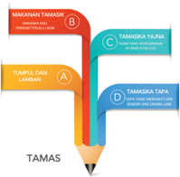

> **Deskripsi Visual:** Gambar ini adalah diagram yang menunjukkan struktur dan komponen utama dari sebuah tugas atau proyek. Diagram ini terdiri dari empat bagian utama:

1. Bagian A (Tumpukan Cian) menunjukkan bagian dasar atau awal dari tugas atau proyek.
2. Bagian B (Makanan Tamaskas) menunjukkan bagian pertama yang harus dilakukan, seperti mempersiapkan diri atau mengidentifikasi tujuan.
3. Bagian C (Tamasksa Tajna) menunjukkan bagian kedua yang lebih spesifik, seperti melakukan penelitian atau pengumpulan data.
4. Bagian D (Tamasksa Tapu) menunjukkan bagian terakhir yang harus diselesaikan, seperti membuat laporan atau presentasi akhir.

Elemen-elemen utama dalam diagram ini adalah tumpukan warna-warna yang berbeda yang mewakili setiap bagian dari tugas atau proyek. Relasi antara elemen-elemen ini adalah bahwa setiap bagian harus diselesaikan sebelum bagian selanjutnya dapat dimulai.

Teks, angka, atau label penting yang terlihat dalam diagram ini adalah "TAMAS" yang mungkin merujuk pada nama proyek atau tugas tersebut. Informasi kunci yang dapat diambil pembaca adalah bahwa ada empat tahap dalam proses ini, dan setiap tahap memiliki tujuan dan tugas spesifik yang harus diselesaikan.

Dalam paragraf satu, saya akan menjelaskan secara detail tentang struktur dan komponen utama dari diagram ini, termasuk jenis diagramnya, elemen-elemen utamanya, teks, angka, atau label penting yang terlihat, serta informasi kunci yang dapat diambil pembaca.

Sifat Tamas yaitu  sifat  lamban.  Seseorang  dengan  sifat Tamas akan  cenderung menyukai makanan yang sesuai dengan pola karakternya. Makanan yang tergolong Tamas yaitu:

### याियामं गि रिं पूक्ि पयु्धक्ििं च यि ्

yātay-āmaṁ gata-rasaṁ pūti paryuṣitaṁ ca yat

### उक्छिष्म ्  अक्प चामवेध्ं भोजनं िामिक्प्यम ्

ucchiṣṭam api cāmedhyaṁ bhojanaṁ tāmasa-priyam

Bhāgawad Gītā17.10

 

---
## 📄 Halaman 70

### Terjemahan:

Persembahan yang tidak sesuai dengan anjuran susastra; tanpa (berbagi) makanan, tidak diiringi oleh doa atau mantra, tanpa pemberian sesuatu kepada yang memfasilitasinya, tanpa kesucian hati dan keyakinan - adalah bersifat Tāmasī. (Radhakrishnan, 2010)

### मूढ ग्ाहवेणात्मनो यि ् परीडया क्रियिवे िपिः

mūḍha-grāheṇātmano yat pīḍayā kriyate tapaḥ परसोत्ािनारथं वा िि ्  िामिम ्  उिाहृिम ्

parasyotsādanārthaṁ vā tat tāmasam udāhṛtam

Bhāgawad Gītā17.19

### Terjemahan:

Tapa-brata yang dilakukan dengan tujuan bodoh, dengan cara menyakiti diri; atau, untuk menyakiti makhluk lain adalah bersifat Tāmasī. (Radhakrishnan, 2010)

अिवेशकालवे यि ्  िानम ् अपारिवेभ्यश्च िरीयिवे

adeśa-kāle yad dānam apātrebhyaś ca dīyate

अित्मृ िम ्  अवज्ािं िि ्  िामिम ्  उिाहृिम ्

asat-kṛtam avajñātaṁ tat tāmasam udāhṛtam

Bhāgawad Gītā17.22

### Terjemahan:

Berderma atau memberi hadiah tanpa ketulusan niat, dengan rasa kesal, tidak pada tempatnya, tidak tepat, dan kepada seseorang yang tidak layak untuk menerimanya disebut Tāmasī. (Radhakrishnan, 2010)

्

### क्वक्रहरीनम अिमृष्ान्ं मन्त्रहरीनम अिक्क्षणम ्

्

### vidhi-hīnam asṛṣṭānnaṁ mantra-hīnam adakṣiṇam श्रद्धा क्वरक्हिं यज्ं िामिं पक्रचक्षिवे

śraddhā-virahitaṁ Yājñaṁ tāmasaṁ paricakṣate

Bhāgawad Gītā17.13

 

---
## 📄 Halaman 71

### Sattwam

### Bijaksana dan tenang

---
**🖼️ Gambar/Diagram**

> **Deskripsi Visual:** Gambar ini adalah ilustrasi yang menunjukkan seorang siswa sedang membaca buku. Siswa tersebut memakai pakaian pink dan mengenakan kacamata, menunjukkan bahwa ia mungkin sibuk belajar atau belajar. Buku yang dibaca oleh siswa tampak berwarna hijau dengan gambar-gambar warna-warni yang menarik perhatian. Ilustrasi ini menunjukkan aktivitas belajar siswa, yang merupakan bagian penting dari proses pembelajaran. Dalam konteks pembelajaran, gambar ini dapat digunakan untuk mengajarkan tentang kegiatan belajar, penggunaan buku sebagai alat pembelajaran, dan pentingnya pengetahuan dan pemahaman dalam proses belajar.

### Religius

---
**🖼️ Gambar/Diagram**

> **Deskripsi Visual:** Gambar ini adalah ilustrasi yang menunjukkan seorang individu sedang bermeditasi. Ilustrasi ini menggambarkan posisi meditasi yang umum ditemukan dalam budaya Asia, dengan orang tersebut berdiri dengan kedua tangan di depan wajah, menunjukkan posisi jari yang sering digunakan dalam meditasi. Ilustrasi ini mungkin digunakan untuk membantu pembaca memahami konsep meditasi atau bagaimana posisi tubuh dapat membantu dalam proses meditasi.

Elemen-elemen utama dalam gambar ini meliputi:
1. Orang yang sedang bermeditasi.
2. Posisi meditasi yang umum ditemukan dalam budaya Asia.
3. Teks, angka, atau label penting tidak ada dalam gambar ini.

Informasi kunci yang dapat diambil pembaca dari gambar ini adalah bahwa meditasi dapat dilakukan dengan berbagai posisi tubuh, dan posisi meditasi yang umum ditemukan dalam budaya Asia dapat membantu dalam proses meditasi. Gambar ini juga dapat digunakan sebagai visual untuk membantu pembaca memahami konsep meditasi.

### Pengetahuan

---
**🖼️ Gambar/Diagram**

> **Deskripsi Visual:** Gambar ini adalah ilustrasi yang menunjukkan seorang siswa sedang membaca buku di meja belajar. Gambar ini menggambarkan situasi belajar yang serius dan fokus. Siswa tersebut duduk di kursi kayu dengan posisi yang rapi, menunjukkan kebersihan dan kerja keras. Meja belajar di sekelilingnya penuh dengan buku-buku, menunjukkan bahwa ia sedang belajar atau belajar. Di belakang siswa, terdapat lemari dengan beberapa pakaian, menunjukkan bahwa ia mungkin sedang berada di rumah atau sekolah. Seluruh gambar ini menunjukkan suasana belajar yang serius dan fokus, dengan elemen-elemen seperti siswa, meja belajar, dan buku-buku yang menjadi bagian penting dari gambar tersebut.

### Rajas

### Jenis - Jenis Orang

### Aktif

---
**🖼️ Gambar/Diagram**

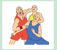

> **Deskripsi Visual:** Gambar ini adalah ilustrasi yang menunjukkan dua orang yang sedang berlari. Pada gambar tersebut, elemen utama adalah dua orang yang sedang berlari, satu di sebelah kiri dan satu di sebelah kanan. Kedua orang tersebut tampak sangat bersemangat dan energik, dengan posisi tubuh mereka yang menunjukkan gerakan lari. Di antara kedua orang tersebut, ada sebuah bola yang tampak seperti bola sepak atau bola voli, yang menunjukkan bahwa mereka mungkin sedang bermain olahraga bersama. Teks, angka, atau label penting tidak terlihat pada gambar ini. Informasi kunci yang dapat diambil pembaca adalah bahwa gambar ini menunjukkan aktivitas fisik atau olahraga bersama antara dua orang.

### Kualitas

### Kejam dan bengis

### Tindakan

---
**🖼️ Gambar/Diagram**

> **Deskripsi Visual:** Gambar ini adalah ilustrasi yang menunjukkan seorang pria sedang berpikir tentang transportasi. Ilustrasi ini terdiri dari beberapa elemen utama:

1. Pada bagian atas, terdapat sebuah mobil biru dan hijau, tampak seperti mobil sport.
2. Di bawah mobil tersebut, terdapat sepeda motor merah dan putih.
3. Di bawah sepeda motor, terdapat laptop hitam.
4. Pada bagian bawah, terdapat tulisan "Pertanyaan" dalam huruf besar.

Elemen-elemen ini menunjukkan perbandingan antara transportasi tradisional (mobil dan sepeda motor) dengan transportasi modern (laptop). Ini mungkin digunakan untuk mengajarkan konsep perbandingan antara dua jenis transportasi dalam konteks pembelajaran.

Informasi kunci yang dapat diambil pembaca melalui gambar ini adalah bahwa transportasi modern seperti laptop dapat menjadi alternatif transportasi yang lebih efisien dan ramah lingkungan dibandingkan dengan mobil dan sepeda motor tradisional.

### Tamas

### Malas

---
**🖼️ Gambar/Diagram**

> **Deskripsi Visual:** Gambar ini adalah ilustrasi yang menunjukkan seorang pria sedang beristirahat dengan posisi tidur yang nyaman di kursi santai. Pria tersebut mengenakan pakaian kasual dan tampak tenang. Ilustrasi ini mungkin digunakan untuk menjelaskan konsep tentang kebersihan dan kesehatan, terutama dalam konteks tidur yang baik. Elemen utama dalam gambar adalah pria, kursi santai, dan lingkungan tidur yang nyaman. Relasi antara elemen-elemen ini adalah bahwa pria sedang beristirahat di kursi santai yang nyaman, yang merupakan bagian dari lingkungan tidur yang sehat. Teks, angka, atau label penting tidak ada dalam gambar ini. Informasi kunci yang dapat diambil pembaca adalah pentingnya tidur yang cukup dan nyaman untuk kesehatan dan kenyamanan.

---
**🖼️ Gambar/Diagram**

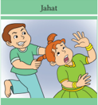

> **Deskripsi Visual:** Gambar ini adalah ilustrasi yang menunjukkan dua orang anak bermain. Anak laki-laki berdiri di sebelah kanan, sedang berbicara dengan tangan di depannya, sementara anak perempuan berdiri di sebelah kiri, tampak sedang terkejut atau terkejut oleh apa yang disampaikan oleh anak laki-laki tersebut. Kedua anak tersebut tampaknya sedang bermain atau berkomunikasi, mungkin tentang sesuatu yang membuat mereka tertawa atau terkejut.

Elemen-elemen utama dalam gambar ini adalah dua anak, tangan mereka, dan posisi mereka. Anak laki-laki tampaknya sedang berbicara atau memberikan informasi kepada anak perempuan, sementara anak perempuan tampak terkejut atau terkejut oleh apa yang dia dengar. 

Teks, angka, atau label penting tidak ada dalam gambar ini, karena gambar hanya menggambarkan situasi tanpa teks atau angka yang spesifik.

Informasi kunci yang dapat diambil pembaca adalah bahwa ada dua anak yang sedang bermain atau berkomunikasi, dan posisi mereka yang menunjukkan interaksi antara mereka.

---
**🖼️ Gambar/Diagram**

> **Deskripsi Visual:** Gambar ini adalah ilustrasi yang menunjukkan seorang pria sedang berbicara di saku mulutnya. Pria tersebut mengenakan seragam formal dengan lengan panjang dan kemeja biru. Di sebelah kanan, terdapat sebuah cermin yang menampilkan penampilan pria tersebut dari sudut pandang belakang. Gambar ini mungkin digunakan untuk membahas topik tentang perilaku sosial, kebersihan, atau bahkan bahasa tubuh dalam konteks pendidikan.

 

---
## 📄 Halaman 72

### Sattwam

Sulit diawalnya, kemuliaan kemudian

---
**🖼️ Gambar/Diagram**

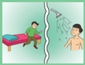

> **Deskripsi Visual:** Gambar ini adalah ilustrasi yang menunjukkan dua orang yang sedang berbicara di dekat sebuah tempat tidur. Pada gambar tersebut, elemen utama adalah dua orang yang berada di sebelah kiri dan kanan, sedangkan tempat tidur terletak di tengah. Orang di kiri tampak sedang berbicara kepada orang di kanan. Teks, angka, atau label penting tidak terlihat pada gambar ini. Informasi kunci yang dapat diambil pembaca adalah bahwa ada diskusi antara dua orang di dekat tempat tidur.

Kesederhanaan, Kebersihan, Pengendalian Diri, dan Tanpa Kekerasan

---
**🖼️ Gambar/Diagram**

> **Deskripsi Visual:** Gambar ini adalah ilustrasi yang menunjukkan seorang individu sedang bermeditasi. Gambar ini menggambarkan posisi meditasi yang umum ditemukan dalam banyak budaya, yaitu dengan kedua tangan berada di depan wajah dan jari-jari saling berjajar. Pemuda tersebut duduk dengan posisi jari-jari berada di atas lutut, yang merupakan posisi yang sering digunakan dalam praktik meditasi untuk memperbaiki postur tubuh dan meningkatkan keseimbangan.

Elemen utama dalam gambar ini adalah pemuda yang sedang bermeditasi. Ia duduk dengan posisi yang menunjukkan kepadatan dan ketenangan, yang merupakan ciri khas dari meditasi. Selain itu, elemen lainnya termasuk lantai yang berwarna hijau dan bantal yang digunakan sebagai tempat duduk.

Teks, angka, atau label penting tidak ada dalam gambar ini karena ia hanya menggambarkan posisi dan ekspresi pemuda tanpa informasi tambahan. Namun, informasi kunci yang dapat diambil dari gambar ini adalah bahwa meditasi adalah praktik yang melibatkan penyesuaian postur tubuh dan fokus pada diri sendiri untuk mencapai kestabilan dan ketenangan mental.

Dengan demikian, gambar ini menggambarkan posisi meditasi yang umum dan menunjukkan bagaimana meditasi dapat dilakukan dengan baik. Ini juga menekankan pentingnya postur yang benar dalam praktik meditasi untuk mencapai hasil yang optimal.

### Rajas

### Kebahagiaan

Kesenangan diawalnya, Duka derita kemudian

---
**🖼️ Gambar/Diagram**

> **Deskripsi Visual:** Gambar ini adalah ilustrasi yang menunjukkan dua orang yang sedang berbicara. Ilustrasi ini menggambarkan situasi interaksi sosial antara dua individu. Pada gambar tersebut, salah satu orang sedang berbicara dengan menggunakan bahasa tubuh seperti menunjukkan sesuatu dengan tangan, sementara orang lain mendengarkan dengan posisi badan yang menunjukkan rasa tertarik atau perhatian. Ilustrasi ini mungkin digunakan untuk menjelaskan konsep komunikasi nonverbal atau bahasa tubuh dalam pendidikan bahasa dan komunikasi.

Elemen utama dalam gambar ini adalah dua orang yang sedang berbicara. Relasi mereka adalah hubungan komunikatif, di mana satu orang berbicara dan orang lain mendengarkan. Teks, angka, atau label penting tidak ada dalam gambar ini karena ia hanya menggambarkan situasi tanpa teks atau angka tambahan.

Informasi kunci yang dapat diambil pembaca dari gambar ini adalah pentingnya komunikasi nonverbal dalam interaksi sosial. Gambar ini dapat digunakan untuk membantu pembaca memahami bagaimana bahasa tubuh dapat digunakan untuk menunjukkan perasaan dan emosi dalam percakapan.

### Kepuasan

Pekerja Keras

---
**🖼️ Gambar/Diagram**

> **Deskripsi Visual:** Gambar ini adalah ilustrasi yang menunjukkan seorang siswa sedang berusaha untuk mencapai trofi yang diletakkan di atas mobil. Siswa tersebut tampak sedang berjalan dengan telanjang tangan, menunjukkan upaya dan dedikasi mereka. Mobil tampak seperti sebuah mobil sport yang tampak modern dan elegan, menunjukkan bahwa siswa tersebut mungkin memiliki impian untuk menjadi seorang insinyur atau teknisi mobil. Gambar ini menggambarkan konsep tentang keberanian dan dedikasi dalam mencapai tujuan, serta potensi karir dalam bidang teknologi dan insinyur.

Melakukan sesuatu kegiatan atau pekerjaan untuk mendapatkan penghargaan dan imbalan

### Tamas

Khayalan dari awal hingga akhir

---
**🖼️ Gambar/Diagram**

> **Deskripsi Visual:** Gambar ini adalah ilustrasi yang menunjukkan dua orang sedang minum minuman keras. Pada gambar tersebut, elemen utama adalah dua orang yang sedang minum, dengan minuman keras yang mereka minum tampak jelas. Di sekitar mereka, terdapat beberapa benda seperti botol minuman keras, gelas, dan makanan. Gambar ini menunjukkan hubungan antara minuman keras dan perilaku konsumsi yang tidak sehat. Informasi kunci yang dapat diambil dari gambar ini adalah bahwa minuman keras harus disimpan dan dikonsumsi dengan bijaksana untuk menghindari bahaya kesehatan.

Penyiksaan diri dan melukai diri sendiri

---
**🖼️ Gambar/Diagram**

> **Deskripsi Visual:** Gambar ini adalah ilustrasi yang menunjukkan seorang pria sedang mengalami sakit pada tangan kanannya. Pria tersebut sedang menunjukkan tangan kanannya ke arah depan dengan ekspresi kesedihan dan sakit. Ilustrasi ini mungkin digunakan untuk menjelaskan konsep tentang penyakit atau kondisi medis tertentu yang bisa menyebabkan sakit pada tangan.

Elemen utama dalam gambar ini adalah pria yang sedang mengalami sakit. Tangan kanannya tampak sakit dan pria tersebut sedang menunjuknya ke arah depan. Ilustrasi ini mungkin digunakan untuk menjelaskan konsep tentang penyakit atau kondisi medis tertentu yang bisa menyebabkan sakit pada tangan.

Teks, angka, atau label penting yang terlihat dalam gambar ini tidak ada karena gambar hanya berupa ilustrasi tanpa teks atau angka tambahan.

Informasi kunci yang dapat diambil pembaca dari gambar ini adalah bahwa pria tersebut sedang mengalami sakit pada tangan kanannya dan mungkin sedang mencoba menunjukkan atau menggambarkan kondisi tersebut. Gambar ini mungkin digunakan sebagai contoh atau penjelasan dalam pembelajaran tentang penyakit atau kondisi medis tertentu yang bisa menyebabkan sakit pada tangan.

 

---
## 📄 Halaman 73

### Sattwam

Keputusan yang diambil untuk masa depan yang lebih baik dan mulia

---
**🖼️ Gambar/Diagram**

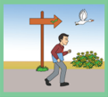

> **Deskripsi Visual:** Gambar ini adalah ilustrasi yang menunjukkan seorang anak laki-laki berjalan di tepi jalan dengan tangan yang menggenggam sebuah papan petunjuk. Papan petunjuk tersebut menunjukkan dua arah: satu menuju ke kanan dan yang lain menuju ke kiri. Di sebelah kanan papan petunjuk, terdapat sebuah burung yang sedang terbang. Di sebelah kiri papan petunjuk, terdapat beberapa tanaman dan pohon. 

Elemen-elemen utama dalam gambar ini adalah anak laki-laki, papan petunjuk, burung, dan tanaman. Anak laki-laki merupakan subjek utama yang sedang bergerak. Papan petunjuk menunjukkan dua arah yang harus diikuti oleh anak laki-laki. Burung dan tanaman merupakan elemen-elemen yang mendukung konteks situasi, menunjukkan bahwa anak laki-laki sedang berada di tepi jalan.

Teks, angka, atau label penting yang terlihat dalam gambar ini adalah papan petunjuk yang menunjukkan dua arah (kanan dan kiri). Informasi kunci yang dapat diambil pembaca adalah bahwa anak laki-laki sedang berjalan di tepi jalan dan harus memilih arah yang ingin dia ikuti berdasarkan papan petunjuk tersebut.

### Penuh Rasa Hormat

---
**🖼️ Gambar/Diagram**

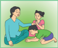

> **Deskripsi Visual:** Gambar ini adalah ilustrasi yang menunjukkan seorang guru sedang berbicara dengan dua siswa di kelas. Guru berdiri di depan kelas, sedang menggenggam tangan salah satu siswa yang berdiri di depannya. Siswa lainnya berdiri di belakang guru, tampaknya menunggu untuk mendengarkan atau bertanya. Ilustrasi ini menunjukkan hubungan antara guru dan siswa dalam situasi pembelajaran. Teks, angka, atau label penting tidak terlihat dalam gambar ini. Informasi kunci yang dapat diambil pembaca adalah bahwa ini adalah situasi pembelajaran di kelas, dengan guru sebagai pengajar dan siswa sebagai peserta didik.

### Rajas

### Membuat Keputusan

Keputusan yang diambil untuk masa depannya belum memiliki visi yang jelas

---
**🖼️ Gambar/Diagram**

> **Deskripsi Visual:** Gambar ini adalah ilustrasi yang menunjukkan dua orang yang sedang berjalan di sepanjang jalan. Gambar ini menggunakan warna-warna cerah untuk menonjolkan elemen-elemen utama seperti jalan, mobil, dan pakaian orang tersebut. Jalan berwarna hijau dengan garis putih yang menunjukkan jalur. Mobil berwarna merah dengan desain retro, tampak seperti mobil sport. Orang pertama mengenakan jaket biru dan celana hitam, sedangkan orang kedua mengenakan jaket kuning dan celana putih. Kedua orang tersebut tampak senang dan berbicara sambil berjalan. Ini menunjukkan suasana yang positif dan aktif.

### Perilaku

Penuh Gairah

---
**🖼️ Gambar/Diagram**

> **Deskripsi Visual:** Gambar ini adalah ilustrasi yang menunjukkan dua orang pemain tenis meja sedang bermain. Gambar ini menggambarkan pertarungan tenis meja dengan detail yang cukup. Pemain di sebelah kiri sedang berusaha memukul bola melewati pemain di sebelah kanan. Kedua pemain tersebut tampak sangat fokus dan bersemangat dalam pertarungan mereka. Ilustrasi ini menunjukkan posisi dan gerakan mereka, serta permainan tenis meja yang seru dan kompetitif. Ini adalah ilustrasi yang baik untuk membantu pembaca memahami konsep dasar tenis meja dan bagaimana pemain harus bergerak dan berinteraksi dengan bola.

Sangat Aktif dan ambisius

### Tamas

Keputusan yang diambil untuk masa depan merugikan dan membawanya pada masa depan yang suram

---
**🖼️ Gambar/Diagram**

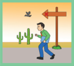

> **Deskripsi Visual:** Gambar ini adalah ilustrasi yang menunjukkan seorang pria berjalan di jalur yang menuju ke kanan. Pada sisi kiri jalur, terdapat pohon cactus dengan daun hijau dan batu-batu besar. Di depan pohon cactus, terdapat sepotong roti putih. Di atas jalur, terdapat sebuah papan tanda dengan petunjuk arah ke kanan. Di sebelah kiri papan tanda, terdapat burung kecil yang sedang terbang. Di sebelah kanan papan tanda, terdapat pohon cactus yang lebih tinggi. Gambar ini menunjukkan situasi di jalur yang harus diikuti arah yang ditunjukkan oleh papan tanda.

### Senang melihat orang lain susah

---
**🖼️ Gambar/Diagram**

> **Deskripsi Visual:** Gambar ini adalah ilustrasi yang menunjukkan tiga orang anak sedang bermain di halaman. Pada bagian atas, seorang dewasa tampaknya sedang berbicara dengan salah satu anak. Anak-anak tersebut tampaknya sedang bermain dengan mainan yang mirip seperti bola atau bola, yang tampaknya berwarna kuning. Ilustrasi ini menunjukkan hubungan sosial antara orang dewasa dan anak-anak, serta aktivitas yang dilakukan oleh anak-anak di luar rumah. Teks, angka, atau label penting tidak terlihat pada gambar ini. Informasi kunci yang dapat diambil pembaca adalah bahwa aktivitas anak-anak di luar rumah sangat penting untuk pertumbuhan dan perkembangan mereka.

 

---
## 📄 Halaman 74

---
**🖼️ Gambar/Diagram**

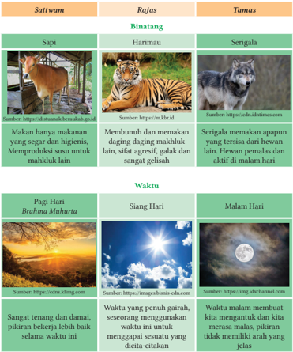

> **Deskripsi Visual:** Gambar ini adalah diagram yang menunjukkan hubungan antara tiga konsep utama: Saffwam, Rajas, dan Tamas, serta bagaimana mereka berinteraksi dengan binatang, serigala, dan waktu. Diagram ini dibagi menjadi dua kolom: kolom pertama menunjukkan tiga konsep utama, kolom kedua menunjukkan contoh binatang yang paling sesuai dengan konsep tersebut, dan kolom ketiga menunjukkan karakteristik serigala yang paling sesuai dengan konsep tersebut.

Pertama, kolom pertama menunjukkan tiga konsep utama: Saffwam, Rajas, dan Tamas. Saffwam adalah konsep yang menggambarkan keadaan seseorang yang baik dan bermoralitas, Rajas adalah konsep yang menggambarkan keadaan seseorang yang agresif dan tidak bermoralitas, dan Tamas adalah konsep yang menggambarkan keadaan seseorang yang sangat agresif dan tidak bermoralitas.

Kolom kedua menunjukkan contoh binatang yang paling sesuai dengan konsep tersebut. Sapi adalah contoh binatang yang paling sesuai dengan konsep Saffwam karena ia memiliki makanan yang segar dan higienis, memproduksi susu untuk mahluk lain, dan sangat tenang dan damai. Harimau adalah contoh binatang yang paling sesuai dengan konsep Rajas karena ia memiliki makanan yang agresif dan galak, dan sangat gelisah. Serigala adalah contoh binatang yang paling sesuai dengan konsep Tamas karena ia memiliki apapun yang tersisa dari hewan lain, hewan pemalsu, dan aktif di malam hari.

Kolom ketiga menunjukkan karakteristik serigala yang paling sesuai dengan konsep tersebut. Serigala adalah contoh binatang yang paling sesuai dengan konsep Tamas karena ia memiliki apapun yang tersisa dari hewan lain, hewan pemalsu, dan aktif di malam hari.

Informasi kunci yang dapat diambil pembaca adalah bahwa Saffwam adalah keadaan yang baik dan bermoralitas, Rajas adalah keadaan yang agresif dan tidak bermoralitas, dan Tam

 

---
## 📄 Halaman 75

### Tempat

---
**🖼️ Gambar/Diagram**

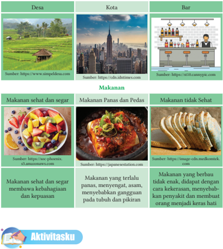

> **Deskripsi Visual:** Gambar dari buku pelajaran ini adalah jenis ilustrasi yang menampilkan tiga bagian berbeda: Desa, Kota, dan Bar. Setiap bagian memiliki gambar yang menunjukkan suasana dan aktivitas yang terjadi di tempat tersebut.

Pertama, gambar Desa menunjukkan pemandangan sawah hijau dengan beberapa kendaraan lalu lintas kecil. Ini menunjukkan suasana sejuk dan tenang di desa.

Kedua, gambar Kota menunjukkan pemandangan kota besar dengan bangunan tinggi dan jembatan yang indah. Ini menunjukkan suasana dinamis dan sibuk di kota.

Ketiga, gambar Bar menunjukkan interior sebuah bar dengan meja, kursi, dan barista yang sedang mengganti minuman. Ini menunjukkan suasana santai dan hiburan di tempat ini.

Teks pada gambar ini mencakup judul "Makanan" yang dikelompokkan menjadi tiga sub-kategori: Makanan Sehat dan Segar, Makanan Panas dan Pedas, dan Makanan Tidak Sehat. Setiap sub-kategori memiliki gambar yang menunjukkan makanan yang sesuai dengan deskripsi tersebut.

Informasi kunci yang dapat diambil pembaca adalah bahwa gambar ini menunjukkan variasi dalam gaya hidup dan makanan di berbagai tempat, mulai dari desa yang tenang hingga kota yang sibuk dan bar yang santai.

Berdasarkan pada Śloka-Śloka  Bhāgawad  Gītā tersebut diatas, kalian perlu memahami secara sempurna karakteristik dari Satwam, Rajas dan Tamas , untuk itu isilah tabel berikut ini!

Cara  pengisian  tabel  di  bawah  adalah  dengan  menuliskan  jenis  makanan yang sesuai dengan sifatnya, kualitas Yājña yang di praktikkan, tapa brata yang dikembangkan, dan kegiatan Dana Punia yang dilakukan.

 

---
## 📄 Halaman 76

---
**📊 Tabel**

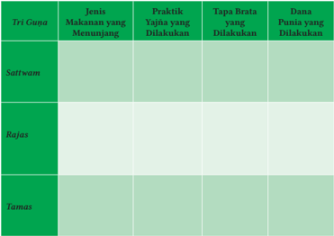

Tabel ini membahas tentang tiga jenis makanan yang menunjang praktek Yajna dalam Hinduisme, yaitu Sattwam, Rajas, dan Tamas. Setiap jenis makanan memiliki praktek Yajna yang berbeda, tata cara yang dilakukan, dan dasar punya yang digunakan. Sattwam dikenal sebagai makanan yang bersih dan sehat, yang biasanya dianggap paling ideal untuk praktek Yajna. Rajas, yang lebih kotor, sering digunakan dalam praktek Yajna yang lebih intensif. Tamas, yang paling kotor, sering digunakan dalam praktek Yajna yang paling kompleks dan berbahaya. Tabel ini menunjukkan bahwa praktek Yajna memerlukan perhatian khusus terhadap jenis makanan yang digunakan, karena setiap jenis memiliki efek yang berbeda pada proses Yajna.

### C.  Upaya Menyeimbangkan Tri Guṇa dalam Kehidupan

Kita perlu mengenali kecenderungan  yang dapat timbul dalam kehidupan pribadi, keluarga, masyarakat, bangsa, dan negara. Berikut ini merupakan upaya menyeimbangkan sifat-sifat Tri Guṇa , di antaranya:

- Berlatihlah memiliki pikiran Satwika seperti kejujuran, kebebasan, kelembutan, kekuatan, keagungan, ketangkasan, kehalusan, dan keindahan.
- Berhati-hati terhadap pikiran Rajasika seperti kekejaman, keangkuhan, kekerasan, keserakahan, kecerobohan, dan ketidakmantapan.
- Hindarilah  pikiran Tamasika seperti  kemalasan,  pengecut,  lesu,  pembunuh, kesedihan, kebisuan, yang pada dasarnya merugikan manusia.
- Mengembangkan 4 jenis Buddhi , yaitu:
- Dharma Buddhi, yaitu  melaksanakan Dharma seperti perbuatan mulia, tapa, sila, yajňa, dan dana punia.
- J ñāna Buddhi, yaitu memperoleh pengetahuan dengan benar.
- Vairagya Buddhi , yaitu ketidakterikatan terhadap kesenangan baik yang dilihat maupun yang didengar, termasuk keterikatan pada badan yang sehat.
- Aisarya Buddhi, yaitu keseimbangan dalam kesenangan (bhoga), kesenangan kecil (upabhoga), dan kesenangan besar (paribhoga).

 

---
## 📄 Halaman 77

Selain mengembangkan karakter mulia sebagaimana dijabarkan di atas, kita juga  perlu  memahami  apabila Sattwam , Rajas ,  dan Tamas saling  mendominasi. Berikut ini sebab akibat dari pikiran yang dipengaruhi oleh Tri Guṇa yaitu :

- Pikiran Satwika yang  sangat  kuat  merupakan  pikiran  yang  tidak  tercemar, pikiran  yang  suci,  pikiran  yang  jernih,  dan  baik.  Pikiran Satwika dapat membuka jalan menuju Mokṣa. Pikiran Satwika menyebabkan atma mencapai Mokṣa karena pikiran itu jernih, bersih dan suci.
- Pikiran Satwika dan Rajas a sama kuat, maka ajaran Dharma dapat terlaksana. Dalam hal ini dikatakan bahwa pikiran Satwika bersatu dengan pikiran Rajas a.
- Pikiran Satwika , Rajas a dan Tamas a sama kuat. Apabila pikiran Satwika , Rajas a dan Tamas a sama kuat, maka kita akan lahir sebagai manusia, karena ketiga unsur tersebut memenuhi keinginan masing-masing. Ketiga sifat tersebut pada hakikatnya saling tarik-menarik.
- Pikiran Rajas a  yang  sangat  kuat.  Jika  pengaruh Rajas a  sangat  kuat,  maka pikiran  akan  diliputi  oleh  amarah.  Jika  pikiran  dipenuhi  oleh  rajah,  maka kekuatan amarahlah yang bekerja dalam melakukan perbuatan.
- Pikiran Tamas a  yang sangat kuat. Jika pengaruh Tamas a  sangat kuat, maka pikiran  akan  menjadi  jahat,  lesu,  dan  bingung.  Pengaruh Tamas a  terhadap pikiran menyebabkan Atma lahir menjadi hewan seperti ternak, binatang buas, burung, binatang melata, dan ikan.

### Caritam

### Tiga Penjual Topi

Dahulu kala ada tiga bersaudara Tuan Tamo Guna, Tuan Rajo Guna dan Tuan Sattva Guna yang akan melakukan perjalanan dari desa mereka ke kota terdekat untuk menjual topi. Mereka harus melintasi hutan kecil untuk mencapai kota. Salah satu dari mereka akan pergi di pagi hari, yang kedua di siang hari, dan yang ketiga di malam hari.

Suatu  hari  Tuan  Tamo  Guna,  sedang melintasi  hutan  di  pagi  hari.  Dia  menjadi lelah, berbaring, dan tidur di bawah pohon besar.  Saat  dia  bangun  dia  melihat  bahwa semua topinya hilang. Dia menyadari bahwa monyet  di  pohon  telah  mencuri  topinya. Dia menjadi sedih dan tertekan. Dia mulai menangis dan kembali ke desanya.

---
**🖼️ Gambar/Diagram**

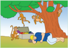

> **Deskripsi Visual:** Gambar ini adalah ilustrasi yang menunjukkan tiga monyet bermain di sekitar pohon besar. Pohon tersebut memiliki daun hijau dan berisi beberapa buah. Di bawah pohon, ada dua bangku kayu dan sebuah kubus kecil. Monyet pertama sedang berjalan menuju bangku, monyet kedua sedang bermain dengan kubus, dan monyet ketiga sedang berdiri di atas bangku. Gambar ini menunjukkan aktivitas monyet dan lingkungan mereka di sekitar pohon.

 

---
## 📄 Halaman 78

Sore harinya saudara kedua, Tuan Rajo Guna, berangkat ke kota. Saat dia sedang melintasi hutan, dia juga menjadi lelah dan beristirahat di bawah pohon besar yang sama. Ketika dia bangun, dia menyadari bahwa monyet di pohon telah mencuri topinya. Dia menjadi sangat marah sehingga dia mulai mengutuk monyet. Dia mengucapkan katakata buruk dan berteriak sekeras mungkin. Akhirnya dia menjadi lelah ketika monyet tidak mengembalikan topinya. Jadi, dengan frustrasi dia kembali ke desanya.

Berikutnya  Tuan  Sattva  Guna pergi  ke  kota.  Dia  juga  menjadi lelah dan tidur di bawah pohon yang sama di hutan tersebut. Ketika dia bangun, dia menemukan bahwa monyet di pohon telah mencuri topinya  juga.  Dia  tidak  menjadi  sedih  atau  marah.  Dengan  kepala dingin dia berpikir sejenak dan mendapatkan sebuah ide.

Dia  melepaskan  topinya  sendiri  dan  menunjukkannya  kepada monyet. Ketika monyet melihat seperti ini, setiap monyet menirunya, para monyet melepas topinya dan menunjukkan kepada penjual topi. Kemudian  penjual  topi  itu  melemparkan  topinya  ke  tanah  dengan sekuat tenaga. Mencoba menirunya, para monyet pun melemparkan topi mereka ke tanah dengan sekuat tenaga. Penjual topi yang cerdas mengumpulkan semua topi ini dan menjualnya di pasar kota untuk mendapatkan keuntungan besar.

Setelah membaca cerita tersebut di atas, tuliskanlah nilai moral dari cerita tersebut pada kolom di bawah ini!

.......................................................................................................................................................

.......................................................................................................................................................

.......................................................................................................................................................

.......................................................................................................................................................

 

---
## 📄 Halaman 79

Tahukah kamu, karakteristik generasi milenial?

Berdasarkan pada buku profil Generasi Milenial Indonesia yang di terbitkan oleh Kementrian Pemberdayaan Perempuan dan Perlindungan Anak bekerjasama dengan  Badan  Pusat  Statistik  (2018),  berikut  ini  adalah  karakteristik  generasi milenial:

- Minat membaca secara konvensional kini sudah menurun karena lebih memilih membaca lewat smartphone mereka.
- Milenial wajib memiliki akun sosial media sebagai alat komunikasi dan pusat informasi.
- Milenial pasti lebih memilih ponsel daripada televisi.
- Milenial  menjadikan  keluarga  sebagai  pusat  pertimbangan  dan  pengambil keputusan mereka.
Dalam aspek bekerja, disebutkan bahwa para milenial dalam bekerja memiliki karakteristik sebagai berikut:

- Para milenial bekerja bukan hanya sekedar untuk menerima gaji, tetapi juga untuk mengejar tujuan (sesuatu yang sudah dicita-citakan sebelumnya).
- Milenial tidak terlalu mengejar kepuasan kerja, namun yang lebih milenials inginkan adalah kemungkinan berkembangnya diri mereka di dalam pekerjaan tersebut (mempelajari hal baru, skill baru, sudut padang baru, mengenal lebih banyak orang, mengambil kesempatan untuk berkembang, dan sebagainya).
- Milenial tidak menginginkan atasan yang suka memerintah dan mengontrol.
- Milenial tidak menginginkan review tahunan, milenials menginginkan on going conversation.
- Milenial  tidak  terpikir  untuk  memperbaiki  kekuranganya,  milenial  lebih berpikir untuk mengembangkan kelebihannya.
Bagi milenial, pekerjaan bukan hanya sekedar bekerja namun bekerja adalah bagian dari hidup mereka.

 

---
## 📄 Halaman 80

Tujuan utama mempelajari Tri Guṇa adalah menyadari karakter yang dominan yang ada dalam diri kalian masing-masing. Apakah kalian menemukan tujuan tersebut setelah  mempelajari bab tentang Tri  Guṇa ini?  Cobalah  kalian  tanyakan  kepada diri  sendiri?  Jujurlah  terhadap  diri  kalian  sendiri.  Apakah  selama  pembelajaran berlangsung  muncul  perenungan-perenungan  tentang  sifat-sifat  yang  ada  pada diri  sendiri? Apabila itu belum terjadi, coba lakukan pernungan atau refleksi itu sekarang. Pertanyaan-pertanyaan berikut ini akan membantu kalian merenungkan pembelajaran ini dengan baik.

- Sifat apa yang paling menonjol dalam diri kalian sesuai dengan pembelajaran Tri Guṇa ?
- Apakah sifat  tersebut  dapat  membantu  kalian  mengenali  diri  sendiri  secara lebih baik?
- Adakah sesuatu yang kalian belum pahami dalam pembelajaran Tri Guṇa ?!
- Perubahan apa yang kalian rasakan setelah mempelajari Tri Guṇa ?! Adakah hal baru yang kalian rasakan?!
- Perubahan  sikap  dan  perilaku  apa  yang  ingin  kalian  tumbuhkan  setelah mempelajari Tri Guṇa ?!
- Keterampilan apa saja yang kalian dapat kembangkan setelah mempelajari Tri Guṇa ?!
Setelah melakukan dialog dengan diri sendiri, tuliskanlah dalam buku harian kalian. Kalian juga dapat membagikan refleksi ini kepada teman-teman di kelas kalian.

 

---
## 📄 Halaman 81

### I. Pilihan Ganda

Jawablah  pertanyaan  berikut  ini  dengan  memilih  salah  satu  pilihan  jawaban yang benar!

- Dalam Śīva  Purāṇa ,  dikisahkan  Raja  Kubera  sedang  melakukan  sebuah Yājña berupa Jamuan makan kepada para Dewa , para Rsi dan umat manusia. Kubera mengundang Dewa Śīva, Namun Dewa Śīva tidak hadir dan diwakili oleh  Ganesha.  Kubera  bermaksud  memamerkan  kekayaannya.  Berdasarkan kualitasnya, Yājña yang dilaksanakan oleh Kubera adalah....
- Satwika
- Rajasika
- Tamasika
- Nista
- Naimitika
- Melaksanakan Sarira Tapa, Vakyam Tapa, dan Manasa Tapa adalah Tapa Brata yang dilaksanakan oleh seseorang yang ingin mengembangkan karakter......
- Satwam
- Rajas
- Tamas
- Mulia
- Baik
- Kombinasi dari Tri Guṇa di dalam diri seseorang berbeda-beda. Seseorang yang dominan memiliki sifat Satwam disebut dengan...
- Sattwam
- Satwika Waikerta
- Rajas
- Rajasika Taijasa
- Tamas
- Apabila seseorang didominasi oleh sifat Rajas disebut dengan...
- Rajasika Taijasa
- Satwika Waikerta
- Sattwam
- Rajas
- Tamas

### Asesmen

 

---
## 📄 Halaman 82

- Ketiga Guṇa ( Tri Guṇa ) harus dilampaui agar kita dapat membebaskan diri dari ketiga sifat ini. Upaya melampaui ketiga sifat ini akan menjadi lebih mudah apabila kita sudah didominasi dengan sifat.....
- Tamasika Bhutadi
- Rajasika Taijasa
- Satwika Waikerta
- Sattwam
- Rajas

### II. Pilihan Ganda Kompleks

Jawablah  pertanyaan  berikut  ini  dengan  memilih  beberapa  (lebih  dari  satu) pilihan jawaban yang benar!

- Bacalah Śloka berikut ini!

### ित्त्वाि ्  िञ्ायिवे ज्ानं रजिो लोभ एव च

sattvāt sañjāyate jñānaṁ rajaso lobha eva ca प्माि मोहौ िमिो भविो ज्ानम ्  एव च

pramāda-mohau tamaso bhavato'jñānam eva ca Bhāgawad Gītā, 14.17

Terjemahan:  Kebijaksanaan  adalah  hasil  dari Sattva ;  keserakahan,  niscaya adalah hasil dari Rajas ; ketidakpedulian, keterikatan, dan ketidaktahuan adalah hasil dari Tamas . (Radhakrishnan, 2010)

Berdasarkan pada Śloka tersebut diatas, makna Śloka tersebut adalah....

- Pembelajaran Tri  Guṇa ini  mengajarkan  kepada  kita  untuk  mengenali karakteristik  dari  masing-masing Guṇa tersebut. Selain itu, tujuan  lain mempelajari Tri Guṇa adalah....

 

---
## 📄 Halaman 83

- Berilah  tanda  ceklis  pada  kotak  yang  tersedia.  Sikap  atau  perilaku  yang menunjukkan sifat Sattwam adalah....
- Bacalah pernyataan berikut ini!
- Makan makanan sehat, mendengarkan musik
- Mempraktikkan meditasi
- Membaca buku
- Membersihkan rumah
- Mengendarai motor tanpa helm
Berdasarkan  pilihan  kegiatan  pada  pernyataan  tersebut,  yang  merupakan kegiatan untuk menanamkan sifat Sattwam adalah....

 

---
## 📄 Halaman 84

- Bacalah pernyataan berikut ini!
- Mampu mengamati segala tindakan diri
- Menjadi saksi atas pengaruh Tri Guṇa
- Tidak  terganggu  oleh  apapun  yang  terjadi  karena  fungsi  sifat-sifat Tri Guṇa
- Menerima kehidupan ini
- Dikuasai oleh sifat-sifat Tri Guṇa
Berdasarkan penyataan tersebut diatas, ciri-ciri tindakan seseorang yang telah menguasai Tri Guṇa adalah....

### III.  Essay

Jawablah Pertanyaan berikut ini dengan benar!

- Mengapa Tri Guṇa disebut sebagai tiga sifat dasar penciptaan alam semesta? Jelaskan!
................................................................................................................................

................................................................................................................................

................................................................................................................................

................................................................................................................................

................................................................................................................................

................................................................................................................................

................................................................................................................................

................................................................................................................................

................................................................................................................................

................................................................................................................................

 

---
## 📄 Halaman 85

- Menurut kalian, apakah ketiga Guṇa , Sattwam , Rajas ,  dan Tamas diperlukan dalam kehidupan kalian? Mengapa demikian? Jelaskan pendapat kalian!
................................................................................................................................

................................................................................................................................

................................................................................................................................

................................................................................................................................

................................................................................................................................

................................................................................................................................

................................................................................................................................

................................................................................................................................

................................................................................................................................

................................................................................................................................

- Dalam Bhāgawad Gītā,  dijelaskan  bahwa  makanan  memengaruhi  karakter seseorang. Mengapa demikian? Jelaskan pendapat kalian!
................................................................................................................................

................................................................................................................................

................................................................................................................................

................................................................................................................................

................................................................................................................................

................................................................................................................................

................................................................................................................................

................................................................................................................................

................................................................................................................................

................................................................................................................................

................................................................................................................................

................................................................................................................................

................................................................................................................................

................................................................................................................................

 

---
## 📄 Halaman 86

### 4. Bacalah cerita singkat berikut ini!

Ekaḥ jambūkaḥ asti. Saḥ  ekadā  āhārārthaṁ  vane  bhramati.  Ekatra  saḥ drākṣālatāṁ  paṡyati.  Latāyām  anekāni  drākṣāphalāni  santi.  Tāni  pakvāni. Jambūkaḥ  'adya  mama  drākṣāphalānāṁ  bhojanam'  iti  cintayati.  Drākṣāṁ labdum  upari  utpatati.  Kintu  drākṣāphalāni  na  prāpnoti.  Jambūkah  punaḥ punaḥ. Utpatati. Tathāpi phalāni na prāpnoti. Jambūkaḥ kupitaḥ bhavati. Saḥ tāni  drākṣāphalāni  dūṣayati.  'Drākṣāphalāni  āmlāni'  iti  vadati.  Anantaraṁ svasthānaṁ gacchati.

Ada seekor Rubah. Setiap hari ia mencari makanan di sekitar hutan. Di suatu tempat, ia melihat tanaman anggur. Tanaman tersebut memiliki buah yang banyak. Rubah tersebut berpikir, 'Hari ini aku makan anggur'. Buah anggur tersebut  memiliki  ranting  yang  tinggi,  Rubah  mencoba  memetik  buahnya dengan melompat-lompat, namun tetap belum mendapatkan buahnya. Rubah mulai marah. Ia mulai melampiaskan kemarahannya pada pohon anggur dan mengatakan 'buah anggur ini masam'. Kemudian ia pergi meninggalkan pohon anggur tersebut.

Berdasarkan pada cerita tersebut, uraikan pendapat kalian tentang cerita tersebut,  nilai  apa  yang  bisa  kita  petik?  Apakah  ada  kaitannya  dengan Tri Guṇa ? Jelaskan!

................................................................................................................................

................................................................................................................................

................................................................................................................................

................................................................................................................................

................................................................................................................................

................................................................................................................................

................................................................................................................................

................................................................................................................................

................................................................................................................................

................................................................................................................................

................................................................................................................................

................................................................................................................................

 

---
## 📄 Halaman 87

- Terdapat beberapa cara untuk menetralisir kekuatan Tri Guṇa dalam diri kita dan membebaskan diri dari pengaruh Tri Guṇa tersebut sebagaimana diuraikan dalam bab ini. Adakah cara lain yang dapat dikembangkan untuk membantu diri sendiri dalam upaya membebaskan diri dari ikatan Tri Guṇa ? Jelaskan!
................................................................................................................................

................................................................................................................................

................................................................................................................................

................................................................................................................................

................................................................................................................................

................................................................................................................................

................................................................................................................................

................................................................................................................................

................................................................................................................................

................................................................................................................................

................................................................................................................................

................................................................................................................................

................................................................................................................................

### IV.  Penilaian Kinerja

Isilah jurnal individu berikut ini! Petunjuk pengisian jurnal harian ini adalah:

- Amati dan programlah diri kalian dalam satu minggu. Catatlah pada kolomkolom sesuai pernyataan. Misalnya pernyataan pertama, jam berapa bangun tidur? isilah dengan waktu ketika kalian bangun tidur di pagi hari, kemudian keesokan harinya juga dicatat sampai penuh selama satu minggu. Jangan lupa untuk mencatat tanggalnya.
- Apabila  kalian  telah  menyelesaikan challenge ini,  cobalah  buat  refleksinya. Pikirkan  perubahan  apa  yang  telah  kalian  lakukan  pada  diri  sendiri.  Bila membutuhkan bantuan orang tua, cobalah untuk berdiskusi dengan orang tua kalian. Selamat mencoba!

 

---
## 📄 Halaman 88

---
**🖼️ Gambar/Diagram**

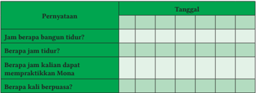

> **Deskripsi Visual:** Gambar ini adalah diagram tabel yang menunjukkan informasi tentang jam tidur dan berapa kali melakukan praktik Muna. Tabel tersebut terdiri dari dua kolom utama: "Pernyataan" dan "Tanggal". Kolom "Pernyataan" mencakup empat poin utama:

1. Jam berapa bangun tidur?
2. Berapa jam tidur?
3. Berapa jam kalian dapat mempraktekkan Muna?
4. Berapa kali berpuasa?

Kolom "Tanggal" tampaknya tidak memiliki data tertentu, mungkin untuk menunjukkan bahwa informasi ini belum diperbarui atau belum ada data yang tersedia.

Elemen-elemen utama dalam tabel ini adalah poin-poin tentang jam tidur dan praktik Muna, serta tanggal yang tidak ada data. Teks, angka, atau label penting yang terlihat meliputi nama-nama poin dalam kolom "Pernyataan", dan tidak ada angka atau label spesifik lainnya.

Informasi kunci yang dapat diambil pembaca meliputi jumlah waktu tidur yang diperkirakan, jumlah kali melakukan praktik Muna, dan jumlah kali berpuasa. Namun, detail spesifik seperti waktu tertentu atau jumlah tertentu tidak dapat diambil dari gambar ini karena kolom "Tanggal" tidak memiliki data.

---
**📊 Tabel**

Tabel ini berisi informasi tentang jam tidur dan rutinitas kehidupan sehari-hari seseorang. Topik utamanya adalah tentang jam bangun, jumlah tidur, kapan melakukan praktik Muna, dan berapa kali berpuasa. Kolom-kolomnya mencakup tanggal-tanggal tertentu. Data penting yang terlihat adalah bahwa seseorang biasanya bangun pada jam 6 pagi, tidur sekitar 8 jam, melakukan praktik Muna setiap hari, dan berpuasa sebanyak 3 kali seminggu.

Selamat kepada kalian yang telah menyelesaikan pembelajaran Tri  Guṇa hingga mencapai  ketuntasan.  Kalian  juga  perlu  terus  mengembangkan  diri  dengan mempelajari cara-cara mengendalikan Tri Guṇa melalui:

- Pembelajaran Bhāgawad Gītā Adhyaya 14 .
- Pembelajaran dalam teks-teks kearifan lokal seperti Vratti Sāsana dan Tattwa Jñāna .
- Mempelajari cara-cara menetralisir pengaruh Tri Guṇa yang ada pada ritual Hindu seperti pada Banten Peras dan Banten Prayascitta .

 

---
## 📄 Halaman 89

3 Bab

KEMENTERIAN PENDIDIKAN, KEBUDAYAAN, RISET, DAN TEKNOLOGI REPUBLIK INDONESIA, 2022

Pendidikan Agama Hindu dan Budi Pekerti untuk SMA/SMK Kelas XII

Penulis: Ni Made Adnyani

ISBN: 978-602-244-571-5 (jil.3)

### मोक्ष Mokṣa

### Subhāṣitam Kalimat Mutiara

्

अयं निजः परो वेनि गणिा लघुचेिसाम ् Ayaṁ nijaḥ paro veti gaṇanā laghucetasām उदारचनरिािां िु वस ु ध ै व क ु टुम्बकम

Udāracaritānāṁ tu vasudhaiva kuṭumbakam

Pikiran tentang 'ia milikku atau dia milik orang lain' hanya muncul dalam orangorang yang berpikiran sempit. Bagi orang berpikiran luas, seluruh dunia adalah keluarga mereka.

### Tujuan Pembelajaran

Pada  akhir  pembelajaran  materi Mokṣa melalui  berbagai  metode  dan model Pembelajaran, peserta didik mampu menganalisis ajaran Mokṣa sebagai tujuan tertinggi, Cara untuk mencapai Mokṣa serta  penerapan ajaran Mokṣa dalam kehidupan keluarga dan masyarakat melalui ruangruang diskusi, berpikir kritis peserta didik mampu menjadi pelajar yang sejalan dengan profil Pancasila.

 

---
## 📄 Halaman 90

Perhatikan gambar balon di samping!

Apakah yang ada di dalam balon tersebut?

Apakah udara di dalam balon terpisah dengan udara yang ada di luar balon?

Apabila  balon  tersebut  pecah,  kemana  perginya  udara yang ada di dalam balon tersebut?

Apakah udara di dalam balon menghilang?

Apa  hubungan  balon  dengan  materi Mokṣa yang  akan kita pelajari?

---
**🖼️ Gambar/Diagram**

> **Deskripsi Visual:** Gambar ini adalah ilustrasi yang menunjukkan lima balon berwarna-warni yang ditempatkan di atas satu papan. Balon-balon tersebut memiliki warna merah, biru, hijau, ungu, dan pink. Setiap balon memiliki ukuran yang sama dan terletak di atas papan yang sama tingginya. Papan tersebut tampak seperti sebuah meja atau podium dengan latar belakang putih. Ilustrasi ini mungkin digunakan untuk menggambarkan konsep tentang perbandingan, ukuran, atau warna dalam matematika atau seni.

Pembelajaran Pendidikan agama Hindu di kelas XII ini  akan  kita  lanjutkan pada  aspek Srādha melalui  capaian  pembelajaran  tentang Mokṣa .  Kalian  telah mempelajari aspek Veda pada capaian pembelajaran pertama, kemudian dilanjutkan dengan aspek Susila dengan capaian pembelajaran tentang Tri Guna. Pada capaian pembelajaran  ini,  kita  akan  mempelajari Mokṣa untuk  memahami  tujuan  dari perjalanan panjang kehidupan kita. मोक्षर्थं जगनधिय च इनि धम्म Mokṣartham jagadhitaya ca iti Dharma. Mencapai Mokṣa dan jagadhita adalah Dharma.

Perjalanan kehidupan kita masing-masing berbeda satu sama lain. Melewati berbagai  pengalaman  yang  membantu  diri  kita  menjadi  semakin  dewasa  dan bijaksana. Kita dapat mengambil salah satu contoh perjalanan hidup para Rsi , para orang suci, āwatara , para raja, dan lainnya. Mengawali pembelajaran ini kita akan membaca kisah persalanan Raja Yudistira bersama istri dan saudara-saudaranya menuju Puncak Himalaya yang dimuat dalam Swarga Rohana Parwa Mahābhārata (Subramanian, 2018).

Bacalah cerita berikut ini! Bacalah dengan perhatian penuh, ulangi membaca hingga 2 sampai 3 kali, sehingga kalian mampu memahami isi ceritanya. Setelah membacanya,  kalian  dapat  berdiskusi  dengan  teman-teman.  Jangan  lupa  untuk menuliskan  poin-poin  pentingnya  pada  kolom  yang  terletak  di  bawah  cerita. Selamat membaca!

 

---
## 📄 Halaman 91

### Caritam

### Perjalanan Pandawa dan Draupadi Menuju Himalaya

Atas  petunjuk  dari Bhagawan Vyasa ,  setelah dilaksanakan upacara penobatan Parikesit putera  Arjuna  menggantikan  Raja  Yudistira, Para Pandawa bersama Draupadi memutuskan meninggalkan kerajaan untuk hidup sebagai pertapa  di  hutan.  Mereka  memasuki  hutan dan melewati beberapa gunung dan lembah. Ketika  mencapai  gunung  Mahameru, Dewa Agni  menemui  Arjuna  dan  meminta  agar semua senjata saktinya di pralina .

Perjalanan dilanjutkan, seekor anjing mengikuti perjalanan mereka. Mereka pun berjalan melewati Sungai Gangga, bahkan sampai pula di gurun pasir. Di tempat itulah, Draupadi meninggal dunia. Di antara para Pandawa, Bimalah yang paling mencintai Draupadi. Dalam kesedihannya, Bima  bertanya  kepada  kakaknya  mengapa  Draupadi  meninggal  dunia lebih dulu? Yudhistira pun menjawab, bahwa dalam membagi cinta kepada kelima Pandawa, Draupadi sebagai manusia biasa tetaplah tidak bisa adil. Dari  kelima  Pandawa,  hanya  Arjuna  'sang  pemenang  sayembara'  atas dirinyalah yang paling dicintainya.

---
**🖼️ Gambar/Diagram**

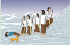

> **Deskripsi Visual:** Gambar ini adalah ilustrasi yang menunjukkan sebuah kelompok orang sedang berjalan di atas laut. Kelompok tersebut terdiri dari beberapa orang dewasa dan anak-anak, semua dengan pakaian yang sesuai untuk cuaca dingin. Mereka tampak sangat antusias dan bersemangat, menunjukkan bahwa mereka sedang berpergian atau melakukan aktivitas bersama-sama. Di sebelah kanan, ada seorang anak kecil yang sedang berjalan dengan kaki yang terlihat lemah atau sakit, menunjukkan bahwa ada perbedaan dalam kondisi kesehatan individu dalam kelompok tersebut.

Elemen-elemen utama dalam gambar ini adalah kelompok orang, laut, dan lingkungan sekitar mereka. Kelompok orang merupakan subjek utama yang menunjukkan hubungan sosial dan komunitas. Laut menjadi latar belakang yang menunjukkan situasi ekstrem dan menantang. Lingkungan sekitar mereka mencerminkan kondisi alam yang tidak biasa dan menuntut ketahanan dan kerjasama.

Teks, angka, atau label penting yang terlihat dalam gambar ini adalah tidak ada. Namun, informasi kunci yang dapat diambil pembaca melalui gambar ini adalah tentang keberanian dan persatuan dalam menghadapi tantangan, serta perbedaan dalam kondisi kesehatan individu dalam kelompok tersebut.

Berselang beberapa hari setelah kematian  Draupadi  dalam  perjalanan mereka, Sahadewa putera Pandu dari Dewi Madrim pun meninggal. Sekali  lagi  Bima  pun  bertanya  dengan sedihnya kepada kakaknya yang dijawab bahwa semasa hidup Sahadewa sangat  sombong  atas  kemampuannya 'melihat'  masa  depan.  Belum  hilang kesedihan mereka, Nakula pun menyusul Sahadewa. Sekali lagi Yudhistira menjelaskan kepada kedua adiknya, bahwa Nakula pun tidak dapat mengikuti perjalanan mereka sebagai pertapa karena semasa hidup ia merasa dirinya paling tampan tanpa tandingan.

 

---
## 📄 Halaman 92

Dalam perjalanan, mereka melewati berbagai kesulitan dan kesedihan, kehilangan saudara-saudaranya. mereka berupaya menguatkan satu sama lain agar  perjalanan  mereka  berhasil,  sehingga dapat senantiasa bersama-sama. Namun ternyata  Arjuna  pun  tidak  kuat  mengikuti perjalanan  mereka,  kemudian  meninggal. Yudhistira mengatakan kepada Bima, bahwa semasa  hidup  Arjuna  mudah  menganggap remeh masalah, misalnya mengatakan bahwa ia akan sanggup mengalahkan musuhnya dalam sehari padahal ucapannya tidak  terbukti.  Tak  lama  kemudian  Bima

pun  merasakan  gemetaran,  badannya  lemah,  sehingga  tak  dapat  lagi mengikuti kakaknya. Yudhistira mengatakan kepada adiknya itu bahwa Bima sangat suka makan, kalau berkata-kata pun seringkali kasar dan menyakitkan,  serta  masih  suka  menyombongkan  kekuatannya.  Bima pun meninggal. Tinggallah Yudhistira berjalan sendiri hanya ditemani seekor anjing yang selalu mengiringinya. Tak lama kemudian datanglah Hyang Indra naik kereta sambil menyampaikan kabar dan menghibur kedukaan  Yudhistira  yang  kehilangan  isteri  dan  adik-adiknya.  Hyang Indra  mengatakan  bahwa  kematian  merupakan  suatu  keniscayaan, Hyang  Indra  juga  meyakinkan  Yudistira  bahwa  keempat  saudaranya bersama Draupadi tidak bisa memasuki Surga dengan badan fisik mereka. Hanya Yudhistira saja yang akan masuk surga dengan badan fisiknya sebagai  penghargaan  atas  keteguhannya  menjalani  kehidupan  secara manusiawi. Dalam pewayangan Jawa, Yudistira di kenal dengan nama Puntadewa yang artinya teguh dalam menjalani kehidupan.

Yudhistira sangat bersyukur atas penghargaan tersebut. Akan tetapi, dirinya  keberatan  meninggalkan  anjing  yang  telah  setia  mengikuti perjalanannya  sehingga  ia  tidak  sendirian  dalam  perjalanan.  Hyang Indra  menjelaskan  bahwa  tidak  seharusnya  Yudhistira  menghiraukan anjing  tersebut.  Bukankah  ia  hanya  binatang?  Namun,  Yudhistira bersikukuh ingin tetap membawa anjing tersebut. Hyang Indra pun mulai

 

---
## 📄 Halaman 93

menyudutkannya,  bahwa  ia  telah  tidak setia kepada permaisurinya, Draupadi, dan  adik-adiknya,  dengan  bukti  ia  tetap meneruskan perjalanan kendati tanpa mereka.  Yudhistira  tidak  setuju  dengan apa yang dikatakan Hyang Indra. Yudistira tidak  pernah  meninggalkan  saudaranya, akan  tetapi  saudara  dan  istrinya  yang telah  meninggalkannya  sendirian  dalam perjalanan.  Setelah  Yudhistira  menjawab demikian, anjing tersebut menghilang dan muncullah Hyang Dharma yang kemudian memeluk Yudistira, seraya berkata,' Yudhistira. Dua kali kami menguji keutamaan sifat kemanusiaanmu. Pertama, ketika kami menawarimu andaikan diminta menghidupkan satu di  antara  saudaramu,  Engkau  memilih Nakula, demi kepentingan Dewi Madrim. Kini,  kami kembali mengujimu. Ternyata Dirimu pun sangat menghargai kesetiaan walaupun kesetiaan itu ditunjukkan oleh seekor anjing. Mengingat budi pekertimu sebagai  manusia,  maka  mari  masuk  ke surga.

---
**🖼️ Gambar/Diagram**

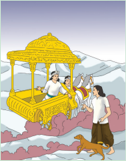

> **Deskripsi Visual:** Gambar ini adalah ilustrasi yang menunjukkan dua orang yang sedang berjalan di atas sebuah kereta berwarna kuning yang besar. Kereta tersebut memiliki atap berbentuk seperti pagoda tradisional Asia. Orang pertama yang berjalan di depan adalah seorang pria tua dengan rambut pendek dan baju putih, sementara orang kedua adalah seorang wanita muda dengan rambut panjang dan baju berwarna biru. Mereka sedang berbicara dan tampak sangat senang. Di sebelah kanan, ada seekor anjing kecil yang sedang berjalan bersama mereka. Latar belakangnya adalah pegunungan yang tertutup salju, menunjukkan bahwa gambar ini mungkin diambil di daerah pegunungan. Teks, angka, atau label penting tidak terlihat pada gambar ini. Informasi kunci yang dapat diambil pembaca adalah tentang suasana hidup dan kebahagiaan antara dua orang tersebut di tengah-tengah alam yang indah.

---
**🖼️ Gambar/Diagram**

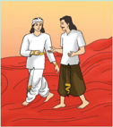

> **Deskripsi Visual:** Gambar ini adalah ilustrasi yang menunjukkan dua orang pria berbicara di sebuah ruangan. Pria di sebelah kiri mengenakan pakaian tradisional Asia Timur, termasuk jubah putih dengan lengan panjang dan celana pendek, sementara pria di sebelah kanan mengenakan pakaian modern, termasuk jaket hitam dan celana pendek. Kedua pria tampak senang dan sedang berbicara, menunjukkan hubungan baik antara mereka. Ruangan mereka tampak sederhana dengan dinding merah dan lantai kayu, menciptakan suasana hangat dan nyaman. Gambar ini mungkin digunakan untuk membantu pembaca memahami konsep sosial atau budaya dalam konteks pelajaran.

Sementara  perjalanan  menuju  surga,  datang Rsi Gana  dan Rsi Narada untuk menemani Yudhistira menuju surga. Hyang Indra pun tak henti  memuji-muji budi pekerti  Yudhistira  sebagai  manusia  sempurna Sadhu gunawan. Yudhistira berterimakasih dan menghormat kemudian menanyakan  di  mana  posisi  istri dan  saudara-saudaranya?  Hyang Indra  mengatakan  bahwa  ia  tak  seharusnya  memikirkan  mereka  lagi, karena mereka telah memetik Karma Sadhu gunawan hasil perbuatan mereka  sendiri.  Sesampainya  di  Surga,  Yudistira  bertemu  dengan  100 Kaurawa, yaitu Duryodana dan saudaranya. Yudistira terkejut, kemudian meminta kepada Hyang Indra untuk membawanya menemui istri dan

 

---
## 📄 Halaman 94

saudaranya, dimanapun berada. Yudistira tidak bersedia berada di surga tanpa  ditemani  istri dan  saudara-saudaranya.  Kemudian  Hyang  Indra membawa Yudistira menuju neraka. Disanalah Yudistira menemukan istri dan keempat saudaranya. Meskipun dalam penderitaan, Yudistira merasa bahagia  karena  dapat  bertemu  mereka  kembali.  Terjadi  dialog  singkat antara Yudistira dan Hyang Dharma, mengapa istri dan saudaranya yang senantiasa berjalan di jalan kebaikan justru berada di neraka. Sementara sepupunya  yang  sering  kali  menciptakan  masalah  dan  penderitaan, berada di surga. Hyang Dharma menjelaskan bahwa, seburuk-buruknya perbuatan  mereka,  mereka  pernah  berbuat  kebaikan  dan  kebajikan, sehingga mereka juga memiliki hak untuk menikmati surga. Demikian halnya dengan kalian para Pandawa bersama Draupadi, sebaik-baiknya kalian  hidup  di  bumi,  kalian  masih  menyimpan  sedikit  ketidakbenaran dalam  hidup,  sehingga  kalianpun  harus  menikmati  neraka.  Kemudian Yudistira menjawab, meski dimanapun kami berada, yang penting kami bisa bersama, semua akan kami lalui secara bersama-sama dalam kasih sayang  satu  sama  lain.  Keteguhan  hati  Yudistira  ini  membuat  Hyang Dharma terkesan, sesaat kemudian pemandangan neraka berubah menjadi surga. Pandawa dan Draupadi kini berada di surga.

Berdasarkan cerita di atas, coba tuliskan poin-poin penting dari cerita tersebut pada kolom di bawah ini! Pertanyaan berikut dapat memandu kalian untuk menemukan poin-poin pentingnya!

- Siapakah nama tokoh utama dari cerita tersebut?
- Apa yang dilakukan oleh tokoh utama dalam cerita tersebut?
- Apakah hubungan cerita tersebut dengan materi Mokṣa ?
.......................................................................................................................................

.......................................................................................................................................

.......................................................................................................................................

.......................................................................................................................................

 

---
## 📄 Halaman 95

.......................................................................................................................................

.......................................................................................................................................

.......................................................................................................................................

Pembelajaran ini terdiri dari beberapa bagian, untuk mempermudah pemahaman kalian, perhatikan peta konsep berikut ini!

---
**🖼️ Gambar/Diagram**

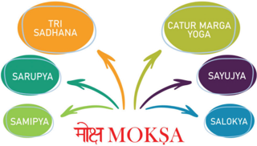

> **Deskripsi Visual:** Gambar ini adalah diagram yang menunjukkan konsep kiasan tentang Moksha dalam konteks Tri Sadhana dan Catur Marga Yoga. Diagram ini terdiri dari beberapa elemen utama:

1. **Tri Sadhana** (Tiga Sadhana) terletak di bagian atas, masing-masing dengan label "Sarupya", "Samipya", dan "Sayujya". Ini menunjukkan tiga bentuk sadhana yang berbeda.

2. **Catur Marga Yoga** (Empat Jalur Yoga) terletak di bagian bawah, masing-masing dengan label "Salokyaya" dan "Sayujya". Ini menunjukkan empat jalur yoga yang berbeda.

3. **Moksha** (Pembebasan) terletak di tengah, menghubungkan semua elemen lainnya melalui tiga garis besar yang mengarah ke Moksha. Ini menunjukkan hubungan antara sadhana dan jalur yoga dalam mencapai pembebasan.

4. **Angka** tidak ada dalam gambar ini.

5. **Teks** hanya ada pada elemen-elemen utama dan tidak ada teks tambahan.

Informasi kunci yang dapat diambil pembaca adalah bahwa Moksha adalah tujuan akhir dalam praktik Tri Sadhana dan Catur Marga Yoga, dan bahwa sadhana dan jalur yoga memiliki hubungan yang kuat dalam mencapai pembebasan.

Kata Kunci: Mokṣa, Samipya, Sarupya, Salokya, Sayujya, Mukti, Jiwanmukti, Adi Mokṣa, Parama Mokṣa, Videha Mukti, Purna Mukti, Catur Marga Yogā, Tri Sadhana.

Pada Bab ini, kalian akan mempelajari pengertian Mokṣa , dengan memperoleh pemahaman  tentang Mokṣa ,  kemudian  kalian  akan  mengerti  tingkatan Mokṣa tersebut yang dapat dicapai melalui Tri Sadhana ataupun Catur Marga Yogā.

### A.  Pengertian Mokṣa

Mokṣa adalah salah satu sraddha dalam agama Hindu. Hal ini merupakan tujuan hidup tertinggi dari umat Hindu. Kebahagiaan yang sejati ini baru akan dapat tercapai oleh seseorang bila ia telah dapat menyatukan jiwanya dengan Tuhan. Penyatuan dengan Tuhan itu baru akan didapat bila ia telah melepaskan semua bentuk ikatan keduniawian  pada  dirinya.  Keterikatan  yang  melekat  pada  diri  kita  itulah  yang dinamakan maya atau  kepalsuan. Maya dalam  agama  Hindu  juga  dinamakan

 

---
## 📄 Halaman 96

sakti,  prakrti,  kekuatan, dan pradhana . Maya selalu  mengalami  perubahan  yang pada hakikatnya tidak ada. Keberadaannya semata-mata disebabkan oleh adanya hubungan indriya dengan obyek duniawi ini.

Mokṣa adalah alamnya Brahman yang  sangat  gaib  dan  berada  di  luar  batas pikiran  umat  manusia.  Mokṣa  bersifat nirguna .  Tidak  ada  bahasa  manusia  yang dapat  menjelaskan  bagaimana  sesungguhnya  alam Mokṣa itu.  Dia  hanya  dapat dirasakan oleh orang yang dapat mencapainya. Alam Mokṣa bukan sesuatu yang bersifat khayal, tetapi suatu yang benar-benar ada, karena demikian dikatakan oleh ajaran kebenaran (agama).

---
**🖼️ Gambar/Diagram**

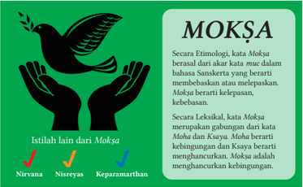

> **Deskripsi Visual:** Gambar ini adalah ilustrasi yang menunjukkan definisi dan etimologi dari kata "Moksha" dalam konteks bahasa Melayu. Gambar tersebut terdiri dari dua bagian utama:

1. Bagian kiri: Menggambarkan tangan yang membuka kupu-kupu, yang kemungkinan merupakan simbol kebebasan atau keluar dari keterikatan.
2. Bagian kanan: Menampilkan teks yang menjelaskan etimologi kata "Moksha". Teks tersebut dibagi menjadi dua bagian:
   - Atas: "Secara Etimologi, kata Moksha berasal dari akar kata mue dalam bahasa Sanskerta yang berarti membebaskan atau melepaskan."
   - Bawah: "Secara Istimewa, kata Moksha merupakan gabungan dari kata Moha dan Kuaya. Moha berarti kebingungan dan Kuaya berarti menghancurkan. Moksha adalah menghancurkan kebingungan."

Informasi kunci yang dapat diambil pembaca melalui gambar ini adalah bahwa "Moksha" memiliki makna yang mendalam dalam konteks spiritual dan etimologis, dengan arti membebaskan diri dari kebingungan dan menghancurkan keadaan yang tidak nyaman.

Mokṣa adalah terlepasnya Atman dari ikatan maya , sehingga menyatu dengan Brahman .  Bagi orang yang telah mencapai Mokṣa berarti mereka telah mencapai alam Sat cit ananda. Sat cit ananda berarti kebahagiaan yang tertinggi.

Berikut ini disajikan diagram pohon yang memuat sumber-sumber Śloka yang menjelaskan  tentang Mokṣa .  Cobalah  temukan  isi Śloka tersebut,  uraikan  pula pemahaman kalian mengenai Śloka tersebut pada tabel di bawahnya.

 

---
## 📄 Halaman 97

---
**🖼️ Gambar/Diagram**

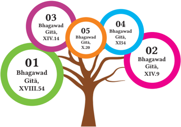

> **Deskripsi Visual:** Gambar ini adalah diagram yang menunjukkan beberapa ayat dari Bhagavad Gita. Diagram ini terdiri dari tiga pohon besar yang mewakili tiga ayat dari Bhagavad Gita. Setiap pohon memiliki daun berwarna-warni dengan teks yang menunjukkan ayat-ayat tersebut. Daun-daun tersebut terhubung oleh cabang-cabang yang menggambarkan hubungan antara ayat-ayat tersebut.

Elemen utama dalam gambar ini adalah tiga pohon besar yang mewakili tiga ayat dari Bhagavad Gita. Setiap pohon memiliki daun berwarna-warni dengan teks yang menunjukkan ayat-ayat tersebut. Daun-daun tersebut terhubung oleh cabang-cabang yang menggambarkan hubungan antara ayat-ayat tersebut.

Teks penting yang terlihat dalam gambar ini adalah ayat-ayat dari Bhagavad Gita yang ditampilkan pada daun-daun pohon. Angka-angka yang terlihat dalam gambar ini adalah nomor ayat dari Bhagavad Gita yang ditampilkan pada daun-daun pohon.

Informasi kunci yang dapat diambil pembaca dari gambar ini adalah bahwa ada tiga ayat dari Bhagavad Gita yang ditampilkan dalam gambar ini, dan bahwa ada hubungan antara ayat-ayat tersebut.

---
**📊 Tabel**

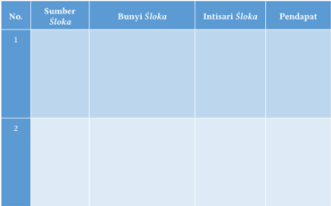

Tabel ini berisi informasi tentang sumber-sumber ayat Al-Qur'an yang diterjemahkan ke dalam bahasa Indonesia. Kolom "Sumber Šloka" menyajikan nama-nama sumber ayat, seperti "Al-Qur'an", "Kitab Suci", dan "Buku". Kolom "Bunyi Šloka" menunjukkan bagian ayat yang diterjemahkan, seperti "Al-Qur'an 1:1-2" dan "Kitab Suci 1:1-2". Kolom "Intisari Šloka" memberikan ringkasan singkat dari ayat tersebut, misalnya "Al-Qur'an 1:1-2 mengatakan tentang keajaiban Allah". Kolom "Pendapat" mungkin menyajikan pendapat atau analisis lebih lanjut tentang ayat tersebut. Topik utama tabel ini adalah analisis dan interpretasi ayat-ayat Al-Qur'an dalam konteks bahasa Indonesia.

 

---
## 📄 Halaman 98

---
**📊 Tabel**

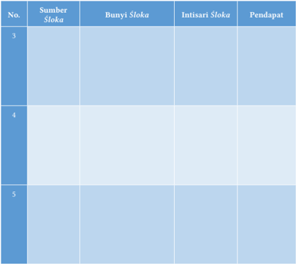

Tabel ini berisi informasi tentang sumber-sumber ayat-ayat suci (sloka) dalam sebuah buku pelajaran. Topik utamanya adalah tentang analisis dan interpretasi ayat-ayat suci. Kolom-kolom yang ada meliputi: No., Sumber Sloka, Bunyi Sloka, Intisari Sloka, dan Pendapat. Data penting yang terlihat adalah bahwa tabel ini mungkin digunakan untuk membantu pembaca memahami dan mempelajari ayat-ayat suci dengan lebih baik.

### B.  Jenis-Jenis Mokṣa

Tujuan utama hidup manusia adalah untuk menyadari dirinya yang sejati. Setelah orang  menyadari  dirinya  yang  sejati  barulah  ia  dapat  menyadari  Tuhan  yang meresap dan berada pada semua yang ada di alam semesta ini. Dalam kehidupan nyata di dunia ini masih sangatlah sedikit jumlah orang yang ingin mendapatkan kebahagiaan rohani ' Mokṣa ', kebanyakan di antara mereka hanyut oleh kenikmatan duniawi yang penuh dengan gelombang suka dan duka. Sebagaimana disebutkan dalam Brahma Purāṇa , 228.45 bahwa tubuh ini adalah suatu alat untuk mendapatkan Mokṣa . Mokṣanam sariram sadhanam yang artinya bahwa tubuh ini adalah sebagai alat untuk mencapai Mokṣa . Dengan demikian peliharalah tubuh ini sebaik-baiknya dan gunakan untuk mencapai kesempurnaan. Disebutkan ada beberapa jenis Mokṣa yang diajarkan dalam ajaran agama Hindu di antaranya dapat dilihat pada diagram pohon berikut ini!

 

---
## 📄 Halaman 99

---
**🖼️ Gambar/Diagram**

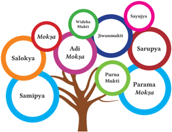

> **Deskripsi Visual:** Gambar ini adalah ilustrasi yang menunjukkan konsep Moksha dalam budaya Hindu. Gambar ini menggambarkan sebuah pohon dengan berbagai cabang yang mewakili berbagai tingkatan atau bentuk Moksha. Pohon tersebut memiliki beberapa cabang utama yang masing-masing mewakili tingkat Moksha yang berbeda:

1. **Pertama**: Cabang utama pertama diberi nama "Moksha" dan "Adi Moksha". Ini mungkin merujuk pada Moksha dasar atau Moksha yang paling dasar dalam konsep ini.

2. **Kedua**: Cabang kedua diberi nama "Salokya", "Samipya", dan "Widdeha Mukti". Ini mungkin merujuk pada tingkat Moksha yang lebih rendah atau lebih sederhana.

3. **Tiga**: Cabang ketiga diberi nama "Parama Moksha". Ini mungkin merujuk pada tingkat Moksha yang paling tinggi atau paling kompleks.

4. **Keempat**: Cabang keempat diberi nama "Sarupya", "Parama Moksha", dan "Jiwanmukti". Ini mungkin merujuk pada tingkat Moksha yang lebih tinggi dan lebih kompleks.

5. **Kelima**: Cabang kelima diberi nama "Parma Moksha" dan "Sarupya". Ini mungkin merujuk pada tingkat Moksha yang paling tinggi dan paling kompleks.

6. **Keenam**: Cabang keenam diberi nama "Sarupya" dan "Parama Moksha". Ini mungkin merujuk pada tingkat Moksha yang paling tinggi dan paling kompleks.

7. **Ketujuh**: Cabang ketujuh diberi nama "Sarupya" dan "Parama Moksha". Ini mungkin merujuk pada tingkat Moksha yang paling tinggi dan paling kompleks.

8. **Kedelapan**: Cabang kedelapan diberi nama "Sarupya" dan "Parama Moksha". Ini mungkin merujuk pada tingkat Moksha yang paling tinggi dan paling kompleks.

9. **Keen

Jenis Mokṣa berdasarkan keadaan Atman :

- Jiwamukti adalah Mokṣa atau kebahagiaan/kebebasan yang dapat dicapai oleh seseorang semasa hidupnya, dimana Atman tidak lagi terpengaruh oleh gejolak indrya dan maya.
- Widehamukti adalah  tingkat  kebebasan  yang  dapat  dicapai  oleh  seseorang semasa  hidupnya,  dimana Atman telah  meninggalkan  badan  wadagnya (jasadnya),  tetapi  roh  yang  bersangkutan  masih  kena  pengaruh  maya  yang tipis.
- Purnamukti adalah tingkat kebebasan yang paling sempurna. Pada tingkatan ini posisi Atman seseorang keberadaannya telah menyatu dengan Brahman .
Sementara  sumber  lain  menyebutkan  bahwa Mokṣa berdasarkan  keadaan Atman terbagi menjadi 4 jenis yaitu:

- Samipya adalah suatu kebebasan yang dapat dicapai oleh seseorang semasa hidupnya di dunia ini. Hal ini dapat dilakukan oleh para Yogi dan oleh para Maharsi .
- Sarupya ( Sadharmya )  adalah  suatu  kebebasan  yang  didapat  oleh  seseorang di  dunia  ini,  karena  kelahirannya,  dimana  kedudukan Atman merupakan pancaran dari kemahakuasaan Tuhan, seperti halnya Sri Rama Buddha dan Sri Kresna. Walaupun Atman telah mengambil suatu perwujudan tertentu, namun ia tidak terikat oleh segala sesuatu yang ada di dunia ini.

 

---
## 📄 Halaman 100

- Salokya adalah  suatu  kebebasan  yang  dapat  dicapai  oleh Atman ,  di  mana Atman itu sendiri telah berada dalam posisi dan kesadaran yang sama dengan Tuhan.  Dalam  keadaan  seperti  itu  dapat  dikatakan Atman telah  mencapai tingkatan Dewa yang merupakan manifestasi dari Tuhan itu sendiri.
- Sayujya adalah suatu tingkat kebebasan yang tertinggi di mana Atman telah dapat bersatu dengan Tuhan Yang Esa. Dalam keadaan seperti inilah sebutan Brahman Atman Aikyam yang  artinya Atman dan Brahman sesungguhnya tunggal.
Dalam hubungan untuk mewujudkan suatu kebebasan dalam hidup ini sangat baik kita merenungkan dan mengamalkan Śloka berikut:

### श्री भगवाि ्  उवाच

Śrī bhagavān uvāca

### अक्षरं ब्रह्म परमं स्वभावो ध्ात्मम ्  उच्यिे

Akṣaraṁ brahma paramaṁ svabhāvo dhyātmam ucyate भूि भावोद्भवकरो नवसग्मः कम्मसंनञििः

Bhūta bhāvodbhavakaro visargaḥ karmasaṁjñitaḥ

Terjemahan

Sri Bhagawan berkata:

Brahman (Tuhan)  adalah  yang  kekal,  yang  maha  tinggi  dan  adanya  di dalam  tiap-tiap  badan  perseorangan  disebut Adhyātman .  Karma  adalah nama yang diberikan kepada kekuatan cipta yang menjadikan makhluk hidup. (Radhakrishnan, 2010)

Bhagavadgītā VIII. 3

Orang yang telah mencapai jivamukti dalam hidupnya tidak lagi terikat pada gelombang  kehidupan  di  dunia  ini.  Baginya  bekerja  adalah  sebagai  pemujaan kepada  Tuhan  dan  semua  hasilnya  diserahkan  kepada  Tuhan.  Mereka  memiliki pandangan yang sama terhadap keberhasilan dan kegagalan, terhadap suka dan duka, memiliki sifat cinta kasih terhadap semua yang ada di dunia ini.

 

---
## 📄 Halaman 101

Guna memantapkan pemahaman kalian mengenai Mokṣa , cobalah buat presentasi mengenai topik yang dimuat pada diagram awan berikut ini. Kaitkan setiap topik dengan materi Mokṣa . Temukan bacaan pada sumber dan literatur-literatur kredibel seperti  buku  atau  jurnal  penelitian.  Kalian  juga  dapat  membuat  presentasinya secara berkelompok.

---
**🖼️ Gambar/Diagram**

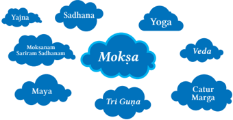

> **Deskripsi Visual:** Gambar ini adalah diagram yang menunjukkan hubungan antara berbagai konsep dalam filsafat Hindu, dengan fokus pada konsep Moksha. Gambar ini terdiri dari beberapa elemen utama yang terhubung melalui ikatan visual:

1. **Apa yang Ditampilkan Secara Keseluruhan**: Gambar ini menggambarkan hubungan antara berbagai konsep filosofis dalam tradisi Hindu, dengan fokus pada Moksha sebagai titik pusat.

2. **Elemen-Elemen Utama dan Relasinya**: 
   - **Moksha** adalah titik pusat yang menghubungkan semua konsep lainnya.
   - **Yoga**, **Veda**, dan **Catur Marga** adalah konsep-konsep yang terkait erat dengan Moksha.
   - **Sadhana**, **Sariram Sadhanaan**, dan **Maya** juga terkait erat dengan Moksha.
   - **Tri Guṇa** (Tiga Kualitas) adalah elemen penting yang membantu dalam pemahaman tentang Moksha.

3. **Teks, Angka, atau Label Penting yang Terlihat**: 
   - **Moksha** adalah teks besar yang berada di tengah.
   - **Yoga**, **Veda**, **Catur Marga**, **Sadhana**, **Sariram Sadhanaan**, dan **Maya** adalah teks yang terletak di sekeliling Moksha.
   - **Tri Guṇa** adalah teks yang terletak di bawah Moksha.

4. **Informasi Kunci yang Dapat Diambil Pembaca**: 
   - Gambar ini menunjukkan bahwa Moksha adalah titik pusat dalam filsafat Hindu.
   - Yoga, Veda, Catur Marga, Sadhana, Sariram Sadhanaan, dan Maya semua terkait erat dengan Moksha.
   - Tri Guṇa adalah elemen penting dalam pemahaman tentang Moksha.

Dengan demikian, gambar ini memberikan gambaran umum tentang hubungan antara berbagai konsep filosofis dalam tradisi Hindu, dengan fokus pada Moksha sebagai titik pusat.

### C.  Jalan Mencapai Mokṣa

---
**🖼️ Gambar/Diagram**

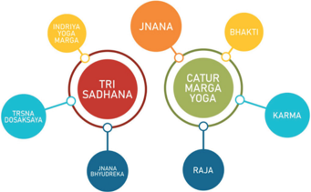

> **Deskripsi Visual:** Gambar ini adalah diagram yang menunjukkan struktur dasar dari Tri Sadhana dalam Catur Marga Yoga. Diagram ini terdiri dari tiga lingkaran utama yang saling terhubung, masing-masing menunjukkan salah satu dari tiga prinsip utama dalam yoga tersebut. Lingkaran pertama, berwarna merah, menunjukkan Tri Sadhana sebagai pusat dari semua prinsip. Lingkaran kedua, berwarna hijau, menunjukkan Catur Marga Yoga, yang meliputi Bhakti, Karma, Raja, dan Jnana. Lingkaran ketiga, berwarna biru, menunjukkan Trisna Dosaksana, yang merupakan bagian dari Jnana Bhuddedeka. Setiap prinsip memiliki label yang menjelaskan apa itu, seperti Bhakti untuk kecintaan, Karma untuk kebijaksanaan, dan Raja untuk kekuatan. Informasi kunci yang dapat diambil pembaca adalah bahwa Tri Sadhana adalah pusat dari semua prinsip dalam Catur Marga Yoga, yang meliputi empat prinsip utama: Bhakti, Karma, Raja, dan Jnana.

 

---
## 📄 Halaman 102

Jalan  mencapai Mokṣa yang  dapat  di  tempuh  di  antaranya Tri  Sadhana dan Catur Marga Yogā .

### 1. Tri Sadhana

Dalam Vṛhaspati  Tattva, 52  menjelaskan  bahwa  ada  tiga  bagian  penting  yang merupakan jalan untuk mencapai Kelepasan/ Mokṣa yang disebut dengan istilah Tri Sadhana.

### Terjemahan

Śiva bersabda

Mokṣa, pembebasan atau kebebasan diperoleh, diwujudkan dengan menjalani tiga hal dalam laku spiritual;

Jñāna-bhyudreka atau Mengetahui Sifat dari Realitas (Pengetahuan Sejati), Indriyāyoga-mārga atau Melepaskan diri dari indra dan objek Indra (ketidakterikatan), dan Tṛṣṇādoṣakṣaya atau Mengeliminasi dampak dari nafsu (Pembersihan dan Pengendalian Diri) Vṛhaspati Tattva, 52

### ञिािाभ्ु द्ेक ि मोक्ष इन्रिय योग मार््मनप ि ् ऋ्ष्णदोषक्षयश्ेव प्रप्यिे कारण त्रयं

Jñānābhyudreka ta mokṣa indriya yoga mārddhapi Tṛṣṇadoṣakṣayaśceva prāpyate kāraṇa trayam

### a. Jñāna Bhyudreka

Bijaksana  terhadap  ajaran  Filsafat  ( Tattva ),  mengerti  inti  sari  ajaran  penyatuan antara Atman dengan Brahman , mengerti asal, dasar serta tujuan hidup ini, memiliki ilmu pengetahuan yang luas dan dalam untuk mencapai kesempurnaan.

### b. Indriyāyoga Mārga

Jalan  pengendalian indriya (keinginan, kehendak, nafsu); maksudnya ialah tidak mengikatkan indriya (keinginan) kita pada objek-objek indriya yang disebut Visaya , harus dilatih benar-benar, Daśa Indriya kita masing-masing supaya tidak terikat pada obyeknya. Kalau kita bandingkan indriya itu dengan seekor kuda, maka tali kekang itu adalah tali indriya supaya kuda tidak liar maka tali harus dikendalikan, demikianlah hendaknya kita pegang tali indriya untuk dikendalikan ke jalan yang akan dituju.

### c. Tṛṣṇādoṣakṣaya

Melenyapkan  dosa-dosa  serta  cinta  kasih  maupun  kasih  sayang  yang  melekat pada  batin,  dengan  jalan  mengendalikan  indriya,  serta  memperkuat  kesadaran terhadap  kebenaran  yang  mutlak  (Tuhan),  tidak  mengikatkan  diri  kita  terhadap pahala dari Śubha Aśubha Karma atau  baik  buruknya  perbuatan. Seperti halnya

 

---
## 📄 Halaman 103

suatu  jala,  dimana  pusat  (pusar)  nya  sudah  kita  pegang,  maka  kalau  kita  tarik jala itu, seluruh mata jala dengan batu jala, akan menuju ke pusat, demikian pula Jñāna (kebijaksanaan ilmu pengetahuan), merupakan pusat dari pada Tri Sadhana tersebut. Śloka Bhāgawad Gītā berikut ini akan memperkuat keyakinan kita pada Mokṣa. Bacalah Śloka berikut ini!

्

### बहूिां जन्मिाम ्  अन्े ञिािवाि मां प्रपद्यिे

Bahūnām janmanām ante jñānavān māṁ prapadyate

्

वासु देवः सव्मम इनि स महात्मा स ु दुल्मभः

Vāsudevaḥ sarvam iti sa mahātmā sudurlabhaḥ

### 2. Catur Marga Yogā

---
**🖼️ Gambar/Diagram**

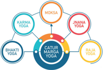

> **Deskripsi Visual:** Gambar ini adalah diagram yang menunjukkan hubungan antara berbagai jenis yoga dalam konteks Catur Marga Yoga. Diagram ini terdiri dari empat cabang utama yang masing-masing menggambarkan jenis yoga yang berbeda:

1. **Karna Yoga** - Ini adalah cabang utama yang melibatkan praktik kehidupan sehari-hari dan pengembangan diri melalui pengalaman nyata.
2. **Moksa Yoga** - Cabang ini fokus pada pengetahuan spiritual dan pencapaian kebebasan dari ketaatan.
3. **Jnana Yoga** - Cabang ini menekankan pengetahuan dan pemahaman tentang kebenaran dan realitas.
4. **Raja Yoga** - Cabang ini mengacu pada pengendalian dan kontrol diri, serta pengetahuan tentang diri sendiri.

Setiap cabang ini memiliki ikatan dengan cabang utama lainnya, menunjukkan hubungan dan interaksi antara mereka dalam konteks Catur Marga Yoga. Teks, angka, atau label penting yang terlihat dalam diagram ini adalah nama-nama cabang yoga tersebut, yang membantu pembaca memahami struktur dan hubungan antar cabang.

Informasi kunci yang dapat diambil pembaca dari gambar ini adalah bahwa Catur Marga Yoga merupakan konsep yang mencakup berbagai jenis yoga, setiap cabang memiliki tujuan dan cara yang berbeda untuk mencapai kebebasan dan pengetahuan spiritual.

### a. Bhakti Marga Yogā

Bhakti Marga Yogā adalah cara mempersatukan Atman dengan Brahman dengan berlandaskan atas dasar cinta kasih yang mendalam kepada Hyang Widhi Wasa . Cinta kasih ini dapat dipupuk dengan menerapkan ajaran Catur Paramitha yaitu Maitri, Karuna, Mudita dan Upeksa, serta ajaran Tat Twam Asi.

### b. Karma Marga Yogā

Karma Yogā adalah jalan atau usaha untuk mencapai kesempurnaan atau Mokṣa dengan perbuatan atau kebajikan tanpa pamrih. Hal yang paling utama dari Karma Yogā ialah melepaskan semua hasil dari segala perbuatan. Dalam Bhāgawad Gītā tentang Karma Yogā dinyatakan sebagai berikut:

### Terjemahan

Pada akhir dari banyak kelahiran orang yang bijaksana menuju kepada Aku, karena mengetahui bahwa Tuhan adalah semuanya yang ada.

( Bhāgawad Gītā VII. 19) (Radhakrishnan, 2010)

 

---
## 📄 Halaman 104

### िस्ाद ्  असक्ः सििं कायथं कम्म समाचर

Tasmād asaktaḥ satataṁ kāryaṁ karma samācara

असक्ो ह् ्  आचरि ्  कम्म परम ् आप्ोनि पूरुषः

Asakto hy ācaran karma param āpnoti pūruṣaḥ

Bacalah cerita singkat berikut ini!

### Sayembara Dewi Laksmi

Pada  suatu  hari  Dewi  Laksmi  mengadakan  sayembara,  Ia  akan  memilih  suami. Semua Dewa dan  para  Danawa  datang  berduyun-duyun  dengan  harapan  yang membumbung tinggi. Pada saat acara akan dimulai, Dewi Laksmi mengumumkan bahwa  Ia  akan  mengalungkan  bunga  kepada  pria  yang  tidak  menginginkan dirinya. Perlahan Dewi Laksmi berjalan dan mencari orang yang tidak memiliki berkeinginan untuk dikalungi. Perlahan Dewi Laksmi melihat wujud Dewa Wisnu dengan tenangnya di atas ular Sesa yang sedang melingkar. Kalung bunga sebagai tanda perkawinan dikalungkan di leher Dewa Wisnu .  Dewi  Laksmi  datang  pada orang yang tidak mengidam-idamkan dirinya, inilah suatu keajaiban.

### c. Jñāna Mārga Yoga

Jñana artinya kebijaksanaan filsafat (pengetahuan). Jñāna Yogā artinya mempersatukan jiwātman dengan paramatman dengan  jalan  mempelajari  ilmu pengetahuan dan filsafat pembebasan diri dari ikatan-ikatan keduniawian. Tiada ikatan yang lebih kuat dari pada maya , dan tiada kekuatan yang lebih ampuh dari pada Yogā untuk membasmi ikatan-ikatan maya itu.

Terdapat tiga hal yang penting dalam pelaksanaan Jñana Marga Yoga yaitu kebulatan  pikiran,  pembatasan  pada  kehidupan  sendiri  dan  keadaan  jiwa  yang seimbang atau tenang maupun pandangan yang kokoh, tentram, dan damai. Ketiga hal ini disebut dhyana Yogā . Untuk tercapainya perlu dibantu dengan abhyasa yaitu latihan-latihan dan vairagya yaitu keadaan tidak mengaktifkan diri.

### Terjemahan

Laksanakanlah segala kerja sebagai kewajiban tanpa terikat pada hasilnya, sebab dengan melakukan kegiatan kerja yang bebas dari keterikatan, orang itu sesungguhnya akan mencapai yang utama.

Bhāgawad Gītā III. 19

 

---
## 📄 Halaman 105

### d. Raja Marga Yogā

Raja Marga Yogā merupakan suatu jalan rohani untuk mencapai Mokṣa .  Adapun jalan yang ditempuh yaitu dengan melakukan tapa, brata , Yogā , dan samadhi . Tapa dan brata merupakan suatu latihan untuk mengendalikan diri, Sedangkan Yogā dan Samādhi adalah latihan untuk dapat menyatukan Atman dengan Brahman . Seorang Yogin mempraktikkan Aṣṭangga Yogā yaitu delapan tahapan Yogā untuk mencapai Mokṣa. Aṣṭanga Yogā diajarkan oleh Maha Rsi Patañjali dalam bukunya yang disebut Yogā Sūtra Patañjali (Krishna, Yoga Sutra Patañjali Bagi Orang Modern, 2015).

Adapun  bagian-bagian  dari  ajaran Aṣṭangga Yogā yang  dimaksud  adalah sebagai berikut:

---
**🖼️ Gambar/Diagram**

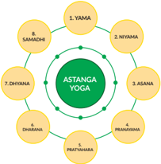

> **Deskripsi Visual:** Gambar ini adalah diagram yang menunjukkan struktur dasar dari Astanga Yoga, sebuah gaya yoga tradisional India. Diagram ini menggambarkan tujuh prinsip utama yang membentuk dasar dari praktek yoga ini. Setiap prinsip disimbolkan oleh simbol berbeda dan dikelompokkan dalam tiga kelompok utama: Yama (prinsip-prinsip moral), Niyama (prinsip-prinsip kehidupan), dan Asana (posisi tubuh). 

Elemen-elemen utama yang ditampilkan meliputi: 1. YAMA, 2. Niyama, 3. Asana, 4. Pranayama, 5. Dhyana, 6. Pratyahara, dan 7. Samadhi. Setiap elemen ini memiliki hubungan dengan elemen lainnya dalam skema yang komprehensif, menunjukkan bagaimana setiap prinsip mempengaruhi dan mendukung prinsip lainnya.

Teks, angka, atau label penting yang terlihat mencakup nama-nama prinsip utama yang disebutkan dalam diagram tersebut. Informasi kunci yang dapat diambil pembaca meliputi bahwa Astanga Yoga adalah gaya yoga yang melibatkan berbagai aspek, termasuk prinsip moral, kehidupan, dan posisi tubuh, serta teknik meditasi dan pengaturan napas.

Dengan demikian, gambar ini memberikan gambaran umum tentang struktur dan prinsip-prinsip dasar dari Astanga Yoga, yang merupakan panduan utama bagi para praktisi yoga untuk memahami dan mengimplementasikan prinsip-prinsip ini dalam praktik mereka.

- Yama ,  yaitu suatu bentuk larangan atau pengendalian diri yang harus dilakukan oleh seorang dari segi jasmani, misalnya dilarang membunuh ( ahimsa ), jujur ( satya ),  pantang  menginginkan  sesuatu  yang  bukan  miliknya  ( asteya ),  tidak melakukan seks bebas dan tekun belajar mencari pengetahuan ( Brahma cari), dan hidup sederhana ( aparigraha ) hal ini diuraikan dalam Yogā Sūtra Patañjali II:35 - 39. (Bryant, 2013)
- Nyama ,  yaitu  pengendalian  diri  tingkat  rohani  dan  sebagai  penyokong  dari pantangan  dasar sebelumnya  diuraikan  dalam Patañjali  Yogā  Sūtra II:4045 yang terdiri dari Sauca (tetap  suci  lahir  batin), Santosa (puas dengan apa yang dimiliki), Tapa (pengekangan diri), Svadhyaya (mempelajari kitab-kitab keagamaan),  dan Iswara pranidhana (selalu  bakti  kepada  Tuhan)  (Krishna, 2015).

 

---
## 📄 Halaman 106

- Āsana , yaitu sikap duduk yang menyenangkan, teratur, dan disiplin ( Silāsana , padmāsana, bajrāsana , dan sukhāsana ).
- Prānāyāmā , yaitu  olah  pernapasan, puraka (menarik  napas), kumbhaka (menahan napas), dan recaka (mengeluarkan napas).
- Pratyahara , yaitu pengendalian indria.
- Dharana , yaitu usaha-usaha untuk menyatukan pikiran dengan sasaran yang diinginkan.
- Dhyana yaitu  pemusatan  pikiran  yang  tenang,  tidak  tergoyahkan  kepada suatu objek. Dhyana ini dapat dilakukan terhadap salah satu Ista Dewa ta yang diinginkan.
- Samadhi yaitu  penyatuan Atman (sang  diri  sejati)  dengan Brahman .  Bila seseorang  melakukan  latihan Yogā dengan teratur  dan  sungguh-sungguh ia akan dapat menerima getaran-getaran suci dan wahyu Tuhan. Menurut  Kitab Hatha  Yogā  Pradīpikā (Muktibodhananda,  2006)  berikut  ini disajikan tahapan untuk mencapai Mokṣa sebagai berikut:

---
**🖼️ Gambar/Diagram**

> **Deskripsi Visual:** Gambar ini adalah diagram yang menunjukkan struktur dari Nirvikalpa, Mohzat, Kebebasan, dan Realitas Kesadaran Murni. Diagram ini dibagi menjadi dua bagian utama: Nirvikalpa dan Savichara. Nirvikalpa terdiri dari empat tingkatan utama, yaitu Dharmaamaghe, Lepayuran, Ananda, dan Nirvitaraka. Setiap tingkatan ini memiliki sub-tingkatan yang lebih lanjut, seperti Nibbhu-Samadhi, Nirbijita, dan Savitarka.

Elemen utama dalam diagram ini adalah tingkatan dan sub-tingkatan dari Nirvikalpa dan Savichara. Relasi antara elemen-elemen ini sangat jelas, dengan sub-tingkatan yang lebih lanjut berada di bawah tingkatan utama mereka masing-masing. Teks, angka, atau label penting yang terlihat meliputi nama-nama tingkatan dan sub-tingkatan, serta penjelasan singkat tentang apa yang dimaksud oleh setiap tingkatan.

Informasi kunci yang dapat diambil pembaca meliputi struktur dan hierarki dari Nirvikalpa dan Savichara, serta penjelasan singkat tentang apa yang dimaksud oleh setiap tingkatan dan sub-tingkatan. Diagram ini memberikan gambaran yang jelas tentang struktur dari Nirvikalpa dan Savichara, serta bagaimana relasi antara tingkatan dan sub-tingkatan tersebut.

 

---
## 📄 Halaman 107

### योगरी यु ञ्रीि सििम ्  आत्मािं रहनस नथििः

Yogī yuñjīta satatam ātmānaṁ rahasi sthitaḥ

एकाकरी यि नचत्ात्मा निराशरीर ्  अपनरग्रहः

Ekākī yata-cittātmā nirāśīr aparigrahaḥ

### Terjemahan

Seorang Yogi harus tetap memusatkan pikirannya (kepada Atman yang maha besar) tinggal dalam kesunyian dan tersendiri, menguasai dirinya sendiri, bebas dari angan-angan, dan keinginan untuk memiliki. (Bhāgawad Gītā, VI.10) (Radhakrishnan, 2010)

### D.  Penerapan Ajaran Mokṣa dalam Kehidupan

### 1. Mokṣa dan Keluarga

Pencapaian Mokṣa bersifat individu, namun demikian, kita perlu memperhatikan jagadhita atau kebahagiaan jagat raya ini termasuk unsur terkecilnya. Komponen terkecil dari masyarakat adalah keluarga, untuk memahami ini, kita akan membaca cerita sang Garuda.

### Garuda Membebaskan Keluarganya dari Perbudakan

Hiduplah  seorang Rsi bernama  Kasyapa.  Ia  memiliki  dua  istri yaitu  Kadru  dan Winata. Meski keduanya bersaudara, mereka saling cemburu. Rsi Kasyapa merasa senang  atas  pelayanan  kedua  istrinya,  lalu  berniat  akan  memberi  'hadiah' kepada keduanya. 'Mintalah sesuatu dariku' kata Rsi Kasyapa. Kadru menjawab 'Anugrahilah aku ribuan anak laki-laki yang berani dan bersinar'. Kemudian Rsi Kasyapa memberinya anugerah. Mendengar hal ini, Winata menjadi cemburu dan berkata, 'Anugerahilah aku anak laki-laki yang lebih berani dan lebih cemerlang daripada anak-anak saudara perempuanku.' Kasyapa pun memberinya anugerah.

Beberapa waktu kemudian Kadru melahirkan seribu ular. Winata melahirkan 2 telur besar. Winata menunggu telur itu menetas. Namun, setelah lima ratus tahun, kedua telur itu belum juga menetas, Winata menjadi tidak sabar. Ia memecahkan salah satu telur, sehingga lahirlah burung yang belum sempurna. Burung tersebut menjadi marah dan mengutuk Winata karena ketidaksabarannya. Ia mengatakan bahwa  Winata  akan  menjadi  budak  dan  setelah  lima  ratus  tahun  lamanya, saudara laki-lakinya akan keluar dari telur kedua dan akan membebaskannya dari perbudakan.

Suatu  hari  Winata  dan  Kadru  sedang  bertengkar.  Winata  berkata  bahwa kuda Dewa Uchaishrava sepenuhnya berwarna putih. Kadru mengatakan bahwa tubuhnya  berwarna  putih  tetapi  ekornya  berwarna  hitam.  Mereka  memutuskan

 

---
## 📄 Halaman 108

untuk bertaruh pada masalah ini, siapa pun yang kalah akan menjadi budak. Kadru tahu bahwa ekor kuda itu putih dan dia akan kalah bertaruh, sehingga dia meminta putranya untuk pergi dan melilit pada ekor kuda tersebut sehingga tampak hitam. Tetapi ular tidak mau menjadi bagian dari pertaruhan ini. Kadru sangat marah atas ketidaktaatan  anak-anaknya  dan  mengutuk  mereka  semua  akan  mati  dalam  api Yājña .

Suatu hari Kasyapa bersama putranya, pergi menemui Brahmā untuk meminta bantuan  agar  ular-ular  tersebut  dapat  dibebaskan  dari  kutukan  Ibunya. Brahmā berkata,  'Ular  itu  berbisa  dan  jahat  sehingga  mereka  layak  mati.'  Mendengar perkataan dari Brahmā, Rsi Kasyapa tetap memohon anugrah, akhirnya Brahmā mengabulkan permohonannya dan mengatakan bahwa ular yang baik akan bertahan hidup. Sementara itu, ular-ular yang ketakutan setelah mendengar kutukan ibunya memutuskan untuk mengikuti perintah ibunya. Mereka pergi dan melilit di sekitar ekor  kuda  dan  membuatnya  tampak  hitam.  Winata  kalah  taruhan  dan  menjadi budak Kadru.

Setelah lima ratus tahun, seekor burung besar bernama Garuda muncul dari telur kedua. Burung ini kuat dan bersinar terang. Dia bahkan lebih terang dari api dan cahayanya menyilaukan semua orang. Namun seperti ibunya, ia juga harus menjadi budak Kadru dan anak-anaknya.

Suatu hari, Kadru memerintahkan Garuda untuk mencarikan pulau untuknya dan  putra-putranya. Garuda terbang  bersama  mereka  di  punggungnya  dan menemukan  pulau  yang  indah  di  tengah  lautan.  Namun,  Kadru  dan  ular  tidak menyukai pulau itu. Mereka meminta Garuda untuk membawa mereka ke pulau lain. Garuda kemudian membawa mereka ke pulau lainnya. Tugas ini adalah salah satu dari sekian banyak tugas yang harus dikerjakannya selama menjadi budak.

Garuda merasa muak menjadi pelayan ibu tiri dan saudara tirinya. Dia bertanya kepada  ibunya,  'Mengapa  kita  hidup  seperti  budak?'  Winata  memberitahunya tentang taruhan itu dan bagaimana dia menjadi budak Kadru. Setelah mendengar cerita tersebut, Garuda bertanya kepada ular-ular itu, 'Saya ingin membebaskan diri  saya  dan  ibu  saya  dari  belenggu  kalian.  Apa  yang  harus  saya  lakukan  agar kalian membebaskan kami dari perbudakan ini?.' Ular-ular itu menjawab, 'Kami ingin  kamu  membawakan Amrta untuk  kami  sehingga  kami  dapat  hidup  abadi. Maka kamu dan ibumu akan bebas.'

Garuda memutuskan mencari Amrta tersebut. Ia pergi ke surga dan bertarung dengan  para Dewa yang  menjaga Amrta tersebut. Dewa Indra,  Raja  para Dewa memimpin Para Dewa untuk  bertarung  melawan Garuda . Garuda yang  perkasa,

 

---
## 📄 Halaman 109

melukai mereka dengan cakar dan paruhnya. Setelah membunuh sejumlah besar prajurit, dia akhirnya mendekati tempat Amrta berada. Garuda melihat Amrta yang dikelilingi oleh api yang sangat besar. Garuda membuka mulutnya yang besar dan menelan banyak air sungai dan kemudian memadamkan apinya dengan mudah. Dengan kecepatan tinggi ia mengambil Amrta tersebut.

Dewa Indra  melihat Amrta itu  telah  dicuri,  dia  melepaskan  senjata  ampuh Wajrayudha ke arah Garuda .  Namun Garuda tetap  kuat  dan  bertahan.  Ia  hanya melepaskan satu bulu dan melanjutkan perjalanannya kembali tanpa rasa takut. Meskipun memiliki Amrta ,  dia  tidak meminumnya, ia tidak memikirkan dirinya. Ia hanya memikirkan untuk memenuhi janjinya kepada saudara-saudaranya dan membebaskan ibunya dari perbudakan. Garuda membawa Amrta dan memanggil saudara-saudaranya. Ia meletakkan Amrta di  atas  rumput  ilalang  tepat  di  depan saudara-saudaranya. Garuda telah  menunaikan  tugasnya  dan  menagih  janji saudaranya untuk membebaskan ibunya dari perbudakan. Para ular itu langsung setuju dan mulai bergerak mendekati tirta Amrta . Garuda menghentikan mereka dan meminta mereka untuk mandi terlebih dahulu sebelum meminumnya. Garuda kembali  menemui  ibunya,  sementara  ular  pergi  ke  sungai  untuk  menyucikan diri. Dewa Indra  datang  dan  mengambil  kembali Amrta tersebut.  Setelah  selesai menyucikan diri ular kembali untuk mengambil Amrta , namun Amrta telah hilang dan  tersisa  tumpahan  tirta Amrta pada  rumput  ilalang,  sejak  saat  itu  rumput ilalang menjadi tanaman yang disucikan.  Kemudian ular menjilat rumput tersebut sehingga lidahnya terbelah menjadi dua bagian.

Setelah membaca cerita perjuangan Garuda membebaskan ibunya dari perbudakan, kita dapat memetik beberapa pelajaran tentang pentingnya membebaskan keluarga dari  perbudakan.  Coba  kalian  renungkan!  Tabel  berikut  akan  membantu  kalian merenungkannya.

 

---
## 📄 Halaman 110

---
**📊 Tabel**

Tabel ini berisi informasi tentang permasalahan dan solusi yang dihadapi oleh Garuda, seorang siswa yang merasa tidak nyaman karena menjadi budak. Topik utama tabel adalah tentang cara mengatasi perasaan tidak nyaman tersebut. Kolom pertama menunjukkan permasalahan, kolom kedua menunjukkan solusi, dan kolom ketiga menunjukkan peran yang dimainkan oleh Garuda. Data penting yang terlihat adalah bahwa Garuda harus melaksanakan perintah yang diberikan, mencari solusi untuk membebaskan diri dari perbudakan, dan memiliki keberanian dan ketulusan untuk mengatasi masalah tersebut.

Buatlah narasi yang memuat tentang langkah-langkah kalian untuk membebaskan keluarga  kalian  dari  berbagai  persoalan  kehidupan.  Cobalah  analisa  beberapa persoalan  itu,  apakah  kalian  dapat  mengambil  peran  untuk  membantu  keluarga sebagaimana yang dilakukan oleh Garuda !

.......................................................................................................................................

.......................................................................................................................................

.......................................................................................................................................

.......................................................................................................................................

.......................................................................................................................................

.......................................................................................................................................

.......................................................................................................................................

.......................................................................................................................................

.......................................................................................................................................

 

---
## 📄 Halaman 111

### 2. Mokṣa dan Pelayanan Masyarakat

---
**🖼️ Gambar/Diagram**

> **Deskripsi Visual:** Gambar ini adalah ilustrasi yang menampilkan wajah seorang pria tua dengan rambut pendek dan mata besar. Pria tersebut mengenakan kacamata besi dan baju putih. Ilustrasi ini tampak sederhana namun detail, menunjukkan penampilan dan aura yang serius dan penuh pengalaman.

Elemen utama dalam gambar ini adalah wajah pria tua tersebut. Wajahnya tampak tua dan tua, dengan mata yang besar dan cemerlang, serta raut wajah yang menunjukkan keberanian dan keberanian. Kacamata besi yang dikenakan oleh pria tersebut memberikan kesan profesional dan intelektual. Baju putih yang dikenakan juga menunjukkan penampilan formal dan sopan.

Teks, angka, atau label penting tidak ada dalam gambar ini. Namun, informasi kunci yang dapat diambil pembaca adalah penampilan dan aura yang disajikan oleh pria tua tersebut. Gambar ini mungkin digunakan untuk membantu pembaca memahami karakter atau tokoh dalam konteks yang lebih luas dari buku pelajaran tersebut.

Mempelajari Mokṣa dan pelayanan masyarakat, akan kita pelajari melalui sebuah cerita. bacalah cerita berikut ini dengan seksama. bacalah dua atau tiga kali. selamat membaca!

### Cara Gandhi Melayani Masyarakat

Mohandas Karamachan Gandhi lahir tanggal 2 oktober 1869 di Porbandar, sebuah desa  kecil  di  wilayah  Gujarat.  Ibunya  bernama  Putlibai.  Gandhi  menikah  pada umur 13 tahun, dengan gadis yang sebaya denganya bernama Kasturbai. Pada usia 18 tahun, Ia melanjutkan sekolah di Southampton, Inggris dalam bidang undangundang.  Pada  tahun  1891  Ia  menyelesaikan  pendidikannya  dan  pulang  ke  India kemudian bekerja sebagai pengacara. (Gandhi, 2009)

Ketika ke Afrika, untuk pertama  kalinya  Gandhi  mendapat  perlakuan diskriminasi. Saat itu Ia sedang dalam sebuah perjalanan naik kereta dan terlibat dalam  perdebatan  kecil  tentang  tiket  yang  dimilikinya.  Gandhi  memiliki  tiket kelas 1 yang diperuntukkan orang -orang kulit putih, sementara Gandhi berkulit coklat.  Seorang  pria  berkulit  putih  meminta  Gandhi  untuk  berpindah  ke  kelas lain. Namun, pada saat itu Gandhi menolak dan akhirnya diusir keluar dari kereta tersebut. Pengalaman tersebut memberikan dampak yang luar biasa bagi Gandhi dan  menjadikannya  seorang  aktivis  yang  mampu  membawa  perubahan  dan membebaskan India dari penjajahan Inggris. Hingga pada tanggal 30 Januari 1984. Ia  meninggal  karena  di  tembak  oleh  seorang  laki-laki  yang  tidak  setuju  dengan pergerakan Gandhi (Suwantana, 2017).

 

---
## 📄 Halaman 112

### Ahimsa

### Tanpa Kekerasan

Ahimsa adalah  salah  satu  ajaran  yang  ditekankan  oleh  Gandhi.  Kata ahimsa berasal  dari  Bahasa  Sanskerta  yang  berarti  tanpa  kekerasaan. Ahimsa secara harafiah artinya 'tidak menyakiti' disini maksudnya adalah tidak  hanya  menyakiti  secara  fisik,  tetapi  juga  tidak  membenci  maupun memperalat orang lain. Tidak menyakiti mempunyai arti yang luas. Ajaran ini  menekankan pada perjuangan kemerdekaan harkat hidup manusia dan pemberontakan tanpa menggunakan kekerasaan. Kontribusi terbesar Gandhi pada  kemanusiaan  adalah  pesannya  tentang ahimsa atau  tanpa  kekerasan sebagai  jalan  perdamaian  dan  menegakkan  keadilan.  Gandhi  mempunyai pemikiran  bahwa  tanpa  kekerasan  bukanlah  sekedar  penolakan  untuk membunuh. Tanpa kekerasan adalah sebuah aksi atau tindakan cinta kasih dan kebenaran sebagai kekuatan yang positif untuk mewujudkan perubahan sosial. Tanpa kekerasan akan selalu berhasil karena prinsip ini menggunakan metode  kerelaan  serta  menanggungkan  semua  penderitaan  dengan  penuh rasa cinta, dan meluluhkan hati umat manusia. (Easwaran, 2014)

### Satyagraha

### Teguh pada Kebenaran

Makna  dasar dari satyagraha adalah  'berpegang  pada  kebenaran'.  Kata satya (kebenaran) diturunkan dari Sat yang berarti 'ada'. Kebenaran adalah satu-satunya keberadaan yang pasti. Dalam realitas, tiada keberadaan selain kebenaran.  Secara  harfiah satyagraha berarti  suatu  pencarian  kebenaran dengan tidak mengenal lelah. Satyagraha merupakan jalan hidup seseorang yang  berpegang  teguh  kepada Hyang  Widhi dan  mengabdikan  seluruh hidupnya  pada Hyang  Widhi .  Pengabdian  terhadap  kebenaran  merupakan satu-satunya  jalan  bagi  keberadaan  atau  eksistensi  kita.  Semua  aktivitas kita harus berpusat pada Kebenaran. Kebenaran harus berada dalam setiap hembusan napas. (Easwaran, 2014)

 

---
## 📄 Halaman 113

### Swadhesi Mandiri dan Berdikari

Selain Ahimsa dan Satyagraha , ajaran Gandhi lainnya adalah swadhesi atau cinta  produk  negeri  sendiri.  Pengertiannya  adalah  cinta  tanah  air  sendiri, mendahulukan pengabdian terhadap negeri sendiri terlebih dahulu. Hal ini dimaksudkan oleh Gandhi agar rakyat India dapat hidup mandiri dan berdiri di atas kaki sendiri. India merupakan bangsa dengan jumlah penduduk terbesar kedua di dunia, sudah tentu sumber daya manusia juga melimpah. Baik dalam sisi industri atau manufaktur. India memiliki kekuatan yang memadai untuk mandiri. (Easwaran, 2014)

Setelah membaca cerita kehidupan Gandhi dan pelayanannya kepada masyarakat  India  serta  bangsa  dan  negaranya,  kita  dapat  memetik  beberapa pelajaran. Coba kalian renungkan! Perhatikan pohon konsep berikut!

---
**🖼️ Gambar/Diagram**

> **Deskripsi Visual:** Gambar ini adalah ilustrasi yang menunjukkan hubungan antara empat prinsip utama dalam filsafat Hindu, yaitu Ahimsa, Satyagraha, Swadhyaya, dan Swadhesi. Gambar ini menggunakan pohon sebagai simbol untuk menggambarkan hubungan antara prinsip-prinsip tersebut.

1. **Apa yang ditampilkan secara keseluruhan**: Gambar ini menampilkan sebuah pohon dengan daun-daun berwarna hijau yang mewakili empat prinsip utama tersebut. Setiap daun memiliki tulisan yang menjelaskan prinsipnya.

2. **Elemen-elemen utama dan relasinya**: Pohon ini memiliki empat cabang utama yang masing-masing mewakili satu prinsip. Cabang-cabang ini saling terhubung dan saling mempengaruhi, menunjukkan bahwa semua prinsip ini saling berkaitan dan saling mendukung satu sama lain.

3. **Teks, angka, atau label penting yang terlihat**: Ada beberapa teks yang penting dalam gambar ini, seperti "Ahimsa", "Satyagraha", "Swadhyaya", dan "Swadhesi". Setiap teks ini diletakkan di atas daun yang mewakili prinsip tersebut.

4. **Informasi kunci yang dapat diambil pembaca**: Gambar ini memberikan gambaran yang jelas tentang hubungan antara empat prinsip utama dalam filsafat Hindu. Ini menunjukkan bahwa setiap prinsip memiliki peran penting dalam mencapai tujuan akhir, yaitu membebaskan manusia dari keburukan dan ketergantungan.

Buatlah  narasi  yang  memuat  tentang  membangun  kebebasan  pada  diri  untuk mewujudkan Mokṣa di lingkungan masyarakat sebagaimana yang diajarkan oleh Gandhi!

.......................................................................................................................................

.......................................................................................................................................

 

---
## 📄 Halaman 114

.......................................................................................................................................

.......................................................................................................................................

.......................................................................................................................................

.......................................................................................................................................

.......................................................................................................................................

.......................................................................................................................................

.......................................................................................................................................

.......................................................................................................................................

.......................................................................................................................................

.......................................................................................................................................

.......................................................................................................................................

Istilah-istilah Mokṣa dalam masyarakat Nusantara:

- Manunggaling Kawulo lan Gusti, yaitu bersatunya diri dengan Tuhan Yang Maha Esa, sebuah istilah yang ditemukan dalam Serat Dewa Ruci .
Serat  Dewa  Ruci adalah  cerita  mistik  kejawen  yang  sangat  terkenal.  Dalam Serat Dewa Ruci dikisahkan mengenai Bima mendapat tugas dari Guru Drona untuk mencari Tirta Perwitasari, air suci kehidupan. Apabila dimaknai dalam kehidupan manusia, yaitu mencari kesempurnaan hidup.

Banyu Perwitasari  (air  penghidupan).  Perwita  berarti  Parawidhi,  kekuasaan tertinggi, dan hakikat hidup. Seringkali disebut Tirta Amerta artinya air yang A (tidak) dan Merta (mati), air hidup. Maksudnya air yang menyebabkan ' tan kena pejah langgeng '  (Jawa:  tidak  bisa  mati,  abadi)  Kisah Dewa Ruci simbol perjalanan  batin.  Bagaimana  cara  Bima  melakukan  perjalanan  hidup  dan berusaha  untuk  memperoleh  hubungan  langsung,  berdialog,  dan  menerima ajaran  rahasia,  dan  kemudian manunggal (bersatu)  dengan Dewa  Ruci atau nawaruci . Setelah melalui perjalanan dan perjuangan yang berat, bima berhasil dalam usahanya. Ia menjadi suci. Oleh karena itu bima disebut juga dengan nama Bimasuci (bima yang telah suci).

 

---
## 📄 Halaman 115

- Nirwana yaitu  keadaan  dan  ketenteraman  sempurna  bagi  setiap  wujud eksistensi  karena  berakhirnya  kelahiran  kembali  ke  dunia.  Nirwana  juga berarti kebebasan (kesempurnaan).
Berilah tanda cek list (√) pada kolom S (bila Setuju), R (bila Ragu-ragu) dan TS (bila Tidak Setuju) lengkap dengan alasannya !

---
**📊 Tabel**

Tabel ini berisi pernyataan tentang Moksha, sebuah konsep dalam agama Hindu yang menggambarkan tujuan hidup manusia. Tabel ini terdiri dari enam baris dengan kolom-kolom "No", "Pernyataan", "S", "R", "Ts", dan "Pendapat". Topik utama tabel adalah tentang definisi dan makna Moksha dalam konteks kehidupan manusia. Kolom "Pernyataan" menyajikan berbagai pernyataan tentang Moksha, sementara kolom "S", "R", dan "Ts" mungkin merujuk pada skor, rentang, atau tingkat kesesuaian. Kolom "Pendapat" menunjukkan pendapat atau kritik terhadap pernyataan tersebut. Data penting yang terlihat adalah bahwa Moksha dianggap sebagai tujuan hidup manusia yang paling sulit dicapai, dan beberapa pernyataan menggambarkan Moksha sebagai suatu hal yang sangat mahal dan tidak dapat dipikirkan dalam kehidupan sehari-hari.

 

---
## 📄 Halaman 116

Tujuan  utama  mempelajari  Mokṣa  adalah  melatih  kesadaran.  Apakah  kalian menemukan tujuan tersebut setelah mempelajari bab tentang Mokṣa ini? Cobalah kalian  tanyakan  kepada  diri  sendiri?  Jujurlah  terhadap  diri kalian sendiri? Apakah selama pembelajaran berlangsung muncul perenungan-perenungan tentang kesadaran diri? Apabila itu belum terjadi, coba lakukan perenungan atau refleksi itu sekarang. Pertanyaan berikut ini akan membantu kalian merenungkan pembelajaran ini dengan baik.

- Apakah kalian telah membiasakan diri untuk melatih kesadaran Mokṣa ?
- Bagaimana cara kalian melatih kesadaran Mokṣa ?
- Praktik apa saja yang dapat kalian temukan pada pelajaran ini untuk melatih kesadaran Mokṣa ?
- Adakah sesuatu yang kalian belum pahami dalam pembelajaran Mokṣa !
- Perubahan apa yang kalian rasakan setelah mempelajari Mokṣa !  Adakah hal baru yang kalian rasakan!
- Perubahan  sikap  dan  perilaku  apa  yang  ingin  kalian  tumbuhkan  setelah mempelajari Mokṣa !
Keterampilan  apa  saja  yang  kalian  dapat  kembangkan  setelah  mempelajari Mokṣa !  Setelah  melakukan  dialog  dengan  diri  sendiri,  tuliskanlah  dalam  buku harian kalian. Kalian juga dapat membagikan refleksi ini kepada teman-teman di kelas kalian.

 

---
## 📄 Halaman 117

### I. Pilihan Ganda

Jawablah  pertanyaan  berikut  ini  dengan  memilih  salah  satu  pilihan  jawaban yang benar!

- Apabila Mokṣa telah tercapai maka Atman dengan Brahman itu tunggal adanya. Śloka dibawah ini yang tepat adalah....
- Tat Twam Asi
- Aham Brahma Asmi
- Brahman Atman Aikyam
- Ekam Eva Adwityam Brahman
- Sastrayonitatwa
- Tubuh dikatakan sebagai sarana untuk mencapai Mokṣa yang dalam slokanya berbunyi....
- Dharma Artha Kama Mokṣanam
- Satyam Siwam Sundaram
- Mokṣanam Sariram Sadhanam
- Satyam Eva Jayate
- Aham Brahma Asmi
- Kebebasan yang dicapai saat masih hidup dalam ajaran agama Hindu disebut dengan....
- Mukti
- Jiwan mukti
- Amukti
- Jiw Atman
- Jiw Atman am
- Kebebasan  yang  dicapai  dimana Atman mencapai  tingkatan  setaraf  dengan Dewa -Dewa disebut dengan....
- Samipya
- Sayujya
- Sarupya
- Sadharmya
- Salokya

### Asesmen

 

---
## 📄 Halaman 118

- Delapan  tahapan  Yoga untuk  mencapai  persatuan Atman dengan Brahman disebut dengan ....
- Aṣṭa Brata
- Aṣṭa Kosala-Kosali
- Aṣṭangga Yogā
- Aṣṭa Wara
- Aṣṭa Wayu

### II. Pilihan Ganda Kompleks

Jawablah  pertanyaan  berikut  ini  dengan  memilih  beberapa  (lebih  dari  satu) pilihan jawaban yang benar!

- Berikut ini yang merupakan jenis-jenis pencapaian Mokṣa yang setara adalah....
- Terdapat beberapa istilah lain dari Mokṣa . Berikut ini yang merupakan istilah lain dari Mokṣa adalah....
- Bacalah pernyataan berikut ini!
- Melaksanakan ajaran Ahimsa
- Mencintai produk-produk negeri sendiri
- Bergotong royong

 

---
## 📄 Halaman 119

- Bermasyarakat
- Berbakti kepada kedua orang tua
Berdasarkan pada pernyataan tersebut di atas, kegiatan yang merupakan upaya menumbuhkan kepedulian pada bangsa dan negara sebagai wujud penerapan ajaran Mokṣa adalah.....

### 4. Bacalah kutipan jurnal berikut ini!

Berdasarkan informasi pada jurnal tersebut di atas, berikut ini pernyataan yang benar adalah.....

Konsepduhkha dalam ChandogyaUpanisadyaitu terikatnyaroh dalambadanyang bersifat material.Ketika roh dikat oleh indria-indria material, maka berjuta-juta keinginan akan muncul. Segala keterikatan akan berbagai keinginan inilah yang menjebloskan jiwa dalam jurang kesedihan (duhkha). Ia akan selalu berbuat untuk memenuhi indriyanya, setiap perbuatan inilah yang mendukung sang jiwa mendapat berbagai jenis badan,ketika badan yang diperoleh menurun maka proses pencapaian kebebasanya pun akan semakin lama.

tempat tinggal Tuhan yakni Brakmaloka dan tidak lagi kembali ke dunia ini.Dalam Chandogya Upanisad dinyatakan saat-saat terbaik atman meninggalkan badan,yakni pada tengahbulan terang(penanggal),pada masa uttarayana(6 bulan pergerakan mataharimenuju ke utara).Itu merupakan jalan kearah devata, jalan menuju Brahman (Tuhan Yang Maha Esa).Ketika sang jiwameninggalkan badan padamasa tersebut,ia tidak akankembali lagi ke dunia ini,karena ia telah kembali pada sumbernya (Brahman).

Caramembebaskan diri dari ikatan duhkhamenurut ChandogyaUpanisadyaitu dengan kehidupan pada raga yang terdiri atas unsur-unsur pembentuk raga.Hal tersebut dapat diketahui dengan bantuan seorang guru spiritual yang telah mengenali Brahman.Ketika seseorang berguru kepada seorang yang tidak mengetahui Brahman,maka orang yang berguru tersebut tidak akan bisa mengetahui Brahman.Seorang guru spiritual yang sejati

JURNAL PENELITIAN AGAMA HINDU |

36

 

---
## 📄 Halaman 120

### 5. Bacalah kutipan jurnal berikut ini!

Berdasarkan  informasi  pada  jurnal  tersebut  di  atas,  menurut  Chāndogya Upanisad, saat-saat terbaik bagi ātman untuk meninggalkan badan adalah….

### III.  Essay

### Jawablah pertanyaan berikut ini dengan benar!

- Mengapa Mokṣa merupakan tujuan tertinggi di dalam agama Hindu dan patut diusahakan pencapaiannya di dalam kehidupan ini oleh setiap umat manusia? Jelaskanlah!
................................................................................................................................

................................................................................................................................

................................................................................................................................

................................................................................................................................

Konsep duhkha dalam Chandogya Upanisadyaitu terikatnya roh dalambadanyang bersifat material.Ketika roh dikat oleh indria-indria material,maka berjuta-juta keinginan akan muncul. Segala keterikatan akan berbagai keinginan inilah yang menjebloskan jiwa dalam jurang kesedihan (duhkha).Ia akan selalu berbuat untuk memenuhi indriyanya, setiap perbuatan inilah yang mendukung sang jiwa mendapat berbagai jenis badan,ketika badan yang diperoleh menurun maka proses pencapaian kebebasanya pun akan semakin lama.

Konsepmoksa dalamChandogyaUpanisadyaitusuatusituasidimanaatmanmencapai tempat tinggal Tuhan yakni Brakmaloka dan tidak lagi kembali ke dunia ini.Dalam Chandogva Upanisad dinyatakan saat-saat terbaik atman meninggalkan badan,yakni pada ke utara). Itu merupakan jalan kearah devata, jalan menuju Brahman (Tuhan Yang Maha Esa).Ketika sang jiwa meninggalkan badan pada masa tersebut, ia tidak akan kembali lagi ke dunia ini, karena ia telah kembali pada sumbernya (Brahman).

Caramembebaskan diri dariikatan duhkhamenurut ChandogyaUpanisad yaitu dengan diketahui dengan bantuan seorang guru spiritual yang telah mengenali Brahman. Ketika seseorang berguru kepada seorang yang tidak mengetahui Brahman, maka orang yang

JURNALPENELITIANAGAMAHINDU|

36

 

---
## 📄 Halaman 121

................................................................................................................................

................................................................................................................................

................................................................................................................................

................................................................................................................................

................................................................................................................................

................................................................................................................................

- Menurut Anda, di antara jalan menuju Mokṣa adakah yang termudah untuk dilalui? Mengapa demikian? Jelaskanlah pendapat kalian!
................................................................................................................................

................................................................................................................................

................................................................................................................................

................................................................................................................................

................................................................................................................................

................................................................................................................................

................................................................................................................................

................................................................................................................................

................................................................................................................................

................................................................................................................................

................................................................................................................................

................................................................................................................................

................................................................................................................................

- Di antara empat jalan untuk mencapai Mokṣa ,  adakah yang dianggap paling baik atau paling tinggi? Mengapa demikian? Jelaskanlah pendapat kalian!
................................................................................................................................

................................................................................................................................

................................................................................................................................

................................................................................................................................

................................................................................................................................

................................................................................................................................

 

---
## 📄 Halaman 122

................................................................................................................................

................................................................................................................................

................................................................................................................................

................................................................................................................................

................................................................................................................................

................................................................................................................................

- Akankah kita dapat mewujudkan ' Mokṣa ' itu dalam kehidupan ini? Jelaskanlah pendapat kalian!
................................................................................................................................

................................................................................................................................

................................................................................................................................

................................................................................................................................

................................................................................................................................

................................................................................................................................

................................................................................................................................

................................................................................................................................

................................................................................................................................

................................................................................................................................

- Adakah cara yang kita dapat pergunakan sebagai pedoman untuk mengukur tingkat kebahagiaan seseorang? Jelaskanlah!
................................................................................................................................

................................................................................................................................

................................................................................................................................

................................................................................................................................

................................................................................................................................

................................................................................................................................

................................................................................................................................

................................................................................................................................

................................................................................................................................

 

---
## 📄 Halaman 123

### IV.  Penilaian Kinerja

Dalam mempelajari materi Mokṣa ini, sangat penting bagi kalian untuk mempraktikkan  cara-cara  mencapai Mokṣa sehingga  tujuan  menjadi  penganut Hindu dapat tercapai. Mokṣartham jagadhitāya ca iti dharma. Cobalah praktikkan salah satu cara mencapai Mokṣa yaitu Pratyahara . Penarikan indria-indria dari objek di luar diri menuju ke dalam diri. Praktik Pratyahara ini dapat dilakukan dengan melatih kerendahan hati. Apakah kalian pernah melatih kerendahan hati? tuliskan pengalaman kalian dalam berlatih kerendahan hati. Tabel aktivitas berikut ini akan membantu kalian memahami apakah kalian telah mempraktikkan kerendahan hati.

### Petunjuk Pengisian Aktivitas:

- Bacalah kalimat pada kolom cara melatih kerendahan hati, kemudian renungkan, apakah kalian memiliki pengalaman dari setiap pernyataan tersebut.
- Tulisan pada kolom pengalaman tentang pengalaman hidup kalian yang sesuai dengan pernyataan.
- Tuliskan pula waktu/kapan terjadinya pengalaman tersebut.
- Berbagilah bersama teman sekelas untuk saling menginspirasi satu sama lain dalam pengalaman melatih diri menjadi rendah hati.

---
**📊 Tabel**

Tabel ini berisi pengalaman dan waktu yang diperlukan untuk melatih keterampilan mendengarkan hati. Topik utamanya adalah tentang cara memperbaiki perilaku mendengarkan hati. Kolom "Pengalaman" mencakup empat hal yang perlu dilakukan, yaitu menerima batasan diri, menerima fakta bahwa ada orang yang lebih baik atau buruk, lebih banyak mendengarkan dibandingkan dengan berbicara, dan apresiasi cerita orang lain. Kolom "Waktu" menunjukkan bahwa setiap pengalaman memerlukan waktu tertentu untuk dilakukan. Pola penting yang terlihat adalah bahwa semua pengalaman ini memerlukan waktu untuk dilakukan dan harus dilakukan secara teratur untuk meningkatkan keterampilan mendengarkan hati.

 

---
## 📄 Halaman 124

Selamat kepada kalian yang telah menuntaskan pembelajaran Mokṣa . Kalian juga perlu terus mengembangkan diri dengan mempraktikkan ajaran Mokṣa ini, karena pengetahuan Mokṣa tidaklah  lengkap  tanpa  pengalaman  atau  praktik.  Sangat penting bagi kalian untuk mengalami sendiri. Salah satu yang kalian dapat lakukan adalah berlatih meditasi. Terdapat berbagai jenis meditasi yang dapat dilakukan, di antaranya meditasi dengan bija Mantra OM .

Bhāgawad  Gītā  Adhyaya VI  tentang  Dhyana Yogā dapat  menjadi  sumber referensi  bagi  kalian  yang  ingin  mempelajari  teknik  meditasi,  hal-hal  yang dibutuhkan  seperti  alas  duduk,  olah  napas  juga  diuraikan  dalam Adhyaya ini. Selain Bhāgawad Gītā, kalian juga dapat melengkapi pengetahuan tentang praktik meditasi dengan mempelajari Yogā Sūtra Patañjali, Hatha Yogā Pradīpikā, ataupun Dvipantara Yogā Sastra.

 

---
## 📄 Halaman 125

### 4 Bab

KEMENTERIAN PENDIDIKAN, KEBUDAYAAN, RISET, DAN TEKNOLOGI REPUBLIK INDONESIA, 2022

Pendidikan Agama Hindu dan Budi Pekerti untuk SMA/SMK Kelas XII

Penulis: Ni Made Adnyani

ISBN: 978-602-244-571-5 (jil.3)

### योगाचार Yogācāra

Subhāṣitam Kalimat Mutiara

आरब्धम ्  उत्तमजनाः न पररत्यजरति

Ārabdham uttamajanāḥ na parityajanti

Orang baik tidak akan menyerah setelah mereka memulai sesuatu.

### Tujuan Pembelajaran

Pada  pembelajaran  materi Yogācāra dengan  menggunakan  berbagai metode  dan  model  Pembelajaran,  peserta  didik  mampu  menganalisis ajaran Yogācāra dalam  Hindu,  memahami  sejarah  Yoga,  menjelaskan jenis-jenis Yoga, menyebutkan sumber-sumber ajaran Yogācāra melalui ruang-ruang  diskusi, berpikir  kritis,  serta  mampu  mempraktikkan Yogācāra sehingga menjadi pelajar yang sejalan dengan profil Pancasila.

 

---
## 📄 Halaman 126

Perhatikan gambar di samping!

Representasi dari siapakah gambar tersebut?

Apakah Beliau disebut sebagai Adiyogi?

Apa yang dimaksud dengan Adiyogi? Adakah hubungannya dengan ajaran Yoga dan Yogācāra ?

Bagaimana praktik Yoga yang diturunkan oleh Sang Adiyogi?

---
**🖼️ Gambar/Diagram**

> **Deskripsi Visual:** Gambar ini adalah ilustrasi yang menampilkan dewi Durga, salah satu dewi Hindu yang sangat populer. Dewi ini duduk dengan posisi yang menunjukkan kekuatan dan keberanian, dengan tangan kanannya menggenggam pedang dan tangan kirinya menggenggam tongkat. Dua ekor naga melintasi kepala dan lehernya, menunjukkan kedamaian dan kekuasaan. Wajahnya penuh kebijaksanaan dan keberanian, dengan mata yang menatap ke depan, menunjukkan keberanian dan keteguhan hati. Belakangnya dilengkapi dengan bulu berwarna putih, menunjukkan keindahan dan kekuatan. Gambar ini menunjukkan bahwa Durga adalah dewi yang kuat, keberanian, dan keberuntungan.

Pembelajaran Pendidikan Agama Hindu di kelas XII ini memasuki fase akhir. Kalian telah mempelajari aspek Veda pada capaian pembelajaran pertama, kemudian dilanjutkan dengan aspek Susila dengan capaian pembelajaran tentang Tri Guṇa dan aspek Srādha melalui capaian pembelajaran tentang Mokṣa .

Kini kita akan menyempurnakan capaian pembelajaran kita dengan mempelajari aspek Acara. Pada pembelajaran ini kalian akan mempelajari Yogācāra, yaitu tata cara mempraktikkan Yoga , menjadikan Yoga sebagai aktivitas rutin dalam kehidupan sehari-hari. Pembelajaran ini akan menyempurnakan pemahaman kalian tentang praktik Acara agama Hindu di Indonesia. Praktik Yoga dapat membantu kalian menemukan potensi diri kalian yang terdalam.

Bacalah cerita berikut ini! Bacalah dengan perhatian penuh, ulangi membaca hingga 2 sampai 3 kali, sehingga kalian mampu memahami isi ceritanya. Setelah membacanya,  kalian  dapat  berdiskusi  dengan  teman-teman.  Jangan  lupa  untuk menuliskan  poin-poin  pentingnya  pada  kolom  yang  terletak  di  bawah  cerita. Selamat membaca!

### Caritam

### Hanuman Menemukan Potensi Dirinya

Pada suatu hari di sebuah tempat yang indah, terlihat seekor burung  elang.  Burung  elang  itu bernama Sampati. Sampati sudah berusia  sangat  tua.  Dia  tinggal sendirian  di  atas  batu  di  pantai selatan.  Sampati  memerhatikan bahwa  pantai  itu  penuh  dengan

---
**🖼️ Gambar/Diagram**

> **Deskripsi Visual:** Gambar ini adalah ilustrasi yang menunjukkan seorang pria berenang dengan senang hati di atas air. Pria tersebut memegang sebuah tongkat renang dan mengenakan pakaian renang. Di sekitarnya ada beberapa orang lain yang sedang berenang juga. Latar belakangnya adalah laut dengan bulan yang tampak jelas di langit. Ilustrasi ini mungkin digunakan untuk membantu pembaca memahami konsep tentang renang atau aktivitas di laut.

 

---
## 📄 Halaman 127

kera. Dia bertanya pada para kera, apa yang telah membawa mereka ke pantai? Dari mana asalnya? Jambawan, seekor beruang tua, menjawab, 'Rama,  pangeran  Ayodhya  tinggal  di  hutan  bersama  istrinya  yang bernama Sita, dan saudara laki-lakinya yang bernama Lakshmana. Ketika kedua bersaudara itu pergi dari pondok mereka, seseorang menculik Sita. Raja kami, Sugriwa, adalah teman Rama. Raja menugaskan kami untuk mencari Sita. '

Sampati mengingat bahwa ia pernah melihat seorang wanita dibawa pergi oleh Rahwana, Raja Rakshasa. Jadi, wanita itu adalah istri Rama! seru  Sampati.  'Rahwana  membawanya ke pulau Lanka' kata Sampati. 'Pulau  tersebut  berada  di  sisi  lain  laut  ini,  ratusan  mil  jauhnya. '  Ayo lompat  menyeberangi  laut,  kata  kera.  'Tunggu.'  kata  komandan  kera. 'Katakan dulu, apa potensi Anda?' Dia bertanya. Kera itu berkedip. 'Apa yang Anda maksud dengan potensi?' Dia bertanya. 'Berapa kapasitasmu untuk  melompat?  Maksudku,  menurutmu  seberapa  jauh  kamu  bisa melompat? ' tanya komandan Kera. Kera itu memikirkannya dan berkata, '20 kaki.'

'Kemudian kamu akan jatuh ke laut,' teriak kera kecil dan semua orang tertawa. 'Diam!' teriak komandan kera. Kera lain bisa melompat 100 kaki, 200 kaki lagi dan seterusnya. Tapi tidak ada kera yang mengira dia bisa melompat ratusan mil untuk mencapai Lanka.

'Ada satu pahlawan di antara kita yang bisa melompat ke Lanka,' kata Jambawan, menunjuk ke seekor kera yang sedang duduk sendirian. 'Maksudmu  Hanuman?'  tanya  komandan,  'Tapi  dia  bahkan  tidak berbicara. Dia sangat pendiam.''Itu karena Hanuman tidak mengetahui potensinya sendiri.' kata Jambawan. 'Mari kita mengelilinginya dan mengucapkan mantra, yang akan membuatnya menemukan kemampuannya.'  Kemudian,  semua  kera  mengelilingi  Hanuman  dan mulai  melantunkan mantra, 'Hanuman,  kamu  bisa!  Hanuman,  kamu bisa!  Kamu  bisa  melakukannya,  Hanuman!  'Kera-kera  itu  berteriak lebih keras, 'KAMU BISA! KAMU BISA! 'Saat kera-kera itu bernyanyi, Hanuman mulai bertambah besar. Dia tumbuh semakin besar. Dia berdiri, mengulurkan tangannya dan melakukan satu lompatan besar melintasi laut saat teriakan itu berlanjut: 'Hanuman, kamu bisa. Hanuman kamu bisa!'

 

---
## 📄 Halaman 128

Hanuman mendarat di Lanka, Ia mencari-cari Sītā, ia juga mengubah tubuhnya menjadi kecil kembali, Ia berhasil menemukan Sītā di sebuah taman yang indah. Ia berbicara kepada Sītā dan menyampaikan pesan Rama padanya. Hanuman juga menunjukkan cincin milik Rama kepada Sītā untuk meyakinkannya bahwa Ia adalah duta dari Rama. Ia berhasil dalam  tugasnya  menemukan  Sītā.  Hanuman  berterima  kasih  kepada teman-temannya karena telah membantunya menemukan  potensi dirinya.

Berdasarkan cerita di atas, coba tuliskan poin-poin penting dari cerita tersebut pada kolom di bawah ini! Pertanyaan berikut dapat memandu kalian untuk menemukan poin-poin pentingnya!

- Siapakah nama tokoh utama dari cerita tersebut?
- Apa yang dilakukan oleh tokoh utama dalam cerita tersebut?
- Bagaimana peran teman-temannya dalam upaya membangun kepercayaan diri dari tokoh utama dalam cerita tersebut?
- Apakah hubungan cerita tersebut dengan materi Yogācāra ?
.......................................................................................................................................

.......................................................................................................................................

.......................................................................................................................................

.......................................................................................................................................

.......................................................................................................................................

.......................................................................................................................................

.......................................................................................................................................

.......................................................................................................................................

.......................................................................................................................................

 

---
## 📄 Halaman 129

Pembelajaran ini terdiri dari beberapa bagian, untuk mempermudah pemahaman kalian, perhatikan bagan berikut ini!

---
**🖼️ Gambar/Diagram**

> **Deskripsi Visual:** Gambar ini adalah diagram yang menunjukkan struktur dan konten materi tentang Yogacara, sebuah cabang dari yoga. Diagram ini dibagi menjadi beberapa bagian utama:

1. **Sejarah Yoga** - Ini mencakup sejarah yoga secara umum dan spesifik mengenai Yogacara.

2. **Jenis-Jenis Yogacara** - Bagian ini membagi Yogacara menjadi tiga jenis utama: Mantra Yoga, Astika Yoga, dan Raja Yoga.

3. **Yantra dan Tantria Dalam Yogacara** - Ini membahas elemen-elemen spiritual dan ritual dalam praktek Yogacara.

4. **Praktik Yogacara** - Bagian ini menjelaskan berbagai teknik dan praktik yang digunakan dalam praktek Yogacara.

Elemen-elemen utama yang terlihat dalam diagram ini meliputi:
- Nama-nama jenis Yogacara (Mantra Yoga, Astika Yoga, Raja Yoga)
- Nama-nama praktek dan teknik dalam praktek Yogacara

Informasi kunci yang dapat diambil pembaca meliputi:
- Struktur dan konten utama tentang Yogacara
- Jenis-jenis praktek yang ada dalam Yogacara
- Bagaimana praktek-praktek tersebut terkait dengan sejarah dan teori yoga

Diagram ini memberikan pemahaman umum tentang struktur dan isi materi tentang Yogacara, membantu pembaca untuk memahami topik-topik utama yang akan dipelajari dalam kursus tersebut.

Kata Kunci: Yoga, Yogācāra, Mantra Yoga, Laya Yoga, Hatha Yoga, Raja Yoga, Yantra, Tantra, Mantra, Pawanamuktāsana, Suryanamaskara, Chandranamaskara

### A.  Memahami Yogācāra

### 1. Pengertian Yoga dan Yogācāra

Kata  Yoga ( योग )  berasal  dari  bahasa  Sansekerta.  secara etimologi, Yoga berasal dari akar kata Yuj yang berarti persatuan,  menyatu.  penyatuan  yang  dimaksud  adalah penyatuan antara Jiwatma dan Paramatma (jiwa individu dan  Jiwa  Tertinggi).  Terdapat  banyak  interpretasi  atau makna dari  kata  Yoga , di  antaranya  berarti  penyatuan tubuh,  napas,  pikiran,  dan  jiwa.  Definisi  lain  dari  kata Yoga adalah  kombinasi  dari  latihan  atau  disiplin  fisik, mental, dan spiritual. Dalam aspek latihan atau praktik di sebut sebagai Yogācāra . Yogācāra berasal dari 2 kata yaitu Yoga dan acāra. Acāra diartikan sebagai bentuk-bentuk praktik  atau  latihan  rutin.  Dengan  demikian Yogācāra diartikan  sebagai  praktik  Yoga yang  dibiasakan  dan ditradisikan dalam kehidupan beragama. Istilah Yogācāra

---
**🖼️ Gambar/Diagram**

> **Deskripsi Visual:** Gambar 4.5 menunjukkan posisi yoga Virabhadrasana, yang merupakan salah satu asana dasar dalam yoga. Gambar ini adalah ilustrasi yang menunjukkan seorang wanita sedang melakukan asana ini dengan teliti. Ibu kaki di depan dan jari-jari terbuka, sementara tangan di atas kepala. Kaki di belakang dan jari-jari terbuka, sementara tangan di depan kepala. Ini menunjukkan bahwa posisi ini membutuhkan kekuatan dan keseimbangan. Ini juga menunjukkan bahwa posisi ini membutuhkan kekuatan dan keseimbangan. Ini juga menunjukkan bahwa posisi ini membutuhkan kekuatan dan keseimbangan. Ini juga menunjukkan bahwa posisi ini membutuhkan kekuatan dan keseimbangan. Ini juga menunjukkan bahwa posisi ini membutuhkan kekuatan dan keseimbangan. Ini juga menunjukkan bahwa posisi ini membutuhkan kekuatan dan keseimbangan. Ini juga menunjukkan bahwa posisi ini membutuhkan kekuatan dan keseimbangan. Ini juga menunjukkan bahwa posisi ini membutuhkan kekuatan dan keseimbangan. Ini juga menunjukkan bahwa posisi ini membutuhkan kekuatan dan keseimbangan. Ini juga menunjukkan bahwa posisi ini membutuhkan kekuatan dan keseimbangan. Ini juga menunjukkan bahwa posisi ini membutuhkan kekuatan dan keseimbangan. Ini juga menunjukkan bahwa posisi ini membutuhkan kekuatan dan keseimbangan. Ini juga menunjukkan bahwa posisi ini membutuhkan kekuatan dan keseimbangan. Ini juga menunjukkan bahwa posisi ini membutuhkan kekuatan dan keseimbangan. Ini juga menunjukkan bahwa posisi ini membutuhkan kekuatan dan keseimbangan. Ini juga menunjukkan bahwa posisi ini membutuhkan kekuatan dan keseimbangan. Ini juga menunjukkan bahwa posisi ini membutuhkan kekuatan dan keseimbangan. Ini juga menunjukkan bahwa posisi ini membutuhkan kekuatan dan keseimbangan. Ini juga menunjukkan bahwa posisi ini membut

Sumber: Kemendikbudristek, Ni Made Adnyani, Adiepraja, 2021

 

---
## 📄 Halaman 130

digunakan di pasraman Seruling Dewata Bali. Istilah ini telah digunakan sejak zaman kuno. Yogācāra ini merujuk kepada bentuk-bentuk latihan yang mengkombinasikan gerak fisik, mantra, Yantra, dan Mudra.

Saat ini, banyak orang mengidentifikasi Yogā hanya dengan āsana, latihan fisik. Āsana hanyalah salah satu dari banyak metode yang digunakan untuk membantu peningkatan  kesadaran  individu.  Dalam  Yogā  Sūtra Patanjali,  hanya  tiga  dari 196 sūtra yang  menyebutkan āsana .  Aspek  lain  yang  juga  merupakan  metode dalam Yogā adalah pernapasan, meditasi, gaya hidup dan perubahan pola makan, visualisasi,  dan  penggunaan suara. Terdapat delapan metode yang telah disusun secara sistematis dalam Yogā Sūtra Patañjali dan dikenal sebagai Aṣṭaṅga Yogā .

Aṣṭaṅga Yogā terdiri  dari  prinsip-prinsip  etika untuk menjalani kehidupan yang bermakna dan bertujuan,  berfungsi  sebagai  resep  untuk  perilaku moral  dan  etika  serta  disiplin  diri. Aṣṭaṅga Yogā tersebut dapat digunakan secara terpisah, tetapi dalam filosofi  Yoga , postur  fisik  dan  latihan  pernapasan mempersiapkan pikiran dan tubuh untuk meditasi dan pengembangan  spiritual.  Berdasarkan Aṣṭaṅga Yogā tersebut,  saat  ini  banyak  disiplin  Yoga yang berbeda telah dikembangkan. Masing-masing memiliki teknik sendiri untuk mencegah dan mengobati penyakit.  Di  dunia  Barat,  aspek  Yoga yang  paling umum  dipraktikkan  adalah  postur  fisik  dan  latihan pernapasan Hatha Yogā dan meditasi. (Sivananda, 2013)

---
**🖼️ Gambar/Diagram**

> **Deskripsi Visual:** Gambar ini adalah ilustrasi yang menunjukkan seorang wanita sedang melakukan pose yoga yang disebut "Vrikshasana" atau Pose Pohon. Gambar ini menggambarkan posisi tubuh yang sangat detail, termasuk posisi lutut, kaki, tangan, dan kepala. Wanita tersebut sedang berdiri dengan satu kaki di atas lantai dan kaki lainnya di atas lutut, sementara tangan diletakkan di depan tubuh untuk mendukung tubuh. Warna-warna yang digunakan dalam gambar mencerminkan keindahan alam, seperti warna pink pada lantai dan hijau pada pakaian wanita.

Elemen-elemen utama dalam gambar ini meliputi wanita yang sedang berpose yoga, lantai yang berwarna pink, dan pakaian wanita yang berwarna pink dan biru. Relasi antara elemen-elemen ini adalah bahwa wanita tersebut adalah subjek utama yang sedang berpose yoga, sedangkan lantai dan pakaian adalah elemen-elemen yang membantu menunjukkan posisi dan gaya pose tersebut.

Teks, angka, atau label penting yang terlihat dalam gambar ini tidak ada, karena gambar ini hanya menggambarkan posisi tubuh tanpa teks atau angka tambahan.

Informasi kunci yang dapat diambil pembaca dari gambar ini adalah bahwa pose yoga Vrikshasana membutuhkan keseimbangan dan ketekunan, serta memerlukan pengetahuan tentang teknik yoga yang benar untuk dilakukan dengan aman dan efektif.

Hatha Yogā meningkatkan kapasitas tubuh fisik melalui penggunaan serangkaian postur tubuh, gerakan ( āsana ),  dan  teknik pernapasan ( Prānāyāmā ). Teknik  pernapasan  Hatha Yogā berfokus  pada  penarikan  napas  secara  sadar, menahan napas, dan penghembusan napas. Melalui penyatuan tubuh fisik, napas, dan konsentrasi saat melakukan postur. Hatha Yogā juga membantu membersihkan saluran tubuh dan sistem energi tubuh menjadi lebih seimbang. Yoga diakui sebagai bentuk  pengobatan  tubuh  dan  pikiran.  Yoga mengintegrasikan  komponen  fisik, mental,  dan  spiritual  seseorang  untuk  meningkatkan  aspek  kesehatan,  terutama penyakit  yang  berhubungan  dengan  stress.  Bukti  menunjukkan  bahwa  stres berkontribusi  pada  etiologi  penyakit  jantung,  kanker,  dan  stroke  serta  penyakit kronis lainnya. Fakta bahwa stres menyebabkan berbagai penyakit, maka prioritas yang harus dilakukan adalah fokus pada manajemen stres dan emosi negatif untuk

 

---
## 📄 Halaman 131

mengurangi beban penyakit. Berdasarkan hasil penelitian terhadap praktik Yogā, berikut ini beberapa manfaat Yogācāra :

- Fleksibilitas yang lebih baik, Yogācāra memastikan tubuh memiliki fleksibilitas yang lebih baik saat melatih otot-otot untuk meningkatkan daya tahan dan energinya.
- Postur yang lebih baik, setiap Yogācāra bertujuan untuk mengembalikan tubuh ke posisi yang benar tanpa memaksa tubuh.
- Keseimbangan  sempurna, Yogācāra adalah  ilmu  keseimbangan  tertinggi. Pikiran yang sehat dalam tubuh yang sehat melengkapi Manusia yang sehat. Dari  gerakan  pemula  yang  mudah  hingga  peregangan  lanjutan,  seseorang perlu berkonsentrasi dan fokus untuk mempertahankan postur Yoga . Latihan Yoga dari waktu ke waktu mempercepat kemampuan untuk berkonsentrasi.
- Lebih kuat, Yogācāra membantu tubuh membangun otot yang kuat.
- Kualitas  tidur  lebih  baik, Yogācāra membantu  merilekskan  sistem  saraf, yang  meningkatkan  kecerdasan  manusia.  Aspek  meditatif  berperan  untuk menenangkan pikiran. Pikiran yang tenang meningkatkan kekuatan peremajaan di dalam tubuh manusia.
- Lebih berenergi, Yogācāra membantu mengontrol pernapasan, yaitu pembuluh darah menerima gelombang oksigen segar. Ini sangat penting untuk meningkatkan  tingkat  energi  seseorang.  Menurunkan  tekanan  darah,  kadar gula dalam darah, kolesterol, dan risiko penyakit jantung.
- Sirkulasi  darah  lebih  baik, Yogācāra jantung  terpompa  dan  darah  mengalir. Ini berarti darah segar dan oksigen dikirim ke semua sel dan organ, sehingga meningkatkan fungsinya. Yogācāra mengencerkan darah yang dapat menurunkan risiko serangan jantung dan stroke, karena sering kali disebabkan oleh penggumpalan darah. Selain itu Yogācāra juga dapat  membantu mengurangi pembengkakan pada tangan dan kaki.
- Meningkatkan metabolisme tubuh dan memori.
- Menurunkan berat badan dan meningkatkan imunitas tubuh.
Berdasarkan  uraian  tentang  pengertian  Yoga dan Yogācāra diatas,  coba  tuliskan poin-poin penting dari uraian tersebut pada kolom di bawah ini! Pertanyaan berikut dapat memandu kalian untuk menemukan poin-poin pentingnya!

 

---
## 📄 Halaman 132

- Apa yang dimaksud dengan Yoga dan Yogācāra ?
- Apa manfaat Yogācāra ?
.......................................................................................................................................

.......................................................................................................................................

.......................................................................................................................................

.......................................................................................................................................

.......................................................................................................................................

.......................................................................................................................................

.......................................................................................................................................

.......................................................................................................................................

.......................................................................................................................................

.......................................................................................................................................

.......................................................................................................................................

.......................................................................................................................................

.......................................................................................................................................

### 2. Sejarah Yoga

Yoga yang kita kenal saat ini dikembangkan sebagai bagian dari peradaban Tantra yang ada di India dan seluruh belahan dunia lebih dari sepuluh ribu  tahun  yang  lalu.  Dalam  penggalian  arkeologi yang dilakukan di Lembah  Indus di Harappa dan Mohenjodaro, sekarang dikenal sebagai Pakistan  modern,  banyak  patung  telah  ditemukan menggambarkan Dewa -Dewa yang menyerupai Dewa Śīva dan Parwa ti  yang  melakukan  berbagai Āsana dan berlatih meditasi.

Merujuk  pada  tradisi Tantra,  Siva dikatakan  sebagai Adiyogi , Yogi pertama dan utama yang mengajarkan Yogā kepada Parwa ti, murid pertamanya. Dewa Śīva secara luas dianggap sebagai simbol atau perwujudan kesadaran tertinggi. Parwa ti mewakili pengetahuan, kemauan, tindakan tertinggi, dan bertanggung jawab atas

 

---
## 📄 Halaman 133

semua ciptaan. Energi ini juga dikenal sebagai Kundalini shakti , energi kosmik yang terdapat pada semua makhluk. Parwa ti merupakan ibu dari seluruh alam semesta. Karena cinta dan kasih sayang Parwa ti untuk umat manusia, Beliau menyebarkan pengetahuan rahasianya tentang pembebasan dalam bentuk ajaran Tantra. Seluruh teknik Yoga ( Yogācāra )  bersumber dari Tantra. Yoga , dan Tantra, keduanya tidak dapat dipisahkan, sebagaimana Śīva, tidak dapat dipisahkan dari Parvati (Adishakti).

Pada  zaman  kuno,  teknik  Yoga dirahasiakan  dan tidak  pernah  ditulis  atau  diekspos  ke  publik.  Mereka diwariskan  dari  guru  ke  murid  dengan  cara  lisan. Dengan  cara  ini  ada  pemahaman  yang  jelas  tentang arti dan tujuan mempelajari Yoga . Melalui pengalaman pribadi, para Yogi mampu membimbing para siswanya, menghilangkan kebingungan, kesalahpahaman, dan kontemplasi intelektual yang tinggi.

Buku  Yoga pertama  adalah  Tantra  kuno.  Setelah ajaran Tantra ini turun barulah kemudian ajaran Veda dikumpulkan. Hal ini dapat dibuktikan dengan lahirnya syair-syair Veda yang  didengar  oleh  para  rsi  dalam keadaan  meditasi  Yoga atau Samādhi yang  dalam. Namun, dalam Upaniṣad , Yoga mulai mengambil bentuk yang lebih jelas. Kitab-kitab Upaniṣad ini secara kolektif membentuk Vedānta ,  puncak  dari Veda ,  dan  inti  dari Veda .

Maharsi Patanjali adalah Yogi pertama yang menyusun Yogā Sūtra Patañjali yang memuat tentang Yoga secara sistematis, terpadu, dan komprehensif. Inti dari Yogā Sūtra Patañjali dikenal sebagai Aṣṭaṅga Yogā atau delapan batang tubuh Yoga yang terdiri dari yama, niyama, āsana, prānāyāmā, pratyahara, dharana, dhyana, dan samadhi .

Pada  abad  ke-6  SM,  Sang  Buddha  mempopulerkan  ajaran  meditasi.  Namun meniadakan aspek etika sebagai praktik persiapan memasuki samadhi .  Persiapan seperti  pemurnian  tubuh,  olah  napas,  dan  pikiran  mengambil  peranan  penting dalam  memasuki  meditasi.  Oleh  karena  itu, Yogi Matsyendranath  mengajarkan bahwa sebelum melakukan praktik meditasi, tubuh dan elemen-elemennya perlu dimurnikan.  Ia  kemudian  mengajarkan  Yoga kepada  beberapa  muridnya.  Murid utamanya  bernama  Gorakhnath.  Gorakhnath  menulis  buku Hatha  Yogā dalam bahasa  lokal  dan  dalam  bahasa  Hindi.  Salah  satu  ahli Hatha  Yogā yang  paling menonjol adalah Swami Swatmarama. Beliau menulis Hatha Yogā Pradīpikā . Dalam

 

---
## 📄 Halaman 134

Hatha  Yogā  Pradīpikā ,  Swatmarama  memulainya  dengan  tubuh,  dan  kemudian pikiran. Ketika pikiran menjadi lebih stabil dan seimbang, pengendalian diri, dan disiplin diri menjadi lebih mudah. (Svatmarama, 2013)

Berdasarkan uraian tentang sejarah Yoga di atas, coba tuliskan poin-poin penting dari uraian tersebut pada kolom di bawah ini!

.......................................................................................................................................

.......................................................................................................................................

.......................................................................................................................................

.......................................................................................................................................

.......................................................................................................................................

.......................................................................................................................................

.......................................................................................................................................

.......................................................................................................................................

.......................................................................................................................................

.......................................................................................................................................

.......................................................................................................................................

.......................................................................................................................................

### 3. Jenis-Jenis Yogācāra

Terdapat beberapa jenis Yogācāra. Menurut Dattatreya Yogā Sastra dan Yogā raja Upaniśad menyebutkan  terdapat  empat  jenis  praktik Yogā, di  antaranya Mantra Yogā , Laya Yogā , Hatha  Yogā, dan Raja Yogā . Mantra  Yogā menekankan  pada penggunaan mantra untuk mewujudkan penyatuan jiwatma dengan Paramatma . Laya Yogā menekankan  pada  mengelola Sapta Chakra sebagai  kundalini  sakti, sementara Hatha Yogā menekankan para SatKarma untuk memurnikan tubuh untuk memasuki penyatuan dengan Paramatma . Sedangkan Raja Yogā menekankan pada Aṣṭaṅga Yogā. Berikut penjelasan singkat masing-masing dari jenis Yoga tersebut.

 

---
## 📄 Halaman 135

### a. Mantra Yogā

Mantra Yogā adalah metode ilmiah yang dirancang oleh para Rsi untuk mengaktifkan pusat  energi  ekstrasensori.  Energi  ini  memfasilitasi  aliran  luhur  dari  arus  vital spiritual.  Struktur,  fungsi,  dan  kompleksitas  tubuh  manusia  yang  menakjubkan telah menjadi pusat perhatian yang mendalam bagi ribuan ilmuwan, ahli biologi, ahli anatomi, dan fisiologi sejak lama. Masih banyak yang belum diketahui, terutama jaringan  saraf  tubuh  yang  halus,  fungsi  molekuler,  sistem  endokrin,  dan  otak. Sebagai  perbandingan,  apa  yang  telah  dialami  dan  diketahui  tentang  tubuh  dan otak manusia melalui Yogā -Sadhana yang ketat tampaknya lebih menyeluruh dan signifikan. Dalam keadaan trans yang mendalam melalui Sadhana  Yogā yang  taat,  para Rsi ,  para Yogi dari  zaman Veda ,  telah  menemukan  tubuh ini  sebagai cerminan miniatur dari seluruh alam semesta, seperti yang disebutkan dalam kutipan -' Yat Brahmande Tat Pinde '. Brahman da adalah macrocosmos dan Pindanda adalah microcosmos. Ayat ini berarti apa yang ada dalam macrocosmos, juga terdapat dalam microcosmos.

---
**🖼️ Gambar/Diagram**

> **Deskripsi Visual:** Gambar ini adalah ilustrasi yang menunjukkan seorang wanita sedang berbicara dengan mulut terbuka dan ujung telinganya tampak mengeluarkan suara. Ilustrasi ini mungkin digunakan untuk menjelaskan konsep tentang proses pengucapan suara atau bahasa. 

1. Gambar ini menunjukkan seorang wanita sedang berbicara.
2. Elemen utama adalah wanita, mulutnya terbuka, dan ujung telinganya mengeluarkan suara. Relasi antara elemen-elemen ini adalah bahwa wanita adalah subjek utama, dan suara yang keluar dari telinganya merupakan hasil dari aktivitas berbicaranya.
3. Teks, angka, atau label penting tidak ada pada gambar ini karena ia hanya berupa ilustrasi.
4. Informasi kunci yang dapat diambil pembaca adalah bahwa gambar ini mungkin digunakan untuk membahas tentang proses pengucapan suara atau bahasa.

Kesadaran  akan  keterhubungan  antara  macrocosmos  dan  microcosmos  ini dapat  diakses  melalui  sebuah  mantra. Mantra yang  telah  disusun  sedemikian rupa  dengan  formulasi  yang  akurat.  Sebuah  susunan  suku  kata  yang  memiliki kekuatan  yang  selaras  dengan Dharma dan  Rta di  alam  semesta.  Oleh  karena  itu, mantra dapat menjadi media untuk memurnikan tubuh manusia sehingga menyadari hakikat dirinya. Penggunaan mantra yang diulang-ulang dikenal dengan Japa. Japa dapat menggunakan mantra tertentu seperti Gayatri  mantra ataupun  Nama Istadewa ta  yang sesuai dengan yoni seseorang. (Krishna, 2012)

---
**🖼️ Gambar/Diagram**

> **Deskripsi Visual:** Gambar ini adalah ilustrasi yang menunjukkan posisi Kundalini pada tubuh manusia. Gambar ini menggambarkan posisi tubuh seseorang yang sedang beristirahat dengan mata tertutup, tangan di bawah kepala, dan kaki di atas perut. Ilustrasi ini menunjukkan posisi tubuh yang ideal untuk mengaktifkan Kundalini, sebuah energi vital yang berada di bagian bawah tulang belakang.

Elemen utama dalam gambar ini adalah tubuh manusia yang diperlihatkan dalam posisi istirahat dengan mata tertutup, tangan di bawah kepala, dan kaki di atas perut. Relasi antara elemen-elemen ini adalah bahwa posisi ini dianggap sebagai posisi yang paling ideal untuk mengaktifkan Kundalini. Ilustrasi ini juga menunjukkan posisi tubuh yang ideal untuk mengaktifkan Kundalini, sebuah energi vital yang berada di bagian bawah tulang belakang.

Teks, angka, atau label penting yang terlihat dalam gambar ini adalah posisi tubuh yang diperlihatkan dalam gambar tersebut. Informasi kunci yang dapat diambil pembaca dari gambar ini adalah bahwa posisi tubuh yang diperlihatkan dalam gambar tersebut dianggap sebagai posisi yang paling ideal untuk mengaktifkan Kundalini, sebuah energi vital yang berada di bagian bawah tulang belakang.

### b. Laya Yogā

---
**🖼️ Gambar/Diagram**

> **Deskripsi Visual:** Gambar ini adalah ilustrasi yang menunjukkan seorang individu sedang berdoa dengan kedua tangan berada di depan wajahnya. Ilustrasi ini mungkin digunakan untuk menggambarkan konsep doa atau kepercayaan dalam konteks pendidikan agama atau spiritualitas. 

1. **Apa yang ditampilkan secara keseluruhan**: Gambar ini menampilkan seorang individu yang sedang berdoa dengan kedua tangan berada di depan wajahnya. Latar belakangnya sederhana dengan warna hijau yang menunjukkan suasana tenang dan penuh rasa hormat.

2. **Elemen-elemen utama dan relasinya**: 
   - **Individu**: Seorang pria dengan rambut pendek dan pakaian tradisional.
   - **Tangan**: Dua tangan yang saling berhadapan di depan wajahnya, menunjukkan tindakan doa.
   - **Latar Belakang**: Warna hijau yang menunjukkan suasana tenang dan penuh rasa hormat.

3. **Teks, angka, atau label penting yang terlihat**: 
   - Teks tidak ada pada gambar ini.
   - Angka atau label penting juga tidak ada.

4. **Informasi kunci yang dapat diambil pembaca**: Gambar ini menggambarkan tindakan doa sebagai bagian dari kepercayaan atau upacara religius. Ini bisa menjadi simbol untuk mengajarkan tentang pentingnya doa dalam kehidupan sehari-hari atau dalam konteks pendidikan agama.

Laya Yogā juga dikenal sebagai Kundalini Yogā . Kundalini Yogā adalah Yogā yang mengelola Kundalini Sakti,  tujuh  pusat  energi spiritual ( Sapta Chakra ). Laya Yogā membangkitkan Kundalini Sakti yang sedang tidur dan membantu penyatuannya dengan aspek Śiva di Sahasrara Chakra , Chakra Mahkota. Energi ini mengalir melewati Kundalini Sakti menuju kepala. Kundalini berasal dari kata Kundala berarti melingkar. Wujudnya seperti

 

---
## 📄 Halaman 136

ular  melingkar,  karenanya  diberi  nama Kundalini .  (Sri  Swami  Siwananda,  1994). Laya Yogā ini  adalah Yogācāra yang  berupa  latihan  pada Chakra -Chakra tubuh dengan kombinasi bija mantra dan āsanas .

### c. Hatha Yogā

Menurut Muktibodhananda, kata Hatha berasal dari gabungan dua bīja mantra yaitu kata ha dan tha . Kata ha mewakili prana, kekuatan vital, dan tha mewakili pikiran, energi mental. Jadi Hatha Yogā berarti penyatuan kekuatan prana ( prana shakti ) dan mental ( manas shakti ).  Ketika penyatuan antara kekuatan prana dan mental terjadi, maka terjadi kebangkitan kesadaran yang lebih tinggi (Muktibodhananda, 2013).

Menurut definisi di atas, Hatha Yogā membantu menyelaraskan kedua jenis shakti atau energi yaitu prana shakti dan manas shakti . Pada diri manusia, kedua energi ini biasanya dalam bentuk yang tidak seimbang dan tidak harmonis. Pada keadaan tertentu, prana shakti lebih dominan dan manas shakti lebih rendah, atau sebaliknya.  Karena  ketidakseimbangan  ini,  penyakit  fisik  terjadi  atau  penyakit  mental bermanifestasi. Ketika prana tunduk pada manas  shakti ,  maka  seseorang  menjadi gila. Hal ini karena terlalu banyak manas shakti ,  dan  terlalu  sedikit prana  shakti untuk menyeimbangkannya. Ketika prana shakti dominan dan manas shakti patuh,  maka  seseorang  akan  menjadi pemarah, bertengkar, menciptakan perang, menyebabkan pembunuhan, melakukan kejahatan, dan segala macam perilaku kekerasan. Ini adalah efek dari prana  shakti yang  tidak  seimbang (Muktibodhananda, 2013).

---
**🖼️ Gambar/Diagram**

> **Deskripsi Visual:** Gambar ini adalah ilustrasi yang menunjukkan seorang individu melakukan gerakan yoga. Gambar ini menggambarkan posisi yoga yang melibatkan penurunan badan ke lantai dengan kaki yang ditekuk dan tangan yang digunakan untuk mendukung tubuh. Ilustrasi ini menunjukkan posisi yang sering digunakan dalam yoga untuk meningkatkan keseimbangan dan kekuatan tubuh. Elemen-elemen utama dalam gambar ini termasuk posisi tubuh yang dilakukan oleh individu, posisi kaki yang ditekuk, dan posisi tangan yang digunakan untuk mendukung tubuh. Informasi kunci yang dapat diambil dari gambar ini adalah bahwa gerakan yoga ini membutuhkan keseimbangan dan kekuatan tubuh, serta dapat membantu meningkatkan kesehatan fisik dan mental.

Menurut Siwananda, kata Hatha berasal dari kata ha berarti bulan ( Ida Nadi ) dan tha berarti matahari ( Pingala nadi ).  Kedua nadi ini mengalir melalui lubang hidung kiri dan kanan. Hatha Yogā mengajarkan cara menyatukan energi matahari dan  bulan, Prana dan Apana di  dalam  tubuh  melalui  pengaturan  napas. Hatha Yogā sangat baik untuk kesehatan dan umur panjang. Praktiknya mengatur kerja jantung, paru-paru dan otak. Hal Ini akan meningkatkan pencernaan dan sirkulasi darah.  Ginjal,  hati,  dan  semua  organ  internal  lainnya  bekerja  secara  efisien  dan menghilangkan segala macam penyakit (Siwananda , 2014).

 

---
## 📄 Halaman 137

Pengertian Hatha Yogā sebagaimana diuraikan oleh Siwananda tersebut di atas, Hatha Yogā dapat membantu menyeimbangkan kekuatan negatif dan positif dalam tubuh manusia. Ida nadi mewakili kekuatan negatif, aliran kesadaran. Pingala nadi mewakili kekuatan positif, aliran energi vital. Sushumna nadi mewakili kekuatan netral, aliran energi spiritual. Jika Ida Nadi mengalir dan sedang berlatih meditasi, maka  seseorang  akan  tidur  dan  otak  akan  menghasilkan  gelombang  delta.  Jika lubang  hidung  kanan  mengalir  dan  seseorang  mencoba  bermeditasi,  otak  akan menghasilkan  gelombang  beta  dan  seseorang  akan  memikirkan  banyak  pikiran pada saat bersamaan. Ketika kedua lubang hidung mengalir secara bersamaan, itu berarti Sushumna mengalir. Ketika Sushumna mengalir, seseorang dapat bermeditasi tanpa kesulitan. Kebangkitan Sushumna adalah proses terpenting dalam Yoga yang mendahului kebangkitan kundalini (Muktibodhananda, 2013).

---
**🖼️ Gambar/Diagram**

> **Deskripsi Visual:** Gambar ini adalah foto yang menunjukkan seorang individu sedang melakukan pose yoga. Gambar ini menampilkan elemen-elemen utama seperti posisi tubuh yang menunjukkan gerakan yoga, lantai yang berwarna pink, dan matras yoga yang berwarna putih. Teks, angka, atau label penting tidak terlihat pada gambar ini. Informasi kunci yang dapat diambil pembaca adalah bahwa gambar ini mungkin digunakan sebagai contoh atau ilustrasi dalam buku pelajaran yoga untuk menunjukkan posisi yoga yang benar.

Adnyani, Adiepraja, 2021

Hatha  Yogā memberi  penekanan  pada shatKarma . ShatKarma merupakan persiapan menuju Prānāyāma . Kebanyakan orang menganggap Prānāyāma sebagai latihan pernapasan. Ayama secara  harfiah berarti 'dimensi' bukan 'kontrol'. Jadi Prānāyāma dipraktikkan untuk memperluas dimensi prana di  dalam  diri.  Dalam Hatha Yogā Pradīpikā ,  hal  pertama  yang  dilakukan  adalah  memurnikan  seluruh tubuh, seperti perut, usus, sistem saraf dan sistem lainnya. Tubuh dalam Hatha Yogā terdiri dari elemen halus ( Tattwa ), dan saluran energi ( nadi ). Saluran energi ( nadi ) dimurnikan dengan metode neti, dhauti, basti, kapalbati, trataka, dan nauli. Keenam metode ini disebut sebagai enam Kriya dari Hatha Yogā (Muktibodhananda, 2013).

 

---
## 📄 Halaman 138

Kontrol  diri  dan  disiplin  diri  dimulai  dengan  memurnikan  tubuh.  Kekuatan vital  ( prana )  pada  seluruh  sistem  saraf  dan  berbagai  sekresi  dalam  tubuh  harus dijaga dan diselaraskan dengan benar. Namun, ShatKarma sendiri tidak merupakan keseluruhan  dari Hatha  Yogā. Setelah ShatKarma ,  selanjutnya  seseorang  harus berlatih Āsana dan Prānāyāma kemudian dilanjutkan dengan berlatih Mudra seperti Wajroli,  sahajoli,  khechari,  shambhawi,  Wiparītata  karani, dan  lain-lain.  Dengan cara  ini  akan  memungkinkan  untuk  mengembangkan  meditasi  yang  mendalam. Praktik-praktik ini akan mendorong pratyahara dan mengarah ke dharana, dhyana, dan Samādhi (Muktibodhananda, 2013),

### d. Raja Yogā

Raja Yogā adalah  jenis  Yoga paling  kuno. Yogā ini menekankan praktik meditasi untuk pertumbuhan spiritual dan realisasi diri. Jenis Yoga ini dikenal sebagai kunci untuk semua jenis  Yoga . Hal  ini  dikarenakan  teknik  ini memiliki kendali langsung atau penguasaan atas pikiran kita untuk mengalami keadaan transendental atau Keesaan. Melalui Yogā  Sūtra  Patanjali , Rsi  Patañjali telah mensistematisasi  ajaran Raja Yogā menjadi

---
**🖼️ Gambar/Diagram**

> **Deskripsi Visual:** Gambar ini adalah ilustrasi yang menunjukkan seorang wanita sedang melakukan pose yoga. Gambar ini menggambarkan posisi lotus yang umum digunakan dalam banyak gaya yoga. Wanita tersebut duduk dengan kedua kaki berada di atas perutnya, dengan kedua tangan berada di bawah leher dan kedua telapak tangan berada di bawah lengan. Ia sedang duduk di atas matras yoga yang berwarna putih. Ilustrasi ini menunjukkan posisi yang sering digunakan dalam yoga untuk membantu relaksasi dan meningkatkan kesehatan tubuh.

Aṣṭaṅga Yogā, Aṣṭaṅga Yogā tersebut di antaranya Yama - Pengekangan diri atau kode perilaku sosial; Niyama - ketaatan diri atau disiplin pribadi; Āsana - postur; Prānāyāmā -  praktik  olah  pernapasan; Pratyahara -  penarikan  indria-indria; Dharana - konsentrasi; Dhyana - meditasi; dan Samadhi - keadaan transendental.

Berdasarkan uraian tentang jenis-jenis Yogācāra di atas, coba tuliskan poin-poin penting dari uraian tersebut pada kolom di bawah ini!

.......................................................................................................................................

.......................................................................................................................................

.......................................................................................................................................

.......................................................................................................................................

 

---
## 📄 Halaman 139

### 4. Sumber-sumber Ajaran Yoga

Sumber-sumber ajaran Yoga disebut sebagai Yoga Sastra.  Kalian  perlu  mengenal sumber-sumber  sastra  yang  dijadikan  rujukan  dalam  mempelajari  Yoga . Dalam Yoga sastra,  terdapat  dua  kelompok  mendasar ajaran  Yoga yaitu  pengetahuan filosofi yang dipelajari secara teoritis dan pengetahuan yang menggabungkan teori dengan praktik. Pengetahuan filosofi dapat dipahami melalui ajaran Veda terutama pada kitab Bhāgawad Gītā yang mengulas tentang berbagai bentuk Yoga seperti Bhakti Yogā, Karma Yogā, Jñāna Yogā, dan Raja Yogā. Sedangkan pada pengetahuan yang  menggabungkan  teori  dan  praktik  dikelompokkan  ke  dalam  ajaran Hatha Yogā (Sinh, 2016).

Terdapat beberapa literatur yang dapat digunakan untuk mempelajari Hatha Yogā. Teks  pertama Hatha  Yogā  Pradīpikā oleh Yogi Swatmarama  adalah  yang paling terkenal. Teks kedua Hatha Yogā yang disusun oleh Yogi Gorakhnath dikenal sebagai  Goraksha Saṁhitā. Teks  ketiga  adalah  Gherand Saṁhitā oleh  Gherand. Selain itu ada teks keempat yang dikenal sebagai Hatharatnawali yang ditulis oleh Sriniwasabhatta Mahayogindra. Semua teks-teks ini dianggap telah ditulis antara abad ke-6 dan 15 M (Muktibodhananda, 2013).

Dalam upaya mempermudah pemahaman kita tentang sumber-sumber ajaran Yoga , mari kita lihat bagan berikut ini:

---
**🖼️ Gambar/Diagram**

> **Deskripsi Visual:** Gambar ini adalah diagram yang menunjukkan struktur dan hubungan antara berbagai aspek yoga dalam konteks Hindu. Diagram ini dibagi menjadi dua bagian utama: "Sumber - Sumber Ajaran Yoga" dan "Simpanan Ajaran Yoga (Yoga Sutra)". 

Pertama, pada bagian "Sumber - Sumber Ajaran Yoga", ada tiga poin utama: Bhagavad Gita, Supansad, dan Dvipantara. Setiap poin ini memiliki sub-poin yang lebih spesifik.

Kedua, pada bagian "Simpanan Ajaran Yoga (Yoga Sutra)", ada empat poin utama: Yoga Sutra, Patanjali, Hatha Yoga, dan Pradipika. Setiap poin ini juga memiliki sub-poin yang lebih spesifik.

Teks, angka, atau label penting yang terlihat dalam diagram ini meliputi nama-nama karya dan teks-teks yang disebutkan dalam konteks yoga, seperti Bhagavad Gita, Supansad, Yoga Sutra, Patanjali, Hatha Yoga, Pradipika, dan Gheranda Samhita. Label ini membantu pembaca untuk memahami hubungan antara berbagai aspek yoga dalam konteks Hindu.

Informasi kunci yang dapat diambil pembaca meliputi bahwa Bhagavad Gita dan Supansad merupakan sumber utama dari ajaran yoga dalam konteks Hindu, sedangkan Yoga Sutra, Patanjali, Hatha Yoga, dan Pradipika merupakan simpanan ajaran yoga yang lebih spesifik.

### a. Sumber Ajaran Yoga sebagai Falsafah Hidup

Sumber ajaran Yoga sebagai sebuah falsafah hidup dimuat dalam Śruti dan Smṛti . Kitab Upaniṣad sebagai salah satu dari kitab Śruti merupakan sumber bagi ajaran

 

---
## 📄 Halaman 140

Yogā Darśana yang disusun oleh Rsi Patanjali. Upaniṣad juga menjadi sumber dari ajaran Jñāna  Marga  Yogā. Seluruh Upaniṣad adalah  literatur  ajaran  Yoga yang menjadi landaśan hidup bagi umat Hindu.

Selain Śruti , Smṛti juga menjadi sumber ajaran Yoga yaitu pada bagian Itihasa dimana dituangkan Bhāgavad Gītā. Bhāgavad Gītā yang disabdakan oleh Krshna kepada  Arjuna  di  medan  perang  kuruksetra  merupakan  kekayaan  ajaran Yogā sebagai falsafah hidup. Bhāgavad Gītā terdiri  dari  18 Adhyaya, yang seluruhnya adalah ajaran Yoga . Berikut adalah isi kitab Bhāgavad Gītā:

- Adhyaya 1: Arjuna Wisadha Yogā
̐

- Adhyaya 2: Sam khya Yogā
- Adhyaya 3: Karma Yogā
- Adhyaya 4: Jñāna Yogā
̐

- Adhyaya 5: Sam yasa Yogā
- Adhyaya 6: Dhyana Yogā
- Adhyaya 7: Jñāna Wi Jñāna Yogā
- Adhyaya 8: Aksara Brahma Yogā
- Adhyaya 9: Raja Widya Rajaguhya Yogā
- Adhyaya 10: Wibhuti Yogā
- Adhyaya 11: Wiswarupa Yogā
- Adhyaya 12: Bhakti Yogā
- Adhyaya 13: Ksetra Ksetrajna Wibhaga Yogā
- Adhyaya 14: Gunatraya Wibhaga Yogā
- Adhyaya 15: Purusottama Yogā
- Adhyaya 16: Daivasura Sampad Wibhaga Yogā
- Adhyaya 17: Sraddhatraya Wibhaga Yogā
- Adhyaya 18: Mokṣa Samnyasa Yogā

### b. Sumber Ajaran Yogācāra

Terdapat beberapa sumber ajaran Yogācāra. Namun, pada pembelajaran ini, kalian akan dikenalkan 3 sumber ajaran Yogācāra yang terkenal. Ketiga sumber ajaran Yogācāra ini  mempengaruhi  jenis-jenis Yogācāra yang  berkembang  diberbagai belahan dunia. Ketiga sumber ajaran Yogācāra tersebut yaitu Yogā Sūtra Patañjali, Hatha Yogā Pradīpikā dan Gheranda Saṁhitā. Berikut akan diuraikan secara singkat mengenai ketiganya.

---
**🖼️ Gambar/Diagram**

> **Deskripsi Visual:** Gambar ini adalah ilustrasi yang menunjukkan sebuah buku dengan halaman berwarna kuning dan putih. Di atas buku tersebut ada sebuah pensil dengan ujungnya yang bergerigi, menunjukkan bahwa buku tersebut sedang digunakan untuk menulis atau mencatat. Halaman buku tampak kosong, menunjukkan bahwa saat ini tidak ada tulisan atau gambar yang dicetak pada halaman tersebut. Gambar ini mungkin digunakan sebagai ilustrasi untuk menjelaskan tentang metode belajar atau penulisan dalam buku pelajaran.

 

---
## 📄 Halaman 141

### 1) Yogā Sūtra Patanjali

Tujuan hidup yang tertinggi umat Hindu adalah Mokṣa dalam Patañjali Yogāsūtra 1:2,  menguraikan  bahwa;  ' Yogās  citta vrtti  nirodhah', Artinya mengendalikan pikiran itu adalah Yogā. Salah satu ajaran Yoga yang  populer  adalah Yogāsūtra karya  sastra Maha  Rsi  Patañjali yang dikelompokan atas 4 pada (bagian) yang terdiri dari 196 Sūtra . Bagian-bagiannya antara lain;

### a) Samadhipāda

Kitab Samadhip ā da menjelaskan  tentang  sifat,  tujuan,  dan  bentuk  ajaran  Yoga . Didalamnya memuat tentang perubahan-perubahan pikiran dan tata cara melaksanakan  Yoga .  Samãdhipãda tersusun  dalam  51 sūtra, yang  memaparkan tentang  lan daśa n  spiritual-filosofis  Yoga , hakikat  dari  penyatuan  dan  hakikat ketuhanan dalam Yoga . Dalam bagian ini akan banyak kita temukan paparan yang menyangkut intisari keyakinan Hindu, yang amat bersesuaian dengan UpaniṣadUpaniṣad dan Veda Śruti .  Dari  bagian ini pula, bila kita cermati, kesinambungan antara Sankhya Darśana dan Vedānta terjembatani, dengan Shastrãgamashastrãgama lain. Bab ini merupakan pembuka yang berisikan pembekalan dalam tahap  persiapan,  sebagai  landaśan  pijak,  dan  kerangka  dasar seorang sadhaka , seorang penekun di jalan spiritual.

### b) Śādhanapāda

Kitab Shādhanapāda menjelaskan  tentang  pelaksanaan  Yoga seperti  tata  cara mencapai Samadhi ,  tentang kedukaan, Karmaphala, dan yang lainnya. Sãdhanapãda yang tersusun dari 55 sūtra ini memberikan paparan praktis bagi seorang sadhaka. Disini mulai diperkenalkan metode pembebasan psikologis dan spiritual ( Mokṣa ) yang terdiri dari delapan tahapan ini, juga dikenal dengan Aṣṭaṅga Yogā .

### c) Vibhūtipāda

Kitab Vibhūtipāda menjelaskan tentang aspek sukma atau batiniah serta kekuatan gaib yang diperoleh dengan jalan Yoga . Kitab ini tersusun oleh 56 sūtra ini,  bisa merupakan  bagian  yang  paling  menarik.  Disini  juga  disampaikan  peringatanperingatan  untuk  tidak  melaksanakan  Yoga hanya  demi  perolehan  kekuatankekuatan  dan  kegaiban-kegaiban  itu,  apalagi  terikat  padanya.  Ini  dapat  dengan mudah menjatuhkan sang penekun.

---
**🖼️ Gambar/Diagram**

> **Deskripsi Visual:** Gambar 4.14 adalah ilustrasi yang menunjukkan patung Yogi atau Patanjali. Gambar ini menggambarkan patung yang berdiri tegak dengan posisi tubuh yang rapi dan tenang. Patung tersebut memiliki wajah yang penuh kedalaman dan pengetahuan, dengan mata yang menatap ke arah depan. Kepala patung dilengkapi dengan topi tradisional India yang menunjukkan keagungan dan kebijaksanaan. Tubuh patung tampak kuat dan kokoh, menunjukkan kekuatan spiritual dan kebijaksanaan. Latar belakang gambar tidak jelas, namun tampak seperti tempat yang tenang dan damai, mungkin di sebuah kuil atau tempat meditasi. Teks pada gambar menyebutkan "Gambar 4.14 Ilustrasi Yogi atau Patanjali", yang menunjukkan bahwa gambar ini merupakan bagian dari materi pelajaran tentang sejarah atau filosofi India.

 

---
## 📄 Halaman 142

### d) Kaiwalyapāda

Kitab Kaiwalyapāda menjelaskan tentang alam kelepasan dan kenyataan roh dalam mengatasi  alam  duniawi.  Di  antara  ke-empat Pãda , Kaivalyapãda inilah  yang tersingkat. Disini paparan terasa padat, yang utamanya difokuskan pada pencapaian Kaivalya dan tentang bagaimana seorang Yogi yang telah mencapai status itu. Disini Maharsi Patañjali tak lupa menyelipkan lagi tatanan etika-moral luhur dari seorang Yogi Sempurna yang dalam ajaran Vedānta kita kenal sebagai Jiwanmukta, ia yang telah terbebaskan dari siklus Samsara dan tak terlahirkan kembali di alam manapun di antara 34 sūtra pembentuknya.

### 2) Hatha Yogā Pradīpikā

Hatha  Yogā  Pradīpikā adalah kitab Yogācāra yang sangat popular dengan jumlah Śloka sebanyak 392. Keseluruhan Śloka tersebut terbagi ke dalam  empat  bab, yang  pertama  disebut Prathamopadesah berjudul Āsana yang  berisi 70 Śloka. Pada  bab  yang  kedua  disebut  bagian dwitiyopadesah berjudul Prānāyāma berisi 78 Śloka. Sedangkan  pada  bab  yang  ketiga  disebut Tritiyopadesah yang berjudul Mudra dengan jumlah Śloka sebanyak  130 Śloka dan  pada  bab yang  keempat  disebut Chaturthopadesah yang berjudul Samādhi dengan jumlah 114 Śloka. Berikut ini disajikan tabel tentang isi dari kitab Hatha Yogā Pradīpikā (Sinh, 2016).

---
**🖼️ Gambar/Diagram**

> **Deskripsi Visual:** Gambar ini adalah ilustrasi yang menampilkan tokoh mitologi India. Tokoh tersebut memiliki rambut panjang berwarna kehijauan, bibir merah, dan mata yang besar. Ia mengenakan pakaian tradisional India dengan warna hijau dan merah, serta memakai topi berwarna kuning. Latar belakangnya dipenuhi dengan hiasan alam seperti pohon-pohon besar, bunga-bunga, dan angin yang menerpa. Ilustrasi ini tampaknya menggambarkan tokoh yang memiliki kedudukan atau status tinggi dalam mitologi India, mungkin sebagai dewa atau para dewi.

Elemen-elemen utama dalam gambar meliputi tokoh utama yang diperlihatkan, latar belakang alam yang indah, dan penampilan pakaian dan aksesori yang menunjukkan identitas budaya. Relasi antara elemen-elemen ini adalah tokoh utama yang menjadi fokus utama, dengan latar belakang alam yang memberikan nuansa alami dan atmosfer yang mendukung tema mitologi.

Teks, angka, atau label penting tidak terlihat dalam gambar ini karena ia hanya berupa ilustrasi. Namun, informasi kunci yang dapat diambil pembaca meliputi identifikasi tokoh dan tema mitologi yang digambarkan.

---
**📊 Tabel**

Tabel ini menunjukkan struktur dan konten dari bab 70 "Šlokā" dalam Prathāmopadesahāda, sebuah bagian dari Alkitab Hindu. Bab ini terbagi menjadi beberapa subbab, masing-masing dengan šloka tersendiri. Topik utama tabel adalah asana, yang merupakan posisi tubuh dalam yoga. Kolom-kolomnya meliputi nomor bab (No.), bab, subbab, dan šloka. Data penting yang terlihat adalah bahwa šlokā 70 memuat 6 subbab, yang masing-masing memiliki šloka tersendiri. Misalnya, šloka 19-20 berisi asana Āsana, šloka 21 berisi asana Swastikāsana, dan seterusnya. Ini menunjukkan bahwa setiap subbab memiliki šloka yang spesifik untuk menjelaskan asana tersebut.

 

---
## 📄 Halaman 143

---
**📊 Tabel**

Tabel ini berisi informasi tentang pranayama, yaitu teknik pernapasan yang digunakan dalam yoga untuk meningkatkan kesehatan dan kesadaran diri. Tabel dibagi menjadi dua bagian: Bab 1 dan Bab 2. Bab 1 berisi 16 sub bab yang disebut sebagai "Sloka", yang merupakan ayat-ayat dari pranayama. Bab 2 juga berisi 16 sub bab yang disebut sebagai "Sloka", yang merupakan ayat-ayat dari pranayama. Data dalam tabel menunjukkan bahwa pranayama memiliki banyak variasi dan teknik yang dapat dilakukan, mulai dari shatkarma hingga bhramari pranayama. Selain itu, tabel ini juga menunjukkan bahwa pranayama dapat diterapkan pada berbagai posisi yoga, seperti Uttana Karmasana, Dhanurásana, Matsyásana, dan lainnya.

 

---
## 📄 Halaman 144

---
**📊 Tabel**

Tabel ini berisi informasi tentang bab-bab dalam sebuah buku pelajaran yang berfokus pada teknik meditasi dan praktek spiritual. Topik utama tabel adalah tentang teknik-teknik meditasi dan praktek spiritual yang disajikan dalam buku tersebut. Tabel memiliki kolom "No", "Bab", "Sub Bab", dan "Slok". Kolom "No" mungkin digunakan untuk menunjukkan urutan bab atau subbab dalam buku tersebut. Kolom "Bab" menyajikan judul bab-bab yang disebutkan dalam tabel, seperti "Mudra Trityopadesah" dan "Samadhi Chaturthropadesah". Kolom "Sub Bab" menyediakan detail lebih lanjut tentang subbab yang disebutkan dalam bab-bab tersebut, misalnya "Indikasi Sukses Dalam Praktik Hatha Yoga" dan "Wajroli". Kolom "Slok" menyajikan slok-slok yang terkait dengan bab atau subbab tertentu, seperti "Slok 130" dan "Slok 114". Data penting yang terlihat dalam tabel meliputi judul bab, subbab, dan slok-slok yang disebutkan, serta informasi tentang urutan bab dan subbab dalam buku tersebut.

### 3) Gheraṇḍa Saṁhitā

Gheraṇḍa Saṁhitā adalah kitab yang memuat tentang Yogācāra dengan jumlah Śloka sebanyak 351 Śloka. Keseluruhan Śloka tersebut terbagi ke dalam 7 (tujuh) bab. Bab pertama tentang Sat Karma yang berisi 60 Śloka. Bab kedua tentang Āsana yang

 

---
## 📄 Halaman 145

terdiri dari 45 Śloka. Pada Bab ketiga tentang Mudrā sebanyak 100 Śloka sedangkan pada bab keempat sampai bab kedelapan berturut-turut terdiri dari 5, 96, 22 dan 23 Śloka. Berikut ini disajikan tabel tentang isi dari kitab Gheraṇḍa Saṁhitā.

---
**📊 Tabel**

Tabel ini memuat informasi tentang bab-bab dalam sebuah buku pelajaran yoga, dengan subbab dan sloka yang terkait. Topik utama tabel adalah bab-bab yoga, yang terbagi menjadi Bab I: Sat Karma dan Bab II: Asana. Kolom-kolomnya meliputi No, Bab, Sub Bab, dan Sloka. Data penting yang terlihat adalah bahwa Bab I berisi 60 sloka, sedangkan Bab II berisi 45 sloka. Pola yang jelas adalah bahwa setiap sloka di Bab I memiliki nomor yang berbeda, sementara sloka-sloka di Bab II memiliki nomor yang lebih tinggi. Ini menunjukkan bahwa sloka-sloka di Bab II mungkin lebih kompleks atau lebih lanjut dibandingkan sloka-sloka di Bab I.

 

---
## 📄 Halaman 146

---
**📊 Tabel**

Tabel ini berisi daftar asana (posisi tubuh) dalam yoga, disusun berdasarkan bab dan subbab. Topik utama tabel adalah asana dalam yoga, dengan kolom "Bab" menunjukkan bab yang mencakup asana tersebut, "Sub Bab" menunjukkan subbab yang lebih spesifik, dan "Sloka" menunjukkan pasal ayat dalam Alkitab yang membahas asana tersebut. Data penting yang terlihat adalah bahwa banyak asana dalam tabel terdapat pada bab III: Mudra, yang merupakan bab khusus tentang mudra atau gerakan tangan dalam yoga. Selain itu, beberapa asana seperti Matsyásana, Gorakṣásana, dan Utkatásana memiliki sloka yang sama, menunjukkan bahwa mereka memiliki hubungan atau peran yang serupa dalam praktik yoga.

 

---
## 📄 Halaman 147

---
**📊 Tabel**

Tabel ini berisi informasi tentang bab-bab dalam sebuah buku pelajaran yang berfokus pada praktek meditasi dan teknik-teknik spiritual. Topik utama tabel adalah bab-bab tersebut, yang mencakup berbagai teknik meditasi seperti Khlecarmudra, Wiparitatakarami, Yonimudra, dan banyak lagi. Kolom-kolomnya meliputi No., Bab, Sub Bab, dan Sloka. Data penting yang terlihat adalah bahwa beberapa bab memiliki lebih dari satu sub bab, misalnya Bab IV: Pratyāhāra yang terdiri dari 5 sloka. Selain itu, tabel juga menunjukkan bahwa beberapa bab memiliki jumlah sloka yang signifikan, seperti Bab V: Prāṇījāyama yang memiliki 96 sloka. Ini menunjukkan bahwa buku ini sangat detail dan mendalam dalam menjelaskan berbagai teknik meditasi dan praktek spiritual.

 

---
## 📄 Halaman 148

---
**📊 Tabel**

Tabel ini menunjukkan bagian dari bab-bab Bah VI dan VII dalam sebuah buku pelajaran, yang membahas tentang Dhyāna (meditasi) dan Samādhi (pemikiran yang mendalam). Topik utama tabel adalah tentang teknik-teknik meditasi dan pemikiran yang mendalam dalam yoga. Kolom-kolomnya meliputi No., Bab, Sub Bab, dan Sloka. Data penting yang terlihat adalah bahwa bab-bab ini mencakup berbagai teknik meditasi seperti Sthūla Dhyāna, Jyotir Dhyāna, Sūksma Dhyāna, Dhyāna Yogā Samādhi, Nāda Yogā Samādhi, Rasinanda Yogā Samādhi, Laya Siddhi Yogā Samādhi, Bhakti Yogā Samādhi, dan Rāja Yoga Samādhi. Selain itu, tabel juga mencakup beberapa sloka yang mungkin merupakan contoh atau penjelasan lebih lanjut tentang teknik-teknik tersebut.

### c. Dwipantara Yoga Sastra

Dwipantara  Yoga Sastra  adalah  sebutan  untuk sumber-sumber sastra yang merupakan kekayaan sastra  Indonesia.  Terdapat  banyak  Sastra  Yoga di Nusantara ini, hanya saja dalam pembelajaran ini dikenalkan 2 sastra  saja,  yaitu  Wratti Sāsana dan Tattwa  Sang  Hyang  Maha  Jñana .  Kedua  kitab  ini adalah kitab kuno yang berisikan nilai kehidupan spiritual, yang bersifat universal, ditemukan dalam bentuk lontar-lontar kuno  di bumi  nusantara. Walaupun demikian, nilai-nilai luhur tersebut masih relevan dan dapat diterapkan pada masa kini.

### 1) Vratti Sāsana

Vratti  Sāsana adalah  hadiah  dari  peradaban  kuno  nusantara  kita  ini.  Kita  patut berbangga memiliki naskah Yoga ini. Keberadaan lontar ini menjadi bukti bahwa nusantara telah menggapai puncak peradabannya dalam hal pencarian spiritual. Vratti Sāsana memuat tentang nilai-nilai yang menjadi pedoman perilaku, disiplin

---
**🖼️ Gambar/Diagram**

> **Deskripsi Visual:** Gambar ini adalah ilustrasi yang menunjukkan struktur bangunan tradisional dengan latar belakang alam yang indah. Bangunan tersebut terbuat dari batu-batu besar yang disusun rapi dan memiliki atap berbentuk tumpul. Latar belakangnya menunjukkan pemandangan alam yang indah dengan gunung-gunung yang tinggi dan hamparan tanah yang luas. Ilustrasi ini mungkin digunakan untuk membantu pembaca memahami konsep arsitektur tradisional atau budaya tertentu.

 

---
## 📄 Halaman 149

diri  dari  seorang Vrati -seorang  pencari  spiritual  yang  ingin  mencapai  tujuan hidupnya. Vrati diartikan  sebagai  seseorang  yang  terikat  pada  sumpahnya. Sumpah terhadap Dharma. Kita  memang  perlu  menunjukkan  kesungguhan  kita dalam praktik-praktik spiritual. Pedoman perilaku dalam Vratti  Sāsana ini  perlu ditiru. Vratti  Sāsana terdiri  dari  37 Śloka dalam Bahasa Sansekerta. Keseluruhan Śloka tersebut memuat topik-topik tentang disiplin diri sebagai Yogācāra. Berikut diuraikan topik tersebut:

- Panca Yama
- Panca Niyama
- Makanan yang layak dimakan
- Śiwadwara
- Keutamaan pengetahuan
- Lima jenis Candāla
- Cara mendisiplinkan anak
- Enam jenis mandi sebagai penyucian diri
- Sepuluh prinsip Dharma
- Daśa Yama
- Daśa Niyama

### 2) Tattva Sang Hyang Maha Jñana

Sebagaimana Vratti Sāsana , Tattva Sang Hyang Maha Jñāna juga merupakan hadiah dari  peradaban  nusantara  yang  adi  luhung. Tattva Sang  Hyang  Maha Jñāna ini merupakan sumber sastra ajaran Yogā di Nusantara yang dijadikan pedoman dalam membangun disiplin diri spiritual dalam pemujaan kepada Śiva. Fokus dari kitab ini adalah Śiva Tattva yang mengandung ajaran pembebasan dari samsara, dari siklus kelahiran dan kematian. Śiva sebagai Adiyogi, pemilik pertama dan utama ajaran Yogā, pemujaan kepada Beliau secara terperinci dimuat dalam kitab ini. Tattva Sang Hyang Maha Jñāna merupakan dialog antara Kūmara (Kartikeya) dengan Batāra Guru  ( Śiva ).  Lontar  ini  terdiri  dari  87 Śloka yang  secara  keseluruhan  memuat tentang  topik-topik  misteri  pencerahan,  tidur  dan  terjaga,  lahir  batin,  kekayaan batin,  Svalingga,  Paralingga,  dan  teknik  pembebasan  yang  berpusat  pada  ajaran Śivaistik.

 

---
## 📄 Halaman 150

Berdasarkan uraian tentang sumber-sumber ajaran Yoga , coba tuliskan poin-poin penting dari uraian tersebut pada kolom di bawah ini!

.......................................................................................................................................

.......................................................................................................................................

.......................................................................................................................................

.......................................................................................................................................

.......................................................................................................................................

.......................................................................................................................................

.......................................................................................................................................

.......................................................................................................................................

### 5. Tantra dan Yantra dalam Yogācāra

Tantra dan Yantra saling terkait satu sama lain, tak terpisahkan. Keduanya seperti dua sisi  pada sekeping mata uang logam. Satu sama lain saling melengkapi dan saling  mengutuhkan dalam praktik Yogācāra. Berikut ini akan disajikan terlebih dahulu tentang Tantra, lalu kemudian Yantra.

### a. Tantra dalam Yogācāra

Taukah kamu tentang Tantra ? Coba perhatikan gambar di samping, itu adalah gambar tentang Kundalini  Shakti yang  bekerja  pada  tubuh, dimana simpul-simpul energinya disebut sebagai Sapta Chakra .

Pengetahuan Kundalini Shakti inilah yang diajarkan oleh Parwa ti kepada umat manusia. Ajaran inilah yang kemudian dikenal sebagai ajaran Tantra. Energi Kundalini adalah Tantra -nya, Sapta Chakra adalah Yantra -nya. (Chawdhri, 2003)

---
**🖼️ Gambar/Diagram**

> **Deskripsi Visual:** Gambar ini adalah ilustrasi yang menunjukkan proses meditasi dan manfaatnya. Ilustrasi ini menggambarkan seorang individu yang sedang bermeditasi dengan posisi jalan kaki, mata tertutup, dan tubuh yang tenang. Ilustrasi ini terdiri dari beberapa elemen utama:

1. **Posisi Meditasi**: Ilustrasi ini menunjukkan posisi meditasi yang umum digunakan, yaitu dengan jalan kaki, mata tertutup, dan tubuh yang tenang.

2. **Manfaat Meditasi**: Ilustrasi ini juga menunjukkan beberapa manfaat meditasi, seperti penurunan stres, peningkatan kesehatan mental, peningkatan kesejahteraan emosional, peningkatan kesejahteraan fisik, dan peningkatan kesejahteraan sosial.

3. **Elemen-elemen Utama**: Elemen-elemen utama yang terlihat dalam ilustrasi ini meliputi:
   - **Posisi Meditasi**: Jalan kaki, mata tertutup, dan tubuh yang tenang.
   - **Manfaat Meditasi**: Penurunan stres, peningkatan kesehatan mental, peningkatan kesejahteraan emosional, peningkatan kesejahteraan fisik, dan peningkatan kesejahteraan sosial.

4. **Informasi Kunci**: Informasi kunci yang dapat diambil pembaca dari ilustrasi ini adalah bahwa meditasi memiliki banyak manfaat bagi kesejahteraan mental, emosional, fisik, dan sosial. Ilustrasi ini juga menunjukkan bagaimana meditasi dapat dilakukan dengan posisi yang tenang dan tenang.

Dengan demikian, ilustrasi ini membantu pembaca memahami konsep meditasi dan manfaatnya secara visual dan mudah dipahami.

 

---
## 📄 Halaman 151

Tantra adalah suatu energi yang dapat  memenuhi  semua  tujuan  dan membebaskan seseorang dari segala ketakutan. Merujuk pada teks Jñāna Sankalini Tantra, diuraikan beberapa definisi Tantra. Perhatikan Śloka berikut ini:

्

### सर्वर्व  येन तन्यतिे त्ायतिे च भयाज्जनान इरत तन्त्रस्य तन्त्रत्वं तन्त्रज्ा । परचक्े ते ।।

Sarvartha yena tanyante trāyante ca bhayājjanān Iti tantrasya tantratvaṁ tantrajñā pracakṣate

### Terjemahan:

Segala  sesuatu  yang  menggema  ( tanyante ),  segala  sesuatu  yang  menjaga  dan melindungi  ( trāyante ),  segala  sesuatu  yang  mempertahankan  dan  memperluas itulah Tantra

Jñāna Sankalini Tantra, I.2

Berdasarkan Śloka tersebut, kita mendapatkan definisi Tantra sebagai berikut:

- Sesuatu yang menggema (suara), ini merupakan suara OM ( ॐ ) yang menggema diseluruh semesta dan menggetarkan alam semesta
- Sesuatu yang menjaga dan melindungi
- Sesuatu yang memperluas.
Secara leksikal, kata Tantra adalah kombinasi dari dua kata, tanoti dan trayati , yang  masing-masing  berarti  'perluasan'  dan  'pembebasan'.  Oleh  karena  itu,  ini adalah  ilmu  tentang  memperluas  kesadaran  dan  membebaskan  energi. Tantra adalah cara untuk mencapai kebebasan dari belenggu dunia saat masih hidup di dalamnya.  Langkah  pertama  dalam Tantra adalah  mengetahui  keterbatasan  dan kapasitas tubuh dan pikiran (Sandika, 2019)

Selanjutnya ia mengatur teknik untuk perluasan kesadaran dan pembebasan energi dimana batasan individu dilampaui dan realitas yang lebih tinggi dialami. Selanjutnya di uraikan definisi Tantra menurut Jñāna Sankalini Tantra, I.3 sebagai berikut:

### त्वं अत् तत् सर्वत् इरत तन्त्र तनु त्य तरन इरत तन्त्र तन ् ्व  त्न करोरत इरत तन्त्र

Tvam atra tatra sarvatra iti tantra Tanu traya tarana iti tantra

Tarn trana karoti iti tantra

 

---
## 📄 Halaman 152

### Terjemahan:

Engkau  ( Tantra )  ada  di  sini,  di  sana,  di  mana-mana,  semua  pengalaman  adalah Tantra. Keadaan bebas dari keterikatan pada tiga tubuh.

Tantra adalah kitab suci tentang pembebasan.

Śloka di atas juga memberi kita definisi tentang Tantra. Tantra berada dimanamana, dan juga terdapat dalam setiap pengalaman. Hal ini menunjukkan bahwa Tantra adalah  sebuah  metode  universal  yang  keberadaannya  dapat  diterima diberbagai  wilayah  dan  tradisi.  Kemudian  diuraikan  bahwa  keadaan  bebas  dari keterikatan  terhadap  tubuh  juga  adalah Tantra. Tantra juga  adalah  kitab  suci tentang pembebasan. Dalam Jñāna Sankalini Tantra juga diuraikan bahwa Tantra adalah  kitab  suci  yang  mampu  memperluas  pengetahuan  seseorang.  Perhatikan Śloka berikut ini:

्

### सर्व ज्नररज ररस्तरेन ररस्ततृनोरत यत ्  सस्तवं तत तन्त्र सस्तवं

sarva Jñanaraji vistarena vistrnoti yat sastram tat Tantra sastram

### Terjemahan:

Kitab Tantra sedemikian rupa, sehingga memungkinkan seseorang untuk memperluas  pengetahuan.

Berdasarkan  teks  tersebut,  segala  kitab  suci  yang  mampu  memperluas pengetahuan  seseorang  dan  meningkatkan  kesadarannya  adalah  kitab Tantra. Ajaran  Yoga memuat  pedoman-pedoman  untuk  meningkatkan  kesadaran  dan penyatuannya dengan Hyang Widhi Wasa. Oleh karena itu, ajaran Yogā adalah ajaran Tantra. Keduanya  tidak  dapat  dipisahkan.  Sebagaimana  diketahui  bahwa Ajaran Tantra diturunkan oleh Śiva kepada Parva ti, kemudian Parva ti sebagai murid pertama  dan  utama  mengajarkannya Tantra dan Yogā kepada  manusia. Parva ti mengajarkan Tantra melalui  ajaran Kundalini Shakti. Kundalini Shakti dianggap sebagai ajaran terbaik dari ajaran Tantra. Kundalini adalah salah satu jenis Yogācāra.

### b. Yantra dalam Yogācāra

Kalian pernah mendengar kata Yantra bukan? Yantra ini sangat popular. Gambar di samping adalah salah satu Yantra yang digunakan dalam Yogācāra.

 

---
## 📄 Halaman 153

Perhatikan  gambar  disamping,  gambar  tersebut terdiri  dari  beberapa  komponen  seperti  titik,  garis, segitiga, segiempat, bulat, bunga teratai, dan sebuah huruf Dewanagari . Seluruh komponen itu bergabung dan  disusun  sedemikian  rupa  sehingga  membentuk suatu gambar Yantra.

Yantra biasanya  dibuat  pada  kain,  kertas,  daun Lontar, dan bahkan tembaga. Yantra biasanya berupa  gari-garis  geometris  yang  memiliki  bentuk

dasar. Menurut Swami Harshananda Yantra artinya suatu mesin atau rancangan, sedangkan dalam tradisi pengetahuan dalam Tantrisme Yantra merepresentasikan satu  Dewata.  Berdasarkan  dua  pengertian  ini, Yantra adalah  sebuah  rancangan yang merepresentasikan satu Dewata.

Yantra digunakan dalam pemujaan. Yantra adalah Sarana. Hal ini didukung oleh seorang penulis Yantra, Dr. L.R. Chawdhri mengatakan bahwa Yantra adalah sebuah alat, sarana, instrumen, dan diagram. Hal senada juga dimuat dalam Media Hindu Edisi 102, bahwa Yantra adalah alat untuk mendukung, dan juga satu desain geometris. (MH edisi 102: Hal 42)

Berdasarkan beberapa definisi Yantra tersebut di atas, dapat disimpulkan bahwa Yantra adalah suatu rancangan yang digunakan sebagai sarana untuk mencapai kesadaran  Tuhan. Yantra digunakan  dalam  pemujaan  dan  meditasi  ( Dhyana ). Penggunaannya dalam pemujaan membutuhkan beberapa simbol. Berikut ini halhal yang menjadi simbol dari Yantra :

- Chakra, yaitu Sapta Chakra , di antaranya Muladhara  Chakra,  Svadhisthana  Chakra, Manipura Chakra, Anahata Chakra, Visudhi Chakra, Ajña Chakra, dan Sahasrara Chakra. Semua Chakra adalah Yantra. Di  alam semesta ini, Chakra diumpamakan sebagai bunga  teratai.  Dalam  praktik Yogācāra, setiap Āsana dapat  membangkitkan  salah satu dari Chakra ini. Perhatikan tabel berikut:

 

---
## 📄 Halaman 154

---
**📊 Tabel**

Tabel ini menunjukkan hubungan antara 7 chakra, dewa-dewa yang mereka representasikan, lokasi mereka, elemen yang mereka miliki, biji-akar yang mereka miliki, dan jumlah daun yang mereka miliki. Topik utama tabel ini adalah hubungan spiritual antara chakra, dewa, dan elemen. Kolom-kolom yang ada meliputi No., Chakra, Dewa, Loka, Elemen, Biji Aksara, dan Jumlah Daun. Data penting yang terlihat adalah bahwa muladhara (chakra pertama) memiliki 4 daun, svadhishthana (chakra kedua) memiliki 6 daun, dan sahasrara (chakra ketujuh) memiliki 10000 daun. Ini menunjukkan bahwa jumlah daun pada chakra semakin meningkat dari muladhara ke sahasrara.

Sumber: (Sivananda, 2013)

- Bindu, yaitu titik (.), Setiap garis di bentuk oleh titik. Titik adalah awal. Segala sesuatu yang memiliki awal adalah Yantra. Dalam  tubuh  kita,  terdapat  banyak titik-titik.  Penggabungan  titik  membentuk  garis. Bila  kalian  ingin  membentuk  suatu  bangun  datar dari garis, maka kalian membutuhkan tiga garis saja, kalian sudah dapat membentuk bangun datar yaitu segitiga.  Oleh  karena  itu,  segitiga  adalah  bentuk Yantra. Banyak Āsana dalam Yogācāra berbentuk segitiga, misalnya Trikonāsana.

---
**🖼️ Gambar/Diagram**

> **Deskripsi Visual:** Gambar ini adalah ilustrasi yang menunjukkan empat jenis bentuk geometri dasar: horizontal, vertikal, diagonal, dan kurva. Setiap bentuk ini dinyatakan dengan teks yang berada di bawah masing-masing bentuk. Horizontal dan vertikal bentuknya sederhana dan jelas, sedangkan diagonal dan kurva memiliki bentuk yang lebih kompleks dan melengkung. Ilustrasi ini digunakan untuk membantu pembaca memahami konsep dasar geometri dan bagaimana bentuk-bentuk tersebut dapat digunakan dalam berbagai aplikasi.

 

---
## 📄 Halaman 155

---
**🖼️ Gambar/Diagram**

> **Deskripsi Visual:** Gambarkan gambar segitiga yang tampaknya merupakan bagian dari buku pelajaran matematika. Segitiga tersebut tampaknya merupakan bentuk dasar dalam topik geometri, mungkin digunakan untuk menjelaskan konsep dasar tentang segitiga, seperti sisi, sudut, dan garis. Gambar ini mungkin juga digunakan untuk menunjukkan hubungan antara segitiga dengan bentuk-bentuk lainnya dalam geometri, seperti persegi panjang atau lingkaran. Teks, angka, atau label penting yang terlihat pada gambar ini tidak dapat dilihat karena gambar tersebut hanya berupa gambar segitiga. Informasi kunci yang dapat diambil pembaca adalah bahwa gambar ini mungkin digunakan untuk menjelaskan konsep dasar tentang segitiga dalam topik geometri.

- Ṣaṭkona ,  yaitu  heksagram, sebuah bentuk segienam. Segienam ini dibentuk dari penggabungan dua segitiga, segitiga dengan ujungnya mengarah ke atas dan satu lagi dengan ujungnya ke arah bawah. Segitiga ke atas adalah simbol permohonan, dan segitiga ke bawah adalah simbol berkah. Perhatikan Anjali Mudra atau Namaskara Mudra, bentuknya seperti segitiga ke atas bukan?
- Swāstika, Swastika mewakili hal-hal yang bersifat luhur dan  sakral. Swastika dijadikan  simbol  yang  memiliki makna yang dalam. (Penyusun, 2014)
- Bīja Mantra, Bīja mantra merupakan suatu 'bibit' dari mantra.  Bibit  inilah  yang  membuat  tunas-tunas Mantra dapat  menyebar.  Energi  dari mantra apapun  terletak pada bīja nya. Penyebutan dan pengulangan dari sebuah mantra akan  memiliki  kekuatan  yang  dashyat  apabila mantra tersebut  berisi  bīja  mantra.  Contoh  dari Bījamantra di antaranya:
- (a)  ॐ Oṁ adalah Suara Alam / Brahman Sabda
- (b)  क्षौं Kṣauṁ adalah Bīja mantra untuk Nārasiṁhaḥ

---
**🖼️ Gambar/Diagram**

> **Deskripsi Visual:** Gambar ini adalah ilustrasi yang menunjukkan dua bentuk geometri: sebuah bintang delapan dan sebuah segi tiga. Bintang delapan terletak di sebelah kiri dan memiliki warna hijau dengan sudut-sudut yang tajam. Di sebelah kanan, ada sebuah segi tiga yang terdiri dari tiga garis yang membentuk sudut-sudut tiga kali 60 derajat. Segi tiga ini juga berwarna hijau dan memiliki tiga garis yang menghubungkan titik-titik sisi yang membentuk segi tiga. Beberapa elemen penting lainnya termasuk garis-garis yang membentuk sudut-sudut pada kedua bentuk geometri tersebut. Tidak ada teks, angka, atau label yang terlihat dalam gambar ini. Informasi kunci yang dapat diambil pembaca adalah bahwa gambar ini mungkin digunakan untuk mempelajari konsep geometri dasar seperti bintang dan segi tiga.

 

---
## 📄 Halaman 156

- (c) ऐवं Aiṁ adalah Bīja mantra untuk Sarasvatī
- (d)  श्रीं Śrīṁ adalah Bīja mantra untuk Laksmī
- (e) हृईं Hṛīṁ adalah Bīja mantra untuk Bhuvaneśvarī
- (f) कलरीं Kalīṁ adalah Bīja mantra untuk Kāmarāja
- (g)  क्रीं Krīṁ adalah Bīja mantra untuk Kali
- (h)  दवं Duṁ adalah Bīja mantra untuk Durgā
- (i) गवं Gaṁ adalah Bīja mantra untuk Gaṇeśa
- (j) लवं Laṁ adalah Bīja mantra untuk Pṛthivī

### Aktivitasku

Berdasarkan uraian tentang Tantra dan Yantra dalam Yogācāra di atas, coba tuliskan poin-poin penting dari uraian tersebut pada kolom di bawah ini!

.......................................................................................................................................

.......................................................................................................................................

.......................................................................................................................................

.......................................................................................................................................

.......................................................................................................................................

.......................................................................................................................................

.......................................................................................................................................

### B.  Mari Berlatih

Terjemahan:

Mengendalikan pikiran-pikiran liar-itulah Yoga

( Patañjali Yogā Sūtra I:2)

### योगरचित्तरतृरत्तरनरोधः

Yogāścittavṛttinirodhaḥ

 

---
## 📄 Halaman 157

Setelah mempelajari pengertian Yogā dan Yogācāra, sejarah Yogā, jenis-jenis Yogācāra , sumber-sumber ajaran Yogā, serta Tantra dan Yantra dalam Yogācāra, kita akan lanjutkan dengan praktik. Pada bagian ini, kalian akan mempelajari secara teori langkah-langkah mempraktikkan Yogācāra. Bagian ini terdiri dari Pedoman umum  berlatih, Mantra memulai  latihan, Pawanamuktāsana,  Suryanamaskara, Chandranamaskara, Savāsana, dan Āsana untuk meditasi.

### 1. Pedomam Umum Berlatih Yogācāra

### जारतदेशकालसमयानररछिनाः सार्वभौमामहाव्रतम ्

Jati-deśa-kāla-samayānavacchinnāḥ sārvabhaumā-mahāvratam

Terjemahan:

'Pedoman untuk disiplin diri atau mahāvrata ini bersifat universal, berarti mesti diindahkan oleh setiap praktisi Yogā, dan tidak terbatasi oleh latar belakang suku, tempat kelahiran maupun tempat tinggal, waktu, keadaan, dan segala perbedaan duniawi atau material lainnya'.

( Yogā Sūtra Patañjali, II.31)

Seorang praktisi Yogā harus mengikuti pedoman dan prinsip-prinsip berlatih Yogā selama mempraktekkan Yogācāra.

### a. Ketentuan Sebelum Berlatih Yogācāra

Ketentuan  sebelum  berlatih Yogāsana ini wajib  diperhatikan  oleh  para praktisi Yogā (Penyusun,  International  Day  Of  Yoga  21st  June  Common  Yoga Protocol, 2014).

- Shauca menurut Yogā Sūtra Patañjali, II.40 berarti  bersih  -  sebuah  prasyarat  yang  penting bagi  praktisi Yogā, yaitu  kebersihan  diri  sendiri, kebersihan  pakaian  dan  juga  ketenangan  pikiran, body  and  mind ,  sangat  baik  apabila  anda  mandi sebelum berlatih Yoga.
- Praktisi  Yoga sebaiknya  berlatih  dalam  keadaan atau suasana yang tenang dan tubuh serta pikiran yang rileks.

 

---
## 📄 Halaman 158

- Praktisi Yoga sebaiknya berlatih Yogā dalam keadaan perut yang kosong (tidak terlalu penuh dan tidak terlalu lapar). Jika badan terasa kurang fit , minumlah segelas air hangat yang dicampur dengan madu sebelum berlatih Yogā .
- Jarak makan dan berlatih Yoga adalah 3 jam setelah makan berat dan 2 jam setelah makan ringan.
- Kandung kemih dan usus sebaiknya dalam keadaan kosong sebelum berlatih Yogā. Usahakan buanglah air kecil sebelum berlatih Yoga.
- Gunakan  matras  Yoga selama  berlatih  untuk  menjaga  kenyamanan  dan kebersihan selama berlatih Yoga . Pilihlah  matras  Yoga yang berbahan dasar alami.
- Latihan  Yoga dilakukan  tanpa  alas  kaki  agar  memberi  sirkulasi  udara  yang cukup pada kaki serta melancarkan jalannya energi ke seluruh tubuh. (Adnyani, 2019).
- Gunakan pakaian yang nyaman dan berbahan dasar katun agar memudahkan gerak tubuh.
- Yogā tidak dilakukan dalam keadaan kelelahan, sakit, terburu-buru, atau dalam kondisi stres (ketegangan) berat.
- Dalam kasus atau masalah penyakit kronis, atau masalah jantung, sebaiknya berkonsultasi terlebih dahulu kepada dokter atau Yoga terapis sebelum mulai berlatih Yoga.
- Berkonsultasilah kepada Guru Yoga sebelum mempraktikkan Yoga jika anda sedang dalam masa kehamilan dan menstruasi.

### b. Ketentuan Selama Berlatih Yogācāra

Ketentuan selama berlatih Yogāsana ini wajib diperhatikan oleh praktisi Yogā (Penyusun, International Day Of Yoga 21st June Common Yoga Protocol, 2014).

- Sesi  latihan  diawali  dengan  berdoa  untuk  menciptakan  lingkungan  yang kondusif sehingga pikiran menjadi tenang.
- Yogā dilakukan dengan pelan, dalam kondisi rileks dengan kesadaran penuh terhadap  napas,  dan  pergerakan  tubuh.  Jangan  menahan  napas  kecuali  jika secara  khusus  disebutkan  dalam  latihan Āsana tertentu.  Bernapaslah  selalu melalui hidung.
- Jangan menekan tubuh terlalu keras atau menghentakkan tubuh pada beberapa titik dalam beberapa waktu. Lakukanlah latihan berdasarkan kapasitas tubuh anda masing-masing.

 

---
## 📄 Halaman 159

- Diperlukan  beberapa  kali  berlatih  untuk  mendapatkan  manfaat  yang  baik dan maksimal, untuk itu berlatih secara terus menerus dan rutin adalah hal yang sangat penting dan mendaśar. Sesi latihan ditutup dengan bermeditasi atau duduk hening dan atau dengan mengucapkan shanti patha sebagai doa permohonan perdamaian.

### c. Ketentuan Setelah Berlatih Yogācāra

Ketentuan  setelah  berlatih Yogāsana yaitu  mandi  dapat  dilakukan  setelah berlatih Yoga dengan jarak waktu 20-30 menit dan makan dapat dilakukan hanya setelah 20-30 menit setelah berlatih.

### Tips Berlatih Yogācāra

Lakukanlah latihan Yogācāra ini secara utuh, beberapa tata urutan yang diperlukan di antaranya:

- Bersihkan badan, kalian dapat juga mandi setengah.
- Siapkan  matras,  cari  tempat  nyaman  yang  memungkinkan  kalian  tidak terganggu untuk beberapa waktu selama sesi latihan.
- Nyalakan dupa atau wewangian lain yang berfungsi sebagai aroma therapi. wewangian ini akan membantu membawa kalian lebih rileks.
- Nyalakan musik lembut, upayakan hanya musik dan bukan lagu. Gelombang suara musik akan membantu menstabilkan gelombang otak kalian.
- Mulailah berlatih, awali dengan mantra, Pawanamuktāsana, Suryanamaskara, Chandranamaskara, Savāsana, dan Meditasi

### 2. Praktik Yogācāra

### योगाङ्ान ु ष्ानादश ु रधिक्ये ज्ानदीरतिरारररेकख्ातेः

Yogā ṅgānuṣṭhānādaśuddhikṣaye jñānadīptirāvivekakhyāte

### Terjemahan:

Dengan  mengikuti aṅga atau  bagian-bagian  dari  batang  tubuh  Yoga,  mengikuti Yoga secara utuh, seluruh ketidakmurnian terhapuskan dan bersinarlah kembali Pelita Jñāna (pengetahuan sejati) yang menyebabkan berkembangkan wiweka.

 

---
## 📄 Halaman 160

Mulailah berlatih Yogācāra dengan duduk dalam postur Vajrāsana atau Padmāsana. Kedua postur ini memungkinkan tulang punggung dapat tegak lurus. Posisi tegak lurus membantu aliran napas dan aliran darah dapat mengalir dengan lancar dari tubuh menuju ke otak. Dengan demikian oksigen yang dibawa dalam darah sampai ke otak mencapai jumlah yang cukup optimal sehingga tercipta ketenangan dan relaksasi. Selanjutnya hubungkan jari-jari tangan kanan dengan jari-jari tangan kiri membentuk seperti jantung. Kemudian letakkan santai di atas paha (jika duduk dengan postur Vajrāsana ) atau diletakkan di atas kaki (jika duduk dengan postur Padmāsana ). Pandangan mata diarahkan ke lantai, kemudian perlahan-lahan turun kebawah menuju ujung hidung dan tutuplah mata dengan rapat. Konsentrasi pada pernapasan.

Setelah  duduk  hening,  dan  mata  tertutup  rapat,  bawalah  pikiran  pada pernapasan, sadari pernapasan anda, kemudian cobalah menarik napas dari hidung, menahan napas beberapa saat  kemudian  menghembuskan  napas  melalui  mulut. Ketika menarik napas, kembungkan perut sehingga perut terisi penuh oleh udara dan mengempiskan perut ketika menghembuskan napas. Lakukan hal ini sebanyak 9 siklus. Dalam satu siklus, dilakukan dengan perbandingan 1:4:2, satu kali tarik napas  panjang  dan  dalam  dengan  mengembungkan  perut,  kemudian  menahan napas sekitar 4 hitungan dan menghembuskan napas secara mengalir dengan irama 2 hitungan, kempiskan perut.  Pengaturan napas atau Prānāyāma ini disebut dengan penapasan perut dimana pernapasan ini adalah pernapasan yang paling mendasar dalam seni berāsanas . Pernapasan perut ini memberi manfaat merilekskan tubuh. Masih  dalam  posisi  duduk  hening,  dan  setelah  mengatur  napas  sehingga  tubuh menjadi sangat rileks, lanjutkanlah dengan berdoa. Niatkanlah bahwa Hyang Widhi Wasa akan senantiasa membimbing anda dalam berlatih Āsana sehingga latihan Āsana ini  tidak  hanya  menjadi  sebuah  olah  fisik,  namun  juga  menjadi  sarana ibadah atau pemujaan kepada Hyang Widhi Wasa. Sebuah anugrah yang besar, kita diberikan tubuh oleh Hyang Widhi Wasa sehingga sudah menjadi kewajiban kita, Dharma kita untuk menjaga kesehatan diri, menjaga kesehatan tubuh yang menjadi tempat  bersemayamnya  Jiwa  Agung.  Sebagaimana  sebuah  pepatah  mengatakan bahwa 'body is a moving temple' yang artinya tubuh adalah sebuah tempat suci yang bergerak. Untuk itu menjaga kesehatan fisik dengan olah fisik juga adalah pemujaan kepada-Nya. (Hogeterp, Albert Livinus Augustinus. (2004). University of Groningen).

 

---
## 📄 Halaman 161

### a. Mantra Memulai Yogācāra

Berdoa dapat dilakukan dalam bahasa apa saja yang sesuai dengan  keyakinan.  Persiapan  dan  kesungguhan  niat  dalam berlatih  sangat  penting  agar Yogācāra yang  kita  lakukan memperoleh manfaat secara sempurna.

Berikut ini beberapa mantra yang dapat digunakan untuk memulai latihan.

### गयत्ी मन्त्रवं

Gayatrī Mantraḥ

ॐ भूर ्  भ ु रः शाः तत

्

सररतुर ्  ररेणयवं

Oṁ bhūr bhuvaḥ svaḥ tat savitur vareṇyaṁ

भगगो देरस्य धीमरह रधयो यो नः प्रचोदतात ्

bhargo devasya dhīmahi dhiyo yo naḥ pracodayāt

### Terjemahan:

Kami bermeditasi kepada kecemerlangan cahaya Hyang Widhi Wasa ,  Ibu  Savitri. Ibu  Ilahi  yang  menyingkirkan  kegelapan  dan  memberi  penerangan  dalam  diri kami.  Semoga  membangkitkan  dan  menguatkan  intelegensi  kami,  kemampuan membedakan mana yang tepat dan tidak tepat.

(Yajur Veda 36.3 - Ṛgveda 3.63.10)

**************

गु रः मन्त्रः

Guruḥ Mantraḥ

ॐ गुरर््वह्ा ग ु रर्रष ु ः ग ु रददेरो महेशरः

Oṁ gururbrahmā gururviṣṇuḥ gurur devo maheśvaraḥ

गु रः साक्ात ् परवं र्ह् तस्मै  श्ीग ु ररे नमः

guruḥ sākṣāt paraṁ brahma tasmai śṛīgurave namaḥ

### Terjemahan:

Guru adalah Brahmā, Guru adalah Viṣṇuḥ dan Maheśvaraḥ. Guru adalah bentuk Hyang Widhi Wasa yang tertinggi. Saya menghormat kepada Guru Agung tersebut.

 

---
## 📄 Halaman 162

### Terjemahan:

Om Hyang Widhi Wasa , Hyang Maha Pembimbing, Bimbinglah kami dari jalan yang tidak benar menuju jalan yang benar, Bimbinglah kami dari kegelapan hati menuju cahaya terang, Bimbinglah kami dari kematian menuju kehidupan abadi

( Brhad Āraṇyaka Upaniṣad 1-3.28)

### महमतृत्य ु जाय मन्त्रः Mahamṛtyujāya Mantraḥ

्

Oṁ trayambhakaṁ yajāmahe sugandhim pusti vardhanaṁ

्

ॐ त्यम्भक ् वं  यजामहे स ु गरधिम प ु रस्त रध ्व नवं उर्वरक वं  एर बधिनत ् मतृत्योम ु्व क्से  मामतृतत

urvarukaṁ eva Bandhanat mrtyormuksye māmṛtat

### Terjemahan:

Om Hyang Widhi, kami memuja Śīva yang bermata tiga, yang suci wangi, sangat penyayang, dan memelihara semua mahkluk. Semoga Engkau membebaskan kami dari kematian menuju keabadian bagaikan mentimun matang yang lepas dengan mudah dari tangkainya.

( Rg veda VII.59.12)

### मतृत्य ु जाय मन्त्रः Mṛtyujāya Mantraḥ

### ॐ आसतोम सतगामय तमसोम ज्ोरतऋ गामय

### Oṁ āsatoma satgāmaya tamasoma jyotiṛ gāmaya

### मतृत्योम्व  अमतृतवं गमय

mrtyorma amṛtam gamaya

### b. Mantra menutup Praktik Yogācāra

Berikut ini beberapa mantra yang digunakan untuk menutup kegiatan Yogācāra . Kalian juga dapat mengucapkan mantra apa saja yang menjadi kebiasaan dalam menutup  suatu  kegiatan.  Mantra  penutup  ini  sangat  penting  sebagai  titik  balik

 

---
## 📄 Halaman 163

bahwa latihan apapun yang kita lakukan harus membuat kita semakin bersyukur dan berterima kasih. Mantra penutup hendaknya berupa doa yang ditujukan untuk kedamaian dan kesejahteraan alam seperti halnya beberapa mantra berikut ini:

### सरदे भरतिु  मन्त्रः Sarve Bhavantu

### ॐ सरदे भरतिु स ु रिनः सरदे सति ु  रनरामयाः।

Oṁ Sarve bhavantu sukhinaḥ Sarve santu nirāmayāḥ सरदे भद्ारि पशयतिु  मा करचित ्  दःि भाग्भरेत ् ॥

Sarve bhadrāṇi paśyantu mā kaścit duḥkha bhāgbhavet

Semoga semua makhluk makmur dan bahagia Semoga semua makhluk terbebas dari penyakit Semoga semua makhluk melihat kemuliaan Semua semua makhluk bebas dari penderitaan Brihadaranyaka Upaniṣad 1.4.14

### सरतिह ्  मन्त्रः

Santih Mantraḥ

### ॐ दौः शारतिर ्  अतिररक्म ्  शारतिः

Oṁ dyauḥ śāntir antarikṣam śāntiḥ

पतृरररी शारतिर ्  आपः शारतिर ्  ओषधयः शारतिः

pṛthivī śāntir āpaḥ śāntir oṣadhayaḥ śāntiḥ,

रनस्पतयः शारतिर ्  ररशे देराः शारतिर ्  र्ह् शारतिः

vanaspatayaḥ śāntir viśve devāḥ śāntir brahma śāntiḥ,

सर्वम ्  शारतिः शारतिरेर शारतिः सा मा शारतिर ् एरध

sarvam śāntiḥ śāṇtireva śāntiḥ sā mā śāntir edhi

ॐ शारतिः शारतिः शारतिः ॥

oṁ śāntiḥ, śāntiḥ, śāntiḥ oṁ

 

---
## 📄 Halaman 164

Om Hyang Widhi Yang Maha Damai, damailah langit, damailah antariksa, damailah bumi, damailah air, damailah laut, damailah hutan-hutan, damailah para Dewa, damailah Brahman, damailah semua, kedamaian itu sendiri juga mencapai keadaan damai. Yajurveda 36.17

लोकः समस्थ मन्त्रः

### Lokaḥ Samastha Mantraḥ

### ॐ स्वरस्त प्रजभ्वं पररपलयन्थम ्

Oṁ Svasti prajabhyam paripalayantham न्ययेन मगदेन मरहमहेसः

Nyayena margena mahimahesaḥ

गोर्ह्नेभ्ः शुभम्स्थ ु  रनत्यम

्

Gobrahmanebhyaḥ śubhamsthu nityam लोकः समस्थ सुरिनो भरतिु

Lokaḥ Samastha sukhino bhavantu लोकः समस्थ सुरिनो भरतिु

Lokaḥ Samastha sukhino bhavantu लोकः समस्थ सुरिनो भरतिु

Lokaḥ Samastha sukhino bhavantu

ॐ शारतिः शारतिः शारतिः ॥

Oṁ śāntiḥ, śāntiḥ, śāntiḥ oṁ

### Terjemahan:

Semoga seluruh masyarakat berbahagia, semoga seluruh Sapi (Veda) dan Brahmana selalu sejahtera dan bahagia. Semoga Raja penguasa dunia menjalankan/mentaati peraturan atau hukum dengan bijaksana untuk semua ini.

Semoga Alam semesta beserta isinya berbahagia.

### c. Pavanamuktāsana

Pavanamuktāsana adalah  sebuah  bahasa  Sansekerta  yang  merupakan  gabungan dari tiga kata, yaitu Pavana yang berarti 'angin', muktā atau mukti yang berarti

 

---
## 📄 Halaman 165

'pembebasan'  atau  'pelepasan',  dan  (atau āsana )  yang  berkonotasi  sikap  tubuh (postur) dalam Yogā. Dengan demikian, secara harfiah, Pavanamuktāsana dikenal pula  sebagai  'postur  untuk  pelepasan  /  pengosongan  angin'.  Idealnya,  sebelum melakukan Āsana atau Suryanamaskara, sebaiknya  kita  melakukan  pengamatan terhadap  tubuh  kita. Pavanamuktāsana adalah  serangkaian  kombinasi āsana, Mudra, dan prānāyāma untuk tujuan pengamatan tubuh, sekaligus secara sistematis mengendurkan otot dan persendian. Dalam aktivitas olahraga umumnya, Pavanamuktāsana dapat dibandingkan dengan 'pemanasan' ( warming-up ). Dalam perspektif  Yoga , manusia  terdiri  dari  lapisan  fisik  dan  spiritual.  Lapisan  fisik manusia terdiri dari tubuh dan pikiran. Oleh karena itu, aktivitas Yoga melibatkan tubuh,  pikiran,  jiwa,  dan  spiritual.  Yoga adalah aktivitas  fisik  sekaligus  spiritual (Sindhu, 2013).

Latihan Pavanamuktāsana menggerakkan setiap otot dan persendian  dengan lembut  dan  sistematis  dalam  jangkauan  natural  sepenuhnya,  dan  diselaraskan dengan  pernapasan  terkoordinasi.  Berikut  ini  adalah  penjelasan  terminologi Pavanamuktāsana sebagai  aktivitas  'pemanasan'.  Energi (prāna) ini  tersembunyi di dalam napas. Pavanamuktāsana membebaskan energi agar mengalir dari pusatpusat energi esoteris (Chakra) ke bagian tubuh yang akan dilatih. Prāna mengalir melalui kanal halus (nādī) disepanjang tulang belakang.

Latihan Pavanamuktāsana meningkatkan  kesadaran  fisiologi  tubuh-halus gudang penyimpan semua memori kejadian. Tubuh-halus disebut prānamaya kosha yang secara harfiah berarti 'selubung tubuh berupa prāna' Kesadaran akan tubuhhalus muncul dengan dibarengi berbagai pengalaman, mulai dari panas, cahaya, gambaran, ataupun kenangan lama.

Latihan Pavanamuktāsana dimulai dengan pergelangan tangan, sendi bahu dan leher,  kemudian turun ke pinggul, batang tubuh, serta tulang belakang, diakhiri dengan kaki dan pergelangan kaki.

Pavanamuktāsana yang  akan  diberikan  pada  latihan  ini  terbagi  ke  dalam  3 kelompok,  yaitu Pavanamuktāsana untuk  kaki, Pavanamuktāsana untuk  tangan dan bahu, serta Pavanamuktāsana untuk leher .

### 1) Pawanamuktāsana pada Kaki

Pavanamuktāsana pada  kaki  terdiri  dari  beberapa  bentuk  latihan,  di  antaranya Prarambhiksthiti Āsana, Padanguli Naman, Golf Naman, Golf Chakra, Ardha Titali Āsana, Śroni Chakra, dan Pūrna Titali Āsana.

 

---
## 📄 Halaman 166

---
**🖼️ Gambar/Diagram**

> **Deskripsi Visual:** Gambar ini adalah ilustrasi yang menunjukkan seorang individu sedang melakukan gerakan yoga. Gambar ini menggambarkan posisi tubuh yang diperlakukan dalam yoga, yang mencakup posisi lutut, lutut, dan lengan yang terlihat jelas. Ilustrasi ini mungkin digunakan untuk membantu pembaca memahami dan melaksanakan gerakan yoga dengan benar. Teks, angka, atau label penting yang terlihat pada gambar ini tidak ada, namun elemen-elemen utama seperti posisi tubuh dan gerakan yoga sangat penting untuk pemahaman tentang teknik yoga tersebut. Informasi kunci yang dapat diambil pembaca adalah bagaimana melakukan gerakan yoga dengan benar dan efektif.

### a) Prarambhiksthiti

Duduklah  dengan  kaki  lurus  terentang  ke  depan. Tempatkan kedua telapak tangan di lantai di samping badan, tepat di belakang pinggul. Punggung, leher, dan kepala tegak lurus. Luruskan siku. Tutup mata dan rilekskan seluruh tubuh dalam posisi ini.

### b) Padanguli Naman (Pelemasan Jari Kaki)

Gerakkan jari-jari kaki ke belakang dan ke depan secara perlahan. Jagalah agar kaki tetap tegak, pergelangan kaki tetap  rileks  dan  tidak  bergerak.  Tahanlah  setiap  posisi selama beberapa detik, kemudian ulangilah sebanyak 10 kali.  Tarik  napas  saat  jari  kaki  bergerak  mundur,  hembuskan napas saat jari-jari kaki bergerak maju. Kesadaran berada pada napas, hitunglah secara mental, dan rasakan sensasi yang dihasilkan oleh gerakan.

### Catatan Untuk Padanguli Naman

---
**📊 Tabel**

Tabel ini membahas tentang teknik pranayama yang dikenal sebagai Ujjayi Pranayama. Topik utamanya adalah cara mengatur napas secara efektif untuk meningkatkan kesehatan dan kesadaran diri. Tabel ini membagi informasi menjadi dua kolom utama: "Pada napas" dan "Hitungan". Dalam kolom pertama, "Pada napas", informasi tentang posisi tubuh saat melakukan pranayama disebutkan, seperti "Tarik napas gerakan jari kaki mundur, hembus napas gerakan jari kali maju". Kolom kedua, "Hitungan", menunjukkan bahwa pranayama ini dapat dilakukan dengan cara mental, yaitu dengan berpikir tentang pergerakan jari kaki. Ini menunjukkan bahwa pranayama Ujjayi tidak hanya melibatkan gerakan fisik, tetapi juga memerlukan konsentrasi mental.

---
**🖼️ Gambar/Diagram**

> **Deskripsi Visual:** Gambar ini adalah ilustrasi yang menunjukkan seorang wanita sedang melakukan pose yoga. Gambar ini menggambarkan posisi yang umum digunakan dalam yoga, yaitu "Pada Thai Aanu" atau "Pose Pada Thai". Wanita tersebut duduk dengan lutut berada di depannya, kaki di atas lutut, dan tangan di bawah lutut. Ilustrasi ini menunjukkan posisi tubuh yang seimbang dan relaksasi, yang merupakan bagian penting dari latihan yoga.

Elemen-elemen utama dalam gambar ini meliputi wanita yang sedang berpose yoga, latar belakang yang sederhana untuk memfokuskan perhatian pada pose, dan warna-warna yang cerah untuk menarik perhatian pembaca. Ilustrasi ini menggunakan warna pink untuk lengan dan kaki wanita, serta warna hijau untuk latar belakang, yang membuat gambar menjadi lebih menarik dan mudah dibaca.

Teks, angka, atau label penting yang terlihat dalam gambar ini adalah nama pose yoga yang ditulis di bawah gambar, yaitu "Pada Thai Aanu". Informasi kunci yang dapat diambil pembaca dari gambar ini adalah bahwa pose ini adalah salah satu dari banyak pose yoga yang dapat dilakukan untuk meningkatkan kesehatan dan kebugaran fisik.

 

---
## 📄 Halaman 167

### c) Golf Naman (Pelemasan Pergelangan Kaki)

Gerakkan kedua kaki ke belakang dan ke depan, lakukan secara perlahan-lahan. Tekuklah pergelangan kaki untuk melemaskan sendi. Cobalah untuk memaksimalkan gerakan  kaki  ke  depan  hingga  menyentuh  lantai  dan kemudian tarik kembali ke arah lutut. Tahan setiap posisi selama beberapa detik. Kemudian ulangi 10 kali. Rasakan peregangan pada otot, persendian kaki, pergelangan kaki, betis dan tumit.

### Catatan Untuk Golf Naman

---
**📊 Tabel**

Tabel ini membahas tentang pranayama, yaitu teknik pernapasan yang digunakan untuk meningkatkan kesadaran dan kesehatan mental. Topik utama tabel adalah pranayama dan hitungan napas. Kolom pertama berisi deskripsi tentang pranayama, sedangkan kolom kedua berisi contoh pranayama. Kolom ketiga berisi deskripsi tentang hitungan napas, dan kolom keempat berisi contoh teknik hitungan napas. Data penting yang terlihat adalah bahwa pranayama dapat dilakukan dengan berbagai cara, seperti Ujjayi Pranayam atau Pranayam, dan hitungan napas dapat dilakukan secara mental di dalam hati. Teknik hitungan napas melibatkan tarik napas yang bergerak mundur dan hembusan yang bergerak maju.

### d) Golf Chakra (Memutar Pergelangan Kaki)

Regangkan kaki kiri dan kanan, jagalah agar tetap lurus. Tumit tetap di matras selama latihan. Putar perlahan kaki kanan searah jarum jam dari pergelangan kaki 10 kali lalu ulangi 10 kali berlawanan arah jarum jam. Lakukan hal yang sama pada kaki kiri. Kemudian rapatkan kedua kaki,  putar  kedua  kaki  secara  perlahan  ke  arah  yang sama,  jaga  agar  kedua  kaki  tetap  bersentuhan.  Lutut tidak  bergerak.  Berlatih  10  kali  searah  jarum  jam  dan kemudian 10 kali berlawanan arah jarum jam. Lakukan pada arah yang berbeda.

---
**📊 Tabel**

Tabel ini berisi catatan tentang teknik pranayama untuk golf chakra, yang merupakan teknik meditasi yang digunakan untuk memperbaiki keseimbangan energi di tubuh. Topik utama tabel adalah pranayama, yaitu teknik pengaturan napas yang digunakan dalam meditasi. Kolom-kolomnya meliputi kesadaran, pranayama, hitungan, dan teknik napas. Kesadaran mencakup perasaan saat melakukan pranayama, sedangkan pranayama merujuk pada teknik pengaturan napas yang digunakan. Hitungan melibatkan cara menghitung napas, baik secara mental maupun fisik. Teknik napas meliputi tarik napas dan hembus napas, yang merupakan dua langkah dalam proses pranayama. Pola penting yang terlihat adalah hubungan antara pranayama, hitungan, dan teknik napas dalam proses meditasi golf chakra.

 

---
## 📄 Halaman 168

### e) Ardha Titali Āsana

Cara mempraktikkan Āsana ini adalah:

- Duduk dalam posisi Prarambhiksthiti Āsana, kemudian tekuk kaki kiri. Tempelkan telapak kaki kiri pada pangkal paha, secara perlahan letakkan tangan kiri di lutut kiri dan tangan kanan memegang jari-jari kaki kanan.
- Tariklah lutut ke arah dada, kemudian tekan turun  ke  bawah  hingga  menyentuh  lantai. Badan tetap tegak lurus dan tidak bergerak. Ulangi  dalam  10  gerakan  naik  dan  turun. Lakukan hal yang sama pada pada kaki kanan.

---
**🖼️ Gambar/Diagram**

> **Deskripsi Visual:** Gambar ini adalah ilustrasi yang menunjukkan seorang wanita sedang melakukan gerakan yoga. Gambar ini menggambarkan posisi tubuh yang diperlukan untuk melakukan asana yoga, dengan kaki yang ditekuk ke depan dan tangan yang diletakkan di bawah lengan. Ilustrasi ini menunjukkan bagaimana posisi tubuh yang tepat dapat membantu dalam menjalankan asana yoga dengan benar dan efektif. Ini juga menunjukkan bagaimana posisi tubuh yang tepat dapat membantu dalam menjaga postur tubuh yang baik dan menghindari cedera saat berolahraga.

### Catatan Untuk Ardha Titali Āsana

---
**📊 Tabel**

Tabel ini membahas tentang teknik pranayama yang dikenal sebagai Pranayamā, yang merupakan bagian penting dari praktek yoga. Topik utama tabel ini adalah manfaat dan teknik dasar dari pranayamā. Kolom pertama berisi kata-kata kunci yang menjelaskan kondisi fisik dan mental saat melakukan pranayamā, seperti "Pada napas" dan "Hitungan". Kolom kedua berisi deskripsi singkat tentang apa itu pranayamā, sementara kolom ketiga menyajikan informasi tentang teknik dasar yang harus dilakukan untuk melakukan pranayamā, seperti "Tarik napas gerakan keatas, hembus napas gerakan kebawah". Kolom keempat menunjukkan manfaat utama dari pranayamā, yaitu dapat mengendurkan sendi lutut dan pinggul yang bergerak secara berulang, membutuhkan seseorang untuk bermeditasi, dan orang-orang yang tidak dapat duluk dengan nyaman dalam posisi berisi dalam waktu yang lama harus mempraktekkan Ardha Titik Asana setiap hari. Dengan demikian, tabel ini memberikan pemahaman umum tentang pranayamā, termasuk kondisi fisik dan mentalnya, teknik dasarnya, dan manfaat yang dapat diraih.

### f) Śroni Chakra

Cara mempraktikkan Śroni Chakra (rotasi pinggul) sebagai berikut:

- Duduklah pada postur Prarambhiksthiti. Letakkan telapak kaki kiri di atas paha kanan. letakkan tangan kiri pada lutut kiri dan tangan kanan memegang punggung kaki kiri.
- Dengan menggunakan lengan kiri, putar lutut kiri membentuk  lingkaran. Cobalah untuk membuat gerakan memutar sebesar mungkin.

---
**🖼️ Gambar/Diagram**

> **Deskripsi Visual:** Gambar ini adalah ilustrasi yang menunjukkan seorang individu sedang melakukan gerakan yoga. Gambar ini menggambarkan posisi tubuh yang sangat detail, termasuk posisi lutut, lengan, dan kepala. Ilustrasi ini menggunakan warna-warna cerah untuk menonjolkan bagian-bagian tubuh dan alat bantu seperti matras yoga. Terdapat tanda lingkaran hijau yang menunjukkan arah gerakan yang dilakukan oleh individu. Informasi kunci yang dapat diambil dari gambar ini adalah bahwa individu sedang melakukan gerakan yoga yang memerlukan keseimbangan dan kekuatan tubuh.

 

---
## 📄 Halaman 169

- Lakukan  latihan  sebanyak  10  putaran  searah  jarum  jam  lalu  10  putaran berlawanan arah jarum jam. Luruskan kaki secara perlahan.
- Lanjutkan pada kaki kanan.

---
**📊 Tabel**

Tabel ini berisi informasi tentang praktek spiritual bernama Šrōni Chakra, yang merupakan teknik meditasi yang melibatkan pernapasan dan rotasi sendi pinggul. Topik utama tabel adalah praktek Šrōni Chakra, yang melibatkan kesadaran pada napas dan rotasi sendi pinggul, pranayāmā sebagai ujjiyāi pranayāmā, hitungan yang dilakukan secara mental di dalam hati, dan teknik napas yang melibatkan tarik napas gerakan keatas dan hembusan napas gerakan kebawah. Kolom-kolom yang ada dalam tabel adalah kesadaran, pranayāmā, hitungan, dan teknik napas. Data atau pola penting yang terlihat dalam tabel adalah bahwa Šrōni Chakra melibatkan kesadaran pada napas dan rotasi sendi pinggul, menggunakan pranayāmā sebagai ujjiyāi pranayāmā, melakukan hitungan secara mental di dalam hati, dan menggunakan teknik napas yang melibatkan tarik napas gerakan keatas dan hembusan napas gerakan kebawah.

### g) Pūrna Titali Āsana

Cara mempraktikkan latihan ini adalah sebagai berikut:

- Duduklah santai, tekuk lutut, dan satukan kedua telapak kaki, jaga tumit sedekat mungkin dengan tubuh.
- Rilekskan sepenuhnya otot paha bagian dalam.  Genggam  kaki  dengan  kedua tangan.
- Perlahan  angkat  lutut  ke  atas  dan  ke bawah dengan lembut. Cobalah untuk menyentuh lutut ke lantai pada gerakan ke bawah. Jangan menggunakan kekuatan apa pun.
- Latih gerakan sebanyak 30 hingga 50 ke atas dan ke bawah.
- Setelah menyelesaikan latihan tersebut, lanjutkan dengan mengepakkan paha dengan  ritme  hitungan  yang  pelan  hingga  cepat.  pastikan  tulang  belakang tetap tegak.

---
**🖼️ Gambar/Diagram**

> **Deskripsi Visual:** Gambar 4.55 menunjukkan posisi asana Purna Tuli Tulsani dalam buku pelajaran. Gambar ini adalah ilustrasi yang menunjukkan posisi tubuh yang tepat untuk melakukan asana ini. Elemen utama yang terlihat adalah posisi tubuh yang duduk dengan kaki di atas lutut, tangan di bawah lengan, dan kepala di tengah tubuh. Relasi antara elemen-elemen ini sangat penting untuk menjaga postur yang benar dan menghindari cedera saat melakukan asana ini. Teks, angka, atau label penting yang terlihat pada gambar adalah nama asana "Purna Tuli Tulsani" dan nomor urutan "4.55". Informasi kunci yang dapat diambil pembaca adalah bahwa asana ini merupakan salah satu dari banyak asana yang ada dalam buku pelajaran ini, dan harus dilakukan dengan benar untuk mendapatkan manfaat yang sebenarnya.

### Catatan Untuk Pūrna Titali Āsan a

 

---
## 📄 Halaman 170

### Manfaat

Āsana ini membantu  memper si apkan kaki untuk penguasaan padmāsana dan Āsana meditasi  lainnya. Āsana ini  membantu  otot paha  bagian  dalam  melepaskan  banyak  ketegangan. Āsana ini juga  menghilangkan  kelelahan  karena  berdiri  selama  berjam-jam menghilangkan kelelahan karena berjalan.

### 2) Pavanamuktāsana pada Tangan dan Bahu

Pavanamuktāsana pada tangan dan bahu terdiri dari beberapa latihan, di antaranya Muśtika Bandhana, Manibandha Naman, Manibandha Chakra, dan Skaṇḍa Chakra.

---
**🖼️ Gambar/Diagram**

> **Deskripsi Visual:** Gambar ini adalah ilustrasi yang menunjukkan berbagai gerakan yoga. Ilustrasi ini terdiri dari empat langkah yang menunjukkan posisi tubuh saat melakukan gerakan yoga. Setiap langkah dilengkapi dengan nama gerakan yoga yang ditulis di bawahnya. Langkah pertama menunjukkan gerakan "Marbendha Namaskar", langkah kedua menunjukkan "Marbendha Namaskar" lagi, langkah ketiga menunjukkan "Marbendha Chakras", dan langkah keempat juga menunjukkan "Marbendha Chakras". Ilustrasi ini menggunakan warna-warna cerah untuk menonjolkan posisi tubuh dan peralatan yoga seperti matras dan kursi. Teks pada gambar memberikan informasi tentang nama gerakan yoga dan posisi tubuh yang harus diikuti dalam setiap langkah.

### a) Muśtika Bandhana

Cara mempraktikkan Āsana ini adalah:

- Duduklah pada postur Vajrāsana atau Silāsana ,  jagalah  agar  punggung  tetap  lurus. Rentangkan  lengan  di  depan  badan  setinggi bahu.  Jaga  telapak  tangan  tetap  terbuka  dan jari-jari lurus selama seluruh latihan.
- Bukalah  telapak  tangan  dan  rentangkan  jari selebar  mungkin. Kemudian tutup jari untuk mengepalkan tangan dengan ibu jari di dalamnya.

---
**🖼️ Gambar/Diagram**

> **Deskripsi Visual:** Gambar ini adalah ilustrasi yang menunjukkan seorang wanita sedang melakukan gerakan yoga. Gambar ini menggambarkan posisi tubuh yang tepat saat melakukan gerakan yoga, dengan perhatian pada posisi tangan dan kaki. Ilustrasi ini membantu pembaca memahami langkah-langkah yang benar dalam melakukan yoga. Elemen-elemen utama dalam gambar ini meliputi posisi tubuh yang tepat, posisi tangan yang tepat, dan posisi kaki yang tepat. Teks, angka, atau label penting yang terlihat dalam gambar ini adalah posisi tubuh yang tepat dan posisi tangan yang tepat. Informasi kunci yang dapat diambil pembaca adalah bahwa gerakan yoga harus dilakukan dengan benar untuk mendapatkan hasil yang optimal.

 

---
## 📄 Halaman 171

- Latihan  ini  dapat  dilakukan  secara  bergantian  pada  tangan  kiri  dan  tangan kanan,  kemudian  lanjutkan  dengan  latihan  kedua  telapak  tangan  secara bersamaan. Lakukan latihan sebanyak 10 kali telapak tangan terbuka dan 10 kali telapak tangan tertutup.

### Catatan Untuk Muśtika Bandhana

---
**📊 Tabel**

Tabel ini berisi informasi tentang teknik pranayama, yaitu cara mengatur napas secara mental. Topik utama tabel adalah teknik pranayama dan bagaimana cara melakukan pranayama dengan tepat. Kolom pertama berisi kata kunci "Kesadaran" dan "Pada napas", sedangkan kolom kedua berisi "Pranayamā" dan "Ujaya Pranayāmā". Data penting yang terlihat adalah bahwa pranayama dapat dilakukan secara mental di dalam hati, dan teknik pranayama melibatkan tarik napas saat membuka tangan dan buang napas saat menutup tangan. Ini menunjukkan bahwa pranayama tidak hanya tentang pernapasan fisik, tetapi juga tentang pengaturan napas secara mental.

### b) Manibandha Naman

Cara mempraktikkan pelemasan ini adalah:

- Duduklah  pada  postur Vajrāsana atau Silāsana , jagalah  agar  punggung  tetap  lurus.  Rentangkan lengan di depan badan setinggi bahu. Jaga telapak tangan  tetap  terbuka  dan  jari-jari  lurus  selama seluruh latihan.
- Tekuk  tangan ke belakang dari pergelangan tangan  seolah-olah  menekan  telapak  tangan  ke dinding  dengan  jari  mengarah  ke  langit-langit seperti pada gambar di atas.
- Tekuk tangan ke depan dari pergelangan tangan sehingga jari-jari mengarah ke lantai seperti pada gambar tengah.
- Jaga siku tetap lurus selama latihan. Jangan menekuk sendi buku jari atau jari. Lakukan latihan ini dengan 10 hitungan ke arah atas dan 10 hitungan ke arah bawah.

---
**🖼️ Gambar/Diagram**

> **Deskripsi Visual:** Gambar 4.38 dalam buku pelajaran ini adalah ilustrasi yang menunjukkan teknik yoga Manibandha. Gambar ini menggambarkan dua posisi tubuh yang dilakukan dalam teknik ini, dengan penekanan pada posisi tangan dan lutut. Elemen utama dalam gambar ini adalah dua orang yang sedang berbaring dengan posisi lutut dan tangan yang tepat sesuai dengan teknik Manibandha. Teks, angka, atau label penting yang terlihat dalam gambar ini adalah "Gambar 4.38" dan "Manibandha", yang menunjukkan bahwa gambar ini merupakan bagian dari bab keempat buku tersebut. Informasi kunci yang dapat diambil pembaca dari gambar ini adalah bahwa teknik Manibandha melibatkan posisi lutut dan tangan yang tepat untuk memperbaiki postur tubuh dan meningkatkan kesehatan.

---
**📊 Tabel**

Tabel ini berisi informasi tentang pranayama, yaitu teknik pernapasan yang digunakan dalam maniandhana naman, yang merupakan upacara keagamaan dalam beberapa agama. Topik utama tabel adalah pranayama dan teknik napasannya. Kolom pertama berisi kata kunci "Kesadaran" dan "Catatan Untuk Maniandhana Naman". Kolom kedua berisi "Pada napas", kolom ketiga berisi "Pranayamya", kolom keempat berisi "Hitungan", dan kolom kelima berisi "Teknik Napas".

Data penting yang terlihat dalam tabel ini adalah bahwa pranayama dilakukan dengan cara mengatur jari-jari tangan agar arah bawah saat menarik napas dan mengarahkan napas ke arah atas saat menghembuskan napas. Hitungan napas dilakukan secara mental, dan kesadaran napas dapat dilihat secara visual melalui gerakan jari-jari tangan. Pranayamya ini biasanya dilakukan untuk meningkatkan kesadaran diri dan memperbaiki kesehatan tubuh.

 

---
## 📄 Halaman 172

### c) Manibandha Chakra

Manibandha Chakra adalah latihan rotasi sendi pada pergelangan tangan. Cara mempraktikkan latihan ini adalah:

- Duduklah dalam posisi Vajrāsana atau Silāsana , jagalah agar punggung tetap lurus. Rentangkan lengan kanan ke depan setinggi bahu.
- Kepalkan tangan kanan, dengan ibu jari di dalam. Tangan kiri bisa digunakan sebagai  penopang  jika  perlu.  Ini  adalah  posisi  awal.  Putar  kepalan  tangan secara perlahan di sekitar pergelangan, pastikan telapak tangan menghadap ke bawah selama putaran. Lengan dan siku harus tetap lurus dan kokoh. Buat lingkaran sebesar mungkin.
- Berlatih 10 putaran searah jarum jam dan 10 putaran berlawanan arah jarum jam. Ulangi hal yang sama dengan tangan kiri.
- Lanjutkan dengan merentangkan kedua lengan di depan tubuh dengan kepalan tangan. Jaga agar lengan tetap lurus dan setinggi bahu. Putar kepalan tangan ke arah yang sama. Berlatih 10 putaran di setiap arah.

---
**🖼️ Gambar/Diagram**

> **Deskripsi Visual:** Gambar ini adalah ilustrasi yang menunjukkan seorang individu sedang melakukan gerakan yoga. Gambar ini menggambarkan posisi tubuh yang menunjukkan gerakan yang dilakukan dalam yoga, dengan tangan di depan dan kaki di belakang. Ilustrasi ini mungkin digunakan untuk membantu pembaca memahami posisi dan gerakan dalam yoga.

Elemen utama dalam gambar ini meliputi:
1. Individu melakukan gerakan yoga.
2. Tangan di depan dan kaki di belakang.
3. Latar belakang yang menunjukkan lantai yoga.

Teks, angka, atau label penting yang terlihat dalam gambar ini tidak ada, karena gambar ini hanya menggambarkan posisi tubuh tanpa teks atau angka tambahan.

Informasi kunci yang dapat diambil pembaca dari gambar ini adalah bahwa ia menunjukkan posisi yoga yang umum digunakan dalam latihan yoga. Ini dapat membantu pembaca memahami bagaimana melakukan gerakan yoga dengan benar dan efektif.

### Catatan Manibandha Chakra

---
**📊 Tabel**

Tabel ini membahas tentang teknik Pranayam atau pernapasan yang dianjurkan dalam praktek yoga. Topik utama tabel adalah Pranayam atau pernapasan, yang melibatkan dua tahap utama: Ujjayi Pranayam dan Hitungan. Ujjayi Pranayam adalah teknik pernapasan yang menggunakan gerakan keatas dan kebawah pada napas, sementara Hitungan melibatkan penggunaan keseimbangan antara napas gerakan keatas dan kebawah. Teknik ini dianggap bermanfaat untuk membantu meredakan radang sendi pada peregangan tangan, serta dapat meningkatkan keseimbangan dan ketegangan secara mental. Dalam tabel ini, data penting yang terlihat adalah bahwa Pranayam adalah teknik yang digunakan untuk meredakan radang sendi dan meningkatkan keseimbangan mental, sementara Hitungan merupakan bagian dari proses pernapasan yang dilakukan dengan cara tertentu.

### d) Skāṇḍa Chakra

Cara mempraktikkan latihan ini adalah sebagai berikut:

- Duduk dalam postur Vajrāsana atau Silāsana ,  Letakkan jari tangan kanan di bahu kanan dan jari tangan kiri di bahu kiri. Punggung di tegakkan.  Pertemukan kedua siku. Perlahan gerakkan siku ke arah luar kemudian kembali ke arah dalam seperti pada gambar.

 

---
## 📄 Halaman 173

---
**🖼️ Gambar/Diagram**

> **Deskripsi Visual:** Gambar ini adalah ilustrasi yang menunjukkan seorang wanita sedang melakukan gerakan yoga. Gambar ini menggambarkan posisi tubuh yang diperlukan untuk melakukan gerakan yoga tersebut. Ilustrasi ini menunjukkan bahwa wanita tersebut sedang berada di atas matras yoga, dengan kedua tangan di depan dan kedua kaki di belakang. Ilustrasi ini juga menunjukkan posisi tubuh yang diperlukan untuk melakukan gerakan yoga tersebut. Ilustrasi ini menunjukkan bahwa wanita tersebut sedang berada di atas matras yoga, dengan kedua tangan di depan dan kedua kaki di belakang. Ilustrasi ini juga menunjukkan posisi tubuh yang diperlukan untuk melakukan gerakan yoga tersebut.

---
**🖼️ Gambar/Diagram**

> **Deskripsi Visual:** Gambar ini adalah ilustrasi yang menunjukkan seorang wanita sedang melakukan gerakan yoga. Gambar ini menggambarkan posisi tubuh yang diperlukan untuk melakukan gerakan yoga tersebut. Ilustrasi ini mencakup beberapa elemen utama seperti posisi tubuh wanita, posisi tangan dan kaki, serta posisi mata. Teks, angka, atau label penting tidak ada pada gambar ini karena ia hanya berupa ilustrasi. Informasi kunci yang dapat diambil pembaca adalah bahwa gambar ini menunjukkan posisi tubuh yang diperlukan untuk melakukan gerakan yoga.

Sumber: Kemendikbudristek, Ni Made Adnyani, Adiepraja, 2021

- Tarik  napas  ketika  menarik  siku  ke  arah  luar  dan  hembuskan  napas  ketika menarik siku ke arah dalam. Lakukan latihan dengan 10 hitungan ke arah luar dan 10 hitungan ke arah dalam.
- Setelah  menyelesaikan  latihan  ini,  lanjutkan dengan gerakan memutar bahu. Tetap dalam posisi duduk Vajrāsana atau Silāsana , dengan jari  tangan  kanan  di  bahu  kanan  dan  jari tangan kiri di bahu kiri.
- Punggung  lurus.  Putar  siku  kanan  dan  siku kiri membentuk lingkaran besar secara bersamaan.  Kemudian  lakukan  putaran  pada arah yang berbeda seperti pada gambar.
- Berlatihlah  10  putaran  searah  jarum  jam  dan  10  putaran  berlawanan  arah jarum jam.

---
**🖼️ Gambar/Diagram**

> **Deskripsi Visual:** Gambar 4.41 Skinda Chokna adalah ilustrasi yang menunjukkan seorang wanita sedang melakukan olahraga dengan menggunakan alat bantu. Gambar ini menggambarkan skinda chokna, yang merupakan alat bantu olahraga yang digunakan untuk meningkatkan kekuatan otot perut dan memperbaiki postur tubuh. Ilustrasi ini mencakup beberapa elemen utama:

1. **Skinda Chokna**: Ini adalah alat bantu olahraga yang berbentuk seperti lingkaran besar yang diletakkan di depan tubuh.
2. **Wanita**: Ibu-ibu tersebut sedang berdiri dengan posisi yang baik, menunjukkan bagaimana skinda chokna dapat digunakan untuk membantu memperbaiki postur tubuh.
3. **Alat Bantu**: Skinda chokna memiliki dua piring kecil yang diletakkan di atasnya, yang digunakan untuk menahan tubuh ibu-ibu agar tetap tegak.

Informasi kunci yang dapat diambil pembaca dari gambar ini adalah bahwa skinda chokna adalah alat bantu yang efektif untuk melatih kekuatan otot perut dan memperbaiki postur tubuh. Gambar ini juga menunjukkan bagaimana skinda chokna dapat digunakan dalam praktik olahraga untuk mendapatkan hasil yang optimal.

### Catatan Untuk S Kāṇḍa Chakra

---
**📊 Tabel**

Tabel ini membahas tentang teknik pranayam yang dikenal sebagai "Ujjayi Pranayam". Topik utama tabel adalah cara melakukan pranayam dengan benar. Kolom pertama berisi deskripsi dasar tentang pranayam, sedangkan kolom kedua menjelaskan langkah-langkah praktisnya. Data penting yang terlihat meliputi: Ujjayi Pranayam merupakan teknik pranayam yang dilakukan dengan mengatur napas secara mendalam dan konsentrasi pada gerakan tubuh. Hitungan dalam pranayam ini adalah 20 kali pernapasan, dimulai dari posisi asana yang menjanjikan bentuk badan yang rata. Teknik pranayam ini membutuhkan keteguhan pada bahasa dan tulang belakang agar dapat dilakukan dengan benar. Manfaat utama dari pranayam ini adalah meredakan keteguhan pada bahasa dan tulang belakang agar bagian atas tubuh tetap rata.

 

---
## 📄 Halaman 174

### 3) Pavanamuktāsana pada Leher

---
**🖼️ Gambar/Diagram**

> **Deskripsi Visual:** Gambar ini adalah ilustrasi yang menunjukkan langkah-langkah melakukan gerakan yoga. Ilustrasi ini terdiri dari enam langkah yang disajikan secara berurutan dari atas ke bawah. Setiap langkah menunjukkan posisi tubuh yang berbeda dalam gerakan yoga tersebut. Langkah pertama (gambar ①) menunjukkan posisi awal dengan kaki di depan dan tangan di belakang. Langkah kedua (gambar ②) menunjukkan perubahan ke arah kanan dengan mengangkat tangan ke atas. Langkah ketiga (gambar ③) menunjukkan perubahan lagi ke arah kanan dengan mengangkat tangan ke atas dan mengangkat kaki ke atas. Langkah keempat (gambar ④) menunjukkan perubahan lagi ke arah kanan dengan mengangkat tangan ke atas dan mengangkat kaki ke atas. Langkah kelima (gambar ⑤) menunjukkan perubahan lagi ke arah kanan dengan mengangkat tangan ke atas dan mengangkat kaki ke atas. Langkah keenam (gambar ⑥) menunjukkan perubahan lagi ke arah kanan dengan mengangkat tangan ke atas dan mengangkat kaki ke atas. Jadi, ilustrasi ini menunjukkan langkah-langkah melakukan gerakan yoga yang berbeda-beda untuk memperbaiki postur tubuh.

Pawanamuktāsana pada  tangan  dan  bahu  terdiri  dari  beberapa  latihan  yang seluruhnya di sebut Grīva Sanchālana .

Cara mempraktikkan Grīva Sanchālana adalah:

- Duduk dalam postur Vajrāsana, dengan tangan bertumpu pada lutut. Tutuplah mata dengan santai. Perlahan gerakkan kepala ke depan dan coba sentuh dagu ke dada seperti pada gambar 1.
- Gerakkan  kepala  senyaman  mungkin  ke  arah  atas  dan  tekuk  ke  belakang seperti pada gambar 2. Jangan tegang. Coba rasakan regangan otot di depan dan belakang leher, serta mengendurnya tulang belakang di leher.
- Lakukan gerakan 1 dan 2 sebanyak 10 hitungan ke depan dan 10 hitungan ke belakang. Hembuskan napas pada gerakan ke depan dan tarik napas pada gerakan ke belakang.
- Setelah menyelesaikan latihan 1 dan 2, lanjutkan dengan gerakan 3 dan 4. Duduk dalam posisi yang sama,  dengan  mata  tetap  tertutup  dan  kepala tegak.  Perlahan  gerakkan  kepala  menekuk  ke arah kiri dan coba sentuhkan telinga kiri ke bahu kiri,  jangan  mengangkat  bahu  dan  tidak  perlu memutar leher seperti pada gambar 3.
- Perlahan gerakkan kepala ke kanan dan coba sentuhkan telinga kanan ke bahu kanan tanpa memutar kepala atau mengangkat bahu seperti pada gambar 4.

 

---
## 📄 Halaman 175

- Lakukan gerakan 3 dan 4 sebanyak 10 hitungan ke kiri dan 10 hitungan ke kanan.
- Setelah  menyelesaikan  latihan  3  dan  4,  lanjutkan  dengan  gerakan  3  dan  4. Duduk dalam posisi yang sama, dengan mata tetap tertutup dan kepala tegak. Perlahan gerakkan kepala menoleh ke arah kiri seperti pada gambar 5.
- Perlahan gerakkan kepala ke arah kanan seperti pada gambar 6.
- Lakukan gerakan 5 dan 6 sebanyak 10 hitungan ke kiri dan 10 hitungan ke kanan.
- Selanjutnya  lakukan  gerakan  terakhir,  yaitu  memutar  kepala.  Masih  dalam posisi yang sama, secara perlahan putar kepala secara perlahan ke bawah, ke kanan, ke belakang, dan ke kiri dengan gerakan memutar yang rileks, mulus, berirama. Jangan tegang. Rasakan pelepasan ketegangan pada otot leher dan mengendurnya sendi leher.
- Lakukan  latihan  memutar  leher  ini  10  hitungan  searah  jarum  jam  dan  10 hitungan ke arah berlawanan.
- Jika pusing terjadi, buka mata. Setelah latihan, jaga agar leher tetap lurus dan mata tertutup. Waspadai sensasi di kepala dan leher.

---
**📊 Tabel**

Tabel ini berisi informasi tentang Griva Sanchalana, sebuah teknik meditasi yang melibatkan pernapasan yang lembut dan perhatian mental. Topik utama tabel adalah pranayama, hitungan, dan manfaat Griva Sanchalana. Pranayama melibatkan pernapasan yang lembut dan perlahan. Hitungan diperlukan untuk membantu memantau ketegangan dan keleluasaan tubuh. Manfaatnya termasuk membantu melepaskan ketegangan dan keleluasaan tubuh, terutama di daerah kepala, leher, dan bahu. Ketegangan ini berada di semua saraf yang terhubung dengan organ-organ tulang belakang. Kontraindikasi adalah sebelum gerakan keluar (Griva Sanchalana) tidak dilakukan oleh orang yang lanjut usia dan mereka menderita ketegangan darah rendah.

Tahukah kamu, aktivitas rutin yang dilakukan setiap pagi untuk menjaga tubuh tetap bugar? Yuk baca tentang Dinacarya ini.

- Bangun pagi sebelum matahari terbit.
- Berkumur dengan minyak VCO dilanjutkan menggosok gigi.

 

---
## 📄 Halaman 176

- Basuhlah wajah dengan air, bila memungkinkan untuk mandi.
- Keluar  rumah  dan  melihat  matahari  terbit,  berdoa  mengucapkan  Gayatri Mantra.
- Lakukan peregangan dengan Yogā Āsana ringan dan dilanjutkan meditasi.
- Sering-sering mendengarkan musik dengan vibrasi 432 HZ ke atas.
- Minum air hangat.
- Mandi air garam seminggu sekali.
- Bergembiralah selalu.
- Lakukan Dharma.

### d. Suryanamaskara Tradisi Watukaru

---
**🖼️ Gambar/Diagram**

> **Deskripsi Visual:** Gambar ini adalah ilustrasi yang menunjukkan berbagai gerakan yoga. Ilustrasi ini menggambarkan berbagai posisi yoga dengan detail yang jelas, mulai dari bentuk tubuh hingga posisi tangan dan kaki. Setiap posisi yoga memiliki nama yang ditulis di sebelahnya, seperti "Downward Facing Dog" dan "Child's Pose". Ilustrasi ini juga menunjukkan posisi tubuh yang digunakan dalam setiap gerakan, seperti "Standing Forward Bend" dan "Warrior Pose". Informasi tentang posisi dan gerakan yoga ini sangat berguna bagi pembaca yang ingin belajar atau mempraktekkan yoga.

Suryanamaskara berasal  dari  bahasa  Sansekerta.  Kata  ini  terdiri  dari  dua  kata yaitu Surya dan Namaskara . Surya di sini mengacu pada matahari dan Namaskara berarti  penghormatan.  Berdasarkan  dua  kata  tersebut, Suryanamaskara adalah penghormatan  kepada  matahari.  Matahari  melambangkan  kesadaran  spiritual, dimana pada zaman kuno dipuja setiap hari. Suryanamaskara juga adalah sebuah teknik Yogācāra yang terdiri dari 12 postur yang dirangkai sedemikian rupa sehingga menjadi sebuah meditasi dinamis. Surya n amaskara telah diajarkan oleh para Rsi sejak  Zaman Veda .  Dalam  Yoga matahari diwakili oleh pingala atau Surya nadi, saluran prana yang membawa kekuatan vital yang memberi kehidupan (Adnyani, 2019).

 

---
## 📄 Halaman 177

Suryanamaskara bermanfaat  untuk  melonggarkan,  meregangkan,  memijat, dan mengencangkan semua sendi, otot, dan organ dalam tubuh. Keserbagunaan dan penerapannya menjadikannya salah satu metode yang paling berguna untuk mendorong kehidupan yang sehat, bersemangat, dan aktif sementara, pada saat yang sama, mempersiapkan kebangkitan spiritual dan perluasan kesadaran yang dihasilkan.

Surya n amaskara adalah Sadhana lengkap, latihan spiritual, dengan sendirinya mencakup teknik Āsana , pranayama, mantra, dan meditasi. Suryanamaskara sangat baik dilakukan di pagi hari untuk mengawali hari. Suryanamaskara memiliki efek vitalisasi langsung pada energi matahari tubuh yang mengalir melalui pingala nadi. Mempraktikkan Suryanamaskara secara teratur dapat membantu mengoptimalkan kinerja  pingala nadi, baik itu under-active maupun over-active . (Adnyani, 2019)

Surya n amaskara terdiri dari tiga elemen: bentuk, energi, dan ritme. Dua belas Āsana adalah  matriks  fisik  yang  dirangkai  sedemikian  rupa. Suryanamaskara menghasilkan  prana,  energi  halus  yang  mengaktifkan  tubuh  psikis.  Urutan Suryanamaskara dalam ritme yang stabil ini mencerminkan ritme alam semesta, dua puluh empat jam sehari, dua belas fase zodiak dalam setahun dan bioritme tubuh. Penerapan bentuk dan ritme ini pada tubuh/pikiran menghasilkan kekuatan transformasi untuk kehidupan yang lebih utuh dan dinamis (Adnyani, 2019).

### 1) Pranamāsana

Langkah-langkah mempraktikkan Pranamāsana :

- Berdirilah di ujung matras dengan kaki rapat atau sedikit renggang, luruskan tubuh, kedua bahu rileks.
- Seimbangkan  kedua  sisi  tubuh  dan  distribusikan  berat tubuh dengan rata ke kedua telapak kaki.
- Tarik napas, angkat kedua tangan sambil menghembuskan napas,  tangkupkan  tangan  di  depan  dada  tekan  kedua telapak tangan dengan lembut.
- Pertahankan  konsentrasi  pada  Namaste Mudra, tekan lembut pada kedua belah tangan.
- Perhatikan detak jantung (pusat dari Anāhata Chakra ).

---
**🖼️ Gambar/Diagram**

> **Deskripsi Visual:** Gambar ini adalah ilustrasi yang menunjukkan seorang individu sedang melakukan gerakan yoga. Gambar ini menggambarkan posisi tubuh yang sering digunakan dalam yoga, dengan tangan di depan tubuh dan jari yang berada di bawah lengan. Pakaian yang digunakan adalah pakaian olahraga, termasuk kaos warna pink dan celana panjang hitam. Latar belakangnya adalah lantai yang berwarna putih dengan lapisan warna pink di bagian bawah. Ilustrasi ini mungkin digunakan untuk tujuan edukatif, seperti membantu pembaca memahami posisi tubuh dalam yoga.

 

---
## 📄 Halaman 178

### Mantra

### ॐ रराये नमः

Om Ravāye namaḥ

Berdoalah  di  dalam  hati  ketika  mempraktikkan  postur  ini,  niatkan bahwa anda berterimakasih kepada Hyang Widhi Wasa Ravāye bahwa Hyang Widhi Wasa adalah penyebab dari segala Perubahan, semoga kita senantiasa berubah ke arah yang lebih baik (Acharya, 2017).

### Catatan

---
**📊 Tabel**

Tabel ini menyajikan informasi tentang mantra mitra yu na mah, sebuah teknik meditasi yang dianjurkan oleh Acharya (2017). Topik utama tabel adalah manfaat dan cara penggunaan mantra tersebut. Kolom-kolomnya mencakup: 1) mantra mitra yu na mah, 2) deskripsi praktikannya, 3) manfaatnya, dan 4) praktekannya. Data penting yang terlihat adalah bahwa mantra ini dianjurkan untuk dikalikan setiap hari untuk meningkatkan persahabatan dan kesejahteraan secara umum. Selain itu, mantra ini dianggap meditatif karena melibatkan kelenjar thymus yang berperan penting dalam pertahanan terhadap infeksi. Praktekannya normal, yang berarti tidak memerlukan latihan khusus. Manfaat utama dari mantra ini adalah membentuk suatu keadaan konzentrasi dan ketenangan.

### 2) HAṣṭa Uttanāsana

Langkah-langkah mempraktikkan Haṣṭa Uttanāsana:

- Tarik  napas  lalu  angkat  dan  renggangkan  tangan  di atas  kepala,  dengan  telapak  tangan  menghadap  keatas, lengkungkan  punggung  dan  regangkan  seluruh  tubuh terus sampai ke belakang sejauh mungkin dan semampu kalian.
- Regangkan kepala ke belakang dalam posisi yang senyaman  mungkin  dan  jaga  lengkungan  punggung bagian  atas. Āsana ini  bertujuan  untuk  peregangan seluruh  tubuh,  mulai  dari  tungkai  hingga  ujung  jari tangan. (Adnyani, 2019)

### Catatan

---
**🖼️ Gambar/Diagram**

> **Deskripsi Visual:** Gambar ini adalah ilustrasi yang menunjukkan seorang wanita sedang melakukan gerakan yoga. Ilustrasi ini menggambarkan posisi tubuh yang menunjukkan kekuatan dan ketenangan dalam praktik yoga. Wanita tersebut berdiri dengan kaki siku, tangan di depannya, dan badannya melengkung ke atas. Ia terdapat di atas matras yoga yang berwarna putih, yang menunjukkan bahwa ia sedang berlatih yoga. Ilustrasi ini menunjukkan posisi tubuh yang penting dalam yoga, seperti "Downward Facing Dog" (Adho Mukha Svanasana), yang membantu meningkatkan keseimbangan, kekuatan, dan ketenangan pikiran. Ini juga menunjukkan bagaimana posisi tubuh yang benar dapat membantu dalam praktik yoga.

Sumber: Kemendikbudristek, Ni Made Adnyani, Adiepraja, 2021

 

---
## 📄 Halaman 179

dan kelenjar thyroid.

### Meditatif Visuddhi Chakra

Kelenjar  Thyroid  yang  terletak  pada  tenggorokan,  mengendalikan laju  pada  metabolisme  atau  kecepatan  pencernaan  dalam  membakar makanan.  Panas  tubuh,  pertumbuhan,  dan  perkembangan  juga  diatur oleh sekresi dari kelenjar ini.

### Prānāyāmā Normal

### Manfaat

Meningkatkan  kinerja  kelenjar  tiroid  untuk  menghasilkan  hormon thyroid yang membantu metabolisme tubuh. Meregangkan otot perut, melatih otot-otot lengan-bahu, dan membuka seluruh bilik paru.

### 3) Padāhastāsana

Langkah-langkah mempraktikkan Padāhastāsana:

- Hembuskan napas sambil melipat tubuh ke arah depan, usahakan tulang punggung tetap lurus.
- Bawa tangan ke depan, lalu letakkan di samping kaki.
- Bila kalian belum bisa melakukannya, kalian dapat menekuk lutut, jika perlu untuk membawa telapak tangan ke lantai.
- Lalu buat usaha lembut untuk meluruskan lutut. (Adnyani, 2019)

---
**🖼️ Gambar/Diagram**

> **Deskripsi Visual:** Gambar 4.47 Pada Hastikonasu adalah ilustrasi yang menunjukkan posisi tubuh seseorang dalam asana yoga. Gambar ini menggambarkan posisi punggung yang tegak lurus, lutut yang ditekuk ke bawah, dan kaki yang diletakkan di belakang tubuh. Elemen utama dalam gambar ini adalah tubuh yang terlihat dalam posisi asana yoga, dengan bentuk tubuh yang rata dan struktur yang jelas. Teks, angka, atau label penting yang terlihat pada gambar ini adalah nama asana "Hastikonasu" yang tertera di atas gambar. Informasi kunci yang dapat diambil pembaca adalah bahwa gambar ini menunjukkan asana yoga yang melibatkan posisi lutut yang ditekuk ke bawah dan kaki yang diletakkan di belakang tubuh.

### Catatan

---
**📊 Tabel**

Tabel ini berisi informasi tentang beberapa teknik meditasi dan manfaatnya. Topik utamanya adalah teknik meditasi dan manfaatnya. Kolom pertama berisi nama teknik meditasi, kolom kedua berisi deskripsi singkat dari teknik tersebut, kolom ketiga berisi manfaat dari teknik tersebut. Data penting yang terlihat adalah bahwa semua teknik meditasi memiliki manfaat untuk kesehatan mental dan fisik, seperti meningkatkan kesejahteraan emosional, meningkatkan kesehatan fisik, dan meningkatkan keseimbangan emosi.

 

---
## 📄 Halaman 180

### 4) Aśva Sañchālanāsana

Langkah-langkah mem  praktikkan Aśva Sañchālanāsana:

- Tarik napas, dorong kaki kanan ke belakang sejauh mungkin.
- Letakkan lutut kanan di atas lantai dan tengadahkan pandangan ke atas.
- Pastikan  telapak  kaki  kiri  sejajar  dengan  kedua telapak tangan.

### Catatan

---
**📊 Tabel**

Tabel ini berisi informasi tentang beberapa teknik meditasi dan manfaatnya. Topik utamanya adalah teknik meditasi dan manfaatnya. Kolom pertama berisi nama teknik meditasi, kolom kedua berisi deskripsi singkat, kolom ketiga berisi manfaat, dan kolom keempat berisi referensi atau sumber daya tambahan. Data penting yang terlihat adalah bahwa teknik meditasi ini dapat membantu memperkuat organ perut, memperkuat otot kaki, dan memiliki manfaat lain seperti memperkuat keseimbangan dan kekuatan. Referensi yang digunakan adalah Acharya (2017).

### 5) Parvatāsana

Langkah-langkah mempraktikkan Parvatāsana:

- Letakkan kaki kiri ke belakang dan berdampingan dengan  kaki  kanan  perlahan-lahan  angkat  pantat, tulang ekor ke atas sedikit demi sedikit dan rendahkan posisi kepala dan letakkan diatara kedua lengan sehingga tubuh membentuk segitiga dengan lantai.
- Gerakan ini dilakukan saat penghembusan napas dada, letakkan tumit pada lantai, bungkukkan kepala sejauh mungkin sehingga mata memandang lutut.
- Tekan dada ke bawah hingga tulang punggung dan kedua tangan benar-benar lurus.

---
**🖼️ Gambar/Diagram**

> **Deskripsi Visual:** Gambar ini adalah ilustrasi yang menunjukkan seorang individu sedang melakukan gerakan yoga. Gambar ini menggambarkan posisi yoga yang sering digunakan dalam latihan yoga, yaitu "Downward Facing Dog" (Adho Mukha Svanasana). 

Pertama, gambar ini menunjukkan posisi tubuh yang teratur dan rapi, dengan badan terbuka dan kaki terbuka. Pada bagian atas, tangan berada di depan tubuh dan kaki berada di belakang tubuh, membentuk sudut yang tegas. 

Elemen-elemen utama dalam gambar ini meliputi posisi tubuh yang teratur, posisi tangan dan kaki, serta posisi kepala yang terbuka. Relasi antara elemen-elemen ini sangat penting untuk menjaga postur yang benar dan efektif dalam melakukan gerakan yoga.

Teks, angka, atau label penting tidak ada dalam gambar ini karena ia hanya menggambarkan posisi tubuh tanpa informasi tambahan. Namun, informasi kunci yang dapat diambil pembaca adalah bahwa gerakan ini merupakan salah satu gerakan yoga yang sering digunakan untuk meningkatkan kesehatan dan kebugaran fisik.

---
**🖼️ Gambar/Diagram**

> **Deskripsi Visual:** Gambar ini adalah ilustrasi yang menunjukkan seorang wanita sedang melakukan gerakan yoga. Gambar ini menggambarkan posisi tubuh yang sangat detail, termasuk posisi lutut, lengan, dan kepala. Wanita tersebut sedang berada di atas matras yoga, yang tampak jelas di bagian bawah gambar. Ilustrasi ini menunjukkan posisi yang sering digunakan dalam yoga untuk meningkatkan kesehatan dan kebugaran. Teks, angka, atau label penting tidak ada pada gambar ini karena ia hanya menggambarkan posisi tubuh tanpa informasi tambahan. Informasi kunci yang dapat diambil pembaca adalah bahwa gerakan ini merupakan salah satu teknik yoga yang dapat dilakukan untuk meningkatkan kesehatan dan kebugaran.

 

---
## 📄 Halaman 181

- Jika anda mampu, luruskan kaki, dan letakkan seluruh telapak kaki (termasuk tumit) menempel di atas lantai.

### Catatan

### Mantra

Mantra

ॐ िगाये नमः

Om Khagāye namaḥ

Berdoalah  di  dalam  hati  ketika  mempraktikkan  postur  ini,  niatkan bahwa anda berterimakasih kepada Hyang Widhi Wasa sebagai kekuatan yang mengatur segala gerak benda-benda langit dan Hyang Widhi Wasa sebagai pengatur segala gerak pikiran kita (Acharya, 2017)

### Meditatif

Visuddhi Chakra

### Prānāyāmā

Pada postur ini buang napas saat memindahkan kaki ke belakang.

### Manfaat

Menguatkan  syaraf dan otot-otot pada kedua lengan dan kaki, melenturkan  tulang  belakang  pada  arah  yang  berlawanan  menuju sikap sebelumnya, dan menyelaraskan urat syaraf tulang belakang dan memberikan syaraf- syaraf tersebut aliran darah yang segar.

### 6) Aṣṭaṅga Namaskara

Langkah-langkah mempraktikkan Aṣṭaṅga Namaskara:

- Hembuskan  napas turunkan lutut ke lantai.  Kedua  siku  masih  rapat  di  sisi  tubuh. Bawa dada turun ke bawah menempel di lantai sambil menjaga pinggul agar tetap terangkat di atas lantai.
- Tempatkan dada di antara tangan anda dan dengan lembut sentuhkan dagu anda ke lantai.
- Pose ini juga dinamakan Eight-Limbed Salutation karena ada delapan bagian tubuh menyentuh lantai (dua tangan, dua kaki, dua lutut, dada, dan dagu).

### Catatan

ॐ पुषे नमः

Om Puṣṇe namaḥ

Berdoalah  di  dalam  hati  ketika  mempraktikkan  postur  ini,  niatkan bahwa  anda  berterimakasih  kepada Hyang  Widhi  Wasa sebagai kekuatan pemelihara semua makhluk (Acharya, 2017)

 

---
## 📄 Halaman 182

Meditatif

Manipūra Chakra dan Kelenjar Adrenalin.

Kelenjar adrenalin yaitu kelenjar ini berupa pasangan, yang masingmasing di atas ginjal sebagai topi yang miring. Kelenjar ini berdekatan dengan Bhuvah Chakra (dekat sistem pembuangan air seni).

### 7) Bhujaṅgāsana

Langkah-langkah mempraktikkan Bhujanggāsana:

- Tarik napas, luncurkan badan ke arah depan, dan  angkat  dada  ke  atas  rendahkan  pinggul dengan bertumpu pada lengan sampai tulang belakang melengkung dan kepala (pandangan mata) menghadap ke atas.
- Kaki  dan  perut  bagian  bawah  tetap  berada dilantai dan lengan menyokong tubuh.
- Kedua  siku  boleh  ditekuk,  pandangan  ke  arah  atas,  tekan  bagian  paha  dan panggul  dengan  kuat  ke  lantai.  Luruskan  lengan  perlahan  sambil  menjaga agar panggul tetap menempel ke lantai. Pusatkan kesadaran pada dasar tulang belakang, rasakan ketegangan dari penarikan tubuh ke depan.

### Catatan

---
**📊 Tabel**

Tabel ini berisi informasi tentang posurut Hiranyagarbha, sebuah teknik meditasi yang melibatkan penggunaan mantra dan pranayama. Topik utama tabel adalah posurut Hiranyagarbha dan manfaatnya. Kolom-kolom yang ada mencakup mantra, meditatif, pranayamya, dan manfaat. Data penting yang terlihat adalah bahwa posurut ini melibatkan pengucapan mantra "Om Hiranyagarbha namah" dan dilakukan saat bermeditasi. Pranayamya melibatkan tarik napas sambil mengangkat batang tubuh dan melengkungkan pinggul. Manfaatnya termasuk pemijatan secara alami, membantu menekan darah yang berhenti dari organ-organ, perut, dan mendorong aliran darah secara segar. Selain itu, posurut ini dapat membantu memperbaiki kesehatan secara umum dan mencegah penyakit seperti perut.

 

---
## 📄 Halaman 183

### 8) Parvatāsana

Langkah-langkah mempraktikkan Parvatāsana:

- Hembuskan  napas,  angkat  pinggul  dan tulang ekor ke atas.
- Tekan dada ke bawah hingga tulang punggung dan kedua tangan benar-benar lurus.
- Jika mampu, luruskan kaki dan letakkan seluruh telapak kaki (termasuk tumit) menempel di atas lantai.

---
**🖼️ Gambar/Diagram**

> **Deskripsi Visual:** Gambar ini adalah ilustrasi yang menunjukkan seorang individu melakukan pose yoga. Gambar ini menggambarkan posisi tubuh yang sangat detail, termasuk posisi lutut, lengan, dan kepala. Ilustrasi ini menunjukkan bagaimana posisi tubuh yang tepat dalam melakukan pose yoga untuk memperbaiki postur dan kesehatan tubuh. Ilustrasi ini juga menunjukkan bagaimana posisi tubuh yang tepat dalam melakukan pose yoga untuk memperbaiki postur dan kesehatan tubuh. Ilustrasi ini juga menunjukkan bagaimana posisi tubuh yang tepat dalam melakukan pose yoga untuk memperbaiki postur dan kesehatan tubuh. Ilustrasi ini juga menunjukkan bagaimana posisi tubuh yang tepat dalam melakukan pose yoga untuk memperbaiki postur dan kesehatan tubuh.

### Catatan

ॐ मररछाये नमः

Om Marichāye namaḥ

Berdoalah  di  dalam  hati  ketika  mempraktikkan  postur  ini,  niatkan bahwa  anda  berterimakasih  kepada Hyang  Widhi  Wasa sebagai pemilik segala sinar (Acharya, 2017)

Wisuddhi Chakra

Buang napas sambil mengangkat pantat

### Mantra

### Meditatif

### Prānāyāmā

### Manfaat

Menguatkan  syaraf  dan  otot-otot  pada  kedua  lengan  dan  kaki. Melenturkan  tulang  belakang  pada  arah  yang  berlawanan  menuju sikap  sebelumnya  dan  lebih  jauh  membantu  membuatnya  lemas. Menyelaraskan urat syaraf tulang belakang dan memberikan syarafsyaraf tersebut aliran darah yang segar.

### 9) Aśva Sañchālanāsana

Langkah-langkah mempraktikkan Aśva Sañchālanāsana:

- Tarik napas, dorong kaki kanan ke belakang sejauh mungkin.
- Letakkan  lutut  kanan  di  atas  lantai  dan tengadahkan pandangan ke atas.
- Pastikan  telapak  kaki  kiri  sejajar  dengan kedua telapak tangan.

 

---
## 📄 Halaman 184

### Mantra

### Meditatif

### Catatan

ॐ अरदत्याय नमः

Om Adityāya namaḥ

Berdoalah  di  dalam  hati  ketika  mempraktikkan  postur  ini,  niatkan bahwa  anda  berterimakasih  kepada Hyang  Widhi  Wasa sebagai kekuatan yang Tak  terhingga, Kasih Yang Maha Luas (Acharya, 2017).

Ajña Chakra

Dengan  konsentrasi  di Ajña  Chakra akan  memperbaiki  kelenjar Pituitari yang terletak pada dasar otak tempatnya tersembunyi agar aman terhadap kekerasan dari luar.

Prānāyāmā

Tarik napas sambil mengambil pose.

Manfaat

Memijat organ perut, memperkuat otot kaki.

### 10) Padāhastāsana

Langkah-langkah mempraktikkan Padāhastāsana:

- Hembuskan napas sambil melipat tubuh ke arah depan, usahakan tulang punggung tetap lurus.
- Bawa tangan ke depan, lalu letakkan di samping kaki.
- Bila anda belum bisa melakukannya, anda dapat menekuk  lutut,  jika  perlu,  untuk  membawa telapak tangan ke lantai.
- Lalu buat usaha lembut untuk meluruskan lutut.

### Catatan

### Mantra

### ॐ सररत्े नमः

Om Savitre namaḥ

Berdoalah  di  dalam  hati  ketika  mempraktikkan  postur  ini,  niatkan bahwa  anda  berterimakasih  kepada Hyang  Widhi  Wasa sebagai Penghasil segalanya (Acharya, 2017)

Sumber: Kemendikbudristek, Ni Made Adnyani, Adiepraja, 2021

 

---
## 📄 Halaman 185

Meditatif

### Prānāyāmā

Svadhisthāna Chakra dan kelenjar Pankreas.

Kelenjar  pankreas  menghasilkan  hormon  insulin  yang  bermanfaat sebagai pengatur gula dalam darah. Jika kelenjar ini tidak bisa bekerja dengan  baik  maka  seseorang  akan  mengalami  ganguan  kesehatan yaitu  kandungan  gula  dalam  darah  akan  meningkat  yang  disebut dengan diabetes.

Hembuskan napas sambil melakukan gerakan

Manfaat

Mencegah  sakit  perut  atau  berbagai  penyakit  perut.  Mengurangi kelebihan  lemak  pada  daerah  perut,  memperbaiki  pencernaan,  dan membantu menghilangkan sembelit.

### 11) Hasta Uttanāsana

Langkah-langkah mempraktikkan Hasta Uttanāsana:

- Tarik napas lalu angkat lengan ke atas kepala, terus sampai ke belakang sejauh yang kalian bisa.
- Pose ini bertujuan untuk peregangan seluruh tubuh, mulai dari tungkai hingga ujung jari tangan.

### Catatan

Sumber: Kemendikbudristek, Ni Made Adnyani, Adiepraja, 2021

### Mantra

### Meditatif

### Prānāyāmā

### Manfaat

ॐ अक्वय नमः

Om Arkaya namaḥ

Berdoalah  di  dalam  hati  ketika  mempraktikkan  postur  ini,  niatkan bahwa  anda  berterimakasih  kepada Hyang  Widhi  Wasa sebagai kekuatan yang patut untuk disembah/dipuja (Acharya, 2017)

Visuddhi Chakra atau kelenjar thyroid

Kelenjar  Thyroid  yang  terletak  pada  tenggorokan,  mengendalikan laju  pada  metabolisme  atau  kecpatan  pencernaan  dalam  membakar makanan. Panas tubuh, pertumbuhan dan perkembangan juga diatur oleh sekresi dari kelenjar ini.

Tarik napas sambil meluruskan tubuh

Meningkatkan  kinerja  kelenjar  tiroid  untuk  menghasilkan  hormon thyroid yang membantu metabolisme tubuh. Meregangkan otot perut, melatih otot-otot lengan-bahu, dan membuka seluruh bilik paru.

 

---
## 📄 Halaman 186

### 12) Pranamāsana

Langkah-langkah mempraktikkan Pranamāsana:

- (a) Berdirilah di ujung matras dengan kaki rapat, luruskan tubuh,  dan  taruh  kedua  tangan  di  sisi  tubuh  dengan rileks.
- (b) Seimbangkan kedua sisi tubuh dan distribusikan berat tubuh dengan rata ke kedua telapak kaki.
- (c) Bernapaslah dengan pelan dan mantap.
- (d) Kedua bahu rileks.
- (e) Tarik napas, angkat kedua tangan. Sambil menghembuskan napas, tangkupkan tangan di depan dada.
- (f) Tekan kedua telapak tangan dengan lembut.

### Catatan

---
**📊 Tabel**

Tabel ini berisi informasi tentang manfaat dan penggunaan mantra "Om Bhaalarayana namah" dalam meditasi. Topik utama adalah manfaat meditasi untuk kesehatan tubuh, terutama melawan infeksi seperti bakteri, virus, dan kanker. Kolom-kolomnya mencakup: 1) Mantra "Om Bhaalarayana namah", 2) Penjelasan bahwa mantra ini dianjurkan untuk diamalkan ketika hati terketai, 3) Meditasi yang dilakukan dengan mengalihkan fokus ke Anahata Chakra atau kelenjar Thymus, 4) Napas yang normal, dan 5) Manfaat yang ditawarkan, yaitu membantu suatu suatu keadaan konsentrasi dan ketenangan. Pola penting yang terlihat adalah hubungan antara mantra, meditasi, dan manfaat kesehatan yang dapat diperoleh dari praktik tersebut.

Demikian rangkaian gerakan Suryanamaskara yang mengalir secara  lembut dalam meditasi gerak.

Tahukah kamu tentang perayaan Hari Yoga International ?

The International Yoga Day atau lebih dikenal sebagai Yoga Day atau World Yoga Day diperingati setiap tanggal 21 juni setiap tahunnya. Yoga Day ditetapkan pada tanggal 27 september 2014, dan di selenggarakan pertama kali pada tahun 2015. Masyarakat diberbagai belahan dunia memperingati Yoga Day .

---
**🖼️ Gambar/Diagram**

> **Deskripsi Visual:** Gambar ini adalah ilustrasi yang menunjukkan seorang individu sedang melakukan gerakan yoga. Gambar ini menggambarkan posisi tubuh yang menunjukkan bahwa orang tersebut sedang berada dalam posisi stand-up yoga, dengan kedua tangan di depan tubuh dan kedua kaki berada di samping tubuh. Ilustrasi ini mungkin digunakan sebagai contoh atau penjelasan tentang teknik yoga tertentu.

Elemen utama dalam gambar ini meliputi:
1. Orang yang sedang bergerak yoga.
2. Posisi tangan yang dipegang di depan tubuh.
3. Posisi kaki yang berada di samping tubuh.
4. Latar belakang yang sederhana untuk memfokuskan perhatian pada gerakan yoga.

Teks, angka, atau label penting tidak ada dalam gambar ini karena ia hanya menggambarkan posisi tubuh tanpa teks atau angka tambahan.

Informasi kunci yang dapat diambil pembaca dari gambar ini adalah teknik yoga yang sedang dilakukan oleh individu tersebut, yaitu stand-up yoga. Ini bisa menjadi referensi atau contoh untuk pemula yang ingin belajar teknik ini.

 

---
## 📄 Halaman 187

Yoga Day di prakarsai oleh Narendra Modi. Modi mengatakan bahwa Yoga bukanlah tentang latihan secara fisik saja tetapi untuk menemukan penyatuan antara diri, alam, dan lingkungan. Hal ini adalah nilai universal dari Ajaran Yoga . Yoga diterima di  seluruh  dunia  oleh  berbagai  bangsa  dengan  berbagai  latar  belakang.  Mereka menjadikan Yoga sebagai gaya hidup.

### e. Chandranamaskara Tradisi Watukaru

---
**🖼️ Gambar/Diagram**

> **Deskripsi Visual:** Gambar ini adalah ilustrasi yang menunjukkan berbagai gerakan yoga. Ilustrasi ini menggambarkan berbagai posisi yoga yang dilakukan oleh seorang individu dalam pakaian pink. Setiap posisi yoga memiliki nama yang ditulis di bawahnya dalam bahasa Inggris. Ilustrasi ini mencakup berbagai jenis gerakan yoga seperti peregangan, penurunan, dan gerakan badan. Setiap posisi yoga memiliki nama yang ditulis di bawahnya dalam bahasa Inggris. Ilustrasi ini mencakup berbagai jenis gerakan yoga seperti peregangan, penurunan, dan gerakan badan. Setiap posisi yoga memiliki nama yang ditulis di bawahnya dalam bahasa Inggris. Ilustrasi ini mencakup berbagai jenis gerakan yoga seperti peregangan, penurunan, dan gerakan badan. Setiap posisi yoga memiliki nama yang ditulis di bawahnya dalam bahasa Inggris. Ilustrasi ini mencakup berbagai jenis gerakan yoga seperti peregangan, penurunan, dan gerakan badan. Setiap posisi yoga memiliki nama yang ditulis di bawahnya dalam bahasa Inggris. Ilustrasi ini mencakup berbagai jenis gerakan yoga seperti peregangan, penurunan, dan gerakan badan. Setiap posisi yoga memiliki nama yang ditulis di bawahnya dalam bahasa Inggris. Ilustrasi ini mencakup berbagai jenis gerakan yoga seperti peregangan, penurunan, dan gerakan badan. Setiap posisi yoga memiliki nama yang ditulis di bawahnya dalam bahasa Inggris. Ilustrasi ini mencakup berbagai jenis gerakan yoga seperti peregangan, penurunan, dan gerakan badan. Setiap posisi yoga memiliki nama yang ditulis di bawahnya dalam bahasa Inggris. Ilustrasi ini mencakup berbagai jenis gerakan yoga seperti peregangan, penurunan, dan gerakan badan. Setiap posisi yoga memiliki nama yang ditulis di bawahnya dalam bahasa Inggris. Ilustrasi ini mencakup berbagai jenis gerakan yoga seperti peregangan, penurunan, dan gerakan badan. Setiap posisi yoga memiliki nama yang ditulis di bawahnya dalam bahasa Inggris. Ilustrasi ini mencak

Sumber: Kemendikbudristek, Ni Made Adnyani, Adiepraja, 2021

Kata Chandranamaskara berasal dari bahasa Sansekerta. Kata ini terdiri dari dua kata yaitu Chandra dan Namaskara .  Kata chandra berarti  bulan,  dan Namaskara berarti  penghormatan. Chandranamaskara adalah  penghormatan  kepada  bulan. Chandranamaskara merupakan Yogācāra yang dapat dipraktikkan setelah Suryanamaskara. Cahaya  bulan  di  malam  hari  adalah  cahaya  yang  terang  nan lembut.  Kelembutan  ini  dibutuhkan  oleh  tubuh  manusia.  Energi  bulan  mengalir dalam ida nadi. Energi ini memiliki kualitas dingin, santai, dan kreatif. Ida nadi adalah kekuatan introvert dan feminim yang bertanggung jawab atas kesadaran. Demikian  pula, mantra  Chandranamaskara dianggap  berasal  dari  praktik  yang memuliakan Dewi-aspek Ketuhanan yang feminim. Dua belas potur Suryanamaskara berhubungan dengan dua belas fase zodiak atau fase matahari dalam satu tahun, sedangkan lima belas postur Chandranamaskara berhubungan dengan fase bulan. Dalam kalender lunar, lima belas hari sebelum bulan purnama dikenal sebagai Sukla paksha , dan lima belas hari setelah bulan purnama dikenal sebagai Krishna paksha .

 

---
## 📄 Halaman 188

### 1) Pranamāsana

Cara mempraktikkan Chandranamaskara yaitu berdiri tegak dengan kedua kaki rapat, cakupkan kedua tangan di depan dada ( Namaskara Mudra ), mantapkan tekanan pada kedua  tapak  tangan  akan  memperkuat  dan  menyehatkan organ dalam dada.

### Catatan

---
**📊 Tabel**

Tabel ini berisi informasi tentang posurut yang disebutkan dalam buku pelajaran. Topik utamanya adalah tentang posurut yang dikenal sebagai "Om chandra kirana dewi ya namah". Dalam posurut ini, para praktisi harus berdoa ketika mereka mempraktekkan posurut tersebut. Selain itu, mereka juga diharapkan untuk berterima kasih kepada Hyang Widhi Wasa, yang merupakan Dewi yang memancarkan cahaya bulan. Selain itu, posurut ini juga dilakukan dengan meditasi menggunakan Anahata Chakra. Pranayam yang digunakan adalah Napas normal. Manfaat dari posurut ini adalah membantu suatu keadaan konsentrasi dan ketenangan.

### 2) Hasta Uttanāsana

Cara  mempraktikkan Hasta  Uttanāsana yaitu  kedua  tangan gerakkan  ke  atas  sampai  lurus  ke  belakang  atas,  bersamaan dengan itu  lengkungkan punggung ke belakang dan regangkan seluruh tubuh, kepala juga regangkan ke belakang dalam posisi yang senyaman mungkin jaga agar selaras dengan lengkungan punggung bagian atas.

### Catatan

---
**📊 Tabel**

Tabel ini berisi informasi tentang posurut yang disebut "Om ratih deveyi namah". Topik utamanya adalah tentang cara mempraktekkan posurut ini dengan benar. Kolom-kolomnya meliputi: 1) Mantra yang harus ditekankan dalam hati saat mempraktekkan posurut ini; 2) Penjelasan tentang manfaat posurut ini untuk meningkatkan kinerja kelenjar tiroid; 3) Visi dari Chakra yang terlibat; 4) Pranayama yang digunakan; dan 5) Manfaat positif yang diharapkan dari praktek posurut ini. Data penting yang terlihat adalah bahwa posurut ini bertujuan untuk meningkatkan metabolisme tubuh, mengurangi otot-otot yang bergetar, dan membantu seluruh tubuh bergerak dengan lebih baik.

Sumber: Kemendikbudristek, Ni Made Adnyani, Adiepraja, 2021

---
**🖼️ Gambar/Diagram**

> **Deskripsi Visual:** Gambar 4.58 dalam buku pelajaran ini adalah ilustrasi yang menunjukkan teknik yoga Pranamásana. Gambar ini menggambarkan posisi tubuh yang diperlukan untuk melakukan pose ini, dengan tangan berada di depan tubuh dan kaki di belakang. Elemen utama dalam gambar ini meliputi posisi tubuh yang benar, posisi tangan, dan posisi kaki. Teks, angka, atau label penting yang terlihat pada gambar ini adalah nama pose (Pranamásana) dan nomor gambar (4.58). Informasi kunci yang dapat diambil pembaca adalah bahwa gambar ini menunjukkan langkah-langkah yang harus diikuti untuk melakukan pose Pranamásana dalam yoga.

 

---
## 📄 Halaman 189

### 3) Padāhastāsana

Cara mempraktikkan Padāhastāsana yaitu membungkuk ke depan mulai pinggul, kalau bisa kedua tapak tangan menempel di lantai di sebelah kiri dan kanan kaki, tapak di  bawah,  jari  di  depan,  posisi  kepala  sedekat  mungkin dengan lutut, titik pusat peregangan ada pada punggung dan otot kaki.

### Catatan

---
**📊 Tabel**

Tabel ini berisi informasi tentang mantra "Om lamavati devyau namah" dalam konteks meditasi dan pranayama. Topik utamanya adalah cara mempraktekkan postur ini, yaitu meditasi dengan fokus pada Dhvani Widhi Wisa sebagai Dewi yang berbentuk Panjang. Kolom pertama menjelaskan bahwa ini adalah mantra untuk meditasi, sedangkan kolom kedua menyebutkan bahwa ini adalah postur meditasi yang harus diikuti. Kolom ketiga menunjukkan bahwa ini adalah postur meditasi yang harus diikuti, dan kolom keempat menyebutkan bahwa ini adalah postur meditasi yang harus diikuti. Kolom kelima menyebutkan bahwa ini adalah postur meditasi yang harus diikuti, dan kolom keenam menyebutkan bahwa ini adalah postur meditasi yang harus diikuti. Kolom ketujuh menyebutkan bahwa ini adalah postur meditasi yang harus diikuti, dan kolom kesembilan menyebutkan bahwa ini adalah postur meditasi yang harus diikuti. Kolom kesepuluh menyebutkan bahwa ini adalah postur meditasi yang harus diikuti, dan kolom kelima belas menyebutkan bahwa ini adalah postur meditasi yang harus diikuti.

### 4) Chandra Kumarāsana

Cara mempraktikkan Āsana ini yaitu jongkok, kedua  lutut  ditekuk,  kedua  tapak  tangan  menempel di  lantai  di  sebelah  kiri  dan  kanan  tapak  kaki,  lutut menempel  satu  sama  lain  tidak  boleh  renggang. kepala mendongak, mata memandang ke depan atas, jaga keseimbangan tubuh.

Catatan

---
**📊 Tabel**

Tabel ini berisi informasi tentang sebuah pranayama meditatif yang dikenal sebagai "Om kumari deyeyai namah". Topik utamanya adalah tentang teknik meditasi yang melibatkan pernapasan yang normal dan postur yang diperlakukan untuk mencapai keadaan yang lebih tenang dan pencerahan. Kolom-kolomnya mencakup: Mantra (Om kumari deyeyai namah), Meditatif (Muladhara Chakra), Pranayämā (Napas normal), dan Manfaat (Meningkatkan kinerja organ pelepasan, mengatasi ambien). Data penting yang terlihat adalah bahwa pranayama ini dilakukan dengan mengalihkan perhatian ke Hyung Waihi Wauz sebagai Dewi, yang bertujuan untuk memancarkan cahaya berwarna-warni. Ini menunjukkan bahwa pranayama ini tidak hanya tentang pernapasan, tetapi juga tentang meditasi dan pengalaman spiritual.

---
**🖼️ Gambar/Diagram**

> **Deskripsi Visual:** Gambar ini adalah ilustrasi yang menunjukkan seorang wanita sedang melakukan pose yoga. Gambar ini menggambarkan posisi tubuh yang menunjukkan gerakan yoga yang melibatkan penurunan badan ke bawah dan penekanan pada punggung. Ilustrasi ini mungkin digunakan sebagai contoh atau panduan dalam buku pelajaran yoga untuk membantu pembaca memahami dan melaksanakan gerakan tersebut dengan benar.

Elemen-elemen utama dalam gambar ini termasuk posisi tubuh wanita, lantai yang berwarna pink, dan latar belakang yang sederhana. Posisi tubuh wanita menunjukkan gerakan yoga yang melibatkan penurunan badan ke bawah dan penekanan pada punggung. Lantai berwarna pink memberikan kontras yang menonjolkan posisi tubuh wanita, sementara latar belakang yang sederhana memastikan fokus pada pose yoga tersebut.

Teks, angka, atau label penting tidak terlihat dalam gambar ini karena ia hanya menggambarkan pose yoga tanpa informasi tambahan. Informasi kunci yang dapat diambil pembaca adalah bahwa gambar ini mungkin digunakan sebagai panduan atau contoh dalam buku pelajaran yoga untuk membantu pembaca memahami dan melaksanakan gerakan yoga tersebut dengan benar.

Sumber: Kemendikbudristek, Ni Made Adnyani, Adiepraja, 2021

 

---
## 📄 Halaman 190

### 5) Chandra Uttanāsana

Cara  mempraktikkan Āsana ini  yaitu  kaki  kiri geser jauh kebelakang, punggung tapak kaki  kiri dan  lutut  menyentuh  tanah,  kaki  kanan  didepan lutut  ditekuk.  Tubuh  merendah  dan  melengkung kebelakang.  Kepala  mendongak  ke  atas.  Kedua tangan  gerakkan  ke  belakang  atas  condongkan panggul  ke  depan,  lengkungkan  tulang  belakang dan menengadah.

### Catatan

---
**🖼️ Gambar/Diagram**

> **Deskripsi Visual:** Gambar ini adalah ilustrasi yang menunjukkan seorang wanita sedang melakukan gerakan yoga. Gambar ini menggambarkan posisi tubuh yang sangat detail, termasuk posisi lutut, lengan, dan kepala. Wanita tersebut sedang berada di atas matras yoga, yang tampak jelas di bawahnya. Ilustrasi ini menunjukkan posisi yang sering digunakan dalam yoga untuk meningkatkan kesehatan dan kebugaran. Teks, angka, atau label penting tidak ada pada gambar ini karena ia hanya menggambarkan posisi tubuh tanpa informasi tambahan. Informasi kunci yang dapat diambil pembaca adalah bahwa gerakan ini merupakan bagian dari latihan yoga yang dapat membantu meningkatkan kesehatan fisik dan mental.

Sumber: Kemendikbudristek, Ni Made Adnyani, Adiepraja, 2021

---
**📊 Tabel**

Tabel ini berisi informasi tentang dua teknik meditasi yang disebut Om Bimba Dharani Dewai Namah dan Ajja Chakra. Topik utama tabel adalah teknik meditasi tersebut. Kolom pertama berisi nama teknik meditasi, sedangkan kolom kedua berisi deskripsi singkat tentang cara melakukan teknik tersebut. Kolom ketiga berisi manfaat dari kedua teknik tersebut. Dari tabel ini, dapat dilihat bahwa kedua teknik ini memiliki cara yang berbeda untuk melakukan meditasi, namun keduanya memiliki manfaat yang sama yaitu meningkatkan kelenturan tulang belakang.

### 6) Chandra Sanchālanāsana

Cara mempraktikkan Āsana ini yaitu kaki kiri geser jauh  kebelakang,  punggung  tapak  kaki  dan  lutut menyentuh tanah, kaki kanan didepan lutut ditekuk kedua tapak tangan menempel di tanah tepat dikiri kanan tapak kaki  kanan.  Tubuh  membungkuk ke depan mata memandang tajam lurus ke depan.

Catatan

---
**📊 Tabel**

Tabel ini berisi informasi tentang postur meditasi yang disebut "Om rekhwati devayu namah". Topik utamanya adalah tentang cara melakukan postur ini dengan benar dan efektif. Kolom pertama berisi nama-nama postur tersebut, sedangkan kolom kedua menjelaskan apa yang harus dilakukan untuk mempraktekkan postur ini dengan benar. Data penting yang terlihat adalah bahwa postur ini harus dilakukan setelah latihan meditasi, dan harus diikuti dengan meditasi yang mendalam. Selain itu, postur ini juga harus dilakukan dengan nafas normal dan tidak mengenakan tulang belakang.

---
**🖼️ Gambar/Diagram**

> **Deskripsi Visual:** Gambar ini adalah ilustrasi yang menunjukkan seorang wanita sedang melakukan gerakan yoga. Gambar ini menggambarkan posisi tubuh yang diperlukan untuk melakukan pose yoga, yang mencakup posisi lutut yang terbuka, lutut yang ditekuk, dan posisi tangan yang diletakkan di lantai. Ilustrasi ini menunjukkan bagaimana posisi tubuh yang tepat dapat membantu dalam menjaga postur tubuh dan memperbaiki postur yang buruk. Ini juga menunjukkan bagaimana posisi tubuh yang tepat dapat membantu dalam menjaga kesehatan dan keseimbangan tubuh.

Sumber: Kemendikbudristek, Ni Made Adnyani, Adiepraja, 2021

 

---
## 📄 Halaman 191

### 7) Rekhavatyāsana

Cara  mempraktikkan Āsana ini  adalah  berlutut, punggung tapak kaki dan lutut menyentuh tanah,  paha  sampai  pantat  dan  pinggang  lurus ke  atas.  Punggung,  leher  dan  kepala  melengkung ke  belakang  atas.  Kedua  tangan  mekar  secara bersamaan gerakkan lurus ke belakang atas.

### Catatan

---
**📊 Tabel**

Tabel ini berisi informasi tentang postur meditasi yang disebut "Om huta wahini devayu namah". Topik utamanya adalah tentang cara melakukan postur ini dengan benar dan efektif. Kolom-kolomnya mencakup: 1) Cara melakukan postur ini, yaitu berdiam diri dalam halaman saat mempraktekkan postur ini; 2) Keterikatan terhadap Hyung Widhi Wasa sebagai Dewi yang mengancamkan cahaya cermin; 3) Visi Chakra yang dihasilkan; dan 4) Napas yang normal. Data penting yang terlihat adalah bahwa postur ini tidak hanya mengajarkan untuk berdiam diri tetapi juga memiliki implikasi spiritual yang mendalam, termasuk keterikatan kepada dewi dan visi Chakra yang positif.

### 8) Shashankāsana

Cara  mempraktikkan Āsana ini  yaitu  berlutut, punggung tapak kaki dan lutut serta jidat/kepala menyentuh tanah, kedua tangan mekar gerakkan lurus  kedepan  kedua  tapak  tangan  menyentuh tanah.

### Catatan

---
**📊 Tabel**

Tabel ini berisi informasi tentang posisi meditasi yang disebut "Om Kumuda Devayi Namah". Topik utamanya adalah tentang teknik meditasi yang melibatkan posisi khusus untuk memperbaiki postur tubuh dan meningkatkan kinerja pencernaan. Kolom-kolomnya mencakup: 1) Mantra yang digunakan dalam posisi ini, yaitu "Om Kumuda Devayi Namah"; 2) Deskripsi praktikasi posisi ini, yang melibatkan berdiri dengan hati yang tenang; 3) Informasi tentang posisi yang diinginkan, yaitu berdiri seperti Dewi Hyung Wihi Wasa yang memancarkan cahaya seperti bunga teratai; 4) Kategori teknik meditasi, yaitu Sahasrara Chakra; 5) Teknik pranayama yang digunakan, yaitu hembusan napas panjang; dan 6) Manfaat dari posisi ini, yaitu meningkatkan kinerja pencernaan. Pola penting yang terlihat adalah hubungan antara posisi meditasi, teknik meditasi, pranayama, dan manfaatnya.

---
**🖼️ Gambar/Diagram**

> **Deskripsi Visual:** Gambar ini adalah ilustrasi yang menunjukkan seorang wanita sedang melakukan gerakan yoga. Gambar ini menggambarkan posisi tubuh yang sangat detail, termasuk posisi lutut, lengan, dan kepala. Wanita tersebut sedang berada di atas matras yoga, yang tampak jelas di bawahnya. Ilustrasi ini menunjukkan posisi yang sering digunakan dalam yoga untuk meningkatkan kesehatan dan kebugaran. Teks, angka, atau label penting tidak ada pada gambar ini karena ia hanya menggambarkan posisi tubuh tanpa informasi tambahan. Informasi kunci yang dapat diambil pembaca adalah bahwa gerakan ini merupakan bagian dari latihan yoga yang dapat membantu meningkatkan kesehatan fisik dan mental.

 

---
## 📄 Halaman 192

### 9) Chandra Bhujaṅgāsana

Cara  mempraktikkan Āsana ini  adalah  dengan merendahkan pinggul sementara dada terdorong ke  depan  dan  ke  atas  dengan  bertumpu  pada lengan, sampai tulang belakang melengkung dan  kepala  menghadap  ke  atas.  kaki  dan  perut bagian bawah tetap berada di lantai dan  lengan menopang tubuh.

### Catatan

---
**📊 Tabel**

Tabel ini berisi informasi tentang posurut yang dikenal sebagai "Om satyam vaidya devaynam namah". Topik utama tabel adalah posurut ini dan manfaatnya. Kolom pertama berisi nama posurut tersebut, sedangkan kolom kedua menjelaskan bahwa posurut ini dilakukan ketika mempraktekkan postur tertentu. Kolom ketiga menyebutkan bahwa niatan dari posurut ini adalah untuk berterima kasih kepada Hyang Widhi Wasa, yang dianggap sebagai Dewi yang membawa keberatan dan keberuntungan. Kolom keempat menunjukkan bahwa posurut ini dilakukan secara meditatif dan berada pada Chakra Svadhisthana. Kolom kelima menyebutkan bahwa posurut ini dilakukan dengan napas normal. Kolom keenam memberikan manfaat dari posurut ini, yaitu dapat meningkatkan kinerja tulang belakang. Dari tabel ini, kita bisa melihat bahwa posurut ini memiliki tujuan spiritual dan fisik, serta dapat membantu meningkatkan kesehatan tubuh.

### 10) Shashankāsana

Cara  mempraktikkan Āsana ini  yaitu  berlutut, punggung  tapak  kaki  dan  lutut  serta  jidat/ kepala menyentuh tanah, kedua tangan mekar gerakkan  lurus  kedepan  kedua  tapak  tangan menyentuh tanah.

### Catatan

---
**📊 Tabel**

Tabel ini berisi instruksi tentang postur meditasi yang disebut "Om yuwati deveyai namah". Topik utamanya adalah cara melakukan postur ini dengan benar. Kolom pertama berisi nama postur tersebut, sedangkan kolom kedua menjelaskan bagaimana melakukan postur ini. Data penting yang terlihat adalah bahwa postur ini harus dilakukan setelah latihan meditasi, dan harus diikuti dengan meditasi yang mendalam. Selain itu, postur ini juga harus dilakukan dengan hati-hati untuk memastikan kesehatan jantung.

---
**🖼️ Gambar/Diagram**

> **Deskripsi Visual:** Gambar ini adalah ilustrasi yang menunjukkan seorang individu sedang melakukan gerakan yoga. Gambar ini menggambarkan posisi tubuh yang menunjukkan gerakan yoga yang umum digunakan untuk meningkatkan kesehatan dan kebugaran. Pada gambar tersebut, individu tersebut berdiri dengan kedua tangan di depan dan kaki di belakang, menunjukkan posisi yang sering digunakan dalam yoga untuk meningkatkan keseimbangan dan kekuatan. Elemen-elemen utama dalam gambar ini meliputi individu yang sedang bergerak, lantai yang berwarna putih, dan papan yoga yang berwarna merah muda. Teks, angka, atau label penting tidak ada dalam gambar ini. Informasi kunci yang dapat diambil pembaca adalah bahwa gambar ini menunjukkan posisi yoga yang umum digunakan untuk meningkatkan keseimbangan dan kekuatan.

Sumber: Kemendikbudristek, Ni Made Adnyani, Adiepraja, 2021

 

---
## 📄 Halaman 193

### 11) Rekhawatyāsana

Cara  mempraktikkan Āsana ini  adalah  berlutut, punggung tapak kaki dan lutut menyentuh tanah,  paha  sampai  pantat  dan  pinggang  lurus ke atas, punggung, leher dan kepala melengkung ke  belakang  atas.  Kedua  tangan  mekar  secara bersamaan gerakkan lurus ke belakang atas.

Catatan

---
**📊 Tabel**

Tabel ini berisi informasi tentang postur meditasi yang disebut dengan "Om krym devayi namah". Topik utamanya adalah tentang cara melakukan postur ini untuk meditasi. Kolom-kolomnya meliputi: 1) Berdasarkan dalam hal ini ketika mempraktekkan postur ini, 2) Niatkan bahwa berterimakasih kepada Hyung Widhi Wusu sebagai Dewi yang tulang-tulangnya memancarkan cahaya emerlang, 3) Visuddha Chakra, dan 4) Napas normal. Data penting yang terlihat adalah bahwa postur ini dilakukan dengan niatan untuk berterimakasih kepada Hyung Widhi Wusu, yang merupakan dewi yang memiliki tulang-tulang yang memancarkan cahaya emerlang. Selain itu, postur ini juga dianjurkan untuk dilakukan di visuddha chakra dan dengan napas yang normal.

### 12) Chandra Sañchālanāsana

Cara  mempraktikkan Āsana ini  yaitu  kaki  kiri geser jauh kebelakang, punggung tapak kaki dan lutut menyentuh tanah, kaki kanan di depan lutut ditekuk  kedua  tapak  tangan  menempel  di  tanah tepat  di  kiri  kanan  tapak  kaki  kanan.  Tubuh membungkuk ke depan mata memandang tajam lurus ke depan.

### Catatan

---
**📊 Tabel**

Tabel ini membahas tentang postur meditasi yang disebut "Om rasu suksima devrayani". Topik utamanya adalah manfaat dan cara praktiknya. Kolom pertama berisi nama postur tersebut. Kolom kedua menjelaskan bahwa dalam praktiknya, ketika berada di dalam postur ini, niatan adalah untuk berterima kasih kepada Hyung Widhi Wasa sebagai Dewi Ruhaimi yang mencarkan cahaya cemerlang. Kolom ketiga menyebutkan bahwa postur ini memiliki karakteristik meditatif, dengan manipura chakra sebagai pusat energi. Kolom keempat mengatakan bahwa napas harus normal. Kolom kelima memberikan manfaat dari postur ini, yaitu membantu menegakkan tulang belakang. Dari tabel ini, dapat dilihat bahwa postur ini memiliki banyak manfaat bagi kesehatan tubuh, terutama bagian tulang belakang, dan juga memiliki nilai spiritual yang tinggi karena berkaitan dengan dewi Ruhaimi.

---
**🖼️ Gambar/Diagram**

> **Deskripsi Visual:** Gambar ini adalah ilustrasi yang menunjukkan seorang wanita sedang melakukan gerakan yoga. Gambar ini menggambarkan posisi tubuh yang menunjukkan gerakan yoga yang disebut "Sukhasana" atau Pose Posesif. Wanita tersebut berdiri dengan kedua kaki berada di depan dan belakang, dengan kedua tangan berada di depan dan belakang kepala. Tubuhnya terbuka dan duduk dengan lutut yang terbuka ke bawah. Ilustrasi ini menunjukkan posisi tubuh yang ideal untuk melakukan yoga dan menunjukkan bagaimana posisi tubuh yang benar dapat membantu dalam melatih keseimbangan dan kekuatan.

---
**🖼️ Gambar/Diagram**

> **Deskripsi Visual:** Gambar ini adalah ilustrasi yang menunjukkan seorang wanita sedang melakukan gerakan yoga. Gambar ini menggambarkan posisi tubuh yang sangat detail, termasuk posisi lutut, lengan, dan kepala. Ilustrasi ini menggunakan warna-warna cerah untuk menonjolkan bagian-bagian tubuh dan memperlihatkan detail seperti pakaian yoga yang dipakai oleh wanita tersebut.

Elemen-elemen utama dalam gambar ini meliputi wanita yang sedang bergerak yoga, latar belakang yang sederhana, dan elemen-elemen yang menunjukkan posisi tubuh seperti lutut, lengan, dan kepala. Relasi antara elemen-elemen ini adalah bahwa wanita tersebut adalah subjek utama dan semua elemen lainnya bertujuan untuk menunjukkan posisi dan gerakan yang dilakukan oleh wanita tersebut.

Teks, angka, atau label penting tidak ada dalam gambar ini karena ia hanya berupa ilustrasi. Namun, informasi kunci yang dapat diambil pembaca adalah tentang posisi dan gerakan yoga yang dilakukan oleh wanita tersebut.

 

---
## 📄 Halaman 194

### 13) Chandra Uttanāsana

Cara  mempraktikkan Āsana ini  yaitu  kaki  kiri geser  jauh  kebelakang,  punggung  tapak  kaki  kiri dan  lutut  menyentuh  tanah,  kaki  kanan  didepan lutut  ditekuk.  Tubuh  merendah  dan  melengkung kebelakang.  Kepala  mendongak  ke  atas.  Kedua tangan  gerakkan  ke  belakang  atas  condongkan panggul  ke  depan,  lengkungkan  tulang  belakang dan menengadah.

### Catatan

---
**📊 Tabel**

Tabel ini berisi informasi tentang praktek meditasi yang disebut dengan "Omudha devayam namah". Topik utama tabel ini adalah tentang cara melakukan praktek meditasi yang efektif untuk meningkatkan kesehatan tulang belakang. Tabel ini terdiri dari dua kolom: satu kolom untuk menjelaskan praktek meditasi dan satu kolom untuk menyatakan manfaat dari praktek tersebut. Kolom pertama menjelaskan bahwa praktek ini dilakukan dalam halaman ketika mempraktekkan posurtnya, dan bahwa praktek ini dianggap sebagai dewi tunggangan yang membawa keberuntungan. Kolom kedua menyatakan bahwa praktek ini dilakukan oleh Ajja Chakra, dan bahwa praktek ini membantu meningkatkan kelenturan dan fleksibilitas tulang belakang. Dari tabel ini, dapat dilihat bahwa praktek meditasi ini memiliki manfaat yang signifikan untuk kesehatan tulang belakang.

### 14) Chandra Kumarāsana

Cara  mempraktikkan Āsana ini  yaitu  jongkok, kedua lutut ditekuk, kedua tapak tangan menempel di  lantai  dikiri  kanan  tapak  kaki,  lutut  menempel satu sama lain tidak boleh renggang, kepala mendongak, mata memandang ke depan atas, jaga keseimbangan tubuh.

### Catatan

---
**📊 Tabel**

Tabel ini berisi informasi tentang praktek meditasi yang disebut "Om asmara deyevi namah". Topik utamanya adalah tentang cara melakukan meditasi dengan postur yang tepat dan mempraktekkan pranayama untuk mendapatkan manfaat kesehatan. Kolom-kolomnya meliputi: Mantra (Om asmara deyevi namah), Postur (dalam keadaan relaksasi), Meditativ (Muladhara Chakra), Pranayamya (napas normal). Data penting yang terlihat adalah bahwa praktek ini bertujuan untuk meningkatkan kinerja organ pelepasan, mengatasi ambien, dan memperbaiki kesehatan secara keseluruhan.

Gambar 4.71 Chandra Kumarāsana Sumber: Kemendikbudristek, Ni Made Adnyani, Adiepraja, 2021

---
**🖼️ Gambar/Diagram**

> **Deskripsi Visual:** Gambar ini adalah ilustrasi yang menunjukkan seorang wanita sedang melakukan gerakan yoga. Gambar ini menggambarkan posisi tubuh yang sangat detail, termasuk posisi lutut, lengan, dan kepala. Wanita tersebut sedang berdiri dengan lutut yang terbuka dan lengan yang ditekuk ke depan. Kaki dan tangan terlihat rapi dan rata, menunjukkan postur yang baik dan keseimbangan. Ilustrasi ini mungkin digunakan untuk membantu pembaca memahami dan melaksanakan gerakan yoga tersebut dengan benar.

Sumber: Kemendikbudristek, Ni Made Adnyani, Adiepraja, 2021

 

---
## 📄 Halaman 195

### 15) Padāhastāsana

Cara mempraktikkan Padāhastāsana yaitu membungkuk ke depan mulai pinggul, kalau bisa kedua tapak tangan menempel di lantai dikiri kanan kaki, tapak di bawah, jari di  depan.  posisi  kepala  sedekat  mungkin  dengan  lutut. titik pusat peregangan ada pada punggung dan otot kaki.

### Catatan

---
**📊 Tabel**

Tabel ini berisi informasi tentang dua teknik meditasi yang disebutkan dalam konteks spiritual atau spiritualitas. Topik utamanya adalah tentang dua teknik meditasi yang mungkin digunakan dalam praktik spiritual, yaitu "Om sankini deyaiy namah" dan "Svadhishthana Chakra". Kolom pertama menunjukkan nama teknik tersebut, sedangkan kolom kedua memberikan deskripsi singkat tentang apa itu teknik tersebut. Kolom ketiga menyajikan manfaat dari penggunaan teknik tersebut, yang meliputi meningkatkan kesehatan fisik dan mental, mengurangi stres, dan meningkatkan kesejahteraan secara keseluruhan. Dalam tabel ini, kita dapat melihat bahwa kedua teknik ini memiliki manfaat yang sama-sama positif, yaitu meningkatkan kesehatan dan kesejahteraan secara keseluruhan.

### 16) Hasta Uttanāsana

Cara  mempraktikkan Hasta  UttanĀsana yaitu  kedua tangan gerakkan  ke atas sampai lurus ke belakang atas, bersamaan dengan itu  lengkungkan punggung kebelakang dan regangkan seluruh tubuh, kepala juga regangkan ke belakang dalam posisi yang senyaman mungkin jaga agar selaras dengan lengkungan punggung bagian atas.

### Catatan

---
**📊 Tabel**

Tabel ini berisi informasi tentang posurthi Om Gomayahi dewayi namah, yang merupakan salah satu teknik meditasi dalam budaya Hindu. Topik utamanya adalah tentang cara melakukan posurthi ini dengan benar dan efektif. Kolom pertama adalah nama posurthi, yaitu "Om Gomayahi dewayi namah". Kolom kedua menjelaskan bahwa posurthi ini dilakukan ketika mempraktekkan posurthi ini, dan niatannya adalah untuk berterimakasih kepada Hyung Wulhi Waza, yang dianggap sebagai Dewi yang memancarkan cahaya cemerlang. Kolom ketiga menyebutkan bahwa posurthi ini dilakukan dengan meditatif, melalui visuasi Chakra. Kolom keempat menjelaskan bahwa posurthi ini dilakukan dengan napas normal. Kolom kelima memberikan manfaat dari posurthi ini, yaitu meningkatkan kinerja kelenjar tiroid untuk menghasilkan hormon thyroid yang membantu metabolisme tubuh, merenggangkan otot perut, melotih otot-loteng lehng-bahan, dan membuka seluru hilir paru-paru. Dari tabel ini, dapat disimpulkan bahwa posurthi ini memiliki tujuan spiritual dan fisik yang kuat, serta dapat membantu dalam proses meditasi dan kesehatan secara keseluruhan.

---
**🖼️ Gambar/Diagram**

> **Deskripsi Visual:** Gambar ini adalah ilustrasi yang menunjukkan seorang wanita sedang melakukan gerakan yoga. Gambar ini menggambarkan posisi "Hasta" dalam yoga, yang melibatkan tangan yang diletakkan di depan tubuh dengan jari-jari berada di atas lutut. Wanita tersebut sedang berdiri dengan kaki siku, tangan di depan tubuh, dan badan yang terbuka. Ilustrasi ini menunjukkan posisi tubuh yang penting dalam melakukan gerakan yoga, serta bagaimana posisi tangan dan kaki yang digunakan dalam gerakan ini. Teks, angka, atau label penting yang terlihat pada gambar ini adalah nama "Hasta" yang diberikan untuk posisi ini dalam yoga. Informasi kunci yang dapat diambil pembaca adalah bahwa posisi "Hasta" adalah salah satu gerakan yoga yang memerlukan keseimbangan dan kekuatan tubuh.

Sumber: Kemendikbudristek, Ni Made Adnyani, Adiepraja, 2021

 

---
## 📄 Halaman 196

### 17) Pranamāsana

Cara  mempraktikkan Āsana ini  adalah  berdiri  tegak  dengan kedua  kaki  rapat,  cakupkan  kedua  tangan  di  depan  dada ( Namaskara  mudra ),  mantapkan  tekanan  pada  kedua  tapak tangan akan memperkuat dan menyehatkan organ dalam dada.

### Catatan

---
**📊 Tabel**

Tabel ini berisi informasi tentang mantra Om varnamayam deyevi namah, yang merupakan salah satu teknik meditasi dalam yoga. Topik utama tabel adalah manfaat dan cara penggunaan mantra tersebut. Kolom-kolomnya meliputi: 1) Mantra, 2) Meditatif, 3) Pranayamya, dan 4) Manfaat. Data penting yang terlihat adalah bahwa mantra ini dianggap sebagai cara untuk memperbaiki kesehatan mental dan fisik, dengan fokus pada konsentrasi dan ketenangan. Selain itu, mantra ini juga dianggap sebagai cara untuk memperbaiki hubungan dengan dewi Widhi-Widhi, yang merupakan dewi yang menerangi cahaya individu. Pranayamya yang digunakan dalam praktik mantra ini adalah napas normal, yang dianggap sebagai cara yang aman dan efektif untuk memulai meditasi.

### f. Śawāsana

Demikian (dari yang mantap, namun nyaman tersebut) muncullah relaksasi dengan mudah tanpa upaya berlebihan, dan kemanunggalan dengan Ananta Hyang Kekal Abadi'.

( Patañjali Yogā Sūtra II:47)

---
**🖼️ Gambar/Diagram**

> **Deskripsi Visual:** Gambar ini adalah foto yang menunjukkan seorang wanita sedang melakukan olahraga yoga. Gambar ini menampilkan seorang wanita berada di atas matras yoga yang berwarna pink, dengan posisi tubuh yang menunjukkan bahwa dia sedang melakukan pose yoga. Wanita tersebut mengenakan pakaian olahraga yang nyaman, termasuk kaos warna pink dan celana jeans. Latar belakangnya adalah lantai yang bersih dan putih, yang membuat fokus pada wanita dan matras yoga.

Elemen-elemen utama dalam gambar ini adalah wanita, matras yoga, dan lantai. Wanita adalah subjek utama yang sedang melakukan pose yoga, sedangkan matras yoga dan lantai adalah elemen-elemen yang mendukung dan memberikan konteks untuk posisi wanita tersebut. Matras yoga berfungsi sebagai alat untuk melakukan pose yoga, sementara lantai memberikan permukaan yang stabil untuk melaksanakan gerakan tersebut.

Teks, angka, atau label penting tidak terlihat dalam gambar ini karena ia hanya berupa foto. Namun, informasi kunci yang dapat diambil dari gambar ini adalah bahwa wanita sedang melakukan olahraga yoga, yang merupakan aktivitas fisik yang membantu meningkatkan kesehatan dan kebugaran.

Sesi terakhir dari latihan dinamis dalam Yogācāra adalah melakukan Sawāsana yaitu postur relaksasi untuk menenangkan pikiran, menurunkan tingkat stres dan membuat tubuh lebih rileks.

---
**🖼️ Gambar/Diagram**

> **Deskripsi Visual:** Gambar ini adalah ilustrasi yang menunjukkan seorang individu sedang melakukan gerakan yoga Pranamāsana. Gambar ini terdiri dari beberapa elemen utama:

1. **Apa yang Ditampilkan Secara Keseluruhan**: Gambar ini menampilkan seorang individu yang sedang berpose dalam posisi yoga Pranamāsana. Ia berdiri dengan kedua tangan di depan tubuh dan kedua kaki di belakang.

2. **Elemen-Elemen Utama dan Relasinya**: 
   - **Individu**: Seorang pria yang sedang berpose dalam Pranamāsana.
   - **Posisi**: Kedua tangan di depan tubuh dan kedua kaki di belakang.
   - **Posisi Tubuh**: Individu berdiri tegak lurus, dengan tubuh rata.
   - **Posisi Kaki**: Kaki di belakang, dengan jari-jari terbuka.

3. **Teks, Angka, atau Label Penting yang Terlihat**: 
   - Di bawah gambar, terdapat teks "Gambar 4.74" yang menunjukkan bahwa gambar ini merupakan bagian dari buku pelajaran dengan judul "Mengenal Kesehatan dan Kesejahteraan", edisi 2021.

4. **Informasi Kunci yang Dapat Diambil Pembaca**: 
   - Gambar ini menggambarkan posisi yoga Pranamāsana, yang merupakan salah satu pose dasar dalam yoga.
   - Ini menunjukkan pentingnya postur tubuh yang benar dalam praktik yoga untuk memperbaiki postur dan meningkatkan kesehatan fisik.
   - Gambar ini juga dapat membantu pembaca memahami dan melatih posisi ini dengan benar dalam praktik yoga.

Dengan demikian, gambar ini tidak hanya menunjukkan posisi yoga, tetapi juga memberikan informasi tentang pentingnya postur yang tepat dalam praktik yoga.

 

---
## 📄 Halaman 197

Langkah  mempraktikkan Śavāsana yaitu,  pertama-tama  tidur  terlentang dengan  tenang  dan  pejamkan  mata,  rilekskan  tangan  dan  kaki,  buka  telapak tangan menghadap ke atas, ambil napas perlahan buka kaki selebar bahu kemudian rilekskan organ-organ tubuh sambil mengatur napas kemudian rilekskan seluruh panca indra, rasakan rileks pada sekujur tubuh dari ujung jari kaki sampai ujung kepala.  Setelah  seluruh  tubuh  terasa  nyaman  dan  rileks  fokuskan  pikiran  pada pernapasan. Lakukan Śavāsana selama 5 sampai 30 menit hingga semakin rileks.

Pikiran  difokuskan  pada  pernapasan,  rasakan  dingin  pada  ujung  jari  kaki hingga  ujung  kepala,  atur  napas  secara  perlahan,  jika  relaksasi  terasa  cukup, sadari diri, buka mata secara perlahan dengan terlebih dahulu menggerakkan jarijari  tangan  dan  jari-jari  kaki,  tekuk  lutut  kiri  perlahan  sambil  membuang  napas miringkan  badan  kesamping  kanan  kemudian  bangkit  dan  duduklah.  Lanjutkan dengan latihan meditasi.

### g. Āsana Untuk Meditasi

Sesungguhnya seluruh Āsana dapat dipraktikkan sebagai meditasi  dinamis.  Namun  demikian,  kita  memerlukan postur-postur tertentu yang dapat bertahan dalam 20 menit hingga  1  jam.  Postur-postur  inilah  yang  dikategorikan sebagai Āsana untuk  meditasi.  Beberapa  di  antaranya adalah Padmāsana, Sidhāsana, Silāsana, Svastikāsana, Vajrāsana dan sebagainya. (Saraswati, 2002)

Pada pelajaran ini, kalian akan mempelajarinya beberapa saja. Lakukanlah meditasi untuk menyempurnakan praktik Yogācāra. Tujuan utama Āsana ini  adalah  untuk  memungkinkan  praktisi  duduk  dalam waktu  lama  tanpa  menggerakkan  tubuh  dan  tanpa  rasa tidak nyaman. Hanya ketika tubuh telah stabil dan diam untuk  beberapa  waktu  meditasi  akan  dialami.  Meditasi mendalam  membutuhkan  tulang  belakang  yang  lurus dan sangat sedikit Āsana yang dapat memenuhi kondisi ini. Lebih jauh lagi, dalam meditasi tingkat tinggi, praktisi kehilangan kendali atas otot-otot tubuh. Karena itu, Āsana ini perlu menahan tubuh dalam posisi mantap tanpa usaha sadar.  Mengapa  tidak  berbaring  dalam  meditasi?  Karena dalam Śavāsana ada kecenderungan untuk tertidur. Dalam meditasi, penting untuk tetap terjaga dan waspada.

 

---
## 📄 Halaman 198

---
**🖼️ Gambar/Diagram**

> **Deskripsi Visual:** Gambar ini adalah foto yang menunjukkan seorang wanita sedang melakukan pose yoga. Gambar ini menampilkan elemen-elemen utama seperti wanita yang sedang berpose yoga, lantai yang berlapis karpet yoga, dan posisi tubuh yang menunjukkan gerakan yoga. Teks, angka, atau label penting tidak terlihat pada gambar ini. Informasi kunci yang dapat diambil pembaca adalah bahwa gambar ini menunjukkan posisi yoga yang umum digunakan dalam latihan yoga.

Svami Sivananda dari Rishikesh mengatakan hal berikut tentang Āsana dan meditasi:

'Anda harus dapat duduk dalam salah satu Āsana selama tiga jam penuh tanpa goyangan tubuh. Dengan demikian Anda akan mendapatkan Āsana siddhi, penguasaan atas Āsana, dan mampu mempraktikkan tingkat yang lebih tinggi dari Prānāyāmā dan dhyana. Tanpa mendapatkan Āsana  yang mantap, Anda tidak dapat berkembang dengan baik dalam meditasi. Semakin mantap Anda dalam Āsana, semakin Anda mampu untuk berkonsentrasi dengan pikiran ter pusat . Jika Anda dapat bertahan dan tetap teguh dalam satu postur bahkan selama satu jam, Anda akan memperoleh pikiran yang terpusat dan merasakan kedamaian tak terbatas dan kebahagiaan jiwa di dalam diri Anda. '

Demikian pesan dari Svami Sivananda kepada kita untuk mencapai kedamaian batin  dan  bertumbuh  dalam  kedewasaan.  berikut  akan  di  tampilkan  gambar beberapa postur Āsana yang dapat digunakan untuk bermeditasi.

### Beberapa Āsana Untuk Bermeditasi

---
**🖼️ Gambar/Diagram**

> **Deskripsi Visual:** Gambar ini adalah foto yang menunjukkan seorang wanita sedang melakukan pose yoga. Gambar ini menampilkan elemen-elemen utama seperti wanita yang sedang berpose yoga, latar belakang yang berwarna pink, dan bantal yoga yang digunakan untuk mendukung posisi tubuh. Teks, angka, atau label penting tidak terlihat pada gambar ini. Informasi kunci yang dapat diambil pembaca adalah bahwa gambar ini mungkin digunakan sebagai contoh atau ilustrasi dalam buku pelajaran tentang yoga atau meditasi.

Sumber: Kemendikbudristek, Ni Made Adnyani, Adiepraja, 2021

 

---
## 📄 Halaman 199

---
**🖼️ Gambar/Diagram**

> **Deskripsi Visual:** Gambar ini adalah foto yang menunjukkan seorang wanita sedang melakukan meditasi. Gambar ini menampilkan elemen-elemen berikut:

1. **Apa yang Ditampilkan Secara Keseluruhan**: Gambar ini menunjukkan seorang wanita yang duduk dengan posisi lotus di atas matras yoga. Ia sedang bermeditasi dengan mata tertutup dan tubuh yang tenang.

2. **Elemen-Elemen Utama dan Relasinya**: 
   - **Wanita**: Ia adalah subjek utama gambar.
   - **Posisi Meditasi**: Wanita duduk dengan posisi lotus, yang merupakan posisi umum dalam meditasi.
   - **Matras Yoga**: Matras yoga digunakan sebagai permukaan untuk meditasi.
   - **Tata Letak**: Matawanita tertutup, menunjukkan keadaan tenang dan fokus.

3. **Teks, Angka, atau Label Penting yang Terlihat**: 
   - **Teks**: Tidak ada teks yang jelas dalam gambar ini.
   - **Angka**: Tidak ada angka yang jelas dalam gambar ini.
   - **Label**: Tidak ada label yang jelas dalam gambar ini.

4. **Informasi Kunci yang Dapat Diambil Pembaca**: 
   - Gambar ini menunjukkan praktik meditasi, yang seringkali dilakukan untuk mencapai kestabilan emosi dan peningkatan kesejahteraan mental.
   - Posisi lotus yang digunakan dalam meditasi dapat membantu mengurangi ketegangan dan meningkatkan keseimbangan fisik.
   - Meditasi biasanya dilakukan untuk mencapai kestabilan emosi dan peningkatan kesejahteraan mental.

Dengan demikian, gambar ini menunjukkan seorang wanita sedang melakukan meditasi dengan posisi lotus, yang merupakan praktik umum dalam meditasi untuk mencapai kestabilan emosi dan kesejahteraan mental.

---
**🖼️ Gambar/Diagram**

> **Deskripsi Visual:** Gambar ini adalah ilustrasi yang menunjukkan seorang wanita sedang melakukan gerakan yoga. Gambar ini menggambarkan posisi tubuh yang diperlukan untuk melakukan pose yoga, dengan perhatian pada posisi lutut, lengan, dan kepala. Ilustrasi ini mungkin digunakan sebagai contoh atau penjelasan dalam buku pelajaran yoga. Elemen-elemen utama termasuk posisi tubuh yang diperlihatkan, warna baju dan alas kaki yang berbeda, serta posisi mata dan raut wajah yang menunjukkan kepuasan atau ketenangan. Informasi kunci yang dapat diambil dari gambar ini adalah bagaimana melakukan pose yoga dengan benar dan efektif.

---
**🖼️ Gambar/Diagram**

> **Deskripsi Visual:** Gambar ini adalah foto yang menunjukkan seorang wanita sedang melakukan gerakan yoga. Gambar ini menampilkan seorang wanita yang duduk dengan posisi jatuh payung (sukhasana) di atas matras yoga berwarna pink. Wanita tersebut mengenakan pakaian olahraga putih dan memegang kedua tangan di depan tubuhnya. Mata wanita tersebut tampak tenang dan fokus, menunjukkan kekonsentrasi dan ketenangan dalam gerakan yoga tersebut.

Elemen-elemen utama dalam gambar ini meliputi wanita yang sedang bergerak yoga, matras yoga berwarna pink, dan posisi jatuh payung yang dilakukan oleh wanita tersebut. Relasi antara elemen-elemen ini adalah bahwa wanita tersebut adalah subjek utama yang sedang melakukan gerakan yoga, sedangkan matras yoga dan posisi jatuh payung merupakan alat dan posisi yang digunakan dalam gerakan tersebut.

Teks, angka, atau label penting yang terlihat dalam gambar ini tidak ada, karena gambar hanya berupa foto tanpa teks atau label tambahan. Informasi kunci yang dapat diambil pembaca dari gambar ini adalah bahwa wanita tersebut sedang melakukan gerakan yoga, yaitu posisi jatuh payung, dan posisi tersebut dilakukan di atas matras yoga berwarna pink.

Sumber: Kemendikbudristek, Ni Made Adnyani, Adiepraja, 2021

Bagaimana pendapatmu tentang kalimat berikut ini?

### 'Yoga Melampaui Tubuh'

Berdasarkan pada pengalaman pribadimu, tuliskan pendapatmu di bawah ini!

.......................................................................................................................................

.......................................................................................................................................

.......................................................................................................................................

.......................................................................................................................................

.......................................................................................................................................

.......................................................................................................................................

.......................................................................................................................................

 

---
## 📄 Halaman 200

Berilah tanda cek list (√) pada kolom S (bila Setuju), R (bila Ragu-ragu) dan TS (bila Tidak Setuju) lengkap dengan alasannya !

---
**📊 Tabel**

Tabel ini berisi pernyataan tentang Yoga dan prakteknya, dengan kolom-kolom seperti "No", "Pernyataan", "S", "R", "TS", dan "Alasannya". Topik utama tabel adalah pengertian dan praktek Yoga. Kolom "No" memberikan nomor urut untuk setiap pernyataan. Kolom "Pernyataan" menyajikan pernyataan yang harus dijawab dengan "S" (Sesuai), "R" (Tidak Sesuai), atau "TS" (Tidak Tahu). Kolom "Alasannya" menyediakan alasan untuk memilih jawaban tertentu. Data penting yang terlihat meliputi bahwa Yoga merupakan bentuk pengendalian diri, Kitab Veda merupakan pengetahuan suci, apabila seseorang sudah mampu praktikkan Yoga dapat mencapai Moksha, dan Ajaran raja Yoga merupakan dasar dari Yogaśāstra.

Menulis  refleksi  itu  sebenarnya  seperti  menulis  diari.  Tentang  apa  yang  kalian lihat dan rasakan dalam kurun waktu tertentu. Dalam hal ini, setelah mempelajari Bab Yogācāra. Aṣṭaṅga yoga merupakan bentuk sistematis dari Yogācāra ,  dimana dijelaskan sebagai batang tubuh yoga, dimana Yama dan Niyama adalah tangan dan  kaki  dari  Yoga, Asana merupakan  pembuluh  darah  dari  Yoga,  Pranayama

 

---
## 📄 Halaman 201

merupakan paru-paru dari Yoga, Pratyahara merupakan mata dari Yoga, Dharana merupakan telinga dari Yoga, Dhyana adalah kepala dari Yoga, sedangkan Samadhi merupakan jantung dari Yoga .  Pernahkan kalian mempraktikkan salah satu dari Aṣṭaṅga Yoga tersebut? Coba renungkan? Tuliskan perenungan dengan baik dan jelas. Jujurlah terhadap diri sendiri. Pertanyaan-pertanyaan berikut akan memandu kalian untuk dapat menuliskan refleksinya.

- Apakah kalian telah meluangkan waktu untuk berlatih salah satu dari Aṣṭaṅga Yoga!
- Sudahkah kalian mempraktikkan Yogācāra dengan baik!
- Adakah sesuatu yang kalian belum pahami dalam mempelajari Yogācāra !
- Perubahan apa yang kalian rasakan setelah mempelajari Yogācāra ! Adakah hal baru yang kalian rasakan!
- Perubahan  sikap  dan  perilaku  apa  yang  ingin  kalian  tumbuhkan  setelah mempelajari Yogācāra !
- Keterampilan  apa  saja  yang  kalian  dapat  kembangkan  setelah  mempelajari Yogācāra ?!
Setelah melakukan dialog dengan diri sendiri, tuliskanlah dalam diari kalian. Kalian juga dapat membagikan refleksi ini kepada teman-teman di kelas kalian

 

---
## 📄 Halaman 202

### I. Pilihan Ganda

Jawablah  pertanyaan  berikut  ini  dengan  memilih  salah  satu  pilihan  jawaban yang benar!

- Āsana yang berfungsi untuk menghilangkan reumatik di kaki, ambein adalah....
- Matsyendrāsana
- Padahastāsana
- Sarvaṅgāsana
- Gomukhāsana
- Trikonāsana
- Āsana yang berfungsi untuk memperbaiki alat-alat pencernaan adalah....
- Ardha Matsyendrāsana
- Akarna Dhanurāsana
- Sarvaṅgāsana
- Janursirāsana
- Matsyāsana
- Pada  gerakan  Yoga Asanas  menitikberatkan  pada  kemampuan  seseorang untuk melakukan  gerakan secara maksimal  dengan  penuh  konsentrasi untuk mencapai tujuan yang diinginkan. Manakah gambar dibawah ini yang merupakan gerakan Vrikshāsana....
C.

### Asesmen

 

---
## 📄 Halaman 203

- Bacalah jenis-jenis Yogā berikut:
- Laya Yogā
- Mantra Yogā
- Hatha Yogā
- Jñāna Yogā
- Raja Yogā
Aṣṭa ngga Yogā memuat delapan langkah praktik Yogā cara yang dikelompokkan ke dalam jenis Yoga....

- 1 dan 2
- 2 dan 3
- 3 saja
- 4 dan 5
- 5 saja
- Terdapat beberapa Chakra :
- Muladhara Chakra
- Svadhisthana Chakra
- Manipura Chakra
- Anahata Chakra
- Visuddhi Chakra
Dalam sistem kundalini,  Berdasarkan  data  tersebut  diatas,  yang  merupakan Chakra dasar adalah ....

- 1, 2, 4
- 2, 3, 4
- 3, 4, 5
- 1, 2, 3
- 2, 4, 5

### II. Pilihan Ganda Kompleks

Jawablah  pertanyaan  berikut  ini  dengan  memilih  beberapa  (lebih  dari  satu) pilihan jawaban yang benar!

- Dalam Yogā Sūtra Patañjali tersebut, di nyatakan bahwa Yoga adalah disiplin. Disiplin yang di maksud dalam sūtra tersebut adalah ....

 

---
## 📄 Halaman 204

- Bacalah literatur yoga berikut ini!
- Upaniṣad
- Bhagavad Gītā
- Hatha Yoga Pradipika
- Gheranda Samhitā
- Vṛatti Sāsana
Literatur yoga yang bersifat praktik adalah....

- Aktivitas Pawanamuktāsana meliputi beberapa bagian penting seperti pada  kaki,  lengan,  bahu,  dan  leher.  Berikut  ini  yang  merupakan  aktivitas Pawanamuktāsana pada tangan adalah.....
- Suryanamaskara terdiri  dari  7  postur  utama,  yang  dirangkai  menjadi  12 postur. Berikut ini yang merupakan postur suryanamaskara yang membantu mengaktifkan Anahata Chakra dan Ajna Chakra adalah....

 

---
## 📄 Halaman 205

- Chandranamaskara terdiri  dari  17  postur  yang  dirangkai  sehingga  menjadi rangkaian  yang  utuh  untuk  membantu  menyeimbangkan  kinerja  Ida  Nadi. Berikut  ini  yang  merupakan  postur Chandranamaskara yang  membantu mengaktifkan Visuddhi Chakra dan Sahasrara Chakra adalah....

### III.  Essay

### Jawablah pertanyaan berikut ini dengan benar!

- Salah satu tujuan melatih diri dalam Yogācāra adalah meningkatkan fleksibilitas tubuh. Apa saja tujuan lain melatih diri dalam Yogācāra !
................................................................................................................................

................................................................................................................................

................................................................................................................................

................................................................................................................................

................................................................................................................................

................................................................................................................................

................................................................................................................................

 

---
## 📄 Halaman 206

................................................................................................................................

................................................................................................................................

................................................................................................................................

................................................................................................................................

- Bacalah Śloka berikut ini!

### हरररदावं रह मत्सेन्द्रघोरक्ादा ररहानते

Hathavidyām hi matsyendraghorakṣādyā vijānate

### स्वात्ारामोअररा योगी जानीते तत्प्रसादतः

svātmārāmoathavā yogī jānīte tatprasādataḥ

Siapa yang menulis Hatha Yogā Pradīpikā ? Gunakan cuplikan Śloka tersebut untuk menguraikan jawaban kalian!

................................................................................................................................

................................................................................................................................

................................................................................................................................

................................................................................................................................

................................................................................................................................

................................................................................................................................

................................................................................................................................

................................................................................................................................

................................................................................................................................

................................................................................................................................

................................................................................................................................

- Kalian mendapatkan tugas dari guru untuk berlatih Yogācāra secara berkelompok,  namun  suasana covid-19  memasuki  zona  merah  di  wilayah tempat tinggal kalian. Apa yang akan kalian lakukan?
................................................................................................................................

................................................................................................................................

................................................................................................................................

................................................................................................................................

 

---
## 📄 Halaman 207

................................................................................................................................

................................................................................................................................

................................................................................................................................

................................................................................................................................

................................................................................................................................

................................................................................................................................

................................................................................................................................

- Dvipantara Yogā Śāstra berisi tentang pedoman hidup menjadi seorang Vratti atau pencari spiritual yang ingin menemukan tujuan hidupnya. Tuliskan ciri- ciri seorang Vratti Berdasarkan pada naskah Vratti Sāsana !
................................................................................................................................

................................................................................................................................

................................................................................................................................

................................................................................................................................

................................................................................................................................

................................................................................................................................

................................................................................................................................

................................................................................................................................

................................................................................................................................

................................................................................................................................

................................................................................................................................

- Mengapa  tubuh  manusia  disebut  sebagai Yantra yang  lengkap?  Bagaimana Tantra dan Yantra dalam Yogācāra ? Uraikan jawaban kalian!
................................................................................................................................

................................................................................................................................

................................................................................................................................

................................................................................................................................

................................................................................................................................

................................................................................................................................

 

---
## 📄 Halaman 208

................................................................................................................................

................................................................................................................................

................................................................................................................................

................................................................................................................................

................................................................................................................................

### IV.  Penilaian Kinerja

Pada bagian ini, kalian akan melakukan aktivitas dalam dua bentuk yaitu aktivitas individu  dan  mandiri,  kemudian  bentuk  kedua  adalah  berkolaborasi  bersama teman-teman di kelas.

### 1. Kegiatan Individu

Apakah  kalian  pernah  membuat  jurnal  harian  tentang  aktivitas  diri  sendiri sebagai  wujud  keseriusan  kalian  dalam  melakukan  manajemen  diri?  Jika  sudah, itu sangat baik. Lanjutkan dan coba tambahkan dengan kegiatan berikut. Apabila belum pernah membuat jurnal harian, cobalah buat jurnal harian kalian. Kemudian buatlah komitmen untuk diri sendiri bahwa kalian akan menjadi pelajar disiplin dan mandiri.

Petunjuk pengisian jurnal harian ini adalah:

- Amati dan programlah diri kalian dalam satu minggu. Catatlah pada kolomkolom sesuai pernyataan. Misalnya pernyataan pertama, jam berapa bangun tidur, isilah dengan jam, misalnya 05.00 WIB, kemudian keesokan harinya juga dicatat sampai penuh seminggu. Jangan lupa untuk mencatat tanggalnya.
- Apabila  kalian  telah  menyelesaikan challenge ini,  cobalah  buat  refleksinya. Pikirkan  perubahan  apa  yang  telah  kalian  lakukan  pada  diri  sendiri.  Bila membutuhkan. bantuan orang tua, cobalah untuk berdiskusi dengan orang tua kalian. Selamat mencoba!

### Jurnal Harian

---
**📊 Tabel**

Tabel ini berisi informasi tentang jam bangun dan tidur sehari-hari seseorang. Topik utamanya adalah rutinitas tidur dan bangun. Kolom "Pernyataan" menyediakan dua pilihan pernyataan: "Jam berapa bangun tidur?" dan "Berapa jam tidur?". Data atau pola penting yang terlihat adalah bahwa setiap orang memiliki waktu tertentu untuk bangun dan tidur, yang dapat bervariasi dari satu orang ke orang lain. Ini menunjukkan bahwa rutinitas tidur dan bangun sangat penting untuk kesehatan dan produktivitas sehari-hari.

 

---
## 📄 Halaman 209

---
**📊 Tabel**

Tabel ini berisi informasi tentang praktik meditasi dan pranayama yang dilakukan oleh individu. Topik utamanya adalah tentang kebiasaan meditasi dan pranayama. Kolom-kolomnya meliputi jumlah kali melakukan Pranayam, Suryanamaskara, Chandranamaskara, waktu meditasi dengan satu asana, dan jumlah kali mempraktekkan meditasi. Data penting yang terlihat adalah bahwa individu ini melakukan Pranayam lebih sering dibandingkan dengan Suryanamaskara dan Chandranamaskara. Selain itu, mereka juga melakukan meditasi secara berkala, dengan waktu meditasi yang cukup lama.

### 2. Berkolaborasi

Lakukanlah latihan Yogācāra secara bersama-sama dengan teman-teman di kelas kalian.  Kalian  juga  dapat  menunjuk  salah  satu  teman  untuk  menjadi  instruktur secara bergantian. Catat kegiatan kalian dengan memberi tanda centang (√) dalam jurnal berikut ini. Jangan lupa untuk mendokumentasikan kegiatan kalian berupa video dan laporkan kepada guru.

### Jurnal Yogācāra

 

---
## 📄 Halaman 210

Setelah menguasai teknik-teknik Pavanamuktāsana, Suryanamaskara, dan Chandranamaskara dalam Yogācāra sebagaimana diuraikan dalam bab ini, lanjutkanlah untuk mempelajari teknik-teknik Yogācāra lain seperti:

- Vṛkṣāsana
- Sarvaṅgāsana
- Halāsana
- Dhanurāsana
- Ardha Matsyendrāsana
- Gomukhāsana
Selama  mempraktikkan Āsana ini,  mintalah  kepada  guru  kalian  untuk memandu. Selamat berlatih!

### ॐ

### पूिा्व मदः पूिा्वरमदवं पूिा्वत्ूि ्व म ्  उदच्यते

pūrṇāmadaḥ pūrṇāmidaṁ pūrṇātpūrṇam udacyate पूि्व स्य पूि ्व मादय पूि ्व म ्  एर ररशस्यते

pūrṇasya pūrṇamādaya pūrṇam eva vaśisyate

Hyang Widhi Yang Maha Sempurna, semua ini sempurna.

Segala sesuatu kembali dalam kesempurnaan-Mu. Engkaulah pemilik kesempurnaan. Kami menghormat pada kesempurnaan-Mu

 

---
## 📄 Halaman 211

### Glosarium

abhinivesha :  takut  mati,  berpegang  teguh  pada  kehidupan;  terakhir  dari kleshas.

abhyasa : latihan yang konstan, teratur dan tidak terputus.

acharya : pembimbing atau guru spiritual.

adhara : wadah, bagian bawah.

adinath : secara harfiah berarti 'tuan pertama'; guru primordial dari semua.

adwaita :  secara harfiah berarti 'tanpa dua'; filosofi monistik yang mengatakan hanya ada satu keadaan kesadaran murni.

agama : kesaksian, wahyu; Tantra shastra.

agni : api.

agni tattwa : salah satu panca Tattwa; elemen api.

agnisar kriya : salah satu shatKarma, sama dengan vahnisar dhauti.

aham : ego, 'aku. '

ahamkara :  fakultas  ego,  kesadaran  akan  keberadaan  'Aku';  pusat  mental, emosional, psikis dan fisik individu berfungsi.

ahimsa : tanpa kekerasan, tanpa cedera.

ajapa japa : pengulangan spontan mantra 'soham'.

akasha : luar angkasa, eter, langit.

amrita : nektar; tanpa kematian.

anahata chakra : pusat psikis / prana yang terletak di wilayah itu; Jantung dan pleksus jantung; cakra keempat dalam evolusi manusia.

ananda : keadaan bahagia, ekstasi.

ananda samadhi :  tingkat  kelima  dari  sabeeja  Samādhi  menurut  Patanjali, setelah nirvichara dan sebelum asmita samadhi. Ananta - tak berujung; menurut mitologi Hindu, seekor ular melambangkan keabadian.

anandamaya  kosha :  lapisan  kelima  keberadaan  manusia;  selubung  atau tubuh; kebahagiaan dan kesadaran supramental.

anga : bagian, anggota tubuh, merupakan bagian.

angula : pengukuran lebar jari.

 

---
## 📄 Halaman 212

- anima :  salah  satu  ashta  siddhi;  kemampuan  paranormal  untuk  menjadi sekecil itu.
antah karana : secara harfiah berarti 'alat dalam', organ dalam dari kesadaran; lihat manas, chitta, Buddhi, ahamkara.

antaranga : bagian dalam, panggung internal.

apana :  salah  satu  pancha  vayu;  arus  udara  prana  beroperasi  di  bagian bawah daerah perut menyebabkan eliminasi melalui ekskresi dan organ reproduksi.

aparigraha : salah satu yama; non-ketamakan, non-akuisisi.

ardha : setengah.

ardha dhanurasana : pose setengah membungkuk.

ardha matsyendrasana : putaran setengah tulang belakang.

ardha padmasana : pose setengah teratai.

artha : secara harfiah berarti 'objek.' Juga mengacu pada kekayaan, salah satu purushartha.

- asamprajnata samadhi : fase negatif savikalpa Samādhi yang terjadi di antara tahap-tahap samprajnata yang berurutan, fase positif.
- asana :  pose  meditasi  yang  mantap  dan  nyaman  menurut  Patanjali.  Juga posisi  tubuh  tertentu  yang  menyalurkan  prana,  membuka  cakra  dan membuang blok energi.
- astāngga yogā : delapan tahapan yang ditempuh dalam melaksanakan ajaran Yogā dengan bagian-bagiannya yaitu yama, nyama asana, pranayama, pratyahara, dharana, dhyana dan samadhi; delapan bagian Yogā' sebagai upaya untuk mendekatkan diri kepada Tuhan.
atmabhava : kesadaran dan pengalaman diri.

- atman :  realitas tertinggi, kesadaran tertinggi, jiwa, Brahman, Śīva. Atma realitas tertinggi, kesadaran tertinggi, jiwa individu; lihat jivatma.
aum : lihat Om.

avatara :  keturunan  atau  inkarnasi  dari  kesadaran  tertinggi  misal  Rama, Krishna.

avidya : ketidaktahuan, ketidaksadaran total, ketidaktahuan.

avyakta : tidak terwujud.

bandha :  mengikat,  perbudakan;  suatu  postur  dimana  organ  dan  otot

 

---
## 📄 Halaman 213

- berkontraksi  dan  dikendalikan,  menciptakan  kunci  energi  otot  psiko yang mengarahkan kembali aliran energi atau prana di dalam tubuh dan menguncinya ke area tertentu.
- beeja mantra :  mantra benih; getaran tertentu yang berasal dari kesadaran transendental.
- bhadrasana : pose anggun, postur duduk.
- bhāgawad gita : bagian dari epik Hindu terkenal 'Mahābhārata.' ajaran Dewa Krishna  kepada  muridnya  Arjuna  pada  saat  dimulainya  pertempuran Kurukshetra, dengan penjelasan tentang Yogā sannyasa, Yogā Karma, Yogā Bhakti, dan Yogā Jñāna.
- Bhagawan :  Tuhan;  orang  yang  memiliki  enam  aishavarya  atau  kekuatan adimanusiawi berupa keberuntungan, kekuatan, kebijaksanaan, kebosanan, kemuliaan, dan kemahatahuan.
- Bhairava :  nama Dewa Śīva, yang menandakan keadaan di luar kesadaran individu dan duniawi.
bhakti : pengabdian murni.

bhakti yogā : jalur pengabdian Yogā.

- bhastrika  pranayama :  napas  bellow'  di  mana  napas  dipaksakan  ditarik masuk dan keluar melalui  hidung  dalam  proporsi  yang  sama,  seperti pemompaan.
- bhava : sikap atau perasaan batin yang intens; keadaan pikiran dan tubuh.
bhedan : menembus, membedakan, membedakan.

- bhoga : kepuasan, kenikmatan dan pengalaman sensual.
- bhramari pranayama : latihan pernapasan dengan suara senandung lembut diproduksi selama pernapasan seperti gumaman dari 'lebah hitam'.
bhujangasana : pose kobra.

- bhumika : tahapan evolusi pikiran, lima jumlahnya; mengacu pada Mudha, kshipta, vikshipta, ekagra, nirudha.
- bhuvar loka : alam perantara antara bumi dan surga; pesawat astral
- bindu : titik energi potensial dan kesadaran, inti. Dalam Tantra dan Hatha Yogā itu juga melambangkan setetes air mani.
brahma : salah satu dari trinitas suci; pencipta kosmik; potensi.

cakra  ajna :  pusat  psikis  yang  terletak  di  medulla  oblongata;  kursi  dari

 

---
## 📄 Halaman 214

Intuisi,  pengetahuan  yang  lebih  tinggi;  mata  ketiga;  pusat  komando, pusat pemantauan.

devadatta : arus udara prana yang menyebabkan menguap dan bersin.

dewa : makhluk ilahi; secara harfiah berarti 'yang diterangi'; kekuatan yang lebih tinggi atau Kekuasaan dhana : kekayaan.

dhananjaya :  salah  satu  upapranas yang tersisa di tubuh setelahnya kematian.

dhanur : busur.

dhanurasana : pose busur; salah satu postur membungkuk ke belakang yang utama dari Hatha Yogā.

dharana : praktik konsentrasi; tahap keenam Yogā ashtanga.

dharma :  kualitas,  tugas,  jalan  yang  benar,  yang  mapan  dan  perusahaan; salah satu purushartha.

dhatu : elemen tubuh fisik, semuanya ada tujuh dhatus.

dhauti : kedua dari shatKarma; teknik pembersihan mata, telinga, lidah, dahi, kerongkongan,  perut,  rektum  dan  anus;  mengacu  pada  danta  dhauti, jihva dhauti, karna dhauti, kapalrandhra dhauti, chakshu dhauti, varisara dhauti, vahnisara dhauti, vastra dhauti, moola shodhana.

dhyana : meditasi; satu keterpusatan pikiran melalui konsentrasi pada salah satu bentuk, pikiran atau suara; penyerapan dalam objek meditasi; tahap ketujuh dari ashtanga Yogā Patanjali.

diksha : inisiasi yang diberikan oleh guru.

dosha : tiga humor tubuh; lihat kapha, pitta, vata.

dukha : rasa sakit, ketidakbahagiaan, kesedihan, penderitaan.

dwaita :  filosofi  kesadaran  tertinggi  di  mana  seseorang merasakan dirinya terpisah dari diri yang tertinggi dan bercita-cita untuk bersatu dengannya.  Dwapara  yuga  -  usia  atau  siklus  ketiga  di  Hari  Brahma, terdiri dari 864.000 tahun.

dwesha : salah satu kleshas; keengganan atau ketidaksukaan.

eka : satu.

ekadashi : hari kesebelas fase bulan; fase naik dari Bulan memiliki pengaruh yang kuat pada tubuh dan pikiran; di India Puasa dianjurkan pada hari ini.

 

---
## 📄 Halaman 215

ekagra : pikiran terpusat; tahap keempat dari evolusi pikiran.

ekagrata : satu keterpusatan pikiran.

gangga  (gangga) :  sungai  suci  besar  di  India  mengalir  dari  GangoTri  di Himalaya  ke  Teluk  Benggala.  Memiliki  makna  spiritual,  religius,  dan esoteris yang penting dalam budaya Hindu; melambangkan ida nadi dan chitta shakti dalam Yogā.

garima : salah satu ashta siddhi; kekuatan paranormal untuk menjadi seberat yang diinginkan.

ghata avastha : tahap kedua mendengarkan nada batin.

- gomansa : secara harfiah berarti daging sapi; mengacu pada lidah, gomukhasana  -  'postur  wajah  sapi';  salah  satu  postur  Yogā  utama. Gorakhnath - guru Tantra terkenal dan Hatha yogi. Murid.
- gorakshasana : pose Yogi Gorakhnath; postur Yogā tingkat lanjut. Granthi 'simpul', simpul psikis / prana dalam tubuh halus.
- granthisthan : kāṇḍa;  persimpangan  mooladhara  dan  sushumna  nadi. Grihastha - perumah tangga.
- grihastha ashrama : periode kehidupan dari usia dua puluh lima hingga lima puluh ketika seseorang menjalani kehidupan pernikahan.
- guna : kualitas alam; kapasitas tiga kali lipat dari shakti nyata, prakriti, alam; yaitu Tamas, Rajas, sattwa.
gupta : rahasia.

- guru : jiwa yang tercerahkan secara spiritual, yang dengan cahaya Atmanya sendiri  dapat  menghilangkan  kegelapan,  kebodohan  dan  ilusi  dari pikiran dan mencerahkan kesadaran seorang pemuja / murid.
- hatha  yogā :  ilmu  Yogā  yang  memurnikan  seluruh  tubuh  fisik  melalui shatKarma,  asana,  pranayama,  Mudra,  bandha,  konsentrasi,  sebagai pendahuluan raja Yogā dan samadhi.
hiranyagarbha : tubuh halus kosmis; rahim emas.

ichchha : keinginan.

ichchha shakti : kemauan, kekuatan keinginan, mengalir melalui ida nadi.

ida  nadi :  nadi  mayor  yang  berjalan  di  sisi  kiri  tulang  belakang  dari  Mooladhara ke ajna melalui mana manas (chitta, ichchha) shakti Mengalir, dan yang mengatur proses mental.

 

---
## 📄 Halaman 216

indriya : indera atau organ indera.

ishatva :  salah  satu  ashta  siddhi;  kemampuan  untuk  membuat  dan menghancurkan.

kapal : tengkorak atau otak besar.

- kapal mokṣa :  pembebasan akhir saat jiwa Yogi meninggalkan fisik tubuh dengan melewati mahkota kepala.
- kapalbhati pranayama : pemurnian otak frontal; proses pemurnian Bagian depan  otak  dengan  bernapas  cepat  melalui  lubang  hidung  dengan penekanan pada pernapasan.
kapalrandhra dhauti : salah satu shatKarma; pembersihan frontal sinus.

kapha : salah satu dari tiga doshas; dahak, lendir.

karana : penyebab.

karana sharira : tubuh kausal atau eterik.

karma :  tindakan; hukum sebab dan akibat; teknik pembeRsihan. Karmashaya - penyimpanan kesan masa lalu, tindakan, kata-kata, pikiran.

karma yogā : jalan tindakan yogik; persatuan dengan kesadaran tertinggi.

kaya : melalui tindakan; dibahas dalam Bhāgawad Gita.

kaya sthairyam : tubuh.

- kevala kumbhaka : praktik kemantapan mutlak dan kesadaran penuh tubuh fisik, membuat tubuh masih seperti patung; mendahului Meditasi.
- klesha :  menahan  napas  spontan,  saat  fluktuasi;    napas  berhenti  secara spontan, tanpa usaha sadar.
- koorma vayu :  penderitaan beruas lima, ketegangan atau ketakutan yang menyertai kelahiran manusia. Koorma - kura-kura.
- koormasana :  gerakan  iseng  atau  arus  yang  menyebabkan  kelopak  mata tertarik berkedip.
- kosha : pose kura-kura; salah satu postur Yogā Hatha tingkat lanjut.
krishna : selubung atau badan; alam pengalaman dan keberadaan.

- krishna  paksha :  secara  harfiah  berarti  'hitam'  atau  'gelap';  inkarnasi kedelapan Wisnu; avatara yang turun di dwapara yuga dan tinggal di Dwarka, di Gujarat modern.
krita yuga : dua minggu gelap, saat bulan memudar.

 

---
## 📄 Halaman 217

kriya : lihat satya yuga.

kriya yogā : aktivitas, latihan Yogā yang dinamis.

- kshama :  bagian  dari  Yogā  kundalini;  Kundalini  Yogā  adalah  filosofinya, Kriya Yogā adalah latihannya.
- kshetram : salah  satu  yama  yang  disebutkan  dalam  Hatharatnavali; pengampunan. Kshana - sedetik.
kshipta : bidang; titik picu.

- kukkutasana :  salah satu dari lima bhumika; pikiran yang terganggu atau hilang. Kukkuta - ayam jantan.
kumbhaka : pose ayam jantan.

kundalini : menahan napas.

- kundalini shakti : energi, kapasitas dan kesadaran spiritual manusia.
- kundalini  yogā :  juga  dikenal  sebagai  'kekuatan  ular';  energi  potensial manusia tertidur di Chakra mooladhara, yang melewati sushumna nadi saat terbangun.
- laghima : filosofi yang menjelaskan tentang kebangkitan potensi Energi dan kesadaran yang melekat dalam tubuh dan pikiran manusia.
- lakshmi : salah satu ashta siddhi atau kekuatan paranormal untuk menjadi cahaya dan tanpa bobot sesuai keinginan.
- laulika : dewi kekayaan, permaisuri Wisnu dan kekuatan kreatif Manipura Chakra.
- laya : nama nauli dalam Gherand Saṁhitā.
- laya yogā : pembubaran atau penyerapan pikiran.
- lingam :  penyatuan  dengan  kesadaran  tertinggi  melalui  Prānāyāma  atau Kesetiaan. Secara harfiah, penyatuan oleh penyerapan.
- loka :  batu  berbentuk oval yang terbentuk secara alami; mewakili bentuk halus dari Keberadaan individu; Shivalingam secara khusus dihormati sebagai simbol Atma dan jiwa individu.
madhya : tingkat atau alam keberadaan, dunia.

madhyama : medium.

madhyama nada

: tengah.

madhyama nadi

: getaran suara halus.

 

---
## 📄 Halaman 218

maha bandha : sushumna.

maha mudra : kunci besar'; kombinasi moola bandha, jalandhara.

maha nadi : sikap yang baik'; salah satu praktik utama Hatha Yogā dan Kriya Yogā,  yang  meliputi  latihan  moola  bandha,  shambhavi  dan  Khechari Mudra secara bersamaan.

maha siddha : secara harfiah berarti 'nadi besar', sushumna.

maha vedha mudra : secara harfiah berarti 'perfeksionis yang hebat'; orang yang telah mencapai kekuatan paranormal dan psikis yang hebat.

mahanirvana tantra : sikap tajam yang menusuk'; latihan utama Hatha Yogā :  dilakukan  di  siddhasana  dengan  shambhavi  Mudra  dan  pemukulan bokong. Maha yuga - kombinasi dari empat yuga atau usia.

mahat : salah satu dari enam puluh empat Tantra dalam praktik kaula Marga Tantra untuk perumah tangga.

surya namaskara : kesadaran kosmis, kesadaran supra-kesadaran.

 

---
## 📄 Halaman 219

### Daftar Pustaka

- Acharya, V. K. (2017). Effect of 6 -weeks training of mantras and breathing in Surya Namaskar on performance of digit-letter substitution task by school children. International Journal of Yogic ,  Human Movement and Sports Sciences 2017; 2(1): 33-37, 33-37.
- Adnyani,  N.  M.  (2019). Suryanamaskara  Tuntunan  Praktis  Bagi  Pemula . Malang: Yayasan Tri Murti Malang.
- Aṣṭa na,  I.  M.  (2015). Kautilya  (cānakya)  Artha  Śāstra  (Masalah  Politik, Ekonomi, Hukum, Budaya dsb) . Buku Pegangan Para Pemimpin Negara. Surabaya: Paramita.
- Bryant, E.  F.  (2013).  The Yogā Sūtra s  of  Patanjali.  New  York:  North  Point Press.
- Chawdhri, D. L. (2003). Rahasia Yantra, Mantra & Tantra. Surabaya: Paramita. dkk, I. N. (2010). Sārasamuccaya. Surabaya: Paramita.
- Easwaran, E. (2014). Gandhi The Man Seorang Pria yang mengubah dirinya demi dunia . Jogjakarta: PT. Bentang Pustaka.
- Gandhi,  M.  K.  (2009). Mahatma  Gandhi  Sebuah  Autobiografi .  Jogjakarta: Narasi.
- GL, K. (2014). 5 Menit Yogā untuk Orang Sibuk . Yogjakarta: Media Pressindo.
- Krishna, A. (2012). Cinta yang Mencerahkan Gayatri Sadhana laku Spiritual bagi Orang Modern . Jakarta: Azka Mulia Media.
- Krishna,  A.  (2015). Dvīpāntara  Dharma  Śāstra  Kebajikan  Kuna  Nusantara untuk Masa Kini . Indonesia: Centre For Vedic & Dharmic Studies.
- Krishna, A. (2015). Dvipantara Yogā Sastra Ancient Indonesian Science of Yogā For Modern Times . Jakarta: Centre for Vedic and Darmic Studies.
- Krishna,  A.  (2015).  LIVE YOGĀ the Yogā Sutras  of Patañjali for  Modern Times. Jakarta: Gramedia Pustaka Utama.
- Krishna, A. (2015). Yogā Sūtra Patañjali Bagi Orang Modern .  Jakarta: Gramedia Pustaka Utama.
- Krishna, A. (2016). Dvīpantara Jñāna Śāstra Falsafah Kuna Nusantara untuk Hidup Berkesadaran di Masa Kini . Indonesia: Centre for Vedic & Dharmic Studies.

 

---
## 📄 Halaman 220

- Luu, K., & Hall, P. A. 2016. Hatha Yogā And Executive Function: A Systematic Review . The Journal Of Alte rna tive And Complementary Medicine, 22(2), 125-133. Https://Doi.O Rg /10.1089/Acm.2014.0091
- Maswinara, I. W. (1997). Kāma Sūtra . Surabaya: Paramita.
- Muktibodhananda, S. (2006). Hatha Yogā Pradīpikā . India: Yogā Publicayions Trust.
- Nala, N. (1991). Ayur Veda Ilmu Kedokteran Hindu . Denpasar: Upada Sastra.
- Pendit, N. S. (2003). Mahābhārata . Jakarta: Gramedia Pustaka Utama.
- Penyusun, T. (2014). INTERNATIONAL DAY OF YOGĀ 21st June Common Yogā Protocol . New Delhi: Ministry of AYUSH.
- Penyusun,  T.  (2014). Swastikarana . Jakarta:  Parisadha  Hindu Dharma Indonesia.
- Pereira, D. J. (2015). Teologi Hindu: Tema, Wacana dan Struktur. Surabaya: Paramita.
- Radhakrishnan,  S.  (2010). Kitab  Bhagawadgita  Saripati  Falsafah-Falsafah Bijak Mahābhārata-Rāmāyana . Jogjakarta: IRCiSoD.
- Sandika, I. K. (2019). Tantra Ilmu Kuno Nusantara . Banten: Javanica.
- Saraswati,  S.  S.  (2002). Asana  Prānāyāma  Mudra  Bandha .  India: Yogā Publications Trust.
- Sindhu, P. (2013). Panduan Lengkap Yogā untuk hidup sehat dan seimbang . Bandung: Qanita PT. Mizan Pustaka.
- Sinh,  Pancham.  2016. The  Hatha  Yogā  Pradīpikā  of  Svatmarama . http:// sacredtexts.com
- Śīva nanda, S. 2014. Yogā Asanas . India. The Divine Life Society
Śīva nanda, S. (2013). Hatha Yogā. India: The Divine Life Society.

Subramaniam, K. (2006). Rāmāyana. Surabaya: Paramita.

Subramanian, K. (2018). Mahābhārata. Surabaya: Paramita.

- Sudharta, P. D. (2014). Sarasamuschaya. Denpasar: ESBE buku.
- Suwantana, I. G. (2017). M. K. Gandhi Sebuah Otobiografi Kisah Eksperimenku dengan Kebenaran . Denpasar: Ashram Gandhi Puri.
- Svatmarama,  Y.  (2013,  April  24).  Sacredtexts.  Retrieved  from  Sacredtexts: http://sacredtexts.com
- Venkatesananda, S. 2017. Yogā Sutras of Patanjali .  The Divine Life Society Himalayas, India (Vol. 91).

 

---
## 📄 Halaman 221

### Indeks

---
**📊 Tabel**

Tabel ini berisi daftar nama-nama asana yoga yang disusun berdasarkan urutan alfabet. Topik utama tabel adalah asana yoga, yang diuraikan dalam kolom pertama. Kolom kedua menyajikan nomor urut asana tersebut. Kolom ketiga dan keempat berisi deskripsi singkat tentang asana tersebut, sementara kolom kelima menyediakan informasi tambahan seperti kategori, lokasi, atau detail teknis asana tersebut. Data penting yang terlihat meliputi bahwa banyak asana memiliki jumlah urutan yang panjang, menunjukkan bahwa daftar ini mungkin merupakan versi lengkap dari daftar asana yoga. Selain itu, beberapa asana memiliki deskripsi yang lebih panjang, menunjukkan bahwa mereka mungkin memiliki penjelasan atau pengertian yang lebih mendalam.

 

---
## 📄 Halaman 222

Grīva Sanchālana

158-159, 205

Hasta Uttanāsana  xi, 169, 172, 179, 205

Hatha xii, 90, 108, ix, 113-114, 117-118, 120-124, 126, 128, 187-188, 190, 196, 199-202, 204-206

Hatha Yogā Pradīpikā  xii, ix, 90, 108, 117-

118, 121, 123-124, 126, 190, 196, 206

Hatha Yogā

xii,

ix, 90, 108, 114, 117-118, 120-124, 126,

128, 187, 190, 196, 199-200, 204-206

Ida ii, 120-121, 171, 189, 206

Śikṣa

10, 207

Jiwamukti

83, 206

Jiwanmukti

79, 83, 102, 206

Jñāna Buddhi

60, 206

Jyotiṣa

11, 34, 206

Kaiwalyapāda

126, 206

Kalpa

11, 29, 34-36, 206

Karuna

87, 206

Kautilya

16, 195, 206

kekuatan  25, 32, 41, 43, 46, 50, 60-61, 71, 80, 84, 88, 96-97, 115, 119-122, 125, 139, 153, 160-161, 164-165, 168-169, 171, 199-201, 203-204, 206

Kodifikasi

vi, 1-2, 4, 8, 20, 206

kundalini  117, ix, 118-121, 134, 136, 187,

203, 206

Kundalini Yogā

119, 203, 206

Laya Yogā

118-120, 187, 206

Lontar  4, 17-18, 22, 29, 33, 40, 48-49, 133,

137, 206

Mahābhārata  viii, 2-3, 11-12, 16, 38, 74, 196, 199, 206

Maitri

87, 206

Manibandha Chakra 154, 156, 188, 206

Manibandha Naman  x, 154-155, 188, 206

Mantra Yogā

ix, 118-119, 187, 206

Maya

79-80, 85, 206

Mīmāmsā

18, 206

Mokṣa xiv, vii, 5, 18, 61, 73-74, 78-83, 85-87, 89-91, 95, 97-108, 110, 124-125, 184, 205-206

Monotheisme

4, 23, 206

Mudita

87, 206

Mudra  xi, 114, 122, 126, 128, 139, 149, 161, 172, 181-182, 196, 201, 204, 206

Mukti

79, 83, 101, 206, 208

Muśtika Bandhana  x, 154-155, 188, 206

Nadi

120-121, 131, 189, 206

Nirguna

23, 206

Nirukta

11, 29, 34-36, 206

Niyama

122, 133, 184, 206

Nyama

89, 206

Nyāyā

206

Pada Hastāsana

x, 163, 206

Padanguli Naman

x, 149-150, 206

Padāhastāsana  x, xi, 163, 168, 173, 179, 189, 206

Pantheisme

4, 25, 206

Parama Mokṣa

79, 83, 206

Parisudha

6, 30, 37, 206

Parwa

11-12, 22, 74, 206

Parwati

viii, 42-44, 116-117, 134, 206

Parwatāsana

x, 206

Patanjali 114, 117, 122, 124, ix, 125, 195-198, 200, 206

Pavanamuktāsana  148-149, 154, 158, 193, 206

Pingala

120-121, 206

Pitra Rna

6, 206

Pradhana

206

 

---
## 📄 Halaman 223

---
**📊 Tabel**

Tabel ini berisi daftar kata-kata atau istilah dalam bahasa Sanskerta, masing-masing dengan penjelasan singkatnya. Topik utama tabel adalah istilah-istilah dalam bahasa Sanskerta, yang diberikan dalam kolom pertama. Kolom kedua menyediakan penjelasan singkat atau arti dari kata-kata tersebut. Data penting yang terlihat meliputi jumlah kata yang disebutkan (sekitar 207), variasi dalam penjelasan (misalnya, beberapa kata memiliki lebih dari satu penjelasan), dan kemungkinan bahwa tabel ini merupakan bagian dari sebuah kursus atau bahan ajar bahasa Sanskerta.

 

---
## 📄 Halaman 224

140-141, 191, 195, 208

Yogā 18, 30, 40, 79, 86-90, 101-102, xii, ix, 108, 114-126, 128, 132-133, 136, 140-143, 149, 160, 180, 187, 190-191, 195-196, 198-208

Yogācāra  vii, xiv, 109-110, 112-118, 120,

122, 124, 126, 128, 133-134, 136-138,

140-146, 160, 171, 180-181, 184-185,

189-191, 193, 208

Yogā Sūtra Patañjali  40, 89, 108, 114, 117, 124, 141, 187, 195, 208

Āyurveda

14-15, 36, 205

 

---
## 📄 Halaman 225

### Profil Penulis

Nama Lengkap

: Ni Made Adnyani, S.Ag., M.Pd.

Email

: nimade.adnyani@gmail.com

Instansi

: SMAN 1 Bontang

Alamat Instansi

: Jl. D.I. Panjaitan Gg. Piano 11 No 59

Bontang - Kalimantan Timur

Bidang Keahlian

: Guru Agama Hindu

### Riwayat Pekerjaan/Profesi dalam 10 Tahun Terakhir:

- Guru SMAN 1 Bontang 2009 - Sekarang
- Guru Pasraman Widya Buana Kota Bontang 2009 - Sekarang
- Wakil Ketua MGMP PAH Provinsi Kalimantan Timur 2015/2018
- Ketua MGMP PAH SMA/SMK Provinsi Kalimantan Timur 2019/2022
- Pengurus Pusat Bidang Informasi dan Komunikasi PANDU NUSA 2017/2022.

### Riwayat Pendidikan Tinggi dan Tahun Belajar:

- SD Negeri 048 Tahun 1993 - 1998
- SMP Karya Bhakti  Tahun 1998 - 2001
- SMAN 1 Bontang  Tahun 2001 - 2004
- S1 Pendidikan Agama Hindu IHDN Denpasar  Tahun 2004 - 2008
- S2 Prodi Teknologi Pendidikan Universitas Mulawarman Tahun 2017-2019

### Judul Buku dan Tahun Terbit (10 Tahun Terakhir):

- Buku Penunjang Materi Pendidikan Agama Hindu dan Budi Pekerti Prajñā Paramitā Kelas X Tahun 2019.
- Buku Penunjang Materi Pendidikan Agama Hindu dan Budi Pekerti Prajñā Paramitā Kelas XI Tahun 2019.
- Buku Penunjang Materi Pendidikan Agama Hindu dan Budi Pekerti Prajñā Paramitā Kelas XII Tahun 2019.
- Buku Suryanamaskara Tuntunan Praktis Bagi Pemula Tahun 2019.

 

---
## 📄 Halaman 226

### Profil Penelaah

Nama Lengkap

: Prof. Drs. I Ketut Subagiasta, M.Si., D.Phil.

Email

: ketutsubagiasta@yahoo.co.id

Instansi

: IAHN-TP

Alamat Instansi

: Jalan G. Obos X Palangka Raya Kalimantan Tengah

Bidang Keahlian

: Filsafat Agama Hindu

### Riwayat Pekerjaan/Profesi dalam 10 Tahun Terakhir:

- Guru PGAHN Denpasar,
- Dosen APGAHN Denpasar,
- Dosen STAHN Denpasar,
- Dosen IHDN Denpasar,
- Dosen IAHN-TP Palangka Raya.

### Riwayat Pendidikan Tinggi dan Tahun Belajar:

- SD tahun 1975,
- SMP tahun 1979,
- PGAH tahun 1982,
- S1 tahun 1989,
- S2 tahun 1999,
- S3 tahun 2003.

### Judul Buku yang Pernah Ditelaah (10 Tahun Terakhir):

- Saiva Siddhanta di India dan di Bali tahun 2006;
- Teologi, Filsafat, Etika & Ritual dalam Susastra Hindu tahun 2006;
- Tattwa Hindu bagi Pandita dan Pamangku tahun 2006;
- Siksa dan Jnana Konsep Pendidikan Agama Hindu Menuju Kompetensi Guru dan Dosen tahun 2006;
- Susastra Hindu tahun 2007;
- Etika Pendidikan Agama Hindu tahun 2007;
- Pengantar Acara Agama Hindu tahun 2008;
- Sraddha dan Bhakti tahun 2008;
- Reformasi Agama Hindu dalam Perubahan Sosial di Bali tahun 1950-1959 terbit tahun 2009;
- Panduan Singkat Dharma Wacana tahun 2009;
- Kepemimpina Hindu dalam Lontar Wrati Sasana tahun 2010;
- Praktek Agama Hindu tahun 2012;
- Hari Hari Suci Hindu tahun 2013;
- Pendidikan Agama Hindu Bagi Peserta Didik dan Pendidik tahun 2014;

 

---
## 📄 Halaman 227

- Sumber Hukum Hindu dan Pendidikan Anti Korupsi tahun 2014;
- Renungan Filsafat Hindu tahun 2014;
- Filsafat Saiva Siddhanta tahun 2015;
- Filosofi Simbol Hindu tahun 2015;
- Filosofi Karakter Hindu Konsep Kepemimpinan dalam Hindu tahun 2016;
- Filosofi Simbol Hindu di Mentaren tahun 2016;
- Filosofi Simbol-Simbol Keagamaan Hindu tahun 2017;
- Filosofi Ritual Hindu tahun 2018;
- Filosofi Seni Sakral Keagamaan Hindu Kaharingan Kalteng 2019;
- Filsafat Etika Ritual Hindu tahun 2019.
Nama Lengkap

: Prof.Dr. Ida Ayu Gde Yadnyawati M.Pd.

Email

: dayuyadnya@yahoo.com

Instansi

: Universitas Hindu Indonesia Denpasar (UNHI)

Alamat Instansi

: Jln. Sangalangit, Tembau, Penatih, Denpasar Timur Bali.

Bidang Keahlian

: Evaluasi Pendidikan

### Riwayat Pekerjaan/Profesi dalam 10 Tahun Terakhir:

- Wakil Rektor UNHI tahun 2017.
- Dekan Fakultas Pendidikan UNHI tahun 2018 - sekarang

### Riwayat Pendidikan Tinggi dan Tahun Belajar:

- S1 Sarjana Pendidikan Universitas Udayana tahun 1979 - 1983.
- S2 Magister Pendidikan Universitas IKIP Negeri Singaraja tahun 2002 - 2004.
- S3 Doktor Pendidikan Universitas Negeri Jakarta tahun 2004 - 2007.

### Judul Buku dan Tahun Terbit (10 Tahun Terakhir):

- Perkembangan Peserta Didik th2010
- Evaluasi Pembelajaran 2019

 

---
## 📄 Halaman 228

### Profil Ilustrator

Nama Lengkap

: Yudha Benny Hartawan

Email

: yudhabennyzoex@gmaiI.com

Instansi : -

Alamat Instansi : -

Bidang Keahlian : -

### Riwayat Pekerjaan/Profesi dalam 10 Tahun Terakhir:

- Animator jabatan lnbeetween di ICON ANIMASI Bandung, tahun 1998 - 1999.
- Animator  jabatan  Keyframe  di  DUTA  ANIMASINDO  NUSANTARA  Jakarta, tahun 2000 - 2002.
- Animator jabatan Keyframe di MILLENIUM VISITAMA, tahun 2002-2003.
- Animator jabatan Storyboard, Keyframe di MATAHATI ANIMASI Bogor, tahun 2004- 2007.
- llustrator di Penerbit ZIKRUL HAKIM-BESTARI Bogor, tahun 2008-2010.
- llustrator di Penerbit REGINA Bogor, tahun 2010.
- llustrator di Penerbit BINTANG ANWAY Bogor, thn 2012.
- llustrator di CV. Bukit Mas Mulia, tahun 2012 - sekarang.
- llustrator di CV. Eka Prima Mandiri, tahun 2017 - sekarang.
- llustrator di CV. Media Abadi, tahun 2020 - sekarang.

### Riwayat Pendidikan Tinggi dan Tahun Belajar:

- SMSR Negeri Bandung

 

---
## 📄 Halaman 229

### Profil Editor

Nama Lengkap

: Indah Sulistiyawati, S.Sos

Email

: indahsatrianugraha@gmail.com

Instansi : -

Alamat Instansi

: Taman Tirta Cimanggu Jln. Keong Mas Blok A3 No. 8 Bogor

Bidang Keahlian

: Penyunting

### Riwayat Pekerjaan/Profesi dalam 10 Tahun Terakhir:

- Editor di Penerbit Regina
- Editor lepas di Penerbit Ricardo, Gemesis Mitra Sampora, Dinar Cipta Media, Sentral Media, Kaldera, Bintang Anaway, Tirta Media Ilmu.
- Penerbit Bmedia, CV. Bukit Mas Mulia, Eka Prima Mandiri, SPKN.
- Pengelola  Rumah Belajar Tirta Generation Komplek Taman Tirta Cimanggu Jl. Keong Blok A3 No. 8 Bogor.

### Riwayat Pendidikan Tinggi dan Tahun Belajar:

- Jurusan Sosiologi, Fakultas Ilmu Sosial dan Ilmu Politik Universitas Jenderal Soedirman, Purwokerto (1996 - 2001).

### Judul Buku dan Tahun Terbit (5 Tahun Terakhir):

- Majalah Mulia untuk PAUD,  Penerbit Bukit Mas Mulia.
- Aku  Suka  Baca  (Buku  nonteks  pelajaran  untuk  tingkat  PAUD),  Tahun  2016, Penerbit Bukit Mas Mulia.
- Ayahku  Idolaku  (Buku  nonteks  pelajaran  untuk  tingkat  PAUD),  Tahun  2016, Penerbit Bukit Mas Mulia.
- Buku  Aktivitas    untuk  TK,  RA,  dan  PAUD    Kelompok  B  seri  muslim  (Tema Negaraku,  Tema  Kendaraan,  Tema  Keluargaku),  Tahun  2020,  Penerbit  Bukit Mas Mulia.
- Nasi putih dan Nasi Merah (Buku nonteks pelajaran untuk tingkat PAUD), Tahun 2019, Penerbit Bukit Mas Mulia.
- Bank Soal Super lengkap SD/MI IPS dan PPkn, tahun 2016, penerbit Bmedia.
- Buku Soal tematik SD/ MI tahun 2019, penerbit BMedia.

### Judul Buku yang Pernah Disunting (5 Tahun Terakhir):

- Matahariku (Buku Pengayaan PAUD) tahun 2016. Penerbit: Bukit Mas Mulia.
- Jalan-jalan Keliling Kota (Buku Pengayaan PAUD) tahun 2016. Penerbit: Bukit Mas Mulia.
- Petualangan Ayam dan Bebek (Buku Pengayaan PAUD) tahun 2016. Penerbit: Bukit Mas Mulia.
- Memetik Buah Stroberi (Buku Pengayaan PAUD) tahun 2016. Penerbit: Bukit Mas Mulia.

 

---
## 📄 Halaman 230

- Buku Pertamaku (Indonesia Membumi KPK-IKAPI) tahun 2017. Penerbit: Bukit Mas Mulia.
- Buaya yang jujur (Indonesia Membumi KPK-IKAPI) tahun 2017. Penerbit: Bukit Mas Mulia.
- Maafkan Kiki (Indonesia Membumi KPK -IKAPI) tahun 2017. Penerbit: Bukit Mas Mulia.
- Buku Aktivitas PAUD Kelompok A dan B (Tema Lingkungan, Tema Diriku, Tema Alam Semesta, Tema Kendaraan) tahun 2019. Penerbit: Bukit Mas Mulia.
- Meraih Prestasi Kumpulan Soal-soal Ujian Sekolah untuk SD/MI, Tahun 2020. Penerbit: Bukit Mas Mulia.
- Buku  Tematik  Kelas  IV  Tema  7  (Buku  Siswa  dan  Buku  Guru),  Tahun  2018. Penerbit: Eka Prima Mandiri.
- Pembelajaran  Muatan  Lokal  (Kabupaten  Kotawaringin  Timur,  Kalimantan Tengah) untuk SMP Kelas VII Semester Ganjil dan Genap, Tahun 2020. Penerbit: Eka Prima Mandiri.
- Pembelajaran Muatan Lokal Lestarikan Hutanku Kotawaringin Timur, Kalimantan Tengah) tahun 2019. Penerbit: Eka Prima Mandiri.
- Pembelajaran Muatan Lokal Lestarikan Hutanku Kabupaten Seruyan, Kalimantan Tengah) tahun 2019. Penerbit: Eka Prima Mandiri.
- Buku BETA (Buku evaluasi tematik) tahun 2019. Penerbit: Eka Prima Mandiri.

 

---
## 📄 Halaman 231

### Profil Desainer

Nama Lengkap

: Muhammad Robby Maulana, Amd.Kom

Email

: bytheater@gmail.com

Instansi : -

Alamat Instansi

: Ciamis

Bidang Keahlian

: Layouter Isi dan Cover

### Riwayat Pekerjaan/Profesi dalam 10 Tahun Terakhir:

- CV. Kalisa Pena Bogor (2011-2014)
- KSU Sejahtera Bersama Matahari Bogor (2015-2019)

### Riwayat Pendidikan Tinggi dan Tahun Belajar:

- D3 Teknik Komputer, Universitas Pakuan Bogor

 

---
## 📄 Halaman 232

216

7

L

7

C

C

7

C

厂

D

7

心

>

---

*📊 Statistik: 181 visual berhasil, 29 dilewati, 0 gagal | Durasi: 49m 6s*