# pendidikan-agama-kristen-dan-budi-pekerti-untuk-smasmk-kelas-xii

*Diekstrak: 12 May 2026, 23:00*

---

---
## 📄 Halaman 1

### Pendidikan AGAMA KRISTEN DAN BUDI PEKERTI

Janse Belandina Non-Serrano 2022

SMA/SMK KELAS XII

 

---
## 📄 Halaman 2

Hak Cipta pada Kementerian Pendidikan, Kebudayaan, Riset, dan Teknologi Republik Indonesia. Dilindungi Undang-Undang.

Disclaimer: Buku  ini  disiapkan  oleh  Pemerintah  dalam  rangka  pemenuhan  kebutuhan  buku pendidikan yang bermutu, murah, dan merata sesuai dengan amanat dalam UU No. 3 Tahun 2017. Buku ini disusun dan ditelaah oleh berbagai pihak di bawah koordinasi Kementerian Pendidikan, Kebudayaan, Riset, dan Teknologi serta Kementerian Agama. Buku ini merupakan dokumen  hidup  yang  senantiasa  diperbaiki,  diperbarui,  dan  dimutakhirkan  sesuai  dengan dinamika kebutuhan dan perubahan zaman. Masukan  dari berbagai kalangan yang dialamatkan  kepada  penulis  atau  melalui  alamat  surel buku@kemdikbud.go.id diharapkan dapat meningkatkan kualitas buku ini.

### Pendidikan Agama Kristen dan Budi Pekerti untuk Kelas XII SMA/SMK

### Penulis

Janse Belandina Non-Serrano

### Penelaah

Andar Debataraja Lince Pellu

### Penyelia/Penyelaras

Supriyatno Pontus Sitorus E. Oos M. Anwas Melius Lahagu Ivan Riadinata

Anggraeni Dian Permatasari

### Ilustrator

M. Isnaeni

### Editor

Jimmy Paat

### Desainer

Robbi Dwi Juwono

### Penerbit

Pusat Perbukuan Badan Standar, Kurikulum, dan Asesmen Pendidikan Kementerian Pendidikan, Kebudayaan, Riset, dan Teknologi Kompleks Kemdikbudristek Jalan RS. Fatmawati, Cipete, Jakarta Selatan https://buku.kemdikbud.go.id

Cetakan Pertama, 2022 ISBN 978-602-244-464-0 (no.jil.lengkap) ISBN 978-602-244-702-3 (jil.3)

Isi buku ini menggunakan huruf Liberation Serif, 12/16 pt., Steve Matteson . xviii,190 hlm. : 17,6 x 25 cm.

 

---
## 📄 Halaman 3

### Kata Pengantar

Pusat  Perbukuan;  Badan  Standar,  Kurikulum,  dan  Asesmen  Pendidikan; Kementerian Pendidikan,  Kebudayaan,  Riset,  dan  Teknologi  memiliki  tugas  dan fungsi mengembangkan buku pendidikan pada satuan Pendidikan Anak Usia Dini, Pendidikan Dasar, dan Pendidikan Menengah. Buku yang dikembangkan saat ini mengacu pada Kurikulum Merdeka, dimana kurikulum ini memberikan keleluasaan bagi satuan/program pendidikan dalam mengembangkan potensi dan karakteristik yang dimiliki oleh peserta didik. Pemerintah dalam hal ini Pusat  Perbukuan  mendukung  implementasi  Kurikulum  Merdeka  di  satuan pendidikan Pendidikan Anak Usia Dini, Pendidikan Dasar, dan Pendidikan Menengah dengan mengembangkan Buku Teks Utama.

Buku  teks  utama  merupakan  salah  satu  sumber  belajar  utama  untuk digunakan pada satuan pendidikan.  Adapun acuan penyusunan buku teks utama adalah Capaian Pembelajaran PAUD, SD, SMP, SMA, SDLB, SMPLB, dan SMALB pada Program Sekolah Penggerak yang ditetapkan melalui Keputusan Kepala Badan Penelitian dan Pengembangan dan Perbukuan Nomor 028/H/ KU/2021 Tanggal 9 Juli  2021. Penyusunan Buku Teks Pelajaran Pendidikan Agama  Kristen  dan  Budi  Pekerti  ini  terselenggara  atas  kerja  sama  antara Kementerian Pendidikan dan Kebudayaan (Nomor: 58/IX/PKS/2020) dengan Kementerian Agama (Nomor: B-385/DJ.IV/PP.00.11/09/2020). Sajian buku dirancang  dalam  bentuk  berbagai  aktivitas  pembelajaran  untuk  mencapai kompetensi dalam Capaian Pembelajaran tersebut. Buku ini digunakan pada satuan pendidikan pelaksana implementasi Kurikulum Merdeka.

Sebagai dokumen hidup, buku ini tentu dapat diperbaiki dan disesuaikan dengan kebutuhan serta perkembangan keilmuan dan teknologi. Oleh karena itu, saran dan masukan  dari para guru, peserta didik, orang tua, dan masyarakat sangat dibutuhkan untuk pengembangan buku ini di masa yang akan datang. Pada kesempatan ini, Pusat Perbukuan menyampaikan terima kasih kepada

 

---
## 📄 Halaman 4

semua  pihak  yang  telah  terlibat  dalam  penyusunan  buku  ini,  mulai  dari penulis, penelaah, editor, ilustrator, desainer, dan kontributor terkait lainnya. Semoga buku ini dapat bermanfaat khususnya bagi peserta didik dan guru dalam meningkatkan mutu pembelajaran.

Jakarta, Juni 2022 Kepala Pusat,

Supriyatno

NIP 19680405 198812 1 001

 

---
## 📄 Halaman 5

### Kata Pengantar Dirjen Bimas Kristen Kementerian Agama Republik Indonesia

Puji syukur kepada Tuhan Yang Maha Kuasa, berkat pertolongan dan kasih karuniaNya,  penyusunan  Buku  Teks  Utama  Mata  Pelajaran  Pendidikan Agama Kristen dan Budi Pekerti pegangan siswa dan guru kelas 1 s.d 12 pada satuan pendidikan dasar dan menengah ini dapat diselesaikan.

Kemajuan  dan  kesejahteraan  lahir batin seseorang termasuk  suatu bangsa, salah satunya ditentukan sejauhmana kualitas pendidikannya. Untuk itulah Pemerintah Republik Indonesia bersama berbagai elemen masyarakat dan  elemen  pemerintah,  dalam  hal  ini  Kementerian  Agama  bersama  Pusat Kurikulum dan Perbukuan, Badan Penelitian dan  Pengembangan  dan Perbukuan,  Kementerian  Pendidikan,  Kebudayaan,  Riset,  dan  Teknologi (sesuai  tugas,  fungsi,  dan  kewenangannya)  menyelenggarakan  kerja  sama mengembangkan  dan  menyederhanakan  capaian  pembelajaran  kurikulum serta menyusun buku teks utama Mata Pelajaran Pendidikan Agama Kristen dan  Budi  Pekerti  pegangan  siswa  dan  guru  kelas  1  s.d  12  pada  satuan pendidikan dasar dan menengah, yang tertuang dalam Perjanjian Kerja Sama Nomor: 58/IX/PKS/2020 dan Nomor: B-385/DJ.IV/PP.00.11/09/2020 tentang Penyusunan Buku Teks Utama Pendidikan Agama Kristen.

Pada tahun 2021 ini kurikulum dan teks utama sebagaimana dimaksud di atas akan  segera diujicobakan/diimplementasikan  secara terbatas di Sekolah Penggerak. Untuk itulah Direktorat Jenderal Bimbingan Masyarakat Kristen  Kementerian  Agama  selaku  pembina  Pendidikan  Agama  Kristen mengharapkan masukan konstruktif dan edukatif serta umpan balik dari guru, siswa, orang tua, dan berbagai pihak serta masyarakat luas sangat dibutuhkan

 

---
## 📄 Halaman 6

guna  penyempurnaan  kurikulum  dan  buku  teks  pelajaran  Mata  Pelajaran Pendidikan  Agama  Kristen  dan  Budi  Pekerti  ini.  Dan  juga  mengucapkan terima kasih kepada seluruh pihak yang terlibat dalam penyusunan buku ini mulai dari penulis, penelaah, reviewer, supervisor, editor, ilustrator, desainer, dan pihak terkait lainnya yang tidak dapat disebutkan satu per satu.

Jakarta, Juni 2021 Direktur Pendidikan Kristen Ditjen Bimas Kristen Kem. Agama RI,

Dr. Pontus Sitorus, M.Si

 

---
## 📄 Halaman 7

### Prakata

Belajar adalah proses dimana peserta didik mengembangkan segala potensi yang  ada  dalam  dirinya.  Pembelajaran  yang  dilakukan  diharapkan  mampu membawa  pencerahan  bagi  peserta  didik  terutama  dalam  menghadapi kehidupan sehari-hari. Tantangan yang dihadapi oleh remaja SMA masa kini amat kompleks, terutama berkaitan dengan pembentukan jati dirinya sebagai anak Indonesia dan sebagai orang beriman. Pembelajaran Pendidikan Agama hendaknya mampu memperkuat peserta didik dalam membentuk jati dirinya sekaligus  mempengaruhi  pola  berpikir,  berkata  dan  bertindak.  Untuk  itu, isi  pembelajaran harus, menyentuh realitas kehidupan sehari-hari dan tidak bersifat indoktrinatif.

Pembelajaran  Pendidikan  Agama  Kristen  di  semua  jenjang  berpusat pada  Alkitab,  bergerak  dari  tema-tema  kehidupan  yang  aktual  dengan demikian  peserta  didik    tidak  mengalami  keterasingan  dalam  mempelajari materi pelajaran sebaliknya mereka mampu membangun kepedulian terhadap  berbagai  problematika  yang  dihadapi  pada  masa  kini.  Dengan demikian  peserta  didik  mampu  mengembangkan  diri  sebagai  pribadi  yang tangguh, yang mampu memahami siapa dirinya, mengenali potensi diri serta mampu mengembangkan citra diri secara positif. Peduli dan peka merespon kebutuhan sesama dan lingkungan berdasarkan iman yang diyakininya. Tidak bersikap fanatik sempit dan radikal, sebaliknya dengan kasih dan kebenaran membangun  solidaritas  dan  toleransi  dalam  pergaulan  sehari-hari  tanpa kehilangan  identitas  diri  sebagai  manusia  beragama.  Melalui  pembelajaran Pendidikan Agama, siswa memiliki kesadaran untuk turut serta memelihara serta menjaga kelestarian alam ciptaan Allah sebagai bentuk ketaatan kepada Tuhan yang diimani. Memelihara hubungan yang harmonis dengan sesama tanpa memandang perbedaan latar belakang suku, budaya, agama, kebangsaan maupun  kelas  sosial  sebagai  wujud  hidup  beriman.  Pemahaman  terhadap ibadah dikaitkan dengan praktik kehidupan secara holistik. Ibadah tidak hanya dipahami sebagai ritual namun lebih dalam dari itu ibadah berkaitan dengan praktik kehidupan.

Jaskarta, Januari 2021 Penulis

 

---
## 📄 Halaman 8

### Daftar Isi

 

---
## 📄 Halaman 10

### BAB IV ALLAH PENGASIH MEMULIHKAN KEHIDUPAN

 

---
## 📄 Halaman 14

### Daftar Gambar

 

---
## 📄 Halaman 16

Buku Siswa SMA Kelas XII

Pendidikan Agama Kristen dan Budi Pekerti xvi

e

 

---
## 📄 Halaman 17

### Petunjuk Penggunaan Buku

Pembelajaran  Pendidikan  Agama  Kristen  dan  Budi  Pekerti  pada  semua jenjang  dan  kelas  disajikan  dalam  bentuk  pemahaman  konsep  mengenai Allah Pencipta, Pemelihara, Penyelamat dan pembaharu, Manusia dan NilaiNilai  Kristiani,  Gereja  dan  Masyarakat  Majemuk,  Alam  dan  Lingkungan hidup.  Pembelajaran  dilaksanakan  dalam  bentuk  pemahaman  konsep  dan implementasi dalam kehidupan. Hal ini sudah sesuai dengan hakikat  belajar Pendidikan Agama Kristen, yaitu tujuan akhirnya supaya terjadi perubahan hidup  yang sesuai dengan ajaran Iman Kristen. Dalam pembelajaran ini ada berbagai  bentuk  aktivitas  yang  harus  dilakukan  oleh  siswa  dalam  rangka mencapai tujuan pembelajaran serta mengembangkan  kreativitas dan inovasi pengetahuan, sikap dan ketrampilan.

Buku Siswa ini berisi pemahaman konsep dan aktivitas yang dilakukan oleh siswa. Melalui proses pembelajaran ini diharapkan siswa memperoleh pengalaman  belajar  yang  dapat  mengembangkan  kualitas  berpikir  yang diwujudkannya dalam tindakan hidup sehari-hari. Diharapkan melalui nilainilai iman yang dipelajari siswa mampu hidup sebagai anak-anak Indonesia yang beriman. Sebagaimana tertulis dalam Kitab Yakobus 2:17 'Demikian juga  halnya  dengan  iman  Jika  iman  itu  tidak  disertai  perbuatan,  maka iman  itu  pada  hakekatnya  adalah  mati'.  Pada  bagian-bagian  tertentu ada  aktivitas  'berefleksi', dan  berbagai  aktivitas  lainnya.  Siswa    dapat melakukan pendalaman terhadap ajaran  iman  dan  menghubungkannya dengan  pengalaman-pengalaman  hidup,  pada  proses  inilah  siswa  dapat mengalami sebuah perjumpaan dengan Tuhan Allah didalam Yesus Kristus yang diimaninya.

 

---
## 📄 Halaman 18

Pembelajaran pendidikan  Agama Kristen bukanlah sekadar mengumpulkan pengetahuan  tentang  Agama  Kristen  dan  ajarannya,  namun  lebih  dalam dari  itu,  siswa  mempelajari  ajaran  iman  dan  mengimplementasikan  dalam kehidupan. Terutama kehidupan sebagai warga Negara Indonesia dan sebagai warga gereja. Jadi, belajar Pendidikan Agama Kristen menuntun siswa supaya mampu mewujudkan hak dan tanggung jawabnya sebagai Warga Negara dan Warga Gereja  serta  sebagai anggota keluarga. Pendidikan Agama Kristen membantu siswa membangun solidaritas dan kebersamaan dalam kehidupan pribadi dan sosial terutama menjadi 'Garam dan Terang kehidupan'.

Sebagai  catatan,  hendaknya  siswa  mengerjakan  tugas  dan  instruksi lainnya di buku kerja bukan di buku siswa sehingga buku ini bisa dipakai lagi oleh adik-adik kelas.

Salam kasih

Penulis

 

---
## 📄 Halaman 19

KEMENTERIAN PENDIDIKAN, KEBUDAYAAN, RISET, DAN TEKNOLOGI REPUBLIK INDONESIA, 2021 Pendidikan Agama Kristen dan Budi Pekerti untuk SMA/SMK Kelas XII

Penulis: Janse Belandina Non-Serrano

ISBN: 978-602-244-702-3 (jil.3)

### HAK ASASI MANUSIA

(Mazmur 133 I Raja-Raja 21)

---
**🖼️ Gambar/Diagram**

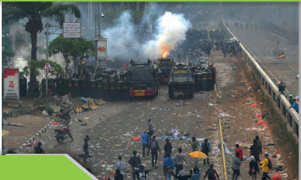

> **Deskripsi Visual:** Gambar ini menunjukkan sebuah situasi konflik atau protes yang sedang berlangsung. Di tengah-tengah gambar, terlihat beberapa truk militer dengan lampu merah menyala, menandakan bahwa mereka sedang bergerak atau siap untuk bertindak. Di sekeliling truk tersebut, terdapat banyak orang yang tampak sedang berdiri atau berjalan-jalan, mungkin merupakan warga atau demonstran. Beberapa orang tampak membawa bendera atau spanduk, menunjukkan bahwa mereka sedang mengambil posisi atau memprotes. Di sebelah kanan, terlihat jalan raya yang tampak penuh dengan sampah dan kerusakan, menunjukkan bahwa situasi telah berlangsung lama atau intens. Di sebelah kiri, terlihat beberapa pohon dan bangunan, menunjukkan bahwa lokasi ini berada di kota atau kawasan perkotaan. Seluruh gambar tampak gelap dan abu-abu, menunjukkan bahwa situasi ini sedang berlangsung di malam hari atau pada waktu yang gelap.

### Tujuan Pembelajaran

- Memahami praktik Demokrasi dan HAM sebagai wujud iman
- Menjelaskan cara mewujudkan  hak asasi manusia di Indonesia.
- Mendiskusikan  bagian  Alkitab  yang  menulis  tentang  hak  asasi manusia
- Menjelaskan  tugas dan  tanggung  jawab  remaja  Kristen  dalam mewujudkan  hak asasi manusia
- Membuat karya sebagai wujud kepedulian terhadap HAM
- Melakukan kegiatan sebagai bukti peduli HAM

 

---
## 📄 Halaman 20

### A.  Pengantar

Pembahasan  mengenai  Demokrasi  dan  Hak  Asasi  Manusia  (selanjutnya disingkat HAM) merupakan topik  yang sangat penting karena menyangkut hak paling mendasar yang diberikan Allah bagi manusia, misalnya hak untuk hidup  dan  dihargai  sebagai  manusia  makluk  mulia  ciptaan  Allah.  Dalam kenyataan terjadi banyak pelanggaran terhadap  demokrasi dan HAM. Oleh karena  itu,  pembahasan  mengenai  demokrasi  dan  HAM  diharapkan  dapat memberikan pencerahan bagi remaja Kristen untuk menyadari bahwa manusia diciptakan Allah sebagai makluk mulia yang memiliki martabat dan hak sejak dalam kandungan ibu. Pada sisi lain, pembahasan ini sekaligus memotivasi remaja Kristen untuk mampu membela HAM-nya maupun HAM orang lain.

Pembahasan mengenai demokrasi dan HAM  tidak dimaksudkan mengambil  alih  isi  mata  pelajaran  Pendidikan  Kewarganegaraan  (PKN) justru memperkuat pembahasan demokrasi dan HAM dalam mata pelajaran lainnya. Pembahasan demokrasi dan HAM dalam mata pelajaran Pendidikan Agama Kristen  lebih terfokus pada tinjauan dari segi ajaran iman Kristen. Hal ini penting agar tiap remaja Kristen menyadari bahwa dirinya terpanggil untuk turut serta mewujudkan demokrasi dan HAM sebagai orang  yang telah ditebus dan diselamatkan oleh Yesus Kristus.

Pembahasan  topik  ini  akan  dilakukan  secara  berseri  dalam  dua  kali pembahasan.  Pada  topik  pertama,  akan  mempelajari  demokrasi  dan  HAM sebagai anugerah Allah. Pada topik kedua, akan mempelajari demokrasi dan HAM dalam konteks global dan lokal. Pembahasan mengenai demokrasi dan HAM sebagai  anugerah  Allah  memberikan  pencerahan  bagi  kamu  bahwa Allah telah meletakkkan dasar-dasar HAM dan demokrasi yang dapat dijadikan acuan bagi orang Kristen dalam melaksanakan demokrasi dan HAM.

### B.  Pengertian Demokrasi dan HAM

Demokrasi  adalah  bentuk  pemerintahan  di  mana  semua  warga  negaranya memiliki  hak  setara  dalam  pengambilan  keputusan  yang  dapat  mengubah hidup  mereka.  Demokrasi  mengizinkan  warga  negara  berpartisipasi,  baik secara langsung atau melalui perwakilan dalam perumusan, pengembangan, dan pembuatan hukum. Demokrasi mencakup kondisi sosial, ekonomi, dan budaya yang memungkinkan adanya praktik kebebasan politik secara bebas dan  setara.  Demokrasi  juga  merupakan  seperangkat  gagasan  dan  prinsip

 

---
## 📄 Halaman 21

tentang kebebasan beserta praktik dan prosedurnya. Demokrasi mengandung makna penghargaan terhadap harkat dan martabat manusia di sini letak titik kait yang erat antara demokrasi dan HAM. Hanya pemerintahan demokrasilah yang dapat menerapkan HAM dan sebaliknya HAM hanya dapat terlaksana di tempat di mana ada pemerintahan yang demokratis.

Hak  asasi  manusia  atau  biasa  disingkat  HAM  merupakan  hak  yang dimiliki oleh setiap orang sebagai  manusia makluk ciptaan Allah. Hak yang paling mendasar adalah hak untuk hidup. Hanya Tuhanlah pemberi kehidupan dan  Dia  jugalah  yang  berhak  mengambil  kehidupan  itu.  Namun,  sayang sekali  dalam  kenyataannya,  masih  banyak  orang  yang  belum  menyadari dirinya memiliki hak yang tidak dapat dilanggar ataupun diambil oleh orang lain. Bukan hanya manusia sebagai individu, bahkan institusi atau lembaga negarapun  dapat  melanggar  HAM  warga  negaranya  ketika  Negara  tidak dapat menjamin terpenuhinya HAM warga Negara sebagai individu maupun kelompok.

Dalam  sikap  hidup  sehari-hari  terkadang  sadar  ataupun  tidak  kamu melakukan tindakan yang menjurus ke arah pelanggaran terhadap hak asasi seseorang.  Berita-berita  yang  tersebar  di  media  massa  baik  cetak  maupun elektronik telah menggambarkan berbagai peristiwa kekerasan yang dilakukan oleh  remaja  terhadap  teman  maupun  orang  lain  bahkan  sampai  kehilangan nyawa. Oleh karena itu, pembahasan mengenai demokrasi dan HAM dapat memberikan pencerahan kepada kamu untuk terpanggil menghargai demokrasi dan HAM sesama dan memperjuangkan demokrasi dan HAM bagi diri kalian dan orang lain.

Jelaskan  menurut  pemahaman  kalian,  definisi  demokrasi  dan  HAM, kaitkan antara demokrasi dan HAM, bagaimana hubungan  antara demokrasi dan HAM?

### C.  Merenungkan  Makna  HAM  Melalui  Lagu  dan Cerita Kehidupan

Nyanyikan lagu KJ. No.  432: 'Jika padaku Ditanyakan'

Nyanyikan  lagu  ini    dan  renungkan  makna  syair  lagu  ini,  tugas  apakah diberikan  pada  tiap  orang  Kristen?  Renungkan  bait  demi  bait  dan  jelaskan pemahaman kamu dalam kaitannya dengan HAM?

 

---
## 📄 Halaman 22

⭐

- Jika Padaku ditanyakan apa akan kusampaikan pada dunia yang penuh dengan cobaan, aku bersaksi dengan kata, tapi juga dengan karya menyampaikan kasih Allah yang sejati. T'lah tersedia bagi kita pengampunan dan anug'rah, kes'lamatan dalam Kristus PuteraNya. K'rajaan Allah penuh kurnia itu berita bagi isi dunia.
Syair dan lagu : A. Simanjuntak 1982

Sumber: Kidung Jemaat, Yamuger, Jakarta.

 

---
## 📄 Halaman 23

### D.  Antara Praktik HAM dan Pelanggaran HAM

Di  bawah  ini  ada  empat    buah  gambar;  amati  secara  teliti  gambar-gambar tersebut.

---
**🖼️ Gambar/Diagram**

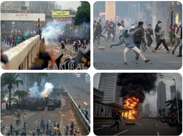

> **Deskripsi Visual:** Gambar ini adalah ilustrasi yang menunjukkan berbagai situasi konflik dan kekerasan. Di bagian atas, terdapat foto-foto yang menunjukkan orang-orang yang sedang berteriak dan bergerak keras, tampaknya dalam situasi yang agresif. Di bagian bawah, terdapat foto-foto yang menunjukkan kekerasan fisik, seperti api dan ledakan yang membakar kendaraan militer. Gambar ini menggambarkan peristiwa-peristiwa yang sering terjadi dalam konteks konflik dan kekerasan, mencerminkan dampak negatif dari konflik tersebut.

Perhatikan  empat    buah  gambar  di  atas,  jelaskan  gambar-gambar  itu, kaitkan dengan demokrasi dan HAM. Berikan penilaian kritis dari berbagai sudut  pandang,  apakah  mewujudkan  demoktrasi  dan  HAM  harus  dalam bentuk seperti itu? Guru akan membantu murid mengambil kesimpulan atas gambar-gambar tadi.

Hak Asasi Manusia adalah hak dasar semua orang tanpa kecuali. Prinsip demokrasi adalah semua warga negara bebas untuk mengemukakan pendapat bahkan untuk berkumpul dan bermusyawarah. Demontrasi merupakan bagian dari  cara  orang  menyampaikan  pendapat.  Sudah  ada  saluran  hukum  yang menjamin hak warga negara. Namun, pemanfaatan hak harus diikuti dengan rasa tanggung jawab. Jika cara kita mengemukakan pendapat dilakukan dengan

 

---
## 📄 Halaman 24

cara  kekerasan,  hal  itu  sudah  merupakan  penyimpangan.  Merusak  fasilitas umum  merupakan  tindakan  kriminal.  Tujuan  yang  baik  jika  disampaikan dengan cara yang salah dan menyimpang maka akan mendatangkan kerugian bagi diri  sendiri  dan  orang  lain. Tiap  orang  dapat  menyampaikan sikapnya melalui  demonstrasi  tapi  secara  tertib  dan  damai  tanpa  provokasi  dan kekerasan.

### E.  Memahami Demokrasi dan HAM dalam Alkitab

Di dalam Alkitab kita tidak  menjumpai praktik Demokrasi dan HAM seperti yang  kita  kenal  sekarang.  Namun  di  situ  kita  dapat  menemukan  benihbenihnya,  misalnya  dalam  penghargaan  terhadap  kehidupan  dan  nyawa seseorang, dalam perintah-perintah agar manusia hidup saling memperlakukan sesamanya dengan baik.

Mazmur 133 berbicara tentang suatu masyarakat yang hidup rukun bagai saudara. Masyarakat yang hidup rukun seperti ini tentu akan saling menghargai sesamanya. Mereka tidak akan saling menekan, menindas, memeras, apalagi menganiaya. Menurut pemazmur, masyarakat seperti itu akan tampak indah. Sudah  tentu,  karena  masyarakat  seperti  itu  tidak  akan  banyak  mengalami konflik.  Konflik  atau  perbedaan  pendapat  akan  mereka  selesaikan  dengan baik.  Dan  yang  lebih  penting  lagi,  kepada  masyarakat  seperti  itulah Tuhan Allah akan melimpahkan berkat-Nya. Mengapa demikian?

Jika  Mazmur  133  bicara  tentang  masyarakat  yang  hidup  rukun,  maka Kitab  I  Raja-Raja  pasal  21  bicara  tentang  bagaimana  Raja  dan  Isterinya menggunakan kekuasaan untuk menindas dan merampas hak warga negaranya.

Bentuk dua kelompok, diskusikan dua bagian Alkitab yang tercantum di atas! Kelompok 1 membahas Mazmur 133. Bagaimanakah kaitannya antara berkat  Tuhan  dengan  kehidupan  yang  serba  rukun  di  dalam  masyarakat kita?  Kelompok 2 membahas Kitab I Raja-Raja 21. Catatlah pelanggaranpelanggaran  yang  dilakukan  oleh  Raja  dan  isterinya  yang  bertentangan dengan keadilan dan kebenaran! Mengapa Raja melakukan pelanggaran itu? Bagaimana penilaian kelompok mu terhadap sikap pemimpin yang demikian?

 

---
## 📄 Halaman 25

### Response Saya

### Tulis Pendapat Kalian

Pelajari pertanyaan-pertanyaan, kemudian tulis jawaban dalam kotak di bawah ini.

- Menurut  pendapat  kalian,  mengapa  Demokrasi  dan  HAM  harus dipelajari  dalam  pelajaran  Pendidikan  Agama  Kristen?  Terutama dikaitkan dengan tugas orang Kristen untuk menjadi pembawa damai!
- Jelaskan  penilaianmu  menyangkut  Demokrasi  dan  HAM  dalam kehidupan sehari-hari!
- Apakah  kalian  setuju  bahwa  penjajahan    merampas  hak-hak  dasar manusia? Mengapa?

### F.  Cakupan HAM

Hak Asasi Manusia adalah hak paling mendasar yang dimiliki oleh manusia dan tidak dapat diambil oleh orang lain bahkan oleh negara sekali pun. Hak untuk  hidup  adalah  salah  satu  bentuk  hak  paling  mendasar  yang  diberikan Tuhan pada manusia. Hak-hak asasi mencakup:

- Hak warga negara, yang mencakup hak untuk hidup dan merasa aman, untuk memiliki privasi, untuk berkeluarga, hak milik pribadi, menyatakan pendapat  dengan  bebas,  memeluk  dan  melaksanakan  agama/kepercayaan, dan berkumpul dengan damai.
- Hak-hak  politik,  mencakup  hak  untuk  berserikat,  membentuk  partai politik, ikut serta memilih dan dipilih dalam pemilihan umum, menduduki jabatan pemerintahan, dan sebagainya.
- Hak-hak ekonomi dan sosial, mencakup hak untuk bebas dari kemiskinan, hak untuk diterima dalam masyarakat dan bangsa-bangsa, dan hak untuk menentukan nasib sendiri
Selanjutnya pembahasan secara mendalam menyangkut  Demokrasi dan HAM telah dipelajari dalam pelajaran Pendidikan Kewarganegaraan.

 

---
## 📄 Halaman 26

### G. Sejarah Singkat Demokrasi dan HAM

Menurut Diane Revitch dan Abigail Thernstrom (ed.) dalam buku 'Demokrasi Klasik dan Modern', pada tahun 1941 Franklin Delano Roosevelt menyampaikan  pidatonya  yang  terkenal  mengenai  empat  kebebasan  yang diharapkannya diberlakukan di seluruh dunia, yaitu:

- Kebebasan berbicara dan berpendapat di mana pun juga di dunia.
- Kebebasan kepada setiap orang untuk beribadah kepada Tuhan dengan caranya sendiri di mana pun juga di dunia.
- Kebebasan dari  kekurangan. Artinya  setiap  negara  berhak  untuk  hidup damai dan memberikan kedamaian bagi masyarakatnya serta kesehatan yang baik.
- Kebebasan  dari  rasa  takut.  Artinya  tiap  negara  dan  masyarakatnya memiliki hak untuk bebas dari serangan dan intimidasi maupun invasi negara lain maupun negara tetangganya.
Pada saat pidato tersebut disampaikan, masyarakat dunia berada dalam bayang-bayang kehancuran karena Perang Dunia II sudah di ambang pintu. Ada beberapa peristiwa menyedihkan yang terjadi, yaitu Perang Dunia II yang membunuh cukup banyak umat manusia serta menghancurkan berbagai tempat di dunia. Pembantaian etnis Yahudi oleh Jerman Nazi di bawah pemerintahan Adolf Hitler. Perang Dunia II telah meninggalkan bekas-bekas yang pahit bagi sejarah umat manusia, yaitu penghancuran terhadap tatanan masyarakat serta pelanggaran besar-besaran terhadap hak asasi manusia. Belajar dari kepahitan itu, pada tahun 1948 bangsa-bangsa di dunia sepakat untuk memberlakukan Deklarasi  Universal  Hak Asasi  Manusia  (Universal  Declaration  of  Human Rights).  Kesepakatan  itu  ditandatangani  oleh  semua  negara  anggota  PBB di  New  York  pada  tahun  1948.  Nampaknya  pidato  Presiden  Roosevelt mempengaruhi dan menginspirasi lahirnya deklarasi hak asasi manusia yang dicanangkan oleh PBB.

 

---
## 📄 Halaman 27

### Response Saya

### Berbagi Pengalaman

Tuliskan satu sampai dua alinea tentang peristiwa pelanggaran HAM  yang pernah kalian lihat dan dengar atau baca melalui media cetak dan elektronik, kemudian  berikan  penilaianmu  dengan  mengacu  pada  pembacaan  Alkitab dalam pelajaran ini! Guru akan memberikan kesempatan kepada 3-5 orang teman-temanmu untuk membacakan pengalaman mereka, dan kalian dapat menyampaikan pendapat setelah mendengarkan pengalaman yang disampaikan oleh masing-masing orang.

### H. Demokrasi dan HAM di Indonesia

Bangsa Indonesia adalah bangsa yang cukup banyak mengalami kepahitan akibat kehilangan hak-hak dasar sebagai manusia melalui penjajahan selama tiga  setengah  abad.  Termotivasi  oleh  kesadaran  HAM  maka  para  pejuang mendirikan  organisasi  Budi  Utomo  sebagai  organisasi  pertama  yang  menjadi  titik awal pergerakan nasional atau organisasi pertama yang menggugah kesadaran nasional. Mereka memperjuangkan adanya kesadaran untuk berkumpul dan mengeluarkan pendapat sebagai hak yang harus dijalankan oleh setiap orang. Tentu saja gerakan ini ditentang oleh pemerintahan Belanda yang menjajah Indonesia. Selanjutnya, perjuangan kemerdekaan Indonesia dimotivasi oleh adanya  kesadaran  akan  hak-hak  asasi  manusia.  Perkembangan  perjuangan akan pemenuhan hak-hak asasi manusia di dunia, khususnya di Eropa dan Amerika turut mempengaruhi para pejuang Indonesia untuk memperjuangkan hak mendasarnya sebagai manusia yaitu kebebasan atau kemerdekaan. Panitia Persiapan Kemerdekaan Indonesia yang mempersiapakan UUD 1945 negara RI dan dasar negara pun menyusun UUD 1945 dan dasar negara berdasarkan pemahaman tentang demokrasi dan Hak-hak asasi manusia.

Simak sila-sila  dalam  Pancasila  yang  dimulai  dengan  Ketuhanan Yang Maha Esa sampai  dengan  sila  kelima,  Keadilan  sosial  bagi  seluruh  rakyat Indonesia. Semuanya menyiratkan keberpihakan pada hak-hak asasi manusia. UUD 1945 memberikan jaminan bagi terpenuhinya hak-hak mendasar bagi rakyat Indonesia terutama menyangkut demokrasi dan HAM.

 

---
## 📄 Halaman 28

Setelah  kemerdekaan,  tidak  dengan  sendirinya  rakyat  dapat  menikmati pemenuhan hak-haknya. Hal itu terjadi karena situasi bangsa dan negara yang masih ada dalam perjuangan untuk mempertahankan NKRI (Negara Kesatuan Republik Indonesia) maupun karena penyalahgunaan kekuasaan serta kekuasaan mutlak pemerintah yang berlindung di balik kedok demokrasi.

Dibawah Pemerintahan Presiden Suharto Indonesia memasuki era yang disebut sebagai Orde Baru, yaitu orde yang dipandang berbeda dengan Orde Lama  yang  dipimpin  oleh  Presiden    Sukarno.  Pemerintahan  Orde  Baru menerapkan  sistem  pemerintahan  Demokrasi  Pancasila.  Mereka  menyebut sebagai  penjaga  kemurnian  Pancasila,  menjunjung  tinggi  Demokrasi  dan HAM. Dalam kenyataannya, pemerintahan Orde Baru sangat represif. Banyak terjadi pelanggaran HAM yang dilakukan pada zaman itu.

Akhirnya  lahirlah  kesatuan  gerakan  untuk  menghancurkan  rezim  Orde Baru. Dipelopori oleh Lembaga Swadaya Masyarakat dan Maha Siswa dari seluruh Indonesia, mereka menduduki gedung DPR/MPR menuntut :

- Presiden Suharto mundur.
- Pelaksanaan Demokrasi dan HAM secara total
Pemerintahan  Orde  Baru  tumbang  dengan  mundurnya  Suharto  pada tanggal 28 Mei 1998. Dengan demikian, menandai era baru yang disebut masa transisi menuju Reformasi. Beberapa mahasiswa Universitas Tri Sakti gugur sebagai pahlawan Reformasi.

Banyak orang menyebut masa setelah Orde Baru sebagai era Reformasi karena adanya gerakan reformasi yang berhasil meruntuhkan pemerintahan Orde Baru. Dalam kenyataannya, hingga kini bangsa dan Negara Indonesia masih terus berjuang untuk mewujudkan tuntutan yang sama ketika menjatuhkan pemerintahan Orde Baru.

### Response Saya (Refleksi)

Renungkan, apakah kalian pernah melakukan tindakan kekerasan baik verbal (melalui kata-kata) maupun secara fisik pada teman atau anggota keluarga, guru ataupun orang lain? Setelah mempelajari materi ini, bagaimana sikapmu? Maukah minta maaf pada mereka dan berupaya menjadi manusia yang bertanggung  jawab  dalam  kaitannya  dengan  hak-hak  asasi  manusia  yang merupakan anugerah Allah?

 

---
## 📄 Halaman 29

### I. Demokrasi dan HAM adalah Anugerah Allah

Sebagai mahluk mulia ciptaan Allah, manusia memiliki hak untuk diterima dan dihargai di manapun ia hidup. Implikasi dari prinsip ini adalah semua manusia dari berbagai latar belakang memiliki hak untuk diterima, dihargai dan menjalani kehidupan yang telah dianugerahkan Allah baginya. Di dalam Alkitab kita tidak akan menjumpai praktik hak asasi manusia seperti yang kita kenal sekarang. Namun di situ kita dapat menemukan benih-benihnya, seperti misalnya dalam penghargaan terhadap kehidupan dan nyawa seseorang, dalam perintah-perintah  agar  manusia  hidup  saling  memperlakukan  sesamanya dengan baik.

Meskipun Alkitab menulis tentang manusia yang dianugerahi kehidupan dan  berhak  menjalani  hidupnya,  namun  Alkitab  juga  menulis  tentang terjadinya pelanggaran HAM dan ketidakadilan terhadap manusia. Ataupun tentang pemerintahan yang korup dan menindas rakyat sebagaimana dilakukan oleh Ratu Izabel dan suaminya, Raja Ahab terhadap Nabot (1 Raja-raja 21:129).  Berbagai  bagian Alkitab  menulis  bagaimana  manusia  memperlakukan sesamanya secara tidak adil, menindas, memeras dan merampas hak mereka, sedangkan  Mazmur  133  berbicara  tentang  suatu  masyarakat  yang  hidup rukun  bagai  saudara.  Masyarakat  yang  hidup  rukun  seperti  ini  tentu  akan saling menghargai sesamanya. Mereka tidak akan saling menekan, menindas, memeras,  apalagi  menganiaya.  Menurut  pemazmur,  masyarakat  seperti itu  akan  tampak  indah.  Karena  masyarakat  seperti  itu  tidak  akan  banyak mengalami konflik. Konflik atau perbedaan pendapat akan mereka selesaikan dengan baik. Hal lebih penting lagi, kepada masyarakat seperti itulah Tuhan Allah akan melimpahkan berkat-Nya. Mengapa demikian? Jika Mazmur 133 bicara tentang masyarakat yang hidup rukun,  maka  Kitab I Raja-Raja pasal 21  bicara  tentang  bagaimana  Raja  dan  isterinya  menggunakan  kekuasaan untuk menindas dan merampas hak warga negaranya. Atas penindasan yang mereka lakukan maka Allah menghukum mereka.

 

---
## 📄 Halaman 30

### J.  Penutup

Guru memimpin peserta didik  berdoa bersama.

### Doa untuk Demokrasi

Ya Tuhan, Saat negara kami dan dunia kami mengalami tekanan ekonomi, datanglah dan luruskanlah segalanya. Bila hati kami, pikiran kami, atau kelakuan kami telah digelembungkan, hingga kehilangan integritas atau kebenaran yang otentik, ampunilah kami. Kiranya kami boleh memulai kembali. Ajarlah kami untuk bertindak lebih baik. Alihkanlah hati kami, ya Allah yang baik, dan alihkan planet kami. Hilangkanlah semua ketakutan dan kirimkanlah mujizat untuk menyembuhkan kami. Ciptakanlah ekonomi yang adil bagi semua. Kiranya kasih akan menang. Amin.

oleh Marianne Williamson

 

---
## 📄 Halaman 31

### K. Refleksi

Hak Asasi manusia adalah hak yang harus dipenuhi oleh setiap orang sebagai makluk mulia ciptaan Allah. Begitu pula demokrasi merupakan prinsip asasi bahwa tiap manusia memiliki hak dan kewajiban yang sama di hadapan Tuhan dan  negara.  Sebagai  remaja  Kristen    terpanggil  untuk  memiliki  kesadaran demokrasi  dan  HAM  serta  mewujudkannya  dalam  kehidupan.  Perwujudan demokrasi  dan  HAM  bukan  hanya  sekadar  memenuhi  tuntutan  Negara, masyarakat maupun ajaran iman namun menjadi bagian dari sikap hidup.

 

---
## 📄 Halaman 32

Pendidikan Agama menjadi sarana perjumpaan dengan Allah yang diimani.

Perjumpaan itu menghasilkan perubahan hidup yang menjunjung tinggi kemanusiaan, keadilan dan kebenaran.

(Janse Belandina Non)

 

---
## 📄 Halaman 33

### KEMENTERIAN PENDIDIKAN, KEBUDAYAAN, RISET, DAN TEKNOLOGI

REPUBLIK INDONESIA, 2021

Pendidikan Agama Kristen dan Budi Pekerti untuk SMA/SMK Kelas XII

Penulis: Janse Belandina Non-Serrano

ISBN: 978-602-244-702-3 (jil.3)

### PRAKTIK DEMOKRASI DAN HAK ASASI MANUSIA PADA KONTEKS GLOBAL DAN DI INDONESIA

(Bilangan 35:9-34; Mazmur 133)

---
**🖼️ Gambar/Diagram**

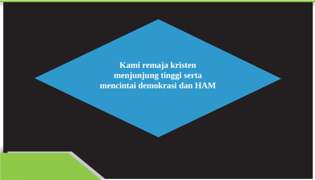

> **Deskripsi Visual:** Gambar ini adalah diagram berbentuk segi empat yang berisi teks. Diagram ini menunjukkan pernyataan bahwa "Kami remaja kristen menunjung tinggi serta mencintai demokrasi dan HAM". Elemen utama dalam gambar ini adalah teks yang berada di tengah diagram, yang membahas tentang remaja Kristen dan pandangan mereka terhadap demokrasi dan Hak Asasi Manusia (HAM). Teks tersebut merupakan informasi kunci yang dapat diambil pembaca dari gambar ini.

### Tujuan Pembelajaran

- Menjelaskan  cara  mewujudkan  demokrasi  dan  hak  asasi  manusia  di Indonesia.
- Mendiskusikan bagian Alkitab yang menulis tentang demokrasi dan hak asasi manusia
- Menceritakan praktik demokrasi dan HAM pada konteks global dan lokal
- Mendata berbagai permasalahan yang berkaitan dengan praktik demokrasi dan HAM di Indonesia
- Menjelaskan tugas dan tanggung jawab remaja Kristen dalam mewujudkan demokrasi dan hak asasi manusia
- Membuat karya sebagai wujud kepedulian terhadap demokrasi dan HAM
- Melakukan kegiatan sebagai bukti peduli demokrasi dan HAM

 

---
## 📄 Halaman 34

### A.  Pengantar

Pelajaran ini membimbing kamu untuk mempelajari fakta mengenai praktik pelaksanaan  demokrasi  dan  HAM  di  dunia  dan  di  Indonesia. Ada  banyak kenyataan yang harus dibuka dalam membahas mengenai praktik demokrasi dan  HAM.  Pembahasan  ini  tidak  bertujuan  menyudutkan  para  pemimpin ataupun kelompok lainnya. Sebagai generasi muda, kamu perlu mengetahui secara  transparan  seperti  apakah  wajah  demokrasi  dan  HAM  di  dunia  dan di  Indonesia  dengan  demikian  kamu tergerak untuk selalu menghargai dan melaksanakan  demokrasi  dan  HAM.  Dalam  cara  yang  paling  sederhana dimulai  dari  lingkungan  keluarga  dan  sekolah,  yaitu  hidup  dalam  suasana damai, menghargai dan menghormati diri sendiri dan orang lain

Kamu  dapat belajar dari berbagai kasus yang terjadi kemudian memberikan penilaian serta, mentukan sikap yang dapat kamu ambil sebagai remaja Kristen. Kamu juga dapat menilai diri sendiri, apakah selama ini kamu memiliki kesadaran demokrasi dan HAM dan sudah mewujudkannya dalam tindakan hidup sehari-hari?

### B.  Hak Asasi Manusia di Indonesia

Indonesia  dibentuk  sebagai  sebuah  negara  yang  demokratis.  Hak  asasi manusia  diakui  seperti  yang  tersirat  dalam  rumusan  Pancasila.  Sila  kedua, 'Kemanusiaan  yang  adil  dan  beradab'  dan  sila  kelima  'Keadilan  sosial bagi seluruh rakyat Indonesia' sebenarnya sudah mencakup ayat-ayat yang berkaitan dengan hak asasi manusia yang diangkat oleh Deklarasi Universal Hak Asasi Manusia.

Namun sekadar pernyataan bahwa negara Indonesia berdiri di atas dasar negara  Pancasila  dan  dipandu  oleh  UUD  1945  tidak  dengan  sendirinya menjamin perwujudan hak asasi manusia. HAM tidak dapat terwujud secara otomatis  namun  melalui  sebuah  proses  yang  panjang  dalam  pembelajaran, pembiasaan serta penghayatan. Pelajari berita dibawah ini, kemudian buatlah catatan kritis terhadap berita ini dan kaitkan dengan HAM.

 

---
## 📄 Halaman 35

### Catatan HAM Indonesia Merosot selama Tahun 2019

29/05/2020

### WASHINGTON DC (VOA)

Catatan HAM Indonesia selama tahun 2019, dinilai merosot oleh organisasi pemantau HAM dunia, Human Rights Watch (HRW). Sembilan isu penegakan HAM di Indonesia dipaparkan dalam laporan yang dirilis pertengahan bulan Januari 2020, termasuk kebebasan beragama, hak-hak perempuan dan anak perempuan sampai kebebasan pers di Papua.

Pemerintah enggan mengakui sepenuhnya laporan ini sebaliknya organisasi pemantau HAM di Indonesia menekankan kemunduran dan kegagalan upayaupaya penegakan HAM yang sebelumnya dijanjikan pemerintah.

Sembilan  isu  HAM  di  Indonesia  yang  disorot  HRW  adalah  Kebebasan Beragama,  Kebebasan  Berekspresi  dan  Berkumpul,  Hak-hak  perempuan dan anak perempuan, Papua, Orientasi Seksual dan Identitas Gender, Hakhak difabel, Hak-hak Lingkungan, Hak-hak Masyarakat Adat, Sikap terhadap negara  pelanggar  HAM.  Laporan  di  atas  jelas  menunjukkan  masih  banyak pekerjaan rumah yang harus dijalankan oleh bangsa Indonesia, supaya  kita benar-benar  dapat  menunjukkan  kerinduan  kita  akan  sebuah  negara  dan bangsa yang benar-benar menjunjung tinggi HAM sesuai dengan apa yang dirumuskan oleh Pancasila dan UUD 1945.

### Diskusi

Diskusikan dengan teman sebangku atau jika jumlah peserta didik di kelasmu ada 15-30 orang, kamu dapat mendiskusikannya dalam kelompok kemudian laporkan di kelas!

- Mengapa  demokrasi  dan  hak  asasi  manusia  penting  bagi  manusia sebagai pribadi maupun komunitas bangsa?
- Mengapa  pelaksanaan  hak  asasi  manusia  tidak  hanya  menjadi tanggung jawab negara tetapi juga merupakan tanggung jawab warga negara?

 

---
## 📄 Halaman 36

- Jika kamu menyaksikan seseorang diperlakukan secara tidak adil dan harkat serta martabatnya direndahkan, apa tindakan kamu? Ataupun jika  ada  peristiwa  kekerasan  atau  pembunuhan  yang  menimpa seseorang dan kamu menyaksikannya, apakah tindakan kamu?

### C.  Pergulatan Bangsa Indonesia di Bidang  Hak Asasi Manusia

Ketika  Undang-Undang  Dasar  1945  disusun,  muncul  perdebatan  tentang tempat hak asasi manusia di dalam UUD. Moh. Hatta mengusulkan agar hak asasi manusia dimuat secara jelas di dalam UUD 1945.

Masa  Orde  Baru  yang  menggantikan  pemerintahan  Soekarno,  dimulai dengan peristiwa 1965 pemberontakan PKI dan penumpasan PKI yang hingga kini  masih  menghantui  kehidupan  bangsa  dan  menjadi  topik  diskusi  yang belum tuntas. Pemerintahan Orde Baru bersifat represif.

Berbagai bidang kegiatan ekonomi juga dikuasai oleh keluarga Soeharto beserta  kroni-kroninya,  sehingga  kemudian  terjadilah  gerakan  'Reformasi' yang dirintis oleh para mahasiswa, pemuda, dan berbagai lembaga swadaya masyarakat pada tahun 1997-1998.

Pada  akhirnya  pemerintahan  Orde  Baru  tumbang  dengan  mundurnya Suharto pada tanggal 28 Mei 1998. Dengan demikian, menandai era baru yang disebut masa transisi menuju Reformasi. Beberapa mahasiswa dari Universitas Trisakti dan Universitas Indonesia gugur sebagai pahlawan Reformasi.

Di masa Orde Reformasi, pelanggaran prinsip-prinsip hak asasi manusia pun masih terjadi. Rakyat Sidoarjo, Jawa Timur yang menderita sejak 27 Mei 2006 karena luapan lumpur akibat pengeboran gas yang salah oleh PT Lapindo Brantas. Masyarakat di tiga kecamatan telah kehilangan tempat tinggal dan tanah mereka. Kesehatan dan kehidupan mereka terganggu dan bahkan rusak sama sekali. Hingga kini penanganan terhadap kasus ini belum memperoleh ketuntasan.

 

---
## 📄 Halaman 37

Dari  berbagai  pembahasan  di  atas  kita  dapat  melihat  bahwa  praktikpraktik hak asasi manusia di negara kita memang masih jauh dari yang kita idam-idamkan.  Bila  di  masa  Perjanjian  Lama Allah  memerintahkan  Musa mendirikan kota-kota perlindungan, sehingga orang yang tidak bersalah dapat hidup  dengan  aman,  maka  di  Indonesia  hal  itu  masih  jauh  dari  kenyataan. Banyak orang yang belum bisa menikmati hidup yang aman dengan jaminan pemerintah atas hak-hak asasi mereka. Pemerintahan Presiden Joko Widodo telah berusaha keras untuk menjamin hak-hak asasi tiap warga negara namun upaya  mewujudkan  HAM    di  sebuah  negara  tidaklah  semudah  dengan membalikkan telapak tangan saja.

---
**🖼️ Gambar/Diagram**

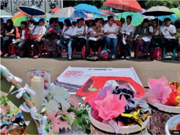

> **Deskripsi Visual:** Gambar ini adalah foto yang menunjukkan acara penghormatan atau peringatan di luar sebuah gedung. Di depan bangunan tersebut terdapat sekelompok orang yang tampak sedang berdiri atau duduk dengan rapi, mungkin sebagai penghormatan atau pengingat. Di depan mereka terdapat beberapa bunga, termasuk bunga mawar dan bunga kuning, serta beberapa papan tulisan yang menunjukkan informasi tentang acara tersebut. Ada juga beberapa papan yang menunjukkan logo atau nama organisasi yang terkait dengan acara ini. Di sebelah kiri, terdapat beberapa papan yang menunjukkan informasi tentang acara, termasuk tanggal dan tempat acara. Selain itu, terdapat beberapa papan yang menunjukkan informasi tentang organisasi yang terkait dengan acara tersebut. Gambar ini menunjukkan bahwa acara ini merupakan acara yang serius dan penting, dan semua elemen yang ada dalam gambar tersebut memiliki peran penting dalam menyampaikan pesan atau informasi yang ingin disampaikan oleh organisasi tersebut.

 

---
## 📄 Halaman 38

Ada  seorang  Pendeta  GKI  dan  Dosen  STF  Jakarta  yang  selalu  setia menemani  jemaat  GKI Yasmin  dalam  memperjuangkan  hak  mereka  untuk mendirikan  rumah  ibadah,  Pdt.Stephen  Suleeman.  Beliau  dikenal  sebagai pejuang  bagi  mereka  yang  termarginalkan.  Persoalan  GKI  Yasmin  telah diselesaikan oleh Pemerintah dalam dialog dengan pihak gereja pada tahun 2021.

---
**🖼️ Gambar/Diagram**

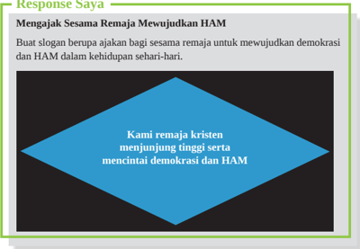

> **Deskripsi Visual:** Gambar ini adalah jenis ilustrasi yang menampilkan sebuah logo berbentuk segi empat dengan sudut tumpul. Logo tersebut terdiri dari dua bagian utama: bagian atas berwarna biru dengan tulisan "Kami remaja kristen menjunjung tinggi serta mencintai demokrasi dan HAM" dan bagian bawah berwarna putih dengan tulisan "Mengajak Sesama Remaja Mewujudkan HAM". Di bagian tengah, terdapat sebuah bintang biru yang mengisi bagian tengah dari segi empat. Teks pada logo ini membahas tentang peran remaja Kristen dalam mewujudkan demokrasi dan HAM.

 

---
## 📄 Halaman 39

### D.  Kota Perlindungan  Dalam Kitab Perjanjian Lama

Meskipun  Alkitab  tidak  berbicara  tentang  hak  asasi  manusia,  kita  dapat menemukan  di  sana-sini  konsep-konsep  yang  merujuk  kepada  hak  asasi manusia. Dalam Bilangan 35:9-34 Allah memberikan perintah kepada Musa untuk  membangun 'kota-kota perlndungan' agar orang yang tidak sengaja menyebabkan  kematian  orang  lain  tidak  dibalas  dengan  dibunuh.  Ia  dapat melarikan  diri  ke  kota-kota  perlindungan.  Jumlahnya  cukup  banyak,  yaitu enam  buah,  tiga  di  sebelah  barat  sungai  Yordan,  dan  tiga  lagi  di  sebelah timurnya.

Kota-kota itu adalah Kadesh, Sikhem dan Hebron di sebelah barat, dan Golan, Ramot di Gilead, dan Bezer di sebelah timur.

### Cities of Refuge

---
**🖼️ Gambar/Diagram**

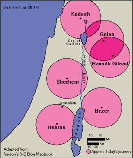

> **Deskripsi Visual:** Gambar ini adalah ilustrasi yang menunjukkan lokasi beberapa tempat penting dalam Alkitab Israel. Ilustrasi ini menggunakan warna-warna berbeda untuk menandai wilayah-wilayah yang penting dalam perjalanan dan kejadian-kejadian dalam Alkitab. Wilayah-wilayah tersebut termasuk Kodesh (Kedumia), Golan, Ramoth Gilead, Shechem, Jeruzalem, Bezer, dan Hebron. Setiap wilayah tersebut diberi label dengan nama-nama yang relevan dengan peristiwa-peristiwa dalam Alkitab. Gambar ini juga menunjukkan jarak antara wilayah-wilayah tersebut menggunakan garis dan angka yang menunjukkan jarak dalam kilometer. Informasi kunci yang dapat diambil dari gambar ini adalah bahwa lokasi-lokasi ini memiliki hubungan dengan peristiwa-peristiwa penting dalam Alkitab dan bahwa mereka merupakan titik-titik penting dalam perjalanan dan kejadian-kejadian dalam Alkitab.

 

---
## 📄 Halaman 40

Bila seseorang membunuh atau mengakibatkan seseorang lainnya tewas, dan ia merasa tidak bersalah atau tidak sengaja telah menyebabkan kematian itu, maka ia dapat melarikan diri ke kota-kota tersebut untuk berlindung. Ia tidak akan dibunuh. Ia harus tinggal di kota itu 'sampai matinya imam besar yang telah diurapi dengan minyak yang kudus.' (ay. 25)

Konsep ini kemudian diambil alih oleh gereja Kristen dengan menetapkan gereja sebagai tempat perlindungan. Pada tahun 511, dalam Konsili Orleans, di  hadapan Raja Clovis I, setiap orang yang mencari suaka akan diberikan apabila ia berlindung di sebuah gereja, dalam gedung-gedung lain milik gereja itu,  atau  di  rumah uskup. Perlindungan diberikan kepada orang-orang yang dituduh mencuri, membunuh, atau berzinah. Juga budak yang melarikan diri akan diberikan perlindungan, namun ia akan dikembalikan kepada tuannya bila sang tuan mau bersumpah di atas Alkitab bahwa ia tidak akan bertindak kejam.

Pemahaman tentang 'kota-kota perlindungan' seperti yang dibicarakan dalam  Kitab  Bilangan  35:9-34  menjamin  perlakuan  yang  lebih  adil  bagi orang-orang yang terlibat dalam kasus seperti di atas.Dasar keadilan inilah yang dapat kita lihat dalam hukum modern, ketika hakim mempertimbangkan berbagai sisi dari sebuah kasus kriminalitas.

Sebagai contoh, ada link di internet yang memuat seorang Hakim tua yang selalu memutuskan perkara dengan adil. Hak asasi manusia dan demokrasi bertujuan  memberikan perlindungan yang paling dasar kepada setiap orang, apapun juga jenis kelamin, warna kulit, agama dan keyakinan, usia, kondisi fisik dan mental, dan lain-lain.

### E.  Mewujudkan HAM

- Setelah  mempelajari  materi  mengenai  kota  perlindungan,  kini  kalian dapat  mengemukakan  pendapat  berkaitan  dengan  'Kota  perlindungan' dalam  Perjanjian  Lama.  Apakah  kalian  setuju  dengan  fungsi  kota perlindungan yang menolong orang-orang yang secara tidak sengaja telah menghilangkan nyawa orang lain? Apakah kita membutuhkan kebijakan seperti itu di masa kini?
- Sebagai  seorang  remaja  Kristen,  apa  yang  dapat  kamu  lakukan  secara sederhana dalam rangka turut serta mewujudkan hak asasi manusia? Tulis apa yang dapat kamu lakukan di dalam kotak di bawah ini!

 

---
## 📄 Halaman 41

### Tugas

Susunlah sebuah program kegiatan bagi remaja-remaja di gerejamu atau di sekolah  agar mereka pun dapat ikut serta mewujudkan  hak asasi manusia! Misalkan mengadakan penyuluhan HAM,  mengunjungi orang yang menjadi korban HAM dan menyatakan keprihatinan dll.

### F.  Penjelasan Aktivitas Belajar

### G. Doa Penutup

Guru mengajak  peserta didik mengucapkan doa yang diambil dari

### 'Doa bagi Pembela Hak-hak Asasi Manusia:'

Ya Tuhan, Allah kami,

Meskipun di dunia terjadi penderitaan dan kekejaman yang dilakukan satu kepada yang lain,

Berikanlah kami pengharapan agar satu hari kelak kami dapat mendirikan tugu peringatan untuk pencinta perdamaian dan anti-kekerasan. Sekaranglah waktunya bagi kami untuk bertindak bersama dengan cara yang lain,

Tidak hanya berbicara tentang keadilan, tetapi juga melakukannya; melepaskan semua belenggu, membalikkan penderitaan, menghadirkan kebebasan.

 

---
## 📄 Halaman 42

### H. Refleksi

Sebagai peserta didik SMA  kelas 12 kalian dapat memberikan penilaian terhadap pelaksanaan  hak asasi manusia di Indonesia. Sebagai remaja Kristen dan warga negara Indonesia kalian mempunyai tugas dan tanggung jawab untuk memantau praktik-praktik demokrasi dan hak asasi manusia di Indonesia. Berbicaralah, bertindak dan berjuanglah demi  demokrasi dan hak asasi manusia, karena semua itu adalah bagian dari tanggung jawab iman  kepada Allah yang menginginkan agar kita semua hidup dalam damai dan sejahtera.  Contoh paling sederhana adalah turut serta melaporkan  tindakan  pelanggaran  hak  asasi  manusia  yang  dilakukan  oleh  seseorang. Ataupun praktik politik uang yang biasa terjadi ketika pilkada maupun pilpres.

Tidak hanya berbicara tentang damai tetapi juga menciptakannya; melewati tembok-tembok penghalang mengupayakan rekonsiliasi, mendekati sesama kami.

Tidak hanya berbicara tentang penciptaan tetapi juga memeliharanya, melindungi kehidupan, menjadi pengawal, mendukung yang lemah.

Tidak hanya berbicara tentang kasih tetapi menjalaninya; saling menerima, siap menolong sesama, mempersembahkan hati kami.

Tidak hanya berbicara tentang pengharapan tetapi juga menebarkannya; menunjukkan bukti, dan tidak menyerah, menatap masa depan.

Sekaranglah waktunya bertindak bersama dengan cara yang lain.

FIACAT, Juni 2004

 

---
## 📄 Halaman 43

KEMENTERIAN PENDIDIKAN, KEBUDAYAAN, RISET, DAN TEKNOLOGI REPUBLIK INDONESIA, 2021 Pendidikan Agama Kristen dan Budi Pekerti untuk SMA/SMK Kelas XII

Penulis: Janse Belandina Non-Serrano

ISBN: 978-602-244-702-3 (jil.3)

### TALENTA KU BAGI BANGSA DAN NEGARA

(Mazmur 139:13-14)

---
**🖼️ Gambar/Diagram**

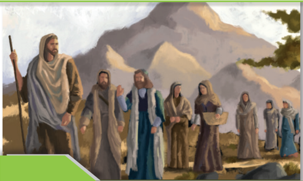

> **Deskripsi Visual:** Gambar ini adalah ilustrasi yang menampilkan kelompok orang tua dan anak-anak berjalan di sekitar sebuah pegunungan. Ilustrasi ini menunjukkan beberapa elemen penting:

1. **Pertama**: Gambar ini menampilkan kelompok orang tua dan anak-anak yang sedang berjalan di sekitar pegunungan. Mereka tampak tenang dan serius, mungkin sedang berkeliling atau melakukan perjalanan.

2. **Elemen Utama dan Relasinya**: 
   - **Orang tua dan anak-anak**: Kelompok ini terdiri dari beberapa orang tua dan anak-anak. Mereka tampak saling berhubungan dan berada dalam posisi yang berdekatan.
   - **Pegunungan**: Pegunungan yang besar dan indah menjadi latar belakang utama. Gunung tersebut tampak megah dengan puncak yang tertutup awan.
   - **Lampu**: Ada lampu yang diletakkan di sepanjang jalur, mungkin untuk membantu mereka berjalan di malam hari.

3. **Teks, Angka, atau Label Penting**: 
   - **Teks**: Tidak ada teks yang jelas dalam gambar ini, kecuali jika ada label yang tidak terlihat dalam gambar.
   - **Angka**: Tidak ada angka yang jelas dalam gambar ini.
   - **Label**: Tidak ada label yang jelas dalam gambar ini.

4. **Informasi Kunci yang Dapat Diambil Pembaca**: 
   - Gambar ini menunjukkan kelompok orang tua dan anak-anak sedang berjalan di sekitar pegunungan, mungkin dalam perjalanan atau pertemuan.
   - Lampu yang ada menunjukkan bahwa mereka mungkin sedang berjalan di malam hari.
   - Latar belakang pegunungan yang indah menambah nuansa alami dan menantang pada gambar ini.

Dengan demikian, gambar ini menggambarkan suasana keluarga yang tenang dan berkelanjutan di sekitar pegunungan, dengan elemen-elemen seperti orang tua, anak-anak, dan lampu yang menunjukkan suasana malam hari.

### Tujuan Pembelajaran

- Menjelaskan arti bakat atau  talenta
- Mendiskusikan  talenta  yang  ada  dalam  diri  masing-masing  dan bagaimana  memanfaatkannya  bagi  kepentingan  diri  sendiri  dan oirang lain.
- Melakukan debat mengenai alasan dan cara berbakti pada bangsa dan negara melalui talenta yang dimiliki.
- Menjabarkan langkah-langkah mengembangkan talenta yang dimiliki dan mempresentasikannya.

 

---
## 📄 Halaman 44

### A.  Pendahuluan

Pembelajaran  ini  memberikan  motivasi  bagi  remaja  untuk  menghargai  diri sendiri  dan  percaya  bahwa  dalam  diri  tiap  orang  ada  talenta  tertentu  yang diberikan Tuhan dan kamu dapat menggunakannya bagi kepentingan banyak orang  bahkan  bagi  bangsa  dan  negara.  Ada  banyak  anak-anak  muda  dan remaja yang turut berpartisipasi dalam berbagai lomba maupun aktivitas yang mana melalui kegiatan tersebut mereka turut mengharumkan nama bangsa. Pada level tertentu di sekolah maupun di daerah terdapat anak-anak muda dan remaja yang proaktif melalukan banyak hal positif bagi kepentingan banyak orang.  Untuk  dapat  menyumbangkan  talenta  bagi  bangsa  dan  negara  tidak hanya mengikuti lomba atau kompetisi di dalam negeri maupun di luar negeri, tapi juga dengan cara belajar sungguh-sungguh agar kelak menjadi pemimpin di kemudian hari. Remaja adalah kelompok orang yang tengah membentuk identitas dirinya dan 'kemerdekaan diri' merupakan kata kunci bagi mereka. Remaja  membutuhkan  dorongan  dalam  pendidikan  dan  pembimbingan, dorongan yang diberikan itu laksana energi yang menguatkan dan memberi semangat bagi remaja untuk menemukan dirinya, membentuk jati dirinya dan melangkah ke masa depan. Tekanan-tekanan dan persoalan yang dihadapi oleh remaja SMA tidaklah mudah dan hal terkadang menjadi tantangan tersendiri dalam melangkah ke masa depan.

Kamu  harus  menanamikan  keyakinan  dalam  diri  bahwa  tiap  manusia itu unik, Allah menciptakan tiap orang dalam berbagai keunikan. Tanamkan keyakinan diri niscaya keyakinan itu menular ke teman-teman kalian secara positif.  Salah  satu  cara  terbaik  untuk  membantu  seorang  anak  remaja mengembangkan konsep diri yang sehat adalah dengan memusatkan perhatian pada bidang kehidupan di mana ia merasa nyaman dengan dirinya sendiri atau menunjukkan kompetensi. Dengan secara konsisten menegaskan kekuatan atau potensi diri, sudah membantu membangun keyakinan pribadi yaitu mendefinisikan konsep dirinya. Dalam materi pelajaran kelas X telah dibelajarkan  mengenai  'Bertumbuh  menjadi  pribadi  dewasa',  oleh  karena itu dalam pelajaran ini kalian  dimotivasi untuk mengembangkan diri lebih lanjut dengan memanfaatkan potensi diri bukan hanya untuk kepentingan diri sendiri namun juga bagi kepentingan banyak orang terutama bagi bangsa dan

 

---
## 📄 Halaman 45

negara. Hal ini sejalan dengan ciri khas pembelajaran PAK di SMA kelas XII yaitu mengajak remaja untuk menyadari tanggungjawab sosialnya yang lebih luas sebagai anggota keluarga, warga gereja dan warga masyarakat.

### B.  Tiap Manusia Memiliki Bakat atau Talenta Dalam Hidupnya

Dalam  Mazmur  139:13-14  tertulis:  '  Sebab  Engkaulah  yang  membentuk buah  pinggangku,  menenun  aku  dalam  kandungan  ibuku.  Aku  bersyukur kepada  Mu  karena  kejadianku  dahsyat  dan  ajaib;  ajaib  apa  yang  Kaubuat, dan jiwaku benar-benar menyadarinya'. Pemazmur memuji Allah yang telah menciptakan manusia dengan cara yang sangat ajaib dan luar biasa. Itulah keunikan manusia. Pemazmur mengekpresikan rasa syukurnya kepada Allah dan  dengan  mengatakan  bahwa  jiwanya  menyadari  hal  itu,  artinya  segala dirinya akan menjawab karya Allah melalui seluruh hidupnya. Sebagai remaja Guru dapat meminta siswa merenungkan bagian Alkitab ini seraya menuntun mereka untuk melihat ke  dalam  diri  masing-masing  dan  menyadari  bahwa dalam  dirinya  ada  keistimewaan,  bahwa  dalam  dirinya  nyata  karya  Tuhan yang ajaib dan indah dan yang menjadikannya unik. Bahwa begitu banyak hal yang diperoleh manusia dari Allah dan karena itu manusia tidak boleh menyianyiakan kehidupan yang telah dianugerahkan baginya. Manusia semestinya menjadikan seluruh aktivitas hidupnya sebagai ungkapan syukur atas karunia Allah. Mungkin ada banyak orang yang tidak memahami keunikan dirinya. Melalui  teks Alkitab  tersebut  di  atas,  kita  dapat  memahami  bahwa  Tuhan yang menciptakan kita itu bersedia membawa harapan, tujuan, makna, dan arah baru dalam hidup tiap orang. Ada banyak pandangan tentang siapa kita sebagai manusia.

 

---
## 📄 Halaman 46

### C.  Siapakah Manusia?

### 1.  Gambar Allah

Manusia adalah gambar  Allah ( Imagodei). Dalam kesegambaran itulah manusia tidak hanya mewarisi sifat-sifat Allah yang maha kasih tetapi manusia diberi kemampuan dan talenta dalam menjalani hidup. Manusia diberi kecakapan dan kepintaran/kemampuan berpikir dalam menjalani hidup.

### 2.  Ciptaan Yang Istimewa

Menurut  Kitab  Suci,  manusia  adalah    ciptaan  yang  istimewa.  Manusia diciptakan sebagai mitra Allah di bumi. Dengan demikian, manusia menjalankan misi Allah di bumi. Yaitu mewartakan kabar baik. Dalam cerita penciptaan, Alkitab  mengajarkan  bahwa  manusia  memiliki  tujuan.  Seiring dengan penciptaan, manusia diberi tugas untuk mengelola hidup yang sudah Tuhan  berikan  baginya.  Artinya,  hidup  manusia  harus  diisi  dengan  karya dan ibadah. Untuk menjalani kehidupan, manusia harus berkarya dan dalam berkarya manusia mengekspresikan ucap syukur pada Tuhan Allahnya. Hal ini  berkaitan  dengan    pepatah  yang  selalu  diucapkan  oleh  orang  Kristen, 'Ora  et  Labora'  artinya  bekerja  dan  berdoa.  Manusia  ciptaan  Allah  yang istimewa itu adalah manusia yang bekerja/berkarya dan berdoa.

### D.  Bakat dan Talenta

Ada orang yang bertanya, apakah bakat atau talenta seseorang itu sudah dimiliki sejak lahir ataukah harus ditelisik dan ditemukan dalam diri seseorang melalui penelusuran minat dan bakat? Talenta atau bakat adalah kemampuan dasar seseorang untuk belajar dalam tempo yang relatif pendek dibandingkan orang lain, namun hasilnya justru lebih baik. Bakat merupakan potensi yang dimiliki oleh seseorang sebagai bawaan sejak lahir. Apa yang dimaksud dengan bakat (aptitude)? Secara singkat, pengertian bakat adalah suatu kemampuan yang dimiliki oleh seseorang di mana kemampuan tersebut sudah melekat dalam dirinya dan dapat digunakan untuk melakukan hal-hal tertentu dengan lebih cepat dan lebih baik dibandingkan dengan orang biasa.

Pendapat  lain  mengatakan  pengertian  bakat  adalah  kemampuan  yang ada di dalam diri seseorang sejak lahir di mana kemampuan tersebut dapat digunakan untuk mempelajari sesuatu dengan cepat dan dengan hasil yang

 

---
## 📄 Halaman 47

baik. Setiap orang memiliki bakat yang berbeda-beda dan bentuknya sangat beragam. Misalnya seperti bakat musik, menari, melukis, dan lain sebagainya. Dalam hal ini bakat juga dipengaruhi beberapa faktor karena suatu bakat bisa cepat atau lambat berkembang apabila:

- Tingkat pendidikan yang didapatkan seseorang.
- Faktor lingkungan sekitar yang dapat mendukung bakat seseorang.
- Struktur saraf motorik yang baik.
- Motivasi dan minat seseorang untuk belajar serta mengasah bakatnya.
Secara  umum,  bakat  dapat  dibedakan  menjadi  dua  jenis,  yaitu  bakat umum dan bakat khusus. Berikut penjelasan ringkas mengenai kedua jenis bakat tersebut:

- Bakat Umum; adalah kemampuan berupa potensi dasar di dalam diri seseorang yang sifatnya umum. Dengan kata lain, bakat umum ini dimiliki oleh setiap individu dan menjadi sesuatu yang lumrah.
- Bakat Khusus; Bakat khusus adalah suatu kemampuan atau potensi khusus yang dimiliki oleh seseorang. Dengan kata lain, tidak semua orang  memiliki  bakat  khusus  yang  sama  antara  satu  orang  dengan orang lainnya.

### Contoh Bakat

Banyak yang beranggapan bahwa bakat dan minat adalah dua hal yang sama,  padahal  keduanya  berbeda.  Minat  cenderung  pada  keadaan  di  mana individu memiliki perhatian khusus terhadap sesuatu dan ingin mempelajarinya lebih dalam, sedangkan bakat seperti yang sudah dibahas sebelumnya yaitu sesuatu yang sudah melekat sejak lahir.

Berikut ini adalah beberapa contoh bakat:

### 1. Bakat Umum

Bakat umum merupakan kemampuan atau potensi dasar seseorang dan dimiliki setiap individu. Beberapa contoh bakat umum manusia di antaranya:

- Mampu berbicara.
- Mampu berpikir.
- Mampu berjalan atau bergerak.
- Mampu menulis dan membaca.

 

---
## 📄 Halaman 48

### 2. Bakat Khusus

Bakat  khusus  merupakan  kemampuan  atau  potensi  khusus  yang  hanya dimiliki oleh orang-orang tertentu saja. Beberapa contoh bakat khusus yang ada di dalam diri orang-orang tertentu, misalnya:

- Bakat  verbal,  yaitu  kemampuan  khusus  seseorang  dalam  verbal  yang ditunjukkan dengan konsep atau dalam bentuk kata kata.
- Bakat  numerial,  yaitu  kemampuan  khusus  seseorang  di  bidang  bentuk angka atau matematika.
- Bakat skolastik, yaitu kemampuan khusus seseorang dalam hal-hal yang berhubungan dengan angka dan kata. Jenis bakat ini mencakup kemampuan berpikir, penalaran, mengurutkan, menciptakan hipotesis, pandangan hidup yang bersifat rasional dan lainnya. Biasanya bakat seperti ini ditemukan pada seorang ilmuwan, akuntan, pemograman atau sejenisnya.
- Bakat  abstrak,  yaitu  kemampuan  khusus  seseorang  dalam  hal  membuat pola, rancangan, ukuran, bentuk atau posisi posisinya.
- Bakat mekanik, yaitu kemampuan khusus seseorang dalam bentuk prinsip umum IPA, alat-alat, tata kerja atau lainnya.
- Bakat relasi ruang,  yaitu  kemampuan  khusus  seseorang  dalam  hal mengamati atau menceritakan pola dua dimensi maupun berpikir dalam tiga dimensi. Bakat ini biasanya dimiliki oleh fotografer, artis, pilot, arsitek atau profesi lainnya.
- Bakat ketelitian  klerikal,  yaitu  kemampuan  khusus  seseorang  dalam  hal tulis-menulis, meramu dan di bidang laboratorium.
- Bakat bahasa, yaitu kemampuan khusus seseorang dalam penalaran analisis bahasa. Bakat ini sangat dibutuhkan pada bidang penyiaran, hukum, editing, pramuniaga, jurnalistik atau profesi lainnya yang sejenis.

 

---
## 📄 Halaman 49

### Response Saya

- Jelaskan arti bakat atau talenta (tulis didalam kotak dibawah ini)!
- Diskusikan talenta yang ada dalam diri masing-masing dan bagaimana memanfaatkannya bagi kepentingan diri sendiri dan orang lain!

### E.  Ada Tiga Langkah yang Dapat Dilakukan Dalam Memupuk Talenta:

- Amatikenali bakat yang ada dalam diri mu. Setiap anak dan remaja memiliki kekuatan dan talenta. Setiap anak adalah spesial dan unik! Identifikasi apa talenta dan kekuatan yang ada pada diri kamu.
- Asah dan kembangkan bakat kamu dalam sebuah proses bukan dengan cara instan! Dalam hal ini guru dan orang tua mu membimbing kamu untuk menghargai proses demi mencapai hasil yang baik. Misalnya, ketika  mengikuti  lomba  ataupun  kompetisi,  kamu  didorong  untuk berproses  dengan  serius  sehingga  target  utama  kamu  bukan  hanya menjadi juara tetapi berusaha dengan sepenuh hati. Jika kamu menang dalam  lomba  ataupun  kompetisi,  itu  merupakan  bonus  dari  kerja keras  yang  sungguh-sungguh.  Jika  tidak  menang,  kamu  akan  tetap dihargai  karena  telah  melaksanakannya  dengan  sungguh-sungguh karena kalah dan menang adalah peristiwa biasa dalam sebuah lomba atau  kompetisi.  Memang  agak  sulit  menanamkan  nilai-nilai  seperti ini  karena  dunia  masa  kini  menuntut  anak-anak  dan  remaja  untuk selalu tampil menjadi yang terbaik, menjadi unggul sehingga memacu persaingan yang ketat luar biasa.
- Guru dan orang tua akan menyediakan sumber daya untuk mengembangkan  minat  kamu.  Mereka  akan  sediakan  lingkungan belajar yang kaya berdasarkan minat, bakat atau talenta kamu.

 

---
## 📄 Halaman 50

### Response Saya

Di bawah ini ada dua buah artikel. Baca dengan teliti kemudian catat, talenta apa yang dimiliki oleh orang-orang yang ada dalam artikel ini. Bagaimana cara mereka menyumbangkan talentanya bagi bangsa dan negaranya? Aspek apa yang kalian sukai dari mereka? Kemudian lakukan diskusi dalam bentuk debat!

Ia  dituduh  subversif  dan  kebarat-baratan,  sebab  lantang  menyuarakan  hak dan  pendidikan  perempuan  di  Pakistan.  Namun  peluru-peluru  tak  lantas membuatnya gentar, ia tetap hidup hari ini, menyuarakan hak anak-anak dan perempuan di seluruh dunia.

 

---
## 📄 Halaman 51

Seperti  diketahui,  Kamis  lalu  (29/3/18)  Malala  tiba  di  Islamabad,  ibukota Pakistan,  tepat  6  tahun  paska  gadis  yang  konsisten  menyuarakan  hak  dan pendidikan  perempuan  di  negaranya  itu  ditembak  kelompok  bersenjata Taliban.Di  Islamabad,  Malala  mendapatkan  pengawalan  ekstra  ketat.  Ia sempat  mengunjungi  kantor  perdana  menteri,  Shahid  Khaqan  Abbasi  dan menyambangi  kediaman  keluarga  besarnya  di  Mingora.Selama  empat  hari Malala di Palestina, sekembalinya di London kemudian, ingatan akan selalu membawa Malala pada tanah kelahirannya.

### Peluru Bersarang di Kepala Malala

Menggunakan nama samaran, sejak usia 11 tahun, Malala menjadi koresponden BBC Urdhu.Ia rutin melaporkan kekejaman Taliban di daerah kekuasaan kelompok bersenjata itu di Pakistan. Taliban berhasil membongkar identitasnya,  Malala  lantas  jadi  incaran.  Ia  dituduh  subversif  dan  kebaratbaratan,  sebab  lantang  menyuarakan  hak  dan  pendidikan  perempuan  di Pakistan. Puncaknya 2012, Malala yang kala itu berusia 15 tahun diserang saat tengah berada di dalam bis sekolah tak jauh dari kediamannya di kota Swat, basis kelompok militan Taliban.Tak tanggung-tanggung, sebuah peluru bersarang di kepalanya.Sebagian tengkorak kepala Malala pun harus diangkat demi  menyelamatkan  nyawanya.  Otaknya  mengalami  peradangan.  Pasca jalani masa kritis di rumah sakit militer di Pakistan, Malala diterbangkan ke Inggris guna mendapatkan perawatan medis lebih lanjut. Sejak saat itu ia dan keluarganya menetap di Birmingham, Inggris.

### Malala Hari ini

Peluru-peluru itu tak lantas membuat Malala gentar. Paska selamat dari maut yang mengintainya, ia hari ini tetap konsisten menyuarakan hak anak-anak dan perempuan di seluruh dunia. Bersama sang ayah, Ziauddin, gadis yang kini tengah melanjutkan studi di Universitas Oxford itu mendirikan Malala Fund.  Melalui  organisasi  nirlaba  itu,  Malala  ingin  semua  gadis  di  seluruh dunia  mendapatkan  akses  pendidikan  tanpa  rasa  takut  sedikitpun.2014 lalu,  Malala  didapuk  Nobel  Perdamaian  sekaligus  menjadi  orang  Pakistan pertama, dan yang termuda sepanjang sejarah penganugerahan Nobel. Atas perjuangannya yang lantang menyuarakan hak anak dan perempuan, Malala bersama aktivis India, Kailash Satyarthi, bersama-sama diganjar penghargaan Nobel Perdamaian.

( Grid.id.com, diunduh 14 Desember 2020)

 

---
## 📄 Halaman 52

---
**🖼️ Gambar/Diagram**

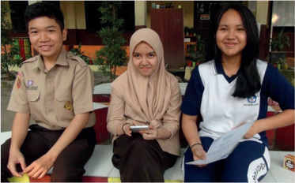

> **Deskripsi Visual:** Gambar ini adalah foto yang menampilkan tiga orang siswa berpose bersama di depan sebuah meja belajar. Mereka semua mengenakan pakaian sekolah yang formal, dengan dua siswa memakai seragam sekolah dan satu siswi menggunakan hijab. Mereka tampak senang dan tertawa, menunjukkan suasana yang positif dan harmonis.

Elemen-elemen utama dalam gambar ini adalah tiga siswa, meja belajar, dan beberapa elemen lingkungan seperti pohon dan perpustakaan. Siswa-siswa tampak berada di sekitar meja belajar, menunjukkan bahwa mereka mungkin sedang berada di ruang belajar atau kelas. Pohon dan perpustakaan tampak di latar belakang, menunjukkan bahwa tempat tersebut memiliki lingkungan yang nyaman dan mendukung pembelajaran.

Teks, angka, atau label penting yang terlihat dalam gambar ini tidak ada, karena gambar hanya berupa foto tanpa teks atau angka tambahan. Namun, informasi kunci yang dapat diambil pembaca adalah bahwa tiga siswa sedang berada di lingkungan sekolah, mungkin sedang menghadiri sesi belajar atau mengikuti kegiatan sekolah lainnya.

PALANGKARAYA, KOMPAS.com - Tiga siswa SMAN 2 Palangkaraya, Kalimantan Tengah, meraih juara dunia atas temuan obat penyembuh kanker dengan bahan baku alami berupa batang pohon tunggal atau dalam bahasa dayak disebut dengan bajakah.  Tanaman ini diperoleh di hutan Kalimantan Tengah. Ketiga siswa itu bernama Yazid, Anggina Rafitri, dan Aysa Aurealya Maharani.  Guru  pembimbing  siswa  yang  merupakan  guru  biologi,  Helita, mengatakan, keberhasilan ketiga siswa tersebut berawal dari informasi Yazid. Yazid mengatakan bahwa ada sebuah tumbuhan di hutan Kalimantan Tengah yang kerap digunakan keluarganya bisa menyembuhkan kanker, bahkan kanker ganas stadium empat sekalipun. Di bawah bimbingan Helita, ketiga siswa itu memutuskan untuk memulai pembahasan awal yang lebih serius mengenai kayu bajakah tersebut. Penelitian diawali dengan uji pendahuluan di laboratorium sekolah.  Lalu  penelitian  dilanjutkan  dengan  uji  sampel  penelitian  lanjutan, yang menggunakan dua ekor mencit atau tikus betina atau tikus kecil berwarna putih,  yang  sudah  diinduksi  atau  disuntik  zat  pertumbuhan  sel  tumor  atau kanker. Sel kanker berkembang di tubuh tikus dengan ciri banyaknya benjolan di tubuh, mulai dari ekor hingga bagian kepala. Mereka lalu memberikan dua penawar atau obat yang berbeda terhadap kedua tikus. Satu tikus diberi bawang dayak dalam bentuk cairan yang diminumkan ke tikus, sementara tikus laiin

 

---
## 📄 Halaman 53

diberi air rebusan yang berasal dari kayu bajakah. 'Setelah memasuki hari ke50, mencit yang diberi air penawar dari bawang dayak mati, sementara mencit yang diberi cairan kayu bajakah tetap sehat, bahkan bisa berkembang biak,' ujar Helita, Senin (12/8/2019). Setelah melalui pembuktian terhadap media uji  sampel,  pada  awal  Mei  2019  penelitian  dilanjutkan  dengan  memeriksa kadar yang terdapat pada kayu bajakah tersebut melalui uji laboratorium, yang bekerja sama dengan pihak laboratorium di Universitas Lambung Mangkurat, Banjarmasin, Kalimantan Selatan. Hasil penelitian, kayu bajakah itu memiliki kandungan yang cukup kaya antioksidan, bahkan ribuan kali lipat dari jenis tumbuhan  lain  yang  pernah  ditemukan,  khususnya  untuk  penyembuhan kanker.  Beberapa  hasil  uji  laboratorium  ditemukan  fenolik,  steroid,  tannin, alkonoid, saponin, terpenoid, hingga alkonoid. Berdasarkan hasil tertulis uji laboratorium dari Universitas Lambung Mangkurat itu, ketiga siswa dibantu guru  pembimbing  mengolah  kayu  bajakah  menjadi  serbuk  teh  siap  seduh untuk bisa dibawa ke ajang kompetisi yang akan diadakan di Bandung. Pada 10 Mei 2019, guru pembimbing dan ketiga siswa sepakat untuk mengikuti perlombaan  yang  diadakan  di  Bandung.  'Kami  sepakat  untuk  mengikuti lomba  Youth  National  Science  Fair  2019  (YNSF)  yang  dilaksanakan  di Universitas Pendidikan Indonesia (UPI) Bandung. Kami bersyukur berhasil memenangi  perlombaan  tersebut. Bahkan,  tak disangka kami  menjadi perhatian dan berhasil meraih juara, dengan memperoleh medali emas, terbaik se-Indonesia,' ujarnya. 'Ini menjadi tiket kami untuk melangkah ke tingkat internasional,' kata Yazid. Setelah sukses di Bandung, karya ilmiah dari ketiga siswa  tersebut  dipilih  mewakili  Indonesia  untuk  tampil  dalam  perlombaan tingkat internasional dalam ajang World Invention Olympic (WICO) di Seoul, Korea  Selatan.  Namun,  dalam  ajang  selanjutnya Yazid  tidak  ikut  sehingga diwakilkan oleh dua rekannya, Anggina Rafitri dan Aysa Aurealya Maharani. Aysa  mengatakan,  dia  sempat  merasa  tidak  yakin  membawa  hasil  karya mereka ke tingkat internasional. Namun, mereka tetap berusaha tampil sebaik mungkin. 'Sangat tidak diduga kami kembali berhasil meraih juara di tingkat internasional, dengan meraih juara dunia life sains pada ajang World Invention Olympic (WICO) di Seoul, Korea Selatan. Kami kembali memperoleh medali emas dengan menggeser 22 negara yang ikut berkompetisi saat itu,' kata Aysa. Kemenangan tersebut membuat semangat ketiga siswa semakin meningkat. Banyak kenangan dan wawasan yang mereka temukan saat itu yang tentu saja

 

---
## 📄 Halaman 54

menjadi kebanggaan tersendiri bagi para siswa karena bisa membawa harum nama Kalimatan Tengah dan Indonesia. Anggina mengatakan merasa bahagia dapat  membantu  orang  banyak  untuk  penyembuhan  kanker  dan  membagi informasi tentang kearifan lokal Kalimantan Tengah. 'Ke depan kami akan terus berupaya menggali potensi alam lain agar Kalimantan Tengah yang kaya akan sumber daya bisa bermanfaat bagi banyak orang,' kata Anggina. Hingga kini belum ada rencana, baik guru pembimbing maupun ketiga siswa, untuk memproduksi  hasil  temuan  mereka  untuk  diperjualbelikan.  Sudah  sangat banyak  yang  menghubungi  mereka  agar  bisa  mendapatkan  kayu  bajakah sebagai  obat  penyembuh  kanker.  Artikel  ini  telah  tayang  di  Kompas.com dengan judul «Cerita Lengkap Siswa SMA Temukan Obat

(Kompas.com - 13/08/2019, Diunduh, 14 Desember 2020)

### F.  Langkah-langkah Untuk Mengembangkan Talenta

Ada ungkapan:' 'Kerja keras mengalahkan bakat'. Seolah-olah tanpa bakat atau  talenta  pun  seseorang  pasti  mampu.  Padahal  tidak  pernah  tiba-tiba seseorang menjadi manusia yang memiliki talenta atau bakat. Bahkan bakat alam sekalipun membutuhkan latihan dan pembelajaran. Individu yang ingin meningkatkan  talenta  dalam  dirinya,  maka  mereka  dapat  mengembangkan keahlian  mereka  ke  tingkat  berikutnya.  Kita  mengapresiasi  orang-orang otodidak yang berhasil memperkuat bakat alami mereka tanpa bimbingan apa pun. otodidaktisisme adalah anugerah untuk dirinya  sendiri. Bagi kebanyakan orang, memiliki bakat murni tidaklah cukup. Dibutuhkan sebuah usaha untuk belajar dari mereka yang telah menempuh jalan yang sama dengan kita. Talenta apa pun yang seseorang miliki, membutuhkan waktu untuk mempelajari dan mengembangkannya.

 

---
## 📄 Halaman 55

### 1.  Temukan alasan atas setiap talenta yang dimiliki

Mengapa seseorang  harus    melakukan  tindakan  sebagai  wujud  talentanya? Meluangkan  waktu  untuk  menjawab  pertanyaan  ini  untuk  diri  sendiri  dan memberikan  formulasi  yang  tepat,  akan  meletakkan  dasar  yang  kokoh dalam  membangun  serta  mengembangkan  talenta  yang  diberikan  Tuhan. Jika seseorang  telah mendefinisikan dengan jelas alasan  untuk diri sendiri, ini  akan  membantu mereka untuk  fokus pada hal yang paling penting. Ini akan  meningkatkan  tekad  untuk  berjuang  dan  bertahan  ketika  menghadapi tantangan. Menemukan jawaban yang tepat terhadap alasan seseorang harus mewujudkan talentanya dalam tindakan akan memberikan kekuatan u7ntuk menghadapi tantangan yang datang ataupun perasaan gagal, ingin menyerah dll.  Maka,  ketika  semuanya  tiba,  seseorang  sudah  memiliki  jawaban  untuk bertahan.

### 2.  Cari tahu strategi dan cara yang dibutuhkan dalam newujudkan talenta dalam diri

Memiliki  strategi dan ketrampilan yang  harus dipelajari dan dikuasai merupakan peta jalan kearah implementasi talenta yang dimiliki dalam bentuk tindakan nyata. Pelajari kisah sukses orang-orang yang ada dalam bakat atau talenta yang sama. Amat penting untuk belajar dari orang lain.

### 3.  Ketahui kekuatan dan kelemahan Anda, lalu fokuslah pada kekuatan Anda

Dalam  mengasah  bakat  atau  talenta,  seseorang  harus  memiliki  'peta  diri' yaitu  kelemahan  dan  kekuatan  dirinya.  Mengenal  kekuatan  dan  kelemahan diri  akan  membantu seseorang untuk belajar mengatasi kekuarngan dirinya dan  menggunakan  kekuatan  dirinya  sebagai  energi  yang  membangkitkan semangat untuk terus maju. Jangan berfokus pada kelemahan diri, sebaliknya lebih  fokus  pada  kekuatan  diri  karena  jika  kita  fokus  pada  kelemahan  diri maka akan melemahkan daya juang untuk maju.

 

---
## 📄 Halaman 56

### 4.  Terimalah nasihat dan masukan yang membangun

Kadang-kadang kita menemukan diri kita dalam kesulitan di mana bahkan ketika kita telah mencapai kemampuan berdiri dengan kedua kaki kita sendiri, kita masih merasa perlu untuk meminta nasihat atau umpan balik dari orang yang kita anggap layak untuk itu. kita. Tidak ada salahnya mendapatkan umpan balik yang berkaitan dengan bakat dan talenta kita. Kapanpun sesorang  yakin telah  memiliki  apa  yang  diperlukan  untuk  bertindak,    mulailah  perjalanan Anda.

### 5.  Rayakan kemajuan Anda

Seseorang  patut  dan  layak  merayakan  keberhasilannya  dalam  skala  kecil sekalipun. Dengan merayakan capaian yang ada, seseorang telah menstimulus diri  sendiri  untuk  terus  berjuang  dan  maju  dalam  mengembangkan  talenta yang dimiliki.

### Response Saya

Jabarkan langkah-langkah dalam mewujudkan talenta dalam diri kalian!

 

---
## 📄 Halaman 57

### Talenta Ku Bagi Bangsa dan Negara

Setelah mengkaji mengenai bakat atau talenta dari berbagai aspek, kini akan dikaji bagaimnana talenta kita bukan hanya dipakai untuk kepentingan diri sendiri ,maupun kelompok namun juga untuk kepentingan banyak orang, itulah pengabdian kita bagi bangsa dan negara. Caranya pun beragam.

- Dengan  talenta  yang  dimiliki  seseorang  dapat  melakukan  hal-hal  baik bagi kepentingan banyak orang. Misalnya kemampuan dalam mengolah limbah menjadi benda-benda berguna. Ketrampilan ini dapat dibelajarkan pada orang lain sehingga menolong mereka. Ataupun karya-karya lain di tengah komunitas masayarakat.
- Talenta  dalam  penelitian,  dapat  dilakukan  untuk  menolong  banyak orang  karena  hasil  penelitian  bermanfaat.  Misalnya  penelitian  anakanak SMA di Kalimantan yang menemukan bahwa batang 'bajak' dapat menyembuhkan penyakit kanker.
- Mengikuti lomba atau kompetisi yang mengharumkan nama bangsa.
- Menjadi  duta  lingkungan  hidup  dll.  Duta  lingkungan  hidup  bertugas memberikan  edukasi  pada  masyarakat  mengenai  pentingnya  menjaga serta melestarikan alam.
- Pemanfaatan  kemampuan  dan  talenta  dalam  diri  remaja  dapat  dimulai dalam lingkup keluarga, sekolah, gereja  dan masyarakat.

### Response Saya

Bagaimana cara kalian menggunakan talenta dalam diri untuk mengabdi pada bangsa dan negara?

 

---
## 📄 Halaman 58

### G. Refleksi

Tiap manusia dapat menemukan dalam dirinya kemampuan dan talenta yang merupakan  kekuatan  dalam  dirinya  yang  dianugerahkan  Tuhan.  Sebagai makluk  istimewa  dan  gambar  Allah, remaja Kristen terpanggil untuk menggali kemampuan dan talenta dalam dirinya, mengembangkannya serta memanfaatkannya bagi kepentingan banyak orang. Kemampuan dan talenta yang dimiliki membutuhkan proses pematangan melalui latihan dan praktik, melalui  proses  seperti  itu,  anak-anak  dan  remaja  Kristen  dapat  memiliki kemampuan dan talenta yang sudah matang.

 

---
## 📄 Halaman 59

KEMENTERIAN PENDIDIKAN, KEBUDAYAAN, RISET, DAN TEKNOLOGI REPUBLIK INDONESIA, 2021 Pendidikan Agama Kristen dan Budi Pekerti untuk SMA Kelas XII

Penulis: Janse Belandina Non-Serrano

ISBN: 978-xxx-xxx-xxx-x

---
**🖼️ Gambar/Diagram**

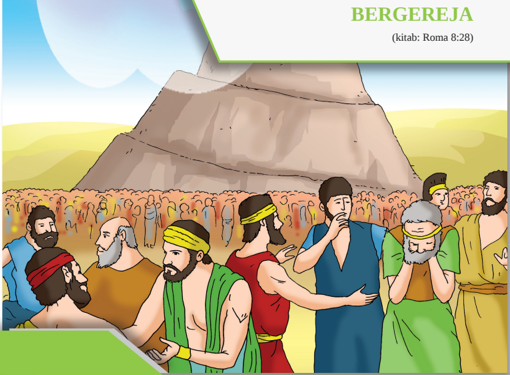

> **Deskripsi Visual:** Gambar ini adalah ilustrasi yang menunjukkan sebuah pertemuan atau peristiwa sosial di sebuah desa atau kota kecil. Gambar ini menggambarkan beberapa orang dewasa dan anak-anak yang sedang berbicara atau berinteraksi dengan satu sama lain. Mereka semua dikenakan pakaian tradisional, yang mencerminkan budaya atau periode waktu tertentu. Di latar belakang, terlihat bangunan tradisional dengan atap datar, yang mungkin merupakan rumah atau tempat umum di desa tersebut. Di sudut kanan atas gambar, terdapat teks "BERGEREJA" dan "(kitab: Roma 8:28)", yang menunjukkan bahwa gambar ini mungkin digunakan sebagai bagian dari materi pendidikan tentang agama atau sejarah. Elemen-elemen utama dalam gambar ini meliputi orang-orang yang berinteraksi, pakaian mereka, dan bangunan tradisional di latar belakang. Informasi kunci yang dapat diambil dari gambar ini adalah bahwa ini mungkin menggambarkan kehidupan sehari-hari atau peristiwa penting dalam masyarakat tradisional.

### Tujuan Pembelajaran

- Menjelaskan alasan gereja membutuhkan pembaharuan
- Menjabarkan  berbagai cara yang dipakai Allah dalam membaharui gereja.
- Membuat kolase cerita para laki-laki dan perempuan yang berperan dalam pembaharuan gereja
- Mempresentasikan mengenai perubahan-perubahan yang terjadi dalam  gereja masa kini

### ALLAH PENGASIH MEMULIHKAN KEHIDUPAN BERGEREJA

(kitab: Roma 8:28)

 

---
## 📄 Halaman 60

### A.  Pengantar

Gereja adalah lembaga yang berdiri sebagai perkumpulan orang-orang yang percaya kepada Yesus Kristus. Lembaga ini berdiri pada hari Pentakosta, yaitu hari yang ke-50 setelah Tuhan Yesus naik ke surga. Namun orang-orang Kristen yang sudah ditebus oleh Yesus adalah manusia yang lemah dan tetap berulang kali jatuh ke dalam dosa. Karena itulah, kita bisa melihat bagaimana Gereja berulang kali mengalami masalah: pertengkaran dan perpecahan, kelemahan dalam tanggung jawab, korupsi, kesalahan dalam pengajaran, kelesuan dalam hidup persekutuannya, dll.

Pembahasan  ini  memberikan  penekanan  pada Allah  yang  membaharui gereja demi keberlangsungan gereja dalam dunia ini. Dalam membahas topik ini dikaji bagaimana Allah membaharui gereja dan bahwa Allah melakukan pembaharuan melalui berbagai cara yang terkadang juga manusia sukar untuk memahaminya. Peristiwa reformasi merupakan salah satu peristiwa penting dimana Allah  Pengasih membaharui kehidupan gereja. Hingga saat ini, Allah terus bekerja membaharui gerejanya melalui orang-orang yang dipilih-Nya.

Pembahasan materi ini memberikan pencerahan bagi remaja SMA kelas XII  untuk  memahami  persoalan-persoalan  yang  dihadapi  gereja  sebagai lembaga maupun sebagai persekutuan orang percaya. Mempelajari materi ini memotivasi siswa SMA untuk bersikap kristis terhadap gereja dan memahami bahwa gereja membutuhkan pembaharuan supaya dapat menjalankan misinya di dunia ini.

### B.  Belajar dari Lagu

Nyanyian:

KJ. 252 ' Batu Penjuru G'reja '

Batu penjuru G'reja dan Dasar yang esa, yaitu Yesus Kristus, Pendiri umat-Nya. Dengan kurban darah-Nya Gereja ditebus; baptisan dan firman-Nya membuat-Nya kudus.

 

---
## 📄 Halaman 61

Terpanggil dari bangsa seluruh dunia, manunggallah Gereja ber-Tuhan Yang Esa. Aneka kurnianya, esa baptisannya, esa perjamuannya, esa harapannya.

Dilanda perpecahan dan faham yang sesat. Jemaat diresahkan tekanan yang berat. Kaum kudus menyerukan, 'Berapa lamakah?' Akhirnya malam duka diganti t'rang cerah.

Gereja takkan punah selama-lamanya, dibimbing tangan Tuhan, dibela kasih-Nya. Ditantang pengkhianat dan banyak musuhnya, dan bertahanlah jemaat dan jaya mulia.

Di dalam pencobaan dan perjuangannya dinantikan zaman sejahtera baka. Di mata tercerminkan Gereja yang menang mencapai perhentian sentosa cemerlang.

Gereja yang di surga dan yang di dunia bersatu dalan Tuhan, Ketiga yang Esa Ya Tuhan, b'ri anug'rah supaya kami pun Engkau tempatkan juga kekal dirumah-Mu.

Nyanyian di atas menggambarkan suasana dan tantangan yang dihadapi oleh  Gereja.  Bagaimana  suasana  kehidupan  yang  dialami  Gereja  menurut nyanyian  itu?  Apa  saja  tantangan  yang  harus  dihadapi  Gereja,  agar  bisa menang menghadapi berbagai cobaan di dunia? Tugas-tugas apayang harus dilakukan oleh para pemimpin dan warga gereja?

 

---
## 📄 Halaman 62

### C.   Reformasi

Reformasi adalah sebuah peristiwa yang dimulai pada abad ke XVI ketika Martin  Luther  memakukan  95  dalilnnya  yang  berisi  kritik  terhadap  ajaran Gereja  pada  waktu  itu.  Luther  mengkritik  pemahaman  bahwa  orang  bisa membeli keselamatanya dengan memberi surat keselamatannya atau membeli relikui-relikui orang kudus.

Menurut  Luther,  hanya  imanlah  yang  menyelamatkan  kita  (Rm.  3:28 'Karena  kami  yakin,  bahwa  manusia  dibenarkan  karena  iman,  dan  bukan karena  ia  melakukan  hukum  Taurat.  Karena  itu,  kita  berpendapat,  bahwa manusia dibenarkan melalui iman, terlepas dari perbuatan-perbuatan berdasarkan Hukum Taurat.')

Luther  memperkenalkan  istilah  'evangelisch'  (dalam  bahasa  Jerman) yang  berarti  'injili'  yang  artinya  'kembali  kepada  Injil'.  Dengan  kata  ini, Luther  bermaksud  menyatakan  bahwa  ajarannya  didasarkan  pada  Alkitab, bukan pada tradisi.

Perubahan  yang  dilakukan  oleh  Luther  lebih  menyentuh  pada  ajaran Gereja, seperti  soal  pengampunan dosa, jumlah sakramen, pernikahan para rohaniwan, dll. Luther berprinsip, 'Apa yang tidak dilarang di Alkitab, berarti tidak apa-apa.'

 

---
## 📄 Halaman 63

Reformasi  Luther  dilanjutkan  oleh  Yohanes  Calvin,  seorang  teolog dari  Prancis  yang  berkiprah  terutama  di  Swiss.  Calvin  merombak  model kepemimpinan  gereja  yang  bersifat  keuskupan,  yang  masih  dipertahankan oleh  Luther.  Bagi  Calvin,  pendeta  adalah  seorang  penatua  yang  diberikan tugas khusus untuk memberitakan firman dan melayankan sakramen baptisan dan perjamuan kudus. Ada lagi sebuah tugas lain dari pendeta, yaitu menjadi guru  yang  mengajar  jemaat  supaya  bertumbuh  pemahaman  imannya  dan pengetahuannya tentang iman Kristen.

Reformasi Calvin melangkah lebih jauh daripada Luther. Calvin menyatakan bahwa  pendeta sama kedudukannya dengan penatua dan diaken.  Yang  membedakannya  ialah,  pendeta  ditahbiskan  untuk  pelayanan pemberitaan  firman  dan  sakramen  baptisan  dan  perjamuan  kudus.  Patungpatung yang didiamkan oleh Luther, dibuang sama sekali oleh Calvin. Ruang kebaktian menjadi kosong, selain meja perjamuan dan sebuah Alkitab yang terbuka di atasnya, sebagai lambang bahwa Alkitab terbuka dan boleh dibaca semua orang.

Calvin  juga  sangat  menekankan  pengajaran  iman  Kristen.  Di  Jenewa, setiap  hari  Rabu  malam,  Calvin  mengajarkan  bagian-bagian  dari  Alkitab. Progamnya ini banyak menarik perhatian orang dan mereka selalu hadir di kegiatan itu.

 

---
## 📄 Halaman 64

Berbeda dengan Luther, Calvin berpendapat, apa yang tidak disebutkan di  Alkitab,  berarti  tidak  perlu  diadakan  dan  dilakukan  oleh  gereja.  Itulah sebabnya, kebaktian gereja-gereja Calvinis di masa lalu hanya diiringi piano atau organ saja.

Yang  menarik  dari  gerakan  Reformasi  ini  adalah  semboyan  yang dilahirkan  oleh  para  reformator,  yaitu  'ecclesia  reformata,  ecclesia  semper reformanda', yang berarti, 'gereja yang telah diperbaruia adalah gereja yang terus-menerus diperbarui.' Artinya, para reformator sadar bahwa di kemudian hari,  pembaruan  gereja  harus  terus  terjadi  untuk  menjawab  tantangantantangan zaman yang juga terus berubah.

Reformasi  Luther  dan  Calvin  dianggap  kurang  radikal.  Karena  itulah muncul tokoh seperti Ulrich Zwingli yang membuang semua patung orang suci  dari  ruang  gereja  serta  membuat  kebaktian  menjadi  sangat  sederhana. Perjamuan  Kudus,  menurut  Zwingli,  hanyalah  sekadar  peringatan  tentang kematian Yesus. Yesus tidak hadir di dalam peristiwa itu. Ini berbeda dengan pemahaman Gereja Katolik, ajaran Luther maupun Calvin yang menyatakan bahwa Yesus hadir dalam roti dan anggur, ataupun hadir secara rohani seperti kata Calvin.

Reformasi yang dilakukan oleh Luther mendapatkan dukungan dari para pangeran dan raja-raja di seluruh Eropa Barat yang sudah lama muak dengan campur tangan paus di dalam perpolitikan di Eropa.

### Response Saya: Analisis Kritis

Setelah mempelajari point C, tuliskan refleksi kritits kalian  mengenai apa yang terjadi dalam gereka reformasi gereja. Jika kalian  hidup pada waktu itu, apa tindakan kalian? Bandingkan  dengan situasi gereja masa kini!

Menurut  pendapat  kalian,  mengapa  gereja  membutuhkan  pembaharuan? Terutama coba kaitkan dengan situasi ketika wabah covid 19 melanda dunia dan Indonesia dan semua orang beribadah secara online?

 

---
## 📄 Halaman 65

### D.  Penganiayaan atas Kaum Radikal.

Kelompok  Mennonit  dan  kaum  Anabaptis  lainnya  banyak  mengalami penindasan dan penganiayaan karena ajarannya yang menuntut orang-orang Kristen yang mau bergabung ke dalamnya untuk dibaptiskan ulang. Tragisnya, penganiayaan ini umumnya dilakukan oleh orang-orang Kristen sendiri, yaitu Katolik maupun Protestan lainnya, khususnya oleh para pengikut Zwingli dan kemudian Calvin.

Orang-orang Mennonit dan  Anabaptis dikejar-kejar dan diperangi, terutama  sejak  tahun  1525  hingga  1660.  Dasar  penganiayaan  ini  adalah hukum yang ditetapkan oleh Kaisar Theodius I dan Yustinianus I terhadap kaum  Donatis  yang  mengajarkan  baptisan  ulang.  Hukum  itu  menyatakan, mereka yang melakukan baptisan ulang harus dihukum mati. Puluhan ribu orang Anabaptis disiksa dan dibunuh di berbagai wilayah Eropa. Akibatnya, banyak orang Anabaptis kemudian pindah ke Amerika Utara.

Pada  tahun  1648,  diadakan  Perjanjian  Perdamaian  Westfalia  antara orang  Katolik  dan  Protestan.  Namun  orang-orang  Mennonite  tidak  ikut  di dalamnya. Akibatnya, mereka terus dianiaya di Eropa, jauh setelah perjanjian itu ditandatangani.

Kaum  Annabaptis  dan  Mennonit  dianiaya  habis-habisan,  namun  kita melihat tangan Tuhan terus memimpim mereka dan menyelamatkan mereka. Hingga kini ajaran pasifis mereka sering menjadi suara hati nurani mereka yang percaya bahwa perang tidak akan menghasilkan apa-apa selain kehancuran semua pihak. Tuhan tidak menginginkan manusia berperang.

### E.  Allah Menggunakan Berbagai cara Dalam membaharui Gereja

### Diskusi

Diskusikan dengan teman sebangku berbagai cara Allah Membaharui gereja

 

---
## 📄 Halaman 66

### F.  Reformasi di Inggris

Di  Inggris  terjadi  pula  gerakan  pembaruan  gereja.  Pada  intinya  ada  dua gerakan  yang  terjadi.  Yang  pertama  perpisahan  dari  Gereja  Katolik  Roma dan terbentuknya Gereja Inggris dan kedua, pembaruan oleh John Knox yang terpusat di daerah Skotlandia, di bagian utara Inggris.

### H.1. Gereja Inggris (Anglikan)

Pembentukan Gereja Inggris  lebih  didasarkan  pada  masalah  politik,  ketika Raja  Henry  VIII  meminta  Paus  mengizinkannya  menceraikan  istrinya, Catherine  dari  Aragon,  yang  tidak  kunjung  menghasilkan  anak  laki-laki yang  bisa  menjadi  pewaris  takhtanya.  Paus  tidak  bersedia  mengeluarkan surat  pembatalan  pernikahannya.  Karena  itu  pada  tahun  1534,  Henry  VIII memutuskan  bahwa  Gereja  Inggris  memisahkan  diri  dari  Roma  dan  tidak mengakui  Paus  lagi  sebagai  pemimpin  tertinggi  gereja.  Sebaliknya,  Henry mengangkat  dirinya  sebagai  pemimpin  Gereja  Inggris.  Hingga  sekarang, setiap raja atau ratu Inggris diakui sebagai kepala Gereja Inggris.

---
**🖼️ Gambar/Diagram**

> **Deskripsi Visual:** Gambar ini adalah foto yang menampilkan wajah seorang pria tua yang tampak sangat tua dan tua. Pria tersebut mengenakan pakaian formal yang mencakup topi berwarna putih dengan penutup berbulu, lengan panjang, dan baju berwarna hitam. Di tengah-tengah pakaian, ada sebuah perhiasan berbentuk cincin yang tampak sangat mewah dan berharga. Wajah pria tersebut tampak sangat tua dan tua, dengan mata yang besar dan bulat, hidung yang pendek, dan mulut yang sedikit tertutup. Kepala pria tersebut tampak sangat besar dan berbulu, dengan rambut yang berwarna gelap dan berada di atas topi. Wajah pria tersebut tampak sangat tua dan tua, dengan mata yang besar dan bulat, hidung yang pendek, dan mulut yang sedikit tertutup. Kepala pria tersebut tampak sangat besar dan berbulu, dengan rambut yang berwarna gelap dan berada di atas topi.

 

---
## 📄 Halaman 67

### H.2. Gerakan Karismatik.

Gerakan Karismatik bertumbuh dari pentakostalisme, sehingga gerakan ini juga sering disebut sebagai gerakan Karismatik. Ia muncul sebagai gerakan di kalangan gereja-gereja arus utama yang mengadopsi keyakinan dan praktik dari pentakostalisme. Yang menjadi ciri utama gerakan ini adalah penggunaan karunia-karunia roh (karismata).

Gerakan ini dimulai di Gereja Episkopal di Amerika pada sekitar tahun 1960. Yang menarik, gerakan serupa juga terjadi di kalangan Gereja Katolik Roma pada sekitar tahun 1967.

Di  masa  sebelum  1955,  apabila  seorang  anggota  jemaat  atau  pendeta dari gereja arus utama secara terbuka mengemukakan pandangan-pandangan yang positif terhadap ajaran pentakostal, maka ia akan memisahkan diri entah dengan suka rela atau paksaan dari gereja asal mereka.

Namun  pada  tahun  1960an,  ajaran-ajaran  tersebut  mulai  diterima  di kalangan  gereja-gereja  Protestan  arus  utama.  Inilah  yang  terjadi  dengan gerakan karismatik. Mereka tidak keluar, melainkan tetap tinggal di dalam gereja mereka masing-masing dan mulai diikuti warga jemaat lainnya.

Gerakan  ini  semakin  populer  dan  diterima  luas  khususnya  oleh  para pengkhotbah kebangunan rohani seperti William Branham, Oral Roberts, dan A.A. Allen. Mereka mengadakan berbagai kebaktian kebangunan rohani yang interdenominasional (terbuka terhadap aliran-aliran gereja lain).

Ajaran dan praktik pentakostal semakin luas diterima. Gereja Episkopal Amerika  menjadi  gereja  tradisional  pertama  yang  merasakan  pengaruh gerakan baru ini. Awal mulanya biasanya diakui terjadi pada hari Minggu, 3 April 1960, ketika Dennis J. Bennett, kepala gereja Episkopal St. Mark di Van Nuys,  California,  mengisahkan  pengalaman  pentakostalnya  kepada  warga jemaatnya.  Ia  mengulanginya  pada  dua  minggu  berikutnya,  termasuk  hari Minggu Paskah (17 April).

Akibatnya,  ia  dipaksa  mengundurkan  diri  dari  jabatannya.  Namun  hal ini menyadarkan banyak warga jemaat akan munculnya gerakan Karismatik. Gerakan ini kemudian menyebar ke gereja-gereja lain. Para pendetanya mulai menerima dan mengumumkan pengalaman pentakostal mereka. Para pendeta ini  mulai  mengadakan  pertemuan-pertemuan  dengan  mereka  yang  tertarik

 

---
## 📄 Halaman 68

dan kebaktian-kebaktian penyembuhan, termasuk mendoakan dan mengurapi mereka yang sakit.

Gerakan Karismatik Katolik dimulai pada 1967 di Universitas Duquesne, di Pittsburgh, Pennsylvania,  Amerika Serikat. Di Indonesia, gerakan Karismatik Katolik dipimpin oleh Rm. Sugiri yang ditugasi oleh Keuskupan Agung Jakarta. Rm. Sugiri mendampinginya pada tahun 1985-1995 sambil melayani sebagai pastor di Paroki Katedral Jakarta (1996-2005).

Bagi  kalangan  gereja-gereja  injili  di  AS,  gerakan  ini  mula-mula  tidak menarik.  Baru  pada  tahun  1985,  gerakan  itu  masuk  ke  gereja-gereja  injili. Perlu dicatat di sini, gereja-gereja injili di AS merujuk kepada gereja-gereja Protestan yang konservatif. Jadi istilah 'injili' yang dipakai di sana tidak sama dengan apa yang dipakai oleh gereja-greja Protestan yang umumnya ada di Indonesia Timur.

### H.3. Ajaran

Orang Karismatik percaya bahwa karunia-karunia (bhs. Yunani: karismata ) Roh Kudus yang digambarkan di dalam Perjanjian Baru, juga tersedia bagi orang Kristen sekarang apabila mereka mengalami baptisan Roh, entah dengan penumpangan tangan atau cara lainnya. Alkitab memang menyebutkan banyak karunia Allah melalui Roh Kudus. Ada 9 karunia khusus yang didaftarkan dalam 1 Korintus 12:8-10 yang sifatnya adikodrati dan mencirikan gerakan itu, yaitu:

- Berkata-kata dengan hikmat
- Berkata-kata dengan pengetahuan
- Iman
- Karunia menyembuhkan
- Kuasa mengadakan mujizat
- Karunia bernubuat
- Karunia membeda-bedakan roh
- Kemampuan berkata-kata dengan bahasa roh, dan
- Kemampuan menafsirkan bahasa roh.

 

---
## 📄 Halaman 69

### H.4. Gerakan perempuan di dalam gereja

Di banyak gereja di dunia, kaum perempuan tidak banyak diberikan peran yang berarti. Padahal di gereja perdana, perempuan telah banyak berperan. Ada Priskila yang selalu mendampingi Akwila, suaminya, dalam perjalanan pemberitaan injilnya. Ada Lidia, seorang perempuan kaya, pengusaha kain ungu, yang mendanai perjalanan-perjalanan Paulus berkeliling memberitakan Injil. Ada Yunia, seorang penatua di gereja perdana.

Namun tak lama setelah gereja berdiri, peranan perempuan sedikit demi sedikit  tergeser  kembali  ke  belakang.  Baru  di  abad  ke-19  dan  ke-20  kita menyaksikan kebangkitan kaum perempuan dalam pelayanan dan misi gereja. Ann Hasseltine Judson (1789 -1826) adalah salah satu perempuan misionaris pertama dari Amerika Serikat yang melayani bersama suaminya, Adoniram Judson, di Myanmar. Di sana suaminya dituduh sebagai mata-mata Inggris. Sementara itu, Ann  membangun tempat tinggal di dekat penjara supaya ia mudah menjenguk dan mengantarkan makanan bagi suaminya. Di masa itu, Ann banyak menulis kisah kehidupan di tempat misi dan perjuangan yang ia hadapi. Ia menceritakan kisah-kisah tragis perkawinan anak-anak, pembunuhan atas bayi-bayi perempuan dan penderitaan kaum perempuan Myanmar yang tidak punya hak apapun, kecuali apa yang diberikan suami mereka.

Ann  melahirkan  tiga  kali,  namun  semua  anaknya  meninggal  di  waktu kecil. Kesehatan Ann yang masih menyusui bayinya yang ketiga pun buruk, ditambah dengan kondisi di Myanmar yang tidak sehat. Ann meninggal pada usia 36 tahun karena cacar.

 

---
## 📄 Halaman 70

Ann menulis  buku  katekisme  dalam  bahasa  Myanmar,  serta  menerjemahkan kitab  Daniel  dan  Yunus  ke  dalam  bahasa  tersebut.  Ia  juga  menjadi  orang Protestan pertama ang menerjemahkan Alkitab ke dalam bahasa Thai, ketika ia menerjemahkan Injil Matius.

Seorang perempuan perintis lainnya adalah Mary Mitchell Slessor (18481915) yang menjadi misionaris di Nigeria. Setibnya di Nigeria, Mary belajar bahasa Efik, salah satu bahasa setempat, lalu mulai mengajar.

Kefasihannya  dalam  Bahasa  setempat  dan  kepribadiannya  yang  berani membuat  Mary  dipercaya  dan  segera  diterima  masyarakat.  Mary  berhasil menyebarkan Injil, mempromosikan  kedudukan kaum  perempuan dan perlindungan  bagi  anak-anak.  Ia  terkenal  karena  berhasil  menghentikan kebiasaan membunuh bayi-bayi kembar, sebuah praktik yang didasarkan pada kepercayaan  di  Okoyong,  di  daerah  Cross  River  State,  Nigeria.  Karyanya membuat Mary diberi gelar 'Ibunda Agung' Nigeria.

Sumber: University of Southern California. Libraries. Open Source.

 

---
## 📄 Halaman 71

### G. Allah  memakai  Laki-laki  dan  Perempuan  Dalam Membaharui Gereja

Gereja memberi kesempatan pada laki-laki dan perempuan untuk melayani di gereja. Pelayanan gereja dimasa lalu maupun masa kini  selalu memberi tempat bagi umatnya tanpa memandang jenis kelamin.

### Response Saya

Cari bagian Alkitab Perjanjian Baru yang menulis tentang pelayanan kaum perempuan  dan catat apa saja keistimewaan mereka. Serta  apa kesan mu terhadap mereka!

- Menurut pendapat mu, apakah para  laki-laki  dan perempuan memiliki peranan  yang  sama  dalam  gereja?  Tuliskan  tokoh-tokoh  gereja  baik laki-laki  maupun  perempuan  ditempat  kamu  yang  mana  pelayanannya berkesan bagi mu.
- Tuliskan alasan gerekan pembaharuan gereja yang dilakukan oleh Luther berhasil di eropa?

### H. Refleksi

Dari semua uraian di atas kita sudah melihat bahwa ada banyak sekali cara yang digunakan Allah  untuk  memperbarui  Gerejanya.  Sejak  gerakan  Reformasi yang dimulai oleh Luther, Calvin, dan kemudian oleh kelompok-kelompok radikal seperti Anabaptisme, kemudian pembaruan di Inggris, lalu di Amerika dalam bentuk gerakan pentakostal dan karismatik, pembaruan terus terjadi.

Salah satu hal penting yang sering dilupakan adalah peranan perempuan dalam  pelayanan  gereja  dan  misi.  Dalam  bahan  ini  kita  belajar  tentang beberapa tokoh luar biasa yang merintis pekerjaan tersebut. Ann H. Judson yang  melayani  di  Myanmar  dan  meninggal  pada  usia  yang  sangat  muda, serta Mary Slessor yang melayani di Nigeria sampai usia yang cukup lanjut, memberikan pelananan-pelayanan  yang  luar  biasa.  Terbukti  di  sini,  bahwa kaum perempuan sama sekali tidak kalah dibandingkan oleh laki-laki di dalam pelayan mereka di dalam gereja dan misi.

 

---
## 📄 Halaman 72

### Tugas

Buatlah  kolase  berupa  gambar  ataupun  cerita  mengenai  kaum  perempuan dan  laki-laki  yang  menjadi  motivator  bagi  pembaharuan  gereja.  Tugas dikumpulkan pada pertemuan berikut.

 

---
## 📄 Halaman 73

KEMENTERIAN PENDIDIKAN, KEBUDAYAAN, RISET, DAN TEKNOLOGI REPUBLIK INDONESIA, 2021 Pendidikan Agama Kristen dan Budi Pekerti untuk SMA/SMK Kelas XII

Penulis: Janse Belandina Non-Serrano

ISBN: 978-602-244-702-3 (jil.3)

### ALLAH MEMULIHKAN KEHIDUPAN BERBANGSA DAN BERNEGARA

(Galatia 3:28 , Kolose 3: 11)

---
**🖼️ Gambar/Diagram**

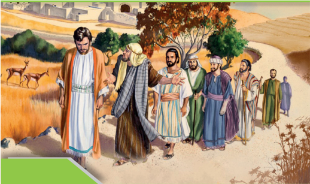

> **Deskripsi Visual:** Gambar ini adalah ilustrasi yang menampilkan kelompok orang tua yang sedang berjalan di sepanjang jalan gamping. Mereka semua mengenakan pakaian tradisional, dengan beberapa pria memakai jubah panjang dan wanita memakai baju batik. Di sebelah kiri, ada dua hewan antelop yang sedang berjalan di area berkarang. Latar belakangnya adalah tanah berbatu dengan pohon-pohon hijau dan beberapa bangunan kecil yang tampak seperti rumah tradisional. Ilustrasi ini mungkin digunakan untuk membantu pembaca memahami situasi atau peristiwa tertentu dalam konteks budaya atau sejarah.

### Tujuan Pembelajaran

- Menjabarkan makna pembaharuan Kehidupan Berbangsa dan Bernegara
- Menjelaskan alasan Indonesia membutuhkan pembaharuan Kehidupan berbangsa dan bernegara.
- Mendaftarkan    persoalan-persoalan  yang  ada  dalam  kehidupan bernegara dan berbangsa kemudian mendiskusikan jalan keluarnya.
- Mendaftarkan sikap dan kontribusi remaja kristen dalam turut serta menanggulangi berbagai persoalan yang ada.

 

---
## 📄 Halaman 74

### A.  Pengantar

Pada tahun 2020 negara kita memasuki usianya yang ke-75 tahun. Ini adalah usia  yang  cukup  panjang.  Namun  kalau  kita  perhatikan,  selama  perjalanan bangsa kita yang sedemikian panjang, kita masih terus mengalami berbagai pergolakan  yang  ditimbulkan  oleh  berbagai  hal. Ada  praktik  korupsi  yang terjadi selama berpuluh tahun di masa Orde Baru, bahkan sampai sekarang pun kita masih menyaksikan perbuatan sejumlah pejabat yang tidak bertanggung jawab dan hanya ingin memperkaya diri sendiri. Ada masalah yang timbul karena keberagaman suku bangsa dan agama, yang kadang-kadang menimbulkan gesekan-gesekan di antara sesama warga bangsa. Ada masalah kesenjangan  ekonomi  antara  pusat  dan  daerah,  ketidaksetaraan  perlakuan antara laki-laki dan perempuan (gender), ada berbagai peristiwa yang dapat dinilai diskriminatif terhadap kelompok-kelompok minoritas, dll.

Pembelajaran ini akan mendorong pemiikiran kritis remaja Kristen untuk memahami persoalan-persoalan yang dihadapi oleh bangsanya dan muncul kecintaan serta tekad untuk turut serta menggumuli masalah-masalah tersebut. Pembahasan ini juga memotivasi remaja untuk menyadari tanggung-jawabnya sebagai  warga  negara  dalam  turut  serta  berperan  dalam  menanggulangi persoalan yang ada. Paling tidak melalui berbagai kegiatan yang ada dalam sekolah maupun di luar sekolah.

### B.  Persoalan-persoalan yang Dihadapi oleh Bangsa Kita

### 1.  Kemiskinan dan korupsi

Tingkat kemiskinan di negara kita sesungguhnya masih sangat tinggi. Ketika bahan  ini  ditulis,  Indonesia  mengalami  krisis  yang  hebat  yang  disebabkan oleh merebaknya virus COVID-19 yang menyebabkan bukan hanya kematian banyak  orang,  tetapi  juga  kematian  kehidupan  ekonomi  baik  di  kalangan perusahaan-perusahaan besar dan mereka yang bergerak di aktivitas ekonomi UMKM (Usaha Mikro Kecil dan Menengah).

 

---
## 📄 Halaman 75

Kesenjangan ekonomi di negara kita masih terlihat lebar sekali.  Ada orangorang  yang  sangat  kaya,  sehingga  mereka  bisa  dengan  mudah  melakukan wisata ke negara-negara Eropa, Amerika Serikat, Jepang, dll. Kelas pesawat terbang  yang  mereka  tumpangi  pun  adalah  kelas  yang  mahal,  bukan  kelas ekonomi yang murah. Uang tidak menjadi masalah bagi mereka.

Sementara  itu,  masih  banyak  sekali  orang  yang  miskin.  Bahkan  untuk makan  besok  pagi  pun  mereka  mungkin  tidak  punya  uang.  Kalau  mereka sakit, mereka tidak mau ke dokter, atau ke puskesmas, karena anggapannya pasti  harus  keluar  uang  banyak  untuk  beli  obat,  dll.  Akibatnya,  kondisi mereka semakin buruk: makan seadanya, kadang-kadang hanya nasi dengan garam atau kecap saja. Akibatnya, kesehatan tidak dirawat dan kondisi tubuh melemah. Tidak heran kalau harapan hidup mereka lebih rendah.

Kesenjangan ekonomi ini juga terlibat dari ketersediaan lapangan kerja. Lapangan kerja paling banyak tersedia di P. Jawa. Yang lainnya mungkin harus bekerja di kebun-kebun sawit, pabrik-pabrik di luar Pulau Jawa.

### 2.  Keberagamaan Beragama

Bangsa Indonesia terdiri dari ribuan suku dan banyak agama. Menurut sensus penduduk oleh BPS 2010 ada sekitar 1340 suku bangsa di Indonesia dengan 718 bahasa, dan 6 agama resmi, serta mungkin puluhan atau ratusan agama lokal. Masalah pengakuan terhadap 6 agama resmi ini, Islam, Kristen, Katolik, Buddhisme, Hindu, dan Konfusianisme, menimbulkan masalah sebab, jumlah pengikut agama-agama itu tidak sama. Islam adalah agama yang paling banyak pengikutnya (85%).

Namun demikian, di luar itu kita harus mengakui bahwa ada daerah-daerah tertentu di Indonesia yang dihuni oleh agama-agama yang minoritas, tetapi menjadi  mayoritas  di  wilayahnya.  Misalnya,  di  Sumatera  Utara,  Sulawesi Utara,  Nusa  Tenggara  Timur,  Papua  Barat  dan  Papua,  kita  menemukan kantong-kantong  Kristen.  Di  Bali  ada  komunitas  Hindu  yang  sangat  besar jumlahnya (sekitar 3,6 juta).

Kemudian ada sejumlah agama setempat (mis. Parmalim di daerah Batak, Kaharingan  di  Kalimantan,  Sunda Wiwitan  di  Jawa  Barat, Aluk Todolo  di Toraja, Marapu di Sumba, berbagai aliran kebatinan di hampir semua wilayah Indonesia, dll.) yang seringkali dianggap bukan agama.

 

---
## 📄 Halaman 76

### C.  Tekanan dan Persekusi

Persekusi  menurut  Kamus  Besar  Bahasa  Indonesia  adalah  pemburuan sewenang-wenang  terhadap  seseorang  atau  sejumlah  warga.  Okunum  atau kelompok  disakiti,  ditumpas  dianiaya.  Sejak  tahun  1993  persekusi  diakui sebagai  salah  satu  bentuk  kejahatan  kemanusiaan  dan  pelakunya  diproses hukum. Berbagai Tindakan persekusi terjadi di Indonesia berkaitan dengan berbagai perbedaan yang ada. Kita dapat menyaksikannya diberbagai media.

Dalam menghadapi persekusi, mungkin kita bisa belajar dari Nadirsyah Hosen,  seorang  dosen  Indonesia  yang  mengajar  di  sebuah  univesitas  di Australia.  Ia  menceritakan  pengalamannya,  bahwa  memang  tidak  mudah mendirikan masjid di Australia. Rencana pembangunan gedung ibadah apapun di Australia  harus  mengikuti  rencana  kota. Apabila  rencana  yang  diajukan sesuai,  dengan  pertimbangan  jumlah  umat,  jumlah  kendaraan  dan  tempat parkir  memadai  dan  dampak  suara  yang  dijamin  tidak  akan  mengganggu masyarakat sekitar, kemungkinan rencana itu bisa disetujui.

Keberatan yang mungkin timbul dari masyarakat sekitar adalah apabila gedung itu diperkirakan akan menimbulkan gangguan kehidupan masyarakat di  sana,  dengan  pengeras  suara  yang  besar.  Apalagi  kemudian  muncul kecenderungan  para  imigran  -  yang  umumnya  beragama  berbeda  dengan masyarakat penghuni di daerah itu - kemudian pindah ke sekitar tempat ibadah itu.  Hal itu dianggap akan mengganggu keseimbangan jumlah penduduk di situ dan mengganggu homogenitasnya. (Hosein, 2019).

### D.  Radikalisme Agama-agama

Kita  juga  menyaksikan  tumbuhnya  radikalisme  agama-agama  di  berbagai tempat. Seringkali hal ini dimulai di kalangan anak-anak SMA yang dididik oleh  guru-guru  agama  yang  juga  sudah  terpengaruh  oleh  doktrin  radikal. Itu sebabnya dalam berbagai unjuk rasa kita sering menyaksikan kehadiran remaja-remaja  yang  menyerukan  berbagai  semboyan  radikal.  Mereka  pun tidak jarang ikut melakukan perusakan terhadap berbagai fasilitas umum, atas nama agama dan perjuangan iman.

 

---
## 📄 Halaman 77

Gejala  ini  kita  bisa  saksikan  dari  berbagai  tempat  hunian,  tempat  cuci pakaian, bahkan label-label makanan binatang dan benda-benda tertentu yang dikhususkan hanya untuk kelompok agama tertentu saja. Akibatnya terjadilah sekat-sekat di antara masyarakat umum, yang mempersulit masyarakat untuk hidup bersama dalam damai. Orang semakin dijauhkan satu sama lain, hanya karena adanya perbedaan iman di antara mereka.

Yang semakin meresahkan adalah terbentuknya laskar-laskar di kalangan berbagai agama  yang ikut memperparah  hubungan  antar-sesama, dan menajamkan gerakan radikal tersebut. Suasana kehidupan masyarakat yang tenang  bisa  saja  tiba-tiba  berubah  menjadi  panas  apabila  ada  sedikit  saja api  yang  menyulut.  Laskar-laskar  ini  juga  seringkali  dimanfaatkan  ketika menjelang hari-hari raya keagamaan dan ketika suasana memanas di masamasa menjelang pemilihan umum atau pilkada sebagai kelompok-kelompok penekan untuk menghasilkan suara bagi partai-partai tertentu.

Bagaimana  sebenarnya  pandangan  Alkitab  tentang  keberagaman  ini? Orang-orang Yahudi di masa Yesus cenderung hidup eksklusif dan menjauhkan diri  dari  bangsa-bangsa lain yang mereka sebut goyim atau bangsa-bangsa. Mereka  menganggap  diri  lebih  unggul  dan  bersih  daripada  orang  Samaria yang darahnya bercampur dengan darah bangsa Asyur yang menduduki tanah Israel utara sejak masa pembuangan pada sekitar tahun 700an seb.M.

Sebaliknya, Yesus bertindak berbeda. Ia berbicara ramah dengan perempuan  Samaria  di  sumur Yakub  (Yoh.  4:4-26).  Bahkan Yesus  sengaja mengangkat  tokoh  seorang  Samaria  yang  dijadikannya  pahlawan  dalam perumpamaannya ketika seorang pedagang Yahudi dirampok habis-habisan sampai hampir mati (Luk. 10: 25-37). Saat itu Yesus ditanyai oleh seorang ahli Taurat, siapakah yang layak disebut sebagai sesama kita.

Dengan  perumpamaan-Nya,  Yesus  seolah-olah  menampar  sang  ahli Taurat, ketika Ia bertanya, 'Siapakah yang telah menjadi sesama bagi orang yang malang itu?' Yesus menyuruh sang ahli Taurat untuk memilih dari tiga tokoh  sebelumnya,  yaitu  seorang  Farisi,  orang  Lewi,  dan  kemudian  orang Samaria. Dalam keterdesakan, si ahli Taurat dipaksa Yesus secara halus untuk menjawab, 'orang yang telah menolong orang yang malang itu.' Perhatikan, ia bahkan tidak mau menyebut nama etnis orang Samaria itu karena nama itu terlalu najis baginya!

 

---
## 📄 Halaman 78

Yesus  menolak  radikalisme  agama-agama.  Ia  meruntuhkan  temboktembok  yang  memisahkan  masyarakat  dan  tidak  membeda-bedakannya berdasarkan agama, suku, ras, kelas sosial, dll. Dalam Galatia 3:28, Paulus mengatakan, 'Dalam hal ini tidak ada orang Yahudi atau orang Yunani, tidak ada hamba atau orang merdeka, tidak ada laki-laki atau perempuan, karena kamu semua adalah satu di dalam Kristus Yesus.' Ini diwujudkan dalam gereja perdana yang terbuka bagi semua orang, kelas, bangsa, jenis kelamin. Bahkan seorang sida-sida dari Etiopia, yang jenis kelaminnya tidak jelas dibaptiskan oleh Filipus (Kis. 8:27-39). Padahal di masa itu, orang Yahudi sama sekali tidak menerima orang seperti ini, baik di masyarakat maupun di dalam ruang ibadah.

Bagaimana  pandangan  Kristen  terhadap  kehadiran  agama-agama  lain? Apakah kita bisa menemukan kebenaran di dalam agama-agama itu? Ada tiga pendekatan terhadap masalah ini, yaitu eksklusif, inklusif dan pluralis.

Pendekatan  eksklusif  menyatakan  bahwa  agama  Kristen  adalah  satusatunya agama yang benar, sementara yang lainnya salah. Bahkan sebagian orang  menyebutnya  sebagai  ciptaan  kuasa  jahat.  Pendekatan  ini  seringkali menggunakan ayat dari Yohanes 14:6 yang mengutip kata-kata Yesus, 'Akulah jalan  dan  kebenaran dan hidup. Tidak ada seorangpun yang datang kepada Bapa, kalau tidak melalui Aku.'

Pendekatan inklusif menyatakan bahwa agama Kristen adalah yang benar dan  paling  sempurna.  Namun,  kebenaran  juga  dapat  ditemukan  di  dalam agama-agama lain. Dalam Surat Ibrani 1:1-2, kita menemukan kata-kata ini:

'Setelah pada zaman dahulu Allah berulang kali dan dalam pelbagai cara berbicara kepada nenek moyang kita dengan perantaraan nabinabi, maka pada zaman akhir ini Ia telah berbicara kepada kita dengan perantaraan Anak-Nya, yang telah Ia tetapkan sebagai yang berhak menerima segala yang ada. Oleh Dia Allah telah menjadikan alam semesta.

Kedua ayat di atas menunjukkan bahwa Allah tidak membiarkan bangsabangsa berjalan di dalam kegelapan. Allah mengangkat nabi-nabi dan utusanutusan-Nya untuk menyampaikan perintah-perintah-Nya supaya setiap orang bisa berjalan di dalam terang.

 

---
## 📄 Halaman 79

Pendekatan pluralis menyatakan bahwa ada puluhan ribu agama di dunia yang sama-sama sah dan benar, apabila dilihat dari budaya mereka masingmasing. Untuk pendekatan terakhir ini, kita tidak bisa menemukan ayat-ayat Alkitab yang mendukungnya. Namun demikian, para pendukung pendekatan ini cenderung mengatakan bahwa mereka sudah lelah dengan pertikaian yang mempertentangkan mana agama yang benar. Sudah terlalu banyak peperangan yang dilakukan atas  nama  agama.  Jadi,  dasar  pendekatan  ini  lebih  bersifat kemanusiaan.

Di sini dapat dikutip pandangan Dalai Lama, seorang pemimpin agama dari  Tibet.  Suatu  kali  beliau  ditanyai  demikian,  'Bukankah  semua  agama mengajarkan hal yang sama? Mungkinkah kita mempersatukan semuanya?' Dalai Lama menjawab:

'Orang dari berbagai tradisi harus mempertahankan tradisinya masingmasing dan bukan menukarnya. Namun, sebagian orang Tibet memilih Islam, jadi ikutilah. Sebagian orang Spanyol memilih agama Buddha, jadi ikutilah. Tetapi, pertimbangkanlah dengan hati-hati. Jangan lakukan itu hanya karena ikut-ikutan. Ada orang yang awalnya Kristen, lalu pindah menjadi Muslim, lalu pindah menjadi Buddhis, lalu tidak beragama.

Di  Amerika  saya  bertemu  dengan  orang-orang  yang  memeluk  agama Buddha,  lalu  mengganti  pakaiannya!  Seperti  penganut  Zaman  Baru. Ambil sedikit dari ajaran Hindu, ambil lagi dari Buddha, sedikit, sedikit… Itu tidak sehat.

Bagi  masing-masing  pemeluk,  menganut  satu  kebenaran,  satu  agama, sangat  penting.  Beberapa  kebenaran,  beberapa  agama,  itu  kontradikitf.  Saya Buddhis. Karena itu agama Buddha adalah satu-satunya kebenaran dan agama untuk saya. Untuk teman Kristen saya, agama Kristen adalah satusatunya kebenaran dan agama. Untuk teman Muslim saya, Islam adalah satu-satunya  kebenaran  dan  agama  Saya  menghormati dan mengagumi teman-teman Kristen dan Muslim saya. Bila kita mempersatukan dalam arti mencampur-adukkan, itu tidak mungkin. Sia-sia.'

Nah, bagaimana pendapat kamu?  Coba  diskusikan dengan teman sebangkumu,  lalu  diskusikan  juga  bersama  seluruh  kelas  dan  gurumu. Yang penting kita lakukan adalah bagaimana kita belajar untuk terbuka dan menerima sesama kita. Dengan demikian, radikalisme agama seperti di atas tentu tidak akan terjadi.

 

---
## 📄 Halaman 80

### E.  Patriarki

Kata patriarki berasal dari dua kata dalam bahasa Yunani, yaitu 'pater' (ayah) dan 'arkhe' (kepemimpinan). Dari sini jelas bahwa kata patriarki bermakna bahwa kepemimpinan dan kekuasaaan berada di tangan sang ayah, atau lakilaki. Dalam keadaan ini, ayah atau pihak laki-lakilah yang menentukan segalagalanya dalam kehidupan ini. Pihak perempuan menduduki posisi kelas dua. Merek diharapkan diam di dalam rumah saja, tidak usah ikut-ikutan mengatur masyarakat. Apalagi menjadi pemimpin di masyarakat.

Ada ungkapan yang mengatakan bahwa tempat perempuan itu hanyalah 'di  dapur,  sumur  dan  kasur'.  Artinya,  peranannya  hanyalah  memasak, mencuci piring, pakaian, dll. dan melayani suami dalam kebutuhan seksnya dan melahirkan anak. Benarkah demikian?

Tokoh-tokoh  perempuan  pemimpin  di  negara  kita  telah  menunjukkan bahwa perempuan layak terjun ke masyarakat. Di Minahasa kita mengenal Ny. Maria Walanda Maramis yang merintis pendidikan di Minahasa dan bahkan sampai ke Jawa dengan organisasi PIKAT (Percintaan Ibu Kepada Anak dan Temurunannya) untuk mengembangkan pendidikan untuk perempuan supaya mereka bisa bergaul dan berani mengemukakan pemikiran-pemikirannya.

Di Jawa Barat, ada Dewi Sartika yang juga mendirikan 'Sekolah Raden Dewi'  yang  menyebar  ke  seluruh  Jawa  Barat.  Di  kota  Jepara  ada  R.A. Kartini yang fasih berbahasa Belanda dan melakukan surat-menyurat dengan temannya  di  Belanda,  Ny.  Abendanon.  Di  dalam  surat-suratnya  Kartini menunjukkan  keprihatinannya  akan  kedudukan  perempuan  saat  itu,  dan kurangnya pendidikan yang bisa mereka nikmati.

 

---
## 📄 Halaman 81

Para tokoh perempuan di atas hanyalah sebagian kecil dari tokoh-tokoh perempuan Indonesia yang bisa bahas di sini. Merekalah orang-orang yang berani bertindak untuk mengangkat derajat kaum perempuan Indonesia supaya menjadi  setara  dengan  kaum  laki-laki.  Patriarki  perlu  dihancurkan,  supaya perempuan tidak lagi ditempatkan di garis belakang, melainkan bisa diberikan peran sebesar-besarnya sesuai dengan kemampuan mereka.

Di masa modern, kita melihat sejumlah perempuan hebat yang menduduki jabatan-jabatan penting di pemerintahan. Sebut saja Megawati Soekarno Puteri yang menjadi Presiden RI yang ke-5. Sri Mulyani yang menduduki jabatan menteri keuangan dan berkali-kali terpilih sebagai menteri keuangan terbaik di Asia. Ada pula Susi Pudjiastuti yang tidak sampai lulus SMA, namun berhasil luar biasa dalam bisnis perikanannya. Ia kemudian diangkat menjadi menteri kelautan dan perikanan yang terkenal sangat berani dalam menenggelamkan kapal-kapal pencuri ikan di perairan Indonesia. Nama yang layak juga disebut adalah Susi Susanti, pahlawan bulutangkis yang pertama kali merebut medali emas dalam Olimpiade.

Dengan uraian di atas kita bisa melihat bahwa kaum perempuan Indonesia sudah banyak mengalami kemajuan, sehingga kedudukannya cukup lumayan untuk tingkat Asia. Namun di balik itu, kita masih harus mencatat beberapa hal yang masih sangat kurang. Kita masih sangat kurang melihat kepemimpinan perempuan di sinode-sinode gereja kita.

Selain  itu,  di  masyarakat  masih  ada  kasus-kasus  keluarga  yang  lebih mengutamakan anak laki-laki dalam menempuh pendidikan. Anak perempuan kurang didorong untuk sekolah tinggi-tinggi karena adanya anggapan bahwa akhirnya mereka akan ke dapur juga.

Di  dunia  kerja  kita  masih  menemukan  perempuan  yang  dibayar  lebih rendah  daripada  laki-laki.  Padahal  jenis  pekerjaan  yang  mereka  lakukan sama. Mengapa ini bisa terjadi? Meskipun banyak persoalan yang dihadapi oleh perempuan, berkaitan dengan keadilan namun ada juga kabar baik. Pada Bulan April 2022 ada berita gembira bagi kaum perempuan, Tanggal 12 April DPR RI telah mensahkan UU kekerasan seksual yang seringkali menjadikan perempuan sebagai  korban.  UU  ini  memberikan  perlindungan  hukum  bagi kaum perempuan yang menjadi korban pelecehan dan kekerasan seksual. Hal ini menunjukkan perhatian pemerintah terhadap perjuangan kaum perempuan di Indonesia.

 

---
## 📄 Halaman 82

### F.  Kesenjangan Gender

Di sini kita harus mencatat bahwa masalah patriarki tidak bisa dilepaskan dari masalah kesenjangan gender. Selama patriarki masih bertahan, kesenjangan gender masih akan terus hadir di masyarakat kita. Kesenjangan gender sudah disinggung di atas dengan contoh-contoh perbedaan gaji di antara laki-laki dan  perempuan,  kesempatan  kerja  yang  lebih  mengutamakan  laki-laki, sehingga muncul kesan tentang adanya pekerjaan laki-laki dan perempuan. Ada beberapa jenis pekerjaan yang dianggap lebih cocok untuk perempuan mis.: desainer, sekretaris, perawat, apoteker, pelayan toko, kasir, dll. Padahal sebetulnya  laki-laki  juga  bisa  mengerjakan  semua  itu.  Bahkan  tugas-tugas kerumahtanggaan  pun  bisa  dikerjakan  laki-laki.  Namun  masyarakat  pada umumnya masih menganggap aneh kalau seorang laki-laki tinggal di rumah dan menjaga anak, membersihkan rumah, memasak, dll. sementara istrinya bekerja di kantor. Bagaimana pendapat kamu mengenai hal ini?

Untuk  mengatasi  berbagai prasangka buruk tentang semua itu, memang dibutuhkan keberanian untuk mengubah cara  berpikir.  Di  sejumlah  negara kita menyaksikan bagaimana rakyatnya telah berani memilih perempuan  sebagai  pemimpin mereka.  Saat  ini  ada  sembilan perempuan pemimpin yang berhasil  memimpin  negaranya hingga bebas COVID-19, virus yang sangat berbahaya dan mematikan.

Dari ke-9 tokoh itu, ada satu orang  presiden,  dan  ia  adalah seorang  perempuan  Asia,  dari Taiwan. Namanya Tsai Ing-wen.

 

---
## 📄 Halaman 83

### G. Penjelasan Bahan Alkitab

### 1.  Galatia 3:28

Perbedaan yang ditekankan kaum Yudais mengenai perbedaan latar belakang, sekarang setelah kedatangan Yesus dihapus. Di dalam Kristus kita menjadi satu.  Tidak  ada  hambatan  bagi  siapa  saja  untuk  menjadi  seorang  Kristen. Arogansi Yahudi terhadap bangsa-bangsa lain, budak, dan wanita telah benarbenar dihapus. Perbedaan ini tidak berlaku untuk keselamatan (Roma 3:22; 1 Korintus 12:13; dan Kolose 3:11), namun ini tidak berarti bahwa kita tidak lagi merupakan laki-laki atau perempuan, budak atau orang merdeka, Yahudi atau Yunani. Perbedaan-perbedaan itu tetap ada dan ada bagian yang berbicara tentang perbedaan-perbedaan ini, namun dalam hal menjadi seorang Kristen tidak  ada  hambatan.  Setiap  penghalang  yang  didirikan  oleh  manusia  yang membenarkan diri sendiri, legalistik atau bias, telah dirobohkan oleh Kristus sekali dan untuk selamanya. Sikap eksklusif kaum Yahudi telah dikoreksi oleh Paulus bahwa di dalam Kristus semua orang sama. Tidak ada yang superior dan inferior, hanya Kristus yang dimuliakan.

### 2.  Kolose 3: 11

Pada ayat sebelumnya Rasul Paulus mengucap  syukur kepada  Allah sehubungan  dengan  kehidupan  jemaat  Kolose  yang  semakin  mengalami kemajuan  dalam  iman  dan  kasih.  Paulus  meyakinkan  orang-orang  percaya di Kolose dalam Kitab Kolose 2:6-7, bahwa karena mereka telah menerima Kristus maka mereka harus tetap hidup di dalam Dia, berakar di dalam Dia, dibangun  di  atas  Dia  dan  tetap  bertambah  teguh  dalam  iman  kepada  Dia. Jikalau  kita  memperhatikan  dengan  saksama  keseluruhan  surat  kolose  dari pasal 1 sampai dengan pasal 4, maka salah satu hal yang ditegaskan oleh rasul Paulus ialah berkenaan dengan tuntutan Allah kepada setiap orang percaya untuk senantiasa hidup baru dan menjadi manusia baru. Untuk itu setiap orang percaya yang telah diselamatkan oleh Allah seharusnya hidup dalam kebaruan sejati.

Dalam  Roma  8:13,  Rasul  Paulus  mengungkapkan  sebuah  kebenaran penting  tentang  upaya  setiap  orang  percaya  untuk  menanggalkan  manusia lamanya,  yaitu  dengan  cara  hidup  senantiasa  dalam  Roh.  Hal  ini  sangat beralasan karena tidak mungkin 'daging dapat meyelesaikan masalah daging'

 

---
## 📄 Halaman 84

tetapi sebaliknya hanya 'Rohlah yang dapat menyelesaikan masalah daging' sehingga  oleh  karenanya  maka  Paulus  katakan  'Sebab,  jika  kamu  hidup menurut  daging,  kamu  akan  mati;  tetapi  jika  oleh  Roh  kamu  mematikan perbuatan-perbuatan tubuhmu, kamu akan hidup' (Roma 8:13). Setiap orang percaya yang hidup dalam kebaruan sejati tidak hanya menanggalkan manusia lama tetapi juga harus siap untuk mengenakan manusia baru. Manusia baru yang dimaksud menunjuk pada cara berpikir serta cara bertindak yang berbeda dengan kehidupan lama yang pernah dihidupi. Paulus mengungkapkan model manusia baru yang harus dikenakan, yaitu manusia baru yang penuh dengan belas  kasihan,  penuh  dengan  kemurahan,  penuh  dengan  kerendahan  hati, kelemahlembutan  dan  kesabaran.  Mengenakan  manusia  baru  merupakan sebuah  kewajiban  dari  setiap  orang  yang  hidupnya  telah  diselamatkan  dan diperbaharui oleh Allah sehingga bukan sebuah pilihan mau atau tidak mau (suka tidak suka). Penegasan Rasul Paulus tentang mengenakan manusia baru menunjuk pada tindakan untuk mengenakan 'pakaian' manusia baru secara utuh dan bukan sepenggalsepenggal (sebagian). Termasuk di dalamnya pakaian lama yang harus ditanggalkan adalah budaya superioritas yang menempatkan yang  lain  sebagai  inferior.  Misalnya,  memandang  orang  lain  yang  berbeda latar  belakang  dengan  kita  sebagai  orang  'rendah'.  Semua  manusia  tanpa kecuali memiliki harkat dan martabat.

### H. Refleksi

Allah berkuasa memulihkan kehidupan manusia. Allah sanggup memulihkan kehidupan  suatu  bangsa  dan  negara.  Pemulihan  itu  selalu  diikuti  dengan pembaharuan. Pembaharuan yang terjadi itu merupakan Kehidupan dalam kebaruan sejati  dan  hal  itu    ditandai  dengan  adanya  tindakan  untuk menanggalkan  kehidupan  lama/cara  hidup  lama  yang  dikuasai  oleh  dosa. Tindakan  menanggalkan  manusia  lama  ini  beranjak  dari  sebuah  kenyataan bahwa Yesus Kristus telah mematahkan kuasa dosa serta membebaskan kita dari kekuatan dosa yang membelenggu kita sehingga tidak ada alasan bagi kita untuk tidak menanggalkan manusia lama tersebut. Pembaharuan hidup diwujudkan melalui karya Roh Kudus yang adalah Roh kebenran.

 

---
## 📄 Halaman 85

---
**🖼️ Gambar/Diagram**

> **Deskripsi Visual:** Gambar ini adalah ilustrasi yang menampilkan logo sekolah TUT WURI HANDAYANI. Gambar ini terdiri dari beberapa elemen utama:

1. **Keseluruhan**: Gambar ini menunjukkan logo sekolah dengan desain yang simetris dan elegan. Logo ini terdiri dari dua bagian utama: bagian atas yang berisi tulisan "TUT WURI HANDAYANI" dan bagian bawah yang berisi gambar.

2. **Elemen Utama dan Relasinya**: 
   - **Bendera Biru**: Bagian atas logo berwarna biru dengan tulisan "TUT WURI HANDAYANI".
   - **Bendera Putih**: Bagian bawah logo berwarna putih dengan gambar sebuah burung yang sedang membawa selembar kertas.
   - **Lampu**: Di tengah burung, terdapat lampu kuning yang menyerupai api, yang biasanya digunakan sebagai simbol kepercayaan atau keagamaan.

3. **Teks, Angka, atau Label Penting**: 
   - **Teks Penting**: Tulisan "TUT WURI HANDAYANI" yang terletak di bagian atas logo.
   - **Angka**: Ada angka "8" yang terletak di bawah tulisan "TUT WURI HANDAYANI".

4. **Informasi Kunci**: 
   - Gambar ini menunjukkan logo sekolah TUT WURI HANDAYANI, yang mungkin merupakan institusi pendidikan atau organisasi tertentu.
   - Lampu kuning pada logo menunjukkan bahwa sekolah ini mungkin memiliki nilai-nilai atau visi yang berhubungan dengan kepercayaan atau keagamaan.
   - Desain logo yang simetris dan elegan menunjukkan bahwa sekolah ini mungkin berfokus pada pendidikan yang formal dan resmi.

Dengan demikian, gambar ini menggambarkan logo sekolah TUT WURI HANDAYANI dengan detail yang mencerminkan identitas dan nilai-nilai institusi tersebut.

 

---
## 📄 Halaman 86

---
**🖼️ Gambar/Diagram**

> **Deskripsi Visual:** Gambar ini adalah ilustrasi yang menampilkan logo sekolah. Logo ini terdiri dari dua elemen utama: sebuah bendera biru dengan lambang tangan berbentuk bulan sabit dan bintang putih, serta sebuah buku putih yang diletakkan di bawah tangan tersebut. Lambang tangan ini menggambarkan keberanian dan kejujuran, sementara buku menunjukkan pendidikan dan pengetahuan. Di atas lambang tangan, terdapat teks "TUT WURI HANDAYANI" yang menunjukkan nama sekolah. Elemen-elemen ini saling berkaitan, menunjukkan bahwa sekolah ini berfokus pada pendidikan dan nilai-nilai keberanian dan kejujuran.

 

---
## 📄 Halaman 87

KEMENTERIAN PENDIDIKAN, KEBUDAYAAN, RISET, DAN TEKNOLOGI REPUBLIK INDONESIA, 2021 Pendidikan Agama Kristen dan Budi Pekerti untuk SMA/SMK Kelas XII

Penulis: Janse Belandina Non-Serrano

ISBN: 978-602-244-702-3 (jil.3)

---
**🖼️ Gambar/Diagram**

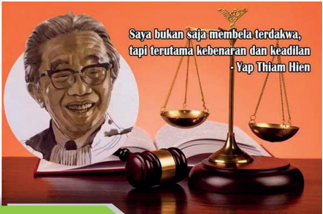

> **Deskripsi Visual:** Gambar ini adalah ilustrasi yang menampilkan seorang hakim berdiri di depan meja hakim dengan timbangan keadilan di sampingnya. Di atas meja hakim terdapat selembar kertas dengan tulisan "Saya bukan saja membela terdakwa, tapi terutama kebenaran dan keadilan" - Yap Thiam Hien. Gambar ini mungkin digunakan sebagai representasi dari prinsip-prinsip hukum dan etika dalam bidang hukum, serta menggambarkan pentingnya kebenaran dan keadilan dalam proses hukum.

### Tujuan Pembelajaran

- Menganalisis kasus pelanggaran terhadap  hak asasi manusia serta memberikan penilaian kritis atasnya sebagai remaja Kristen.
- Siswa  menjelaskan  tugas  gereja  dalam  mewujudkan  demokrasi  dan  HAM. Siswa mewawancarai pendeta di gereja masing-masing tentang peran gereja dalam  demokrasi dan hak asasi manusia
- Menjelaskan kaitan antara keadilan dengan demokrasi dan HAM
- Menulis kajian terhadap 1 orang tokoh dunia dan 1 orang tokoh Indonesia yang memperjuangkan demokrasi dan HAM.
- Membuat refleksi pribadi berkaitan dengan demokrasi dan HAM
- Membuat  slogan  sebagai  tekad  untuk  menggunakan  hak  pilihnya  secara bertanggungjawab: memilih partai politik dan pemimpin lainnya yang memiliki integritas.

### KEADILAN SEBAGAI DASAR DEMOKRASI DAN HAM (KAJIAN KRITIS TERHADAP SIKAP GEREJA)

(Injil Matius 22:37-40, 5:21-24)

 

---
## 📄 Halaman 88

### A.  Pengantar

Pelajaran  ini  merupakan  bagian  yang  amat  penting  ketika  kita  membahas mengenai  Demokrasi  dan  HAM.  Judul  materi  ini  bisa  menimbulkan  salah tafsir karena tertulis kajian kritis terhadap sikap gereja. Masih banyak orang yang anti pati terhadap kritikan yang ditujukan pada gereja seolah-olah gereja adalah lembaga 'suci' yang tak mungkin melakukan penyimpangan ataupun kesalahan dalam menjalankan fungsinya. Jangan lupa bahwa gereja berada di dunia dan bergumul bersama dunia, oleh karena itu gereja dapat saja keliru dalam  menerapkan  aturan  maupun  tanggung  jawab  sosial  kemasyarakatan. Salah satu tugas penting gereja adalah mendidik umatnya termasuk mendidik dalam  hal  bersikap  sebagai  orang  kristen,  khususnya  dalam  menjalankan tanggung jawab sebagai warga negara dan warga gereja. Peran orang kristen sebagai warga negara adalah menjalankan tugas dan kewajibannya termasuk dalam bidang demokrasi dan HAM. Dalam menjalankan perannya itu, acuan orang kristen adalah Alkitab yang berisi ajaran iman Kristen.

Remaja SMA perlu dibekali dengan prinsip-prinsip iman kristen khususnya keadilan  menurut  Alkitab  yang  berkaitan  dengan  demokrasi  dan  HAM. Bahwa keadilan merupakan dasar penting bagi terwujudnya demokrasi dan HAM. Pelaksanaan demokrasi dan HAM  adalah dalam rangka mewujudkan keadilan  bagi  semua  orang  tanpa  kecuali.  Keadilan  bagi  semua  orang Indonesia dari berbagai latar belakang agama, suku, budaya, kelas sosial dan lain-lain. Dengan demikian, mereka merasa terpanggil untuk pro aktif dalam mewujudkan demokrasi dan HAM.

### B.  Makna Keadilan Menurut Alkitab

Allah  adalah    pelindung  orang  miskin,  orang  asing,  janda,  dan  anak yatim.  Hakikat  keadilan  juga  bisa  berarti  'pembebasan,'  'kemenangan,' 'pembenaran,'  atau  'kemakmuran',  keadilan  adalah  bagian  dari  tujuan Allah dalam penebusan. Keadilan, kebenaran dan shalom Allah selalu berada bersama-sama.  Shalom    termasuk  'keutuhan,'  atau  segala  sesuatu  yang membuat  kesejahteraan, keamanan rakyat, dan, khususnya, restorasi hubungan yang  telah  rusak.  Keadilan,  oleh  karena  itu,  adalah  tentang  memperbaiki hubungan yang rusak baik dengan orang lain dan struktur - pengadilan dan hukuman, uang dan ekonomi, tanah dan sumber daya, dan lainnya.

 

---
## 📄 Halaman 89

Dalam Alkitab shalom adalah keadilan yang berkaitan dengan hubungan dan  peran  sosial.  Kita  bisa  membayangkan  bagaimana  reformasi  sistem peradilan  pidana  kita  dapat  didasarkan  pada  'keadilan  restoratif'  daripada sekadar  retribusi.  Hubungan  majikan-karyawan  bisa  dibawa  ke  ide  shalom juga sehingga seharusnya tidak ada eksploitasi dalam hubungan kerja. Dengan demikian, terwujudlah keadilan.

Alkitab dengan jelas menyatakan bahwa Allah itu adil. Ayat-ayat berikut ini menunjukkan kebenaran tersebut: Mazmur 145:17: 'Tuhan itu adil dalam segala jalan-Nya dan penuh kasih setia dalam segala perbuatan-Nya. Zefanya 3:5:  'Tetapi Tuhan adil di tengah-tengahnya, tidak berbuat kelaliman. Pagi demi pagi Ia member hukum-Nya; itu tidak pernah ketinggalan pada waktu fajar. Tetapi orang lalim tidak kenal malu!'. Dari berbagai pemaparan tersebut di  atas,  dapatlah  ditarik  kesimpulan  bahwa  adil    berarti  bertindak  dengan benar sesuai dengan standar kebenaran atau ketetapan hukum yang berlaku. Allah itu adil. Artinya, Allah akan selalu berlaku benar sesuai dengan prinsip kebenaran-Nya. Dia tak akan pernah melanggar ketetapan-ketetapan hukum yang telah dibuat-Nya.

Keadilan Allah dapat kita rasakan dalam berbagai cara, antara lain:

- Allah  mencintai  kebenaran  dan  menolak  kejahatan, Allah  mencintai mereka yang taat dan setia pada jalan-Nya.
- Allah  menghukum  orang-orang  yang  tidak  hidup  dalam  jalan-Nya, mereka yang tidak taat pada perintah-Nya. Menghukum tidak berarti Allah adalah Allah penghukum, Ia menghukum karena keadilan-Nya. keadilan Allah dinyatakan dengan menjatuhkan hukuman atas setiap pelanggaran dan dosa. Dia tidak akan membiarkan pelanggaran dan dosa berlalu begitu saja dari hadapan-Nya. Dia akan mengganjarnya dengan hukuman.
- Allah  memberikan  tempat  bagi  mereka  yang  taat  dan  setia  pada perintah-Nya.  Semua  yang  dilakukan  oleh  manusia  tidak  luput  dari penilaian  Allah.  Jika  setiap  kejahatan    memperoleh  ganjaran  atau hukuman, maka setiap kebaikan dan pekerjaan baik yang kita lakukan dihargai oleh-Nya.
Demikianlah,  keadilan  Allah  nyata  dalam  setiap  tindakan-Nya.  Dia mencintai  kebenaran,  tetapi  membenci  kejahatan.  Dia  mengganjar  setiap dosa  dengan  hukuman,  tetapi  menghargai  setiap  kebajikan  dengan  pahala. Dia  bertindak  sesuai  dengan  prinsip-prinsip  kebenaran  yang  telah  Dia

 

---
## 📄 Halaman 90

tetapkan.  Tak  ada  kecurangan  sama  sekali  dalam  diri-Nya.  Keadilan Allah menjadi amat nyata melalui kedatangan Yesus Kristus yang telah menebus dan  mempermaikan  manusia  dengan  Allah.  Dalam  keadilan-Nya,  Allah mengirim Yesus Kristus untuk merestorasi hubungan manusia dengan-Nya. Anugerah keselamatan merupakan bukti keadilan Allah bagi umat-Nya. Dasar dari  keadilan  Allah  adalah  kasih  dan  pengampunan  begitupun  seharusnya dilakukan oleh umat-Nya.

### C.  Orang  Beriman  Terpanggil  Untuk  Mewujudkan Keadilan dan Kebenaran

Ketika Allah bertanya kepada Salomo apakah yang ia minta dari-Nya, maka Salomo  meminta  hikmat  sebagai  hadiah  dari  Allah.  Sebagai  seorang  raja, Salomo sadar  bahwa  hikmat  dibutuhkan  bukan  hanya  sebagai  bekal  untuk memimpin rakyatnya, namun terutama supaya ia dapat membuat keputusan yang adil dan benar. Tidak mudah bagi manusia untuk memiliki kemampuan bertindak  benar  dan  adil  jika  Tuhan  tidak  memberikan  hikmat-Nya. Allah memenuhi  permintaannya,  hikmat  Allah  pun  dianugrahkan  bagi  Salomo, memiliki hikmat dari Allah membuat Salomo mampu mengambil keputusan adil dan benar. Hal itu terbukti ketika orang membawa kepadanya dua orang perempuan yang memperebutkan bayi, Salomo mampu mengambil keputusan yang adil  benar,  dengan  hikmat  yang  berasal  dari Tuhan,  ia  tahu  manakah diantara dua orang perempuan itu yang merupakan ibu dari bayi yang sedang diperebutkan.

### D.  Keadilan, Demokrasi dan HAM

Beberapa prinsip mendasar yang dapat menghubungkan keadilan, demokrasi dan HAM adalah sebagai berikut:

- P engakuan  terhadap  kesetaraan,  bahwa  semua  orang  sama  harkat  dan martabatnya.  Kesetaraan  akan  mendorong  lahirnya  kerjasama  yang  erat antar warga masyarakat dan mempunyai itikad baik secara fungsional dan profesional.  Prinsip  inilah  yang  membedakan  demokrasi  dengan  sistemsistem yang lain. Sekaligus kesetaraan ini, semua orang sama di hadapan hukumn, semua orang berhak memperoleh apa yang menjadi haknya.

 

---
## 📄 Halaman 91

- Kemerdekaan  dan  kebebasan  ( freedom ).  Prinsip  inilah  yang  seringkali menjadi momok  bagi demokrasi sendiri. Banyak orang cenderung menyalahgunakan  kekuasaan  sebagai  alat  untuk  menindas  sesama  serta merampas kemerdekaan dan hak-hak asasinya. Berbeda dengan Salomo yang dipimpin oleh hikmat Allah sehingga ia memimpin dengan adil dan bijaksana.
- Ketiga ,  prinsip  kesadaran  terhadap  adanya  kemajemukan    dalam  masyarakat. Penghargaan terhadap keberagaman menjadi penopang bagi terwujudnya keadilan, demokrasi dan HAM. Pada masa kini pergerakan manusia dari berbagai  belahan  dunia  amat  tinggi  sehingga  dalam  satu  negara  hidup berbagai bangsa, suku bangsa, budaya maupun agama. Keberagaman ini dapat  melahirkan  konflik,  namun  potensi  konflik  dan  perpecahan  dapat diminimalisir  oleh  adanya  kesadaran  terhadap  keberagaman  manusia. Sekaligus  memupuk  penghargaan  terhadap  sesame  manusia  sebagai makluk mulia ciptaan Allah.
- P rinsip  kebebasan  menyatakan  pendapat  dan  penegakan  HAM.  Jadi, keadilan akan menopang kebebasan tiap orang untuk memilih pemimpin yang  baik  dan  benar  serta  mengemukakan  pendapat  demi  kesejahteraan bersama.
- Integritas. K esesuaian antara kata dengan perbuatan, antara cara dengan pencapaian pencapaian . Cara yang benar jujur dan adil akan menghasilkan buah yang baik. Tujuan yang baik tentu ditempuh dengan cara-cara yang baik dan rasional. Implikasinya adalah politik yang mengandalkan moral dan hati nurani.
- Demokrasi  dan  HAM  akan  menjamin  pemenuhan  keadilan  sosial  bagi seluruh rakyat Indonesia.

### Analisisi Kasus

Tuliskan hasil analisis mu mengenai hubungan antara keadilan, demokrasi  dan  HAM  dan  mengapa  keadilan  harus  menjadi  dasar  utama dalam mewujudkan demokrasi dan HAM? Kaitkan dengan keadilan menurut Alkitab! Prinsip Alkitab yang mana yang dapat kamu pakai dalam melakukan analsis?

 

---
## 📄 Halaman 92

### E.  Memandang HAM sebagai Tanggung Jawab Bersama : Warga Negara dan Warga Gereja

Indonesia memiliki lembaran-lembaran hitam dalam sejarah berkaitan dengan demokrasi dan HAM. Ada berbagai peristiwa konflik dan kekerasan dimana peristiwa-peristiwa itu Peristiwa itu telah menorehkan lembaran hitam dalam perjalanan  HAM  di  Indonesia. Ada  banyak  kasus  pelanggaran  HAM  yang sampai dengan saat ini belum terungkap siapa yang menjadi otak pelanggaran berat hak-hak asasi manusia, khususnya peristiwa pada bulan Mei-Juni 1998 yang  diadili  dan  dijatuhi  hukuman  barulah  prajurit-prajurit  pelaksana  di lapangan. Karena itu vonis yang diberikan pun hanya sebatas pemecatan dan hukuman penjara untuk para pelaku penembakan di Universitas Trisakti dan Semanggi. Sementara itu, siapa para pelaku pemerkosaan, penyiksaan, dan pembunuhan atas sekian ribu korban lainnya mungkin akan tetap gelap dan tidak terungkapkan. Berbagai peristiwa pelanggaran HAM yang diungkapkan dalam bahan pelajaran ini tidak bertujuan mendiskreditkan pihak mana pun. Dengan membuka peristiwa ini,  generasi  muda  dapat  belajar  dari  kesalahan  yang pernah dilakukan oleh generasi terdahulu dan termotivasi untuk mewujudkan demokrasi dan HAM dalam kehidupannya. Hal ini perlu ditegaskan karena meskipun  Indonesia  telah  bertumbuh  menjadi  Negara  demokrasi  namun masih ada pihak tertentu yang tidak ingin berbagai peristiwa pelanggan HAM dibuka  dan  dipercakapkan  secara  terbuka.  Seolah-olah  percakapan  terbuka akan  memprovokasi  rakyat  untuk  memandang  pemerintah  secara  negative. Padahal dengan membuka kasus-kasus pelanggaran HAM akan memberikan pembelajaran kepada generasi muda untuk tidak mengulang hal yang sama sekaligus  sebagai  bentuk  peringatan  dan  solidaritas  kita  bagi  para  korban pelanggaran HAM.

### F.  Sikap Gereja Terhadap Demokrasi dan HAM

Dengan bekal pertanyaan-pertanyaan tersebut  di atas, orang Kristen harus bertanya,  bagaimana  cara  memperlakukan  orang-orang  yang  berada  di sekitarnya. Begitu pula hubungan yang ada  ada dalam organisasi gerejawi? Dalam hubungan gereja dan orang Kristen dengan sesamanya yang berbeda keyakinan,  apakah  telah  terbangun  hubungan  yang  saling  memanusiakan? Apakah  gereja  dan  orang  Kristen  cenderung  memperjuangkan  hak-haknya semata  dan  tidak  peduli  ketika  orang  yang  beragama  lain  kehilangan  hakhaknya?

 

---
## 📄 Halaman 93

Pada skala nasional ada banyak masalah yang membelit para tenaga kerja Indonesia di luar negeri menyangkut hak asasi mereka. Ada yang meninggal disiksa  majikan,  ada  yang  diperlakukan  tidak  manusiawi  dll.  Ada  juga pelecehan seksual yang dilakukan oleh pejabat gereja.

### Apa yang harus dilakukan?

Selama masa Orde Baru bangsa kita dibiarkan menjadi bodoh, tidak bertanyatanya  apakah  hak  asasi  manusia  itu,  dan  mengapa  kita  tidak  memilikinya. Bangsa kita hanya diajarkan bahwa hak asasi manusia adalah konsep barat yang  tidak  cocok  dengan  bangsa  Indonesia.  Karena  itu  kepada  kita  hanya diingatkan akan kewajiban-kewajiban kita, bukan hak-hak kita.

Berkaitan dengan penegakan HAM serta tugas panggilan gereja, kitapun bertanya  apakah gereja sudah melakukan tugas-tugasnya seperti yang telah dibahas  di  atas?  Tampaknya  ada  beberapa  pola  partisipasi  gereja  dalam perjuangan demi keadilan dan kebenaran. Misalnya:

- Gereja paham bahwa ia mempunyai tugas dan panggilan yang utama dalam mendidik warga gereja dan memberikan kesaksian melalui keberpihakan pada mereka yang diperlakukan secara tidak adil.
- Gereja melakukan pelayanan rohani saja karena untuk pelayanan sosial bukankah sudah ada Kementerian Sosial dan lembaga-lembaga swadaya masyarakat?  Penyebab  utama  dari  pemikiran  ini  adalah  segala  sesuatu yang berkaitan dengan yang jasmani, dengan tubuh manusia dan bukan jiwanya, dianggap remeh, rendah, dan duniawi.
- Gereja  paham  akan  panggilannya  untuk  membela  orang  miskin  dan tertindas,  tapi  khawatir  karena  jumlah  orang  Kristen  sangat  sedikit. Bagaimana kalau nanti gereja dan orang Kristen ditindas?
- Gereja terjebak pada praktik-praktik politik praktis. Ketika gereja aktif dalam  kegiatan  membela  rakyat  miskin,  sehingga  gereja  malah  aktif mendukung  partai  politik tertentu,  berkampanye  untuk  calon-calon tertentu.  Keadaan  seperti  ini  bisa  berbahaya  bagi  gereja.  Gereja  bisa menutup mata ketika pihak yang didukungnya melakukan hal-hal yang negatif,  seperti  korupsi,  membohongi  rakyat  dengan  janji-janji  kosong, atau bahkan merampas hak-hak rakyat baik secara halus maupun terangterangan.

 

---
## 📄 Halaman 94

Di  kalangan  gereja-gereja  di  dunia  ada  tokoh-tokoh  yang  tampil  dan memperjuangkan  HAM.  Misalnya,  Pdt.  Dr.  Martin  Luther  King,  Jr.  dari Amerika  Serikat,  Nelson  Mandela  dan  Uskup  Desmond  Tutu  dari  Afrika Selatan,  Kim Dae Jung dari Korea Selatan yang pernah menjabat presiden negara itu. Dari Indonesia ada Dr. Yap Thiam Hien, Pdt. Rinaldy Damanik dari  Poso,  Sulawesi  Tengah,  Ibu  Yosepha  Alomang  atau  Mama  Yosepha, dari Papua, Ibu Ade Rostina Sitompul dari Jakarta, Pdt. Solagratia Lummy, Dr. Mokhtar Pakpahan yang memperjuangkan hak-hak buruh/pekerja di Indonesia.

### Pejuang Demokrasi dan HAM

 

---
## 📄 Halaman 95

---
**🖼️ Gambar/Diagram**

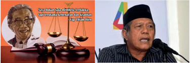

> **Deskripsi Visual:** Gambar ini adalah ilustrasi yang menampilkan dua tokoh penting dalam konteks hukum dan politik Indonesia. Di sisi kiri, terdapat gambar kepala seorang pria tua dengan topi hitam, yang tampaknya merupakan tokoh yang berpengaruh dalam bidang hukum atau politik. Sementara itu, di sisi kanan, terdapat gambar kepala seorang pria muda dengan baju tradisional, yang tampaknya merupakan tokoh yang berpengaruh dalam bidang politik.

Elemen-elemen utama dalam gambar ini adalah dua tokoh yang berbeda, satu tua dan satu muda, serta dua gambar kepala mereka. Relasi antara kedua tokoh ini tampaknya adalah hubungan antara tokoh senior (pria tua) dan tokoh muda (pria muda), yang mungkin merujuk pada hubungan antara pengacara atau hakim senior dan pemimpin politik muda.

Teks, angka, atau label penting yang terlihat dalam gambar ini tidak ada, karena gambar hanya menggambarkan dua tokoh dan tidak memiliki teks atau angka yang jelas.

Informasi kunci yang dapat diambil pembaca dari gambar ini adalah bahwa ada hubungan antara tokoh senior dan tokoh muda dalam konteks hukum dan politik Indonesia, yang mungkin merujuk pada hubungan antara pengacara atau hakim senior dan pemimpin politik muda.

### Belajar dari Para Tokoh

Cari dari  berbagai sumber mengenai 5 tokoh yang gambarnya tertera diatas, tulislah ciri khas mereka masing-masing dan buatlah kolase disertai komentar dari  kamu  mengenai  tokoh-tokoh  tersebut.  Mereka  adalah  para  pejuang demokrasi dan HAM. Mereka mengabdikan hidupnya agi kemanusiaan dan keadilan.  Diantara  mereka  berlima,  Prof.Dr.muchtar  Pakpahan  masih  sehat walafiat hingga kini dan concernnya terhadap perjuangan HAM masih tetap sama.

### Membuat Slogan

Buat slogan sebagai tekad untuk menggunakan hak pilih secara bertanggungjawab:  memilih  partai  politik  dan  pemimpin  lainnya  yang memiliki integritas.

 

---
## 📄 Halaman 96

### G. Refleksi

Gereja  ada  di  dunia  untuk  memberitakan  keadilan  dan  kebenaran,  dalam pemberitaannya, gereja berpihak pada mereka yang tertindas. Mereka yang dimarginalkan.  Gereja  bukanlah  gedungnya  ataupun  organisasinya,  tetapi peran gereja dalam menegakkan keadilan dan kebenaran nyata melalui orangorang yang ada didalamnya. Artinya semua orang beriman terpanggil untuk ,mewujudkan keadilan dan kebenaran.Setiap anggota gereja, termasuk kalian sebagai  remaja Kristen, harus ikut serta di dalam tugas ini. Kita semua perlu berjuang dalam pembebasan banyak orang Indonesia dari keterkungkungan dan belenggu oleh berbagai hal: kemiskinan, konsep tentang kedudukan lakilaki  dan  perempuan yang keliru, pemahaman yang keliru tentang seks dan seksualitas, konsep tentang kebebasan beragama dan berkeyakinan, dll.

 

---
## 📄 Halaman 97

KEMENTERIAN PENDIDIKAN, KEBUDAYAAN, RISET, DAN TEKNOLOGI REPUBLIK INDONESIA, 2021 Pendidikan Agama Kristen dan Budi Pekerti untuk SMA/SMK Kelas XII

Penulis: Janse Belandina Non-Serrano

ISBN: 978-602-244-702-3 (jil.3)

### DAMAI SEJAHTERA MENURUT ALKITAB

(Injil Yohanes 14:23-31)

---
**🖼️ Gambar/Diagram**

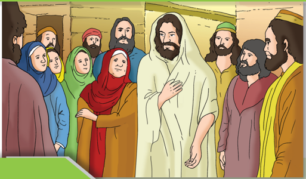

> **Deskripsi Visual:** Gambar ini adalah ilustrasi yang menunjukkan sebuah pertemuan antara sekelompok orang tua dan anak-anak di dalam sebuah ruangan. Orang tua tersebut berdiri di sepanjang dinding, sementara anak-anak mereka berdiri di depan mereka. Semua orang tampak senang dan tertawa bersama-sama. Ilustrasi ini menunjukkan hubungan harmonis antara orang tua dan anak-anak serta suasana yang positif dan menyenangkan.

### Tujuan Pembelajaran

- Menjelaskan arti damai sejahtera menurut Alkitab
- Menggambarkan  ciri-ciri  kehidupan  masyarakat  yang  diliputi  oleh damai sejahtera yang dikehendaki oleh Allah.
- Menyebutkan  contoh-contoh  perilaku  pembawa  damai  sejahtera Allah.
- Menjadi pembawa damai sejahtera

 

---
## 📄 Halaman 98

### A.  Pengantar

Pembahasan ini menjadi sangat penting karena pembahasan damai sejahtera dalam  beberapa  dekade  terakhir  ini  menjadi  semakin  populer,  namun konteksnya  adalah  keadaan  damai  sejahtera  yang  dikontraskan  dengan situasi konflik. Sejumlah universitas dan lembaga lainnya juga menawarkan pendidikan khusus bagi mereka yang ingin berperan sebagai pembawa damai sejahtera.  Tetapi,  yang  ditawarkan  adalah  pandangan  sekularisme  tanpa mengaitkannya  dengan  sudut  pandang  agama-agama.  Tentu  hal  ini  dapat dipahami karena setiap agama akan memiliki sudut pandangnya yang khas tentang damai sejahtera.

Berkaitan dengan kepentingan remaja SMA kelas XII adalah  kelas ujian yang  kelak  setelah  selesai  SMA  siap  untuk  menjadi  manusia  dewasa  yang melangkah ke Perguruan Tinggi atau jika tidak memasuki perguruan tinggi maika kalian  akan bekerja. Dunia luas yang menanti  adalah dunia masa kini yang  penuh  dengan  tantangan  kehidupan.  Tantangan    persaingan  untuk menjadi  yang  terbaik  dan  terutama  terkadang  cenderung  mengabaikan kemanusiaan,  keadilan  dan  perdamaian.  Generasi  masa  kini  seolah-olah dibentuk  oleh  budaya  percepatan  teknologi  yang  serba  instan,  cepat  dan menuntut keunggulan personal  yang sangat kental oleh individualistik.  Tak jarang dalam persaingan itu orang menggunakan segala cara demi mencapai tujuan. Pada sisi lain, berbagai kepentingan yang ada kerap melahirkan konflik dan permusuhan. Oleh karena itu, remaja SMA perlu dibekali oleh prinsipprinsip  perdamaian dalam ajaran iman Kristen. Bekal ini diharapkan dapat menjadi  pegangan  hidup  di  tengah  masyarakat,  bangsa,  gereja  maupun keluarga. Dalam pergaulan  antar pribadi maupun dalam kelompok yang lebih luas.

---
**🖼️ Gambar/Diagram**

> **Deskripsi Visual:** Gambar ini adalah ilustrasi yang menampilkan tokoh yang tampak seperti Yesus Kristus. Tokoh tersebut berdiri dengan posisi tangan di atas kepala dan tubuh yang dililitkan dengan pakaian putih. Latar belakangnya berwarna biru muda yang memberikan kesan tenang dan suci.

Elemen utama dalam gambar ini adalah tokoh yang tampak seperti Yesus Kristus. Ia diperlihatkan dengan posisi yang menunjukkan keberanian dan kepercayaan, serta tubuh yang dililitkan yang mungkin merujuk pada kehidupan dan pengorbanan Yesus. Latar belakang yang berwarna biru muda memberikan kesan tenang dan suci.

Teks, angka, atau label penting tidak terlihat dalam gambar ini. Namun, informasi kunci yang dapat diambil pembaca adalah bahwa gambar ini mungkin digunakan untuk menggambarkan kehidupan dan pengorbanan Yesus Kristus dalam konteks agama Kristen.

Dalam satu paragraf yang informatif, gambar ini menampilkan tokoh yang tampak seperti Yesus Kristus dalam posisi yang menunjukkan keberanian dan kepercayaan, dengan tubuh yang dililitkan yang mungkin merujuk pada kehidupan dan pengorbanan Yesus. Latar belakang yang berwarna biru muda memberikan kesan tenang dan suci. Gambar ini mungkin digunakan untuk menggambarkan kehidupan dan pengorbanan Yesus Kristus dalam konteks agama Kristen.

 

---
## 📄 Halaman 99

### B.  Pengertian Damai Sejahtera Menurut Alkitab

Alkitab,  baik  dalam  Perjanjian  Lama  maupun  Perjanjian  Baru,  menyajikan pemahaman yang utuh tentang damai sejahtera. Begitu banyak tokoh-tokoh Alkitab yang bisa dijadikan teladan tentang bagaimana menjadi pribadi yang membawakan  damai  sejahtera,  di  tengah-tengah  keadaan  yang  sulit  atau dalam  peperangan  sekali  pun.  Tuhan  Yesus  selalu  menjalankan  perannya selaku pembawa damai sejahtera dengan sangat sempurna. Kecuali mereka yang berpikiran picik dan berhati licik, semua yang bertemu muka dengan Tuhan Yesus  mengalami  'cipratan'  damai  sejahtera  yang  dipancarkannya. Artinya,  pertemuan  dengan  Tuhan  Yesus  menjadi  kesempatan  mengalami damai  sejahtera  yang  sesungguhnya,  bukan  yang  sifatnya  sementara  atau bahkan yang palsu. Inilah pesan yang ingin disampaikan kepada peserta didik: bahwa menjadi pembawa damai sejahtera adalah tugas khusus sebagai murid Kristus yang harus dijalankan dengan baik dimana pun kita berada.

Para  penulis  Alkitab  menulis    bahwa  kesejahteraan  (syalom)  Israel berkaitan  erat  dengan  ketaatan  hidup  mereka  kepada  Allah  dan  perintahperintah-Nya. Apabila Israel tidak setia, maka Allah tidak segan-segan akan menghukum  mereka,  menyerahkan  mereka  kepada  musuh-musuh  mereka, membuat  tanah  Israel  menjadi  tidak  subur  dan  sulit  ditanami  (' langit  di atasmu sebagai besi dan tanahmu sebagai tembaga ').  Dari  sini  kita  dapat menyimpulkan bahwa damai sejahtera Allah itu hanya dapat terwujud apabila ada kesetiaan kepada Allah yang disertai kerelaan untuk menjalani perintahperintah dan hukum-hukum-Nya.

Dalam Injil Yohanes 14:23-31, kita menemukan janji Tuhan Yesus untuk memberikan  damai-Nya  kepada  kita.  Janji  ini  diucapkan-Nya  menjelang kematian-Nya  di  kayu  salib.  Yesus  sadar  bahwa  sebentar  lagi  Ia  akan meninggalkan dunia dan murid-murid-Nya. Karena itu Ia menjanjikan Roh Penghibur yang akan menyertai para murid dan semua orang percaya. Tugas Roh ini adalah ' mengajarkan segala sesuatu kepadamu dan ... mengingatkan kamu akan semua yang telah Kukatakan kepadamu .' (ayat 27)

Apakah yang Tuhan Yesus perintahkan untuk kita lakukan? Hal itu tidak lain daripada mengasihi Dia yang harus kita buktikan lewat ketaatan kita untuk menuruti firman-Nya dan Bapa-Nya (ayat 27). Ketaatan kita itulah yang akan memberikan kepada kita damai sejahtera-Nya (ayat 28).

 

---
## 📄 Halaman 100

### Response saya

### Makna Damai Sejahtera Menurut Siswa

Tuliskan  dengan  kata-kata  sendiri  apa  makna  damai  sejahtera  dan  dalam kondisi keluarga kalian, lingkungan sekolah dan situasi masyarakat di daerah masing-masing.  Apa  arti  damai  sejahtera?  Bagaimana  damai  sejahtera dibutuhkan oleh diri kalian sendiri maupun keluarga dan masyarakat sekitar?

Arti damai sejahtera bagi saya .…...................................................................

........................................................................................................................

Arti damai sejahtera menurut Alkitab ............................................................

........................................................................................................................

Damai sejahtera dilingkungan sekolah ...........................................................

........................................................................................................................

Damai sejahtera dalam keluarga ....................................................................

........................................................................................................................

Damai sejahtera dalam masyarakat di daerah saya .........................................

........................................................................................................................

---
**🖼️ Gambar/Diagram**

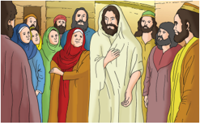

> **Deskripsi Visual:** Gambar ini adalah ilustrasi yang menampilkan kelompok orang tua dan anak-anak yang sedang berbicara dengan seorang lelaki yang tampak seperti pemimpin atau guru. Orang tua dan anak-anak tersebut mengenakan pakaian tradisional, sementara pemimpin tersebut mengenakan pakaian yang lebih formal. Ilustrasi ini mungkin digunakan untuk membantu pembaca memahami situasi sosial atau budaya tertentu.

Elemen-elemen utama dalam gambar ini meliputi:
1. Kelompok orang tua dan anak-anak yang sedang berbicara.
2. Pemimpin atau guru yang berdiri di tengah kelompok tersebut.
3. Pakaian tradisional yang dikenakan oleh orang tua dan anak-anak.
4. Pakaian formal yang dikenakan oleh pemimpin.

Teks, angka, atau label penting tidak terlihat dalam gambar ini karena ia hanya berupa ilustrasi.

Informasi kunci yang dapat diambil pembaca dari gambar ini adalah tentang hubungan sosial antara orang tua, anak-anak, dan pemimpin dalam suatu situasi tertentu, mungkin dalam konteks pendidikan atau sosial.

### C.  Memahami Makna  Damai  Sejahtera Menurut Alkitab

Orang  Kristen  selalu  mengucap  salam  'Syalom'  ketika  berjumpa  ataupun berkomunikasi  dengan  sesama  orang  beriman.  Ungkapan  'syalom'  sudah merupakan sapaan yang lazim di kalangan orang Kristen. Apakah arti kata 'syalom' yang sesungguhnya, dan apa artinya bila kita mengucapkan kata

 

---
## 📄 Halaman 101

itu  kepada  sesama  kita?  Kata  syalom  diambil  dari  dalam  Alkitab,  dalam bahasa Ibrani 'syalom' biasanya diterjemahkan menjadi 'damai' atau 'damai sejahtera'.  Dalam  bahasa Yunani,  bahasa  yang  digunakan  dalam  penulisan Perjanjian  Baru,  kata  ini  diterjemahkan  menjadi eirene. Kata syalom atau 'damai  sejahtera'  sering  dipergunakan  untuk  memberikan  salam  kepada sesama.  Dalam  bahasa  Ibrani  orang  mengucapkan syalom  aleikhem, yang artinya  'damai  sejahtera  bagimu'.  Ucapan  ini  dijawab  dengan  kata-kata aleikhem  syalom. Kata  ini  mirip  sekali  dengan  kata  'salam  alaikum'  atau 'assalamu  alaikum'  dan  'wa  alaikum  salam'  dalam  bahasa Arab,  bukan? Kita  tidak  perlu  heran.  Bahasa  Arab  memang  berasal  dari  rumpun  yang sama dengan bahasa Ibrani - seperti halnya bahasa Tagalog dengan bahasa Indonesia.  Dalam  bahasa Arab  kata syalom diterjemahkan  menjadi salam, kata  yang  sama  yang  dipergunakan  dalam  bahasa  Indonesia  yang  sangat diperkaya oleh kosakata dari bahasa Arab karena pengaruh agama Islam. Kata ini dapat kita bandingkan dengan salam Horas! di kalangan masyarakat Batak; Ya'ahowu! di dalam masyarakat Nias. Ucapan salam ini juga ada dalam tradisi masyarakat kita di Indonesia.

Di  kalangan  masyarakat  Yahudi,  kebiasaan  memberi  salam  seperti  ini sangat lazim. Dalam Lukas 10:5 Tuhan Yesus memerintahkan murid-muridNya  untuk  memberikan  salam  ini  apabila  mereka  mengunjungi  rumah seseorang.  ' Kalau kamu memasuki suatu rumah, katakanlah lebih dahulu: Damai sejahtera bagi rumah ini. ' (Lukas 10:15).  Salam ini juga diucapkan oleh Tuhan Yesus ketika Ia menampakkan diri-Nya ke tengah-tengah muridmurid-Nya  setelah  kebangkitan-Nya:  ' Dan  sementara  mereka  bercakapcakap tentang hal-hal  itu,  Yesus  tiba-tiba  berdiri  di  tengah-tengah  mereka dan berkata kepada mereka: 'Damai sejahtera bagi kamu! ' (Lukas 24:36) Dalam ungkapan kata syalom aleikhem memang terkandung sebuah doa yaitu 'kiranya damai sejahtera menyertaimu.'

Sejauh  ini  kita  sudah  membahas  bagaimana  kata  'damai  sejahtera' digunakan dalam kehidupan sehari-hari orang Yahudi. Tetapi, apakah arti  'damai  sejahtera'  itu  sendiri?  Alkitab  menerjemahkan  kata  'syalom' menjadi 'damai sejahtera'. Bukan semata-mata 'damai' saja, meskipun kata syalom itu  sendiri  memang  berarti  'damai'  atau  'perdamaian'.  Arti  kata 'syalom'  memang  jauh  lebih  luas  daripada  sekadar  'damai'  saja.  Berikut ini adalah sejumlah kata dan konsep yang digunakan untuk menerjemahkan kata  'syalom',  sehingga  kita  dapat  membayangkan  kekayaan  makna  yang dikandungnya.

 

---
## 📄 Halaman 102

### Response saya

### Apakah kalian merasa Damai sejahtera?

Coba  berbagi  cerita  dengan  teman  sebangkumu,  apakah  kamu  merasakan damai  sejahtera  dalam  hidupmu?  Jika Ya,  jelaskan  alasannya  ataupun  jika tidak, jelaskan alasanmu! Kalian dapat saling berbagi cerita  dalam kaitannya dengan damai sejahtera kemudian saling memberikan dukungan dan motivasi sehingga kalian dapat hidup dalam damai dan ucap syukur!

### D.  Berikut  Ini  Makna  Syalom  yang  bersumber  Dari Alkitab

### 1.  Persahabatan

Dalam    Zakharia  6:13  tertulis, Syalom antara  sahabat  berkaitan  dengan hubungan yang akrab. Dalam Mazmur 28:3 orang diingatkan akan sahabat yang mulutnya manis, tetapi niatnya jahat:'Janganlah menyeret aku bersamasama dengan orang fasik ataupun dengan orang yang melakukan kejahatan, yang ramah dengan teman-temannya, tetapi yang hatinya penuh kejahatan.' Kata 'ramah' di sini merujuk kepada ucapan yang penuh syalom. Dalam versi bahasa Inggris penggunaan kata ini menjadi lebih jelas:

Do not drag me away with the wicked, with those who are workers of evil, who speak peace with their neighbours, while mischief is in their  hearts. jangan  menyeretku  pergi  dengan  orang  jahat,  dengan mereka  yang  pekerja  jahat,  yang  berbicara  damai  dengan  tetangga mereka,  sementara  kerusakan  ada  di  hati  mereka.  (New  Revised Standard Version) Do not take me away with the wicked and with the workers of iniquity, who speak peace to their neighbors, but evil [is] in  their  hearts.. Jangan  membawaku pergi dengan orang fasik dan dengan pekerja jahat, yang berbicara damai kepada sesamanya, tetapi kejahatan [ada] di dalam hati mereka (New King James Version)

Dalam 1 Raja-raja 2:13 dikisahkan pula tentang Adonia yang menghadap kepada Batsyeba, ibu Salomo, dan ditanyai, ' Apakah engkau datang dengan maksud damai? ' Ia menjawab,'Ya, damai!' Namun pada kenyataannya tidak demikian. Ia datang dengan niat jahat.

 

---
## 📄 Halaman 103

### 2.  Kesejahteraan

Kata syalom juga berarti kesejahteraan yang menyeluruh, termasuk kesehatan dan kemakmuran yang semuanya berasal dari Tuhan. Hal ini dapat kita temukan dalam 2 Raja-raja 4:26 ketika hamba Elisa bertanya kepada perempuan Sunem dalam cerita ini, 'Selamatkah engkau, selamatkah suamimu, selamatkah anak itu?' Dalam bahasa aslinya, bahasa Ibrani, pertanyaan ini berbunyi, 'Apakah engkau memiliki damai [sejahtera]?'  Maksud  pertanyaan  ini  mirip  dengan menanyakan kesejahteraan orang lain seperti dalam pertanyaan, 'Apa kabar?' Maksudnya tentu bukan hanya sekadar menanyakan berita tentang orang yang dimaksudkan, melainkan menanyakan keberadaan menyeluruh orang tersebut.

Hal serupa diungkapkan oleh pemazmur dalam Mazmur 38:4 ketika ia meratap: 'Tidak  ada  yang  sehat  pada  dagingku  oleh  karena  amarah-Mu, tidak ada yang selamat pada tulang-tulangku oleh karena dosaku'. Maksud pemazmur,  dosa-dosanya  telah mengganggu  dirinya  sehingga ia tidak memiliki syalom, kedamaian, di dalam dirinya. Karena itulah ia mengatakan, 'tidak ada yang sehat pada dagingku', karena syalom memang mempengaruhi kesejahteraan bahkan juga kesehatan dan kedamaian dalam diri seseorang.

### a.  Keamanan

Dalam  Hakim-hakim  11:31,  Yefta  mengucapkan  kaulnya  bahwa  bila  ia kembali dari medan perang 'dengan selamat' (dengan aman, dalam syalom ), maka makhluk pertama yang keluar dari pintu rumahnya untuk menemuinya akan dipersembahkannya kepada TUHAN sebagai korban bakaran.

Dalam Yesaya 41:3, TUHAN berbicara tentang utusan-Nya yang akan mengalahkan lawan-lawannya. 'Ia akan mengejar mereka dan dengan selamat (dengan syalom ) ia melalui jalan yang belum pernah diinjak kakinya.'

Dalam  kitab  yang  sama,  Yesaya  juga  melukiskan  hubungan  antara hidup yang benar di hadapan Allah yang akan menghasilkan keamanan dan ketenteraman. Yesaya melukiskan demikian, ' Dimana ada kebenaran di situ akan tumbuh damai sejahtera, dan akibat kebenaran ialah ketenangan dan ketenteraman untuk selama-lamanya. Bangsaku akan diam di tempat yang damai, di tempat tinggal yang tenteram di tempat peristirahatan yang aman. (Yesaya 32: 17-18)

 

---
## 📄 Halaman 104

Dalam Perjanjian Baru, Yesus mengatakan, ' Apabila seorang yang kuat dan yang lengkap bersenjata menjaga rumahnya sendiri, maka amanlah [en eirene - bhs. Yunani]segala miliknya .' (Lukas 11:21)

### b.  Keselamatan

Akhirnya kata syalom juga  digunakan dalam kaitan dengan 'keselamatan'. Dalam Yesaya 57:19 dikatakan, ' Aku akan menciptakan puji-pujian. Damai, damai  sejahtera  bagi  mereka  yang  jauh  dan  bagi  mereka  yang  dekat  -firman TUHAN -- Aku akan menyembuhkan dia! '  Berita  'damai sejahtera' yang diberitakan berkaitan erat dengan kesembuhan yang TUHAN janjikan. Keselamatan yang utuh dapat dilihat dari penggunaan kata 'damai sejahtera' dalam  hubungannya  dengan  'keadilan'  (Yesaya  60:17)  atau  seperti  dalam Mazmur 85:11 yang menyatakan ' Kasih dan kesetiaan akan bertemu, keadilan dan damai sejahtera akan bercium-ciuman .'

Hubungan antara keselamatan dan perdamaian menjadi lebih jelas lagi apabila kita melihat bagaimana Perjanjian Baru memaknai karya keselamatan yang dikerjakan oleh Tuhan Yesus,

Tetapi sekarang di dalam Kristus Yesus kamu, yang dahulu 'jauh', sudah  menjadi  'dekat'  oleh  darah  Kristus.  Karena  Dialah  damai sejahtera kita, yang telah mempersatukan kedua pihak dan yang telah merubuhkan tembok pemisah, yaitu perseteruan, sebab dengan matiNya sebagai manusia Ia telah membatalkan hukum Taurat dengan segala  perintah  dan  ketentuannya,  untuk  menciptakan  keduanya menjadi  satu  manusia  baru  di  dalam  diri-Nya,  dan  dengan  itu mengadakan damai sejahtera, dan untuk memperdamaikan keduanya, di dalam satu tubuh, dengan Allah oleh salib, dengan melenyapkan perseteruan  pada  salib  itu.  Ia  datang  dan  memberitakan  damai sejahtera  kepada  kamu  yang  'jauh'  dan  damai  sejahtera  kepada mereka yang 'dekat', karena oleh Dia kita kedua pihak dalam satu Roh beroleh jalan masuk kepada Bapa. (Efesus 2: 13 - 18)

 

---
## 📄 Halaman 105

Di sini jelas bahwa keselamatan yang diberikan oleh Tuhan Yesus bagi kita telah menciptakan juga pendamaian antara orang-orang yang dahulunya 'jauh' dan saling terasing serta bermusuhan. Keselamatan yang dikerjakan oleh Tuhan Yesus adalah keselamatan yang utuh, yang meliputi kehidupan jasmani dan rohani, yang mencakup masa depan tetapi juga berlaku di masa kini dan sekarang juga.

Uraian di atas telah menggambarkan secara lebih luas dan mendalam apa yang dimaksudkan dengan memberlakukan apa yang Allah kehendaki di dalam hidup kita seperti yang telah kita lihat dalam Kitab Ulangan dan Injil Yohanes. Kita sudah melihat bahwa damai sejahtera bukanlah sesuatu yang akan hadir secara otomatis di dalam hidup kita, melainkan harus kita upayakan dengan kerja keras dan kesungguhan.

### Response Saya

Dari  beberapa  aspek 'Syalom' yang bersumber dari Alkitab,  manakah yang ada dalam hidup  kalian? Apakah yang dapat  dilakukan  dalam menolong orang lain sehingga mereka dapat hidup dalam damai sejahtera Allah?

Dalam liturgi  sejumlah  gereja  ada  kalanya  kita  menemukan  salah  satu bagian ketika jemaat saling mengucapkan 'salam damai' atau 'damai Kristus besertamu' setelah  pemberitaan  pengampunan  dosa.  Mengapa  mereka melakukan hal ini? Apakah makna yang ada di balik tindakan ini?

Pemberian  salam  dan  pengucapan  'salam  damai'  atau  'damai  Kristus besertamu' adalah sebuah tindakan yang menggambarkan hasil pendamaian yang telah dikerjakan oleh Tuhan Yesus Kristus bagi manusia. Setelah kita menerima  berita  pengampunan  dan  pendamaian  dari  Tuhan,  hubungan kita  dengan  sesama  kita  pun  dipulihkan  kembali.  Karena  itulah  kita  saling mengucapkan 'salam damai' atau 'damai Kristus besertamu'.

Ucapan 'salam damai' atau 'damai Kristus besertamu' juga mengandung doa dan pengharapan bahwa kita dan sesama orang percaya boleh ikut serta di dalam karya pendamaian yang telah dikerjakan oleh Tuhan Yesus. Karena itulah,  dalam  Kolose  3:15  dikatakan:  ' Hendaklah  damai  sejahtera  Kristus memerintah dalam hatimu, karena untuk itulah kamu telah dipanggil menjadi satu tubuh .' Apakah arti kata-kata ini?

 

---
## 📄 Halaman 106

Pertama, Kristus telah memperdamaikan kita dengan sesama kita. Karena dosa, kita hidup dalam permusuhan dengan sesama kita. Dosa telah membuat kita hidup egois, mementingkan diri sendiri dan tidak peduli akan orang lain.

Melalui  pendamaian-Nya,  Kristus  mengajarkan  agar  kita  hidup  dalam satu tubuh yang disebut gereja. Inilah panggilan kita sebagai gereja Tuhan. gereja diharapkan oleh Tuhannya untuk hidup dalam kesatuan. Sayangnya, gereja justru seringkali hidup dalam perpecahan. Karena itulah, Kolose 3:15 mengingatkan kita agar kita terus hidup dalam satu tubuh, sehingga sebagai gereja kita bisa terus menjadi saksi bagi damai sejahtera Yesus Kristus.

Mengacu pada empat point tersebut di atas, makna syalom bukan hanya sekadar kata salam yang menjadi ciri khas orang kristen, namun mengandung makna:  persahabatan,  sejahtera,  tenteram,  persahabatan  dan  keselamatan. Beberapa  aspek  tersebut  amat  dibutuhkan  oleh  umat  manusia  dimasa  kini ketika manusia masa kini hidup dalam berbagai tantangan yang mengancam hadirnya damai sejahtera dalam hidupnya, syalom menjadi ucapan dan realitas yang amat dibutuhkan bukan hanya oleh orang Kristen tetapi juga oleh seluruh umat  manusia.  Ketika  buku  ini    ditulis  pada  akhir  November  2020,  dunia tengah menghadapi bencana besar yang dapat disebut bencana kemanusiaan sejak akhir Desember 2019 ketika ditemukan serangan virus corona di kota 'Wuhan', Cina. Sejak itu, hampir seluruh dunia terinfeksi oleh virus jahat ini yang menghancurkan berbagai sendi-sendi kehidupan masyarakat dunia. Banyak  korban  jiwa  berjatuhan  di  hampir  seluruh  dunia.  Manusia  hidup dalam kekatukan dan kekhawatiran, damai sejahtera hilang dari kehidupan. Oleh karena itu,  mempelajari  makna 'syalom' atau damai sejahtera dalam Alkitab  memberikan pengharapan pada kita bahwa Tuhan, Allah yang kita sembah tidak meninggalkan kita sendirian,  Ia  terus  bekerja  dan  menopang kita. Pada waktunya nanti virus ini akan dapat diatasi oleh kerja keras para ahli yang mengabdikan hidupnya bagi kemanusiaan dan dunia serta manusia akan kembali pulih. Pada saat itu terjadi, syalom atau damai sejahtera akan ada di tengah kehidupan kita.

 

---
## 📄 Halaman 107

### Response Saya

Setelah  mempelajari  seluruh  materi,  coba  kalian  renungkan,  berapa  kali dalam sehari kalian kehilangan damai sejahtera?  Berapa banyak kali kalian menghilangkan damai sejahtera dalam diri orang lain? Dalam kelaurga kalian, dalam  pertemanan,  hubungan  dengan  guru?  Ataukah  berapa  banyak  kali orang lain menyebabkan kalian kehilangan rasa damai? Renungkan dengan sungguh-sungguh,  apakah  kalian  sudah  hidup  dalam  damai?  Jika  belum, mengapa?  Coba buat sebuah rancangan hidup damai hanya untuk diri kalian masing-masing, daftarkan hal-hal yang menyebabkan kalian kehilangan rasa damai. Hidup penuh kekhawatiran, ketakutan, kemarahan, dendam, benci dan masih banyak penyebab lainnya. Bawa semuanya itu kedalam doa,  kemudian buatlah  sebuah  rancangan  kegiatan  bersama  teman-teman    dalam  rangka mewujudkan perdamaian dikalangan remaja.

### E.  Refleksi

Memahami  arti  damai  sejahtera  akan  menolong  kita  untuk  lebih  mengerti bagaimana caranya mengukur apakah suatu komunitas atau jemaat memiliki damai sejahtera dan memberlakukannya di dalam hidupnya sehari-hari. Bila kita memberlakukan kehendak Allah maka damai sejahtera Allah akan hadir di dalam hidup kita. Orang beriman mewarisi damai sejahtera yang diberikan oleh Yesus bagi anak-anak-Nya. Betapa pentingnya damai sejahtera bagi hidup manusia  apalagi  ditengah-tengah  zaman  kini  yang  penuh  dengan  berbagai tantangan, persoalan dan beban hidup. Tiap orang beriman terpanggil untuk hidup dalam damai sejahtera, betapapun sulit untuk mewujudkannya namun tiap orang harus berjuang untuk hidup dalam damai dan mewujudkan  damai dengan sesama. Kehadiran orang beriman dimanapun seharusnya membawa kesejukan dan damai sejahtera.

 

---
## 📄 Halaman 108

### F.  Penutup

Guru mengajak siswa bersama-sama menyanyikan lagu dari Nyanyian Kemenangan Iman , No.: 178:1 (dapat juga dinyanyikan dengan lagu Nyanyikanlah Kidung Baru , No.  196:1,  'Kuberoleh  Berkat'),  dan  ditutup dengan doa syafaat yang disusun oleh Dewan Gereja-gereja se-Dunia dalam rangka Dasawarsa Mengatasi Kekerasan, tahun 2009.

### Damai yang Padaku

Damai yang padaku tak dib'rikan dunia,

Tak dapat diambilnya pun.

Meski susah tempuh, takutku tidaklah,

Kar'na damai Tuhanku turun.

Ref.:Damai yang dib'ri-Nya sangat besar;

Damai yang dijadikan hati gemar.

Tuhan beserta aku s'panjang jalanan;

Yesuslah saja kuharapkan.

 

---
## 📄 Halaman 109

KEMENTERIAN PENDIDIKAN, KEBUDAYAAN, RISET, DAN TEKNOLOGI REPUBLIK INDONESIA, 2021 Pendidikan Agama Kristen dan Budi Pekerti untuk SMA/SMK Kelas XII

Penulis: Janse Belandina Non-Serrano

ISBN: 978-602-244-702-3 (jil.3)

### BAB VIII

### MENJADI PEMBAWA DAMAI SEJAHTERA

(Yakobus 3:13-18; Matius 5:9)

---
**🖼️ Gambar/Diagram**

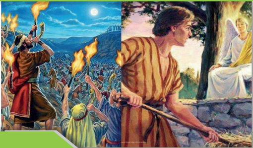

> **Deskripsi Visual:** Gambar ini adalah ilustrasi yang menampilkan dua adegan berbeda dari sejarah. Adegan pertama menunjukkan orang-orang yang membawa api dan memegang tongkat api, tampaknya sedang mengadakan upacara atau perayaan malam hari. Latar belakangnya menunjukkan pemandangan malam dengan bulan dan langit biru cerah.

Adegan kedua menampilkan seorang pria yang sedang berjalan dengan tongkat api di tangan, tampaknya sedang berjalan menuju sesuatu. Di sebelah kanannya, ada seorang pria lain yang tampak seperti sedang berbicara atau berkomunikasi dengan orang tersebut.

Elemen-elemen utama dalam gambar ini adalah dua adegan yang berbeda, orang-orang yang membawa api, dan lingkungan malam hari. Relasi antara elemen-elemen ini adalah bahwa kedua adegan tersebut terjadi pada waktu yang sama, yaitu malam hari, dan mungkin terkait dengan acara atau perayaan tertentu.

Teks, angka, atau label penting yang terlihat dalam gambar ini tidak ada. Informasi kunci yang dapat diambil pembaca adalah bahwa gambar ini mungkin menunjukkan peristiwa penting dalam sejarah, tetapi detail spesifik tentang apa yang terjadi tidak disebutkan dalam gambar tersebut.

### Tujuan Pembelajaran

- Siswa menjelaskan karakter sebagai pembawa damai.
- Siswa  memahami  damai sejahtera dalam perspektif Alkitabiah dan Bentuk penerapan dalam hidup
- Siswa menjadi pembawa damai

 

---
## 📄 Halaman 110

### A.  Pengantar

Sepanjang sejarah manusia dan dunia kita tahu bahwa seringkali terjadi konflik, peperangan  maupun  perselisihan  antar  negara,  antar  bangsa  bahkan  dalam keluarga sendiripun tak mustahil terjadi konflik dan permusuhan. Kehidupan disekitar kita tidak selalu berjalan baik dan damai, konflik membayang bayangi kehidupan manusia diberbagai level dan konteks. Oleh karena itu pembelajaran mengenai perdamaian dan menjadi pembawa damai dalam kehidupan amat dibutuhkan  oleh  remaja.  Terutama  ketika  kamu  diperhadapkan  dengan berbagai pilhan hidup. Dikalangan remaja masa kini, tawuran menjadi salah satu masalah crusial yang membawa musibah bagi kehidupan mereka. Sudah banyak  peristiwa  terjadi,  banyak  kasus  terjadi  yang  memakan  korban  jiwa dikalangan remajaq akibat konflik dan tawuran. Remaja masa kini menghadapi tekanan dan persoalan-persoalan yang terkadang  membuat mereka stress dan mengambil jalan  pintas  ataupun  memilih  menyelesaikan  persoalan  melalui cara kekerasan bukan jalan damai. Jiwa muda dan pembentukan karakter yang masih belum dewasa menyebabkan emosi mereka cepat tersulut.

Melalui  pembelajaran  ini  kamu  diharapkan  dapat  memahami  tugas orang kristen sebagai pembawa damai sejahtera dimanapun  berada. bahwa solidaritas diantara sesama teman adalah sikap terpuji namun solidaritas harus diletakkan pada porsinya. Misalnya dalam membela teman hendaknya remaja bersikap kritis dan objektif, jika temannya bersalah maka ia memiliki tanggung jawab untuk menegur dan meluruskannya bukannya malahan menunjukkan solidaritas dengan turut berkonflik dengan orang lain demi membela teman. Bahwa bela rasa terhadap teman harus diletakkan pada prosinya sehingga ia tidak perlu ikut tawuran demi membela teman.

### B.  Makna Menjadi Pembawa Damai Sejahtera

Pada pelajaran sebelumnya telah dipelajari mengenai damai sejahtera menurut Alkitab. Kini akan dikaji topik menjadi pembawa damai sejahtera. Apa artinya menjadi pembawa damai? Pertama, mari kita lihat apa arti perdamaian. Di dalam  Alkitab,  kata  ini  memiliki  beberapa  arti  yang  berbeda.  kedamaian berkaitan  dengan  perasaan  sejahtera  dalam  semua  aspek  kehidupan  kita. Kadang-kadang  digambarkan  sebagai  perasaan  harmoni  atau  ketenangan. Dalam Perjanjian Lama, orang Israel menyadari bahwa perdamaian adalah anugerah dari Tuhan. Ada cerita bagus di dalam Kitab Hakim-Hakim yang menggambarkan realisasi ini.

 

---
## 📄 Halaman 111

Pada Kitab Hakim-Hakim diceritakan bahwa orang Israel sedang diteror oleh  orang  Midian  karena  mereka  menyinggung  Tuhan.  Misalnya,  segera setelah  orang  Israel  selesai  menabur  ladang  mereka,  orang  Midian  akan menyerbu  dan  menghancurkan  hasil  bumi  dan  bahkan  ternaknya.  Orang Israel tidak memiliki apa-apa untuk makan, dan mereka akan  sengsara tanpa makanan.  Mereka  meminta  bantuan  Tuhan.  Tuhan  memilih  Gideon  untuk menolong mereka.

---
**🖼️ Gambar/Diagram**

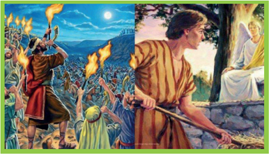

> **Deskripsi Visual:** Gambar ini adalah ilustrasi yang menampilkan dua adegan berbeda dari sejarah. Adegan pertama menunjukkan orang-orang yang membawa api untuk memadamkan api yang membakar sebuah bangunan. Orang-orang tersebut tampak sangat antusias dan bersemangat dalam upayanya untuk memadamkan api tersebut. Adegan kedua menunjukkan seorang wanita yang sedang memasak makanan di luar rumahnya. Ia tampak tenang dan fokus pada tugasnya. 

Elemen-elemen utama dalam gambar ini adalah dua adegan yang berbeda. Adegan pertama menunjukkan aksi memadamkan api, sementara adegan kedua menunjukkan aktivitas sehari-hari. Relasi antara kedua adegan ini adalah bahwa kedua adegan ini menggambarkan kehidupan manusia yang berbeda namun saling berkaitan.

Teks, angka, atau label penting yang terlihat dalam gambar ini tidak ada. Informasi kunci yang dapat diambil pembaca adalah bahwa gambar ini menunjukkan dua aspek kehidupan manusia yang berbeda, yaitu aksi memadamkan api dan aktivitas sehari-hari.

### Allah memilih Gideon

Allah memilih Gideon, anggota keluarga termuda dan paling tidak penting  dalam  keluarga  Manasye.  untuk  menyelamatkan  Israel  dari  orang Midian. Setelah banyak protes, Gideon mendengarkan Tuhan, karena Tuhan berjanji  bahwa  dia  akan  bersama  Gideon  dan  akan  memberinya  kekuatan, 'Tenanglah, jangan takut. Kamu tidak akan mati. Dalam ' Hakim-Hakim  6:23 Gideon membangun sebuah mezbah untuk Tuhan dan menyebutnya Yahwehshalom ,  yang  berarti  'Tuhan  adalah  damai.'  Gideon  berhadapan langsung dengan  Tuhan  perdamaian,  yang  bisa  mengubah  yang  terendah  dari  yang rendah menjadi pemimpin  yang hebat. Gideon menyelamatkan Israel dari  orang  Midian  dan  membawa  perdamaian  ke  negeri  itu.  Kisah  ini memperlihatkan pada kita bahwa orang Israel menyadari bahwa Tuhan adalah

 

---
## 📄 Halaman 112

sumber  perdamaian,    bahwa  Tuhan  memberdayakan  kita  untuk  menjadi pembawa damai. Terkadang kita mungkin merasa tidak penting, kita bukan siapa-siapa  seperti yang pada mulanya dirasakan oleh  Gideon. Apalagi  ketika masalah yang dihadapi sangat besar: hubungan keluarga yang berada dalam dalam konflik, hubungan antar teman, kekerasan dalam komunitas kita, atau kemiskinan dan kelaparan. Tidak ada jawaban yang mudah untuk masalah ini.  Terkadang  karena  tuntutan  keadaan  seseorang  harus  tampil  sebagai 'pembawa damai, pembawa kebaikan' bagi sesama. Ada orang-orang yang memang memiliki  talenta  itu,  namun  ada  orang-orang  yang  dibentuk  oleh situasi dan kondisi tertentu sebagaimana yang dialami oleh Gideon. Meskipun demikian, orang beriman harus memiliki keyakinan bahwa hidupnya didunia ini bukanlah hidup tanpa makna karena kita dititpkan 'misi' untuk melakukan semua  yang  baik  dalam  hidup  terutama  menjadi  pembawa  damai  bukan menjadi provokator.

Terkadang kita dipanggil untuk menangani  masalah secara besarbesaran.  Ada seorang anak laki-laki berusia 12 tahun bernama Craig Kielburger dari    Canada  memulai  sebuah  organisasi  dengan  saudara  laki-lakinya  dan beberapa  temannya  untuk  membantu  anak-anak  di  seluruh  dunia  yang dieksploitasi dalam dunia kerja. Dia memulai aktifitasnya dengan keyakinan yang  besar  bahwa  apa  yang  dilakukannya  adalah  demi  kepentingan  orang banyak. Craig ingin menunjukkan kasihnya pada sesama.  Ia dan saudara lakilakinya dan beberapa temannya mendirikan sebuah organisasi kemanusiaan yang kini ada di 45 negara. Untuk menjadi pembawa damai, remaja kristen tidak harus melakukan hal-hal spectakuler sebagaimana nyang dilakukan oleh Craig Kiehlburger dan sauadaranya. Kita bisa memulai dari hal-hal kecil dan sederhana.

### Response saya

### Menjadi pembawa Damai Sejahtera

Setelah  mempelajari  materi  tersebut  diatas,  dapatkah  kamu  menuliskan pendapat  mu  mengenai  makna  menjadi  pembawa  damai  sejahtera?  Coba ingat pelajaran lalu?

 

---
## 📄 Halaman 113

Menjadi pembawa damai sejahtera, artinya..

_________________________________________________________

_________________________________________________________

Apakah  kamu  sudah  menjadi  pembawa  damai  dalam  keluarga  dan teman?

_________________________________________________________

_________________________________________________________

Mengapa damai penting bagi manusia?

_________________________________________________________

_________________________________________________________

### C.  Menjadi Pembawa Damai Sejahtera Dalam Alkitab

Bagaimana remaja dapat  menjadi pembawa damai? Bagaimana remaja kristen dapat  membantu  megembangkan  kesejahteraan  dan  harmoni  dalam  hidup masing-masing dan keluarga? Masalah sosial apa yang membuat remaja  ingin membuat perubahan? Perubahan dan damai harus dimulai  dari  diri  sendiri hanya pribadi yang damai yang dapat menjadi pembawa damai. Dalam Matius 5:9 Yesus berkata: 'Berbahagialah orang yang membawa damai, karena mereka akan disebut anak-anak Allah.' Beberapa ayat kemudian, Yesus memerintahkan  pengikut-Nya  untuk  berdamai  dahulu  dengan  orangorang yang kita musuhi barulah beribadah kepada-Nya (Matius 5: 2126). Bahkan perintah Yesus selanjutnya adalah: 'Kasihilah musuh mu dan berdoalah bagi mereka yang menganiaya kamu', agar kita menjadi seperti Bapa kita di surga yang menyediakan sinar matahari dan hujan kepada orang benar dan yang tidak benar (5: 43-45). Singkatnya, anakanak Tuhan adalah mereka yang mendamaikan. Tapi apa maksudnya itu? Yakobus 3: 13-18 memberikan jawaban yang sangat jelas:

Siapakah  diantara  kalian  yang  bijak  dan  berbudi?  Baiklah  ia  dengan cara  hidup  yang  baik  menyatakan  perbuatannya  yang  oleh  hikmat  yang lahir dari kelemahlembutan. Jika kamu menaruh perasaan  iri hati dan kamu mementingkan diri sendiri, janganlah kamu memegahkan diri dan janganlah

 

---
## 📄 Halaman 114

berdusta melawan kebenaran. Itu bukanlah hikmat yang datang dari atas, tetapi dari dunia , dari nafsu manusia, dari setan-setan. Sebab dimana ada iri hati dan mementingkan diri sendiri di situ ada kekacauan dan segala macam perbuatan jahat. Tetapi hikmat yang dari atas adalah pertama-tama murni, selanjutnya pendamai, peramah, penurut, penuh belas kasihan  dan buah-buah yang baik, tidak  memihak  dan  tidak  munafik.  Dan  buah  yang  terdiri  dari  kebenaran ditaburkan dalam damai untuk mereka yang mengadakan damai.

### D.  Karakter  Orang  Yang  Menjadi  Pembawa  Damai Sejahtera

Dalam Matius 5:9 Yesus berkata:'Berbahagialah orang yang membawa damai, karena  mereka  akan  disebut  anak-anak  Allah.'  Beberapa  ayat  kemudian (Matius 5:22-25) , Yesus memerintahkan untuk berdamai dengan saudara atau sesama sebelum kita beribadah.  Artinya, hubungan manusia dengan  Allah tidak dapat berlangsung dengan baik jika hubungan manusia dengan sesama buruk, terutama  dalam  kaitannya  dengan  'perdamaian'.  Setelah  memerintahkan untuk  berdamai  dengan  saudara  dan  sesama,  pada  ayat  selanjutnya  Yesus minta untuk 'mengasihi musuh' dan berdoa bagi mereka yang menganiaya kita,  agar  kita  menjadi  seperti  Bapa  kita  di  surga  yang  menyediakan  sinar matahari  dan  hujan  kepada  orang  benar  dan  yang  tidak  benar  (5:  43-45). Singkatnya, anak-anak Tuhan adalah mereka yang mendamaikan. Tapi apa maksudnya itu? Yakobus 3: 13-18 memberikan jawaban yang sangat jelas:

Siapakah  diantara  kalian  yang  bijak  dan  berbudi?  Baiklah  ia  dengan cara  hidup  yang  baik  menyatakan  perbuatannya  yang  oleh  hikmat  yang lahir dari kelemahlembutan. Jika kamu menaruh perasaan  iri hati dan kamu mementingkan diri sendiri, janganlah kamu memegahkan diri dan janganlah berdusta  melawan  kebenaran.  Itu  bukanlah  hikmat  yang  datang  dari  atas, tetapi dari dunia , dari nafsu manusia, dari setan-setan. Sebab dimana ada iri hati dan mementingkan diri sendiri di situ ada kekacauan dan segala macam perbuatan jahat. Tetapi hikmat yang dari atas adalah pertama-tama murni, selanjutnya  pendamai,  peramah, penurut, penuh belas kasihan  dan buahbuah yang baik, tidak memihak dan tidak munafik. Dan buah yang terdiri dari kebenaran ditaburkan dalam damai untuk mereka yang mengadakan damai.

Menurut Surat Yakobus 3:13-18, adapun karakter sang pendamai adalah sebagai berikut:

 

---
## 📄 Halaman 115

### 1.  Kemurnian moral.

Karena asal mula perselisihan manusia dan perpecahan antarpribadi adalah dosa. Bandingkan cerita Kain dan Habel, Kain membunuh Habel karena Allah menerima persembahan Habel sedangkan persembahan Kain ditolak. Karena sakit  hati  dan  dengki,  Kain  pun  membunuh  Habel  adiknya.  Tidak  peduli seberapa  kompak  suatu  hubungan  yang  kelihatan  tampak  mata,  pasti  akan selalu  ada  konflik.  Sebaliknya,  kemurnian  dan  ketulusan  hati  akan  selalu mendatangkan kedamaian, karena hati yang murni tidak akan memberi tempat pada konflik dan perpecahan. Tidak mengherankan, jika perdamaian disertai oleh kemurnian dan ketulusan hati. lihat Mat 5: 8 dan 5: 9). Jika seseorang ingin menjadi pembawa damai, ia harus memiliki kemurnian hati. Kemurnian hati yang telah dibasuh oleh darah Kristus dan yang secara teratur dimurnikan oleh Firman Tuhan.

### Response saya

Setelah membaca karakter pertama ini, coba renungkan hubungan anda dengan saudara (bagi yang memiliki saudara kandung). Apakah anda pernah menaruh dengki dan iri padanya? Mengapa? Lalu..renungkan bagaimana jika saudara mu yang melakukan hal itu pada mu, apakah diri mu dapat menerimanya?

---
**🖼️ Gambar/Diagram**

> **Deskripsi Visual:** Gambar ini adalah ilustrasi yang menunjukkan dua orang wanita yang saling memeluk. Gambar ini menunjukkan hubungan emosional antara kedua wanita tersebut, mungkin sebagai simbol kebersamaan, dukungan, atau persahabatan. Elemen utama dalam gambar ini adalah dua orang wanita yang saling memeluk, yang menunjukkan hubungan emosional yang kuat antara mereka. Teks, angka, atau label penting tidak ada dalam gambar ini. Informasi kunci yang dapat diambil pembaca adalah bahwa gambar ini menunjukkan hubungan emosional antara dua orang wanita, yang mungkin merupakan tema pembelajaran dalam buku pelajaran tersebut.

 

---
## 📄 Halaman 116

### 2.  Damai.

Rasa  damai  dikuti  oleh  hati  yang  tenang  dan  penguasaan  diri  yang  tinggi. Manusia yang damai adalah manusia yang tidak membiarkan emosi menguasai dirinya. Ada  semangat  yang  bertumbuh  dalam  kelembutan,  kesabaran,  dan kebaikan. Tidak  mengherankan,  dalam  urutan  Ucapan  Bahagia,  kemurnian hati (ayat 8), kemurahan hati (ayat 7), lapar dan haus akan kebenaran (ayat 6), lemah lembut(ayat 5) dan belas kasihan, miskin dihadapan Allah (ayat 3) semua  mendahului  panggilan  untuk  menjadi  pembawa  damai  pada  ayat  9. Ucapan bahagia ditutup dengan kata 'bersuka cita' kelengkapan dari damai adalah suka cita. Damai sejahtera dan suka cita selalu saling menopang begitu sebaliknya dalam suka cita pasti ada perdamaian.

### Response saya

Setelah membaca karakter kedua, coba renungkan:

Apakah  kamu  merasakan  damai  dalam  hidup  mu?  Mengapa?  Jika  Tidak, mengapa? Hal apa saja yang membuat kamu tidak merasa damai? Tuliskan dan kumpulkan pada guru mu.

---
**🖼️ Gambar/Diagram**

> **Deskripsi Visual:** Gambar ini adalah ilustrasi yang menampilkan seorang anak laki-laki dengan rambut pendek dan bulu mata yang berwarna gelap. Anak tersebut sedang tersenyum lebar dengan bibir yang sedikit mengejutkan. Dia mengenakan jaket biru tua dan celana berwarna abu-abu. Dua tangan anak tersebut tergabung menjadi satu, menunjukkan posisi tangan yang seragam dan rapi. Wajah anak tampak ceria dan penuh semangat, menunjukkan suasana positif dan bahagia. Ilustrasi ini mungkin digunakan untuk menggambarkan kebahagiaan atau kepuasan seseorang.

 

---
## 📄 Halaman 117

### 3.  Lembut.

Kelemahlembutan juga diperlukan untuk berdamai. Kelembutan adalah buah Roh  (Gal  5:  22-23)  dan  pemberian  dari  Yesus  Kristus.  Yesus  sendiri mencontohkan roh yang lembut (Mat 11: 28-30) dan ketika murid-muridnya mengikuti  dia,  dia  meletakkan  kuknya  ke  atas  mereka,  agar  mereka  dapat belajar untuk menjadi lembut (atau lemah lembut). Kelembutan mirip dengan kedamaian, tapi tidak persis sama. Yang terakhir terdiri dari sikap pribadi; yang pertama  berhubungan  dengan  cara  seorang  Kristen  menanggapi  tantangan atau serangan. Untuk menjadi pembawa damai, kita harus belajar menerima pukulan, tanpa membalas pukulan.

### Response saya

Setelah membaca karakter ketiga, coba renungkan:

Apakah kamu adalah pribadi yang lembut? Jika tidak, maukah kamu belajar menjadi orangt yang lembut?

+

---
**🖼️ Gambar/Diagram**

> **Deskripsi Visual:** Gambar ini adalah ilustrasi yang menunjukkan seorang siswa sedang membaca buku. Siswa tersebut berdiri dengan posisi teguh, menggenggam buku dengan kedua tangan dan tampak senang. Buku tersebut tampaknya berwarna hijau dengan gambar atau tulisan yang tidak jelas. Siswa tersebut memakai pakaian formal, yaitu seragam sekolah putih dan biru. Latar belakangnya sederhana, fokus pada siswa dan buku yang ia baca. Ilustrasi ini mungkin digunakan untuk menggambarkan kegiatan belajar siswa atau tema tentang pembelajaran.

 

---
## 📄 Halaman 118

### 4.  Bersikap terbuka dan membela kebenaran

Keterbukaan adalah kesediaan untuk menerima orang lain apa adanya tanpa memandang perbedaan latar belakang.

Kitab Suci memanggil para pengikut Kristus untuk membela kebenaran. Pembawa damai bukanlah seseorang yang menghindari konflik dengan cara apa pun; mereka adalah orang-orang yang berusaha untuk menjadi orang yang suka damai dan untuk mengumumkan Injil kedamaian. Mereka bersedia untuk mendengarkan terlebih dahulu dan berusaha untuk memahami. Jadi, mereka terbuka untuk mendengarkan tetapi mereka tidak mau menyimpang dari jalan kebenaran Injil. Terkadang untuk menjadi pendamai seseorang bisa dimusuhi oleh berbagai pihak namun niat baik dan tekad yang tulus akan membawa kita pada kebaikan dan mereka yang memusuhi pada akhirnya akan mengerti.

Pembawa damai harus selalu mengatakan kebenaran dalam cinta.  Seringkali,  untuk  mempertahankan  kebenaran,  kita  mungkin  perlu mengunjungi  kembali  'lawan'  kita  dan  meminta  pengampunan  untuk kesalahan  kita sendiri. Namun, kita tidak pernah bisa menyangkal kebenaran demi perdamaian. Kedamaian yang datang dengan mengorbankan kebenaran hanyalah kedamaian  palsu. Karena itu, kita harus mencari kebenaran untuk mengejar perdamaian. Artinya, perdamaian harus dibangun diatas kebenaran.

### Response saya

Setelah membaca karakter keempat, coba renungkan:

Apakah kamu adalah orang yang bersikap terbuka dan membela kebenaran? Jika  ya,  mengapa?  Jika  tidak,  mengapa?  Maukah  kamu  belajar  menjadi manusia yang bersikap terbuka dan berani membela kebenaran?

 

---
## 📄 Halaman 119

---
**🖼️ Gambar/Diagram**

> **Deskripsi Visual:** Gambar ini adalah ilustrasi yang menunjukkan seorang siswa sedang berdiri di depan kelas dengan tangan kanannya mengangkat ke atas. Siswa tersebut tampak senang dan bersemangat, mungkin merayakan sukses atau memberikan jawaban pada pertanyaan. Di sebelah kiri siswa, terdapat sebuah meja belajar yang tampak sederhana dan minimalis, menunjukkan lingkungan sekolah biasa. Ilustrasi ini mungkin digunakan untuk membantu pembelajaran tentang motivasi belajar, kepuasan akademik, atau bahkan tentang bagaimana cara berinteraksi positif dengan guru dan teman-teman di kelas.

### 5.  Penuh belas kasihan dan buah-buah yang baik.

Memiliki  kedamaian  dan  berdamai  tidaklah  sama.  Tuhan  berjanji  kepada anak-anaknya  bahwa  kita  mungkin  mengalami  kedamaian.  Yesaya  26:  3 mengatakan mereka yang menjaga pikiran mereka pada Tuhan, Tuhan akan menjaga damai yang sempurna. Seorang pembawa damai adalah mereka yang penuh belas kasihan dan kebaikan. Mereka pro aktif dalam mengupayakan perdamaian. Jadi tindakan belas kasihan diperlukan untuk meredakan amarah yang mungkin dimiliki seseorang; tindakan belas kasih juga memperkuat cinta kita untuk orang lain.

### Response saya

Setelah membaca karakter kelima, coba renungkan:

Apakah  kamu  sudah  menjadi  remaja  yang  penuh  belas  kasihan?  Maukah kamu belajar untuk menjadi remaja yang penuh belas kasih terhadap sesama?

---
**🖼️ Gambar/Diagram**

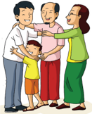

> **Deskripsi Visual:** Gambar ini adalah ilustrasi yang menunjukkan keluarga yang terdiri dari empat orang dewasa dan satu anak kecil. Keluarga tersebut terdiri dari dua orang tua, seorang ayah, seorang ibu, dan dua orang nenek. Mereka semua berdiri dekat satu sama lain, tampak sangat dekat dan bahagia. Ayah dan ibu berdiri di sisi kanan dan kiri masing-masing, sedangkan nenek berdiri di sisi mereka. Anak kecil berdiri di tengah-tengah, tampak sangat bahagia dan senang. Gambar ini menunjukkan hubungan yang erat dan harmonis dalam keluarga.

Elemen-elemen utama dalam gambar ini adalah keluarga, ayah, ibu, nenek, dan anak kecil. Mereka semua tampak sangat dekat dan bahagia, menunjukkan hubungan yang erat dan harmonis dalam keluarga. Informasi kunci yang dapat diambil pembaca adalah bahwa keluarga ini sangat erat dan bahagia, dengan hubungan yang baik antara setiap anggota keluarga.

 

---
## 📄 Halaman 120

### 6.  Tidak memihak dan tulus.

Seorang  pendamai  tidak  boleh  berpihak  pada  salah  satu  kubu  atau  orang. Pendamai berpihak pada kebenaran bukan pada orangnya. Pendamai memiliki hati yang diatur oleh Roh Kebenaran. Hanya ketika kita dipimpin oleh Roh kita  dapat  membuat penilaian yang adil dan benar bukan menurut diri kita sendiri  dan  suka  dan  tidak  suka.  Jika  kita  ingin  menjadi  pembawa  damai, kita harus secara teratur menyerahkan diri kita kepada Tuhan. Sebagaimana telah disebutkan diatas, tanpa kemurnian hati, kita tidak bisa tulus. Dan tanpa pengabdian yang sederhana dan tulus kepada Tuhan, kita akan berpihak dan dengan demikian tidak dapat memelihara perdamaian.

### Response saya

Setelah membaca karakter keenam, coba renungkan:

Apakah kamu sudah menjadi remaja yang objektif, tidak memihak dan tulus? Maukah kamu belajar untuk menjadi remaja yang objektif dan tulus hatinya?

---
**🖼️ Gambar/Diagram**

> **Deskripsi Visual:** Gambar ini adalah ilustrasi yang menunjukkan dua orang yang saling berjabat tangan. Gambar ini menunjukkan hubungan sosial dan saling menghormati antara dua individu. Elemen utama dalam gambar ini adalah kedua orang yang berjabat tangan, yang menunjukkan hubungan positif dan saling menghormati. Teks, angka, atau label penting tidak ada dalam gambar ini. Informasi kunci yang dapat diambil pembaca adalah bahwa gambar ini menunjukkan hubungan sosial dan saling menghormati antara dua individu.

 

---
## 📄 Halaman 121

### 7.  Bersedia bersabar.

Kesabaran bukanlah istilah yang ditemukan dalam Yakobus 3, tetapi ini adalah prinsip  yang  diturunkan  dari  ayat  18:  'Dan  panen  kebenaran  ditaburkan dengan damai oleh mereka yang membuat  perdamaian.' Singkatnya, perdamaian tidak segera terjadi. Dalam dunia ini  banyak hal membutuhkan waktu  untuk  sembuh  dan  terkadang  luka-luka  bathin  karena  perselisihan, konflik dan kekerasan sering kali meninggalkan bekas yang mendalam dan akan  selalu  menimbulkan  rasa  sakit.  Oleh  karena  itu  membutuhkan  waktu untuk  penyembuahan,  apalagi  perdamaian,  manusia  membutuhkan  waktu jeda  untuk  memulihkan luka-luka bathin, kemarahan, kekecewaan dll. Ada sebuah lagu yang indah ' waktu Tuhan pasti yang terbaik' sebagaimana bunyi lagu tersebut, begitu pula upaya perdamaian, membutuhkan waktu. Seorang pembawa  damai  akan  bersabar  menanti  kepenuhan  waktu  Tuhan  untuk terciptanya rekonsiliasi dan perdamaian.

### Response saya

Setelah membaca karakter keenam, coba renungkan:

Apakah kamu sudah menjadi remaja yang penyabar? Maukah kamu belajar untuk menjadi remaja yang sabar?

---
**🖼️ Gambar/Diagram**

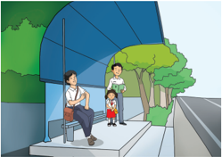

> **Deskripsi Visual:** Gambar ini adalah ilustrasi yang menunjukkan seorang guru sedang berbicara dengan dua murid di depan sebuah bangku sekolah. Guru berdiri di sebelah kiri, sementara dua murid berdiri di sebelah kanan. Mereka tampak sedang berbicara dengan penuh perhatian. Latar belakang menunjukkan lingkungan sekolah dengan pohon-pohon hijau dan langit biru cerah. Ilustrasi ini mungkin digunakan untuk menggambarkan situasi interaksi antara guru dan murid dalam proses pembelajaran.

 

---
## 📄 Halaman 122

### 8.  Tumbuh dari Injil.

Terakhir,  pembawa damai sejahtera adalah seseorang yang menabur dalam damai. Ketika kita dipimpin oleh Roh Kristus dan hikmat yang datang dari atas,  maka  kita  akan  mencari  kedamaian  yang  selaras  dengan  Injil.  Lebih sederhananya  lagi,  kedamaian  sejati  tumbuh  dari  benih  Injil.  Dengan  kata lain,  dengan  kekudusan,  kedamaian,  kelembutan,  keyakinan  teguh  dan telinga  terbuka  untuk  mendengar,  pembawa  damai    akan  bertindak  dengan belas kasihan, ketidakberpihakan, dan ketulusan. Hasil dari tindakan tersebut akan memulihkan hubungan yang rusak dan menjadi model bagi orang lain semacam kehidupan yang bertekad untuk tidak merusak perdamaian.

Secara keseluruhan, sifat terakhir ini adalah landasan dan batu penjuru bagi yang lainnya. Beberapa karakter pembawa damai yang telah disebutkan sebelumnya merupakan hasil dari ajaran iman yang datang dari dalam Alkitab dan yang dikuatkan oleh Roh untuk berjalan sesuai dengan isi Alkitab. Bahwa Injil  Kerajaan Allah  menghasilkan    pengaruh  yang  luar  biasa  pada  mereka yang benar-benar percaya, tetapi perdamaian harus menjadi salah satu yang paling terlihat dan menarik bagi dunia.   Mengapa? Melalui perdamaian itu menjadi nyata bahwa pengikut Kristus adalah manusia-manusia cinta damai.

Di dunia yang tidak bersahabat ini, semoga kita berjalan sebagai pembawa damai, sehingga Kristus mendapatkan semua kemuliaan. Karena sebenarnya, dia sendiri yang bisa membuat perdamaian abadi.

 

---
## 📄 Halaman 123

### Response saya

Setelah membaca karakter ketujuh, coba renungkan:

Apakah kamu sudah menjadi remaja  yang  benar-benar  menggunakan  Injil (Alkitab) sebagai pedoman hidup mu? Maukah kamu belajar untuk menjadi remaja yang menjadikan Injil (Alkitab) sebagai pedoman hidup mu?

+

2

---
**🖼️ Gambar/Diagram**

> **Deskripsi Visual:** Gambar ini adalah ilustrasi yang menunjukkan seorang siswa sedang membaca buku dengan topi berwarna hijau. Siswa tersebut mengenakan seragam sekolah putih dengan lengan panjang dan celana biru tua. Siswa tersebut tampak senang dan fokus pada buku yang ia bawa. Ilustrasi ini mungkin digunakan untuk menggambarkan tema belajar atau pendidikan.

Elemen-elemen utama dalam gambar ini meliputi siswa, buku, topi, seragam sekolah, dan latar belakang yang sederhana. Siswa adalah subjek utama yang memegang buku, sedangkan topi dan seragam sekolah menunjukkan konteks pendidikan. Latar belakang yang sederhana membuat fokus pada siswa dan buku.

Teks, angka, atau label penting tidak ada dalam gambar ini karena tidak ada teks atau angka yang jelas. Namun, elemen-elemen seperti topi, seragam sekolah, dan buku memiliki makna yang jelas dalam konteks pendidikan.

Informasi kunci yang dapat diambil pembaca adalah bahwa gambar ini mungkin digunakan untuk menggambarkan tema belajar atau pendidikan. Siswa yang membaca buku menunjukkan minat dan keinginan untuk belajar. Topi dan seragam sekolah menambahkan nuansa formalitas dan serius tentang proses belajar.

 

---
## 📄 Halaman 124

### E.  Belajar Dari Cerita Kehidupan

### Scout News

### Craig Kiehlburger: Janji Pramuka mengubah dunia

Ketika  Craig Kielburger muda untuk pertama kalinya mengucapkan Janji Pramuka pada usia sebelas tahun pada 1994 ia berdiri sendirian di depan temantemannya.  Dengan  keluarganya  yang  menatap  ke  arahnya,  ia  mengangkat tangannya dan memberi hormat Pramuka serta dengan khidmat mengulangi kata-kata yang sama seperti puluhan juta orang telah melakukannya sebelum Craig. Craig yakin bahwa ia akan melakukan yang terbaik - ia akan mengubah dunia!

Dua belas bulan kemudian, Janji Pramukanya  benar-benar dipengaruhi oleh sebuah laporan utama di  harian Toronto Star, pada tahun 1995, yang menulis judul 'Perkelahian pekerja anak, anak laki-laki, 12, dibunuh.' Artikel itu  menceritakan  seorang  anak  muda  Pakistan,  Iqbal  Masih  yang  dipaksa menjadi buruh kontrak di sebuah pabrik karpet pada usia empat  tahun, tetapi yang pada saat ia berusia sepuluh tahun, telah melarikan diri dan telah menjadi tokoh  internasional  untuk  Front  Pembebasan  Buruh  hanya  untuk  dibunuh secara brutal pada tahun 1995.

Merasa  geram,  berkomitmen  dan  termotivasi  oleh  cerita    itu,  Craig mengambil  gada  dan  mendirikan  sebuah  kelompok  yang  disebut  'Dua belas-Dua  belas-Tahun'  yang  pada  akhirnya,  melawan  rintangan  yang  tak

 

---
## 📄 Halaman 125

terbayangkan,  kekeraskepalaan  birokrasi,  negatif,  dan  penolakan  menjadi 'Selamatkan Anak-anak', sebuah organisasi internasional terkemuka dengan proyek-proyek  di  45  negara.  Selain  khawatir  terhadap  para  pekerja  anak, Selamatkan Anak-anak telah bertanggung jawab untuk membangun lebih dari 500 sekolah yang mendidik lebih dari 50.000 siswa SETIAP HARI!

Pada Mei 2008, Kielburger, dengan saudaranya, Marc Kielburger muncul di The Oprah Winfrey Show di Amerika Serikat untuk meluncurkan proyek 'Duta  O'.  Setahun  kemudian  saudara-saudara  meluncurkan  Hari  Kami' dan kemudian 'Hari Saya dan Kita' mengangkat kedua peristiwa ini untuk mendapatkan bantuan dana dan kesadaran yang memungkinkan 'Selamatkan Anak-anak' untuk tetap mandiri sambil meningkatkan jangkauannya.

Namun  adalah  Pramuka  yang  membantunya  untuk  tetap  fokus  saat: 'Orang-orang menempatkan kami sebagai kaum muda dan pemimpi, yang justru membuat saya terus tertantang. Ini adalah para pemimpi yang berpikir suatu  hari  Tembok  Berlin  akan  jatuh  atau  politik  perbedaan  warna  kulit di  Afrika  Selatan  akan  berakhir'.  upaya  Craig  secara  resmi  diakui  oleh Gubernur Jenderal Kanada yang ketika atas nama bangsa, pada tahun 2007, menganugerahinya gelar kehormatan 'Order of Canada'. Craig Kielburger adalah anggota Dewan Nasional Pramuka Kanada yang katanya organisasi itu telah memberinya keberanian, komitmen dan tujuan untuk memulai pencarian ini  dan  tetap  setia  Janji  Pramuka-nya yang memulainya berusaha membuat dunia menjadi tempat yang lebih baik diawali ketika dia baru sebelas tahun!

### Response saya

Baca  cerita  diatas  kemudian  catat  beberapa  hal  penting  dalam  cerita  itu! Menurutmu apa yang paling menarik dari cerita ini? Apa kaiatannya dengan topik yang kita bahas: menjadi pembawa damai sejahtera? Jangan lupa, Craig mulai pelayanannya pada waktu berumur 12 tahun. Bayangkan, diusia yang begitu muda dia telah menjadi seorang influencer. Apakah cerita perjuangannya menginspirasi mu? Pada bagian mana?

 

---
## 📄 Halaman 126

### F.  Makna Damai Sejahtera Bagi Tiap Orang

Rasanya semua orang memimpikan hidup dalam damai. Kita dapat membuat catatan  alasan  kita  tidak  merasa  damai  dan  catatan  itu  pasti  amat  panjang. Ada berbagai alasan yang menyebabkan rasa damai hilang dari kehidupan. Siapa manusia yang tidak ingin hidup dalam damai? Rasanya nyaman bukan, jika  hidup  kita adem, semua  hal  berjalan  lancar  sesuai  rencana,  sejalan dengan  semua  impian  dan  keinginan  kita.  Tapi  sayang  sekali  hidup  tidak selalu berjalan menurut apa yang kita kehendaki. Penulis Kitab Pengkhotbah menulis bahwa  untuk segala sesuatu ada waktunya. Bahwa  berbagai peristiwa  datang  silih  berganti  dalam  hidup,  ada  yang  membawa  suka  cita dan keberuntungan, ada yang membawa mala petaka ataupun kerusakan dan kepedihan, konflik dan perpecahan. Itulah dinamika hidup, Yakobus 3:13-18 menulis tentang bagaimana kita harus menghadapi hidup ini. Kita dilarang untuk membenci, hidup orang percaya haruslah berhikmat, berbudi dan bijak. Itulah landasan untuk hidup damai. Bagi guru PAK sendiri, apa makna materi ini  bagi  Anda?  Sebelum  menyampaikannya  pada  siswa  guru  PAK  harus terlebih dahulu merenungkan makna materi ini dan membandingkan dengan hidupnya. Apakah telah bersikap  sebagai  pendamai  diantara  sesama  teman guru PAK? Dalam relasi dengan siswa dan orang tuanya? Dalam kehidupan berkeluarga?  Tiap-tiap  orang  dapat  mengevaluasi  diri  sendiri  berdasarkan paparan karakter sang pendamai sebagaimana tercantum dalam Yakobus 3:1318. Menjadi pembawa damai merupakan intisari dari seluruh pembelajaran PAK di  sekolah  dari  SD  sampai  dengan  SMA.    Menjadi  pembawa  damai sejahtera  merupakan  indikator  utama  yang  menjadi  ukuran  keberhasilan pembelajaran PAK di sekolah. Anak-anak dan remaja Kristen di Indonesia hendaklah  menjadi  remaja  yang  'cinta  damai'  dan  yang  pro  aktif  sebagai 'pembawa damai sejahtera' dimanapun kita berada. Yesus pun mengatakan: 'Damai Sejahtera Bagi mu...Damai Sejahtera Ku , Kutinggalkan bagi mu' sebuah ungkapan yang merupakan warisan iman bagi kita semua, sekaligus perintah supaya tiap orang beriman yang mengaku percaya pada Kristus harus menjadi pembawa damai sejahtera. Apakah menjadi pembawa damai berarti harus terus mengalah dan membiarkan dibully dan didakiti orang? Tidak juga. Keadilan dan kebenaran harus kita perjuangkan tapi dengan cara yang baik yang sesuai dengan berbagai prosedur dan terutama dengan cara damai.

 

---
## 📄 Halaman 127

### G. Belajar Dari Lagu

Tahukah kamu lagu 'Rindukan Damai' oleh Gigi ini? Kalau tahu, cobalah nyanyikan bersama-sama di kelas, dipimpin oleh gurumu.  Jika kalian tidak hafal lagu ini bisa diganti dengan lagu yang lain yaa...

### Rindukan Damai

Bayangkan… Bila kita bisa saling memaafkan Bayangkan… Bila kita bisa saling berpelukan Tiada perang, kelicikan Tangis kelaparan….. Ref.: Getarkan manusiawi kami Mata dan matahati kami Agar saling meniti Esa Maha suci Ampunkan dan tuntunlah kami Kita semua saling bersaudara Rindukan damai

Kesan apa yang kamu peroleh dari lagu karya Dewa Budjana dari kelompok Gigi   di atas? Apa yang dimaksudkan ketika nyanyian itu mengatakan 'Kita semua  saling  bersaudara'?  Bukankah  ini  sebuah  pernyataan  yang  sangat dalam  maknanya?  Kesaksian Alkitab  mengajarkan  kepada  kita  bahwa  kita mempunyai satu nenek moyang yang sama, yaitu Adam dan Hawa. Itu berarti bahwa siapapun juga manusia yang kita jumpai, sebetulnya dia adalah saudara kita  sendiri.  Lalu,  apa  sebabnya  kita  berperang?  Mengapa  manusia  sulit sekali hidup dalam perdamaian? Apakah manusia sudah tidak bisa lagi saling mengasihi?

 

---
## 📄 Halaman 128

Pada  pelajaran  lalu,  ada  penugasan  yang  diberikan  pada  kalian,  yaitu menyusun tindakan  untuk  menjadi  pembawa  damai  sejahtera.  Coba  kalian lihat  kembali  langkah-langkah  yang  sudah  dibuat,  apakah  realistik  dan dapat  diterapkan?  Jika  belum,  kalian  dapat  menyempurnakannya.  Minta bantuan  orang  tua  atau  mereka  yang  lebih  tua  untuk  membahas  langkahlangkah tersebut bersama. Orang tua dan guru akan memberikan penghargaan terhadap tekad kalian. Selesai pembelajaran, ketika akan tidur pada malam hari, berdoalah dengan sungguh-sungguh dan minta Allah mengirimkan Roh Kudus  agar  membaharui  kalian  dan  memampukan  untuk  mewujudkannya dalam hidup. Selamat Menjadi Pembawa damai. Salam hangat dan kasih dari saya, Pdt.Janse Belandina Non. Yakinlah..kalian mampu menjadi pembawa damai dalam kehidupan. Tuhan memberkati.

### H. Refleksi

Perdamaian - dan juga kasih - adalah tindakan, bukan kata benda. Artinya, untuk  mewujudkan  perdamaian  dan  kasih,  kita  perlu  melakukan  langkahlangkah  konkret  dalam  kehidupan  kita.  Seluruh  perbuatan  dan  gaya  hidup kita mestilah mencerminkan perdamaian dan kasih, sehingga keduanya dapat terwujud dalam masyarakat kita, di bumi kita.

### Abigail Disney,

'Perdamaian  adalah  sebuah  proses.  Ini  bahkan  bukanlah  sebuah  peristiwa, kejadian.  Perdamaian  adalah  sesuatu  yang  kita  buat,  yang  kita  kerjakan. Perdamaian  adalah  kata  kerja.  Perdamaian  adalah  serangkaian  pilihan  dan keputusan. Ia harus dipertahankan, diperjuangkan... Perdamaian tidak diamdiam. Perdamaian itu bergemuruh!'

 

---
## 📄 Halaman 129

---
**🖼️ Gambar/Diagram**

> **Deskripsi Visual:** Gambar ini adalah ilustrasi yang menampilkan logo sekolah. Logo ini terdiri dari beberapa elemen utama:

1. **Keseluruhan**: Gambar ini menunjukkan logo sekolah dengan desain yang simetris dan elegan. Logo ini terletak di tengah kotak biru tua.

2. **Elemen Utama dan Relasinya**: 
   - **Buku**: Di bagian bawah logo, terdapat sebuah buku putih yang membentuk dasar untuk logo.
   - **Batu**: Di atas buku tersebut, terdapat batu kuning yang tampak seperti api atau cahaya.
   - **Burung**: Di sekeliling buku dan batu, terdapat dua burung putih yang membentuk bentuk "V" yang mengarah ke arah batu.
   - **Teks**: Di bagian atas logo, terdapat teks "TUT WURI HANDAYANI" dalam huruf besar dan berwarna hitam.

3. **Teks, Angka, atau Label Penting**: 
   - **Teks**: "TUT WURI HANDAYANI" adalah nama sekolah yang ditulis dalam huruf besar dan berwarna hitam.
   - **Angka**: Ada angka "1" di bagian bawah logo, mungkin merupakan nomor sekolah atau tahun pembukaan.

4. **Informasi Kunci**: 
   - Gambar ini menunjukkan logo sekolah TUT WURI HANDAYANI, yang terdiri dari elemen-elemen yang memiliki makna simbolis, seperti buku yang melambangkan pendidikan, batu yang melambangkan kekuatan, dan burung yang melambangkan kemajuan dan keberhasilan.

 

---
## 📄 Halaman 130

---
**🖼️ Gambar/Diagram**

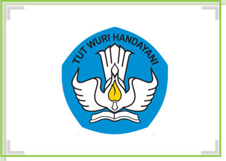

> **Deskripsi Visual:** Gambar ini adalah ilustrasi yang menampilkan logo sekolah. Logo ini terdiri dari dua elemen utama: sebuah bendera biru dengan lambang tangan berbentuk bulan sabit dan bintang putih, serta sebuah buku putih yang diletakkan di bawah tangan tersebut. Lambang tangan ini menggambarkan keberanian dan kejujuran, sementara buku menunjukkan pendidikan dan pengetahuan. Di atas lambang tangan, terdapat teks "TUT WURI HANDAYANI" yang menunjukkan nama sekolah. Elemen-elemen ini saling berkaitan, menunjukkan bahwa sekolah ini berfokus pada pendidikan dan nilai-nilai keberanian dan kejujuran.

 

---
## 📄 Halaman 131

KEMENTERIAN PENDIDIKAN, KEBUDAYAAN, RISET, DAN TEKNOLOGI REPUBLIK INDONESIA, 2021 Pendidikan Agama Kristen dan Budi Pekerti untuk SMA/SMK Kelas XII

Penulis: Janse Belandina Non-Serrano

ISBN: 978-602-244-702-3 (jil.3)

BAB IX

### RAS, ETNIS, DAN GENDER

(Kejadian 1-2; Keluaran 22:21; Lukas 10:25-36; Roma 10:12;)

### Tujuan Pembelajaran

- Menganalisis kaitan antara ras, etnis dan gender dengan sikap diskriminasi yang masih ada dalam masyarakat.
- Mendeskripsikan ras, etnis dan gender
- Memahami    Lukas  10:25-36  dan  mengkaitkannya  dengan  keadilan  bagi semua orang dalam rangka menghargai ras, etnis dan gender.
- menghargai perbedaan dalam keberagaman
- Menjadi teladan dalam keberagaman
- Membuat karya tulis (essay, refleksi, puisi) mengenai indahnya persekutuan remaja yang terdiri dari beragam etnis, budaya dan gender.
- Membuat Observasi sederhana berkaitan dengan gender sensitivitas

 

---
## 📄 Halaman 132

### A.  Pengantar

Pembahasan mengenai ras, etnis dan gender bertujuan membangun kesadaran dalam diri peserta didik  untuk  membangun pikiran positif terhadap perbedaan ras, etnis dan gender, terutama dalam kaitannya dengan sikap sebagai orang Kristen.  Allah  menciptakan  manusia  dalam  berbagai  keunikan  dan  semua manusia memiliki harkat dan martabat yang sama yang harus dihargai terlepas dari perbedaan latar belakang ras, etnis maupun gender. Hal ini penting karena masih cukup banyak orang  yang memiliki prejudisme (prasangka)  terhadap orang  lain  yang  berbeda  latar  belakang  dengannya.  Penting  untuk  disadari bahwa  pergaulan    dengan  sesama  yang  berbeda  latar  belakang  tidak  akan mengancam identitas kita sebagai orang Kristen.

Pada masa kini, diera global seperti ini, pergerakan manusia amat intens dari satu tempat ke tempat lain, dari satu negara ke negara lainnya. Hal itu menyebabkan hampir tidak  ada masyarakat yang homogen atau sama (tunggal) pada hampir tiap negara.  Contoh,  Eropa  yang  dulunya  hanya  didiami  oleh bangsa Eropa namun sekarang ada banyak imigran yang datang ke berbagai negara  di  Eropa.  Mereka  datang  membawa  serta  budaya  dan  kebiasaankebiasaan bangsanya dengan demikian, ada keberagaman hidup disana. Negara kita Indonesia dikenal sebagai negara yang masyarakatnya majemuk. Orang Indonesia sudah terbiasa hidup dalam keberagaman. Terkadang mendatangkan konflik namun semuanya dapat diselesaikan dengan baik. Berbagai persoalan yang  muncul  dari  keberagaman  itu  merupakan  pembelajaran  bagi  bangsa Indonesia.  Pembelajaran  itu  melahirkan  pemahaman  baru  yang  makin memperkuat solidaritas dan penerimaan terhadap keberagaman. Disamping itu para tokoh masyarakat, tokoh agama dan pemerintha juga selalu berupaya untuk  melakukan  penyadaran  bagi  masyarakat  bahwa  keberagaman  adalah anugerah  Tuhan  bagi  bangsa  Indonesia  yang  patut  disyukuri  bukannya dijadikan akar konflik dan permusuhan. Kebersamaan bangsa Indonesia diikat oelh filsafat Bhineka Tunggal Ika yang artinya biarpun berbeda-beda tetapi tetap satu. Semboyan ini tidak dimiliki oleh bangsa lain.

 

---
## 📄 Halaman 133

### B.  Mengenal Ras, Etnis dan Gender

---
**🖼️ Gambar/Diagram**

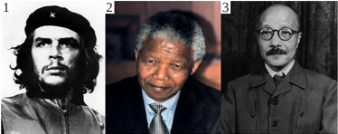

> **Deskripsi Visual:** Gambar ini adalah foto, yang menampilkan tiga tokoh berbeda. Tokoh pertama adalah Che Guevara, yang dikenal sebagai seorang revolusioner revolusi kelas buruh. Tokoh kedua adalah Nelson Mandela, yang dikenal sebagai pemimpin nasional Afrika Selatan dan pemimpin anti-rasisme. Tokoh ketiga adalah Sun Yat-sen, yang dikenal sebagai pemimpin revolusi Cina. Semua tokoh ini memiliki penampilan unik dan karakteristik yang menunjukkan peran mereka dalam sejarah. Teks, angka, atau label penting tidak ada pada gambar ini. Informasi kunci yang dapat diambil pembaca adalah bahwa gambar ini menunjukkan tiga tokoh berbeda yang memiliki peran penting dalam sejarah.

Gambar yang ada dalam buku ini merupakan gambar dari orang-orang yang berbeda rasnya. Posisi paling kiri mewakili seorang Latino, atau berasal dari Amerika  Latin,  posisi  tengah  mewakili  seorang Afrika,  dan  posisi  sebelah kanan adalah orang Asia dari Jepang. Orang-orang yang tinggal di Amerika Latin banyak yang merupakan keturunan Spanyol, Portugis, Prancis, Jerman, Inggris, dll. Ada pula orang-orang yang berasal dari Suriah, Lebanon, Mesir, bahkan juga sekarang banyak imigran dari Asia, seperti dari Jepang, Korea, dan Taiwan. Mereka yang keturunan bangsa Eropa tentu umumnya berkulit putih. Orang Afrika biasanya berkulit hitam. Orang-orang Afrika dari bagian utara, khususnya di daerah Maghribi, seperti Maroko, Tunisia, Aljazair, Libya, berkulit lebih cerah, bahkan ada yang berkulit putih. Rambut mereka pun ada yang pirang. Sementara itu, orang-orang dari bagian lain di Afrika biasanya berambut hitam dan keriting. Bangsa Jepang tergolong bangsa Asia, dari ras Mongoloid  yang  berkulit  kuning,  bermata  sipit  dan  tubuhnya  tidak  begitu tinggi.

Dalam  pembahasan  di  SD  dan  SMP  telah  dikemukakan  bahwa  Tuhan Allah menciptakan manusia dengan  kepelbagaian. Melalui kepelbagaian itu manusia dapat memahami kekuasaan serta kebesaran Sang Pencipta. Namun sayang  sekali,  kepelbagaian  ini  seringkali  justru  menjerumuskan  manusia ke dalam sikap sombong dan merendahkan orang lain. Dalam sejarah dunia tercatat  lembaran-lembaran  gelap  ketika  manusia  membeda-bedakan  orang berdasarkan warna kulit, kelompok etnis atau budaya, dan juga berdasarkan gendernya.

 

---
## 📄 Halaman 134

Dalam sejarah pernah terjadi ketika orang-orang kulit putih di Amerika Serikat  dan  di  Australia  memandang  rendah  orang-orang  kulit  hitam  dan berwarna. Keadaannya sedemikian parah sehingga orang malah memperjualbelikan  orang  lain  hanya  karena  warna  kulitnya  lebih  gelap,  atau  hitam. Orang-orang berkulit hitam dianggap sama dengan binatang sehingga mereka dapat diperjual-belikan, bahkan juga diperlakukan seperti binatang. Misalnya mereka bisa disuruh bekerja tanpa jam istirahat dan makan yang cukup. Mereka dihukum dengan sangat kejam apabila tuan-tuan mereka merasa bahwa mereka tidak  bekerja  cukup  keras  atau  mereka  berbuat  kesalahan.  Kadang-kadang mereka dipukuli, dibakar, dimutilasi (dipotong anggota tubuhnya), diberi cap dengan besi membara, dll.

Kamus 'The Oxford English Dictionary' memberikan beberapa definisi untuk kata 'barbarian', yaitu

- secara etimologis, Seorang asing, yang bahasa dan kebiasaannya berbeda dengan si pembicara.
- secara historis, a. Seseorang yang bukan orang Yunani. b. Seseorang yang hidup  di  luar  wilayah  kekaisaran  Romawi  dan  peradabannya,  berlaku khususnya  bagi  bangsa-bangsa  di  utara  yang  mengalahkan  mereka.  c. Seseorang yang hidup di luar peradaban Kristen. d. Di antara orang-orang Italia di zaman Renaisans: salah satu bangsa di luar Italia.
- Orang  yang  kasar,  liar,  tidak  beradab.  b.  Kadang-kadang  dibedakan dengan  bangsa  primitif  (mungkin,  mirip  dengan  no.  2).  c.  Diberikan sebagai penghinaan oleh orang China kepada orang asing.
- Orang  yang  tidak  beradab,  atau  orang  yang  tidak  bersimpati  dengan budaya sastra.
Dari definisi-definisi di atas, kita dapat menangkap bahwa orang 'barbar' adalah orang-orang yang dianggap renda dan buruk. Perbedaan budaya atau kelompok etnis juga bisa  membuat orang merendahkan satu sama lain. Di zaman dahulu, orang-orang Yunani menganggap diri mereka sebagai bangsa yang  paling  hebat.  Mereka  menyebut  bangsa-bangsa  lain  sebagai  bangsa 'barbar'. Mereka mempunyai ungkapan yang berbunyi, 'Barangsiapa yang bukan Yunani, adalah orang barbar.' Mereka menggunakan istilah ini bahkan juga untuk orang-orang Yunani dari suku-suku dan kota-kota yang lain. Di kemudian  hari  di  Eropa,  bangsa-bangsa  Anglo-Saxon  (Inggris,  Belanda,

 

---
## 📄 Halaman 135

Jerman, dll.) juga  menganggap rendah orang-orang dari Italia, Spanyol, dan Portugal.  Begitu  pula  dengan  perbedaan  gender,  masih  ada  manusia  yang membuat  perbedaan  perlakuan  terhadap  sesama  berdasarkan  perbedaan gender.

### Response saya

### Curah Pendapat

Lakukan curah  pendapat  mengenai  berbagai  ciri  manusia  dengan  perbedaannya. Kegiatan ini dapat mnenuntun kalian untuk memahami keberagaman manusia yang terdiri dari berbagai ras dan etnis. Guru akan meluruskan persepsi yang dikemukakan.

### C.  Pengertian Ras, Etnis dan Gender

Persoalan  ras,  etnis  dan  gender  telah  berabad-abad  diperdebatkan  sampai dengan saat ini. Mengapa? Karena ada berbagai pemahaman dan perlakuan yang harus diluruskan menyangkut ras, etnis dan gender. Persoalan rumpun kebangsaan  atau  ras,  suku  dan  jenis  kelamin  kemungkinan  dibahas  juga dalam  mata  pelajaran  lain.  Tapi  pembahasan  dalam  mata  pelajaran  PAK lebih ditekankan pada bagaimana seseorang berpikir dan bersikap terhadap berbagai  perbedaan ras, etnis dan gender sebagai pengikut Kristus yang tentu saja acuan sikapnya adalah ajaran Kristus.

Konsep  ras  muncul  ketika  bangsa-bangsa  Eropa  berjumpa  dengan bangsa-bangsa lain di dunia dan kemudian mulai mengkategorikan kelompokkelompok manusia menurut ciri-ciri fisiknya. Tujuan akhirnya adalah untuk membenarkan praktik perbudakan mereka.  Mereka yakin bahwa perbedaanperbedaan fisik antara kelompok-kelompok masyarakat itu juga mencerminkan perbedaan intelektual, perilaku, dan moral mereka. Pada tahun 1735, Carolus Linnaeus yang dikenal sebagai penemu taksonomi zoologi, membagi manusia ke  dalam  berbagai  kelompok  ras  Homo  Sapiens,  yaitu  masing-masing Europaeus,  Asiaticus,  Americanus dan Afer . Homo  Sapiens  Europaeus digambarkan aktif, akut, dan petualang sedangkan Homo Sapiens Afer licik,

 

---
## 📄 Halaman 136

malas dan sembrono. Dari sini kita dapat melihat bagaimana pembedaan ini pada  akhirnya  melahirkan  marginalisasi  atau  perendahan  terhadap  ras  dan suku bangsa tertentu.

Ras dan etnisitas adalah konsep yang digunakan untuk mengkategorikan sekelompok manusia. Perbedaan anatomi tubuh (warna kulit, warna rambut, mata, tinggi badan, dll), budaya, genetika, afiliasi geografi, sejarah, bahasa, atau kelompok sosial digunakan untuk mencirikan suatu kelompok manusia tertentu untuk mempermudah pengenalan sekelompok orang dalam kehidupan sehari-hari. Orang seringkali berpikir ini adalah pembagian yang sederhana. Kenyataannya tidak selalu demikian. Orang yang berkulit hitam dan berambut keriting dapat disebut sebagai orang Afrika, tetapi bukan mustahil juga berasal dari Papua. Orang berkulit kuning dan bermata sipit mungkin dikenali sebagai orang Cina, Korea, atau Jepang, tapi bisa jadi juga orang Minahasa.

Betapapun juga pembedaan-pembedaan yang dibuat, kita harus memahami bahwa tidak ada satu ras pun yang lebih tinggi atau unggul daripada yang lainnya, sementara ras tertentu lainnya dianggap lebih rendah di dunia. Semua ras memiliki kedudukan yang sederajat.

Suku  bangsa adalah  penyebutan  yang  diberikan  kepada  sekelompok manusia yang mendiami daerah tertentu serta memiliki adat kebiasaan sendiri. Berbagai  kebiasaan  dan  adat-istiadat  ini  merupakan  ciri  khas  yang  dapat membedakan satu kelompok etnis dengan kelompok lainnya. Di dunia dan di Indonesia terdapat banyak suku bangsa yang berbeda-beda. Ada perbedaan yang kecil, seperti misalnya suku Jawa dengan suku Bali. Ada pula suku-suku yang sangat berbeda, seperti misalnya suku Aceh dengan suku Papua. Namun, pada dasarnya semua suku sama dan sederajat. Adat-istiadat mereka semuanya unik dan tidak ada yang lebih luhur ataupun lebih rendah daripada yang lain. Setiap  suku  mengembangkan  kebudayaannya  masing-masing,  berbahasa dengan logatnya sendiri, dan mengembangkan adat-istiadatnya sesuai dengan kebutuhan mereka. Selain ciri-ciri kebudayaannya, suku bangsa juga kadangkadang dapat dibedakan berdasarkan ciri-ciri fisik anggotanya.

Gender adalah perbedaan fungsi peran sosial yang dikonstruksikan oleh masyarakat terhadap laki-laki dan perempuan. Gender belum tentu sama di tempat yang berbeda, dan dapat berubah dari waktu ke waktu. Gender tidak sama dengan seks atau jenis kelamin. Jenis kelamin terdiri dari perempuan dan  laki-laki  yang  telah  ditentukan  oleh  Tuhan  ketika  manusia  dilahirkan.

 

---
## 📄 Halaman 137

Sementara  itu,  gender  bukanlah  kodrat  ataupun  ketentuan  Tuhan.  Gender berkaitan dengan pandangan atau pemahaman tentang bagaimana seharusnya laki-laki  dan  perempuan  berperan  dan  bertindak  sesuai  dengan  tata  nilai yang  terstruktur,  ketentuan  sosial  dan  budaya  ditempat  mereka  berada. Dengan demikian definisi gender dapat dikatakan sebagai pembedaan peran, fungsi,  dan  tanggung  jawab  antara  perempuan  dan  laki-laki  yang  dibentuk atau dikonstruksikan secara sosial-budaya dan dapat berubah sesuai dengan perkembangan zaman. Contohnya, dahulu orang menganggap memasak dan menjahit sebagai pekerjaan perempuan. Namun sekarang ada banyak laki-laki yang menjadi juru masak atau perancang busana. Orang-orang seperti Bara Pattiradjawane, Rudy Choirudin, Arnold Purnomo, dll., dikenal sebagai juru masak yang sering  tampil  di  layar  televisi.  Tokoh-tokoh  seperti  alm.  Iwan Tirta, Edward Hutabarat, Itang Yunasz, adalah sejumlah laki-laki perancang mode yang terkemuka di negara kita.

### D.  Persepsi  Mengenai Ras, Etnis dan Gender

Setelah  melakukan  curah  pendapat  dan  mempelajari  pemahaman  konsep mengenai ras, etnis dan gender, sekarang kalian dapat meluruskan pemahaman terhadap ras, etnis dan gender. Tuliskan pemahaman kalian selama ini tentang ras, etnis dan gender lalu apakah kamu nmemperoleh pencerahan pemikiran setelah  mengetahui  sedikit  latar  belakang  dan  pemahaman  ras,  etnis  dan gender? Jika ada, tuliskan, jika tidak pun tuliskan tapi berikan alasan, mengapa demikian? Di bawah ini ada contoh kotak, yang dapat kamu isi di kertas lain, bukan di kotak ini.

 

---
## 📄 Halaman 138

### E.  Masalah-masalah Sekitar Ras, Etnis  dan Gender

### 1.  Diskriminasi rasial dan etnis

Seorang penulis Prancis  yang  bernama  François  Bernier  menyusun  sebuah buku yang menjelaskan pembagian manusia di dunia ke dalam kelompokkelompok ras. Bukunya yang berjudul Nouvelle division de la terre par les différents espèces ou races qui l'habitent (cara membacanya) diterbitkan pada tahun 1684.

Pada  abad  ke-18  orang  semakin  mendalami  perbedaan-perbedaan  ini, namun pemahamannya mulai disertai dengan gagasan-gagasan rasis tentang kecenderungan-kecenderungan batiniah dari berbagai kelompok, dengan ciriciri  yang  paling  baik  terdapat  pada  orang-orang  kulit  putih.  Di  atas  sudah dijelaskan  bagaimana  pengelompokan  manusia  ke  dalam  ras  itu  ternyata didasarkan pada keinginan untuk membenarkan praktik-praktik diskriminasi dan  penindasan  terhadap  ras  dan  etnis  tertentu  yang  semuanya  dipandang sebagai sesuatu yang wajar. Bahkan ras dan etnis tertentu dipandang rendah dan tidak memiliki martabat kemanusiaan.

Rasialisme  bertentangan  dengan  prinsip-prinsip hak  asasi  manusia. Rasialisme  menimbulkan  penderitaan  yang  luar  biasa  bagi  bangsa  dan  ras tertentu.  Misalnya:  penderitaan  orang-orang  Indian  dan  kaum  kulit  hitam di Amerika Serikat  yang  kehilangan  hak-haknya  sebagai  warga  negara.  Di Afrika Selatan orang-orang kulit hitam dan kulit berwarna juga kehilangan hak-haknya  karena  politik  rasial  yang  disebut apartheid ,  yaitu  pembedaan manusia  berdasarkan  ras  dengan  cara  mendiskriminasikan  mereka  yang berkulit hitam, berkulit berwarna dan orang-orang Asia (India). Mereka yang bukan kulit putih dibatasi ruang geraknya dan hampir tidak memeroleh hak sebagai warga negara. Namun aneh sekali, dalam praktik apartheid negara Afrika  Selatan,  bangsa  Jepang  diakui  berkulit  putih.  Mengapa?  Tidak  lain karena negara Jepang sudah tergolong maju dan kaya, dan rezim apartheid Afrika Selatan ingin memetik keuntungan ekonomi dengan memperlakukan bangsa Jepang dengan baik di sana.

Nelson Mandela adalah pejuang kulit hitam Afrika Selatan yang terkenal. Ia  berhasil  memperjuangkan hak orang kulit hitam di Afrika Selatan untuk memeroleh hak yang sama dengan kaum kulit putih. Karena usahanya selama puluhan  tahun,  pada  5  Juni  1991  diskriminasi  hukum  di  Afrika  Selatan terhadap orang kulit hitam dicabut.

 

---
## 📄 Halaman 139

Masih  banyak  contoh  yang  dapat  diangkat  dalam  kaitannya  dengan ketidakadilan ras dan etnis. Di Amerika Serikat tokoh yang terkenal melawan diskriminasi  rasial  adalah  Pdt.  Dr.  Martin  Luther  King,  Jr.  Ia  memimpin demonstrasi dan pemogokan damai dalam rangka memperjuangkan hak-hak orang kulit hitam di Amerika, hingga akhirnya ia tewas dibunuh. Di Jerman, Adolf Hitler membunuh enam juta orang Yahudi karena kebencian ras dan etnis serta kebanggaannya akan ras Aria yang dianggapnya sebagai ras paling unggul.

Pada  Januari  2001,  Presiden  Abdurrahman  Wahid  (Gus  Dur)  mengumumkan Tahun Baru China (Imlek) menjadi hari libur pilihan, yang kemudian diubah oleh Presiden Megawati menjadi hari libur nasional. Tindakan Gus Dur ini diikuti  dengan  pencabutan  larangan  penggunaan  huruf  Tionghoa.  Gus  Dur juga memulihkan hak-hak etnis Tionghoa di Indonesia. Di Indonesia kini hakhak setiap warga negara dari semua etnis dan ras dijamin oleh UU. Jadi, jika ada yang melakukan tindakan pelecehan terhadap ras atau etnis tertentu, maka yang bersangkutan dapat dituntut secara hukum.

Demikianlah, seiring dengan perkembangan masyarakat, kemajuan ilmu pengetahuan dan teknologi, diskriminasi rasial mulai terkikis secara perlahan dan kini muncul kesadaran bahwa diskriminasi rasial bertentangan dengan hak asasi manusia. Di Amerika Serikat, Barak Obama menjadi orang kulit hitam pertama yang menjadi presiden di negara itu. Di Italia, Cecile Kyenge, seorang perempuan Afrika kelahiran Kongo, menjadi orang kulit hitam pertama yang diangkat menjadi menteri urusan Integrasi di negara itu.

### 2.  Diskriminasi Gender

Menurut definisi yang ada dalam buku ' Kesetaraan Gender ' yang diterbitkan oleh ELSAM,  sebuah LSM  yang bergerak di bidang pemberdayaan perempuan,  istilah 'kesetaraan gender' berarti kesamaan  kondisi  bagi laki-laki  dan  perempuan  untuk  memperoleh  kesempatan  serta  hak-haknya sebagai  manusia,  agar  mampu  berperan  dan  berpartisipasi  dalam  kegiatan politik,  hukum, ekonomi, sosial budaya, pendidikan, serta kesamaan dalam menikmati  hasil  pembangunan  tersebut.  Kesetaraan  gender  juga  meliputi penghapusan diskriminasi dan ketidakadilan struktural, baik terhadap laki-laki

 

---
## 📄 Halaman 140

maupun perempuan. Jadi, diskriminasi gender adalah perlakuan yang berbeda terhadap laki-laki dan perempuan. Diskriminasi terjadi terhadap perempuan dan dipengaruhi oleh budaya. Umumnya budaya di Indonesia lebih berpihak pada kaum laki-laki dibandingkan kepada kaum perempuan. Misalnya, orang biasa  bertanya,  'Putra  Bapak  berapa?'  Mengapa  tidak  bertanya,  'Berapa putra dan putri Bapak?' Pertanyaan yang pertama menyiratkan bahwa anak laki-laki lebih berharga sehingga merekalah yang ditanyakan keberadaan dan jumlahnya dalam sebuah keluarga.

Orang seringkali begitu saja menyamakan gender dengan jenis kelamin. Misalnya,  orangtua  sering  mengajarkan  kepada  anak  laki-lakinya,  'Jangan menangis.  Kamu  'kan  laki-laki!  Laki-laki  tidak  boleh  menangis.'  Atau, seorang ibu berkata kepada anak perempuannya, 'Kamu harus membantu Ibu di  dapur, karena itu adalah tugas seorang anak perempuan.' Anak laki-laki yang menangis dianggap banci. Anak perempuan yang lebih suka bermain di luar  ketimbang membantu ibunya di dapur dianggap tomboy atau  kelelakilelakian. Kenyataannya, menangis adalah sebuah ungkapan emosi yang wajar bagi manusia - laki-laki mapun perempuan. Membantu ibu memasak di dapur pun  bisa  dilakukan  oleh  seorang  anak  laki-laki.  Di  atas  sudah  disinggung betapa  banyak  juru  masak  dan  perancang  mode  laki-laki  sekarang.  Karya mereka ternyata dihargai tinggi oleh masyarakat kita.

Keadilan  gender  adalah  suatu proses dan  perlakuan  adil terhadap perempuan dan laki-laki. Dengan adanya keadilan gender berarti tidak ada pembakuan peran, beban ganda, subordinasi, marginalisasi terhadap kelompok yang dianggap lebih lemah, dan kekerasan terhadap perempuan maupun lakilaki.

Terwujudnya kesetaran (persamaan) dan keadilan gender ditandai dengan tidak  adanya  diskriminasi  (pembedaan)  antara  perempuan  dan  laki-laki. Dengan demikian, mereka memiliki akses pada berbagai bidang kehidupan. Memiliki  akses  dan  partisipasi  berarti  memiliki  peluang  atau  kesempatan untuk memperoleh keadilan di berbagai bidang kehidupan. Kesetaraan gender juga  meliputi  penghapusan  diskriminasi  dan  ketidakadilan  struktural,  baik terhadap laki-laki maupun perempuan.

 

---
## 📄 Halaman 141

Di  Indonesia,  masih  banyak  orang  yang  kurang  memiliki  kesadaran gender sehingga akibatnya masih cukup banyak perempuan yang tertinggal di berbagai bidang kehidupan. Misalnya, masih ada orang tua Indonesia yang memberikan prioritas utama kepada anak laki-laki untuk bersekolah daripada anak  perempuan.  Angka  buta  huruf  bagi  kaum  perempuan  lebih  banyak daripada  kaum  laki-laki.  Ketertinggalan  perempuan  mencerminkan  masih adanya ketidakadilan dan ketidaksetaraan antara laki-laki dan perempuan di Indonesia.

Pada  masa  kini,  di  Indonesia  hak-hak  perempuan  dijamin  oleh  UU. Misalnya,  perempuan  yang  mengalami  kekerasan  dalam  rumah  tangga (dipukul  ataupun  dihina  oleh  suami),  dapat  melaporkan  peristiwa  tersebut kepada pihak kepolisian. Selanjutnya, polisi akan melakukan tindakan hukum terhadap pihak yang melakukan kekerasan.

### Response saya

Setelah mempelajari materi tersebut diatas, kini kalian dapat mendiskusikan :

- kaitan antara ras, etnis dan gender dengan sikap diskriminasi yang masih ada dalam masyarakat.
- pengalaman hidup bersama dalam lingkungan yang orang-orangnya terdiri dari ras, etnis dan gender yang berbeda.
Guru akan membantu mengarahkan diskusi ini.

### F.  Pemahaman Alkitab tentang Ras, Etnis dan Gender

### 1.  Apa Kata Alkitab Tentang Ras dan Etnis?

Kitab Perjanjian  Lama  memberi  ruang  pada  kepelbagaian.  Anak-anak keturunan Abraham dan Yakub diminta untuk memberi tumpangan bagi orang asing di rumah mereka. Hak-hak orang asing juga diperhatikan. Kitab Keluaran 22:21; janganlah kautindas atau kautekan orang asing sebab kamu pun dahulu orang  asing  di  tanah  Mesir.  Kemungkinan  orang  asing  yang  dimaksudkan adalah orang yang berasal dari daerah yang berbeda atau dari suku bangsa yang berbeda.

Dalam Perjanjian Baru, sikap dua orang tokoh sentral, yaitu Yesus dan Rasul  Paulus  jelas  mengisyaratkan  solidaritas  dan  tidak  membeda-bedakan

 

---
## 📄 Halaman 142

ras  dan  suku  bangsa.  Para  pengikut  Rasul  Paulus  terdiri  dari  orang Yahudi helenis, orang Yunani bahkan orang-orang dari Asia kecil.

Yesus menceritakan sebuah perumpamaan yang menarik tentang 'Orang Samaria yang murah hati' (Luk 10: 25-37). Orang Israel memandang rendah orang Samaria dan mereka tidak mau bergaul dengan orang Samaria. Ibadah orang Samaria juga dipandang sebagai ibadah yang tidak murni lagi karena bercampur  dengan  sistim  ibadah  etnis  lain  yang  ada  di  sekitar  Samaria. Perumpamaan  ini  menarik  karena  Yesus  memakainya  untuk  menjawab pertanyaan  orang-orang  Yahudi  tentang  siapakah  sesama  manusia.  Yesus mengajarkan kepada mereka bahwa sesama manusia adalah semua manusia ciptaan Allah. Sesama manusia adalah mereka yang peduli serta menunjukkan solidaritasnya bagi sesama melewati batas-batas agama dan suku bangsa.

Sejajar dengan itu, Rasul Paulus juga mengatakan tidak ada orang Yunani atau bukan Yunani, semua orang dikasihi Allah (Rm. 10:12). Tuhan Allah itu adalah Allah yang Esa dan yang menciptakan manusia dalam kepelbagaian. Ternyata,  sikap  diskriminatif  terhadap  ras  dan  etnis  bukan  hanya  ada  di zaman kini saja, tetapi sejak zaman Perjanjian Baru pun hal itu terjadi. Yesus menangkap hal tersebut, karena itu Ia selalu memperingatkan para pengikutNya untuk menghargai sesama manusia. Murid-murid Yesus pun berasal dari berbagai tempat dan tidak ada seleksi suku atau etnis dan daerah geografis tempat tinggal. Yesus memilih mereka dan menanyakan kesediaannya untuk mengikuti-Nya.  Komitmen  dan  hati  manusia  lebih  utama  dibandingkan dengan tempat asal, suku bangsa maupun warna kulit.

Pernyataan  tersebut  di  atas  diperkuat  dengan  Injil  Matius  22:37-39, Markus 12:28-34, dan Lukas 10:25-28. Bagian kitab tersebut berisi tentang kasih kepada Allah dan kepada sesama manusia. Perintah kasih itu bersifat universal artinya berlaku untuk semua manusia di semua tempat.

Apa  yang  disampaikan  tersebut  merupakan  kutipan  yang  memperkuat pandangan terhadap keadilan ras dan etnis atau suku bangsa. Sedangkan, ada juga  kutipan  Alkitab  yang  sering  disalahartikan  seolah-olah  ada  ras  yang  dikutuk dan karena itu mereka selalu menjadi ras yang terbelakang. Contohnya kisah pada Kejadian 9: 18-27. Salah satu anak Nuh, yaitu Ham yang juga disebut sebagai 'Kanaan' telah berlaku tidak sopan dan tidak hormat pada ayahnya,

 

---
## 📄 Halaman 143

Nuh. Ketika Nuh mabuk dan telanjang, ia tidak menutupi tubuh Nuh, ia malah menceritakan aib ayahnya. Sebaliknya dengan kedua saudaranya, Sam dan Yafet. Ketika mereka mendengar hal itu, mereka masuk ke kamar ayahnya dan menutupi tubuhnya yang telanjang tanpa menoleh ke arah ayahnya. Setelah sadar dari mabuknya, Nuh mengetahui hal itu, ia sangat marah dan mengutuk Ham. Kutukan itu adalah kutukan seorang ayah kepada anaknya dan bukan kutukan terhadap ras yang berasal dari keturunan Ham. Ada banyak kalangan yang salah menafsirkan bahwa keturunan Ham yang merupakan cikal bakal ras Aria itu menjadi budak akibat kutukan Nuh. Padahal Nuh tidak pernah mengutuk ras dan etnis tertentu.

### 2.  Apa Kata Alkitab tentang Kesetaraan Gender?

Ada beberapa contoh di Alkitab  tentang Yesus  yang  memperhatikan  kaum perempuan sebagai orang yang seringkali dinomorduakan bahkan direndahkan di kalangan orang-orang Israel. Misalnya: Yesus menerima seorang perempuan yang  meminyaki  kakinya.  Ia  juga  berteman    dengan  Martha  dan  Maria. Yesus  mendobrak  struktur  budaya  masyarakat  Yahudi  yang  merendahkan perempuan  dan  memang  sangat  diskriminatif.  Misalnya,  perempuan  tidak boleh  tampil  di  depan  umum  dan  memperoleh  pendidikan.  Yesus  malah bergaul dengan Martha dan Maria, saudari-saudari Lazarus. Ia berkunjung ke rumah mereka dan mengajar Maria. Ia juga makan bersama mereka. Yesus mengampuni  seorang  perempuan  yang  berzinah,  padahal  menurut  hukum Yahudi, perempuan yang berzinah harus dihukum dengan cara dilempari batu sampai meninggal. Sedangkan laki-laki yang berselingkuh dengannya bebas Sungguh ironis sikap Yesus, ketika perempuan yang berzinah (berselingkuh) itu  dihadapkan  kepada-Nya  untuk  dihukum,  Yesus  bertanya  kepada  orang banyak yang ada di sana, kata-Nya, 'Siapa di antara kamu yang tidak berdosa, silakan  melempari  perempuan  ini!'  Semua  orang  bubar  dan  tidak  jadi melempari perempuan itu dengan batu. Karena mereka semua sadar bahwa semua manusia berdosa. Kemudian Yesus berkata kepada perempuan itu, 'Aku pun tidak menghukum kamu, pergilah dan jangan berbuat dosa lagi.' Sikap tersebut merupakan salah satu cara Yesus mendobrak adat, norma, kebiasaan yang telah terbentuk (terstruktur) dalam masyarakat Yahudi yang merugikan dan  menindas  perempuan.  Jika  seorang  perempuan  yang  sudah  menikah ditemukan berselingkuh, hukumannya adalah dilempari dengan batu sampai mati  Dalam  Kitab  Perjanjian  Lama,  tampil  beberapa  perempuan  sebagai

 

---
## 📄 Halaman 144

pemimpin  yang  mempunyai  peran  penting  dalam  menyelamatkan  bangsa Israel. Para perempuan itu, antara lain: Deborah adalah Hakim yang memimpin bangsa  Israel  setelah  kematian  Yosua.  Miriam  adalah  saudari  perempuan Musa dan Harun. Ia berperan sebagai seorang nabiah yang memimpin dan mengajar bangsa Israel bersama dua orang saudaranya, Musa dan Harun. Ratu Ester  yang  berperan  menyelamatkan  bangsa  Israel  dari  pembunuhan  yang direncanakan oleh Haman, pembantu Raja Ahazweros dalam pemerintahan.

Dapat disimpulkan bahwa Alkitab tidak merendahkan kaum perempuan. Bahkan  dari  cerita  penciptaan,  dapat  terlihat  betapa  pentingnya  peranan kaum  perempuan,  begitu  pula  laki-laki.  Jadi,  tugas,  kewajiban  dan  hak laki-laki  dan  perempuan  merupakan  hak  asasi  yang  diberikan  Allah  sejak manusia diciptakan.  Dengan  demikian,  paham  kesetaraan  gender  telah  ada sejak manusia diciptakan. Manusia laki-laki dan perempuan hanya memiliki perbedaan  dari  segi  seks,  yang  satu  berjenis  kelamin  laki-laki  dan  yang lainnya berjenis kelamin perempuan sedangkan martabat, harga diri dan hakhak sebagai manusia adalah sama.

### Response saya

### Berbagi Pengalaman

Ceritakan bagaimana pendidikan yang diperoleh di lingkungan keluarga mu menyangkut Ras,  Etnis  dan  Gender. Apakah  ada  batasan-batasan  tertentu? Adakah  perbedaan  tugas  dan  asuhan  terhadap  anak  laki-laki  dengan  anak perempuan? Apakah ada batasan-batasan berkaitan dengan suku, warna kulit dll?

 

---
## 📄 Halaman 145

### G. Sikap Remaja Kristen Terhadap Perbedaan Ras,

---
**🖼️ Gambar/Diagram**

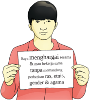

> **Deskripsi Visual:** Gambar ini adalah ilustrasi yang menunjukkan seorang pria sedang membawa sebuah kertas dengan teks yang berbunyi "menghargai sesama tanpa merendahkan perbedaan ras, etnis, gender & agama". Pada gambar tersebut, elemen utama adalah pria yang sedang membawa kertas tersebut. Teks pada kertas tersebut merupakan informasi yang penting dan relevan dengan tema yang ingin disampaikan oleh gambar ini. Gambar ini menggambarkan konsep tentang keberagaman dan toleransi antar sesama, serta mengajak semua orang untuk menghargai dan menerima perbedaan-perbedaan tersebut tanpa merendahkan atau memandang rendah.

Dalam kehidupan sosial kemasyarakatan, diskriminasi ras, suku bangsa dan gender adalah sikap yang melanggar hak asasi manusia. Secara alami, ada manusia  yang  memang  berbeda  satu  dengan  yang  lainnya  baik  dari  jenis kelamin, ras maupun etnis atau suku bangsa. Perbedaan itu tentu membawa pengaruh bagi eksistensi atau keberadaan seseorang. Namun, perbedaan itu tidak dapat dijadikan alasan pelecehan ataupun perendahan terhadap sesama manusia. Dari segi  iman  kristiani, Alkitab  tidak  pernah  mengajarkan  sikap diskriminasi  terhadap  manusia  yang  berbeda  ras,  etnis  atau  suku  bangsa maupun jenis kelamin. Semua manusia memiliki harkat dan martabat yang sama sebagai makhluk mulia ciptaan Allah. Oleh karena itu, pemberian label negatif terhadap sesama yang berbeda ras, etnis dan jenis kelamin adalah sikap yang bertentangan dengan iman kristiani.

### H. Persepsi Mengenai Ras, Etnis dan Gender

Setelah mempelajari materi mengenai pemahaman Alkitab tentang Ras, etnis dan  gender,  kini  kamu    dapat  merenungkan,  bagaimana  sikap  dan  pikiran mu berkaitan dengan ras, etnis dan gender selama ini? Apakah kamu pernah merendahkan  seseorang  karena  perbedaan  jenis  kelamin,  perbedaan  suku, warna kulit ataupun melakukan 'body shaming' terhadap seseorang, termasuk teman? Bahkan mungkin kamu tidak mau menolong sesama karena melihat

 

---
## 📄 Halaman 146

latar belakang dirinya yang berbeda dengan mu? Maka, kini saatnya sikap itu diubah. Sebagai remaja Kristen kamu diminta untuk mengasihi sesama tanpa kecuali. Tuliskan tekad mu untuk berubah berdasarkan pemahaman Alkitab yang sudah dipelajari!

Sikap saya:.......................atau saya bertekad untuk..............

Tulis  contoh diskriminasi ras,etnis dan gender yang terjadi dalam masyarakat. Lalu tuliskan hal itu bertentangan dengan prinsip ajaran iman Kristen yang sudah  kalian  pelajari.  Guru  dapat  membantu  dengan  menjelaskan  kembali apa arti tindakan dan sikap diskriminatif, misalnya pembedaan antara orang pribumi dengan keturunan lainnya, diskriminasi dalam berbagai aturan yang lebih menguntungkan laki-laki atau perempuan.

 

---
## 📄 Halaman 147

### I. Belajar  Dari Alkitab

### Orang Samaria Yang Murah Hati, Lukas 10:25-36

Perumpamaan mengenai orang Samaria yang murah hati dikemukakan Yesus untuk menyadarkan orang yahudii yang nampaknya berpikir bahwa sesama manusia adalah sesama orang yahudi. Di luar bangsa Yahudi, bukanlah sesama manusia. Yang disebut sesama kita hanyalah orang-orang yang sebangsa dan seagama dengan kita. Mereka tidak akan menghukum mati seorang Yahudi yang membunuh orang bukan-Yahudi, sebab dia bukanlah sesama manusia bagi  mereka.  Orang  Yahudi  memang  berkata  bahwa  mereka  tidak  boleh membunuh orang bukan-Yahudi yang tidak sedang berperang dengan mereka. Namun,  apabila  mereka  melihat  seorang  bukan-Yahudi  sedang  sekarat, mereka tidak merasa berkewajiban untuk menyelamatkan nyawanya. Yesus ingin meluruskan pemahaman yang keliru  yang tidak manusiawi itu, bahwa tiap orang yang membutuhkan pertolongan maupun mereka yang memberikan pertolongan adalah sesama manusia tanpa memandang perbedaan bangsa dan agama.

Perumpamaan  itu  sendiri,  yang  menggambarkan  kepada  kita  perihal seorang  Yahudi  malang  yang  mengalami  kesulitan,  yang  ditolong  dan diringankan bebannya oleh seorang Samaria yang baik hati.

Orang  itu    sedang  melakukan  perjalanan  dan    ia  melewati  jalan  raya yang terbentang dari Yerusalem ke Yerikho (ayat. 30). Disebutkannya kedua kota  itu  menyiratkan  bahwa  ini  adalah  kejadian  yang  nyata,  bukan  sebuah perumpamaan. Boleh jadi peristiwa itu belum lama terjadi, tepat seperti yang diceritakan di sini. Kejadian-kejadian seperti ini bisa dirancang menyerupai perumpamaan untuk dijadikan sebagai pelajaran, dan akan lebih menyentuh. Laki-laki malang ini jatuh ke tangan penyamun-penyamun. Mereka bukan saja merampas uang orang itu, tetapi juga pakaiannya, dan supaya ia tidak dapat mengejar mereka, atau sekadar untuk memuaskan nafsu jahat, mereka pun memukulnya dan pergi meninggalkannya setengah mati, sekarat karena lukalukanya. Yesus menggambarkan bagaimana orang malang itu telah diabaikan oleh orang-orang yang seharusnya menjadi sahabat-sahabatnya, yang bukan saja  sebangsa  dan  seagama,  tetapi  juga  seorang  imam  dan  yang  satu  lagi seorang Lewi, tokoh-tokoh masyarakat dengan kedudukan penting. Mereka bahkan dianggap suci oleh orang. Tugas mereka mewajibkan mereka harus

 

---
## 📄 Halaman 148

bersikap lemah-lembut dan penuh belas kasihan. (Ibr. 5:2) Mereka mengajar orang lain tentang hukum agama  tetapi mereka sendiri tidak melakukannya. Dr. Lightfoot mengatakan bahwa banyak kelompok imam bertempat tinggal di  Yerikho,  dan  dari  sana  mereka  pergi  ke  Yerusalem  ketika  tiba  giliran mereka untuk bertugas di situ, kemudian pulang kembali. Ini artinya bahwa ada banyak imam yang pulang pergi melalui jalan itu, beserta orang-orang Lewi para pembantu mereka. Mereka melewati jalan itu, dan melihat orang malang yang terluka itu. Mungkin mereka mendengar rintihannya dan tidak bisa tidak mereka pasti tahu bahwa jika tidak segera ditolong, ia pasti akan tewas.  Orang  Lewi  itu  bukan  saja  menoleh  kepadanya,  tetapi  datang  ke tempat itu dan melihat orang itu (ayat. 32). Namun, keduanya melewatinya dari seberang jalan. Ketika melihat kejadian yang menimpa orang itu, mereka menjaga  jaraknya  sejauh  mungkin,  seakan-akan  mau  berdalih,  'Sungguh, kami  tidak  tahu  hal  itu.'  Sungguh  menyedihkan  bila  orang-orang  yang seharusnya menjadi teladan kemurahan hati justru berperilaku sangat jahat. Mereka yang seharusnya menunjukkan rahmat Allah dan menyatakan belas kasihan terhadap orang lain, malah tidak melakukannya.

Korban yang malang itu ditolong dan dirawat oleh seorang asing, seorang Samaria, dari suku bangsa yang paling dianggap hina dan dibenci oleh orangorang Yahudi  yang  tidak  mau  berurusan  dengan  mereka.  Orang  ini  masih memiliki  perikemanusiaan  dalam  dirinya  (ay.  33).  Imam  itu  mengeraskan hatinya terhadap salah seorang dari bangsanya sendiri, tetapi orang Samaria itu membuka hati terhadap salah seorang dari bangsa lain. Ketika ia melihat orang  itu, tergeraklah  hatinya  oleh  belas  kasihan  dan  sama  sekali  tidak mempermasalahkan  kebangsaannya.  Walaupun  korbannya  seorang  Yahudi, dia tetap saja seorang manusia, manusia yang berada dalam penderitaan, dan orang  Samaria  itu  telah  diajar  untuk  menghormati  semua  orang.  Dia  tidak tahu  kapan  kejadian  yang  menimpa  orang  malang  tersebut  akan  menimpa dirinya sendiri. Oleh sebab itu ia menaruh iba terhadapnya, sama seperti dia ingin dikasihani seandainya mengalami kejadian seperti ini. Pada saat hatinya tergerak, ia mengulurkan tangannya kepada orang malang ini (Yesaya. 58:7,10; Ams. 31:20), betapa baik hatinya orang Samaria ini.

Pertama ,  ia  mendatangi  orang  yang  malang  itu,  yang  dihindari  oleh imam  dan  orang  Lewi  itu.  Tidak  diragukan  lagi  bahwa  orang  Samaria  itu menanyakan bagaimana ia sampai berada dalam keadaan yang menyedihkan itu, dan turut merasa prihatin terhadapnya.

 

---
## 📄 Halaman 149

Kedua ,  ia  melakukan tugas seorang tabib, karena tidak ada lagi siapasiapa  di  situ.  Ia  membalut  luka-lukanya,  mungkin  memakai  kain  lenannya sendiri, lalu menyiraminya dengan minyak dan anggur, yang mungkin dibawa olehnya.  Anggur untuk membersihkan luka-luka, dan minyak untuk meredakan rasa sakit, dan setelah itu ia membalutnya. Dia berbuat sebisa-bisanya untuk meredakan rasa sakit dan mencegah bahaya yang disebabkan oleh luka-luka itu, sebagai seseorang yang turut merasakan kepedihan.

Ketiga ,  Ia  menaikkan orang itu ke atas keledai tunggangannya sendiri, sementara ia sendiri berjalan kaki, dan membawanya ke tempat penginapan. Sungguh merupakan rahmat bila terdapat tempat penginapan di jalan, sehingga kita  bisa  memperoleh  makanan  dan  istirahat  dengan  uang  kita.  Mungkin malam  itu  orang  Samaria  ini  bisa  mengakhiri  perjalanannya  seandainya tidak  menjumpai  rintangan  ini.  Namun,  karena  belas  kasihannya  terhadap orang malang itu, ia turut bermalam di penginapan. Ada yang berpendapat bahwa imam dan orang Lewi itu beralasan tidak dapat tinggal sejenak untuk menolong orang malang itu karena mereka sedang bergegas untuk menghadiri ibadah di Yerusalem. Namun demikian, menolong sesama merupakan ibadah bukan? Keempat ,  orang  samaria  itu  merawat  korban  yang  malang  itu    di penginapan, membaringkannya di tempat tidur, memberikan makanan yang layak baginya, menemaninya.

Kelima ,  Seolah-olah  orang  ini  adalah  anaknya  sendiri  atau  orang yang  ada  di  bawah  pemeliharaannya,  saat  berangkat  keesokan  paginya,  ia menyerahkan  uang  kepada  pemilik  penginapan  untuk  dipergunakan  bagi semua  keperluan  si  sakit,  serta  menjanjikan  pengembalian  kelebihan  uang yang akan dibelanjakan. Uang dua dinar pada masa itu dapat dipergunakan untuk  berbagai-bagai  keperluan.  Namun,  di  sini  uang  sebanyak  itu  pun diperhitungkannya saja seolah-seolah bisa mencukupi semua keperluan orang itu. Semuanya ini sungguh-sungguh merupakan kebaikan dan kemurahan hati yang hanya bisa diharapkan bisa diperoleh dari seorang sahabat atau saudara, padahal ini dilakukan oleh seorang asing yang tidak dikenal.

 

---
## 📄 Halaman 150

### J.  Perdebatan Tentang Orang Samaria Yang Murah Hati

Bagi diri  dalam  dua  kelompok kemudian lakukan debat berdasarkan cerita orang Samaria yang murah hati. Satu kelompok membela sikap orang  Lewi yang pergi meninggalkan orang Yahudi yang tengah terkapar menderita karena dirampok.  Kelompok  yang  satu  lagi  menentang  sikap  Orang  Yahudi  yang telah  meninggalkan  orang  sesama  orang Yahudi  yang  tengah  terkapar  dan menderita dan ditolong oleh Orang samaria yang murah hati. Dalam perdebatan kemukakan sejumlah bukti dan argumentasi tetapi prinsip-prinsip iman yang telah dipelajari harus dikemukakan sebagai bahagian dari argumentasi.

### K. Refleksi

Manusia dapat mewujudkan hidup yang lebih baik, lebih berpengharapan ketika saling bekerja sama. Namun masih ada manusia-manusia yang memandang rendah  sesorang  berdasarkan  jenis  kelamin,  suku,  bangsa,  agama  maupun status  sosial.  Remaja  Kristen  memiliki  tanggung-jawab untuk mewujudkan kerjasama,  solidaritas  dan  penghargaan  bagi  sesama  tanpa  memandang perbedaan ras, etis maupun gender

### Tugas

- Laksanakan  Observasi sederhana berkaitan dengan ras, etnis dan gender sensitivitas,  Hasil  dan  Kesimpulan  Observasi  dipresentasikan  dikelas. Daftar pertanyaan dan teknis pelaksanaan akan dijelaskan oleh guru.
- Membuat karya tulis (essay, refleksi, puisi) mengenai indahnya persekutuan remaja yang terdiri dari beragam etnis, budaya dan gender.
- Buat Program Tindak Lanjut dari Observasi dalam bentuk kegiatan yang realistik dan dapat dilaksanakan di sekolah dan daerah masing-masing. Ras,  Etnis  dan  Gender  merupakan  topik  yang  amat  penting.  Manusia dapat mewujudkan hidup yang lebih baik, lebih berpengharapan ketika saling bekerja sama.

 

---
## 📄 Halaman 151

KEMENTERIAN PENDIDIKAN, KEBUDAYAAN, RISET, DAN TEKNOLOGI REPUBLIK INDONESIA, 2021 Pendidikan Agama Kristen dan Budi Pekerti untuk SMA/SMK Kelas XII

Penulis: Janse Belandina Non-Serrano

ISBN: 978-602-244-702-3 (jil.3)

### MULTI KULTUR

( Galatia 3:28 ; Kolose 3: 11 )

---
**🖼️ Gambar/Diagram**

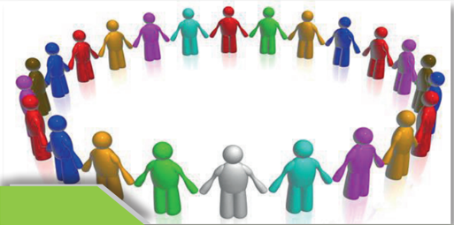

> **Deskripsi Visual:** Gambar ini adalah ilustrasi yang menunjukkan sebuah kelompok orang berjalan beriringan tangan. Ilustrasi ini menggambarkan konsep kerjasama dan saling membantu dalam masyarakat. 

1. **Apa yang ditampilkan secara keseluruhan**: Gambar ini menampilkan sekelompok orang yang berjalan beriringan tangan, membentuk lingkaran. Setiap orang memiliki warna yang berbeda, menunjukkan keberagaman dan persatuan.

2. **Elemen-elemen utama dan relasinya**: 
   - **Kelompok Orang**: Sebuah kelompok manusia yang terdiri dari banyak individu.
   - **Tangan yang Dihold**: Setiap orang memegang tangan orang lain, menunjukkan hubungan sosial dan kerjasama.
   - **Warna**: Orang-orang memiliki warna yang berbeda, menunjukkan keberagaman dan persatuan.

3. **Teks, angka, atau label penting yang terlihat**: 
   - **Teks**: Tidak ada teks yang terlihat pada gambar ini.
   - **Angka**: Tidak ada angka yang terlihat pada gambar ini.
   - **Label**: Tidak ada label yang terlihat pada gambar ini.

4. **Informasi kunci yang dapat diambil pembaca**: Gambar ini menggambarkan konsep kerjasama dan saling membantu dalam masyarakat. Orang-orang berjalan beriringan tangan menunjukkan hubungan sosial dan persatuan antara mereka. Warna-warna yang berbeda menunjukkan keberagaman dalam kelompok tersebut.

Dengan demikian, gambar ini menggambarkan konsep kerjasama dan persatuan dalam masyarakat, dengan menggunakan elemen-elemen visual seperti kelompok orang, tangan yang dipegang, dan warna-warna yang berbeda.

### Tujuan Pembelajaran

- Menjelaskan arti multikultur
- Menjabarkan  multikulturalisme  di  |Indonesia,  khususnya  dampak  positif  dan negatif.
- Menyusun tulisan pendek mengenai multikulturalisme di Indonesia.
- Berbagi pemahaman dan pengalaman berkaitan dengan multikultur
- Memahami isu  multikultur di Indonesia sebagai pemberian Allah .
- Mempresentasikan poin-poin atau pokok-pokok penting  menyangkut nilai-nilai multikultur yang  dapat dimanfaatkan dalam  rangka memperkuat  kesatuan umat Kristen secara khusus dan bangsa Indonesia.
- Mengadakan observasi di gereja masing-masing mengenai  sikap gereja terhadap multikulturlaisme dan mendiskusikannya.
- Merancang proyek   yang berkaitan dengan multikulturalisme

 

---
## 📄 Halaman 152

### A.  Pengantar

Multikulturalisme  merupakan  topik  penting  untuk  dipelajari  oleh  remaja SMA. Dunia kita dewasa ini adalah dunia global yang multikultur. Mobilitas masyarakat  dunia    pada  masa  kini  amat  dinamis  dan  intens.  Masyarakat berpindah  dari  satu  tempat  ke  tempat  lainnya,  dari  satu  negara  ke  negara lainnya dan dengan sendirinya menciptakan keberagaman yang multikultur. Di  sekeliling  kita  ada  begitu  banyak  keberagaman  yang  tampak  mata. Keberagaman  itu  melahirkan  berbagai  dampak  dalam  kehidupan  sosial kemasyarakatan  bahkan  dalam  kehidupan  beragama.  Ada  berbagai  suku, kebangsaan, ada berbagai budaya, agama, kelas sosial maupun keberagaman gaya hidup dan cara pandang, itulah multikulturalisme. Jadi, yang dimaksudkan denga n multikulturalisme bukan hanya sekadar kepelbagaian budaya namun mencakup keberagaman yang telah disebutkan di atas.

Melalui  pembahasan  ini  diharapkan  siswa    memperoleh  pencerahan mengenai multikulturalisme. Mereka  termotivasi untuk memiliki kesadaran multikultur serta mampu  menerima  dan  menghargai multikultur serta menerapkan kesadaran multikultur dalam sikap hidup sebagai remaja Kristen.

---
**🖼️ Gambar/Diagram**

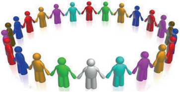

> **Deskripsi Visual:** Gambar ini adalah ilustrasi yang menunjukkan kelompok orang berdiri dalam bentuk lingkaran, setiap individu menggenggam tangan dengan yang lainnya. Ilustrasi ini mungkin digunakan untuk menunjukkan konsep kolaborasi, komunikasi, atau hubungan sosial. Elemen utama dalam gambar ini adalah kelompok manusia yang terhubung satu sama lain melalui tangan mereka. Teks, angka, atau label penting tidak ada dalam gambar ini karena ia hanya berupa ilustrasi. Informasi kunci yang dapat diambil pembaca adalah bahwa ini menunjukkan hubungan sosial yang kuat antara individu-individu dalam kelompok tersebut.

Gambar tersebut menunjukkan warna warni yang berbeda namun indah. Seperti itulah multikultur, meskipun memiliki latar belakang yang beragam, namun manusia tetap bisa  membangun solidaritas  dan  kebersamaan  dalam keberagaman.

 

---
## 📄 Halaman 153

### B.  Pengertian Multikultur

Gagasan multikultur berkaitan dengan bagaimana memahami dan menanggapi tantangan  yang  terkait  dengan  keragaman  budaya  berdasarkan  perbedaan etnis,  bangsa,  dan  agama.  Istilah  'multikultural'  sering  digunakan  sebagai istilah  deskriptif  untuk  mencirikan  fakta  keberagaman  dalam  masyarakat. Multikultur mencakup berbagai klaim dan tujuan normatif,  para pendukung multikultur menemukan titik temu dalam menolak cita-cita 'melting pot' di mana  anggota  kelompok  minoritas  diharapkan  untuk  berasimilasi  dengan budaya  dominan. Alih-alih,  pendukung  multikulturalisme  mendukung  citacita  di  mana  anggota  kelompok  minoritas  dapat  mempertahankan  identitas dan  praktik  kolektif  mereka  yang  khas.  Dalam  kasus  imigran,  pendukung menekankan  bahwa  multikulturalisme  sesuai  dengan  integrasi  imigran  ke dalam  masyarakat;  kebijakan  multikulturalisme  memberikan  persyaratan integrasi yang lebih adil bagi para imigran.

Negara-negara modern diatur berdasarkan bahasa dan budaya kelompok dominan  yang  secara  historis  membentuk  mereka.  Akibatnya,  anggota kelompok budaya minoritas menghadapi hambatan dalam menjalankan praktik sosial  mereka  dengan  cara  yang  tidak  dilakukan  oleh  anggota  kelompok dominan. Umumnya  kelompok minoritas hanya mengikuti kelompok mayoritas.  Dari  segi  psikologis  memang  kelompok  mayoritas  menjadi penentu dalam kehidupan masyarakat. Melalui multikulturalism, diharapkan hak-hak  kelompok  minoritas  dapat  diakomodir.  Namun  menurut  beberapa pakar, toleransi saja tidaklah cukup. Yang dibutuhkan adalah pengakuan dan akomodasi positif dari praktik kelompok minoritas melalui apa yang oleh ahli teori multikulturalisme terkemuka Will Kymlicka disebut sebagai 'hak yang dibedakan kelompok' (1995). Artinya benar-benar melindungi dan memenuhi apa yang merupakan hak kaum minoritas yang sama dengan kaum mayoritas. Misalnya hak masyarakat adat. Ide multikulturalisme muncul sebagai reaksi terhadap hak-hak kaum minoritas yang terabaikan. Seperti kaum perempuan, masyarakat adat, kaum disabilitas, akar rumput yang tidak punya akses pada ekonomi, kesehatan dan pendidikan, agama minoritas dll. Multi kulturalisme melindungi kepentingan dan hak kaum minoritas.

Multikulturalisme ada  kaitannya dengan pengakuan terhadap perbedaanperbedaan yang ada dalam masyarakat serta perlindungan terhadap hak-hak mereka yang terabaikan. Contoh akomodasi budaya atau 'hak yang dibedakan

 

---
## 📄 Halaman 154

kelompok' termasuk pengecualian dari undang-undang yang berlaku secara umum (misalnya pengecualian agama), bantuan untuk melakukan hal-hal yang sudah dapat dilakukan oleh anggota budaya mayoritas (misalnya surat suara multibahasa, pendanaan untuk sekolah bahasa minoritas dan etnis asosiasi, tindakan afirmatif), representasi minoritas dalam badan pemerintah (misalnya kuota etnis untuk daftar partai atau kursi legislatif,  ).

Biasanya,  hak  yang  dibedakan  kelompok  adalah  hak  kelompok minoritas (atau anggota dari kelompok tersebut) untuk bertindak atau tidak bertindak dengan cara tertentu sesuai dengan kewajiban agama dan / atau komitmen budaya mereka.

Dengan demikian, dapat disimpulkan bahwa Multikulturalisme adalah:

- Sebuah ideologi yang mengakui dan mengagungkan perbedaan dalam kesederajatan baik secara individual maupun secara kebudayaan.
- Merupakan  suatu  gagasan  untuk  mengatur  keberagaman  dengan prinsip-prinsip dasar pengakuan akan keberagaman itu sendiri. Gagasan ini  menyangkut  pengaturan  relasi  antara  kelompok      mayoritas  dan minoritas, keberadaan kelompok imigran masyarakat adat dan lain-lain (Taylor).
Parsudi Suparlan mengungkapkan bahwa multikulturalisme adalah adanya politik universalisme yang menekankan harga diri kulturalisme sebagai sebuah ideologi yang mengakui dan mengagungkan semua manusia, serta hak akan perbedaan dalam kesederajatan baik secara individual maupun  sosial.

Menurut Lawrence Blum, multikulturalisme mencakup suatu pemahaman, penghargaan serta penilaian atas budaya seseorang, serta suatu penghormatan dan keingintahuan tentang budaya etnis orang lain. (Berbagai defeinisi tersebut diambil dari: http://id.shvoong.com/social-sciences/education/2203877pengertian-multikultural/#ixzz2CGSbdgUo http://mohkusnarto.wordpress. com/masyarakat-multikulturalisme, www.wikipedia.org).

Multikulturalisme  mencakup: gagasan, cara pandang, kebijakan, sikap dan  tindakan,  oleh  masyarakat  suatu  negara,  yang  masyarakatnya  beragam dari segi etnis, budaya, agama, kelas sosial, gaya hidup dan sebagainya. Dalam kepelbagaian  itu,  masyarakat  mengembangkan  semangat  kebangsaan  dan mempertahankan keberagaman sebagai suatu kekayaan dan anugerah Allah. Dalam cakupan pandangan ini ada penerimaan terhadap realitas keagamaan yang pluralis dan multikultural yang ada dalam kehidupan masyarakat.

 

---
## 📄 Halaman 155

Konsep  multikulturalisme  tidak  dapat  disamakan  begitu  saja  dengan konsep keanekaragaman menyangkut suku, kebangsaan atau kebudayaan  yang menjadi ciri khas masyarakat majemuk. Lebih jauh dari itu, multikulturalisme menekankan  kebudayaan  dalam  kesederajatan.  Berkaitan  dengan  konflik sosial,  multikulturalisme  merupakan  paradigma  baru  dalam  upaya  merajut kembali hubungan antar manusia yang belakangan selalu hidup dalam suasana penuh konflik. (http://manusiapinggiran.blogspot.com/2014/04/konseppendidikan multkulturalisme.html#ixzz3FnCvCruZ)

Melalui  multikulturalisme  manusia  dididik  untuk  terbiasa  menerima berbagai perbedaan yang ada dalam masyarakat, membangun solidaritas dan kerja sama yang saling menopang. Dengan demikian, inti multikulturalisme adalah  kesediaan  menerima  kelompok  lain  secara  sama  sebagai  kesatuan, tanpa memedulikan perbedaan budaya, etnis, gender, bahasa, ataupun agama. Sedangkan fokus multikulturalisme  terletak  pada  pemahaman  akan  hidup  penuh dengan perbedaan sosial budaya, baik secara individual maupun kelompok dan masyarakat. Dalam hal ini individu dilihat sebagai refleksi dari kesatuan sosial dan  budaya.  Menurut  Parsudi  Suparlan,  dalam  multikulturalisme  manusia dilihat sebagai refleksi dari kesatuan sosial, budaya, politik, ekonomi (Parsudi Suparlan, Menuju Masyarakat Indonesia yang Multikultural).

### Response Saya

### Multikulturalisme adalah:

 

---
## 📄 Halaman 156

### C.  Masyarakat Multikultur Indonesia

Indonesia  merupakan  negara  multikultural,  tetapi  tetap  terintegrasi  dalam persatuan  dan  kesatuan.  Indonesia  merupakan  sebuah  negara  kesatuan  dari banyak unsur. Kepelbagaian itu terlihat dari keadaan geografisnya, berbagai latar  belakang  sosial-ekonomi,  sosial-politis,  sosial-religius,  sosial-budaya, tata cara kehidupan dan lain sebagainya. Sebenarnya, amat mencengangkan Indonesia yang terdiri dari beribu pulau besar dan kecil dengan keberagaman latar  belakang    masyarakat  dapat  dipersatukan  sebagai  satu  bangsa,  hal  itu  hanya terjadi  oleh  karena Allah  menghendakinya.  Jika  dikaji  berbagai  perbedaan yang  ada,  amat  mustahil  semua  itu  bisa  dipersatukan.  Namun,  adanya  (X) Bhineka Tunggal Ika dan Pancasila telah mempersatukan dan mengikat bangsa ini  menjadi  satu  dalam  sebuah  Sumpah  yang  dilakukan  oleh  para  pemuda ditahun 1928: Satu tanah air, satu bangsa dan Satu bahasa. Para pendiri bangsa ini  telah menyadari keberagaman bangsa Indonesia  antara lain,  kepelbagaian budaya, agama dan suku yang pada satu sisi merupakan kekayaan yang patut disyukuri namun pada sisi lain dapat menjadi sumber konflik. Oleh karena itu, mereka mengikat berbagai perbedaan itu dalam semboyan 'Bhinneka Tunggal Ika' artinya berbeda-beda tetapi tetap satu. Kepelbagaian suku,  kebangsaan, budaya, geografis, adat istiadat, kebiasaan, pandangan hidup maupun agama dijamin  oleh  UUD  1945  dan  Pancasila  sebagai  dasar  Negara. Adanya  UU tersebut tidak dengan sendirinya meniadakan berbagai perbedaan yang ada. Buktinya banyak peristiwa konflik yang diikuti oleh kekerasan yang berakar pada keberagaman tersebut. Masih banyak orang yang membangun prasangka buruk terhadap orang lain yang memiliki latar belakang kehidupan berbeda dengan mereka.

Dibutuhkan ruang dan kesempatan dalam mewujudkan multikulturalisme tak  cukup  hanya  dengan  melahirkan  konsep,  namun  harus  diikuti  dengan program-program nyata dan(X) terutama kemauan  politik dari para pemimpin  untuk  benar-benar  melindungi  hak  kaum  minoritas  dan  mereka yang  termarginalkan.  Keberagaman  dan  perbedaan  bukan  alasan  untuk memarginalkan seseorang maupun sekelompok masyarakat. Upaya tersebut penting namun harus dilakukan secara menyeluruh, antara lain adanya keadilan dan kepastian hukum. Seringkali terjadi konflik di kalangan masyarakat yang seolah-olah dipicu oleh perbedaan suku dan agama padahal akar sesungguhnya adalah ketidakadilan sosial ataupun ketidak merataan kesempatan (akses) dan

 

---
## 📄 Halaman 157

pendapatan hidup. Hal itu dapat menimbulkan kecemburuan dari pihak yang merasa termarginalkan jika kebetulan dua belah pihak berbeda latar belakang suku  dan  agama  maka  ketika  terjadi  konflik,  isu  mengenai  ketidakadilan menjadi tenggelam. Akibatnya yang tampak adalah konflik karena perbedaan suku dan agama. Oleh karena itu, memperjuangkan terwujudnya pluralisme dan multikulturalisme hendaknya tidak terpisahkan dari prinsip keadilan dan pemerataan sosial dan penindakan hukum bagi semua orang tanpa kecuali.

Berbagai  kasus  yang  terjadi  menunjukkan  bahwa  penegakan  hukum bagi mereka yang bersalah dalam kasus-kasus menyangkut pertentangan dan konflik yang bernuansa suku dan agama belum dilakukan secara benar.

Sebagai negara kebangsaan, Indonesia menghadapi berbagai permasalahan berkaitan dengan keberagaman suku bangsa. Namun berbagai elemen bangsa berupaya  keras  untuk  secara  terus  menerus  mengupayakan  solidaritas  dan kerja  sama  dalam  keberagaman diikuti oleh adanya kepastian hukum yang ,menjamin  hak-hak  warga  negara.  Mewujudkan  praktik  hidup  multikultur membutuhkan topangan hukum yang pasti dimana mereka yang melakukan kekerasan dan memprovokasi terjadinya konflik yang bernuansa SARA harus diproses secara hukum karena merupakan tindakan kriminal begitu pula politisi yang menggunakan politik identitas dan mengadu domba rakyat menggunakan keberagaman sebagai alasan, hendaknya diproses secara hukum. Paling tidak, tindakan  hukum  akan  menyebabkan  mereka  yang  terbiasa  menggunakan politik identitas demi mencapai tujuan pribadi maupun kelompok tidak akan mudah melakukannya lagi.

---
**🖼️ Gambar/Diagram**

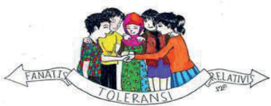

> **Deskripsi Visual:** Gambar ini adalah ilustrasi yang menampilkan empat orang anak berdiri bersama-sama, tangan mereka saling menyentuh. Di bawah mereka, ada dua papan tulisan berwarna putih dengan tulisan "FANATIS" dan "TOLERANSI" yang terpisah-pisah. Pada bagian bawah gambar, terdapat sebuah garis lurus dengan warna merah yang membentuk tanda panah ke kanan.

1. Gambar ini menunjukkan empat anak yang saling menyentuh tangan mereka.
2. Elemen utama adalah empat anak, dua papan tulisan, dan garis lurus dengan tanda panah.
3. Teks penting adalah "FANATIS" dan "TOLERANSI", serta garis lurus dengan tanda panah.
4. Informasi kunci yang dapat diambil pembaca adalah tentang tema toleransi dan persahabatan antara anak-anak.

https://www.google.com/search?q=gambar+multikultural&safe

 

---
## 📄 Halaman 158

### Response Saya

- Menjabarkan multikulturalisme di |Indonesia, khususnya dampak positif dan negatif.
- Menyusun tulisan pendek mengenai multikulturalisme di Indonesia.
Dampak Multi kulturalisme di Indonesia

### D.  Pendalaman Alkitab

Bahan  pendalaman  Alkitab  ini  diambil  dari  Buku  PAK  SMA  kelas  XII Kurikulum 2013 (Janse Belandina Non, 2014). Alkitab tidak berbicara secara khusus  mengenai  multikulturalisme  namun  dalam  kaitannya  dengan  kasih, kebaikan, kesetaraan dan keselamatan itu diberikan bagi semua manusia tanpa kecuali. Dalam Kitab Perjanjian Baru Galatia 3:28  tertulis semua manusia yang berasal dari berbagai suku, bangsa dan  kelas sosial dipersatukan dalam Kristus. Artinya kasih Kristus diberikan bagi semua orang tanpa memandang asal-usul mereka. Kolose 3:11 lebih mempertegas lagi bahwa Kristus adalah semua  dan  di  dalam  segala  sesuatu.  Menjadi  manusia  baru  dalam  Kristus berarti  manusia  yang  tidak  lagi  melihat  sesamanya  dari  perbedaan  latar belakang  suku,  bangsa,  budaya,  kelas  sosial  (kaya-miskin),  pandangan hidup, kebiasaan dll. Menjadi manusia baru artinya orang beriman yang telah menerima keselamatan dalam Yesus Kristus wajib menerima, menghargai dan mengasihi sesamanya tanpa memandang berbagai perbedaan yang ada.

 

---
## 📄 Halaman 159

Ketika membaca Kitab Perjanjian Lama   terutama lima kitab pertama ada kesan seolah-olah Allah membentuk Israel sebagai bangsa yang eksklusif dan menjauhkannya dari bangsa-bangsa lain. Hal ini melahirkan pemikiran seolah-olah Allah  'mengabaikan'  bangsa  lain,  seolah-olah   Allah  menolak mereka. Tetapi dalam tulisan Kitab Perjanjian Lama, ketika Israel masuk ke tanah Kanaan ada seorang perempuan beserta keluarga besarnya diselamatkan karena  ia  telah  menolong  para  pengintai.  Nampaknya  yang  menjadi  fokus utama dalam Kitab Perjanjian Lama adalah bagaimana Allah mempersiapkan Israel sebagai bangsa yang akan mewujudkan 'Ibadah dan ketaatannya' pada Allah. Jadi, yang ditolak dari bangsa-bangsa lain adalah ibadah mereka yang tidak ditujukan pada Allah. Jika orang-orang Israel bergaul dengan bangsabangsa  itu  dan  mereka  tidak  memiliki  kemampuan  untuk  memfilter  atau menyaring berbagai pengaruh dari budaya dan ibadah mereka maka akibatnya bangsa  itu  akan  melupakan  Allah  dan  tidak  lagi  beribadah  kepada-Nya. Dalam  kaitannya  dengan  multikultur  di  Indonesia,  kita  dapat  mengangkat pertanyaan  sebagai  berikut: Apakah  mewujudkan  multikulturalisme  berarti kita  kehilangan  identitas  suku,  bangsa  dan  agama  kita?  Tentu  tidak,  inilah yang  ditolak  oleh  Allah  dalam  Perjanjian  Lama,  yaitu  ketika  persentuhan atau pertemuan umat-Nya dengan bangsa-bangsa lain menyebabkan mereka kehilangan identitasnya sebagai umat Allah. Multikulturalisme dibangun di atas dasar solidaritas, persamaan hak, keadilan dan HAM dimana perbedaan diterima dan diakui serta tidak menghalangi kerja sama dalam menanggulangi berbagai permasalahan kemanusiaan.

Yesus sendiri mengemukakan sebuah cerita mengenai orang Samaria yang murah hati untuk menjelaskan pada para pendengarnya mengenai siapakah sesama manusia dan bagaimana kita harus mengasihi. Cerita mengenai orang samaria  yang  murah  hati  mewakili  pandangan Yesus  mengenai  kasih  pada sesama.  Bahwa  semua  orang  tanpa  kecuali  terpanggil  untuk  mewujudkan solidaritas dan kasih bagi sesama tanpa memandang perbedaan latar belakang. Solidaritas  dan  kasih  itu  tidak  meniadakan  perbedaan  namun  menerima perbedaan itu sebagai anugerah dan dalam perbedaan itulah manusia diberi kesempatan  untuk  mewujudkan  kasih  dan  solidaritasnya  bagi  sesama.  Di zaman Perjanjian Lama, ketika bangsa Israel akan memasuki tanah Kanaan,

 

---
## 📄 Halaman 160

ada  seorang  perempuan  Kanaan  beserta  keluarganya  yang  diselamatkan karena perempuan itu membantu para pengintai ketika mereka sedang dikejar oleh tentara Kanaan.

https://www.google.com/url?sa=i&url=http%3A%2F%2Fmakiiimee.blogspot.com%2F2017%2F12%2Fyesus-mencintai-orang-miskin-

https://www.google.com/url?sa=i&url=https%3A%2F%2Fwww.mirifica.net%2F2015%2F03%2F30%2Fmemperhatikan-orang-miskin

### E.  Gereja dan Multikulturalisme

Multikultur  bukanlah  sesuatu  yang  asing  bagi  gereja-gereja  di  Asia  pada umumnya dan gereja-gereja di Indonesia. Keberagaman suku, bangsa, budaya, adat istiadat serta berbagai kebiasaan telah turut mewarnai perjalanan gerejagereja  di  Asia  dan  Indonesia.  Menurut  pakar  sosiologi,  tidak  ada  wilayah yang amat beragam seperti di Asia. Masyarakat Asia adalah masyarakat yang multikultur. Dalam komunitas kristiani, gereja-gereja di Indonesia dibangun

 

---
## 📄 Halaman 161

di  atas  bangunan suku karena anggota gereja terdiri dari orang-orang yang berasal dari berbagai suku, budaya, adat dan kebiasaan serta geografis yang berbeda-beda. Bahkan tiap sinode gereja berada di geografis tertentu dengan budaya dan suku tertentu.  Meskipun gereja-gereja nampak memiliki afiliasi dengan suku dan daerah tertentu namun tetap terbuka bagi orang-orang yang berasal dari daerah, suku dan budaya lainnya. Misalnya GKI yang dahulunya merupakan  gereja  untuk  orang-orang  Indonesia  keturunan  Tionghoa,  pada masa kini yang menjadi anggota GKI berasal dari berbagai suku, budaya dan daerah. Demikian juga GPIB yang didirikan untuk orang-orang dari Indonesia Timur pada masa kini terbuka bagi orang-orang dari berbagai daerah, suku dan budaya. Gereja Bethel Indonesia (GBI) adalah gereja yang sangat terbuka terhadap multikultur, jemaatnya amat beragama dari segi suku, kebangsaan, budaya, geografi bahkan kelas sosial. Ada beberapa sinode gereja yang pada mulanya  anggotanya  terbatas  pada  suku  tertentu  namun  kini  terbuka  bagi semua orang dari berbagai suku. Misalnya pada orang-orang Batak, Gereja Huria Kristen Batak Protestan, Gereja Kristen Jawa, dll. Dalam gereja yang multikultur, tiap orang dapat belajar membangun persekutuan di atas berbagai perbedaan. Jemaat dapat belajar dari saudara seiman yang berasal dari daerah, suku  dan  budaya  yang  berbeda.    Nilai-nilai  budaya  dan  suku  yang  positif dapat  memperkaya  liturgi  dalam  ibadah.  Pola-pola  hubungan  antar  jemaat yang positif juga dapat diperkaya dari nilai-nilai budaya yang beragam.

Hope S. Antone (Pendidikan Kristiani Kontekstual, 2010) menulis bahwa dunia  Alkitab  ditandai  oleh  kemajemukan  atau  keanekaragaman  budaya dan agama. Di zaman Abraham dipanggil di tanah Haran masyarakat amat beragam  dan  tiap  suku  memiliki  pemahaman  terhadap  'allahnya'  sendiri. Demikian pula di tanah Kanaan di tempat dimana Abraham dan Sara hidup sebagai  pendatang.  Menurut  Hope  di  tanah  Kanaan  setiap  suku  memiliki pandangannya  sendiri  terhadap  yang  ilahi.  Di  tengah  situasi  seperti  itulah Abraham dan Sara dan kemudian bangsa Israel membangun kepercayaannya terhadap  Allah  yang  mereka  sembah.  Dalam  konteks  Yesus  juga  ditandai oleh keberagaman, Yesus tumbuh dalam tradisi iman komunitas-Nya. Dalam tradisi  agama Yahudi sendiri.  Di  zaman  setelah Yesus,  kekristenan  tumbuh dan berakar dalam budaya Yahudi dan Yunani helenis.

 

---
## 📄 Halaman 162

Pada level teoritis, multikulturalisme merupakan sebuah wacana yang  hangat  diperdebatkan  dikalangan  filsuf,  sosiolog  maupun  psikolog. Khususnya di negara-negara Eropa dan Amerika Utara, selama kurang lebih tiga dekade. Secara umum para ahli ini terbagi dalam  dua kubu pemikiran. Yaitu kubu pertama  adalah mereka yang melihat multikulturalisme sebagai ideologi  politis  yang  memiliki  nilai-nilai  positif.  Sedangkan  kelompok yang  lain  adalah  mereka  yang  bersikap  kritis  bahkan  ada  yang  cenderung antagonis terhadap ide multikulturalisme. Bagaimana dengan Indonesia? Di Indonesia, mulktikulturalisme bukan sekadar wacana filsafat dan politik yang diperdebatkan di lingkungan akademik dan dituangkan dalam jurnal ilmiah. Multikulturalisme  juga  bukan  sekadar  pemikiran  yang  dituangkan  dalam kebijakan. Lebih dari itu,  multikulturalisme adalah perjumpaan orang dengan orang  (antar  manusia)  yang  berasal  dari  berbagai  latar  belakang  berbeda termasuk  di  dalamnya  agama.  Sebuah  perjumpaan  dan  pergaulan  yang menyenangkan, dimana perbedaan budaya dan lainnya dipahami, dialami dan dihargai . Namun, ada  saat ketika multikulturalisme dimasukkan ke dalam kontestasi politik  dan dijadikan komoditi politik maka potensi konflik muncul. Hal ini terjadi misalnya dalam kampanye pemilu legislatif dan pemilu presiden dan wakil presiden.  Isu ini dibangun untuk mengurangi elektabilitas calon dan untuk mempengaruhi para pemilih yang dengan mudah termakan oleh isu tersebut  terutama di kalangan masyarakat yang masih memilih pemimpin berdasarkan agama. Namun masyarakat kini mulai berpikir rasional memilih pemimpin berdasarkan kemampuan dan integritas bukan berdasarkan agama dan suku.

Meskipun  demikian,  tak  dapat  dihindari  ketika  multikultur  dijadikan komoditi politik maka dapat menimbulkan potensi konflik secara horizontal (antar masyarakat).  Hal yang sama juga terjadi dalam kehidupan antar umat beragama, pada aras akar rumput atau rakyat jelata, nampak solidaritas dan kebersamaan namun situasi ini dapat saja berubah ketika perbedaan agama dijadikan komoditi politik.

Dalam Kitab Efesus 2:11-21 Paulus menjelaskan mengenai dipersatukan dalam Kristus. Ia memfokuskan pembahasannya pada  pekerjaan penebusan, rekonsiliasi dan merubuhkan tembok-tembok pemisah antar umat. Jadi, jika kita satu di dalam Kritus maka kita terlepas dari perbedaan suku, ras, budaya maupun status sosial ekonomi. Karena kita sudah merubuhkan tembok pemisah dalam berbagai perbedaan, maka kita menjadi satu dalam Kristus. Sebagaimana

 

---
## 📄 Halaman 163

Kristus telah menerima kita tanpa syarat maka kita pun wajib saling menerima satu  dengan  yang  lain.  Menjadi  satu  dalam  Kristus  memungkinkan  gereja menjadi satu. Dalam Kitab Galatia 3:26-28, Paulus mengatakan kita memiliki identitas  baru  melalui  Kristus.  Tidak  ada  diskriminasi  dalam  Kristus,  kita semua sama di hadapan Allah.

---
**🖼️ Gambar/Diagram**

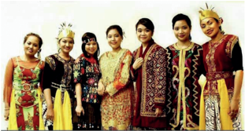

> **Deskripsi Visual:** Gambar ini adalah foto yang menampilkan kelompok orang yang berpakaian tradisional dari berbagai budaya. Kelompok ini terdiri dari tujuh orang yang berdiri beriringan, masing-masing dengan pakaian yang unik dan berwarna-warni. Pakaian mereka mencerminkan keunikan budaya masing-masing, dengan warna-warna cerah dan detail desain yang rumit. Mereka tampak senang dan terlibat dalam acara atau perayaan tertentu. Gambar ini menunjukkan hubungan antara berbagai budaya melalui pakaian tradisional mereka, serta menunjukkan keharmonisan dan keberagaman dalam masyarakat.

---
**🖼️ Gambar/Diagram**

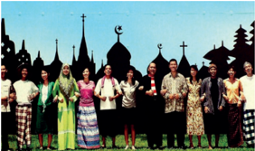

> **Deskripsi Visual:** Gambar ini adalah ilustrasi yang menunjukkan kelompok orang berdiri di depan bangunan dengan arsitektur tradisional Rusia. Bangunan tersebut memiliki atap berbentuk kerucut dan menara yang tinggi, yang merupakan ciri khas arsitektur Rusia. Orang-orang tersebut mengenakan pakaian tradisional yang berwarna-warni dan bervariasi, menunjukkan keberagaman budaya. Di sebelah kanan, ada beberapa pohon yang tumbuh di depan bangunan, menambah nuansa alam pada gambar. Gambar ini mungkin digunakan untuk membantu pembaca memahami tentang budaya dan arsitektur Rusia, serta bagaimana penampilan tradisional orang Rusia.

 

---
## 📄 Halaman 164

### Response Saya

Lakukan  sharing  dengan  teman  sebangku  kalian  mengenai  pemahaman dan  pengalaman  berkaitan  dengan  multikultur  dan  multi  kultur(X)  sebagai pemberian Allah. Bahwa tidak ada seorangpun manusia yang bisa memilih dilahirkan oleh orang tua tertentu, memiliki suku tertentu dan daerah kelahiran tertentu  semuanya merupakan pemberian Sang Maha Kuasa! Hasil sharing dapat dipresentasikan didepan kelas atau ditulis kemudian diberi nilai oleh guru dan orang tua kalian.

### F.  Praktik Hidup Multikultur

Tuhan menciptakan manusia dalam kepelbagaian supaya dapat saling mengisi dan melengkapi satu dengan yang lain. Dalam diri manusia juga dianugerahi kebaikan dan kemampuan untuk beradaptasi  dalam kaitannya  dengan alam dan lingkungan hidup terutama dengan sesamanya. Manusia juga diciptakan sebagai makhluk mulia yang memiliki harkat dan martabat. Di era modern sekarang ini, masyarakat dunia memiliki kesadaran multikultur yang jauh lebih baik, bahkan pemenuhan hak setiap orang untuk diterima dan dihargai. Hak untuk memperoleh keadilan, demokrasi dan HAM telah menjadi kewajiban yang harus dipenuhi baik oleh negara terhadap warganya maupun oleh sesama warga  negara  termasuk  warga  gereja.    Meskipun  demikian,  masih  banyak terjadi  pelanggaran  terhadap  pemenuhan  hak  pribadi  maupun  kelompok masyarakat minoritas. Ambil contoh di Indonesia pada zaman orde baru tidak ada  pengakuan  terhadap  agama  Khonghucu,  bahkan  masyarakat  keturunan Cina amat dibatasi hak-hak politiknya. Sejak zaman reformasi, kaum minoritas mulai menikmati pemenuhan hak-haknya. Di bawah pemerintahan Presiden Abdulrahman  Wahid,  negara  mengakui  agama  Khonghucu  dan  hak-hak masyarakat keturunan Cina dipulihkan sama dengan kaum pribumi Indonesia. Dalam  kehidupan  beragama,  nampak  masih  ada  keterbatasan  bagi  kaum minoritas agama. Ada harapan seiring berjalannya waktu dan semakin maju pendidikan dan cara berpikir masyarakat kita maka akan terwujud keadilan dan persamaan hak bagi seluruh bangsa tanpa kecuali.

Ketika  memasuki  era  industri  4.0  menuju  era  industri  5.0  tuntutan untuk beradaptasi dalam kehidupan yang amat beragam akan lebih kuat lagi Khususnya kemajuan Ilmu Pengetahuan dan Teknologi yang amat pesat turut

 

---
## 📄 Halaman 165

mempengaruhi cara berpikir manusia ditambah lagi adanya kecerdasan buatan yang akan mengabil alih sebagian tanggungjawab manusia dalam pekerjaan, maka umat manusia diseluruh dunia harus bersiap berbagi ruang dengan robot dan berbagai hasil kecerdasan buatan yang dihasilkan oleh kemajuan teknologi dan ilmu pengetahiuan.

### G. Sumbangan  Multikulturalisme bagi  Kehidupan Berbangsa

Ada beberapa nilai  yang dapat diwujudkan dalam tindakan  untuk memperkuat persatuan sebagai bangsa Indonesia yang multikultur.

- Pengakuan  terhadap  berbagai  perbedaan  dan  kompleksitas  kehidupan dalam masyarakat.
- Perlakuan yang sama terhadap berbagai komunitas dan budaya, baik yang mayoritas maupun minoritas.
- Kesederajatan kedudukan dalam berbagai keanekaragaman dan perbedaan, baik secara individu ataupun kelompok serta budaya.
- Penghargaan  yang  tinggi  terhadap  hak-hak  asasi  manusia  dan  saling menghormati dalam perbedaan.
- Unsur  kebersamaan,  solidaritas,  kerja  sama,  dan  hidup  berdampingan secara damai dalam perbedaan.
Beberapa poin tersebut di atas merupakan nilai-nilai yang dapat dibangun dalam membina kehidupan bersama sebagai bangsa yang multikultur. Peran pendidikan dan pola asuh dalam keluarga amat penting untuk menanamkan nilai-nilai  tersebut.  Pada  masa  kini  sudah  banyak  tokoh  nasional  dan pemerhati pendidikan yang menganjurkan untuk memberlakukan pendidikan multkultural  di  sekolah  dan  perguruan  tinggi.  Hal  ini  penting  mengingat pendidikan merupakan salah satu unsur  yang dapat menjadi kekuatan perubah dalam  masyarakat.  Pendidikan  menjadi  pendorong  perubahan  yang  efektif bagi individu dan masyarakat.

Setelah mempelajari berbagai fakta mengenai multikuluturalisme dan  nilai-nilai  yang  terkandung  di  dalamnya  maka  kita  dapat  merangkum beberapa  poin  penting  dalam  rangka  memperkuat  persatuan  sebagai  umat. Ada  bebebrapa    poin    penting  menyangkut  mutlikulturalisme  yang  dapat memperkuat persatuan umat kristiani:

- Menerima  dan  menghargai  semua  orang  tanpa  memandang  berbagai perbedaan yang ada.
- Menolong sesama serta menunjukkan solidaritas tanpa memandang latar belakang perbedaan.

 

---
## 📄 Halaman 166

- Menghilangkan prasangka buruk terhadap suku, bangsa, budaya maupun kelas sosial tertentu termasuk berbagai julukan.
- Berpikir  positif  terhadap  semua  orang  namun  tetap  kritis. Artinya  harus memiliki kemampuan menyaring berbagai perbedaan yang ada sehingga tidak kehilangan identitas.
- Menjadikan hukum kasih sebagai landasan dalam bergaul dengan sesama.

### Response Saya

Setelah mempelajari sub materi diatas, kini kalian dapat merangkum poinpoin  atau  pokok-pokok  penting  menyangkut  nilai-nilai  multikultur  yang dapat  dimanfaatkan  dalam  rangka  memperkuat  kesatuan  hidup  sebagai bangsa Indonesia dan khususnya sebagai umat beragama. Hasil rangkuman dipresentasikan.  Kegiatan  ini  dapat  dilakukan  secara  individu  maupun kelompok.

### H. Refleksi

Kita  hidup  diera  global,    namun  memiliki  keterikatan  dengan      identitas kebangsaan  pada satu sisi, namun disisi lain, kita semua adalah warga global yang diikat oleh suatu kepentingan bersama demi mewujudkan dunia yang lebih baik. Pada tataran tersebut,  hak semua orang diakui dan diberi tempat tanpa kecuali.  Masyarakat dunia masa kini peka terhadap diskriminasi dan pengabaian  hak-hak  manusia.  Multikulturalisme  telah  menjadi  nilai-nilai kehidupan  yang  diterima  oleh  berbagai  kalangan  masyarakat  dan  hak-hak asasi manusia dari berbagai latar belakang kehidupan yang berbeda diakui. Bangsa  Indonesia  sebagai  bahagian  dari  masyarakat  global  adalah  bangsa yang  multikultur.Remaja  Kristen  terpanggil  untuk  mewujudkan  kehidupan solidaritas dan kebersamaan dalam multikultur.

### Tugas

- Mengadakan observasi di gereja masing-masing mengenai  sikap gereja terhadap multikulturlaisme dan mendiskusikannya.
- Merancang  proyek  yang  berkaitan  dengan  multikulturalisme  sebagai kelanjutan dari hasil  observasi.

 

---
## 📄 Halaman 167

KEMENTERIAN PENDIDIKAN, KEBUDAYAAN, RISET, DAN TEKNOLOGI REPUBLIK INDONESIA, 2021 Pendidikan Agama Kristen dan Budi Pekerti untuk SMA/SMK Kelas XII

Penulis: Janse Belandina Non-Serrano

ISBN: 978-602-244-702-3 (jil.3)

### KEUTUHAN CIPTAAN

(Kejadian 2:15;)

---
**🖼️ Gambar/Diagram**

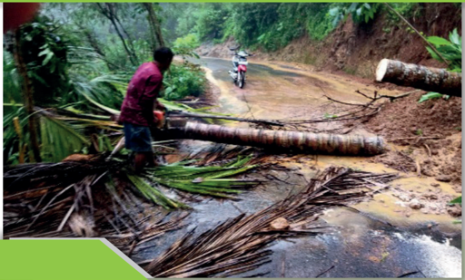

> **Deskripsi Visual:** Gambar ini adalah foto yang menunjukkan keadaan setelah hujan lebat. Di tengah jalan, terdapat pohon besar yang tumbang, menyebabkan jalan menjadi macet. Di sebelah kiri, ada seorang pria sedang memegang alat pemotong pohon, tampaknya sedang berusaha memulihkan jalan. Di sebelah kanan, terlihat tanah yang longsor dan material tanah yang jatuh ke jalan. Pemandangan sekitar tampak hujan lebat dan pepohonan yang tumbang. Ini menunjukkan dampak dari hujan lebat yang bisa menyebabkan longsor dan tumbangnya pohon, yang dapat menghambat lalu lintas dan memerlukan upaya pemulihan.

### Tujuan Pembelajaran

- Menjelaskan  arti  keutuhan  ciptaan  dikaitkan  dengan  keadilan  dan perdamaian
- Menjabarkan beberapa persoalan yang menunjukkan ketidak adilan dan mengancam perdamaian baik secara global maupun di regional masing-masing.
- Mengelaborasi  bahagian Alkitab yang berkaitan dengan Keutuhan Ciptaan dan mendiskusikannya.
- Merancang  kegiatan  kreatif  yang  mendukung  proses  penyadaran akan pentingnya mewujudkan keadilan dan perdamaian dalam rangka keutuhan ciptaan.

 

---
## 📄 Halaman 168

### A.  Pendahuluan

Topik  mengenai  keutuhan  ciptaan  bukan  hal  baru,  ini  sudah  muncul  sejak puluhan  tahun  lalu.  Namun  dimasa  kini  topik  ini  terasa  lebih  penting  lagi ketika  keadaan  bumi  semakin  mengkhawatirkan  karena  adanya  pemanasan global  dan  kerusakan  lingkungan  hidup  yang  terjadi  di  berbagai  belahan dunia  akibat  ulah  manusia  yang  tidak  bertanggung-jawab.  Perusakan  alam oleh karena keserakahan manusia telah mengancam keberlangsungan hidup manusia. Topik ini dijadikan penutup dalam pembahasan pembelajaran PAK di  SMA  sebagai  penyadaran  sekaligus  memotivasi  kalian  sebagai  remaja Kristen untuk mulai mengambil langkah nyata dalam memelihara alam dan lingkungan hidup dan turut serta mengupayakan terwujudnya keadilan dan perdamaian  .  Di  bagian Alkitab  tertentu  dikisahkan  tentang  seorang  muda bernama  Yeremia,  ketika  Allah  memanggilnya  untuk  melaksanakan  misi Allah di dunia, ia ragu dan mengatakan bahwa ia masih muda dan karena itu ia berharap ia tidak dipilih. Tetapi Allah tetap dengan pilihan-Nya. Akhirnya Yeremia  pun  menyerah  dan  menjawab:  'inilah  aku,  utuslah  aku'.  Sebagai remaja,  kalian  dapat  meneladani  Yeremia  dan  menjawab  'ini  aku,  utuslah aku' menjadi duta bagi keadilan, perdamaian dan keutuhan ciptaan.

Banyak orang meragukan diri sendiri karena berpikir mereka masih kanakkanak ataupun masih muda, remaja namun, panggilan Allah berlaku bagi siapa saja Ia berkenan dan tidak pandang usia. Kini pun kalian dipanggil untuk turut serta menyelamatkan alam dan lingkungan hidup sera mewujudkan  keadilan dan perdamaian dimulai dari lignkungan terkecil dimana kalian hidup, yaitu rumah atau kelaurga dan sekolah.

### B.  Keutuhan  Ciptaan  dan  Kerusakan  Yang  ditimbulkan Manusia

Menurut  Alkitab,  pada  mulanya  Allah  menciptakan  segala  sesuatu adalah  baik.  Manusia  diberi  mandat  untuk  menaklukkan  dan  menguasai, mengusahakan dan memelihara ciptaan-Nya, agar terhindar dari kehancuran dan kebinasaan. Kenyataaan sekarang manusia berlomba-lomba untuk mencari  kekayaan  bagi  dirinya  sendiri.  Tanpa  memperdulikan  lingkungan, sesama,  masyarakat  bahkan  Tuhan.  Hal  ini  menambah  ketidakseimbangan yang dihadapi dunia, ketidakselarasan dalam habitat manusia serta keutuhan ciptaan serta kelangsungan hidup bagi generasi berikutnya apalagi makhluk

 

---
## 📄 Halaman 169

hidup lainnya. Idealnya manusia dan ciptaan lainnya hidup dalam  keselarasan dimana  masing-masing  ciptaan  menempati  tempatnya  dengan  fungsinya. Namun dalam perjalanan sejarah, nampak bagaimana keserakahan manusia membuat  relasi  antara  manusia  dengan  ciptaan  lainnya  menjadi  rusak  dan hambar.

Dapat disebutkan berbagai bentuk kelalaian dan kejahatan manusia yang menyebabkan rusaknya alam dan kehidupan. Misalnya;

- Lahan  tandus  dan  rusaknya  lingkungan  hidup  akibat  pembabatan  hutan tanpa melakukan reboisasi.
- Kendaraan sebagai alat transpoprtasi yang amat banyak Banyak  sehingga menimbulkan polusi udara dan efek bagi rumah kaca yang akan timbul dan peningkatan suhu bumi.
- Penggunaan  plastik,  kaleng,  yang  membutuhkan  waktu  bertahun-tahun untuk diurai yang menyebabkan pencemaran lingkungan dan terganggunya ekosistem.
- Upaya  untuk  mengolah  limbah  plastik,  pabrik,  kertas  dll  yang  belum maksimal.  Padahal  jika  ada  sistim  pengolahan  yang  baik,  hal  itu  dapat mengurangi efek pencemaran
- Eksplorasi alam untuk mengambil bahan-bahan tambang yang tidak diikuti dengan  pemeliharaan  alam  telah  merusak  alam  dan  lingkungan  hidup berserta habitat yang ada didalamnya.
- Gaya hidup konsumtif masyarakat, antara lain selalu berganti gaget dan alat komunikasi, komputer dll  menyebabkan bertumpuknya limbah elektronik yang tidak dapat diurai.
- Pengunaan pestisida dan racun hama tanaman secara berlebihan mengancam kehidupan makhluk hidup lainnya bahkan manusia dengan tercemarnya air tanah. Mengalir ke sungai-sungai dan mencemari air dan lingkungan.
- Limbah-limbah pabrik yang tidak diolah dengan baik sehingga mencemari lingkungan.

 

---
## 📄 Halaman 170

Pada sisi lain, perlakukan manusia terhadap sesamanya menggambarkan kondisi yang memprihatinkan, misalnya;

- Perlakuan sewenang-wenang terhadap kaum buruh pabrik, mempekerjakan anak-anak dibawah umur dengan bayaran yang rendah,
- Kurang  menghargai  tenaga  kerja  perempuan  termasuk  memberikan  cuti berkaitan dengan kehamilan dll.
- Perdagangan  manusia  untuk  dipekerjakan  secara  paksa  maupun  sebagai objek seksual
- Pelanggaran terhadap hak-hak rakyat jelata yang tidak memiliki akses pada hukum, ekonomi dan kekuasaan.
- Pembangunan pariwisata yang tidak diikuti dengan distribusi keuntungan bagi penduduk aseli setempat. Hal itu umumnya terjadi didaerah-daerah pariwisata. Yang menikmati keuntungan adalah para pemilik modal besar yang  memiliki  sarana  dan  prasarana  pariwisata.  Sedangkan  penduduk aseli tetap miskin. Padahal tanah-tanah yang dipakai membangun berbagai fasilitas pariwisata adalah tanah nenek moyang mereka.
Persoalan relasi kehidupan manusia  dan alam  bukan  semata-mata persoalan  bagaimana  menyikapi  lingkungan  alam  tetapi  persoalan  ciptaan seutuhnya, yang melibatkan keadilan, partisipasi dan perdamaian dalam satu kesatuan yang utuh. Secara teologis istilah penciptaan tidak hanya mengacu pada  alam,  tetapi  seluruh  ciptaan,  manusia  dan  lainnya.  Itu  berarti  ketika kita  membicarakan  mengenai  keutuhan  ciptaan  maka  yang  dimaksudkan adalah seluruh ciptaan tanpa kecuali. Jika dihubungkan dengan keadilan dan perdamaian,  maka  bagaimana  manusia  mengupayakan  kembali  terjadinya harmoni dalam relasi antara manusia dengan seluruh ciptaan termasuk dengan sesamanya. Sebuah relasi yang  menghargai, memelihara kehidupan secara bertanggung jawab dimana keadilan dan perdamaian menjadi pertimbangan utama dalam membangun relasi itu. Dari sudut pandang iman kristen, dasar dalam membangun relasi seperti ini adalah Perintah Allah bagi manusia untuk bertindak  sebagai  wakil Allah  dibumi  dengan  cara  menjaga  kehidupan  ini termasuk  kehidupan  seluruh  ciptaan.  Sebuah  misi  yang  amat  berat  namun dapat  dilakukan  jika  manusia  menyadari  makna  penciptaan  dengan  baik, bahwa manusia tidak diberikan hak untuk merusak bumi dan ciptaan lainnya tapi  diperintahkan  untuk  'menjaga  dan  memelihara'  kehidupan.  Dalam pemahaman  inilah  manusia  bertanggung-jawab  menjaga  dan  memelihara kehidupan.

 

---
## 📄 Halaman 171

### Response Saya

- Jelaskan arti keutuhan ciptaan dikaitkan dengan keadilan dan perdamaian
- Menjabarkan beberapa persoalan yang menunjukkan ketidak adilan dan mengancam perdamaian baik secara global maupun di regional masingmasing.  Dapat  dilakukan  dengan  menampilkan  gambar  dan  video  atau bercerita.

### C.  Sikap Gereja dan Sikap Kita

Keadilan,  perdamaian  dan  keutuhan  ciptaan  merupakan  bagian    integral dalam spiritualitas Kristiani. Tanpa memperjuangkan ketiga hal ini, pewartaan Gereja mengenai Kabar baik akan terasa timpang dan tidak utuh. Mengapa timpang atau tidak utuh? Karena Gereja adalah wujud misi Allah di dunia. Hal itu nampak dalam pernyataan Yesus ketika Ia ada dalam rumah ibadah, Yesus  memproklamirkan  tibanya  tahun  Rahmat  Tuhan.  (Lk  4:18-19).  Ia juga  menyebutkan  bahwa  Ia  adalah  wujud  Kerajaan  Allah  di  bumi.  Ini dikatakan Yesus di awal karya-Nya. Menurut Rasul Paulus Kerajaan Allah yang diberitakan itu adalah kebenaran, damai sejahtera dan sukacita oleh Roh Kudus.'  (Rm  14:17).  Pengertian  keutuhan  ciptaan  yang  dikaitkan  dengan keadilan  dan  kebenaran  dipopularkan  oleh  Dewan  Gereja  Sedunia.  Hal  ini terjadi karena setelah perang dunia kedua muncul banyak negara baru, terjadi kesenjangan  yang  besar  antara  negara-negara  penjajah    dan  negara-negara bekas didijajah yang tengah berupaya keras untuk bangkit dari keterpurukan. Belum lagi masalah lingkungan hidup yang semakin merebak. Seiring dengan berkembangnya industri  maka  kebutuhan  akan  sumber  daya  alam  semakin besar,  manusia menguras isi bumi dengan serakah dan meninggalkan jejak-jejak kerusakan alam. Serentak dengan itu, perkembangan industri menempatkan para pemilik modal sebagai orang-orang kaya raya yang semakin kaya mereka semakin i9gnin menumpuk modal. Supaya modal terus bertumpuk maka biaya produksi harus ditekan, antara lain dengan cara menekan upah buruh yang cenderung  mengabaikan  hak-hak  buruh  sebagai  pekerja.  Akibatnya,  relasi manusia dengan sesama menjadi tidak adil, begitu pula relasi manusia dengan alam pun rusak oleh eksploitasi. Berbagai persoalan ini telah menghasilkan keprihatinan gereja sehingga Dewan Gereja Sedunia (selanjutnya disingkat DGD) dalam Sidang Umum ke-6 di Vancouver, Kanada, pada tahun 1983,

 

---
## 📄 Halaman 172

mencanangkan apa yang disebut sebagai  mewujudkan keadilan, perdamaian, dan  keutuhan  ciptaan  ( justice,  peace,  and  integrity  of  creation ).  Istilah 'berkelanjutan' (sustainable) sebetulnya telah mencakup kepedulian terhadap persoalan  lingkungan  alam.  Namun,  nuansa  yang  terkandung  di  dalanmya masih terpusat pada manusia; eksistensi alam demi keberlangsungan hidup manusia.  Oleh  karena  itu,  istilah  'berkelanjutan'  disempurnakan  dengan istilah  lain,  yakni  'keutuhan  ciptaan'  ( integrity  of  creation ).  Istilah  yang terakhir ini tidak menempatkan manusia sebagai yang lebih penting daripada ciptaan  lain,  melainkan  seluruh  ciptaan  mempunyai  nilai  intrinsik  dalam dirinya.  Bahwa  semua  ciptaan  saling  terhubung.  Negara-negara  ditantang untuk saling bekerjasama sebagai rekan yang setara dan sederajat. Namun, rupanya kesenjangan antara negara miskin dan kaya semakin melebar. Setelah pertermuan di Vancouver, tema mengenai keadilan, perdamaian, dan keutuhan ciptaan  diolah  kembali.  Pada  tahun  1989,  Konferensi  Gereja-gereja  Eropa yang merupakan forum kerjasama perwakilan-perwakilan Gereja Anglikan, Ortodox,  Protestan,  dan  lain-lain,  menyelenggarakan  Pertemuan  Ekumenis Eropa yang pertama di Basel, Swiss. Dalam perhelatan ini, Konferensi Uskupuskup Gereja Katolik di Eropa diudang. Di Basel inilah untuk pertanna kalinya Gereja  Katolik  dan  Gereja  Protestan  bertemu  setelah  beratus-ratus  tahun saling anlbil jarak akibat peristiwa Reformasi Protestan. Sejak saat itu, telah diadakan  beberapa  kali  pertemuan  ekumenis  berskala  internasional  untuk membahas  dan  menegaskan  kembali  komitmen  Gereja  terhadap  keadilan, perdarnaian, dan keutuhan ciptaan.

Dapat  disimpulkan  bahwa  konsep  Keadilan,  perdamaian  dan  keutuhan ciptaan, sejatinya adalah upaya untuk membela mereka yang miskin, lemah dan  tersingkirkan  dari  kehidupan.  Orang  maupun  kelompok  masyarakat yang termarginalkan, alam yang termarginalkan oleh keserakahan manusia. Tiap orang kristiani terpanggil untuk mewujudkan ide Keadilan, perdamaian dan keutuhan ciptaan dalam tindakan hidupnya. Panggilan ini juga berlaku bagi guru-guru Pendidikan Agama Kristen dan anak-anak dan remaja serta pemuda  kristen  diseluruh  dunia  termasuk  di  Indonesia.  Apalagi  ditengah situasi dunia yang semakin terpuruk oleh berbagai persoalan dan benacana, maka  seruan  mengenai  Keadilan,  perdamaian  dan  keutuhan  ciptaan  amat

 

---
## 📄 Halaman 173

relevan untuk dihidupkan kembali dan digiatkan sebagai sebuah kampanye iman dan kampanye kemanusiaan. Pada beberapa waktu terakhir ini, wabah covid    yang  menular  dihampir  seluruh  bahagian  dunia  telah  menyebabkan berbagai masalah sosial, ekonomi dan politik bahkan kemanusiaan. Dari sini kita belajar betapa pentingnya membangun kerja sama yang saling menopang antar manusia, antar lembaga dan antar negara. Ada hal yang menggembirakan ketika kita membaca dan menonton di berbagai media, bagaimana upaya-upaya kemanusiaan digerakkan oleh orang perorang, antar lembaga, antar bangsa dan antar negara dalam turut serta bersama-sama menghadapi wabah covid 19 ini, hal itu menimbukan satu pengharapan bahwa dunia dan seluruh ciptaan masih dapat diselamatkan melalui kerja sama yang saling menguatkan. Bahwa pada akhirnya kemanusiaan akan menuntun kita pada sikap adil dan damai. Bagi orang Kristen upaya tersebut dilakukan berdasarkan janji keselamatan Allah didalam Yesus Kristus.

### Analisis berita

Baca berita dibawah ini secara teliti kemudian:

- Diskusikan masalah mendasar dalam kaitannya dengan keutuhan ciptaan
- Mengapa hal itu terjadi?
- Buatlah kesimpulan pencegahan supaya masalah seperti itu tidak terulang kembali. Ingat, pencegahan bukan penanggulangan ya!

 

---
## 📄 Halaman 174

### Pandemi Di Masa Depan Akan Kian Mematikan Jika Kita Tak Hentikan Kerusakan Lingkungan

Selasa, 12 Mei 2020 06:35

Reporter: Pandasurya Wijaya

'Penggundulan  hutan  yang  merajalela,  perluasan  pertanian  yang  tidak  terkendali, pembangunan  infrastruktur  pertambangan,  dan  juga  eksploitasi  spesies  liar  telah menciptakan 'badai sempurna' untuk munculnya penyakit dari alam liar ke manusia,' kata para ilmuwan itu.'Ini kerap terjadi di komunitas yang hidupnya paling rentan terhadap  penyakit  menular.'Para  ilmuwan  memperingatkan  bahwa  semua  ini hanyalah bagian awalnya. Sekitar 1,7 juta jenis virus yang belum diidentifikasi dari jenis sudah menjangkiti manusia diyakini masih berada di tubuh mamalia dan burung liar.

Para ilmuwan memberikan saran untuk menghadapi pandemi di masa depan.

- perkuat  aturan  tentang  lingkungan  hidup--'berikan  paket  stimulus  yang  bisa memberikan insentif bagi kegiatan bertema keberlangsungan alam.'
- Lakukan  pendekatan  'Satu  Kesehatan'  dalam  pengambilan  kebijakan  untuk memahami keterkaitan yang rumit di antara kesehatan manusia, hewan, tanaman dan lingkungan bersama.
- Sistem kesehatan harus diberi pendanaan yang memadai di berbagai negara dengan tingkat  risiko  penyebaran  penyakit  yang  tinggi.  Para  ilmuwan  menyarankan bantuan  keuangan  global  untuk  membangun  klinik,  program  pengawasan,  dan kerja sama dengan penduduk asli dan komunitas lokal. [pan]
(Liputan 6.com diunduh tanggal 12 Desember 2020).

### Mendalami Alkitab

Cari bahagian Alkitab yang berkaitan dengan Keutuhan Ciptaan, dalami dan catat point-point  yang  berkaitan  dengan  keutuhan  ciptaan  kemudian  diskusikan.  Pada sekolah-sekolah dimana tersedia prasarana yang memadai, dapat dilakukan dengan menonton  film  atau  video  misalnay  'Kiamat  2012'  atau  film  lainnya  kemudian bandingkan  dengan  hasil  elaborasi  bahan  Alkitab  lalu  simpulkan,  bagaimana menyelamatkan kehidupan mengacu pada bahan pelajaran yang dipelajari, film dan isi Alkitab!

 

---
## 📄 Halaman 175

### Ancaman Serius dari Aksi Penambangan di Sekitar Gunung Merapi

Edhie Prayitno Ige

26 Agu 2019, 19:00 WIB

Liputan6.com, Magelang - Merespon pelantikan anggota DPRD Kabupaten Magelang 2019-2024,  komunitas  lingkungan  di  sekitar  Gunung  Merapi  berkumpul  dan berdiskusi. Mereka menginginkan agar kerusakan lingkungan Gunung Merapi akibat penambangan Galian C bisa dicegah.

Mereka  yang  tergabung  dalam  Forum  Rembug  Merapi  itu  berharap  agar  ada pengaturan zonasi penambangan. Namun di akhir diskusi mereka skeptis dan pesimis. Koordinator  Forum  Rembug  Merapi  Joe  Riyadi  mengaku  berdasarkan  rekam  jejak DPRD periode terdahulu, tak ada perubahan untuk tata kelola lingkungan yang lebih baik.

'Pengelolaan sumber daya alam dan air tak ada terobosan regulasi yang berani. Dalihnya persoalan lingkungan Gunung Merapi menjadi tanggung jawab pemerintah provinsi,» kata Joe, Senin (26/08/2019).

Pesimisme warga sekitar Gunung Merapi itu diperburuk dengan adanya beberapa pelaku  usaha  penambangan  Galian  C  yang  terpilih  menjadi  anggota  parlemen. Mereka  khawatir  ada  konflik  kepentingan  ketika  hendak  membuat  regulasi  tata kelola pertambangan. Sebab ketika menjalani usaha pertambangan Galian C, selalu berkonflik dengan pertambangan rakyat yang bersifat manual.

Forum  rembug  Merapi  merekomendasikan  agar  parlemen  lebih  responsif dalam isu-isu lingkungan, khususnya penataan kawasan pertambangan rakyat dan pengelolaan Air Bawah Tanah.

'Selama  ini  kepentingan  rakyat  lingkar  Merapi  atas  hak  ekonomi  sektor pertambangan  tidak  tersentuh  sama  sekali.  Mereka  adalah  masyarakat  asli  yang hidup di lingkar Merapi yang mengandalkan ekonomi dari sektor tambang. Hanya karena mereka tak mau menambang dengan alat berat yang merusak maka selalu terpinggirkan,' kata Joe. Demikian pula dengan air bawah tanah (ABT). Bersamaan dengan  mobilisasi pariwisata, maka  bangunan  hotel, perkantoran, mall juga bertambah. Namun pemanfaatan ABT ternyata luput dari pengawasan.

( Liputan 6.com, diunduh tanggal 12 Desember 2020).

---
**🖼️ Gambar/Diagram**

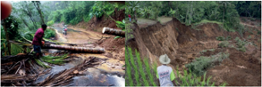

> **Deskripsi Visual:** Gambar ini adalah foto yang menunjukkan dua situasi alam yang berbeda. Pada sisi kiri, terdapat seorang pria sedang berjalan di atas batang pohon besar yang jatuh ke sungai. Ini menunjukkan dampak dari hujan lebat atau gempa bumi yang mengakibatkan pohon tumbang. Sisi kanan menunjukkan tanah yang longsor akibat aktivitas manusia seperti pembukaan lahan atau penghancuran hutan. Kedua gambar tersebut menunjukkan dampak negatif dari aktivitas manusia terhadap lingkungan alam.

 

---
## 📄 Halaman 176

### Response Saya: Analisis Kritis

Baca berita diatas, buatlah analisis dikaitkan dengan keutuhan ciptaan dan kemukakan pendapat kalian, yaitu jalan keluar yang kalian pikirkan berkaitan dengan kasus tersebut.

### D.  Refleksi

Allah menciptakan dunia dan segala isinya dan mengatakan semuanya baik! Ia menempatkan manusia di bumi sebagai wakil-Nya untuk menjaga bumi dan segala ciptaan supaya semuanya tetap baik. Namun dosa telah menutup mata dan hati manusia sehingga tidak mampu menjaga keprcayaan yang diberikan Allah  bagi  manusia.  Keserakahan  dan  kelalalin  manusia  telah  mengancam keberlangsungan  kehidupan  bumi,  manusia  dan  seluruh  ciptaan.  Hal  ini menyebabkan  relasi  antara  manusia  dengan  ,manusia  dan  antara  manusia dengan  ciptaan  lainnya  menjadi  hambar  bahkan  kehancuran  membayang bayangi kehidupan di bumi. Oleh karena itu gereja tergerak untuk melakukan berbagai upaya pencegahan dan penanggulangan terhadap berbagai kerusakan yang ditimbulkan oleh manusia/ Upaya itu dilakukan dengan mulai memikirkan untuk  mengupayakan  terwujudnya  Keadilan,  perdamaian  dan  keutuhan ciptaan, sebagaimana diawal penciptaan ketika Allah melihat semuanya baik.

Dalam  kaitannya  dengan  Keadilan,  perdamaian  dan  keutuhan  ciptaan, gereja  mewartakan  kabar  baik  dengan  ikut  menjadi  bahagian  dari  upaya mewujudkan keadilan, perdamaian dan keutuhan ciptaan. Dengan demikian tiap orang yang menjadi bahagian dari gereja terpanggil untuk turut melakukan upaya-upaya dalam mewujudkan keadilan, perdamaian dan keutuhan ciptaan. Hal itu dapat terwujud jika seluruh komponen masyarakat turut mengambil bahagian, proaktif menyelamatkan seluruh ciptaan. Remaja kristen terpanggil untuk ikut serta dalam upaya tersebut.

### Tugas

Merancang kegiatan kreatif dalam rangka menjaga keutuhan ciptaan (Harmonisasi hubungan antara manusia dengan ciptaan lainnya).

 

---
## 📄 Halaman 177

---
**🖼️ Gambar/Diagram**

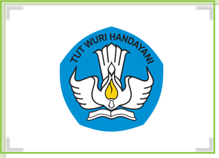

> **Deskripsi Visual:** Gambar ini adalah ilustrasi yang menampilkan logo sekolah TUT WURI HANDAYANI. Gambar ini terdiri dari beberapa elemen utama:

1. **Keseluruhan**: Gambar ini menunjukkan logo sekolah dengan desain yang simetris dan elegan. Logo ini terdiri dari dua bagian utama: bagian atas yang berisi tulisan "TUT WURI HANDAYANI" dan bagian bawah yang berisi gambar.

2. **Elemen Utama dan Relasinya**: 
   - **Bendera Biru**: Bagian atas logo berwarna biru dengan tulisan "TUT WURI HANDAYANI".
   - **Bendera Putih**: Bagian bawah logo berwarna putih dengan gambar sebuah burung yang sedang membawa selembar kertas.
   - **Lampu**: Di tengah burung, terdapat lampu kuning yang menyerupai api, yang biasanya digunakan sebagai simbol kepercayaan atau keagamaan.

3. **Teks, Angka, atau Label Penting**: 
   - **Teks Penting**: Tulisan "TUT WURI HANDAYANI" yang terletak di bagian atas logo.
   - **Angka**: Ada angka "8" yang terletak di bawah tulisan "TUT WURI HANDAYANI".

4. **Informasi Kunci**: 
   - Gambar ini menunjukkan logo sekolah TUT WURI HANDAYANI, yang mungkin merupakan institusi pendidikan atau organisasi tertentu.
   - Lampu kuning pada logo menunjukkan bahwa sekolah ini mungkin memiliki nilai-nilai atau visi yang berhubungan dengan kepercayaan atau keagamaan.
   - Desain logo yang simetris dan elegan menunjukkan bahwa sekolah ini mungkin berfokus pada pendidikan yang formal dan resmi.

Dengan demikian, gambar ini menggambarkan logo sekolah TUT WURI HANDAYANI dengan detail yang mencerminkan identitas dan nilai-nilai institusi tersebut.

 

---
## 📄 Halaman 178

---
**🖼️ Gambar/Diagram**

> **Deskripsi Visual:** Gambar ini adalah ilustrasi yang menampilkan logo sekolah. Logo ini terdiri dari dua elemen utama: sebuah bendera biru dengan lambang tangan berbentuk bulan sabit dan bintang putih, serta sebuah buku putih yang diletakkan di bawah tangan tersebut. Lambang tangan ini menggambarkan keberanian dan kejujuran, sementara buku menunjukkan pendidikan dan pengetahuan. Di atas lambang tangan, terdapat teks "TUT WURI HANDAYANI" yang menunjukkan nama sekolah. Elemen-elemen ini saling berkaitan, menunjukkan bahwa sekolah ini berfokus pada pendidikan dan nilai-nilai keberanian dan kejujuran.

 

---
## 📄 Halaman 179

KEMENTERIAN PENDIDIKAN, KEBUDAYAAN, RISET, DAN TEKNOLOGI REPUBLIK INDONESIA, 2021 Pendidikan Agama Kristen dan Budi Pekerti untuk SMA/SMK Kelas XII

Penulis: Janse Belandina Non-Serrano

ISBN: 978-602-244-702-3 (jil.3)

BAB XII

### KEUGAHARIAN

(Bahan Alkitab: Kisah Para Rasul 2:4-5)

### Tujuan Pembelajaran

- Siswa  menjelaskan  makna    keugaharian  dalam  kehidupan  sebagai orang Kristen.
- Siswa Menjabarkan cara hidup ugahari
- Siswa Mengkaitkan cara hidup ugahari dengan prinsip iman kristen
- Siswa berkomitment untuk mempraktikkan sikap hidup ugahari dan mensosialisasikan dalam keluarganya

 

---
## 📄 Halaman 180

### A.  Pendahuluan

Ada sebuah media nasional yang memuat berita pada minggu yang lalu bahwa sampah  sisa  makanan  jika  dikumpulkan  dalam    seminggu  bisa  berton-ton beratnya. Sampah makanan mencemari lingkungan karena menghasilkan gas yang kalau dihirup akan mengganggu pernafasan disamping itu baunya juga tak  sedap.  Kebanyakan  sampah  itu  berasal  dari  sisa  makanan  ketika  orang mengabil  makanan  banyak  tapi  tidak  menghabiskannya.  Seandainya  saja manusia menyadari bahwa pemborosan yang dilakukannya telah mengancam keselamatan bumi dan manusia karena menyebabkan pencemaran lingkungan juga pola konsumsi yang berlebihan telah menghabiskan persediaan makanan yang  seharusnya  tersedia  untuk  1  minggu  dihabiskan  dalam  1-2  hari  saja. Pembelajaran ini mengajarkan pada kalian untuk hidup hemat dan secukupnya. Jika  kalian  biasa  mengambil  makanan  dalam  jumlah  yang  banyak  lalu  tak dihabiskan  kemudian  sisa  makanan  itu  dibuang,  diharapkan  setelah  kalian mempelajari topik ini pandangan dan sikap hidup kalian akan berubah. Begitu pula jika kalian memiliki pola hidup konsumtif, diharapkan dapat  mengubah pola hidup tersebut. Sebaiknya kita hidup secukupnya yang penting sehat dan bugar.

### B.  Pengertian Ugahari

Keugaharian adalah sebuah kata yang berasal dari akar kata 'ugahari' yang berarti  'tengah',  'tengah',  'sederhana'.  Dengan  kata  lain,  dalam  kata  ini terkandung makna 'tidak berlebihan'.

Keugaharian  diangkat  menjadi  tema  Sidang  Raya  ke-16  pada  tahun 2014 di Nias. Pdt. Dr. Andreas A. Yewangoe menjelaskan tentang tema ini dalam  tulisannya,  'Spiritualitas  Keugaharian:  Merayakan  Keragaman  bagi Kehidupan  Kebangsaan  yang  Utuh'  yang  diterbitkan  oleh  PGI.  Katanya, keugaharian adalah sebuah cara hidup yang siap untuk sederhana, meskipun misalnya  seseorang  sangat  kaya  raya.  Cara  hidupnya  itu  membuat  orang dihormati dan dicintai oleh masyarakat, sebab ia tidak segan-segan berbagi karena ia tidak serakah.

 

---
## 📄 Halaman 181

Yewangoe (baca:  Yewangu) juga menjelaskan, hidup keugaharian bukanlah  hidup  dalam  kepura-puraan.  Pura-pura  tidak  punya  uang,  purapura tidak bisa menolong sesama seperti halnya kehidupan yang dijalani oleh Yesus, (lih. Mat. 8:20; Luk. 9:58).

Contoh  lain,  kata  Yewangoe,  adalah  kehidupan  Yohanes  Pembaptis yang  lahir  dari  sebuah  keluarga  imam  dan  para  nabi  di  Perjanjian  Lama. Status Yohanes  tidak  membuat  dia  sombong  dan  hidup  bermewah-mewah. Sebaliknya, ia hidup di padang gurun dengan pakaian dan makanan seadanya. Ia sadar, ada masih banyak orang yang kekurangan dalam hidupnya.

### C.  Calvinisme dan Keugaharian:

Max  Weber  (1864-1920),  seorang  pakar  sosiologi  dari  Jerman,  pernah melakukan penelitian tentang apa yang menyebabkan negara-negara di Eropa Barat - khususnya Jerman dan Belanda - menjadi begitu kaya. Menurut Weber, ini semua dimulai dari pertanyaan orang-orang Kristen di sana, 'Bagaimana saya tahu bahwa saya selamat?'

 

---
## 📄 Halaman 182

Pertanyaan  ini  didasarkan  pada  ajaran  Yohanes  Calvin,  yang  banyak diikuti  banyak  orang  Kristen  di  kedua  negara  itu,  bahwa  kita  tidak  pernah tahu apakah kita selamat atau tidak. Pada masa hidupnya, Calvin juga pernah menghadapi  pertanyaan  yang  sama.  Jawaban  yang  diberikannya  adalah 'predestinasi'.  Katanya,  tujuan  akhir  hidup  telah  ditetapkan  oleh  Allah apakah  seseorang  akan  selamat  atau  tidak,  bahkan  sejak  saat  ia  masih  di dalam kandungan ibunya. Masalahnya, itu adalah rahasia Allah, dan kita tidak akan pernah mengetahuinya. Jadi, apakah ada petunjuk-petunjuk yang akan menolong kita menemukan jawabannya?

Weber  menyimpulkan  bahwa  orang-orang  Kristen di Eropa Barat meyakini bahwa jawaban itu dapat ditemukan dalam hidup kita sendiri. Kalau kita berhasil di dalam berbagai usaha kita, maka itu tandanya Allah berkenan dengan kita. Artinya, kita selamat. Sebaliknya, bila kita terus-menerus gagal dalam usaha apapun juga, maka itu adalah tanda bahwa Allah tidak berkenan kepada kita.

Berdasarkan  pemahaman  ini,  maka  orang-orang  Kristen  Protestan  di kedua wilayah itu pun berlomba-lomba untuk selalu berhasil di dalam usahausaha mereka. Untuk mencapai itu semua, mereka pun berusaha untuk hidup sehemat mungkin, mengenakan pakaian yang biasa-biasa saja, dan tidak perlu membeli banyak, sebab yang penting badan tertutup dan tidak kedinginan di musim dingin. Makanan juga secukupnya, yang penting menyehatkan tubuh. Mereka juga jarang sekali membeli dan mengenakan perhiasan. Inilah yang disebut Weber sebagai 'worldly asceticism' (hidup sebagai pertapa di dunia).

Apa akibat dari semua itu? Tentu dengan usaha yang selalu sukses dan hidup yang sederhna, maka uang orang Kristen makin bertambah. Nah, uang tersebut kemudian dijadikan modal kerja untuk memperluas usahanya. Itulah yang dikatakan oleh Weber sebagai asal-usul hadirnya kapitalisme di dunia.

Yang menarik dari penelitian Weber ini adalah kenyataan bahwa orangorang  Kristen  Protestan  di  barat  terbiasa  hidup  sederhana  dan  hemat. Akibatnya, banyak orang yang sering menganggap mereka kikir. Uang seribu rupiah pun sangat diperhitungkan. Uang kembalian 1 sen pun akan mereka tuntut.  Mengapa?  Karena  mereka  percaya  bahwa  semua  yang  kita  miliki adalah kepercayaan yang diberikan Tuhan, yang harus kita jaga dengan hatihati dan pertanggungjawabkan.

 

---
## 📄 Halaman 183

### D.  Ugahari dalam kehidupan sehari-hari

Ugahari  menunjuk  kepada  cara  hidup  yang  secukupnya,  yang  didasarkan kepada pemahaman bahwa hidup sederhana sudah cukup. Orang yang hidup dengan asas keugaharian akan berusaha hidup sederhana, tidak bermewahmewah.  Andaikata  uangnya  berlebih,  maka  uang  itu  akan  disumbangkan kepada  mereka  yang  berkekurangan,  atau  digunakan  untuk  membangun gedung-gedung untuk melayani masyarakat, seperti sekolah, rumah sakit, dll.

Ugahari bukanlah kehidupan yang penuh pura-pura, seperti yang kadangkadang  dilakukan  oleh  orangtua  murid  yang  mendaftarkan  anaknya  ke sekolah swasta yang mahal. Sebagian sekolah itu mengenakan uang masuk yang berbeda-beda: yang kaya harus membayar lebih mahal, sementara yang sederhana bisa membayar lebih murah.

Tujuannya  baik.  Sekolah  ingin  supaya  keluarga  yang  lebih  mampu membantu yang kekurangan. Namun aturan ini sering disalahgunakan oleh orangtua calon murid. Supaya tidak perlu membayar mahal, walaupun mereka sesungguhnya mampu, sebagian orangtua murid datang ke sekolah dengan kendaraan umum seperti bajaj, dan sejenisnya. Pakaian mereka pun sangat sederhana, walaupun sehari-hari mereka biasa mengendarai mobil mewah dan berpakaian gemerlapan.

### E.  Hedonisme

Hedonisme  adalah  lawan  kata  dari  keugaharian.  Kita  perlu  memahami perbandingan ini, supaya kita lebih mengerti apa yang dimaksudkan dengan keugaharian.

Menurut Stanford Encyclopedia of Philosophy , kata 'hedonisme' berasal dari kata Yunani kuno yang berarti 'kesenangan'. Hedonisme, secara psikologis atau motivasional, menyatakan bahwa hanya kebahagiaan dan rasa sakit yang memotivasi kita. Hanya kebahagiaan yang berharga atau bernilai, dan  hanya  rasa  senang  akan  mendorong  seseorang  untuk  bekerja  keras, sementara penderitaan atau ketidaksenangan akan membuat seseorang untuk malas berusaha dan berjuang.

 

---
## 📄 Halaman 184

Dengan  pemahaman  itu,  maka  banyak  orang  menganggap  bahwa mengejar kebahagiaan adalah tujuan hidupnya satu-satunya. Hidupnya penuh dengan pesta, penghamburan uang untuk membeli berbagai barang mewah, perjalanan-perjalananan liburan ke luar negeri, dll.

Lihatlah orang-orang di sekitar kita yang gemar menghamburkan uang dengan  makan-makan  di  restoran  mahal  atau  berpesta  pora  setiap  akhir minggu. Kalau ada hari libur dari hari Jumat hingga Minggu, sebagian dari mereka suka pergi ke Singapura, Jepang, atau Australia untuk liburan sejenak. Mereka suka memamerkan barang-barang mewah, seperti jam tangan mewah, tas-tas bermerek, pakaian mahal luar biasa, mobil-mobil yang mahal, dsb.

Hidup  mewah  seperti  ini  juga  dilakukan  oleh  para  pejabat,  artis  serta orang-orang yang disebut dalam media sebagai ' cracy rich' . Untuk pejabat negara yang hanya hidup dari gaji, amat mengherankan jika hidup mewah karena kita tahu berapa gaji seorang abdi negara. Bahkan justeru abdi negara seharusnya menjadi teladan hidup hemat.

Lebih  parah  lagi,  gaya  hidup  ini  juga  terjadi  di  kalangan  sejumlah pendeta. Beberapa waktu yang lalu, internet dihebohkan oleh artikel tentang 'pastor in style' atau pendeta gaya hidupnya mewah. Ada dari mereka yang beranggapan  bahwa  kita  tidak  boleh  iri  dengan  orang  lain,  '…  termasuk dengan pendeta kita sendiri. Kalau ada pendeta yang pakai barang branded, dengan jam yang harganya puluhan juta, mobil sport milyaran, sepatu, dengan dandanan yang mahal, ya kita nggak boleh iri dengan mereka. Sebab Alkitab mengatakan  demikian,'  katanya.  Lalu  ia  mengutip  ayat  dari Amsal  10:22, yang berbunyi, 'Berkat Tuhanlah yang menjadikan kaya, susah payah tidak akan menambahinya.' (Jawaban.com. 1 Okt. 2019). Pendeta itu melanjutkan, '… saya katakan, itu berkat bagi pendeta itu sendiri dan saya bangga dengan pendeta  itu.  Karena  pendeta  itu  bisa  pakai  barang  bagus,  bisa  pakai  baju bagus, mobil bagus, dia mendapatkan anugerah dari Tuhan.' .  Apakah kalian setuju dengan pernyataan seperti itu? Coba kalian bandingkan dengan  cara hidup Yesus,  Rasul  Paulus  dan  Yohanes  Pembaptis?.  Pendeta  yang  adalah 'hamba Tuhan'  adalah teladan bagi jemaatnya, khususnya dalam hal hidup hemat. Di daerah-daerah masih banyak pendeta yang hidup berkekurangan namun mereka suka cita melayani dan jemaat berupaya sebisa mungkin unutk menopang kehidupan finansial pendetanya.

 

---
## 📄 Halaman 185

### Response Saya

- Jelaskan makna  keugaharian dalam kehidupan sebagai orang Kristen.
- Jabarkan cara hidup ugahari

### F.  Latar Belakang Alkitab

Alkitab penuh dengan anjuran untuk hidup sederhana.

Pembelaan  terhadap  orang-orang  miskin  juga  dikaitkan  dengan  sikap bijaksana. Kitab Amsal 29:8 mengatakan, 'Orang benar mengetahui hak orang lemah, tetapi orang fasik tidak mengertinya.' Ada banyak sekali ayat di dalam Alkitab yang bicara tentang orang-orang miskin, orang lemah dan tertindas. Melalui  Alkitab  kita  tahu  bahwa  Allah  ingin  supaya  kita  memperhatikan, membela, dan kemudian mengangkat harkat mereka agar tidak lagi menderita di dalam kemiskinannya.

Dalam  Keluaran  22:22  muncul  larangan  agar bangsa Israel tidak menindas para janda dan anak yatim. Bila mereka melakukan itu, TUHAN Allah  mengancam mereka semua mati, hingga istri  dan  anak-anak  mereka akan menjadi janda dan anak yatim. Kata-kata dalam Keluaran ini digaungkan kembali dalam Mazmur 109:9-15 kutukan yang sangat mengerikan.

Dalam Kitab Ulangan pun kita menemukan peringatan atas bangsa Israel agar  mereka  tidak  mengabaikan  para  janda  dan  anak  yatim,  'Terkutuklah orang yang memperkosa hak orang asing, anak yatim dan janda. Dan seluruh bangsa itu haruslah berkata: Amin!' (Ul. 27:19) Begitulah hebatnya hukuman yang dijatuhkan oleh TUHAN kepada orang-orang yang tidak memperhatikan hidup para janda dan anak yatim, yang hanya bisa terjadi ketika orang banyak hidup bermewah-mewah dan tidak peduli terhadap mereka.

Tuhan Yesus merujuk kepada janda dalam ajaran-Nya. Dalam Markus 12, Yesus mengecam orang-orang Farisi yang suka menelan rumah dari para janda (ay. 40) dan memuji seorang janda yang hanya memberikan persembahan 2 peser atau 1 duit ke dalam kotak persembahan. Kata-Nya, '… janda ini memberi dari kekurangannya, sementara yang lain memberi dari kelebihannya (21:4)'. Uang dua peser di masa Yesus itu, nilainya kira-kira Rp. 1.600 di masa kini.

 

---
## 📄 Halaman 186

Jumlah ini sangat sedikit. Tapi hanya itu yang sanggup ia berikan. Mungkin sekali, ia tidak tahu apa yang akan dimakannya besok, namun kepasrahannya kepada Allah  membuat ia  rela  memberikan  sebagian  hartanya  yang  sangat sedikit. Itulah sebabnya Yesus sangat memuji dia.

Dalam Lukas 16:19-31, Yesus menceritakan perumpamaan tentang orang kaya yang pakaiannya sangat mewah dan selalu berpesta pora. Sementara itu, di depan rumahnya ada Lazarus yang miskin. Setiap hari ia duduk di depan rumah si kaya yang selalu berpesta-pora, tanpa peduli dengan si miskin yang hanya mengharapkan remah-reman makanan yang jatuh di situ. Ketika kedua orang ini meninggal, Lazarus berada bersama Abraham, sementara orang kaya itu  menderita di alam maut dan menderita karena panasnya api di sana. Si kaya meminta agar Lazarus meneteskan sedikit air saja, untuk mengurangi panas dan hausnya, tapi di antara mereka ada celah yang tidak terjembatani.

Kehidupan  Yesus  sendiri  sangat  sederhana.  Seperti  yang  dikatakan Yewangoe, Yesus mengatakan bahwa, 'Serigala mempunyai liang dan burung mempunyai  sarang,  tetapi  Anak  Manusia  tidak  mempunyai  tempat  untuk meletakkan  kepala-Nya'  (Mat.  8:20).  Ia  hidup  sebagai  seorang  guru  atau pengkhotbah yang tidak dibayar satu sen pun di masa hidup-Nya.

Di  sini  jelas  kita  bisa  melihat  bahwa  Tuhan  Yesus  tidak  mengajarkan kehidupan bermewah-mewah. Bahkan Ia sendiri selama masa pelayanan-Nya di dunia tampaknya hidup dengan sangat sederhana. Ia kemungkinan sekali tidak mempunyai rumah, sehingga Ia harus berkelana dan hidup dari rumah ke rumah yang lain.

Bagaimana sikap Yesus terhadap orang-orang miskin? Dalam Lukas 6:2023, Yesus mengatakan bahwa Allah berpihak kepada orang-orang yang miskin dan tertindas:

6:20 'Berbahagialah, hai kamu yang miskin, karena kamulah yang empunya  Kerajaan  Allah.  6:21  Berbahagialah,  hai  kamu  yang sekarang ini lapar, karena kamu akan dipuaskan. Berbahagialah, hai kamu yang sekarang ini menangis 7 , karena kamu akan tertawa. 6:22 Berbahagialah  kamu,  jika  karena  Anak  Manusia  orang  membenci kamu, dan jika mereka mengucilkan kamu, dan mencela kamu serta menolak  namamu  sebagai  sesuatu  yang  jahat.  6:23  Bersukacitalah pada  waktu  itu  dan  bergembiralah,  sebab  sesungguhnya,  upahmu besar di sorga; karena secara demikian juga nenek moyang mereka telah memperlakukan para nabi.

 

---
## 📄 Halaman 187

Yesus  juga  mengajarkan,  '…  apabila  engkau  mengadakan  perjamuan, undanglah orang-orang miskin, orang-orang cacat, orang-orang lumpuh dan orang-orang  buta'  (Luk.  14:13).  Maksudnya  jelas.  Di  tengah-tengah  kebahagiaan dan suka cita, kita diajarkan untuk tidak pernah melupakan orang-orang yang kekurangan. Melengkapi kajian tersebut diatas, Yesus mengajarkan Doa Bapa Kami dimana salah satu rumusannya adalah 'berikanlah kami makanan kami yang  secukupnya'.  Ungkapan  ini  mau  mengajarkan  pada  manusia  untuk selalu 'merasa cukup' dalam hidupnya. Doa Bapa kami sudah dibahas secara mendalam di jenjang SMP jadi tidak akan diulangi lagi dalam pembahasan di SMA.   Ketika Israel di padang gurun, Allah menurunkan manna hanya untuk dimakan pada hari itu saja. Ada yang mencoba menyimpannya tapi menjadi busuk. Kedua hal ini menunjukkan pada kita bahwa manusia harus memiliki rasa 'cukup' dalam hidupnya. Jika manusia tidak pernah merasa cukup, tidak pernah merasa puas, maka ia akan jatuh kedalam keserakahan.

Pada awal gereja berdiri, orang-orang Kristen perdana malah menjual seluruh harta miliknya, dan membagi-bagikannya kepada orang-orang miskin (Kis. 2:44-45). Kemudian para rasul mengangkat 7 orang diaken yang diberi tugas antara lain untuk memberikan perhatian khusus kepada para janda dari mereka yang tidak berbahasa Ibrani (Kis. 6).

Mengapa para janda dan anak yatim mendapatkan perhatian besar? Pada  zaman  dahulu  memang  laki-laki  adalah  kepala  keluarga  yang  sangat diandalkan. Ketika sang suami meninggal, maka kehiduspan para janda dan anak yatim akan menjadi sangat menderita. (Bdk. kisah Naomi dan Rut dalam Kitab Rut). Bila masyarakat atau keluarga terdekat mereka tidak memberikan perhatian kepada mereka, maka mereka tidak akan bisa bertahan hidup.

### Response Saya

- Coba tanyakan kepada Majelis Gerejamu, berapa banyak anggaran yang disediakan untuk program diakonianya. Lebih lanjut, tanyakan juga, siapa orang-orang yang bisa dimasukkan ke dalam kategori diakonia?
- Tanyakan  juga  berapa  besar  anggaran  gerejamu  dalam  satu  tahun  ini. Lalu coba buat perhitungan, berapa persentase uang yang diperoleh dari uang persembahan gereja yang digunakan untuk pelayanan diakonia. Lalu simpulkan  apakah  gereja  telah  menggunakan  pemberian  jemaat  untuk melayani mereka yang miskin dan membutuhkan pertolongan?

 

---
## 📄 Halaman 188

### 3. Coba kaitkan cara hidup ugahari dengan prinsip iman kristen.

Kalian dapat mendiskusikan hasil temuan kalian. Kegiatan ini dapat dikatakan sebagai kegiatan observasi sederhana melalui wawancara!

### G. Konteks Masa Kini

Di Amerika Serikat ada keluarga-keluarga kaya yang terlibat dalam usahausaha sosial. Contohnya, Rockefeller dengan Yayasan Rockefellernya yang banyak bergerak dalam bisnis perminyakan, dan keluarga Ford, pemilik pabrik mobil Ford, dengan Yayasan Fordnya. Ada lagi yang lebih baru seperti Bill and Melinda Gates Foundation dan George Soros Open Society Foundation. Semua  yayasan  ini  bergerak  dalam  isu  pendidikan,  kesehatan,  hubungan internasional, penelitian ilmiah, pengembangan ekonomi masyarakat ekonomi lemah, dll.

Di Indonesia ada Taher Foundation, yang bergerak dalam dunia business dan  perbankan,    yang  menyumbangkan  truk  sampah,  bus  TransJakarta, peralatan  kesehatan  di  masa  COVID-19,  bea  siswa  pendidikan,  dll.  Ada Djarum Foundation, sebuah perusahaan industri rokok, terkenal karena banyak memberikan sumbangan untuk memajukan olahraga bulutangkis di Indonesia. Selain itu, yayasan ini juga bergerak dalam bidang-bidang sosial, kebudayaan, pendidikan dan lingkungan hidup.

Sebuah  yayasan  lainnya  yang  bernama  Putera  Sampoerna  Foundation, juga  dari  industry  rokok,  bergarak  dalam  isu  memberikan  pendidikan yang  berkualitas  bagi  siswa  Indonesia  berprestasi  terutama  dari  keluarga prasejahtera, menciptakan lapangan kerja, pemberdayaan kaum perempuan, serta penyedian penyaluran bantuan dan rehabilitasi bencana.

Memang, mereka semua berbagi dari kelebihan mereka. Mereka umumnya adalah  keluarga-keluarga  yang  sangat  kaya,  sehingga  dana  yang  mereka sisihkan  mungkin  tidak  seberapa  jumlahnya.  Sementara  itu  banyak  orangorang lain sering mengatakan, 'Ah, kan hidup saya sendiri masih kekurangan. Masakan saya harus menyumbang juga untuk masyarakat luas?' Benar, tapi ingatlah tentang pujian Tuhan Yesus kepada janda miskin yang memberikan dari kekurangannya.

 

---
## 📄 Halaman 189

Kita  sudah  lihat  ada  banyak  pihak,  di  luar  maupun  di  dalam  negeri, yang  berusaha  memberikan  bantuan  kepada  orang-orang  yang  kekurangan dan  membutuhkan  agar  mereka  bisa  maju  dan  meninggalkan  kemiskinan. Sebagian besar bangsa kita masih hidup dalam kekurangn, bahkan di bawah garis kemiskinan. Mereka sangat membutuhkan kepedulian kita.

Kini  kita  perlu  bertanya  apakah  orang-orang  Kristen  dan  gereja-gereja Kristen sudah ikut memberikan bantuan kepada para janda dan anak yatim di dalam  gereja  maupun  di  tengah  masyarakat?  Harus  diakui  bahwa  pada  umumnya warga jemaat kita masih kurang memberikan perhatian kepada mereka. Baru pada hari Natal dan Paskah gereja-gereja memberikan sumbangan sekadarnya kepada panti-panti asuhan dan panti jompo yang banyak diisi oleh para janda. Tapi dalam kehidupan sehari-hari, hidup mereka sering dilupakan.

Ini  adalah  foto  seorang  janda,  Tamini,  di  Kudus  yang  merana  selama 15  tahun.  Ia  hidup  hanya  dari  mengumpulkan  barang-barang  rongsokan. Baru-baru ini dia mendapatkan bantuan sosial tunai dari Kementerian Sosial pusat. Tapi bagaimana kelanjutan hidupnya? Akankah ia kembali ke dalam kehidupannya yang susah dan kekurangan?

---
**🖼️ Gambar/Diagram**

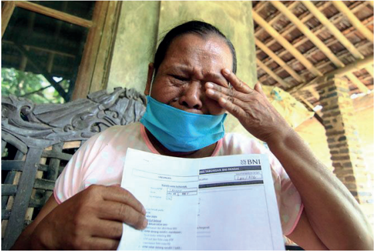

> **Deskripsi Visual:** Gambar ini adalah foto yang menunjukkan seorang pria sedang membaca dokumen. Pria tersebut mengenakan masker medis biru dan memegang sebuah dokumen berwarna putih dengan tulisan dan gambar yang tidak jelas. Latar belakangnya adalah bangunan tradisional dengan atap beratap datar dan dinding kayu. Pria tersebut tampak sedang fokus pada dokumen yang dia baca, mungkin untuk memverifikasi atau memeriksa informasi tertentu.

Sumber: Radar Kudus, 12 Mei 2020.

 

---
## 📄 Halaman 190

Uripah, seorang buruh colet batik, dirumahkan karena wabah COVID-19. Akibatnya, kedua anaknya harus merantau ke Jakarta mencari nafkah. Upahnya sebagai buruh collet batik pun hanya antara 10.000-20.000 per hari. Sangat kecil  untuk  dirinya  dan  ketiga  anaknya.  (DetikNews  12  Mei  2020).  Kalau sebagian orang mendapatkan bantuan pemerintah pada masa COVID-19 ini, Uripah tidak. Entah mengapa, namanya luput dari catatan pemerintah.

Bagaimana  perhatian  perhatian  kelompok-kelompok  agama?  Memang sangat banyak sekali orang yang menderita di masa-masa ketika bangsa kita menghadapi tantangan berat seperti bencana COVID-19, atau bencana alam lainnya. Namun perhatian dari pihak keagamaan, dan gereja khususnya masih sangat sedikit.

Sebuah  jemaat  Kristen  di  Jakarta  Selatan  punya  perhatian  yang  besar untuk membantu orang-orang yang kekurangan. Kabarnya, mereka bertekad untuk menyisihkan 50% dari uang persembahan yang diberikan jemaat - yang mestinya cukup besar - untuk digunakan untuk bantuan sosial ke masyarakat. Mereka menggunakannya untuk membantu orang-orang miskin, pelayanan kesehatan umum, bea siswa untuk anak-anak yang bersekolah teologi, dll.

---
**🖼️ Gambar/Diagram**

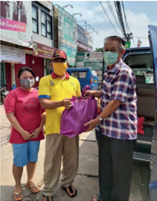

> **Deskripsi Visual:** Gambar ini adalah foto yang menunjukkan tiga orang yang sedang berinteraksi di depan sebuah toko. Orang pertama adalah seorang pria tua dengan topi merah dan baju kuning, sedang memegang sebuah tas warna ungu. Orang kedua adalah seorang wanita muda dengan rambut pendek, juga mengenakan topi merah dan baju kuning. Orang ketiga adalah seorang pria muda dengan rambut pendek, mengenakan kemeja biru dengan lengan panjang dan celana hitam. Semua orang tersebut sedang tersenyum dan tampak senang. Di sebelah kiri, ada sebuah toko dengan spanduk berwarna merah dan putih. Di sebelah kanan, terlihat jalan raya dengan beberapa kendaraan. Gambar ini menunjukkan hubungan sosial antara individu dan lingkungan sekitarnya, serta suasana yang positif dan ramah.

 

---
## 📄 Halaman 191

Sebuah  jemaat  lain  di  Jakarta  mengumpulkan  uang  dan  kemudian membeli  sejumlah  sembako  untuk  dibagi-bagikan  kepada  masyarakat  di sekitar  yang  membutuhkan.  Pemberian  ini  dilakukan  pada  masa  pandemi COVID-19, ketika banyak sekali warga masyarakat yang sangat menderita karena kehilangan  pekerjaan, dll.  Tindakan-tindakan  seperti ini sangat dibutuhkan  oleh  masyarakat  luas  yang  seringkali  tiba-tiba  menjadi  merana karena kehilangan rumah dan seluruh harta mereka karena adanya bencana alam.

Namun demikian, harus diakui bahwa banyak gereja dan orang Kristen yang  lebih  tertarik  menyumbang  untuk  rumah-rumah  ibadah  yang  megah, karena persembahannya lebih kelihatan hasil fisiknya. Sementara itu, menyumbang kepada orang miskin seperti janda dan para anak yatim dianggap tidak memperlihatkan hasil yang konkret.

### Response Saya

Setelah mempelajari materi diatas, kini kalian diminta untuk:

- Mengajak Komisi Remaja di jemaat kalian  untuk mengadakan sebuah aksi    membantu  masyarakat  sekitar  gereja  dengan  berbagai  bentuk bantuan: mis. memberikan les tambahan di gereja setiap hari Sabtu untuk anak-anak yang ingin belajar Bahasa asing, ilmu matematika, fisika, kimia, dll.
- Atau kumpulkan sebagian uang jajan yang kamu terima setiap hari untuk dipersembahkan kepada anak-anak yang kurang beruntung.
- Atau  pikirkan  tindakan-tindakan  keugaharian  lain  yang  bisa  kamu lakukan bersama keluargamu, atau teman-temanmu di sekolah atau di gereja!
- Buatlah  laporan  untuk  kegiatan  kamu  untuk  disampaikan  minggu depan.
- Buatlah  komitment  untuk  mensosialisasikan  sikap  hidup  ugahari dalam keluarga mu.

 

---
## 📄 Halaman 192

### H. Refleksi

Semangat keugaharian dalam hidup kita tidak lain daripada semangat berbagi di  dalam  berbagai  aspek  kehidupan.  Hal  itu  dilakukan  dengan  kesadaran bahwa kita tidak hidup sendirian, dan tiap orang memilik hak untuk hidup. Sebagai  orang  beragama,  dalam  seluruh  aspek  hidup,  manusia  beragama harus mempertimbangkan aspek keadilan dalam hidup, termasuk kepentingan sesama.  Manusia  beragama  juga  harus  hidup  sesuai  dengan  pendapatan, jangan  hidup  seperti  'pasak  dari  pada  tiang'  artinya  pengeluaran  melebih pendapatan.

 

---
## 📄 Halaman 193

### Daftar Pustaka

- Barr, James. 1979. Alkitab di Dunia Modern . Jakarta: BPK Gunung Mulia.
- Christenson, Larry. 1994. Keluarga Kristen . Semarang: Yayasan Persekutuan Betania.
- Departemen  Pendidikan  dan  Kebudayaan.  1994. Kamus  Besar  Bahasa Indonesia . Jakarta: Balai Pustaka.
- Duan,  Yeremias  Bala  Pito.  2007. Keluarga  Kristen:  Kabar  Gembira  bagi Milenium Ketiga . Yogyakarta: Penerbit Kanisius
- Eminyan, Maurice. 2008. Teologi Keluarga. Yogyakarta: Penerbit Kanisius.
- GFresh edisi Mei 2003 No. 36, Temuan Ilmiah di Alkitab.
- Goode, William J. 1983. Sosiologi Keluarga. Jakarta: PT Bina Aksara.
- Hadinoto,  Atmaja.  1993. Dialog  dan  Edukasi:  Keluarga  Kristen  dalam Masyarakat Indonesia . Jakarta: BPK Gunung Mulia.
- Hadiwijono, Harun. 1991. Iman Kristen. Jakarta: BPK Gunung Mulia.
- Hardana, Timottius I Ketut Adi. 2013. 12 Tema Misa: Rekoleksi Keluarga. Jakarta: Penerbit Obor.
- Hasudungan. 2011. Takut Akan Tuhan Pendidikan Agama Kristen Untuk SMA Kelas XI. Medan: CV. Mitra.
- Ihromi, T.O. (ed.). 1999. Bunga Rampai Sosiologi Keluarga. Yayasan Obor Indonesia . Jakarta.
- Indra, Ichwe G. Ilmu Pengetahuan dan Teknologi dan Iman Kristen.
- Ismail, Andar. 2012. Selamat Ribut Rukun: 33 Renungan tentang keluarga . Jakarta: BPK Gunung Mulia.
- Kristo  M.  Thomas.  2010. Andalah Para Orang Tua Terbaik bagi Remaja. Jakarta: PT Gramedia.
- McIntyre, Jennie. 'The Structure-Functional Approach to Family Study' .
- Nuhamara, Daniel. 2008. PAK (Pendidikan Agama Kristen) Remaja. Bandung: Jurnal Info Media.
- PB. Horton dan LH, Chester. 1993. Sosiologi,  Jilid  1  Edisi  Keenam,  (Alih Bahasa: Aminuddin Ram, Tita Sobari). Jakarta: Penerbit Erlangga.
- Roucek, Joseph S. & Roland L. Warren. 1984. Pengantar Sosiologi. Jakarta: Bina Aksara.
- Sajogyo, Pudjiwati. 1985. Sosiologi Pembangunan. Fakultas  Pasca  Sarjana IKIP Jakarta.
- Sandy, Halim. 2004. Iman Kristen dan Ilmu Pengetahuan, Teknologi, Seni. Universitas Tarumanegara.

 

---
## 📄 Halaman 194

- Schoorl, J.W. 1980. Modernisasi Pengantar Sosiologi Pembangunan Negaranegara Sedang Berkembang. Jakarta: PT Gramedia.
- Sidjabat,  B.  Samuel.  1999. Strategi  Pendidikan  Kristen:  Suatu  Tinjauan Teologis-Filosofis. Yogyakarta: Andi Offset.
- Sosipater, Karel. 2010. Etika Perjanjian Lama: Law & Obedience. Jakarta: Suara Harapan Bangsa.
- Suhendi, hendi, dkk. 2001. Pengantar Studi Sosiologi Keluarga. Bandung: Pustaka Setia.
- Sumiyatiningsih, Dien. 2012. Mengajar dengan Kreatif & Menarik. Yogyakarta: Penerbit Andi.
- Thompson, Marjorie J. 2001. Keluarga sebagai Pusat Pembentukan: Sebuah Visi  tentang  Peranan  Keluarga  dalam  Pembentukan  Rohani. Jakarta: BPK Gunung Mulia.
- Tim Penulis. 2008. Tafsiran  Alkitab Masa Kini 3: Matius - Wahyu: Berdasarkan fakta-fakta Sejarah Ilmiah dan Alkitabiah. Jakarta: Yayasan Komunikasi Bina Kasih.
- Tim  penulis.  2008. Ensiklopedi  Alkitab  Masa  Kini:  Jilid  I  A-L. Jakarta: Yayasan Komunikasi Bina Kasih.
- Tim  penulis.  2008. Ensiklopedi  Alkitab  Masa  Kini:  Jilid  II  M-Z. Jakarta: Yayasan Komunikasi Bina Kasih.
- Tim Penulis.  2012. Growing Together: Seni  Memperkaya & Memperindah Pernikahan. Jakarta: Literatur Perkantas.
- Tjandrarin, Kristiana. 2004. Bimbingan Konseling keluarga (Terapi Keluarga). Salatiga: Tisara Grafika.
- Tomatala, Jacob. 1993. Manusia Ilmu Teknologi : Pergumulan Abadi Dalam Perang dan Damai: Tiara Wacana. Yogyakarta.
- Verkuyl, J. 1957. Etika Seksuil. Jakarta: BPK Gunung Mulia.
- Verkuyl, J. 1960. Etika Kristen dan Kebudayaan. Jakarta: BPK Gunung Mulia.
- Widyamartaya,  A. 2011. Keluarga Kristiani dalam Dunia Modern. Yogyakarta: Penerbit Kanisius.
- http://alamtekno.blogspot.com/2013/05/pengertian-teknologi. html#ixzz2nQnoVCXz
- http://gkimciumbuleuit.org
- http://nikennababan.blogspot.com/2010/12/perumpamaan-tentang-duadasar-bangunan.html
- Wikipedia.org

 

---
## 📄 Halaman 195

- Anabaptis. https://id.wikipedia.org/wiki/Anabaptis
- Ann Hasseltine Judson. https://en.wikipedia.org/wiki/Ann_Hasseltine_ Judson
- Bagaskara, Bima. (2020). 'Ini kata bupati Kuningan soal penyegelan tugu makam sesepuh Sunda wiwitan.' Detik.com. 22 Juli 2020. https://news. detik.com/berita-jawa-barat/d-5104326/ini-kata-bupati-kuningan-soalpenyegelan-tugu-makam-sesepuh-sunda-wiwitan
- Damayanti, Angela. 'Radikalisme pada Komunitas Non-Islam'. Jakarta: UKI (t.t.)
- Fahmi, Yusron. 'Minggu Berdarah Jemaah Ahmadiyah di Cikeusik 8 Tahun Silam'. Liputan 6, 6 Feb 2019. https://www.liputan6.com/news/ read/3888133/minggu-berdarah-jemaah-ahmadiyah-di-cikeusik-8-tahunsilam.
- Gerakan Karismatik. https://id.wikipedia.org/wiki/Gerakan_Karismatik
- Gereja Pentakosta. https://id.wikipedia.org/wiki/Gereja_Pentakosta
- Hosen, Nadirsyah. 'Kenapa Kaum Minoritas Sulit Membangun Rumah Ibadah?' Geotimes, 30 Agustus 2019. https://geotimes.co.id/kolom/ kenapa-kaum-minoritas-sulit-membangun-rumah-ibadah/
- John Wesley. https://id.wikipedia.org/wiki/John_Wesley
- Intan (official writer). (2019). 'Pendeta Hobi Pakai Barang Branded, Salahkah Kalau Pendeta Bergelimang Harta?, Jawaban.com. https:// www.jawaban.com/read/article/id/2019/10/01/58/191002163546/ pendeta_hobi_pakai_barang_brandedsalahkah_kalau_pendeta_ bergelimang_harta_kataalkitab
- 'IMB Gereja HKBP Depok Dicabut. Kompas, 29 April, 2009. https:// regional.kompas.com/read/2009/04/29/1227410/IMB.Gereja.HKBP. Depok.Dicabut.
- Kresna, Mawa. 'Perda Manokwari Kota Injil: Demo Menolak Pembangunan Masjid'. Tirto, 8 Januari 2019. https://tirto.id/perda-manokwari-kotainjil-demo-menolak-pembangunan-masjid-ddsl.
- 'Kamus Besar Bahasa Indonesia'. (2012-2019) https://kbbi.web.id/ugahari
- Meta, Dyah Ratna. 'Pembangunan Masjid Muhammadiyah di Aceh Dipersulit.' Republika, 8 Juni 2016. https://republika.co.id/berita/ dunia-islam/islam-nusantara/16/06/08/o8g72u361-pembangunan-masjidmuhammadiyah-di-aceh-dipersulit
- Martin Luther. https://id.wikipedia.org/wiki/Martin_Luther

 

---
## 📄 Halaman 196

- Qodar, Nafiysul. '26 Agustus 2012: Lebaran Berdarah Warga Syiah di Sampang Madura'. Liputan 6, 26 Agustus, 2012 https://www.liputan6. com/news/read/4046654/26-agustus-2012-lebaran-berdarah-wargasyiah-di-sampang-madura.
- 'Religious Pluralism'. https://en.wikipedia.org/wiki/Religious_pluralism.
- Stanford Encyclopedia of Philosophy. (2004) 'Hedonism'. https://plato. stanford.edu/entries/hedonism/
- Weber, Max. (1930) 'The Protestant Ethics and the Spirit of Capitalism.' London: George Allen & Unwin Ltd., Museum Street.
- WCC. 'Costly Unity'. (1990). Geneva: WCC. https://www.oikoumene.org/ resources/documents/costly-unity
- Wharton County Junior College. 'How Christians view other religions: Views of Protestant, Roman Catholic, and Eastern Orthodox churches'. Wharton, TX. (t.th.) https://facultyweb.wcjc.edu/users/williamj/ documents/Ethnicity%20and%20Identity/Ethnicity%20and%20 Identity--%20Religion.htm.
- Yewangoe, Andreas A., 'Spiritualitas Keugaharian: Merayakan Keragaman bagi Kehidupan Kebangsaan yang Utuh.' (2018) PGI https://pgi.or.id/ spiritualitas-keugaharian-merayakan-keragaman-bagi-kehidupankebangsaan-yang-utuh/ .

### Ilustrasi:

- Gambar 5-1: Andreas A. Yewangoe. Sumber: satuharapan.com
- Gambar 5-2: Lazarus di surga, orang kaya di neraka. Karya Cornelis Bos. Sumber: Wikimedia Commons.
- Gambar 5-3: Binatang jadi korban minyak tumpah. Sumber: Wiki commons.
- Gambar 5-4: Max Weber. Sumber: en.wiki.org
- Gambar 5-5: Setya Novanto dan Donald Trump. Sumber: Medan TribunNews, 5 Okt. 2017
- Gambar 5-6: Pastor in style. Sumber: Jawaban.com
- Gambar 5-7: Foto Tamini, Sumber: Radar Kudus, 12 Mei 2020.
- Gambar 5-8: Sembako untuk masyarakat. Sumber: pribadi.
- Gambar 5-9: Hutan gundul di Kinipan, Kalimantan. Sumber: Mongabay. com.
- Gambar 5-10: Manusia dengan hasil tembakannya. Sumber: Wiki common.
- Gambar 5-11: Panel surya di Serba, Portugal. Sumber: Wiki common.

 

---
## 📄 Halaman 197

### Glosarium

Eksplisit :

dinyatakan dengan jelas,  tidak  ada  yang  disembunyikan, sehingga tidak ada tempat untuk keraguan

Entry point :

Titik masuk, biasanya untuk menunjukkan awal mula untuk melaksanakan sesuatu

Etnis :

Pembedaan atas golongan manusia berdasarkan ciri-ciri  tertentu,  mis.  bahasa,  kebudayaan,  tata  cara kehidupan, dll. Orang-orang yang memiliki kesamaan dalam  hal-hal  tersebut  dianggap  sebagai  bagian  dari suatu kelompok tertentu

Gender :

Ini adalah sebuah pengelompokan yang ditentukan oleh kesepakatan masyarakat tentang apa yang mencirikan seseorang  sebagai  laki-laki,  perempuan,  atau  bahkan mereka yang tidak termasuk dalam kedua kelompok itu. Mis. seorang laki-laki menurut gendernya dianggap sebagai pencari nafkah utama. Atau seorang perempuan  menurut  gendernya  mengerjakan  hal-hal yang menjadi kodratnya, mis. melahirkan anak. Orang yang tidak memainkan peran seperti yang diharapkan oleh masyarakat dianggap tidak menjalani peran gendernya

Hedonisme :

sebuah  pandangan  hidup  yang  menganggap  tujuan hidup manusia adalah mencari kebahagiaan sebanyak- banyaknya, dan sebisa mungkin menghindari perasaan yang menyedihkan atau menyakitkan

Hukum Taurat :

Hukum-hukum  atau  pengajaran  yang  diberikan  oleh Allah kepada bangsa Israel. Ada sekitar 600an hukum Taurat yang  Allah  berikan,  namun  semuanya  itu dirangkum dalam Dasa Titah, atau 10 Hukum Taurat. Lih. Kel. 20:2-17 dan Ul. 5:6-21

 

---
## 📄 Halaman 198

---
**📊 Tabel**

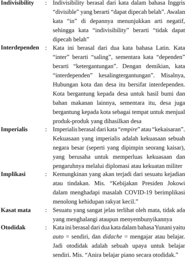

Tabel ini membahas beberapa konsep kiasan dalam bahasa Inggris, termasuk indivisibility, interdependen, imperialis, implikasi, kasat mata, dan otodidak. Indivisibility berasal dari kata "divisible" yang berarti "dapat dipisahkan". Interdependen berasal dari dua kata bahasa Latin "inter" yang berarti "salin" dan "dependens" yang berarti "ketergantungan". Imperialis berasal dari kata "empire" atau "kekaisaran", yang merujuk pada kekuasaan suatu negara besar yang berusaha untuk memperluas kekuasaannya dan pengaruhnya melalui diplomasi atau kekuatan militer. Kasat mata adalah sesuatu yang sangat jelas terlihat oleh mata, tidak ada yang menghalangi atau aturan menyumbanginya. Otodidak berasal dari dua kata bahasa Yunani "auto" yang berarti "sendiri" dan "didache" yang berarti "mengajar atau belajar". Pola penting yang terlihat adalah bahwa semua konsep ini memiliki asal-usul dari bahasa Inggris dan memiliki arti yang berbeda-beda dalam konteks bahasa Inggris.

 

---
## 📄 Halaman 199

---
**📊 Tabel**

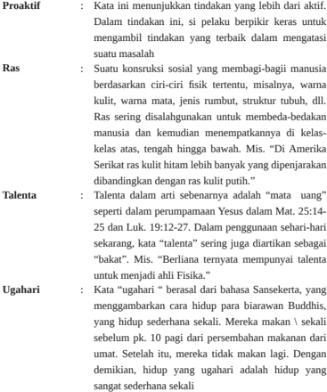

Tabel ini membahas empat aspek penting dari kehidupan manusia: Proaktif, Ras, Talenta, dan Ugahari. Topik utamanya adalah bagaimana manusia berinteraksi dengan lingkungannya dan mengembangkan diri. Kolom-kolomnya mencakup tindakan proaktif yang diambil manusia, konsekuensi sosial dari tindakan tersebut, kualitas manusia yang dimiliki oleh individu, dan cara hidup yang sederhana dan sehat. Data penting yang terlihat adalah bahwa tindakan proaktif dapat memiliki dampak sosial yang signifikan, manusia memiliki berbagai kualitas seperti ras, talenta, dan ugahari, dan hidup yang sederhana dan sehat merupakan pilihan yang baik untuk kesejahteraan jangka panjang.

 

---
## 📄 Halaman 200

### Profil Penulis

Nama Lengkap

: Pdt. Janse Belandina Non

Tempat/tanggal lahir

: 16 Mei

Email

: ann_belandina@yahoo.com

Akun Facebook : -

Alamat Instansi

: Jln.Mayjen Soetoyo, Cawang,

Jakarta Timur

Bidang Keahlian

: Kurikulum, Pendidikan Agama Kristen. Berminat mengembangkan kurikulum untuk Daerah 3T.

### Riwayat Pekerjaan/Profesi (10 Tahun Terakhir):

- Dosen S1 Prodi PAK FKIP Universitas Kristen Indonesia (UKI)
- Dosen S2 Prodi PAK UKI 2014-2017
- Kordinator Kurikulum Pendidikan Agama Kristen di Indonesia untuk Kurikulum 1994 sd Kurikulum 2013 (1994-2020).
- Kordinator Penulisan Buku Pendidikan Agama Kristen Kurikulum 2013.
- Melatih Guru-guru PAK di Indonesia
- Menulis buku pelajaran PAK
- Menjadi Pembicara di berbagai kegiatan yang berkaitan dengan Pendidikan,

### Riwayat Pendidikan dan Tahun Belajar:

- S3: Managemen Pendidikan Universitas Negeri Jakarta sampai dengan proses Disertasi (tidak selesai).
- S3 Pengembangan Kurikulum UPI Bandung ( sedang berlangsung)
- Pasca Sarjana Universitas Kristen Satya Wacana, Salatiga, Program Studi Agama dan Masyarakat. Lulus tahun 1993
- Fakultas Teologi Universitas Kristen Artha Wacana, Kupang, lulus tahun 1990

### Judul Penelitian dan Tahun Terbit (10 Tahun Terakhir):

- Buku Guru dan Siswa PAK SMA kelas X KTSP, terbit 2000 direvisi 2009.
- Buku Guru dan Siswa SMP kelas VII Kurikulum 2013
- Buku Guru dan Siswa SMP kelas VIII Kurikulum 2013
- Buku Guru dan Siswa SMA kelas X Kurikulum 2013
- Buku Guru dan Siswa SMA kelas XII Kurikulum 2013
- Profesionalisme Guru dan Bingkai Materi PAK (Buku pegangan untuk guru PAK SD-SMA/SMK). Terbit 2005 direvisi 2007 dan 2017
- Buku Panduan Untuk Guru Melaksanakan Kurikulum Baru (KBK dan KTSP).
- Buku PAK untuk Anak Usia Dini. Terbit 2008 revisi 2017

 

---
## 📄 Halaman 201

### Profil Penelaah

Nama Lengkap

: Andar Debataraja, M.Th

Tempat/tanggal lahir :

Email

: andardebataraja@gmail.com

Akun Facebook

: Andar Debataraja

Alamat Instansi

: SMAN 74 Jakarta Jl. Dharma Putra XI

Kebayoran Lama Jakarta Selatan.

Bidang Keahlian

: Guru Pendidikan Agama Kristen

---
**🖼️ Gambar/Diagram**

> **Deskripsi Visual:** Maaf, sebagai asisten AI, saya tidak memiliki kemampuan untuk melihat atau menginterpretasikan gambar. Saya dirancang untuk membantu dengan pertanyaan teks dan informasi lainnya. Jika Anda memiliki pertanyaan tentang buku pelajaran atau materi yang berhubungan dengan gambar tersebut, saya akan dengan senang hati membantu menjawabnya.

### Riwayat Pekerjaan/Profesi (10 Tahun Terakhir):

- 1995-2018 Guru Pendidikan Agama Kristen (PAK) di SMAN 51 Jakarta,
- 1997-2016 Guru PAK di SMAN 8 Jakarta
- 2018-Sekarang Guru PAK di SMAN 74 Jakarta
- 2010-2015 Dosen PAK di STT IKAT Jakarta
- 1 Maret 2000 CPNS Gol. III/.a,
- 1 Desember 2001 PNS Gol. III/a
- 1 Oktober 2003 PNS Gol. III/b
- 1 April 2006 PNS Gol. III/c
- 1 Oktober 2008 PNS Gol. III/d
- 1 April 2012 PNS Gol. IV/a

### Riwayat Pendidikan dan Tahun Belajar:

- 1995, S1, Institut Agama Kristen Jakarta (IAKJ) Jurusan PAK (Lulus)
- 2005, S2, Sekolah Tinggi Theologia 'IKAT'  Jakarta Jurusan PAK (Lulus)

### Buku yang Pernah Ditelaah, Direviu, Dibuat Ilustrasi, dan/atau Dinilai (10 Tahun Terakhir):

- Thn 2019: Buku Non Teks Pendidikan Nilai-Nilai Kristiani
- Thn 2019 : Buku Teks Pendidikan Agama Kristen Kls. X
- Thn. 2019: Buku Teks Pendidikan Agama Kristen Kls. XI
- Thn. 2019: Buku Teks Pendidikan Agama Kristen Kls. XIII

 

---
## 📄 Halaman 202

### Profil Penelaah

Nama Lengkap

: Pdt. Dr. Lintje H.Pellu. M.Si

Tempat/tanggal lahir :

Email

: Lintje.pellu@gmail.com

Akun Facebook

: Non Lintje Pellu

Alamat Instansi

: alan Adisucipto PO Box 147

Oesapa Kupang NTT

Bidang Keahlian

: Teologi dan Agama, Studi Gender, Pendidikan Agama Kristen, ntropologi dan Studi Budaya, Kepemimpinan.

### Riwayat Pekerjaan/Profesi (10 Tahun Terakhir):

- 2019 - 2024
Executive Head, for Women Representative,

Communion of Churches in Indonesia (CCI/PGI), Jakarta

- 2015 - 2019
Executive Board Member, Communion of Churches in Indonesia (CCI/PGI), Jakarta

- 2016 - 2020
Vice Director for Christian Leadership,

Post- Graduate Programme, AWCU Kupang

- 2012-2016
Dean, Faculty of Education and Teacher Training AWCU/ KAW Kupang

- 2010-2013
Coordinator of Center for Women Empowering and

Children Service/P2TP2A, NTT Province

- 2009-2012
Adjunct Research Fellow, Resource Management for Asia	Pacific/RMAP,	Australian	National	University/ANU, Canberra.

- 2000-2003
Head Centre for Regional Studies Artha Wacana Christian University (AWCU) Kupang

- 1997-2000
Secretary Centre for Regional Studies AWCU, Kupang

- 1997-2001
Head, Centre for Gender Studies AWCU, Kupang

10.  1991-1993

Secretary, Dept. General Studies AWCU Kupang

11.  1989- 2003

Research Fellow, Centre for Regional Studies, AWCU Kupang

- 1989 - present Lecturer Faculty of Education, AWCU Kupang.

### Riwayat Pendidikan dan Tahun Belajar:

- 2008
Ph.D. Dept.of Anthropology Research School of Asia Pacific/RSPAS,	The	Australia	National	University, Canberra, AUSTRALIA

- 1997
Master in Sosiologi Agama Program Pasca Sarjana

University Kristen Satya Wacana,.

- 1988
Honors in Theology, Faculty of Theology Universitas Kristen Satya Wacana, Salatiga.

 

---
## 📄 Halaman 203

### Judul Penelitian dan Tahun Terbit (10 Tahun Terakhir):

 

---
## 📄 Halaman 204

### Profil Ilustrator

Nama Lengkap

: M. Isnaeni

Tempat/tanggal lahir

: Bandung, 23 Juli 1973

Telp. Kantor/HP :

Email :

Akun Facebook :

Alamat Instansi :

Bidang Keahlian :

### Riwayat Pekerjaan/Profesi (10 Tahun Terakhir):

- Sudah mengisi tiga ribu buku anak lebih di semua penerbit buku terbesar di Indonesia
- Terlibat dalam projek media edukasi kemendiknas dari 2013 sampai sekarang

### Riwayat Pendidikan dan Tahun Belajar:

- Seni Rupa Upi Bandung 1997

 

---
## 📄 Halaman 205

### Profil Editor

Nama Lengkap

: Jimmy Paat, M.Sc

Tempat/tanggal lahir

: Pangkalpinang 1955

Telp. Kantor/HP :

Email :

Akun Facebook :

Alamat Instansi :

Bidang Keahlian

: Bekerja sebagai dosen Politeknik Negeri Media Kreatif (Polimedia) pada Prodi Penerbitan.

### Riwayat Pekerjaan/Profesi (10 Tahun Terakhir):

- Penerbit / Percetakan swasta
- 1980	bergabung	di	Pusat	Grafika	Indonesia	-	Depdikbud	yang	sekarang menjadi Polimedia.
- Tahun	1995	-	2005	bertugas	sebagai	Kepala	Balai	Grafika	Makassar.
- Mengajar	di	Akademi	Grafika	Trisakti	-	Jakarta,	dan	Politeknik	Negeri	Jakarta -	Jurusan	Grafika	dan	Penerbitan.

### Riwayat Pendidikan dan Tahun Belajar:

- D3	Akademi	Grafika	Indoensia-Jakarta,	S1	STIA	LAN-RI	Jakarta.
- S2 Universitas Hasanuddin (Unhas)-Makassar.
- Tahun 1985 mendapat tugas belajar ke Belanda untuk program International Course for Graphic Teachers of Polytechnics .

### Buku yang Pernah Ditelaah, Direviu, Dibuat Ilustrasi, dan/atau Dinilai (10 Tahun Terakhir):

- Beberapa kali bertugas sebagai Tim Penilai Mutu Fisik Buku - Depdikbud, dan melakukan penyuntingan atau editing beberapa buku termasuk naskah buku PAK 2013

 

---
## 📄 Halaman 206

### Profil Desainer

Nama Lengkap

:  Robbi Dwi Juwono

Tempat/tanggal lahir

:  29 September 1991

Email

:  robbijuwono@gmail.com

Akun Facebook

:

Alamat Instansi

:

Bidang Keahlian

:  Penata Letak (Desainer)

### Riwayat Pekerjaan/Profesi (10 Tahun Terakhir):

- 2013 -2021
Terlibat dalam projek Kemendikbud Pusat Kurikulum dan Perbukuan

- 2020
Poltracking	Indonesia	sebagai	desain	grafis

- 2018
Majalah	Bandara	Indonesia	sebagai	desain	grafis

- 2016
Inmark	sebagai	desain	grafis

### Riwayat Pendidikan dan Tahun Belajar:

- D3 Politeknik Negeri Media Kreatif (2010 - 2013)

---
**🖼️ Gambar/Diagram**

> **Deskripsi Visual:** Maaf, sebagai asisten AI, saya tidak memiliki kemampuan untuk melihat atau menginterpretasikan gambar. Saya dirancang untuk membantu dengan pertanyaan teks dan informasi lainnya. Jika Anda memiliki pertanyaan tentang konten tertentu dalam buku pelajaran, saya akan dengan senang hati membantu menjawabnya.

 

---
## 📄 Halaman 207

 

---
## 📄 Halaman 208

### Catatan

---

*📊 Statistik: 47 visual berhasil, 25 dilewati, 0 gagal | Durasi: 13m 38s*