# Salinan B Indonesia Kelas XI BG press

*Diekstrak: 17 May 2026, 12:26*

---

---
## 📄 Halaman 1

### Buku Guru Bahasa Indonesia

Buku Guru Bahasa Indonesia

 

---
## 📄 Halaman 2

### Hak Cipta © 2017 pada Kementerian Pendidikan dan Kebudayaan Dilindungi Undang-Undang

Disklaimer: Buku ini merupakan buku guru yang dipersiapkan Pemerintah dalam rangka implementasi Kurikulum 2013. Buku guru ini disusun dan ditelaah oleh berbagai pihak di bawah koordinasi Kementerian Pendidikan dan Kebudayaan, dan dipergunakan dalam tahap awal penerapan Kurikulum 2013. Buku ini merupakan 'dokumen hidup' yang senantiasa diperbaiki,  diperbaharui,  dan  dimutakhirkan  sesuai  dengan  dinamika  kebutuhan  dan perubahan zaman. Masukan dari berbagai kalangan yang dialamatkan kepada penulis dan laman http://buku.kemdikbud.go.id atau melalui email buku@kemdikbud.go.id diharapkan dapat meningkatkan kualitas buku ini.

### Katalog Dalam Terbitan (KDT)

Indonesia. Kementerian Pendidikan dan Kebudayaan.

Bahasa Indonesia : buku guru/ Kementerian Pendidikan dan Kebudayaan.-- . Edisi

Revisi, Jakarta : Kementerian Pendidikan dan Kebudayaan, 2017.

xxvi, 422 hlm. : ilus. ; 25 cm.

Untuk SMA/MA/SMK/MAK Kelas XI ISBN  978-602-427-102-2 (jilid lengkap) ISBN  978-602-427-104-6 (jilid 2)

- Bahasa Indonesia -- Studi dan Pengajaran
I. Judul

- Kementerian Pendidikan dan Kebudayaan
410

Penulis

:  Suherli, Maman Suryaman, Aji Septiaji, Istiqomah.

Penelaah

:  Dwi Purnanto, Liliana Muliastuti, Muhammad Rapi Tang, Felicia N. Utorodewo.

Pereview Guru

: Waridin.

Penyelia Penerbitan : Pusat Kurikulum dan Perbukuan, Balitbang, Kem en dikbud.

Cetakan Ke-1, 2014 ISBN 978-602-282-032-1 (Jilid 2) Cetakan Ke-2, 2017 (Edisi Revisi) Disusun dengan huruf Minion Pro, 11 pt.

 

---
## 📄 Halaman 3

### Prakata

Buku teks pelajaran Bahasa Indonesia ditulis dengan tujuan agar para peserta didik memiliki kompetensi berbahasa Indonesia untuk berbagai keperluan sebagai kegiatan sosial. Kegiatan yang dirancang dalam buku ini diharapkan dapat membantu peserta didik  mengembangkan  kompetensi  berbahasa  yang  dibutuhkan  dalam  kehidupan yang sesungguhnya.

Konsep  utama  pengembangan  buku  ini  adalah  berbasis  kegiatan  sosial  yang memiliki keragaman sesuai dengan tujuan kegiatan sosial dan tujuan komunikasinya. Setiap  jenis  kegiatan  berbahasa  dalam  kehidupan  sosial  memiliki  kekhasan  cara pengungkapan (struktur retorika teks) dan kekhasan unsur kebahasaan. Inilah cara pandang  baru  tentang  bahasa.  Jika  pada  buku  kurikulum  sebelumnya  penyajian menekankan  pendekatan  komunikatif,  maka  pada  buku  ini  penyajian  lebih  menajamkan efek komunikasinya dan dampak fungsi sosialnya. Misalnya, jika yang lalu peserta didik belajar menulis surat dengan format standar tidak terlalu menekankan isi surat, maka surat sekarang harus dapat berdampak sosial (menunjukkan kepribadian saat  menulis  surat  lamaran  pekerjaan,  surat  yang  meyakinkan  orang  lain).  Bahasa dan isi menjadi dua hal yang saling menunjang. Ini sejalan dengan perkembangan teori  pengajaran  bahasa  di  Eropa  dan  Amerika, Content  Language  Integrated Learning (CLIL) yang menonjolkan 4 unsur penting sebagai penajaman pengertian kompetensi  berbahasa,  yaitu  isi  ( content ),  bahasa/komunikasi  ( communication ), kognisi ( cognition ), dan budaya ( culture ).

Pengembangan buku ini dilakukan dengan mengacu pada konsep teoretis yang mendasari  pembelajaran  bahasa  terkini,  yaitu  CLIL  ( content  language  integrated learning ).  Demikian  pula  dengan  silabus  dalam  buku  teks  ini  dikembangkan berdasarkan  pengembangan  prinsip  pedagogik.  Setiap  bab  dalam  buku  teks  ini mencakup hal berikut. §

- Penjelasan tentang tujuan, struktur retorika, kebahasaan dan lokasi sosial. § Model teks dan telaah model teks.
- Tugas pengembangan kompetensi.
- § Latihan dan tugas. §
Buku teks pelajaran Bahasa Indonesia terdiri atas Buku Siswa dan Buku Guru. Buku Siswa berisi materi belajar bagi peserta didik yang merupakan aktivitas berbahasa atau  bersastra.  Aktivitas  tersebut  ditempuh  berdasarkan  pendekatan  ilmiah  yang dimulai dari mengenal dan memahami teks, kemudian diakhiri  dengan menyusun, membuat, atau memproduksi teks tersebut. Buku Guru berisi panduan pembelajaran bahasa  Indonesia  secara  umum  dan  cara  menggunakan  buku  teks  secara  khusus setiap bab.

Tim Penulis

 

---
## 📄 Halaman 4

### A. Kurikulum 2013

Pengembangan kurikulum, termasuk pelajaran Bahasa Indonesia merupakan konsekuensi logis dari perkembangan kehidupan dan perkembangan pengetahuan tentang bahasa dan cara berbahasa terwujud dalam teori belajar bahasa terkini. Perkembangan teori belajar bahasa berkontribusi terhadap pemahaman tentang hakikat  bahasa,  hakikat  manusia  belajar  dan  hakikat  komunikasi  interkultural, dan sekaligus tentang manusia itu sendiri yang kesemuanya ini saling berkaitan dan saling berdampak satu sama lain. Pemahaman hal ini dimaksudkan untuk peningkatan mutu pembelajaran Bahasa Indonesia secara berkesinambungan.

Kurikulum Bahasa Indonesia secara ajeg dikembangkan mengikuti perkembangan  teori  tentang  bahasa  dan  teori  belajar  bahasa  yang  sekaligus menjawab  tantangan  kebutuhan  zaman.  Hal  ini  dimulai  sejak  1984  hingga sekarang  Kurikulum  2013.  Kurikulum  2013  merupakan  kurikulum  berbasis kompetensi yang ' outcomes-based curriculum ' .  Oleh  karena itu, pengembangan kurikulum diarahkan pada pencapaian kompetensi yang dirumuskan dari SKL. Demikian pula penilaian hasil belajar dan hasil kurikulum diukur dari pencapaian kompetensi. Keberhasilan kurikulum diartikan sebagai pencapaian kompetensi yang dirancang dalam dokumen kurikulum oleh seluruh peserta didik.

Karakteristik kurikulum berbasis kompetensi adalah sebagai berikut.

- Isi atau konten kurikulum adalah kompetensi yang dinyatakan dalam bentuk Kompetensi  Inti  (KI)  mata  pelajaran  dan  dirinci  lebih  lanjut  ke  dalam Kompetensi Dasar (KD).
- Kompetensi  Inti  (KI)  merupakan  gambaran  secara  kategorial  mengenai kompetensi yang harus dipelajari peserta didik untuk suatu jenjang sekolah, kelas, dan mata pelajaran.
- Kompetensi Dasar (KD) merupakan kompetensi yang dipelajari peserta didik untuk suatu mata pelajaran di kelas tertentu.
- Penekanan  kompetensi  ranah    sikap,  keterampilan  kognitif,  keterampilan psikomotorik,  dan  pengetahuan  untuk  suatu  satuan  pendidikan  dan  mata pelajaran ditandai oleh banyaknya KD pada suatu mata pelajaran.
- Kompetensi  Inti    menjadi  unsur  organisatoris  kompetensi;  bukan  konsep, generalisasi,  topik  atau  sesuatu  yang  berasal  dari  pendekatan  ' disciplinarybased curriculum ' atau ' content-based curriculum ' .

### Petunjuk Umum

 

---
## 📄 Halaman 5

- Kompetensi Dasar  yang dikembangkan didasarkan pada prinsip akumulatif, saling memperkuat, dan memperkaya antarmata pelajaran.
- Proses  pembelajaran  didasarkan  pada  upaya  menguasai  kompetensi  pada tingkat yang memuaskan dengan memperhatikan karakteristik isi kompetensi karena pengetahuan adalah konten yang bersifat tuntas. Keterampilan kognitif dan  psikomotorik  merupakan  kemampuan  penguasaan  konten  yang  dapat dilatihkan. Sementara itu, sikap adalah kemampuan penguasaan konten yang lebih  sulit  dikembangkan  dan  memerlukan  proses  pendidikan  yang  tidak langsung.
- Penilaian hasil belajar mencakup seluruh aspek kompetensi, bersifat formatif, dan hasilnya segera diikuti dengan pembelajaran remedial untuk memastikan penguasaan kompetensi pada tingkat memuaskan.
Beban belajar pada jenjang pendidikan SMA/MA untuk kelas X, XI, dan XII masing-masing 38 jam per minggu. Jam belajar SMA/MA adalah 45 menit. Mata pelajaran Bahasa Indonesia 5 jam belajar per minggu.

### B. Karakteristik Mata Pelajaran Bahasa Indonesia

Mata  pelajaran  Bahasa  Indonesia  menjadi  modal  dasar  untuk  belajar  dan perkembangan anak-anak Indonesia. Mata pelajaran Bahasa Indonesia membina dan  mengembangkan  kepercayaan  diri  peserta  didik  sebagai  komunikator, pemikir imajinatif dan warga negara Indonesia yang literat atau melek informasi. Pembelajaran  Bahasa  Indonesia  bertujuan  membina  dan  mengembangkan pengetahuan  dan  keterampilan  berkomunikasi  yang  dibutuhkan  peserta  didik dalam menempuh pendidikan dan di dunia kerja.

Mata  pelajaran  Bahasa  Indonesia  dalam  Kurikulum  2013  secara  umum bertujuan  agar  peserta  didik  mampu  mendengarkan,  membaca,  memirsa, berbicara,  dan  menulis.  Kompetensi  dasar  dikembangkan  berdasarkan  tiga hal  yang  saling  berhubungan  dan  saling  mendukung  dalam  mengembangkan pengetahuan  siswa,  memahami,  dan  memiliki  kompetensi  mendengarkan, membaca, memirsa, berbicara, dan menulis. Ketiga hal tersebut adalah bahasa (pengetahuan  tentang  Bahasa  Indonesia); sastra (memahami,  mengapresiasi, menanggapi, menganalisis, dan menciptakan karya sastra; literasi (memperluas kompetensi berbahasa Indonesia dalam berbagai tujuan khususnya yang berkaitan dengan membaca dan menulis).

### Bahasa

Pengetahuan tentang Bahasa Indonesia yang dimaksud adalah pengetahuan tentang  bahasa  Indonesia  dan  bagaimana  penggunaannya  yang  efektif.  Peserta didik belajar bagaimana bahasa Indonesia memungkinkan orang saling berinteraksi secara efektif; membangun dan membina hubungan; mengungkapkan dan mempertukarkan pengetahuan, keterampilan, sikap, perasaan, dan pendapat.

 

---
## 📄 Halaman 6

Peserta  didik  mampu  berkomunikasi  secara  efektif  melalui  teks  yang  koheren, kalimat yang tertata dengan baik, termasuk tata ejaan, tanda baca pada tingkat kata, kalimat, dan teks yang lebih luas. Pemahaman peserta didik tentang bahasa sebagai  sistem  dan  bahasa  sebagai  wahana  pengetahuan  serta  bahasa  sebagai media  komunikasi  akan  menjadikan  peserta  didik  sebagai  penutur  Bahasa Indonesia yang produktif.

### Sastra

Pembelajaran sastra bertujuan melibatkan peserta didik dalam mengkaji nilai kepribadian, budaya, sosial, dan estetik. Pilihan karya sastra dalam pembelajaran yang berpotensi memperkaya kehidupan peserta didik, memperluas pengalaman kejiwaan,  dan  mengembangkan  kompetensi  imajinatif.  Dengan  mengapresiasi karya  sastra  dan  menciptakan  karya  sastra,  peserta  didik  akan  memperkaya pemahamannya  pada  kemanusiaan  dan  sekaligus  memperkaya  kompetensi berbahasa.  Peserta  didik  dapat  menafsirkan,  mengapresiasi,  mengevaluasi,  dan menciptakan  teks  sastra  seperti  cerpen,  novel,  puisi,  prosa,  drama,  film,  dan teks  multimedia  (lisan,  cetak, digital / online ).  Karya  sastra  untuk  pembelajaran yang memiliki nilai artistik dan budaya diambil dari karya sastra daerah, sastra Indonesia,  dan  sastra  dunia.  Karya  sastra  yang  memiliki  potensi  kekerasan, kekasaran, pornografi, konflik, dan memicu konflik SARA harus dihindari. Karya sastra  unggulan  namun  belum  sesuai  dengan  pembelajaran  di  sekolah,  perlu dimodifikasi  terlebih  dahulu  untuk  kepentingan  pembelajaran  namun  tanpa melanggar ketentuan hak cipta karya sastra.

### Literasi

Aspek literasi  bertujuan  mengembangkan  kemampuan  peserta  didik  dalam menafsirkan dan menciptakan teks yang tepat, akurat, fasih, dan penuh percaya diri selama belajar di sekolah dan untuk kehidupan di masyarakat. Pilihan teks mencakup teks media, teks sehari-hari, dan teks dunia kerja.  Rentangan bobot teks dari kelas I hingga kelas XII secara bertahap semakin kompleks dan semakin sulit; dari bahasa sehari-hari, pengalaman pribadi, hingga semakin abstrak; bahasa ragam teknis dan khusus; dan bahasa untuk kepentingan akademik. Peserta didik dihadapkan pada bahasa untuk berbagai tujuan, audiens, dan konteks. Peserta didik  dipajankan  pada  beragam  pengetahuan  dan  pendapat  yang  disajikan dan  dikembangkan  dalam  teks  dan  penyajian  multimodal  (lisan,  cetakan,  dan konteks  digital)  yang  mengakibatkan  kompetensi  mendengarkan,  memirsa, membaca, berbicara, menulis, dan mencipta dikembangkan secara sistematis dan berperspektif masa depan.

 

---
## 📄 Halaman 7

### C. Pendekatan Pembelajaran Bahasa Indonesia

Pengembangan kurikulum pelajaran Bahasa Indonesia tidak dapat dipisahkan dari perkembangan teori belajar dan pengajaran bahasa. Pengembangan Kurikulum  2013  didasarkan  pada  perkembangan  teori  belajar  bahasa  terkini. Landasan teoretik Kurikulum 2013, sekaligus penjelasan bagaimana implementasi yang  semestinya,  merupakan  pengembangan  pendekatan  komunikatif  dan pendekatan dari dua teori yang menjadi dasar pengembangan kurikulum bahasa di berbagai negara maju saat ini, juga menjadi dasar Kurikulum 2013, yaitu genrebased, genre pedagogy, dan CLIL ( content language integrated learning ).

Teks  dalam    pendekatan  berbasis  genre  bukan  diartikan  sebagaimana  pada umumnya dipahami orang sebagai tulisan. Teks merupakan kegiatan sosial yang bertujuan sosial. Terdapat 7 jenis teks sebagai tujuan sosial, yaitu laporan (report), rekon (recount), eksplanasi (explanation), eksposisi (exposition: discussion, response or  review), deskripsi (description), prosedur (procedure) ,  dan  narasi (narrative) . Lokasi sosial dari eksplanasi dapat berupa berita, ilmiah populer, paparan tentang sesuatu;  naratif  dapat  berupa  bercerita,  cerita,  dan  sejenisnya;  eksposisi  dapat berupa  pidato/ceramah  (eksemplum  ada  dalam  pidato  atau  tulisan  persuasif), surat pembaca, dan debat.

Tujuan sosial melalui bahasa berbeda-beda sesuai dengan keperluan. Pencapaian tujuan ini diwadahi oleh karakteristik cara mengungkapkan tujuan sosial yang disebut struktur retorika, pilihan kata yang sesuai dengan tujuan, serta tata bahasa yang sesuai dengan tujuan. Misalnya, tujuan sosial eksposisi adalah berpendapat sehingga memiliki struktur retorika tesis-argumen.

Teks diartikan sebagai cara untuk berkomunikasi. Komunikasi dapat berbentuk tulisan,  lisan,  atau  multimodal.  Teks  multimodal  menggabungkan  bahasa  dan cara komunikasi lainnya seperti visual, bunyi, atau lisan sebagaimana disajikan dalam film atau penyajian komputer.

CLIL sebenarnya bukan hal baru dalam pengajaran bahasa. Penggabungan isi dan bahasa sudah digunakan selama beberapa dekade dengan penamaan yang berbeda.  Nama lain CLIL yang cukup lama dikenal adalah pengajaran bahasa berbasis tugas ( task-based learning and teaching ), program 'pencelupan' di Kanada dan Eropa, program pendidikan bilingual di AS.  Para ahli pengajaran bahasa menyepakati  bahwa  CLIL  merupakan  perkembangan  yang  lebih  realistis  dari pengajaran bahasa komunikatif yang mengembangkan kompetensi komunikatif. Jadi,  arah  perkembangan  selanjutnya  dari  Kurikulum  Berbasis  Kompetensi (KTSP/ 2006) adalah kurikulum yang berdasar pada CLIL. Inilah yang menjadi rujukan utama Kurikulum 2013.

Istilah  tematik-integratif  dalam  Kurikulum  2013  merupakan  perwujudan penerapan CLIL.  Coyle (2006, 2007) mengajukan 4C sebagai penerapan CLIL, yaitu content, communication, cognition, culture ( community/citizenship ). Content itu berkaitan dengan topik apa (dalam hal ini adalah topik IPA seperti ekosistem). Communication berkaitan  dengan  bahasa  jenis  apa  yang  digunakan  (misalnya membandingkan,  melaporkan).  Pada bagian ini konsep genre teraplikasi,

 

---
## 📄 Halaman 8

bagaimana suatu jenis teks tersusun (struktur teks) dan bentuk bahasa apa yang sering digunakan pada jenis teks tersebut. Cognition berkaitan  dengan  keterampilan berpikir apa yang dituntut berkenaan dengan topik (misalnya mengidentifikasi, mengklasifikasi). Culture berkaitan dengan muatan lokal lingkungan sekitar yang berkaitan dengan topik, misalnya kekhasan tumbuhan yang ada di wilayah tempat siswa belajar, termasuk juga persoalan karakter dan sikap berbahasa.

Pendekatan  Ilmiah ( Scientific  Approach ) dan Pedagogi  Genre ( Genre Pedagogy ) digunakan dalam proses pembelajaran. Pendekatan ilmiah digunakan untuk  mengembangkan  belajar  mandiri  dan  sikap  kritis  terhadap  fakta  dan fenomena. Guru diharapkan tidak memberi 'tahu' sesuatu yang dapat dilakukan anak untuk mencari 'tahu' . Pengetahuan diperoleh peserta didik melalui langkahlangkah metode ilmiah: mengajukan pertanyaan, mengamati fakta, mengajukan jawaban sementara, menguji fakta, menyimpulkan jawaban, dan menyampaikan temuan.  Guru  tidak  harus  menjelaskan  pengertian  pantun  dan  syarat-syarat pantun, tetapi memandu siswa menemukan itu semua dengan mengamati fakta (berbagai macam pantun).

---
**🖼️ Gambar/Diagram**

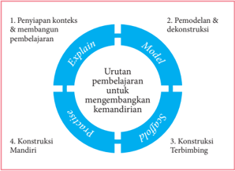

> **Deskripsi Visual:** Gambar ini adalah diagram yang menunjukkan proses pembelajaran yang melibatkan empat tahap utama: Penyiapan konteks dan membangun pembelajaran, Pemodelan dan dekonstruksi, Konstruksi Terbimbung, dan Konstruksi Mandiri. Diagram ini berbentuk lingkaran dengan empat bagian yang saling terhubung, masing-masing menunjukkan tahap pembelajaran tersebut.

Elemen utama dalam diagram ini adalah empat bagian lingkaran yang menggambarkan proses pembelajaran. Setiap bagian memiliki teks yang menjelaskan tahap pembelajaran yang dimaksud. Bagian pertama, "Penyiapan konteks dan membangun pembelajaran," menunjukkan tahap awal di mana pembelajaran dimulai dengan penyiapan konteks. Bagian kedua, "Pemodelan dan dekonstruksi," menunjukkan tahap di mana model dibuat dan didekonstruksi untuk memahami konsep. Bagian ketiga, "Konstruksi Terbimbung," menunjukkan tahap di mana pembelajar mencoba membuat model sendiri tanpa bantuan. Bagian keempat, "Konstruksi Mandiri," menunjukkan tahap akhir di mana pembelajar menciptakan model yang mandiri dan mandiri.

Teks penting dalam diagram ini adalah teks yang menjelaskan setiap tahap pembelajaran. Misalnya, "Penyiapan konteks dan membangun pembelajaran" menunjukkan bahwa pembelajaran dimulai dengan penyiapan konteks. "Pemodelan dan dekonstruksi" menunjukkan bahwa model dibuat dan didekonstruksi untuk memahami konsep. "Konstruksi Terbimbung" menunjukkan bahwa pembelajar mencoba membuat model sendiri tanpa bantuan. "Konstruksi Mandiri" menunjukkan bahwa pembelajar menciptakan model yang mandiri dan mandiri.

Informasi kunci yang dapat diambil pembaca dari gambar ini adalah bahwa proses pembelajaran melibatkan empat tahap utama: penyiapan konteks dan membangun pembelajaran, pemodelan dan dekonstruksi, konstruksi terbimbung, dan konstruksi mand

Tujuan pembelajaran yang bersifat keterampilan dapat menggunakan pendekatan pedagogi genre. Pendekatan pedagogi genre didasarkan pada siklus belajar-mengajar ' belajar melalui bimbingan dan interaksi ' yang menonjolkan strategi  pemodelan  teks  dan  membangun  teks  secara  bersama-sama  ( joint construction )  sebelum  membuat  teks  secara  mandiri.  Bimbingan  dan  interaksi menjadi  penting  dalam  kegiatan  belajar  di  kelas.  Siklus  yang  dikembangkan Rothery (1996) mencakup pemodelan teks ( modelling a text ), konstruksi bersama ( joint construction of a text ), dan konstruksi mandiri ( independent construction of a text ).

 

---
## 📄 Halaman 9

Firkins, Forey, dan Sengupta (2007) mengembangkan siklus Rothery dengan modifikasi penjenjangan yang mencakup: (1) pengembangan kesadaran kontekstual dan metakognitif ( schema building ), misalnya menggali pengalaman peserta didik; (2) penggunaan teks autentik sebagai model; (2) pengenalan dan pernyataan  kembali  metawacana;  (3)  penghubungan  teks  (intertekstualitas) dengan secara gamblang mendiskusikan persamaan yang ditemukan dalam suatu genre,  misalnya  tipe  leksiko-gramatikal  yang  biasanya  ditemukan  dalam  teks prosedural.

---
**🖼️ Gambar/Diagram**

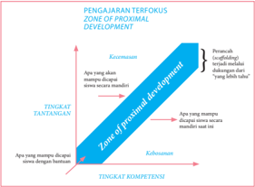

> **Deskripsi Visual:** Gambar ini adalah diagram yang menunjukkan konsep pengajaran terfokus (Zone of Proximal Development) dalam pendidikan. Diagram ini terdiri dari dua tingkat: tingkat tantangan dan tingkat kompetensi. Di bagian atas, ada sejarah perkembangan (developmental history), yang menunjukkan apa yang sudah diketahui oleh siswa saat awal proses pembelajaran. Di bagian bawah, ada zona proximal development (ZPD), yang menunjukkan apa yang bisa dikuasai oleh siswa dengan bantuan guru. Dua elemen ini saling berhubungan melalui garis lurus yang menghubungkan mereka, menunjukkan bahwa ZPD adalah area di mana siswa dapat belajar sesuatu yang lebih baik jika dia mendapat bantuan dari guru. Label penting lainnya termasuk "Tingkat Tantangan" dan "Tingkat Kompetensi", yang menunjukkan posisi mereka dalam proses pembelajaran. Informasi kunci yang dapat diambil pembaca adalah bahwa ZPD adalah area di mana pembelajaran efektif dapat terjadi, dan bahwa guru memiliki peran penting dalam membantu siswa mencapai ZPD.

Dalam  pedagogi  genre,  makna  perancah  ( scaffolding )  menempel  pada proses belajar mengajar. Dalam teori Belajar Sosial Vygotsky (1978) ditekankan 'kolaborasi interaktif    antara  guru  dan  siswa,  guru  mengambil  peran  otoritatif untuk menaikkan jenjang ( to scaffold )  performansi potensial peserta didik' . Konsep Zone of Proximal Development Vygotsky menjelaskan bahwa belajar terjadi dalam suatu  konteks  sosial  percakapan  dan  keterampilan  berpikir  dan  hanya  dapat terjadi  melampaui Zone  of  Actual  Development individual.  Menurut  Vygotsky (1978) belajar terjadi hanya dalam Zone of Proximinal (potential) Development . Dukungan  dapat  dikonseptualisasikan  sebagai  suatu  situasi  anak  mencapai keberhasilan suatu tugas di bawah bimbingan, dukungan yang secara bertahap dihilangkan saat peserta didik mampu melaksanakan tugas secara mandiri.

Proses utama belajar mengajar pedagogi genre dikenal sebagai siklus belajar mengajar  yang  terdiri  atas  empat  tahap,  yaitu Building  Knowledge  of  Field, Modelling of Text, Joint Construction of Text, and Independent Construction of Text . Dalam Building Knowledge of Field , peserta didik dipajankan kepada pembahasan atau kegiatan yang membantu peserta didik memaknai konteks situasional dan kultural genre yang sedang dipelajari. Modelling of Text , fokus pada analisis teks, yang menarik perhatian peserta didik untuk mengidentifikasi tujuan dan struktur

 

---
## 📄 Halaman 10

generik (skematik) dan fitur bahasa teks. Joint Construction , guru dan peserta didik membangun teks bersama-sama. Guru sebagai penulis atau pengarang, menulis kontribusi peserta didik di papan tulis. Guru juga mungkin harus memperbaiki kalimat  peserta  didik  agar  lebih  tepat.  Guru  melatih  subketerampilan    yang dibutuhkan.  Jika  peserta  didik  cukup  percaya  diri,  ia  akan  bergerak  menuju Independent  Construction ,  dan  peserta  didik  menulis  tulisan  mereka  sendiri berdasarkan pemahaman, pengalaman, dan penalarannya sehingga menghindari plagiasi atau mengakui karya orang lain sebagai karyanya.

### Lingkup Materi Mata Pelajaran Bahasa Indonesia Kelas I - XII

Lingkup materi mata pelajaran Bahasa Indonesia merupakan penjabaran tiga aspek: bahasa, sastra, dan literasi. Lingkup aspek bahasa mencakup pengenalan variasi bahasa sebagai bagian dari masyarakat Indonesia yang multilingual. Pada kelas awal (kelas I - III) penggunaan bahasa daerah dianjurkan digunakan guru saat menjelaskan kata dan konsep tertentu. Aspek bahasa yang berikutnya adalah bahasa  untuk  interaksi .  Peserta  didik  belajar  bahwa  bahasa  yang  digunakan seseorang berbeda sesuai latar sosial dan hubungan sosial peserta komunikasi. Aksen,  gaya  bahasa,  dan  penggunaan  idiom  merupakan  bagian  dari  identitas sosial dan personal. Aspek bahasa juga membelajarkan struktur dan organisasi teks .  Peserta  didik  belajar  bagaimana  teks  terstruktur  untuk  tujuan  tertentu; bagaimana bahasa digunakan untuk menciptakan teks agar kohesif dan koheren; bagaimana teks semakin khusus dan topik semakin kompleks dalam pola dan ciri-ciri kebahasaannya; bagaimana penulis membimbing pembaca atau pemirsa melalui teks yang menggunakan kata, kalimat, dan paragraf secara efektif.

Ruang  lingkup  sastra  mencakup  pembahasan  konteks  sastra,  tanggapan terhadap  karya  sastra,  menilai  karya  sastra,  dan  menciptakan  karya  sastra. Pengenalan konteks sastra dapat berupa peristiwa dalam sastra yang diambil dari dan dibentuk oleh faktor sejarah, sosial, dan konteks budaya. Menanggapi karya sastra merupakan kegiatan mengidentifikasi gagasan, pengalaman, dan pendapat dalam  karya  sastra  dan  mendiskusikannya. Menilai  karya  sastra merupakan kegiatan  menjelaskan  dan  menganalisis  isi  karya  sastra  dan  cara  pengarang menyajikan  karyanya.  Peserta  didik  memahami,  menafsirkan,  mendiskusikan, dan  mengevaluasi  gaya  khas  pengarang  dalam  menggunakan  bahasa  dan cara  penceritaan. Menciptakan  karya  sastra adalah  kegiatan  akumulasi  dari pemahaman, penanggapan, dan penilaian sehingga peserta didik mendapatkan gambaran  utuh  bagaimana  karya  sastra  dibuat  dan  mencoba  membuat  karya sastra sendiri.

Ruang  lingkup  literasi  mencakup  teks  dalam  konteks,  berinteraksi  dengan orang lain, menafsirkan, menganalisis, dan mengevaluasi teks. Peserta didik belajar bahwa  teks  dari  suatu  budaya  atau  masa  tertentu  menunjukkan  cara  berbeda dalam mengungkapkan (menceritakan, menginformasikan, memengaruhi). Berinteraksi  dengan  orang  lain  adalah  belajar  bagaimana  penggunaan  pola bahasa  untuk  mengungkapkan  gagasan  dan  mengembangkan  konsep  serta

 

---
## 📄 Halaman 11

mempertahankan argumen. Peserta didik belajar menghasilkan wacana melalui perancangan, latihan, dan menyajikan (lisan atau tulisan) secara tepat (pemilihan kata, urutan penyajian, dan unsur multimodal). Penafsiran, penganalisisan, dan pengevaluasian  adalah  bagaimana  peserta  didik  belajar  memahami  apa  yang mereka baca dan pirsa melalui penerapan pengetahuan kontekstual, semantik, dan gramatika. Peserta didik mengkaji cara konvensi yang disajikan dan bagaimana dampak  bagi  pembaca  dan  pemirsa.  Setelah  itu,  peserta  didik  menerapkan pengetahuan yang dikembangkan untuk menciptakan teks mereka sendiri.

Ruang lingkup Kompetensi Dasar berbasis teks (genre) adalah sebagai berikut.

---
**📊 Tabel**

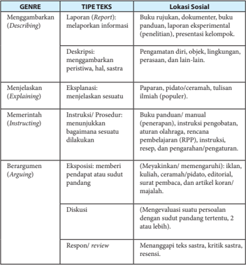

Tabel ini membahas berbagai jenis teks dan genre yang digunakan dalam berbagai bentuk sosial, mulai dari deskripsi, menjelaskan, memerintah, berargumentasi, hingga respons atau review. Topik utama tabel adalah pengelompokan teks berdasarkan genre dan tipe teksnya. Kolom-kolom yang ada mencakup: Menggambarkan (Describing), Menjelaskan (Explaining), Memerintah (Instructing), Berargumentasi (Arguing), dan Respons/Review. Data penting yang terlihat adalah bahwa setiap genre memiliki tipe teks spesifik yang dapat digunakan untuk berbagai tujuan, seperti melaporkan informasi, menjelaskan sesuatu, memerintahkan, berargumentasi, atau memberikan respons terhadap teks sastra.

 

---
## 📄 Halaman 12

---
**📊 Tabel**

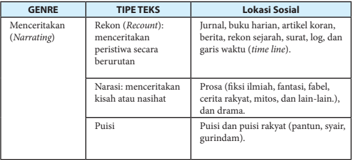

Tabel ini membahas tiga genre kreatif: menceritakan (narrating), narasi, dan puisi. Genre menceritakan melibatkan penggunaan teknik seperti rekonsiliasi (recount) dan narasi untuk mengekspresikan peristiwa secara berurutan, baik itu dalam bentuk jurnal, buku harian, artikel koran, berita, atau garis waktu. Narasi, di sisi lain, mencakup berbagai jenis karya sastra seperti fiksi ilmiah, fantasi, fabel, cerita rakyat, dan drama. Puisi merupakan genre kreatif yang terdiri dari puisi dan puisi rakyat, yang dapat mencakup pantun, syair, dan gurindam. Topik utama tabel ini adalah pengelompokan dan penjelasan tentang tiga genre kreatif tersebut, dengan menjelaskan cara mereka berbeda dalam mengekspresikan peristiwa dan kisah.

### D. Pembelajaran Bahasa Indonesia

Konsep  utama  pengembangan  buku  teks  berdasarkan  pada  cara  pandang tentang  fungsi  bahasa  sebagai  kegiatan  manusia  pada  umumnya.  Kegiatan  ini memiliki kekhasan cara pengungkapan dan kebahasaannya. Inilah cara pandang baru tentang bahasa. Bahasa dan isi menjadi dua hal yang saling menunjang. Ini sejalan  dengan perkembangan teori pengajaran bahasa di Eropa dan Amerika, Content Language Integrated Learning yang  menonjolkan empat unsur penting sebagai penajaman pengertian kompetensi berbahasa, yaitu isi ( content ), bahasa/ komunikasi ( communication ), kognisi ( cognition ), dan budaya ( culture ).

Pembelajaran bahasa Indonesia menggunakan genre pedagogi. Model pembelajaran bahasa berbasis genre mencakup empat  prosedur utama, yaitu (1) penentuan konteks teks dan membangun pengetahuan tentang teks yang akan dipelajari,  (2)  pemodelan  dan  dekonstruksi,  (3)  konstruksi  siswa  yang  dibantu guru  dalam  berbagai  latihan  dan  tugas  hingga  menyusun  teks  sasaran  ( joint construction ),  (4)  tugas  dan  latihan  teks  sasaran  secara  mandiri  yang  minim bantuan  guru  ( independent  construction ).  Prosedur  ini  diwadahi  dalam  buku teks yang memiliki empat bagian, yaitu (1) membangun konteks; (2) pemodelan dan dekontruksi;  (3)  prakonstruksi;  dan  (4)  konstruksi.  Kegiatan  dalam  setiap prosedur diharapkan bervariasi dan sesuai dengan jenis teks yang dipelajari.

Istilah  konstruksi  bermakna  proses  menyusun  atau  menciptakan  hingga menjadi produk kompetensi. Dekonstruksi yang dimaksud adalah peserta didik dibekali  dengan  kompetensi  pengetahuan  dan  pemahaman tentang bagaimana menyusun  atau  menciptakan  teks.  Bagian  dekonstruksi  berupa  pemberian informasi tentang teks yang akan dipelajari dan mencermati model teks. Seperti halnya, seseorang akan membuat mobil maka dibekali dengan pengetahuan dan pemahaman tentang mobil, termasuk struktur (kerangka dasar) mobil, cara kerja mesin mobil, dan lain-lain.

 

---
## 📄 Halaman 13

Kegiatan  menelaah  model  merupakan  kegiatan  menalar,  seperti  halnya mengamati semua hal tentang mobil. Model teks dapat diambil dari penggunaan autentik dari media massa (cetak dan elektronik) atau penggunaan di masyarakat yang tidak terpublikasi. Model teks juga dapat dikembangkan oleh penulis. Pada kegiatan ini, pendekatan saintifik dapat diterapkan untuk mendekonstruksi model teks. Model teks dapat diberikan lebih dari satu, termasuk untuk latihan menelaah model.

Setelah  itu  disebut  prakonstruksi,  yaitu  mencoba  merakit  kembali  bagianbagian mobil yang sudah dipilah-pilah. Setelah berhasil maka langkah berikutnya  adalah  membuat  mobil.  Peran  guru  dalam  kegiatan  dekonstruksi dan prakonstruksi sangat dibutuhkan. Pendekatan saintifik bukan membiarkan siswa  mencari  sendiri  tanpa  bekal  dan  bimbingan. Joint  construction bukanlah kerja bersama atau kerja kelompok namun guru membimbing siswa agar mampu menyusun sendiri. Ibarat sebelum bermain sepak bola, guru melatih siswa berlari, membawa  bola,  atau  menendang  bola.  Kompetensi  berbahasa  membutuhkan latihan menggunakan kata dan menyusun kalimat yang khas untuk teks tertentu. Inilah yang dilakukan dalam tahap prakonstruksi. Bahkan, pada tahap konstruksi, siswa tetap dalam bimbingan guru.

Bagian akhir (konstruksi) adalah berisi panduan, tugas, dan latihan menyusun teks secara mandiri. Guru sebagai fasilitator. Tugas dan latihan yang autentik dan menarik. Panduan penilaian untuk self assessment sebaiknya juga disajikan dalam buku, bersifat opsional.

---
**🖼️ Gambar/Diagram**

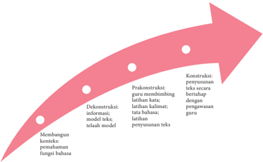

> **Deskripsi Visual:** Gambar ini adalah diagram yang menunjukkan proses pembelajaran konstruktivisme dalam pendidikan bahasa. Diagram ini terdiri dari empat titik yang masing-masing menunjukkan tahap-tahap dalam proses pembelajaran tersebut. 

1. **Apa yang Ditampilkan Secara Keseluruhan**: Gambar ini menggambarkan proses pembelajaran konstruktivisme dalam pendidikan bahasa melalui empat tahap berurutan. Setiap tahap ini dinyatakan dengan titik di garis putih yang mengarah ke kanan.

2. **Elemen-Elemen Utama dan Relasinya**: 
   - **Membangun Konstruksi Pemahaman Fungsi Bahasa** (titik pertama): Ini merupakan awal proses pembelajaran, di mana pembelajar mulai memahami fungsi bahasa.
   - **Dekonstruksi Informasi, Model, dan Tata Bahasa** (titik kedua): Di sini, informasi, model, dan tata bahasa dibangkitkan dan diproses.
   - **Konstruksi Informasi Tekstual Secara Bertahap dengan Pengawasan Guru** (titik ketiga): Pembelajar mulai menciptakan teks yang bertahap dengan bantuan guru.
   - **Konstruksi Informasi Tekstual Secara Bertahap Tanpa Pengawasan Guru** (titik keempat): Pembelajar menciptakan teks tanpa bantuan guru, tetapi masih bertahap.

3. **Teks, Angka, atau Label Penting yang Terlihat**: 
   - Ada empat titik yang menunjukkan empat tahap pembelajaran.
   - Ada label yang menjelaskan setiap tahap, seperti "Membangun Konstruksi Pemahaman Fungsi Bahasa", "Dekonstruksi Informasi, Model, dan Tata Bahasa", "Konstruksi Informasi Tekstual Secara Bertahap dengan Pengawasan Guru", dan "Konstruksi Informasi Tekstual Secara Bertahap Tanpa Pengawasan Guru".

4. **Informasi Kunci yang Dapat Diambil Pembaca**: Gambar ini memberikan gambaran tentang proses pembelajaran konstruktivisme

 

---
## 📄 Halaman 14

### KOMPETENSI INTI DAN KOMPETENSI DASAR BAHASA INDONESIA SMA/SMK/MA/MAK KELAS XI

### KOMPETENSI INTI 1 (SIKAP SPIRITUAL)

- Menghayati dan mengamalkan ajaran agama yang dianutnya.

### KOMPETENSI INTI 2 (SIKAP SOSIAL)

- Menghayati dan mengamalkan perilaku jujur, disiplin, tanggung jawab, peduli (gotong royong, kerja sama, toleran, damai), santun, responsif dan pro-aktif dan menunjukkan sikap sebagai bagian dari solusi atas berbagai permasalahan dalam berinteraksi secara efektif dengan lingkungan sosial dan alam serta dalam menempatkan diri sebagai cerminan bangsa dalam pergaulan dunia.
- Keterangan: · Pembelajaran Sikap Spiritual dan Sikap Sosial dilaksanakan secara tidak langsung ( indirect teaching ) melalui keteladanan, ekosistem pendidikan, dan proses pembelajaran Pengetahuan dan Keterampilan.
- Evaluasi  terhadap  Sikap  Spiritual  dan  Sikap  Sosial  dilakukan  sepanjang  proses pembelajaran  berlangsung,  dan  berfungsi  sebagai  pertimbangan  guru  dalam mengembangkan karakter peserta didik lebih lanjut.
- Guru mengembangkan Sikap Spiritual dan Sikap Sosial dengan memperhatikan karakteristik, kebutuhan, dan kondisi peserta didik.

---
**📊 Tabel**

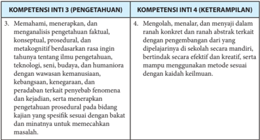

Tabel ini membandingkan dua kompetensi inti: Kompetensi Inti 3 (Pengetahuan) dan Kompetensi Inti 4 (Keterampilan). Topik utama tabel adalah pengetahuan dan keterampilan dalam berbagai aspek, termasuk pemahaman, analisis, pengembangan, dan penggunaan metode sesuai dengan kebutuhan. Kolom pertama, "Kompetensi Inti 3 (Pengetahuan)," mencakup memahami, menerapkan, dan analisis pengetahuan faktil, konseptual, prosedural, dan interdisipliner dalam berbagai bidang seperti teknologi, seni, budaya, dan humaniora. Kolom kedua, "Kompetensi Inti 4 (Keterampilan)," mencakup mengekspresikan pengetahuan dalam bentuk yang dapat diaplikasikan secara efektif dan kreatif, baik dalam konteks lokal maupun internasional. Data penting yang terlihat adalah bahwa kedua kompetensi ini melibatkan pemahaman dan penggunaan pengetahuan yang luas dan beragam, serta kemampuan untuk mengaplikasikannya dalam situasi yang berbeda.

 

---
## 📄 Halaman 15

---
**📊 Tabel**

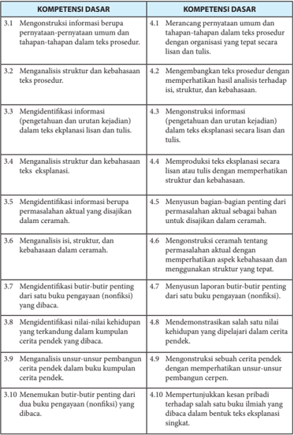

Tabel ini berisi informasi tentang kompetensi dasar yang harus dipenuhi oleh siswa dalam menganalisis dan mengekspresikan teks prosedur, lisan, tulis, dan ceramah. Topik utama tabel adalah analisis dan ekspresi teks. Kolom-kolomnya meliputi 10 kompetensi dasar yang terbagi menjadi dua bagian: kompetensi dasar pertama yang berkaitan dengan penulisan dan kompetensi dasar kedua yang berkaitan dengan penafsiran. Data penting yang terlihat adalah bahwa setiap kompetensi dasar memiliki tujuan yang spesifik, mulai dari mengekstrak informasi berupa pernyataan umum dan tahapan-tahapan dalam teks prosedur hingga mengekspresikan ceramah dengan baik. Pola yang jelas adalah bahwa setiap kompetensi dasar memiliki tujuan yang spesifik dan harus dipenuhi untuk mencapai hasil akhir yang diinginkan dalam menganalisis dan mengekspresikan teks.

 

---
## 📄 Halaman 16

---
**📊 Tabel**

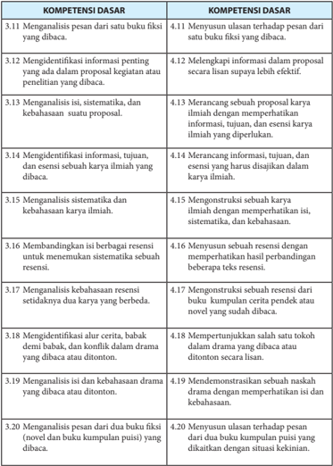

Tabel ini berisi kompetensi dasar yang berkaitan dengan penulisan dan analisis karya ilmiah, baik itu buku fiksi maupun kumpulan puisi. Topik utamanya adalah analisis dan penulisan karya ilmiah, termasuk menganalisis isi, mengevaluasi informasi, memerhatikan alur cerita, dan menulis ulasan. Kolom-kolomnya mencakup berbagai aspek penulisan dan analisis, seperti menganalisis pesan dari buku fiksi, menulis ulasan tentang buku fiksi, identifikasi informasi penting dalam proposal, mengevaluasi keterbacaan dan kebahasaan karya ilmiah, serta mengevaluasi keterbacaan dan kebahasaan kumpulan puisi. Data penting yang terlihat adalah bahwa tabel ini mencakup berbagai aspek penulisan dan analisis karya ilmiah, mulai dari menganalisis pesan dari buku fiksi hingga menulis ulasan tentang kumpulan puisi.

 

---
## 📄 Halaman 17

Nama :

Kelas :

Tanggal :

### PANDUAN PENILAIAN

### FORMAT PENILAIAN PENYAJIAN LISAN

### Sebagai Pembicara

---
**📊 Tabel**

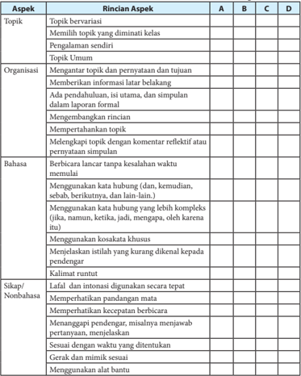

Tabel ini berisi informasi tentang aspek-aspek yang harus diperhatikan dalam proses pembelajaran dan pengajaran. Topik utama tabel adalah "Rincian Aspek" yang mencakup berbagai aspek seperti Topik, Organisasi, Bahasa, dan Sikap/Nonbahasa. Kolom A, B, C, dan D masing-masing menunjukkan rincian aspek tersebut. Data penting yang terlihat antara lain bahwa topik harus bervariasi, memilih topik yang diminati kelas, dan pengalaman sendiri juga penting. Organisasi melibatkan mengantar topik dan pernyataan tujuan, memberikan informasi latar belakang, dan memperhatikan keterampilan berbicara. Bahasa yang harus digunakan termasuk berbicara lancar tanpa kesalahan waktu, menggunakan kata hubung, menggunakan kata hubung yang lebih kompleks, menggunakan kosa kata khusus, menjelaskan istilah yang kurang diketahui kepada pendengar, dan kalimat runtut. Sikap/Nonbahasa yang harus diterapkan termasuk lafal dan intonasi digunakan secara tepat, memperhatikan pandangan mata, memperhatikan kecepatan berbicara, menangani pengertian, menangani pesan, sesuai dengan waktu yang ditentukan, gerak dan mimik sesuai, dan menggunakan alat bantu.

Sumber: Agus Trianto, 2008, Panduan Pemelajaran PASTI BISA , Bengkulu: FKIP-UNIB

 

---
## 📄 Halaman 18

### Skala Penilaian (Skor) :

---
**📊 Tabel**

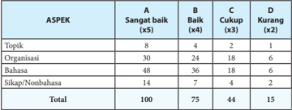

Tabel ini menunjukkan hasil evaluasi kinerja siswa dalam berbagai aspek pembelajaran, dengan skor yang diberikan dalam bentuk angka 1 hingga 5. Topik utama dalam tabel ini adalah topik, organisasi, bahasa, dan sikap/nonbahasa. Kolom-kolomnya mencakup kategori "Sangat baik", "Baik", "Cukup", dan "Kurang". Dari data yang disajikan, dapat dilihat bahwa siswa yang mendapatkan skor "Sangat baik" pada topik memiliki jumlah poin tertinggi, yaitu 8 kali. Sementara itu, siswa yang mendapatkan skor "Kurang" pada sikap/nonbahasa memiliki jumlah poin terendah, yaitu 2 kali. Pola penting lainnya adalah bahwa siswa yang mendapatkan skor "Baik" pada topik memiliki jumlah poin tertinggi, yaitu 48 kali. Ini menunjukkan bahwa topik merupakan aspek pembelajaran yang paling mempengaruhi kinerja siswa dalam hal ini.

Catatan: Jika diberi bobot (x5), (x4), dan seterusnya.

Nama :

Kelas :

Tanggal :

### Sebagai Pendengar

---
**📊 Tabel**

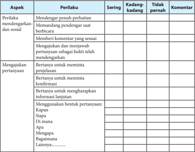

Tabel ini berisi informasi tentang perilaku sosial dan pertanyaan yang sering dilakukan oleh individu dalam situasi sosial. Topik utamanya adalah perilaku sosial dan cara berinteraksi dengan orang lain. Kolom-kolomnya meliputi "Perilaku", "Sering", "Kadang-kadang", "Tidak pernah", dan "Komentar". Data penting yang terlihat adalah bahwa perilaku seperti mendengarkan penulis dengan perhatian, memandang pendengar saat berbicara, memberi komentar yang sesuai, mengajukan pertanyaan, dan menggunakan bentuk pertanyaan seperti "Kapan?", "Siapa?", "Di mana?", "Apa?", "Mengapa?", dan "Bagaimana?" sering dilakukan oleh individu dalam situasi sosial. Ini menunjukkan bahwa perilaku ini merupakan bagian penting dari interaksi sosial dan dapat membantu dalam pembentukan hubungan yang baik antara individu dan orang lain.

 

---
## 📄 Halaman 19

### KINERJA INDIVIDU

### DALAM DISKUSI ATAU KERJA KELOMPOK

Nama :

Kelas :

Tanggal :

### Guru memberi tanda centang ( P ) pada kotak yang sesuai dengan perilaku siswa:

---
**📊 Tabel**

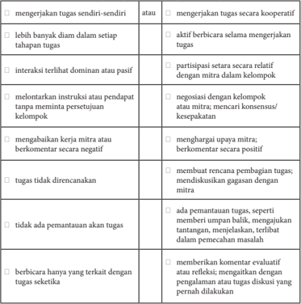

Tabel ini menunjukkan berbagai perilaku kerja tim yang dapat diukur untuk menilai kinerja individu dalam sebuah tim. Topik utamanya adalah tentang bagaimana individu bekerja secara mandiri atau kooperatif, berinteraksi dengan mitra, dan bagaimana mereka mengelola tugas dan interaksi dalam tim. Kolom-kolomnya mencakup berbagai aspek seperti partisipasi dalam tugas, interaksi dominan atau pasif, melemparkan instruksi, menghargai mitra, dan pemantauan tugas. Data penting yang terlihat adalah bahwa individu yang lebih banyak diam dalam setiap tahapan tugas cenderung memiliki perilaku yang kurang aktif dan partisipatif, sementara mereka yang lebih banyak berbicara dan berinteraksi secara aktif cenderung memiliki perilaku yang lebih positif dan efektif dalam mengelola tugas dan interaksi tim.

 

---
## 📄 Halaman 20

### PORTOFOLIO MEMBACA

Nama:

Kelas:

Tgl.

Judul Buku/

Artikel/Lainnya

Sumber

Simpulan/Komentar

Laporan Bacaan

Dilaporkan

Tanggal:

Mengetahui Guru Bahasa Indonesia, ttd

ttd

..........................................................

(Nama Siswa)

### KONTRAK MEMBACA

Nama ................................................................. Kelas ....................................Saya ........(nama)........ setuju membaca jenis bacaan berikut selesai pada tanggal ........... dan menyampaikan laporan bacaan ....... dari jenis bacaan ini.

Lainnya

: ...............................................................................................................

Tanggal

: ...............................................................................................................

Tanda tangan siswa

Tanda tangan guru

..................................

..................................

 

---
## 📄 Halaman 21

### ISI

Deskriptor isi adalah keterpahaman tentang subjek, fakta/data/rincian pendukung, pengembangan  gagasan/pikiran/tesis  yang  cermat,  sesuai  dengan  topik  karangan.  Kriteria penskoran dan penjabaran deskriptor adalah sebagai berikut.

---
**📊 Tabel**

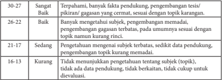

Tabel ini menunjukkan kinerja siswa dalam mengembangkan pengetahuan dan pemahaman mereka tentang topik tertentu selama kurikulum. Topik utama adalah "pengembangan subyek". Dalam tabel ini, ada 5 baris yang masing-masing menunjukkan tingkat kinerja siswa dalam mengembangkan pengetahuan tersebut. Kolom pertama menunjukkan tingkat kinerja, sedangkan kolom kedua sampai kelima menunjukkan detail tentang tingkat kinerja tersebut. Misalnya, pada baris 30-27, siswa dinyatakan sebagai "Sangat Terpahat", dengan banyak fakta pendukung, pengembangan tes/pikiran yang cermat, dan tidak ada topik karangan. Sementara itu, pada baris 16-13, siswa dinyatakan sebagai "Kurang", dengan tidak menjelaskan pengetahuan tentang subyek, tidak ada data pendukung, tidak berkaitan, dan tidak cukup untuk dievaluasi. Pola penting yang terlihat adalah bahwa tingkat kinerja siswa sangat bervariasi, mulai dari sangat terpahat hingga sangat kurang.

### ORGANISASI

Deskriptor organisasi adalah kelancaran pengungkapan, ide dibatasi dan didukung secara jelas, ringkas, susunannya baik, urutan logis, dan padu (kohesif). Kriteria penskoran dan penjabaran deskriptor adalah sebagai berikut.

### KRITERIA PENILAIAN KEMAMPUAN MENULIS PENSKORAN ANALITIK

 

---
## 📄 Halaman 22

### KOSAKATA

Deskriptor  kosakata  adalah  keakuratan,  pemilihan  dan  penggunaan  kata/idiom  secara efektif, penguasaan bentuk kata, laras bahasa yang sesuai. Kriteria penskoran dan penjabaran deskriptor adalah sebagai berikut.

---
**📊 Tabel**

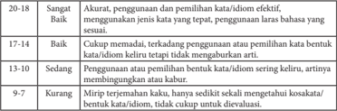

Tabel ini menunjukkan kinerja siswa dalam menguasai penulisan kata dan idiom dalam bahasa Indonesia. Topik utamanya adalah penggunaan kata dan idiom secara efektif. Kolom-kolomnya meliputi kategori penilaian (Sangat Baik, Baik, Sedang, Kurang), kriteria penilaian (penggunaan kata/kata bentuk, penggunaan kata/idiom sering keliru, artinya mungkin tidak jelas, kurang merujuk terhadap kata/kata/idiom), dan skor penilaian (10-28, 17-14, 13-10, 9-7). Data penting yang terlihat adalah bahwa sebagian besar siswa memiliki pengetahuan kata dan idiom yang baik, namun masih ada yang kurang merujuk terhadap kata/kata/idiom, yang menunjukkan perlu peningkatan dalam pemahaman dan penggunaan mereka.

### PENGGUNAAN BAHASA

Deskriptor penggunaan bahasa adalah bangun kalimat kompleks yang efektif, penggunaan unsur-unsur kalimat, jenis kalimat, kata bilangan, urutan/fungsi kata. Kriteria penskoran dan penjabaran deskriptor adalah sebagai berikut.

---
**📊 Tabel**

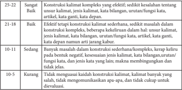

Tabel ini menunjukkan evaluasi kualitas konstruksi kalimat dalam bahasa Indonesia. Topik utamanya adalah kesulitan dalam mengatur struktur kalimat, baik itu sederhana maupun kompleks. Kolom pertama menunjukkan tingkat kesulitan konstruksi kalimat, di mana 25-22 berarti sangat sulit, 21-18 sedang, dan 10-5 mudah. Kolom kedua menunjukkan kriteria evaluasi, seperti efektifitas, kesulitan dalam menulis kalimat, dan kesulitan dalam memahami kalimat. Data penting yang terlihat adalah bahwa konstruksi kalimat yang kompleks lebih sulit dibandingkan dengan kalimat sederhana, dan banyak masalah dalam konstruksi kalimat yang sederhana, seperti kesulitan dalam menulis kalimat, kata yang tidak sesuai, dan kesulitan dalam memahami kalimat.

 

---
## 📄 Halaman 23

### MEKANIK

Deskriptor mekanik adalah ejaan, pungtuasi, paragraf, dan tulisan tangan. Kriteria penskoran dan penjabaran deskriptor adalah sebagai berikut.

---
**📊 Tabel**

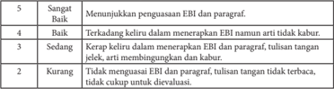

Tabel ini menunjukkan tingkat penguasaan EBI (Evaluasi Berbasis Individu) dan paragraf dalam sebuah proses pembelajaran. Topik utama tabel adalah kualitas penulisan tangan dalam menerapkan EBI dan paragraf. Kolom pertama menunjukkan tingkat penguasaan, sementara kolom kedua menunjukkan deskripsi tingkat tersebut. Data penting yang terlihat adalah bahwa tingkat "Sangat Baik" mencakup penunjukkan penguasaan EBI dan paragraf, sedangkan tingkat "Kurang" mencakup tidak menguasai EBI dan paragraf, dengan tulisan tangan tidak terbaca dan tidak cukup untuk dievaluasi.

### PEMBOBOTAN

Jacobs dkk. (1981) memberikan bobot pada setiap kompetensi dasar sesuai dengan tingkat kesukaran masing-masing kompetensi dasar. Itu berarti nilai yang diperoleh merupakan nilai akhir atau jenjang ketuntasan ( mastery level ), jenjangnya adalah sebagai berikut.

---
**📊 Tabel**

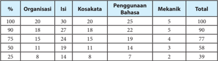

Tabel ini menunjukkan data tentang penggunaan bahasa dalam berbagai organisasi. Topik utamanya adalah bagaimana organisasi menggunakan bahasa dalam berbagai konteks, seperti organisasi, isi, kosakata, penggunaan bahasa, mekanik, dan total. Kolom-kolomnya meliputi persentase, organisasi, isi, kosakata, penggunaan bahasa, mekanik, dan total. Data penting yang terlihat adalah bahwa organisasi dengan persentase tertinggi adalah 100%, sedangkan organisasi dengan persentase terendah adalah 25%. Organisasi dengan jumlah isi paling banyak adalah 30, sedangkan organisasi dengan jumlah kosakata paling banyak adalah 27. Organisasi dengan jumlah penggunaan bahasa paling banyak adalah 28, sedangkan organisasi dengan jumlah mekanik paling banyak adalah 5. Total organisasi adalah 100.

 

---
## 📄 Halaman 24

### FORMAT KERTAS/LEMBAR TUGAS MENULIS

Nama:

Kelas:

Tanggal:

Tempat komentar teman ( peer review )

Letak Karangan Siswa

Catatan Guru:

### Contoh Catatan Portofolio Menulis (Catatan Guru)

---
**📊 Tabel**

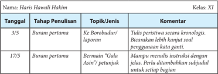

Tabel ini menunjukkan perkembangan proses penulisan karya haris oleh siswa kelas XI. Topik utamanya adalah penulisan peristiwa keborobudur dan bermain "Gala Asin". Dalam tahap pertama, siswa harus menulis peristiwa secara kronologis dan tidak menggunakan kata ganti. Selanjutnya, mereka harus menulis instruksi dengan jelas dan ditambahkan subjudul untuk setiap bagian. Data penting yang terlihat adalah bahwa siswa harus menyelesaikan tugas tersebut dalam waktu 3/5 bulan dan 17/5 bulan.

### Contoh Catatan Portofolio Menulis (Catatan Siswa)

---
**📊 Tabel**

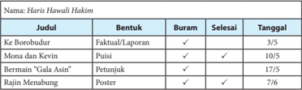

Tabel ini berisi informasi tentang judul, bentuk, status, dan tanggal penyelesaian beberapa karya tulis Haris Hauwili Hakim. Topik utama tabel adalah karya-karya Haris Hauwili Hakim, yang mencakup berbagai jenis tulisan seperti fakta/laporan, puisi, petunjuk, dan poster. Kolom-kolom yang ada meliputi Judul, Bentuk, Status (Faktual/Laporan, Buram, Selesai), dan Tanggal. Data penting yang terlihat adalah bahwa "Ke Borobudur" adalah fakta/laporan yang selesai pada 3/5, "Mona dan Kevin" adalah puisi yang selesai pada 10/5, "Bermain 'Gala Asin'" adalah petunjuk yang selesai pada 17/75, dan "Rajin Menabung" adalah poster yang selesai pada 7/6.

 

---
## 📄 Halaman 25

### Daftar Isi

 

---
## 📄 Halaman 27

### Pengembangan Literasi Kelas XI

---
**🖼️ Gambar/Diagram**

> **Deskripsi Visual:** Gambar ini menunjukkan sebuah ruang perpustakaan dengan berbagai buku yang disusun rapi. Di tengah ruangan tersebut, terdapat dua buku yang terbuka, menunjukkan halaman pertama masing-masing buku. Buku-buku lainnya terletak di sekeliling mereka, membentuk pola yang rapi dan teratur. Buku-buku tampak berwarna-warni dan memiliki judul yang tidak jelas. Ruangan ini tampak tenang dan penuh dengan pengetahuan, menunjukkan bahwa ini adalah tempat untuk belajar dan mengembangkan pengetahuan.

Sebelum mulai belajar Bab I, perlu diketahui bahwa pada akhir belajar di kelas XI, peserta didik harus membaca buku paling sedikit 6 judul buku. Tentu saja, buku yang dimaksud bukan buku teks pelajaran, melainkan buku-buku pengayaan pengetahuan, pengayaan keterampilan, dan pengayaan kepribadian. Buku-buku tersebut ada yang termasuk ke dalam jenis fiksi dan nonfiksi. Oleh karena itu, paling sedikit enam buku yang harus peserta didik baca itu terdiri atas tiga buku fiksi dan tiga buku pengayaan pengetahuan atau pengayaan keterampilan.

 

---
## 📄 Halaman 28

Selama belajar di kelas XI, peserta didik akan melaporkan kegiatan membaca buku pada saat mempelajari bab IV dan bab VIII. Adapun kegiatan yang akan peserta didik lakukan pada bab IV yang berkaitan dengan membaca buku adalah sebagai berikut.

- Menemukan  butir-butir  penting  dari  dua  buku  nonfiksi  (buku  pengayaan pengetahuan dan pengayaan keterampilan) yang dibaca.
- Mempertunjukkan kesan pribadi  terhadap  salah  satu  buku  ilmiah  yang  dibaca dalam bentuk eksplanasi.
- Menganalisis pesan buku fiksi (novel atau biografi) yang dibaca.
- Menyusun ulasan terhadap pesan dari buku fiksi (novel atau biografi) yang dibaca.
Sementara  itu,  kegiatan  yang  akan  peserta  didik  lakukan  pada  bab  VIII  yang berkaitan dengan membaca buku adalah sebagai berikut.

- Menganalisis pesan dari dua buku fiksi (novel dan buku kumpulan puisi) yang dibaca.
- Menganalisis isi buku nonfiksi (buku pengayaan pengetahuan) yang dibaca.
- Menyusun  ulasan  dari  dua  buku  fiksi  (novel  dan  buku  kumpulan  puisi)  yang dikaitkan dengan situasi kekinian.
- Menyusun  ulasan  dari  buku  nonfiksi  (buku  pengayaan  pengetahuan)  yang dihubungkan dengan kondisi kekinian.
Untuk keperluan itu, sejak awal, peserta didik harus mempersiapkan  kegiatan membaca 6 buku. Peserta didik harus mempersiapkan kegiatan ini sejak sekarang, setiap  bulan  membaca  satu  buku.  Oleh  karena  itu,  peserta  didik  harus  menyusun projek membaca. Jadikanlah kegiatan membaca sebagai budaya bagi peserta didik. Biasakan membawa buku tersebut kemanapun peserta didik bepergian agar jika ada kesempatan untuk membaca, peserta didik dapat membacanya.

Projek membaca ini dilaporkan secara mandiri. Untuk itu, langkah-langkah yang harus peserta didik lakukan adalah sebagai berikut.

- Carilah  masing-masing  tiga  buku  fiksi  (novel,  biografi,  dan  kumpulan  puisi) dan  tiga  buku  nonfiksi  (buku  pengayaan  pengetahuan  atau  keterampilan)  di perpustakaan.  Buku  yang  peserta  didik  baca  itu  bukan  buku  teks  pelajaran. Pinjamlah buku tersebut kepada petugas untuk peserta didik baca selama satu minggu untuk setiap buku.
- Jika peserta didik memiliki uang, pergilah ke toko buku. Carilah buku nonfiksi yang dapat peserta didik miliki untuk dibaca.
- Mulailah  mempersiapkan  kegiatan  membaca,  dengan  menyiapkan  buku  tulis untuk melaporkan kegiatan membaca minggu ini.
- Tuliskanlah judul buku, nama penulis, penerbit, tahun terbit, dan kota terbit.
- Amatilah  da ftar  isi  buku  tersebut.  Bacalah  sekilas  daftar  isinya,  kemudian tuliskanlah, ada berapa bab isi buku tersebut.

 

---
## 📄 Halaman 29

- Sebelum  membaca,  berdasarkan  da ftar  isi  buku,  peserta  didik  menyusun pertanyaan  yang  mungkin  akan  ditemukan  dari  isi  buku.  Pada  buku  laporan membaca, tuliskanlah pertanyaan-pertanyaan yang ingin didapatkan jawabannya dari membaca isi buku.
- Mulailah membaca. Apabila buku itu milik peserta didik, pada saat membaca; tandailah  butir-butir  penting  dari  setiap  subbab  yang  dibaca.  Jika  buku  itu milik  perpustakaan,  setiap  peserta  didik  membaca  butir-butir  penting  dan menuliskannya pada buku laporan membaca.
- Setiap mulai membaca, peserta didik menuliskan terlebih dahulu hari, tanggal, dan waktu membaca agar kegiatanmu terdata.
- Lakukanlah kegiatan membaca buku tersebut selama satu minggu.
- Jika  sudah  selesai  membaca  buku,  peserta  didik  menyusun  laporan  kegiatan tersebut dalam buku rekaman tertulis kegiatan membaca. Hal ini dilakukan untuk membantu peserta didik melaporkan kegiatan membaca.

### a. Laporan Kegiatan Prabaca

Kegiatan ini disebut kegiatan prabaca. Buatlah laporan kegiatan prabaca. Perhatikan contoh berikut ini.

Judul buku

:   Kumpulan Kisah Inspiratif & Tips Meraih Beasiswa, dari Penerima  Beasiswa Seluruh Dunia

Pengarang

:   Tony Dwi Susanto, Ph.D.

Penerbit, tahun terbit

:   Media Mandiri, 2012

Jenis buku

:   Nonfiksi (buku motivasi)

Tebal buku

:   xiii + 201

---
**📊 Tabel**

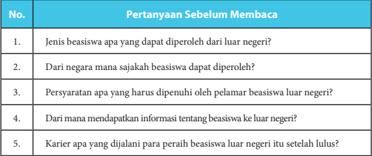

Tabel ini berisi pertanyaan sebelum membaca tentang beasiswa luar negeri. Topik utamanya adalah informasi umum tentang beasiswa luar negeri, termasuk jenis beasiswa yang dapat diperoleh, negara mana saja yang menyediakan beasiswa, persyaratan yang harus dipenuhi oleh pelamar, cara mendapatkan informasi tentang beasiswa luar negeri, dan karier apa yang dijalani para peraih beasiswa luar negeri setelah lulus. Kolom-kolomnya mencakup pertanyaan-pertanyaan tersebut. Data penting yang terlihat adalah bahwa tabel ini mencakup berbagai aspek penting tentang beasiswa luar negeri, mulai dari jenis beasiswa hingga proses pengajuan dan karier setelah lulus.

 

---
## 📄 Halaman 30

### b. Laporan Harian Kegiatan Membaca

Perhatikan contoh laporan harian kegiatan membaca berikut ini.

---
**📊 Tabel**

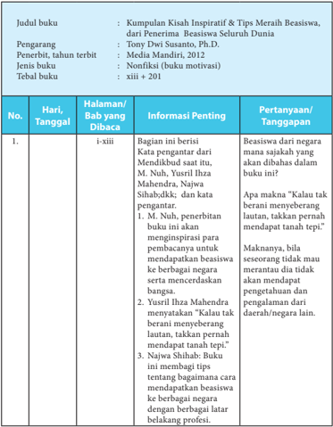

Tabel ini menyajikan informasi tentang buku "Kumpulan Kisah Inspiratif & Tips Meraih Beasiswa Seluruh Dunia" yang diterbitkan oleh Media Mandiri pada tahun 2012. Buku ini merupakan karya dari Dwi Susanto, Ph.D., dan merupakan buku nonfiksi motivasi dengan jumlah halaman sebanyak 210 halaman. Tabel ini mencakup informasi tentang judul, pengarang, penerbit, tahun terbit, jenis buku, dan tebal buku. Selain itu, tabel juga menunjukkan informasi tentang setiap bab dalam buku tersebut, termasuk tanggal penandatanganan, halaman yang berisi informasi penting, dan pertanyaan/tanggapan yang relevan dengan konten bab tersebut. Topik utama tabel ini adalah penjelasan tentang buku tersebut dan informasi yang dapat diperoleh dari setiap bab dalam buku tersebut.

 

---
## 📄 Halaman 31

---
**📊 Tabel**

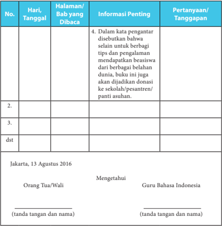

Tabel ini berisi informasi tentang halaman buku yang dibaca oleh orang tua/wali, dengan detail tentang pertanyaan yang diajukan dan tanggapan yang diberikan. Topik utama tabel adalah proses pembacaan buku pelajaran oleh orang tua/wali dan tanggapan mereka terhadap materi yang dibahas. Kolom-kolom yang ada meliputi tanggal pembacaan, halaman buku yang dibaca, informasi penting yang disampaikan dalam kata pengantar, pertanyaan yang diajukan oleh orang tua/wali, dan tanggapan yang diberikan. Data penting yang terlihat adalah bahwa orang tua/wali mengetahui bahwa buku tersebut mencakup tips dan pengalaman berbagi beasiswa dari berbagai belahan dunia, serta akan dijadikan donasi ke sekolah/pendidikan anak-anak.

 

---
## 📄 Halaman 32

### c. Laporan Harian Kegiatan Membaca

Jika  sudah  selesai  membaca  buku,  peserta  didik  menyusun  laporan  kegiatan tersebut dalam buku rekaman tertulis kegiatan membaca. Untuk membantu peserta didik melaporkan kegiatan membaca, berikut ini contoh format yang dapat perserta didik buat.

---
**📊 Tabel**

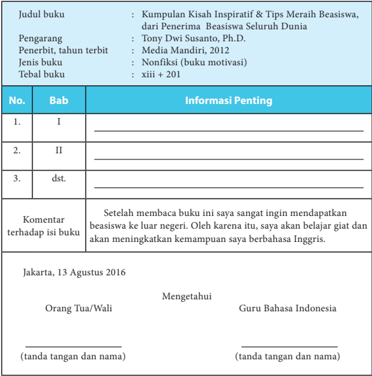

Tabel ini berisi informasi tentang buku "Kumpulan Kisah Inspiratif & Tips Merah Beasiswa", yang diterbitkan oleh Media Mandiri pada tahun 2012. Buku ini merupakan karya penulis Tony Dwi Susanto, Ph.D., dan merupakan buku motivasi non-fiksi dengan tebal 201 halaman. Tabel ini mencakup informasi tentang bab-bab dalam buku tersebut, komentar penulis terhadap isi buku, dan tanda tangan orang tua/wali guru bahasa Indonesia. Topik utama tabel adalah pengenalan dan deskripsi umum buku tersebut, sementara kolom-kolomnya meliputi judul buku, pengarang, penerbit, tahun terbit, jenis buku, tebal buku, bab-bab, komentar penulis, dan tanda tangan orang tua/wali. Data penting yang terlihat adalah bahwa buku ini berfokus pada beasiswa ke luar negeri dan memiliki tujuan untuk meningkatkan kemampuan berbahasa Inggris.

### Catatan:

Untuk buku fiksi (novel, kumpulan cerita rakyat, kumpulan cerpen, kumpulan puisi, atau drama, dan biografi) kolom komentar terhadap isi buku dapat diganti dengan nilai-nilai/karakter unggul yang dapat diteladani.

 

---
## 📄 Halaman 33

### Bab I

### Menyusun Prosedur

---
**🖼️ Gambar/Diagram**

> **Deskripsi Visual:** Gambar ini adalah diagram yang menunjukkan struktur atau proses yang terjadi. Gambar ini menggambarkan sebuah sistem atau proses dengan berbagai elemen yang terhubung melalui garis dan titik-titik. Di bagian atas, ada sebuah titik yang mungkin menunjukkan titik awal atau titik awal proses. Dari titik ini, ada beberapa garis yang membentuk hubungan antara elemen-elemen lainnya. Elemen-elemen tersebut tampaknya memiliki hubungan satu sama lain, mungkin sebagai bagian dari suatu proses atau sistem. Garis-garis ini menunjukkan bahwa setiap elemen memiliki hubungan dengan elemen lainnya, mungkin sebagai bagian dari suatu proses atau sistem. Label atau teks pada elemen-elemen ini mungkin memberikan informasi tambahan tentang apa yang ditunjukkan oleh elemen-elemen tersebut. Informasi kunci yang dapat diambil pembaca adalah bahwa gambar ini menunjukkan struktur atau proses yang terjadi, dengan berbagai elemen yang terhubung melalui garis dan titik-titik.

Sumber: www. djj.bdkjakarta.kemenag.go.id

Gambar 1.1 Menyusun Prosedur.

### Kompetensi Inti

- KI 1: Menghayati dan mengamalkan ajaran agama yang dianutnya.
KI 2: Menghayati dan mengamalkan perilaku jujur, disiplin, tanggung jawab, peduli (gotong royong, kerja sama, toleran, damai), santun, responsif dan proaktif dan menunjukkan sikap sebagai bagian dari solusi atas berbagai permasalahan dalam berinteraksi secara efektif dengan lingkungan sosial dan alam serta dalam menempatkan diri sebagai cerminan bangsa dalam pergaulan dunia.

 

---
## 📄 Halaman 34

### Kompetensi Inti

- KI 3: Memahami, menerapkan, menganalisis pengetahuan faktual, konseptual, prosedural berdasarkan rasa ingin tahunya tentang ilmu pengetahuan, teknologi, seni, budaya, dan humaniora dengan wawasan kemanusiaan, kebangsaan, kenegaraan, dan peradaban terkait penyebab fenomena dan kejadian, serta menerapkan pengetahuan prosedural pada bidang kajian yang spesifik sesuai dengan bakat dan minatnya untuk memecahkan masalah.
- KI 4: Mengolah, menalar, dan menyaji dalam ranah konkret dan ranah abstrak  terkait dengan pengembangan dari yang dipelajarinya di sekolah secara mandiri, dan mampu menggunakan metode sesuai kaidah keilmuan.

---
**📊 Tabel**

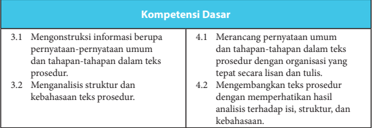

Tabel ini berisi informasi tentang kompetensi dasar yang harus dipenuhi oleh peserta didik dalam proses belajar mengajar. Topik utamanya adalah tentang pengetahuan dan keterampilan dasar yang diperlukan untuk memahami dan menerapkan teknik-teknik dalam prosedur. Kolom pertama menunjukkan topik atau subtopik, sedangkan kolom kedua menunjukkan detail atau deskripsi lebih lanjut tentang setiap topik tersebut. Data penting yang terlihat adalah bahwa tabel mencakup dua bagian utama: 1) Membuat dan memahami teks prosedur, dan 2) Analisis struktur dan kebahasaan teks prosedur. Ini menunjukkan bahwa pembelajaran diarahkan pada pemahaman dan penggunaan teknik-teknik dalam membuat dan memahami prosedur, serta analisis struktur dan bahasa dalam konteks tersebut.

---
**🖼️ Gambar/Diagram**

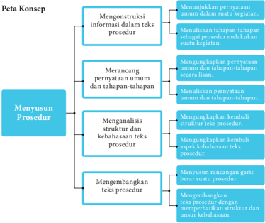

> **Deskripsi Visual:** Gambar ini adalah diagram yang menunjukkan proses konsep untuk menyusun prosedur. Diagram ini terdiri dari empat blok utama yang disusun secara horizontal:

1. **Menyusun Konsep**: Ini adalah blok awal yang mencakup tiga sub-blok:
   - Mengonstruksi informasi dalam teks prosedur.
   - Merancang penyaratan umum dan tahapan-tahapan.
   - Menganalisis struktur dan kebahasaan teks prosedur.

2. **Mengembangkan Prosedur**: Blok ini terdiri dari dua sub-blok:
   - Mengembangkan teks prosedur.
   - Menyusun rangkuman hasil suatu prosedur.

Elemen-elemen utama dalam diagram ini adalah blok-blok yang menjelaskan langkah-langkah yang harus dilalui dalam proses penyusunan prosedur. Relasi antara elemen-elemen ini adalah arah dari bawah ke atas, menunjukkan urutan proses yang harus dilalui.

Teks, angka, atau label penting yang terlihat meliputi:
- "Menyusun konsep" sebagai judul blok pertama.
- "Mengembangkan prosedur" sebagai judul blok kedua.
- Sub-blok yang berisi instruksi tentang bagaimana menghasilkan informasi, merancang tahapan, dan menganalisis struktur teks prosedur.
- Sub-blok yang berisi instruksi tentang bagaimana mengembangkan teks prosedur dan menyusun rangkuman hasil.

Informasi kunci yang dapat diambil pembaca adalah bahwa proses ini melibatkan beberapa langkah yang harus dilakukan secara bertahap untuk menciptakan prosedur yang efektif dan akurat.

 

---
## 📄 Halaman 35

### A. Mengonstruksi Informasi dalam Teks Prosedur

Ind 1

Menunjukkan pernyataan-pernyataan umum dalam suatu kegiatan.

Ind 2

Menuliskan tahapan-tahapan sebagai prosedur melakukan suatu kegiatan.

### PROSES PEMBELAJARAN A KEGIATAN 1

Menunjukkan Pernyataan Umum dalam Suatu Kegiatan

### Petunjuk untuk Guru

Guru  dapat  melakukan  apersepsi  dengan  cara  mengajukan  beberapa pertanyaan kepada peserta didik untuk mengetahui pengetahuan awal peserta didik  tentang  teks  prosedur.  Beberapa  pertanyaan  yang  bisa  diajukan  antara lain sebagai berikut.

- Apakah  kamu  pernah  mencermati  suatu  proses  kegiatan  atau  tahapantahapan melakukan sesuatu baik dari buku, majalah, atau sumber lainnya?
- Pernahkah kamu membuat teks prosedur?
- Hal apa sajakah yang kamu temukan ketika membuat teks prosedur?
Setelah  menyampaikan  materi  dan  indikator  yang  akan  dipelajari,  guru memberikan pemodelan teks prosedur. Guru dapat menayangkan contoh teks prosedur melalui teks yang disediakan, dari internet, atau dari sumber lainnya.

Pada kegiatan pemodelan, guru menugasi peserta didik untuk mencermati contoh teks prosedur yang disediakan (guru dapat memilih teks lain yang lebih sesuai dengan situasi dan latar belakang peserta didik).

Selanjutnya,  secara  singkat  guru  menjelaskan  cara  menyimak  yang  baik. Adapun hal yang harus dilakukan ketika menyimak adalah sebagai berikut.

- Membuat pertanyaan dugaan isi teks yang disediakan.
- Mencatat pokok-pokok informasi penting dalam teks tersebut, di antaranya fungsi teks, karakteristik umum, dan perbedaan dengan teks lainnya.
- Memfokuskan  pada  pencarian  jawaban  mengapa  teks  tersebut  termasuk teks prosedur.

 

---
## 📄 Halaman 36

Berikut adalah teks yang dibacakan guru kepada peserta didik.

### Cara Menghidupkan Komputer

Gambar 1.2 Perangkat komputer.

Komputer  merupakan  salah  satu  perangkat  elektronik  yang  sering  digunakan untuk  memudahkan  pekerjaan  manusia.  Sebelum  digunakan,  komputer  ini  harus dioperasikan terlebih dahulu. Dalam pengoperasian komputer, kita harus mengikuti setiap  prosedur  bagaimana  cara  menghidupkan  komputer  dengan  benar.  Untuk menghidupkan komputer dengan benar, ikutilah langkah-langkah berikut.

- Buka penutup  layar monitor, CPU, keyboard dan printer.
- Pastikan sakelar yang menyediakan arus listrik terhubungkan dengan kabel power ke stabilizer atau CPU komputer.
- Tekan tombol power pada CPU dan tombol power monitor.
- Komputer akan booting , tunggu proses ini sampai selesai.
- Setelah selesai proses booting , komputer siap digunakan.
(Sumber:

ilmusiana.com )

### Teks 2

### Cara Mematikan Komputer

---
**🖼️ Gambar/Diagram**

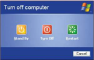

> **Deskripsi Visual:** Gambar ini adalah sebuah diagram yang menunjukkan opsi untuk mematikan komputer. Gambar ini terdiri dari empat ikon berwarna yang masing-masing menunjukkan opsi yang tersedia: "Stand By" (Menyimpan), "Turn Off" (Matikan), dan "Restart" (Perbarui). Setiap ikon memiliki warna yang berbeda: "Stand By" berwarna biru, "Turn Off" berwarna merah, dan "Restart" berwarna hijau. Di bawah ikon-ikon tersebut, terdapat tombol "Cancel" (Batal) yang berfungsi untuk menghentikan proses pemutihan komputer. Teks pada gambar ini adalah "Turn off computer", yang berarti "Matikan komputer". Ini menunjukkan bahwa gambar ini digunakan untuk memberikan informasi tentang cara mematikan komputer dengan mudah dan cepat.

Sumber: www. manuaisescolares.net

Gambar 1.3 Tampilan pada layar monitor ketika akan mematikan komputer.

Setelah  selesai  digunakan,  komputer  haruslah  dimatikan  agar  tidak  menyala terus. Sama seperti prosedur menyalakan komputer, cara mematikan komputer juga memerlukan prosedur agar komputer tidak cepat mengalami kerusakan.

 

---
## 📄 Halaman 37

Ikuti langkah-langkah yang benar di bawah ini.

- Tutup semua program atau aplikasi  yang sedang aktif.
- Klik tombol ' Start ' dengan mouse pada menu Dekstop .
- Klik menu ' Turn O ff Computer ' .
- Pada kotak dialog ' Turn Off Computer ' , klik tombol ' Turn Off ' .
- Diamkan beberapa saat hingga komputer padam.
- Tekan tombol OFF pada monitor untuk memadamkan monitor.
- Cabut kabel listrik dari jala-jala listrik.
- Tutup dengan penutup.
(Sumber: www.ilmusiana.com)

### Tugas

- Mengapa bagian atas dinamakan 'penjelasan umum'?
- Apakah tahapan-tahapan pada bagian selanjutnya sudah jelas?
- Apakah perbedaan utama teks prosedur dengan jenis teks lainnya?
- Dari isinya, menjelaskan tentang apakah teks prosedur itu?
- Bagaimana karakteristik umum dari teks prosedur itu?
- Berdasarkan isinya, apakah fungsi teks prosedur itu?
- Kemukakan sebuah contoh teks prosedur yang kamu temukan dari koran atau majalah!

### Contoh Jawaban

Setiap  jawaban  ini  tidak  mengikat.  Artinya,  peserta  didik  dibenarkan  dengan jawaban berbeda selama substansinya benar.

Jawaban dari setiap pertanyaan

- Dalam teks prosedur terdapat penjelasan umum dan tahapan-tahapan. Pengertian penjelasan umum atau bisa disebut sebagai pembuka dalam sebuat tulisan ialah tulisan yang berisi mengenai tujuan atau hasil akhir yang nantinya akan dicapai jika seseorang tersebut mengikuti langkahlangkah yang ada pada teks tersebut. Sementara itu, tahapan-tahapan ialah prosedur yang harus/ wajib diikuti agar mencapai tujuan yang diinginkan dengan tepat.
- Jawaban pada soal kedua ini, peserta didik dipersilakan menjawab sesuai pemahamannya.

 

---
## 📄 Halaman 38

---
**📊 Tabel**

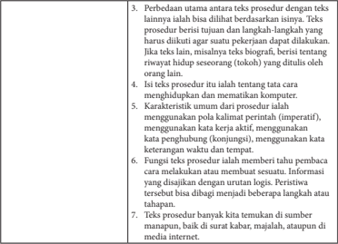

Tabel ini membahas perbedaan utama antara teks prosedur dan teks lainnya dalam konteks penulisan. Topik utama adalah bagaimana prosedur berbeda dengan teks lainnya dalam hal tujuan, panjang, dan struktur. Teks prosedur memiliki tujuan spesifik untuk menjelaskan langkah-langkah tertentu, sementara teks lain bisa berisi informasi umum atau fakta. Teks prosedur juga lebih detail dan spesifik, sementara teks lain bisa lebih luas dan merangkum informasi secara umum.

Kolom-kolom dalam tabel ini mencakup:
1. Perbedaan utama antara teks prosedur dan teks lainnya.
2. Tujuan, panjang, dan struktur teks prosedur.
3. Karakteristik umum prosedur, seperti menggunakan kalimat perintah, kata kerja aktif, kata penghubung, kata keterangan waktu, dan tempat.
4. Fungsi teks prosedur dalam memberi tahap-tahap atau petunjuk.
5. Sumber teks prosedur, baik itu surat kabar, majalah, atau media internet.

Data penting yang terlihat dalam tabel ini adalah bahwa teks prosedur memiliki tujuan spesifik, panjang yang lebih singkat, dan struktur yang lebih detail dibandingkan dengan teks lainnya. Selain itu, prosedur menggunakan bahasa yang lebih formal dan spesifik, sementara teks lain bisa lebih umum dan merangkum informasi secara umum.

Setelah  waktu  yang  disediakan  habis,  guru  meminta  salah  satu  kelompok mempresentasikan  hasil  kerjanya.  Kelompok  lain  memberikan  tanggapan  baik berupa pertanyaan maupun saran.

Dalam proses diskusi, guru membimbing peserta didik agar mengeksplorasi isi teks prosedur sehingga dapat mengetahui karakteristik teks prosedur dari segi isinya. Dari segi isi, teks prosedur mempunyai ciri-ciri dan macamnya. Berikut adalah ciriciri teks prosedur dan macam-macamnya.

### Ciri-ciri Teks Prosedur

- Menggunakan pola kalimat perintah (imperatif).
- Menggunakan kata kerja aktif.
- Menggunakan kata penghubung (konjungsi) untuk mengurutkan kegiatan.
- Menggunakan kata keterangan untuk menyatakan rinci waktu, tempat, dan cara yang akurat.

### Macam-macam Teks Prosedur

- Teks prosedur yang menjelaskan bagaimana sesuatu bekerja atau instruksi secara manual.
- Teks prosedur yang menginformasikan aktivitas tertentu dengan peraturannya.
- Teks prosedur yang berhubungan dengan sifat atau kebiasaan manusia.

 

---
## 📄 Halaman 39

### PROSES PEMBELAJARAN A KEGIATAN 2

### Menuliskan Tahapan-tahapan sebagai Prosedur Melakukan Suatu Kegiatan

### Petunjuk untuk Guru

Pada  pembahasan  ini,  guru  mengajak  peserta  didik  untuk  mencermati sebuah prosedur tentang kegiatan membaca. Jika melakukan suatu kegiatan, seseorang tentu saja harus memperhatikan langkah-langkah mengerjakannya. Jika akan melakukan pekerjaan maka  kita harus  memahami  langkahlangkahnya agar hasil kegiatan tersebut berhasil dengan baik. Misalnya, jika kita ingin memahami seluruh isi bacaan dari buku yang kita baca maka langkahlangkah yang harus ditempuh adalah: (1) pilih buku yang paling disukai dan sesuai  kebutuhan;  (2)  carilah  tempat  yang  paling  nyaman  untuk  membaca, hindari gangguan-gangguan di sekitarmu; (3) bertanyalah tentang hal-hal yang kurang kamu pahami dalam bacaan tersebut; (4) ketika membaca, usahakan untuk tidak mengulang kalimat yang baru saja dibaca karena akan mengurangi kecepatan membacamu; (5) diskusikanlah buku yang kamu baca dengan teman atau gurumu; (6) simpulkanlah apa pun yang baru didapat setelah membaca satu bab; (7) catat pokok-pokok pikiran yang terdapat dalam bacaan tersebut. Ini  sangat  membantu  untuk  memahami  bacaan.  Tahapan  seperti  itu  sering disebut prosedur.

### Tugas

- Bacalah kembali teks ke-2 di atas berjudul 'Cara Menghidupkan Komputer' dan 'Cara Mematikan Kompouter'! Manakah bagian-bagian yang termasuk ke dalam pernyataan umum dan tahapan-tahapan melakukan suatu kegiatan?
- Carilah buku-buku tentang perintah melakukan suatu kegiatan. Catatlah langkahlangkahnya. Kemudian, simpulkan menurut pendapatmu sehingga kamu memahami makna langkah-langkah tersebut!

 

---
## 📄 Halaman 40

### Contoh Jawaban

Setiap  jawaban  ini  tidak  mengikat.  Artinya,  peserta  didik  dibenarkan  dengan jawaban berbeda selama substansinya benar.

- Peserta  didik  ditugaskan  untuk  membaca  kembali  teks  telah  disajikan  pada bagian pertama. Kemudian, menentukan bagian-bagian dari teks tersebut yaitu pernyataan umum dan tahapan-tahapan.
- Peserta didik ditugaskan untuk mencari buku-buku mengenai prosedur melakukan suatu  kegiatan.  Misalnya,  buku  yang  berisi  tentang  langkah-langkah  menulis dengan baik dan tata cara merawat tanaman. Setelah itu, peserta didik mencatat langkah-langkah yang ada dalam buku tersebut dan menyimpulkan berdasarkan pendapatnya sendiri.
Setelah  waktu  yang  disediakan  habis,  guru  meminta  salah  satu  kelompok mempresentasikan  hasil  kerjanya.  Kelompok  lain  memberikan  tanggapan  baik berupa pertanyaan maupun saran.

### B. Merancang Pernyataan Umum dan Tahapan-tahapan

### Ind 1

Mengungkapkan pernyataan umum dan tahapan-tahapan melakukan kegiatan secara lisan dengan intonasi dan nada yang jelas.

Ind 2

Menuliskan pernyataan umum dan tahapan-tahapan dalam prosedur melakukan suatu kegiatan.

### PROSES PEMBELAJARAN B KEGIATAN 1

Mengungkapkan Pernyataan Umum dan Tahapan-tahapan

### Petunjuk untuk Guru

Pada bagian pertama ini, peserta didik dibimbing untuk mampu mengungkapkan pernyataan  umum  dan  tahapan-tahapan  seperti  yang  telah dijelaskan pada bagian sebelumnya. Namun, pada bagian ini disajikan secara lisan  yaitu  mempresentasikannya  di  depan  kelas  baik  individu  maupun berkelompok. Berikut teks yang disajikannya. Peserta didik diwajibkan untuk membaca dengan saksama.

 

---
## 📄 Halaman 41

### Kiat Berwawancara Kerja

Bagi perusahaan, wawancara merupakan kesempatan untuk menggali kualifikasi calon  pegawai  secara  lebih  mendalam,  melihat  kecocokannya  dengan  posisi  yang ditawarkan, kebutuhan dan sifat perusahaan. Wawancara pun menjadi ajang tanya jawab antara pewawancara dengan calon.

Agar  mudah  dipahami  oleh  mitra  bicara,  kita  harus  berbicara  dengan  jelas. Usahakan agar kita tidak berbicara terlalu  cepat  atau  lambat,  atur  juga  suara  agar jelas terdengar. Suara yang terlalu pelan membuat kita terlihat kurang percaya diri, sementara suara yang terlalu keras membuat kita terlihat agresif. Penggunaan bahasa yang baik juga menjadi suatu keharusan.

Selain itu, perhatikan betul apa yang disampaikan pewawancara agar kita dapat memberikan  jawaban  yang  relevan.  Tidak  ada  salahnya  menanyakan  kembali atau  mencoba  mengulangi  pertanyaan  yang  diajukan  untuk  memastikan  bahwa pemahaman kita sudah benar. Namun, jangan melakukannya terlalu sering karena justru akan membuat pewawancara mempertanyakan daya tangkap kita.

Bahasa tubuh pun ikut memegang peranan. Gerakan nonverbal seperti mengangguk atau sikap tubuh yang agak condong ke depan menunjukkan bahwa kita tertarik pada apa yang disampaikan si pewawancara. Pastikan pula kita menjaga kontak  mata  dengan  pewawancara  karena  kontak  mata  penting  dalam  proses komunikasi, termasuk dalam wawancara kerja.

Singkatnya, akan lebih baik jika kita mampu menampilkan sikap yang antusias secara  verbal  maupun  nonverbal.  Oleh  karena  itu,  hindari  bahasa  tubuh  yang dapat  diartikan  negatif,  seperti  menggoyangkan  kaki,  mengetuk-ngetuk  jari,  atau menghindari kontak mata. Cara berbicara yang percaya diri namun tidak terkesan sombong dapat menarik minat pewawancara.

Pada saat berbicara, hindari uraian yang panjang lebar dan bertele-tele. Cobalah mengemas kalimat secara singkat dan terfokus, tetapi tetap menarik. Kita diharapkan mampu menunjukkan bahwa kita adalah orang yang tepat untuk posisi

 

---
## 📄 Halaman 42

yang ditawarkan. Ceritakanlah kemampuan atau pengalaman yang relevan dengan posisi tersebut. Hindari mengkritik atasan atau  rekan kerja sebelumnya karena ini menunjukkan sikap yang tidak profesional.

Selama  wawancara  berlangsung,  jadilah  diri  sendiri.  Ungkapan  ini  mungkin terdengar klise,  namun jauh lebih baik menjadi diri sendiri dan berbicara dengan jujur,  daripada  mencoba  mengatakan  sesuatu  yang  menurut  kita  akan  membuat pewawancara  merasa  terkesan.  Jangan  melebih-lebihkan  kualifikasi  kita,  apalagi mengelabui  dengan  memberikan  data  yang  tidak  benar. Cepat atau lambat, pewawancara akan menemukan bahwa data tersebut hanyalah karangan. Tunjukkan bahwa kita mampu mengenali diri kita sendiri dengan tepat.

Pewawancara biasanya memberikan kesempatan kepada kita untuk mengajukan pertanyaan di akhir wawancara. Gunakanlah kesempatan ini secara elegan dengan cara  menunjukkan rasa ingin tahu kita tentang lingkup dan deskripsi tugas posisi yang  dilamar,  kesempatan  pengembangan  diri,  dan  sebagainya.  Ini  wajar  karena bersikap pasif dan menyerahkan segala sesuatu kepada pihak perusahaan tidak akan menambah nilai kita di mata pewawancara.

Calon yang ingin bertanya dalam porsi yang tepat menunjukkan kesungguhan minatnya pada posisi yang ditawarkan dan juga pada perusahaan. Di sesi ini biasanya muncul  pula  pembicaraan  mengenai  gaji  dan  tunjangan.  Pewawancara  sangat menghargai kandidat yang mampu menentukan nominal gaji yang ia harapkan karena dianggap dapat melakukan penilaian atas kemampuannya dan tugas-tugas yang akan dilakukan. Tentu saja angkanya harus logis sambil tetap membuka kesempatan untuk negosiasi.

Dengan persiapan matang dan unjuk diri yang baik saat wawancara, kita telah meninggalkan kesan yang layak untuk dipertimbangkan oleh perusahaan.

(Sumber: 'Unjuk Diri yang Baik dalam Wawancara Kerja' dalam Kompas dengan pengubahan)

Bacaan di atas menjelaskan cara mengikuti wawancara kerja di suatu perusahaan.

Di dalam teks tersebut disampaikan petunjuk-petunjuk seperti berikut.

- Berbicara harus jelas, tidak terlalu cepat, atau lambat.
- Harus tampil percaya diri.
- Jawaban yang disampaikan harus relevan dengan pertanyaan.

### 1.  Identifikasilah teks prosedur di atas berdasarkan format tabel berikut!

 

---
## 📄 Halaman 43

- Dari isinya menjelaskan tentang apakah teks prosedur itu?
- Berdasarkan isinya, apakah fungsi teks prosedur itu?
- Temukan kata kerja imperatif pada teks prosedur di atas!
- Temukan enam konjungsi pada teks prosedur di atas!
- Temukan pernyataan persuasif pada teks prosedur di atas!
- Berikanlah tanggapan dengan bahasamu sendiri pada teks tersebut?
- Tuliskan kembali isi teks prosedur tersebut dengan menggunakan bahasamu sendiri secara singkat dan jelas!

### Contoh Jawaban

Setiap  jawaban  ini  tidak  mengikat.  Artinya,  peserta  didik  dibenarkan  dengan jawaban berbeda selama substansinya benar.

- Identifikasi teks prosedur berdasarkan pernyataan umum dan tahapan-tahapan.
- Perbedaan  utama  antara  teks  prosedur  dengan  teks  lainnya  ialah  bisa  dilihat berdasarkan  isinya.  Teks  prosedur  berisi  tata  cara  ketika  akan  menghadapi wawancara pekerjaan dari seorang atasan atau pimpinan pekerjaan.
- Fungsi  teks  prosedur  menjelaskan  tentang  hal-hal  yang  harus  dipahami  dan dilakukan  ketika  akan  menghadapi  wawancara  pekerjaan,  misalnya  dari  cara berkomunikasi dan gerak tubuh.
- Kata  kerja  imperatif  (perintah)  yang  terdapat  dalam  teks  tersebut  ialah harus, perhatikan, jangan, pastikan, tunjukkan, gunakanlah, ceritakanlah.
- Kata konjungsi yang terdapat dalam teks prosedur tersebut ialah sementara, selain itu, namun, oleh karena itu, dengan.

---
**📊 Tabel**

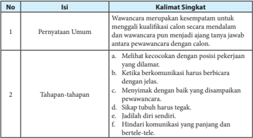

Tabel ini berisi informasi tentang kualifikasi calon untuk wawancara, yang terdiri dari dua kolom: "Pernyataan Umum" dan "Tahapan-tahapan". Kolom pertama menjelaskan bahwa wawancara harus mencakup kesempatan untuk memperkenalkan diri dan menunjukkan kualitas calon secara mendalam. Wawancara harus juga mencakup pertanyaan yang mungkin dianggap aneh oleh calon. Kolom kedua menyediakan tahapan-tahapan yang harus dilalui dalam wawancara, seperti melihat kecocokan dengan posisi pekerjaan yang dilamar, ketika berkomunikasi harus berbicara dengan jelas, menyeimbangkan dengan baik yang disampaikan oleh calon, sikap wawancara harus tegak, jadi diri sendiri, dan hindari komunikasi yang panjang dan bertele-tele. Topik utama tabel ini adalah kualifikasi calon untuk wawancara dan tahapan-tahapan yang harus dilalui dalam proses tersebut.

 

---
## 📄 Halaman 44

- Pernyataan  persuasif  yang  terdapat  pada  teks  ini  ialah  (a)  penggunaan  bahasa yang baik juga menjadi suatu keharusan; (b) singkatnya, akan lebih baik bila kita mampu menampilkan sikap yang antusias, verbal maupun nonverbal; (c) ini wajar, karena  bersikap  pasif  dan  menyerahkan  segala  sesuatu  pada  pihak  perusahaan tidak akan menambah nilai kita di mata pewawancara; (d) pewawancara sangat menghargai kandidat yang mampu menentukan nominal gaji yang ia harapkan, karena dianggap bisa melakukan penilaian atas kemampuannya dan tugas-tugas yang akan dilakukan.
- Pada jawaban ini, peserta didik mengemukakan pendapat berdasarkan pengetahuannya mengenai isi teks prosedur yang dibaca.
- Pada jawaban ini, peserta didik diarahkan untuk mampu menulis ulang isi teks prosedur yang telah  dibaca.  Namun,  penulisannya  harus  menggunakan  bahasa sendiri.
Setelah  waktu  yang  disediakan  habis,  guru  meminta  salah  satu  kelompok mempresentasikan  hasil  kerjanya.  Kelompok  lain  memberikan  tanggapan  baik berupa pertanyaan maupun saran.

Peserta didik mampu menyelesaikan tugas pada bagian sebelumnya yaitu mampu mengungkapkan  pernyataan  umum  dan  tahapan-tahapan  dari  sebuah  teks.  Pada bagian ini, guru membimbing peserta didik untuk berkelompok dalam menulis teks prosedur berdasarkan pernyataan umum dan tahapan-tahapan sebagai langkah awal sebelum menulis teks prosedur secara utuh.

Selain  itu,  dalam  menulis  teks  prosedur,  peserta  didik  diberi  arahan  tentang menulis, misalnya harus rajin membaca berbagai sumber yang berhubungan dengan teks  yang  akan  dibuatnya,  diberikan  semangat  tentang  aktivitas  menulis,  dan mengoreksi kesalahan-kesalahan dari teks yang dibuatnya, serta memberikan pujian atau reward terhadap teks yang penulisannya sesuai.

Pertanyaan yang diberikan ialah mengenai mendiskusikan suatu kegiatan yang memerlukan tahapan-tahapan, yaitu terdiri atas dua jenis kegiatan. Setelah peserta didik menemukan, tahapan-tahapan tersebut dikembangkan menjadi teks prosedur tentang kiat, resep, atau cara jitu dalam melakukan suatu kegiatan.

 

---
## 📄 Halaman 45

### Contoh Jawaban

Setiap  jawaban  ini  tidak  mengikat.  Artinya,  peserta  didik  dibenarkan  dengan jawaban berbeda selama substansinya benar.

Materi tahapan-tahapan yang dapat ditemukan ialah dari sumber bacaan seperti buku,  koran,  dan  majalah.  Misalnya,  buku  tentang  keterampilan  menulis  atau mengarang. Tahapan-tahapan yang dapat ditemukan dalam buku tersebut adalah:

- menentukan topik,
- menentukan tujuan,
- mengumpulkan data,
- menyusun kerangka,
- mengembangkan kerangka,
- koreksi dan revisi, dan
- menulis naskah.
Tahapan-tahapan yang telah didapatkan tersebut, dikembangkan menjadi tulisan baru  misalnya  diberi  judul  kiat  praktis  menulis,  langkah-langkah  mudah  dalam mengarang, atau judul lainnya sesuai isi teks.

Setelah  waktu  yang  disediakan  habis,  guru  meminta  salah  satu  kelompok mempresentasikan  hasil  kerjanya.  Kelompok  lain  memberikan  tanggapan  baik berupa pertanyaan maupun saran.

### C. Menganalisis Struktur dan Kebahasaan Teks Prosedur

Ind 1

Mengungkapkan kembali struktur teks prosedur.

Ind 2

Mengungkapkan kembali aspek kebahasaan teks prosedur.

### PROSES PEMBELAJARAN C KEGIATAN 1

Mengungkapkan Kembali Struktur Teks Prosedur

### Petunjuk untuk Guru

Pada bagian ini, peserta didik dibimbing untuk mampu menganalisis teks prosedur dengan tahapan mengungkapkan kembali struktur dan kebahasaan dari teks prosedur yang telah dibaca.

 

---
## 📄 Halaman 46

Untuk dapat menganalisis, peserta didik diarahkan dahulu pada kegiatan membaca. Instruksi yang dapat diberikan kepada peserta didik di antaranya sebagai berikut.

- Bacalah sekurang-kurangnya tiga teks prosedur yang bersumber dari surat kabar, majalah, ataupun internet.
- Catatlah sumber teks tersebut.
- Kemukakan garis besar isi setiap teks.
Berikut adalah teks yang bisa disajikan kepada peserta didik dalam menganalisis dan mengungkapkan struktur teks prosedur.

### Kiat Menata Rambut Pendek

### 2.  Gunakan Produk Styling

Gunakan produk styling dan perawatan rambut seperti serum untuk menyehatkan akar rambut. Produk perawatan rambut yang alami akan membuat rambut  kamu  terlihat  bersinar  dan  indah.  Rambut  juga  tampak  halus  dan memberikan extra glow . Pastikan menggunakannya di batang rambut.

### 3. Blow dry dari Akar Rambut Terlebih Dahulu

Saat akan melakukan blow dry pada rambut pendek kamu, pastikan memulainya dari akar rambu t.  Gunakan sisir sikat bulat dan pengering rambut, lalu arahkan hair dryer ke bagian akar. Gunakan sisir dengan ukuran yang benar karena sikat yang lebih besar akan memberikan sedikit kurva ke gaya rambut bob kamu.

### 4.  Tambahkan kesan bervolume (terisi penuh)

Kembangkan dan blow dry rambut bagian depan untuk mendapatkan kesan bervolume. Dengan begitu, rambut kamu akan terlihat terisi penuh.

(Sumber: Surat Kabar Kompas dengan pengubahan)

Gaya rambut bob pendek kini mulai disukai lagi. Meski terlihat sederhana, untuk gaya rambut seperti itu juga diperlukan perawatan yang benar. Ada beberapa langkah dan cara yang harus kamu lakukan untuk merawat rambut pendek dengan baik, yaitu sebagai berikut.

### 1. Keringkan dengan Handuk

Banyak orang yang mengeringkan rambut pendeknya  dengan  cara  mengacak-acaknya dengan handuk agar air cepat meresap. Padahal cara ini bisa membuat rambut mudah patah. Keringkan rambut sambil dipijat perlahan.

 

---
## 📄 Halaman 47

### Tugas 1

Setelah kamu membaca teks tersebut, selanjutnya ikutilah instruksi di bawah ini!

- Jelaskanlah struktur pembentuk teks tersebut secara jelas!
- Simpulkan teks tersebut berdasarkan kelengkapan strukturnya!
- Tuliskan hasil telaah kelompokmu dalam format penilaian seperti berikut ini pada lembar terpisah atau buku kerjamu!
- Pajanglah hasil pekerjaan kelompokmu di depan kelas atau papan tulis!
- Mintalah  kelompok  lain  untuk  mengunjungi  pajangan  itu  untuk  memberikan penilaian dan komentar-komentar!

---
**📊 Tabel**

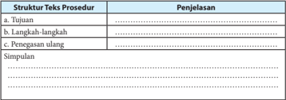

Tabel ini berisi struktur prosedur yang umum digunakan dalam tugas-tugas atau kegiatan tertentu. Topik utamanya adalah tentang bagaimana menulis prosedur dengan baik. Kolom pertama berisi tiga poin utama: Tujuan, Langkah-langkah, dan Penegasan ulang. Tujuan memberikan tujuan akhir dari prosedur tersebut, sementara Langkah-langkah menyajikan langkah-langkah yang harus dilakukan untuk mencapai tujuan tersebut. Penegasan ulang menunjukkan langkah-langkah yang perlu dilakukan untuk memastikan bahwa prosedur telah berhasil dilakukan dengan benar. Data atau pola penting yang terlihat adalah bahwa setiap poin memiliki penjelasan yang mendetail, yang membantu dalam pemahaman lebih lanjut tentang prosedur tersebut.

---
**📊 Tabel**

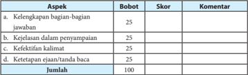

Tabel ini menunjukkan skor dan komentar untuk empat aspek penilaian, yaitu kelengkapan bagian-bagian jawaban, kejelasan dalam penyampaian, keefektifan kalimat, dan ketepatan ejaan/tanda baca. Setiap aspek memiliki bobot 25%, sehingga total skor maksimal adalah 100. Topik utama tabel ini adalah penilaian kualitas penulisan. Kolom "Bobot" menunjukkan tingkat penting setiap aspek, sedangkan kolom "Skor" menunjukkan skor yang diberikan untuk setiap aspek. Kolom "Komentar" menyediakan informasi tambahan tentang apakah aspek tersebut memenuhi standar atau tidak. Pola penting yang terlihat adalah bahwa semua aspek memiliki bobot yang sama, yaitu 25%, dan total skor maksimal adalah 100. Ini menunjukkan bahwa setiap aspek penilaian memiliki peran yang sama dalam menentukan keseluruhan kualitas penulisan.

### Contoh Jawaban

Setiap  jawaban  ini  tidak  mengikat.  Artinya,  peserta  didik  dibenarkan  dengan jawaban berbeda selama substansinya benar.

- Struktur pembentuk teks prosedur ialah (a) tujuan merupakan hasil akhir yang akan dicapai; (b) langkah-langkah adalah cara-cara yang ditempuh agar tujuan tercapai; dan (c) penegasan ulang adalah bagian yang berisi tentang pengulangan pernyataan yang digunakan untuk meyakinkan pembaca.
- Simpulan jawaban peserta didik menyesuaikan dengan struktur pembentuk dari teks tersebut.

 

---
## 📄 Halaman 48

- Pada  jawaban  ini,  peserta  didik  menelaah  teks  berjudul  'Kiat  Menata  Rambut Pendek'  Telaah  tersebut  meliputi  sruktur  teks  prosedur  yaitu  tujuan,  langkahlangkah, dan penegasan ulang.
- Pada jawaban ini, hasil pekerjaan peserta didik dipajang atau ditampilkan di papan tulis atau di depan kelas.
- Pada  jawaban  ini,  hasil  pekerjaan  yang  telah  ditampilkan  atau  di  pajang dikomentari  oleh  teman-teman  lain  dengan  bobot  nilai  0  s.d.  25  meliputi kelengkapan  bagian-bagian  jawaban,  kejelasan  dalam  penyampaian,  kefektifan kalimat, dan ketepatan ejaan/tanda baca.
Setelah  waktu  yang  disediakan  habis,  guru  meminta  salah  satu  kelompok mempresentasikan  hasil  kerjanya.  Kelompok  lain  memberikan  tanggapan  baik berupa pertanyaan maupun saran.

### PROSES PEMBELAJARAN C KEGIATAN 2

Mengungkapkan Unsur Kebahasaan Teks Prosedur

### Petunjuk untuk Guru

Pada bagian ini, peserta didik dibimbing mengenai aspek kebahasaan dalam teks prosedur. Aspek kebahasaan perlu dipahami dan dikuasai oleh peserta didik dalam membuat sebuah tulisan. Jika peserta didik menguasai aspek kebahasaan dalam  sebuah  tulisan  maka  isi  yang  ditulisnya  akan  mudah  dipahami  oleh pembaca. Aspek kebahasaan dalam teks prosedur memiliki ciri sebagai berikut.

- Banyak  menggunakan  kata-kata  kerja  perintah  (imperatif).  Kata  kerja imperatif antara lain harus, pastikan jangan, hindari, ceritakan(lah), jadilah, tunjukan(lah), dan gunakan(lah).
- Banyak menggunakan kata-kata teknis yang berkaitan dengan topik yang dibahasnya. Apabila teks tersebut berkenaan dengan masalah komunikasi, akan  digunakan  istilah-istilah  komunikasi  pula,  misalnya tanya  jawab, kontak mata, pewawancara, verbal, nonverbal, bahasa tubuh, dan negosiasi .

---
**📊 Tabel**

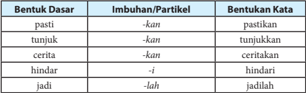

Tabel ini menunjukkan struktur dasar dari beberapa kata imbuhan dan partikel dalam bahasa Indonesia. Topik utamanya adalah bagaimana bentuk dasar kata dapat diubah menjadi bentuk kata lain melalui penggunaan imbuhan dan partikel. Kolom pertama berisi bentuk dasar kata, kolom kedua berisi imbuhan atau partikel yang digunakan untuk mengubah bentuk dasar tersebut, dan kolom ketiga berisi bentuk kata hasil penggunaan imbuhan atau partikel tersebut. Data penting yang terlihat adalah bahwa semua bentuk dasar kata memiliki bentuk dasar yang sama, yaitu "-kan" untuk bentuk pasti, "-kan" untuk bentuk tunjukkan, "-kan" untuk bentuk cerita, "-i" untuk bentuk hindari, dan "-lah" untuk bentuk jadi. Ini menunjukkan bahwa bentuk dasar kata memiliki variasi yang cukup luas dan dapat digunakan dalam berbagai situasi.

 

---
## 📄 Halaman 49

- Banyak menggunakan kata penghubung (konjungsi) partikel yang bermakna penambahan, seperti selain itu, pun, kemudian, selanjutnya, oleh karena itu, lalu, setelah itu, dan di samping itu.
- Banyak menggunakan kata-kata persuasif. Berikut adalah contoh kalimatnya.
- Penggunaan bahasa yang baik juga menjadi keharusan.
- Singkatnya,  akan  lebih  baik  bila  kita  mampu  menampilkan  sikap  yang antusias, verbal, maupun nonverbal.
- Ini wajar karena bersikap pasif dan menyerahkan segala sesuatu pada pihak perusahaan tidak akan menambah nilai kita di mata pewawancara.
- Pewawancara  sangat  menghargai  kandidat  yang  mampu  menentukan nominal gaji yang ia harapkan karena dianggap bisa melakukan penilaian atas kemampuannya dan tugas-tugas yang akan dilakukan.
- Apabila  prosedur  itu  berupa  resep  dan  petunjuk  penggunaan  alat,  akan digunakan gambaran rinci tentang benda dan alat yang dipakai, termasuk ukuran, jumlah, dan warna.

---
**🖼️ Gambar/Diagram**

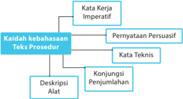

> **Deskripsi Visual:** Gambar ini adalah diagram yang menunjukkan struktur teks prosedur dalam bahasa Indonesia. Diagram ini terdiri dari empat bagian utama:

1. Kata kerja imperatif (misalnya "Pernyataan Persusiasif", "Kata Teknis", "Konjungsi Penjumlahan")
2. Deskripsi Alat
3. Kaidah kebahasaan Teks Prosedur

Elemen-elemen utama dalam diagram ini adalah kata kerja imperatif, deskripsi alat, dan kaidah kebahasaan. Kata kerja imperatif merupakan dasar dari struktur teks prosedur, sementara deskripsi alat memberikan detail tentang elemen-elemen yang harus diproses dalam prosedur tersebut. Kaidah kebahasaan membantu memahami cara penggunaan kata-kata dan struktur yang tepat dalam teks prosedur.

Informasi kunci yang dapat diambil pembaca meliputi struktur dasar teks prosedur, elemen-elemen yang harus diproses, dan kaidah kebahasaan yang perlu dipertimbangkan saat menulis teks prosedur. Diagram ini sangat berguna untuk pemahaman umum tentang bagaimana struktur dan kaidah kebahasaan dalam teks prosedur.

- Manakah  pernyataan-pernyataan  di  bawah  ini  yang  menggunakan  kata  kerja imperatif?
- Banyak sahabat sangat menyenangkan.
- Perlu kesantunan di dalam menjalin komunikasi.
- Sangat berkesan apabila bertemu dengan seorang sahabat lama.
- Sering terjadi salah pengertian apabila kita bertegur sapa dalam bahasa yang berbeda.
- Orang seringkali tidak percaya diri kalau harus berkenalan dengan orang asing.

 

---
## 📄 Halaman 50

- Pilihlah salah satu topik di bawah ini! Secara berkelompok tuliskanlah 3 -4 kalimat yang menggunakan kata kerja imperatif berkaitan dengan salah satu topik tersebut.

---
**📊 Tabel**

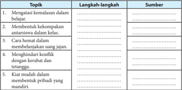

Tabel ini berisi topik-topik penting yang berkaitan dengan keterampilan sosial dan perilaku positif di sekolah. Topik utamanya meliputi mengatasi kemanusiaan dalam belajar, membangun kekomunikasian antar siswa dalam kelas, cara hemat dalam membelanjakan uang, menghindari konflik dengan kerabat dan teman, serta kiat mudah dalam membentuk pribadi yang mandiri. Kolom "Langkah-langkah" menyajikan cara-cara untuk mewujudkan setiap topik, sementara kolom "Sumber" memberikan informasi tentang sumber referensi atau bahan yang dapat digunakan untuk mempelajari topik tersebut. Pola penting yang terlihat adalah bahwa tabel ini mencakup berbagai aspek keterampilan sosial dan perilaku yang relevan dengan kehidupan sekolah dan pengembangan diri individu.

### Contoh Jawaban

Setiap  jawaban  ini  tidak  mengikat.  Artinya,  peserta  didik  dibenarkan  dengan jawaban berbeda selama substansinya benar.

- Di bawah ini yang menggunakan kata kerja imperatif ditandai dengan huruf tebal.
- Banyak sahabat sangat menyenangkan.
- Perlu kesantunan di dalam menjalin komunikasi.
- Sangat berkesan apabila bertemu seorang sahabat lama.
- Sering terjadi salah pengertian apabila kita bertegur sapa dalam bahasa yang berbeda.
- Orang  seringkali  tidak  percaya  diri  kalau harus berkenalan  dengan  orang asing.
- Memilih satu topik dari lima topik yang disediakan. Kemudian, menuliskan 3 -4 kalimat dengan menggunakan kata kerja imperatif.

### Kiat Mudah dalam Membentuk Pribadi yang Mandiri. Kolom Langkah-langkah:

- Selalu memotivasi diri sendiri.
- Tidak mudah putus asa dan menyerah ketika hasil tidak sesuai dengan yang diharapkan.
- Jangan mudah bergantung kepada orang lain.
- Selalu memiliki semangat terus belajar.
- Menjalin hubungan yang baik dengan orang terdekat.

 

---
## 📄 Halaman 51

### Kolom Sumber:

Media internet: www.oaseindonesia.com/artikel/1763/5-cara-ampuh-menjadipribadi-yang-mandiri.html

### Tugas Individual

- Bacalah sebuah teks prosedur lainnya! Kamu bisa mendapatkan teks tersebut dari surat kabar, majalah, buku, ataupun internet.
- Identifikasilah struktur dan kaidah kebahasaan teks tersebut!
- Sajikan laporan hasil kegiatan kamu dalam format tabel seperti berikut! Kamu mengerjakan tugas ini di buku kerjamu.
Judul Teks

: .......

Sumber

: .......

Tema

: .......

---
**📊 Tabel**

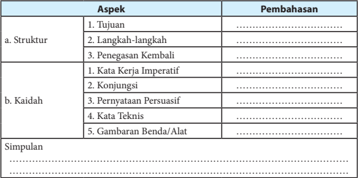

Tabel ini membahas berbagai aspek dalam bahasa Indonesia, mulai dari struktur kalimat hingga kaidah penggunaan kata-kata. Topik utama adalah pembahasan tentang struktur kalimat, yang meliputi tujuan, langkah-langkah, dan penegakan kembali. Selanjutnya, tabel membagi kaidah penggunaan kata menjadi lima kategori: kata kerja imperatif, konjungsi, pernyataan persuasif, kata teknis, dan gambaran benda/ alat. Setiap kategori tersebut dijelaskan secara rinci untuk memahami cara penggunaannya dalam kalimat.

### Contoh Jawaban

Setiap  jawaban  ini  tidak  mengikat.  Artinya,  peserta  didik  dibenarkan  dengan jawaban berbeda selama substansinya benar.

- Pada jawaban ini, peserta didik ditugaskan untuk membaca teks prosedur lain, bukan hanya yang ada di dalam buku ini. Melainkan, teks prosedur yang diperoleh dari bahan bacaan lainnya, yaitu di surat kabar, majalah, buku, ataupun di internet.
- Pada jawaban ini, peserta didik mengidentifikasi struktur dan kebahasaan sesuai dengan yang telah dijelaskan.
- Pada jawaban ini,  peserta didik menyajikan hasil laporan mengenai teks prosedur yang dibaca dari sumber bacaan lain. Penyajiannya meliputi aspek yang analisis (struktur dan kaidah kebahasaan) dan pemberian simpulan.

 

---
## 📄 Halaman 52

Judul Teks

: Prosedur Pemasangan Listrik secara Online

Sumber

: http://www.materikelas.com/2015/10/teks-prosedur-kompleks- pengertian.html

Tema

: Kemudahan dalam Sarana Online

### 1.  Struktur

### a.  Tujuan

Teks  ini  bertujuan  untuk  memberikan  kemudahan  kepada  masyarakat khsusnya dalam pemasangan listrik secara online tanpa harus pergi ke tempat yang dituju.

### b.  Langkah-langkah

- Buka URL http://www,pln,co,id/pbpd/. Di sana kamu diharuskan mengisi data pelanggan dan data pemohon. Isilah dengan lengkap disertai alamat email dan juga nomor telepon yang dapat dihubungi.
- Jika  kamu  ingin  berlangganan  listrik  pasca  bayar,  daya  listrik  terendah yang diizinkan adalah 6.600 VA. Di bawah itu, kamu harus berlangganan listrik pra bayar.
- Setelah mengisi data dan menyimpannya, sistem komputer PT PLN akan mengirimkan email pemberitahuan kepada email kamu disertai nominal yang harus kamu bayar disertai kode transaksi.
- Masukkan kode transaksi tersebut  malalui  form  yang  tersedia  di http:// www,pln,co,id/pbpd/konfirmasi,php.
- Sistem komputer PT PLN akan kembali mengirimkan email pemberitahuan kepada  kamu  disertai  nominal  jumlah  yang  harus  kamu  bayar  Nomor Registrasi (kode bayar).
- Setelah  itu,  kamu  harus  melakukan  pembayaran.  Pembayaran  dapat dilakukan di kantor pos, bank, ATM, dan loket resmi yang telah bekerja sama dengan PT PLN. Pembayaran dilakukan selambat-lambatnya 30 hari setelah pendaftaran secara online.
- Untuk membayar lewat ATM, kamu dapat memilih 'Pembayaran Listrik' , kemudian pilih  'Non  Taglis' .  Kamu  cukup  memasukkan  13  digit  nomor registrasi,  kemudian  nama  kamu  akan  tampil  di  layar  dengan  jumlah nominal yang harus kamu bayar.
- Pemasangan akan dilakukan selambat-lambatnya 5 (lima) hari kerja setelah pembayaran. Syaratnya, rumah tersebut tidak jauh dari tiang listrik yang sudah berdiri serta telah terpasang instalasi listrik.
- Jika  pada  hari  keenam  belum  juga  terpasang,  kamu  bisa  bertanya  atau komplain ke hotline PT PLN di nomor 123.
- Untuk memeriksa status pendaftaran, kamu dapat memeriksanya di URL http://www.pln.co.id/pbpd/Status.php .
- Perlu diingat, PT PLN juga melarang kamu memberikan uang atau tip bagi petugas yang memasang sambungan listrik di rumah kamu.

 

---
## 📄 Halaman 53

### c.  Penegasan Kembali

Perlu diingat, PT PLN juga melarang kamu memberikan uang atau tip bagi petugas yang memasang sambungan listrik di rumah kamu.

### 2.  Kaidah

- Kata Kerja Imperatif
- Buka URL http://www,pln,co,id/pbpd/. Di sana kamu diharuskan mengisi data pelanggan dan data pemohon. Isilah dengan lengkap disertai alamat email dan juga nomor telepon yang dapat dihubungi.
- Masukkan kode transaksi  tersebut  melalui  form  yang  tersedia  di http:// www,pln,co,id/pbpd/konfirmasi,php.
- Perlu diingat, PT PLN juga melarang kamu memberikan uang atau tip bagi petugas yang memasang sambungan listrik di rumah kamu.

### b.  Konjungsi

- Setelah mengisi data dan menyimpannya, sistem komputer PT PLN akan mengirimkan email pemberitahuan kepada email kamu disertai nominal yang harus kamu bayar disertai kode transaksi.
- Setelah  itu,  kamu  harus  melakukan  pembayaran.  Pembayaran  dapat dilakukan di kantor pos, bank, ATM, dan loket resmi yang telah bekerja sama dengan PT PLN. Pembayaran dilakukan selambat-lambatnya 30 hari setelah pendaftaran secara online.
- Pemasangan akan dilakukan selambat-lambatnya 5 (lima) hari kerja setelah pembayaran. Syaratnya, rumah tersebut tidak jauh dari tiang listrik yang sudah berdiri serta telah terpasang instalasi listrik.
- Jika  pada  hari  keenam  belum  juga  terpasang,  kamu  bisa  bertanya  atau komplain ke hotline PT PLN di nomor 123.

### c.  Pernyataan Persuasif

- Jika  kamu  ingin  berlangganan  listrik  pasca  bayar,  daya  listrik  terendah yang diizinkan adalah 6.600 VA. Di bawah itu, kamu harus berlangganan listrik pra bayar.
- Untuk membayar lewat ATM, kamu dapat memilih 'Pembayaran Listrik' , kemudian pilih  'Non  Taglis' .  Kamu  cukup  memasukkan  13  digit  nomor registrasi,  kemudian  nama  kamu  akan  tampil  di  layar  dengan  jumlah nominal yang harus kamu bayar.
- Untuk memeriksa status pendaftaran, kamu dapat memeriksanya di URL http://www.pln.co.id/pbpd/Status.php.

### d.  Kata Teknis

- Untuk membayar lewat ATM, kamu dapat memilih 'Pembayaran Listrik' , kemudian pilih  'Non  Taglis' .  Kamu  cukup  memasukkan  13  digit  nomor registrasi,  kemudian  nama  kamu  akan  tampil  di  layar  dengan  jumlah nominal yang harus kamu bayar.
- Pemasangan akan dilakukan selambat-lambatnya 5 (lima) hari kerja setelah pembayaran. Syaratnya, rumah tersebut tidak jauh dari tiang listrik yang sudah berdiri serta telah terpasang instalasi listrik.

 

---
## 📄 Halaman 54

### e.  Gambaran Benda/Alat

- Setelah mengisi data dan menyimpannya, sistem komputer PT PLN akan mengirimkan email pemberitahuan kepada email kamu disertai nominal yang harus kamu bayar disertai kode transaksi.
- Sistem komputer PT PLN akan kembali mengirimkan email pemberitahuan kepada  kamu  disertai  nominal  jumlah  yang  harus  kamu  bayar  Nomor Registrasi (kode bayar).

### 3.  Simpulan

Adanya  fasilitas secara online, berbagai aktivitas  semakin  dipermudah, misalnya  dalam  pemasangan  listrik  ini.  Cukup  dengan  membuka  alamat  URL http:www.pln.co.id/pbpd/ di  komputer atau laptop dan mengikuti prosedur yang ada di alamat tersebut, kita tidak harus pergi ke tempat yang akan dituju untuk melakukan pemasangan listrik.

### D. Mengembangkan Teks Prosedur

Ind 1 Menyusun rancangan garis besar suatu prosedur.

Ind 2 Mengembangkan teks prosedur dengan memperhatikan isi, struktur, dan aspek kebahasaan.

### PROSES PEMBELAJARAN D KEGIATAN 1

Menyusun Rancangan Garis Besar Suatu Prosedur

### Petunjuk untuk Guru

Pada bagian terakhir ini, guru membimbing peserta didik untuk mampu mengembangkan teks prosedur dengan memperhatikan terlebih dahulu hasil analisis  isi,  struktur,  dan  kebahasaan.  Dengan  menguasai  isi,  struktur,  dan kebahasaan, peserta didik akan mudah dalam memahami maksud teks tersebut.

Pemahaman tentang teks prosedur sangatlah penting jika kita tidak berharap memperoleh efek berbahaya. Paling tidak, petunjuk itu menjadi tidak efektif. Teks prosedur yang salah dapat berisiko tinggi apabila petunjuk itu berkenaan dengan  sesuatu  yang  membahayakan,  misalnya  berupa  penggunaan  mesin atau  obat-obatan.  Ketidakjelasan  prosedur  dapat  berakibat  kerusakan  pada mesin ataupun kematian bagi penggunanya. Dengan demikian, kejelasan itu merupakan hal yang utama dalam suatu teks prosedur.

 

---
## 📄 Halaman 55

Untuk  memperoleh  kejelasan  tersebut,  peserta  didik  dapat  melakukan tahapan berikut.

### a.  Mengartikan Kata-Kata Sulit

Dalam teks berjudul 'Kiat Wawancara Kerja' terdapat kata-kata berikut: kualifikasi,  kandidiat,  verbal,  nonverbal,  bahasa  tubuh,  klise,  nominal  gaji, tunjangan. Untuk  mencari  arti  kata-kata  tersebut,  peserta  didik  harus membuka kamus terlebih dahulu, atau dapat memaknai kata-kata tersebut berdasarkan konteks kalimatnya.

- Arti kata yang berdasarkan kamus disebut dengan makna leksikal.
- Arti  kata  yang  berdasarkan  konteks  kalimat  disebut  dengan makna gramatikal.

---
**📊 Tabel**

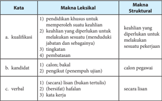

Tabel ini membahas dua konsep utama: kualifikasi dan kandidat. Kualifikasi melibatkan keahlian yang diperlukan untuk melakukan pekerjaan, seperti pendidikan, keterampilan, dan tingkat keterampilan. Kandidat adalah calon pegawai yang mungkin dianggap untuk posisi tertentu, baik sebagai calon bakal (belum lulus) maupun calon pengikut (telah lulus ujian). Verbal mencakup berbagai bentuk kata yang digunakan dalam bahasa, termasuk lisan, bertutur, dan kata kerja secara lisan. Pola penting yang terlihat adalah hubungan antara konsep-konsep tersebut dalam konteks pekerjaan dan penerimaan kandidat.

### b. Memaknai Maksud Teks Secara Keseluruhan

Hal  ini  dilakukan  untuk  mengetahui  topik  umum  beserta  langkahlangkah  yang  ada  di  dalam  suatu  teks  prosedur.  Misalnya,  teks  tentang teknik berwawancara di atas. Topik umumnya adalah cara mengikuti suatu wawancara ketika melamar kerja. Topik tersebut meliputi beberapa langkah yang  isinya  mengarahkan  seorang  pencari  kerja  dalam  mengikuti  tes wawancara sehingga ia bisa diterima di suatu perusahaan.

 

---
## 📄 Halaman 56

### Tugas

- Bacalah dengan saksama teks berjudul 'Kiat Tetap Semangat pada Hari Senin' di bawah ini! Kemudian, ikuti instruksi yang menyertainya!

### Kiat Tetap Semangat pada Hari Senin

Gambar 1.6 Karyawan kantor.

Setiap orang tentu ingin pulang kantor tepat waktu. Sayangnya, ada saja hal yang membuat keinginan tersebut sulit terwujud, mulai dari mengantuk hingga tidak fokus mengerjakan satu hal. Padahal, jika kita bekerja dengan tepat, pulang telat takkan terjadi, lho .

Berikut tiga cara supaya kita dapa t pulang tepat waktu.

### a. Skala Prioritas

Sesampainya  di  kantor,  pasti  setumpuk  pekerjaan  sudah  menanti,  mulai dari  yang  mudah  hingga  sulit,  mendesak  hingga  santai.  Pikirkanlah  dengan mendahulukan pekerjaan yang menjadi prioritas hari itu. Ini berarti kita harus pandai menentukan apa saja pekerjaan yang memang perlu diselesaikan hari itu juga.

### b.  Sedikit Berpikir

Percaya  tidak,  semakin  sering  hal  kecil  dipikirkan,  akan  semakin    susah untuk kita menyelesaikannya. Ini biasanya terjadi karena kita berpikir bahwa pekerjaan ini akan memakan banyak waktu dan sulit untuk segera diselesaikan. Padahal  sebenarnya  pekerjaan  ini  bisa  dikerjakan  dalam  waktu  singkat. So, don't think, just do!

### c.  Istirahat

Mengerjakan pekerjaan tanpa batas waktu tidak menjamin kita bisa segera pulang  tepat  waktu.  Ketika  tubuh  dan  otak  bekerja  keras  selama  beberapa waktu, tentu diperlukan waktu untuk beristirahat sejenak. Ada baiknya, isilah istirahat dengan hal yang tidak membuat kita lupa waktu, tetapi lakukan halhal yang membuat tubuh dan pikiran kembali segar .

Nah, dengan begitu pekerjaan cepat selesai, kita bisa pulang tepat waktu dan bisa melakukan berbagai hal lain di luar pekerjaan.

(Sumber:

Kompas dengan pengubahan)

 

---
## 📄 Halaman 57

- Setelah selesai membaca teks di atas, ikuti kegiatan berikut ini.
- Secara berkelompok, catatlah kata-kata sulit yang ada di dalam teks tersebut!
- Tentukanlah maksud dari isi teks tersebut!
- Jelaskan pula arti penting teks tersebut bagi pembacanya!
- Sajikanlah hasil kegiatanmu dalam rubrik penilaian berikut.
Judul

: .............................

Sumber

: .............................

Kata-kata Sulit

Maksud Isi Teks

……………………………………

……………………………………

……………………………………

……………………………………

……………………………………

……………………………………

……………………………………

……………………………………

Arti Penting Teks

……………………………………………………………………………………

……………………………………………………………………………………

……………………………………………………………………………………

……………………………………………………………………………………

- Kamu  telah  selesai  menemukan  kata-kata  sulit  dalam  sebuah  teks.  Tahap berikutnya, presentasikanlah laporan kelompokmu  di  depan  teman-teman lainnya. Kemudian, mintalah penilaian/tanggapan  mereka dengan menggunakan rubrik penilaian di bawah ini!

---
**📊 Tabel**

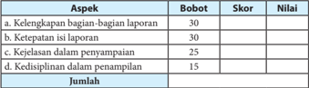

Tabel ini menunjukkan skor dan nilai untuk berbagai aspek penilaian, dengan total 100 poin. Topik utama tabel adalah "Penilaian Aspek", yang mencakup kelengkapan bagian-bagian laporan, ketepatan isinya, kejelasan dalam penyampaian, dan disiplin dalam penampilannya. Kolom-kolomnya adalah Bobot, Skor, dan Nilai. Data penting yang terlihat adalah bahwa aspek kelengkapan bagian-bagian laporan memiliki bobot tertinggi yaitu 30%, sedangkan aspek disiplin dalam penampilannya memiliki bobot terendah yaitu 15%. Total skor yang diperoleh oleh setiap aspek ditambahkan untuk mencapai total 100 poin.

### Contoh Jawaban

Setiap  jawaban  ini  tidak  mengikat.  Artinya,  peserta  didik  dibenarkan  dengan jawaban berbeda selama substansinya benar.

Judul

: Kiat Tetap Semangat pada Hari Senin

Sumber

: Surat Kabar Kompas

 

---
## 📄 Halaman 58

---
**📊 Tabel**

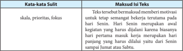

Tabel ini berisi informasi tentang kata-kata sulit dalam bahasa Indonesia yang sering digunakan dalam teks. Topik utamanya adalah motivasi untuk tetap semangat kerja terutama pada hari Senin. Kolom-kolomnya meliputi "Kata-kata Sulit" dan "Makna Isi Tekst". Data penting yang terlihat adalah bahwa "skala", "prioritas", dan "fokus" merupakan kata-kata sulit yang sering digunakan dalam teks tersebut. Ini menunjukkan bahwa dalam konteks motivasi kerja, penggunaan istilah-istilah seperti skala, prioritas, dan fokus sangat penting untuk membangkitkan semangat kerja di hari Senin.

### Arti Penting Teks

Pentingnya teks berjudul 'Kiat Tetap Semangat pada Hari Senin' ialah agar pembaca dapat memahami dan termotivasi melalui beberapa cara atau tips yaitu membuat skala prioritas,  sedikit  berpikir  (lakukan  selebihnya),  dan  luangkan  waktu  cukup  untuk istirahat.

Setelah  waktu  yang  disediakan  habis,  guru  meminta  salah  satu  kelompok mempresentasikan  hasil  kerjanya.  Kelompok  lain  memberikan  tanggapan  baik berupa pertanyaan maupun saran.

### PROSES PEMBELAJARAN D KEGIATAN 2

### Mengembangkan Teks Prosedur dengan Memperhatikan Struktur dan Kaidahnya

### Petunjuk untuk Guru

Pada bagian terakhir ini, guru membimbing  peserta didik  mampu mengembangkan teks prosedur dengan memperhatikan struktur dan kebahasaannya.  Namun,  ada  beberapa  hal  yang  harus  dipahami  dalam mengembangkan sebuah teks prosedur, yaitu membandingkan teks prosedur berdasarkan struktur  dan  kaidah  kebahasaannya,  mengomentari,  menyusun, dan menyunting.

Dalam mengembangkan teks prosedur, kita terlebih dahulu perlu mengetahui perbedaan atau persamaan yang ada di dalam teks yang berbeda. Hal  tersebut  merupakan  tahapan  membandingkan  satu  teks  dengan  teks lainnya, apakah terdapat perbedaan atau persamaan baik dari struktur maupun kaidah kebahasaannya.

Jika  kita  cermati,  teks  berjudul  'Kiat  Menata  Rambut  Pendek'  memiliki kesamaan dengan teks sebelumnya yang berjudul 'Kiat Tetap Semangat pada Hari  Senin' ,  yaitu  sama-sama  berisi  langkah-langkah  melakukan  sesuatu.  Di dalamnya pun terdapat kata kerja imperatif.

 

---
## 📄 Halaman 59

Teks  prosedur  sekurang-kurangnya  memiliki  tiga  macam,  di  antaranya adalah sebagai berikut.

- Teks  bertema  kebiasaan  hidup,  misalnya  kiat  hidup  sehat,  kiat  belajar menyenangkan, dan kiat sukses bertetangga.
- Teks  bertema  aktivitas  tertentu,  misalnya  cara  membuat  bolu  kukus,  cara menanam jagung hibrida, dan cara memelihara kucing.
- Teks  bertema  penggunaan  alat,  misalnya  cara  penggunaan  laptop,  cara menghidupkan motor bekas, dan cara menggunakan pisau cukur.

### Tugas 1

- Bacalah  dengan  cermat  teks  di  bawah  ini!  Kemudian,  jawablah  pertanyaanpertanyaan yang menyertainya!
Sumber: www. harrysutanto.com

Gambar 1.7 Tetap tersenyum.

Pernahkah  Anda  membandingkan  diri  Anda  dengan  orang  lain?  Mungkin ketika kita melihat orang lain sukses tetapi kita tidak, tiba-tiba terpikir pertanyaan berikut dalam pikiran, 'Mengapa saya tidak seperti dia?'  Pertanyaan menggugat seperti itu bisa terjadi secara terus-menerus dalam hal lainnya. Untuk mengatasi pemikiran-pemikiran  tersebut,  Anda  bisa  mengikuti  tips  yang  dilansir  dari Huffingtonpost berikut ini.

### Kenali Diri Sendiri

Hal  pertama  yang  perlu  dilakukan  agar  tidak  membandingkan  diri  sendiri dengan orang lain  adalah  kenali  diri  sendiri.  Jika  Anda  mengenal  diri  sendiri, ketika Anda melihat keberhasilan orang lain membuat Anda terpacu menjadi lebih baik, bukannya merasa tidak percaya diri atau sedih. Gambarkan diri Anda dalam

 

---
## 📄 Halaman 60

kata-kata,  seperti  pintar,  kuat,  baik,  keibuan,  memiliki  tujuan,  dan  sebagainya. Dengan mengenal dan menghargai diri sendiri membuat Anda tidak akan ingin menjadi seperti orang lain.

### Setiap Orang Memiliki Kelebihan Masing-masing

Mungkin ada orang tua yang berkata, 'Duduk tegak seperti saudaramu!' atau 'Bersihkan kamarmu seperti kakakmu!' Perintah-perintah seperti itu membuat anak  belajar  untuk  mengetahui  apa  yang  dilakukannya  dengan  apa  yang  telah dilakukan orang lain. Akan tetapi, hal itu tidak akan berpengaruh ketika setiap manusia menyadari bahwa ia memiliki karunia yang berbeda.

### Yang Penting Makna, Bukan Pengakuan

Ketika  Anda  menghabiskan  hidup  untuk  mengejar  pengakuan  orang  lain, boleh jadi itu akan membuat Anda merasa khawatir tentang siapa yang nantinya melewati  Anda.  Itu  akan  membuat  Anda  membandingkan  diri  sendiri  dengan orang lain. Jika Anda bekerja untuk mewujudkan impian, apa pun posisi Anda dalam suatu kekuasaan (jabatan), bukanlah masalah.

### Meniru Orang Berhasil

Ketika  seseorang  melakukan  sesuatu  dengan  baik,  coba  evaluasi  apa  yang membuatnya berhasil, carilah cara untuk memasukkan sifat-sifat keberhasilannya dalam kehidupan Anda sendiri.

(Sumber: Surat Kabar Republika dengan pengubahan)

Setelah membaca teks di atas, jawablah pertanyaan-pertanyaan di bawah ini!

- Menjelaskan apakah teks di atas?
- Teks  tersebut  berkategori  apa:  tentang  kebiasaan,  aktivitas  tertentu,  atau penggunaan alat? Jelaskan alasan-alasannya!
- Buktikan bahwa teks tersebut disusun secara kronologis!
- Mungkinkah  petunjuk-petunjuk  tersebut  kamu  terapkan  dalam  kehidupan sehari-hari?
- Bagaimana tingkat kebermanfaatan petunjuk itu bagi kamu sendiri?

 

---
## 📄 Halaman 61

- Setelah  mencermati teks pertama berjudul 'Empat Tips Agar Tidak Iri kepada Orang  Lain' ,  bandingkanlah  dengan  teks  kedua  yang  berjudul  'Meredakan Kejengkelan  pada  Hari  Senin'  di  bawah  ini.  Kemudian,  ikutilah  perintah  yang menyertainya!

### Meredakan Kejengkelan pada Hari Senin

Sumber: dokumen kemdikbud

Gambar 1.8 Mencintai hari Senin akan lebih baik.

Kembali bekerja setelah melewati akhir pekan yang seru dan menyenangkan memang menjengkelkan. Apalagi,  beberapa  tugas  telah  menanti  dan  parahnya dengan waktu yang sempit.

Betapa  pun  beratnya  memulai  kegiatan  di  Senin  pagi,  Anda  harus  ingat perusahaan tidak akan memberikan keringanan hanya karena Anda merasa butuh waktu penuh mengumpulkan tenaga ke kantor. Berikut lima tips untuk meredakan kejengkelan di hari Senin.

### Mendengarkan Suara Orang yang Anda Cinta

Entah suara suami, kekasih, orang tua, sahabat atau bayi Anda yang sedang lucu-lucunya. Mengawali hari Senin dengan membuat hati Anda berbunga-bunga, bisa  dijadikan  sebagai  penyemangat  terbaik.  Percakapan  ringan  yang  diakhiri dengan kecupan dan pelukan, dapat menyematkan senyuman manis pada wajah Anda.

### Mendengarkan Lagu Favorit Sepanjang Perjalanan ke Kantor

Buatlah satu folder di MP3 player , iPod dan smartphone , yang memuat daftar lagu-lagu favorit Anda. Lalu, mainkanlah setiap hari Senin saat perjalanan menuju kantor.  Seperti  yang  dilansir  dari MagForWomen ,  mendengarkan  musik  yang Anda suka, merupakan cara cepat untuk 'menggusur' rasa bete menjadi semangat.

### Menikmati Sarapan Favorit, Enak, dan Mewah

Setiap orang memiliki definisi makanan enak yang tidak sama. Apa makanan favorit  Anda?  Hidangkanlah  untuk  Anda  nikmati  sebagai  sarapan  sebelum berangkat kerja pada hari Senin. Meskipun makanan favorit tersebut tidak tepat untuk sarapan, jangan terlalu dipedulikan, santap saja!

 

---
## 📄 Halaman 62

### Awali Waktu Kerja dengan Pekerjaan yang Mudah

Beban  hari  Senin  akan  terasa  lebih  ringan,  jika  Anda  memulai  pekerjaan dengan  tugas  yang  lebih  mudah,  atau  setidaknya  yang  menurut  Anda  mudah. Menyelesaikan satu tugas sebelum makan siang, membuat suasana lebih baik, dan ampuh untuk mengasah produktivitas sampai sore hari.

### Tidur Lebih Lama dan Lelap saat Hari Minggu Malam

Kurang tidur malam menjadi salah satu penyebab orang merasa lesu pada pagi hari. Apalagi jika terjadi pada Senin pagi, hal ini dapat dimaklumi karena banyak orang menikmati akhir pekan secara maksimal. Misalnya dengan berpergian ke luar kota, berpesta dan menonton sampai larut malam. Akhirnya waktu istirahat berkurang.

Cobalah untuk berada di rumah sebelum jam tujuh malam pada hari Minggu, Dengan begitu  Anda  memiliki  waktu  yang  cukup  untuk  menyiapkan  pakaian, sepatu, aksesori dan kertas kerja yang harus dibawa ke kantor. Dengan demikian, pada  saat  pagi  datang,  Anda  tidak  perlu  terburu-buru  dan  merusak  suasana seharian penuh.

(Sumber: Surat Kabar Kompas dengan pengubahan)

Setelah selesai membaca teks di atas, ikuti instruksi berikut ini!

- Lakukanlah dengan berdiskusi bersama teman kelasmu. Temukanlah persamaan dan perbedaan dari kedua teks yang sudah kamu baca yang berjudul 'Empat  Tips  Agar  Tidak  Iri  pada  Orang  Lain  (Teks  1)'  dan  'Meredakan Kejengkelan pada Hari Senin (Teks 2)' .
- Sajikanlah hasil diskusi kelompokmu dalam format tabel seperti berikut ini.

 

---
## 📄 Halaman 63

### Contoh Jawaban

Setiap  jawaban  ini  tidak  mengikat.  Artinya,  peserta  didik  dibenarkan  dengan jawaban berbeda selama substansinya benar.

- Menjawab pertanyaan dari teks berjudul 'Empat Tips Agar Tidak Iri pada Orang Lain' .
- Teks tersebut menjelaskan tentang beberapa hal yang harus kita ketahui supaya terhindar dari sikap iri atau dengki kepada orang lain.
- Tentang kebiasaan/perilaku. Dalam teks tersebut dijelaskan bagaimana sikap kita agar tidak iri kepada kesuksesan orang lain.
- Kronologi  teks  tersebut  bisa  terlihat  dari  penempatan  atau  urutan  tips:  (1) kenali  diri  sendiri;  (2)  Setiap  orang  memiliki  kelebihan  masing-masing;  (3) yang penting makna, bukan pengakuan; dan (4) meniru orang berhasil.
- Dapat diterapkan dalam kehidupan sehari-hari.
- Sangat bermanfaat, supaya kita lebih mengenal kelebihan dan kekurangan diri kita dan tidak membandingkan dengan orang lain.

### 2.  Membandingkan dua teks

Teks 1

: Empat Tips Agar Tidak Iri kepada Orang Lain

Teks 2

: Meredakan Kejengkelan pada Hari Senin

---
**📊 Tabel**

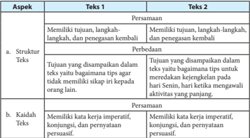

Tabel ini membandingkan dua teknik penulisan teks, yaitu Tekst 1 dan Tekst 2, dengan fokus pada struktur dan kaidah penulisan. Topik utama tabel adalah perbandingan antara dua teknik tersebut dalam hal tujuan, struktur, dan kaidah penulisan. Kolom pertama berisi aspek-aspek yang dibandingkan, seperti struktur teks dan kaidah teks. Untuk Tekst 1, tujuan disampaikan dalam teks yang bagian tipis untuk meredakan kejengkelan, sementara untuk Tekst 2, tujuan disampaikan secara langsung tanpa menggunakan kata-kata bagian tipis. Dalam hal struktur, Tekst 1 memiliki struktur yang lebih panjang dan kompleks, sementara Tekst 2 lebih singkat dan mudah dipahami. Untuk kaidah penulisan, kedua teknik sama-sama memiliki kata kerja imperatif, konjungsi, dan pernyataan persuasif. Pola penting yang terlihat adalah bahwa Tekst 2 lebih efektif dalam menyampaikan tujuan secara langsung dan mudah dipahami, sementara Tekst 1 lebih kompleks dan panjang.

 

---
## 📄 Halaman 64

---
**📊 Tabel**

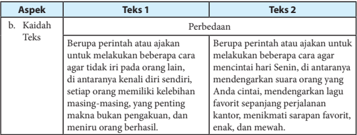

Tabel ini membandingkan dua teknik atau strategi dalam konteks kehidupan sehari-hari, yaitu "Berupa perintah atau ajakan untuk menekankan keberatan cara agar tidak ada di orang lain" (Teks 1) dan "Berupa perintah atau ajakan untuk melaksanakan keberatan cara agar tidak ada di orang lain" (Teks 2). Topik utama tabel ini adalah perbedaan antara kedua teknik tersebut dalam konteks kehidupan sehari-hari.

Kolom-kolom yang ada dalam tabel ini adalah:
1. Aspek
2. Tekst 1
3. Perbedaan

Data atau pola penting yang terlihat dalam tabel ini adalah bahwa kedua teknik memiliki aspek yang sama, yaitu "Berupa perintah atau ajakan untuk menekankan keberatan cara agar tidak ada di orang lain". Namun, perbedaannya terletak pada konteks penggunaan dan tujuan dari kedua teknik tersebut. Tekst 1 lebih fokus pada menekankan keberatan cara, sementara tekst 2 lebih fokus pada melaksanakan keberatan cara. Ini menunjukkan bahwa kedua teknik memiliki tujuan yang sama, tetapi cara implementasinya berbeda.

### Tugas 2

### Mengomentari Teks Prosedur Berdasarkan Struktur dan Kaidah Teks Prosedur

Struktur  teks  prosedur  dibentuk  oleh  tujuan,  langkah-langkah,  dan  penegasan kembali.  Sementara  itu,  kaidah  teks  prosedur  dibangun  oleh  kalimat-kalimat perintah  (kata  kerja  imperatif).  Terkadang  pula  konjungsi-konjungsi  yang  bersifat penambahan (kronologis), penggunaan kata-kata teknis, dan yang lainnya.

- Secara berkelompok, lakukanlah analisis terhadap teks yang berjudul 'Ciri Ban Tepat  untuk  Musim  Hujan'  di  bawah  ini.  Kemudian,  ikutilah  instruksi  yang menyertainya!

### Ciri Ban Tepat untuk Musim Hujan

Gambar 1.9 Ban mobil.

Hujan  semakin  sering  mengguyur  berbagai  wilayah  di  Indonesia.  Saatnya mempersiapkan kendaraan agar mengurangi risiko celaka ketika melintas di jalan basah. Salah satu poin utama adalah penggunaan ban. Tidak hanya pengendara mobil, pengendara sepeda motor juga harus memperhatikan soal ini.

 

---
## 📄 Halaman 65

Sony  Susmana,  Direktur Safety  Defensive  Consultant Indonesia  (SDCI), menjelaskan  bahwa  ban  adalah  faktor  utama  pada  kendaraan  saat  hujan.  'Di Indonesia  seharusnya  mobil  menggunakan  ban all  condition agar  bisa  dipakai untuk panas dan hujan. Ban yang bocor pada musim hujan bisa memecah air dengan baik dan membuang udara yang tersandera di depan ban,' ujarnya kepada Kompas Otomotif beberapa waktu lalu dalam kampanye safety GT Radial di Jakarta Timur. Meski demikian, Sony menjelaskan tidak harus ban all  condition .  Kalau musim hujan disarankan memakai ban sesuai rekomendasi pabrik.

Inilah ciri-ciri ban yang aman dipakai di jalan basah.

- Ban yang senormal mungkin, misalnya untuk mobil dengan profil ketebalan 55 hingga 70. Kalau sepeda motor antara 70 hingga 90. Adapun untuk lebar tapak juga  disarankan  tidak  menguranginya,  usahakan  ukuran  normal.  'Banyak pengguna sepeda motor yang memasang ban ceking . Ini jelas berbahaya, ' kata Sony.
- Gunakan ban tipe kembangan. Jangan sampai salah memilih karena pertimbangan fashion dengan  motif  aneh-aneh,  tetapi  tidak  aman  di  jalan basah.  Ban  yang  baik  punya  pola  bergaris  dengan  jarak  yang  tidak  terlalu renggang dan tidak terlalu jarang. Pola bergaris tersebut berguna memecah air saat jalanan basah, dan memiliki daya cengkeram lebih optimal. Hindari penggunaan ban slick atau  tanpa  pola.  Selunak-lunaknya kompon ban slick , tetap akan susah memecah air di jalanan dan cenderung mudah terpeleset.
- Untuk ban yang baru dibeli, jangan langsung beranggapan daya cengkeram sudah maksimal. Lapisan silikon masih menempel dan masih berpotensi licin. Ban paling baik jika sudah dipakai beberapa puluh kilometer di lintasan kering karena  gerusan  dengan  aspal  akan  menghilangkan  silikon  tersebut.  'Harus hati-hati pakai ban baru. Harus di-'reyen' dahulu supaya silikonnya hilang dan mencengkeram sempurna,' jelas Sony.
- Perhatikan alur ban. Ada dua jenis, ban bidirectional yang bisa dipakai dalam dua arah. Cirinya adalah alur simetris dan sama kalau dibolak-balik. Ban ini untuk penggunaan normal sehari-hari. Untuk musim hujan, pakai ban yang undirection dengan orientasi  satu  arah.  Tidak  bisa  dipindah  dari  sisi  kanan atau kiri. Jenis ban ini lebih punya pola lebih baik untuk memecah air.
(Sumber: Surat Kabar Kompas dengan Pengubahan)

 

---
## 📄 Halaman 66

- Setelah kamu membaca teks sebelumnya, ikutilah beberapa instruksi berikut.
- Gunakanlah pertanyaan-pertanyaan berikut sebagai pedoman.
- Secara bergiliran, presentasikanlah pendapat kelompokmu di depan kelas!
- Bandingkanlah pendapat kelompokmu dengan kelompok lain.
- Jadikanlah  pendapat-pendapat  semua  kelompok  itu  sebagai  dasar  untuk menyusun sebuah pendapat kelas tentang hasil analisis terhadap teks tersebut!

---
**📊 Tabel**

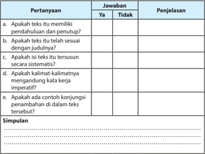

Tabel ini berisi pertanyaan-pertanyaan tentang karakteristik teks yang relevan dengan penulisan kreatif, di mana setiap pertanyaan memiliki jawaban "Ya" atau "Tidak", serta penjelasan untuk setiap jawaban. Topik utama tabel adalah analisis teks, termasuk pertanyaan tentang pendahuluan, kesesuaian dengan judul, sistematisitas, konjungsi penambahan, dan kalimat-kalimatnya. Data penting yang terlihat adalah bahwa setiap pertanyaan memiliki penjelasan yang mendetail, membantu pembaca memahami konsep-konsep tersebut secara lebih mendalam.

---
**📊 Tabel**

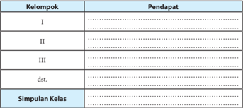

Tabel ini menunjukkan hasil diskusi kelas tentang kelompok pendidikan. Kolom pertama berisi nama-nama kelompok yang dibahas, seperti Kelompok I, II, III, dst. Kolom kedua berisi pendapat masing-masing kelompok tentang topik tersebut. Dalam kolom ini, kita bisa melihat bahwa setiap kelompok memiliki pendapat yang unik dan berbeda-beda. Misalnya, Kelompok I mungkin mendukung pendidikan formal, sementara Kelompok III mungkin lebih memilih pendidikan non-formal. Selain itu, tabel juga mencakup simpulan kelas yang menggambarkan kesimpulan umum dari semua pendapat yang diberikan oleh kelompok-kelompok tersebut. Ini membantu dalam memahami bagaimana topik tersebut dianggap oleh seluruh kelas dan memberikan pandangan umum tentang pendapat mereka.

 

---
## 📄 Halaman 67

### Contoh Jawaban

Setiap  jawaban  ini  tidak  mengikat.  Artinya,  peserta  didik  dibenarkan  dengan jawaban berbeda selama substansinya benar.

- Menganalisis  berdasarkan  teks  yang  telah  disajikan.  Kemudian,  ikuti  instruksi yang menyertainya.
- a.  Menjawab pertanyaan, memberi jawaban, penjelasan, dan simpulan.

---
**📊 Tabel**

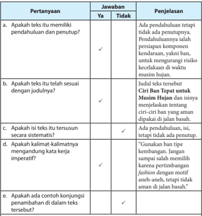

Tabel ini berisi pertanyaan-pertanyaan tentang kualitas teks yang akan dianalisis, dengan jawaban "Ya" atau "Tidak", dan penjelasan untuk setiap jawaban. Topik utama tabel adalah evaluasi kualitas teks, yang meliputi aspek-aspek seperti pendahuluan, kesesuaian judul, struktur, kalimat-kalimat yang mengandung kata kerja imperatif, dan konjungsi penambahan. Kolom-kolomnya mencakup pertanyaan-pertanyaan tersebut, dengan jawaban "Ya" atau "Tidak", dan penjelasan yang memberikan penilaian lebih lanjut. Data penting yang terlihat adalah bahwa beberapa aspek seperti kesesuaian judul dan struktur teks memiliki penilaian "Ya", sementara beberapa aspek lain seperti pendahuluan dan kalimat-kalimat yang mengandung kata kerja imperatif memiliki penilaian "Tidak".

### Simpulan

Ketika musim hujan, alangkah baiknya kita mempersiapkan kondisi kendaraan, terutama ban. Hal ini harus diperhatikan bagi pengguna mobil dan motor. Ban merupakan faktor utama pada kendaraan saat hujan. Oleh karena itu, pada kondisi hujan, ban harus sesuai dengan rekomendasi pabrik.

 

---
## 📄 Halaman 68

Adapun  ciri-ciri  ban  yang  aman  dipakai  adalah  ban  harus  dalam  ukuran normal, menggunakan tipe kembangan, hati-hati dalam penggunaan ban yang baru, dan memperhatikan alur ban.

- Bergiliran mempresentasikan pendapat kelompokmu di depan kelas dari soal yang telah diselesaikan di atas.
- Membandingkan pendapat kelompokmu dengan kelompok lain.
- Menyusun pendapat yang telah disampaikan ke dalam sebuah tabel pengerjaan.

### Tugas  3

- Analisislah  sebuah  teks  prosedur  lainnya,  berdasarkan  struktur  dan  kaidahkaidahnya!
- Laporkan hasil analisismu dalam format tabel berikut ini.
Judul Teks  : .................................

Sumber

: .................................

---
**📊 Tabel**

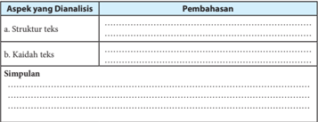

Tabel ini membahas dua aspek utama dalam analisis teks: struktur teks dan kaidah teks. Struktur teks mencakup bagaimana informasi disusun dan diorganisir dalam teks, sementara kaidah teks menunjukkan cara-cara yang digunakan untuk membuat teks menjadi lebih efektif dan menarik. Dalam simpulan, tabel ini menyoroti pentingnya memahami struktur dan kaidah teks dalam analisis teks.

### Contoh Jawaban

Setiap  jawaban  ini  tidak  mengikat.  Artinya,  peserta  didik  dibenarkan  dengan jawaban berbeda selama substansinya benar.

- Menganalisis teks prosedur dari berbagai sumber (surat kabar, majalah, buku, atau internet).
- Melaporkan teks prosedur yang dianalisis berdasarkan struktur dan kaidahnya, dan membuat simpulan ke dalam format tabel.
Judul Teks  : Cara Menanam Buah Naga

Sumber :

www.wartabahasa.com/2016/02/contoh-teks-prosedur-kompleks- tentang.html

 

---
## 📄 Halaman 69

---
**📊 Tabel**

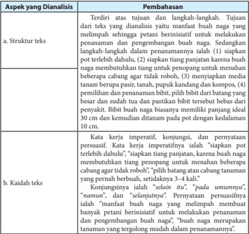

Tabel ini memperlihatkan analisis struktur dan kaidah teks dalam sebuah teks yang dianalisis. Topik utama tabel adalah penulisan teks, dengan fokus pada struktur dan kaidah yang digunakan. Kolom pertama berisi aspek-aspek yang dianalisis, seperti struktur teks dan kaidah teks. Kolom kedua berisi perbaikan yang diperlukan untuk setiap aspek tersebut. Data penting yang terlihat adalah bahwa struktur teks harus mencakup tiga bagian utama: inti, penjelasan, dan penutup. Kaidah teks harus mencakup konjungsi, kaidah penulisan, dan kaidah penulisan yang bersifat persifasi. Pola penting lainnya adalah bahwa teks harus memiliki struktur yang jelas dan mudah dipahami, serta kaidah penulisan yang baik dan benar.

### Simpulan

Buah naga merupakan tanaman yang mudah untuk ditanam. Banyak orang yang tertarik  untuk  menanam buah naga. Selain itu, buah naga juga memiliki sejumlah manfaat  bagi  kesehatan  tubuh,  di  antaranya  menurunkan  berat  badan,  mencegah kanker, meningkatkan sistem kekebalan tubuh, mencegah diabetes melitus, meningkatkan nafsu makan, dan lain-lain.

### Menyusun Teks Prosedur

Mari  berlatih  menyusun  teks  prosedur!  Langkah-langkah  penyusunan  teks prosedur sebagai berikut.

- Menginventarisasi macam-macam kegiatan yang pernah atau dapat dilakukan.
- Menentukan tema kegiatan.
- Membuat kerangka dalam bentuk topik-topik kegiatan secara garis besar.
- Mensistematisasikan kerangka dengan benar dan mudah dipahami pembaca.

 

---
## 📄 Halaman 70

- Mengumpulkan bahan-bahan.
- Mengembangkan kerangka menjadi sebuah petunjuk yang jelas dan lengkap.

### Contoh Jawaban

Setiap  jawaban  ini  tidak  mengikat.  Artinya,  peserta  didik  dibenarkan  dengan jawaban berbeda selama substansinya benar.

Pada  jawaban  ini,  peserta  didik  mencermati  kembali  kegiatan  apa  yang  telah dilakukan sebelumnya. Tentukan tema apa yang melatarbelakangi kegiatan tersebut.  Buat  kerangka  karangan  yang  dapat  dipahami.  Temukan  bahan-bahan pengembangannya dari berbagai sumber, bisa dari surat kabar, majalah, internet, atau buku. Selanjutnya, kembangkan kerangka tersebut menjadi teks prosedur yang utuh disertai petunjuk yang jelas dan lengkap.

- Jawablah pertanyaan-pertanyaan di bawah ini!
- Bagaimana  upaya-upaya  yang  dapat  kamu  lakukan  sehubungan  dengan masalah-masalah yang terdapat dalam teks di bawah ini?
- Kelas tidak punya dana untuk menyambut peringatan HUT RI. Padahal, kepala sekolah mewajibkan setiap kelas untuk menghias kelasnya masingmasing. Selain itu, setiap kelas harus mengirimkan utusan dalam berbagai perlombaan sekolah. Semuanya itu memerlukan dana yang tidak sedikit, terutama untuk membeli alat dan bahan-bahan hiasan serta untuk konsumsi utusan kelas.
- Kakak ingin melanjutkan kuliah. Waktu itu Ayah tidak memiliki dana yang cukup karena uangnya digunakan untuk membiayai perawatan kakek yang sakit. Apabila keinginan tidak terpenuhi pada waktu itu, berarti kakak harus menunggu  satu  tahun  lagi.  Waktu  setahun  memang  bukan  waktu  yang sebentar. Lagi pula teman-teman kakak hampir semuanya sudah kuliah dan beberapa di antaranya sudah bekerja.
- Melalui kegiatan berdiskusi, ungkapkan upaya-upaya tersebut ke dalam sebuah tulisan yang berbentuk teks prosedur!
- Bacalah teks yang telah dibuat secara bergiliran dengan kelompok lain. Kemudian, mintalah mereka untuk memberikan tanggapan/penilaian dengan menggunakan format tabel di bawah ini.

 

---
## 📄 Halaman 71

- Marilah kita berlatih menyusun teks prosedur secara mandiri! Ikutilah langkahlangkah berikut!
- Pilihlah sebuah tema untuk teks prosedur yang bermanfaat bagi diri sendiri dan juga orang lain!
- Susunlah teks tersebut dengan langkah-langkah seperti yang telah kita pelajari sebelumnya!
- Sajikanlah hasil kegiatan kamu itu dengan susunan sebagai berikut!
Judul

: ………………………………………………………

Tujuan

: ………………………………………………………

Sasaran Pembaca  : ………………………………………………………

Susunan langkah-langkah

…………………………………………………………………………………

…………………………………………………………………………………

…………………………………………………………………………………

…………………………………………………………………………………

…………………………………………………………………………………

### Contoh Jawaban

Setiap  jawaban  ini  tidak  mengikat.  Artinya,  peserta  didik  dibenarkan  dengan jawaban berbeda selama substansinya benar.

- a. Pada jawaban ini, peserta didik mencermati kedua teks permasalahan dan melakukan suatu solusi terhadap permasalahan dari teks tersebut.
- Setelah menentukan solusi atas permasalahan yang telah dicermati, tulis ke dalam bentuk teks prosedur.
- Kemudian, memberi tanggapan/penilaian dengan menggunakan format tabel yang telah  disediakan  berdasarkan  aspek  kelengkapan  bagian-bagian  teks,  kejelasan/ keterperincian penyampaian, keefektifan kalimat, dan kesantunan penampilan.
- Pada jawaban ini, peserta didik menyusun teks prosedur secara mandiri dengan mengikuti langkah-langkah, yaitu memilih/menentukan tema dan menyajikannya berdasarkan format yang telah disediakan.

 

---
## 📄 Halaman 72

### Menyunting Teks Prosedur

Dalam  menyunting sebuah teks prosedur, ada beberapa hal yang harus diperhatikan, yaitu kebenaran isi, strukturnya, kaidah kalimat, ataupun penggunaan ejaan/tanda baca.

### Perhatikanlah cuplikan berikut!

- Hal pertama yang perlu dilakukan agar tidak membandingkan diri sendiri dengan orang lain adalah kenali diri sendiri. (2) Jika Anda mengenal diri sendiri, ketika  Anda  melihat  keberhasilan  orang  lain  membuat  Anda  terpacu  menjadi lebih baik, bukannya merasa minder atau sedih. (3) Gambarkan diri Anda dalam kata-kata, seperti pintar, kuat, baik, keibuan, visioner, dan sebagainya. (4) Dengan mengenal dan menghargai diri sendiri membuat Anda tidak akan ingin menjadi seperti orang lain.
Ada dua jenis kesalahan dalam cuplikan tersebut, yakni dalam pembentukan kata dan pembentukan kalimat.

- Pembentukan kata kenali dalam kalimat (1) tidak tepat, seharusnya mengenali .
- Kalimat (2) dan (4) tidaklah efektif. Kalimat tersebut tidak jelas subjeknya.

---
**📊 Tabel**

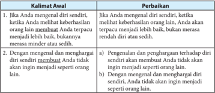

Tabel ini berisi dua kalimat awal yang berbeda, masing-masing dengan perbaikan yang disediakan. Topik utama tabel adalah tentang pengenalan diri sendiri dan penghargaan diri sendiri. Kolom pertama berisi kalimat awal aslinya, sedangkan kolom kedua berisi perbaikan yang diberikan. Data penting yang terlihat adalah bahwa kedua kalimat awal memiliki perbedaan dalam konteks penggunaan kata "merasa" dan "tidak".

 

---
## 📄 Halaman 73

Perhatikan  pula  kedua  cuplikan  teks  berikut.  Bandingkanlah  keduanya. Manakah  cuplikan  yang  mudah  dipahami?  Apakah  yang  membedakan  kedua cuplikan tersebut?

---
**📊 Tabel**

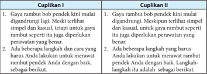

Tabel ini membandingkan dua situasi atau kondisi dalam proses perawatan rambut pendek. Topik utamanya adalah tentang cara memulai dan melanjutkan perawatan rambut pendek. Kolom pertama berisi cuplikan I dan II, yang masing-masing menunjukkan dua situasi yang berbeda dalam proses perawatan rambut pendek. Data penting yang terlihat adalah bahwa untuk kedua situasi, langkah pertama adalah memulai perawatan rambut pendek dengan benar, baik itu dengan digundung atau dengan metode tertentu. Selain itu, kedua situasi juga menekankan bahwa perawatan rambut pendek harus dilakukan secara rutin dan dengan cara yang tepat agar hasilnya optimal.

### Contoh Jawaban

Setiap  jawaban  ini  tidak  mengikat.  Artinya,  peserta  didik  dibenarkan  dengan jawaban berbeda selama substansinya benar.

Pada jawaban ini, peserta didik membandingkan dua teks cuplikan seperti yang telah dicontohkan pada soal di atasnya. Cuplikan mana yang mudah dipahami, serta apa yang membedakan pada kedua teks tersebut.

- Jelaskanlah  penyebab  kesalahan  dari  penulisan  kata  dalam  kalimat-kalimat  di bawah ini. Kemudian, perbaikilah!

---
**📊 Tabel**

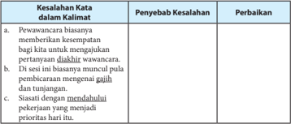

Tabel ini berisi informasi tentang kesalahan kata dalam kalimat dan cara mengatasinya. Topik utamanya adalah kesalahan kata dalam kalimat dan penyelesaiannya. Kolom pertama berisi tiga jenis kesalahan kata dalam kalimat: a) pawanakara biasanya memberikan kesempatan bagi kita untuk mengujiakn, b) di sini biasanya muncul pulu pembicaraan mengenai gaji dan tunjangan, dan c) mendaftahi pekerjaan yang menjadi prioritas hari itu. Kolom kedua berisi penyebab kesalahan, sedangkan kolom ketiga berisi perbaikan. Dari tabel ini, dapat dilihat bahwa kesalahan kata dalam kalimat seringkali disebabkan oleh penggunaan kata yang tidak tepat atau tidak sesuai dengan konteks, dan perbaikan umumnya melibatkan penggantian kata yang salah dengan kata yang tepat.

 

---
## 📄 Halaman 74

---
**📊 Tabel**

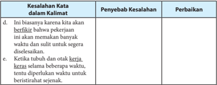

Tabel ini berisi informasi tentang kesalahan kata dalam kalimat, penyebabnya, dan cara perbaikannya. Topik utamanya adalah kesalahan kata dalam kalimat dan bagaimana mengatasinya. Kolom-kolomnya meliputi "Kesalahan Kata dalam Kalimat", "Penyebab Kesalahan", dan "Perbaikan". Data penting yang terlihat adalah bahwa kesalahan kata seringkali disebabkan oleh kecenderungan untuk berbicara secara cepat dan tidak memperhatikan detail, seperti "berbicara bahasa pkerjaan" dan "keras selama beberapa waktu". Perbaikan umumnya melibatkan penyesuaian bahasa yang lebih jelas dan memperhatikan detail dalam penggunaan kata.

- Penulisan kata-kata dari bahasa asing yang digunakan dalam bahasa Indonesia harus  dimiringkan.  Tunjukkanlah  contoh  kata  yang  dimaksud  dalam  kalimatkalimat di bawah ini. Kemudian, perbaikilah!

---
**📊 Tabel**

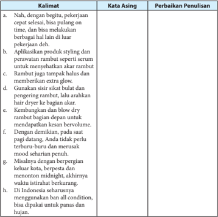

Tabel ini berisi informasi tentang perbaikan penulisan kalimat, dengan topik utama "Perbaikan Penulisan". Kolom-kolomnya meliputi "Kalimat" untuk kalimat yang ingin diperbaiki, "Kata Asing" untuk kata-kata yang tidak tepat, dan "Perbaikan Penulisan" untuk cara-cara yang dapat digunakan untuk memperbaiki kalimat tersebut. Data penting yang terlihat antara lain bahwa beberapa kalimat memiliki kesalahan kata seperti "nah" yang harus diubah menjadi "Nah", "serum" yang harus diubah menjadi "serum", dan "blow dry" yang harus diubah menjadi "blow-dry". Selain itu, tabel juga menunjukkan bahwa beberapa kalimat memiliki kesalahan penggunaan kata seperti "sikat bulat" yang harus diubah menjadi "sisik bulat" dan "blow" yang harus diubah menjadi "blow-dry".

 

---
## 📄 Halaman 75

---
**📊 Tabel**

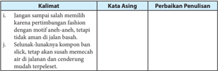

Tabel ini berisi informasi tentang perbaikan penulisan kalimat dengan menggunakan kata asing. Topik utamanya adalah perbaikan penulisan kalimat yang mengandung kata asing. Tabel ini memiliki dua kolom: "Kata Asing" dan "Perbaikan Penulisan". Kolom "Kata Asing" menunjukkan kata asing yang digunakan dalam kalimat, sedangkan kolom "Perbaikan Penulisan" menunjukkan cara untuk memperbaiki penulisan kalimat tersebut. Data penting yang terlihat dalam tabel ini adalah bahwa beberapa kalimat mengandung kata asing seperti "fashion", "aneh-aneh", "komponen", dan "lunaknya". Selain itu, tabel juga menunjukkan bahwa beberapa kalimat perlu diperbaiki dengan cara mengubah kata asing menjadi kata lokal atau bahasa Indonesia yang lebih familiar bagi pembaca.

- Kalimat-kalimat ini terlalu panjang sehingga maksudnya sulit dimengerti. Oleh karena itu, penggallah kalimat-kalimat tersebut sehingga menjadi lebih efektif.
- Setelah  kamu  menyelesaikan  tugas-tugas  di  atas,  langkah  selanjutnya  ikutilah instruksi berikut.
- Tampilkan kembali teks prosedur yang telah dibuat!
- Lakukanlah silang baca dengan salah seorang temanmu  untuk  saling memberikan koreksi!

---
**📊 Tabel**

Tabel ini berisi dua kumpulan kalimat: Kompleks dan Sederhana. Topik utamanya adalah tentang teknik wawancara kerja. Kolom pertama berisi kalimat yang lebih kompleks dan sulit dipahami, sementara kolom kedua berisi kalimat yang lebih sederhana dan mudah dipahami. Data penting yang terlihat adalah bahwa kalimat-kalimat kompleks seringkali menggunakan kata-kata yang lebih kompleks dan memiliki struktur kalimat yang lebih panjang, sementara kalimat-kalimat sederhana biasanya lebih singkat dan mudah dipahami.

 

---
## 📄 Halaman 76

### c. Sajikan hasil koreksimu dalam format tabel seperti di bawah ini!

Judul Teks

: ..............................

Penulis

: ..............................

### Contoh Jawaban

Setiap  jawaban  ini  tidak  mengikat.  Artinya,  peserta  didik  dibenarkan  dengan jawaban berbeda selama substansinya benar.

- Pada  jawaban  ini,  peserta  didik  mencermati  kesalahan  penulisan  kata  dalam kalimat-kalimat yang terdapat dalam tabel. Misalnya kata diakhiri, gajih, mendahului, mendahului, berfikir, dan kerja  keras. Kesalahan tersebut dikemukakan 'penyebab kesalahannya' dan 'perbaikannya' .
- Pada jawaban ini, peserta didik mencermati kalimat-kalimat yang terdapat dalam tabel. Penulisan kata dalam kalimat tersebut ada yang berasal dari bahasa asing (bahasa Inggris). Temukan dan cantumkan kata asing mana yang ada dalam setiap kalimat tersebut. Kemudian, ungkapkan perbaikan penulisannya.
- Pada jawaban ini, peserta didik mencermati setiap kalimat yang terdapat dalam tabel.  Kalimat-kalimat  tersebut  perlu  disederhanakan  atau  ubah  menjadi  lebih efektif  supaya  dapat  mudah  dipahami.  Dari  kalimat  kompleks  menjadi  kalimat sederhana.
- Peserta didik menampilkan kembali teks prosedur yang telah dibuat. Kemudian silang baca dengan salah satu teman untuk saling memberi koreksi. Pengoreksian berdasarkan  format  tabel  yang  telah  disediakan.  Jenis  koreksiannya  meliputi kepaduan paragraf, keefektifan kalimat, pilihan kata, dan penggunaan ejaan/tanda baca.

 

---
## 📄 Halaman 77

### E. Melaporkan Kegiatan Membaca Buku

Ind 1

Mengidentifikasi butir-butir penting dalam buku nonfiksi.

Ind 2

Menyusun laporan kegiatan membaca buku nonfiksi.

### PROSES PEMBELAJARAN E KEGIATAN 1

### Petunjuk untuk Guru

Pernahkah kamu membaca buku-buku ilmu pengetahuan, selain buku teks pelajaran? Setelah kamu membacanya, bagaimana tanggapanmu mengenai isi buku tersebut? Pada bab ini, kamu akan belajar bagaimana melaporkan buku yang  dibaca.  Buku  tersebut  adalah  buku  nonfiksi,  berupa  buku  pengayaan. Untuk dapat melaporkannya, kamu harus membaca dan memahami isi yang terkandung di dalam buku.

Kegiatan membaca sangat berguna. Dari kegiatan membaca, kita memperoleh banyak pengetahuan, wawasan, atau informasi berharga. Banyak sumber bacaan yang  dapat  kamu  baca.  Namun,  saat  ini  kamu  belajar  dari  membaca  buku nonfiksi. Salah satu jenis buku nonfiksi adalah buku-buku pengayaan. Bukubuku ini akan memperkaya pengetahuanmu, keterampilanmu, dan sikapmu.

Marilah mempersiapkan kegiatan membaca buku nonfiksi sebagai proyek membaca minggu ini. Buku tersebut harus kamu selesaikan dalam seminggu. Oleh  karena  itu,  biasakan  membawa  buku  tersebut  ke  mana  pun  kamu bepergian. Jika ada kesempatan untuk membaca, kamu dapat membacanya.

Proyek membaca ini dilaporkan secara mandiri. Oleh karena itu, langkahlangkah yang harus kamu lakukan sebagai berikut.

- Carilah buku nonfiksi (buku pengayaan) di perpustakaan. Buku yang kamu baca bukan buku teks pelajaran. Pinjamlah buku tersebut kepada petugas untuk kamu baca selama satu minggu.
- Jika  kamu memiliki uang, pergilah ke toko buku. Carilah buku nonfiksi yang dapat kamu miliki untuk dibaca.
- Mulailah  mempersiapkan  kegiatan  membaca,  dengan  menyiapkan  buku tulismu untuk melaporkan kegiatan membaca minggu ini.
- Tuliskanlah  judul  buku,  nama  penulis,  penerbit,  tahun  terbit,  dan  kota terbit.
- Amatilah daftar isi buku tersebut. Bacalah sekilas daftar isinya, kemudian tuliskanlah, ada berapa bab isi buku tersebut.

 

---
## 📄 Halaman 78

- Sebelum membaca, berdasarkan daftar isi buku, kamu susun pertanyaan yang  mungkin  akan  kamu  dapatkan  dari  isi  buku.  Pada  buku  laporan membaca, tuliskanlah pertanyaan-pertanyaan yang ingin kamu dapatkan jawabannya dari membaca isi buku.
- Mulailah membaca. Apabila buku itu milikmu, pada saat kamu membaca tandailah butir-butir penting dari setiap subbab yang dibaca. Jika buku itu milik perpustakaan, setiap kamu membaca butir-butir penting, tuliskanlah pada buku laporan membaca.
- Setiap kamu akan mulai membaca, tuliskan terlebih dahulu hari, tanggal, dan waktu kamu membaca agar kegiatanmu terdata.
- Lakukanlah kegiatan membaca buku tersebut selama satu minggu.
- Jika kamu sudah selesai membaca buku, susunlah laporan kegiatan tersebut dalam  buku  rekaman  tertulis  kegiatan  membaca.  Untuk  membantumu melaporkan  kegiatan  membaca,  berikut  ini  contoh  format  yang  dapat kamu buat.
Tabel:

Laporan Kegiatan Membaca Buku

Judul Buku :

Pengarang :

Penerbit :

Kota Terbit :

### a. Kegiatan Prabaca

---
**📊 Tabel**

Tabel ini berisi pertanyaan sebelum membaca buku, yang terdiri dari kolom "No." dan "Pertanyaan Sebelum Membaca Buku". Topik utama tabel ini adalah proses pembacaan buku, dimana setiap baris menunjukkan pertanyaan yang harus dijawab sebelum memulai membaca sebuah buku. Kolom "No." digunakan untuk memberikan nomor urutan pada setiap pertanyaan, sementara kolom "Pertanyaan Sebelum Membaca Buku" menyajikan pertanyaan-pertanyaan tersebut secara lengkap. Data atau pola penting yang terlihat adalah bahwa tabel ini mencakup banyak pertanyaan sebelum membaca buku, menunjukkan bahwa pembacaan buku memerlukan persiapan yang cukup.

### b. Kegiatan Pascabaca

 

---
## 📄 Halaman 79

Dilaporkan oleh :

Kelas :

### 1. Penilaian Pengetahuan

Teknik  penilaian  pengetahuan  yang  dapat  digunakan  oleh  guru  adalah  tes tulis, observasi, dan tes penugasan.

### a. Tes tulis

Tes tulis untuk menguji pemahaman peserta didik dapat dilakukan baik dengan tes uraian maupun pilihan ganda. Sebaiknya dalam melaksanakan ulangan harian guru memilih soal uraian karena soal uraian dapat lebih mengukur kemampuan peserta didik secara lebih dalam. Pertanyaan yang diajukan hendaknya mengacu pada indikator pembelajaran.

### Contoh Soal Uraian untuk Bab 1

Petunjuk: Bacalah  teks  prosedur  di  bawah  ini  saksama.  Kemudian,  jawablah pertanyaan yang menyertainya!

### Kiat Berwawancara Kerja

Bagi perusahaan, wawancara merupakan kesempatan untuk menggali kualifikasi calon pegawai secara lebih mendalam, melihat kecocokannya dengan posisi yang ditawarkan, kebutuhan dan sifat perusahaan. Wawancara pun menjadi ajang tanya jawab antara pewawancara dengan calon.

PENILAIAN

 

---
## 📄 Halaman 80

Agar  mudah  dipahami  oleh  mitra  bicara,  kita  harus  berbicara  dengan  jelas. Usahakan agar kita tidak berbicara terlalu cepat atau lambat, atur juga suara agar jelas  terdengar.  Suara  yang  terlalu  pelan  membuat  kita  terlihat  kurang  percaya diri, sementara suara yang terlalu keras membuat kita terlihat agresif. Penggunaan bahasa yang baik juga menjadi suatu keharusan. Selain itu, perhatikan betul apa yang disampaikan pewawancara agar kita dapat memberikan jawaban yang relevan. Tidak  ada  salahnya  menanyakan  kembali  atau  mencoba  mengulangi  pertanyaan yang  diajukan  untuk  memastikan  bahwa  pemahaman  kita  sudah  benar.  Namun, jangan  melakukannya  terlalu  sering  karena  justru  akan  membuat  pewawancara mempertanyakan daya tangkap kita.

Bahasa tubuh pun  ikut memegang  peranan.  Gerakan  nonverbal  seperti mengangguk atau sikap tubuh yang agak condong ke depan menunjukkan bahwa kita  tertarik  pada  apa  yang  disampaikan  si  pewawancara.  Pastikan  pula  kita menjaga  kontak  mata  dengan  pewawancara  karena  kontak  mata  penting  dalam proses komunikasi, termasuk dalam wawancara kerja.

Singkatnya, akan lebih baik jika kita mampu menampilkan sikap yang antusias secara  verbal  maupun  nonverbal.  Oleh  karena  itu,  hindari  bahasa  tubuh  yang dapat diartikan negatif, seperti menggoyangkan kaki, mengetuk-ngetuk jari, atau menghindari kontak mata. Cara berbicara yang percaya diri tetapi tidak terkesan sombong dapat menarik minat pewawancara.

Pada saat berbicara, hindari uraian yang panjang lebar dan bertele-tele. Cobalah mengemas  kalimat  secara  singkat  dan  terfokus,  namun  tetap  menarik.  Kita diharapkan mampu menunjukkan bahwa kita adalah orang yang tepat untuk posisi yang ditawarkan. Ceritakanlah kemampuan atau pengalaman yang relevan dengan posisi tersebut. Hindari mengkritik atasan atau  rekan kerja sebelumnya karena ini menunjukkan sikap yang tidak profesional.

Selama  wawancara  berlangsung,  jadilah  diri  sendiri.  Ungkapan  ini  mungkin terdengar klise, namun jauh lebih baik menjadi diri sendiri dan berbicara dengan jujur,  daripada  mencoba  mengatakan  sesuatu  yang  menurut  kita  akan  membuat pewawancara  merasa  terkesan.  Jangan  melebih-lebihkan  kualifikasi  kita,  apalagi mengelabui  dengan  memberikan  data  yang  tidak  benar.  Cepat  atau  lambat, pewawancara akan menemukan bahwa data tersebut hanyalah karangan. Tunjukkan bahwa kita mampu mengenali diri kita sendiri dengan tepat.

Pewawancara biasanya memberikan kesempatan kepada kita untuk mengajukan pertanyaan di akhir wawancara. Gunakanlah kesempatan ini secara elegan dengan cara menunjukkan rasa ingin tahu kita tentang lingkup dan deskripsi tugas posisi yang  dilamar,  kesempatan  pengembangan  diri,  dan  sebagainya.  Ini  wajar  karena bersikap  pasif  dan  menyerahkan  segala  sesuatu  kepada  pihak  perusahaan  tidak akan menambah nilai kita di mata pewawancara.

 

---
## 📄 Halaman 81

Calon yang ingin bertanya dalam porsi yang tepat menunjukkan kesungguhan minatnya pada posisi yang ditawarkan dan juga pada perusahaan. Di sesi ini biasanya muncul  pula  pembicaraan  mengenai  gaji  dan  tunjangan.  Pewawancara  sangat menghargai  kandidat  yang  mampu  menentukan  nominal  gaji  yang  ia  harapkan karena dianggap dapat melakukan penilaian atas kemampuannya dan tugas-tugas yang  akan  dilakukan.  Tentu  saja  angkanya  harus  logis  sambil  tetap  membuka kesempatan untuk negosiasi. Dengan persiapan matang dan unjuk diri yang baik saat wawancara, kita telah meninggalkan kesan yang layak untuk dipertimbangkan oleh perusahaan.

(Sumber: 'Unjuk Diri yang Baik dalam Wawancara Kerja' dalam Kompas dengan pengubahan)

### Soal

- Identifikasilah teks prosedur di atas berdasarkan format tabel berikut!
- Dari isinya, menjelaskan tentang apakah teks prosedur itu?
- Berdasarkan isinya, apakah fungsi teks prosedur itu?
- Temukan kata kerja imperatif pada teks prosedur di atas!
- Temukan enam konjungsi pada teks prosedur di atas!
- Temukan pernyataan persuasif pada teks prosedur di atas!
- Berikanlah tanggapan dengan bahasamu sendiri pada teks tersebut!
- Tuliskan  kembali  isi  teks  prosedur  tersebut  dengan  menggunakan  bahasamu sendiri secara singkat dan jelas!

### Kunci Jawaban

- Identifikasi teks prosedur berdasarkan pernyataan umum dan tahapan-tahapan.

 

---
## 📄 Halaman 82

---
**📊 Tabel**

Tabel ini berisi informasi tentang tahapan-tahapan dalam proses komunikasi yang baik. Topik utamanya adalah "Kalimat Singkat" dan "Tahapan-Tahapan". Kolom pertama menunjukkan nomor urutan, sedangkan kolom kedua berisi deskripsi atau isinya dari setiap tahapan. Data penting yang terlihat meliputi: a) Melihat kecocokan dengan posisi pekerjaan yang dilamar; b) Ketika komunikasi harus berbicara dengan jelas; c) Menyimak dengan baik yang disampaikan pemberi awasan; d) Sikap bahasa harus tegak; e) Hindari komunikasi yang panjang dan bertele-tеле. Ini menunjukkan bahwa tabel ini membahas cara-cara untuk meningkatkan kualitas komunikasi dalam proses pencarian kerja.

- Perbedaan  utama  antara  teks  prosedur  dengan  teks  lainnya  ialah  bisa  dilihat berdasarkan isinya. Teks prosedur berisi tujuan dan langkah-langkah yang harus diikuti agar suatu pekerjaan dapat dilakukan. Jika teks lain, misalnya teks biografi berisi tentang riwayat hidup seseorang (tokoh) yang ditulis oleh orang lain.
- Isi teks prosedur menjelaskan tentang hal-hal yang harus dipahami dan dilakukan ketika akan menghadapi wawancara pekerjaan, misalnya dari cara berkomunikasi dan gerak tubuh.
- Kata  kerja  imperatif  (perintah)  yang  terdapat  dalam  teks  ini  ialah harus, perhatikan, jangan, pastikan, tunjukkan, gunakanlah, ceritakanlah.
- Kata konjungsi yang terdapat dalam teks prosedur ini ialah sementara, selain itu, namun, oleh karena itu, dengan.
- Pernyataan persuasif yang terdapat pada teks ini ialah (a) penggunaan bahasa yang baik juga menjadi suatu keharusan; (b) singkatnya, akan lebih baik bila kita mampu menampilkan sikap yang antusias, verbal maupun nonverbal; (c) ini wajar karena bersikap pasif dan menyerahkan segala sesuatu pada pihak perusahaan tidak akan menamah nilai kita di mata pewawancara; (d) pewawancara sangat menghargai kandidat yang mampu menentukan nominal gaji yang ia harapkan karena dianggap bisa melakukan penilaian atas kemampuannya dan tugas-tugas yang akan dilakukan.
- Pada jawaban ini, peserta didik mengemukakan pendapat berdasarkan pengetahuannya mengenai isi teks prosedur yang dibaca.
- Pada jawaban ini, peserta didik diarahkan untuk mampu menulis ulang isi teks prosedur yang telah dibaca. Namun, penulisannya harus menggunakan bahasa sendiri.

 

---
## 📄 Halaman 83

---
**📊 Tabel**

Tabel ini menunjukkan kunci jawaban untuk beberapa soal yang berkaitan dengan identifikasi teks prosedur dan deskripsi jawaban. Topik utama tabel adalah tentang skor dan deskripsi soal-soal tersebut. Kolom-kolomnya meliputi No. Soal, Deskripsi, Skor, dan Skor Maksimal. Data penting yang terlihat adalah bahwa skor maksimal untuk setiap soal dapat bervariasi antara 2 hingga 10, dengan skor tertinggi 20 untuk satu soal. Deskripsi soal mencakup berbagai tingkat kesesuaian jawaban, mulai dari lengkap dan tepat hingga hanya sebagian kecil saja yang tepat. Ini menunjukkan bahwa pembuktian pengetahuan dan kemampuan dalam mengidentifikasi teks prosedur dan menjawabnya dengan tepat sangat penting dalam konteks ini.

 

---
## 📄 Halaman 84

---
**📊 Tabel**

Tabel ini menunjukkan kunci jawaban untuk beberapa soal yang mungkin ditemui dalam sebuah ujian atau tes. Topik utama tabel adalah tentang skor yang diberikan untuk setiap jawaban yang diberikan oleh siswa. Tabel ini terdiri dari kolom "No. Soal", "Deskripsi", "Skor", dan "Skor Maksimal". Kolom "No. Soal" menyediakan nomor urut untuk setiap soal yang ada. Kolom "Deskripsi" memberikan deskripsi tentang jenis jawaban yang diterima, seperti "Jawaban tepat dan lengkap", "Sebagian besar jawaban tepat", "Separuh jawaban tepat", dan "Sebagian kecil saja jawaban yang tepat". Kolom "Skor" menunjukkan skor yang diberikan untuk setiap jenis jawaban tersebut, sementara kolom "Skor Maksimal" menunjukkan skor maksimal yang dapat diperoleh untuk setiap soal. Data penting yang terlihat dalam tabel ini adalah bahwa skor maksimal untuk setiap soal adalah 10, dan skor yang diberikan untuk setiap jenis jawaban berbeda-beda.

 

---
## 📄 Halaman 85

---
**📊 Tabel**

Tabel ini menunjukkan kunci jawaban untuk dua soal yang berbeda, dengan deskripsi dan skor yang diberikan untuk setiap jawaban. Topik utama tabel adalah tentang penilaian atau evaluasi kinerja siswa. Kolom-kolomnya meliputi No. Soal (Nomor Soal), Deskripsi (Deskripsi Soal), Skor, dan Skor Maksimal. Data penting yang terlihat adalah bahwa skor maksimal untuk setiap soal bervariasi, dengan soal 9 memiliki skor maksimal 10 dan soal 10 memiliki skor maksimal 15. Selain itu, tabel juga memberikan informasi tentang bagaimana skor ditentukan berdasarkan jumlah jawaban yang tepat dan lengkap.

 

---
## 📄 Halaman 86

### b. Observasi

Observasi  selama  proses  pembelajaran  selain  dilakukan  untuk  penilaian  sikap, juga dapat dilakukan untuk penilaian pengetahuan, misalnya pada waktu diskusi atau kegiatan kelompok. Teknik ini merupakan cerminan dari penilaian autentik. Guru mencatat  aktivitas dan kualitas jawaban, pendapat, dan pertanyaan yang disampaikan peserta didik selama proses pembelajaran.

Catatan ini dapat dijadikan dasar bagi guru untuk memberikan reward (tambahan) nilai pengetahuan bagi peserta didik.

### Lembar Observasi Penilaian Pengetahuan

---
**📊 Tabel**

Tabel ini merupakan lembaran untuk mengumpulkan informasi tentang hari, tanggal, nama peserta didik, pernyataan yang diungkapkan, dan reward yang diberikan. Topik utama tabel ini adalah proses pengujian atau evaluasi peserta didik. Kolom-kolom yang ada meliputi hari dan tanggal, nama peserta didik, pernyataan yang diungkapkan, dan reward. Data penting yang terlihat adalah bahwa setiap baris menunjukkan informasi tentang satu peserta didik pada hari tertentu, dengan pernyataan yang diungkapkan dan reward yang diberikan. Ini membantu dalam memantau perkembangan peserta didik dan memberikan feedback yang tepat.

### Keterangan:

- )* Berisi  pertanyaan,  ide,  usul,  atau  tanggapan  yang  disampaikan  peserta  didik berkaitan dengan materi yang dipelajari.
- )**   Rentang reward yang diberikan antara 1 -5 untuk skala penilaian 0 -100.

 

---
## 📄 Halaman 87

### c. Penugasan

Tugas-tugas  yang  diberikan  kepada  peserta  didik  (baik  dari  buku  teks  siswa maupun  hasil  inovasi  guru)  digunakan  sebagai  salah  satu  instrumen  penilaian hasil  belajar  pengetahuan peserta didik. Pembobotan nilai ditentukan berdasarkan tingkat  kesulitan  dan  lamanya  waktu  pengerjaan  tugas.  Semakin  sulit  dan  lama waktu mengerjakannya, semakin besar bobotnya. Tugas yang diberikan sebaiknya mencakup tugas individu dan kelompok.

Hasil penilaian kognitif dengan tugas dapat dicatat dan diolah dengan menggunakan  lembar penilaian seperti ini.

---
**📊 Tabel**

Tabel ini menunjukkan penilaian tugas pembelajaran untuk dua topik utama: Pembelajaran A dan Pembelajaran C. Setiap topik memiliki tiga kegiatan yang diukur dengan nilai. Untuk Pembelajaran A, kegiatan 1, 2, dan 3 masing-masing memiliki ruang kosong untuk menuliskan nilai. Sementara itu, untuk Pembelajaran C, kegiatan 1, 2, dan 3 juga memiliki ruang kosong untuk menuliskan nilai. Selain itu, tabel juga menyediakan ruang kosong untuk menuliskan nilai akhir setelah semua tugas selesai. Total skor untuk Pembelajaran A dan Pembelajaran C diperkirakan akan ditambahkan untuk mencapai nilai akhir.

Selanjutnya, untuk mendapatkan nilai kognitif  hasil penilaian proses dan ulangan harian  pada  akhir  pembelajaran  setiap  bab,  guru  dapat  menentukan  pembobotan berdasarkan tingkat kesulitan, lama waktu pengerjaan, dan sebagainya.

 

---
## 📄 Halaman 88

Berikut adalah contoh  rumus yang dapat digunakan.

NA : ( 2 X NA tugas) + Total reward + NUH 3

### Catatan:

- Reward diperoleh dari total reward selama pembelajaran satu bab.
- NUH adalah Nilai Ulangan Harian yang dilakukan pada akhir pembelajaran satu bab.
- Nilai  akhir  tugas  diberi  bobot  lebih  besar  karena  tugas  lebih  menyita konsentrasi  dan  waktu  pengerjaan  relatif  lama.  Nilai  tugas  diambil  dari pembelajaran A dan C.

### 2. Penilaian Keterampilan

Nilai keterampilan diperoleh dari hasil penilaian unjuk kerja/kinerja/praktik, proyek, dan portofolio. Unjuk kerja dalam pembelajaran bahasa Indonesia dapat berupa baik unjuk kerja lisan maupun tulis. Proyek diberikan diberikan minimal 1 kali X dalam satu semester, dan biasanya diberikan pada proses pembelajaran akhir.  Portofolio  diperoleh  dari  kumpulan  tugas  keterampilan  yang  dikerjakan peserta didik selama proses pembelajaran.

Rumus penentuan nilai akhir untuk KD 4 (keterampilan) diambil dari nilai optimal yang diperoleh peserta didik pada setiap KD.

INTERAKSI DENGAN ORANG TUA PESERTA DIDIK

Interaksi dengan orang tua dilakukan untuk mengomunikasikan  tugas mandiri dan  hasil  belajar  (portofolio)  peserta  didik  kepada  orang  tua.  Tugas  mandiri, melakukan  observasi,  harus  disampaikan  secara  resmi  melalui  surat  izin  kepada orang tua apabila peserta didik ditugaskan melakukan observasi di luar jam sekolah. Orang tua juga diminta menandatangani serta memberi komentar lembar tugas atau lembar  jawaban  ulangan  anaknya  pada  bagian  yang  telah  disediakan.  Kemudian, lembar tugas dan lembar jawaban ulangan yang telah ditandatangani orang tua/wali diserahkan kembali kepada guru untuk disimpan.

 

---
## 📄 Halaman 89

### Bab II

### Mempelajari Teks Eksplanasi

---
**🖼️ Gambar/Diagram**

> **Deskripsi Visual:** Gambar ini menunjukkan acara International Mathematical Olympiad (IMO) ke-56 yang berlangsung di Chiang Mai, Thailand pada tanggal 4-16 Juli 2015. Gambar ini adalah foto yang menampilkan para peserta dari Indonesia yang sedang berdiri di depan podium. Di belakang mereka, terdapat beberapa orang yang tampaknya adalah pengurus atau pembawa acara. Di sebelah kanan, terdapat beberapa papan dengan teks yang tidak jelas. Di sebelah kiri, terdapat beberapa papan dengan teks yang tampaknya menyebutkan nama-nama negara yang mengirim delegasi. Gambar ini menunjukkan bahwa Indonesia telah mengirim delegasi untuk mengikuti IMO ke-56.

Sumber: www. beritasatu.com

Gambar 2.1 Siswa Indonesia rebut perunggu Olimpiade Matemati ka di Thailand.

### Kompetensi Inti

- KI 1: Menghayati dan mengamalkan ajaran agama yang dianutnya.
- KI 2: Menghayati dan mengamalkan perilaku jujur, disiplin, tanggung jawab, peduli (gotong royong, kerja sama, toleran, damai), santun, responsif dan proaktif dan menunjukkan sikap sebagai bagian dari solusi atas berbagai permasalahan dalam berinteraksi secara efektif dengan lingkungan sosial dan alam serta dalam menempatkan diri sebagai cerminan bangsa dalam pergaulan dunia.

 

---
## 📄 Halaman 90

### Kompetensi Inti

- KI 3: Memahami, menerapkan, menganalisis pengetahuan faktual, konseptual, prosedural berdasarkan rasa ingin tahunya tentang ilmu pengetahuan, teknologi, seni, budaya, dan humaniora dengan wawasan kemanusiaan, kebangsaan, kenegaraan, dan peradaban terkait penyebab fenomena dan kejadian, serta menerapkan pengetahuan prosedural pada bidang kajian yang sp esifik sesuai dengan bakat dan minatnya untuk memecahkan masalah.
- KI 4: Mengolah, menalar, dan menyaji dalam ranah konkret dan ranah abstrak terkait dengan pengembangan dari yang dipelajarinya di sekolah secara mandiri, dan mampu menggunakan metode sesuai kaidah keilmuan.

---
**📊 Tabel**

Tabel ini berisi informasi tentang kompetensi dasar yang harus dimiliki oleh peserta didik dalam menulis teks eksplainer. Topik utamanya adalah mengidentifikasi, mengorganisir, menganalisis, dan memproduksi teks eksplainer secara lisan dan tulis. Kolom-kolomnya mencakup 4 subtopik: mengidentifikasi informasi, mengorganisir informasi, menganalisis struktur dan kebahasaan, dan memproduksi teks eksplainer. Data penting yang terlihat adalah bahwa semua subtopik tersebut harus dilakukan secara lisan dan tulis, menunjukkan bahwa proses penulisan harus dilakukan dengan cara yang sama baik di lisan maupun tulis.

---
**🖼️ Gambar/Diagram**

> **Deskripsi Visual:** Gambar ini adalah diagram yang menunjukkan proses pembelajaran teks ekspresi. Diagram ini terdiri dari dua bagian utama: "Peta Konsep" dan "Mempelajari Teks Ekspresi". Peta konsep berisi tiga blok utama: Identifikasi Informasi, Konstruksi Informasi, dan Analisis Struktur dan Kebahasaan. Setiap blok tersebut memiliki sub-blok yang menjelaskan langkah-langkah yang harus dilakukan dalam proses tersebut.

Elemen-elemen utama dalam diagram ini meliputi:
1. Identifikasi Informasi: Ini melibatkan pengumpulan informasi dari teks lisan dan tulis.
2. Konstruksi Informasi: Proses ini melibatkan penyusunan informasi menjadi teks ekspresi.
3. Analisis Struktur dan Kebahasaan: Langkah ini berkaitan dengan pemahaman struktur dan kebahasaan teks ekspresi.

Teks, angka, atau label penting yang terlihat dalam diagram ini meliputi:
- Identifikasi Informasi: Mengidentifikasi informasi dalam teks ekspresi lisan dan tulis.
- Konstruksi Informasi: Menyusun informasi menjadi teks ekspresi.
- Analisis Struktur dan Kebahasaan: Menganalisis struktur dan kebahasaan teks ekspresi.

Informasi kunci yang dapat diambil pembaca dari diagram ini adalah bahwa proses pembelajaran teks ekspresi melibatkan identifikasi informasi, konstruksi informasi, dan analisis struktur dan kebahasaan. Setiap langkah ini penting untuk memahami dan menghasilkan teks ekspresi yang baik.

 

---
## 📄 Halaman 91

### A. Mengidentifikasi Informasi dalam Teks Eksplanasi

Ind 1

Memahami informasi berupa pengetahuan dan urutan kejadian dari yang didengar atau dibaca.

Ind 2

Menemukan gagasan umum dan fakta penting dalam teks eksplanasi.

### PROSES PEMBELAJARAN A KEGIATAN 1

### Memahami Informasi dalam Teks Eksplanasi

### Petunjuk untuk Guru

Guru  dapat  melakukan  apersepsi  dengan  cara  mengajukan  beberapa pertanyaan kepada peserta didik untuk mengetahui pengetahuan awal peserta didik tentang teks eksplanasi. Beberapa pertanyaan yang bisa diajukan antara lain:

- Apakah kamu pernah mencermati suatu kejadian atau peristiwa sosial di lingkunganmu atau melihat berbagai fenomena alam?
- Pernahkah kamu membuat teks eksplanasi?
- Hal apa sajakah yang kamu temukan ketika membuat teks eksplanasi? Setelah  menyampaikan  materi  dan  indikator  yang  akan  dipelajari,  guru memberikan pemodelan teks eksplanasi. Guru dapat menayangkan contoh teks eksplanasi melalui teks yang disediakan, dari internet, atau dari sumber lainnya.
Pada kegiatan pemodelan, guru menugasi peserta didik untuk mencermati contoh  teks  eksplanasi  yang  disediakan  (guru  dapat  memilih  teks  lain  yang lebih  sesuai  dengan situasi  dan  latar  belakang  peserta  didik).  Berikut  adalah teks yang dapat disajikan kepada peserta didik.

 

---
## 📄 Halaman 92

### Demonstrasi Massa

Akhir-akhir ini demonstrasi kerap terjadi  hampir  setiap  waktu  dan  terjadi di berbagai tempat. Bahkan, demonstrasi sudah  menjadi  fenomena  yang  lumrah di tengah-tengah masyarakat kita. Menanggapi fenomena tersebut, seorang kepala  daerah  menyatakan  bahwa  penyebab demonstrasi dan anarkisme tidak lain  adalah  faktor  laparnya  masyarakat. Lantas ia mencontohkan rakyat Malaysia dan  Brunei  yang adem  ayem ,  lantaran

Gedung MPR Jakarta pada tahun 1998.

kesejahteraan mereka terpenuhi maka demonstrasi di negara-negara itu jarang terjadi.

Tentu saja komentar tersebut menyulut reaksi para mahasiswa. Mereka memprotes dan meminta sang bupati mencabut kembali pernyataannya. Para mahasiswa tidak terima dan tidak merasa memiliki motif serendah itu. Mereka berpendirian bahwa demonstrasi yang biasa mereka lakukan murni untuk memperjuangkan kebenaran dan melawan kemungkaran yang terjadi di hadapannya.

Persoalannya kemudian, pendapat manakah yang benar; sang bupati atau pihak mahasiswa  ataupun  komponen-komponen  masyarakat  lainnya?  Barangkali  logika sang bupati dikaitkan dengan kebiasaan bayi atau anak kecil yang memang begitu adanya. Kalau seorang bayi merasa lapar, ia akan ngamuk: menangis dan merontaronta. Namun, apabila logika sang bupati dibawa pada konteks yang lebih luas, jelaslah tidak relevan, misalnya membandingkan dengan kondisi rakyat di Malaysia ataupun Brunei yang adem-ayem , tidak seperti halnya rakyat Indonesia yang gampangan.

Demonstrasi massa tidak  selalu  disebabkan  oleh  urusan  perut,  bahkan  banyak peristiwa yang sama sekali tidak didasari oleh motif itu. Dalam kaitannya dengan kebutuhan manusia, Abraham Maslow membaginya ke dalam beberapa tingkatan. Kebutuhan yang paling mendasar adalah makan dan minum. Sementara itu, yang paling puncak adalah kebutuhan akan aktualisasi diri.

Namun demikian, pada umumnya demonstrasi massa justru lebih didasari oleh kebutuhan  tingkatan  akhir  itu.  Masyarakat  berdemonstrasi  karena  membutuhkan pengakuan dari pemerintah ataupun pihak-pihak lain agar hak-hak dan eksistensi mereka diakui. Karena merasa dibiarkan, hak-haknya diingkari, bahkan dinistakan, kemudian mereka berusaha untuk menunjukkan jati dirinya dengan cara berdemonstrasi.

Banyak  fakta  dapat  membuktikannya.  Demonstrasi  massa  pada  awal-awal reformasi di negeri ini pada tahun 1997 -1998, bukan dilakukan oleh rakyat miskin ataupun  orang-orang  lapar.  Justru  hal  itu  dilakukan  oleh  warga  dari  kalangan menengah ke atas, dalam hal ini adalah mahasiswa dan golongan intelektual. Belum lagi  kalau  merujuk  pada  kasus-kasus  yang  terjadi  di  luar  negeri.  Dalam  beragam

 

---
## 📄 Halaman 93

skala (besar atau kecil), demonstrasi bukan hal aneh lagi bagi negara-negara Eropa. Demonstrasi yang mereka lakukan sudah tentu tidak didorong oleh kondisi perut yang lapar karena mereka pada umumnya dalam kondisi yang sangat makmur.

Perbandingan  yang  cukup  kontras  dengan  melihat  peristiwa  terbaru  di  Korea Utara. Kondisi sosial ekonomi warga negaranya sangat jauh terbelakang. Kemiskinan menjadi  pemandangan  umum  hampir  melanda  di  seluruh  pelosok  negeri.    Akan tetapi, ketika Kim Jong-Il, pimpinannya itu meninggal, tak ada upaya penggulingan kekuasaan  ataupun  demonstrasi  untuk  menuntut  perubahan  politik  di  negerinya. Padahal  peluang  untuk  itu  lebih  terbuka.    Justru  yang  terjadi  kemudian  hampir seluruh warganya menunduk hidmat, mengantar jenazah pimpinannya ke liang lahat.

Demikian pula jika kita melihat kembali kondisi masyarakat di negara tersebut. Kemiskinan  sangat  akrab  di  pinggiran  kota  dan  di  sudut-sudut  desa  di  berbagai pelosok.  Akan  tetapi,  mereka  jarang  melakukan  demonstrasi:  hanya  satu-dua peristiwa. Justru yang jauh lebih getol melakukan hal itu adalah warga yang tinggal pusat-pusat kota, yang secara umum mereka lebih makmur.

Dengan fakta-fakta semacam itu, nyatalah bahwa kemiskinan bukanlah penyebab utama  untuk  terjadinya  gelombang  demonstrasi.  Akan  tetapi,  fenomena  tersebut lebih  disebabkan  oleh  kemampuan  berpikir  kritis  dari  warga  masyarakat.  Mereka tahu akan hak-haknya, mengerti pula bahwa di sekitarnya telah terjadi pelanggaran dan kesewenang-wenangan. Mereka kemudian melakukan protes dan menyampaikan sejumlah tuntutan. Apabila faktor-faktor itu tidak ada di dalam diri mereka, apa pun yang terjadi  di  sekitarnya,  mereka  akan  seperti  kerbau  dicocok  hidung:  manggutmanggut  dan  berkata  'ya'  pada  apa  pun  tindakan  dari  pimpinannya  meskipun menyimpang, dan bahkan menzalimi mereka sendiri.

(Sumber: Kosasih)

Teks  di  atas  terdiri  atas  paragraf-paragraf  yang  merupakan  paparan  tentang akibat dan sebab maraknya demonstrasi di tengah-tengah masyarakat. Teks itu pun dapat  dikelompokkan  sebagai  teks  eksplanasi.  Dari  teks  semacam  itu  diharapkan para pembaca dapat memahami proses berlangsungnya suatu proses peristiwa yang bersifat kausalitas dengan sejelas-jelasnya.

Dalam teks eksplanasi, penulis menggunakan banyak fakta yang fungsinya sebagai penyebab atau akibat terjadinya suatu peristiwa. Bahkan, dapat dikatakan bahwa teks eksplanasi hampir semuanya berupa fakta. Untuk lebih jelasnya, perhatikan kembali paragraf pertama di atas. Paragraf tersebut dibentuk oleh empat buah kalimat yang semuanya berupa fakta.

---
**📊 Tabel**

Tabel ini berisi informasi tentang kondisi sosial ekonomi negara yang sangat jauh terbelakang, dengan fokus pada kemiskinan dan pemandangan umum hampir melanda seluruh pelosok negeri. Kolom "Ketentuan" menyajikan informasi tentang kondisi tersebut, sementara kolom "Keterangan" memberikan penjelasan lebih lanjut. Topik utama tabel ini adalah kondisi sosial ekonomi negara yang sangat jauh terbelakang, dengan fokus pada kemiskinan dan pemandangan umum hampir melanda seluruh pelosok negeri. Data penting yang terlihat adalah bahwa ketika Kim Jong-il meninggal, ada suatu pengangkatan kekuasaan atau demonstrasi untuk menuntut perubahan politik di negerinya. Ini menunjukkan bahwa situasi sosial ekonomi negara tersebut sangat sulit dan memerlukan perubahan signifikan.

 

---
## 📄 Halaman 94

---
**📊 Tabel**

Tabel ini berisi dua kalimat yang disusun secara logis untuk menjelaskan konsep atau fakta tertentu. Topik utama tabel adalah tentang perubahan emosi dan perilaku seseorang dalam situasi tertentu. Kolom pertama berisi kalimat-kalimat tersebut, sedangkan kolom kedua menyajikan keterangan atau penjelasan tentang setiap kalimat. Data penting yang terlihat adalah bahwa kedua kalimat tersebut membahas tentang perubahan emosi dan perilaku seseorang dalam situasi tertentu, dengan fakta bahwa perubahan emosi dan perilaku ini dapat terjadi karena berbagai faktor seperti kondisi lingkungan, kemiskinan, dan ketidakpuasan.

### Perhatikan pula contoh lainnya di bawah ini!

Kalau  memang  sudah  terkena  anemia,  jenis-jenis  asupan  alamiah  seperti dari makanan, sudah tak praktis lagi. Ini disebabkan, makanan berzat besi perlu dikonsumsi  dalam  jumlah  yang  banyak  dan  itu  tak  memungkinkan.  Makanya, asupan zat besi perlu ditambahkan sampai anemianya terkoreksi. Biasanya, mereka merasa sehat kembali setelah satu atau dua hari berikutnya jika mengonsumsi asupan zat  besi.  Namun,  itu  menghilangkan  gejalanya  saja.  Padahal,  penyakitnya  masih ada sewaktu-waktu bisa muncul kembali. Oleh karena itu, agar anemia terkoreksi, dibutuhkan zat besi yang cukup sebagai cadangan di dalam tubuh.  Cadangan  zat besi itu berguna untuk mengganti sel darah merah yang hilang. Biasanya, asupan itu terus dikonsumsi selama satu -tiga bulan sampai anemianya terkoreksi betul.

Teks  di  atas  juga  tergolong  ke  dalam  bentuk  teks  eksplanasi.  Di  dalamnya tergambar suatu paparan proses. Teks tersebut memaparkan secara kausalitas tentang proses penyembuhan penyakit anemia. Pembacanya pun memperoleh pemahaman yang  sangat  jelas  tentang  cara-cara  penyembuhan  penyakit  itu.  Dengan  contoh  di atas,  teks  yang  menjelaskan  suatu  proses,  urutan  kegiatan  yang  bersifat  kausalitas, dapat digolongkan ke dalam teks eksplanasi.

- Jawablah pertanyaan-pertanyaan di bawah ini!
- Apa yang menjadi dasar jika teks tersebut dinamakan teks eksplanasi?
- Bagaimana ciri umum dari teks eksplanasi?
- Teks eksplanasi dibentuk oleh unsur apa saja?
- Apa yang dimaksud dengan hubungan kausalitas dalam teks eksplanasi?
- Apa fungsi fakta dalam teks eksplanasi?

 

---
## 📄 Halaman 95

- Bacalah beberapa teks di bawah ini dengan cermat! Kemudian, tentukan manakah yang  termasuk  ke  dalam  teks  eksplanasi.  Setelah  itu,  secara  berkelompok kemukakan alasan-alasannya.
- Pertanian  yang  dilakukan  secara  konvensional  sudah  ketinggalan  zaman. Cara  bertani  konvensional  ini  dipandang  tidak  mampu  meningkatkan produksi  dan  kualitas  pangan  jika  dilihat  dari  tingkat  kebutuhan  pangan. Untuk mengatasi masalah ini sekarang sedang dikembangkan bioteknologi yang  diharapkan  mampu  melipatgandakan  produksi  pangan  sekaligus meningkatkan kualitasnya.
- Satu-satunya  bidang  pembangunan  yang  tidak  mengalami  imbas  krisis ekonomi  adalah  sektor-sektor  di  bidang  pertanian.  Misalnya,  perikanan masih  meningkat  cukup  mengesankan,  yaitu  6,65  persen;  demikian  pula perkebunan,  yang  meningkat  6,46  persen.  Walaupun  terkena  kebakaran sepanjang tahun, sektor kehutanan masih tumbuh 2,95 persen. Secara umum, kontribusi  dari  sektor-sektor  pertanian  terhadap  produk  domestik  bruto (PDB) meningkat dari 18,07 persen menjadi 18,04 persen. Padahal selama 30 tahun terakhir, pangsa sektor pertanian merosot dari tahun ke tahun.
- Sejak sekolah  dasar aku  dididik  mandiri  oleh  ibuku.  Pada  saat  aku berusia  sebelas  tahun  ibuku  mendidik  aku  supaya  bisa  mencari  uang sendiri  memenuhi  kebutuhan  sekolahku.  Setiap  berangkat  sekolah  ibuku menyertakan bermacam-macam buah satu tas untuk dijual di sekolah. Aku melakukannya  dengan  senang  hati.  Lama-kelamaan  ibuku  menyuruhku untuk membeli dan menjual sendiri tanpa harus dibantu siapa pun. Kegiatan semacam itu aku lakukan sampai sekarang meskipun aku sudah sekolah di SMA dengan barang-barang dagangan yang berbeda. Sekarang aku menjual pakaian  dari  mutu  berkualitas  rendah  sampai  dengan  berkualitas  tinggi. Yang paling mengesankan bagiku, sejak dulu sampai sekarang masih tetap ada pembeli setiaku
- Pohon  anggur,  di  samping  buahnya  yang  digunakan  untuk  pembuatan minuman, daunnya pun dapat digunakan sebagai bahan untuk pembersih wajah.  Caranya,  ambillah  daun  anggur  secukupnya.  Lalu,  tumbuk  sampai halus.  Masaklah  hasil  tumbukan  itu  dengan  air  secukupnya  dan  tunggu sampai mendidih. Setelah itu, ramuan tersebut kita dinginkan dan setelah dingin  baru  kita  gunakan  untuk membersihkan  wajah.  Insyaallah,  kulit wajah kita akan kelihatan bersih dan berseri-seri.

 

---
## 📄 Halaman 96

- Pada masa lalu bila seseorang ingin menabung atau mengambil uang di bank, harus  datang  ke  bank  tersebut  dengan  memenuhi  segala  persyaratannya. Demikian juga bila seorang nasabah mau mentransfer dana ke rekening lain, harus  datang  ke  bank  tersebut  dengan  memenuhi  segala  persyaratannya. Segala  transaksi  harus  dilakukan  di  tempat  bank  itu  berada.  Sekarang, para  nasabah  bank  dipermudah  dengan  teknik  layanan  baru.  Bila  mau mengadakan transaksi mulai dari menabung, mengambil uang, mengecek saldo  akhir  hingga  bayar  rekening  telepon,  dan  lain-lain  dapat  dilakukan dari jarak jauh tinggal tekan tombol. Telebanking merupakan  inovasi baru untuk mempermudah para nasabah melakukan berbagai kegiatan transaksi perbankan.

### Tabel Identifikasi

---
**📊 Tabel**

Tabel ini berisi informasi tentang jawaban dan alasan untuk beberapa teks yang belum disebutkan. Topik utamanya adalah analisis teks, di mana setiap baris menunjukkan satu teks dengan dua pilihan jawaban: "Ya" atau "Bukan". Setiap baris juga memiliki kolom "Alasan", yang menyediakan penjelasan mengapa pilihan tersebut mungkin benar atau salah. Dari data yang terlihat, tampak bahwa tabel ini digunakan untuk membantu pembaca membandingkan dan memilih antara dua opsi dalam konteks teks tertentu, sambil memberikan alasan yang mendukung keputusan mereka.

- Samakanlah jawaban dan alasan-alasan kelompokmu dengan kelompok yang lain. Kemudian, rumuskanlah simpulan dari setiap jawaban/alasan-alasan yang dikemukakan oleh semua kelompok!

---
**📊 Tabel**

Tabel ini menunjukkan hubungan antara kata kunci (Teks) dengan definisi atau penjelasan (Simpulan) untuk setiap kata tersebut. Topik utama tabel ini adalah pengenalan dan pemahaman dasar tentang definisi atau penjelasan dari berbagai kata. Kolom "Teks" berisi beberapa kata yang mungkin merupakan contoh atau istilah yang perlu dijelaskan, sementara kolom "Simpulan" berisi penjelasan atau definisi untuk setiap kata tersebut. Data atau pola penting yang terlihat adalah bahwa setiap kata memiliki satu simpulan yang menjelaskannya, menunjukkan bahwa tabel ini bertujuan untuk memperkenalkan konsep dasar definisi atau penjelasan kata.

 

---
## 📄 Halaman 97

### Contoh Jawaban

Setiap jawaban tidak mengikat. Artinya, peserta didik dibenarkan dengan jawaban berbeda selama substansinya benar.

- Pada  jawaban  ini  peserta  didik  menjawab  beberapa  pertanyaan  seputar  teks eksplanasi.
- Sebuah teks dikatakan termasuk jenis teks eksplanasi jika isi teks tersebut berisi tentang proses 'mengapa' dan 'bagaimana' kejadian-kejadian alam, sosial, ilmu pengetahuan, atau budaya.
- Ciri umum teks eksplanasi ialah strukturnya terdiri atas pernyataan umum, urutan  sebab-akibat,  dan  interpretasi  (pernyataan  tentang  topik);  memuat informasi berdasarkan fakta (faktual), kefaktualannya bersifat ilmiah.
- Unsur pembentuk teks eksplanasi ialah pendahuluan dan perincian. Pendahuluan berisi pengenalan objek yang akan dijelaskan, misalnya penjelasan  tentang  keberadaan  dan  pengertian  objek  tersebut,  sedangkan perincian berupa penjelasan tentang urutan peristiwa baik penyebab maupun akibatnya.
- Hubungan kausalitas adalah hubungan  sebab akibat, misalnya dengan penggunaan kata 'menyebabkan' , 'disebabkan' , 'sehingga' , 'jika' , dan lain-lain.
- Fungsi  fakta  dalam  teks  eksplanasi  ialah  menyampaikan  kebenaran  dari informasi  yang  terdapat  dalam  tulisan.  Informasi-informasi  yang  disajikan kepada pembaca sesuai dengan kenyataan atau peristiwa yang terjadi bukan rekayasa (tiruan).
- Pada jawaban ini, peserta didik menentukan teks mana yang termasuk ke dalam teks ekplanasi. Kemudian, secara berkelompok menyampaikan alasan-alasannya dalam format tabel  yang  telah  disajikan  dengan  menuliskan  jawaban  'Ya'  atau 'Bukan' serta menyampaikan 'alasannya' .
- Membuat  simpulan  berdasarkan  hasil  dari  mengident ifikasi  teks  eksplanasi  ke dalam format tabel yang telah disajikan.

 

---
## 📄 Halaman 98

### PROSES PEMBELAJARAN A KEGIATAN 2

### Menemukan Gagasan Umum dan Fakta Penting dalam Teks Eksplanasi

### Petunjuk untuk Guru

Pada  pembahasan  ini,  guru  mengajak  peserta  didik  untuk  menemukan gagasan umum dan fakta penting. Gagasan bisa disebut ide atau pemikiran. Cara terbaik untuk menemukan gagasan ialah dengan banyak membaca buku dan mengamati peristiwa di lapangan yang berhubungan dengan apa yang kita baca. Berikut contoh yang dapat disajikan kepada peserta didik.

Dampak merebaknya penyebaran virus sindrom pernapasan akut parah ( Severe  Acute  Respiratory  Sindrome /SARS)  dari  negeri  Jiran,  Singapura, mulai mengancam bisnis perhotelan di Batam. Jumlah tamu, baik dari luar negeri maupun dalam negeri merosot hingga tingkat hunian hotel di Batam berkurang hingga sepuluh persen. Demikian kata Public  Relation  Manager Goodway Hotel  Puri  Garden,  Budi  Purnomo  dan  kata  pengusaha  Novotel Hotel, Anas, ketika dihubungi Kompas di Batam.

Gagasan umum teks tersebut adalah tentang 'dampak penyebaran virus SARS terhadap  bisnis  perhotelan' .  Teks  tersebut  menjelaskan  dampak  penyebaran virus  terhadap  kondisi  perhotelan,  yakni  berupa  merosotnya  tingkat  hunian hotel yang ada Batam. Teks itu  pun tergolong ke dalam jenis eksplanasi, yakni teks  yang memaparkan proses terjadinya suatu fenomena atau kejadian dengan sejelas-jelasnya. Di dalam teks tersebut juga terkandung sebuah gagasan umum (ide pokok), yakni parahnya penyebaran virus SARS. Gagasan umum tersebut terdapat  pada  bagian  awal  paragraf.  Oleh  karena  itu,  cuplikan  teks  tersebut dapat pula digolongkan ke dalam jenis paragraf deduktif.

### Perhatikan juga teks berikut ini.

Sesudah pengakuan kedaulatan pada tanggal 27 Desember 1949, bangsa Indonesia  menanggung  beban  ekonomi  dan  keuangan.  Sebagai  akibat ketentuan-ketentuan hasil KMB (Konferensi Meja Bundar), Indonesia harus menanggung beban utang luar  negeri  dan  dalam  negeri.  Padahal  struktur ekonomi  Indonesia  pada  waktu  itu  masih  tergantung  kepada  beberapa jenis  perkebunan.  Situasi  politik  yang  tidak  stabil  semakin  meningkatkan pengeluaran negara. Akibatnya, anggaran pemerintah menj adi defisit.

 

---
## 📄 Halaman 99

Teks  tersebut  juga  bersifat  eksplanatif.  Gagasan  umumnya  tentang  beban keuangan pemerintah di tahun 1949 (yang begitu berat).  Gagasan umum itu terletak pada bagian awal paragraf. Dengan demikian, cuplikan tersebut pun digolongkan ke dalam paragraf deduktif.

Selain  itu,  mungkin  pula  sebuah  paragraf  dalam  teks  eksplanasi  bersifat induktif  ataupun  campuran.  Akan  tetapi,  yang  dapat  ditemukan,  paragrafparagraf  di  dalam  teks  eksplanasi  pada  umumnya  bersifat  deduktif,  yakni gagasan umumnya terletak pada bagian awal paragraf.

### Tugas

- Apa saja bukti bahwa semua teks di bawah ini berbentuk eksplanasi? Apa pula gagasan umum serta fakta penting di dalam teks tersebut?
- Pertumbuhan  dimulai  dari    kecambah.  Struktur  awal  yang  muncul  berupa radikula  atau  akar  primer.  Hal  ini  menunjukkan  bahwa  yang  pertama  kali dibutuhkan kecambah adalah air dan kebutuhan untuk melekat pada tanah. Akar  primer  akan  tumbuh  secara  lateral,  membentuk  akar  sekunder,  dan selanjutnya tumbuhlah cabang-cabang menjadi suatu sistem akar.
- Percabangan suatu bahasa proto menjadi dua bahasa baru atau lebih, serta tiaptiap bahasa baru itu dapat bercabang pula dan seterusnya, dapat disamakan dengan  percabangan  sebatang  pohon.  Pada  suatu  waktu  batang  pohon  tadi mengeluarkan cabang-cabang baru, lalu tiap cabang bertunas dan bertumbuh menjadi cabang-cabang baru. Cabang-cabang  yang  baru ini  kemudian mengeluarkan ranting-ranting yang baru. Demikian seterusnya. Begitu pula percabangan pada bahasa.
- Lakukanlah silang baca dengan salah seorang teman untuk saling memberikan penilaian/tanggapan terhadap hasil kerjamu itu, gunakanlah format penilaian seperti berikut.

 

---
## 📄 Halaman 100

### Contoh Jawaban

Setiap jawaban tidak mengikat. Artinya, peserta didik dibenarkan dengan jawaban berbeda selama substansinya benar.

- Bukti bahwa sebuah teks dikatakan teks eksplanasi ialah jika isi teks tersebut berisi tentang  proses  'mengapa'  dan  'bagaimana'  kejadian-kejadian  alam,  sosial,  ilmu pengetahuan, atau budaya. Pengerjaan pada jawaban ini melalui format tabel yang telah disajikan, yaitu isikan pada kolom 'bukti sebagai eksplanasi' , kolom 'gagasan umum', dan kolom 'fakta penting' .
- Memberi  penilaian  dan  tanggapan  melalui  format  tabel  yang  telah  disajikan. Penilaian berdasarkan aspek ketepatan isi jawaban, kelengkapan unsur jawaban, dan kebakuan berbahasa.

### B. Mengonstruksi Informasi dalam Teks Eksplanasi

Ind 1

Menyusun bagian-bagian pokok teks eksplanasi.

Ind 2

Menyajikan hasil teks eksplanasi.

### PROSES PEMBELAJARAN B KEGIATAN 1

Menyusun Bagian-Bagian Pokok Teks Eksplanasi

### Petunjuk untuk Guru

Pada  pembahasan  ini,  guru  membimbing  peserta  didik  untuk  mampu menyusun bagian-bagian teks eksplanasi dan menyajikan hasilnya. Sebenarnya tidak  ada  perbedaan  istilah  antara  struktur  teks  eksplanasi  dengan  bagianbagian pokok teks eksplanasi. Kita ingat kembali ciri-ciri teks eksplanasi.

- Strukturnya terdiri atas pernyataan umum (gambaran awal tentang apa yang disampaikan), deretan penjelas (inti penjelasan apa yang disampaikan), dan interpretasi (pandangan atau simpulan).
- Memuat informasi berdasarkan fakta (faktual).
- Faktualnya  memuat  informasi  yang  bersifat  keilmuan,  misalnya  tentang sains.

 

---
## 📄 Halaman 101

Jadi,  bagian-bagian  teks  eksplanasi  adalah  pernyataan  umum,  deretan penjelas,  dan  interpretasi.  Berikut  adalah  contoh  teks  eksplanasi  yang  dapat disajikan kepada peserta didik.

Banjir merupakan fenomena alam yang biasa terjadi di suatu kawasan yang banyak dialiri oleh aliran sungai. Secara sederhana, banjir dapa t didefinisikan sebagai  hadirnya  air  di  suatu  kawasan  luas  sehingga  menutupi  permukaan bumi kawasan tersebut. Dalam pengertian yang luas, banjir dapat diartikan sebagai suatu bagian dari siklus hidrologi, yaitu pada bagian air di permukaan bumi yang bergerak ke laut. Dalam siklus hidrologi kita dapat melihat bahwa volume  air  yang  mengalir  di  permukaan  bumi  dominan  ditentukan  oleh tingkat  curah  hujan,  dan  tingkat  peresapan  air  ke  dalam  tanah.  Air  hujan sampai  di  permukaan  bumi  dan  mengalir  di  permukaan  bumi,  bergerak menuju ke laut dengan membentuk alur-alur sungai. Alur-alur sungai ini di mulai di daerah yang tertinggi di suatu kawasan, bisa daerah pegunungan, gunung atau perbukitan, dan berakhir di tepi pantai ketika aliran air masuk ke laut. Secara sederhana, segmen aliran sungai itu dapat kita bedakan menjadi daerah  hulu,  tengah,  dan  hilir.  Di  daerah  hulu  yang  biasanya  terdapat  di daerah  pegunungan,  gunung,  atau  perbukitan.  Lembah  sungai  sempit  dan potongan melintangnya berbentuk huruf 'V' . Di dalam alur sungai banyak batu yang berukuran besar (bongkah) dari runtuhan tebing, dan aliran air sungai  mengalir  di  sela-sela  batu-batu  tersebut.  Air  sungai  relatif  sedikit. Tebing sungai sangat tinggi. Terjadi erosi pada arah vertikal yang dominan oleh aliran air sungai.

Di daerah tengah, umumnya merupakan daerah kaki pegunungan, kaki gunung, atau kaki bukit.  Alur  sungai  melebar  dan  potongan  melintangnya berbentuk huruf 'U' . Tebing sungai tinggi. Terjadi erosi pada arah horizontal, mengerosi batuan induk. Dasar alur sungai melebar, dan di dasar alur sungai terdapat  endapan  sungai  yang  berukuran  butir  kasar.  Apabila  debit  air meningkat, aliran air dapat naik dan menutupi endapan sungai yang di dalam alur, tetapi air sungai tidak melewati tebing sungai dan keluar dari alur sungai.

Di  daerah  hilir,  umumnya  merupakan  daerah  dataran.  Alur  sungai lebar dan bisa sangat lebar dengan tebing sungai yang relatif sangat rendah dibandingkan lebar alur. Alur sungai dapat berkelok-kelok seperti huruf 'S' yang dikenal sebagai 'meander' . Di kiri dan kanan alur terdapat dataran yang secara teratur akan tergenang oleh air sungai yang meluap sehingga dikenal sebagai 'dataran banjir' . Di segmen ini terjadi pengendapan di kiri dan kanan alur sungai pada saat banjir yang menghasilkan dataran banjir. Terjadi erosi horizontal  yang  mengerosi  endapan  sungai  itu  sendiri  yang  diendapkan sebelumnya.

 

---
## 📄 Halaman 102

Dari  penjelasan  sebelumnya  dapat  disimpulkan  bahwa  banjir  merupakan peristiwa  yang  terjadi  ketika  aliran  air  yang  berlebihan  merendam  daratan. Banjir juga dapat terjadi di sungai, ketika alirannya melebihi kapasitas saluran air,  terutama  di  selokan  sungai.  Akibatnya,  mampu merendam dan merusak jalan  raya,  jembatan,  mobil,  bangunan,  sistem  selokan  bawah  tanah,  dan kanal. Kerugian dari segi harta dan jiwa manusia merupakan dampak lain dari terjadinya banjir.

Paragraf pertama teks di atas merupakan bagian-bagian pernyataan umum. Paragraf  kedua  merupakan  bagian  deretan  penjelas,  dan  paragraf  terakhir merupakan bagian interpretasi.

### 1.  Bacalah teks berikut ini dengan saksama!

### Gempa Aceh

Gempa  dahsyat  pernah  terjadi  di Aceh,  26  Desember  2004,  pada  pukul 07.58  WIB.  Pusat  gempa  terletak  di sebelah  barat  Aceh  dengan  kedalaman 10 km. Bencana ini merupakan gempa bumi terdahsyat dalam kurun waktu 40 tahun  terakhir.  Dampak  kerusakannya meliputi  Aceh,  Sumatra  Utara,  Pantai Barat Semenanjung Malaysi a, Thailand, Pantai  Timur  India,  Srilangka,  bahkan sampai Pantai Timur Afrika.

di Aceh (26/12/2004).

Gempa ini juga mengakibatkan gelombang laut setinggi 9 meter. Bencana ini merupakan kematian terbesar sepanjang sejarah. Indonesia, Sri Lanka, India, dan Thailand merupakan negara dengan jumlah kematian terbesar.

Kekuatan gempa pada penghujung tahun 2004 itu mencapai 9.0 richter dengan korban tewas mencapai 283.100, 14.000 orang hilang dan 1,126,900 kehilangan tempat  tinggal.  Gempa  bumi  yang  disertai  gelombang  tsunami  itu  merupakan bencana  yang mengakibatkan kematian terbesar sepanjang sejarah. Indonesia, Sri Langka, India, dan Thailand merupakan negara dengan jumlah kematian terbesar.

Di Indonesia, gempa menelan lebih dari 126.000 korban jiwa. Puluhan gedung hancur  oleh  gempa  utama,  terutama  di  Meulaboh  dan  Banda  Aceh  di  ujung Sumatra. Di Banda Aceh, sekitar 50% dari semua bangunan rusak terkena tsunami.

 

---
## 📄 Halaman 103

Namun, kebanyakan korban disebabkan oleh tsunami yang menghantam pantai Barat Aceh dan Sumatra Utara.

Di Sri Lanka diko nfirmasikan 45.000 korban jiwa jatuh dan lebih dari 1 juta jiwa  penduduk  negara  ini  terkena  dampak  gempa  secara  langsung.  Di  India, termasuk  Kepulauan  Andaman  dan  Nicobar  diperkirakan  menelan  lebih  dari 12.000 korban jiwa.

Di Thailand banyak pula wisatawan asing terkena bencana, terutama di daerah Phuket diperkirakan ada sekitar 4.500 korban jiwa. Bhumi Jensen, cucu Raja Rama IX atau lebih dikenal dengan nama Bhumibol Adulyadej juga termasuk salah satu korban. Bhumi Jensen baru berusia 21 tahun.

Bahkan di Somalia, di benua Afrika ribuan kilometer dari Indonesia, dilaporkan jatuh lebih dari 100 korban jiwa. Akan tetapi,  sebagian besar atau mungkin hampir semua dari mereka adalah para nelayan.

Gempa  Bumi  dan  Tsunami  Aceh  yang  juga  menghantam  Thailand.  Selain menempati posisi gempa berkekuatan terbesar kedua setelah gempa Chili 1960 yang  mencapai  9.5  skala  richter,  gempa  Aceh  menempati  peringkat  pertama sebagai gempa dengan waktu (durasi) penyesaran yang paling lama, yaitu sekitar 10 menit. Gempa ini cukup besar untuk membuat seluruh bola bumi ikut bergetar.

(Sumber:

wikipedia.org )

### 2.  Ikutilah instruksi di bawah ini!

- Tentukanlah mana yang merupakan pernyataan umum, deretan penjelas, dan interpretasi.
- Carilah kalimat-kalimat yang memuat informasi berdasarkan fakta (faktual).

### Contoh Jawaban

Setiap jawaban tidak mengikat. Artinya, peserta didik dibenarkan dengan jawaban berbeda selama substansinya benar.

Menentukan pernyataan umum, deretan penjelas, dan interpretasi, serta mencari kalimat-kalimat fakta dari teks berjudul 'Gempa Aceh' . Pernyataan umum merupakan bagian pertama dari teks eksplanasi yang isinya mengenai penyampaian topik atau permasalahan yang dibahas. Bagian ini berisi gambaran mengenai apa dan mengapa fenomena tersebut bisa terjadi. Penulisan dari pernyataan umum ini harus menarik agar pembaca mau membaca teks eksplanasi tersebut hingga selesai. Deretan penjelas merupakan bagian yang sering juga disebut sebagai urutan sebab akibat dari suatu fenomena. Pada bagian ini, terdapat penjelasan yang detail dari suatu fenomena yang dibahas secara mendalam dan berdasarkan urutan waktu. Interpretasi merupakan bagian akhir atau penutup dari teks eksplanasi yang berisi inti sari atau simpulan dari topik atau proses yang dibahas. Informasi faktual merupakan pernyataan yang

 

---
## 📄 Halaman 104

berisi peristiwa berdasarkan kenyataan atau kejadian yang sebenarnya bisa ditandai dengan adanya waktu atau tempat. Informasi faktual dalam teks berjudul 'Gempa Aceh' antara lain Gempa dahsyat pernah terjadi di Aceh, 26 Desember 2004, pada pukul 07.58 WIB; Dampak kerusakannya meliputi Aceh, Sumatra Utara, Pantai Barat Semenanjung  Malaysia, Thailand,  Pantai  Timur  India,  Srilangka,  bahkan  sampai Pantai Timur Afrika .

### PROSES PEMBELAJARAN B KEGIATAN 2

### Menyajikan Hasil Teks Eksplanasi

### Petunjuk untuk Guru

Selain  menyajikan  teks  eksplanasi,  kamu  harus  mampu  mengomentari pengerjaan hasil orang lain. Dalam berkomentar bisa dibagi menjadi dua, yaitu kritik atau penolakan dan dukungan atau pujian.

### Perhatikanlah contoh di bawah ini!

- Nah,  itulah  gara-gara  kebiasaan  kita  membuang  sampah  di  sembarang tempat. Selokan meluap, akhirnya banjir. Siapa lagi yang menderita kalau bukan  masyarakatnya  itu  sendiri.  Makanya,  lain  kali  kalau  membuang sampah harus di tempat yang benar agar musibah itu tidak terjadi lagi.
- Untungnya gempa itu tidak terjadi pada malam atau dini hari. Kalau itu yang terjadi siang hari tentu banyak korban. Syukur pula para warga tidak panik sehingga mereka dapat menyelamatkan diri tanpa ada yang terluka. Kejadian  itu  harus  menjadi  pelajaran  bagi  kita  tentang  cara  menghadapi musibah, khususnya gempa.
Contoh  di  atas  merupakan  bentuk  komentar  terhadap  isi  suatu  teks eksplanasi tentang berlangsungnya atau terjadinya suatu kejadian. Berdasarkan contoh itu, komentar dalam eksplana si didefinisikan sebagai ulasan, tanggapan, atau  sambutan  (respons)  terhadap  sesuatu  yang  didengar  atau  dibaca.  Dari contoh itu pula, komentar dapat dikelompokkan ke dalam jenis berikut.

- Kritik atau penolakan, contohnya pernyataan (1),
- Dukungan atau pujian, contohnya pernyataan (2).

 

---
## 📄 Halaman 105

### Tugas

Pada  tugas  kedua  ini,  bandingkan  teks  yang  sudah  kamu  buat  dengan  milik teman-teman yang lain. Perbaiki lagi apabila masih dirasa perlu. Setelah itu, sajikan teks tersebut dengan cara memeragakannya di depan kelas. Untuk memeragakannya, mintalah bantuan salah seorang temanmu.

Manakah komentar yang sesuai yang langsung berkaitan dengan teks berjudul 'Gempa Aceh' di bawah ini!

- Pemerintah  seharusnya  segera  mengatasi  keterlambatan  bantuan  itu,  misalnya dengan mengerahkan helikopter agar bantuan itu bisa segera sampai kepada para warga.
- Di  Aceh,  ketika  bencana  tsunami  itu  melanda  waga  di  sana,  bantuan  datang terlambat sehingga para korban kian bertambah.
- Bencana  alam  semacam  gempa  memang  sering  disertai  dengan  kerusakan prasarana jalan sehingga bantuan yang diberikan pun menjadi susah masuk. Oleh karena itu, kita harus memaklumi keterlambatan bantuan itu.
- Datangnya bantuan tidak sekadar berharap kepada pemerintah. Masyarakat  di sekitarnya pun yang tidak terkena bencana harusnya cepat tanggap. Begitu pun dengan  warga  lainnya  di  seluruh  Indonesia,  harus  memberikan  bantuan  agar penderitaan mereka dapat cepat berakhir.
- Sekarang musibah terjadi di mana-mana, tidak kenal waktu dan tempat. Keadaan demikian harus kita antisipasi sejak dini agar tidak memakan korban yang begitu banyak.

---
**📊 Tabel**

Tabel ini menunjukkan kumpulan komentar yang diberikan oleh beberapa orang tentang sesuatu, mungkin sebuah produk atau layanan. Kolom "Sesuai" berisi tanda centang untuk setiap komentar, sementara kolom "Tidak Sesuai" tidak memiliki tanda centang. Topik utama tabel ini adalah evaluasi atau penilaian komentar tersebut. Data penting yang terlihat adalah bahwa sebagian besar komentar (dari 1 hingga 5) diterima dengan baik, dengan tanda centang di kolom "Sesuai". Ini menunjukkan bahwa responden umumnya merasa komentar tersebut relevan dan bermanfaat.

### Contoh Jawaban

Setiap  jawaban  ini  tidak  mengikat.  Artinya,  peserta  didik  dibenarkan  dengan jawaban berbeda selama substansinya benar.

Pada jawaban ini, mendiskusikan dan memberi komentar terhadap 5 rincian teks yang telah disajikan. Isi berdasarkan format tabel yang telah ada pada kolom 'sesuai' dan 'tidak sesuai' dengan memberi tanda centang ( P ).

 

---
## 📄 Halaman 106

### C. Menganalisis Struktur dan Kebahasaan Teks Eksplanasi

Ind 1

Mengident ifikasi struktur teks eksplanasi.

Ind 2

Menelaah kebahasaan teks eksplanasi.

### PROSES PEMBELAJARAN C KEGIATAN 1

### Mengidentifikasi Struktur Teks Eksplanasi

### Petunjuk untuk Guru

Pada pembahasan ini, guru membimbing peserta didik untuk menganalisis teks eksplanasi berdasarkan struktur dan kebahasaan. Teks eksplanasi memiliki struktur baku sebagaimana halnya jenis teks lainnya. Sesuai dengan karakteristik umum dari isinya, teks eksplanasi dibentuk oleh bagian-bagian berikut.

- Identifikasi fenomena ( phenomenon identification ), mengidentifikasi sesuatu yang akan diterangkan. Hal itu bisa terkait dengan fenomena alam, sosial, budaya, dan fenomena-fenomena lainnya.
- Penggambaran  rangkaian  kejadian ( explanation sequence ),  memerinci proses kejadian yang relevan dengan fenomena yang diterangkan sebagai pertanyaan atas bagaimana atau mengapa .
- Rincian  yang  berpola  atas  pertanyaan  'bagaimana'  akan  melahirkan uraian yang tersusun secara kronologis ataupun gradual. Dalam hal ini fase-fase kejadiannya disusun berdasarkan urutan waktu.
- Rincian yang berpola atas pertanyaan 'mengapa' akan melahirkan uraian yang  tersusun  secara  kausalitas.  Dalam  hal  ini  fase-fase  kejadiannya disusun berdasarkan hubungan sebab akibat.
- Ulasan (review ), berupa komentar atau penilaian tentang konsekuensi atas kejadian yang dipaparkan sebelumnya.

 

---
## 📄 Halaman 107

---
**🖼️ Gambar/Diagram**

> **Deskripsi Visual:** Gambar ini adalah diagram yang menunjukkan struktur teks eksplanasi. Diagram ini terdiri dari tiga bagian utama: Identifikasi Fenomena, Proses Kejadian, dan Ulasan. Setiap bagian memiliki subbagian yang lebih spesifik:

1. Identifikasi Fenomena meliputi Latar Belakang Kejadian dan Penyebab.
2. Proses Kejadian meliputi Kronologis dan Mengomentari Konsekuensi.
3. Ulasan mencakup Penyebab dan Mengomentari Konsekuensi.

Elemen-elemen utama dalam diagram ini adalah teks yang menjelaskan setiap bagian dari struktur teks eksplanasi. Angka dan label penting dalam diagram ini adalah "Identifikasi Fenomena," "Proses Kejadian," dan "Ulasan," yang masing-masing dihubungkan dengan subbagian spesifik yang menjelaskan bagaimana fenomena tersebut terjadi dan dianalisis.

Informasi kunci yang dapat diambil pembaca dari gambar ini adalah bahwa struktur teks eksplanasi melibatkan identifikasi fenomena, proses kejadian, dan ulasan, dengan setiap bagian memiliki subbagian yang lebih spesifik untuk menjelaskan fenomena dan prosesnya.

- Bacalah  kembali  teks yang  berjudul 'Demonstrasi  Massa'  di  atas. Secara berkelompok, tentukanlah bagian-bagian dari struktur teks tersebut. Kemudian, simpulkan pula struktur teks tersebut berdasarkan kelengkapannya!
- Presentasikanlah pendapat-pendapat kelompokmu tentang struktur itu. Kemudian, mintalah  teman-teman  dari  kelompok  lain  untuk  memberikan  penilaian  atau tanggapan-tanggapannya berdasarkan ketepatan, kelangkapan, dan kejelasannya!

---
**📊 Tabel**

Tabel ini menunjukkan bagian-bagian dari sebuah penulisan teks yang disusun secara sistematis. Topik utamanya adalah proses penulisan teks, yang meliputi identifikasi fenomena, proses kejadian, dan ulasan. Identifikasi fenomena mencakup identifikasi dan pengenalan fenomena-fenomena yang muncul dalam teks. Proses kejadian mencakup uraian tentang bagaimana fenomena-fenomena tersebut berkembang dan berinteraksi satu sama lain. Ulasan mencakup peninjauan kembali dan penyelesaian dari teks yang telah ditulis. Pola penting yang terlihat adalah bahwa setiap bagian memiliki tujuan spesifik dalam proses penulisan teks, mulai dari identifikasi fenomena hingga penyelesaian ulasan.

---
**📊 Tabel**

Tabel ini menunjukkan penilaian ketepatan, kelengkapan, dan kejelasan tanggapan dari beberapa penanggap. Topik utama tabel ini adalah evaluasi kualitas tanggapan. Kolom-kolomnya mencakup nama-nama penanggap, ketepatan, kelengkapan, dan kejelasan. Data penting yang terlihat adalah bahwa setiap penanggap memiliki satu baris di tabel, menunjukkan bahwa tabel ini mungkin berisi informasi tentang satu atau lebih penanggap tertentu. Tabel ini membantu dalam membandingkan kualitas tanggapan berdasarkan ketepatan, kelengkapan, dan kejelasan.

 

---
## 📄 Halaman 108

### Contoh Jawaban

Setiap  jawaban  ini  tidak  mengikat.  Artinya,  peserta  didik  dibenarkan  dengan jawaban berbeda selama substansinya benar.

- Menentukan bagian-bagian dari struktur teks yang berjudul 'Demonstrasi Massa' berupa ident ifikasi fenomena, proses kejadian, ulasan, dan simpulan.
- Mempresentasikan isi jawaban dari bagian-bagian yang telah ditentukan. Kemudian, peserta didik yang lain memberi tanggapan berdasarkan tabel yang telah tersedia, menyertakan nama, memberi tanggapan (ketepatan, kelengkapan, dan kejelasan).
- Identifikasi fenomena
:  'Penyebab  demonstrasi  dan  anarkisme  tidak  lain adalah  faktor  laparnya  masyarakat' ,  'Demonstrasi bukan hal aneh lagi bagi negara-negara Eropa' .

- Proses kejadian
:  'Rakyat  Malaysia  dan  Brunei  yang adem  ayem, lantaran kesejahteraan terpenuhi, maka demonstrasi di negara-negara itu jarang terjadi. ' , 'Komentar dari kepala  daerah  menyulut  reaksi  para  mahasiswa. Mereka memprotes dan meminta sang Bupati mencabut  kembali  pernyataannya' ,  'Demonstrasi massa  tidak  selalu  disebabkan  oleh  urusan  perut, bahkan  banyak  peristiwa  yang  sama  sekali  tidak disadari oleh motif itu. ' , 'Pada umumnya demonstrasi massa justru lebih disadari oleh kebutuhan tingkatan akhir itu. Masyarakat berdemonstrasi karena membutuhkan pengakuan dari pemerintah ataupun pihak-pihak lain agar hak-hak dan eksistensi mereka diakui. '

- Ulasan
:  'Demonstrasi  massa  pada  awal-awal  reformasi  di negeri ini pada tahun 1997 - 1998, bukan dilakukan oleh rakyat miskin ataupun orang-orang lapar. Justru  hal  itu  dilakukan  oleh  warga  dari  kalangan menengah ke atas, dalam hal ini adalah mahasiswa dan golongan intelektual' .

- Simpulan :
Banyak hal yang melatarbelakangi terjadinya demonstrasi,  yaitu  karena  adanya  ketidaksesuaian aturan  dan  pelaksanaan,  didorong  oleh  beberapa pihak, serta pelaksananya tidak selalu dari kalangan menengah ke bawah bahkan menengah ke atas.

 

---
## 📄 Halaman 109

### PROSES PEMBELAJARAN C KEGIATAN 2

### Menelaah Kebahasaan Teks Eksplanasi

### Petunjuk untuk Guru

Pada  pembahasan  ini,  guru  membimbing  peserta  didik  untuk  menelaah kaidah kebahasaan teks eksplanasi.

Berdasarkan kaidah kebahasaan secara umum, teks eksplanasi sama dengan kaidah teks prosedur. Sebagai teks yang berkategori faktual (nonsastra), teks eksplanasi banyak menggunakan kata yang bermakna denotatif.

Sebagai teks yang berisi paparan proses, baik itu secara kausalitas maupun kronologis, teks tersebut banyak menggunakan konjungsi kausalitas ataupun kronologis.

- Konjungsi kausalitas, antara lain, sebab, karena, oleh sebab itu, oleh karena itu, sehingga.
- Konjungsi kronologis (hubungan waktu), seperti kemudian, lalu, setelah itu, pada akhirnya.
Teks eksplanasi yang berpola kronologis  juga  banyak  menggunakan keterangan waktu pada kalimat-kalimatnya.

### Berikut contohnya.

Pada bulan keempat ,  muka telah kian tampak seperti manusia. Dalam bulan kelima rambut-rambut mulai tumbuh pada kepala. Selama bulan keenam , alis dan bulu mata timbul. Setelah tujuh bulan, fetus mirip kulit orangtua dengan kulit  merah  berkeriput. Selama    bulan  kedelapan  dan  kesembilan, lemak ditimbun di bawah kulit sehingga perlahan-lahan  menghilangkan sebagian keriput  pada  kulit.  Kaki  membulat.  Kuku  keluar  pada  ujung-ujung  jari. Rambut asli rontok dan terus menjadi sempurna dan siap dilahirkan.

Berkenaan dengan kata ganti yang digunakannya, teks eksplanasi langsung merujuk pada jenis fenomena yang dijelaskannya, yang bukan berupa persona. Kata  ganti  yang  digunakan  untuk  fenomenanya  itu  berupa  kata  benda,  baik konkret ataupun abstrak, seperti demonstrasi, banjir, gerhana, embrio, kesenian daerah ; dan bukan kata  ganti orang, seperti ia, dia, mereka . Karena objek yang dijelaskannya  itu  berupa  fenomena,  tidak  berbentuk  personal  ( nonhuman participation ), dalam teks eksplanasi itu pun banyak ditemukan kata kerja pasif. Hal itu seperti kata-kata berikut: terlihat, terbagi, terwujud, terakhir, dimulai, ditimbun, dan dilahirkan.

 

---
## 📄 Halaman 110

Di dalam teks itu pun banyak dijumpai kata teknis atau peristilahan, sesuai dengan  topik  yang  dibahasnya.  Apabila  topiknya  tentang  kelahiran,  istilahistilah biologi yang muncul. Demikian pula apabila topiknya tentang kesenian daerah,  istilah-istilah  budaya  sering  digunakan.  Apabila  topiknya  tentang fenomena kebaikan BBM, istilah ekonomi dan sosial akan sering muncul.

- Kerjakanlah  secara  berkelompok.  Untuk  berlatih,  tulislah  masing-masing  lima contoh  kalimat  yang  menggunakan  konjungsi  kausalitas,  kronologi,  dan  yang berketerangan waktu. Kamu bisa mengerjakan tugas ini pada buku kerjamu!
Kaidah Kebahasaan

Konjungsi kausalitas

Konjungsi kronologis

Keterangan waktu a.

b.

c.

Lakukanlah silang baca dengan kelompok lainnya untuk saling memberikan penilaian atas ketepatan dan kelengkapannya.

- Perhatikanlah kembali teks eksplanasi yang telah kamu baca. Secara berkelompok, lakukanlah penelaahan terhadap kaidah kebahasaan yang terdapat di dalam teks tersebut. Kemudian, laporkanlah hasil diskusi kelompokmu di depan kelas untuk mendapatkan tanggapan dari kelompok lain!
Judul Teks

Penulis

Sumber

: ..............................

: ..............................

: ..............................

Contoh Penggunaan

 

---
## 📄 Halaman 111

### Contoh Jawaban

Setiap  jawaban  ini  tidak  mengikat.  Artinya,  peserta  didik  dibenarkan  dengan jawaban berbeda selama substansinya benar.

- Mengerjakannya secara  berkelompok  berdasarkan  teks  yang  didapat  dari  surat kabar, majalah, internet, atau buku.
- Konjungsi kausalitas
- Sampah-sampah yang menyumbat aliran sungai menyebabkan banjir.
- Gempa bumi adalah getaran atau guncangan yang terjadi karena pergerakan lapisan batu bumi yang berasal dari dasar atau bawah permukaan bumi.
- Konjungsi kronologis
- Getaran bumi sangat kuat dan merambat ke segala arah sehingga dapat menghancurkan bangunan dan menimbulkan korban jiwa.
- Pada awalnya kami dipersilakan masuk, duduk, lalu ditanya apa keperluan kami.
- Keterangan waktu
- Mereka akan mengadakan perlombaan sepak bola dua minggu lagi.
- Zaman  dahulu  banyak  orang  berkirim  surat  menggunakan  burung merpati.
- Melakukan  silang  baca  dengan  kelompok  lain  dan  memberikan  penilaian berdasarkan  tabel  yang  telah  disajikan  yaitu  mencantumkan  nama  kelompok penilai, memberi penilaian berdasarkan ketepatan dan kelengkapan.

### D. Memproduksi Teks Eksplanasi

Ind 1

Menentukan pola pengembangan dalam menulis teks eksplanasi.

Ind 2

Menulis teks eksplanasi berdasarkan struktur dan kebahasaan.

PROSES PEMBELAJARAN D KEGIATAN 1

Menentukan Pola Pengembangan dalam Menulis Teks Eksplanasi

 

---
## 📄 Halaman 112

### Petunjuk untuk Guru

Pada  pembahasan  terakhir  ini,  guru  membimbing  peserta  didik  untuk membuat atau memproduksi teks eksplanasi dengan memperhatikan struktur dan  kebahasaannya.  Namun,  sebelum  membuat  haruslah  terlebih  dahulu menentukan pola pengembangan dalam menulisnya.

Agar  tersaji  secara  lebih  menarik,  kita  pun  perlu  mengetahui  pola-pola pengembangannya.  Secara umum, pola-pola pengembangan teks eksplanasi adalah sebagai berikut.

### 1.  Pola Pengembangan Sebab Akibat

Pengembangan teks eksplanasi dapat menggunakan pola sebab akibat. Dalam  hal  ini sebab dapat  bertindak  sebagai  gagasan  umum,  sedangkan akibat sebagai perincian pengembangannya. Namun demikian, dapat juga terbalik. Akibat dijadikan sebagai gagasan umum, maka perlu dikemukakan sejumlah sebab sebagai perinciannya.

Persoalan  sebab  akibat  sebenarnya  sangat  dekat  hubungannya  dengan proses.  Jika  disusun  untuk  mencari  hubungan  antara  bagian-bagiannya, proses itu dapat disebut proses kausalitas.

### Contoh:

Gempa  bumi  melanda  wilayah bagian selatan Daerah Istimewa Yogyakarta, Sabtu, 27 Mei 2006 pukul 05.54 WIB. Kekuatan gempa bumi tercatat 6,2 skala Richter pada kedalaman 17,1 km. Pusat gempa terletak pada posisi ± 25 km barat daya Kota Yogyakarta.

Gempa bumi ini mengakibatkan puluhan orang meninggal. Beberapa orang  luka-luka.  Sejumlah  bangunan  roboh  dan  mengalami  kerusakan. Selain  itu,  dilaporkan  juga  terjadi  longsoran  dan  kerusakan  berat  pada permukiman  dan  bangunan  lainnya  di  Kabupaten  Bantul  karena  dekat dengan sumber gempa bumi.

### 2.  Pola Pengembangan Proses

Proses merupakan suatu urutan dari tindakan-tindakan atau perbuatanperbuatan untuk menciptakan atau menghasilkan sesuatu atau perurutan dari suatu kejadian atau peristiwa. Untuk menyusun sebuah proses, langkahlangkahnya adalah sebagai berikut.

- Mengetahui perincian-perincian secara menyeluruh.
- Membagi proses tersebut menurut tahap-tahap kejadian.

 

---
## 📄 Halaman 113

- Menjelaskan setiap urutan itu ke dalam detail-detail yang tegas sehingga pembaca dapat melihat seluruh proses itu dengan jelas.

### Contoh:

Pada bulan keempat, muka telah kian tampak seperti manusia. Dalam bulan  kelima  rambut-rambut  mulai  tumbuh  pada  kepala.  Selama  bulan keenam, alis dan bulu mata timbul. Setelah tujuh bulan, fetus mirip kulit orang  tua  dengan  kulit  merah  berkeriput.  Selama    bulan  kedelapan  dan kesembilan,  lemak  ditimbun  di  bawah  kulit  sehingga  perlahan-lahan menghilangkan sebagian keriput pada kulit. Kaki membulat. Kuku keluar pada ujung-ujung jari. Rambut asli rontok dan fetus menjadi sempurna dan siap dilahirkan.

- Cermatilah ketiga cuplikan teks di bawah ini!
- Dua puluh tahun lalu, ponsel hanyalah telepon tanpa kabel. Namun demikian, teknologi berkembang cepat. Kerja sama operator dengan produsen ponsel serta  aliansi  dengan  perusahaan  di  bidang  teknologi,  membuat  ponsel tidak cuma untuk berbicara lisan. Dua tahun terakhir, kemampuan ponsel melakukan komunikasi data bertambah banyak. Ponsel generasi kedua ini, tidak  hanya  bisa  mengirim  dan  menerima pesan teks SMS ( short  message service ). E-mail , download nada dering, atau games juga dapat terselenggara dengan baik.
- Penampung limbah pabrik marmer PT CIM yang terletak di puncak Gunung Kapur  Desa  Citatah  Kabupaten  Bandung  jebol.  Akibatnya,  21  rumah  di sekitarnya hancur dan rusak berat diterjang longsoran limbah padat pabrik. Tidak ada korban tewas dalam musibah itu, tetapi sedikitnya tujuh orang dibawa ke rumah sakit Cibabat.

 

---
## 📄 Halaman 114

- Anarkisme  massa  pada  umumnya  terjadi  akibat  sikap  kritis  mereka  yang tidak  mendapat  tanggapan  secara  wajar.  Massa  kemudian  frustrasi  dan marah.  Mereka  merasa  aspirasinya  dilecehkan,  tidak  dihargai.  Dalam kondisi itulah, sikap rasional bisa melemah. Emosilah yang kemudian lebih berperan.  Apalagi  dalam  kerumunan  massa,  emosi  mudah  menjalar  dan tidak terkendali. Terjadilah akhirnya aksi perusakan yang sesungguhnya cara tersebut bertentangan dengan sikap kritis itu sendiri.
Menurutmu, ketiga cuplikan teks tersebut  dikembangkan dengan pola apa? Diskusikan pola topik dari setiap teks tersebut!

- Susunlah kalimat-kalimat di bawah ini sehingga menjadi teks-teks yang utuh dan padu!

---
**📊 Tabel**

Tabel ini berisi dua baris yang masing-masing berisi kalimat-kalimat dan urutan yang benar untuk setiap kalimat tersebut. Topik utama tabel adalah tentang urutan kalimat yang benar sesuai dengan konteksnya. Kolom pertama berisi nomor urut (No.) dari 1 sampai 2, sedangkan kolom kedua berisi kalimat-kalimat yang harus diurutkan. Kolom ketiga berisi urutan yang benar untuk setiap kalimat. Data penting yang terlihat adalah bahwa kalimat-kalimat tersebut memiliki urutan yang berbeda-beda, dan beberapa kalimat memerlukan pengetahuan khusus untuk diurutkan dengan benar.

 

---
## 📄 Halaman 115

### Contoh Jawaban

Setiap  jawaban  ini  tidak  mengikat.  Artinya,  peserta  didik  dibenarkan  dengan jawaban berbeda selama substansinya benar.

- Menentukan topik dan pola pengembangan dari cuplikan teks yang telah disajikan melalui tabel.
- Topik  pada  cuplikan  pertama  adalah perkembangan  ponsel  dari  zaman  ke zaman . Pola pengembangan 'proses' .
- Topik pada cuplikan kedua adalah dampak limbah pabrik . Pola pengembangan 'kronologis/kejadian' .
- Topik  pada  cuplikan  ketiga  adalah emosional  penyebab  anarkisme .  Pola pengembangan 'proses' .
- Menyusun kalimat-kalimat  yang  terdapat  dalam  tabel  menjadi  kalimat-kalimat utuh dan memiliki urutan yang benar.
- Kayu  ramin  diimpor  oleh  pedagang-pedagang  Singapura  dari  Kalimantan Barat. Di sana diolah menjadi perabot rumah tangga. Kemudian dikirim ke Jakarta, dan terkenal sebagai kayu jati Singapura. Tentu saja harga sudah 7 atau 8 kali lipat di Kalimantan Barat.
- Gempa  bumi  sering  diartikan  sebagai  getaran  atau  goncangan  yang  terjadi pada  permukaan  bumi.  Ketika  terjadi  gempa  bumi,  memang  kita  akan merasakan bumi yang kita diami ini bergetar atau bergoyang-goyang. Ketika itu, seolah-olah bumi ini bergerak-gerak, bukan? Bahkan, kalau goyangan atau goncangannya besar, bumi seakan-akan mau runtuh.

### PROSES PEMBELAJARAN D KEGIATAN 2

Menulis Teks Eksplanasi Berdasarkan Struktur dan Kebahasaan

### Petunjuk untuk Guru

Sebagaimana  yang  telah  dipaparkan  terdahulu  bahwa  teks  eksplanasi adalah teks yang memaparkan suatu proses peristiwa dengan sejelas-jelasnya. Oleh karena itu, jenis teks tersebut lebih banyak menggunakan fakta. Adapun langkah-langkah penyusunannya adalah sebagai berikut.

 

---
## 📄 Halaman 116

- Menda ftar topik-topik yang dapat dikembangkan menjadi teks eksplanasi.
- Contoh:
- Paling depan para siswi.
- Memainkan mayoret.
- Melakukan koreografi.
- Para penonton berjubel.
- Diikuti marching band.
- Pelajar menempelkan tulisan hak-hak remaja.
- Pelajar berselimut spanduk berisi tanda tangan pelajar.
- Menyusun kerangka teks, yakni dengan menomori topik-topik itu sesuai dengan  struktur  baku  dari  teks  ekspalanasi,  yang  paragraf-paragrafnya dapat disusun secara kausalitas atau kronologis. Dalam tahap ini, dapat saja membuat topik yang kita anggap tidak sesuai atau menggantinya dengan topik yang lain.

---
**📊 Tabel**

Tabel ini membahas struktur teks eksplanasi dalam pendidikan, yang terdiri dari tiga bagian utama: Identifikasi fenomena, Proses kejadian, dan Ulasan. Topik-topik dalam setiap bagian meliputi identifikasi fenomena seperti identifikasi masalah atau permasalahan, proses kejadian yang melibatkan penjelasan tentang bagaimana fenomena tersebut terjadi, dan ulasan yang mengevaluasi dan menyimpulkan hasil penelitian atau eksplorasi. Pola penting yang terlihat adalah bahwa setiap bagian memiliki tujuan spesifik dalam proses eksplorasi dan penelitian.

Adapun  pengembangan  paragrafnya,  kita  dapat  menyusun  kerangka seperti berikut.

### Contoh:

- Paling depan para siswi yang cantik.
- Memainkan mayoret, melakukan koreografi.
- Diikuti marching band.
- Pelajar menempelkan tulisan hak-hak remaja.
- Pelajar berselimut spanduk berisi tanda tangan pelajar.

 

---
## 📄 Halaman 117

- Mengembangkan kerangka yang telah disusun menjadi teks eksplanasi yang lengkap dan utuh, dengan memperhatikan struktur bakunya:  ident ifikasi fenomena,  proses  kejadian,  dan  ulasan.  Dalam  tahap  ini,  kita  harus menjadikan  topik-topik  itu  menjadi  kalimat  yang  jelas.  Kita  pun  dapat saja membuat kalimat yang fungsinya sebagai pengikat, seperti konjungsikonjungsi  yang  biasa  digunakan  dalam  teks  eksplanasi  sehingga  kalimatkalimat itu terjalin secara lebih kompak dan padu.
Berikut contoh pengembangan paragraf untuk teks eksplanasi.

Rombongan  ini  terbagi  menjadi  beberapa  kelompok .  Paling  depan, deretan siswi-siswi imut. Mereka asyik memainkan mayoret, melakukan koreografi menggunakan benderanya masing-masing. Kelompok mayoret ini diikuti dengan marching band ,  disusul dengan sejumlah pelajar yang menempeli tubuh mereka dengan papan yang bertuliskan hak-hak yang patut dituntut remaja. Rombongan diakhiri dengan sekelompok pelajar yang  berbaris  di  dalam  'selimut'  berbentuk  spanduk  yang  diisi  petisi berupa tanda tangan pelajar dari sejumlah sekolah di Bandung.

Kalimat  yang  bercetak  miring  merupakan  kalimat  tambahan  yang fungsinya sebagai pengikat sekaligus gagasan umum paragraf itu.

- Menyunting teks eksplanasi yang ditulis teman. Tujuannya untuk mengoreksi kesalahan-kesalahan yang mungkin ada dalam teks itu, misalnya berkenaan dengan:
- isi teks,
- struktur,
- kaidah kebahasaan, dan
- ejaan/tanda bacanya.

### Tugas

### Lakukan kegiatan berikut!

- a.  Daftarlah topik yang berkaitan dengan kegiatan belajar di sekolahmu.
- Susunlah topik-topik secara runtut ke dalam struktur eksplanasi: identifikasi fenomena, proses kejadian, dan ulasan!
- Kembangkanlah kerangka itu menjadi sebuah karangan eksplanasi dengan memperhatikan kaidah-kaidah kebahasaan yang benar!

 

---
## 📄 Halaman 118

- Lakukanlah silang baca dengan salah seorang teman dengan menggunakan rubrik penilaian berikut!

---
**📊 Tabel**

Tabel ini berisi aspek-aspek penilaian teks eksplanasi yang harus dipenuhi untuk mendapatkan nilai positif. Topik utamanya adalah kualitas penulisan teks eksplanasi. Kolom-kolomnya meliputi ketepatan jenis teks, struktur teks, keterpaduan antara paragraf, kaidah-kaidah kebahasaan, dan ketepatan penulisan ejaan dan tanda baca. Data penting yang terlihat adalah bahwa semua aspek tersebut harus memenuhi syarat "Ya" untuk mendapatkan nilai positif. Ini menunjukkan bahwa setiap aspek penilaian harus diperhatikan secara menyeluruh dalam menulis teks eksplanasi.

### Contoh Jawaban

Setiap  jawaban  ini  tidak  mengikat.  Artinya,  peserta  didik  dibenarkan  dengan jawaban berbeda selama substansinya benar.

- (a)  Da ftar topik yang berkaitan dengan kegiatan belajar di sekolah.
- -Menjadikan internet sebagai mitra belajar.
- -Teknologi komunikasi dan informasi dalam pembelajaran di kelas.
- -Memublikasikan naskah di media internet untuk guru dan peserta didik.
- -Menciptakan kelas yang menginspirasi.
- -Bergaul dan berinternet sehat.
- (b) Menyusun topik-topik berdasarkan struktur teks eksplanasi.
- -Identifikasi  fenomena:  Teknologi  dan  informasi  dalam  pembelajaran  di kelas; menjadikan internet sebagai mitra belajar.
- -Proses  kejadian:  memublikasikan  naskah  di  media  internet  untuk  guru dan peserta didik; menciptakan kelas yang menginspirasi.
- -Ulasan: bergaul dan berinternet dengan sehat.

 

---
## 📄 Halaman 119

- (c) Mengembangkan kerangka menjadi teks eksplanasi.
Fenomena teknologi dan informasi saat ini berpengaruh pada kehidupan masyarakat  terutama  pelajar.  Dengan  adanya  kedua  hal  tersebut  dapat memudahkan kita  untuk  memperoleh  informasi  secara  cepat,  akurat,  dan lengkap.  Namun,  ada  dua  sisi  yang  melatarbelakanginya,  sisi  positif  dan negatif. Sisi negatif sering kali pelajar memanfaatkannya dengan sesuatu yang kurang bermanfaat bagi perkembangan belajarnya di sekolah, yaitu dengan bermain game. Sementara itu, sisi positifnya setiap pelajar dapat memperoleh informasi  tentang  tugas-tugas  pelajaran  yang  akan  diselesaikannya  serta dapat menambah pengetahuan ketika berada di kelas.

Media internet sebagai produk dari teknologi dan informasi merupakan media yang perlu dimanfaatkan dengan baik bagi pelajar pada umumnya, bisa menjadi mitra dalam belajar. Selain bagi pelajar, dapat bermanfaat bagi guru ketika akan mencari bahan ajar untuk mengajar di kelas, ataupun menulis dan memublikasikannya sehingga setiap peserta didik dari berbagai sekolah dapat dengan mudah membacanya.

Tugas guru di kelas bukan hanya mengajarkan mata pelajaran melainkan juga bagaimana setiap pelajar dapat memahami, membuat, dan memublikasikan  produk  yang  dibuatnya  menjadi  hal  bermanfaat  serta mampu  diperoleh  oleh  setiap  orang  yang  mengakses  internet,  misalnya tulisan-tulisan berupa puisi, cerita pendek, artikel yang berhubungan dengan pengetahuan dan keterampilan. Dengan demikian, dapat menciptakan kelas yang menginspirasi baik bagi pelajar yang lain ataupun setiap pembaca yang mengakses internet.

Hadirnya  internet  sebagai  bagian  dari  perkembangan  teknologi  dan informasi menjadikan setiap orang bisa mengakses/memperoleh informasi dengan  cepat,  akurat,  dan  lengkap.  Positif  dan  negatifnya  suatu  media bergantung kepada penggunanya dalam memanfaatkan. Bergaul dan berinternet dengan sehat akan lebih bermanfaat bagi diri sendiri dan orang lain.

- Melakukan silang baca dengan seorang teman berdasarkan penilaian yang terdapat dalam tabel. Beri penilaian berdasarkan aspek, deskripsi, dan beri tanda centang ( P ) pada satu kolom 'Ya' atau 'Tidak' .

 

---
## 📄 Halaman 120

### 1. Penilaian Pengetahuan

Teknik  penilaian  pengetahuan  yang  dapat  digunakan  oleh  guru  adalah  tes tulis, observasi, dan tes penugasan.

### a. Tes tulis

Tes tulis untuk menguji pemahaman peserta didik dapat dilakukan baik dengan tes uraian maupun pilihan ganda. Sebaiknya dalam melaksanakan ulangan harian, guru memilih soal uraian karena soal uraian dapat lebih mengukur kemampuan peserta didik secara lebih dalam. Pertanyaan yang diajukan hendaknya mengacu pada indikator pembelajaran.

### Contoh Soal Uraian untuk Bab 2

Petunjuk: Bacalah teks di bawah ini saksama. Kemudian, jawablah pertanyaan yang menyertainya!

### Demonstrasi Massa

Akhir-akhir ini demonstrasi kerap terjadi hampir setiap waktu dan terjadi di berbagai  tempat.  Bahkan,  demonstrasi  sudah  menjadi  fenomena  yang  lumrah  di tengah-tengah  masyarakat  kita.  Menanggapi  fenomena  tersebut,  seorang  kepala daerah menyatakan bahwa penyebab demonstrasi dan anarkisme tidak lain adalah faktor laparnya masyarakat. Lantas ia mencontohkan rakyat Malaysia dan Brunei yang adem ayem ,  lantaran  kesejahteraan  mereka  terpenuhi  maka  demonstrasi  di negara-negara itu jarang terjadi.

Tentu saja  komentar tersebut menyulut reaksi para mahasiswa. Mereka memprotes dan meminta sang bupati mencabut kembali pernyataannya. Para mahasiswa tidak terima dan tidak merasa memiliki motif serendah itu. Mereka berpendirian bahwa demonstrasi yang biasa mereka lakukan murni untuk memperjuangkan kebenaran dan melawan kemungkaran yang terjadi di hadapannya.

Persoalannya  kemudian,  pendapat  manakah  yang  benar;  sang  bupati  atau pihak mahasiswa ataupun komponen-komponen masyarakat lainnya? Barangkali logika sang bupati dikaitkan dengan kebiasaan bayi atau anak kecil yang memang begitu  adanya.  Kalau  seorang  bayi  merasa  lapar,  ia  akan ngamuk :  menangis  dan meronta-ronta. Namun, apabila logika sang bupati dibawa pada konteks yang lebih luas,  jelaslah  tidak  relevan,  misalnya  membandingkan  dengan  kondisi  rakyat  di Malaysia ataupun Brunei yang adem-ayem ,  tidak  seperti  halnya  rakyat Indonesia yang gampangan.

### PENILAIAN

 

---
## 📄 Halaman 121

Demonstrasi massa tidak selalu disebabkan oleh urusan perut, bahkan banyak peristiwa yang sama sekali tidak didasari oleh motif itu. Dalam kaitannya dengan kebutuhan manusia, Abraham Maslow membaginya ke dalam beberapa tingkatan. Kebutuhan yang paling mendasar adalah makan dan minum. Sementara itu, yang paling puncak adalah kebutuhan akan aktualisasi diri.

Namun demikian, pada umumnya demonstrasi massa justru lebih didasari oleh kebutuhan tingkatan akhir itu. Masyarakat berdemonstrasi karena membutuhkan pengakuan dari pemerintah ataupun pihak-pihak lain agar hak-hak dan eksistensi mereka diakui. Karena merasa dibiarkan, hak-haknya diingkari, bahkan dinistakan, kemudian mereka berusaha untuk menunjukkan jati dirinya dengan cara berdemonstrasi.

Banyak  fakta  dapat  membuktikannya.  Demonstrasi  massa  pada  awal-awal reformasi di negeri ini pada tahun 1997 -1998, bukan dilakukan oleh rakyat miskin ataupun  orang-orang  lapar.  Justru  hal  itu  dilakukan  oleh  warga  dari  kalangan menengah ke atas, dalam hal ini adalah mahasiswa dan golongan intelektual. Belum lagi  kalau merujuk pada kasus-kasus yang terjadi di luar negeri. Dalam beragam skala (besar atau kecil), demonstrasi bukan hal aneh lagi bagi negara-negara Eropa. Demonstrasi yang mereka lakukan sudah barang tentu tidak didorong oleh kondisi perut yang lapar karena mereka pada umumnya dalam kondisi yang sangat makmur.

Perbandingan yang cukup kontras dengan melihat peristiwa terbaru di Korea Utara. Kondisi sosial ekonomi warga negaranya sangat jauh terbelakang. Kemiskinan menjadi pemandangan umum hampir melanda di seluruh pelosok negeri.  Akan tetapi, ketika Kim Jong-Il, pimpinannya itu meninggal, tak ada upaya penggulingan kekuasaan ataupun demonstrasi untuk menuntut perubahan politik di negerinya. Padahal  peluang  untuk  itu  lebih  terbuka.    Justru  yang  terjadi  kemudian  hampir seluruh  warganya  menunduk  hidmat,  mengantar  jenazah  pimpinannya  ke  liang lahat.

Juga  apabila  kembali  melihat  kondisi  warga  di  negeri  ini.  Kemiskinan  sangat akrab di pinggiran kota dan di sudut-sudut desa di berbagai pelosok. Akan tetapi, mereka jarang melakukan demonstrasi: hanya satu-dua peristiwa. Justru yang jauh lebih  getol  melakukan  hal  itu  adalah  warga  yang  tinggal  pusat-pusat  kota,  yang secara umum mereka lebih makmur.

Dengan fakta-fakta semacam  itu, nyatalah bahwa kemiskinan bukanlah penyebab  utama untuk terjadinya gelombang demonstrasi. Akan tetapi, fenomena tersebut lebih disebabkan oleh kemampuan berpikir kritis dari warga masyarakat. Mereka  tahu  akan  hak-haknya,  mengerti  pula  bahwa  di  sekitarnya  telah  terjadi pelanggaran  dan  kesewenang-wenangan.  Mereka  kemudian  melakukan  protes dan  menyampaikan  sejumlah  tuntutan.  Apabila  faktor-faktor  itu  tidak  ada  di dalam diri mereka, apa pun yang terjadi di sekitarnya, mereka akan seperti kerbau dicocok hidung: manggut-manggut dan berkata 'ya' pada apa pun tindakan dari pimpinannya meskipun menyimpang, dan bahkan menzalimi mereka sendiri.

(Sumber: Kosasih)

 

---
## 📄 Halaman 122

### Soal

- Ident ifikasilah teks eksplanasi di atas berdasarkan format tabel berikut!
- Apa yang dimaksud dengan teks eksplanasi?
- Bagaimana ciri umum dari teks eksplanasi?
- Teks eksplanasi dibentuk oleh unsur apa saja?
- Apa yang dimaksud dengan hubungan kausalitas dalam teks eksplanasi?
- Apa fungsi fakta dalam teks eksplanasi?
- Temukan lima konjungsi yang dominan dalam teks tersebut!
- Temukan lima makna istilah dalam teks eksplanasi tersebut!
- Tentukan struktur teks eksplanasi!
- Tuliskan  kembali  isi  teks  eksplanasi  tersebut  dengan  menggunakan  bahasamu sendiri secara singkat dan jelas!

---
**📊 Tabel**

Tabel ini berisi informasi tentang struktur teks yang mencakup pokok-pokok isi teks, urutan kejadian yang menunjukkan hubungan kausalitas, dan kumpulan kalimat singkat yang mungkin digunakan untuk menggambarkan teks tersebut. Topik utama tabel ini adalah pengembangan struktur teks, dengan kolom-kolom yang mencakup pokok-pokok isi teks, urutan kejadian yang menunjukkan hubungan kausalitas, dan kumpulan kalimat singkat yang mungkin digunakan untuk menggambarkan teks tersebut. Data penting yang terlihat dalam tabel ini adalah bahwa teks tersebut harus memiliki pokok-pokok isi yang jelas, urutan kejadian yang menunjukkan hubungan kausalitas, dan kalimat singkat yang dapat digunakan untuk menggambarkan teks tersebut.

### Kunci Jawaban

- Mengidentifikasi  teks  eksplanasi  berjudul  'Demonstrasi  Massa'  berdasarkan Pokok-pokok  Isi  Teks dan Urutan  Kejadian  yang  Menyatakan  Hubungan Kausalitas.

---
**📊 Tabel**

Tabel ini berisi informasi tentang kualitas singkat dalam demonstrasi teka-teki. Topik utamanya adalah tentang demonstrasi kerja terbatas dan urutan kejadian yang menunjukkan hubungan kausalitas. Dalam kolom pertama, "Pokok-pokok isi teka", disebutkan bahwa demonstrasi kerja terbatas harus mencakup hampir setiap waktu dan terjadi berbagai tempat, tetapi tidak harus melibatkan fenomena umum. Kolom kedua, "Urutan kejadian yang menunjukkan hubungan kausalitas", menjelaskan bahwa demonstrasi harus menggambarkan urutan kejadian yang tidak selalu disebabkan oleh satu alasan, namun memiliki hubungan kausalitas yang sama sekali tidak didasari oleh motivasi. Ini menekankan pentingnya kebutuhan manusia dalam memahami urutan kejadian dan hubungan kausalitas dalam demonstrasi.

 

---
## 📄 Halaman 123

---
**📊 Tabel**

Tabel tersebut berisi informasi tentang urutan kejadian yang menunjukkan hubungan kausalitas dalam sebuah situasi. Topik utama tabel ini adalah tentang demonstrasi massa yang dilakukan oleh masyarakat karena adanya ketidakpuasan terhadap pemerintah. Dalam tabel ini, kolom pertama menunjukkan nomor urut kejadian, sedangkan kolom kedua berisi kalimat singkat yang menjelaskan urutan kejadian tersebut. Data penting yang terlihat dalam tabel ini adalah bahwa demonstrasi massa tersebut merupakan respons langsung terhadap ketidakpuasan terhadap pemerintah, yang dianggap sebagai faktor penyebab utama dari demonstrasi tersebut.

- Sebuah teks dikatakan termasuk jenis teks eksplanasi jika isi teks tersebut berisi tentang proses 'mengapa' dan 'bagaimana' kejadian-kejadian alam, sosial, ilmu pengetahuan, atau budaya.
- Ciri  umum  teks  eksplanasi  ialah  strukturnya  terdiri  atas  pernyataan  umum, urutan  sebab  akibat,  dan  interpretasi  (pernyataan  tentang  topik);  memuat informasi berdasarkan fakta (faktual), kefaktualannya bersifat ilmiah.
- Unsur pembentuk teks eksplanasi ialah pendahuluan dan perincian. Pendahuluan berisi pengenalan objek yang akan dijelaskan, misalnya penjelasan tentang keberadaan dan pengertian objek tersebut, sedangkan perincian berupa penjelasan tentang urutan peristiwa baik penyebab maupun akibatnya.
- Hubungan kausalitas adalah hubungan sebab akibat, misalnya dengan penggunaan kata 'menyebabkan', 'disebabkan', 'sehingga', 'jika', dan lain-lain.
- Fungsi  fakta  dalam  teks  eksplanasi  ialah  menyampaikan  kebenaran  dari informasi  yang  terdapat  dalam  tulisan.  Informasi-informasi  yang  disajikan kepada pembaca sesuai dengan kenyataan atau peristiwa yang terjadi bukan rekayasa (tiruan).
- Lima konjungsi yang dominan ialah yang, dan, sementara itu, dengan.
- Lima makna istilah di antaranya fenomena, motif, konteks, berpikir kritis, dan eksistensi.
- Struktur  eksplanasi  ialah identifikasi  fenomena,  proses  kejadian,  ulasan, dan simpulan.
- Peserta  didik  menuliskan  kembali  isi  teks  eksplanasi  yang  dibaca  dengan menggunakan bahasa sendiri.

 

---
## 📄 Halaman 124

---
**📊 Tabel**

Tabel ini menunjukkan kunci jawaban untuk beberapa soal yang berkaitan dengan identifikasi teks eksplasian dan deskripsi penilaian. Topik utama tabel adalah tentang skor maksimal dan skor yang diberikan untuk setiap soal. Kolom "No. Soal" menyediakan nomor soal yang berurutan, sedangkan kolom "Deskripsi" memberikan deskripsi detail dari setiap soal. Skor maksimal ditentukan berdasarkan tingkat kesulitan dan kualitas jawaban yang diberikan. Pola penting yang terlihat adalah bahwa skor tertinggi adalah 20, sementara skor terendah adalah 1. Ini menunjukkan bahwa setiap soal memiliki tingkat kesulitan yang berbeda dan memerlukan penilaian yang tepat untuk mendapatkan skor yang sesuai.

 

---
## 📄 Halaman 125

---
**📊 Tabel**

Tabel ini menunjukkan kunci jawaban untuk beberapa soal yang berbeda, dengan deskripsi soal, skor yang diberikan, dan skor maksimal yang ditentukan. Topik utama tabel adalah evaluasi pengetahuan dan pemahaman siswa terhadap materi yang diajarkan. Kolom-kolom utama dalam tabel meliputi No. Soal (nomor soal), Deskripsi (deskripsi soal), Skor, dan Skor Maksimal. Data penting yang terlihat adalah bahwa setiap soal memiliki skor yang berbeda-beda, dengan skor maksimal tertinggi mencapai 15 dan skor minimal 0.5. Selain itu, ada pola dalam skor yang diberikan, di mana skor tertinggi seringkali diberikan untuk soal yang paling kompleks atau memerlukan pemahaman yang lebih mendalam.

 

---
## 📄 Halaman 126

### b. Observasi

Observasi  selama  proses  pembelajaran  selain  dilakukan  untuk  penilaian  sikap, juga dapat dilakukan untuk penilaian pengetahuan, misalnya pada waktu diskusi atau kegiatan kelompok. Teknik ini merupakan cerminan dari penilaian autentik. Guru mencatat  aktivitas dan kualitas jawaban, pendapat, dan pertanyaan yang disampaikan peserta didik selama proses pembelajaran.

Catatan ini dapat dijadikan dasar bagi guru untuk memberikan reward (tambahan) nilai pengetahuan bagi peserta didik.

### Lembar Observasi Penilaian Pengetahuan

---
**📊 Tabel**

Tabel ini merupakan lembaran untuk mengumpulkan informasi tentang hari, tanggal, nama peserta didik, pernyataan yang diungkapkan, dan reward yang diberikan. Topik utama tabel ini adalah proses pengujian atau evaluasi peserta didik. Kolom-kolom yang ada meliputi hari dan tanggal, nama peserta didik, pernyataan yang diungkapkan, dan reward. Data penting yang terlihat adalah bahwa setiap baris menunjukkan informasi tentang satu peserta didik pada hari tertentu, dengan pernyataan yang diungkapkan dan reward yang diberikan. Ini membantu dalam memantau perkembangan peserta didik dan memberikan feedback yang tepat.

### Keterangan:

- )* Berisi  pertanyaan,  ide,  usul,  atau  tanggapan  yang  disampaikan  peserta  didik berkaitan dengan materi yang dipelajari.
- )**   Rentang reward yang diberikan antara 1 -5 untuk skala penilaian 0 -100.

 

---
## 📄 Halaman 127

### c. Penugasan

Tugas-tugas  yang  diberikan  kepada  peserta  didik  (baik  dari  buku  teks  siswa maupun  hasil  inovasi  guru)  digunakan  sebagai  salah  satu  instrumen  penilaian hasil  belajar  pengetahuan peserta didik. Pembobotan nilai ditentukan berdasarkan tingkat  kesulitan  dan  lamanya  waktu  pengerjaan  tugas.  Semakin  sulit  dan  lama waktu mengerjakannya, semakin besar bobotnya. Tugas yang diberikan sebaiknya mencakup tugas individu dan kelompok.

Hasil penilaian kognitif dengan tugas dapat dicatat dan diolah dengan menggunakan  lembar penilaian seperti ini.

---
**📊 Tabel**

Tabel ini menunjukkan penilaian tugas pembelajaran untuk dua topik utama: Pembelajaran A dan Pembelajaran C. Setiap topik memiliki tiga kegiatan yang diukur dengan nilai. Untuk Pembelajaran A, kegiatan 1, 2, dan 3 masing-masing memiliki ruang kosong untuk menuliskan nilai. Sementara itu, untuk Pembelajaran C, kegiatan 1, 2, dan 3 juga memiliki ruang kosong untuk menuliskan nilai. Selain itu, tabel juga menyediakan ruang kosong untuk menuliskan nilai akhir setelah semua tugas selesai. Total skor untuk Pembelajaran A dan Pembelajaran C diperkirakan akan ditambahkan untuk mencapai nilai akhir.

Selanjutnya, untuk mendapatkan nilai kognitif  hasil penilaian proses dan ulangan harian  pada  akhir  pembelajaran  setiap  bab,  guru  dapat  menentukan  pembobotan berdasarkan tingkat kesulitan, lama waktu pengerjaan, dan sebagainya.

Berikut adalah contoh  rumus yang dapat digunakan.

``

 

---
## 📄 Halaman 128

### Catatan:

- Reward diperoleh dari total reward selama pembelajaran satu bab.
- NUH adalah Nilai Ulangan Harian yang dilakukan pada akhir pembelajaran satu bab.
- Nilai  akhir  tugas  diberi  bobot  lebih  besar  karena  tugas  lebih  menyita konsentrasi  dan  waktu  pengerjaan  relatif  lama.  Nilai  tugas  diambil  dari pembelajaran A dan C.

### 2. Penilaian Keterampilan

Nilai keterampilan diperoleh dari hasil penilaian unjuk kerja/kinerja/praktik, proyek, dan portofolio. Unjuk kerja dalam pembelajaran bahasa Indonesia dapat berupa baik unjuk kerja lisan maupun tulis. Proyek diberikan diberikan minimal 1 kali X dalam satu semester, dan biasanya diberikan pada proses pembelajaran akhir.  Portofolio  diperoleh  dari  kumpulan  tugas  keterampilan  yang  dikerjakan peserta didik selama proses pembelajaran.

Rumus penentuan nilai akhir untuk KD 4 (keterampilan) diambil dari nilai optimal yang diperoleh peserta didik pada setiap KD.

### INTERAKSI DENGAN ORANG TUA PESERTA DIDIK

Interaksi dengan orang tua dilakukan untuk mengomunikasikan  tugas mandiri dan  hasil  belajar  (portofolio)  peserta  didik  kepada  orang  tua.  Tugas  mandiri, melakukan  observasi,  harus  disampaikan  secara  resmi  melalui  surat  izin  kepada orang tua apabila peserta didik ditugaskan melakukan observasi di luar jam sekolah. Orang tua juga diminta menandatangani serta memberi komentar lembar tugas atau lembar  jawaban  ulangan  anaknya  pada  bagian  yang  telah  disediakan.  Kemudian, lembar tugas dan lembar jawaban ulangan yang telah ditandatangani orang tua/wali diserahkan kembali kepada guru untuk disimpan.

 

---
## 📄 Halaman 129

### Bab III

### Mengelola Informasi dalam Ceramah

Sumber: www. sangiranmuseum.com

Gambar 3.1 Salah satu pelajar yang bertanya pada sesi pertanyaan setelah ceramah selesai.

### Kompetensi Inti

KI 1: Menghayati dan mengamalkan ajaran agama yang dianutnya.

KI 2: Menghayati dan mengamalkan perilaku jujur, disiplin, tanggung jawab, peduli (gotong royong, kerja sama, toleran, damai), santun, responsif dan proaktif dan menunjukkan sikap sebagai bagian dari solusi atas berbagai permasalahan dalam berinteraksi secara efektif dengan lingkungan sosial dan alam serta dalam menempatkan diri sebagai cerminan bangsa dalam pergaulan dunia.

 

---
## 📄 Halaman 130

### Kompetensi Inti

- KI 3: Memahami, menerapkan, menganalisis pengetahuan faktual, konseptual, prosedural berdasarkan rasa ingin tahunya tentang ilmu pengetahuan, teknologi, seni, budaya, dan humaniora dengan wawasan kemanusiaan, kebangsaan, kenegaraan, dan peradaban terkait penyebab fenomena dan kejadian, serta menerapkan pengetahuan prosedural pada bidang kajian yang spesifik sesuai dengan bakat dan minatnya untuk memecahkan masalah.
- KI 4: Mengolah, menalar, dan menyaji dalam ranah konkret dan ranah abstrak  terkait dengan pengembangan dari yang dipelajarinya di sekolah secara mandiri, dan mampu menggunakan metode sesuai kaidah keilmuan.

---
**📊 Tabel**

Tabel ini berisi informasi tentang kompetensi dasar yang harus dipenuhi oleh siswa dalam menyelesaikan tugas ceramah. Topik utama tabel adalah "Mengidentifikasi informasi berupa permasalahan aktif yang disajikan dalam ceramah". Dalam tabel ini, terdapat 6 kolom yang membahas berbagai aspek penting dalam menyelesaikan tugas tersebut. Kolom pertama menyebutkan nomor urutan atau level keahlian, sedangkan kolom kedua sampai kelima menyediakan deskripsi singkat tentang kompetensi yang harus dipenuhi. Data penting yang terlihat adalah bahwa siswa harus mampu mengekstrak informasi dari permasalahan aktif yang disajikan dalam ceramah, memahami struktur dan kebahasaan ceramah, serta mampu merumuskan permasalahan aktif dengan memperhatikan kebahasaan dan struktur yang tepat. Ini menunjukkan bahwa tabel ini bertujuan untuk memberikan panduan yang jelas dan sistematis bagi siswa dalam memahami dan menyelesaikan tugas ceramah.

---
**🖼️ Gambar/Diagram**

> **Deskripsi Visual:** Gambar ini adalah diagram yang menunjukkan proses pemahaman berceramah dalam konteks pembelajaran bahasa Indonesia. Diagram ini terdiri dari tiga bagian utama: Peta Konsep, Mahir Berceramah, dan Analisis.

Peta Konsep menggambarkan langkah-langkah yang harus dilalui untuk memahami berceramah. Langkah pertama adalah Identifikasi informasi berupa permasalahan aktual yang disajikan dalam ceramah. Setelah itu, informasi tersebut harus diperbaharui dan diperkaya dengan informasi yang relevan. Selanjutnya, bagian-bagian dari permasalahan aktual harus disusun dengan baik. Setelah itu, isi, struktur, dan kebahasaan dalam ceramah harus dianalisis. Setelah itu, struktur teks harus diidentifikasi. Akhirnya, aspek-aspek yang dinamis dalam teks ceramah harus ditemukan.

Mahir Berceramah menunjukkan kemampuan-kemampuan yang dibutuhkan untuk memahami berceramah. Ini meliputi mengetahui bagaimana memahami permasalahan aktual, bagaimana memahami bagian-bagian dari permasalahan aktual, bagaimana memahami isi, struktur, dan kebahasaan dalam ceramah, dan bagaimana memahami aspek-aspek yang dinamis dalam teks ceramah.

Analisis menunjukkan bagaimana informasi yang ada dalam diagram dapat digunakan untuk memahami berceramah. Ini meliputi mengetahui bagaimana identifikasi informasi berupa permasalahan aktual, mengetahui bagaimana memahami bagian-bagian dari permasalahan aktual, mengetahui bagaimana memahami isi, struktur, dan kebahasaan dalam ceramah, dan mengetahui bagaimana memahami aspek-aspek yang dinamis dalam teks ceramah.

Dari gambar ini, kita dapat mengambil beberapa informasi penting. Pertama, proses memahami berceramah melibatkan identifikasi, perbaikan, susunan, analisis, dan identifikasi aspek-aspek dinamis dalam teks ceramah

 

---
## 📄 Halaman 131

### A. Mengidentifikasi Informasi Berupa Permasalahan Aktual yang Disajikan dalam Ceramah

Ind 1

Memahami informasi dan permasalahan yang didengar atau yang dibaca.

Ind 2

Menemukan informasi dan permasalahan aktual dalam teks ceramah.

### PROSES PEMBELAJARAN A KEGIATAN 1

Memahami Informasi dan Permasalahan yang Didengar atau yang Dibaca

### Petunjuk untuk Guru

Pada pembahasan ini, peserta didik dibimbing untuk memberi tanggapan atau  kritik  tehadap  permasalahan  aktual  yang  terdapat  dalam  teks  ceramah. Sebelum memberikan kritik, peserta didik diarahkan dahulu untuk memahami informasi  dan  permasalahan  baik  yang  didengar  atau  yang  dibaca.  Berikut adalah contoh teks yang dapat disajikan.

Perhatikan teks di bawah ini.

sedang ceramah di hadapan masyarakat.

Bapak-bapak dan Ibu-ibu yang berbahagia,

Pemilihan  kata-kata  oleh  masyarakat akhir-akhir  ini  cenderung  semakin  menurun kesantunannya dibandingkan dengan zaman saya dahulu ketika kanakkanak.  Hal  tersebut  tampak  pada  ungkapanungkapan  pada  banyak  kalangan  dalam menyatakan  pendapat  dan  perasaannya, seperti ketika berdemonstrasi ataupun rapat-rapat umum. Kata-kata mereka kasar atau bertendensi menyerang. Tentu saja,  hal  itu  sangat  menggores  hati  yang menerimanya.

 

---
## 📄 Halaman 132

Gejala yang sama terlihat pula pada penggunaan bahasa oleh para politisi kita, misalnya  ketika  melontarkan  kritik  terhadap  kebijakan  pemerintah.  Tanggapantanggapan  mereka  terdengar  pedas,  vulgar,  dan  beberapa  di  antaranya  cenderung provokatif. Padahal sebelumnya, pada zaman pemerintahan Orde Baru, pemakaian bahasa  dibingkai  secara  santun  lewat  pemilihan  kata  yang  dihaluskan  maknanya (eufemistis).

Kita  pun  tentu  gelisah  sebagai  orang  tua.  Kita  sering  menyaksikan  kebiasaan berbahasa anak-anak dan para remaja yang kasar dengan dibumbui sebutan-sebutan antarsesama yang sangat miris untuk didengar.

Fenomena  tersebut  menunjukkan  adanya  penurunan  standar  moral,  agama, dan tata nilai yang berlaku dalam masyarakat itu. Ketidaksantunan berkaitan pula dengan rendahnya penghayatan masyarakat terhadap budayanya sebab kesantunan berbahasa itu tidak hanya berkaitan dengan ketepatan dalam pemilikan kata ataupun kalimat. Kesantunan itu berkaitan pula dengan adat pergaulan yang berlaku dalam masyarakat itu.

Penyebab utamanya adalah perkembangan masyarakat yang sudah tidak menghiraukan  perubahan  nilai-nilai  kesantunan  dan  tata  krama  dalam  suatu masyarakat. Misalnya, kesantunan (tata krama) yang berlaku pada zaman kerajaan yang  berbeda  dengan  yang  berlangsung  pada  masa  kemerdekaan  dan  pada  masa kini. Kesantunan juga berkaitan dengan tempat: nilai-nilai kesantunan di kantor yang berbeda dengan di pasar, di terminal, dan di rumah.

Pergaulan  global  dan  pertukaran  informasi  juga  membawa  pengaruh  pada pergeseran budaya, khususnya berkaitan dengan nilai-nilai kesantunan itu. Fenomena demikian menyebabkan para remaja dan anggota masyarakat lainnya  gamang dalam berbahasa. Pada akhirnya mereka memiliki kaidah berbahasa yang mereka anggap bergengsi, tanpa mengindahkan kaidah bahasa yang sesungguhnya.

Sejalan dengan perubahan waktu dan tantangan global, banyak hambatan dalam upaya pembelajaran tata krama berbahasa. Misalnya, tayangan televisi yang bertolak belakang dengan prinsip tata kehidupan dan tata krama orang Timur. Sementara itu, sekolah juga kurang memperhatikan kesantunan berbahasa dan lebih mengutamakan kualitas otak siswa dalam penguasaan iptek.

Selain  itu,  kesantunan  berbahasa  sering  pula  diabaikan  dalam  lingkungan keluarga. Padahal, belajar bahasa sebaiknya dilaksanakan setiap hari agar anak dapat menghayati  betul  bahasa  yang  digunakannya.  Anak  belajar  tata  santun  berbahasa mulai di lingkungan keluarga.

Nilai-nilai  kesantunan  berbahasa  dalam  beragama    juga  merupakan  salah satu  kewajiban  manusia yang bentuknya berupa perkataan yang lembut dan tidak menyakiti  orang  lain.    Kesantunan  dipadankan  dengan  konsep qaulan  karima yang  berarti  ucapan  yang  lemah  lembut,  penuh  dengan  pemuliaan,  penghargaan, pengagungan, dan penghormatan kepada orang lain. Berbahasa santun juga sama maknanya  dengan qaulan  ma'rufa yang  berarti    berkata-kata  yang  sesuai  dengan nilai-nilai yang diterima dalam masyarakat penutur.

 

---
## 📄 Halaman 133

Oleh  karena  itu,  pendidikan  etika  berbahasa  memiliki  peranan  yang  sangat penting. Pemerolehan pendidikan kesantunan berbahasa sangat diperlukan sebagai salah satu syariat dalam beragama. Dengan kesantunan,  dapat tercipta harmonisasi pergaulan  dengan  lingkungan  sekitar.  Penanaman  kesantunan  berbahasa  juga sangat berpengaruh positif terhadap kematangan emosi seseorang. Semakin intens kesantunan berbahasa itu dapat ditanamkan, kematangan emosi itu akan semakin baik.    Aktivitas  berbahasa  dengan  emosi  berkaitan  erat.  Kemarahan,  kesenangan, kesedihan, dan sebagainya tercermin dalam kesantunan dan ketidaksantunan itu.

Berbahasa santun seharusnya sudah menjadi suatu tradisi yang dimiliki oleh setiap orang sejak kecil. Anak perlu dibina dan dididik berbahasa santun. Apabila dibiarkan, tidak mustahil rasa kesantunan itu akan hilang sehingga anak itu kemudian menjadi orang  yang  arogan,  kasar,  dan  kering  dari  nilai-nilai  etika  dan  agama.  Tentu  saja, kondisi itu tidak diharapkan oleh orangtua dan masyarakat manapun.

(Sumber: Kosasih, 2010)

Teks seperti itulah yang sering kali disebut sebagai ceramah. Mungkin ada pula yang mengatakannya sebagai teks pidato. Teks seperti itu dapat kita peroleh dalam berbagai kesempatan. Di sekolah mungkin saja hampir setiap hari kita mendapatkannya, baik dari guru, kepala sekolah, pembina OSIS, dan pihak-pihak lainnya. Di lingkungan masyarakat pun sering kali kita mendapatkan ceramah. Dari teks semacam itu, kita dapat memperoleh tambahan pengetahuan, informasi, dan wawasan.

Dengan memperhatikan contoh tersebut, dapatlah kita simpulkan bahwa yang dimaksud dengan ceramah adalah pembicaraan  di depan umum yang berisi penyampaian suatu informasi, pengetahuan, dan sebagainya. Yang menyampaikan adalah orang-orang yang menguasai di bidangnya dan yang  mendengarkan biasanya melibatkan banyak orang. Medianya bisa langsung ataupun melalui sarana komunikasi, seperti televisi, radio, dan media lainnya.

Selain itu, ada pula yang disebut dengan pidato dan khotbah. Untuk memahami kedua hal tersebut, cermatilah perbedaan di antara keduanya.

- Pidato adalah pembicaraan di depan umum yang cenderung bersifat persuasif, yakni berisi ajakan ataupun dorongan pada khalayak untuk berbuat sesuatu.
- Khotbah adalah pembicaraan di depan umum yang berisi penyampaian pengetahuan keagamaan atau praktik beribadah dan ajakan-ajakan untuk memperkuat keimanan.

 

---
## 📄 Halaman 134

### Tugas

- Jawablah dengan benar dan jelas!
- Apa manfaat jika kamu mendengarkan ceramah?
- Apa manfaat jika kamu menyajikan ceramah?
- Kapan dan di mana saja kesempatan mendengarkan ceramah itu dapat kita ikuti?
- Bagaimana  persamaan  dan  perbedaan  antara  ceramah  dengan  pidato  serta khotbah?
- Informasi/pengetahuan apa saja yang dapat kamu peroleh dari teks ceramah di atas? Jelaskan!
- Kerjakan latihan berikut sesuai dengan instruksinya!
- Guru atau teman kamu akan membacakan teks di bawah ini. Selain itu, guru dapat  pula  menggunakan  teks  lain  yang  diperdengarkan  melalui  rekaman/ tayangan.
- Secara berkelompok, diskusikanlah tentang jenis teks tersebut: apakah termasuk ke dalam jenis ceramah, pidato, atau khotbah? Jelaskanlah alasan-alasannya!
- Catatlah hal-hal yang kamu  anggap penting/bermanfaat dari isi teks tersebut!
- Laporkan hasil diskusi kelompokmu itu dalam format seperti berikut.
berpidato di hadapan rakyat.

Bapak-bapak  dan  Ibu-ibu yang saya hormati,

Sebentar  lagi  kita  akan  sampai pada  hari yang  sangat bersejarah, yaitu tanggal 10 November atau yang disebut dengan Hari Pahlawan. Pada hari itu kita seluruh bangsa Indonesia akan  mengenang  kembali  peristiwa besar sebagai momentum sejarah yang terjadi di Surabaya pada tanggal 10 November 1945.

 

---
## 📄 Halaman 135

Pertempuran  hebat  telah  terjadi  pada  saat  itu  antara  para  patriot  bangsa  yang gagah  berani  melawan  tentara  Sekutu.  Betapapun  lengkap  senjata  tentara  Sekutu, tetapi tidak sedikitpun bangsa Indonesia merasa takut dan kecil hati. Padahal pada waktu itu senjata yang kita miliki sebagian besar hanyalah bambu runcing. Sementara itu, pihak musuh telah menggunakan senjata-senjata berat dan modern. Akan tetapi, dengan bekal semangat yang menggelora serta keyakinan yang kuat, tak setapakpun mereka mundur bahkan terus maju menantang maut.

Hadirin yang berbahagia,

Kita yakin bahwa para pejuang yang gugur di medan pertempuran di Surabaya tanggal 10 November 1945 melawan tentara sekutu yang angkuh dan angkara murka itu  mati  syahid.  Oleh  sebab  itu,  sudah  sewajarnyalah  jika  kita  bangsa  Indonesia menghormati jasa mereka dengan memanjatkan doa kepada Allah agar arwah mereka diterima-Nya dengan kemuliaan yang setinggi-tingginya. Semoga mereka diampuni segala dosanya dan dilimpahi rahmat yang sebanyak-banyaknya.

Di samping itu perlu kita ketahui bahwa menghormati jasa para pahlawan bukan saja kita harus mendoakan mereka, tetapi yang lebih penting lagi ialah meneladani mereka dengan penuh semangat serta meneruskan perjuangan mereka dengan tekad yang bulat. Barangkali akan menyesallah mereka jika para generasi muda tidak berani menegakkan kebenaran dan keadilan serta tidak berani menyirnakan kemungkaran.

Saudara-saudaraku yang berbahagia,

Bukanlah  bangsa  yang  besar,  jika  kita  tidak  bisa  menghormati  para  pahlawan yang  telah  gugur  mendahului  kita.  Keberanian  dan  tekad  mereka,  kita  jadikan cermin pemandu yang dapat membimbing kita menuju kepada keutamaan amal dan menyemangati  kita  untuk  berjuang  dalam  usaha  membangun  negara  dan  bangsa yang aman, tenteram, dan sentosa.

Akhirnya, marilah kita panjatkan doa semoga arwah para pahlawan kita diterima di sisi Allah dengan kemuliaan yang setinggi-tingginya. Kemudian, semoga kita dan anak  cucu  kita  bisa  mengambil  suri  teladan  untuk  diamalkan  dalam  membangun negara yang aman, sentosa, adil, dan makmur.

(Sumber: Ahmad Sunarto, dengan beberapa penyesuaian)

### Contoh Jawaban

Setiap  jawaban  ini  tidak  mengikat.  Artinya,  peserta  didik  dibenarkan  dengan jawaban berbeda selama substansinya benar.

- a.  Manfaat  mendengarkan  ceramah  di  antaranya  dapat  menambah  wawasan atau informasi yang belum kita ketahui; menjalin silaturahmi dengan sesama pendengar ceramah jika situasi secara bersama-sama; dapat menjadi pedoman/ petunjuk dalam melakukan hal-hal positif.

 

---
## 📄 Halaman 136

- Manfaat dalam menyajikan ceramah di antaranya memperoleh pengalaman; menumbuhkan  sikap  percaya  diri,  tanggung  jawab,  dan  religius;  menjalin silaturahmi dengan para pendengar.
- Waktu  dan  tempat  dalam  mendengarkan  ceramah  bisa  beragam.  Pagi  hari, siang, sore, ataupun malam melalui media elektronik (televisi, radio, internet) ataupun secara langsung menghadiri di lokasi.

### d.  Perbedaan:

- Ceramah  adalah  pembicaraan  di  depan  umum  yang  berisi  penyampaian suatu informasi, pengetahuan, dan sebagainya.
- Pidato  adalah  pembicaraan  di  depan  umum  yang  cenderung  bersifat persuasif (ajakan atau dorongan untuk berbuat sesuatu).
- Khotbah  adalah  pembicaraan  di  depan  umum  yang  berisi  penyampaian pengetahuan keagamaan atau praktik beribadah dan ajakan-ajakan untuk memperkuat keimanan.
Persamaan: berisi informasi yang disampaikan di depan umum.

- Informasi yang dapat diperoleh dari teks yang telah dicontohkan ialah: cermat dalam  pemilihan  kata  ketika  akan  menyampaikan  pembicaraan  terutama berkomunikasi  dengan  orang  yang  beda  usia;  nilai-nilai  kesantunan  dan tata  krama  merupakan  faktor  utama  berkembangnya  suatu  masyarakat; penanaman  dan  pembiasaan  etiket  berbahasa  merupakan  peranan  penting dalam memperoleh pendidikan yang maju.
- a.  Menyimak  dan  mencermati  teks  yang  dibacakan  yang  telah  disajikan  oleh salah satu temanmu. Ataupun bisa menggunakan teks lain dari tayangan atau rekaman.
- Berdiskusi  secara  berkelompok  terhadap  teks  yang  didengar.  Kemudian sertakan alasan tentang jenis teks tersebut.
- Mencatat hal-hal penting dan bermanfaat dari teks yang didengar.
- Melaporkan hasil diskusi berdasarkan format teks yang telah disajikan.

---
**📊 Tabel**

Tabel ini berisi informasi penting tentang pidato yang disampaikan pada tanggal 10 November 1945. Topik utamanya adalah perjuangan dan pembangunan bangsa Indonesia setelah kemerdekaan. Kolom-kolomnya meliputi jenis teks (pidato), alasan, dan informasi-informasi penting. Data penting yang terlihat antara lain bahwa pidato tersebut merupakan ajakan untuk memperjuangkan kemerdekaan Indonesia, menunjukkan keberanian dan semangat pahlawan dalam mempertahankan kemerdekaan, serta mengungkapkan rasa syukur atas pencapaian kemerdekaan.

 

---
## 📄 Halaman 137

### PROSES PEMBELAJARAN A KEGIATAN 2

### Menemukan Informasi dan Permasalahan Aktual dalam Teks Ceramah

### Petunjuk untuk Guru

Pada pembahasan ini, guru membimbing peserta didik untuk menemukan informasi  dan  permasalahan  aktual  dalam  ceramah .  Informasi disebut  pula penerangan.  Informasi  bersifat  publisitas;  ditujukan  untuk  umum  (publik). Informasi dalam media massa umumnya bersifat aktual; demikian pula yang disampaikan melalui ceramah-ceramah yang biasanya berkaitan dengan isu-isu terhangat.

Jenis-jenis informasi dapat dikategorikan sebagai berikut.

- Informasi berdasarkan fungsi yaitu informasi yang bergantung pada materi dan  juga  kegunaan  informasi.  Yang  termasuk  informasi  jenis  ini  adalah informasi yang menambah pengetahuan, informasi yang mengajari pembaca (informasi  edukatif),  dan  informasi  yang  hanya  menyenangkan  pembaca yang bersifat fiksional (khayalan). Informasi yang menambah pengetahuan, misalnya, tulisan tentang pergantian kurikulum. Informasi edukatif, misalnya,  tulisan  tentang  teknik  belajar  yang  jitu.  Selanjutnya,  informasi yang menyenangkan, misalnya, cerita pendek, karikatur, dan komik .
- Informasi berdasarkan format penyajian yaitu informasi berdasarkan bentuk penyajian informasinya. Di media massa dikenal berbagai bentuk penyajian yaitu dalam bentuk tulisan, foto, kartun, ataupun karikatur. Dalam bentuk tulisan  dikenal  bentuk  berita,  artikel,  karangan  khas  ( feature ),  resensi, kolom, dan karya fiksi.
- Informasi berdasarkan lokasi peristiwa yaitu informasi berdasarkan tempat kejadian peristiwa berlangsung. Dengan demikian, informasi dibagi menjadi informasi daerah, nasional, dan mancanegara.
- Informasi  berdasarkan  bidang  kehidupan yaitu informasi  berdasarkan bidang-bidang kehidupan yang ada. Bidang-bidang yang biasanya dibedakan itu, misalnya pendidikan, olahraga, musik, sastra, budaya, dan iptek.
- Informasi berdasarkan bidang kepentingan yaitu dapat dibedakan menjadi empat jenis yaitu sebagai berikut.

 

---
## 📄 Halaman 138

- Informasi  yang  menyangkut  keselamatan  atau  kelangsungan  hidup pembaca.
- Informasi yang menyangkut perubahan dan berpengaruh pada kehidupan pembaca.
- Informasi tentang cara atau kiat baru dan praktis bagi pembaca untuk meningkatkan kualitas hidupnya.
- Informasi tentang peluang bagi pembaca untuk memperoleh sesuatu.
- Manakah  informasi  yang  berkaitan  dengan  masalah  bahasa?  Kembangkanlah jawabanmu pada buku kerjamu!
- Berdasarkan fungsinya, termasuk jenis manakah informasi di bawah ini: edukatif (E), persuatif (P), atau rekreatif (R).

---
**📊 Tabel**

Tabel ini berisi informasi tentang kekurangan dalam berbagai kesempatan, di mana setiap baris menunjukkan satu kelemahan yang mungkin dialami dalam berbagai situasi. Kolom "Ya" menyatakan bahwa kelemahan tersebut sering terjadi, sedangkan kolom "Bukan" menyatakan bahwa kelemahan tersebut jarang terjadi. Kolom "Alasan" memberikan penjelasan mengapa kelemahan tersebut sering terjadi.

Topik utama tabel ini adalah tentang kekurangan dalam berbagai kesempatan, yang dapat menjadi tantangan bagi individu atau organisasi. Dari data yang diberikan, kita bisa melihat bahwa beberapa kelemahan seperti kesantunan itu pertingkat untuk diperhatikan dalam berbagai kesempatan, setiap budaya memiliki pola interaksi yang cenderung berbeda-beda, dan terjadinya salah pengertian antara mereka sehingga sering terjadi pergantian. Ini menunjukkan bahwa keberhasilan dalam berbagai kesempatan memerlukan pemahaman dan adaptasi yang baik terhadap berbagai situasi dan budaya.

---
**📊 Tabel**

Tabel ini berisi informasi tentang tingkat keterampilan komunikasi seseorang, diukur melalui empat poin yang disebutkan. Kolom "Contoh Informasi" menyajikan contoh-contoh yang menunjukkan tingkat keterampilan komunikasi, sedangkan kolom "Jenis" menunjukkan jenis informasi tersebut. Dari data yang diberikan, dapat dilihat bahwa informasi yang paling menunjukkan tingkat keterampilan komunikasi adalah "Banyak cara yang dapat kita lakukan di dalam rangka meningkatkan keterampilan berkomunikasi", yang merupakan contoh informasi E (Eksploratif). Ini menunjukkan bahwa individu tersebut memiliki banyak ide dan cara untuk meningkatkan keterampilan komunikasinya. Sementara itu, "Kehabgaiatan itu datangnya bukan dari orang lain, tetapi dari diri sendiri" dan "Perjalanan ke kota sungguh mengenaskan manakala dirinya rintik-rintik hujan yang menggodanya" adalah contoh informasi P (Pendukung), yang menunjukkan bahwa individu tersebut memiliki kebahagiaan yang berasal dari dirinya sendiri dan mampu menghadapi situasi sulit dengan tenang. Sementara itu, "Sudah hampir sepuluh tahun peristawa itu berlalu, tetapi pesan-pesannya tetap teringat sampai sekarang" adalah contoh informasi R (Relevan), yang menunjukkan bahwa individu tersebut memiliki kemampuan untuk memori dan mengingat pengalaman yang telah terjadi. Topik utama tabel ini adalah tentang tingkat keterampilan komunikasi seseorang, yang diukur melalui empat jenis informasi: eksploratif, pendukung, relevan, dan kontekstual.

 

---
## 📄 Halaman 139

---
**📊 Tabel**

Tabel ini berisi informasi tentang kebutuhan dan kepuasan individu dalam konteks kehidupan sehari-hari. Topik utamanya adalah tentang kebutuhan untuk tidak dikecewakan oleh kebaikan-kebaikan orang lain. Kolom E (Ekspektasi) menunjukkan tingkat ekspektasi individu terhadap kebaikan-kebaikan orang lain, sedangkan kolom P (Pernah) menunjukkan apakah individu pernah merasa dikecewakan oleh kebaikan-kebaikan orang lain. Kolom R (Rata-rata) menunjukkan rata-rata tingkat kepuasan individu terhadap kebutuhan tersebut. Data penting yang terlihat adalah bahwa banyak individu memiliki tingkat ekspektasi yang tinggi terhadap kebaikan-kebaikan orang lain, namun mereka sering kali merasa dikecewakan oleh kebaikan-kebaikan orang lain. Ini menunjukkan bahwa ada perbedaan antara ekspektasi dan kenyataan dalam hal kepuasan terkait kebaikan-kebaikan orang lain.

### Contoh Jawaban

Setiap  jawaban  ini  tidak  mengikat.  Artinya,  peserta  didik  dibenarkan  dengan jawaban berbeda selama substansinya benar.

- Pada  jawaban  ini,  peserta  didik  diarahkan  untuk  menentukan  pada  contoh informasi  yang  berkaitan  dengan  masalah  bahasa.  Cara  mengisinya  dengan memberi tanda centang ( P ) pada kolom pilihan 'Ya' atau 'Bukan' serta ungapkan alasannya.
- Pada  jawaban  ini,  peserta  didik  diarahkan  untuk  menentukan  pada  contoh informasi  apakah  termasuk  informasi  edukatif  (bersifat  mendidik),  persuasif (bersifat mengajak), atau rekreatif (hiburan). Cara mengisinya dengan memberi tanda centang ( P ) pada kolom pilihan jenis 'E' , 'P' , 'R' .

### B. Menyusun Bagian-Bagian Penting dari Permasalahan Aktual

- Ind 1
Menelaah bagian-bagian penting dalam teks ceramah.

Ind 2

Menemukan kalimat majemuk bertingkat dalam teks ceramah.

### PROSES PEMBELAJARAN B KEGIATAN 1

Menelaah Bagian-Bagian Penting dalam Teks Ceramah

### Petunjuk untuk Guru

Pada  pembahasan  ini,  peserta  didik  dibimbing  untuk  menelaah  bagianbagian  penting  dalam  teks  ceramah.  Berikut  adalah  contoh  teks  yang  dapat disajikan kepada peserta didik.

 

---
## 📄 Halaman 140

### Tentang Jepang

Pernahkah kamu pergi ke Jepang? Jepang  termasuk  negara  kecil  di  Asia yang sudah maju. Banyak  hal  yang  perlu diketahui tentang Jepang. Masyarakat negara ini mampu mempertahankan tradisi yang berkembang di masyarakatnya.

Anak-anak Jepang membersihkan sekolah mereka setiap hari , selama seperempat  jam  dengan  para  guru.  Itulah yang  menyebabkan  munculnya  generasi Jepang  yang  sederhana  dan  suka  pada kebersihan. Para siswa belajar menjaga kebersihan karena dalam mengatasi kebersihan merupakan bagian dari etika Jepang. Siswa Jepang, dari tahun pertama hingga tahun keenam sekolah dasar harus belajar etika dalam berurusan dengan orang-orang.

Pekerja kebersihan di Jepang dimaksudkan untuk menciptakan kesehatan. Oleh karena itu, mereka sering disebut 'insinyur kesehatan' dan mendapatkan gaji setara dengan Rp50 Juta per bulan. Untuk merekrut mereka dilakukan melalui tes tertulis dan wawancara.

Jepang tidak memiliki sumber daya alam yang melimpah seperti Indonesia. Mereka sering terkena gempa bumi, tetapi itu tidak mencegah Jepang menjadi negara dengan kekuatan  ekonomi  terbesar  kedua  di  dunia.  Rakyat  Jepang  mengatasi  kekurangan sumber daya alam dengan mengoptimalkan sumber daya lainnya.

Jika kamu pergi ke sebuah restoran prasmanan di Jepang maka kamu akan melihat orang-orang yang hanya makan sebanyak yang mereka butuhkan. Dengan begitu, tidak ada sisa-sisa makanan. Selain itu, dari restoran tidak ada limbah apa pun.

Masyarakat  Jepang  sangat  menghargai  waktu.  Mereka  selalu  menepati  waktu. Bahkan,  tingkat  keterlambatan  kereta  di  Jepang  hanya  sekitar  7  detik  per  tahun. Budaya mereka dalam menghargai nilai waktu sangat dijaga sehingga mereka sangat tepat waktu, dengan perhitungan menit dan detik.

Jepang sangat menghargai pendidikan. Masyarakatnya mendukung visi pendidikan di Jepang. Jika kamu bertanya kepada mereka, ' Apakah arti pelajar itu?' Maka mereka akan menjawab bahwa, 'Pelajar adalah masa depan Jepang' .

(Sumber:

http://www.harianpost.net dengan pengubahan)

Bagian-bagian yang bercetak tebal dianggap sebagai hal penting dalam seluruh rangkaian  cuplikan  ceramah  tersebut.  Bagian-bagian  tersebut  merupakan  bagian pokok  atau  dasar  dari  suatu  ceramah.  Adapun  bagian-bagian  lainnya  berperan sebagai penjelas saja.

 

---
## 📄 Halaman 141

---
**📊 Tabel**

Tabel ini berisi informasi tentang bagian penting dari sebuah paragraf. Topik utamanya adalah tentang negara Jepang dan anak-anaknya. Kolom pertama menunjukkan nomor paragraf, sedangkan kolom kedua berisi teks paragraf tersebut. Data penting yang terlihat adalah bahwa Jepang merupakan negara terkaya di Asia dan anak-anaknya membantu membersihkan sekolah mereka setiap hari.

(Kamu dapat menggunakan buku kerja untuk menyelesaikan analisis teks di atas.)

Penting atau tidaknya suatu uraian dapat pula berdasarkan kebermanfaatannya. Apabila bagian itu dianggap bermanfaat atau sangat perlu diketahui, maka bagian itulah  yang  penting.  Sementara  itu,  pernyataan  lain  yang  kurang  bermanfaat  atau sudah  diketahui  maksudnya,  maka  bagian  itu  bukanlah  hal  penting.  Dengan demikian, penting tidaknya suatu uraian bisa berbeda antara pendengar yang satu dengan  pendengar  yang  lainnya.  Meskipun  demikian,  berdasarkan  paparan  yang tersaji  dalam  teks  ceramah  itu  sendiri,  suatu  informasi  dianggap  penting  apabila informasi  itu  bersifat  umum;  yang  merangkum  atau  menjadi  dasar  uraian-uraian lainnya.

- Kerjakanlah latihan berikut sesuai dengan instruksinya!
- Bacalah teks di bawah ini dengan baik.
- Secara berkelompok, tandailah bagian-bagian penting dari teks tersebut.
- Buatlah simpulan tentang isi teks itu secara keseluruhan!

---
**📊 Tabel**

Tabel ini berisi informasi tentang bagian-bagian penting dalam suatu proses atau tugas, mungkin dalam konteks pembelajaran atau pengajaran. Kolom pertama menunjukkan nomor urut untuk setiap bagian penting tersebut. Kolom kedua berisi nama atau deskripsi singkat dari setiap bagian penting. Kolom ketiga menyediakan ruang untuk simpulan atau kesimpulan yang relevan dengan setiap bagian penting. Topik utama tabel ini adalah analisis atau pemecahan masalah, di mana setiap bagian penting mungkin merupakan elemen atau komponen yang penting dalam proses tersebut. Data atau pola penting yang terlihat adalah bahwa setiap bagian penting memiliki simpulan yang disusun secara konsisten, menunjukkan bahwa setiap bagian penting memiliki kontribusi spesifik dalam proses yang lebih besar.

Saudara-saudara yang baik hati, suatu ketika saya melihat beberapa orang siswa  asyik  berjalan  di  depan  sebuah  kelas  dengan  langkahnya  yang  cukup membuat orang di sekitarnya merasa bising. Terdengar percakapan di antara mereka  yang  kira-kira  begini,  'Punya gua kemarin  hilang. '  Terdengar  pula sahutan salah seorang mereka, ' Lho , kalau punya gua , sama elu kemanain ?'

 

---
## 📄 Halaman 142

Tak menyangka, salah seorang siswa di samping saya juga memperhatikan percakapan mereka. Ia kemudian nyeletuk, 'Gua apa: Gua Selarong atau Gua Jepang?'

Beberapa siswa yang mendengarnya tertawa kecil. Di antara mereka ada yang berbisik, 'Serasa di Terminal Kampung Rambutan, ye …?'

Peristiwa tersebut menggambarkan bahwa ada dua kelompok siswa yang memiliki sikap berbahasa yang berbeda di sekolah tersebut. Kelompok pertama adalah mereka yang kurang memiliki kepedulian terhadap penggunaan bahasa yang baik dan benar. Hal ini tampak pada ragam bahasa yang mereka gunakan yang menurut sindiran siswa kelompok kedua sebagai ragam bahasa  Kampung Rambutan. Bahasanya orang-orang Betawi.

Dari komentar-komentarnya,  kelompok  siswa kedua memiliki sikap kritis  terhadap  kaidah  penggunaan  bahasa  temannya.  Mereka  mengetahui makna gua yang  benar  dalam  bahasa  Indonesia  adalah  'lubang  besar  pada kaki gunung' . Dengan makna tersebut, kata gua seharusnya ditujukan untuk penyebutan nama tempat, seperti Gua Selarong, Gua Jepang, Gua Pamijahan , dan seterusnya; dan bukannya pengganti orang (persona).

Sangat beruntung, sekolah saya itu masih memiliki kelompok siswa yang peduli terhadap penggunaan bahasa Indonesia yang baik dan benar. Padahal kebanyakan sekolah, penggunaan bahasa para siswanya cenderung lebih tidak terkontrol. Yang dominan adalah ragam bahasa pasar atau bahasa gaul. Yang banyak terdengar adalah pilihan kata seperti elu-gua .

Bapak-bapak dan Ibu-ibu, prasangka baik saya waktu itu bukannya mereka tidak memahami akan perlunya ketertiban berbahasa di lingkungan sekolah. Saya  berkeyakinan  bahwa  doktrin  tentang  'berbahasa  Indonesialah  dengan baik dan benar' telah mereka peroleh jauh-jauh sebelumnya, sejak SMP atau bahkan  sejak  mereka  SD.  Saya  melihat  ketidakberesan  mereka  berbahasa, antara lain, disebabkan oleh kekurangwibawaan bahasa Indonesia itu sendiri di mata mereka.

Ragam  bahasa  Indonesia  ragam  baku  mereka  anggap  kurang  'asyik' dibandingkan dengan bahasa gaul, lebih-lebih dengan bahasa asing, baik itu dalam pergaulan ataupun ketika mereka sudah masuk dunia kerja. Tuntutan kehidupan  modern  telah  membelokkan  apresiasi  para  siswa  itu  terhadap bahasanya  sendiri.  Bahasa  asing  berkesan  lebih  bergengsi.  Pelajaran  bahasa Indonesia tak jarang ditanggapi dengan sikap sinis. Mereka merasa lebih asyik dengan mengikuti pelajaran bahasa Inggris atau mata kuliah lainnya.

Dalam  kehidupan  masyarakat  umum  pun,  kinerja  bahasa  Indonesia memang menunjukkan kondisi yang semakin tidak menggembirakan. Setelah Badan  Bahasa  tidak  lagi  menunjukkan  peran  aktifnya,  bahasa  Indonesia menunjukkan perkembangan ironis. Bahasa Indonesia digunakan seenaknya sendiri; tidak hanya oleh kalangan terpelajar, tetapi juga oleh para pejabat dan wakil rakyat.

 

---
## 📄 Halaman 143

Seorang pejabat negara berkata dalam sebuah wawancara televisi, ' Content undang-undang  tersebut nggak begitu, kok .  Ada  dua item yang  harus  kita perhatikan  di  dalamnya. '  Pejabat  tersebut  tampaknya  merasa  dirinya  lebih hebat  dengan  menggunakan  kata content daripada  kata isi atau  kata item daripada kata bagian atau hal .

Penggunaan bahasa yang acak-acakan juga banyak dipelopori oleh kalangan pebisnis. Badan usaha, pemilik toko, dan pemasang iklan kian pandai menggunakan bahasa asing. Seorang pengusaha salon lebih merasa bergaya dengan  nama  usahanya  yang  berlabel Susi  Salon daripada Salon  Susi atau pengusaha kue lebih percaya diri dengan tokonya yang bernama Lut fita Cake daripada Toko Kue Lutfita. Akan terasa aneh terdengarnya apabila kemudian PT Jasa Marga ikut-ikutan menamai jalan-jalan di Bandung dan di kota-kota lainnya,  misalnya,  menjadi Sudirman  Jalan,  Kartini  Jalan,  Soekarno-Hatta Jalan.

Hadirin  yang  berbahagia,    kalangan  terpelajar  dengan  julukan  hebatnya sebagai  'tulang  punggung  negara,  harapan  masa  depan  bangsa'  seharusnya tidak larut dengan kebiasaan  seperti itu.  Para siswa justru harus menunjukkan kelas tersendiri dalam hal berbahasa.

Intensitas para siswa dalam memahami literatur-literatur ilmiah sesungguhnya  merupakan  sarana  efektif  dalam  mengakrabi  ragam  bahasa baku. Dari literatur-literatur tersebut mereka dapat mencontoh tentang cara berpikir, berasa, dan berkomunikasi dengan bahasa yang lebih logis dan tertata.

Namun,  lain  lagi  ceritanya  kalau  yang  dikonsumsi  itu  berupa  majalah hiburan yang penuh gosip. Forum gaulnya berupa komunitas dugem ; literatur utamanya koran-koran kuning, jadinya ya…, gitu deh…. Ragam bahasa elugue , oh-yes… oh-no.... yang bisa jadi akan lebih banyak mewarnai.

(Sumber: E. Kosasih)

- Setelah membaca dan menjawab pertanyaan, lakukanlah hal-hal berikut!
- Presentasikanlah pendapat kelompokmu di depan kelompok lainnya.
- Mintalah  anggota  dari  kelompok  lain  untuk  memberikan  tanggapan/kritik berdasarkan ketepatan dan kelengkapannya!

 

---
## 📄 Halaman 144

### Contoh Jawaban

Setiap  jawaban  ini  tidak  mengikat.  Artinya,  peserta  didik  dibenarkan  dengan jawaban berbeda selama substansinya benar.

- Menuliskan  bagian-bagian  penting  secara  berkelompok  dari  teks  yang  telah disediakan.

---
**📊 Tabel**

Tabel ini berisi informasi tentang bagian-bagian penting dalam penggunaan bahasa Indonesia. Topik utamanya adalah penggunaan bahasa yang baik dan benar, termasuk keterampilan komunikasi, pemahaman konteks, dan pengetahuan tentang bahasa. Kolom-kolomnya mencakup: 1) Kepedulian terhadap penggunaan bahasa yang baik dan benar; 2) Penggunaan bahasa yang masih kurang sesuai dengan kebutuhan bahasa Indonesia; 3) Penggunaan bahasa yang tidak tepat karena kelalaian; 4) Pelajaran sehari-hari tentang penggunaan bahasa; dan 5) Intensitas untuk siswa dalam memahami literatur-literatif. Data penting yang terlihat adalah bahwa penggunaan bahasa yang baik dan benar merupakan bagian penting dari pembelajaran bahasa Indonesia, sementara penggunaan bahasa yang kurang sesuai dan tidak tepat dapat menjadi tantangan bagi siswa.

### Simpulan

Penggunaan  bahasa  Indonesia  di  kalangan  remaja  cukup  memprihatinkan.  Hal ini terjadi dari peristiwa percakapan antara dua kelompok siswa. Kelompok pertama, siswa  yang  kurang  memiliki  kepedulian  terhadap  penggunaan  bahasa  Indonesia yang baik dan benar. Sementara itu, kelompok kedua, memiliki sikap kritis terhadap kaidah penggunaan bahasa yang disampaikan temannya. Ragam bahasa yang mereka gunakan yang menurut sindiran siswa kelompok kedua sebagai ragam bahasa Kampung Rambutan. Bahasanya orang-orang betawi. ' Punya gua kemarin hilang' Terdengar pula sahutan salah seorang dari mereka, ' Lho, kalau punya gua, sama elu kemanain ?.  Namun, salah  seorang  siswa  memperhatikan  percakapan  mereka.  Ia  kemudian  menanggapi, 'Gua apa: Gua Selarong atau Gua Jepang?'

Makna kata gua dalam bahasa Indonesia adalah 'lubang besar pada kaki gunung. Dengan makna tersebut, kata gua seharusnya ditujukan untuk penyebutan nama tempat, seperti Gua Selarong, Gua Jepang, dan lain-lain. Bukan pengganti orang (persona).

 

---
## 📄 Halaman 145

Pelajar  sebagai  bagian  dari  masyarakat  bahasa  yang  menggunakan,  melestarikan, dan menyebarluaskan bahasa seharusnya dapat mencermati kembali pemilihan bahasa yang  akan  digunakan.  Salah  satu  faktor  penyebab  kurangnya  pemahaman  dalam berbahasa yang baik dan benar adalah kurangnya kemauan dalam menyelami informasi dan contoh penggunaan bahasa yang baik dan benar.

- Menyajikan hasil yang telah dikerjakan pada soal nomor 1. Sementara kelompok lainnya  menanggapi  dengan  memberikan  kritik  berdasarkan  ketepatan  dan kelengkapannya. Pengerjaannya berdasarkan format yang telah disajikan melalui tabel.

### PROSES PEMBELAJARAN B KEGIATAN 2

### Menemukan Kalimat Majemuk Bertingkat dalam Teks Ceramah

### Petunjuk untuk Guru

Pada pembahasan ini, guru membimbing peserta didik untuk menemukan kalimat  majemuk  bertingkat  dalam  teks  ceramah.  Berkut  adalah  contoh penggalan teks yang dapat disajikan kepada peserta didik.

### Perhatikan cuplikan teks berikut.

Peristiwa tersebut menggambarkan bahwa ada dua kelompok siswa yang memiliki  sikap  berbahasa  yang  berbeda  di  sekolah  tersebut.  Kelompok pertama adalah mereka yang kurang memiliki kepedulian terhadap penggunaan bahasa yang baik dan benar. Hal ini tampak pada ragam bahasa yang mereka gunakan yang menurut sindiran siswa kelompok kedua sebagai ragam bahasa  Kampung Rambutan.

Cuplikan  tersebut  dibentuk  oleh  kalimat  yang  panjang-panjang.  Hal  itu karena  kalimat-kalimatnya  dibentuk  oleh  gabungan  dua  buah  kalimat  atau lebih.  Hasil  penggabungan  itu  kemudian  membentuk  kalimat  baru.  Salah satunya berupa kalimat majemuk bertingkat.

Adapun yang dimaksud dengan kalimat majemuk bertingkat adalah kalimat yang memiliki lebih dari satu klausa dan hubungan antara klausa tidak sederajat. Salah satu unsur klausa ada yang menduduki induk kalimat, sedangkan unsur yang lain sebagai anak kalimat.

 

---
## 📄 Halaman 146

Kalimat majemuk bertingkat terbagi ke dalam beberapa jenis, antara lain sebagai berikut.

- Kalimat majemuk hubungan akibat, ditandai oleh kata penghubung sehingga, sampai-sampai, maka .

### Contoh:

- Ia terlalu bekerja keras sehingga jatuh sakit.
- Penjelasan diberikan seminggu sekali sehingga anak-anak dapat mengerjakan tugas-tugas mereka dengan teratur.
- Kalimat majemuk hubungan cara, ditandai oleh kata penghubung dengan .
- Contoh:
- Kejelasan PSMS Medan berhasil mempertahankan kemenangannya dengan memperkokoh pertahanan mereka.
- Dengan cara menggendongnya, anak itu ia bawa ke rumah orang tuanya.
- Pemburu itu menunggu di atas bukit dengan jari telunjuknya melekat pada pelatuk senjatanya.
- Kalimat majemuk hubungan sangkalan, ditandai oleh konjungsi seolah-olah, seakan-akan .

### Contoh:

- Keadaan di dalam kota kelihatan tenang, seolah-olah tidak ada suatu apa pun yang terjadi.
- Dia diam saja seakan-akan dia tidak mengetahui persoalan yang terjadi.
- Ia  pun  menghapus wajahnya seakan mau  melenyapkan pikirannya yang risau itu.
- Kalimat majemuk hubungan kenyataan, ditandai oleh konjungsi padahal, sedangkan .

### Contoh:

- Pura-pura tidak tahu padahal dia tahu banyak.
- Para tamu sudah siap, sedangkan kita belum siap.
- Kalimat majemuk hasil, ditandai oleh konjungsi makanya .

### Contoh:

- Tempat ini licin, makanya Anda jatuh.
- Yang datang berwajah seram, makanya saya lari ketakutan.
- Kalimat  majemuk  hubungan  penjelasan,  ditandai  oleh  kata  penghubung bahwa, yaitu .

### Contoh:

- Berkas riwayat hidupnya menunjukkan bahwa dia adalah seorang pelajar teladan.
- Kebun ini telah dibersihkan ayah, yaitu dengan memangkas dan menebang belukar yang tumbuh di sekitarnya.
- Peristiwa tersebut menggambarkan bahwa ada dua kelompok siswa yang memiliki sikap berbahasa yang berbeda di sekolah tersebut.

 

---
## 📄 Halaman 147

- Kalimat  majemuk hubungan atributif, ditandai oleh konjungsi yang .

### Contoh:

- Pamannya yang tinggal di Bogor itu, sedang dirawat di rumah sakit.
- Istrinya yang datang bersama dia itu, seorang insinyur.
- Laki-laki yang berbaju putih itu adalah kakekku dari Ibu.
- Kelompok  pertama  adalah  mereka yang kurang  memiliki  kepedulian terhadap penggunaan bahasa yang baik dan benar.
- Hal ini tampak pada ragam bahasa yang mereka gunakan yang menurut sindiran siswa kelompok kedua sebagai ragam bahasa  Kampung Rambutan.
- Lengkapilah  kalimat-kalimat  majemuk  di  bawah  ini  dengan  kata  penghubung yang tepat!
- Kak Agus memberi minuman pada seorang kakek … sedang duduk di bawah pohon rambutan itu.
- Mereka memperkirakan … hari ini akan hujan dengan sangat lebat.
- Dia mengatakan tidak punya uang… saya tahu bahwa dia itu baru gajian.
- Minggu depan ibu ingin berwisata ke Jakarta, … kami ingin ke Yogyakarta.
- Bu Marini akan memberi tahu suaminya … menelefonnya nanti malam.
- Berdiskusilah  dalam  kelompok!  Temukanlah  contoh-contoh  kalimat  majemuk dalam salah satu teks ceramah di atas. Jelaskan pula jenis dari kalimat-kalimat majemuk tersebut.

### Contoh Jawaban

Setiap  jawaban  ini  tidak  mengikat.  Artinya,  peserta  didik  dibenarkan  dengan jawaban berbeda selama substansinya benar.

- Melengkapi kalimat-kalimat majemuk dengan kata penghubung (konjungsi)
- Kak  Agus  memberi  minuman  pada  seorang  kakek yang sedang  duduk  di bawah pohon rambutan

 

---
## 📄 Halaman 148

- Mereka memperkirakan bahwa akan hujan dengan sangat lebat
- Dia mengatakan tidak punya uang, namun saya tahu bahwa dia itu baru gajian
- Minggu depan ibu ingin berwisata ke Jakarta, tetapi kami ingin ke Yogyakarta
- Bu Marini akan memberi tahu suaminya dengan menelefonnya nanti malam
- Mengerjakan secara berdiskusi. Cermati salah satu teks ceramah di atas yang telah dicontohkan.  Kemudian,  temukan  dan  tentukan  berdasarkan  tabel  yang  telah disajikan.  Tentukanlah  'Topik  Ceramah' ,  'Kalimat  Majemuk  Bertingkat' ,  dan 'Jenis Kalimatnya' .

### C. Menganalisis Isi, Struktur, dan Kebahasaan dalam Ceramah

Ind 1 Mengidentifikasi isi dan struktur teks dalam ceramah.

Ind 2

Mengidentifikasi kaidah kebahasaan dalam teks ceramah.

### PROSES PEMBELAJARAN C KEGIATAN 1

Menentukan Isi dan Struktur dalam Teks Ceramah

### Petunjuk untuk Guru

Pada pembahasan ini, guru membimbing peserta didik untuk mengidentifikasi struktur teks dalam ceramah. Teks ceramah memiliki bagianbagian tertentu, yang meliputi bagian pembuka, isi, dan penutup.

### 1.  Pembuka

Berupa  pengenalan  isu,  masalah,    ataupun  pandangan    pembicara tentang topik yang akan dibahasnya. Bagian ini sama dengan isi dalam teks eksposisi, yang disebut dengan isu.

### 2. Isi

Berupa rangkaian argumen pembicara berkaitan dengan pendahuluan atau tesis. Pada bagian ini dikemukakan  pula  sejumlah  fakta yang memperkuat  argumen-argumen pembicara.

 

---
## 📄 Halaman 149

---
**🖼️ Gambar/Diagram**

> **Deskripsi Visual:** Gambar ini adalah diagram yang menunjukkan struktur umum teks ceramah. Diagram ini terdiri dari empat bagian utama:

1. **Pendahuluan (Tesis)**: Ini adalah bagian awal yang menyatakan topik utama atau tesis yang akan dibahas dalam ceramah.

2. **Isi**: Bagian ini terdiri dari dua bagian utama: 
   - **Rangkai Argument**: Dimulai dengan pendapat-pendapat penulis tentang isu tersebut.
   - **Fakta**: Menyajikan fakta-fakta yang mendukung pendapat-pendapat tersebut.

3. **Penutup (Penegasan Kembali)**: Ini adalah bagian akhir yang menyimpulkan dan menggabungkan pendapat-pendapat sebelumnya untuk memberikan penegasan kembali terhadap tesis.

4. **Begitu juga dengan struktur teks ceramah**. Ini menunjukkan bahwa struktur teks ceramah memiliki struktur yang jelas dan terstruktur, dengan pendahuluan yang menarik perhatian, isi yang memuat pendapat dan fakta, dan penutup yang menyimpulkan dan menggabungkan pendapat sebelumnya.

Informasi kunci yang dapat diambil pembaca adalah bahwa struktur teks ceramah memiliki empat bagian utama: pendahuluan, isi, penutup, dan begitu juga dengan struktur teks ceramah.

Berikut contoh analisis struktur untuk teks di atas.

### a.  Pendahuluan

Pemilihan  kata-kata  oleh  masyarakat  akhir-akhir  ini  cenderung semakin menurun kesantunannya dibandingkan dengan zaman saya dahulu  ketika  kanak-kanak.  Hal  tersebut  tampak  pada  ungkapanungkapan banyak kalangan dalam menyatakan pendapat dan perasaan-perasaannya, seperti ketika berdemonstrasi ataupun rapatrapat  umum.    Kata-kata  mereka  kasar  (sarkastis),  menyerang,  dan tentu saja hal itu sangat menggores hati yang menerimanya.

Bagian  itu  mengenalkan  permasalahan  utama  (tesis),  yakni  tentang menurunnya kesantunan berbahasa masyarakat.

### b.  Isi (Rangkaian Argumen)

Fenomena  tersebut  menunjukkan  adanya  penurunan  standar moral,  agama,  dan  tata  nilai  yang  berlaku  dalam  masyarakat  itu. Ketidaksantunan  berkaitan  pula  dengan  rendahnya  penghayatan masyarakat terhadap budayanya sebab kesantunan berbahasa itu tidak hanya  berkaitan  dengan  ketepatan  dalam  pemilikan  kata  ataupun kalimat. Kesantunan itu berkaitan pula dengan adat pergaulan yang berlaku dalam masyarakat itu.

Teks  tersebut  merupakan  salah  satu  bagian  dari  argumen  pembicara tentang menurunnya kesantunan berbahasa masyarakat.

 

---
## 📄 Halaman 150

### c.  Penutup (Penegasan Kembali)

Berbahasa  santun  seharusnya  sudah  menjadi  suatu  tradisi  yang dimiliki oleh setiap orang sejak kecil. Anak perlu dibina dan dididik berbahasa santun. Apabila dibiarkan, tidak mustahil rasa kesantunan itu  akan  hilang  sehingga  anak  itu  kemudian  menjadi  orang  yang arogan, kasar, dan kering dari nilai-nilai etika dan agama. Tentu saja, kondisi itu tidak diharapkan oleh orangtua dan masyarakat manapun.

Bagian tersebut merupakan suatu simpulan, sebagai hasil penalaran dari penjelasan  sebelumnya.  Hal  ini  ditandai  oleh  kata-kata  yang  berupa  saransaran yang disertai pula sejumlah alasan.

- a. Berkelompoklah dan diskusikanlah struktur teks tentang sikap berbahasa para peserta didik.
- Jelaskanlah bagian yang merupakan tesis, rangkaian argumen, dan penegasannya.
- a. Bacakanlah laporan kerja kelompokmu  di depan kelompok lain.
- Mintalah penilaian/tanggapan mereka atas laporan tersebut.
- Gunakanlah format seperti berikut.

---
**📊 Tabel**

Tabel ini menunjukkan skor dan komentar untuk berbagai aspek dalam sebuah laporan, dengan total skor 100. Topik utama tabel adalah kualitas laporan, yang diukur melalui ketepatan isi, kelengkapannya, kebakaran dalam penggunaan kata/kalimat, dan kebakaran ejaan/tanda baca. Kolom "Bobot" menunjukkan seberapa penting setiap aspek dalam skor keseluruhan, sedangkan kolom "Skor" menunjukkan skor masing-masing aspek. Skor tertinggi adalah 40 untuk ketepatan isi laporan, sementara skor terendah adalah 10 untuk kebakaran ejaan/tanda baca. Tabel ini membantu dalam evaluasi kualitas laporan dengan memperhitungkan berbagai faktor yang penting.

 

---
## 📄 Halaman 151

### Contoh Jawaban

Setiap  jawaban  ini  tidak  mengikat.  Artinya,  peserta  didik  dibenarkan  dengan jawaban berbeda selama substansinya benar.

- a.  Berdiskusi  secara  bekelompok  tentang  struktur  teks  'sikap  berbahasa  para peserta didik' .
- Menuliskan bagian-bagian berdasarkan tabel yang telah disajikan. Seperti di bawah ini.

---
**📊 Tabel**

Tabel ini memuat informasi tentang bagian-bagian teks dalam sebuah peristiwa, dengan fokus pada tesis dan rangkaian argumen. Topik utama tabel adalah penggunaan bahasa dalam konteks pelajaran bahasa Indonesia. Kolom-kolomnya mencakup: a) Tesis, b) Isi Teks, dan c) Penjelasan. Dalam bagian a, tesis disampaikan sebagai pernyataan utama yang mengungkapkan bahwa guru-guru di Indonesia memiliki kekurangan dalam penggunaan bahasa. Isi teks tersebut meliputi pernyataan bahwa guru-guru tidak menggunakan bahasa yang benar dan sesuai dalam situasi belajar. Penjelasan berfokus pada bagian-bagian teks tersebut, menjelaskan bagaimana pernyataan utama tersebut diterangkan dan mendukungnya. Bagian b menunjukkan bahwa dalam rangkaian argumen, penulis mengajukan pertanyaan tentang apakah bahasa Indonesia masih memiliki kekurangan dan kelebihan, yang merupakan argumen yang penting untuk membahas tentang penggunaan bahasa dalam konteks belajar.

 

---
## 📄 Halaman 152

---
**📊 Tabel**

Tabel ini berisi informasi tentang bagian-bagian teks dalam sebuah argumen, dengan fokus pada isinya dan penjelasannya. Topik utama tabel adalah "Bagian-Bagian Teks" dan "Isi Teks". Tabel dibagi menjadi dua kolom: "Isi Teks" dan "Penjelasan". Kolom "Isi Teks" mencakup beberapa bagian teks seperti "Rangkaiakan argumen", "Penegasan (kembali)", dan "Intensitas untuk siswa dalam memahami literatur ilmiah". Kolom "Penjelasan" memberikan penjelasan singkat tentang setiap bagian teks tersebut. Data penting yang terlihat meliputi bahwa tabel ini membahas bagian-bagian teks dalam argumen, termasuk rangkaiakan argumen, penegasan, dan intensitas untuk siswa dalam memahami literatur ilmiah.

- Menyajikan hasil laporan di depan kelas. Kemudian kelompok lain menilai dan memberi  tanggapan  berdasarkan  format  yang  telah  disajikan  dengan  aspek penilaian  (a)  ketepatan  isi  laporan;  (b)  kelengkapan  bagian-bagian  laporan;  (c) kebakuan dalam penggunaan kata/kalimat; (d) kebakuan ejaan/tanda baca.

 

---
## 📄 Halaman 153

### PROSES PEMBELAJARAN C KEGIATAN 2

### Mengidentifikasi Kaidah Kebahasaan dalam Teks Ceramah

### Petunjuk untuk Guru

Sebagaimana  jenis teks lainnya, ceramah  pun  memiliki  karakteristik tersendiri  yang  cenderung  berbeda  dengan  teks-teks  lainnya.  Merujuk  pada contoh-contoh di atas bahwa teks ceramah memiliki kaidah kebahasaan sebagai berikut.

- Menggunakan  kata  ganti  orang  pertama  (tunggal)  dan  kata  ganti  orang kedua jamak, sebagai sapaan. Kata ganti orang pertama, yakni saya,  aku. Mungkin juga kata kami apabila penceramahnya mengatasnamakan kelompok. Teks ceramah sering kali menggunakan kata sapaan yang dituju pada orang banyak, seperti hadirin, kalian, bapak-bapak, ibu-ibu, saudarasaudara.
- Menggunakan  kata-kata  teknis  atau  peristilahan  yang  berkenaan  dengan topik yang dibahas. Dengan topik tentang masalah kebahasaan yang menjadi fokus pembahasanya, istilah-istilah yang muncul dalam teks tersebut adalah sarkastis, eufemistis, tata krama, kesantunan berbahasa, etika berbahasa.
- Menggunakan kata-kata yang menunjukkan hubungan argumentasi (sebab akibat). Misalnya, jika... maka, sebab, karena, dengan demikian, akibatnya, oleh  karena  itu. Selain  itu,  dapat  pula  digunakan  kata-kata  yang  yang menyatakan hubungan  temporal ataupun perbandingan/pertentangan, seperti sebelum itu, kemudian, pada akhirnya, sebaliknya, berbeda halnya, namun.
- Menggunakan kata-kata kerja mental seperti diharapkan, memprihatinkan, memperkirakan, mengagumkan, menduga, berpendapat, berasumsi, menyimpulkan.
- Menggunakan kata-kata persuasif, seperti hendaklah, sebaiknya, diharapkan, perlu, harus.

### Tugas

- a. Cermatilah kembali sebuah teks ceramah yang telah kamu baca/simak.
- Secara berkelompok, identifikasilah kaidah-kaidah yang ada pada teks tersebut.
- Catatlah hasilnya dalam format laporan seperti berikut.

 

---
## 📄 Halaman 154

Topik

: ....

Penceramah

: ....

Tempat/waktu

: ....

---
**📊 Tabel**

Tabel ini berisi daftar kata ganti dan kata sambung yang digunakan dalam bahasa Indonesia. Topik utamanya adalah kaidah kebahasaan dalam penggunaan kata ganti dan kata sambung. Kolom pertama berisi nama-nama kata ganti dan kata sambung, sedangkan kolom kedua berisi contoh penggunaannya. Data penting yang terlihat adalah bahwa tabel mencakup berbagai jenis kata ganti seperti kata ganti orang pertama, kata ganti orang kedua, kata sambung sebab akibat, kata sambung temporal, kata-kata teknis, kata kerja mental, kata-kata persuasif, dan lain-lain. Tabel ini membantu pembaca memahami struktur dan penggunaan kata-kata dalam bahasa Indonesia dengan cara yang sistematis dan mudah dipahami.

- Lakukanlah silang baca dengan kelompok lain untuk saling memberikan penilaian berdasarkan ketepatan dan kelengkapannya.

### Contoh Jawaban

Setiap jawaban tidak mengikat. Artinya, peserta didik dibenarkan dengan jawaban berbeda selama substansinya benar.

- Mencermati teks ceramah yang telah dibaca/simak. Kemudian, secara berkelompok mengidentifikasi  kaidah-kaidah  yang  terdapat  dalam  teks  tersebut.  Setelah  itu, catat hasilnya berdasarkan format yag telah disajikan. Seperti pada tabel berikut.
Topik

: Jujur itu Indah

Penceramah

: Ust. Khalid

Tempat/waktu

: Masjid Nurul Iman, Tasikmalaya/ Jumat, Pkl. 18.30 WIB

 

---
## 📄 Halaman 155

---
**📊 Tabel**

Tabel ini berisi informasi tentang berbagai jenis kata dalam bahasa Melayu, termasuk kaidah kebahasaan, contoh penggunaannya, dan penjelasan singkatnya. Topik utama tabel adalah pembelajaran kaidah kebahasaan dalam bahasa Melayu. Kolom-kolom yang ada meliputi: a) Kata sambung sebab akibat, b) Kata sambung temporal, c) Kata-kata teknis, dan d) Kata kerja mental. Data atau pola penting yang terlihat antara lain bahwa tabel ini mencakup berbagai jenis kata dalam bahasa Melayu, mulai dari kata sambung sebab akibat hingga kata kerja mental, serta memberikan contoh penggunaannya untuk memudahkan pemahaman.

 

---
## 📄 Halaman 156

---
**📊 Tabel**

Tabel ini berisi kaidah kebahasaan yang membahas tentang kata-kata persuasif dalam bahasa Indonesia. Topik utamanya adalah cara menggunakan kata-kata persuasif untuk menciptakan keindahan dan kebahagiaan bagi diri sendiri maupun orang lain. Tabel ini terdiri dari dua kolom: "Kaidah Kebahasaan" dan "Contoh". Kolom pertama menyajikan kaidah kebahasaan yang harus dipahami, sementara kolom kedua memberikan contoh praktis untuk memahami konsep tersebut. Data penting yang terlihat dalam tabel ini adalah bahwa kata-kata persuasif dapat digunakan untuk membuat diri sendiri dan orang lain merasa lebih baik dan bahagia, dengan cara yang tidak menimbulkan rasa cemas atau ketakutan.

- Silang baca dengan kelompok  lain, Kemudian,  saling memberi  penilaian berdasarkan format yang telah disajikan. Aspek yang menjadi penilaian adalah ketepatan dan kelengkapan.

### D. Mengonstruksi Ceramah

Ind 1

Menentukan aspek-aspek yang disunting dalam teks ceramah.

Ind 2

Menyampaikan hasil suntingan teks ceramah dengan memperhatikan kebahasaan dan struktur teks yang tepat.

### PROSES PEMBELAJARAN D KEGIATAN 1

Menentukan Aspek-Aspek yang Disunting dalam Teks Ceramah

### Petunjuk untuk Guru

Pada pembahasan ini peserta didik  diarahkan  untuk  menentukan  aspekaspek  yang  akan  disunting  dalam  teks  ceramah.  Adapun  langkah-langkah penyusunannya  yaitu:  menentukan  topik  dan  tujuan,  menyusun  kerangka ceramah, menyusun teks ceramah berdasarkan kerangka dengan menggunakan kalimat yang mudah dipahami, dan menyunting teks ceramah.

### 1.  Menentukan Topik

Beberapa topik yang dapat dijadikan bahan ceramah adalah:

- pengalaman pribadi,
- hobi dan keterampilan,

 

---
## 📄 Halaman 157

- pengalaman dalam pekerjaan,
- pelajaran sekolah atau kuliah,
- pendapat pribadi,
- peristiwa hangat dan pembicaraan publik,
- masalah keagamaan,
- problem pribadi,
- biografi tokoh terkenal, dan
- minat khalayak.

### 2.  Merumuskan Tujuan Ceramah

Ada dua macam tujuan yaitu tujuan umum dan tujuan khusus.

- Tujuan  umum  ceramah  biasanya  dirumuskan  dalam  tiga  hal  yaitu memberitahukan (informatif), memengaruhi (persuasif), dan menghibur (rekreatif).
- Ceramah informatif, ditujukan untuk menambah pengetahuan pendengar. Misalnya, ceramah tentang peranan para pelajar pada masa perang kemerdekaan, posisi Indonesia di kancah internasional.
- Ceramah persuasif, ditujukan agar  pendengar  mempercayai, menyetujui, atau bahkan mengikuti ajakan pembicara. Misalnya, ceramah tentang cara-cara hidup sehat dan menjaga kesehatan lingkungan.
- Ceramah rekreatif, ditujukan agar pendengar merasa terhibur. Karena itu,  ceramah  ini  banyak  diwarnai  oleh  humor,  anekdot,  ataupun guyonan-guyonan yang memancing tertawa pendengar.
- Tujuan khusus ialah tujuan yang merupakan rincian dari tujuan umum. Tujuan  umum  lebih  informasional,  lebih  jelas,  dan  terukur  dalam pencapaiannya.
- Setiap daerah memiliki budaya yang khas;
- Dalam  budaya  daerah  terdapat  nilai-nilai  kehidupan yang bisa kita petik.
Berikut contoh hubungan topik, tujuan umum, dan tujuan khusus.

Topik

: Keragaman budaya daerah

Tujuan umum  : Informatif (memberi tahu)

Tujuan khusus  : Pendengar mengetahui bahwa:

Topik

: Manfaat penghijauan

Tujuan umum  : Persuasif (mengajak)

- Tujuan khusus  : 1) Pendengar memperoleh keyakinan tentang manfaat penghijauan.
- Pendengar mau mengikuti program penghijauan dengan baik.

 

---
## 📄 Halaman 158

### 3.  Menyusun Kerangka Ceramah

Kerangka ceramah merupakan rencana yang memuat garis-garis besar materi  yang  akan  diceramahkan.  Kerangka  ceramah  bermanfaat  dalam memudahkan  penyusunan  karangan  sehingga  karangan  menjadi  lebih sistematis dan teratur, menghindari timbulnya pengulangan pembahasan, serta membantu pengumpulan data dan sumber-sumber yang diperlukan. Kerangka ceramah yang  baik  memiliki ciri-ciri sebagai berikut.

- Ceramah meliputi tiga bagian pokok, yaitu pengantar, isi, dan penutup.
- Maksud dari ceramah diungkapkan dengan jelas.
- Setiap bagian dalam kerangka ceramah hanya memiliki satu gagasan.
- Bagian-bagian dalam kerangka ceramah harus tersusun secara logis.

### 4.  Menyusun Ceramah Berdasarkan Kerangka

Langkah berikutnya adalah mengembangkan kerangka menjadi naskah ceramah  yang  utuh  dan  lengkap.  Namun  bersamaan  dengan  itu,  perlu dilakukan pemahaman dan pengahayatan terhadap bahan-bahan yang ada, yakni dengan jalan:

- mengkaji bahan secara kritis,
- meninjau kelayakan bahan dengan khalayak (audiensi),
- meninjau bahan yang kemungkinan menimbulkan pro dan kontra,
- menyusun sistematika bahan ceramah, dan
- menguasai bahan ceramah berdasarkan jalan pikiran yang logis.

### Tugas

- Dari sepuluh jenis topik yang dida ftarkan di atas, tentukanlah sebuah topik yang menurutmu bagus untuk diceramahkan. Karena masih bersifat umum, perjelaslah topik  tersebut  agar  lebih  spesifik.  Kemudian,  jelaskanlah  kepada  teman-teman alasan pemilihan topik itu berdasarkan empat pertimbangan di atas.

 

---
## 📄 Halaman 159

- Susunlah tujuan umum dan tujuan khusus dari topik yang telah kamu tentukan itu. Sajikanlah kegiatanmu itu ke dalam format berikut.
- Susunlah kerangka untuk topik ceramah yang telah kamu rumuskan itu. Isi dan sistematika kerangka harus sesuai dengan tujuan yang telah kamu buat. Mintalah saran  kepada  teman-temanmu  dalam  penyusunannya  agar  mendapatkan  hasil yang lebih baik.

---
**📊 Tabel**

Tabel ini menunjukkan topik-topik yang umum dan khusus dalam sebuah topik tertentu. Kolom "Umum" berisi informasi yang lebih umum dan umum digunakan dalam topik tersebut, sementara kolom "Khusus" berisi informasi yang lebih spesifik dan mungkin tidak digunakan secara umum. Topik utama tabel ini adalah topik tertentu yang dianalisis, dan data penting yang terlihat adalah bahwa informasi umum dan khusus dapat berbeda-beda dalam setiap topik.

### Contoh Jawaban

Setiap jawaban tidak mengikat. Artinya, peserta didik dibenarkan dengan jawaban berbeda selama substansinya benar.

### 1.  Memperjelas topik

---
**📊 Tabel**

Tabel ini membahas tentang hobi dan keterampilan yang dapat dianggap sebagai spesifikasi menulis berdasarkan pengalaman pribadi dan orang lain. Topik umumnya berkisar pada hobi dan keterampilan yang relevan dengan dunia penulisan, seperti penulisan cerpen, novel, puisi, dan penulisan makalah. Dalam tabel ini, kolom "Topik Umum" mencakup hobi dan keterampilan yang umum digunakan dalam dunia penulisan. Kolom "Spesifikasi menulis" menjelaskan bagaimana hobi dan keterampilan tersebut dapat dianggap sebagai spesifikasi menulis berdasarkan pengalaman pribadi dan orang lain. Kolom "Dasar Pemilihan" menyajikan beberapa contoh hobi dan keterampilan yang dapat dianggap sebagai spesifikasi menulis, seperti penulisan cerpen, novel, puisi, dan penulisan makalah. Pola penting yang terlihat dalam tabel ini adalah bahwa hobi dan keterampilan yang relevan dengan dunia penulisan dapat dianggap sebagai spesifikasi menulis berdasarkan pengalaman pribadi dan orang lain.

 

---
## 📄 Halaman 160

### 2.  Menyusun tujuan umum dan tujuan khusus

---
**📊 Tabel**

Tabel ini membahas dua aspek utama dari keterampilan menulis puisi: umum dan khusus. Topik umum meliputi keterampilan untuk berbagai fenomena yang terjadi, seperti meningkatkan minat baca sastra pada masyarakat, menumbuhkan pola pikir imajinatif, dan membangun dunia sastra terutama dengan puisi. Topik khusus fokus pada keterampilan untuk menjadi pengarang yang unik dan berpengetahuan, serta dapat menggambarkan pengalaman pribadi. Dalam tabel ini, kolom "Umum" mencakup keterampilan dasar dan umum, sementara kolom "Khusus" menunjukkan keterampilan yang lebih spesifik dan unik. Data penting yang terlihat adalah bahwa keterampilan menulis puisi harus mampu menghasilkan karya yang menarik bagi pembaca dan dapat memberikan pengalaman yang mendalam.

### 3.  Menyusun kerangka topik

 

---
## 📄 Halaman 161

### PROSES PEMBELAJARAN D KEGIATAN 2

### Menyampaikan Hasil Suntingan dengan Memperhatikan Struktur dan Kebahasaan

### Petunjuk untuk Guru

Penyuntingan tidak hanya berkaitan dengan ejaan ataupun dengan penulisan kata.  Penyuntingan  juga  berkaitan  dengan  susunan  kalimat  dalam  paragraf dan susunan paragraf di dalam keseluruhan teks. Hubungan kalimat dengan kalimat  harus  padu,  saling  berhubungan.  Dalam  suatu  teks  tidak  boleh  ada kalimat yang menyimpang dari pokok pembahasan. Demikian halnya dengan penyusunan paragraf, semuanya harus saling berkaitan dan mengusung satu tema sama.

Penyuntingan bertujuan untuk menyempurnakan atau untuk mengurangi kekeliruan-kekeliruan yang mungkin terjadi dalam suatu teks. Oleh karena itu, seorang penyunting setidaknya harus:

- mengetahui cara penulisan karangan yang baik,
- memahami  masalah  yang  dibahas  dalam  karangan  itu,  serta  memahami aturan-aturan kebahasaan, seperti masalah ejaan dan tanda baca.
Kegiatan penyuntingan dapat dilakukan dengan langkah-langkah berikut.

- Penyiapan teks (ceramah) yang akan disunting.
- Penyediaan bahan-bahan pemandu penyuntingan, seperti pedoman Ejaan Bahasa  Indonesia  (EBI)  dan  kamus.  Selain  itu,  bahan-bahan  tersebut harus disesuaikan dengan karangan yang akan disunting. Kalau itu berupa naskah ceramah, bahan pemandunya adalah buku tentang teknik penulisan ceramah.
- Mencermati  bahan suntingan secara  cermat,  baik  itu  berkenaan  dengan cara penyajian isi maupun bahasanya.
- Memperbaiki kesalahan yang terdapat dalam bahan suntingan secara benar dengan berpedoman pada sumber-sumber yang dapat dipercaya.

 

---
## 📄 Halaman 162

Lakukanlah  silang  baca  dengan  teman  sebangku  untuk  saling  memberikan koreksi  berdasarkan  ketepatan  isi,  kelengkapan/kepaduan  struktur,  kaidah  bahasa, dan ejaannya.

---
**📊 Tabel**

Tabel ini menunjukkan skor dan komentar untuk empat aspek penilaian, yaitu ketepatan isi, kelembagaan/kepaduan struktur, kebakuan kaidah bahasa, dan kebakuan ejaan/tanda baca. Topik utama tabel ini adalah penilaian kualitas penulisan. Kolom-kolomnya mencakup bobot (atau skor) setiap aspek, jumlah skor yang diberikan, dan komentar untuk setiap aspek. Data penting yang terlihat adalah bahwa skor tertinggi adalah 30 poin untuk ketepatan isi dan kelembagaan/kepaduan struktur, sedangkan skor terendah adalah 20 poin untuk kedua aspek lainnya. Ini menunjukkan bahwa penulis harus fokus pada ketepatan isi dan kelembagaan/kepaduan struktur untuk mendapatkan skor yang lebih baik.

### Contoh Jawaban

Melakukan silang baca dengan teman sekelasmu. Kemudian, saling memberikan penilaian  pada  tabel  yang  telah  disajikan.  Aspek  yang  menjadi  penilaian  adalah ketepatan  isi,  kelengkapan/kepaduan  struktur,  kebakuan  kaidah  kebahasaan,  dan kebakuan ejaan/tanda baca.

### 1. Penilaian Pengetahuan

Teknik  penilaian  pengetahuan  yang  dapat  digunakan  oleh  guru  adalah  tes tulis, observasi, dan tes penugasan.

### a. Tes tulis

Tes tulis untuk menguji pemahaman peserta didik dapat dilakukan baik dengan tes uraian maupun pilihan ganda. Sebaiknya dalam melaksanakan ulangan harian guru memilih soal uraian karena soal uraian dapat lebih mengukur kemampuan peserta didik secara lebih dalam. Pertanyaan yang diajukan hendaknya mengacu pada indikator pembelajaran.

### PENILAIAN

 

---
## 📄 Halaman 163

Petunjuk: Bacalah teks di bawah ini saksama. Kemudian, jawablah pertanyaan yang menyertainya!

Bapak-bapak dan Ibu-ibu yang berbahagia,

Pemilihan  kata-kata  oleh  masyarakat  akhir-akhir  ini  cenderung  semakin menurun kesantunannya dibandingkan dengan zaman saya dahulu ketika kanakkanak. Hal tersebut tampak pada ungkapan-ungkapan pada banyak kalangan dalam menyatakan  pendapat  dan  perasaannya,  seperti  ketika  berdemonstrasi  ataupun rapat-rapat  umum.    Kata-kata  mereka  kasar  atau  bertendensi  menyerang.  Tentu saja, hal itu sangat menggores hati yang menerimanya.

Gejala yang sama terlihat pula pada penggunaan bahasa oleh para politisi kita, misalnya  ketika  melontarkan  kritik  terhadap  kebijakan  pemerintah.  Tanggapantanggapan mereka terdengar pedas, vulgar, dan beberapa di antaranya cenderung provokatif. Padahal sebelumnya, pada zaman pemerintahan Orde Baru pemakaian bahasa dibingkai secara santun lewat pemilihan kata yang dihaluskan maknanya (epimistis).

Kita  pun  tentu  gelisah  sebagai  orang  tua.  Kita  sering  menyaksikan  kebiasaan berbahasa  anak-anak  dan  para  remaja  yang  kasar  dengan  dibumbui  sebutansebutan  antarsesamanya  yang  sanggat  miris  untuk  didengar: gila,  edan,  sialan, brengsek, dan kata-kata lainnya yang tidak layak diungkapkan di sini.

Fenomena  tersebut  menunjukkan  adanya  penurunan  standar  moral,  agama, dan tata nilai yang berlaku dalam masyarakat itu. Ketidaksantunan berkaitan pula dengan rendahnya penghayatan masyarakat terhadap budayanya sebab kesantunan berbahasa itu tidak hanya berkaitan dengan ketepatan dalam pemilikan kata ataupun kalimat. Kesantunan itu berkaitan pula dengan adat pergaulan yang berlaku dalam masyarakat itu.

Penyebab  utamanya  adalah  perkembangan  masyarakat  yang  sudah  tidak menghiraukan  perubahan  nilai-nilai  kesantunan  dan  tata  krama  dalam  suatu masyarakat. Misalnya, kesantunan (tata krama) yang berlaku pada zaman kerajaan yang berbeda dengan yang berlangsung pada masa kemerdekaan dan pada masa kini.  Kesantunan  juga  berkaitan  dengan  tempat:  nilai-nilai  kesantunan  di  kantor yang berbeda dengan di pasar, di terminal, dan di rumah.

Pergaulan  global  dan  pertukaran  informasi  juga  membawa  pengaruh  pada pergeseran budaya, khususnya berkaitan dengan nilai-nilai kesantunan itu. Fenomena demikian menyebabkan para remaja  dan  anggota  masyarakat  lainnya gamang dalam berbahasa. Pada akhirnya mereka memiliki kaidah berbahasa yang mereka anggap bergengsi, tanpa mengindahkan kaidah bahasa yang sesungguhnya.

Sejalan  dengan  perubahan  waktu  dan  tantangan  global,  banyak  hambatan dalam upaya pembelajaran tata krama berbahasa. Misalnya, tayangan televisi yang bertolak  belakang  dengan  prinsip  tata  kehidupan  dan  tata  krama  orang  Timur. Sementara  itu,  sekolah  juga  kurang  memperhatikan  kesantunan  berbahasa  dan lebih mengutamakan kualitas otak siswa dalam penguasaan iptek.

 

---
## 📄 Halaman 164

Selain  itu,  kesantunan  berbahasa  sering  pula  diabaikan  dalam  lingkungan keluarga. Padahal, belajar bahasa sebaiknya dilaksanakan setiap hari agar anak dapat menghayati betul bahasa yang digunakannya. Anak belajar tata santun berbahasa mulai di lingkungan keluarga.

Nilai-nilai kesantunan berbahasa dalam beragama  juga merupakan salah satu kewajiban  manusia  yang  bentuknya  berupa  perkataan  yang  lembut  dan  tidak menyakiti  orang  lain.    Kesantunan  dipadankan  dengan  konsep qaulan  karima yang berarti ucapan yang lemah lembut, penuh dengan pemuliaan, penghargaan, pengagungan, dan penghormatan kepada orang lain. Berbahasa santun juga sama maknanya dengan qaulan ma'rufa yang berarti  berkata-kata yang sesuai dengan nilai-nilai yang diterima dalam masyarakat penutur.

Oleh  karena  itu,  pendidikan  etika  berbahasa  memiliki  peranan  yang  sangat penting. Pemerolehan pendidikan kesantunan berbahasa sangat diperlukan sebagai salah satu syairat dalam beragama. Dengan kesantunan,  dapat tercipta harmonisasi pergaulan  dengan  lingkungan  sekitar.  Penanaman  kesantunan  berbahasa  juga sangat berpengaruh positif terhadap kematangan emosi seseorang. Semakin intens kesantunan berbahasa itu dapat ditanamkan, kematangan emosi itu akan semakin baik.  Aktivitas berbahasa dengan emosi berkaitan erat. Kemarahan, kesenangan, kesedihan, dan sebagainya tercermin dalam kesantunan dan ketidaksantunan itu.

Berbahasa santun seharusnya sudah menjadi suatu tradisi yang dimiliki oleh setiap orang sejak kecil. Anak perlu dibina dan dididik berbahasa santun. Apabila dibiarkan, tidak mustahil rasa kesantunan itu akan hilang sehingga anak itu kemudian menjadi orang yang arogan, kasar, dan kering dari nilai-nilai etika dan agama. Tentu saja, kondisi itu tidak diharapkan oleh orangtua dan masyarakat manapun.

(Sumber: Kosasih, 2010)

### Soal

- a. Secara berkelompok, tandailah bagian-bagian penting dari teks tersebut.
- Buatlah simpulan tentang isi teks itu secara keseluruhan!
- Apa yang dimaksud dengan ceramah?
- Apa manfaat dari mendengarkan ceramah?
- Kapan dan di mana saja kesempatan ceramah itu dapat kita ikuti?
- Bagaimana persamaan dan perbedaan ceramah dengan pidato dan khotbah?
- Informasi/pengetahuan  apa  saja  yang  dapat  kamu  peroleh  dari  teks  ceramah diatas? Jelaskan!

 

---
## 📄 Halaman 165

- Temukan lima diksi dalam teks tersebut!
- Temukan dua kata aktual pada teks tersebut!
- Jelaskan teknik orasi dalam ceramah!
- Tuliskan  kembali  isi  teks  ceramah  dengan  menggunakan  bahasamu  sendiri secara singkat dan jelas!

### Kunci Jawaban

- Menuliskan bagian-bagian penting secara berkelompok dari teks tentang sikap berbahasa yang berbeda yang telah disediakan.

---
**📊 Tabel**

Tabel ini berisi informasi tentang penggunaan bahasa dalam konteks pembelajaran bahasa Melayu. Topik utamanya adalah bagian-bagian penting dalam pembelajaran bahasa Melayu, seperti percakapan, penggunaan bahasa yang baik dan benar, penggunaan bahasa yang masih keliru, penggunaan bahasa yang akurat, dan intensitas untuk memahami literatur ilmiah. Kolom-kolomnya mencakup berbagai aspek pembelajaran, mulai dari penggunaan bahasa yang baik dan benar hingga intensitas untuk memahami literatur ilmiah. Data penting yang terlihat adalah bahwa penggunaan bahasa yang baik dan benar merupakan kunci untuk memahami literatur ilmiah, sedangkan penggunaan bahasa yang masih keliru seringkali disebabkan oleh kekurangan wawasan bahasa Indonesia di mata mereka.

### Simpulan

Penggunaan bahasa Indonesia di kalangan remaja cukup memprihatinkan. Hal ini terjadi dari peristiwa percakapan antara dua kelompok siswa. Kelompok pertama, siswa yang kurang memiliki kepedulian terhadap penggunaan bahasa Indonesia yang baik dan benar. Sementara itu, kelompok kedua, memiliki sikap kritis terhadap kaidah penggunaan bahasa yang disampaikan temannya. Ragam bahasa  yang  mereka  gunakan  yang  menurut  sindiran  siswa  kelompok  kedua sebagai  ragam  bahasa  Kampung  Rambutan.  Bahasanya  orang-orang  betawi. ' Punya gua kemarin hilang' Terdengar pula sahutan salah seorang dari mereka, ' Lho, kalau  punya gua, sama elu  kemanain ?.    Namun,  salah  seorang  siswa memperhatikan percakapan mereka. Ia kemudian menanggapi, 'Gua apa: Gua Selarong atau Gua Jepang?'

 

---
## 📄 Halaman 166

Makna  kata gua dalam  bahasa  Indonesia  adalah  'lubang  besar  pada  kaki gunung. Dengan  makna  tersebut, kata gua seharusnya ditujukan untuk penyebutan nama tempat, seperti Gua Selarong, Gua Jepang, dan lain-lain. Bukan pengganti orang (persona).

Pelajar sebagai bagian dari masyarakat bahasa yang menggunakan, melestarikan, dan menyebarluaskan bahasa seharusnya dapat mecermati kembali  pemilihan  bahasa  yang  akan  digunakan.  Salah  satu  faktor  penyebab kurangnya pemahaman dalam berbahasa yang baik dan benar adalah kurangnya kemauan dalam menyelami informasi dan contoh penggunaan bahasa yang baik dan benar.

- Ceramah adalah pembicaraan di depan umum yang berisi penyampaian suatu informasi, pengetahuan, dan sebagainya.
- Manfaat  mendengarkan  ceramah  di  antaranya  dapat  menambah  wawasan atau informasi yang belum kita ketahui; menjalin silaturahmi dengan sesama pendengar ceramah jika situasi secara bersama-sama; dapat menjadi pedoman/ petunjuk dalam melakukan hal-hal positif.
- Waktu  dan  tempat  dalam  mendengarkan  ceramah  bisa  beragam.  Pagi  hari, siang, sore, ataupun malam melalui media elektronik (televisi, radio, internet) ataupun secara langsung menghadiri di lokasi.

### 5. Perbedaan:

- Ceramah  adalah  pembicaraan  di  depan  umum  yang  berisi  penyampaian suatu informasi, pengetahuan, dan sebagainya.
- Pidato adalah pembicaraan di depan umum yang cenderung bersifat persuasif (ajakan atau dorongan untuk berbuat sesuatu).
- Khotbah  adalah  pembicaraan  di  depan  umum  yang  berisi  penyampaian pengetahuan  keagamaan  atau  praktik  beribadah  dan  ajakan-ajakan  untuk memperkuat keimanan.
Persamaan: berisi informasi yang disampaikan di depan umum

- Informasi yang dapat diperoleh dari teks yang telah dicontohkan ialah: cermat dalam  pemilihan  kata  ketika  akan  menyampaikan  pembicaraan  terutama berkomunikasi dengan orang yang beda usia; nilai-nilai kesantunan dan tata krama merupakan faktor utama berkembangnya suatu masyarakat; penanaman dan pembiasaan etika berbahasa merupakan peranan penting dalam meperoleh pendidikan yang maju.
- Lima diksi: sikap kritis, ragam bahasa, informasi, persona, dan kaidah.
- Dua kata aktual: intensitas dan literatur.
- Teknik orasi dalam ceramah: menguasai tema permasalahan, memberi semangat kepada diri dan orang lain, berbicara dengan lantang, memperhatikan artikulasi, jeda, kecepatan berbicara, dan mencermati situasi.
- Peserta didik menuliskan kembali isi teks ceramah yang ada dengan menggunakan bahasa sendiri.

 

---
## 📄 Halaman 167

---
**📊 Tabel**

Tabel ini menunjukkan kunci jawaban untuk beberapa soal yang berkaitan dengan identifikasi teks ceramah. Topik utama tabel adalah identifikasi teks ceramah berdasarkan deskripsi dan skor yang diberikan. Kolom-kolomnya meliputi nomor soal, deskripsi soal, skor, dan skor maksimal. Data penting yang terlihat adalah bahwa skor maksimal untuk setiap soal dapat mencapai 20 poin, dan skor tertinggi untuk setiap soal adalah 7 poin. Selain itu, tabel juga memberikan penjelasan tentang bagaimana skor ditentukan berdasarkan deskripsi soal, seperti "Identifikasi teks ceramah lengkap dan tepat" mendapat skor 7 poin, sementara "Identifikasi teks ceramah sebagian besar tepat" mendapat skor 6 poin.

 

---
## 📄 Halaman 168

---
**📊 Tabel**

Tabel ini menunjukkan kunci jawaban untuk beberapa soal yang mungkin ditemui dalam sebuah ujian atau tes. Topik utama tabel adalah tentang skor maksimal dan deskripsi untuk setiap jawaban yang diberikan. Kolom-kolomnya meliputi No. Soal (Nomor Soal), Deskripsi (Deskripsi Jawaban), Skor, dan Skor Maksimal. Data penting yang terlihat adalah bahwa skor maksimal untuk setiap soal bervariasi antara 1 hingga 15, dengan skor tertinggi 15 dan skor terendah 0.5. Selain itu, tabel juga memberikan informasi tentang berapa banyak poin yang dapat diperoleh jika jawaban tepat dan lengkap, sebagian besar jawaban tepat, separuh jawaban tepat, atau sebagian kecil saja jawaban yang tepat. Ini membantu siswa atau peserta tes dalam memahami bagaimana skor mereka akan dihitung dan bagaimana mereka dapat meningkatkan skor mereka.

 

---
## 📄 Halaman 169

### Kunci Jawaban

---
**📊 Tabel**

Tabel ini menunjukkan skor yang diberikan untuk setiap jawaban dalam sebuah soal. Topik utama tabel adalah tentang skor yang diberikan untuk menjawab pertanyaan dengan tepat dan lengkap. Tabel ini memiliki dua kolom utama: "Deskripsi" dan "Skor". Kolom "Deskripsi" berisi penjelasan tentang tingkat keakuratan jawaban, sementara kolom "Skor" menunjukkan skor yang diberikan untuk setiap tingkat keakuratan tersebut. Data penting yang terlihat dalam tabel ini adalah bahwa jawaban yang tepat dan lengkap mendapatkan skor tertinggi yaitu 4, sedangkan jawaban yang sebagian besar tepat mendapatkan skor 3. Skor maksimal yang ditentukan adalah 10, dan total nilai yang dapat diperoleh adalah 100.

### b. Observasi

Observasi  selama  proses  pembelajaran  selain  dilakukan  untuk  penilaian  sikap, juga dapat dilakukan untuk penilaian pengetahuan, misalnya pada waktu diskusi atau kegiatan kelompok. Teknik ini merupakan cerminan dari penilaian autentik. Guru mencatat  aktivitas dan kualitas jawaban, pendapat, dan pertanyaan yang disampaikan peserta didik selama proses pembelajaran.

Catatan ini dapat dijadikan dasar bagi guru untuk memberikan reward (tambahan) nilai pengetahuan bagi peserta didik.

### Lembar Observasi Penilaian Pengetahuan

---
**📊 Tabel**

Tabel ini merupakan lembaran untuk mengumpulkan informasi tentang pemberian reward kepada peserta didik berdasarkan pernyataan yang diungkapkan mereka. Topik utama tabel ini adalah proses penghargaan dan motivasi siswa. Kolom-kolom yang ada meliputi tanggal, nama peserta didik, pernyataan yang diungkapkan, dan reward yang diberikan. Data penting yang terlihat adalah bahwa setiap baris menunjukkan informasi tentang satu peserta didik dan reward yang diberikan sesuai dengan pernyataan yang diungkapkan oleh peserta didik tersebut. Ini menunjukkan bahwa tabel ini digunakan sebagai alat untuk memantau dan mengukur efektivitas program penghargaan dalam meningkatkan motivasi dan partisipasi siswa.

 

---
## 📄 Halaman 170

---
**📊 Tabel**

Tabel ini menunjukkan informasi tentang hari dan tanggal pelaksanaan kegiatan didik, nama peserta didik yang ikut, pernyataan yang diungkapkan oleh peserta didik, dan reward yang diberikan. Topik utama tabel ini adalah proses pelaksanaan kegiatan didik, termasuk identifikasi peserta didik, pernyataan yang diungkapkan, dan reward yang diberikan. Kolom-kolom yang ada meliputi No., Hari, Tanggal, Nama Peserta Didik, Pernyataan yang Diungkapkan, dan Reward. Data penting yang terlihat adalah bahwa setiap baris menunjukkan satu kali pelaksanaan kegiatan didik, dengan informasi tentang peserta didik, pernyataan yang diungkapkan, dan reward yang diberikan.

### Keterangan:

- )* Berisi  pertanyaan,  ide,  usul,  atau  tanggapan  yang  disampaikan  peserta  didik berkaitan dengan materi yang dipelajari.
- )**   Rentang reward yang diberikan antara 1 -5 untuk skala penilaian 0 -100.

### c. Penugasan

Tugas-tugas  yang  diberikan  kepada  peserta  didik  (baik  dari  buku  teks  siswa maupun  hasil  inovasi  guru)  digunakan  sebagai  salah  satu  instrumen  penilaian hasil  belajar  pengetahuan peserta didik. Pembobotan nilai ditentukan berdasarkan tingkat  kesulitan  dan  lamanya  waktu  pengerjaan  tugas.  Semakin  sulit  dan  lama waktu mengerjakannya, semakin besar bobotnya. Tugas yang diberikan sebaiknya mencakup tugas individu dan kelompok.

Hasil penilaian kognitif dengan tugas dapat dicatat dan diolah dengan menggunakan  lembar penilaian seperti ini.

### Lembar Penilaian Tugas Kognitif Peserta Didik

---
**📊 Tabel**

Tabel ini menunjukkan penilaian tugas pembelajaran A, yang terdiri dari tiga kegiatan: Kegiatan 1, Kegiatan 2, dan Kegiatan 3. Setiap kegiatan memiliki nilai yang belum ditentukan. Topik utama tabel ini adalah penilaian tugas pembelajaran A, yang melibatkan evaluasi kinerja siswa dalam berbagai kegiatan belajar. Kolom-kolom yang ada adalah No., Penilaian Tugas Pembelajaran A, dan Nilai. Data atau pola penting yang terlihat adalah bahwa setiap kegiatan pembelajaran A memiliki nilai yang belum ditentukan, menunjukkan bahwa proses penilaian masih dalam tahap awal atau belum selesai.

 

---
## 📄 Halaman 171

---
**📊 Tabel**

Tabel ini menunjukkan penilaian tugas pembelajaran A untuk kelas C, yang terdiri dari beberapa kegiatan yang harus dikerjakan oleh siswa. Setiap kegiatan memiliki nilai yang dihitung untuk mencapai akhir nilai total. Topik utama tabel ini adalah penilaian tugas pembelajaran, dengan kolom-kolom yang berisi nama-nama kegiatan yang harus dikerjakan, dan kolom lainnya untuk menyimpan nilai-nilai masing-masing kegiatan. Data penting yang terlihat adalah bahwa setiap kegiatan memiliki nilai yang dapat ditambahkan untuk mencapai akhir nilai total, yang disajikan sebagai "Total skor: jumlah tugas". Ini menunjukkan bahwa setiap kegiatan memiliki peran penting dalam penilaian akhir, dan bahwa nilai-nilai tersebut harus diperhatikan oleh siswa untuk mencapai hasil yang baik.

Selanjutnya, untuk mendapatkan nilai kognitif  hasil penilaian proses dan ulangan harian  pada  akhir  pembelajaran  setiap  bab,  guru  dapat  menentukan  pembobotan berdasarkan tingkat kesulitan, lama waktu pengerjaan, dan sebagainya.

Berikut adalah contoh  rumus yang dapat digunakan.

``

### Catatan:

- Reward diperoleh dari total reward selama pembelajaran satu bab.
- NUH adalah Nilai Ulangan Harian yang dilakukan pada akhir pembelajaran satu bab.
- Nilai  akhir  tugas  diberi  bobot  lebih  besar  karena  tugas  lebih  menyita konsentrasi  dan  waktu  pengerjaan  relatif  lama.  Nilai  tugas  diambil  dari pembelajaran A dan C.

### 2. Penilaian Keterampilan

Nilai keterampilan diperoleh dari hasil penilaian unjuk kerja/kinerja/praktik, proyek, dan portofolio. Unjuk kerja dalam pembelajaran bahasa Indonesia dapat berupa baik unjuk kerja lisan maupun tulis. Proyek diberikan diberikan minimal 1 kali X dalam satu semester, dan biasanya diberikan pada proses pembelajaran akhir.  Portofolio  diperoleh  dari  kumpulan  tugas  keterampilan  yang  dikerjakan peserta didik selama proses pembelajaran.

Rumus penentuan nilai akhir untuk KD 4 (keterampilan) diambil dari nilai optimal yang diperoleh peserta didik pada setiap KD.

 

---
## 📄 Halaman 172

### INTERAKSI DENGAN ORANG TUA PESERTA DIDIK

Interaksi dengan orang tua dilakukan untuk mengomunikasikan  tugas mandiri dan  hasil  belajar  (portofolio)  peserta  didik  kepada  orang  tua.  Tugas  mandiri, melakukan  observasi,  harus  disampaikan  secara  resmi  melalui  surat  izin  kepada orang tua apabila peserta didik ditugaskan melakukan observasi di luar jam sekolah. Orang tua juga diminta menandatangani serta memberi komentar lembar tugas atau lembar  jawaban  ulangan  anaknya  pada  bagian  yang  telah  disediakan.  Kemudian, lembar tugas dan lembar jawaban ulangan yang telah ditandatangani orang tua/wali diserahkan kembali kepada guru untuk disimpan.

 

---
## 📄 Halaman 173

### Bab IV

### Meneladani Kehidupan dari Cerita Pendek

---
**🖼️ Gambar/Diagram**

> **Deskripsi Visual:** Gambar ini menunjukkan seorang individu sedang membaca buku pelajaran sambil memegang sebuah gelas minuman. Buku tersebut terbuka dengan halaman berwarna putih, menunjukkan bahwa ia mungkin adalah buku pelajaran atau referensi. Gelas minuman tersebut tampaknya berisi minuman panas, mungkin teh atau kopi, yang sering digunakan untuk membantu fokus saat belajar. Warna latar belakang yang tidak jelas membuat fokus pada tangan dan buku pelajaran tersebut. Ini menunjukkan situasi yang umum di mana seseorang mencoba meningkatkan produktivitas mereka dengan minum minuman panas sambil belajar.

Sumber: www.cdn.wallpapersafari.com

Gambar 4.1 Seseorang yang Senang Membaca.

### Kompetensi Inti

KI 1: Menghayati dan mengamalkan ajaran agama yang dianutnya.

KI 2: Menghayati dan mengamalkan perilaku jujur, disiplin, tanggung jawab, peduli (gotong royong, kerja sama, toleran, damai), santun, responsif dan proaktif dan menunjukkan sikap sebagai bagian dari solusi atas berbagai permasalahan dalam berinteraksi secara efektif dengan lingkungan sosial dan alam serta dalam menempatkan diri sebagai cerminan bangsa dalam pergaulan dunia.

 

---
## 📄 Halaman 174

### Kompetensi Inti

- KI 3: Memahami, menerapkan, menganalisis pengetahuan faktual, konseptual, prosedural berdasarkan rasa ingin tahunya tentang ilmu pengetahuan, teknologi, seni, budaya, dan humaniora dengan wawasan kemanusiaan, kebangsaan, kenegaraan, dan peradaban terkait penyebab fenomena dan kejadian, serta menerapkan pengetahuan prosedural pada bidang kajian yang spesifik sesuai dengan bakat dan minatnya untuk memecahkan masalah.
- KI 4: Mengolah, menalar, dan menyaji dalam ranah konkret dan ranah abstrak  terkait dengan pengembangan dari yang dipelajarinya di sekolah secara mandiri, dan mampu menggunakan metode sesuai kaidah keilmuan.

---
**📊 Tabel**

Tabel ini berisi informasi tentang kompetensi dasar yang harus dipenuhi oleh siswa dalam menganalisis cerita pendek. Topik utamanya adalah tentang keterlibatan siswa dalam memahami dan menilai cerita pendek. Kolom pertama menyatakan nomor urutan atau nomor kompetensi, sedangkan kolom kedua menjelaskan deskripsi atau tujuan dari kompetensi tersebut. Data penting yang terlihat adalah bahwa setiap kompetensi memiliki tujuan yang spesifik, mulai dari mengidentifikasi nilai-nilai kehidupan yang terkandung dalam cerita, mendemonstrasikan kesalahan satu nilai kehidupan yang dipelajari dalam cerita, hingga mengenali unsur-unsur pembangunan cerpen dalam buku cerpen. Pola yang terlihat adalah bahwa setiap kompetensi memiliki tujuan yang spesifik dan harus dipenuhi oleh siswa untuk dapat menganalisis cerita pendek dengan baik.

---
**🖼️ Gambar/Diagram**

> **Deskripsi Visual:** Gambar ini adalah diagram yang menunjukkan proses penulisan cerita pendek. Diagram ini terdiri dari empat blok utama yang masing-masing menunjukkan tahap-tahap dalam proses tersebut:

1. **Mengidentifikasi nilai-nilai kehidupan dalam cerita pendek** - Ini adalah tahap awal di mana pembaca harus memahami konsep dasar cerita pendek.
2. **Mendemonstrasikan salah satu nilai kehidupan yang dipelajari dalam cerita pendek** - Di sini, pembaca harus menggunakan contoh dari cerita pendek untuk menunjukkan bagaimana nilai-nilai tersebut diterapkan dalam kehidupan sehari-hari.
3. **Menganalisis unsur-unsur pembangun cerita pendek** - Pembaca harus mempelajari struktur dan kaidah dasar dalam menulis cerita pendek.
4. **Mengonstruksi sebuah cerita pendek dengan memperhatikan unsur-unsur pembangun** - Tahap terakhir dimana pembaca harus menghasilkan cerita pendek sendiri berdasarkan konsep yang telah dipelajari.

Elemen-elemen utama dalam diagram ini adalah tahap-tahap penulisan cerita pendek, yang saling terkait dan mengarah pada tujuan akhir yaitu membuat cerita pendek yang baik. Teks, angka, atau label penting yang terlihat adalah nama-nama tahap-tahap tersebut, yang membantu pembaca memahami urutan dan hubungan antara setiap tahap. Informasi kunci yang dapat diambil pembaca adalah bahwa proses penulisan cerita pendek melibatkan identifikasi nilai-nilai kehidupan, demonstrasi nilai-nilai tersebut, analisis unsur-unsur pembangun, dan penggunaan semua unsur-unsur tersebut untuk menciptakan cerita pendek yang baik.

 

---
## 📄 Halaman 175

### A. Mengidentifikasi Nilai-Nilai Kehidupan dalam Cerita Pendek

Ind 1

Memahami informasi tentang nilai-nilai kehidupan dalam teks cerita pendek.

Ind 2

Menemukan nilai-nilai kehidupan dalam cerita pendek.

### PROSES PEMBELAJARAN A KEGIATAN 1

Memahami Informasi tentang Nilai-Nilai Kehidupan dalam Cerita Pendek

### Petunjuk untuk Guru

Pada  pembahasan  awal  ini,  guru  melakukan  apersepsi  tentang  cerita pendek. Cerita pendek merupakan salah satu karya sastra yang memusatkan diri pada satu tokoh dalam satu situasi. Dalam cerita pendek, kita akan banyak menemukan  berbagai  karakter  tokoh,  baik  protagonis  maupun  antagonis. Keduanya merupakan cerminan nyata dari kehidupan di dunia. Namun, dari karakter  tokoh  tersebut  kita  dapat  menemukan  nilai-nilai  kehidupan,  yaitu perbuatan baik yang harus kita tiru dan perbuatan buruk yang harus kita jauhi. Berikut adalah contoh teks cerita pendek yang dapat disajikan kepada peserta didik.

Bacalah cerita pendek di bawah ini dengan baik!

### Robohnya Surau Kami

oleh A.A. Navis

Alangkah  tercengangnya  Haji  Saleh,  karena  di  neraka  itu  banyak  temannya di  dunia  terpanggang panas, merintih kesakitan. Dan ia tambah tak mengerti lagi dengan keadaan dirinya, karena semua orang yang dilihatnya di neraka tak kurang ibadatnya  dari  dia  sendiri.  Bahkan,  ada  salah  seorang  yang  telah  sampai  empat belas kali ke Mekah dan bergelar Syeh pula. Lalu Haji Saleh mendekati mereka, lalu bertanya kenapa mereka di neraka semuanya. Akan tetapi sebagaimana Haji Saleh, orang-orang itu pun tak mengerti juga.

 

---
## 📄 Halaman 176

'Bagaimana Tuhan kita ini?' kata Haji Saleh kemudian. 'Bukankah kita disuruh-Nya taat beribadah, teguh beriman? Dan itu semua sudah kita kerjakan selama hidup kita. Tapi kini kita dimasukkan ke neraka. '

'Ya.  Kami  juga  berpendapat  demikian.  Tengoklah itu,  orang-orang  senegeri  kita  semua,  dan  tak  kurang ketaatannya beribadat. '

'Ini sungguh tidak adil. '

'Memang tidak adil,' kata orang-orang itu mengulangi ucapan Haji Saleh.

'Kalau begitu,  kita    harus  minta  kesaksian  kesalahan kita. Kita harus mengingatkan Tuhan, kalau-kalau ia silap memasukkan kita ke neraka ini.'

'Benar. Benar. Benar, ' sorakan yang lain membenarkan Haji  Saleh.  'Kalau  Tuhan  tak  mau  mengakui  kesilapan-

Nya, bagaimana?' suatu suara melengking di dalam kelompok orang banyak itu.

'Kita protes. Kita resolusikan, ' kata Haji Saleh.

' Apa kita revolusikan juga?' tanya suara yang lain, yang rupanya di dunia menjadi pemimpin gerakan revolusioner.

'Itu tergantung pada keadaan, ' kata Haji Saleh. 'Yang penting sekarang, mari kita berdemonstrasi menghadap Tuhan.'

'Cocok sekali. Di dunia dulu dengan demonstrasi saja, banyak yang kita  peroleh, ' sebuah suara menyela.

'Setuju! Setuju! Setuju!' mereka bersorak beramai-ramai.

Lalu,  mereka  berangkatlah  bersama-sama  menghadap  Tuhan.  Dan  Tuhan bertanya, ' Kalian mau apa?'

Haji Saleh yang menjadi pemimpin dan juru bicara tampil ke depan. Dan dengan suara yang menggeletar dan berirama indah, ia memulai pidatonya.

'O, Tuhan kami yang Mahabesar. Kami yang menghadap-Mu ini adalah umat-Mu yang paling taat beribadat, yang paling taat menyembah-Mu. Kamilah orang-orang yang selalu menyebut nama-Mu, memuji-muji kebesaran-Mu, mempropagandakan keadilan-Mu, dan lain-lainnya. Kitab-Mu kami hafal di luar kepala kami. Tak sesat sedikit  pun  membacanya.  Akan  tetapi,  Tuhanku  yang  Mahakuasa,  setelah  kami Engkau panggil kemari, Engkau masukkan kami ke neraka. Maka sebelum terjadi hal-hal yang tidak diingini, maka di sini, atas nama orang-orang yang cinta pada-Mu, kami menuntut agar hukuman yang Kau jatuhkan kepada kami ditinjau kembali dan memasukkan kami ke sorga sebagaimana yang Engkau janjikan dalam kitab-Mu.'

'Kalian di dunia tinggal di mana?' tanya Tuhan.

'Kami ini adalah umat-Mu yang tinggal di Indonesia, Tuhanku.'

- 'O, di negeri yang tanahnya subur itu?'
- 'Ya. Benarlah itu, Tuhanku. '
'Tanahnya yang mahakaya raya, penuh oleh logam, minyak, dan berbagai bahan tambang lainnya, bukan?'

 

---
## 📄 Halaman 177

'Benar. Benar. Benar. Tuhan kami. Itulah negeri kami, ' mereka mulai menjawab serentak.  Karena  fajar  kegembiraan  telah  membayang  di  wajahnya  kembali.  Dan yakinlah mereka sekarang, bahwa Tuhan telah silap menjatuhkan hukuman kepada mereka itu.

'Di  negeri,  di  mana  tanahnya  begitu  subur,  hingga  tanaman  tumbuh  tanpa ditanam?'

'Benar. Benar. Benar. Itulah negeri kami. '

'Di negeri, di mana penduduknya sendiri melarat itu?'

'Ya. Ya. Ya. Itulah dia negeri kami. '

'Negeri  yang  lama  diperbudak  orang  lain  itu?'  'Ya,  Tuhanku.  Sungguh  laknat penjajah penjajah itu, Tuhanku. '

'Dan hasil tanahmu, mereka yang mengeruknya dan diangkutnya ke negerinya, bukan?'

'Benar  Tuhanku,  hingga  kami  tidak  mendapat  apa-apa  lagi.  Sungguh  laknat mereka itu. '

'Di  negeri  yang  selalu  kacau  itu,  hingga  kamu  dengan  kamu  selalu  berkelahi, sedang hasil tanahmu orang lain juga yang mengambilnya, bukan?'

'Benar, Tuhanku. Tapi bagi kami soal harta benda itu, kami tak mau tahu. Yang penting bagi kami ialah menyembah dan memuji Engkau.'

'Engkau rela tetap melarat, bukan?'

'Benar. Kami rela sekali, Tuhanku. '

'Karena kerelaanmu itu, anak cucumu tetap juga melarat, bukan?'

'Sungguhpun anak cucu kami melarat, tapi mereka semua pintar mengaji. KitabMu mereka hafal di luar kepala belaka. '

'Tapi  seperti  kamu  juga,  apa  yang  disebutnya  tidak  dimasukkan  ke  hatinya, bukan?'

' Ada, Tuhanku. '

'Kalau  ada,  mengapa  biarkan  dirimu  melarat,  hingga  anak  cucumu  teraniaya semua? Sedang harta bendamu kau biarkan orang lain mengambilnya untuk anak cucu mereka. Dan engkau  lebih suka berkelahi antara kamu sendiri, saling menipu, saling memeras. Aku beri engkau negeri yang kaya raya, tapi kau malas. Kau lebih suka beribadat saja, karena beribadat tidak mengeluarkan peluh, tidak membanting tulang. Sedang aku menyuruh engkau semuanya beramal di samping beribadat. Bagaimana engkau bisa beramal kalau engkau miskin? Engkau kira aku ini suka pujian, mabuk disembah  saja,  hingga  kerjamu  lain  tidak  memuji-muji  dan  menyembah-Ku  saja. Tidak. Kamu semua mesti masuk neraka! Hai malaikat, halaulah mereka ini kembali ke neraka. Letakkan di keraknya. '

Semuanya jadi pucat pasi tak berani berkata apa-apa lagi. Tahulah mereka sekarang apa jalan yang diridai Allah di dunia.

Tetapi Haji Saleh ingin juga kepastian, apakah yang dikerjakannya di dunia ini salah atau  benar. Tetapi ia tak berani bertanya kepada Tuhan, ia bertanya saja pada malaikat yang menggiring mereka itu.

'Salahkah menurut pendapatmu, kalau kami menyembah Tuhan di dunia?' tanya Haji Saleh.

 

---
## 📄 Halaman 178

'Tidak. Kesalahan engkau, karena engkau terlalu mementingkan dirimu sendiri. Kau takut masuk neraka, karena itu kau taat bersembahyang. Tapi engkau melupakan kehidupan kaummu sendiri, melupakan kehidupan anak istrimu sendiri, hingga mereka itu kucar-kacir selamanya. Itulah kesalahanmu yang terbesar, terlalu egoistis. Padahal engkau di dunia berkaum, bersaudara semuanya, tapi engkau tak mempedulikan mereka sedikit pun.'

Demikian cerita Ajo Sidi yang kudengar dari Kakek. Cerita yang memurungkan Kakek.

Dan besoknya, ketika aku mau turun rumah pagi-pagi, istriku berkata apa aku tak pergi menjenguk.

'Siapa yang meninggal?' tanyaku kaget.

'Kakek.'

'Kakek?'

'Ya.  Tadi  subuh  Kakek  kedapatan  mati  di  suraunya  dalam  keadaan  yang  ngeri sekali. Ia menggorok lehernya dengan pisau cukur. '

' Astaga. Ajo Sidi punya gara-gara, ' kataku seraya melangkah secepatnya meninggalkan istriku yang tercengang-cengang.

Aku mencari Ajo Sidi ke rumahnya. Tetapi aku berjumpa sama istrinya saja. Lalu aku tanya dia.

'Ia sudah pergi, ' jawab istri Ajo Sidi. 'Tidak ia tahu Kakek meninggal?'

'Sudah. Dan ia meninggalkan pesan agar dibelikan kafan buat Kakek tujuh lapis. ' 'Dan sekarang,' tanyaku kehilangan akal sungguh mendengar segala peristiwa oleh perbuatan Ajo Sidi yang tidak sedikit pun bertanggung jawab, ' dan sekarang ke  mana dia?'

'Kerja. '

'Kerja?' tanyaku mengulangi hampa.

'Ya. Dia pergi kerja. '***

Cerita yang telah kamu baca itu dinamakan cerita pendek. Sesuai dengan namanya, cerita pendek (cerpen) adalah cerita yang menurut wujud fisiknya berbentuk pendek. Ukuran panjang pendeknya suatu  cerita  memang  relatif.  Namun,  pada  umumnya cerita pendek merupakan cerita yang habis dibaca sekitar sepuluh menit atau setengah jam. Jumlah katanya sekitar 500 - 5.000 kata. Olek karena itu, cerita pendek sering diungkapkan dengan 'cerita yang dapat dibaca dalam sekali duduk' .

Untuk memahami isi suatu cerpen, termasuk nilai-nilai yang ada di dalamnya, kita  sebaiknya  mengawalinya  dengan  sejumlah  pertanyaan.  Dengan  demikian, pemahaman  kita  terhadap  cerpen  itu  akan  lebih  terfokus  dan  lebih  mendalam. Pertanyaan-pertanyaan itu dapat dikelompokkan  yakni mulai dari pemahaman literal, interpretatif,  intergratif,  kritis,  dan  kreatif.  Untuk  itu,  kita  pun  dapat  mengujinya dengan sejumlah pertanyaan seperti berikut.

- Pertanyaan literal
- Di mana dan kapan cerita itu terjadi?
- Siapa saja tokoh cerita itu?

 

---
## 📄 Halaman 179

- Pertanyaan interpretatif?
- Apa maksud tersembunyi di balik pernyataan tokoh A?
- Bagaimana makna lugas dari perkataan tokoh B?
- Pertanyaan integratif
- Bercerita tentang apakah cerpen di atas?
- Apa pesan moral yang hendak disampaikan pengarang dari cerpennya itu?
- Pertanyaan kritis
- Ditinjau dari sudut pandang agama, bolehlah tokoh C berbohong pada tokoh A?
- Apa kelebihan dan kelemahan cerpen itu berdasarkan aspek kebahasaan yang digunakannya?
- Pertanyaan kreatif
- Bagaimana sikapmu apabila berposisi sebagai tokoh A dalam cerpen itu?
- Bagaimana kira-kira kelanjutan cerpen itu seandainya tokoh utamanya tidak dimatikan pengarang?
Tugas

- Setelah  membaca  cerita  di  atas,  kamu  sudah  memiliki  pemahaman  yang  jelas tentang pengertian dan  karakteristik cerita pendek.  Sekarang,  buktikanlah pemahamanmu itu dengan menunjukkan sekurang-kurangnya lima contoh cerita lainnya yang berkategori cerpen. Sajikanlah hasilnya dalam rubrik berikut!
- Secara berdiskusi kelompok, jawablah pertanyaan-pertanyaan berikut!
- Di mana dan kapan peristiwa dalam cerita itu terjadi?
- Kata-kata 'robohnya surau kami' itu maksudnya apa?
- Pesan-pesan yang disampaikan pengarang melalui cerpennya itu apa saja?

---
**📊 Tabel**

Tabel ini berisi informasi tentang cerpen-cerpen yang telah diterbitkan, dengan kolom-kolom yang mencakup judul cerpen, pengarang, sumber, dan inti cerita. Topik utama tabel ini adalah penelitian atau analisis cerpen-cerpen tertentu. Dalam setiap baris, kita dapat melihat judul cerpen yang ditulis oleh pengarang tertentu, sumber penulisannya, dan inti cerita yang mendasari cerpen tersebut. Data penting yang terlihat adalah bahwa banyak cerpen yang ditulis oleh pengarang-pengarang yang berbeda, dari berbagai sumber, dan memiliki inti cerita yang beragam. Ini menunjukkan bahwa penelitian ini mungkin bertujuan untuk membandingkan dan memahami berbagai gaya dan tema dalam cerpen.

 

---
## 📄 Halaman 180

- Setujukah kamu dengan isi cerita itu dan adakah hal-hal yang bertentangan dengan kayakinanmu sendiri?
- Bagaimana hubungan kamu sendiri selama ini dengan Tuhan? Ceritakanlah!
- Kerjakanlah hal berikut sesuai dengan instruksinya!
- Buatlah lima pertanyaan lainnya secara berkelompok  untuk  menguji pemahaman literal, interpretatif, integratif, kritis, dan kreatif!
- Mintalah teman-teman kamu dari kelompok lain untuk menjawab pertanyaanpertanyaan itu!
Setiap  jawaban  ini  tidak  mengikat.  Artinya,  peserta  didik  dibenarkan  dengan jawaban berbeda selama substansinya benar.

- Menyajikan contoh cerpen.

---
**📊 Tabel**

Tabel ini berisi cerpen-cerpen yang diterbitkan dalam buku kumpulan cerpen. Topik utamanya adalah cerita tentang kehidupan manusia dan kehidupan di lingkungan sekitar. Kolom "Judul Cerpen" menyajikan judul cerpen yang masing-masing memiliki pengarang dan sumbernya. Kolom "Pengarang" menunjukkan nama penulis setiap cerpen, sedangkan kolom "Sumber" memberikan informasi tentang sumber cerpen tersebut. Data penting yang terlihat adalah bahwa semua cerpen ini berasal dari buku kumpulan cerpen, menunjukkan bahwa mereka merupakan bagian dari koleksi cerpen yang sama.

 

---
## 📄 Halaman 181

---
**📊 Tabel**

Tabel ini berisi informasi tentang dua cerita pendek yang diterbitkan dalam buku kumpulan Cerpen. Topik utama tabel adalah cerita pendek, dengan judul "Puting-puting Menjelang Ajal" yang ditulis oleh Jujur Pranoto dan "Alesia" yang ditulis oleh Sungging Raga. Tabel ini membandingkan dua cerita tersebut melalui kolom-kolom berikut: Pengarang, Sumber, dan Inti Cerita.

Pengarang menunjukkan nama penulis masing-masing cerita, sedangkan Sumber menunjukkan sumber buku kumpulan Cerpen di mana cerita tersebut diterbitkan. Inti Cerita memberikan gambaran singkat tentang tema atau konsep utama dari setiap cerita.

Dari tabel ini, dapat disimpulkan bahwa kedua cerita ini berasal dari buku kumpulan Cerpen dan memiliki pengarang yang berbeda. "Puting-puting Menjelang A jal" adalah cerita yang menggambarkan keperkasaan seorang yang memiliki piutang kepada pamannya, sedangkan "Alesia" adalah cerita tentang perasaan seorang anak yang mengorbankan diri demi kesetiaan ibunya.

- Menjawab pertanyaan dengan berdiskusi
- Peristiwa dalam cerpen ini berada di Kota, di Surau Kakek, rumah Ajo Sidi, dan lain-lain. Terjadi pada siang dan malam hari.
- Maksud dari Robohnya Surau Kami ialah Masjid yang berukuran kecil yang terdapat di kota kelahiran tokoh utama. Tokoh utama ini diceritakan sebagai seseorang yang hidupnya hanya beribadah sepanjang hari.
- Pesan-pesan dalam cerpen ini ialah jangan cepat bangga dengan perbuatan baik  yang  dilakukan  karena  hal  tersebut  bisa  saja  baik  di  hadapan  manusia tetapi  kurang  baik  di  hadapan  Tuhan;  jangan  mementingkan  diri  sendiri; jangan cepat marah terhadap orang yang memberi nasihat.
- Setuju. Tidak ada hal yang bertentangan.
- Hubungan dengan Tuhan begitu dekat. Kedekatan tersebut dilakukan dengan beribadah  tepat  waktu  dan  mengamalkannya  dengan  berbuat  baik  kepada sesama.
- Pada  jawaban  ini,  peserta  didik  membuat  pertanyaan  secara  berkelompok  dan meminta teman-teman lain menjawab pertanyaan tersebut.
- Pertanyaan Literal:
Kapankah peristiwa dalam cerpen tersebut terjadi?

- Pertanyaan Interpretatif:
Dalam cerpen tersebut terdapat percakapan antara tokoh protagonis dengan tokoh antagonis. Apakah maksud yang tersembunyi di balik percakapan tokoh antagonis kepada tokoh protagonis?

- Pertanyaan Integratif:
Bercerita tentang apakah teks cerita pendek yang dibaca?

- Pertanyaan Kritis:
Dalam cerpen tersebut terdapat nilai-nilai budaya dan sosial. Jika dihubungkan dengan kenyataannya, apakah nilai-nilai tersebut sudah sesuai di masyarakat?

- Pertanyaan Kreatif:
Bagaimana menurutmu jika tokoh utama terus-menerus mengalami penderitaan?

 

---
## 📄 Halaman 182

### PROSES PEMBELAJARAN A KEGIATAN 2

### Menemukan Nilai-Nilai Kehidupan dalam Cerita Pendek

### Petunjuk untuk Guru

Pada pembahasan ini, guru membimbing peserta didik untuk menemukan nilai-nilai  kehidupan  dalam  cerita  pendek.  Dengan  mengajukan  beragam pertanyaan  tentang  isi  suatu  teks,  misalnya  cerpen,  kita  akan  sampai  pada penemuan  nilai  dari  teks  itu.  Adapun  yang  dimaksud  dengan  nilai  dalam hal ini adalah sesuatu yang penting, berguna, atau bermanfaat bagi manusia. Pertanyaan kritis tentang kelebihan dan kelemahan cerpen itu, misalnya, akan sampailah pada jawaban tentang bermanfaat atau tidaknya bagi pembaca.

### Perhatikan penggalan cerpen berikut.

Pak, pohon pepaya di pekaranganku telah dirobohkan dengan tak semenamena, tidaklah sepatutnya hal itu kulaporkan? Itu benar, tapi jangan melebihlebihkan.  Ingat,  yang  harus  diutamakan    ialah  kerukunan  kampung.  Soal kecil yang dibesar-besarkan bisa mengakibatkan kericuhan dalam kampung. Setiap  soal  mesti  diselesaikan  dengan  sebaik-baiknya.  Tidak  boleh  main seruduk. Masih  ingatkah kau pada peristiwa Dullah dan Bidin tempo hari? Hanya karena soal dua kilo beras, seorang kehilangan nyawa dan yang lain meringkuk di penjara.

(Cerpen 'Gerhana' , Muhammad Ali)

Penggalan cerpen tersebut  mengungkapkan perlunya menjaga diri, yakni untuk  tidak  melebih-lebihkan  persoalan  sepele  karena  hal  tersebut  bisa berakibat fatal. Dalam unsur-unsur intrinsik karya sastra, pernyataan tersebut dinamakan dengan amanat. Pernyataan seperti itulah yang dianggap bernilai atau sesuatu yang berguna, sebagai 'obor' atau petunjuk jalan bagi seseorang dalam berperilaku. Oleh karena itu, berkaitan dengan baik-buruknya perilaku dalam bermasyarakat, hal itulah yang dinamakan dengan nilai moral.

Nilai dari sebuah cerpen tidak hanya berkaitan dengan keindahan bahasa dan kompleksitas jalinan cerita. Nilai atau sesuatu yang berharga dalam cerpen juga berupa pesan atau amanat. Wujudnya seperti yang dikemukakan di atas: ada  yang  berkenaan  dengan  masalah  budaya,  moral,  agama,  atau  politik. Realitas  pesan-pesan  itu  mungkin  berupa  pentingnya  menghargai  tetangga, perlunya kesetiaan pada kekasih, ketawakalan kepada Tuhan, dan sebagainya. Hanya kadang-kadang kita tidak mudah untuk merasakan kehadiran pesanpesan itu. Karya-karya semacam itu perlu kita hayati benar-benar.

 

---
## 📄 Halaman 183

Untuk  menemukan  keberadaan  suatu  nilai  dalam  cerpen,  kamu  dapat mengajukan sejumlah pertanyaan, misalnya, sebagai berikut.

- Mengapa tokoh A mengatakan hal itu berkali-kali?
- Mengapa latar cerita itu di sekolah dan pada sore hari?
- Mengapa pengarang membuat jalan cerita seperti itu?
- Mengapa seorang tokoh dimatikan sementara yang lain tidak? Jawaban  atas  pertanyaan-pertanyaan  seperti  itu  akan  membawamu  pada simpulan tentang nilai tertentu yang disajikan pengarang.

### Tugas

- Lakukan hal-hal berikut ini sesuai dengan instruksinya!
- Bacalah kembali cerpen 'Robohnya Surau Kami'!
- Secara berkelompok, tunjukkanlah nilai-nilai kehidupan yang terdapat dalam cerpen itu!
- Mungkinkah nilai-nilai tersebut kamu aktualisasikan pula dalam kehidupan sehari-hari?
- Laporkanlah hasil diskusi kelompokmu itu dalam format berikut!

### Laporan Diskusi

Judul cerpen

: ....

Pengarang

: ....

Sinopsis

: ....

....

Nilai-nilai

....

Kemungkinan penerapannya dalam kehidupan sehari-hari

....

- Amatilah nilai-nilai yang berlaku di dalam kehidupan masyarakatmu!
- Nilai-nilai apa saja yang berkembang di dalamnya? Sajikanlah sebuah cerita yang menjelaskan aplikasi salah satu dari nilai-nilai itu!
- Adakah nilai yang kamu anggap bertentangan dengan nurani? Jelaskanlah!

 

---
## 📄 Halaman 184

### Contoh Jawaban

Setiap  jawaban  ini  tidak  mengikat.  Artinya,  peserta  didik  dibenarkan  dengan jawaban berbeda selama substansinya benar.

### 1.  Laporan Diskusi

Judul Cerpen

: Robohnya Surau Kami

Pengarang

: AA. Navis

Sinopsis :

Dalam cerpen ini menceritakan tentang seorang kakek bernama Garin, penjaga surau (Takmir). Menjadi seorang penjaga surau dia tidak mendapatkan honor atau gaji apa pun. Dia hidup mengandalkan dari sedekah, yang hanya sekali pada hari Jumat. Pekerjaan sambilannya yaitu menjadi pengasah pisau dan gunting. Apabila yang meminta tolong perempuan biasanya dia diberi sambal. Berbeda lagi, apabila yang meminta tolong itu laki-laki, ia diberikan rokok kadang juga uang sebagai imbalannya. Tidak sedikit juga yang hanya memberikan ucapan terima kasih dan senyuman.

Suatu  ketika,  kakek  terlihat  murung,  sedih,  kesal  dan  bermuram  durja.  Ia duduk termenung di serambil surau dengan ditemani beberapa peralatan asahan dan pisau cukur tua berada disekitar kaki kakek. Ternyata ia baru saja bertemu dan berbicara dengan Ajo Sidi, si pembual atau ahli pembuat cerita. Cerita-ceritanya aneh, unik, yang membuat cerita dengan menganalogikan lawan bicara dengan sesuatu. Hari itu kakek yang dijadikan bualan ceritanya, yang pada intinya menjadi pemeo atau  semacam cerita yang menyindir pendengar.

Ajo Sidi, si pembohong itu menceritakan seseorang bernama Haji Shaleh, yang dulunya di dunia selalu beribadah kepadaNya, taat menjalankan perintahNya dan selalu takwa kepada-Nya. Namun, di akhirat Haji Shaleh, malah dimasukkan ke dalam neraka, bahkan ditempatkan pada keraknya neraka. Dia memang tak pernah mengingat anak dan istrinya, dia pun tak memikirkan hidupnya sendiri. Segala kehidupannya lahir batin diserahkan kepadaNya. Dia tak berusaha mengusahakan orang lain. Bahkan dia tak pernah membunuh seekor lalat pun. Padahal dia hidup berkaum,  bersaudara  namun  sedikitpun  tak  memperdulikannya.  Dia  selalu bersujud, memuji dan berdoa kepadaNya.

Setelah mendengar cerita dari Ajo Sidi, kakek hanya merenung dan memikirkannya Seolah ia merasakan apa yang dirasakan Haji Shaleh. Keesokan harinya, kakek mengakhiri hidupnya dengan menggorok lehernya sendiri dengan pisau cukur. Berita kematian kakek sudah tersebar ke seluruh kampung, semua warga  kampung  mengurus  jenazah  kakek.  Semua  warga  mengantar  kepergian jenazah kakek ke makam. Namun Ajo Sidi yang bisa dikatakan menjadi penyebab kematian kakek, malah tetap pergi bekerja. Dan sebelum pergi bekerja, Ajo Sidi berpesan kepada istrinya agar membelikan kain kafan untuk mengafani jenazah kakek.

 

---
## 📄 Halaman 185

### Nilai-nilai:

- Nilai sosial
Sesama manusia harus saling membantu jika orang lain berada dalam kesusahan sebab kita adalah makhluk sosial yang tidak bisa hidup sendiri.

- Nilai Moral
Saling menghormati  antarsesama dan jangan saling mengejek atau menghina.

- Nilai Agama Melakukan yang diperintahkan oleh Allah dan menjauhi yang dilarang oleh-
Nya, seperti mencemooh, berbohong dan lain-lain.

- Nilai Pendidikan Tidak mudah putus asa dalam menghadapi kesulitan tetapi harus selalu berusaha.
- Nilai Budaya
Memegang teguh adat istiadat atau kebiasaan di suatu masyarakat.

Kemungkinan penerapannya dalam kehidupan sehari-hari:

Nilai-nilai yang  dapat diterapkan adalah nilai sosial, nilai moral, nilai pendidikan, nilai agama, dan nilai budaya. Masyarakat sebagai sumber utama yang dapat mengembangkan ragam nilai-nilai kehidupan jika setiap anggota masyarakat mampu untuk mengubah kebiasaan lama dengan kebiasaan yang baru.

### 2.  Mengamati Nilai-Nilai Kehidupan di Masyarakat

- Nilai-nilai  yang  berkembang  adalah  nilai  moral,  sosial,  agama,  budaya,  dan pendidikan.
Mirna adalah seorang anak sopan, pintar, dan baik hati. Ia sangat dikagumi oleh banyak orang di desa ia tinggal yaitu desa Jatipamor, Majalengka. Setiap hari  ia  harus  membantu  ibunya  berjualan  di  pasar  dari  sore  sampai  malam karena  pasar  tersebut  mulai  buka  dari  sore  sampai  larut  malam.  Beberapa bulan lalu,  ayahnya telah meninggal karena penyakit yang dideritanya. Pagi hari, Mirna beraktivitas seperti biasa yaitu sekolah. Dengan aktivitas rutin yang harus dilakukannya, Mirna tidak sedikitpun mengeluh, apalagi meratapi takdir yang sudah terjadi. Semangat untuk terus berjuang dan bersabar merupakan kunci Mirna dalam menjalani kehidupan ini. Tujuannya ialah untuk menjadi anak yang berbakti dan membahagiakan ibunya.

- Tidak ada. Semua nilai-nilai kehidupan baik itu agama, moral, budaya, sosial, ataupun pendidikan tujuannya ialah untuk menanamkan kebiasaan yang baik dan benar.

 

---
## 📄 Halaman 186

### B. Mendemonstrasikan Salah Satu Nilai Kehidupan yang Dipelajari dalam Teks Cerita Pendek

Ind 1

Mentukan nilai-nilai kehidupan dalam teks cerita pendek.

Ind 2

Mempresentasikan teks cerita pendek dengan nilai kehidupan.

### PROSES PEMBELAJARAN B KEGIATAN 1

### Menentukan Nilai-Nilai Kehidupan dalam Teks Cerita Pendek

### Petunjuk untuk Guru

Pada  pembahasan  ini,  peserta  didik  diarahkan  untuk  menentukan  nilai kehidupan dalam teks cerita pendek. Guru terlebih dahulu menjelaskan manfaat cerita pendek. Entah sudah berapa puluh ribu, judul cerpen yang telah dikarang dan telah jutaan pula manusia yang membacanya, dari sejak zaman dulu hingga sekarang. Karya manusia yang satu ini terus-menerus dibaca dan diproduksi karena manfaatnya besar bagi kehidupan. Manfaat yang langsung dapat kita rasakan  adalah  bahwa  cerpen  memberikan  hiburan  atau  rasa  senang.  Kita memperoleh kenikmatan batin dengan membaca cerpen. Dengan membacanya, solah-olah kita menjalani kehidupan bersama tokoh-tokoh dalam cerpen itu. Ketika tokoh utamanya mengalami kesenangan, kita pun turut senang; ketika mengalami kegetiran hidup, kita pun turut sedih ataupun kecewa.

Selain itu, dengan membaca suatu cerpen, kita bisa belajar tentang kehidupan kita  bisa  lebih  bijak  dalam  menghadapi  beragam  peristiwa  yang  mungkin pula kita hadapi. Misalnya, dengan adanya tokoh yang bersikap angkuh, kita menjadi  tahu  bahwa  sikap  itu  sering  menimbulkan  ketersinggungan  bagi pihak-pihak tertentu. Pelakunya sendiri menjadi orang yang dijauhi orang lain. Sikap  rendah  hati  ternyata  mudah  mengundang  simpati.  Peduli  pada  orang lain, dalam sekecil apa pun bantuan yang diberikan, ternyata menjadi sesuatu yang benar-benar berharga bagi orang yang membutuhkan.

Perhatikanlah kembali cuplikan berikut.

Pernahkah kau merasakan sesuatu yang biasa hadir mengisi hari-harimu, tiba-tiba lenyap begitu saja. Hari-harimu pasti berubah jadi pucat pasi tanpa gairah.  Saat  kau  hendak  mengembalikan  sesuatu  yang  hilang  itu  dengan sekuat  daya,  namun  tak  kunjung  tergapai.  Kau  pasti  jadi  kecewa  seraya menengadahkan  tangan  penuh  harap  lewat  kalimat  doa  yang  tak  putusputusnya.

 

---
## 📄 Halaman 187

Bukankah kau jadi kehilangan kehangatan karena tak ada helai-helai sinar ultraviolet  yang  membuat  senyumnya  begitu  ranum  selama  ini.  Matahari bagimu tentu tak sekadar benda langit yang memburaikan kemilau cahaya tetapi  sudah  menjadi  sebuah  peristiwa  yang  menyatu  dengan  ragamu. Bayangkanlah bila matahari tak terbit lagi. Tidak hanya kau tapi jutaan orang kebingungan dan menebar tanya sambil merangkak hati-hati mencari liang langit, tempat matahari menyembul secara perkasa dan penuh cahaya. (Cerpen 'Matahari Tak Terbit Pagi Ini' , Fakhrunnas M.A. Jabar)

Cuplikan  cerpen  di  atas  menggambarkan  begitu  berartinya  kehadiran seseorang ketika ia tidak ada lagi di sisi kita. Kita rasakan begitu sulit untuk menghadirkannya kembali, bahkan sesuatu yang sangat tidak mungkin. Semua orang pasti akan atau pernah mengalami keadaan seperti yang digambarkan dalam cerita itu. Hanya sosok dan peristiwanya akan berbeda-beda.

Dari  gambaran  seperti  itu  ada  pelajaran  yang  sangat  penting  bahwa kehadiran seseorang di tengah-tengah kita adalah sebuah berkah yang harus selalu  disyukuri.  Kalaulah  dia  sudah  tidak  hadir  lagi,  maka  gantinya  adalah kesedihan, penyesalan, bahkan ratapan yang menyayat.

### Berikut cuplikan lainnya.

'Kalau  ada,  mengapa  biarkan  dirimu  melarat,  hingga  anak  cucumu teraniaya semua? Sedang harta bendamu kau biarkan orang lain mengambilnya untuk  anak  cucu  mereka.  Dan  engkau    lebih  suka  berkelahi  antara  kamu sendiri, saling menipu, saling memeras. Aku beri engkau negeri yang kaya raya,  tapi  kau  malas.  Kau  lebih  suka  beribadat  saja,  karena  beribadat  tidak mengeluarkan  peluh,  tidak  membanting  tulang.  Sedang  aku  menyuruh engkau  semuanya  beramal  di  samping  beribadat.  Bagaimana  engkau  bisa beramal  kalau  engkau  miskin?  Engkau  kira  aku  ini  suka  pujian,  mabuk disembah saja, hingga kerjamu lain tidak memuji-muji dan menyembah-Ku saja. Tidak. Kamu semua mesti masuk neraka! Hai malaikat, halaulah mereka ini kembali ke neraka. Letakkan di keraknya. '

Semuanya jadi pucat pasi tak berani berkata apa-apa lagi. Tahulah mereka sekarang apa jalan yang diridai Allah di dunia. (Cerpen 'Robohnya Surau Kami' , A.A. Navis)

Cuplikan  cerpen  itu  merupakan  sindiran  yang  bisa  jadi  mengena  pada setiap  kalangan,  dalam  kehidupan  sehari-hari  mereka.  Orang-orang  yang hanya  mengutamakan  ibadah  ritual  dan  mengabaikan  persoalan-persoalan sosial (kemanusiaan) menjadi objek sindiran dalam cuplikan cerpen tersebut. Sindiran  seperti  itu  boleh  jadi  lebih  mengena  daripada  dengan  menggurui langsung tentang kesadaran-kesadaran keberagamaan yang benar.

 

---
## 📄 Halaman 188

- Nilai-nilai kehidupan apakah yang dikisahkan di dalam cuplikan-cuplikan berikut.
- Diskusikanlah secara berkelompok dan tuangkanlah hasilnya pada buku kerjamu seperi dalam format berikut.

---
**📊 Tabel**

Tabel ini berisi dua cuplikan cerita yang disajikan dalam format tabel dengan kolom-kolom yang berbeda. Topik utama tabel adalah tentang kehidupan dan keterangan/ alasan dari dua cerita tersebut. Kolom 1 dan 2 masing-masing menunjukkan cuplikan pertama dan kedua dari cerita tersebut. Kolom 3 dan 4 menunjukkan bidang kehidupan dan keterangan/ alasan dari setiap cuplikan. Data penting yang terlihat adalah bahwa kedua cuplikan cerita tersebut berkaitan dengan kehidupan manusia dan Tuhan, serta perasaan dan emosi yang dihadapi oleh karakter dalam cerita tersebut.

 

---
## 📄 Halaman 189

---
**📊 Tabel**

Tabel ini berisi cuplikan cerita dari beberapa orang tentang pengalaman mereka dengan kehidupan. Topik utamanya adalah perasaan dan pengalaman hidup yang dihadapi oleh individu tersebut. Kolom-kolomnya meliputi bidang kehidupan (1, 2, 3, 4) dan keterangan/ alasan. Data penting yang terlihat adalah bahwa semua orang memiliki pengalaman negatif atau menantang dalam kehidupan mereka, seperti kesulitan finansial, masalah personal, dan kekhawatiran tentang masa depan.

### Keterangan:

1 = agama

2 = sosial

3 = budaya

4 = ekonomi

 

---
## 📄 Halaman 190

### Contoh Jawaban

Setiap  jawaban  ini  tidak  mengikat.  Artinya,  peserta  didik  dibenarkan  dengan jawaban berbeda selama substansinya benar.

Pada jawaban ini, peserta didik berdiskusi secara berkelompok dengan mencermati beberapa  cuplikan  cerita  yang  telah  disajikan  melalui  tabel.  Kemudian,  tentukan apakah cuplikan cerita tersebut termasuk ke dalam nilai agama, sosial, budaya, atau ekonomi dengan menyertakan alasannya.

### Cuplikan Cerita No. 1

Bidang kehidupan Agama

Alasan: dalam cuplikan tersebut melibatkan Tuhan sebagai pencipta kehidupan dan kematian.

Cuplikan Cerita No. 2

Bidang kehidupan Budaya

Alasan:  dalam  cuplikan  tersebut  masih  adanya  tradisi  di  suatu  masyarakat  dalam mempercayai seorang dukun.

Cuplikan Cerita No. 3

Bidang kehidupan Sosial

Alasan: dalam cuplikan tersebut permasalahn yang sering terjadi di sekitar kita yaitu pertentangan  antarsesama  baik  dalam  hal  tolong-menolong,  perayaan  pesta,  atau saling memaafkan.

### Cuplikan Cerita No. 4

Bidang kehidupan Sosial

Alasan: dalam cuplikan tersebut tentang sebuah pertemuan antara dua orang yang saling  tumbuh rasa suka, tetapi mereka menyadari bahwa pada akhirnya di setiap pertemuan akan ada perpisahan.

### Cupilkan Cerita No. 5

Bidang kehidupan Sosial

Alasan: dalam cuplikan tersebut tentang pertemuan dua orang di sebuah tempat yang sunyi tanpa gangguan apa pun.

 

---
## 📄 Halaman 191

### PROSES PEMBELAJARAN B KEGIATAN 2

### Mempresentasikan Sebuah Teks Cerita Pendek dengan Nilai Kehidupan

### Petunjuk untuk Guru

Setiap  pengarang  akan  menginterpretasikan  atau  menafsirkan  kehidupan berdasarkan  sudut  pandangannya  sendiri.  Tema  tentang  cinta,  misalnya. Karena  masing-masing  pengarang  memiliki  interpretasi  ataupun  penafsiran yang berbeda-beda, ceritanyapun menjadi berbeda-beda antara pengarang yang satu  dengan yang lainnya. Cerita itu tetap menarik sepanjang zaman karena diungkapkan dengan berbagai cara oleh para  pengarangnya. Hal itu pula yang menyebabkan cerita itu menjadi bermakna bagi khalayak; mereka tidak pernah bosan untuk selalu menikmatinya.

Ketertarikan  seseorang  untuk  membaca,  pasti  disebabkan  oleh  adanya sesuatu bermakna dalam bacaan itu.  Misalnya, seorang petani akan membaca berita tentang naik turunnya harga. Hal itu dilakukannya karena berita tersebut dianggapnya bermakna atau bermanfaat bagi dirinya sebagai seorang petani. Berbeda  lagi  kalau  pembacanya  itu  seorang  pelajar,  mungkin  ia  akan  lebih tertarik  pada  perkembangan  ilmu  pengetahuan  dan  teknologi  serta  lomba karya  ilmiah  remaja.  Bacaan  tersebut  dianggapnya  bermakna  karena  sesuai dengan dunia atau kebutuhannya.

Kebermaknaan  itu  tentunya  dimiliki  oleh  bacaan-bacaan  seperti  cerita pendek atau novel. Tentu saja faktor penyebabnya tidak sama dengan bacaan yang  bersifat  nonfiksi,  semacam  berita.  Seseorang  membaca  cerpen  bukan untuk  mendapatkan  informasi.  Pada  umumnya,  seseorang  membaca  cerpen untuk  tujuan  memperoleh  hiburan  ataupun  pengalaman-pengalaman  hidup. Adapun  daya  hibur  sebuah  cerpen  bisa  disebabkan  oleh  berbagai  faktor, misalnya  karena  alurnya  yang surprise dan  penuh  kejutan.  Mungkin  hal  itu karena konflik cerita itu yang menegangkan.

Memang banyak hal yang menyebabkan suatu cerpen menjadi bermakna bagi para pembacanya. Sebagaimana yang telah diungkapkan terdahulu bahwa banyak unsur yang bisa menjadikan cerpen atau bacaan-bacaan lainnya menjadi bermakna bagi pembacanya.  Unsur penokohan, misalnya, bisa menimbulkan kesan tersendiri. Kita terkagum-kagum oleh sifat seorang tokoh yang ada di dalamnya.  Bisa  pula  kita  terpesona  oleh  penyajian  latar  atau  gaya  bercerita pengarang yang memukau dan menghanyutkan. Pilihan kata yang digunakan pengarang,  dapat  juga  menjadi  penyebab  ketertarikan  seseorang  terhadap karangan itu.

 

---
## 📄 Halaman 192

### Perhatikan cuplikan cerpen berikut.

Apakah  cinta  pantas  dikenang?  Apakah  cinta  dibangun  demi  memberikan rasa kehilangan? Pertanyaan itu mengganggu pikiranku. Mengganggu perasaanku.

Sepulang  dari  pemakaman  seorang  tetangga  yang  mati  muda,  aku lebih  banyak  berpikir  ketimbang  bicara.  Iring-iringan  pelayat  lambat-laun menyurut. Satu per satu menghilang ke dalam gang rumah masing-masing. Seakan-akan  turut  mencerai-beraikan  jiwaku.  Kesedihan  mendalam  pada keluarga  yang  ditinggalkan,  tentu  akibat  mereka  saling  mencintai.  Andai tak ada cinta di antara mereka, bisa jadi pemakaman ini seperti pekerjaan sepele yang lain, seperti mengganti tabung dispenser, menyapu daun kering di halaman, atau menyobek kertas tagihan telepon yang kedaluwarsa.

Seandainya  aku  tidak  mencintaimu,  tidak  akan  terbit  rindu  sewaktu berpisah.  Tak  ingin  menulis  surat  atau  meneleponmu.  Tidak  memberimu bunga saat ulang tahun. Tidak memandang matamu, menyentuh tanganmu, dan sesekali mencium.

(Cerpen 'Hari Terakhir Mencintaimu' , karya Kurnia Effendi)

Kebermaknaan cuplikan cerpen tersebut tampak, antara lain, pada temanya, yakni tentang cinta. Bagi orang yang sedang mengalami perasaan seperti itu, tema ini sangat menarik. Selain itu, cuplikan tersebut punya daya tarik dalam kata-katanya  yang  puitis.  Misalnya,  pada  kata-kata Seandainya  aku  tidak mencitaimu,  tidak  akan  terbit  rindu  sewaktu  berpisah .  Berbagai  makna  atau sesuatu yang penting lainnya bisa jadi kita temukan setelah membaca cerpen tersebut sampai tuntas.

Kebermaknaan suatu cerita lebih umum dinyatakan dalam amanat, ajaran moral,  atau  pesan  didaktis  yang  hendak  disampaikan  pengarang  kepada pembaca melalui karyanya itu. Amanat tersirat di balik kata-kata yang disusun, dan juga berada di balik tema yang diungkapkan. Oleh karena itu, amanat selalu berhubungan dengan tema cerita itu. Misalnya, tema suatu cerita tentang hidup bertetangga, maka cerita amanatnya tidak akan jauh dari tema itu: pentingnya menghargai  tetangga,  pentingnya  menyantuni  tetangga  yang  miskin,  dan sebagainya.

- Nilai-nilai kehidupan apa saja yang dapat kamu peroleh dari penggalan cerpencerpen di bawah ini? Jelaskan alasan-alasannya!
- 'Memesan  tulisan  di depan  itu mahal!' akhirnya Salijan teringat lagi kepraktisannya  dalam keuangan, harga papan, ongkos pencatatan tulisan -ah, sepuluh ribu sendiri habis ke situ! Tentulah suaminya tidak akan setuju. Jumlah

 

---
## 📄 Halaman 193

itu besar, lebih baik ditambahkan ke tabungan guna mengurus sertifikat baru tanah yang masih mereka miliki. Demikian sukar, berbelit, dan mahal untuk mendapatkan  surat-surat  tersebut,  kata  Samijo.  Dan  katanya  lagi  semakin lama  akan  menjadi  semakin  mahal,  pegawai  di  kantor-kantor  pemerintah akan minta jasa lebih besar lagi. Jadi, pengeluaran yang bukan untuk makan, pakaian lebaran, dan kesehatan, harus dihindari ….

- 'Tak bisa kurang sedikit?'
'Tentu  saja  bisa,  Mister.  Dalam  perdagangan,  seperti  Tuan  maklum,  harga bisa  damai.  Apalagi  Mister  pecinta  benda  seni!'  Tammy  tak  mendengarkan lebih lanjut, dengan tangkas dia bangkit kemudian ke belakang. Dia menulis sepucuk surat untuk Tuan Wahyono, ahli keramik sebelah rumah. Dia suruh pelayannya cepat mengantarkan surat itu.

' Aku minta bantuan Tuan Wahyono untuk menilai harga teko ini. Dia adalah ahli keramik Rumahnya di sebelah itu,' ujar Tammy setelah kembali di dekat tamunya.

- Aku masih saja khawatir. Ramalan dukun-dukun itu mulai lagi mengganggu pikiranku. Kau juga mulai diganggu ramalan mereka? Tidak. Kita tidak boleh terpengaruh  oleh  ramalan-ramalan.  Kita  harus  berdoa  semoga  ramalan  itu tidak  akan  menimpa  Lasuddin.  Aku  masih  ingat,  mereka  menyebarkan  ke seluruh  kampung  ramalan-ramalan  itu.  Benarkah  akan  terjadi  seperti  yang mereka katakan, bahwa semua keturunan kita akan musnah di ujung pisau sunat?  Yakinkah  kau  akan  itu?  Kita  berserah  saja  kepada-Nya.  Doakanlah Lasuddin. Bukankah hal ini harus diikuti setiap pengikut Islam sejati?
- Kerjakan latihan berikut sesuai dengan instruksinya!
- Berdiskusilah dan berkelompok setelah membaca sebuah cerpen.
- Temukanlah nilai-nilai kehidupan yang dianggap penting bagimu, baik sebagai seorang anak, pelajar, ataupun warga masyarakat.
- Sajikanlah hasil diskusi kelompokmu itu di dalam format berikut. Kemudian, presentasikan  secara  bergiliran  di  depan  kelompok  lainnya  untuk  mereka tanggapi.
Judul cerpen

: ....

Pengarang : ....

Sumber

: ....

Kebermaknaan

- ....
- ....
- ....
- .....

 

---
## 📄 Halaman 194

### Contoh Jawaban

Setiap  jawaban  ini  tidak  mengikat.  Artinya,  peserta  didik  dibenarkan  dengan jawaban berbeda selama substansinya benar.

- Pada jawaban ini, peserta didik menemukan nilai-nilai kehidupan dari penggalanpenggalan cerpen yang disajikan dengan menyerta alasannya.
- Nilai Ekonomi
Alasan: dalam penggalan cerpen tersebut mengenai situasi yang sering terjadi di  masyarakat  yaitu  tentang  kondisi  keuangan  sehingga  harus  hemat  dalam pengeluaran.

- Nilai Ekonomi
Alasan: dalam penggalan cerpen tersebut mengenai situasi perdagangan yang sering terjadi yaitu tawar-menawar harga terhadap barang yang dijual-belikan.

- Nilai Budaya Alasan:  dalam  penggalan  cerpen  tersebut  mengenai  tradisi  kepercayaan
terhadap ramalan seorang dukun.

- Pada  jawaban  ini,  peserta  didik  membaca  sebuah  cerpen  kemudian  berdiskusi menyampaikan  nilai-nilai kehidupan yang telah ditemukan dalam cerpen tersebut.  Pengerjaannya  berdasarkan  format  yang  telah  disediakan.  Setelah  itu, presentasikan secara bergiliran di depan kelas.
Judul Cerpen

: Rumah Tuhan

Pengarang

: AK. Basuki

Sumber

: Buku Kumpulan Cerpen Klub Solidaritas Suami Hilang, Cerpen Pilihan Kompas 2013.

### Kebermaknaan:

Dalam  cerpen  ini  terdapat  nilai  sosial  dan  moral.  Cerpen  ini  mengisahkan tentang ketulusan dan kesabaran seorang ibu dalam menolong orang lain. Tidak pernah mengeluh terhadap penderitaan yang dialaminya.

Nilai sosial yang ada ialah saling membantu dan menolong orang lain tanpa pamrih atau tanpa imbalan. Sementara itu, nilai moral yang ada ialah sikap sabar, tulus, dan tidak pernah mengeluh bisa menjadi cerminan kebaikan kepada orang lain.

 

---
## 📄 Halaman 195

### C. Menganalisis Unsur-Unsur Pembangun Cerita Pendek

Ind 1

Menentukan unsur-unsur pembangun cerita pendek.

Ind 2

Menelaah teks cerita pendek berdasarkan struktur dan kaidah.

### PROSES PEMBELAJARAN C KEGIATAN 1

Menentukan Unsur-Unsur Pembangun Cerita Pendek

### Petunjuk untuk Guru

Seperti  halnya  jenis  teks  lainnya,  cerita  pendek  dibentuk  oleh  sejumlah unsur. Adapun unsur yang berada langsung di dalam isi teksnya, dinamakan dengan unsur intrinsik, yang meliputi tema, amanat, alur, penokohan, dan latar.

### a.  Tema

Tema adalah  gagasan  yang  menjalin  struktur  isi  cerita.  Tema  suatu cerita menyangkut segala persoalan, baik itu berupa masalah kemanusiaan, kekuasaan, kasih sayang, kecemburuan, dan sebagainya. Untuk mengetahui tema suatu cerita, diperlukan apresiasi menyeluruh terhadap berbagai unsur karangan itu.

Tema  jarang  dituliskan secara  tersurat  oleh  pengarangnya.  Untuk dapat merumuskan tema, kita harus terlebih dahulu mengenali rangkaian peristiwa yang membentuk alur cerita dalam cerpen itu.

### b.  Amanat

Amanat  merupakan  ajaran  atau  pesan  yang  hendak  disampaikan pengarang. Amanat dalam cerpen umumnya bersifat tersirat; disembunyikan pengarangnya  di  balik  peristiwa-peristiwa  yang  membentuk  isi  cerita. Kehadiran  amanat,  pada  umumnya  tidak  bisa  lepas  dari  tema  cerita. Misalnya, apabila tema cerita itu tentang perjuangan kemerdekaan, amanat cerita itu pun tidak jauh dari pentingnya mempertahankan kemerdekaan.

 

---
## 📄 Halaman 196

### c.  Penokohan

Penokohan merupakan cara pengarang menggambarkan dan mengembangkan  karakter  tokoh-tokoh  dalam  cerita.  Berikut  cara-cara penggambaran karakteristik tokoh.

### 1)  Teknik analitik langsung

Alam  termasuk  siswa  yang  paling  rajin  di  antara  teman-temannya. Ia pun tidak merasa sombong walaupun berkali-kali dia mendapat juara bela diri. Sifatnya itulah yang menyebabkan ia banyak disenangi temantemannya.

### 2)  Penggambaran fisik dan perilaku tokoh

Seperti sedang berkampanye, orang-orang desa itu serempak berteriakteriak! Mereka menyuruh camat agar secepatnya keluar kantor. Tak lupa mereka  mengacung-acungkan  tangannya,  walaupun  dengan  perasaan yang  masih  juga  ragu-ragu.  Malah  ada  di  antara  mereka  sibuk  sendiri menyeragamkan acungan tangannya, agar tidak kelihatan berbeda dengan orang  lain.  Sudah  barang  tentu,  suasana  di  sekitar  kecamatan  menjadi riuh. Bukan saja oleh demonstran-demonstran dari desa itu, tapi juga oleh orang-orang yang kebetulan lewat dan ada di sana .

### 3)  Penggambaran lingkungan kehidupan tokoh

Desa  Karangsaga  tidak  kebagian  aliran  listrik.  Padahal  kampungkampung tetangganya sudah pada terang semua .

### 4)  Penggambaran tata kebahasaan tokoh

Dia bilang, bukan maksudnya menyebarkan provokasi. Tapi apa yang diucapkannya benar-benar membuat orang sedesa marah.

### 5)  Pengungkapan jalan pikiran tokoh

Ia  ingin  menemui  anak  gadisnya  itu  tanpa  ketakutan;  ingin  ia mendekapnya, mencium bau keringatnya. Dalam pikirannya, cuma anak gadisnya yang masih mau menyambutnya dirinya. Dan mungkin ibunya, seorang  janda  yang  renta  tubuhnya,  masih  berlapang  dada  menerima kepulangannya.

### 6)  Penggambaran oleh tokoh lain

Ia  paling  pandai  bercerita,  menyanyi,  dan  menari.  Tak  jarang  ia bertandang  ke  rumah  sambil  membawa  aneka  brosur  barang-barang promosi.  Yang  menjengkelkan  saya,  seluruh  keluargaku  jadi  menaruh perhatian kepadanya.

### d.  Alur

Alur merupakan  pola pengembangan  cerita yang terbentuk oleh hubungan sebab akibat ataupun bersifat kronologis.  Pola pengembangan cerita suatu cerpen beragam. Pola-pola pengembangan cerita harus menarik, mudah  dipahami,  dan  logis.  Jalan  cerita  suatu  cerpen  kadang-kadang berbelit-belit dan penuh kejutan, juga kadang-kadang sederhana.

 

---
## 📄 Halaman 197

### e.  Latar

Latar atau setting meliputi tempat, waktu, dan budaya yang digunakan dalam suatu cerita. Latar dalam suatu cerita  bisa bersifat faktual  atau bisa pula yang imajinatif. Latar berfungsi untuk memperkuat atau mempertegas keyakinan  pembaca  terhadap  jalannya  suatu  cerita.  Dengan  demikian, apabila  pembaca  sudah  menerima  latar  itu  sebagai  sesuatu  yang  benar adanya, maka cenderung dia pun akan lebih siap dalam menerima pelaku ataupun kejadian-kejadian yang berada dalam latar itu.

### f. Gaya Bahasa

Dalam  cerita,  penggunaan  bahasa    berfungsi  untuk  menciptakan suatu nada atau suasana persuasif serta merumuskan dialog yang mampu memperlihatkan hubungan dan interaksi antara sesama tokoh. Kemampuan sang  penulis  mempergunakan  bahasa  secara  cermat  dapat  menjelmakan suatu suasana yang berterus terang atau satiris, simpatik atau menjengkelkan, objektif  atau  emosional.  Bahasa  dapat  menimbulkan  suasana  yang  tepat untuk adegan yang seram, adegan romantis, ataupun peperangan, keputusan, maupun harapan.

Bahasa  dapat  pula  digunakan  pengarang  untuk  menandai  karakter seseorang tokoh. Karakter jahat dan bijak dapat digambarkan dengan jelas melalui kata-kata yang digunakannya. Demikian pula dengan tokoh anakanak dan dewasa, dapat pula dicerminkan dari kosakata ataupun struktur kalimat yang digunakan oleh tokoh-tokoh yang bersangkutan.

### Tugas

- Unsur apa saja yang dominan pada cuplikan-cuplikan cerita berikut? Berkelompoklah untuk mendiskusikan unsur-unsur cerpen.
- Kalau  begitu  mengapa  Syarifudin  meninggal  pada  hari  kedua,  setelah  dia disunat? Darah tak banyak keluar dari lukanya. Syarifudin kan juga penurut. Pendiam. Setengah bulan, hampir, dia mengurung diri karena kau mengatakan kelakuan abangnya sehari sebelum disunat itu. Aku tidak percaya jika hanya oleh  melompat-lompat  dan  berkejaran  setengah  malam  penuh.  Aku  tidak percaya itu. Aku mulai percaya desas-desus itu bahwa kau orang yang tamak. Orang  yang  kikir.  Penghisap.  Lintah  darat.  Inilah  ganjarannya!  Aku  mulai percaya  desas-desus  itu,  tentang  dukun-dukun  yang  mengilu  luka  sunatan anak-anak  kita.  Aku  mulai  yakin,  mereka  menaruh  racun  di  pisau  dukundukun itu.

 

---
## 📄 Halaman 198

Kalau benar begitu, apalagi yang sekarang mereka sakitkan hati? Aku telah lama mengubah sikapku. Tiap ada derma, aku sumbang. Tiap kesusahan, aku tolong.  Tidak  seorang  dari  mereka  yang  tidak  kuundang  dalam  pesta  tadi malam. Kaulihatkan, tiga teratak itu penuh mereka banjiri. Aku yakin mereka telah menerimaku, memaafkanku.

### b. 'Terus solusinya bagimana?'

'Kita berempat sudah berunding. Karena Maya takut gelap, dia harus selalu tidur  lebih  dulu  dari  kami  tidur  minimal  setengah  jam  sesudahnya  supaya ketika  kami  mematikan  lampu,  dia  udah  tidur.  Kalau  dia  terlambat  berarti risiko dia. Tapi karena kami baik, he ... he... ' Siwi tertawa sejenak. 'Jika ternyata kami sudah tidur dan dia belum dia boleh menyalakan lampu minyak. Nah ...  biar  yang  lain  tidak  terganggu  sinarnya  lampu  minyak  itu,  dia  pindah  ke tempat tidur yang paling ujung. Bergantian dengan Dinda. Begitu, Bu. '

- Kerjakanlah latihan berikut sesuai dengan instruksinya!
- Perhatikanlah kutipan-kutipan di bawah ini!
- Bagaimana watak dari tokoh yang ada pada cuplikan-cuplikan tersebut?
- Dalam diskusi kelompok, jelaskan cara pengarang di dalam menggambarkan watak dari tokoh-tokoh tersebut!
- Aku tahu emak tentu tidak akan datang. Tidak mau, katanya tidak pantas. 'Sekolah itu kan tempat priayi lho, Gus. Emakmu ini apakah, ndak ilok kalau berada di tempat itu. '
'Oalah, Mak, Mak! Priayi itu zaman dulu, sekarang ini orang sama saja, yang membedakan itu kan isinya,' aku menekankan telunjuk ke keningku. 'Itulah Gus yang Emak maksudkan priayi. Emak tidak mau ke tempat yang angker itu. Nanti Emakmu ini hanya akan jadi tontonan saja, karena plonga-plongo kayak kerbau. Kasihan kamu, Gus.'

- 'Kau punya anak, punya istri. Dari itu kau punya pegangan hidup, punya tujuan minimal. Tapi yang terpenting kau punya tangan. Hingga kau dapat mencapai  apa  saja  yang  kau  maui.  Sebagai  suami,  sebagai  ayah,  sebagai lelaki, sebagai manusia juga, seperti yang kita omongkan dulu, kau dapat mencapai sesuatu yang kauinginkan. Alangkah indahnya hidup ini, kalau kita mampu berbuat apa yang kita inginkan. Tapi kini aku tentu saja tak dapat  berbuat  apa  yang  kuinginkan.  Masa  mudaku  habis  sudah  ditelan kebuntungan ini.'

---
**📊 Tabel**

Tabel ini berisi kutipan dari tokoh-tokoh yang muncul dalam sebuah cerita atau karya sastra. Kolom "Nama Tokoh" menyajikan nama-nama tokoh yang disebutkan dalam kutipan tersebut. Kolom "Watak" menunjukkan watak atau karakteristik tokoh tersebut, sementara kolom "Cara Penggambaran" menggambarkan bagaimana tokoh tersebut diceritakan atau diuraikan dalam kutipan. Topik utama tabel ini adalah analisis watak dan penggambaran tokoh dalam sebuah karya sastra. Data penting yang terlihat adalah bahwa setiap kutipan memiliki nama tokoh, wataknya, dan cara penggambarannya, yang membantu dalam pemahaman lebih mendalam tentang tokoh-tokoh tersebut dalam konteks cerita atau karya sastra tersebut.

 

---
## 📄 Halaman 199

- Presentasikan pendapat kelompokmu itu di depan kelompok lain! Mintalah mereka  untuk  menilai  presentasi  kelompokmu  itu  dengan  menggunakan rubrik berikut!
- a.  Bagaimana keberadaan latar yang ada pada cuplikan-cuplikan berikut? Diskusikanlah secara berkelompok!
- Kalau Bapak mengizinkan, saya ingin meminjam  kendaraan untuk membawanya  ke  rumah  sakit.  'Maaf,  Pak,  pada  malam  hari  kendaraan umum sangat jarang ada' . 'Boleh, Pak Asmar. Bawalah anak itu cepat-cepat ke dokter! Ini kunci mobil dan sedikit uang untuk berobat !'
- Terdengar bunyi langkah di beranda muka, kemudian suara mengucapkan, 'Selamat  Malam.'  Kus  terkejut,  sebab  suara  itu  dikenalnya,  dr.  Hamzah, selalu saja ia memburu aku. Apa pula teorinya sekali ini. Didengarnya dr. Hamzah dengan orang tuanya bercakap-cakap dan sekali-sekali kedengaran namanya disebut meskipun kurang jelas benar percakapan itu ke kamarnya. Akhirnya, Kus hendak serta duduk di sana. Jangan-jangan yang tidak-tidak nanti dibicarakannya tentang aku.
- Presentasikan pendapat kelompokmu itu di depan kelompok lain!
- Mintalah penilaian mereka atas presentasi kelompok kamu itu.
- Gunakanlah rubrik penilaian seperti di bawah ini!

---
**📊 Tabel**

Tabel ini berisi kutipan dengan kategorisasi latar belakangnya berdasarkan waktu, tempat, dan suasana. Topik utama tabel ini adalah analisis latar belakang kutipan. Kolom-kolom yang ada adalah Waktu, Tempat, dan Suasana. Data atau pola penting yang terlihat adalah bahwa semua kutipan memiliki latar belakang yang berbeda-beda dalam hal waktu, tempat, dan suasana. Misalnya, kutipan pertama mungkin berada di masa lalu di sebuah tempat tertentu dengan suasana tertentu, sedangkan kutipan kedua mungkin berada di masa kini di tempat lain dengan suasana yang berbeda lagi.

 

---
## 📄 Halaman 200

- a.  Bagaimana keberadaan unsur-unsur intrinsik dari cerpen 'Robohnya Surau Kami'? Paparkanlah dengan berdiskusi kelompok!
- Presentasikanlah pendapat kelompokmu di depan kelompok lainnya. Mintalah penilaian mereka atas presentasi tersebut berdasarkan kelengkapan dan ketepatan penjelasan kelompokmu itu!

---
**📊 Tabel**

Tabel ini berisi informasi tentang unsur-unsur cerita dalam sebuah karya sastra, dengan fokus pada paparan yang relevan untuk setiap unsur tersebut. Topik utama tabel adalah "Unsur-unsur Cerita" dan "Paparan". Kolom-kolomnya mencakup tema, amanat, penokohan, latar, alur, dan latar belakang budaya, ekonomi, religsi, dan politik. Data penting yang terlihat adalah bahwa setiap unsur memiliki satu baris di tabel, menunjukkan bahwa setiap unsur memiliki satu paparan yang relevan. Ini membantu pembaca memahami hubungan antara unsur-unsur cerita dan paparan yang relevan.

### Contoh Jawaban

Setiap  jawaban  ini  tidak  mengikat.  Artinya,  peserta  didik  dibenarkan  dengan jawaban berbeda selama substansinya benar.

- Pada jawaban ini, peserta didik menentukan unsur-unsur dari cuplikan-cuplikan cerita.
- Unsur-unsur  yang  terdapat  dalam  cuplikan  cerpen  ini  ialah  penokohan, amanat, latar, dan gaya bahasa.
- Unsur-unsur yang terdapat dalam cuplikan ialah penokohan dan latar.

 

---
## 📄 Halaman 201

- Pada  jawaban  ini,  peserta  didik  menentukan  watak  dari  tokoh  yang  terdapat dalam cuplikan-cuplikan cerpen yang telah disajikan. Pengerjaannya berdasarkan format yang telah disajikan. Setelah itu, presentasikan hasilnya dengan penilaian kelompok lain.
- Pada jawaban ini, peserta didik menentukan latar pada cuplikan-cuplikan yang telah disajikan. Pengerjaannya berdasarkan format yang telah disajikan. Setelah itu, mempresentasikan hasilnya dengan penilaian oleh kelompok lain.
- Pada jawaban ini, peserta didik menentukan unsur-unsur intrinsik dari cerpen Robohnya  Surau  Kami. Pengerjannya  berdasarkan  format  yang  telah  disajikan. Setelah itu, mempresentasikan hasilnya dengan penilaian dari kelompok lain.

### PROSES PEMBELAJARAN C KEGIATAN 2

### Menelaah Teks Cerita Pendek Berdasarkan Struktur dan Kaidah

### Petunjuk untuk Guru

Pada pembahasan ini, peserta didik dibimbing untuk menelaah teks cerita pendek berdasarkan struktur dan kaidahnya.

Stuktur  cerpen  merupakan  rangkaian  cerita  yang  membentuk  cerpen itu  sendiri.  Dengan  demikian,  struktur  cerpen  tidak  lain  berupa  unsur  yang berupa alur, yakni berupa jalinan cerita yang terbentuk oleh hubungan  sebab akibat ataupun secara kronologis. Secara umum jalan cerita terbagi ke dalam bagian-bagian berikut.

- Pengenalan situasi cerita ( exposition, orientation )
Dalam  bagian  ini  pengarang  memperkenalkan  para  tokoh,  menata adegan, dan hubungan antartokoh.

- Pengungkapan peristiwa ( complication )
Dalam bagian ini disajikan peristiwa awal yang menimbulkan berbagai masalah, pertentangan, ataupun kesukaran-kesukaran bagi para tokohnya.

- Menuju pada adanya konflik ( rising action )
Terjadi peningkatan perhatian kegembiraan, kehebohan, ataupun keterlibatan  berbagi  situasi  yang  menyebabkan  bertambahnya  kesukaran tokoh.

- Puncak konflik ( turning point )
Bagian ini disebut pula sebagai klimaks. Inilah bagian cerita yang paling besar dan mendebarkan. Pada bagian pula, ditentukannya perubahan nasib beberapa tokohnya. Misalnya, apakah dia kemudian berhasil menyelesaikan masalahnya atau gagal.

 

---
## 📄 Halaman 202

### 5.  Penyelesaian ( ending atau coda )

Sebagai  akhir  cerita,  pada  bagian  ini  berisi  penjelasan  tentang  sikap ataupun  nasib-nasib  yang  dialami  tokohnya  setelah  mengalami  peristiwa puncak  itu.  Namun,  ada  pula  cerpen  yang  penyelesaian  akhir  ceritanya itu  diserahkan kepada imaji pembaca. Jadi, akhir  ceritanya itu dibiarkan menggantung tanpa ada penyelesaian.

Struktur teks cerpen dapat digambarkan sebagai berikut.

---
**🖼️ Gambar/Diagram**

> **Deskripsi Visual:** Gambar ini adalah diagram yang menunjukkan proses konflik dalam sebuah cerita. Diagram ini terdiri dari empat elemen utama yang saling terkait:

1. **Puncak Konflik**: Ini adalah titik tertinggi dalam cerita, di mana konflik paling kuat dan dramatis terjadi.

2. **Menuju pada Konflik**: Ini menunjukkan tahap awal cerita di mana konflik dimulai dan pertumbuhan cerita dimulai.

3. **Pengungkapan Peristiwa**: Ini menunjukkan bagaimana peristiwa-peristiwa penting dalam cerita dijelaskan dan diterangkan.

4. **Penyelesaian**: Ini menunjukkan bagaimana konflik akhirnya diselesaikan atau diatasi.

Relasi antara elemen-elemen ini adalah bahwa setiap elemen berkontribusi pada penyelesaian konflik dan pengembangan cerita secara keseluruhan. Setiap elemen memiliki peran penting dalam mengembangkan cerita dan mempengaruhi bagaimana konflik diatasi.

Teks, angka, atau label penting yang terlihat dalam gambar adalah "Puncak Konflik", "Menuju pada Konflik", "Pengungkapan Peristiwa", dan "Penyelesaian". Informasi kunci yang dapat diambil pembaca melalui gambar ini adalah bahwa proses konflik dalam cerita melibatkan fase-fase yang saling terkait dan berinteraksi satu sama lain untuk mencapai penyelesaian.

Cerpen  tergolong  ke  dalam  jenis  teks  fiksi  naratif.  Dengan  demikian, terdapat  pihak  yang  berperan  sebagai  tukang  cerita  (pengarang).  Terdapat beberapa kemungkinan posisi pengarang di dalam menyampaikan ceritanya, yakni sebagai berikut.

- Berperan  langsung  sebagai  orang  pertama,  sebagai  tokoh  yang  terlibat dalam cerita  yang  bersangkutan.  Dalam  hal  ini  pengarang  menggunakan kata  orang  pertama  dalam  menyampaikan  ceritanya,  misalnya aku,  saya, kami .
- Berperan sebagai orang ketiga, berperan sebagai pengamat. Ia tidak terlibat di dalam cerita. Pengarang menggunakan kata dia untuk tokoh-tokohnya.
Cerpen juga memiliki ciri-ciri kebahasaan seperti berikut.

- Banyak menggunakan kalimat bermakna lampau, yang ditandai oleh fungsifungsi keterangan yang bermakna kelampauan, seperti ketika itu, beberapa tahun yang lalu, telah terjadi .
- Banyak  menggunakan  kata  yang  menyatakan  urutan  waktu  (konjungsi kronologis). Contoh: sejak saat itu, setelah itu, mula-mula, kemudian.
- Banyak menggunakan kata kerja yang menggambarkan suatu peristiwa yang terjadi, seperti menyuruh, membersihkan, menawari, melompat, menghindar .

 

---
## 📄 Halaman 203

- Banyak menggunakan kata kerja yang menunjukkan kalimat tak langsung sebagai cara menceritakan tuturan seorang tokoh oleh pengarang. Contoh: mengatakan bahwa, menceritakan  tentang , mengungkapkan, menanyakan, menyatakan, menuturkan.
- Banyak menggunakan kata kerja yang menyatakan sesuatu yang dipikirkan atau dirasakan oleh tokoh. Contoh: merasakan, menginginkan, mengarapkan, mendambakan, mengalami.
- Menggunakan banyak dialog. Hal ini ditunjukkan oleh tanda petik ganda ('….') dan kata kerja yang menunjukkan tuturan langsung. Contoh:
- Alam berkata, 'Jangan diam saja, segera temui orang itu!'
- 'Di mana keberadaan temanmu sekarang?' tanya Ani pada temannya.
- 'Tidak. Sekali saya bilang, tidak!' teriak Lani.
- Menggunakan kata-kata sifat ( descriptive language ) untuk menggambarkan tokoh, tempat, atau suasana. Contoh:
Segala sesuatu tampak berada dalam kendali sekarang: Bahkan, kamarnya sekarang sangat rapi dan bersih . Segalanya tampak tepat berada di tempatnya sekarang, teratur rapi dan tertata dengan baik . Ia adalah juru masak terbaik yang  pernah  dilihatnya,  ahli  dalam  membuat  ragam  makanan  Timur  dan Barat ' yang sangat sedap '. Ayahnya telah menjadi pencandu beratnya .

### Tugas

- Jawablah dengan berdiskusi!
- Apa yang dikenalkan pada bagian awal cerpen?
- Pengungkapan peristiwa di dalam cerpen biasanya berupa apa?
- Puncak konflik dalam suatu cerpen ditandai oleh apa?
- Apakah setiap cerpen selalu mengandung koda?
- Dalam cerpen, koda itu fungsinya sebagai apa?
- Kerjakan latihan berikut sesuai dengan instruksinya!
- Perhatikan kembali cerpen berjudul 'Robohnya Surau Kami' .
- Dengan 4 -6 orang teman, diskusikanlah struktur cerpen tersebut!
- Gunakanah format seperti berikut!

 

---
## 📄 Halaman 204

- Presentasikanlah laporan hasil diskusi kelompokmu itu dan mintalah temanteman dari kelompok lain untuk memberikan tanggapan-tanggapan.
- Bersama 2 -4 orang teman, cermatilah cerpen di bawah ini. Diskusikanlah kaidah kaidah  kebahasaan  yang  menandai  cerpen  tersebut  terkait  dengan  ciri-cirinya yang telah dibahas!
- Apakah semua kaidah itu tampak pada cerpen tersebut?
- Adakah ciri kebahasaan lainnya yang dominan di dalamnya?

### Format Analisis Kaidah Kebahasaan

---
**📊 Tabel**

Tabel ini berisi kaidah kebahasaan yang sering digunakan dalam menulis cerita, dengan kolom "Kata" yang mencakup beberapa aspek penting seperti kata ganti orang pertama/ketiga, kalimat berbentuk lampau, konjungsi kronologis, kata kerja yang menggambarkan peristiwa, kata kerja yang menunjukkan kalimat tak langsung, menggunakan kata kerja yang menyatakan pikiran/perasaan, menggunakan dialog, dan ciri kebahasaan lainnya. Topik utama tabel ini adalah kaidah kebahasaan dalam menulis cerita, yang meliputi berbagai aspek penulisan yang harus diperhatikan untuk membuat cerita menjadi lebih baik dan menarik.

- Lakukan silang baca dengan kelompok lain untuk saling memberi komentar berdasarkan kelengkapan bagian-bagian jawaban dan ketepatan isinya.

 

---
## 📄 Halaman 205

### Matahari Tak Terbit Pagi Ini

Karya: Fakhrunnas MA Jabbar

Pernahkah kau merasakan sesuatu yang biasa hadir mengisi hari-harimu, tibatiba lenyap begitu saja. Hari-harimu pasti berubah jadi pucat pasi tanpa gairah. Saat  kau  hendak  mengembalikan  sesuatu  yang  hilang  itu  dengan  sekuat  daya, namun tak kunjung tergapai. Kau pasti jadi kecewa seraya menengadahkan tangan penuh harap lewat kalimat doa yang tak putus-putusnya.

Bukankah  kau  jadi  kehilangan  kehangatan  karena  tak  ada  helai-helai  sinar ultraviolet yang membuat senyumnya begitu ranum selama ini. Matahari bagimu tentu tak sekadar benda langit yang memburaikan kemilau cahaya tetapi sudah menjadi  sebuah  peristiwa  yang  menyatu  dengan  ragamu.  Bayangkanlah  bila matahari  tak  terbit  lagi.  Tidak  hanya  kau  tapi  jutaan  orang  kebingungan  dan menebar tanya sambil merangkak hati-hati mencari liang langit, tempat matahari menyembul secara perkasa dan penuh cahaya.

Kaulah matahari itu, bidadariku. Berhari-hari kau merekat kasih hingga tak terkoyak  oleh  waktu,  tiba-tiba  kita  harus  berpencar  di  bawah  langit  menuju sudut-sudut yang kosong. Kekosongan itu kita bawa melewati jejalan kesedihan. Kita harus terpisah jauh menjalani kodrat diri yang termaktub di singgasana luhl mahfudz . Semula kita begitu dekat. Lantas terpisah jauh oleh lempengan waktu.

Kita mengisi halaman-halaman kosong kehidupan kita dengan denyut nadi. Sesudahnya, kita bertemu bagai angin mengecup pucuk-pucuk daun dan berlalu begitu mudah. Dan kita pun bertemu lagi dengan perasaan yang asing hingga kita begitu sulit memahami siapa diri kita sebenarnya.

Di ruang kosong yang semula dipenuhi pernik cahaya matahari, kita bertatap muka penuh gairah. Di penjuru ruang kosong itu bergantungan bola-bola rindu penuh warna dan aroma. Bola-bola itu bergesekan satu dengan lain mengalirkan irama-irama lembut Beethoven atau Papavarotti. Irama itu menyayat-nyayat hati

 

---
## 📄 Halaman 206

kita  hingga  mengukir  potongan  sejarah  baru.  Bagaikan  sepasang  angsa  putih yang  menari-nari  di  bawah  gemerlapan  cahaya  langit,  sejarah  itu  terus  ditulisi berkepanjangan.  Lewat  ratusan  kitab,  laksa  aksara.  Namun,  setiap  perjalanan pasti  ada  ujungnya.  Setiap  pelayaran  ada  pelabuhan  singgahnya.  Setiap  cuaca benderang niscaya ditingkahi temaram bahkan kegelapan.

Andai sejarah boleh terus diperpanjang membawa mitos dan legendanya, maka dirimu boleh jadi termaktub pada pohon ranji sejarah itu. Boleh jadi, kau akan tampil sebagai permaisuri ataupun Tuanku Putri yang molek. Mungkin, berada di bawah bayang-bayang Engku Putri Hamidah, Puan Bulang Cahaya atau pun siapa saja yang pernah mengusung regalia kerajaan yang membesarkan marwah perempuan.

Aku tiba-tiba jadi kehilangan sesuatu yang begitu akrab di antara kutub-kutub kosong itu. Kusebut saja, kutub rindu. Aku tak mungkin menuangkan tumpukan warna di kanvas yang penuh garis dan kata ibarat sebab lukisan agung ini tak kunjung selesai. Masih diperlukan banyak sentuhan kuas dan cairan cat warnawarni  hingga  lukisan  ini  mendekati  sempurna.  Kita  telah  menggoreskan  kain kanvas kosong itu sejak mula hingga waktu jeda yang tanpa batas.

Masih  ingatkah  kau  bagaimana  langit-langit  kamar  itu  penuh  getar  dan kabar.  Tiap  pintu  dan  tingkap  dipenuhi  ikrar  kita.  Dan  bola  lampu  temaram memburaikan janji-janji. Sebuah percintaan agung sedang dipentaskan di bawah arahan sutradara semesta. Kau membilang percik air yang berjatuhan di danau kecil di sudut pekarangan jiwa dalam kecup dan harum mawar.

Bahkan, tubuh kita terguyuri embun yang terbang menembus kisi-kisi tingkap hingga tubuh kita jadi dingin. Malam-malam penuh mimpi dan keceriaan bagaikan sepasang  angsa  yang  mengibas-ngibaskan  bulu-bulu  beningnya.  Kau  redupkan cahaya lampu di tiap penjuru hingga sejarah dapat dituliskan secara khidmat dan penuh  makna.  Kau  menatap  langit-langit  kamar  sambil  membisikkan  untaian puisi  yang  kau  tulis  dengan  desah  napasmu.  Kita  merecup  semua  getar  irama percintaan itu tiada batas.

Malam itu siapa pun tak butuh matahari. Sebab, ada bulan yang bersaksi. Kita hanya butuh setitik cahaya guna penentu arah belaka. Selebihnya sunyi menyebat kita dan tiupan angin yang melompat lewat kisi-kisi jendela yang agak terdedah. Dengan  apakah  kulukiskan  pertemuan  kita,  Kekasih?  Chairil  sempat  bertanya seketika.

Ah, tak cukup kata memberi makna, katamu. Dan isyarat sepasang angsa yang saling menggosokkan paruh-paruhnya. Bagaikan peladang kita pun sudah pula bertanam dan menebar benih. Kelak, katamu, akan ada buah yang bakal dipetik sebagai kebulatan hati yang begitu mudah terjadi tanpa paksa dan janji.

Dan kita pun terus saja bertanam agar daun-daun yang bertumbuh kelak dapat menangkap fotosintesa matahari. Di tiap helai daun itu bermunculan nama kita sebagai sebuah keabadian. Andai matahari tak terbit lagi saat pagi merona, kita masih menyimpan sedikit cahaya di helai-helai daun yang berguncang dihembus angin sepanjang hari.

 

---
## 📄 Halaman 207

Sungguh,  matahari  tak  terbit  pagi  ini.  Bagai  aku  kehilangan  dirimu  yang berhari-hari  menangkap  cahaya  hingga  memekarkan  kelopak  bunga  di  jiwa. Percintaan ini penuh wangi dan warna. Penuh hijau daun dan kupu-kupu yang menyemai spora di mahkota bunga.

Begitulah saat kau berada jauh kembali ke garis hidupmu, aku begitu ternganga sebab cahaya tak ada. Memang, tak pernah matahari tak terbit memeluk bumi. Tapi, bagi kita, kala berada jauh, keadaan begitu gelap dan sunyi tiba-tiba. Kita merasa begitu kehilangan. Kita merasa ada yang terenggut tanpa sengaja. Serasa ada yang tercerabut dari akar yang semula menghunjam jauh di tanah.

Kita  bagaikan  orang  tak  punya  pilihan  saat  berada  di  persimpangan  tak bertanda. Syukurlah, kita tak pernah kehilangan arah tempat bertuju di perjalanan berikutnya. Hidup ini penuh gurindam dan bidal Melayu yang memagari ruang dan  langkah  kita  menuju  titik  terjauh  yang  harus  dilompati.  Kata-kata  yang berdesakan di bait puisi dan lirik lagu menebar wangi hari-hari.

takkan kutemui wanita seperti dirimu takkan kudapatkan rasa cinta ini kubayangkan bila engkau datang kupeluk bahagia kan daku kuserahkan seluruh hidupku menjadi penjaga hatiku

Suara Ari Lasso lewat 'Penjaga Hati' itu mengalir pelan-pelan dari temboktembok kegelapan yang mengepungku. Benar kata emak dulu, kita akan tahu akan makna sesuatu ketika ia telah berlalu. Apalagi berada jauh yang tak tersentuh.

Matahari  tak  terbit  pagi  ini.  Begitulah  kita  merasakan  saat  diri  kita  berada di  kutub  yang  berjauhan.  Diperlukan  garis  waktu  untuk  mempertemukan kedua tebing kutub itu. Atau, kita harus kuat merenangi laut salju yang kental atau  menyelam  di  bawah  bongkahan  es  yang  dingin  menyengat  tubuh.  Begitu diperlukan segala daya untuk menemukan sesuatu yang lenyap begitu cepat saat diri memerlukan setitik cahaya.

Apa perasaanmu kini? Kau telan kesendirian itu di kejauhan sambil berharap matahari akan bercahaya segera menerangi kisi-kisi hati yang tersaput luka rindu kita. Andai kita bisa menolak gumpal awan dan menyeruakkan matahari kembali, begitulah takdir yang hendak kita bentangkan di kitab sejarah sepanjang masa. Tapi,  kita  akan  cepat  lelah.  Menyeruakkan  awan  untuk  menyembulkan  garang matahari bukanlah hal yang mudah. Kita butuh sejuta tangan dan cakar untuk menaklukkan segenap awan dan matahari itu.

Kau ingat kan, kisah Qays dan Laila atau Romeo dan Juliet yang memburaikan banyak kenangan bagi jutaan orang. Kau pun ada dalam bagian kisah yang tak pernah lekang di panas dan lapuk di hujan itu. Selalu ada manik-manik kasih mengalir di samudra kehidupan yang mahaluas ini. Meski kadangkala suaramu

 

---
## 📄 Halaman 208

tersekat melempar tanya kala anugerah kasih ini terbit di ujung usia. Tak bolehkah kita mereguk kebahagiaan di sisa waktu yang masih tersedia meski semua jalan yang terbuka di depan bagai tak berujung jua. ' Aku takut bila aku berubah. Tapi tak akan pernah, pangeranku,' ucapmu pelan.

Garis panjang waktu itu mendedahkan kemungkinan-kemungkinan yang sulit diraba. Banyak ancaman yang siap mengepung kita hingga merobek tabir setia. Ya, kesetiaan tak kasat-mata. Hanya ada di bilik hati. Ingin aku menjenguk bilik hatimu setiap saat, tapi tak bisa. Pintu hati itu tak setiap waktu bisa terbuka.

Andai  kau  bangun  esok  pagi,  nankan  selalu  matahari  akan  terbit  seperti janji  yang  diucapkannya pada semesta. Di helai cahaya matahari itu selalu ada kehangatan yang meresap di keping-keping jiwamu.

(Sumber:

Republika )

### Contoh Jawaban

Setiap  jawaban  ini  tidak  mengikat.  Artinya,  peserta  didik  dibenarkan  dengan jawaban berbeda selama substansinya benar.

- Menjawab pertanyaan-pertanyaan melalui diskusi berdasarkan teks cerpen yang dibaca.
- Menentukan bagian awal dari cerpen.
- Menentukan peristiwa yang terjadi dalam cerpen.
- Mencermati konflik yang terjadi dalam cerpen.
- Menentukan apakah dalam stuktur cerpen ada koda.
- Menjelaskan fungsi koda.
- Pada jawaban ini, peserta didik mencermati kembali cerpen berjudul Robohnya Surau  Kami. Setelah  itu,  diskusikan  bersama  temanmu  4 -6  orang  dengan menentukan  struktur  cerpen  tersebut.  Pengerjaannya  berdasarkan  tabel  yang telaah  disajikan.  Struktur  cerpen  meliputi:  pengenalan  cerita,  pengungkapan peristiwa,  menuju  konflik,  puncak  konflik,  dan  penyelesaian.  Masing-masing struktur cerpen tersebut sertakan kutipan dan penjelasannya.
- Berdiskusi  bersama  temanmu  2 -4  orang  dengan  mencermati  teks  cerpen berjudul Matahari Tak Terbit Pagi Ini Karya Fakhrunnas MA Jabbar. Tentukan kaidah-kaidah  kebahasaannya.  Pengerjaannya  berdasarkan  format  tabel  yang telah  disajikan.  Kaidah  kebahasaan  meliputi  (a)  kata  ganti  orang  pertama/ ketiga;  (b)  kalimat  bermakna  lampau;  (c)  konjungsi  kronologis;  (d)  kata  kerja yang  menggambarkan  peristiwa;  (e)  kata  kerja  yang  menunjukkan  kalimat  tak langsung;  (f)  menggunakan  kata  kerja  yang  menyatakan  pikiran/perasaan;  (g) menggunakan dialog; (h) ciri kebahasaan lainnya. Serta cantumkan kutipan dalam cerita dan Simpulannya. Setelah itu melakukan silang baca dengan kelompok lain dan memberi komentar berdasarkan kelengkapan bagian-bagian dengan disertai penilaian.

 

---
## 📄 Halaman 209

### D. Mengonstruksi Sebuah Cerita Pendek dengan Memperhatikan Unsur-Unsur Pembangun

Ind 1

Menentukan topik tentang kehidupan dalam cerita pendek.

Ind 2

Menyunting cerita pendek dengan memperhatikan unsur-unsur pembangun.

### PROSES PEMBELAJARAN D KEGIATAN 1

### Menentukan Topik tentang Kehidupan dalam Cerita Pendek

### Petunjuk untuk Guru

Topik cerpen dapat diambil dari kehidupan diri sendiri ataupun pengalaman orang lain. Tugas seorang penulis cerpen adalah memperlakukan pengalaman itu  sesuai dengan emosi dan nuraninya sendiri. Unsur emosi memang penting dalam menulis cerpen. Kata-kata yang tidak mampu membangkitkan suasana ' emosi' , sering membuat karangan itu terasa hambar dan tidak menarik. Namun demikian, kata-kata tersebut tidak harus dibuat-buat. Kata-kata atau ungkapan yang  kita  pilih  adalah  kata-kata  yang  mempribadi.  Kata-kata  itu  dibiarkan mengalir  apa  adanya.  Dengan  cara  demikian,  akan  terciptalah  sebuah  karya yang segar, menarik, dan alamiah.

Memilih kata-kata memerlukan kemampuan  yang  apik dan kreatif. Pemilihan  kata-kata  yang  biasa-biasa  saja,  tanpa  ada  sentuhan  emosi,  tidak akan  begitu  menarik  bagi  pembaca.  Jika  penulis  melukiskan  keadaan  kota Jakarta,  misalnya,  tentang  gedung-gedung  yang  tinggi,  kesemerawutan  lalu lintas, dan keramaian kotanya, berarti dalam karangan itu tidak ada yang baru. Akan tetapi, ketika seorang penulis melukiskan keadaan kota Jakarta dengan mengaitkannya dengan suasana hati tokoh ceritanya, maka penggambaran itu menjadi begitu menarik.

### Perhatikan contoh berikut!

'Lampu-lampu yang berkilau terasa menusuk-nusuk matanya, sedangkan kebisingan kota menyayat-nyayat hatinya. Samar-samar dia sadari bahwa dia telah kehilangan adiknya: Paijo tercinta!

Pak  Pong  yang  malang  menatap  kota  dengan  dendam  di  dalam  hati. Jakarta, kesibukannya, Bina Graha, gedung-gedung itu.... ' (Sumber: 'Jakarta' , Totilawati Tj.)

 

---
## 📄 Halaman 210

### Perhatikan pula cuplikan berikut!

Lelaki berkacamata itu membuka kancing baju kemejanya bagian atas. Ia kelihatan gelisah, berkeringat, meski ia sedang berada di dalam ruangan yang berpendingin.  Akan  tetapi,  ketika  seorang  perempuan  cantik  muncul  dari balik  koridor  menuju  tempat  lelaki  berkacamata  itu  menunggu,  wajahnya berubah  menjadi  berseri-seri.  Seakan  lelaki  itu  begitu  pandai  menyimpan kegelisahannya.

'Sudah lama?' tanya perempuan cantik itu sambil melempar senyum. 'Baru setengah jam,' jawabnya setengah bergurau.

Gerak-gerik  tokoh,  identitasnya  (berkacamata),  serta  situasi  kejiwaannya jelas  tergambar  dalam  cuplikan  di  atas.    Karakter  tokoh  benar-benar  hidup sesuai dengan kondisi dan keadaan cerita yang dialaminya. Penulis mewakilkan situasi kejiwaan tokoh yang gelisah melalui kata-kata membuka kancing baju kemejanya, berkeringat, berubah menjadi berseri-seri.

- Buatlah sebuah cerita pendek berdasarkan pengalaman hidup yang kamu alami sendiri ataupun pengalaman orang lain.
- Tentukanlah topiknya yang menarik dan dianggap khas atau langka.
- Catatlah  kata-kata  kunci  yang  berkaitan  dengan  topik,  lalu  susunlah  menjadi kerangka cerpen secara krologis.
- Kembangkanlah kerangka itu menjadi cerpen yang utuh dengan menggunakan kekuataan emosi.
- Lakukanlah silang baca dengan teman sebangku untuk saling memberikan koreksi berkaitan dengan pilihan kata, ejaan, dan tada bacanya.
Setiap  jawaban  ini  tidak  mengikat.  Artinya,  peserta  didik  dibenarkan  dengan jawaban berbeda selama substansinya benar.

- Pada jawaban ini, peserta didik membuat cerita pendek berdasarkan pengalaman pribadi. Misalnya pengalaman mendapatkan penghargaan, membantu orang lain, belajar bersama teman-teman, berwisata, dan sebagainya.
- Menentukan topik atau tema yang menarik.

 

---
## 📄 Halaman 211

- Menentukan  kata-kata  kunci  yang  akan  menjadi  kerangka  dalam  cerpen  yang dibuat.
- Mengembangkan kerangka cerpen yang  bermula  dari  kata-kata  kunci  menjadi cerpen utuh. Untuk mengembangkan tulisan tersebut, gunakanlah perasaan dan pikiran secara fokus.
- Melakukan silang baca dengan temanmu. Kemudian beri komentar atau koreksi berdasarkan pilihan kata, ejaan, dan tanda baca.

### PROSES PEMBELAJARAN D KEGIATAN 2

### Menyunting Teks Cerita Pendek dengan Memperhatikan Unsur-Unsur

### Petunjuk untuk Guru

Menulis karangan, baik itu berupa cerita ataupun jenis karangan yang lain jarang  yang  bisa  sekali    jadi.  Akan  ada  saja  kesalahan  atau  kekeliruan  yang harus diperbaiki. Mungkin hal itu berkaitan dengan isi tulisan, sistematikanya, keefektifan kalimat, kebakuan kata, ataupun ejaan/tanda bacanya. Oleh karena itu, peninjauan ulang atau langkah penyuntingan atas karangan yang telah kita buat, merupakan sesuatu yang penting dilakukan.

Berikut  beberapa  persoalan  yang  perlu  diperhatikan  berkenaan  dengan penyempurnaan karangan.

- Apakah ide yang dikemukakan dalam karangan itu sudah tepat atau tidak, dan sudah padu atau belum?
- Apakah sistematika penulisannya sudah benar atau perlu perbaikan? Uraian yang  bolak-balik  dan  banyaknya  pengulangan  tentu  akan  menjadikan karangan itu tidak menarik.
- Apakah  karangan  itu  bertele-tele  atau  terlalu  sederhana?  Karangan  yang bertele-tele, haruslah disederhanakan. Namun, sebaliknya apabila karangan itu terlalu sederhana, perlulah dikembangkan lagi.
- Apakah penggunaan bahasanya cukup baik atau tidak? Perhatikan keefektifan kalimat dan kejelasan makna kata-katanya!
Buku ejaan, tata bahasa, dan kamus, perlu dijadikan pendamping. Bukubuku  tersebut  dapat  dijadikan  rujukan,  terutama  ketika  ingin  memastikan kebenaran atau ketepatan penggunaan bahasa.

 

---
## 📄 Halaman 212

### Tugas

- Marilah berlatih menyunting penggalan cerita berikut!
- Perhatikanlah isi, struktur, dan aspek kebahasaan dari cuplikan cerita berikut!
- Dengan  berdiskusi,  perbaikilah  beberapa  kesalahan  yang  ada  di  dalamnya berdasarkan petunjuk-petunjuk berikut.
- Ada  kata  yang  harus  dimiringkan  penulisannya  karena  kata  itu  masih berupa kata asing. Tunjukkanlah kata itu dan perbaikilah.
- Ada  kalimat  yang  salah  di  dalam  penggunaan  tanda  baca  akhirnya. Tunjukkan kalimat yang dimaksud dan perbaikilah.
- Ada kalimat yang tidak efektif karena tidak mengandung subjek. Tunjukkan kalimat yang dimaksud dan perbaikilah.
- Ada tanda koma yang harus dibubuhkan setelah kata seru. Tunjukkanlah kata seru yang dimaksud dan perbaikilah.
- Ada penulisan nama orang yang salah ejaannya. Tunjukkanlah nama itu dan perbaikilah.
- Bacakanlah  hasil-hasil  perbaikan  kelompokmu  terhadap  cuplikan  novel tersebut untuk mendapatkan tanggapan dari kelompok lain.
Lelaki tua itu selalu suka mengenakan lencana merah putih yang disematkan di  bajunya.  Di  mana  saja  berada,  lencana  merah  putih  selalu  menghiasi penampilannya.

Ia memang seorang pejuang yang pernah berperang bersama para pahlawan di masa penjajahan sebelum bangsa dan negara ini merdeka. Kini semua teman seperjuangannya  telah  tiada.  Sering  ia  bersyukur  karena  mendapat  karunia umur panjang. Ia bisa menyaksikan rakyat hidup dalam kedamaian.

Tak lagi dijajah oleh bangsa lain. Tidak lagi berperang gerilya keluar masuk hutan.  Tapi  ia  juga  sering  meratap-ratap  setiap  kali  membaca  koran  yang memberitakan keadaan negara ini semakin miskin akibat korupsi yang telah dianggap wajar bagi semua pengelola negara.

Banyak  kekayaan  negara  juga  dikuras  habis-habisan  oleh  perusahaanperusahaan  asing  yang  berkolaborasi  dengan  elite  politik.  Kini,  semua  elite politik  hidup  dalam  kemewahan,  persis  seperti  para  pengkhianat  bangsa sebelum negara ini merdeka. Dulu, pada masa penjajahan, para pengkhianat bangsa menjadi mata-mata Kompeni.

Mereka tega mengorbankan anak bangsa sendiri demi keuntungan pribadi. Mereka mendapat berbagai fasilitas mewah. Seperti rumah, mobil dan juga perempuan-perempuan cantik. Ia tiba-tiba teringat pengalamannya membantai sejumlah pengkhianat bangsa di masa penjajahan.

Saat itu ia ditugaskan oleh Jenderal Sudirman untuk membersihkan negara ini  dari  pengkhianat  bangsa  yang  telah  tega  mengorbankan  siapa  saja  demi keuntungan  pribadi.  'Para  pengkhianat  bangsa  adalah  musuh  yang  lebih berbahaya dibanding Kompeni. Mereka tak pantas hidup di negara sendiri.

 

---
## 📄 Halaman 213

Kita  harus  menumpasnya  sampai  habis.  Mereka  tak  mungkin  bisa  diajak berjuang karena sudah nyata-nyata berkhianat, ' Jenderal Sudirman berbisik di telinganya ketika ia ikut bergerilya di tengah hutan.

Ia  kemudian  bergerilya  ke  kota-kota  menumpas  kaum  pengkhianat bangsa. Ia berjuang sendirian menumpas kaum pengkhianat bangsa.Dengan menyamar sebagai penjual tape singkong dan air perasan tape singkong yang bisa diminum sebagai pengganti arak atau tuak,ia mendatangi rumah-rumah kaum pengkhianat bangsa. Banyak pengkhianat bangsa yang gemar membeli air perasan tape singkong.

Dasar  kaum  pengkhianat,  senangnya  hanya  mengumbar  nafsu  saja.  Ia begitu dendam kepada kaum penkhianat bangsa. Mereka harus ditumpas habis dengan cara apa saja. Dan ia memilih cara paling mudah tapi sangat ampuh untuk  menumpas  kaum  pengkhianat  bangsa.  Air  perasan  tape  singkong sengaja dibubuhi racun yang diperoleh dari seorang sahabatnya berkebangsaan Tionghoa yang sangat mendukung perjuangan kemerdekaan Indonesia.

Entah terbuat dari bahan apa, racun itu sangat berbahaya. Jika dicampur dengan air perasan tape singkong, lalu diminum, maka dalam waktu dua jam setelah meminumnya, maka si peminum akan tertidur untuk selamanya. Tak ada yang tahu, betapa kaum pengkhianat bangsa tewas satu persatu setelah menenggak air perasan tape singkong yang telah dicampur dengan racun.

Dokter-dokter  yang  menolong  mereka  menduga  mereka  mati  akibat serangan jantung. Dukun-dukun yang mencoba menolong mereka menduga mereka  mati  akibat  terkena  santet.  Pemuka-pemuka  agama  yang  mencoba menolong mereka menduga mereka mati akibat kutukan Tuhan karena mereka telah banyak berbuat dosa.

(Cerpen: 'Pejuang' oleh Maria Maghdalena Bhoernomo dengan beberapa perubahan)

- Marilah  berlatih  menulis  cerita  pendek  dengan  mengembangkan  tema  yang menurutmu  menarik  dan bermanfaat bagi pembaca! Pilihlah tema yang berhubungan dengan kehidupanmu sehari-hari.
- Lakukan silang baca untuk saling mengoreksi pengembangan cerita yang telah kamu buat pada bab sebelumnya.
- Mintalah temanmu untuk memperbaiki karanganmu itu, berdasarkan unsurunsur pembangun.

 

---
## 📄 Halaman 214

- Gunakanlah  model  rubrik  berikut  untuk  kegiatan    tersebut.  Kamu  dapat mengerjakannya pada buku kerjamu.

---
**📊 Tabel**

Tabel ini berisi informasi tentang berbagai unsur pembangunan, bentuk kesalahan yang mungkin terjadi, dan saran perbaikan untuk setiap unsur tersebut. Topik utama tabel adalah analisis dan peningkatan kualitas pembangunan. Kolom "Unsur Pembangunan" mencakup berbagai aspek pembangunan seperti infrastruktur, teknologi, manajemen, dan lainnya. Kolom "Bentuk Kesalahan" menunjukkan beberapa masalah umum yang dapat terjadi dalam setiap unsur pembangunan, seperti kurangnya keterampilan, penggunaan sumber daya yang tidak efisien, dan masalah manajerial. Kolom "Saran Perbaikan" menyediakan rekomendasi untuk mengatasi masalah-masalah tersebut, seperti penyuluhan keterampilan, pengembangan teknologi, dan pemantauan manajemen. Dari tabel ini, dapat dilihat bahwa analisis dan peningkatan kualitas pembangunan memerlukan komitmen dan kerjasama antara berbagai pihak, termasuk pemerintah, swasta, dan masyarakat.

### Contoh Jawaban

Setiap  jawaban  ini  tidak  mengikat.  Artinya,  peserta  didik  dibenarkan  dengan jawaban berbeda selama substansinya benar.

- Pada  jawaban  ini,  peserta  didik  menyunting  penggalan  cerita  yang  disajikan dengan  judul  cerpen Pejuang Karya  Maria  Maghdalena  Bhoernomo.  Cermati dengan baik isi cerpen tersebut, strukturnya, dan aspek kebahasaan. Setelah itu, berdiskusilah untuk memperbaiki beberapa kesalahan yang ada di dalamnya, dan cermatilah  petunjuk  perbaikan  kesalahan  yang  telah  disajikan.  Kemudian  itu, bacakanlah hasil-hasil perbaikannya di depan kelas.
- Pada jawaban ini, peserta didik berlatih menulis cerita pendek dengan mengambangkan  tema  yang  menarik,  bermakna,  dan  dapat  bermanfaat  bagi pembaca. Tema-tema yang dapat ditentukan bisa berdasarkan pengalaman pribadi atau yang ada di sekitar kita. Setelah itu, lakukan silang baca dan saling memberi koreksi dengan teman sekelas. Bentuk koreksian berdasarkan format tabel yang telah disajikan, yaitu meliputi unsur-unsu pembangunan, bentuk kesalahan, dan saran perbaikan.

 

---
## 📄 Halaman 215

### E. Laporan Membaca Buku

Ind 1

Menyebutkan butir-butir penting dari buku nonfiksi (buku pengayaan) yang dibaca.

Ind 2

Menyusun ikhtisar dari buku nonfiksi (buku pengayaan) yang dibaca.

### PROSES PEMBELAJARAN E KEGIATAN 1

### Petunjuk untuk Guru

Pada  awal  semester  gurumu  telah  menyampaikan  kewajiban  kamu  untuk membaca buku fiksi dan nonfiksi, bukan? Setelah selesai mempelajari teks cerpen, gurumu akan menagih laporan hasil buku yaitu menyusun ikhtisar. Yang perlu kamu pahami adalah pengertian  rangkuman  agar  dapat  memahami  pengertian ikhtisar dengan baik. Rangkuman adalah hasil dari kegiatan merangkum atau suatu hasil dari kegiatan meringkas suatu uraian yang lebih singkat dengan perbandingan secara proposional antara bagian yang dirangkum dengan rangkumannya.

Untuk  memahaminya,  kalian  perlu  mengetahui  dahulu  bagian-bagian secara umum buku. Bagian-bagian tersebut di antaranya ialah sampul depan, kata pengantar, daftar isi, penyajian isi, daftar pustaka, indeks, glosarium, dan biodata penulis.

### Langkah-langkah Membuat Rangkuman

- Harus  membaca  uraian  asli  pengarang  sampai  tuntas  agar  memperoleh gambaran atau kesan umum dan sudut pandang pengarang. Pembacaan hendaklah dilakukan secara saksama dan diulang sampai dua atau tiga kali untuk dapat memahami isi bacaan secara utuh.
- Perangkum  membaca  kembali  bacaan  yang  akan  dirangkum  dengan membuat catatan pikiran utama atau menandai pikiran utama setiap uraian untuk setiap bagian atau setiap paragraf.
- Dengan berpedoman hasil catatan, perangkum mulai membuat rangkuman dan  menyusun  kalimat-kalimat  yang  bertolak  dari  hasil  catatan  dengan menggunakan bahasa perangkum sendiri. Apabila perangkum merasa ada yang kurang sesuai, perangkum dapat membuka kembali bacaan yang akan dirangkum.

 

---
## 📄 Halaman 216

- Perangkum  perlu  membaca  kembali  hasil  rangkuman  dan  mengadakan perbaikan apabila dirasa ada kalimat yang kurang koheren.
- Perangkum  perlu  menulis  kembali  hasil  rangkumannya  berdasarkan hasil perbaikan dan memastikan bahwa rangkuman yang dihasilkan lebih pendek dibanding dengan bacaan yang dirangkum.
Bacalah satu buku nonfiksi sampai selesai. Kemudian, telaah buku tersebut seperti yang telah disajikan dalam contoh. Kerjakan pada lembar terpisah atau pada buku kerjamu. Setelah itu sampaikan hasil analisis kepada temanmu!

### Identitas Buku yang Dibaca

Judul

: .............................

Pengarang

: .............................

Penerbit, kota terbit, dan tahun terbit

: .............................

Berdasarkan pokok-pokok  informasi yang telah kamu  temukan  di  atas, rangkaikanlah  pokok-pokok  informasi  tersebut  dengan  menggunakan  konjungsi yang tepat sehingga menjadi teks yang utuh.

 

---
## 📄 Halaman 217

### 1. Penilaian Pengetahuan

Teknik  penilaian  pengetahuan  yang  dapat  digunakan  oleh  guru  adalah  tes tulis, observasi, dan tes penugasan.

### a. Tes tulis

Tes tulis untuk menguji pemahaman peserta didik dapat dilakukan baik dengan tes uraian maupun pilihan ganda. Sebaiknya dalam melaksanakan ulangan harian guru memilih soal uraian karena soal uraian dapat lebih mengukur kemampuan peserta didik secara lebih dalam. Pertanyaan yang diajukan hendaknya mengacu pada indikator pembelajaran.

### Contoh Soal Uraian untuk Bab 4

Petunjuk: Bacalah teks di bawah ini saksama. Kemudian, jawablah pertanyaan yang menyertainya!

### Robohnya Surau Kami

oleh A.A. Navis

Alangkah tercengangnya Haji Saleh, karena di neraka itu banyak temannya di dunia  terpanggang  panas,  merintih  kesakitan.  Dan  ia  tambah  tak  mengerti  lagi dengan keadaan dirinya, karena semua orang yang dilihatnya di neraka tak kurang ibadatnya  dari  dia  sendiri.  Bahkan,  ada  salah  seorang  yang  telah  sampai  empat belas kali ke Mekah dan bergelar Syeh pula. Lalu Haji Saleh mendekati mereka, lalu bertana kenapa mereka di neraka semuanya. Tetapi sebagaimana Haji Saleh, orangorang itu pun tak mengerti juga.

'Bagaimana Tuhan kita ini?' kata Haji Saleh kemudian. 'Bukankah kita disuruhNya  taat  beribadah,  teguh  beriman?  Dan  itu  semua  sudah  kita  kerjakan  selama hidup kita. Tapi kini kita dimasukkan ke neraka.'

'Ya. Kami juga berpendapat demikian. Tengoklah itu, orang-orang senegeri kita semua, dan tak kurang ketaatannya beribadat.'

'Ini sungguh tidak adil.'

'Memang tidak adil,' kata orang-orang itu mengulangi ucaapan Haji Saleh.

'Kalau begitu, kita harus minta kesaksian kesalahan kita. Kita harus mengingatkan Tuhan, kalau-kalau ia silap memasukkan kita ke neraka ini.'

'Benar. Benar. Benar,' sorakan yang lain membenarkan Haji Saleh. 'Kalau Tuhan tak mau mengakui kesilapan-Nya, bagaimana?' suatu suara melengking di dalam kelompok orang banyak itu.

'Kita protes. Kita resolusikan,' kata Haji Saleh.

### PENILAIAN

 

---
## 📄 Halaman 218

'Apa  kita  revolusikan  juga?'  tanya  suara  yang  lain,  yang  rupanya  di  dunia menjadi pemimpin gerakan revolusioner.

'Itu tergantung pada keadaan,' kata Haji Saleh. 'Yang penting sekarang, mari kita berdemonstrasi menghadap Tuhan.'

'Cocok  sekali.  Di  dunia  dulu  dengan  demonstrasi  saja,  banyak  yang  kita peroleh,' sebuah suara menyela.

'Setuju! Setuju! Setuju!' mereka bersorak beramai-ramai.

Lalu,  mereka  berangkatlah  bersama-sama  menghadap  Tuhan.  Dan  Tuhan bertanya, ' Kalian mau apa?'

Haji Saleh yang menjadi pemimpin dan juru bicara tampil ke depan. Dan dengan suara yang menggeletar dan berirama indah, ia memulai pidatonya.

'O, Tuhan kami yang Mahabesar. Kami yang menghadap-Mu ini adalah umat-Mu yang paling taat beribadat, yang paling taat menyembah-Mu. Kamilah orang-orang yang selalu menyebut nama-Mu, memuji-muji kebesaran-Mu, mempropagandakan keadilan-Mu,  dan  lain-lainnya.  Kitab-Mu  kami  hafal  di  luar  kepala  kami.  Tak sesat  sedikit  pun  membacanya.  Akan  tetapi,  Tuhanku  yang  Mahakuasa,  setelah kami Engkau panggil kemari, Engkau masukkan kami ke neraka. Maka sebelum terjadi hal-hal yang tidak diingini, maka di sini, atas nama orang-orang yang cinta pada-Mu, kami menuntut agar hukuman yang Kau jatuhkan kepada kami ditinjau kembali dan memasukkan kami ke sorga sebagaimana yang Engkau janjikan dalam kitab-Mu.'

'Kalian di dunia tinggal di mana?' tanya Tuhan.

'Kami ini adalah umat-Mu yang tinggal di Indonesia, Tuhanku.'

'O, di negeri yang tanahnya subur itu?'

'Ya. Benarlah itu, Tuhanku.'

'Tanahnya yang mahakaya raya, penuh oleh logam, minyak, dan berbagai bahan tambang lainnya, bukan?'

'Benar. Benar. Benar. Tuhan kami. Itulah negeri kami,' mereka mulai menjawab serentak.  Karena  fajar  kegembiraan  telah  membayang  di  wajahnya  kembali.  Dan yakinlah mereka sekarang, bahwa Tuhan telah silap menjatuhkan hukuman kepada mereka itu.

'Di  negeri,  di  mana  tanahnya  begitu  subur,  hingga  tanaman  tumbuh  tanpa ditanam?'

'Benar. Benar. Benar. Itulah negeri kami.'

'Di negeri, di mana penduduknya sendiri melarat itu?'

'Ya. Ya. Ya. Itulah dia negeri kami.'

'Negeri yang lama diperbudak orang lain itu?'

'Ya, Tuhanku. Sungguh laknat penjajah penjajah itu, Tuhanku.'

'Dan hasil tanahmu, mereka yang mengeruknya dan diangkutnya ke negerinya, bukan?'

'Benar  Tuhanku,  hingga  kami  tidak  mendapat  apa-apa  lagi.  Sungguh  laknat mereka itu.'

 

---
## 📄 Halaman 219

'Di negeri yang selalu kacau itu, hingga kamu dengan kamu selalu berkelahi, sedang hasil tanahmu orang lain juga yang mengambilnya, bukan?'

'Benar, Tuhanku. Tapi bagi kami soal harta benda itu, kami tak mau tahu. Yang penting bagi kami ialah menyembah dan memuji Engkau.'

'Engkau rela tetap melarat, bukan?'

'Benar. Kami rela sekali, Tuhanku.'

'Karena kerelaanmu itu, anak cucumu tetap juga melarat, bukan?'

'Sungguhpun  anak  cucu  kami  melarat,  tapi  mereka  semua  pintar  mengaji. Kitab-Mu mereka hafal di luar kepala belaka.'

'Tapi  seperti  kamu  juga,  apa  yang  disebutnya  tidak  dimasukkan  ke  hatinya, bukan?'

'Ada, Tuhanku.'

'Kalau ada, mengapa biarkan dirimu melarat, hingga anak cucumu teraniaya semua?  Sedang  harta  bendamu  kau  biarkan  orang  lain  mengambilnya  untuk anak cucu mereka. Dan engkau  lebih suka berkelahi antara kamu sendiri, saling menipu, saling memeras. Aku beri engkau negeri yang kaya raya, tapi kau malas. Kau lebih suka beribadat saja, karena beribadat tidak mengeluarkan peluh, tidak membanting tulang. Sedang aku menyuruh engkau semuanya beramal di samping beribadat. Bagaimana engkau bisa beramal kalau engkau miskin? Engkau kira aku ini  suka  pujian,  mabuk  disembah  saja,  hingga  kerjamu  lain  tidak  memuji-muji dan menyembah-Ku saja. Tidak. Kamu semua mesti masuk neraka! Hai malaikat, halaulah mereka ini kembali ke neraka. Letakkan di keraknya.'

Semuanya  jadi  pucat  pasi  tak  berani  berkata  apa-apa  lagi.  Tahulah  mereka sekarang apa jalan yang diridai Allah di dunia.

Tetapi Haji Saleh ingin juga kepastian, apakah yang dikerjakannya di dunia ini salah atau  benar. Tetapi ia tak berani bertanya kepada Tuhan, ia bertanya saja pada malaikat yang menggiring mereka itu.

'Salahkah  menurut  pendapatmu,  kalau  kami  menyembah  Tuhan  di  dunia?' tanya Haji Saleh.

'Tidak. Kesalahan engkau, karena engkau terlalu mementingkan dirimu sendiri. Kau takut masuk neraka, karena itu kau taat bersembahyang. Tapi engkau melupakan kehidupan  kaummu  sendiri,  melupakan  kehidupan  anak  istrimu  sendiri,  hingga mereka itu kucar-kacir selamanya.

Itulah  kesalahanmu  yang  terbesar,  terlalu  egoistis.  Padahal  engkau  di  dunia berkaum,  bersaudara  semuanya,  tapi  engkau  tak  mempedulikan  mereka  sedikit pun.'

Demikian cerita Ajo Sidi yang kudengar dari Kakek. Cerita yang memurungkan Kakek.

Dan besoknya, ketika aku mau turun rumah pagi-pagi, istriku berkata apa aku tak pergi menjenguk.

'Siapa yang meninggal?' tanyaku kaget.

 

---
## 📄 Halaman 220

- 'Kakek.'
'Kakek?'

'Ya. Tadi subuh Kakek kedapatan mati di suraunya dalam keadaan yang ngeri sekali. Ia menggorok lehernya dengan pisau cukur.'

'Astaga.  Ajo  Sidi  punya  gara-gara,'  kataku  seraya  melangkah  secepatnya meninggalkan istriku yang tercengang-cengang.

Aku mencari Ajo Sidi ke rumahnya. Tetapi aku berjumpa sama istrinya saja. Lalu aku tanya dia.

'Ia sudah pergi,' jawab istri Ajo Sidi. 'Tidak ia tahu Kakek meninggal?'

'Sudah. Dan ia meninggalkan pesan agar dibelikan kafan buat Kakek tujuh lapis.' 'Dan sekarang,' tanyaku kehilangan akal sungguh mendengar segala peristiwa oleh perbuatan  Ajo  Sidi  yang  tidak  sedikit  pun  bertanggung  jawab,'  dan  sekarang  ke mana dia?'

'Kerja.'

'Kerja?' tanyaku mengulangi hampa.

'Ya. Dia pergi kerja.'***

### Soal

- Identifikasilah  nilai-nilai  kehidupan  dalam  cerita  pendek  tersebut  dengan mengisi tabel berikut!
- Dapatkah nilai-nilai tersebut kamu terapkan  dalam kehidupan sehari-hari?
- Temukan unsur intrinsik dalam cerpen tersebut!
- Temukan unsur ektrinsik dalam cerpen tersebut!
- Bagaimana watak tokoh dalam cerpen tersebut?
- Bagaimana pesan yang terkandung dalam cerpen tersebut!
- Temukan pernyataan konflik dalam cerpen tersebut!
- Bagaimana alur dari cerita tersebut!
- Bagaimana sudut pandang dalam cerpen tersebut?
- Tuliskan  kembali  isi  teks  cerpen  dengan  menggunakan  bahasamu  sendiri secara singkat dan jelas!

 

---
## 📄 Halaman 221

### Kunci Jawaban

- Mengidentifikasi nilai-nilai kehidupan dari Cerpen 'Robohnya Surau Kami' .

---
**📊 Tabel**

Tabel ini membahas tentang nilai-nilai sosial, moral, agama, pendidikan, dan budaya dalam konteks interaksi manusia. Topik utamanya adalah hubungan antara manusia dalam masyarakat. Kolom pertama berisi tiga poin utama: Nilai-nilai Sosial, Nilai Moral, dan Nilai Agama. Kolom kedua berisi alasan-alasan mengapa manusia harus saling membantu, saling menghormati, dan melakukan apa yang diperintahkan oleh Allah. Data penting yang terlihat adalah bahwa semua nilai tersebut penting untuk menjaga keharmonisan dan kesetaraan dalam masyarakat.

### Simpulan

Cerpen Robohnya Surau Kami karya A.A Navis, banyak nilai yang terkandung di dalamnya mulai dari aspek religiositas, sosial, budaya, moral, dan pendidikan. Cerpen Robohnya  Surau  Kami karya  A.A.  Navis  ini  memang  sebuah  sastra (cerpen) yang menarik dan baik untuk dibaca. Hal ini dapat dilihat dari isi cerita yang dapat dijadikan pelajaran bagi siapapun.

- Kemungkinan penerapannya dalam kehidupan sehari-hari:
Nilai-nilai yang  dapat diterapkan adalah nilai sosial, nilai moral, nilai pendidikan, nilai agama, dan nilai budaya. Masyarakat sebagai sumber utama yang dapat mengembangkan ragam nilai-nilai kehidupan jika setiap anggota masyarakat mampu untuk mengubah kebiasaan lama dengan kebiasaan yang baru.

### 3. Unsur Intrinsik:

- Tema cerpen ini adalah seorang kepala keluarga yang lalai menghidupi keluarganya.
- Amanat:
- jangan cepat marah kalau diejek orang,
- jangan cepat bangga kalau berbuat baik,
- jangan terpesona oleh gelar dan nama besar,
- jangan menyia-nyiakan yang kamu miliki, dan
- jangan egois.
- Latar
Latar Tempat: Kota, dekat Pasar, di Surau, dan sebagainya Latar Waktu: Beberapa tahun yang lalu.

 

---
## 📄 Halaman 222

### d. Alur (plot)

Alur cerpen ini adalah alur mundur karena ceritanya mengisahkan peristiwa yang telah berlalu yaitu sebab-sebab kematian kakek Garin.

### e. Penokohan

Tokoh-tokoh penting dalam cerpen ini ada empat orang, yaitu tokoh Aku, Ajo Sidi, Kakek, dan Haji Soleh.

- (a) Tokoh Aku berwatak selalu ingin tahu urusan orang lain.
- (b)  Ajo Sidi adalah orang yang suka membual.
- (c) Kakek adalah orang yang egois dan lalai, mudah dipengaruhi dan mempercayai orang lain.
- (d)  Haji Soleh yaitu orang yang telah mementingkan diri sendiri.

### f. Sudut Pandang

Di dalam cerpen ini pengarang memosisikan dirinya dalam cerita ini sebagai tokoh utama atau akuan sertaan sebab secara langsung pengarang terlibat di dalam cerita dan ini terasa pada bagian awal cerita. Selain itu, pengarang pun berperan sebagai tokoh bawahan ketika si kakek bercerita tentang Haji Shaleh di depan tokoh aku.

### g. Gaya Bahasa

Di dalam cerpen ini pengarang benar-benar memanfaatkan kata-kata. Gaya bahasanya sulit dipahami, gaya bahasanya menarik dan pemilihan katanya pun dapat memperkaya kosakata peserta didik dalam hal bidang keagamaan.

### 4. Unsur Ekstrinsik

- Nilai Sosial: Kita harus saling membantu jika orang lain dalam kesusahan seperti dalam cerpen tersebut karena pada hakikatnya kita adalah makhluk sosial.
- Nilai Moral:  Kita sebagai sesama manusia hendaknya jangan saling mengejek atau menghina orang lain, tetapi harus saling menghormati.
- Nilai Agama: Kita harus selalu melakukan kehendak Allah dan jangan melakukan hal yang dilarang oleh-Nya seperti bunuh diri, mencemooh, dan berbohong.
- Nilai Pendidikan: Kita tidak boleh putus asa dalam menghadapi kesulitan, tetapi harus selalu berusaha dengan sekuat tenaga dan selalu berdoa.
- Nilai Adat: Kita harus menjalankan segala perintah Tuhan dan memegang teguh nilai-nilai dalam masyarakat.

### 5. Watak Tokoh

- Tokoh Aku berwatak selalu ingin tahu urusan orang lain.
- Ajo Sidi adalah orang yang suka membual.
- Kakek adalah orang yang egois dan lalai, mudah dipengaruhi dan mempercayai orang lain.
- Haji Shaleh yaitu orang yang telah mementingkan diri sendiri.
- Pesan yang terkandung dalam cerpen berjudul 'Robohnya Surau Kami' ialah
- jangan cepat marah kalau diejek orang,
- jangan cepat bangga kalau berbuat baik,
- jangan terpesona oleh gelar dan nama besar,
- jangan menyia-nyiakan yang kamu miliki, dan
- jangan egois.

 

---
## 📄 Halaman 223

### 7. Pernyataan Konflik:

- Kakek merasa apa yang diceritakan  sama  dengan  dirinya  sehingga  membuat Kakek takut dan merasa apa yang dilakukannya selama ini sia-sia. Apa yang diinginkannya (yaitu memperoleh surga) tidak akan terjadi. Oleh karena itu, ia memutuskan untuk bunuh diri.
- Ajo Sidi dengan cerita bualannya membuat  jiwa Kakek tertekan, dan beranggapan  bahwa  ada  kegagalan  dalam  dirinya,  menyebabkan  penderitaan yang mendalam, dan jika terus begini maka akan semakin tersiksa, maka untuk melenyapkan  penderitaan  tersebut,  Kakek  mencari  solusi  penyelesaian,  yaitu dengan  melenyapkan  dirinya.  Ironis  memang,  seorang  yang  mengaku  ahli ibadah semestinya tahu bahwa tindakan bunuh diri merupakan tindakan yang tidak dapat dibenarkan dalam syari'at. Bukan hanya dalam perspektif Islam.

### 8. Alur dalam Cerita:

- Bagian Awal
Pada  bagian  awal  cerita  ini  yang  terdapat  dalam  cerpen  ini  terbagi  atas  dua bagian,  yaitu  bagian  eksposisi,  yang  menjelaskan/memberitahukan  informasi yang diperlukan dalam memahami cerita. Dalam hal ini, eksposisi cerita dalam cerpen ini berupa penjelasan tentang keberadaan seorang kakek yang menjadi garin di sebuah surau tua beberapa tahun yang lalu.

- Bagian Tengah
Meskipun  ketidakstabilan  dalam  cerita  memunculkan  suatu  pengembangan cerita, tetapi bagian tengah tidak dimulai dari ketidakstabilan itu. Justru, bagian tengah  dimulai  dengan  jawaban  atas  pertanyaan  yang  muncul,  seperti  yang disebutkan dalam bagian awal. Jawaban itu sedikitnya menggambarkan suatu konflik,  bahwa  si  Kakek  wafat  karena  dongengan  yang  tak  dapat  disangkal kebenarannya.

- Bagian Akhir
Bagian  terakhir  cerita  ini  ternyata  menarik.  Menarik  karena  adanya  kejutan. Kejutannya  itu  terletak  pemecahan  masalahnya,  yaitu  ketika  orang-orang terkejut mendapatkan si Kakek garin itu meninggal dengan cara mengenaskan, justru  Ajo  Sidi  menganggap  hal  itu  biasa  saja  bahkan  dia  berusaha  untuk membelikan kain kafan meskipun hal ini dia pesankan melalui istrinya.

### 9. Sudut Pandang

Titik  pengisahan  yaitu  kedudukan/posisi  pengarang  dalam  cerita  tersebut. Maksudnya apakah, pengarang ikut terlibat  langsung  dalam  cerita  itu  atau  hanya sebagai pengamat yang berdiri di luar cerita.

Di dalam cerpen Robohnya Surau Kami, pengarang memosisikan dirinya dalam cerita ini sebagi tokoh utama atau akuan sertaan sebab secara langsung pengarang terlibat  di  dalam  cerita  dan  ini  terasa  pada  bagian  awal  cerita.  Buktinya: 'Kalau beberapa tahun yang lalu Tuan datang ke Kota kelahiranku dengan menumpang bis, Tuan akan berhenti di dekat pasar…. '

- Peserta  didik  menuliskan  kembali  isi  teks  cerpen  yang  tekah  dicontohkan dengan menggunakan bahasa sendiri.

 

---
## 📄 Halaman 224

---
**📊 Tabel**

Tabel ini menunjukkan kunci jawaban untuk beberapa soal yang mungkin terdapat dalam sebuah ujian atau tes. Topik utama tabel adalah identifikasi teks cerpen lengkap dan tepat, dengan skor maksimal 20. Kolom-kolomnya mencakup deskripsi soal, skor yang diberikan, dan skor maksimal. Data penting yang terlihat adalah bahwa skor tertinggi adalah 7 untuk soal pertama, yang memerlukan identifikasi teks cerpen lengkap dan tepat. Skor terendah adalah 1 untuk semua soal, yang memerlukan identifikasi teks cerpen hanya sebagai bagian kecil yang tepat. Pola umum adalah bahwa skor meningkat seiring dengan tingkat kesulitan soal, dengan skor tertinggi diberikan untuk soal yang paling mudah dan skor terendah diberikan untuk soal yang paling sulit.

 

---
## 📄 Halaman 225

---
**📊 Tabel**

Tabel ini menunjukkan kunci jawaban untuk beberapa soal yang mungkin ditemui dalam ujian atau tes. Topik utama tabel adalah tentang deskripsi dan skor untuk setiap jawaban yang diberikan. Kolom-kolomnya meliputi No. Soal (nomor soal), Deskripsi (deskripsi dari setiap jawaban), Skor, dan Skor Maksimal. Data penting yang terlihat adalah bahwa setiap soal memiliki skor maksimal 10 dan total nilai keseluruhan adalah 100. Pola umum adalah bahwa jawaban yang paling lengkap dan tepat mendapatkan skor tertinggi, sedangkan jawaban yang kurang lengkap atau tidak tepat mendapatkan skor yang lebih rendah.

 

---
## 📄 Halaman 226

### b. Observasi

Observasi  selama  proses  pembelajaran  selain  dilakukan  untuk  penilaian  sikap, juga dapat dilakukan untuk penilaian pengetahuan, misalnya pada waktu diskusi atau kegiatan kelompok. Teknik ini merupakan cerminan dari penilaian autentik. Guru mencatat  aktivitas dan kualitas jawaban, pendapat, dan pertanyaan yang disampaikan peserta didik selama proses pembelajaran.

Catatan ini dapat dijadikan dasar bagi guru untuk memberikan reward (tambahan) nilai pengetahuan bagi peserta didik.

### Lembar Observasi Penilaian Pengetahuan

---
**📊 Tabel**

Tabel ini merupakan lembaran untuk mengumpulkan informasi tentang hari, tanggal, nama peserta didik, pernyataan yang diungkapkan, dan reward yang diberikan. Topik utama tabel ini adalah proses pengujian atau evaluasi peserta didik. Kolom-kolom yang ada meliputi hari dan tanggal, nama peserta didik, pernyataan yang diungkapkan, dan reward. Data penting yang terlihat adalah bahwa setiap baris menunjukkan informasi tentang satu peserta didik pada hari tertentu, dengan pernyataan yang diungkapkan dan reward yang diberikan. Ini membantu dalam memantau perkembangan peserta didik dan memberikan feedback yang tepat.

### Keterangan:

- )* Berisi  pertanyaan,  ide,  usul,  atau  tanggapan  yang  disampaikan  peserta  didik berkaitan dengan materi yang dipelajari.
- )**   Rentang reward yang diberikan antara 1 -5 untuk skala penilaian 0 -100.

 

---
## 📄 Halaman 227

### c. Penugasan

Tugas-tugas  yang  diberikan  kepada  peserta  didik  (baik  dari  buku  teks  siswa maupun  hasil  inovasi  guru)  digunakan  sebagai  salah  satu  instrumen  penilaian hasil  belajar  pengetahuan peserta didik. Pembobotan nilai ditentukan berdasarkan tingkat  kesulitan  dan  lamanya  waktu  pengerjaan  tugas.  Semakin  sulit  dan  lama waktu mengerjakannya, semakin besar bobotnya. Tugas yang diberikan sebaiknya mencakup tugas individu dan kelompok.

Hasil penilaian kognitif dengan tugas dapat dicatat dan diolah dengan menggunakan  lembar penilaian seperti ini.

---
**📊 Tabel**

Tabel ini menunjukkan penilaian tugas pembelajaran untuk dua topik utama: Pembelajaran A dan Pembelajaran C. Setiap topik memiliki tiga kegiatan yang diukur dengan nilai. Untuk Pembelajaran A, kegiatan 1, 2, dan 3 masing-masing memiliki ruang kosong untuk menuliskan nilai. Sementara itu, untuk Pembelajaran C, kegiatan 1, 2, dan 3 juga memiliki ruang kosong untuk menuliskan nilai. Selain itu, tabel juga menyediakan ruang kosong untuk menuliskan nilai akhir setelah semua tugas selesai. Total skor untuk Pembelajaran A dan Pembelajaran C diperkirakan akan ditambahkan untuk mencapai nilai akhir.

Selanjutnya, untuk mendapatkan nilai kognitif  hasil penilaian proses dan ulangan harian  pada  akhir  pembelajaran  setiap  bab,  guru  dapat  menentukan  pembobotan berdasarkan tingkat kesulitan, lama waktu pengerjaan, dan sebagainya.

Berikut adalah contoh  rumus yang dapat digunakan.

``

 

---
## 📄 Halaman 228

### Catatan:

- Reward diperoleh dari total reward selama pembelajaran satu bab.
- NUH adalah Nilai Ulangan Harian yang dilakukan pada akhir pembelajaran satu bab.
- Nilai  akhir  tugas  diberi  bobot  lebih  besar  karena  tugas  lebih  menyita konsentrasi  dan  waktu  pengerjaan  relatif  lama.  Nilai  tugas  diambil  dari pembelajaran A dan C.

### 2. Penilaian Keterampilan

Nilai keterampilan diperoleh dari hasil penilaian unjuk kerja/kinerja/praktik, proyek, dan portofolio. Unjuk kerja dalam pembelajaran bahasa Indonesia dapat berupa baik unjuk kerja lisan maupun tulis. Proyek diberikan diberikan minimal 1 kali X dalam satu semester, dan biasanya diberikan pada proses pembelajaran akhir.  Portofolio  diperoleh  dari  kumpulan  tugas  keterampilan  yang  dikerjakan peserta didik selama proses pembelajaran.

Rumus penentuan nilai akhir untuk KD 4 (keterampilan) diambil dari nilai optimal yang diperoleh peserta didik pada setiap KD.

### INTERAKSI DENGAN ORANG TUA PESERTA DIDIK

Interaksi dengan orang tua dilakukan untuk mengomunikasikan  tugas mandiri dan  hasil  belajar  (portofolio)  peserta  didik  kepada  orang  tua.  Tugas  mandiri, melakukan  observasi,  harus  disampaikan  secara  resmi  melalui  surat  izin  kepada orang tua apabila peserta didik ditugaskan melakukan observasi di luar jam sekolah. Orang tua juga diminta menandatangani serta memberi komentar lembar tugas atau lembar  jawaban  ulangan  anaknya  pada  bagian  yang  telah  disediakan.  Kemudian, lembar tugas dan lembar jawaban ulangan yang telah ditandatangani orang tua/wali diserahkan kembali kepada guru untuk disimpan.

 

---
## 📄 Halaman 229

### Bab V

### Mempersiapkan Proposal

---
**🖼️ Gambar/Diagram**

> **Deskripsi Visual:** Gambar ini adalah ilustrasi yang menunjukkan tangan seseorang sedang menandatangani dokumen. Ilustrasi ini menggunakan warna dasar biru dan putih untuk menonjolkan tangan dan dokumen. Tangan tersebut menggenggam sebuah pensil berwarna biru tua, menandakan bahwa penandaan telah dilakukan. Dokumen yang ditandatangani tampak seperti surat atau surat tanda tangan formal, dengan tulisan yang tidak jelas namun tampak seperti nama-nama dan tanggal.

Elemen utama dalam gambar ini adalah tangan, pensil, dan dokumen. Tangan menunjukkan tindakan menandatangani, pensil menunjukkan alat yang digunakan untuk menandatangani, dan dokumen menunjukkan subjek yang ditandatangani. Relasi antara elemen-elemen ini adalah tangan yang memegang pensil yang digunakan untuk menandatangani dokumen.

Teks, angka, atau label penting yang terlihat dalam gambar ini adalah nama-nama dan tanggal yang tampak pada dokumen. Informasi kunci yang dapat diambil pembaca adalah bahwa ada proses menandatangani dokumen yang sedang berlangsung, dan tindakan ini dilakukan oleh seseorang yang mungkin memiliki posisi atau tanggung jawab tertentu dalam konteks yang relevan dengan dokumen tersebut.

Sumber: www.proposal.wpengine.netdna-cdn.com

Gambar 5.1 Ilustrasi menyerahkan proposal.

### Kompetensi Inti

KI 1: Menghayati dan mengamalkan ajaran agama yang dianutnya.

KI 2: Menghayati dan mengamalkan perilaku jujur, disiplin, tanggung jawab, peduli (gotong royong, kerja sama, toleran, damai), santun, responsif dan proaktif dan menunjukkan sikap sebagai bagian dari solusi atas berbagai permasalahan dalam berinteraksi secara efektif dengan lingkungan sosial dan alam serta dalam menempatkan diri sebagai cerminan bangsa dalam pergaulan dunia.

 

---
## 📄 Halaman 230

### Kompetensi Inti

- KI 3: Memahami, menerapkan, menganalisis pengetahuan faktual, konseptual, prosedural berdasarkan rasa ingin tahunya tentang ilmu pengetahuan, teknologi, seni, budaya, dan humaniora dengan wawasan kemanusiaan, kebangsaan, kenegaraan, dan peradaban terkait penyebab fenomena dan kejadian, serta menerapkan pengetahuan prosedural pada bidang kajian yang spesifik sesuai dengan bakat dan minatnya untuk memecahkan masalah.
- KI 4: Mengolah, menalar, dan menyaji dalam ranah konkret dan ranah abstrak  terkait dengan pengembangan dari yang dipelajarinya di sekolah secara mandiri, dan mampu menggunakan metode sesuai kaidah keilmuan.

---
**📊 Tabel**

Tabel ini berisi informasi tentang kompetensi dasar yang harus dimiliki oleh individu dalam mengembangkan proposal. Topik utamanya adalah tentang pengetahuan dan keterampilan yang diperlukan untuk membuat proposal yang lengkap dan efektif. Kolom pertama menunjukkan nomor urutan atau identifikasi kompetensi, sedangkan kolom kedua menyajikan deskripsi singkat tentang kompetensi tersebut. Data penting yang terlihat adalah bahwa setiap kompetensi memiliki angka yang menunjukkan urutan prioritasnya, yang menunjukkan bahwa setiap kompetensi memiliki tingkat kepentingan yang berbeda dalam proses pembuatan proposal.

---
**🖼️ Gambar/Diagram**

> **Deskripsi Visual:** Gambar ini adalah diagram yang menunjukkan proses mempersiapkan proposal. Diagram ini terdiri dari dua bagian utama: "Peta Konsep" dan "Mempersiapkan Proposal". Peta konsep berisi tiga langkah utama: mengidentifikasi informasi penting, melengkapi informasi dalam proposal, dan menganalisis isi, isian, dan kebahasaan suatu proposal. Setiap langkah ini dilengkapi dengan sub-langkah yang lebih spesifik.

Elemen utama dalam diagram ini adalah tiga langkah utama yang disertai dengan sub-langkah spesifik. Langkah pertama, "Mengidentifikasi informasi penting", melibatkan identifikasi bagaimana pengetahuan atau pengetahuan penting untuk proposal. Langkah kedua, "Melengkapi informasi dalam proposal secara lisan", melibatkan menambahkan informasi yang dibaca untuk mendukung proposal. Langkah ketiga, "Menganalisis isi, isian, dan kebahasaan suatu proposal", melibatkan analisis detail tentang isi, isian, dan kebahasaan proposal.

Teks, angka, atau label penting yang terlihat dalam diagram ini adalah "Peta Konsep" dan "Mempersiapkan Proposal". Informasi kunci yang dapat diambil pembaca adalah bahwa proses mempersiapkan proposal melibatkan identifikasi informasi penting, melengkapi informasi dalam proposal, dan menganalisis isi, isian, dan kebahasaan proposal secara sistematis.

 

---
## 📄 Halaman 231

### A. Mengidentifikasi Informasi Penting dalam Proposal Kegiatan atau Penelitian

Ind 1

Ind 2

Mengidentifikasi bagian-bagian penting proposal.

Menemukan informasi yang dibaca untuk dikembangkan menjadi proposal.

### PROSES PEMBELAJARAN A KEGIATAN 1

Mengidentifikasi Bagian-Bagian Penting Proposal

### Petunjuk untuk Guru

Pada pembahasan ini, peserta didik diarahkan untuk mempelajari bagianbagian dalam proposal. Berikut adalah contohnya.

- Judul proposal : Kadar Keilmuan Tulisan Siswa SMAN 3 Tasikmalaya pada Mading Sekolah

### B.  Pendahuluan

### 1.  Latar Belakang Masalah

Bahasa yang digunakan dalam tulisan ilmiah memiliki karakteristik dan ragam ilmiah. Oleh karena itu,  tulisan  ilmiah  menggunakan  ragam  bahasa tersendiri,  yaitu  ragam  tulis  ilmiah.  Bahasa  tulis  ilmiah  merupakan  suatu laras (register) dari ragam bahasa resmi baku yang harus disusun secara jelas, teratur, dan tepat makna. Ragam bahasa ilmiah yang digunakan dalam tulisan ilmiah - dalam hal ini mading ilmiah - harus memiliki ketentuan tertentu agar  mampu  mengomunikasikan  pikiran,  gagasan,  dan  pengertian  secara lengkap, ringkas, dan tepat makna.

Salah  satu  ciri  ragam  bahasa  tulis  ilmiah  adalah  lebih  mengutamakan penggunaan kalimat pasif daripada aktif. Pengutamaan bentuk kalimat pasif dalam tulisan ilmiah karena tulisan ilmiah lebih cenderung bersifat impersonal, pengungkapan  suatu  peristiwa  lebih  ditonjolkan  daripada  pelakunya.  Oleh karena itu,  bentuk  penulisan  konstruksi  kalimat  pasif  dalam  tulisan  ilmiah sering dilakukan penulisnya.

 

---
## 📄 Halaman 232

Secara  umum,  suatu  tulisan  ilmiah  dapat  diartikan  sebagai  suatu  hasil karya  yang  dipandang  memiliki  kadar  keilmiahan  tertentu  serta  dapat dipertanggungjawabkan  kebenarannya  secara  ilmiah  pula.  Karya  ilmiah dapat dikomunikasikan secara tertulis dalam bentuk tulisan ilmiah. Dengan demikian, tulisan ilmiah adalah semua bentuk tulisan yang memiliki kadar ilmiah tertentu sesuai dengan bidang keilmuannya.

Berbeda  dengan  karya  sastra  atau  karya  seni,  karya  ilmiah  mempunyai bentuk  serta  sifat  yang  formal  karena  isinya  harus  mengikuti  persyaratanpersyaratan tertentu sesuai dengan kaidah-kaidah ilmiah. Tujuan penulisan karya ilmiah adalah menyampaikan seperangkat informasi, data, keterangan, dan  pikiran  secara  tegas,  ringkas,  dan  jelas.  Kendatipun  demikian,  melalui kreativitas dan daya nalar penulisnya, karya ilmiah dapat disusun sedemikian rupa agar menarik perhatian pembaca tanpa melupakan nilai-nilai ilmiahnya.

Suatu  tulisan  ilmiah  pada  hakikatnya  merupakan  hasil  proses  berpikir ilmiah.  Pola  berpikir  ilmiah  yang  digunakan  dalam  mengungkapkan  suatu tulisan ilmiah adalah pola berpikir r eflektif, yaitu suatu proses berpikir yang dilakukan dengan mengadakan refleksi secara logis dan sistematis di antara kebenaran ilmiah dan kenyataan empirik dalam mencari jawaban terhadap suatu  masalah.  Cara  berpikir  induktif    dan  deduktif    secara  bersama-sama mendasari proses berpikir reflektif.

Pola berpikir ilmiah sangat diperlukan untuk mencapai hasil yang dapat dijamin kebenarannya secara ilmiah. Ada tiga aspek yang diperlukan dalam menjuruskan ke dalam berpikir  ilmiah  tersebut. Pertama ,  perlu  penjelasan ilmiah - dalam menghasilkan karya tulis ilmiah diperlukan adanya kemampuan untuk menjelaskan pikiran sedemikian rupa sehingga dapat dipahami secara objektif.  Penjelasan  ilmiah  dilakukan  dengan  menggunakan  bahasa  teknis ilmiah baik secara verbal maupun nonverbal.

Kedua, pengertian operasional - dalam kegiatan ilmiah setiap pengertian yang  terkandung  di  dalamnya  hendaknya  bersifat  operasional  agar  terjadi kesamaan  persepsi,  visi,  dan  penafsiran.  Untuk  itu,  perlu  dibuat  rumusan yang jelas dan objektif. Jika diperlukan, beberapa pengertian dapat dibuatkan rumusan  pengertiannya  secara  eksplisit.  Membuat  pengertian  operasional dapat  dilakukan  dengan  membuat  definisi  atau  sinonim  dari  hal-hal  yang akan dijelaskan. Di samping itu, pengertian operasional dapat disusun dengan membuat deskripsi  secara  jelas  baik  segi  kausal,  dinamis,  maupun  ciri-ciri yang dapat diidentifikasi.

Ketiga, berpikir  kuantitatif  artinya  untuk  lebih  menjamin  objektivitas penyampaian pikiran atau keterangan. Hal ini berarti perlunya data kuantitatif sebagai pendukung terhadap segala pikiran yang akan dikemukakan. Tulisan ilmiah  dikemukakan  berdasarkan  pemikiran,  simpulan,  serta  pendapat/ pendirian  penulis  yang  dirumuskan  setelah  mengumpulkan  dan  mengolah berbagai informasi sebanyak-banyaknya dari berbagai sumber, baik teroretik maupun empirik. Tulisan ilmiah senantiasa bertolak dari kebenaran ilmiah dalam bidang ilmu pengetahun, teknologi, dan seni yang berkaitan dengan

 

---
## 📄 Halaman 233

permasalahan  yang  disajikan.  Titik  tolak  ini  merupakan  sumber  kerangka berpikir  (paradigma)  dalam  mengumpulkan  informasi-informasi  secara empirik.

Sehubungan  dengan  hal  itu,  untuk  mengetahui  kadar  keilmuan  tulisan siswa maka perlu dilakukan kajian terhadap karya ilmiah yang dibuat siswa SMA Negeri  3  Tasikmlaya.  Untuk  itu,  kajian  atau  penelitian  dengan  judul 'Kadar Keilmuan Tulisan Siswa SMAN 3 Tasikmalaya pada Majalah Dinding (Mading) Sekolah' penting untuk dilakukan. Rencana kegiatan ini dituangkan dalam proposal penelitian ini.

### 2.  Perumusan Masalah

Penelitian terhadap tulisan ilmiah para siswa SMAN 3 Tasikmalaya yang dipublikasikan pada majalah dinding (mading) sekolah dimaksudkan untuk memperoleh gambaran yang jelas dan komprehensif tentang kadar keilmiahan tulisan  yang  berkaitan  dengan  aspek  kebahasaan  dalam  pengungkapan konsep-konsep keilmuan dan fakta ilmiah. Penilaian yang dilakukan terhadap tulisan  ilmiah  dalam  mading  itu  meliputi  penilaian  unsur  kebahasaan  dan unsur nonkebahasaan. Unsur kebahasaan terdiri atas penggunaan kosakata dan istilah, pengembangan bahasa, dan aspek mekanik yang terdapat dalam tulisan, sedangkan unsur nonkebahasaan terdiri atas unsur isi dan organisasi tulisan.

Penilaian  terhadap  unsur  kebahasaan  dimaksudkan  untuk  mengetahui kecenderungan penggunaan unsur teknis ilmiah  kebahasaan  yang  terdapat dalam tulisan/mading yang dipublikasikan. Adapun penilaian terhadap unsur nonkebahasaan  dimaksudkan  untuk  mengetahui  kelengkapan  informasi ilmiah dan pengembangan alur berpikir yang disampaikan oleh penulis.

Berdasarkan uraian di atas, masalah yang akan dijadikan fokus penelitian ini dapat dirumuskan sebagai berikut.

- Bagaimanakah kadar keilmiahan isi tulisan para siswa SMAN 3 Tasikmalaya dalam mading sekolahnya?
- Bagaimanakah kadar keilmiahan tulisan para siswa SMAN 3 Tasikmalaya dalam mading sekolahnya?
- Bagaimanakah  kadar  keilmiahan  kosakata  dan  istilah  yang  digunakan  dalam  tulisan  para  siswa  SMAN  3  Tasikmalaya  dalam  Mading sekolahnya?
- Bagaimanakah  kadar  keilmiahan  pengembangan  bahasa  yang  digunakan  dalam  tulisan  para  siswa  SMAN  3  Tasikmalaya  dalam  mading sekolahnya?
- Bagaimanakah kadar keilmiahan aspek mekanik yang digunakan dalam tulisan  para  siswa  SMAN  3  Tasikmalaya  yang  disajikan  dalam  mading sekolahnya?

 

---
## 📄 Halaman 234

### 3.  Tujuan Penelitian

Untuk  memperjelas  arah  penelitian  ini,  dirumuskan  tujuan  penelitian sebagai berikut.

- Untuk  mengetahui  kadar  keilmiahan  isi  tulisan  para  siswa  SMAN  3 Tasikmalaya dalam mading sekolahnya.
- Untuk mengetahui kadar keilmiahan tulisan para siswa  SMAN  3 Tasikmalaya dalam mading sekolahnya.
- Untuk  mengetahui  kadar  keilmiahan  kosakata  dan  istilah  tulisan  para siswa SMAN 3 Tasikmalaya dalam mading sekolahnya.
- Untuk mengetahui kadar keilmiahan pengembangan bahasa yang digunakan para siswa SMAN 3 Tasikmalaya dalam mading sekolahnya.
- Untuk mengetahui kadar keilmiahan aspek mekanik yang digunakan para siswa SMAN 3 Tasikmalaya dalam mading sekolahnya.

### 4.  Kontribusi Penelitian

Hasil  penelitian  ini  diharapkan  dapat  memberikan  kontribusi  bagi  para siswa SMAN 3 Tasikmalaya dalam menambah pengetahuan dan keterampilan yang berhubungan dengan tulisan yang berkadar ilmiah. Hasil penelitian ini juga  diharapkan  dapat  bermanfaat  secara  praktis  bagi  guru  dalam  menulis mading  yang  berkadar  ilmiah  dilihat  dari  aspek  keilmiahan  isi  tulisan, organisasi,  kosakata  dan  istilah,  pengembangan  bahasa,  dan  mekanik  yang terdapat dalam tulisan mading. Hasil pendeskripsian tulisan berkadar ilmiah ini nantinya dapat dijadikan sebagai pedoman atau panduan bagi guru dalam memberikan pembelajaran menulis yang berkadar ilmiah.

### 5.  Definisi Operasional

Tulisan berkadar ilmiah adalah karangan tertulis yang menyajikan fakta umum dengan menggunakan metode ilmiah dan menggunakan aspek bahasa tulis ilmiah yang disajikan secara singkat, ringkas, jelas, dan sistematis. Tulisan berkadar ilmiah yang dimaksud dalam penelitian ini adalah tulisan para siswa SMAN 3 Tasikmalaya yang dipublikasikan pada mading sekolahnya selama tiga tahun terakhir.

### C.  Tinjauan Pustaka

Salah satu ranah kegiatan penting yang dilakukan guru di universitas adalah kegiatan ilmiah, yakni kegiatan pengembangan ilmu pengetahuan, teknologi, dan seni (ipteks), baik yang dilakukan melalui aktivitas penelitian maupun publikasi ilmiah. Upaya pengembangan ipteks bukan merupakan kegiatan individual atau kelompok  melainkan  merupakan  kegiatan  universal  yang  melibatkan  semua ilmuwan  di  seluruh  dunia.  Oleh  karena  itu,  para  ilmuwan  -  terutama  yang terlibat dalam disiplin ilmu sejenis ( inhouse style) perlu saling bekerja sama dan berkolaborasi  untuk  mengomunikasikan  dan  memublikasikan  kegiatan  ilmiah mereka.

 

---
## 📄 Halaman 235

Agar kerja sama dan kolaborasi tersebut efektif dan efisien, alat komunikasi yang digunakan perlu disesuaikan dengan hakikat ilmu pengetahuan serta dengan cara kerja para ilmuwan. Alat komunikasi itu adalah ragam bahasa khusus, yang oleh bahasawan mazhab Praha disebut ragam bahasa ilmiah (Davis, 1973: 229). Ciri  utama  ragam  bahasa  ilmiah  adalah  serba  nalar/logis,  lugas/padat,  jelas/ eksplisit, impersonal/objektif, dan berupa ragam baku (standar).

Johannes  (1978:  2-3)  mengemukakan  ihwal  gaya  bahasa  keilmuan  pada dasarnya  sama  pengertiannya  dengan  ragam  bahasa  fungsional  baku.  Yang dimaksud  dengan  ragam  fungsional  baku  adalah  ragam  tulis  yang  ditandai oleh ciri-ciri sebagai berikut: (1) bahasanya adalah bahasa resmi, bukan bahasa pergaulan;  (2)  sifatnya  formal  dan  objektif;  (3)  nadanya  tidak  emosional;  (4) keindahan bahasanya tetap diperhatikan; (5) kemubaziran dihindari; (6) isinya lengkap, bayan, ringkas, meyakinkan, dan tepat.

Moeliono  (1993:  3)  menyatakan  ciri-ciri  bahasa  keilmuan  yang  menonjol adalah  kecendekiaannya.  Pencendekiaan  bahasa  itu  dapat  diartikan  proses penyesuaiannya menjadi bahasa yang mampu membuat pernyataan yang tepat, saksama,  dan  abstrak.  Bentuk  kalimatnya  mencerminkan  ketelitian  penalaran yang objektif. Ada hubungan logis antara kalimat yang satu dengan kalimat yang lain.  Hubungan  antarkalimat  yang  logis  meliputi  relasi  sebab  akibat,  lantaran dan tujuan, hubungan kesejajaran, kemungkinan kementakan (probabilitas), dan gelorat ( necessity ) yang diekspresikan lewat bangun kalimat yang khusus.

Harjasujana (1993: 3) menyatakan, penggunaan bahasa dalam ipteks itu khusus dan khas. Ciri dan karakteristiknya yang utama ialah lugas, lurus, monosemantik, dan ajeg. Bahasa ilmiah itu harus hemat dan cermat karena menghendaki respons yang  pasti  dari  pembacanya.  Kaidah-kaidah  sintaktis  dan  bentukan-bentukan bahasa dan ranah penggantinya harus mudah dipahami. Kehematan penggunaan kata,  kecermatan  dan  kejelasan  sintaksis  yang  berpadu  dengan  penghapusan unsur-unsur  yang  bersifat  pribadi  dapat  menghasilkan  ragam  bahasa  ilmiah yang  umum.  Kelugasan,  keobjektifan,  dan  keajegan  bahasa  tulis  ilmiah  itulah yang  membedakannya  dengan  ragam  bahasa  sastra  yang  subjektif,  halus,  dan lentur sehingga intrepretasi pembaca yang satu kerap kali sangat berbeda dengan interpretasi dan apresiasi pembaca lainnya.

Badudu (1992: 39) menjelaskan bahwa bahasa ilmiah merupakan suatu laras (register)  bahasa  yang  khusus,  yang  memiliki  coraknya  sendiri.  Bahasa  ilmiah merupakan suatu laras dari ragam bahasa resmi baku. Sebagai bahasa dengan laras khusus, bahasa ilmiah itu harus jelas, teratur, tepat makna. Bahasa ilmiah adalah bahasa  yang  berfungsi  untuk  menyampaikan  informasi  dengan  cacat  sekecilkecilnya.  Artinya,  jangan  sampai  bahasa  yang  digunakan  itu  demikian  banyak kekurangannya sehingga informasi yang akan disampaikan tidak sampai kepada sasarannya. Agar jelas, bahasa ilmiah harus teratur, lengkap, tersusun baik, teliti dalam pengungkapannya, dan membentuk satu kesatuan ide.

Unsur  kebahasaan  dan  nonkebahasaan  merupakan  komponen  yang  harus diperhatikan untuk menghasilkan tulisan yang jelas, benar, baik, dan bermutu. Unsur-unsur kebahasaan dalam tulisan berkadar ilmiah terdiri atas kosakata dan

 

---
## 📄 Halaman 236

istilah, pengembangan bahasa, dan mekanik. Pertama, kosakata dan istilah yang digunakan hendaknya memperhatikan pemanfaatan potensi kata canggih, kata dan ungkapan yang dipilih tepat makna, dan penulis sendiri perlu mengetahui pembentukan kata dan istilah. Pemanfaatan potensi kata yang terbatas sebaiknya dihindari,  apalagi  pemanfaatan  potensi  kata  dan  istilah  yang  asal-asalan.  Hal lain  yang  perlu  dihindari  penulis  adalah  memilih  kata  dan  ungkapan  yang kurang tepat sesuai dengan konteksnya. Apalagi jika pilihan kata dan ungkapan yang  kurang  tepat  itu  sampai  merusak  makna  yang  dimaksud  oleh  penulis. Pengetahuan kosakata dan istilah yang rendah dari penulis dapat memengaruhi kadar keilmiahan tulisannya.

Kedua ,  pengembangan  bahasa  dalam  tulisan  berkadar  ilmiah  berkaitan dengan sintaksis yang digunakan penulis. Aturan sintaksis yang perlu dikuasai penulis  terutama  yang  berhubungan  dengan  kalimat,  klausa,  dan  frasa  baik hubungan  satuan-satuan  tersebut  secara  fungsional  maupun  hubungan  secara maknawi. Dalam tulisan berkadar ilmiah, penulis perlu memperhatikan konstruksi  kalimat  yang  digunakan.  Konstruksi  kalimat  dapat  saja  berbentuk sederhana  atau  kompleks,  tetapi  harus  tetap  efektif.  Kesalahan  serius  dalam konstruksi kalimat hendaknya perlu dihindari. Apalagi jika kesalahan tersebut dapat membingungkan makna atau mengaburkan makna yang dimaksud oleh penulis sehingga tulisan tidak komunikatif.

Ketiga, aspek mekanik yang digunakan dalam tulisan berkadar ilmiah berkaitan dengan aturan penulisan yang berupa ejaan dan tanda baca. Untuk menghasilkan tulisan  yang  baik,  penulis  perlu  menguasai  aturan  penulisan,  terutama  yang berupa ejaan dan tanda baca. Di samping ejaan dan tanda baca, penulis perlu memperhatikan  kerapian  dan  kebersihan  tulisannya.  Dalam  menulis  berkadar ilmiah, penulis harus menghindari kesalahan ejaan dan tanda baca, apalagi jika kesalahan tersebut  dapat  membingungkan atau mengaburkan makna sehingga mengurangi nilai atau bobot dari tulisan tersebut.

Di samping menguasai unsur-unsur kebahasaan, penulis juga perlu menguasai unsur-unsur nonkebahasaan. Hal ini dimaksudkan agar tujuan seseorang menulis bukan hanya menghasilkan bahasa melainkan ada sesuatu yang akan diungkapkan dan dinyatakan melalui sarana bahasa tulis. Adapun unsur nonkebahasaan dalam tulisan berkadar ilmiah terdiri atas isi dan organisasi.

Pertama , isi  tulisan.  Penulis  harus  memperhatikan  kualitas  dan  ruang lingkup  isi  yang  hendak  disampaikan.  Isi  tulisan  yang  dituangkan  hendaknya padat informasi, substantif, pengembangan gagasan tuntas, dan relevan dengan permasalahan yang hendak disampaikan. Dalam menyampaikan isi tulisan, penulis sebaiknya menghindari pemberian informasi yang sangat terbatas, substansi yang disampaikan  kurang  atau  bahkan  tidak  ada  substansi,  pengembangan  gagasan kurang relevan atau tidak tampak.

Kedua ,  organisasi  dalam  tulisan  berkadar  ilmiah  berkaitan  dengan  ekspresi atau gagasan yang akan diungkapkan oleh penulis. Agar gagasan atau ekspresi yang  dimaksud  penulis  tersampaikan,  gagasan  itu  perlu  diungkapkan  dengan jelas,  lancar,  padat,  tertata  dengan  baik,  urutannya  logis  dan  kohesif.  Untuk

 

---
## 📄 Halaman 237

menghasilkan tulisan berkadar ilmiah yang baik dan sempurna, penulis harus menghindari penyampaian gagasan yang kacau, terpotong-potong, pengembangan yang tidak terorganisasi, dan tidak logis.

### D.  Metode Penelitian

Dalam penelitian ini digunakan metode deskriptif. Tujuannya untuk mendeskripsikan kadar keilmiahan isi tulisan, organisasi, kosakata dan istilah,  pengembangan bahasa, dan aspek mekanik tulisan para siswa SMAN 3 Tasikmalaya yang dipublikasikan pada mading sekolahnya.

Data tulisan siswa berkadar ilmiah dalam mading diambil dalam kurun waktu selama  tiga  tahun  terakhir  (2013 -2016).  Dalam  kurun  waktu  itu  terdapat  48 artikel yang dipublikasikan.

Teknik  pengumpulan  data  dilakukan  dengan  pembacaan  berulang-ulang dan  teknik  format  isian.  Teknik  pembacaan  berulang-ulang  bertujuan  untuk mendata tulisan yang berkadar ilmiah. Teknik format isian dimaksudkan untuk mengumpulkan  data  berupa  tulisan  berkadar  ilmiah  yang  menjadi  sasaran penelitian ini.

Analisis data dilakukan terhadap kadar tulisan ilmiah yang meliputi isi tulisan, organisasi,  kosakata  dan  istilah,  pengembangan  bahasa,  dan  aspek  mekanik. Analisis kadar keilmiahan tulisan didasarkan pada ciri-ciri dan sifat-sifat tulisan yang  berkadar  ilmiah  tersebut.  Untuk  mengetahui  kadar  keilmiahan  tulisan para siswa SMAN 3 Tasikmalaya yang dipublikasikan pada mading digunakan model penilaian tulisan dengan menggunakan skala interval untuk tiap tingkatan tertentu pada tiap aspek yang diteliti/dinilai.

Dari  hasil  analisis  ini  diharapkan  akan  diperoleh  keluaran  atau  hasil  yang jelas dan komprehensif tentang kadar keilmiahan isi tulisan, organisasi, kosakata dan istilah, pengembangan bahasa, dan aspek mekanik dalam tulisan para siswa SMAN 3 Tasikmalaya yang dipublikasikan pada mading sekolah, yang selanjutnya dapat  dijadikan  pedoman  dalam  menulis  dan  memublikasikan  artikel/tulisan pada mading ilmiah.

### E. Jadwal Pelaksanaan

Pelaksanaan penelitian ini dijadwalkan sebagai berikut.

---
**📊 Tabel**

Tabel ini menunjukkan proses penelitian yang dilakukan secara bertahap dari awal hingga akhir. Topik utamanya adalah pelaksanaan penelitian, yang melibatkan persiapan proposal, penyusunan instrumen, seminar proposal, pelaksanaan penelitian, analisis data, penyusunan laporan, dan seminar hasil penelitian. Tabel ini membagi proses tersebut menjadi beberapa tahap berdasarkan bulan, mulai dari Maret-April untuk persiapan, Mei untuk seminar proposal, Juni-Augustus untuk pelaksanaan penelitian, September-Oktober untuk analisis data, November untuk penyusunan laporan, dan Desember untuk seminar hasil penelitian. Pola penting yang terlihat adalah bahwa setiap tahap memiliki waktu yang ditentukan, yang menunjukkan bahwa proses penelitian ini dilakukan dengan rincian dan teratur.

 

---
## 📄 Halaman 238

### F. Rencana Anggaran

Secara rinci, kebutuhan anggaran penelitian ini direncanakan sebagai berikut.

---
**📊 Tabel**

Tabel ini menyajikan detail biaya untuk berbagai kegiatan penelitian, di mana topik utamanya adalah pengeluaran biaya untuk persiapan, operasional, dan bahan dan alat. Kolom-kolomnya mencakup uraian kegiatan, volume kegiatan, satuan biaya, dan jumlah biaya. Topik utama adalah biaya yang dikeluarkan untuk mempersiapkan proposal, melakukan analisis artikel mading, penggunaan kertas kuarto dan tinta printer, penyusunan laporan, seminar hasil penelitian, dan penggandaan laporan. Data penting menunjukkan bahwa persiapan (penyusunan proposal dan instrumen penelitian) merupakan biaya tertinggi dengan total Rp 300.000.000, sedangkan penggunaan kertas kuarto dan tinta printer memiliki biaya terendah sebesar Rp 170.000.000.

### G.  Daftar Pustaka

- Badudu, J.S. 1992. Cakrawala Bahasa Indonesia II . Jakarta: Gramedia.
- Davis,  P .W .  1973. Introducing  Applied  Linguistics .  Harmondsworth:  Penguin Education.
- Harjasujana, A.S. 1993. 'Sistem Pengajaran Bahasa Indonesia Ragam Ipteks di Perguruan  Tinggi' , Makalah  Seminar  Peningkatan  Mutu  Pengajaran Bahasa Indonesia Ragam Ipteks di Perguruan Tinggi . Bandung: ITB.
- Johannes,  H.  1993.  'Gaya  Bahasa  Keilmuan' , Kertas  Kerja  Kongres  Bahasa Indonesia III . Jakarta: Pusat Pembinaan dan Pengembangan Bahasa.
- Moeliono, A. 1993. 'Bahasa yang Efektif dan Efisien' , Makalah Seminar Peningkatan Mutu Pengajaran Bahasa Indonesia  Ragam  Ipteks  di  Perguruan  Tinggi . Bandung: ITB.

 

---
## 📄 Halaman 239

Nurgiyantoro, B. 1995. Penilaian dalam Pengajaran Bahasa dan Sastra. Y ogyakarta: BPFE.

Nuryanto,  F.  1996.  'Penggunaan  Bahasa  Indonesia  Ilmiah  oleh  Guru  IKIP Yogyakarta' , Mading  Kependidikan ,  Nomor  1,  Tahun  XXVI,  1996. Yogyakarta: Lembaga Penelitian IKIP.

(Sumber: Khaerudin Kurniawan dengan beberapa perubahan)

Contoh  tersebut  adalah  contoh  proposal.  Berdasarkan  contoh  tersebut  dapat dirumuskan  bahwa  yang  dimaksud  dengan  proposal  adalah  teks  yang  berupa permintaan kepada seseorang atau suatu lembaga untuk melakukan suatu kegiatan (penelitian).

- Secara berkelompok, cermatilah kembali contoh proposal di atas.
- Kemudian, jelaskanlah informasi-informasi yang kamu anggap penting pada setiap bagiannya itu.
- Berdasarkan informasi-informasi itu, rumuskan pula maksud/tujuan dari adanya bagian-bagiannya itu.

---
**📊 Tabel**

Tabel ini berisi informasi penting tentang bagian-bagian proposal penelitian, yang terdiri dari latar belakang, perumusan masalah, tujuan, kontribusi penelitian, definisi operasional, tinjauan pustaka, metode penelitian, jalur pelaksanaan, rencana anggaran, dan daftar pustaka. Topik utama tabel ini adalah proses penulisan proposal penelitian. Kolom-kolomnya mencakup berbagai aspek penting yang harus diperhatikan dalam membuat proposal penelitian, mulai dari latar belakang hingga daftar pustaka. Data atau pola penting yang terlihat adalah bahwa setiap bagian proposal memiliki maksud atau tujuan spesifik, seperti latar belakang untuk memberikan konteks, perumusan masalah untuk menentukan isu yang akan diusulkan, tujuan untuk menyatakan tujuan akhir, dan lain sebagainya.

 

---
## 📄 Halaman 240

### Contoh Jawaban

Setiap  jawaban  ini  tidak  mengikat.  Artinya,  peserta  didik  dibenarkan  dengan jawaban berbeda selama substansinya benar.

Pada jawaban ini, peserta didik mengerjakannya secara berkelompok, mencermati kembali proposal yang telah dicontohkan. Kemudian, tentukan bagian-bagiannya ke dalam tabel yang disajikan.

---
**📊 Tabel**

Tabel ini berisi informasi penting tentang bagian-bagian proposal untuk mengevaluasi kemampuan siswa dalam menulis ulang (register) dari ragam bahasa resmi bahasa Melayu. Topik utama tabel adalah bagian-bagian proposal yang harus dikuasai oleh siswa untuk menulis ulang dengan benar. Kolom-kolom yang ada meliputi latar belakang, perumusan masalah, tujuan, dan kontribusi penelitian. Data penting yang terlihat adalah bahwa latar belakang harus mencakup penggunaan bahasa resmi dan mading ilmiah, perumusan masalah harus mencakup gambaran kualitas tulisan, tujuan harus mencakup pengetahuan tentang aspek kebahasaan dan konsep-konsep ilmu, dan kontribusi penelitian harus mencakup bantuan bagi guru dalam menulis ulang.

 

---
## 📄 Halaman 241

---
**📊 Tabel**

Tabel ini berisi informasi penting tentang bagian-bagian proposal untuk menulis tesis atau skripsi, dengan fokus pada definisi operasional, tinjauan pustaka, metode penelitian, jadwal pelaksanaan, rencana anggaran, dan daftar pustaka. Topik utama adalah proses penulisan tesis atau skripsi, termasuk definisi, analisis, dan pengujian data. Kolom-kolomnya mencakup definisi operasional, tinjauan pustaka, metode penelitian, jadwal pelaksanaan, rencana anggaran, dan daftar pustaka. Data penting meliputi deskripsi metode penelitian, jadwal pelaksanaan, dan rencana anggaran yang harus disertakan dalam proposal.

 

---
## 📄 Halaman 242

### PROSES PEMBELAJARAN A KEGIATAN 2

### Menemukan Informasi yang Dibaca untuk Dikembangkan Menjadi Proposal

### Petunjuk untuk Guru

Struktur penulisan proposal dapat bermacam-macam. Hal ini bergantung  pada  jenis  kegiatan  yang  diusulkannya.  Dalam  beberapa  aspek, proposal  penelitian  memiliki  beberapa  perbedaan  dengan  proposal  kegiatan kemasyarakatan. Namun, secara umum berikut bagian-bagian yang sebaiknya ada di dalam proposal tersebut.

### 1.  Latar Belakang

Dalam  bagian  ini  dikemukakan  tentang  kejadian,  keadaan,  atau  hal yang melakarbelakangi pentingnya dilaksanakan suatu penelitian. Apabila kegiatan yang diusulkan itu berupa kegiatan kesehatan penduduk desa, yang kita kemukakan dalam latar belakang adalah tentang berjangkitnya penyakit menular dan sebagainya.

### 2.  Masalah dan Tujuan

Secara rinci dan spesifik kita perlu menyebutkan masalah dan tujuantujuan  kegiatan.  Rumuskanlah  tujuan-tujuan  itu  dengan  rasional  dan persuasif sehingga yang membacanya tertarik pada tujuan-tujuan tersebut.

### 3.  Ruang Lingkup Kegiatan

Kegiatan  yang  diusulkan  harus  dijelaskan  batas-batasnya.  Membatasi ruang  lingkup  persoalan  kegiatan,  sekurang-kurangnya  memberikan  dua manfaat. Dapat lebih terlihat oleh pengusul duduk persoalan dari kegiatan yang akan dilakukannya. Bagi penerima usul, suatu deskripsi yang konkret dan jelas akan lebih mudah pula dilihat kebaikan dan kelemahannya. Baik pengusul maupun perima usul, masing-masing akan menguji masalah itu dari ruang lingkup itu dengan bahan-bahan literatur yang ada.

### 4.  Kerangka Teoretis dan Hipotesis

Dalam  hal  ini  dikemukakan  telaah  terhadap  teori  atau  hasil-hasil penelitian sebelumnya yang berkaitan dengan masalah yang dirumuskan. Telaah  itu  bisa  berupa  perbandingan,  pengontrasan,  dan  peletakan  teoriteori itu pada masalah yang akan diteliti. Teori-teori itu merupakan dasar argumentasi bagi pengusul dalam meneliti persoalan-persoalannya sehingga diperoleh jawaban yang dapat diandalkan.

Dari teori-teori yang dikemukakan itu, penerima usul bisa memahami bobot usulan itu di samping dapat mengetahui pula penguasaan pengusul terhadap kegiatan yang diusulkannya.

 

---
## 📄 Halaman 243

### 5.  Metode

Pada bagian ini, dikemukakan metode kegiatan yang akan dilaksanakan, termasuk  teknik-teknik  pengumpulan  data.  Dalam  hubungan  ini  dapat disebutkan metode historis, deskriptif, ataupun eksperimental. Sementara itu,  dalam  hal  teknik  pengumpulan  data  dapat  disebutkan  teknik  angket (kuesioner), wawancara, observasi, studi pustaka, atau tes.  Dalam bagian ini harus juga dikemukakan rencana pengolahan data yang diperlukan.

Melalui metode-metode yang digunakan, kegiatan yang direncanakan itu dapat dinilai oleh penerima usul, yakni apakah rencana itu akan diperoleh hasil  yang  memuaskan  atau  tidak.  Semakin  komprehensif,  metode  yang diusulkan, penerima usul akan semakin yakin akan rencana kegiatan itu. Melalui gambaran metode itu, dapat dinilai pula olehnya  jumlah biaya yang perlu dikeluarkan.

### 6.  Pelaksana Kegiatan

Salah  satu  faktor  yang  turut  diperhitungkan  oleh  penerima  proposal adalah  susunan  personalia  dari  badan  yang  menyampaikan  proposal tersebut.  Sebab  itu,  tuliskanlah  personalia  yang  dapat  diandalkan  untuk mengerjakan pekerjaan yang diusulkan itu. Bila perlu da ftar personalia atau pelaksana  kegiatan  tersebut  dilengkapi  dengan  pendidikan  dan  keahlian mereka. Apabila kegiatan itu berupa pengecatan jalan desa, tentunya yang dikemukakan  adalah  susunan  kepanitiannya  termasuk  pihak-pihak  yang bertanggung jawab terhadap kegiatan itu.

Dalam proposal penelitian untuk penulisan skripsi, tesis, atau disertasi, pelaksana  kegiatan  tidak  perlu  dikemukakan  karena  sudah  jelas,  yakni mahasiswa itu sendiri.

### 7.  Fasilitas

Untuk  mengerjakan  suatu  pekerjaan  diperlukan  pula  fasilitas-fasilitas tertentu. Di pihak lain, fasilitas-fasilitas yang ada itu akan lebih menekankan biaya sehingga kalkulasi biaya yang disodorkan akan menjadi lebih murah daripada kalau harus menyewa dari pihak-pihak lain.

Pengusul perlu menggambarkan bermacam-macam fasilitas yang dimilikinya. Hal ini dimaksudkan untuk lebih meyakinkan lagi penerima usul  bahwa  tawaran  penulis  memang  benar-benar  serius  dan  penulis sanggup mengerjakannya dengan baik.

### 8.  Keuntungan dan Kerugian

Tentu  lebih  meyakinkan  lagi  jika  dikemukakan  juga  keuntungankeuntungan yang akan diperoleh dari pekerjaan itu. Hal ini bukan sesuatu yang berlebihan, tetapi untuk meyakinkan penerima usul bahwa biaya yang akan dikeluarkan tidak akan sia-sia dengan yang akan diperoleh. Keuntungan yang diperoleh dapat bersifat keuntungan yang memang langsung diharapkan, keuntungan sampingan, penghematan, dan sebagainya.

 

---
## 📄 Halaman 244

Akan lebih simpatik lagi apabila pengusul menyampaikan juga kerugian atau hambatan-hambatan yang akan dihadapi kelak. Sering kali orang takut mengemukakan keburukan atau kekurangan sesuatu yang ditawarkan, takut kalau tawaran atau usulnya tidak diterima. Dalam jangka panjang hal ini sebenarnya akan menguntungkan pihak pengusul itu sendiri. Badan yang akan memberi pekerjaan akan lebih percaya akan kejujuran pengusul yang dalam melaksanakan pekerjaan itu.

### 9. Lama Waktu

Dalam  proposal  harus  dijelaskan  lama  waktu  pekerjaan  itu  akan diselesaikan.  Bila  pekerjaan  itu  terdiri  atas  tahap-tahap  pekerjaan,  maka tahap-tahap  itu  perlu  diberikan  dengan  perincian  waktu  penyelesaian masing-masing.

### 10. Pembiayaan

Biaya  merupakan  salah  satu  topik  yang  juga  sangat  diperhatikan penerima usul. Namun, bagi badan penerima usul yang baik reputasinya, kualitas pekerjaan merupakan hal yang lebih diutamakan. Bagaimanapun juga, perincian biaya harus benar-benar digarap dalam proposal ini sehingga dapat meyakinkan penerima usul.

Yang lebih diinginkan agar semua pos pembiayaan diberikan perincian tersendiri. Perincian itu dapat dibagi untuk upah, alat perlengkapan, belanja barang, biaya umum, dan sebagainya.

### Untuk lebih jelasnya, perhatikan sistematika proposal berikut!

- Latar Belakang
- Masalah dan Tujuan
- Masalah
- Tujuan
- Ruang Lingkup Kegiatan
- Objek
- Jenis-jenis kegiatan
- Kerangka Teoretis dan Hipotesis
- Kerangka teoretis
- Hipotesis
- Metode
- Pelaksana Kegiatan
- Penanggung jawab
- Susunan personalia
- Fasilitas yang Tersedia
- Sarana
- Peralatan

 

---
## 📄 Halaman 245

- Keuntungan dan Kerugian
- Keuntungan-keuntungan
- Kemungkinan kerugian
- Lama Waktu dan Tempat Pelaksanaan
- Waktu
- Tempat
- Anggaran Biaya
- Da ftar Pustaka
- Lampiran-Lampiran
Sistematika  tersebut  dalam  beberapa  hal  memiliki  perbedaan  apabila  proposal tersebut ditujukan untuk suatu penelitian. Sistematika penulisan proposal penelitian adalah sebagai berikut.

- Latar Belakang Masalah
- Perumusan Masalah
- Tujuan Penelitian
- Manfaat Penelitian
- Landasan Teori
- Metode Penelitian
- Kerangka Penulisan Laporan
Sistematika proposal bersifa t fleksibel, bergantung pada jenis kegiatan yang akan dilaksanakan serta lembaga yang hendak dituju. Biasanya setiap lembaga memiliki sistematika proposal yang relatif berbeda-beda. Oleh karena itu, pengusul hendaknya memperhatikan sistematika yang dikehendaki pihak penerima usul.

### Tugas

- Secara berkelompok, cermatilah bagian-bagian dari contoh proposal di atas. Kemudian jawablah pertanyaan-pertanyaan berikut.
- Proposal itu meliputi bagian-bagian apa saja?
- Apakah  bagian-bagiannya  itu  sudah  lengkap  sebagaimana  yang  seharusnya untuk sebuah proposal penelitian?
- Sampaikanlah jawaban kelompokmu itu di depan kelompok lainnya untuk disamakan persepsinya sehingga diperoleh pemahaman yang sama untuk seluruh warga kelas.

 

---
## 📄 Halaman 246

### Contoh Jawaban

Setiap  jawaban  ini  tidak  mengikat.  Artinya,  peserta  didik  dibenarkan  dengan jawaban berbeda selama substansinya benar.

- Pada  jawaban  ini,  peserta  didik  mencermati  bagian-bagian  proposal  yang  ada pada  contoh.  Kemudian,  mengidentifikasi  dan  menuliskan  bagian-bagiannya, serta mengoreksi apakah termasuk ke dalam proposal penelitian atau belum.
- Setelah menjawab, peserta didik menyampaikan hasilnya di depan kelas.

### B. Melengkapi Informasi dalam Proposal secara Lisan

Ind 1

Mengidentifikasi isi proposal dari informasi yang dibaca.

Ind 2

Menyajikan proposal hasil diskusi.

### PROSES PEMBELAJARAN B KEGIATAN 1

Mengidentifikasi Isi Proposal dari Informasi yang Dibaca

### Petunjuk untuk Guru

Dari  proposal-proposal  yang  pernah  kita  baca,  tentu  kita  memperoleh banyak  manfaat.  Selain    penambahan  ilmu  pengetahuan  berkaitan  dengan masalah  yang  dikemukakan  dalam  teks  itu,  kita  pun  menjadi  tahu  tentang prosedur  pelaksanaan  suatu  kegiatan  termasuk  arti  pentingnya  kegiatan  itu. Misalnya, dari proposal tentang 'pelatihan membaca dan menulis' di atas kita menjadi  mengetahui  tentang  manfaat  membaca  dan  menulis  dan  prosedur pelatihannya.  Dengan  demikian,  kita  menjadi  paham  tentang  pentingnya kegiatan tersebut apabila diterapkan di sekolah masing-masing.

Dengan membaca proposal, kita pun didorong untuk lebih kreatif dalam mencari berbagai terobosan kegiatan yang bermanfaat, baik bagi kita sendiri maupun orang lain. Proposal-proposal yang kita baca memberikan inspirasi tentang banyaknya kegiatan yang dapat kita lakukan dan dapat pula kita kerja samakan penyelesaiannya dengan pihak lain.

 

---
## 📄 Halaman 247

Untuk  sampai  pada  pemerolehan  pengetahuan,  pemahaman,  dan  sikapsikap  itu,  kita  perlu  memahami  maksud  teks  secara  lebih  baik.  Kita  harus memahami makna kata, kalimat, dan keseluruhan teksnya. Seperti yang kita maklumi  bahwa  di  dalam  proposal  banyak  kata  teknis  yang  memiliki  arti khusus. Dari teks proposal yang sudah dibaca, kita perlu mengetahui terlebih dahulu makna dari kata-kata tersebut.

### Tugas

- Bacalah sebuah proposal penelitian ataupun proposal kegiatan-kegiatan lainnya.
- Secara berkelompok, catatlah kebermanfaatan yang kamu peroleh serta inspirasi yang dapat kamu kembangkan setelah membaca proposal tersebut.
- Presentasikanlah laporan hasil diskusi kelompokmu itu. Mintalah kelompok lain untuk memberikan penilaian/tanggapan-tanggapannya.
Judul proposal

: .....

---
**📊 Tabel**

Tabel ini menunjukkan proses pembelajaran dan pengembangan diri seseorang. Topik utamanya adalah tentang bagaimana seseorang menjadi lebih tahu tentang sesuatu dan bagaimana mereka merencanakan untuk melakukan hal tersebut. Kolom pertama berisi informasi tentang apa yang telah diperoleh seseorang, sedangkan kolom kedua berisi rencana atau langkah-langkah yang akan diambil untuk mencapai tujuan tersebut. Data penting yang terlihat adalah bahwa setiap kali seseorang menjadi lebih tahu tentang sesuatu, mereka juga merencanakan langkah-langkah untuk mencapai tujuan tersebut. Ini menunjukkan bahwa proses pembelajaran dan pengembangan diri tidak hanya melibatkan pengetahuan, tetapi juga merencanakan dan mengimplementasikannya.

Kelompok penanggap : ....

---
**📊 Tabel**

Tabel ini menunjukkan skor dan keterangan untuk beberapa aspek dalam perencanaan uriania. Topik utamanya adalah aspek-aspek yang mempengaruhi keberhasilan perencanaan uriania. Kolom "Bobot" menunjukkan tingkat pentingnya setiap aspek, sedangkan kolom "Skor" menunjukkan skor yang diberikan kepada setiap aspek berdasarkan bobot tersebut. Aspek pertama adalah keterpercianiaan uriania dengan bobot 40%, aspek kedua adalah kelogisian dalam perencanaan dengan bobot 40%, dan aspek ketiga adalah kejelasan dalam penyampaian dengan bobot 20%. Jumlah total bobot adalah 100%. Pola penting yang terlihat adalah bahwa keterpercianiaan uriania dan kelogisian dalam perencanaan memiliki bobot yang sama yaitu 40%, sementara kejelasan dalam penyampaian memiliki bobot yang lebih rendah yaitu 20%.

 

---
## 📄 Halaman 248

### Contoh Jawaban

Setiap  jawaban  ini  tidak  mengikat.  Artinya,  peserta  didik  dibenarkan  dengan jawaban berbeda selama substansinya benar.

Pada jawaban ini, peserta didik membaca proposal yang telah dicontohkan. Secara berkelompok  mencatat  informasi-informasi  penting  dan  bermanfaat  yang  dapat dikembangkan setelah membacanya. Pengerjaan tersebut dapat melalui tabel yang telah disajikan dengan disertai judul proposalnya.

Presentasikanlah  hasil  diskusi  dan  kelompok  lain  memberi  penilaian  serta tanggapan. Aspek penilaian meliputi keterperincian uraian, kelogisan dalam perencanaan, dan kejelasan dalam penyampaian.

### PROSES PEMBELAJARAN B KEGIATAN 2

### Menyajikan Proposal Hasil Diskusi

### Petunjuk untuk Guru

Pada pembahasan ini, guru membimbing peserta didik untuk menyajikan hasil  proposal  yang  telah  dibuatnya.  Namun,  sebelum  itu  peserta  didik dijelaskan kembali tentang bagian-bagian proposal.

### Berikut adalah bagian-bagian proposal.

- Latar Belakang
- Masalah dan Tujuan
- Masalah
- Tujuan
- Ruang Lingkup Kegiatan
- Objek
- Jenis-jenis kegiatan
- Kerangka Teoretis dan Hipotesis
- Kerangka teoretis
- Hipotesis
- Metode
- Pelaksana Kegiatan
- Penanggung jawab
- Susunan personalia

 

---
## 📄 Halaman 249

- Fasilitas yang Tersedia
- Sarana
- Peralatan
- Keuntungan dan Kerugian
- Keuntungan-keuntungan
- Kemungkinan kerugian
- Lama Waktu dan Tempat Pelaksanaan
- Waktu
- Tempat
- Anggaran Biaya
- Da ftar Pustaka
- Lampiran-Lampiran
Sementara itu, kebahasaan yang menandai proposal adalah banyaknya menggunaka n fitur-fitur berikut.

- Pernyataan argumentatif
- Pernyataan persuatif
- Kata-kata teknis
- Kata kerja tindakan
- Kata pendefinisian
- Kata perincian
- Kata keakanan
Struktur  dan  kaidah  itulah  yang  menjadi  pedoman  kita  ketika  mendiskusikan kelengkapan  dan  ketepatan  suatu  proposal.  Selain  itu,  diskusi  tentang  suatu  teks proposal  ataupun  teks-teks  lainnya  dapat  pula  berkenaan  dengan  kaidah-kaidah kebahasaan  lainnya,  seperti  keefektifan  kalimat,  ketepatan  pemilihan  kata,  serta kebakuan ejaan dan tanda bacanya.

- Lakukanlah forum diskusi kelas.
- Bersamaan dengan itu, persiapkanlah 2 -3 kelompok untuk mempresentasikan hasil analisis terhadap proposal yang telah dilakukan pada pembelajaran sebelumnya.
- Tampilkanlah laporan atas hasil analisis itu secara bergiliran di depan kelas, untuk menyoroti kelengkapan struktur dan ketepatan kaidah kebahasaannya.
- Tanggapilah setiap presentasi tersebut oleh anggota kelas dengan diatur oleh seorang moderator.
- Catatlah setiap pertanyaan dan tanggapan yang muncul dalam diskusi tersebut untuk dijadikan rumusan simpulan.

 

---
## 📄 Halaman 250

- Bacakanlah simpulan untuk seluruh penampilan presentasi, berkaitan dengan kelengkapan struktur dan kaidah-kaidah proposal-proposal itu.

### Contoh Jawaban

Setiap  jawaban  ini  tidak  mengikat.  Artinya,  peserta  didik  dibenarkan  dengan jawaban berbeda selama substansinya benar.

Pada  jawaban  ini,  peserta  didik  berdiskusi  dengan  membentuk  kelompok  2 -3 kelompok  untuk  mempresentasikan  hasil  analisis  dari  proposal  yang  telah  dibuat sebelumnya.  Kemudian,  presentasikan  hasil  pengerjaannya  secara  bergiliran  di depan  kelas.  Kelompok  lain  memberi  tanggapan  setiap  presentasi  yang  disajikan dari  kelompok lain. Setiap kelompok membuat catatan pertanyaan dan tanggapan yang  muncul  dalam  diskusi  untuk  dijadikan  rumusan  simpulan.  Pengerjaannya dapat melalui tabel yang telah disajikan, meliputi kelompok penampil, catatan-catatan penting, dan simpulan.

### C. Menganalisis Isi, Sistematika, dan Kebahasaan Proposal

Ind 1

Ind 2

Menganalisis isi teks proposal.

Menganalisis kaidah kebahasaan teks proposal.

### PROSES PEMBELAJARAN C KEGIATAN 1

Menganalisis Isi Teks Proposal

### Petunjuk untuk Guru

Pada pembahasan ini, peserta didik diarahkan untuk menganalisis isi teks proposal.  Guru  menjelaskan  kembali  contoh  dan  definisi  yang  disampaikan pada  pembahasan  sebelumnya  yaitu  berupa  usulan  kegiatan.  Adapun  isinya secara khusus dapat bermacam-macam bergantung pada jenis kegiatan yang

 

---
## 📄 Halaman 251

diusulkannya itu. Di samping memiliki kesamaan umum, proposal penelitian memiliki beberapa perbedaan dengan proposal kegiatan bakti sosial, perlombaan, dan kegiatan-kegiatan sejenis lainnya.

### Tugas

- a.  Perhatikanlah cuplikan proposal berikut.
- Termasuk jenis proposal apakah teks tersebut?
- Secara berkelompok, jelaskan isinya ke dalam 2 -3 paragraf.
- Gunakan dengan bahasamu sendiri!
- Cermati pula cuplikan proposal berikut untuk menjawab pertanyaan-pertanyaan di bawah ini secara berdiskusi.
- Proposal itu lazimnya diajukan oleh siapa?
- Kepada pihak manakah proposal itu sebaiknya kita ajukan?
- Apakah bagian-bagian proposal itu sudah lengkap?
- Apabila  kamu  berperan  sebagai  penerimanya,  adakah  isinya    yang  masih memerlukan penjelasan?
- Cuplikan proposal itu dapatkan dimanfaat juga untuk kegiatan di sekolahmu? Jelaskan!

### A. Latar Belakang

Membaca  dan  menulis  merupakan  dua  jenis  keterampilan  yang  harus dikuasai para siswa dalam bahasa dan sastra Indonesia, di samping menyimak dan berbicara. Keduanya termasuk ke dalam ragam bahasa tulis yang besar sekali kontribusinya bagi prestasi dan masa depan para siswa. Membaca dan menulis juga merupakan identitas peradaban sebuah masyarakat dan sekaligus kunci keberhasilan dan kemajuan bangsa.

Namun, sayangnya dua keterampilan inilah yang selalu menjadi persoalan klasik  dalam  dunia  pendidikan  Indonesia.  Realitas  kemampuan  membaca dan  menulis  para  siswa  kita  memang  tidak  menggembirakan.  Sebagaimana yang diungkapkan oleh sastrawan Taufiq Ismail, melalui observasinya kepada beberapa  siswa  di  kawasan  ASEAN,  dia  mengatakan  bahwa  anak-anak Indonesia rabun membaca dan pincak menulis atau bahkan dikatakan sebagai bangsa yang malah sudah buta membaca dan lumpuh menulis .

Bukti  lain  turut  menguatkan  temuan  tersebut  adalah  hasil  penelitian International Association for the Evaluation of Educational Achievment (IAEA), melaporkan bahwa kemampuan membaca siswa SD Indonesia berada pada urutan ke-38 dari 39 negara peserta studi. Rata-rata skor membaca untuk SD

 

---
## 📄 Halaman 252

adalah sebagai berikut: (1) Hongkong 755,5, (2) Singap ura 74,0, (3) Thailand 65,1, (4) Filipina 52,6, dan (5) Indonesia 51,7. Hasil penelitian ini menunjukkan bahwa  anak-anak  Indonesia  hanya  mampu  menguasai  30%  materi  bacaan. Mereka  menemukan  kesulitan  dalam  membaca  soal-soal  berbentuk  uraian yang  memerlukan  penalaran.  Kesulitan  ini  terjadi  karena  mereka  sangat terbiasa  menghafal  dan  mengerjakan  soal-soal  pilihan  ganda  di  samping proses pembelajaran yang tidak mendukung terhadap kemampuan penalaran dan praktik.

Kurikulum baru yang tidak beberapa lama lagi  diberlakukan, merupakan momentum terbaik dalam memperbaiki kondisi yang tidak menggembirakan itu.  Apalagi  dengan  pendekatan  yang  digunakan  kurikulum  ini  yang  sangat kondusif bagi dilakukannya upaya-upaya tersebut. Kurikulum baru tersebut memberdayakan  peran  guru  dalam  pengembangannya,  terutama  dalam pemilihan  materi  dan  penggunaan  metode  yang  sesuai  dengan  kompetensi para  siswanya.  Dengan  demikian,  terangkatnya  prestasi  dan  keterampilan membaca  dan  menulis  siswa,  kembali  kepada  peran  para  pengajar  dalam pengajarannya. Untuk itu, sebuah upaya pembekalan terhadap para pengajar tentang  pengembangan  kurikulum  dan  materi  pengajaran  membaca  dan menulis sangat mendesak untuk dilakukan.

### B.  Tujuan Pelatihan

### 1.  Tujuan Umum

Tujuan  umum  pelatihan  ini  mencakup  dua  hal:  (1)  meningkatkan pengetahuan, penguasaan, dan keterampilan para pengajar terhadap substansi materi membaca dan menulis dan (2) meningkatkan profesionalisme para pengajar  dalam  mengajarkannya  sesuai  dengan kompetensi  para  siswa  sesuai  dengan  indikator-indikator  pembelajaran yang telah ditetapkan dalam kurikulum.

### 2.  Tujuan Khusus

Secara khusus, tujuan pelatihan ini adalah sebagai berikut.

- Meningkatkan  daya  baca  para  pengajar  dalam  beragam  keterampilan membaca.
- Meningkatkan  pengetahuan  dan  keterampilan  para  pengajar  dalam mengembangkan perencanaan dan implementasi pengajaran membaca di sekolah.
- Meningkatkan  daya  tulis  para  pengajar  dalam  beragam  keterampilan menulis.
- Meningkatkan pengetahuan dan keterampilan guru dalam mengembangkan  perencanaan  dan  implementasi  pengajaran  menulis  di sekolah.

 

---
## 📄 Halaman 253

### C.  Materi Pelatihan

Secara garis besar, materi pokok pelatihan ini terdiri atas dua macam: (1) keterampilan membaca beserta pembelajarannya dan (2) keterampilan menulis beserta pembelajarannya.

Kedua hal tersebut dirinci berdasarkan kompetensi dasar sebagaimana yang ada dalam materi pelatihan sebagai berikut.

- Membaca cepat dan pembelajarannya.
- Membaca nyaring dan pembelajarannya.
- Membaca dalam hati dan pembelajarannya.
- Membaca memindai dan pembelajarannya.
- Membaca karya sastra dan pembelajarannya.
- Menulis paragraf deskripsi dan pembelajarannya.
- Menyunting dan pembelajarannya.
- Menulis laporan dan pembelajarannya.
- Menulis surat dan pembelajarannya.
- Menulis iklan dan pembelajarannya.
- Menulis rangkuman/ringkasan dan pembelajarannya.
- Menulis ulasan dan pembelajarannya
- Penulis teks pidato dan pembelajarannya.

### D. Peserta

Peserta pelatihan ini adalah para pengajar Mata Pelajaran Bahasa Indonesia di SMP/MTs se-Kabupaten Pati.

### E.  Pendekatan, Metode, dan Skenario Pelatihan

### 1.  Pendekatan

Pelatihan  ini  menggunakan  pendekatan  partisipatori  andragogi  atau pelatihan partisipatif bagi orang dewasa, dengan ciri-ciri sebagai berikut.

- Selalu menghargai, memperhatikan pengetahuan, dan pengalaman yang telah dimiliki peserta.
- Memusatkan perhatian pada penemuan dan pemecahan masalah dan bukannya pada penguasaan materi.
- Mengutamakan kesikutsertaan  peserta  secara  aktif  dan  merata  dalam seluruh proses pelatihan.
- Pelatih  tidak  bertindak  sebagai  guru,  tetapi  sebagai  fasilitator  yang memfasilitasi dan turut melibatkan diri dalam proses pembelajaran.
- Persiapan,  pelaksanaan,  dan  penilaian  pelatihan  dikerjakan  bersamasama antara pelatih, panitia, dengan peserta.
- Proses  pembelajaran  lebih  mengutamakan  peningkatan  pemahaman, penghayatan,  pemecahan  masalah,  dan  pengalaman  dari  pengalihan pengetahuan.

 

---
## 📄 Halaman 254

### 2.  Metode Pelatihan

Pendekatan  yang  partisipatif,  menuntut  metode  pembelajaran  yang partisipatif pula. Metode-metode yang dimaksudkan berupa:

- dengar pendapat,
- ceramah dan tanya jawab,
- silang baca dan diskusi kelompok,
- peragaan,
- kerja perorangan,
- kerja kelompok, dan
- praktikum.
Dalam  setiap  penyajian,  digunakan  lebih  dari  satu  metode  untuk mempertinggi daya serap peserta dan menghindari kejenuhan.

### 3.  Skenario Pelatihan

Pelatihan  ini  dilakukan  secara  partisipatif.  Dalam  pelaksanaannya, diselenggarakan melalui pemberian kesempatan yang seluas-luasnya untuk berpartisipasi  dalam  setiap  proses  pembelajaran.  Kegiatan-kegiatan  yang akan dilakukan peserta adalah sebagai berikut.

- Analisis materi membaca dan menulis dalam kurikulum.
- Berlatih membaca dan menulis.
- Berlatih merancang rencana pembelajaran membaca dan menulis.
- Melakukan praktik pembelajaran membaca dan menulis.
- Mempresentasikan pengalaman hasil pelatihan peningkatan kemampuan membaca dan menulis.

### F.  Sarana dan Media Pelatihan

Sarana-sarana yang digunakan dalam pelatihan ini meliputi hal-hal berikut.

- Bahan bacaan, seperti kurikulum, buku sastra, karya ilmiah, koran/majalah, buku teks, dan bahan-bahan bacaan lainnya yang relevan.
- Instrumen-instrumen, seperti:
- format-format penilaian,
- lembar isian biodata peserta, dan
- jadwal pelatihan.
- ATK peserta, fasilitator, dan kesekretariatan.
- LCD
- Lembar transparansi
- White board /papan tulis
- Kertas dinding
- Spidol/kapur tulis.

 

---
## 📄 Halaman 255

### G.  Waktu dan Tempat Pelatihan

- Waktu Pelatihan
Pelatihan ini dilaksanakan selama enam hari efektif. Setiap hari terdiri atas  10  jam  pertemuan dengan perincian 6 jam pelatihan di dalam kelas (tatap muka) dan 4 jam pertemuan studi mandiri terstruktur.

- Tempat Pelatihan
Pelatihan dilaksanakan di Dinas Pendidikan Kabupaten Pati.

### Contoh Jawaban

Setiap  jawaban  ini  tidak  mengikat.  Artinya,  peserta  didik  dibenarkan  dengan jawaban berbeda selama substansinya benar.

- Pada  jawaban  ini,  peserta  didik  mencermati  cuplikan  proposal  yang  ada  pada contoh dengan mengidentifikasi jenis proposal. Kemudian, secara berkelompok menjelaskan isinya ke dalam 2 -3 paragraf dengan menggunakan bahasa sendiri.
- Setelah itu, cermati pula proposal tersebut dengan pertanyaan-pertanyaan yang telah  disediakan  (diajukan  kepada  siapa,  bagian-bagian  proposal,  isi  proposal, dst).

### PROSES PEMBELAJARAN C KEGIATAN 2

Menganalisis Kaidah Kebahasaan Teks Proposal

### Petunjuk untuk Guru

Setelah  mempelajari  bagaimana  menganalisis  teks  proposal  berdasarkan isinya, pada pembahasan ini peserta didik diarahkan untuk menganalisis teks proposal berdasarkan kaidah kebahasaannya. Berikut adalah contoh yang dapat disajikan kepada peserta didik.

Kurikulum  baru  yang  tidak  beberapa  lama  lagi  diberlakukan,  merupakan momentum terbaik dalam memperbaiki kondisi yang tidak menggembirakan itu. Apalagi dengan pendekatan yang digunakan kurikulum ini yang sangat kondusif bagi dilakukannya upaya-upaya tersebut. Kurikulum baru tersebut memberdayakan

 

---
## 📄 Halaman 256

peran  guru  dalam  pengembangannya,  terutama  dalam  pemilihan  materi  dan penggunaan  metode  yang  sesuai  dengan  kompetensi  para  siswanya.  Dengan demikian,  terangkatnya  prestasi  dan  keterampilan  membaca  dan  menulis  siswa, kembali kepada peran para pengajar dalam pengajarannya. Untuk itu, sebuah upaya pembekalan terhadap para pengajar tentang pengembangan kurikulum dan materi pengajaran membaca dan menulis sangat mendesak untuk dilakukan.

Beberapa kaidah kebahasaan yang menandai sebuah proposal tampak di dalamnya. Di  dalam  tersebut  terdapat  pernyataan-pernyataan  yang  bersifat  argumentatif. Argumen yang dimaksud, antara lain, tentang pemberlakuan kurikulum baru sebagai momentum  terbaik  untuk  memperbaiki  kondisi  (pembelajaran).  Kurikulum  baru mendorong pemberdayaan peran guru (pengajar) dalam mengembangkan kompetensi peserta  didik.  Argumen-argumen tersebut akan lebih meyakinkan apabila disertai dengan alasan. Suatu alasan sering kali menggunakan konjungsi penyebaban, seperti sebab, karena, oleh karena itu .

Selain  pernyataan-pernyataan  argumentatif,  di  dalamnya  terdapat  pernyataanpernyataan yang bersifat persuasif. Hal ini dimaksudkan untuk menggugah penerima proposal untuk menerima ajuan itu. Misalnya, perhatikanlah kalimat terakhir dalam cuplikan itu. Kalimat 'Untuk itu, sebuah upaya pembekalan terhadap para pengajar tentang  pengembangan  kurikulum  dan  materi  pengajaran  membaca  dan  menulis sangat mendesak untuk dilakukan' merupakan kalimat persuasif yang menyatakan pentingnya kegiatan yang diajukannya itu sehingga diharapkan pihak yang ditujunya bisa menerimanya.

Fitur-fitur  kebahasaan  lainnya  yang  menjadi  penanda  proposal  adalah  sebagai berikut.

- Banyak menggunakan istilah ilmiah, baik berkenaan dengan kegitan itu sendiri ataupun tentang istilah-istilah berkaitan dengan bidang keilmuannya.

---
**📊 Tabel**

Tabel ini membandingkan istilah-istilah dalam dua konteks: penelitian dan pendidikan. Topik utama adalah perbedaan antara istilah-istilah dalam kedua konteks tersebut. Kolom pertama berisi istilah-istilah yang digunakan dalam penelitian, sementara kolom kedua berisi istilah-istilah yang digunakan dalam pendidikan. Data penting yang terlihat adalah bahwa istilah-istilah dalam penelitian seringkali lebih spesifik dan teknis, seperti "analisis data" dan "metode penelitian", sementara istilah-istilah dalam pendidikan seringkali lebih umum dan lebih berkaitan dengan kegiatan belajar, seperti "buku pelajaran" dan "media belajar". Ini menunjukkan bahwa istilah-istilah dalam kedua konteks tersebut memiliki karakteristik dan penggunaan yang berbeda-beda.

 

---
## 📄 Halaman 257

- Banyak menggunakan kata kerja tindakan yang menyatakan langkah-langkah kegiatan (metode penelitian). Kata-kata yang dimaksud, misalnya, berlatih , membaca , mengisi, mencampurkan, mendokumentasikan, mengamati, melakukan.
- Menggunakan kata-kata yang menyatakan pendefinisan, yang ditandai oleh penggunaan kata merupakan, adalah, yaitu, yakni .
- Menggunakan kata-kata yang bermakna perincian, seperti selain itu , pertama, kedua, ketiga.
- Menggunakan kata-kata yang bersifat 'keakanan' , seperti akan, diharapkan, direncakan. Hal itu sesuai dengan sifat proposal itu sendiri sebagai suatu usulan, rencana, atau rancangan program kegiatan.
- Menggunakan kata-kata bermakna lugas (denotatif). Hal ini penting guna menghindari kesalahan pemahaman antara pihak pengusul dengan pihak tertuju/penerima proposal.
- Istilah-istilah di bawah ini berkenaan dengan bidang: bahasa, sastra, agama, budaya, komunikasi, fisika, atau biologi?
- Apa maksud dari istilah-istilah berikut?

---
**📊 Tabel**

Tabel ini berisi peristilahan dalam bahasa Indonesia yang berkaitan dengan bidang keilmuan. Kolom "Peristilahan" mencakup berbagai istilah seperti novel, fonem, gamelan, bakteri, keterbacaan, permintaan pasar, gravitasi, infeksi, sanitasi, dan gurindam. Kolom "Bidang Keilmuan" menunjukkan bahwa setiap peristilahan tersebut memiliki hubungan dengan bidang keilmuan tertentu. Misalnya, "novel" berkaitan dengan sastra, "fonem" dengan linguistik, "gamelan" dengan musik, dan sebagainya. Pola penting yang terlihat adalah bahwa setiap peristilahan memiliki konteks yang spesifik dalam bidang keilmuan yang relevan, menunjukkan bahwa setiap istilah memiliki arti dan penggunaan yang khusus dalam konteks ilmiahnya masing-masing.

---
**📊 Tabel**

Tabel ini berisi peristilahan dan penjelasan mereka dalam konteks penelitian ilmiah. Topik utamanya adalah peristilahan dalam penelitian, yang diuraikan melalui dua kolom: "Peristilahan" dan "Pegertian". Kolom "Peristilahan" mencakup beberapa istilah seperti abstrak, biaya, data, fokus penelitian, hipotesis, kualitatif, dan populasi. Sementara itu, kolom "Pegertian" memberikan penjelasan singkat tentang apa yang dimaksud dengan setiap istilah tersebut dalam konteks penelitian. Misalnya, "abstrak" merujuk pada bagian awal sebuah penelitian yang menjelaskan tujuan, metode, dan metodologi penelitian secara umum, sementara "biaya" merujuk pada biaya yang dikeluarkan untuk melakukan penelitian. Tabel ini membantu pembaca memahami istilah-istilah penting dalam penelitian ilmiah dan bagaimana mereka digunakan dalam konteks penelitian.

 

---
## 📄 Halaman 258

- Lakukan kegiatan berikut sesuai dengan instruksinya!
- Bacalah sebuah proposal, baik di perpustakaan ataupun dari internet.
- Bersama 2 -4 orang teman, identifikasilah fitur-fitur kebahasaan yang menandai proposal tersebut.
- Sajikanlah proposal tersebut dalam format sebagai berikut.
- Adakah fitur kebahasaan lainnya yang bisa menjadi penanda utama proposal tersebut? Jelaskanlah!
Judul proposal

: ....

Pihak penyusun

: ....

Tertuju

: ....

---
**📊 Tabel**

Tabel ini berisi informasi tentang fitur kebahasaan dalam bahasa Indonesia, dengan dua kolom utama: "Pernyataan argumentatif" dan "Kutipan teks". Pernyataan argumentatif mencakup berbagai jenis pernyataan seperti pernyataan persuasif, kata-kata teknis, kata-kata tindakan, kata pendefinisian, kata perincian, dan kata keakaran. Sementara itu, kutipan teks mencakup pernyataan persuasif, kata-kata teknis, kata-kata tindakan, kata pendefinisian, kata perincian, dan kata keakaran. Dari tabel ini, dapat disimpulkan bahwa kedua kolom memiliki beberapa elemen yang sama, namun dengan penekanan pada perbedaan dalam konteksnya.

### Contoh Jawaban

Setiap  jawaban  ini  tidak  mengikat.  Artinya,  peserta  didik  dibenarkan  dengan jawaban berbeda selama substansinya benar.

- Pada jawaban ini,  peserta  didik  mengidentifikasi  istilah-istilah  yang  berkenaan dengan bidang keilmuan yang telah disajikan melalui tabel. Misalnya, novel pada bidang  keilmuan sastra; istilah gamelan pada  bidang  keilmuan budaya; istilah bakteri pada bidang keilmuan biologi; dan seterusnya.
- Peserta didik mengidentifikasi pengertian dari istilah-istilah yang ada pada tabel. Misalnya, data adalah keterangan atau bahan nyata yang dapat dijadikan dasar kajian (analisis atau simpulan); hipotesis adalah sesuatu yang dianggap benar untuk alasan  atau  pengutaraan  pendapat  (teori,  proposisi,  dan  sebagainya)  meskipun kebenarannya masih harus dibuktikan.

 

---
## 📄 Halaman 259

- Membaca proposal yang ditemukan baik di perpustakaan atau internet. Setelah itu, identifikasilah fitur-fitur kebahasaan dalam proposal yang dibaca. Sajikanlah proposal  tersebut  berdasarkan  format  tabel  yang  telah  disajikan.  Fitur-fitur kebahasaan tersebut adalah pernyataan argumentatif, pernyataan persuasif, katakata  teknis,  kata  kerja  tindakan,  kata  pend efinisian,  kata  perincian, dan kata keakanan pengisiannya disertai kutipan teksnya.

### D. Merancang Sebuah Proposal Karya Ilmiah dengan Memperhatikan Informasi, Tujuan, dan Esensi Karya Ilmiah

Ind 1

Menelaah hasil proposal.

Ind 2

Menyusun proposal berdasarkan aspek-aspek penting.

### Petunjuk untuk Guru

Penyusunan  proposal  harus  diawali  dengan  analisis  masalah  ataupun kebutuhan  di  lapangan.  Untuk  itu,  kita  tidak  bisa  serta  merta  mengajukan sebuah kegiatan yang nantinya tidak sesuai dengan masalah ataupun kebutuhan nyatanya. Untuk itu, terlebih dahulu kita harus mengumpulkan sejumlah fakta yang menjadi dasar penyusunan proposal itu, yakni melalui observasi langsung ataupun dengan kegiatan wawancara ataupun penyebaran angket.

Langkah  kedua  adalah  membaca  berbagai  literatur  untuk  memperkuat temuan-temuan dari lapangan itu. Literatur juga berperan sebagai rujukan atas bermasalah atau tidaknya temuan-temuan di lapangan itu.

Berdasarkan hal di atas, kamu akan mengetahui informasi, tujuan, dan esensi dalam  proposal.  Telah  kamu  ketahui  bahwa  proposal  adalah  sebuah  tulisan yang dibuat oleh penulis yang bertujuan untuk menjabarkan atau menjelaskan sebuah tujuan kegiatan kepada pembaca (individu atau perusahaan) sehingga mereka  memperoleh  pemahaman  mengenai  tujuan  kegiatan  tersebut  lebih detail.  Diharapkan dari proposal tersebut dapat memberikan informasi yang sedetail mungkin kepada pembaca sehingga akhirnya memperoleh persamaan visi dan misi.

### PROSES PEMBELAJARAN D KEGIATAN 1

Menelaah Hasil Proposal

 

---
## 📄 Halaman 260

Marilah mengumpulkan bahan-bahan untuk menyusun proposal!

- Lakukanlah observasi terhadap lingkungan di sekitar tempat tinggalmu, baik itu melalui pengamatan langsung ataupun melalui wawancara dengan tokoh setempat, berkenaan  dengan  permasalahan  kesehatan,  keamanan,  moralitas,  kelestarian lingkungan hidup, dan persoalan-persoalan lainnya.
- Pilihlah dari sekian persoalan yang kamu temukan itu yang dianggap penting dan mendesak untuk dicari penyebab ataupun pemecahannya.
- Bersama beberapa teman, rumuskanlah bentuk kegiatan penelitian yang relevan dengan persoalan tersebut.
- Cari  pula  referensi  yang  dapat  memperkuat  dan  memperjelas  persoalan  yang kamu hadapi itu.

### Format Bahan-bahan Proposal

---
**📊 Tabel**

Tabel ini menunjukkan proses analisis persoalan melalui pendekatan fakta lapangan dan teori pendukung. Topik utama adalah "Jenis Persoalan", yang mencakup berbagai jenis masalah yang mungkin dihadapi dalam konteks pekerjaan atau studi. Kolom "Fakta Lapangan" menyajikan informasi tentang situasi nyata atau fakta yang relevan dengan persoalan tersebut, sementara kolom "Teori Pendukung" menunjukkan teori atau konsep yang dapat digunakan untuk memahami atau memecahkan persoalan tersebut. Kolom "Perkiraan Solusi" memberikan rencana atau strategi yang direncanakan untuk mengatasi persoalan tersebut berdasarkan informasi yang diperoleh dari kolom sebelumnya. Pola penting yang terlihat adalah bahwa setiap persoalan harus diidentifikasi dengan baik, kemudian dianalisis menggunakan fakta lapangan dan teori pendukung, dan akhirnya dikembangkan solusi yang efektif.

- Presentasikan atau silang bacakan catatan kelompokmu itu untuk mendapatkan tanggapan/masukan dari kelompok-kelompok lainnya.
Setiap  jawaban  ini  tidak  mengikat.  Artinya,  peserta  didik  dibenarkan  dengan jawaban berbeda selama substansinya benar.

Pada  jawaban  ini,  peserta  didik  melakukan  pengamatan  atau  observasi  di lingkungan  sekitar  tempat  tinggalnya,  atau  melakukan  wawancara  dengan  tokoh setempat berkenaan dengan permasalahan kesehatan, keamanan, moralitas, kelestarian,  dan  persoalan-persoalan  lainnya.  Pilihlah  persoalan  yang  dianggap

 

---
## 📄 Halaman 261

penting, kemudian rumuskanlah bentuk kegiatan tersebut berdasarkan format tabel yang telah disajikan, meliputi jenis persoalan, fakta di lapangan, dan teori pendukung. Teori pendukung bisa berupa buku bacaan, internet, atau dari majalah.

Setelah  itu,  presentasikan  atau  lakukan  silang  baca  dengan  kelompok  lain  dan berikan tanggapan atau saran.

### PROSES PEMBELAJARAN D KEGIATAN 2

### Menyusun Proposal Berdasarkan Aspek-aspek Penting

### Petunjuk untuk Guru

Pada  pembahasan  terakhir  ini,  kamu  harus  mampu  merancang  proposal berdasarkan aspek-aspek penting. Namun,  terlebih dahulu  kamu  harus memahami  bagaimana  penyusunan  proposal.  Penyusunan  proposal  bisa dilakukan  melalui  observasi  lapangan  atau  membaca  dari  literatur.  Supaya lebih mudah dalam membuat penyusunan proposal, kamu harus mengawalinya dengan melakukan analisis terhadap suatu masalah atau kebutuhan di lapangan.

Dengan demikian, kita bisa mengajukan suatu kegiatan yang sesuai dengan kenyataan  yang  ada  di  lapangan.  Ada  tiga  hal  yang  dapat  dilakukan  untuk mengumpulkan  sejumlah  fakta  dan  data  yang  menjadi  pusat  penyusunan proposal,  yaitu  melalui  observasi  langsung,  melakukan  wawancara  dengan narasumber, atau melalui penyebaran angket.

Langkah  selanjutnya  ialah  dengan  membaca  berbagai  literatur  untuk memperkuat temuan-temuan dari lapangan itu. Literatur juga berperan sebagai rujukan atas bermasalah atau tidaknya temuan-temuan di lapangan itu.

Penyusunan  proposal  harus  diawali  dengan  kegiatan  observasi  lapangan ataupun membaca berbagai literatur. Kegiatan itu sudah kamu lakukan, bukan? Langkah berikutnya yang harus kamu lakukan adalah mengembangkan temuantemuanmu itu ke dalam sebuah proposal yang lengkap, jelas, dan menarik.

- Lengkap ,  perhatikanlah  kelengkapan  bagian-bagian  proposal,  mulai  dari latar  belakang  sampai  bagian  da ftar  pustaka;  mungkin  juga  lampiranlampiran yang perlu disertakan. Untuk itu, kita harus memahami kembali struktur proposal yang telah dipelajari terdahulu.
- Jelas ,  perhatikan  pula  kaidah-kaidah  kebahasaan  yang  lazim  digunakan untuk proposal sehingga proposal yang kamu buat itu mudah dipahami oleh pembacanya.
- Menarik ,  perhatikan  teknik  penyajiannya;  tata  letak,  ilustrasi,  pemilihan jenis huruf, spasi, dan hal-hal lainnya sehingga penerima usul tertarik untuk membacanya.  Dengan  demikian,  hal  tersebut  membantu  pula  di  dalam proses pengesahan proposal tersebut.

 

---
## 📄 Halaman 262

### Tugas

- Dengan berkelompok, buatlah sebuah proposal sesuai dengan temuan-temuan masalah yang telah kamu tetapkan pada pembelajaran sebelumnya.
- Susunlah proposal tersebut dengan memperhatikan kelengkapan struktur dan kaidahnya yang benar.
- Presentasikanlah proposal tersebut di depan kelompok lainnya. Gunakanlah alat peraga atau perangkat multimedia untuk membantu memperjelas presentasi kelompokmu itu.
- Mintalah  kelompok  lain  untuk  memberikan  tanggapan  dengan  menggunakan  format berikut.
- Berlatih pula secara mendiri untuk menyusun proposal suatu kegiatan yang akan dilakukan pada kegiatan di sekolah atau kegiatan di lingkungan tempat tinggalmu!

---
**📊 Tabel**

Tabel ini berisi aspek-aspek penting yang perlu diperhatikan dalam proses penulisan teks, dengan setiap aspek dijelaskan dalam kolom "Isi Tanggapan". Topik utama tabel ini adalah kualitas penulisan teks, yang meliputi tingkat kepentingan/lebihmanfaatan kegiatan yang diajukan, ketepatan dalam struktur teks, kebakaran dalam penggunaan kaidah bahasa, keadilan dalam penyampaian, dan daya tarik presentasi. Setiap aspek tersebut memiliki isinya sendiri, yang menunjukkan bahwa penulis harus mempertimbangkan berbagai faktor untuk menciptakan teks yang baik dan bermanfaat bagi pembaca.

### Contoh Jawaban

Setiap  jawaban  ini  tidak  mengikat.  Artinya,  peserta  didik  dibenarkan  dengan jawaban berbeda selama substansinya benar.

Pada jawaban ini, peserta didik berkelompok membuat proposal melalui temuantemuan masalah yang telah ditentukan sebelumnya. Susun proposal yang telah dibuat dengan  memperhatikan  kelengkapan  struktur  dan  kaidahnya.  Presentasikanlah hasilnya di depan kelas, kelompok lain memberi tanggapan berdasarkan format tabel yang  telah  disajikan.  Aspek  yang  ditanggapi  ialah tingkat  kepentingan,  ketepatan dalam struktur teks, kebakuan dalam penggunaan kaidah kebahasaan, kejelasan dalam penyampaian, dan daya tarik.

 

---
## 📄 Halaman 263

### 1. Penilaian Pengetahuan

Teknik  penilaian  pengetahuan  yang  dapat  digunakan  oleh  guru  adalah  tes tulis, observasi, dan tes penugasan.

### a. Tes tulis

Tes tulis untuk menguji pemahaman peserta didik dapat dilakukan baik dengan tes uraian maupun pilihan ganda. Sebaiknya dalam melaksanakan ulangan harian guru memilih soal uraian karena soal uraian dapat lebih mengukur kemampuan peserta didik secara lebih dalam. Pertanyaan yang diajukan hendaknya mengacu pada indikator pembelajaran.

Contoh Soal Uraian untuk Pelajaran 5

Petunjuk: Bacalah teks di bawah ini saksama. Kemudian, jawablah pertanyaan yang menyertainya!

- Judul proposal : Kadar Keilmuan Tulisan Siswa SMAN 3 Tasikmalaya pada Mading Sekolah

### B.  Pendahuluan

### 1. Latar Belakang Masalah

Bahasa yang digunakan dalam tulisan ilmiah memiliki karakteristik dan ragam ilmiah. Oleh karena itu, tulisan ilmiah menggunakan ragam bahasa tersendiri, yaitu ragam tulis ilmiah. Bahasa tulis ilmiah merupakan suatu laras (register) dari ragam bahasa resmi baku yang harus disusun secara  jelas,  teratur,  dan  tepat  makna.  Ragam  bahasa  ilmiah  yang digunakan dalam tulisan ilmiah - dalam hal ini mading ilmiah - harus memiliki  ketentuan  tertentu  agar  mampu  mengomunikasikan  pikiran, gagasan, dan pengertian secara lengkap, ringkas, dan tepat makna.

Salah satu ciri ragam bahasa tulis ilmiah adalah lebih mengutamakan penggunaan kalimat  pasif  daripada  aktif.  Pengutamaan  bentuk  kalimat pasif dalam tulisan ilmiah karena tulisan ilmiah lebih cenderung bersifat impersonal,  pengungkapan  suatu  peristiwa  lebih  ditonjolkan  daripada pelakunya.  Oleh  karena  itu,  bentuk  penulisan  konstruksi  kalimat  pasif dalam tulisan ilmiah sering dilakukan penulisnya.

### PENILAIAN

 

---
## 📄 Halaman 264

Secara umum, suatu tulisan ilmiah dapat diartikan sebagai suatu hasil karya  yang  dipandang  memiliki  kadar  keilmiahan  tertentu  serta  dapat dipertanggungjawabkan kebenarannya secara ilmiah pula. Karya ilmiah dapat  dikomunikasikan  secara  tertulis  dalam  bentuk  tulisan  ilmiah. Dengan  demikian,  tulisan  ilmiah  adalah  semua  bentuk  tulisan  yang memiliki kadar ilmiah tertentu sesuai dengan bidang keilmuannya.

Berbeda dengan karya sastra atau karya seni, karya ilmiah mempunyai bentuk serta sifat yang formal karena isinya harus mengikuti persyaratanpersyaratan tertentu sesuai dengan kaidah-kaidah ilmiah. Tujuan penulisan  karya  ilmiah  adalah  menyampaikan  seperangkat  informasi, data, keterangan, dan pikiran secara tegas, ringkas, dan jelas. Kendatipun demikian,  melalui  kreativitas  dan  daya  nalar  penulisnya,  karya  ilmiah dapat disusun sedemikian rupa agar menarik perhatian pembaca tanpa melupakan nilai-nilai ilmiahnya.

Suatu tulisan ilmiah pada hakikatnya merupakan hasil proses berpikir ilmiah. Pola berpikir ilmiah yang digunakan dalam mengungkapkan suatu tulisan  ilmiah adalah pola berpikir r eflektif,  yaitu  suatu  proses  berpikir yang dilakukan dengan mengadakan refleksi secara logis dan sistematis di antara kebenaran ilmiah dan kenyataan empirik dalam mencari jawaban terhadap  suatu  masalah.  Cara  berpikir  induktif    dan  deduktif    secara bersama-sama  mendasari proses berpikir reflektif.

Pola  berpikir  ilmiah  sangat  diperlukan  untuk  mencapai  hasil  yang dapat dijamin kebenarannya secara ilmiah. Ada tiga aspek yang diperlukan dalam  menjuruskan  ke  dalam  berpikir  ilmiah  tersebut. Pertama ,  perlu penjelasan  ilmiah - dalam menghasilkan karya tulis ilmiah diperlukan adanya kemampuan untuk menjelaskan pikiran sedemikian rupa sehingga  dapat  dipahami  secara  objektif.  Penjelasan  ilmiah  dilakukan dengan menggunakan bahasa teknis ilmiah baik secara verbal maupun nonverbal.

Kedua, pengertian operasional -dalam kegiatan ilmiah setiap pengertian yang terkandung di dalamnya hendaknya bersifat operasional agar terjadi kesamaan persepsi, visi, dan penafsiran. Untuk itu, perlu dibuat rumusan  yang  jelas  dan  objektif.  Jika  diperlukan,  beberapa  pengertian dapat dibuatkan  rumusan  pengertiannya  secara  eksplisit.  Membuat pengertian  operasional  dapat  dilakukan  dengan  membuat  definisi  atau sinonim  dari  hal-hal  yang  akan  dijelaskan.  Di  samping  itu,  pengertian operasional  dapat  disusun  dengan  membuat  deskripsi  secara  jelas  baik segi kausal, dinamis, maupun ciri-ciri yang dapat diidentifikasi.

Ketiga, berpikir kuantitatif artinya untuk lebih menjamin objektivitas penyampaian  pikiran  atau  keterangan.  Hal  ini  berarti  perlunya  data kuantitatif sebagai pendukung terhadap segala pikiran yang akan dikemukakan.

 

---
## 📄 Halaman 265

Tulisan ilmiah dikemukakan berdasarkan pemikiran, simpulan, serta pendapat/pendirian penulis yang dirumuskan setelah mengumpulkan dan mengolah berbagai informasi sebanyak-banyaknya dari berbagai sumber, baik teroretik maupun empirik. Tulisan ilmiah senantiasa bertolak dari kebenaran ilmiah dalam bidang ilmu pengetahun, teknologi, dan seni yang berkaitan dengan permasalahan yang disajikan. Titik tolak ini merupakan sumber kerangka berpikir (paradigma) dalam mengumpulkan informasiinformasi secara empirik.

Sehubungan dengan hal itu, untuk mengetahui kadar keilmuan tulisan siswa  maka  perlu  dilakukan  kajian  terhadap  karya  ilmiah  yang  dibuat siswa SMA Negeri 3 Tasikmlaya. Untuk itu, kajian atau penelitian dengan judul 'Kadar Keilmuan Tulisan Siswa SMAN 3 Tasikmalaya pada Majalah Dinding (Mading) Sekolah' penting untuk dilakukan. Rencana kegiatan ini dituangkan dalam proposal penelitian ini.

### 2. Perumusan Masalah

Penelitian  terhadap  tulisan  ilmiah  para  siswa  SMAN  3  Tasikmalaya yang dipublikasikan pada majalah dinding (mading) sekolah dimaksudkan untuk memperoleh gambaran yang jelas dan komprehensif tentang kadar keilmiahan  tulisan  yang  berkaitan  dengan  aspek  kebahasaan  dalam pengungkapan konsep-konsep keilmuan dan fakta ilmiah. Penilaian yang dilakukan terhadap tulisan ilmiah dalam mading itu meliputi penilaian unsur kebahasaan dan unsur nonkebahasaan. Unsur kebahasaan terdiri atas penggunaan kosakata dan istilah, pengembangan bahasa, dan aspek mekanik yang terdapat dalam tulisan, sedangkan unsur nonkebahasaan terdiri atas unsur isi dan organisasi tulisan.

Penilaian terhadap unsur kebahasaan dimaksudkan untuk mengetahui kecenderungan penggunaan unsur teknis ilmiah kebahasaan yang terdapat dalam tulisan/mading  yang  dipublikasikan.  Adapun  penilaian  terhadap unsur  nonkebahasaan  dimaksudkan  untuk  mengetahui  kelengkapan informasi ilmiah dan pengembangan alur berpikir yang disampaikan oleh penulis.

Berdasarkan  uraian  di  atas,  masalah  yang  akan  dijadikan  fokus penelitian ini dapat dirumuskan sebagai berikut.

- Bagaimanakah  kadar  keilmiahan  isi  tulisan  para  siswa  SMAN  3 Tasikmalaya dalam mading sekolahnya?
- Bagaimanakah kadar keilmiahan tulisan para siswa SMAN  3 Tasikmalaya dalam mading sekolahnya?
- Bagaimanakah  kadar  keilmiahan  kosakata  dan  istilah  yang  digunakan  dalam  tulisan  para  siswa  SMAN  3  Tasikmalaya  dalam  Mading sekolahnya?

 

---
## 📄 Halaman 266

- Bagaimanakah kadar keilmiahan pengembangan bahasa yang digunakan  dalam  tulisan  para  siswa  SMAN  3  Tasikmalaya  dalam  mading sekolahnya?
- Bagaimanakah kadar keilmiahan aspek mekanik yang digunakan dalam tulisan para siswa SMAN 3 Tasikmalaya yang disajikan dalam mading sekolahnya?

### 3. Tujuan Penelitian

Untuk memperjelas arah penelitian ini, dirumuskan tujuan penelitian sebagai berikut.

- Untuk  mengetahui  kadar  keilmiahan  isi  tulisan  para  siswa  SMAN  3 Tasikmalaya dalam mading sekolahnya.
- Untuk  mengetahui  kadar  keilmiahan  organisasi    tulisan  para  siswa SMAN 3 Tasikmalaya dalam mading sekolahnya.
- Untuk mengetahui kadar keilmiahan kosakata dan istilah tulisan para siswa SMAN 3 Tasikmalaya dalam mading sekolahnya.
- Untuk  mengetahui  kadar  keilmiahan  pengembangan  bahasa  yang diguna-kan para siswa SMAN 3 Tasikmalaya dalam mading sekolahnya.
- Untuk mengetahui kadar keilmiahan aspek mekanik yang digunakan para siswa SMAN 3 Tasikmalaya dalam mading sekolahnya.

### 4. Kontribusi Penelitian

Hasil  penelitian  ini  diharapkan  dapat  memberikan  kontribusi  bagi para  siswa  SMAN  3  Tasikmalaya  dalam  menambah  pengetahuan  dan keterampilan yang berhubungan dengan tulisan yang berkadar ilmiah. Hasil penelitian ini juga diharapkan dapat bermanfaat secara praktis bagi guru dalam menulis mading yang berkadar ilmiah dilihat dari aspek keilmiahan isi  tulisan,  organisasi,  kosakata  dan  istilah,  pengembangan  bahasa,  dan mekanik  yang  terdapat  dalam  tulisan  mading.  Hasil  pendeskripsian tulisan  berkadar  ilmiah  ini  nantinya  dapat  dijadikan  sebagai  pedoman atau panduan bagi guru dalam memberikan pembelajaran menulis yang berkadar ilmiah.

### 5. Definisi Operasional

Tulisan  berkadar  ilmiah  adalah  karangan  tertulis  yang  menyajikan fakta  umum  dengan  menggunakan  metode  ilmiah  dan  menggunakan aspek bahasa tulis ilmiah yang disajikan secara singkat, ringkas, jelas, dan sistematis. Tulisan berkadar ilmiah yang dimaksud dalam penelitian ini adalah tulisan para siswa SMAN 3 Tasikmalaya yang dipublikasikan pada mading sekolahnya selama tiga tahun terakhir.

 

---
## 📄 Halaman 267

### C. Tinjauan Pustaka

Salah  satu  ranah  kegiatan  penting  yang  dilakukan  guru  di  universitas adalah  kegiatan  ilmiah,  yakni  kegiatan  pengembangan  ilmu  pengetahuan, teknologi, dan seni (ipteks), baik yang dilakukan melalui aktivitas penelitian maupun publikasi  ilmiah.  Upaya  pengembangan  ipteks  bukan  merupakan kegiatan individual atau kelompok melainkan merupakan kegiatan universal yang  melibatkan  semua  ilmuwan  di  seluruh  dunia.  Oleh  karena  itu,  para ilmuwan - terutama yang terlibat dalam disiplin ilmu sejenis ( inhouse style) perlu saling bekerja sama dan berkolaborasi untuk mengomunikasikan dan memublikasikan kegiatan ilmiah mereka.

Agar kerja sama dan kolaborasi tersebut efektif dan efisien, alat komunikasi yang digunakan perlu disesuaikan dengan hakikat ilmu pengetahuan serta dengan cara kerja para ilmuwan. Alat komunikasi itu adalah ragam bahasa khusus,  yang  oleh  bahasawan  mazhab  Praha  disebut  ragam  bahasa  ilmiah (Davis, 1973: 229). Ciri utama ragam bahasa ilmiah adalah serba nalar/logis, lugas/padat,  jelas/eksplisit,  impersonal/objektif,  dan  berupa  ragam  baku (standar).

Johannes (1978: 2-3) mengemukakan ihwal gaya bahasa keilmuan pada dasarnya sama pengertiannya dengan ragam bahasa fungsional baku. Yang dimaksud dengan ragam fungsional baku adalah ragam tulis yang ditandai oleh ciri-ciri sebagai berikut: (1) bahasanya adalah bahasa resmi, bukan bahasa pergaulan; (2) sifatnya formal dan objektif; (3) nadanya tidak emosional; (4) keindahan  bahasanya  tetap  diperhatikan;  (5)  kemubaziran  dihindari;  (6) isinya lengkap, bayan, ringkas, meyakinkan, dan tepat.

Moeliono (1993: 3) menyatakan ciri-ciri bahasa keilmuan yang menonjol adalah  kecendekiaannya.  Pencendekiaan  bahasa  itu  dapat  diartikan  proses penyesuaiannya  menjadi  bahasa  yang  mampu  membuat  pernyataan  yang tepat,  saksama,  dan  abstrak.  Bentuk  kalimatnya  mencerminkan  ketelitian penalaran yang objektif. Ada hubungan logis antara kalimat yang satu dengan kalimat yang lain. Hubungan antarkalimat yang logis meliputi relasi sebab akibat, lantaran dan tujuan, hubungan kesejajaran, kemungkinan kementakan (probabilitas), dan gelorat ( necessity ) yang diekspresikan lewat bangun kalimat yang khusus.

Harjasujana (1993: 3) menyatakan, penggunaan bahasa dalam ipteks itu khusus  dan  khas.  Ciri  dan  karakteristiknya  yang  utama  ialah  lugas,  lurus, monosemantik, dan ajeg. Bahasa ilmiah itu harus hemat dan cermat karena menghendaki respons yang pasti dari pembacanya. Kaidah-kaidah sintaktis dan  bentukan-bentukan  bahasa  dan  ranah  penggantinya  harus  mudah dipahami. Kehematan penggunaan kata, kecermatan dan kejelasan sintaksis yang berpadu dengan penghapusan unsur-unsur yang bersifat pribadi dapat menghasilkan  ragam  bahasa  ilmiah  yang  umum.  Kelugasan,  keobjektifan, dan keajegan bahasa tulis ilmiah itulah yang membedakannya dengan ragam bahasa sastra yang subjektif, halus, dan lentur sehingga intrepretasi pembaca yang satu kerap kali sangat berbeda dengan interpretasi dan apresiasi pembaca lainnya.

 

---
## 📄 Halaman 268

Badudu (1992: 39) menjelaskan bahwa bahasa ilmiah merupakan suatu laras (register) bahasa yang khusus, yang memiliki coraknya sendiri. Bahasa ilmiah merupakan suatu laras dari ragam bahasa resmi baku. Sebagai bahasa dengan laras khusus, bahasa ilmiah itu harus jelas, teratur, tepat makna. Bahasa ilmiah adalah bahasa yang berfungsi untuk menyampaikan informasi dengan cacat  sekecil-kecilnya.  Artinya,  jangan  sampai  bahasa  yang  digunakan  itu demikian banyak kekurangannya sehingga informasi yang akan disampaikan tidak  sampai  kepada  sasarannya.  Agar  jelas,  bahasa  ilmiah  harus  teratur, lengkap, tersusun baik, teliti dalam pengungkapannya, dan membentuk satukesatuan ide.

Unsur  kebahasaan  dan  nonkebahasaan  merupakan  komponen  yang harus diperhatikan untuk menghasilkan tulisan yang jelas, benar, baik, dan bermutu. Unsur-unsur kebahasaan dalam tulisan berkadar ilmiah terdiri atas kosakata dan istilah, pengembangan bahasa, dan mekanik. Pertama, kosakata dan istilah yang digunakan hendaknya memperhatikan pemanfaatan potensi kata  canggih,  kata  dan  ungkapan  yang  dipilih  tepat  makna,  dan  penulis sendiri perlu mengetahui pembentukan kata dan istilah. Pemanfaatan potensi kata yang terbatas sebaiknya dihindari, apalagi pemanfaatan potensi kata dan istilah yang asal-asalan. Hal lain yang perlu dihindari penulis adalah memilih kata dan ungkapan yang kurang tepat sesuai dengan konteksnya. Apalagi jika pilihan  kata  dan  ungkapan  yang  kurang  tepat  itu  sampai  merusak  makna yang dimaksud oleh penulis. Pengetahuan kosakata dan istilah yang rendah dari penulis dapat memengaruhi kadar keilmiahan tulisannya.

Kedua ,  pengembangan  bahasa  dalam  tulisan  berkadar  ilmiah  berkaitan dengan sintaksis yang digunakan penulis. Aturan sintaksis yang perlu dikuasai penulis terutama yang berhubungan dengan kalimat, klausa, dan frasa baik hubungan satuan-satuan tersebut secara fungsional maupun hubungan secara maknawi.  Dalam  tulisan  berkadar  ilmiah,  penulis  perlu  memperhatikan konstruksi kalimat yang digunakan. Konstruksi kalimat dapat saja berbentuk sederhana atau kompleks, tetapi harus tetap efektif. Kesalahan serius dalam konstruksi kalimat hendaknya perlu dihindari. Apalagi jika kesalahan tersebut dapat  membingungkan  makna  atau  mengaburkan  makna  yang  dimaksud oleh penulis sehingga tulisan tidak komunikatif.

Ketiga, aspek  mekanik  yang  digunakan  dalam  tulisan  berkadar  ilmiah berkaitan dengan aturan penulisan yang berupa ejaan dan tanda baca. Untuk menghasilkan tulisan yang baik, penulis perlu menguasai aturan penulisan, terutama  yang  berupa  ejaan  dan  tanda  baca.  Di  samping  ejaan  dan  tanda baca,  penulis  perlu  memperhatikan  kerapian  dan  kebersihan  tulisannya. Dalam menulis berkadar ilmiah, penulis harus menghindari kesalahan ejaan dan tanda baca, apalagi jika kesalahan tersebut dapat membingungkan atau mengaburkan  makna  sehingga  mengurangi  nilai  atau  bobot  dari  tulisan tersebut.

 

---
## 📄 Halaman 269

Di  samping  menguasai  unsur-unsur  kebahasaan,  penulis  juga  perlu menguasai  unsur-unsur  nonkebahasaan.  Hal  ini  dimaksudkan  agar  tujuan seseorang menulis bukan hanya menghasilkan bahasa melainkan ada sesuatu yang akan diungkapkan dan dinyatakan melalui sarana bahasa tulis. Adapun unsur  nonkebahasaan  dalam  tulisan  berkadar  ilmiah  terdiri  atas  isi  dan organisasi.

Pertama ,  isi  tulisan  -  penulis  harus  memperhatikan  kualitas  dan  ruang lingkup isi yang hendak disampaikan. Isi tulisan yang dituangkan hendaknya padat  informasi,  substantif,  pengembangan  gagasan  tuntas,  dan  relevan dengan permasalahan yang hendak disampaikan. Dalam menyampaikan isi tulisan,  penulis  sebaiknya  menghindari  pemberian  informasi  yang  sangat terbatas, substansi yang disampaikan kurang atau bahkan tidak ada substansi, pengembangan gagasan kurang relevan atau tidak tampak.

Kedua , organisasi dalam tulisan berkadar ilmiah berkaitan dengan ekspresi atau gagasan yang akan diungkapkan oleh penulis. Agar gagasan atau ekspresi yang dimaksud penulis tersampaikan, gagasan itu perlu diungkapkan dengan jelas, lancar, padat, tertata dengan baik, urutannya logis dan kohesif. Untuk menghasilkan  tulisan  berkadar  ilmiah  yang  baik  dan  sempurna,  penulis harus  menghindari  penyampaian  gagasan  yang  kacau,  terpotong-potong, pengembangan yang tidak terorganisasi, dan tidak logis.

### D. Metode Penelitian

Dalam  penelitian  ini  digunakan  metode  deskriptif.  Tujuannya  untuk mendeskripsikan  kadar  keilmiahan  isi  tulisan,  organisasi,  kosakata  dan istilah, pengembangan bahasa, dan aspek mekanik tulisan para siswa SMAN 3 Tasikmalaya yang dipublikasikan pada mading sekolahnya.

Data tulisan siswa berkadar ilmiah dalam mading diambil dalam kurun waktu  selama  tiga  tahun  terakhir  (2013 -2016).  Dalam  kurun  waktu  itu terdapat 48 artikel yang dipublikasikan.

Teknik pengumpulan data dilakukan dengan pembacaan berulang-ulang dan teknik format isian. Teknik pembacaan berulang-ulang bertujuan untuk mendata  tulisan  yang  berkadar  ilmiah.  Teknik  format  isian  dimaksudkan untuk  mengumpulkan  data  berupa  tulisan  berkadar  ilmiah  yang  menjadi sasaran penelitian ini.

Analisis  data  dilakukan  terhadap  kadar  tulisan  ilmiah  yang  meliputi  isi tulisan,  organisasi,  kosakata  dan  istilah,  pengembangan  bahasa,  dan  aspek mekanik.  Analisis  kadar  keilmiahan  tulisan  didasarkan  pada  ciri-ciri  dan sifat-sifat  tulisan  yang  berkadar  ilmiah  tersebut.  Untuk  mengetahui  kadar keilmiahan  tulisan  para  siswa  SMAN  3  Tasikmalaya  yang  dipublikasikan pada mading digunakan model penilaian tulisan dengan menggunakan skala interval untuk tiap tingkatan tertentu pada tiap aspek yang diteliti/dinilai.

 

---
## 📄 Halaman 270

Dari hasil analisis ini diharapkan akan diperoleh keluaran atau hasil yang jelas  dan  komprehensif  tentang  kadar  keilmiahan  isi  tulisan,  organisasi, kosakata  dan  istilah,  pengembangan  bahasa,  dan  aspek  mekanik  dalam tulisan para siswa SMAN 3 Tasikmalaya yang dipublikasikan pada mading sekolah,  yang  selanjutnya  dapat  dijadikan  pedoman  dalam  menulis  dan mempublikasikan artikel/tulisan pada mading ilmiah.

### E.  Jadwal Pelaksanaan

Pelaksanaan penelitian ini dijadwalkan sebagai berikut.

---
**📊 Tabel**

Tabel ini menunjukkan proses penulisan proposal dan penilaian penelitian secara detail. Topik utamanya adalah tahapan-tahapan dalam proses penulisan proposal dan penilaian penelitian. Kolom pertama berisi nomor urut dari tahapan yang harus dilakukan, sedangkan kolom kedua berisi nama kegiatan yang akan dilakukan. Data penting yang terlihat adalah bahwa tahapan persiapan dan penyusunan proposal dilakukan pada bulan Maret-April, seminar proposal dilakukan pada Mei, pelaksanaan penelitian dilakukan pada Juni-Agustus, analisis data dilakukan pada September-Oktober, penyusunan laporan dilakukan pada November, dan seminar hasil penelitian dan penyerahan laporan dilakukan pada Desember. Ini menunjukkan bahwa proses penulisan proposal dan penilaian penelitian memerlukan waktu yang cukup panjang, mulai dari persiapan awal hingga penyerahan laporan akhir.

### F.  Rencana Anggaran

Secara rinci, kebutuhan anggaran penelitian ini direncanakan sebagai berikut.

---
**📊 Tabel**

Tabel ini menyajikan detail biaya untuk berbagai kegiatan dalam sebuah proyek penelitian. Topik utamanya adalah pengurusan proposal, operasional, dan bahan dan alat. Kolom-kolomnya meliputi persiapan, kegiatan operasional, dan bahan dan alat. Data penting menunjukkan bahwa persiapan mencakup penyusunan proposal sebesar Rp 200.000.000 dan instrumen penelitian sebesar Rp 150.000.000, total Rp 350.000.000. Kegiatan operasional melibatkan pembacaan artikel sebanyak 48 artikel dengan biaya Rp 1.200.000.000 dan analisis data sebanyak 1 x dengan biaya Rp 300.000.000, total Rp 1.500.000.000. Bahan dan alat termasuk kertas kuarto sebanyak 1 x dengan biaya Rp 30.000.000 dan tinta printer dua buah dengan biaya Rp 400.000.000, total Rp 700.000.000.

 

---
## 📄 Halaman 271

---
**📊 Tabel**

Tabel ini menunjukkan detail biaya untuk beberapa kegiatan yang dilakukan oleh sebuah organisasi atau lembaga. Topik utama tabel adalah biaya administrasi dan pengelolaan laporan. Kolom-kolomnya meliputi uraian kegiatan, volume kegiatan, dan jumlah biaya. Data penting yang terlihat antara lain bahwa penyusunan laporan memerlukan 1x laporan seharga Rp 100.000.000, seminar hasil penelitian memerlukan 1x seminar seharga Rp 150.000, dan penggunaan laporan memerlukan 10 eksekusi dengan biaya Rp 17.000 per eksekusi. Jumlah keseluruhan biaya adalah Rp 3.000.000.

### G. Daftar Pustaka

- Badudu, J.S. 1992. Cakrawala Bahasa Indonesia II . Jakarta: Gramedia.
- Davis, P .W . 1973. Introducing Applied Linguistics .  Harmondsworth: Penguin Education.
- Harjasujana, A.S. 1993. 'Sistem Pengajaran Bahasa Indonesia Ragam Ipteks di Perguruan Tinggi' , Makalah Seminar Peningkatan Mutu Pengajaran Bahasa Indonesia Ragam Ipteks di Perguruan Tinggi . Bandung: ITB.
- Johannes,  H.  1993.  'Gaya  Bahasa  Keilmuan' , Kertas  Kerja  Kongres  Bahasa Indonesia III . Jakarta: Pusat Pembinaan dan Pengembangan Bahasa.
- Moeliono,  A.  1993.  'Bahasa  yang  Efektif  dan  Efisien' , Makalah  Seminar Peningkatan  Mutu  Pengajaran  Bahasa  Indonesia  Ragam  Ipteks  di Perguruan Tinggi . Bandung: ITB.
- Nurgiyantoro,  B.  1995. Penilaian  dalam  Pengajaran  Bahasa  dan  Sastra. Yogyakarta: BPFE.
- Nuryanto, F. 1996. 'Penggunaan Bahasa Indonesia Ilmiah oleh Guru IKIP Yogyakarta' , Mading  Kependidikan ,  Nomor  1,  Tahun  XXVI,  1996. Yogyakarta: Lembaga Penelitian IKIP.
(Sumber: Khaerudin Kurniawan dengan beberapa perubahan)

### Soal

- Secara berkelompok, cermatilah kembali contoh proposal di atas.
- Kemudian, jelaskanlah informasi-informasi yang kamu anggap penting pada setiap bagiannya itu.
- Berdasarkan  informasi-informasi  itu,  rumuskan  pula  maksud/tujuan  dari adanya bagian-bagiannya itu.

 

---
## 📄 Halaman 272

---
**📊 Tabel**

Tabel ini berisi informasi tentang bagian-bagian proposal, dengan kolom "Definisi operasional", "Informasi Penting", dan "Maksud/Tujuan". Topik utama tabel adalah bagian-bagian proposal, yang meliputi definisi operasional, tinjauan pustaka, metode penelitian, jadwal pelaksanaan, rencana anggaran, dan daftar pustaka. Data penting yang terlihat antara lain bahwa definisi operasional mencakup tinjauan pustaka dan metode penelitian, yang merupakan aspek penting dalam pengembangan proposal. Informasi penting juga mencakup jadwal pelaksanaan, rencana anggaran, dan daftar pustaka, yang menunjukkan bahwa setiap bagian memiliki tujuan dan maksud tersendiri dalam proses pengembangan proposal.

- Termasuk jenis proposal apakah teks tersebut?
- Proposal itu lazimnya diajukan oleh siapa?
- Kepada pihak manakah proposal itu sebaiknya kita ajukan?
- Apakah bagian-bagian poroposal itu sudah lengkap?
- Apabila  kamu  berperan  sebagai  penerimanya,  Adakah  isinya    yang  masih memerlukan penjelasan?
- Cuplikan proposal itu dapatkan dimanfaatkan juga untuk kegiatan di sekolahmu? Jelaskan!
- Jelaskan isinya ke dalam 2 -3 paragraf, gunakan dengan bahasamu sendiri!

### Kunci Jawaban

Pada jawaban ini, peserta didik mengerjakannya secara berkelompok, mencermati kembali proposal yang telah dicontohkan. Kemudian, tentukan bagianbagiannya ke dalam tabel yang disajikan.

---
**📊 Tabel**

Tabel ini membahas bagaimana informasi penting tentang bahasa tulis ilmiah dalam sebuah proposal penelitian. Topik utamanya adalah bagaimana latar belakang proposal dapat memberikan informasi penting tentang bahasa tulis ilmiah. Kolom pertama berisi latar belakang proposal, kolom kedua berisi informasi penting yang relevan dengan bahasa tulis ilmiah, dan kolom ketiga berisi maksud atau tujuan dari informasi tersebut. Data penting yang terlihat adalah bahwa latar belakang proposal harus mencakup informasi tentang bahasa resmi yang digunakan dalam proposal tersebut, sehingga memungkinkan penulis untuk menunjukkan kemampuan mereka dalam menggunakan bahasa tersebut secara tepat dan efektif.

 

---
## 📄 Halaman 273

---
**📊 Tabel**

Tabel ini berisi informasi penting tentang bagian-bagian proposal untuk perumusan masalah, tujuan, kontribusi penelitian, dan definisi operasional. Topik utama tabel adalah proses penulisan tesis atau makalah di SMAN 3 Tasikmalaya. Kolom-kolomnya meliputi: Bagian-Bagian Proposal, Informasi Penting, dan Maksud/Tujuan. Data penting yang terlihat antara lain bahwa tujuan utama adalah untuk memperoleh gambaran yang jelas dan komprehensif tentang kadar keilmiahan tulisan siswa SMAN 3 Tasikmalaya dalam mading sekolahnya. Kontribusi penelitian mencakup memberikan contoh praktis bagi guru dalam menulis mading yang berkaitan dengan aspek keilmiahan dan keterampilan berhubungan dengan tulisan yang berkaitan dengan ilmu. Definisi operasional menunjukkan bahwa tulisan berkarakter ilmiah adalah karangan tertulis yang menjelaskan fakta umum dengan menggunakan metode ilmiah dan menggunakan aspek bahasa tulisan yang disajikan secara singkat, ringkas, dan sistematis.

 

---
## 📄 Halaman 274

---
**📊 Tabel**

Tabel ini berisi informasi penting tentang bagian-bagian proposal untuk kegiatan belajar mengajar di sekolah. Topik utamanya adalah proses penulisan dan penelitian, termasuk tinjauan publikasi, metode penelitian, jadwal pelaksanaan, rencana anggaran, dan daftar publikasi. Kolom "Informasi Penting" menyajikan detail seperti jenis tinjauan publikasi, metode penelitian yang digunakan, jadwal pelaksanaan, rencana anggaran, dan daftar publikasi yang akan diperiksa. Kolom "Maksud/Tujuan" menjelaskan tujuan dari setiap bagian, seperti meningkatkan kemampuan penulisan, mendeskripsikan kualitas tulisan siswa, mengetahui biaya kegiatan, dan mencari sumber-sumber tulisan yang relevan. Data penting yang terlihat adalah bahwa setiap bagian memiliki tujuan spesifik untuk membantu guru dan siswa dalam proses belajar mengajar yang efektif.

 

---
## 📄 Halaman 275

---
**📊 Tabel**

Tabel ini menunjukkan kunci jawaban untuk beberapa soal yang mungkin ditemui dalam sebuah ujian atau tes. Topik utama tabel adalah tentang skor maksimal dan deskripsi tingkat keakuratan jawaban. Kolom-kolomnya meliputi nomor soal, deskripsi tingkat keakuratan, skor, dan skor maksimal. Data penting yang terlihat adalah bahwa skor maksimal untuk setiap soal bervariasi antara 10 hingga 20, dengan deskripsi tingkat keakuratan yang mencakup jawaban tepat dan lengkap, sebagian besar jawaban tepat, separuh jawaban tepat, dan sebagian kecil saja jawaban yang tepat. Ini menunjukkan bahwa skor yang diberikan berdasarkan tingkat keakuratan jawaban yang diberikan oleh siswa.

 

---
## 📄 Halaman 276

---
**📊 Tabel**

Tabel ini menunjukkan kunci jawaban untuk beberapa soal yang berbeda, dengan deskripsi dan skor yang diberikan untuk setiap jawaban. Topik utama tabel adalah tentang penilaian atau evaluasi kinerja siswa dalam menjawab soal-soal tertentu. Kolom-kolom yang ada meliputi No. Soal (nomor soal), Deskripsi (deskripsi kriteria penilaian), Skor, dan Skor Maksimal. Data penting yang terlihat adalah bahwa skor maksimal untuk setiap soal adalah 5, dan skor yang diberikan untuk setiap jawaban bervariasi antara 0.5 hingga 2. Selain itu, tabel juga menunjukkan bahwa jawaban yang tepat dan lengkap mendapatkan skor tertinggi, yaitu 2, sementara jawaban yang sebagian besar tepat mendapatkan skor 1.5.

 

---
## 📄 Halaman 277

### Kunci Jawaban

---
**📊 Tabel**

Tabel ini menunjukkan skor yang diberikan untuk setiap soal dalam sebuah ujian atau tes. Topik utama tabel adalah tentang kualitas jawaban yang diberikan oleh siswa. Kolom "Soal" menyajikan nomor soal yang berbeda-beda, sedangkan kolom "Deskripsi" memberikan penjelasan tentang kriteria skor yang diberikan. Skor maksimal untuk setiap soal adalah 15 poin, dengan skor tertinggi 6 poin diberikan jika jawaban tepat dan lengkap, dan skor terendah 1 poin diberikan jika hanya sebagian kecil saja jawaban yang tepat. Total nilai yang dapat diperoleh dalam ujian ini adalah 100 poin. Pola penting yang terlihat adalah bahwa skor yang lebih tinggi diberikan untuk jawaban yang lebih baik dan lengkap, sementara skor yang lebih rendah diberikan untuk jawaban yang kurang tepat atau tidak lengkap.

### b. Observasi

Observasi  selama  proses  pembelajaran  selain  dilakukan  untuk  penilaian  sikap, juga dapat dilakukan untuk penilaian pengetahuan, misalnya pada waktu diskusi atau kegiatan kelompok. Teknik ini merupakan cerminan dari penilaian autentik. Guru mencatat  aktivitas dan kualitas jawaban, pendapat, dan pertanyaan yang disampaikan peserta didik selama proses pembelajaran.

Catatan ini dapat dijadikan dasar bagi guru untuk memberikan reward (tambahan) nilai pengetahuan bagi peserta didik.

### Lembar Observasi Penilaian Pengetahuan

---
**📊 Tabel**

Tabel ini merupakan catatan harian tentang penerapan pendidikan di sekolah, mencakup tanggal, nama peserta didik, pernyataan yang diungkapkan, dan reward yang diberikan. Topik utamanya adalah pengembangan keterampilan dan pengetahuan siswa melalui proses belajar. Kolom-kolomnya mencakup tanggal pelaksanaan kegiatan, nama peserta didik, pernyataan yang diungkapkan oleh mereka, dan reward yang diberikan sebagai bentuk motivasi. Data penting yang terlihat adalah bahwa setiap hari memiliki catatan yang berbeda-beda, menunjukkan variasi dalam aktivitas dan respons siswa. Reward yang diberikan juga bervariasi, menunjukkan bahwa motivasi individu dapat berbeda-beda.

 

---
## 📄 Halaman 278

---
**📊 Tabel**

Tabel ini menunjukkan informasi tentang hari dan tanggal pelaksanaan kegiatan didik, nama peserta didik yang ikut, pernyataan yang diungkapkan oleh peserta didik, dan reward yang diberikan. Topik utama tabel ini adalah proses pelaksanaan kegiatan didik, termasuk identifikasi peserta didik, pernyataan yang diungkapkan, dan reward yang diberikan. Kolom-kolom yang ada meliputi No., Hari, Tanggal, Nama Peserta Didik, Pernyataan yang Diungkapkan, dan Reward. Data penting yang terlihat adalah bahwa setiap baris menunjukkan satu kali pelaksanaan kegiatan didik, dengan informasi tentang peserta didik, pernyataan yang diungkapkan, dan reward yang diberikan.

### Keterangan:

- )* Berisi  pertanyaan,  ide,  usul,  atau  tanggapan  yang  disampaikan  peserta  didik berkaitan dengan materi yang dipelajari.
- )**   Rentang reward yang diberikan antara 1 -5 untuk skala penilaian 0 -100.

### c. Penugasan

Tugas-tugas  yang  diberikan  kepada  peserta  didik  (baik  dari  buku  teks  siswa maupun  hasil  inovasi  guru)  digunakan  sebagai  salah  satu  instrumen  penilaian hasil  belajar  pengetahuan peserta didik. Pembobotan nilai ditentukan berdasarkan tingkat  kesulitan  dan  lamanya  waktu  pengerjaan  tugas.  Semakin  sulit  dan  lama waktu mengerjakannya, semakin besar bobotnya. Tugas yang diberikan sebaiknya mencakup tugas individu dan kelompok.

Hasil penilaian kognitif dengan tugas dapat dicatat dan diolah dengan menggunakan  lembar penilaian seperti ini.

### Lembar Penilaian Tugas Kognitif Peserta Didik

---
**📊 Tabel**

Tabel ini menunjukkan penilaian tugas pembelajaran A, yang terdiri dari tiga kegiatan: Kegiatan 1, Kegiatan 2, dan Kegiatan 3. Setiap kegiatan memiliki nilai yang belum ditentukan. Topik utama tabel ini adalah penilaian tugas pembelajaran A, yang melibatkan evaluasi kinerja siswa dalam berbagai kegiatan belajar. Kolom-kolom yang ada adalah No., Penilaian Tugas Pembelajaran A, dan Nilai. Data atau pola penting yang terlihat adalah bahwa setiap kegiatan pembelajaran A memiliki nilai yang belum ditentukan, menunjukkan bahwa proses penilaian masih dalam tahap awal atau belum selesai.

 

---
## 📄 Halaman 279

---
**📊 Tabel**

Tabel ini menunjukkan penilaian tugas pembelajaran A untuk kelas C, yang terdiri dari beberapa kegiatan yang harus dikerjakan oleh siswa. Setiap kegiatan memiliki nilai yang dihitung untuk mencapai akhir nilai total. Topik utama tabel ini adalah penilaian tugas pembelajaran, dengan kolom-kolom yang berisi nama-nama kegiatan yang harus dikerjakan, dan kolom lainnya untuk menyimpan nilai-nilai masing-masing kegiatan. Data penting yang terlihat adalah bahwa setiap kegiatan memiliki nilai yang dapat ditambahkan untuk mencapai akhir nilai total, yang disajikan sebagai "Total skor: jumlah tugas". Ini menunjukkan bahwa setiap kegiatan memiliki peran penting dalam penilaian akhir, dan bahwa nilai-nilai tersebut harus diperhatikan oleh siswa untuk mencapai hasil yang baik.

Selanjutnya, untuk mendapatkan nilai kognitif  hasil penilaian proses dan ulangan harian  pada  akhir  pembelajaran  setiap  bab,  guru  dapat  menentukan  pembobotan berdasarkan tingkat kesulitan, lama waktu pengerjaan, dan sebagainya.

Berikut adalah contoh  rumus yang dapat digunakan.

``

### Catatan:

- Reward diperoleh dari total reward selama pembelajaran satu bab.
- NUH adalah Nilai Ulangan Harian yang dilakukan pada akhir pembelajaran satu bab.
- Nilai  akhir  tugas  diberi  bobot  lebih  besar  karena  tugas  lebih  menyita konsentrasi  dan  waktu  pengerjaan  relatif  lama.  Nilai  tugas  diambil  dari pembelajaran A dan C.

 

---
## 📄 Halaman 280

### 2. Penilaian Keterampilan

Nilai keterampilan diperoleh dari hasil penilaian unjuk kerja/kinerja/praktik, proyek, dan portofolio. Unjuk kerja dalam pembelajaran bahasa Indonesia dapat berupa baik unjuk kerja lisan maupun tulis. Proyek diberikan diberikan minimal 1 kali X dalam satu semester, dan biasanya diberikan pada proses pembelajaran akhir.  Portofolio  diperoleh  dari  kumpulan  tugas  keterampilan  yang  dikerjakan peserta didik selama proses pembelajaran.

Rumus penentuan nilai akhir untuk KD 4 (keterampilan) diambil dari nilai optimal yang diperoleh peserta didik pada setiap KD.

### INTERAKSI DENGAN ORANG TUA PESERTA DIDIK

Interaksi dengan orang tua dilakukan untuk mengomunikasikan  tugas mandiri dan  hasil  belajar  (portofolio)  peserta  didik  kepada  orang  tua.  Tugas  mandiri, melakukan  observasi,  harus  disampaikan  secara  resmi  melalui  surat  izin  kepada orang tua apabila peserta didik ditugaskan melakukan observasi di luar jam sekolah. Orang tua juga diminta menandatangani serta memberi komentar lembar tugas atau lembar  jawaban  ulangan  anaknya  pada  bagian  yang  telah  disediakan.  Kemudian, lembar tugas dan lembar jawaban ulangan yang telah ditandatangani orang tua/wali diserahkan kembali kepada guru untuk disimpan.

 

---
## 📄 Halaman 281

### Bab VI

### Merancang Karya Ilmiah

---
**🖼️ Gambar/Diagram**

> **Deskripsi Visual:** Gambar ini adalah ilustrasi yang menunjukkan konsep penelitian metode penelitian teori. Gambar ini terdiri dari beberapa elemen utama:

1. Pada bagian atas, ada sebuah logo dengan tulisan "PENELITIAN" yang mencerminkan topik utama gambar ini.

2. Di bawah logo tersebut, terdapat dua poin utama: "Metode Penelitian + Teori" dan "Kuantitatif + Kualitatif". Ini menunjukkan bahwa gambar ini membahas dua jenis metode penelitian: kuantitatif dan kualitatif.

3. Untuk setiap jenis metode penelitian, terdapat ikon yang menunjukkan cara kerjanya:
   - Untuk metode kuantitatif, terdapat ikon yang menunjukkan analisis data numerik.
   - Untuk metode kualitatif, terdapat ikon yang menunjukkan analisis data deskriptif.

4. Selain itu, terdapat juga ikon yang menunjukkan hubungan antara metode penelitian kuantitatif dan kualitatif, yang menunjukkan bahwa kedua metode ini sering digunakan bersama-sama dalam penelitian.

5. Teks dan angka penting yang terlihat dalam gambar ini adalah "PENELITIAN", "Metode Penelitian + Teori", "Kuantitatif + Kualitatif", dan ikon-ikon yang menunjukkan cara kerja masing-masing metode penelitian.

6. Informasi kunci yang dapat diambil pembaca adalah bahwa gambar ini menggambarkan dua jenis metode penelitian: kuantitatif dan kualitatif, serta menunjukkan bahwa kedua metode ini sering digunakan bersama-sama dalam penelitian.

Sumber: dokumen kemdikbud

Gambar 6.1 Ilustrasi metode penelitian.

### Kompetensi Inti

KI 1: Menghayati dan mengamalkan ajaran agama yang dianutnya.

KI 2: Menghayati dan mengamalkan perilaku jujur, disiplin, tanggung jawab, peduli (gotong royong, kerja sama, toleran, damai), santun, responsif dan proaktif dan menunjukkan sikap sebagai bagian dari solusi atas berbagai permasalahan dalam berinteraksi secara efektif dengan lingkungan sosial dan alam serta dalam menempatkan diri sebagai cerminan bangsa dalam pergaulan dunia.

 

---
## 📄 Halaman 282

### Kompetensi Inti

- KI 3: Memahami, menerapkan, menganalisis pengetahuan faktual, konseptual, prosedural berdasarkan rasa ingin tahunya tentang ilmu pengetahuan, teknologi, seni, budaya, dan humaniora dengan wawasan kemanusiaan, kebangsaan, kenegaraan, dan peradaban terkait penyebab fenomena dan kejadian, serta menerapkan pengetahuan prosedural pada bidang kajian yang spesifik sesuai dengan bakat dan minatnya untuk memecahkan masalah.
- KI 4: Mengolah, menalar, dan menyaji dalam ranah konkret dan ranah abstrak  terkait dengan pengembangan dari yang dipelajarinya di sekolah secara mandiri, dan mampu menggunakan metode sesuai kaidah keilmuan.

---
**📊 Tabel**

Tabel ini berisi informasi tentang kompetensi dasar yang harus dipenuhi oleh siswa dalam mengerjakan karya ilmiah. Topik utamanya adalah tentang proses penulisan karya ilmiah, mulai dari identifikasi informasi, tujuan, dan esensi karya, hingga pengembangan dan penyelesaian karya tersebut. Kolom-kolomnya mencakup empat bagian utama: 3.14 Mengidentifikasi informasi, tujuan, dan esensi karya ilmiah yang dibaca; 4.12 Merancang informasi, tujuan, dan esensi yang harus disajikan dalam karya ilmiah; 5.1 Mengenali sistematis dan kebahasaan karya ilmiah; dan 6.1 Mengkonstruksi sebuah karya ilmiah dengan memperhatikan isi, sistematis, dan kebahasaan. Pola penting yang terlihat adalah bahwa setiap kolom memiliki tugas spesifik dalam proses penulisan karya ilmiah, mulai dari identifikasi informasi dan tujuan, hingga penyelesaian karya tersebut dengan mempertimbangkan semua aspek yang diperlukan untuk membuat karya ilmiah yang baik.

---
**🖼️ Gambar/Diagram**

> **Deskripsi Visual:** Gambar ini adalah diagram yang menunjukkan proses merancang karya ilmiah. Diagram ini terdiri dari empat bagian utama yang disebutkan sebagai "Merancang Karya Ilmiah". Setiap bagian tersebut memiliki subbagian yang menjelaskan langkah-langkah spesifik dalam proses tersebut.

1. **Pertama**: Mengidentifikasi informasi, tujuan, esensi karya ilmiah yang dibaca.
   - Subbagian ini mencakup identifikasi struktur karya ilmiah yang dibaca, memahami informasi yang dapat dikembangkan menjadi karya ilmiah, dan menyajikan hasil diskusi.

2. **Kedua**: Merancang informasi, tujuan, dan esensi dalam karya ilmiah.
   - Subbagian ini melibatkan mengidentifikasi struktur karya ilmiah yang dibaca, merancang informasi yang dapat dikembangkan menjadi karya ilmiah, dan menyajikan hasil diskusi.

3. **Ketiga**: Menganalisis sistematiska dan kebahasaan karya ilmiah.
   - Subbagian ini mencakup menganalisis sistematisika karya ilmiah, menganalisis kebahasaan karya ilmiah yang dibaca, dan menggabungkan penemuan berdasarkan isi, sistematis, dan kebahasaan.

4. **Keempat**: Mengonstruksi sebuah karya ilmiah dengan memperhatikan isi, sistematis, dan kebahasaan.
   - Subbagian ini mencakup mengonstruksi sebuah karya ilmiah dengan memperhatikan isi, sistematis, dan kebahasaan.

Elemen-elemen utama dalam diagram ini adalah proses merancang karya ilmiah, yang terdiri dari empat bagian utama yang disebutkan sebagai "Merancang Karya Ilmiah". Setiap bagian tersebut memiliki subbagian yang menjelaskan langkah-langkah spesifik dalam proses tersebut. Teks, angka, atau label penting yang terlihat dalam diagram ini adalah nama-nama bagian dan subbagian dalam proses merancang karya ilmiah. Informasi kunci yang dapat diambil pembaca adalah bahwa proses merancang karya ilm

 

---
## 📄 Halaman 283

### A. Mengidentifikasi Informasi, Tujuan, dan Esensi Karya Ilmiah yang Dibaca

Ind 1

Ind 2

Mengidentifikasi struktur karya ilmiah yang dibaca.

Menemukan informasi yang dapat dikembangkan menjadi karya ilmiah.

### PROSES PEMBELAJARAN A KEGIATAN 1

Mengidentifikasi Struktur Karya Ilmiah yang Dibaca

### Petunjuk untuk Guru

Pada pembahasan ini, guru membimbing peserta didik mempelajari struktur karya  ilmiah.  Karya  ilmiah  dapat  ditulis  dalam  berbagai  bentuk  penyajian. Setiap bentuk itu berbeda dalam hal kelengkapan strukturnya. Secara umum, bentuk penyajian karya ilmiah terbagi ke dalam tiga jenis, yaitu bentuk populer, bentuk semiformal, dan bentuk formal.

### 1.  Bentuk Populer

Karya  ilmiah  bentuk  ini  sering  disebut  karya  ilmiah  populer.  Bentuknya manasuka. Karya ilmiah bentuk ini bisa diungkapkan dalam bentuk karya ringkas. Ragam  bahasanya  bersifat  santai  (populer).  Karya  ilmiah  pupuler  umumnya dijumpai  dalam  media  massa,  seperti  koran  atau  majalah.  Istilah  populer digunakan  untuk  menyatakan  topik  yang  akrab,  menyenangkan  bagi populus (rakyat) atau disukai oleh orang kebanyakan karena gayanya yang menarik dan bahasanya mudah dipahami. Kalimat-kalimatnya sederhana, lancar, namun tidak berupa senda gurau dan tidak pula bersifat fantasi (rekaan).

### 2.  Bentuk Semiformal

Secara garis besar,  karya ilmiah bentuk ini terdiri atas:

- halaman judul,
- kata pengantar,
- da ftar isi,
- pendahuluan,
- pembahasan,

 

---
## 📄 Halaman 284

- simpulan, dan
- da ftar pustaka.
Bentuk karya ilmiah semacam itu, umumnya digunakan dalam berbagai jenis laporan biasa dan makalah.

### 3.  Bentuk Formal

Karya ilmiah bentuk formal disusun dengan memenuhi unsur-unsur kelengkapan akademis secara lengkap, seperti dalam skripsi, tesis, atau disertasi. Unsur-unsur karya ilmiah bentuk formal, meliputi hal-hal sebagai berikut.

- Judul
- Tim pembimbing
- Kata pengantar
- Abstrak
- Daftar isi
- Bab Pendahuluan
- Bab Telaah kepustakaan/kerangka teoretis
- Bab Metode penelitian
- Bab Pembahasan hasil penelitian
- Bab Simpulan dan rekomendasi
- Daftar pustaka
- Lampiran-lampiran
- Riwayat hidup

---
**🖼️ Gambar/Diagram**

> **Deskripsi Visual:** Gambar ini adalah diagram yang menunjukkan bentuk penyajian materi pelajaran. Diagram ini terdiri dari tiga cabang utama yang masing-masing menunjukkan jenis penyajian yang berbeda: Populer, Semi-formal, dan Formal. Setiap cabang memiliki subcabang yang lebih detail untuk menjelaskan bentuk-bentuk penyajian tersebut.

1. **Apa yang Ditampilkan Secara Keseluruhan**: Gambar ini secara keseluruhan menunjukkan struktur dan jenis-jenis penyebaran materi pelajaran dalam buku pelajaran.

2. **Elemen-Elemen Utama dan Relasinya**: 
   - **Populer**: Ini adalah cabang pertama yang menunjukkan bentuk penyajian yang paling umum.
   - **Semi-formal**: Ini adalah cabang kedua yang menunjukkan bentuk penyajian yang sedang antara populer dan formal.
   - **Formal**: Ini adalah cabang ketiga yang menunjukkan bentuk penyajian yang paling formal dan resmi.

3. **Teks, Angka, atau Label Penting yang Terlihat**: 
   - Teks "Bentuk Penyajian" yang berada di atas semua cabang.
   - Teks "Populer", "Semi-formal", dan "Formal" yang masing-masing berada di bawah cabang mereka.
   - Angka 1, 2, dan 3 yang menunjukkan jumlah cabang utama.

4. **Informasi Kunci yang Bisa Diambil Pembaca**: 
   - Gambar ini memberikan pemahaman tentang berbagai bentuk penyajian materi pelajaran dalam buku pelajaran, mulai dari yang paling umum hingga yang paling formal dan resmi.

Beberapa bagian penting dari struktur karya ilmiah diuraikan sebagai berikut.

### 1.  Judul

Judul dalam karya ilmiah dirumuskan dalam satu frasa yang jelas dan lengkap. Judul  mencerminkan  hubungan  antarvariabel.  Istilah  hubungan  di  sini  tidak selalu  mempunyai  makna  korelasional,  kausalitas,  ataupun  determinatif.  Judul juga  mencerminkan  dan  konsistensi  dengan  ruang  lingkup  penelitian,  tujuan penelitian, subjek penelitian, dan metode penelitian.

 

---
## 📄 Halaman 285

### Contoh:

### AKTIVITAS PERGAULAN DAN PRESTASI BELAJAR SISWA (Studi Deskriptif tentang Kecerdasan Emosi dan Intelektual) Siswa SMA Labschool UPI Bandung

Dari judul di atas, dapat diketahui bahwa:

- masalah yang diteliti
: aktivitas pergaulan dan prestasi belajar siswa

- ruang lingkup penelitian
: kecerdasan emosi dan intelektual siswa

- tujuan penelitian
: mengetahui ada tidaknya hubungan antara

aktivitas pergaulan dengan prestasi belajar siswa

- subjek penelitian
: siswa SMA Labschool UPI Bandung

- metode penelitian
: deskriptif-komparatif

Penulisan  judul  dapat  dilakukan  dua  cara. Pertama ,  dengan  menggunakan huruf  kapital  semua  kecuali  pada  anak  judulnya; kedua ,  dengan  menggunakan huruf kecil kecuali huruf-huruf pertamanya. Apabila cara yang kedua yang akan digunakan, maka kata-kata penggabung, seperti dengan dan tentang serta  katakata depan seperti di, dari, dan ke huruf pertamanya tidak boleh menggunakan huruf  kapital.  Di  akhir  judul  tidak  boleh  menggunakan  tanda  baca  apa  pun, termasuk titik ataupun koma.

### 2.  Pendahuluan

Pada  karya  ilmiah  formal,  bagian  pendahuluan  mencakup  latar  belakang masalah, identifikasi masalah, pembatasan masalah, perumusan masalah, tujuan penelitian, dan manfaat atau kegunaan penelitian. Selain itu, dapat pula dilengkapi dengan definisi operasional dan sistematika penulisan.

### a.  Latar Belakang Masalah

Uraian  pada  latar  belakang  masalah  dimaksudkan  untuk  menjelaskan alasan  timbulnya  masalah  dan  pentingnya  untuk  dibahas,  baik  itu  dari segi  pengembangan  ilmu,  kemasyarakatan,  maupun  dalam  kaitan  dengan kehidupan pada umumnya.

### b.  Perumusan Masalah

Masalah  adalah  segala  sesuatu  yang  dianggap  perlu  pemecahan  oleh penulis, yang pada umumnya ditanyakan dalam bentuk pertanyaan mengapa, bagaimana .  Berangkat  dari  pertanyaan  itulah,  penulis  menganggap  perlu untuk melakukan langkah-langkah pemecahan, misalnya melalui penelitian. Masalah itu pula yang nantinya menjadi fokus pembahasan di dalam karya ilmiah tersebut.

 

---
## 📄 Halaman 286

### c.  Tujuan (Penulisan Karya Ilmiah)

Tujuan  merupakan  pernyataan  mengenai  fokus  pembahasan  di  dalam penulisan karya ilmiah tersebut; berdasarkan masalah yang telah dirumuskan.

Dengan demikian, tujuan harus sesuai dengan masalah pada karya ilmiah itu.

### d.  Manfaat

Perlu  diyakinkan  pula  kepada  pembaca  tentang  manfaat  atau  kegunaan dari penulisan karya ilmiah. Misalnya untuk pengembangan suatu bidang ilmu ataupun untuk pihak atau lembaga-lembaga tertentu.

### 3.  Kerangka Teoretis

Kerangka teoretis disebut juga kajian pustaka atau teori landasan . Tercakup pula di dalam bagian ini adalah kerangka pemikiran dan hipotesis. Kerangka teoretis dimulai dengan mengidentifikasi dan mengkaji berbagai teori yang relevan serta diakhiri dengan pengajuan hipotesis.

Di samping itu, dalam kerangka teoretis perlu dilakukan pengkajian terhadap penelitian-penelitian  yang  telah  dilakukan  para  penulis  terdahulu.  Langkah ini  penting  dilakukan  guna  menambah  dan  memperoleh  wawasan  ataupun pengetahuan  baru,  yang  telah  ada  sebelumnya.  Di  samping  akan  menghindari adanya duplikasi yang sia-sia, langkah ini juga akan memberikan perspektif yang lebih jelas mengenai hakikat dan kegunaan penelitian itu dalam perkembangan ilmu secara keseluruhan.

### 4.  Metodologi Penelitian

Dalam karya tulis yang merupakan hasil penelitian, perlu dicantumkan pula bagian yang disebut dengan metode penelitian. Metodologi penelitian diartikan sebagai  prosedur  atau  tahap-tahap  penelitian,  mulai  dari  persiapan,  penentuan sumber data, pengolahan, sampai dengan pelaporannya.

Setiap penelitian mempunyai metode penelitian masing-masing, yang umumnya  bergantung  pada  tujuan penelitian itu sendiri.  Metode-metode penelitian yang dimaksud, misalnya, sebagai berikut.

- Metode deskriptif, yakni metode penelitian yang bertujuan hanya menggambarkan fakta secara apa adanya, tanpa adanya perlakuan apa pun. Data yang dimaksud dapat berupa fakta yang bersifat kuantitatif (statistika) ataupun fakta kualitatif.
- Metode eksperimen, yakni metode penelitian bertujuan untuk memperoleh gambaran atas suatu gejala setelah mendapatkan perlakuan.
- Metode  penelitian  kelas,  yakni  metode  penelitian  dengan  tujuan  untuk memperbaiki persoalan-persoalan yang terjadi pada kelas tertentu, misalnya tentang motivasi belajar dan prestasi belajar peserta didik dalam kompetensi dasar tertentu.

 

---
## 📄 Halaman 287

### 5.  Pembahasan

Bagian  ini  berisi  paparan  tentang  isi  pokok  karya  ilmiah,  terkait  dengan rumusan masalah/tujuan penulisan yang dikemukakan pada bab pendahuluan. Data yang diperoleh melalui hasil  pengamatan,  wawancara,  dan  sebagainya  itu dibahas  dengan  berbagai  sudut  pandang;  diperkuat  oleh  teori-teori  yang  telah dikemukakan sebelumnya.

Sekiranya diperlukan, pembahasan dapat dilengkapi dengan berbagai sarana pembantu seperti tabel dan grafik. Sarana-sarana pembantu tersebut diperlukan untuk menjelaskan pernyataan ataupun data. Tabe l  dan  gra fik merupakan cara efektif  dalam  menyajika n    data  dan  informasi.  Sajian  data  dan  informasi  lebih mudah  dibaca  dan  disimpulkan.  Penyajian  informasi  dengan  tabel  dan  gra fik memang  lebih  sistematis  da n  lebih  enak  dibaca,  mudah  dipahami,  serta  lebih menarik  daripada  penyajian secara verbal.

Penulis  perlu  menggunakan  argumen-argumen  yang  telah  dikemukakan dalam  kerangka  teoretis.  Pembahasan  data  dapat  diibaratkan  dengan  sebuah pisau daging. Apabila pisau itu tajam, baik pulalah keratan-keratan daging yang dihasilkannya.  Namun,  apabila  tumpul,  keratan  daging  itu  akan  acak-acakan, penuh cacat. Demikian pula halnya dengan pembahasan data. Apabila argumenargumen yang dikemukakan penulis lemah dan data yang digunakannya tidak lengkap, pemecahan masalahnya pun akan jauh dari yang diharapkan.

### 6.  Simpulan dan Saran

Simpulan merupakan pemaknaan kembali atau sebagai sintesis dari keseluruhan  unsur  penulisan  karya  ilmiah.  Simpulan  merupakan  bagian  dari simpul  masalah  (pendahuluan),  kerangka  teoretis  yang  tercakup  di  dalamnya, hipotesis,  metodologi  penelitian,  dan  temuan  penelitian.  Simpulan  merupakan kajian terpadu dengan meletakkan berbagai unsur penelitian secara menyeluruh. Oleh karena itu, perlu diuraikan kembali secara ringkas pernyataan-pernyataan pokok dari unsur-unsur di atas dengan meletakkannya dalam kerangka pikir yang mengarah kepada simpulan.

Berdasarkan pengertian di atas, seorang peneliti harus pula melihat berbagai implikasi yang ditimbulkan oleh simpulan penelitian. Contoh implikasi tersebut berupa pengembangan ilmu pengetahuan, kegunaan yang bersifat praktis dalam penyusunan kebijakan. Hal-hal tersebut kemudian dituangkan ke dalam bagian yang disebut rekomendasi atau saran-saran.

### 7.  Da ftar Pustaka

Da ftar pustaka memuat semua kepustakaan yang digunakan sebagai landasan dalam  karya  ilmiah  yang  di  dapat  dari  sumber  tertulis,  baik  itu  yang  berupa buku, artikel jurnal, dokumen resmi, maupun sumber-sumber lain dari internet. Semua sumber tertulis atau tercetak yang tercantum di dalam karya ilmiah harus dicantumkan di dalam daftar pustaka. Sebaliknya, sumber-sumber yang pernah dibaca oleh penulis, tetapi tidak digunakan di dalam penulisan karya ilmiah itu, tidak boleh dicantumkan di dalam daftar pustaka.

 

---
## 📄 Halaman 288

Cara menulis da ftar pustaka berurutan secara alfabetis, tanpa menggunakan nomor urut. Sumber tertulis/tercetak yang memerlukan banyak tempat lebih dari satu baris ditulis dengan jarak satu spasi, sedangkan jarak antara sumber yang satu dengan yang lainnya adalah dua spasi.

Susunan penulisan daftar pustaka: nama yang disusun di balik; tahun terbit; judul pustaka; kota terbit; dan penerbit.

Setelah mempelajari karya ilmiah, diskusikanlah dengan kelompokmu!

- Bacalah salah satu karya ilmiah, artikel dalam jurnal;
- Analisislah bagian-bagian karya ilmiah tersebut;
- Buatkan laporan kerja kelompok dengan menggunakan tabel berikut.

---
**📊 Tabel**

Tabel ini berisi informasi tentang bagian karya ilmiah dan tanggapan/informasi yang diberikan oleh individu atau tim. Topik utama tabel ini adalah tentang penelitian atau karya ilmiah yang telah dilakukan, dengan fokus pada bagian-bagian tertentu dari karya tersebut dan tanggapan atau informasi yang diberikan oleh pihak yang relevan. Kolom "No." mungkin digunakan untuk menunjukkan urutan atau nomor identifikasi setiap baris dalam tabel. Kolom "Bagian Karya Ilmiah" menyajikan detail tentang bagian tertentu dari karya ilmiah yang sedang dibahas, sementara kolom "Tanggapan/Informasi" menyediakan informasi atau tanggapan yang diberikan oleh pihak yang berkaitan dengan bagian tersebut. Pola penting yang terlihat adalah bahwa tabel ini mungkin digunakan untuk membandingkan atau merangkum informasi dari berbagai bagian karya ilmiah, serta memberikan tanggapan atau informasi yang relevan terhadap setiap bagian tersebut.

### Contoh Jawaban

Setiap  jawaban  ini  tidak  mengikat.  Artinya,  peserta  didik  dibenarkan  dengan jawaban berbeda selama substansinya benar.

Pada  jawaban  ini,  peserta  didik  mencari  bahan  bacaan  berupa  jurnal  atau prosiding  yang  berisi  artikel  ilmiah.  Lakukan  analisis  berdasarkan  bagian-bagian artikel tersebut. Pengerjaannya bisa dalam bentuk tabel berikut.

### Judul:

Gagasan 33 Sastrawan dalam Esai 33 Tokoh Sastra Indonesia Paling Berpengaruh Karya Jamal D. Rahman, dkk Sebagai Wujud Budaya Literasi ( Artikel Ilmiah pada Prosiding Seminar Internasional Universitas Pendidikan Indonesia 26 September 2016)

### Penulis:

Aji Septiaji, M.Pd.

 

---
## 📄 Halaman 289

---
**📊 Tabel**

Tabel ini merupakan struktur umum untuk karya ilmiah, yang mencakup berbagai bagian penting seperti judul, pengantar, isi, abstrak, pendahuluan, pembahasan, simpulan, dan daftar pustaka. Topik utama tabel adalah proses penulisan dan presentasi karya ilmiah. Kolom-kolomnya meliputi nomor, halaman judul, identitas dari karya ilmiah, kata pengantar, daftar isi, abstrak, pendahuluan, pembahasan, simpulan, dan daftar pustaka. Data penting yang terlihat adalah bahwa setiap bagian memiliki tujuan spesifik dalam penulisan karya ilmiah, mulai dari memberikan informasi tentang judul hingga menyajikan referensi literatur.

 

---
## 📄 Halaman 290

### PROSES PEMBELAJARAN A KEGIATAN 2

### Menemukan Informasi yang dapat Dikembangkan Menjadi Karya Ilmiah

### Petunjuk untuk Guru

Pada pembahasan ini, peserta didik diarahkan untuk menemukan informasi baik  dari  koran,  majalah,  maupun  buku  yang  dapat  dikembangkan  menjadi karya ilmiah. Berikut adalah contoh yang dapat disajikan kepada peserta didik.

### PENDAHULUAN

### Latar Belakang Masalah

Pada dasarnya sastra klasik merupakan karya sastra kultur dan etnik (daerah). Bangsa-bangsa  di  kawasan  Asia  Tenggara  sangatlah  beruntung  karena  memiliki khazanah sastra  klasik  yang  amat  beragam  dan  kaya.  Wilayah-wilayah  kultur  dan etnik  itu  masing-masing  memiliki  sastra  kasik,  yang  semuanya  memiliki  sifatsifat  yang  khas.  Karya  sastra  ini  timbul  dan  berkembang  pada  zaman  yang  belum mengenal  istilah  demokrasi,  HAM,  industrialisasi,  globalisasi,  dan  anasir-anasir modern lainnya. Sastra  klasik  sebagian  besar  berakar  dari  sikap  hidup  tradisional yang feodal. Hal yang wajar apabila kemudian muncul pertanyaan, nilai apa lagi yang masih dianggap relevan dan bermanfaat dari penelitian sastra klasik dalam konteks kehidupan yang serba modern seperti sekarang.

Dalam  karya-karya  klasik  memang  terkandung  pemikiran-pemikiran  yang dekaden,  penuh  tahayul,  dan  menidurkan.  Hal  itu  sulit  dimungkiri.  Cerita-cerita masa  lampau  mengandung  banyak  unsur  yang  tidak  relevan  lagi  dengan  napas modernisme maupun semangat demokratisasi. Karya dan kehidupan klasik (tradisional)  sulit  dipisahkan  dari  unsur  feodalis  dan  mistisme.  Namun  demikian, hal lain yang tidak boleh terlupakan pula bahwa sastra klasik adalah catatan hidup dan kehidupan manusia masa lampau; sebagai bagian dari karya-karya kemanusiaan; itu artinya, karya-karya klasik pun tidak mungkin lepas dari nilai-nilai kemanusiaan yang universal.

Ujar  Syariati  (1994)  bahwa  masa  lampau  dan  masa  kini  merupakan  sebuah jurang. Antara keduanya memerlukan sebuah jembatan. Pertemuan antara keduanya  sangatlah  penting  untuk  membangun  satu  bentuk  konvergensi  kultural yang  berkepribadian,  tanpa  harus  kehilangan  identitas  dan  esensi  kebangsaannya. Penggalian terhadap sastra klasik diharapkan dapat memperoleh nilai pengalaman, perasaan,  dan  pemikiran  esensial  kemasyarakatan.  Pemerolehan  akan  nilai-nilai tersebut, menurut Syariati (1994) sangat bermanfaat untuk menambah kearifan dan kebijakan hidup, baik di masa sekarang maupun pada masa yang akan datang.

 

---
## 📄 Halaman 291

Penggalian-penggalian terhadap hal-hal di atas telah banyak dilakukan para filolog maupun ahli-ahli dari disiplin ilmu lainnya (antropolog, sosiolog, dan sebagainya). Hasilnya mereka mengakui bahwa karya-karya sastra klasik ternyata sarat nilai. Dalam karya-karya klasik banyak terkandung pesan-pesan moral, didaktis, dan adat istiadat (Djamaris, 1990;Fang, 1991; Danawidjaja, 1994). Temuan-temuan tersebut tentunya bukan sesuatu yang final. Yang selama ini dilakukan umumnya masih terpisah-pisah, hanya berfokus pada karya sastra itu sendiri. Jenis sastra Melayu Islam merupakan karya klasik yang belum mendapat perhatian sebagaimana mestinya. Padahal karyakarya ini lebih dominan dalam khazanah perkembangan sastra Nusantara. Penulis menemukan  kajian-kajian  terhadap  masalah  ini  baru  sampai  pada  sajian-sajian makalah. Oleh karena itu, penulis berpendapat bahwa kajian yang lebih mendalam terhadap masalah ini amatlah penting untuk dilakukan.

### Fokus dan Kerangka Teori

Di  atas  telah  dikemukakan  bahwa  sastra  klasik  merupakan  salah  satu  sumber kultural yang sangat penting. Di dalamnya terkandung nilai-nilai kemanusiaan yang universal. Di samping itu, memang diakui bahwa dalam karya-karya klasik dijumpai pula unsur-unsur kehidupan tradisional yang dekaden, mistisme, yang tidak relevan dengan suasana modern dan semangat demokratisasi. Sastra klasik adalah fenomena multidimensional. Terliput di dalamnya persoalan-persoalan struktur, sejarah, dan kultur.  Oleh sebab itu, untuk sampai pada pengertian yang sesungguhnya, penulis membatasinya pada persoalan kultur, dalam spesifikasi pandangan (nilai-nilai) moral.

Yang termasuk ke dalam karya klasik itu sendiri jumlahnya sangat banyak dan beragam. Dalam kaitannya dengan struktur kesejarahannya, dikenal adanya sastra klasik  Hindu,  sastra  klasik  Buddha,  sastra  klasik  zaman  peralihan,  sastra  klasik Islam. Karya sastra klasik yang dimaksud dalam penelitian ini dibatasi hanya pada sastra klasik dengan struktur Melayu dalam latar belakang keislaman. Pembatasan ini  berdasarkan  alasan  bahwa  sastra  klasik  masyarakat  Melayu  Islam  merupakan khazanah sastra paling dominan di Nusantara (Djamaris, 1990: Fang, 1991).

Penelitian  di  atas  memerlukan  dukungan  dari  teori-teori  sastra,  teori  moral, dan antropologi. Teori sastra diperlukan untuk mengkaji ciri-ciri sastra klasik dari masyarakat Melayu Islam, khususnya dikaitkan dengan konteks moral yang ada di dalamnya.  Teori  moral  digunakan  untuk  mengidentifikasi  konsep-konsep  moral yang  (mungkin) ditemukan dalam karya sastra melayu Islam itu, sedangkan teori antropologi diperlukan guna menganalisis struktur sosial budaya masyarakat Melayu Islam, dalam kaitannya dengan sistem moral yang tertuang dalam karya sastra yang diciptakan.

 

---
## 📄 Halaman 292

### Tujuan Penelitian

Penelitian ini bertujuan sebagai berikut.

- Mendeskripsikan struktur sastra Melayu Islam, yang meliputi alur, tokoh, latar, dan tema.
- Mendeskripsikan kategori-kategori moral yang tertuang dalam karya sastra Melayu Islam.
- Merumuskan karakteristik umum dari setiap kategori moral yang terdapat dalam masyarakat Melayu Islam.

### KAJIAN PUSTAKA

### Pengertian Sastra

Penjelasan  tentang  ' Apa  itu  sastra?' ,  dapat  dikemukakan  berdasarkan  berbagai sudut pandang. Dalam kajian ini, penjelasan akan dikemukakan seperlunya, sesuai dengan tujuan untuk memahami kedudukan sastra dalam kaitannya dengan ajaran keislaman. Dalam memahami hakikat sastra, paling tidak ada dua pandangan yang selama ini berkembang. Pertama ,  pandangan Platonis,  yang  beranggapan bahwa karena sifatnya tiruan, maka sastra itu kurang bernilai dibandingkan dengan kenyataannya itu sendiri. Lebih dari itu, menurut Plato bahwa para seniman hanyalah menonjolkan sifat-sifat  rendahan  manusia,  yang  emosional,  tidak  pada  segi  rasionalitas,  yang dianggapnya sebagai unsur kemanusiaan yang paling mulia dan luhur.

Sehubungan dengan keberatan-keberatan dari Plato, Aristoteles menanggapinya sebagai  berikut.  Bahwa  sastrawan  tidak  seperti  apa  yang  dikatakan  Plato,  yang begitu  saja  menirukan  atau  menyajikan  kembali  peristiwa  atau  keadaan  tertentu yang  kebetulan  dicatat  atau  diselidikinya.  Namun,  ia  mengolahnya  sedemikian rupa sehingga ia menampilkan unsur-unsurnya yang umum, di samping yang khas. Apa yang merupakan ciri khas dalam sastra adalah sifat rekaannya yang sangat erat dengan  bahasa.  Dalam  karya  sastra,  setiap  kata,  setiap  tanda,  betapa  pun  tampak remehnya tanda itu, misalnya titik dan koma, tetapi ia memiliki fungsi dan makna tersendiri; tanda-tanda itu tidak ada yang tidak terpakai, semuanya berfungsi sebagai penyandang bermakna.

.....

(Sumber: 'Nilai-nilai Moral dalam Karya Sastra Melayu Klasik Islam' , Kosasih)

Teks seperti itulah yang lazim disebut dengan karya ilmah.  Teks tersebut disusun dengan metode ilmiah, yakni metode yang berdasarkan cara berpikir yang sistematis dan logis. Karya ilmiah menyajika n  masalah-masalah yang  objektif  dan  faktual.

- Sistematis, susunan teks itu teratur dengan pola yang baku. Dimulai dengan pendahuluan, diikuti dengan pembahasan, dan diakhiri dengan simpulan.
- Logis, isinya dapat dipahami dan dibenarkan oleh akal sehat; antara lain, didasari oleh hubungan sebab akibat.
- Objektif (impersonal), pernyataan-pernyataannya didasarkan pandangan umum; tidak didasari pandangan pribadi penulisnya semata.

 

---
## 📄 Halaman 293

- Faktual, kebenaran di dalamnya didasarkan kenyataan yang sesungguhnya; tidak imajinatif.
Karya ilmiah mengutamakan aspek rasionalitas dalam pembahasannya. Objektivitas da n  kelengkapan data merupakan  hal lain  yang  sangat penting. Guna membuktikan bahwa pembahasan itu  merupakan  sesuatu  yang rasional, penulis perlu data yang lengkap dengan  tingkat  kebenaran yang  tidak terbantahkan. Untuk memperkuat pernyataan 'sastra klasik itu  sarat  dengan  nilai-nilai  moral' ,    penulis perlu  membuktikannya  dengan    data  langsung  dari  karyanya  itu  sendiri  dengan didukung pula oleh pandangan-pandangan teori ataupun ahli lain.

Karya  ilmiah  tidak  selalu  identik  dengan  karya  hasil  penelitian.  Karya  hasil penelitian  merupakan  salah  satu  jenis  dari  karya  ilmiah.  Apabila  merujuk  pada pengertian dan ciri-ciri di atas, akan banyak sekali ragam tulisan yang berkategori karya ilmiah. Contoh karya ilmiah dapat berupa artikel, makalah, laporan, skripsi, dan tulisan-tulisan sejenis lainnya.

Setelah kamu membaca penggalan karya ilmiah di atas, ikutilah instruksi di bawah ini!

- Lakukanlah observasi di lingkungan sekolah atau masyarakat tentang informasi yang dapat dikembangkan menjadi karya ilmiah!
- Perhatikan penulisan struktur karya ilmiah yang benar!
Setiap  jawaban  ini  tidak  mengikat.  Artinya,  peserta  didik  dibenarkan  dengan jawaban berbeda selama substansinya benar.

Pada jawaban ini, peserta didik melakukan observasi di lingkungan sekolah atau lingkungan  sekitar  di  tempat  tinggal,  misalnya  observasi  tentang  permasalahan kebersihan lingkungan , budaya membaca di masyarakat atau sekolah, peran perpustakaan keliling dalam meningkatkan minat baca masyarakat, dan sebagainya. Selain itu, cermati dengan benar struktur penulisannya.

 

---
## 📄 Halaman 294

### B. Merancang Informasi, Tujuan, dan Esensi dalam Karya Ilmiah

Ind 1

Ind 2

Menentukan informasi penting dalam karya ilmiah.

Menyajikan hasil karya ilmiah yang telah didiskusikan.

### PROSES PEMBELAJARAN B KEGIATAN 1

Menentukan Informasi Penting dalam Karya Ilmiah

### Petunjuk untuk Guru

Tujuan penulisan karya ilmiah adalah untuk memublikasikan suatu ilmu pengetahuan  kepada  masyarakat.  Salah  satu  forum  yang  sering  dijadikan tempat  untuk  tujuan  itu  adalah  diskusi.  Dalam  forum  itulah  berbagai  hal tentang karya ilmiah itu dibahas secara bersama-sama. Melalui forum itu pula kita  dapat  memperoleh  informasi-informasi  penting  dari  suatu  karya  ilmiah secara terbuka; disertai berbagai informasi dan tanggapan sebagai pelengkap dari peserta diskusi lainnya.

Dalam diskusi seperti itu sering terlontar banyak gagasan penting. Selepas pembicara menyampaikan karya ilmiahnya, sesi berikutnya adalah forum tanya jawab. Dalam sesi ini para peserta menyampaikan sejumlah tanggapan kepada pembicara. Tanggapan itu bisa berupa pertanyaan, sanggahan, kritik, atau saran.

- Secara berkelompok, bacalah sebuah karya ilmiah. Carilah karya ilmiah dari jurnal. Tentukanlah masalah-masalah pokok yang ada di dalamnya!

 

---
## 📄 Halaman 295

Sajikanlah permasalahan tersebut di dalam bentuk makalah dengan sistematika sebagaimana yang telah kamu pelajari di atas.

- Lakukanlah diskusi kelas untuk mempresentasikan makalah tersebut secara bergiliran dengan kelompok lain!
- Catatlah gagasan dan saran penting dari berbagai permasalahan yang tertulis pada jurnal dari setiap penulis!

### Contoh Jawaban

Setiap  jawaban  ini  tidak  mengikat.  Artinya,  peserta  didik  dibenarkan  dengan jawaban berbeda selama substansinya benar.

Pada  jawaban  ini,  peserta  didik  secara  berkelompok  menentukan  masalahmasalah  pokok  pada  sebuah  jurnal  dan  mencatat  gagasan  dan  saran  penting  dari jurnal tersebut. Sajikan hasilnya secara bergiliran. Pengerjaannya bisa berdasarkan pada format tabel yang telah disediakan.

### Judul Artikel dalam Jurnal:

Analisis  Kesalahan  Berbahasa  Indonesia  dalam  Karangan  Eksposisi  Siswa  Sekolah Menengah Atas (BASASTRA - Jurnal Penelitian Bahasa, Sastra, dan Pengajarannya. Vol. 1, No. 1, Desember 2012, ISSN: 12302-6405).

### Penulis:

Nur Endah Ariningsih,  Sumarwati,  dan  Kundharu  Saddhono  (Universitas  Sebelas Maret).

---
**📊 Tabel**

Tabel ini berisi informasi tentang masalah penulisan abstrak dalam buku pelajaran bahasa Indonesia untuk siswa kelas X. Topik utama tabel adalah tentang pentingnya penulisan abstrak dalam mendeskripsikan kesalahan bahasa dalam karangan eksposisi. Tabel ini terdiri dari dua kolom: "Abstrak" dan "Pendahuluan". Kolom "Abstrak" membahas tentang pentingnya penulisan abstrak dalam menulis karangan eksposisi, sementara kolom "Pendahuluan" menjelaskan bahwa permasalahan ini muncul karena adanya anggapan bahwa penulisan abstrak hanya berlaku bagi siswa bahasa. Tabel ini menunjukkan bahwa penulisan abstrak sangat penting dalam pengukuran kemampuan siswa dalam menulis karangan eksposisi, dan bahwa penilaian tingkat kemampuan siswa dalam menulis karangan eksposisi akan menjadi semakin rendah jika tidak ada penilaian abstrak.

 

---
## 📄 Halaman 296

---
**📊 Tabel**

Tabel ini berisi informasi tentang metode penelitian, hasil penelitian, pembahasan, simpulan dan saran, serta daftar pustaka untuk sebuah studi kasus tentang kesalahan berbahasa. Topik utama adalah analisis kesalahan berbahasa dalam bahasa Indonesia. Kolom-kolom utamanya meliputi Metode Penelitian, Hasil Penelitian, Pembahasan, Simpulan dan Saran, serta Daftar Pustaka. Data penting yang terlihat antara lain bahwa peneliti menggunakan metode penelitian deskriptif kualitatif dengan 54 karangan eksposisi sebagai data sumber. Hasil penelitian menunjukkan bahwa banyak kesalahan berbahasa yang ditentukan terkait dengan aspek-asperk seperti bentuk, keutuhan wacana, dan lain-lain. Pembahasan menyebutkan bahwa pendekatan proses pembelajaran menulis adalah solusi yang tepat untuk mengurangi kesalahan berbahasa. Simpulan dan Saran mencakup beberapa langkah-langkah untuk meminimalisir kesalahan berbahasa, termasuk memberikan pengetahuan tentang kaidah bahasa dan mendukung proses pembelajaran menulis. Daftar Pustaka mencantumkan sumber referensi yang digunakan dalam penulisan artikel tersebut.

---
**📊 Tabel**

Tabel ini berisi gagasan atau saran yang diberikan oleh penulis Sumarwati untuk organisasi siswa dalam konteks penyaluran bahasa. Topik utama tabel adalah bagaimana organisasi siswa dapat lebih efektif dalam menyalurkan pengetahuan bahasa mereka. Tabel dibagi menjadi dua kolom: "Gagasan/Saran" dan "Penulis". Dalam kolom "Gagasan/Saran", terdapat beberapa poin yang disampaikan oleh penulis, seperti perlu peningkatan logis dan kesalahan dalam berbahasa, pemakaian ejaan yang baik, kualitas kalimat, dan penulisan yang sama atau mirip. Sementara itu, kolom "Penulis" hanya menyebutkan nama penulis sebagai Sumarwati. Pola penting yang terlihat adalah bahwa penulis menekankan pentingnya kualitas dalam berbahasa, baik dalam penulisan maupun penggunaan ejaan dan kalimat.

 

---
## 📄 Halaman 297

### PROSES PEMBELAJARAN B KEGIATAN 2

### Menyajikan Hasil Karya Ilmiah dalam Diskusi

### Petunjuk untuk Guru

Menurut Kamus  Besar  Bahasa  Indonesia ,  masalah  adalah  sesuatu  yang harus diselesaikan atau dipecahkan. Melalui forum diskusi, masalah-masalah itu diharapkan dapat terselesaikan lebih baik karena melibatkan banyak orang.

Dalam diskusi resmi, seperti seminar, masalah itu dipaparkan oleh seorang atau beberapa orang yang ditunjuk khusus oleh panitia berdasarkan keahlian ataupun  penguasaannya  terhadap  masalah  itu.  Orang  tersebut  dinamakan dengan  pemakalah  atau  narasumber.  Dalam  kegiatan  tersebut,  pemakalah bertugas  untuk  menjelaskan  masalah  dan  solusinya  yang  telah  ia  kemas  di dalam makalahnya. Dalam kegiatan tersebut, narasumber tidak membacakan makalah, tetapi memaparkannya kembali secara lisan dengan bahasa yang  mudah  dipahami  para  peserta.  Oleh  karena  itu,  kita  dapat  menyertai penyelesaiannya dengan media, semacam power point . Dengan media tersebut, kita membuat kata-kata kunci dari isi makalah yang akan dipaparkan.

### Perhatikan paparan berikut!

Perempuan memang paling rentan terhadap anemia, terutama anemia karena kekurangan  zat  besi.  Darah  memang  sangat  penting  bagi  perempuan.  Hal  ini terutama pada saat hamil, zat besi itu dibagi dua, yaitu bagi si ibu dan janinnya. Bila  si  ibu  anemia,  bisa  terjadi  abortus,  lahir  prematur,  dan  juga  kematian  ibu melahirkan. Padahal, kita ingat, di Indonesia, angka kematian ibu melahirkan dan kematian  bayi  masih cukup tinggi. Bahkan,  bagi janin, zat besi juga dibutuhkan, terutama juga ada kaitannya dengan kecerdasan (dr. Risa Anwar dalam Republika ).

 

---
## 📄 Halaman 298

Paparan  tersebut  tidak  menarik  bagi  peserta  diskusi  apabila  disajikan  apa adanya, seperti yang tertulis di atas. Paparan tersebut sebaiknya disajikan secara lebih  ringkas  dengan  menggunakan  kata-kata  kuncinya.  Contoh  penyajian paparan secara ringkas dan menarik dapat dilihat pada tampilan berikut.

---
**🖼️ Gambar/Diagram**

> **Deskripsi Visual:** Gambar ini adalah diagram yang menunjukkan hubungan antara zat besi dengan kebutuhan bayi dan ibu hamil serta mengidentifikasi kekurangan zat besi. Gambar ini terdiri dari tiga bagian utama:

1. Pertama, ada dua lingkaran berwarna pink yang masing-masing menunjukkan bahwa zat besi penting untuk bayi dan ibu hamil.

2. Kedua, ada lingkaran besar hijau yang menunjukkan bahwa zat besi diperlukan untuk bayi dan ibu hamil.

3. Ketiga, ada tanda minus merah yang menunjukkan bahwa zat besi tidak boleh dikonsumsi oleh bayi dan ibu hamil.

Elemen-elemen utama dalam gambar ini adalah lingkaran berwarna pink, lingkaran hijau, dan tanda minus merah. Lingkaran berwarna pink menunjukkan bahwa zat besi penting untuk bayi dan ibu hamil, sedangkan lingkaran hijau menunjukkan bahwa zat besi diperlukan untuk bayi dan ibu hamil. Tanda minus merah menunjukkan bahwa zat besi tidak boleh dikonsumsi oleh bayi dan ibu hamil.

Informasi kunci yang dapat diambil pembaca adalah bahwa zat besi penting untuk bayi dan ibu hamil, namun tidak boleh dikonsumsi oleh bayi dan ibu hamil karena dapat menyebabkan kekurangan zat besi.

Berikut langkah-langkah menyajikan makalah dalam forum diskusi resmi.

- Tampillah sebagai pemakalah setelah mendapat izin dari moderator.
- Kalau tidak diperkenalkan oleh moderator, perkenalkan diri dengan rendah hati.
- Sampaikan masalah umum dari isi makalah yang akan dipaparkan.
- Jelaskan pokok-pokok isi makalah dengan bahasa yang lugas.
- Sertakan ilustrasi dan fakta penting yang menyertai penjelasan di atas.
- Akhiri paparan dengan menyampaikan simpulan.
Lakukan kegiatan berikut ini!

- Lakukanlah diskusi kelas untuk mempresentasikan 2 -3 makalah yang terbaik di antara anggota kelas.
- Tentukanlah petugas-petugasnya, seperti moderator dan sekretarisnya di samping para pemakalahnya!
- Secara bergiliran, para pemakalah mendapat kesempatan untuk memaparkan isi makalahnya. Sebaiknya, para pemakalah juga menyertai paparannya itu bantuan LCD proyektor.
- Pada akhir diskusi, lakukanlah ajang tanya jawab untuk menampung pertanyaan, dukungan,  sanggahan,  kritik,  ataupun  saran-saran  para  peserta  diskusi  untuk setiap pemakalah.
- Setiap  peserta  membuat  catatan  yang  berupa  ringkasan  atas  paparan  para pemakalah beserta tanggapan-tanggapan para peserta diskusi.

 

---
## 📄 Halaman 299

### 6.  Sajikanlah catatan laporan kegiatan diskusi itu seperti dalam format berikut.

Tema diskusi  : …..

Hari, tanggal   : …..

Moderator

: …..

Sekretaris

: …..

Pemakalah :

1. ……

2. ……

3. ……

Pemakalah  I

Ringkasan

….

Pemakalah II

Ringkasan

….

Pemakalah III

Ringkasan

….

### Tanggapan Para Peserta

Nama Peserta

Jenis Tanggapan

Isi Tanggapan

Jawaban Pemakalah

### Contoh Jawaban

Setiap  jawaban  ini  tidak  mengikat.  Artinya,  peserta  didik  dibenarkan  dengan jawaban berbeda selama substansinya benar.

Pada jawaban ini, peserta didik melakukan diskusi dan mempresentasikan makalah yang telah dibuat. Tentukan struktur kelompok presentasi makalah tersebut. Selama presentasi  lakukanlah  tanya-jawab,  dan  setiap  peserta  membuat  catatan  ringkasan dari makalah yang disajikan. Adapun format pengerjaannya berdasarkan tabel yang telah disajikan.

Tema Diskusi

: Sastra dan Nilai-nilai Karakter

Hari, Tanggal

: 23 Januari 2017

Moderator

: Aji

Sekretaris

: Eva

 

---
## 📄 Halaman 300

### Pemakalah :

- Rama
- Nesa
- Agus

### Pemakalah  I

### Pemakalah II

### Pemakalah III

### Ringkasan

Pada umumnya sastra sebagai bagian dari ilmu pengetahuan merupakan  sarana  yang  paling  ampuh  dalam  memahami  makna kehidupan.  Sajian-sajian  cerita  dalam  karya  sastra  dapat  menyihir siapapun yang membacanya, baik melalui puisi, cerpen, novel, ataupun roman. Penyajiannya bukan hanya sekadar imajinasi semata melainkan peristiwa-peristiwa yang terjadi kadang bersumber dari kenyataan yang dialami penulis ataupun dari pembaca. Melalui karakter tokoh-tokoh dalam alur cerita yang disajikanlah, kita dapat mengenal, mengamati, dan bahkan meneladani. Nilai sosial, pendidikan, religius, budaya, dan lain-lain ada di dalam alur setiap cerita. Dengan demikian, sastra sarat dengan nilai-nilai karakter yang ada di dalamnya.

### Ringkasan

….

Ringkasan

….

### Tanggapan Para Peserta

---
**📊 Tabel**

Tabel ini berisi informasi tentang tanggapan peserta terhadap penampilan pemakalah oleh Risma. Topik utama tabel adalah tanggapan peserta terhadap penampilan pemakalah oleh Risma. Kolom-kolom yang ada meliputi nama peserta, jenis tanggapan, isi tanggapan, dan jawaban pemakalah. Data penting yang terlihat adalah bahwa sebagian besar peserta menunjukkan tanggapan positif terhadap penampilan Risma, dengan beberapa peserta menambahkan bahwa sastra bisa menjadi media bagi seseorang untuk menguatkan karakter dan menelaah tokoh-tokoh dalam cerita. Pemakalah juga memberikan tanggapan positif kepada peserta, menyatakan rasa syukur atas dukungan peserta tersebut.

 

---
## 📄 Halaman 301

### C. Menganalisis Sistematika dan Kebahasaan Karya Ilmiah

Ind 1

Menganalisis sistematika karya ilmiah.

Ind 2

Menganalisis kebahasaan karya ilmiah.

### PROSES PEMBELAJARAN C KEGIATAN 1

Menganalisis Sistematika Karya Ilmiah

### Petunjuk untuk Guru

Isi  karya  ilmiah  memang  dapat  berkaitan  dengan  banyak  hal,    sepanjang hal-hal tersebut bukan sesuatu yang imajinatif. Masalah-masalah dalam karya ilmiah mencakup berbagai hal yang bersifat empiris (pengalaman nyata), mulai dari masalah keagamaan, bahasa, budaya, sosial, ekonomi, politik, alam sekitar, dan sebagainya.

Pada dasarnya, makalah terdiri atas dua bagian utama, yaitu bagian tubuh dan pelengkap. Bagian tubuh terdiri atas pendahuluan, isi/pembahasan, dan penutup.  Bagian  pelengkap  terdiri  atas  judul,  kata  pengantar,  da ftar  isi,  dan daftar pustaka.

### Tugas

- Pilihlah dua buah jurnal!
- Analisislah bagian-bagian karya ilmiah dari kedua jurnal tersebut!
- Bandingkanlah sistematika karya ilmiah yang disajikan dalam dua jurnal tersebut!
- Buatlah laporan diskusi kelompokmu dengan mengikuti contoh tabel berikut ini!

---
**📊 Tabel**

Tabel ini berisi informasi tentang judul karya ilmiah, sistematisika, dan analisis. Topik utamanya adalah penelitian ilmiah, dengan kolom-kolom yang mencakup judul karya ilmiah, sistematisika, dan analisis. Data penting yang terlihat adalah bahwa setiap baris menunjukkan satu judul karya ilmiah dengan detail sistematisika dan analisisnya. Ini membantu dalam memahami struktur dan proses penelitian ilmiah secara keseluruhan.

 

---
## 📄 Halaman 302

### Contoh Jawaban

Setiap  jawaban  ini  tidak  mengikat.  Artinya,  peserta  didik  dibenarkan  dengan jawaban berbeda selama substansinya benar.

Pada jawaban ini, peserta didik membedakan dengan menganalisis karya ilmiah dari  jurnal  yang  berbeda.  Pengerjaannya  dapat  melalui  format  tabel  yang  telah disajikan.

---
**📊 Tabel**

Tabel ini membandingkan dua penelitian ilmiah yang berfokus pada media digital dan keterampilan menulis. Topik utama adalah implementasi nilai-nilai ilmiah dalam pembelajaran menulis teks sastra tradisional melalui media digital dan penerapan media film animasi untuk meningkatkan keterampilan menulis cerita pendek. Dalam tabel ini, kolom-kolom utama mencakup judul karya ilmiah, sistematisatika, dan analisis. Data penting yang terlihat antara lain bahwa kedua penelitian menggunakan metode abstrak, pendahuluan, dan simpulan sebagai bagian dari proses penelitian mereka. Selain itu, tabel ini menunjukkan bahwa kedua penelitian tersebut dikategorikan sebagai penelitian metodologi dan hasil penelitiannya.

 

---
## 📄 Halaman 303

### PROSES PEMBELAJARAN C KEGIATAN 2

### Menganalisis Kebahasaan Karya Ilmiah yang Dibaca

### Petunjuk untuk Guru

Telah kita pelajari pada materi terdahulu bahwa salah satu ciri karya ilmiah adalah bersifat objektif. Objektivitas suatu karya ilmiah, antara lain, ditandai oleh pilihan  kata yang bersifat impersonal .  Hal ini berbeda dengan  teks lain yang bersifat nonilmiah, semacam novel ataupun cerpen yang pengarangnya bisa ber -aku , kamu ,  dan dia .  Kata  ganti  yang digunakan dalam karya ilmiah harus bersifat umum, misalnya penulis atau peneliti .

Dalam  hal  ini,  penulis  tidak  boleh  menyatakan  proses  pengumpulan data  dengan  kalimat  seperti  'Saya  bermaksud  mengumpulkan  data  dengan menggunakan kuesioner' .  Kalimat  yang  harus  digunakan,  adalah  'Di  dalam mengumpulkan data penelitian ini, penulis menggunakan kuesioner.'

Dalam  kalimat  tersebut,  kata  ganti saya diganti penulis ,  atau  bisa  juga peneliti. Cara lain dengan menyatakannya dalam kalimat pasif, misalnya, 'Di dalam penelitian ini, digunakan kuesioner.  Di dalam kalimat tersebut, subjek penelitian  dinyatakan  secara  tersurat.  Dalam  komunikasi  ilmiah,  memang penulis diharapkan sering mempergunakan kalimat pasif seperti contoh di atas.

Karya ilmiah memerlukan kelugasan dalam pembahasann ya.  Karya ilmiah menghindari penggunaan kata dan kalimat yang bermakna ganda. Karya ilmiah mensyaratkan ragam yang memberikan keajegan dan kepastian makna. Dengan kata  lain,  bahasa  yang  digunakannya  itu  harus reproduktif .  Artinya,  apabila penulis  menyampaikan  informasi,  misalnya,  yang  bermakna  X,  pembacanya pun harus memahami informasi itu dengan makna X pula. Infomasi X yang dibaca harus merupakan reproduksi yang benar-benar sama dari informasi X yang ditulis.

Ragam  bahasa  yang  digunakan  karya  ilmiah  harus  lugas  dan  bermakna denotatif.  Makna  yang  terkandung  dalam  kata-katanya  harus  diungkapkan secara eksplisit untuk mencegah timbulnya pemberian makna yang lain. Untuk itu, dalam karya ilmiah kita sering mendapatka n definisi atau batasan dari kata atau istilah-istilah yang digunakan. Misalnya, jika dalam karya itu digunakan kata  seperti frasa atau klausa, penulis itu harus terlebih dahulu menjelaskan arti  kedua  kata  itu  sebelum  ia  melakukan  pembahasan  yang  lebih  jauh.  Hal tersebut penting dilakukan untuk menyamakan persepsi antara penulis dengan pembaca atau untuk menghindari timbulnya pemaknaan lain oleh pembaca terhadap maksud kedua kata itu.

 

---
## 📄 Halaman 304

Makna  denotasi  adalah  makna  kata  yang  tidak  mengalami  perubahan,  sesuai dengan konsep asalnya.  Makna denotasi  disebut  juga  makna  lugas.  Kata  itu  tidak mengalami  penambahan-penambahan  makna.  Adapun makna  konotasi adalah makna yang telah  mengalami  penambahan.  Tambahan-tambahan  itu  berdasarkan perasaan atau pikiran seseorang terhadap suatu hal.

Untuk lebih jelasnya, perhatikan contoh-contoh lain dalam tabel di bawah ini!

---
**📊 Tabel**

Tabel ini berisi contoh kalimat dengan denotasi (artinya), makna, dan konotasi (artefak emosional) dari setiap kalimat. Topik utamanya adalah analisis kiasan dalam bahasa Indonesia. Kolom-kolomnya meliputi No., Contoh kalimat, Denotasi, Makna, dan Konotasi. Data penting yang terlihat adalah bahwa banyak kalimat memiliki dua atau lebih makna, seperti "Tangan Arman terkilir" yang bisa berarti posisi tangan atau ideologi politik. Selain itu, konotasi juga sangat bervariasi, seperti "suhu" yang bisa menjadi emosi atau marah, menunjukkan perbedaan interpretasi emosional dalam satu kata.

### Tugas

- Bermakna denotasi atau konotasikah kata bercetak miring pada kalimat-kalimat di bawah ini?
- Rencananya, Paman akan membuka bengkel di kota ini.
- Kamu baru sampai ke kampung halaman pukul sebelas malam.
- Pada malam hari keadaan di kampung nenek sangat sunyi sepi.
- Tanjakan ini telah memakan dua korban dalam perayaan ulang tahun kemarin.
- Di ujung jalan tersebut terdapat sebuah pos polisi.
- Kami selalu berhati-hati jika melewati daerah itu.
- Keadaannya sangat mencekam setelah peristiwa tabrakan itu terjadi.
- Kalau sempat saya ingin mampir ke warung itu lagi.
- Tidak ada tanda-tanda bahwa Ayah akan datang hari ini.
- Semua ruangan keadaannya gelap , kecuali di bagian ruang tengah.

 

---
## 📄 Halaman 305

- Buatlah kalimat yang masing-masing menggunakan makna denotasi dan konotasi dari kata-kata di bawah ini. Buatlah pada buku kerjamu!
- Kerjakan latihan berikut sesuai dengan instruksinya!
- Bacalah cuplikan teks berikut ini dengan baik.
- Membahas apakah teks tersebut?
- Berdasarkan  kaidah  kebahasannya,  buktikan  bahwa  cuplikan  teks  tersebut merupakan bagian dari karya ilmiah.
- Presentasikanlah  pendapatmu  itu  di  depan  teman-teman  untuk  mereka tanggapi.

---
**📊 Tabel**

Tabel ini berisi contoh kata dengan makna denotasi dan konotasi. Topik utamanya adalah pengenalan makna kata dalam bahasa Indonesia. Kolom pertama berisi contoh kata, kolom kedua berisi makna denotasi (yang merujuk pada objek atau sesuatu yang ditunjukkan oleh kata), dan kolom ketiga berisi makna konotasi (yang merujuk pada perasaan atau emosi yang dihasilkan oleh kata). Data penting yang terlihat adalah bahwa beberapa kata memiliki makna yang sama baik dalam konteks denotasi maupun konotasi, seperti "kuda" dan "lari". Sementara itu, beberapa kata memiliki makna yang sangat berbeda dalam konteks konotasi, seperti "pulang" yang bisa merujuk pada perjalanan pulang atau pergi pulang.

### Kasus Mencuri Sandal

Seorang remaja berinisial AAL, gara-gara mencuri sandal, ia harus dimejahijaukan,  kemudian  divonis  bersalah.  Masyarakat  memandang  bahwa aparat  penegak  hukum  sudah  keterlaluan,  berlaku  sistem  tebang  pilih.  Kasus hukum yang  ecek-ecek  diperkarakan, sementara masih banyak kejahatan serius

 

---
## 📄 Halaman 306

yang dipandang sebelah mata. Koruptor yang menggasak uang negara miliaran, bahkan triliunan rupiah, dibiarkan melenggang bebas, tidak diotak-atik, tanpa tersentuh hukum.

Polisi  dan  jaksa  disibukkan  oleh  kasus-kasus  sepele,  seakan-akan  tidak  ada kasus lain yang jauh lebih urgen. Kasus pencurian sandal butut dan uang yang hanya  seribu  perak,  sebenarnya  bisa  diselesaikan  dengan  jalan  musyawarah. Logikanya kalau segala kenakalan remaja itu diperkarakan, penjara akan penuh dengan manusia-manusia belia. Bisa jadi nanti semacam kasus  nyolong permen kena  penjara,  menghilangkan  buku  perpustakaan  dibui,  mematahkan  pagar bambu balai kelurahan didakwa, menginjak sepatu tentara disidangkan.

Cara kerja mereka seperti dipandang tidak punya arti apa pun bagi kepentingan negara  dan  rakyat  secara  luas.  Perlakuan  itu  hanya  memenuhi  syahwat  dan arogansi  para  penguasa.  Padahal  keberadaan  aparat  penegak  hukum  adalah untuk menjadikan negara dan rakyatnya memperoleh rasa aman dan sejahtera. Sementara itu, keamanan dan kesejahteraan di mana-mana sedang dikuasai oleh mafia-mafia dan para koruptor. Hampir setiap waktu masyarakat mengeluhkan fasilitas  umum  yang  rusak,  pelayanan  publik  yang  tidak  profesional  dan  sarat pungli, serta sistem peradilan yang memihak.

Persoalan-persoalan  itulah  yang  seharusnya  menjadi  perkara  utama  aparat penegak hukum. Hal ini karena negara telah mengeluarkan dana sangat besar untuk  belanja  berbagai  sarana  dan  fasilitas  umum;  menggaji  jutaan  pegawai. Namun, kinerja mereka sangat jauh dari harapan.

Harapan rakyat, keberadaan para pengadil itu bukan untuk mengurus perkara yang ecek-ecek. Mencuri tetap merupakan perbuatan salah. Akan tetapi, mereka haruslah memiliki prioritas dan nurani. Kasus-kasus berkelas kakap semestinya menjadi sasaran utama. Korupsi besar-besaran diindikasikan hampir terjadi di setiap instansi, tetapi yang terjadi kemudian hanya satu-dua kasus yang terungkap. Itu pun ketika sampai di meja pengadilan banyak yang lolos, tidak masuk bui.

Aparat penegak hukum beraninya terhadap kaum sandal jepit, orang-orang miskin yang papa. Namun, mereka loyo ketika berhadapan dengan perkara para penguasa  dan  orang-orang  kaya.  Dalam  perhitungan  ilmu  ekonomi,  apa  yang mereka perbuat, jauh dari harapan untuk bisa break event point antara pemasukan dengan  pengeluaran  masih  sangat  timpang.  Rakyat  akhirnya  tekor.  Mereka dihidupi dan dibiayai dengan 'modal' besar.

Harusnya mereka bisa membayarnya dengan kejujuran dan kerja keras, yakni dengan  memenjarakan  penjahat-penjahat  kelas  kakap  sehingga  uang  negara, yang mereka gasak itu bisa dikembalikan. Kesejahteraan dan keamanan negara pun bisa diwujudkan.

(Sumber: E. Kosasih)

 

---
## 📄 Halaman 307

### Contoh Jawaban

Setiap  jawaban  ini  tidak  mengikat.  Artinya,  peserta  didik  dibenarkan  dengan jawaban berbeda selama substansinya benar.

Pada jawaban ini, peserta didik membedakan makna denotasi dan konotasi serta membuat kalimat.

### 1.  Menentukan makna denotasi atau konotasi

- Bermakna denotasi
- Bermakna konotasi
- Bermakna denotasi
- Bermakna konotasi
- Bermakna denotasi
- Bermakna denotasi
- Bermakna denotasi
- Bermakna konotasi
- Bermakna denotasi

### 2.  Membuat kalimat denotasi dan konotasi

---
**📊 Tabel**

Tabel ini membandingkan contoh kata dengan bermakna denotasi dan bermakna konotasi. Topik utamanya adalah analisis makna kata dalam konteks tertentu. Kolom pertama berisi contoh kata, kolom kedua berisi bermakna denotasi (artinya literal), dan kolom ketiga berisi bermakna konotasi (artinya makna emosional atau subjektif). Data penting yang terlihat adalah bagaimana kata-kata dapat memiliki arti yang berbeda antara literal dan subjektif, serta bagaimana penggunaan kata dapat menimbulkan perasaan atau emosi pada pembaca.

 

---
## 📄 Halaman 308

---
**📊 Tabel**

Tabel ini menunjukkan hubungan antara kontoh kata, bemakna denotatif, dan bemakna konotatif. Topik utamanya adalah pengenalan konsep bemakna denotatif dan konotatif dalam bahasa Indonesia. Kolom-kolomnya meliputi: h. pulang (kontoh kata), i. roda (kontoh kata), dan j. terlambat (kontoh kata). Data penting yang terlihat adalah bahwa kontoh kata "pulang" memiliki dua pemaknaan: denotatif (berarti pergi ke tempat lain) dan konotatif (berarti merasa lelah atau bosan karena bekerja seharian). Sementara itu, kontoh kata "roda" memiliki satu pemaknaan denotatif (sepeda motor) dan satu pemaknaan konotatif (seseorang yang bersemangat atau berani). Kontoh kata "terlambat" memiliki satu pemaknaan denotatif (tidak sampai pada waktu yang ditentukan) dan satu pemaknaan konotatif (berarti tidak bisa mengikuti perkuliahan).

- Peserta  didik  mencermati  teks  yang  disajikan  tentang Kasus  Mencuri  Sandal , mengemukakan  isi  tentang  teks  tersebut,  mengidentifikasi  kaidah  kebahasaan, serta mempresentasikannya  di  depan  kelas. Kemudian,  peserta  didik lain menanggapi.

### D. Mengonstruksi Sebuah Karya Ilmiah dengan Memperhatikan Isi, Sistematika, dan Kebahasaan Karya Ilmiah

Ind 1

Mengungkapkan informasi berdasarkan isi karya ilmiah.

Ind 2

Menulis karya ilmiah dengan memperhatikan sistematika dan kebahasaan.

### PROSES PEMBELAJARAN D KEGIATAN 1

Mengungkapkan Informasi Berdasarkan Isi Karya Ilmiah

### Petunjuk untuk Guru

Karya  ilmiah  yang  menjadi  bahan  untuk  diskusi,  lazim  disebut  dengan makalah .  Makalah sering pula disebut kertas kerja, yakni suatu karya ilmiah yang  membahas  suatu  persoalan  dengan  pemecahan  yang  didasarkan  hasil kajian  literatur atau kajian lapangan. Makalah merupakan karya ilmiah yang secara khusus dipersiapkan dalam diskusi-diskusi ilmiah, seperti simposium, seminar, atau lokakarya.

 

---
## 📄 Halaman 309

Makalah  terdiri  atas  pendahuluan,  pembahasan,  dan  simpulan.  Untuk penjelasan ketiga hal tersebut, perhatikan urutan berikut ini.

### 1.  Pendahuluan

Bagian ini menguraikan masalah yang akan dibahas yang meliputi:

- latar belakang masalah,
- perumusan masalah, dan
- prosedur pemecahan masalah.

### 2.  Pembahasan

Bagian ini memuat uraian tentang hasil kajian penulis dalam mengeksplorasi  jawaban  terhadap  masalah  yang  diajukan,  yang  dilengkapi oleh  data  pendukung  serta  argumentasi-argumentasi  yang  berlandaskan pandangan ahli dan teori yang relevan.

### 3.  Simpulan

Bagian ini merupakan simpulan dan bukan ringkasan dari pembahasan. Simpulan adalah makna yang diberikan penulis terhadap hasil diskusi/uraian yang telah dibuatnya pada bagian pembahasan. Dalam mengambil simpulan tersebut,  penulis  makalah  harus  mengacu  kembali  ke  permasalahan  yang diajukan dalam bagian pendahuluan.

Pada bagian akhir makalah harus dilengkapi dengan da ftar pustaka, yakni sejumlah sumber yang digunakan di dalam penulisan makalah tersebut. Yang dimaksud  dengan  sumber  bisa  berupa  buku,  jurnal,  majalah,  surat  kabar, ataupun laman dari internet. Sumber-sumber tersebut disusun secara alfabetis dengan memuat:

- nama penulis,
- tahun/edisi penerbitan,
- judul buku, artikel, atau berita,
- kota penerbit,
- nama penerbit.
Misalnya, pokok pikiran karangan kita itu diperoleh dari buku yang ditulis oleh E. Kosasih yang berjudul Kompetensi Ketatabahasaan dan Kesusastraan, Cermat Berbahasa Indonesia . Kita dapat menuliskannya dalam daftar pustaka seperti berikut.

Kosasih, E.. 2003. Kompetensi Ketatabahasaan dan Kesusastraan, Cermat Berbahasa Indonesia . Bandung: Yrama Widya.

atau

Kusmana, Suherli. 2010. Merancang Karya Tulis Ilmiah . Bandung: Rosdakarya.

 

---
## 📄 Halaman 310

Dalam  da ftar  pustaka  tersebut,  di  samping  nama  penulis  dan  judul bukunya, harus dicantumkan tahun terbit, nama, beserta kota tempat buku itu diterbitkan.

- Kosasih, E., nama penulis.
- 2003 , tahun buku itu diterbitkan.
- Kompetensi Ketatabahasaan dan Kesusastraan, Cermat Berbahasa Indonesia , judul buku.
- Bandung , nama kota/tempat domisili penerbit.
- Yrama Widya , penerbit.

### Tugas

Tentukanlah topik dari ketiga cuplikan teks di bawah ini. Dari buku apakah bahanbahan untuk menulis topik seperti itu bisa kamu dapatkan? Kemudian, apabila perlu diperkuat data, bagaimanakah cara untuk mendapatkan data-data itu?

- Lemahnya  penguasaan  bahasa  Indonesia  itu,  antara  lain,  disebabkan  oleh kurangnya motivasi dalam pemakaian bahasa Indonesia dengan baik. Ada yang beranggapan  bahwa  bahasa  Indonesia  adalah  bahasa  kedua.  Bahasa  Indonesia adalah bahasanya orang Indonesia sehingga ada yang beranggapan bahwa tidak perlu  dipelajari.  Bahasa  asing  merupakan  bahasa  ilmu  pengetahuan.  Bahasa Indonesia adalah bahasa yang digunakan seperti sarana komunikasi sehari-hari. Tanpa harus dipelajari masyarakat Indonesia sudah terbiasa berbahasa.
- Melalui kegiatan membaca buku, seseorang dapat memperoleh pengalaman tidak langsung yang banyak sekali. Memang, pendidikan merupakan hal yang berharga jika peserta didik dapat mengalami sesuatu secara langsung. Akan tetapi, banyak bagian dalam pelajaran yang tidak dapat diperoleh dengan pengalaman langsung. Oleh karena itu, dalam belajar di sekolah, dan dalam kehidupan di luar sekolah, mendapatkan pengalaman tidak langsung itu sangat penting.
- Kecakapan  itu  menyangkut  aspek  pengetahuan,  keterampilan,  dan  sikap.  Hal itu  terkait  pula  dengan masalah akhlak dan mental. Dengan bekal kemampuan seperti itu, peserta didik diharapkan mampu menghadapi tuntutan dan tantangan hidup  dalam  kehidupan.  Pengembangannya  dapat  dilakukan  melalui  kegiatan intra  ataupun  ekstrakurikuler.  Adapun  penentuan  isi  dan  bahan  pelajarannya dikaitkan dengan keadaan dan kebutuhan lingkungan peserta didik itu sendiri; menyatu dalam mata pelajaran sehingga secara struktur tidak berdiri sendiri.

 

---
## 📄 Halaman 311

---
**📊 Tabel**

Tabel ini berisi informasi tentang teknik pengumpulan data penunjang dalam sebuah penelitian. Topik utama tabel adalah teknik pengumpulan data penunjang. Kolom-kolom yang ada dalam tabel meliputi: 1) Teknik, 2) Topik, 3) Sumber/Bahan Penulisan, dan 4) Teknik Pengumpulan Data Penunjang. Dari tabel ini, kita dapat melihat bahwa topik utama adalah teknik pengumpulan data penunjang, sementara kolom-kolom lainnya menunjukkan informasi lebih lanjut tentang metode penelitian tersebut. Pola penting yang terlihat adalah bahwa tabel ini mencakup berbagai teknik pengumpulan data penunjang, mulai dari teknik penelitian kualitatif hingga teknik penelitian kuantitatif.

### Contoh Jawaban

Setiap  jawaban  ini  tidak  mengikat.  Artinya,  peserta  didik  dibenarkan  dengan jawaban berbeda selama substansinya benar.

Pada jawaban ini, peserta didik menentukan topik dari cuplikan teks yang telah disajikan.  Pengerjaannya  melalui  format  tabel  yang  telah  disajikan,  yaitu  tentukan topik, sumber/bahan penulisan bisa diperoleh dari buku, internet, atau majalah, dan teknik pengumpulan data penunjang bisa melalui wawancara atau observasi ke tempat tersebut.

### PROSES PEMBELAJARAN D KEGIATAN 2

Menulis Karya Ilmiah dengan Memperhatikan Sistematika dan Kebahasaan

### Petunjuk untuk Guru

Untuk menulis karya  ilmiah  yang  baik,  langkah-langkah  yang  harus  kita tempuh adalah sebagai berikut.

### 1.  Menentukan topik

Langkah  awal  menulis  sebuah  karya  ilmiah  adalah  menentukan  topik. Langkah awal itu lebih tepatnya disebut sebagai penentuan masalah apabila karya ilmiah yang akan ditulis itu berupa laporan hasil penelitian. Baik itu berupa  topik  maupun  rumusan  masalah,  hal-hal  yang  harus  diperhatikan pada langkah ini adalah topik/masalah itu haruslah:

- menarik perhatian penulis,
- dikuasai penulis,
- menarik dan aktual, serta
- ruang lingkupnya terbatas.

 

---
## 📄 Halaman 312

### 2.  Membuat kerangka tulisan

Langkah ini penting dilakukan untuk menjadikan tulisan kita  tersusun secara lebih sistematis.  Langkah  ini  juga  sangat  membantu  di  dalam penelusuran  sumber-sumber  yang  diperlukan  di  dalam  pengembangannya. Berikut contohnya.

### Peranan Pemuda dalam Pembangunan

### 1. Pendahuluan

Peranan pemuda dalam sejarah perjuangan bangsa:

- pemuda pada masa prakemerdekaan;
- pemuda di zaman kemerdekaan; dan
- pemuda di masa pembangunan.
- Pembahasan
- potensi pemuda sebagai modal dasar pembangunan bangsa;
- sektor-sektor pembangunan yang dapat diisi oleh pemuda; dan
- faktor penunjang dan kendala:
- kendala psikologis,
- kendala sosial, dan
- kendala ekonomi.

### 3. Penutup

Kerangka  tersebut  dikembangkan  dari  topik  'Peranan  Pemuda  dalam Pembangunan'.  Sesuai  dengan  struktur  umum  karya  ilmiah,  topik  itu  pun kemudian dikembangkan ke dalam tiga bagian: pendahuluan, pembahasan, dan  penutup.  Dengan  kerangka  seperti  itu,  kita  bisa  memetakan  bahasanbahasan yang dianggap relevan dengan topik yang akan dibahas.

Kerangka itu pun membantu kita untuk mencari sumber-sumber yang diperlukan. Berdasarkan kerangka itu, misalnya, kita perlu data ataupun teori tentang  potensi-potensi  pemuda  dan  sektor-sektor  pembangunan.  Selain itu, kita pun perlu sumber-sumber berkenaan dengan faktor penunjang dan kendala-kendala dalam implementasi peranan pemuda dalam pembangunan.

### 3.  Mengumpulkan bahan

Langkah  ini  sangat  penting  di  dalam  menyusun  sebuah  karya  ilmiah. Berbeda  dengan  menulis  fiksi  yang  bisa  saja  berdasarkan  imajinasi,  karya ilmiah  tidaklah  demikian.  Agar  tulisan  itu  tidak  kering,  kita  memerlukan sejumlah teori dan data yang mendukung terhadap topik itu. Bahan-bahan yang dimaksud dapat bersumber dari buku, jurnal ilmiah, surat kabar, internet, dan sumber-sumber lainnya. Adapun data itu sendiri dapat diperoleh melalui kegiatan observasi, wawancara, angket, dan teknik-teknik pengumpulan data lainnya.

 

---
## 📄 Halaman 313

- Pengembangan kerangka menjadi teks yang utuh dan lengkap
Kerangka yang telah dibuat, kita kembangkan berdasarkan teori dan data yang telah dipersiapkan sebelumnya. Langkah pengembangan tersebut harus pula memperhatikan kaidah-kaidah kebahasaan yang berlaku pada penulisan karya ilmiah.

### Tugas

- Buatlah sebuah karya ilmiah dengan topik/masalah yang kamu kuasai.
- Susunlah karya ilmiah tersebut dengan langkah-langkah seperti yang telah kamu pelajari di atas.
- Lakukanlah silang baca dengan salah seorang teman untuk saling memberikan koreksi terhadap karya ilmiahmu itu. Gunakanlah format berikut.

---
**📊 Tabel**

Tabel ini berisi aspek-aspek yang perlu diperhatikan dalam menulis teks, dengan kolom "Aspek" yang mencakup berbagai kriteria penilaian seperti daya tarik topik, ketepatan struktur, kebakuan penggunaan kaidah bahasa, keefektifan kalimat, dan ketepatan ejaan/tanda baca. Setiap aspek tersebut diisi oleh tanggapan yang relevan, yang menunjukkan bahwa pembuat tabel ini ingin memastikan bahwa teks yang ditulis memiliki semua elemen penting untuk menjadi baik dan efektif. Topik utama tabel ini adalah penilaian kualitas teks, dengan fokus pada berbagai aspek penulisan yang harus diperhatikan untuk mencapai hasil yang baik.

### Contoh Jawaban

Setiap jawaban tidak mengikat. Artinya, peserta didik dibenarkan dengan jawaban berbeda selama substansinya benar.

Pada jawaban ini, peserta didik membuat karya ilmiah berdasarkan topik yang dikuasai, bisa diambil dari lingkungan tempat tinggal tentang masalah kebersihan, kedisiplinan, atau lingkungan di sekolah. Selain itu, lakukanlah silang baca dengan teman  sekelas  dan  beri  tanggapan.  Aspek  yang  ditanggapi  ialah daya  tarik  topik/ masalah;  ketepatan  dalam  struktur  teks;  kebakuan  dalam  penggunaan  kaidah; keefektifan kalimat; dan ketepatan ejaan/tanda baca.

 

---
## 📄 Halaman 314

### 1. Penilaian Pengetahuan

Teknik  penilaian  pengetahuan  yang  dapat  digunakan  oleh  guru  adalah  tes tulis, observasi, dan tes penugasan.

### b. Tes tulis

Tes tulis untuk menguji pemahaman peserta didik dapat dilakukan baik dengan tes uraian maupun pilihan ganda. Sebaiknya dalam melaksanakan ulangan harian, guru memilih soal uraian karena soal uraian dapat lebih mengukur kemampuan peserta didik secara lebih dalam. Pertanyaan yang diajukan hendaknya mengacu pada indikator pembelajaran.

### Contoh Soal Uraian untuk Bab 6

Petunjuk: Bacalah teks di bawah ini saksama. Kemudian, jawablah pertanyaan yang menyertainya!

### PENDAHULUAN

### Latar Belakang Masalah

Pada dasarnya sastra klasik merupakan karya sastra kultur dan etnik (daerah). Bangsa-bangsa  di  kawasan  Asia  Tenggara  sangatlah  beruntung  karena  memiliki khazanah sastra klasik yang amat beragam dan kaya. Wilayah-wilayah kultur dan etnik  itu  masing-masing  memiliki  sastra  kasik,  yang  semuanya  memiliki  sifatsifat yang khas. Karya sastra ini timbul dan berkembang pada zaman yang belum mengenal  istilah  demokrasi,  HAM,  industrialisasi,  globalisasi,  dan  anasir-anasir modern lainnya. Sastra klasik sebagian besar berakar dari sikap hidup tradisional yang feodal. Hal yang wajar apabila kemudian muncul pertanyaan, nilai apa lagi yang masih dianggap relevan dan bermanfaat dari penelitian sastra klasik dalam konteks kehidupan yang serba modern seperti sekarang.

Dalam  karya-karya  klasik  memang  terkandung  pemikiran-pemikiran  yang dekaden,  penuh  tahayul,  dan  menidurkan.  Hal  itu  sulit  dimungkiri.  Ceritacerita  masa  lampau  mengandung  banyak  unsur  yang  tidak  relevan  lagi  dengan napas modernism maupun semangat demokratisasi. Karya dan kehidupan klasik (tradisional) sulit dipisahkan dari unsur feodalis dan mistisme. Namun demikian, hal  lain  yang  tidak  boleh  terlupakan  pula  bahwa  sastra  klasik  adalah  catatan hidup  dan  kehidupan  manusia  masa  lampau;  sebagai  bagian  dari  karya-karya kemanusiaan; itu artinya, karya-karya klasik pun tidak mungkin lepas dari nilainilai kemanusiaan yang universal.

### PENILAIAN

 

---
## 📄 Halaman 315

Ujar  Syariati  (1994)  bahwa  masa  lampau  dan  masa  kini  merupakan  sebuah jurang. Antara keduanya memerlukan sebuah jembatan. Pertemuan antara keduanya sangatlah penting untuk membangun satu bentuk konvergensi kultural yang berkepribadian, tanpa harus kehilangan identitas dan esensi kebangsaannya. Penggalian terhadap sastra klasik diharapkan dapat memperoleh nilai pengalaman, perasaan,  dan  pemikiran  esensial  kemasyarakatan.  Pemerolehan  akan  nilai-nilai tersebut,  menurut  Syariati  (1994)  sangat  bermanfaat  untuk  menambah  kearifan dan kebijakan hidup, baik di masa sekarang maupun pada masa yang akan datang.

Penggalian-penggalian  terhadap  hal-hal  di  atas  telah  banyak  dilakukan  para filolog  maupun  ahli-ahli  dari  disiplin  ilmu  lainnya  (antropolog,  sosiolog,  dan sebagainya). Hasilnya mereka mengakui bahwa karya-karya sastra klasik ternyata sarat  nilai.  Dalam  karya-karya  klasik  banyak  terkandung  pesan-pesan  moral, didaktis, dan  adat istiadat (Djamaris, 1990;Fang,  1991; Danawidjaja,  1994). Temuan-temuan  tersebut  tentunya  bukan  sesuatu  yang  final.  Yang  selama  ini dilakukan umumnya masih terpisah-pisah, hanya berfokus pada karya sastra itu sendiri. Jenis sastra Melayu Islam merupakan karya klasik yang belum mendapat perhatian  sebagimana  mestinya.  Padahal  karya-karya  ini  lebih  dominan  dalam khazanah  perkembangan  sastra  Nusantara.  Penulis  menemukan  kajian-kajian terhadap  masalah  ini  baru  sampai  pada  sajian-sajian  makalah.  Karena  itulah, penulis  berpendapat  bahwa  kajian  yang  lebih  mendalam  terhadap  masalah  ini amatlah penting untuk dilakukan.

### Fokus dan Kerangka Teori

Di atas telah dikemukakan bahwa sastra klasik merupakan salah satu sumber kultural  yang  sangat  penting.  Di  dalamnya  terkandung  nilai-nilai  kemanusiaan yang universal. Di samping itu, memang diakui bahwa dalam karya-karya klasik dijumpai  pula  unsur-unsur  kehidupan  tradisional  yang  dekaden,  mistisme,  yang tidak relevan dengan suasana modern dan semangat demokratisasi. Sastra klasik adalah  fenomena  multidimensional.  Terliput  di  dalamnya  persoalan-persoalan struktur, sejarah, dan kultur. Oleh sebab itu, untuk sampai pada pengertian yang sesungguhnya,  penulis  membatasinya  pada  persoalan  kultur,  dalam  spesifikasi pandangan (nilai-nilai) moral.

Yang termasuk ke dalam karya klasik itu sendiri jumlahnya sangat banyak dan beragam. Dalam kaitannya dengan struktur kesejarahannya, dikenal adanya sastra klasik  Hindu,  sastra  klasik  Buddha,  sastra  klasik  zaman  peralihan,  sastra  klasik Islam. Karya sastra klasik yang dimaksud dalam penelitian ini dibatasi hanya pada sastra klasik dengan struktur Melayu dalam latar belakang keislaman. Pembatasan ini  berdasarkan  alasan  bahwa  sastra  klasik  masyarakat  Melayu  Islam  merupakan khazanah sastra paling dominan di Nusantara (Djamaris, 1990: Fang, 1991).

 

---
## 📄 Halaman 316

Penelitian  di  atas  memerlukan  dukungan  dari  teori-teori  sastra,  teori  moral, dan  antropologi.  Teori  sastra  diperlukan  untuk  mengkaji  ciri-ciri  sastra  klasik dari  masyarakat  Melayu  Islam,  khususnya  dikaitkan  dengan  konteks  moral  yang ada  di  dalamnya.  Teori  moral  digunakan  untuk  mengidentifikasi  konsep-konsep moral yang (mungkin) ditemukan dalam karya sastra melayu Islam itu, sedangkan teori antropologi diperlukan guna menganalisis struktur sosial budaya masyarakat Melayu Islam, dalam kaitannya dengan sistem moral yang tertuang dalam karya sastra yang ciptakan.

### Tujuan Penelitian

Penelitian ini bertujuan sebagai berikut.

- Mendeskripsikan struktur sastra Melayu Islam, yang meliputi alur, tokoh, latar, dan tema.
- Mendeskripsikan kategori-kategori moral yang tertuang dalam karya sastra Melayu Islam.
- Merumuskan karakteristik umum dari setiap kategori moral yang terdapat dalam masyarakat Melayu Islam.

### KAJIAN PUSTAKA

### Pengertian Sastra

Penjelasan tentang 'Apa itu sastra?' , dapat dikemukakan berdasarkan berbagai sudut pandang. Dalam kajian ini, penjelasan akan dikemukakan seperlunya, sesuai dengan tujuan untuk memahami kedudukan sastra dalam kaitannya dengan ajaran keislaman. Dalam memahami hakikat sastra, paling tidak ada dua pandangan yang selama  ini  berkembang. Pertama ,  pandangan  Platonis,  yang  beranggapan  bahwa karena  sifatnya  tiruan,  maka  sastra  itu  kurang  bernilai  dibandingkan  dengan kenyataannya  itu  sendiri.  Lebih  dari  itu,  menurut  Plato  bahwa  para  seniman hanyalah menonjolkan sifat-sifat rendahan manusia, yang emosional, tidak pada segi rasionalitas, yang dianggapnya sebagai unsur kemanusiaan yang paling mulia dan luhur.

Sehubungan dengan keberatan-keberatan dari Plato, Aristoteles menanggapinya sebagai  berikut.  Bahwa  sastrawan  tidak  seperti  apa  yang  dikatakan  Plato,  yang begitu  saja  menirukan  atau  menyajikan  kembali  peristiwa  atau  keadaan  tertentu yang kebetulan dicatat atau diselidikinya. Namun, ia mengolahnya sedemikian rupa sehingga ia menampilkan unsur-unsurnya yang umum, di samping yang khas. Apa yang  merupakan  ciri  khas  dalam  sastra,  adalah  sifat  rekaannya  yang  sangat  erat dengan bahasa. Dalam karya sastra, setiap kata, setiap tanda, betapapun tampak remehnya tanda itu, misalnya titik dan koma, tetapi ia memiliki fungsi dan makna tersendiri;  tanda-tanda  itu  tidak  ada  yang  tidak  terpakai,  semuanya  berfungsi sebagai penyandang bermakna.

.....

(Sumber: 'Nilai-nilai Moral dalam Karya Sastra Melayu Klasik Islam' , Kosasih)

 

---
## 📄 Halaman 317

### Soal

- Baca kembali teks karya ilmiah di atas yang berjudul 'Aktivitas Pergaulan dan Prestasi  Belajar  Siswa' .  Lakukanlah  identifikasi  terhadap  teks  karya  ilmiah tersebut berdasarkan format tabel berikut.
- Jelaskan pokok-pokok isi makalah dengan bahasa yang lugas!
- Jelaskan istilah metode deskriptif, metode eksperimen, dan metode penelitian kelas!
- Tentukan tahapan-tahapan dalam penelitian!
- Beri contoh penulisan judul karya ilmiah berdasarkan rumusan satu frasa yang jelas dan lengkap!
- Tentukan lima unsur karya ilmiah bentuk formal!
- Tentukan lima unsur karya ilmiah bentuk semiformal!
- Beri contoh penulisan daftar pustaka yang benar!
- Jelaskan makna kata di bawah ini berdasarkan makna denotatif dan konotatif.
- tangan kiri
- dunia hitam
- raja hutan
- tangan kanan
- Tuliskan  kembali  isi  karya  ilmiah  tersebut  dengan  menggunakan  bahasamu sendiri secara singkat dan jelas!

 

---
## 📄 Halaman 318

### Kunci Jawaban

- Pada  jawaban  ini,  peserta  didik  mengidentifikasi  kembali  teks  berjudul Aktivitas  Pergaulan  dan  Prestasi  Belajar. Pengerjaannya  berdasarkan  format tabel yang telah disajikan.
- Peserta didik menjelaskan pokok-pokok isi makalah.
- Peserta didik menjelaskan istilah metode deskriptif, metode eksperimen, dan metode penelitian kelas.
- Peserta didik menentukan tahapan-tahapan dalam penelitian.
- Peserta didik membuat judul karya ilmiah.
- Menentukan lima unsur karya ilmiah bentuk formal.
- Menentukan lima unsur karya ilmiah bentuk semi formal.
- Menyusun daftar pustaka yang benar.
- Menjelaskan makna denotatif dan konotatif dari kata tangan kiri, dunia hitam, raja hutan, dan tangan kanan.
- Menuliskan kembali isi karya ilmiah dengan menggunakan bahasa sendiri.

---
**📊 Tabel**

Tabel ini berisi informasi tentang penelitian kualitatif yang dilakukan oleh peneliti di SMA Labchools UPI Bandung. Topik utamanya adalah hubungan antara aktivitas peregulan siswa dengan prestasi belajar mereka. Tabel dibagi menjadi tiga kolom: Bentuk Penyajian, Informasi yang Terdapat dalam Karya Ilmiah, dan Tujuan Karya Ilmiah. Dalam kolom Pertama, "Bentuk Penyajian" menunjukkan bahwa informasi tersebut diterapkan dalam bentuk formal. Kolom Kedua, "Informasi yang Terdapat dalam Karya Ilmiah", menyebutkan bahwa peneliti menemukan masalah yang ditilik melalui aktivitas peregulan dan prestasi belajar siswa, termasuk lingkup penetapan kecenderungan emosional dan intelektual siswa. Kolom Ketiga, "Tujuan Karya Ilmiah", menunjukkan tujuan penelitian untuk mengetahui adanya tidak adanya hubungan antara aktivitas peregulan dengan prestasi belajar siswa. Data penting yang terlihat adalah bahwa penelitian ini bertujuan untuk memahami hubungan antara aktivitas peregulan dengan prestasi belajar siswa, yang merupakan topik utama dari penelitian ini.

 

---
## 📄 Halaman 319

---
**📊 Tabel**

Tabel ini menunjukkan kunci jawaban untuk beberapa soal yang berkaitan dengan identifikasi teks karya ilmiah. Topik utama tabel adalah identifikasi teks karya ilmiah, yang diuraikan dalam berbagai skor dan deskripsi. Kolom-kolomnya mencakup deskripsi soal, skor yang diberikan, dan skor maksimal yang dapat diperoleh. Data penting yang terlihat meliputi skor yang diberikan untuk setiap deskripsi soal, mulai dari 2 hingga 7, serta skor maksimal yang dapat diperoleh, yang bervariasi antara 10 dan 20. Pola ini menunjukkan bahwa skor yang diberikan lebih tinggi untuk deskripsi soal yang lebih lengkap dan tepat, sementara skor maksimal yang dapat diperoleh juga bervariasi sesuai dengan deskripsi soal tersebut.

 

---
## 📄 Halaman 320

---
**📊 Tabel**

Tabel ini menunjukkan kunci jawaban untuk beberapa soal yang mungkin ditemui dalam sebuah ujian atau tes. Topik utama tabel adalah tentang skor maksimal dan deskripsi untuk setiap jawaban yang diberikan. Kolom-kolomnya meliputi No. Soal (nomor soal), Deskripsi (deskripsi dari setiap jenis jawaban), Skor, dan Skor Maksimal (skor maksimal yang dapat diperoleh untuk setiap soal). Data penting yang terlihat adalah bahwa skor maksimal untuk setiap soal bervariasi antara 1 hingga 5, dengan skor tertinggi 5 dan skor terendah 1. Deskripsi untuk setiap jenis jawaban mencakup "Jawaban tepat dan lengkap", "Sebagian besar jawaban tepat", "Separuh jawaban tepat", dan "Sebagian kecil saja jawaban yang tepat". Ini menunjukkan bahwa skor yang diberikan berdasarkan tingkat keakuratan jawaban yang diberikan oleh siswa.

 

---
## 📄 Halaman 321

### Kunci Jawaban

---
**📊 Tabel**

Tabel ini menunjukkan skor untuk setiap soal dalam sebuah ujian atau tes. Topik utama tabel adalah tentang kualitas jawaban yang diberikan oleh siswa. Kolom "Soal" menyajikan nomor soal yang berbeda-beda, sedangkan kolom "Deskripsi" memberikan penjelasan tentang jenis-jenis jawaban yang diterima. Skor maksimal untuk setiap soal ditentukan, dengan skor tertinggi 15 dan skor terendah 1. Data penting yang terlihat adalah bahwa skor maksimal untuk setiap soal adalah 15, dan total nilai yang dapat diperoleh adalah 100. Ini menunjukkan bahwa setiap soal memiliki kontribusi yang sama besar terhadap total skor yang diperoleh siswa.

### b. Observasi

Observasi  selama  proses  pembelajaran  selain  dilakukan  untuk  penilaian  sikap, juga dapat dilakukan untuk penilaian pengetahuan, misalnya pada waktu diskusi atau kegiatan kelompok. Teknik ini merupakan cerminan dari penilaian autentik. Guru mencatat  aktivitas dan kualitas jawaban, pendapat, dan pertanyaan yang disampaikan peserta didik selama proses pembelajaran.

Catatan ini dapat dijadikan dasar bagi guru untuk memberikan reward (tambahan) nilai pengetahuan bagi peserta didik.

### Lembar Observasi Penilaian Pengetahuan

---
**📊 Tabel**

Tabel ini merupakan catatan harian tentang penerapan pendidikan di sekolah, mencakup tanggal, nama peserta didik, pernyataan yang diungkapkan, dan reward yang diberikan. Topik utamanya adalah pengembangan keterampilan dan pengetahuan siswa melalui proses belajar. Kolom-kolomnya mencakup tanggal pelaksanaan kegiatan, nama peserta didik, pernyataan yang diungkapkan oleh mereka, dan reward yang diberikan sebagai bentuk motivasi. Data penting yang terlihat adalah bahwa setiap hari memiliki catatan yang berbeda-beda, menunjukkan variasi dalam pernyataan dan reward yang diberikan kepada peserta didik. Ini menunjukkan bahwa proses pembelajaran di sekolah tidak hanya fokus pada materi teksual, tetapi juga pada interaksi dan perkembangan diri individu.

 

---
## 📄 Halaman 322

---
**📊 Tabel**

Tabel ini menunjukkan informasi tentang hari dan tanggal pelaksanaan kegiatan didik, nama peserta didik yang ikut, pernyataan yang diungkapkan oleh peserta didik, dan reward yang diberikan. Topik utama tabel ini adalah proses pelaksanaan kegiatan didik, termasuk identifikasi peserta didik, pernyataan yang diungkapkan, dan reward yang diberikan. Kolom-kolom yang ada meliputi No., Hari, Tanggal, Nama Peserta Didik, Pernyataan yang Diungkapkan, dan Reward. Data penting yang terlihat adalah bahwa setiap baris menunjukkan satu kali pelaksanaan kegiatan didik, dengan informasi tentang peserta didik, pernyataan yang diungkapkan, dan reward yang diberikan.

### Keterangan:

- )* Berisi  pertanyaan,  ide,  usul,  atau  tanggapan  yang  disampaikan  peserta  didik berkaitan dengan materi yang dipelajari.
- )**   Rentang reward yang diberikan antara 1 -5 untuk skala penilaian 0 -100.

### c. Penugasan

Tugas-tugas  yang  diberikan  kepada  peserta  didik  (baik  dari  buku  teks  siswa maupun  hasil  inovasi  guru)  digunakan  sebagai  salah  satu  instrumen  penilaian hasil  belajar  pengetahuan peserta didik. Pembobotan nilai ditentukan berdasarkan tingkat  kesulitan  dan  lamanya  waktu  pengerjaan  tugas.  Semakin  sulit  dan  lama waktu mengerjakannya, semakin besar bobotnya. Tugas yang diberikan sebaiknya mencakup tugas individu dan kelompok.

Hasil penilaian kognitif dengan tugas dapat dicatat dan diolah dengan menggunakan  lembar penilaian seperti ini.

### Lembar Penilaian Tugas Kognitif Peserta Didik

---
**📊 Tabel**

Tabel ini menunjukkan penilaian tugas pembelajaran A, yang terdiri dari tiga kegiatan: Kegiatan 1, Kegiatan 2, dan Kegiatan 3. Setiap kegiatan memiliki nilai yang belum ditentukan. Topik utama tabel ini adalah penilaian tugas pembelajaran A, yang melibatkan evaluasi kinerja siswa dalam berbagai kegiatan belajar. Kolom-kolom yang ada adalah No., Penilaian Tugas Pembelajaran A, dan Nilai. Data atau pola penting yang terlihat adalah bahwa setiap kegiatan pembelajaran A memiliki nilai yang belum ditentukan, menunjukkan bahwa proses penilaian masih dalam tahap awal atau belum selesai.

 

---
## 📄 Halaman 323

---
**📊 Tabel**

Tabel ini menunjukkan penilaian tugas pembelajaran A untuk kelas C, yang terdiri dari beberapa kegiatan yang harus dikerjakan oleh siswa. Setiap kegiatan memiliki nilai yang dihitung untuk mencapai akhir nilai total. Topik utama tabel ini adalah penilaian tugas pembelajaran, dengan kolom-kolom yang berisi nama-nama kegiatan yang harus dikerjakan, dan kolom lainnya untuk menyimpan nilai-nilai masing-masing kegiatan. Data penting yang terlihat adalah bahwa setiap kegiatan memiliki nilai yang dapat ditambahkan untuk mencapai akhir nilai total, yang disajikan sebagai "Total skor: jumlah tugas". Ini menunjukkan bahwa setiap kegiatan memiliki peran penting dalam penilaian akhir, dan bahwa nilai-nilai tersebut harus diperhatikan oleh siswa untuk mencapai hasil yang baik.

Selanjutnya, untuk mendapatkan nilai kognitif  hasil penilaian proses dan ulangan harian  pada  akhir  pembelajaran  setiap  bab,  guru  dapat  menentukan  pembobotan berdasarkan tingkat kesulitan, lama waktu pengerjaan, dan sebagainya.

Berikut adalah contoh  rumus yang dapat digunakan.

``

### Catatan:

- Reward diperoleh dari total reward selama pembelajaran satu bab.
- NUH adalah Nilai Ulangan Harian yang dilakukan pada akhir pembelajaran satu bab.
- Nilai  akhir  tugas  diberi  bobot  lebih  besar  karena  tugas  lebih  menyita konsentrasi  dan  waktu  pengerjaan  relatif  lama.  Nilai  tugas  diambil  dari pembelajaran A dan C.

### 2. Penilaian Keterampilan

Nilai keterampilan diperoleh dari hasil penilaian unjuk kerja/kinerja/praktik, proyek, dan portofolio. Unjuk kerja dalam pembelajaran bahasa Indonesia dapat berupa baik unjuk kerja lisan maupun tulis. Proyek diberikan diberikan minimal 1 kali X dalam satu semester, dan biasanya diberikan pada proses pembelajaran akhir.  Portofolio  diperoleh  dari  kumpulan  tugas  keterampilan  yang  dikerjakan peserta didik selama proses pembelajaran.

Rumus penentuan nilai akhir untuk KD 4 (keterampilan) diambil dari nilai optimal yang diperoleh peserta didik pada setiap KD.

 

---
## 📄 Halaman 324

### INTERAKSI DENGAN ORANG TUA PESERTA DIDIK

Interaksi dengan orang tua dilakukan untuk mengomunikasikan  tugas mandiri dan  hasil  belajar  (portofolio)  peserta  didik  kepada  orang  tua.  Tugas  mandiri, melakukan  observasi,  harus  disampaikan  secara  resmi  melalui  surat  izin  kepada orang tua apabila peserta didik ditugaskan melakukan observasi di luar jam sekolah. Orang tua juga diminta menandatangani serta memberi komentar lembar tugas atau lembar  jawaban  ulangan  anaknya  pada  bagian  yang  telah  disediakan.  Kemudian, lembar tugas dan lembar jawaban ulangan yang telah ditandatangani orang tua/wali diserahkan kembali kepada guru untuk disimpan.

 

---
## 📄 Halaman 325

### Bab VII

### Menilai Karya Melalui Resensi

---
**🖼️ Gambar/Diagram**

> **Deskripsi Visual:** Gambar ini menunjukkan seorang siswa sedang belajar di luar dengan menggunakan buku pelajaran. Buku tersebut terbuka dan tampaknya berisi teks yang disusun dalam format halaman berputar (spiral). Siswa sedang menulis di lembaran kertas yang terletak di dalam buku pelajaran tersebut. Di samping buku pelajaran, ada laptop yang tampaknya digunakan untuk membantu proses belajar. Gambar ini menunjukkan aktivitas belajar yang aktif dan interaktif, dengan kombinasi antara penulisan dan penggunaan teknologi.

Gambar 7.1 Seseorang yang melakukan resensi.

### Kompetensi Inti

KI 1: Menghayati dan mengamalkan ajaran agama yang dianutnya.

KI 2: Menghayati dan mengamalkan perilaku jujur, disiplin, tanggung jawab, peduli (gotong royong, kerja sama, toleran, damai), santun, responsif dan proaktif dan menunjukkan sikap sebagai bagian dari solusi atas berbagai permasalahan dalam berinteraksi secara efektif dengan lingkungan sosial dan alam serta dalam menempatkan diri sebagai cerminan bangsa dalam pergaulan dunia.

 

---
## 📄 Halaman 326

### Kompetensi Inti

- KI 3: Memahami, menerapkan, menganalisis pengetahuan faktual, konseptual, prosedural berdasarkan rasa ingin tahunya tentang ilmu pengetahuan, teknologi, seni, budaya, dan humaniora dengan wawasan kemanusiaan, kebangsaan, kenegaraan, dan peradaban terkait penyebab fenomena dan kejadian, serta menerapkan pengetahuan prosedural pada bidang kajian yang spesifik sesuai dengan bakat dan minatnya untuk memecahkan masalah.
- KI 4: Mengolah, menalar, dan menyaji dalam ranah konkret dan ranah abstrak  terkait dengan pengembangan dari yang dipelajarinya di sekolah secara mandiri, dan mampu menggunakan metode sesuai kaidah keilmuan.

---
**📊 Tabel**

Tabel ini berisi informasi tentang kompetensi dasar yang berkaitan dengan penulisan resensi. Topik utamanya adalah proses menulis dan memeriksa resensi. Kolom pertama menyajikan nomor urutan atau kode untuk setiap kompetensi, sedangkan kolom kedua memberikan deskripsi singkat tentang apa yang dimaksud oleh kompetensi tersebut. Data penting yang terlihat meliputi:

1. Membandingkan isi berbagai resensi untuk menemukan sistematisa sebabnya resensi.
2. Menyusun sebuah resensi dengan memperhatikan hasil perbandingan berbagai teks resensi.
3. Mengenali kebahasaan resensi setidaknya dua karya yang berbeda.
4. Menggunakan buku kumpulan cerita pendek atau novel yang sudah dibaca sebagai bahan untuk membuat resensi.

Tabel ini membantu siswa memahami langkah-langkah yang diperlukan untuk menulis dan memeriksa resensi dengan baik, serta bagaimana mereka dapat menggunakan berbagai sumber dan metode untuk melakukan hal tersebut.

---
**🖼️ Gambar/Diagram**

> **Deskripsi Visual:** Gambar ini adalah diagram yang menunjukkan proses menilai karya melalui resensi. Diagram ini terdiri dari dua bagian utama: "Menilai Karya Melalui Resensi" dan "Peta Konsep". Bagian pertama menjelaskan langkah-langkah dalam menilai karya melalui resensi, sementara bagian kedua menampilkan peta konsep yang menggambarkan proses tersebut.

Elemen utama dalam diagram ini adalah langkah-langkah menilai karya melalui resensi, yang terbagi menjadi empat tahap: membangun basis untuk menilai karya melalui resensi, menyusun sebuah resensi dengan memperhatikan hasil perbandingan beberapa teks resensi, menganalisis kebahasaan resensi dalam dua karya yang berbeda, dan mengonstruksi sebuah cerita pendek atau novel dari buku-kumpulan cerita.

Label penting dalam diagram ini mencakup "Menilai Karya Melalui Resensi", "Peta Konsep", dan "Tahap-tahap Menilai Karya Melalui Resensi". Informasi kunci yang dapat diambil pembaca melalui diagram ini adalah bahwa proses menilai karya melalui resensi melibatkan beberapa langkah yang harus dilalui, mulai dari membangun basis hingga mengonstruksi sebuah cerita pendek atau novel dari buku-kumpulan cerita.

 

---
## 📄 Halaman 327

### A. Membandingkan Isi Berbagai Resensi untuk Menemukan Sistematika Sebuah Resensi

Ind 1

Memahami isi dan sistematika resensi.

Ind 2

Membandingkan isi teks resensi.

### PROSES PEMBELAJARAN A KEGIATAN 1

Memahami Isi dan Sistematika Resensi

### Petunjuk untuk Guru

Pada  pembahasan  pertama  ini,  peserta  didik  membandingkan  isi  teks resensi.  Resensi  adalah  ulasan  atau  penilaian  atau  pembicaraan  mengenai suatu karya baik itu buku, film, atau karya lain. Tugas penulis resensi adalah memberikan gambaran kepada pembaca mengenai suatu karya apakah layak dibaca atau tidak.

Hal-hal yang dapat ditanggapi dalam resensi ialah kualitas isi, penampilan, unsur-unsur, bahasa, dan manfaat bagi pembaca. Unsur-unsur atau sistematika yang terdapat dalam resensi di antaranya sebagai berikut.

- Judul resensi
- Identitas buku yang diresensi
- Pendahuluan  (memperkenalkan  pengarang,  tujuan  pengarang  buku,  dan lain-lain)
- Inti/isi resensi
- Keunggulan buku
- Kekurangan buku
- Penutup

 

---
## 📄 Halaman 328

### Perhatikanlah contoh teks resensi berikut berdasarkan penyajian isinya.

---
**🖼️ Gambar/Diagram**

> **Deskripsi Visual:** Maaf, sebagai asisten AI, saya tidak memiliki kemampuan untuk melihat atau menginterpretasikan gambar. Saya dirancang untuk membantu dengan pertanyaan teks dan informasi, bukan untuk analisis gambar. Jika Anda memiliki pertanyaan tentang konten teks dari buku tersebut, saya akan dengan senang hati membantu menjawabnya.

Sumber: www.image.issuu.com

Gambar 7.2 Sosok Valentino Rossi.

### Pendahuluan

Penulis  memilih  buku  ini  karena  sangat  digemari  oleh  anak  muda  terutama penggemar otomotif. Selain itu, buku tersebut mengungkapkan rahasia perpindahan Valentino Rossi dari tim Honda ke tim Yamaha yang selama ini tidak terungkap oleh media.

### Isi Resensi

Kemenangan demi kemenangan yang telah diraih Rossi bersama Honda membuat mereka  yang  berkecimpung  dalam  tim  Honda  mulai  beranggapan  bahwa  yang menentukan sebuah kemenangan adalah mesin motor, bukan pembalapnya. Mereka membandingkan Yamaha, salah satu pesaingnya yang tidak pernah memenangi satu balapan pun karena mesin motornya memang kalah cepat dari Honda.

### Judul resensi

Valentino Rossi Sang Juara

### Identitas buku

Judul buku :

Otobiogra fi Valentino Rossi (Andai Aku Tak Pernah Mencobanya)

Judul asli :

The Autobiography of Valentino

Rossi: what if I had never tried it

Penerjemah

: Doni Suseno

Penerbit

: Februari 2016

Jumlah halaman : 302

 

---
## 📄 Halaman 329

### Bacalah teks resensi di bawah ini dengan saksama!

Judul buku :

Teknik Bermain Gitar

Penulis

: Famoya

Penerbit

: Terbit Terang Surabaya

Kota Penerbit

: Surabaya

Tahun Terbit

: 1999

Jumlah Halaman

: 80

Gitar merupakan sebuah alat musik yang sangat populer  dengan  'Gitaris'  sebagai  sebutan  untuk pemain gitar. Getar nurani menjadi seorang gitaris muncul  alami  yang  menciptakan  kreasi  meluap tidak  kenal  waktu,  yang  mungkin  sejenis  akademi hanya sebatas formalitas belaka. Akan tetapi, nurani darah seni lebih memotivasi yang dicita-citakan.

Gitar adalah alat musik yang menghasilkan melodi indah dengan cara memetik senarnya. Bentuk gitar memengaruhi baik dan tidaknya suara gitar. Dalam bermain gitar  tidak  hanya  berpedoman  teori  nada  minor  dan  mayor,  melainkan  dengan ketajaman perasaan dan mengatur senar gitar.

Selain  itu  untuk  menghasilkan  melodi  yang  indah  tidak  bisa  asal  petik,  tetapi menggunakan nada dasar dan menentukan kunci nada. Kunci nada dalam sebuah lagu harus sesuai dengan kemampuan suara penyanyi. Dengan demikian, lantunan lagu dapat dinikmati dengan indah.

Teknik Seni Bermain Gitar ini merupakan buku yang menarik. Itu terletak pada bab Body Gitar yang menjelaskan cara memilih gitar dan kunci nada yang memberikan sugesti bahwa tanpa melihat nada tertentu, mendengar suaranya saja akan mampu membedakan jenis nada.

Setelah  kamu  membaca  teks  resensi  di  atas,  lakukanlah  analisis  isi  resensi berdasarkan format tabel berikut!

---
**📊 Tabel**

Tabel ini berisi informasi tentang proses resensi buku, yang meliputi identitas penulis resensi, pendahuluan, isi resensi, keunggulan buku, kekurangan buku, dan penutup. Topik utama tabel ini adalah proses resensi buku, yang melibatkan penulis resensi dalam mengevaluasi dan memberikan opini tentang sebuah buku. Kolom-kolom yang ada mencakup identitas penulis resensi, pendahuluan, isi resensi, keunggulan buku, kekurangan buku, dan penutup. Data atau pola penting yang terlihat adalah bahwa setiap kolom memiliki satu baris, yang menunjukkan bahwa setiap bagian dari proses resensi buku memiliki satu jawaban.

 

---
## 📄 Halaman 330

### Contoh Jawaban

Setiap  jawaban  ini  tidak  mengikat.  Artinya,  peserta  didik  dibenarkan  dengan jawaban berbeda selama substansinya benar.

Pada jawaban ini, peserta didik melakukan resensi terhadap teks yang telah dibaca. Teks yang diresensi berjudul 'Teknik Bermain Gitar' . Pengerjaannya dapat melalui tabel yang telah disediakan.

---
**📊 Tabel**

Tabel ini berisi informasi tentang resensi buku teknik bermain gitar. Topik utamanya adalah deskripsi dan analisis buku tersebut. Kolom pertama menunjukkan nomor urutan, kolom kedua berisi pertanyaan atau unsur sistematis yang perlu dijawab, kolom ketiga berisi jawaban atas pertanyaan, dan kolom keempat berisi tanggapan atau isian resensi. Data penting yang terlihat antara lain bahwa buku ini cukup menarik, memiliki 80 halaman, dan membahas tentang teknik bermain gitar dengan detail.

 

---
## 📄 Halaman 331

---
**📊 Tabel**

Tabel ini menunjukkan analisis kekuatan dan kelemahan dari sebuah buku pelajaran tentang teknik bermain gitar. Topik utama adalah penilaian umum buku tersebut. Kolom pertama menunjukkan nomor urutan dari unsur-unsur yang dianalisis, kolom kedua menjelaskan sistematisasi rencana penilaian, kolom ketiga menyajikan jawaban untuk setiap unsur, dan kolom keempat menunjukkan tanggapan dari penulis resensi. Data penting yang terlihat adalah bahwa buku ini menunjukkan teknik bermain gitar yang menarik, namun memiliki kekurangan seperti kesalahan pada bab Body Gitar dan kurangnya detail dalam penjelasan. Penutup buku juga dianggap kurang memadai karena tidak memberikan informasi yang cukup untuk membantu pembaca membedakan jenis nada.

### PROSES PEMBELAJARAN A KEGIATAN 2

Membandingkan Isi Teks Resensi

### Petunjuk untuk Guru

Pada  pembahasan  ini,  peserta  didik  diarahkan  dan  ditugaskan  untuk membuat resensi dari sebuah buku yang disajikan. Namun, sebelum itu peserta didik mempelajari untuk membandingkan isi dari teks resensi. Hal yang dapat dibandingkan ialah dari penyajian isinya.

Tugas

Bacalah dengan saksama dua teks resensi berikut!

 

---
## 📄 Halaman 332

### Teks 1

Judul

: Agar Menulis-Mengarang Bisa Gampang

Pengarang

: Andrias Harefa

Penerbit

: PT Gramedia Pustaka Utama

Tahun Terbit

: 2002

Halaman

: i-xi + 103 halaman

Aktivitas  menulis  sering  kali  dikaitkan  dengan bakat  seseorang.  Padahal,  tidak  selamanya  bakat dapat membuat  aktivitas tulis-menulis menjadi selancar dan semudah yang kita bayangkan. Berulang kali para pakar menyatakan bahwa menulis merupakan pelajaran dasar yang sudah kita dapatkan semenjak duduk di bangku sekolah dasar bahkan di taman kanak-kanak. Dengan kata lain, mengarang adalah keterampilan sekolah dasar. Namun, sering kali ketika kita hendak menuangkan ide-ide kita dalam bentuk  tulisan,  sesuatu  yang  bernama  'bakat'  selalu  menjadi  semacam  'kambing hitam' yang harus siap dipersalahkan.

Mengarang bukanlah pekerjaan yang mudah. Namun, juga bukan merupakan hal yang sulit jika ada komitmen, janji pada diri sendiri tentu saja, jika komitmen itu diniati untuk benar-benar ditepati. Komitmen, inilah satu lagi kata kunci agar proses menulis dan mengarang menjadi mudah. Komitmen tersebut adalah janji pada diri sendiri bahwa saya akan menjadi penulis. Jadi, menulis itu bukan perlu bakat, sebab bakat tidak lebih dari 'minat dan ambisi yang terus-menerus berkembang' .

Jadi,  jika  'bakat'  bermakna  demikian,  segala  sesuatu  memerlukan  bakat,  tidak hanya  dalam  soal  tulis-menulis.  Masalahnya  kemudian,  bagaimana  agar  ambisi tersebut terus dipelihara sampai waktu yang lama? Jawabnya, 'komitmen pada diri sendiri. '

### Teks 2

Judul :

Istanbul (Kenangan Sebuah Kota)

Penulis

: Orhan Pamuk

Penerjemah

: Rahmani Astuti

Penerbit

: Serambi

Tahun terbit

: 2015

Tebal

: 561

Istanbul  atau  dulunya  dikenal  dengan  nama Byzantium  merupakan  kota  yang  paling  penting dalam  sejarah.  Kota  ini  menjadi  ibu  kota  dari empat kekaisaran, yaitu Kekaisaran Romawi,

 

---
## 📄 Halaman 333

Kekaisaran Romawi Timur, Kekaisaran Latin dan terakhir Kekaisaran Utsmaniyah. Penyebaran agama Kristen mengalami kemajuan pada masa Kekaisaran Romawi dan Romawi Timur sebelum Utsmaniyah menakhlukkannya pada tahun 1453 di bawah kepemimpinan  Mehmed  II  (Muhammad  Al-Fatih)  yang  mengubahnya  menjadi pertahanan Islam sekaligus ibu kota kekhalifahan terakhir.

Kesultanan  Utsmaniyah  berakhir  pada  tahun  1922.  Istanbul  beralih  menjadi Republik  Turki  pada  tahun  1923.  Namun  tak  banyak  kemajuan  yang  terjadi  pada periode  ini.  Kota  yang  dahulunya  pernah  menjadi  rebutan  karena  kekayaan  dan posisinya  yang  strategis  mendadak  diabaikan  setelah  Kesultanan  Utsmani  jatuh. Sebaliknya,  kota  ini  menjadi  lebih  miskin,  kumuh,  dan  terasing.  Kegemilangan kota ini perlahan memudar. Rakyat hidup dalam kemiskinan dan penderitaan akan kenangan  kejayaan  masa  lalu.'Seakan-akan  begitu  kami  aman  berada  di  rumah kami,  kamar  tidur  kami,  ranjang  kami,  maka  kami  dapat  kembali  pada  mimpimimpi tentang kekayaan kami yang telah lama hilang, tentang masa lalu kami yang legendaris. ' (halaman 50).

Sebesar  apa  pun  hasrat  untuk  meniru  Barat  dan  menjalankan  modernisasi, tampaknya keinginan yang lebih mendesak adalah terlepas dari seluruh kenangan pahit dari kesultanan yang jatuh: lebih menyerupai tindakan seorang pria yang diputus cinta  membuang seluruh pakaian, barang-barang, dan foto-foto bekas kekasihnya. Namun, karena tidak ada sesuatu pun, baik dari Barat maupun dari tanah air sendiri, yang bisa digunakan untuk mengisi kekosongan itu, dorongan kuat untuk berkiblat ke Barat sebagian besar merupakan usaha untuk menghapus masa lalu; pengaruhnya pada  kebudayaan  bersifat  mereduksi  dan  membuat  kerdil,  mendorong  keluargakeluarga  seperti  keluargaku  yang,  meskipun  senang  melihat  kemajuan  Republik, melengkapi  perabot  rumah  mereka  layaknya  museum.  Sesuatu  yang  di  kemudian hari aku ketahui sebagai misteri dan kemurungan yang mewabah, kurasakan pada masa  kanak-kanakku  sebagai  kebosanan,  dan  kemuraman,  rasa  jemu  mematikan, yang kuhubungkan dengan musik 'alaturka' yang membuat nenekku tergerak untuk mengetuk-ngetukkan  kakinya  yang  bersandal:  aku  melarikan  diri  dari  situasi  ini dengan membangun mimpi' (halaman 43).

Setelah membaca kedua cuplikan resensi buku di atas, kemukakanlah karakteristik resensi berdasarkan isi resensi dengan mengikuti format berikut.

 

---
## 📄 Halaman 334

### Contoh Jawaban

Setiap  jawaban  ini  tidak  mengikat.  Artinya,  peserta  didik  dibenarkan  dengan jawaban berbeda selama substansinya benar.

Pada jawaban ini, peserta didik membedakan kedua cuplikan resensi buku yang telah  dicontohkan  berdasarkan  karakteristiknya.  Pengerjaannya  bisa  berdasarkan format tabel yang telah dicontohkan.

---
**📊 Tabel**

Tabel ini membandingkan dua buku berjudul "Agar Gampang Menulis-Memulai Bisa Gampang" dan "Istambul (Kenangan Sebuah Kota)". Kolom pertama menunjukkan identitas buku, penulis, penerbit, tahun terbit, dan jumlah halaman. Kolom kedua menyajikan isi resensi dari kedua buku tersebut. Isi resensi membahas keterampilan menulis dan teknik yang diperlukan untuk menulis, serta bagaimana keduanya dapat membantu pembaca dalam proses menulis. Tabel ini menunjukkan bahwa kedua buku memiliki keunggulan dan kekurangan masing-masing, dengan "Agar Gampang Menulis-Memulai Bisa Gampang" fokus pada teknik menulis secara umum, sementara "Istambul (Kenangan Sebuah Kota)" lebih mendalam tentang sejarah Istanbul dan budaya.

 

---
## 📄 Halaman 335

---
**📊 Tabel**

Tabel ini membandingkan dua buku pelajaran tentang teknik menulis, dengan fokus pada keunggulan, kekurangan, penutup, dan tanggapan/komentar pembaca. Topik utama adalah perbandingan antara kedua buku tersebut. Kolom pertama berisi informasi tentang Tekst 1, sedangkan kolom kedua berisi informasi tentang Tekst 2. Kolom ketiga menyajikan tanggapan/komentar pembaca terhadap kedua buku tersebut. Data penting yang terlihat adalah bahwa kedua buku memiliki kelebihan dan kekurangan masing-masing, serta penutup yang memberikan poin-poin penting untuk pembaca.

 

---
## 📄 Halaman 336

### B. Menyusun Sebuah Resensi dengan Memperhatikan Hasil Perbandingan Beberapa Teks Resensi

Ind 1

Mengidentifikasi identitas buku yang diresensi.

Ind 2

Mengidentifikasi identitas buku yang diresensi.

### PROSES PEMBELAJARAN B KEGIATAN 1

### Mengidentifikasi Identitas Buku yang Diresensi

### Petunjuk untuk Guru

Pada pembahasan ini, peserta didik diarahkan untuk melakukan identifikasi terhadap buku yang akan diresensi. Berikut adalah contoh yang dapat disajikan.

### Petualangan Bocah di Zaman Jepang

Judul Novel :

Saksi Mata

Pengarang

: Suparto Brata

Penerbit

: Penerbit Buku KOMPAS

Tebal

: x + 434 halaman

Setelah  membaca  novel  yang  sangat  tebal  ini, saya  jadi  teringat  dengan  novel Mencoba  Tidak Menyerah -nya  Yudhistira  A.N.  Massardhie  dan juga  novel Ca Bau Kan -nya Remy Sylado. Dalam novel Mencoba  Tidak  Menyerah ,  yang  menjadi tokoh  sentralnya  adalah  bocah  laki-laki  berusia sepuluh tahun, sedangkan dalam novel Ca Bau Kan yang  telah  diangkat  ke  layar  lebar,  digambarkan bagaimana keadaan Jakarta Kota era zaman penjajahan  Belanda  dengan  sangat  detail.  Lalu apa hubungannya dengan novel Saksi Mata karya Suparto Brata ini?

Dalam Saksi  Mata ,  yang  menjadi  'jagoan'  alias  tokoh  utamanya  adalah  bocah berusia dua belas tahun bernama Kuntara, seorang pelajar sekolah rakyat Mohangakko dan mengambil latar Kota Surabaya pada zaman penjajahan Jepang dengan

 

---
## 📄 Halaman 337

penggambaran  yang  sangat  apik,  detail  dan  sangat  memikat.  Novel  setebal  434 halaman ini sendiri sebenarnya merupakan cerita bersambung yang dimuat di Harian Kompas pada rentang waktu 2 November 1997 hingga 2 April 1998.

Kisah  berawal  saat  Kuntara  secara  tidak  sengaja  memergoki  buliknya  Raden Ajeng Rumsari alias Bulik Rum tengah berduaan dengan Wiradad di sebuah bungker perlindungan-belakangan baru diketahui oleh Kuntara kalau Wiradad adalah suami sah dari Bulik Rum. Hal itu membuat perasaan hatinya berkecamuk. Kuntara pun heran dengan apa yang dilakukan oleh Bulik Rum yang selama ini selalu dihormatinya. Namun ia bisa mengerti kalau ternyata Bulik Rum yang cantik ini menyembunyikan sejuta kisah yang tak bakal disangka-sangka.

Bulik  Rum  adalah  'pegawai'  tuan  Ichiro  Nishizumi,  meski  pekerjaan  sehariharinya  bekerja  di  pabrik  karung  Asko.  Sebenarnya  Bulik  Rum  sudah  menikah dengan Wiradad tetapi tuan Ichiro Nishizumi tidak peduli dengan semua itu dan memboyongnya ke Surabaya. Baik Wiradad maupun ayah Bulik Rum sendiri tidak mampu  mencegah  keinginan  Ichiro  Nishizawa  yang  sangat  berkuasa  ini.  Akan tetapi, Wiradad tidak mau menyerah begitu saja dan segera menyusul Bulik Rum ke Surabaya.

Saat  Wiradad  akan  bertemu  dengan  Bulik  Rum  inilah  terjadi  sesuatu  yang  di luar dugaan. Okada yang gelap mata ini segera mengambil samurai kecilnya hingga akhirnya  Bulik  Rum  menghembuskan  nafas  terakhir  di  bungker  perlindungan. Okada yang selama ini sangat dihormati oleh Kuntara tenyata memiliki tabiat tidak beda dengan Tuan Ichiro Nishizawa.

Dari sinilah awal kisah 'petualangan' Kuntara dalam mengungkap kasus hilangnya Bulik  Rum  hingga  upaya  untuk  membalas  dendamnya  bersama  dengan  Wiradad kepada tuan Ichiro Nishizawa dan juga Okada. Sejak kasus hilangnya Bulik Rum ini, keluarga Suryohartanan-tempat Kuntara dan ibunya menetap-mulai terlibat dengan berbagai  kejadian  yang  mengikutinya.  Kuntara  yang  tidak  menginginkan  keluarga ini terlibat dengan permasalahan yang terjadi dengan sengaja menyembunyikannya. Dengan  segala  'kecerdikan'  ala  detektif  cilik Lima  Sekawan Kuntara  berupaya menyelesaikan kasus ini bersama dengan Wiradad.

***

Sangat  jarang  sekali  novel-novel  'serius'  di  Indonesia  yang  terbit  dalam  kurun waktu beberapa tahun terakhir yang menggunakan tokoh utama seorang anak kecil, selain  dari  novel Mencoba Tidak Menyerah -nya  Yudhistira  ANM,  mungkin  hanya novel Ketika Lampu Berwarna Merah karya cerpenis Hamsad Rangkuti. Adalah hal yang  menarik  apabila  membaca  cerita  sebuah  novel  'serius'  dengan  tokoh  utama seorang anak kecil karena ia memiliki perspektif atau pandangan berbeda mengenai dunia dan segala sesuatu yang terjadi, bila dibandingkan dengan orang dewasa. Kita bisa membayangkan bagaimana seorang Kuntara yang baru berusia dua belas tahun menanggapi berbagai peristiwa yang terjadi dengan diri, keluarga, dan lingkungan sekitarnya  pada  masa  penjajahan  Jepang  dan  dengan  'kepintarannya'  ia  mencoba untuk memecahkan persoalan tersebut. Meski menarik tetap saja akan memunculkan pertanyaan bagaimana bisa bocah dua belas tahun menjadi 'sangat pintar'?

 

---
## 📄 Halaman 338

Keunggulan  lain  dari  novel  ini  adalah  penggambaran  suasana  yang  detail mengenai Kota Surabaya pada tahun 1944 (zaman pendudukan Jepang), malah ada lampiran petanya segala! Suasana kota Surabaya di zaman itu juga 'direkam' dengan indah oleh Suparto Brata. Kita bisa membayangkan bagaimanan keadaan kampung SS  Pacarkeling  yang  kala  itu  masih  'berbau'  Hindia  Belanda  karena  nama-nama jalannya masih menggunakan nama-nama Belanda. Juga tentang bungker-bungkerperlindungan yang digunakan untuk bersembunyi kala ada serangan udara-kebetulan saat itu tengah berkecamuk Perang Dunia II. Tidak ketinggalan juga tentang stasiun kereta api Gubeng yang tersohor itu.

Sebagai arek Suroboyo yang tentunya mengenal seluk beluk kota Buaya ini, Suparto Brata jelas tidak mengalami kesulitan untuk melukiskan keadaan ini. Apalagi ia adalah penulis yang hidup dalam tiga zaman, kolonialisme Belanda, pendudukan Jepang dan era kemerdekaan. Penggambaran suasana yang detail ini juga berkonsekuensi kepada cerita yang cukup panjang meski tetap tanpa adanya maksud untuk bertele-tele.

Novel  ini  juga  diperkaya  dengan  adanya  kosakata  dan  lagu-lagu  Jepang  yang makin menghidupkan suasana zaman pendudukan balatentara Jepang di Indonesia. Namun, uniknya, tidak ada satupun terjemahan untuk kosakata Jepang tersebut. Jadi, bagi yang tidak mengerti bahasa Jepang, seperti saya juga, ya tebak-tebak saja sendiri.

(Sumber: Dodiek Adyttya Dwiwa dalam Cybersastra.net dengan perubahan)

Teks  seperti  itulah  yang  disebut  dengan  resensi.  Di  dalamnya  tersaji  informasi tentang tanggapan atau komentar mendalam tentang kelebihan dan kelemahan suatu karya.  Dalam contoh di atas, objek yang ditanggapi berupa novel. Selain itu, objeknya dapat berupa buku ilmu pengetahuan, film, pementasan drama, album lagu, lukisan, teks. Sebagaimana yang tampak pada contoh di atas bahwa di dalam teks yang berupa resensi mencakup informasi identitas karya, ringkasan, serta ulasan kelebihan dan kelemahan isi karya itu. Di samping itu, dapat pula disajikan rekomendasi penulis resensi itu untuk pembacanya.

- a. Bacalah kembali contoh teks resensi di atas dengan baik!
- Secara berkelompok, identifikasilah resensi tersebut berdasarkan aspek-aspek berikut!
- identitas buku,
- ringkasan isi buku,
- keunggulan buku,
- kelemahan buku, dan
- rekomendasi.

 

---
## 📄 Halaman 339

- Selain aspek-aspek tersebut, adakah aspek lain yang dibahas dalam resensi tersebut? Jelaskan!
- a. Cermatilah contoh resensi lainnya, untuk buku nonfiksi!
- Cermati unsur-unsur yang ada pada  resensi tersebut!
- Tuliskanlah hasil penilaian kamu pada teks tersebut!
- Gunakanlah rubrik seperti di bawah ini!

---
**📊 Tabel**

Tabel ini menunjukkan skor maksimal, skor, dan nilai untuk berbagai aspek dalam sebuah penilaian. Topik utamanya adalah aspek-aspek yang harus diperhatikan dalam proses penilaian, seperti kelengkapan, ketepatan, kejelasan, keefektifan kalimat, kebakaran ejaan/tanda baca, dan total skor. Kolom "Skor Maksimal" menunjukkan skor tertinggi yang dapat diperoleh untuk setiap aspek, sedangkan kolom "Skor" menunjukkan skor yang sebenarnya diperoleh oleh seseorang dalam penilaian tersebut. Kolom "Nilai" menunjukkan nilai akhir yang diberikan berdasarkan skor yang diperoleh. Pola penting yang terlihat adalah bahwa setiap aspek memiliki skor maksimal yang berbeda-beda, dan total skor mencapai 100 poin. Ini menunjukkan bahwa penilaian ini memerlukan perhatian dan kerja keras dari peserta didik dalam memenuhi semua aspek tersebut.

### Contoh Jawaban

Setiap  jawaban  ini  tidak  mengikat.  Artinya,  peserta  didik  dibenarkan  dengan jawaban berbeda selama substansinya benar.

- Pada  jawaban  ini,  peserta  didik  mengidentifikasi  resensi  berdasarkan  bagianbagiannya dari teks resensi yang telah dicontohkan.

### Identitas Buku:

- Judul Buku:
- Saksi Mata
- Pengarang: Suparto Brata
- Penerbit: Kompas
- Tebal: x + 434 halaman

### Ringkasan Isi Buku:

Tokoh  utama  dalam  novel  ini  adalah  bocah  laki-laki  berusia  dua  belas tahun  bernama  Kuntara,  yaitu  seorang  pelajar  sekolah  rakyat  Mohangakko dan  mengambil  latar  Kota  Surabaya  pada  zaman  penjajahan  Jepang  dengan penggambaran yang sangat apik, detail, dan sangat memikat. Novel setebal 434 halaman ini sebenarnya merupakan cerita bersambung yang dimuat di halaman Kompas pada rentang waktu 2 November 1997 hingga 2 April 1998. Kisah berawal dari Kuntara secara tidak sengaja memergoki buliknya Raden Ajeng Rumsari alias Bulik  Rum tengah bertemu dengan Wiradad di sebuah bunker belakang. Baru diketahui Kuntara kalau Wiradad adalah suami sah dari Bulik Rum. Semantara itu, Bulik Rum adalah 'wanita simpanan' tuan Ichiro Nishizumi, meski pekerjaan

 

---
## 📄 Halaman 340

sehari-harinya bekerja di pabrik karung. Sebenarnya, Bulik Rum sudah menikah dengan Wiradad tetapi tuan Ichiro Nishizumi tidak peduli dengan semua itu dan memboyongnya ke Surabaya.

### Keunggulan Buku:

Novel ini menyajikan cerita sejarah pada masa penjajahan zaman Jepang di Indonesia. Salah satu sejarah yang perlu diketahui oleh para pembaca.

### Kelemahan Buku:

Novel ini tidak cocok untuk kalangan remaja bahkan untuk anak-anak. Lebih cocok untuk dewasa.

### Rekomendasi:

Membaca  novel  ini  akan  mengingatkan  kembali  pada  peristiwa  penjajahan zaman Jepang di Indonesia tepatnya di Kota Surabaya. Kosakata dan lagu-lagu Jepang yang disajikan menambah hidup suasana zaman pendudukan Jepang saat di Indonesia.

- Pada jawaban ini, peserta didik mencermati unsur-unsur resensi jenis buku lain yaitu  nonfiksi.  Pengerjaannya  bisa  berdasarkan  format  tabel  yang  ada  disertai dengan  penilaian.  Aspek  yang  dinilai  yaitu kelengkapan,  ketepatan,  kejelasan, keefektifan kalimat, kebakuan ejaan/tanda baca.

### PROSES PEMBELAJARAN B KEGIATAN 2

Mengungkapkan Isi Informasi Buku yang Diresensi

### Petunjuk untuk Guru

Berdasarkan  objek  karyanya,  resensi  terdiri  atas  bermacam-macam  jenis. Seperti  yang  terdapat  di  dalam  contoh  di  atas,  ada  resensi  untuk  novel;  ada pula yang berupa kumpulan cerpen. Berdasarkan objek tanggapannya, ada pula yang berupa film, drama, lagu, buku ilmu pengetahuan, lukisan, dan karyakarya lainnya.

Dengan perbedaan-perbedaan objek karya itu, informasi  yang  kita  dapat pun akan bermacam-macam pula. Misalnya, dari resensi novel atau kumpulan cerpen, informasi yang kita dapatkan adalah tentang alur, penokohan, latar, dan hal-hal lainnya yang terdapat di dalam buku-buku cerita itu. Berbeda halnya apabila resensi itu tentang buku populer, informasi yang kita dapatkan berupa sejumlah  ilmu  pengetahuan  yang  dapat  memperluas  wawasan  kita  tentang topik yang dibahas oleh buku itu.

 

---
## 📄 Halaman 341

Beragam tema, beragam kisah terangkum di kumpulan cerita pendek Cerita Cinta Indonesia ini. Mulai dari jejak sastra hingga cerita pendek teenlit tergores dalam 45 cerpen  buah  karya  45  penulis  yang  pasti  sudah  Anda  kenal.  Membaca  kumpulan cerita pendek ini seakan-akan memilih beraneka rasa dan rupa dalam sajian paket lengkap. Sebabnya, ada begitu terlalu banyak kisah kehidupan yang menunggu untuk dinikmati para pembacanya.  Ada kisah cinta, misteri, persahabatan, dan beragam tema lainnya, yang ditampilkan secara serius dan populer.

Buku ini memang menawarkan tema dan rasa yang berbeda-beda. 'Nasihat Nenek' karya Clara Ng dan ' Asylum' karya Lexie Xu merupakan cerpen yang mengundang rasa mencekam. Atmoster horornya sangat terasa. Pada deretan  galau maker ada 'Rindu yang Terlalu' karya Arswendo Atmowiloto, 'Gerimis yang Ganjil ' oleh Budi Maryono, 'Rindu' oleh Dewi Kharisma Michellia, 'Hachiko' dan 'Luka yang Setia' oleh Eka Kurniawan, 'Muse' oleh Ika Natassa dan 'Gadis dan Pohon Jambu' oleh M. Aan Mansyur. Beberapa penulis terkenal sebagai penulis teenlit juga  tampil  di buku ini,  seperti 'Tabula Rasa' oleh Debbie Wijaja, 'Savana' oleh Dyan Nuranindya, 'Gelas di Pinggir Meja' oleh Ken Terate, 'SMS' oleh Luna Torashyngu, dan 'Letting Go' oleh RisTee.

Ada pula  cerpen-cerpen  menarik  lain  dan  memukau.  'Dua  Garis'  oleh  Jessica Huawae  bisa  membuat  rasa  muak  pembacanya.  Bukan  muak  karena  kualitas cerpennya. Akan tetapi, hal itu disebabkan oleh temanya yang memang merupakan kenyataan sebenarnya. 'Persepsi' oleh Maggie Tiojakin yang bermain-main dengan persepsi  pembacanya.  ' Apalah  Artinya  Nama'  oleh  Marga  T.  bisa  membuat  para pembaca  penasaran: berapa persentase kebenaran di cerpen tersebut. Terakhir ada 'Bahagia  Bersyarat'  oleh  Okky  Madasari  bisa  membuat  pembaca  bertanya-tanya, ' Apa arti sesungguhnya dari kata bahagia itu; benarkah kita sudah merasa bahagia di kehidupan sekarang?'

Selain itu, bukan berarti cerpen-cerpen yang tidak disebutkan itu jelek, ya. Tulisan ini bisa terlalu panjang jika harus diulas satu per satu. Lebih baik pembaca sendiri yang membuktikannya. Saya sendiri merasa puas setelah membacanya. Bahkan, para penulis yang sebelumnya kurang saya sukai, mampu membuat saya menikmati cerita yang mereka tuturkan itu.

( Sumber: ariansyahabo.blogspot.com dengan beberapa penyesuaian )

Bacaan  sebelumnya  juga  berkategori  sebagai  resensi.  Melalui  resensi  tersebut, dapat kita peroleh informasi ataupun gambaran tentang cerpen-cerpen yang ada di dalamnya.  Selain  itu,  terdapat  pula  perincian  tentang  tema  dan  evaluasi  terhadap kelebihan cerpen-cerpen yang ada di dalamnya.

 

---
## 📄 Halaman 342

Sensual!  Itu  adalah  kata  yang  tepat  untuk  menggambarkan  nyawa  musik  yang dibawa oleh band asal Malang ini. Hadir kembali meramaikan kancah musik lokal, Atlesta mengusung  nuansa  percampuran  musik  pop,  RnB  dengan  jazz  dalam  dua belas lagu besutan Fifan Christa dan kawan-kawan ini.

Album  kedua  bertitel Sentation dimulai  dengan  lagu  berjudul  ' Aroma' .  Lirik yang  singkat  dengan  sayup-sayup  vokal  perempuan,  membiarkan  pendengarnya berimajinasi  dalam track pemanasan  ini.  Tidak  cukup  sampai  di  situ,  lagu  kedua berjudul 'Paris Weekend' juga membawa pada imajinasi seolah-olah berada dalam perjalanan panjang menuju ke suasana romantis bersama musik bernuansa jazz 80an. Dalam lagu kedua ini sekilas melemparkan ingatan kita pada musik yang diusung oleh grup band Earth Wind and Fire.

Melompat ke lagu selanjutnya adalah 'Oh You ' . Jika di album sebelumnya kesan seksi nan nakal ditonjolkan oleh Fifan dan kawan-kawan, barangkali lagu inilah yang mewakili perubahan kesan seksi-nakal ke seksi-elegan. Hal itu terlihat dari pemilihan diksi yang jauh lebih halus tanpa meninggalkan kesan sensual.

'Oh you, just feel the night // Alright, just turn me right // Oh you, turn o ff the light // Anybody alright, take it all to say. ' Melodinya catchy , dijamin, sekali mendengarkan kita tidak akan kesulitan untuk mengingat lagu ini.

Coba kuping lagu berjudul 'Senstation' . Pada lagu ini nuansa RnB lebih terasa dengan ketukan unik. Soal pemilihan lirik, bisa dibilang dari semua lagu di album ini, lagu 'Senstation '-lah  yang  masih  lekat  dengan  bagaimana fantasi panasnya gairah cinta ala Atlesta.

'In the end of conversation, you're just leaving a sensation. Oh baby c'mon closer to me. All I want is just a pleasure, with an overnight sensation. ' Gotcha! Ditambah dengan bumbu vokal dari vokalis perempuan di tengah tracknya, cukup menggoda dan menerbangkan imajinasi, bukan?

Album  yang  dikemas  dengan  dominan  warna  hitam  ini  menyuguhkan  dua instrumen. Pertama adalah ' Sunset' didominasi oleh gitar. Nuansa it u sekilas terdengar ala Kings  of  Convenience ini.  Sementara  itu,  pada  lagu  kesembilan,  kita  dibawa mendengarkan dentingan piano yang menenangkan setelah diajak menggoyangkan tubuh pada lagu sebelumnya, 'Cadillac Model' .

Jika Anda adalah pecinta musik sekaligus penikmat fotogra fi,  di  album  ini  kita bisa menikmati keduanya sekaligus karena Atlesta mengemas lirik-lirik dalam album Sensation itu ke dalam 14 lembar foto menarik. Sayangnya lirik-lirik tersebut tidak semuanya  tercetak  dengan  baik,  dengan font  handwriting yang  cukup  sulit  untuk dibaca.

Secara umum, album ini sebenarnya sudah mampu mendekati apa yang diinginkan Atlesta,  yakni  kesan  klasik.  Atlesta  jauh  lebih  matang,  penuh  gairah,  namun  tetap catchy . Sangat layak untuk dikoleksi tentunya!

( Winda Carmelita, kapanlagi.com dengan beberapa penyesuaian )

 

---
## 📄 Halaman 343

Teks tersebut menyajikan informasi tentang isi dan kelebihan-kelebihan yang ada  pada  suatu  album  lagu  berjudul Sentation .  Tentu  saja  informasi-informasi yang  disajikan  resensi  tersebut  berbeda  dengan  yang  sebelumnya.  Informasi yang  dikemukakan  resensi  album  lagu  cenderung  pada  warna  yang  diberikan pada setiap lagu di dalamnya di samping mungkin pula ada gambaran informasi tentang ilustrasi/foto-foto yang ada pada album lagu tersebut.

### 1.  Perhatikanlah teks resensi berikut!

### Legenda Cinta Layla-Majnun

---
**🖼️ Gambar/Diagram**

> **Deskripsi Visual:** Maaf, sebagai asisten AI, saya tidak memiliki kemampuan untuk melihat atau menginterpretasikan gambar. Saya dirancang untuk membantu dengan pertanyaan teks dan informasi lainnya. Jika Anda memiliki pertanyaan tentang buku "Laila Majnun" atau ingin diskusikan topik tertentu, saya akan dengan senang hati membantu.

Judul

: Laila-Madjnoen (Tjeritera di Tanah Arab); Laila Majnun karya Nizami; Layla Majnun, Roman Cinta Paling Populer & Abadi

Penulis

: Hamka (Hadji Abdul Malik Karim Amrullah)

Penerbit : Balai Poestaka, 1932; Ilman Books,

2002; Navila, 2002

Tebal

: 74 halaman; 222 halaman; 200 halaman

Kalau  ada  kisah  cinta  abadi  antara  seorang perempuan dan laki-laki yang menjadi legenda di dunia  Timur,  itulah  legenda  Layla  dan  Majnun. Kisah ini begitu melegenda sehingga muncul

Gambar 7.7 Kover buku Majnun banyak versi menyangkut lika-liku hubungan cinta Layla dan Majnun.

Ada anggapan bahwa kisah cinta Layla-Majnun ini hampir-hampir menyerupai cerita Romeo and Juliet karya sastrawan Inggris, William Shakespeare, terutama dalam hal tragedi yang menyelubungi hubungan cinta sepasang kekasih. Meski demikian, cerita  Romeo  and  Juliet  adalah  salah  satu  karya  yang  ditulis  oleh  tangan  William Shakespeare pada abad ke-16. Sementara itu, Layla dan Majnun merupakan sebuah cerita yang dikisahkan dari mulut ke mulut dan baru pada abad ke-12 dituliskan oleh seorang penyair dari Azerbaijan, Nizami Ganjavi, dalam bentuk syair. Versi Nizami inilah yang kemudian merupakan cerita yang paling populer.

Menurut Jean-Pierre Guinhut, seorang orientalis dan ahli mengenai kebudayaan dan filsafat Timur yang juga pernah menjadi Duta Besar Perancis untuk Azerbaijan, pengaruh cerita Layla-Majnun ini melampaui tradisi Timur. Jika melihat kembali ke masa Abad Pertengahan, yaitu sekitar abad ke-11-13, banyak dari karya sastra Barat

 

---
## 📄 Halaman 344

saat  itu  memiliki  jejak  sastra  oriental  yang  kemudian  memengaruhi  karya-karya sastra seperti cerita kepahlawanan Jerman abad ke-13 berjudul Tristan und Isolde yang ditulis oleh Gottfried von Strassburg atau dongeng Perancis, Aucassin et Nicolette .

Sampai  saat  ini,  kisah  Layla-Majnun  merupakan  cerita  yang  paling  populer  di Timur Tengah maupun Asia Tengah, di antara bangsa-bangsa Arab, Turki, Persia, Afgan, Tajiks, Kurdi, India, Pakistan, dan Azerbaijan. Kepopuleran kisah ini memberi inspirasi banyak seniman, baik pelukis, pemusik, maupun pembuat film, menciptakan beragam karya seni yang menggambarkan kisah-kasih Layla dan Majnun.

Di dalam buku terbitan Balai Poestaka ini dikisahkan tentang Qais dan Layla yang hidup di negeri Nedjd, salah satu wilayah di tanah Arab. Mereka adalah sepasang remaja  yang  sejak  kecil  sering  bermain  bersama  dan  ketika  menginjak  remaja pergi belajar di sekolah yang sama. Qais berwajah tampan, sementara Layla adalah gadis rupawan yang menjadi dambaan setiap laki-laki. Keduanya saling jatuh cinta, namun adat melarang mereka mengekspresikan gelora cinta secara terbuka. Dengan demikian, perasaan keduanya hanya ditumpahkan dalam bentuk syair ketika mereka mempunyai kesempatan bertatap muka secara diam-diam.

Suatu  ketika  Qais  memutuskan  untuk  ikut  bersama  ayahnya,  Al-Mulawwah, berniaga  ke  negeri  lain  agar  kelak  ia  memiliki  bekal  pengetahuan  sendiri  tentang perniagaan.  Pamitlah  ia  kepada  Layla  dan  memberikan  seuntai  kalung  mutiara sebagai tanda kesetiaannya. Qais meminta Layla untuk melepaskan sebuah mutiara dari  untaiannya  apabila  waktu  sudah  menunjukkan  bulan  baru.  Meskipun  sangat sedih, Layla merelakan kekasihnya pergi mencari pengalaman.

Sepeninggal  Qais,  Layla  hanya  bermenung  diri  dan  menciptakan  syair  sebagai pelambang  rindu.  Suatu  hari,  ayah  Layla,  Al-Mahdi,  pulang  ke  rumah  bersama seorang  tamu  bernama  Sa' d  bin  Munif,  yang  diajak  menginap.  Tamu  itu  seorang saudagar  kaya  raya  yang  berasal  dari  Irak.  Ketika  berjumpa  Layla,  Sa' d  bin  Munif langsung jatuh cinta dan melamar Layla kepada ayahnya. Tanpa sepengetahuan Layla, Al-Mahdi menerima lamaran tersebut karena tergiur oleh mas kawin 1.000 dinar dan harta kekayaan Sa' d bin Munif. Layla tak berdaya melawan perintah ayahnya karena adat memang menyatakan bahwa laki-laki berkuasa atas perempuan.

Sementara itu, Qais yang telah memasuki bulan ke-9 ikut berniaga ke negeri-negeri seperti Damsjik, Jerusalem, Hims, Halab, Anthakijah, Irak, Koefah, hingga Basrah tidak dapat lagi menahan rindunya terhadap Layla. Wajahnya tampak muram dan badannya semakin kurus. Ayah Qais melihat kesedihan anaknya dan menanyakan ada  apakah  gerangan  yang  telah  mengganggu  pikirannya.  Akhirnya  Qais  berterus terang tentang kisah cintanya dengan Layla. Demi mendengar penuturan anaknya, Al-Mulawwah memutuskan segera kembali ke kampung halamannya dan berjanji akan melamar Layla untuk Qais.

Ketika sampai kampung halaman, Al-Mulawwah bergegas menemui ayah Layla dan menawarkan 100 unta sebagai pengganti uang 1.000 dinar yang telah diberikan Sa' d  bin  Munif.  Akan  tetapi,  dengan  sombongnya,  ayah  Layla  menolak  lamaran Al-Mulawwah.  Tak  berapa  lama  kemudian,  pesta  perkawinan  Layla  dan  Sa' d  bin Munif  diselenggarakan  secara  besar-besaran.  Hancur  luluhlah  hati  Qais.  Tak  ada satu obat pun yang bisa menyembuhkan sakitnya ini, meskipun orang tuanya telah

 

---
## 📄 Halaman 345

mendatangkan  banyak  tabib  ternama.  Sejak  itu  Qais  tidak  mau  berbicara  kepada orang lain, ia sibuk dengan dirinya sendiri dan sering kali terlihat berbicara sendiri. Karena perilaku aneh inilah orang sekampungnya memanggil Qais dengan Majnun, yang berarti kurang sempurna pikirannya.

Lain halnya dengan Layla, meskipun kini telah menjadi istri Sa' d bin Munif, ia tetap  mencintai  Qais.  Menurut  Layla,  secara  fisik  ia  boleh  menjadi  istri  Sa' d  bin Munif, tetapi jiwanya tetap untuk Qais. Dalam ungkapannya, di dunia Qais dan Layla bukanlah  pasangan  suami  istri,  tetapi  di  akhirat  mereka  menjadi  pasangan  abadi. Karena tak kuat menanggung penderitaan cinta ini, Layla sakit dan selalu memanggil nama  Qais.  Akhirnya  Qais  pun  dipanggil  untuk  menemui  Layla.  Ketika  mereka bertemu, Layla memberi pesan terakhir bahwa mereka akan bertemu nanti di akhirat sebagai sepasang kekasih. Demi melihat kekasihnya meninggal, putus asalah Qais. Tak ada lagi keinginannya untuk hidup. Sehari-hari kerjanya hanya duduk di pusara Layla hingga akhirnya Qais meninggal. Jasad Qais pun dibaringkan di samping pusara Layla.

Kira-kira 10 tahun kemudian, beberapa musafir menziarahi kubur mereka berdua. Di atas kedua pusara itu telah tumbuh dua rumpun bambu yang pucuknya saling berpelukan. Masyhurlah kisah ini sebagai kisah Layla-Majnun.

Tujuh puluh tahun setelah penerbitan buku ini oleh Balai Poestaka, pada tahun 2002 kisah ini dibukukan kembali oleh dua penerbit, Ilman Books dan Navila, masingmasing dengan judul Laila Majnun dan Layla Majnun , Roman Cinta Paling Populer & Abadi . Di dalam kedua buku itu disebutkan bahwa kisah yang ditulis merupakan saduran karya Nizami dari buku berbahasa Arab dengan judul Qays bin al Mulawah, Majnun Layla dan versi bahasa Inggris berjudul Laili and Majnun: A Poem serta Layla and Majnun By Nizami.

Meskipun ketiga buku tersebut sama mengungkap tragedi kisah cinta Layla dan Majnun, tetapi terdapat beberapa perbedaan menyangkut detail cerita. Pertama, di dalam buku terbitan Balai Poestaka disebutkan bahwa Qais adalah anak saudagar bernama Al-Mulawwah, yang sering bepergian ke negeri-negeri lain untuk berniaga. Sementara  di  dalam  dua  buku  yang  terbit  tahun  2002  hanya  disebutkan  bahwa Qais adalah anak semata wayang seorang saudagar bernama Syed Omri atau Sayid. Ayah Qais dikabarkan telah lama menanti kehadiran anak semata wayangnya untuk meneruskan garis keturunan keluarga.

Perbedaan kedua, di buku Balai Poestaka, suami Layla dikabarkan pergi dari negeri Nedjd setelah kematian Layla. Sementara di buku terbitan 2002, suami Layla, Ibnu Salam, meninggal lebih dahulu dibandingkan dengan Layla. Beberapa perbedaan ini disebabkan, pertama, banyaknya penyair ataupun sastrawan yang menuliskan kisah Layla-Majnun. Kedua, lebih banyak lagi penulis yang menyadur kisah Layla-Majnun berdasarkan syair yang ditulis para penyair atau sastrawan tadi.

Kepopuleran kisah Layla-Majnun ini membuat dua buku terbitan tahun 2002 itu mengalami cetak ulang beberapa kali. Bahkan, buku terbitan Navila menjadi buku paling laris dengan mencetak rekor memasuki cetakan ke-18 pada bulan Mei 2004. Sementara buku terbitan Ilman Books telah masuk periode cetakan ke-6 pada tahun 2004 ini.

 

---
## 📄 Halaman 346

Kemasyhuran  kisah  Layla-Majnun  ini  juga  telah  memberi  inspirasi  kepada sutradara  kondang Indonesia, almarhum Sjumandjaja, untuk membuat cerita bagi layar lebar. Pada tahun 1975, dibuatlah film berjudul Laila Majenun dengan bintang utama Rini S. Bono sebagai Laila dan Ahmad Albar sebagai Majenun. Film ini pun mengantongi penghargaan untuk kategori Aktor Pembantu Terbaik bagi almarhum Farouk Afero pada Festival Film Indonesia 1976.

(Sumber: Harian

Kompas )

Berdasarkan teks tersebut, informasi manakah yang sesuai dengan yang tersaji di dalam tabel berikut?

---
**📊 Tabel**

Tabel ini berisi pernyataan tentang kualitas ilustrasi cerita yang relevan dengan novel Romeo dan Juliet. Kolom "Susai" menunjukkan apakah pernyataan tersebut sesuai atau tidak sesuai dengan standar ilustrasi cerita yang baik. Topik utama tabel adalah kualitas ilustrasi cerita, yang meliputi aspek-aspek seperti penggunaan dialog, penjelasan kiasan, dan penggambaran karakter. Data penting yang terlihat adalah bahwa banyak pernyataan yang tidak sesuai (d), e, f, g, h, dan j) menunjukkan bahwa ilustrasi cerita harus lebih detail dan jelas, sementara beberapa pernyataan yang sesuai (a, b, c, dan i) menunjukkan bahwa ilustrasi cerita harus mencerminkan suasana dan nuansa cerita.

- Berdasarkan objeknya, termasuk ke dalam bentuk resensi apakah teks tersebut? Jelaskanlah  alasan-alasannya  secara  berdiskusi!  Sertakan  pula  kutipan-kutipan dari teks tersebut untuk memperkuat alasan-alasan itu.

 

---
## 📄 Halaman 347

### Contoh Jawaban

Setiap  jawaban  ini  tidak  mengikat.  Artinya,  peserta  didik  dibenarkan  dengan jawaban berbeda selama substansinya benar.

- Pada jawaban ini, peserta  didik  mengidentifikasi  informasi  yang  terdapat  pada teks resensi yang telah dicontohkan. Pengerjaannya bisa berdasarkan format tabel yang ada.
- Pada jawaban ini, peserta didik berdiskusi mengemukakan pemahaman terhadap  teks  resensi  yang  telah  dibaca  dengan  menyertakan  alasan-alasannya. Pengerjaannya bisa dalam tabel yang telah disajikan, meliputi objek resensi, alasan, dan sertakan kutipan isi teks dalam bentuk kalimat atau paragraf.

---
**📊 Tabel**

Tabel ini berisi pernyataan tentang kualitas cerita yang dianggap baik atau buruk dalam konteks novel atau cerita rakyat. Topik utamanya adalah kualitas cerita, dengan kolom "Susai" untuk pernyataan yang dianggap baik dan "Tidak susai" untuk pernyataan yang dianggap buruk. Data penting yang terlihat adalah bahwa banyak pernyataan dianggap baik, seperti kisah yang romantis, cerita yang disampaikan dari mulut ke mulut, dan cerita yang bercerita secara ilustratif. Sementara itu, beberapa pernyataan dianggap buruk, seperti kisah yang dibaca secara kalanlan remaja, cerita yang tidak jelas, dan cerita yang menggunakan ragam bahasa klasik.

 

---
## 📄 Halaman 348

### C. Menganalisis Kebahasaan Resensi dalam Dua Karya yang Berbeda

Ind 1

Ind 2

Menganalisis kebahasaan dalam teks resensi.

Menyimpulkan dua teks resensi berdasarkan kebahasaan.

### PROSES PEMBELAJARAN C KEGIATAN 1

Menganalisis Kebahasaan dalam Teks Resensi

### Petunjuk untuk Guru

Pada  pembahasan  ini, peserta didik  diarahkan  untuk  menganalisis kebahasaan  teks  resensi.  Teks  resensi  memiliki  kaidah-kaidah  kebahasaan seperti berikut.

- Banyak menggunakan konjungsi penerang, seperti bahwa, yakni, yaitu.
- Banyak  menggunakan  konjungsi  temporal: sejak,  semenjak,  kemudian , akhirnya.
- Banyak menggunakan konjungsi penyebababan: karena, sebab .
- Menggunakan pernyataan-pernyataan yang berupa saran atau rekomendasi pada bagian akhir teks. Hal ini ditandai oleh kata jangan, harus, hendaknya,

---
**🖼️ Gambar/Diagram**

> **Deskripsi Visual:** Gambar ini adalah diagram yang menunjukkan kaidah kebahasaan teks resensi dalam bahasa Indonesia. Diagram ini terdiri dari dua bagian utama: konjungsi penerangan dan konjungsi temporal. Konjungsi penerangan meliputi "Bawahan", "Yakini", dan "Yaftu", sementara konjungsi temporal meliputi "Sejak", "Kemudian", dan "Akhirnya". Untuk kedua konjungsi tersebut, ada juga elemen-elemen lain seperti "Pernyataan", "Hendaknya", dan "Jangan".

Elemen-elemen utama dalam diagram ini adalah konjungsi penerangan dan konjungsi temporal, serta elemen-elemen tambahan seperti "Pernyataan", "Hendaknya", dan "Jangan". Relasi antara elemen-elemen ini adalah bahwa setiap konjungsi memiliki beberapa elemen tambahan yang dapat digunakan untuk menggambarkan hubungan antar kata-kata dalam teks resensi.

Teks, angka, atau label penting yang terlihat dalam diagram ini adalah "Bawahan", "Yakini", "Yaftu", "Sejak", "Kemudian", "Akhirnya", "Pernyataan", "Hendaknya", dan "Jangan". Informasi kunci yang dapat diambil pembaca dari diagram ini adalah bahwa ada dua kaidah kebahasaan teks resensi, yaitu konjungsi penerangan dan konjungsi temporal, serta beberapa elemen tambahan yang dapat digunakan untuk menggambarkan hubungan antar kata-kata dalam teks resensi.

 

---
## 📄 Halaman 349

### Perhatikan kata-kata bergaris bawah dalam cuplikan berikut!

Sampai  saat  ini,  kisah  Layla-Majnun  merupakan  cerita  yang  paling  populer  di Timur Tengah maupun Asia Tengah, di antara bangsa-bangsa Arab, Turki, Persia, Afgan, Tajiks, Kurdi, India, Pakistan, dan Azerbaijan. Kepopuleran kisah ini memberi inspirasi banyak seniman, baik pelukis, pemusik, maupun pembuat film, menciptakan beragam karya seni yang menggambarkan kisah-kasih Layla dan Majnun.

Kata-kata  tersebut  merupakan  contoh  kata  serapan.  Kata-kata  itu  berasal  dari bahasa  Inggris.  Memang  dalam  perkembangannya,  memang  bahasa  Indonesia menyerap  unsur  dari  berbagai  bahasa,  baik  dari  bahasa  daerah  maupun  asing. Salah  satu  masalah  yang  dihadapi  dalam  penulisan  unsur  serapan  tersebut  adalah penyesuaian ejaan dari bahasa lain itu ke dalam bahasa Indonesia. Khususnya dengan bahasa asing, ejaan-ejaannya itu memiliki banyak perbedaan dengan yang berlaku dalam bahasa Indonesia.

Pemerintah  telah  menetapkan  beberapa  peraturan  berkaitan  dengan  penulisan unsur serapan itu. Secara umum peraturan-peraturan itu adalah sebagai berikut.

- Satu bunyi dilambangkan dengan satu huruf, terkecuali untuk bunyi ng, ny, sy, kh yang diwakili oleh dua huruf. Contoh: kromosom bukan khromosom, foto bukan photo , retorika bukan rhetorika , dan tema bukan thema .
- Penulisan kata serapan harus sesuai dengan cara pengucapan yang berlaku dalam bahasa Indonesia. Misalnya: cek bukan check , tim bukan team , taksi bukan taxi , dan aki bukan accu .
- Penulisan kata serapan diusahakan untuk tidak jauh berbeda dengan kata aslinya. Contoh: aerob (Inggris: aerobe ) bukan erob , hidraulik (Inggris: hydraulic ) bukan hidrolik , sistem (Inggris: system ) bukan sistim , frekuensi (Inggris: frequency ) bukan frekwensi .

### Tugas

- Manakah kata serapan di bawah ini yang penulisannya sudah benar? Bubuhkan tanda centang ( P ) pada kata tersebut!
- __  aerobe
- __   hidraulik
- __  anemia
- __   praktik
- __  akulturasi
- __   klasifikasi
- __  silinder
- __   check
- __  team
- __   sentral
- __  atmosfer
- __   aksen
- __  akomodasi
- __   zigote
- __  realistis
- __   syntesis
- __  kharisma
- __   sakharin
- __  eselon
- __   phonem

 

---
## 📄 Halaman 350

- Perbaikilah penulisan kata-kata serapan di bawah ini!
- Buatlah kalimat dengan menggunakan kata-kata berikut!
- aksi
- akuarium
- eksis
- octaaf
- fossil
- route
- geology
- central
- hierarchy
- accessory
- patient
- system
- congress
- machine
- calsium
- idealist
- variety
- factor
- phase
- energy
- group
d.  frekuensi

- institut
- konsekuen
- kuantitas
- skema
- rasio
- unit
- Lakukan tugas berikut sesuai dengan instruksinya!
- Secara  berdiskusi,  tunjukkan  kata-kata  serapan  lainnya  dari  sebuah  resensi. Jelaskan bentuk asal dari kata-kata tersebut beserta maknanya.
- Da ftarkanlah sekurang-kurangnya 20 kata serapan lainnya. Kemudian gunakanlah kata-kata itu dalam kalimat.

### Contoh Jawaban

Setiap  jawaban  ini  tidak  mengikat.  Artinya,    peserta  didik  dibenarkan  dengan jawaban berbeda selama substansinya benar.

- Pada  jawaban  ini,    peserta  didik  mencermati  kebenaran  dari  beberapa  kata serapan,  apakah  penulisannya  sudah  benar  atau  masih  salah  dengan  memberi tanda centang ( P ).
- P hidraulik
- __  aerobe
- P anemia
- P praktik
- P akulturasi
- P kla sifikasi
- P silinder
- __   check
- __  team
- P sentral
- P atmosfer
- P aksen
- P akomodasi
- P zigote
- P realistis
- P syntesis
- __  kharisma
- __   sakharin
- P eselon
- __   phonem

 

---
## 📄 Halaman 351

- Pada jawaban ini,  peserta didik memperbaiki penulisan kata-kata serapan yang dicontohkan.
- Pada  jawaban  ini,    peserta  didik  membuat  kalimat  dari  beberapa  kata  yang dicontohkan.
- octaaf = oktaf
- fossil = fosil
- route
= rute

- geology = geologi
- central
= sentral

- hierarchy = hierarki
- accessory
= aksesori

- patient = pasien
- system
- = sistem
- congress = kongres
- machine
= mesin

- calsium
- = kalsium
- idealist
= idealis

- variety = variasi
- factor
= faktor

- phase = fase
- energy = energi
- group = grup
- Aksi
- = Para mahasiswa melakukan aksi demonstrasi di jalan raya.
- Akuarium
= Kakek membelikan akuarium yang mahal dan bagus untuk cucunya.

- Eksis
= Salah satu mahasiswa di Perguruan Tinggi Swasta eksis di program edukasi yang siarkan secara langsung di stasiun televisi.

- Frekuensi = Frekuensi radio di daerah Tasikmalaya mengalami gangguan.
- Institut = Aji salah satu pelajar berprestasi yang saat ini kuliah di
Insititut Pertanian Bogor.

- Konsekuen = Menjadi pemimpin harus konsekuen antara perkataan dan perbuatan.
- Kuantitas = Pengiriman melalui ekspedisi disesuaikan dengan kuantitas, volume, dan berat barang tersebut.
- Skema = Salah satu lulusan Universitas Negeri Jakarta membuat skema tentang gedung baru.
- Rasio = Rasio dosen dan mahasiswa di salah satu Perguruan Tinggi Swasta tidak berimbang.
- Unit dongeng tingkat provinsi.
= Zikri mendapatkan satu unit sepeda motor pada perlombaan

 

---
## 📄 Halaman 352

### PROSES PEMBELAJARAN C KEGIATAN 2

### Menyimpulkan Dua Teks Resensi Berdasarkan Kebahasaan

### Petunjuk untuk Guru

Tujuan  utama  resensi  buku  ialah  memberikan  tanggapan  atas  isi  buku sebagai  informasi  kepada  calon  pembaca  buku  itu.  Tanggapan  itu  dapat memotivasi pembaca resensi atau menjadi tidak berminat membaca buku yang diresensi itu. Di samping itu, resensi buku merupakan umpan balik bagi penulis buku untuk menyempurnakan isi buku tersebut pada edisi terbitan berikutnya. Tujuan meresensi buku hendaknya menjadi acuan bagi penulis resensi dalam mengembangkan resensi yang disusunnya dan juga sebagai salah satu kriteria bagi media yang akan memublikasikannya.

Dalam menyimpulkan sebuah resensi perlu penguasaan atau teknik tertentu, misalnya  menguasai  isi  buku,  memiliki  daya  analisis,  dan  menguasai  teori tentang buku yang diresensi.

Pada pembahasan ini, kamu harus menyimpulkan teks resensi berdasarkan unsur  kebahasaannya,  misalnya  dari  penggunaan  kalimat  dan  penggunaan jenis kata.

Bacalah kedua teks di bawah ini dengan cermat!

### Teks I

Judul Novel :

Tuilet

Pengarang

: Oben Cedric

Penerbit

: Gradien Mediatama

Tahun Terbit

: 2009

Tempat Terbit   : Yogyakarta

Tebal

: 147 Halaman

Novel Tulet bertema humor. Novel ini membawa pembacanya untuk tidak hanya menikmati kisahnya. Di dalamnya akan ditemukan pula kisahkisah  lucu  seputar  tokohnya.  Di  dalam  novel  ini dikisahkan  seorang  anak  SMA.  Ia  tidak  terlalu terkenal  di  kelasnya.  Ia  bernama  Edi  Wardiman.

 

---
## 📄 Halaman 353

Karena memiliki gaya yang dibilang culun, dia sering disebut oleh kawan-kawannya sebagai Edward Culun. Dia memiliki sahabat dekat bernama Joko. Keduanya samasama disebut Culun. Ada juga dikisahkan seorang gadis bernama Bella. Ternyata ia vampir yang jatuh cinta kepada si Edward. Wajah Edward menurutnya mirip dengan wajah pacarnya dulu.

Dalam novel ini dikisahkan ko nflik-konflik yang terjadi antartokoh. Disuguhkan dengan  kisah  yang  lucu,  namun  tetap  tidak  mengurangi  kualitas  kisah  dari  novel tersebut. Misalnya, Edward yang dikhianati Joko. Agar Joko bisa segeng dengan  siswa keren di  sekolahnya,  dia  harus  mengerjai  Edward.  Joko  menjebak  Edward  dengan cara  mengajaknya  untuk  mengikuti  perlombaan  penelitian  ilmiah  remaja  tingkat SMA. Sebagai  bahan penelitiannya, Joko mengajak Edward untuk menyamar sebagai waria di Taman Lawang.

Dikisahkan  pula  pada  konflik  berikutnya  datanglah  Bella  sebagai  murid  baru. Dia kemudian disukai oleh para siswa pria di sekolanya. Bella tidak segan berteman dengan Edward yang ketika itu termalukan karena ketauan menjadi waria di Taman Lawang.  Mulailah  kisah  pertemanan  mereka  sampai  akhirnya  Edward  menyadari ada sesuatu yang aneh pada diri Bella. Misalnya, bau napasnya yang berbau jengkol. Kejanggalan lain, pada saat dia hampir ia ditabrak mobil, Bella menolongnya dengan menahan mobil itu.

Edward semakin penasaran. Sampai suatu ketika dia menyusun rencana untuk menanyakan perihal keanehan ini ke Bella. Edward mengajak Bella belajar bersama di rumahnya. Dia pun menyatakan ketertarikannya kepada Bella. Tak disangka Bella pun  memiliki  perasaan  yang  sama.  Bella  akhirnya  menceritakan  kepada  Edward bahwa dia adalah seorang Vampir. Namun, dia tidak meminum darah manusia lagi, melainkan hanya meminum jus jengkol.

Pada saat mereka sedang belajar bersama, Ibu Edward membawa cemilan kepada mereka berdua, yaitu keripik jengkol.  Bella sangat menyukai keripik jengkol tersebut sampai-sampai  pada  saat  makan  Bella  meneteskan  air  liurnya  ke  tangan  Edward. Keesokan harinya pada saat sekolah, Bella meminta maaf kalau Edward akan menjadi vampir juga karena telah tertetesi cairan air liurnya. Edward pun merasakan ada yang aneh pada dirinya. Bentuk fisiknya semakin terlihat gagah.

Mulailah  Edward  menjalani  hari-hari  barunya  bersama  Bella.  Sebagai  seorang vampir, Edward mulai terkenal di sekolahnya sebagai seorang yang tampan karena perubahan fisiknya yang lebih atletis. Kehidupan menjadi seorang vampir betul-betul dinikmati Edward. Dia pun mulai berpikir untuk membalas sakit hatinya kepada Joko. Pada suatu ketika pada jam istirahat, ia pergi ke kantin untuk menemui Joko yang sedang berdua dengan pacarnya. Edward pun menceritakan semua kejelekan Joko kepada wanita itu. Joko marah kepada Edward dan terjadilah perkelahian. Karena Edward adalah seorang vampir, dia dengan mudah mengalahkan Joko.

Kehidupan  Edward  menjadi  vampir  tidak  selalu  berjalan  dengan  bahagia.  Dia harus  menghindari  kejaran  para  pemburu  vampir  dan werewolf .  Dikisahkan  pada suatu  ketika  Edward  harus  bersusah  payah  menghalau  serangan werewolf yang masuk ke dalam rumahnya. Beruntung ibunya berhasil menghalau werewolf tersebut dengan  senapan.  Maklum  saja,  ibunya  mempunyai  hobi  berburu  dulunya.  Bukan

 

---
## 📄 Halaman 354

hanya serangan werewolf saja Edward juga harus menghindari tangkapan dari para pemburu  vampir.  Para  pemburu  vampir  itu  dikisahkan  hampir  saja  menangkap Edward, namun selalu selamat karena bantuan dari keluarga Bella.

Buku ini memiliki keunggulan dari segi karakteristik tokoh-tokohnya sehingga pembaca  dapat  dengan  mudah  menyelami  karakter  para  tokohnya  itu.  Novel  ini juga  dibumbui  oleh  cerita-cerita  lucu  yang  membuat  pembaca  tidak  akan  merasa bosan  untuk  menuntaskannya.  Hanya  saja  pemilihan  kata-kata  di  dalan  novel  ini menggunakan ragam bahasa remaja, seperti gue, elo .  Hal  itu  menjadikan novel ini seolah-olah dikhususkan untuk kalangan remaja saja.

Jalan  cerita  novel  ini  hampir  sama  dengan  cerita  dalam    film  dan  novel  yang berjudul Twillight . Bagi pembaca yang sudah pernah menonton atau membaca novel tersebut akan mudah menebak kisah dan konflik-konfliknya sehingga akan merasa kurang tertarik untuk membacanya.

Terlepas  dari  kelemahan-kelemahannya,  novel  ini  memiliki  manfaat  sebagai penghilang stres. Mengapa tidak, pada hampir seluruh bagiannya penulis mengajak para pembaca untuk terus tertawa dengan karakter jenaka dan cerita yang menghibur para pembacanya.

(Sumber:

www.seocontoh.com )

### Teks II

Judul Buku :

Tip & Trik Jago Main Rubik

Penulis            : Wicaksono Adi

Penerbit          : Gradien Mediatama

Cetakan          : I, 2009

Tebal

: 184 halaman

Buku Tip & Trik Jago Main Rubik hadir sebagai solusi  jitu  dan  komplet.  Buku  ini  akan  menjadi teman  akrab  Anda  dalam  menyelami  permainan rubik,  mulai  dari  nol  hingga  mahir.  Dari  berjamjam hingga mampu menyelesaikannya di bawah dua puluh detik, bahkan dengan mata tertutup.

Rubik adalah permainan puzzle mekanik berbentuk kubus; memiliki enam warna pada setiap sisinya. Permainan ini ditemukan pada tahun 1974 oleh Profesor Ernö Rubik, seorang arsitek  dan  pemahat  asal  Hungaria.  Dengan  segera,  rubik  menciptakan  sensasi internasional. Setiap orang ingin memilikinya. Demam ini menjalar baik pada anakanak maupun dewasa. Ada sesuatu yang memikat pada kubus kecil ini. Ia memiliki konsep yang sederhana, elegan, namun secara mengejutkan sulit untuk diselesaikan.

Satu demi satu kompetisi lokal diadakan untuk berlomba menyelesaikan rubik, di  antaranya American  Rubik's  Cube  Championship (November  1981), United Kingdom  Rubik's  Cube  Championship (Desember  1981), Canadian  Rubik's  Cube Championship (Maret 1982). Puncaknya, pada bulan Juni 1982 untuk pertama kalinya

 

---
## 📄 Halaman 355

diselenggarakan Rubik's Cube World Championship di Budapest, tempat orang-orang dari  berbagai  negara  dipertemukan  oleh  rubik.  Kejuaraan  ini  dimenangkan  oleh seorang pelajar Vietnam berumur 16 tahun, Minh Thai, dengan catatan waktu 22,95 detik. Ketertarikan publik pada rubik mulai memudar menjelang tahun 1990. Orangorang sudah terlalu kesal saat mencoba menyelesaikannya, mengingat keterbatasan informasi saat itu. Sebagian lebih tertarik dengan kehadiran video game elektronik yang  lebih  modern.  Namun  hingga  hari  ini,  lebih  dari  30  juta  rubik  telah  terjual (belum termasuk merk-merk tiruannya!), menjadikannya diakui sebagai permainan puzzle terlaris  di  dunia.  Bahkan  rubik  juga  disebut-sebut  sebagai  mainan  terlaris sepanjang masa, berdampingan dengan boneka Barbie.

Dengan kemunculan internet, rubik akhirnya bangkit dari tidur panjangnya. Pada tahun 2000, petunjuk untuk menyelesaikan rubik telah banyak ditemukan di internet. Demam rubik pun melanda untuk kedua kalinya. Puncaknya terjadi pada tahun 2003, ketika World Championship kedua diadakan di Canada. Rubik dipandang sebagai permainan  yang  positif,  terjangkau,  melatih  motorik,  daya  ingat,  serta  mampu mendorong peminatnya untuk menjalin komunitas dan berkompetisi secara sehat.

Dalam buku ini banyak terdapat gambar yang menarik. Juga penjelasannya sangat rinci. Di dalamnya dilengkapi indeks untuk kata-kata yang sulit dimengerti. Hanya saja masih saja ada beberapa kata yang sulit dimengerti tidak terdapat di dalamnya.

(Sumber:

www.seocontoh.com )

Setelah kamu membaca kedua teks resensi di atas, lakukanlah analisis perbedaan dari kedua teks resensi tersebut berdasarkan kaidah kebahasaannya, berikut formatnya.

---
**📊 Tabel**

Tabel ini berisi informasi tentang penggunaan kalimat dan jenis kata dalam bahasa Indonesia. Topik utamanya adalah kaidah kebahasaan. Kolom pertama menunjukkan dua kaidah kebahasaan: "Penggunaan Kalimat" dan "Penggunaan Jenis Kata". Kolom kedua menyediakan informasi tentang penggunaan kalimat dan jenis kata, masing-masing diurutkan dalam urutan I dan II. Data penting yang terlihat adalah bahwa tabel ini mencakup dua kaidah kebahasaan dan dua urutan penggunaan, yang menunjukkan bahwa pembelajaran kaidah kebahasaan dalam bahasa Indonesia melibatkan pemahaman tentang penggunaan kalimat dan jenis kata dalam dua urutan yang berbeda.

### Contoh Jawaban

Setiap  jawaban  ini  tidak  mengikat.  Artinya,    peserta  didik  dibenarkan  dengan jawaban berbeda selama substansinya benar.

Pada  jawaban  ini,    peserta  didik  mencermati  kedua  teks  resensi  yang  telah dicontohkan. Kemudian, analisis perbedaan kedua teks tersebut berdasarkan kaidah kebahasaannya meliputi penggunaan kalimat dan penggunaan jenis kata. Teks pertama termasuk resensi fiksi berjudul Tuilet dan teks kedua ternasuk nonfiksi berjudul Tip & Trik Jago Main Rubik.

 

---
## 📄 Halaman 356

### D. Mengonstruksi Sebuah Resensi dari Buku Kumpulan Cerita atau Novel yang Dibaca

Ind 1

Mendiskusikan hal-hal menarik dalam buku kumpulan cerita.

Ind 2

Menulis resensi dari buku kumpulan cerita.

### PROSES PEMBELAJARAN D KEGIATAN 1

### Mendiskusikan Hal-hal Menarik dalam Buku Kumpulan Cerita

### Petunjuk untuk Guru

Evaluasi terhadap karya sastra semacam novel lazim disebut dengan resensi , yakni  ulasan  terhadap  kualitas  suatu  novel.    Resensi  ditulis  untuk  menarik minat baca khalayak untuk membaca novel yang diulas. Unsur persuasif sering ditonjolkan dalam resensi.

Dengan adanya resensi, pada khalayak  timbul keinginan untuk membaca novel itu  dan  turut  mengapresiasinya.  Dengan  demikian,  resensi  juga  berfungsi  sebagai pengantar dan pemandu bagi pembaca dalam menikmati novel tersebut.

Dalam  contoh  resensi  'Petualangan  Bocah  di  Zaman  Jepang'  dijumpai ringkasan  isi  buku  (novel).    Ringkasan  tersebut  dipaparkan    dalam  paragraf ke-3  sampai  paragraf  ke-6.    Selain  itu,  dijelaskan  pula  perbandingan  novel yang diresensi itu dengan novel-novel lainnya (paragraf ke-1 dan ke-7).  Yang dibandingkan dalam hal ini  adalah unsur tema dan penokohan.

Dalam paragraf ke-7 sampai paragraf ke-10, penulis membahas keunggulankeunggulan novel tersebut berdasarkan unsur penokohan (paragraf ke-7), unsur latar (paragraf 8-9), dan unsur gaya penyampaian (paragraf ke-10).  Walaupun hanya sekilas, penulis juga mengulas beberapa kelemahan novel tersebut, yakni berkenaan dengan kelogisan dan gaya penceritaan. Perhatikan petikan berikut.

- Meski menarik tetap saja akan memunculkan pertanyaan bagaimana bisa bocah dua belas tahun menjadi 'sangat pintar'?
- Namun  uniknya,  tidak  ada  satu  pun  terjemahan  untuk  kosakata  Jepang tersebut. Jadi, bagi yang tidak mengerti bahasa Jepang, seperti saya juga, ya tebak-tebak saja sendiri.
Dengan melihat contoh di atas, dapat kita simpulkan bahwa untuk sampai pada  tahap  pengevaluasian,  terlebih  dahulu  kita  harus  mampu  menganalisis novel itu dengan baik. Pemahaman tentang unsur-unsur novel harus terkuasai dengan baik.

 

---
## 📄 Halaman 357

Analisis  tentang  unsur-unsur  novel  yang  telah  kita  pahami  sebelumnya harus menjadi dasar di dalam mengevaluasi novel itu sehingga hasilnya benarbenar objektif dan dapat dipertanggungjawabkaan.

Adapun struktur penyajian resensi novel adalah sebagai berikut.

- Identitas novel, yang meliputi judul, nama penulis, penerbit, tahun terbit, dan tebal novel.
- Menyajikan ikhtisar atau hal-hal menarik dari novel.
- Memberikan  penilaian,  yang  meliputi  kelebihan  dan  kelemahannya.  Penilaian tersebut sebaiknya meluputi unsur-unsur novel itu secara lengkap, yakni tema, alur, penokohan, latar, gaya bahasa, amanat, dan kepengarangan.
- Menyimpulkan resensi yang disajikan.
Untuk sampai pada penyajian resensi novel seperti itu, terdapat sejumlah pertanyaan yang dapat kita jadikan panduan. Berikut pertanyaan-pertanyaan yang dimaksud.

### 1.   Tema

- Apakah tema cerita itu?
- Apakah tema itu sah dan benar sebagai kebenaran umum?

### 2.   Alur

- Pola  apakah  yang  digunakan  pengarang  dalam  membangun  alur ceritanya itu?
- Peristiwa-peristiwa apakah yang telah dipilih untuk melayani tema cerita itu?
- Apakah terdapat hubungan wajar dan baik antara tema dengan peristiwaperistiwa itu?
- Mengapa suatu peristiwa lebih menonjol daripada yang lain-lainnya?
- Apakah peristiwa-peristiwa  itu  disusun  secara  rapi  dan  baik  sehingga dapat memberikan suatu penekanan yang penting dan berguna?
- Apakah peristiwa-peristiwa itu wajar dan  hidup?
- Bagaimana  peristiwa-peristiwa  itu  mengantarkan  perjalanan  hidup tokoh utamanya?

### 3.   Latar

- Di mana dan kapankah peristiwa itu terjadi?
- Bagaimana peranan latar tersebut dalam keseluruhan cerita: apakah latar tersebut menguatkan atau justru melemahkan cerita?

### 4.   Penokohan

- Bagaimana cara pengarang dalam menampilkan karakter tokohtokohnya?
- Apakah karakter tokoh-tokoh itu wajar atau terkesan dibuat-buat?
- Bagaimana hubungan antara satu tokoh dengan tokoh lainnya?
- Bagaimana  peranan  karakter  tokoh-tokoh  tersebut  dalam  mendukung tema dan menghidupkan alur cerita?

 

---
## 📄 Halaman 358

### 5.   Sudut pandang

- Dari sudut sudut pandang siapakah cerita itu diceritakan?
- Apakah sudut pandang itu dijalankan dengan konsekuen dalam seluruh cerita?

### 6.  Amanat

- Apa amanat cerita itu?
- Bagaimana cara pengarang menyampaikan amanatnya, bersifat menggurui atau tidak?
- Bahasa
- Apakah bahasa cerita itu tajam, lincah, dan sugestif?
- Gaya bahasa apakah yang dipergunakan dalam cerita itu?
- Apakah penggunaan gaya bahasa itu tepat, wajar, dan hidup?
Secara  berkelompok,  catatlah  hal-hal  menarik  dari  cerpen  yang  kamu  baca berkenaan dengan:

- tema,
- alur,
- penokohan,
- latar, dan
- gaya berceritanya.
Setelah itu, laporkan hasilnya dalam diskusi kelas.

Setiap  jawaban  ini  tidak  mengikat.  Artinya,    peserta  didik  dibenarkan  dengan jawaban berbeda selama substansinya benar.

Pada jawaban ini,  peserta didik secara berkelompok mencari bahan bacaan dari buku kumpulan cerita pendek dari karya sastrawan Indonesia terkenal atau penulis lainnya dengan tema yang beragam. Kemudian, catat hal-hal menarik dalam cerpen tersebut, meliputi tema, alur, penokohan, latar, dan gaya bercerita. Sajikan hasilnya di depan kelas.

 

---
## 📄 Halaman 359

### PROSES PEMBELAJARAN D KEGIATAN 2

### Menulis Resensi dari Buku Kumpulan Cerita

### Petunjuk untuk Guru

Menulis resensi tidaklah mudah. Untuk melakukan kegiatan ini diperlukan beberapa persyaratan. Berikut persyaratan tersebut.

- Penulis  harus  memiliki  pengetahuan  di  bidangnya.  Artinya,  jika  seorang penulis akan meresensi sebuah novel, maka ia harus memiliki pengetahuan tentang teori novel dan perkembangannya.
- Penulis  harus  memiliki  kemampuan  menganalisis.  Sebuah  buku  novel terdiri  atas  unsur  internal  dan  eksternal  atau  yang  lebih  dikenal  dengan unsur  intrinsik  dan  ekstrinsik.  Seorang  penulis  harus  mampu  menggali unsur-unsur tersebut.
- Seorang  penulis  juga  dituntut  memiliki  pengetahuan  dalam  acuan  yang sebanding. Artinya, penulis akan membandingkan sebuah karya lain yang sejenis.  Dengan  demikian,  ia  akan  mampu  menemukan  kelemahan  dan keunggulan sebuah karya.
Bacalah dengan saksama cuplikan novel di bawah ini!

Judul :

Perahu Kertas

Penulis

: Dee (Dewi Lestari)

Penerbit

: Bentang Pustaka

Tahun Terbit

: Februari, 2010

Jumlah Halaman

: 444 halaman

Kugy  dan  Keenan.  Dua  manusia  yang  dapat diibaratkan seperti bumi dan langit. Kugy memiliki penampilan berantakan namun ia memiliki imajinasi yang  tinggi,  sedangkan  Keenan  merupakan  sosok yang  cerdas  dan  pelukis  hebat  nan  artistik.  Saat keduanya bertemu, keduanya menjadi semakin dekat.  Namun,  apa  daya?  Kugy  telah  memiliki

 

---
## 📄 Halaman 360

seorang cowok yang tidak mudah ia tinggalkan. Dalam hati Keenan, terbersit rasa cinta itu tetapi ia juga berusaha untuk menampiknya.

Wanda dan Keenan seperti sosok yang senasib. Keduanya berbakat menjadi pelukis namun kedua orang tua mereka jugalah yang tidak setuju karena orang tua mereka berpendapat  bahwa  lukisan  tidak  bisa  menghasilkan  uang  untuk  hidup.  Karena merasa senasib, hubungan keduanya semakin dekat. Namun, saat Kugy melihat hal itu, ia seperti cemburu namun ia juga berusaha untuk menampiknya. Toh, dia juga sudah punya cowok. Entah apa yang ada dibenak Wanda hingga ia mau melakukan apa  saja  demi  menunjukkan  rasa  cintanya  pada  Keenan.  Ia  memang  berhasil!  Ia memang berhasil membuat Keenan menjadi kekasihnya sekarang.

Saat mendengar bahwa Wanda dan Keenan sudah menjadi sepasang kekasih, Kugy seakan ditombak peluru tepat pada dadanya. Kugy tidak tahu apa yang ia rasakan. Kugy bingung dengan perasaannya sendiri. Di satu sisi, ia memiliki Ojos kekasihnya, namun di satu sisi ia merasa ada perasaan spesial terhadap Keenan.

Ojos mulai merasakan perubahan sikap pada Kugy. Ia merasa Kugy sudah tidak peduli  lagi  padanya.  Hingga  akhirnya,  hubungan  mereka  kandas.  Sementara  itu, hubungan Wanda dan Keenan juga jauh dari kata harmonis. Wanda berpikir, Keenan tidak  sepenuhnya  mencintainya  hingga  mereka  berdua  menghadapi  konflik  besar dan akhirnya mereka kandas juga.

Saat dua pasang kekasih itu tidak lagi menjalin cinta, Kugy memutuskan untuk mengambil mata kuliah sebanyak-banyaknya guna menyibukkan diri. Alhasil, ia bisa lulus lebih cepat tapi tetap dengan nilai yang memuaskan A+. Sementara itu, Keenan malah  memutuskan  untuk  hidup  sendiri  jauh  dari  keluarganya  yakni  di  Ubud, Bali.  Ia  mengambil  keputusan  besar  untuk  hidup  sendiri  dan  dengan  uang  hasil keringatnya sendiri melalui melukis. Awal pahit sempat ia kecap namun tak lama karena kurang lebih satu tahun kemudian, ia bisa dibilang telah sukses menjalankan usaha melukisnya.

Setelah lulus, Kugy langsung mendapatkan pekerjaan dan parahnya lagi ia juga mendapatkan pacar baru, yakni atasannya dia sendiri 'Pak Remi' namanya. Keenan juga tidak mau kalah! Ia menemukan pengganti Wanda, 'Luhde' . Saat usaha lukis Keenan  semakin  sukses  serta  hubungan  cintanya  dengan  Luhde  sedang  manismanisnya, Keenan terpaksa harus kembali ke Jakarta karena mendapat kabar bahwa ayahnya terkena penyakit stroke.

Sementara itu, Kugy yang telah mendapatkan pekerjaan yang nyaman memilih untuk  mengundurkan  diri  karena  ia  merasa  pekerjaan  yang  dilakukannya  bukan jiwanya. Walaupun Keenan melakukan hubungan jarak jauh dengan Luhde dan Kugy tidak bisa selalu bertemu tiap hari dengan Remi, hubungan cinta mereka baik-baik saja.  Mereka  merasa telah menemukan cinta masing-masing. Namun, hal tersebut tidak bertahan lama. Luhde merasa hati Keenan tidak sepenuhnya untuk dirinya dan Remi-pun juga merasa seperti itu. Pada akhirnya, lukisan dan dongeng itu bersatu serta hati dan impian mereka bertemu.

Setelah  selesai  membaca,  lakukanlah  resensi  berdasarkan  sistematika  dan unsur-unsur resensi!

 

---
## 📄 Halaman 361

### Contoh Jawaban

Pada  jawaban  ini,    peserta  didik  membaca  cerita  pendek  yang  telah  disajikan berjudul Perahu Kertas. Kemudian, meresensi berdasarkan sistematika dan unsurunsurnya seperti pada pembahasan sebelumnya.

### 1. Penilaian Pengetahuan

Teknik  penilaian  pengetahuan  yang  dapat  digunakan  oleh  guru  adalah  tes tulis, observasi, dan tes penugasan.

### a. Tes tulis

Tes tulis untuk menguji pemahaman  peserta didik dapat dilakukan baik dengan tes uraian maupun pilihan ganda. Sebaiknya dalam melaksanakan ulangan harian guru memilih soal uraian karena soal uraian dapat lebih mengukur kemampuan peserta didik secara lebih dalam. Pertanyaan yang diajukan hendaknya mengacu pada indikator pembelajaran.

### Contoh Soal Uraian untuk Bab 7

Petunjuk: Bacalah teks di bawah ini saksama. Kemudian, jawablah pertanyaan yang menyertainya!

Judul :

Istanbul (Kenangan Sebuah Kota)

Penulis

: Orhan Pamuk

Penerjemah

: Rahmani Astuti

Penerbit

: Serambi

Tahun terbit

: 2015

Tebal

: 561

Istanbul atau dulunya dikenal dengan nama Byzantium merupakan kota yang paling  penting  dalam  sejarah.  Kota  ini  menjadi  ibu  kota  dari  empat  kekaisaran, yaitu Kekaisaran Romawi, Kekaisaran Romawi Timur, Kekaisaran Latin dan terakhir Kekaisaran Utsmaniyah. Penyebaran agama Kristen mengalami kemajuan pada masa Kekaisaran Romawi dan Romawi Timur sebelum Utsmaniyah menakhlukkannya pada tahun 1453 di bawah kepemimpinan Mehmed II (Muhammad Al-Fatih) yang mengubahnya menjadi pertahanan Islam sekaligus ibu kota kekhalifahan terakhir.

### PENILAIAN

 

---
## 📄 Halaman 362

Kesultanan  Utsmaniyah  berakhir  pada  tahun  1922.  Istanbul  beralih  menjadi Republik  Turki  pada  tahun  1923.  Namun,  tidak  banyak  kemajuan  yang  terjadi pada periode ini. Kota yang dahulu pernah menjadi rebutan karena kekayaan dan posisinya  yang  strategis  mendadak  diabaikan  setelah  Kesultanan  Utsmani  jatuh. Sebaliknya,  kota  ini  menjadi  lebih  miskin,  kumuh,  dan  terasing.  Kegemilangan kota ini perlahan memudar. Rakyat hidup dalam kemiskinan dan penderitaan akan kenangan  kejayaan  masa  lalu.'Seakan-akan  begitu  kami  aman  berada  di  rumah kami,  kamar  tidur  kami,  ranjang  kami  maka  kami  dapat  kembali  pada  mimpimimpi tentang kekayaan kami yang telah lama hilang, tentang masa lalu kami yang legendaris.' (halaman 50).

Sebesar  apa  pun  hasrat  untuk  meniru  Barat  dan  menjalankan  modernisasi, tampaknya keinginan yang lebih mendesak adalah terlepas dari seluruh kenangan pahit  dari  kesultanan  yang  jatuh:  lebih  menyerupai  tindakan  seorang  pria  yang diputus  cinta  membuang  seluruh  pakaian,  barang-barang,  dan  foto-foto  bekas kekasihnya. Namun, karena tidak ada sesuatu pun, baik dari Barat maupun dari tanah air  sendiri,  yang  bisa  digunakan  untuk  mengisi  kekosongan  itu,  dorongan kuat untuk berkiblat ke Barat sebagian besar merupakan usaha untuk menghapus masa lalu; pengaruhnya pada kebudayaan bersifat mereduksi dan membuat kerdil, mendorong keluarga-keluarga seperti keluargaku yang, meskipun senang melihat kemajuan Republik, melengkapi perabot rumah mereka layaknya museum. Sesuatu yang di kemudian hari aku ketahui sebagai misteri dan kemurungan yang mewabah, kurasakan pada masa kanak-kanakku sebagai kebosanan, dan kemuraman, rasa jemu mematikan, yang kuhubungkan dengan musik 'alaturka' yang membuat nenekku tergerak untuk mengetuk-ngetukkan kakinya yang bersandal: aku melarikan diri dari situasi ini dengan membangun mimpi' (halaman 43).

### Soal

- Setelah  kamu  membaca  teks  resensi  di  atas,  lakukanlah  analisis  isi  resensi berdasarkan format tabel berikut!
- Selain  unsur-unsur  tersebut,  adakah  unsur  lain  yang  dibahas  dalam  resensi tersebut? Jelaskan!
- Sebutkan lima karya sastra yang dapat diresensi!

---
**📊 Tabel**

Tabel ini berisi informasi tentang sistematisasi resensi buku, yang mencakup beberapa kolom seperti judul resensi, identitas resensi, pendahuluan, isi resensi, keunggulan buku, kekurangan buku, dan penutup. Topik utama tabel ini adalah sistematisasi resensi buku, yang melibatkan pengumpulan dan analisis informasi tentang buku tertentu. Kolom-kolom tersebut membantu dalam memahami struktur dan konten resensi secara lebih baik. Data penting yang terlihat adalah bahwa tabel ini mencakup semua aspek resensi buku, mulai dari judul hingga penutup, yang menunjukkan bahwa tabel ini mencakup seluruh proses resensi buku.

 

---
## 📄 Halaman 363

- Usaha apa untuk memperoleh hasil resensi yang baik?
- Buatlah resensi dari karya sastra fiksi!
- Buatlah resensi dari karya sastra nonfiksi!
- Catatlah hal-hal menarik dari teks resensi tersebut, yakni berkenaan dengan:
- tema,
- alur,
- penokohan,
- latar, dan
- gaya bercerita.
- Temukan tiga konjungsi dalam teks resensi tersebut!
- Temukan lima kata serapan dalam teks resensi tersebut!
- Tulis kembali isi teks resensi tersebut dengan menggunakan bahasamu sendiri secara singkat dan jelas!

### Kunci Jawaban

- Pada bagian ini,  peserta didik membaca kembali teks resensi yang disajikan berjudul Istanbul (Kenangan Sebuah Kota ).

---
**📊 Tabel**

Tabel ini berisi informasi tentang sebuah resensi buku dengan judul "Istanbul: Kenangan Sebuah Kota". Kolom pertama menunjukkan nomor urutan, kolom kedua berisi unsur sistematis dari resensi, kolom ketiga berisi jawaban atas unsur tersebut, dan kolom keempat berisi tanggapan terhadap isi resensi. Topik utama tabel adalah analisis dan deskripsi buku "Istanbul: Kenangan Sebuah Kota" oleh penulis Orhan Pamuk. Data penting yang terlihat antara lain bahwa buku ini merupakan fiksi berupa novel yang sejarah dan budaya tentang Istanbul, diterbitkan pada tahun 2015, dan memiliki 561 halaman.

 

---
## 📄 Halaman 364

---
**🖼️ Gambar/Diagram**

> **Deskripsi Visual:** Gambar tersebut adalah diagram tabel yang menunjukkan informasi tentang tanggapan resensi terhadap isi resensi. Diagram ini terdiri dari kolom-kolom berikut:

1. No. (Nomor)
2. Unsur/Sistematisika Resensi
3. Jawaban
4. Tanggapan Isi Resensi

Jawaban dan tanggapan resensi disusun dalam urutan tertentu, masing-masing dengan detail yang spesifik. Misalnya, untuk nomor 4, jawaban adalah "Sebesar apa pun hatir untuk meniru Barat dan menjalankan modernisasi, tampaknya keinginan yang lebih mendesak adalah terlepas dari seluruh kenangan pahit dari masa lalu." Tanggapan isinya adalah "Utsmaniyyah menakhulkannya pada tahun 1453 dibawah kepemimpinan Mehmed II (Muhammad Al-Fath) yang mengubahnya menjadi pertahanan Islam sekaligus ibu kota dan pusat kekayaan."

Kolom-kolom ini membantu pembaca memahami hubungan antara isi resensi dan tanggapan resensi, serta memberikan detail yang mendalam tentang perasaan dan pendapat penulis terhadap isi tersebut. Diagram ini efektif untuk mengorganisir dan memperjelas informasi yang kompleks.

---
**📊 Tabel**

Tabel ini berisi informasi tentang resensi atas sebuah buku, dengan kolom-kolom yang mencakup nomor urutan, unsur sistematis resensi, jawaban, dan tanggapan isi resensi. Topik utama tabel adalah analisis dan komentar terhadap sebuah buku. Kolom-kolomnya membahas aspek-aspek tertentu dari resensi tersebut, seperti isi resensi, keunggulan buku, dan tanggapan terhadap isi resensi. Data penting yang terlihat meliputi pernyataan tentang kebijaksanaan Utsmaniyyah, keinginan untuk meniru Barat, modernisasi, dan keinginan untuk mempertahankan Islam. Selain itu, juga disebutkan bahwa buku tersebut memiliki keunggulan dalam menyajikan sejarah yang tidak terkendari dan mendekati realitas.

 

---
## 📄 Halaman 365

---
**📊 Tabel**

Tabel ini berisi informasi tentang kekurangan dan penutup dari sebuah buku resepsi. Topik utamanya adalah evaluasi kualitas buku tersebut. Kolom pertama menunjukkan nomor urutan untuk setiap kekurangan atau penutup, sementara kolom kedua memberikan deskripsi singkat tentang kekurangan atau penutup tersebut. Kolom ketiga menyajikan jawaban atas kekurangan atau penutup tersebut, sementara kolom keempat menunjukkan tanggapan dari isi resepsi. Data penting yang terlihat adalah bahwa buku tersebut memiliki kekurangan dalam pemberian ilustrasi dan penutup yang kurang lengkap tentang sejarah Republik Turki.

- Pada jawaban ini, memperhatikan kembali unsur-unsur yang ada pada resensi. Tidak ada unsur yang lain selain yang telah dicontohkan.
- Pada  jawaban  ini,  mencermati  kembali  beberapa  karya  sastra  yang  dapat diresensi. Lima karya sastra yang dapat diresensi ialah buku kumpulan puisi, kumpulan cerita pendek, novel, naskah drama, dan cerita rakyat.
- Pada jawaban ini, mengidentifikasi usaha meresensi yang baik: (1) memiliki pengetahuan di bidangnya; (2) memiliki kemampuan menganalisis sebuah buku baik fiksi atau nonfiksi; dan (3) memiliki pengetahuan dalam membandingkan beberapa karya sastra dengan menemukan kekurangan dan keunggulannya.
- Pada jawaban ini, membuat resensi dari karya sastra (fiksi) misalnya dari buku kumpulan puisi, kumpulan cerita pendek, atau novel dengan memperhatikan unsur-unsur yang ada.
- Pada jawaban ini, membuat resensi dari karya nonsastra (nonfiksi) misalnya buku-buku tentang teknik membaca cepat, terampil menulis, mengenal bidang kedokteran.
- Pada jawaban ini, menentukan beberapa unsur seperti tema, alur, penokohan, latar, dan gaya berceritanya dari salah satu buku sastra yang telah diresensi.
- Pada jawaban ini, menemukan kata konjungsi (penghubung) dari teks resensi yang dibuat. Misalnya kata dan, dalam, dan yang .
- Pada jawaban ini, menemukan kata serapan yang terdapat dalam teks resensi yang telah dibuat, misalnya kata serapan transfer (bahasa Inggris) dan syukur (bahasa Arab).
- Pada  jawaban  ini,  mengulas  kembali  isi  teks  resensi  yang  terdapat  dalam sumber bacaan baik dalam majalah, surat kabar, ataupun buku. Penulisannya secara singkat dan jelas, minimal sebanyak 5 paragraf.

 

---
## 📄 Halaman 366

---
**📊 Tabel**

Tabel ini menunjukkan kunci jawaban untuk beberapa soal dengan deskripsi dan skor yang diberikan. Topik utama tabel adalah tentang evaluasi kualitas jawaban yang diberikan oleh siswa. Kolom-kolomnya meliputi No. Soal (nomor soal), Deskripsi (deskripsi kualitas jawaban), Skor (skor yang diberikan), dan Skor Maksimal (skor maksimum yang dapat diperoleh). Data penting yang terlihat adalah bahwa skor maksimal untuk setiap soal bervariasi antara 5 hingga 15, dengan skor tertinggi diberikan untuk jawaban yang tepat dan lengkap.

 

---
## 📄 Halaman 367

---
**📊 Tabel**

Tabel ini menunjukkan kunci jawaban untuk beberapa soal yang berbeda, dengan deskripsi soal, skor yang diberikan, dan skor maksimal yang ditentukan. Topik utama tabel adalah evaluasi pengetahuan dan pemahaman siswa terhadap materi yang diajarkan. Kolom-kolom utama dalam tabel meliputi No. Soal (nomor soal), Deskripsi (deskripsi soal), Skor (skor yang diberikan), dan Skor Maksimal (skor maksimal yang ditentukan). Data penting yang terlihat dalam tabel termasuk skor yang diberikan untuk setiap soal, skor maksimal yang ditentukan, dan total nilai yang diperoleh dari semua soal. Pola yang terlihat adalah bahwa skor maksimal untuk setiap soal bervariasi, dengan skor tertinggi mencapai 15 dan skor terendah mencapai 1. Total nilai yang diperoleh dari semua soal adalah 100, menunjukkan bahwa setiap soal memberikan kontribusi yang sama besar pada total nilai akhir.

 

---
## 📄 Halaman 368

### b. Observasi

Observasi  selama  proses  pembelajaran  selain  dilakukan  untuk  penilaian  sikap, juga dapat dilakukan untuk penilaian pengetahuan, misalnya pada waktu diskusi atau kegiatan kelompok. Teknik ini merupakan cerminan dari penilaian autentik. Guru mencatat  aktivitas dan kualitas jawaban, pendapat, dan pertanyaan yang disampaikan peserta didik selama proses pembelajaran.

Catatan ini dapat dijadikan dasar bagi guru untuk memberikan reward (tambahan) nilai pengetahuan bagi peserta didik.

### Lembar Observasi Penilaian Pengetahuan

---
**📊 Tabel**

Tabel ini merupakan lembaran untuk mengumpulkan informasi tentang hari, tanggal, nama peserta didik, pernyataan yang diungkapkan, dan reward yang diberikan. Topik utama tabel ini adalah proses pengujian atau evaluasi peserta didik. Kolom-kolom yang ada meliputi hari dan tanggal, nama peserta didik, pernyataan yang diungkapkan, dan reward. Data penting yang terlihat adalah bahwa setiap baris menunjukkan informasi tentang satu peserta didik pada hari tertentu, dengan pernyataan yang diungkapkan dan reward yang diberikan. Ini membantu dalam memantau perkembangan peserta didik dan memberikan feedback yang tepat.

### Keterangan:

- )* Berisi  pertanyaan,  ide,  usul,  atau  tanggapan  yang  disampaikan  peserta  didik berkaitan dengan materi yang dipelajari.
- )**   Rentang reward yang diberikan antara 1 -5 untuk skala penilaian 0 -100.

 

---
## 📄 Halaman 369

### c. Penugasan

Tugas-tugas  yang  diberikan  kepada  peserta  didik  (baik  dari  buku  teks  siswa maupun  hasil  inovasi  guru)  digunakan  sebagai  salah  satu  instrumen  penilaian hasil  belajar  pengetahuan peserta didik. Pembobotan nilai ditentukan berdasarkan tingkat  kesulitan  dan  lamanya  waktu  pengerjaan  tugas.  Semakin  sulit  dan  lama waktu mengerjakannya, semakin besar bobotnya. Tugas yang diberikan sebaiknya mencakup tugas individu dan kelompok.

Hasil penilaian kognitif dengan tugas dapat dicatat dan diolah dengan menggunakan  lembar penilaian seperti ini.

---
**📊 Tabel**

Tabel ini menunjukkan penilaian tugas pembelajaran untuk dua topik utama: Pembelajaran A dan Pembelajaran C. Setiap topik memiliki tiga kegiatan yang diukur dengan nilai. Untuk Pembelajaran A, kegiatan 1, 2, dan 3 masing-masing memiliki ruang kosong untuk menuliskan nilai. Sementara itu, untuk Pembelajaran C, kegiatan 1, 2, dan 3 juga memiliki ruang kosong untuk menuliskan nilai. Selain itu, tabel juga menyediakan ruang kosong untuk menuliskan nilai akhir setelah semua tugas selesai. Total skor untuk Pembelajaran A dan Pembelajaran C diperkirakan akan ditambahkan untuk mencapai nilai akhir.

Selanjutnya, untuk mendapatkan nilai kognitif  hasil penilaian proses dan ulangan harian  pada  akhir  pembelajaran  setiap  bab,  guru  dapat  menentukan  pembobotan berdasarkan tingkat kesulitan, lama waktu pengerjaan, dan sebagainya.

Berikut adalah contoh  rumus yang dapat digunakan.

``

 

---
## 📄 Halaman 370

### Catatan:

- Reward diperoleh dari total reward selama pembelajaran satu bab.
- NUH adalah Nilai Ulangan Harian yang dilakukan pada akhir pembelajaran satu bab.
- Nilai  akhir  tugas  diberi  bobot  lebih  besar  karena  tugas  lebih  menyita konsentrasi  dan  waktu  pengerjaan  relatif  lama.  Nilai  tugas  diambil  dari pembelajaran A dan C.

### 2. Penilaian Keterampilan

Nilai keterampilan diperoleh dari hasil penilaian unjuk kerja/kinerja/praktik, proyek, dan portofolio. Unjuk kerja dalam pembelajaran bahasa Indonesia dapat berupa baik unjuk kerja lisan maupun tulis. Proyek diberikan diberikan minimal 1 kali X dalam satu semester, dan biasanya diberikan pada proses pembelajaran akhir.  Portofolio  diperoleh  dari  kumpulan  tugas  keterampilan  yang  dikerjakan peserta didik selama proses pembelajaran.

Rumus penentuan nilai akhir untuk KD 4 (keterampilan) diambil dari nilai optimal yang diperoleh peserta didik pada setiap KD.

### INTERAKSI DENGAN ORANG TUA PESERTA DIDIK

Interaksi dengan orang tua dilakukan untuk mengomunikasikan  tugas mandiri dan  hasil  belajar  (portofolio)  peserta  didik  kepada  orang  tua.  Tugas  mandiri, melakukan  observasi,  harus  disampaikan  secara  resmi  melalui  surat  izin  kepada orang tua apabila peserta didik ditugaskan melakukan observasi di luar jam sekolah. Orang tua juga diminta menandatangani serta memberi komentar lembar tugas atau lembar  jawaban  ulangan  anaknya  pada  bagian  yang  telah  disediakan.  Kemudian, lembar tugas dan lembar jawaban ulangan yang telah ditandatangani orang tua/wali diserahkan kembali kepada guru untuk disimpan.

 

---
## 📄 Halaman 371

### Bab VIII

### Bermain Drama

---
**🖼️ Gambar/Diagram**

> **Deskripsi Visual:** Gambar ini menunjukkan sebuah pertunjukan teater tradisional dengan empat penari berdiri di atas panggung merah. Penari di sebelah kiri adalah seorang wanita tua dengan pakaian tradisional yang panjang dan lebar, sedangkan penari di sebelah kanan adalah seorang pria muda dengan pakaian modern. Di tengah panggung, ada dua penari dewasa, satu pria dan satu wanita, yang sedang berpose dengan posisi tubuh yang menunjukkan gerakan tarian mereka. Dua banner besar dengan tulisan dalam bahasa Melayu ditempatkan di belakang penari, menunjukkan bahwa pertunjukan ini mungkin terinspirasi oleh budaya Melayu. Teks, angka, atau label penting tidak terlihat dalam gambar ini. Informasi kunci yang dapat diambil pembaca adalah bahwa ini adalah pertunjukan teater tradisional Melayu yang menampilkan tarian dengan perpaduan antara penari tradisional dan modern.

Sumber: www.teatersundakiwari.files.wordpress.com

Gambar 8.1 Berlangsungnya pertunjukan teater drama.

### Kompetensi Inti

KI 1: Menghayati dan mengamalkan ajaran agama yang dianutnya.

KI 2: Menghayati dan mengamalkan perilaku jujur, disiplin, tanggung jawab, peduli (gotong royong, kerja sama, toleran, damai), santun, responsif dan proaktif dan menunjukkan sikap sebagai bagian dari solusi atas berbagai permasalahan dalam berinteraksi secara efektif dengan lingkungan sosial dan alam serta dalam menempatkan diri sebagai cerminan bangsa dalam pergaulan dunia.

 

---
## 📄 Halaman 372

### Kompetensi Inti

- KI 3: Memahami, menerapkan, menganalisis pengetahuan faktual, konseptual, prosedural berdasarkan rasa ingin tahunya tentang ilmu pengetahuan, teknologi, seni, budaya, dan humaniora dengan wawasan kemanusiaan, kebangsaan, kenegaraan, dan peradaban terkait penyebab fenomena dan kejadian, serta menerapkan pengetahuan prosedural pada bidang kajian yang spesifik sesuai dengan bakat dan minatnya untuk memecahkan masalah.
- KI 4: Mengolah, menalar, dan menyaji dalam ranah konkret dan ranah abstrak  terkait dengan pengembangan dari yang dipelajarinya di sekolah secara mandiri, dan mampu menggunakan metode sesuai kaidah keilmuan.

### Kompetensi Dasar

- 3.18 Mengidentifikasi alur cerita, babak demi babak, dan ko nflik dalam drama yang dibaca atau ditonton.
- 4.18 Mempertunjukan salah satu tokoh dalam drama yang dibaca atau ditonton secara lisan.
- 3.19 Menganalisis isi dan kebahasaan drama yang dibaca atau ditonton.
- 4.19 Mendemonstrasikan sebuah naskah drama dengan memperhatikan isi dan kebahasaan.

---
**🖼️ Gambar/Diagram**

> **Deskripsi Visual:** Gambar ini adalah diagram yang menunjukkan proses bermain drama dalam konteks pendidikan. Diagram ini dibagi menjadi dua bagian utama: "Peta Konsep" dan "Bermain Drama". Peta konsep menggambarkan langkah-langkah yang harus dilalui untuk mengidentifikasi alur cerita, memahami struktur drama, dan mengetahui unsur-unsur drama. Sedangkan "Bermain Drama" menunjukkan tugas-tugas yang harus dilakukan dalam proses bermain drama, seperti memahami bagian-bagian penting dalam naskah, menampilkan satu tokoh dalam drama, menganalisis isi dan kebahasaan dalam drama yang dibaca atau ditonton, serta mendemonstrasikan sebuah naskah drama dengan memperhatikan isi dan kebahasaan.

Elemen-elemen utama dalam diagram ini meliputi langkah-langkah yang harus dilalui dalam proses bermain drama, yaitu identifikasi alur cerita, memahami struktur drama, mengetahui unsur-unsur drama, memahami bagian-bagian penting dalam naskah, menampilkan satu tokoh dalam drama, menganalisis isi dan kebahasaan dalam drama yang dibaca atau ditonton, serta mendemonstrasikan sebuah naskah drama dengan memperhatikan isi dan kebahasaan.

Teks, angka, atau label penting yang terlihat dalam diagram ini meliputi "Peta Konsep", "Bermain Drama", "Mengidentifikasi alur cerita, baik demi babak, dan konflik dalam drama yang dibaca atau ditonton", "Memahami struktur drama yang dibaca atau ditonton", "Mengidentifikasi unsur-unsur drama", "Menelaah bagian-bagian penting dalam naskah yang dibaca atau ditonton", "Mengidentifikasi bagian-bagian penting dalam naskah yang dibaca atau ditonton", "Mengidentifikasi isi dan kebahasaan dalam drama yang dibaca atau ditonton", "Mendemonstrasikan satu tokoh dalam drama", "Mendemonstrasikan isi dan kebahasaan dalam drama yang dibaca atau ditonton", "Mendemonstrasikan teknik dan langkah-langkah pementasan drama", dan "Mendemonstrasikan

 

---
## 📄 Halaman 373

### A. Mengidentifikasi Alur Cerita, Babak Demi Babak, dan Konflik dalam Drama yang Dibaca atau Ditonton

Ind 1

Memahami struktur drama  yang dibaca atau ditonton.

Ind 2

Mengidentifikasi unsur-unsur drama.

### PROSES PEMBELAJARAN A KEGIATAN 1

Memahami Struktur Drama yang Dibaca atau Ditonton

### Petunjuk untuk Guru

Guru  dapat  melakukan  apersepsi  dengan  cara  mengajukan  beberapa pertanyaan kepada peserta didik untuk mengetahui pengetahuan awal peserta didik  tentang  drama.  Beberapa  pertanyaan  yang  bisa  diajukan  antara  lain sebagai berikut.

- Apakah kamu pernah menyaksikan pementasan sebuah drama?
- Pernahkah kamu memerankan tokoh dalam sebuah drama?
- Hal apa sajakah yang kamu temukan ketika menyaksikan sebuah drama dan membuat naskah drama?
Setelah  menyampaikan  materi  dan  indikator  yang  akan  dipelajari,  guru memberikan pemodelan teks prosedur. Guru dapat menayangkan contoh teks eksplanasi melalui teks yang disediakan, dari internet, atau dari sumber lainnya.

Pada kegiatan pemodelan, guru menugaskan peserta didik untuk mencermati contoh teks prosedur yang disediakan (guru dapat memilih teks lain yang lebih sesuai dengan situasi dan latar belakang peserta didik). Berikut adalah teks yang dapat disajikan kepada peserta didik.

Sebagaimana  jenis  teks  lainnya,  drama  terdiri  atas  bagian-bagian  yang tersusun secara sistematis. Susunan bagian-bagian drama tersebut sebenarnya merupakan salah unsur drama pula, yakni yang biasa disebut dengan alur .

Seperti juga bentuk-bentuk sastra lainnya, sebuah cerita drama pun harus bergerak  dari  suatu  permulaan,  melalui  suatu  bagian  tengah,  menuju  suatu akhir. Ketiga bagian itu diapit oleh dua bagian penting lainnya, yakni prolog dan epilog.

- Prolog adalah kata-kata pembuka, pengantar, ataupun latar belakang cerita, yang biasanya disampaikan oleh dalang atau tokoh tertentu.
- Epilog  adalah  kata-kata  penutup  yang  berisi  simpulan  atapun  amanat tentang isi keseluruhan dialog. Bagian ini pun biasanya disampaikan oleh dalam atau tokoh tertentu.

 

---
## 📄 Halaman 374

Adapun ketiga bagian itu adanya dalam dialog, yang meliputi bagian orientasi, komplikasi, dan resolusi ( denouement ). Bagian-bagian itu terbagi dalam babakbabak dan adegan-adegan. Satu babak biasanya mewakili satu peristiwa besar dalam dialog yang ditandai oleh suatu perubahan atau perkembangan peristiwa yang dialami tokoh utamanya. Adapun adegan hanya melingkup satu pilahanpilahan dialog antara beberapa tokoh.

---
**🖼️ Gambar/Diagram**

> **Deskripsi Visual:** Gambar ini adalah diagram yang menunjukkan struktur drama. Diagram ini terdiri dari tiga bagian utama: Prolog, Dialog, dan Epilog. Prolog meliputi Orientasi dan Konflik, sedangkan Epilog meliputi Resolusi. Setiap bagian memiliki subbagian yang menjelaskan elemen-elemen tersebut. Teks pada diagram ini membahas struktur drama secara umum dan memberikan penjelasan tentang setiap bagian. Label "Struktur Drama" berada di atas semua bagian lainnya, menunjukkan tujuan diagram ini. Informasi kunci yang dapat diambil pembaca adalah bahwa struktur drama terdiri dari empat bagian utama: Prolog, Dialog, Epilog, dan setiap bagian tersebut memiliki subbagian yang menjelaskan elemen-elemen tersebut.

- Orientasi  sesuatu  cerita  menentukan  aksi  dalam  waktu  dan  tempat; memperkenalkan para tokoh, menyatakan situasi sesuatu cerita, mengajukan ko nflik yang akan dikembangkan dalam bagian utama cerita tersebut, dan ada kalanya membayangkan resolusi yang akan dibuat dalam cerita itu.
- Komplikasi  atau  bagian  tengah  cerita,  mengembangkan  konflik.  Sang pahlawan atau pelaku utama menemukan rintangan-rintangan antara dia dan  tujuannya,  dia  mengalami  aneka  kesalahpahaman  dalam  perjuangan untuk menanggulangi rintangan-rintangan ini.
- Resolusi atau denouement hendaklah muncul secara logis dari apa-apa yang telah  mendahuluinya  di  dalam  komplikasi.  Titik  batas  yang  memisahkan komplikasi  dan  resolusi,  biasanya  disebut  klimaks  ( turning  point ).  Pada klimaks  itulah  terjadi  perubahan  penting  mengenai  nasib  sang  tokoh. Kepuasan  para  penonton  terhadap  suatu  cerita  tergantung  pada  sesuaitidaknya perubahan itu dengan yang mereka harapkan.
Pengarang dapat mempergunakan teknik flashback atau sorot balik untuk memperkenalkan  penonton  dengan  masa  lalu  sang  pahlawan,  menjelaskan suatu situasi, atau untuk memberikan motivasi bagi aksi-aksinya.

 

---
## 📄 Halaman 375

### Perhatikan contoh teks berikut!

Ya, betul! Sri Ratu Dara!

### Panembahan Reso

karya W.S. Rendra

---
**🖼️ Gambar/Diagram**

> **Deskripsi Visual:** Gambar ini adalah ilustrasi yang menunjukkan seorang pria tua berdiri di depan sebuah panggung. Pria tersebut sedang berbicara dengan gestur tangan yang menunjukkan bahwa dia sedang memberikan pidato atau presentasi. Di atas panggung, terlihat sebuah kapal terbang (helikopter) yang tampak seperti sebuah pesawat tempur. Helikopter tersebut tampak seperti sedang terbang di udara, menunjukkan bahwa ia mungkin merupakan bagian dari konsep atau topik yang sedang disampaikan oleh pria tersebut.

Elemen utama dalam gambar ini adalah pria tua yang sedang berbicara, helikopter yang tampak seperti pesawat tempur, dan panggung di mana mereka berada. Hubungan antara elemen-elemen ini adalah bahwa pria tua sedang berbicara tentang helikopter yang tampak seperti pesawat tempur, yang tampaknya merupakan subjek utama dari pidato atau presentasi tersebut.

Teks, angka, atau label penting tidak terlihat dalam gambar ini. Namun, informasi kunci yang dapat diambil pembaca adalah bahwa pria tua sedang berbicara tentang helikopter yang tampak seperti pesawat tempur, yang mungkin merupakan bagian dari topik yang sedang diajarkan dalam buku pelajaran tersebut.

Di rumah Panembahan Reso. Pagi hari. Ada Aryo Lembu, Aryo Jambu, Aryo  Bambu, Aryo Sumbu, Aryo Sekti, Ratu Dara, dan Panembahan Reso.

### Sekti

Panembahan Reso, jadi  saya  datang  kemari  untuk  mengantar  teman-teman  Aryo, yang  dulu  diutus  oleh  almarhum  Sri  Baginda  Raja  Tua  untuk  keliling  kadipatenkadipaten, menghadap kepada Anda.

### Reso

Selamat  datang,  para  Aryo.  Kedatangan  Anda  di  ibu  kota  sangat  kami  nantikan. Terutama oleh Sri Baginda Maharaja.

Lembu

Sebelum menghadap Sri Baginda Raja.

Sekti

Maaf, Maharaja, bukan Raja.

### Lembu

Ah, ya! Ampun seribu ampun! Sebelum kami menghadap Sri Baginda  Maharaja, kami lebih dahulu menghadap Anda dan juga Sri .... Ratu Dara?

Sekti

 

---
## 📄 Halaman 376

### Lembu

Oh! Kami lebih dahulu menghadap Anda dan Sri Ratu Dara, untuk lebih meyakinkan diri  bahwa  kami  tidak  akan  membuat  kesalahan  yang  sama  sekali  tidak  kami maksudkan.

### Bambu

Selama kami pergi bertugas, telah banyak terjadi perubahan dengan menurut cara yang sah. Kami akan menyesuaikan diri dengan perubahan ini.

### Jambu

Pendeknya, kami mengakui kedaulatan Sri Baginda  Maharaja Gajah Jenar dan tunduk kepada semua keputusan yang telah disabdakan oleh Sri Baginda.

### Sumbu

Kami telah menjalankan tugas yang justru kami anggap penting untuk mempertahankan keutuhan kerajaan. Sekarang kami tetap patuh dan bersedia untuk membela keutuhan kerajaan di bawah naungan Sri Baginda Maharaja Gajah Jenar.

### Reso

Bagus! Bagus! Dengan cepat saya bisa mengumpulkan bahwa Anda berempat abdi Raja yang tahu diri dan tahu akan kewajiban. Bagus. Bagus. Sri Baginda pasti akan ikhlas menerima bakti Anda semua.

### Jambu

Syukurlah kalau begitu. Kami juga sangat berterima kasih kepada Sri Baginda  karena beliau  telah  memberikan  perhatian  besar  kepada  para  istri  kami.  Bagaimanakah keadaan mereka? Saya sendiri sudah merasa sangat kangen dengan istri saya, setelah sekian lama dipisahkan oleh tugas demi kerajaan.

### Reso

Jangan khawatir. Keadaan mereka sangat mewah dan sejahtera. Mereka dibawa ke istana demi keamanan mereka sendiri. Jangan sampai mereka menjadi korban dari pancaroba  perubahan.  Nanti  setelah  Anda  menghadap  Maharaja,  pasti  istri  Anda akan diantar ke rumah kembali. Sri Ratu Dara dan Sri Ratu Kenari selalu bermainmain dengan mereka.

### Dara

Kami  sering  bermain  bersama  sampai  agak  larut  malam.  Kami  saling    bercerita tentang pengalaman hidup masing-masing.

### Jambu

Sungguh kami sangat berutang budi untuk kebaikan hati semacam itu.

 

---
## 📄 Halaman 377

Hm! Ini bukan persoalan remeh.

(Jelas dan tegas) Ya, Panembahan!

### Reso

Jadi, kerajaan dalam keadaan kurang lebih utuh!

### Lembu

Begitulah.  Kecuali  keadaan  di  Tegalwurung!  Panji  Tumbal  berhasil  ditawan    oleh Pangeran Kembar. Pangeran Bindi menduduki seluruh Kadipaten Tegalwurung dan menyatakan menentang kedaulatan Maharaja kita, Berta menobatkan dirinya sendiri menjadi Raja. Pangeran Kembar mendukungnya.

Reso

Dara

Ia bukan putra tertua dari  almarhum Sri Baginda Raja yang dulu.

### Reso

Atas dasar kekuatan! Setiap orang yang merasa dirinya kuat boleh saja menobatkan dirinya menjadi Raja. Seperti juga Raja yang dulu mendirikan kerajaan ini. Tinggal soalnya apakah ia akan bisa membuktikan bahwa dirinya benar-benar yang terkuat di seluruh negara. Bisa tidak ia menundukkan semua tandingan yang ada.

### Dara

Jadi, ia menantang kekuasaan Maharaja kita!

### Reso

Sanggupkah maharaja kita menyingkirkan dia atau sanggupkah dia menyingkirkan maharaja kita? Itu saja persoalannya.

### Bambu

Dengan dukungan Anda sebagai pemangku, maharaja kita pasti akan bisa menumpas tandingannya, di Tegalwurung!

### Jambu

Besar kepercayaan kami kepada Anda untuk bisa mengatasi keadaan ini, Panembahan.

### Lembu

Dari sejak masih tinggal di istana, Pangeran Bindi sangat mengerikan tingkah lakunya. Tanpa ragu-ragu saya akan membantu Anda untuk membela maharaja kita.

### Reso

Aryo Sumbu, apakah Anda juga mempunyai kemantapan seperti itu?

### Sumbu

 

---
## 📄 Halaman 378

### Reso

Setelah  Anda  semua  beristirahat  beberapa  hari,  bantulah  Sri  Baginda  untuk memerangi para pemberontak. Anda semua mempunyai pengalaman yang luas di dalam pertempuran.

### Lembu

Di bawah pimpinan Anda kami semua patuh dan setia.

### Reso

Silakan pulang dulu dan nanti sore menghadap Maharaja di Istana. (Keempat Aryo mohon diri lalu keluar.)

### Sekti

Pengaruh Anda terhadap para Aryo, para Panji, dan para Senapati sungguh  sangat besar.  Memang  hanya  Anda  yang  bisa  menyelamatkan  kerajaan  dari  bencanaperpecahan. Sekarang saya pamit dulu, Panembahan. Di rumah saya ada tamu yang menginap. Setelah  minum kopi sore hari  dengan  tamu  itu,  saya  akan  menghadap maharaja ke istana.

### Reso

Apakah kamu itu akan tinggal lama di rumah Anda?

### Sekti

Seperti biasanya, agak lama juga. Salam, Ratu Dara. Salam, Panembahan (pergi).

### Dara

Anakku seorang diri tak akan bisa mempertahankan takhtanya.

### Reso

Itulah sebabnya kita harus membantu Baginda.

### Dara

Maharaja boneka itu mulai memuakkan saya.

### Reso

Tidak baik berkata begitu sementara Baginda ialah darah dagingmu sendiri.

### Dara

Panembahan suamiku, ternyata Anda begitu kuat dan kuasa, kenapa Anda tidak ingin menjadi raja?

### Reso

Hahahaha! Apa kurang enaknya menjadi orangtua dan pemangku.

(Sumber: Horison Sastra Indonesia 4 , Kitab Drama, 2002)

 

---
## 📄 Halaman 379

Teks yang telah kamu baca itulah yang dinamakan dengan drama . Kata tersebut berasal dari bahasa Yunani draomai yang berarti 'berbuat, berlaku, bertindak, beraksi, dan sebagainya' . Drama berarti 'perbuatan, tindakan atau action'. Drama dapat pula diartikan sebagai sebuah lakon atau cerita berupa kisah kehidupan dalam dialog dan lakuan tokoh yang berisi ko nflik.

Dalam Kamus  Besar  Bahasa  Indonesia (KBBI),  drama  memiliki  beberapa pengertian. Pertama, drama diartikan sebagai syair atau prosa yang menggambarkan kehidupan dan watak melalui tingkah laku (akting) atau dialog yang dipentaskan. Kedua, cerita atau kisah yang melibatkan konflik atau emosi, yang khusus disusun untuk pertunjukan teater. Pengertian lain, drama adalah kisah kehidupan manusia yang dikemukakan di pentas berdasarkan naskah, menggunakan percakapan, gerak laku, unsur-unsur pembantu (dekor, kostum, rias, lampu, musik), serta disaksikan oleh penonton.

Terdapat beberapa bentuk drama, di antaranya, adalah sebagai berikut.

- Berdasarkan bentuk sastra cakapannya
- Drama  puisi ,  yaitu  drama  yang  sebagian  besar  cakapannya  disusun  dalam bentuk puisi atau menggunakan unsur-unsur puisi.
- Drama prosa , yaitu drama yang cakapannya disusun dalam bentuk prosa.
- Berdasarkan sajian isinya
- Tragedi (drama  duka),  yaitu  drama  yang  menampilkan  tokoh  yang  sedih atau  muram,  yang  terlibat  dalam  situasi  gawat  karena  sesuatu  yang  tidak menguntungkan. Keadaan tersebut mengantarkan tokoh pada keputusasaan dan kehancuran. Dapat juga berarti drama serius yang melukiskan pertikaian di  antara  tokoh  utama dan kekuatan yang luar biasa, yang berakhir dengan malapetaka atau kesedihan.
- Komedi (drama ria), yaitu drama ringan yang bersifat menghibur, walaupun selorohan, di dalamnya dapat bersifat menyindir, dan yang berakhir dengan bahagia.
- Tragikomedi (drama  dukaria),  yaitu  drama  yang  sebenarnya  menggunakan alur dukacita, tetapi berakhir dengan kebahagiaan.
- Berdasarkan kuantitas cakapannya
- Pantomim , yaitu drama tanpa kata-kata
- Minikata , yaitu drama yang menggunakan sedikit sekali kata-kata.
- Dialog-monolog , yaitu drama yang menggunakan banyak kata-kata.
- Berdasarkan besarnya pengaruh unsur seni lainnya
- Opera , yaitu drama yang menonjolkan seni suara atau musik.
- Sendratari , yaitu drama yang menonjolkan seni drama dan tari.
- Tablo , yaitu drama tanpa gerak atau dialog.
- Bentuk-bentuk lain
- Drama absurd , yaitu drama yang sengaja mengabaikan atau melanggar konversi alur, penokohan, dan tematik.
- Drama baca ,  naskah drama yang hanya cocok untuk dibaca, bukan dipentaskan.
- Drama  borjuis ,  drama  yang  bertema  tentang  kehidupan  kaum  bangsawan (muncul abad ke-18).

 

---
## 📄 Halaman 380

- Drama domestik , drama yang menceritakan kehidupan rakyat biasa.
- Drama  duka ,  yaitu  drama  yang  khusus  menggambarkan  kejahatan  atau keruntuhan tokoh utama.
- Drama liturgis , yaitu drama yang pementasannya digabungkan dengan upacara kebaktian gereja (di Abad Pertengahan).
- Drama satu  babak ,  yaitu  lakon  yang  terdiri  atas  satu  babak,  berpusat  pada satu tema dengan sejumlah kecil pemeran gaya, latar, serta pengaluran yang ringkas.
- Drama rakyat , yaitu drama yang timbul dan berkembang sesuai dengan festival rakyat yang ada (terutama di perdesaan).
- Jawablah pertanyaan berikut dengan singkat!
- Unsur-unsur drama meliputi apa saja?
- Adakah unsur yang berbeda pada drama dengan karya sastra yang lain, seperti novel?
- Kerjakan latihan berikut sesuai dengan instruksinya!
- Perhatikanlah dengan baik teks drama di atas yang akan dibacakan/diperankan oleh teman-teman kamu. Bersamaan dengan itu, catatlah hal-hal penting yang ada di dalamnya, terutama berkaitan dengan unsur-unsur intrinsiknya!
- Secara berkelompok, diskusikanlah naskah drama di bawah ini berdasarkan aspek-aspek berikut:
- latar,
- alur,
- penokohan, dan
- tema/amanatnya.
- Sajikanlah  pendapat  kelompokmu  itu  di  depan  kelas  untuk  ditanggapi  oleh kelompok lain!

### Contoh Jawaban

Setiap  jawaban  ini  tidak  mengikat.  Artinya,  peserta  didik  dibenarkan  dengan jawaban berbeda selama substansinya benar.

- Pada jawaban ini, peserta didik menentukan unsur-unsur yang ada dalam drama.
- Unsur-unsur  drama  ialah  unsur  intrinsik  dan  ekstrinsik.  Intrinsik  meliputi tema, alur, latar, penokohan, dialog, ko nflik, dan amanat. Sementara itu, unsur ekstrinsik  ialah  unsur  yang  memengaruhi  sebuah  cerita.  Misalnya,  faktor ekonomi, sosial, politik, budaya, dan pendidikan.

 

---
## 📄 Halaman 381

- Salah satu unsur yang menjadi pembeda dengan karya sastra lain dari drama ialah adanya dialog (percakapan antartokoh).
- Pada jawaban ini, peserta didik menemukan dan mencermati teks drama yang disajikan/dibacakan di depan kelas. Kemudian, peserta didik lain mencatat hal-hal penting yang terdapat dalam teks drama tersebut meliputi tema, alur, penokohan, dan amanatnya.

### PROSES PEMBELAJARAN A KEGIATAN 2

Mengidentifikasi Unsur-Unsur Drama

### Petunjuk untuk Guru

Pada  pembahasan  ini,  guru  membimbing  peserta  didik  untuk  mengidentifikasi  unsur-unsur  yang  terdapat  dalam  drama.  Tampak  dalam  contoh sebelumnya  bahwa  teks  drama  ternyata  dibentuk  oleh  banyak  unsur.  Di dalamnya ada latar, misalnya pada drama tersebut latarnya adalah di rumah Panembahan Reso, pada pagi hari. Di dalamnya juga ada tokoh, yakni Aryo Lembu, Aryo Jambu, Aryo  Bambu, Aryo Sumbu, Aryo Sekti, Ratu Dara, dan Panembahan Reso. Ada juga dialog antartokoh. Di samping itu, terdapat juga tema dan amanat.

Berikut paparan lebih lengkap tentang unsur-unsur tersebut.

### 1.  Latar

Latar adalah keterangan mengenai tempat, waktu, dan suasana di dalam naskah drama.

- Latar tempat, yaitu penggambaran tempat kejadian di dalam naskah drama, seperti di rumah, medan perang, di meja makan.
- Latar  waktu,  yaitu  penggambaran  waktu  kejadian  di  dalam  naskah  drama, seperti pagi hari pada tanggal 17 Agustus 1945.
- Latar  suasana/budaya,  yaitu  penggambaran  suasana  ataupun  budaya  yang melatarbelakangi  terjadinya  adegan  atau  peristiwa  dalam  drama.  Misalnya, dalam  budaya  Jawa,  dalam  kehidupan  masyarakat  Betawi,  Melayu,  Sunda, Papua.

### 2.  Penokohan

Tokoh-tokoh dalam drama diklasifikasikan sebagai berikut.

- Tokoh gagal atau tokoh badut ( the foil )
Tokoh  ini  yang  mempunyai  pendirian  yang  bertentangan  dengan  tokoh lain. Kehadiran tokoh ini berfungsi untuk menegaskan tokoh lain itu.

 

---
## 📄 Halaman 382

- Tokoh idaman ( the type character )
Tokoh  ini  berperan  sebagai  pahlawan  dengan  karakternya  yang  gagah, berkeadilan, atau terpuji.

- Tokoh statis ( the static character )
Tokoh ini memiliki peran yang tetap sama, tanpa perubahan, mulai dari awal hingga akhir cerita.

- Tokoh  yang  berkembang.  Misalnya,  seorang  tokoh  berubah  dari  setia  ke karakter berkhianat, dari yang bernasib sengsara menjadi kaya raya, dari yang semula adalah seorang koruptor menjadi orang yang saleh dan budiman.

### 3.  Dialog

Dalam drama, percakapan atau dialog haruslah memenuhi dua tuntutan.

- Dialog harus turut menunjang gerak laku tokohnya. Dialog haruslah dipergunakan untuk mencerminkan apa yang telah terjadi sebelum cerita itu, apa yang sedang terjadi di luar panggung selama cerita itu berlangsung; harus pula  dapat  mengungkapkan  pikiran-pikiran  serta  perasaan-perasaan  para tokoh yang turut berperan di atas pentas.
- Dialog yang diucapkan di atas pentas lebih tajam dan tertib daripada ujaran sehari-hari. Tidak ada kata yang harus terbuang begitu saja; para tokoh harus berbicara  jelas  dan  tepat  sasaran.  Dialog  itu  disampaikan  secara  wajar  dan alamiah.
- Tema adalah gagasan yang menjalin struktur isi drama. Tema dalam drama menyangkut segala persoalan, baik itu berupa masalah kemanusiaan, kekuasaan, kasih sayang, kecemburuan, dan sebagainya. Untuk mengetahui tema drama, kita perlu mengapresasi menyeluruh terhadap berbagai unsur karangan itu. Tema jarang dinyatakan secara tersirat. Untuk dapat merumuskan tema, kita harus memahami drama itu secara keseluruhan.
- Pesan atau amanat merupakan ajaran moral didaktis yang disampaikan drama itu kepada pembaca/penonton. Amanat tersimpan rapi dan disembunyikan pengarangnya dalam keseluruhan isi drama.

---
**🖼️ Gambar/Diagram**

> **Deskripsi Visual:** Buku pelajaran ini menampilkan sebuah diagram yang menggambarkan unsur-unsur drama. Diagram ini terdiri dari beberapa elemen utama yang saling terkait dan berinteraksi satu sama lain. Latar belakang drama ditunjukkan sebagai bagian utama yang meliputi tempat, waktu, dan suasana. Penekanan pada unsur drama tersebut mencakup tokoh, gagasan umum, tema/amanat, dialog, dan menurunnya gerak laku. Tokoh dalam drama termasuk tokoh idaman, tokoh gagal, tokoh statis, dan tokoh berkembang. Gagasan umum dan tema/amanat merupakan dua elemen penting yang saling terkait, dengan gagasan umum sebagai dasar untuk membentuk tema/amanat. Dialog adalah elemen penting yang mempengaruhi penekanan pada tokoh dan gagasan umum. Gerak laku tokoh juga menjadi faktor penting dalam menurunkan gerak laku yang tajam dan terbit. Diagram ini memberikan gambaran yang jelas tentang struktur dan komponen-komponen utama dalam drama.

 

---
## 📄 Halaman 383

Tentukanlah unsur-unsur drama dari pementasan sebuah drama atau dari naskah drama yang dibaca!

### Contoh Jawaban

Setiap  jawaban  ini  tidak  mengikat.  Artinya,  peserta  didik  dibenarkan  dengan jawaban berbeda selama substansinya benar.

Pada jawaban ini, peserta didik menentukan unsur-unsur drama dari pementasan atau naskah.

Cermatilah contoh teks drama berikut!

### Operasi yang Sukses

(Empat orang masuk arena pertunjukan. Satu orang yang sakit di atas tempat tidur digotong dua orang. Satu orang lagi sebagai ibu yang latah)

Otong

: ' Aduh! ... Hemm...Heeemmm...!' (mengerang karena sakit payah).

Ayah

Otong

Ibu

Ayah

Ibu

Ayah

Ibu

Otong

Ibu

Ayah

Ibu

Ucin

Ayah

Ucin

: 'Sudah-sudah, turunkan di sini!' (tempat tidur diturunkan).

: ' Aduh....! Heemmm...! Ingin minum....Air...!'

:  'Minum....Otong?  Haus?  Nanti,nanti,  nanti  (mondar-mandir,  linglung)...Apa... yaa?'

: (membentak) 'Cepat, Bu!'

: 'Eh...air! Oh, ya...air!' (terus keluar dari arena dan kembalinya membawa ember berisi air). 'Otong, Otong...! Ini airnya, Ibu bawakan banyak sekali!'

: 'Ya, Allah! Ibu! Apa tidak ada gelas?'

:  'Ini  saja  biar  kenyang!'  (Otong  segera  didudukkan dan ibu mengangkat ember untuk memberi minum).

: 'Haaciih...!' (Otong bersin dan tidak jadi minum, bahkan menolaknya).

: 'Mengapa Tong, mengapa? Minumlah biar sembuh!'

: 'Itu air apa, Bu? Kok baunya begini?'

: '(sadar) Ya Allah...! Ini air dari pispot!' (terus keluar membawa lagi ember).

: ' Ayah, bagaimana kalau kita panggilkan dokter saja?'

:  'Y a,  ya...,  cepat  kamu  lari,  Ucin!  Katakanlah  kepada  dokter  penyakitnya  gawat sekali!'

: 'Baik, Ayah!' (sambil segera keluar).

Otong

: ' Aduuh....! Hemmm, hemmm....!'

Ibu

: (masuk membawa air ke dalam gelas) ' Ali...Ucin ke mana, Ayah?'

Ayah

: 'Sedang memanggil dokter, Bu!'

Ibu

: 'Dokter? Untuk apa memanggil dokter?'

Ayah

: 'Mengobati penyakit Otong. Nah, itu dokternya datang, ' (Ucin dan dokter masuk dengan membawa koper berisi alat-alat kedokteran.

Ibu

: 'Oh, Pak Dokter! Cepat Pak Dokter, Otong sudah mengkhawatirkan, sembuhkan Dokter, jangan sampai mati!'

 

---
## 📄 Halaman 384

Dokter

:  'Ya,  ya...!  Nanti  saya  periksa  dulu!'  (Dokter  langsung  memeriksa).  'Wah  ini penyakit berbahaya.'

Ibu

:  'Berbahaya?  Aduh,  aduh!'  (mondar-mandir).  'Kasihan  Otong!  Nyawamu  tak tertolong. Gusti...!' (menangis).

Ayah

: 'Ibu, jangan ribut dulu! Tunggu saja bagaimana dokter!'

Dokter

: 'Sabar, Bu, mudah-mudahan anak ibu bisa tertolong!'

Ayah

: 'Bagaimana penyakitnya, Dokter?'

Dokter

:  'Wah, penyakitnya berbahaya. Ia mesti dioperasi. Ia terserang penyakit kencing batu!'

Ibu

: 'Kencing batu? (Heran) Batu apa, Dokter? Batu kali atau batu cincin?'

Dokter

:  'Batu  baterai'  (sambil  membuka  kopor.  Alat  operasi  dikeluarkan,  yaitu  gergaji, parang, palu, gunting kaleng, jarum karung, tang, dan obeng).

Ibu

:  ' Aduh,  aduh,  aduh...!  Ada  gergaji,  gunting,  palu,  dan  segala  macam,  untuk  apa Dokter?'

Dokter

: 'Parang ini untuk membelah kulit. Gunting untuk memotong urat, gergaji untuk

menggergaji batu yang menempel pada kandung seni. Kalau batunya besar perlu

dipukuli, dihancurkan dengan palu ini. Coba pegang satu-satu. Nanti kalau saya

minta,segera berikan!' (Dokter memberikan alat-alat tersebut kepada ketiga orang

itu). ' Awas, operasi akan segera dimulai. Parang, berikan!'

Ayah

: 'Memberi parang kepada dokter' .

Dokter

: 'Coba, tangan itu dipegang oleh seorang. Oleh Ibu saja! Setiap kaki dipegang oleh satu orang. Tahan jangan sampai bergerak. Operasi segera dimulai. Satu...dua...ti... ' (sambil mengayunkan parang diarahkan ke perut pasien).

Otong

: 'Tahan, Dokter!' (Otong bangun, dengan paksa melepaskan diri dari pegangan). 'Operasi cara apa, kok begitu?'

Dokter

: 'Ini operasi istimewa, untuk mengobati penyakit malas! Bagaimana, mau operasi? Atau sudah sembuh?'

Otong

: 'Jangan dioperasi Dokter, saya sudah sudah sembuh!'

Dokter

: 'Tidak mau malas lagi?'

Otong

: 'Tidak, Dokter!'

Dokter

: 'Nah, Pa, Bu, anak ibu ini penyakitnya hanya malas, tidak mau bekerja. Sekarang sudah sembuh!'

Ibu

:  'Oh,  pantas....Otong,  Otong!  Kalau  tidak  mau  mencangkul  sawah,  terus  terang saja.Jangan pura-pura. Membuat orang lain panik!' (maka, semua keluar. Selesai).

(Sumber: Teks drama '

Operasi yang Sukses ' karya M. Hasbi, Rosda 1999)

Dari  teks  drama  ' Operasi  yang  Sukses '  tersebut,  kamu  dapat  membuat  analisis berdasarkan keterkaitan antarunsurnya.

- Jenis drama ini termasuk komedi sebab aspek kelucuannya sangat menonjol.
- Tokoh drama ini terdiri atas Otong, Ayah, Ibu, Ucin, dan Dokter.
- Ciri tokoh dapat diketahui dengan mudah. Dari kramagung dijelaskan, misalnya tokoh Ibu sebagai orang latah . Adapun tokoh utamanya adalah Otong sebab dari awal hingga akhir cerita menjadi pusat penceritaan.

 

---
## 📄 Halaman 385

- Latar cerita drama tersebut terjadi di rumah Otong . Ini terbukti sejak awal, yakni melalui keterangan pengarang berikut.
- Tahap permulaan alur dijelaskan bahwa Otong sakit sehingga Ayah dan Ibu serta Ucin ikut panik. Dalam keadaan itu, Ucin mengusulkan untuk meminta bantuan dokter. Cerita terus berkembang menuju alur pertengahan.
Otong :

' Aduh! ... Hemm...Heeemmm...! (mengerang karena sakit payah) .

Ayah

: 'Sudah-sudah, turunkan di sini! (tempat tidur diturunkan) .

Selain itu, juga keterangan tokoh Ucin yang akan memanggil dokter. Jadi, latar tempatnya bukanlah rumah sakit.

Ucin

: ' Ayah, bagaimana kalau kita panggilkan dokter saja?'

Ayah

: 'Ya, ya..., cepat kamu lari, Ucin! Katakanlah kepada dokter penyakitnya gawat sekali!'

Pada  tahap  ini,  tokoh  dokter  meneliti  penyakit  Otong  yang  dikatakannya gawat sehingga harus dilakukan operasi. Otong menderita penyakit kencing batu. Keadaan makin panik, terutama dialami Ibu Otong.

Ketika  operasi  hendak  dilakukan,  si  dokter  sudah  siap  dengan  peralatan operasi, seperti dijelaskan dalam teks drama: (sambil membuka kopor. Alat operasi dikeluarkan, yaitu: gergaji, parang, palu, gunting kaleng, jarum karung, tang, dan obeng).

Ko nflik  pun  mulai  mereda.  Otong  bangkit  dari  tidurnya,  sebagaimana dijelaskan berikut.

Otong

: 'Tahan, Dokter!' (Otong bangun, dengan paksa melepaskan diri dari pegangan). 'Operasi cara apa, kok begitu?'

Dokter

: 'Ini operasi istimewa, untuk mengobati penyakit malas! Bagaimana, mau operasi? Atau sudah sembuh?'

Otong

: 'Jangan dioperasi Dokter, saya sudah sudah sembuh!'

- Setelah membaca utuh teks drama ini, kamu dapat menemukan tema, watak, dan amanat/pesannya. Judul drama ' Operasi yang Sukses ' membantu kamu menentukan unsur tema, watak, dan pesan. Penyakit Otong mungkin tidak akan diketahui kalau tidak dioperasi oleh dokter. Karena merasa takut melihat alatalat operasi, Otong tidak jadi sakit.
Ternyata,  dia  hanya  berpura-pura  sakit.  Watak  Otong  dijelaskan  melalui ucapan  dokter  dan  pengakuan  Otong,  sebagaimana  dijelaskan  dalam  adegan berikut.

Dokter

: 'Ini operasi istimewa, untuk mengobati penyakit malas! Bagaimana, mau operasi? Atau sudah sembuh?'

Otong

: 'Jangan dioperasi Dokter, saya sudah sudah sembuh!'

Dokter

: 'Tidak mau malas lagi?'

 

---
## 📄 Halaman 386

Teks drama ini memberikan pesan kepada pembaca bahwa perbuatan malas dan berpura-pura itu tidak baik. Kedua nilai ini jika dikaitkan dengan kehidupan kamu sehari-hari sangatlah merugikan.

### B. Mempertunjukkan Salah Satu Tokoh dalam Drama yang Dibaca atau yang Ditonton secara Lisan

Ind 1

Menelaah bagian-bagian penting dalam naskah drama yang dibaca atau ditonton.

Ind 2

Menampilkan satu tokoh dalam drama.

### PROSES PEMBELAJARAN B KEGIATAN 1

Menelaah Bagian-bagian Penting dalam Naskah Drama yang Dibaca atau Ditonton

### Petunjuk untuk Guru

Untuk menulis naskah drama, sekurang-kurangnya kita dapat menggunakan tiga sumber, yakni dari karya sudah ada, semacam dongeng, cerpen, ataupun novel. Bisa juga berdasarkan imajinasi dan pengalaman sendiri ataupun orang lain.

Membuat naskah drama dari karya yang sudah ada tidak begitu sulit. Hal ini karena ide cerita, alur, latar, dan unsur-unsur lainnya sudah ada. Dalam hal ini, kita hanya mengubah formatnya saja ke dalam bentuk dialog. Seperti yang kita ketahui bahwa ciri utama drama adalah bentuk penyajiannya yang semua berbentuk dialog. Oleh karena itu, tugas kita dalam hal ini adalah mengubah seluruh rangkaian cerita yang ada dalam novel ke dalam bentuk dialog.

Selain itu, kita bisa menggunakan pengalaman. Kita akan mudah menceritakannya  ke dalam  bentuk  drama  karena  kejadiannya teramati, terdengar,  dan  bahkan  terasakan  secara  langsung.  Karangan  itu  akan  lebih lengkap  karena  melibatkan  banyak  indra,  tidak  hanya  penglihatan  ataupun pendengaran, tetapi juga indra-indra lainnya.

Oleh  karena  itu,  daripada  berpayah-payah,  jadikanlah  pengalamanmu sebagai bahan untuk menulis drama. Caranya adalah sebagai berikut.

- Da ftarkanlah pengalaman-pengalamanmu yang paling menarik.

 

---
## 📄 Halaman 387

- Pilihlah satu pengalaman yang memiliki ko nflik yang kuat dan melibatkan cukup banyak tokoh.
- Catatlah nama-nama tokoh beserta karakternya. Jelaskan pula latarnya, baik waktu, tempat, dan suasananya.
- Catat pula topik-topik yang akan dikembangkan dalam drama tersebut.
- Kembangkanlah topik-topik itu ke dalam bentuk dialog.
Naskah drama juga dapat bersumber dari peristiwa sehari-hari. Peristiwa itu  ditata  dan  diperkaya  dengan inspirasi dan imajinasi kita sendiri. Dengan demikian, untuk menuliskannya, kita pun bisa mengawalinya dari perilaku yang biasa kita alami atau kita saksikan sendiri. Perilaku itu, misalnya, ketika beradu tawar  dengan  penjaga  kantin,  memohon  izin  pada  guru  untuk  memperoleh dispensasi  sekolah,  menyambut  kedatangan  tamu,  membagikan  sumbangan kepada para korban bencana alam.

### Tugas

- Carilah naskah drama di majalah, buku, ataupun yang ditonton!
- Tentukanlah bagian-bagian penting yang ada di dalam naskah tersebut, yaitu tema, alur, tokoh, latar, amanat, dan maksud penulis membuat naskah drama tersebut!
- Berilah pendapat mengenai isi naskah drama tersebut!

### Contoh Jawaban

Setiap  jawaban  ini  tidak  mengikat.  Artinya,  peserta  didik  dibenarkan  dengan jawaban berbeda selama substansinya benar.

Pada jawaban ini, peserta didik mencari naskah drama baik yang terdapat dalam majalah, surat kabar, buku, internet, ataupun yang ditonton. Tentukan bagian-bagian dalam naskah tersebut meliputi tema, alur, tokoh, latar, amanat, dan maksud penulis, serta memberi pendapat mengenai isi naskah tersebut.

 

---
## 📄 Halaman 388

### PROSES PEMBELAJARAN B KEGIATAN 2

### Menampilkan Seorang Tokoh dalam Drama yang Dibaca atau yang Ditonton

### Petunjuk untuk Guru

Pementasan  drama  berawal  dari  suatu  naskah  (skenario).  Dialog  dan tata  laku  yang  dipentaskan  oleh  para  pemainnya,  sesuai  dengan  cerita  yang disusun sebelumnya oleh penulis naskah. Ide penyusunannya bisa berdasarkan pemikiran  sang  penulis.  Dapat  pula  ide  itu  diambil  dari  cerpen,  novel,  dan karya-karya lainnya yang sudah ada sebelumnya.

Langkah-langkah menulis naskah drama tidak jauh berbeda dengan ketika menulis teks lainnya. Hal pertama yang perlu kita tentukan adalah tema atau pokok  permasalahan  (ko nflik)  yang  akan  diungkap  dalam  drama  tersebut. Misalnya, tentang cinta, tragedi kemanusiaan, dan konflik sosial.

Berikutnya adalah pengumpulan bahan. Berbeda dengan ketika menulis teks nonfiksi yang harus bersifat faktual (nyata), bahan untuk drama bisa berupa hasil  imajinasi  atau  paduan  dari  fakta  dan  imajinasi.  Bisa  juga  merupakan saduran  dari  karya-karya  yang  sudah  ada,  misalnya  dari  dongeng,  cerpen, novel, hikayat, atau pengalaman nyata.

Supaya hasilnya lebih menarik dan apik, kita juga perlu menyusun kerangka atau stuktur alur ceritanya, yang  meliputi  prolog,  orientasi,  komplikasi, resolusi, dan epilognya. Alur cerita kemudian dikembangkan ke dalam cerita drama secara utuh. Selama proses pengembangan, kerangka tersebut bisa saja berubah. Sebabnya, bisa jadi selama proses tersebut, muncul inspirasi-inspirasi baru yang sebelumnya tidak terpikirkan.

Terkait dengan penyusunan dialog, di samping kita dapat membagi ke dalam beberapa babak dan adegan, ada tiga elemen yang tidak boleh dilupakan. Ketiga elemen tersebut adalah tokoh, wawancang, dan kramagung.

- Tokoh  adalah  pelaku  yang  mempunyai  peran  yang  lebih    dibandingkan pelaku-pelaku lain, sifatnya bisa protagonis  atau antagonis.
- Wawancang  adalah  dialog  atau  percakapan  yang  harus  diucapkan  oleh tokoh cerita.
- Kramagung adalah petunjuk perilaku, tindakan, atau perbuatan yang harus dilakukan oleh tokoh. Dalam naskah drama, kramagung dituliskan dalam tanda kurung (biasanya dicetak miring).

 

---
## 📄 Halaman 389

### Bacalah teks drama di bawah ini!

### Mahkamah Karya: Asrul Sani

Dalam ruangan ini tidak ada perbedaan antara malam dan siang. Biarpun di kamar tidur Bahri hari sudah malam, kualitas cahaya dalam ruang mahkamah tetap  sama.  Murni  datang  diantarkan  seorang  petugas  pengadilan.  la  berhenti sebentar untuk memandang wajah suaminya.

### Pembela

Nyonya Murni, silakan duduk. ( Bahri melihat Murni. la berdiri.) Murni.... Sayang!

Mendengar kata sayang itu Murni memalingkan muka lalu duduk tertunduk. Pembela mendekati Munti lalu berkata.

### Pembela

Nyonya ada sedikit pengakuan yang ingin didengarkan oleh Majelis Hakim yang mulia. Kami mengetahui, bahwa dulu nyonya adalah kekasih Kapten Anwar. Tapi orang yang mencintai Nyonya bukan dia satu-satunya. Ada lagi, yang lain, yaitu Mayor Bahri, suami Nyonya yang sekarang juga mencintai Nyonya. Kemudian, kapten Anwar dijatuhi hukuman mati oleh pengadilan medan  perang.  Yang  menjadi  ketua  pengadilan  itu  adalah  Mayor  Bahri, suami Nyonya. Saya ingin mengajukan beberapa pertanyaan. Harap nyonya jawab dengan jujur dan tujukan pada Majelis Hakim ..... (Murni mengangguk.)

### Pembela

Sudah berapa tahun Nyonya berumah tangga dengan saudara Bahri?

 

---
## 📄 Halaman 390

### Lebih dari tiga puluh tahun.

### Murni

### Pembela

Waktu yang cukup panjang untuk mengenali pribadi seseorang.Berdasarkan pengetahuan Nyonya, apakah mungkin saudara Bahri menjatuhkan hukuman pada sahabat karibnya Anwar dengan maksud membunuhnya supaya dapat mengawini Nyonya? Tolong Nyonya jawab dengan sejujur-jujurnya. Cobalah Nyonya renungkan.

### Murni

Saya tidak perlu merenungkannya. Saya kenal sifat suami saya. Suami saya seorang pejuang, seorang prajurit yang setia. Tidak, dia bukan pembunuh.

### Pembela

Tolong sampaikan dengan lebih jelas pada Majelis Hakim.

### Murni

Suami saya tidak membunuh Anwar karena ingin kawin dengan saya.

### Pembela

Terima kasih, Nyonya. Untuk sementara sekian dulu yang mulia.

### Hakim Ketua

Saudara Penuntut Umum, giliran Saudara.

### Penuntut Umum

Nyonya  Murni,  apakah  Nyonya  seorang  yang  dapat  dipercaya?  Ataukah Nyonya berkata begitu hanya sekadar mimpi memamerkan kesetiaan pada suami yang sebetulnya sama sekali tidak Nyonya miliki.

### Pembela

Yang Mulia, saya keberatan terhadap ucapan saudara Penuntut Umum. Di sini yang diadili adalah saudara Bahri bukan Nyonya Murni.

### Penuntut Umum

Maaf, yang Mulia. Saudara Pembela terlalu terburu nafsu. Saya belum selesai bicara. Saya tidak mengadili. Saya hanya membuat suatu simpulan.

### Hakim Ketua

Teruskan saudara Penuntut Umum.

 

---
## 📄 Halaman 391

Keras sedikit.

Dua bulan.

### Penuntut Umum

Setelah saudara meninggal, berapa lama kemudian nyonya menikah dengan saudara Bahri? ( Mumi diam sebentar)

### Penuntut Umum

(mendesak) Ayolah, Nyonya Murni. Menurut keterangan yang kami peroleh Nyonya sangat cinta pada saudara Anwar. Apa betul?

Murni ( mengangguk)

### Penuntut Umum

Begitu cinta padanya, hingga lamaran saudara Bahri yang pangkatnya lebih tinggi  dari  saudara  Anwar,  Nyonya  tolak.  Saya  tidak  tahu  pasti,  biarpun kepastian ini tidak penting, dalam bermesraan dengan saudara Anwar tidak akan begitu aneh jika Nyonya dan saudara Anwar bersimpati untuk sehidup semati-itu  biasa.  Memang  begitu  biasanya  anak-anak  muda  yang  sedang bercinta.  Lalu  dia  meninggal.  Berapa  bulan  kemudian  Nyonya  menikah dengan saudara Bahri?

### Murni

(hampir-hampir tidak terdengar) Dua bulan ......

### Penuntut Umum

Murni

### Penuntut Umum

(dengan  sinis) Dua bulan? Hebat sekali kesetiaan Nyonya kepada saudara Anwar.  Belum  lagi  jasadnya  membusuk  dalam  kubur,  Nyonya  sudah berpaling dengan lelaki lain, saingannya. Perempuan apa Nyonya sebetulnya? Perempuan pengobral cinta yang pindah dengan mudah dari lelaki yang satu ke lelaki yang lain? Penjual mulut manis, pendusta, pembohong?

### Pembela

Saya keberatan atas pertanyaan-pertanyaan saudara Penuntut Umum.

### Penuntut Umum

Yang saya kemukakan bukan simpulan. Kalau boleh bertanya pada saudara Pembela  terhormat,  simpulan  apa  yang  akan  ia  ambil  dari  kenyataankenyataan ini?

 

---
## 📄 Halaman 392

Maaf yang Mulia.

Saudara Pembela, silakan.

### Pembela

(langsung  menjawab) Cara  saudara  mengajukan  pertanyaan  memojokkan nyonya Murni.

### Penuntut Umum

Saya tidak memojokkan siapa-siapa. Itu adalah prasangka saudara.

Di sini ......

(Hakim mengetuk-ngetukkan palunya melihat Pembela dan Penuntut Umum bertengkar.)

### Hakim Ketua

Saudara-saudara bicara melalui Hakim. ( Keduanya diam.)

### Pembela

### Hakim Ketua

Saudara Penuntut Umum teruskan.

### Penuntut Umum

Untuk sementara sekian dulu yang Mulia.

### Hakim Ketua

### Pembela

Nyonya Murni (menyeka air matanya), kata nyonya, nyonya kawin dua bulan setelah kekasih nyonya meninggal. Memang nyonya, masyarakat umum akan bertanya-tanya,  bagaimana  mungkin  seorang  gadis  yang  begitu  mencintai seorang laki-laki, tiba-tiba kawin dalam waktu begitu singkat dengan lelaki lain. Masyarakat cenderung untuk menghukum, tapi nyonya berhak untuk membela diri. Nyonya tentu punya alasan.Apa bisa nyonya Jelaskan?

### Murni

Setelah Anwar meninggal, saya hancur luluh. Dunia ini serasa kiamat: Saya hampir-hampir  sesat.  Saya  memutuskan  untuk  bunuh  diri.  Tapi  Tuhan melindungi saya. Bermalam-malam saya berjuang melawan keinginan saya itu. Saya berhasil mengambil keputusan. Saya akan hidup terus, saya harus bisa melupakan. Tapi saya perempuan, sendiri memerlukan perlindungan. Tidak ada gunanya memerlukan perlindungan seseorang yang sudah tidak ada. Satu-satunya orang yang mencintai saya, kecuali Anwar, adalah Bahri. Lalu  saya  membulatkan  hati.  Siapa  tahu  saya  dapat  belajar  mencintai  dia. Karena ia lelaki yang baik, setia. la juga mencintai Anwar. Tidak pernah satu

 

---
## 📄 Halaman 393

katapun keluar dari mulutnya hal-hal yang memburukkan Anwar. Setelah kami  menikah,  setiap  tahun  ia  membawa  saya  ziarah  ke  makam  Anwar. Mula-mula  saya  mengira  mencintai  dua  orang  lelaki.  Tapi  kenyataannya, saya mencintai seorang Bahri.

### Pembela

### Murni

Kami berdua mencintai Anwar sebagai kenangan.

Pembela

### Hakim Ketua

Masih ada saudara Penuntut Umum?

### Penuntut Umum

Ya, yang Mulia. Nyonya Murni. Apa saudara Bahri membahagiakan Nyonya?

### Murni

Ia berusaha sekuatnya membahagiakan saya dan saya memang bahagia.

### Penuntut Umum

### Penuntut Umum

Bagaimana tidak?!  Baru  tadi  pagi  Nyonya  mengeluh  pada  suami  Nyonya. Nyonya menuntut saat-saat yang dapat dijadikan kenangan, karena suami Nyonya tidak memberikan waktu yang menjadi hak Nyonya. Karena suami Nyonya adalah seorang yang tidak kenal cinta sejati yang mengawini Nyonya karena nafsu semata.

### Murni

Oh, tuan mendengarkan sesuatu yang tidak diperuntukkan bagi telinga.

### Penuntut Umum

Itu tidak menjadi soal. Di sini tidak ada rahasia.

### Murni

Bukan karena percakapan itu percakapan rahasia, tapi karena tuan tidak akan pernah mengerti bahasa yang kami pergunakan. Karena bahasa yang berlaku antara suami istri adalah bahasa khusus, yang hanya dapat dimengerti oleh

Lalu di mana tempat Anwar.

Terima kasih.

Nyonya dusta.

 

---
## 📄 Halaman 394

mereka berdua.  Mungkin kata-katanya  sama  dengan  yang  tuan  dengar  di pasar atau baca di koran, tapi setiap kata dibebani rasa yang tumbuh dari suka duka kehidupan kemesraan mereka berdua.

### Penuntut Umum

Kalau begitu tidak masuk akal sekali, usaha manusia mendirikan pengadilan untuk menetapkan suatu perceraian.

### Murni

Perceraian  terjadi,  jika  bahasa  itu  sudah  mati  dan  digantikan  oleh  bahasa pasar dan bahasa koran yang jadi milik orang banyak.

### Penuntut Umum

Baik, saya tidak akan memasuki persoalan itu lebih jauh. (kepada Hakim) Yang  mulia,  yang  ingin  saya  buktikan  ialah  bahwa  saudara  Bahri  adalah seseorang yang dikendalikan oleh hawa nafsunya. Nyonya! Waktu saudara Bahri melamar Nyonya dan Nyonya menolak lamarannya apa kata-kata yang diucapkan oleh saudara Bahri? ( Murni diam sebentar, lalu berkata.)

### Murni

Saya mengerti kekecewaannya. Apa yang dia ucapkan tidak penting.

### Penuntut Umum

Penting atau tidak penting adalah urusan Majelis Hakim. Apa katanya?

### Murni

### Penuntut Umum

Ayolah Nyonya, Nyonya tidak lupa .... (Murni memaling ke arah suaminya. Bahri berkata pada Hakim.)

### Bahri

Yang Mulia, apa boleh saya mengatakan sesuatu pada istri saya?

Hakim

### Bahri

Katakan yang sebenarnya, Murni. Hanya kebenaran yang bisa menyelamatkan saya. ( Murni menunduk lalu berkata.)

Saya sudah lupa.

Silakan.

 

---
## 📄 Halaman 395

Saya kira tidak perlu lagi.

Adinda Murni yang tercinta,

Biarpun cinta  kakanda  telah  adinda  tolak,  semoga  adinda  masih  bersedia membaca surat ini dan mempertimbangkan permohonan kakanda. Kakanda minta  maaf  atas  ucapan  yang  kakanda  lontarkan  di  hadapan  adinda. Kakanda  begitu  kecewa  dan  sedih,  hingga  kakanda  kehilangan  kendali atas diri kakanda. Lalu kakanda berkata: 'Kalau begitu tidak ada jalan lain. Salah satu di antara kami, saya atau Anwar harus mati. ' Kakanda menyesal sedalam-dalamnya atas ucapan itu.Kakanda malu. Kakanda kini ingin bicara dari  lubuk  hati  kakanda.  Adinda  bebas  menentukan  pilihan.  Jika  adinda memutuskan  untuk  memilih  Anwar,  maka  kakanda  akan  mengucapkan syukur dan berdoa pada Tuhan supaya kalian bahagia. Anwar adalah sahabat kakanda.Kalau dia bahagia maka kakanda juga bahagia.

Salam kakanda

Saiful Bahri

### Murni

Ia  berkata,  sekarang  soalnya  jelas  sudah.  Apa  yang  menjadi  niat  waktu tertuduh menjatuhkan hukuman mati sudah jelas. la ingin membunuh saksi yang merupakan saingan baginya.

(Hakim kelihatan berbisik.)

### Pembela

Bapak  Hakim  yang  mulia,  apakah  boleh  saya  mengajukan  sebuah  barang bukti?

### Hakim Ketua

### Pembela

Yang Mulia, apa pun keputusan yang akan dijatuhkan oleh yang mulia-satu hal harus pasti. Keputusan itu harus berdasarkan kebenaran tersebut -dunia sudah terlalu sarat dengan segala macam prasangka.

### Hakim

Baik, silakan. ( Pembela membuka mapnya dan mengeluarkan sepucuk surat.)

### Pembela

Surat  ini  ditulis  pada  malam  setelah  tertuduh  menyampaikan  lamarannya pada  saudara  Murni.  Surat  ini  kemudian  dikirimkan  pada  Murni  dengan bantuan  seorang  prajurit.  Tapi  prajurit  itu  terbunuh  dan  surat  ini  tidak sampai ke tangan Murni. Surat itu ada pada saya. Saya minta supaya Yang Mulia sudi membacakannya.

(Ia menyerahkan surat itu pada Hakim Ketua. Hakim membuka sampulnya dan mulai membaca.)

### Hakim Ketua

 

---
## 📄 Halaman 396

Tidak yang mulia.

### Pembela

Terima kasih yang mulia. Saya tidak akan mengajukan pertanyaan lagi.

### Hakim Ketua

Saudara Penuntut Umum masih ingin mengajukan pertanyaan pada saksi?

### Penuntut Umum

### Hakim Ketua

Apa ada yang saudara ingin sampaikan pada Majelis Hakim?

### Penuntut Umum

Ada sedikit yang mulia. Sebuah perbuatan ditentukan oleh niat pelakunya. Dari pemeriksaan yang dilakukan sudah cukup  jelas niat apa yang tersembunyi  di  balik  hukuman  yang  dijatuhkan  oleh  tertuduh.  Biarpun saudara Bahri mengatakan bahwa semuanya ia lakukan demi Tuhan, demi bangsa dan negara, niatnya yang sebenarnya adalah untuk menyingkirkan saingannya. Dengan demikian, dia bukan orang yang melakukan tugas tapi ia harus dinyatakan seorang pembunuh. Terima kasih.

### Hakim Ketua

Saudara Pembela, saudara saya persilakan untuk menyampaikan pembelaan saudara yang terakhir pada Majelis Hakim.

### Pembela

Majelis hakim yang mulia.Kini sampailah saya pada akhir tugas saya, yaitu membantu dengan sekuat tenaga menegakkan kebenaran dan mengembalikan hak kepada yang berhak. Perbuatan seseorang dinilai menurut niat pelakunya. Tapi  siapakah  yang  dapat  mengetahui  niat  seseorang.  Dan  jika  toh  dapat kita ketahui, maka kita akan menilainya menurut keterbatasan pribadi kita juga. Oleh karena itu, Majelis Hakim yang mulia, satu-satunya yang dapat menghakimi adalah pelaku itu sendiri. Tapi itu hanya akan terjadi, jika hati sanubari orang tersebut masih berfungsi sebagaimana mestinya, jika suara hatinya masih bisa membedakan yang benar dan yang salah. Yang terbukti dalam  mahkamah  ini  tidak  apa-apa,  kecuali  bahwa  saudara  Saiful  Bahri yang sekarang ini dihadapkan sebagai tertuduh, adalah seorang yang jujur, rendah hati, percaya pada Tuhan dan seorang yang memiliki tanggung jawab sepenuhnya atas semua perbuatannya. Oleh karena itulah pada tempatnya, jika keputusan pengadilan ini dikembalikan pada hati sanubarinya sendiri. Saya yakin Majelis Hakim yang mulia akan mempertimbangkan ini. Terima kasih!

 

---
## 📄 Halaman 397

### Hakim Ketua

Majelis hakim akan mengundurkan diri untuk bermusyawarah dan mengambil keputusan. Dengan ini sidang saya undur beberapa saat.( Para hakim berdiri lalu meninggalkan ruangan sidang, sementara semua yang hadir berdiri.)

(Sumber:

Manuskrip PDS HB. Jassin, 1984, 32-39)

Setelah membaca naskah drama di atas, ikutilah instruksi di bawah ini!

- Catatlah nama-mana tokoh yang terdapat pada naskah di atas berjudul 'Mahkamah'!
- Pilihlah salah satu tokoh dalam naskah drama tersebut!
- Demonstrasikanlah di depan kelas!

### Contoh Jawaban

Setiap  jawaban  ini  tidak  mengikat.  Artinya,  peserta  didik  dibenarkan  dengan jawaban berbeda selama substansinya benar.

Pada jawaban ini, peserta didik mengidentifikasi dan mencatat nama-nama tokoh yang ada dalam teks drama berjudul 'Mahkamah' . Setelah mencatat semua tokoh, demonstrasikanlah salah satu tokoh tersebut di depan kelas.

### Tokoh-tokoh:

- Nyonya Murni
- Bahri
- Pembela
- Hakim Ketua
- Penuntut Umum
- Kapten Anwar
- Majelis Hakim

 

---
## 📄 Halaman 398

### C. Menganalisis Isi dan Kebahasaan dalam Drama yang Dibaca atau Ditonton

Ind 1

Ind 2

Menganalisis isi drama yang dibaca atau disimak.

Menganalisis kebahasaan dalam drama yang dibaca atau disimak.

### PROSES PEMBELAJARAN C KEGIATAN 1

Menganalisis Isi Drama yang Dibaca atau Disimak

### Petunjuk untuk Guru

'Bercerita tentang apakah drama 'Panembahan Reso' di atas? Jawaban atas pertanyaan  tersebut  mengarah  pada  isi  atau  tema  drama  tersebut.  Adapun yang dimaksud dengan tema adalah gagasan umum dalam suatu drama yang disampaikan  oleh  pengarang  kepada  pembaca  atau  penonton. Tema  juga dapat diartikan sebagai inti atau ide dasar sebuah drama. Dari ide dasar itulah kemudian drama itu terbangun. Tema  merupakan pangkal tolak pengarang atau sutradara  dalam merangkai cerita yang diciptakannya.

Tema  drama  merujuk  pada  sesuatu  yang  menjadi  pokok  persoalan  yang ingin diungkapkan oleh penulis naskah. Berdasarkan keluasan tema itu dapat dikelompokkan ke dalam dua jenis, yakni tema utama dan tema tambahan.

- Tema utama adalah tema secara keseluruhan yang menjadi landasan dari lakon drama.
- Tema tambahan merupakan tema-tema lain yang terdapat  dalam drama yang mendukung tema utama.
Tema-tema itu biasanya tidak disampaikan secara eksplisit. Setelah menyaksikan seluruh adegan dan dialog antarpelaku dalam pementasan drama, kita akan dapat menemukan tema drama itu. Kita harus menyimpulkannya dari keseluruhan adegan dan dialog yang ditampilkan.

Walaupun tema dalam drama itu cenderung 'abstrak' , kita dapat menunjukkan  tema  dengan  menunjukkan  bukti  atau  alasan  yang  terdapat dalam cerita. Bukti-bukti itu dapat ditemukan dalam narasi pengarang, dialog antarpelaku, atau adegan atau rangkaian adegan yang saling terkait.

 

---
## 📄 Halaman 399

Bacalah teks drama di bawah ini!

### Lomba Masak

Reni, Ria, Untari, dan Susi sedang duduk-duduk di teras rumah Ria. Di atas meja terhidang minuman dan sepiring pisang goreng. Peristiwa itu terjadi pada suatu sore hari.

Reni

:  Bagaimana Ri, kau sudah mendapat ide?

Ria

:  (penuh tanda tanya) sebetulnya sudah, tapi…. Apakah kalian setuju dengan ideku ini?

Untari dan Susi

:  (hampir bersamaan) Coba katakan, apa idemu?

Ria

:  Begini (diam sebentar). Kita buat saja masakan dari bahan- bahan yang ada di sekitar kita. Kebetulan kami panen pisang dan singkong, kemarin. Nah, kita bisa memanfaatkan kedua bahan itu.

Untari

:  Tapi….  apakah  masakan  kita  tidak  memalukan?  Sebab, singkong dan pisang hanya bahan murah.

Susi

:  Benar pendapat Untari, tentunya kelompok kita akan membuat  masakan  dari  bahan  yang  lebih  baik  dan  lebih mahal.

Reni

:  Tetapi aku setuju dengan pendapat Ria. Dengan bahan yang sederhana  kita  pun  dapat  membuat  makanan  yang  enak. Kebetulan kakakku pernah membuat makanan dari bahan singkong dan pisang. Jadi, kita dapat belajar dari dia.

Ria

:  Y a,  ibukupun  pernah  memasaknya,  dan  hasilnya  …  Kami semua senang.

Untari

:  (bernada  khawatir)  Tapi  ….  Bagaimana  dengan  kelompok lain?

Susi

:  Wah, mereka pasti akan memasak makanan yang enak dan mahal.

Reni

:  Ah,  makanan  mahal  belum  tentu  enak  rasanya.  Dan  kita harus mengingat kemampuan kita.

Ria

:  Betul  kata  Reni,  sebaliknya  makanan  yang  murah  belum tentu tidak enak. Maka, sekarang kita putuskan saja, kelompok kita, kelompok II, akan membuat makanan dari bahan singkong dan pisang.

 

---
## 📄 Halaman 400

Reni

:  Y a, aku setuju, bagaimana Untari, dan kau Susi?

Untari

:  (bernada pasrah) Bisa begitu …. Ya sudahlah, aku setuju.

Susi

:  Aku juga setuju.

……………………………………………

### Teks 2:

Ardi

### Naik Kelas

:  Aku  tahu  kamu  adalah  juara  kelas.  Tetapi  dari  tadi  aku  perhatikan wajahmu  tampak  bimbang,  seperti  angin  ribut.  Coba  lihat  mereka! Bersorak-sorak gembira! Mereka telah berhasil merebut kemenangan dalam kenaikan kelas ini meskipun tidak menjadi juara seperti kau!

Citra

: Itulah bedanya!

Ardi

: Tentunya ada yang sedang kamu pikirkan.

Citra

: Tentu saja! Namanya juga orang hidup!

Ardi

: Apakah kamu sedang memikirkan hasil juaramu itu?

Citra

: Tidak!

Ardi

: Nilaimu yang bagus?

Citra

: Tidak!

Ardi

: (Bersungut) Semua tidak!

(Setelah diam sejenak) Yang kamu pikirkan itu, apakah ada hubungannya dengan makhluk hidup?

Citra

: Ya dan tidak!

Ardi

: Sejenis hewan?

Citra

: Tidak!

Ardi

: Manusia? Tumbuhan? Cacing?

Citra

: Tidak!

Ardi

:  Manusia  tidak,  hewan  tidak,  tumbuhan  juga  tidak!  Eng….  apa  ada hubungannya dengan orang lain?

Citra

: Ya!

Ardi

: (Kecewa) Ah, kalau saja aku tahu apa yang ada di dalam kepalamu, aku tentu tidak akan main ragam pesona seperti ini! Tak tahulah apa yang hendak  aku  lakukan    dengan  proyek  termenungmu  itu!  Semula…. sebagai seorang kawan, aku ingin membantu. Siapa tahu kepalaku yang dungu ini bisa memberikan pertolongan. Atau paling tidak, semacam perhatian yang khusus terhadap masalah yang khusus pula.

Citra

: Nah! Mendekati hal itu, Ar!

Ardi

: O, soal yang khusus-khususan itu, toh?

Citra

: Ya. Bahkan sangat khusus dan sangat pribadi!

Ardi

: Apa itu?

Citra

: Aku kagum dan tidak mengerti terhadap dirimu, Ardi!

 

---
## 📄 Halaman 401

Ardi

: Terhadap aku yang bodoh dan tidak naik kelas ini?

Citra

:  Y a.  Kamu  tidak  naik  kelas,  tetapi  begitu  besar  perhatianmu  padaku. Kamu tidak naik kelas, tetapi  tampak  tidak  merasa  kecewa,  bahkan

tenang-tenang saja. Itulah yang membuat aku bingung!

Setelah kamu membaca kedua naskah di atas, ikutilah instruksi di bawah ini!

- Tentukanlah tema dari masing-masing teks drama di atas!
- Bagaimanakah inti cerita yang terdapat pada teks 1 dan teks 2?
- Berikan tanggapanmu terhadap masing-masing teks drama tersebut!

### Contoh Jawaban

Setiap  jawaban  ini  tidak  mengikat.  Artinya,  peserta  didik  dibenarkan  dengan jawaban berbeda selama substansinya benar.

Pada jawaban ini, peserta didik menentukan tema dari kedua teks drama yang disajikan.  Kemudian,  mengemukakan  dan  memberi  pendapat  dari  kedua  teks tersebut.

- Teks drama pertama bertemakan tentang perlombaan masak yang diadakan oleh beberapa perempuan. Sementara itu, teks drama kedua bertemakan sikap perhatian seorang teman.
- Cerita dari teks pertama ialah beberapa perempuan (Reni, Ria, Untari, dan Susi) sedang berkumpul bersama dengan tersedianya berbagai hidangan makanan dan minuman. Dengan adanya berbagai makanan yang tersedia, mereka memiliki ide dalam membuat masakan dari bahan-bahan yang ada, misalnya pisang dan singkong. Sementara itu, cerita kedua tentang seorang peserta didik yang sedang termenung dan dihampiri oleh salah satu teman di kelasnya untuk mencari tahu apa yang sedang dipikirkannya, dengan wajah yang tampak bimbang.
- Dari kedua teks di atas, cerita yang disajikan merupakan peristiwa yang terjadi dalam keseharian. Tema yang disajikan dari naskah tersebut dapat menjadi ide dalam membuat naskah drama.

 

---
## 📄 Halaman 402

### PROSES PEMBELAJARAN C KEGIATAN 2

### Menganalisis Kebahasaan dalam Drama yang Dibaca atau Disimak

### Petunjuk untuk Guru

Drama  merupakan  karya  fiksi  yang  dinyatakan  dalam  bentuk  dialog. Kalimat-kalimat yang tersaji di dalamnya hampir semuanya berupa dialog atau tuturan langsung para tokohnya. Ada kalimat-kalimat tidak langsung, ada pula pada bagian prolog dan epilognya.

Fitur-fitur  kebahasaan  pada  drama  memang  memiliki  banyak  kesamaan dengan drama. Drama pun menggunakan kata ganti orang ketiga pada bagian prolog atau epilognya. Karena melibatkan banyak pelaku (tokoh), kata ganti yang lazim digunakan adalah mereka .

Lain halnya dengan bagian dialognya, yang kata gantinya adalah kata orang pertama dan kedua. Mungkin juga digunakan kata-kata sapaan. Seperti yang tampak pada contoh teks drama di atas bahwa kata-kata ganti yang dimaksud adalah saya, kami, kita, Anda . Adapun kata sapaannya adalah panembahan.

Sebagaimana  halnya  percakapan  sehari-hari,  dialog  dalam  teks  drama sering kali menggunakan kosakata percakapan, seperti oh, ya, aduh, sih, dong . Mungkin di dalamnya banyak ditemukan kata-kata yang tidak baku dan juga tidak  lepas  dari  kalimat-kalimat  seru,  suruhan,  pertanyaan.  Berikut  contohcontohnya.

- Ah, ya!
- Ampun seribu ampun!
- Bagus! Bagus!
- Atas dasar kekuatan!
- Jangan khawatir. Jangan sampai mereka menjadi korban dari pancaroba perubahan.
- Sri .... Ratu Dara?
- Bagaimanakah keadaan mereka?
Selain itu, teks drama memiliki ciri-ciri kebahasaan sebagai berikut.

- Banyak  menggunakan  kata  yang  menyatakan  urutan  waktu  (konjungsi kronologis).
Contoh: sebelum, sekarang, setelah itu, mula-mula, kemudian.

- Banyak  menggunakan  kata  kerja  yang  menggambarkan  suatu  peristiwa yang  terjadi,  seperti menyuruh,  menobatkan,  menyingkirkan,  menghadap, beristirahat .

 

---
## 📄 Halaman 403

- Banyak menggunakan kata kerja yang menyatakan sesuatu yang dipikirkan atau dirasakan oleh tokoh.
- Contoh: merasakan, menginginkan, menharapkan, mendambakan, mengalami.
- Menggunakan kata-kata sifat ( descriptive language ) untuk menggambarkan tokoh,  tempat,  atau  suasana.  Kata-kata  yang  dimaksud,  misalnya, rapi, bersih, baik, gagah, kuat .
- Bacalah kembali teks drama yang berjudul 'Panembahan Reso' karya W.S. Rendra!
- Cermatilah kaidah kebahasaan yang ada pada teks drama tersebut secara berkelompok.
- Sajikanlah hasil pengamatan kelompokmu itu ke dalam format seperti berikut.
- Presentasikanlah laporan tersebut dalam forum  diskusi kelas untuk disamakan dengan pendapat-pendapat dari kelompok lain.

### Simpulan Kelas

### Contoh Jawaban

Setiap  jawaban  ini  tidak  mengikat.  Artinya,  peserta  didik  dibenarkan  dengan jawaban berbeda selama substansinya benar.

Pada jawaban ini, peserta didik mencermati kembali teks drama yang berjudul 'Panembahan Reso' karya W.S. Rendra dengan mencermati kaidah kebahasaannya. Pengerjaannya bisa berdasarkan pada format tabel yang telah disajikan. Kemudian, sajikanlah hasilnya untuk dinilai oleh kelompok lain.

 

---
## 📄 Halaman 404

### D. Mendemonstrasikan Sebuah Naskah Drama dengan Memperhatikan Isi dan Kebahasaan

Ind 1

Memahami teknik dan langkah-langkah pementasan drama.

Ind 2

Mendemonstrasikan naskah drama dengan memperhatikan isi dan kebahasaan.

### PROSES PEMBELAJARAN D KEGIATAN 1

### Memahami Teknik dan Langkah-langkah Pementasan Drama

### Petunjuk untuk Guru

Mementaskan drama berarti mengaktualisasikan segala hal yang terdapat di dalam naskah drama ke dalam lakon drama di atas pentas. Aktivitas yang menonjol  dalam  memerankan  drama  ialah  dialog  antartokoh,  monolog, ekspresi mimik, gerak anggota badan, dan perpindahan letak pemain.

Pada saat melakukan dialog ataupun monolog, aspek-aspek suprasegmental (lafal,  intonasi,  nada  atau  tekanan  dan  mimik)  mempunyai  peranan  sangat penting.  Lafal  yang  jelas,  intonasi  yang  tepat,  dan  nada  atau  tekanan  yang mendukung penyampaian isi/pesan.

Sebelum memerankan drama, kegiatan awal yang perlu kita lakukan ialah membaca  dan  memahami  naskah  drama.  Naskah  drama  adalah  karangan atau  tulisan  yang  berisi  nama-nama  tokoh,  dialog  yang  diucapkan,  latar panggung  yang  dibutuhkan,  dan  pelengkap  lainnya  (kostum, lighting ,  dan musik pengiring). Dalam naskah drama, yang diutamakan ialah tingkah laku ( acting )  dan  dialog  (percakapan  antartokoh)  sehingga  penonton  memahami isi  cerita  yang  dipentaskan  secara  keseluruhan.  Oleh  karena  itu,  kegiatan membaca naskah  drama dilakukan sampai dikuasainya naskah drama yang akan diperankan.

Dengan demikian, secara umum ada dua langkah utama yang harus kita lakukan ketika akan mementaskan drama adalah sebagai berikut.

- Memahami  naskah  dan  karakter  tokoh  yang  akan  kita  perankan,  yakni melalui dialog-dialognya serta kramagung atau petunjuk laku yang dinyatakan langsung oleh pengarang.

 

---
## 📄 Halaman 405

- Memerankan  tokoh  dengan  memerhatikan  aspek  lafal,  intonasi,  nada/ tekanan, mimik, dan gerak-geriknya.
- Lafal adalah cara seseorang dalam mengucapkan kata atau bunyi bahasa. Aspek ini penting kita perhatikan guna kejelasan makna suatu kata.
- Intonasi  adalah  naik  turunnya  lagu  kalimat.  Kalimat  berita,  perintah, dan kalimat tanya harus menggunakan intonasi yang berbeda. Intonasi kalimat  untuk  menyatakan kegembiraan juga berbeda dengan kalimat yang bermakna kecemburuan.
- Nada/tekanan  adalah  kuat  lemahnya  penurunan  suatu  kata  dalam kalimat. Kata yang ingin diperjelas maksudnya mendapat tekanan lebih kuat daripada kata lainnya.
- Mimik adalah ekspresi atau raut muka yang menggambarkan suatu emosi: sedih, gembira, kecewa, takut, dan sebagainya. Mimik berperan dalam memperjelas suatu maksud tuturan.
- Gerak-gerik adalah berbagai gerak pada anggota badan atau tingkah laku  seseorang  dalam  menyatakan  maksud  tertentu.  Bentuknya, misalnya, anggukan kepala, menggigit jari.

### Tugas

- Perankanlah  naskah  drama  di  bawah  ini  atau  teks  drama  yang  telah  kamu susun  dalam  bab  sebelumnya,  bersama  beberapa  orang  teman.  Perhatikanlah penghayatan,  pelafalan,  intonasi,  mimik,  dan  aspek-aspek  pementasan  lainnya. Pergunakan pula properti yang bisa mendukung pementasan kelompokmu itu.

### Si Kabayan

Sekolah Yayasan Putra Bangsa di Betawi, pada pagi hari.

(Guru  tengah  meluapkan  kemarahan  kepada  murid-muridnya.  Memukul bel  berkali-kali  dan  baru  berhenti  ketika  murid-murid  sudah  berkumpul semua. Dia menatap muridnya satu demi satu)

 

---
## 📄 Halaman 406

Sejak kami kecil, Guru.

(Ketakutan) Paham, Guru.

### Guru

Siapa di antara kalian yang kencing sambil berdiri?

### Murid-murid

(Semua mengacungkan tangan kecuali Kabayan)

### Guru

Sejak kapan kalian kencing sambil berdiri?

Murid-murid

### Guru

Itu menyalahi peraturan. Apa bunyi peraturan tentang kencing?

### Murid I

Seingat saya, sekolah kita tidak pernah membuat peraturan tentang kencing, Guru. Yang ada hanya peraturan yang bunyinya: Jaga Kebersihan.

### Guru

(Membentak) Jaga Kebersihan! Jaga Kebersihan! Bunyi peraturan itu bisa berlaku untuk segala perkara, termasuk perkara kencing dan berak. Paham?

### Murid-murid

### Guru

Tapi coba lihat sekarang di tembok WC dan kamar mandi. Hitamnya, kotornya. Bagaimana cara kalian menjaga kebersihan? Dengan cara mengotorinya? Itu akibat kalian kencing  sambil berdiri.

Kabayan

(Mengacungkan tangan)

Guru

Ada apa Kabayan? Mau bertanya apa?

### Guru

Kamu satu-satunya yang tadi tidak tergolong kepada para kencing berdiriwan ini. Apa kamu kencing  sambil jongkok? Atau sambil tiduran?

 

---
## 📄 Halaman 407

### (Menahan senyum)

Maaf,  Guru.  Saya  kencing  sambil  jongkok  sejak  saya  kecil.  Sudah  kebiasaan. Kencing sambil berdiri, bukan saja menyalahi peraturan sekolah kita, tapi juga melanggar semboyan sekolah kita  yang bunyinya: 'Jongkoklah Waktu Buang Air Kecil dan Besar, supaya Kotoran Tidak akan Berceceran' .

### Guru

Itulah yang ingin kuutarakan pagi ini. Otakmu encer sekali, Kabayan, dan sungguh tahu aturan. Kamu betul-betul kutu buku. Apa lagi kalimat-kalimat dalam kitab yang kamu baca perihal kencing? Katakan, biar kawan-kawanmu yang bebal ini mendengar.

### Kabayan

(Berlagak menghafal)

'Yang keluar saat buang air kecil harus air. Kalau darah, itu pertanda kita sakit. Segeralah ke dokter' .

### Guru

### Kabayan

'Terlalu  sering  kencing,  beser  namanya.  Susah  kencing,  mungkin  kena  sakit kencing  batu.  Segeralah  berobat.  Jangan  punya  hobi  menahan  kencing.  Sebab kencing alamiah sifatnya. Dan harus dikeluarkan. '

### Kabayan

'Dengan kata lain, semua kotoran harus segera dibuang' .

### Guru

Bagus,  bagus.  Sejak  saat  ini,  dengar  bunyi  peraturan  dari  dalam  semboyansemboyan sekolah kita dan patuhi! Kalian yang melanggar akan aku suruh hukum pukul  tongkat  tujuh  kali.  Hafalkan  peraturannya,  terutama  mengenai  kencing sambil  jongkok  itu  tadi.  Sekarang,  kalian  aku  hukum  membersihkan  WC  dan kamar mandi. Semuanya kecuali Kabayan!

### Murid-murid

### Guru

Sekian pelajaran tentang kencing. Hukuman harus segera dilaksanakan sekarang juga! (Pergi)

(Musik terdengar, Masuk dalang, omong sama penonton)

Bagus. Apa lagi? Apa lagi?

Kami patuh, Guru.

### Kabayan

 

---
## 📄 Halaman 408

### (Muncul bersama Yuliet)

Ibarat bunga, mawar ataupun kenanga, kalau ia harum, nama tak lagi penting adanya. Yuliet, dikau ibarat bunga. Berganti nama sejuta kali pun, asal dikau adalah Yuliet seperti yang kukenal sekarang ini, duhai, dikau tetap kucinta....

### Yuliet

(manja) Ah, ah....

### Dalang

Para pemirsa, tahu 'kan siapa biang-keladi perkara ini? Tidak lain dan tidak bukan Kabayan sendiri. Paham kan ,, mengapa ia berbuat demikian? Kabayan tidak ingin rahasianya terbuka. Ya, kan? Mana mungkin seorang perempuan sanggup kencing sambil berdiri tanpa berceceran? Kalau kawan-kawannya memergoki bagaimana cara Kabayan kencing, bagaimana?  Kan mereka bisa curiga? Jadi, Kabayan pun berpikir keras, mencari akal bagaimana agar kencing sambil jongkok dijadikan peraturan sekolah.

### Dalang

Lalu diambilnya tinta bak dan disiramkannya ke tembok-tembok WC. Tuh, jadi kotor, kan? Kabayan berhasil. Cerdik-kiawan sekali anak itu. Selanjutnya ada apa ini, ada apa ini? Adegan apa? Oo, iya, adegan Pasar Malam!

Lampu berubah

Pasar malam di Gambir-Betawi. Malam.

(Murid-murid sekolah Putra Bangsa menonton tonil-pasar berbaur dengan para penonton lainnya. Sampek dan Kabayan juga ada)

### Dalang

(Yang juga bertindak sebagai pembawa acara)

Terang bulan terang di kali Buaya timbul disangkanya mati Malam ini kita jumpa lagi Dalam lakon cinta kasih sejati Pohon-pohon dikasih dupa Daunnya rimbun kuat akarnya. Ini lakon cinta kasib dari Eropa Asmara Romeo pada Yuliet-nya

(Panggung rakyat digelar)

(Pertama, disajikan kisah cinta Romeo dan Yuliet)

### Romeo

 

---
## 📄 Halaman 409

### Dalang

Stop,  tunggu  dulu,  jangan  dilanjutkan  dulu! (Membaca) Hasil  pengumpulan pendapat  dari  para  penonton,  malam  ini  tidak  dibutuhkan  lakon  tragedi. Ternyata penonton kita lebih suka komedi. Tapi kami belum siap bikin lakon baru. Apa boleh buat, lakon Yuliet dan Romeo, terpaksa dibikin jadi komedi. Ya, mulai! Go!

Romeo

(Bersuit) ....

Yuliet

(Mendekat) Yeah?

Romeo

(Bersuit lebih keras) ....

Yuliet

Yeah, yeah....

Romeo-Yuliet

(Berduet)

Romeo-Yuliet

Romeo dan Yuliet

Dunia baru

Berlomba-lomba kita bergerak maju

Romeo dan Yuliet

Bermerek baru

Mundur dan maju,

Tergantung situ!

(Genderang Baris Berbaris)

(Tema percintaan disajikan  secara  parodikal  Romeo  dan  Yuliet  mempertontonkan kepiawaian mereka dalam olahraga baris berbaris dan cara kasih hormat. Adegan usai, mereka masuk ke batik layar. Para penonton pun bertepuk dengan kedua belah tangan)

### Dalang

Luar biasa. Sekarang giliran: Roromendut dan Pronocitro!

(Masuk  seorang  lelaki  berblangkon,  menghisap  sepuluh  batang  rokok  yang memenuhi antara jari-jari tangannya. Diikuti oleh seorang perempuan yang berjualan rokok)

 

---
## 📄 Halaman 410

Masih ada kaki. Mana?

Adipati Wiraguna.

(Pronocitro berperang melawan Adipati. Pronocito kalah. Lalu, Roromendut bunuh diri)

### Dalang

Rupanya,  kisah  cinta  Pronocitro  dan  Roromendut  tak  lebih  sebagai  perang nikotin. Maka, waktu Wiraguna memang, merokok pun dilarang di mana-mana. Tembakau dianggap racun. Jadi, begitu Pronocitro dan Roromendut mati, seluruh petani tembakau dan pabrik rokok juga ikut mati.

Pengangguran  meningkat  tajam,  dan  pajak  negara  berkurang  pemasukannya. Kesehatan warga bertambah maju, tapi para dokter  mengeluh karena kekurangan  pasien.  Hukum  sebab  akibat.  Dilarang  itu,  muncul  begini. Dilarang ini, muncul begitu. Repot!

(Semua menyanyi.) Melarang dan laranigan Bisa panjang resikonya Jangan itu jangan ini Harus bagaimana lagi? Ibarat gedung bagus Megan indah

### Roromendut

Rokok, rokok, rokok. Semua ada, panjang, pendek, kecil-besar, asem-manis, legit. Rasa baru, rasa coklat-jeruk-apel, dan tomat.

### Pronocitro

Rokoknya lagi, Mbakyu! Yang rasa bawang.

### Roromendut

Sudah punya kok minta. Mau ditaruh di mana lagi?

### Pronocitro

### Roromendut

Nih! Aku kasih tiga. Dua pendek, satu panjang.

(Mendadak, dengan  heboh, masuk seorang lelaki gempal mengusung poster antirokok, bunyinya: nikotin no!)

### Dalang

 

---
## 📄 Halaman 411

Tapi tak , punya pinto dan jendela Lampu berubah (Terang pada Sampek-Kabayan)

Apa katamu?

(Tertawa terbahak-bahak)

Kakak betul. Tapi juga salah. Aku tidak perlu lumpang lagi. Sudah punya.

### Sampek

### (Menghela napas)

Yah, kamu memang orang kaya, tentu sedang ditunangkan oleh orang tuamu sejak kamu kecil. Aku tidak begitu. Tak ada yang mau dinikahi mahasiswa miskin macam aku ini. Aku memang harus berusaha keras mencari pangkat dan kekayaan dulu, baru para calon istri mau mendekatiku, seperti laron mendekati cahaya lampu.

### Kabayan

Kekayaan bukan ukuran untuk seorang perempuan. Yang paling penting adalah hati  bersih  dan jujur dan bersedia bekerja keras. Pada Kakak,  aku  lihat  semua sifat baik itu. Pasti akan ada perempuan yang bersedia jadi pendamping.

### Sampek

Mudah-mudahan. Sekarang marilah kita pergi.

### Kabayan

Kekal dan abadikah cinta  Romeo-Yuliet?

### Sampek

Hanya maut yang bisa memisahkan mereka. Kesetiaan Romeo pada Yulietnya, begitu juga sebaliknya, tetap abadi sampai sekarang.

### Kabayan

Alangkah indahnya kalau kita berdua bisa begitu.

### Sampek

### Kabayan

Jika Kakak mau jadi Romeo, aku mau jadi Yulietnya.

### Sampek

Kamu ini bagaimana? Kita berdua sama-sama lelaki. Gila apa? Jangan berpikir seperti itu. Kita ini orang-orang normal. Bagaimana bisa kamu jadi Yuliet. Ibaratnya, kita berdua adalah alu. Dan hanya lumpang yang harus kita cari.

### Kabayan

 

---
## 📄 Halaman 412

Mencari lumpang?

Husss. Kembali ke gedung sekolah.

(Kabayan tertawa manis sekali) Lampu berubah (Sampek Kabayan semakin intim. Ke mana pun pergi, selalu berdua. Dan pelajaran di sekolah semakin meningkat pula)

Guru

Murid-murid

Guru

Murid-murid

(Menyanyi) Merah dicampur kuning

(Menyanyi) jadi warna jingga

Putih dicampur hitam

Berubah kelabu muda

(Sambil menyanyi guru dan murid-murid bersilat)

Kabayan

Dalang

(Menyanyi) Bagai lidah dan rasa Bagai pohon dan tanah Bagai bulan data matahari Sampek-Kabayan duet serasi

Kabayan- Sampek

(Menyanyi) Burung berpasangan Laut banyak asinnya Manusia berjodohan Keong ada rumahnya

(Berduet) Tali persahabatan Tersimpul abadi Sepanjang zaman Di bumi atau langit

### Kabayan

Sampek

 

---
## 📄 Halaman 413

Guru

Dilukai.

Murid-murid

Bangkit lagi.

Guru

Digencet, dihajar.

Murid-murid

Tetap tegar.

Guru

Mucilkan, dibuang, disiksa.

Murid-murid

Makin kuat perkasa.

Guru

Jangan lupa, itu watak utama.

Murid-murid

Yeah, yeah....

Lampu berubah.

(Sumber: N. Riantiarno, adaptasi dari Sampek Engtay, Pustaka Jaya, Jakarta, 1999 dengan beberapa penyesuaian)

- Mintalah  teman-teman  dari  kelompok  lain  untuk  menilai/mengomentarinya dengan menggunakan format penilaian di bawah ini.

---
**📊 Tabel**

Tabel ini menunjukkan aspek-aspek penilaian dalam sebuah proses evaluasi, dengan bobot dan skor yang ditentukan untuk setiap aspek tersebut. Topik utama tabel adalah aspek-aspek penilaian dalam proses evaluasi. Kolom-kolom yang ada dalam tabel meliputi: a. Penghayatan, b. Pelaflalan, c. Intonasi, dan d. Mimik. Bobot dan skor yang ditentukan untuk setiap aspek tersebut adalah sebagai berikut: a. Penghayatan memiliki bobot 20 dan skor kosong; b. Pelaflalan memiliki bobot 20 dan skor kosong; c. Intonasi memiliki bobot 15 dan skor kosong; d. Mimik memiliki bobot 15 dan skor kosong. Pola penting yang terlihat dalam tabel ini adalah bahwa semua aspek penilaian memiliki bobot yang sama yaitu 20 dan 15, dan semua aspek penilaian memiliki skor kosong. Ini menunjukkan bahwa dalam proses evaluasi ini, semua aspek penilaian memiliki peran yang sama dan tidak ada skor yang ditentukan untuk setiap aspek penilaian.

 

---
## 📄 Halaman 414

---
**📊 Tabel**

Tabel ini menunjukkan aspek penilaian untuk sebuah keterampilan, mungkin dalam konteks seni atau drama. Topik utamanya adalah "Gerak tubuh (gestur)" dan "Improvisasi". Dalam tabel ini, setiap aspek memiliki bobot yang ditentukan, yaitu 15 untuk kedua aspek tersebut. Skor yang diberikan untuk kedua aspek ini juga sama, yaitu 15. Jumlah total skor yang diberikan adalah 30, dengan simpulan yang disediakan di bawahnya. Pola penting yang terlihat adalah bahwa kedua aspek ini memiliki bobot yang sama dan skor yang sama, yang menunjukkan bahwa kedua aspek ini memiliki peran yang sama dalam penilaian tersebut.

### Contoh Jawaban

Setiap  jawaban  ini  tidak  mengikat.  Artinya,  peserta  didik  dibenarkan  dengan jawaban berbeda selama substansinya benar.

- Pada jawaban ini, peserta didik mencermari teks drama yang berjudul 'Si Kabayan' . Pentaskanlah teks drama tersebut dengan memperhatikan penghayatan, pelafalan, intonasi,  dan  mimik.  Gunakan  juga  properti  untuk  mendukung  pementasan drama tersebut.
- Peserta didik lain mmeberi penilaian berdasarkan format tabel yang telah disajikan. Aspek yang menjadi penilaian ialah penghayatan, pelafalan, intonasi, mimik, gerak tubuh (gestur), dan improvisasi.

### PROSES PEMBELAJARAN D KEGIATAN 2

Mendemonstrasikan Naskah Drama dengan Memperhatikan Isi dan Kebahasaan

### Petunjuk untuk Guru

Pementasan  drama  berawal  dari  suatu  naskah  (skenario).  Dialog  dan tata  laku  yang  dipentaskan  oleh  para  pemainnya,  sesuai  dengan  cerita  yang disusun sebelumnya oleh penulis naskah. Ide penyusunannya bisa berdasarkan pemikiran  sang  penulis.  Dapat  pula  ide  itu  diambil  dari  cerpen,  novel,  dan karya-karya lainnya. Sebagaimana halnya percakapan sehari-hari, dialog dalam teks drama sering kali menggunakan kosakata percakapan, seperti oh, ya, aduh, sih, dong . Mungkin di dalamnya banyak ditemukan kata-kata yang tidak baku dan juga tidak lepas dari kalimat-kalimat seru, suruhan, dan pertanyaan.

Teks drama juga memiliki ciri-ciri kebahasaan sebagai berikut.

- Banyak  menggunakan  kata  yang  menyatakan  urutan  waktu  (konjungsi kronologis).

 

---
## 📄 Halaman 415

- Banyak menggunakan kata kerja yang menggambarkan suatu peristiwa yang terjadi.
- Banyak menggunakan kata kerja yang menyatakan sesuatu yang dipikirkan atau dirasakan oleh tokoh.
- Menggunakan kata-kata  sifat  ( descriptive  language )  untuk  menggambarkan tokoh, tempat, atau suasana.

### Tugas

Untuk  mengasah  kemampuanmu  dalam  bermain  drama,  demonstrasikanlah naskah drama berikut ini dengan memperhatikan isi dan kebahasaan!

---
**🖼️ Gambar/Diagram**

> **Deskripsi Visual:** Gambar ini adalah ilustrasi yang menampilkan sebuah burung yang berada di atas tiang listrik dengan latar belakang langit malam yang gelap dan penuh bulan besar. Burung tersebut tampak sangat kecil dibandingkan dengan tiang listrik dan langit yang luas, menunjukkan skala dan ukuran yang signifikan. Langit malam yang gelap dan bulan besar memberikan nuansa abstrak dan menenangkan pada gambar ini.

Elemen utama dalam gambar ini adalah burung, tiang listrik, dan langit malam. Burung berada di tengah-tengah gambar, menonjol karena ukurannya yang lebih besar dibandingkan dengan tiang listrik dan langit. Tiang listrik berada di bawah burung dan membentuk garis horizontal yang menghubungkan dua titik di bagian bawah gambar. Langit malam yang gelap dan bulan besar membentuk latar belakang yang menciptakan suasana malam yang tenang dan abstrak.

Teks, angka, atau label penting tidak ada dalam gambar ini. Namun, informasi kunci yang dapat diambil pembaca melalui gambar ini adalah hubungan antara burung, tiang listrik, dan langit malam, serta nuansa abstrak dan menenangkan yang ditawarkan oleh gambar ini.

### ( Malam sudah larut. Ibu duduk termenung. Ratih keluar dari pintu samping kanan )

Ratih

:  Maaf, Bu. Mungkin pertanyaan Anwar tadi siang telah membuat hati Ibu resah. Hatiku pun turut resah seperti hati Ibu.Barangkali malam ini, semua penduduk desa ini menjadi resah seperti kita.

Ibu

:  Tidurlah, Ratih!

Ratih

:  Adilkah  jika  seseorang  menyuruh  orang  lain  tidur,  sementara  dia sendiri tetap terjaga? Ibu tidak boleh memaksakan diri untuk terus- terusan memikirkan kata-kata Anwar. Dia masih kekanak-kanakan. Kata-katanya seperti angin yang berembus, lalu hilang begitu saja.

 

---
## 📄 Halaman 416

Ibu :  Apa yang diucapkan adikmu Anwar itu benar, Ratih. Pertanyaannya wajar. Dia bertanya tepat pada waktunya, yaitu pada saat para romusha pulang  ke  desa  masing-masing  dan  ayah  kalian  seharusnya  berada bersama mereka.

Ratih :  Ayah tidak mungkin berada di antara para romusha itu, Bu! Beberapa jam yang lalu kapal terakhir sudah berlabuh. Pak Hasta tetangga kita sudah kembali. Telah kudengar sorak-sorai anak-anak dan istrinya. Tetapi ayah? (Diam sejenak) Mungkin kabar yang dibawa angin itu benar.  Dengan  demikian  akan  bertambahlah  kekecewaan  keluarga kita.

Ibu :  Lebih kecewa lagi hati adikmu, Anwar. Dia tidak tahu sama sekali ke mana ayahnya pergi. Dia tidak tahu apa itu kerja paksa. Dia hanya tahu  kalau  ayahnya  pergi,  kemudian  kembali  dengan  membawa setumpuk mainan di tangannya.

### (Terdengar jam berdentang 12 kali)

Ratih :  Tengah malam, Bu. Kapal terakhir sudah meninggalkan pelabuhan setelah menurunkan para romusha. Artinya kapal itu sudah tiga jam beristirahat  sebelum  berlayar  kembali.  Mana  ayah  kita?  Kalau  dia terkubur di pelabuhan, apakah ada koran yang membuat berita tentang kematiannya?  Atau  mati  di  tengah  laut  dan  jasadnya  diumpankan kepada ikan hiu?

Ibu :  Jepang adalah Jepang, Ratih. Saudara Tua dapat bertindak sewenangwenang terhadap saudara mudanya yang terlantar. Kecil harapannya untuk menemukan ayahmu. Berita yang ibu terima enam bulan yang lalu  memberi  keyakinan  bahwa  ayahmu  meninggal  disengat  ular berbisa. Banyak orang bercerita tentang perlakuan Jepang terhadap romusha.  Dan  ayahmu  pasti  diperlakukan    sama  seperti  kepada mereka. Nasib orang bodoh selalu tidak menguntungkan.

Ratih

:  Jadi Ibu berkeyakinan kalau ayah telah meninggal dunia?

Ibu

:  Ibu tidak mengatakan demikian, tapi akh…..?

### (Jam berdentang satu kali)

Ratih :  Malam  telah  mulai  berlalu.  Selamat  pagi,  dunia!  Kalau  ayah  kami tidak kembali….. terkutuklah penjajah itu!

### (Terdengar  pintu  diketuk.  Seorang  lelaki  muncul  membawa  sebungkus pakaian)

Ibu

:  Pak Hasta!

Hasta

:  Inilah. Harap kalian terima dengan lapang dada.

Ratih

:  Mana ayahku, Pak?

Hasta

:  Hanya Tuhan yang tahu.

### (Tangis meledak, ke babak berikutnya)

(Sumber: Naskah Drama Tengah Malam)

 

---
## 📄 Halaman 417

Setelah kamu menyaksikan pementasan drama oleh teman kelompokmu, tentukan mana pementasan yang baik dan mana yang kurang baik beserta alasannya! Tulislah jawabanmu pada lembar terpisah atau buku kerjamu dengan format seperti di bawah ini.

---
**📊 Tabel**

Tabel ini berisi informasi tentang hal-hal yang dinilai dan tanggapan terhadap kebahasaan. Topik utamanya adalah evaluasi kinerja siswa dalam hal bahasa. Kolom pertama menunjukkan nomor urutan, sedangkan kolom kedua berisi deskripsi tentang hal-hal yang dinilai, seperti penulisan, presentasi, atau diskusi. Kolom ketiga menyajikan tanggapan atau komentar terkait kebahasaan tersebut. Data penting yang terlihat adalah bahwa tabel ini mungkin digunakan untuk membandingkan hasil evaluasi antara siswa-siswa atau untuk merumuskan strategi pembelajaran yang lebih efektif.

### Contoh Jawaban

Setiap  jawaban  ini  tidak  mengikat.  Artinya,  peserta  didik  dibenarkan  dengan jawaban berbeda selama substansinya benar.

Pada jawaban ini, peserta didik mendemonstrasikan  naskah  drama  yang telah  disajikan  berjudul  'Drama  Tengah  Malam'  dengan  memperhatikan  isi  dan kebahasaannya. Kemudian, peserta didik lain setelah menyaksikan pementasan drama dari naskah tersebut memberi tanggapan meliputi isi dan kebahasaan berdasarkan format tabel yang telah disajikan.

### E. Menyusun Ulasan dari Buku yang Dibaca

Ind 1

Mengomentari isi buku fiksi (biografi dan cerita rakyat).

Ind 2

Mengomentari isi buku nonfiksi (buku pengayaan pengetahuan).

### Petunjuk untuk Guru

- Ulasan  selalu  ditujukan  pada  isi  buku  bukan  pada  pandangan  sendiri sehingga dalam memberikan ulasan harus dibantu oleh kerangka isi buku.
- Berikanlah ulasan pada setiap bagian penting isi buku secara proporsional.
- Kemukakanlah ulasan minimal satu paragraf singkat pada setiap bagian buku (fiksi) atau setiap bab buku nonfiksi (buku pengayaan) yang dianggap menarik.
- Pada  bagian  akhir,  sampaikanlah  kesan  kamu  setelah  membaca  buku tersebut.

 

---
## 📄 Halaman 418

### 1. Penilaian Pengetahuan

Teknik  penilaian  pengetahuan  yang  dapat  digunakan  oleh  guru  adalah  tes tulis, observasi, dan tes penugasan.

### a. Tes tulis

Tes tulis untuk menguji pemahaman peserta didik dapat dilakukan baik dengan tes uraian maupun pilihan ganda. Sebaiknya dalam melaksanakan ulangan harian guru memilih soal uraian karena soal uraian dapat lebih mengukur kemampuan peserta didik secara lebih dalam. Pertanyaan yang diajukan hendaknya mengacu pada indikator pembelajaran.

### Contoh Soal Uraian untuk Bab 8

Petunjuk: Bacalah teks di bawah ini saksama. Kemudian, jawablah pertanyaan yang menyertainya!

### Naik Kelas

Ardi

:  Aku tahu kamu adalah juara kelas. Tetapi dari tadi aku perhatikan wajahmu tampak  bimbang,  seperti  angin  ribut.  Coba  lihat  mereka!  Bersorak-sorak gembira! Mereka telah berhasil merebut kemenangan dalam kenaikan kelas ini meskipun tidak menjadi juara seperti kau!

Citra

:  Itulah bedanya!

Ardi

:  Tentunya ada yang sedang kamu pikirkan.

Citra

:  Tentu saja! Namanya juga orang hidup!

Ardi

:  Apakah kamu sedang memikirkan hasil juaramu itu?

Citra

:  Tidak!

Ardi

:  Nilaimu yang bagus?

Citra

:  Tidak!

Ardi

:  (Bersungut) Semua tidak!

(Setelah  diam  sejenak)  Yang  kamu  pikirkan  itu,  apakah  ada  hubungannya dengan mahluk hidup?

Citra

:  Y a dan tidak!

Ardi

:  Sejenis hewan?

Citra

:  Tidak!

Ardi

:  Manusia? Tumbuhan? Cacing?

Citra

:  Tidak!

Ardi

:  Manusia tidak, hewan tidak, tumbuhan  juga tidak! Eng….  apa ada hubungannya dengan orang lain?

### PENILAIAN

 

---
## 📄 Halaman 419

Citra

Ardi

:  Y a!

:  (Kecewa) Ah, kalau saja aku tahu apa yang ada di dalam kepalamu, aku tentu tidak akan main ragam pesona seperti ini! Tak tahulah apa yang hendak aku lakukan  dengan proyek termenungmu itu! Semula….sebagai seorang kawan, aku ingin membantu. Siapa tahu kepalaku yang dungu ini bisa memberikan pertolongan.  Atau  paling  tidak,  semacam  perhatian  yang  khusus  terhadap masalah yang khusus pula.

Citra

:  Nah! Mendekati hal itu, Ar!

Ardi

:  O, soal yang khusus-khususan itu, toh?

Citra

:  Y a. Bahkan sangat khusus dan sangat pribadi!

Ardi

:  Apa itu?

Citra

:  Aku kagum dan tidak mengerti terhadap dirimu, Ardi!

Ardi

:  Terhadap aku yang bodoh dan tidak naik kelas ini?

Citra

:  Y a.  Kamu  tidak  naik  kelas,  tetapi  begitu  besar  perhatianmu  padaku.Kamu tidak naik kelas, tetapi tampak tidak merasa kecewa, bahkan tenang-tenang saja. Itulah yang membuat aku bingung!

### Soal

- a.  Unsur-unsur drama meliputi apa saja?
- Adakah unsur yang berbeda pada drama dengan pada karya sastra yang lain, seperti novel?
- Tentukan alur apa dalam teks drama tersebut!
- Tentukan babak dalam teks drama tersebut!
- Konflik apa yang terjadi pada teks drama?
- Bagaimana karakter penokohan pada teks drama tersebut?
- Apa makna kata-kata di bawah ini?
- Setelah  kalian  menyaksikan  pementasan  drama  oleh  teman  kelompokmu, tentukan  mana  pementasan  yang  baik  dan  mana  yang  kurang  baik  beserta alasannya!  Tulislah  jawabanmu  pada  lembar  terpisah  atau  buku  kerjamu dengan format seperti di bawah ini.
- a.
- Dialog            c. Trilog
- Monolog        d. Prolog

---
**📊 Tabel**

Tabel ini menunjukkan dua hal yang dilinai, yaitu Isi dan Kebahasaan, dengan masing-masing memiliki tanggapan yang berbeda. Topik utama tabel ini adalah evaluasi kinerja dalam hal penulisan dan bahasa. Kolom pertama, "No.", menunjukkan urutan hal-hal yang dilinai. Kolom kedua, "Hal-hal yang Dilinai", menyatakan dua hal utama: Isi dan Kebahasaan. Kolom ketiga, "Tanggapan", menunjukkan respons atau hasil dari evaluasi tersebut. Dari tabel ini, dapat dilihat bahwa evaluasi ini fokus pada kualitas penulisan dan penggunaan bahasa dalam konteks tertentu.

 

---
## 📄 Halaman 420

- Sebutkan empat ciri-ciri kebahasaan dalam teks drama!
- Sebutkan dua langkah utama yang harus kita lakukan sebelum mementaskan drama
- Tulis kembali isi teks drama berdasarkan bahasamu sendiri!

### Kunci Jawaban

- Pada  jawaban  ini,  peserta  didik  menentukan  unsur-unsur  yang  ada  dalam drama.
- Unsur-unsur drama ialah unsur intrinsik dan ekstrinsik. Intrinsik meliputi tema,  alur,  latar,  penokohan,  dialog,  konflik,  dan  amanat.  Sementara  itu, unsur ekstrinsik ialah unsur yang mempengaruhi sebuah cerita, misalnya, faktor ekonomi, sosial, politik, budaya, dan pendidikan.
- Salah satu unsur yang menjadi pembeda dengan karya sastra lain dari drama ialah adanya dialog (percakapan antartokoh).
- Alur maju, alur mundur, alur tunggal, alur jamak, alur erat, alur longgar, alur tertutup, alur terbuka, alur bawahan, dan alur menanjak.
- Babak merupakan bagian dari lakon drama. Satu lakon drama mungkin saja terdiri atas satu, dua, tiga babak. Mungkin juga lebih. Dalam pementasan, batas antara babak satu dan babak lain ditandai dengan turunnya layar, atau lampu penerang  panggung  dimatikan  sejenak.  Bila  lampu  itu  dinyalakan  kembali atau layar ditutup kembali, biasanya ada perubahan penataan panggung yang menggambarkan setting yang  berbeda.  Baik  setting  tempat,  waktu,  maupun suasana terjadinya suatu peristiwa.
- Konflik eksternal dan konflik internal (batin).
Ko nflik  eksternal  adalah  konflik  yang  terjadi  antara  tokoh  dengan  sesuatu  di luar  dirinya,  baik  dengan  lingkungan  alam  ataupun  lingkungan  manusia.  Konflik eksternal dibagi menjadi dua, yaitu sebagai berikut.

- Konflik  fisik  adalah  konflik  yang  disebabkan  adanya  perbenturan  antara tokoh  dengan  lingkungan.  Misalnya,  konflik  yang  dialami  tokoh  akibat banjir, kemarau panjang, gunung meletus, ataupun peristiwa alam lainnya.
- Konflik  sosial  adalah  konflik  atau  masalah  yang  muncul  akibat  adanya hubungan antarmanusia. Misalnya, masalah penyiksaan, penindasan, pertengkaran.

### Konflik internal atau konflik batin

Konflik batin adalah konflik antara tokoh dengan dirinya sendiri. Konflik jenis ini cenderung lebih sulit digambarkan dan butuh keahlian. Ada berbagai jenis drama yang dikenal masyarakat, antara lain teater rakyat, lenong, sandiwara, dan drama. Bentuk drama meliputi drama berbentuk prosa dan drama berbentuk puisi (balada).

- Karakter penokohan dalam drama ialah antagonis, protagonis, dan tritagonis.

 

---
## 📄 Halaman 421

- Dialog
= Percakapan antara dua tokoh atau lebih.

Monolog

= Percakapan yang dilakukan dengan diri sendiri.

Trilog

= Percakapan yang dilakukan oleh tiga orang.

Prolog

= Pembukaan atau adegan singkat yang disampaikan pada awal pertunjukan.

- Pada jawaban ini, peserta didik mendemonstrasikan naskah drama yang telah disajikan misalnya berjudul 'Drama Tengah Malam' dengan memperhatikan isi  dan  kebahasaannya.  Kemudian,  peserta  didik  lain  setelah  menyaksikan pementasan drama dari naskah tersebut memberi tanggapan meliputi isi dan kebahasaan berdasarkan format tabel yang telah disajikan.
- Berikut  ini  adalah  contoh  kaidah  kebahasaan  dalam  ulasan  teks  film  atau drama.

### a. Sinonim dan Antonim

- Sinonim  adalah  kata  yang  memiliki  bentuk  yang  berbeda,  tetapi  memiliki arti atau pengertian yang sama atau mirip. Contoh: ' Obrolan orang itu mirip dengan dialog dalam film Romeo dan Juliet. '
- Antonim adalah kata yang artinya berlawanan satu dengan yang lain. Contoh: ' besar atau kecil bukanlah jaminan barang itu berharga atau tidak. '

### b. Pronomina

Pronomina atau kata ganti adalah jenis kata yang menggantikan nomina atau frasa nomina.

### Contoh:

- Kata ganti orang : saudara, bapak, ibu, nyonya, tuan, ia, dia
- Kata ganti pemilik : ku-, mu-, -nya
- Kata ganti petunjuk : ini, itu
- Kata ganti penghubung : yang
- Kata ganti tak tentu : siapa, barag siapa, sesuatu, masing-masing

### c. Konjungsi

Konjungsi adalah kata tugas atau kata penghubung yang berfungsi menghubungkan dua buah klausa, kalimat, atau paragraf. Konjungsi yang sering digunakan dalam ulasan film atau drama umumnya adalah sebagai berikut.

- Konjungsi Koordinatif. Contoh: dan, atau, tetapi
- Konjungsi Subordinatif. Contoh: jika, agar, meskipun, alih-alih, sebagai, sebab, karena, maka, sesudah, sebelum, sementara
- Konjungsi Korelatif. Contoh: baik ... maupun ... | bukan ... melainkan ... | tidak hanya ... tetapi ...
- Konjungsi AntarKalimat. Contoh: sebaliknya, di samping itu, selanjutnya

### d. Preposisi

Preposisi  adalah  kata  tugas  yang  berfungsi  sebagai  unsur  pembentuk  frasa preposisional.

Contoh : di, ke, dari, pada, daripada, dengan, secara, tanpa, bagi.

 

---
## 📄 Halaman 422

- Lakukan  pembedahan  secara  bersama-sama  terhadap  isi  naskah  yang  akan dimainkan. Tujuannya agar semua calon pemain memahami isi naskah yang akan  dimainkan.  Kemudian,  calon  pemain  membaca  keseluruhan  naskah sehingga dapat mengenal peran masing-masing.
- Peserta didik menuliskan kembali isi teks drama berdasarkan bahasa sendiri.

---
**📊 Tabel**

Tabel ini menunjukkan kunci jawaban untuk beberapa soal yang mungkin ditemui dalam sebuah ujian atau tes. Topik utama tabel adalah tentang skor yang diberikan untuk setiap jawaban yang diberikan oleh siswa. Kolom "No. Soal" menyatakan nomor soal yang berbeda, sedangkan kolom "Deskripsi" memberikan deskripsi tentang jenis-jenis jawaban yang diterima. Skor maksimal untuk setiap soal ditentukan dan disajikan di kolom "Skor Maksimal". Data penting lainnya termasuk skor yang diberikan untuk setiap jenis jawaban, seperti "Jawaban tepat dan lengkap", "Sebagian besar jawaban tepat", "Separuh jawaban tepat", dan "Sebagian kecil saja jawaban yang tepat". Pola penting yang terlihat adalah bahwa skor yang diberikan untuk setiap jenis jawaban berbeda-beda, dengan skor tertinggi diberikan untuk jawaban yang tepat dan lengkap.

 

---
## 📄 Halaman 423

---
**📊 Tabel**

Tabel ini menunjukkan kunci jawaban untuk beberapa soal yang mungkin ditemui dalam sebuah ujian atau tes. Topik utama tabel adalah tentang skor yang diberikan untuk setiap jawaban yang diberikan oleh siswa. Kolom-kolomnya meliputi nomor soal, deskripsi soal, skor yang diberikan, dan skor maksimal yang dapat diperoleh. Data penting yang terlihat adalah bahwa skor maksimal untuk setiap soal bervariasi antara 10 hingga 15, dengan skor tertinggi diberikan untuk jawaban yang tepat dan lengkap. Skor yang lebih rendah diberikan untuk jawaban yang kurang tepat, seperti sebagian besar jawaban tepat atau hanya sebagian kecil saja jawaban yang tepat. Ini menunjukkan bahwa skor yang diberikan berdasarkan tingkat kesesuaian jawaban dengan yang diharapkan.

 

---
## 📄 Halaman 424

### Kunci Jawaban

---
**📊 Tabel**

Tabel ini menunjukkan skor untuk setiap soal dalam sebuah ujian atau tes. Topik utama tabel adalah tentang deskripsi jawaban yang diberikan dan skor yang harus diberikan sesuai dengan deskripsi tersebut. Kolom-kolom yang ada adalah No Soal, Deskripsi, Skor, dan Skor Maksimal. Data penting yang terlihat adalah bahwa skor maksimal untuk setiap soal adalah 10 poin, dan skor yang diberikan berdasarkan deskripsi jawaban yang tepat, sebagian besar jawaban tepat, sebagian jawaban tepat, atau sebagian kecil saja jawaban yang tepat.

### b. Observasi

Observasi  selama  proses  pembelajaran  selain  dilakukan  untuk  penilaian  sikap, juga dapat dilakukan untuk penilaian pengetahuan, misalnya pada waktu diskusi atau kegiatan kelompok. Teknik ini merupakan cerminan dari penilaian autentik. Guru mencatat  aktivitas dan kualitas jawaban, pendapat, dan pertanyaan yang disampaikan peserta didik selama proses pembelajaran.

Catatan ini dapat dijadikan dasar bagi guru untuk memberikan reward (tambahan) nilai pengetahuan bagi peserta didik.

### Lembar Observasi Penilaian Pengetahuan

---
**📊 Tabel**

Tabel ini merupakan daftar yang mencakup berbagai informasi tentang hari, tanggal, nama peserta didik, pernyataan yang diungkapkan, dan reward yang diberikan. Topik utama tabel ini adalah proses pengujian atau evaluasi peserta didik. Kolom-kolomnya meliputi tanggal dan hari, nama peserta didik, pernyataan yang diungkapkan oleh peserta didik, dan reward yang diberikan. Data penting yang terlihat dalam tabel ini adalah bahwa setiap baris menunjukkan informasi tentang satu peserta didik yang telah mengikuti ujian atau tes tertentu. Ini menunjukkan bahwa tabel ini digunakan untuk menyimpan dan membandingkan hasil evaluasi peserta didik sepanjang waktu.

 

---
## 📄 Halaman 425

---
**📊 Tabel**

Tabel ini menunjukkan informasi tentang peserta didik yang telah menyatakan diri untuk mengikuti suatu program atau kegiatan tertentu. Kolom-kolomnya meliputi tanggal dan hari, nama peserta didik, pernyataan yang diungkapkan oleh peserta didik, dan reward yang diberikan. Topik utama tabel ini adalah proses pendaftaran peserta didik untuk program atau kegiatan tertentu. Data penting yang terlihat adalah bahwa setiap peserta didik memiliki tanggal dan hari pendaftaran, nama mereka, pernyataan yang diungkapkan, dan reward yang diberikan. Ini menunjukkan bahwa setiap peserta didik memiliki identitas yang jelas dan mendapatkan penghargaan sesuai dengan pernyataan yang dia ungkapkan.

### Keterangan:

- )* Berisi  pertanyaan,  ide,  usul,  atau  tanggapan  yang  disampaikan  peserta  didik berkaitan dengan materi yang dipelajari.
- )**   Rentang reward yang diberikan antara 1 -5 untuk skala penilaian 0 -100.

### c. Penugasan

Tugas-tugas  yang  diberikan  kepada  peserta  didik  (baik  dari  buku  teks  siswa maupun  hasil  inovasi  guru)  digunakan  sebagai  salah  satu  instrumen  penilaian hasil  belajar  pengetahuan peserta didik. Pembobotan nilai ditentukan berdasarkan tingkat  kesulitan  dan  lamanya  waktu  pengerjaan  tugas.  Semakin  sulit  dan  lama waktu mengerjakannya, semakin besar bobotnya. Tugas yang diberikan sebaiknya mencakup tugas individu dan kelompok.

Hasil penilaian kognitif dengan tugas dapat dicatat dan diolah dengan menggunakan  lembar penilaian seperti ini.

---
**📊 Tabel**

Tabel ini menunjukkan penilaian tugas pembelajaran untuk dua kategori pembelajaran: Pembelajaran A dan Pembelajaran C. Setiap kategori memiliki tiga kegiatan yang diukur dengan nilai. Untuk Pembelajaran A, kegiatan-kegiatan tersebut diberikan ruang kosong untuk penilaian, sementara untuk Pembelajaran C, kegiatan-kegiatan tersebut juga diberikan ruang kosong. Selain itu, tabel juga menyediakan ruang untuk mencatat nilai akhir setelah semua tugas diperiksa.

 

---
## 📄 Halaman 426

Selanjutnya, untuk mendapatkan nilai kognitif  hasil penilaian proses dan ulangan harian  pada  akhir  pembelajaran  setiap  bab,  guru  dapat  menentukan  pembobotan berdasarkan tingkat kesulitan, lama waktu pengerjaan, dan sebagainya.

Berikut adalah contoh  rumus yang dapat digunakan.

NA : ( 2 X NA tugas) + Total reward + NUH 3

### Catatan:

- Reward diperoleh dari total reward selama pembelajaran satu bab.
- NUH adalah Nilai Ulangan Harian yang dilakukan pada akhir pembelajaran satu bab.
- Nilai  akhir  tugas  diberi  bobot  lebih  besar  karena  tugas  lebih  menyita konsentrasi  dan  waktu  pengerjaan  relatif  lama.  Nilai  tugas  diambil  dari pembelajaran A dan C.

### 2. Penilaian Keterampilan

Nilai keterampilan diperoleh dari hasil penilaian unjuk kerja/kinerja/praktik, proyek, dan portofolio. Unjuk kerja dalam pembelajaran bahasa Indonesia dapat berupa baik unjuk kerja lisan maupun tulis. Proyek diberikan diberikan minimal 1 kali X dalam satu semester, dan biasanya diberikan pada proses pembelajaran akhir.  Portofolio  diperoleh  dari  kumpulan  tugas  keterampilan  yang  dikerjakan peserta didik selama proses pembelajaran.

Rumus penentuan nilai akhir untuk KD 4 (keterampilan) diambil dari nilai optimal yang diperoleh peserta didik pada setiap KD.

INTERAKSI DENGAN ORANG TUA PESERTA DIDIK

Interaksi dengan orang tua dilakukan untuk mengomunikasikan  tugas mandiri dan  hasil  belajar  (portofolio)  peserta  didik  kepada  orang  tua.  Tugas  mandiri, melakukan  observasi,  harus  disampaikan  secara  resmi  melalui  surat  izin  kepada orang tua apabila peserta didik ditugaskan melakukan observasi di luar jam sekolah. Orang tua juga diminta menandatangani serta memberi komentar lembar tugas atau lembar  jawaban  ulangan  anaknya  pada  bagian  yang  telah  disediakan.  Kemudian, lembar tugas dan lembar jawaban ulangan yang telah ditandatangani orang tua/wali diserahkan kembali kepada guru untuk disimpan.

 

---
## 📄 Halaman 427

### Glosarium

agresif cenderung (ingin) menyerang sesuatu yang dipandang sebagai hal atau situasi.

aksi gerakan.

akting memerankan.

bakteri makhluk hidup terkecil bersel tunggal, terdapat di mana-mana, dapat berkembang biak dengan kecepatan luar biasa dengan jalan membelah diri, ada yang berbahaya dan ada yang tidak, dapat menyebabkan peragian, pembusukan.

aktual betul-betul ada (terjadi); sesungguhnya.

aktualisasi perihal mengaktualkan; pengaktualan.

alur jalan cerita.

anarkisme ajaran (paham) yang menentang setiap kekuatan negara; teori politik yang tidak menyukai adanya pemerintahan dan undangundang.

aplikasi penggunaan; penerapan.

argumen alasan yang dapat dipakai untuk memperkuat atau menolak suatu pendapat, pendirian, atau gagasan.

argumentatif alasan untuk memperkuat atau menolak suatu pendapat, pendirian, atau gagasan.

arogansi kesombongan; keangkuhan.

atributif bersifat (berkenaan dengan) atribut.

balai tempat duduk atau tempat tidur yang dibuat dari bambu atau kayu.

biaya uang yang dikeluarkan untuk mengadakan (mendirikan, melakukan, dan sebagainya) sesuatu; ongkos; belanja; pengeluaran.

bioteknologi teknologi yang menyangkut jasad hidup.

bruto kotor (tentang berat, gaji, hasil keuntungan, pendapatan).

ceramah pidato oleh seseorang di hadapan banyak pendengar, mengenai suatu hal pengetahuan.

cerpen cerita pendek.

deduktif bersifat deduksi.

d efisit kekurangan (dalam anggaran belanja).

 

---
## 📄 Halaman 428

demonstrasi peragaan atau pertunjukan tentang cara melakukan atau mengerjakan sesuatu.

denotasi makna kata atau kelompok kata yang didasarkan atas penunjukan yang lugas pada sesuatu di luar bahasa atau yang didasarkan atas konvensi tertentu dan bersifat objektif.

denotatif berkaitan dengan denotasi.

deskriptif bersifat deskripsi; bersifat menggambarkan apa adanya.

dialog percakapan antara dua orang atau lebih.

disunting dilihat dengan teliti.

domestik berhubungan dengan atau mengenai permasalahan dalam negeri.

edukatif bersifat mendidik.

efektif ada efeknya (akibatnya, pengaruhnya, kesannya).

ejaan melafalkan (menyebutkan) huruf-huruf satu demi satu.

eksis pemindahan atau pengeluaran organ tubuh dengan cara pembedahan.

eksistensi hal berada; keberadaan.

eksperimen percobaan.

eksplanasi menjelaskan suatu fenomena atau sesuatu.

elegan elok; rapi; anggun; lemah.

empirik berdasarkan pengalaman (terutama yang diperoleh dari penemuan, percobaan, pengamatan yang telah dilakukan).

esensi hakikat; inti; hal yang pokok.

faktual berdasarkan kenyataan; mengandung kebenaran.

fasilitator orang yang menyediakan fasilitas; penyedia.

fenomena hal-hal yang dapat disaksikan dengan pancaindra dan dapat diterangkan serta dinilai secara ilmiah (seperti fenomena alam).

fetus janin.

fiksi cerita rekaan (roman, novel, dan sebagainya).

fiksi khayal, imajinasi.

fleksibel luwes; mudah dan cepat menyesuaikan diri.

fonem satuan bunyi terkecil yang mampu menunjukkan kontras makna.

formal sesuai dengan peraturan yang sah; menurut adat kebiasaan yang berlaku.

 

---
## 📄 Halaman 429

format bentuk dan ukuran (buku, surat kabar).

frasa gabungan dua kata atau lebih yang bersifat nonpredikatif (misalnya gunung tinggi disebut frasa karena merupakan konstruksi nonpredikatif).

frekuensi jumlah pemakaian suatu unsur bahasa dalam suatu teks atau rekaman.

global secara umum dan keseluruhan.

harmonisasi pengharmonisan; upaya mencari keselarasan.

hidrologi ilmu tentang air di bawah tanah, keterdapatannya, peredaran dan sebarannya, persifatan kimia dan fisikanya, reaksi dengan lingkungan, termasuk hubungannya dengan makhluk hidup.

identitas ciri-ciri atau keadaan khusus seseorang; jati diri.

ilustrasi gambar (foto, lukisan) untuk membantu memperjelas isi buku, karangan, dan sebagainya.

impersonal tidak bersifat pribadi; tidak berkaitan dengan (tidak mengenai) seseorang.

induktif bersifat (secara) induksi.

institusi sesuatu yang dilembagakan oleh undang-undang, adat atau kebiasaan.

interaksi hal saling melakukan aksi, berhubungan, memengaruhi; antarhubungan.

interpretasi pemberian kesan, pendapat, atau pandangan teoretis terhadap sesuatu; tafsiran.

interpretatif bersifat adanya kesan, pendapat, dan pandangan; berhubungan dengan adanya tafsiran.

intrinsik unsur pembangun sastra dari dalam.

iptek berhubungan dengan teknologi.

kaidah rumusan asas yang menjadi hukum; aturan yang sudah pasti; patokan.

kandidat calon; bakal.

karakter orang yang berperan dalam suatu kejadian penting.

karakteristik ciri khas dalam suatu objek tertentu.

karya ilmiah hasil perbuatan; buatan; ciptaan (terutama hasil karangan).

khalayak orang banyak; masyarakat.

klasik mempunyai nilai atau mutu yang diakui dan menjadi tolok ukur kesempurnaan yang abadi.

klise tiruan; hasil meniru.

 

---
## 📄 Halaman 430

komedi sandiwara ringan yang penuh dengan kelucuan meskipun kadang-kadang kelucuan itu bersifat menyindir dan berakhir dengan bahagia. Kewenangan (kekuasaan) untuk menentukan (memutuskan.

kompetensi kemampuan menguasai gramatika suatu bahasa secara abstrak atau batiniah.

kompleksitas mengandung beberapa unsur yang saling berhubungan.

komplikasi penyakit yang baru timbul kemudian sebagai tambahan pada penyakit yang sudah ada; percampuran dalam berbagai hal.

konflik percekcokan; perselisihan.

konotasi tautan pikiran yang menimbulkan nilai rasa pada seseorang ketika berhadapan dengan sebuah kata; makna yang ditambahkan pada makna denotasi.

konsekuen akibat (dari suatu perbuatan, pendirian).

koreksi pembetulan; perbaikan; pemeriksaan.

kostum pakaian khusus (dapat pula merupakan pakaian seragam) bagi perseorangan, regu olahraga, rombongan, kesatuan, dan sebagainya dalam upacara, pertunjukan.

kreatif memiliki daya cipta; memiliki kemampuan untuk menciptakan.

kritis kaum kritikus.

kua lifikasi tingkatan.

legenda cerita rakyat pada zaman dahulu yang ada hubungannya dengan peristiwa sejarah.

logis sesuai dengan logika; benar menurut penalaran; masuk akal.

menganalisis penyelidikan terhadap suatu peristiwa (karangan, perbuatan, dan sebagainya) untuk mengetahui keadaan yang sebenarnya.

mengkritik kecaman atau tanggapan, kadang-kadang disertai uraian dan pertimbangan baik buruk terhadap suatu hasil karya, pendapat, dan sebagainya.

mengorganisasikan kesatuan (susunan dan sebagainya) yang terdiri atas bagian-bagian (orang dan sebagainya) dalam perkumpulan dsb untuk tujuan tertentu.

metodologi ilmu tentang metode; uraian tentang metode.

minikata sandiwara dengan teks yang sangat pendek.

misteri sesuatu yang masih belum jelas (masih menjadi teka-teki; masih belum terbuka rahasianya.

monolog pembicaraan yang dilakukan dengan diri sendiri.

 

---
## 📄 Halaman 431

nominal proses atau hasil membentuk satuan berkelas nominal dari kata, frasa, klausa, atau kalimat berkelas lain.

no nfiksi tidak bersifat fiksi, tetapi berdasarkan fakta dan kenyataan (tentang karya sastra, karangan, dan sebagainya).

nonverbal tidak dalam bentuk percakapan; tidak dalam bentuk bahasa.

pasif bersifat menerima saja; tidak giat; tidak aktif.

populer dikenal dan disukai orang banyak (umum).

porsi bagian (yang menjadi tanggung jawab atau yang harus dikerjakan dan sebagainya).

profesional bersangkutan dengan profesi.

prosedur tahap kegiatan untuk menyelesaikan suatu aktivitas.

rasio orang yang menganut paham rasionalisme.

relevan kait-mengait; bersangkut-paut; berguna secara langsung.

resensi nilai baik buruknya karya sastra.

romantik romantis.

sesi babak; tahap.

struktur cara sesuatu disusun atau dibangun; susunan; bangunan.

verbal secara lisan (bukan tertulis).

 

---
## 📄 Halaman 432

### Indeks

---
**📊 Tabel**

Tabel ini berisi daftar kata-kata atau istilah dalam bahasa Indonesia yang mungkin digunakan dalam berbagai konteks, mulai dari abstrak hingga deskripsi dan demonstrasi. Topik utama tabel adalah istilah-istilah yang sering digunakan dalam berbagai bidang seperti bioteknologi, teknologi, dan ilmu pengetahuan. Kolom A mencakup istilah-istilah yang berkaitan dengan abstrak, agresif, aktif, aktual, aktualisasi, alur, anarkisme, aplikasi, argument, arogansi, atributif, dan bioteknologi. Kolom B mencakup istilah-istilah yang berkaitan dengan bruto. Kolom C mencakup istilah-istilah yang berkaitan dengan ceramah, cerpen, deduktif, demonstrasi, denotasi, denotatif, deskriptif, dan domestik. Kolom D mencakup istilah-istilah yang berkaitan dengan defisit. Kolom E mencakup istilah-istilah yang berkaitan dengan edukatif. Data atau pola penting yang terlihat adalah bahwa banyak istilah-istilah tersebut berkaitan dengan penulisan, presentasi, dan analisis data.

 

---
## 📄 Halaman 433

---
**📊 Tabel**

Tabel ini berisi informasi tentang berbagai konsep dan istilah dalam bahasa Indonesia, dengan kolom "Efektif" dan "Faksi". Kolom "Efektif" mencakup berbagai topik seperti Eksistensi, Eksperimen, Eksplikasi, Empirik, Epistemis, Essensi, Faktual, Fasilitator, Fenomena, dan Fetus. Sementara itu, kolom "Faksi" mencakup konsep seperti Fiksisi, Fleksibel, Fonem, Formal, Frasa, Frekuensi, G, H, I, Ilustrasi, Impersonal, Induktif, Institut, Interaksi, Intergratif, dan Fetus. Data penting yang terlihat adalah bahwa banyak konsep memiliki lebih dari satu penjelasan atau definisi, menunjukkan variasi dalam cara penggunaan istilah dalam konteks ini.

 

---
## 📄 Halaman 434

---
**📊 Tabel**

Tabel ini berisi interpretasi dan kaidah dalam bahasa Indonesia, dengan topik utama "Interpretasi" dan "Kaidah". Kolom-kolom utama meliputi Interpretasi, Intrinsik, Iptek, K, Kandidat, Karakter, dan Khalayak. Data penting yang terlihat antara lain bahwa interpretasi terdiri dari 71, 74-77, 97, 165, 209, 241, 152-155, 156, 169, 174, 194, 195, 333, 354, 394, 106, 111, 137, 208, 209, 212, 215, 241, 245, dan 248. Kaidah mencakup konflik, konotasi, konsekuensi, koreksi, kostum, kreatif, kritik, kualifikasi, dan kualitatif. Karakter meliputi viii, xiv, 6, 149, 170, 171, 184, 273, 274, 276, 328, 331, 356, 361, 378, 393, 394, 12, 80, 127, 153, 170, 205, 237, 266, 290, 307, 328, 107, 131, 132, dan 165, 330. Tabel ini menunjukkan bahwa interpretasi dan kaidah memiliki banyak variasi dan detail yang dapat digunakan dalam berbagai konteks.

 

---
## 📄 Halaman 435

---
**📊 Tabel**

Tabel ini berisi daftar kata-kata atau istilah yang mungkin digunakan dalam konteks bahasa Indonesia, dengan kategorisasi berdasarkan jenis, penggunaan, dan konteks. Topik utama tabel adalah "Mengenal Analisis" yang mencakup berbagai jenis analisis seperti Menganalisis, Mengkritik, Metodologi, Miniatura, Moderator, Monolog, dan Nonverbal. Kolom-kolom lainnya meliputi "Relevan", "Resensi", "Romantik", "Sesi", "Struktur", "Nonfiksi", "Nonverbal", "Pasif", "Plato", "Populer", "Porsi", "Profesional", "Prosedur", "Styling", dan "Verbal". Data penting yang terlihat adalah bahwa banyak istilah memiliki variasi dalam penggunaannya, misalnya "Menganalisis" yang ditemukan di beberapa baris, dan "Relevan" yang muncul dalam beberapa baris. Ini menunjukkan bahwa istilah-istilah tersebut sering digunakan dalam berbagai konteks dan bidang penelitian.

 

---
## 📄 Halaman 436

### Daftar Pustaka

Adi, Wicaksono. 2009. Tip & Trik Jago Main Rubrik. Yogyakarta: Gradien Mediatama. Badan Pengembangan dan Pembinaan Bahasa. 2016. Pedoman Umum Ejaan Bahasa

Indonesia. Jakarta: Kemdikbud.

Badudu, J.S. 1991. Inilah Bahasa Indonesia yang Baik dan Benar. Jakarta: Gramedia.

Cedric, Oben. 2009. Tuilet. Yogyakarta: Gradien Mediatama.

Chaer, Abdul. 2006. Tata Bahasa Praktis Bahasa Indonesia . Jakarta: Rineka Cipta.

Dee. 2010. Perahu Kertas. Yogyakarta: Bentang Pustaka.

Dwiloka, Bambang & Rati Riana. 2005. Teknik Menulis Karya Ilmiah. Jakarta: Rineka Cipta.

Famoya. 1999. Teknik Bermain Gitar. Surabaya: Terbit Terang Surabaya.

Hamka. 1932. Laila-Madjnoen (Tjerita di Tanah Arab). Jakarta: Balai Poestaka.

Harefa, Andreas. 2002. Agar Menulis-Mengarang Bisa Gampang. Jakarta: Gramedia.

Kementerian Pendidikan dan Kebudayaan Indonesia. 2013. Bahasa Indonesia Ekspresi Diri dan  Akademik. Jakarta: Kementerian Pendidikan dan Kebudayaan.

Kemendiknas. 2009. Pedoman Umum  Ejaan yang Disempurnakan. Jakarta: Kemendiknas.

Keraf, Gorys. 1979. Komposisi. Enda: Nusa Indah.

Kosasih, E. 2010. Menjadi Penulis Remaja. Jakarta: Nobel Edumedia.

Kusmana, Suherli. 2010. Merancang Karya Tulis Ilmiah. Bandung: Rosdakarya

Lubis, Mochtar. 1995. Teknik Mengarang . Jakarta: Dinas Penerbitan PP dan K.

Navis, Ali Akbar. 2005. Robohnya Surau Kami. Jakarta: Yayasan Obor Indonesia.

Pamuk, Orhan. 2015. Istanbul: Kenangan Sebuah Kota. Jakarta: Serambi

Silberman, Melvin L. 2006. Active Learning: 101 Cara Belajar Siswa Aktif. Bandung: Nuansa.

Sobandi. 2014. Mandiri Bahasa Indonesia untuk SMA/MA Kelas X. Jakarta: Erlangga Sumardjo, Jakob & Saini K.M. 1986. Apresiasi Kesusastraan. Jakarta: Gramedia. Hasanuddin W.S. 2009. Drama Karya dalam Dua Dimensi. Bandung: Angkasa.

Vygotsky,  L.  S.  (1978). Mind  in  Society:  the  Development  of  Higher  Psychological Processes . Cambridge, MA: Harvard University Press.

 

---
## 📄 Halaman 437

### Sumber dari Internet

### www.artikelsiana.com

- http://bebasbanget.com/2014-08-22/DEBAT-Hukuman-Mati-Untuk-PengedarNarkoba-Ketegasan-Pemerintahan-Presiden-Jokowi/Y3XKBSkVhkw.html
- http://www.belajarbahasainggrisku.com/2014/12/contoh-teks-debat-dalam-bahasainggris-dan-artinya.html
- http://www.biografiku.com/2009/01/biografi-bj-habibie.html
- http://faidatulhikmah.blogspot.co.id/2014/09/contoh-teks-laporan-hasil-observasi. html
- http://fitriaerna.blogspot.co.id/2011/01/contoh-debat-dalam-bahasa-inggris_16. html
- https://id.wikipedia.org/wiki/Bacharuddin_Jusuf_Habibie
- https://id.wikipedia.org/wiki/Malala_Yousafzai
- http://maswardiyanto.blogspot.co.id/2014/01/naskah-debat-masih-efekt ifkah-ujian. html
- www.smkti-baliglobal.sch.id
- https://id.wikipedia.org/wiki/Khoirul_Anwar
- http://www.biografiku.com/2009/01/biografi-bj-habibie.html
- https://id.wikipedia.org/wiki/Bacharuddin_Jusuf_Habibie
- https://id.wikipedia.org/wiki/Khoirul_Anwar
- http://www.pengertianpakar.com/2015/05/pengertian-dan-jenis-observasi.html
- http://syafruddin41.blogspot.co.id/2013/02/pengertian-ringkasan-rangkumanikhtisar.html
- https://id-id.facebook.com/bangkit.bersama/posts/436898279731263
- https://id.wikipedia.org/wiki/Analisis
- https://id.wikipedia.org/wiki/Seni_pertunjukan
- https://id.wikipedia.org/wiki/Warisan
- http://www.akuntt.com/2013/10/kalimat-tanya-retoris-dan-contohnya.html
- http://www.kelasindonesia.com/2015/04/pengertian-dan-contoh-kalimat-perintahlengkap.html
- https://id.wikibooks.org/wiki/Bahasa_Indonesia/Kalimat_Seru
- http://www.tamadunmelayu.info/2011/07/sastra-melayu-klasik.html
- http://djj.bdkjakarta.kemenag.go.id/pluginfile.php/6797/course/summary/Logo%20 Proposal%20PTK.jpg
- http://www.lintasnasional.com/wp-content/uploads/2016/04/IMG_20160215_ 083732.jpg
- http://manuaisescolares.net/wp-content/uploads/2015/05/Cara-MudahMenghidupkan-dan-Mematikan-Komputer-300x191.jpg

 

---
## 📄 Halaman 438

- http://old-prasetya.ub.ac.id/image/ubp%20.jpg
- http://rambutterbaru.com/wp-content/uploads/2016/02/Model-Artis-Rambut-BobNungging-Dian-Sastrowardoyo.jpg
- https://cdns.klimg.com/merdeka.com/i/w/news/2015/03/30/520065/670x335/inipenyakit-yang-mengancam-pekerja-kantoran.jpg
- http://harrysutanto.com/wp-content/uploads/2012/12/Optimism-BreedsOptimism-500x250.jpg
- https://cdns.klimg.com/merdeka.com/i/w/news/2015/12/10/635487/670x335/ penting-tukarkan-ban-mobil-dengan-posisi-silang-saat-musim-hujan.jpg
- http://img1.beritasatu.com/data/media/images/medium/1438651397.jpg
- http://samuelhenry.net/wp-content/uploads/2013/06/mei-98.jpg
- http://www.varia.id/wp-content/uploads/2014/12/Aceh-tsunami-baiturrahmannivikoko.jpg
- http://sangiranmuseum.com/library/images/images_1464467835.jpg
- http://humasbatam.com/wp-content/uploads/2009/08/Wako-Lepas-MubalighBatam-IMG_8177.jpg
- http://art.allayers.com/categories/page/president_sukarno_speaking_at_meeting_ of_people2/
- http://si.wsj.net/public/resources/images/BN-GW755_empero_G_20150210013048. jpg
- http://cdn.wallpapersafari.com/41/59/IKXqOZ.jpg
- http://d.gr-assets.com/books/1376537443l/3290132.jpg
- https://fiksikulo.files.wordpress.com/2014/12/tongsis41.jpg
- http://proposal.wpengine.netdna-cdn.com/wp-content/uploads/2015/08/winningbusiness-proposal-1080x675.jpg
- http://4.bp.blogspot.com/-P_ENZI7hMdU/T3cxysmzMQI/AAAAAAAAAI4/ 7y1qxT50UqA/s320/139568_aal-di-komnas-perlindungan-anak.jpg
- http://jurnalistik.co/images/resensi/resensi6.jpg
- https://image.issuu.com/150919211734-5e0efa90993c232f54b7f01312727d36/jpg/ page_1.jpg
- https://ecs12.tokopedia.net/newimg/cache/300/product-1/2013/4/30/1860258/ 1860258_f31f e032-b14e-11e2-b00c-ff4e2523fab8.jpg
- http://4.bp.blogspot.com/-_ehfssje1Ww/VhB_44B2kRI/AAAAAAAADW8/ HgPaD45QcHM/s1600/buku%2Bagar%2Bmenulis%2Bgampang.JPG
- http://4.bp.blogspot.com/-EIRDEpujseU/UJB0nTTbSqI/AAAAAAAADNA/ Dx4zOX8xwA4/s400/Istanbul.jpg
- http://supartobrata.com/wp-content/uploads/2010/12/saksi_mata.psd_-199x300.jpg
- http://tulis.yu.tl/files/laila-majnun-nizami.jpg
- http://3.bp.blogspot.com/_Za2XGlVVnJk/TJLvdngIKqI/AAAAAAAAA0g/_-gLNuqXR8E/s1600/TUILET.jpg

 

---
## 📄 Halaman 439

- http://tasdiqiya.com/wp-content/uploads/2013/11/tip-trik-jago-main-rubik.jpeg
- http:// atasangin.com/wp-content/uploads/2012/11/perahu-kertas.jpg
- https://teatersundakiwari.files.wordpress.com/2008/11/adegan_1.jpg
- https://1.bp.blogspot.com/-69Z8Iq94vb4/Vuluh3DO_AI/AAAAAAAAAW8/8fWW K6PyyOYGBdeyt2tyeKcUBPJnZ6vQg/s320/ws%2Brendra%2B2.jpg
- https://lh4.googleusercontent.com/-CW0fvZL5Uuw/TYjadEuPPSI/AAAAAAA AAC8/oPejtndCtUA/s1600/Asrulsani.jpg
- http://cdn1-a.production.liputan6.static6.com/medias/814603/bigportrait/046549900_1424431967-si_kabayan.jpg
- https://donipengalaman9.files.wordpress.com/2015/05/kelana-malam1.jpg
- https://2.bp.blogspot.com/-z6_qC2qDTZc/VYgJggiQcqI/AAAAAAAAAF4/ Iyl4LJp43QQ/s640/livros.jpg

 

---
## 📄 Halaman 440

### Profil Penulis

Nama Lengkap  :  Prof. Dr. Suherli, M.Pd.

Telp. Kantor/HP :   0231206558 / 085659865021

E-mail

:   suherli2@gmail.com

Akun Facebook :  Suherli Kusmana

Alamat Kantor

:   Jl. Perjuangan 32 Cirebon

Bidang Keahlian:  Pendidikan Bahasa dan Sastra Indonesia

### Riwayat pekerjaan/profesi dalam 10 tahun terakhir:

- 1988 - 2013
: Dosen Kopertis IV dpk Universitas Galuh.

- 2013 - sekarang
- : Ketua Asosiasi Pengajar Bahasa Indonesia (APBI).
- 2014 - sekarang : Dosen Kopertis IV dpk Universitas Swadaya Gunung Jati.
- 2014 - sekarang
- : Pengurus Harian Asosiasi Program Studi Bahasa dan Sastra Indonesia (APROBSI).

### Riwayat Pendidikan Tinggi dan Tahun Belajar:

- S3: Program Pascasarjana/Program Studi Pendidikan Bahasa Indonesia UPI Bandung (1998 - 2002)
- S2: Program Pascasarjana/Program Studi Pendidikan Bahasa Indonesia IKIP Bandung (1993 - 1996)
- S1: Fakultas Pendidikan Bahasa dan Seni/Program Studi Pendidikan Bahasa dan Sastra Indonesia IKIP Bandung (1984 - 1988)

### Judul Buku dan Tahun Terbit (10 Tahun Terakhir):

- Menulis Karangan Ilmiah: Kajian dan Panduan (2007);
- Pelajaran Bahasa Indonesia untuk SMA (2008);
- Guru Bahasa Indonesia Profesional (2009);
- Pembelajaran Bahasa Indonesia yang Cerdas dan Menyenangkan (2010);
- Merancang Karya Tulis Ilmiah (2011);
- Model Pembelajaran Siswa Aktif (2012);
- Kreativitas Menulis (2014).

### Judul Penelitian dan Tahun Terbit (10 Tahun Terakhir):

- Kajian Keterbacaan Buku Teks Pelajaran: Sebuah ( Preliminary Study Terhadap Buku Teks Pelajaran Sekolah Dasar Berstandar Nasional Berdasarkan Profil Membaca Siswa, Keterpahaman Bacaan, dan Keterpakaian dalam Pembelajaran) (2006);
- Kajian Keterbacaan Buku Teks Pelajaran untuk SMP/MTs (Studi  terhadap Keterbacaan Buku Teks Pelajaran Bahasa Inggris, Bahasa Indonesia, dan Matematika Berstandar Nasional) (2007);
- Studi Realitas dan Ekspektasi terhadap Dosen, Mahasiswa, dan Kelembagaan PAI di Perguruan Tinggi Umum se-Jawa Timur (2008);
- Model Pembinaan Imtak dan Aktivitas Masjid Kampus (Studi Terhadap Realitas dan Ekspektasi pada Perguruan Tinggi Umum (PTU) di Daerah Istimewa Yogjakarta sebagai Dasar Perumusan Standardisasi Bina Imtak dan Masjid Kampus) (2009);
- Kontribusi Pembinaan Imtak dan Aktivitas Masjid Kampus terhadap Pembinaan Sumber Daya Manusia pada PTAI di Priangan Timur (2010);

 

---
## 📄 Halaman 441

- Kajian terhadap Eksistensi dan Peran Serta Organisasi Kemasyarakatan dalam Pemberdayaan Masyarakat Kabupaten Ciamis (2011);
- Studi terhadap Nilai-nilai Budaya Lokal sebagai Basis Pengembangan Karakter dan Jati Diri (2012);
- Kajian Efektivitas Pengembangan Objek Wisata Pangandaran (2013);
- Kajian Penggunaan Metode Pembelajaran Bahasa Indonesia yang Digunakan Guru  dalam Pembelajaran (Studi Kasus di Cirebon, Kuningan, Ciamis, dan Banjar) (2014);
- Studi tentang Kebutuhan Bahan Ajar dalam Pembelajaran Bahasa Indonesia pada SMP/MTs serta SMA/MA/SMK di Wilayah III Cirebon (2015).
Nama Lengkap  :  Dr. Maman Suryaman, M.Pd.

Telp. Kantor/HP :   (0274) 586168 / 081321775597

E-mail

:   maman_suryaman@uny.ac.id

maman_surya@yahoo.com

Akun Facebook :  maman_surya@yahoo.com

Alamat Kantor

:   Kampus Karangmalang-Yogyakarta

Bidang Keahlian:  Pengajaran Bahasa dan Sastra Indonesia

### Riwayat pekerjaan/profesi dalam 10 tahun terakhir:

- 1992 - sekarang : Dosen tetap Fakultas Bahasa dan Seni Universitas Negeri Yogyakarta (FBS UNY).
- 2011 - 2015 : Ketua Jurusan merangkap Ketua Program Studi.
- 2011 - sekarang
- : Ketua Redaksi Jurnal Kependidikan Terakreditasi Nasional.
- 2013 - sekarang : Sekretaris Jenderal Masyarakat Penelitian Pendidikan Indonesia (MPPI).
- 2014 - sekarang : Pengurus Asosiasi Program Studi Pendidikan Bahasa dan Sastra Indonesia Bidang Akademik.
- 2015 - sekarang : Wakil Dekan I Bidang Akademik, Penelitian dan Pengabdian Masyarakat.

### Riwayat Pendidikan Tinggi dan Tahun Belajar:

- S3: Program Pascasarjana/Program Studi Pendidikan Bahasa di Universitas Pendidikan Indonesia (1997 - 2001)
- S2: Program Pascasarjana/Program Studi Pendidikan Bahasa di Universitas Pendidikan Indonesia (1994 - 1997)
- S1: Fakultas Pendidikan Bahasa dan Seni/Jurusan Pendidikan Bahasa dan Sastra Indonesia di IKIP Bandung (1986 - 1991)

### Judul Buku dan Tahun Terbit (10 Tahun Terakhir):

- Pedoman Penulisan Buku Teks Pelajaran Bahasa Indonesia (2008);
- Model Panduan Pendidik Pengajaran Sastra Berbasis Pendidikan Karakter (2008);
- Buku Pelajaran Bahasa Indonesia SMA (2009);
- Panduan Pendidik Bahasa Indonesia SMP (2011);
- Panduan Penulisan Bahan Ajar Bahasa Indonesia (2012);
- Sejarah Sastra Berperspektif Gender (2012);
- Puisi Indonesia (2012);
- Metodologi Pembelajaran Bahasa (2012).

 

---
## 📄 Halaman 442

### Judul Penelitian dan Tahun Terbit (10 Tahun Terakhir):

- Pengembangan Model  Buku Panduan Pendidik Pangajaran Bahasa dan Sastra Indonesia Berbasis Pendidikan Karakter (2008);
- Pengembangan Model Buku Ajar Sejarah Sastra Indonesia Berperspektif Gender (2009);
- Pengembangan Model Buku Teks Pelajaran Bahasan Berbasis Pembelajaran Kontekstual (2011);
- Analisis Hasil Belajar Peserta Didik dalam Literasi Membaca Melalui Studi Internasional (PIRLS) (2011);
- Perbandingan Kesadaran Feminis dalam Novel-novel Indonesia Karya Sastrawan Perempuan dengan Sastrawan Laki-laki (2013);
- Pengembangan Buku Cerita Anak Berbasis Pendidikan Karakter (2014);
- Evaluasi Diri Strategi Belajar Mahasiswa Program Studi Magister Pendidikan Bahasa Indonesia (2015);
- Pengembangan Membaca Sastra Mahasiswa Berbasis Penugasan dan Presentasi (2015).
Nama Lengkap  :   Aji Septiaji

Telp. Kantor/HP :   (0233) 8285503 / 085294606969

E-mail

:   ajiseptiaji@gmail.com

Akun Facebook :  Aji Septiaji

Alamat Kantor

:   Jl. K. H. Abdul Halim No. 103, Majalengka, Jawa Barat 45418

Bidang Keahlian:  Pendidikan Bahasa dan Sastra Indonesia

### Riwayat pekerjaan/profesi dalam 10 tahun terakhir:

---
**🖼️ Gambar/Diagram**

> **Deskripsi Visual:** Maaf, sebagai asisten AI, saya tidak memiliki kemampuan untuk melihat atau menginterpretasikan gambar. Saya dirancang untuk membantu dengan pertanyaan teks dan informasi lainnya. Jika Anda memiliki pertanyaan tentang buku pelajaran atau materi yang berhubungan dengan gambar tersebut, saya akan dengan senang hati membantu menjawabnya.

- 2012 - 2015
: Dosen Luar Biasa pada Program Studi Pendidikan Bahasa dan Sastra Indonesia di Universitas Galuh Ciamis.

- 2015 - sekarang
- : Dosen Tetap Yayasan pada Program Studi Pendidikan Bahasa dan Sastra Indonesia di Universitas Majalengka.

### Riwayat Pendidikan Tinggi dan Tahun Belajar:

- S3: Program Pascasarjana/Program Studi Pendidikan Bahasa di Universitas Negeri Jakarta (2016 - sekarang)
- S2: Program Pascasarjana/Pendidikan Bahasa Indonesia di Universitas Pendidikan Indonesia (2013 - 2015)
- S1: Fakultas Keguruan dan Ilmu Pendidikan/Program Studi Pendidikan Bahasa dan Sastra Indonesia di Universitas Galuh Ciamis (2008 - 2012)

### Judul Buku dan Tahun Terbit (10 Tahun Terakhir):

- Antologi Puisi Sajak Sepanjang Waktu (2014);
- Sastra untuk Pelajar (2014);
- Antologi Puisi Para Perindu Embun (2015).

### Judul Penelitian dan Tahun Terbit (10 Tahun Terakhir):

- Pembelajaran Menulis Puisi dengan Model Pembelajaran Peta Konsep pada Siswa Kelas VII SMPN 10 Tasikmalaya (2012);
- Penerapan Model Pembelajaran Saling Silang Gagasan dengan Media Pembelajaran Peta Pikiran Digital dalam Keterampilan Menulis Teks Argumentasi

 

---
## 📄 Halaman 443

- (Studi Eksperimen Kuasi terhadap Mahasiswa Pendidikan Bahasa Indonesia di Universitas Galuh Ciamis) (2014/2015);
- Struktur dan Nilai-nilai Sosial dalam Kumpulan Cerpen Pilihan Kompas 2013 Klub Solidaritas Suami Hilang sebagai Bahan Ajar Sastra di SMA (2016);
- Media Pembelajaran Peta Pikiran Digital sebagai Media Pembelajaran Kreatif dalam Keterampilan Menulis Teks Argumentasi (Makalah Seminar Nasional, Universitas Negeri Malang) (2016);
- Implementasi Nilai-nilai Karakter dalam Pembelajaran Memahami Teks Sastra Tradisional Melalui Media Pembelajaran Peta Pikiran Digital (Makalah Seminar Nasional, Balai Bahasa Yogyakarta) (2016);
- Gagasan 33 Sastrawan dalam Esai 33 Tokoh Sastra Indonesia Paling Berpengaruh Karya Jamal, D. Rahman, Dkk. sebagai Wujud Budaya Literasi (Makalah Seminar Internasional, Universitas Pendidikan Indonesia) (2016);
- Peran Sastra, Intelektualitas, dan Popularitas dalam Esai 33 Tokoh Sastra Indonesia Paling Berpengaruh Karya Jamal, D. Rahman, Dkk. (Makalah Seminar Nasional, Universitas Kuningan) (2016);
- Kritik Sastra dalam Majalah Sastra Horison sebagai Media Publikasi Budaya Literasi dan Berpikir Kritis (Makalah Seminar Nasional, Universitas Negeri Jakarta) (2016).
Nama Lengkap  :   Istiqomah, S.Pd., M.Pd.

Telp. Kantor/HP :   (0341) 591310 / 081334231701

E-mail

:   istiqomahalmaky@yahoo.co.id

Akun Facebook :  faradina.izdhihary.dua

Alamat Kantor

:   SMA Negeri 1 Batu Jawa Timur,

Jalan K.H. Agus Salim 57 Batu Jawa Timur

Bidang Keahlian:  Bahasa Indonesia

### Riwayat pekerjaan/profesi dalam 10 tahun terakhir:

- 1999 - 2009
: Guru di SMA Negeri 2 Batu.

- 2009 - sekarang
: Guru di SMA Negeri 1 Batu.

### Riwayat Pendidikan Tinggi dan Tahun Belajar:

- S2: Pascasarjana/Manajemen Pendidikan/Kepengawasan/Universitas Negeri Malang  (2007 - 2009)
- S1: Pendidikan Bahasa dan Seni/Pendidikan Bahasa dan Sastra Indonesia/IKIP Malang  (1989 - 1993)

### Judul Buku dan Tahun Terbit (10 Tahun Terakhir):

- Tuhan, Aku Malu (kumpulan puisi menggunakan nama pena Faradina Izdhihary) (2010);
- Membaca Hujan ( kumpulan cerpen menggunakan nama pena Faradina Izdhihary) (2011);
- Seputih Cinta Hawna ( novel menggunakan nama pena Faradina Izdhihary) (2011);
- Safir Cinta (novel menggunakan nama pena Faradina Izdhihary) (2012);
- Sukses Uji Kompetensi Guru (buku pendidikan) (2013);
- Menantu untuk Ibu (novel menggunakan nama pena Faradina Izdhihary) (2014);
- Kelinci-kelinci Ujian Cinta ( kumpulan cerpen menggunakan nama pena Faradina Izdhihary) (2014) .

 

---
## 📄 Halaman 444

### Judul Penelitian dan Tahun Terbit (10 Tahun Terakhir):

- Pemanfaatan Kartu Soal Sebagai Media  Pembelajaran dalam Pembelajaran Materi 'Perkembangan Genre Sastra Indonesia' di kelas XI Bahasa SMAN 2 Batu . (Penelitian Tindakan Kelas) (2006);
- Pemanfaatan Kliping Foto Berita sebagai Media Pembelajaran dalam Pembelajaran 'Menulis Cerpen Berdasarkan Realitas Sosial' di Kelas XI Semester Genap 2006/2007 SMAN 2 Batu (Penelitian Tindakan Kelas) (2007);
- Peningkatan Minat dan Hasil Belajar Menulis Paragraf Deskripsi dengan Media Foto Obyek Wisata Kota Batu dan Self Correction Terbimbing pada Siswa Kelas X.10 SMA Negeri 1 Batu Tahun 2011/ 2012. Artikel ilmiahnya dimuat di Jurnal Kelasa, Kelebat Masalah Bahasa dan Sastra. ISSN 1907-7165 Volume 7, Nomor 1 Juni 2012 (Penelitian Tindakan Kelas (2007);
- Pemanfaatan Facebook sebagai Media Pembelajaran Menulis Cerpen Bagi Siswa Kelas XI Bahasa SMAN 1 Batu (Dalam Penugasan Mandiri) . (Penelitian Tindakan Kelas) (2010);
- Peningkatan Minat dan hasil Belajar Menulis Paragraf Deskripsi dengan Media Foto Obyek Wisata Kota Batu dan Self Correction Terbimbing pada Siswa Kelas X.10 SMA Negeri 1 Batu Tahun 2011/ 2012 (penelitian Tindakan Kelas, diserahkan ke perpustakaan sekolah) (2012);
- Peningkatan Aktivitas dan  Hasil Belajar Menulis Laporan Hasil Wawancara melalui Penerapan Modifikasi Pembelajaran Kooperatif Model CIRC dengan Media Batik Metro TV bagi Siswa Kelas X.4  SMA Negeri 1 Batu Tahun 2011/2012. Diserahkan ke perpustakaan dan dimuat di Jurnal Ilmiah ' Jembatan Merah ' edisi Desember 2012. ISSN: 1907-1779 (Balai Bahasa Jawa Timur) (2012);
- Penerapan Metode KB dengan Video K-3 untuk Meningkatkan Hasil Belajar Siswa pada Pembelajaran Teks Negosiasi (Dimuat pada jurnal ' Jembatan Merah ' , T erbitan Balai Bahasa Provinsi Jawa Timur, Vol 10. Edisi Desember 2014. ISSN 1907-1779;
- Pengembangan Bahan Ajar Sastra Berbasis Kearifan Lokal sebagai Upaya Pendidikan Karakter Bangsa dalam Mata Pelajaran Bahasa Indonesia untuk SMA kelas X (Penelitian Pengembangan didanai Hibah Penelitian Guru dan Dosen, Puslitjak, Kemendikbud dan dimuat pada Jurnal Ilmiah Nasional EDUKASI , Tahun 2 Nomor II tahun 2015), sebagai Ketua;
- Penerapan Pembelajaran Kontekstual dengan Media Video pada Pembelajaran Teks Negosiasi bagi Siswa Kelas X di SMA Negeri 1 Batu Tahun Ajaran 2014/ 2015 (Penelitian Tindakan Kelas, 2015. didanai Hibah PTK Guru 2015, Puslitjak, Kemendikbud; Artikel ilmiahnya dimuat pada jurnal ' Jembatan Merah ' , Terbitan Balai Bahasa Provinsi Jawa Timur, Vol 12. Edisi Desember 2014. ISSN 1907-1779).

 

---
## 📄 Halaman 445

### Profil Penelaah

Nama Lengkap  :  Dr. Dwi Purnanto, M.Hum.

Telp. Kantor/HP :   0271-712655 / 08122615054

E-mail

:   dwi.purnanto@yahoo.com

Akun Facebook :  -

Alamat Kantor

:   F UNS Jl. Ir. Sutami 36A Surakarta, 57126

Bidang Keahlian:  Linguistik Indonesia

### Riwayat pekerjaan/profesi dalam 10 tahun terakhir:

- 1986 - sekarang : Dosen Sastra Indonesia di Fakultas Ilmu Budaya Universitas Sebelas Maret Surakarta.

### Riwayat Pendidikan Tinggi dan Tahun Belajar:

- S3: Universitas Sebelas Maret Surakarta/ Doktor/Linguistik (2002 - 2010)
- S2: Universitas Sebelas Maret Surakarta/Magister Humaniora/Linguistik (1998-2001)
- S1: Universitas Sebelas Maret Surakarta/ Doktorandus/ Linguistik (1979 - 1984)

### Judul Buku yang Pernah Ditelaah (10 Tahun Terakhir):

- Pusbuk. Kemendiknas, Bahasa Indonesia untuk SMP (Jakarta, 2016);
- Pusbuk. Kemendiknas, Bahasa Indonesia untuk SMA (Jakarta, 2016);
- Universitas Terbuka. Kemenristek Dikti, Sintaksis (Jakarta, 2016);
- Pusbuk. Kemendiknas, Bahasa Indonesia untuk SMP (Jakarta, 2015);
- Pusbuk. Kemendiknas, Bahasa Indonesia untuk SMA (Jakarta, 2015);
- Menyumbang artikel  Prinsip-prinsip  Interaksi  dalam  Persidangan  Pidana  dalam Proceeding  Seminar  Internasional  Optimalisasi  Pemanfaatan  Potensi  Bahasa, Sastra  dan  Kebudayaan  Indonesia,  serta  komunikasi  Sosial-Politik  pada  Era globalisasi (2010);
- Pusbuk. Kemendiknas, Bahasa Indonesia untuk SMP (Bogor, 2007);
- Pusbuk. Kemendiknas, Bahasa Indonesia untuk SMA (Bogor, 2007);
- Pusbuk. Kemendiknas, Bahasa Indonesia untuk SMP (Jakarta, 2005);
- Pusbuk. Kemendiknas, Bahasa Indonesia untuk SMA (Bogor, 2005);
- Menyumbang  artikel  Pemakaian  Bahasa  Hukum  Pidana  dalam  buku  Panorama Pengkajian Bahasa, Sastra, dan Pengajarannya. 2009. Surakarta: Program S3 dan S2 Pascasarjana dan Fakultas Sastra dan Seni Rupa Universitas Sebelas Maret (2009);
- Register Pialang Kendaraan Bermotor (2002);
- Radikalisme Keagamaan dan Perubahan Sosial ( Penelitian dari The Asia Foundation ) (2002);
- Menyumbang artikel Karakteristik Pemakaian Bahasa Pialang Kendaraan Bermotor di Surakarta dalam buku Bahasa dan Sastra Indonesia Menuju Peran (2002);
- Transformasi Sosial Budaya Abad XXI. Editor: Sujarwanto dan Jabrohim.

### Judul Penelitian dan Tahun Terbit (10 Tahun Terakhir):

- Struktur, Fungsi, dan Penafsiran Makna Pemakaian Bahasa Hukum Pidana di Pengadilan Wilayah Surakarta. DIKTI/Bantuan Disertasi (2010);
- Tindak Tutur Direktif dalam Persidangan Pidana di Wilayah Surakarta. DIPA UNS (2011);
- Strategi Tanya Jawab dalam Persidangan di Wilayah Surakarta. DIPA UNS (2012);
- Prinsip-prinsip Interaksi dalam Persidangan Pidana di Wilayah Surakarta. DIPA UNS (2013);

 

---
## 📄 Halaman 446

- Pemerolehan Bahasa Anak-anak Idiot ( Down Syndrome ) di Kabupaten Ponorogo Jawa Timur (Kajian Psikolinguistik). DIPA UNS (2014);
- Kearifan Lokal Petani dan Persepsinya terhadap Pekerjaan Non-Petani Masyarakat di Kabupaten Ngawi (Kajian Etnolinguistik). PUPT DIKTI (2015);
- Ketidaksantunan Berbahasa dalam Persidangan Pidana di Wilayah EksKaresidenan Surakarta. DIPA UNS (2015);
- Kesantunan Kritik dalam Masyarakat Etnik Madura: Kajian Pemberdayaan Fungsi Bahasa. PUPT DIKTI (2015).
Nama Lengkap  :  Dr. Liliana Muliastuti

Telp. Kantor/HP :   08159492993

E-mail

:   LMULIASTUTI@yahoo.com

Akun Facebook :  -

Alamat Kantor

:   Kampus A Universitas Negeri Jakarta

Bidang Keahlian:  Bahasa Indonesia

### Riwayat pekerjaan/profesi dalam 10 tahun terakhir:

- 1992 - 2016 : Dosen Bahasa Indonesia di Universitas Negeri Jakarta (UNJ).

### Riwayat Pendidikan Tinggi dan Tahun Belajar:

- S3: Prodi Pendidikan Bahasa UNJ  (2011 - 2015)
- S2: Prodi Pendidikan Bahasa UNJ (1994 - 1997)
- S1: Fakultas Bahasa dan Seni/jurusan Bahasa Indonesia/program studi Pendidikan Bahasa Indonesia UNJ  (1986 - 1991)

### Judul Buku yang Pernah Ditelaah (10 Tahun Terakhir):

- Buku Bahasa Indonesia bagi penutur asing diterbitkan UNJ;
- Buku Bahasa Indonesia SD diterbitkan penerbit swasta;
- Buku Bahasa Indonesia SMA diterbitkan Kemendikbud.

### Judul Penelitian dan Tahun Terbit (10 Tahun Terakhir):

- Telaah Buku Teks BIPA (2005) dan Pengembangan Materi Ajar BIPA (2008);
- 'Pengembangan CD Pembelajaran BIPA (2010) dan Pengembangan Materi Ajar BIPA Berbasis Pendekatan Integratif dan Multikultural (2012);
- Kurikulum dan Buku Teks (Modul UT), Semantik (Modul UT), dan Linguistik Umum (Modul UT) (2007).
Nama Lengkap  :  Prof. Dr. Muhammad Rapi Tang M.S

Telp. Kantor/HP :   0411861508 / 081354955411

E-mail

:   muh.rapitang@gmail.com

Akun Facebook :  mrt muh

Alamat Kantor

:   Kampus UNM Makassar jln Daeng Tata Parangtambung

Makassar

Bidang Keahlian:  Bahasa dan Sastra Indonesia

### Riwayat pekerjaan/profesi dalam 10 tahun terakhir:

- 2000 - 2016 : Dosen Universitas Negeri Makassar.

 

---
## 📄 Halaman 447

### Riwayat Pendidikan Tinggi dan Tahun Belajar:

- S3: Pendidikan Doktor Universitas Padjajaran (1996 - 2001)
- S2: Pendidikan Magister Universitas Padjajaran (1989 - 1996)
- S1: Pendidikan Sarjana IKIP Ujung Pandang (1980 - 1986)

### Judul Buku yang Pernah Ditelaah (10 Tahun Terakhir):

- Buku teks Bahasa Indonesia SMP/MTs, SMA SMK/MAN kelas 1, 2, 3 Kurikulum 2006;
- Buku teks Nasional SMP/MTs, SMA, SMK, MAN kelas 1 & 3 Kurikulum 2013;
- Buku teks Nasional SMP/MTs, SMA, SMK, MAN kelas 1 2 3 Kurikulum 2013 revisi.

### Judul Penelitian dan Tahun Terbit (10 Tahun Terakhir):

Tidak ada.

Nama Lengkap  :  Dr. Felicia N. Utorodewo

Telp. Kantor/HP :   (021) 78884106 / 08121063373

E-mail

:   cisnuradi@yahoo.com

Akun Facebook :  -

Alamat Kantor

:   Jalan Gardu, Srengseng Sawah, Jagakarsa, Jakarta Selatan, 12640

Bidang Keahlian:  Linguistik Bahasa Indonesia

### Riwayat pekerjaan/profesi dalam 10 tahun terakhir:

- 2010 - 2016
: Direktur SEAMEO Regional Centre of QITEP in Language,

Jakarta.

- 2000 - 2010
: Dosen.

### Riwayat Pendidikan Tinggi dan Tahun Belajar:

- S3: Fakultas Ilmu Pengetahuan Budaya UI/program studi Linguistik/Departemen Linguistik Program Pascasarjana FIB-UI  (2001 - 2007)
- S2:  Fakultas  Ilmu  Sosial  dan  Politik  UI/program  studi  Antropologi  Linguistik/ Departemen Antropologi Program Pascasarjana FISIP-UI  (1986 - 1991)
- S1: Fakultas Sastra UI/jurusan linguistik/program studi Bahasa dan Sastra Indonesia/ Fakultas Sastra UI  (1973 - 1981)

### Judul Buku yang Pernah Ditelaah (10 Tahun Terakhir):

- PUSBUK (2001-2010);
- BSNP;
- DRPM UI (2008-2015);
- PUSKURBUK (2011-2016).

### Judul Penelitian dan Tahun Terbit (10 Tahun Terakhir):

Tidak ada.

 

---
## 📄 Halaman 448

### Profil Editor

Nama Lengkap  :  Yadi Mulyadi, S.S.

Telp. Kantor/HP :   (022) 5403533 / 081321308202

E-mail

:   ach_teuing@yahoo.com / yadi.edun@gmail.com

Akun Facebook :  https://www.facebook.com/yadim1

Alamat Kantor

:   Jl. Permai 28 Nomor 100, Margahayu Permai, Bandung

Bidang Keahlian:  Bahasa dan Sastra Indonesia

### Riwayat pekerjaan/profesi dalam 10 tahun terakhir:

- 2006 - 2011
: Koord. Editorial CV Acarya Media Utama, Bandung.

- 2012 - 2014
: Staff Pengajar MKDU Bahasa Indonesia, Akper Kebonjati, Bandung.

- 2012
: Redaktur Bahasa Majalah Pendidikan Surya Medali, PT Satu Nusa, Bandung.

- 2011 - 2016
: Editor dan Penulis di Yrama Widya, Bandung.

### Riwayat Pendidikan Tinggi dan Tahun Belajar:

- S1: Bahasa dan Sastra Indonesia, UPI Bandung (2002 - 2006)

### Judul Buku yang Pernah Di edit (10 Tahun Terakhir)::

- Bahasa Indonesia SMA-MA/SMK-MAK Kelas X-XII (Kemdikbud, 2016);
- Jenis-Jenis Teks  dalam  Mata  Pelajaran  Bahasa  Indonesia  SMA/MA/SMK:  Analisis Fungsi, Struktur, dan Kaidah, serta Langkah-langkah Penulisannya (Yrama Widya, 2014);
- Strategi  Belajar  dan  Pembelajaran  Implementasi Kurikulum 2013 (Yrama Widya, 2014);
- Bahasa Indonesia SD/MI Kelas I-VI (Yrama Widya, 2012);
- Menuju Mahir Berbahasa dan Bersastra Indonesia Kelas X (Acarya Media Utama, 2008);
- Menuju  Mahir  Berbahasa  dan  Bersastra  Indonesia  Kelas  XI,  XII  Program  Bahasa (Acarya Media Utama, 2008);
- Menuju  Mahir  Berbahasa  dan  Bersastra  Indonesia  Kelas  XI,  XII  Program  IPA-IPS (Acarya Media Utama, 2008);
- Bahasa dan Sastra Indonesia SMP/MTs Kelas VII, VIII, dan IX (Acarya Media Utama, 2008).

### Judul Penelitian dan Tahun Terbit (10 Tahun Terakhir):

Tidak ada.

---

*📊 Statistik: 230 visual berhasil, 31 dilewati, 0 gagal | Durasi: 39m 11s*