# Salinan B Indonesia Kelas XI BS press

*Diekstrak: 17 May 2026, 13:05*

---

---
## 📄 Halaman 1

### Bahasa Indonesia

Bahasa Indonesia

 

---
## 📄 Halaman 2

### Hak Cipta © 2017 pada Kementerian Pendidikan dan Kebudayaan Dilindungi Undang-Undang

Disklaimer: Buku ini merupakan buku siswa yang dipersiapkan Pemerintah dalam rangka implementasi Kurikulum 2013. Buku siswa ini disusun dan ditelaah oleh berbagai pihak di bawah koordinasi Kementerian Pendidikan dan Kebudayaan, dan dipergunakan dalam tahap awal penerapan Kurikulum 2013. Buku ini merupakan 'dokumen hidup' yang senantiasa diperbaiki,  diperbaharui,  dan  dimutakhirkan  sesuai  dengan  dinamika  kebutuhan  dan perubahan zaman. Masukan dari berbagai kalangan yang dialamatkan kepada penulis dan laman http://buku.kemdikbud.go.id atau melalui email buku@kemdikbud.go.id diharapkan dapat meningkatkan kualitas buku ini.

### Katalog Dalam Terbitan (KDT)

Indonesia. Kementerian Pendidikan dan Kebudayaan. Bahasa Indonesia/ Kementerian Pendidikan dan Kebudayaan.-- . Edisi Revisi,

Jakarta: Kementerian Pendidikan dan Kebudayaan, 2017.

vi, 306 hlm. : ilus. ; 25 cm.

Untuk SMA/MA/SMK/MAK Kelas XI ISBN  978-602-427-098-8 (jilid lengkap)

ISBN  978-602-427-100-8 (jilid 2)

- Bahasa Indonesia -- Studi dan Pengajaran
I. Judul

- Kementerian Pendidikan dan Kebudayaan
410

Penulis

:  Suherli, Maman Suryaman, Aji Septiaji, Istiqomah.

Penelaah

:  Dwi Purnanto, Liliana Muliastuti, Muhammad Rapi Tang, Felicia N. Utorodewo.

Pereview Guru

: Waridin.

Penyelia Penerbitan : Pusat Kurikulum dan Perbukuan, Balitbang, Kem en dikbud.

Cetakan Ke-1, 2014  ISBN 978-602-282-101-4 (Jilid 2a)

ISBN 978-602-282-102-1 (Jilid 2b) Cetakan Ke-2, 2017 (Edisi Revisi)

Disusun dengan huruf Minion Pro, 12 pt.

 

---
## 📄 Halaman 3

### Prakata

Buku  teks  pelajaran Bahasa  Indonesia ditulis  dengan  tujuan  agar  siswa memiliki kompetensi berbahasa Indonesia untuk berbagai keperluan sebagai kegiatan  sosial.  Kegiatan  yang  dirancang  dalam  buku  ini  diharapkan  dapat membantu siswa  mengembangkan  kompetensi  berbahasa  yang  dibutuhkan dalam kehidupan yang sesungguhnya.

Konsep  utama  pengembangan  buku  ini  adalah  berbasis  kegiatan  sosial yang  memiliki  keragaman  sesuai  dengan  tujuan  kegiatan  sosial  dan  tujuan komunikasinya.  Setiap  jenis  kegiatan  berbahasa  dalam  kehidupan  sosial memiliki kekhasan cara pengungkapan (struktur retorika teks) dan kekhasan unsur kebahasaan. Inilah cara pandang baru tentang bahasa. Jika pada buku kurikulum sebelumnya penyajian menekankan pendekatan komunikatif, maka pada buku ini penyajian lebih menajamkan efek komunikasinya dan dampak fungsi sosialnya. Misalnya, jika yang lalu siswa belajar menulis surat dengan format standar tidak terlalu menekankan isi surat, maka surat sekarang harus dapat berdampak sosial (menunjukkan kepribadian saat menulis surat lamaran pekerjaan, surat yang meyakinkan orang lain). Bahasa dan isi menjadi dua hal yang saling menunjang. Ini sejalan dengan perkembangan teori pengajaran bahasa di Eropa dan Amerika, Content Language Integrated Learning (CLIL) yang menonjolkan 4 unsur penting sebagai penajaman pengertian kompetensi berbahasa,  yaitu  isi  ( content ),  bahasa/komunikasi  ( communication ),  kognisi ( cognition ), dan budaya ( culture ).

Pengembangan buku ini dilakukan dengan mengacu pada konsep teoretis yang  mendasari  pembelajaran  bahasa  terkini,  yaitu  CLIL  ( content  language integrated  learning ).  Demikian  pula  dengan  silabus  dalam  buku  teks  ini dikembangkan  berdasarkan  pengembangan  prinsip  pedagogik.  Setiap  bab dalam buku teks ini mencakup hal berikut.

 

---
## 📄 Halaman 4

- § Penjelasan tentang tujuan, struktur retorika, kebahasaan dan lokasi sosial.
- § Latihan dan tugas.
- § Model teks dan telaah model teks.
- § Tugas pengembangan kompetensi.
Buku teks pelajaran Bahasa Indonesia terdiri  atas  Buku  Siswa  dan  Buku Guru. Buku Siswa berisi materi belajar bagi peserta didik yang merupakan aktivitas  berbahasa atau bersastra. Aktivitas tersebut ditempuh berdasarkan pendekatan ilmiah yang dimulai dari mengenal dan memahami teks, kemudian diakhiri  dengan menyusun, membuat, atau memproduksi teks tersebut. Buku Guru berisi panduan pembelajaran bahasa Indonesia secara umum dan cara menggunakan buku teks secara khusus setiap bab.

Tim Penulis

 

---
## 📄 Halaman 5

### Daftar Isi

 

---
## 📄 Halaman 7

### Pengembangan Literasi Kelas XI

---
**🖼️ Gambar/Diagram**

> **Deskripsi Visual:** Gambar ini menunjukkan sebuah lemari buku dengan berbagai jenis buku. Di antara buku-buku tersebut, terdapat beberapa buku yang terbuka, menunjukkan halaman pertama mereka. Buku-buku lainnya tampak seperti buku teks atau buku referensi, dengan judul dan tulisan yang tidak jelas. Lemari buku ini tampak rapi dan terletak di ruangan yang tenang, mungkin di sebuah sekolah atau perpustakaan. Elemen-elemen utama dalam gambar ini adalah lemari buku, buku-buku yang terbuka, dan buku-buku yang tertutup. Relasi antara elemen-elemen ini adalah bahwa semua buku berada dalam lemari buku yang sama, menunjukkan bahwa ini adalah tempat penyimpanan buku yang rapi dan terorganisir. Teks, angka, atau label penting yang terlihat dalam gambar ini adalah judul buku-buku yang terbuka dan judul buku-buku yang tertutup. Informasi kunci yang dapat diambil pembaca adalah bahwa ini adalah lemari buku yang rapi dan terorganisir, serta bahwa ada buku-buku yang terbuka, menunjukkan bahwa mereka sedang digunakan atau dibaca.

Sumber: www.2.bp.blogspot.com

Sebelum  kamu  mulai  belajar  Bab  I,  perlu  diketahui  bahwa  pada  akhir kegiatan belajar di kelas XI, kamu harus membaca buku paling sedikit 6 judul buku. Tentu saja, buku yang dimasud bukan buku Teks Pelajaran, melainkan buku-buku pengayaan pengetahuan, pengayaan keterampilan, dan pengayaan kepribadian. Buku-buku tersebut ada yang termasuk ke dalam jenis fiksi dan nonfiksi.  Oleh  karena  itu,  paling  sedikit  enam  buku  yang  harus  kamu  baca itu  terdiri  atas  tiga  buku  fiksi  dan  tiga  buku  pengayaan  pengetahuan  atau pengayaan keterampilan.

 

---
## 📄 Halaman 8

Selama belajar di kelas XI kamu akan melaporkan kegiatan membaca buku pada saat mempelajari bab IV dan bab VIII. Adapun kegiatan yang akan kamu lakukan pada bab IV yang berkaitan dengan membaca buku adalah sebagai berikut.

- Menemukan butir-butir penting dari dua buku nonfiksi (buku pengayaan pengetahuan dan pengayaan keterampilan) yang dibaca.
- Mempertunjukkan  kesan  pribadi  terhadap  salah  satu  buku  ilmiah  yang dibaca dalam bentuk ekplanasi.
- Menganalisis pesan buku fiksi (novel atau biografi) yang dibaca.
- Menyusun ulasan terhadap pesan dari buku fiksi (novel atau biografi) yang dibaca.
Sementara  itu,  kegiatan  yang  akan  kamu  lakukan    pada  bab  VIII    yang berkaitan dengan membaca buku adalah sebagai berikut.

- Menganalisis pesan dari dua buku fiksi (novel dan buku kumpulan puisi) yang dibaca.
- Menganalisis isi buku nonfiksi (buku pengayaan pengetahuan) yang dibaca.
- Menyusun ulasan dari  dua  buku  fiksi  (novel  dan  buku  kumpulan  puisi) yang dikaitkan dengan situasi kekinian.
- Menyusun ulasan dari buku nonfiksi (buku pengayaan pengetahuan) yang dihubungkan dengan kondisi kekinian.
Untuk  keperluan  itu,  sejak  awal  kamu  harus  mempersiapkan    kegiatan membaca 6 buku. Kamu harus mempersiapkan kegiatan ini sejak sekarang. Setiap  bulan  membaca  satu  buku.  Oleh  karena  itu,  kamu  harus  menyusun projek  membaca. Jadikanlah kegiatan membaca sebagai budaya bagi kamu. Biasakan membawa buku tersebut ke mana pun kamu bepergian agar jika ada kesempatan untuk membaca, kamu dapat membacanya.

Projek membaca ini dilaporkan secara mandiri. Untuk itu, langkah-langkah yang harus kamu lakukan adalah sebagai berikut.

- Carilah masing-masing tiga buku fiksi (novel, biografi, dan kumpulan puisi) dan tiga buku nonfiksi (buku pengayaan pengetahuan atau keterampilan) di  perpustakaan.  Buku  yang  kamu  baca  itu  bukan  buku  teks  pelajaran. Pinjamlah  buku  tersebut  kepada  petugas  untuk  kamu  baca  selama  satu minggu untuk setiap buku.
- Jika kamu memiliki uang, pergilah ke toko buku. Carilah buku nonfiksi yang dapat kamu miliki untuk dibaca.
- Mulailah mempersiapkan kegiatan membaca, dengan menyiapkan buku tulismu untuk melaporkan kegiatan membaca minggu ini.

 

---
## 📄 Halaman 9

- Tuliskanlah  judul  buku,  nama  penulis,  penerbit,  tahun  terbit,  dan  kota terbit.
- Amatilah da ftar isi buku tersebut. Bacalah sekilas daftar isinya, kemudian tuliskanlah, ada berapa bab isi buku tersebut.
- Sebelum membaca, berdasarkan daftar isi buku, kamu susun pertanyaan yang  mungkin  akan  kamu  dapatkan  dari  isi  buku.  Pada  buku  laporan membaca, tuliskanlah pertanyaan-pertanyaan yang ingin kamu dapatkan jawabannya dari membaca isi buku.
- Mulailah membaca. Apabila buku itu milikmu, pada saat kamu membaca tandailah butir-butir penting dari setiap subbab yang dibaca. Jika buku itu milik perpustakaan, setiap kamu membaca butir-butir penting, tuliskanlah pada buku laporan membaca.
- Setiap kamu akan mulai membaca, tuliskan terlebih dahulu hari, tanggal, dan waktu kamu membaca agar kegiatanmu terdata.
- Lakukanlah kegiatan membaca buku tersebut selama satu minggu.
- Jika kamu sudah selesai membaca buku, susunlah laporan kegiatan tersebut dalam buku rekaman tertulis kegiatan membaca. Untuk membantu kamu melaporkan kegiatan membaca.

### a. Laporan Kegiatan Prabaca

Kegiatan ini disebut kegiatan prabaca. Buatlah laporan kegiatan prabaca. Perhatikan contoh berikut ini.

Judul buku

:   Kumpulan Kisah Inspiratif & Tips Meraih Beasiswa, dari Penerima  Beasiswa Seluruh Dunia

Pengarang

:   Tony Dwi Susanto, Ph.D.

Penerbit, tahun terbit

:   Media Mandiri, 2012

Jenis buku

:   Nonfiksi (buku motivasi)

Tebal buku

:   xiii + 201

---
**📊 Tabel**

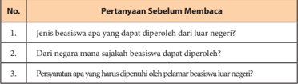

Tabel ini berisi pertanyaan sebelum membaca tentang beasiswa luar negeri. Topik utamanya adalah informasi umum tentang beasiswa luar negeri, termasuk jenis beasiswa yang dapat diperoleh, negara mana saja yang menyediakan beasiswa, dan persyaratan apa yang harus dipenuhi oleh pelamar beasiswa luar negeri. Kolom pertama menunjukkan nomor pertanyaan, sedangkan kolom kedua menunjukkan pertanyaan tersebut. Data penting yang terlihat adalah bahwa tabel ini mencakup tiga pertanyaan yang berhubungan dengan beasiswa luar negeri, yang mencakup informasi tentang jenis beasiswa, negara penyedia beasiswa, dan persyaratan pelamar.

 

---
## 📄 Halaman 10

---
**📊 Tabel**

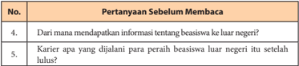

Tabel ini berisi pertanyaan sebelum membaca tentang informasi beasiswa ke luar negeri dan karier para pelepas beasiswa setelah lulus. Topik utama tabel adalah proses mendapatkan beasiswa ke luar negeri dan pengembangan karier setelah bekerja sebagai pelepas beasiswa. Kolom pertama menunjukkan nomor pertanyaan, sedangkan kolom kedua menunjukkan pertanyaan sebelum membaca tersebut. Data penting yang terlihat adalah bahwa pertanyaan-pertanyaan tersebut mencakup informasi tentang sumber daya beasiswa, proses pendaftaran, dan pengalaman karier setelah bekerja sebagai pelepas beasiswa.

### b. Laporan Harian Kegiatan Membaca

Perhatikan contoh laporan harian kegiatan membaca berikut ini.

---
**📊 Tabel**

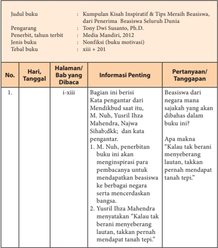

Tabel ini menyajikan informasi tentang sebuah buku berjudul "Kumpulan Kisah Inspiratif & Tips Meraih Beasiswa" yang diterbitkan oleh Media Mandiri pada tahun 2012. Buku ini ditulis oleh Tony Dwi Susanto, Ph.D., dan merupakan buku nonfiksi yang berisi motivasi. Tabel terdiri dari kolom-kolom seperti judul buku, pengarang, penerbit, tahun terbit, jenis buku, tebal buku, dan informasi penting tentang setiap bab dalam buku tersebut. Informasi penting mencakup tanggal dan hari penandatanganan bab, judul bab, dan konten yang dibahas dalam bab tersebut. Pola penting yang terlihat adalah bahwa setiap bab memiliki konten yang spesifik dan berhubungan dengan tema beasiswa, sementara topik utama tabel adalah kisah inspiratif dan tips meraih beasiswa.

 

---
## 📄 Halaman 11

---
**📊 Tabel**

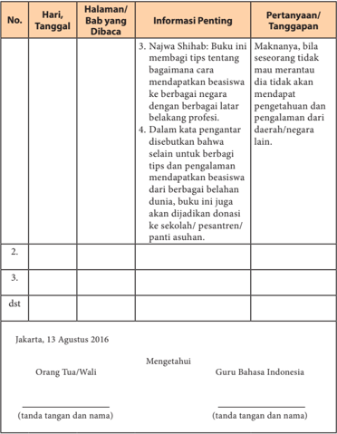

Tabel ini berisi informasi penting tentang pertanyaan dan tanggapan yang dibaca oleh orang tua/wali terkait dengan halaman bab tertentu dalam buku pelajaran bahasa Indonesia. Topik utama tabel adalah proses pembelajaran dan pengembangan keterampilan berbahasa Indonesia. Kolom-kolom yang ada meliputi nomor hari dan tanggal, halaman yang dibaca, informasi penting yang dibaca, dan pertanyaan/tanggapan yang diberikan oleh guru Bahasa Indonesia. Data penting yang terlihat antara lain bahwa guru memberikan tips tentang bagaimana cara mendapatkan beasiswa ke berbagai negara dengan berbagai latar belakang profesi, serta menyarankan untuk berbagi tips dan pengalaman menulis puisi dan puisi dari berbagai daerah di dunia.

 

---
## 📄 Halaman 12

### c. Laporan Harian Kegiatan Membaca

Jika  kamu  sudah  selesai  membaca  buku,  susunlah  laporan  kegiatan tersebut dalam buku rekaman tertulis kegiatan membaca. Untuk membantu kamu melaporkan kegiatan membaca, berikut ini contoh format yang dapat kamu buat.

---
**📊 Tabel**

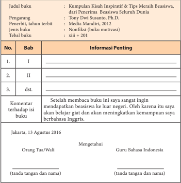

Tabel ini berisi informasi tentang sebuah buku motivasi yang berjudul "Kumpulan Kisah Inspiratif & Tips Meraih Beasiswa, dari Penerima Beasiswa Seluruh Dunia" yang diterbitkan oleh Tony Dwi Susanto, Ph.D., Media Mandiri, tahun 2012. Buku ini merupakan buku non-fiksi dengan jumlah halaman 210 halaman. Tabel tersebut mencakup informasi tentang bab-bab dalam buku, komentar terhadap isi buku oleh orang tua/wali guru bahasa Indonesia, dan tanggal penandatanganan. Topik utama tabel adalah informasi umum tentang buku tersebut, termasuk judul, pengarang, penerbit, jenis buku, dan jumlah halaman. Kolom-kolom yang ada meliputi nomor bab, bab tersebut, informasi penting tentang bab, komentar terhadap isi buku, dan tanggal penandatanganan. Data atau pola penting yang terlihat adalah bahwa buku ini berisi kisah inspiratif dan tips meraih beasiswa dari penerima beasiswa seluruh dunia, dan telah diterbitkan oleh Media Mandiri pada tahun 2012.

### Catatan:

Untuk buku fiksi  (novel,  kumpulan  cerita  rakyat,  kumpulan  cerpen, kumpulan  puisi,  atau  drama,  dan  biografi)  kolom  komentar  terhadap isi  buku  dapat  diganti  dengan  nilai-nilai/karakter  unggul  yang  dapat diteladani.

 

---
## 📄 Halaman 13

### Bab I

### Menyusun Prosedur

---
**🖼️ Gambar/Diagram**

> **Deskripsi Visual:** Gambar ini adalah diagram yang menunjukkan struktur atau proses yang terlibat dalam suatu tugas atau proyek. Gambar tersebut terdiri dari beberapa elemen utama yang saling terhubung melalui garis, yang menunjukkan hubungan antara setiap elemen.

Elemen utama yang ditampilkan dalam gambar ini adalah:

1. Sebuah kotak besar yang mungkin menunjukkan titik awal atau tujuan.
2. Beberapa kotak kecil yang mungkin menunjukkan tahapan-tahapan dalam proses atau tugas.
3. Garis yang menghubungkan elemen-elemen tersebut, menunjukkan arah atau urutan proses.
4. Dua kotak oval yang mungkin menunjukkan akhir atau hasil dari proses tersebut.

Teks, angka, atau label penting yang terlihat dalam gambar ini tidak ada, sehingga informasi kunci yang dapat diambil pembaca hanya berdasarkan struktur dan arah elemen-elemen yang digambarkan.

Dari gambar ini, pembaca dapat memahami bahwa ada sebuah proses atau tugas yang terdiri dari beberapa tahapan, dengan setiap tahapan memiliki tujuan atau hasil yang spesifik. Arsitektur diagram ini membantu dalam pemahaman tentang struktur dan urutan proses yang harus dilalui untuk mencapai tujuan akhir.

Setiap hari kita selalu melakukan suatu kegiatan, misalnya membaca buku, naik kendaraan, menggunakan alat-alat elektronik, dan melayani tamu. Agar dapat melakukannya dengan benar, kita memerlukan serangkaian petunjuk melakukan kegiatan tersebut. Banyak istilah yang digunakan untuk menyebut petunjuk-petunjuk itu. Ada yang menyebutnya kiat, tips, resep, cara jitu, dan sebutan lainnya. Mari kita sebut saja semuanya itu dengan istilah prosedur. Penting  sekali  kita  mempelajarinya  agar  dapat  memahami  dan  menyusun

 

---
## 📄 Halaman 14

prosedur,  bahkan  dapat  melakukan  suatu  kegiatan  sesuai  dengan  prosedur. Dengan begitu, kita dapat memberikan penjelasan kepada teman, kerabat, atau orang lain tentang cara melakukan sesuatu sesuai dengan tahapan yang benar. Untuk  membekali  kemampuan  menyusun  teks  prosedur,  pada  bab  ini kamu akan belajar:

- mengonstruksikan informasi;
- merancang pernyataan umum dan tahapan-tahapan;
- menganalisis struktur dan isi teks prosedur; dan
- mengembangkan teks prosedur.
Untuk membantu kamu dalam mempelajari dan mengembangkan kompetensi  dalam  menyusun  prosedur,  pelajari  peta  konsep  di  bawah  ini dengan saksama!

---
**🖼️ Gambar/Diagram**

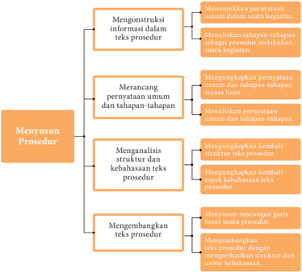

> **Deskripsi Visual:** Gambar ini adalah diagram yang menunjukkan proses menyusun prosedur dalam teks prosedur. Diagram ini terdiri dari empat langkah utama:

1. **Mengonstruksi informasi dalam teks prosedur**: Langkah pertama melibatkan memahami pernyataan umum dan tahapan-tahapan dalam suatu kegiatan.

2. **Merancang pernyataan umum dan tahapan-tahapan**: Langkah ini melibatkan mengorganisir pernyataan umum dan tahapan-tahapan dalam struktur yang jelas.

3. **Menganalisis struktur dan kebahasaan teks prosedur**: Langkah ini melibatkan memeriksa struktur teks prosedur dan memastikan kebahasaannya yang tepat.

4. **Mengembangkan teks prosedur**: Langkah terakhir melibatkan menyelesaikan rancangan garis besar untuk suatu prosedur dan menjaga harmonisasi dengan struktur dan unsur kebahasaan.

Elemen-elemen utama dalam diagram ini adalah langkah-langkah yang disusun secara hierarkis dan terkait langsung satu sama lain. Teks, angka, atau label penting yang terlihat mencakup nama-nama langkah-langkah (Mengonstruksi informasi dalam teks prosedur, Merancang pernyataan umum dan tahapan-tahapan, Menganalisis struktur dan kebahasaan teks prosedur, Mengembangkan teks prosedur) serta relasi antara langkah-langkah tersebut. Informasi kunci yang dapat diambil pembaca adalah bahwa proses menyusun prosedur melibatkan pemahaman, pengorganisasian, analisis, dan penyelesaian langkah-langkah yang disusun secara sistematis.

 

---
## 📄 Halaman 15

### A. Mengonstruksi Informasi dalam Teks Prosedur

Setelah mempelajari materi ini, kamu diharapkan mampu:

- menunjukkan pernyataan-pernyataan umum dalam melakukan suatu kegiatan;
- menuliskan tahapan-tahapan sebagai prosedur melakukan suatu kegiatan.
Dalam  melakukan  suatu  kegiatan,  pemahaman  tahap-tahap  dalam mengerjakannya sangat penting. Pelaksanaan setiap tahap tersebut menggambarkan  proses  berlangsungnya  suatu  kegiatan  yang  dilakukan seseorang. Apabila seseorang memahami cara melakukan suatu kegiatan, maka keberhasilan kegiatan tersebut sudah tergambar. Namun sebaliknya, apabila  melakukan  suatu  kegiatan  tetapi  tidak  memahami  caranya  atau prosedurnya, maka kemungkinan kegagalan akan lebih besar.

### Menunjukkan Pernyataan Umum dalam Suatu Kegiatan

Seseorang melakukan suatu kegiatan tentu saja harus memperhatikan langkah-langkah mengerjakannya. Apabila kita akan melakukan pekerjaan, maka harus memahami langkah-langkahnya agar hasil kegiatan tersebut berhasil dengan baik. Marilah kita telaah teks prosedur berikut ini. Bacalah secara  saksama  sehingga  kamu  dapat  menemukan  bagian-bagian  yang termasuk ke dalam pernyataan umum dan tahapan-tahapan melakukan suatu kegiatan atau pekerjaan.

### Teks 1

### Cara Menghidupkan Komputer

 

---
## 📄 Halaman 16

Komputer  merupakan  salah  satu  perangkat  elektronik  yang  sering digunakan untuk memudahkan pekerjaan manusia. Sebelum digunakan, komputer ini harus dioperasikan terlebih dahulu. Dalam pengoperasian komputer, kita harus mengikuti setiap prosedur bagaimana cara menghidupkan komputer dengan benar. Untuk menghidupkan komputer dengan benar, ikutilah langkah-langkah berikut.

- Buka penutup  layar monitor, CPU, keyboard dan printer.
- Pastikan sakelar yang menyediakan arus listrik terhubungkan dengan kabel power ke stabilizer atau CPU komputer.
- Tekan tombol power pada CPU dan tombol power monitor.
- Komputer akan booting , tunggu proses ini sampai selesai.
- Setelah selesai proses booting , komputer siap digunakan.
(Sumber: ilmusiana.com )

### Teks 2

### Cara Mematikan Komputer

---
**🖼️ Gambar/Diagram**

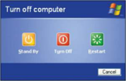

> **Deskripsi Visual:** Gambar ini adalah sebuah diagram yang menunjukkan opsi untuk mematikan komputer. Gambar ini terdiri dari tiga ikon yang masing-masing menunjukkan opsi berbeda untuk mematikan komputer: "Stand By" (Menyimpan), "Turn Off" (Matikan), dan "Restart" (Perbarui). Setiap ikon memiliki warna yang berbeda dan bertuliskan nama opsi yang sesuai. Di bawah ikon-ikon tersebut, terdapat tombol "Cancel" (Batal) untuk menghentikan proses pemutihan komputer. Informasi kunci yang dapat diambil dari gambar ini adalah bahwa ada tiga pilihan untuk mematikan komputer dan bahwa pengguna dapat memilih antara menyimpan, matikan, atau perbarui sistem dengan mengklik ikon yang sesuai.

Sumber: www. manuaisescolares.net

Gambar 1.3 Tampilan pada layar monitor ketika akan mematikan komputer.

Setelah  selesai  digunakan,  komputer  haruslah  dimatikan  agar  tidak menyala terus. Sama  seperti prosedur menyalakan komputer, cara mematikan  komputer  juga  memerlukan  prosedur  agar  komputer  tidak cepat mengalami kerusakan. Ikuti langkah-langkah yang benar di bawah ini.

- Tutup semua program atau aplikasi  yang sedang aktif.
- Klik tombol ' Start ' dengan mouse pada menu Dekstop .
- Klik menu ' Turn Off Computer ' .
- Pada kotak dialog ' Turn Off Computer ' , klik tombol ' Turn Off ' .
- Diamkan beberapa saat hingga komputer padam.
- Tekan tombol OFF pada monitor untuk memadamkan monitor.
- Cabut kabel listrik dari jala-jala listrik.
- Tutup dengan penutup.
(Sumber: www.ilmusiana.com)

 

---
## 📄 Halaman 17

Pada  kedua  contoh  teks  prosedur  tersebut  terdapat  bagian  yang mengungkapkan  pernyataan-pernyataan  umum.  Namun,  terdapat  pula bagian-bagian  yang  merupakan  rangkaian  mengerjakan  suatu  kegiatan sebagai tahapan-tahapan pengerjaan. Inilah ciri teks prosedur. Dari isinya, terdapat  bagian  pernyataan  umum  dan  tahapan-tahapan  melakukan kegiatan.

Berdasarkan  paparan  contoh  di  atas,  tentu  kamu  dapat  menjawab pertanyaan berikut!

- Mengapa bagian atas dinamakan 'penjelasan umum'?
- Apakah tahapan-tahapan pada bagian selanjutnya sudah jelas?
- Apakah perbedaan utama teks prosedur dengan jenis teks lainnya?
- Dari isinya, menjelaskan tentang apakah teks prosedur itu?
- Bagaimana karakteristik umum dari teks prosedur?
- Berdasarkan isinya, apakah fungsi teks prosedur itu?
- Kemukakan  sebuah  contoh  teks  prosedur  yang  kamu  temukan  dari koran atau majalah!

### Menuliskan Tahapan-Tahapan sebagai Prosedur Melakukan Suatu Kegiatan

Seseorang melakukan suatu kegiatan tentu saja harus memperhatikan langkah-langkah mengerjakannya. Apabila kita akan melakukan pekerjaan maka  kita harus memahami  langkah-langkah  kerjanya agar dalam melakukan kegiatan tersebut berhasil dengan baik. Misalnya, apabila kita ingin memahami seluruh isi bacaan dari buku yang kita baca, langkahlangkah yang harus ditempuh adalah: (1) pilih buku yang paling disukai dan sesuai kebutuhan; (2) carilah tempat yang paling nyaman untuk membaca, hindari gangguan-gangguan di sekitarmu; (3) bertanyalah tentang hal-hal yang kurang kamu pahami dalam bacaan tersebut; (4) ketika membaca, usahakan untuk tidak mengulang kalimat yang baru saja dibaca karena akan  mengurangi  kecepatan  membacamu;  (5)  diskusikanlah  buku  yang kamu baca dengan teman atau gurumu; (6) simpulkanlah apa pun yang

 

---
## 📄 Halaman 18

baru  didapat  setelah  membaca  satu  bab;  (7)  catat  pokok-pokok  pikiran yang terdapat dalam bacaan tersebut. Kegiatan ini sangat membantu dalam memahami bacaan. Tahapan seperti itu sering disebut prosedur.

- Bacalah  kembali  kedua  teks  di  atas  berjudul  'Cara  Menghidupkan Komputer'  dan  'Cara  Mematikan  Kompouter'!  Manakah  bagianbagian  yang  termasuk  ke  dalam  pernyataan  umum  dan  tahapantahapan melakukan suatu kegiatan?
- Carilah bacaan atau buku  tentang perintah melakukan suatu kegiatan. Catatlah langkah-langkahnya. Kemudian, simpulkan menurut pendapatmu  sehingga  kamu  memahami  makna  langkah-langkah tersebut!

### B. Merancang Pernyataan Umum dan Tahapan-Tahapan

Setelah mempelajari materi ini, kamu diharapkan mampu:

- mengungkapkan pernyataan umum dan tahapan-tahapan melakukan kegiatan secara lisan dengan intonasi dan nada yang jelas;
- menuliskan pernyataan umum dan tahapan-tahapan dalam prosedur melakukan suatu kegiatan.
Dalam setiap kegiatan tampaknya prosedur itu menjadi pengingat bagi setiap orang untuk mematuhi tahapan agar kegiatan dapat dilaksanakan dengan  benar.  Dengan  mematuhi  tahapan  melakukan  suatu  kegiatan maka kemungkinan keberhasilan melakukan kegiatan tersebut lebih besar. Bagaimanakah bagian-bagian suatu prosedur jika dicermati berdasarkan maknanya?

 

---
## 📄 Halaman 19

### Mengungkapkan Pernyataan Umum dan Tahapan-Tahapan

Apabila kamu akan bekerja, biasanya mengikuti seleksi terlebih dahulu. Kegiatan  seleksi  merupakan  cara  suatu  perusahaan  atau  institusi  dalam memilih  pegawai  yang  terbaik  sesuai  dengan  jenis  pekerjaan.  Nah,  jika kamu akan bekerja, akan mengikuti tes dan wawancara. Oleh karena itu, pahamilah kiat sukses dalam mengikuti kegiatan wawancara. Pemahaman terhadap  bacaan  ini  akan  menjadi  panduan  bagimu  dalam  mengikuti wawancara. Untuk lebih jelasnya, bacalah teks berikut dengan saksama!

### Kiat Berwawancara Kerja

Bagi perusahaan, wawancara merupakan kesempatan untuk menggali kualifikasi calon pegawai secara lebih mendalam, melihat kecocokannya dengan posisi yang ditawarkan, kebutuhan dan sifat perusahaan. Wawancara pun menjadi ajang tanya jawab antara pewawancara dengan calon.

Agar mudah dipahami oleh mitra bicara, kita harus berbicara dengan jelas.  Usahakan  agar  kita  tidak  berbicara  terlalu  cepat  atau  lambat,  atur juga  suara  agar  jelas  terdengar.  Suara  yang  terlalu  pelan  membuat  kita terlihat kurang percaya diri, sementara suara yang terlalu keras membuat kita  terlihat  agresif.  Penggunaan  bahasa  yang  baik  juga  menjadi  suatu keharusan.

Selain  itu,  perhatikan  betul  apa  yang  disampaikan  pewawancara agar  kita  dapat  memberikan  jawaban  yang  relevan.  Tidak  ada  salahnya menanyakan kembali atau mencoba mengulangi pertanyaan yang diajukan untuk memastikan bahwa pemahaman kita sudah benar. Namun, jangan melakukannya terlalu sering karena justru akan membuat pewawancara mempertanyakan daya tangkap kita.

Bahasa tubuh pun ikut memegang peranan. Gerakan nonverbal seperti mengangguk atau sikap tubuh yang agak condong ke depan menunjukkan bahwa kita tertarik pada apa yang disampaikan si pewawancara. Pastikan pula kita menjaga kontak mata dengan pewawancara karena kontak mata penting dalam proses komunikasi, termasuk dalam wawancara kerja.

 

---
## 📄 Halaman 20

Singkatnya,  akan  lebih  baik  jika  kita  mampu  menampilkan  sikap yang antusias secara verbal maupun nonverbal. Oleh karena itu, hindari bahasa tubuh yang dapat diartikan negatif, seperti menggoyangkan kaki, mengetuk-ngetuk  jari,  atau  menghindari  kontak  mata.  Cara  berbicara yang percaya diri namun tidak terkesan sombong dapat menarik minat pewawancara.

Pada  saat  berbicara,  hindari  uraian  yang  panjang  lebar  dan  berteletele. Cobalah mengemas kalimat secara singkat dan terfokus, tetapi tetap menarik. Kita diharapkan mampu menunjukkan bahwa kita adalah orang yang tepat untuk posisi yang ditawarkan. Ceritakanlah kemampuan atau pengalaman  yang  relevan  dengan  posisi  tersebut.  Hindari  mengkritik atasan atau  rekan kerja sebelumnya karena ini menunjukkan sikap yang tidak profesional.

Selama  wawancara  berlangsung,  jadilah  diri  sendiri.  Ungkapan  ini mungkin  terdengar  klise,  namun  jauh  lebih  baik  menjadi  diri  sendiri dan  berbicara  dengan  jujur,  daripada  mencoba  mengatakan  sesuatu yang menurut kita akan membuat pewawancara merasa terkesan. Jangan melebih-lebihkan kualifikasi kita, apalagi mengelabui dengan memberikan data yang tidak benar. Cepat atau lambat, pewawancara akan menemukan bahwa data tersebut  hanyalah  karangan.  Tunjukkan  bahwa  kita  mampu mengenali diri kita sendiri dengan tepat.

Pewawancara  biasanya  memberikan  kesempatan  kepada  kita  untuk mengajukan pertanyaan di akhir wawancara. Gunakanlah kesempatan ini secara elegan dengan cara menunjukkan rasa ingin tahu kita tentang lingkup dan deskripsi tugas posisi yang dilamar, kesempatan pengembangan diri, dan sebagainya. Ini wajar karena bersikap pasif dan menyerahkan segala sesuatu kepada pihak perusahaan tidak akan menambah nilai kita di mata pewawancara.

 

---
## 📄 Halaman 21

Calon  yang  ingin  bertanya  dalam  porsi  yang  tepat  menunjukkan kesungguhan  minatnya  pada  posisi  yang  ditawarkan  dan  juga  pada perusahaan.  Di  sesi  ini  biasanya  muncul  pula  pembicaraan  mengenai gaji  dan  tunjangan.  Pewawancara  sangat  menghargai  kandidat  yang mampu  menentukan  nominal  gaji  yang  ia  harapkan  karena  dianggap dapat  melakukan  penilaian  atas  kemampuannya  dan  tugas-tugas  yang akan dilakukan. Tentu saja angkanya harus logis sambil tetap membuka kesempatan untuk negosiasi.

Dengan persiapan matang dan unjuk diri yang baik saat wawancara, kita  telah  meninggalkan  kesan  yang  layak  untuk  dipertimbangkan  oleh perusahaan.

(Sumber: 'Unjuk Diri yang Baik dalam Wawancara Kerja' dalam Kompas dengan pengubahan)

Bacaan di atas menjelaskan cara mengikuti wawancara kerja di suatu perusahaan.  Di  dalam  teks  tersebut  disampaikan  petunjuk-petunjuk seperti berikut.

- Berbicara harus jelas, tidak terlalu cepat, atau lambat.
- Harus tampil percaya diri.
- Jawaban yang disampaikan harus relevan dengan pertanyaan.

### Tugas 1

Berdasarkan  penelaahanmu  terhadap  teks  prosedur  di  atas,  kerjakan tugas-tugas berikut. Kamu bisa mengerjakannya pada buku kerjamu!

- Identifikasilah teks prosedur di atas berdasarkan format tabel berikut!
- Dari isinya menjelaskan tentang apakah teks prosedur itu?

---
**📊 Tabel**

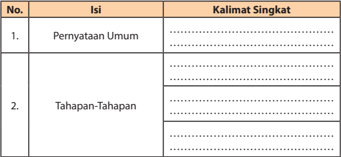

Tabel ini berisi informasi tentang dua tahap penting dalam proses penulisan atau pengembangan suatu proyek atau tugas. Topik utama tabel adalah "Pernyataan Umum" dan "Tahapan-Tahapan". Kolom pertama, "No.", menunjukkan urutan atau nomor untuk setiap baris. Kolom kedua, "Isi", menyajikan detail atau konten yang disampaikan dalam setiap baris. Kolom ketiga, "Kalimat Singkat", menampilkan deskripsi singkat dari setiap isi yang diberikan dalam kolom kedua.

Data penting yang terlihat dalam tabel ini adalah bahwa setiap baris memiliki satu poin utama yang disampaikan dalam "Pernyataan Umum" dan satu atau lebih tahapan atau langkah-langkah dalam "Tahapan-Tahapan". Ini menunjukkan struktur yang jelas dan sistematis dalam proses penulisan atau pengembangan, dengan "Pernyataan Umum" sebagai dasar dan "Tahapan-Tahapan" sebagai langkah-langkah yang harus diikuti.

 

---
## 📄 Halaman 22

- Berdasarkan isinya, apakah fungsi teks prosedur itu?
- Temukan kata kerja imperatif pada teks prosedur di atas!
- Temukan enam konjungsi pada teks prosedur di atas!
- Temukan pernyataan persuasif pada teks prosedur di atas!
- Berikanlah tanggapan dengan bahasamu sendiri pada teks tersebut?
- Tuliskan  kembali  isi  teks  prosedur  tersebut  dengan  menggunakan bahasamu sendiri secara singkat dan jelas!

### Tugas 2: Berkelompok

Marilah  berlatih  merancang  suatu  prosedur  melakukan  kegiatan. Pertama-tama,  kamu  membuat  kelompok  bersama  teman-temanmu, yang  terdiri  atas  4  orang.  Diharapkan  dapat  mendiskusikan  dua  jenis melakukan suatu kegiatan. Oleh karena itu, diskusikanlah jenis kegiatan yang memerlukan tahapan-tahapan agar kegiatan tersebut berhasil dengan baik.  Kemudian,  tahapan-tahapan  tersebut  dikembangkan  menjadi  teks tentang kiat, resep, dan cara jitu dalam melakukan suatu kegiatan. Dalam berdiskusi,  pahamkanlah  kepada  anggota  bahwa  teks  prosedur  yang kelompok kamu susun itu akan sangat bermanfaat bagi orang lain dalam melakukan suatu kegiatan. Untuk itu, buatlah prosedur melakukan suatu kegiatan yang menurut kelompok kamu belum ditemukan prosedurnya.

### C. Menganalisis Struktur dan Kebahasaan Teks Prosedur

Setelah mempelajari materi ini, kamu diharapkan mampu:

- mengungkapkan kembali struktur teks prosedur;
- mengungkapkan kembali unsur kebahasaan teks prosedur.

### Mengungkapkan Kembali Struktur Teks Prosedur

Pada  bagian  sebelumnya,  kita  sudah  mencermati  berbagai  kegiatan seseorang  yang  memperhatikan  prosedur!  Nah,  kamu  sudah  mendapat gambaran tentang suatu prosedur.

 

---
## 📄 Halaman 23

Marilah menggali teks prosedur lebih mendalam!

- Bacalah  sekurang-kurangnya tiga teks prosedur yang bersumber dari surat kabar, majalah, ataupun internet!
- Catatlah sumber teks tersebut!
- Kemukakanlah garis besar isi setiap teks tersebut!
Kamu dapat menuliskannya pada buku kerja, dengan format tabel berikut.

---
**📊 Tabel**

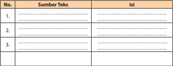

Tabel ini berisi informasi tentang sumber teks dan isi dari beberapa buku pelajaran. Topik utamanya adalah tentang sumber-sumber literatur yang digunakan dalam pembelajaran. Kolom "Sumber Teks" menyajikan judul atau nama-nama buku pelajaran yang digunakan, sedangkan kolom "Isi" menunjukkan konten atau materi yang disampaikan dalam setiap buku tersebut. Dari tabel ini, dapat dilihat bahwa setiap buku memiliki judul yang unik dan mengandung isi yang berbeda-beda, menunjukkan variasi dalam konten pembelajaran yang digunakan dalam kurikulum.

Teks  prosedur  dibentuk  oleh  ungkapan  tentang  tujuan,  langkahlangkah, dan penegasan ulang.

- Tujuan merupakan pengantar tentang topik yang akan dijelaskan dalam teks. Pada contoh teks berjudul 'Kiat Berwawancara Kerja' , pendahuluan yang dimaksud berupa pengertian wawancara dan manfaat bagi suatu perusahaan (paragraf 1).
- Langkah-langkah berupa perincian petunjuk yang disarankan kepada pembaca terkait dengan topik yang ditentukan (paragraf 2 -9).
- Penegasan  ulang  berupa  harapan  ataupun  manfaat  apabila  petunjukpetunjuk itu dijalankan dengan baik (paragraf 10).

---
**🖼️ Gambar/Diagram**

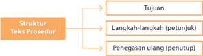

> **Deskripsi Visual:** Gambar ini adalah diagram yang menunjukkan struktur teks prosedur. Diagram ini terdiri dari tiga elemen utama: Tujuan, Langkah-langkah (petunjuk), dan Penegasan ulang (penutup). Tujuan merupakan tujuan utama dari prosedur tersebut, sementara Langkah-langkah (petunjuk) mengandung detail-tentang langkah-langkah yang harus dilakukan untuk mencapai tujuan tersebut. Penegasan ulang (penutup) memberikan penjelasan tentang hasil akhir atau penutupan prosedur. Setiap elemen memiliki hubungan dengan elemen lainnya, dengan Tujuan sebagai tujuan akhir, Langkah-langkah sebagai langkah-langkah yang harus dilakukan, dan Penegasan ulang sebagai penutup yang memberikan penjelasan tentang hasil akhir.

 

---
## 📄 Halaman 24

Marilah menelaah teks secara berkelompok! Bacalah teks berjudul 'Kiat Menata Rambut Pendek' di bawah ini dengan saksama! Mintalah salah seorang temanmu di kelompok untuk membacakan teks tersebut.

### Kiat Menata Rambut Pendek

### 2. Gunakan Produk Styling

Gunakan produk styling dan perawatan rambut seperti serum untuk menyehatkan akar rambut. Produk perawatan rambut yang alami akan membuat rambut kamu terlihat bersinar dan indah. Rambut juga tampak halus dan memberikan extra glow . Pastikan menggunakannya di batang rambut.

### 3. Blow dry dari Akar Rambut Terlebih Dahulu

Saat akan melakukan blow dry pada rambut pendek kamu, pastikan memulainya dari akar rambu t.  Gunakan sisir sikat bulat dan pengering rambut, lalu arahkan hair dryer ke bagian akar. Gunakan sisir dengan ukuran  yang  benar  karena  sikat  yang  lebih  besar  akan  memberikan sedikit kurva ke gaya rambut bob kamu.

### 4. Tambahkan kesan bervolume (terisi penuh)

Kembangkan dan blow dry rambut bagian depan untuk mendapatkan kesan  bervolume.  Dengan  begitu,  rambut  kamu  akan  terlihat  terisi penuh.

(Sumber: Surat Kabar Kompas dengan pengubahan)

Gaya  rambut  bob  pendek  kini  mulai disukai  lagi.  Meski  terlihat  sederhana, untuk gaya rambut seperti itu juga diperlukan  perawatan  yang  benar.  Ada beberapa  langkah  dan  cara  yang  harus kamu  lakukan  untuk  merawat  rambut pendek dengan baik, yaitu sebagai berikut.

### 1. Keringkan dengan Handuk

Banyak orang yang mengeringkan rambut  pendeknya  dengan  cara  mengacakacaknya  dengan  handuk  agar  air  cepat meresap. Padahal cara ini bisa membuat rambut mudah patah. Keringkan rambut sambil dipijat perlahan.

 

---
## 📄 Halaman 25

### Tugas 1

Setelah kamu membaca teks tersebut, selanjutnya ikutilah instruksi di bawah ini!

- Jelaskanlah struktur pembentuk teks tersebut secara jelas!
- Simpulkan teks tersebut berdasarkan kelengkapan strukturnya!
- Tuliskan  hasil  telaah  kelompokmu  dalam  format  penilaian  seperti berikut ini pada lembar terpisah atau buku kerjamu!
- Pajanglah hasil pekerjaan kelompokmu di depan kelas atau papan tulis!
- Mintalah  kelompok  lain  untuk  mengunjungi  pajangan  itu  untuk memberikan penilaian dan komentar-komentar!

---
**📊 Tabel**

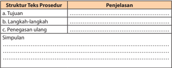

Tabel ini berisi informasi tentang struktur teks prosedur, yang terdiri dari tujuan, langkah-langkah, dan penegasan ulang. Tujuan adalah tujuan yang ingin dicapai dalam prosedur tersebut, seperti menciptakan produk baru atau memperbaiki perangkat keras. Langkah-langkah adalah urutan tindakan yang harus dilakukan untuk mencapai tujuan tersebut, yang dapat mencakup banyak detail teknis. Penegasan ulang adalah langkah-langkah yang harus diulangi jika prosedur gagal atau tidak berhasil mencapai tujuan. Simpulan adalah kesimpulan atau hasil akhir dari prosedur tersebut. Topik utama tabel ini adalah prosedur dan bagaimana struktur teks prosedur dapat membantu dalam pengembangan dan pemeliharaan perangkat keras.

---
**📊 Tabel**

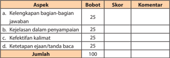

Tabel ini menunjukkan skor dan komentar untuk berbagai aspek dalam sebuah penilaian, dengan total skor 100. Topik utama tabel adalah "Aspek Penilaian". Kolom-kolomnya meliputi Bobot (atau Poin), Skor, dan Komentar. Data penting yang terlihat adalah bahwa setiap aspek memiliki bobot yang sama yaitu 25 poin, sehingga total skor mencapai 100. Setiap aspek memiliki skor tertentu yang diberikan oleh penilai, dan setiap aspek juga dilengkapi dengan komentar yang memberikan penjelasan tentang nilai yang diberikan. Ini menunjukkan bahwa penilaian ini sangat detail dan mendalam, dengan berbagai aspek yang diukur secara khusus.

 

---
## 📄 Halaman 26

### Kegiatan 2

### Mengungkapkan Unsur Kebahasaan Teks Prosedur

Pada  umumnya,  teks  prosedur  memiliki  ciri-ciri  kebahasaan  sebagai berikut.

- Banyak menggunakan kata-kata kerja perintah (imperatif). Kata kerja imperatif dibentuk oleh akhiran -kan, -i, dan partikel -lah.
- Banyak  menggunakan  kata-kata  teknis  yang  berkaitan  dengan  topik yang dibahasnya.
- Banyak menggunakan konjungsi dan partikel yang bermakna penambahan.
- Banyak menggunakan pernyataan persuasif.
- Apabila prosedur itu berupa resep dan petunjuk penggunaan alat, akan digunakan gambaran terperinci tentang benda dan alat yang dipakai, termasuk ukuran, jumlah, dan warna.

---
**📊 Tabel**

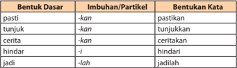

Tabel ini menunjukkan struktur dasar dari bentuk-bentuk kata dalam bahasa Indonesia. Topik utamanya adalah bagaimana bentuk dasar kata dapat diubah menjadi bentuk yang lebih kompleks melalui penggunaan imbuhan atau partikel. Kolom pertama berisi bentuk dasar kata seperti "pasti", "tunjuk", "cerita", dan "hindar". Kolom kedua berisi imbuhan atau partikel yang digunakan untuk mengubah bentuk dasar tersebut, seperti "-kan" untuk "pasti" dan "-lah" untuk "jadi". Kolom ketiga berisi bentuk yang lebih kompleks atau bentuk kata yang baru, seperti "pastikan", "tunjukkan", "certar", dan "hindari". Pola penting yang terlihat adalah bahwa setiap bentuk dasar kata dapat diubah menjadi bentuk yang lebih kompleks dengan menggunakan imbuhan atau partikel tertentu, yang memungkinkan penambahan makna atau fungsi kata tersebut.

---
**🖼️ Gambar/Diagram**

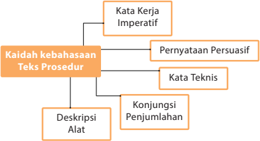

> **Deskripsi Visual:** Gambar ini adalah diagram yang menunjukkan struktur dasar teks prosedur dalam bahasa Indonesia. Diagram ini terdiri dari empat elemen utama: Kata Kerja Imperatif, Pernyataan Persuasif, Kata Teknis, dan Deskripsi Alat. Setiap elemen memiliki hubungan dengan elemen lainnya melalui relasi subyek dan objek. Kata Kerja Imperatif digunakan untuk memberikan instruksi atau petunjuk, sementara Pernyataan Persuasif digunakan untuk mempengaruhi atau mengubah perilaku pembaca. Kata Teknis digunakan untuk menjelaskan konsep-konsep teknis, sedangkan Deskripsi Alat digunakan untuk memberikan detail tentang alat yang digunakan dalam prosedur tersebut. Informasi kunci yang dapat diambil pembaca adalah bahwa struktur teks prosedur dalam bahasa Indonesia biasanya terdiri dari empat elemen utama tersebut.

 

---
## 📄 Halaman 27

### Tugas 2

- Manakah pernyataan-pernyataan di bawah ini yang menggunakan kata kerja imperatif?
- Banyak sahabat sangat menyenangkan.
- Perlu kesantunan di dalam menjalin komunikasi.
- Sangat berkesan apabila bertemu dengan seorang sahabat lama.
- Sering  terjadi  salah  pengertian  apabila  kita  bertegur  sapa  dalam bahasa yang berbeda.
- Orang seringkali tidak percaya diri kalau harus berkenalan dengan orang asing.
- Pilihlah salah satu topik di bawah ini! Secara berkelompok tuliskanlah 3 -4 kalimat yang menggunakan kata kerja imperatif berkaitan dengan salah satu topik tersebut.

---
**📊 Tabel**

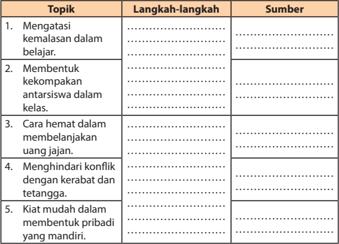

Tabel ini berisi topik-topik belajar yang berkaitan dengan keterampilan dan konsentrasi, di mana setiap topik dibagi menjadi langkah-langkah untuk diterapkan dan sumber informasi yang relevan. Topik utama meliputi mengatasi kemasalan dalam belajar, membentuk kekompakan antar siswa dalam kelas, cara hemat dalam membelanjakan uang jajan, menghindari konflik dengan kerabat dan tetangga, serta kiat mudah dalam membentuk pribadi yang mandiri. Setiap topik memiliki beberapa langkah-langkah yang harus dilakukan, seperti mengevaluasi situasi, mencari solusi, dan menggunakan sumber daya yang tersedia. Sumber informasi yang disediakan mencakup buku pelajaran, sumber online, dan pengalaman pribadi. Tabel ini membantu siswa untuk memahami proses belajar dan mengembangkan keterampilan yang diperlukan dalam berbagai situasi sehari-hari.

 

---
## 📄 Halaman 28

### Tugas Individual

- Bacalah sebuah teks prosedur lainnya! Kamu bisa mendapatkan teks tersebut dari surat kabar, majalah, buku, ataupun internet.
- Identifikasilah struktur dan kaidah kebahasaan teks tersebut!
- Sajikan laporan hasil kegiatanmu dalam format tabel seperti berikut! Kamu bisa mengerjakannya pada buku kerjamu.
Judul Teks

: .......

Sumber

: .......

Tema

: .......

---
**📊 Tabel**

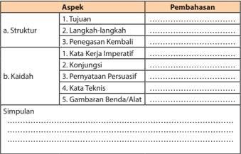

Tabel ini membahas dua aspek utama: struktur dan kaidah. Dalam aspek struktur, pembahasan mencakup tujuan, langkah-langkah, dan penegasan kembali. Untuk kaidah, topik utamanya adalah kata kerja imperatif, konjungsi, pernyataan persuasif, kata teknis, dan gambaran benda/ alat. Simpulan dari tabel ini menunjukkan bahwa pembahasan ini fokus pada bagaimana memahami dan menggunakan berbagai elemen dalam bahasa yang efektif dan efisien.

### D. Mengembangkan Teks Prosedur

Setelah mempelajari materi ini, kamu diharapkan mampu:

- menyusun rancangan garis besar melakukan suatu prosedur;
- mengembangkan teks prosedur dengan memperhatikan isi, struktur, dan aspek kebahaasaan.
Dengan  mengetahui  struktur  dan  aspek  kebahasaan  teks  prosedur, mudah  pula  bagi  kita  untuk  memahami  maksud  teks  itu.  Pemahaman tentang teks prosedur sangatlah penting jika kita tidak berharap

 

---
## 📄 Halaman 29

memperoleh  efek  berbahaya.  Paling  tidak,  petunjuk  itu  menjadi  tidak efektif.  Teks  prosedur  yang  salah  dapat  berisiko  tinggi  apabila  petunjuk itu  berkenaan  dengan  sesuatu  yang  membahayakan,  misalnya  berupa penggunaan  mesin  atau  obat-obatan.  Ketidakjelasan  prosedur  dapat berakibat  kerusakan  pada  mesin  ataupun  kematian  bagi  penggunanya. Dengan demikian, kejelasan itu merupakan hal yang utama dalam suatu teks prosedur.

### Menyusun Rancangan Garis Besar Suatu Prosedur

Dengan  mengetahui  struktur  dan  aspek  kebahasaan  teks  prosedur, mudah  bagi  kita  untuk  memahami  maksud  teks  tersebut.  Sebuah  teks prosedur  haruslah  jelas.  Untuk  memperoleh  kejelasan  itu,  kita  dapat melakukannya sebagai berikut.

### 1.  Mengartikan Kata-kata Sulit

Kata-kata  yang  dianggap  sulit  dapat  kamu  temukan  maknanya melalui  kamus.  Arti  kata  yang  berdasarkan  kamus  disebut  dengan makna  leksikal. Arti  kata  yang  berdasarkan  konteks  kalimat  disebut dengan makna struktural.

---
**📊 Tabel**

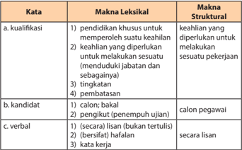

Tabel ini membahas dua aspek utama: makna leksikal dan struktural dari kata-kata tertentu dalam bahasa Indonesia. Topik utama adalah pengertian dan penggunaan kata-kata seperti "kualifikasi", "kandidat", dan "verbal". Kolom pertama berisi kata-kata tersebut, kolom kedua menjelaskan makna leksikal (artinya atau pengertian kata), sedangkan kolom ketiga menjelaskan makna struktural (struktur atau cara kerja kata). Data penting yang terlihat antara lain bahwa "kualifikasi" melibatkan keterampilan dan pengetahuan yang diperlukan untuk melakukan pekerjaan, "kandidat" merujuk pada calon yang mendaftar, dan "verbal" mengacu pada kata-kata yang ditulis secara lisan.

 

---
## 📄 Halaman 30

### 2.  Memaknai Maksud Teks secara Keseluruhan

Hal ini dilakukan untuk mengetahui topik umum beserta langkahlangkah yang ada di dalam suatu teks prosedur. Misalnya, teks tentang teknik  berwawancara  yang  telah  kamu  pelajari  sebelumnya.  Topik umumnya adalah cara mengikuti suatu wawancara ketika melamar kerja. Topik  tersebut  meliputi  beberapa  langkah  yang  isinya  mengarahkan seorang  pencari  kerja  dalam  mengikuti  tes  wawancara  sehingga  ia diterima di suatu perusahaan.

### Tugas

- Bacalah dengan saksama teks berjudul 'Kiat Tetap Semangat pada Hari Senin' di bawah ini! Kemudian, ikuti instruksi yang menyertainya!

### Kiat Tetap Semangat pada Hari Senin

Setiap orang tentu ingin pulang kantor tepat waktu. Sayangnya, ada saja  hal  yang  membuat keinginan tersebut sulit terwujud, mulai dari mengantuk hingga tidak fokus mengerjakan satu hal. Padahal, jika kita bekerja dengan tepat, pulang telat takkan terjadi, lho .

Berikut tiga cara supaya kita dapat pulang tepat waktu.

### a. Skala Prioritas

Sesampainya di kantor, pasti setumpuk pekerjaan sudah menanti, mulai  dari  yang  mudah  hingga  sulit,  mendesak  hingga  santai. Pikirkanlah dengan mendahulukan pekerjaan yang menjadi prioritas hari itu. Ini berarti kita harus pandai menentukan apa saja pekerjaan yang memang perlu diselesaikan hari itu juga.

 

---
## 📄 Halaman 31

### b. Sedikit Berpikir

Percaya tidak, semakin sering hal kecil dipikirkan, akan semakin susah untuk kita menyelesaikannya. Ini biasanya terjadi karena kita berpikir bahwa pekerjaan ini akan memakan banyak waktu dan sulit untuk  segera  diselesaikan.  Padahal  sebenarnya  pekerjaan  ini  bisa dikerjakan dalam waktu singkat. So, don't think, just do!

### c. Istirahat

Mengerjakan pekerjaan tanpa batas waktu tidak menjamin kita bisa segera pulang tepat waktu. Ketika tubuh dan otak bekerja keras selama beberapa waktu, tentu diperlukan waktu untuk beristirahat sejenak. Ada baiknya, isilah istirahat dengan hal yang tidak membuat kita  lupa  waktu,  tetapi  lakukan  hal-hal  yang  membuat  tubuh  dan pikiran kembali segar .

Nah, dengan begitu pekerjaan cepat selesai, kita bisa pulang tepat waktu dan bisa melakukan berbagai hal lain di luar pekerjaan.

(Sumber:

Kompas dengan pengubahan)

Setelah selesai membaca teks di atas, ikuti kegiatan berikut ini.

- Secara berkelompok, catatlah kata-kata sulit yang ada di dalam teks tersebut!
- Tentukanlah maksud dari isi teks tersebut!
- Jelaskan pula arti penting teks tersebut bagi pembacanya!
- Sajikanlah hasil kegiatanmu dalam rubrik penilaian berikut.
Judul

: .............................

Sumber

: .............................

Kata-kata Sulit

Maksud Isi Teks

……………………………………

……………………………………

……………………………………

……………………………………

……………………………………

……………………………………

……………………………………

……………………………………

Arti Penting Teks

…………………………………………………………………………

…………………………………………………………………………

…………………………………………………………………………

…………………………………………………………………………

 

---
## 📄 Halaman 32

- Kamu  telah  selesai  menemukan  kata-kata  sulit  dalam  sebuah  teks. Tahap  berikutnya,  presentasikanlah  laporan  kelompokmu  di  depan teman-teman lainnya. Kemudian, mintalah penilaian/tanggapan mereka dengan menggunakan rubrik penilaian di bawah ini!

---
**📊 Tabel**

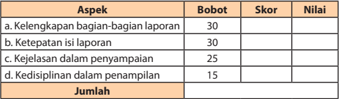

Tabel ini menunjukkan skor dan nilai untuk empat aspek penilaian, yaitu kelengkapan bagian-bagian laporan, ketepatan isi laporan, kejelasan dalam penyampaian, dan kedisiplinan dalam penampilan. Topik utama tabel ini adalah evaluasi kinerja dalam berbagai aspek penulisan laporan. Kolom-kolomnya mencakup bobot (atau penilaian) dan skor yang diberikan untuk setiap aspek. Data penting yang terlihat adalah bahwa aspek kelengkapan bagian-bagian laporan memiliki bobot tertinggi dengan 30%, sedangkan aspek kedisiplinan dalam penampilan memiliki bobot terendah dengan 15%. Skor tertinggi adalah 30, sedangkan skor terendah adalah 15. Jumlah skor untuk semua aspek adalah 100, menunjukkan bahwa setiap aspek diberikan bobot yang sama dalam penilaian akhir.

### Kegiatan 2

### Mengembangkan Teks Prosedur dengan Memperhatikan Struktur dan Kaidahnya

Dalam  mengembangkan  teks  prosedur,  kita  terlebih  dahulu  perlu mengetahui  perbedaan  atau  persamaan  yang  ada  di  dalam  teks  yang berbeda.  Hal  tersebut  merupakan  tahapan  membandingkan  satu  teks dengan teks lainnya, apakah terdapat perbedaan atau persamaan baik dari struktur maupun kaidah kebahasaannya.

Jika kita cermati, teks berjudul 'Kiat Menata Rambut Pendek' memiliki kesamaan dengan teks sebelumnya yang berjudul 'Kiat Tetap Semangat pada  Hari  Senin' ,  yaitu  sama-sama  berisi  langkah-langkah  melakukan sesuatu. Di dalamnya pun terdapat kata kerja imperatif.

Teks prosedur sekurang-kurangnya memiliki tiga macam, di antaranya adalah sebagai berikut.

- Teks bertema kebiasaan hidup, misalnya kiat hidup sehat, kiat belajar menyenangkan, dan kiat sukses bertetangga.
- Teks  bertema  aktivitas  tertentu,  misalnya  cara  membuat  bolu  kukus, cara menanam jagung hibrida, dan cara memelihara kucing.
- Teks bertema penggunaan alat, misalnya cara penggunaan laptop, cara menghidupkan motor bekas, dan cara menggunakan pisau cukur.

 

---
## 📄 Halaman 33

### Tugas 1

### Memahami Isi Teks Prosedur

- Bacalah  dengan  cermat  teks  di  bawah  ini!  Kemudian,  jawablah pertanyaan-pertanyaan yang menyertainya!

### Empat Tips agar Tidak Iri kepada Orang Lain

Sumber: www. harrysutanto.com

Gambar 1.7 Tetap tersenyum.

Pernahkah  Anda  membandingkan  diri  Anda  dengan  orang  lain? Mungkin ketika kita melihat orang lain sukses tetapi kita tidak, tibatiba  terpikir  pertanyaan  berikut  dalam  pikiran,  'Mengapa  saya  tidak seperti dia?'  Pertanyaan menggugat seperti itu bisa terjadi secara terusmenerus  dalam  hal  lainnya.  Untuk  mengatasi  pemikiran-pemikiran tersebut,  Anda  bisa  mengikuti  tips  yang  dilansir  dari Huffingtonpost berikut ini.

### Kenali Diri Sendiri

Hal  pertama  yang  perlu  dilakukan  agar  tidak  membandingkan diri  sendiri  dengan  orang  lain  adalah  kenali  diri  sendiri.  Jika  Anda mengenal  diri  sendiri,  ketika  Anda  melihat  keberhasilan  orang  lain membuat Anda terpacu  menjadi  lebih  baik,  bukannya  merasa  tidak percaya diri atau sedih. Gambarkan diri Anda dalam kata-kata, seperti pintar, kuat, baik, keibuan, memiliki tujuan, dan sebagainya. Dengan mengenal dan menghargai diri sendiri membuat Anda tidak akan ingin menjadi seperti orang lain.

 

---
## 📄 Halaman 34

### Setiap Orang Memiliki Kelebihan Masing-masing

Mungkin  ada  orang  tua  yang  berkata,  'Duduk  tegak  seperti saudaramu!'  atau  'Bersihkan  kamarmu  seperti  kakakmu!'  Perintahperintah seperti itu membuat anak belajar untuk mengetahui apa yang dilakukannya dengan apa yang telah dilakukan orang lain. Akan tetapi, hal itu tidak akan berpengaruh ketika setiap manusia menyadari bahwa ia memiliki karunia yang berbeda.

### Yang Penting Makna, Bukan Pengakuan

Ketika  Anda  menghabiskan  hidup  untuk  mengejar  pengakuan orang  lain,  boleh  jadi  itu  akan  membuat  Anda  merasa  khawatir tentang siapa yang nantinya melewati Anda. Itu akan membuat Anda membandingkan  diri  sendiri  dengan  orang  lain.  Jika  Anda  bekerja untuk mewujudkan impian, apa pun posisi Anda dalam suatu kekuasaan (jabatan), bukanlah masalah.

### Meniru Orang Berhasil

Ketika seseorang melakukan sesuatu dengan baik, coba evaluasi apa yang membuatnya berhasil, carilah cara untuk memasukkan sifat-sifat keberhasilannya dalam kehidupan Anda sendiri.

(Sumber: Surat Kabar Republika dengan pengubahan)

Setelah  membaca teks di atas, jawablah pertanyaan-pertanyaan di bawah ini!

- Menjelaskan apakah teks di atas?
- Teks tersebut berkategori apa: tentang kebiasaan, aktivitas tertentu, atau penggunaan alat? Jelaskan alasan-alasannya!
- Buktikan bahwa teks tersebut disusun secara kronologis!
- Mungkinkah  petunjuk-petunjuk  tersebut  kamu  terapkan  dalam kehidupan sehari-hari?
- Bagaimana tingkat kebermanfaatan petunjuk itu bagi kamu sendiri?

 

---
## 📄 Halaman 35

- Setelah mencermati teks pertama berjudul 'Empat Tips Agar Tidak Iri kepada Orang Lain' , bandingkanlah dengan teks kedua yang berjudul 'Meredakan Kejengkelan pada Hari Senin' di bawah ini. Kemudian, ikutilah perintah yang menyertainya!

### Meredakan Kejengkelan pada Hari Senin

Kembali  bekerja  setelah  melewati  akhir  pekan  yang  seru  dan menyenangkan memang menjengkelkan. Apalagi, beberapa tugas telah menanti dan parahnya dengan waktu yang sempit.

Betapa pun beratnya memulai kegiatan di Senin pagi, Anda harus ingat  perusahaan  tidak  akan  memberikan  keringanan  hanya  karena Anda merasa  butuh  waktu  penuh  mengumpulkan  tenaga  ke  kantor. Berikut lima tips untuk meredakan kejengkelan di hari Senin.

### Mendengarkan Suara Orang yang Anda Cinta

Entah suara suami, kekasih, orang tua, sahabat atau bayi Anda yang sedang  lucu-lucunya.  Mengawali  hari  Senin  dengan  membuat  hati Anda  berbunga-bunga,  bisa  dijadikan  sebagai  penyemangat  terbaik. Percakapan ringan yang diakhiri dengan kecupan dan pelukan, dapat menyematkan senyuman manis pada wajah Anda.

### Mendengarkan Lagu Favorit Sepanjang Perjalanan ke Kantor

Buatlah satu folder di MP3 player , iPod dan smartphone ,  yang memuat daftar lagu-lagu favorit Anda. Lalu, mainkanlah setiap hari Senin saat perjalanan menuju kantor. Seperti yang dilansir dari MagForWomen , mendengarkan musik yang Anda suka, merupakan cara cepat untuk 'menggusur' rasa bete menjadi semangat.

 

---
## 📄 Halaman 36

### Menikmati Sarapan Favorit, Enak, dan Mewah

Setiap orang memiliki definisi makanan enak yang tidak sama. Apa makanan  favorit  Anda?  Hidangkanlah  untuk  Anda  nikmati  sebagai sarapan sebelum berangkat kerja pada hari Senin. Meskipun makanan favorit tersebut tidak tepat untuk sarapan, jangan terlalu dipedulikan, santap saja!

### Awali Waktu Kerja dengan Pekerjaan yang Mudah

Beban  hari  Senin  akan  terasa  lebih  ringan,  jika  Anda  memulai pekerjaan  dengan  tugas  yang  lebih  mudah,  atau  setidaknya  yang menurut Anda mudah. Menyelesaikan satu tugas sebelum makan siang, membuat suasana lebih baik, dan ampuh untuk mengasah produktivitas sampai sore hari.

### Tidur Lebih Lama dan Lelap saat Hari Minggu Malam

Kurang  tidur  malam  menjadi  salah  satu  penyebab  orang  merasa lesu pada pagi hari. Apalagi jika terjadi pada Senin pagi, hal ini dapat dimaklumi  karena  banyak  orang  menikmati  akhir  pekan  secara maksimal.  Misalnya  dengan  berpergian  ke  luar  kota,  berpesta  dan menonton sampai larut malam. Akhirnya waktu istirahat berkurang.

Cobalah untuk berada di  rumah  sebelum  jam  tujuh  malam  pada hari Minggu, Dengan begitu Anda memiliki waktu yang cukup untuk menyiapkan  pakaian,  sepatu,  aksesori  dan  kertas  kerja  yang  harus dibawa ke kantor. Dengan demikian, pada saat pagi datang, Anda tidak perlu terburu-buru dan merusak suasana seharian penuh.

(Sumber: Surat Kabar Kompas dengan pengubahan)

Setelah selesai membaca teks di atas, ikuti instruksi berikut ini!

- Lakukanlah dengan berdiskusi bersama teman kelasmu. Temukanlah persamaan dan perbedaan dari kedua teks yang sudah kamu baca yang berjudul 'Empat Tips Agar Tidak Iri kepada Orang Lain (Teks 1)' dan 'Meredakan Kejengkelan pada Hari Senin (Teks 2)' .
- Sajikanlah  hasil  diskusi  kelompokmu  dalam  format  tabel  seperti berikut ini.

 

---
## 📄 Halaman 37

---
**📊 Tabel**

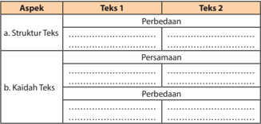

Tabel ini membandingkan dua teks berbeda dalam aspek struktur dan kaidah teks. Topik utama tabel adalah perbandingan antara kedua teks tersebut. Kolom pertama, "Aspek", menunjukkan dua aspek utama yang dibahas: struktur teks dan kaidah teks. Kolom kedua, "Teks 1" dan "Teks 2", masing-masing menunjukkan dua teks yang dibandingkan. Untuk aspek struktur teks, tabel menunjukkan bahwa kedua teks memiliki struktur yang sama, dengan perbedaan dalam jumlah paragraf dan penggunaan kalimat. Untuk aspek kaidah teks, tabel menunjukkan bahwa kedua teks memiliki kaidah yang sama, dengan perbedaan dalam penulisan dan penggunaan simbol. Dalam kesimpulan, tabel ini membantu kita memahami bagaimana kedua teks tersebut berbeda dan sama dalam hal struktur dan kaidah teks mereka.

### Tugas 2

### Mengomentari Teks Prosedur Berdasarkan Struktur dan Kaidah Teks Prosedur

Struktur  teks  prosedur  dibentuk  oleh  tujuan,  langkah-langkah,  dan penegasan kembali.  Sementara  itu,  kaidah  teks  prosedur  dibangun  oleh kalimat-kalimat perintah (kata kerja imperatif). Terkadang pula konjungsikonjungsi yang bersifat penambahan (kronologis), penggunaan kata-kata teknis, dan yang lainnya.

- Secara berkelompok, lakukanlah analisis terhadap teks yang berjudul 'Ciri Ban Tepat untuk Musim Hujan' di bawah ini. Kemudian, ikutilah instruksi yang menyertainya!

### Ciri Ban Tepat untuk Musim Hujan

 

---
## 📄 Halaman 38

Hujan  semakin  sering  mengguyur  berbagai  wilayah  di  Indonesia. Saatnya  mempersiapkan  kendaraan  agar  mengurangi  risiko  celaka ketika melintas di jalan basah. Salah satu poin utama adalah penggunaan ban.  Tidak  hanya  pengendara  mobil,  pengendara  sepeda  motor  juga harus memperhatikan soal ini.

Sony  Susmana,  Direktur Safety  Defensive  Consultant Indonesia (SDCI), menjelaskan bahwa ban adalah faktor utama pada kendaraan saat  hujan.  'Di  Indonesia  seharusnya  mobil  menggunakan  ban all condition agar  bisa  dipakai  untuk  panas  dan  hujan.  Ban  yang  bocor pada  musim  hujan  bisa  memecah  air  dengan  baik  dan  membuang udara yang tersandera di depan ban, ' ujarnya kepada Kompas Otomotif beberapa waktu lalu dalam kampanye safety GT Radial di Jakarta Timur. Meski demikian, Sony menjelaskan tidak harus ban all condition . Kalau musim hujan disarankan memakai ban sesuai rekomendasi pabrik.

Inilah ciri-ciri ban yang aman dipakai di jalan basah.

- Ban yang senormal mungkin, misalnya untuk mobil dengan profil ketebalan 55 hingga 70. Kalau sepeda motor antara 70 hingga 90. Adapun untuk lebar tapak juga disarankan tidak menguranginya, usahakan  ukuran  normal.  'Banyak  pengguna  sepeda  motor  yang memasang ban ceking . Ini jelas berbahaya, ' kata Sony.
- Gunakan ban tipe kembangan. Jangan sampai salah memilih karena pertimbangan fashion dengan motif aneh-aneh, tetapi tidak aman di  jalan  basah.  Ban  yang  baik  punya  pola  bergaris  dengan  jarak yang tidak terlalu renggang dan tidak terlalu jarang. Pola bergaris tersebut  berguna  memecah  air  saat  jalanan  basah,  dan  memiliki daya cengkeram lebih optimal. Hindari penggunaan ban slick atau tanpa pola. Selunak-lunaknya kompon ban slick ,  tetap  akan  susah memecah air di jalanan dan cenderung mudah terpeleset.
- Untuk  ban  yang  baru  dibeli,  jangan  langsung  beranggapan  daya cengkeram sudah maksimal. Lapisan silikon masih menempel dan masih berpotensi licin. Ban paling baik jika sudah dipakai beberapa puluh kilometer di lintasan kering karena gerusan dengan aspal akan menghilangkan  silikon  tersebut.  'Harus  hati-hati  pakai  ban  baru. Harus di-'reyen' dahulu supaya silikonnya hilang dan mencengkeram sempurna,' jelas Sony.

 

---
## 📄 Halaman 39

- Perhatikan  alur  ban.  Ada  dua  jenis,  ban bidirectional yang  bisa dipakai dalam dua arah. Cirinya adalah alur simetris dan sama kalau dibolak-balik. Ban ini untuk penggunaan normal sehari-hari. Untuk musim  hujan,  pakai  ban  yang undirection dengan  orientasi  satu arah. Tidak bisa dipindah dari sisi kanan atau kiri. Jenis ban ini lebih punya pola lebih baik untuk memecah air.
- Setelah kamu membaca teks di atas, ikutilah beberapa instruksi berikut.
- Gunakanlah pertanyaan-pertanyaan berikut sebagai pedoman.
- Secara bergiliran, presentasikanlah pendapat kelompokmu di depan kelas!
- Bandingkanlah pendapat kelompokmu dengan kelompok lain.
(Sumber: Surat Kabar Kompas

dengan Pengubahan)

---
**📊 Tabel**

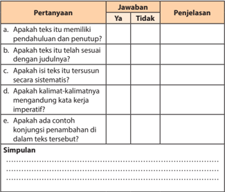

Tabel ini berisi pertanyaan tentang karakteristik teks yang disusun secara sistematis, dengan kolom "Ya" dan "Tidak" untuk menjawab setiap pertanyaan. Topik utama tabel adalah karakteristik teks yang disusun secara sistematis. Kolom pertama berisi pertanyaan, kolom kedua berisi jawaban "Ya" atau "Tidak", dan kolom ketiga berisi penjelasan. Data penting yang terlihat adalah bahwa teks harus memiliki pendahuluan, penutup, dan kalimat-kalimatnya harus mengandung kata kerja imperatif. Selain itu, teks harus memiliki struktur yang sistematis dan ada contoh konjungsi penambahannya.

 

---
## 📄 Halaman 40

- Jadikanlah  pendapat-pendapat  semua  kelompok  itu  sebagai  dasar untuk  menyusun  sebuah  pendapat  kelas  tentang  hasil  analisis terhadap teks tersebut!

---
**📊 Tabel**

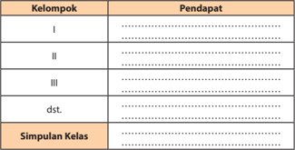

Tabel ini menunjukkan hasil survei atau penilaian yang dilakukan kepada beberapa kelompok siswa. Topik utama tabel adalah pendapat siswa tentang suatu topik tertentu. Tabel dibagi menjadi tiga kolom utama: Kelompok, Pendapat, dan Simpulan Kelas. Dalam kolom Kelompok, ada beberapa kelompok yang telah diberikan, seperti I, II, III, dst. Di kolom Pendapat, siswa memberikan pendapat mereka tentang topik tersebut. Kolom Simpulan Kelas digunakan untuk menyajikan kesimpulan umum dari seluruh kelompok yang telah diperiksa. Data penting yang terlihat dalam tabel ini adalah bahwa setiap kelompok memiliki pendapat yang berbeda-beda, dan kesimpulan umum dari seluruh kelompok menunjukkan bahwa topik tersebut memiliki perbedaan pendapat antara siswa.

### Tugas 3

- Analisislah  sebuah  teks  prosedur  lainnya,  berdasarkan  struktur  dan kaidah-kaidahnya!
- Laporkan hasil analisismu dalam format tabel berikut ini.
Judul Teks  : .................................

Sumber

: .................................

Aspek yang

Dianalisis

Pembahasan

a. Struktur teks

…………………………………………

…………………………………………

b. Kaidah teks

…………………………………………

…………………………………………

Simpulan

……………………………………………………………………………

……………………………………………………………………………

……………………………………………………………………………

 

---
## 📄 Halaman 41

### Menyusun Teks Prosedur

Mari berlatih menyusun teks prosedur! Langkah-langkah penyusunan teks prosedur sebagai berikut.

- Menginventarisasi  macam-macam  kegiatan  yang  pernah  atau  dapat dilakukan.
- Menentukan tema kegiatan.
- Membuat  kerangka  dalam  bentuk  topik-topik  kegiatan  secara  garis besar.
- Mensistematisasikan  kerangka  dengan  benar  dan  mudah  dipahami pembaca.
- Mengumpulkan bahan-bahan.
- Mengembangkan  kerangka  menjadi  sebuah  petunjuk  yang  jelas  dan lengkap.

### Tugas 5

- Jawablah pertanyaan-pertanyaan di bawah ini!
- Bagaimana  upaya-upaya  yang  dapat  kamu  lakukan  sehubungan dengan masalah-masalah yang terdapat dalam teks di bawah ini?
- Kelas  tidak  punya  dana  untuk  menyambut  peringatan  HUT RI.  Padahal,  kepala  sekolah  mewajibkan  setiap  kelas  untuk menghias kelasnya masing-masing. Selain itu, setiap kelas harus mengirimkan utusan dalam berbagai perlombaan sekolah. Semuanya  itu  memerlukan  dana  yang  tidak  sedikit,  terutama untuk membeli  alat dan bahan-bahan  hiasan serta untuk konsumsi utusan kelas.
- Kakak ingin melanjutkan kuliah. Waktu itu Ayah tidak memiliki dana yang cukup karena uangnya digunakan untuk membiayai perawatan kakek yang sakit. Apabila keinginan tidak terpenuhi pada waktu itu, berarti kakak harus menunggu satu tahun lagi. Waktu setahun memang bukan waktu yang sebentar. Lagi pula teman-teman kakak hampir semuanya sudah kuliah dan beberapa di antaranya sudah bekerja.
- Melalui  kegiatan  berdiskusi,  ungkapkan  upaya-upaya  tersebut  ke dalam sebuah tulisan yang berbentuk teks prosedur!

 

---
## 📄 Halaman 42

- Bacalah teks yang telah dibuat secara bergiliran dengan kelompok lain. Kemudian, mintalah mereka untuk memberikan tanggapan/penilaian dengan menggunakan format tabel di bawah ini.
- Marilah kita berlatih menyusun teks prosedur secara mandiri! Ikutilah langkah-langkah berikut!
- Pilihlah sebuah tema untuk teks prosedur yang bermanfaat bagi diri sendiri dan juga orang lain!
- Susunlah teks tersebut dengan langkah-langkah seperti yang telah kita pelajari sebelumnya!
- Sajikanlah hasil kegiatan kamu itu dengan susunan sebagai berikut!

---
**📊 Tabel**

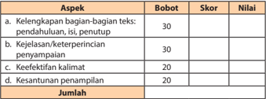

Tabel ini menunjukkan skor dan nilai untuk aspek-aspek penilaian dalam sebuah proses pembelajaran, masing-masing dengan bobot tertentu. Topik utama tabel adalah aspek-aspek penilaian yang harus diperhatikan dalam proses pembelajaran, seperti kelayakan bagian-bagian teks, kejelasan dan keterperinciannya, keefektifan kalimat, dan kesuntisan penulisan. Kolom-kolomnya mencakup bobot, skor, dan nilai. Bobot berada di kolom pertama, skor di kolom kedua, dan nilai di kolom ketiga. Data penting yang terlihat adalah bahwa setiap aspek memiliki bobot yang berbeda, yang kemudian ditransformasi menjadi skor dan nilai. Misalnya, kelayakan bagian-bagian teks memiliki bobot 30%, sedangkan kesuntisan penulisan hanya memiliki bobot 20%. Ini menunjukkan bahwa dalam proses penilaian, kelayakan bagian-bagian teks memiliki peran yang lebih besar dibandingkan dengan kesuntisan penulisan.

Judul :

………………………………………………………

Tujuan :

………………………………………………………

Sasaran Pembaca :

………………………………………………………

Susunan langkah-langkah

…………………………………………………………………………………

…………………………………………………………………………………

…………………………………………………………………………………

…………………………………………………………………………………

…………………………………………………………………………………

 

---
## 📄 Halaman 43

### Menyunting Teks Prosedur

Dalam menyunting sebuah teks prosedur, ada beberapa hal yang harus diperhatikan,  yaitu  kebenaran  isi,  strukturnya,  kaidah  kalimat,  ataupun penggunaan ejaan/tanda baca.

### Perhatikanlah cuplikan berikut!

1)  Hal  pertama  yang  perlu  dilakukan  agar  tidak  membandingkan diri sendiri dengan orang lain adalah kenali diri sendiri. (2) Jika Anda mengenal  diri  sendiri,  ketika  Anda  melihat  keberhasilan  orang  lain membuat Anda terpacu menjadi lebih baik, bukannya merasa minder atau  sedih.  (3)  Gambarkan  diri  Anda  dalam  kata-kata,  seperti  pintar, kuat, baik, keibuan, visioner, dan sebagainya. (4) Dengan mengenal dan menghargai diri sendiri membuat Anda tidak akan ingin menjadi seperti orang lain.

Ada  dua  jenis kesalahan dalam  cuplikan tersebut, yakni  dalam pembentukan kata dan pembentukan kalimat.

- Pembentukan kata kenali dalam  kalimat  (1)  tidak  tepat,  seharusnya mengenali .
- Kalimat  (2)  dan  (4)  tidaklah  efektif.  Kalimat  tersebut  tidak  jelas subjeknya.

---
**📊 Tabel**

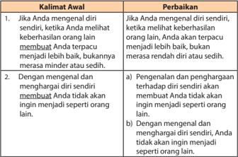

Tabel ini berisi dua baris yang masing-masing memiliki dua kolom. Topik utama tabel adalah tentang pengenalan dan penghargaan diri sendiri. Dalam baris pertama, keduanya membahas tentang bagaimana mengenal diri sendiri ketika melihat keberhasilan orang lain. Baris kedua mengeksplorasi bagaimana mengenal dan menghargai diri sendiri tanpa ingin menjadi seperti orang lain. Data penting yang terlihat adalah bahwa kedua baris memiliki perbedaan dalam cara menyampaikan pesan, dengan baris pertama menggunakan kata "merasa" dan "minder" sementara baris kedua menggunakan "dengan" dan "tidak ingin". Ini menunjukkan bahwa bahasa yang digunakan dapat mempengaruhi cara kita berpikir dan berperilaku.

 

---
## 📄 Halaman 44

Perhatikan pula kedua cuplikan teks berikut. Bandingkanlah keduanya. Manakah  cuplikan  yang  mudah  dipahami?  Apakah  yang  membedakan kedua cuplikan tersebut?

### Tugas 7

- Jelaskanlah  penyebab  kesalahan  dari  penulisan  kata  dalam  kalimatkalimat di bawah ini. Kemudian, perbaikilah!

---
**📊 Tabel**

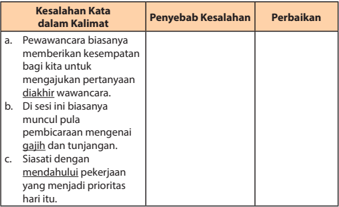

Tabel ini berisi informasi tentang kesalahan kata dalam kalimat yang sering ditemui dalam wawancara kerja. Topik utamanya adalah penyelesaian kesalahan kata tersebut. Tabel dibagi menjadi tiga kolom: Penyebab Kesalahan, Perbaikan, dan Keterangan. Dalam kolom Penyebab Kesalahan, terdapat tiga poin yang menjelaskan kesalahan kata yang umum terjadi dalam wawancara kerja, yaitu:
1. Pewawancara biasanya memberikan kesempatan bagi kandidat untuk mengajukan pertanyaan di akhir wawancara.
2. Di sesi ini biasanya pembicaraan mengenai gaji dan tunjangan.
3. Siasati dengan mendahului pekerjaan yang menjadi prioritas hari itu.
Kolom Perbaikan menunjukkan cara-cara untuk mengatasi kesalahan kata tersebut, seperti:
1. Pewawancara harus memberikan kesempatan kepada kandidat untuk mengajukan pertanyaan di akhir wawancara.
2. Di sesi ini, pembicaraan sebaiknya mengenai gaji dan tunjangan.
3. Siasati dengan mendahului pekerjaan yang menjadi prioritas hari itu.
Kolom Keterangan memberikan penjelasan tentang apa yang dimaksud dengan setiap kesalahan kata tersebut dan bagaimana cara mengatasinya. Tabel ini membantu kandidat wawancara kerja untuk memahami dan menghindari kesalahan kata yang sering terjadi dalam proses wawancara.

 

---
## 📄 Halaman 45

---
**📊 Tabel**

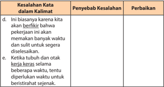

Tabel ini berisi kesalahan kata dalam kalimat dan penyebaran kesalahan tersebut. Topik utamanya adalah kesalahan kata dalam kalimat. Kolom-kolomnya meliputi "Penyebab Kesalahan", "Perbaikan", dan "Kesalahan Kata dalam Kalimat". Data penting yang terlihat adalah bahwa kesalahan kata seringkali disebabkan oleh penggunaan kata yang tidak tepat atau tidak sesuai dengan konteks kalimat. Misalnya, dalam kalimat "Ini biasanya kita akan berkiri bahwa pekerjaan ini akan memakan banyak waktu dan sulit untuk segera diselesaikan", penyebab kesalahan adalah penggunaan kata "berkiri" yang tidak tepat. Perbaikan yang diberikan adalah penggantian kata "berkiri" menjadi "berkirim".

- Penulisan kata-kata dari bahasa asing yang digunakan dalam bahasa Indonesia harus dimiringkan. Tunjukkanlah contoh kata yang dimaksud dalam kalimat-kalimat di bawah ini. Kemudian, perbaikilah!

---
**📊 Tabel**

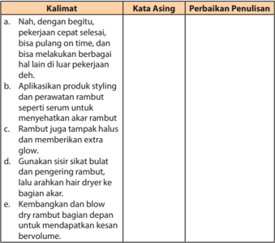

Tabel ini berisi kumpulan kalimat yang diberikan dengan beberapa perbaikan penulisan yang ditawarkan. Topik utamanya adalah tentang teknik penataan rambut dan produk styling. Kolom "Kata Asing" menunjukkan kata-kata yang mungkin sulit dipahami atau tidak familiar bagi pembaca, sementara kolom "Perbaikan Penulisan" menyajikan cara-cara untuk memperbaiki penulisan tersebut. Data penting yang terlihat adalah bahwa banyak kalimat memiliki kata asing atau tidak jelas, seperti "serum", "extra glow", dan "sikat bulat". Selain itu, beberapa kalimat juga memerlukan penjelasan lebih lanjut untuk dimengerti, seperti "dengan bagian akar" dan "untuk mendapatkan kesan bervolume".

 

---
## 📄 Halaman 46

---
**📊 Tabel**

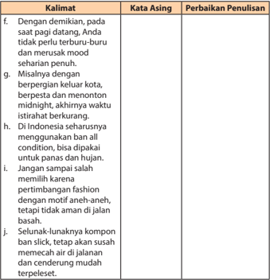

Tabel ini berisi kumpulan kalimat yang perlu diperbaiki untuk penulisan yang lebih baik. Topik utamanya adalah perbaikan penulisan kalimat dengan memperhatikan penggunaan kata asing, kondisi, dan pertimbangan fashion. Kolom "Kata Asing" menunjukkan kalimat yang menggunakan kata asing, sedangkan kolom "Perbaikan Penulisan" menawarkan solusi untuk mencegah kesalahan penulisan tersebut. Data penting yang terlihat adalah bahwa banyak kalimat menggunakan kata asing dan kondisi, yang perlu diperbaiki untuk penulisan yang lebih baik.

 

---
## 📄 Halaman 47

- Kalimat-kalimat ini terlalu panjang sehingga maksudnya sulit dimengerti.  Oleh  karena  itu,  penggallah  kalimat-kalimat  tersebut sehingga menjadi lebih efektif.

---
**📊 Tabel**

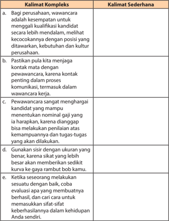

Tabel ini membandingkan kalimat kompleks dengan kalimat sederhana dalam konteks wawancara kerja. Topik utama tabel adalah peran penting dalam proses wawancara kerja, seperti kualifikasi kandidat, kecocokannya dengan posisi, dan komunikasi efektif. Kolom "Kalimat Kompleks" berisi contoh kalimat yang lebih rumit dan kompleks, sementara kolom "Kalimat Sederhana" berisi contoh kalimat yang lebih sederhana namun tetap relevan. Data penting yang terlihat adalah bahwa kalimat-kalimat kompleks seringkali lebih detail dan mendalam, sementara kalimat sederhana lebih fokus pada aspek-aspek yang lebih umum dan penting dalam proses wawancara kerja.

 

---
## 📄 Halaman 48

- Setelah kamu menyelesaikan tugas-tugas di atas, langkah selanjutnya ikutilah instruksi berikut.
- Tampilkan kembali teks prosedur yang telah dibuat!
- Lakukanlah silang baca dengan salah seorang temanmu untuk saling memberikan koreksi!
- Sajikan hasil koreksimu dalam format tabel seperti di bawah ini!
Judul Teks

: ..............................

Penulis

: ..............................

---
**📊 Tabel**

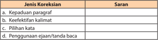

Tabel ini berisi informasi tentang jenis-jenis koreksi dalam bahasa Indonesia, dengan disertai saran untuk mencegah kesalahan-kesalahan umum. Topik utama tabel adalah "Jenis Koreksikan" dan "Saran". Kolom pertama, "Jenis Koreksikan", mencakup empat pilihan: kepadaudan paragraf, keefektifan kalimat, pilihan kata, dan penggunaan ejaan/tanda baca. Kolom kedua, "Saran", menyediakan saran spesifik untuk mencegah kesalahan-kesalahan tersebut. Misalnya, untuk kepadaudan paragraf, saran adalah "pastikan setiap paragraf memiliki pembukaan dan penutup yang jelas". Ini membantu pembaca memahami struktur dan konten paragraf dengan lebih baik.

### E. Melaporkan Kegiatan Membaca Buku

Setelah mempelajari materi ini, kamu diharapkan mampu:

- mengidentifikasi butir-butir penting dalam buku nonfiksi;
- menyusun laporan kegiatan membaca buku nonfiksi.
Pernahkah kamu membaca buku-buku ilmu pengetahuan, selain buku teks  pelajaran?  Setelah  kamu  membacanya,  bagaimana  tanggapanmu mengenai isi buku tersebut? Pada bab ini kamu akan belajar bagaimana melaporkan buku yang dibaca. Buku tersebut adalah buku nonfiksi, berupa buku pengayaan. Untuk dapat melaporkannya, kamu harus membaca dan memahami isi yang terkandung di dalam buku.

Kegiatan  membaca  sangat  berguna.  Dari  kegiatan  membaca,  kita memperoleh  banyak  pengetahuan,  wawasan,  atau  informasi  berharga. Banyak  sumber  bacaan  yang  dapat  kamu  baca.  Namun,  saat  ini  kamu belajar dari membaca buku nonfiksi. Salah satu jenis buku nonfiksi adalah buku-buku pengayaan. Buku-buku ini akan memperkaya pengetahuanmu, keterampilanmu, dan sikapmu.

 

---
## 📄 Halaman 49

Marilah  mempersiapkan  kegiatan  membaca  buku  nonfiksi  sebagai proyek membaca minggu ini. Buku tersebut harus kamu selesaikan dalam seminggu.  Oleh  karena  itu,  biasakan  membawa  buku  tersebut  ke  mana pun kamu bepergian. Jika ada kesempatan untuk membaca, kamu dapat membacanya.

Proyek  membaca  ini  dilaporkan  secara  mandiri.  Oleh  karena  itu, langkah-langkah yang harus kamu lakukan sebagai berikut.

- Carilah buku nonfiksi (buku pengayaan) di perpustakaan.Buku yang kamu baca bukan buku teks pelajaran. Pinjamlah buku tersebut kepada petugas untuk kamu baca selama satu minggu.
- Jika kamu memiliki uang, pergilah ke toko buku. Carilah buku nonfiksi yang dapat kamu miliki untuk dibaca.
- Mulailah mempersiapkan kegiatan membaca, dengan menyiapkan buku tulismu untuk melaporkan kegiatan membaca minggu ini.
- Tuliskanlah judul buku, nama penulis, penerbit, tahun terbit, dan kota terbit.
- Amatilah daftar isi buku tersebut. Bacalah sekilas daftar isinya, kemudian tuliskanlah, ada berapa bab isi buku tersebut.
- Sebelum membaca, berdasarkan daftar isi buku, kamu susun pertanyaan yang mungkin akan kamu dapatkan dari isi buku. Pada buku laporan membaca, tuliskanlah pertanyaan-pertanyaan yang ingin kamu dapatkan jawabannya dari membaca isi buku.
- Mulailah membaca. Apabila buku itu milikmu, pada saat kamu membaca tandailah butir-butir penting dari setiap subbab yang dibaca. Jika buku itu  milik  perpustakaan,  setiap  kamu  membaca  butir-butir  penting, tuliskanlah pada buku laporan membaca.
- Setiap kamu akan mulai membaca, tuliskan terlebih dahulu hari, tanggal, dan waktu kamu membaca agar kegiatanmu terdata.
- Lakukanlah kegiatan membaca buku tersebut selama satu minggu.
- Jika  kamu  sudah  selesai  membaca  buku,  susunlah  laporan  kegiatan tersebut  dalam  buku  rekaman  tertulis  kegiatan  membaca.  Untuk membantumu  melaporkan  kegiatan  membaca,  berikut  ini  contoh format yang dapat kamu buat.

 

---
## 📄 Halaman 50

Judul Buku :

Pengarang :

Penerbit :

Kota Terbit :

### a.  Kegiatan Prabaca

No.

1.

2.

dst.

### b.  Kegiatan Pascabaca

---
**📊 Tabel**

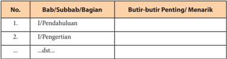

Tabel ini menunjukkan struktur umum dari sebuah bab atau bagian dalam buku pelajaran. Kolom pertama berisi nomor urut (No.), kolom kedua berisi judul bab, subbab, atau bagian, sedangkan kolom ketiga berisi butir-butir penting atau menarik yang mungkin diperlukan untuk memahami atau mempelajari materi tersebut. Topik utama tabel ini adalah struktur dan konten pembelajaran dalam buku pelajaran. Data atau pola penting yang terlihat adalah bahwa setiap bagian atau bab memiliki beberapa butir penting yang harus dipahami, yang dapat membantu pembaca dalam memahami dan mempelajari materi yang disampaikan.

Dilaporkan oleh:

Kelas :

Tabel:

### Laporan Kegiatan Membaca Buku

Pertanyaan Sebelum Membaca Buku

 

---
## 📄 Halaman 51

### Bab II

### Mempelajari Teks Eksplanasi

---
**🖼️ Gambar/Diagram**

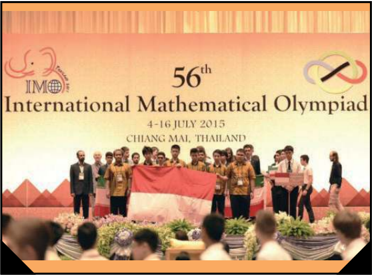

> **Deskripsi Visual:** Gambar ini adalah foto yang menunjukkan para peserta dari Indonesia yang mengikuti Olimpiade Matematika Internasional (IMO) ke-56 di Chiang Mai, Thailand pada tanggal 4-16 Juli 2015. Peserta tersebut berdiri bersama bendera Indonesia di depan sebuah latar belakang yang menampilkan logo IMO dan bendera Thailand. Elemen-elemen utama dalam gambar ini meliputi peserta dari Indonesia, bendera Indonesia, logo IMO, dan bendera Thailand. Teks penting yang terlihat adalah "56th International Mathematical Olympiad" dan "CHIANG MAI, THAILAND". Informasi kunci yang dapat diambil dari gambar ini adalah bahwa Indonesia telah mengikuti Olimpiade Matematika Internasional sejak tahun 1987 dan telah memenangkan beberapa medali di Olimpiade Matematika Internasional.

Sumber: www. beritasatu.com

Pada pelajaran sebelumnya, kamu sudah belajar tentang prosedur. Ternyata mudah bukan mempelajari teks prosedur itu? Saat ini kamu akan belajar teks eksplanasi.  Pernahkah  kamu  mendengar  istilah  eksplanasi?  Teks  eksplanasi merupakan  sebuah  karangan  yang  berisi  penjelasan-penjelasan  lengkap mengenai  suatu  topik  yang  berhubungan  dengan  berbagai  fenomena,  baik fenomena alam maupun sosial yang terjadi di kehidupan sehari-hari. Teks ini bertujuan untuk memberikan informasi sejelas-jelasnya kepada pembaca agar paham atau mengerti tentang suatu fenomena yang terjadi.

 

---
## 📄 Halaman 52

Untuk membekali kemampuanmu, pada bab ini kamu akan belajar:

- mengident ifikasi informasi dalam teks eksplanasi;
- mengonstruksi informasi dalam teks eksplanasi;
- menganalisis struktur dan kebahasaan teks eksplanasi; dan
- mengembangkan  teks  eksplanasi  dengan  memperhatikan  struktur  dan kebahasaan.
Untuk  membantu  kamu  dalam  mempelajari  dan  mengembangkan  teks eksplanasi, pelajari peta konsep di bawah ini dengan saksama!

---
**🖼️ Gambar/Diagram**

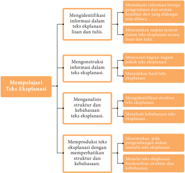

> **Deskripsi Visual:** Gambar ini adalah diagram yang menunjukkan proses pembelajaran teks eksplanasi. Diagram ini terdiri dari empat bagian utama yang masing-masing menjelaskan tahap-tahap dalam proses tersebut:

1. Identifikasi informasi dalam teks eksplanasi lisan dan tulis.
   - Ini melibatkan memahami struktur dan konten informasi yang disampaikan dalam teks.

2. Mengkonstruksi informasi dalam teks eksplanasi.
   - Ini melibatkan pengorganisasian informasi yang telah dikenali menjadi struktur yang jelas dan terstruktur.

3. Menganalisis struktur dan kebahasaan teks eksplanasi.
   - Ini melibatkan pemahaman tentang bagaimana informasi disampaikan dalam bahasa yang efektif dan mudah dipahami.

4. Memproduksi teks eksplanasi dengan memperhatikan struktur dan kebahasaan.
   - Ini melibatkan penulisan atau pembuatan teks eksplanasi yang berdasarkan analisis sebelumnya.

Elemen-elemen utama dalam diagram ini adalah empat bagian yang menjelaskan tahap-tahap dalam proses pembelajaran teks eksplanasi. Setiap bagian memiliki subbagian yang menjelaskan tugas-tugas spesifik dalam proses tersebut. Teks, angka, atau label penting yang terlihat mencakup nama-nama tahap dalam proses (misalnya "Mempelajari Teks Eksplanasi") dan subtahap dalam setiap tahap.

Informasi kunci yang dapat diambil pembaca meliputi langkah-langkah yang harus diikuti dalam proses pembelajaran teks eksplanasi, yaitu identifikasi informasi, mengkonstruksi informasi, menganalisis struktur dan kebahasaan, dan memproduksi teks eksplanasi. Diagram ini memberikan panduan visual tentang proses pembelajaran yang sistematis dan terstruktur.

 

---
## 📄 Halaman 53

### A. Mengidentifikasi Informasi dalam Teks Eksplanasi

Setelah mempelajari materi ini, kamu diharapkan mampu:

- memahami informasi berupa pengetahuan dan urutan kejadian dari yang didengar atau dibaca;
- menemukan gagasan umum dan fakta penting dalam teks eksplanasi.
Pernahkah  kamu  mendengar  atau  membaca  informasi  mengenai fenomena atau peristiwa yang terjadi di lingkunganmu? Fenomena atau peristiwa tersebut, seperti hujan deras, gempa bumi, angin puting beliung, dan yang lainnya. Selain itu, kita sering pula mendengar peristiwa-peristiwa yang terkait dengan masalah sosial dan budaya, misalnya seorang siswa SMA yang berhasil menjuarai lomba penelitian remaja, lomba salah satu jenis olahraga, atau siswa SMK yang berhasil menciptakan alat pendeteksi gempa bumi.  Mungkin juga, kamu membaca peristiwa politik dan ekonomi, misalnya tentang pemilihan kepala daerah yang dilakukan secara serentak atau  tentang  investasi  asing  yang  mulai  merambah  ke  daerah-daerah. Informasi tentang peristiwa atau fenomena tersebut disajikan dalam jenis teks eksplanasi.

### Memahami Informasi dalam Teks Eksplanasi

Teks  eksplanasi  dapat  disamakan  dengan  teks  yang  menceritakan prosedur atau proses terjadinya fenomena. Dengan teks tersebut, pembaca dapat  memperoleh  pemahaman  mengenai  latar  belakang  terjadinya fenomena  secara  jelas  dan  logis.  Teks  eksplanasi  menggunakan  banyak fakta  dan  pernyataan-pernyataan yang memiliki hubungan sebab akibat (kausalitas). Namun,  sebab-sebab ataupun akibat-akibat itu berupa sekumpulan fakta menurut penulisnya.

 

---
## 📄 Halaman 54

### Demonstrasi Massa

Gambar 2.2 Para mahasiswa berdemo di Gedung MPR Jakarta pada tahun 1998.

Akhir-akhir  ini  demonstrasi  kerap  terjadi  hampir  setiap  waktu  dan terjadi di berbagai tempat. Bahkan, demonstrasi sudah menjadi fenomena yang  lumrah  di  tengah-tengah  masyarakat  kita.  Menanggapi  fenomena tersebut, seorang kepala daerah menyatakan bahwa penyebab demonstrasi dan  anarkisme  tidak  lain  adalah  faktor  laparnya  masyarakat.  Lantas  ia mencontohkan  rakyat  Malaysia  dan  Brunei  yang adem  ayem ,  lantaran kesejahteraan mereka terpenuhi maka demonstrasi di negara-negara itu jarang terjadi.

Tentu saja komentar tersebut menyulut reaksi para mahasiswa. Mereka memprotes dan meminta sang bupati mencabut kembali pernyataannya. Para mahasiswa tidak terima dan tidak merasa memiliki motif serendah itu. Mereka berpendirian bahwa demonstrasi yang biasa mereka lakukan murni  untuk  memperjuangkan  kebenaran  dan  melawan  kemungkaran yang terjadi di hadapannya.

Persoalannya  kemudian,  pendapat  manakah  yang  benar;  sang  bupati atau pihak mahasiswa ataupun komponen-komponen masyarakat lainnya? Barangkali logika sang bupati dikaitkan dengan kebiasaan bayi atau anak

 

---
## 📄 Halaman 55

kecil  yang  memang  begitu  adanya.  Kalau  seorang  bayi  merasa  lapar,  ia akan ngamuk : menangis dan meronta-ronta. Namun, apabila logika sang bupati dibawa pada konteks yang lebih luas, jelaslah tidak relevan, misalnya membandingkan dengan kondisi rakyat di Malaysia ataupun Brunei yang adem-ayem , tidak seperti halnya rakyat Indonesia yang gampangan.

Demonstrasi massa tidak selalu disebabkan oleh urusan perut, bahkan banyak peristiwa yang sama sekali tidak didasari oleh motif itu.  Dalam kaitannya  dengan  kebutuhan  manusia,  Abraham  Maslow  membaginya ke  dalam  beberapa  tingkatan.  Kebutuhan  yang  paling  mendasar  adalah makan dan minum. Sementara itu, yang paling puncak adalah kebutuhan akan aktualisasi diri.

Namun  demikian,  pada  umumnya  demonstrasi  massa  justru  lebih didasari oleh kebutuhan tingkatan akhir itu. Masyarakat berdemonstrasi karena membutuhkan pengakuan dari pemerintah ataupun pihak-pihak lain agar hak-hak dan eksistensi mereka diakui. Karena merasa dibiarkan, hak-haknya  diingkari,  bahkan  dinistakan,  kemudian  mereka  berusaha untuk menunjukkan jati dirinya dengan cara berdemonstrasi.

Banyak fakta dapat membuktikannya. Demonstrasi massa pada awalawal reformasi di negeri ini pada tahun 1997 -1998, bukan dilakukan oleh rakyat  miskin  ataupun  orang-orang  lapar.  Justru  hal  itu  dilakukan  oleh warga dari kalangan menengah ke atas, dalam hal ini adalah mahasiswa dan golongan intelektual. Belum lagi kalau merujuk pada kasus-kasus yang terjadi di luar negeri. Dalam beragam skala (besar atau kecil), demonstrasi bukan hal aneh lagi bagi negara-negara Eropa. Demonstrasi yang mereka lakukan sudah tentu tidak didorong oleh kondisi perut yang lapar karena mereka pada umumnya dalam kondisi yang sangat makmur.

Perbandingan  yang  cukup  kontras  dengan  melihat  peristiwa  terbaru di  Korea  Utara.  Kondisi  sosial  ekonomi  warga  negaranya  sangat  jauh terbelakang. Kemiskinan menjadi pemandangan umum hampir melanda di seluruh pelosok negeri.  Akan tetapi, ketika Kim Jong-Il, pimpinannya itu meninggal, tak ada upaya penggulingan kekuasaan ataupun demonstrasi untuk menuntut perubahan politik di negerinya. Padahal peluang untuk itu lebih terbuka.  Justru yang terjadi kemudian hampir seluruh warganya menunduk hidmat, mengantar jenazah pimpinannya ke liang lahat.

Demikian pula jika kita melihat kembali kondisi masyarakat di negara tersebut. Kemiskinan sangat akrab di pinggiran kota dan di sudut-sudut desa di berbagai pelosok. Akan tetapi, mereka jarang melakukan demonstrasi: hanya satu-dua peristiwa. Justru yang jauh lebih getol melakukan hal itu adalah warga yang tinggal pusat-pusat kota, yang secara umum mereka lebih makmur.

 

---
## 📄 Halaman 56

Dengan  fakta  semacam  itu,  nyatalah  bahwa  kemiskinan  bukanlah penyebab  utama  untuk  terjadinya  gelombang  demonstrasi.  Akan  tetapi, fenomena tersebut lebih disebabkan oleh kemampuan berpikir kritis dari warga masyarakat. Mereka tahu akan hak-haknya, mengerti pula bahwa di sekitarnya telah terjadi pelanggaran dan kesewenang-wenangan. Mereka kemudian  melakukan  protes  dan  menyampaikan  sejumlah  tuntutan. Apabila  faktor-faktor  itu  tidak  ada  di  dalam  diri  mereka,  apa  pun  yang terjadi di sekitarnya, mereka akan seperti kerbau dicocok hidung: manggutmanggut  dan  berkata  'ya'  pada  apa  pun  tindakan  dari  pimpinannya meskipun menyimpang, dan bahkan menzalimi mereka sendiri.

(Sumber: Kosasih)

Teks  di  atas  terdiri  atas  paragraf-paragraf  yang  merupakan  paparan tentang akibat dan sebab maraknya  demonstrasi di tengah-tengah masyarakat.  Teks  itu  pun  dapat  dikelompokkan  sebagai  teks  eksplanasi. Dari teks semacam itu diharapkan para pembaca dapat memahami proses berlangsungnya  suatu  peristiwa  yang  bersifat  kausalitas  dengan  sejelasjelasnya.

Dalam  teks  eksplanasi,  penulis  menggunakan  banyak  fakta  yang fungsinya sebagai penyebab atau akibat terjadinya suatu peristiwa. Bahkan, dapat  dikatakan  bahwa  teks  eksplanasi  hampir  semuanya  berupa  fakta. Untuk lebih jelasnya, perhatikan kembali paragraf keenam dan ketujuh di atas. Paragraf tersebut dibentuk oleh empat buah kalimat yang semuanya berupa fakta.

---
**📊 Tabel**

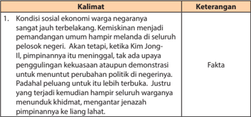

Tabel ini berisi informasi tentang kondisi sosial ekonomi warga negaraan di sebuah negara tertentu. Kolom "Kalimat" menyajikan beberapa kalimat yang membahas tentang situasi ekonomi dan sosial yang sangat buruk di negara tersebut. Kolom "Keterangan" memberikan penjelasan atau keterangannya untuk setiap kalimat. Topik utama tabel ini adalah kondisi ekonomi dan sosial yang sangat buruk di negara tersebut, dengan fakta bahwa kemiskinan menjadi pemandangan umum hampir melanda seluruh pelosok negeri. Selain itu, juga disebutkan bahwa ketika Kim Jong-Il memimpin negara tersebut, ada upaya penggulingan kekuasaan atau demonstrasi untuk menuntut perubahan politik di negerinya. Justru yang terjadi adalah kemudian hampir seluruh warganya mendunduk khidmat, mengantar jenazah pimipannya ke langit lahat. Ini menunjukkan bahwa situasi ekonomi dan sosial yang sangat buruk di negara tersebut tidak hanya menciptakan kemiskinan, tetapi juga mengakibatkan keadaan yang sangat sulit bagi warganya.

 

---
## 📄 Halaman 57

---
**📊 Tabel**

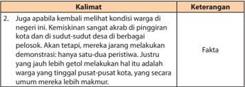

Tabel ini berisi informasi tentang kondisi warga di negeri ini, dengan fokus pada kemiskinan dan demonstrasi. Topik utama adalah perbandingan antara kemiskinan dan demonstrasi. Kolom pertama berisi kalimat deskripsif, sedangkan kolom kedua berisi keterangan atau penjelasan. Data penting yang terlihat adalah bahwa warga yang tinggal di pusat-pusat kota lebih mungkin menjadi miskin dibandingkan mereka yang tinggal di pinggiran kota. Ini menunjukkan hubungan yang jelas antara lokasi tempat tinggal dengan tingkat kemiskinan.

### Perhatikan pula contoh lainnya di bawah ini!

Kalau  memang  sudah  terkena  anemia,  jenis-jenis  asupan  alamiah seperti dari makanan, sudah tak praktis lagi. Ini disebabkan, makanan berzat  besi  perlu  dikonsumsi  dalam  jumlah  yang  banyak  dan  itu  tak memungkinkan. Makanya, asupan zat besi perlu ditambahkan sampai anemianya  terkoreksi.  Biasanya,  mereka  merasa  sehat  kembali  setelah satu  atau  dua  hari  berikutnya  jika  mengonsumsi  asupan  zat  besi. Namun, itu menghilangkan gejalanya saja. Padahal, penyakitnya masih ada sewaktu-waktu bisa muncul kembali. Oleh karena itu, agar anemia terkoreksi, dibutuhkan zat besi yang cukup sebagai cadangan di dalam tubuh.  Cadangan  zat besi itu berguna untuk mengganti sel darah merah yang  hilang.  Biasanya,  asupan  itu  terus  dikonsumsi  selama  satu -tiga bulan sampai anemianya terkoreksi betul.

Teks di atas juga tergolong ke dalam bentuk teks eksplanasi. Di dalamnya tergambar  suatu  paparan  proses.  Teks  tersebut  memaparkan  secara kausalitas  tentang  proses  penyembuhan  penyakit  anemia.  Pembacanya pun memperoleh pemahaman  yang sangat jelas tentang cara-cara penyembuhan penyakit itu. Dengan contoh di atas, teks yang menjelaskan suatu proses, urutan kegiatan yang bersifat kausalitas,  dapat digolongkan ke dalam teks eksplanasi.

- Jawablah pertanyaan-pertanyaan di bawah ini!
- Apa yang menjadi dasar jika teks tersebut dinamakan teks eksplanasi?
- Bagaimana ciri umum dari teks eksplanasi?
- Teks eksplanasi dibentuk oleh unsur apa saja?

 

---
## 📄 Halaman 58

- Apa yang  dimaksud  dengan  hubungan  kausalitas  dalam  teks eksplanasi?
- Apa fungsi fakta dalam teks eksplanasi?
- Bacalah beberapa teks di bawah ini dengan cermat. Kemudian, tentukan manakah yang termasuk ke dalam teks eksplanasi. Setelah itu, secara berkelompok kemukakan alasan-alasannya!
- Pertanian yang dilakukan secara konvensional sudah ketinggalan zaman.  Cara  bertani  konvensional  ini  dipandang  tidak  mampu meningkatkan  produksi  dan  kualitas  pangan  jika  dilihat  dari tingkat kebutuhan pangan. Untuk mengatasi masalah ini sekarang sedang  dikembangkan  bioteknologi  yang  diharapkan  mampu melipatgandakan produksi pangan sekaligus meningkatkan kualitasnya.
- Satu-satunya bidang pembangunan yang tidak mengalami imbas  krisis  ekonomi  adalah  sektor-sektor  di  bidang  pertanian. Misalnya, perikanan masih meningkat cukup mengesankan, yaitu 6,65  persen;  demikian  pula  perkebunan,  yang  meningkat  6,46 persen.  Walaupun  terkena  kebakaran  sepanjang  tahun,  sektor kehutanan masih tumbuh 2,95 persen. Secara umum, kontribusi dari  sektor-sektor  pertanian  terhadap  produk  domestik  bruto (PDB) meningkat dari 18,07 persen menjadi 18,04 persen. Padahal selama 30 tahun terakhir, pangsa sektor pertanian merosot dari tahun ke tahun.
- Sejak sekolah dasar aku dididik mandiri oleh ibuku. Pada saat aku berusia  sebelas  tahun  ibuku  mendidik  aku  supaya  bisa  mencari uang sendiri  memenuhi kebutuhan sekolahku. Setiap berangkat sekolah  ibuku  menyertakan  bermacam-macam  buah  satu  tas untuk dijual di sekolah. Aku melakukannya dengan senang hati. Lama-kelamaan ibuku menyuruhku untuk membeli dan menjual sendiri tanpa harus dibantu siapa pun. Kegiatan semacam itu aku lakukan  sampai  sekarang  meskipun  aku  sudah  sekolah  di  SMA dengan  barang-barang  dagangan  yang  berbeda.  Sekarang  aku menjual  pakaian  dari  mutu  berkualitas  rendah  sampai  dengan berkualitas  tinggi.  Yang  paling  mengesankan  bagiku,  sejak  dulu sampai sekarang masih tetap ada pembeli setiaku.

 

---
## 📄 Halaman 59

- Pohon  anggur,  di  samping  buahnya  yang  digunakan  untuk pembuatan  minuman,  daunnya  pun  dapat  digunakan  sebagai bahan  untuk  pembersih  wajah.  Caranya,  ambillah  daun  anggur secukupnya. Lalu, tumbuk sampai halus. Masaklah hasil tumbukan itu dengan air secukupnya dan tunggu sampai mendidih. Setelah itu, ramuan tersebut kita dinginkan dan setelah dingin baru kita gunakan untuk membersihkan wajah. Insyaallah, kulit wajah kita akan kelihatan bersih dan berseri-seri.
- Pada masa lalu bila seseorang ingin menabung atau mengambil uang di bank, harus datang ke bank tersebut dengan memenuhi segala persyaratannya. Demikian juga bila seorang nasabah mau mentransfer dana ke rekening lain, harus datang ke bank tersebut dengan memenuhi segala persyaratannya. Segala transaksi harus dilakukan di tempat bank itu berada. Sekarang, para nasabah bank dipermudah dengan teknik layanan baru. Bila mau mengadakan transaksi mulai dari menabung, mengambil uang, mengecek saldo akhir hingga bayar rekening telepon, dan lain-lain dapat dilakukan dari  jarak  jauh  tinggal  tekan  tombol.  Telebanking  merupakan inovasi  baru  untuk  mempermudah  para  nasabah  melakukan berbagai kegiatan transaksi perbankan.

### Tabel Identifikasi

---
**📊 Tabel**

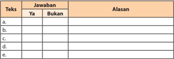

Tabel ini berisi informasi tentang jawaban beberapa teks dengan alasan masing-masing. Topik utama tabel adalah "Jawaban" dan "Alasan". Kolom "Ya" dan "Bukan" digunakan untuk menunjukkan apakah jawaban tersebut benar atau salah. Data penting yang terlihat adalah bahwa setiap teks memiliki satu baris di tabel, dengan kolom "Ya" dan "Bukan" kosong, menunjukkan bahwa belum ada jawaban atau alasan yang diberikan untuk setiap teks. Ini menunjukkan bahwa tabel ini masih dalam tahap awal pengumpulan data atau belum lengkap.

 

---
## 📄 Halaman 60

- Samakanlah jawaban dan alasan-alasan kelompokmu dengan kelompok yang  lain.  Kemudian,  rumuskanlah  simpulan  dari  setiap  jawaban/ alasan-alasan yang dikemukakan oleh semua kelompok!

---
**📊 Tabel**

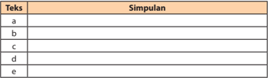

Tabel ini menunjukkan hubungan antara teks dan simpulan dalam bahasa Inggris. Kolom pertama berisi contoh teks, sedangkan kolom kedua berisi simpulan yang sesuai dengan teks tersebut. Topik utama tabel ini adalah pengenalan dasar teks dan simpulan dalam bahasa Inggris. Data penting yang terlihat adalah bahwa simpulan sering kali digunakan untuk memperjelas atau memperkuat makna teks asli. Misalnya, simpulan "a" mungkin digunakan untuk menekankan bahwa "b" adalah salah satu pilihan yang tepat, sementara simpulan "c" mungkin digunakan untuk menegaskan bahwa "d" adalah jawaban yang benar.

### Kegiatan 2

### Menemukan Gagasan Umum dan Fakta Penting dalam Teks Eksplanasi

Perhatikanlah cuplikan teks berikut.

Dampak  merebaknya  penyebaran  virus  sindrom  pernapasan  akut parah  ( Severe  Acute  Respiratory  Sindrome /SARS)  dari  negeri  Jiran, Singapura, mulai mengancam bisnis perhotelan di Batam. Jumlah tamu, baik  dari  luar  negeri  maupun  dalam  negeri  merosot  hingga  tingkat hunian hotel di Batam berkurang hingga sepuluh persen. Demikian kata Public  Relation  Manager  Goodway Hotel  Puri  Garden,  Budi  Purnomo dan kata pengusaha Novotel Hotel, Anas, ketika dihubungi Kompas di Batam.

Gagasan  umum  teks  tersebut  adalah  tentang  'dampak  penyebaran virus SARS terhadap bisnis perhotelan' . Teks tersebut menjelaskan dampak penyebaran virus terhadap kondisi perhotelan, yakni berupa merosotnya tingkat hunian hotel yang ada Batam. Teks itu  pun tergolong ke dalam jenis  eksplanasi,  yakni  teks    yang  memaparkan  proses  terjadinya  suatu fenomena atau kejadian  dengan  sejelas-jelasnya.  Di  dalam  teks  tersebut juga  terkandung  sebuah  gagasan  umum  (ide  pokok),  yakni  dampaknya penyebaran virus SARS. Gagasan umum tersebut terdapat pada bagian awal paragraf. Oleh karena itu, cuplikan teks tersebut dapat pula digolongkan ke dalam jenis paragraf deduktif.

 

---
## 📄 Halaman 61

Sesudah  pengakuan  kedaulatan  pada  tanggal  27  Desember  1949, bangsa Indonesia menanggung beban ekonomi dan keuangan. Sebagai akibat  ketentuan-ketentuan  hasil  KMB  (Konferensi  Meja  Bundar), Indonesia harus menanggung beban utang luar negeri dan dalam negeri. Padahal struktur ekonomi Indonesia pada waktu itu masih tergantung kepada  beberapa  jenis  perkebunan.  Situasi  politik  yang  tidak  stabil semakin meningkatkan pengeluaran negara. Akibatnya, anggaran pemerintah menj adi defisit.

Teks di atas juga bersifat eksplanatif. Gagasan umumnya tentang beban keuangan pemerintah di tahun 1949 (yang begitu berat).  Gagasan umum itu terletak pada bagian awal paragraf. Dengan demikian, cuplikan tersebut pun dapat digolongkan ke dalam paragraf deduktif.

Selain itu, mungkin pula sebuah paragraf dalam teks eksplanasi bersifat induktif ataupun campuran. Akan tetapi, yang dapat ditemukan, paragrafparagraf di dalam teks eksplanasi pada umumnya bersifat deduktif, yakni gagasan umumnya terletak pada bagian awal paragraf.

### Tugas

- Apa saja bukti bahwa semua teks di bawah ini berbentuk eksplanasi? Apa pula gagasan umum serta fakta penting di dalam teks tersebut?
- Pertumbuhan dimulai dari  kecambah. Struktur awal yang muncul berupa  radikula  atau  akar  primer.  Hal  ini  menunjukkan  bahwa yang pertama kali dibutuhkan kecambah adalah air dan kebutuhan untuk melekat pada tanah. Akar primer akan tumbuh secara lateral, membentuk  akar  sekunder,  dan  selanjutnya  tumbuhlah  cabangcabang menjadi suatu sistem akar.

 

---
## 📄 Halaman 62

- Percabangan suatu bahasa proto menjadi dua bahasa baru atau lebih, serta tiap-tiap bahasa baru itu dapat bercabang pula dan seterusnya, dapat disamakan dengan percabangan sebatang pohon. Pada suatu waktu batang pohon tadi mengeluarkan cabang-cabang baru, lalu tiap cabang bertunas dan bertumbuh menjadi cabang-cabang baru. Cabang-cabang  yang  baru  ini  kemudian  mengeluarkan  rantingranting yang baru. Demikian seterusnya. Begitu pula percabangan pada bahasa.
- Lakukanlah  silang  baca  dengan  salah  seorang  teman  untuk  saling memberikan penilaian/tanggapan terhadap hasil kerjamu itu, gunakanlah format penilaian seperti berikut.

---
**📊 Tabel**

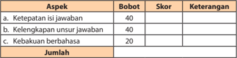

Tabel ini menunjukkan skor dan keterangan untuk tiga aspek penilaian: ketepatan isi jawaban, kelengkapan unsur jawaban, dan kebakuan berbahasa. Topik utama tabel adalah penilaian penulisan. Kolom-kolomnya mencakup skor dan keterangan untuk setiap aspek. Data penting yang terlihat adalah bahwa ketepatan isi jawaban mendapat 40 poin, kelengkapan unsur jawaban juga mendapat 40 poin, sedangkan kebakuan berbahasa mendapat 20 poin. Jumlah total skor adalah 100 poin.

### B. Mengonstruksi Informasi dalam Teks Eksplanasi

Setelah mempelajari materi ini, kamu diharapkan mampu:

- menyusun bagian-bagian pokok teks eksplanasi;
- menyajikan hasil teks eksplanasi.
Pada  pembahasan  sebelumnya,  kamu  telah  memahami  bagaimana mengenali teks eksplanasi yang memuat  pengetahuan dan urutan kejadiannya.  Pada  pembahasan ini,  kamu  harus  mampu menyusun dan menyajikan teks eksplanasi.

 

---
## 📄 Halaman 63

### Menyusun Bagian-Bagian Pokok Teks Eksplanasi

Sebenarnya tidak ada perbedaan istilah antara struktur teks eksplanasi dengan bagian-bagian pokok teks eksplanasi. Kita ingat kembali ciri-ciri teks eksplanasi.

- Strukturnya  terdiri  atas  pernyataan  umum  (gambaran  awal  tentang apa  yang  disampaikan),  deretan  penjelas  (inti  penjelasan  apa  yang disampaikan), dan interpretasi (pandangan atau simpulan).
- Memuat informasi berdasarkan fakta (faktual).
- Faktualnya memuat informasi yang bersifat keilmuan, misalnya tentang sains.
Jadi, bagian-bagian teks eksplanasi adalah pernyataan umum, deretan penjelas, dan interpretasi.

### Perhatikan contoh berikut!

Banjir merupakan fenomena alam yang biasa terjadi di suatu kawasan yang  banyak  dialiri  oleh  aliran  sungai.  Secara  sederhana,  banjir  dapat didefinisikan  sebagai  hadirnya  air  di  suatu  kawasan  luas  sehingga menutupi permukaan bumi kawasan tersebut. Dalam pengertian yang luas,  banjir  dapat  diartikan  sebagai  suatu  bagian  dari  siklus  hidrologi, yaitu pada bagian air di permukaan bumi yang bergerak ke laut. Dalam siklus hidrologi kita dapat melihat bahwa volume air yang mengalir di permukaan  bumi  dominan  ditentukan  oleh  tingkat  curah  hujan,  dan tingkat peresapan air ke dalam tanah. Air hujan sampai di permukaan bumi dan mengalir di permukaan bumi, bergerak menuju ke laut dengan membentuk  alur-alur  sungai.  Alur-alur  sungai  ini  dimulai  di  daerah yang tertinggi di suatu kawasan, bisa daerah pegunungan, gunung atau perbukitan, dan berakhir di tepi pantai ketika aliran air masuk ke laut. Secara sederhana, segmen aliran sungai itu dapat kita bedakan menjadi daerah hulu, tengah, dan hilir. Di daerah hulu yang biasanya terdapat di daerah pegunungan, gunung, atau perbukitan. Lembah sungai sempit dan potongan melintangnya berbentuk huruf 'V' . Di dalam alur sungai banyak batu yang berukuran besar (bongkah) dari runtuhan tebing, dan aliran air sungai mengalir di sela-sela batu-batu tersebut. Air sungai relatif sedikit. Tebing sungai sangat tinggi. Terjadi erosi pada arah vertikal yang dominan oleh aliran air sungai.

 

---
## 📄 Halaman 64

Di  daerah  tengah,  umumnya merupakan daerah kaki pegunungan, kaki  gunung,  atau  kaki  bukit.  Alur  sungai  melebar  dan  potongan melintangnya berbentuk huruf 'U' . Tebing sungai tinggi. Terjadi erosi pada arah horizontal, mengerosi batuan induk. Dasar alur sungai melebar, dan di dasar alur sungai terdapat endapan sungai yang berukuran butir kasar. Apabila debit air meningkat, aliran air dapat naik dan menutupi endapan  sungai  yang  di  dalam  alur,  tetapi  air  sungai  tidak  melewati tebing sungai dan keluar dari alur sungai.

Di daerah hilir,  umumnya merupakan daerah dataran. Alur sungai lebar  dan  bisa  sangat  lebar  dengan  tebing  sungai  yang  relatif  sangat rendah  dibandingkan  lebar  alur.  Alur  sungai  dapat  berkelok-kelok seperti  huruf  'S'  yang  dikenal  sebagai  'meander' .  Di  kiri  dan  kanan alur terdapat dataran yang secara teratur akan tergenang oleh air sungai yang meluap sehingga dikenal sebagai 'dataran banjir' . Di segmen ini terjadi pengendapan di kiri dan kanan alur sungai pada saat banjir yang menghasilkan  dataran  banjir.  Terjadi  erosi  horizontal  yang  mengerosi endapan sungai itu sendiri yang diendapkan sebelumnya.

Dari  penjelasan  di  atas  dapat  disimpulkan  bahwa  banjir  merupakan peristiwa yang terjadi ketika aliran air yang berlebihan merendam daratan. Banjir  juga  dapat  terjadi  di  sungai,  ketika  alirannya  melebihi  kapasitas saluran  air,  terutama  di  selokan  sungai.  Akibatnya,  mampu  merendam dan merusak jalan raya, jembatan, mobil, bangunan, sistem selokan bawah tanah, dan kanal. Kerugian dari segi harta dan jiwa manusia merupakan dampak lain dari terjadinya banjir.

Paragraf  pertama  teks  di  atas  merupakan  bagian-bagian  pernyataan umum. Paragraf kedua merupakan bagian deretan penjelas, dan paragraf terakhir merupakan bagian interpretasi.

 

---
## 📄 Halaman 65

### Tugas

### 1. Bacalah teks berikut ini dengan saksama!

### Gempa Aceh

Gempa dahsyat pernah terjadi di Aceh, 26 Desember 2004, pada pukul 07.58 WIB. Pusat gempa terletak di sebelah barat Aceh dengan kedalaman 10  km.  Bencana  ini  merupakan  gempa  bumi  terdahsyat  dalam  kurun waktu 40 tahun terakhir. Dampak kerusakannya meliputi Aceh, Sumatra Utara, Pantai Barat Semenanjung Malaysia, Thailand, Pantai Timur India, Sri Lanka, bahkan sampai Pantai Timur Afrika.

Gempa ini juga mengakibatkan gelombang laut setinggi 9 meter. Bencana ini merupakan kematian terbesar sepanjang sejarah. Indonesia, Sri Langka, India, dan Thailand merupakan negara dengan jumlah kematian terbesar.

Kekuatan gempa pada penghujung tahun 2004 itu mencapai 9.0 richter dengan korban tewas mencapai 283.100, 14.000 orang hilang dan 1,126,900 kehilangan tempat tinggal. Gempa bumi yang disertai gelombang tsunami itu merupakan bencana  yang mengakibatkan kematian terbesar sepanjang sejarah.  Indonesia,  Sri  Langka,  India,  dan  Thailand  merupakan  negara dengan jumlah kematian terbesar.

Di Indonesia, gempa menelan lebih dari 126.000 korban jiwa. Puluhan gedung hancur oleh gempa utama, terutama di Meulaboh dan Banda Aceh di ujung Sumatra. Di Banda Aceh, sekitar 50% dari semua bangunan rusak terkena  tsunami.  Namun,  kebanyakan  korban  disebabkan  oleh  tsunami yang menghantam pantai Barat Aceh dan Sumatra Utara.

 

---
## 📄 Halaman 66

Di Sri Lanka diko nfirmasikan 45.000 korban jiwa jatuh dan lebih dari 1 juta jiwa penduduk negara ini terkena dampak gempa secara langsung. Di India, termasuk Kepulauan Andaman dan Nicobar diperkirakan menelan lebih dari 12.000 korban jiwa.

Di Thailand banyak pula wisatawan asing terkena bencana, terutama di daerah Phuket diperkirakan ada sekitar 4.500 korban jiwa. Bhumi Jensen, cucu Raja Rama IX atau lebih dikenal dengan nama Bhumibol Adulyadej juga termasuk salah satu korban. Bhumi Jensen baru berusia 21 tahun.

Bahkan di Somalia, di benua Afrika ribuan kilometer dari Indonesia, dilaporkan jatuh lebih dari 100 korban jiwa. Akan tetapi,  sebagian besar atau mungkin hampir semua dari mereka adalah para nelayan.

Gempa  Bumi  dan  Tsunami  Aceh  yang  juga  menghantam  Thailand. Selain menempati posisi gempa berkekuatan terbesar kedua setelah gempa Chili  1960  yang  mencapai  9.5  skala  richter,  gempa  Aceh  menempati peringkat pertama sebagai gempa dengan waktu (durasi) penyesaran yang paling lama, yaitu sekitar 10 menit. Gempa ini cukup besar untuk membuat seluruh bola bumi ikut bergetar.

(Sumber:

wikipedia.org )

### 2. Ikutilah instruksi di bawah ini!

- Tentukanlah  mana  yang  merupakan  pernyataan  umum,  deretan penjelas, dan interpretasi.
- Carilah kalimat-kalimat yang memuat informasi berdasarkan fakta (faktual).

### Kegiatan 2

### Menyajikan Hasil Teks Eksplanasi

Selain menyajikan teks eksplanasi, kamu harus mampu mengomentari pengerjaan hasil orang lain. Dalam berkomentar bisa dibagi menjadi dua, yaitu kritik atau penolakan dan dukungan atau pujian.

### Perhatikanlah contoh di bawah ini!

- Nah, itulah gara-gara kebiasaan kita membuang sampah di sembarang tempat.  Selokan  meluap,  akhirnya  banjir.  Siapa  lagi  yang  menderita kalau  bukan  masyarakatnya  itu  sendiri.  Makanya,  lain  kali  kalau membuang sampah harus di tempat yang benar agar musibah itu tidak terjadi lagi.

 

---
## 📄 Halaman 67

- Untungnya gempa itu tidak terjadi pada malam atau dini hari. Kalau itu yang terjadi siang hari tentu banyak korban. Syukur pula para warga tidak panik sehingga mereka dapat menyelamatkan diri tanpa ada yang terluka.  Kejadian  itu  harus  menjadi  pelajaran  bagi  kita  tentang  cara menghadapi musibah, khususnya gempa.
Contoh  di  atas  merupakan  bentuk  komentar  terhadap  isi  suatu teks    eksplanasi  tentang  berlangsungnya  atau  terjadinya  suatu  kejadian. Berdasarkan contoh itu, komentar dalam eksplana si didefinisikan sebagai ulasan, tanggapan, atau sambutan  (respons) terhadap sesuatu yang didengar atau dibaca. Dari contoh itu pula, komentar dapat dikelompokkan ke dalam jenis berikut.

- Kritik atau penolakan, contohnya pernyataan (1),
- Dukungan atau pujian, contohnya pernyataan (2).

### Tugas

Pada tugas kedua ini, bandingkan teks yang sudah kamu buat dengan milik  teman-teman  yang  lain.  Perbaiki  lagi  apabila  masih  dirasa  perlu. Setelah itu, sajikan teks tersebut dengan cara memeragakannya di depan kelas. Untuk memeragakannya, mintalah bantuan salah seorang temanmu.

Manakah komentar yang sesuai yang langsung berkaitan dengan teks berjudul 'Gempa Aceh' di bawah ini!

- Pemerintah seharusnya  segera  mengatasi  keterlambatan  bantuan  itu, misalnya dengan mengerahkan helikopter agar bantuan itu bisa segera sampai kepada para warga.
- Di Aceh, ketika bencana tsunami itu melanda waga di sana, bantuan datang terlambat sehingga para korban kian bertambah.
- Bencana  alam  semacam  gempa  memang  sering  disertai  dengan kerusakan  prasarana  jalan  sehingga  bantuan  yang  diberikan  pun menjadi  susah masuk.  Oleh  karena  itu,  kita  harus  memaklumi keterlambatan bantuan itu.
- Datangnya bantuan tidak sekadar berharap kepada pemerintah. Masyarakat  di sekitarnya pun yang tidak terkena bencana harusnya cepat tanggap. Begitu pun dengan warga lainnya di seluruh Indonesia, harus  memberikan  bantuan  agar  penderitaan  mereka  dapat  cepat berakhir.

 

---
## 📄 Halaman 68

- Sekarang musibah terjadi di mana-mana, tidak kenal waktu dan tempat. Keadaan demikian harus kita antisipasi sejak dini agar tidak memakan korban yang begitu banyak.

---
**📊 Tabel**

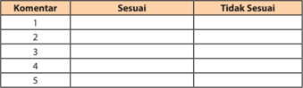

Tabel ini menunjukkan kumpulan komentar yang dikelompokkan menjadi dua kategori utama: "Sesuai" dan "Tidak Sesuai". Setiap komentar diurutkan berdasarkan nomor urutnya, mulai dari 1 hingga 5. Dalam setiap baris, ada dua kolom yang disediakan untuk membandingkan apakah komentar tersebut sesuai atau tidak sesuai dengan standar atau tujuan tertentu. Data atau pola penting yang terlihat adalah bahwa setiap komentar memiliki status yang ditentukan oleh pengguna tabel, yang dapat membantu dalam analisis dan pemilihan komentar yang relevan.

### C. Menganalisis Struktur dan Kebahasaan Teks Eksplanasi

Setelah mempelajari materi ini, kamu diharapkan mampu:

- mengidentifikasi struktur teks eksplanasi;
- menelaah kebahasaan teks eksplanasi.
Setiap teks memiliki unsur kebahasaan yang berbeda-beda, demikian pula dengan teks eksplanasi.

### Mengidentifikasi Struktur Teks Eksplanasi

Teks eksplanasi memiliki struktur baku sebagaimana halnya jenis teks lainnya.  Sesuai  dengan  karakteristik  umum  dari  isinya,  teks  eksplanasi dibentuk oleh bagian-bagian berikut.

- Ident ifikasi  fenomena  ( phenomenon  identi fication ),  mengidentifikasi sesuatu yang akan diterangkan. Hal itu bisa terkait dengan fenomena alam, sosial, budaya, dan fenomena-fenomena lainnya.
- Penggambaran rangkaian kejadian ( explanation sequence ),  memerinci proses  kejadian  yang  relevan  dengan  fenomena  yang  diterangkan sebagai pertanyaan atas bagaimana atau mengapa.
- Rincian yang berpola atas pertanyaan 'bagaimana' akan melahirkan uraian yang tersusun secara kronologis ataupun gradual. Dalam hal ini fase-fase kejadiannya disusun berdasarkan urutan waktu.

 

---
## 📄 Halaman 69

- Rincian yang berpola atas pertanyaan 'mengapa' akan melahirkan uraian  yang  tersusun  secara  kausalitas.  Dalam  hal  ini  fase-fase kejadiannya disusun berdasarkan hubungan sebab akibat.
- Ulasan ( review ), berupa komentar atau penilaian tentang konsekuensi atas kejadian yang dipaparkan sebelumnya.

---
**🖼️ Gambar/Diagram**

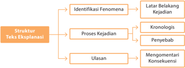

> **Deskripsi Visual:** Gambar ini adalah diagram yang menunjukkan struktur teks eksplanasi. Diagram ini terdiri dari empat bagian utama:

1. Identifikasi Fenomena: Ini merupakan bagian awal yang mencakup latar belakang kejadian dan penyebab fenomena.

2. Proses Kejadian: Bagian ini melibatkan urutan kronologis dan penjelasan tentang apa yang terjadi selama proses tersebut.

3. Ulasan: Ini adalah bagian yang memuat penutupan atau penjelasan tentang hasil atau implikasi dari proses kejadian.

4. Mengomentari Konsekuensi: Bagian ini membahas bagaimana fenomena tersebut mempengaruhi atau mengubah situasi sebelumnya.

Elemen-elemen utama dalam diagram ini adalah identifikasi fenomena, proses kejadian, ulasan, dan mengomentari konsekuensi. Setiap elemen memiliki hubungan dengan elemen lainnya, dengan identifikasi fenomena sebagai dasar untuk proses kejadian, yang kemudian dikembangkan dalam ulasan dan akhirnya diomentari dalam konteks konsekuensi.

Teks, angka, atau label penting yang terlihat dalam diagram ini adalah "Identifikasi Fenomena", "Proses Kejadian", "Ulasan", dan "Mengomentari Konsekuensi". Informasi kunci yang dapat diambil pembaca melalui diagram ini adalah bahwa struktur teks eksplanasi melibatkan identifikasi fenomena, proses kejadian, penjelasan, dan analisis konsekuensi.

### Tugas

- Bacalah  kembali  teks  yang  berjudul  'Demonstrasi  Massa'  di  atas. Secara  berkelompok,  tentukanlah  bagian-bagian  dari  struktur  teks tersebut. Kemudian, simpulkan pula struktur teks tersebut berdasarkan kelengkapannya!

---
**📊 Tabel**

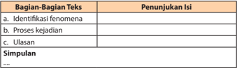

Tabel ini menunjukkan bagian-bagian teks dalam sebuah artikel atau tulisan, dengan penunjukan isi untuk setiap bagian. Topik utama tabel adalah "Bagian-Bagian Teks" dan "Penunjukan Isi". Kolom pertama berisi tiga bagian teks: identifikasi fenomena, proses kejadian, dan ulasan. Kolom kedua berisi penunjukan isi masing-masing bagian teks tersebut. Pola penting yang terlihat adalah bahwa setiap bagian teks memiliki satu penunjukan isi yang spesifik, yang membantu pembaca memahami struktur dan fungsi setiap bagian dalam teks tersebut.

 

---
## 📄 Halaman 70

- Presentasikanlah  pendapat-pendapat  kelompokmu  tentang  struktur itu.  Kemudian,  mintalah  teman-teman  dari  kelompok  lain  untuk memberikan  penilaian atau tanggapan-tanggapannya berdasarkan ketepatan, kelangkapan, dan kejelasannya!

### Kegiatan 2

### Menelaah Kebahasaan Teks Eksplanasi

Berdasarkan  kaidah  kebahasaan  secara  umum,  teks  eksplanasi  sama dengan kaidah pada teks prosedur. Sebagai teks yang berkategori faktual (nonsastra),  teks  eksplanasi  menggunakan  banyak  kata  yang  bermakna denotatif.

Sebagai  teks  yang  berisi  paparan  proses,  baik  itu  secara  kausalitas maupun  kronologis, teks tersebut menggunakan banyak konjungsi kausalitas ataupun kronologis.

- Konjungsi  kausalitas,  antara  lain, sebab,  karena,  oleh  sebab  itu,  oleh karena itu, sehingga.
- Konjungsi kronologis (hubungan waktu), seperti kemudian, lalu, setelah itu, pada akhirnya.
Teks  eksplanasi  yang  berpola  kronologis  juga  menggunakan  banyak keterangan waktu pada kalimat-kalimatnya.

### Berikut contohnya.

Pada bulan keempat , muka telah kian tampak seperti manusia. Dalam bulan kelima rambut-rambut mulai tumbuh pada kepala. Selama bulan keenam , alis dan bulu mata timbul. Setelah tujuh bulan, fetus mirip kulit orang tua dengan kulit merah berkeriput. Selama  bulan kedelapan dan kesembilan, lemak  ditimbun  di  bawah  kulit  sehingga  perlahan-lahan menghilangkan sebagian keriput pada kulit. Kaki membulat. Kuku keluar pada ujung-ujung jari. Rambut asli rontok dan terus menjadi sempurna dan siap dilahirkan.

 

---
## 📄 Halaman 71

Berkenaan  dengan  kata  ganti  yang  digunakannya,  teks  eksplanasi langsung  merujuk pada jenis fenomena yang dijelaskannya, yang bukan berupa persona. Kata ganti yang digunakan untuk fenomenanya itu berupa kata  benda,  baik  konkret  maupun  abstrak,  seperti demonstrasi,  banjir, gerhana, embrio, kesenian daerah ; dan bukan kata  ganti orang, seperti ia, dia, mereka . Karena objek yang dijelaskannya itu berupa fenomena, tidak berbentuk personal ( nonhuman participation ),  dalam  teks  eksplanasi  itu pun ditemukan banyak kata kerja pasif.  Hal itu seperti kata-kata berikut: terlihat, terbagi, terwujud, terakhir, dimulai, ditimbun, dan dilahirkan.

Di dalam teks itu pun dijumpai banyak kata teknis atau peristilahan, sesuai dengan topik yang dibahasnya. Apabila topiknya tentang kelahiran, istilah-istilah biologi yang muncul. Demikian pula apabila topiknya tentang kesenian daerah, istilah-istilah budaya sering digunakan. Apabila topiknya tentang fenomena kebaikan BBM, istilah ekonomi dan sosial akan sering muncul.

### Tugas

- Kerjakanlah  secara  berkelompok.  Untuk  berlatih,  tulislah  masingmasing lima contoh kalimat yang menggunakan konjungsi kausalitas, kronologi,  dan  yang  berketerangan  waktu.  Kamu  bisa  mengerjakan tugas ini pada buku kerjamu!

---
**📊 Tabel**

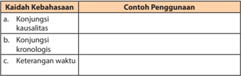

Tabel ini membahas tiga kaidah kebahasaan penting: konjungsi kausalitas, konjungsi kronologis, dan keterangan waktu. Konjungsi kausalitas digunakan untuk menggambarkan hubungan antara dua peristiwa di mana satu peristiwa menyebabkan peristiwa lainnya. Misalnya, "Ketika saya bangun pagi, saya akan makan sarapan." Konjungsi kronologis digunakan untuk menggambarkan urutan waktu dalam kalimat, seperti "Saya belajar bahasa Inggris sebelum liburan." Sementara itu, keterangan waktu digunakan untuk memberikan informasi tentang waktu saat berbicara, seperti "Saya akan pulang pada jam 6 malam." Topik utama tabel ini adalah penggunaan kaidah kebahasaan dalam membuat kalimat yang akurat dan bermakna.

Lakukanlah  silang  baca  dengan  kelompok  lainnya  untuk  saling memberikan penilaian atas ketepatan dan kelengkapannya.

 

---
## 📄 Halaman 72

- Perhatikanlah  kembali  teks  eksplanasi  yang  telah  kamu  baca.  Secara berkelompok,  lakukanlah  penelaahan  terhadap  kaidah  kebahasaan yang  terdapat  di  dalam  teks  tersebut.  Kemudian,  laporkanlah  hasil diskusi  kelompokmu  di  depan  kelas  untuk  mendapatkan  tanggapan dari kelompok lain!
Judul Teks

: ..............................

Penulis

: ..............................

Sumber

: ..............................

### D. Memproduksi Teks Eksplanasi

Setelah mempelajari materi ini, kamu diharapkan mampu:

- menentukan pola pengembangan dalam menulis teks eksplanasi;
- menulis teks eksplanasi berdasarkan struktur dan kebahasaan.
Sebagaimana yang telah dipaparkan terdahulu bahwa teks eksplanasi adalah teks yang memaparkan suatu proses kejadian dengan sejelas-jelasnya. Teks  eksplanasi  banyak  menggunakan  fakta,  baik  itu  untuk  menunjang alasan ataupun sebab-sebab atas peristiwa yang akan dipaparkan. Luasnya wasawasan dan pengetahuan kita berkenaan dengan topik yang akan ditulis juga sangatlah utama. Penulis harus menyiapkan berbagai sumber untuk dapat  mengembangkan  topik  yang  dipilihnya  secara  mendalam.  Kalau tidak demikian, isi tulisan akan dangkal dan tidak memberikan sesuatu yang baru bagi pembacanya.

 

---
## 📄 Halaman 73

### Menentukan Pola Pengembangan dalam Menulis Teks Eksplanasi

Agar  tersaji  secara  lebih  menarik,  kita  pun  perlu  mengetahui  polapola  pengembangannya.    Secara  umum,  pola-pola  pengembangan  teks eksplanasi adalah sebagai berikut.

### 1. Pola Pengembangan Sebab Akibat

Pengembangan  teks  eksplanasi  dapat  menggunakan  pola  sebab akibat. Dalam hal ini sebab dapat  bertindak sebagai gagasan umum, sedangkan akibat sebagai perincian pengembangannya.  Namun demikian, dapat juga terbalik. Akibat dijadikan sebagai gagasan umum, maka perlu dikemukakan sejumlah sebab sebagai perinciannya.

Persoalan  sebab  akibat  sebenarnya  sangat  dekat  hubungannya dengan proses. Jika disusun untuk mencari hubungan antara bagianbagiannya, proses itu dapat disebut proses kausalitas.

### Contoh:

Gempa bumi melanda wilayah bagian selatan Daerah Istimewa Yogyakarta, Sabtu, 27 Mei 2006 pukul 05.54 WIB. Kekuatan gempa bumi tercatat 6,2 skala Richter pada kedalaman 17,1 km. Pusat gempa terletak pada posisi ± 25 km barat daya Kota Yogyakarta.

Gempa  bumi  ini  mengakibatkan  puluhan  orang  meninggal. Beberapa orang luka-luka. Sejumlah bangunan roboh dan mengalami kerusakan. Selain itu, dilaporkan juga terjadi longsoran dan  kerusakan  berat  pada  permukiman  dan  bangunan  lainnya  di Kabupaten Bantul karena dekat dengan sumber gempa bumi.

### 2. Pola Pengembangan Proses

Proses merupakan  suatu  urutan dari tindakan-tindakan atau perbuatan-perbuatan untuk menciptakan atau menghasilkan sesuatu atau  perurutan dari suatu kejadian atau peristiwa. Untuk menyusun sebuah proses, langkah-langkahnya adalah sebagai berikut.

- Mengetahui perincian-perincian secara menyeluruh.
- Membagi proses tersebut menurut tahap-tahap kejadian.
- Menjelaskan  setiap  urutan  itu  ke  dalam  detail-detail  yang  tegas sehingga pembaca dapat melihat seluruh proses itu dengan jelas.

 

---
## 📄 Halaman 74

### Contoh:

Pada bulan keempat, muka telah kian tampak seperti manusia. Dalam  bulan  kelima  rambut-rambut  mulai  tumbuh  pada  kepala. Selama  bulan  keenam,  alis  dan  bulu  mata  timbul.  Setelah  tujuh bulan,  fetus  mirip  kulit  orang  tua  dengan  kulit  merah  berkeriput. Selama  bulan kedelapan dan kesembilan, lemak ditimbun di bawah kulit sehingga perlahan-lahan  menghilangkan sebagian keriput pada kulit.  Kaki  membulat. Kuku keluar pada ujung-ujung jari. Rambut asli rontok dan fetus menjadi sempurna dan siap dilahirkan.

### Tugas 1

### 1. Cermatilah ketiga cuplikan teks di bawah ini!

- Dua puluh tahun lalu, ponsel hanyalah telepon tanpa kabel. Namun demikian,  teknologi  berkembang  cepat.  Kerja  sama  operator dengan produsen ponsel serta aliansi dengan perusahaan di bidang teknologi, membuat ponsel tidak cuma untuk berbicara lisan. Dua tahun terakhir, kemampuan ponsel melakukan komunikasi data bertambah  banyak.  Ponsel  generasi  kedua  ini,  tidak  hanya  bisa mengirim dan menerima pesan teks SMS ( short message service ). E-mail , download nada dering, atau games juga dapat terselenggara dengan baik.
- Penampung  limbah  pabrik  marmer  PT  CIM  yang  terletak  di puncak Gunung Kapur Desa Citatah Kabupaten Bandung jebol. Akibatnya,  21  rumah  di  sekitarnya  hancur  dan  rusak  berat diterjang longsoran limbah padat pabrik. Tidak ada korban tewas dalam musibah itu, tetapi sedikitnya tujuh orang dibawa ke rumah sakit Cibabat.
- Anarkisme  massa  pada  umumnya  terjadi  akibat  sikap  kritis mereka  yang  tidak  mendapat  tanggapan  secara  wajar.  Massa kemudian frustrasi dan marah. Mereka merasa aspirasinya dilecehkan,  tidak  dihargai.  Dalam  kondisi  itulah,  sikap  rasional bisa melemah. Emosilah yang kemudian lebih berperan. Apalagi dalam  kerumunan  massa,  emosi  mudah  menjalar  dan  tidak terkendali. Terjadilah akhirnya aksi perusakan yang sesungguhnya cara tersebut bertentangan dengan sikap kritis itu sendiri.

 

---
## 📄 Halaman 75

Menurutmu,  ketiga  cuplikan  teks  tersebut  dikembangkan  dengan pola apa? Diskusikan pola topik dari setiap teks tersebut!

---
**📊 Tabel**

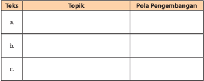

Tabel ini berisi informasi tentang topik pembelajaran dan pola pengembangan yang relevan dengan subjek tertentu. Topik utama tabel adalah "Pola Pengembangan", yang mencakup berbagai aspek pembelajaran seperti pengetahuan, keterampilan, dan perilaku. Kolom-kolomnya meliputi "Teks" untuk menunjukkan teks atau materi pembelajaran, "Topik" untuk menandai topik spesifik yang akan dipelajari, dan "Pola Pengembangan" untuk merangkum bagaimana topik tersebut akan dikembangkan selama proses belajar. Data atau pola penting yang terlihat menunjukkan bahwa tabel ini dirancang untuk membantu siswa memahami bagaimana topik-topik pembelajaran akan berkembang secara sistematis dan terstruktur.

- Susunlah kalimat-kalimat di bawah ini sehingga menjadi teks-teks yang utuh dan padu!

---
**📊 Tabel**

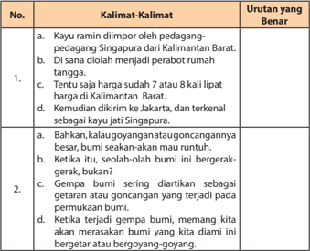

Tabel ini berisi dua baris yang masing-masing berisi kalimat-kalimat tentang proses pembuatan kayu ramin di Kalimantan Barat. Topik utama tabel adalah proses pembuatan kayu ramin. Kolom pertama berisi nomor urutan kalimat, sedangkan kolom kedua berisi kalimat tersebut. Kolom ketiga berisi deskripsi tentang urutan kalimat yang benar. Data penting yang terlihat adalah bahwa proses pembuatan kayu ramin melibatkan beberapa langkah, mulai dari dipotong oleh pedagang-pedagang Singapura, diolah menjadi perabot rumah tangga, kemudian dikirim ke Jakarta, dan akhirnya terkenal sebagai kayu jati Singapura.

 

---
## 📄 Halaman 76

### Kegiatan 2

### Menulis Teks Eksplanasi Berdasarkan Struktur dan Kebahasaan

Sebagaimana yang telah dipaparkan terdahulu bahwa teks eksplanasi adalah  teks  yang  memaparkan  suatu  proses  peristiwa  dengan  sejelasjelasnya.  Oleh  karena  itu,  jenis  teks  tersebut  lebih  sering  menggunakan fakta. Adapun langkah-langkah penyusunannya adalah sebagai berikut.

- Mendaftar topik-topik yang dapat dikembangkan menjadi teks eksplanasi.

### Contoh:

- Paling depan para siswi.
- Memainkan mayoret.
- Melakukan koreogra fi.
- Para penonton berjubel.
- Diikuti marching band.
- Pelajar menempelkan tulisan hak-hak remaja.
- Pelajar berselimut spanduk berisi tanda tangan pelajar.
- Menyusun kerangka teks, yakni dengan menomori topik-topik itu sesuai dengan struktur baku dari teks ekspalanasi, yang paragraf-paragrafnya dapat disusun secara kausalitas atau kronologis. Dalam tahap ini, dapat saja membuat topik yang kita anggap tidak sesuai atau menggantinya dengan topik yang lain.

---
**📊 Tabel**

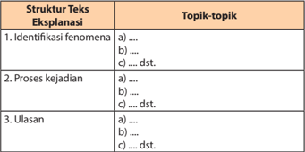

Tabel ini membahas struktur teks eksplanasi, yang terdiri dari tiga bagian utama: Identifikasi fenomena, Proses kejadian, dan Ulasan. Topik-topik dalam setiap bagian mencakup identifikasi fenomena seperti ".....", ".....", dan "..... dst.", proses kejadian dengan ".....", ".....", dan "..... dst.", serta ulasan yang mencakup ".....", ".....", dan "..... dst.". Tabel ini menunjukkan bahwa setiap bagian memiliki beberapa topik yang berbeda, yang menunjukkan bahwa teks eksplanasi biasanya melibatkan penjelasan mendalam tentang fenomena, proses, dan penutupan yang memperkuat penjelasan sebelumnya.

 

---
## 📄 Halaman 77

Adapun pengembangan paragrafnya, kita dapat menyusun kerangka seperti berikut.

### Contoh:

- Paling depan para siswi yang cantik.
- Memainkan mayoret, melakukan koreogra fi.
- Diikuti marching band.
- Pelajar menempelkan tulisan hak-hak remaja.
- Pelajar berselimut spanduk berisi tanda tangan pelajar.
- Mengembangkan kerangka yang telah disusun menjadi teks eksplanasi yang  lengkap  dan  utuh,  dengan  memperhatikan  struktur  bakunya: identifikasi fenomena, proses kejadian, dan ulasan. Dalam tahap ini kita harus menjadikan topik-topik itu menjadi kalimat yang jelas. Kita pun dapat saja membuat kalimat yang fungsinya sebagai pengikat, seperti konjungsi-konjungsi  yang  biasa  digunakan  dalam  teks  eksplanasi sehingga kalimat-kalimat itu terjalin secara lebih kompak dan padu.
Berikut contoh pengembangan paragraf untuk teks eksplanasi.

Rombongan ini terbagi menjadi beberapa kelompok . Paling depan, deretan siswi-siswi imut. Mereka asyik memainkan mayoret, melakukan  koreografi  menggunakan  benderanya  masing-masing. Kelompok mayoret ini diikuti dengan marching band , disusul dengan sejumlah  pelajar  yang  menempeli  tubuh  mereka  dengan  papan yang  bertuliskan  hak-hak  yang  patut  dituntut  remaja.  Rombongan diakhiri dengan sekelompok pelajar yang berbaris di dalam 'selimut' berbentuk spanduk yang diisi petisi berupa tanda tangan pelajar dari sejumlah sekolah di Bandung.

Kalimat yang bercetak miring merupakan kalimat tambahan yang fungsinya sebagai pengikat sekaligus gagasan umum paragraf itu.

- Menyunting  teks  eksplanasi  yang  ditulis  teman.  Tujuannya  untuk mengoreksi  kesalahan-kesalahan  yang  mungkin  ada  dalam  teks  itu, misalnya berkenaan dengan:
- isi teks,
- struktur,
- kaidah kebahasaan, dan
- ejaan/tanda bacanya.

 

---
## 📄 Halaman 78

### Tugas

### Lakukan kegiatan berikut!

- a.  Daftarlah topik yang berkaitan dengan kegiatan belajar di sekolahmu!
- Susunlah topik-topik secara runtut ke dalam struktur eksplanasi: ident ifikasi  fenomena, proses kejadian, dan ulasan!
- Kembangkanlah kerangka itu menjadi sebuah karangan eksplanasi dengan memperhatikan kaidah-kaidah kebahasaan yang benar!
- Lakukanlah silang baca dengan salah seorang teman dengan menggunakan rubrik penilaian berikut!

---
**📊 Tabel**

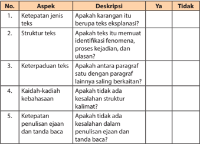

Tabel ini berisi 5 aspek penilaian teks eksplanasi yang harus dipenuhi untuk mendapatkan nilai positif. Topik utamanya adalah ketepatan jenis teks eksplanasi, struktur teks, keterpaduan teks, kaidah-kaidah kebahasaan, dan ketepatan penulisan ejaan dan tanda baca. Kolom "Ya" menunjukkan apakah aspek tersebut telah dipenuhi, sedangkan kolom "Tidak" menunjukkan apakah aspek tersebut belum dipenuhi. Data penting yang terlihat adalah bahwa semua aspek harus dipenuhi untuk mendapatkan nilai positif, dan jika salah satu aspek tidak dipenuhi, maka nilai akan menjadi negatif.

 

---
## 📄 Halaman 79

### Bab III

### Mengelola Informasi dalam Ceramah

Sumber: www. sangiranmuseum.com

Ceramah  apa  saja  yang  telah  kamu  dengarkan  pada  hari  ini?  Memang kehidupan  kita  tidak  bisa  lepas  dari  mendengarkan  atau  'tiada  hari  tanpa menyimak'.  Tidak  salah  juga  apabila  setiap  hari  kita  banyak  menyimak ceramah. Dari situlah kita memperoleh banyak pengetahuan dan wawasan. Di sekolah dan di lingkungan masyarakat, perbanyaklah menyimak ceramah karena bermanfaat dan sangat sayang jika dilewatkan!

Teruslah  menyimak  ceramah  walaupun  banyak  godaan  dalam  suasana menyimak  ceramah  tersebut.  Sesekali,  kamu  pun  dapat  bergiliran  menjadi penceramah.

 

---
## 📄 Halaman 80

Untuk membekali kemampuanmu, pada bab ini kamu akan belajar:

- mengidentifikasi informasi berupa permasalahan aktual dalam ceramah;
- menyusun bagian-bagian penting dari permasalahan aktual;
- menganalisis isi, struktur, dan kebahasaan dalam ceramah; dan
- mengonstruksi ceramah tentang permasalahan aktual dengan memperhatikan unsur kebahasaan dan struktur yang tepat.
Untuk membantu kamu dalam mempelajari dan mengembangkan kompetensi  dalam  berbahasa,  pelajari  peta  konsep  di  bawah  ini  dengan saksama!

---
**🖼️ Gambar/Diagram**

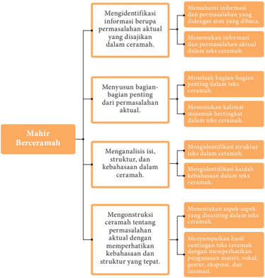

> **Deskripsi Visual:** Gambar ini adalah diagram yang menunjukkan struktur dan tahapan-tahapan dalam proses mahir berceramah. Diagram ini dibagi menjadi empat bagian utama, masing-masing menunjukkan tahapan yang berbeda dalam proses tersebut.

Pertama, ada bagian yang menunjukkan tahapan identifikasi informasi dan permasalahan yang disajikan dalam ceramah. Ini melibatkan pemahaman informasi dan permasalahan yang didengar atau dibaca oleh pembaca.

Kedua, ada bagian yang menunjukkan tahapan menyusun bagian-bagian dari permasalahan aktual. Ini melibatkan menyelesaikan informasi dan permasalahan aktual dalam teks ceramah.

Ketiga, ada bagian yang menunjukkan tahapan mengidentifikasi struktur, struktur, dan kebahasaan dalam ceramah. Ini melibatkan memahami struktur dan kebahasaan dalam teks ceramah.

Keempat, ada bagian yang menunjukkan tahapan mengkonstruksi ceramah tentang permasalahan aktual dengan memperhatikan kebahasaan dan struktur yang tepat. Ini melibatkan menentukan apa-apa yang disunting dalam teks ceramah.

Teks, angka, atau label penting yang terlihat dalam diagram ini adalah "Mahir Berceramah" sebagai judul, dan empat bagian yang menjelaskan tahapan-tahapan dalam proses mahir berceramah. Informasi kunci yang dapat diambil pembaca adalah bahwa proses mahir berceramah melibatkan identifikasi informasi dan permasalahan, penyusunan bagian-bagian dari permasalahan aktual, identifikasi struktur dan kebahasaan dalam ceramah, dan konstruksi ceramah tentang permasalahan aktual dengan memperhatikan kebahasaan dan struktur yang tepat.

 

---
## 📄 Halaman 81

### A. Mengidentifikasi Informasi Berupa Permasalahan Aktual yang Disajikan dalam Ceramah

Setelah mempelajari materi ini, kamu diharapkan mampu:

- memahami informasi dan permasalahan yang didengar atau yang dibaca;
- menemukan informasi dan permasalahan aktual dalam teks ceramah.
Pernahkah kamu memiliki keinginan untuk tampil di depan umum? Jika ingin tampil di depan umum, salah satu kegiatan berbicara yang bisa kamu lakukan adalah ceramah. Dengan berceramah, kita akan membagi pengetahuan dari apa yang kita kuasai. Bahkan, melalui ceramah, kita dapat berbagi ilmu yang kita miliki kepada orang lain. Jadi, aktivitas ceramah sangat bermanfaat, bukan?

Memahami Informasi dan Permasalahan yang Didengar atau yang Dibaca

Perhatikan teks di bawah ini.

Gambar 3.2 Salah satu tokoh masyarakat sedang ceramah di hadapan masyarakat.

Bapak-bapak dan Ibu-ibu yang berbahagia,

Pemilihan kata-kata oleh masyarakat akhir-akhir ini cenderung semakin menurun kesantunannya dibandingkan dengan zaman saya dahulu ketika kanak-kanak. Hal tersebut tampak pada ungkapan-ungkapan pada banyak

 

---
## 📄 Halaman 82

kalangan  dalam  menyatakan  pendapat  dan  perasaannya,  seperti  ketika berdemonstrasi ataupun rapat-rapat umum.  Kata-kata mereka kasar atau bertendensi  menyerang.  Tentu  saja,  hal  itu  sangat  menggores  hati  yang menerimanya.

Gejala  yang  sama  terlihat  pula  pada  penggunaan  bahasa  oleh  para politisi  kita,  misalnya  ketika  melontarkan  kritik  terhadap  kebijakan pemerintah.  Tanggapan-tanggapan  mereka  terdengar  pedas,  vulgar,  dan beberapa di antaranya cenderung provokatif. Padahal sebelumnya, pada zaman  pemerintahan  Orde  Baru,  pemakaian  bahasa  dibingkai  secara santun lewat pemilihan kata yang dihaluskan maknanya (epimistis).

Kita  pun  tentu  gelisah  sebagai  orang  tua.  Kita  sering  menyaksikan kebiasaan  berbahasa  anak-anak  dan  para  remaja  yang  kasar  dengan dibumbui sebutan-sebutan antarsesama yang sangat miris untuk didengar.

Fenomena  tersebut  menunjukkan  adanya  penurunan  standar  moral, agama, dan tata nilai yang berlaku dalam masyarakat itu. Ketidaksantunan berkaitan  pula  dengan  rendahnya  penghayatan  masyarakat  terhadap budayanya sebab kesantunan berbahasa itu tidak hanya berkaitan dengan ketepatan dalam pemilikan kata ataupun kalimat. Kesantunan itu berkaitan pula dengan adat pergaulan yang berlaku dalam masyarakat itu.

Penyebab  utamanya  adalah  perkembangan  masyarakat  yang  sudah tidak  menghiraukan  perubahan  nilai-nilai  kesantunan  dan  tata  krama dalam suatu masyarakat. Misalnya, kesantunan (tata krama) yang berlaku pada zaman kerajaan yang berbeda dengan yang berlangsung pada masa kemerdekaan  dan  pada  masa  kini.  Kesantunan  juga  berkaitan  dengan tempat:  nilai-nilai  kesantunan  di  kantor  berbeda  dengan  di  pasar,  di terminal, dan di rumah.

Pergaulan global dan pertukaran informasi juga membawa pengaruh pada pergeseran budaya, khususnya berkaitan dengan nilai-nilai kesantunan  itu.  Fenomena  demikian  menyebabkan  para  remaja  dan anggota  masyarakat  lainnya    gamang  dalam  berbahasa.  Pada  akhirnya mereka memiliki kaidah berbahasa yang mereka anggap bergengsi, tanpa mengindahkan kaidah bahasa yang sesungguhnya.

Sejalan  dengan  perubahan  waktu  dan  tantangan  global,  banyak  hambatan dalam  upaya  pembelajaran  tata  krama  berbahasa.  Misalnya,  tayangan televisi  yang  bertolak  belakang  dengan  prinsip  tata  kehidupan  dan  tata krama orang Timur. Sementara itu, sekolah juga kurang memperhatikan kesantunan berbahasa dan lebih mengutamakan kualitas otak siswa dalam penguasaan iptek.

 

---
## 📄 Halaman 83

Selain itu,  kesantunan berbahasa sering pula diabaikan dalam lingkungan keluarga. Padahal, belajar bahasa sebaiknya dilaksanakan setiap hari agar anak dapat menghayati betul bahasa yang digunakannya. Anak belajar tata santun berbahasa mulai di lingkungan keluarga.

Nilai-nilai kesantunan berbahasa dalam beragama  juga merupakan salah satu  kewajiban  manusia  yang  bentuknya  berupa  perkataan  yang  lembut dan tidak menyakiti orang lain.  Kesantunan dipadankan dengan konsep qaulan  karima yang  berarti  ucapan  yang  lemah  lembut,  penuh  dengan pemuliaan, penghargaan, pengagungan, dan penghormatan kepada orang lain. Berbahasa santun juga sama maknanya dengan qaulan ma'rufa yang berarti  berkata-kata yang sesuai dengan nilai-nilai yang diterima dalam masyarakat penutur.

Oleh karena itu, pendidikan etika berbahasa memiliki peranan yang  sangat  penting.  Pemerolehan  pendidikan  kesantunan  berbahasa sangat  diperlukan  sebagai  salah  satu  syariat  dalam  beragama.  Dengan kesantunan,    dapat  tercipta  harmonisasi  pergaulan  dengan  lingkungan sekitar.  Penanaman  kesantunan  berbahasa  juga  sangat  berpengaruh positif terhadap kematangan emosi seseorang. Semakin intens kesantunan berbahasa  itu  dapat  ditanamkan,  kematangan  emosi  itu  akan  semakin baik.    Aktivitas  berbahasa  dengan  emosi  berkaitan  erat.  Kemarahan, kesenangan, kesedihan, dan sebagainya tercermin dalam kesantunan dan ketidaksantunan itu.

Berbahasa santun seharusnya sudah menjadi suatu tradisi yang dimiliki oleh  setiap  orang  sejak  kecil.  Anak  perlu  dibina  dan  dididik  berbahasa santun. Apabila dibiarkan, tidak mustahil rasa kesantunan itu akan hilang sehingga anak itu kemudian menjadi orang yang arogan, kasar, dan kering dari nilai-nilai etika dan agama. Tentu saja, kondisi itu tidak diharapkan oleh orangtua dan masyarakat manapun.

(Sumber: Kosasih, 2010)

Teks seperti itulah yang sering kali disebut sebagai ceramah. Mungkin ada pula yang mengatakannya sebagai teks pidato. Teks seperti itu dapat kita peroleh dalam berbagai kesempatan. Di sekolah mungkin saja hampir setiap hari kita mendapatkannya, baik dari guru, kepala sekolah, pembina OSIS, dan pihak-pihak lainnya. Di lingkungan masyarakat pun sering kali kita mendapatkan ceramah. Dari teks semacam itu, kita dapat memperoleh tambahan pengetahuan, informasi, dan wawasan.

 

---
## 📄 Halaman 84

Dengan memperhatikan contoh tersebut, dapatlah kita simpulkan bahwa yang  dimaksud  dengan ceramah adalah  pembicaraan    di  depan  umum yang berisi penyampaian suatu informasi, pengetahuan, dan sebagainya. Yang  menyampaikan  adalah  orang-orang  yang  menguasai  di  bidangnya dan  yang  mendengarkan  biasanya  melibatkan  banyak  orang.  Medianya bisa langsung ataupun melalui sarana komunikasi, seperti televisi, radio, dan media lainnya.

Selain  itu,  ada  pula  yang  disebut  dengan  pidato  dan  khotbah.  Untuk memahami kedua hal tersebut, cermatilah perbedaan di antara keduanya.

- Pidato  adalah  pembicaraan  di  depan  umum  yang  cenderung  bersifat persuasif, yakni berisi ajakan ataupun dorongan pada khalayak untuk berbuat sesuatu.
- Khotbah adalah pembicaraan di depan umum yang berisi penyampaian pengetahuan  keagamaan  atau  praktik  beribadah  dan  ajakan-ajakan untuk memperkuat keimanan.

### Tugas

- Jawablah dengan benar dan jelas!
- Apa manfaat jika kamu mendengarkan ceramah?
- Apa manfaat jika kamu menyajikan ceramah?
- Kapan  dan  di  mana  saja  kesempatan  mendengarkan  ceramah  itu dapat kita ikuti?
- Bagaimana  persamaan  dan  perbedaan  antara  ceramah  dengan pidato serta khotbah?
- Informasi/pengetahuan apa saja yang dapat kamu peroleh dari teks ceramah di atas? Jelaskan!

### 2. Kerjakan latihan berikut sesuai dengan instruksinya!

- Guru atau teman kamu akan membacakan teks di bawah ini. Selain itu,  guru  dapat  pula  menggunakan teks lain yang diperdengarkan melalui rekaman/tayangan.
- Secara  berkelompok,  diskusikanlah  tentang  jenis  teks  tersebut: apakah  termasuk  ke  dalam  jenis  ceramah,  pidato,  atau  khotbah? Jelaskanlah alasan-alasannya!
- Catatlah hal-hal yang kamu  anggap penting/bermanfaat dari isi teks tersebut!

 

---
## 📄 Halaman 85

### 3. Laporkan hasil diskusi kelompokmu itu dalam format seperti berikut.

---
**🖼️ Gambar/Diagram**

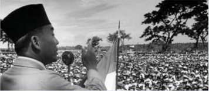

> **Deskripsi Visual:** Gambar ini adalah foto yang menunjukkan seorang pemimpin politik sedang berpidato di depan massa besar. Pemimpin tersebut mengenakan pakaian tradisional Indonesia dan sedang memegang bendera merah putih. Massa yang hadir tampak sangat ramai dan antusias. Di sekitar pemimpin, beberapa orang tampak membawa bendera juga. Gambar ini menunjukkan suasana yang penuh semangat dan kebersamaan dalam sebuah acara publik.

Elemen-elemen utama dalam gambar ini meliputi pemimpin politik yang sedang berpidato, massa besar yang hadir, bendera merah putih, dan beberapa orang yang membawa bendera. Relasi antara elemen-elemen ini adalah bahwa pemimpin politik menjadi pusat perhatian dan menjadi simbol bagi massa yang hadir. Benda-benda seperti bendera dan pakaian tradisional juga menjadi bagian penting dari suasana dan tema acara tersebut.

Teks, angka, atau label penting yang terlihat dalam gambar ini tidak ada karena gambar ini hanya foto. Namun, informasi kunci yang dapat diambil pembaca adalah bahwa gambar ini mungkin merupakan bagian dari sejarah atau pengembangan negara Indonesia, dengan pemimpin politik sebagai tokoh penting dalam proses tersebut.

Gambar 3.3 Presiden Ir. Soekarno sedang berpidato di hadapan rakyat.

Bapak-bapak dan Ibu-ibu yang saya hormati,

Sebentar lagi kita akan sampai pada hari yang sangat bersejarah, yaitu tanggal 10 November atau yang disebut dengan Hari Pahlawan. Pada hari itu  kita  seluruh  bangsa  Indonesia  akan  mengenang  kembali  peristiwa besar sebagai momentum sejarah yang terjadi di Surabaya pada tanggal 10 November 1945.

Pertempuran hebat telah terjadi pada saat itu antara para patriot bangsa yang  gagah  berani  melawan  tentara  Sekutu.  Betapapun  lengkap  senjata tentara Sekutu, tetapi tidak sedikitpun bangsa Indonesia merasa takut dan kecil hati. Padahal pada waktu itu senjata yang kita miliki sebagian besar hanyalah bambu runcing. Sementara itu, pihak musuh telah menggunakan senjata-senjata berat dan modern. Akan tetapi, dengan bekal semangat yang menggelora serta keyakinan yang kuat, tak setapakpun mereka mundur bahkan terus maju menantang maut.

 

---
## 📄 Halaman 86

Hadirin yang berbahagia,

Kita yakin bahwa para pejuang yang gugur di medan pertempuran di Surabaya tanggal 10 November 1945 melawan tentara sekutu yang angkuh dan angkara murka itu mati syahid. Oleh sebab itu, sudah sewajarnyalah jika kita bangsa Indonesia menghormati jasa mereka dengan memanjatkan doa  kepada  Allah  agar  arwah  mereka  diterima-Nya  dengan  kemuliaan yang  setinggi-tingginya.  Semoga  mereka  diampuni  segala  dosanya  dan dilimpahi rahmat yang sebanyak-banyaknya.

Di  samping  itu  perlu  kita  ketahui  bahwa  menghormati  jasa  para pahlawan  bukan  saja  kita  harus  mendoakan  mereka,  tetapi  yang  lebih penting  lagi  ialah  meneladani  mereka  dengan  penuh  semangat  serta meneruskan perjuangan mereka dengan tekad yang bulat. Barangkali akan menyesallah  mereka  jika  para  generasi  muda  tidak  berani  menegakkan kebenaran dan keadilan serta tidak berani menyirnakan kemungkaran.

Saudara-saudaraku yang berbahagia,

Bukanlah  bangsa  yang  besar,  jika  kita  tidak  bisa  menghormati  para pahlawan yang telah gugur mendahului kita. Keberanian dan tekad mereka, kita jadikan cermin pemandu yang dapat membimbing kita menuju kepada keutamaan  amal  dan  menyemangati  kita  untuk  berjuang  dalam  usaha membangun negara dan bangsa yang aman, tenteram, dan sentosa.

Akhirnya,  marilah  kita  panjatkan  doa  semoga  arwah  para  pahlawan kita  diterima  di  sisi  Allah  dengan  kemuliaan  yang  setinggi-tingginya. Kemudian, semoga kita dan anak cucu kita bisa mengambil suri teladan untuk diamalkan dalam membangun negara yang aman, sentosa, adil, dan makmur.

(Sumber: Ahmad Sunarto, dengan beberapa penyesuaian)

### Menemukan Informasi dan Permasalahan Aktual dalam Teks Ceramah

Dalam pembelajaran sebelumnya, kamu sudah mengenal jenis pembicaraan yang disebut dengan ceramah. Sekarang, kita akan mengenali jenis  informasi  ataupun  pemasalahan  yang  mungkin  kita  dapatkan  dari suatu ceramah.

Informasi disebut pula penerangan informasi bersifat publisitas; ditujukan untuk umum (publik). Informasi dalam media massa umumnya bersifat  aktual.  Demikian  pula  yang  disampaikan  melalui  ceramahceramah yang biasanya berkaitan dengan isu-isu terhangat.

 

---
## 📄 Halaman 87

Jenis-jenis informasi dapat dikategorikan sebagai berikut.

- Informasi  berdasarkan  fungsi yaitu  informasi  yang  bergantung  pada materi  dan  juga  kegunaan  informasi.  Yang  termasuk  informasi  jenis ini  adalah  informasi  yang  menambah  pengetahuan,  informasi  yang mengajari  pembaca  (informasi  edukatif),  dan  informasi  yang  hanya menyenangkan pembaca yang bersifat fiksional (khayalan). Informasi yang  menambah  pengetahuan,  misalnya,  tulisan  tentang  pergantian kurikulum. Informasi edukatif, misalnya, tulisan tentang teknik belajar yang jitu. Selanjutnya, informasi yang menyenangkan, misalnya, cerita pendek, karikatur, dan komik .
- Informasi  berdasarkan  format  penyajian yaitu  informasi  berdasarkan bentuk  penyajian  informasinya.  Di  media  massa  dikenal  berbagai bentuk  penyajian  yaitu  dalam  bentuk  tulisan,  foto,  kartun,  ataupun karikatur. Dalam bentuk tulisan dikenal bentuk berita, artikel, karangan khas ( feature ), resensi, kolom, dan karya fiksi.
- Informasi  berdasarkan  lokasi  peristiwa yaitu  informasi  berdasarkan tempat  kejadian  peristiwa  berlangsung.  Dengan  demikian,  informasi dibagi menjadi informasi daerah, nasional, dan mancanegara.
- Informasi  berdasarkan  bidang  kehidupan yaitu  informasi  berdasarkan bidang-bidang  kehidupan  yang  ada.  Bidang-bidang  yang  biasanya dibedakan itu, misalnya pendidikan, olahraga, musik, sastra, budaya, dan iptek.
- Informasi berdasarkan bidang kepentingan yaitu  dapat  dibedakan menjadi empat jenis yaitu sebagai berikut.
- Informasi yang menyangkut keselamatan atau kelangsungan hidup pembaca.
- Informasi  yang  menyangkut  perubahan  dan  berpengaruh  pada kehidupan pembaca.

---
**🖼️ Gambar/Diagram**

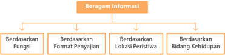

> **Deskripsi Visual:** Gambar ini adalah diagram yang menunjukkan struktur beragam informasi. Diagram ini dibagi menjadi empat bagian utama yang masing-masing berdasarkan fungsi, format penyajian, lokasi peristiwa, dan bidang kehidupan. Setiap bagian memiliki label yang menjelaskan apa yang dimaksud dengan setiap aspek tersebut. Misalnya, bagian "Berdasarkan Fungsi" menunjukkan bagaimana informasi dapat digunakan untuk tujuan tertentu, sedangkan "Berdasarkan Format Penyajian" menggambarkan berbagai cara informasi dapat diterima oleh pengguna. Diagram ini membantu pembaca memahami bagaimana informasi dapat disusun dan diterima dalam berbagai konteks.

 

---
## 📄 Halaman 88

- Informasi  tentang  cara  atau  kiat  baru  dan  praktis  bagi  pembaca untuk meningkatkan kualitas hidupnya.
- Informasi tentang peluang bagi pembaca untuk memperoleh sesuatu.

### Tugas

- Manakah informasi yang berkaitan dengan masalah bahasa? Kembangkanlah jawabanmu pada buku kerjamu!
- Berdasarkan fungsinya, termasuk jenis manakah informasi di bawah ini: edukatif (E), persuatif (P), atau rekreatif (R).

---
**📊 Tabel**

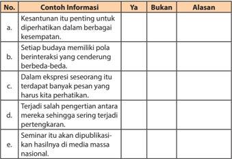

Tabel ini berisi informasi tentang keamanan dan integritas dalam sebuah organisasi. Kolom "Ya" menunjukkan bahwa informasi tersebut penting untuk diperhatikan dalam berbagai kesempatan, sedangkan kolom "Bukan" menunjukkan bahwa informasi tersebut tidak penting. Kolom "Alasan" memberikan alasan mengapa informasi tersebut penting atau tidak penting.

Topik utama tabel ini adalah tentang keamanan dan integritas dalam organisasi. Informasi penting yang disebutkan dalam tabel meliputi:

1. Setiap budaya memiliki pola berinteraksi yang cenderung berbeda-beda.
2. Dalam ekspresi sesorang itu terdapat banyak pesan yang harus kita perhatikan.
3. Terjadi salah pengertian antara mereka sering terjadi pertengkaran.
4. Seminar itu akan dipublikasikan hasilnya di media massa nasional.

Informasi penting ini menunjukkan bahwa dalam organisasi, penting untuk memahami dan menerapkan pola interaksi yang berbeda-beda, memperhatikan ekspresi orang lain, menghindari pertengkaran, dan mempublikasikan hasil seminar secara profesional.

---
**📊 Tabel**

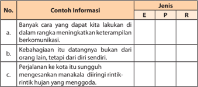

Tabel ini berisi informasi tentang berbagai konten yang dapat kita lakukan dalam rangka meningkatkan keterampilan komunikasi. Kolom E menunjukkan jenis konten yang paling efektif untuk meningkatkan keterampilan komunikasi, sedangkan kolom R menunjukkan jenis konten yang kurang efektif. Topik utama tabel adalah bagaimana kita dapat meningkatkan keterampilan komunikasi. Data penting yang terlihat adalah bahwa konten yang paling efektif untuk meningkatkan keterampilan komunikasi adalah "Banyak cara yang dapat kita lakukan di dalam rangka meningkatkan keterampilan komunikasi" dan "Perjalanan ke kota sugungh". Sementara itu, konten yang kurang efektif adalah "Kehabgahan itu datangnya bukan dari orang lain, tetapi dari diri sendiri" dan "Mengesankan manakah diri ngiri rintik-rintik hujan yang goda".

 

---
## 📄 Halaman 89

### B. Menyusun Bagian-Bagian Penting dari Permasalahan Aktual

Setelah mempelajari materi ini, kamu diharapkan mampu:

- menelaah bagian-bagian penting dalam teks ceramah;
- menemukan kalimat majemuk bertingkat dalam teks ceramah.
Menelaah Bagian-Bagian Penting dalam Teks Ceramah

Perhatikan cuplikan bacaan berikut.

### Tentang Jepang

Pernahkah kamu pergi ke Jepang? Jepang  termasuk  negara kecil  di  Asia  yang  sudah  maju. Banyak  hal  yang  perlu  diketahui tentang  Jepang.  Masyarakat  negara ini mampu mempertahankan tradisi yang berkembang di masyarakatnya.

 

---
## 📄 Halaman 90

Anak-anak Jepang membersihkan sekolah mereka setiap hari , selama seperempat jam dengan para guru. Itulah yang menyebabkan munculnya generasi  Jepang  yang  sederhana  dan  suka  pada  kebersihan.  Para  siswa belajar menjaga kebersihan karena dalam mengatasi kebersihan merupakan bagian dari etika Jepang. Siswa Jepang, dari tahun pertama hingga tahun keenam sekolah dasar harus belajar etika dalam berurusan dengan orangorang.

Pekerja kebersihan di Jepang dimaksudkan untuk menciptakan kesehatan.  Oleh  karena  itu,  mereka  sering  disebut  'insinyur  kesehatan' dan mendapatkan gaji setara dengan Rp50 Juta per bulan. Untuk merekrut mereka dilakukan melalui tes tertulis dan wawancara.

Jepang  tidak  memiliki  sumber  daya  alam  yang  melimpah  seperti Indonesia. Mereka sering terkena gempa bumi, tetapi itu tidak mencegah Jepang  menjadi  negara  dengan  kekuatan  ekonomi  terbesar  kedua  di dunia.  Rakyat  Jepang  mengatasi  kekurangan  sumber  daya  alam  dengan mengoptimalkan sumber daya lainnya.

Jika kamu pergi ke sebuah restoran prasmanan di Jepang maka kamu akan  melihat  orang-orang  yang  hanya  makan  sebanyak  yang  mereka butuhkan.  Dengan  begitu,  tidak  ada  sisa-sisa  makanan.  Selain  itu,  dari restoran tidak ada limbah apa pun.

Masyarakat Jepang sangat menghargai waktu. Mereka selalu menepati waktu.  Bahkan,  tingkat  keterlambatan  kereta  di  Jepang  hanya  sekitar  7 detik  per  tahun.  Budaya  mereka  dalam  menghargai  nilai  waktu  sangat dijaga sehingga mereka sangat tepat waktu, dengan perhitungan menit dan detik.

Jepang sangat menghargai pendidikan. Masyarakatnya mendukung visi pendidikan di Jepang. Jika kamu bertanya kepada mereka, ' Apakah arti pelajar  itu?'  Maka  mereka akan menjawab bahwa, 'Pelajar adalah masa depan Jepang' .

(Sumber: http://www.harianpost.net dengan pengubahan)

Bagian-bagian  yang  bercetak  tebal  merupakan  hal  penting  dalam seluruh  rangkaian  cuplikan  ceramah  tersebut.  Bagian-bagian  tersebut merupakan bagian pokok atau dasar dari suatu ceramah. Adapun bagianbagian lainnya berperan sebagai penjelas saja.

 

---
## 📄 Halaman 91

### Tabel: Bagian-Bagian Penting

---
**📊 Tabel**

Tabel ini berisi informasi tentang beberapa aspek penting dari Jepang, sebuah negara di Asia yang sudah maju. Topik utamanya adalah perkembangan dan kesejahteraan masyarakat Jepang. Kolom pertama menunjukkan paragraf yang berisi informasi tersebut, sedangkan kolom kedua berisi bagian penting dari paragraf tersebut. Data penting yang terlihat antara lain bahwa Jepang merupakan negara kecil di Asia yang sudah maju, anak-anak Jepang membersihkan sekolah mereka setiap hari, dan tidak ada data atau informasi lain yang disajikan dalam tabel ini.

(Kamu dapat menggunakan buku kerja untuk menyelesaikan analisis teks di atas.)

Penting atau tidaknya suatu uraian dapat pula berdasarkan kebermanfaatannya. Apabila bagian itu dianggap bermanfaat atau sangat perlu diketahui, maka bagian itulah yang penting. Sementara itu, pernyataan lain yang kurang bermanfaat atau sudah diketahui maksudnya, maka bagian itu bukanlah hal penting. Dengan demikian, penting tidaknya suatu uraian bisa berbeda antara pendengar yang satu dengan pendengar yang lainnya. Meskipun demikian, berdasarkan paparan yang tersaji dalam teks ceramah itu, suatu informasi dianggap penting apabila informasi itu bersifat umum yang merangkum atau menjadi dasar uraian-uraian lainnya.

### Tugas

- Kerjakanlah latihan berikut sesuai dengan instruksinya!
- Bacalah teks di bawah ini dengan baik.
- Secara  berkelompok,  tandailah  bagian-bagian  penting  dari  teks tersebut.
- Buatlah simpulan tentang isi teks itu secara keseluruhan!

---
**📊 Tabel**

Tabel ini berisi informasi tentang bagian-bagian penting dalam suatu proses atau tugas, mungkin dalam konteks pembelajaran atau penelitian. Kolom "No." digunakan untuk memberikan nomor urutan bagi setiap bagian penting. Kolom "Bagian-Bagian Penting" menyajikan daftar item yang dianggap penting dalam proses tersebut. Kolom "Simpulan" mungkin digunakan untuk menuliskan kesimpulan atau analisis dari informasi yang diberikan dalam kolom sebelumnya. Topik utama tabel ini adalah identifikasi dan pengenalan bagian-bagian penting dalam suatu proses atau tugas, dengan fokus pada urutan dan analisis mereka.

 

---
## 📄 Halaman 92

Saudara-saudara  yang  baik  hati,  suatu  ketika saya  melihat beberapa orang siswa asyik berjalan di depan sebuah kelas dengan langkahnya yang cukup membuat orang di sekitarnya merasa bising. Terdengar  percakapan  di  antara  mereka  yang  kira-kira  begini, 'Punya gua kemarin hilang. ' Terdengar pula sahutan salah seorang mereka, ' Lho , kalau punya gua , sama elu kemanain ?'

Tak  menyangka,  salah  seorang  siswa  di  samping  saya  juga memperhatikan percakapan mereka. Ia  kemudian  nyeletuk,  'Gua apa: Gua Selarong atau Gua Jepang?'

Beberapa  siswa  yang  mendengarnya  tertawa  kecil.  Di  antara mereka ada yang berbisik, 'Serasa di Terminal Kampung Rambutan, ye …?'

Peristiwa  tersebut  menggambarkan  bahwa  ada  dua  kelompok siswa  yang  memiliki  sikap  berbahasa  yang  berbeda  di  sekolah tersebut. Kelompok pertama adalah mereka yang kurang memiliki kepedulian terhadap penggunaan bahasa yang baik dan benar. Hal ini tampak pada ragam bahasa yang mereka gunakan yang menurut sindiran  siswa  kelompok  kedua  sebagai  ragam  bahasa    Kampung Rambutan. Bahasanya orang-orang Betawi.

Dari  komentar-komentarnya,  kelompok  siswa  kedua  memiliki sikap kritis terhadap kaidah penggunaan bahasa temannya. Mereka mengetahui makna gua yang benar dalam bahasa Indonesia adalah 'lubang besar pada kaki gunung' . Dengan makna tersebut, kata gua seharusnya ditujukan untuk penyebutan nama tempat, seperti Gua Selarong, Gua Jepang, Gua Pamijahan ,  dan seterusnya; dan bukannya pengganti orang (persona).

Sangat  beruntung,  sekolah  saya  itu  masih  memiliki  kelompok siswa yang peduli terhadap penggunaan bahasa Indonesia yang baik dan benar. Padahal kebanyakan sekolah, penggunaan bahasa para siswanya cenderung lebih tidak terkontrol.  Yang  dominan  adalah ragam bahasa pasar atau bahasa gaul. Yang banyak terdengar adalah pilihan kata seperti elu-gua .

Bapak-bapak  dan  Ibu-ibu, prasangka baik saya waktu  itu bukannya  mereka  tidak  memahami  akan  perlunya  ketertiban berbahasa di lingkungan sekolah. Saya berkeyakinan bahwa doktrin tentang  'berbahasa  Indonesialah  dengan  baik  dan  benar'  telah mereka  peroleh  jauh-jauh  sebelumnya,  sejak  SMP  atau  bahkan

 

---
## 📄 Halaman 93

sejak  mereka SD. Saya melihat ketidakberesan mereka berbahasa, antara lain, disebabkan oleh kekurangwibawaan bahasa Indonesia itu sendiri di mata mereka.

Ragam  bahasa  Indonesia  ragam  baku  mereka  anggap  kurang 'asyik' dibandingkan dengan bahasa gaul, lebih-lebih dengan bahasa asing, baik itu dalam pergaulan ataupun ketika mereka sudah masuk dunia  kerja.  Tuntutan  kehidupan  modern  telah  membelokkan apresiasi  para  siswa  itu  terhadap  bahasanya  sendiri.  Bahasa  asing berkesan  lebih  bergengsi.  Pelajaran  bahasa  Indonesia  tak  jarang ditanggapi dengan sikap sinis. Mereka merasa lebih asyik dengan mengikuti pelajaran bahasa Inggris atau mata kuliah lainnya.

Dalam  kehidupan masyarakat umum  pun,  kinerja bahasa Indonesia  memang  menunjukkan  kondisi  yang  semakin  tidak menggembirakan.  Setelah  Badan  Bahasa  tidak  lagi  menunjukkan peran  aktifnya,  bahasa  Indonesia  menunjukkan  perkembangan ironis. Bahasa Indonesia digunakan seenaknya sendiri; tidak hanya oleh  kalangan  terpelajar,  tetapi  juga  oleh  para  pejabat  dan  wakil rakyat.

Seorang pejabat negara berkata dalam sebuah wawancara televisi,  ' Content undang-undang tersebut nggak begitu, kok .  Ada dua item yang harus kita perhatikan di dalamnya. ' Pejabat tersebut tampaknya merasa dirinya lebih hebat dengan menggunakan kata content daripada kata isi atau kata item daripada kata bagian atau hal .

Penggunaan  bahasa  yang  acak-acakan  juga  banyak  dipelopori oleh kalangan pebisnis. Badan usaha, pemilik toko, dan pemasang iklan kian pandai menggunakan bahasa asing. Seorang pengusaha salon lebih merasa bergaya dengan nama usahanya yang berlabel Susi  Salon daripada Salon  Susi atau  pengusaha  kue  lebih  percaya diri dengan tokonya yang bernama Lut fita Cake daripada Toko Kue Lutfita. Akan terasa aneh terdengarnya apabila kemudian PT Jasa Marga ikut-ikutan  menamai  jalan-jalan  di  Bandung  dan  di  kotakota  lainnya,  misalnya,  menjadi Sudirman  Jalan,  Kartini  Jalan, Soekarno-Hatta Jalan.

Hadirin  yang  berbahagia,    kalangan  terpelajar  dengan  julukan hebatnya  sebagai  'tulang  punggung  negara,  harapan  masa  depan bangsa'  seharusnya  tidak  larut  dengan  kebiasaan    seperti  itu. Para  siswa  justru  harus  menunjukkan  kelas  tersendiri  dalam  hal berbahasa.

 

---
## 📄 Halaman 94

Intensitas para siswa dalam memahami literatur-literatur ilmiah sesungguhnya merupakan sarana efektif dalam mengakrabi ragam bahasa baku. Dari literatur-literatur tersebut mereka dapat mencontoh  tentang  cara  berpikir, berasa,  dan  berkomunikasi dengan bahasa yang lebih logis dan tertata.

Namun,  lain  lagi  ceritanya  kalau  yang  dikonsumsi  itu  berupa majalah hiburan yang penuh gosip. Forum gaulnya berupa komunitas dugem ; literatur utamanya koran-koran kuning, jadinya ya…, gitu deh…. Ragam bahasa elu-gue , oh-yes… oh-no.... yang bisa jadi akan lebih banyak mewarnai.

(Sumber: E. Kosasih)

- Setelah  membaca  dan  menjawab  pertanyaan,  lakukanlah  hal-hal berikut!
- Presentasikanlah pendapat kelompokmu di depan kelompok lainnya.
- Mintalah anggota dari kelompok lain untuk memberikan tanggapan/ kritik berdasarkan ketepatan dan kelengkapannya!

---
**📊 Tabel**

Tabel ini berisi informasi tentang tanggapan atau kritik yang diberikan oleh beberapa orang terhadap aspek tertentu dalam sebuah konteks. Topik utama tabel ini adalah tentang tanggapan atau kritik yang diberikan oleh beberapa orang terhadap aspek tertentu dalam sebuah konteks. Kolom-kolom yang ada dalam tabel ini adalah Nama Penanggap, Aspek yang Ditanggapi, dan Isi Tanggapan/Kritik. Data atau pola penting yang terlihat dalam tabel ini adalah bahwa setiap penanggap memiliki aspek tertentu yang ditanggapi dan memiliki tanggapan atau kritik yang spesifik terhadap aspek tersebut. Ini menunjukkan bahwa setiap individu memiliki pendapat dan tanggapan yang unik terhadap aspek tertentu dalam sebuah konteks.

 

---
## 📄 Halaman 95

### Menemukan Kalimat Majemuk Bertingkat dalam Teks Ceramah

### Perhatikan cuplikan teks berikut.

Peristiwa tersebut menggambarkan bahwa ada dua kelompok siswa yang  memiliki  sikap  berbahasa  yang  berbeda  di  sekolah  tersebut. Kelompok  pertama  adalah  mereka  yang  kurang  memiliki  kepedulian terhadap  penggunaan  bahasa  yang  baik  dan  benar.  Hal  ini  tampak pada ragam bahasa yang mereka gunakan yang menurut sindiran siswa kelompok kedua sebagai ragam bahasa  Kampung Rambutan.

Cuplikan tersebut dibentuk oleh kalimat yang panjang-panjang. Hal itu karena kalimat-kalimatnya dibentuk oleh gabungan dua buah kalimat atau lebih. Hasil penggabungan itu kemudian membentuk kalimat baru. Salah satunya berupa kalimat majemuk bertingkat.

Adapun  yang  dimaksud  dengan  kalimat  majemuk  bertingkat  adalah kalimat yang memiliki lebih dari satu klausa dan hubungan antara klausa tidak sederajat. Salah satu unsur klausa ada yang menduduki induk kalimat, sedangkan unsur yang lain sebagai anak kalimat.

Kalimat majemuk bertingkat terbagi ke dalam beberapa jenis, antara lain sebagai berikut.

- Kalimat  majemuk  hubungan  akibat,  ditandai  oleh  kata  penghubung sehingga, sampai-sampai, maka .

### Contoh:

- Ia terlalu bekerja keras sehingga jatuh sakit.
- Penjelasan  diberikan  seminggu  sekali sehingga anak-anak  dapat mengerjakan tugas-tugas mereka dengan teratur.
- Kalimat  majemuk  hubungan  cara,  ditandai  oleh  kata  penghubung dengan .

### Contoh:

- Kejelasan PSMS Medan berhasil mempertahankan kemenangannya dengan memperkokoh pertahanan mereka.
- Dengan cara  menggendongnya,  anak  itu  ia  bawa  ke  rumah  orang tuanya.
- Pemburu itu menunggu di atas bukit dengan jari telunjuknya melekat pada pelatuk senjatanya.

 

---
## 📄 Halaman 96

- Kalimat majemuk hubungan sangkalan, ditandai oleh konjungsi seolaholah, seakan-akan .

### Contoh:

- Keadaan di dalam kota kelihatan tenang, seolah-olah tidak ada suatu apa pun yang terjadi.
- Dia  diam  saja seakan-akan dia  tidak  mengetahui  persoalan  yang terjadi.
- Ia  pun menghapus wajahnya seakan mau melenyapkan pikirannya yang risau itu.
- Kalimat majemuk  hubungan  kenyataan, ditandai oleh konjungsi padahal, sedangkan .

### Contoh:

- Pura-pura tidak tahu padahal dia tahu banyak.
- Para tamu sudah siap, sedangkan kita belum siap.
- Kalimat majemuk hasil, ditandai oleh konjungsi makanya .

### Contoh:

- Tempat ini licin, makanya Anda jatuh.
- Yang datang berwajah seram, makanya saya lari ketakutan.
- Kalimat majemuk hubungan penjelasan, ditandai oleh kata penghubung bahwa, yaitu .

### Contoh:

- Berkas  riwayat  hidupnya  menunjukkan bahwa dia  adalah  seorang pelajar teladan.
- Kebun  ini  telah  dibersihkan  ayah, yaitu dengan  memangkas  dan menebang belukar yang tumbuh di sekitarnya.
- Peristiwa tersebut menggambarkan bahwa ada dua kelompok siswa yang memiliki sikap berbahasa yang berbeda di sekolah tersebut.
- Kalimat  majemuk hubungan atributif, ditandai oleh konjungsi yang .

### Contoh:

- Pamannya yang tinggal di Bogor itu, sedang dirawat di rumah sakit.
- Istrinya yang datang bersama dia itu, seorang insinyur.
- Laki-laki yang berbaju putih itu adalah kakekku dari Ibu.
- Kelompok pertama adalah mereka yang kurang memiliki keperdulian terhadap penggunaan bahasa yang baik dan benar.
- Hal  ini  tampak  pada  ragam  bahasa yang mereka  gunakan yang menurut  sindiran  siswa  kelompok  kedua  sebagai  ragam  bahasa Kampung Rambutan.

 

---
## 📄 Halaman 97

### Tugas 1

- Lengkapilah  kalimat-kalimat  majemuk  di  bawah  ini  dengan  kata penghubung yang tepat!
- Kak Agus memberi minuman pada seorang kakek … sedang duduk di bawah pohon rambutan itu.
- Mereka memperkirakan … hari ini akan hujan dengan sangat lebat.
- Dia mengatakan tidak punya uang… saya tahu bahwa dia itu baru gajian.
- Minggu  depan  ibu  ingin  berwisata  ke  Jakarta,  …  kami  ingin  ke Yogyakarta.
- Bu  Marini  akan  memberi  tahu  suaminya  …  meneleponnya  nanti malam.
- Berdiskusilah  dalam  kelompok!  Temukanlah  contoh-contoh  kalimat majemuk dalam salah satu teks ceramah di atas. Jelaskan pula jenis dari kalimat-kalimat majemuk tersebut.

 

---
## 📄 Halaman 98

### C. Menganalisis Isi, Struktur, dan Kebahasaan dalam Teks Ceramah

Setelah mempelajari materi ini, kamu diharapkan mampu:

- mengidentifikasi isi dan struktur dalam teks ceramah ceramah;
- mengidentifikasi kaidah kebahasaan dalam teks ceramah.

### Menentukan Isi dan Struktur dalam Teks Ceramah

Apabila  kamu  perhatikan  dengan  cermat  contoh-contoh  di  atas, ketahuilah  bahwa  teks  ceramah  memiliki  bagian-bagian  tertentu,  yang meliputi bagian pembuka, isi, dan penutup.

### 1.  Pembuka

Berupa pengenalan isu, masalah,  ataupun pandangan  pembicara tentang topik yang akan dibahasnya. Bagian ini sama dengan isi dalam teks eksposisi, yang disebut dengan isu.

### 2.  Isi

Berupa rangkaian argumen pembicara berkaitan dengan pendahuluan atau tesis.  Pada  bagian  ini  dikemukakan  pula  sejumlah fakta yang memperkuat  argumen-argumen pembicara.

### 3.  Penutup

Berupa penegasan kembali atas pernyataan-pernyataan sebelumnya.

---
**🖼️ Gambar/Diagram**

> **Deskripsi Visual:** Gambar ini adalah diagram yang menunjukkan struktur umum sebuah argumen teks. Diagram ini terdiri dari tiga bagian utama: Pendahuluan (Tesis), Isi (Rangkai Argument), dan Penutup (Penegasan Kembali). 

Pendahuluan (Tesis) berisi isu atau permasalahan yang akan dipertanyakan. Isi (Rangkai Argument) mencakup pendapat-pendapat penulis tentang isu tersebut, serta fakta-fakta yang mendukung atau menegadahkan pendapat tersebut. Penutup (Penegasan Kembali) mengandung simpulan yang menggambarkan kesimpulan dari argumen yang telah disajikan.

Elemen-elemen utama dalam diagram ini adalah isu, pendapat, fakta, simpulan, dan rangkuman. Relasi antara elemen-elemen ini adalah bahwa pendahuluan menyediakan isu yang akan dipertanyakan, isi menyajikan pendapat dan fakta yang mendukung atau menegadahkan pendapat tersebut, dan penutup menyimpulkan kesimpulan dari argumen yang telah disajikan.

Informasi kunci yang dapat diambil pembaca melalui diagram ini adalah bahwa struktur umum sebuah argumen teks terdiri dari pendahuluan, isi, dan penutup. Pembaca juga dapat memahami bahwa dalam struktur ini, pendahuluan menyediakan isu yang akan dipertanyakan, isi menyajikan pendapat dan fakta yang mendukung atau menegadahkan pendapat tersebut, dan penutup menyimpulkan kesimpulan dari argumen yang telah disajikan.

 

---
## 📄 Halaman 99

Berikut contoh analisis struktur untuk teks di atas.

### a.  Pendahuluan

Pemilihan  kata-kata  oleh  masyarakat  akhir-akhir  ini  cenderung semakin menurun kesantunannya dibandingkan dengan zaman saya dahulu  ketika  kanak-kanak.  Hal  tersebut  tampak  pada  ungkapanungkapan banyak kalangan dalam menyatakan pendapat dan perasaan-perasaannya, seperti ketika berdemonstrasi ataupun rapatrapat  umum.    Kata-kata  mereka  kasar  (sarkastis),  menyerang,  dan tentu saja hal itu sangat menggores hati yang menerimanya.

Bagian itu mengenalkan permasalahan utama (tesis), yakni tentang menurunnya kesantunan berbahasa masyarakat.

### b.  Isi (Rangkaian Argumen)

Fenomena  tersebut  menunjukkan  adanya  penurunan  standar moral,  agama,  dan  tata  nilai  yang  berlaku  dalam  masyarakat  itu. Ketidaksantunan  berkaitan  pula  dengan  rendahnya  penghayatan masyarakat terhadap budayanya sebab kesantunan berbahasa itu tidak hanya  berkaitan  dengan  ketepatan  dalam  pemilikan  kata  ataupun kalimat. Kesantunan itu berkaitan pula dengan adat pergaulan yang berlaku dalam masyarakat itu.

Teks tersebut merupakan salah satu bagian dari argumen pembicara tentang menurunnya kesantunan berbahasa masyarakat.

### c.  Penutup (Penegasan Kembali)

Berbahasa  santun  seharusnya  sudah  menjadi  suatu  tradisi  yang dimiliki oleh setiap orang sejak kecil. Anak perlu dibina dan dididik berbahasa santun. Apabila dibiarkan, tidak mustahil rasa kesantunan itu  akan  hilang  sehingga  anak  itu  kemudian  menjadi  orang  yang arogan, kasar, dan kering dari nilai-nilai etika dan agama. Tentu saja, kondisi itu tidak diharapkan oleh orangtua dan masyarakat manapun.

Bagian tersebut merupakan suatu simpulan, sebagai hasil penalaran dari penjelasan sebelumnya. Hal ini ditandai oleh kata-kata yang berupa saran-saran yang disertai pula sejumlah alasan.

 

---
## 📄 Halaman 100

### Tugas

- a.   Berkelompoklah dan diskusikanlah struktur teks tentang sikap berbahasa para siswa.
- Jelaskanlah bagian yang merupakan tesis, rangkaian argumen, dan penegasannya.
- a.   Bacakanlah laporan kerja kelompokmu  di depan kelompok lain.
- Mintalah penilaian/tanggapan mereka atas laporan tersebut.
- Gunakanlah format seperti berikut.

---
**📊 Tabel**

Tabel ini membahas bagian-bagian teks dalam sebuah argumen, dengan fokus pada tesis, rangkaian argumen, dan negasi (kembali). Topik utama tabel ini adalah struktur dan komponen dasar dalam sebuah argumen logis. Kolom "Isi Teks" mencakup tiga bagian utama: tesis, rangkaian argumen, dan negasi. Kolom "Penjelasan" memberikan penjelasan singkat tentang masing-masing bagian tersebut. Dari tabel ini, dapat dilihat bahwa tesis merupakan pernyataan utama yang ingin ditunjukkan dalam argumen, rangkaian argumen berisi argumen-argumen yang mendukung tesis, dan negasi menunjukkan argumen-argumen yang menentang atau menyangkal tesis. Pola penting yang terlihat adalah bahwa setiap bagian memiliki fungsi khusus dalam membangun argumen secara logis dan kuat.

---
**📊 Tabel**

Tabel ini menunjukkan skor dan komentar untuk empat aspek penilaian laporan, yaitu ketepatan isi laporan, kelengkapan bagian-bagian laporan, kebakuan dalam penggunaan kata/kalimat, dan kebakuan ejaan/tanda baca. Topik utama tabel ini adalah penilaian laporan. Kolom-kolomnya mencakup bobot (atau skor) setiap aspek dan komentar untuk setiap aspek. Data penting yang terlihat adalah bahwa ketepatan isi laporan memiliki bobot tertinggi dengan 40%, sedangkan kebakuan ejaan/tanda baca memiliki bobot terendah dengan 10%. Skor total untuk semua aspek adalah 100%.

### Kegiatan 2

### Mengidentifikasi Kaidah Kebahasaan dalam Teks Ceramah

Sebagaimana  jenis  teks  lainnya,  ceramah  pun  memiliki  karakteristik tersendiri yang cenderung berbeda dengan teks-teks lainnya. Merujuk pada contoh-contoh di atas bahwa teks ceramah memiliki kaidah kebahasaan sebagai berikut.

- Menggunakan kata ganti orang pertama (tunggal) dan kata ganti orang kedua jamak, sebagai sapaan. Kata ganti orang pertama, yakni saya, aku. Mungkin  juga  kata kami apabila  penceramahnya  mengatasnamakan

 

---
## 📄 Halaman 101

- kelompok. Teks ceramah sering kali  menggunakan kata sapaan yang ditujukan pada orang banyak, seperti hadirin, kalian, bapak-bapak, ibuibu, saudara-saudara.
- Menggunakan kata-kata teknis atau peristilahan yang berkenaan dengan topik  yang  dibahas.  Dengan  topik  tentang  masalah  kebahasaan  yang menjadi fokus pembahasanya, istilah-istilah yang muncul dalam teks tersebut adalah sarkastis, eufemistis, tata krama, kesantunan berbahasa, etika berbahasa.
- Menggunakan  kata-kata  yang  menunjukkan  hubungan  argumentasi (sebab akibat). Misalnya, jika... maka, sebab, karena, dengan demikian, akibatnya, oleh karena itu. Selain itu, dapat pula digunakan kata-kata yang  yang  menyatakan  hubungan  temporal  ataupun  perbandingan/ pertentangan, seperti sebelum itu, kemudian, pada akhirnya, sebaliknya, berbeda halnya, namun.
- Menggunakan kata-kata kerja mental, seperti diharapkan, memprihatinkan, memperkirakan, mengagumkan, menduga, berpendapat, berasumsi, menyimpulkan.
- Menggunakan kata-kata persuasif, seperti hendaklah, sebaiknya, diharapkan, perlu, harus.

### Tugas

- a.  Cermatilah kembali sebuah teks ceramah yang telah kamu baca/ simak.
- Secara berkelompok, identifikasilah kaidah-kaidah yang ada pada teks tersebut.
- Catatlah hasilnya dalam format laporan seperti berikut.
Topik

: ....

Penceramah

: ....

Tempat/waktu

: ....

---
**📊 Tabel**

Tabel ini berisi kaidah kebahasaan dengan contoh-contohnya. Topik utamanya adalah tentang penggunaan kata ganti orang dan kata sambung sebab akibat dalam bahasa Indonesia. Kolom pertama berisi kaidah kebahasaan, sedangkan kolom kedua berisi contoh-contoh yang menunjukkan penggunaan kaidah tersebut. Data penting yang terlihat adalah bahwa tabel ini mencakup tiga jenis kata ganti orang: kata ganti orang pertama, kata ganti orang kedua (sapaan), dan kata sambung sebab akibat. Ini membantu pembaca memahami bagaimana menggunakan kata-kata ini dengan benar dalam kalimat.

 

---
## 📄 Halaman 102

---
**📊 Tabel**

Tabel ini berisi kaidah kebahasaan dengan contoh, yang membahas berbagai jenis kata dalam bahasa Indonesia. Topik utamanya adalah pengenalan kaidah kebahasaan, termasuk kata sambung temporal, kata-kata teknis, kata kerja mental, dan kata-kata persuasif. Kolom "Kata sambung temporal" menunjukkan contoh seperti "sudah" atau "sedang". Kolom "Kata-kata teknis" mencakup istilah seperti "kompilasi", "perangkat keras", dan "penggunaan". Kolom "Kata kerja mental" meliputi kata-kata seperti "mengerti", "menghargai", dan "menghormati". Sementara itu, kolom "Kata-kata persuasif" menunjukkan contoh seperti "pastikan", "pastikan", dan "pastikan". Pola penting yang terlihat adalah bahwa tabel ini memberikan penjelasan dan contoh untuk setiap jenis kata yang mungkin digunakan dalam berbagai situasi kehidupan sehari-hari.

- Lakukanlah silang baca dengan kelompok lain untuk saling memberikan penilaian berdasarkan ketepatan dan kelengkapannya.

### D. Mengonstruksi Ceramah

Setelah mempelajari materi ini, kamu diharapkan mampu:

- menentukan aspek-aspek yang disunting dalam teks ceramah;
- menyampaikan hasil suntingan teks ceramah dengan memperhatikan kebahasaan dan struktur teks yang tepat.
Untuk  bisa  berceramah  dengan  baik,  alangkah  baiknya  apabila  kita menyiapkan  teks  tertulisnya  terlebih  dahulu.  Kita  menyiapkan  bahanbahannya agar penyampaian materi ceramah bisa lebih lancar dan menarik.

### Kegiatan 1

### Menentukan Aspek-Aspek yang Disunting dalam Teks Ceramah

Adapun langkah-langkah penyusunannya dimulai dengan menentukan topik dan tujuan, menyusun kerangka ceramah, menyusun teks ceramah berdasarkan kerangka dengan menggunakan kalimat yang mudah dipahami, hingga menyunting teks ceramah.

 

---
## 📄 Halaman 103

### 1.  Menentukan Topik

Beberapa topik yang dapat dijadikan bahan ceramah adalah:

- pengalaman pribadi,
- hobi dan keterampilan,
- pengalaman dalam pekerjaan,
- pelajaran sekolah atau kuliah,
- pendapat pribadi,
- peristiwa hangat dan pembicaraan publik,
- masalah keagamaan,
- problem pribadi,
- biografi tokoh terkenal, dan
- minat khalayak.

### 2.  Merumuskan Tujuan Ceramah

Ada dua macam tujuan yaitu tujuan umum dan tujuan khusus.

- Tujuan umum ceramah biasanya dirumuskan dalam tiga hal yaitu memberitahukan (informatif), memengaruhi (persuasif), dan menghibur (rekreatif).
- Ceramah  informatif,  ditujukan  untuk  menambah  pengetahuan pendengar.  Misalnya,  ceramah  tentang  peranan  para  pelajar pada  masa  perang  kemerdekaan,  posisi  Indonesia  di  kancah internasional.
- Ceramah  persuasif,  ditujukan  agar  pendengar  mempercayai, menyetujui, atau bahkan mengikuti ajakan pembicara. Misalnya, ceramah tentang cara-cara  hidup  sehat  dan  menjaga  kesehatan lingkungan.
- Ceramah  rekreatif,  ditujukan  agar  pendengar  merasa  terhibur. Karena itu, ceramah ini banyak diwarnai oleh humor, anekdot, ataupun guyonan-guyonan yang memancing tertawa pendengar.
- Tujuan  khusus  ialah  tujuan  yang  merupakan  rincian  dari  tujuan umum. Tujuan umum lebih informasional, lebih jelas, dan terukur dalam pencapaiannya.
Berikut contoh hubungan topik, tujuan umum, dan tujuan khusus.

Topik

:  Keragaman budaya daerah

Tujuan umum  :  Informatif (memberi tahu)

Tujuan khusus :  Pendengar mengetahui bahwa:

- setiap daerah memiliki budaya yang khas;
- dalam budaya daerah terdapat nilai-nilai kehidupan yang bisa kita petik.

 

---
## 📄 Halaman 104

Topik

: Manfaat penghijauan

Tujuan umum  : Persuasif (mengajak)

- Tujuan khusus  : 1)  Pendengar memperoleh keyakinan tentang manfaat penghijauan.
- Pendengar mau mengikuti program penghijauan dengan baik.

### 3.  Menyusun Kerangka Ceramah

Kerangka  ceramah merupakan  rencana  yang  memuat  garis-garis besar materi yang akan diceramahkan. Kerangka ceramah bermanfaat dalam memudahkan penyusunan karangan sehingga karangan menjadi lebih  sistematis  dan  teratur,  menghindari  timbulnya  pengulangan pembahasan, serta membantu pengumpulan data dan sumber-sumber yang diperlukan.

Kerangka ceramah yang  baik  memiliki ciri-ciri sebagai berikut.

- Ceramah  meliputi  tiga  bagian  pokok,  yaitu  pengantar,  isi,  dan penutup.
- Maksud dari ceramah diungkapkan dengan jelas.
- Setiap bagian dalam kerangka ceramah hanya memiliki satu gagasan.
- Bagian-bagian dalam kerangka ceramah harus tersusun secara logis.

### 4.  Menyusun Ceramah Berdasarkan Kerangka

Langkah  berikutnya  adalah  mengembangkan  kerangka  menjadi naskah ceramah yang utuh dan lengkap. Namun bersamaan dengan itu, perlu dilakukan pemahaman dan pengahayatan terhadap bahan-bahan yang ada, yakni dengan jalan:

- mengkaji bahan secara kritis,
- meninjau kelayakan bahan dengan khalayak (audiensi),
- meninjau bahan yang kemungkinan menimbulkan pro dan kontra,
- menyusun sistematika bahan ceramah, dan
- menguasai bahan ceramah berdasarkan jalan pikiran yang logis.

### Tugas

- Dari sepuluh jenis topik yang dida ftarkan di atas, tentukanlah sebuah topik  yang  menurutmu  bagus  untuk  diceramahkan.  Karena  masih bersifat umum, perjelaslah topik tersebut agar lebih spesifik. Kemudian jelaskanlah kepada teman-teman alasan pemilihan topik itu berdasarkan empat pertimbangan di atas.

 

---
## 📄 Halaman 105

- Susunlah tujuan umum dan tujuan khusus dari topik yang telah kamu tentukan itu. Sajikanlah kegiatanmu itu ke dalam format berikut.
- Susunlah kerangka untuk topik ceramah yang telah kamu rumuskan itu.  Isi  dan  sistematika  kerangka  harus  sesuai  dengan  tujuan  yang telah  kamu  buat.  Mintalah  saran  kepada  teman-temanmu  dalam penyusunannya agar mendapatkan hasil yang lebih baik.

---
**📊 Tabel**

Tabel ini menunjukkan dua kategori utama: "Topik" dan "Tujuan". Topik ini mencakup berbagai subtopik yang mungkin relevan dengan subjek pembelajaran. Kolom "Umum" dan "Khusus" digunakan untuk menunjukkan tujuan pembelajaran yang lebih umum dan spesifik. Data penting yang terlihat adalah bahwa tabel ini dirancang untuk membantu siswa memahami bagaimana topik-topik tersebut berkaitan dengan tujuan pembelajaran yang lebih umum dan spesifik. Ini dapat membantu siswa merencanakan dan mengikuti program pembelajaran yang efektif.

---
**📊 Tabel**

Tabel ini berisi informasi tentang struktur sebuah tesis atau penulisan ilmiah, dengan topik utama "Pembukaan (tesis, pengenalan isu)". Tabel dibagi menjadi tiga kolom: Pembukaan, Isi, dan Penutup. Pembukaan meliputi tesis atau pengenalan isu, Isi mencakup rangkai argumen, dan Penutup berisi penegasan. Pola penting yang terlihat adalah bahwa setiap bagian memiliki tujuan spesifik dalam struktur tesis tersebut.

### Kegiatan 2

### Menyampaikan Hasil Suntingan dengan Memperhatikan Struktur dan Kebahasaan

Penyuntingan  tidak  hanya  berkaitan  dengan  ejaan  ataupun  dengan penulisan  kata.  Penyuntingan  juga  berkaitan  dengan  susunan  kalimat dalam paragraf dan susunan paragraf di dalam keseluruhan teks. Hubungan kalimat  dengan  kalimat  harus  padu,  saling  berhubungan.  Dalam  suatu

 

---
## 📄 Halaman 106

teks tidak boleh ada kalimat yang menyimpang dari pokok pembahasan. Demikian  halnya  dengan  penyusunan  paragraf,  semuanya  harus  saling berkaitan dan mengusung satu tema sama.

Penyuntingan bertujuan untuk menyempurnakan atau untuk mengurangi  kekeliruan-kekeliruan  yang  mungkin  terjadi  dalam  suatu teks. Oleh karena itu, seorang penyunting setidaknya harus:

- mengetahui cara penulisan karangan yang baik,
- memahami masalah yang dibahas dalam karangan itu, serta memahami aturan-aturan kebahasaan, seperti masalah ejaan dan tanda baca.
Kegiatan penyuntingan dapat dilakukan dengan langkah-langkah berikut.

- Penyiapan teks (ceramah) yang akan disunting.
- Penyediaan  bahan-bahan  pemandu  penyuntingan,  seperti  pedoman Ejaan  Bahasa  Indonesia  (EBI)  dan  kamus.  Selain  itu,  bahan-bahan tersebut harus disesuaikan dengan karangan yang akan disunting. Kalau itu berupa naskah ceramah, bahan pemandunya adalah buku tentang teknik penulisan ceramah.
- Mencermati  bahan suntingan secara cermat, baik itu berkenaan dengan cara penyajian isi maupun bahasanya.
- Memperbaiki kesalahan yang terdapat dalam bahan suntingan secara benar dengan berpedoman pada sumber-sumber yang dapat dipercaya.
Lakukanlah silang baca dengan teman sebangku untuk saling memberikan  koreksi  berdasarkan  ketepatan  isi,  kelengkapan/kepaduan struktur, kaidah bahasa, dan ejaannya.

---
**📊 Tabel**

Tabel ini menunjukkan skor dan jumlah untuk empat aspek penilaian, dengan bobot yang berbeda-beda untuk setiap aspek. Topik utama tabel adalah penilaian kualitas penulisan, yang meliputi ketepatan isi, kelengkapan/kepaduan struktur, kebakuan kaidah kebahasaan, dan kebakuan ejaan/tanda baca. Kolom-kolomnya mencakup Bobot, Skor, Jumlah, dan Komentar. Data penting yang terlihat adalah bahwa ketepatan isi memiliki bobot tertinggi yaitu 30%, sedangkan kebakuan ejaan/tanda baca memiliki bobot paling rendah yaitu 20%. Skor dan jumlah juga ditentukan oleh bobot masing-masing aspek, dengan total bobot mencapai 100%.

 

---
## 📄 Halaman 107

### Bab IV

### Meneladani Kehidupan dari Cerita Pendek

---
**🖼️ Gambar/Diagram**

> **Deskripsi Visual:** Gambar ini menunjukkan seorang individu sedang membaca buku pelajaran sambil memegang sebuah gelas minuman. Buku tersebut terbuka dengan halaman berwarna putih, menunjukkan bahwa ia mungkin adalah buku pelajaran atau referensi. Gelas minuman yang dimegang oleh orang tersebut tampak seperti kopi atau teh, menunjukkan bahwa ia mungkin sedang menghabiskan waktu luang atau bekerja dari rumah. Warna latar belakang yang tidak jelas membuat fokus pada objek utama, yaitu buku dan gelas minuman. Tidak ada teks, angka, atau label yang jelas dalam gambar ini, sehingga informasi kunci yang dapat diambil pembaca hanya melalui konteks visual saja.

Gambar 4.1 Seseorang yang senang membaca.

Pernahkah kamu mendengar atau membaca cerita? Cerita yang didengar atau dibaca bisa beragam. Ada cerita tentang pengalaman orang lain ataupun dari  diri  sendiri.  Pada  bab  ini,  kita  akan  membahas  tentang  cerita  pendek. Tahukah  kamu  bahwa  dalam  cerita  pendek  terdapat  nilai-nilai  tentang kehidupan?

Untuk membekali kemampuanmu, pada bab ini kamu akan belajar:

- mengidentifikasi nilai-nilai kehidupan dalam cerita pendek;
- mendemonstrasikan salah satu nilai kehidupan yang dipelajari dalam cerita pendek;

 

---
## 📄 Halaman 108

- menganalisis unsur-unsur pembangun cerita pendek; dan
- mengonstruksi sebuah cerita pendek dengan memperhatikan unsur-unsur pembangun.
Untuk membantu kamu dalam mempelajari dan mengembangkan kompetensimu, pelajari peta konsep di bawah ini dengan saksama!

---
**🖼️ Gambar/Diagram**

> **Deskripsi Visual:** Gambar ini adalah diagram yang menunjukkan proses pembelajaran tentang menelaah kehidupan dalam cerita pendek. Diagram ini terdiri dari empat langkah utama yang disusun secara horizontal:

1. **Mengidentifikasi Nilai-nilai Kehidupan dalam Cerita Pendek**:
   - Langkah pertama ini melibatkan pemahaman tentang nilai-nilai kehidupan yang muncul dalam teks pendek.
   - Ini mencakup pengetahuan tentang bagaimana nilai-nilai tersebut muncul dalam konteks cerita.

2. **Mendemonstrasikan Salah Satu Nilai Kehidupan yang Dipelajari dalam Cerita Pendek**:
   - Langkah ini mengajarkan cara mendemonstrasikan salah satu nilai kehidupan yang telah dipelajari dalam cerita pendek.
   - Ini melibatkan penulisan atau presentasi yang menunjukkan penggunaan nilai-nilai tersebut dalam konteks cerita.

3. **Menganalisis Unsur-unsur Pembangunan Cerita Pendek**:
   - Langkah ini membahas bagaimana unguar-unsur pembangunan cerita pendek dapat digunakan untuk meneladani kehidupan.
   - Ini mencakup analisis struktur, karakter, dan tema dalam cerita pendek.

4. **Mengonstruksi Sebuah Cerita Pendek dengan Memperhatikan Unsur-unsur Pembangunan**:
   - Langkah terakhir ini mengajarkan bagaimana membuat cerita pendek sendiri dengan mempertimbangkan unsur-unsur pembangunan yang telah dipelajari sebelumnya.
   - Ini mencakup penulisan cerita pendek yang menunjukkan penggunaan nilai-nilai kehidupan yang telah dipelajari.

Elemen-elemen utama dalam diagram ini adalah langkah-langkah yang disusun secara horizontal, masing-masing dengan sub-titik yang menjelaskan proses pembelajaran lebih lanjut. Teks, angka, atau label penting yang terlihat adalah nama-nama langkah-langkah dan sub-titik yang menjelaskan proses pembelajaran. Informasi kunci yang dapat diambil pembaca adalah proses pembelajaran yang sistematis tentang menelaah kehidup

 

---
## 📄 Halaman 109

### A. Mengidentifikasi Nilai-Nilai Kehidupan dalam Cerita Pendek

Setelah mempelajari materi ini, kamu diharapkan mampu:

- memahami informasi tentang nilai-nilai kehidupan dalam cerita pendek;
- menemukan nilai-nilai kehidupan dalam cerita pendek.
Cerita pendek merupakan salah satu karya sastra yang memusatkan diri pada satu tokoh dalam satu situasi. Dalam cerita pendek, kita akan banyak menemukan berbagai karakter tokoh, baik protagonis maupun antagonis. Keduanya merupakan cerminan nyata dari kehidupan di dunia. Namun, dari karakter tokoh tersebut kita dapat menemukan nilai-nilai kehidupan, yaitu perbuatan baik yang harus kita tiru dan perbuatan buruk yang harus kita jauhi.

Memahami  Informasi  tentang  Nilai-Nilai  Kehidupan  dalam  Cerita Pendek

Bacalah cerita pendek di bawah ini dengan baik!

### Robohnya Surau Kami

oleh A.A. Navis

Alangkah tercengangnya Haji Saleh, karena di neraka itu banyak temannya di dunia terpanggang panas,  merintih  kesakitan.  Dan  ia  tambah  tak mengerti  lagi  dengan  keadaan  dirinya,  karena semua orang yang dilihatnya di neraka tak kurang ibadatnya  dari  dia  sendiri.  Bahkan,  ada  salah seorang  yang  telah  sampai  empat  belas  kali  ke Mekah  dan  bergelar  Syeh  pula.  Lalu  Haji  Saleh mendekati mereka, lalu bertanya kenapa mereka di  neraka  semuanya.  Tetapi  sebagaimana  Haji Saleh, orang-orang itu pun tak mengerti juga.

 

---
## 📄 Halaman 110

'Bagaimana Tuhan kita ini?' kata Haji Saleh kemudian. 'Bukankah kita disuruh-Nya  taat  beribadah,  teguh  beriman?  Dan  itu  semua  sudah  kita kerjakan selama hidup kita. Tapi kini kita dimasukkan ke neraka. '

'Ya.  Kami  juga  berpendapat  demikian.  Tengoklah  itu,  orang-orang senegeri kita semua, dan tak kurang ketaatannya beribadat. '

'Ini sungguh tidak adil. '

'Memang  tidak  adil, '  kata  orang-orang  itu  mengulangi  ucapan  Haji Saleh.

'Kalau begitu, kita  harus minta kesaksian kesalahan kita. Kita harus mengingatkan Tuhan, kalau-kalau ia silap memasukkan kita ke neraka ini. '

'Benar.  Benar.  Benar, '  sorakan  yang  lain  membenarkan  Haji  Saleh. 'Kalau Tuhan tak mau mengakui kesilapan-Nya, bagaimana?' suatu suara melengking di dalam kelompok orang banyak itu.

'Kita protes. Kita resolusikan, ' kata Haji Saleh.

' Apa  kita  revolusikan  juga?'  tanya  suara  yang  lain,  yang  rupanya  di dunia menjadi pemimpin gerakan revolusioner.

'Itu tergantung pada keadaan, ' kata Haji Saleh. 'Yang penting sekarang, mari kita berdemonstrasi menghadap Tuhan.'

'Cocok sekali. Di dunia dulu dengan demonstrasi saja, banyak yang kita peroleh, ' sebuah suara menyela.

'Setuju! Setuju! Setuju!' mereka bersorak beramai-ramai.

Lalu,  mereka  berangkatlah  bersama-sama  menghadap  Tuhan.  Dan Tuhan bertanya, ' Kalian mau apa?'

Haji Saleh yang menjadi pemimpin dan juru bicara tampil ke depan. Dan  dengan  suara  yang  menggeletar  dan  berirama  indah,  ia  memulai pidatonya.

'O, Tuhan kami yang Mahabesar. Kami yang menghadap-Mu ini adalah umat-Mu yang paling  taat  beribadat,  yang  paling  taat  menyembah-Mu. Kamilah  orang-orang  yang  selalu  menyebut  nama-Mu,  memuji-muji kebesaran-Mu, mempropagandakan  keadilan-Mu, dan lain-lainnya. KitabMu kami hafal di luar kepala kami. Tak sesat sedikit pun membacanya. Akan  tetapi,  Tuhanku  yang  Mahakuasa,  setelah  kami  Engkau  panggil kemari,  Engkau  masukkan  kami  ke  neraka.  Maka  sebelum  terjadi  halhal yang tidak diingini, maka di sini, atas nama orang-orang yang cinta pada-Mu,  kami  menuntut  agar  hukuman  yang  Kau  jatuhkan  kepada kami ditinjau kembali dan memasukkan kami ke surga sebagaimana yang Engkau janjikan dalam kitab-Mu.'

'Kalian di dunia tinggal di mana?' tanya Tuhan.

'Kami ini adalah umat-Mu yang tinggal di Indonesia, Tuhanku.'

 

---
## 📄 Halaman 111

'O, di negeri yang tanahnya subur itu?'

'Ya. Benarlah itu, Tuhanku. '

'Tanahnya  yang  mahakaya  raya,  penuh  oleh  logam,  minyak,  dan berbagai bahan tambang lainnya, bukan?'

'Benar. Benar. Benar. Tuhan kami. Itulah negeri kami,' mereka mulai menjawab  serentak.  Karena  fajar  kegembiraan  telah  membayang  di wajahnya  kembali.  Dan  yakinlah  mereka  sekarang,  bahwa  Tuhan  telah silap menjatuhkan hukuman kepada mereka itu.

'Di negeri, di mana tanahnya begitu subur, hingga tanaman tumbuh tanpa ditanam?'

'Benar. Benar. Benar. Itulah negeri kami. '

'Di negeri, di mana penduduknya sendiri melarat itu?'

'Ya. Ya. Ya. Itulah dia negeri kami. '

'Negeri yang lama diperbudak orang lain itu?' 'Ya, Tuhanku. Sungguh laknat penjajah penjajah itu, Tuhanku. '

'Dan hasil tanahmu, mereka yang mengeruknya dan diangkutnya ke negerinya, bukan?'

'Benar Tuhanku, hingga kami tidak mendapat apa-apa lagi. Sungguh laknat mereka itu. '

'Di  negeri  yang  selalu  kacau  itu,  hingga  kamu  dengan  kamu  selalu berkelahi,  sedang  hasil  tanahmu  orang  lain  juga  yang  mengambilnya, bukan?'

'Benar, Tuhanku. Tapi bagi kami soal harta benda itu, kami tak mau tahu. Yang penting bagi kami ialah menyembah dan memuji Engkau.'

'Engkau rela tetap melarat, bukan?'

'Benar. Kami rela sekali, Tuhanku. '

'Karena kerelaanmu itu, anak cucumu tetap juga melarat, bukan?'

'Sungguhpun  anak  cucu  kami  melarat,  tapi  mereka  semua  pintar mengaji. Kitab-Mu mereka hafal di luar kepala belaka. '

'Tapi  seperti  kamu  juga,  apa  yang  disebutnya  tidak  dimasukkan  ke hatinya, bukan?'

' Ada, Tuhanku. '

'Kalau  ada,  mengapa  biarkan  dirimu  melarat,  hingga  anak  cucumu teraniaya semua? Sedang harta bendamu kau biarkan orang lain mengambilnya untuk anak cucu mereka. Dan engkau  lebih suka berkelahi antara  kamu  sendiri,  saling  menipu,  saling  memeras.  Aku  beri  engkau negeri  yang  kaya  raya,  tapi  kau  malas.  Kau  lebih  suka  beribadat  saja, karena  beribadat  tidak  mengeluarkan  peluh,  tidak  membanting  tulang. Sedang aku menyuruh engkau semuanya beramal di samping beribadat.

 

---
## 📄 Halaman 112

Bagaimana engkau bisa beramal kalau engkau miskin? Engkau kira aku ini suka pujian, mabuk disembah saja, hingga kerjamu lain tidak memuji-muji dan menyembah-Ku saja. Tidak. Kamu semua mesti masuk neraka! Hai malaikat, halaulah mereka ini kembali ke neraka. Letakkan di keraknya. '

Semuanya  jadi  pucat  pasi  tak  berani  berkata  apa-apa  lagi.  Tahulah mereka sekarang apa jalan yang diridai Allah di dunia.

Tetapi Haji Saleh ingin juga kepastian, apakah yang dikerjakannya di dunia ini salah atau  benar. Tetapi ia tak berani bertanya kepada Tuhan, ia bertanya saja pada malaikat yang menggiring mereka itu.

'Salahkah  menurut  pendapatmu,  kalau  kami  menyembah  Tuhan  di dunia?' tanya Haji Saleh.

'Tidak. Kesalahan engkau, karena engkau terlalu mementingkan dirimu sendiri. Kau takut masuk neraka, karena itu kau taat bersembahyang. Tapi engkau  melupakan  kehidupan  kaummu  sendiri,  melupakan  kehidupan anak  istrimu  sendiri,  hingga  mereka  itu  kucar-kacir  selamanya..  Itulah kesalahanmu  yang  terbesar,  terlalu  egoistis.  Padahal  engkau  di  dunia berkaum, bersaudara semuanya, tapi engkau tak mempedulikan mereka sedikit pun. '

Demikian  cerita  Ajo  Sidi  yang  kudengar  dari  Kakek.  Cerita  yang memurungkan Kakek.

Dan besoknya, ketika aku mau turun rumah pagi-pagi, istriku berkata apa aku tak pergi menjenguk.

'Siapa yang meninggal?' tanyaku kaget.

'Kakek.'

'Kakek?'

'Ya. Tadi subuh Kakek kedapatan mati di suraunya dalam keadaan yang ngeri sekali. Ia menggorok lehernya dengan pisau cukur. '

' Astaga. Ajo Sidi punya gara-gara, ' kataku seraya melangkah secepatnya meninggalkan istriku yang tercengang-cengang.

Aku mencari Ajo Sidi ke rumahnya. Tetapi aku berjumpa sama istrinya saja. Lalu aku tanya dia.

'Ia sudah pergi, ' jawab istri Ajo Sidi. 'Tidak ia tahu Kakek meninggal?'

'Sudah. Dan ia meninggalkan pesan agar dibelikan kafan buat Kakek tujuh lapis. ' 'Dan sekarang, ' tanyaku kehilangan akal sungguh mendengar segala peristiwa oleh perbuatan Ajo Sidi yang tidak sedikit pun bertanggung jawab, ' dan sekarang ke  mana dia?'

'Kerja. '

'Ya. Dia pergi kerja. '***

 

---
## 📄 Halaman 113

Cerita  yang  telah  kamu  baca  itu  dinamakan  cerita  pendek.  Sesuai dengan  namanya,  cerita  pendek  (cerpen)  adalah  cerita  yang  menurut wujud fisiknya berbentuk pendek. Ukuran panjang pendeknya suatu cerita memang relatif. Namun, pada umumnya cerita pendek merupakan cerita yang habis dibaca sekitar sepuluh menit atau setengah jam. Jumlah katanya sekitar 500 - 5.000 kata. Olek karena itu, cerita pendek sering diungkapkan dengan 'cerita yang dapat dibaca dalam sekali duduk' .

Untuk  memahami  isi  suatu  cerpen,  termasuk  nilai-nilai  yang  ada  di dalamnya,  kita  sebaiknya  mengawalinya  dengan  sejumlah  pertanyaan. Dengan demikian, pemahaman kita terhadap cerpen itu akan lebih terfokus dan  lebih  mendalam.  Pertanyaan-pertanyaan  itu  dapat  dikelompokkan yakni mulai dari pemahaman literal, interpretatif, intergratif, kritis,  dan kreatif. Untuk itu, kita pun dapat mengujinya dengan sejumlah pertanyaan seperti berikut.

- Pertanyaan literal
- Di mana dan kapan cerita itu terjadi?
- Siapa saja tokoh cerita itu?
- Pertanyaan interpretatif?
- Apa maksud tersembunyi di balik pernyataan tokoh A?
- Bagaimana makna lugas dari perkataan tokoh B?

### 3.  Pertanyaan integratif

- Bercerita tentang apakah cerpen di atas?
- Apa pesan moral yang hendak disampaikan pengarang dari cerpennya itu?

### 4.  Pertanyaan kritis

- Ditinjau  dari  sudut  pandang  agama,  bolehlah  tokoh  C  berbohong pada tokoh A?
- Apa kelebihan dan kelemahan cerpen itu berdasarkan aspek kebahasaan yang digunakannya?

### 5.  Pertanyaan kreatif

- Bagaimana sikapmu apabila berposisi sebagai tokoh A dalam cerpen itu?
- Bagaimana kira-kira kelanjutan cerpen itu seandainya tokoh utamanya tidak dimatikan pengarang?

 

---
## 📄 Halaman 114

### Tugas

- Setelah  membaca  cerita  di  atas,  kamu  sudah  memiliki  pemahaman yang jelas tentang pengertian dan karakteristik cerita pendek. Sekarang, buktikanlah pemahamanmu  itu  dengan  menunjukkan  sekurangkurangnya lima contoh cerita lainnya yang berkategori cerpen. Sajikanlah hasilnya dalam rubrik berikut!
- Secara berdiskusi kelompok, jawablah pertanyaan-pertanyaan berikut!
- Di mana dan kapan peristiwa dalam cerita itu terjadi?
- Kata-kata 'robohnya surau kami' itu maksudnya apa?
- Pesan-pesan  yang  disampaikan  pengarang  melalui  cerpennya  itu apa saja?
- Setujukah  kamu  dengan  isi  cerita  itu  dan  adakah  hal-hal  yang bertentangan dengan kayakinanmu sendiri?
- Bagaimana  hubungan  kamu  sendiri  selama  ini  dengan  Tuhan? Ceritakanlah!
- Kerjakanlah hal berikut sesuai dengan instruksinya!
- Buatlah  lima pertanyaan lainnya secara berkelompok untuk menguji pemahaman literal, interpretatif, integratif, kritis, dan kreatif!
- Mintalah teman-teman kamu dari kelompok lain untuk menjawab pertanyaan-pertanyaan itu!

---
**📊 Tabel**

Tabel ini berisi informasi tentang cerpenan, dengan kolom-kolom yang mencakup judul cerpen, pengarang, sumber, dan inti cerita. Topik utama tabel ini adalah penulisan cerpen, yang melibatkan pengumpulan data tentang berbagai cerpenan dari berbagai sumber. Data penting yang terlihat dalam tabel ini termasuk judul cerpen yang beragam, pengarang yang berbeda-beda, sumber yang bervariasi, dan inti cerita yang berbeda-beda. Tabel ini membantu dalam memahami bagaimana cerpenan dapat diterjemahkan dan dikembangkan dari berbagai sumber dan pengarang.

### Kegiatan 2

### Menemukan Nilai-Nilai Kehidupan dalam Cerita Pendek

Dengan  mengajukan  beragam  pertanyaan  tentang  isi  suatu  teks, misalnya  cerpen,  kita  akan  sampai  pada  penemuan  nilai  dari  teks  itu. Adapun yang dimaksud dengan nilai dalam hal ini adalah sesuatu yang

 

---
## 📄 Halaman 115

penting, berguna, atau bermanfaat bagi manusia. Pertanyaan kritis tentang kelebihan  dan  kelemahan  cerpen  itu,  misalnya,  akan  sampailah  pada jawaban tentang bermanfaat atau tidaknya bagi pembaca.

### Perhatikan penggalan cerpen berikut.

Pak,  pohon  pepaya  di  pekaranganku  telah  dirobohkan  dengan  tak semena-mena, tidaklah  sepatutnya  hal  itu  kulaporkan?  Itu  benar,  tapi jangan melebih-lebihkan. Ingat, yang harus diutamakan  ialah kerukunan kampung. Soal kecil yang dibesar-besarkan bisa mengakibatkan kericuhan dalam kampung. Setiap soal mesti diselesaikan dengan sebaikbaiknya. Tidak boleh main seruduk. Masih  ingatkah kau pada peristiwa Dullah dan Bidin tempo hari? Hanya karena soal dua kilo beras, seorang kehilangan nyawa dan yang lain  meringkuk di penjara.

(Cerpen 'Gerhana' , Muhammad Ali)

Penggalan  cerpen  tersebut  mengungkapkan  perlunya  menjaga  diri, yakni untuk tidak melebih-lebihkan persoalan sepele karena hal tersebut bisa berakibat fatal. Dalam unsur-unsur intrinsik karya sastra, pernyataan tersebut    dinamakan  dengan  amanat.  Pernyataan  seperti  itulah  yang dianggap bernilai atau sesuatu yang berguna, sebagai 'obor' atau petunjuk jalan bagi seseorang dalam berperilaku. Oleh karena itu, berkaitan dengan baik-buruknya perilaku dalam bermasyarakat, hal itulah yang dinamakan dengan nilai moral.

Nilai  dari  sebuah  cerpen  tidak  hanya  berkaitan  dengan  keindahan bahasa dan kompleksitas jalinan cerita. Nilai atau sesuatu yang berharga dalam  cerpen  juga  berupa  pesan  atau  amanat.  Wujudnya  seperti  yang dikemukakan di atas: ada yang berkenaan dengan masalah budaya, moral, agama, atau politik. Realitas pesan-pesan itu mungkin berupa pentingnya menghargai  tetangga,  perlunya  kesetiaan  pada  kekasih,  ketawakalan kepada Tuhan, dan sebagainya. Hanya kadang-kadang kita tidak mudah untuk  merasakan  kehadiran  pesan-pesan  itu.  Karya-karya  semacam  itu perlu kita hayati benar-benar.

Untuk menemukan keberadaan suatu nilai dalam cerpen, kamu dapat mengajukan sejumlah pertanyaan, misalnya, sebagai berikut.

- Mengapa tokoh A mengatakan hal itu berkali-kali?
- Mengapa latar cerita itu di sekolah dan pada sore hari?
- Mengapa pengarang membuat jalan cerita seperti itu?
- Mengapa seorang tokoh dimatikan sementara yang lain tidak?
Jawaban  atas  pertanyaan-pertanyaan  seperti  itu  akan  membawamu pada simpulan tentang nilai tertentu yang disajikan pengarang.

 

---
## 📄 Halaman 116

### Tugas

- Lakukan hal-hal berikut ini sesuai dengan instruksinya!
- Bacalah kembali cerpen 'Robohnya Surau Kami'!
- Secara berkelompok, tunjukkanlah nilai-nilai kehidupan yang terdapat dalam cerpen itu!
- Mungkinkah  nilai-nilai  tersebut  kamu  aktualisasikan  pula  dalam kehidupan sehari-hari?
- Laporkanlah hasil diskusi kelompokmu itu dalam format berikut!

### Laporan Diskusi

Judul cerpen

: ....

Pengarang

: ....

Sinopsis

: ....

....

Nilai-nilai

....

Kemungkinan penerapannya dalam kehidupan sehari-hari

....

- Amatilah nilai-nilai yang berlaku di dalam kehidupan masyarakatmu!
- Nilai-nilai apa saja yang berkembang di dalamnya? Sajikanlah sebuah cerita yang menjelaskan aplikasi salah satu dari nilai-nilai itu!
- Adakah  nilai  yang  kamu  anggap  bertentangan  dengan  nurani? Jelaskanlah!

### B. Mendemonstrasikan Salah Satu Nilai Kehidupan yang Dipelajari dalam Teks Cerita Pendek

Setelah mempelajari materi ini, kamu diharapkan mampu:

- menentukan nilai-nilai kehidupan dalam cerita pendek;
- mempresentasikan teks cerita pendek dengan nilai kehidupan.

 

---
## 📄 Halaman 117

### Menentukan Nilai-nilai Kehidupan dalam Teks Cerita Pendek

Entah sudah berapa puluh ribu, judul cerpen yang telah dikarang dan telah jutaan pula manusia yang membacanya, dari sejak zaman dulu hingga sekarang. Karya manusia yang satu ini terus menerus dibaca dan diproduksi karena manfaatnya besar bagi kehidupan. Manfaat yang langsung dapat kita rasakan adalah bahwa cerpen memberikan hiburan atau rasa senang. Kita  memperoleh  kenikmatan  batin  dengan  membaca  cerpen.  Dengan membacanya, solah-olah kita menjalani kehidupan bersama tokoh-tokoh dalam  cerpen  itu.  Ketika  tokoh  utamanya  mengalami  kesenangan,  kita pun turut senang; ketika mengalami kegetiran hidup, kita pun turut sedih ataupun kecewa.

Selain  itu,  dengan  membaca  suatu  cerpen,  kita  bisa  belajar  tentang kehidupan  kita  bisa  lebih  bijak  dalam  menghadapi  beragam  peristiwa yang  mungkin  pula  kita  hadapi.  Misalnya,  dengan  adanya  tokoh  yang bersikap angkuh, kita menjadi tahu bahwa sikap itu sering menimbulkan ketersinggungan  bagi  pihak-pihak  tertentu.  Pelakunya  sendiri  menjadi orang yang  dijauhi orang lain. Sikap rendah  hati  ternyata  mudah mengundang  simpati.  Peduli  pada  orang  lain,  dalam  sekecil  apa  pun bantuan  yang  diberikan,  ternyata  menjadi  sesuatu  yang  benar-benar berharga bagi orang yang membutuhkan.

### Perhatikanlah kembali cuplikan berikut.

Pernahkah  kau  merasakan  sesuatu  yang  biasa  hadir  mengisi  hariharimu,  tiba-tiba  lenyap  begitu  saja.  Hari-harimu  pasti  berubah  jadi pucat pasi tanpa gairah. Saat kau hendak mengembalikan sesuatu yang hilang itu dengan sekuat daya, namun tak kunjung tergapai. Kau pasti jadi kecewa seraya menengadahkan tangan penuh harap lewat kalimat doa yang tak putus-putusnya.

Bukankah kau jadi kehilangan kehangatan karena tak ada helai-helai sinar  ultraviolet  yang  membuat  senyumnya  begitu  ranum  selama  ini. Matahari  bagimu  tentu  tak  sekadar  benda  langit  yang  memburaikan kemilau  cahaya  tetapi  sudah  menjadi  sebuah  peristiwa  yang  menyatu dengan  ragamu.  Bayangkanlah  bila  matahari  tak  terbit  lagi.  Tidak hanya  kau  tapi  jutaan  orang  kebingungan  dan  menebar  tanya  sambil merangkak hati-hati mencari liang langit, tempat matahari menyembul secara perkasa dan penuh cahaya.

(Cerpen 'Matahari Tak Terbit Pagi Ini' , Fakhrunnas M.A Jabar)

 

---
## 📄 Halaman 118

Cuplikan cerpen di atas menggambarkan begitu berartinya kehadiran seseorang  ketika  ia  tidak  ada  lagi  di  sisi  kita.  Kita  rasakan  begitu  sulit untuk  menghadirkannya  kembali,  bahkan  sesuatu  yang  sangat  tidak mungkin. Semua orang pasti akan atau pernah mengalami keadaan seperti yang digambarkan dalam cerita itu. Hanya sosok dan peristiwanya akan berbeda-beda.

Dari  gambaran  seperti  itu  ada  pelajaran  yang  sangat  penting  bahwa kehadiran  seseorang  di  tengah-tengah  kita  adalah  sebuah  berkah  yang harus selalu disyukuri. Kalaulah dia sudah tidak hadir lagi, maka gantinya adalah kesedihan, penyesalan, bahkan ratapan yang menyayat.

### Berikut cuplikan lainnya.

'Kalau ada, mengapa biarkan dirimu melarat, hingga anak cucumu teraniaya  semua?  Sedang  harta  bendamu  kau  biarkan  orang  lain mengambilnya untuk anak cucu mereka. Dan engkau  lebih suka berkelahi antara kamu sendiri, saling menipu, saling memeras. Aku beri engkau negeri  yang  kaya  raya,  tapi  kau  malas.  Kau  lebih  suka  beribadat  saja, karena beribadat tidak mengeluarkan peluh, tidak membanting tulang. Sedang aku menyuruh engkau semuanya beramal di samping beribadat. Bagaimana engkau bisa beramal kalau engkau miskin? Engkau kira aku ini  suka  pujian,  mabuk  disembah  saja,  hingga  kerjamu  lain  tidak  me muji-muji dan menyembah-Ku saja. Tidak. Kamu semua mesti masuk neraka! Hai malaikat, halaulah mereka ini kembali ke neraka. Letakkan di keraknya. '

Semuanya jadi  pucat  pasi  tak  berani  berkata  apa-apa  lagi.  Tahulah mereka sekarang apa jalan yang diridai Allah di dunia. (Cerpen 'Robohnya Surau Kami' , AA Navis)

Cuplikan cerpen itu merupakan sindiran yang bisa jadi mengena pada setiap  kalangan,  dalam  kehidupan  sehari-hari  mereka.  Orang-orang yang  hanya  mengutamakan  ibadah  ritual  dan  mengabaikan  persoalanpersoalan  sosial  (kemanusiaan)  menjadi  objek  sindiran  dalam  cuplikan cerpen tersebut.  Sindiran seperti itu boleh jadi lebih mengena daripada dengan menggurui langsung tentang kesadaran-kesadaran keberagamaan yang benar.

 

---
## 📄 Halaman 119

### Tugas

- Nilai-nilai  kehidupan  apakah  yang  dikisahkan  di  dalam  cuplikancuplikan berikut.
- Diskusikanlah  secara  berkelompok  dan  tuangkanlah  hasilnya  pada buku kerjamu seperti dalam format berikut.

---
**📊 Tabel**

Tabel ini berisi dua cuplikan cerita yang disajikan dalam format bidang kehidupan dan keterangan/ alasan. Topik utama tabel adalah analisis dan pemahaman tentang dua cerita yang diberikan. Kolom 1 berisi cuplikan pertama, kolom 2 berisi cuplikan kedua, kolom 3 berisi bidang kehidupan yang relevan dengan cerita tersebut, dan kolom 4 berisi keterangan atau alasan mengenai keterangannya. Data penting yang terlihat adalah bahwa kedua cerita tersebut berkaitan dengan konsep kepercayaan dan keberadaan Tuhan, serta perasaan manusia terhadap kebenaran dan hukum.

 

---
## 📄 Halaman 120

---
**📊 Tabel**

Tabel ini berisi cerita yang diambil dari buku pelajaran, dengan topik utama "Kehidupan" yang mencakup empat bidang: 1. Malam penun, 2. Kalau benar begitu, 3. Ruang kosong yang semula dipenuhi, dan 4. Cuaca berbenderang. Tabel ini dibagi menjadi empat kolom: Bidang Kehidupan, Keterangan/Alasan, dan dua kolom tambahan untuk mengevaluasi keterampilan berpikir kritis (1-4). Data penting yang terlihat meliputi pernyataan cerita yang disampaikan oleh karakter, alasan atau konteks di balik pernyataan tersebut, dan evaluasi keterampilan berpikir kritis yang diberikan kepada karakter.

 

---
## 📄 Halaman 121

### Keterangan:

1 = agama

2 = sosial

3 = budaya

4  = ekonomi

### Kegiatan 2

### Mempresentasikan Sebuah Teks Cerita Pendek dengan Nilai Kehidupan

Setiap pengarang akan menginterpretasikan atau menafsirkan kehidupan berdasarkan sudut pandangannya sendiri. Tema tentang cinta, misalnya. Karena masing-masing pengarang memiliki interpretasi ataupun penafsiran yang berbeda-beda, ceritanyapun menjadi berbeda-beda antara pengarang yang satu dengan yang lainnya. Cerita itu tetap menarik sepanjang  zaman  karena  diungkapkan  dengan  berbagai  cara  oleh  para pengarangnya. Hal itu pula yang menyebabkan cerita itu menjadi bermakna bagi khalayak; mereka tidak pernah bosan untuk selalu menikmatinya.

Ketertarikan seseorang untuk membaca, pasti disebabkan oleh adanya sesuatu  bermakna  dalam  bacaan  itu.    Misalnya,  seorang  petani  akan membaca berita tentang naik turunnya harga. Hal itu dilakukannya karena berita  tersebut  dianggapnya  bermakna  atau  bermanfaat  bagi  dirinya sebagai seorang petani. Berbeda lagi kalau pembacanya itu seorang pelajar, mungkin ia akan lebih tertarik pada perkembangan ilmu pengetahuan dan teknologi serta lomba karya ilmiah remaja. Bacaan tersebut dianggapnya bermakna karena sesuai dengan dunia atau kebutuhannya.

 

---
## 📄 Halaman 122

Kebermaknaan itu tentunya dimiliki oleh bacaan-bacaan seperti cerita pendek  atau  novel.  Tentu  saja  faktor  penyebabnya  tidak  sama  dengan bacaan  yang  bersifat  nonfiksi,  semacam  berita.  Seseorang  membaca cerpen bukan untuk mendapatkan informasi. Pada umumnya, seseorang membaca cerpen untuk tujuan memperoleh hiburan ataupun pengalamanpengalaman hidup.  Adapun daya hibur sebuah cerpen bisa disebabkan oleh  berbagai  faktor,  misalnya  karena  alurnya  yang surprise dan  penuh kejutan. Mungkin hal itu karena ko nflik cerita itu yang menegangkan.

Memang  banyak hal yang menyebabkan suatu cerpen menjadi bermakna bagi para pembacanya. Sebagaimana yang telah diungkapkan terdahulu bahwa banyak unsur yang bisa menjadikan cerpen atau bacaanbacaan lainnya menjadi bermakna bagi pembacanya.  Unsur penokohan, misalnya,  bisa  menimbulkan  kesan  tersendiri.  Kita  terkagum-kagum oleh sifat seorang tokoh yang ada di dalamnya. Bisa pula kita terpesona oleh  penyajian  latar  atau  gaya  bercerita  pengarang  yang  memukau  dan menghanyutkan.  Pilihan  kata  yang  digunakan  pengarang,  dapat  juga menjadi penyebab ketertarikan seseorang terhadap karangan itu. Perhatikan cuplikan cerpen berikut.

Apakah cinta pantas dikenang? Apakah cinta dibangun demi memberikan rasa kehilangan? Pertanyaan itu mengganggu pikiranku. Mengganggu perasaanku.

Sepulang  dari  pemakaman  seorang  tetangga  yang  mati  muda,  aku lebih  banyak  berpikir  ketimbang  bicara.  Iring-iringan  pelayat  lambatlaun menyurut. Satu per satu menghilang ke dalam gang rumah masingmasing. Seakan-akan turut mencerai-beraikan jiwaku. Kesedihan mendalam  pada  keluarga  yang  ditinggalkan,  tentu  akibat  mereka  saling mencintai. Andai tak ada cinta di antara mereka, bisa jadi pemakaman ini seperti pekerjaan sepele yang lain, seperti mengganti tabung dispenser, menyapu daun kering di halaman, atau menyobek kertas tagihan telepon yang kedaluwarsa.

Seandainya aku tidak mencintaimu, tidak akan terbit rindu sewaktu berpisah. Tak ingin menulis surat atau meneleponmu. Tidak memberimu bunga  saat  ulang  tahun.  Tidak  memandang  matamu,  menyentuh tanganmu, dan sesekali mencium.

(Cerpen 'Hari Terakhir Mencintaimu' , karya Kurnia Effendi)

Kebermaknaan  cuplikan  cerpen  tersebut  tampak,  antara  lain,  pada temanya, yakni tentang cinta. Bagi orang yang sedang mengalami perasaan seperti itu, tema ini sangat menarik. Selain itu, cuplikan tersebut punya daya tarik dalam kata-katanya yang puitis. Misalnya, pada kata-kata Seandainya

 

---
## 📄 Halaman 123

aku tidak mencitaimu, tidak akan terbit rindu sewaktu berpisah . Berbagai makna atau sesuatu yang penting lainnya bisa jadi kita temukan setelah membaca cerpen tersebut sampai tuntas.

Kebermaknaan  suatu  cerita  lebih  umum  dinyatakan  dalam  amanat, ajaran  moral,  atau  pesan  didaktis  yang  hendak  disampaikan  pengarang kepada pembaca melalui karyanya itu. Amanat tersirat di balik kata-kata yang  disusun,  dan  juga  berada  di  balik  tema  yang  diungkapkan.  Oleh karena itu, amanat selalu berhubungan dengan tema cerita itu. Misalnya, tema suatu cerita tentang hidup bertetangga, maka cerita amanatnya tidak akan  jauh  dari  tema  itu:  pentingya  menghargai  tetangga,  pentingnya menyantuni tetangga yang miskin, dan sebagainya.

### Tugas

- Nilai-nilai kehidupan apa saja yang dapat kamu peroleh dari penggalan cerpen-cerpen di bawah ini? Jelaskan alasan-alasannya!
- 'Memesan tulisan di depan itu mahal!' akhirnya Salijan teringat lagi kepraktisannya  dalam keuangan, harga papan, ongkos pencatatan tulisan - ah, sepuluh ribu sendiri habis ke situ! Tentulah suaminya tidak  akan  setuju.  Jumlah  itu  besar,  lebih  baik  ditambahkan  ke tabungan guna mengurus sertifikat baru tanah yang masih mereka miliki.  Demikian  sukar,  berbelit,  dan  mahal  untuk  mendapatkan surat-surat  tersebut,  kata  Samijo.  Dan  katanya  lagi  semakin  lama akan menjadi semakin mahal, pegawai di kantor-kantor pemerintah akan minta jasa lebih besar lagi. Jadi, pengeluaran yang bukan untuk makan, pakaian lebaran, dan kesehatan, harus dihindari ….
- 'T ak bisa kurang sedikit?'
'Tentu saja bisa, Mister. Dalam perdagangan, seperti Tuan maklum, harga bisa damai. Apalagi Mister pecinta benda seni!' Tammy tak mendengarkan lebih lanjut, dengan tangkas dia bangkit kemudian ke belakang. Dia menulis sepucuk surat untuk Tuan Wahyono, ahli keramik sebelah rumah. Dia suruh pelayannya cepat mengantarkan surat itu.

' Aku minta bantuan Tuan Wahyono untuk menilai harga teko ini. Dia  adalah  ahli  keramik  Rumahnya  di  sebelah  itu, '  ujar  Tammy setelah kembali di dekat tamunya.

- Aku  masih  saja  khawatir.  Ramalan  dukun-dukun  itu  mulai  lagi mengganggu pikiranku. Kau juga mulai diganggu ramalan mereka? Tidak.  Kita  tidak  boleh  terpengaruh  oleh  ramalan-ramalan.  Kita harus berdoa semoga ramalan itu tidak akan menimpa Lasuddin.

 

---
## 📄 Halaman 124

Aku  masih  ingat,  mereka  menyebarkan  ke  seluruh  kampung ramalan-ramalan  itu.  Benarkah  akan  terjadi  seperti  yang  mereka katakana,  bahwa  semua  keturunan  kita  akan  musnah  di  ujung pisau  sunat? Yakinkah kau akan itu? Kita berserah saja kepada-Nya. Doakanlah Lasuddin. Bukankah hal ini harus diikuti setiap pengikut Islam sejati?

- Kerjakan latihan berikut sesuai dengan instruksinya!
- Berdiskusilah dan berkelompok setelah membaca sebuah cerpen.
- T emukanlah nilai-nilai kehidupan yang dianggap penting bagimu, baik sebagai seorang anak, pelajar, ataupun warga masyarakat.
- Sajikanlah hasil diskusi kelompokmu itu di dalam format berikut. Kemudian,  presentasikan  secara  bergiliran  di  depan  kelompok lainnya untuk mereka tanggapi.
Judul cerpen : ....

Pengarang : ....

Sumber : ....

Kebermaknaan

a. ....

b. ....

d.  .....

### C. Menganalisis Unsur-unsur Pembangun Cerita Pendek

Setelah mempelajari materi ini, kamu diharapkan mampu:

- menentukan unsur-unsur pembangun cerita pendek:
- menelaah teks cerita pendek berdasarkan struktur dan kaidah.

### Kegiatan 1

### Menentukan Unsur-unsur Pembangun Cerita Pendek

Seperti halnya jenis teks lainnya, cerita pendek dibentuk oleh sejumlah unsur. Adapun unsur yang berada langsung di dalam isi teksnya, dinamakan dengan unsur intrinsik, yang meliputi tema, amanat, alur, penokohan, dan latar.

 

---
## 📄 Halaman 125

### a.  Tema

Tema adalah  gagasan  yang  menjalin  struktur  isi  cerita.  Tema suatu  cerita  menyangkut  segala  persoalan,  baik  itu  berupa  masalah kemanusiaan, kekuasaan, kasih sayang, kecemburuan, dan sebagainya. Untuk mengetahui tema suatu cerita, diperlukan apresiasi menyeluruh terhadap berbagai unsur karangan itu.

Tema  jarang  dituliskan  secara  tersurat  oleh  pengarangnya.  Untuk dapat merumuskan  tema,  kita harus terlebih dahulu mengenali rangkaian peristiwa yang membentuk alur cerita dalam cerpen itu.

### b.  Amanat

Amanat  merupakan  ajaran  atau  pesan  yang  hendak  disampaikan pengarang. Amanat dalam cerpen umumnya bersifat tersirat; disembunyikan pengarangnya di balik peristiwa-peristiwa yang membentuk  isi cerita.  Kehadiran  amanat,  pada  umumnya  tidak bisa  lepas  dari  tema  cerita.  Misalnya,  apabila  tema  cerita  itu  tentang perjuangan  kemerdekaan,  amanat  cerita  itu  pun  tidak  jauh  dari pentingnya mempertahankan kemerdekaan.

### c.  Penokohan

Penokohan merupakan cara pengarang menggambarkan dan mengembangkan karakter tokoh-tokoh dalam cerita. Berikut cara-cara penggambaran karakteristik tokoh.

### 1)  Teknik analitik langsung

Alam termasuk siswa yang paling rajin di antara teman-temannya. Ia  pun  tidak  merasa  sombong  walaupun  berkali-kali  dia  mendapat juara bela diri. Sifatnya itulah yang menyebabkan ia banyak disenangi teman-temannya.

### 2)  Penggambaran fisik dan perilaku tokoh

Seperti sedang berkampanye,  orang-orang  desa  itu  serempak berteriak-teriak!  Mereka  menyuruh  camat  agar  secepatnya  keluar kantor. Tak lupa mereka mengacung-acungkan tangannya, walaupun dengan perasaan  yang  masih  juga  ragu-ragu.  Malah  ada  di  antara mereka sibuk sendiri menyeragamkan acungan tangannya, agar tidak kelihatan  berbeda  dengan  orang  lain.  Sudah  barang  tentu,  suasana di  sekitar  kecamatan  menjadi  riuh.  Bukan  saja  oleh  demonstrandemonstran dari desa itu, tapi juga oleh orang-orang yang kebetulan lewat dan ada di sana .

### 3)  Penggambaran lingkungan kehidupan tokoh

Desa Karangsaga tidak kebagian aliran listrik. Padahal kampungkampung tetangganya sudah pada terang semua .

 

---
## 📄 Halaman 126

### 4)  Penggambaran tata kebahasaan tokoh

Dia bilang, bukan maksudnya menyebarkan provokasi. Tapi apa yang diucapkannya benar-benar membuat orang sedesa marah.

### 5)  Pengungkapan jalan pikiran tokoh

Ia  ingin  menemui  anak  gadisnya  itu  tanpa  ketakutan;  ingin  ia mendekapnya, mencium bau keringatnya. Dalam pikirannya, cuma anak gadisnya yang masih mau menyambutnya dirinya. Dan mungkin ibunya,  seorang  janda  yang  renta  tubuhnya,  masih  berlapang  dada menerima kepulangannya.

### 6)  Penggambaran oleh tokoh lain

Ia  paling  pandai bercerita, menyanyi, dan menari. Tak jarang ia bertandang ke rumah sambil membawa aneka brosur barang-barang promosi. Yang menjengkelkan saya, seluruh keluargaku jadi menaruh perhatian kepadanya.

### d.  Alur

Alur merupakan pola pengembangan cerita yang terbentuk oleh hubungan  sebab akibat ataupun bersifat kronologis. Pola pengembangan cerita suatu cerpen beragam. Pola-pola pengembangan cerita  harus  menarik,  mudah  dipahami,  dan  logis.  Jalan  cerita  suatu cerpen kadang-kadang berbelit-belit dan penuh kejutan, juga kadangkadang sederhana.

### e.  Latar

Latar atau setting meliputi tempat, waktu, dan budaya yang digunakan dalam suatu cerita. Latar dalam suatu cerita  bisa bersifat faktual  atau bisa  pula  yang  imajinatif.  Latar  berfungsi  untuk  memperkuat  atau mempertegas  keyakinan  pembaca  terhadap  jalannya  suatu  cerita. Dengan demikian, apabila pembaca sudah menerima latar itu sebagai sesuatu yang benar adanya, maka cenderung dia pun akan lebih siap dalam menerima pelaku ataupun kejadian-kejadian yang berada dalam latar itu.

### f.  Gaya Bahasa

Dalam  cerita,  penggunaan  bahasa    berfungsi  untuk  menciptakan suatu  nada  atau  suasana  persuasif  serta  merumuskan  dialog  yang mampu memperlihatkan hubungan dan interaksi antara sesama tokoh. Kemampuan  sang  penulis  mempergunakan  bahasa  secara  cermat dapat  menjelmakan  suatu  suasana  yang  berterus  terang  atau  satiris,

 

---
## 📄 Halaman 127

simpatik  atau  menjengkelkan,  objektif  atau  emosional.  Bahasa  dapat menimbulkan  suasana  yang  tepat  untuk  adegan  yang  seram,  adegan romantis, ataupun peperangan, keputusan, maupun harapan.

Bahasa dapat pula digunakan pengarang untuk menandai karakter seseorang tokoh. Karakter jahat dan bijak dapat digambarkan dengan jelas melalui kata-kata yang digunakannya. Demikian pula dengan tokoh anak-anak dan dewasa, dapat pula dicerminkan dari kosakata ataupun struktur kalimat yang digunakan oleh tokoh-tokoh yang bersangkutan.

### Tugas 1

- Unsur apa saja yang dominan pada cuplikan-cuplikan cerita berikut? Berkelompoklah untuk mendiskusikan unsur-unsur cerpen.
- Kalau begitu mengapa Syarifudin meninggal pada hari kedua, setelah dia disunat? Darah tak banyak keluar dari lukanya. Syarifudin kan juga  penurut.  Pendiam.  Setengah  bulan,  hampir,  dia  mengurung diri  karena  kau  mengatakan  kelakuan  abangnya  sehari  sebelum disunat  itu.  Aku  tidak  percaya  jika  hanya  oleh  melompat-lompat dan berkejaran setengah malam penuh. Aku tidak percaya itu. Aku mulai percaya desas-desus itu bahwa kau orang yang tamak. Orang yang kikir. Penghisap. Lintah darat. Inilah ganjarannya! Aku mulai percaya desas-desus itu, tentang dukun-dukun yang mengilu luka sunatan anak-anak kita. Aku mulai yakin, mereka menaruh racun di pisau dukun-dukun itu.
Kalau benar begitu, apalagi yang sekarang mereka sakitkan hati? Aku telah lama mengubah sikapku. Tiap ada derma, aku sumbang. Tiap  kesusahan,  aku  tolong.  Tidak  seorang  dari  mereka  yang tidak kuundang dalam pesta tadi malam. Kaulihatkan, tiga teratak itu  penuh  mereka  banjiri.  Aku  yakin  mereka  telah  menerimaku, memaafkanku.

### b. 'Terus solusinya bagimana?'

'Kita berempat sudah berunding. Karena Maya takut gelap, dia harus selalu tidur lebih dulu dari kami tidur minimal setengah jam sesudahnya supaya ketika kami mematikan lampu, dia udah tidur. Kalau dia terlambat berarti risiko dia. Tapi karena kami baik, he ... he... ' Siwi tertawa sejenak. 'Jika ternyata kami sudah tidur dan dia belum dia boleh menyalakan lampu minyak. Nah ... biar yang lain tidak terganggu sinarnya lampu minyak itu, dia pindah ke tempat tidur yang paling ujung. Bergantian dengan Dinda. Begitu, Bu. '

 

---
## 📄 Halaman 128

- Kerjakanlah latihan berikut sesuai dengan instruksinya!
- Perhatikanlah kutipan-kutipan di bawah ini!
- Bagaimana  watak  dari  tokoh  yang  ada  pada  cuplikan-cuplikan tersebut?
- Dalam  diskusi kelompok, jelaskan cara pengarang di dalam menggambarkan watak dari tokoh-tokoh tersebut!
- Aku  tahu  emak  tentu  tidak  akan  datang.  Tidak  mau,  katanya tidak pantas. 'Sekolah itu kan tempat priayi lho, Gus. Emakmu ini apakah, ndak ilok kalau berada di tempat itu. '
'Oalah, Mak, Mak! Priayi itu zaman dulu, sekarang ini orang sama saja, yang membedakan itu kan isinya,' aku menekankan telunjuk ke keningku.

'Itulah  Gus  yang  Emak  maksudkan  priayi.  Emak  tidak  mau ke tempat yang angker itu. Nanti Emakmu ini hanya akan jadi tontonan  saja,  karena  plonga-plongo  kayak  kerbau.  Kasihan kamu, Gus.'

- 'Kau punya anak, punya istri. Dari itu kau punya pegangan hidup, punya tujuan minimal. Tapi yang terpenting kau punya tangan. Hingga  kau  dapat  mencapai  apa  saja  yang  kau  maui.  Sebagai suami, sebagai ayah, sebagai lelaki, sebagai manusia juga, seperti yang  kita  omongkan  dulu,  kau  dapat  mencapai  sesuatu  yang kauinginkan. Alangkah indahnya hidup ini, kalau kita mampu berbuat apa yang kita inginkan. Tapi kini aku tentu saja tak dapat berbuat apa yang kuinginkan. Masa mudaku habis sudah ditelan kebuntungan ini.'

---
**📊 Tabel**

Tabel ini berisi informasi tentang kutipan dari tokoh-tokoh dalam sebuah cerita atau novel. Kolom pertama menunjukkan judul atau nama tokoh, kolom kedua menunjukkan watak atau karakteristik tokoh tersebut, dan kolom ketiga menunjukkan cara penggambaran atau penulisan tokoh tersebut. Topik utama tabel ini adalah analisis karakter dalam sebuah karya sastra. Data penting yang terlihat adalah bahwa setiap tokoh memiliki watak dan cara penggambaran yang unik, yang dapat membantu pembaca memahami dan merasakan peran mereka dalam cerita.

 

---
## 📄 Halaman 129

- Presentasikan pendapat kelompokmu itu di depan kelompok lain! Mintalah mereka untuk menilai presentasi kelompokmu itu dengan menggunakan rubrik berikut!
- a.  Bagaimana keberadaan latar yang ada pada cuplikan-cuplikan berikut? Diskusikanlah secara berkelompok!
- Kalau  Bapak  mengizinkan,  saya  ingin  meminjam  kendaraan untuk  membawanya  ke  rumah  sakit.  'Maaf,  Pak,  pada  malam hari  kendaraan  umum  sangat  jarang  ada' .  'Boleh,  Pak  Asmar. Bawalah  anak  itu  cepat-cepat  ke  dokter!  Ini  kunci  mobil  dan sedikit uang untuk berobat !'
- Terdengar  bunyi  langkah  di  beranda  muka,  kemudian  suara mengucapkan,  'Selamat  Malam.'  Kus  terkejut,  sebab  suara  itu dikenalnya, dr. Hamzah, selalu saja ia memburu aku. Apa pula teorinya sekali ini. Didengarnya dr.Hamzah dengan orang tuanya bercakap-cakap  dan  sekali-sekali  kedengaran  namanya  disebut meskipun  kurang  jelas  benar  percakapan  itu  ke  kamarnya. Akhirnya Kus hendak serta duduk di sana. Jangan-jangan yang tidak-tidak nanti dibicarakannya tentang aku.
- Presentasikan pendapat kelompokmu itu di depan kelompok lain!
- Mintalah penilaian mereka atas presentasi kelompok kamu itu.

---
**📊 Tabel**

Tabel ini menunjukkan skor yang diberikan kepada presentasi berdasarkan ketiga aspek utama: kelengkapan, ketepatan penjelasan, dan celaran dalam penyampaian. Setiap aspek memiliki bobot yang berbeda, dengan bobot kelengkapan sebesar 40%, ketepatan penjelasan juga sebesar 40%, sedangkan celaran dalam penyampaian hanya 20%. Total skor yang diperoleh dari semua aspek adalah 100%. Ini menunjukkan bahwa presentasi harus mencakup semua aspek tersebut dengan baik untuk mendapatkan skor tertinggi.

---
**📊 Tabel**

Tabel ini berisi informasi tentang kutipan yang diberikan, dengan kolom-kolom yang mencakup waktu, jenis latar, dan suasana. Topik utama tabel ini adalah analisis kutipan, di mana setiap kutipan diuraikan secara detail untuk memahami konteksnya. Waktu kutipan dapat berupa periode waktu tertentu, seperti "sebelumnya" atau "saat ini". Jenis latar mencakup berbagai faktor lingkungan, seperti "dalam kota", "di desa", atau "di rumah". Suasana kutipan menunjukkan atmosfer atau mood yang dihasilkan oleh situasi tersebut, seperti "tenang", "tersenyum", atau "terkejut". Dari data yang terlihat, kita dapat melihat bahwa kutipan ini mungkin digunakan dalam pembelajaran bahasa atau literatur untuk membantu siswa memahami bagaimana penggunaan kata-kata dan frasa dalam konteks yang berbeda.

 

---
## 📄 Halaman 130

### d. Gunakanlah rubrik penilaian seperti di bawah ini!

---
**📊 Tabel**

Tabel ini menunjukkan skor untuk tiga aspek penilaian presentasi: keterampilan presentasi, ketepatan penjelasan, dan celarahan dalam penyampaian. Setiap aspek memiliki bobot yang berbeda, dengan keterampilan presentasi mendapat bobot tertinggi sebesar 40%, kemudian ketepatan penjelasan dengan bobot 40%, dan celarahan dalam penyampaian dengan bobot 20%. Total skor yang diperoleh setiap siswa akan mencapai 100 poin. Topik utama tabel ini adalah evaluasi presentasi siswa, dengan fokus pada keterampilan presentasi, ketepatan penjelasan, dan celarahan dalam penyampaian.

- a.  Bagaimana keberadaan unsur-unsur intrinsik dari cerpen 'Robohnya Surau Kami'? Paparkanlah dengan berdiskusi kelompok!
- Presentasikanlah pendapat kelompokmu di depan kelompok lainnya. Mintalah  penilaian  mereka  atas  presentasi  tersebut  berdasarkan kelengkapan dan ketepatan penjelasan kelompokmu itu!

---
**📊 Tabel**

Tabel ini berisi informasi tentang unsur-unsur cerita dan paparan yang muncul dalam sebuah cerita. Topik utamanya adalah unsur-unsur cerita dan paparan yang mungkin digunakan dalam pembuatan cerita. Kolom pertama berisi nama-nama unsur-unsur cerita seperti tema, amanat, penokohan, latar, alur, dan latar belakang budaya, ekonomi, religi, politik. Kolom kedua berisi paparan untuk setiap unsur-unsur tersebut. Pola penting yang terlihat adalah bahwa tabel ini mencakup berbagai aspek yang penting dalam pembuatan cerita, mulai dari konsep dasar hingga konteks sosial dan budaya.

---
**📊 Tabel**

Tabel ini menunjukkan skor untuk tiga aspek penilaian presentasi: kelengkapan, ketepatan penjelasan, dan celarancara dalam penyampaian. Setiap aspek diberi bobot yang berbeda, dengan bobot 40% untuk kelengkapan, 40% untuk ketepatan penjelasan, dan 20% untuk celarancara dalam penyampaian. Total skor yang dihitung adalah 100%. Topik utama tabel ini adalah penilaian presentasi, dengan kolom-kolom yang mencakup aspek-aspek penilaian tersebut. Pola penting yang terlihat adalah bahwa ketepatan penjelasan memiliki bobot tertinggi (40%), sementara celarancara dalam penyampaian memiliki bobot terendah (20%).

 

---
## 📄 Halaman 131

### Menelaah Teks Cerita Pendek Berdasarkan Struktur dan Kaidah

Stuktur cerpen merupakan rangkaian cerita yang membentuk cerpen itu sendiri. Dengan demikian, struktur cerpen tidak lain berupa unsur yang berupa alur, yakni berupa jalinan cerita yang terbentuk oleh hubungan  sebab akibat  ataupun  secara  kronologis.  Secara  umum  jalan cerita terbagi ke dalam bagian-bagian berikut.

### 1.  Pengenalan situasi cerita ( exposition, orientation )

Dalam bagian ini, pengarang memperkenalkan para tokoh, menata adegan dan hubungan antartokoh.

### 2.  Pengungkapan peristiwa ( complication )

Dalam  bagian  ini  disajikan  peristiwa  awal  yang  menimbulkan berbagai  masalah,  pertentangan,  ataupun  kesukaran-kesukaran  bagi para tokohnya.

### 3.  Menuju pada adanya ko nflik ( rising action )

Terjadi  peningkatan  perhatian  kegembiraan,  kehebohan,  ataupun keterlibatan berbagi situasi yang menyebabkan bertambahnya kesukaran tokoh.

### 4.  Puncak konflik ( turning point )

Bagian ini disebut pula sebagai klimaks. Inilah bagian cerita yang paling  besar  dan  mendebarkan.  Pada  bagian  pula,  ditentukannya perubahan nasib beberapa tokohnya. Misalnya, apakah dia kemudian berhasil menyelesaikan masalahnya atau gagal.

### 5.  Penyelesaian ( ending atau coda )

Sebagai  akhir  cerita,  pada  bagian  ini  berisi  penjelasan  tentang sikap  ataupun  nasib-nasib  yang  dialami  tokohnya  setelah  mengalami peristiwa puncak itu. Namun ada pula, cerpen yang penyelesaian akhir ceritanya itu diserahkan kepada imaji pembaca. Jadi, akhir  ceritanya itu dibiarkan menggantung, tanpa ada penyelesaian.

 

---
## 📄 Halaman 132

Struktur teks cerpen dapat digambarkan sebagai berikut.

---
**🖼️ Gambar/Diagram**

> **Deskripsi Visual:** Gambar ini adalah diagram yang menunjukkan struktur cerita yang umum digunakan dalam penulisan karya sastra. Diagram ini terdiri dari empat elemen utama:

1. **Pengenalan Cerita**: Ini adalah bagian awal cerita yang memberikan latar belakang tentang karakter utama dan situasi awal.

2. **Menuju pada Konflik**: Setelah pengenalan cerita, cerita berlanjut dengan peristiwa-peristiwa yang memicu konflik antara karakter-karakter atau antara karakter dan lingkungan.

3. **Puncak Konflik**: Ini adalah titik puncak cerita di mana konflik mencapai tingkat tertinggi. Ini bisa berupa pertarungan besar, kegagalan besar, atau keputusan yang sangat berat bagi karakter.

4. **Penyelesaian**: Setelah puncak konflik, cerita berlanjut dengan penyelesaian konflik. Ini bisa berupa pemecahan masalah, penyelesaian masalah, atau penyelesaian konflik secara pribadi.

Relasi antara elemen-elemen ini adalah bahwa setiap elemen membentuk struktur cerita yang berkelanjutan. Pengenalan cerita membuka cerita, menuju konflik mengembangkan cerita, puncak konflik mencapai titik puncak cerita, dan penyelesaian menyelesaikan cerita.

Teks, angka, atau label penting yang terlihat dalam gambar ini adalah "Puncak Konflik", "Menuju pada Konflik", "Pengungkapan Peristiwa", dan "Penyelesaian". Informasi kunci yang dapat diambil pembaca adalah bahwa struktur cerita umumnya melibatkan pengenalan cerita, menuju konflik, puncak konflik, dan penyelesaian.

Cerpen tergolong ke dalam jenis teks fiksi naratif. Dengan demikian, terdapat pihak yang berperan sebagai tukang cerita (pengarang). Terdapat beberapa kemungkinan posisi pengarang di dalam menyampaikan ceritanya, yakni sebagai berikut.

- Berperan langsung sebagai orang pertama, sebagai tokoh yang terlibat dalam cerita yang bersangkutan. Dalam hal ini pengarang menggunakan kata  orang  pertama  dalam  menyampaikan  ceritanya,  misalnya aku, saya, kami .
- Berperan  sebagai  orang  ketiga,  berperan  sebagai  pengamat.  Ia  tidak terlibat di dalam cerita. Pengarang menggunakan kata dia untuk tokohtokohnya.
Cerpen juga memiliki ciri-ciri kebahasaan seperti berikut.

- Banyak  menggunakan kalimat bermakna lampau, yang ditandai oleh fungsi-fungsi  keterangan  yang  bermakna  kelampauan,  seperti ketika itu, beberapa tahun yang lalu, telah terjadi .
- Banyak menggunakan kata yang menyatakan urutan waktu (konjungsi kronologis). Contoh: sejak saat itu, setelah itu, mula-mula, kemudian.
- Banyak menggunakan kata kerja yang menggambarkan suatu peristiwa yang  terjadi,  seperti menyuruh,  membersihkan,  menawari,  melompat, menghindar .
- Banyak  menggunakan  kata  kerja  yang  menunjukkan  kalimat  tak langsung sebagai cara menceritakan  tuturan  seorang tokoh  oleh pengarang. Contoh: mengatakan bahwa, menceritakan tentang , mengungkapkan, menanyakan, menyatakan, menuturkan.
- Banyak  menggunakan  kata  kerja  yang  menyatakan  sesuatu  yang dipikirkan  atau  dirasakan  oleh  tokoh.  Contoh: merasakan, menginginkan, mengarapkan, mendambakan, mengalami.

 

---
## 📄 Halaman 133

- Menggunakan  banyak  dialog.  Hal  ini  ditunjukkan  oleh  tanda  petik ganda ('….') dan kata kerja yang menunjukkan tuturan langsung.

### Contoh:

- Alam berkata, 'Jangan diam saja, segera temui orang itu!'
- 'Di mana keberadaan temanmu  sekarang?' tanya Ani pada temannya.
- 'Tidak. Sekali saya bilang, tidak!' teriak Lani.
- Menggunakan  kata-kata sifat ( descriptive  language )  untuk  menggambarkan tokoh, tempat, atau suasana. Contoh:
Segala  sesuatu  tampak  berada  dalam  kendali  sekarang:  Bahkan, kamarnya  sekarang  sangat rapi dan bersih .  Segalanya tampak  tepat berada di tempatnya sekarang, teratur rapi dan tertata dengan baik . Ia adalah juru masak terbaik yang pernah dilihatnya, ahli dalam membuat ragam makanan Timur dan Barat ' yang sangat sedap '.  Ayahnya  telah menjadi pencandu beratnya .

### Tugas

- Jawablah dengan berdiskusi!
- Apa yang dikenalkan pada bagian awal cerpen?
- Pengungkapan peristiwa di dalam cerpen biasanya berupa apa?
- Puncak ko nflik dalam suatu cerpen ditandai oleh apa?
- Apakah setiap cerpen selalu mengandung koda?
- Dalam cerpen, koda itu fungsinya sebagai apa?
- Kerjakan latihan berikut sesuai dengan instruksinya!
- Perhatikan kembali cerpen berjudul 'Robohnya Surau Kami' .
- Dengan 4-6 orang teman, diskusikanlah struktur cerpen tersebut!
- Gunakanah format seperti berikut!

---
**📊 Tabel**

Tabel ini berisi informasi tentang struktur cerpen, dengan kolom-kolom "Pengenalan cerita", "Pengungkapan peristiwa", dan "Menuju konflik". Topik utama tabel ini adalah bagaimana cerpen dibangun melalui pengenalan karakter, penyebaran peristiwa, dan perjalanan konflik. Data penting yang terlihat adalah bahwa setiap kolom memiliki satu atau lebih kutipan yang menjelaskan bagaimana struktur cerpen tersebut diimplementasikan dalam cerpen. Ini membantu pembaca memahami bagaimana cerpen dibangun secara logis dan menarik.

 

---
## 📄 Halaman 134

- Presentasikanlah laporan hasil diskusi kelompokmu itu dan mintalah teman-teman  dari  kelompok  lain  untuk  memberikan  tanggapantanggapan.
- Bersama 2 -4 orang teman, cermatilah cerpen di bawah ini. Diskusikanlah  kaidah  kaidah  kebahasaan  yang  menandai  cerpen tersebut terkait dengan ciri-cirinya yang telah dibahas!
- Apakah semua kaidah itu tampak pada cerpen tersebut?
- Adakah ciri kebahasaan lainnya yang dominan di dalamnya?

### Format Analisis Kaidah Kebahasaan

---
**📊 Tabel**

Tabel ini berisi kaidah kebahasaan yang sering digunakan dalam menulis cerita, dengan kolom "Kaidah Kebahasaan" di sisi kiri dan "Kutipan dalam Cerita" di sisi kanan. Topik utama tabel ini adalah tentang cara-cara yang dapat digunakan dalam menulis cerita untuk membuat cerita menjadi lebih menarik dan informatif. Kolom "Kaidah Kebahasaan" mencakup beberapa kaidah kebahasaan seperti kata ganti orang pertama/ketiga, kalimat bermakna lampau, konjungsi kronologis, kata kerja yang menggambarkan peristiwa, kata kerja yang menunjukkan kalimat tak langsung, menggunakan kata kerja yang menyatakan pikiran/perasaan, dan menggunakan dialog. Sementara itu, kolom "Kutipan dalam Cerita" mencakup beberapa contoh kutipan dari cerita yang menunjukkan penggunaan kaidah kebahasaan tersebut. Pola penting yang terlihat dalam tabel ini adalah bahwa setiap kaidah kebahasaan memiliki contoh yang dapat digunakan dalam menulis cerita.

 

---
## 📄 Halaman 135

- Lakukan silang baca dengan kelompok lain untuk saling memberi komentar  berdasarkan  kelengkapan  bagian-bagian  jawaban  dan ketepatan isinya.

---
**📊 Tabel**

Tabel ini menunjukkan skor dan keterangannya untuk dua aspek penilaian: kelinjukan bagian-bagian jawaban dan ketepatan isi jawaban. Topik utama tabel adalah penilaian kualitas jawaban dalam sebuah ujian atau tes. Kolom "Bobot" menunjukkan berapa banyak poin yang diberikan untuk setiap aspek, sedangkan kolom "Skor" menunjukkan skor maksimal yang dapat diperoleh untuk setiap aspek. Kolom "Keterangan" memberikan penjelasan tentang apa yang dimaksud dengan skor tersebut. Jumlah total poin yang dapat diperoleh adalah 100 poin, dengan setiap aspek memberikan 50 poin. Pola penting yang terlihat adalah bahwa kedua aspek ini memiliki bobot yang sama dan jumlah poin yang sama, menunjukkan bahwa kedua aspek ini dianggap penting sama-sama dalam penilaian.

### Cerpen

### Matahari Tak Terbit Pagi Ini

Karya: Fakhrunnas MA Jabbar

Gambar 4.3 Suasana menjelang matahari terbit.

Pernahkah  kau  merasakan  sesuatu  yang  biasa  hadir  mengisi  hariharimu, tiba-tiba lenyap begitu saja. Hari-harimu pasti berubah jadi pucat pasi tanpa gairah. Saat kau hendak mengembalikan sesuatu yang hilang itu dengan sekuat daya, namun tak kunjung tergapai. Kau pasti jadi kecewa seraya menengadahkan tangan penuh harap lewat kalimat doa yang tak putus-putusnya.

Bukankah kau jadi kehilangan kehangatan karena tak ada helai-helai sinar  ultraviolet  yang  membuat  senyumnya  begitu  ranum  selama  ini. Matahari  bagimu  tentu  tak  sekadar  benda  langit  yang  memburaikan kemilau  cahaya,  tetapi  sudah  menjadi  sebuah  peristiwa  yang  menyatu

 

---
## 📄 Halaman 136

dengan ragamu. Bayangkanlah bila matahari tak terbit lagi. Tidak hanya kau tapi jutaan orang kebingungan dan menebar tanya sambil merangkak hati-hati mencari liang langit, tempat matahari menyembul secara perkasa dan penuh cahaya.

Kaulah matahari itu, bidadariku. Berhari-hari kau merekat kasih hingga tak  terkoyak  oleh  waktu,  tiba-tiba  kita  harus  berpencar  di  bawah  langit menuju  sudut-sudut  yang  kosong.  Kekosongan  itu  kita  bawa  melewati jejalan  kesedihan.  Kita  harus  terpisah  jauh  menjalani  kodrat  diri  yang termaktub di singgasana luhl mahfudz .  Semula kita begitu dekat. Lantas terpisah jauh oleh lempengan waktu.

Kita mengisi halaman-halaman kosong kehidupan kita dengan denyut nadi. Sesudahnya, kita bertemu bagai angin mengecup pucuk-pucuk daun dan berlalu begitu mudah. Dan kita pun bertemu lagi dengan perasaan yang asing hingga kita begitu sulit memahami siapa diri kita sebenarnya.

Di ruang kosong yang semula dipenuhi pernik cahaya matahari, kita bertatap muka penuh gairah. Di penjuru ruang kosong itu bergantungan bola-bola rindu penuh warna dan aroma. Bola-bola itu bergesekan satu dengan lain mengalirkan irama-irama lembut Beethoven atau Papavarotti. Irama itu  menyayat-nyayat  hati  kita  hingga  mengukir  potongan  sejarah baru. Bagaikan sepasang angsa putih yang menari-nari di bawah gemerlapan cahaya langit, sejarah itu terus ditulisi berkepanjangan. Lewat ratusan kitab, laksa aksara. Namun, setiap perjalanan pasti ada ujungnya. Setiap  pelayaran  ada  pelabuhan  singgahnya.  Setiap  cuaca  benderang niscaya ditingkahi temaram bahkan kegelapan.

Andai sejarah boleh terus diperpanjang membawa mitos dan legendanya, maka dirimu boleh  jadi  termaktub  pada  pohon  ranji  sejarah  itu.  Boleh jadi,  kau  akan  tampil  sebagai  permaisuri  ataupun  Tuanku  Putri  yang molek. Mungkin, berada di bawah bayang-bayang Engku Putri Hamidah, Puan Bulang Cahaya atau pun siapa saja yang pernah mengusung regalia kerajaan yang membesarkan marwah perempuan.

Aku tiba-tiba jadi kehilangan sesuatu yang begitu akrab di antara kutubkutub kosong itu. Kusebut saja, kutub rindu. Aku tak mungkin menuangkan tumpukan warna di kanvas yang penuh garis dan kata ibarat sebab lukisan agung ini tak kunjung selesai. Masih diperlukan banyak sentuhan kuas dan cairan cat warna-warni hingga lukisan ini mendekati sempurna. Kita telah menggoreskan kain kanvas kosong itu sejak mula hingga waktu jeda yang tanpa batas.

Masih  ingatkah  kau  bagaimana  langit-langit  kamar  itu  penuh  getar dan kabar. Tiap pintu dan tingkap dipenuhi ikrar kita. Dan bola lampu temaram  memburaikan  janji-janji.  Sebuah  percintaan  agung  sedang

 

---
## 📄 Halaman 137

dipentaskan di bawah arahan sutradara semesta. Kau membilang percik air yang berjatuhan di danau kecil di sudut pekarangan jiwa dalam kecup dan harum mawar.

Bahkan, tubuh kita terguyuri embun yang terbang menembus kisi-kisi tingkap hingga tubuh kita jadi dingin. Malam-malam penuh mimpi dan keceriaan  bagaikan  sepasang  angsa  yang  mengibas-ngibaskan  bulu-bulu beningnya.  Kau  redupkan  cahaya  lampu  di  tiap  penjuru  hingga  sejarah dapat dituliskan secara khidmat dan penuh makna. Kau menatap langitlangit  kamar  sambil  membisikkan  untaian  puisi  yang  kau  tulis  dengan desah napasmu. Kita merecup semua getar irama percintaan itu tiada batas.

Malam itu siapa pun tak butuh matahari. Sebab, ada bulan yang bersaksi. Kita hanya butuh setitik cahaya guna penentu arah belaka. Selebihnya sunyi menyebat  kita  dan  tiupan  angin  yang  melompat  lewat  kisi-kisi  jendela yang agak terdedah. Dengan apakah kulukiskan pertemuan kita, Kekasih? Chairil sempat bertanya seketika.

Ah,  tak  cukup  kata  memberi  makna,  katamu.  Dan  isyarat  sepasang angsa yang saling menggosokkan paruh-paruhnya. Bagaikan peladang kita pun sudah pula bertanam dan menebar benih. Kelak, katamu, akan ada buah yang bakal dipetik sebagai kebulatan hati yang begitu mudah terjadi tanpa paksa dan janji.

Dan kita pun terus saja bertanam agar daun-daun yang bertumbuh kelak dapat menangkap fotosintesa matahari. Di tiap helai daun itu bermunculan nama kita sebagai sebuah keabadian. Andai matahari tak terbit lagi saat pagi  merona,  kita  masih  menyimpan  sedikit  cahaya  di  helai-helai  daun yang berguncang dihembus angin sepanjang hari.

Sungguh, matahari tak terbit pagi ini. Bagai aku kehilangan dirimu yang berhari-hari  menangkap  cahaya  hingga  memekarkan  kelopak  bunga  di jiwa. Percintaan ini penuh wangi dan warna. Penuh hijau daun dan kupukupu yang menyemai spora di mahkota bunga.

Begitulah saat kau berada jauh kembali ke garis hidupmu, aku begitu ternganga sebab cahaya tak ada. Memang, tak pernah matahari tak terbit memeluk bumi.  Tapi,  bagi  kita,  kala  berada  jauh,  keadaan  begitu  gelap dan sunyi tiba-tiba. Kita merasa begitu kehilangan. Kita merasa ada yang terenggut tanpa sengaja. Serasa ada yang tercerabut dari akar yang semula menghunjam jauh di tanah.

Kita  bagaikan  orang  tak  punya  pilihan  saat  berada  di  persimpangan tak bertanda. Syukurlah, kita tak pernah kehilangan arah tempat bertuju di  perjalanan  berikutnya.  Hidup  ini  penuh  gurindam  dan  bidal  Melayu yang memagari ruang dan langkah kita menuju titik terjauh yang harus dilompati. Kata-kata yang berdesakan di bait puisi dan lirik lagu menebar wangi hari-hari.

 

---
## 📄 Halaman 138

takkan kutemui wanita seperti dirimu takkan kudapatkan rasa cinta ini kubayangkan bila engkau datang kupeluk bahagia kan daku kuserahkan seluruh hidupku menjadi penjaga hatiku

Suara  Ari  Lasso  lewat  'Penjaga  Hati'  itu  mengalir  pelan-pelan  dari tembok-tembok kegelapan yang mengepungku. Benar kata emak dulu, kita akan tahu akan makna sesuatu ketika ia telah berlalu. Apalagi berada jauh yang tak tersentuh.

Matahari tak terbit pagi ini. Begitulah kita merasakan saat diri kita berada di kutub yang berjauhan. Diperlukan garis waktu untuk mempertemukan kedua tebing kutub itu. Atau, kita harus kuat merenangi laut salju yang kental  atau  menyelam  di  bawah  bongkahan  es  yang  dingin  menyengat tubuh.  Begitu  diperlukan  segala  daya  untuk  menemukan  sesuatu  yang lenyap begitu cepat saat diri memerlukan setitik cahaya.

Apa  perasaanmu  kini?  Kau  telan  kesendirian  itu  di  kejauhan  sambil berharap  matahari  akan  bercahaya  segera  menerangi  kisi-kisi  hati  yang tersaput  luka  rindu  kita.  Andai  kita  bisa  menolak  gumpal  awan  dan menyeruakkan  matahari  kembali,  begitulah  takdir  yang  hendak  kita bentangkan di kitab sejarah sepanjang masa. Tapi, kita akan cepat lelah. Menyeruakkan  awan  untuk  menyembulkan  garang  matahari  bukanlah hal yang mudah. Kita butuh sejuta tangan dan cakar untuk menaklukkan segenap awan dan matahari itu.

Kau  ingat  kan,  kisah  Qays  dan  Laila  atau  Romeo  dan  Juliet  yang memburaikan banyak kenangan bagi jutaan orang. Kau pun ada dalam bagian kisah yang tak pernah lekang di panas dan lapuk di hujan itu. Selalu ada manik-manik kasih mengalir di samudra kehidupan yang mahaluas ini.  Meski  kadangkala  suaramu  tersekat  melempar  tanya  kala  anugerah kasih ini terbit di ujung usia. Tak bolehkah kita mereguk kebahagiaan di sisa waktu yang masih tersedia meski semua jalan yang terbuka di depan bagai tak berujung jua. ' Aku takut bila aku berubah. Tapi tak akan pernah, pangeranku,' ucapmu pelan.

Garis  panjang  waktu  itu  mendedahkan  kemungkinan-kemungkinan yang  sulit  diraba.  Banyak  ancaman  yang  siap  mengepung  kita  hingga merobek tabir setia. Ya, kesetiaan tak kasat-mata. Hanya ada di bilik hati. Ingin aku menjenguk bilik hatimu setiap saat, tapi tak bisa. Pintu hati itu tak setiap waktu bisa terbuka.

 

---
## 📄 Halaman 139

Andai kau bangun esok pagi, nankan selalu matahari akan terbit seperti janji yang diucapkannya pada semesta. Di helai cahaya matahari itu selalu ada kehangatan yang meresap di keping-keping jiwamu.

(Sumber:

Republika )

### D. Mengonstruksi Sebuah Cerita Pendek  dengan Memperhatikan Unsur-Unsur Pembangun

Setelah mempelajari materi ini, kamu diharapkan mampu:

- menentukan topik tentang kehidupan dalam cerita pendek;
- menyunting cerita pendek dengan memperhatikan unsurunsur pembangun.

### Kegiatan 1

### Menentukan Topik tentang Kehidupan dalam Cerita Pendek

Topik  cerpen  dapat  diambil  dari  kehidupan  diri  sendiri  ataupun pengalaman orang lain. Tugas seorang penulis cerpen adalah memperlakukan  pengalaman  itu    sesuai  dengan  emosi  dan  nuraninya sendiri. Unsur emosi memang penting dalam menulis cerpen. Kata-kata yang  tidak  mampu  membangkitkan  suasana  'emosi' ,  sering  membuat karangan itu terasa hambar dan tidak menarik. Namun demikian, katakata tersebut tidak harus dibuat-buat. Kata-kata atau ungkapan yang kita pilih adalah kata-kata yang mempribadi. Kata-kata itu dibiarkan mengalir apa adanya. Dengan cara demikian, akan terciptalah sebuah karya yang segar, menarik, dan alamiah.

Memilih  kata-kata  memerlukan  kemampuan  yang  apik  dan  kreatif. Pemilihan kata-kata yang biasa-biasa saja, tanpa ada sentuhan emosi, tidak akan begitu menarik bagi pembaca. Jika penulis melukiskan keadaan kota Jakarta,  misalnya,  tentang  gedung-gedung  yang  tinggi,  kesemerawutan lalu lintas, dan keramaian kotanya, berarti dalam karangan itu tidak ada yang baru. Akan tetapi, ketika seorang penulis melukiskan keadaan kota Jakarta dengan mengaitkannya dengan suasana hati tokoh ceritanya, maka penggambaran itu menjadi begitu menarik.

 

---
## 📄 Halaman 140

### Perhatikan contoh berikut!

'Lampu-lampu yang berkilau terasa menusuk-nusuk matanya, sedangkan kebisingan kota menyayat-nyayat hatinya. Samar-samar dia sadari bahwa dia telah kehilangan adiknya: Paijo tercinta!

Pak Pong yang malang menatap kota dengan dendam di dalam hati. Jakarta, kesibukannya, Bina Graha, gedung-gedung itu.... ' (Sumber: 'Jakarta' , Totilawati Tj.)

### Perhatikan pula cuplikan berikut!

Lelaki  berkacamata  itu  membuka  kancing  baju  kemejanya  bagian atas. Ia kelihatan gelisah, berkeringat, meski ia sedang berada di dalam ruangan  yang  berpendingin.  Akan  tetapi,  ketika  seorang  perempuan cantik muncul dari balik koridor menuju tempat lelaki berkacamata itu menunggu,  wajahnya  berubah  menjadi  berseri-seri.  Seakan  lelaki  itu begitu pandai menyimpan kegelisahannya.

'Sudah lama?' tanya perempuan cantik itu sambil melempar senyum. 'Baru setengah jam,' jawabnya setengah bergurau.

Gerak-gerik tokoh, identitasnya (berkacamata), serta situasi kejiwaannya jelas tergambar dalam cuplikan di atas.  Karakter tokoh benarbenar hidup sesuai dengan kondisi dan keadaan cerita yang dialaminya. Penulis mewakilkan situasi kejiwaan tokoh yang gelisah melalui kata-kata membuka kancing baju kemejanya, berkeringat, berubah menjadi berseriseri.

### Tugas

- Buatlah  sebuah  cerita  pendek  berdasarkan  pengalaman  hidup  yang kamu alami sendiri ataupun pengalaman orang lain.
- Tentukanlah topiknya yang menarik dan dianggap khas atau langka.
- Catatlah  kata-kata  kunci  yang  berkaitan  dengan  topik;  lalu  susunlah menjadi kerangka cerpen secara krologis.
- Kembangkanlah  kerangka  itu  menjadi  cerpen  yang  utuh  dengan menggunakan kekuataan emosi.
- Lakukanlah silang baca dengan teman sebangku untuk saling memberikan  koreksi  berkaitan  dengan  pilihan  kata,  ejaan,  dan  tada bacanya.

 

---
## 📄 Halaman 141

### Menyunting Teks Cerita Pendek dengan Memperhatikan Unsur-Unsur

Menulis karangan, baik itu berupa cerita ataupun jenis karangan yang lain jarang yang bisa sekali  jadi. Akan ada saja kesalahan atau kekeliruan yang  harus  diperbaiki.  Mungkin  hal  itu  berkaitan  dengan  isi  tulisan, sistematikanya, keefektifan kalimat, kebakuan kata, ataupun ejaan/tanda bacanya. Oleh karena itu, peninjauan ulang atau langkah penyuntingan atas karangan yang telah kita buat, merupakan sesuatu yang penting dilakukan.

Berikut beberapa persoalan yang perlu diperhatikan berkenaan dengan penyempurnaan karangan.

- Apakah  ide  yang  dikemukakan  dalam  karangan  itu  sudah  tepat  atau tidak, dan sudah padu atau belum?
- Apakah  sistematika  penulisannya  sudah  benar  atau  perlu  perbaikan? Uraian  yang  bolak-balik  dan  banyaknya  pengulangan  tentu  akan menjadikan karangan itu tidak menarik.
- Apakah  karangan  itu  bertele-tele  atau  terlalu  sederhana?  Karangan yang bertele-tele, haruslah disederhanakan. Namun, sebaliknya apabila karangan itu terlalu sederhana, perlulah dikembangkan lagi.
- Apakah  penggunaan  bahasanya  cukup  baik  atau  tidak?  Perhatikan keefektifan kalimat dan kejelasan makna kata-katanya!
Buku ejaan, tata bahasa, dan kamus, perlu dijadikan pendamping. Bukubuku tersebut dapat dijadikan rujukan, terutama ketika ingin memastikan kebenaran atau ketepatan penggunaan bahasa.

### Tugas

- Marilah berlatih menyunting penggalan cerita berikut!
- Perhatikanlah  isi,  struktur,  dan  aspek  kebahasaan  dari  cuplikan cerita berikut!
- Dengan  berdiskusi,  perbaikilah  beberapa  kesalahan  yang  ada  di dalamnya berdasarkan petunjuk-petunjuk berikut.
- Ada kata yang harus dimiringkan penulisannya karena kata itu masih berupa kata asing. Tunjukkanlah kata itu dan perbaikilah.
- Ada  kalimat  yang  salah  di  dalam  penggunaan  tanda  baca akhirnya. Tunjukkan kalimat yang dimaksud dan perbaikilah.
- Ada kalimat yang tidak efektif karena tidak mengandung subjek. Tunjukkan kalimat yang dimaksud dan perbaikilah.

 

---
## 📄 Halaman 142

- Ada  tanda  koma  yang  harus  dibubuhkan  setelah  kata  seru. Tunjukkanlah kata seru yang dimaksud dan perbaikilah.
- Ada penulisan nama orang yang salah ejaannya. Tunjukkanlah nama itu dan perbaikilah.
- Bacakanlah  hasil-hasil  perbaikan  kelompokmu  terhadap  cuplikan novel tersebut untuk mendapatkan tanggapan dari kelompok lain.
Lelaki tua itu selalu suka mengenakan lencana merah putih yang disematkan di bajunya. Di mana saja berada, lencana merah putih selalu menghiasi penampilannya.

Ia  memang  seorang  pejuang  yang  pernah  berperang  bersama para pahlawan di masa penjajahan sebelum bangsa dan negara ini merdeka.  Kini  semua  teman  seperjuangannya  telah  tiada.  Sering ia  bersyukur  karena  mendapat  karunia  umur  panjang.  Ia  bisa menyaksikan rakyat hidup dalam kedamaian.

Tak  lagi  dijajah  oleh  bangsa  lain.  Tidak  lagi  berperang  gerilya keluar  masuk  hutan.  Tapi  ia  juga  sering  meratap-ratap  setiap  kali membaca koran yang memberitakan keadaan negara ini semakin miskin  akibat  korupsi  yang  telah  dianggap  wajar  bagi  semua pengelola negara.

Banyak kekayaan negara juga dikuras habis-habisan oleh perusahaan-perusahaan asing yang berkolaborasi dengan elite politik.  Kini,  semua  elite  politik  hidup  dalam  kemewahan,  persis seperti para pengkhianat bangsa sebelum negara ini merdeka. Dulu, pada masa penjajahan, para pengkhianat bangsa menjadi mata-mata Kompeni.

Mereka tega mengorbankan anak bangsa sendiri demi keuntungan pribadi. Mereka mendapat berbagai fasilitas mewah. Seperti rumah, mobil dan juga perempuan-perempuan cantik. Ia tiba-tiba teringat pengalamannya membantai sejumlah pengkhianat bangsa di masa penjajahan.

Saat  itu  ia  ditugaskan  oleh  Jenderal  Sudirman  untuk  membersihkan negara ini dari pengkhianat bangsa yang telah tega mengorbankan siapa  saja  demi  keuntungan  pribadi.  'Para  pengkhianat  bangsa adalah  musuh  yang  lebih  berbahaya  dibanding  Kompeni.  Mereka tak pantas hidup di negara sendiri. Kita harus menumpasnya sampai habis. Mereka tak mungkin bisa diajak berjuang karena sudah nyatanyata berkhianat, ' Jenderal Sudirman berbisik di telinganya ketika ia ikut bergerilya di tengah hutan.

 

---
## 📄 Halaman 143

Ia  kemudian  bergerilya  ke  kota-kota  menumpas  kaum  pengkhianat bangsa. Ia berjuang sendirian menumpas kaum pengkhianat bangsa. Dengan menyamar sebagai penjual tape singkong dan air perasan tape singkong yang bisa diminum sebagai pengganti arak atau tuak,ia mendatangi  rumah-rumah  kaum  pengkhianat  bangsa.  Banyak pengkhianat bangsa yang gemar membeli air perasan tape singkong.

Dasar  kaum  pengkhianat,  senangnya  hanya  mengumbar  nafsu saja.  Ia  begitu  dendam kepada kaum pengkhianat bangsa. Mereka harus ditumpas habis dengan cara apa saja. Dan ia memilih cara paling mudah  tapi  sangat  ampuh  untuk  menumpas  kaum  pengkhianat bangsa.  Air  perasan  tape  singkong  sengaja  dibubuhi  racun  yang diperoleh  dari  seorang  sahabatnya  berkebangsaan  Tionghoa  yang sangat mendukung perjuangan kemerdekaan Indonesia.

Entah terbuat dari bahan apa, racun itu sangat berbahaya. Jika dicampur dengan air perasan tape singkong, lalu diminum, maka dalam  waktu  dua  jam  setelah  meminumnya,  maka  si  peminum akan  tertidur  untuk  selamanya.  Tak  ada  yang  tahu,  betapa  kaum pengkhianat  bangsa  tewas  satu  persatu  setelah  menenggak  air perasan tape singkong yang telah dicampur dengan racun.

Dokter-dokter  yang  menolong  mereka  menduga  mereka  mati akibat  serangan  jantung.  Dukun-dukun  yang  mencoba  menolong mereka  menduga  mereka  mati  akibat  terkena  santet.  Pemukapemuka agama yang mencoba menolong mereka menduga mereka mati  akibat  kutukan  Tuhan  karena  mereka  telah  banyak  berbuat dosa.

(Cerpen: 'Pejuang' oleh Maria Maghdalena Bhoernomo dengan beberapa perubahan)

 

---
## 📄 Halaman 144

- Marilah berlatih menulis cerita pendek dengan mengembangkan tema yang  menurutmu  menarik  dan  bermanfaat  bagi  pembaca!  Pilihlah tema yang berhubungan dengan kehidupanmu sehari-hari.
- Lakukan silang baca untuk saling mengoreksi pengembangan cerita yang telah kamu buat pada bab sebelumnya.
- Mintalah temanmu untuk memperbaiki karanganmu itu, berdasarkan unsur-unsur pembangun.
- Gunakanlah model rubrik berikut untuk kegiatan  tersebut. Kamu dapat mengerjakannya pada buku kerjamu.

---
**📊 Tabel**

Tabel ini berisi informasi tentang unsur-unsur pembangunan, bentuk kesalahan yang mungkin terjadi, dan saran perbaikan untuk setiap unsur tersebut. Topik utama tabel ini adalah analisis dan peningkatan kualitas pembangunan. Kolom pertama berisi nama-nama unsur-unsur pembangunan, kolom kedua berisi bentuk kesalahan yang mungkin terjadi, dan kolom ketiga berisi saran perbaikan untuk setiap unsur tersebut. Data penting yang terlihat dalam tabel ini meliputi bahwa unsur-unsur pembangunan dapat mencakup berbagai aspek seperti arsitektur, teknologi, ekonomi, sosial, dan lingkungan. Kesalahan yang mungkin terjadi termasuk masalah dengan arsitektur, kekurangan teknologi, masalah ekonomi, konflik sosial, dan dampak lingkungan. Sementara itu, saran perbaikan mencakup peningkatan arsitektur, pengembangan teknologi, pemecahan masalah ekonomi, pemecahan konflik sosial, dan pengelolaan lingkungan.

 

---
## 📄 Halaman 145

### E.   Laporan Membaca Buku

Setelah mempelajari materi ini, kamu diharapkan mampu:

- menyebutkan butir-butir penting dari buku nonfiksi (buku pengayaan) yang dibaca.
- menyusun ikhtisar dari dua buku nonfiksi (buku pengayaan) dan ringkasan dari satu novel yang dibaca.
Pada awal semester gurumu telah menyampaikan kewajiban kamu untuk membaca buku fiksi dan nonfiksi, bukan? Setelah selesai  mempelajari  teks cerpen, gurumu akan menagih laporan hasil buku yaitu menyusun ikhtisar. Yang perlu kamu pahami adalah pengertian rangkuman agar dapat memahami pengertian  ikhtisar  dengan  baik. Rangkuman adalah  hasil  dari  kegiatan merangkum atau suatu  hasil  dari  kegiatan  meringkas  suatu  uraian  yang  lebih singkat dengan perbandingan secara proposional antara bagian yang dirangkum dengan rangkumannya.

Untuk memahaminya, kalian perlu mengetahui dahulu bagian-bagian secara  umum  buku.  Bagian-bagian  tersebut  di  antaranya  ialah  sampul depan,  kata  pengantar,  daftar  isi,  penyajian  isi,  daftar  pustaka,  indeks, glosarium, dan biodata penulis.

### Langkah-langkah Membuat Rangkuman

- Harus membaca uraian asli pengarang sampai tuntas agar memperoleh gambaran atau kesan umum dan sudut pandang pengarang. Pembacaan hendaklah dilakukan secara saksama dan diulang sampai dua atau tiga kali untuk dapat memahami isi bacaan secara utuh.
- Perangkum membaca kembali bacaan yang akan dirangkum dengan membuat catatan pikiran utama atau menandai pikiran utama setiap uraian untuk setiap bagian atau setiap paragraf.
- Dengan berpedoman hasil catatan, perangkum mulai  membuat rangkuman  dan  menyusun  kalimat-kalimat  yang  bertolak  dari  hasil catatan  dengan  menggunakan  bahasa  perangkum  sendiri.  Apabila perangkum merasa ada yang kurang sesuai, perangkum dapat membuka kembali bacaan yang akan dirangkum.
- Perangkum perlu membaca kembali hasil rangkuman dan mengadakan perbaikan apabila dirasa ada kalimat yang kurang koheren.
- Perangkum perlu  menulis  kembali  hasil  rangkumannya  berdasarkan hasil  perbaikan  dan  memastikan  bahwa  rangkuman  yang  dihasilkan lebih pendek dibanding dengan bacaan yang dirangkum.

 

---
## 📄 Halaman 146

### Kegiatan 1

Bacalah  satu  buku  nonfiksi  sampai  selesai.  Kemudian,  telaah  buku tersebut seperti yang telah disajikan dalam contoh. Kerjakan pada lembar terpisah  atau  pada  buku  kerjamu.  Setelah  itu  sampaikan  hasil  analisis kepada temanmu!

### Identitas Buku yang Dibaca

Judul

: .............................

Pengarang

: .............................

Penerbit, kota terbit, dan tahun terbit

: .............................

Berdasarkan pokok-pokok informasi yang telah kamu temukan di atas, rangkaikanlah  pokok-pokok  informasi  tersebut  dengan  menggunakan konjungsi yang tepat sehingga menjadi teks yang utuh.

 

---
## 📄 Halaman 147

### Bab V

### Mempersiapkan Proposal

---
**🖼️ Gambar/Diagram**

> **Deskripsi Visual:** Gambar ini adalah ilustrasi yang menunjukkan tangan seseorang sedang menandatangani dokumen. Dokumen tersebut tampaknya merupakan surat atau surat tanda tangan, karena ada penanda tanda tangan di bagian bawahnya. Tangan tersebut memegang sebuah pensil berwarna biru, menunjukkan bahwa proses menandatangani dokumen sedang berlangsung. Ilustrasi ini mungkin digunakan untuk menggambarkan konsep tentang pengambilan keputusan atau penandatanganan dokumen formal.

Pernahkah kamu melaksanakan suatu kegiatan di sekolah? Untuk melancarkan kegiatan tersebut, kamu harus terlebih dahulu membuat sebuah proposal.  Proposal  adalah  rencana  kegiatan  yang  dituliskan  dalam  bentuk rancangan kerja yang akan dilaksanakan. Rencana tersebut harus dituliskan agar pihak yang berkepentingan dapat memahami dengan baik, memberikan izin, dan menyumbangkan dana supaya kegiatan tersebut bisa terlaksana.

Untuk membekali kemampuanmu, pada bab ini kamu akan belajar:

- memahami informasi berdasarkan bagian-bagian penting proposal;
- menganalisis isi dan kaidah kebahasaan teks proposal;

 

---
## 📄 Halaman 148

- mendiskusikan isi proposal; dan
- menyusun proposal.
Untuk membantumu dalam mempelajari dan mengembangkan kompetensi dalam berbahasa, pelajari peta konsep di bawah ini dengan saksama!

---
**🖼️ Gambar/Diagram**

> **Deskripsi Visual:** Gambar ini adalah diagram yang menunjukkan proses mempersiapkan proposal. Diagram ini dibagi menjadi empat bagian utama dengan subbagian yang lebih kecil untuk menjelaskan setiap langkah. Setiap bagian memiliki teks yang menjelaskan tugas atau tahap yang harus dilakukan dalam mempersiapkan proposal.

1. **Mengidentifikasi informasi penting dalam proposal**: Ini adalah langkah pertama yang melibatkan pengumpulan data dan informasi yang relevan untuk proposal.
   
2. **Melengkapi informasi dalam proposal secara lisan**: Setelah informasi diperoleh, langkah selanjutnya adalah mengisi dan memperluas informasi tersebut dalam bentuk proposal.

3. **Menganalisis isi, sistematis, dan kebahasaan suatu proposal**: Langkah ini melibatkan pengecekan dan pemahaman tentang struktur dan bahasa proposal.

4. **Merancang sebuah proposal ilmiah dengan mempertahankan informasi tujuan dan censii**: Langkah terakhir adalah merancang proposal yang mencakup tujuan, informasi, dan censii yang relevan.

Elemen-elemen utama dalam diagram ini adalah langkah-langkah yang harus dilalui untuk mempersiapkan proposal, yaitu identifikasi informasi, melengkapi informasi, analisis proposal, dan merancang proposal. Relasi antara elemen-elemen ini adalah bahwa setiap langkah harus dilakukan secara berurutan dan tidak boleh diabaikan untuk mencapai tujuan akhir, yaitu membuat proposal yang baik dan relevan. Teks, angka, atau label penting yang terlihat dalam diagram ini adalah nama-nama langkah-langkah yang harus dilakukan dan deskripsi singkat setiap langkah. Informasi kunci yang dapat diambil pembaca adalah bahwa mempersiapkan proposal memerlukan perencanaan yang matang dan detail, termasuk identifikasi informasi, penulisan proposal, dan analisis proposal.

 

---
## 📄 Halaman 149

### A. Mengidentifikasi Informasi Penting dalam Proposal Kegiatan atau Penelitian

Setelah mempelajari materi ini, kamu diharapkan mampu:

- mengidentifikasi bagian-bagian penting proposal;
- menemukan informasi yang dibaca untuk dikembangkan menjadi proposal.
Pernahkah  kamu  membuat  proposal?  Biasanya,  proposal  digunakan sebagai pengajuan, permohonan, atau penawaran. Dengan adanya proposal,  kegiatan  yang  kita  rencanakan  bisa  terlaksana  dengan  baik sebab kita akan mendapat beberapa keuntungan, misalnya mendapat izin pelaksanaan kegiatan dan mendapat bantuan dana.

### Mengidentifikasi Bagian-bagian Penting Proposal

Pada pembahasan ini, kamu akan mempelajari bagian-bagian penting dalam proposal. Untuk menunjang pemahamanmu, perhatikanlah contoh proposal berikut ini!

### A.   Judul proposal : Kadar Keilmuan Tulisan Siswa SMAN 3 Tasikmalaya pada Mading Sekolah

### B.   Pendahuluan

### 1. Latar Belakang Masalah

Bahasa yang digunakan dalam tulisan ilmiah memiliki karakteristik  dan  ragam  ilmiah.  Oleh  karena  itu,  tulisan  ilmiah menggunakan  ragam  bahasa  tersendiri,  yaitu  ragam  tulis  ilmiah. Bahasa  tulis  ilmiah  merupakan  suatu  laras  (register)  dari  ragam bahasa resmi baku yang harus disusun secara jelas, teratur, dan tepat makna. Ragam bahasa ilmiah yang digunakan dalam tulisan ilmiah - dalam hal ini mading ilmiah - harus memiliki ketentuan tertentu agar mampu mengomunikasikan pikiran, gagasan, dan pengertian secara lengkap, ringkas, dan tepat makna.

 

---
## 📄 Halaman 150

Salah satu ciri ragam bahasa tulis ilmiah adalah lebih mengutamakan penggunaan kalimat pasif daripada aktif. Pengutamaan  bentuk  kalimat  pasif  dalam  tulisan  ilmiah  karena tulisan ilmiah lebih cenderung bersifat impersonal, pengungkapan suatu peristiwa lebih ditonjolkan daripada pelakunya. Oleh karena itu, bentuk penulisan konstruksi kalimat pasif dalam tulisan ilmiah sering dilakukan penulisnya.

Secara umum, suatu tulisan ilmiah dapat diartikan sebagai suatu hasil  karya  yang  dipandang  memiliki  kadar  keilmiahan  tertentu serta  dapat  dipertanggungjawabkan  kebenarannya  secara  ilmiah pula.  Karya  ilmiah  dapat  dikomunikasikan  secara  tertulis  dalam bentuk  tulisan  ilmiah.  Dengan  demikian,  tulisan  ilmiah  adalah semua bentuk tulisan yang memiliki kadar ilmiah tertentu sesuai dengan bidang keilmuannya.

Berbeda  dengan  karya  sastra  atau  karya  seni,  karya  ilmiah mempunyai  bentuk  serta  sifat  yang  formal  karena  isinya  harus mengikuti persyaratan-persyaratan tertentu sesuai dengan kaidahkaidah ilmiah. Tujuan penulisan karya ilmiah adalah menyampaikan seperangkat informasi, data, keterangan, dan pikiran secara tegas, ringkas,  dan  jelas.  Kendatipun  demikian,  melalui  kreativitas  dan daya  nalar  penulisnya,  karya  ilmiah  dapat  disusun  sedemikian rupa agar menarik perhatian pembaca tanpa melupakan nilai-nilai ilmiahnya.

Suatu  tulisan  ilmiah  pada  hakikatnya  merupakan  hasil  proses berpikir ilmiah. Pola berpikir ilmiah  yang  digunakan  dalam mengungkapkan suatu tulisan ilmiah adalah pola berpikir r eflektif, yaitu  suatu  proses  berpikir  yang  dilakukan  dengan  mengadakan refleksi  secara  logis  dan  sistematis  di  antara  kebenaran  ilmiah dan  kenyataan  empirik  dalam  mencari  jawaban  terhadap  suatu masalah. Cara berpikir induktif  dan deduktif  secara bersama-sama mendasari proses berpikir reflektif.

Pola  berpikir  ilmiah  sangat  diperlukan  untuk  mencapai  hasil yang dapat dijamin kebenarannya secara ilmiah. Ada tiga aspek yang diperlukan dalam menjuruskan ke dalam berpikir ilmiah tersebut. Pertama , perlu penjelasan  ilmiah - dalam menghasilkan karya tulis ilmiah diperlukan adanya kemampuan untuk menjelaskan pikiran sedemikian rupa sehingga dapat dipahami secara objektif. Penjelasan ilmiah dilakukan dengan menggunakan bahasa teknis ilmiah baik secara verbal maupun nonverbal.

 

---
## 📄 Halaman 151

Kedua, pengertian  operasional  -  dalam  kegiatan  ilmiah  setiap pengertian yang terkandung di dalamnya  hendaknya  bersifat operasional  agar  terjadi  kesamaan  persepsi,  visi,  dan  penafsiran. Untuk  itu,  perlu  dibuat  rumusan  yang  jelas  dan  objektif.  Jika diperlukan, beberapa pengertian dapat dibuatkan rumusan pengertiannya  secara  eksplisit.  Membuat  pengertian  operasional dapat dilakukan dengan membuat definisi atau sinonim dari hal-hal yang akan dijelaskan. Di samping itu, pengertian operasional dapat disusun  dengan  membuat  deskripsi  secara  jelas  baik  segi  kausal, dinamis, maupun ciri-ciri yang dapat diidentifikasi.

Ketiga, berpikir kuantitatif artinya untuk lebih menjamin objektivitas  penyampaian  pikiran  atau  keterangan.  Hal  ini  berarti perlunya data kuantitatif sebagai pendukung  terhadap segala pikiran  yang  akan  dikemukakan.  Tulisan  ilmiah  dikemukakan berdasarkan pemikiran, simpulan, serta pendapat/pendirian penulis  yang  dirumuskan  setelah  mengumpulkan  dan  mengolah berbagai informasi sebanyak-banyaknya dari berbagai sumber, baik teroretik maupun empirik. Tulisan ilmiah senantiasa bertolak dari kebenaran  ilmiah  dalam  bidang  ilmu  pengetahun,  teknologi,  dan seni  yang  berkaitan  dengan  permasalahan  yang  disajikan.  Titik tolak ini merupakan sumber kerangka berpikir (paradigma) dalam mengumpulkan informasi-informasi secara empirik.

Sehubungan dengan hal itu, untuk mengetahui kadar keilmuan tulisan  siswa  maka  perlu  dilakukan  kajian  terhadap  karya  ilmiah yang dibuat siswa SMA Negeri 3 Tasikmlaya. Untuk itu, kajian atau penelitian dengan judul 'Kadar Keilmuan Tulisan Siswa SMAN 3 Tasikmalaya  pada  Majalah  Dinding  (Mading)  Sekolah'  penting untuk dilakukan. Rencana kegiatan ini dituangkan dalam proposal penelitian ini.

### 2. Perumusan Masalah

Penelitian terhadap tulisan ilmiah para siswa SMAN  3 Tasikmalaya  yang  dipublikasikan  pada  majalah  dinding  (mading) sekolah dimaksudkan untuk memperoleh gambaran yang jelas dan komprehensif  tentang  kadar  keilmiahan  tulisan  yang  berkaitan dengan  aspek  kebahasaan  dalam  pengungkapan  konsep-konsep keilmuan dan fakta ilmiah. Penilaian yang dilakukan terhadap tulisan ilmiah dalam mading itu meliputi penilaian unsur kebahasaan dan unsur nonkebahasaan. Unsur kebahasaan terdiri atas penggunaan

 

---
## 📄 Halaman 152

kosakata  dan  istilah,  pengembangan  bahasa,  dan  aspek  mekanik yang  terdapat  dalam  tulisan,  sedangkan  unsur  nonkebahasaan terdiri atas unsur isi dan organisasi tulisan.

Penilaian terhadap unsur kebahasaan dimaksudkan untuk mengetahui kecenderungan penggunaan unsur teknis ilmiah kebahasaan yang terdapat dalam tulisan/mading yang dipublikasikan.  Adapun penilaian  terhadap  unsur  nonkebahasaan dimaksudkan untuk mengetahui kelengkapan informasi ilmiah dan pengembangan alur berpikir yang disampaikan oleh penulis.

Berdasarkan uraian di atas, masalah yang akan dijadikan fokus penelitian ini dapat dirumuskan sebagai berikut.

- Bagaimanakah kadar keilmiahan isi tulisan para siswa SMAN 3 Tasikmalaya dalam mading sekolahnya ?
- Bagaimanakah  kadar  keilmiahan  tulisan  para  siswa  SMAN  3 Tasikmalaya dalam mading sekolahnya?
- Bagaimanakah  kadar  keilmiahan  kosakata  dan  istilah  yang digunakan dalam tulisan para siswa SMAN 3 Tasikmalaya dalam Mading sekolahnya ?
- Bagaimanakah  kadar  keilmiahan  pengembangan  bahasa  yang digunakan dalam tulisan para siswa SMAN 3 Tasikmalaya dalam mading sekolahnya ?
- Bagaimanakah kadar keilmiahan aspek mekanik yang digunakan dalam  tulisan  para  siswa  SMAN  3  Tasikmalaya  yang  disajikan dalam mading sekolahnya ?

### 3. Tujuan Penelitian

Untuk  memperjelas  arah  penelitian  ini,  dirumuskan  tujuan penelitian sebagai berikut.

- Untuk mengetahui kadar keilmiahan isi tulisan para siswa SMAN 3 Tasikmalaya dalam mading sekolahnya.
- Untuk  mengetahui  kadar  keilmiahan  organisasi    tulisan  para siswa SMAN 3 Tasikmalaya dalam mading sekolahnya.
- Untuk mengetahui kadar keilmiahan kosakata dan istilah tulisan para siswa SMAN 3 Tasikmalaya dalam mading sekolahnya.
- Untuk  mengetahui  kadar  keilmiahan  pengembangan  bahasa yang digunakan para siswa SMAN 3 Tasikmalaya dalam mading sekolahnya.
- Untuk  mengetahui kadar keilmiahan aspek mekanik  yang digunakan  para  siswa  SMAN  3  Tasikmalaya  dalam  mading sekolahnya.

 

---
## 📄 Halaman 153

### 4. Kontribusi Penelitian

Hasil penelitian ini diharapkan dapat memberikan kontribusi bagi para  siswa  SMAN  3  Tasikmalaya  dalam  menambah  pengetahuan dan keterampilan yang berhubungan dengan tulisan yang berkadar ilmiah. Hasil penelitian ini juga diharapkan dapat bermanfaat secara praktis  bagi  guru  dalam  menulis  mading  yang  berkadar  ilmiah dilihat  dari  aspek  keilmiahan  isi  tulisan,  organisasi,  kosakata  dan istilah,  pengembangan  bahasa,  dan  mekanik  yang  terdapat  dalam tulisan  mading.  Hasil  pendeskripsian  tulisan  berkadar  ilmiah  ini nantinya dapat dijadikan sebagai pedoman atau panduan bagi guru dalam memberikan pembelajaran menulis yang berkadar ilmiah.

### 5. Definisi Operasional

Tulisan berkadar ilmiah adalah karangan tertulis yang menyajikan  fakta  umum  dengan  menggunakan  metode  ilmiah dan menggunakan aspek bahasa tulis ilmiah yang disajikan secara singkat, ringkas, jelas, dan sistematis. Tulisan berkadar ilmiah yang dimaksud dalam penelitian ini adalah tulisan para siswa SMAN 3 Tasikmalaya yang dipublikasikan pada mading sekolahnya selama tiga tahun terakhir.

### C.   Tinjauan Pustaka

Salah satu ranah kegiatan penting yang dilakukan guru di universitas adalah kegiatan ilmiah, yakni kegiatan pengembangan ilmu pengetahuan, teknologi, dan seni (ipteks), baik yang dilakukan melalui aktivitas  penelitian  maupun  publikasi  ilmiah.  Upaya  pengembangan ipteks bukan merupakan kegiatan individual atau kelompok melainkan merupakan  kegiatan  universal  yang  melibatkan  semua  ilmuwan  di seluruh dunia. Oleh karena itu, para ilmuwan - terutama yang terlibat dalam disiplin ilmu sejenis ( inhouse style) perlu  saling  bekerja  sama dan  berkolaborasi  untuk  mengomunikasikan  dan  memublikasikan kegiatan ilmiah mereka.

Agar  kerja  sama  dan  kolaborasi  tersebut  efektif  dan efisien,  alat komunikasi yang digunakan perlu disesuaikan dengan hakikat ilmu pengetahuan serta dengan cara kerja para ilmuwan. Alat komunikasi itu adalah ragam bahasa khusus, yang oleh bahasawan mazhab Praha disebut  ragam  bahasa  ilmiah  (Davis,  1973:  229).  Ciri  utama  ragam bahasa  ilmiah  adalah  serba  nalar/logis,  lugas/padat,  jelas/eksplisit, impersonal/objektif, dan berupa ragam baku (standar).

 

---
## 📄 Halaman 154

Johannes (1978: 2-3) mengemukakan ihwal gaya bahasa keilmuan pada dasarnya sama pengertiannya dengan ragam bahasa fungsional baku.  Yang  dimaksud  dengan  ragam  fungsional  baku  adalah  ragam tulis yang ditandai oleh ciri-ciri sebagai berikut: (1) bahasanya adalah bahasa  resmi,  bukan  bahasa  pergaulan;  (2)  sifatnya  formal  dan objektif; (3) nadanya tidak emosional; (4) keindahan bahasanya tetap diperhatikan;  (5)  kemubaziran  dihindari;  (6)  isinya  lengkap,  bayan, ringkas, meyakinkan, dan tepat.

Moeliono  (1993:  3)  menyatakan  ciri-ciri  bahasa  keilmuan  yang menonjol  adalah  kecendekiaannya.  Pencendekiaan  bahasa  itu  dapat diartikan proses penyesuaiannya menjadi bahasa yang  mampu membuat  pernyataan  yang  tepat,  saksama,  dan  abstrak.  Bentuk kalimatnya  mencerminkan  ketelitian  penalaran  yang  objektif.  Ada hubungan logis  antara  kalimat  yang  satu  dengan  kalimat  yang  lain. Hubungan  antarkalimat  yang  logis  meliputi  relasi sebab  akibat, lantaran dan tujuan, hubungan kesejajaran, kemungkinan kementakan (probabilitas), dan gelorat ( necessity ) yang diekspresikan lewat bangun kalimat yang khusus.

Harjasujana  (1993:  3)  menyatakan,  penggunaan  bahasa  dalam ipteks itu khusus dan khas. Ciri dan karakteristiknya yang utama ialah lugas, lurus, monosemantik, dan ajeg. Bahasa ilmiah itu harus hemat dan cermat karena menghendaki respons yang pasti dari pembacanya. Kaidah-kaidah  sintaktis  dan  bentukan-bentukan  bahasa  dan  ranah penggantinya harus mudah dipahami. Kehematan penggunaan kata, kecermatan dan kejelasan sintaksis yang berpadu dengan penghapusan unsur-unsur yang bersifat pribadi dapat menghasilkan ragam bahasa ilmiah yang umum. Kelugasan, keobjektifan, dan keajegan bahasa tulis ilmiah itulah yang membedakannya dengan ragam bahasa sastra yang subjektif,  halus,  dan  lentur  sehingga  intrepretasi  pembaca  yang  satu kerap kali sangat berbeda dengan interpretasi dan apresiasi pembaca lainnya.

Badudu (1992: 39) menjelaskan bahwa bahasa ilmiah merupakan suatu  laras  (register)  bahasa  yang  khusus,  yang  memiliki  coraknya sendiri.  Bahasa  ilmiah  merupakan  suatu  laras  dari  ragam  bahasa resmi  baku.  Sebagai  bahasa  dengan  laras  khusus,  bahasa  ilmiah  itu harus jelas,  teratur,  tepat  makna.  Bahasa  ilmiah  adalah  bahasa  yang berfungsi  untuk  menyampaikan  informasi  dengan  cacat  sekecilkecilnya. Artinya, jangan sampai bahasa yang digunakan itu demikian banyak  kekurangannya  sehingga  informasi  yang  akan  disampaikan

 

---
## 📄 Halaman 155

tidak  sampai  kepada  sasarannya.  Agar  jelas,  bahasa  ilmiah  harus teratur,  lengkap,  tersusun  baik,  teliti  dalam  pengungkapannya,  dan membentuk satu kesatuan ide.

Unsur  kebahasaan  dan  nonkebahasaan  merupakan  komponen yang harus diperhatikan untuk menghasilkan tulisan yang jelas, benar, baik, dan bermutu. Unsur-unsur kebahasaan dalam tulisan berkadar ilmiah  terdiri  atas  kosakata  dan  istilah,  pengembangan  bahasa,  dan mekanik. Pertama, kosakata  dan  istilah  yang  digunakan  hendaknya memperhatikan pemanfaatan potensi kata canggih, kata dan ungkapan yang  dipilih  tepat  makna,  dan  penulis  sendiri  perlu  mengetahui pembentukan kata dan istilah. Pemanfaatan potensi kata yang terbatas sebaiknya dihindari, apalagi pemanfaatan potensi kata dan istilah yang asal-asalan. Hal lain yang perlu dihindari penulis adalah memilih kata dan ungkapan yang kurang tepat sesuai dengan konteksnya. Apalagi jika pilihan kata dan ungkapan yang kurang tepat itu sampai merusak makna yang dimaksud oleh penulis. Pengetahuan kosakata dan istilah yang  rendah  dari  penulis  dapat  mempengaruhi  kadar  keilmiahan tulisannya.

Kedua ,  pengembangan  bahasa  dalam  tulisan  berkadar  ilmiah berkaitan dengan sintaksis yang digunakan penulis. Aturan sintaksis yang  perlu  dikuasai  penulis  terutama  yang  berhubungan  dengan kalimat,  klausa,  dan  frasa  baik  hubungan  satuan-satuan  tersebut secara fungsional maupun hubungan secara maknawi. Dalam tulisan berkadar  ilmiah,  penulis  perlu  memperhatikan  konstruksi  kalimat yang digunakan. Konstruksi kalimat dapat saja berbentuk sederhana atau  kompleks,  tetapi  harus  tetap  efektif.  Kesalahan  serius  dalam konstruksi kalimat hendaknya perlu dihindari. Apalagi jika kesalahan tersebut  dapat  membingungkan  makna  atau  mengaburkan  makna yang dimaksud oleh penulis sehingga tulisan tidak komunikatif.

Ketiga, aspek  mekanik  yang  digunakan  dalam  tulisan  berkadar ilmiah  berkaitan  dengan  aturan  penulisan  yang  berupa  ejaan  dan tanda  baca.  Untuk  menghasilkan  tulisan  yang  baik,  penulis  perlu menguasai aturan penulisan, terutama yang berupa ejaan dan tanda baca. Di samping ejaan dan tanda baca, penulis perlu memperhatikan kerapian dan kebersihan tulisannya. Dalam menulis berkadar ilmiah, penulis  harus  menghindari  kesalahan  ejaan  dan  tanda  baca,  apalagi jika  kesalahan  tersebut  dapat  membingungkan  atau  mengaburkan makna sehingga mengurangi nilai atau bobot dari tulisan tersebut.

 

---
## 📄 Halaman 156

Di  samping  menguasai  unsur-unsur  kebahasaan,  penulis  juga perlu  menguasai unsur-unsur nonkebahasaan. Hal ini dimaksudkan agar  tujuan  seseorang  menulis  bukan  hanya  menghasilkan  bahasa melainkan ada sesuatu yang akan diungkapkan dan dinyatakan melalui sarana  bahasa  tulis.  Adapun  unsur  nonkebahasaan  dalam  tulisan berkadar ilmiah terdiri atas isi dan organisasi.

Pertama, isi  tulisan.  Penulis  harus  memperhatikan  kualitas  dan ruang lingkup isi yang hendak disampaikan. Isi tulisan yang dituangkan hendaknya padat informasi, substantif, pengembangan gagasan tuntas, dan relevan dengan permasalahan yang hendak disampaikan. Dalam menyampaikan isi tulisan, penulis sebaiknya menghindari pemberian informasi  yang  sangat  terbatas,  substansi  yang  disampaikan  kurang atau  bahkan  tidak  ada  substansi,  pengembangan  gagasan  kurang relevan atau tidak tampak.

Kedua , organisasi dalam tulisan berkadar ilmiah berkaitan dengan ekspresi  atau  gagasan  yang  akan  diungkapkan  oleh  penulis.  Agar gagasan atau ekspresi yang dimaksud penulis tersampaikan, gagasan itu  perlu  diungkapkan  dengan  jelas,  lancar,  padat,  tertata  dengan baik, urutannya  logis dan  kohesif.  Untuk  menghasilkan  tulisan berkadar ilmiah yang baik dan sempurna, penulis harus menghindari penyampaian gagasan yang kacau, terpotong-potong, pengembangan yang tidak terorganisasi, dan tidak logis.

### D.   Metode Penelitian

Dalam penelitian ini digunakan metode deskriptif. Tujuannya untuk mendeskripsikan kadar keilmiahan isi tulisan, organisasi, kosakata dan istilah, pengembangan bahasa, dan aspek mekanik tulisan para siswa SMAN 3 Tasikmalaya yang dipublikasikan pada mading sekolah.

Data tulisan siswa berkadar ilmiah dalam mading diambil dalam kurun waktu selama tiga tahun terakhir (2013 -2016). Dalam kurun waktu itu terdapat 48 artikel yang dipublikasikan.

Teknik pengumpulan data dilakukan dengan pembacaan berulangulang  dan  teknik  format  isian.  Teknik  pembacaan  berulang-ulang bertujuan untuk mendata tulisan yang berkadar ilmiah. Teknik format isian dimaksudkan untuk mengumpulkan data berupa tulisan berkadar ilmiah yang menjadi sasaran penelitian ini.

 

---
## 📄 Halaman 157

Analisis data dilakukan terhadap kadar tulisan ilmiah yang meliputi isi tulisan, organisasi, kosakata dan istilah, pengembangan bahasa, dan aspek  mekanik.  Analisis  kadar  keilmiahan  tulisan  didasarkan  pada ciri-ciri  dan  sifat-sifat  tulisan  yang  berkadar  ilmiah  tersebut.  Untuk mengetahui kadar keilmiahan tulisan para siswa SMAN 3 Tasikmalaya yang dipublikasikan pada mading digunakan model penilaian tulisan dengan  menggunakan  skala  interval  untuk  tiap  tingkatan  tertentu pada tiap aspek yang diteliti/dinilai.

Dari  hasil  analisis  ini  diharapkan  akan  diperoleh  keluaran  atau hasil  yang  jelas  dan  komprehensif  tentang  kadar  keilmiahan  isi tulisan,  organisasi,  kosakata  dan  istilah,  pengembangan  bahasa,  dan aspek mekanik dalam tulisan para siswa SMAN 3 Tasikmalaya yang dipublikasikan pada mading sekolah, yang selanjutnya dapat dijadikan pedoman  dalam  menulis  dan  memublikasikan  artikel/tulisan  pada mading ilmiah.

### E.    Jadwal Pelaksanaan

Pelaksanaan penelitian ini dijadwalkan sebagai berikut.

---
**📊 Tabel**

Tabel ini menunjukkan jadwal kegiatan penelitian yang dilakukan selama satu tahun. Topik utamanya adalah persiapan dan pelaksanaan penelitian, mulai dari penyusunan proposal hingga penyerahan laporan akhir. Kolom-kolomnya mencakup nama kegiatan, waktu pelaksanaannya, dan deskripsi singkat kegiatan tersebut. Data penting yang terlihat adalah bahwa semua kegiatan dilakukan secara bertahap, mulai dari persiapan awal hingga penyerahan hasil penelitian pada Desember.

 

---
## 📄 Halaman 158

### F.    Rencana Anggaran

Secara  rinci,  kebutuhan  anggaran  penelitian  ini  direncanakan sebagai berikut.

---
**📊 Tabel**

Tabel ini menyajikan detail biaya dan volume kegiatan untuk sebuah proyek penelitian. Topik utamanya adalah biaya dan volume kegiatan yang terkait dengan persiapan, operasional, bahan dan alat, penyusunan laporan, seminar hasil penelitian, dan penggandaan laporan. Kolom-kolom utama adalah Volume Kegiatan dan Satuan Biaya, serta Jumlah Biaya. Data penting yang terlihat antara lain bahwa persiapan mencakup biaya persiapan proposal sebesar Rp 200.000.000 dan biaya penyesuaian instrumen penelitian sebesar Rp 150.000.000. Operasional melibatkan pembacaan artikel mading sebanyak 48 artikel dengan biaya Rp 1.200.000.000, analisis data sebanyak 1x dengan biaya Rp 300.000.000. Bahan dan alat termasuk kertas kuarto sebanyak 1 rim dengan biaya Rp 30.000.000 dan tinta printer sebanyak 2 buah dengan biaya Rp 400.000.000. Penyusunan laporan sebanyak 1x dengan biaya Rp 100.000.000. Seminar hasil penelitian sebanyak 1x dengan biaya Rp 150.000.000. Penggandaan laporan sebanyak 10 eks dengan biaya Rp 170.000.000. Jumlah keseluruhan biaya adalah Rp 3.000.000.000.

### G.   Daftar Pustaka

- Badudu, J.S. 1992. Cakrawala Bahasa Indonesia II . Jakarta: Gramedia.
- Davis,  P .W .  1973. Introducing  Applied  Linguistics .  Harmondsworth: Penguin Education.
Harjasujana, A.S. 1993. 'Sistem Pengajaran Bahasa Indonesia Ragam Ipteks  di  Perguruan  Tinggi' , Makalah  Seminar  Peningkatan Mutu Pengajaran Bahasa Indonesia Ragam Ipteks di Perguruan Tinggi . Bandung: ITB.

 

---
## 📄 Halaman 159

- Johannes,  H.  1993.  'Gaya  Bahasa  Keilmuan' , Kertas  Kerja  Kongres Bahasa Indonesia III . Jakarta: Pusat Pembinaan dan Pengembangan Bahasa.
- Moeliono, A. 1993. 'Bahasa yang Efektif da n Efisien' , Makalah Seminar Peningkatan Mutu Pengajaran Bahasa Indonesia Ragam Ipteks di Perguruan Tinggi . Bandung: ITB.
- Nurgiyantoro, B. 1995. Penilaian dalam Pengajaran Bahasa dan Sastra. Yogyakarta: BPFE.
- Nuryanto, F. 1996. 'Penggunaan Bahasa Indonesia Ilmiah oleh Guru IKIP  Yogyakarta' , Mading  Kependidikan ,  Nomor  1,  Tahun XXVI, 1996. Yogyakarta: Lembaga Penelitian IKIP.
(Sumber: Khaerudin Kurniawan dengan beberapa perubahan)

Contoh  tersebut  adalah  contoh  proposal.  Berdasarkan  contoh  tersebut dapat dirumuskan bahwa yang dimaksud dengan proposal adalah teks yang berupa permintaan kepada seseorang atau suatu lembaga untuk melakukan suatu kegiatan (penelitian).

### Tugas

- Secara berkelompok, cermatilah kembali contoh proposal di atas.
- Kemudian, jelaskanlah informasi-informasi yang kamu anggap penting pada setiap bagiannya itu.
- Berdasarkan  informasi-informasi  itu,  rumuskan  pula  maksud/tujuan dari adanya bagian-bagiannya itu.

---
**📊 Tabel**

Tabel ini berisi informasi penting tentang bagian-bagian proposal, yang meliputi latar belakang, perumusan masalah, tujuan, kontribusi penelitian, definisi operasional, dan tinjauan pustaka. Topik utama tabel ini adalah bagian-bagian proposal yang harus diperhatikan dalam proses penulisan proposal. Kolom-kolomnya mencakup informasi penting yang harus disertakan dalam setiap bagian proposal tersebut. Data atau pola penting yang terlihat adalah bahwa setiap bagian proposal memiliki tujuan dan maksud yang spesifik, seperti latar belakang untuk memberikan konteks, perumusan masalah untuk menentukan masalah yang ingin diselesaikan, tujuan untuk menetapkan tujuan akhir, kontribusi penelitian untuk menjelaskan bagaimana penelitian akan membantu, definisi operasional untuk memberikan detail tentang apa yang akan dilakukan, dan tinjauan pustaka untuk memberikan referensi literatur yang relevan.

 

---
## 📄 Halaman 160

---
**📊 Tabel**

Tabel ini berisi informasi tentang bagian-bagian proposal penelitian, dengan kolom "Informasi Penting" dan "Maksud/Tujuan". Topik utama tabel adalah bagian-bagian proposal penelitian, yang meliputi metode penelitian, jadwal pelaksanaan, rencana anggaran, dan daftar pustaka. Informasi penting mencakup metode penelitian, jadwal pelaksanaan, rencana anggaran, dan daftar pustaka. Maksud atau tujuan dari setiap bagian tersebut mencakup penentuan metode penelitian untuk memastikan keakuratan hasil, pengaturan jadwal pelaksanaan untuk memastikan waktu yang tepat, penyusunan rencana anggaran untuk memastikan penggunaan dana yang efektif, dan penyusunan daftar pustaka untuk menunjukkan sumber-sumber yang digunakan dalam penelitian.

### Kegiatan 2

### Menemukan Informasi yang Dibaca untuk Dikembangkan Menjadi Proposal

Struktur  penulisan  proposal  dapat  bermacam-macam.  Hal  ini  bergantung pada jenis kegiatan yang diusulkannya. Dalam beberapa aspek, proposal penelitian memiliki beberapa perbedaan dengan proposal kegiatan  kemasyarakatan.  Namun,  secara  umum  berikut  bagian-bagian yang sebaiknya ada di dalam proposal tersebut.

### 1.  Latar Belakang

Dalam  bagian  ini  dikemukakan  tentang  kejadian,  keadaan,  atau hal yang melakarbelakangi pentingnya dilaksanakan suatu penelitian. Apabila kegiatan yang diusulkan itu berupa kegiatan kesehatan penduduk  desa,  yang  kita  kemukakan  dalam  latar  belakang  adalah tentang berjangkitnya penyakit menular dan sebagainya.

### 2.  Masalah dan Tujuan

Secara  rinci  dan  sp esifik  kita  perlu  menyebutkan  masalah  dan tujuan-tujuan kegiatan. Rumuskanlah tujuan-tujuan itu dengan rasional dan persuasif sehingga yang membacanya tertarik pada tujuan-tujuan tersebut.

### 3.  Ruang Lingkup Kegiatan

Kegiatan yang diusulkan harus dijelaskan batas-batasnya. Membatasi ruang  lingkup  persoalan  kegiatan,  sekurang-kurangnya  memberikan dua manfaat. Dapat lebih terlihat oleh pengusul duduk persoalan dari kegiatan yang akan dilakukannya. Bagi penerima usul, suatu deskripsi yang  konkret  dan  jelas  akan  lebih  mudah  pula  dilihat  kebaikan  dan kelemahannya.  Baik  pengusul  maupun  perima  usul,  masing-masing akan menguji masalah itu dari ruang lingkup itu dengan bahan-bahan literatur yang ada.

 

---
## 📄 Halaman 161

### 4.  Kerangka Teoretis dan Hipotesis

Dalam  hal  ini  dikemukakan  telaah  terhadap  teori  atau  hasilhasil  penelitian  sebelumnya  yang  berkaitan  dengan  masalah  yang dirumuskan. Telaah itu bisa berupa perbandingan, pengontrasan, dan peletakan teori-teori itu pada masalah yang akan diteliti. Teori-teori itu merupakan dasar argumentasi bagi pengusul dalam meneliti persoalanpersoalannya sehingga diperoleh jawaban yang dapat diandalkan.

Dari teori-teori yang dikemukakan itu, penerima usul bisa memahami bobot  usulan  itu  di  samping  dapat  mengetahui  pula  penguasaan pengusul terhadap kegiatan yang diusulkannya.

### 5.  Metode

Pada bagian ini, dikemukakan metode kegiatan yang akan dilaksanakan, termasuk teknik-teknik pengumpulan  data.  Dalam hubungan  ini  dapat  disebutkan  metode  historis,  deskriptif,  ataupun eksperimental.  Sementara  itu,  dalam  hal  teknik  pengumpulan  data dapat disebutkan teknik angket (kuesioner), wawancara, observasi, studi pustaka, atau tes.  Dalam bagian ini harus juga dikemukakan rencana pengolahan data yang diperlukan.

Melalui metode-metode yang digunakan, kegiatan yang direncanakan itu  dapat  dinilai  oleh  penerima  usul,  yakni  apakah  rencana  itu  akan diperoleh  hasil  yang  memuaskan  atau  tidak.  Semakin  komprehensif, metode  yang  diusulkan,  penerima  usul  akan  semakin  yakin  akan rencana kegiatan itu. Melalui gambaran metode itu, dapat dinilai pula olehnya  jumlah biaya yang perlu dikeluarkan.

### 6.  Pelaksana Kegiatan

Salah satu faktor yang turut diperhitungkan oleh penerima proposal adalah  susunan  personalia  dari  badan  yang  menyampaikan  proposal tersebut. Sebab itu, tuliskanlah personalia yang dapat diandalkan untuk mengerjakan pekerjaan yang diusulkan itu. Bila perlu daftar personalia atau  pelaksana  kegiatan  tersebut  dilengkapi  dengan  pendidikan  dan keahlian  mereka.  Apabila  kegiatan  itu  berupa  pengecatan  jalan  desa, tentunya yang dikemukakan adalah susunan kepanitiannya termasuk pihak-pihak yang bertanggung jawab terhadap kegiatan itu.

Dalam  proposal  penelitian  untuk  penulisan  skripsi,  tesis,  atau disertasi,  pelaksana  kegiatan  tidak  perlu  dikemukakan  karena  sudah jelas, yakni mahasiswa itu sendiri.

 

---
## 📄 Halaman 162

### 7.  Fasilitas

Untuk  mengerjakan  suatu  pekerjaan  diperlukan  pula  fasilitasfasilitas tertentu. Di pihak lain, fasilitas-fasilitas yang ada itu akan lebih menekankan  biaya  sehingga  kalkulasi  biaya  yang  disodorkan  akan menjadi lebih murah daripada kalau harus menyewa dari pihak-pihak lain.

Pengusul  perlu  menggambarkan  bermacam-macam  fasilitas  yang dimilikinya. Hal ini dimaksudkan  untuk lebih meyakinkan  lagi penerima usul bahwa tawaran penulis memang benar-benar serius dan penulis sanggup mengerjakannya dengan baik.

### 8.  Keuntungan dan Kerugian

Tentu  lebih  meyakinkan  lagi  jika  dikemukakan  juga  keuntungankeuntungan  yang  akan  diperoleh  dari  pekerjaan  itu.  Hal  ini  bukan sesuatu  yang  berlebihan,  tetapi  untuk  meyakinkan  penerima  usul bahwa biaya yang akan dikeluarkan tidak akan sia-sia dengan yang akan diperoleh. Keuntungan yang diperoleh dapat bersifat keuntungan yang memang langsung diharapkan, keuntungan sampingan, penghematan, dan sebagainya.

Akan  lebih  simpatik  lagi  apabila  pengusul  menyampaikan  juga kerugian  atau  hambatan-hambatan  yang  akan  dihadapi  kelak.  Sering kali  orang  takut  mengemukakan keburukan atau kekurangan sesuatu yang  ditawarkan,  takut  kalau  tawaran  atau  usulnya  tidak  diterima. Dalam jangka panjang hal ini sebenarnya akan menguntungkan pihak pengusul itu sendiri. Badan yang akan memberi pekerjaan akan lebih percaya akan kejujuran pengusul yang dalam melaksanakan pekerjaan itu.

### 9.  Lama Waktu

Dalam  proposal  harus  dijelaskan  lama  waktu  pekerjaan  itu  akan diselesaikan. Bila pekerjaan itu terdiri atas tahap-tahap pekerjaan, maka tahap-tahap itu perlu diberikan dengan perincian waktu penyelesaian masing-masing.

### 10. Pembiayaan

Biaya  merupakan  salah  satu  topik  yang  juga  sangat  diperhatikan penerima usul. Namun, bagi badan penerima usul yang baik reputasinya, kualitas pekerjaan merupakan hal yang lebih diutamakan. Bagaimanapun juga, perincian biaya harus benar-benar digarap dalam proposal ini sehingga dapat meyakinkan penerima usul.

Y ang  lebih  diinginkan  agar  semua  pos  pembiayaan  diberikan perincian  tersendiri.  Perincian  itu  dapat  dibagi  untuk  upah,  alat perlengkapan, belanja barang, biaya umum, dan sebagainya.

 

---
## 📄 Halaman 163

### Untuk lebih jelasnya, perhatikan sistematika proposal berikut!

- Latar Belakang
- Masalah dan Tujuan
- Masalah
- Tujuan
- Ruang Lingkup Kegiatan
- Objek
- Jenis-Jenis kegiatan
- Kerangka Teoretis dan Hipotesis
- Kerangka teoretis
- Hipotesis
- Metode
- Pelaksana Kegiatan
- Penanggung jawab
- Susunan personalia
- Fasilitas yang Tersedia
- Sarana
- Peralatan
- Keuntungan dan Kerugian
- Keuntungan-Keuntungan
- Kemungkinan kerugian
- Lama Waktu dan Tempat Pelaksanaan
- Waktu
- Tempat
- Anggaran Biaya
- Daftar Pustaka
- Lampiran-Lampiran

 

---
## 📄 Halaman 164

Sistematika  tersebut  dalam  beberapa  hal  memiliki  perbedaan apabila proposal tersebut ditujukan untuk suatu penelitian. Sistematika penulisan proposal penelitian adalah sebagai berikut.

- Latar Belakang Masalah
- Perumusan Masalah
- Tujuan Penelitian
- Manfaat Penelitian
- Landasan Teori
- Metode Penelitian
- Kerangka Penulisan Laporan
Sistematika  proposal  bersifa t  fleksibel,  bergantung  pada  jenis kegiatan  yang  akan  dilaksanakan  serta  lembaga  yang  hendak  dituju. Biasanya  setiap  lembaga  memiliki  sistematika  proposal  yang  relatif berbeda-beda.  Oleh  karena  itu,  pengusul  hendaknya  memperhatikan sistematika yang dikehendaki pihak penerima usul.

### Tugas

- Secara berkelompok, cermatilah bagian-bagian dari contoh proposal di atas. Kemudian jawablah pertanyaan-pertanyaan berikut.
- Proposal itu meliputi bagian-bagian apa saja?
- Apakah  bagian-bagiannya  itu  sudah  lengkap  sebagaimana  yang seharusnya untuk sebuah proposal penelitian?
- Sampaikanlah  jawaban  kelompokmu  itu  di  depan  kelompok  lainnya untuk  disamakan  persepsinya  sehingga  diperoleh  pemahaman  yang sama untuk seluruh warga kelas.

 

---
## 📄 Halaman 165

### B. Melengkapi Informasi dalam Proposal secara Lisan

Setelah mempelajari materi ini, kamu diharapkan mampu:

- mengidentifikasi isi proposal dari informasi yang dibaca;
- menyajikan proposal hasil diskusi.

### Mengidentifikasi Isi Proposal dari Informasi yang Dibaca

Dari proposal-proposal yang pernah kita baca, tentu kita memperoleh banyak manfaat. Selain  penambahan ilmu pengetahuan berkaitan dengan masalah yang dikemukakan dalam teks itu, kita pun menjadi tahu tentang prosedur pelaksanaan suatu kegiatan termasuk arti pentingnya kegiatan itu. Misalnya, dari proposal tentang 'pelatihan membaca dan menulis' di atas kita menjadi mengetahui manfaat membaca dan menulis dan prosedur pelatihannya. Dengan demikian, kita menjadi paham tentang pentingnya kegiatan tersebut apabila diterapkan di sekolah masing-masing.

Dengan membaca proposal, kita pun didorong untuk lebih kreatif dalam mencari  berbagai  terobosan  kegiatan  yang  bermanfaat,  baik  bagi  kita sendiri maupun orang lain. Proposal-proposal yang kita baca memberikan inspirasi tentang banyaknya kegiatan yang dapat kita lakukan dan dapat pula kita kerja samakan penyelesaiannya dengan pihak lain.

Untuk sampai pada pemerolehan pengetahuan, pemahaman, dan sikapsikap itu, kita perlu memahami maksud teks secara lebih baik. Kita harus memahami makna kata, kalimat, dan keseluruhan teksnya. Seperti yang kita maklumi bahwa di dalam proposal banyak kata teknis yang memiliki arti khusus. Dari teks proposal yang sudah dibaca, kita perlu mengetahui terlebih dahulu makna dari kata-kata tersebut.

 

---
## 📄 Halaman 166

### Tugas

- Bacalah sebuah proposal penelitian ataupun proposal kegiatan-kegiatan lainnya.
- Secara berkelompok, catatlah kebermanfaatan yang kamu peroleh serta inspirasi  yang  dapat  kamu  kembangkan  setelah  membaca  proposal tersebut.
- Presentasikanlah  laporan  hasil  diskusi  kelompokmu  itu.  Mintalah kelompok lain untuk memberikan penilaian/tanggapan-tanggapannya.
Judul proposal  : .....

---
**📊 Tabel**

Tabel ini berisi informasi tentang proses pembelajaran dan pengembangan keterampilan. Topik utamanya adalah tentang bagaimana seseorang menjadi lebih tahu tentang sesuatu dan bagaimana mereka merencanakan untuk memperluas pengetahuan mereka. Kolom pertama, "Aku Menjadi Tahu tentang", menunjukkan subjek atau topik yang sedang diperkenalkan atau dipelajari. Kolom kedua, "Aku pun Akan Merencakan", menunjukkan bagaimana seseorang akan merencanakan atau merancang untuk memperluas pengetahuan tersebut. Data atau pola penting yang terlihat adalah bahwa proses ini melibatkan pemahaman dan perencanaan, yang merupakan dua tahap penting dalam pembelajaran dan pengembangan keterampilan.

Kelompok penanggap: ....

---
**📊 Tabel**

Tabel ini menunjukkan skor keterampilan berdasarkan aspek-aspek tertentu dalam sebuah proses atau tugas. Topik utama tabel adalah keterampilan dalam uraian, kelojisan dalam perencanaan, dan kejelasan dalam penyampaian. Kolom-kolomnya mencakup bobot (atau nilai), skor, dan keterangan. Bobot dan skor ditunjukkan untuk setiap aspek, dengan total bobot mencapai 100. Skor tertinggi adalah 40 untuk aspek uraian dan kelojisan dalam perencanaan, sedangkan aspek penyampaian memiliki bobot paling rendah yaitu 20. Keterangan pada tabel memberikan penjelasan tentang aspek-aspek tersebut, seperti "Keterampilan dalam uraian" dan "Kelojisan dalam perencanaan". Ini menunjukkan bahwa aspek uraian dan kelojisan dalam perencanaan diberi bobot dan skor yang lebih tinggi dibandingkan dengan aspek penyampaian.

 

---
## 📄 Halaman 167

### Menyajikan Proposal Hasil Diskusi

Kita  sudah  mengetahui  bahwa  struktur  proposal  terdiri  atas  bagianbagian berikut.

- Latar Belakang
- Masalah dan Tujuan
- Masalah
- Tujuan
- Ruang Lingkup Kegiatan
- Objek
- Jenis-jenis kegiatan
- Kerangka Teoretis dan Hipotesis
- Kerangka teoretis
- Hipotesis
- Metode
- Pelaksana Kegiatan
- Penanggung jawab
- Susunan personalia
- Fasilitas yang Tersedia
- Sarana
- Peralatan
- Keuntungan dan Kerugian
- Keuntungan-keuntungan
- Kemungkinan kerugian
- Lama Waktu dan Tempat Pelaksanaan
- Waktu
- Tempat
- Anggaran Biaya
- Daftar Pustaka
- Lampiran-Lampiran
Sementara itu, kebahasaan yang menandai proposal adalah banyaknya menggunaka n fitur-fitur berikut.

- Pernyataan argumentatif
- Pernyataan persuasif
- Kata-kata teknis
- Kata kerja tindakan

 

---
## 📄 Halaman 168

- Kata pen definisian
- Kata perincian
- Kata keakanan
Struktur  dan  kaidah  itulah  yang  menjadi  pedoman  kita  ketika mendiskusikan kelengkapan dan ketepatan suatu proposal. Selain itu, diskusi  tentang  suatu  teks  proposal  ataupun  teks-teks  lainnya  dapat pula  berkenaan  dengan  kaidah-kaidah  kebahasaan  lainnya,  seperti keefektifan kalimat, ketepatan pemilihan kata, serta kebakuan ejaan dan tanda bacanya.

### Tugas

- Lakukanlah forum diskusi kelas.
- Bersamaan dengan itu, persiapkanlah 2 -3 kelompok untuk mempresentasikan hasil analisis terhadap proposal yang telah dilakukan pada pembelajaran sebelumnya.
- Tampilkanlah laporan atas hasil analisis itu secara bergiliran di depan kelas,    untuk  menyoroti  kelengkapan  struktur  dan  ketepatan  kaidah kebahasaannya.
- Tanggapilah setiap presentasi tersebut oleh anggota kelas dengan diatur oleh seorang moderator.
- Catatlah setiap pertanyaan dan tanggapan yang muncul dalam diskusi tersebut untuk dijadikan rumusan simpulan.
- Bacakanlah simpulan untuk seluruh penampilan presentasi, berkaitan dengan kelengkapan struktur dan kaidah-kaidah proposal-proposal itu.

 

---
## 📄 Halaman 169

### C. Menganalisis Isi, Sistematika, dan Kebahasaan Proposal

Setelah mempelajari materi ini, kamu diharapkan mampu:

- menganalisis isi teks proposal;
- menganalisis kaidah kebahasaan teks proposal.

### Menganalisis Isi Teks Proposal

Berdasarkan  contoh  da n  definisi  proposal  sebelumnya,  kita  dapat mengetahui  pula  isi  dari  sebuah  proposal  secara  umum,  yakni  berupa usulan  kegiatan.  Adapun  isinya  secara  khusus  dapat  bermacam-macam bergantung pada jenis kegiatan yang diusulkannya itu. Di samping memiliki kesamaan  umum,  proposal  penelitian  memiliki  beberapa  perbedaan dengan proposal kegiatan bakti sosial, perlombaan, dan kegiatan-kegiatan sejenis lainnya.

### Tugas

- a.  Perhatikanlah cuplikan proposal berikut.
- Termasuk jenis proposal apakah teks tersebut?
- Secara berkelompok, jelaskan isinya ke dalam 2 -3 paragraf.
- Gunakan dengan bahasamu sendiri!
- Cermati pula cuplikan proposal berikut untuk menjawab pertanyaanpertanyaan di bawah ini secara berdiskusi.
- Proposal itu lazimnya diajukan oleh siapa?
- Kepada pihak manakah proposal itu sebaiknya kita ajukan?
- Apakah bagian-bagian proposal itu sudah lengkap?
- Apabila kamu berperan sebagai penerimanya, adakah isinya  yang masih memerlukan penjelasan?
- Cuplikan proposal itu dapatkan dimanfaat juga untuk kegiatan di sekolahmu? Jelaskan!

 

---
## 📄 Halaman 170

### A. Latar Belakang

Membaca dan menulis merupakan dua jenis keterampilan yang harus  dikuasai  para  siswa  dalam  bahasa  dan  sastra  Indonesia,  di samping  menyimak  dan  berbicara.  Keduanya  termasuk  ke  dalam ragam  bahasa  tulis  yang  besar  sekali  kontribusinya  bagi  prestasi dan masa depan para siswa. Membaca dan menulis juga merupakan identitas peradaban sebuah masyarakat dan sekaligus kunci keberhasilan dan kemajuan bangsa.

Namun, sayangnya dua keterampilan inilah yang selalu menjadi persoalan klasik dalam dunia pendidikan Indonesia. Realitas kemampuan membaca dan menulis para siswa kita memang tidak menggembirakan. Sebagaimana yang diungkapkan oleh sastrawan Ta ufiq  Ismail,  melalui  observasinya  kepada  beberapa  siswa  di kawasan  ASEAN,  dia  mengatakan  bahwa  anak-anak  Indonesia rabun membaca dan pincak menulis atau bahkan dikatakan sebagai bangsa yang malah sudah buta membaca dan lumpuh menulis .

Bukti  lain  turut  menguatkan  temuan  tersebut  adalah  hasil penelitian International Association for the Evaluation of Educational Achievment (IAEA),  melaporkan  bahwa  kemampuan  membaca siswa SD Indonesia berada pada urutan ke-38 dari 39 negara peserta studi. Rata-rata skor membaca untuk SD adalah sebagai berikut: (1) Hongkong 755,5, (2) Singapura 74,0, (3) Thailand 65,1, (4) Filipina 52,6,  dan  (5)  Indonesia  51,7.  Hasil  penelitian  ini  menunjukkan bahwa anak-anak Indonesia hanya mampu menguasai 30% materi bacaan.  Mereka  menemukan  kesulitan  dalam  membaca  soal-soal berbentuk uraian yang memerlukan penalaran. Kesulitan ini terjadi karena  mereka  sangat  terbiasa  menghafal  dan  mengerjakan  soalsoal  pilihan  ganda  di  samping  proses  pembelajaran  yang  tidak mendukung terhadap kemampuan penalaran dan praktik.

Kurikulum  baru  yang  tidak  beberapa  lama  lagi    diberlakukan, merupakan momentum terbaik dalam memperbaiki kondisi yang tidak menggembirakan  itu. Apalagi dengan pendekatan yang digunakan kurikulum ini yang sangat kondusif bagi dilakukannya upaya-upaya  tersebut.  Kurikulum  baru  tersebut  memberdayakan peran  guru  dalam  pengembangannya,  terutama  dalam  pemilihan materi dan penggunaan metode yang sesuai dengan kompetensi para siswanya. Dengan demikian, terangkatnya prestasi dan keterampilan membaca dan menulis siswa, kembali kepada peran para pengajar dalam pengajarannya. Untuk itu, sebuah upaya pembekalan

 

---
## 📄 Halaman 171

terhadap  para  pengajar  tentang  pengembangan  kurikulum  dan materi pengajaran membaca dan menulis sangat mendesak untuk dilakukan.

### B. Tujuan Pelatihan

### 1.  Tujuan Umum

Tujuan umum pelatihan ini mencakup dua hal: (1) meningkatkan  pengetahuan, penguasaan, dan keterampilan para pengajar terhadap substansi materi membaca dan menulis dan  (2)  meningkatkan  profesionalisme  para  pengajar  dalam mengajarkannya  sesuai  dengan  kompetensi  para  siswa  sesuai dengan indikator-indikator pembelajaran yang telah ditetapkan dalam kurikulum.

### 2.  Tujuan Khusus

Secara khusus, tujuan pelatihan ini adalah sebagai berikut.

- Meningkatkan  daya  baca  para  pengajar  dalam  beragam keterampilan membaca.
- Meningkatkan pengetahuan dan keterampilan para pengajar dalam mengembangkan perencanaan dan implementasi pengajaran membaca di sekolah.
- Meningkatkan  daya  tulis  para  pengajar  dalam  beragam keterampilan menulis.
- Meningkatkan  pengetahuan  dan  keterampilan  guru  dalam mengembangkan perencanaan dan implementasi pengajaran menulis di sekolah.

### C. Materi Pelatihan

Secara  garis  besar,  materi  pokok  pelatihan  ini  terdiri  atas  dua macam:  (1)  keterampilan  membaca  beserta  pembelajarannya  dan

- keterampilan menulis beserta pembelajarannya.
Kedua hal tersebut dirinci berdasarkan kompetensi sebagaimana yang ada dalam materi pelatihan sebagai berikut.

- Membaca cepat dan pembelajarannya.
- Membaca nyaring dan pembelajarannya.
- Membaca dalam hati dan pembelajarannya.
- Membaca memindai dan pembelajarannya.
- Membaca karya sastra dan pembelajarannya.
- Menulis paragraf deskripsi dan pembelajarannya.
- Menyunting dan pembelajarannya.
- Menulis laporan dan pembelajarannya.
- dasar

 

---
## 📄 Halaman 172

- Menulis surat dan pembelajarannya.
- Menulis iklan dan pembelajarannya.
- Menulis rangkuman/ringkasan dan pembelajarannya.
- Menulis ulasan dan pembelajarannya
- Penulis teks pidato dan pembelajarannya.

### D. Peserta

Peserta pelatihan ini adalah para pengajar Mata Pelajaran Bahasa Indonesia di SMP/MTs se-Kabupaten Pati.

### E.  Pendekatan, Metode, dan Skenario Pelatihan

### 1.  Pendekatan

Pelatihan ini menggunakan pendekatan partisipatori andragogi atau pelatihan partisipatif bagi orang dewasa, dengan ciri-ciri sebagai berikut.

- Selalu menghargai, memperhatikan pengetahuan, dan pengalaman yang telah dimiliki peserta.
- Memusatkan  perhatian  pada  penemuan  dan  pemecahan masalah dan bukannya pada penguasaan materi.
- Mengutamakan kesikutsertaan peserta secara aktif dan merata dalam seluruh proses pelatihan.
- Pelatih tidak bertindak sebagai guru, tetapi sebagai fasilitator yang  memfasilitasi  dan  turut  melibatkan  diri  dalam  proses pembelajaran.
- Persiapan,  pelaksanaan,  dan  penilaian  pelatihan  dikerjakan bersama-sama antara pelatih, panitia, dengan peserta.
- Proses pembelajaran lebih mengutamakan peningkatan pemahaman, penghayatan, pemecahan masalah, dan pengalaman dari pengalihan pengetahuan.

### 2.  Metode Pelatihan

Pendekatan yang partisipatif, menuntut metode pembelajaran yang partisipatif pula. Metode-metode yang dimaksudkan berupa:

- dengar pendapat,
- ceramah dan tanya jawab,
- silang baca dan diskusi kelompok,
- peragaan,
- kerja perorangan,

 

---
## 📄 Halaman 173

- kerja kelompok, dan
- praktikum.
Dalam  setiap  penyajian,  digunakan  lebih  dari  satu  metode untuk  mempertinggi  daya  serap  peserta  dan  menghindari kejenuhan.

### 3.  Skenario Pelatihan

Pelatihan ini dilakukan secara partisipatif. Dalam pelaksanaannya,  diselenggarakan  melalui  pemberian  kesempatan yang  seluas-luasnya  untuk  berpartisipasi  dalam  setiap  proses pembelajaran.  Kegiatan-kegiatan  yang  akan  dilakukan  peserta adalah sebagai berikut.

- Analisis materi membaca dan menulis dalam kurikulum.
- Berlatih membaca dan menulis.
- Berlatih  merancang  rencana  pembelajaran  membaca  dan menulis.
- Melakukan praktik pembelajaran membaca dan menulis.
- Mempresentasikan pengalaman hasil pelatihan peningkatan kemampuan membaca dan menulis.

### F.  Sarana dan Media Pelatihan

Sarana-sarana yang digunakan dalam pelatihan ini meliputi halhal berikut.

- Bahan  bacaan,  seperti  kurikulum,  buku  sastra,  karya  ilmiah, koran/majalah,  buku  teks,  dan  bahan-bahan  bacaan  lainnya yang relevan.
- Instrumen-instrumen, seperti:
- format-format penilaian,
- lembar isian biodata peserta, dan
- jadwal pelatihan.
- ATK peserta, fasilitator, dan kesekretariatan.
- LCD
- Lembar transparansi
- White board /papan tulis
- Kertas dinding
- Spidol/kapur tulis.

 

---
## 📄 Halaman 174

### G.  Waktu dan Tempat Pelatihan

### 1.  Waktu Pelatihan

Pelatihan  ini  dilaksanakan  selama  enam  hari  efektif.  Setiap hari  terdiri  atas  10  jam  pertemuan  dengan  perincian  6  jam pelatihan di dalam kelas (tatap muka) dan 4 jam pertemuan studi mandiri terstruktur.

- Tempat Pelatihan Pelatihan dilaksanakan di Dinas Pendidikan Kabupaten Pati.

### Menganalisis Kaidah Kebahasaan Teks Proposal

Perhatikan kembali cuplikan berikut.

Kurikulum baru yang tidak beberapa lama lagi diberlakukan, merupakan momentum terbaik dalam memperbaiki kondisi yang tidak menggembirakan  itu.  Apalagi  dengan  pendekatan  yang  digunakan kurikulum  ini  yang  sangat  kondusif  bagi  dilakukannya  upaya-upaya tersebut.  Kurikulum baru tersebut memberdayakan peran guru dalam pengembangannya, terutama dalam pemilihan materi dan penggunaan metode yang sesuai dengan kompetensi para siswanya. Dengan demikian, terangakatnya prestasi dan keterampilan membaca dan menulis siswa,  kembali  kepada  peran  para  pengajar  dalam  pengajarannya. Untuk  itu,  sebuah  upaya  pembekalan  terhadap  para  pengajar  tentang pengembangan kurikulum dan materi pengajaran membaca dan menulis sangat mendesak untuk dilakukan.

Beberapa kaidah kebahasaan yang menandai sebuah proposal tampak di dalamnya. Di dalam tersebut terdapat pernyataan-pernyataan yang bersifat argumentatif. Argumen yang dimaksud, antara lain, tentang pemberlakuan kurikulum baru sebagai momentum terbaik untuk memperbaiki kondisi (pembelajaran). Kurikulum baru mendorong pemberdayaan peran guru (pengajar) dalam mengembangkan kompetensi siswa. Argumen-argumen tersebut  akan  lebih  meyakinkan  apabila  disertai  dengan  alasan.  Suatu alasan  sering  kali  menggunakan  konjungsi  penyebaban,  seperti sebab, karena, oleh karena itu .

Selain pernyataan-pernyataan  argumentatif, di dalamnya  terdapat pernyataan-pernyataan yang bersifat persuasif. Hal ini dimaksudkan untuk menggugah  penerima  proposal  untuk  menerima  ajuan  itu.  Misalnya,

 

---
## 📄 Halaman 175

perhatikanlah  kalimat  terakhir  dalam  cuplikan  itu.  Kalimat  'Untuk  itu, sebuah upaya pembekalan terhadap para pengajar tentang pengembangan kurikulum dan materi pengajaran membaca dan menulis sangat mendesak untuk dilakukan' merupakan kalimat persuasif yang menyatakan pentingnya kegiatan yang diajukannya itu sehingga diharapkan pihak yang ditujunya bisa menerimanya.

Fitur -fitur kebahasaan lainnya yang menjadi penanda proposal adalah sebagai berikut.

- Menggunakan banyak istilah ilmiah, baik berkenaan dengan kegiatan itu  sendiri  ataupun  tentang  istilah-istilah  berkaitan  dengan  bidang keilmuannya.
- Menggunakan banyak kata kerja tindakan yang menyatakan langkah-langkah kegiatan (metode penelitian). Kata-kata yang dimaksud,  misalnya, berlatih , membaca , mengisi,  mencampurkan, mendokumentasikan, mengamati, melakukan.
- Menggunakan kata-kata yang menyatakan pendefinisan, yang ditandai oleh penggunaan kata merupakan, adalah, yaitu, yakni .
- Menggunakan kata-kata yang bermakna perincian, seperti selain itu, petama, kedua, ketiga.
- Menggunakan  kata-kata yang bersifat 'keakanan' , seperti akan, diharapkan, direncakan. Hal itu sesuai dengan sifat proposal itu sendiri sebagai suatu usulan, rencana, atau rancangan program kegiatan.
- Menggunakan kata-kata bermakna lugas (denotatif). Hal ini penting guna  menghindari  kesalahan  pemahaman  antara  pihak  pengusul dengan pihak  tertuju/penerima proposal.

---
**📊 Tabel**

Tabel ini membandingkan istilah dalam dua konteks: penelitian pendidikan dan keilmuan. Topik utama adalah istilah-istilah yang digunakan dalam kedua konteks tersebut. Kolom pertama berisi istilah dari penelitian pendidikan, sedangkan kolom kedua berisi istilah dari keilmuan. Data penting yang terlihat antara lain bahwa istilah seperti "buku pelajaran", "kompetensi", dan "materi pengajaran" sering digunakan dalam kedua konteks tersebut. Selain itu, istilah seperti "metode penelitian", "pengolahan data", dan "populasi" juga sering digunakan dalam konteks penelitian pendidikan, sementara istilah seperti "latar belakang", "media belajar", dan "teknik penelitian" lebih sering digunakan dalam konteks keilmuan.

 

---
## 📄 Halaman 176

### Tugas 1

- Istilah-istilah  di  bawah  ini  berkenaan  dengan  bidang:  bahasa,  sastra, agama, budaya, komunikasi , fisika, atau biologi?

---
**📊 Tabel**

Tabel ini berisi peristilahan dari berbagai bidang keilmuan, dengan topik utama "Peristilahan" di kolom kiri dan "Bidang Keilmuan" di kolom kanan. Kolom "Peristilahan" mencakup berbagai istilah seperti novel, fonem, gamelan, bakteri, keterbacaan, permintaan pasar, gravitasi, infografik, sanitasi, dan gurindam. Kolom "Bidang Keilmuan" mencakup berbagai bidang ilmu pengetahuan, termasuk bahasa, fisika, musik, biologi, teknik, ekonomi, grafis, kesehatan, dan seni. Data penting yang terlihat adalah bahwa setiap peristilahan memiliki konteks spesifik dalam bidang keilmuan tertentu, menunjukkan hubungan antara istilah dan bidang ilmu yang relevan.

### 2. Apa maksud dari istilah-istilah berikut?

---
**📊 Tabel**

Tabel ini berisi peristilahan dan pengertian dari beberapa istilah ilmu penelitian. Topik utamanya adalah istilah-istilah yang sering digunakan dalam penelitian, seperti abstrak, biaya, data, fokus penelitian, hipotesis, kualitatif, populasi, sampel, dan statistik. Kolom pertama berisi peristilahan, sedangkan kolom kedua berisi pengertian masing-masing istilah tersebut. Data penting yang terlihat adalah bahwa banyak istilah ini berkaitan dengan proses dan metode penelitian, mulai dari definisi awal hingga teknik analisis yang digunakan dalam penelitian.

- Lakukan kegiatan berikut sesuai dengan instruksinya!
- Bacalah sebuah proposal, baik di perpustakaan ataupun dari internet.
- Bersama  2 -4  orang  teman,  identifikasilah  fitur-fitur  kebahasaan yang menandai proposal tersebut.

 

---
## 📄 Halaman 177

- Sajikanlah proposal tersebut dalam format sebagai berikut.
- Adaka h fitur kebahasaan lainnya yang bisa menjadi penanda utama proposal tersebut? Jelaskanlah!
Judul proposal

: ....

Pihak penyusun

: ....

Tertuju

: ....

---
**📊 Tabel**

Tabel ini berisi fitur kebahasaan dalam bahasa Indonesia dan kutipan teks yang menggambarkan masing-masing fitur tersebut. Topik utama tabel ini adalah "Fitur Kebahasaan" dan "Kutipan Teks". Kolom pertama, "Fitur Kebahasaan", mencakup beberapa jenis kata dan frasa yang digunakan dalam bahasa untuk menekankan atau memperkuat argumen, seperti pernyataan argumentatif dan persuasif. Kolom kedua, "Kutipan Teks", menyajikan contoh atau definisi dari setiap fitur kebahasaan tersebut. Misalnya, "Pernyataan argumentatif" dijelaskan dengan "Kata-kata teknis", "Kata kerja tindakan", "Kata pendefinisian", "Kata perincian", dan "Kata keakaran". Tabel ini membantu pembaca memahami bagaimana berbagai elemen kebahasaan dapat digunakan dalam berbagai konteks penulisan.

### D. Merancang Sebuah Proposal Karya Ilmiah dengan Memperhatikan Informasi, Tujuan, dan Esensi Karya Ilmiah

Setelah mempelajari materi ini, kamu diharapkan mampu:

- menelaah hasil proposal;
- menyusun proposal berdasarkan aspek-aspek penting.

### Menelaah Hasil Proposal

Penyusunan proposal harus diawali dengan analisis masalah ataupun kebutuhan di lapangan. Untuk itu, kita tidak bisa serta merta mengajukan sebuah  kegiatan  yang  nantinya  tidak  sesuai  dengan  masalah  ataupun kebutuhan nyatanya. Untuk itu, terlebih dahulu kita harus mengumpulkan

 

---
## 📄 Halaman 178

sejumlah  fakta  yang  menjadi  dasar  penyusunan  proposal  itu,  yakni melalui observasi langsung ataupun dengan kegiatan wawancara ataupun penyebaran angket.

Langkah kedua adalah membaca berbagai literatur untuk memperkuat temuan-temuan dari lapangan itu. Literatur juga berperan sebagai rujukan atas bermasalah atau tidaknya temuan-temuan di lapangan itu.

Berdasarkan hal di atas, kamu akan mengetahui informasi, tujuan, dan esensi dalam proposal. Telah kamu ketahui bahwa proposal adalah sebuah tulisan yang dibuat oleh penulis yang bertujuan untuk menjabarkan atau menjelaskan  sebuah  tujuan  kegiatan  kepada  pembaca  (individu  atau perusahaan) sehingga mereka memperoleh pemahaman mengenai tujuan kegiatan  tersebut  lebih  detail.  Diharapkan  dari  proposal  tersebut  dapat memberikan informasi yang sedetail mungkin kepada pembaca sehingga akhirnya memperoleh persamaan visi dan misi.

Marilah mengumpulkan bahan-bahan untuk menyusun proposal!

- Lakukanlah observasi terhadap lingkungan di sekitar tempat tinggalmu, baik  itu  melalui  pengamatan  langsung  ataupun  melalui  wawancara dengan tokoh setempat, berkenaan dengan permasalahan kesehatan, keamanan,  moralitas,  kelestarian  lingkungan  hidup,  dan  persoalanpersoalan lainnya.
- Pilihlah dari sekian persoalan yang kamu temukan itu yang dianggap penting dan mendesak untuk dicari penyebab ataupun pemecahannya.
- Bersama  beberapa  teman,  rumuskanlah  bentuk  kegiatan  penelitian yang relevan dengan persoalan tersebut.
- Cari pula referensi yang dapat memperkuat dan memperjelas persoalan yang kamu hadapi itu.

### Format Bahan-Bahan Proposal

---
**📊 Tabel**

Tabel ini berisi informasi tentang jenis persoalan, fakta lapangan, teori pendukung, dan perkiraan solusi. Topik utamanya adalah analisis persoalan dan penyelesaian masalah. Kolom "Jenis Persoalan" mencakup berbagai jenis persoalan seperti persoalan teknis, sosial, ekonomi, dan lainnya. Kolom "Fakta Lapangan" menyajikan informasi tentang situasi realitas di lapangan, sementara kolom "Teori Pendukung" menunjukkan teori-teori yang dapat digunakan untuk memahami dan menganalisis persoalan tersebut. Kolom "Perkiraan Solusi" memberikan pandangan tentang bagaimana masalah tersebut dapat diselesaikan. Pola penting yang terlihat adalah bahwa setiap persoalan memiliki faktor-faktor lapangan yang unik dan perlu dianalisis dengan menggunakan teori-teori yang relevan untuk mencapai solusi yang efektif.

 

---
## 📄 Halaman 179

- Presentasikan  atau  silang  bacakan  catatan  kelompokmu  itu  untuk mendapatkan tanggapan/masukan dari kelompok-kelompok lainnya.

### Menyusun Proposal Berdasarkan Aspek-Aspek Penting

Pada pembahasan  terakhir ini,  kamu  harus  mampu  merancang proposal berdasarkan aspek-aspek penting. Namun, terlebih dahulu kamu harus memahami bagaimana penyusunan proposal. Penyusunan proposal bisa  dilakukan  melalui  observasi  lapangan  atau  membaca  dari  literatur. Supaya lebih mudah dalam membuat penyusunan proposal, kamu harus mengawalinya  dengan  melakukan  analisis  terhadap  suatu  masalah  atau kebutuhan di lapangan.

Dengan  demikian,  kita  bisa  mengajukan  suatu  kegiatan  yang  sesuai dengan kenyataan yang ada di lapangan. Ada tiga hal yang dapat dilakukan untuk  mengumpulkan  sejumlah  fakta  dan  data  yang  menjadi  pusat penyusunan  proposal, yaitu melalui observasi langsung,  melakukan wawancara dengan narasumber, atau melalui penyebaran angket.

Langkah selanjutnya  ialah  dengan  membaca  berbagai  literatur  untuk memperkuat temuan-temuan dari lapangan itu.  Literatur  juga  berperan sebagai rujukan atas bermasalah atau tidaknya temuan-temuan di lapangan itu.

Penyusunan proposal harus diawali dengan kegiatan observasi lapangan ataupun membaca berbagai literatur. Kegiatan itu sudah kamu lakukan,  bukan?  Langkah  berikutnya  yang  harus  kamu  lakukan  adalah mengembangkan temuan-temuanmu itu ke dalam sebuah proposal yang lengkap, jelas, dan menarik.

- Lengkap ,  perhatikanlah  kelengkapan  bagian-bagian  proposal,  mulai dari  latar  belakang  sampai  bagian  daftar  pustaka;  mungkin  juga lampiran-lampiran yang perlu disertakan. Untuk  itu, kita harus memahami kembali struktur proposal yang telah dipelajari terdahulu.
- Jelas , perhatikan pula kaidah-kaidah kebahasaan yang lazim digunakan untuk proposal sehingga proposal yang kamu buat itu mudah dipahami oleh pembacanya.

 

---
## 📄 Halaman 180

- Menarik , perhatikan teknik penyajiannya; tata letak, ilustrasi, pemilihan jenis huruf, spasi, dan hal-hal lainnya sehingga penerima usul tertarik untuk membacanya. Dengan demikian, hal tersebut membantu pula di dalam proses pengesahan proposal tersebut.

### Tugas

- Dengan berkelompok, buatlah sebuah proposal sesuai dengan temuantemuan masalah yang telah kamu tetapkan pada pembelajaran sebelumnya.
- Susunlah proposal tersebut dengan memperhatikan kelengkapan struktur dan kaidahnya yang benar.
- Presentasikanlah proposal tersebut di depan kelompok lainnya. Gunakanlah alat peraga atau perangkat multimedia untuk membantu memperjelas presentasi kelompokmu itu.
- Mintalah kelompok lain untuk memberikan tanggapan dengan menggunakan format berikut.
- Berlatih pula secara mandiri untuk menyusun proposal suatu kegiatan yang  akan  dilakukan  pada  kegiatan  di  sekolah  atau  kegiatan  di lingkungan tempat tinggalmu!

---
**📊 Tabel**

Tabel ini menunjukkan berbagai aspek yang perlu diperhatikan dalam penulisan teks, dengan fokus pada tingkat kepentingan/kebermanfaatannya, ketepatan struktur teks, kebakuan penggunaan kaidah kebahasaan, kejelasan penyampaian, dan daya tarik presentasi. Topik utama tabel ini adalah penulisan teks yang baik dan efektif. Kolom "Isi Tanggapan" mencakup semua aspek tersebut, sementara kolom "Aspek" hanya memberikan deskripsi singkat tentang setiap aspek. Pola penting yang terlihat adalah bahwa setiap aspek memiliki tujuan yang spesifik dalam penulisan teks, mulai dari kepentingan/kebermanfaatannya hingga daya tarik presentasi.

 

---
## 📄 Halaman 181

### Bab VI

### Merancang Karya Ilmiah

---
**🖼️ Gambar/Diagram**

> **Deskripsi Visual:** Gambar ini adalah ilustrasi yang menunjukkan konsep penelitian metode penelitian dan teori. Gambar tersebut terdiri dari dua karakter manusia yang sedang memegang mikroskop, yang menggambarkan proses penelitian. Di sebelah kiri, ada ikon yang menunjukkan metode penelitian kuantitatif dengan menggunakan alat ukur dan data numerik. Di sebelah kanan, ada ikon yang menunjukkan metode penelitian kualitatif dengan menggunakan alat pengamatan dan data deskriptif. Teks "PENELITIAN" berada di tengah gambar dengan subjudul "Metode Penelitian + Teori". Ini menunjukkan bahwa gambar ini bertujuan untuk menjelaskan tentang metode penelitian dan teori dalam konteks penelitian.

Gambar 6.1 Ilustrasi metode penelitian.

Pernahkah kalian membuat karya tulis ilmiah? Karya ilmiah atau tulisan ilmiah  adalah  tulisan  yang  berisi  tentang  fenomena  atau  peristiwa  yang ditulis  berdasarkan  kenyataan  (bukan  fiksi).  Misalnya,  tulisan  tentang  ilmu pengetahuan, alam sekitar, teknologi, dan seni yang diperoleh melalui studi kepustakaan,  penelitian,  atau  pengalaman  di  lapangan,  dan  pengetahuan orang lain sebelumnya.

Untuk membekali kemampuanmu, pada bab ini kamu akan belajar:

- mengidentifikasi informasi, tujuan, dan esensi karya ilmiah yang dibaca;
- merancang informasi, tujuan, dan esensi dalam karya ilmiah;

 

---
## 📄 Halaman 182

- menganalisis sistematika dan kebahasaan karya ilmiah; dan
- mengonstruksi sebuah karya ilmiah dengan memperhatikan isi, sistematika, dan kebahasaan.
Untuk membantumu dalam mempelajari dan mengembangkan kompetensi dalam berbahasa, pelajari peta konsep di bawah ini dengan saksama!

---
**🖼️ Gambar/Diagram**

> **Deskripsi Visual:** Gambar ini adalah diagram yang menunjukkan proses merancang karya ilmiah. Diagram ini terdiri dari empat bagian utama yang masing-masing menjelaskan tahap-tahap dalam proses tersebut:

1. **Identifikasi Informasi, Tujuan, dan Esensi Karya Ilmiah** - Ini adalah tahap awal di mana penulis mengidentifikasi informasi yang akan digunakan, tujuan penelitian, dan esensi dari karya ilmiah yang dibuat.

2. **Merancang Informasi, Tujuan, dan Esensi dalam Karya Ilmiah** - Di sini, penulis memastikan bahwa semua informasi, tujuan, dan esensi telah disusun dengan baik dan sesuai dengan kebutuhan karya ilmiah.

3. **Menganalisis Sistematisika dan Kebahasaan Karya Ilmiah** - Tahap ini melibatkan analisis sistematis karya ilmiah dan memastikan bahwa karya tersebut berjalan dengan baik dalam hal kebahasaan dan struktur.

4. **Mengonstruksi Sebuah Karya Ilmiah dengan Memperhatikan Isi, Sistematis, dan Kebahasaan** - Penulis mengonstruksi karya ilmiah dengan mempertimbangkan isi, sistematis, dan kebahasaan karya tersebut.

Teks, angka, atau label penting yang terlihat dalam diagram ini adalah "Merancang Karya Ilmiah" sebagai judul umum, dan setiap bagian memiliki subjudul yang menjelaskan tahap-tahap dalam proses merancang karya ilmiah. Diagram ini membantu pembaca untuk memahami langkah-langkah yang harus diikuti dalam merancang karya ilmiah.

 

---
## 📄 Halaman 183

### A. Mengidentifikasi Informasi, Tujuan, dan Esensi Karya Ilmiah yang Dibaca

Setelah mempelajari materi ini, kamu diharapkan mampu:

- mengidentifikasi struktur karya ilmiah yang dibaca;
- menemukan informasi yang dapat dikembangkan menjadi karya ilmiah.

### Mengidentifikasi Struktur Karya Ilmiah yang Dibaca

Karya  ilmiah  dapat  ditulis  dalam  berbagai  bentuk  penyajian.  Setiap bentuk  itu  berbeda  dalam  hal  kelengkapan  strukturnya.  Secara  umum, bentuk penyajian karya ilmiah terbagi ke dalam tiga jenis, yaitu bentuk populer, bentuk semiformal, dan bentuk formal.

### 1.  Bentuk Populer

Karya  ilmiah  bentuk  ini  sering  disebut  karya  ilmiah  populer. Bentuknya manasuka. Karya ilmiah bentuk ini bisa diungkapkan dalam bentuk karya ringkas. Ragam bahasanya bersifat santai (populer). Karya ilmiah populer umumnya dijumpai dalam media massa, seperti koran atau majalah. Istilah populer digunakan untuk menyatakan topik yang akrab, menyenangkan bagi populus (rakyat) atau disukai oleh sebagian besar  orang  karena  gayanya  yang  menarik  dan  bahasanya  mudah dipahami. Kalimat-kalimatnya sederhana, lancar, namun tidak berupa senda gurau dan tidak pula bersifat fantasi (rekaan).

### 2.  Bentuk Semiformal

Secara garis besar,  karya ilmiah bentuk ini terdiri atas:

- halaman judul,
- kata pengantar,
- da ftar isi,
- pendahuluan,
- pembahasan,
- simpulan, dan
- daftar pustaka.
Bentuk  karya  ilmiah  semacam  itu,  umumnya  digunakan  dalam berbagai jenis laporan biasa dan makalah.

 

---
## 📄 Halaman 184

### 3. Bentuk Formal

Karya ilmiah bentuk formal disusun dengan memenuhi unsur-unsur kelengkapan akademis secara lengkap, seperti dalam skripsi, tesis, atau disertasi.  Unsur-unsur  karya  ilmiah  bentuk  formal,  meliputi  hal-hal sebagai berikut.

- Judul
- Tim pembimbing
- Kata pengantar
- Abstrak
- Da ftar isi
- Bab Pendahuluan
- Bab Telaah kepustakaan/kerangka teoretis
- Bab Metode penelitian
- Bab Pembahasan hasil penelitian
- Bab Simpulan dan rekomendasi
- Daftar pustaka
- Lampiran-lampiran
- Riwayat hidup

---
**🖼️ Gambar/Diagram**

> **Deskripsi Visual:** Gambar ini adalah diagram yang menunjukkan bentuk penyajian materi pelajaran. Diagram ini terdiri dari tiga cabang utama yang masing-masing memiliki subcabang. Cabang utama pertama disebut "Populer", cabang kedua "Semiformal", dan cabang ketiga "Formal". Setiap cabang memiliki subcabang yang lebih lanjut, yang menunjukkan bahwa bentuk penyajian materi pelajaran dapat berbeda-beda tergantung pada kebutuhan dan preferensi pembelajaran.

Elemen-elemen utama yang ditampilkan dalam diagram ini adalah cabang utama dan subcabang. Cabang utama "Populer", "Semiformal", dan "Formal" menunjukkan tiga jenis bentuk penyajian materi pelajaran yang berbeda. Subcabang "Populer" dan "Semiformal" menunjukkan bahwa bentuk penyajian materi pelajaran bisa berupa materi yang mudah dipahami dan diterima oleh siswa, sedangkan subcabang "Formal" menunjukkan bahwa bentuk penyajian materi pelajaran bisa berupa materi yang lebih formal dan profesional.

Teks, angka, atau label penting yang terlihat dalam diagram ini adalah cabang utama dan subcabang. Cabang utama "Populer", "Semiformal", dan "Formal" menunjukkan tiga jenis bentuk penyajian materi pelajaran yang berbeda. Subcabang "Populer" dan "Semiformal" menunjukkan bahwa bentuk penyajian materi pelajaran bisa berupa materi yang mudah dipahami dan diterima oleh siswa, sedangkan subcabang "Formal" menunjukkan bahwa bentuk penyajian materi pelajaran bisa berupa materi yang lebih formal dan profesional.

Informasi kunci yang dapat diambil pembaca dari diagram ini adalah bahwa bentuk penyajian materi pelajaran dapat berbeda-beda tergantung pada kebutuhan dan preferensi pembelajaran. Pembelajaran dapat dilakukan dengan cara yang populer, semiformal, atau formal. Pembelajaran populer biasanya menggunakan materi yang mudah dipahami dan diterima oleh siswa, sedangkan pembelajaran semiformal menggunakan materi yang lebih formal dan profesional.

Beberapa bagian penting dari struktur karya ilmiah diuraikan sebagai berikut.

### 1.  Judul

Judul  dalam  karya  ilmiah  dirumuskan  dalam  satu  frasa  yang jelas dan lengkap. Judul  mencerminkan  hubungan  antarvariabel. Istilah hubungan di sini tidak selalu mempunyai makna korelasional, kausalitas, ataupun determinatif. Judul juga mencerminkan dan konsistensi dengan ruang lingkup penelitian, tujuan penelitian, subjek penelitian, dan metode penelitian.

 

---
## 📄 Halaman 185

### Contoh:

### AKTIVITAS PERGAULAN DAN PRESTASI BELAJAR SISWA (Studi Deskriptif tentang Kecerdasan Emosi dan Intelektual) Siswa SMA Labschool UPI Bandung

Dari judul di atas, dapat diketahui bahwa:

- masalah yang diteliti
: aktivitas pergaulan dan prestasi

belajar siswa

- ruang lingkup penelitian
: kecerdasan emosi dan intelektual siswa

- tujuan penelitian
: mengetahui ada tidaknya hubungan antara aktivitas pergaulan dengan prestasi belajar siswa

- subjek penelitian
: siswa SMA Labschool UPI Bandung

- metode penelitian
: deskriptif-komparatif

Penulisan judul dapat dilakukan dua cara. Pertama ,  dengan menggunakan huruf kapital semua kecuali pada anak judulnya; kedua , dengan  menggunakan  huruf  kecil  kecuali  huruf-huruf  pertamanya. Apabila  cara  yang  kedua  yang  akan  digunakan,  maka  kata-kata penggabung, seperti dengan dan tentang serta kata-kata depan seperti di,  dari, dan ke huruf  pertamanya  tidak  boleh  menggunakan  huruf kapital. Di akhir judul tidak boleh menggunakan tanda baca apa pun, termasuk titik ataupun koma.

### 2. Pendahuluan

Pada karya ilmiah formal, bagian pendahuluan mencakup latar  belakang  masalah,  identifikasi  masalah,  pembatasan  masalah, perumusan  masalah,  tujuan  penelitian,  dan  manfaat  atau  kegunaan penelitian. Selain itu, dapat pula dilengkapi dengan definisi operasional dan sistematika penulisan.

### a. Latar Belakang Masalah

Uraian pada latar belakang masalah dimaksudkan untuk menjelaskan alasan timbulnya masalah dan pentingnya untuk dibahas,  baik  itu  dari  segi  pengembangan  ilmu,  kemasyarakatan, maupun dalam kaitan dengan kehidupan pada umumnya.

 

---
## 📄 Halaman 186

### b. Perumusan Masalah

Masalah adalah segala sesuatu yang dianggap perlu pemecahan oleh penulis, yang pada umumnya ditanyakan dalam bentuk pertanyaan mengapa,  bagaimana .  Berangkat  dari  pertanyaan  itulah,  penulis menganggap perlu  untuk  melakukan  langkah-langkah  pemecahan, misalnya melalui penelitian. Masalah itu pula yang nantinya menjadi fokus pembahasan di dalam karya ilmiah tersebut.

### c. Tujuan (Penulisan Karya Ilmiah)

Tujuan  merupakan  pernyataan  mengenai  fokus  pembahasan  di dalam  penulisan  karya  ilmiah  tersebut;  berdasarkan  masalah  yang telah  dirumuskan.    Dengan  demikian,  tujuan  harus  sesuai  dengan masalah pada karya ilmiah itu.

### d. Manfaat

Perlu  diyakinkan  pula  kepada  pembaca  tentang  manfaat  atau kegunaan dari penulisan karya ilmiah. Misalnya untuk pengembangan suatu  bidang  ilmu  ataupun  untuk  pihak  atau  lembaga-lembaga tertentu.

### 3. Kerangka Teoretis

Kerangka teoretis disebut juga kajian pustaka atau teori landasan . Tercakup  pula  di  dalam  bagian  ini  adalah  kerangka  pemikiran  dan hipotesis. Kerangka  teoretis  dimulai  dengan  mengidentifikasi  dan mengkaji berbagai teori yang relevan serta diakhiri dengan pengajuan hipotesis.

Di samping itu, dalam kerangka teoretis perlu dilakukan pengkajian terhadap penelitian-penelitian yang telah dilakukan para penulis terdahulu.  Langkah  ini  penting  dilakukan  guna  menambah  dan memperoleh  wawasan  ataupun  pengetahuan  baru,  yang  telah  ada sebelumnya.  Di  samping  akan  menghindari  adanya  duplikasi  yang sia-sia,  langkah ini juga akan memberikan perspektif yang lebih jelas mengenai hakikat dan kegunaan penelitian itu dalam perkembangan ilmu secara keseluruhan.

### 4. Metodologi Penelitian

Dalam karya tulis yang merupakan hasil penelitian, perlu dicantumkan  pula  bagian  yang  disebut  dengan  metode  penelitian. Metodologi  penelitian  diartikan  sebagai  prosedur  atau  tahap-tahap penelitian, mulai dari persiapan, penentuan sumber data, pengolahan, sampai dengan pelaporannya.

 

---
## 📄 Halaman 187

Setiap  penelitian  mempunyai  metode  penelitian  masing-masing, yang umumnya bergantung pada tujuan penelitian itu sendiri.  Metodemetode penelitian yang dimaksud, misalnya, sebagai berikut.

- Metode  deskriptif,  yakni  metode  penelitian  yang  bertujuan  hanya menggambarkan  fakta-fakta secara apa adanya, tanpa adanya perlakukan apa pun. Data yang dimaksud dapat berupa fakta yang bersifat kuantitatif (statistika) ataupun fakta kualitatif.
- Metode  eksperimen,  yakni  metode  penelitian  bertujuan  untuk memperoleh  gambaran  atas  suatu  gejala  setelah  mendapatkan perlakuan.
- Metode  penelitian  kelas,  yakni  metode  penelitian  dengan  tujuan untuk  memperbaiki  persoalan-persoalan  yang  terjadi  pada  kelas tertentu, misalnya tentang motivasi belajar dan prestasi belajar siswa dalam kompetensi dasar tertentu.

### 5. Pembahasan

Bagian  ini  berisi  paparan  tentang  isi  pokok  karya  ilmiah,  terkait dengan  rumusan  masalah/tujuan  penulisan  yang  dikemukakan  pada bab  pendahuluan.  Data  yang  diperoleh  melalui  hasil  pengamatan, wawancara, dan sebagainya itu dibahas dengan berbagai sudut pandang; diperkuat oleh teori-teori yang telah dikemukakan sebelumnya.

Sekiranya diperlukan, pembahasan dapat dilengkapi dengan berbagai  sarana  pembantu  seperti  tabel  dan  grafik.  Sarana-sarana pembantu tersebut diperlukan untuk menjelaskan pernyataan ataupun data. Tabe l  dan  grafik merupakan cara efektif dalam menyajikan  data dan  informasi.  Sajian  data  dan  informasi  lebih  mudah  dibaca  dan disimpulkan.  Penyajian  informasi  dengan  tabel  dan  grafik  memang lebih  sistematis  dan  lebih  enak  dibaca,  mudah  dipahami,  serta  lebih menarik  daripada  penyajian secara verbal.

Penulis perlu menggunakan argumen-argumen yang telah dikemukakan dalam kerangka teoretis. Pembahasan data dapat diibaratkan dengan sebuah pisau daging. Apabila pisau itu tajam, baik pulalah  keratan-keratan  daging  yang  dihasilkannya.  Namun,  apabila tumpul, keratan daging itu akan acak-acakan, penuh cacat. Demikian pula halnya dengan pembahasan data. Apabila argumen-argumen yang dikemukakan penulis lemah dan data yang digunakannya tidak lengkap, pemecahan masalahnya pun akan jauh dari yang diharapkan.

 

---
## 📄 Halaman 188

### 6.  Simpulan dan Saran

Simpulan merupakan pemaknaan kembali atau sebagai sintesis dari keseluruhan unsur penulisan karya ilmiah. Simpulan merupakan bagian dari  simpul  masalah  (pendahuluan),  kerangka  teoretis  yang  tercakup di dalamnya, hipotesis, metodologi penelitian, dan temuan penelitian. Simpulan  merupakan  kajian  terpadu  dengan  meletakkan  berbagai unsur penelitian secara menyeluruh. Oleh karena itu, perlu diuraikan kembali secara ringkas pernyataan-pernyataan pokok dari unsur-unsur di  atas  dengan  meletakkannya  dalam  kerangka  pikir  yang  mengarah kepada simpulan.

Berdasarkan pengertian di atas, seorang peneliti harus pula melihat berbagai implikasi yang ditimbulkan oleh simpulan penelitian. Implikasi tersebut umpamanya berupa pengembangan ilmu pengetahuan, kegunaan  yang  bersifat  praktis  dalam  penyusunan  kebijakan.  Halhal  tersebut  kemudian  dituangkan  ke  dalam  bagian  yang  disebut rekomendasi atau saran-saran.

### 7. Daftar Pustaka

Da ftar pustaka memuat semua kepustakaan yang digunakan sebagai landasan dalam karya ilmiah yang terdapat dari sumber tertulis, baik itu yang berupa buku, artikel jurnal, dokumen resmi, maupun sumbersumber  lain  dari  internet.  Semua  sumber  tertulis  atau  tercetak  yang tercantum di dalam karya ilmiah harus dicantumkan di dalam daftar pustaka. Sebaliknya, sumber-sumber yang pernah dibaca oleh penulis, tetapi tidak digunakan di dalam penulisan karya ilmiah itu, tidak boleh dicantumkan di dalam daftar pustaka.

Cara  menulis  daftar  pustaka  berurutan  secara  alfabetis,  tanpa menggunakan nomor urut. Sumber tertulis/tercetak yang memerlukan banyak  tempat  lebih  dari  satu  baris  ditulis  dengan  jarak  satu  spasi, sedangkan jarak antara sumber yang satu dengan yang lainnya adalah dua spasi.

Susunan penulisan daftar pustaka: nama yang disusun di balik; tahun terbit; judul pustaka; kota terbit; dan penerbit.

 

---
## 📄 Halaman 189

### Tugas

Setelah mempelajari karya ilmiah, diskusikanlah dengan kelompokmu!

- Bacalah salah satu karya ilmiah, artikel dalam jurnal.
- Analisislah bagian-bagian karya ilmiah tersebut.
- Buatkan laporan kerja kelompok dengan menggunakan tabel berikut.

---
**📊 Tabel**

Tabel ini menunjukkan informasi tentang bagian karya ilmiah dan tanggapan/informasi yang diberikan oleh seorang penulis. Topik utama tabel ini adalah bagian-bagian karya ilmiah dan bagaimana penulis memberikan tanggapan atau informasi tentang setiap bagian tersebut. Kolom "Bagian Karya Ilmiah" berisi nama-nama bagian karya ilmiah seperti bab, subbab, atau bahasa. Kolom "Tanggapan/Informasi" berisi deskripsi atau komentar penulis tentang setiap bagian tersebut. Data penting yang terlihat adalah bahwa penulis memberikan tanggapan atau informasi untuk setiap bagian karya ilmiah yang disebutkan, yang menunjukkan bahwa penulis sangat memperhatikan detail dan mendalam dalam menganalisis setiap bagian karya ilmiahnya.

Menemukan Informasi yang Dapat Dikembangkan Menjadi Karya Ilmiah

Perhatikanlah cuplikan berikut!

### PENDAHULUAN

### Latar Belakang Masalah

Pada dasarnya sastra klasik merupakan karya sastra kultur dan etnik (daerah). Bangsa-bangsa di kawasan Asia Tenggara sangatlah beruntung karena  memiliki  khazanah  sastra  klasik  yang  amat  beragam  dan  kaya. Wilayah-wilayah kultur dan etnik itu masing-masing memiliki sastra kasik, yang semuanya memiliki sifat-sifat yang khas. Karya sastra ini timbul dan berkembang pada zaman yang belum mengenal istilah demokrasi, HAM, industrialisasi, globalisasi, dan anasir-anasir modern lainnya. Sastra klasik sebagian besar berakar dari sikap hidup tradisional yang feodal. Hal yang wajar  apabila  kemudian  muncul  pertanyaan,  nilai  apa  lagi  yang  masih dianggap  relevan  dan  bermanfaat  dari  penelitian  sastra  klasik  dalam konteks kehidupan yang serba modern seperti sekarang.

 

---
## 📄 Halaman 190

Dalam karya-karya klasik memang terkandung pemikiran-pemikiran yang dekaden, penuh tahayul, dan menidurkan. Hal itu sulit dimungkiri. Cerita-cerita masa lampau mengandung banyak unsur yang tidak relevan lagi  dengan napas modernisme maupun semangat demokratisasi. Karya dan  kehidupan  klasik  (tradisional)  sulit  dipisahkan  dari  unsur  feodalis dan mistisme. Namun demikian, hal lain yang tidak boleh terlupakan pula bahwa sastra klasik adalah catatan hidup dan kehidupan manusia masa lampau; sebagai bagian dari karya-karya kemanusiaan; itu artinya, karyakarya klasik pun tidak mungkin lepas dari nilai-nilai kemanusiaan yang universal.

Ujar  Syariati  (1994)  bahwa  masa  lampau  dan  masa  kini  merupakan sebuah jurang. Antara keduanya memerlukan sebuah jembatan. Pertemuan antara  keduanya  sangatlah  penting  untuk  membangun  satu  bentuk konvergensi kultural yang berkepribadian, tanpa harus kehilangan identitas dan esensi kebangsaannya. Penggalian terhadap sastra klasik diharapkan dapat  memperoleh  nilai  pengalaman,  perasaan,  dan  pemikiran  esensial kemasyarakatan. Pemerolehan akan nilai-nilai tersebut, menurut Syariati (1994) sangat bermanfaat untuk menambah kearifan dan kebijakan hidup, baik di masa sekarang maupun pada masa yang akan datang.

Penggalian-penggalian terhadap hal-hal di atas telah banyak dilakukan para  filolog  maupun  ahli-ahli  dari  disiplin  ilmu  lainnya  (antropolog, sosiolog,  dan  sebagainya).  Hasilnya  mereka  mengakui  bahwa  karyakarya sastra klasik ternyata sarat nilai. Dalam karya-karya klasik banyak terkandung  pesan-pesan  moral,  didaktis,  dan  adat  istiadat  (Djamaris, 1990;Fang, 1991; Danawidjaja, 1994). Temuan-temuan tersebut tentunya bukan  sesuatu  yang  final.  Yang  selama  ini  dilakukan  umumnya  masih terpisah-pisah, hanya berfokus pada karya sastra itu sendiri. Jenis sastra Melayu Islam  merupakan  karya  klasik  yang  belum  mendapat  perhatian sebagaimana  mestinya.  Padahal  karya-karya  ini  lebih  dominan  dalam khazanah  perkembangan  sastra  Nusantara.  Penulis  menemukan  kajiankajian  terhadap  masalah  ini  baru  sampai  pada  sajian-sajian  makalah. Oleh karena itu, penulis berpendapat bahwa kajian yang lebih mendalam terhadap masalah ini amatlah penting untuk dilakukan.

 

---
## 📄 Halaman 191

### Fokus dan Kerangka Teori

Di atas telah dikemukakan bahwa sastra klasik merupakan salah satu sumber kultural yang sangat penting. Di dalamnya terkandung nilai-nilai kemanusiaan yang universal. Di samping itu, memang diakui bahwa dalam karya-karya  klasik  dijumpai  pula  unsur-unsur  kehidupan  tradisional yang dekaden, mistisme, yang tidak relevan dengan suasana modern dan semangat demokratisasi. Sastra klasik adalah fenomena multidimensional. Terliput  di  dalamnya  persoalan-persoalan  struktur,  sejarah,  dan  kultur. Oleh sebab itu, untuk sampai pada pengertian yang sesungguhnya, penulis membatasinya pada persoalan kultur, dalam spesifikasi pandangan (nilainilai) moral.

Yang  termasuk  ke  dalam  karya  klasik  itu  sendiri  jumlahnya  sangat banyak dan beragam. Dalam kaitannya dengan struktur kesejarahannya, dikenal  adanya  sastra  klasik  Hindu,  sastra  klasik  Buddha,  sastra  klasik zaman peralihan, sastra klasik Islam. Karya sastra klasik yang dimaksud dalam  penelitian  ini  dibatasi  hanya  pada  sastra  klasik  dengan  struktur Melayu  dalam  latar  belakang  keislaman.  Pembatasan  ini  berdasarkan alasan bahwa sastra klasik masyarakat Melayu Islam merupakan khazanah sastra paling dominan di Nusantara (Djamaris, 1990: Fang, 1991).

Penelitian di atas memerlukan dukungan dari teori-teori sastra, teori moral, dan antropologi. Teori sastra diperlukan untuk mengkaji ciri-ciri sastra klasik dari masyarakat Melayu Islam, khususnya dikaitkan dengan konteks  moral  yang  ada  di  dalamnya.  Teori  moral  digunakan  untuk mengidentifikasi konsep-konsep moral yang (mungkin) ditemukan dalam karya  sastra  melayu  Islam  itu,  sedangkan  teori  antropologi  diperlukan guna menganalisis struktur sosial budaya masyarakat Melayu Islam, dalam kaitannya  dengan  sistem  moral  yang  tertuang  dalam  karya  sastra  yang diciptakan.

### Tujuan Penelitian

Penelitian ini bertujuan sebagai berikut.

- Mendeskripsikan struktur sastra Melayu Islam, yang meliputi alur, tokoh, latar, dan tema.
- Mendeskripsikan kategori-kategori moral yang tertuang dalam karya sastra Melayu Islam.
- Merumuskan karakteristik umum dari setiap kategori moral yang terdapat dalam masyarakat Melayu Islam.

 

---
## 📄 Halaman 192

### Pengertian Sastra

Penjelasan tentang ' Apa itu sastra?' , dapat dikemukakan berdasarkan berbagai sudut pandang. Dalam kajian ini, penjelasan akan dikemukakan seperlunya,  sesuai  dengan  tujuan  untuk  memahami  kedudukan  sastra dalam  kaitannya  dengan  ajaran  keislaman.  Dalam  memahami  hakikat sastra,  paling  tidak  ada  dua  pandangan  yang  selama  ini  berkembang. Pertama ,  pandangan  Platonis,  yang  beranggapan  bahwa  karena  sifatnya tiruan, maka sastra itu kurang bernilai dibandingkan dengan kenyataannya itu sendiri. Lebih dari itu, menurut Plato bahwa para seniman hanyalah menonjolkan  sifat-sifat  rendahan  manusia,  yang  emosional,  tidak  pada segi rasionalitas, yang dianggapnya sebagai unsur kemanusiaan yang paling mulia dan luhur.

Sehubungan dengan keberatan-keberatan dari Plato, Aristoteles menanggapinya sebagai berikut. Bahwa sastrawan tidak seperti apa yang dikatakan  Plato,  yang  begitu  saja  menirukan  atau  menyajikan  kembali peristiwa atau keadaan tertentu yang kebetulan dicatat atau diselidikinya. Namun,  ia  mengolahnya  sedemikian  rupa  sehingga  ia  menampilkan unsur-unsurnya yang umum, di samping yang khas. Apa yang merupakan ciri  khas  dalam  sastra,  adalah  sifat  rekaannya  yang  sangat  erat  dengan bahasa. Dalam karya sastra, setiap kata, setiap tanda, betapa pun tampak remehnya tanda itu, misalnya titik dan koma, tetapi ia memiliki fungsi dan makna tersendiri; tanda-tanda itu tidak ada yang tidak terpakai, semuanya berfungsi sebagai penyandang bermakna.

.....

(Sumber: 'Nilai-nilai Moral dalam Karya Sastra Melayu Klasik Islam' , Kosasih)

Teks  seperti  itulah  yang  lazim  disebut  dengan  karya  ilmah.    Teks tersebut disusun dengan metode ilmiah, yakni metode yang berdasarkan cara berpikir yang sistematis dan logis. Karya ilmiah menyajika n  masalahmasalah yang  objektif  dan  faktual.

- Sistematis, susunan teks itu teratur dengan pola yang baku. Dimulai dengan pendahuluan, diikuti dengan pembahasan, dan diakhiri dengan simpulan.
- Logis, isinya dapat dipahami dan dibenarkan oleh akal sehat; antara lain, didasari oleh hubungan sebab akibat.

### KAJIAN PUSTAKA

 

---
## 📄 Halaman 193

- Objektif (impersonal), pernyataan-pernyataannya didasarkan pandangan umum; tidak didasari pandangan pribadi penulisnya semata.
- Faktual, kebenaran di dalamnya didasarkan kenyataan yang sesungguhnya; tidak imajinatif.
Karya ilmiah mengutamakan aspek rasionalitas dalam pembahasannya.

Objektivitas da n   kelengkapan data merupakan  hal lain  yang  sangat penting. Guna membuktikan bahwa pembahasan itu  merupakan  sesuatu  yang rasional,  penulis  perlu  data  yang  lengkap  dengan    tingkat    kebenaran yang  tidak terbantahkan. Untuk memperkuat pernyataan 'sastra klasik itu sarat dengan nilai-nilai moral' , penulis perlu membuktikannya dengan data langsung dari karyanya itu sendiri dengan didukung pula oleh pandanganpandangan teori ataupun ahli lain.

Karya ilmiah tidak selalu identik dengan karya hasil penelitian. Karya hasil  penelitian  merupakan  salah  satu  jenis  dari  karya  ilmiah.  Apabila merujuk pada pengertian dan ciri-ciri di atas, akan banyak sekali ragam tulisan yang berkategori karya ilmiah. Contoh karya ilmiah dapat berupa artikel, makalah, laporan, skripsi, dan tulisan-tulisan sejenis lainnya.

### Tugas

Setelah  kamu  membaca  penggalan  karya  ilmiah  di  atas,  ikutilah instruksi di bawah ini!

- Lakukanlah observasi di lingkungan sekolah atau masyarakat tentang informasi yang dapat dikembangkan menjadi karya ilmiah!
- Perhatikan penulisan struktur karya ilmiah yang benar!

 

---
## 📄 Halaman 194

### B. Merancang Informasi, Tujuan, dan Esensi dalam Karya Ilmiah

Setelah mempelajari materi ini, kamu diharapkan mampu:

- menentukan informasi penting dalam karya ilmiah;
- menyajikan hasil karya ilmiah yang telah didiskusikan.

### Kegiatan 1

### Menentukan Informasi Penting dalam Karya Ilmiah

Tujuan penulisan karya ilmiah adalah untuk memublikasikan suatu ilmu pengetahuan kepada masyarakat. Salah satu forum yang sering dijadikan tempat untuk tujuan itu adalah diskusi. Dalam forum itulah berbagai hal tentang karya ilmiah itu dibahas secara bersama-sama. Melalui forum itu pula kita dapat memperoleh informasi-informasi penting dari suatu karya ilmiah secara terbuka; disertai berbagai informasi dan tanggapan sebagai pelengkap dari peserta diskusi lainnya.

Dalam  diskusi  seperti  itu  sering  terlontar  banyak  gagasan  penting. Selepas pembicara menyampaikan karya ilmiahnya, sesi berikutnya adalah forum tanya jawab. Dalam sesi ini para peserta menyampaikan sejumlah tanggapan  kepada  pembicara.  Tanggapan  itu  bisa  berupa  pertanyaan, sanggahan, kritik, atau saran.

### Tugas

- Secara berkelompok, bacalah sebuah karya ilmiah. Carilah karya ilmiah dari jurnal. Tentukanlah masalah-masalah pokok yang ada di dalamnya!
Sajikanlah permasalahan tersebut di dalam bentuk makalah dengan sistematika sebagaimana yang telah kamu pelajari di atas.

 

---
## 📄 Halaman 195

- Lakukanlah  diskusi  kelas  untuk  mempresentasikan  makalah  tersebut secara bergiliran dengan kelompok lain!
- Catatlah gagasan dan saran penting dari berbagai permasalahan yang tertulis pada jurnal dari setiap penulis!

### Menyajikan Hasil Karya Ilmiah dalam Diskusi

Menurut Kamus Besar Bahasa Indonesia , masalah adalah sesuatu yang harus  diselesaikan  atau  dipecahkan.  Melalui  forum  diskusi,  masalahmasalah itu diharapkan dapat terselesaikan lebih baik karena melibatkan banyak orang.

Dalam  diskusi  resmi,  seperti  seminar,  masalah  itu  dipaparkan  oleh seorang atau beberapa orang yang ditunjuk khusus oleh panitia berdasarkan keahlian  ataupun  penguasaannya  terhadap  masalah  itu.  Orang  tersebut dinamakan dengan pemakalah atau narasumber. Dalam kegiatan tersebut, pemakalah bertugas untuk menjelaskan masalah dan solusinya yang telah ia  kemas  di  dalam  makalahnya.  Dalam  kegiatan  tersebut,  narasumber tidak membacakan makalah, tetapi memaparkannya kembali secara lisan dengan bahasa yang mudah dipahami para peserta. Untuk itu, kita dapat menyertai penyelesaiannya dengan media, semacam power point . Dengan media tersebut kita membuat kata-kata kunci dari isi makalah yang akan kita paparkan.

### Perhatikan paparan berikut!

Perempuan  memang  paling  rentan terhadap anemia, terutama anemia karena kekurangan zat besi. Darah memang sangat penting bagi perempuan. Hal ini terutama pada saat hamil, zat besi itu dibagi dua, yaitu bagi si ibu dan janinnya. Bila si ibu anemia, bisa terjadi abortus, lahir prematur, dan juga kematian ibu melahirkan. Padahal, kita ingat, di Indonesia, angka kematian ibu melahirkan dan kematian  bayi  masih cukup tinggi. Bahkan,  bagi janin, zat besi juga dibutuhkan, terutama juga ada kaitannya dengan kecerdasan (dr. Risa Anwar dalam Republika ).

 

---
## 📄 Halaman 196

Paparan tersebut tidak menarik bagi peserta diskusi apabila disajikan apa  adanya,  seperti  yang  tertulis  di  atas.  Paparan  tersebut  sebaiknya disajikan secara lebih ringkas dengan menggunakan kata-kata kuncinya. Paparan secara ringkas dan menarik dapat dilihat pada tampilan berikut.

---
**🖼️ Gambar/Diagram**

> **Deskripsi Visual:** Gambar ini adalah diagram yang menunjukkan hubungan antara zat besi dengan kebutuhan bayi dan ibu hamil serta potensi konsekuensi jika zat besi tidak diberikan dengan baik. Gambar ini terdiri dari tiga elemen utama:

1. **Zat Besi** - Ini adalah objek utama yang berada di tengah diagram.
2. **Penting untuk Bayi** - Ini merupakan ikon yang menunjukkan bahwa zat besi sangat penting bagi perkembangan bayi.
3. **Penting untuk Ibu Hamil** - Ini juga merupakan ikon yang menunjukkan bahwa zat besi juga penting bagi ibu hamil.

Relasi antara elemen-elemen tersebut adalah sebagai berikut:
- Zat besi diperlukan oleh bayi dan ibu hamil.
- Kekurangan zat besi dapat menyebabkan masalah seperti abortus, prematuritas, dan kematian.

Teks, angka, atau label penting yang terlihat dalam gambar adalah:
- "Penting untuk Bayi" dan "Penting untuk Ibu Hamil" yang menunjukkan bahwa zat besi sangat penting untuk kedua pihak.
- "Kekurangan Zat Besi" yang menunjukkan potensi konsekuensi jika zat besi tidak diberikan dengan baik.

Informasi kunci yang dapat diambil pembaca adalah bahwa zat besi sangat penting untuk perkembangan bayi dan ibu hamil, dan kekurangan zat besi dapat menyebabkan masalah serius.

Berikut  langkah-langkah  menyajikan  makalah  dalam  forum  diskusi resmi.

- Tampillah sebagai pemakalah setelah mendapat izin dari moderator.
- Kalau  tidak  diperkenalkan  oleh  moderator,  perkenalkan  diri  dengan rendah hati.
- Sampaikan masalah umum dari isi makalah yang akan dipaparkan.
- Jelaskan pokok-pokok isi makalah dengan bahasa yang lugas.
- Sertakan ilustrasi dan fakta-fakta penting yang menyertai penjelasan di atas.
- Akhiri paparan dengan menyampaikan simpulan.
Lakukan kegiatan berikut ini!

- Lakukanlah diskusi kelas untuk mempresentasikan 2 -3 makalah yang terbaik di antara anggota kelas.
- Tentukanlah petugas-petugasnya, seperti moderator dan sekretarisnya di samping para pemakalahnya.

 

---
## 📄 Halaman 197

- Secara bergiliran, para pemakalah mendapat kesempatan untuk memaparkan isi makalahnya. Sebaiknya, para pemakalah juga menyertai paparannya itu bantuan LCD proyektor.
- Pada akhir diskusi, lakukanlah ajang tanya jawab untuk menampung pertanyaan,  dukungan,  sanggahan,  kritik,  ataupun  saran-saran  para peserta diskusi untuk setiap pemakalah.
- Setiap  peserta  membuat  catatan  yang  berupa  ringkasan  atas  paparan para pemakalah beserta tanggapan-tanggapan para peserta diskusi.
- Sajikanlah  catatan  laporan  kegiatan  diskusi  itu  seperti  dalam  format berikut.
Tema diskusi

: …..

Hari, tanggal

: …..

Moderator

: …..

Sekretaris

: …..

Pemakalah :

1. …..

2. …..

3. …..

Pemakalah  I

Ringkasan

….

Pemakalah II

Ringkasan

….

Pemakalah III

Ringkasan

….

### Tanggapan Para Peserta

Nama Peserta

Jenis Tanggapan

Isi Tanggapan

Jawaban Pemakalah

 

---
## 📄 Halaman 198

### C. Menganalisis Sistematika dan Kebahasaan Karya Ilmiah

Setelah mempelajari materi ini, kamu diharapkan mampu:

- menganalisis sistematika karya ilmiah;
- menganalisis kebahasaan karya ilmiah.

### Menganalisis Sistematika Karya Ilmiah

Isi karya ilmiah memang dapat berkaitan dengan banyak hal,  sepanjang hal-hal  tersebut  bukan  sesuatu  yang  imajinatif.  Masalah-masalah  dalam karya ilmiah mencakup berbagai hal yang bersifat empiris (pengalaman nyata), mulai dari masalah keagamaan, bahasa, budaya, sosial, ekonomi, politik, alam sekitar, dan sebagainya.

Pada dasarnya, makalah terdiri atas dua bagian utama, yaitu bagian tubuh dan pelengkap. Bagian tubuh terdiri atas pendahuluan, isi/pembahasan, dan penutup. Bagian pelengkap terdiri atas judul, kata pengantar, da ftar isi, dan daftar pustaka.

### Tugas

- Pilihlah dua buah jurnal!
- Analisislah bagian-bagian karya ilmiah dari kedua jurnal tersebut!
- Bandingkanlah  sistematika  karya  ilmiah  yang  disajikan  dalam  dua jurnal tersebut!
- Buatlah laporan diskusi kelompokmu dengan mengikuti contoh tabel berikut ini!

---
**📊 Tabel**

Tabel ini berisi informasi tentang judul karya ilmiah, sistematisika, dan analisis. Topik utamanya adalah penelitian ilmiah, dengan kolom-kolom yang mencakup judul karya ilmiah, sistematisika, dan analisis. Data penting yang terlihat adalah bahwa setiap baris menunjukkan satu judul karya ilmiah dengan detail sistematisika dan analisisnya. Ini membantu dalam memahami struktur dan proses penelitian ilmiah secara keseluruhan.

 

---
## 📄 Halaman 199

### Menganalisis Kebahasaan Karya Ilmiah yang Dibaca

Telah kita pelajari pada materi terdahulu bahwa salah satu ciri karya ilmiah  adalah  bersifat  objektif.  Objektivitas  suatu  karya  ilmiah,  antara lain, ditandai oleh pilihan  kata yang bersifat impersonal . Hal ini berbeda dengan  teks lain yang bersifat nonilmiah, semacam novel ataupun cerpen yang pengarangnya bisa ber -aku , kamu , dan dia . Kata ganti yang digunakan dalam karya ilmiah harus bersifat umum, misalnya penulis atau peneliti .

Dalam hal ini,  penulis  tidak  boleh  menyatakan  proses  pengumpulan data dengan kalimat seperti 'Saya bermaksud mengumpulkan data dengan menggunakan kuesioner' . Kalimat yang harus digunakan, adalah 'Di dalam mengumpulkan data penelitian ini, penulis menggunakan kuesioner.'

Dalam kalimat tersebut, kata ganti saya diganti penulis ,  atau bisa juga peneliti. Cara lain dengan menyatakannya dalam kalimat pasif, misalnya, 'Di dalam penelitian ini, digunakan kuesioner.  Di dalam kalimat tersebut, subjek  penelitian  dinyatakan  secara  tersurat.  Dalam  komunikasi  ilmiah, memang penulis diharapkan sering mempergunakan kalimat pasif seperti contoh di atas.

Karya  ilmiah  memerlukan  kelugasan  dalam  pembahasann ya.    Karya ilmiah menghindari penggunaan kata dan kalimat yang bermakna ganda. Karya  ilmiah  mensyaratkan  ragam  yang  memberikan  keajegan  dan kepastian makna. Dengan kata lain, bahasa yang digunakannya itu harus reproduktif .  Artinya, apabila penulis menyampaikan informasi, misalnya, yang bermakna X, pembacanya pun harus memahami informasi itu dengan makna X pula. Infomasi X yang dibaca harus merupakan reproduksi yang benar-benar sama dari informasi X yang ditulis.

Ragam bahasa yang digunakan karya ilmiah harus lugas dan bermakna denotatif. Makna yang terkandung dalam kata-katanya harus diungkapkan secara eksplisit untuk mencegah timbulnya pemberian makna yang lain. Untuk itu, dalam karya ilmiah kita sering mendapatkan definisi atau batasan dari kata atau istilah-istilah yang digunakan. Misalnya, jika dalam karya itu digunakan kata seperti frasa atau klausa, penulis itu harus terlebih dahulu menjelaskan arti kedua kata itu sebelum ia melakukan pembahasan yang lebih  jauh.  Hal  tersebut  penting  dilakukan  untuk  menyamakan persepsi antara  penulis  dengan  pembaca  atau  untuk  menghindari  timbulnya pemaknaan lain oleh pembaca terhadap maksud kedua kata itu.

 

---
## 📄 Halaman 200

Makna denotasi adalah makna kata yang tidak mengalami perubahan, sesuai dengan konsep asalnya. Makna denotasi disebut juga makna lugas. Kata  itu  tidak  mengalami  penambahan-penambahan  makna.    Adapun makna  konotasi adalah  makna  yang  telah  mengalami  penambahan. Tambahan-tambahan  itu  berdasarkan  perasaan  atau  pikiran  seseorang terhadap suatu hal.

Untuk  lebih  jelasnya,  perhatikan  contoh-contoh  lain  dalam  tabel  di bawah ini!

---
**📊 Tabel**

Tabel ini berisi informasi tentang denotasi dan konotasi kalimat, yang merupakan bagian penting dari bahasa Indonesia. Topik utamanya adalah penjelasan antara arti literal (denotasi) dan makna subjektif (konotasi) dari kalimat-kalimat tertentu. Tabel dibagi menjadi dua kolom: "Denotasi" dan "Konotasi". Dalam kolom pertama, ada contoh kalimat yang menunjukkan arti literal atau konteks yang ditunjukkan oleh kata-kata tersebut. Contoh-contoh ini mencakup berbagai situasi seperti posisi tangan, suasana cuaca, perasaan, dan jenis logam. Kolom kedua menjelaskan makna subjektif atau makna yang lebih mendalam dari kalimat tersebut, yang bisa berupa ideologi, emosi, kemaksiatan, atau konotasi lainnya. Misalnya, kalimat "Tangan kiri Arman terkilir sewaktu bermain bola" memiliki denotasi sebagai posisi tangan, tetapi konotasi yang lebih luas mungkin merujuk pada ideologi atau aliran politik yang dianggap kurang adil. Tabel ini membantu dalam memahami bagaimana arti kalimat dapat bervariasi dan bagaimana penggunaan kata-kata dapat memiliki makna yang lebih dalam dari yang terlihat pada permukaannya.

 

---
## 📄 Halaman 201

### Tugas

- Bermakna  denotasi  atau  konotasikah  kata  bercetak  miring  pada kalimat-kalimat di bawah ini?
- Rencananya, Paman akan membuka bengkel di kota ini.
- Kamu baru sampai ke kampung halaman pukul sebelas malam.
- Pada malam hari keadaan di kampung nenek sangat sunyi sepi.
- Tanjakan  ini  telah memakan dua  korban  dalam  perayaan  ulang tahun kemarin.
- Di ujung jalan tersebut terdapat sebuah pos polisi.
- Kami selalu berhati-hati jika melewati daerah itu.
- Keadaannya sangat mencekam setelah peristiwa tabrakan itu terjadi.
- Kalau sempat saya ingin mampir ke warung itu lagi.
- Tidak ada tanda-tanda bahwa Ayah akan datang hari ini.
- Semua ruangan keadaannya gelap , kecuali di bagian ruang tengah.
- Buatlah  kalimat  yang  masing-masing  menggunakan  makna  denotasi dan konotasi dari kata-kata di bawah ini! Buatlah pada buku kerjamu!
- Kerjakan latihan berikut sesuai dengan instruksinya!
- Bacalah cuplikan teks di bawah ini dengan baik.
- Membahas apakah teks tersebut?
- Berdasarkan  kaidah  kebahasannya,  buktikan  bahwa  cuplikan  teks tersebut merupakan bagian dari karya ilmiah.
- Presentasikanlah  pendapatmu  itu  di  depan  teman-teman  untuk mereka tanggapi.

---
**📊 Tabel**

Tabel ini membandingkan dua jenis makna kata: denotasi dan konotasi. Denotasi merujuk pada makna literal atau fakta yang ditunjukkan oleh kata tersebut, sementara konotasi merujuk pada makna emosional atau subjektif yang diinterpretasikan oleh pengguna. Topik utama tabel ini adalah analisis makna kata dalam konteks bahasa Indonesia. Kolom "Contoh kata" menyajikan beberapa contoh kata yang digunakan untuk menunjukkan kedua jenis makna. Kolom "Bermakna Denotasi" mencantumkan makna literal atau fakta yang ditunjukkan oleh kata tersebut, seperti "jalan" yang berarti jalan raya, "kendaraan" yang berarti kendaraan, dan seterusnya. Sementara kolom "Bermakna Konotasi" mencantumkan makna emosional atau subjektif yang diinterpretasikan oleh pengguna, seperti "lari" yang bisa diartikan sebagai lari atau lari, "mata" yang bisa diartikan sebagai mata atau mata, dan seterusnya. Dari tabel ini, kita dapat melihat bahwa makna literal atau fakta (denotasi) dan makna emosional atau subjektif (konotasi) bisa sangat berbeda-beda tergantung pada konteks penggunaan kata tersebut.

 

---
## 📄 Halaman 202

### Kasus Mencuri Sandal

Seorang  remaja  berinisial  AAL,  gara-gara  mencuri  sandal,  ia  harus dimejahijaukan,  kemudian  divonis  bersalah.  Masyarakat  memandang bahwa aparat penegak hukum sudah keterlaluan, berlaku sistem tebang pilih. Kasus hukum yang  ecek-ecek  diperkarakan, sementara masih banyak kejahatan serius yang dipandang sebelah mata. Koruptor yang menggasak uang  negara  miliaran,  bahkan  triliunan  rupiah,  dibiarkan  melenggang bebas, tidak diotak-atik, tanpa tersentuh hukum.

Polisi dan jaksa disibukkan oleh kasus-kasus sepele, seakan-akan tidak ada kasus lain yang jauh lebih urgen. Kasus pencurian sandal butut dan uang yang hanya seribu perak, sebenarnya bisa diselesaikan dengan jalan musyawarah. Logikanya kalau segala kenakalan remaja itu diperkarakan, penjara  akan  penuh  dengan  manusia-manusia  belia.  Bisa  jadi  nanti semacam  kasus nyolong permen  kena  penjara,  menghilangkan  buku perpustakaan dibui, mematahkan pagar bambu balai kelurahan didakwa, menginjak sepatu tentara disidangkan.

Cara  kerja  mereka  seperti  dipandang  tidak  punya  arti  apa  pun  bagi kepentingan negara dan rakyat secara luas. Perlakuan itu hanya memenuhi syahwat dan arogansi para penguasa. Padahal keberadaan aparat penegak hukum adalah untuk menjadikan negara dan rakyatnya memperoleh rasa aman dan sejahtera. Sementara itu, keamanan dan kesejahteraan di manamana sedang dikuasai oleh mafia-mafia dan para koruptor. Hampir setiap waktu  masyarakat  mengeluhkan  fasilitas  umum  yang  rusak,  pelayanan publik yang tidak profesional dan sarat pungli, serta sistem peradilan yang memihak.

 

---
## 📄 Halaman 203

Persoalan-persoalan  itulah  yang  seharusnya  menjadi  perkara  utama aparat penegak hukum. Hal ini karena negara telah mengeluarkan dana sangat besar untuk belanja berbagai sarana dan fasilitas umum; menggaji jutaan pegawai. Namun, kinerja mereka sangat jauh dari harapan.

Harapan rakyat, keberadaan para pengadil itu bukan untuk mengurus perkara  yang  ecek-ecek.  Mencuri  tetap  merupakan  perbuatan  salah. Akan  tetapi,  mereka  haruslah  memiliki  prioritas  dan  nurani.  Kasuskasus berkelas kakap semestinya menjadi sasaran utama. Korupsi besarbesaran diindikasikan hampir terjadi di setiap instansi, tetapi yang terjadi kemudian hanya satu-dua kasus yang terungkap. Itu pun ketika sampai di meja pengadilan banyak yang lolos, tidak masuk bui.

Aparat penegak hukum beraninya terhadap kaum sandal jepit, orangorang miskin yang papa. Namun, mereka loyo ketika berhadapan dengan perkara  para  penguasa  dan  orang-orang  kaya.  Dalam  perhitungan  ilmu ekonomi, apa yang mereka perbuat, jauh dari harapan untuk bisa break event point antara pemasukan dengan pengeluaran masih sangat timpang. Rakyat  akhirnya  tekor.  Mereka  dihidupi  dan  dibiayai  dengan  'modal' besar.

Harusnya mereka bisa membayarnya dengan kejujuran dan kerja keras, yakni  dengan  memenjarakan  penjahat-penjahat  kelas  kakap  sehingga uang negara, yang mereka gasak itu bisa dikembalikan. Kesejahteraan dan keamanan negara pun bisa diwujudkan.

(Sumber: E. Kosasih)

### D. Mengonstruksi Sebuah Karya Ilmiah dengan Memperhatikan Isi, Sistematika, dan Kebahasaan Karya Ilmiah

Setelah mempelajari materi ini, kamu diharapkan mampu:

- mengungkapkan informasi berdasarkan isi karya ilmiah;
- menulis karya ilmiah dengan memperhatikan sistematika dan kebahasaan.

 

---
## 📄 Halaman 204

### Mengungkapkan Informasi Berdasarkan Isi Karya Ilmiah

Karya ilmiah yang menjadi bahan untuk diskusi, lazim disebut dengan makalah .    Makalah sering pula disebut kertas kerja, yakni suatu karya ilmiah yang membahas suatu persoalan dengan pemecahan yang didasarkan hasil kajian  literatur atau kajian lapangan. Makalah merupakan karya ilmiah yang  secara  khusus  dipersiapkan  dalam  diskusi-diskusi  ilmiah,  seperti simposium, seminar, atau lokakarya.

Makalah terdiri atas pendahuluan, pembahasan, dan simpulan. Untuk penjelasan ketiga hal tersebut, perhatikan urutan berikut ini.

### 1. Pendahuluan

Bagian ini menguraikan masalah yang akan dibahas yang meliputi:

- latar belakang masalah,
- perumusan masalah, dan
- prosedur pemecahan masalah.

### 2. Pembahasan

Bagian  ini  memuat  uraian  tentang  hasil  kajian  penulis  dalam mengeksplorasi jawaban terhadap masalah yang diajukan, yang dilengkapi oleh data pendukung serta argumentasi-argumentasi yang berlandaskan pandangan ahli dan teori yang relevan.

### 3. Simpulan

Bagian ini merupakan simpulan dan bukan ringkasan dari pembahasan. Simpulan adalah makna yang diberikan penulis terhadap hasil  diskusi/uraian  yang  telah  dibuatnya  pada  bagian  pembahasan. Dalam mengambil simpulan tersebut, penulis makalah harus mengacu kembali ke permasalahan yang diajukan dalam bagian pendahuluan.

Pada  bagian  akhir  makalah  harus  dilengkapi  dengan  da ftar  pustaka, yakni  sejumlah  sumber  yang  digunakan  di  dalam  penulisan  makalah tersebut. Yang dimaksud dengan sumber bisa berupa buku, jurnal, majalah, surat kabar, ataupun laman dari internet. Sumber-sumber tersebut disusun secara alfabetis dengan memuat:

- nama penulis,
- tahun/edisi penerbitan,
- judul buku, artikel, atau berita,
- kota penerbit,
- nama penerbit.

 

---
## 📄 Halaman 205

Misalnya, pokok pikiran karangan kita itu diperoleh dari buku yang ditulis oleh E. Kosasih yang berjudul Kompetensi Ketatabahasaan dan Kesusastraan, Cermat Berbahasa Indonesia . Kita dapat menuliskannya dalam da ftar pustaka seperti berikut.

Kosasih, E.. 2003. Kompetensi Ketatabahasaan dan Kesusastraan, Cermat Berbahasa Indonesia . Bandung: Yrama Widya.

atau

Kusmana, Suherli. 2010. Merancang Karya Tulis Ilmiah . Bandung: Rosdakarya.

Dalam daftar pustaka tersebut, di samping nama penulis dan judul bukunya, harus dicantumkan tahun terbit, nama, beserta kota tempat buku itu diterbitkan.

- Kosasih, E., nama penulis.
- 2003 , tahun buku itu diterbitkan.
- Kompetensi Ketatabahasaan dan Kesusastraan, Cermat Berbahasa Indonesia , judul buku.
- Bandung , nama kota/tempat domisili penerbit.
- Yrama Widya , penerbit.

### Tugas

Tentukanlah topik dari ketiga  cuplikan  teks  di  bawah  ini.  Dari  buku apakah bahan-bahan untuk menulis topik seperti itu bisa kamu dapatkan? Kemudian,  apabila  perlu  diperkuat  data,  bagaimanakah  cara  untuk mendapatkan data itu?

- Lemahnya penguasaan bahasa Indonesia itu, antara lain, disebabkan oleh kurangnya motivasi dalam pemakaian bahasa Indonesia dengan baik.  Ada  yang  beranggapan  bahwa  bahasa  Indonesia  adalah  bahasa kedua. Bahasa Indonesia adalah bahasanya orang Indonesia sehingga ada  yang  beranggapan  bahwa  tidak  perlu  dipelajari.  Bahasa  asing merupakan bahasa ilmu pengetahuan. Bahasa Indonesia adalah bahasa yang  digunakan  seperti  sarana  komunikasi  sehari-hari.  Tanpa  harus dipelajari masyarakat Indonesia sudah terbiasa berbahasa.

 

---
## 📄 Halaman 206

- Melalui kegiatan membaca buku, seseorang dapat memperoleh pengalaman tidak langsung yang banyak sekali. Memang, pendidikan merupakan  hal  yang  berharga  jika  siswa  dapat  mengalami  sesuatu secara langsung. Akan tetapi, banyak bagian dalam pelajaran yang tidak dapat diperoleh dengan pengalaman langsung. Oleh karena itu, dalam belajar di sekolah, dan dalam kehidupan di luar sekolah, mendapatkan pengalaman tidak langsung itu sangat penting.
- Kecakapan  itu  menyangkut  aspek  pengetahuan,  keterampilan,  dan sikap. Hal itu terkait pula dengan masalah akhlak dan mental. Dengan bekal kemampuan seperti itu, siswa diharapkan mampu menghadapi tuntutan  dan  tantangan  hidup  dalam  kehidupan.  Pengembangannya dapat dilakukan melalui kegiatan intra ataupun ekstrakurikuler. Adapun penentuan isi dan bahan pelajarannya dikaitkan dengan keadaan dan kebutuhan lingkungan siswa itu sendiri; menyatu dalam mata pelajaran sehingga secara struktur tidak berdiri sendiri.

---
**📊 Tabel**

Tabel ini berisi informasi tentang teknik pengumpulan data penunjang dalam proses penulisan teks. Topik utama tabel adalah teknik pengumpulan data penunjang, yang meliputi metode-metode yang digunakan untuk mengumpulkan data yang relevan dan bermanfaat untuk menunjang penulisan teks. Kolom-kolom yang ada dalam tabel adalah Topik, Sumber/Bahan Penulisan, dan Teknik Pengumpulan Data Penunjang. Data atau pola penting yang terlihat dalam tabel ini adalah bahwa setiap baris memiliki satu topik, satu sumber/bahan penulisan, dan satu teknik pengumpulan data penunjang yang berbeda-beda. Ini menunjukkan bahwa setiap topik memiliki cara yang berbeda untuk mengumpulkan data yang relevan dan bermanfaat untuk penulisan teks tersebut.

### Kegiatan 2

### Menulis Karya Ilmiah dengan Memperhatikan Sistematika dan Kebahasaan

Untuk  menulis  karya  ilmiah  yang  baik,  langkah-langkah  yang  harus kita tempuh adalah sebagai berikut.

### 1. Menentukan topik

Langkah  awal  menulis  sebuah  karya  ilmiah  adalah  menentukan topik.    Langkah  awal  itu  lebih  tepatnya  disebut  sebagai  penentuan masalah apabila karya ilmiah yang akan ditulis itu berupa laporan hasil penelitian.

 

---
## 📄 Halaman 207

Baik itu berupa topik ataupun rumusan masalah, hal-hal yang harus diperhatikan pada langkah ini adalah topik/masalah itu haruslah:

- menarik perhatian penulis,
- dikuasai penulis,
- menarik dan aktual, serta
- ruang lingkupnya terbatas.

### 2. Membuat kerangka tulisan

Langkah  ini  penting  dilakukan  untuk  menjadikan  tulisan  kita tersusun secara lebih sistematis. Langkah ini juga sangat membantu di  dalam  penelusuran  sumber-sumber  yang  diperlukan  di  dalam pengembangannya. Berikut contohnya.

### Peranan Pemuda dalam Pembangunan

### 1. Pendahuluan

Peranan pemuda dalam sejarah perjuangan bangsa:

- pemuda pada masa prakemerdekaan;
- pemuda di zaman kemerdekaan; dan
- pemuda di masa pembangunan.

### 2. Pembahasan

- potensi pemuda sebagai modal dasar pembangunan bangsa;
- sektor-sektor pembangunan yang dapat diisi oleh pemuda; dan
- faktor penunjang dan kendala:
- kendala psikologis,
- kendala sosial, dan
- kendala ekonomi.

### 3. Penutup

Kerangka  tersebut  dikembangkan  dari  topik  'Peranan  Pemuda dalam  Pembangunan' .  Sesuai  dengan  struktur  umum  karya  ilmiah, topik itu pun  kemudian  dikembangkan  ke  dalam  tiga bagian: pendahuluan, pembahasan, dan penutup. Dengan kerangka seperti itu, kita bisa memetakan bahasan-bahasan yang dianggap relevan dengan topik yang akan dibahas.

Kerangka itu pun membantu kita untuk mencari sumber-sumber yang diperlukan. Berdasarkan kerangka itu, misalnya, kita perlu data ataupun  teori  tentang  potensi-potensi  pemuda  dan  sektor-sekotr

 

---
## 📄 Halaman 208

pembangunan. Selain itu, kita pun perlu sumber-sumber berkenaan dengan  faktor  penunjang  dan  kendala-kendala  dalam  implementasi peranan pemuda dalam pembangunan.

### 3. Mengumpulkan bahan

Langkah  ini  sangat  penting  di  dalam  menyusun  sebuah  karya ilmiah.  Berbeda  dengan  menulis  fiksi  yang  bisa  saja  berdasarkan imajinasi,  karya  ilmiah  tidaklah  demikian.  Agar  tulisan  itu  tidak kering,  kita  memerlukan  sejumlah  teori  dan  data  yang  mendukung terhadap topik itu. Bahan-bahan yang dimaksud dapat bersumber dari buku, jurnal ilmiah, surat kabar, internet, dan sumber-sumber lainnya. Adapun data itu sendiri dapat diperoleh melalui kegiatan observasi, wawancara, angket, dan teknik-teknik pengumpulan data lainnya.

### 4. Pengembangan kerangka menjadi teks yang utuh dan lengkap

Kerangka yang telah dibuat, kita kembangkan berdasarkan teori dan data  yang  telah  dipersiapkan  sebelumnya.  Langkah  pengembangan tersebut harus pula memperhatikan kaidah-kaidah kebahasaan yang berlaku pada penulisan karya ilmiah.

### Tugas

- Buatlah sebuah karya ilmiah dengan topik/masalah yang kamu kuasai.
- Susunlah karya ilmiah tersebut dengan langkah-langkah seperti yang telah kamu pelajari di atas.
- Lakukanlah  silang  baca  dengan  salah  seorang  teman  untuk  saling memberikan koreksi terhadap karya ilmiahmu itu. Gunakanlah format berikut.

---
**📊 Tabel**

Tabel ini berisi informasi tentang aspek-aspek yang perlu diperhatikan dalam menulis teks, dengan kolom "Isi Tanggapan" yang memberikan contoh-contoh tanggapan untuk setiap aspek tersebut. Topik utama tabel adalah penilaian kualitas teks. Kolom-kolomnya meliputi: a) Daya tarik topik/masalah, b) Ketepatan dalam struktur teks, c) Kebakuan dalam penggunaan kaidah kebahasaan, d) Keefektifan kalimat, e) Ketepatan ejaan/tanda baca. Data penting yang terlihat adalah bahwa setiap aspek memiliki contoh tanggapan yang dapat digunakan sebagai referensi dalam menulis teks yang baik dan memuaskan.

 

---
## 📄 Halaman 209

### Bab VII

### Menilai Karya Melalui Resensi

---
**🖼️ Gambar/Diagram**

> **Deskripsi Visual:** Gambar ini menunjukkan seorang siswa sedang belajar di luar dengan membaca buku pelajaran. Buku tersebut terbuka di halaman yang berisi teks dan gambar. Siswa menggunakan pensil biru untuk mencatat atau menulis di halaman buku. Di sekitar buku, terlihat bagian dari bangunan dengan lantai yang terbuat dari batu-bata. Gambar ini menggambarkan situasi belajar yang serius dan fokus, dengan siswa yang aktif dalam proses belajar mereka.

Gambar 7.1 Seseorang yang melakukan resensi.

Pernahkah kamu membuat resensi? Apakah resensi itu? Resensi merupakan pertimbangan  baik-buruknya  suatu  karya.  Orang  yang  menyusun  resensi disebut  peresensi.  Dalam  meresensi  sebuah  buku,  haruslah  objektif,  sesuai dengan kualitas isi buku. Sebelum melakukan resensi, kalian harus mengetahui dahulu unsur-unsur dalam resensi.

Untuk membekali kemampuanmu, pada bab ini kamu akan belajar:

- membandingkan isi berbagai resensi untuk menemukan sistematika sebuah resensi;

 

---
## 📄 Halaman 210

- menyusun  sebuah  resensi  dengan  memperhatikan  hasil  perbandingan beberapa teks resensi;
- menganalisis kebahasaan resensi dalam dua karya yang berbeda; dan
- mengonstruksi  sebuah  resensi  dari  buku  kumpulan  cerita  pendek  atau novel yang dibaca.
Untuk membantu kamu dalam mempelajari dan mengembangkan kompetensi  dalam  berbahasa,  pelajari  peta  konsep  di  bawah  ini  dengan saksama!

---
**🖼️ Gambar/Diagram**

> **Deskripsi Visual:** Gambar ini adalah diagram yang menunjukkan proses menilai karya melalui resepsi. Diagram ini dibagi menjadi empat bagian utama, masing-masing menunjukkan tahap-tahap dalam proses tersebut. Pada bagian pertama, ada dua subbagian yang menunjukkan langkah-langkah untuk memahami dan menemukan sistematisa resepsi. Bagian kedua menunjukkan proses menyusun resepsi dengan mengidentifikasi buku yang diresensi dan mengorganisir informasi tentang buku tersebut. Bagian ketiga menunjukkan analisis kebahasaan dalam teks resepsi dan bagian keempat menunjukkan konstruksi resepsi dari buku-kumpulan cerita pendek atau novel yang dibaca. Setiap subbagian memiliki relasi dengan bagian-bagian lainnya, membentuk suatu struktur yang komprehensif untuk menilai karya melalui resepsi. Teks, angka, atau label penting yang terlihat pada gambar ini adalah bagian-bagian yang menjelaskan setiap tahap dalam proses menilai karya melalui resepsi. Informasi kunci yang dapat diambil pembaca adalah bahwa proses menilai karya melalui resepsi melibatkan beberapa tahap yang harus dilalui, mulai dari memahami dan menemukan sistematisa resepsi, menyusun resepsi dengan mengidentifikasi buku yang diresensi dan mengorganisir informasi tentang buku tersebut, analisis kebahasaan dalam teks resepsi, dan konstruksi resepsi dari buku-kumpulan cerita pendek atau novel yang dibaca.

 

---
## 📄 Halaman 211

### A. Membandingkan Isi Berbagai Resensi untuk Menemukan Sistematika Sebuah Resensi

Setelah mempelajari materi ini, kamu diharapkan mampu:

- memahami isi dan sistematika resensi;
- membandingkan isi teks resensi.

### Kegiatan 1

### Memahami Isi dan Sistematika Resensi

Pada  pembahasan  pertama  ini,  kamu  akan  membandingkan  isi  teks resensi. Resensi adalah ulasan atau penilaian atau pembicaraan mengenai suatu  karya  baik  itu  buku,  film,  atau  karya  lain.  Tugas  penulis  resensi adalah  memberikan  gambaran  kepada  pembaca  mengenai  suatu  karya apakah layak dibaca atau tidak.

Hal-hal yang dapat ditanggapi dalam resensi ialah kualitas isi, penampilan,  unsur-unsur,  bahasa,  dan  manfaat  bagi  pembaca.  Unsurunsur atau sistematika yang terdapat dalam resensi di antaranya sebagai berikut.

- Judul resensi
- Identitas buku yang diresensi
- Pendahuluan  (memperkenalkan  pengarang,  tujuan  pengarang  buku, dan lain-lain)
- Inti/isi resensi
- Keunggulan buku
- Kekurangan buku
- Penutup

 

---
## 📄 Halaman 212

### Perhatikanlah contoh teks resensi berikut berdasarkan penyajian isinya.

### Pendahuluan

Penulis  memilih  buku  ini  karena  sangat  digemari  oleh  anak  muda terutama penggemar otomotif. Selain itu, buku tersebut mengungkapkan rahasia perpindahan Valentino Rossi dari tim Honda ke tim Yamaha yang selama ini tidak terungkap oleh media.

### Isi Resensi

Kemenangan  demi  kemenangan  yang  telah  diraih  Rossi  bersama Honda  membuat  mereka  yang  berkecimpung  dalam  tim  Honda  mulai beranggapan bahwa yang menentukan sebuah kemenangan adalah mesin motor, bukan pembalapnya. Mereka membandingkan Yamaha, salah satu pesaingnya yang tidak pernah memenangi satu balapan pun karena mesin motornya memang kalah cepat dari Honda.

### Judul resensi

Valentino Rossi Sang Juara

### Identitas buku

Judul buku

: Otobiogra fi Valentino Rossi (Andai Aku Tak Pernah Mencobanya)

Judul asli

: The Autobiography of Valentino Rossi: what if I had never tried it

Penerjemah

: Doni Suseno

Penerbit

: Februari 2016

Jumlah halaman

: 302

 

---
## 📄 Halaman 213

### Bacalah teks resensi di bawah ini dengan saksama!

Judul buku :

Teknik Bermain Gitar

Penulis

: Famoya

Penerbit

: Terbit Terang Surabaya

Kota Penerbit

: Surabaya

Tahun Terbit

: 1999

Jumlah Halaman

: 80

Gitar merupakan sebuah alat musik yang sangat populer  dengan  'Gitaris'  sebagai sebutan  untuk  pemain  gitar.  Getar  nurani menjadi seorang gitaris muncul alami yang menciptakan kreasi meluap tidak kenal waktu,  yang  mungkin  sejenis  akademi  hanya  sebatas  formalitas  belaka. Akan tetapi, nurani darah seni lebih memotivasi yang dicita-citakan.

Gitar adalah alat musik yang menghasilkan melodi indah dengan cara memetik senarnya. Bentuk gitar  memengaruhi baik dan tidaknya suara gitar. Dalam bermain gitar tidak hanya berpedoman teori nada minor dan mayor, melainkan dengan ketajaman perasaan dan mengatur senar gitar.

Selain itu untuk menghasilkan melodi yang indah tidak bisa asal petik, tapi menggunakan nada dasar dan menentukan kunci nada. Kunci nada dalam  sebuah  lagu  harus  sesuai  dengan  kemampuan  suara  penyanyi. Dengan demikian lantunan lagu dapat dinikmati dengan indah.

Teknik  Seni  Bermain  Gitar ini  merupakan  buku  yang  menarik.  Itu terletak  pada  bab  Body  Gitar yang menjelaskan cara memilih gitar dan kunci nada yang memberikan sugesti bahwa tanpa melihat nada tertentu, mendengar suaranya saja akan mampu membedakan jenis nada.

Setelah  kamu  membaca  teks  resensi  di  atas,  lakukanlah  analisis  isi resensi berdasarkan format tabel berikut.

 

---
## 📄 Halaman 214

---
**📊 Tabel**

Tabel ini berisi informasi tentang unsur-sistematisika resensi buku, dengan kolom "No.", "Unsur/Sistematisika Resensi", "Jawaban", dan "Tanggapan Isi Resensi". Topik utama tabel adalah sistematisika resensi buku, yang meliputi isu-isu seperti isi resensi, keunggulan buku, rekurangan buku, dan penutup. Data penting yang terlihat adalah bahwa setiap unsur memiliki jawaban yang spesifik dan tanggapan resensi yang relevan. Misalnya, untuk isu "Isi resensi" diberikan jawaban "Buku", yang kemudian diikuti oleh tanggapan resensi yang berkaitan dengan hal tersebut.

### Membandingkan Isi Teks Resensi

Bagaimanakah penilaianmu terhadap isi sebuah buku? Dapatkah kamu mengungkapkan penilaian tentang sebuah buku ke dalam bentuk resensi? Pada pembahasan ini, kamu akan membandingkan isi dari teks resensi. Hal yang dibandingkan ialah dari penyajian isinya.

### Tugas

Bacalah dengan saksama dua teks resensi berikut!

Judul :

Agar Menulis-Mengarang Bisa Gampang

Pengarang

: Andrias Harefa

Penerbit

: PT Gramedia Pustaka Utama

Tahun Terbit : 2002

Halaman

: i-xi + 103 halaman

Aktivitas  menulis  sering  kali  dikaitkan dengan  bakat seseorang. Padahal, tidak selamanya  bakat  dapat  membuat  aktivitas tulis-menulis menjadi selancar dan semudah  yang  kita  bayangkan.  Berulang kali  para  pakar  menyatakan  bahwa  menulis  merupakan  pelajaran  dasar yang sudah kita dapatkan semenjak duduk di bangku sekolah dasar bahkan di taman kanak-kanak. Dengan kata lain, mengarang adalah keterampilan

 

---
## 📄 Halaman 215

sekolah dasar. Namun, sering kali ketika kita hendak menuangkan ide-ide kita dalam bentuk tulisan, sesuatu yang bernama 'bakat' selalu menjadi semacam 'kambing hitam' yang harus siap dipersalahkan.

Mengarang  bukanlah  pekerjaan  yang  mudah.  Namun,  juga  bukan merupakan hal yang sulit jika ada komitmen, janji pada diri sendiri tentu saja,  jika  komitmen  itu  diniati  untuk  benar-benar  ditepati.  Komitmen, inilah  satu  lagi  kata  kunci  agar  proses  menulis  dan  mengarang  menjadi mudah. Komitmen tersebut adalah janji pada diri sendiri bahwa saya akan menjadi penulis. Jadi,  menulis  itu  bukan  perlu  bakat,  sebab  bakat  tidak lebih dari 'minat dan ambisi yang terus-menerus berkembang' .

Jadi, jika 'bakat' bermakna demikian, segala sesuatu memerlukan bakat, tidak hanya dalam soal tulis-menulis. Masalahnya kemudian, bagaimana agar ambisi tersebut terus dipelihara sampai waktu yang lama? Jawabnya, 'komitmen pada diri sendiri' .

---
**🖼️ Gambar/Diagram**

> **Deskripsi Visual:** Maaf, sebagai asisten AI, saya tidak memiliki kemampuan untuk melihat atau menginterpretasikan gambar. Saya dirancang untuk membantu dengan pertanyaan teks dan informasi, bukan untuk menganalisis gambar. Jika Anda memiliki pertanyaan tentang konten teks buku tersebut, saya akan dengan senang hati membantu menjawabnya.

Judul :

Istanbul (Kenangan Sebuah Kota)

Penulis

: Orhan Pamuk

Penerjemah  : Rahmani Astuti

Penerbit

: Serambi

Tahun terbit  : 2015

Tebal

: 561

Istanbul  atau  dulunya  dikenal  dengan nama  Byzantium  merupakan  kota  yang paling penting  dalam  sejarah.  Kota  ini menjadi  ibu  kota  dari  empat  kekaisaran, yaitu Kekaisaran Romawi, Kekaisaran Romawi Timur, Kekaisaran Latin  dan  terakhir  Kekaisaran  Utsmaniyah.  Penyebaran  agama  Kristen mengalami kemajuan pada masa Kekaisaran Romawi dan Romawi Timur sebelum  Utsmaniyah  menakhlukkannya  pada  tahun  1453  di  bawah kepemimpinan  Mehmed  II  (Muhammad  Al-Fatih)  yang  mengubahnya menjadi pertahanan Islam sekaligus ibu kota kekhalifahan terakhir.

Kesultanan  Utsmaniyah  berakhir  pada  tahun  1922.  Istanbul  beralih menjadi Republik Turki pada tahun 1923. Namun tak banyak kemajuan yang  terjadi  pada  periode  ini.  Kota  yang  dahulunya  pernah  menjadi rebutan karena kekayaan dan posisinya yang strategis mendadak diabaikan setelah  Kesultanan  Utsmani  jatuh.  Sebaliknya,  kota  ini  menjadi  lebih

 

---
## 📄 Halaman 216

miskin, kumuh, dan terasing. Kegemilangan kota ini perlahan memudar. Rakyat hidup dalam kemiskinan dan penderitaan akan kenangan kejayaan masa lalu.'Seakan-akan begitu kami aman berada di rumah kami, kamar tidur kami, ranjang kami, maka kami dapat kembali pada mimpi-mimpi tentang  kekayaan  kami  yang  telah  lama  hilang,  tentang  masa  lalu  kami yang legendaris. ' (halaman 50).

Sebesar apa pun hasrat untuk meniru Barat dan menjalankan modernisasi, tampaknya keinginan yang lebih mendesak adalah terlepas dari seluruh kenangan pahit dari kesultanan yang jatuh: lebih menyerupai tindakan  seorang  pria  yang  diputus  cinta  membuang  seluruh  pakaian, barang-barang,  dan  foto-foto  bekas  kekasihnya.  Namun,  karena  tidak ada sesuatu pun, baik dari Barat maupun dari tanah air sendiri, yang bisa digunakan untuk mengisi kekosongan itu, dorongan kuat untuk berkiblat ke  Barat  sebagian  besar  merupakan  usaha  untuk  menghapus  masa  lalu; pengaruhnya pada kebudayaan bersifat mereduksi dan membuat kerdil, mendorong keluarga-keluarga seperti keluargaku yang, meskipun senang  melihat  kemajuan  Republik,  melengkapi  perabot  rumah  mereka layaknya  museum.  Sesuatu  yang  di  kemudian  hari  aku  ketahui  sebagai misteri  dan  kemurungan  yang  mewabah,  kurasakan  pada  masa  kanakkanakku sebagai kebosanan, dan kemuraman, rasa jemu mematikan, yang kuhubungkan dengan musik 'alaturka' yang membuat nenekku tergerak untuk mengetuk-ngetukkan kakinya yang bersandal: aku melarikan diri dari situasi ini dengan membangun mimpi' (halaman 43).

Setelah membaca kedua cuplikan resensi buku di atas, kemukakanlah karakteristik  resensi  berdasarkan  isi  resensi  dengan  mengikuti  format berikut.

 

---
## 📄 Halaman 217

### B. Menyusun Sebuah Resensi dengan Memperhatikan Hasil Perbandingan Beberapa Teks Resensi

Setelah mempelajari materi ini, kamu diharapkan mampu:

- mengidentifikasi identitas buku yang diresensi;
- mengungkapkan isi informasi buku yang diresensi.
Mengidentifikasi Identitas Buku yang Diresensi

Perhatikanlah teks berikut.

### Petualangan Bocah di Zaman Jepang

Judul Novel     :

Saksi Mata

Pengarang

: Suparto Brata

Penerbit

: Penerbit Buku KOMPAS

Tebal

: x + 434 halaman

Setelah membaca  novel  yang  sangat tebal  ini,  saya  jadi  teringat  dengan  novel Mencoba  Tidak  Menyerah -nya  Yudhistira A.N.  Massardhie  dan  juga  novel Ca  Bau Kan -nya Remy Sylado. Dalam novel Mencoba  Tidak  Menyerah ,  yang  menjadi tokoh  sentralnya  adalah  bocah  laki-laki berusia  sepuluh  tahun,  sedangkan  dalam novel Ca  Bau  Kan yang  telah  diangkat ke layar lebar, digambarkan bagaimana keadaan Jakarta, kota era zaman penjajahan Belanda dengan sangat detail. Lalu apa hubungannya dengan novel Saksi Mata karya Suparto Brata ini?

Dalam Saksi  Mata ,  yang  menjadi  'jagoan'  alias  tokoh  utamanya adalah bocah berusia dua belas tahun bernama Kuntara, seorang pelajar sekolah  rakyat  Mohan-gakko  dan  mengambil  latar  Kota  Surabaya  pada zaman penjajahan Jepang dengan penggambaran yang sangat apik, detail dan  sangat  memikat.  Novel  setebal  434  halaman  ini  sendiri  sebenarnya merupakan  cerita  bersambung  yang  dimuat  di  Harian Kompas pada rentang waktu 2 November 1997 hingga 2 April 1998.

 

---
## 📄 Halaman 218

Kisah berawal saat Kuntara secara tidak sengaja memergoki buliknya Raden Ajeng Rumsari alias Bulik Rum tengah berduaan dengan Wiradad di sebuah bungker perlindungan-belakangan baru diketahui oleh Kuntara kalau Wiradad adalah suami sah dari Bulik Rum. Hal itu membuat perasaan hatinya berkecamuk. Kuntara pun heran dengan apa yang dilakukan oleh Bulik Rum yang selama ini selalu dihormatinya. Namun ia bisa mengerti kalau ternyata Bulik Rum yang cantik ini menyembunyikan sejuta kisah yang tak bakal disangka-sangka.

Bulik Rum adalah 'pegawai' tuan Ichiro Nishizumi, meski pekerjaan sehari-harinya  bekerja  di  pabrik  karung  Asko.  Sebenarnya  Bulik  Rum sudah  menikah  dengan  Wiradad  tetapi  tuan  Ichiro  Nishizumi  tidak peduli dengan semua itu dan memboyongnya ke Surabaya. Baik Wiradad maupun ayah Bulik Rum sendiri tidak mampu mencegah keinginan Ichiro Nishizawa  yang  sangat  berkuasa  ini.  Akan  tetapi,  Wiradad  tidak  mau menyerah begitu saja dan segera menyusul Bulik Rum ke Surabaya.

Saat Wiradad akan bertemu dengan Bulik Rum inilah terjadi sesuatu yang di luar dugaan. Okada yang gelap mata ini segera mengambil samurai kecilnya  hingga  akhirnya  Bulik  Rum  menghembuskan  nafas  terakhir di  bungker perlindungan. Okada yang selama ini sangat dihormati oleh Kuntara tenyata memiliki tabiat tidak beda dengan Tuan Ichiro Nishizawa.

Dari  sinilah  awal  kisah  'petualangan'  Kuntara  dalam  mengungkap kasus  hilangnya  Bulik  Rum  hingga  upaya  untuk  membalas  dendamnya bersama dengan Wiradad kepada tuan Ichiro Nishizawa dan juga Okada. Sejak  kasus  hilangnya  Bulik  Rum  ini,  keluarga  Suryohartanan -tempat Kuntara  dan  ibunya  menetap -mulai  terlibat  dengan  berbagai  kejadian yang mengikutinya. Kuntara yang tidak menginginkan keluarga ini terlibat dengan permasalahan yang terjadi dengan sengaja menyembunyikannya. Dengan  segala  'kecerdikan'  ala  detektif  cilik Lima  Sekawan Kuntara berupaya menyelesaikan kasus ini bersama dengan Wiradad.

***

Sangat  jarang  sekali  novel-novel  'serius'  di  Indonesia  yang  terbit dalam kurun waktu beberapa tahun terakhir  yang  menggunakan  tokoh utama  seorang  anak  kecil,  selain  dari  novel Mencoba  Tidak  Menyerah -nya  Yudhistira  ANM,  mungkin  hanya  novel Ketika  Lampu  Berwarna Merah karya cerpenis Hamsad Rangkuti. Adalah hal yang menarik apabila membaca cerita sebuah novel 'serius' dengan tokoh utama seorang anak kecil  karena  ia  memiliki  perspektif  atau  pandangan  berbeda  mengenai dunia  dan  segala  sesuatu  yang  terjadi,  bila  dibandingkan  dengan  orang dewasa. Kita bisa membayangkan bagaimana seorang Kuntara yang baru berusia dua belas tahun menanggapi berbagai peristiwa yang terjadi dengan

 

---
## 📄 Halaman 219

diri,  keluarga,  dan  lingkungan  sekitarnya  pada  masa  penjajahan  Jepang dan  dengan  'kepintarannya'  ia  mencoba  untuk  memecahkan  persoalan tersebut. Meski  menarik  tetap  saja  akan  memunculkan  pertanyaan bagaimana bisa bocah dua belas tahun menjadi 'sangat pintar'?

Keunggulan lain dari novel ini adalah penggambaran suasana yang detail mengenai Kota Surabaya pada tahun 1944 (zaman pendudukan Jepang), malah ada lampiran petanya segala! Suasana kota Surabaya di zaman itu juga 'direkam' dengan indah oleh Suparto Brata. Kita bisa membayangkan bagaimanan keadaan kampung SS Pacarkeling yang kala itu masih 'berbau' Hindia Belanda karena nama-nama jalannya masih menggunakan namanama Belanda. Juga tentang bungker-bungker -perlindungan yang digunakan  untuk  bersembunyi  kala  ada  serangan  udara -kebetulan  saat itu tengah berkecamuk Perang Dunia II. Tidak ketinggalan juga tentang stasiun kereta api Gubeng yang tersohor itu.

Sebagai arek Suroboyo yang tentunya mengenal seluk beluk kota Buaya ini,  Suparto  Brata  jelas  tidak  mengalami  kesulitan  untuk  melukiskan keadaan  ini.  Apalagi  ia  adalah  penulis  yang  hidup  dalam  tiga  zaman, kolonialisme Belanda, pendudukan Jepang dan era kemerdekaan. Penggambaran suasana yang detail ini juga berkonsekuensi kepada cerita yang cukup panjang meski tetap tanpa adanya maksud untuk bertele-tele.

Novel ini juga diperkaya dengan adanya kosakata dan lagu-lagu Jepang yang  makin  menghidupkan  suasana  zaman  pendudukan  balatentara Jepang di Indonesia. Namun, uniknya, tidak ada satupun terjemahan untuk kosakata Jepang tersebut. Jadi,  bagi  yang  tidak  mengerti  bahasa  Jepang, seperti saya juga, ya tebak-tebak saja sendiri.

(Sumber: Dodiek Adyttya Dwiwa dalam Cybersastra.net dengan perubahan)

Teks  seperti  itulah  yang  disebut  dengan  resensi.  Di  dalamnya  tersaji informasi tentang tanggapan atau komentar mendalam tentang kelebihan dan kelemahan suatu karya.  Dalam contoh di atas, objek yang ditanggapi berupa novel. Selain itu, objeknya dapat berupa buku ilmu pengetahuan, film,  pementasan  drama,  album  lagu,  lukisan,  teks.  Sebagaimana  yang tampak  pada  contoh  di  atas  bahwa  di  dalam  teks  yang  berupa  resensi mencakup informasi identitas karya, ringkasan, serta ulasan kelebihan dan kelemahan isi karya itu. Di samping itu, dapat pula disajikan rekomendasi penulis resensi itu untuk pembacanya.

 

---
## 📄 Halaman 220

### Tugas

- a.  Bacalah kembali contoh teks resensi di atas dengan baik!
- Secara berkelompok, identifikasilah resensi tersebut berdasarkan aspek-aspek berikut!
- identitas buku,
- ringkasan isi buku,
- keunggulan buku,
- kelemahan buku, dan
- rekomendasi.
- Selain aspek-aspek tersebut, adakah aspek lain yang dibahas dalam resensi tersebut? Jelaskan!
- a.  Cermatilah contoh resensi lainnya, untuk buku nonfiksi!
- Cermati unsur-unsur yang ada pada  resensi tersebut!
- Tuliskanlah hasil penilaian kamu pada teks tersebut!
- Gunakanlah rubrik seperti di bawah ini!

---
**📊 Tabel**

Tabel ini menunjukkan skor maksimal dan nilai untuk berbagai aspek dalam sebuah evaluasi. Topik utamanya adalah aspek-aspek yang harus diperhatikan dalam proses belajar, seperti kelengkapan, ketepatan, kejelasan, keefektifan kalimat, dan kebakuan ejaan/baca. Kolom "Skor Maksimal" menunjukkan skor tertinggi yang dapat diperoleh untuk setiap aspek, sedangkan kolom "Skor" menunjukkan skor yang sebenarnya dicapai oleh siswa. Kolom "Nilai" menunjukkan nilai akhir yang diberikan berdasarkan skor yang dicapai. Data penting yang terlihat adalah bahwa total skor maksimal adalah 100, dan nilai tertinggi yang mungkin dicapai adalah 30 untuk aspek kelengkapan.

 

---
## 📄 Halaman 221

### Mengungkapkan Isi Informasi Buku yang Diresensi

Berdasarkan  objek  karyanya,  resensi  terdiri  atas  bermacam-macam jenis. Seperti yang terdapat di dalam contoh di atas, ada resensi untuk novel; ada pula yang berupa kumpulan cerpen. Berdasarkan objek tanggapannya, ada pula yang berupa film, drama, lagu, buku ilmu pengetahuan, lukisan, dan karya-karya lainnya.

Dengan  perbedaan-perbedaan  objek  karya  itu,  informasi  yang  kita dapat  pun  akan  bermacam-macam  pula.  Misalnya,  dari  resensi  novel atau  kumpulan  cerpen,  informasi  yang  kita  dapatkan  adalah  tentang alur, penokohan, latar, dan hal-hal lainnya yang terdapat di dalam bukubuku cerita itu. Berbeda halnya apabila resensi itu tentang buku populer, informasi  yang  kita  dapatkan  berupa  sejumlah  ilmu  pengetahuan  yang dapat memperluas wawasan kita tentang topik yang dibahas oleh buku itu.

### Perhatikanlah contoh resensi berikut!

Beragam tema, beragam kisah terangkum di kumpulan cerita pendek Cerita  Cinta  Indonesia ini.  Mulai  dari  jejak  sastra  hingga  cerita  pendek teenlit tergores dalam 45 cerpen buah karya 45 penulis yang pasti sudah Anda kenal. Membaca kumpulan cerita pendek ini seakan-akan memilih beraneka rasa dan rupa dalam sajian paket lengkap. Sebabnya, ada begitu terlalu  banyak  kisah  kehidupan  yang  menunggu  untuk  dinikmati  para pembacanya.  Ada kisah cinta, misteri, persahabatan, dan beragam tema lainnya, yang ditampilkan secara serius dan populer.

Buku  ini  memang  menawarkan  tema  dan  rasa  yang  berbeda-beda. 'Nasihat Nenek' karya Clara Ng dan ' Asylum' karya Lexie Xu merupakan cerpen  yang  mengundang  rasa  mencekam.  Atmoster  horornya  sangat terasa. Pada deretan  galau maker ada  'Rindu yang Terlalu' karya Arswendo Atmowiloto,  'Gerimis  yang  Ganjil  '  oleh  Budi  Maryono,  'Rindu'  oleh Dewi  Kharisma  Michellia,  'Hachiko'  dan  'Luka  yang  Setia'  oleh  Eka Kurniawan, 'Muse' oleh Ika Natassa dan 'Gadis dan Pohon Jambu' oleh M. Aan Mansyur. Beberapa penulis terkenal sebagai penulis teenlit juga tampil di buku ini,  seperti 'Tabula Rasa' oleh Debbie Wijaja, 'Savana' oleh Dyan Nuranindya, 'Gelas di Pinggir Meja' oleh Ken Terate, 'SMS' oleh Luna Torashyngu, dan 'Letting Go' oleh RisTee.

 

---
## 📄 Halaman 222

Ada  pula  cerpen-cerpen  menarik  lain  dan  memukau.  'Dua  Garis' oleh Jessica Huawae bisa membuat rasa muak pembacanya. Bukan muak karena kualitas cerpennya. Akan tetapi, hal itu disebabkan oleh temanya yang memang merupakan kenyataan sebenarnya. 'Persepsi' oleh Maggie Tiojakin  yang  bermain-main  dengan  persepsi  pembacanya.  ' Apalah Artinya  Nama' oleh Marga T. bisa membuat para pembaca  penasaran: berapa  persentase  kebenaran  di  cerpen  tersebut.  Terakhir  ada  'Bahagia Bersyarat'  oleh  Okky  Madasari  bisa  membuat  pembaca  bertanya-tanya, ' Apa arti sesungguhnya dari kata bahagia itu; benarkah kita sudah merasa bahagia di kehidupan sekarang?'

Selain itu, bukan berarti cerpen-cerpen yang tidak disebutkan itu jelek, ya. Tulisan ini bisa terlalu panjang jika harus diulas satu per satu. Lebih baik  pembaca  sendiri  yang  membuktikannya.  Saya  sendiri  merasa  puas setelah membacanya. Bahkan, para penulis yang sebelumnya kurang saya sukai, mampu membuat saya menikmati cerita yang mereka tuturkan itu.

( Sumber: ariansyahabo.blogspot.com dengan beberapa penyesuaian )

Bacaan di atas juga berkategori sebagai resensi. Melalui resensi tersebut, dapat  kita  peroleh  informasi  ataupun  gambaran  tentang  cerpen-cerpen yang ada di dalamnya. Selain itu, terdapat pula perincian tentang tema dan evaluasi terhadap kelebihan cerpen-cerpen yang ada di dalamnya.

Berikut contoh resensi lainnya.

Sensual!  Itu  adalah  kata  yang  tepat  untuk  menggambarkan  nyawa musik yang dibawa oleh band asal Malang ini. Hadir kembali meramaikan kancah musik lokal, Atlesta mengusung nuansa percampuran musik pop, RnB dengan jazz dalam dua belas lagu besutan Fifan Christa dan kawankawan ini.

Album kedua bertitel Sentation dimulai dengan lagu berjudul ' Aroma' . Lirik  yang  singkat  dengan  sayup-sayup  vokal  perempuan,  membiarkan pendengarnya  berimajinasi  dalam track pemanasan  ini.  Tidak  cukup sampai  di  situ,  lagu  kedua  berjudul  'Paris  Weekend'  juga  membawa pada imajinasi seolah-olah berada dalam perjalanan panjang menuju ke suasana romantis bersama musik bernuansa jazz 80-an. Dalam lagu kedua ini sekilas melemparkan ingatan kita pada musik yang diusung oleh grup band Earth Wind and Fire.

 

---
## 📄 Halaman 223

Melompat  ke  lagu  selanjutnya  adalah  'Oh  You ' . Jika di  album sebelumnya  kesan  seksi  nan  nakal  ditonjolkan  oleh  Fifan  dan  kawankawan, barangkali lagu inilah yang mewakili perubahan kesan seksi-nakal ke seksi-elegan. Hal itu terlihat dari pemilihan diksi yang jauh lebih halus tanpa meninggalkan kesan sensual.

'Oh you, just feel the night // Alright, just turn me right // Oh you, turn off the light // Anybody alright, take it all to say. ' Melodinya catchy , dijamin, sekali mendengarkan kita tidak akan kesulitan untuk mengingat lagu ini.

Coba  kuping  lagu  berjudul  'Senstation' .  Pada  lagu  ini  nuansa  RnB lebih terasa dengan ketukan unik. Soal pemilihan lirik, bisa dibilang dari semua lagu di album ini, lagu 'Senstation '-lah yang masih lekat dengan bagaimana fantasi panasnya gairah cinta ala Atlesta.

'In the end of conversation, you're just leaving a sensation. Oh baby c'mon closer  to  me.  All  I  want  is  just  a  pleasure,  with  an  overnight  sensation. ' Gotcha! Ditambah dengan bumbu vokal dari vokalis perempuan di tengah tracknya, cukup menggoda dan menerbangkan imajinasi, bukan?

Album yang dikemas dengan dominan warna hitam ini menyuguhkan dua instrumen. Pertama adalah ' Sunset' didominasi oleh gitar. Nuansa itu sekilas terdengar ala Kings of Convenience ini. Sementara itu, pada lagu kesembilan kita dibawa mendengarkan dentingan piano yang menenangkan setelah  diajak  menggoyangkan  tubuh  pada  lagu  sebelumnya,  'Cadillac Model'.

Jika Anda adalah pecinta musik sekaligus penikmat fotografi, di album ini  kita  bisa  menikmati  keduanya  sekaligus  karena  Atlesta  mengemas lirik-lirik  dalam  album Sensation itu  ke  dalam  14  lembar  foto  menarik. Sayangnya lirik-lirik tersebut tidak semuanya tercetak dengan baik, dengan font handwriting yang cukup sulit untuk dibaca.

Secara umum, album ini sebenarnya sudah mampu mendekati apa yang diinginkan Atlesta, yakni kesan klasik. Atlesta jauh lebih matang, penuh gairah, namun tetap catchy . Sangat layak untuk dikoleksi tentunya!

( Winda Carmelita, kapanlagi.com dengan beberapa penyesuaian )

Teks tersebut menyajikan informasi tentang isi dan kelebihan-kelebihan yang ada pada suatu album lagu berjudul Sentation . Tentu saja informasiinformasi yang disajikan resensi tersebut berbeda dengan yang sebelumnya. Informasi yang dikemukakan resensi album lagu cenderung pada warna yang diberikan pada setiap lagu di dalamnya di samping mungkin pula ada gambaran informasi tentang ilustrasi/foto-foto yang ada pada album lagu tersebut.

 

---
## 📄 Halaman 224

### Tugas

### 1. Perhatikanlah teks resensi berikut!

### Legenda Cinta Layla-Majnun

Gambar 7.7 Kover Buku Laila Majnun

Judul

: Laila-Madjnoen (Tjeritera di Tanah Arab); Laila Majnun karya Nizami; Layla Majnun, Roman Cinta Paling Populer & Abadi

Penulis

: Hamka (Hadji Abdul Malik Karim Amrullah)

Penerbit

: Balai Poestaka, 1932; Ilman

Books, 2002; Navila, 2002

Tebal

: 74 halaman; 222 halaman; 200 halaman

Kalau  ada  kisah  cinta  abadi  antara  seorang  perempuan  dan  laki-laki yang menjadi legenda di dunia Timur, itulah legenda Layla dan Majnun. Kisah  ini  begitu  melegenda  sehingga  muncul  banyak  versi  menyangkut lika-liku hubungan cinta Layla dan Majnun.

Ada  anggapan  bahwa  kisah  cinta  Layla-Majnun  ini  hampir-hampir menyerupai  cerita  Romeo  and  Juliet  karya  sastrawan  Inggris,  William Shakespeare,  terutama  dalam  hal  tragedi  yang  menyelubungi  hubungan cinta sepasang kekasih. Meski demikian, cerita Romeo and Juliet adalah salah satu karya yang ditulis oleh tangan William Shakespeare pada abad ke-16.  Sementara itu,  Layla  dan  Majnun  merupakan sebuah cerita yang dikisahkan dari mulut ke mulut dan baru pada abad ke-12 dituliskan oleh seorang penyair dari Azerbaijan, Nizami Ganjavi, dalam bentuk syair. Versi Nizami inilah yang kemudian merupakan cerita yang paling populer.

Menurut  Jean-Pierre  Guinhut,  seorang  orientalis  dan  ahli  mengenai kebudayaan  dan  filsafat  Timur  yang  juga  pernah  menjadi  Duta  Besar Perancis untuk Azerbaijan, pengaruh cerita Layla-Majnun ini melampaui tradisi Timur. Jika melihat kembali ke masa Abad Pertengahan, yaitu sekitar abad ke-11-13, banyak dari karya sastra Barat saat itu memiliki jejak sastra oriental  yang  kemudian  memengaruhi  karya-karya  sastra  seperti  cerita kepahlawanan Jerman abad ke-13 berjudul Tristan und Isolde yang ditulis oleh Gottfried von Strassburg atau dongeng Perancis, Aucassin et Nicolette .

 

---
## 📄 Halaman 225

Sampai  saat  ini,  kisah  Layla-Majnun  merupakan  cerita  yang  paling populer di Timur Tengah maupun Asia Tengah, di antara bangsa-bangsa Arab, Turki, Persia, Afgan, Tajiks, Kurdi, India, Pakistan, dan Azerbaijan. Kepopuleran kisah ini memberi inspirasi banyak seniman, baik pelukis, pemusik, maupun pembuat film, menciptakan beragam karya seni yang menggambarkan kisah-kasih Layla dan Majnun.

Di dalam buku terbitan Balai Poestaka ini dikisahkan tentang Qais dan Layla yang hidup di negeri Nedjd, salah satu wilayah di tanah Arab. Mereka adalah  sepasang  remaja  yang  sejak  kecil  sering  bermain  bersama  dan ketika menginjak remaja pergi belajar di sekolah yang sama. Qais berwajah tampan, sementara Layla adalah gadis rupawan yang menjadi dambaan setiap  laki-laki.  Keduanya  saling  jatuh  cinta,  namun  adat  melarang mereka mengekspresikan gelora cinta secara terbuka. Dengan demikian, perasaan keduanya hanya ditumpahkan dalam bentuk syair ketika mereka mempunyai kesempatan bertatap muka secara diam-diam.

Suatu  ketika  Qais  memutuskan  untuk  ikut  bersama  ayahnya,  AlMulawwah,  berniaga ke negeri lain agar kelak ia memiliki bekal pengetahuan  sendiri  tentang  perniagaan.  Pamitlah  ia  kepada  Layla  dan memberikan  seuntai  kalung  mutiara  sebagai  tanda  kesetiaannya.  Qais meminta Layla untuk melepaskan sebuah mutiara dari untaiannya apabila waktu  sudah  menunjukkan  bulan  baru.  Meskipun  sangat  sedih,  Layla merelakan kekasihnya pergi mencari pengalaman.

Sepeninggal  Qais,  Layla  hanya  bermenung  diri  dan  menciptakan syair sebagai pelambang rindu. Suatu hari, ayah Layla, Al-Mahdi, pulang ke  rumah  bersama  seorang  tamu  bernama  Sa' d  bin  Munif,  yang  diajak menginap. Tamu itu seorang saudagar kaya raya yang berasal dari Irak. Ketika berjumpa Layla, Sa' d bin Munif langsung jatuh cinta dan melamar Layla kepada ayahnya. Tanpa sepengetahuan Layla, Al-Mahdi menerima lamaran  tersebut  karena  tergiur  oleh  mas  kawin  1.000  dinar  dan  harta kekayaan  Sa' d  bin  Munif.  Layla  tak  berdaya  melawan  perintah  ayahnya karena adat memang menyatakan bahwa laki-laki berkuasa atas perempuan.

Sementara  itu,  Qais  yang  telah  memasuki  bulan  ke-9  ikut  berniaga ke  negeri-negeri  seperti  Damsjik,  Jerusalem,  Hims,  Halab,  Anthakijah, Irak, Koefah, hingga Basrah tidak dapat lagi menahan rindunya terhadap Layla. Wajahnya tampak muram dan badannya semakin kurus. Ayah Qais melihat kesedihan anaknya dan menanyakan ada apakah gerangan yang telah  mengganggu  pikirannya.  Akhirnya  Qais  berterus  terang  tentang kisah  cintanya  dengan  Layla.  Demi  mendengar  penuturan  anaknya,  AlMulawwah  memutuskan  segera  kembali  ke  kampung  halamannya  dan berjanji akan melamar Layla untuk Qais.

 

---
## 📄 Halaman 226

Ketika  sampai  kampung  halaman,  Al-Mulawwah  bergegas  menemui ayah Layla dan menawarkan 100 unta sebagai pengganti uang 1.000 dinar yang  telah  diberikan  Sa' d  bin  Munif.  Akan  tetapi,  dengan  sombongnya, ayah Layla menolak lamaran Al-Mulawwah. Tak berapa lama kemudian, pesta perkawinan Layla dan Sa'd bin Munif diselenggarakan secara besarbesaran.  Hancur  luluhlah  hati  Qais.  Tak  ada  satu  obat  pun  yang  bisa menyembuhkan sakitnya ini, meskipun orang tuanya telah mendatangkan banyak tabib ternama. Sejak itu Qais tidak mau berbicara kepada orang lain,  ia  sibuk  dengan  dirinya  sendiri  dan  sering  kali  terlihat  berbicara sendiri. Karena perilaku aneh inilah orang sekampungnya memanggil Qais dengan Majnun, yang berarti kurang sempurna pikirannya.

Lain halnya dengan Layla, meskipun kini telah menjadi istri Sa' d bin Munif, ia tetap mencintai Qais. Menurut Layla, secara fisik ia boleh menjadi istri Sa' d bin Munif, tetapi jiwanya tetap untuk Qais. Dalam ungkapannya, di dunia Qais dan Layla bukanlah pasangan suami istri, tetapi di akhirat mereka menjadi pasangan abadi. Karena tak kuat menanggung penderitaan cinta ini, Layla sakit dan selalu memanggil nama Qais. Akhirnya Qais pun dipanggil untuk menemui Layla. Ketika mereka bertemu, Layla memberi pesan  terakhir  bahwa  mereka  akan  bertemu  nanti  di  akhirat  sebagai sepasang  kekasih.  Demi  melihat  kekasihnya  meninggal,  putus  asalah Qais. Tak ada lagi keinginannya untuk hidup. Sehari-hari kerjanya hanya duduk di pusara Layla hingga akhirnya Qais meninggal. Jasad Qais pun dibaringkan di samping pusara Layla.

Kira-kira  10  tahun  kemudian,  beberapa  musafir  menziarahi  kubur mereka berdua. Di atas kedua pusara itu telah tumbuh dua rumpun bambu yang  pucuknya  saling  berpelukan.  Masyhurlah  kisah  ini  sebagai  kisah Layla-Majnun.

Tujuh  puluh  tahun  setelah  penerbitan  buku  ini  oleh  Balai  Poestaka, pada tahun 2002 kisah ini dibukukan kembali oleh dua penerbit, Ilman Books dan Navila, masing-masing dengan judul Laila Majnun dan Layla Majnun, Roman Cinta Paling Populer & Abadi. Di dalam kedua buku itu disebutkan  bahwa  kisah  yang  ditulis  merupakan  saduran  karya  Nizami dari  buku  berbahasa  Arab  dengan  judul Qays  bin  al  Mulawah,  Majnun Layla dan versi bahasa Inggris berjudul Laili and Majnun: A Poem serta Layla and Majnun By Nizami.

Meskipun ketiga buku tersebut sama mengungkap tragedi kisah cinta Layla dan Majnun, tetapi terdapat beberapa perbedaan menyangkut detail cerita. Pertama, di dalam buku terbitan Balai Poestaka disebutkan bahwa Qais adalah anak saudagar bernama Al-Mulawwah, yang sering bepergian ke negeri-negeri lain untuk berniaga. Sementara di dalam dua buku yang

 

---
## 📄 Halaman 227

terbit tahun 2002 hanya disebutkan bahwa Qais adalah anak semata wayang seorang saudagar bernama Syed Omri atau Sayid. Ayah Qais dikabarkan telah lama menanti kehadiran anak semata wayangnya untuk meneruskan garis keturunan keluarga.

Perbedaan kedua, di buku Balai Poestaka, suami Layla dikabarkan pergi dari negeri Nedjd setelah kematian Layla. Sementara di buku terbitan 2002, suami Layla, Ibnu Salam, meninggal lebih dahulu dibandingkan dengan Layla.  Beberapa  perbedaan  ini  disebabkan,  pertama,  banyaknya  penyair ataupun  sastrawan  yang  menuliskan  kisah  Layla-Majnun.  Kedua,  lebih banyak lagi penulis yang menyadur kisah Layla-Majnun berdasarkan syair yang ditulis para penyair atau sastrawan tadi.

Kepopuleran kisah Layla-Majnun ini membuat dua buku terbitan tahun 2002  itu  mengalami  cetak  ulang  beberapa  kali.  Bahkan,  buku  terbitan Navila  menjadi  buku  paling  laris  dengan  mencetak  rekor  memasuki cetakan ke-18 pada bulan Mei 2004. Sementara buku terbitan Ilman Books telah masuk periode cetakan ke-6 pada tahun 2004 ini.

Kemasyhuran  kisah  Layla-Majnun  ini  juga  telah  memberi  inspirasi kepada  sutradara  kondang  Indonesia,  almarhum  Sjumandjaja,  untuk membuat cerita bagi layar lebar. Pada tahun 1975, dibuatlah film berjudul Laila  Majenun dengan  bintang  utama  Rini  S.  Bono  sebagai  Laila  dan Ahmad Albar sebagai Majenun. Film ini pun mengantongi penghargaan untuk  kategori  Aktor  Pembantu  Terbaik  bagi  almarhum  Farouk  Afero pada Festival Film Indonesia 1976.

(Sumber: Harian Kompas )

Berdasarkan teks tersebut, informasi manakah yang sesuai dengan yang tersaji di dalam tabel berikut?

---
**📊 Tabel**

Tabel ini berisi kriteria penilaian untuk sebuah karya tulis, masing-masing dengan dua pilihan jawaban: "Sesuai" dan "Tidak sesuai". Topik utama tabel adalah penilaian karya tulis, yang meliputi:

1. Ilustrasi yang menarik (d)
2. Kiasan cinta yang romantis (b)
3. Dibaca oleh kalangan remaja (c)
4. Dikatakan mulut ke mulut (d)
5. Kata-kata tidak dijelaskan secara jelas (e)

Data penting yang terlihat adalah bahwa semua pilihan jawaban memiliki dua opsi, yaitu "Sesuai" dan "Tidak sesuai", yang menunjukkan bahwa setiap kriteria penilaian memiliki dua perspektif evaluatif.

 

---
## 📄 Halaman 228

---
**📊 Tabel**

Tabel ini berisi pernyataan tentang keterampilan menulis yang sesuai atau tidak sesuai dengan standar pendidikan. Topik utamanya adalah keterampilan menulis, termasuk penulisan yang efektif, penggunaan bahasa, dan teknik penulisan. Kolom "Sesuai" dan "Tidak sesuai" digunakan untuk mengevaluasi apakah setiap pernyataan memenuhi standar tersebut. Data penting yang terlihat adalah bahwa beberapa pernyataan seperti "Bisa mendorong pembaca untuk mengingat kisah masalu" dan "Banyak menggunakan ragam bahasa klasik" lebih mungkin dianggap sesuai dengan standar pendidikan, sementara pernyataan lain seperti "Telah mengalami cetak ulang beberapa kali" mungkin dianggap tidak sesuai.

- Berdasarkan objeknya, termasuk ke dalam bentuk resensi apakah teks tersebut? Jelaskanlah alasan-alasannya secara berdiskusi! Sertakan pula kutipan-kutipan  dari  teks  tersebut  untuk  memperkuat  alasan-alasan itu.

### C. Menganalisis Kebahasaan Resensi dalam Dua Karya yang Berbeda

Setelah mempelajari materi ini, kamu diharapkan mampu:

- menganalisis kebahasaan dalam teks resensi;
- menyimpulkan dua teks resensi berdasarkan kebahasaan.

### Kegiatan 1

### Menganalisis Kebahasaan dalam Teks Resensi

Tentang  kaidah  kebahasaan  teks  resensi,  telah  kamu  pelajari  pula  di kelas  VIII. Namun, untuk lebih jelasnya, amatilah kembali contoh-contoh teks  resensi  di  atas.  Berdasarkan  contoh-contoh  tersebut  tampak  bahwa teks resensi memiliki kaidah-kaidah kebahasaan seperti berikut.

 

---
## 📄 Halaman 229

- Banyak  menggunakan  konjungsi  penerang,  seperti bahwa,  yakni, yaitu.
- Banyak menggunakan konjungsi temporal: sejak, semenjak, kemudian , akhirnya.
- Banyak menggunakan konjungsi penyebababan: karena, sebab .
- Menggunakan pernyataan-pernyataan yang berupa saran atau rekomendasi pada bagian akhir teks. Hal ini ditandai oleh kata jangan, harus, hendaknya,

---
**🖼️ Gambar/Diagram**

> **Deskripsi Visual:** Gambar ini adalah diagram yang menunjukkan struktur teks resensi dalam bahasa Melayu. Diagram ini terdiri dari berbagai elemen yang saling terkait dan memiliki hubungan spesifik. 

1. **Apa yang Ditampilkan Secara Keseluruhan**: Gambar ini menggambarkan struktur umum teks resensi dalam bahasa Melayu, yang mencakup beberapa bagian utama seperti kebahasaan, persyaratan, dan konjungsi.

2. **Elemen-Elemen Utama dan Relasinya**: 
   - **Kaidah Kebahasaan Teks Resensi**: Ini adalah titik awal yang meliputi konjungsi penerangan, konjungsi temporai, dan konjungsi penyebaran.
   - **Persyaratan**: Ini meliputi pernyataan dan konjungsi penyebabannya.
   - **Hendaknya dan Jangan**: Ini adalah bagian yang menekankan pada apa yang harus dilakukan dan apa yang tidak boleh dilakukan dalam konteks resensi.

3. **Teks, Angka, atau Label Penting yang Terlihat**: 
   - **Bahasa**: "Bahwa", "Yakni", "Yaitu" (konjungsi penerangan).
   - **Konjungsi**: "Sejak", "Kemudian", "Akhirnya" (konjungsi temporai).
   - **Penyebab**: "Sebab", "Karena" (konjungsi penyebab).

4. **Informasi Kunci yang Dapat Diambil Pembaca**: 
   - Struktur umum teks resensi dalam bahasa Melayu.
   - Bagian-bagian penting dalam teks resensi, seperti kebahasaan, persyaratan, dan konjungsi.
   - Perbedaan antara apa yang harus dilakukan dan apa yang tidak boleh dilakukan dalam konteks resensi.

Dengan demikian, gambar ini memberikan pemahaman umum tentang struktur umum teks resensi dalam bahasa Melayu, serta bagaimana setiap bagian tersebut berfungsi dalam konteks resensi.

### Perhatikan kata-kata bergaris bawah dalam cuplikan berikut!

Sampai  saat  ini,  kisah  Layla-Majnun  merupakan  cerita  yang  paling populer di Timur Tengah maupun Asia Tengah, di antara bangsa-bangsa Arab, Turki, Persia, Afgan, Tajiks, Kurdi, India, Pakistan, dan Azerbaijan. Kepopuleran kisah ini memberi inspirasi banyak seniman, baik pelukis, pemusik, maupun pembuat film, menciptakan beragam karya seni yang menggambarkan kisah-kasih Layla dan Majnun.

Kata-kata tersebut merupakan contoh kata serapan. Kata-kata itu berasal dari bahasa Inggris. Memang dalam perkembangannya, memang bahasa Indonesia menyerap unsur dari berbagai bahasa, baik dari bahasa daerah maupun asing. Salah satu masalah yang dihadapi dalam penulisan unsur serapan tersebut adalah penyesuaian ejaan dari bahasa lain itu ke dalam bahasa  Indonesia.  Khususnya  dengan  bahasa  asing,  ejaan-ejaannya  itu memiliki banyak perbedaan dengan yang berlaku dalam bahasa Indonesia.

 

---
## 📄 Halaman 230

Pemerintah  telah  menetapkan  beberapa  peraturan  berkaitan  dengan penulisan unsur serapan itu. Secara umum peraturan-peraturan itu adalah sebagai berikut.

- Satu bunyi dilambangkan dengan satu huruf, terkecuali untuk bunyi ng, ny, sy, kh yang diwakili oleh dua huruf. Contoh: kromosom bukan khromosom,  foto bukan photo , retorika bukan rhetorika ,  dan tema bukan thema.
- Penulisan  kata  serapan  harus  sesuai  dengan  cara  pengucapan  yang berlaku dalam bahasa Indonesia. Misalnya: cek bukan check , tim bukan team , taksi bukan taxi , dan aki bukan accu .
- Penulisan kata serapan diusahakan untuk tidak jauh berbeda dengan kata  aslinya.  Contoh: aerob (Inggris: aerobe )  bukan erob , hidraulik (Inggris: hydraulic )  bukan hidrolik , sistem (Inggris: system )  bukan sistim , frekuensi (Inggris: frequency ) bukan frekwensi .

### Tugas

- Manakah kata serapan di bawah ini yang penulisannya sudah benar? Bubuhkan tanda centang ( P ) pada kata tersebut!
- __ aerobe
- __ anemia
- __ akulturasi
- __ silinder
- __ team
- __ atmosfer
- __ akomodasi
- __ realistis
- __ kharisma
- __ eselon
- __ hidraulik
- __ praktik
- __ klasifikasi
- __ check
- __ sentral
- __ aksen
- __ zigote
- __ syntesis
- __ sakharin
- __ phonem

### 2. Perbaikilah penulisan kata-kata serapan di bawah ini!

- octaaf
- route
- central
- accessory
- system
- machine
- idealist
- factor
- energy
- fossil
- geology
- hierarchy
- patient
- congress
- calsium
- variety
- phase
- group

 

---
## 📄 Halaman 231

- Buatlah kalimat dengan menggunakan kata-kata berikut!
- Lakukan tugas berikut sesuai dengan instruksinya!
- Secara berdiskusi, tunjukkan kata-kata serapan lainnya dari sebuah resensi. Jelaskan bentuk asal dari kata-kata tersebut beserta maknanya.
- Daftarkanlah sekurang-kurangnya 20 kata serapan lainnya. Kemudian gunakanlah kata-kata itu dalam kalimat.
- aksi
- konsekuen
- akuarium
- kuantitas
- eksis
- skema
- frekuensi
- rasio
- institut
- unit

### Menyimpulkan Dua Teks Resensi Berdasarkan Kebahasaan

Tahukah  kamu  bahwa  tujuan  utama  resensi  buku  ialah  memberikan tanggapan  atas  isi  buku  sebagai  informasi  kepada  calon  pembaca  buku itu. Tanggapan itu dapat memotivasi pembaca resensi atau menjadi tidak berminat membaca buku yang diresensi itu. Di samping itu, resensi buku merupakan umpan balik bagi penulis buku untuk menyempurnakan isi buku  tersebut  pada  edisi  terbitan  berikutnya.  Tujuan  meresensi  buku hendaknya  menjadi  acuan  bagi  penulis  resensi  dalam  mengembangkan resensi yang disusunnya dan juga sebagai salah satu kriteria bagi media yang akan memublikasikannya.

Dalam  menyimpulkan  sebuah  resensi  perlu  penguasaan  atau  teknik tertentu,  misalnya  menguasai  isi  buku,  memiliki  daya  analisis,  dan menguasai teori tentang buku yang diresensi. Pada pembahasan ini, kamu harus  menyimpulkan  teks  resensi  berdasarkan  unsur  kebahasaannya, misalnya dari penggunaan kalimat dan penggunaan jenis kata.

 

---
## 📄 Halaman 232

### Bacalah kedua teks di bawah ini dengan cermat!

### Teks I

Judul Novel :

Tuilet

Pengarang

: Oben Cedric

Penerbit

: Gradien Mediatama

Tahun Terbit      : 2009

Tempat Terbit  : Yogyakarta

Tebal

: 147 Halaman

Novel Tulet bertema  humor.  Novel  ini membawa pembacanya  untuk  tidak  hanya menikmati  kisahnya.  Di  dalamnya  akan ditemukan  pula  kisah-kisah  lucu  seputar tokohnya.  Di  dalam  novel  ini  dikisahkan seorang anak SMA. Ia tidak terlalu terkenal di kelasnya. Ia bernama Edi Wardiman. Karena memiliki gaya yang dibilang culun, dia sering disebut oleh kawan-kawannya sebagai Edward Culun. Dia memiliki sahabat dekat bernama Joko. Keduanya sama-sama disebut Culun. Ada juga dikisahkan seorang gadis bernama Bella. Ternyata ia vampir yang jatuh cinta kepada si Edward. Wajah Edward menurutnya mirip dengan wajah pacarnya dulu.

Dalam  novel  ini  dikisahkan  ko nflik-konflik  yang  terjadi  antartokoh. Disuguhkan  dengan  kisah  yang  lucu,  namun  tetap  tidak  mengurangi kualitas  kisah  dari  novel  tersebut.  Misalnya,  Edward  yang  dikhianati Joko. Agar Joko bisa segeng dengan siswa keren di sekolahnya, dia harus mengerjai  Edward.  Joko  menjebak  Edward  dengan  cara  mengajaknya untuk  mengikuti  perlombaan  penelitian  ilmiah  remaja  tingkat  SMA. Sebagai    bahan  penelitiannya,  Joko  mengajak  Edward  untuk  menyamar sebagai waria di Taman Lawang.

Dikisahkan pula pada konflik berikutnya datanglah Bella sebagai murid baru. Dia kemudian disukai oleh para siswa pria di sekolanya. Bella tidak segan berteman dengan Edward yang ketika itu termalukan karena ketauan menjadi  waria  di  Taman  Lawang.  Mulailah  kisah  pertemanan  mereka sampai akhirnya Edward menyadari ada sesuatu yang aneh pada diri Bella. Misalnya, bau napasnya yang berbau jengkol. Kejanggalan lain, pada saat dia hampir ia ditabrak mobil, Bella menolongnya dengan menahan mobil itu.

 

---
## 📄 Halaman 233

Edward semakin penasaran. Sampai suatu ketika dia menyusun rencana untuk menanyakan perihal keanehan ini ke Bella. Edward mengajak Bella belajar bersama di rumahnya. Dia pun menyatakan ketertarikannya kepada Bella. Tak disangka Bella pun memiliki perasaan yang sama. Bella akhirnya menceritakan kepada Edward bahwa dia adalah seorang Vampir. Namun, dia tidak meminum darah manusia lagi, melainkan hanya meminum jus jengkol.

Pada  saat  mereka  sedang  belajar  bersama,  Ibu  Edward  membawa cemilan  kepada  mereka  berdua,  yaitu  keripik  jengkol.    Bella  sangat menyukai keripik jengkol tersebut sampai-sampai pada saat makan Bella meneteskan  air  liurnya  ke  tangan  Edward.  Keesokan  harinya  pada  saat sekolah,  Bella  meminta  maaf  kalau  Edward  akan  menjadi  vampir  juga karena telah tertetesi cairan air liurnya. Edward pun merasakan ada yang aneh pada dirinya. Bentuk fisiknya semakin terlihat gagah.

Mulailah Edward menjalani hari-hari barunya bersama Bella. Sebagai seorang vampir, Edward mulai terkenal di sekolahnya sebagai seorang yang tampan karena perubahan fisiknya yang lebih atletis. Kehidupan menjadi seorang  vampir  betul-betul  dinikmati  Edward.  Dia  pun  mulai  berpikir untuk membalas sakit hatinya kepada Joko. Pada suatu ketika pada jam istirahat,  ia  pergi  ke  kantin  untuk  menemui  Joko  yang  sedang  berdua dengan pacarnya. Edward pun menceritakan semua kejelekan Joko kepada wanita itu. Joko marah kepada Edward dan terjadilah perkelahian. Karena Edward adalah seorang vampir, dia dengan mudah mengalahkan Joko.

Kehidupan Edward menjadi vampir tidak selalu berjalan dengan bahagia. Dia  harus  menghindari  kejaran  para  pemburu  vampir  dan werewolf . Dikisahkan pada suatu ketika Edward harus bersusah payah menghalau serangan werewolf yang  masuk  ke  dalam  rumahnya.  Beruntung  ibunya berhasil  menghalau werewolf tersebut  dengan  senapan.  Maklum  saja, ibunya mempunyai hobi berburu dulunya. Bukan hanya serangan werewolf saja Edward juga harus menghindari tangkapan dari para pemburu vampir. Para  pemburu  vampir  itu  dikisahkan  hampir  saja  menangkap  Edward, namun selalu selamat karena bantuan dari keluarga Bella.

Buku ini memiliki keunggulan dari segi karakteristik tokoh-tokohnya sehingga pembaca dapat dengan mudah menyelami karakter para tokohnya itu. Novel ini juga dibumbui oleh cerita-cerita lucu yang membuat pembaca tidak akan merasa bosan untuk menuntaskannya. Hanya saja pemilihan kata-kata di dalan novel ini menggunakan ragam bahasa remaja, seperti gue,  elo .  Hal  itu  menjadikan  novel  ini  seolah-olah  dikhususkan  untuk kalangan remaja saja.

 

---
## 📄 Halaman 234

Jalan cerita novel ini hampir sama dengan cerita dalam  film dan novel yang  berjudul Twillight .  Bagi  pembaca  yang  sudah  pernah  menonton atau  membaca  novel  tersebut  akan  mudah  menebak  kisah  dan  ko nflikkonfliknya sehingga akan merasa kurang tertarik untuk membacanya.

Terlepas  dari  kelemahan-kelemahannya,  novel  ini  memiliki  manfaat sebagai penghilang stres. Mengapa tidak, pada hampir seluruh bagiannya penulis  mengajak  para  pembaca  untuk  terus  tertawa  dengan  karakter jenaka dan cerita yang menghibur para pembacanya.

(Sumber: www.seocontoh.com )

### Teks II

Judul Buku :

Tip & Trik Jago Main Rubik

Penuli

s             : Wicaksono Adi

Penerbit           : Gradien Mediatama

Cetakan           : I, 2009

Tebal

: 184 halaman

Buku Tip & Trik Jago Main Rubik hadir sebagai  solusi  jitu  dan  komplet.  Buku  ini akan  menjadi  teman  akrab  Anda  dalam menyelami  permainan  rubik,  mulai  dari nol  hingga  mahir.  Dari  berjam-jam  hingga mampu  menyelesaikannya  di  bawah  dua puluh detik, bahkan dengan mata tertutup.

Rubik  adalah  permainan puzzle mekanik  berbentuk  kubus;  memiliki enam  warna  pada  setiap  sisinya.  Permainan  ini  ditemukan  pada  tahun 1974 oleh Profesor Ernö Rubik, seorang arsitek dan pemahat asal Hungaria. Dengan segera, rubik menciptakan sensasi internasional. Setiap orang ingin memilikinya. Demam ini menjalar baik pada anak-anak maupun dewasa. Ada sesuatu yang memikat pada kubus kecil ini. Ia memiliki konsep yang sederhana, elegan, namun secara mengejutkan sulit untuk diselesaikan.

Satu demi satu kompetisi lokal diadakan untuk berlomba menyelesaikan rubik,  di  antaranya American  Rubik's  Cube  Championship (November 1981), United  Kingdom  Rubik's  Cube  Championship (Desember  1981), Canadian  Rubik's  Cube  Championship (Maret  1982).  Puncaknya,  pada bulan  Juni  1982  untuk  pertama  kalinya  diselenggarakan Rubik's  Cube World  Championship di  Budapest,  tempat  orang-orang  dari  berbagai negara dipertemukan oleh rubik. Kejuaraan ini dimenangkan oleh seorang

 

---
## 📄 Halaman 235

pelajar Vietnam berumur 16 tahun, Min h Thai, dengan catatan waktu 22,95 detik.  Ketertarikan  publik  pada  rubik  mulai  memudar  menjelang  tahun 1990.  Orang-orang sudah terlalu kesal saat mencoba menyelesaikannya, mengingat keterbatasan informasi saat itu. Sebagian lebih tertarik dengan kehadiran video game elektronik yang lebih modern. Namun hingga hari ini,  lebih  dari  30  juta  rubik  telah  terjual  (belum  termasuk  merk-merk tiruannya!),  menjadikannya  diakui  sebagai  permainan puzzle terlaris  di dunia. Bahkan rubik juga disebut-sebut sebagai mainan terlaris sepanjang masa, berdampingan dengan boneka Barbie.

Dengan  kemunculan  internet,  rubik  akhirnya  bangkit  dari  tidur panjangnya. Pada tahun 2000, petunjuk untuk menyelesaikan rubik telah banyak ditemukan di internet. Demam rubik pun melanda untuk kedua kalinya. Puncaknya terjadi pada tahun 2003, ketika World Championship kedua  diadakan  di  Canada.  Rubik  dipandang  sebagai  permainan  yang positif, terjangkau, melatih motorik, daya ingat, serta mampu mendorong peminatnya untuk menjalin komunitas dan berkompetisi secara sehat.

Dalam buku ini banyak terdapat gambar yang menarik. Juga penjelasannya sangat rinci. Di dalamnya dilengkapi indeks untuk kata-kata yang sulit dimengerti. Hanya saja masih saja ada beberapa kata yang sulit dimengerti tidak terdapat di dalamnya.

(Sumber:

www.seocontoh.com )

Setelah kamu  membaca  kedua  teks resensi di atas, lakukanlah analisis  perbedaan  dari  kedua  teks  resensi  tersebut  berdasarkan  kaidah kebahasaannya, berikut formatnya.

---
**📊 Tabel**

Tabel ini menunjukkan penggunaan kaidah kebahasaan dalam kalimat dan jenis kata. Topik utamanya adalah tentang bagaimana penggunaan kaidah kebahasaan dalam konteks kalimat dan jenis kata. Kolom pertama berisi teks, sedangkan kolom kedua berisi kaidah kebahasaan yang digunakan. Data penting yang terlihat adalah bahwa penggunaan kaidah kebahasaan dapat berbeda-beda dalam kalimat dan jenis kata, yang menunjukkan bahwa pemahaman tentang kaidah kebahasaan harus dilakukan secara mendalam untuk memahami penggunaannya dengan benar.

 

---
## 📄 Halaman 236

### D. Mengonstruksi Sebuah Resensi dari Buku Kumpulan Cerita atau Novel yang Dibaca

Setelah mempelajari materi ini, kamu diharapkan mampu:

- mendiskusikan hal-hal menarik dalam buku kumpulan cerita;
- menulis resensi dari buku kumpulan cerita.

### Mendiskusikan Hal-hal Menarik dalam Buku Kumpulan Cerita

Evaluasi  terhadap  karya  sastra  semacam  novel  lazim  disebut  dengan resensi , yakni ulasan terhadap kualitas suatu novel.  Resensi ditulis untuk menarik minat baca khalayak untuk membaca novel yang diulas. Unsur persuasif sering ditonjolkan dalam resensi.  Dengan adanya resensi, pada khalayak timbul keinginan untuk membaca novel itu dan turut mengapresiasinya. Dengan demikian, resensi juga berfungsi sebagai pengantar dan pemandu bagi pembaca dalam menikmati novel tersebut.

Dalam contoh resensi 'Petualangan Bocah di Zaman Jepang' dijumpai ringkasan isi buku (novel).  Ringkasan tersebut dipaparkan  dalam paragraf ke-3 sampai paragraf ke-6.  Selain itu, dijelaskan pula perbandingan novel yang diresensi itu dengan novel-novel lainnya (paragraf ke-1 dan ke-7). Yang dibandingkan dalam hal ini  adalah unsur tema dan penokohan.

Dalam  paragraf ke-7 sampai paragraf ke-10,  penulis  membahas keunggulan-keunggulan  novel  tersebut  berdasarkan  unsur  penokohan (paragraf ke-7), unsur latar (paragraf 8-9), dan unsur gaya penyampaian (paragraf ke-10).  Walaupun hanya sekilas, penulis juga mengulas beberapa kelemahan  novel  tersebut,  yakni  berkenaan  dengan  kelogisan  dan  gaya penceritaan. Perhatikan petikan berikut.

- Meski menarik tetap saja akan memunculkan pertanyaan bagaimana bisa bocah dua belas tahun menjadi 'sangat pintar'?
- Namun uniknya, tidak ada satu pun terjemahan untuk kosakata Jepang tersebut.  Jadi,  bagi  yang  tidak  mengerti  bahasa  Jepang,  seperti  saya juga, ya tebak-tebak saja sendiri.
Dengan  melihat  contoh  di  atas,  dapat  kita  simpulkan  bahwa  untuk sampai  pada  tahap  pengevaluasian,  terlebih  dahulu  kita  harus  mampu menganalisis  novel  itu  dengan  baik.  Pemahaman  tentang  unsur-unsur

 

---
## 📄 Halaman 237

novel  harus  terkuasai  dengan  baik.  Analisis  tentang  unsur-unsur  novel yang  telah  kita  pahami  sebelumnya  harus  menjadi  dasar  di  dalam mengevaluasi novel itu sehingga hasilnya benar-benar objektif dan dapat dipertanggungjawabkaan.

Adapun struktur penyajian resensi novel adalah sebagai berikut.

- Identitas novel, yang meliputi judul, nama penulis, penerbit, tahun terbit, dan tebal novel.
- Menyajikan ikhtisar atau hal-hal menarik dari novel.
- Memberikan  penilaian, yang meliputi kelebihan dan kelemahannya. Penilaian tersebut sebaiknya meluputi unsur-unsur novel itu secara lengkap, yakni tema, alur, penokohan, latar, gaya bahasa, amanat, dan kepengarangan.
- Menyimpulkan resensi yang disajikan.
Untuk  sampai  pada  penyajian  resensi  novel  seperti  itu,  terdapat sejumlah pertanyaan yang dapat kita jadikan panduan. Berikut pertanyaanpertanyaan yang dimaksud.

### 1.   Tema

- Apakah tema cerita itu?
- Apakah tema itu sah dan benar sebagai kebenaran umum?

### 2.   Alur

- Pola apakah yang digunakan pengarang dalam membangun alur ceritanya itu?
- Peristiwa-peristiwa apakah yang telah dipilih untuk melayani tema cerita itu?
- Apakah  terdapat  hubungan  wajar  dan  baik  antara  tema  dengan peristiwa-peristiwa itu?
- Mengapa  suatu  peristiwa  lebih  menonjol  daripada  yang  lainlainnya?
- Apakah  peristiwa-peristiwa  itu  disusun  secara  rapi  dan  baik sehingga dapat memberikan suatu penekanan yang penting dan berguna?
- Apakah peristiwa-peristiwa itu wajar dan  hidup?
- Bagaimana peristiwa-peristiwa itu mengantarkan perjalanan hidup tokoh utamanya?

### 3.   Latar

- Di mana dan kapankah peristiwa itu terjadi?
- Bagaimana  peranan  latar  tersebut  dalam  keseluruhan  cerita: apakah latar tersebut menguatkan atau justru melemahkan cerita?

### 4.   Penokohan

- Bagaimana cara pengarang dalam menampilkan karakter tokohtokohnya?

 

---
## 📄 Halaman 238

- Apakah karakter tokoh-tokoh itu wajar atau terkesan dibuat-buat?
- Bagaimana hubungan antara satu tokoh dengan tokoh lainnya?
- Bagaimana  peranan  karakter  tokoh-tokoh  tersebut  dalam  mendukung tema dan menghidupkan alur cerita?

### 5.   Sudut pandang

- Dari sudut sudut pandang siapakah cerita itu diceritakan?
- Apakah sudut pandang itu dijalankan dengan konsekuen dalam seluruh cerita?

### 6. Amanat

- Apa amanat cerita itu?
- Bagaimana  cara  pengarang  menyampaikan  amanatnya,  bersifat menggurui atau tidak?

### 7.   Bahasa

- Apakah bahasa cerita itu tajam, lincah, dan sugestif?
- Gaya bahasa apakah yang dipergunakan dalam cerita itu?
- Apakah penggunaan gaya bahasa itu tepat, wajar, dan hidup?

### Tugas

Secara berkelompok, catatlah hal-hal menarik dari cerpen yang kamu baca berkenaan dengan:

- tema,
- alur,
- penokohan,
- latar, dan
- gaya berceritanya.
Setelah itu, laporkan hasilnya dalam diskusi kelas.

### Menulis Resensi dari Buku Kumpulan Cerita

Menulis  resensi tidaklah  mudah.  Untuk  melakukan  kegiatan  ini diperlukan beberapa persyaratan. Berikut persyaratan tersebut.

- Penulis  harus  memiliki  pengetahuan  di  bidangnya.  Artinya,  jika seorang penulis akan meresensi sebuah novel, maka ia harus memiliki pengetahuan tentang teori novel dan perkembangannya.

 

---
## 📄 Halaman 239

- Penulis harus memiliki kemampuan menganalisis. Sebuah buku novel terdiri atas unsur internal dan eksternal atau yang lebih dikenal dengan unsur intrinsik dan ekstrinsik. Seorang penulis harus mampu menggali unsur-unsur tersebut.
- Seorang  penulis  juga  dituntut  memiliki  pengetahuan  dalam  acuan yang sebanding. Artinya, penulis akan membandingkan sebuah karya lain  yang  sejenis.  Dengan  demikian,  ia  akan  mampu  menemukan kelemahan dan keunggulan sebuah karya.

### Bacalah dengan saksama cuplikan novel di bawah ini!

Judul :

Perahu Kertas

Penulis

: Dee (Dewi Lestari)

Penerbit

: Bentang Pustaka

Tahun Terbit

: Februari, 2010

Jumlah Halaman   : 444 halaman

Kugy  dan  Keenan.  Dua  manusia  yang dapat  diibaratkan  seperti  bumi  dan  langit. Kugy memiliki penampilan berantakan namun  ia  memiliki  imajinasi  yang  tinggi, sedangkan  Keenan  merupakan  sosok  yang cerdas dan pelukis hebat nan artistik. Saat keduanya bertemu, keduanya menjadi semakin dekat. Namun, apa daya? Kugy telah memiliki seorang cowok yang tidak mudah ia tinggalkan. Dalam hati Keenan, terbersit rasa cinta itu tetapi ia juga berusaha untuk menampiknya.

Wanda  dan  Keenan  seperti  sosok  yang  senasib.  Keduanya  berbakat menjadi pelukis namun kedua orang tua mereka jugalah yang tidak setuju karena orang tua mereka berpendapat bahwa lukisan tidak bisa menghasilkan  uang  untuk  hidup.  Karena  merasa  senasib,  hubungan  keduanya semakin  dekat.  Namun,  saat  Kugy  melihat  hal  itu,  ia  seperti  cemburu namun ia juga berusaha untuk menampiknya. Toh, dia juga sudah punya cowok. Entah apa yang ada dibenak Wanda hingga ia mau melakukan apa saja demi menunjukkan rasa cintanya pada Keenan. Ia memang berhasil! Ia memang berhasil membuat Keenan menjadi kekasihnya sekarang.

 

---
## 📄 Halaman 240

Saat  mendengar  bahwa  Wanda  dan  Keenan  sudah  menjadi  sepasang kekasih,  Kugy  seakan  ditombak  peluru  tepat  pada  dadanya.  Kugy  tidak tahu apa yang ia rasakan. Kugy bingung dengan perasaannya sendiri. Di satu sisi, ia memiliki Ojos kekasihnya, namun di satu sisi ia merasa ada perasaan spesial terhadap Keenan.

Ojos  mulai  merasakan  perubahan  sikap  pada  Kugy.  Ia  merasa  Kugy sudah  tidak  peduli  lagi  padanya.  Hingga  akhirnya,  hubungan  mereka kandas. Sementara itu, hubungan Wanda dan Keenan juga jauh dari kata harmonis. Wanda berpikir, Keenan tidak sepenuhnya mencintainya hingga mereka  berdua  menghadapi  ko nflik  besar  dan  akhirnya  mereka  kandas juga.

Saat dua pasang kekasih itu tidak lagi menjalin cinta. Kugy memutuskan untuk  mengambil  mata  kuliah  sebanyak-banyaknya  guna  menyibukkan diri. Alhasil, ia bisa lulus lebih cepat tapi tetap dengan nilai yang memuaskan A+. Sementara itu, Keenan malah memutuskan untuk hidup sendiri jauh dari keluarganya yakni di Ubud, Bali. Ia mengambil keputusan besar untuk hidup sendiri dan dengan uang hasil keringatnya sendiri melalui melukis. Awal pahit sempat ia kecap namun tak lama karena kurang lebih satu tahun kemudian, ia bisa dibilang telah sukses menjalankan usaha melukisnya.

Setelah lulus, Kugy langsung mendapatkan pekerjaan dan parahnya lagi ia juga mendapatkan pacar baru, yakni atasannya dia sendiri 'Pak Remi' namanya. Keenan juga tidak mau kalah! Ia menemukan pengganti Wanda, 'Luhde' . Saat usaha lukis Keenan semakin sukses serta hubungan cintanya dengan Luhde sedang manis-manisnya, Keenan terpaksa harus kembali ke Jakarta karena mendapat kabar bahwa ayahnya terkena penyakit stroke.

Sementara itu, Kugy yang telah mendapatkan pekerjaan yang nyaman memilih  untuk  mengundurkan  diri  karena  ia  merasa  pekerjaan  yang dilakukannya  bukan  jiwanya.  Walaupun  Keenan  melakukan  hubungan jarak  jauh  dengan  Luhde  dan  Kugy  tidak  bisa  selalu  bertemu  tiap  hari dengan Remi, hubungan cinta mereka baik-baik saja. Mereka merasa telah menemukan  cinta  masing-masing.  Namun,  hal  tersebut  tidak  bertahan lama.  Luhde  merasa  hati  Keenan  tidak  sepenuhnya  untuk  dirinya  dan Remi-pun juga merasa seperti itu. Pada akhirnya, lukisan dan dongeng itu bersatu serta hati dan impian mereka bertemu.

Setelah  selesai  membaca,  lakukanlah  resensi  berdasarkan  sistematika dan unsur-unsur resensi!

 

---
## 📄 Halaman 241

### Bab VIII

### Bermain Drama

---
**🖼️ Gambar/Diagram**

> **Deskripsi Visual:** Gambar ini menunjukkan sebuah pertunjukan teater tradisional dengan empat aktor yang berada di atas panggung. Aktor di tengah panggung memegang tongkat, sementara dua aktor di sisi kiri dan kanan masing-masing membawa tas. Latar belakang panggung terlihat indah dengan warna-warna cerah dan desain arsitektur yang menarik. Aktor-aktor tersebut tampak siap untuk berperan dalam skenario yang sedang mereka tampilkan.

Gambar 8.1 Berlangsungnya pertunjukan teater drama.

Pada bab terakhir ini, kamu akan mempelajari dan mementaskan sebuah drama.  Drama  adalah  sebuah  cerita  atau  kisah  yang  menggambarkan  kehidupan dan watak melalui tingkah laku acting atau dialog yang dipentaskan. Untuk membekali kemampuanmu, pada bab ini kamu akan belajar:

- mengidentifikasi alur cerita, babak demi babak, dan ko nflik dalam drama yang dibaca atau ditonton;
- mempertunjukkan salah satu tokoh dalam drama yang dibaca atau yang ditonton secara lisan;

 

---
## 📄 Halaman 242

- menganalisis isi dan kebahasaan dalam drama yang dibaca atau ditonton; dan
- mendemonstrasikan sebuah naskah drama dengan memperhatikan isi dan kebahasaan.
Untuk membantu kamu dalam mempelajari dan mengembangkan kompetensi  dalam  berbahasa,  pelajari  peta  konsep  di  bawah  ini  dengan saksama!

---
**🖼️ Gambar/Diagram**

> **Deskripsi Visual:** Gambar ini adalah diagram yang menunjukkan berbagai aspek dari bermain drama. Diagram ini dibagi menjadi empat bagian utama, masing-masing menunjukkan tugas atau keterampilan yang harus dipelajari dalam konteks bermain drama. 

Pertama, ada bagian yang menunjukkan pentingnya mengidentifikasi alur cerita, bahasa, dan konflik dalam drama yang dibaca atau ditonton. Ini melibatkan pemahaman struktur drama yang diberikan dan identifikasi unsur-unsur drama.

Kedua, ada bagian yang menunjukkan pentingnya mempertunjukkan salah satu tokoh dalam drama yang dibaca atau ditonton. Ini melibatkan penilaian bagaimana tokoh tersebut digambarkan dalam drama.

Ketiga, ada bagian yang menunjukkan pentingnya menganalisis isi dan kebahasaan dalam drama yang dibaca atau ditonton. Ini melibatkan analisis teks drama yang diberikan.

Keempat, ada bagian yang menunjukkan pentingnya mendemonstrasikan sebaik mungkin drama dengan memperhatikan isi dan kebahasaan. Ini melibatkan pemahaman teknik dan instruksi penting penentuan drama serta demonstrasi teknik dan memperhatikan isi dan kebahasaan.

Jadi, secara keseluruhan, diagram ini menunjukkan berbagai aspek yang harus dipelajari dalam konteks bermain drama, mulai dari identifikasi alur cerita hingga mendemonstrasikan sebaik mungkin drama.

 

---
## 📄 Halaman 243

### A. Mengidentifikasi Alur Cerita, Babak Demi Babak, dan Konflik dalam Drama yang Dibaca atau Ditonton

Setelah mempelajari materi ini, kamu diharapkan mampu:

- memahami struktur drama yang dibaca atau ditonton;
- mengidentifikasi unsur-unsur drama.
Pernahkah kamu mementaskan sebuah drama di sebuah gedung atau di depan kelas? Mementaskan drama dapat membuat kita mengenal berbagai macam  karakter.  Meskipun  karakter  yang  dimunculkan  dalam  sebuah drama adalah karakter rekaan atau berdasarkan khayalan si penulisnya, ada juga karakter yang dibuat berdasarkan kisah nyata, yaitu kisah seseorang yang dialihkan ke dalam sebuah tulisan terutama naskah drama. Hal itu tentu saja diceritakan sesuai dengan kisah asli hidupnya.

### Kegiatan 1

### Memahami Struktur Drama yang Dibaca atau Ditonton

Sebagaimana  jenis  teks  lainnya,  drama  terdiri  atas  bagian-bagian yang  tersusun  secara  sistematis.  Susunan  bagian-bagian  drama  tersebut sebenarnya merupakan salah unsur drama pula, yakni yang biasa disebut dengan alur .

Seperti  juga  bentuk-bentuk  sastra  lainnya,  sebuah  cerita  drama  pun harus bergerak dari suatu permulaan, melalui suatu bagian tengah, menuju suatu akhir. Ketiga bagian itu diapit oleh dua bagian penting lainnya, yakni prolog dan epilog.

- Prolog  adalah  kata-kata  pembuka,  pengantar,  ataupun  latar  belakang cerita, yang biasanya disampaikan oleh dalang atau tokoh tertentu.
- Epilog adalah kata-kata penutup yang berisi simpulan ataupun amanat tentang  isi  keseluruhan  dialog.  Bagian  ini  pun  biasanya  disampaikan oleh dalang atau tokoh tertentu.
Selain  kedua hal di atas,  dalam drama terdapat dialog. Dialog dalam drama meliputi bagian orientasi, komplikasi, dan resolusi ( denouement ). Bagian-bagian  itu  terbagi  dalam  babak-babak  dan  adegan-adegan.  Satu babak biasanya mewakili satu peristiwa besar dalam dialog yang ditandai oleh suatu perubahan atau perkembangan peristiwa yang dialami tokoh utamanya. Adapun adegan hanya melingkup satu pilahan-pilahan dialog antara beberapa tokoh.

 

---
## 📄 Halaman 244

---
**🖼️ Gambar/Diagram**

> **Deskripsi Visual:** Gambar ini adalah diagram yang menunjukkan struktur drama. Diagram ini terdiri dari tiga bagian utama: Prolog, Dialog, dan Epilog. Prolog meliputi Orientasi dan Konflik, sedangkan Epilog meliputi Resolusi. Setiap bagian memiliki subbagian yang lebih spesifik, seperti Orientasi yang membahas bagaimana cerita dimulai dan Konflik yang menggambarkan masalah utama dalam cerita. Resolusi pada bagian Epilog menunjukkan bagaimana konflik tersebut diselesaikan. Diagram ini memberikan gambaran ringkas tentang bagaimana struktur drama berfungsi sebagai alat penarikan perhatian pembaca dan mempengaruhi pengalaman mereka dengan cerita.

- Orientasi  sesuatu  cerita  menentukan  aksi  dalam  waktu  dan  tempat; memperkenalkan  para tokoh, menyatakan situasi sesuatu cerita, mengajukan  ko nflik  yang  akan  dikembangkan  dalam  bagian  utama cerita  tersebut,  dan  ada  kalanya  membayangkan  resolusi  yang  akan dibuat dalam cerita itu.
- Komplikasi atau bagian tengah cerita, mengembangkan konflik. Sang pahlawan atau pelaku utama menemukan rintangan-rintangan antara dia  dan  tujuannya,  dia  mengalami  aneka  kesalahpahaman  dalam perjuangan untuk menanggulangi rintangan-rintangan ini.
- Resolusi  atau denouement hendaklah  muncul  secara  logis  dari  apaapa yang telah mendahuluinya di dalam komplikasi. Titik batas yang memisahkan komplikasi dan resolusi, biasanya disebut klimaks ( turning point ). Pada klimaks itulah terjadi perubahan penting mengenai nasib sang tokoh. Kepuasan para penonton terhadap suatu cerita tergantung pada sesuai-tidaknya perubahan itu dengan yang mereka harapkan.
Pengarang  dapat  mempergunakan  teknik flashback atau  sorot  balik untuk  memperkenalkan  penonton  dengan  masa  lalu  sang  pahlawan, menjelaskan  suatu  situasi,  atau  untuk  memberikan  motivasi  bagi  aksiaksinya.

 

---
## 📄 Halaman 245

### Perhatikan contoh teks berikut!

### Panembahan Reso karya W.S. Rendra

---
**🖼️ Gambar/Diagram**

> **Deskripsi Visual:** Gambar ini adalah ilustrasi yang menunjukkan seorang pria tua berdiri di depan sebuah panggung hitam. Pria tersebut sedang berbicara dengan gestur tangan yang menunjukkan bahwa dia sedang memberikan penjelasan atau presentasi. Di atas panggung, terlihat sebuah kapal terbang (helikopter) yang tampak seperti sebuah pesawat tempur. Helikopter tersebut tampak seperti sedang terbang di udara, menunjukkan bahwa ia mungkin merupakan objek yang dibahas oleh pria tersebut dalam presentasinya.

Elemen utama dalam gambar ini adalah pria tua yang sedang berbicara, helikopter yang tampak seperti pesawat tempur, dan panggung hitam di latar belakang. Hubungan antara elemen-elemen ini adalah bahwa pria tua adalah subjek utama yang sedang berbicara, helikopter adalah objek yang mungkin menjadi topik pembicaraan, dan panggung hitam menunjukkan bahwa ini adalah suatu acara atau presentasi formal.

Teks, angka, atau label penting tidak terlihat dalam gambar ini. Namun, informasi kunci yang dapat diambil pembaca adalah bahwa ada sesuatu yang disampaikan oleh pria tua tentang helikopter, yang tampaknya merupakan pesawat tempur. Ini bisa menjadi topik pembicaraan yang serius atau penting dalam konteks presentasi atau acara yang sedang berlangsung.

Di rumah Panembahan Reso. Pagi hari. Ada Aryo Lembu, Aryo Jambu, Aryo  Bambu, Aryo Sumbu, Aryo Sekti, Ratu Dara, dan Panembahan Reso.

### Sekti

Panembahan Reso, jadi saya datang kemari untuk mengantar teman-teman Aryo, yang dulu diutus oleh almarhum Sri Baginda Raja Tua untuk keliling kadipaten-kadipaten, menghadap kepada Anda.

### Reso

Selamat  datang,  para  Aryo.  Kedatangan  Anda  di  ibu  kota  sangat  kami nantikan. Terutama oleh Sri Baginda Maharaja.

### Lembu

Sebelum menghadap Sri Baginda Raja.

### Sekti

### Lembu

Ah,  ya!  Ampun  seribu  ampun!  Sebelum  kami  menghadap  Sri  Baginda Maharaja, kami lebih dahulu menghadap Anda dan juga Sri .... Ratu Dara?

### Sekti

Maaf, Maharaja, bukan Raja.

Ya, betul! Sri Ratu Dara!

 

---
## 📄 Halaman 246

### Lembu

Oh! Kami lebih dahulu menghadap Anda dan Sri Ratu Dara, untuk lebih meyakinkan diri bahwa kami tidak akan membuat kesalahan yang sama sekali tidak kami maksudkan.

### Bambu

Selama  kami  pergi  bertugas,  telah  banyak  terjadi  perubahan  dengan menurut cara yang sah. Kami akan menyesuaikan diri dengan perubahan ini.

### Jambu

Pendeknya,  kami  mengakui  kedaulatan  Sri  Baginda    Maharaja  Gajah Jenar dan tunduk kepada semua keputusan yang telah disabdakan oleh Sri Baginda.

### Sumbu

Kami  telah  menjalankan  tugas  yang  justru  kami  anggap  penting  untuk mempertahankan  keutuhan  kerajaan.  Sekarang  kami  tetap  patuh  dan bersedia untuk membela keutuhan kerajaan di bawah naungan Sri Baginda Maharaja Gajah Jenar.

### Reso

Bagus!  Bagus!  Dengan  cepat  saya  bisa  mengumpulkan  bahwa  Anda berempat abdi Raja yang tahu diri dan tahu akan kewajiban. Bagus. Bagus. Sri Baginda pasti akan ikhlas menerima bakti Anda semua.

### Jambu

Syukurlah  kalau  begitu.  Kami  juga  sangat  berterima  kasih  kepada  Sri Baginda  karena beliau telah memberikan perhatian besar kepada para istri kami. Bagaimanakah keadaan mereka? Saya sendiri sudah merasa sangat kangen dengan istri saya, setelah sekian lama dipisahkan oleh tugas demi kerajaan.

### Reso

Jangan  khawatir.  Keadaan  mereka  sangat  mewah  dan  sejahtera.  Mereka dibawa ke istana demi keamanan mereka sendiri. Jangan sampai mereka menjadi korban dari pancaroba perubahan. Nanti setelah Anda menghadap Maharaja, pasti istri Anda akan diantar ke rumah kembali. Sri Ratu Dara dan Sri Ratu Kenari selalu bermain-main dengan mereka.

 

---
## 📄 Halaman 247

Hm! Ini bukan persoalan remeh.

### Dara

Kami  sering  bermain  bersama  sampai  agak  larut  malam.  Kami  saling bercerita tentang pengalaman hidup masing-masing.

### Jambu

Sungguh kami sangat berutang budi untuk kebaikan hati semacam itu.

### Reso

Jadi, kerajaan dalam keadaan kurang lebih utuh!

### Lembu

Begitulah. Kecuali keadaan  di Tegalwurung!  Panji Tumbal  berhasil ditawan    oleh  Pangeran  Kembar.  Pangeran  Bindi  menduduki  seluruh Kadipaten Tegalwurung dan menyatakan menentang kedaulatan Maharaja kita,  Berta  menobatkan dirinya sendiri menjadi Raja. Pangeran Kembar mendukungnya.

Reso

### Dara

Ia bukan putra tertua dari  almarhum Sri Baginda Raja yang dulu.

### Reso

Atas  dasar  kekuatan!  Setiap  orang  yang  merasa  dirinya  kuat  boleh  saja menobatkan dirinya menjadi Raja. Seperti juga Raja yang dulu mendirikan kerajaan  ini.  Tinggal  soalnya  apakah  ia  akan  bisa  membuktikan  bahwa dirinya benar-benar yang terkuat di seluruh negara. Bisa tidak ia menundukkan semua tandingan yang ada.

### Dara

Jadi, ia menantang kekuasaan Maharaja kita!

### Reso

Sanggupkah  maharaja  kita  menyingkirkan  dia  atau  sanggupkah  dia menyingkirkan  maharaja kita? Itu saja persoalannya.

### Bambu

Dengan dukungan Anda sebagai pemangku, maharaja kita pasti akan bisa menumpas tandingannya, di Tegalwurung!

 

---
## 📄 Halaman 248

### Jambu

Besar kepercayaan kami kepada Anda untuk bisa mengatasi keadaan ini, Panembahan.

### Lembu

Dari  sejak  masih  tinggal  di  istana,  Pangeran  Bindi  sangat  mengerikan tingkah  lakunya.  Tanpa  ragu-ragu  saya  akan  membantu  Anda  untuk membela maharaja kita.

### Reso

Aryo Sumbu, apakah Anda juga mempunyai kemantapan seperti itu?

### Sumbu

(Jelas dan tegas) Ya, Panembahan!

### Reso

Setelah Anda semua beristirahat beberapa hari, bantulah Sri Baginda untuk memerangi para pemberontak. Anda semua mempunyai pengalaman yang luas di dalam pertempuran.

### Lembu

Di bawah pimpinan Anda kami semua patuh dan setia.

### Reso

Silakan pulang dulu dan nanti sore menghadap Maharaja di Istana. (Keempat Aryo mohon diri lalu keluar.)

### Sekti

Pengaruh Anda terhadap para Aryo, para Panji, dan para Senapati sungguh sangat besar. Memang hanya Anda yang bisa menyelamatkan kerajaan dari bencana-perpecahan. Sekarang saya pamit dulu, Panembahan. Di rumah saya ada tamu yang menginap. Setelah minum kopi sore hari dengan tamu itu, saya akan menghadap maharaja ke istana.

### Reso

Apakah kamu itu akan tinggal lama di rumah Anda?

### Sekti

Seperti biasanya, agak lama juga. Salam, Ratu Dara. Salam, Panembahan (pergi).

 

---
## 📄 Halaman 249

### Dara

Anakku seorang diri tak akan bisa mempertahankan takhtanya.

### Reso

Itulah sebabnya kita harus membantu Baginda.

### Dara

Maharaja boneka itu mulai memuakkan saya.

### Reso

Tidak  baik  berkata  begitu  sementara  Baginda  ialah  darah  dagingmu sendiri.

### Dara

Panembahan suamiku, ternyata Anda begitu kuat dan kuasa, kenapa Anda tidak ingin menjadi raja?

### Reso

Hahahaha! Apa kurang enaknya menjadi orangtua dan pemangku.

(Sumber: Horison Sastra Indonesia 4 , Kitab Drama, 2002)

Teks  yang  telah  kamu  baca  itulah  yang  dinamakan  dengan drama . Kata tersebut berasal dari bahasa Yunani draomai yang berarti 'berbuat, berlaku,  bertindak,  beraksi,  dan  sebagainya' .  Drama  berarti  'perbuatan, tindakan atau action'. Drama dapat pula diartikan sebagai sebuah lakon atau cerita berupa kisah kehidupan dalam dialog dan lakuan tokoh yang berisi ko nflik.

Dalam Kamus Besar Bahasa Indonesia (KBBI), drama memiliki beberapa pengertian.  Pertama,  drama  diartikan  sebagai  syair  atau  prosa  yang menggambarkan kehidupan dan watak melalui tingkah laku (akting) atau dialog yang dipentaskan. Kedua, cerita atau kisah yang melibatkan konflik atau  emosi,  yang  khusus  disusun  untuk  pertunjukan  teater.  Pengertian lain, drama adalah kisah kehidupan manusia yang dikemukakan di pentas berdasarkan naskah, menggunakan percakapan, gerak laku, unsur-unsur pembantu  (dekor,  kostum,  rias,  lampu,  musik),  serta  disaksikan  oleh penonton.

Terdapat beberapa bentuk drama, di antaranya, adalah sebagai berikut.

- Berdasarkan bentuk sastra cakapannya
- Drama puisi , yaitu drama yang sebagian besar cakapannya disusun dalam bentuk puisi atau menggunakan unsur-unsur puisi.

 

---
## 📄 Halaman 250

- Drama prosa , yaitu drama yang cakapannya disusun dalam bentuk prosa.
- Berdasarkan sajian isinya
- Tragedi (drama duka), yaitu drama yang menampilkan tokoh yang sedih atau muram, yang terlibat dalam situasi gawat karena sesuatu yang  tidak  menguntungkan.  Keadaan  tersebut  mengantarkan tokoh  pada  keputusasaan  dan  kehancuran.  Dapat  juga  berarti drama serius yang melukiskan pertikaian di antara tokoh utama dan kekuatan yang luar biasa, yang berakhir dengan malapetaka atau kesedihan.
- Komedi (drama ria), yaitu drama ringan yang bersifat menghibur, walaupun selorohan, di dalamnya dapat bersifat menyindir, dan yang berakhir dengan bahagia.
- Tragikomedi (drama  dukaria), yaitu  drama  yang  sebenarnya menggunakan alur dukacita tetapi berakhir dengan kebahagiaan.
- Berdasarkan kuantitas cakapannya
- Pantomim , yaitu drama tanpa kata-kata
- Minikata , yaitu drama yang menggunakan sedikit sekali kata-kata.
- Dialog-monolog ,  yaitu  drama  yang  menggunakan  banyak  katakata.
- Berdasarkan besarnya pengaruh unsur seni lainnya
- Opera , yaitu drama yang menonjolkan seni suara atau musik.
- Sendratari , yaitu drama yang menonjolkan seni drama dan tari.
- Tablo , yaitu drama tanpa gerak atau dialog.
- Bentuk-bentuk lain
- Drama  absurd ,  yaitu  drama  yang  sengaja  mengabaikan  atau melanggar konversi alur, penokohan, dan tematik.
- Drama baca , naskah drama yang hanya cocok untuk dibaca, bukan dipentaskan.
- Drama  borjuis ,  drama  yang  bertema  tentang  kehidupan  kaum bangsawan (muncul abad ke-18).
- Drama  domestik ,  drama  yang  menceritakan  kehidupan  rakyat biasa.
- Drama duka , yaitu drama yang khusus menggambarkan kejahatan atau keruntuhan tokoh utama.
- Drama  liturgis ,  yaitu  drama  yang  pementasannya  digabungkan dengan upacara kebaktian gereja (di Abad Pertengahan).
- Drama satu babak ,  yaitu lakon yang terdiri atas satu babak, berpusat pada satu tema dengan sejumlah kecil pemeran gaya, latar, serta pengaluran yang ringkas.

 

---
## 📄 Halaman 251

- Drama rakyat ,  yaitu  drama  yang  timbul  dan  berkembang sesuai dengan festival rakyat yang ada (terutama di perdesaan).

### Tugas

- Jawablah pertanyaan berikut dengan singkat!
- Unsur-unsur drama meliputi apa saja?
- Adakah unsur yang berbeda pada drama dengan karya sastra yang lain, seperti novel?
- Kerjakan latihan berikut sesuai dengan instruksinya!
- Perhatikanlah dengan baik teks drama di atas yang akan dibacakan/ diperankan oleh teman-teman kamu. Bersamaan dengan itu, catatlah hal-hal penting yang ada di dalamnya, terutama berkaitan dengan unsur-unsur intrinsiknya!
- Secara  berkelompok,  diskusikanlah  naskah  drama  di  bawah  ini berdasarkan aspek-aspek berikut:
- latar,
- alur,
- penokohan, dan
- tema/amanatnya.
- Sajikanlah pendapat kelompokmu itu di depan kelas untuk ditanggapi oleh kelompok lain!

### Mengidentifikasi Unsur-unsur Drama

Tampak dalam contoh sebelumnya bahwa teks drama ternyata dibentuk oleh banyak unsur. Di dalamnya ada latar, misalnya pada drama tersebut latarnya adalah di rumah Panembahan Reso, pada pagi hari. Di dalamnya juga  ada  tokoh,  yakni  Aryo  Lembu,  Aryo  Jambu,  Aryo    Bambu,  Aryo Sumbu, Aryo Sekti, Ratu Dara, dan Panembahan Reso. Ada juga dialog antartokoh. Di samping itu, terdapat juga tema dan amanat.

Berikut paparan lebih lengkap tentang unsur-unsur tersebut.

- Latar
Latar adalah keterangan mengenai tempat, waktu, dan suasana di dalam naskah drama.

- Latar  tempat,  yaitu  penggambaran  tempat  kejadian  di  dalam naskah drama, seperti di rumah, medan perang, di meja makan.

 

---
## 📄 Halaman 252

- Latar waktu, yaitu penggambaran waktu kejadian di dalam naskah drama, seperti pagi hari pada tanggal 17 Agustus 1945.
- Latar suasana/budaya, yaitu penggambaran  suasana  ataupun budaya  yang  melatarbelakangi  terjadinya  adegan  atau  peristiwa dalam  drama.  Misalnya,  dalam  budaya  Jawa,  dalam  kehidupan masyarakat Betawi, Melayu, Sunda, Papua.

### 2.     Penokohan

Tokoh-tokoh dalam drama diklasifikasikan sebagai berikut.

- Tokoh gagal atau tokoh badut ( the foil )
Tokoh ini yang mempunyai pendirian yang bertentangan dengan tokoh  lain.  Kehadiran  tokoh  ini  berfungsi  untuk  menegaskan tokoh lain itu.

- Tokoh idaman ( the type character )
Tokoh ini berperan sebagai pahlawan dengan karakternya yang gagah, berkeadilan, atau terpuji.

- Tokoh statis ( the static character )
Tokoh ini memiliki peran yang tetap sama, tanpa perubahan, mulai dari awal hingga akhir cerita.

- Tokoh yang berkembang. Misalnya, seorang tokoh berubah dari setia ke karakter berkhianat, dari yang bernasib sengsara menjadi kaya  raya,  dari  yang  semula  adalah  seorang  koruptor  menjadi orang yang saleh dan budiman.

### 3.    Dialog

Dalam  drama,  percakapan  atau  dialog  haruslah  memenuhi  dua tuntutan.

- Dialog  harus  turut  menunjang  gerak  laku  tokohnya.  Dialog haruslah  dipergunakan  untuk  mencerminkan  apa  yang  telah terjadi sebelum cerita itu, apa yang sedang terjadi di luar panggung selama cerita itu berlangsung; harus pula dapat mengungkapkan pikiran-pikiran  serta  perasaan-perasaan  para  tokoh  yang  turut berperan di atas pentas.
- Dialog  yang  diucapkan  di  atas  pentas  lebih  tajam  dan  tertib daripada ujaran sehari-hari. Tidak ada kata yang harus terbuang begitu  saja;  para  tokoh  harus  berbicara  jelas  dan  tepat  sasaran. Dialog itu disampaikan secara wajar dan alamiah.
- T ema adalah gagasan yang menjalin struktur isi drama. Tema dalam drama menyangkut segala persoalan, baik itu berupa masalah kemanusiaan, kekuasaan, kasih sayang, kecemburuan, dan sebagainya. Untuk mengetahui tema drama, kita perlu mengapresiasi menyeluruh

 

---
## 📄 Halaman 253

- terhadap berbagai unsur karangan itu. Tema jarang dinyatakan secara tersirat. Untuk dapat merumuskan tema, kita harus memahami drama itu secara keseluruhan.
- Pesan atau amanat merupakan ajaran moral didaktis yang disampaikan drama  itu  kepada  pembaca/penonton.  Amanat  tersimpan  rapi  dan disembunyikan pengarangnya dalam keseluruhan isi drama.

---
**🖼️ Gambar/Diagram**

> **Deskripsi Visual:** Buku pelajaran ini menampilkan diagram yang menggambarkan unsur-unsur drama. Diagram ini terdiri dari tiga bagian utama: Latar, Penokohan, dan Tema/Amanat. Latar mencakup tempat, waktu, dan suasana, sementara Penokohan meliputi tokoh- tokoh yang berbeda (gagal, statis, berkembang). Tema/Amanat adalah gagasan umum dan ajuran moral didik. Dialog merupakan elemen penting lainnya, yang melibatkan menunjukkan gerak laku dan dialog yang tajam dan terbit. Diagram ini membantu pembaca memahami struktur dasar sebuah drama dengan jelas dan sistematis.

### Tugas

Tentukanlah unsur-unsur drama dari pementasan sebuah drama atau dari naskah drama yang dibaca!

 

---
## 📄 Halaman 254

### B. Mempertunjukkan Salah Satu Tokoh dalam Drama yang Dibaca atau Ditonton secara Lisan

Setelah mempelajari materi ini, kamu diharapkan mampu:

- menelaah bagian-bagian penting dalam naskah drama yang dibaca atau ditonton;
- menampilkan satu tokoh dalam drama yang dibaca.
Menelaah Bagian-Bagian Penting dalam Naskah Drama yang Dibaca atau Ditonton

Untuk menulis naskah drama, sekurang-kurangnya kita dapat menggunakan tiga sumber, yakni dari karya sudah ada, semacam dongeng, cerpen, ataupun novel. Bisa juga berdasarkan imajinasi dan pengalaman sendiri ataupun orang lain.

Membuat naskah drama dari karya yang sudah ada tidak begitu sulit. Hal ini karena ide cerita, alur, latar, dan unsur-unsur lainnya sudah ada. Dalam  hal  ini,  kita  hanya  mengubah  formatnya  saja  ke  dalam  bentuk dialog. Seperti yang kita ketahui bahwa ciri utama drama adalah bentuk penyajiannya  yang  semua  berbentuk  dialog.  Oleh  karena  itu,  tugas  kita dalam hal ini adalah mengubah seluruh rangkaian cerita yang ada dalam novel ke dalam bentuk dialog.

Selain  itu,  kita  bisa  menggunakan  pengalaman.  Kita  akan  mudah menceritakannya  ke  dalam  bentuk  drama  karena  kejadiannya  teramati, terdengar, dan bahkan terasakan secara langsung. Karangan itu akan lebih lengkap karena melibatkan banyak indra, tidak hanya penglihatan ataupun pendengaran, tetapi juga indra-indra lainnya.

Oleh karena itu, daripada berpayah-payah, jadikanlah pengalamanmu sebagai bahan untuk menulis drama. Caranya adalah sebagai berikut.

- Daftarkanlah pengalaman-pengalamanmu yang paling menarik.
- Pilihlah  satu  pengalaman  yang  memiliki  ko nflik  yang  kuat  dan melibatkan cukup banyak tokoh.
- Catatlah nama-nama tokoh beserta karakternya. Jelaskan pula latarnya, baik waktu, tempat, dan suasananya.
- Catat pula topik-topik yang akan dikembangkan dalam drama tersebut.
- Kembangkanlah topik-topik itu ke dalam bentuk dialog.

 

---
## 📄 Halaman 255

Naskah drama juga dapat bersumber dari peristiwa sehari-hari. Peristiwa itu ditata dan diperkaya dengan inspirasi dan imajinasi kita sendiri. Dengan demikian, untuk menuliskannya, kita pun bisa mengawalinya dari perilaku yang  biasa  kita  alami  atau  kita  saksikan  sendiri.  Perilaku  itu,  misalnya, ketika  beradu  tawar  dengan  penjaga  kantin,  memohon  izin  pada  guru untuk  memperoleh  dispensasi  sekolah,  menyambut  kedatangan  tamu, membagikan sumbangan kepada para korban bencana alam.

### Tugas

- Carilah naskah drama di majalah, buku, ataupun yang ditonton!
- Tentukanlah bagian-bagian penting yang ada di dalam naskah tersebut, yaitu  tema,  alur,  tokoh,  latar,  amanat,  dan  maksud  penulis  membuat naskah drama tersebut!
- Berilah pendapat mengenai isi naskah drama tersebut!

### Menampilkan Seorang Tokoh dalam Drama yang Dibaca atau yang Ditonton

Pementasan drama berawal dari suatu naskah (skenario). Dialog dan tata  laku  yang  dipentaskan  oleh  para  pemainnya,  sesuai  dengan  cerita yang  disusun  sebelumnya  oleh  penulis  naskah.  Ide  penyusunannya  bisa berdasarkan  pemikiran  sang  penulis.  Dapat  pula  ide  itu  diambil  dari cerpen, novel, dan karya-karya lainnya yang sudah ada sebelumnya.

Langkah-langkah  menulis  naskah  drama  tidak  jauh  berbeda  dengan ketika menulis teks lainnya. Hal pertama yang perlu kita tentukan adalah tema atau pokok permasalahan (ko nflik) yang akan diungkap dalam drama tersebut. Misalnya, tentang cinta, tragedi kemanusiaan, dan konflik sosial.

Berikutnya adalah pengumpulan bahan. Berbeda dengan ketika menulis  teks  nonfiksi  yang  harus  bersifat  faktual  (nyata),  bahan  untuk drama bisa berupa hasil imajinasi atau paduan dari fakta dan imajinasi. Bisa juga merupakan saduran dari karya-karya yang sudah ada, misalnya dari dongeng, cerpen, novel, hikayat, atau pengalaman nyata.

 

---
## 📄 Halaman 256

Supaya  hasilnya  lebih  menarik  dan  apik,  kita  juga  perlu  menyusun kerangka  atau  stuktur  alur  ceritanya,  yang  meliputi  prolog,  orientasi, komplikasi, resolusi, dan epilognya. Alur cerita kemudian dikembangkan ke dalam cerita drama secara utuh. Selama proses pengembangan, kerangka tersebut  bisa  saja  berubah.  Sebabnya,  bisa  jadi  selama  proses  tersebut, muncul inspirasi-inspirasi baru yang sebelumnya tidak terpikirkan.

Terkait  dengan  penyusunan  dialog,  di  samping  kita  dapat  membagi ke dalam beberapa babak dan adegan, ada tiga elemen yang tidak boleh dilupakan. Ketiga elemen tersebut adalah tokoh, wawancang, dan kramagung.

- Tokoh adalah pelaku yang mempunyai peran yang lebih  dibandingkan pelaku-pelaku lain, sifatnya bisa protagonis  atau antagonis.
- Wawancang adalah dialog atau percakapan yang harus diucapkan oleh tokoh cerita.
- Kramagung  adalah petunjuk perilaku, tindakan, atau perbuatan yang harus dilakukan oleh tokoh. Dalam naskah drama, kramagung dituliskan dalam tanda kurung (biasanya dicetak miring).
Bacalah teks drama di bawah ini!

### Mahkamah

Karya: Asrul Sani

Dalam  ruangan  ini  tidak  ada  perbedaan  antara  malam  dan  siang. Biarpun di kamar tidur Bahri hari sudah malam, kualitas cahaya dalam ruang  mahkamah tetap  sama.  Murni  datang  diantarkan  seorang  petugas pengadilan. la berhenti sebentar untuk memandang wajah suaminya.

 

---
## 📄 Halaman 257

Lebih dari tiga puluh tahun.

### Pembela

Nyonya  Murni,  silakan  duduk.  ( Bahri  melihat  Murni.  la  berdiri.) Murni.... Sayang!

Mendengar  kata  sayang  itu  Murni  memalingkan  muka  lalu  duduk tertunduk. Pembela mendekati Munti lalu berkata.

### Pembela

Nyonya ada sedikit pengakuan yang ingin didengarkan oleh Majelis Hakim  yang  mulia.  Kami  mengetahui,  bahwa  dulu  nyonya  adalah kekasih Kapten Anwar. Tapi orang yang mencintai Nyonya bukan dia satu-satunya. Ada lagi, yang lain, yaitu Mayor Bahri, suami Nyonya yang  sekarang  juga  mencintai  Nyonya.  Kemudian,  kapten  Anwar dijatuhi hukuman mati oleh pengadilan medan perang. Yang menjadi ketua pengadilan itu adalah Mayor Bahri, suami Nyonya. Saya ingin mengajukan beberapa pertanyaan. Harap nyonya jawab dengan jujur dan tujukan pada Majelis Hakim .....

(Murni mengangguk.)

### Pembela

Sudah berapa tahun Nyonya berumah tangga dengan saudara Bahri?

### Murni

### Pembela

Waktu  yang  cukup  panjang  untuk  mengenali  pribadi  seseorang. Berdasarkan  pengetahuan  Nyonya,  apakah  mungkin  saudara  Bahri menjatuhkan hukuman pada sahabat karibnya Anwar dengan maksud membunuhnya  supaya  dapat  mengawini  Nyonya?  Tolong  Nyonya jawab dengan sejujur-jujurnya. Cobalah Nyonya renungkan.

### Murni

Saya tidak perlu merenungkannya. Saya kenal sifat suami saya. Suami saya  seorang  pejuang,  seorang  prajurit  yang  setia.  Tidak,  dia  bukan pembunuh.

### Pembela

Tolong sampaikan dengan lebih jelas pada Majelis Hakim.

 

---
## 📄 Halaman 258

### Murni

Suami saya tidak membunuh Anwar karena ingin kawin dengan saya.

### Pembela

Terima kasih, Nyonya. Untuk sementara sekian dulu yang mulia.

### Hakim Ketua

Saudara Penuntut Umum, giliran Saudara.

### Penuntut Umum

Nyonya Murni, apakah Nyonya seorang yang dapat dipercaya? Ataukah Nyonya berkata begitu hanya sekadar mimpi memamerkan kesetiaan pada suami yang sebetulnya sama sekali tidak Nyonya miliki.

### Pembela

Yang Mulia, saya keberatan terhadap ucapan saudara Penuntut Umum. Di sini yang diadili adalah saudara Bahri bukan Nyonya Murni.

### Penuntut Umum

Maaf, yang Mulia. Saudara Pembela terlalu terburu nafsu. Saya belum selesai  bicara.  Saya  tidak  mengadili.  Saya  hanya  membuat  suatu simpulan.

### Hakim Ketua

Teruskan saudara Penuntut Umum.

### Penuntut Umum

Setelah saudara meninggal, berapa lama kemudian nyonya menikah dengan saudara Bahri? ( Mumi diam sebentar)

### Penuntut Umum

(mendesak) Ayolah, Nyonya Murni. Menurut keterangan yang kami peroleh Nyonya sangat cinta pada saudara Anwar. Apa betul?

Murni ( mengangguk)

 

---
## 📄 Halaman 259

Keras sedikit.

Dua bulan.

### Penuntut Umum

Begitu cinta padanya, hingga lamaran saudara Bahri yang pangkatnya lebih tinggi dari saudara Anwar, Nyonya tolak. Saya tidak tahu pasti, biarpun  kepastian  ini  tidak  penting,  dalam  bermesraan  dengan saudara Anwar tidak akan begitu aneh jika Nyonya dan saudara Anwar bersimpati untuk sehidup semati-itu biasa. Memang begitu biasanya anak-anak muda yang sedang bercinta. Lalu dia meninggal. Berapa bulan kemudian Nyonya menikah dengan saudara Bahri?

### Murni

(hampir-hampir tidak terdengar) Dua bulan ......

### Penuntut Umum

Murni

### Penuntut Umum

(dengan  sinis) Dua  bulan?  Hebat  sekali  kesetiaan  Nyonya  kepada saudara Anwar. Belum lagi jasadnya membusuk dalam kubur, Nyonya sudah  berpaling  dengan  lelaki  lain,  saingannya.  Perempuan  apa Nyonya sebetulnya? Perempuan pengobral cinta yang pindah dengan mudah dari lelaki yang satu ke lelaki yang lain? Penjual mulut manis, pendusta, pembohong?

### Pembela

Saya keberatan atas pertanyaan-pertanyaan saudara Penuntut Umum.

### Penuntut Umum

Yang  saya  kemukakan  bukan  simpulan.  Kalau  boleh  bertanya  pada saudara  Pembela  terhormat,  simpulan  apa  yang  akan  ia  ambil  dari kenyataan-kenyataan ini?

### Pembela

(langsung menjawab) Cara saudara mengajukan pertanyaan memojokkan nyonya Murni.

 

---
## 📄 Halaman 260

Maaf yang Mulia.

Saudara Pembela, silakan.

### Penuntut Umum

Saya tidak memojokkan siapa-siapa. Itu adalah prasangka saudara.

Di sini ......

(Hakim mengetuk-ngetukkan palunya melihat Pembela dan Penuntut Umum bertengkar.)

### Hakim Ketua

Saudara-saudara bicara melalui Hakim. ( Keduanya diam.)

### Pembela

### Hakim Ketua

Saudara Penuntut Umum teruskan.

### Penuntut Umum

Untuk sementara sekian dulu yang Mulia.

### Hakim Ketua

### Pembela

Nyonya Murni (menyeka air matanya), kata nyonya, nyonya kawin dua bulan setelah kekasih nyonya meninggal. Memang nyonya, masyarakat umum akan bertanya-tanya, bagaimana mungkin seorang gadis yang begitu mencintai seorang laki-laki, tiba-tiba kawin dalam waktu begitu singkat dengan lelaki lain. Masyarakat cenderung untuk menghukum, tapi nyonya berhak untuk membela diri. Nyonya tentu punya alasan. Apa bisa nyonya Jelaskan?

### Murni

Setelah  Anwar  meninggal,  saya  hancur  luluh.  Dunia  ini  serasa kiamat:  Saya  hampir-hampir  sesat.  Saya  memutuskan  untuk  bunuh diri.  Tapi  Tuhan  melindungi  saya.  Bermalam-malam  saya  berjuang melawan keinginan saya itu. Saya berhasil mengambil keputusan. Saya akan hidup terus, saya harus bisa melupakan. Tapi saya perempuan, sendiri memerlukan perlindungan. Tidak ada gunanya memerlukan perlindungan seseorang yang sudah tidak ada. Satu-satunya orang yang mencintai saya, kecuali Anwar, adalah Bahri. Lalu saya membulatkan hati.  Siapa  tahu  saya  dapat  belajar  mencintai  dia.  Karena  ia  lelaki

 

---
## 📄 Halaman 261

yang baik, setia. la juga mencintai Anwar. Tidak pernah satu katapun keluar  dari  mulutnya  hal-hal  yang  memburukkan  Anwar.  Setelah kami  menikah,  setiap  tahun  ia  membawa  saya  ziarah  ke  makam Anwar.  Mula-mula  saya  mengira  mencintai  dua  orang  lelaki.  Tapi kenyataannya, saya mencintai seorang Bahri.

### Pembela

### Murni

Kami berdua mencintai Anwar sebagai kenangan.

### Pembela

### Hakim Ketua

Masih ada saudara Penuntut Umum?

### Penuntut Umum

Ya, yang Mulia. Nyonya Murni. Apa saudara Bahri membahagiakan Nyonya?

### Murni

Ia berusaha sekuatnya membahagiakan saya dan saya memang bahagia.

### Penuntut Umum

### Penuntut Umum

Bagaimana  tidak?!  Baru  tadi  pagi  Nyonya  mengeluh  pada  suami Nyonya. Nyonya menuntut saat-saat yang dapat dijadikan kenangan, karena  suami  Nyonya  tidak  memberikan  waktu  yang  menjadi  hak Nyonya. Karena suami Nyonya adalah seorang yang tidak kenal cinta sejati yang mengawini Nyonya karena nafsu semata.

### Murni

Oh,  tuan  mendengarkan  sesuatu  yang  tidak  diperuntukkan  bagi telinga.

Lalu di mana tempat Anwar.

Terima kasih.

Nyonya dusta.

 

---
## 📄 Halaman 262

Saya sudah lupa.

### Penuntut Umum

Itu tidak menjadi soal. Di sini tidak ada rahasia.

### Murni

Bukan  karena  percakapan  itu  percakapan  rahasia,  tapi  karena  tuan tidak  akan  pernah  mengerti  bahasa  yang  kami  pergunakan.  Karena bahasa  yang  berlaku  antara  suami  istri  adalah  bahasa  khusus,  yang hanya dapat dimengerti oleh mereka berdua. Mungkin kata-katanya sama dengan yang tuan dengar di pasar atau baca di koran, tapi setiap kata dibebani rasa yang tumbuh dari suka duka kehidupan kemesraan mereka berdua.

### Penuntut Umum

Kalau  begitu  tidak  masuk  akal  sekali,  usaha  manusia  mendirikan pengadilan untuk menetapkan suatu perceraian.

### Murni

Perceraian  terjadi,  jika  bahasa  itu  sudah  mati  dan  digantikan  oleh bahasa pasar dan bahasa koran yang jadi milik orang banyak.

### Penuntut Umum

Baik,  saya  tidak  akan  memasuki  persoalan  itu  lebih  jauh. (kepada Hakim) Yang  mulia,  yang  ingin  saya  buktikan  ialah  bahwa  saudara Bahri  adalah  seseorang  yang  dikendalikan  oleh  hawa  nafsunya. Nyonya! Waktu saudara Bahri melamar Nyonya dan Nyonya menolak lamarannya apa kata-kata yang diucapkan oleh saudara Bahri? ( Murni diam sebentar, lalu berkata.)

### Murni

Saya mengerti kekecewaannya. Apa yang dia ucapkan tidak penting.

### Penuntut Umum

Penting atau tidak penting adalah urusan Majelis Hakim. Apa katanya?

### Murni

### Penuntut Umum

Ayolah Nyonya, Nyonya tidak lupa ....

(Murni memaling ke arah suaminya. Bahri berkata pada Hakim.)

 

---
## 📄 Halaman 263

Silakan.

Saya kira tidak perlu lagi.

### Bahri

Yang Mulia, apa boleh saya mengatakan sesuatu pada istri saya?

### Hakim

### Bahri

Katakan yang sebenarnya, Murni. Hanya  kebenaran yang bisa menyelamatkan saya. ( Murni menunduk lalu berkata.)

### Murni

Ia berkata, sekarang soalnya jelas sudah. Apa yang menjadi niat waktu tertuduh menjatuhkan hukuman mati sudah jelas. la ingin membunuh saksi yang merupakan saingan baginya.

(Hakim kelihatan berbisik.)

### Pembela

Bapak  Hakim  yang  mulia,  apakah  boleh  saya  mengajukan  sebuah barang bukti?

### Hakim Ketua

### Pembela

Yang Mulia, apa pun keputusan yang akan dijatuhkan oleh yang muliasatu  hal  harus  pasti.  Keputusan  itu  harus  berdasarkan  kebenaran tersebut -dunia sudah terlalu sarat dengan segala macam prasangka.

### Hakim

Baik, silakan. ( Pembela membuka mapnya dan mengeluarkan sepucuk surat.)

### Pembela

Surat ini ditulis pada malam  setelah tertuduh menyampaikan lamarannya pada saudara Murni.Surat ini kemudian dikirimkan pada Murni dengan bantuan seorang prajurit. Tapi prajurit itu terbunuh dan surat ini tidak sampai ke tangan Murni. Surat itu ada pada saya. Saya minta supaya Yang Mulia sudi membacakannya.

(Ia  menyerahkan  surat  itu  pada  Hakim  Ketua.  Hakim  membuka sampulnya dan mulai membaca.)

 

---
## 📄 Halaman 264

Tidak yang mulia.

### Hakim Ketua

Adinda Murni yang tercinta,

Biarpun  cinta  kakanda  telah  adinda  tolak,  semoga  adinda  masih bersedia  membaca  surat  ini  dan  mempertimbangkan  permohonan kakanda. Kakanda minta maaf atas ucapan yang kakanda lontarkan di hadapan adinda. Kakanda begitu kecewa dan sedih, hingga kakanda kehilangan kendali atas diri  kakanda.  Lalu  kakanda  berkata:  'Kalau begitu tidak ada jalan lain. Salah satu di antara kami, saya atau Anwar harus  mati. '  Kakanda  menyesal  sedalam-dalamnya  atas  ucapan  itu. Kakanda malu. Kakanda kini ingin  bicara  dari  lubuk  hati  kakanda. Adinda  bebas  menentukan  pilihan.  Jika  adinda  memutuskan  untuk memilih Anwar, maka kakanda akan mengucapkan syukur dan berdoa pada Tuhan supaya kalian bahagia. Anwar adalah sahabat kakanda. Kalau dia bahagia maka kakanda juga bahagia.

Salam kakanda

Saiful Bahri

### Pembela

Terima kasih yang mulia. Saya tidak akan mengajukan pertanyaan lagi.

### Hakim Ketua

Saudara Penuntut Umum masih ingin mengajukan pertanyaan pada saksi?

### Penuntut Umum

### Hakim Ketua

Apa ada yang saudara ingin sampaikan pada Majelis Hakim?

### Penuntut Umum

Ada  sedikit  yang  mulia.  Sebuah  perbuatan  ditentukan  oleh  niat pelakunya. Dari pemeriksaan yang dilakukan sudah cukup jelas niat apa yang tersembunyi di balik hukuman yang dijatuhkan oleh tertuduh. Biarpun saudara Bahri mengatakan bahwa semuanya ia lakukan demi Tuhan,  demi  bangsa  dan  negara,  niatnya  yang  sebenarnya  adalah untuk menyingkirkan saingannya. Dengan demikian, dia bukan orang yang melakukan tugas tapi ia harus dinyatakan seorang pembunuh. Terima kasih.

 

---
## 📄 Halaman 265

### Hakim Ketua

Saudara  Pembela,  saudara  saya  persilakan  untuk  menyampaikan pembelaan saudara yang terakhir pada Majelis Hakim.

### Pembela

Majelis hakim yang mulia.Kini sampailah saya pada akhir tugas saya, yaitu  membantu  dengan  sekuat  tenaga  menegakkan  kebenaran  dan mengembalikan hak kepada yang berhak. Perbuatan seseorang dinilai menurut niat pelakunya. Tapi siapakah yang dapat mengetahui niat seseorang. Dan jika toh dapat kita ketahui, maka kita akan menilainya menurut keterbatasan pribadi kita juga. Oleh karena itu, Majelis Hakim yang mulia, satu-satunya yang dapat menghakimi adalah pelaku itu sendiri. Tapi itu hanya akan terjadi, jika hati sanubari orang tersebut masih  berfungsi  sebagaimana  mestinya,  jika  suara  hatinya  masih bisa  membedakan yang benar dan yang salah.  Yang  terbukti  dalam mahkamah ini tidak apa-apa, kecuali bahwa saudara Saiful Bahri yang sekarang ini dihadapkan sebagai tertuduh, adalah seorang yang jujur, rendah hati, percaya pada Tuhan dan seorang yang memiliki tanggung jawab  sepenuhnya  atas  semua  perbuatannya.  Oleh  karena  itulah pada  tempatnya,  jika  keputusan  pengadilan  ini  dikembalikan  pada hati sanubarinya sendiri. Saya yakin Majelis Hakim yang mulia akan mempertimbangkan ini. Terima kasih!

### Hakim Ketua

Majelis  hakim  akan  mengundurkan  diri  untuk  bermusyawarah  dan mengambil keputusan. Dengan ini sidang saya undur beberapa saat. ( Para  hakim  berdiri  lalu  meninggalkan  ruangan  sidang,  sementara semua yang hadir berdiri.)

(Sumber: Manuskrip PDS HB. Jassin, 1984, 32-39)

Setelah membaca naskah drama di atas, ikutilah instruksi di bawah ini!

- Catatlah nama-mana tokoh yang terdapat pada naskah di atas berjudul 'Mahkamah'!
- Pilihlah salah satu tokoh dalam naskah drama tersebut!
- Demonstrasikanlah di depan kelas!

 

---
## 📄 Halaman 266

### C. Menganalisis Isi dan Kebahasaan dalam Drama yang Dibaca atau Ditonton

Setelah mempelajari materi ini, kamu diharapkan mampu:

- menganalisis isi drama yang dibaca atau disimak;
- menganalisis kebahasaan dalam drama yang dibaca atau disimak.

### Menganalisis Isi Drama yang Dibaca atau Disimak

'Bercerita tentang apakah drama 'Panembahan Reso' di atas? Jawaban atas  pertanyaan  tersebut  mengarah  pada  isi  atau  tema  drama  tersebut. Adapun yang dimaksud dengan tema adalah gagasan umum dalam suatu drama yang disampaikan oleh pengarang kepada pembaca atau penonton. Tema juga dapat diartikan sebagai inti atau ide dasar sebuah drama. Dari ide dasar itulah kemudian drama itu terbangun. Tema  merupakan pangkal tolak pengarang atau sutradara  dalam merangkai cerita yang diciptakannya.

Tema  drama  merujuk  pada  sesuatu  yang  menjadi  pokok  persoalan yang ingin diungkapkan oleh penulis naskah. Berdasarkan keluasan tema itu dapat dikelompokkan ke dalam dua jenis, yakni tema utama dan tema tambahan.

- Tema utama adalah tema secara keseluruhan yang menjadi landasan dari lakon drama.
- Tema tambahan merupakan tema-tema lain yang terdapat  dalam drama yang mendukung tema utama.
Tema-tema  itu  biasanya  tidak  disampaikan  secara  eksplisit.  Setelah menyaksikan seluruh adegan dan dialog antarpelaku dalam pementasan drama, kita akan dapat menemukan  tema  drama  itu. Kita harus menyimpulkannya dari keseluruhan adegan dan dialog yang ditampilkan.

Walaupun  tema  dalam  drama  itu  cenderung  'abstrak' ,  kita  dapat menunjukkan tema dengan menunjukkan bukti atau alasan yang terdapat dalam  cerita.  Bukti-bukti  itu  dapat  ditemukan  dalam  narasi  pengarang, dialog antarpelaku, atau adegan atau rangkaian adegan yang saling terkait.

 

---
## 📄 Halaman 267

### Tugas

### Bacalah teks drama di bawah ini!

### Teks 1:

### Lomba Masak

Reni, Ria, Untari, dan Susi sedang duduk-duduk di teras rumah Ria. Di atas  meja  terhidang  minuman dan sepiring pisang goreng. Peristiwa itu terjadi pada suatu sore hari.

Reni

:  Bagaimana Ri, kau sudah mendapat ide?

Ria

:  (penuh tanda tanya) sebetulnya sudah, tapi…. Apakah kalian setuju dengan ideku ini?

Untari dan Susi  :  (hampir bersamaan) Coba katakan, apa idemu?

Ria

:  Begini  (diam  sebentar).  Kita  buat  saja  masakan  dari bahan-bahan yang ada di sekitar kita. Kebetulan kami panen  pisang  dan  singkong,  kemarin.  Nah,  kita  bisa memanfaatkan kedua bahan itu.

Untari

:  Tapi….apakah masakan kita tidak memalukan? Sebab, singkong dan pisang hanya bahan murah.

Susi

:  Benar  pendapat  Untari,  tentunya  kelompok  kita  akan membuat masakan dari bahan yang lebih baik dan lebih mahal.

Reni

:  Tetapi aku setuju dengan pendapat Ria. Dengan bahan yang sederhana kita pun dapat membuat makanan yang enak.Kebetulan  kakakku  pernah  membuat  makanan dari bahan singkong dan pisang. Jadi, kita dapat belajar dari dia.

Ria

:  Y a,  ibukupun  pernah  memasaknya,  dan  hasilnya  … Kami semua senang.

Untari

:  (bernada khawatir) Tapi …. Bagaimana dengan kelompok lain?

Susi

:  Wah, mereka pasti akan memasak makanan yang enak dan mahal.

Reni

:  Ah, makanan mahal belum tentu enak rasanya. Dan kita harus mengingat kemampuan kita.

 

---
## 📄 Halaman 268

Ria

:  Betul kata Reni, sebaliknya makanan yang murah belum tentu  tidak  enak.  Maka,  sekarang  kita  putuskan  saja, kelompok kita, kelompok II, akan membuat makanan dari bahan singkong dan pisang.

Reni

:  Y a, aku setuju, bagaimana Untari, dan kau Susi?

Untari

:  (bernada  pasrah)  Bisa  begitu  ….  Ya  sudahlah,  aku setuju.

Susi

:  Aku juga setuju.

……………………………………………

### Teks 2:

### Naik Kelas

Ardi

: Aku tahu kamu adalah juara kelas. Tetapi dari tadi aku perhatikan wajahmu  tampak  bimbang,  seperti  angin  ribut.  Coba  lihat mereka! Bersorak-sorak gembira! Mereka telah berhasil merebut kemenangan dalam kenaikan kelas ini meskipun tidak menjadi juara seperti kau!

Citra

: Itulah bedanya!

Ardi

: Tentunya ada yang sedang kamu pikirkan.

Citra

: Tentu saja! Namanya juga orang hidup!

Ardi

: Apakah kamu sedang memikirkan hasil juaramu itu?

Citra

: Tidak!

Ardi

: Nilaimu yang bagus?

Citra

: Tidak!

Ardi

: (Bersungut) Semua tidak!

(Setelah  diam  sejenak)  Yang  kamu  pikirkan  itu,  apakah  ada hubungannya dengan makhluk hidup?

Citra

: Ya dan tidak!

Ardi

: Sejenis hewan?

Citra

: Tidak!

Ardi

: Manusia? Tumbuhan? Cacing?

Citra

: Tidak!

Ardi

:  Manusia tidak, hewan tidak, tumbuhan juga tidak! Eng…. apa ada hubungannya dengan orang lain?

Citra

: Ya!

 

---
## 📄 Halaman 269

Ardi :  (Kecewa) Ah, kalau saja aku tahu apa yang ada di dalam kepalamu, aku tentu tidak akan main ragam pesona seperti ini! Tak tahulah apa yang hendak aku lakukan  dengan proyek termenungmu itu! Semula….sebagai  seorang  kawan,  aku  ingin  membantu.Siapa tahu  kepalaku  yang  dungu  ini  bisa  memberikan  pertolongan. Atau  paling  tidak,  semacam  perhatian  yang  khusus  terhadap masalah yang khusus pula.

Citra

: Nah! Mendekati hal itu, Ar!

Ardi

: O, soal yang khusus-khususan itu, toh?

Citra

: Ya. Bahkan sangat khusus dan sangat pribadi!

Ardi

: Apa itu?

Citra

: Aku kagum dan tidak mengerti terhadap dirimu, Ardi!

Ardi

: Terhadap aku yang bodoh dan tidak naik kelas ini?

Citra

:  Y a.  Kamu  tidak  naik  kelas,  tetapi  begitu  besar  perhatianmu padaku.  Kamu  tidak  naik  kelas,  tetapi  tampak  tidak  merasa kecewa, bahkan tenang-tenang saja. Itulah yang membuat aku bingung!

Setelah  kamu  membaca  kedua  naskah  di  atas,  ikutilah  instruksi  di bawah ini!

- Tentukanlah tema dari masing-masing teks drama di atas!
- Bagaimanakah inti cerita yang terdapat pada teks 1 dan teks 2?
- Berikan tanggapanmu terhadap masing-masing teks drama tersebut!

### Kegiatan 2

### Menganalisis Kebahasaan dalam Drama yang Dibaca atau Disimak

Drama merupakan karya fiksi yang dinyatakan dalam bentuk dialog. Kalimat-kalimat yang tersaji di dalamnya hampir semuanya berupa dialog atau tuturan langsung para tokohnya. Ada kalimat-kalimat tidak langsung, ada pula pada bagian prolog dan epilognya.

Fitur-fitur kebahasaan pada drama memang memiliki banyak kesamaan dengan drama. Drama pun menggunakan kata ganti orang ketiga pada bagian prolog atau epilognya. Karena melibatkan banyak pelaku (tokoh), kata ganti yang lazim digunakan adalah mereka .

 

---
## 📄 Halaman 270

Lain halnya dengan bagian dialognya, yang kata gantinya adalah kata orang  pertama  dan  kedua.  Mungkin  juga  digunakan  kata-kata  sapaan. Seperti yang tampak pada contoh teks drama di atas bahwa kata-kata ganti yang  dimaksud  adalah saya,  kami,  kita,  Anda .  Adapun  kata  sapaannya adalah panembahan.

Sebagaimana halnya percakapan sehari-hari, dialog dalam teks drama sering kali menggunakan kosakata percakapan, seperti oh, ya, aduh, sih, dong . Mungkin di dalamnya banyak ditemukan kata-kata yang tidak baku dan juga  tidak  lepas  dari  kalimat-kalimat  seru,  suruhan,  pertanyaan. Berikut contoh-contohnya.

- Ah, ya!
- Ampun seribu ampun!
- Bagus! Bagus!
- Atas dasar kekuatan!
- Jangan khawatir
- Jangan sampai mereka menjadi korban dari pancaroba perubahan.
- Sri .... Ratu Dara?
- Bagaimanakah keadaan mereka?
Selain itu, teks drama memiliki ciri-ciri kebahasaan sebagai berikut.

- Banyak menggunakan kata yang menyatakan urutan waktu (konjungsi kronologis).
- Contoh: sebelum, sekarang, setelah itu, mula-mula, kemudian.
- Banyak menggunakan kata kerja yang menggambarkan suatu peristiwa yang terjadi, seperti menyuruh, menobatkan, menyingkirkan, menghadap, beristirahat .
- Banyak  menggunakan  kata  kerja  yang  menyatakan  sesuatu  yang dipikirkan atau dirasakan oleh tokoh. merasakan,  menginginkan,  mengharapkan,  mendambakan,
- Contoh: mengalami.
- Menggunakan  kata-kata  sifat  ( descriptive  language )  untuk  menggambarkan  tokoh,  tempat,  atau  suasana.  Kata-kata  yang  dimaksud, misalnya, rapi, bersih, baik, gagah, kuat .

 

---
## 📄 Halaman 271

### Tugas

- Bacalah kembali teks drama yang berjudul 'Panembahan Reso' karya W.S. Rendra!
- Cermatilah  kaidah  kebahasaan  yang  ada  pada  teks  drama  tersebut secara berkelompok.
- Sajikanlah hasil pengamatan kelompokmu itu ke dalam format seperti berikut.
- Presentasikanlah laporan tersebut dalam forum  diskusi kelas untuk disamakan dengan pendapat-pendapat dari kelompok lain.

### Simpulan Kelas

 

---
## 📄 Halaman 272

### D. Mendemonstrasikan Sebuah Naskah Drama dengan Memperhatikan Isi dan Kebahasaan

Setelah mempelajari materi ini, kamu diharapkan mampu:

- memahami teknik dan langkah-langkah pementasan drama;
- mendemonstrasikan naskah drama dengan memperhatikan isi dan kebahasaan.

### Kegiatan 1

### Memahami Teknik dan Langkah-Langkah Pementasan Drama

Mementaskan drama berarti mengaktualisasikan segala hal yang terdapat di dalam naskah drama ke dalam lakon drama di atas pentas. Aktivitas yang menonjol dalam memerankan drama ialah dialog antartokoh, monolog, ekspresi mimik, gerak anggota badan, dan perpindahan letak pemain.

Pada saat melakukan dialog ataupun monolog, aspek-aspek suprasegmental (lafal, intonasi, nada atau tekanan dan mimik) mempunyai peranan sangat penting. Lafal yang jelas, intonasi yang tepat, dan nada atau tekanan yang mendukung penyampaian isi/pesan.

Sebelum memerankan drama, kegiatan awal yang perlu kita lakukan ialah membaca dan memahami naskah drama. Naskah drama adalah karangan atau tulisan yang berisi nama-nama tokoh, dialog yang diucapkan, latar panggung yang dibutuhkan, dan pelengkap lainnya (kostum, lighting , dan musik pengiring). Dalam naskah drama, yang diutamakan ialah tingkah laku  ( acting )  dan  dialog  (percakapan  antartokoh)  sehingga  penonton memahami isi cerita yang dipentaskan secara keseluruhan. Oleh karena itu, kegiatan membaca naskah  drama dilakukan sampai dikuasainya naskah drama yang akan diperankan.

Dengan demikian, secara umum ada dua langkah utama yang harus kita lakukan ketika akan mementaskan drama adalah sebagai berikut.

- Memahami naskah dan karakter tokoh yang akan kita perankan, yakni melalui dialog-dialognya serta kramagung atau petunjuk laku yang dinyatakan langsung oleh pengarang.

 

---
## 📄 Halaman 273

- Memerankan tokoh dengan memerhatikan aspek lafal, intonasi, nada/ tekanan, mimik, dan gerak-geriknya.
- Lafal adalah cara seseorang dalam mengucapkan kata atau bunyi bahasa. Aspek ini penting kita perhatikan guna kejelasan makna suatu kata.
- Intonasi  adalah  naik  turunnya  lagu  kalimat.  Kalimat  berita, perintah,  dan  kalimat  tanya  harus  menggunakan  intonasi  yang berbeda.  Intonasi  kalimat  untuk  menyatakan  kegembiraan  juga berbeda dengan kalimat yang bermakna kecemburuan.
- Nada/tekanan adalah kuat lemahnya penurunan suatu kata dalam kalimat. Kata yang ingin diperjelas maksudnya mendapat tekanan lebih kuat daripada kata lainnya.
- Mimik adalah ekspresi atau raut  muka  yang  menggambarkan suatu  emosi:  sedih,  gembira,  kecewa,  takut,  dan  sebagainya. Mimik berperan dalam memperjelas suatu maksud tuturan.
- Gerak-gerik  adalah  berbagai  gerak  pada  anggota  badan  atau tingkah  laku  seseorang  dalam  menyatakan  maksud  tertentu. Bentuknya, misalnya, anggukan kepala, menggigit jari.

### Tugas

- Perankanlah naskah drama di bawah ini atau teks drama yang telah kamu susun dalam bab sebelumnya, bersama beberapa orang teman. Perhatikanlah penghayatan, pelafalan, intonasi, mimik, dan aspek-aspek pementasan lainnya. Pergunakan pula properti yang bisa mendukung pementasan kelompokmu itu.

### Si Kabayan

Sekolah Yayasan Putra Bangsa di Betawi, pada pagi hari.

 

---
## 📄 Halaman 274

(Guru  tengah  meluapkan  kemarahan  kepada  murid-muridnya. Memukul bel berkali-kali dan baru berhenti ketika murid-murid sudah berkumpul semua. Dia menatap muridnya satu demi satu)

### Guru

Siapa di antara kalian yang kencing sambil berdiri?

### Murid-murid

(Semua mengacungkan tangan kecuali Kabayan)

### Guru

Sejak kapan kalian kencing sambil berdiri?

Murid-murid

### Guru

Itu menyalahi peraturan. Apa bunyi peraturan tentang kencing?

### Murid I

Seingat  saya,  sekolah  kita  tidak  pernah  membuat  peraturan  tentang kencing, Guru. Yang ada hanya peraturan yang bunyinya: Jaga Kebersihan.

### Guru

(Membentak) Jaga  Kebersihan!  Jaga  Kebersihan!  Bunyi  peraturan  itu bisa berlaku untuk segala perkara, termasuk perkara kencing dan berak. Paham?

### Murid-murid

### Guru

Tapi coba lihat sekarang di tembok WC dan kamar mandi. Hitamnya, kotornya.  Bagaimana  cara  kalian  menjaga  kebersihan?  Dengan  cara mengotorinya? Itu akibat kalian kencing  sambil berdiri.

### Kabayan

Sejak kami kecil, Guru.

(Ketakutan) Paham, Guru.

(Mengacungkan tangan)

 

---
## 📄 Halaman 275

### (Menahan senyum)

Maaf,  Guru.  Saya  kencing  sambil  jongkok  sejak  saya  kecil.  Sudah kebiasaan.  Kencing  sambil  berdiri,  bukan  saja  menyalahi  peraturan sekolah kita, tapi juga melanggar semboyan sekolah kita  yang bunyinya: 'Jongkoklah Waktu Buang Air Kecil dan Besar, supaya Kotoran Tidak akan Berceceran' .

### Guru

Itulah yang ingin kuutarakan pagi ini. Otakmu encer sekali, Kabayan, dan  sungguh  tahu  aturan.  Kamu  betul-betul  kutu  buku.  Apa  lagi kalimat-kalimat  dalam  kitab  yang  kamu  baca  perihal  kencing? Katakan, biar kawan-kawanmu yang bebal ini mendengar.

### Kabayan

(Berlagak menghafal)

'Yang keluar saat buang air kecil harus air. Kalau darah, itu pertanda kita sakit. Segeralah ke dokter' .

### Guru

### Kabayan

'Terlalu sering kencing, beser namanya. Susah kencing, mungkin kena sakit  kencing  batu.  Segeralah  berobat.  Jangan  punya  hobi  menahan kencing. Sebab kencing alamiah sifatnya. Dan harus dikeluarkan. '

### Kabayan

'Dengan kata lain, semua kotoran harus segera dibuang' .

Bagus. Apa lagi? Apa lagi?

### Guru

### Ada apa Kabayan? Mau bertanya apa?

### Guru

Kamu  satu-satunya  yang  tadi  tidak  tergolong  kepada  para  kencing berdiriwan  ini.  Apa  kamu  kencing    sambil  jongkok?  Atau  sambil tiduran?

### Kabayan

 

---
## 📄 Halaman 276

Kami patuh, Guru.

### Guru

Bagus, bagus. Sejak saat ini, dengar bunyi peraturan dari dalam semboyan-semboyan sekolah kita dan patuhi! Kalian yang melanggar akan aku suruh hukum pukul tongkat tujuh kali. Hafalkan peraturannya, terutama mengenai kencing sambil jongkok itu tadi. Sekarang, kalian  aku  hukum membersihkan WC dan kamar mandi. Semuanya kecuali Kabayan!

### Murid-murid

### Guru

Sekian pelajaran tentang kencing. Hukuman harus segera dilaksanakan sekarang juga! (Pergi)

(Musik terdengar, Masuk dalang, omong sama penonton)

### Dalang

Para pemirsa, tahu 'kan siapa biang-keladi perkara ini? Tidak lain dan tidak bukan Kabayan sendiri. Paham kan ,, mengapa ia berbuat demikian? Kabayan  tidak  ingin  rahasianya  terbuka.  Ya,  kan?  Mana  mungkin seorang perempuan sanggup kencing sambil berdiri tanpa berceceran? Kalau kawan-kawannya memergoki bagaimana cara Kabayan kencing, bagaimana?    Kan  mereka  bisa  curiga?  Jadi,  Kabayan  pun  berpikir keras, mencari akal bagaimana agar kencing sambil jongkok dijadikan peraturan sekolah.

### Dalang

Lalu  diambilnya  tinta  bak  dan  disiramkannya  ke  tembok-tembok WC. Tuh, jadi kotor, kan? Kabayan berhasil. Cerdik-kiawan sekali anak itu.  Selanjutnya  ada  apa  ini,  ada  apa  ini?  Adegan  apa?  Oo,  iya, adegan Pasar Malam!

Lampu berubah

Pasar malam di Gambir-Betawi. Malam.

(Murid-murid sekolah Putra Bangsa menonton tonil-pasar berbaur dengan para penonton lainnya. Sampek dan Kabayan juga ada)

 

---
## 📄 Halaman 277

(Muncul bersama Yuliet)

Ibarat  bunga,  mawar  ataupun  kenanga,  kalau  ia  harum,  nama  tak lagi  penting  adanya.  Yuliet,  dikau  ibarat  bunga.  Berganti  nama  sejuta kali  pun,  asal  dikau  adalah  Yuliet  seperti  yang  kukenal  sekarang  ini, duhai, dikau tetap kucinta....

Yuliet

### Dalang

Stop, tunggu dulu, jangan dilanjutkan dulu! (Membaca) Hasil pengumpulan  pendapat  dari  para  penonton,  malam  ini  tidak dibutuhkan lakon tragedi. Ternyata penonton kita lebih suka komedi. Tapi  kami  belum  siap  bikin  lakon  baru.  Apa  boleh  buat,  lakon Yuliet dan Romeo, terpaksa dibikin jadi komedi. Ya, mulai! Go!

Romeo

(Bersuit) ....

Yuliet

(Mendekat) Yeah?

Romeo

(Bersuit lebih keras) ....

(manja) Ah, ah....

### Dalang

(Yang juga bertindak sebagai pembawa acara) Terang bulan terang di kali Buaya timbul disangkanya mati Malam ini kita jumpa lagi Dalam lakon cinta kasih sejati Pohon-pohon dikasih dupa Daunnya rimbun kuat akarnya. Ini lakon cinta kasib dari Eropa

Asmara Romeo pada Yuliet-nya

(Panggung rakyat digelar)

(Pertama, disajikan kisah cinta Romeo dan Yulieo

### Romeo

 

---
## 📄 Halaman 278

Yeah, yeah....

(Berduet)

Romeo dan Yuliet

Dunia baru

Berlomba-lomba kita bergerak maju

Romeo dan Yuliet

Bermerek baru

Mundur dan maju,

Tergantung situ!

(Genderang Baris Berbaris)

(Tema percintaan disajikan secara parodikal Romeo dan Yuliet mempertontonkan  kepiawaian  mereka  dalam  olahraga  baris  berbaris dan cara kasih hormat. Adegan usai, mereka masuk ke batik layar. Para penonton pun bertepuk dengan kedua belah tangan)

### Dalang

Luar biasa. Sekarang giliran: Roromendut dan Pronocitro! (Masuk seorang lelaki berblangkon, menghisap sepuluh batang rokok yang  memenuhi  antara  jari-jari  tangannya.  Diikuti  oleh  seorang perempuan yang berjualan rokok)

### Roromendut

Rokok, rokok, rokok. Semua ada, panjang, pendek, kecil-besar, asemmanis, legit. Rasa baru, rasa coklat-jeruk-apel, dan tomat.

### Pronocitro

Rokoknya lagi, Mbakyu! Yang rasa bawang.

### Roromendut

Sudah punya kok minta. Mau ditaruh di mana lagi?

Pronocitro

Masih ada kaki. Mana?

### Yuliet

Romeo-Yuliet

Romeo-Yuliet

 

---
## 📄 Halaman 279

Adipati Wiraguna.

(Pronocitro  berperang  melawan  Adipati.  Pronocito  kalah.  Lalu, Roromendut bunuh diri)

### Dalang

Rupanya,  kisah  cinta  Pronocitro  dan  Roromendut  tak  lebih  sebagai perang nikotin. Maka, waktu Wiraguna memang, merokok pun dilarang di mana-mana. Tembakau dianggap racun. Jadi, begitu Pronocitro dan Roromendut mati, seluruh petani tembakau dan pabrik rokok juga ikut mati.

Pengangguran meningkat tajam, dan pajak negara berkurang pemasukannya.  Kesehatan  warga  bertambah  maju,  tapi  para  dokter mengeluh  karena  kekurangan  pasien.  Hukum  sebab  akibat. Dilarang itu, muncul begini. Dilarang ini, muncul begitu. Repot!

(Semua menyanyi.) Melarang dan laranigan Bisa panjang risikonya Jangan itu jangan ini Harus bagaimana lagi? Ibarat gedung bagus Megan indah Tapi tak , punya pinto dan jendela Lampu berubah (Terang pada Sampek-Kabayan)

### Kabayan

Kekal dan abadikah cinta  Romeo-Yuliet?

### Sampek

Hanya maut yang bisa  memisahkan  mereka.  Kesetiaan  Romeo  pada Yulietnya, begitu juga sebaliknya, tetap abadi sampai sekarang.

### Roromendut

Nih! Aku kasih tiga. Dua pendek, satu panjang.

(Mendadak, dengan  heboh, masuk seorang lelaki gempal mengusung poster antirokok, bunyinya: nikotin no!)

### Dalang

 

---
## 📄 Halaman 280

Apa katamu?

(Tertawa terbahak-bahak)

Kakak  betul.  Tapi  juga  salah.  Aku  tidak  perlu  lumpang  lagi.  Sudah punya.

### Sampek

### (Menghela napas)

Yah, kamu memang orang kaya, tentu sedang ditunangkan oleh orang tuamu sejak kamu kecil. Aku tidak begitu. Tak ada yang mau dinikahi mahasiswa  miskin  macam  aku  ini.  Aku  memang  harus  berusaha keras mencari pangkat dan kekayaan dulu, baru para calon istri mau mendekatiku, seperti laron mendekati cahaya lampu.

### Kabayan

Kekayaan  bukan  ukuran  untuk  seorang  perempuan.  Yang  paling penting adalah hati bersih dan jujur dan bersedia bekerja keras. Pada Kakak,  aku  lihat  semua  sifat  baik  itu.  Pasti  akan  ada  perempuan yang bersedia jadi pendamping.

### Sampek

Mudah-mudahan. Sekarang marilah kita pergi.

### Kabayan

Alangkah indahnya kalau kita berdua bisa begitu.

### Sampek

### Kabayan

Jika Kakak mau jadi Romeo, aku mau jadi Yulietnya.

### Sampek

Kamu ini bagaimana? Kita berdua sama-sama lelaki. Gila apa? Jangan berpikir seperti itu. Kita ini orang-orang normal. Bagaimana bisa kamu jadi Yuliet. Ibaratnya, kita berdua adalah alu. Dan hanya lumpang yang harus kita cari.

### Kabayan

 

---
## 📄 Halaman 281

Mencari lumpang?

(Menyanyi)

Merah dicampur kuning

(Menyanyi) jadi warna jingga

Putih dicampur hitam

(Menyanyi) Burung berpasangan Laut banyak asinnya Manusia berjodohan

Keong ada rumahnya

(Menyanyi)

Bagai lidah dan rasa Bagai pohon dan tanah

Bagai bulan data matahari Sampek-Kabayan duet serasi

### Kabayan

Sampek

Husss. Kembali ke gedung sekolah.

(Kabayan tertawa manis sekali) Lampu berubah (Sampek  Kabayan  semakin  intim.  Ke  mana  pun  pergi,  selalu berdua. Dan pelajaran di sekolah semakin meningkat pula)

Guru

Murid-murid

Guru

Murid-murid

Berubah kelabu muda (Sambil menyanyi guru dan murid-murid bersilat)

Kabayan

Dalang

 

---
## 📄 Halaman 282

(Berduet) Tali persahabatan Tersimpul abadi Sepanjang zaman

Di bumi atau langit

Guru

Dilukai.

Murid-murid

Bangkit lagi.

Guru

Digencet, dihajar.

Murid-murid

Tetap tegar.

Guru

Mucilkan, dibuang, disiksa.

Murid-murid

Makin kuat perkasa.

Guru

Jangan lupa, itu watak utama.

Murid-murid

Yeah, yeah....

Lampu berubah.

(Sumber: N. Riantiarno, adaptasi dari Sampek Engtay, Pustaka Jaya, Jakarta, 1999 dengan beberapa penyesuaian)

### Kabayan- Sampek

 

---
## 📄 Halaman 283

- Mintalah teman-teman dari kelompok lain untuk menilai/ mengomentarinya  dengan  menggunakan  format  penilaian  di  bawah ini.

---
**📊 Tabel**

Tabel ini menunjukkan skor penilaian berdasarkan aspek-aspek tertentu dalam sebuah kegiatan atau proses. Topik utamanya adalah penilaian berdasarkan berbagai aspek seperti penghayatan, pelayalan, intonasi, mimik, gerak tubuh (gestur), dan improvisasi. Setiap aspek memiliki bobot yang ditentukan, yaitu 20 untuk penghayatan dan pelayalan, 15 untuk intonasi, mimik, gerak tubuh, dan improvisasi. Skor yang diberikan untuk setiap aspek mencapai total 100. Komentar di bagian bawah menunjukkan bahwa simpulan harus disimpulkan dari hasil penilaian ini.

### Mendemonstrasikan Naskah Drama dengan Memperhatikan Isi dan Kebahasaan

Pementasan drama berawal dari suatu naskah (skenario). Dialog dan tata  laku  yang  dipentaskan  oleh  para  pemainnya,  sesuai  dengan  cerita yang  disusun  sebelumnya  oleh  penulis  naskah.  Ide  penyusunannya  bisa berdasarkan  pemikiran  sang  penulis.  Dapat  pula  ide  itu  diambil  dari cerpen, novel, dan karya-karya lainnya. Sebagaimana halnya percakapan sehari-hari, dialog dalam teks drama sering kali menggunakan kosakata percakapan, seperti oh, ya, aduh, sih, dong . Mungkin di dalamnya banyak ditemukan kata-kata yang tidak baku dan juga tidak lepas dari kalimatkalimat seru, suruhan, dan pertanyaan.

Teks drama juga memiliki ciri-ciri kebahasaan sebagai berikut.

- Banyak menggunakan kata yang menyatakan urutan waktu (konjungsi kronologis).
- Banyak menggunakan kata kerja yang menggambarkan suatu peristiwa yang terjadi.
- Banyak  menggunakan  kata  kerja  yang  menyatakan  sesuatu  yang dipikirkan atau dirasakan oleh tokoh.
- Menggunakan kata-kata sifat ( descriptive language ) untuk menggambarkan tokoh, tempat, atau suasana.

 

---
## 📄 Halaman 284

### Tugas

Untuk mengasah kemampuanmu dalam bermain drama, demonstrasikanlah naskah drama di bawah ini dengan memperhatikan isi dan kebahasaan!

### Drama Tengah Malam

### oleh Yandianto

---
**🖼️ Gambar/Diagram**

> **Deskripsi Visual:** Gambar ini adalah ilustrasi yang menampilkan sebuah burung yang sedang duduk di batang pohon yang berada di tengah-tengah gambar. Latar belakangnya adalah langit malam yang gelap dengan bulan besar dan cerah yang tampak jelas. Ilustrasi ini mungkin digunakan untuk menggambarkan suasana malam, kehidupan burung di malam hari, atau mungkin sebagai bagian dari topik tentang kehidupan burung di alam liar.

Elemen utama dalam gambar ini adalah burung yang sedang duduk di batang pohon. Burung tersebut tampak kecil dan memiliki warna hitam yang kontras dengan latar belakang gelap. Batang pohon yang duduk burung tersebut tampak tipis dan berwarna coklat. Latar belakangnya adalah langit malam yang gelap dengan bulan besar dan cerah yang tampak jelas.

Teks, angka, atau label penting tidak ada dalam gambar ini. Namun, informasi kunci yang dapat diambil pembaca adalah bahwa gambar ini menunjukkan burung yang sedang duduk di batang pohon di tengah-tengah langit malam dengan bulan besar dan cerah. Ini mungkin digunakan untuk menggambarkan suasana malam, kehidupan burung di malam hari, atau mungkin sebagai bagian dari topik tentang kehidupan burung di alam liar.

Sumber: www.donipengalaman9.files.wordpress.com Gambar 8.5 Suasana tengah malam.

### ( Malam sudah  larut.  Ibu  duduk  termenung.  Ratih  keluar  dari  pintu samping kanan )

Ratih

:  Maaf, Bu. Mungkin pertanyaan Anwar tadi siang telah membuat hati Ibu resah. Hatiku pun turut resah seperti hati Ibu.Barangkali malam ini, semua penduduk desa ini menjadi resah seperti kita.

Ibu

:  Tidurlah, Ratih!

Ratih

:  Adilkah jika seseorang menyuruh orang lain tidur, sementara dia  sendiri  tetap  terjaga?  Ibu  tidak  boleh  memaksakan  diri untuk terus-terusan  memikirkan kata-kata Anwar. Dia masih kekanak-kanakan.Kata-katanya  seperti  angin  yang  berembus, lalu hilang begitu saja.

Ibu

:  Apa yang diucapkan adikmu Anwar itu benar, Ratih. Pertanyaannya wajar. Dia bertanya tepat pada waktunya, yaitu pada  saat  para  romusha  pulang  ke  desa  masing-masing  dan ayah kalian seharusnya berada bersama mereka.

Ratih

:  Ayah  tidak  mungkin  berada  di  antara  para  romusha  itu,  Bu! Beberapa  jam  yang  lalu  kapal  terakhir  sudah  berlabuh.  Pak Hasta tetangga kita sudah kembali. Telah kudengar sorak-sorai

 

---
## 📄 Halaman 285

anak-anak dan istrinya.Tetapi ayah? (Diam sejenak) Mungkin kabar  yang  dibawa  angin  itu  benar.  Dengan  demikian  akan bertambahlah kekecewaan keluarga kita.

Ibu :  Lebih  kecewa  lagi  hati  adikmu,  Anwar.  Dia  tidak  tahu  sama sekali ke mana ayahnya pergi. Dia tidak tahu apa itu kerja paksa. Dia hanya tahu kalau ayahnya pergi, kemudian kembali dengan membawa setumpuk mainan di tangannya.

### (Terdengar jam berdentang 12 kali)

Ratih

:  Tengah malam, Bu. Kapal terakhir sudah meninggalkan pelabuhan  setelah  menurunkan  para  romusha.  Artinya  kapal itu sudah tiga jam beristirahat sebelum berlayar kembali. Mana ayah kita? Kalau dia terkubur di pelabuhan, apakah ada koran yang membuat berita tentang kematiannya? Atau mati di tengah laut dan jasadnya diumpankan kepada ikan hiu?

Ibu :  Jepang  adalah  Jepang,  Ratih.  Saudara  Tua  dapat  bertindak sewenang-wenang  terhadap  saudara  mudanya  yang  terlantar. Kecil  harapannya  untuk  menemukan  ayahmu.  Berita  yang ibu  terima  enam  bulan  yang  lalu  memberi  keyakinan  bahwa ayahmu meninggal disengat ular berbisa. Banyak orang bercerita tentang perlakuan Jepang terhadap romusha. Dan ayahmu pasti diperlakukan  sama seperti kepada mereka. Nasib orang bodoh selalu tidak menguntungkan.

Ratih

:  Jadi Ibu berkeyakinan kalau ayah telah meninggal dunia?

Ibu

:  Ibu tidak mengatakan demikian, tapi akh…..?

### (Jam berdentang satu kali)

Ratih

:  Malam  telah  mulai  berlalu.  Selamat  pagi,  dunia!  Kalau  ayah kami tidak kembali….. terkutuklah penjajah itu!

### (Terdengar pintu diketuk. Seorang lelaki muncul membawa sebungkus pakaian)

Ibu

:  Pak Hasta!

Hasta

:  Inilah. Harap kalian terima dengan lapang dada.

Ratih

:  Mana ayahku, Pak?

Hasta

:  Hanya Tuhan yang tahu.

### (Tangis meledak, ke babak berikutnya)

(Sumber: Naskah

Drama Tengah Malam)

 

---
## 📄 Halaman 286

Setelah kamu menyaksikan pementasan drama oleh teman kelompokmu, tentukan mana pementasan yang baik dan mana yang kurang baik beserta alasannya! Tulislah jawabanmu pada lembar terpisah atau buku kerjamu dengan format seperti di bawah ini.

---
**📊 Tabel**

Tabel ini berisi dua kolom utama: "No" dan "Tanggapan". Kolom "No" mungkin digunakan untuk menunjukkan urutan hal-hal yang dinilai, sementara kolom "Tanggapan" digunakan untuk menyajikan respons atau komentar terkait setiap hal. Topik utama tabel ini adalah evaluasi atau penilaian, dengan fokus pada dua aspek utama: isi dan kebahasaan. Data penting yang terlihat meliputi bahwa tabel ini mungkin digunakan dalam konteks pembelajaran atau penilaian, di mana peserta didik atau anggota tim harus memberikan tanggapan mereka terhadap berbagai aspek tertentu.

### E.   Menyusun Ulasan dari Buku yang Dibaca

Setelah membaca buku ini, kamu diharapkan mampu:

- mengomentari isi buku fiksi (biografi dan cerita rakyat);
- mengomentari isi buku nonfiksi (buku pengayaan pengetahuan).
- Ulasan selalu ditujukan pada isi buku bukan pada pandangan sendiri sehingga  dalam  memberikan  ulasan  harus  dibantu  oleh  kerangka  isi buku.
- Berikanlah ulasan pada setiap bagian penting isi buku secara proporsional.
- Kemukakanlah  ulasan  minimal  satu  paragraf  singkat  pada  setiap bagian  buku  (fiksi)  atau  setiap  bab  buku  nonfiksi  (buku  pengayaan) yang dianggap menarik.
- Pada bagian akhir, sampaikanlah kesan kamu setelah membaca buku tersebut.

 

---
## 📄 Halaman 287

### Glosarium

agresif cenderung (ingin) menyerang sesuatu yang dipandang sebagai hal atau situasi.

aksi gerakan.

akting memerankan.

aktual betul-betul ada (terjadi); sesungguhnya.

aktualisasi perihal mengaktualkan; pengaktualan.

alur jalan cerita.

anarkisme ajaran (paham) yang menentang setiap kekuatan negara; teori politik yang tidak menyukai adanya pemerintahan dan undang-undang.

aplikasi penggunaan; penerapan.

argumen alasan yang dapat dipakai untuk memperkuat atau menolak suatu pendapat, pendirian, atau gagasan.

argumentatif alasan untuk memperkuat atau menolak suatu pendapat, pendirian, atau gagasan.

arogansi kesombongan; keangkuhan.

atributif bersifat (berkenaan dengan) atribut.

bakteri makhluk hidup terkecil bersel tunggal, terdapat di manamana, dapat berkembang biak dengan kecepatan luar biasa dengan jalan membelah diri, ada yang berbahaya dan ada yang tidak, dapat menyebabkan peragian, pembusukan.

balai tempat duduk atau tempat tidur yang dibuat dari bambu atau kayu.

biaya uang yang dikeluarkan untuk mengadakan (mendirikan, melakukan, dan sebagainya) sesuatu; ongkos; belanja; pengeluaran.

bioteknologi teknologi yang menyangkut jasad hidup.

bruto kotor (tentang berat, gaji, hasil keuntungan, pendapatan).

ceramah pidato oleh seseorang di hadapan banyak pendengar, mengenai suatu hal pengetahuan.

 

---
## 📄 Halaman 288

cerpen cerita pendek.

deduktif bersifat deduksi.

defisit kekurangan (dalam anggaran belanja).

demonstrasi peragaan atau pertunjukan tentang cara melakukan atau mengerjakan sesuatu.

denotasi makna kata atau kelompok kata yang didasarkan atas penunjukan yang lugas pada sesuatu di luar bahasa atau yang didasarkan atas konvensi tertentu dan bersifat objektif.

denotatif berkaitan dengan denotasi.

deskriptif bersifat deskripsi; bersifat menggambarkan apa adanya.

dialog percakapan antara dua orang atau lebih.

disunting dilihat dengan teliti.

domestik berhubungan dengan atau mengenai permasalahan dalam negeri.

edukatif bersifat mendidik.

efektif ada efeknya (akibatnya,pengaruhnya, kesannya).

ejaan melafalkan (menyebutkan) huruf-huruf satu demi satu.

eksis pemindahan atau pengeluaran organ tubuh dengan cara pembedahan.

eksistensi hal berada; keberadaan.

eksperimen percobaan.

eksplanasi menjelaskan suatu fenomena atau sesuatu.

elegan elok; rapi; anggun; lemah.

empirik berdasarkan pengalaman (terutama yang diperoleh dari penemuan, percobaan, pengamatan yang telah dilakukan).

esensi hakikat; inti; hal yang pokok.

faktual berdasarkan kenyataan; mengandung kebenaran.

fasilitator orang yang menyediakan fasilitas; penyedia.

fenomena hal-hal yang dapat disaksikan dengan pancaindra dan dapat diterangkan serta dinilai secara ilmiah (seperti fenomena alam).

 

---
## 📄 Halaman 289

fetus janin.

fiksi cerita rekaan (roman, novel, dan sebagainya.

fiksi khayal, imajinasi.

fleksibel luwes; mudah dan cepat menyesuaikan diri.

fonem satuan bunyi terkecil yang mampu menunjukkan kontras makna.

formal sesuai dng peraturan yang sah; menurut adat kebiasaan yang berlaku.

format bentuk dan ukuran (buku, surat kabar).

frasa gabungan dua kata atau lebih yang bersifat nonpredikatif (misalnya gunung tinggi disebut frasa karena merupakan konstruksi nonpredikatif).

frekuensi jumlah pemakaian suatu unsur bahasa dalam suatu teks atau rekaman.

global secara umum dan keseluruhan.

harmonisasi pengharmonisan; upaya mencari keselarasan.

hidrologi ilmu tentang air di bawah tanah, keterdapatannya, peredaran dan sebarannya, persifatan kimia dan fisikanya, reaksi dengan lingkungan, termasuk hubungannya dengan makhluk hidup.

identitas ciri-ciri atau keadaan khusus seseorang; jati diri.

ilustrasi gambar (foto, lukisan) untuk membantu memperjelas isi buku, karangan, dan sebagainya.

impersonal tidak bersifat pribadi; tidak berkaitan dengan (tidak mengenai) seseorang.

induktif bersifat (secara) induksi.

institusi sesuatu yang dilembagakan oleh undang-undang, adat atau kebiasaan.

interaksi hal saling melakukan aksi, berhubungan, memengaruhi; antarhubungan.

interpretasi pemberian kesan, pendapat, atau pandangan teoretis terhadap sesuatu; tafsiran.

interpretatif bersifat adanya kesan, pendapat, dan pandangan; berhubungan dengan adanya tafsiran.

 

---
## 📄 Halaman 290

intrinsik unsur pembangun sastra dari dalam.

iptek berhubungan dengan teknologi.

kaidah rumusan asas yang menjadi hukum; aturan yang sudah pasti; patokan.

kandidat calon; bakal.

karakter orang yang berperan dalam suatu kejadian penting.

karakteristik ciri khas dalam suatu objek tertentu.

karya ilmiah hasil perbuatan; buatan; ciptaan (terutama hasil karangan).

khalayak orang banyak; masyarakat.

klasik mempunyai nilai atau mutu yang diakui dan menjadi tolok ukur kesempurnaan yang abadi.

klise tiruan; hasil meniru.

komedi sandiwara ringan yang penuh dengan kelucuan meskipun kadang-kadang kelucuan itu bersifat menyindir dan berakhir dengan bahagia.

kompetensi kewenangan (kekuasaan) untuk menentukan (memutuskan), kemampuan menguasai gramatika suatu bahasa secara abstrak atau batiniah.

kompleksitas mengandung beberapa unsur yang saling berhubungan.

komplikasi penyakit yang baru timbul kemudian sebagai tambahan pada penyakit yang sudah ada; percampuran dalam berbagai hal.

ko nflik percekcokan; perselisihan.

konotasi tautan pikiran yang menimbulkan nilai rasa pada seseorang ketika berhadapan dengan sebuah kata; makna yang ditambahkan pada makna denotasi.

konsekuen akibat (dari suatu perbuatan, pendirian).

koreksi pembetulan; perbaikan; pemeriksaan.

kostum pakaian khusus (dapat pula merupakan pakaian seragam) bagi perseorangan, regu olahraga, rombongan, kesatuan, dan sebagainya dalam upacara, pertunjukan.

 

---
## 📄 Halaman 291

kreatif memiliki daya cipta; memiliki kemampuan untuk menciptakan.

kritis kaum kritikus.

kualifikasi tingkatan.

legenda cerita rakyat pada zaman dahulu yang ada hubungannya dengan peristiwa sejarah.

logis sesuai dengan logika; benar menurut penalaran; masuk akal.

menganalisis penyelidikan terhadap suatu peristiwa (karangan, perbuatan, dan sebagainya) untuk mengetahui keadaan yang sebenarnya.

mengkritik kecaman atau tanggapan, kadangkadang disertai uraian dan pertimbangan baik buruk terhadap suatu hasil karya, pendapat, dan sebagainya.

mengorganisasikan kesatuan (susunan dan sebagainya) yang terdiri atas bagian-bagian (orang dan sebagainya); perkumpulan dan sebagainya untuk tujuan tertentu.

metodologi ilmu tentang metode; uraian tentang metode.

minikata sandiwara dengan teks yang sangat pendek.

misteri sesuatu yang masih belum jelas (masih menjadi teka-teki; masih belum terbuka rahasianya.

monolog pembicaraan yang dilakukan dengan diri sendiri.

nominal proses atau hasil membentuk satuan berkelas nominal dari kata, frasa, klausa, atau kalimat berkelas lain.

nonfiksi tidak bersifat fiksi, tetapi berdasarkan fakta dan kenyataan (tentang karya sastra, karangan, dan sebagainya).

nonverbal tidak dalam bentuk percakapan; tidak dalam bentuk bahasa.

pasif bersifat menerima saja; tidak giat; tidak aktif.

populer dikenal dan disukai orang banyak (umum).

porsi bagian (yang menjadi tanggung jawab atau yang harus dikerjakan dan sebagainya).

profesional bersangkutan dengan profesi.

 

---
## 📄 Halaman 292

- prosedur tahap kegiatan untuk menyelesaikan suatu aktivitas.
- rasio orang yang menganut paham rasionalisme.
- relevan kait-mengait; bersangkutpaut; berguna secara langsung.
- resensi nilai baik buruknya karya sastra.
romantik romantis.

sesi babak; tahap.

- struktur cara sesuatu disusun atau dibangun; susunan; bangunan
verbal secara lisan (bukan tertulis)

 

---
## 📄 Halaman 293

### Indeks

---
**📊 Tabel**

Tabel ini berisi informasi tentang berbagai topik dan kategori yang mungkin digunakan dalam pembelajaran atau diskusi. Topik utama termasuk abstrak, agresif, aksi, akting, aktualitas, aktualisasi, alur, anarkisme, aplikasi, argumen, arogansi, atributif, bioteknologi, ceramah, efektif, eksekusi, eksistensi, eksperimen, dan edukatif. Kolom-kolomnya mencakup berbagai jenis informasi seperti angka, kata, dan deskripsi. Data penting yang terlihat meliputi jumlah penjelasan untuk setiap topik, misalnya 65 penjelasan untuk topik abstrak, 13 penjelasan untuk topik agresif, dan 249 penjelasan untuk topik akting. Pola yang jelas adalah bahwa banyak topik memiliki jumlah penjelasan yang signifikan, menunjukkan bahwa mereka mungkin merupakan topik yang penting atau sering disebutkan dalam konteks tersebut.

 

---
## 📄 Halaman 294

---
**📊 Tabel**

Tabel ini berisi informasi tentang berbagai kategori dan sub-kategori dalam sebuah topik, mungkin dalam konteks pendidikan atau penelitian. Topik utama tabel adalah "Eksplainer", yang mencakup 12 sub-kategori: Harmonisasi (77), Hidrologi (57), Identitas (140), Ilustrasi (141), Impersonal (144), Induktif (55), Institusi (13), Interaksi (82), Interpretatif (107), Intrinsik (109), dan Iptek (148). Setiap sub-kategori memiliki angka yang mungkin menunjukkan frekuensi atau jumlah item dalam sub-kategori tersebut. Selain itu, tabel juga mencakup kolom lain seperti Faktual, Fasilitator, Fenomena, Fetus, Fiksi, Fleksibel, Fonem, Formal, Format, Kaidah, Frasa, Frekuensi, dan Global. Data penting yang terlihat adalah bahwa sub-kategori dengan angka tertinggi adalah Harmonisasi (77) dan Hidrologi (57), sementara sub-kategori dengan angka terendah adalah Institusi (13) dan Intrinsik (109).

 

---
## 📄 Halaman 295

---
**📊 Tabel**

Tabel ini menyajikan informasi tentang berbagai kandidat, karakteristik, kompetensi, konsekuensi, dan lainnya dalam berbagai bidang seperti Menganalisis, Mengkritik, Metodologi, Metodonsuksikan, Minikata, Moderator, Monolog, Nominal, Nonfilksi, Nonverbal, Pasif, Plato, Populer, Porsi, Profesional, Prosedur, Legenda, Logis, dan Kuantitas. Topik utama tabel ini adalah analisis dan penilaian kandidat dalam berbagai aspek. Kolom-kolom utamanya meliputi M (Menganalisis), N (Nominal), P (Pasif), L (Legenda), dan L (Logis). Data penting yang terlihat antara lain bahwa banyak kandidat memiliki nilai tinggi dalam bidang Menganalisis, dengan beberapa memiliki nilai lebih dari 90, sedangkan dalam bidang Metodologi, banyak kandidat memiliki nilai di bawah 100.

 

---
## 📄 Halaman 296

---
**📊 Tabel**

Tabel ini menunjukkan rasio, relevan, resensi, sesi, struktur, styling, dan verbal dari berbagai topik atau subtopik dalam sebuah buku pelajaran. Topik utama yang muncul dalam tabel meliputi Rasio, Relevan, Resensi, Sesi, Struktur, Styling, dan Verbal. Dari data yang diberikan, kita dapat melihat bahwa topik Rasio memiliki rasio tertinggi yaitu 225, sedangkan topik Relevan memiliki rasio tertinggi sebesar 198. Selain itu, topik Sesi memiliki rasio tertinggi sebesar 188, sedangkan topik Verbal memiliki rasio tertinggi sebesar 181. Pola penting lainnya yang terlihat adalah bahwa topik-topik seperti Rasio, Relevan, dan Resensi memiliki rasio yang cukup tinggi, sementara topik-topik seperti Sesi, Struktur, Styling, dan Verbal memiliki rasio yang lebih rendah.

 

---
## 📄 Halaman 297

### Daftar Pustaka

- Badan  Pengembangan  dan  Pembinaan  Bahasa.  2016.  Pedoman  Umum Ejaan Bahasa Indonesia. Jakarta: Kemdikbud.
- Halliday, M.A.K. 1985 . An Introduction to Functional Grammar. London: Edward Arnold.
- Halliday, M.A.K. dan Ruqaiya. Hasan. 1985. Language, Context,  and Text: Aspects of Language in  a  Social-Semiotic  Perspective. Oxford: Oxford University Press.
- Halliday, M.A.K. dan C.M.I.M. Matthiessen. 2004 .  An  Introduction  to  Functional Grammar (3rd ed.). London: Hodder Education.
- Kosasih,  E.  2014. Jenis-jenis  Teks  dalam  Mata  Pelajaran  Bahasa  Indonesia SMA/ MA/ SMK . Bandung: Yrama Widya.
- Kusmana, Suherli. 2011. Merancang Karya Tulis Ilmiah. Bandung: Rosdakarya.
- Kusmana, Suherli. 2014. Kreativitas Menulis . Y ogyakarta: Penerbit Ombak.
- Purwo, Bambang Kaswanti. 1984. Pragmatik dan Pengajaran Bahasa: Menyibak Kurikulum 1984 . Y ogyakarta: Kanisius.
- Pusat Bahasa (Badan Pengembangan dan Pembinaan Bahasa). 2001 .  Kamus Besar Bahasa Indonesia, edisi kedua. Jakarta: Pusat Bahasa .
- Rakhmat, Jalaluddin. 1999. Retorika Modern: Pendekatan Praktis. Bandung: Reaja Rosdakarya .
- Santosa,  Riyadi.  2003 .  Semiotika  Sosial:  Pandangan  terhadap  Bahasa. Surabaya:  Pustaka Eureka & Jawa Pos.
- Samsuri. 1991. Analisis Bahasa . Jakarta: Erlangga.
- Setiyaningsih, Ika. 2014. Ensiklopedia Bahasa dan Sastra Indonesia: Terampil Berbicara. Klaten: Intan Pariwara.
- Silberman,  Mel.  2007. Active  Learning:  101  Strategi  Pembelajaran  Aktif. Yogyakarta: Pustaka Innsan Madani.
- Suwarto, Sogol H. 2013. Most Inspiring People. Yogyakarta: Narasi.
- Tarigan, Henry Guntur. 1986. Pengajaran Kosakata . Bandung: Angkasa.
- Thai, D.M. 2009. TextBased Language Teaching . St Cecil Hills, NSW: Mazmania Press.

 

---
## 📄 Halaman 298

### Sumber dari Internet

- www.artikelsiana.com
- http://bebasbanget.com/2014-08-22/DEBAT-Hukuman-Mati-UntukPengedar-Narkoba-Ketegasan-Pemerintahan-Presiden-Jokowi/ Y3XKBSkVhkw.html
- http://www.belajarbahasainggrisku.com/2014/12/contoh-teks-debat-dalambahasa-inggris-dan-artinya.html
- http://www.biografiku.com/2009/01/biografi-bj-habibie.html
- http://faidatulhikmah.blogspot.co.id/2014/09/contoh-teks-laporan-hasilobservasi.html
- http://fitriaerna.blogspot.co.id/2011/01/contoh-debat-dalam-bahasa-inggris_16.html
- https://id.wikipedia.org/wiki/Bacharuddin_Jusuf_Habibie
- https://id.wikipedia.org/wiki/Malala_Yousafzai
- http://maswardiyanto.blogspot.co.id/2014/01/naskah-debat-masihefekt ifkah-ujian.html
- www.smkti-baliglobal.sch.id
- https://id.wikipedia.org/wiki/Khoirul_Anwar
- http://www.biografiku.com/2009/01/biografi-bj-habibie.html
- https://id.wikipedia.org/wiki/Bacharuddin_Jusuf_Habibie
- https://id.wikipedia.org/wiki/Khoirul_Anwar
- http://www.pengertianpakar.com/2015/05/pengertian-dan-jenis-observasi. html
- http://syafruddin41.blogspot.co.id/2013/02/pengertian-ringkasanrangkuman-ikhtisar.html
- https://id-id.facebook.com/bangkit.bersama/posts/436898279731263
- https://id.wikipedia.org/wiki/Analisis
- https://id.wikipedia.org/wiki/Seni_pertunjukan
- https://id.wikipedia.org/wiki/Warisan
- http://www.akuntt.com/2013/10/kalimat-tanya-retoris-dan-contohnya.html
- http://www.kelasindonesia.com/2015/04/pengertian-dan-contoh-kalimatperintah-lengkap.html
- https://id.wikibooks.org/wiki/Bahasa_Indonesia/Kalimat_Seru
- http://www.tamadunmelayu.info/2011/07/sastra-melayu-klasik.html
- http://djj.bdkjakarta.kemenag.go.id/pluginfile.php/6797/course/summary/ Logo%20Proposal%20PTK.jpg

 

---
## 📄 Halaman 299

- http://www.lintasnasional.com/wp-content/uploads/2016/04/IMG_2016 0215_083732.jpg
- http://manuaisescolares.net/wp-content/uploads/2015/05/Cara-MudahMenghidupkan-dan-Mematikan-Komputer-300x191.jpg
- http://old-prasetya.ub.ac.id/image/ubp%20.jpg
- http://rambutterbaru.com/wp-content/uploads/2016/02/Model-ArtisRambut-Bob-Nungging-Dian-Sastrowardoyo.jpg
- https://cdns.klimg.com/merdeka.com/i/w/news/2015/03/30/520065 /670x335/ini-penyakit-yang-mengancam-pekerja-kantoran.jpg
- http://harrysutanto.com/wp-content/uploads/2012/12/Optimism-BreedsOptimism-500x250.jpg
- https://cdns.klimg.com/merdeka.com/i/w/news/2015/12/10/635487 /670x335/penting-tukarkan-ban-mobil-dengan-posisi-silang-saatmusim-hujan.jpg
- http://img1.beritasatu.com/data/media/images/medium/1438651397.jpg
- http://samuelhenry.net/wp-content/uploads/2013/06/mei-98.jpg
- http://www.varia.id/wp-content/uploads/2014/12/Aceh-tsunamibaiturrahman-nivikoko.jpg
- http://sangiranmuseum.com/library/images/images_1464467835.jpg
- http://humasbatam.com/wp-content/uploads/2009/08/Wako-LepasMubaligh-Batam-IMG_8177.jpg
- http://art.allayers.com/categories/page/president_sukarno_speaking_at_ meeting_of_people2/
- http://si.wsj.net/public/resources/images/BN-GW755_empero_G_ 20150210013048.jpg
- http://cdn.wallpapersafari.com/41/59/IKXqOZ.jpg
- http://d.gr-assets.com/books/1376537443l/3290132.jpg
- https://fiksikulo.files.wordpress.com/2014/12/tongsis41.jpg
- http://proposal.wpengine.netdna-cdn.com/wp-content/uploads/2015/08/ winning-business-proposal-1080x675.jpg
- http://4.bp.blogspot.com/-P_ENZI7hMdU/T3cxysmzMQI/AAAAAA AAAI4/7y1qxT50UqA/s320/139568_aal-di-komnas-perlindungananak.jpg
- http://jurnalistik.co/images/resensi/resensi6.jpg
- https://image.issuu.com/150919211734-5e0efa90993c232f54b7f0131272 7d36/jpg/page_1.jpg

 

---
## 📄 Halaman 300

- https://ecs12.tokopedia.net/newimg/cache/300/product-1/2013/ 4/30/1860258/1860258_f31f e032-b14e-11e2-b00c-ff4e2523fab8.jpg
- http://4.bp.blogspot.com/-_ehfssje1Ww/VhB_44B2kRI/AAAAAAAADW8/ HgPaD45QcHM/s1600/buku%2Bagar%2Bmenulis%2Bgampang.JPG
- http://4.bp.blogspot.com/-EIRDEpujseU/UJB0nTTbSqI/AAAAAAAADNA/ Dx4zOX8xwA4/s400/Istanbul.jpg
- http://supartobrata.com/wp-content/uploads/2010/12/saksi_mata.psd_-199x300.jpg
- http://tulis.yu.tl/files/laila-majnun-nizami.jpg
- http://3.bp.blogspot.com/_Za2XGlVVnJk/TJLvdngIKqI/AAAAAAAAA0g/_-gLNuqXR8E/s1600/TUILET.jpg
- http://tasdiqiya.com/wp-content/uploads/2013/11/tip-trik-jago-main-rubik. jpeg
- http:// atasangin.com/wp-content/uploads/2012/11/perahu-kertas.jpg
- https://teatersundakiwari.files.wordpress.com/2008/11/adegan_1.jpg
- https://1.bp.blogspot.com/-69Z8Iq94vb4/Vuluh3DO_AI/AAAAAAA AAW8/8fWWK6PyyOYGBdeyt2tyeKcUBPJnZ6vQg/s320/ ws%2Brendra%2B2.jpg
- https://lh4.googleusercontent.com/-CW0fvZL5Uuw/TYjadEuPPSI/ AAAAAAAAAC8/oPejtndCtUA/s1600/Asrulsani.jpg
- http://cdn1-a.production.liputan6.static6.com/medias/814603/bigportrait/046549900_1424431967-si_kabayan.jpg
- https://donipengalaman9.files.wordpress.com/2015/05/kelana-malam1.jpg
- https://2.bp.blogspot.com/-z6_qC2qDTZc/VYgJggiQcqI/AAAAAAAAAF4/ Iyl4LJp43QQ/s640/livros.jpg

 

---
## 📄 Halaman 301

### Profil Penulis

Nama Lengkap  :  Prof. Dr. Suherli, M.Pd.

Telp. Kantor/HP :   0231206558 / 085659865021

E-mail

:   suherli2@gmail.com

Akun Facebook :  Suherli Kusmana

Alamat Kantor

:   Jl. Perjuangan 32 Cirebon

Bidang Keahlian:  Pendidikan Bahasa dan Sastra Indonesia

### Riwayat pekerjaan/profesi dalam 10 tahun terakhir:

- 1988 - 2013
: Dosen Kopertis IV dpk Universitas Galuh.

- 2013 - sekarang
- : Ketua Asosiasi Pengajar Bahasa Indonesia (APBI).
- 2014 - sekarang
- : Dosen Kopertis IV dpk Universitas Swadaya Gunung Jati.
- 2014 - sekarang
- : Pengurus Harian Asosiasi Program Studi Bahasa dan Sastra
Indonesia (APROBSI).

### Riwayat Pendidikan Tinggi dan Tahun Belajar:

- S3: Program Pascasarjana/Program Studi Pendidikan Bahasa Indonesia UPI Bandung (1998 - 2002)
- S2: Program Pascasarjana/Program Studi Pendidikan Bahasa Indonesia IKIP Bandung (1993 - 1996)
- S1: Fakultas Pendidikan Bahasa dan Seni/Program Studi Pendidikan Bahasa dan Sastra Indonesia IKIP Bandung (1984 - 1988)

### Judul Buku dan Tahun Terbit (10 Tahun Terakhir):

- Menulis Karangan Ilmiah: Kajian dan Panduan (2007);
- Pelajaran Bahasa Indonesia untuk SMA (2008);
- Guru Bahasa Indonesia Profesional (2009);
- Pembelajaran Bahasa Indonesia yang Cerdas dan Menyenangkan (2010);
- Merancang Karya Tulis Ilmiah (2011);
- Model Pembelajaran Siswa Aktif (2012);
- Kreativitas Menulis (2014).

### Judul Penelitian dan Tahun Terbit (10 Tahun Terakhir):

- Kajian Keterbacaan Buku Teks Pelajaran: Sebuah ( Preliminary Study Terhadap Buku Teks Pelajaran Sekolah Dasar Berstandar Nasional Berdasarkan Pr ofil Membaca Siswa, Keterpahaman Bacaan, dan Keterpakaian dalam Pembelajaran) (2006);
- Kajian Keterbacaan Buku Teks Pelajaran untuk SMP/MTs (Studi  terhadap Keterbacaan Buku Teks Pelajaran Bahasa Inggris, Bahasa Indonesia, dan Matematika Berstandar Nasional) (2007);
- Studi Realitas dan Ekspektasi terhadap Dosen, Mahasiswa, dan Kelembagaan PAI di Perguruan Tinggi Umum se-Jawa Timur (2008);
- Model Pembinaan Imtak dan Aktivitas Masjid Kampus (Studi Terhadap Realitas dan Ekspektasi pada Perguruan Tinggi Umum (PTU) di Daerah Istimewa Yogjakarta sebagai Dasar Perumusan Standardisasi Bina Imtak dan Masjid Kampus) (2009);

 

---
## 📄 Halaman 302

- Kontribusi Pembinaan Imtak dan Aktivitas Masjid Kampus terhadap Pembinaan Sumber Daya Manusia pada PTAI di Priangan Timur (2010);
- Kajian terhadap Eksistensi dan Peran Serta Organisasi Kemasyarakatan dalam Pemberdayaan Masyarakat Kabupaten Ciamis (2011);
- Studi terhadap Nilai-nilai Budaya Lokal sebagai Basis Pengembangan Karakter dan Jati Diri (2012);
- Kajian Efektivitas Pengembangan Objek Wisata Pangandaran (2013);
- Kajian Penggunaan Metode Pembelajaran Bahasa Indonesia yang Digunakan Guru  dalam Pembelajaran (Studi Kasus di Cirebon, Kuningan, Ciamis, dan Banjar) (2014);
- Studi tentang Kebutuhan Bahan Ajar dalam Pembelajaran Bahasa Indonesia pada SMP/MTs serta SMA/MA/SMK di Wilayah III Cirebon (2015).

 

---
## 📄 Halaman 301

 

---
## 📄 Halaman 303

Nama Lengkap  :  Dr. Maman Suryaman, M.Pd.

Telp. Kantor/HP :   (0274) 586168 / 081321775597

E-mail

:   maman_suryaman@uny.ac.id

maman_surya@yahoo.com

Akun Facebook :  maman_surya@yahoo.com

Alamat Kantor

:   Kampus Karangmalang-Yogyakarta

Bidang Keahlian:  Pengajaran Bahasa dan Sastra Indonesia

### Riwayat pekerjaan/profesi dalam 10 tahun terakhir:

- 1992 - sekarang : Dosen tetap Fakultas Bahasa dan Seni Universitas Negeri
Yogyakarta (FBS UNY).

- 2011 - 2015 : Ketua Jurusan merangkap Ketua Program Studi.
- 2011 - sekarang
- : Ketua Redaksi Jurnal Kependidikan Terakreditasi Nasional.
- 2013 - sekarang : Sekretaris Jenderal Masyarakat Penelitian Pendidikan Indonesia (MPPI).
- 2014 - sekarang : Pengurus Asosiasi Program Studi Pendidikan Bahasa dan Sastra Indonesia Bidang Akademik.
- 2015 - sekarang : Wakil Dekan I Bidang Akademik, Penelitian dan Pengabdian Masyarakat.

### Riwayat Pendidikan Tinggi dan Tahun Belajar:

- S3: Program Pascasarjana/Program Studi Pendidikan Bahasa di Universitas Pendidikan Indonesia (1997 - 2001)
- S2: Program Pascasarjana/Program Studi Pendidikan Bahasa di Universitas Pendidikan Indonesia (1994 - 1997)
- S1: Fakultas Pendidikan Bahasa dan Seni/Jurusan Pendidikan Bahasa dan Sastra Indonesia di IKIP Bandung (1986 - 1991)

### Judul Buku dan Tahun Terbit (10 Tahun Terakhir):

- Pedoman Penulisan Buku Teks Pelajaran Bahasa Indonesia (2008);
- Model Panduan Pendidik Pengajaran Sastra Berbasis Pendidikan Karakter (2008);
- Buku Pelajaran Bahasa Indonesia SMA (2009);
- Panduan Pendidik Bahasa Indonesia SMP (2011);
- Panduan Penulisan Bahan Ajar Bahasa Indonesia (2012);
- Sejarah Sastra Berperspektif Gender (2012);
- Puisi Indonesia (2012);
- Metodologi Pembelajaran Bahasa (2012).

### Judul Penelitian dan Tahun Terbit (10 Tahun Terakhir):

- Pengembangan Model  Buku Panduan Pendidik Pangajaran Bahasa dan Sastra Indonesia Berbasis Pendidikan Karakter (2008);
- Pengembangan Model Buku Ajar Sejarah Sastra Indonesia Berperspektif Gender (2009);
- Pengembangan Model Buku Teks Pelajaran Bahasan Berbasis Pembelajaran Kontekstual (2011);

 

---
## 📄 Halaman 304

- Analisis Hasil Belajar Peserta Didik dalam Literasi Membaca Melalui Studi Internasional (PIRLS) (2011);
- Perbandingan Kesadaran Feminis dalam Novel-novel Indonesia Karya Sastrawan Perempuan dengan Sastrawan Laki-laki (2013);
- Pengembangan Buku Cerita Anak Berbasis Pendidikan Karakter (2014);
- Evaluasi Diri Strategi Belajar Mahasiswa Program Studi Magister Pendidikan Bahasa Indonesia (2015);
- Pengembangan Membaca Sastra Mahasiswa Berbasis Penugasan dan Presentasi (2015).

 

---
## 📄 Halaman 305

Nama Lengkap  :   Aji Septiaji

Telp. Kantor/HP :   (0233) 8285503 / 085294606969

E-mail

:   ajiseptiaji@gmail.com

Akun Facebook :  Aji Septiaji

Alamat Kantor

:   Jl. K. H. Abdul Halim No. 103, Majalengka, Jawa Barat 45418

Bidang Keahlian:  Pendidikan Bahasa dan Sastra Indonesia

### Riwayat pekerjaan/profesi dalam 10 tahun terakhir:

---
**🖼️ Gambar/Diagram**

> **Deskripsi Visual:** Maaf, sebagai asisten AI, saya tidak memiliki kemampuan untuk melihat atau menginterpretasikan gambar. Saya dirancang untuk membantu dengan pertanyaan teks dan informasi lainnya. Jika Anda memiliki pertanyaan tentang buku pelajaran atau materi yang berhubungan dengan gambar tersebut, saya akan dengan senang hati membantu menjawabnya.

- 2012 - 2015
: Dosen Luar Biasa pada Program Studi Pendidikan Bahasa dan Sastra Indonesia di Universitas Galuh Ciamis.

- 2015 - sekarang
: Dosen Tetap Yayasan pada Program Studi Pendidikan Bahasa dan Sastra Indonesia di Universitas Majalengka.

### Riwayat Pendidikan Tinggi dan Tahun Belajar:

- S3: Program Pascasarjana/Program Studi Pendidikan Bahasa di Universitas Negeri Jakarta (2016 - sekarang)
- S2: Program Pascasarjana/Pendidikan Bahasa Indonesia di Universitas Pendidikan Indonesia (2013 - 2015)
- S1: Fakultas Keguruan dan Ilmu Pendidikan/Program Studi Pendidikan Bahasa dan Sastra Indonesia di Universitas Galuh Ciamis (2008 - 2012)

### Judul Buku dan Tahun Terbit (10 Tahun Terakhir):

- Antologi Puisi Sajak Sepanjang Waktu (2014);
- Sastra untuk Pelajar (2014);
- Antologi Puisi Para Perindu Embun (2015).

### Judul Penelitian dan Tahun Terbit (10 Tahun Terakhir):

- Pembelajaran Menulis Puisi dengan Model Pembelajaran Peta Konsep pada Siswa Kelas VII SMPN 10 Tasikmalaya (2012);
- Penerapan Model Pembelajaran Saling Silang Gagasan dengan Media Pembelajaran Peta Pikiran Digital dalam Keterampilan Menulis Teks Argumentasi (Studi Eksperimen Kuasi terhadap Mahasiswa Pendidikan Bahasa Indonesia di Universitas Galuh Ciamis) (2014/2015);
- Struktur dan Nilai-nilai Sosial dalam Kumpulan Cerpen Pilihan Kompas 2013 Klub Solidaritas Suami Hilang sebagai Bahan Ajar Sastra di SMA (2016);
- Media Pembelajaran Peta Pikiran Digital sebagai Media Pembelajaran Kreatif dalam Keterampilan Menulis Teks Argumentasi (Makalah Seminar Nasional, Universitas Negeri Malang) (2016);
- Implementasi Nilai-nilai Karakter dalam Pembelajaran Memahami Teks Sastra Tradisional Melalui Media Pembelajaran Peta Pikiran Digital (Makalah Seminar Nasional, Balai Bahasa Yogyakarta) (2016);
- Gagasan 33 Sastrawan dalam Esai 33 Tokoh Sastra Indonesia Paling Berpengaruh Karya Jamal, D. Rahman, Dkk. sebagai Wujud Budaya Literasi (Makalah Seminar Internasional, Universitas Pendidikan Indonesia) (2016);
- Peran Sastra, Intelektualitas, dan Popularitas dalam Esai 33 Tokoh Sastra Indonesia Paling Berpengaruh Karya Jamal, D. Rahman, Dkk. (Makalah Seminar Nasional, Universitas Kuningan) (2016);
- Kritik Sastra dalam Majalah Sastra Horison sebagai Media Publikasi Budaya Literasi dan Berpikir Kritis (Makalah Seminar Nasional, Universitas Negeri Jakarta) (2016).

 

---
## 📄 Halaman 306

Nama Lengkap  :   Istiqomah, S.Pd., M.Pd.

Telp. Kantor/HP :   (0341) 591310 / 081334231701

E-mail

:   istiqomahalmaky@yahoo.co.id

Akun Facebook :  faradina.izdhihary.dua

Alamat Kantor

:   SMA Negeri 1 Batu Jawa Timur, Jalan K.H. Agus Salim 57 Batu Jawa Timur

Bidang Keahlian:  Bahasa Indonesia

### Riwayat pekerjaan/profesi dalam 10 tahun terakhir:

- 1999 - 2009
: Guru di SMA Negeri 2 Batu.

- 2009 - sekarang
: Guru di SMA Negeri 1 Batu.

### Riwayat Pendidikan Tinggi dan Tahun Belajar:

- S2: Pascasarjana/Manajemen Pendidikan/Kepengawasan/Universitas Negeri Malang  (2007 - 2009)
- S1: Pendidikan Bahasa dan Seni/Pendidikan Bahasa dan Sastra Indonesia/IKIP Malang  (1989 - 1993)

### Judul Buku dan Tahun Terbit (10 Tahun Terakhir):

- Tuhan, Aku Malu (kumpulan puisi menggunakan nama pena Faradina Izdhihary) (2010);
- Membaca Hujan ( kumpulan cerpen menggunakan nama pena Faradina Izdhihary) (2011);
- Seputih Cinta Hawna ( novel menggunakan nama pena Faradina Izdhihary) (2011);
- Safir Cinta (novel menggunakan nama pena Faradina Izdhihary) (2012);
- Sukses Uji Kompetensi Guru (buku pendidikan) (2013);
- Menantu untuk Ibu (novel menggunakan nama pena Faradina Izdhihary) (2014);
- Kelinci-kelinci Ujian Cinta ( kumpulan cerpen menggunakan nama pena Faradina Izdhihary) (2014) .

### Judul Penelitian dan Tahun Terbit (10 Tahun Terakhir):

- Pemanfaatan Kartu Soal Sebagai Media  Pembelajaran dalam Pembelajaran Materi 'Perkembangan Genre Sastra Indonesia' di kelas XI Bahasa SMAN 2 Batu . (Penelitian Tindakan Kelas) (2006);
- Pemanfaatan Kliping Foto Berita sebagai Media Pembelajaran dalam Pembelajaran 'Menulis Cerpen Berdasarkan Realitas Sosial' di Kelas XI Semester Genap 2006/2007 SMAN 2 Batu (Penelitian Tindakan Kelas) (2007);
- Peningkatan Minat dan Hasil Belajar Menulis Paragraf Deskripsi dengan Media Foto Obyek Wisata Kota Batu dan Self Correction Terbimbing pada Siswa Kelas X.10 SMA Negeri 1 Batu Tahun 2011/ 2012. Artikel ilmiahnya dimuat di Jurnal Kelasa, Kelebat Masalah Bahasa dan Sastra. ISSN 1907-7165 Volume 7, Nomor 1 Juni 2012 (Penelitian Tindakan Kelas (2007);
- Pemanfaatan Facebook sebagai Media Pembelajaran Menulis Cerpen Bagi Siswa Kelas XI Bahasa SMAN 1 Batu (Dalam Penugasan Mandiri) . (Penelitian Tindakan Kelas) (2010);

 

---
## 📄 Halaman 307

- Peningkatan Minat dan hasil Belajar Menulis Paragraf Deskripsi dengan Media Foto Obyek Wisata Kota Batu dan Self Correction Terbimbing pada Siswa Kelas X.10 SMA Negeri 1 Batu Tahun 2011/ 2012 (penelitian Tindakan Kelas, diserahkan ke perpustakaan sekolah) (2012);
- Peningkatan Aktivitas dan  Hasil Belajar Menulis Laporan Hasil Wawancara melalui Penerapan Modifikasi Pembelajaran Kooperatif Model CIRC dengan Media Batik Metro TV bagi Siswa Kelas X.4  SMA Negeri 1 Batu Tahun 2011/2012. Diserahkan ke perpustakaan dan dimuat di Jurnal Ilmiah ' Jembatan Merah ' edisi Desember 2012. ISSN: 1907-1779 (Balai Bahasa Jawa Timur) (2012);
- Penerapan Metode KB dengan Video K-3 untuk Meningkatkan Hasil Belajar Siswa pada Pembelajaran Teks Negosiasi (Dimuat pada jurnal ' Jembatan Merah ' , T erbitan Balai Bahasa Provinsi Jawa Timur, Vol 10. Edisi Desember 2014. ISSN 1907-1779;
- Pengembangan Bahan Ajar Sastra Berbasis Kearifan Lokal sebagai Upaya Pendidikan Karakter Bangsa dalam Mata Pelajaran Bahasa Indonesia untuk SMA kelas X (Penelitian Pengembangan didanai Hibah Penelitian Guru dan Dosen, Puslitjak, Kemendikbud dan dimuat pada Jurnal Ilmiah Nasional EDUKASI , Tahun 2 Nomor II tahun 2015), sebagai Ketua;
- Penerapan Pembelajaran Kontekstual dengan Media Video pada Pembelajaran Teks Negosiasi bagi Siswa Kelas X di SMA Negeri 1 Batu Tahun Ajaran 2014/ 2015 (Penelitian Tindakan Kelas, 2015. didanai Hibah PTK Guru 2015, Puslitjak, Kemendikbud; Artikel ilmiahnya dimuat pada jurnal ' Jembatan Merah ' , T erbitan Balai Bahasa Provinsi Jawa Timur, Vol 12. Edisi Desember 2014. ISSN 1907-1779).

 

---
## 📄 Halaman 308

### Profil Penelaah

Nama Lengkap  :  Dr. Dwi Purnanto, M.Hum.

Telp. Kantor/HP :   0271-712655 / 08122615054

E-mail

:   dwi.purnanto@yahoo.com

Akun Facebook :  -

Alamat Kantor

:   F UNS Jl. Ir. Sutami 36A Surakarta, 57126

Bidang Keahlian:  Linguistik Indonesia

### Riwayat pekerjaan/profesi dalam 10 tahun terakhir:

- 1986 - sekarang : Dosen Sastra Indonesia di Fakultas Ilmu Budaya Universitas Sebelas Maret Surakarta.

### Riwayat Pendidikan Tinggi dan Tahun Belajar:

- S3: Universitas Sebelas Maret Surakarta/ Doktor/Linguistik (2002 - 2010)
- S2: Universitas Sebelas Maret Surakarta/Magister Humaniora/Linguistik (1998-2001)
- S1: Universitas Sebelas Maret Surakarta/ Doktorandus/ Linguistik (1979 - 1984)

### Judul Buku yang Pernah Ditelaah (10 Tahun Terakhir):

- Pusbuk. Kemendiknas, Bahasa Indonesia untuk SMP (Jakarta, 2016);
- Pusbuk. Kemendiknas, Bahasa Indonesia untuk SMA (Jakarta, 2016);
- Universitas Terbuka. Kemenristek Dikti, Sintaksis (Jakarta, 2016);
- Pusbuk. Kemendiknas, Bahasa Indonesia untuk SMP (Jakarta, 2015);
- Pusbuk. Kemendiknas, Bahasa Indonesia untuk SMA (Jakarta, 2015);
- Menyumbang artikel  Prinsip-prinsip  Interaksi  dalam  Persidangan  Pidana  dalam Proceeding  Seminar  Internasional  Optimalisasi  Pemanfaatan  Potensi  Bahasa, Sastra  dan  Kebudayaan  Indonesia,  serta  komunikasi  Sosial-Politik  pada  Era globalisasi (2010);
- Pusbuk. Kemendiknas, Bahasa Indonesia untuk SMP (Bogor, 2007);
- Pusbuk. Kemendiknas, Bahasa Indonesia untuk SMA (Bogor, 2007);
- Pusbuk. Kemendiknas, Bahasa Indonesia untuk SMP (Jakarta, 2005);
- Pusbuk. Kemendiknas, Bahasa Indonesia untuk SMA (Bogor, 2005);
- Menyumbang  artikel  Pemakaian  Bahasa  Hukum  Pidana  dalam  buku  Panorama Pengkajian Bahasa, Sastra, dan Pengajarannya. 2009. Surakarta: Program S3 dan S2 Pascasarjana dan Fakultas Sastra dan Seni Rupa Universitas Sebelas Maret (2009);
- Register Pialang Kendaraan Bermotor (2002);
- Radikalisme Keagamaan dan Perubahan Sosial ( Penelitian dari The Asia Foundation ) (2002);
- Menyumbang artikel Karakteristik Pemakaian Bahasa Pialang Kendaraan Bermotor di Surakarta dalam buku Bahasa dan Sastra Indonesia Menuju Peran (2002);
- Transformasi Sosial Budaya Abad XXI. Editor: Sujarwanto dan Jabrohim.

### Judul Penelitian dan Tahun Terbit (10 Tahun Terakhir):

- Struktur, Fungsi, dan Penafsiran Makna Pemakaian Bahasa Hukum Pidana di Pengadilan Wilayah Surakarta. DIKTI/Bantuan Disertasi (2010);
- Tindak Tutur Direktif dalam Persidangan Pidana di Wilayah Surakarta. DIPA UNS (2011);
- Strategi Tanya Jawab dalam Persidangan di Wilayah Surakarta. DIPA UNS (2012);
- Prinsip-prinsip Interaksi dalam Persidangan Pidana di Wilayah Surakarta. DIPA UNS (2013);

 

---
## 📄 Halaman 309

- Pemerolehan Bahasa Anak-anak Idiot ( Down Syndrome ) di Kabupaten Ponorogo Jawa Timur (Kajian Psikolinguistik). DIPA UNS (2014);
- Kearifan Lokal Petani dan Persepsinya terhadap Pekerjaan Non-Petani Masyarakat di Kabupaten Ngawi (Kajian Etnolinguistik). PUPT DIKTI (2015);
- Ketidaksantunan Berbahasa dalam Persidangan Pidana di Wilayah EksKaresidenan Surakarta. DIPA UNS (2015);
- Kesantunan Kritik dalam Masyarakat Etnik Madura: Kajian Pemberdayaan Fungsi Bahasa. PUPT DIKTI (2015).
Nama Lengkap  :  Dr. Liliana Muliastuti

Telp. Kantor/HP :   08159492993

E-mail

:   LMULIASTUTI@yahoo.com

Akun Facebook :  -

Alamat Kantor

:   Kampus A Universitas Negeri Jakarta

Bidang Keahlian:  Bahasa Indonesia

### Riwayat pekerjaan/profesi dalam 10 tahun terakhir:

- 1992 - 2016 : Dosen Bahasa Indonesia di Universitas Negeri Jakarta (UNJ).

### Riwayat Pendidikan Tinggi dan Tahun Belajar:

- S3: Prodi Pendidikan Bahasa UNJ  (2011 - 2015)
- S2: Prodi Pendidikan Bahasa UNJ (1994 - 1997)
- S1: Fakultas Bahasa dan Seni/jurusan Bahasa Indonesia/program studi Pendidikan Bahasa Indonesia UNJ  (1986 - 1991)

### Judul Buku yang Pernah Ditelaah (10 Tahun Terakhir):

- Buku Bahasa Indonesia bagi penutur asing diterbitkan UNJ;
- Buku Bahasa Indonesia SD diterbitkan penerbit swasta;
- Buku Bahasa Indonesia SMA diterbitkan Kemendikbud.

### Judul Penelitian dan Tahun Terbit (10 Tahun Terakhir):

- Telaah Buku Teks BIPA (2005) dan Pengembangan Materi Ajar BIPA (2008);
- 'Pengembangan CD Pembelajaran BIPA (2010) dan Pengembangan Materi Ajar BIPA Berbasis Pendekatan Integratif dan Multikultural (2012);
- Kurikulum dan Buku Teks (Modul UT), Semantik (Modul UT), dan Linguistik Umum (Modul UT) (2007).
Nama Lengkap  :  Prof. Dr. Muhammad Rapi Tang M.S

Telp. Kantor/HP :   0411861508 / 081354955411

E-mail

:   muh.rapitang@gmail.com

Akun Facebook :  mrt muh

Alamat Kantor

:   Kampus UNM Makassar jln Daeng Tata Parangtambung

Makassar

Bidang Keahlian:  Bahasa dan Sastra Indonesia

### Riwayat pekerjaan/profesi dalam 10 tahun terakhir:

- 2000 - 2016 : Dosen Universitas Negeri Makassar.

 

---
## 📄 Halaman 310

### Riwayat Pendidikan Tinggi dan Tahun Belajar:

- S3: Pendidikan Doktor Universitas Padjajaran (1996 - 2001)
- S2: Pendidikan Magister Universitas Padjajaran (1989 - 1996)
- S1: Pendidikan Sarjana IKIP Ujung Pandang (1980 - 1986)

### Judul Buku yang Pernah Ditelaah (10 Tahun Terakhir):

- Buku teks Bahasa Indonesia SMP/MTs, SMA SMK/MAn kelas 1, 2, 3 Kurikulum 2006;
- Buku teks Nasional SMP/MTs, SMA, SMK, MAN kelas 1 & 3 Kurikulum 2013;
- Buku teks Nasional SMP/MTs, SMA, SMK, MAN kelas 1 2 3 Kurikulum 2013 revisi.

### Judul Penelitian dan Tahun Terbit (10 Tahun Terakhir):

Tidak ada.

Nama Lengkap  :  Dr. Felicia N. Utorodewo

Telp. Kantor/HP :   (021) 78884106 / 08121063373

E-mail

:   cisnuradi@yahoo.com

Akun Facebook :  -

Alamat Kantor

:   Jalan Gardu, Srengseng Sawah, Jagakarsa, Jakarta Selatan, 12640

Bidang Keahlian:  Linguistik Bahasa Indonesia

### Riwayat pekerjaan/profesi dalam 10 tahun terakhir:

- 2010 - 2016
: Direktur SEAMEO Regional Centre of QITEP in Language,

Jakarta.

- 2000 - 2010
: Dosen.

### Riwayat Pendidikan Tinggi dan Tahun Belajar:

- S3: Fakultas Ilmu Pengetahuan Budaya UI/program studi Linguistik/Departemen Linguistik Program Pascasarjana FIB-UI  (2001 - 2007)
- S2:  Fakultas  Ilmu  Sosial  dan  Politik  UI/program  studi  Antropologi  Linguistik/ Departemen Antropologi Program Pascasarjana FISIP-UI  (1986 - 1991)
- S1: Fakultas Sastra UI/jurusan linguistik/program studi Bahasa dan Sastra Indonesia/ Fakultas Sastra UI  (1973 - 1981)

### Judul Buku yang Pernah Ditelaah (10 Tahun Terakhir):

- PUSBUK (2001-2010);
- BSNP;
- DRPM UI (2008-2015);
- PUSKURBUK (2011-2016).

### Judul Penelitian dan Tahun Terbit (10 Tahun Terakhir):

Tidak ada.

 

---
## 📄 Halaman 311

### Profil Editor

Nama Lengkap  :  Yadi Mulyadi, S.S.

Telp. Kantor/HP :   (022) 5403533 / 081321308202

E-mail

:   ach_teuing@yahoo.com / yadi.edun@gmail.com

Akun Facebook :  https://www.facebook.com/yadim1

Alamat Kantor

:   Jl. Permai 28 Nomor 100, Margahayu Permai, Bandung

Bidang Keahlian:  Bahasa dan Sastra Indonesia

### Riwayat pekerjaan/profesi dalam 10 tahun terakhir:

- 2006 - 2011
: Koord. Editorial CV Acarya Media Utama, Bandung.

- 2012 - 2014
: S taff Pengajar MKDU Bahasa Indonesia, Akper Kebonjati, Bandung.

- 2012
: Redaktur Bahasa Majalah Pendidikan Surya Medali, PT Satu Nusa, Bandung.

- 2011 - 2016
: Editor dan Penulis di Yrama Widya, Bandung.

### Riwayat Pendidikan Tinggi dan Tahun Belajar:

- S1: Bahasa dan Sastra Indonesia, UPI Bandung (2002 - 2006)

### Judul Buku yang Pernah Di edit (10 Tahun Terakhir)::

- Bahasa Indonesia SMA-MA/SMK-MAK Kelas X-XII (Kemdikbud, 2016);
- Jenis-Jenis Teks  dalam  Mata  Pelajaran  Bahasa  Indonesia  SMA/MA/SMK:  Analisis Fungsi, Struktur, dan Kaidah, serta Langkah-langkah Penulisannya (Yrama Widya, 2014);
- Strategi  Belajar  dan  Pembelajaran  Implementasi Kurikulum 2013 (Yrama Widya, 2014);
- Bahasa Indonesia SD/MI Kelas I-VI (Yrama Widya, 2012);
- Menuju Mahir Berbahasa dan Bersastra Indonesia Kelas X (Acarya Media Utama, 2008);
- Menuju  Mahir  Berbahasa  dan  Bersastra  Indonesia  Kelas  XI,  XII  Program  Bahasa (Acarya Media Utama, 2008);
- Menuju  Mahir  Berbahasa  dan  Bersastra  Indonesia  Kelas  XI,  XII  Program  IPA-IPS (Acarya Media Utama, 2008);
- Bahasa dan Sastra Indonesia SMP/MTs Kelas VII, VIII, dan IX (Acarya Media Utama, 2008).

### Judul Penelitian dan Tahun Terbit (10 Tahun Terakhir):

Tidak ada.

 

---
## 📄 Halaman 312

306

---
**🖼️ Gambar/Diagram**

> **Deskripsi Visual:** Gambar ini adalah ilustrasi yang menampilkan sebuah kutipan dalam bahasa Indonesia. Kutipan tersebut berbunyi: "Narkoba membuat Anda lemah, narkoba membuat masa depan Anda musnah." Ilustrasi ini menggunakan warna biru dan kuning dengan latar belakang putih. Kutipan tersebut diletakkan di tengah ilustrasi dalam kotak berwarna biru dengan garis putih di sekelilingnya. Untuk memperjelas maksud kutipan tersebut, ada dua garis kuning yang menghubungkan dua bagian kutipan tersebut.

1. **Apa yang ditampilkan secara keseluruhan**: Gambar ini adalah ilustrasi yang menampilkan kutipan tentang dampak negatif narkoba pada kehidupan seseorang.
   
2. **Elemen-elemen utama dan relasinya**: 
   - **Kotak Biru**: Mengandung kutipan yang disampaikan oleh gambar.
   - **Garis Putih**: Menunjukkan batas atau perbedaan antara dua bagian kutipan.
   - **Garis Kuning**: Menghubungkan dua bagian kutipan untuk menekankan hubungan antara dua poin utama.

3. **Teks, angka, atau label penting yang terlihat**: 
   - Kutipan: "Narkoba membuat Anda lemah, narkoba membuat masa depan Anda musnah."
   - Garis Putih: Menunjukkan batas antara dua bagian kutipan.
   - Garis Kuning: Menghubungkan dua bagian kutipan.

4. **Informasi kunci yang dapat diambil pembaca**: Gambar ini mengajarkan bahwa narkoba memiliki dampak negatif besar pada kesehatan mental dan fisik seseorang, serta dapat merusak masa depan mereka. Ini menekankan pentingnya pengurangan konsumsi narkoba dan menjaga kesehatan mental dan fisik.

Kelas XI SMA/MA/SMK/MAK

---

*📊 Statistik: 126 visual berhasil, 31 dilewati, 0 gagal | Durasi: 23m 57s*