# Salinan B Indonesia Kelas XII BG press

*Diekstrak: 18 May 2026, 03:56*

---

---
## 📄 Halaman 2

### Hak Cipta © 2018 pada Kementerian Pendidikan dan Kebudayaan Dilindungi Undang-Undang

Disklaimer: Buku  ini  merupakan  buku  guru  yang  dipersiapkan  Pemerintah  dalam rangka  implementasi  Kurikulum  2013.  Buku  guru  ini  disusun  dan  ditelaah  oleh berbagai pihak di bawah koordinasi Kementerian Pendidikan dan Kebudayaan, dan dipergunakan  dalam  tahap  awal  penerapan  Kurikulum  2013.  Buku  ini  merupakan 'dokumen hidup' yang senantiasa diperbaiki, diperbaharui, dan dimutakhirkan sesuai dengan dinamika kebutuhan dan perubahan zaman. Masukan dari berbagai kalangan yang dialamatkan kepada penulis dan laman http://buku.kemdikbud.go.id atau melalui email buku@kemdikbud.go.id diharapkan dapat meningkatkan kualitas buku ini.

### Katalog Dalam Terbitan (KDT)

Indonesia. Kementerian Pendidikan dan Kebudayaan.

Bahasa Indonesia : Buku Guru/Kementerian Pendidikan dan Kebudayaan.-- . Edisi Revisi Jakarta: Kementerian Pendidikan dan Kebudayaan, 2018.

viii, 256 hlm. : ilus. ; 25 cm.

Untuk SMA/MA/SMK/MAK Kelas XII ISBN  978-602-427-102-2 (jilid lengkap) ISBN  978-602-427-105-3 (jilid 3)

- Bahasa Indonesia -- Studi dan Pengajaran
I. Judul

- Kementerian Pendidikan dan Kebudayaan
140

Penulis

:  Maman Suryaman, Suherli dan Istiqomah.

Penelaah

:   Dwi Purnanto dan Muhammad Rapi

Pe- review

:   Ratna Ningrum

Penyelia Penerbitan :   Pusat Kurikulum dan Perbukuan, Balitbang, Kemendikbud.

Cetakan Ke-1, 2015 (ISBN 978-602-282-033-8) Cetakan Ke-2, 2018 (Edisi Revisi)

Disusun dengan huruf Times New Roman, 12 pt.

 

---
## 📄 Halaman 13

---
**🖼️ Gambar/Diagram**

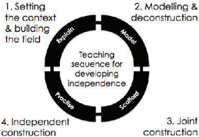

> **Deskripsi Visual:** Gambar ini adalah diagram yang menunjukkan proses pembelajaran berbasis teori. Diagram ini terdiri dari empat langkah yang disusun dalam bentuk lingkaran:

1. **Setting the context & building the field** - Langkah pertama yang menunjukkan proses memahami situasi dan membangun fondasi pemahaman awal.

2. **Modelling & deconstruction** - Langkah kedua yang melibatkan penggambaran konsep dan pemecahan komponen-komponennya untuk memahami struktur dan fungsi.

3. **Independent construction** - Langkah ketiga yang menunjukkan proses pembuatan konstruksi sendiri tanpa bantuan luar.

4. **Joint construction** - Langkah keempat yang menunjukkan proses kerja sama dengan orang lain untuk memperluas pemahaman dan menciptakan solusi bersama.

Elemen-elemen utama dalam diagram ini adalah empat langkah yang disusun dalam lingkaran, masing-masing dengan deskripsi singkat tentang proses pembelajaran yang dilakukan. Teks, angka, atau label penting yang terlihat adalah "Setting the context & building the field", "Modelling & deconstruction", "Independent construction", dan "Joint construction".

Informasi kunci yang dapat diambil pembaca adalah bahwa proses pembelajaran berbasis teori melibatkan empat langkah yang saling terkait, mulai dari memahami situasi dan membangun fondasi, melalui penggambaran konsep dan pemecahan komponennya, hingga mencapai pemahaman independen dan kerja sama bersama.

 

---
## 📄 Halaman 14

---
**🖼️ Gambar/Diagram**

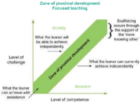

> **Deskripsi Visual:** Gambar ini adalah diagram yang menunjukkan proses perkembangan dan peningkatan keterampilan. Diagram ini terdiri dari empat bagian utama:

1. Zona Progresif Pembelajaran: Ini menunjukkan tahap awal di mana individu belajar dan mengembangkan keterampilan mereka secara bertahap.

2. Zona Fokus Pendidikan: Di sini, fokus pada pendidikan intensif untuk membantu individu memperbaiki kelemahan mereka.

3. Zona Keterampilan: Ini menunjukkan tahap di mana individu telah membangun keterampilan mereka secara mandiri dan dapat beroperasi dengan efisiensi.

4. Zona Keterampilan Independen: Ini menunjukkan tahap di mana individu dapat beroperasi dengan keterampilan mereka secara mandiri dan efektif.

Elemen-elemen utama dalam diagram ini adalah zon-progresif pembelajaran, zona fokus pendidikan, zona keterampilan, dan zona keterampilan independen. Relasi antara elemen-elemen ini adalah bahwa setiap zon memiliki tingkat keterampilan yang berbeda dan tujuan pembelajaran yang berbeda.

Teks, angka, atau label penting yang terlihat dalam diagram ini meliputi "Zona Progresif Pembelajaran", "Zona Fokus Pendidikan", "Zona Keterampilan", dan "Zona Keterampilan Independen". Informasi kunci yang dapat diambil pembaca adalah bahwa ada empat tahap dalam proses perkembangan keterampilan, dari pembelajaran bertahap hingga operasi mandiri dan efektif.

 

---
## 📄 Halaman 16

---
**📊 Tabel**

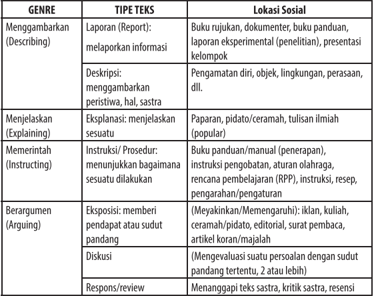

Tabel ini membahas berbagai jenis teks dan lokasi sosialnya dalam konteks penulisan akademik. Topik utamanya adalah pengembangan metode penulisan dan penyebaran informasi melalui berbagai jenis teks. Kolom-kolom utamanya meliputi genre (genre), tipe teks (type of text), dan lokasi sosial (social location). Data penting yang terlihat adalah bahwa setiap genre memiliki tipe teks spesifik dan biasanya berkaitan dengan lokasi sosial tertentu. Misalnya, laporan (report) dan deskripsi (describing) umumnya diterima di lingkungan akademik formal, sementara menjelaskan (explaining) dan memerintah (instructing) lebih sesuai untuk situasi profesional. Ini menunjukkan bagaimana teks dapat digunakan untuk tujuan yang berbeda dalam konteks sosial dan profesional.

 

---
## 📄 Halaman 17

---
**📊 Tabel**

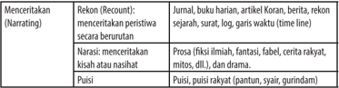

Tabel ini membahas berbagai jenis menceritakan dalam konteks literatur, termasuk rekomen, narasi, dan puisi. Topik utamanya adalah metode-metode penulisan kreatif yang digunakan dalam berbagai jenis karya sastra. Kolom pertama menunjukkan jenis menceritakan tersebut, sedangkan kolom kedua menjelaskan definisi dan cara kerjanya. Misalnya, rekomen adalah proses membagi informasi menjadi bagian-bagian yang lebih kecil untuk diceritakan secara berturut-turut. Narasi melibatkan penggambaran kisah atau nasihat dalam bentuk fiksi ilmiah, fantasi, fabel, cerita rakyat, mitos, dll. Sementara itu, puisi adalah genre karya sastra yang menggunakan lirik, puisi, puisi rakyat, pantun, syair, dan gurindam. Pola penting yang terlihat adalah bahwa setiap jenis menceritakan memiliki cara dan tujuan yang berbeda dalam penulisan kreatif.

 

---
## 📄 Halaman 18

---
**📊 Tabel**

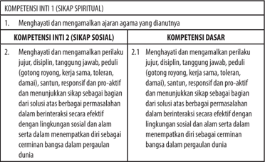

Tabel ini berisi informasi tentang kompetensi inti dan dasar dalam kurikulum SIKAP Spiritual. Topik utamanya adalah menghormati dan mengamalkan sikap spiritual, termasuk menghargai dan mengamalkan perilaku jujur, disiplin, tanggung jawab, peduli, santun, responsif, pro-aktif, dan menunjukkan sikap sebagai bagian dari solusi atas berbagai masalah dengan berinteraksi secara efektif dengan lingkungan sosial dan alam serta dalam mempertahankan diri secara cerminan bangsa dalam perpajakan dunia. Kolom-kolomnya meliputi Kompetensi Inti 1 (SIKAP SPIRITUAL) dan Kompetensi Dasar. Data penting yang terlihat adalah bahwa semua kompetensi inti dan dasar memiliki sub-kompetensi yang mencakup berbagai aspek seperti jujur, disiplin, tanggung jawab, peduli, dan lain-lain.

 

---
## 📄 Halaman 19

---
**📊 Tabel**

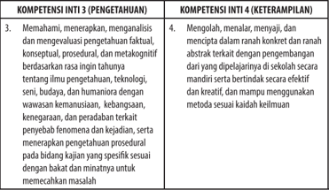

Tabel ini berisi dua kompetensi inti: Kompetensi Inti 3 (Pengetahuan) dan Kompetensi Inti 4 (Keterampilan). Topik utama tabel adalah tentang pengetahuan dan keterampilan yang diperlukan untuk memahami dan mengevaluasi pengetahuan faktil, konseptual, prosedural, dan metakognitif. Kolom pertama, "Kompetensi Inti 3 (Pengetahuan)," mencakup empat poin yang membahas pengetahuan tentang pengetahuan, teknologi, budaya, dan humaniora dengan wawasan keamanan, kehakiman, dan peradaban. Poin-poin ini mencakup pemahaman tentang pengetahuan, teknologi, budaya, dan humaniora, serta mampu menggunakan metode sesuai kaidah keilmuan. Kolom kedua, "Kompetensi Inti 4 (Keterampilan)," mencakup empat poin yang membahas keterampilan dalam menangani situasi, menyelesaikan masalah, dan mampu menggunakan metode sesuai kaidah keilmuan. Pola penting yang terlihat adalah bahwa tabel ini mencakup pengetahuan dan keterampilan yang diperlukan untuk memahami dan mengevaluasi pengetahuan faktil, konseptual, prosedural, dan metakognitif.

---
**📊 Tabel**

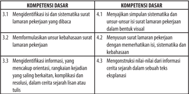

Tabel ini berisi informasi tentang kompetensi dasar yang harus dipelajari oleh siswa dalam menulis surat lamaran pekerjaan. Topik utamanya adalah proses penulisan surat lamaran yang efektif dan menarik perhatian pihak HRD. Kolom pertama menyebutkan nomor urutan kompetensi dasar, sedangkan kolom kedua menjelaskan deskripsi kompetensi tersebut. Data penting yang terlihat adalah bahwa setiap kompetensi dasar dibagi menjadi dua subkompetensi, yang mencakup identifikasi isi dan sistematisasi surat lamaran, serta memformulasikan unsur kebahasaan dan menentukan nilai-nilai dalam teks eksplanasi. Ini menunjukkan bahwa proses penulisan surat lamaran melibatkan pemahaman dan penggunaan berbagai teknik penulisan yang efektif untuk menarik perhatian pihak HRD.

 

---
## 📄 Halaman 20

---
**📊 Tabel**

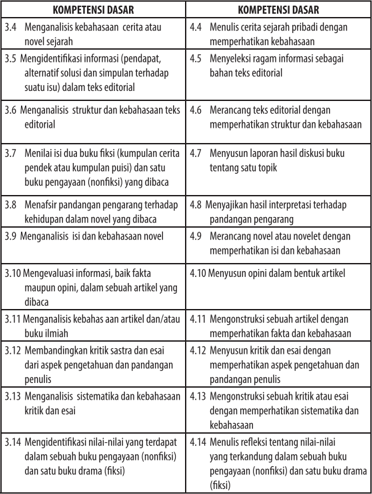

Tabel ini berisi informasi tentang kompetensi dasar yang harus dipenuhi oleh siswa dalam menulis artikel dan buku ilmiah. Topik utamanya adalah penulisan kreatif dan analisis teks. Kolom-kolomnya meliputi: 1) Menganalisis kebahasaan cerita atau novel sejarah; 2) Mengidentifikasi informasi (pendapat, alternatif solusi dan simpulan); 3) Menganalisis struktur dan kebahasaan teks editorial; 4) Menilai isi dua buku fiksi; 5) Metafisik pandangan pengarang terhadap kehidupan dalam novel yang dibaca; 6) Menganalisis isi dan kebahasaan novel; 7) Mengevaluasi informasi, baik fakta maupun opini, dalam sebuah artikel yang dibaca; 8) Menganalisis kebahasaan artikel dan/atau buku ilmiah; 9) Membandingkan kritik sastra dan esai dari aspek pengetahuan dan pandangan penulis; 10) Menganalisis sitematika dan kebahasaan kritik dan esai; dan 11) Menyimpulkan nilai-nilai yang terdapat dalam sebuah buku pengayaan (nonfiksi) dan satu buku drama (fiksi). Data penting yang terlihat adalah bahwa setiap kompetensi dasar memiliki poin yang berbeda-beda, menunjukkan bahwa setiap kompetensi memerlukan pengetahuan dan kemampuan yang berbeda.

 

---
## 📄 Halaman 21

---
**📊 Tabel**

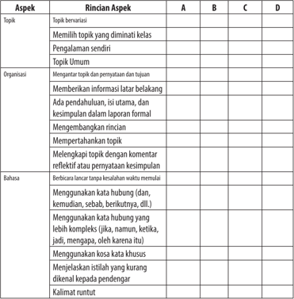

Tabel ini berisi informasi tentang aspek-aspek yang harus diperhatikan dalam menulis topik作文. Topik utama adalah "Topik作文", yang meliputi memilih topik yang diminati kelas, pengalaman sendiri, dan topik umum. Organisasi topik mencakup mengantar topik dan penyataan tujuan, memberikan informasi latar belakang, ada pendahuluan, isi utama, dan kesimpulan dalam jargon formal, mengentapkan rincian, mempertahankan topik, melelangkapi topik dengan komentar reflektif, dan menyatakan kesimpulan. Bahasa yang digunakan dalam topik作文 termasuk menggunakan kata hubung, kata khusus, istilah yang kurang dikenali kepada pendengar, kalimat runtut, dan menggunakan bahasa yang lebih kompleks.

 

---
## 📄 Halaman 22

---
**📊 Tabel**

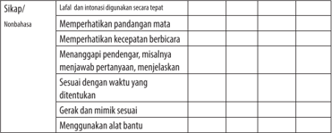

Tabel ini berisi informasi tentang sikap dan interaksi yang dianggap sebagai terbatas oleh siswa nonbahasa. Topik utamanya adalah sikap dan perilaku yang dianggap tidak sesuai dengan standar bahasa Indonesia. Kolom-kolomnya mencakup berbagai aspek seperti memperhatikan pandangan mata, kecepatan berbicara, menanggapi pendengar, sesuaian waktu, gerakan dan mimik, serta penggunaan alat bantu. Data penting yang terlihat adalah bahwa semua aspek tersebut dianggap tidak sesuai dengan standar bahasa Indonesia, menunjukkan bahwa siswa nonbahasa memiliki kesulitan dalam menguasai sikap dan interaksi yang sesuai dengan bahasa Indonesia.

---
**📊 Tabel**

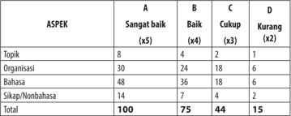

Tabel ini menunjukkan data tentang penilaian kualitas tugas belajar (ASPEK) dalam berbagai aspek: Sangat Baik, Baik, Cukup, dan Kurang. Topik utama yang dianalisis adalah Organisasi, Bahasa, dan Sikap/Nombahasa. Dari data yang disajikan, kita dapat melihat bahwa topik Organisasi memiliki poin tertinggi dengan 30 poin, sedangkan topik Bahasa mendapatkan poin terendah dengan 14 poin. Pola penting lainnya adalah bahwa ASPEK Sangat Baik memiliki poin tertinggi di setiap aspek, sementara ASPEK Kurang memiliki poin terendah. Ini menunjukkan bahwa kesulitan dalam organisasi dan bahasa menjadi tantangan utama dalam penilaian kualitas tugas belajar.

 

---
## 📄 Halaman 23

---
**📊 Tabel**

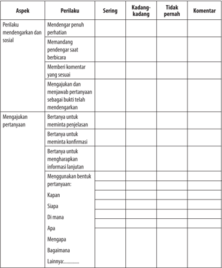

Tabel ini berisi informasi tentang perilaku mendengarkan dan sosial yang sering dilakukan oleh individu. Topik utamanya adalah tentang bagaimana seseorang menunjukkan kepedulian dan komunikasi efektif dalam berkomunikasi dengan orang lain. Tabel ini terdiri dari dua kolom utama: "Sering" dan "Tidak pernah", yang menunjukkan frekuensi perilaku tersebut. Selain itu, ada kolom "Kadang-kadang" untuk perilaku yang tidak selalu terjadi. Kolom "Komentar" menyediakan ruang untuk penjelasan lebih lanjut tentang perilaku tersebut. Data penting yang terlihat adalah bahwa perilaku mendengarkan penuh perhatian dan membangun komunikasi yang efektif sangat sering dilakukan, sementara perilaku yang kurang efektif seperti tidak memberikan komentar atau menjawab pertanyaan secara tepat hanya terjadi kadang-kadang.

 

---
## 📄 Halaman 24

---
**📊 Tabel**

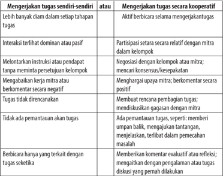

Tabel ini membahas tentang perbedaan antara mengerjakan tugas sendiri-sendiri dan mengerjakan tugas secara kooperatif. Topik utamanya adalah bagaimana perilaku individu dalam mengerjakan tugas berbeda-beda tergantung pada cara kerja mereka. Dalam kolom "Mengerjakan tugas sendiri-sendiri", terdapat beberapa perilaku seperti lebih banyak diam dalam setiap tahapan, interaksi terlilit dominan atau pasif, melontarkan instruksi atau pendapat, dan tidak ada pemantauan akan tugas. Sementara itu, dalam kolom "Mengerjakan tugas secara kooperatif", terdapat perilaku seperti aktif berbicara selama mengerjakan tugas, partisipasi setara dengan mitra, negosiasi dengan kelompok atau mitra, mencari konsensus/Resepakatkan, menghargai upaya mitra, membuat rencana pembagian tugas, memberikan umpan balik, menjelaskan, terlibat dalam pemeriksaan masalah, dan memberikan komentar evaluatif atau refleksi. Pola penting yang terlihat adalah bahwa mengerjakan tugas secara kooperatif memerlukan interaksi dan komunikasi yang lebih baik, sementara mengerjakan tugas sendiri-sendiri membutuhkan lebih banyak ketenangan dan kemampuan untuk bekerja secara mandiri.

 

---
## 📄 Halaman 25

---
**📊 Tabel**

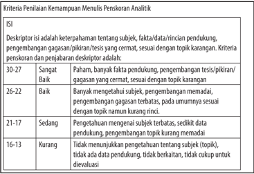

Tabel ini menunjukkan kriteria penilaian kemampuan menulis penskoran analitik dalam sebuah proyek atau tesis. Topik utamanya adalah deskripsi pengetahuan tentang subjek, fakta, data, dan pencatatan pendukung pengembangan gagasan/pikiran/tesis yang cermat sesuai dengan topik karangan. Tabel dibagi menjadi 5 baris dan 6 kolom, masing-masing baris menunjukkan tingkat penilaian mulai dari sangat baik hingga kurang. Kolom pertama berisi deskripsi tingkat penilaian, sedangkan kolom kedua sampai kelima berisi skor yang diberikan untuk setiap tingkat penilaian. Pola penting yang terlihat adalah bahwa skor penilaian meningkat dari sangat baik ke kurang, dan skor tertinggi (30-27) diberikan pada tingkat sangat baik, sementara skor terendah (16-13) diberikan pada tingkat kurang.

 

---
## 📄 Halaman 26

---
**📊 Tabel**

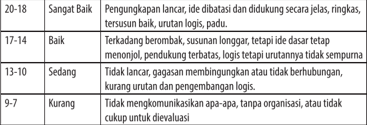

Tabel ini menunjukkan kinerja atau kemampuan seseorang dalam berkomunikasi, terutama dalam hal penerjemahan dan penulisan. Topik utama tabel adalah kualitas komunikasi, yang diukur melalui tingkat kejelasan, rinciannya, dan logisnya. Kolom-kolom yang ada mencakup 18-20, 17-14, 13-10, 9-7, dan 7-9, masing-masing menunjukkan tingkat kualitas komunikasi yang berbeda. Data atau pola penting yang terlihat adalah bahwa semakin tinggi angka, semakin baik kualitas komunikasi, sedangkan semakin rendah angka, semakin buruk kualitas komunikasi. Ini menunjukkan bahwa kualitas komunikasi sangat penting dalam berbagai situasi, baik itu dalam pekerjaan, pendidikan, atau bahkan dalam interaksi sosial sehari-hari.

---
**📊 Tabel**

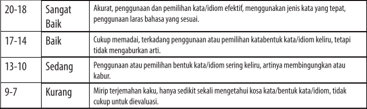

Tabel ini menunjukkan tingkat keterampilan penulisan kata dalam bahasa Indonesia berdasarkan skor yang diberikan. Topik utama tabel adalah kualitas penulisan kata dalam konteks yang relevan dengan kehidupan sehari-hari. Kolom-kolomnya meliputi: 20-18 (Sangat Baik), 17-14 (Baik), 13-10 (Sedang), dan 9-7 (Kurang). Data atau pola penting yang terlihat adalah bahwa skor 20-18 menunjukkan penulisan kata yang sangat baik, sedangkan skor 9-7 menunjukkan penulisan kata yang kurang baik. Skor 17-14 dan 13-10 menunjukkan penulisan kata yang baik dan sedang, masing-masing dengan tingkat kesulitan yang berbeda.

---
**📊 Tabel**

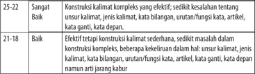

Tabel ini membandingkan dua kondisi dalam penggunaan kalimat kompleks: "Sangat Baik" dan "Baik". Topik utama tabel adalah kualitas konstruksi kalimat kompleks. Kolom pertama menunjukkan tingkat kualitas, sementara kolom kedua berisi deskripsi tentang kualitas tersebut. Data penting yang terlihat adalah bahwa "Sangat Baik" mencakup semua aspek konstruksi kalimat kompleks, termasuk unsur kalimat, jenis kalimat, kata bilangan, urutan fungsi kata, artikel, kata ganti, dan kata dasar. Sementara itu, "Baik" hanya mencakup beberapa aspek, seperti efektifitas tetapi sedikit kesulitan dalam konstruksi kalimat. Ini menunjukkan bahwa "Sangat Baik" merupakan standar yang lebih tinggi dalam penggunaan kalimat kompleks.

 

---
## 📄 Halaman 27

 

---
## 📄 Halaman 28

---
**📊 Tabel**

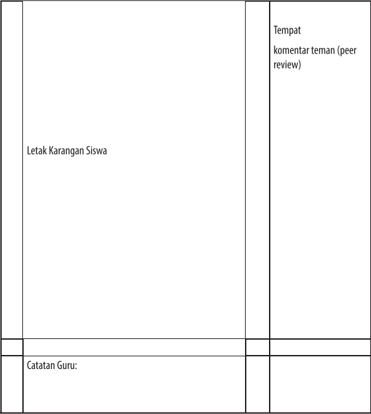

Tabel ini berisi informasi tentang proses revisi karya siswa. Topik utamanya adalah "Letak Karangan Siswa" dan "Tempat komentar teman (peer review)". Kolom pertama menunjukkan letak karangan siswa di mana mereka dapat menulis atau menempatkan karyanya untuk diperiksa oleh teman-temannya. Kolom kedua menyediakan ruang untuk teman-teman siswa untuk memberikan komentar dan saran. Data penting yang terlihat adalah bahwa siswa harus menempatkan karangan mereka di tempat yang jelas agar bisa diperiksa dengan mudah oleh teman-teman mereka. Ini menunjukkan bahwa proses revisi karya siswa melibatkan kerjasama antara siswa dan teman-teman mereka dalam memberikan umpan balik dan membantu satu sama lain meningkatkan kualitas karya.

---
**📊 Tabel**

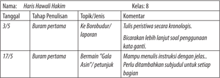

Tabel ini menunjukkan perkembangan penulisan kelas 8 dalam dua tahap penulisan: buram pertama dan bermain "Gala Asin". Topik utama adalah proses penulisan kronologis dengan penggunaan kata ganti, serta peningkatan kemampuan menulis instruksi dengan detil dan subjudul untuk setiap bagian. Data penting menunjukkan bahwa pada tahap buram pertama, siswa harus menulis peristiwa secara kronologis dan berbicara tentang soal-soal yang diberikan, sementara pada tahap bermain "Gala Asin", mereka harus mampu menulis instruksi dengan detail dan ditambahkan subjudul untuk setiap bagian. Ini menunjukkan kemajuan signifikan dalam kemampuan penulisan kelas 8 selama periode tersebut.

 

---
## 📄 Halaman 29

---
**📊 Tabel**

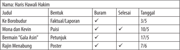

Tabel ini menunjukkan berbagai tugas yang harus diselesaikan oleh seorang mahasiswa bernama Haris Wahyudi Hakim. Topik utama tabel adalah tugas-tugas yang harus diselesaikan dalam waktu tertentu. Kolom-kolom yang ada meliputi judul tugas, bentuk tugas (faktual/laporan, puisi, petunjuk, poster), status (belum/buram/selesai), dan tanggal selesai. Data penting yang terlihat adalah bahwa tugas "Ke Borobudur" harus diselesaikan dalam 3 hari, "Mona dan Kevin" dalam 10 hari, "Bermain 'Gala Asin'" dalam 17 hari, dan "Rajin Menabung" dalam 7 hari. Ini menunjukkan bahwa mahasiswa Haris Wahyudi Hakim memiliki beberapa tugas yang harus diselesaikan dalam jangka waktu yang berbeda-beda.

 

---
## 📄 Halaman 30

---
**🖼️ Gambar/Diagram**

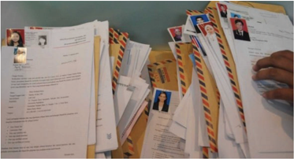

> **Deskripsi Visual:** Gambar ini menunjukkan sebuah lembar kerja belajar yang terdiri dari berbagai dokumen dan surat. Dokumen tersebut terdiri dari berbagai jenis seperti surat, surat kabar, dan surat resmi. Ada juga beberapa lembaran kertas dengan teks yang ditulis, mungkin merupakan tugas atau materi pembelajaran. Di samping itu, ada beberapa foto yang tampaknya menunjukkan wajah orang-orang, mungkin sebagai identitas atau gambar untuk identifikasi. Teks pada dokumen-dokumen tersebut tampaknya berisi informasi atau perintah, namun tidak dapat dibaca secara jelas. Label atau elemen-elemen lainnya tampaknya tidak ada, sehingga informasi yang dapat diambil dari gambar ini sangat terbatas.

 

---
## 📄 Halaman 31

---
**🖼️ Gambar/Diagram**

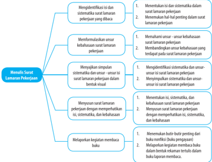

> **Deskripsi Visual:** Gambar ini adalah diagram yang menunjukkan proses menulis surat Lamaran Pekerjaan (SLP). Diagram ini terdiri dari empat bagian utama yang masing-masing menjelaskan langkah-langkah yang harus dilakukan dalam menulis SLP. 

1. **Menentukan Tujuan**: Langkah pertama yang ditunjukkan adalah menentukan tujuan dari surat lamaran pekerjaan. Ini melibatkan identifikasi sistematis dan un-sur-unsur yang relevan dengan pekerjaan yang dibutuhkan.

2. **Menyusun Surat Lamaran**: Setelah tujuan ditentukan, langkah selanjutnya adalah menyusun surat lamaran. Ini melibatkan memahami isi dan struktur dari surat lamaran pekerjaan, termasuk isi yang sesuai dengan kebutuhan pekerjaan.

3. **Menyusun Surat Lamaran**: Langkah berikutnya adalah menyusun surat lamaran secara sistematis dan un-sur-unsur yang relevan. Ini melibatkan penggunaan bahasa yang tepat dan struktural yang benar untuk menunjukkan minat dan kesiapan seseorang untuk bekerja di perusahaan tersebut.

4. **Melaporkan Kejadian Menyerta Bukti**: Langkah terakhir adalah melaporkan kejadian dan menyertakan bukti. Ini melibatkan menunjukkan bahwa seseorang telah melakukan upaya yang signifikan untuk mencari pekerjaan dan telah mengirim surat lamaran yang tepat.

Elemen-elemen utama dalam diagram ini adalah langkah-langkah yang harus dilakukan dalam menulis SLP, yaitu menentukan tujuan, menyusun surat lamaran, menyusun surat lamaran secara sistematis, dan melaporkan kejadian menyesuaikan dengan bukti. Relasi antara elemen-elemen ini adalah bahwa setiap langkah harus dilakukan secara teratur dan sistematis untuk menciptakan surat lamaran yang efektif dan menarik bagi pihak HRD.

 

---
## 📄 Halaman 34

 

---
## 📄 Halaman 37

---
**📊 Tabel**

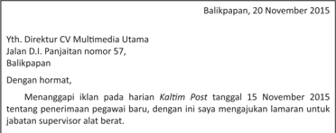

Tabel ini menunjukkan informasi tentang penerimaan pegawai baru di CV Multimedia Utama, Balikpapan. Topik utama tabel adalah proses pendaftaran dan seleksi untuk posisi supervisor. Kolom-kolom yang ada meliputi nama, alamat, tanggal pendaftaran, dan status pendaftaran (diterima atau ditolak). Data penting yang terlihat adalah bahwa seorang pendaftar dengan nama Yth. Direktur CV Multimedia Utama telah mendaftar pada 15 November 2015, namun status pendaftaran belum diketahui karena kolom "status" masih kosong. Ini menunjukkan bahwa proses pendaftaran masih dalam tahap awal dan belum ada keputusan resmi.

 

---
## 📄 Halaman 38

 

---
## 📄 Halaman 39

---
**📊 Tabel**

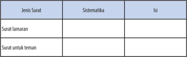

Tabel ini membandingkan dua jenis surat: Surat Lamaran dan Surat untuk Teman. Topik utama tabel adalah perbandingan antara sistematisasi dan isi dari kedua jenis surat tersebut. Dalam kolom Sistematika, tidak ada informasi spesifik yang diberikan untuk kedua jenis surat. Namun, dalam kolom Isi, kita dapat melihat bahwa Surat Lamaran biasanya memiliki sistematisasi yang lebih formal dan struktural, sementara Surat untuk Teman mungkin lebih informal dan berfokus pada konteks sosial. Ini menunjukkan bahwa sistematisasi dan isi dari surat dapat sangat bervariasi tergantung pada tujuan dan konteksnya.

 

---
## 📄 Halaman 41

---
**📊 Tabel**

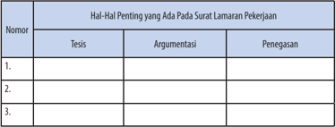

Tabel ini berisi informasi tentang hal-hal penting yang harus ada pada surat lamaran pekerjaan. Topik utamanya adalah tentang tesis, argumentasi, dan penegasan dalam surat lamaran. Kolom-kolomnya mencakup nomor urutan, tesis, argumentasi, dan penegasan. Data penting yang terlihat adalah bahwa setiap baris memiliki satu nomor urutan, satu tesis, satu argumentasi, dan satu penegasan. Ini menunjukkan bahwa tabel ini dirancang untuk membantu pembaca memahami struktur dan isi yang harus ada dalam surat lamaran pekerjaan.

 

---
## 📄 Halaman 44

---
**📊 Tabel**

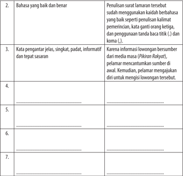

Tabel ini berisi informasi tentang kualifikasi dan persyaratan yang diperlukan untuk melamar suatu posisi. Topik utamanya adalah tentang penulisan surat lamaran yang baik dan benar, termasuk penggunaan bahasa yang baik, kata ganti orang ketiga, dan penggunaan tanda baca yang tepat. Kolom-kolomnya mencakup beberapa aspek penting seperti:

1. Bahasa yang baik dan benar: Ini mencakup penulisan surat lamaran yang menggunakan bahasa yang baik, kata ganti orang ketiga yang tepat, dan penggunaan tanda baca yang sesuai.

2. Kata pengantar jelas, singkat, padat, informatif dan tepat sasaran: Ini mencakup penggunaan kata pengantar yang efektif, singkat, dan informatif, serta penggunaan yang tepat untuk menunjukkan tujuan dan sasaran lamaran.

3. Informasi lowongan bersumber dari media massa: Ini mencakup penggunaan informasi lowongan yang diambil dari sumber yang dapat dipercaya, seperti media massa.

4. Pelamar mencantumkan sumber di awal: Ini mencakup penggunaan informasi sumber yang disertakan di awal surat lamaran.

5. Mengajukan diri untuk mengisi lowongan: Ini mencakup proses yang dilakukan oleh pelamar untuk mengajukan diri untuk mengisi posisi yang tersedia.

6. Penggunaan tanda baca yang tepat: Ini mencakup penggunaan tanda baca yang sesuai dalam surat lamaran, seperti titik dan koma.

7. Penggunaan kata ganti orang ketiga: Ini mencakup penggunaan kata ganti orang ketiga yang tepat dalam surat lamaran.

Tabel ini membantu pelamar memahami persyaratan yang diperlukan untuk membuat surat lamaran yang baik dan benar, serta memberikan panduan tentang bagaimana mengisi informasi yang diperlukan dalam surat lamaran.

 

---
## 📄 Halaman 46

---
**📊 Tabel**

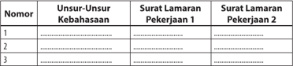

Tabel ini berisi informasi tentang unsur-unsur kebahasaan dalam dua surat lamaran pekerjaan. Topik utamanya adalah analisis dan perbandingan antara unsur-unsur kebahasaan dalam surat lamaran pekerjaan 1 dan surat lamaran pekerjaan 2. Kolom-kolomnya meliputi nomor, unsur-unsur kebahasaan, dan data dari surat lamaran pekerjaan 1 dan surat lamaran pekerjaan 2. Data penting yang terlihat adalah bahwa unsur-unsur kebahasaan dalam kedua surat lamaran tersebut memiliki variasi, seperti penggunaan kata kerja, penggunaan simbol, dan struktur kalimat. Ini menunjukkan bahwa penulis mampu menggunakan berbagai teknik kebahasaan untuk mempresentasikan diri mereka dengan baik.

 

---
## 📄 Halaman 47

---
**📊 Tabel**

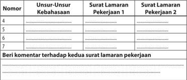

Tabel ini berisi informasi tentang dua surat lamaran pekerjaan yang disajikan dalam format tabel. Topik utama tabel adalah penilaian unsur-unsur kebahasaan dalam kedua surat tersebut. Tabel memiliki tiga kolom: Nomor, Unsur-Unsur Kebahasaan, dan Surat Lamaran Pekerjaan 1 dan Surat Lamaran Pekerjaan 2. Data penting yang terlihat meliputi nomor urut, deskripsi unsur-unsur kebahasaan yang dianalisis, dan perbandingan antara kedua surat lamaran. Tabel ini membantu dalam membandingkan kualitas dan efektivitas unsur-unsur kebahasaan dalam kedua surat lamaran pekerjaan.

 

---
## 📄 Halaman 49

---
**📊 Tabel**

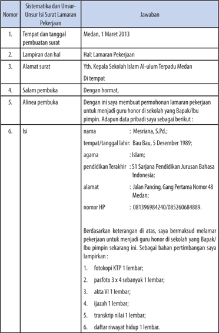

Tabel ini berisi informasi tentang prosedur dan konten umum dalam surat lamaran pekerjaan. Topik utamanya adalah proses dan struktur umum surat lamaran pekerjaan. Kolom-kolomnya meliputi nomor, sistematisasi dan unsur-unsur, dan jawaban. Data penting yang terlihat antara lain tempat dan tanggal pembuatan surat, lampiran dan hal, alamat surat, salam pembuka, alinea pembuka, isi surat, dan daftar bahan pertimbangan. Tabel ini membantu pengguna memahami struktur umum surat lamaran pekerjaan dan memberikan panduan tentang bagaimana menyusun dan mengisi surat tersebut dengan tepat.

 

---
## 📄 Halaman 50

---
**📊 Tabel**

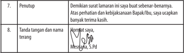

Tabel ini berisi dua baris yang masing-masing menunjukkan instruksi untuk penutupan lamaran. Pertama, instruksi untuk menandatangani dan menulis nama dengan tanda tangan di bawahnya. Kedua, instruksi untuk menandatangani dan menulis nama dengan tanda tangan di bawahnya. Data penting yang terlihat adalah bahwa kedua instruksi tersebut harus dilakukan oleh penerima lamaran, yaitu Bapak/Ibu.

---
**📊 Tabel**

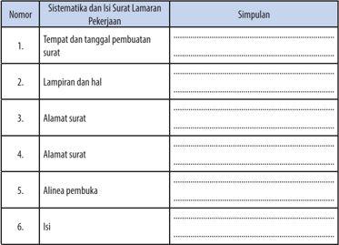

Tabel ini berisi informasi tentang sistematisasi dan isi surat lamaran pekerjaan. Topik utamanya adalah proses penulisan surat lamaran yang harus dilakukan dengan tepat dan rapi. Kolom pertama menunjukkan nomor urut dari setiap bagian yang harus dimasukkan ke dalam surat lamaran. Kolom kedua berisi deskripsi singkat dari setiap bagian tersebut. Data penting yang terlihat adalah bahwa setiap bagian harus disusun secara teratur dan jelas untuk memudahkan penerima surat dalam memahami isi dan tujuan lamaran.

 

---
## 📄 Halaman 51

---
**📊 Tabel**

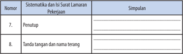

Tabel ini berisi informasi tentang sistematisasi dan isi surat lamaran pekerjaan, dengan dua kolom utama: "Nomor" dan "Sistematisasi dan Isi Surat Lamaran Pekerjaan". Kolom pertama menunjukkan nomor urut dari setiap sistematisasi, sementara kolom kedua menyajikan detail tentang sistematisasi dan isi surat lamaran pekerjaan tersebut. Topik utama tabel ini adalah proses penulisan dan penyusunan surat lamaran pekerjaan, termasuk bagian penutup dan tanda tangan yang harus disertakan. Data penting yang terlihat meliputi bahwa nomor 7 adalah penutup, dan nomor 8 adalah tanda tangan dan nama yang harus jelas.

 

---
## 📄 Halaman 52

---
**🖼️ Gambar/Diagram**

> **Deskripsi Visual:** Gambar ini adalah diagram yang menunjukkan struktur dan sistematisasi sebuah surat lamaran pekerjaan. Diagram ini terdiri dari dua kolom utama: kolom pertama berisi informasi tentang surat lamaran pekerjaan, sementara kolom kedua menjelaskan bagaimana informasi tersebut harus disusun secara sistematis.

Kolom pertama mengandung informasi berupa nomor surat, tanggal, alamat, dan isi surat lamaran pekerjaan. Misalnya, nomor surat adalah "Semarang, 12 November 2008", tanggal adalah "Yth. Kepala Bagian Perusahaan PT Pura Banjarsari Jend. Ahmad/Iani nomor 122, Ku'dus", dan isi surat lamaran pekerjaan mencakup alasan mengapa seseorang ingin bekerja di perusahaan tersebut.

Kolom kedua menjelaskan bagaimana informasi tersebut harus disusun secara sistematis. Misalnya, alamat surat dibuka dengan "Alamat surat: Semarang, 12 November 2008", tempat dan tanggal pembuatan surat ditulis di bawahnya, dan lampiran dan perihal ditulis di bawah itu. Informasi lain seperti nama, tempat, tanggal lahir, alamat, pendidikan terakhir, SKCK, fotokopi ijazah, foto ukuran 4x6, daftar riwayat hidup, fotokopi SCKTP, fotokopi sertifikat bahasa Inggris, dan fotokopi sertifikat pelatihan komputer juga disusun secara sistematis.

Informasi kunci yang dapat diambil pembaca meliputi struktur dan sistematisasi surat lamaran pekerjaan, serta bagaimana informasi harus disusun secara sistematis untuk membuat surat lamaran pekerjaan yang baik.

---
**📊 Tabel**

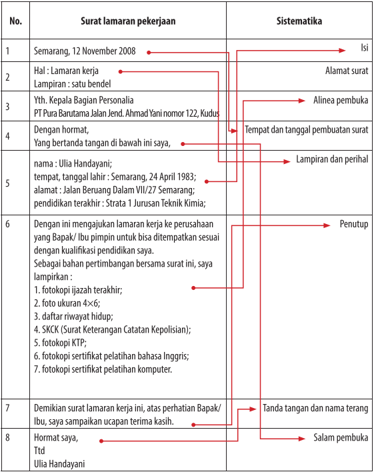

Tabel ini menunjukkan struktur umum surat lamaran pekerjaan, dengan kolom "No." untuk nomor urutan, "Surat lamaran pekerjaan" untuk deskripsi konten surat, dan "Sistematisika" untuk penjelasan tentang bagian-bagian surat tersebut. Topik utama tabel ini adalah cara menyusun dan memformat surat lamaran pekerjaan secara sistematis. Kolom "Surat lamaran pekerjaan" mencakup berbagai bagian seperti alamat, nama penerima, dan lampiran. Sementara kolom "Sistematisika" menjelaskan bagaimana setiap bagian harus disusun dan ditulis, seperti alinea pembuka, tempat dan tanggal pembuatan surat, dan tanda tangan. Data penting yang terlihat meliputi format dan struktur umum surat lamaran pekerjaan, serta langkah-langkah yang perlu diikuti untuk membuat surat yang sistematis dan profesional.

 

---
## 📄 Halaman 55

---
**📊 Tabel**

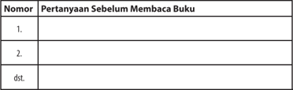

Tabel ini berisi pertanyaan sebelum membaca buku yang ditampilkan dalam kolom pertama, dengan nomor urut di kolom kedua. Topik utama tabel ini adalah proses pembelajaran yang melibatkan pemahaman sebelum membaca. Kolom pertama berisi pertanyaan-pertanyaan yang harus dijawab sebelum memulai membaca buku, sementara kolom kedua menunjukkan nomor urut dari pertanyaan tersebut. Data atau pola penting yang terlihat adalah bahwa tabel ini mencakup banyak pertanyaan (dalam contoh ini, 3 pertanyaan), yang menunjukkan bahwa pembelajaran ini mungkin melibatkan penelitian atau pengumpulan informasi sebelum membaca buku.

---
**📊 Tabel**

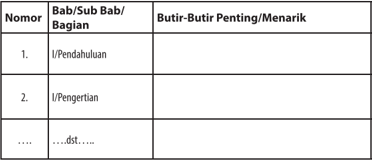

Tabel ini merupakan bagian dari sebuah buku pelajaran yang berfokus pada pembelajaran tentang bab atau subbab tertentu. Tabel ini terdiri dari kolom "Nomor", "Bab/Sub Bab/Bagian", dan "Butir-Butir Penting/Menarik". Kolom "Nomor" digunakan untuk memberikan nomor urut kepada setiap baris dalam tabel, sementara kolom "Bab/Sub Bab/Bagian" menyajikan informasi tentang bab atau subbab yang akan dijelaskan. Kolom "Butir-Butir Penting/Menarik" berisi informasi penting atau menarik yang berkaitan dengan bab atau subbab tersebut. Topik utama tabel ini adalah pembelajaran tentang bab atau subbab tertentu, dengan fokus pada butir-butir penting atau menarik yang perlu diperhatikan dalam pembelajaran tersebut.

 

---
## 📄 Halaman 57

 

---
## 📄 Halaman 58

---
**🖼️ Gambar/Diagram**

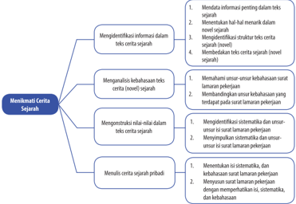

> **Deskripsi Visual:** Gambar ini adalah diagram yang menunjukkan proses menulis cerita sejarah. Diagram ini terdiri dari tiga bagian utama:

1. Bagian pertama menggambarkan langkah-langkah untuk menulis cerita sejarah, termasuk mendata informasi penting dalam teks sejarah, mengidentifikasi struktur teks sejarah, dan membedakan teks sejarah (novel sejarah).

2. Bagian kedua menjelaskan langkah-langkah untuk menulis cerita sejarah, termasuk menetapkan tema, menentukan karakter, dan menentukan alur cerita.

3. Bagian ketiga menunjukkan langkah-langkah untuk menulis cerita sejarah, termasuk menetapkan tema, menentukan karakter, dan menentukan alur cerita.

Elemen-elemen utama dalam diagram ini meliputi langkah-langkah menulis cerita sejarah, seperti mendata informasi, menentukan struktur teks, menentukan tema, menentukan karakter, dan menentukan alur cerita. Label penting dalam diagram ini mencakup "Menetapkan tema", "Menentukan karakter", dan "Menentukan alur cerita".

Informasi kunci yang dapat diambil pembaca meliputi langkah-langkah yang harus diikuti saat menulis cerita sejarah, seperti mendata informasi, menentukan struktur teks, menentukan tema, menentukan karakter, dan menentukan alur cerita.

 

---
## 📄 Halaman 70

---
**📊 Tabel**

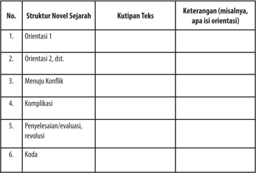

Tabel ini berisi struktur novel sejarah yang umumnya ditemukan dalam sebuah novel. Kolom pertama menunjukkan nomor urut dari struktur tersebut, sedangkan kolom kedua dan ketiga masing-masing berisi kutipan teks dan keterangan tentang struktur tersebut. Topik utama tabel ini adalah struktur novel sejarah, yang meliputi orientasi, menuju konflik, komplikasi, penyelesaian, evaluasi, revolusi, dan kode. Data penting yang terlihat adalah bahwa tabel ini mencakup semua aspek utama dari struktur novel sejarah, mulai dari orientasi hingga kode, dengan kutipan teks yang relevan untuk setiap struktur tersebut.

 

---
## 📄 Halaman 71

---
**📊 Tabel**

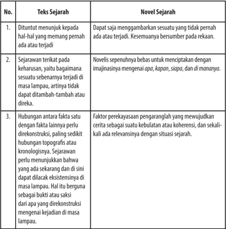

Tabel ini membahas perbedaan antara teks sejarah dan novel sejarah. Topik utamanya adalah keterampilan menulis sejarah yang berbeda. Kolom pertama berisi deskripsi tentang tugas-tugas yang harus dilakukan dalam menulis teks sejarah dan novel sejarah. Kolom kedua menyajikan contoh-contoh tugas tersebut. Misalnya, teks sejarah harus mencakup hal-hal yang memang pernah terjadi, sementara novel sejarah dapat merangkum cerita yang tidak pernah terjadi. Selain itu, novel sejarah juga bebas untuk mengembangkan cerita dengan imajinasi, sementara teks sejarah harus fokus pada fakta-fakta yang terkonstruksi. Tabel ini juga menjelaskan bahwa novel sejarah harus mampu menghubungkan fakta-fakta yang direkonstruksi dengan faktor-topografi atau kronologis, serta relevansinya dengan situasi sejarah. Ini menunjukkan bahwa novel sejarah harus memiliki kekuatan kohesi dan keberlanjutan dalam menggambarkan cerita sejarah.

 

---
## 📄 Halaman 72

---
**📊 Tabel**

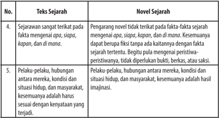

Tabel ini membahas dua aspek penting dalam novel sejarah: teks sejarah dan novel sejarah. Topik utama tabel ini adalah bagaimana novel sejarah berbeda dengan teks sejarah dalam hal penulisan dan konteksnya. Dalam kolom "Teks Sejarah", disebutkan bahwa teks sejarah sangat terikat pada fakta-fakta sejarah tertentu, seperti apa, siapa, kapan, dan di mana. Ini berarti bahwa teks sejarah harus berfokus pada fakta-fakta sejarah yang telah terbukti dan tidak boleh dibuat berfiksi tanpa kaitannya dengan fakta sejarah tersebut.

Sementara itu, dalam kolom "Novel Sejarah", disebutkan bahwa novel sejarah lebih fleksibel dan dapat memanfaatkan peristiwa-peristiwa yang tidak terjadi secara langsung. Novel sejarah dapat bebas untuk menerjemahkan peristiwa-peristiwa tersebut ke dalam bentuk yang lebih menarik dan menarik bagi pembaca. Hal ini mencakup pelaku-pelaku, hubungan antara mereka, kondisi dan situasi hidup, masyarakat, kesemuaannya, dan bahkan bisa melampaui batas-batas realitas fisik. Novel sejarah juga memungkinkan penggunaan imajinasi yang lebih luas untuk menggambarkan peristiwa-peristiwa yang belum terjadi secara langsung.

Dengan demikian, tabel ini menunjukkan bahwa novel sejarah memiliki fleksibilitas yang lebih besar dalam penulisan dan konteksnya, sementara teks sejarah harus lebih ketat dan fokus pada fakta-fakta sejarah yang sudah terbukti.

 

---
## 📄 Halaman 75

---
**🖼️ Gambar/Diagram**

> **Deskripsi Visual:** Gambar ini adalah foto yang menunjukkan candi Borobudur di Indonesia pada waktu senja hari. Candi ini terdiri dari banyak bangunan berbentuk piramida yang terbuat dari batu pasir, dengan arsitektur yang unik dan menarik. Candi ini merupakan salah satu situs warisan dunia UNESCO dan menjadi destinasi wisata populer di Asia Tenggara. Gambar ini menunjukkan keindahan alam sekitar candi, termasuk pemandangan matahari terbenam yang memberikan nuansa warna-warna indah. Ini menunjukkan bahwa candi Borobudur tidak hanya merupakan tempat ibadah, tetapi juga merupakan objek wisata yang menarik bagi pengunjung dari berbagai belahan dunia.

 

---
## 📄 Halaman 81

---
**📊 Tabel**

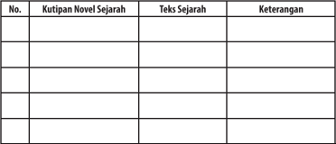

Tabel ini berisi informasi tentang kutipan novel sejarah dan teks sejarah yang relevan dengan topik utama sejarah. Kolom pertama menunjukkan nomor urutan, kolom kedua berisi kutipan dari novel sejarah, kolom ketiga berisi teks sejarah yang terkait, dan kolom keempat berisi keterangan atau penjelasan tentang konteks atau makna dari kutipan tersebut. Data penting yang terlihat adalah bahwa tabel ini mencakup beberapa konten sejarah yang berbeda, mulai dari kutipan dari novel hingga teks sejarah yang relevan, serta keterangan yang memberikan penjelasan tentang konteks atau makna dari kutipan tersebut.

 

---
## 📄 Halaman 83

---
**📊 Tabel**

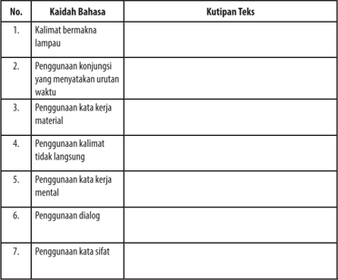

Tabel ini berisi kaidah bahasa yang sering digunakan dalam penulisan teks, dengan setiap kaidah diikuti oleh kutipan teks yang menunjukkan contoh penggunaannya. Topik utama tabel ini adalah "Kaidah Bahasa" dan "Kutipan Teks". Kolom pertama berisi nomor urutan kaidah bahasa, sedangkan kolom kedua berisi kutipan teks yang menjelaskan penggunaan masing-masing kaidah. Data penting yang terlihat dalam tabel ini adalah bahwa setiap kaidah bahasa memiliki contoh penggunaannya dalam teks, yang dapat membantu pembaca memahami dan menggunakan kaidah tersebut dengan benar dalam penulisan.

 

---
## 📄 Halaman 85

---
**📊 Tabel**

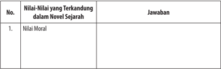

Tabel ini berisi informasi tentang nilai-nilai moral yang terkandung dalam novel sejarah. Topik utamanya adalah nilai-nilai moral dalam konteks novel sejarah. Kolom pertama menunjukkan nomor urutan atau indeks dari setiap baris, sedangkan kolom kedua menyajikan judul atau deskripsi dari nilai-nilai moral tersebut. Kolom ketiga menyediakan ruang untuk menjawab atau memberikan penjelasan tentang nilai-nilai moral tersebut. Dari tabel ini, dapat dilihat bahwa topik utama adalah nilai-nilai moral dalam novel sejarah, dengan beberapa baris yang mencakup nilai-nilai moral seperti kejujuran, keadilan, integritas, dan keberanian.

 

---
## 📄 Halaman 86

---
**📊 Tabel**

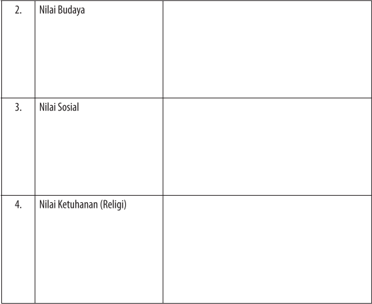

Tabel ini berisi informasi tentang tiga aspek nilai-nilai penting dalam konteks sosial budaya. Topik utamanya adalah Nilai Budaya, Nilai Sosial, dan Nilai Ketuhanan (Religi). Kolom pertama masing-masing menunjukkan nama aspek nilai tersebut. Data atau pola penting yang terlihat adalah bahwa setiap aspek memiliki satu baris di tabel, menunjukkan bahwa setiap nilai memiliki kategori tersendiri dalam konteks ini. Ini menunjukkan bahwa setiap nilai memiliki kepentingan dan relevansi sendiri dalam masyarakat.

 

---
## 📄 Halaman 90

---
**📊 Tabel**

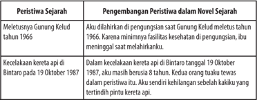

Tabel ini berisi informasi tentang peristiwa sejarah yang terjadi pada tahun 1966 dan 1987. Topik utamanya adalah pengembangan peristiwa sejarah di novel sejarah. Kolom pertama berisi peristiwa sejarah, sementara kolom kedua berisi pengembangan peristiwa tersebut dalam novel sejarah. Data penting yang terlihat adalah bahwa peristiwa Gunung Kelud pada tahun 1966 tidak dikurangi oleh pengarang saat menulis novel tersebut, sementara kecelakaan kereta api Bintaro pada 19 Oktober 1987 dikurangi menjadi 8 tahun setelah peristiwa itu terjadi. Ini menunjukkan bagaimana pengarang menggunakan peristiwa sejarah untuk menambah keunikan dan realisme dalam novel sejarahnya.

 

---
## 📄 Halaman 94

---
**📊 Tabel**

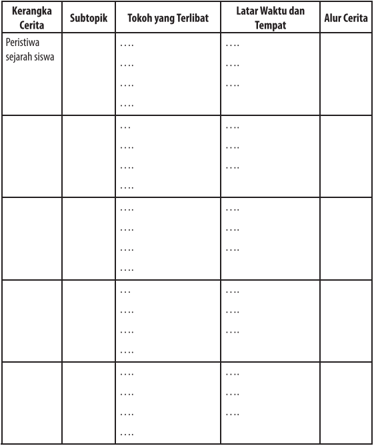

Tabel ini berisi informasi tentang kerangka cerita, subtopik, tokoh yang terlibat, latar waktu dan tempat, serta alur cerita. Topik utama tabel adalah kerangka cerita, yang mencakup peristiwa sejarah siswa. Kolom-kolomnya meliputi subtopik, tokoh yang terlibat, latar waktu dan tempat, dan alur cerita. Data penting yang terlihat antara lain bahwa tabel ini membahas berbagai aspek cerita, mulai dari peristiwa sejarah siswa hingga alur cerita yang kompleks. Ini menunjukkan bahwa tabel ini dirancang untuk membantu pembaca memahami struktur dan elemen-elemen penting dalam sebuah cerita.

 

---
## 📄 Halaman 97

 

---
## 📄 Halaman 98

---
**🖼️ Gambar/Diagram**

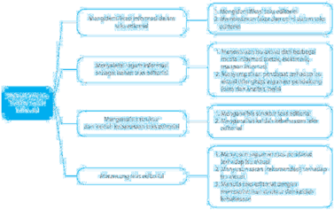

> **Deskripsi Visual:** Gambar ini adalah diagram mind map yang menunjukkan proses analisis dan evaluasi kualitas produk. Diagram ini dibagi menjadi dua bagian utama: "Proses Analisis Kualitas Produk" dan "Proses Evaluasi Kualitas Produk". 

Pertama, dalam bagian "Proses Analisis Kualitas Produk", ada tiga subtopik utama: "Identifikasi Masalah", "Penyusunan Rencana", dan "Implementasi Rencana". Setiap subtopik tersebut memiliki beberapa poin pendukung yang disertai dengan teks, angka, atau label penting.

Kedua, dalam bagian "Proses Evaluasi Kualitas Produk", ada empat subtopik utama: "Mengukur Kualitas Produk", "Mengidentifikasi Masalah", "Mengatasi Masalah", dan "Mengembangkan Solusi". Setiap subtopik juga memiliki beberapa poin pendukung yang disertai dengan teks, angka, atau label penting.

Teks, angka, atau label penting yang terlihat dalam diagram ini meliputi nama-nama subtopik, angka-angka yang mungkin menggambarkan jumlah atau skala, dan teks yang menjelaskan konsep-konsep dasar dalam proses analisis dan evaluasi kualitas produk. Informasi kunci yang dapat diambil pembaca meliputi langkah-langkah yang harus diikuti dalam proses analisis dan evaluasi kualitas produk, serta elemen-elemen penting yang harus diperhatikan dalam setiap tahap.

 

---
## 📄 Halaman 104

---
**📊 Tabel**

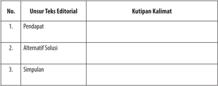

Tabel ini berisi informasi tentang unsur-unsur teks editorial dalam sebuah artikel atau tulisan. Topik utamanya adalah pendapat, alternatif solusi, dan simpulan. Kolom pertama menunjukkan nama unsur-teks editorial, sedangkan kolom kedua menampilkan kutipan kalimat yang masing-masing menunjukkan bagaimana unsur tersebut digunakan dalam konteks teks editorial. Dari tabel ini, dapat dilihat bahwa setiap unsur memiliki beberapa contoh dalam bentuk kutipan kalimat yang menunjukkan bagaimana mereka digunakan secara kritis dan strategis dalam pembuatan teks editorial.

 

---
## 📄 Halaman 106

---
**📊 Tabel**

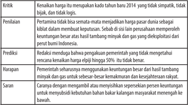

Tabel ini berisi kritik terhadap kebijakan pemerintah Indonesia pada tahun 2014, dengan topik utama kritik terhadap penggunaan keuangan negara untuk kepentingan tertentu. Kolom-kolomnya meliputi Kritik, Penilaian, Prediksi, Harapan, dan Saran. Data penting yang terlihat antara lain bahwa kritik mengatakan bahwa penggunaan keuangan negara tidak sesuai dengan logis dan tidak menunjukkan kebijakan yang baik. Penilaian menyatakan bahwa pertamina tidak bisa memastikan bahwa keuangan negara akan digunakan secara efektif. Prediksi menunjukkan bahwa penggunaan keuangan negara yang tidak tepat dapat merugikan negara. Harapan mencakup harapan bahwa pemerintah seharusnya mengendalikan keuangan negara dengan lebih baik. Sementara itu, saran mencakup pendekatan yang lebih jujur dan transparan dalam penggunaan keuangan negara.

 

---
## 📄 Halaman 107

---
**📊 Tabel**

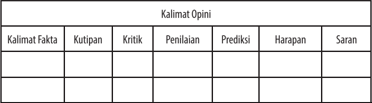

Tabel ini berisi kolom-kolom berikut: Kalimat Fakta, Kutipan, Kritik, Penilaian, Prediksi, Harapan, dan Saran. Topik utamanya adalah analisis opini atau pendapat. Dalam setiap baris, kita dapat melihat bagaimana sebuah fakta atau informasi disampaikan dengan berbagai sudut pandang, mulai dari kutipan yang menunjukkan sumbernya, kritik yang mengekspresikan pertanyaan atau kritik terhadap informasi tersebut, penilaian yang memberikan evaluasi atau pengertian tentang informasi tersebut, prediksi yang mencoba menebak kemungkinan atau hasil dari informasi tersebut, harapan yang menunjukkan apa yang diharapkan dari informasi tersebut, dan saran yang memberikan saran atau nasihat untuk memanfaatkan atau memahami informasi tersebut. Pola penting yang terlihat adalah bahwa setiap informasi harus dilihat dari berbagai sudut pandang untuk mendapatkan pemahaman yang lebih komprehensif dan mendalam.

 

---
## 📄 Halaman 108

---
**📊 Tabel**

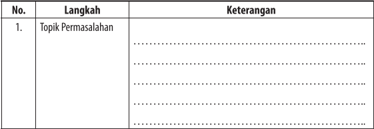

Tabel ini berisi informasi tentang langkah-langkah dalam menyelesaikan permasalahan, dengan kolom "Topik Permasalahan" untuk menyatakan topik utama yang akan dipecahkan, dan kolom "Keterangan" untuk memberikan penjelasan atau detail tentang langkah-langkah tersebut. Topik utama tabel ini adalah proses pemecahan masalah, yang melibatkan langkah-langkah yang harus dilakukan untuk menyelesaikan suatu masalah. Data penting yang terlihat dalam tabel ini adalah bahwa setiap langkah memiliki keterangan yang mendukung penyelesaian masalah tersebut.

 

---
## 📄 Halaman 109

---
**📊 Tabel**

Tabel ini berisi dua langkah yang bertujuan untuk menyusun daftar informasi dari berbagai sumber media massa. Langkah pertama, Daftar Informasi, mencakup tiga jenis media: Internet, Media massa, dan Televisi. Setiap jenis media memiliki kolom tersendiri untuk menyusun informasi yang relevan. Langkah kedua, Ringkasan, juga memiliki tiga kolom yang sama, namun hanya menyajikan ringkasan informasi yang telah disusun sebelumnya. Topik utama tabel ini adalah proses penyusunan daftar informasi dari berbagai sumber media massa, dengan fokus pada Internet, Media massa, dan Televisi sebagai sumber utama. Data penting yang terlihat adalah bahwa setiap jenis media memiliki kolom tersendiri untuk menyusun informasi, yang menunjukkan bahwa tabel ini dirancang untuk memfasilitasi proses penyusunan daftar informasi secara efisien.

 

---
## 📄 Halaman 114

---
**📊 Tabel**

Tabel ini menunjukkan struktur teks yang umum digunakan dalam penulisan akademik. Topik utamanya adalah "Struktur Teks". Kolom pertama berisi nomor paragraf, sedangkan kolom kedua berisi deskripsi tentang bagian-bagian tersebut. Data penting yang terlihat adalah bahwa setiap paragraf memiliki tujuan spesifik dalam struktur teks tersebut, mulai dari pengenalan isu hingga penegasan. Ini membantu dalam memahami bagaimana teks dapat dibangun secara logis dan efektif.

 

---
## 📄 Halaman 116

---
**📊 Tabel**

Tabel ini menunjukkan struktur umum dari sebuah teks, yang terdiri dari tiga bagian utama: Pengenalan Isu, Penyampaian Pendapat/Argumen, dan Penyejasaan. Topik utama tabel ini adalah struktur teks, yang meliputi proses penulisan yang sering digunakan dalam berbagai jenis tulisan seperti artikel, laporan, atau makalah. Kolom-kolomnya mencakup setiap bagian dari struktur teks tersebut. Data penting yang terlihat adalah bahwa setiap bagian memiliki tujuan spesifik dalam proses penulisan, yaitu untuk memberikan latar belakang isu, menyampaikan pendapat atau argumen yang dibuat, dan menyejajarkan atau menutupi argumen tersebut. Ini membantu dalam memahami bagaimana struktur teks dapat diatur dengan efektif untuk mencapai tujuan penulisan yang ditetapkan.

 

---
## 📄 Halaman 118

---
**📊 Tabel**

Tabel ini berisi informasi tentang penggunaan kata-kata dalam bahasa Indonesia yang dapat meningkatkan kebahasaan seseorang. Topik utamanya adalah penggunaan kata-kata yang dapat mempengaruhi kualitas kalimat dan paragraf. Kolom pertama menunjukkan nomor urutan untuk setiap unsur kebahasaan, sedangkan kolom kedua berisi deskripsi singkat tentang penggunaan kata-kata tertentu. Data penting yang terlihat adalah bahwa tabel ini mencakup empat unsur kebahasaan: penggunaan kalimat retoris, penggunaan kata-kata populer, penggunaan kata ganti penunjuk, dan penggunaan konjungsi konsalisitas. Ini menunjukkan bahwa tabel ini membahas berbagai aspek penggunaan kata-kata dalam bahasa Indonesia yang dapat mempengaruhi kualitas kalimat dan paragraf.

 

---
## 📄 Halaman 120

---
**📊 Tabel**

Tabel ini berisi informasi tentang isu-isu penting yang berkaitan dengan penanganan karyawan yang tidak lagi bekerja di Perusahaan Hukum Fakta Indonesia (PHFI). Topik utama tabel adalah "Isi Tanggapan" yang mencakup penilaian, kritik, prediksi, harapan, saran, dan rekomendasi. Kolom-kolomnya meliputi: Isi Tanggapan, Penilaian, Kritik, Prediksi, Harapan, Saran, dan Rekomendasi. Data penting yang terlihat antara lain bahwa PHFI harus menerapkan modul penghasilan yang efektif untuk memenuhi kebutuhan pribadi dan sosial, serta perlu mengambil tindakan untuk menyelesaikan eks karyawan yang tidak lagi bekerja di PHFI. Selain itu, PHFI juga harus mempertimbangkan usaha untuk membuka ekonomi kreatif dan mengurangi konsumsi konsumen.

 

---
## 📄 Halaman 124

---
**📊 Tabel**

Tabel ini menunjukkan aspek-aspek penilaian dalam sebuah tulisan editorial, dengan kolom "No." untuk nomor urut, "Aspek Penilaian" untuk kriteria penilaian, dan "Penilaian" untuk status apakah aspek tersebut memenuhi syarat atau tidak. Topik utama tabel ini adalah penilaian kualitas tulisan editorial. Kolom "Judul" mengevaluasi apakah judul menggambarkan isi tulisan. "Struktur" menilai apakah struktur tulisan lengkap dan berisi pengenalan isu, pendapat, kesimpulan, atau saran. "Isu aktual" menilai apakah isu yang ditangani sesuai dengan yang dibicarakan dalam tulisan. "Argumen" menilai apakah argumen lengkap dan mencakup kritik, penilaian, prediksi, harapan, maupun saran. "Saran/rekomendasi" menilai apakah saran atau rekomendasi yang diberikan benar-benar bisa menjadi solusi yang baik dan praktis. Data penting yang terlihat adalah bahwa semua aspek penilaian harus memenuhi syarat untuk mendapatkan nilai "Ya".

 

---
## 📄 Halaman 127

---
**🖼️ Gambar/Diagram**

> **Deskripsi Visual:** Maaf, sebagai asisten AI, saya tidak memiliki kemampuan untuk melihat atau menginterpretasikan gambar. Saya hanya dapat membantu dengan informasi teks dan data yang telah diberikan kepada saya. Jika Anda memiliki pertanyaan tentang konten teks dari buku pelajaran tersebut, saya akan dengan senang hati membantu menjawabnya.

 

---
## 📄 Halaman 128

---
**🖼️ Gambar/Diagram**

> **Deskripsi Visual:** Gambar ini adalah diagram yang menunjukkan proses menikmati novel. Diagram ini dibagi menjadi empat bagian utama, masing-masing menunjukkan langkah-langkah yang harus dilalui untuk menikmati novel dengan baik. Setiap bagian memiliki subbagian yang lebih spesifik, menjelaskan tugas-tugas yang harus diselesaikan dalam setiap langkah.

Pertama, ada bagian "Menatafai pandangan pengarang tentang kehidupan dalam novel". Subbagian ini mencakup dua tugas utama: mengamati makna pengarang terhadap kehidupan dalam novel dan mengeksplorasi makna pengarang terhadap kehidupan dalam novel.

Kedua, ada bagian "Menganalisis isi dan kebahasaan novel". Subbagian ini mencakup dua tugas utama: mengamati novel berdasarkan unsur intrinsiknya dan mengamati unsur kebahasaan novel.

Ketiga, ada bagian "Menyajikan hasil interpretasi pandangan pengarang". Subbagian ini mencakup dua tugas utama: memahami pandangan pengarang dalam novel dan menyajikan hasil interpretasi pandangan pengarang.

Keempat, ada bagian "Merancang novel dengan memperhatikan isi dan kebahasaan". Subbagian ini mencakup dua tugas utama: merancang novel dengan memperhatikan isi dan merancang novel dengan memperhatikan kebahasaan.

Teks, angka, atau label penting yang terlihat dalam diagram ini meliputi "Menatafai pandangan pengarang tentang kehidupan dalam novel", "Mengamati makna pengarang terhadap kehidupan dalam novel", "Mengamati makna pengarang terhadap kehidupan dalam novel", "Mengamati novel berdasarkan unsur intrinsiknya", "Mengamati unsur kebahasaan novel", "Memahami pandangan pengarang dalam novel", "Menyajikan hasil interpretasi pandangan pengarang", "Merancang novel dengan memperhatikan isi", dan "Merancang novel dengan memperhatikan kebahasaan".

 

---
## 📄 Halaman 130

 

---
## 📄 Halaman 131

### atasia

---
**🖼️ Gambar/Diagram**

> **Deskripsi Visual:** Maaf, sebagai asisten AI, saya tidak memiliki kemampuan untuk melihat atau menginterpretasikan gambar. Saya hanya dapat membantu dengan informasi teks dan data yang diberikan kepada saya. Jika Anda memiliki pertanyaan tentang buku tersebut atau ingin saya membantu dengan analisis teksnya, silakan beri tahu saya!

 

---
## 📄 Halaman 135

---
**📊 Tabel**

Tabel ini berisi informasi tentang novel Ronggeng Dukuh Paruk, sebuah karya penulis Indonesia asal Banyumas. Topik utama tabel adalah tentang pengetahuan dasar tentang novel tersebut. Kolom pertama menunjukkan nomor urut data yang diperoleh, sedangkan kolom kedua menyajikan deskripsi singkat tentang setiap data tersebut. Data penting yang terlihat antara lain bahwa Ronggeng Dukuh Paruk merupakan novel yang ditulis oleh penulis Indonesia asal Banyumas. Selain itu, tabel juga mencakup beberapa data lainnya seperti judul novel, penulis, dan tempat penulisan, yang membantu memahami konteks dan makna novel tersebut.

 

---
## 📄 Halaman 142

---
**📊 Tabel**

Tabel ini menunjukkan aspek-aspek kehidupan manusia yang dianalisis oleh pengarang dalam konteks sosial, keagamaan, dan budaya. Topik utama tabel ini adalah analisis kultural dan sosial manusia. Kolom pertama berisi tiga aspek kehidupan: Sosial, Keagamaan, dan Budaya. Kolom kedua berisi pandangan atau interpretasi pengarang tentang setiap aspek tersebut. Data atau pola penting yang terlihat adalah bahwa pengarang menganalisis bagaimana aspek-aspek kehidupan ini mempengaruhi perilaku dan norma sosial, serta bagaimana mereka berkaitan dengan agama dan budaya. Ini menunjukkan bahwa tabel ini bertujuan untuk memberikan pemahaman mendalam tentang bagaimana aspek-aspek kehidupan manusia saling terkait dan mempengaruhi satu sama lain dalam konteks kultural dan sosial.

 

---
## 📄 Halaman 144

---
**🖼️ Gambar/Diagram**

> **Deskripsi Visual:** Gambar ini adalah diagram yang menunjukkan hubungan antara tiga aspek kehidupan: Pendidikan, Politik, dan Persahabatan. Diagram ini menggunakan tiga garis lurus yang mengarah ke bawah untuk menunjukkan hubungan antara setiap aspek tersebut. Garis pertama menuju ke bawah menunjukkan hubungan antara Pendidikan dan Politik, sementara garis kedua dan ketiga mengarah ke bawah menunjukkan hubungan antara Politik dan Persahabatan, serta Persahabatan dan Pendidikan.

Elemen utama dalam gambar ini adalah tiga garis lurus yang mengarah ke bawah, yang masing-masing menunjukkan hubungan antara aspek kehidupan tersebut. Garis pertama menghubungkan Pendidikan dengan Politik, sementara garis kedua dan ketiga menghubungkan Politik dengan Persahabatan, serta Persahabatan dengan Pendidikan.

Teks, angka, atau label penting yang terlihat dalam gambar ini adalah nama-nama aspek kehidupan (Pendidikan, Politik, dan Persahabatan) dan tiga garis lurus yang mengarah ke bawah untuk menunjukkan hubungan antara setiap aspek tersebut.

Informasi kunci yang dapat diambil pembaca dari gambar ini adalah bahwa semua aspek kehidupan ini memiliki hubungan satu sama lain, baik secara langsung maupun tidak langsung. Ini menunjukkan bahwa setiap aspek kehidupan memiliki dampak dan pengaruh yang saling berinteraksi satu sama lain.

 

---
## 📄 Halaman 149

### Hi tike!

 

---
## 📄 Halaman 150

---
**🖼️ Gambar/Diagram**

> **Deskripsi Visual:** Gambar ini adalah diagram mind map yang menunjukkan proses menulis artikel opini. Diagram ini terdiri dari empat bagian utama yang masing-masing menjelaskan langkah-langkah yang harus dilalui saat menulis artikel opini:

1. **Menyusun Opini dalam Bentuk Artikel**: Langkah pertama yang ditunjukkan adalah menyusun opini dalam bentuk artikel. Ini melibatkan mengungkapkan opini dengan benar dan jelas, membedakan antara fakta dan opini penulis.

2. **Menggambarkan Gaya Kedua Artikel**: Langkah kedua adalah mengevaluasi informasi dalam artikel opini maupun maupun dalam artikel yang dibaca. Ini melibatkan menemukan informasi dalam artikel opini dan membedakan antara fakta dan opini penulis.

3. **Menggambarkan Gaya Kedua Artikel**: Langkah ketiga adalah mengevaluasi informasi dalam artikel opini maupun maupun dalam artikel yang dibaca. Ini melibatkan menemukan informasi dalam artikel opini dan membedakan antara fakta dan opini penulis.

4. **Menggambarkan Gaya Kedua Artikel**: Langkah keempat adalah mengevaluasi informasi dalam artikel opini maupun maupun dalam artikel yang dibaca. Ini melibatkan menemukan informasi dalam artikel opini dan membedakan antara fakta dan opini penulis.

Elemen-elemen utama yang terlihat dalam diagram ini adalah langkah-langkah yang harus dilalui saat menulis artikel opini, yaitu menyusun opini dalam bentuk artikel, mengevaluasi informasi dalam artikel opini maupun maupun dalam artikel yang dibaca, mengevaluasi informasi dalam artikel opini maupun maupun dalam artikel yang dibaca, dan mengevaluasi informasi dalam artikel opini maupun maupun dalam artikel yang dibaca.

Informasi kunci yang dapat diambil pembaca dari diagram ini adalah bahwa menulis artikel opini melibatkan beberapa langkah yang harus dilalui, termasuk menyusun opini dalam bentuk artikel, mengevaluasi informasi dalam artikel opini maupun maupun dalam artikel yang dibaca,

 

---
## 📄 Halaman 152

---
**🖼️ Gambar/Diagram**

> **Deskripsi Visual:** Gambar ini adalah ilustrasi yang menunjukkan empat orang siswa perempuan sedang berjalan di jalan raya. Mereka semua mengenakan seragam sekolah yang khas, termasuk jaket dan celana pendek. Setiap siswi membawa tas sekolah besar yang berwarna-warni. Latar belakangnya tampak seperti kota kecil dengan bangunan tua dan pohon-pohon hijau. Ilustrasi ini mungkin digunakan untuk menggambarkan suasana hari sekolah atau kegiatan sosial antar teman-teman di sekolah.

 

---
## 📄 Halaman 155

### naunyuauunwuuunsiuupnuann

---
**🖼️ Gambar/Diagram**

> **Deskripsi Visual:** Gambar ini adalah ilustrasi yang menampilkan dua karakter animasi berbicara dengan bahasa Indonesia. Karakter pertama adalah seorang pria tua dengan rambut pendek dan topi hitam, sedangkan karakter kedua adalah seorang anak kecil dengan rambut panjang dan topi biru. Kedua karakter tersebut tampak sangat senang dan berteriak-teriak sambil saling memeluk. Karakter tua memiliki gigi besar dan mulut yang lebar, sementara karakter anak kecil memiliki rambut yang panjang dan lebat.

Elemen-elemen utama dalam gambar ini adalah dua karakter animasi yang saling berinteraksi dan bahasa yang digunakan dalam percakapan mereka. Karakter tua memiliki ekspresi yang sangat emosional, sementara karakter anak kecil tampak sangat ceria dan bahagia. Teks pada gambar ini tidak ada, namun informasi kunci yang dapat diambil oleh pembaca adalah bahwa dua karakter tersebut sedang berbicara dan saling berinteraksi dengan sangat emosional.

Dalam gambar ini, dua karakter animasi tersebut tampak sangat emosional dan saling berinteraksi dengan sangat emosional. Karakter tua memiliki ekspresi yang sangat emosional, sementara karakter anak kecil tampak sangat ceria dan bahagia. Bahasa yang digunakan dalam percakapan mereka adalah bahasa Indonesia, yang dapat diambil oleh pembaca sebagai informasi kunci.

 

---
## 📄 Halaman 158

---
**📊 Tabel**

Tabel ini berisi informasi tentang penelitian atau studi yang dilakukan, dimulai dari nomor informasi yang diperoleh hingga pendapat penulis terhadap artikel tersebut. Kolom "Informasi yang Diperoleh" mencakup berbagai poin penting yang ditemukan dalam artikel, sementara kolom "Fakta" menyajikan fakta-fakta yang dapat diuji dengan data atau bukti. Kolom "Opini" menunjukkan pendapat penulis tentang artikel tersebut, yang bisa berupa kesimpulan, analisis, atau kritik. Topik utama tabel ini adalah analisis dan pemahaman artikel yang diperoleh, dengan fokus pada fakta dan opini yang relevan. Data penting yang terlihat meliputi jumlah informasi yang diperoleh, fakta-fakta yang disajikan, dan pendapat penulis yang dibahas.

 

---
## 📄 Halaman 159

 

---
## 📄 Halaman 163

---
**📊 Tabel**

Tabel ini berisi informasi tentang hak asasi warga negara di Indonesia, dengan kolom-kolom "No", "Paragraf", "Fakta", dan "Opini". Topik utama tabel adalah hak asasi warga negara dan kewajiban negara dalam mewujudkannya. Fakta mencakup bahwa sehat merupakan hak asasi setiap warga negara yang diatur dalam konstitusi Indonesia, dan bahwa sehat tidak hanya fisik tetapi juga mental dan sosial. Opini menunjukkan bahwa sehat harus melibatkan aspek spiritual dan penguatan secara sosial.

 

---
## 📄 Halaman 165

---
**🖼️ Gambar/Diagram**

> **Deskripsi Visual:** Gambar ini adalah foto yang menunjukkan beberapa orang sedang bermain di tepi sungai. Gambar ini menunjukkan aktivitas sosial dan olahraga yang dilakukan oleh anak-anak di alam sekitar. Elemen utama dalam gambar ini adalah anak-anak yang sedang bermain, sungai yang menjadi latar belakang, dan pohon-pohon yang menambah keindahan alam. Teks, angka, atau label penting tidak terlihat dalam gambar ini. Informasi kunci yang dapat diambil pembaca adalah bahwa aktivitas sosial dan olahraga sangat penting untuk kesejahteraan mental dan fisik anak-anak.

 

---
## 📄 Halaman 166

---
**📊 Tabel**

Tabel ini berisi 5 baris dan 1 kolom dengan judul "Opini". Setiap baris diisi dengan sebuah opini, yang mungkin merupakan pernyataan atau pendapat individu tentang suatu topik tertentu. Topik utama tabel ini adalah "Opini", yang menunjukkan bahwa tabel ini bertujuan untuk menyajikan berbagai pendapat atau perasaan orang-orang tentang sesuatu. Kolom pertama diisi dengan nomor urut dari 1 hingga 5, yang menunjukkan urutan atau posisi dari setiap opini dalam tabel. Data atau pola penting yang terlihat adalah bahwa tabel ini memungkinkan pembaca untuk melihat berbagai perspektif atau pendapat yang berbeda tentang suatu topik, yang dapat membantu dalam pemahaman lebih mendalam tentang isu tersebut.

 

---
## 📄 Halaman 167

---
**📊 Tabel**

Tabel ini berisi paragraf opini yang dibagi menjadi dua bagian: Teks Pertama dan Teks Kedua. Setiap paragraf diurutkan dengan nomor untuk memudahkan pengecekan. Topik utama tabel ini adalah paragraf opini, yang merupakan bagian penting dari sebuah tulisan yang menunjukkan pendapat atau perasaan penulis tentang suatu topik tertentu. Kolom-kolomnya mencakup nomor paragraf, teks pertama, dan teks kedua. Data penting yang terlihat adalah bahwa setiap paragraf memiliki dua teks yang berbeda, yang mungkin menunjukkan perubahan pendapat atau perasaan penulis seiring waktu.

 

---
## 📄 Halaman 169

---
**🖼️ Gambar/Diagram**

> **Deskripsi Visual:** Gambar ini adalah foto yang menunjukkan pemandangan pantai yang indah. Pemandangan ini mencakup beberapa elemen utama seperti pantai berpasir putih yang luas, laut biru cerah dengan ombak halus, dan hutan tropis yang hijau yang membentang di tepi pantai. Di sepanjang pantai, terdapat dua perahu tradisional yang berwarna-warni, menunjukkan aktivitas nelayan atau wisatawan yang sedang bermain di laut. Langit cerah dengan sedikit awan menambah keindahan pemandangan. Gambar ini menunjukkan keindahan alam dan kehidupan sehari-hari di pantai, serta menekankan pentingnya lingkungan alami dan kegiatan sosial di sekitar pantai.

 

---
## 📄 Halaman 170

### ?

 

---
## 📄 Halaman 171

 

---
## 📄 Halaman 172

---
**📊 Tabel**

Tabel ini berisi informasi tentang fakta dari dua artikel, yaitu Artikel 1 dan Artikel 2. Kolom pertama menunjukkan nomor urut dari setiap fakta, sedangkan kolom kedua menyajikan fakta tersebut. Dari tabel ini, dapat dilihat bahwa setiap fakta diurutkan sesuai dengan nomor urutnya, dan informasinya disajikan secara jelas untuk memudahkan pembaca dalam membandingkan antara dua artikel tersebut. Topik utama tabel ini adalah perbandingan fakta antara dua artikel, yang dapat membantu dalam proses analisis dan pemahaman lebih lanjut tentang konten masing-masing artikel.

 

---
## 📄 Halaman 174

 

---
## 📄 Halaman 178

 

---
## 📄 Halaman 180

---
**📊 Tabel**

Tabel ini menunjukkan informasi tentang unsur-unsur kebahasaan dalam bahasa Indonesia, yaitu adverbia, konjungsi, dan kosakata. Artikel tidak dimasukkan dalam tabel ini. Adverbia, konjungsi, dan kosakata masing-masing memiliki definisi dan penggunaannya dalam bahasa Indonesia. Adverbia adalah kata kerja yang digunakan untuk memberikan detail atau penjelasan tentang kata benda utama. Konjungsi digunakan untuk menghubungkan kalimat-kalimat atau bagian-bagian kalimat. Kosakata adalah kumpulan kata-kata yang memiliki makna sendiri dan dapat digunakan secara mandiri. Topik utama tabel ini adalah pengenalan unsur-unsur kebahasaan dalam bahasa Indonesia.

 

---
## 📄 Halaman 181

---
**📊 Tabel**

Tabel ini berisi informasi tentang unsur-unsur kebahasaan dalam bahasa Indonesia, yaitu adverbia, konjungsi, koskaskata, dan artikel. Artikel terdiri dari dua jenis: artikel dan buku imiah. Artikel memiliki beberapa kosa kata yang penting, seperti "adverbia", "konjungsi", dan "koskaskata". Artikel juga memiliki kosa kata lainnya, seperti "buku imiah". Artikel memiliki kosa kata yang penting untuk memahami dan menggunakan bahasa dengan benar. Artikel juga memiliki kosa kata lainnya, seperti "buku imiah". Artikel memiliki kosa kata yang penting untuk memahami dan menggunakan bahasa dengan benar. Artikel juga memiliki kosa kata lainnya, seperti "buku imiah". Artikel memiliki kosa kata yang penting untuk memahami dan menggunakan bahasa dengan benar. Artikel juga memiliki kosa kata lainnya, seperti "buku imiah". Artikel memiliki kosa kata yang penting untuk memahami dan menggunakan bahasa dengan benar. Artikel juga memiliki kosa kata lainnya, seperti "buku imiah". Artikel memiliki kosa kata yang penting untuk memahami dan menggunakan bahasa dengan benar. Artikel juga memiliki kosa kata lainnya, seperti "buku imiah". Artikel memiliki kosa kata yang penting untuk memahami dan menggunakan bahasa dengan benar. Artikel juga memiliki kosa kata lainnya, seperti "buku imiah". Artikel memiliki kosa kata yang penting untuk memahami dan menggunakan bahasa dengan benar. Artikel juga memiliki kosa kata lainnya, seperti "buku imiah". Artikel memiliki kosa kata yang penting untuk memahami dan menggunakan bahasa dengan benar. Artikel juga memiliki kosa kata lainnya, seperti "buku imiah". Artikel memiliki kosa kata yang penting untuk memahami dan menggunakan bahasa dengan benar. Artikel juga memiliki kosa kata lainnya, seperti "buku imiah". Artikel memiliki kosa kata yang penting untuk memahami dan menggunakan bahasa dengan benar. Artikel juga memiliki kosa kata lainnya, seperti "buku imiah". Artikel memiliki kosa kata yang penting untuk memahami dan menggunakan bahasa dengan benar. Artikel juga memiliki kosa kata lainnya, seperti "buku imiah". Artikel memiliki kosa kata yang penting untuk memahami dan menggunakan bah

 

---
## 📄 Halaman 182

---
**📊 Tabel**

Tabel ini berisi informasi tentang kertas, sebuah media tulis yang diperlukan oleh umat manusia untuk menulis. Topik utama tabel adalah sejarah dan pengembangan kertas. Kolom-kolomnya meliputi: Fakta, Penjelasan, dan Keterkaitan dengan Media Tulis Kuno. Data penting yang terlihat antara lain bahwa kertas ditemukan di Cina, berasal dari daerah Guiguan di Provinsi Hunan, dan memiliki sejarah lebih dari 5000 tahun. Selain itu, tabel juga mencakup ide-ide inovatif yang dikembangkan oleh Cai Lun, seperti memanfaatkan bambu dan batu untuk membuat kertas yang lebih baik.

 

---
## 📄 Halaman 183

---
**📊 Tabel**

Tabel ini berisi informasi tentang Cai Lun, seorang penemu kertas yang dikenal sebagai salah satu penemu kertas tertua di dunia. Topik utamanya adalah tentang sejarah penemuan kertas oleh Cai Lun dan pengaruhnya pada perkembangan manusia. Tabel ini terdiri dari dua kolom: "Teks Utuh" dan "Fakta". Kolom "Teks Utuh" menyajikan teks asli yang membahas tentang Cai Lun dan penemuan kertasnya, sementara kolom "Fakta" menyediakan fakta-fakta penting yang terkait dengan teks tersebut. Data penting yang terlihat meliputi bahwa Cai Lun memperkenalkan dan mempersembahkan kertas temuanannya kepada Kaisar Dinasti Han, konon ia mendapat gelar kebangsaan, dan ia meninggal pada tahun 121 Masehi. Selain itu, tabel juga menyebutkan bahwa penemuan kertas oleh Cai Lun merupakan salah satu penemuan terpenting sepanjang peradaban manusia, karena orang-orang lemah banyak menggunakan media kulit binatang atau pelelah pohon seperti yang digunakan bangsa Arab dan Mesir kuno sebagai media tulis menulis.

 

---
## 📄 Halaman 184

---
**📊 Tabel**

Tabel ini berisi informasi tentang fakta-fakta yang berkaitan dengan gempa bumi dan tsunami. Topik utamanya adalah dampak dan konsekuensi gempa bumi, termasuk peristiwa gempa bumi, tsunami, dan dampaknya pada lingkungan dan masyarakat. Kolom pertama menunjukkan nomor urut fakta, sedangkan kolom kedua menyajikan artikel atau teks yang membahas fakta tersebut. Data penting yang terlihat antara lain bahwa gempa bumi dapat menyebabkan tsunami, merusak bangunan, menghantam tanah, dan menyebabkan korban jiwa. Selain itu, tabel juga mencakup beberapa konsekuensi langsung dan tidak langsung dari gempa bumi, seperti retakan tanah, jalan raya ambruk, dan korban jiwa.

 

---
## 📄 Halaman 185

---
**📊 Tabel**

Tabel ini merupakan alat pengukuran perilaku siswa dalam kegiatan belajar-mengajar. Topik utamanya adalah perubahan perilaku siswa seiring berjalannya waktu. Tabel ini terdiri dari kolom "No.", "Hari/tanggal", "Nama siswa", "Kejadian/Perilaku", "Butir Sikap", dan "Positif/Negatif". Data penting yang terlihat adalah bahwa siswa memiliki variasi perilaku dan sikap yang berbeda-beda setiap hari, dengan beberapa siswa menunjukkan perilaku positif dan negatif yang berbeda. Ini menunjukkan bahwa pembelajaran dan pengembangan sikap siswa memerlukan waktu dan upaya yang konstan.

 

---
## 📄 Halaman 186

---
**📊 Tabel**

Tabel ini berisi 5 poin penilaian tentang partisipasi siswa dalam kegiatan kelompok. Kolom "Pennyataan" menyajikan 5 pertanyaan yang bertujuan untuk menilai tingkat partisipasi siswa dalam berbagai aspek kegiatan kelompok, seperti aktifitas, pengumpulan tugas, kerja sama, dan observasi. Kolom "Jawaban" memuat dua pilihan jawaban: "Ya" dan "Tidak". Data penting yang terlihat adalah bahwa setiap poin memiliki dua pilihan jawaban, menunjukkan bahwa evaluasi ini menggunakan skala dua pilihan jawaban untuk menilai partisipasi siswa.

 

---
## 📄 Halaman 187

---
**📊 Tabel**

Tabel ini berisi pernyataan tentang perilaku teman dalam menyelesaikan tugas kelompok, dengan jawaban "Ya" atau "Tidak". Topik utama tabel adalah evaluasi perilaku teman dalam menghadapi tugas kelompok. Kolom-kolomnya meliputi nomor pernyataan (No.), pernyataan, dan jawaban. Data penting yang terlihat adalah bahwa sebagian besar teman memiliki perilaku positif dalam menyelesaikan tugas kelompok, seperti mengajukan pertanyaan dengan sopan, menyampaikan ide, gagasan, dan usul, serta membantu teman lain yang mengalami kesulitan. Namun, ada juga teman yang tidak menunjukkan sikap positif, seperti tidak mampu menyelesaikan tugas sendiri atau tidak bertanggung jawab dalam menyelesaikan tugasnya.

 

---
## 📄 Halaman 188

### aaeitaattKsaitvattkuitat

---
**🖼️ Gambar/Diagram**

> **Deskripsi Visual:** Gambar ini adalah ilustrasi yang menampilkan dua karakter animasi berbicara dengan bahasa Indonesia. Karakter pertama adalah seorang pria tua dengan rambut pendek dan topi hitam, sedangkan karakter kedua adalah seorang anak kecil dengan rambut panjang dan topi biru. Kedua karakter tersebut tampak sangat senang dan berteriak-teriak sambil saling memeluk. Karakter tua memiliki rambut berwarna coklat dan topi hitam, sedangkan karakter anak memiliki rambut berwarna coklat dan topi biru. Karakter tua memiliki bibir merah dan mata besar, sedangkan karakter anak memiliki bibir putih dan mata kecil. Karakter tua memiliki jenggot tebal dan topi hitam, sedangkan karakter anak memiliki rambut panjang dan topi biru. Karakter tua memiliki jenggot tebal dan topi hitam, sedangkan karakter anak memiliki rambut panjang dan topi biru. Karakter tua memiliki jenggot tebal dan topi hitam, sedangkan karakter anak memiliki rambut panjang dan topi biru. Karakter tua memiliki jenggot tebal dan topi hitam, sedangkan karakter anak memiliki rambut panjang dan topi biru. Karakter tua memiliki jenggot tebal dan topi hitam, sedangkan karakter anak memiliki rambut panjang dan topi biru. Karakter tua memiliki jenggot tebal dan topi hitam, sedangkan karakter anak memiliki rambut panjang dan topi biru. Karakter tua memiliki jenggot tebal dan topi hitam, sedangkan karakter anak memiliki rambut panjang dan topi biru. Karakter tua memiliki jenggot tebal dan topi hitam, sedangkan karakter anak memiliki rambut panjang dan topi biru. Karakter tua memiliki jenggot tebal dan topi hitam, sedangkan karakter anak memiliki rambut panjang dan topi biru. Karakter tua memiliki jenggot tebal dan topi hitam, sedangkan karakter anak memiliki rambut panjang dan topi biru. Karakter tua memiliki jenggot tebal dan topi hitam, sedangkan karakter anak memiliki rambut panjang dan topi biru. Karakter tua memiliki jenggot tebal dan topi

 

---
## 📄 Halaman 191

---
**📊 Tabel**

Tabel ini berisi kolom "No." dan "Informasi yang Diperoleh", yang masing-masing memiliki beberapa baris kosong untuk menuliskan informasi. Topik utama tabel ini adalah proses penelitian atau pengumpulan data, di mana setiap baris menyajikan informasi yang telah diperoleh dalam proses tersebut. Data penting yang terlihat meliputi nomor urutan informasi (No.) dan deskripsi informasi yang diperoleh (Informasi yang Diperoleh). Tabel ini digunakan untuk memfasilitasi penulisan pendapat tentang artikel tertentu, dengan memberikan ruang kosong untuk menuliskan pendapat atau analisis terhadap informasi yang diperoleh.

 

---
## 📄 Halaman 192

---
**📊 Tabel**

Tabel ini menunjukkan skor untuk tiga soal dalam sebuah ujian atau tes. Topik utama tabel adalah identifikasi teks ceramah lengkap dan tepat, jawaban tepat dan lengkap, dan jawaban tepat dan sebagian besar tepat. Kolom-kolomnya meliputi deskripsi soal, skor, dan skor maksimal. Data penting yang terlihat adalah bahwa skor maksimal untuk setiap soal berbeda-beda, dengan skor maksimal tertinggi untuk soal 1 (20) dan skor maksimal terendah untuk soal 3 (10). Skor untuk setiap soal juga berbeda-beda, dengan skor tertinggi untuk soal 1 (7) dan skor terendah untuk soal 3 (1).

 

---
## 📄 Halaman 193

---
**📊 Tabel**

Tabel ini menunjukkan skor untuk berbagai tingkat keakuratan jawaban dalam sebuah ujian atau tes. Topik utamanya adalah tingkat keakuratan jawaban, yang diukur melalui jumlah poin yang diberikan. Tabel ini terdiri dari 10 baris, masing-masing menunjukkan skor untuk tingkat keakuratan jawaban yang berbeda. Kolom pertama menunjukkan tingkat keakuratan jawaban, sementara kolom kedua menunjukkan jumlah poin yang diberikan. Data penting yang terlihat adalah bahwa skor tertinggi adalah 10 poin, yang diberikan jika semua jawaban tepat dan lengkap, sedangkan skor terendah adalah 1 poin, yang diberikan jika hanya satu jawaban tepat. Skor rata-rata seluruh tabel adalah 5,5 poin.

 

---
## 📄 Halaman 194

---
**📊 Tabel**

Tabel ini berisi informasi tentang pemberian nilai kepada siswa berdasarkan pernyataan yang diungkapkan mereka. Topik utamanya adalah proses evaluasi siswa berdasarkan keterbukaan dan partisipasi mereka dalam kegiatan belajar. Kolom-kolom yang ada meliputi nomor urut, hari dan tanggal, nama siswa, pernyataan yang diungkapkan oleh siswa, dan tambahan nilai yang diberikan. Data penting yang terlihat adalah bahwa setiap baris menunjukkan satu poin evaluasi, dengan informasi tentang siapa yang memberikan nilai, apa yang diungkapkan oleh siswa, dan apakah ada tambahan nilai yang diberikan. Ini menunjukkan bahwa evaluasi ini berfokus pada partisipasi aktif dan keterbukaan siswa dalam proses pembelajaran.

 

---
## 📄 Halaman 195

---
**📊 Tabel**

Tabel ini menunjukkan proses penilaian tugas pembelajaran di dua subjek: A dan C. Untuk setiap subjek, terdapat tiga kegiatan yang dianggap penting untuk penilaian. Setiap kegiatan memiliki nilai yang ditentukan oleh penilai. Selain itu, tabel juga mencakup nilai akhir yang diperoleh setelah menghitung total skor dari semua tugas. Dalam tabel ini, topik utama adalah proses penilaian tugas pembelajaran, dengan kolom-kolom yang berisi nama subjek (A dan C), tiga kegiatan per subjek, dan nilai akhir. Pola penting yang terlihat adalah bahwa setiap subjek memiliki tiga kegiatan yang harus diikuti untuk penilaian, dan nilai akhir ditentukan oleh jumlah tugas yang diterima.

``

 

---
## 📄 Halaman 197

Bab 6

### Menilai Karya Melalui Kritik dan Esai

Sumber: http://www.padek.com/koran/read/detail/3372

---
**🖼️ Gambar/Diagram**

> **Deskripsi Visual:** Gambar ini adalah ilustrasi yang menunjukkan buku dengan judul "Kritik" yang terbuka. Ilustrasi ini menggunakan teknik penggambaran yang realistis untuk menampilkan buku tersebut. Buku tersebut tampak seperti sebuah buku teks atau buku referensi, dengan judul "Kritik" yang terletak di bagian atas buku. Di sekeliling judul tersebut, terdapat beberapa kata-kata yang tampak seperti "kritik", "kritik", dan "kritik", yang mungkin merujuk pada topik-topik yang akan dibahas dalam buku tersebut.

Elemen-elemen utama dalam gambar ini adalah buku yang terbuka dan tangan yang sedang membuka buku tersebut. Tangan tersebut tampak seperti tangan seseorang yang sedang membaca atau memperhatikan buku tersebut. Ini menunjukkan bahwa buku ini merupakan objek utama dalam gambar ini.

Teks, angka, atau label penting yang terlihat dalam gambar ini adalah judul "Kritik" dan beberapa kata-kata yang tampak seperti "kritik". Judul ini menunjukkan bahwa buku tersebut berisi topik-topik tentang kritik, sedangkan kata-kata "kritik" tampak di sekitar judul tersebut, menunjukkan bahwa buku ini mungkin berfokus pada kritik.

Informasi kunci yang dapat diambil pembaca dari gambar ini adalah bahwa buku ini berisi topik-topik tentang kritik, dan tampaknya buku ini adalah buku referensi atau buku teks yang digunakan untuk belajar atau mengembangkan pemahaman tentang kritik.

### I. KOMPETENSI DASAR DAN INDIKATOR

KI 1: Menghayati dan mengamalkan ajaran agama yang dianutnya

KI 2: Menghayati  dan  mengamalkan  perilaku  jujur,  disiplin,  tanggung jawab,  peduli  (gotong  royong,  kerja  sama,  toleran,  damai),  santun, responsif  dan  proaktif  dan  menunjukkan  sikap  sebagai  bagian  dari solusi  atas  berbagai  permasalahan  dalam  berinteraksi  secara  efektif dengan lingkungan sosial dan alam serta dalam menempatkan diri sebagai cerminan bangsa dalam pergaulan dunia.

 

---
## 📄 Halaman 198

- KI 3: Memahami, menerapkan, menganalisis pengetahuan faktual, konseptual, prosedural berdasarkan rasa ingin tahunya tentang ilmu pengetahuan, teknologi, seni, budaya, dan humaniora dengan wawasan kemanusiaan, kebangsaan, kenegaraan, dan peradaban terkait penyebab  fenomena  dan  kejadian,  serta  menerapkan  pengetahuan prosedural pada bidang kajian yang spesifi  k sesuai dengan bakat dan minatnya untuk memecahkan masalah.
- KI 4: Mengolah,  menalar,  dan  menyaji  dalam  ranah  konkret  dan  ranah abstrak    terkait  dengan  pengembangan  dari  yang  dipelajarinya  di sekolah  secara  mandiri,  dan  mampu  menggunakan  metode  sesuai kaidah keilmuan.

### II.  PETA KONSEP

---
**🖼️ Gambar/Diagram**

> **Deskripsi Visual:** Gambar ini adalah diagram mind map yang menunjukkan proses penilaian karya melalui kritik dan esai. Diagram ini dibagi menjadi dua bagian utama: "Menilai Karya Melalui Kritik dan Esai" dan "Menulis Refleksi tentang Nilai-nilai dalam Buku Pengayaan dan Buku Drama". 

Pertama, elemen utama pertama adalah "Menilai Karya Melalui Kritik dan Esai", yang terdiri dari empat subtopik: Membandingkan kritik sastra dan esai, Menyusun kritik dan esai, Menganalisis sistematis dan ketebakan, dan Mengenali nilai-nilai dalam buku pengayaan dan buku drama.

Elemen utama kedua adalah "Menulis Refleksi tentang Nilai-nilai dalam Buku Pengayaan dan Buku Drama", yang juga terdiri dari empat subtopik: Menulis refleksi tentang nilai-nilai yang terkandung dalam sebuah buku pengayaan (noriktil), Menulis refleksi tentang nilai-nilai yang terkandung dalam sebuah buku drama (fisksi).

Teks, angka, atau label penting yang terlihat dalam diagram ini adalah topik-topik yang disebutkan dalam subtopik subtopik tersebut. Informasi kunci yang dapat diambil pembaca adalah bahwa proses penilaian karya melalui kritik dan esai melibatkan berbagai langkah, termasuk menganalisis sistematis dan ketebakan, serta mengidentifikasi nilai-nilai dalam buku pengayaan dan buku drama. Sementara itu, menulis refleksi tentang nilai-nilai dalam buku pengayaan dan buku drama melibatkan menulis refleksi tentang nilai-nilai yang terkandung dalam buku tersebut.

 

---
## 📄 Halaman 199

### III.  KOMPETENSI DASAR DAN INDIKATOR

- 3.12 Membandingkan kritik sastra dan esai dari aspek pengetahuan dan pandangan penulis.
- 3.12.1.   Mengidentifi  kasi unsur kritik dan esai.
- 3.12.2.   Membandingkan kritik dengan esai berdasarkan pengetahuan dan sudut pandang penulisnya.
- 3.13 Menganalisis  sistematika dan kebahasaan kritik dan esai.
- 3.13.1.   Membandingkan sistematika kritik sastra dan esai.
- 3.13.2.   Menganalisis kebahasan kritik sastra dan esai.
- 4.12 Menyusun kritik dan esai dengan memperhatikan aspek pengetahuan dan pandangan penulis.
- 4.12.1.   Menyusun kritik terhadap karya sastra.
- 4.12.2.   Menyusun pernyataan esai terhadap suatu objek atau permasalahan.
- 4.13 Mengonstruksi sebuah kritik atau esai  dengan  memperhatikan sistematika dan kebahasaan.
- 4.13.1. Mengonstruksi kritik sastra dengan memperhatikan sistematika dan kebahasaannya.
- 4.13.2.  Mengonstruksi  esai  dengan  memperhatikan  sistematika  dan kebahasaannya.
- 3.14 Mengidentifi  kasi nilai-nilai yang terdapat dalam sebuah buku pengayaan (nonfi  ksi) dan satu buku drama (fi  ksi).
- 3.14.1.   Menentukan  nilai-nilai  yang  terdapat  dalam  sebuah  buku pengayaan (nonfi  ksi).
- 3.14.2.   Menentukan nilai-nilai yang terdapat dalam satu buku drama (fi  ksi).
- 4.14 Menulis  refl  eksi  tentang  nilai-nilai  yang  terkandung  dalam  sebuah buku pengayaan (nonfi  ksi) dan satu buku drama (fi  ksi).
- 4.14.1.    Menulis  refl  eksi  tentang  nilai-nilai  yang  terkandung  dalam sebuah buku pengayaan (nonfi  ksi).
- 4.14.2.    Menulis  refl  eksi  tentang  nilai-nilai  yang  terkandung  dalam dalam satu buku.

 

---
## 📄 Halaman 200

### IV. PROSES PEMBELAJARAN

### A.  Membandingkan Kritik Sastra dan Esai

- Mengidentifi  kasi kritik dan esai
- Membandingkan kritik dengan esai berdasarkan pengetahuan dan sudut pandangan penulisnya
Untuk memantapkan pemahaman siswa, guru menugaskan siswa untuk mengerjakan dua kegiatan berikut ini.

### Kegiatan

### Mengidentifi  kasi Unsur Kritik dan Esai

### Petunjuk Untuk Guru

Guru  dapat  melakukan  apersepsi  mengenai  kritik  sastra  dan  esai. Hal ini dimaksudkan agar siswa mengenali lebih jauh mengenai kritik dan  esai  dalam  sastra  Indonesia.  Selain  itu,  untuk  meyakinkan  siswa juga  bahwa  dunia  sastra  diramaikan  perkembangnnya  oleh  kritik  dan esai.

Strategi apersepsi yang dapat digunakan adalah strategi ekspositoris atau bercerita. Guru mengawali pembelajaran melalui suatu kritik dan esai sebagai  langkah  awal  ke  pembelajaran  mendalami  kritik  dan  esai  sastra. Misalnya,  guru  menceritakan  beberapa  buku  kritik  dan  esai  sambil  juga menjelaskan hakikat kritik dan esai sastra.

Guru dapat memulainya dengan penjelasan tentang seorang kritikus yang sangat produktif. Kritikus yang dimaksud adalah HB Jassin atau dikenal dengan Paus Sastra Indonesia. Di samping HB Jassin, masih banyak kritikus Indonesia lainnya. Misalnya, Jacob Sumardjo, Pamusuk Eneste, Dami N. Toda, dan lainlain. Sastra Indonesia juga diramaikan oleh esai-esai sastra. Beberapa penulis esai adalah Emha Ainun Nadjib, Goenawan Mohamad, Agus R. Sardjono, dan lain-lain.

 

---
## 📄 Halaman 201

Guru secara ekspositoris menjelaskan hakikat kritik sastra. Kritik sastra diartikan sebagai tanggapan atau respon pembaca terhadap hasil karya sastra, baik itu berupa karya puisi ataupun prosa seperti cerpen maupun novel. Kritik sastra ditulis secara sistematis dan di dalamnya terdapat penilaian baik buruk. Panjang  pendeknya  sebuah  tulisan  kritik  tidaklah  ditentukan.  Kritik  sastra bisa ditulis panjang atau pendek sesuai dengan kebutuhan dan kedalaman isi. Meskipun mengungkapkan pandangan penulis, kritik tetap harus ditulis secara objektif  karena  berlandaskan  sebuah  hasil  karya  yang real .  Berikut  adalah contoh kritik sastra berjudul 'Capaian Eksperimen Novel Lelaki Harimau'!

### Capaian Eksperimen Novel Lelaki Harimau

Maman Mahayana

Setelah sukses dengan Cantik itu Luka (Y ogyakarta: AKY, 2002; Jakarta Gramedia, 2004) yang memancing berbagai tanggapan, kini Eka Kurniawan menghadirkan  kembali  karyanya, Lelaki  Harimau (Gramedia,  2004;  192 halaman). Sebuah novel yang juga masih memendam semangat eksperimen. Berbeda  dengan Cantik  itu  Luka yang  mengandalkan  kekuatan  narasi yang  seperti  lepas  kendali  dan  deras  menerjang  apa  saja, Lelaki  Harimau memperlihatkan  penguasaan  diri  narator  yang  dingin  terkendali,  penuh pertimbangan, dan kehati-hatian.

Pemanfaatan -atau lebih tepat eksplorasi-setiap kata dan kalimat tampak begitu cermat dalam usahanya merangkai setiap peristiwa. Eka seperti hendak menunjukkan  dirinya  sebagai  ' eksperimental'  yang  sukses  bukan  lantaran faktor  kebetulan.  Ada  kesungguhan  yang  luar  biasa  dalam  menata  setiap peristiwa dan kemudian mengelindankannya menjadi struktur cerita. Di balik itu, tampak pula adanya semacam kekhawatiran untuk tidak melakukan kelalaian yang tidak perlu. Di sinilah Lelaki Harimau menunjukkan jati dirinya sebagai sebuah novel yang tidak sekadar mengandalkan kemampuan bercerita, tetapi  juga  semangat  eksploratif  yang  mungkin  dilakukan  dengan  memanfaatkan berbagai sarana komunikasi kesastraan. Ia lalu menyelusupkannya ke dalam segenap unsur intrinsik novel bersangkutan.

***

Mencermati  perkembangan  kepengarangan  Eka  Kurniawan,  kekuatan narasi itu sesungguhnya sudah tampak dalam Coret-Coret di Toilet (Yogyakarta: Yayasan Aksara Indonesia, 2000), sebuah antologi cerpen yang mengusung berbagai tema. Dalam antologi itu, Eka terkesan bercerita lepas-ringan, meski

 

---
## 📄 Halaman 202

di dalamnya banyak kisah tentang konteks sosial zamannya. Di sana, ia tampak masih mencari bentuk. Belakangan, cerpennya 'Bau Busuk' (Jurnal Cerpen, No.  1,  2002)  cukup  mengagetkan  dengan  eksperimennya.  Dengan  hanya mengandalkan sebuah alinea dan 21 kalimat, Eka bercerita tentang sebuah tragedi  pembantaian  yang  terjadi  di  negeri  antah-berantah  (Halimunda). Di negeri itu, mayat tak beda dengan sampah. Pembantaian bisa jadi berita penting, bisa juga tak penting, sebab esok akan diganti berita lain atau hilang begitu saja, seperti yang terjadi di negeri ini.

Meski  narasi  yang  meminimalisasi  kalimat  itu,  sebelumnya  pernah dilakukan  Mangunwijaya  dalam Durga  Umayi (Jakarta:  Grafi  ti,  1991)  yang hanya menggunakan 280 kalimat untuk novel setebal 185 halaman, Eka dalam Lelaki Harimau seperti menemukan caranya sendiri yang lebih cair. Di sana, ada semacam kompromi antara semangat eksperimen dengan hasratnya untuk tidak  terlalu  memberi  beban  berat  bagi  pembaca.  Maka,  rangkaian  kalimat panjang  yang  melelahkan  itu,  diolah  dalam  kemasan  yang  lain  sebagai  alat untuk membangun peristiwa. Wujudlah rangkaian peristiwa dalam kalimatkalimat  yang  tidak  menjalar  jauh  berkepanjangan  ke  sana  ke  mari,  tetapi cukup  dengan  penghadiran  dua  sampai  empat  peristiwa  berikut  berbagai macam latarnya.

Cara  ini  ternyata  cukup  efektif. Lelaki  Harimau ,  di  satu  pihak  berhasil membangun  setiap  peristiwa  melalui  rangkaian  kalimat  yang  juga  sudah berperistiwa,  dan  di  lain  pihak,  ia  tak  kehilangan  pesona  narasinya  yang mengalir  dan  berkelak-kelok.  Dengan  begitu,  kalimat-kalimat  itu  sendiri sesungguhnya sudah dapat berdiri sebagai peristiwa. Cermati saja sebagian besar  rangkaian  kalimat  dalam  novel  itu.  Di  sana-sejak  awal-kita  akan menjumpai lebih dari dua atau tiga peristiwa yang seperti sengaja dihadirkan untuk membangun suasanan peristiwa itu sendiri.

Tentu  saja,  cara  ini  bukan  tanpa  risiko.  Rangkaian  peristiwa  yang membangun alur cerita, jadinya terasa agak lambat. Ia juga boleh jadi akan mendatangkan  masalah  bagi  pembaca  yang  tak  biasa  menikmati  kalimat panjang. Oleh karena itu, berhadapan dengan novel model ini, kita (: pembaca) mesti memulainya tanpa prasangka dan menghindar dari jejalan pikiran yang berpretensi  pada  sejumlah  horison  harapan.  Bukankah  banyak  pula  novel kanon yang peristiwa-peristiwa awalnya dibangun melalui narasi yang lambat? Jadi, apa yang dilakukan Eka sesungguhnya sudah sangat lazim dilakukan para novelis besar.

***

 

---
## 📄 Halaman 203

Secara tematik, Lelaki Harimau tidaklah mengusung tema besar, pemikiran fi   lsafat, atau fakta historis. Ia berkisah tentang kehidupan masyarakat di sebuah desa kecil. Dalam komunitas itu, hubungan antarsesama, interaksi antarwarga, bisa begitu akrab, bahkan sangat akrab.

Perhatikan  kalimat  pertama  yang  mengawali  kisahan  novel  ini.  'Senja ketika  Margio membunuh Anwar Sadat, Kyai Jahro tengah masyuk dengan ikan-ikan di kolamnya, ditemani aroma asin yang terbang di antara batang kelapa, dan bunyi falseto laut, dan badai jinak merangkak di antara ganggang, dadap,  dan  semak  lantana. '  (hlm.  1).  Peristiwa  apa  yang  melatarbelakangi pembunuhan itu dan bagaimana duduk perkaranya? Jawabannya terungkap justru pada bagian akhir novel ini. Jadi, peristiwa di bagian awal, sebenarnya kelanjutan dari peristiwa yang terjadi di bagian akhir saat Margio meminta Anwar Sadat untuk mengawini ibunya (hlm. 192).

Itulah  salah  satu  keunikan  novel  ini.  Eka  melanjutkan  kalimat  pertama itu tidak pada peristiwa pembunuhan yang dilakukan Margio, tetapi pada diri tokoh Kyai Jahro. Mulailah ia berkisah tentang kyai itu. Lalu, dari sana muncul pula  tokoh  Mayor  Sadrah.  Ia  pun  bercerita  tentang  tokoh  itu.  Begitulah, pencerita seperti sengaja tidak membiarkan dirinya berdiri terpaku pada satu titik. Ia menyoroti satu tokoh dan kemudian secara perlahan beralih ke tokoh lain. Di antara rangkaian peristiwa yang dibangun dan dihidupkan oleh setiap tokohnya, menyelusup pula mitos tentang manusia harimau, potret bersahaja masyarakat pinggiran, dan keakraban kehidupan mereka. Sebuah pesona yang disampaikan lewat narasi yang rancak yang seperti menyihir pembaca untuk terus mengikuti kelak-kelok peristiwa yang dihadirkannya.

Dalam hal  itu,  kedudukan  pencerita  seperti  sebuah  kamera  yang  terus bergerak merayap dari satu tokoh ke tokoh lain, dari satu peristiwa ke peristiwa lain.  Akibatnya,  peristiwa  yang  dihadirkan  di  awal:  Senja  ketika  Margio membunuh Anwar Sadat, … seperti timbul-tenggelam mengikuti pergerakan tokoh-tokohnya.  Seperti  seseorang  yang  masuk  sebuah  lorong  berbentuk spiral. Ia terus menggelinding perlahan mengikuti ke mana pun arah lorong itu menuju. Ketika muncul di permukaan, ia sadar bahwa ternyata ia masih berada di tempat semula; di seputar ketika ia mulai masuk lorong itu.

***

Dalam konteks perjalanan novel Indonesia, pola alur seperti itu pernah digunakan Achdiat  Karta  Mihardja  dalam  Atheis  (1949),  meski  dihadirkan untuk membingkai  biografi tokoh Hasan. Putu Wijaya dalam  Stasiun membangunnya untuk mengeksplorasi pikiran-pikiran si tokoh. Akan tetapi, dalam Dag-Dig-Dug ,  Putu  Wijaya  menggunakannya  agak  lain.  Akhir  cerita

 

---
## 📄 Halaman 204

yang seperti mengulangi kembali peristiwa awal, dirangkaikan lewat dialogdialog antartokoh mengingat karya itu berupa naskah drama. Iwan Simatupang dalam Kering dan Koong, menutup peristiwa akhir dengan mengembalikan kesadaran si tokoh sebagai akibat yang terjadi pada peristiwa awal. Tampak di sini, bahwa pola spiral sesungguhnya bukanlah hal yang baru sama sekali.

Meskipun  begitu, Lelaki  Harimau, dilihat  dari  sudut  itu,  tetap  saja menghadirkan  kekhasannya  sendiri.  Selain  pola  alur  yang  demikian,  Eka menggunakan  kalimat-kalimat itu sebagai pintu masuk menghadirkan rangkaian peristiwa. Dengan demikian kalimat tidak hanya bertindak sebagai fondasi  bagi  pencerita  untuk  membangun  peristiwa,  juga  sebagai  pilar penyangga bagi peralihan peristiwa satu ke peristiwa lain melalui pergantian fokus cerita (focus of narration) dari tokoh yang satu ke tokoh yang lain. Dalam hal ini, Lelaki Harimau telah menunjukkan keunikannya sendiri.

Hal  lain  yang  juga  ditampilkan  Eka  dalam  novel  ini  menyangkut  cara bertuturnya  yang  agak  janggal,  tetapi  benar  secara  semantis.  Ia  banyak menghadirkan metafora yang terasa agak aneh, tetapi tidak menyalahi makna semantisnya. Kadang kala muncul di sana-sini pola kalimat yang mengingatkan kita pada style penulis Melayu Tionghoa. Di bagian lain, berhamburan pula analogi atau idiom yang tak lazim, tetapi justru terasa segar sebagai sebuah usaha melakukan eksplorasi bahasa. Dalam hal ini, bahasa Indonesia dalam novel  ini  jadi  terasa  sangat  kaya  dengan  ungkapan,  idiom,  metafora,  dan analogi.

***

Dalam beberapa hal, Lelaki  Harimau harus diakui,  berhasil  memperlihatkan sejumlah capaian. Ia menjelma tidak sekadar mengandalkan imajinasi, tetapi juga bertumpu lewat proses berpikir dan tindak eksploratif kalimat dengan berbagai  kemungkinannya.  Peristiwa  perselingkuhan  Nuraeni-Anwar  Sadat pun,  terasa  sebagai  kisah  yang  eksotis  (hlm.  133-142);  prosesi  penguburan Komar bin Syueb, ayah Margio (hlm. 168-171), menjadi kisah yang di sanasini  menghadirkan  kelucuan.  Eka  seperti  sengaja  memporakporandakan struktur kalimat yang klise, dan sekaligus menyodorkan pola yang terasa lebih segar, agak janggal dan terkadang lucu. Lelaki Harimau, tak pelak lagi, tampil sebagai novel dengan kategori: cerdas!

Sumber: http://ekakurniawan.net/blog/capaian-eksperimentasi-novel-lelaki-harimau-43.php#more-43

Guru juga menjelaskan hakikat esai. Esai adalah salah satu bentuk karya ilmiah. Fajri melalui Nurbaya mengatakan bahwa esai adalah sebuah tulisan yang menguraikan suatu masalah berdasarkan sudut pandang penulis, tetapi

 

---
## 📄 Halaman 205

hanya secara sepintas. Oleh karena itulah, pendapat atau argumen yang ada dalam esai biasanya adalah pendapat pribadi. Penulis esai sangat dianjurkan mengemukakan  pendapat,  tetapi  harus  tetap  memiliki  alasan  mengapa berpendapat seperti itu.

Terdapat dua bentuk esai, yakni esai formal dan esai nonformal. Esai formal adalah esai yang biasa dibuat oleh pelajar, mahasiswa, ataupun peneliti karena memiliki  ciri-ciri  serius,  logis,  dan  lebih  panjang.  Bentuk  esai  nonformal memiliki sifat jenaka, personal, serta gaya dan struktur tidak terlalu formal sehingga lebih mudah ditulis.

Esai merupakan sebuah tulisan yang terdiri atas beberapa paragraf yang membahas sebuah topik. Empat hal yang harus ada dalam esai adalah judul, pendahuluan, isi, dan simpulan. Faktor penting yang ada dalam esai antara lain analisis, interpretasi, dan refl  eksi. Karakter esai yang paling terlihat adalah unsur subjektivitas penulis. Berikut adalah contoh esai yang berjudul 'Batman' yang ditulis oleh Gunawan Muhammad.

### Batman

### Gunawan Mohammad

Batman  tak  pernah  satu,  maka  ia  tidak  berhenti.  Apa  yang  disajikan Christopher  Nolan  sejak  'Batman  Begins'  (2005)  sampai  dengan  'Th e Dark  Knight  Rises'  (2012)  berbeda  jauh  dari  asal-muasalnya,  tokoh  cerita bergambar karya Bob Kane dan Bill Finger dari tahun 1939. Bahkan tiap fi  lm dalam trilogi Nolan sebenarnya tak menampilkan sosok yang sama, meskipun Christian Bale memegang peran utama dalam ketiga-tiganya.

Tiap  kali  kita  memang  bisa  mengidentifi  kasinya  dari  sebuah  topeng kelelawar yang itu-itu juga. Tapi tiap kali ia dilahirkan kembali sebagai sebuah jawaban baru terhadap tantangan baru. Sebab selalu ada hubungan dengan hal-ihwal  yang  tak  berulang,  tak  terduga-dengan  ancaman  penjahat  besar Th e Joker atau Bane, dalam krisis Kota Gotham yang berbeda-beda.

Sebab  itu  Batman  bisa  bercerita  tentang  asal  mula,  tetapi  asal  mula dalam posisinya yang bisa diabaikan: wujud yang pertama tak menentukan sah  atau  tidaknya  wujud  yang  kedua  dan  terakhir.  Wujud  yang  kedua  dan terakhir bukan cuma sebuah fotokopi dari yang pertama. Tak ada yang-sama yang jadi model. Yang ada adalah simulacrum-yang masing-masing justru menegaskan yang-beda dan yang-banyak dari dan ke dalam dirinya, dan tiap aktualisasi punya harkat yang singularis, tak bisa dibandingkan. Mana yang 'asli' tak serta-merta mesti dihargai lebih tinggi.

 

---
## 📄 Halaman 206

Sebab kreativitas berbeda dari orisinalitas. Kreativitas berangkat ke masa depan. Orisinalitas mengacu ke masa lalu. Masa yang telah silam itu tentu saja baru ada setelah  ditemukan kembali. Akan tetapi, arkeologi yang menggali dan menelaah petilasan tua, perlu dilihat sebagai bagian dari proses mengenali masa lalu yang tak mungkin dikenali. Pada titik ketika masa lalu mengelak, ketika kita tak merasa terkait dengan petilasan tua, ketika itulah kreativitas lahir.

Saya kira bukan kebetulan ketika dalam komik 'Night on Earth' karya Warren Ellis dan John Cassaday (2003), Planetary, sebuah organisasi rahasia, menyebut diri archeologists of the impossible .

Para  awaknya  datang  ke  Kota  Gotham,  untuk  mencari  seorang  anak yang bisa membuat kenyataan di sekitarnya berganti-ganti seperti ketika ia dengan remote control menukar saluran televisi. Kota Gotham pun berubah dari satu kemungkinan ke kemungkinan lain, dan Batman, penyelamat kota itu, bergerak dalam pelbagai penjelmaannya. Ada Batman sang penuntut balas yang  digambarkan  Bob  Kane;  ada  Batman  yang  muncul  dari  serial  televisi tahun 1966, yang dibintangi oleh Adam West sebagai Batman yang lunak; ada juga Batman yang suram menakutkan dalam cerita bergambar Frank Miller. Semua itu terjadi di gang tempat ayah Bruce Wayne dibunuh penjahat-yang membuat si anak jadi pelawan laku kriminal.

Satu  topeng,  satu  nama-sebuah  sintesis  dari  variasi  yang  banyak  itu. Namun, sintesis itu berbeda dengan penyatuan. Ia tak menghasilkan identitas yang satu dan pasti. Hal yang lebih penting lagi, sintesis itu tak meletakkan semua varian dalam sebuah norma yang baku. Tak dapat ditentukan mana yang terbaik, tepatnya: mana yang terbaik untuk selama-lamanya.

Sebab itu Kota Gotham dalam 'Night on Earth' bisa jadi sebuah alegori. Ia bisa mengajarkan kepada kita tentang aneka perubahan yang tak bisa dielakkan dan sering tak terduga. Ia bisa mengasyikkan tapi sekaligus membingungkan. Ia paduan antara sesuatu yang 'utuh' dan sesuatu yang kacau.

Dengan  alegori  itu  tak  bisa  kita  katakan,  mengikuti  Leibniz,  bahwa inilah ' dunia terbaik dari semua dunia yang mungkin' , le meilleur des mondes possibles. Bukan saja optimisme itu berlebihan. Voltaire pernah mencemoohnya dalam novelnya yang kocak, 'Candide' , sebab di dunia ini kita tetap saja akan menghadapi bermacam-macam kejahatan dan bencana, 1.001 inkarnasi Th e Joker  dengan  segala  mala  yang  diakibatkannya.  Kesalahan  Leibniz-yang hendak menunjukkan sifat Tuhan yang Mahapemurah dan Mahapengasihjustru telah memandang Tuhan sebagai kekuasaan yang tak murah hati: Tuhan yang  hanya  menganggap  kehidupan  kita  sebagai  yang  terbaik,  dan  dengan begitu dunia yang bukan dunia kita tak patut ada dan diakui.

 

---
## 📄 Halaman 207

Kesalahan  Leibniz  juga  karena  ia  terpaku  kepada  sebuah  pengalaman yang  seakan-akan  tak  akan  berubah.  Padahal,  seperti  Kota  Gotham  dalam 'Night on Earth' , dunia mirip ribuan gambar yang berganti-ganti di layar, dan berganti-ganti pula cara kita memandangnya.

Penyair Wallace Stevens menulis sebuah sajak, 'Th irteen Ways of Looking at a Blackbird' . Salah satu bait dari yang 13 itu mengatakan,

But I know, too,

Th at the blackbird is involved

In what I know

Memandang seekor burung-hitam bukan hanya bisa dilakukan dengan lebih dari satu cara. Juga ada keterpautan antara yang kita pandang dan 'yang aku ketahui' . 'Yang aku ketahui' tak pernah 'aku ketahui semuanya' . Dengan kata lain, dunia-seperti halnya Kota Gotham-selamanya adalah dunia yang tak bisa seketika disimpulkan.

Tak berarti  pengalaman adalah sebuah proses yang tak pernah tampak wujud  dan  ujungnya.  Pengalaman  bukanlah  arus  sungai  yang  tak  punya tebing. Meskipun demikian, wujud, ujung, dan tebing itu juga tak terpisah dari 'yang aku ketahui' . Dunia di luarku selamanya terlibat dengan tafsir yang aku bangun dari pengalamanku-tafsir yang tak akan bisa stabil sepanjang masa.

Walhasil,  akhirnya  selalu  harus  ada  kesadaran  akan  batas  tafsir.  Akan selalu ada yang tak akan terungkap-dan bersama itu, akan selalu ada Gotham yang terancam kekacauan dan keambrukan. Itu sebabnya dalam 'Th e  Dark Knight Rises' , Inspektur Gordon tetap mau menjaga misteri Batman, biarpun dikabarkan Bruce Wayne sudah mati. Dengan demikian bahkan penjahat yang tecerdik sekalipun tak akan bisa mengklaim 'aku tahu' .

Sumber: Majalah

Tempo , Edisi Senin, 06 Agustus 2012

### Kegiatan

### Membandingkan Kritik dengan Esai Berdasarkan Pengetahuan dan Pandangan

Pada pembahasan ini, guru membimbing siswa untuk membandingkan kritik dengan esai berdasarkan pengetahuan dan pandangan pengarang. Guru dapat  menggunakan  contoh  kasus  yang  berasal  dari  biografi    tokoh  untuk mengenali pengetahuan dan pandangan pengarang. Kemudian, siswa diminta

 

---
## 📄 Halaman 208

untuk menjelaskan pemahaman atas kritik dan esai dan menuangkannya ke dalam tabel.

Pengertian Kritik

……………………………………………………………

……………………………………………………………

……………………………………………………………

……………………………………………………………

……………………………………………………………

……………………………………………………………

Pengertian Esai

……………………………………………………………

……………………………………………………………

……………………………………………………………

……………………………………………………………

……………………………………………………………

……………………………………………………………

Untuk memulai pembelajaran, guru dapat mengajukan beberapa pertanyaan  apersepsi  antara  lain  'Sudahkah  kamu  membaca  contoh  kritik sastra  dan  esai  yang  telah  dicantumkan  di  atas?' ,  dan  Sudahkah  kamu memahami aspek pengetahuan dan pandangan penulis yang telah dipaparkan di atas?

Kritik sastra dan esai pada dasarnya sama. Persamaan keduanya adalah sama-sama  mengemukakan  pendapat  terhadap  suatu  hal  setelah  melalui proses analisis yang mendalam. Selain itu, adanya teori dan data pendukung akan dapat semakin memperkuat argumen atau pendapat yang dikemukakan.

Baik  penulis  kritik  maupun  esai,  keduanya  menggunakan  pengetahuan dan pandangan atau sudut pandang. Pengetahuan dan pandangan itu tentunya akan dapat membangun sebuah kritik dan esai yang baik.

Pengetahuan adalah dasar ilmu yang digunakan oleh penulis kritik dan esai dalam mendedah suatu hal atau permasalahan. Pengetahuan bisa berupa teori,  data,  fakta,  analisis  lain  yang  relevan,  ataupun  kutipan  dari  sumber. Selanjutnya, pandangan adalah pendapat penulis yang berdasarkan pada aspek atau sudut pandang tertentu terhadap suatu hal.

 

---
## 📄 Halaman 209

Selanjutnya,  Siswa  diajak  berlatih  membandingkan  aspek  pengetahuan dan pandangan yang digunakan oleh penulis kritik dan esai.  Guru lebih dulu mengingatkan siswa untuk membaca kembali contoh kritik sastra dan esai di atas.

---
**📊 Tabel**

Tabel ini berisi informasi tentang aspek-aspek pengetahuan dan pandangan yang mungkin dianalisis dalam sebuah studi. Kolom pertama berisi aspek-aspek pengetahuan, sementara kolom kedua berisi aspek-aspek pandangan. Data dalam tabel ini menunjukkan bahwa tabel ini dirancang untuk membandingkan dan memahami hubungan antara pengetahuan dan pandangan dalam konteks tertentu. Topik utama tabel ini adalah analisis pengetahuan dan pandangan, dengan kolom-kolom yang mencakup berbagai aspek pengetahuan dan pandangan. Pola penting yang terlihat adalah bahwa tabel ini dirancang untuk membantu dalam proses analisis dan pemahaman lebih lanjut tentang hubungan antara pengetahuan dan pandangan dalam konteks tertentu.

### B.  Menyusun Kritik dan Esai

- Menyusun kritik terhadap karya sastra
- Menyusun  pernyataan  esai  terhadap  suatu  objek  atau peristiwa

 

---
## 📄 Halaman 210

### Kegiatan

### Menyusun Kritik Sastra

### Petunjuk Untuk Guru

Pada  kegiatan-kegiatan  sebelumnya  siswa  sudah  mempelajari  aspek pengetahuan dan pandangan penulis dalam kritik dan esai. Kegiatan selanjutnya adalah mereka diminta untuk menyusun kritik dengan memperhatikan aspek pengetahuan dan pandangan penulis.

Yang  perlu  dilakukan  siswa  adalah  membaca  ulang  materi  dan  contoh kritik yang telah disampaikan sebelumnya. Tabel yang dapat digunakan untuk mengerjakan  tugas.  (Siswa  diizinkan  mengembangkan  tabel  atau  bentuk pengerjaan lain asalkan isinya sama).

Identitas Karya Sastra

Judul: ...........................................................................

Penulis: ........................................................................

Aspek Pengetahuan

Teori (beserta penjelasannya) yang digunakan

......................................................................................

......................................................................................

Kutipan dari karya sastra

......................................................................................

......................................................................................

......................................................................................

Kritik lain yang relevan

......................................................................................

......................................................................................

......................................................................................

 

---
## 📄 Halaman 211

Aspek Pandangan Penulis

Pendapat Penulis

...............................................................................

..............................................................................

...............................................................................

..............................................................................

...............................................................................

..............................................................................

...............................................................................

..............................................................................

dan seterusnya.

### Kegiatan

### Menyusun Pernyataan Esai Terhadap Objek atau Peristiwa

### Petunjuk Untuk Guru

Setelah menyusun kritik sastra, sekarang siswa dibimbing menyusun esai dengan  memperhatikan  aspek  pengetahuan  dan  pandangan  penulis.  Yang perlu  mereka  lakukan  adalah  membaca  ulang  materi  dan  contoh  esai  yang telah diberikan.

Siswa  diminta  mengisi  tabel  berikut  ini  untuk  memudahkan  dalam menyusun esai dengan memperhatikan aspek pengetahuan dan pandangan penulis.

Topik Permasalahan

..........................................................................

..........................................................................

..........................................................................

..........................................................................

..........................................................................

..........................................................................

..........................................................................

 

---
## 📄 Halaman 212

Aspek Pengetahuan

Data dan fakta yang berkaitan dengan topik

..........................................................................

..........................................................................

..........................................................................

..........................................................................

Teori (beserta penjelasannya) yang digunakan untuk membedah topik

..........................................................................

..........................................................................

..........................................................................

..........................................................................

Kutipan dari berbagai sumber

..........................................................................

..........................................................................

..........................................................................

Esai lain yang relevan

..........................................................................

..........................................................................

..........................................................................

..........................................................................

Aspek Pandangan Penulis

Pendapat/Argumen Penulis

....................................................................

...................................................................

....................................................................

...................................................................

....................................................................

...................................................................

....................................................................

dan seterusnya.

 

---
## 📄 Halaman 213

### C.  Menganalisis Sistematika dan Kebahasaan Kritik dan Esai

- Membandingkan sistematika kritik sastra dan esai
- Menganalisis kebahasaan kritik sastra dan esai

### Kegiatan

### Membandingkan Sistematika Kritik Sastra dan Esai

### Petunjuk Untuk Guru

Setiap tulisan tentunya memiliki sistematika tersendiri agar pesan dapat dipahami oleh pembaca. Selain itu, sistematika membantu kita agar sebuah tulisan dapat runtut dan enak dibaca.

Guru memulai pembelajaran dengan mengajukan pertanyaan bagaimanakah sistematika untuk membuat kritik.

Sebelum menulis kritik sastra, siswa diminta  sudah menentukan karya sastra apa yang akan kamu kritik. Mereka boleh memilih  sebuah cerpen, novel, puisi, atau drama. Selanjutnya mereka diajak mendiskusikan sistematika kritik sastranya.

Berikut adalah sistematika kritik yang dapat diterapkan untuk membuat sebuah kritik yang baik.

### 1. Ringkasan

Ringkasan  adalah  rangkuman  cerita  atas  karya  yang  kamu  kritik.  Di dalamnya juga terdapat tokoh, perwatakan, alur, latar, amanat, atau hal lain yang berhubungan dengan kritikmu.

### 2. Pembahasan

Bagian ini berisi poin-poin yang akan dibahas dalam kritik. Pembahasan ini dapat dimulai dari seputar tokoh, alur, perwatakan, amanat, sistematika

 

---
## 📄 Halaman 214

penulisan, dan  lain-lain.  Penulis  dapat  menggunakan  teori,  seperti sosiologi, psikologi, feminisme, postmodernisme, postkolonial, semiotika, dan lain-lain. Teori ini digunakan sebagai landasan untuk menganalisis dan menilai.

### 3. Penilaian

Bagian  terakhir  ini  adalah  bagian  yang  berisi  penilaianmu  terhadap sebuah karya sastra. Penilaian ini didasarkan pada analisis dan argumen yang telah ditulis dalam bagian  pembahasan. Penulis kritik harus tetap objektif dan mengunakan bahasa yang lugas dalam menilai sebuah karya sastra.

Selanjutnya, guru mengajak siswa mendiskusikan sistematika untuk  esai. Berikut adalah sistematika esai yang dapat diterapkan untuk membuat sebuah esai yang baik.

### 1. Pendahuluan (Tesis)

Bagian pendahuluan dalam esai adalah sebuah tempat untuk mengungkapkan  penyataan  tesis  atau  tesis  argumen.  Pernyataan  tesis memperlihatkan pokok permasalahan yang akan disampaikan oleh penulis esai. Selain itu, tesis bisa juga digunakan untuk menggiring pembaca agar mengetahui pokok esai kita.

### 2. Konteks

Konteks diartikan sebagai ruang lingkup tulisan secara eksplisit ataupun implisit. Konteks inilah yang membatasi pokok permasalahan agar fokus tidak keluar dari topik yang sedang dikaji.

### 3. Masalah

Masalah adalah kejadian atau peristiwa yang tidak sesuai dengan harapan atau  keinginan.  Sebuah  karangan  esai  yang  baik  akan  mengandung masalah yang aktual sehingga dapat memberikan sesuatu yang baru ke pembaca.

### 4. Solusi

Solusi  adalah  usaha  penulis  untuk  menyelesaikan  masalah  yang  ditulis dalam  esai  karyanya.  Penulis  esai  ingin  meyakinkan  pembaca  agar  ide dan  gagasan  yang  dia  sampaikan  dapat  menyelesaikan  masalah.  Selain itu,  penulis  juga  ingin  mengajak  pembaca  melaksanakan  solusi  yang disampaikan sehingga masalah dapat terpecahkan dan selesai.

 

---
## 📄 Halaman 215

### 5. Simpulan

Simpulan adalah rangkuman dari pokok masalah dan solusi yang telah disampaikan.  Akan  lebih  baik  jika  simpulan  ditulis  dalam  3-5  kalimat yang menggambarkan pendapat Anda tentang topik yang ditulis. Namun, jangan  tulis  kembali  apa  yang  sudah  ditulis  sebelumnya  karena  akan membuat pembaca bosan.

### Kegiatan

### Menganalisis Kebahasaan Kritik Sastra dan Esai

### Petunjuk Untuk Guru

Pada pembahasan ini, guru membimbing siswa untuk membandingkan kritik dengan esai berdasarkan unsur kebahasaan. Guru dapat menggunakan contoh  kasus  yang  berasal  dari  teks  yang  ditampilkan.  Kemudian,  siswa diminta untuk menjelaskan pemahaman atas kebahasaan kritik dan esai untuk dikemukakan secara analitis dan dituangkan ke dalam tabel.

Dalam membuat  kritik dan esai, penulis harus memperhatikan sistematika penulisannya. Namun, hal lain yang tidak kalah penting adalah unsur kebahasaan yang kamu gunakan dalam menyusun kalimat dan paragraf. Unsur kebahasaan harus diperhatikan  agar kalimat dan paragraf yang kamu buat dapat lebih mudah dipahami. Kalimat dan paragraf yang tersusun dengan baik tentunya akan membuat sebuah kritik dan esai nyaman dibaca.

Berikut adalah penjelesan mengenai unsur kebahasaan yang harus kamu pelajari untuk membuat kritik dan esai.

### 1. Kata Keterangan/Adverbial Frekuentif

Dalam sebuah teks opini/editorial biasanya digunakan bahasa yang dapat mengekspresikan  sikap  eksposisi.  Agar  dapat  meyakinkan  pembaca, diperlukan ekspresi kepastian, yang bisa dipertegas dengan kata keterangan atau adverbia frekuentatif, seperti selalu, biasanya, sebagian besar waktu, sering, kadang-kadang, jarang , dan lainnya.

### 2. Konjungsi

Kojungsi yang banyak dijumpai pada teks editorial adalah konjungsi yang digunakan untuk menata argumenasi, seperti pertama , kedua , berikutnya , dan sebagainya .  Konjungsi  kedua  yang  digunakan  untuk  memperkuat argumenasi,  seperti bahkan , juga , selain itu , lagipula , sebagai contoh ,

 

---
## 📄 Halaman 216

misalnya , padahal , justru dan lain-lain. Konjungsi ketiga yang menyatakan hubungan  sebab  akibat, seperti sejak,  sebelumnya , dan  sebagainya. Konjungsi yang menyatakan harapan, seperti agar, supaya , dan sebagainya.

Siswa diminta mengisi tabel tentang sistematika kritik dan sastra berikut ini dengan menggunakan kalimatnya sendiri.

---
**📊 Tabel**

Tabel ini berisi sistematisasi kritik dan esai, yang membahas proses penulisan teks akademis. Topik utama adalah bagaimana mengembangkan ringkasan, pembahasan, penilaian, solusi, dan simpulan dalam sebuah esai. Kolom pertama menunjukkan sistematisasi kritik, sementara kolom kedua menunjukkan sistematisasi esai. Data penting yang terlihat meliputi: ringkasan sebagai pendahuluan (tesis), pembahasan sebagai konteks, penilaian sebagai masalah, solusi sebagai bagian dari penyelesaian masalah, dan simpulan sebagai penutupan yang menyimpulkan keseluruhan argumen.

 

---
## 📄 Halaman 217

---
**📊 Tabel**

Tabel ini berisi ringkasan, pembahasan, dan penilaian tentang sistematiska kritik dalam sebuah topik tertentu. Kolom pertama menunjukkan nomor urut dari setiap bagian, sedangkan kolom kedua berisi judul atau topik yang akan dijelaskan. Data penting yang terlihat meliputi:

1. Ringkasan: Ini mungkin merupakan poin-poin utama atau fokus utama yang dibahas dalam topik tersebut.
2. Pembahasan: Bagian ini akan menjelaskan lebih lanjut tentang topik yang telah disinggung dalam ringkasan sebelumnya.
3. Penilaian: Ini mungkin berisi kesimpulan atau evaluasi atas apa yang telah dibahas sebelumnya.

Topik utama tabel ini adalah sistematiska kritik, yang merupakan bagian dari topik yang lebih besar. Tabel ini membantu dalam proses pemahaman dan analisis topik secara lebih mendalam, dengan membaginya menjadi bagian-bagian yang lebih kecil untuk kemudahan pemahaman.

Isilah tabel di bawah ini berdasarkan analisis sistematika menyusun esai!

---
**📊 Tabel**

Tabel ini berisi dua kolom utama: "Sistematiska Esai" dan "Kutipan". Kolom pertama, "Sistematiska Esai", mencakup dua baris dengan judul "Pendahuluan/tesis" dan "Konteks". Kolom kedua, "Kutipan", menampilkan beberapa kutipan yang mungkin relevan dengan konteks tersebut. Topik utama tabel ini adalah sistematisasi esai, yang melibatkan pendahuluan dan konteks dalam sebuah esai. Data penting yang terlihat adalah bahwa tabel ini dirancang untuk membantu pembaca memahami bagaimana esai dapat dibuat secara sistematis, dengan pendahuluan sebagai bagian awal dan konteks sebagai bagian penting dari esai tersebut.

 

---
## 📄 Halaman 218

---
**📊 Tabel**

Tabel ini berisi sistematisasi dari sebuah esai yang mencakup tiga bagian utama: masalah, solusi, dan simpulan. Dalam kolom "Sistematiska Esai", terdapat tiga baris yang masing-masing menunjukkan bagian-bagian esai tersebut. Kolom "Kutipan" menyediakan ruang untuk menuliskan kutipan yang relevan dengan setiap bagian. Topik utama tabel ini adalah proses penulisan esai, yang melibatkan identifikasi masalah, penyusunan solusi, dan penarikan simpulan. Data penting yang terlihat adalah bahwa esai ini dibagi menjadi tiga bagian utama, yaitu masalah, solusi, dan simpulan, yang merupakan langkah-langkah umum dalam penulisan esai.

### Tugas 3

Untuk  meningkatkan  pemahaman  siswa,  pendidik  menugaskan  siswa untuk mengisi tabel berikut ini.

No.

1.

2.

Unsur Kebahasaan

Kata Keterangan/

Adverbial Frekuentif

Konjungsi

Kalimat/Paragraf

………………………………............…………

………………………………............…………

………………………………............…………

………………………………............…………

………………………………............…………

………………………………............…………

 

---
## 📄 Halaman 219

### D.  Mengonstruksi Kritik Sastra dan Esai

- Mengonstruksi  kritik  sastra  dengan  memperhatikan sistematika dan kebahasaanya
- Mengonstruksi esai dengan memperhatikan sistematika dan kebahasaan

### Kegiatan

### Mengonstruksi Kritik dan sastra

### Petunjuk Untuk Guru

Pada kegiatan-kegiatan sebelumnya siswa sudah mempelajari sistematika dan  kebahasaan  dalam  kritik  dan  esai.  Kegiatan  selanjutnya  adalah  siswa diminta untuk mengonstruksi kritik dan esai yang memperhatikan sistematika dan kebahasaan.

Pada kegiatan pertama ini, guru menugasi siswa untuk membaca sebuah buku. Guru perlu memberikan rambu-rambu tentang buku yang boleh dipilih siswa agar buku yang dibaca bukan buku yang mengandung unsur pornografi  , SARA, kekerasan, atau hal-hal negatif lainnya.

Adapun pekerjaan siswa dapat dilakukan dengan menggunakan  tabel berikut ini!

Identitas Karya Sastra

Judul: ………………………………………

………………………………............………

Penulis: ………………………………….……

………………………………............………

Ringkasan

(tokoh, perwatakan, alur, latar, amanat, dan lain-lain)

………………………………............………

………………………………............………

………………………………............………

 

---
## 📄 Halaman 220

---
**📊 Tabel**

Tabel ini berisi dua kolom utama: "Pembahasan" dan "Penilaian". Kolom "Pembahasan" mencakup beberapa aspek seperti teori, analisis, sudut pandang, dan lain-lain, sementara kolom "Penilaian" berfokus pada penilaian dan argumen. Topik utama tabel ini adalah tentang cara memahami dan menilai informasi atau ide yang disampaikan dalam sebuah pembahasan. Data penting yang terlihat adalah bahwa tabel ini membahas dua aspek utama dari proses pemahaman dan penilaian, yaitu bagaimana memahami informasi melalui berbagai sudut pandang dan bagaimana menilai atau mengevaluasi informasi tersebut.

### Kegiatan

### Mengonstruksi Esai

Setelah menyusun kritik sastra, selanjutnya siswa diminta untuk menyusun esai yang memperhatikan sistematika dan kebahasaan. Yang perlu dilakukan siswa adalah membaca ulang materi yang telah disampaikan. Untuk itu, guru perlu mengingatkan kembali agar siswa membaca kembali contoh esai yang telah diberikan. Tugas siswa dikerjakan dengan menggunakan tabel berikut ini.

Topik Permasalahan

……………………………….......…………………….......

……………………………….......…………………….......

……………………………….......…………………….......

Pendahuluan/tesis

……………………………….......…………………….......

……………………………….......…………………….......

……………………………….......…………………….......

Konteks

……………………………….......…………………….......

……………………………….......…………………….......

……………………………….......…………………….......

 

---
## 📄 Halaman 221

Masalah

……………………………….......…………………….......

……………………………….......…………………….......

……………………………….......…………………….......

Solusi

……………………………….......…………………….......

……………………………….......…………………….......

……………………………….......…………………….......

Simpulan

……………………………….......…………………….......

……………………………….......…………………….......

……………………………….......…………………….......

### E.  Mengidentifi  kasi Nilai-Nilai dalam Buku Pengayaan dan Buku Drama

- Menentukan nilai-nilai yang terdapat dalam sebuah buku pengayaan (nonfi  ksi)
- Menentukan  nilai-nilai  yang  terdapat  dalam  satu  buku drama (fi  ksi)
Buku pengayaan adalah buku penunjang buku utama (buku teks) yang digunakan oleh siswa. Penulisan naskah buku pengayaan ini tidak mengacu pada kurikulum dan tidak ada aturan yang mengikat karena buku pengayaan ini salah satu buku pelengkap perpustakaan.

Buku pengayaan sangat penting untuk menambah wawasan siswa selain pengetahuan yang didapatkan dari buku teks. Buku pengayaan bisa dijadikan sebagai  buku  bacaan  umum,  komik,  cerita,  atau  gurauan  karakter.  Buku pengayaan  yang  baik  adalah  buku  pengayaan  yang  betul-betul  menunjang buku teks yang digunakan di sekolah. Siswa bisa meningkatkan kemampuan berfi  kir  dan  memperluas  wawasannya  dengan  sering  membaca  buku-buku pengayaan yang bermutu dan update sesuai dengan keadaan sekarang. Salah

 

---
## 📄 Halaman 222

satu contoh adalah buku pengayaan yang di dalamnya berisi motivator atau biografi    orang-orang  sukses.  Buku  pengayaan  seperti  itu  akan  merangsang pemikiran dan pola pikir siswa sehingga mempunyai tekad untuk maju yang diawali  belajar  dengan  baik  dan  sungguh-sungguh.  Buku  pengayaan  ini terbagi  menjadi  tiga  kelompok  yaitu  buku  pengayaan  untuk  pengetahuan, keterampilan  dan  kepribadian.  Ketiga  jenis  ini  dibuat  oleh  penulis  dengan sebuah teknik penyampaian materi yang menarik dan inovatif.

Selain  itu,  di  dalam  dunia  gurauan,  buku  pengayaan  ini  juga  memiliki tujuan  untuk  membentuk  kepribadian  dari  anak  didik  ataupun  guru  itu sendiri. Sehingga dengan ini akan lebih memiliki pengaruh dalam pengelolaan gurauan itu sendiri.

### Kegiatan

Setelah siswa membaca rangkuman buku pengayaan yang berjudul Bob Sadino: Mereka Bilang saya Gila! Mereka ditugaskan untuk (a) menemukan nilai-nilai  yang  ada  dalam  isi  buku  tersebut  yang  dapat  kamu  teladani,  (b) mencari bukti kalimat yang mendukung nilai-nilai tersebut, dan (c) menuliskan penjelasan atau makna dari kalimat tersebut.

---
**📊 Tabel**

Tabel ini berisi informasi tentang nilai-nilai terkandung dalam buku pengayaan, dengan kolom "No." untuk nomor urut, "Nilai yang Terkandung dalam Buku Pengayaan" untuk deskripsi nilai-nilai tersebut, dan "Bukti kalimat dan penjelasan" untuk contoh kalimat atau penjelasan yang mendukung nilai-nilai tersebut. Topik utama tabel ini adalah nilai-nilai moral, sosial ekonomi, dan kemanusiaan dalam konteks buku pengayaan. Data penting yang terlihat adalah bahwa tabel ini mencakup tiga jenis nilai utama, yaitu nilai sosial ekonomi, nilai moral, dan nilai kemanusiaan, serta menunjukkan bahwa setiap nilai memiliki bukti kalimat dan penjelasan yang mendukungnya.

 

---
## 📄 Halaman 223

Selain itu, di dalam dunia guru, buku pengayaan ini juga memiliki tujuan untuk membentuk kepribadian dari anak didik ataupun guru itu sendiri. Hal ini dimaksudkan berpengaruh terhadap pengelolaan guru itu sendiri.

Agar lebih memahami seperti apa buku pengayaan, siswa diajak membaca rangkuman buku berikut ini.

### Bob Sadino: Mereka Bilang Saya Gila!

Pengusaha  sukses  yang  satu  ini  menjalani  jalan  hidup  yang  panjang dan berliku sebelum meraih sukses. Dia sempat menjadi sopir taksi hingga kuli  bangunan yang hanya berpenghasilan Rp100. Gayanya yang sederhana dan  terkesan  nyentrik  menjadi  ciri  khasnya  tersendiri.  Bercelana  pendek jins,  kemeja  lengan  pendek  yang  ujung  lengannya  tidak  dijahit,  dan  kerap menyelipkan cangklong di mulutnya. Ya, itulah sosok pengusaha ternama Bob Sadino, seorang entrepreneur sukses yang merintis usahanya benar-benar dari bawah dan bukan berasal dari keluarga wirausaha. Siapa sangka, pendiri dan pemilik tunggal Kem Chicks (supermarket) ini pernah menjadi sopir taksi dan kuli bangunan dengan upah harian Rp100.

Celana pendek memang dikenal menjadi 'pakaian dinas' Om Bob begitu dia biasa disapa dalam setiap aktivitasnya. Pria kelahiran Lampung, 9 Maret 1933,  yang  mempunyai  nama  asli  Bambang  Mustari  Sadino,  hampir  tidak pernah  melewatkan  penampilan  ini,  baik  ketika  santai,  mengisi  seminar entrepreneur, maupun bertemu pejabat pemerintah seperti presiden. Aneh, tetapi itulah Bob Sadino.

Keanehan  juga  terlihat  dari  perjalanan  hidupnya.  Kemapanan  yang diterimanya  pernah  dianggap  sebagai  hal  yang  membosankan  dan  harus ditinggalkan.  Anak  bungsu  dari  keluarga  berkecukupan  ini  mungkin  tidak akan menjadi seorang pengusaha yang menjadi inspirasi semua orang seperti sekarang, jika dulu ia tidak memilih untuk menjadi orang miskin.

 

---
## 📄 Halaman 224

Ketika orang tuanya meninggal, Bob yang kala itu berusia 19 tahun mewarisi seluruh harta kekayaan keluarganya karena semua saudara kandungnya kala itu  sudah  dianggap  hidup  mapan.  Bob  kemudian  menghabiskan  sebagian hartanya  untuk  berkeliling  dunia.  Dalam  perjalanannya  itu,  ia  singgah  di Belanda dan menetap selama kurang lebih sembilan tahun. Di sana, ia bekerja di Djakarta Lylod di kota Amsterdam, Belanda, juga di Hamburg, Jerman. Di Eropa ini dia bertemu Soelami Soejoed yang kemudian menjadi istrinya.

Sebelumnya  dia  sempat  bekerja  di  Unilever  Indonesia.  Namun,  hidup dengan tanpa tantangan baginya merupakan hal yang membosankan. Ketika semua sudah pasti didapat dan sumbernya pun ada, ini menjadikannya tidak lagi menarik. 'Dengan besaran gaji waktu itu kerja di Eropa, ya enaklah kerja di  sana.  Siang  kerja,  malamnya  pesta  dan  dansa.  Begitu-begitu  saja,  terus menikmati hidup,' tulis Bob Sadino dalam bukunya Bob Sadino: Mereka Bilang Saya Gila.

Pada 1967, Bob dan keluarga kembali ke Indonesia. Kala itu dia membawa serta dua mobil Mercedes miliknya. Satu mobil dijual untuk membeli sebidang tanah di Kemang, Jakarta Selatan. Setelah beberapa lama tinggal dan hidup di  Indonesia,  Bob  memutuskan  untuk  keluar  dari  pekerjaannya  karena  ia memiliki tekad untuk bekerja secara mandiri. Satu mobil Mercedes yang tersisa dijadikan 'senjata' pertama oleh Bob yang memilih menjalani profesi sebagai sopir  taksi  gelap.  Tetapi,  kecelakaan  membuatnya  tidak  berdaya.  Mobilnya hancur tanpa bisa diperbaiki.

Tak lama setelah itu Bob beralih pekerjaan menjadi kuli bangunan. Gajinya ketika  itu  hanya  sebesar  Rp100.  Ia  pun  sempat  mengalami  depresi  akibat tekanan hidup yang dialaminya. Bob merasakan pahitnya menghadapi hidup tanpa memiliki uang. Untuk membeli beras saja dia kesulitan. Oleh karena itu, dia memilih untuk tidak merokok. Jika dia membeli rokok, besok keluarganya tidak akan mampu membeli beras. 'Kalau kamu masih merokok malam ini, besok kita tidak bisa membeli beras, ' ucap istrinya memperingati.

Keadaan tersebut ternyata diketahui teman-temannya di Eropa. Mereka prihatin. Bob yang dulu hidup mapan dalam menikmati hidup harus terpuruk dalam kemiskinan. Keprihatinan juga datang dari saudara-saudaranya. Mereka menawarkan berbagai bantuan agar Bob bisa keluar dari  keadaan  tersebut. Namun, Bob menolaknya.

Bob pun sempat depresi, tetapi bukan berarti harus menyerah. Baginya, kondisi  tersebut  adalah  tantangan  yang  harus  dihadapi.  Menyerah  berarti sebuah kegagalan. 'Mungkin waktu itu saya anggap tantangan. Ternyata ketika

 

---
## 📄 Halaman 225

saya tidak punya uang dan saya punya keluarga, saya bisa merasakan kekuatan sebagai orang miskin. Itu tantangan, powerfull .  Seperti magma yang sedang bergejolak di dalam gunung berapi, ' papar Bob.

Jalan  terang  mulai  terbuka  ketika  seorang  teman  menyarankan  Bob memelihara dan berbisnis telur ayam negeri untuk melawan depresinya. Pada awal berjualan, Bob bersama istrinya hanya menjual telur beberapa kilogram. Akhirnya dia tertarik mengembangkan usaha peternakan ayam. Ketika itu, di Indonesia, ayam kampung masih mendominasi pasar. Bob-lah yang pertama kali memperkenalkan ayam negeri beserta telurnya ke Indonesia. Bob menjual telur-telurnya dari pintu ke pintu. Padahal saat itu telur ayam negeri belum populer  di  Indonesia  sehingga  barang  dagangannya  tersebut  hanya  dibeli ekspatriat-ekspatriat yang tinggal di daerah Kemang.

Ketika  bisnis  telur  ayam  terus  berkembang  Bob  melanjutkan  usahanya dengan berjualan daging ayam. Kini Bob mempunyai PT Kem Foods (pabrik sosis  dan  daging).  Bob  juga  kini  memiliki  usaha  agrobisnis  dengan  sistem hidroponik di bawah PT Kem Farms. Pergaulan Bob dengan ekspatriat rupanya menjadi salah satu kunci sukses. Ekspatriat merupakan salah satu konsumen inti dari supermarket miliknya, Kem Chick. Daerah Kemang pun kini identik dengan Bob Sadino.

'Kalau saja  saya  terima  bantuan  kakak-kakak  saya  waktu  itu,  mungkin saya tidak bisa bicara seperti ini kepada Anda. Mungkin saja Kem Chick tidak akan pernah ada,' ujarnya.

Pengalaman  hidup  Bob  yang  panjang  dan  berliku  menjadikan  dirinya sebagai salah satu ikon entrepreneur Indonesia. Kemauan keras, tidak takut risiko, dan berani menjadi miskin merupakan hal-hal yang tidak dipisahkan dari resepnya dalam menjalani tantangan hidup. Menjadi seorang entrepreneur menurutnya harus bersentuhan langsung dengan realitas, tidak hanya berteori. Karena itu, menurutnya, menjadi sarjana saja tidak cukup untuk melakukan berbagai  hal  karena  dunia  akademik  tanpa  praktik  hanya  membuat  orang menjadi sekadar tahu dan belum beranjak pada taraf bisa. 'Kita punya ratusan ribu  sarjana  yang  menghidupi  dirinya  sendiri  saja  tidak  mampu,  apalagi menghidupi orang lain,' jelas Bob.

Bob membuat rumusan kesuksesan dengan membagi dalam empat hal yaitu tahu, bisa, terampil, dan ahli. 'Tahu' merupakan hal yang ada di dunia kampus, di sana banyak diajarkan berbagai hal tetapi tidak menjamin mereka bisa. 'Bisa' ada di dalam masyarakat. Mereka bisa melakukan sesuatu ketika terbiasa dengan mencoba berbagai hal walaupun awalnya tidak bisa sama sekali. 'Terampil' adalah perpaduan keduanya. Dalam hal ini orang bisa melakukan

 

---
## 📄 Halaman 226

hal dengan kesalahan yang sangat sedikit. Sementara 'ahli' menurut Bob tidak jauh  berbeda  dengan  terampil.  Namun,  predikat  'ahli'  harus  mendapatkan pengakuan dari orang lain, tidak hanya klaim pribadi.

Sumber: www.reportase5.com

Setelah membaca teks di atas, siswa diminta menyampaikan tanggapannya antara lain dengan beberapa pertanyaan berikut.

- Apakah  kamu  berkeinginan  untuk  menjadi  enterpreneur  seperti  Bob Sadino?
- Apa yang membuat Bob Sadino sanggup bangkit kembali setelah terpuruk dalam kemiskinan?
- Apa rumus keberhasilan yang dibuat oleh Bob Sadino?
Semuanya butuh kegigihan dan kerja keras, karena hasil yang kita dapatkan sebanding dengan usaha yang kita kerjakan.

### Kegiatan

Setelah  selesai  dengan  contoh  rangkuman  tersebut,  guru  kemudian mengajak  siswa  untuk  beriskusi  tentang  drama.  Diskusi  tentang  drama  ini dilakukan untuk menggiring siswa untuk menemukan nilai-nilai dalam drama. Namun, penanaman konsep tentang drama juga sangat perlu ditanamkan atau diingatkan  kembali  pada  siswa.  Beberapa  pertanyaan  yang  dapat  diajukan guru antara lain sebagai berikut.

- Apakah kamu pernah bermain drama?
- Judul drama apa yang pernah kamu mainkan?
- Nah, sekarang apa itu buku drama?
Buku drama merupakan kumpulan dari beberapa naskah drama. Drama merupakan  tiruan  kehidupan  manusia  yang  diproyeksikan  di  atas  pentas. Drama berasal dari bahasa Yunani ' draomai ' yang berarti berbuat, berlaku, bertindak,  atau  beraksi.  Drama  naskah  merupakan  salah  satu  genre  sastra yang disejajarkan dengan puisi dan prosa. Drama pentas adalah jenis kesenian mandiri,  yang  merupakan  integrasi  antara  berbagai  jenis  kesenian  seperti musik, tata lampu, seni lukis, seni kostum, seni rias, dan sebagainya.

 

---
## 📄 Halaman 227

### Tempat Istirahat

### Karya: David Campton

DI  PEKUBURAN  UMUM,  TERDENGAR  SUARA-SUARA  BURUNG. DERU RIBUT KENDARAAN DI KEJAUHAN. SEPASANG ORANG TUA SEDANG DUDUK DI BANGKU. HARI SUDAH SORE

### NENEK

Jadi jauh.

### KAKEK

Jadi lebih jauh.

### NENEK

Aku  gembira  bisa  duduk  di  sini.  Bagaimanapun,  kebaikan  merekalah menempatkan bangku di sini, di mana kita bisa bebas melihat bunga.

### KAKEK

Apa yang akan kita makan nanti malam?

### NENEK

Sudah bertahun-tahun.

### KAKEK

Kukira aku mulai lapar.

### NENEK

Maret,  Juli,  September.  Sudah  September  lagi.  Tak  banyak  di  kota besar, dimana kau bisa bebas melihat bunga, kecuali di pasar bunga atau di toko-toko. Tapi kau tak dapat duduk-duduk di sana. Aku gembira kita bisa ke sini pulang belanja. Di sini bisa duduk-duduk sambil memandangi bunga-bunga, di pekuburan ini.

### KAKEK

Tak dapat lama-lama.

### NENEK

Kita beruntung mendapatkan pekuburan di tengah perjalanan pulang.

 

---
## 📄 Halaman 229

### NENEK

Di atasnya diberi atap dari seng. Tiang-tiangnya dari besi. Sungguh aman berada di bawah atap yang kokoh.

### KAKEK

Kulihat  kau  memungut  sesuatu  tadi.  Aku  melihatnya  dengan  sudut pandangku  ketika  di  muka  penjual,  kau  selipkan  sesuatu  ke  dalam keranjang.

### NENEK

Nisan  yang  indah.  Satu  dua  jambangan  porselin  dengan    bunga-bunga dahlia. Tetapi ada sesuatu yang khusus dengan badan kuburan yang terbuat dari marmer putih itu. Ukiran halus seorang ahli.

( Ia Memukul Tangan Si Kakek Dari Keranjang )

Jangan menggerayangi keranjangku!

KAKEK

Dendeng?

NENEK

Bukan.

### KAKEK

Atau pindang?

NENEK

Matanya kayak mata elang saja.

### KAKEK

Pindang tongkol?

NENEK

Jika mau tahu, sepotong pindang, bandeng.

### KAKEK

Pindang bandeng, ya?

NENEK

Sudah lama kita tak makan bandeng.

### KAKEK

Aku suka bandeng.

 

---
## 📄 Halaman 230

### NENEK

Itulah sebabnya kuambil itu. Kukatakan pada diriku sendiri: sore Sabtu ini kita akan makan dengan lauk yang layak. Kita akan makan sambel petai dan sayur lodeh.

### KAKEK

Dan pindang bandeng.

### NENEK

Ya,  ada  sesuatu  yang  istimewa  dengan  kuburan  itu.  Marmer  putih  yang memantulkan cahaya matahari.

### KAKEK

Sebentar lagi akan terbenam.

### NENEK

Tenteram. Kau tak dapat temukan yang lebih menyenangkan. Di manamana tempat teratur. Lihatlah sekelompok bunga-bunga di sana. Anggrek.

### KAKEK

Anggrek pada kuburan? Tentu nantinya mereka akan meletakkan setampir nasi tumpeng.

### NENEK

Anggrek!

### KAKEK

Nah, kini kau tahu, kuburan siapa itu, kan?

### NENEK

Aku tak menyangka kalau ada orang yang memasang bunga anggrek.

### KAKEK

Itu kuburan Mas Parto, Kasir Pegadaian.

### NENEK

Mas Parto? Apa ia mati?

### KAKEK

Mereka baru saja menguburnya.

 

---
## 📄 Halaman 231

### NENEK

Mas  Parto,  Yah.  Buat  lelaki  tak  jadi  soal  benar  umur  itu.  Baru  saja  ia melewati usia sembilan puluh.

### KAKEK

Selama  hidupnya,  ia  telah  mengenyam  madu  kehidupan.  Segala  bentuk kesenangan; dari arak, perempuan, dan perjudian, segala. Ia punya cara yang jelas.

### NENEK

Uang  mengalir  seperti  air.  Anggrek.  Dikubur  bersama  dengan  kuburan isterinya.

### KAKEK

Setelah limapuluh tahun bersama, baru di situlah mereka bersanding tanpa bertengkar lagi.

### NENEK

Aku  tak  tahu,  ketika  hendak  memesan  nisan,  apakah  mereka  akan mencantumkan huruf-huruf yang berbunyi: Mas Parto dan Isteri. Dalam mautpun mereka tak terpisahkan.

### KAKEK

Sudahlah…

### NENEK

'Dalam maut' …

### KAKEK

Jangan mulai lagi.

### NENEK

Aku tahu, apa-apa saja yang akan dikatakan orang tentang dia.

### KAKEK

Harusnya kita tak berhenti di sini. Setiap kali kau akan selalu terpaku.

### NENEK

Di mana mereka akan mengubur kita, heh?

 

---
## 📄 Halaman 232

### KAKEK

Hari begini sudah terlambat untuk berfi  kir begitu. Sudah hampir waktunya buat makan malam.

### NENEK

Di mana mereka akan mengubur kita? Dalam sebuah lubang yang hina dan terasing.

### KAKEK

Cobalah berpikir tentang yang lain. Berpikirlah tentang pindang bandeng.

### NENEK

Tak heran kalau di pinggir jalan kereta api. Di suatu tempat dimana tak pernah dikunjungi seorangpun. Dan mereka akan mengubur kau di dalam sebuah lubang buruk lainnya. Pada lubangmu sendiri. Kita akan terpisah.

### KAKEK

Jika kita berdua sudah mati, apalagi yang hendak dipikirkan?

### NENEK

Dikubur bersama orang-orang asing. Sungguh tak pantas. Aku bahkan tak sempat berpikir akan mendapatkan hiasan yang layak. Tak banyak yang kumaui.  Sebuah  batu  nisan  yang  sederhana,  untuk  memberitahu  siapa yang terkubur di dalamnya.

### KAKEK

Kita  tak  mampu  membiayai  penguburan  kita  sendiri.  Bahkan  buat membiayai menggali lubangnya, kita tidak mampu.

### NENEK

Aku suka kuburan marmer yang megah.

### KAKEK

Biayanya begitu banyak.

### NENEK

Sebuah nisan yang besar diukir begitu indahnya.

### KAKEK

Beratus-ratus ribu. Kita tidak punya beratus-ratus ribu.

 

---
## 📄 Halaman 233

### NENEK

Dan pada nisan itu ditulis : Pamujo dan Norma, dalam maut mereka tak terpisahkan. Tapi mereka akan memisahkan kita.

( Hening )

Jika  kita  punya  uang,  kita  bisa  bersama-sama  selalu,  selama-lamanya, sampai akhir zaman.

### KAKEK

Kita tidak mempunyai uang. Kita tak pernah mempunyainya.

( Hening )

### NENEK

Salah siapa itu?

### KAKEK

Itu cerita lama, sayang. Biarlah berlalu.

### NENEK

Jika kau seorang miliuner, kau bisa membeli kuburan sendiri yang terbuat dari batu marmer putih. Kau dapat membeli pemakaman keluarga sendiri. Jika kau seorang miliuner.

### KAKEK

Aku tidak pernah ditakdirkan jadi miliuner.

### NENEK

Mas Parto menumpuk uang. Otaknya tidak seperempat cerdas otakmu, tetapi ia menumpuk uang. Tanpa pertolongan isterinya. Ekonomi? Ia tak mengerti arti kata itu. Tetapi di sana mereka terbaring bersama ditutupi bunga anggrek, tinggal menunggu batu nisannya saja.

### KAKEK

Aku tak dapat mencari uang.

### NENEK

Sudah kukatakan. Berkali-kali sudah kukatakan bagaimana? Kau tak mau mencari uang. Itulah kesukarannya.

### KAKEK

Aku bekas seorang pembuat sepatu, kubikin sepatu.

 

---
## 📄 Halaman 234

### NENEK

Seharusnya kau mudah mencari uang.

### KAKEK

Dalam bertahun-tahun kita nikah, tak pernah kakimu beralas.

### NENEK

Seharusnya kau jadi tukang daging. Jual daging banyak dapat uang. Berapa harganya  sepotong  limpa,  dan  yang  bagaimana  yang  bisa  mengalirkan uang. Kita bisa menghemat, hari demi hari. Aku sudah bisa jadi seorang miliuner, jika sekiranya kau menjadi seorang penjual daging.

### KAKEK

Aku tak bisa membayangkan jadi sesuatu selain jadi tukang sepatu.

### NENEK

Jika dulu kau mau menurut saranku, kau sekarang sudah jadi miliuner.

### KAKEK

Aku tak tahu kau ingin jadi miliuner. Kukira kau hanya menggoda.

### NENEK

Menggoda!

( Hening )

### KAKEK

Kau telah mengawini lelaki yang salah.

### NENEK

Aku melakukan kewajibanku mendorong kau, kau katakan itu menggoda.

### KAKEK

Kau  harus  mengawini  lelaki  yang  pintar  cari  uang.  Seperti  Mas  Parto. Aku tak punya bakat untuk berbuat begitu, maka akan sia-sia saja meski kucoba. Tapi aku menjalaninya bersama kau. Tiap lebaran kubelikan kau pakaian,  dan  segala  macam  yang  bisa  kucapai  dengan  uangku.  Jika  kau menghendaki orang yang pandai memberi uang, seharusnya kau kawin dengan orang lain.

### NENEK

Jika kau tak mau aku mendorongmu, mengapa dulu kau minta aku jadi isterimu?

 

---
## 📄 Halaman 235

### KAKEK

Semua yang kau pikirkan, adalah batu nisan, itulah.

NENEK

Apalagi yang bisa kita pikirkan?

KAKEK

Aku.

NENEK

Kau bahkan tak punya batu nisan sendiri.

KAKEK

Aku tidak mau bicara tentang batu nisan.

NENEK

Lalu apa yang sedang kau pikirkan?

KAKEK

Aku.

NENEK

Kau.

KAKEK

Kau katakan aku telah menyia-nyiakan seluruh waktuku.

NENEK

Apa lagi yang telah kau lakukan dengan waktumu?

TERDENGAR SUARA BEDUG DIPUKUL DI KEJAUHAN. OBROLAN MEREKA TERHENTI

NENEK

Senja telah datang.

KAKEK

Selalu datang setiap hari.

(Hening)

Tak bisakah kau melupakannya?

NENEK

Semakin dingin.

 

---
## 📄 Halaman 236

### KAKEK

Pegang tanganku.

KAKEK MEMEGANG TANGAN NENEK

NENEK

Suara bedug itu.

KAKEK

Nanti jangan lewat ke sini lagi.

TERDENGAR SUARA ADZAN

NENEK

Adzan.

KAKEK

Waktunya sembahyang.

NENEK

Kita pergi.

(Hening)

Mari.

KAKEK

Kukira sudah terlambat menghendaki jadi miliuner sekarang.

(Hening)

NENEK

Ada pindang bandeng buat malam.

KAKEK

Bandeng, eh?

NENEK

Dan sambel petai dan sayur lodeh.

MEREKA MENGGOTONG KERANJANG BELANJAAN MEREKA DAN PERGI.  NENEK MENGHENTIKAN LANGKAHNYA, MEMANDANG KE ARAH TUMPUKAN BUNGA-BUNGA

NENEK

Anggrek!

 

---
## 📄 Halaman 237

### KAKEK

Kau tak dapat makan bandeng kalau nasinya dingin.

(PERLAHAN KAKEK MENDORONGNYA LAGI)

### NENEK

Tidak. Tak ada yang dapat melebihi pindang bandeng dan sepiring nasi hangat.

MEREKA PERGI. FADE BLACK OUT .

Setelah siswa membaca naskah drama yang berjudul 'Tempat Istirahat' , mereka  diminta  untuk  menemukan  nilai-nilai  yang  ada  dalam  isi  naskah tersebut yang dapat kamu teladani. Siswa ditugaskan mencari bukti kalimat yang mendukung nilai-nilai tersebut.

---
**📊 Tabel**

Tabel ini berisi informasi tentang nilai-nilai yang terkandung dalam naskah drama, dengan kolom "Bukti kalimat dan penjelasan" untuk memberikan contoh atau bukti yang mendukung setiap nilai tersebut. Topik utama tabel ini adalah nilai-nilai sosial, moral, kemanusiaan, dan ketuhanan dalam naskah drama. Kolom pertama menunjukkan nomor urutan dari nilai-nilai tersebut, sedangkan kolom kedua menyediakan ruang untuk menuliskan bukti kalimat dan penjelasan yang mendukung setiap nilai. Data penting yang terlihat dalam tabel ini adalah bahwa setiap nilai memiliki bukti yang mendukungnya, yang menunjukkan bahwa naskah drama tersebut memang mencerminkan nilai-nilai tersebut secara langsung.

 

---
## 📄 Halaman 238

### F. Menulis Refl  eksi tentang Nilai-Nilai dari Buku Pengayaan dan Buku Drama

- Menulis refl  eksi tentang nilai-nilai yang terkandung dalam sebuah buku pengayaan (nonfi  ksi)
- Menulis refl  eksi tentang nilai-nilai yang terkandung dalam satu buku

### Petunjuk Untuk Guru

Pada pembahasan ini, guru membimbing siswa untuk merefl  eksi nilainilai buku pengayaan dan buku drama. Beberapa pertanyaan dapat dilontarkan guru  seperti  contoh  pada  paragraf  berikutnya.  Kemudian,  siswa  diminta untuk menjawab pertanyaan tersebut berdasarkan perspektif dirinya, bukan mengutip ulang. Hasil inilah yang kemudian disebut sebagai refl  eksi.

Nilai-nilai yang terkandung dalam sebuah buku baik fi  ksi maupun nonfi  ksi dapat dijadikan sebagai contoh, teladan, dan juga motivasi untuk kita. Nah, pada  bagian  ini  kita  akan  belajar  untuk  menulis  refl  eksi  tentang  nilai-nilai yang terkandung dalam buku pengayaan dan buku drama.

Sebagai contoh adalah refl  eksi tentang buku legendaris yang ditulis oleh R.A Kartini. Nah, setelah membaca buku Habis Gelap Terbitlah Terang kita dapat merefl  eksikan nilai-nilai dari isi buku tersebut dalam diri kita. Banyak yang dapat kita teladani dari sosok R.A. Kartini.

### Kegiatan

Guru memandu  peserta didik untuk membaca rangkuman buku pengayaan berikut ini. Pengelolaan kelas yang dapat dikembangkan guru dapat berupa belajar dalam kelompok sehingga guru dapat memandu peserta didik untuk  membentuk  kelompok  kecil.  Kemudian  refl  eksikan  nilai-nilai  yang terkandung dalam buku pengayaan tersebut secara singkat dan jelas. Setelah itu, presentasikan di depan kelas. Selamat mengerjakan!

 

---
## 📄 Halaman 239

### Kisah Hidup Chairul Tanjung Si Anak Singkong

Sumber: www.allchussna.wordpress.com

Chairul  Tanjung  kecil  melalui  hari-hari  penuh  keceriaan  sebagai  anak pinggiran kota Metropolitan. Bermain bersama teman-teman dengan membuat pisau dari paku yang digilaskan di roda rel dekat rumahnya di Kemayoran, adalah kegiatan seru yang menyenangkan. Juga bersepeda beramai-ramai di akhir pekan ke kawasan Ancol, sambil jajan penganan murah, buah lontar.

Saat  usia  SMP ,  Bapaknya  (Abdul  Gafar  Tanjung)  yang  saat  itu  telah mempunyai percetakan, koran, dan transportasi gulung tikar, dinyatakan pailit oleh Pemerintah karena idealismenya yang bertentangan dengan Pemerintah yang  berkuasa  saat  itu  (Soeharto).  Sang  ayah  adalah  Ketua  Partai  Nasional Indonesia  (PNI)  Ranting  Sawah  Besar.  Semua  koran  Bapaknya  dibredel. Semua aset dijual hingga tak memiliki rumah satu pun. Mungkin demi gengsi, di  awal-awal,  Bapaknya menyewa sebuah losmen di kawasan Kramat Raya, Jakarta  untuk  tinggal  mereka  sekeluarga.  Hanya  satu  kamar,  dengan  kamar mandi di luar yang kemudian dihuni 8 orang. Kedua orang tua Chairul, dan 6 orang anaknya, termasuk Chairul sendiri. Tidak kuat terus-menerus membayar sewa losmen, mereka kemudian memutuskan pindah ke daerah Gang Abu, Batutulis. Salah satu kantong kemiskinan di Jakarta waktu itu. Rumah tersebut adalah rumah nenek Chairul, dari ibundanya, Halimah.

Ibunya  adalah  sosok  yang  jarang  sekali  mengeluhkan  kondisi,  sesulit apapun keadaan keluarga. Namun saat itu, Chairul melihat raut wajah ibunya sendu, tidak ceria dan tampak lelah. Setelah ditanya, lebih tepatnya didesak

 

---
## 📄 Halaman 240

Chairul, Ibunya baru berucap: 'Kamu punya sedikit uang, Rul? Uang ibu sudah habis dan untuk belanja nanti pagi sudah tidak ada lagi. Sama sekali tidak ada' .

Setamat kuliah, Chairul berekan dengan orang lain dalam membangun sebuah  pabrik  sepatu.  Setelah  3  bulan  awal  dimulainya  pabrik  tersebut dilalui dengan terlunta-lunta dengan tanpa pesanan. Disaat pabrik terancam bangkrut, datanglah pesanan sendal dari luar negeri sejumlah 12.000 pasang dengan estimasi 6.000 pasang dikirim awal. Dan berubahlah pabrik tersebut dari  pabrik  sepatu  menjadi  pabrik  sendal.  Saat  melihat  hasil  kerja  pabrik tersebut,  pihak  pemesan  merasa  tertarik  dan  langsung  melakukan  pesanan kembali  bahkan  mencapai  angka  240.000  pasang  padahal  yang  awalnya 12.000 pasang tadi masih 6.000 pasang yang dikirim. Mulailah pabrik tersebut berkembang. Setelah beberapa lama akhirnya Chairul memutuskan berhenti berekan dan mulai membangun bisnis dengan modal pribadi dan menjelma menjadi pengusaha yang mandiri.

Pada tahun 1994, Chairul resmi meminang gadis pujaannya yaitu Anita yang juga merupakan adik kelasnya sewaktu kuliah. Dan pada tahun 1996, Chairul  memperoleh  berkah  yang  berlimpah  karena  pada  tahun  tersebut lahirlah anak pertama dan bersamaan dengan diputuskannya Chairul sebagai pemilik dari Bank Mega.

Chairul Tanjung  dikenal sebagai pengusaha  yang  agresif.  Ekspansi usahanya merambah segala bidang, mulai perbankan dengan bendera Bank Mega Group, pertelivisian Trans TV dan Trans 7, hotel dengan bendera Th e Trans,  di  bidang  supermarket,  CT  (panggilan  akrab  Chairul  Tanjung) mengakuisisi  Carrefour,  pesawat  terbang,  hingga  bisnis  hiburan  TRANS STUDIO, dan bisnis lainnya.

Riwayat kehidupan CT kecil bisa dikatakan terlahir dari keluarga cukup berada kala itu. Dia mempunyai enam saudara kandung. A.G. Tanjung, ayahnya, adalah mantan wartawan pada era Orde Lama dan pernah menerbitkan surat kabar dengan oplah kecil. Namun, ketika terjadi pergantian era pemerintahan, usaha ayahnya  itu  tutup  karena  ayahnya  mempunyai  pemikiran  yang berseberangan dengan penguasa politik saat itu. Keadaan tersebut memaksa kedua orang tuanya menjual rumah dan harus rela menjalani hidup seadanya. Mereka pun kemudian menyewa sebuah losmen dengan kamar-kamar yang sempit.

Kondisi  ekonomi  keluarganya  yang  sulit  membuat  orang  tuanya  tidak sanggup  membayar  uang  kuliah  Chairul  yang  waktu  itu  hanya  sebesar Rp75.000,00. 'Tahun 1981 saya diterima kuliah di Fakultas Kedokteran Gigi

 

---
## 📄 Halaman 241

Universitas Indonesia (UI). Uang masuk ini dan itu total Rp75.000,00. Tanpa saya ketahui, secara diam-diam ibu menggadaikan kain halusnya ke pegadaian untuk membayar uang kuliah,' katanya lirih.

Melihat pengorbanan sang ibu, ia lalu berjanji tidak ingin terus-menerus menjadi  beban  orang  tua.  Sejak  saat  itu,  ia  tidak  akan  meminta  uang  lagi kepada orang tuanya. Ia bertekad akan mencari akal bagaimana caranya bisa membiayai hidup dan kuliah. CT pria kelahiran Jakarta, 18 Juni 1962 pada awalnya  memulai  bisnis  kecil-kecilan.  Dia  bekerja  sama  dengan  pemilik mesin fotokopi, dan meletakkannya di tempat strategis yaitu di bawah tangga kampus. Mulai dari berjualan buku kuliah stensilan, kaos, sepatu, dan aneka barang lain di kampus dan kepada teman-temannya. Dari modal usaha itu, ia  berhasil  membuka  sebuah  toko  peralatan  kedokteran  dan  laboratorium di  daerah  Senen Raya, Jakarta. Sayang, karena sifat sosialnya - yang sering memberi fasilitas kepada rekan kuliah, serta sering menraktir teman - usaha itu bangkrut.

Memang  terbilang  terjal  jalan  yang  harus  ditempuh  Chairul  Tanjung sebelum menjadi orang sukses seperti sekarang ini. Kepiawaiannya membangun jaringan  bisnis  telah  memuluskan  perjalanan  bisnisnya.  Salah satu kunci sukses dia adalah tidak tanggung-tanggung dalam melangkah.

Menurut penuturan Chairul, gedung tua Fakultas Kedokteran UI dulu  belum  menggunakan  lift  .  Dari  lantai  satu  hingga  lantai  empat  masih menggunakan tangga. Lewat ruang kosong di bawah tangga ini, Chairul muda melihat peluang yang bisa dimanfaatkannya untuk menghasilkan uang. 'Nah, kebetulan ada ruang kosong di bawah tangga. Saya lalu berpikir untuk bisa memanfaatkannya  sebagai  tempat  fotokopi.  Akan  tetapi,  masalahnya,  saya tidak mempunyai mesin fotokopi. Uang untuk membeli mesin fotokopi pun tidak ada, ' tuturnya.

Dia  pun  lantas  mencari  akal  dengan  mengundang  penyandang  dana untuk menyediakan mesin fotokopi dan membayar sewa tempat. Waktu itu ia  hanya  mendapat upah dari usaha foto kopi sebesar Rp2,5,00 per lembar. 'Sedikit, ya. Tapi, karena itu daerah kampus, dalam hal ini mahasiswa banyak yang fotokopi, maka jadilah keuntungan saya lumayan besar,' katanya sambil melempar senyum.

Tidak hanya sampai di situ, ia pun terus berusaha mengasah kemampuannya dalam berbisnis. Usaha lain, seperti usaha stiker, pembuatan kaos, buku kuliah stensilan, hingga penjualan buku bekas dicobanya. Usai menyelesaikan kuliah,  Chairul  memberanikan diri menyewa kios di daerah Senen, Jakarta Pusat, dengan harga sewa Rp1 juta per tahun.

 

---
## 📄 Halaman 242

Kios  kecil  itu  dimanfaatkannya  untuk  membuka  CV  yang  bergerak  di bidang  penjualan  alat-alat  kedokteran  gigi.  Sayang,  usaha  tersebut  tidak berlangsung lama karena kios tempat usahanya lebih sering dijadikan tempat berkumpul teman-temannya sesama aktivis. 'Yang nongkrong lebih banyak ketimbang yang beli, ' kata mahasiswa teladan tingkat nasional 1984-1985 ini.

Selang  berapa  tahun,  ia  mencoba  bangkit  dan  melangkah  lagi  dengan menggandeng  dua  temannya  mendirikan  PT  Pariarti  Shindutama  yang memproduksi sepatu. Ia mendapatkan kredit ringan dari Bank Exim sebesar Rp150  juta.  Kepiawaiannya  membangun  jaringan  bisnis  membuat  sepatu produksinya  mendapat  pesanan  sebanyak  160.000  pasang  dari  pengusaha Italia.

Bisnisnya  terus  berkembang.  Ia  mulai  mencoba  merambah  ke  industri genting,  sandal,  dan  properti.  Namun,  di  tengah  usahanya  yang  sedang merambat naik, tiba-tiba dia terbentur perbedaan visi dengan kedua rekannya. Ia pun memutuskan memilih mundur dan menjalankan sendiri usahanya.

Memang  tidak  jaminan,  seseorang  yang  berkarier  sesuai  dengan  latar belakang pendidikannya akan sukses. Kenyataannya tidak sedikit yang berhasil justru setelah mereka keluar dari jalur. 'Modal dalam usaha memang penting, tetapi  mendapatkan  mitra  kerja  yang  andal  adalah  segalanya.  Membangun kepercayaan sama halnya dengan membangun integritas dalam menjalankan bisnis, ' ujar Chairul Tanjung yang lebih memilih menjadi seorang pengusaha ketimbang seorang dokter gigi biasa. Dan pilihannya untuk menjadi pengusaha menempatkan CT sebagai salah satu orang terkaya di Indonesia dengan total kekayaan  mencapai  450  juta  dolar  AS.  Sebuah  prestasi  yang  mungkin  tak pernah  dibayangkannya  saat  memulai  usaha  kecil-kecilan,  demi  mendapat biaya kuliah, ketika masih kuliah di UI dulu.

Hal itulah yang barangkali membuat Chairul Tanjung selalu tampil apa adanya, tanpa kesan ingin memamerkan kesuksesannya. Selain itu, rupanya ia pun tak lupa pada masa lalunya. Karenanya, ia pun kini getol menjalankan berbagai  kegiatan  sosial.  Mulai  dari  PMI,  Komite  Kemanusiaan  Indonesia, anggota  Majelis  Wali  Amanat  Universitas  Indonesia  dan  sebagainya.  'Kini waktu saya lebih dari 50% saya curahkan untuk kegiatan sosial kemasyarakatan, ' ungkapnya.

Kini  Grup  Para  mempunyai  kerajaan  bisnis  yang  mengandalkan  pada tiga bisnis inti. Pertama jasa keuangan seperti Bank Mega, Asuransi Umum Mega, Aanya yaitu bisnis  televisi,  TransTV .  Pada  bisnis  pertelevisian  ini,  ia juga dikenal berhasil mengakuisisi televisi yang nyaris bangkrut TV7, dan kini berhasil mengubahnya jadi Trans7 yang juga cukup sukses.

 

---
## 📄 Halaman 243

Langkah ekspansi selanjutnya adalah mendirikan perusahaan patungan dengan mantan wapres Jusuf Kalla membentuk taman wisata terbesar TRANS STUDIO di Makassar,  untuk  menyaingi  keberadaan  Universal  Studio  yang ada di Singapura. Taman hiburan dalam ruangan terbesar di Indonesia inipun sekarang telah merambah kota Bandung, dan sebentar lagi kota-kota besar di Indonesia lainnya.

Chairul merupakan salah satu dari tujuh orang kaya dunia asal Indonesia. Dia  juga  satu-satunya  pengusaha  pribumi  yang  masuk  jajaran  orang  tajir sedunia. Enam wakil Indonesia lainnya adalah Michael Hartono, Budi Hartono, Martua Sitorus, Peter Sondakh, Sukanto Tanoto, dan Low Tuck Kwong.

Berkat kesuksesannya itu majalah Warta  Ekonomi menganugerahi pria  berdarah  Minang/Padang  sebagai  salah  seorang  tokoh  bisnis  paling berpengaruh di tahun 2005 dan dinobatkan sebagai salah satu orang terkaya di dunia tahun 2010 versi majalah Forbes dengan total kekayaan $1 Miliar.

Sumber: www.horidesign.wordpress.com

### Kegiatan

Guru memandu peserta didik untuk membaca naskah drama Putu Wijaya berjudul 'Dag Dig Dug' . Pengelolaan kelas yang dapat dikembangkan guru dapat berupa belajar dalam kelompok sehingga guru dapat memandu peserta didik  untuk  membentuk  kelompok  kecil.  Kemudian  guru  mengajak  siswa untuk merefl  eksikan nilai-nilai yang terkandung dalam  naskah drama tersebut secara singkat dan jelas. Setelah itu, guru memeinta siswa untuk presentasikan di depan kelas.

### DAG DIG DUG

Karya Putu Wijaya

Waktu Lewat.

Dalam percakapan dengan Tamu.

Tamu tersebut dua orang lelaki. Keempatnya duduk di sekeliling meja.

Mereka minum dan makan kue berbungkus daun yang agak merepotkan untuk memakannya. Tapi semuanya mencoba makan kue yang enak tersebut sambil tetap berusaha dalam keadaan suasana bersedih.

Mereka juga disuguh makan malam yang harum dan enak.

 

---
## 📄 Halaman 244

TAMU I

:   Kami gembira dapat datang ke mari mengabarkan.

SUAMI

:   O, kami juga gembira penguburannya sudah dengan sebaik- baiknya.

TAMU II

:  Hari  itu  Minggu,  Chairul  adalah  orang  yang  sangat  kami butuhkan.

SUAMI

: Ya, ya!

TAMU I

: Kami baru beberapa bulan bekerja sama, tapi rasanya sudah lama sekali, karena ada kecocokan.

SUAMI

: Ya, ya.

TAMU II

: Tidak ada orang yang benci kepadanya karena ia polos.

SUAMI

: Memang.

TAMU II

:  Ia  selalu  menutupi  kehidupan  pribadinya.  Bahkan  sampai pondoknya  tidak  kami  ketahui.  Setelah  semalam  suntuk mencari, baru ketemu.

TAMU I

: Anehnya lagi, beberapa hari setelah dia meninggal, seorang perempuan yang tinggal di rumah sebelahnya mati menggantung diri .

TAMU II

:  Saya  kira  baiknya  dijelaskan  kepada  Bapak  ini  bagaimana keadaannya pada saat terakhir, soal perempuan itu.

TAMU I

:   Y a, tapi kau ingat, maaf …

SUAMI

: Silakan!

( kedua tamu berbicara satu sama lain, agak rahasia, suami berbicara dengan istrinya agak keras)

SUAMI

: Betul, kan?

ISTRI

: Yah apa boleh buat, sudah takdir.

SUAMI

: Pantas pikiran tak enak terus, ingat pagi-pagi waktu hendak ke alun-alun, dua kali ban sepeda pecah.

ISTRI

: Hmm ya!

SUAMI

: Tapi.

TAMU II

: Maaf, begini, pak.

 

---
## 📄 Halaman 245

SUAMI

: Ya, ya?

TAMU II

:  Chairul Umam, tidak jelas keluarganya dan asalnya. Satu- satunya alamat yang kami dapatkan dalam kamarnya adalah alamat Bapak. Surat Bapak, maaf kami baca demikian akrab sehingga  kami  memutuskan  untuk  menghubungi  Bapak. Sekian lama telah lalu, kami ingin segera urusan ini selesai.

SUAMI

: O, ya sudah kebiasaan saya menganggap semua orang anak.

ISTRI

:  Maklum  ada  anak  sendiri.  Bapak  kadang-kadang  lupa mereka hanya mondok di sini.

TAMU

: Berapa lama Chairul mondok di sini, Bu?

SUAMI

: Lama tidaknya bukan soal saudara. Saya semua orang muda, baik mempunyai semangat, saya akui anak saya.

TAMU II

: O, ya!

SUAMI

: Ya.

ISTRI

: Kami tidak seperti indekosan lain. Kami tidak untuk mencari uang, iseng saja, ingin nolong yang ingin sekolah.

SUAMI

:  Y a.  Dan  kebanyakan  dari  mereka  yang  sudah  mondok  di sini, berhasil.

ISTRI

:  Tentu  ada  juga,  misalnya  karena  kesulitan  keuangan  dari keluarga.

TAMU I

:   Chairul tentunya termasuk yang belakangan ini.

SUAMI

:   Hm!

TAMU I

: Menurut  dugaan  kami  dia  seorang  pemberontak  dalam keluarganya  sehingga  tidak  disukai.  Lalu  ia  memutuskan hubungannya sama sekali.

SUAMI : Ya.

TAMU II

: Apakah ia sudah giat sejak di sini dulu? Saya kira pandangan hidup dan aktivitasnya sudah dimulainya sejak lama sekali.

SUAMI

: O, ya.

TAMU

:  Dalam  lingkungan  kami  ia  termasuk  paling  aneh,  tapi  ia orang yang dalam dan berbakat besar.

SUAMI

: Memang.

ISTRI

: Dimakan lagi kuenya.

 

---
## 📄 Halaman 246

TAMU

: Terima kasih, Bu, sudah penuh.

ISTRI

:  Ibu  senang  bikin  kue,  anak-anak  semuanya  doyan  kue. Sekarang semua sedang pulang kampungnya masing- masing. Bulan depan pasti ramai lagi.

TAMU

: O, ya?

ISTRI

: Barangkali bulan depan ada yang lulus dokter.

TAMU

: O, ya?

ISTRI

: Yang sekolah insinyur mungkin akan ke luar negeri.

TAMU

: O, ya?

SUAMI

: Lalu yang menabrak bagaimana?

TAMU II

: O,  itu  begini,  Pak.  Kere-kere  itu  sudah  mencatat  nomor motor yang menabrak. Sekarang sedang dalam pengusutan. Kami akan urus itu!

SUAMI

: Apa ini dianggap kecelakaan?

TAMU I

:  Dalam  dua  hal  tidak.  Pertama,  mereka  ngebut.  Kedua, mereka lari setelah nabrak. Ini sudah perkara kriminal.

SUAMI

: Saya harap dihukum.

TAMU

: O, ya! Pasti!

TAMU

: Kami semua merasa kehilangan.

SUAMI

: O, ya, memang.

TAMU

: Bakatnya besar sekali. Semua orang kagum karena dia tetap diam-diam dan rendah hati.

SUAMI

: Ya, saya maklum.

TAMU II

: Kami sedang merencanakan memberi sesuatu yang khusus buatnya, karena ia kelihatannya serius.

SUAMI

: Ya. Saya kira itu tepat untuk dia.

TAMU I

: Kami akan mencoba.

SUAMI

: O, itu baik sekali.

TAMU II

: Banyak pikiran-pikirannya yang cemerlang.

SUAMI

: O, ya?

TAMU

: Apakah kawan-kawannya ada di sini?

 

---
## 📄 Halaman 247

SUAMI

:  Begini saudara. Kami sudah menganggapnya anak sendiri. Dia  memang  cerdas  dan  berbakat.  Bapak  sampai  heran dalam  umurnya  yang  sekian  dahulu  waktu  masih  di  sini, ia  sudah  terlalu  serius.  Kadang-kadang  bapak  khawatir melihat anak-anak yang terlalu serius kurang menghiraukan dia sendiri.

TAMU I : Memang ia tidak begitu mengacuhkan.

SUAMI : Ya,  itulah  keistimewaannya.  Tapi  kalau  diajak  berpikir misalnya,  soal,  soal-soal  segala  sesuatu,  pikirannya  tajam sekali.

TAMU I : Caranya  mengupas,  gemilang  saya  kira  dia  mempunyai harapan besar di kemudian hari.

:  Memang.  Tapi  walaupun,  sebagai  seorang  manusia  dalam pergaulan,  walaupun  tak  menghiraukan  kepentingan  diri sendiri, sangat memperhatikan kawan-kawannya. Suka menolong dan selalu rendah hati.

SUAMI

TAMU II : Ya. Tak ada orang di kantor kami yang benci kepadanya.

SUAMI

: Memang. Budinya luhur, tidak memilih kawan, tidak pernah merugikan  orang  lain,  malah  selalu  berusaha  mengekang diri  sendiri  kalau  merasa  akan  merugikan  orang  lain. Sungguh sedih kehilangan ini. Bagi Bapak semua anak-anak adalah anak bapak. Bapak sering ingat justru ia lain. Ia selalu memperhatikan, selalu berusaha mengajak bercakap-cakap menanyakan pendapat. Tampangnya begitu, tapi pikirannya maju,  tetapi  bapak  tidak  takut  menghadapi  pendapatpendapatnya  itu,  berbeda  kalau  Bapak  menghadapi  anakanak  muda  lain.  Banyak  pikiran  yang  tidak  terlalu  maju atau luar-biasa, tapi cara menyampaikan terlalu menyerang, jadi  takut.  Dia  tidak.  Dia  mengerti  bagaimana  semuanya dengan  mudah  dan  sederhana,  sehingga  saya  tidak  takut atau, atau iri. Atau merasa diremehkan. Pendeknya, sopan dalam segala sepak terjangnya, Yah. Kehilangan. Ini bukan pertama  kalinya.  Dan  mereka  kebanyakan  yang  baikbaik  semua.  Bapak  tidak  ada  anak  justru  merasa  betul kehilangan. Di sini selalu dan mendorong anak-anak, segala sepak terjangnya, kemudian selalu kami ikuti, bangga kalau mereka dapat berbuat baik walaupun tak mendapat apa-apa. Sedih  kalau  macet,  jatuh,  disingkirkan,  dibenci,  difi  tnah,

 

---
## 📄 Halaman 248

### ( semua diam).

(tamu-tamu tersebut makan kue, suami berhasil mengekang tangisnya)

SUAMI

: Tak apa-apa.

TAMU

: Kami juga minta maaf, tidak bisa lama.

SUAMI

: Lho buru-buru.

TAMU

: Kami sudah puas bertemu Bapak.

TAMU

:  Kami  repot  sekali.  Banyak  tugas.  Besok  pagi  kami  harus kembali ke Jakarta.

ISTRI

: Lho buru-buru. Nginap di sini.

TAMU

: Terima kasih bu. Kami repot, maklum wartawan.

TAMU

: Lain kali kami akan datang lagi.

SUAMI

: Wah, kok buru-buru.

TAMU

: Kami ingin sekali, tapi tugas memanggil.

ISTRI

: Sayang.

TAMU

: Apa boleh buat.

SUAMI

: Makan dulu kuenya!

TAMU

: Sudah penuh, Pak.

ISTRI

: Nggak enak barangkali, di Jakarta biasa roti.

TAMU

: Bukan begitu, Bu!

bahkan masuk penjara dan mati. Bagaimana mereka semua mulai  bersungguh-sungguh,  mereka  semuanya,  baik-baik. tetapi  tentu  saja  ada  yang  bertindak  keliru,  salah  ambil langkah atau malang seperti ini. Kami ikut sedih. Tak rela, mereka  masih  muda  itu  dikeroyok  tanggung  jawab  tidak semestinya atau belum waktunya mereka terima! ( menahan tangisnya). Saya  tahu,  banyak  orang  tua-tua,  banyak,  saya menyesal terhadap tindakan mereka, meskipun saya adalah saya,  yang  telah  memaksa,  bersedih,  lalu  menjadi  musuh yang tidak pada tempatnya. Dan saya tidak dapat berbuat apa-apa  mereka  yang  tidak  kuat  menahan  semua  ini,  lalu jatuh  atau  mengalami  kecelakaan  dalam  pembuangannya. (berhenti dan menyembunyikan tangisnya). Maaf, maaf. Saya selalu tak bisa menahan kalua sedang bicara …

 

---
## 📄 Halaman 249

### SUAMI : Habiskan dulu. Ayolah, ini sengaja.

( tamu-tamu itu terpaksa makan, tuan rumah juga ikut makan) (tamu I mengeluarkan sesuatu dari tasnya, amplop)

SUAMI

: ( pura-pura tak melihat amplop itu). Jadi, Menteng Pulo?

TAMU I

: Ya.

SUAMI

: Bapak tahu Karet.

TAMU II

: Kalau bapak ingin ke Jakarta, kabarkan saja, nanti kami antar ke kuburan.

ISTRI

: Wah  tidak  ada  ongkos,  apalagi  sebentar  lagi  anak-anak datang. Repot.

TAMU I

: Siapa tahu satu ketika.

ISTRI

: Saya kira.

TAMU I

: Siapa tahu, kalau.

ISTRI

: Tidak mungkin.

SUAMI

:  Tapi  benar  juga,  siapa  tahu,  satu  ketika  mungkin  kita  ada kesempatan. Pasti akan.

TAMU II

: Beritahu saja kepada kami.

SUAMI

: O, ya. Alamatnya?

TAMU I

: O, ya! ( mengeluarkan kartu nama, tamu II mengambil kartu itu dan menulis alamatnya, lalu menyerahkan kepada suami, orang tua itu membaca alamat tersebut, tamu membenarkan).

SUAMI

: Mudah-mudahan, siapa tahu.

TAMU I

:  Begini, Pak …, kami datang ke mari, pertama untuk lebih menjelaskan lagi kabar meninggalnya Chairul Umam. Yang kedua ini (meletakkan amplop di depan suami) sejumlah uang dari asuransi jiwa kecelakaan lalu lintas dan sejumlah uang dari kantor, serta kawan-kawan untuk diterimakan kepada Bapak. Jangan sampai salah paham. Semuanya ini memang tidak memadai untuk mengobati rasa kehilangan tersebut, tetapi ini adalah kewajiban kami sebagai sahabatnya. Jangan merasa ragu-ragu untuk menerima. Bapak dapat pergunakan uang ini untuk memperbaiki kuburan, berkunjung ke Jakarta,

 

---
## 📄 Halaman 250

selamatan,  atau  terserah.  Kami  ditugaskan  kemari  untuk menyampaikan ini, serta mendapat kewajiban menyerahkan dan jangan sampai ditolak. Terimalah!

( menerimakan, suami kebingungan).

TAMU II

: Dan sekali lagi maafk   an kelancangan kami telah mengambil tindakan sendiri, semuanya demi kebaikan Chairul sendiri. ( tamu  berdiri). Hanya  ini  yang  …  dan  seterusnya (terus berbicara, suami dan istri terpukau).

(Wijaya, Putu. 2005. Dag Dig Dug . Jakarta: Balai Pustaka. Halaman 14-20)

### V.  EVALUASI

### 1. PENILAIAN SIKAP

- Observasi Guru
- Penilaian Diri
- Penilaian Antarteman

### 2. PENILAIAN PENGETAHUAN

- Tes Tulis
- Observasi

### VI. REMEDIAL

Sebelum  kegiatan  remedial  dilakukan,  guru  perlu  melakukan  analisis hasil  belajar  siswa.  Pada  dasarnya,  remedial  secara  dilakukan  jika  sebagian besar kompetensi siswa terkait dengan kompetensi dasar belum dicapai. Jika sebagian  besar  siswa  sudah  mencapainya,  remedial  bersifat  klasikal  (guru mengulang  kembali).  Jika    hanya  sebagian  kecil,  remedial  dapat  dilakukan melalui penugasan.

### VII. PENGAYAAN

Guru  dapat  mengarahkan  pengayaan  pada  pengembangan  kebiasaan membaca dan mencipta  karya  sastra,  termasuk  esai  dan  kritik.  Kemudian, siswa dapat memberikan semacam kesan pribadi atas hasil membacanya.

 

---
## 📄 Halaman 251

### VIII.INTERAKSI DENGAN ORANG TUA PESERTA DIDIK

Interaksi dengan orang tua dilakukan untuk mengomunikasikan tugas  mandiri  dan  hasil  belajar  (portofolio)  siswa  kepada  orang  tua.  Tugas mandiri  dan  melakukan  observasi  harus  disampaikan  secara  resmi  melalui surat  izin  kepada  orang  tua  apabila  siswa  ditugaskan  melakukan  observasi di luar jam sekolah. Orang tua juga diminta menandatangani dan memberi komentar lembar tugas atau lembar jawaban ulangan anaknya pada bagian yang telah disediakan. Lembar tugas dan lembar jawaban ulangan yang telah ditandatangani orang tua/wali. Kemudian, diserahkan kembali kepada guru untuk disimpan.

 

---
## 📄 Halaman 252

### Daftar Pustaka

- Adler, M.J.  dan  Charles  van  Doren.  2007. How to Read a Book: Cara Jitu Mencapai Puncak Tujuan . Penerjemah A. Santoso dan Ajeng HP. iPublishing.
- Hakim, Nadliful. 2015. Makalah .  'Pasar  tunggal  ASEAN Economic Community (AEC) 2015 Peluang atau Ancaman?'
- Kedaulatan Rakyat. 2014. Kedaulatan Rakyat ,  6  Januari  2014. ' Kado Tahun Baru 2014 Pertamina' .
- Kompas.  2011. Kompas ,  28  November  2011. ' Jembatan  Mahakam  yang Diresmikan Tahun 2002 Ambruk!'
- Kuncoro,  Mudrajad.  2009. Mahir  Menulis:  Kiat  Jitu  Menulis  Artikel  Opini, Kolom, dan Resensi Buku. Jakarta: Erlangga.
- Muhammad, Damhuri. Kompas Minggu, 29 September 2013. Lelaki Ragi dan Perempuan Santan.
- Nurbaya, St. (Ed.). 2011. Bahasa Indonesia (Panduan Menulis Karya Ilmiah) . Yogyakarta: Kanwa Publisher.
- Sayuti, S.A. 2000. Berkenalan dengan Prosa Fiksi . Y ogyakarta: Gama Media.
- Sumardjo, J. 1991. Pengantar Novel Indonesia . Bandung: Citra Adtya Bakti.
- Suparno  dan  Mohamad  Yunus.  2004. Materi  Pokok  Keterampilan  Dasar Menulis . Jakarta: Pusat Penerbitan Universitas Terbuka.
- Suryaman, M. 2012. Metodologi Pembelajaran Bahasa . Y ogyakarta: UNY Press.
- Suryaman,  M.,  Wiyatmi,  Nurhadi,  dan  Else  Liliani.  2012. Sejarah  Sastra Indonesia Berperspektif Gender . Y ogyakarta: Leutikaprio.
- Tohari, Ahmad. 2011. Ronggeng Dukuh Paruk . Jakarta: PT Gramedia.
- Waluyo, Herman J. 2002. Drama: Teori dan Pengajarannya .  Y ogyakarta:  PT Hanindita Graha Widya.
- Wiyatmi. 2009. Pengantar Kajian Sastra . Y ogyakarta: Pustaka Book Publisher.
- Santrock, John W. 2008. Psikologi Pendidikan . Jakarta: Penerbit Kencana.

 

---
## 📄 Halaman 253

### Internet:

 

---
## 📄 Halaman 254

### Glosarium

---
**📊 Tabel**

Tabel ini berisi definisi dan penjelasan tentang beberapa istilah bahasa Indonesia yang sering digunakan dalam berbagai jenis tulisan. Topik utamanya adalah definisi dan pengertian istilah-istilah tersebut. Kolom-kolomnya mencakup istilah seperti adverbia, argument, artikel, editorial, esai, fakta, fenomenal, fiksi, identitas, ikhtisar, imajinasi, kata kerja material, keterangan aposisi, dan komplikasi. Data penting yang terlihat adalah bahwa tabel ini mencakup berbagai jenis tulisan dan konteks penggunaannya, mulai dari adverbia yang membawa makna tertentu hingga kata kerja material yang memiliki fungsi khusus dalam kalimat.

 

---
## 📄 Halaman 255

konektor kronologis :

kata hubung yang menunjukkan urutan waktu

konjungsi :

kata atau ungkapan penghubung antarkata, antarfrasa, antarklausa, dan antarkalimat

kritik :

tanggapan, kadang-kadang disertai uraian dan pertimbangan baik buruk terhadap suatu hasil karya

kualifi  kasi :

keahlian yang diperlukan untuk melakukan sesuatu (menduduki jabatan)

modalitas :

cara pembicara menyatakan sikap terhadap suatu imajinasi dalam komunikasi antarpribadi (barangkali, harus, dan sebagainya)

nonfi  ksi :

yang  tidak  bersifat  fi  ksi,  tetapi  berdasarkan  fakta dan kenyataan (tentang karya sastra, karangan)

novel :

karangan prosa yang panjang mengandung rangkaian cerita kehidupan seseorang dengan orang di  sekelilingnya  dengan  menonjolkan  watak  dan sifat setiap pelaku

nukilan :

kutipan atau tulisan yang dicantumkan pada suatu benda

opini :

pendapat; pikiran; pendirian

orientasi :

pengenalan awal dalam sebuah cerita

prosa fi  ksi :

karangan bebas yang bersifat fi  ktif

redaksi :

badan  (pada  persuratkabaran)  yang  memilih  dan menyusun tulisan yang akan dimasukkan ke dalam surat kabar dsb)

rekon faktual (informasional) :

novel yang memuat kejadian faktual seperti eksperimen ilmiah, laporan polisi, dan lain-lain

rekon imajinatif :

novel yang memuat kisah faktual yang  dikhayalkan dan diceritakan secara lebih rinci

rekon pribadi :

novel  yang  memuat  kejadian  di  mana  penulisnya terlibat secara langsung

rekon :

cerita ulang

resensi :

pertimbangan atau pembicaraan tentang buku; ulasan buku

 

---
## 📄 Halaman 256

resolusi

: tahap penyelesaian dalam sebuah cerita narasi

riwayat hidup

: uraian  tentang  segala  sesuatu  yang  telah  dialami (dijalankan) seseorang

tajuk rencana

: karangan pokok dalam surat kabar

teks opini

: teks  yang  merupakan  wadah  untuk  mengemukakan pendapat atau pikiran

verba

: kata  yang  menggambarkan  proses,  perbuatan,  atau keadaan; kata kerja

 

---
## 📄 Halaman 257

### Profi  l Penulis

Nama Lengkap  :  Dr. Maman Suryaman, M.Pd.

Telp. Kantor/HP   :   (0274)586168 / 081321775597

E-mail

:   maman_suryaman@uny.ac.id maman_ surya@yahoo.com

Akun Facebook  :   maman_surya@yahoo.com

Alamat Kantor

:   Kampus Karangmalang - Yogyakarta

Bidang Keahlian   :   Pengajaran Bahasa dan Sastra Indonesia

### Riwayat pekerjaan/profesi dalam 10 tahun terakhir:

- Dosen tetap FBS UNY 1992-sekarang
- Wakil Dekan I Bidang Akademik, Penelitian dan PPM 2015-sekarang
- Ketua Jurusan merangkap Ketua Program Studi 2011-2015
- Ketua Redaksi Jurnal Kependidikan Terakreditasi Nasional 2011
- Sekjen Masyarakat Penelitian Pendidikan Indonesia (MPPI) 2013
- Pengurus APROBSI Bidang Akademik 2014-sekarang
- Riwayat Pendidikan Tinggi dan Tahun Belajar:
- S3: PPs /Prodi Pendidikan Bahasa di UPI (1997-2001)
- S2: PPs/Prodi Pendidikan Bahasa di UPI (1994-1997)
- S1: FPBS/Jur. PBSI di IKIP Bandung (1986-1991)
- Judul Buku yang Pernah Ditelaah  (10 Tahun Terakhir):
- Metodologi Pembelajaran Bahasa (2012)
- Puisi Indonesia (2012)
- Sejarah Sastra Berperspektif Gender (2012)
- Panduan Penulisan Bahan Ajar Bahasa Indonesia (2012)
- 5 . Panduan Pendidik Bahasa Indonesia SMP (2011)
- Buku Pelajaran Bahasa Indonesia SMA (2009)
- Model Panduan Pendidik Pengajaran Sastra (2008)
- Pedoman Penulisan Buku Teks Pelajaran Bahasa Indonesia (2008)

### Judul Penelitian dan Tahun Terbit (10 Tahun Terakhir):

- Pengembangan Membaca Sastra Mahasiswa (2015)
- Evaluasi Diri Strategi Belajar Mahasiswa Program S2 PBSI (2015)
- Pengembangan Buku Cerita Anak Berbasis Pend. Karakter (2014)
- Perbandingan Kesadaran Feminis dalam Novel-Novel Indonesia (2013)
- Analisis Hasil Belajar Peserta Didik dalam Literasi Membaca (2011)
- Pengembangan Model Buku Teks Pelajaran Bahasa Indonesia (2011)
- Pengembangan Model Buku Ajar Sejarah Sastra Indonesia (2009)
- Pengembangan Model  Buku Panduan Pendidik Peng. Bahasa (2008)

 

---
## 📄 Halaman 258

Nama Lengkap  :  Istiqomah, S.Pd., M.Pd.

Telp. Kantor/HP   :   (0341) 591310 / 081334231701

E-mail

:   istiqomahalmaky@yahoo.co.id

Akun Facebook  :   faradina izdhihary dua

Alamat Kantor

:   Jl. Perjuangan 32 Cirebon

Bidang Keahlian :   Pendidikan Bahasa dan Sastra Indonesia

### Riwayat pekerjaan/profesi dalam 10 tahun terakhir:

- Tahun 1999 - 2009 guru di SMA Negeri 2 Batu
- Tahun 2009 - sekarang  guru di SMA Negeri 1 Batu

### Riwayat Pendidikan Tinggi dan Tahun Belajar:

- S2: Pascasarjana/Manajemen Pendidikan/Kepengawasan/Universitas Negeri Malang  (2007-2009)
- S1: Pendidikan Bahasa dan Seni/Pendidikan Bahasa dan Sastra Indonesia/ IKIP Malang  (1989-1993)

### Judul Buku yang Pernah Ditelaah  (10 Tahun Terakhir):

- Tuhan, Aku Malu (2010) kumpulan puisi menggunakan nama pena Faradina Izdhihary
- Membaca Hujan , (2011) kumpulan cerpen menggunakan nama pena Faradina Izdhihary
- 3 . Sepu Ɵ h Cinta Hawna (2011) Novel menggunakan nama pena Faradina Izdhihary.
- Sa fi r Cinta (2012) Novel menggunakan nama pena Faradina Izdhihary.
- Menantu untuk Ibu (2014) Novel menggunakan nama pena Faradina Izdhihary
- Kelinci-Kelinci Ujian Cinta (2014), kumpulan cerpen menggunakan nama pena Faradina Izdhihary
- Sukses Uji Kompetensi Guru (2013), uku pendidikan

### Judul Penelitian dan Tahun Terbit (10 Tahun Terakhir):

- Pemanfaatan Kartu Soal Sebagai Media  Pembelajaran dalam Pembelajaran Materi 'Perkembangan Genre Sastra Indonesia' di kelas XI Bahasa SMAN 2 Batu. (Penelitian Tindakan Kelas, 2006)
- Pemanfaatan  Kliping  Foto  Berita  sebagai  Media  Pembelajaran  dalam Pembelajaran  'Menulis  Cerpen  Berdasarkan  Realitas  Sosial'  di  Kelas  XI Semester Genap 2006/2007 SMAN 2 Batu (Penelitian Tindakan Kelas, 2007)
- Pemanfaatan Facebook sebagai Media Pembelajaran Menulis Cerpen Bagi Siswa Kelas XI Bahasa SMAN 1 Batu (Dalam Penugasan Mandiri). (Penelitian Tindakan Kelas, 2010)
- Peningkatan  Minat  dan  hasil  Belajar  Menulis  Paragraf  Deskripsi  dengan Media Foto Obyek Wisata Kota Batu dan Self Correction Terbimbing pada Siswa Kelas X.10 SMA Negeri 1 Batu Tahun 2011/ 2012. (Penelitian Tindakan Kelas,  2007),  Artikel  ilmiahnya  dimuat  di  Jurnal  Kelasa,  Kelebat  Masalah Bahasa dan Sastra. ISSN 1907-7165 Volume 7, Nomor 1 Juni 2012

 

---
## 📄 Halaman 259

- Peningkatan  Minat  dan  hasil  Belajar  Menulis  Paragraf  Deskripsi  dengan Media Foto Obyek Wisata Kota Batu dan Self Correction Terbimbing pada Siswa Kelas X.10 SMA Negeri 1 Batu Tahun 2011/ 2012. (Penelitian Tindakan Kelas, 2012; Diserahkan ke perpustakaan sekolah)
- Peningkatan Aktivitas dan  Hasil Belajar Menulis Laporan Hasil Wawancara melalui Penerapan Modifi  kasi Pembelajaran Kooperatif Model CIRC dengan Media  Batik  Metro  TV  bagi  Siswa  Kelas  X.4    SMA  Negeri  1  Batu  Tahun 2011/2012. (2012) Diserahkan ke perpustakaan dan dimuat di Jurnal Ilmiah 'Jembatan Merah' edisi Desember 2012. ISSN: 1907-1779 (Balai Bahasa Jawa Timur)
- Penerapan Metode KB dengan Video K-3 untuk Meningkatkan Hasil Belajar Siswa  pada  Pembelajaran Teks  Negosiasi  (Dimuat  pada  jurnal  'Jembatan Merah' , Terbitan Balai Bahasa Provinsi Jawa Timur, Vol 10. Edisi Desember 2014. ISSN 1907-1779
- Pengembangan Bahan Ajar Sastra Berbasis Kearifan Lokal sebagai Upaya Pendidikan Karakter Bangsa dalam Mata Pelajaran Bahasa Indonesia untuk SMA kelas X (Penelitian Pengembangan didanai Hibah Penelitian Guru dan Dosen,  Puslitjak,  Kemendikbud  dan  dimuat  pada  Jurnal  Ilmiah  Nasional EDUKASI, Tahun 2 Nomor II tahun 2015), sebagai Ketua
- Penerapan Pembelajaran Kontekstual dengan Media Video pada Pembelajaran Teks Negosiasi bagi Siswa Kelas X di SMA Negeri 1 Batu Tahun Ajaran  2014/  2015  (Penelitian  Tindakan  Kelas,  2015.  didanai  Hibah  PTK Guru 2015, Puslitjak,  Kemendikbud; Artikel  ilmiahnya  dimuat  pada  jurnal 'Jembatan Merah' , Terbitan Balai Bahasa Provinsi Jawa Timur, Vol 12. Edisi Desember 2014. ISSN 1907-1779)

 

---
## 📄 Halaman 260

Nama Lengkap  :  Prof. Dr. Suherli, M.Pd.

Telp. Kantor/HP   :   0231206558 / 085659865021

E-mail

:   suherli2@gmail.com

Akun Facebook  :   Suherli Kusmana

Alamat Kantor

:   SMA Negeri 1 Batu Jawa Timur Jalan KH

Agus Salim 57 Batu Jawa Timur

Bidang Keahlian :   Menulis (fi  ksi, puisi, dan KTI), publik speaking,  melatih menulis dan membaca puisi.

### Riwayat pekerjaan/profesi dalam 10 tahun terakhir:

- Dosen Kopertis IV dpk Universitas Galuh 1988-2013;
- Dosen Kopertis IV dpk Universitas Swadaya Gunung Jati 2014-sekarang;
- Ketua Asosiasi Pengajar Bahasa Indonesia (APBI) 2013-sekarang;
- Pengurus Harian Asosiasi Program Studi Bahasa dan Sastra Indonesia (APROBSI) 2014-sekarang;

### Riwayat Pendidikan Tinggi dan Tahun Belajar:

- S3: Program Pascasarjana/Program Studi Pendidikan Bahasa Indonesia UPI Bandung (1998-2002)
- S2: Program Pascasarjana/Program Studi pendidikan Bahasa Indonesia IKIP Bandung (1993-1996)
- S1: Fakultas Pendidikan Bahasa dan Seni/Program Studi Pendidikan Bahasa dan Sastra Indonesia IKIP Bandung (1984-1988)

### Judul Buku yang Pernah Ditelaah  (10 Tahun Terakhir):

- Menulis Karangan Ilmiah: Kajian dan Panduan (2007)
- Pelajaran Bahasa Indonesia untuk SMA (2008)
- Guru Bahasa Indonesia Profesional (2009)
- Pembelajaran Bahasa Indonesia yang Cerdas dan Menyenangkan (2010)
- Merancang Karya Tulis Ilmiah (2011)
- Model Pembelajaran Siswa Ak Ɵ f (2012)
- Krea Ɵ vitas Menulis (2014)

### Judul Penelitian dan Tahun Terbit (10 Tahun Terakhir):

- Kajian Keterbacaan Buku Teks Pelajaran: Sebuah (Preliminary Study Terhadap Buku  Teks Pelajaran Sekolah Dasar Berstandar Nasional Berdasarkan Profi  l  Membaca  Siswa,  Keterpahaman  Bacaan,  dan  Keterpakaian  dalam Pembelajaran) 2006
- Kajian  Keterbacaan  Buku Teks  Pelajaran  untuk  SMP/MTs  (Studi    terhadap Keterbacaan  Buku  Teks  Pelajaran  Bahasa  Inggris,  Bahasa  Indonesia,  dan Matematika Berstandar Nasional) tahun 2007
- Studi Realitas dan Ekspektasi terhadap Dosen, Mahasiswa, dan Kelembagaan PAI di Perguruan Tinggi Umum se-Jawa Timur (2008)
- Model  Pembinaan  Imtak  dan  Aktivitas  Mesjid  Kampus  (Studi  Terhadap Realitas  dan  Ekspektasi  pada  Perguruan  Tinggi  Umum  (PTU)  di  Daerah Istimewa Yogjakarta sebagai Dasar Perumusan Standarisasi Bina Imtak dan Masjid Kampus) 2009

 

---
## 📄 Halaman 261

- Kontribusi Pembinaan  Imtak dan Aktivitas Mesjid  Kampus  terhadap Pembinaan Sumber Daya Manusia pada PTAI di Priangan Timur (2010)
- Kajian terhadap Eksistensi dan Peranserta Organisasi Kemasyarakatan dalam Pemberdayaan Masyarakat Kabupaten Ciamis (2011)
- Studi  terhadap  Nilai-nilai  Budaya  Lokal  sebagai  Basis  Pengembangan Karakter dan Jati Diri (2012)
- Kajian Efektivitas Pengembangan Objek Wisata Pangandaran (tahun 2013)
- Kajian Penggunaan Metode Pembelajaran Bahasa Indonesia yang Digunakan Guru  dalam Pembelajaran (Studi Kasus di Cirebon, Kuningan, Ciamis, dan Banjar) pada 2014
- Studi tentang Kebutuhan Bahan Ajar dalam Pembelajaran Bahasa Indonesia pada SMP/MTs serta SMA/MA/SMK di Wilayah III Cirebon (2015)

 

---
## 📄 Halaman 262

### Profi  l Penelaah

Nama Lengkap

: Dr. Dwi Purnanto, M.Hum.

Telp. Kantor/HP

: 0271-712655 / 08122615054

E-mail

: dwi.purnanto@yahoo.com

Akun Facebook : -

Alamat Kantor

: F UNS Jl. Ir. Sutami 36A Surakarta 57126

Keahlian

: Lektor Kepala

### Riwayat pekerjaan/profesi dalam 10 tahun terakhir:

- 2005 - 2007: Penelaah Buku Bahasa Indonesia SMP & SMA. Pusbuk. Kemendiknas
- 2015 - 2016: Penelaah Buku Bahasa Indonesia SMP & SMA. Pusbuk. Kemendiknas

### Riwayat Pendidikan Tinggi dan Tahun Belajar:

- S1: Linguistik/ Universitas Sebelas Maret Surakarta, (tahun masuk 1979tahun lulus 1984)
- S2: Linguistik/ Universitas Sebelas Maret Surakarta, (tahun masuk 1998tahun lulus 2001)
- S3: Linguistik/ Universitas Sebelas Maret Surakarta, (tahun masuk 2002tahun lulus 2010)

### Judul Buku yang Pernah Ditelaah  (10 Tahun Terakhir):

- Register dan Kerangka Kerja Analisisnya dalam Majalah Jala Bahasa Volume 7 Nomor 1 Mei 2011
- Struktur Wacana Persidangan Pidana dalam Majalah Kajian Linguistik dan Sastra Vol. 23 No. 1
- Menyumbang artikel Prinsip-Prinsip Interaksi dalam Persidangan Pidana dalam Proceeding Seminar Internasional Optimalisasi Pemanfaatan Potensi Bahasa, Sastra dan Kebudayaan Indonesia, serta Komunikasi Sosial-Politik pada Era Globalisasi 2010
- Menyumbang artikel Pemakaian Bahasa Hukum Pidana dalam buku Panorama Pengkajian Bahasa, Sastra, dan Pengajarannya. 2009. Surakarta: Program S3 dan S2 Pascasarjana dan Fakultas Sastra dan Seni Rupa Universitas Sebelas Maret. 2009
- Register Pialang Kendaraan Bermotor. 2002
- Radikalisme Keagamaan dan Perubahan Sosial (Penelitian dari The Asia Foundation). 2002
- Menyumbang artikel Karakteristik Pemakaian Bahasa Pialang Kendaraan Bermotor di Surakarta dalam buku Bahasa dan Sastra Indonesia Menuju Peran Transformasi Sosial Budaya Abad XXI. Editor: Sujarwanto dan Jabrohim. 2002

 

---
## 📄 Halaman 263

### Judul Penelitian dan Tahun Terbit (10 Tahun Terakhir):

- Struktur, Fungsi, dan Penafsiran Makna Pemakaian Bahasa Hukum Pidana di Pengadilan Wilayah Surakarta 2010
- Tindak Tutur Direktif dalam Persidangan Pidana di Wilayah Surakarta tahun 2011
- Strategi Tanya Jawab dalam Persidangan di Wilayah Surakarta 2012 ;
- Prinsip-Prinsip  Interaksi  dalam  Persidangan  Pidana  di  Wilayah  Surakarta 2013
- Pemerolehan  Bahasa  Anak-Anak  Idiot  ( Down  Syndrome )  di  Kabupaten Ponorogo Jawa Timur (Kajian Psikolinguistik) 2014
- Kearifan  Lokal  Petani  dan  Persepsinya  terhadap  Pekerjaan  Non-Petani Masyarakat di Kabupaten Ngawi (Kajian Etnolinguistik) 2015
- Ketidaksantunan  Berbahasa  dalam  Persidangan  Pidana  di  Wilayah  EksKaresidenan Surakarta  2015
- Kesantunan Kritik dalam Masyarakat Etnik Madura: Kajian Pemberdayaan Fungsi Bahasa 2015
Nama Lengkap

: Prof. Dr. Muhammad Rapi

Telp. Kantor/HP

: 0411861508 / 081354955411

E-mail

: muh.rapitang@gmail.com

Akun Facebook

: mrt muh

Alamat Kantor

: kampus UNM parantambung FEB

Keahlian

: Bahasa dan Sastra Indonesia

### Riwayat pekerjaan/profesi dalam 10 tahun terakhir:

- 2000-2016 Dosen Bahasa dan Sastra Indonesia Universitas Negeri Makassar
- Riwayat Pendidikan Tinggi dan Tahun Belajar:
- S3: Bahasa dan Sastra Indonesia Program Pasca Sarjana Universitas Padjajaran (1996-2001)
- S2: Bahasa dan Sastra Indonesia Program Pasca Sarjana (1989-1991)
- S1: Bahasa dan Sastra Indonesia IKIP Ujung Pandang (1980-1986)
- Judul Buku yang Pernah Ditelaah  (10 Tahun Terakhir):
- Bahasa Indonesia kelas 1,2,3 SMP, SMA, SMK
- Judul Penelitian dan Tahun Terbit (10 Tahun Terakhir):
-

 

---
## 📄 Halaman 264

### Profi  l Editor

Nama Lengkap

: Yadi Mulyadi, S.S.

Telp. Kantor/HP

: (022) 5403533 / 081 321 308 202

E-mail

: ach_teuing@yahoo.com/yadi.edun@gmail.com

Akun Facebook

: https://www.facebook.com/yadim1

Alamat Kantor

: Jl. Permai 28 Nomor 100, Margahayu Permai, Bandung

Keahlian

: Bahasa dan Sastra Indonesia

### Riwayat pekerjaan/profesi dalam 10 tahun terakhir:

- 2011-2016 : Editor dan Penulis di Yrama Widya, Bandung
- 2012-2014 : Staff   Pengajar MKDU Bahasa Indonesia, Akper Kebonjati, Bandung
- 2012 : Redaktur Bahasa Majalah Pendidikan Surya Medali, PT Satu Nusa, Bandung
- 2006-2011 : Koord. Editorial CV Acarya Media Utama, Bandung

### Riwayat Pendidikan Tinggi dan Tahun Belajar:

- S-1 : Bahasa dan Sastra Indonesia, UPI Bandung (2002-2006)

### Judul Buku yang Pernah Ditelaah  (10 Tahun Terakhir):

- Bahasa Indonesia SMA-MA/SMK-MAK Kelas X-XII (Kemdikbud, 2016)
- Jenis-Jenis Teks dalam Mata Pelajaran Bahasa Indonesia SMA/MA/SMK: Analisis Fungsi, Struktur, dan Kaidah, serta Langkah-Langkah Penulisannya (Yrama Widya, 2014)
- Strategi Belajar dan Pembelajaran Implementasi Kurikulum 2013 (Yrama Widya, 2014)
- Bahasa Indonesia SD/MI Kelas I-VI (Yrama Widya, 2012)
- Menuju Mahir Berbahasa dan Bersastra Indonesia Kelas X (Acarya Media Utama , 2008)
- Menuju Mahir Berbahasa dan Bersastra Indonesia Kelas XI, XII Program Bahasa (Acarya Media Utama, 2008)
- Menuju Mahir Berbahasa dan Bersastra Indonesia Kelas XI, XII Program IPAIPS (Acarya Media Utama, 2008)
- Bahasa dan Sastra Indonesia SMP/MTs Kelas VII, VIII, dan IX (Acarya Media Utama, 2008)

### Judul Penelitian dan Tahun Terbit (10 Tahun Terakhir):

-

---

*📊 Statistik: 99 visual berhasil, 22 dilewati, 0 gagal | Durasi: 14m 21s*