# Salinan B Inggris Kelas XI BG press

*Diekstrak: 17 May 2026, 13:29*

---

---
## 📄 Halaman 1

### Buku Guru Bahasa Inggris

STOP BULLYING NOW STAND UP·SPEAKOUT

SMA/MA/ SMK/MAK KELAS XI

 

---
## 📄 Halaman 2

### Hak Cipta © 2017 pada Kementerian Pendidikan dan Kebudayaan

### Dilindungi Undang-Undang

Disklaimer: Buku ini merupakan buku guru yang dipersiapkan Pemerintah dalam rangka implementasi Kurikulum 2013. Buku guru ini disusun dan ditelaah oleh berbagai pihak di  bawah  koordinasi  Kementerian  Pendidikan  dan  Kebudayaan,  dan  dipergunakan dalam tahap awal penerapan Kurikulum 2013. Buku ini merupakan 'dokumen hidup' yang senantiasa diperbaiki, diperbaharui,  dan dimutakhirkan sesuai dengan dinamika kebutuhan dan perubahan zaman. Masukan dari berbagai kalangan diharapkan dapat meningkatkan kualitas buku ini.

### Katalog Dalam Terbitan (KDT)

Indonesia. Kementerian Pendidikan dan Kebudayaan.

Bahasa Inggris : buku guru / Kementerian Pendidikan dan Kebudayaan.-Jakarta : Kementerian Pendidikan dan Kebudayaan, 2017.

xxiv, 160 : ilus.; 25 cm.

Untuk SMA/MA/SMK/MAK  Kelas XI

ISBN 978-602-427-110-7 (Jilid Lengkap)

ISBN 978-602-427-112-1 (Jilid 2)

- Bahasa Inggris -- Studi dan Pengajaran
- Kementerian Pendidikan dan Kebudayaan
I. Judul

420

Kontributor Naskah

:  Nurhasanah, Mahrukh Bashir

Penelaah

:  Emi Emilia dan Helena I.R. Agustien.

Pereview

:  Lina Mulyanti.

Penyelia Penerbitan

:  Pusat Kurikulum dan Perbukuan, Balitbang, Kem en dikbud.

Cetakan ke-1, 2014  ISBN 978-602-282-486-2 (Jilid 2)

Cetakan ke-2, 2017 (Edisi Revisi)

Disusun dengan huruf  Times New Roman, 11 pt.

 

---
## 📄 Halaman 3

### Kata Pengantar

Pertama-tama saya ingin menyampaikan rasa syukur saya kepada Allah Swt (Tuhan Yang Maha Esa) karena berkat rahmat dan karunia-Nya lah buku Panduan Guru Bahasa Inggris Kelas XI ini dapat diselesaikan. Buku ini dimaksudkan untuk memandu guru Bahasa Inggris kelas XI dalam melaksanakan pembelajaran bahasa Inggris berdasarkan buku teks Bahasa Inggris kelas XI yang diterbitkan oleh Kemdikbud.

Sejalan  dengan  Kurikulum  Nasional  yang  dirancang  untuk  menyongsong model pembelajaran Abad ke-21 yang di dalamnya menekankan pembelajaran aktif yang mendorong siswa untuk mencari tahu dari berbagai sumber belajar, bukan sekadar diberi tahu, diharapkan buku ini dapat menginspirasi guru-guru, khususnya  guru  Bahasa  Inggris  kelas  XI,  untuk  melaksanakan  pembelajaran yang sesuai dengan tuntutan Kurikulum Nasional.

Perkembangan  dunia  pendidikan  dan  era  teknologi  informasi  saat  ini, semakin meningkatkan peran bahasa Inggris  dalam pembelajaran, mengingat banyak sekali sumber belajar dalam bahasa Inggris dibanding sumber-sumber lainnya.  Makin  datarnya  dunia  dengan  teknologi  informasi  dan  komunikasi menyebabkan pergaulan tidak lagi dapat dibatasi oleh batas-batas Negara, dan hal ini semakin meningkatkan kebutuhan terhadap penguasaan Bahasa Inggris sebagai bahasa pergaulan dunia.

Buku  ini  menjabarkan  usaha  minimal  yang  harus  dilakukan  siswa  untuk mencapai  kompetensi  yang  diharapkan.  Sesuai  dengan  tuntutan  Kurikulum Nasional,  siswa  diajak  untuk  berani  bereksplorasi  mencari  sumber-sumber belajar yang terbentang luas di sekitarnya, tanpa kehilangan konteks budaya di dalam negerinya sendiri. Peran guru dalam meningkatkan dan menyesuaikan daya serap siswa dengan ketersediaan kegiatan pada buku ini sangat penting. Guru  juga  dapat  memperkayanya  dengan  kegiatan-kegiatan  yang  sesuai  dan relevan berdasarkan kreativitas masing-masing.

Semoga  keberadaan  buku  ini  memberi  manfaat  bagi  upaya  peningkatan kualitas pelaksanaan pembelajaran di Indonesia, khususnya pembelajaran bahasa Inggris.  Atas  kekurangan-kekurangan  yang  ada  pada  buku  ini  tentu  penulis menyampaikan permohonan maaf yang sebesar-besarnya dan dengan terbuka menerima masukan dari para pembaca dan pengguna buku ini.

Jakarta, Februari 2017 Penulis

 

---
## 📄 Halaman 4

### DAFTAR ISI

 

---
## 📄 Halaman 5

### Tentang Buku Guru

Buku Guru disusun untuk memudahkan para guru dalam melaksanakan pembelajaran di kelas. Struktur Buku Guru ini terdiri dari:

### Tentang Buku Guru

Bagian ini berisi penjelasan tentang struktur Buku Guru serta uraian mengenai isi dari setiap struktur buku guru tersebut.

### Bagaimana Menggunakan Buku Guru

Bagian ini berisi penjelasan atau petunjuk bagaimana guru dapat menggunakan Buku Guru ini dengan benar dan efektif.

### Panduan Penilaian

Berisi contoh-contoh rubrik penilaian unjuk kerja dan pengamatan sikap selama proses  belajar  mengajar  di  kelas.  Di  bagian  ini  juga  dijelaskan  bagaimana teknis penentuan nilai berdasarkan rubrik yang sudah dibuat.

### Classroom Language

Berupa daftar kalimat-kalimat yang dapat dipergunakan guru sebagai bahasa pengantar di kelas. Sedapat mungkin dengan disajikannya Classroom Language ini guru dapat secara aktif menggunakan kalimat-kalimat tersebut selama  proses  belajar  mengajar  sehingga  terbangun  lingkungan  berbahasa Inggris yang aktif dan dinamis.

### Kompetensi Dasar di Setiap Bab

Bagian ini menjelaskan kompetensi dasar apa saja yang akan dikembangkan dan  dicapai  dalam  setiap  bab.  Dengan  demikian  guru  mendapat  gambaran yang jelas tujuan dari pembelajaran yang akan dilaksanakan.

### Expression

Berisi daftar kosakata baru yang akan menambah perbendaharaan kata para siswa  setiap  kali  mereka  mempelajari  bab  baru.  Selain  itu  bagian  ini  juga memberi contoh-contoh expression yang dapat digunakan sesuai dengan bab pembahasannya.

### Kegiatan Pembelajaran di Setiap Bab

Bagian ini akan sangat membantu guru dalam membuat persiapan pembelajaran karena di bagian ini guru mendapat informasi semua hal yang berkaitan dengan pembuatan Rencana Program Pembelajaran (RPP).

 

---
## 📄 Halaman 6

Namun perencanaan yang disajikan dalam Buku Guru ini dapat dikembangkan lagi oleh guru dengan ide-ide pembelajaran lainnya yang mungkin lebih kreatif dan efektif.

Uraian kegiatan pembelajaran di setiap bab terdiri dari :

### A.  Pembukaan (Opening)

Kegiatan  pembukaan  ini  adalah  kegiatan  awal  sebelum  guru  memulai inti pembelajaran. Di bagian ini, beberapa hal yang dilakukan guru lebih ditekankan  pada  pembentukan  kebiasaan  yang  baik  sebelum  memulai pelajaran dan mengecek kesiapan belajar siswa. Hal-hal yang dilakukan guru di bagian ini antara lain:

- -Menyapa siswa
- -Mengecek kondisi siswa
- -Kesiapan berdoa sebelum memulai pelajaran
- -Melakukan 'ice breaking' untuk mencairkan suasana
- -Mereview materi sebelumnya
- -Mengingatkan tentang tugas-tugas rumah yang harus dikumpulkan
- -Menyampaikan tujuan pembelajaran yang akan dilakukan
- -Sikap  yang  diharapkan  dapat  ditunjukkan  siswa  selama  proses pembelajaran

### B. Kegiatan Inti (Main Activity)

Kegiatan inti terdiri dari:

### · Pre-activity

Merupakan kegiatan pengantar untuk masuk kepada materi pembelajaran. Bisa berupa kegiatan membaca, permainan, percakapan, dan  lain-lain  yang  merupakan  kegiatan  yang  terkait  dengan  materi yang akan dipelajari.

### · Building Blocks

Bagian  ini berisi  penjelasan  tentang  konsep-konsep  kebahasaan yang  dipelajari  dalam  tiap  bab,  serta  contoh-contoh  penerapan  dan penggunaannya dalam komunikasi sehari-hari termasuk di dalamnya tata  bahasa,  kosakata,  dan  pelafalan.  Building  blocks  memberikan penjelasan dan informasi yang memungkinkan siswa menjadi pembelajar  yang  mandiri  dan  membangun  kemampuan  berbahasa yang benar.

 

---
## 📄 Halaman 7

### · Let's Practice

Bagian  ini  berisi  latihan-latihan  yang  dapat  dikerjakan  siswa  untuk menguji  pemahaman  mereka  tentang  konsep-konsep  kebahasaan yang telah dipelajarinya di bagian Buliding Blocks dan meningkatkan keterampilan siswa dalam berbahasa.

### · Active Conversation

Kegiatan di bagian ini memberi peluang kepada siswa untuk secara aktif mengemukakan pikiran dan pendapatnya dalam Bahasa Inggris sesuai  konsep  yang  dipelajari  dan  konteks  yang  dihadapi.  Kegiatan ini juga memberi kesempatan kepada siswa untuk menganalisis dan memahami pemikiran orang lain. Kegiatan ini  juga  memberi  ruang yang besar kepada siswa untuk mengembangkan kemampuan berpikir kritis.

### · Writing Connection

Kegiatan  menulis  merupakan  keterampilan  berbahasa  yang  sangat penting  untuk  dikembangkan.  Kegiatan  di  bagian  ini  membiasakan siswa untuk mengemukakan ide atau gagasannya dalam bentuk tulisan sesuai dengan konsep kebahasaan yang dipelajari dan konteks yang dihadapi. Siswa juga dibiasakan untuk menerapkan tahapan-tahapan penulisan  sampai  mereka  berhasil  menghasilkan  suatu  tulisan  yang sesuai dengan ketentuan-ketentuan yang ditetapkan oleh guru/diminta. Keberhasilan  menulis  sangat  tergantung  dari  sikap,  motivasi,  dan ketertarikan siswa. Oleh karena itu guru memegang peranan penting dalam menumbuhkan keinginan dan motivasi untuk menulis pada diri siswa.

### · Let's Create & Contribute

Kegiatan ini adalah kegiatan yang bertujuan membiasakan siswa untuk menerapkan  ilmu  yang  sudah  mereka  pelajari.  Siswa  dilatih  untuk peduli terhadap lingkungan dan berpikir kritis untuk memberi sesuatu yang  bermanfaat  bagi  lingkungan  mereka,  setidaknya  lingkungan sekolah  mereka.  Guru  harus  memberikan  kebebasan  kepada  siswa untuk berimajinasi dan berkreasi.

Kegiatan  pada  bagian  ini  juga  bertujuan  agar  siswa  membiasakan diri untuk bekerja bersama dan berkolaborasi dalam kelompok untuk menghasilkan suatu pemikiran atau karya dan membangun hubungan interpersonal yang kuat di antara anggota komunitas kelas.

 

---
## 📄 Halaman 8

Agar siswa mampu bekerja sama, guru harus memperhatikan 3 hal sebagai berikut: · Siswa harus merasa nyaman tetapi juga tertantang. · Kelompok harus berupa kelompok kecil saja, agar semua anggota kelompok bisa berpartisipasi dan berkontribusi.

- Tugas  harus  jelas  dan  tidak  menimbulkan  kebingungan  dan pertanyaan-pertanyaan.
- Dalam kerja kelompok siswa harus melakukan hal-hal sebagai berikut: · Berpartisipasi aktif · Saling menghargai · Memberi penghargaan terhadap  sekecil  apapun  kontribusi  yang telah diberikan anggota kelompoknya ·
- Terlibat aktif dalam kegiatan ·
- Berbagi pengalaman dan pengetahuannya · Guru menjadi fasilitator dan memberi kesempatan kepada siswa untuk mengajar teman-temannya

### C.  Kegiatan Penutup (Closing)

Di bagian ini hal-hal yang dapat dilakukan oleh guru antara lain adalah sebagai berikut: · Mengonirmasi kembali hal-hal yang harus dipahami siswa

- Memberi kesempatan kepada siswa untuk melakukan releksi ·
- Menyampaikan kesimpulan ·
- Berdoa untuk menutup pertemuan
- Memberi tugas ·

### D .  Evaluation

Bagian  ini  menjelaskan  jenis  dan  teknik  evaluasi  yang  akan  dilakukan terhadap proses maupun hasil belajar siswa selama proses pembelajaran.

### E .  Enrichment

Bagian ini menjelaskan alternatif kegiatan yang dapat dilakukan sebagai pengayaan  bagi  siswa  yang  membutuhkan.  Kegiatan-kegiatan  alternatif tersebut bisa diubah atau diganti sesuai kreativitas guru.

Di bagian akhir Buku Siswa terdapat bagian berjudul Enrichment . Bagian ini  adalah  bahan-bahan  yang  dapat  digunakan  oleh  guru  sebagai  bahan untuk melakukan kegiatan literasi yang diberikan untuk kebutuhan literasi setiap bab. Bagian ini terdiri dari kegiatan-kegiatan sebagai berikut:

 

---
## 📄 Halaman 9

### Pre-Reading Activities

Kegiatan pra-membaca ini mencakup dua hal, yaitu yang pertama adalah Personal  Connection yaitu  kegiatan  yang  membuat  siswa  merasakan hubungan  pelajaran  yang  akan  mereka  pelajari  dengan  dirinya  dan kehidupannya. Personal Connection membantu memberi gambaran yang jelas tentang apa yang akan mereka pelajari. Kedua, Genre Connection , bagian ini memberi informasi kepada siswa jenis teks (genre) yang akan mereka baca: Apa genre teks yang akan mereka baca dan kedudukan genre teks tersebut dalam literatur? serta siapakah penulis terkenal untuk jenis penulisan (genre) tersebut? Bagian ini akan membangun hubungan antara siswa dengan teks yang akan dipelajari.

### Reading Activity

Di bagian ini menjelaskan bagaimana proses kegiatan membaca dilaksanakan  dan  bagaimana  tekniknya  agar  siswa  dapat  memahami bacaan tersebut dengan mudah.

### Post-Reading Activity

Diawali dengan adanya Discussion Questions yang akan menjadi bahan diskusi  siswa.  Diharapkan seluruh kelas harus berpartisipasi  dalam menyampaikan  gagasan  dan  pemikirannya  berkaitan  dengan  teks  yang sudah dipelajari. Guru berperan sebagai fasilitator. Sedapat mungkin guru tidak melakukan intervensi kecuali diperlukan. Tujuan kegiatan ini adalah untuk melibatkan siswa berpartisipasi secara lisan untuk menyampaikan pemahamannya  terhadap  teks  yang  dipelajari.  Kegiatan  ini  juga  dapat memonitor  sejauh  mana  reaksi  dan  respon  pribadi  siswa  terhadap  teks yang dipelajari. Tujuan kegiatan ini juga untuk menumbuhkan kemampuan berpikir kritis dan keberanian mengemukakan ide atau gagasan.

### Personal Journal Writing

Merupakan    sarana  yang  bisa  digunakan  siswa  untuk  menuliskan  atau melakukan releksi terhadap sesuatu yang ada dalam pemikirannya, mencatat hasil pengamatannya untuk membayangkan atau meng  hubungkan informasi yang baru diterimanya dengan apa yang sudah mereka ketahui sebelumnya.  Jika  siswa  mau,  mereka  dapat  menceritakan  sesuatu  yang mereka tulis dalam jurnalnya kepada temannya, tanpa ada keharusan dari guru untuk melakukannya.

### F. Teacher's Relection

Di bagian ini  guru  dapat  menuliskan  hal-hal  yang  menjadi  bahan  releksi bagi  guru  setelah  selesai  membahas  suatu  bab  pembelajaran.  Hal  ini penting  dilakukan  sebagai  bahan  evaluasi  dan  acuan  perbaikan  proses pembelajaran pada bab-bab selanjutnya.

 

---
## 📄 Halaman 10

### Bagaimana Menggunakan Buku Guru?

Buku Guru memiliki  dua  fungsi,  yaitu  sebagai  petunjuk  penggunaan  Buku Siswa dan sebagai acuan kegiatan pembelajaran di kelas.

Mengingat pentingnya buku ini,  disarankan  memperhatikan  hal-hal  sebagai berikut.

- Bacalah halaman demi halaman Buku Guru dengan teliti.
- Pahamilah setiap Kompetensi Dasar dan Indikator Hasil Belajar yang akan dicapai dalam setiap bab.
- Upayakan  untuk  mencakup  Kompetensi  Inti  (KI)  1  dan  (KI)  2  dalam semua  kegiatan  pembelajaran.  Guru  diharapkan  melakukan  penguatan untuk  mendukung  pembentukan  keterampilan,  pengetahuan,  dan  sikap yang positif.
- Dukunglah  ketercapaian  Kompetensi  Inti  1  dan  2  dengan  kegiatan pembiasaan,  keteladanan,  dan  budaya  sekolah.  Pencapaian  kompetensi tersebut dapat diupayakan guru di dalam maupun di luar kelas.
- Cocokkanlah setiap langkah dalam Uraian Kegiatan Pembelajaran yang berhubungan dengan buku siswa sesuai dengan halaman yang dimaksud.
- Mulailah setiap kegiatan pembelajaran dengan memberi pengantar yang menarik.  Lebih  baik  lagi  jika  dilengkapi  dengan  kegiatan  pembukaan yang menyenangkan dan membangkitkan rasa ingin tahu siswa. Misalnya bercerita,  mengajukan  pertanyaan  yang  menantang,  menyanyikan  lagu, menunjukkan gambar, dan sebagainya. Demikian juga pada saat menutup pembelajaran.
- Kembangkan  ide-ide  kreatif  dalam  memilih  metode  dan  pendekatan pembelajaran,  karena  pada  dasarnya  kegiatan  yang  disajikan  di  Buku Panduan  Guru  ini  hanya  merupakan  suatu  alternatif.  Guru  dipersilakan menemukan kegiatan alternatif lainnya apabila kondisi yang terjadi kurang sesuai dengan perencanaan.
- Gunakan beragam metode pembelajaran yang variatif sehingga pembelajaran berlangsung dengan menyenangkan dan efektif. Penggunaan

 

---
## 📄 Halaman 11

beragam  metode  tersebut,  selain  melibatkan  siswa  secara  langsung, diharapkan juga dapat melibatkan warga sekolah dan lingkungan sekolah.

- Kembangkanlah keterampilan berikut ini.
- Pembelajaran  Aktif,  Inovatif,  Kreatif,  Efektif,  dan  Menyenangkan (PAIKEM)
- Keterampilan bertanya yang berorientasi pada kemampuan berpikir tingkat tinggi
- Keterampilan membuka dan menutup pembelajaran
- Keterampilan  mengelola  kelas  agar  terbangun  lingkungan  belajar yang kondusif
- Keterampilan mengelola pajangan (display) kelas agar tercipta suasana kelas yang nyaman dan menggairahkan
- Gunakanlah  media  atau  sumber  belajar alternatif yang  tersedia di lingkungan sekolah.
- Buku Guru ini terdiri dari 8 bab. Bab 1 sampai dengan Bab 4 digunakan di semester I, sedangkan sisanya digunakan di semester II.
- Perkiraan  alokasi  waktu  dapat  merujuk di bagian Rencana Pembelajaran. Meskipun  demikian,  alokasi  waktu  menurut  mata  pelajaran  hanyalah sebagai  petunjuk  umum.  Guru  diharapkan  menentukan  sendiri  alokasi waktu berdasarkan situasi dan kondisi di sekolah.
- Setiap  akhir  bab  dilengkapi  dengan  bahan-bahan  latihan  yang  sejalan dengan  pencapaian  kompetensi.  Meskipun  demikian,  guru  dianjurkan untuk  menambah  bahan-bahan  latihan  bagi  siswa  dari  sumber-sumber yang lain.
- Hasil  unjuk  kerja  siswa  yang  berupa  karya  dan  bukti  penilaian  dapat berfungsi sebagai portofolio siswa.
- Buatlah  catatan  releksi  setelah  satu  bab pembahasan  selesai sebagai bahan  untuk melakukan perbaikan pada proses pembelajaran selanjutnya. Misalnya,  faktor-faktor  yang  menyebabkan  pembelajaran  berlangsung dengan  baik,  kendala-kendala  yang  dihadapi,  dan  ide-ide  kreatif  untuk pengembangan lebih lanjut.

 

---
## 📄 Halaman 12

- Libatkan semua siswa tanpa kecuali dan yakini bahwa setiap siswa cerdas dengan keunikan masing-masing. Dengan demikian, pemahaman tentang kecerdasan majemuk, gaya belajar siswa, serta beragam faktor penyebab efektivitas dan kesulitan belajar siswa sangat penting untuk dipahami oleh guru.
- Demi pencapaian tujuan pembelajaran, diperlukan komitmen guru untuk mendidik sepenuh hati (antusias, kreatif, penuh cinta, dan kesabaran).
- Jalinlah kerja sama dengan orang tua. Secara khusus, di setiap bagian akhir kegiatan pembelajaran di buku siswa, terdapat kegiatan yang dirancang untuk  melibatkan  orang  tua  yaitu  bagian Parent  Connection .  Bagian ini  berisi  informasi  tentang  materi  yang  sedang  dipelajari  dan  aktivitas belajar yang dapat dilakukan siswa bersama orang tua di rumah. Orang tua diharapkan berdiskusi dan terlibat dalam aktivitas belajar siswa. Guru perlu membangun komunikasi dengan orang tua sehubungan dengan kegiatan pembelajaran yang akan melibatkan orang tua dan siswa di rumah.
Berikut ini beberapa petunjuk teknis pembelajaran yang dapat diterapkan oleh guru di kelas.

### 1. Strategi Membaca (Reading Strategy)

Guru dapat menggunakan strategi-strategi berikut ini untuk kegiatan membaca di kelas:

### a. Comprehension Monitoring

Membagi kegiatan membaca menjadi pre-reading , during  reading ,  dan post reading .

- Pre reading: siswa fokus pada personal dan genre connection
- During reading: siswa dapat memusatkan perhatian pada kegiatan:
- Bertanya (Questioning); siswa membuat pertanyaan untuk memahami  teks.  Misalnya;  apa  yang  sedang  saya  baca?  Apa artinya? Mungkinkah itu? Dapatkah itu terjadi?
- Memvisualisasikan (Visualizing); siswa  menciptakan  gam  baran atau  ilm  dalam  pikirannya  selama  proses  membaca  teks.  Siswa membuat gambaran cerita dalam pikirannya.

 

---
## 📄 Halaman 13

### · Post-reading:

Siswa dapat melakukan hal-hal sebagai berikut:

- Pertanyaan-pertanyaan  untuk  diskusi (Discussion questions) , siswa  memikirkan  dan  mendiskusikan  pertanyaan-pertanyaan terkait dengan isi teks (discussion questions).
- Inferring, siswa menggunakan clues untuk memahami isi teks.
- Summarizing, siswa menjelaskan hal-hal penting dari isi teks.
- Evaluating, siswa memberi penilaian terhadap apa yang mereka baca.
- Synthesizing, memetakan segala hal terkait isi teks untuk melihat kembali dengan cara sendiri.

### b. Cooperative Learning

Suatu  strategi  yang  bisa  dipastikan  bahwa  semua  siswa  terlibat  dalam pembelajaran. Strategi ini akan membantu mengurangi kompetisi di antara siswa dan lebih mendorong siswa untuk belajar. Siswa biasanya bekerja dalam kelompok. Karena strategi ini akan sering digunakan maka guru harus  mengatur  ruangan  sedemikian  rupa  untuk  memfasilitasi  kegiatan belajar kelompok ini.

### c. Graphic Organizers/Story Maps

Graphic  organizer/story  map memberi  peta  pikiran  yang  jelas  kepada pembaca dan itu dapat digunakan selama siswa membaca atau sesudahnya. Itu juga dapat digunakan saat siswa kerja kelompok atau secara individu. Ada  beberapa  jenis graphic  organizer yang  dapat  digunakan  antara lain compare/contrast, diagram  Venn,  Diagram  Hierarki,  dan  Matriks. Membuat story map adalah cara yang bagus untuk mempelajari elemenelemen suatu teks.

### d. Question Answer

Pendekatan yang paling umum dan sering digunakan untuk memahami suatu  teks  adalah  dengan  mengajukan  pertanyaan-pertanyaan  berkaitan dengan pemahaman bacaan dan mendiskusikannya.

 

---
## 📄 Halaman 14

### Contoh pertanyaan:

- Explain why ….
- Explain how ….
- How does … affect …?
- What is the meaning of …?
- Why is … important?
- What is the difference between … and …?

### 2. Proses Menulis (Writing Process)

Agar  siswa  dapat  menulis  dengan  baik,  mereka  harus  mengikuti  proses penulisan. Guru harus menetapkan standar proses penulisan. Guru harus selalu ingat untuk tidak mengecilkan pekerjaan siswa atau menjatuhkan harga diri siswa,  akan  tetapi  selalu  memberi  motivasi  dan  masukan  yang  positif  dan kritik yang membangun.

Proses penulisan meliputi langkah-langkah sebagai berikut ini.

- Prewriting, terdiri  dari  curah gagasan (brainstorming), mempertimbangkan tujuan penulisan, sasaran, dan audiens. Siswa dapat menggunakan graphic organizer atau mind map .
- Drafting, siswa  membuat outline atau draft .  Bagian  ini  hanya  berupa struktur atau kerangka penulisan dan guru dapat memberi input dan saran kepada siswa.
- Revising and editing , guru membaca draft yang dibuat siswa, dan memberi feedback .  Guru  harus  menunjukkan  cara  merevisi  aspek-aspek  tertentu yang dianggap perlu. Siswa harus diberi dorongan untuk menulis kembali sesuai dengan masukan yang telah diberikan.
- d . Rewriting ,  siswa  menuliskan perubahan-perubahan yang diperlukan dan menyelesaikan draft akhir penulisannya.
- Publishing, s etelah siswa menyelesaikan draft akhirnya, guru mendorong siswa  untuk  mempublikasikan  hasil  karyanya  dengan  berbagai  cara, misalnya memasukkannya ke dalam blog , koran/majalah sekolah, majalah  dinding,  buletin  sekolah,  dinding  kelas,  dan  lain-lain.  Hal  ini dapat  meningkatkan  motivasi  untuk  menulis  yang  lebih  baik  lagi  pada kesempatan berikutnya. (Adapted from www.edu.gov.on.ca)

 

---
## 📄 Halaman 15

### A.  Teknik Penilaian

Di dalam Buku Guru ini, teknik penilaian yang digunakan adalah sebagai berikut.

- Tes tertulis
- Unjuk kerja
- Observasi (Pengamatan)

### B. Instrumen Penilaian

- Tes tertulis dalam bentuk soal. Penilaiannya dilakukan dengan cara menghitung jumlah jawaban benar dari jumlah soal yang diberikan.
- Instrumen  unjuk  kerja, yaitu  berupa  rubrik  penilaian.  Berikut adalah rubrik-rubrik penilaian yang dapat digunakan oleh guru untuk melakukan penilaian unjuk kerja siswa, sekaligus teknik perhitungan nilainya.

### Rubrik Penilaian Percakapan

---
**📊 Tabel**

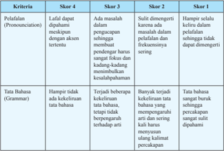

Tabel ini menunjukkan skor untuk dua kriteria utama dalam pembelajaran bahasa: Pelaflatan (Pronunciation) dan Tata Bahasa (Grammar). Skor 4 diberikan jika pelafalan dapat dipahami dengan akurasi tertentu, sementara skor 3 diberikan jika pelafalan masuk dalam masa pengucapan yang memudahkan pemahaman pendengar. Skor 2 diberikan jika pelafalan sering tidak fokus dan kadang-kadang menimbulkan kesulitan penerimaan, sedangkan skor 1 diberikan jika pelafalan sangat buruk sehingga sulit dimengerti. Untuk tata bahasa, skor 4 diberikan jika tidak ada kekeluhan pada tata bahasa, sementara skor 3 diberikan jika beberapa kekeluhan muncul tetapi masih bisa diartikan. Skor 2 diberikan jika banyak kekeluhan pada tata bahasa yang sering mengganggu arti dan sering kurang jelas, dan skor 1 diberikan jika tata bahasa sangat buruk sehingga sulit dipahami.

### Panduan Penilaian

 

---
## 📄 Halaman 16

---
**📊 Tabel**

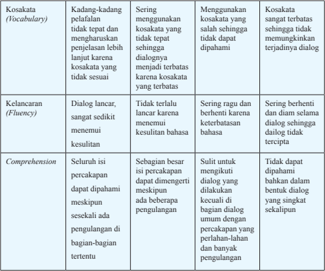

Tabel ini membandingkan empat aspek keterampilan berbicara: vocabularies (kosa kata), fluency (kelancaran), and comprehension (paham). Topik utama adalah bagaimana seseorang dapat berbicara dengan baik dalam berbagai situasi. Kolom-kolomnya mencakup kosa kata yang tepat, kelancaran dalam berbicara, dan pemahaman yang baik tentang apa yang dibicarakan. Data penting menunjukkan bahwa kemampuan untuk menggunakan kosa kata yang tepat sangat penting, tetapi juga perlu kelancaran dalam berbicara dan pemahaman yang baik untuk menghasilkan komunikasi yang efektif.

### Cara Penilaian Percakapan

---
**📊 Tabel**

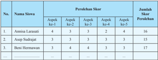

Tabel ini menunjukkan perolehan skor siswa dalam berbagai aspek pembelajaran. Topik utamanya adalah aspek ke-1, ke-2, ke-3, ke-4, dan ke-5. Kolom pertama menunjukkan nama-nama siswa, sedangkan kolom kedua hingga kelima menunjukkan skor masing-masing siswa untuk setiap aspek pembelajaran. Data penting yang terlihat adalah bahwa Anisnita Larasati memiliki perolehan skor tertinggi dengan total 16 poin, sedangkan Beni Hermawan memiliki perolehan skor terendah dengan total 17 poin. Sementara itu, Aspen Sudrajat memiliki perolehan skor yang sama dengan Beni Hermawan, yaitu 15 poin.

Rumus perhitungan nilai siswa sebagai berikut:

### Jumlah skor yang diperoleh siswa

Skor maksimal/ideal

### Keterangan:

Jumlah  skor  yang  diperoleh  siswa  adalah  jumlah  skor  yang  diperoleh siswa dari Aspek ke-1 sampai dengan ke-5.

× 100

 

---
## 📄 Halaman 17

Skor  maksimal/ideal  adalah  hasil  perkalian  skor  tertinggi  (4)  dengan jumlah kriteria yang ditetapkan (ada 5 kriteria). Jadi skor maksimal/ideal= 4×5 = 20

perhitungan nilai akhir siswa adalah:

``

### Rubrik Penilaian Menulis

---
**📊 Tabel**

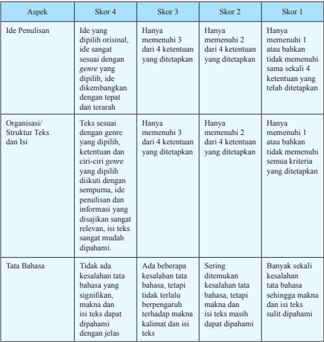

Tabel ini menunjukkan skor untuk empat aspek penulisan: ide pemulsaan, organisasi/struktur teks dan isi, tata bahasa, dan kesesuaian dengan kriteria ditetapkan. Topik utama tabel adalah evaluasi penulisan berdasarkan standar tertentu. Kolom-kolomnya mencakup skor 1 hingga skor 4, yang menunjukkan tingkat keberhasilan penulis dalam memenuhi kriteria tertentu. Data penting yang terlihat adalah bahwa skor 4 diberikan hanya jika semua kriteria ditetapkan dan disatisfaksi, sedangkan skor 1 diberikan jika penulis tidak memenuhi satu atau lebih kriteria. Skor 2 diberikan jika penulis memenuhi dua dari empat kriteria, dan skor 3 diberikan jika penulis memenuhi tiga dari empat kriteria. Ini menunjukkan bahwa skor 4 adalah skor tertinggi dan sangat sulit untuk dicapai, sementara skor 1 adalah skor terendah dan paling mudah untuk dicapai.

``

 

---
## 📄 Halaman 18

---
**📊 Tabel**

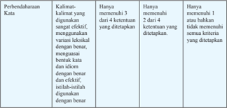

Tabel ini menunjukkan perbandingan kriteria evaluasi kata yang digunakan dalam bahasa Indonesia. Topik utamanya adalah tentang efektivitas penggunaan kata dalam berbagai konteks. Tabel dibagi menjadi tiga kolom: "Kata-kata yang digunakan", "Jumlah ketentuan 3 dari 4 ketentuan yang dietapkan", dan "Jumlah ketentuan 2 dari 4 ketentuan yang dietapkan". Data penting yang terlihat adalah bahwa untuk memenuhi kriteria tertinggi, kata harus menggunakan variasi istilah-istilah dengan benar dan efektif, sementara untuk memenuhi kriteria kedua, kata hanya perlu menggunakan dua dari empat ketentuan yang ditetapkan. Ini menunjukkan bahwa ada perbedaan dalam standar evaluasi kata yang diterima, dengan kriteria tertinggi memerlukan lebih banyak ketentuan yang tepat.

### Cara Penilaian Menulis

---
**📊 Tabel**

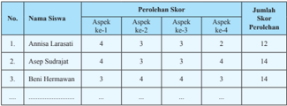

Tabel ini menunjukkan perolehan skor siswa dalam beberapa aspek pembelajaran, yaitu ke-1, ke-2, dan ke-3. Topik utama tabel adalah perbandingan skor siswa dalam berbagai aspek pembelajaran. Kolom pertama menunjukkan nama-nama siswa, sedangkan kolom kedua hingga kelima menunjukkan skor mereka dalam aspek pembelajaran ke-1, ke-2, ke-3, dan ke-4 masing-masing. Data penting yang terlihat adalah bahwa Asep Sudrajat memiliki skor tertinggi dengan 14 poin, sementara Beni Hermawan hanya memiliki skor 12 poin. Anissa Larasati memiliki skor yang lebih rendah dibandingkan Asep Sudrajat dan Beni Hermawan.

Rumus perhitungan nilai siswa, sebagai berikut :

``

### Keterangan:

Jumlah  skor  yang  diperoleh  siswa  adalah  jumlah  skor  yang  diperoleh siswa dari aspek ke-1 sampai dengan ke-4.

Skor  maksimal/ideal  adalah  hasil  perkalian  skor  tertinggi  (4)  dengan jumlah aspek yang ditetapkan (ada 4 aspek). Jadi, skor maksimal/ideal= 4x4 = 16.

 

---
## 📄 Halaman 19

Sehingga perhitungan nilai akhir siswa adalah:

``

``

### Rubrik Penilaian Proyek

---
**📊 Tabel**

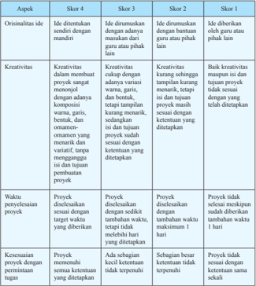

Tabel ini menunjukkan proses penilaian kreativitas dan originalitas dalam sebuah proyek, dengan skor 4, 3, 2, dan 1 sebagai standar penilaian. Topik utama tabel adalah evaluasi kreativitas dan originalitas proyek. Kolom-kolomnya mencakup aspek-aspek seperti ide, kreativitas, waktu penyelenggaraan proyek, dan kesesuaian proyek dengan permintaan tugas. Data penting yang terlihat adalah bahwa skor 4 diberikan jika ide memiliki mandiri, kreatif, disusun dengan komposisi warna, garis, huruf, dan omen-omen yang menarik, dan waktu penyelenggaraan proyek sesuai dengan ketentuan yang ditetapkan. Skor 3 diberikan jika ide memiliki mandiri, kreatif, disusun dengan komposisi warna, garis, huruf, dan omen-omen yang menarik, dan waktu penyelenggaraan proyek tidak tepat tetapi masih sesuai dengan ketentuan yang ditetapkan. Skor 2 diberikan jika ide memiliki mandiri, kreatif, disusun dengan komposisi warna, garis, huruf, dan omen-omen yang menarik, dan waktu penyelenggaraan proyek tidak tepat tetapi masih sesuai dengan ketentuan yang ditetapkan. Skor 1 diberikan jika ide memiliki mandiri, kreatif, disusun dengan komposisi warna, garis, huruf, dan omen-omen yang menarik, dan waktu penyelenggaraan proyek tidak tepat tetapi tidak sesuai dengan ketentuan yang ditetapkan.

 

---
## 📄 Halaman 20

### Cara Penilaian Proyek

---
**📊 Tabel**

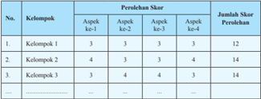

Tabel ini menunjukkan perbandingan skor penilaian antara kelompok-kelompok dalam empat aspek ke-1 hingga ke-4. Topik utama tabel ini adalah perbandingan skor penilaian antara kelompok-kelompok dalam empat aspek ke-1 hingga ke-4. Kolom-kolom yang ada dalam tabel ini adalah Kelompok 1, Kelompok 2, dan Kelompok 3. Data atau pola penting yang terlihat dalam tabel ini adalah bahwa semua kelompok memiliki skor yang sama pada aspek ke-1, ke-2, dan ke-3, tetapi skor pada aspek ke-4 berbeda-beda. Skor tertinggi untuk aspek ke-4 adalah 14, sedangkan skor terendah adalah 12. Ini menunjukkan bahwa skor penilaian pada aspek ke-4 lebih bervariasi dibandingkan dengan aspek ke-1, ke-2, dan ke-3.

Rumus perhitungan nilai kelompok, sebagai berikut:

``

Skor maksimal/ideal

### Keterangan:

Jumlah skor yang diperoleh kelompok adalah jumlah skor yang diperoleh siswa dari aspek ke-1 sampai dengan ke-4

Skor  maksimal/ideal  adalah  hasil  perkalian  skor  tertinggi  (4)  dengan jumlah aspek yang ditetapkan (ada 4 aspek). Jadi, skor maksimal/ideal = 4x4 = 16.

Sehingga perhitungan nilai akhir kelompok adalah:

``

Nilai kelompok secara otomatis akan menjadi nilai anggotanya.

### 3. Penilaian Sikap Melalui Observasi

### Jurnal Perkembangan Sikap

---
**📊 Tabel**

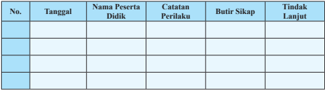

Tabel ini berisi informasi tentang tindak lanjut siswa didik pada suatu program pendidikan. Topik utamanya adalah tindak lanjut siswa didik, yang meliputi tanggal pelaksanaan, nama siswa didik, catatan perbaikan, batas waktu untuk sanksi, dan tindakan lanjut yang diambil. Kolom-kolomnya mencakup tanggal pelaksanaan (Tanggall), nama siswa didik (Nama Peserta Didik), catatan perbaikan (Catatan Perbaikan), batas waktu untuk sanksi (Batas Sikap), dan tindakan lanjut yang diambil (Tindak Lanjut). Data penting yang terlihat adalah bahwa setiap baris menunjukkan tindakan lanjut yang diambil untuk setiap siswa didik, yang mencakup tanggal pelaksanaan, nama siswa didik, catatan perbaikan, batas waktu untuk sanksi, dan tindakan lanjut yang diambil. Ini membantu dalam pengawasan dan evaluasi tindakan lanjut yang diambil oleh guru untuk membantu siswa didik dalam memperbaiki kelemahan mereka.

 

---
## 📄 Halaman 21

### Contoh Jurnal Perkembangan Sikap Spiritual

### Contoh Jurnal Perkembangan Sikap Sosial

---
**📊 Tabel**

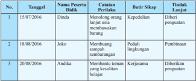

Tabel ini menunjukkan catatan perilaku dan tindakan lanjutan dari beberapa siswa yang telah diberikan kesempatan untuk memperbaiki perilaku mereka. Topik utama tabel adalah perubahan perilaku siswa setelah diberikan kesempatan untuk memperbaiki diri. Kolom-kolom yang ada meliputi tanggal, nama peserta didik, catatan perilaku, batu cirik, dan tindakan lanjutan. Data penting yang terlihat adalah bahwa semua siswa yang diberikan kesempatan tersebut telah memperbaiki perilaku mereka, seperti Dinda yang meningkatkan sikapnya terhadap lingkungan, Joko yang lebih peduli terhadap lingkungan, dan Andika yang lebih konsisten dalam melakukan tugas belajar. Tindakan lanjutan yang diberikan termasuk kepedulian, pembinaan, dan diberikan penghargaan.

 

---
## 📄 Halaman 22

### CLASSROOM LANGUAGE

### Greetings/Small Talk

- -Good morning, everybody/class.
- -Good afternoon, everyone/class.
- -How are you?
- -What's up?
- -Have a nice day!
- -Let us wrap up for today!

### Magic Words

- -Please.
- -Thank you.
- -I am sorry.
- -Excuse me.
- -No, thank you.
- -Pardon.
- -I appreciate it.
- -You are welcome.
- -My pleasure.

### Giving Instructions in Class

- -Listen carefully.
- -Attention, please!
- -Look at me!
- -Listen to what your classmates are saying.
- -May I have your attention, please?
- -I want everyone to look at the board.
- -Do you understand?
- -That is right.
- -That is what I meant. Let me say it again.
- -I mean ….
- -You got it.
- -That is quite right.
- -This is what I want you to do.
- -Can I help you?
- -Do you follow me?
- -Are you with me?
- -No daydreaming, listen to your classmates.
- -Here we go.
- -Can you speak louder, please? I can't hear you.
- -Now let's go/move on to ....
- -Please pronounce each word slowly.
- -Go to the Active Conversation/ Writing Connection.
- -Please complete this section/part in 5 /10/…. minutes.
- -Repeat each word after me.
- -Say it together.
- -Swap your book with the person next to you and ....
- -Exchange your work with your partner.
- -Exchange your work with the person sitting next to you.
- -Can you check your work again?
- -Grade your classmate's work.
- -Mark the work of the person sitting next to you.
- -Ready? Are you ready?
- -That's correct.
- -Let's go/start.
- -Say it one more time.
- -Do you have any questions before we move forward?
- -Should I move on?
- -Is everything clear?
- -Any questions?
- -Can you repeat what I've said?
- -Can you speak louder?
- -That is good, but can you repeat it in a complete sentence?

 

---
## 📄 Halaman 23

- -Read loudly.
- -Do not scream or shout.
- -Read quietly.
- -Read with your partner.
- -Whose turn is it?
- -Who is next?

### Using Textbooks

- -Take out your text books.
- -Open your books.
- -Go to page ....
- -Turn to the next activity.
- -Open your book and go to ….
- -Open page number ….
- -Turn over to the next page.
- -Let's move to the next activity on page ….

### Organizing Pair Work and Group Work

- -Let's work in pairs.
- -Choose your partner.
- -Pair up.
- -Now let's get into groups of 6/5/4/3.
- -In groups of 6/5/4, please.
- -Time for group work.
- -Can Lana join your group? She doesn't have a group as she came late.
- -Remember, everyone has to participate.
- -Everyone must give his or her input in the discussion.
- -Move around the classroom without making noise.

### Encouraging Students to Ask/ Answer Questions

- -Who knows the answer?
- -Raise your hand.
- -Volunteer, please.
- -Anyone else wants to try?
- -Come on, dear, you try.
- -Who wants to read?
- -That's good, come and read.
- -Come and do it on the board.
- -Good try, but it is not correct. Try again.
- -Let's do it together.
- -You are doing it perfectly.
- -What do you think about it?
- -What is your opinion? It is OK to share.

### Asking Students to Hand in Their Homework

- -Have you done your homework?
- -Those of you who haven't done the homework, please raise your hand.
- -Give me a good reason for not doing your work.
- -This is not a good excuse.
- -Please put your homework on my desk.
- -Siti, can you collect everyone's work? Thank you.
- -If you haven't done your homework, do it as soon as possible.
- -Hand in your work.
- -Submit your homework.

### Praising Your Students

- -Good job!
- -Excellent work!
- -Fantastic work!
- -Well done!
- -That's right!
- -Terriic job!
- -You are correct.
- -Good thinking.
- -That's an excellent question.
- -Perfect work!

 

---
## 📄 Halaman 24

- -Very creative.
- -I am so proud of you.
- -You have made me proud.
- -Good try!
- -You can't do better than this.
- -I have complete faith in you.
- -Good job! That is perfect.
- -That's an excellent question.

### Instructions for Tests

- -Please write your name and class on the paper/answer sheet.
- -Read carefully before starting the test.
- -Use a black pen/pencil only.
- -Ask if you do not understand anything.
- -Time is up.
- -Stop writing.
- -Five more minutes left.
- -Please stop.
- -Put your pens down.
- -Leave your answer sheet on your desk.
- -Bring your answer sheet here.
- -Is everyone done?
- -Has everyone submitted their work?

### Wishing Students

- -Have a good day!
- -Happy birthday!
- -Many happy returns of the day!
- -Good luck!
- -All the best!
- -Best wishes!
- -Good luck for your exams!
- -Good luck for the competition! I hope you are victorious.
- -Get well soon!
- -Have good holidays!
- -Happy New Year!
- -Enjoy your holidays!

### Ending the Class

- -Let's recap before we go.
- -Can you summarize what I've said?
- -OK, class, we will stop here.
- -We will continue next week.
- -Let's wrap it for this week.
- -Do you have any questions before we end this class for today?
- -Any questions before we stop?
- -Let's stop here.
- -Before we stop, tell me what you have learnt today.
- -Since we inished early, how about playing a game?
- -There are a few minutes left, you can check your work again.
- -Saved by the bell, we will continue next week.
- -No time left, let's continue in next class.
- -OK, everyone, let's call it a day.
- -Goodbye, everyone!
- -Have a nice day!

 

---
## 📄 Halaman 25

### Ofer

- Could I ....?
- I offer ....
- Will I ....?
- Can we ....?
- Shall I ....?
- Would you ....?

### Example:

Could I bring you a cup of tea?

### CHAPTER 1 Ofers and Suggestions

### KOMPETENSI DASAR

- 3.1  Menerapkan fungsi sosial, struktur teks, dan unsur kebahasaan teks interaksi  transaksional  lisan  dan  tulis  yang  melibatkan  tindakan memberi dan meminta informasi terkait saran dan tawaran, sesuai dengan  konteks  penggunaannya.  (Perhatikan  unsur  kebahasaan should, can)
- 4.1  Menyusun  teks  interaksi  transaksional,  lisan  dan  tulis,  pendek dan sederhana, yang melibatkan tindakan  memberi dan meminta informasi terkait saran dan tawaran, dengan memperhatikan fungsi sosial, struktur  teks, dan unsur  kebahasaan yang benar dan sesuai konteks.

### EXPRESSIONS

### Suggetion

- Let's go ....
- We propose ....
- I suggest ....
- We advocate ....
- I put forward ....
- I advice ....

### Example :

I suggest you come earlier.

 

---
## 📄 Halaman 26

---
**📊 Tabel**

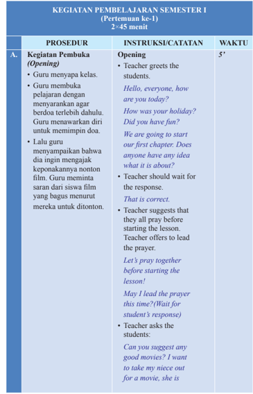

Tabel ini berisi prosedur pembukaan kelas dalam sebuah mata pelajaran, dengan waktu 2-45 menit. Topik utamanya adalah "Kegiatan Pembukaan (Opening)" yang melibatkan guru menyapa kelas, membuka pelajaran dengan menyarankan agar berdoa sebelum mulai, dan mengajak keponakan nonton film. Guru juga meminta saran dari siswa tentang film yang bagus untuk ditonton. Tabel ini mencakup instruksi atau catatan yang harus dilakukan oleh guru, seperti mengajak semua siswa berdoa sebelum mulai, memberikan contoh doa, dan meminta saran dari siswa. Waktu yang diberikan untuk setiap prosedur adalah 5 menit.

 

---
## 📄 Halaman 27

B.

### Kegiatan Inti (Main Activity )

### Reading Activities

- Siswa diminta membentuk pasangan.
- Bersama teman pasangannya siswa membaca teks percakapan 1 dan 2 yang ada di awal Bab 1.
- Setelah membaca guru menanyakan apa isi percakapan yang mereka baca, lalu meminta siswa menjelaskan jenis ungkapan yang ada pada percakapan 1 dan percakapan 2 tersebut.
- Siswa diminta menuliskan jawabannya pada lembaran yang telah disediakan.
around your age. (Let the students give responses)

Ok, good! That sounds quite interesting. I will suggest it to her and see what she thinks. Thank you!

- Teacher asks each student to choose a classmate as partner.
Before we start. why don't you choose one of your classmates as your partner? After that, open your book and go to Chapter 1.

- Teacher asks the students to read conversations 1 and 2 given in the beginning of Chapter 1.
We are going to read conversations 1 and 2 given in chapter 1. Role play to read the conversations with your partner.

- Teacher asks some questions related to the conversations.
Did you enjoy reading the conversations? Did you ind them easy or dificult? What is each convers ation about?

20'

 

---
## 📄 Halaman 28

### Building Blocks

- Guru memulai pembahasan materi pelajaran dengan meminta saran kepada siswa tentang suatu hal, seperti meminta saran tentang hadiah ulang tahun yang cocok untuk keponakan yang sedang berulang tahun.
- Siswa diminta menyampaikan saran yang diminta oleh guru.
- Setelah mendengarkan saran beberapa siswa, guru mulai menjelaskan tentang fungsi sosial, struktur teks, dan unsur kebahasaan dari ungkapan memberi saran dan tawaran.
- Guru memberi beberapa contoh ungkapan memberi saran dan ungkapan menyampaikan tawaran.
What kind of interpersonal transaction is going on in each conversation?

Wonderful! Let's move on and see what we have next.

- Teacher starts by asking suggestions from the students about something. For example about the idea of a birthday gift for the teacher's niece.
I want to give a birthday gift to my niece. She is around your age. Can you give me some suggestions?

(Wait for the students to respond.)

O, that' s a good idea! Thank you! What do you know about making suggestions and giving offers?

(Wait for the students to repond.)

- Teacher, then, explains to the students about the social function, the text structure, and grammatical components of offers and suggestions.
Today we are

25'

 

---
## 📄 Halaman 29

- Setelah mendengarkan penjelasan guru dan contoh-contoh
going to learn how to suggest and offer.

Suggest means to convey a thought or an idea indirectly.

Offer means to give our help to other people.

This is how we suggest :

Why don't we go to a movie?

You could go to a movie.

Let's go to a movie.

What about going to a movie?

How about going to a movie?

I suggest we go to a movie.

This is how we offer :

May I help you?

Are you looking for something?

Would you like some help?

Do you need some help?

What can I do for you today?

- After listening to the explanation about offers and suggestions, the students are asked to do the Let's Practice Section. This is an
30'

 

---
## 📄 Halaman 30

C.

penggunaan offer dan suggestion serta ciri-ciri kebahasaan yang ada di ungkapan offer dan suggestion, siswa diminta berlatih menggunakan ungkapan offer dan suggestion dalam dialog yang telah disiapkan di bagian Let's Practice.

- Guru memberi waktu sekitar 30 menit untuk menyelesaikan latihan tersebut. Sisanya bisa diberikan sebagai pekerjaan rumah (PR).

### Kegiatan Penutup (Closing)

- Sebagai penutup kegiatan belajar, guru mengulas kembali tentang offer dan suggestion . Guru meminta beberapa siswa memberikan
important part. This section allows the students to build on their skills learnt in Building Block .

Now, it's time to practice what we have learnt.

- Teacher asks the students to do the exercises and complete the conversations given in the Let's Practice section .
Do you have a partner? Yes/No. partner)

work on the activities given in the Let' s Practice section. If something is not clear, come and see me.

Ok! That is great. (if everyone has a Choose your partner quickly, so that we can start. With your partner,

- Teacher reviews what they have done, and wraps up the class with some self relective questions.
Who can tell me what we have learnt today? Very good!

10'

 

---
## 📄 Halaman 31

- contoh offer dan suggestion.
- Guru dan siswa melakukan releksi kegiatan belajar hari ini dan menyampaikan apa yang harus dipersiapkan pada pertemuan selanjutnya.
Anyone else wants to try? Well done, everyone! As a little bit of relection, write down the answer to these questions in your notebook. Did you ind today's lesson easy?

How did you feel while working Did you face any problems?

- Teacher ends the lesson by praying and saying goodbye.
with your partner? Do you think you could resolve those problems and work together again? Thank you! Let's thank The Almighty God. I will see you next time.

 

---
## 📄 Halaman 32

### KEGIATAN PEMBELAJARAN SEMESTER I (Pertemuan ke-2) 2 × 45 menit

---
**📊 Tabel**

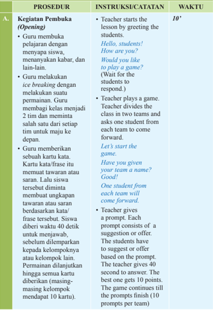

Tabel ini berisi prosedur pembukaan kelas (Opening) yang dilakukan oleh guru untuk memulai kegiatan belajar mengajar. Topik utama tabel ini adalah prosedur pembukaan kelas, yang melibatkan guru menghormati siswa dengan menyapa mereka, melakukan ice-breaking dengan melakukan suatu permainan, memberikan kartu kata, dan memberikan prompt. Kolom-kolom yang ada dalam tabel ini adalah Prosedur, Instruksi/Tatakan, dan Waktu. Data penting yang terlihat dalam tabel ini adalah bahwa guru mulai dengan menyapa siswa, melakukan ice-breaking dengan permainan, memberikan kartu kata, dan memberikan prompt. Waktu yang diberikan untuk setiap prosedur juga ditentukan dalam tabel ini.

 

---
## 📄 Halaman 33

I will give a prompt, you have 40 seconds to answer. Your time starts now.

(Teacher can make prompts on her own before the class or ask  the teams to make them.)

### Example of a prompt:

Watching movie (How would you suggest?)

Help clean the house (How would you offer?)

 

---
## 📄 Halaman 34

---
**🖼️ Gambar/Diagram**

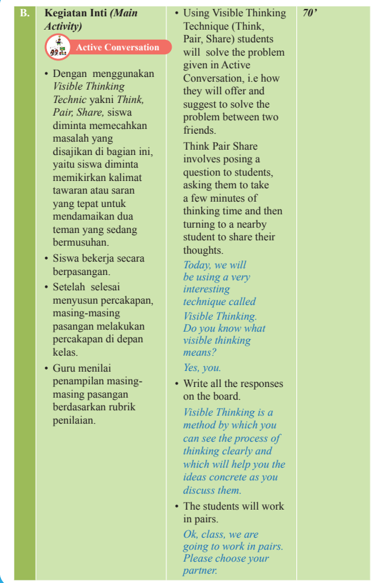

> **Deskripsi Visual:** Gambar ini adalah diagram yang menunjukkan proses aktivitas belajar matematika dalam sebuah kelas. Diagram ini terdiri dari dua bagian utama: bagian kiri berisi teks deskripsi aktivitas, dan bagian kanan berisi penjelasan lebih lanjut tentang teknik Visible Thinking.

Pertama, pada bagian kiri, ada teks yang menjelaskan bahwa kegiatan inti (Main Activity) adalah "Active Conversation" dengan menggunakan Visible Thinking Technique. Teknik ini melibatkan siswa dalam diskusi aktif untuk mencapai solusi masalah yang diberikan.

Di bagian kanan, penjelasan lebih lanjut tentang Visible Thinking Technique disampaikan. Teknik ini melibatkan siswa dalam proses pemikiran yang jelas dan memungkinkan mereka untuk menyampaikan ide-ide mereka kepada teman sekelas. Siswa akan diajak untuk berdiskusi dalam pasangan, masing-masing memberikan pendapat mereka tentang masalah yang diberikan.

Informasi kunci yang dapat diambil pembaca adalah bahwa Visible Thinking Technique digunakan sebagai alat untuk membantu siswa dalam proses pemikiran yang jelas dan menyampaikan ide-ide mereka kepada teman sekelas. Teknik ini memungkinkan siswa untuk bekerja secara berpasangan dan menghasilkan solusi yang lebih baik untuk masalah yang diberikan.

 

---
## 📄 Halaman 35

Open Chapter 1 of your book and let's go to the Active Conversation section.

Please read the activity.

- After inishing the conversation, each pair should present it in front of the class.
We will be using a visible thinking technique called Think, Pair, Share. This is how we will do it.

Think - of all possible solutions to the problem.

Pair - discuss all the solutions with your partner. Listen to your partner's solutions.

Share -Together choose the most appropriate solution. Share your solution with the class.

- Teacher grades each performance based on the rubric.

 

---
## 📄 Halaman 36

---
**🖼️ Gambar/Diagram**

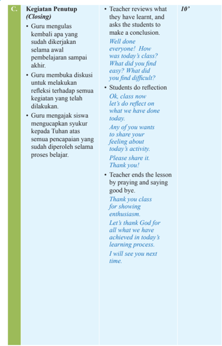

> **Deskripsi Visual:** Gambar ini adalah diagram yang menunjukkan prosedur penutup (Closing) dalam sebuah kegiatan belajar mengajar. Diagram ini terdiri dari beberapa elemen utama:

1. **Judul**: "Kegiatan Penutup (Closing)" terletak di bagian atas diagram.

2. **Pertanyaan dan Respons**: Ada dua pertanyaan yang ditulis di bawah judul, bertulisan "Teacher reviews what they have learnt, and asks the students to make a conclusion." dan "Students do reflection". Setiap pertanyaan diikuti oleh jawaban yang disediakan oleh guru dan siswa masing-masing.

3. **Teks Guru**: Teks ini berisi instruksi untuk guru tentang bagaimana melakukan penutup, termasuk memberikan ulasan tentang apa yang telah dipelajari, meminta siswa untuk membuat kesimpulan, dan memberikan ruang bagi siswa untuk melakukan refleksi.

4. **Teks Siswa**: Teks ini berisi instruksi untuk siswa tentang bagaimana mereka akan melakukan refleksi, termasuk memberikan kesempatan kepada setiap siswa untuk berbagi perasaannya tentang aktivitas tersebut dan menyampaikan terima kasih kepada Tuhan atas pencapaian mereka.

5. **Penutup**: Teks ini berisi pernyataan penutup yang dilakukan oleh guru, yang mencakup doa dan ucapan terima kasih kepada siswa karena partisipasi mereka dalam proses belajar.

6. **Angka**: Angka "10" terdapat di bagian kanan atas diagram, mungkin merujuk pada skor atau nilai yang diberikan untuk prosedur penutup ini.

7. **Label**: Label "C" terdapat di bagian kiri atas diagram, mungkin merujuk pada nomor atau kategori dari buku pelajaran ini.

Dengan demikian, diagram ini membantu guru dan siswa dalam menyelesaikan kegiatan belajar dengan efektif, mencakup review, refleksi, dan penutup yang mendalam.

 

---
## 📄 Halaman 37

---
**📊 Tabel**

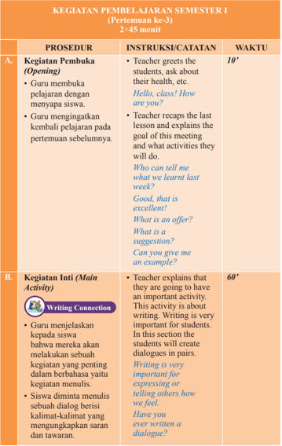

Tabel ini menunjukkan prosedur pembelajaran semester pertama (Pertemuan ke-3) yang berlangsung selama 2 hingga 45 menit. Topik utama adalah "Writing Connection" dengan fokus pada kegiatan menulis. Proses pembelajaran dimulai dengan pembukaan di mana guru membuka pelajaran dengan menanyakan tentang kesehatan siswa dan menjelaskan tujuan pertemuan tersebut. Kemudian, guru memperkenalkan kegiatan inti, yaitu menulis dialog berdasarkan pernyataan yang diberikan. Guru menjelaskan pentingnya menulis untuk siswa dan memberikan contoh bagaimana menulis dialog. Selama proses ini, guru juga memberikan waktu untuk siswa untuk mencoba menulis dialog mereka sendiri.

 

---
## 📄 Halaman 38

---
**🖼️ Gambar/Diagram**

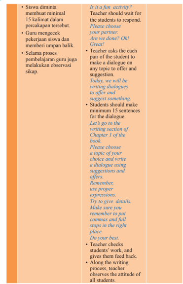

> **Deskripsi Visual:** Gambar ini adalah diagram yang menunjukkan prosedur pembelajaran berbasis dialog (dialogic teaching) dalam mata pelajaran bahasa Inggris. Diagram ini terdiri dari dua bagian yang berbeda: bagian kiri berisi instruksi kepada guru dan siswa, sementara bagian kanan berisi petunjuk untuk siswa tentang bagaimana membuat dialog. 

Pertama, guru diminta untuk meminta setidaknya 15 kalimat dalam percakapan sebelumnya. Selanjutnya, guru harus memeriksa pekerjaan siswa dan memberi umpan balik. Selama proses pembelajaran, guru juga melakukan observasi sikap.

Siswa diminta untuk membuat minimum 15 kalimat dalam percakapan tersebut. Guru harus mengecek pekerjaan siswa dan memberi umpan balik. Selama proses pembelajaran, guru juga melakukan observasi sikap.

Guru bertanya kepada setiap pasangan siswa untuk membuat dialog tentang topik yang ditawarkan dan saran. Siswa harus membuat minimum 15 kalimat dalam dialog tersebut. Siswa harus menggunakan penggunaan kata yang tepat dan detail dalam membuat dialog.

Guru akan memberikan feedback pada karya siswa dan memperhatikan sikap semua siswa.

 

---
## 📄 Halaman 39

### C. Kegiatan Penutup (Closing)

- Guru mengumpulkan pekerjaan siswa.
- Guru mengevaluasi halhal yang harus diperbaiki oleh siswa selama proses pembelajaran, termasuk sikap-sikap yang perlu diperhatikan.
- Guru meminta siswa untuk melakukan self assesment terhadap apa yang sudah mereka lakukan hari ini.
- Guru menugaskan siswa untuk menyiapkan bahan-bahan untuk membuat proyek pada pertemuan berikutnya.
- Kemudian guru menutup pertemuan dengan do'a dan salam.
- Teacher collects everyone's work.
- Teacher evaluates what they should improve along the learning process, including their attitude.
So what do you think? Did you enjoy the writing?

(Listen to students' responses.)

- Students do self assessment.
Ok, class, it' s time to do self assessment. Write down the relection in your journal.

- Teacher reminds the students to bring necessary materials for the  project in the next meeting.
Class, we are going to start our project next week. Please make sure you bring all the neccessary items..

- Teacher ends the lesson by praying and saying goodbye.
Ok, class. I hope you enjoyed the activity. Let's thank God for all what we have achieved in the learning process. See you next meeting.

20'

 

---
## 📄 Halaman 40

---
**🖼️ Gambar/Diagram**

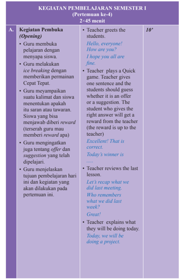

> **Deskripsi Visual:** Gambar ini adalah diagram yang menunjukkan struktur kegiatan pembelajaran semester pertama (pertemuan ke-4) dalam kurikulum 2013. Diagram ini terdiri dari kolom dan baris yang menggambarkan berbagai aspek kegiatan pembelajaran, termasuk pembukaan, materi pembelajaran, dan penutup.

Kolom pertama, "A.", menunjukkan jenis kegiatan pembelajaran yang akan dilakukan, seperti pembukaan, materi pembelajaran, dan penutup. Baris pertama, "Kegiatan Pembuka (Opening)," menjelaskan bagaimana guru menyambut siswa dan melakukan ice breaking dengan memberikan permainan Cepat Tepat. Guru juga memberikan Quick Game untuk memperkenalkan konsep offer dan suggestion.

Baris kedua, "Materi Pembelajaran," menjelaskan bagaimana guru mengajarkan konsep offer dan suggestion kepada siswa. Guru menggunakan metode review untuk memperkenalkan tujuan pembelajaran dan kegiatan yang akan dilakukan pada pertemuan ini.

Baris ketiga, "Penutup," menjelaskan bagaimana guru menutup kegiatan pembelajaran dengan memberikan recap tentang apa yang telah dilakukan selama pertemuan sebelumnya dan memberikan informasi tentang kegiatan yang akan dilakukan pada pertemuan berikutnya.

Elemen-elemen utama dalam diagram ini meliputi jenis kegiatan pembelajaran, metode pembelajaran, dan tujuan pembelajaran. Relasi antara elemen-elemen ini adalah bahwa setiap jenis kegiatan pembelajaran memiliki tujuan dan metode yang spesifik untuk mencapai tujuan tersebut.

Teks, angka, atau label penting yang terlihat dalam diagram ini meliputi "Kegiatan Pembuka (Opening)," "Materi Pembelajaran," dan "Penutup." Angka 10 menunjukkan waktu yang dibutuhkan untuk pembukaan kegiatan pembelajaran.

Informasi kunci yang dapat diambil pembaca meliputi jenis kegiatan pembelajaran yang akan dilakukan, metode pembelajaran yang digunakan, dan tujuan pembelajaran yang ingin dicapai.

 

---
## 📄 Halaman 41

B.

### Kegiatan Inti (Main Activity)

- Pada kegiatan Let's Create/Contribute siswa menggunakan apa yang sudah dipelajarinya untuk menghasilkan suatu karya yang dapat bermanfaat bagi diri sendiri, teman, dan lingkungan.
- Siswa akan bekerja secara berpasangan. Siswa diminta memilih salah satu dari kegiatan yang sudah ditentukan di bagian Let's Create/ Contribute.
- Siswa merancang dan membuat proyek yang sudah dipilihnya. Mereka diberi waktu 1 minggu untuk menyelesaikan proyek tersebut.
- Selama proses pembuatan proyek di kelas, guru melakukan pengamatan terhadap cara kerja masingmasing pasangan serta memberi feedback kepada kelompok yang membutuhkan.
- Setelah selesai tiap-tiap kelompok menyerahkan dan mempresentasikan hasil proyeknya kepada guru di luar jam pelajaran.
- In the Let's Create/ Contribute section, the students use what they have learnt to create something which they can use to contribute to their peers, school mates and the community at large.
Are you ready to create something? Let's start creating.

Please open Chapter 1 and go to the Create/ Contribute section. Please read this section.

Teacher explains each project.

- Teacher will ask the students to make pairs and then choose one of the tasks given in the Let's Create/Contribute section of Chapter 1.
You can choose one of the projects given. Try to think out of the box to create this project.

- Students plan and create the project they've chosen. They will have 1 week to inish the project.
The irst is to plan. After that you can start assembling the project.

- Along the process, teacher observes how they work and gives
70'

 

---
## 📄 Halaman 42

- C.

### Kegiatan Penutup (Closing)

- Guru mengulas kembali apa yang sudah dikerjakan selama awal pembelajaran hingga akhir.
- Guru mengarahkan siswa  untuk melakukan releksi terhadap semua kegiatan yang telah dilakukan. Kemudian guru memberi kesempatan kepada siswa untuk melakukan self assesment.
feedback to the students if necessary.

- After the time is up, they should meet the teacher and present it out of class hours.
After you inish the project, you will present it in class and then we can display it on the board in the classroom. The best project will be displayed outside in the hall.

- Teacher reviews the lesson.
- Asks the students to do relection and self assessment of what they have done.
So class, how much  have you accomplished?

Did you ind anything dificult? Oh Ok!

Why do you feel like that?

Ok! We can igure it out.

Ok, class! I will see you next week.

10'

 

---
## 📄 Halaman 43

### EVALUATION

### Penilaian Pengetahuan

Latihan soal di bagian Lets Practice

### Penilaian Keterampilan

Unjuk kerja berupa:

- Melakukan percakapan berisi tawaran dan saran.
- Menulis dialog berisi kalimat tawaran dan saran.
- Membuat proyek.

### Rubrik Penilaian Unjuk Kerja

Rubrik Penilaian Percakapan

---
**📊 Tabel**

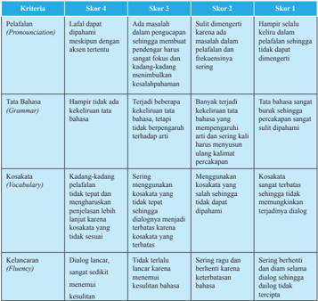

Tabel ini menunjukkan skor untuk empat kriteria utama dalam proses pembelajaran bahasa: Pemahaman (Promunciation), Tata Bahasa (Grammar), Kosakata (Vocabulary), dan Kelancaran (Fluency). Setiap kriteria dibagi menjadi empat skor berdasarkan tingkat kesulitan yang dihadapi peserta didik. Topik utama tabel ini adalah evaluasi kemampuan peserta didik dalam berkomunikasi menggunakan bahasa yang tepat dan efektif. Kolom-kolomnya mencakup skor 1 hingga skor 4 untuk setiap kriteria. Data penting yang terlihat adalah bahwa skor 1 biasanya diberikan pada peserta didik yang dapat berkomunikasi dengan akurat dan tepat, sedangkan skor 4 diberikan pada peserta didik yang mengalami kesulitan signifikan dalam berkomunikasi. Pola yang jelas adalah bahwa semakin tinggi skor, semakin baik kemampuan peserta didik dalam berkomunikasi.

 

---
## 📄 Halaman 44

### Rubrik Penilaian Menulis

---
**📊 Tabel**

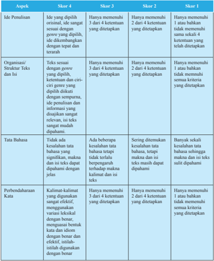

Tabel ini menunjukkan berbagai skor untuk penilaian ide penulisan, struktur teks, tata bahasa, dan perbedaan dalam kualitas penulisan. Topik utama tabel adalah penilaian kualitas penulisan, dengan kolom-kolom yang mencakup ide penulisan, struktur teks dan isi, tata bahasa, dan perbedaan dalam kualitas penulisan. Data penting yang terlihat adalah bahwa skor 4 memerlukan penulisan yang original dan sesuai dengan genre yang ditujukan, dengan struktur teks yang tepat dan isi yang relevan. Skor 3 memerlukan penulisan yang baik namun tidak ideal, sedangkan skor 2 hanya memerlukan penulisan yang cukup baik, dan skor 1 hanya memerlukan penulisan yang minim.

 

---
## 📄 Halaman 45

### Rubrik Penilaian Proyek

---
**📊 Tabel**

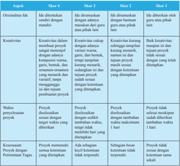

Tabel ini menunjukkan skor untuk empat aspek kreativitas proyek, yaitu originalitas ide, kreativitas, waktu penyelesaian proyek, dan kesesuaian proyek dengan permintaan tugas. Topik utama tabel ini adalah evaluasi kreativitas dan keterampilan dalam membuat proyek. Kolom-kolomnya meliputi: Skor 4 (terbaik), Skor 3, Skor 2, dan Skor 1. Data penting yang terlihat adalah bahwa skor 4 diberikan jika ide memiliki kreativitas tinggi, originalitas, dan waktu penyelesaian yang tepat sesuai dengan ketentuan. Sedangkan skor 1 diberikan jika semua aspek tidak memenuhi standar.

 

---
## 📄 Halaman 46

### Penilaian Sikap

Penilaian sikap dilakukan selama kegiatan pembelajaran berlangsung dengan berpedoman pada Kompetensi Dasar KI-2. Format penilaian dapat dilihat di Pedoman Penilaian Buku Guru ini.

### Rubrik Penilaian Sikap

(Lihat Pedoman Penilaian Sikap)

### ENRICHMENT

Berikut ini beberapa alternatif kegiatan pengayaan yang bisa diberikan kepada siswa di bab ini.

- Membuat role play yang dialognya mengandung suggestion dan offer.
- Membuat pamlet berisi saran agar bijak menggunakan media sosial.

 

---
## 📄 Halaman 47

### TEACHER'S REFLECTION

Keberhasilan apa saja yang sudah dicapai di bab ini?

Apa yang harus menjadi perhatian khusus dalam pelaksanaan pembelajaran bab ini?

Apa yang harus diperbaiki?

Siswa mana yang membutuhkan perhatian khusus?

 

---
## 📄 Halaman 48

### CHAPTER 2 Opinions & Thoughts

### KOMPETENSI DASAR

- 3.2  Menerapkan fungsi sosial, struktur teks, dan unsur kebahasaan teks interaksi  transaksional  lisan  dan  tulis  yang  melibatkan  tindakan memberi dan meminta informasi terkait pendapat dan pikiran, sesuai dengan konteks penggunaannya (Perhatikan unsur kebahasaan I think, I suppose, in my opinion )
- 4.2    Menyusun  teks  interaksi  transaksional,  lisan  dan  tulis,  pendek  dan sederhana, yang melibatkan tindakan memberi dan meminta informasi terkait  pendapat  dan  pikiran,  dengan  memperhatikan  fungsi  sosial, struktur teks, dan unsur kebahasaan yang benar dan sesuai konteks

 

---
## 📄 Halaman 49

- I agree.
- We believe ....
- I reckon ....
- I doubt ....
- I assume ....
- I don't agree ....
- I disagree ....
- I think ....
- I don't think ....
- What I mean is ....
- In my humble opinion ....
- In my opinion ....
- Personally, I think ....
- In my experience ....
- I would like to point out that ....
- I strongly believe that ....
- I think ....
- As far as I am concerned, ....
- Some people believe ....
- The majority agree with ....
- I am afraid I have to disagree with you.
- It is not justiied to say so.

### EXPRESSIONS OF OPINIONS

 

---
## 📄 Halaman 50

### KEGIATAN PEMBELAJARAN SEMESTER I (Pertemuan ke-5) 2 × 45 menit

---
**📊 Tabel**

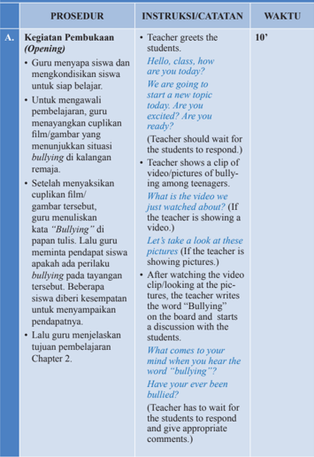

Tabel ini berisi prosedur pembukaan (opening) untuk sebuah kelas belajar, yang mencakup instruksi dan catatan yang diberikan kepada guru untuk membantu dalam proses pembelajaran. Topik utama tabel adalah pembukaan kelas, yang melibatkan pengenalan siswa, menunjukkan video atau gambar tentang bullying di kalangan remaja, dan menjelaskan tujuan pembelajaran Chapter 2. Kolom "Instruksi/Catatan" menyediakan petunjuk detail tentang bagaimana guru harus melakukan setiap langkah, seperti menghormati waktu siswa dengan memberi mereka kesempatan untuk merespons pertanyaan, menunjukkan video atau gambar tertentu, dan meminta siswa untuk memberikan komentar atau perasaan mereka tentang istilah bullying. Kolom "Waktu" memberikan estimasi waktu yang diperlukan untuk setiap langkah, mulai dari 10 menit hingga beberapa menit lebih. Pola penting yang terlihat adalah bahwa proses ini memerlukan kerjasama antara guru dan siswa, dengan fokus pada pemahaman dan diskusi tentang topik bullying.

 

---
## 📄 Halaman 51

- B.

### Kegiatan Inti (Main Activity)

### Reading Activities

- Guru menunjukkan teks percakapan yang ada di Chapter 2 buku siswa. Guru menjelaskan bahwa teks percakapan tersebut merupakan salah satu contoh teks yang berisi opini tentang peristiwa bullying . Guru meminta siswa membentuk pasangan.
- Kemudian secara berpasangan di tempat masing-masing, siswa  mempraktikkan percakapan yang ada di buku teks tersebut.
- Kemudian siswa diminta mendiskusikan beberapa pertanyaan terkait percakapan tersebut.
Isn't it sad that in this modern era we still have bullying? What can we do to curb bullying?

- The teacher explains what they will be doing today.
Can anyone tell me what we are going

Today we will be talking about opin- to do today? ions.

- Teacher asks the students to see the conversation given in Chapter 2 and discuss the questions. The students are asked to work in pairs.
Do you all have partners? OK! Excellent!

Please go to Chapter 2 and read the conversation given. Make sure you read while assuming the characters of the conversation.

- Teacher asks the students to read and role-play the conversation.
Role-play the conversation, it will be fun. Are you done? Good!

- Teacher asks the students to discuss some questions of the conversation.
15'

 

---
## 📄 Halaman 52

- Setelah selesai, guru masuk kepada inti pembelajaran hari ini.
Did you understand the conversation? What is it about?

(Teacher writes all the responses on the board.)

Yes! Indeed, it is connected to our discussion earlier. Bullying is like a disease spreading fast.

What do you think about it? What is your opinion? It is very important to have opinions, it relects on who we are as people

(This is a transition from text to opinion building blocks.)

All of us have opinion,  sometimes on small aspects of life and sometimes on serious issues, but we always have to remember whatever the issue, our opinions should be based on proper information and research.

Let me ask your opnion on a few small things.

Did you watch Hunger Games? (Teacher can choose any movies relevant to the class.)

Do you like it? Do you hate it?

 

---
## 📄 Halaman 53

### Building Blocks

- Guru menjelaskan opini (meliputi fungsi sosial, struktur teks, dan unsur kebahasaannya). Guru memulai penjelasan dengan menanyakan pendapat siswa tentang ilm Hunger Game .
- Guru menyampaikan perbedaan antara personal point of view dengan general point of view.
- Guru juga menjelaskan cara merespons opini dengan baik menggunakan bahasa yang santun, baik berupa persetujuan maupun ketidaksetujuan.
- Guru memberi kesempatan kepada siswa untuk bertanya jika ada hal yang tidak dimengerti.
Do you like pink or do you dislike pink? Each of us has an opinions and we should express them.

- Teacher explains what an opinion is (social function, text structure, and grammatical components).
In this chapter we will be talking about opinions. We will move from iction world into non-iction one, the world that is not based on imagination but reality.

- Teacher also explains the difference between personal points of view and general points of view.
Which color do you think looks good on me? Red or blue? inluences our opinions, literature we read. This

Different people have different opinions; opinions are based on the way we look at different things around us. Our environment the people we hang out with, the kind of is generally known as a personal view or opinion.

A general view or opinion refers to when we agree with the majority of the

30'

 

---
## 📄 Halaman 54

### Let's Practice

- Setelah memahami materi tentang opini,
people and follow them. For example when everyone in class agrees to do something.

- Teacher explains how to respond to opinions and how to express agreement and disagreement with the opinions. Refer to the opinion expressions in the chapter in the book.
Open your book and let's look at the way opinions are formed and shared. When we are reading, we have to be sure to distinguish between facts and opinions so that we make correct judgment about things or issues at hand.

### Examples:

Should we go out or eat at home? I think we should eat at home, I heard there are some kinds of virus going around.

I don't agree with you, it' s just a rumor.

- Teacher asks the students if they have any questions regarding opinions.
- This section focuses on strengthening the skills learnt in the 'Building Blocks'. Teacher can allow the students to
30'

 

---
## 📄 Halaman 55

C.

siswa mengerjakan latihan memilih kata yang tepat untuk melengkapi sebuah opini dan menentukan cara menyampaikan ketidaksetujuan/opini yang sopan dan tidak sopan.

### Kegiatan Penutup (Closing)

- Sebagai penutup kegiatan belajar guru mengulas kembali materi tentang opini dengan meminta beberapa siswa memberi lagi contoh opini dan menjawab pertanyaan terkait opini, untuk mengambil kesimpulan.
- Guru menutup kegiatan belajar hari ini dengan doa dan menyampaikan hal yang harus dipersiapkan pada pertemuan selanjutnya.

### work individually or in pairs.

Now you know how to give opinions and how to disagree with someone's opinion. Now let's pratice.

Please go to the Let's Pratice section. You can do it alone or work in pairs.

If you don't understand anything or need explanation, please come to me. Ok, Class! Have you inished ? If not, you can inish it at home.

- Teacher reviews what they have learnt in this section by asking questions related to what they have learnt to see whether the students have understood or not.
Class, who can tell me what we have learnt today?

- Teacher should wait for the students to responds. If the students don't respond, the teacher should elicit responses by asking another question, like How do we agree with someone's opinion or any other aspects of opinions?
5'

 

---
## 📄 Halaman 56

- Teacher closes the session with praying and reminds the students to prepare for the next meeting.
Thank God, we have learnt many things today. I hope you enjoy the class.

Let's pray before we go.

Bye! See you!

 

---
## 📄 Halaman 57

### KEGIATAN PEMBELAJARAN SEMESTER I (Pertemuan ke-6) 2 × 45 menit

---
**📊 Tabel**

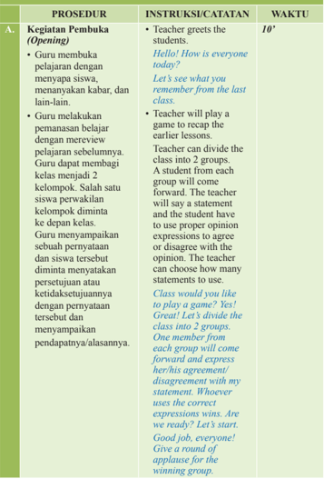

Tabel ini berisi prosedur pembukaan (opening) dalam sebuah kegiatan belajar, yang mencakup instruksi dan catatan yang diberikan kepada guru untuk memulai proses belajar. Topik utama tabel ini adalah prosedur pembukaan kelas, yang melibatkan guru dalam mengawali proses belajar dengan cara yang efektif dan menarik. Kolom-kolom yang ada dalam tabel ini adalah Prosedur, Instruksi/Catatan, dan Waktu. Data penting yang terlihat dalam tabel ini adalah bahwa prosedur pembukaan kelas dimulai dengan guru menyapa siswa, memperkenalkan diri, dan memulai permainan belajar. Selain itu, instruksi yang diberikan kepada guru mencakup beberapa langkah yang harus diikuti, seperti membagi kelas menjadi dua grup, meminta satu siswa dari setiap grup untuk maju, dan memberikan kesempatan bagi siswa untuk menyampaikan pendapat mereka. Waktu yang ditentukan untuk prosedur pembukaan kelas adalah 10 menit.

 

---
## 📄 Halaman 58

B.

### Kegiatan Inti (Main Activity)

### Active Conversation

- Siswa diminta untuk mencari pasangan. Kemudian siswa diminta melengkapi percakapan yang ada di buku siswa.
- Setelah melengkapi percakapan yang memuat ungkapan opini, siswa diminta untuk mempraktikkan salah satu dari percakapan tersebut di depan kelas.
- Sementara satu pasangan melakukan percakapan, siswa lain diminta mengamati dan memberi feedback setelahnya.
- Semua siswa harus maju dan guru memberikan input kepada siswa.
In this activity, students will work in pairs to complete the conversations.

Come on, everyone, it' s time to get active. Please choose your partner. Done?

Good!

Once they have completed the conversations, they will role play one conversation in front of the class so the rest of the students will listen to the role-play and give feedback after that.

Please open your book and go to the Active Conversation

Section of Chapter 2. We have some transactional conversations in this section. Complete the conversations with your partner. Are you done? Have you inished completing the conversations? Now choose one conversation and reenact it.

Who wants to to reenact the be the irst one conversation? Yes, wonderful! Good job! Give

70'

 

---
## 📄 Halaman 59

---
**🖼️ Gambar/Diagram**

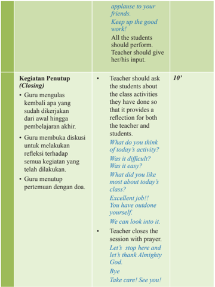

> **Deskripsi Visual:** Gambar ini adalah diagram yang menunjukkan struktur penutup (Closing) dalam proses pembelajaran. Diagram ini terdiri dari tiga bagian utama:

1. **Kegiatan Penutup (Closing)**: Ini adalah bagian utama dari diagram, yang mencakup tiga aktivitas utama:
   - Guru mengulas kembali apa yang sudah dikerjakan dari awal hingga akhir.
   - Guru membuat diskusi untuk melakukan refleksi terhadap semua kegiatan yang telah dilakukan.
   - Guru menutup pertemuan dengan doa.

2. **Teks**: Teks yang ditampilkan dalam diagram ini berisi instruksi dan perintah yang harus dilakukan oleh guru dan siswa selama penutup. Teks ini mencakup:
   - "Applause to your friends. Keep up the good work!"
   - "All the students should perform. Teacher should give her/his input."
   - "Teacher should ask the students about the class activities they have done so that it provides a reflection for both the teacher and students."
   - "What do you think of today's activity? Was it difficult? Was it easy? What did you like most about today's class? Excellent job!! You have outdone yourself. We can look into it."
   - "Let's stop here and let's thank Almighty God. Bye Take care! See you!"

3. **Angka dan Label Penting**: Angka "10*" mungkin merujuk pada skor atau nilai tertentu yang diberikan untuk kegiatan penutup tersebut.

4. **Informasi Kunci**: Gambar ini memberikan panduan detail tentang bagaimana penutup proses pembelajaran harus dilakukan, termasuk tugas-tugas yang harus dilakukan oleh guru dan siswa, serta instruksi untuk menutup pertemuan dengan cara yang tepat. Ini membantu guru dan siswa dalam mengatur proses penutup yang efektif dan efisien.

---
**📊 Tabel**

Tabel ini berisi informasi tentang bagaimana guru menutup sesi pembelajaran dengan cara yang efektif dan menyenangkan. Topik utama tabel adalah "Kegiatan Penutup (Closing)" dan meliputi tiga poin utama: 1) Guru mengulas kembali apa yang sudah dikerjakan dari awal hingga akhir, 2) Guru membuat diskusi untuk melakukan refleksi terhadap semua kegiatan yang telah dilakukan, dan 3) Guru menutup pertemuan dengan doa. Kolom-kolom lainnya mencakup instruksi guru kepada siswa, seperti memberikan input, memberi apresiasi, dan memberikan peringkat. Data penting yang terlihat adalah bahwa guru harus meminta siswa untuk memberikan feedback tentang kegiatan mereka, dan bahwa guru harus memberikan apresiasi dan penghargaan kepada siswa atas upaya mereka. Selain itu, guru juga harus memberikan peringkat untuk setiap kegiatan yang dilakukan oleh siswa.

 

---
## 📄 Halaman 60

### KEGIATAN PEMBELAJARAN SEMESTER I (Pertemuan ke-7) 2 × 45 menit

---
**📊 Tabel**

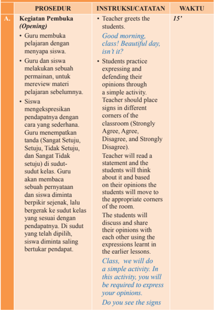

Tabel ini berisi prosedur pembukaan kelas yang dilakukan oleh guru dan siswa. Topik utamanya adalah bagaimana guru menyambut dan memulai proses belajar mengajar dengan cara yang efektif. Tabel dibagi menjadi tiga kolom: Prosedur Pembuka (Opening), Instruksi/Surat Tantangan (Instructions/Task Card), dan Waktu (Time). Dalam prosedur pembuka, guru menyapa siswa dengan "Good morning, class! Beautiful day, isn't it?" dan siswa diberikan kesempatan untuk mengekspresikan pendapat mereka tentang materi pelajaran sebelumnya. Guru juga memberikan tanda (Sangat Setuju, Setuju, Tidak Setuju) di sudut kelas untuk mendukung diskusi. Siswa kemudian diminta untuk berbicara sesuai dengan pendapat mereka, dan jika ada perselisihan, mereka diminta untuk saling bertukar pendapat. Waktu yang ditentukan untuk prosedur ini adalah 15 menit.

 

---
## 📄 Halaman 61

B.

### Kegiatan Inti (Main Activity)

### Writing Connection

- Tiap-tiap siswa diminta menuliskan opini terhadap beberapa hal yang ada di buku teks.
- Guru mengamati siswa melakukan tugasnya dengan saksama dan memberi feedback jika dibutuhkan. Siswa melakukan edit dan revisi berdasarkan feedback dari guru.
- Setelah selesai menulis, siswa secara bergiliran menyampaikan opini di kelompok masingmasing.
placed in the different corners of the class? Yes! Good! I will read a statement, think about this statement and based on your opinion, move to the appropriate corner of the class.

Then you will express your opinion using the expressions you have learnt earlier. Are you ready? Let's start.

- Students will write their opinions regarding various issues. Teacher will ask the students to choose one topic given in the book and create an opinion dialog, supported with reasons and examples.
Now that you have learnt how to give opinions, choose one topic and write an opinion dialog, meaning that you have to consider arguing the issue on both sides, negative and positive, and defend it equally. Use the pattern and format of giving opinions explained in the

Building Blocks.

70'

 

---
## 📄 Halaman 62

- Kegiatan Penutup

### (Closing)

- Guru mengulas kembali kegiatan menulis yang telah dilakukan.
- Guru menutup kelas dengan doa.

### Enjoy writing

- Teacher observes how the students work and gives feedback whenever needed. The students edit and revise their work based on the feedback.
- After inishing, the students can share their work with others.
Please share your opinions with your friends. You can go around and share your opinion, and listen to opinions your friends.

- Teacher will discuss how the writing went.
So how was the writing? Did you enjoy writing the dialog?

(Teacher has to wait for the students to respond and give appropriate responses).

- Teacher ends the class by praying. Ok, Class! Let's end by thanking the Almighty!
Take care! I will see you next week.

10'

 

---
## 📄 Halaman 63

### KEGIATAN PEMBELAJARAN SEMESTER I (Pertemuan ke-8) 2 × 45 menit

---
**📊 Tabel**

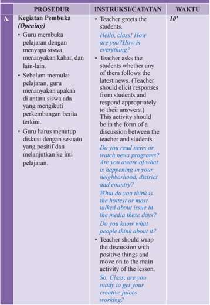

Tabel ini berisi prosedur pembukaan (opening) dalam sebuah kegiatan belajar mengajar, yang mencakup instruksi dan catatan yang diberikan kepada guru untuk memulai sesi belajar dengan baik. Topik utama tabel ini adalah bagaimana guru dapat memulai sesi belajar dengan efektif, termasuk cara menghormati siswa, menanyakan tentang perkembangan berita terkini, dan membuka diskusi yang positif. Kolom-kolom yang ada dalam tabel ini adalah Prosedur, Instruksi/Catatan, dan Waktu. Data penting yang terlihat dalam tabel ini meliputi waktu 10 menit yang disediakan untuk guru menghormati siswa, meminta mereka untuk memberikan informasi tentang perkembangan berita terkini, dan mengajak mereka untuk berdiskusi tentang isu-isu yang sedang populer di media.

 

---
## 📄 Halaman 64

### B. Kegiatan Inti (Main Activity)

### Let's Create/Contribute

- Guru menyampaikan bahwa hari ini mereka akan mengerjakan sebuah proyek.
- Siswa diminta memilih salah satu dari kegiatan yang diberikan di bagian Let's Create/ Contribute .
- Saat siswa kembali dari wawancara, guru bertanya bagaimana wawancara berlangsung. Lalu guru mendorong siswa untuk menyelesaikan proyeknya.
- Teacher explains that today they will have a project.
Project time! Today, we will be working on our project. I know all of you like doing projects.

- Teacher will ask the students to choose one of the many activities given in the Let's Create/Contribute section of the book.
Please open the book and go to the Let' s Create/ Contribute section of Chapter 2.

You can choose any one of the projects provided. Choose an issue and create questions to interview people. You can use the questions provided in your book. Interview people and write their opinions and give your opinions on the issue. Compile all the opinions, then present your work through one of the following ways;

role play, a poster, a movie or a PowerPoint

70'

 

---
## 📄 Halaman 65

- Kegiatan Penutup

### (Closing)

- Saat siswa menyelesaikan proyeknya, guru menyampaikan feedback terhadap hasil kerja siswa.
- Sebelum menutup pelajaran, guru mengajak siswa untuk berdoa bersama.

### presentation.

Are the instructions clear? Do you need any explanation? If you don't understand something, please meet me. I will explain it to you.

Now go out and ind people and ask their opinions. You have 30 minutes to conduct the interview.

- Once the students have inished their interviews, the teacher should ask how the interviews went and then encourage them to inish their projects.
How was the interview? Did you enjoy it? What did you learn? OK! Now everyone, please work with your group and inish the project.

- Once the students have inished the should give her/his
- work, the the teacher feedback.
Wonderful work! All of you did an amazing job. It was quite exciting to see all of you working together and creating something.

- Teacher closes the lesson by praying together.
- Let's pray before
closing. Good job team! See you !Bye!

10'

 

---
## 📄 Halaman 66

### EVALUATION

### Penilaian Pengetahuan

- Latihan soal di bagian Let's Practice

### Penilaian Keterampilan

Unjuk kerja berupa:

- Melakukan percakapan
- Menulis opini
- Membuat proyek

### Rubrik Penilaian Unjuk Kerja

### Rubrik Penilaian Percakapan

---
**📊 Tabel**

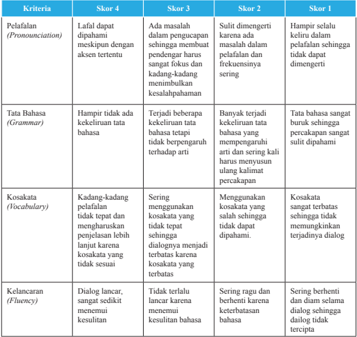

Tabel ini menunjukkan skor untuk kriteria evaluasi berdasarkan tingkat kemampuan bahasa yang diberikan oleh instruktur. Topik utama tabel adalah evaluasi kemampuan berbicara dalam berbagai aspek seperti penerapan, tata bahasa, kosakata, dan fluensinya. Kolom-kolomnya mencakup skor 1 hingga skor 4, yang menunjukkan tingkat keberhasilan peserta didik dalam menerapkan prinsip-prinsip bahasa yang diberikan. Data penting yang terlihat adalah bahwa skor 4 menunjukkan tingkat yang sangat baik, sedangkan skor 1 menunjukkan tingkat yang sangat buruk. Pola yang jelas adalah bahwa skor 4 lebih sering diberikan pada aspek-aspek yang lebih kompleks dan memerlukan pemahaman yang lebih mendalam, sementara skor 1 lebih sering diberikan pada aspek-aspek yang lebih dasar dan mudah dipahami.

 

---
## 📄 Halaman 67

---
**📊 Tabel**

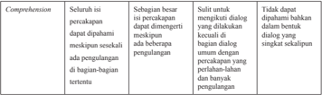

Tabel ini menunjukkan empat kriteria yang harus dipenuhi untuk memastikan bahwa proses pengelolaan perubahan (change management) berhasil. Topik utama tabel adalah "Kualitas Pengelolaan Perubahan". Kolom-kolomnya mencakup: 1) Seluruh isu percakapan dapat dipahami; 2) Sebagian besar isu percakapan dapat dimengerti dan diimplementasikan sebagai bagian dari proses pengelolaan perubahan; 3) Suhu dalam dialog dengan dilakukan secara efektif; dan 4) Dapat dipahami baik-baik dalam bentuk dialog yang singkat dan tepat. Pola penting yang terlihat adalah bahwa setiap kriteria memiliki tingkat keberhasilan yang berbeda, dari yang paling tinggi (seluruh isu percakapan dapat dipahami) hingga yang paling rendah (dapat dipahami baik-baik dalam bentuk dialog yang singkat).

### Rubrik Penilaian Menulis

---
**📊 Tabel**

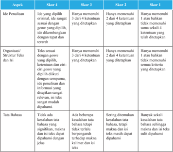

Tabel ini menunjukkan skor untuk berbagai aspek penulisan, mulai dari ide penulisan hingga tahapan penulisan yang lebih lanjut. Topik utama tabel adalah proses penulisan, yang diukur melalui empat skor: Skor 4, Skor 3, Skor 2, dan Skor 1. Kolom-kolomnya mencakup ide penulisan, organisasi struktur teks, dan tahapan penulisan. Data penting yang terlihat adalah bahwa skor 4 diberikan jika ide penulisan adalah yang ditujukan, ide disajikan dengan tepat dan terstruktur, dan struktur teks dan isi disertakan dengan tepat. Sementara itu, skor 1 diberikan jika ide penulisan tidak memenuhi semua kriteria yang ditetapkan. Ini menunjukkan bahwa penilaian penulisan sangat detail dan memerlukan perhatian pada berbagai aspek penulisan.

 

---
## 📄 Halaman 68

---
**📊 Tabel**

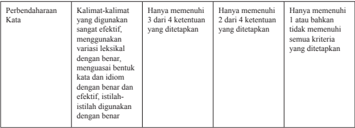

Tabel ini menunjukkan kriteria untuk memilih kata yang digunakan dalam kalimat dengan efektif dan tepat. Topik utamanya adalah tentang kualitas kata dalam kalimat yang ditulis. Tabel dibagi menjadi 3 kolom: "Perbedaan-daraan Kata", "Kata-kata yang digunakan", dan "Kriteria". Kolom "Perbedaan-daraan Kata" berisi 4 ketentuan yang harus dipenuhi oleh kata dalam kalimat. Kolom "Kata-kata yang digunakan" berisi contoh kata yang sesuai dengan ketentuan tersebut. Kolom "Kriteria" berisi deskripsi singkat tentang apa yang dimaksud dengan setiap ketentuan. Dari tabel ini, dapat dilihat bahwa untuk kata yang digunakan dengan efektif dan tepat, harus memenuhi 3 dari 4 ketentuan yang ditetapkan. Ini menunjukkan bahwa kualitas kata dalam kalimat sangat penting dan harus dipertimbangkan dengan hati-hati.

### Rubrik Penilaian Proyek

---
**📊 Tabel**

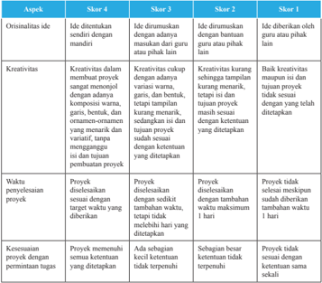

Tabel ini membandingkan empat skor (Skor 1, Skor 2, Skor 3, dan Skor 4) untuk menilai kualitas ide, kreativitas, waktunya, dan kesesuaian proyek dengan tujuan proyek. Topik utama tabel adalah evaluasi kualitas proyek. Kolom-kolomnya meliputi: Orisinalitas ide, Kreativitas, Waktu penyelesaian proyek, dan Kesesuaian proyek dengan tujuan proyek. Data penting yang terlihat adalah bahwa Skor 4 memiliki standar tertinggi untuk semua aspek, sementara Skor 1 memiliki standar terendah. Skor 2 dan Skor 3 berada di antara kedua skor tersebut, menunjukkan bahwa mereka lebih tinggi daripada Skor 1 tetapi lebih rendah daripada Skor 4.

 

---
## 📄 Halaman 69

### Penilaian Sikap

Penilaian sikap dilakukan selama kegiatan pembelajaran berlangsung dengan berpedoman pada Kompetensi Dasar KI-2. Format penilaian dapat dilihat pada Pedoman Penilaian Buku Guru ini.

### Rubrik Penilaian Sikap

(Lihat Pedoman Penilaian Sikap)

### ENRICHMENT

Berikut ini alternatif kegiatan pengayaan yang bisa diberikan kepada siswa di bab ini.

Membaca sebuah editorial dari koran atau majalah, lalu memberikan opini terhadap artikel tersebut dan mengirmkannya ke redaksi koran atau majalah tersebut.

 

---
## 📄 Halaman 70

Accept with pleasure

Accept the invitation

Regret to accept because of a previous commitment

Regret to decline

Cordially request the ...

Request the pleasure ...

You are invited to grace us with your presence

### CHAPTER 3 Party Time

### KOMPETENSI DASAR

- 3.3      Membedakan  fungsi  sosial,  struktur  teks,  dan  unsur  kebahasaan beberapa  teks  khusus  dalam  bentuk  undangan  resmi  dengan memberi  dan  meminta  informasi  terkait  kegiatan  sekolah/tempat kerja sesuai dengan konteks penggunaannya
- 4.3 Teks undangan resmi
- 4.3.1   Menangkap makna secara kontekstual terkait fungsi sosial, struktur teks,  dan  unsur  kebahasaan  teks  khusus  dalam  bentuk  undangan resmi lisan dan tulis, terkait kegiatan sekolah/tempat kerja
- 4.3.2 Menyusun teks khusus dalam bentuk undangan resmi lisan dan tulis, terkait kegiatan sekolah/tempat kerja, dengan memperhatikan fungsi sosial,  struktur  teks,  dan  unsur  kebahasaan, secara benar dan sesuai konteks

### EXPRESSION

 

---
## 📄 Halaman 71

### KEGIATAN PEMBELAJARAN SEMESTER I (Pertemuan ke-9) 2 × 45 menit

---
**📊 Tabel**

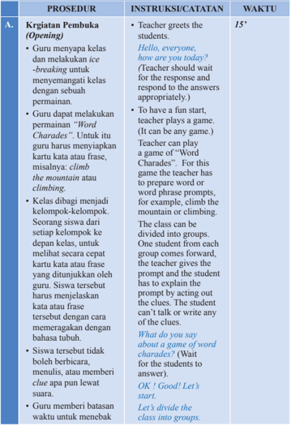

Tabel ini berisi prosedur pembukaan kelas (Opening) yang dilakukan oleh guru untuk memulai kegiatan belajar mengajar. Topik utama tabel adalah prosedur pembukaan kelas, yang dijelaskan dalam kolom "Instruksi/Catatan". Kolom "Waktu" menyediakan informasi tentang waktu yang dibutuhkan untuk setiap prosedur. Data penting yang terlihat adalah bahwa prosedur pembukaan kelas melibatkan beberapa langkah, termasuk menyapa siswa, memainkan permainan kata, membagi kelas menjadi kelompok, dan memberikan waktu untuk mengekspresikan diri.

 

---
## 📄 Halaman 72

setiap kata/frase.

- Kelompok yang paling sering menjawab benar adalah pemenangnya.
- Selesai permainan, guru menjelaskan tujuan pembelajaran dan kegiatan yang akan siswa lakukan untuk mencapai tujuan tersebut.
Done! Excellent! One student from each group, please come forward. I will show the prompt and you have to explain the word by acting. You can't speak or write anything about the clue. The group has to guess the word or phrase.

- Teacher can assign time for each prompt. The group which answers most prompts wins.
You have 40 seconds to answer.

- After the game, teacher explains the goal of the lesson and activities they will do.
Did you like the game? Let's see what we are going to do next. ( moves to the main activity).

 

---
## 📄 Halaman 73

B.

### Kegiatan Inti (Main Activity)

### Reading Activities

- Guru meminta siswa membaca cuplikan drama yang ada di buku teks.
- Guru menjelaskan maksud kata cuplikan.
- Selesai membaca, guru mengajukan beberapa pertanyaan terkait cuplikan drama tersebut.
- Guru juga meminta siswa mendiskusikan pertanyaan-pertanyaan yang ada di buku teks.
- Teacher asks the students to read an excerpt of the play provided in the text book .
Let's read an excerpt from  the famous play 'The Necklace' by Guy de Maupassant. He was a French writer.

- Teacher should explain to the students the meaning of the word 'excerpt.
Have you done? Did you understand the excerpt? Who can explain? Yes, that is correct! How can you say that?

- Teacher can ask the students these questions after explaining the text.
Monsieur Loisel and his wife are invited to go to an event.

What kind of invitation do you think Monsieur Loisel gave to his wife? Is it a formal or informal invitation?

- The teacher also asks the students to discuss some questions given in the text book.
15'

 

---
## 📄 Halaman 74

### Building Blocks

- Di bagian ini, guru akan menjelaskan undangan resmi, alasan kita menulis undangan resmi, dan bagaimana membuat undangan resmi.
- Guru akan menjelaskan struktur teks, unsur kebahasaan, dan fungsi sosial undangan resmi dalam komunikasi sehari-hari. Guru meminta siswa melihat kembali teks undangan yang ada dalam cerita. Guru menunjukkan beberapa undangan dan meminta siswa menjelaskan jenis undangan tersebut formal atau bukan. Guru memperkuat pemahaman siswa dengan penjelasan tentang undangan resmi dan cara membuat dan membalas sebuah undangan.
- In this section, the teacher will explain to the students what formal invitations are, why we write them and how we write them. the teacher will have to explain the features, format and language used in formal invitations.
Let's return to the play an invitation. Can you please read it? What you have read. There is kind of invitation is it? (Teacher has to wait for students to respond.) If you want to invite your friend to your birthday party, will you use an  invitation like this? Why? (Teacher has to wait for the students to respond.) This  kind of invitation is  for formal events and occasions. For example, when we want to invite people to a wedding, school functions, organization functions, etc. Formal invitations have a particular format and language. Please open your book and go to the Building Blocks Section of Chapter 3. let' s take a look at the deinition and format of the formal invitations. Is it clear? Are there any questions?

Everyone understood?

 

---
## 📄 Halaman 75

- Setelah mendengarkan penjelasan tentang undangan dan contohcontohnya, siswa diminta mengerjakan soal-soal di bagian Let's Practice .
- Kegiatan Penutup

### (Closing)

- Sebagai penutup kegiatan belajar, guru mengulas kembali tentang undangan resmi. Guru meminta siswa menjelaskan kembali ciri-ciri formal invitation .
- Guru dan siswa melakukan releksi kegiatan belajar hari ini dan menyampaikan apa yang harus dipersiapkan pada pertemuan selanjutnya.
- After listening to teacher's explanation about a formal invitation, the students will do the Let's Practice activity. This section of the book is for strengthening the subject matter.
So let' s go to the Let's Practice Section and work on our newly acquired knowledge.

Now you know how to write a formal invitation. Let' s practice so that we are quite expert in writing formal invitations.

- This section is for recap and to see if the students have understood.
So how was today's lesson? Did you enjoy learning the format of formal invitations?

- Teacher should listen to the responses from the students and respond appropriately.
Ok, Class, we will stop here. I will see you next week. Bye.

20'

10'

 

---
## 📄 Halaman 76

### KEGIATAN PEMBELAJARAN SEMESTER I (Pertemuan ke-10) 2 × 45 menit

---
**📊 Tabel**

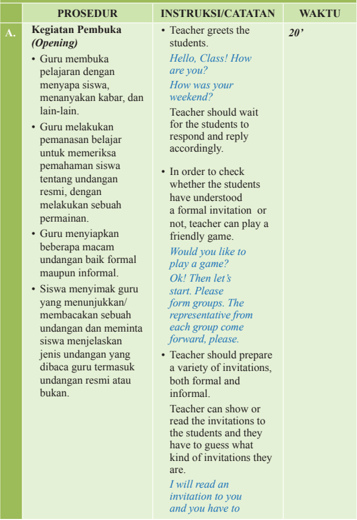

Tabel ini berisi prosedur pembukaan kelas yang melibatkan guru dan siswa dalam memahami undangan resmi dan informal. Topik utama tabel adalah proses pembukaan kelas dengan instruksi guru dan siswa untuk menjawab pertanyaan tentang undangan resmi dan informal. Kolom-kolom yang ada adalah Prosesur (Opening), Instruksi/Suratatan (Instructions/Statements), dan Waktu (Time). Data penting yang terlihat adalah bahwa guru harus menyapa siswa, menanyakan tentang undangan resmi dan informal, dan memberikan beberapa undangan formal dan informal kepada siswa untuk diperiksa. Siswa juga diharapkan untuk menganalisis jenis undangan yang dibacakan oleh guru. Waktu yang ditentukan untuk proses ini adalah 20 menit.

 

---
## 📄 Halaman 77

### Kegiatan Inti (Main Activity)

- Bagian ini berfokus pada kemampuan berbicara. Siswa ditumbuhkan keberaniannya untuk mendengarkan dan berbicara satu sama lain.
- Secara berpasangan siswa diminta membuat dialog singkat yang di dalamnya memuat kalimat-kalimat berupa undangan. Siswa dapat melihat contoh -contoh dialog yang diberikan di buku teks.
- Setelah selesai siswa diminta melakukan percakapan di depan kelas. Guru menilai percakapan siswa.

### tell me what kind of an invitation it is.

- The group with most correct answers wins. (The representative from each group can change after every question.)
And our winner is .... Please cheer for the winners.

- This section focuses on speaking. The students should be encouraged to listen and speak to each other.
All of you like to talk, right? So today, we will talk and listen to each other.

- The teacher asks the students to make a dialogue using expressions to respond to invitations. The students should work in pairs. After that, they will act out their conversations.
You will write down conversations to accept and reject invitations and you will practice these conversations and then act one of them in front of the class.

Alright, let' s go to the Active Conversation of your book. Look! Here are some examples of accepting and rejecting

60'

 

---
## 📄 Halaman 78

C.

### Kegiatan Penutup (Closing)

- Guru mengulas kembali materi latihan yang sudah dikerjakan selama awal pembelajaran hingga akhir pembelajaran.
- Guru membuka diskusi untuk melakukan releksi terhadap semua kegiatan yang telah dilakukan.
- Guru menutup pertemuan dengan doa.
invitations. Take a look at these conversations and then  create your own conversation with a partner. Is it clear?

- Ask one of the students
to repeat what you said. Can you repeat what we are going to do? Yes, that' s good. Let' s start. Are we done? OK ! I will give you 5 more minutes. Who wants to come and act out your conversation?

- Teacher can score these conversations.
- Excellent job everyone!

### Classroom Language

- The teacher recaps and sees if the students have understood.
That was a good job. Well done! Good work, everyone. Good job, everyone!

- The teacher asks the students to relect on what they have done along the learning activities .
Do you want to say something about your performance? Please feel free to share. Thank you! Come forward!

10'

 

---
## 📄 Halaman 79

Excellent! That is some good feeback. What do you guys think?

- Teacher closes the session and asks to pray together .
Time is up. I will see you next week. Have a ncie day! See you!

10'

 

---
## 📄 Halaman 80

### KEGIATAN PEMBELAJARAN SEMESTER I (Pertemuan ke-11) 2 × 45 menit

---
**📊 Tabel**

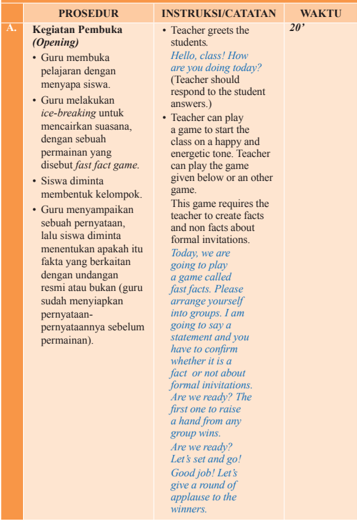

Tabel ini berisi prosedur pembukaan kelas yang dilakukan oleh guru untuk memulai pelajaran dengan cara yang menyenangkan dan interaktif. Topik utama tabel adalah "Kegiatan Pembuka (Opening)" yang melibatkan beberapa langkah seperti menyapa siswa, melakukan ice-breaking, memainkan game fast facts, dan memberikan instruksi kepada siswa tentang permainan tersebut. Tabel ini juga mencakup waktu yang diperlukan untuk setiap prosedur, yang ditunjukkan dalam kolom "WAKTU". Data penting lainnya termasuk instruksi yang diberikan kepada guru dan siswa, seperti "Teacher greets the students" dan "Teacher should respond to the student's answers." Selain itu, tabel ini menunjukkan bahwa prosedur ini memerlukan waktu sekitar 20 menit untuk selesai.

 

---
## 📄 Halaman 81

### B.

### Kegiatan Inti (Main Activity)

- Kegiatan menulis akan mengasah keterampilan berbahasa siswa. Kali ini, siswa akan menulis sebuah undangan resmi berdasarkan pengetahuan yang telah dipelajarinya.
- Siswa diminta menulis sebuah undangan pernikahan kakak lakilakinya.
- Guru memberi kesempatan bertanya jika ada siswa yang mengalami kesulitan.
- The writing section is to help polish the students' skills. In this section the students will write a formal invitation using the knowledge they have acquired from the Building Blocks Section. Teacher will ask the students to write a wedding invitation.
Now you are an amateur expert on writing a formal invitation. It is time to put that expertise into action.

Assume your brother is getting married and you are assigned to write the invitation. Please open your book, go to the Writing Connection section of Chapter 3. Are you there? Good! Let's read the question together and then start writing. Is the question clear? All of you know what you have to do? Good! Let's start then.

- Teacher asks the students to consult her/ him if they have any dificulties .
Please write the invitation and if you have questions, come and consult me.

60'

 

---
## 📄 Halaman 82

### Kegiatan Penutup (Closing)

- Guru mengulas kembali apa yang sudah dikerjakan selama awal pembelajaran hingga akhir pembelajaran.
- Guru membuka diskusi untuk melakukan releksi terhadap semua kegiatan yang telah dilakukan.
- Guru menutup pelajaran dengan doa.
Is your work done? Good! Please collect all the invitations and put them on my desk. I will go through them and give my feedback.

Teacher collects the students' work. Everyone's submitted? Yes, great! Good job, everyone. Let's give a round of applause to ourselves.

- The teacher asks the students to evaluate what they have done. (These are some of the questions the teacher can ask the students).
Did you enjoy writing the formal invitation? Was it dificult? Was it easy? What did you ind dificult? Good job!

- The teacher closes the meeting with praying.
Let's thank God the Almighty for what we have learnt today.

Time is up and we will continue next week.

Bye! See you!

10'

 

---
## 📄 Halaman 83

A.

### KEGIATAN PEMBELAJARAN SEMESTER I (Pertemuan ke-12) 2 × 45 menit

### PROSEDUR Kegiatan Pembuka

### (Opening)

- Guru membuka pelajaran dengan menyapa siswa.
- Guru melakukan ice-breaking untuk mencairkan suasana kelas, dengan sebuah permainan. Nama permainannya yaitu sentence race.
- Guru meminta siswa membentuk kelompok.
- Salah satu perwakilan kelompok ke depan kelas untuk membuat sebuah kalimat dari kata yang ditentukan guru, secara bergiliran. Kalimat yang benar akan mendapatkan skor dari guru.
- Yang menang adalah kelompok yang paling banyak mengumpulkan skor.

### INSTRUKSI/CATATAN

- Teacher greet the students as usual . Hey! How is everyone today? I hope you all are ine.
- Teacher starts the lesson with a game, to create a good environment to start the lesson or straightly goes to the main activity.
Are you ready to race? Wait. We are not going anywhere, we will have the race here in the class. It is a sentence race. As usual we will play in groups. Do we have our groups? Yes, good! One person from each group please come forward and make a sentence with the word written on the board.

The group which gets most correct sentences will win. Let's play! The winner is ....

Good job!!

WAKTU

10'

 

---
## 📄 Halaman 84

### B.

### Kegiatan Inti (Main Activity)

### Let's Create/Contribute

- Guru meminta siswa membentuk pasangan teman untuk bekerja.
- Siswa memilih salah satu dari 3 pilihan kegiatan yang telah ditentukan.
- Siswa mengerjakan secara berpasangan dengan tertib dan tekun.
- Guru mengamati proses kerja yang dilakukan siswa, sambil mengisi lembar observasi penilaian sikap sepanjang proses berlangsung.
- The Let's Create/ Contribute section is to encourage students to be creative and imaginative and at the same time to help them polish the skills and knowledge they have learnt.
Class, are you ready to work on the inal project of this chapter? Please open your book and go to the Let's Create/Contribute section of Chapter 3.

- There are 3 projects in this section and the students can choose whichever they like and work on it with their friends. While students do the project, teacher observes how they work and their attitude during the activity.
There are 3 activities and you can choose whichever you want to work on. Remember to follow the rules and format you have learnt in the Building Blocks Section.

Ok! Ready! Set! Go! Remember to decorate it and make it beautiful and appealing. If you have any questions, please come and ask me.

70'

 

---
## 📄 Halaman 85

- C.

### Kegiatan Penutup (Closing)

- Guru mengulas kembali kegiatan latihan yang sudah dikerjakan selama awal pembelajaran hingga akhir pembelajaran.
- Guru membuka diskusi untuk melakukan releksi terhadap semua kegiatan yang telah dilakukan.
- Guru memberi kesempatan kepada siswa untuk melakukan self assesment .
- The teacher evaluate how the student work and give feedback to their work.
Are we done? Excellent work people! Please submit your work.

Please do the formative assessment provided on the last page of Chapter 3. This will help you see what you have learnt. I will see you next week.

See you !Bye!

10'

 

---
## 📄 Halaman 86

### EVALUATION

### Penilaian Pengetahuan

- Latihan soal di bagian Let's Practice

### Penilaian Keterampilan

Unjuk Kerja berupa:

- Melakukan percakapan yang memuat ungkapan undangan.
- Menulis undangan resmi
- Membuat proyek

### Rubrik Penilaian Unjuk Kerja

Rubrik Penilaian Percakapan

---
**📊 Tabel**

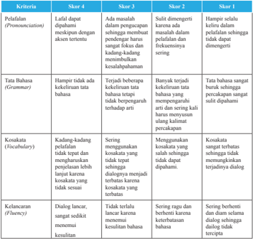

Tabel ini menunjukkan berbagai skor untuk kriteria evaluasi yang meliputi penerapan (promunciation), tata bahasa (grammar), kosakata (vocabulary), dan kelancaran (fluency). Topik utama tabel adalah evaluasi kualitas bahasa dalam berbagai skor. Kolom-kolomnya mencakup skor 1 hingga skor 4, yang masing-masing menunjukkan tingkat keberhasilan dalam memenuhi kriteria tersebut. Data penting yang terlihat adalah bahwa skor 1 memiliki tingkat keberhasilan yang sangat rendah, sedangkan skor 4 memiliki tingkat keberhasilan yang sangat tinggi. Ini menunjukkan bahwa skor 4 merupakan standar tertinggi dalam evaluasi kualitas bahasa.

 

---
## 📄 Halaman 87

---
**📊 Tabel**

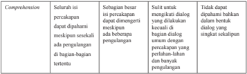

Tabel ini membandingkan empat kondisi berbeda dalam proses komprehensif percakapan. Topik utamanya adalah bagaimana komprehensif percakapan dapat diubah menjadi tuntutan pengulangan. Kolom pertama menunjukkan bahwa jika percakapan dapat diubah menjadi tuntutan pengulangan, maka hal ini akan mempengaruhi kemampuan untuk memahami isi percakapan. Kolom kedua menunjukkan bahwa jika percakapan dapat diubah menjadi tuntutan pengulangan, maka hal ini akan mempengaruhi kemampuan untuk memahami isi percakapan. Kolom ketiga menunjukkan bahwa jika percakapan dapat diubah menjadi tuntutan pengulangan, maka hal ini akan mempengaruhi kemampuan untuk memahami isi percakapan. Kolom keempat menunjukkan bahwa jika percakapan dapat diubah menjadi tuntutan pengulangan, maka hal ini akan mempengaruhi kemampuan untuk memahami isi percakapan. Pola penting yang terlihat adalah bahwa semua kolom memiliki data yang sama, yaitu bahwa jika percakapan dapat diubah menjadi tuntutan pengulangan, maka hal ini akan mempengaruhi kemampuan untuk memahami isi percakapan.

### Rubrik Penilaian Menulis

---
**📊 Tabel**

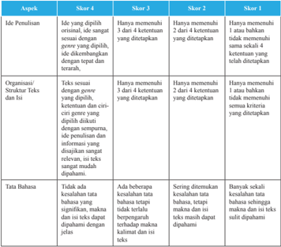

Tabel ini menunjukkan skor untuk penilaian ide pemulihan, organisasi/hasil, dan tata bahasa dalam sebuah teks. Topik utama tabel adalah evaluasi kualitas teks berdasarkan ketentuan tertentu. Kolom-kolomnya meliputi: Ide yang dipilih, Organisasi/hasil, dan Tata Bahasa. Data penting yang terlihat adalah bahwa skor 4 diberikan jika teks memenuhi semua ketentuan, skor 3 jika memenuhi 3 dari 4 ketentuan, skor 2 jika memenuhi 2 dari 4 ketentuan, dan skor 1 jika tidak memenuhi satu atau lebih ketentuan. Ini membantu dalam proses penilaian kualitas teks dengan jelas dan sistematis.

 

---
## 📄 Halaman 88

---
**📊 Tabel**

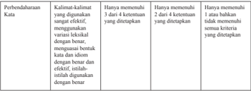

Tabel ini menunjukkan kriteria untuk memeriksa kualitas kalimat dalam bahasa Indonesia. Topik utamanya adalah "Perbendaharaan Kata" yang melibatkan penggunaan kata-kata yang efektif dan tepat. Tabel dibagi menjadi 3 kolom: "Kata-kata yang digunakan sangat efektif", "Hanya memenuhi 2 dari 4 ketentuan yang ditetapkan", dan "Hanya memenuhi 1 atau bahkan tidak memenuhi semua kriteria yang ditetapkan". Data penting yang terlihat adalah bahwa untuk mendapatkan nilai tertinggi, kata-kata harus digunakan dengan sangat efektif, mencakup variasi lekukan yang tepat, menggambarkan bentuk dan makna dengan benar dan efektif, serta istilah yang digunakan dengan benar. Sementara itu, untuk mendapatkan nilai terendah, kata-kata hanya memenuhi 1 dari 4 kriteria atau bahkan tidak memenuhi semua kriteria yang ditetapkan.

### Rubrik Penilaian Proyek

---
**📊 Tabel**

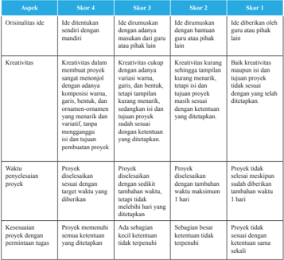

Tabel ini membandingkan empat skor untuk aspek-aspek kreativitas dan originalitas dalam proses penulisan proyek. Topik utama tabel adalah kualifikasi kreatif dan inovatif dalam menulis proyek. Kolom-kolomnya meliputi: Ide, Kreativitas, Waktu, dan Kesesuaian. Data penting yang terlihat adalah bahwa skor 4 memiliki standar tertinggi untuk semua aspek, sementara skor 1 memiliki standar terendah. Skor 3 dan 2 berada di antara kedua skor tersebut, menunjukkan perbedaan细微但明確的標準。

 

---
## 📄 Halaman 89

### Penilaian Sikap melalui Observasi

Penilaian  sikap  dilakukan  selama  kegiatan  pembelajaran  berlangsung dengan berpedoman pada Kompetensi Dasar KI-2.

### Rubrik Penilaian Sikap

(Lihat Pedoman Penilaian Sikap)

### ENRICHMENT

Berikut ini beberapa alternatif kegiatan pengayaan yang bisa diberikan kepada siswa di bab ini.

- Membuat desain undangan dengan menggunakan aplikasi komputer
- Lomba membuat undangan untuk kegiatan PORSENI

 

---
## 📄 Halaman 90

### CHAPTER 4

### Natural Disaster - An Exposition

### KOMPETENSI DASAR

- 3.4 Membedakan fungsi  sosial,  struktur  teks,  dan  unsur  kebahasaan beberapa  teks  eksposisi  analitis  lisan  dan  tulis  dengan  memberi dan meminta informasi terkait isu aktual, sesuai dengan konteks penggunaannya
- 4.4 Teks eksposisi analitis
- 4.4.1 Menangkap makna secara kontekstual terkait fungsi sosial, struktur teks, dan unsur kebahasaan teks eksposisi analitis lisan dan tulis, terkait isu aktual
- 4.4.2  Menyusun  teks  eksposisi  analitis  tulis,  terkait  isu  aktual,  dengan memperhatikan fungsi sosial, struktur teks, dan unsur kebahasaan, secara benar dan sesuai konteks

 

---
## 📄 Halaman 91

### KEGIATAN PEMBELAJARAN SEMESTER I (Pertemuan ke-13) 2 × 45 menit

---
**📊 Tabel**

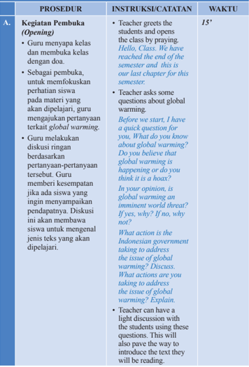

Tabel ini berisi prosedur pembukaan kelas (Opening) dalam sebuah kursus, yang mencakup instruksi dan catatan guru untuk memulai kelas dengan doa, menjawab pertanyaan tentang global warming, melakukan diskusi ringan tentang isu global warming, dan memberikan kesempatan bagi siswa untuk memberikan pendapat mereka. Topik utama tabel adalah prosedur pembukaan kelas, yang melibatkan berbagai tindakan guru seperti menyapa siswa, menjawab pertanyaan, melakukan diskusi, dan memberikan kesempatan bagi siswa untuk berpartisipasi. Kolom-kolom yang ada adalah Prosedur, Instruksi/Catatan, dan Waktu. Data penting yang terlihat adalah bahwa prosedur pembukaan kelas memerlukan waktu sekitar 15 menit, dan guru harus mempersiapkan beberapa pertanyaan tentang global warming sebelum mulai diskusi.

 

---
## 📄 Halaman 92

B.

### Kegiatan Inti (Main Activity)

### Reading Activities

- Guru menyampaikan bahwa mereka akan membaca sebuah teks analytical exposition (eksposisi analitis). Siswa membaca teks eksposisi analitis yang berjudul Global Warming. Untuk memudahkan siswa memahami isi bacaan, guru meminta siswa membuat peta pikiran (mind map) berdasarkan isi teks. Untuk kegiatan ini guru dapat meminta siswa melakukannya secara berpasangan.
- Setelah selesai, perwakilan pasangan diminta menyampaikan kembali isi teks yang mereka baca dengan menggunakan mind map yang telah mereka buat.
- Selesai membaca, guru melakukan tanya jawab seputar teks yang baru dibaca. Guru juga memberi kesempatan kepada siswa untuk menanyakan kosakata yang belum dimengerti.
- The article in Chapter 4 is an example of an analytical exposition text. Teacher can ask the students to read the text. Teacher can explain the meaning of the text. After that, continue the discussion that was started in the beginning of the class. This is a good entry point to discuss global issues like drought, loods, etc. and how they affect not only us as a nation but other countries as well.
Today, we are going to read a text about Global Warming.What do you know about global warming?

- Teacher gives time to the students to respond and write all the answers on the board, then helps the students to compare their answers with those of others including yours.
The idea that global warming is going to end the world freaks me out. What about you?

Let's read the article. After reading the article, we can form more concrete opinions.

You will read with a partner. You will

60'

 

---
## 📄 Halaman 93

### Kegiatan Penutup (Closing)

- Guru mengulas kembali materi yang sudah dikerjakan selama awal pembelajaran hingga akhir. Guru dapat melakukan teknik exit slip . Guru mengajukan pertanyaan-pertanyaan terkait materi yang sudah dipelajari. Siswa yang bisa menjawab boleh keluar lebih cepat (jika pelajaran
exchange questions while reading.

Highlight any idea or fact or opinion you think is an exaggeration or perhaps not true.You can create a mind map or visual journal of your ideas about the text. Let' s start. I assume all of you have partners. So please start.

Have you done? Great! What questions do you have regarding the text?Do you know what kind of text you were reading?

One by one, please!

- Teacher has to address all the student questions and engage the students in a discussion about global warming.
- Time to wrap up the class. Teacher can use an exit slip technique to see whether the students have understood the text or not. Exit slip is an excellent teaching strategy. Teacher has to ask the students questions regarding the text. The students who can answer will be able to leave class 5 minutes earlier or the teacher can give them other rewards.
15'

 

---
## 📄 Halaman 94

ini adalah jam terakhir atau menjelang sitirahat), atau dapat reward lainnya.

Class what do you think of the text? Who can tell me ....

Good job! You can leave the class early today or you will get extra time to inish your homework.

Great work! See you next week!

Have a nice day!

 

---
## 📄 Halaman 95

### KEGIATAN PEMBELAJARAN SEMESTER I (Pertemuan ke-14) 2 × 45 menit

---
**📊 Tabel**

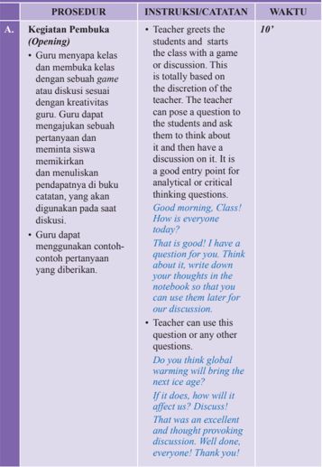

Tabel ini berisi prosedur pembukaan kelas (Opening) dalam sebuah mata pelajaran, dengan instruksi dan catatan yang diberikan oleh guru. Topik utama tabel ini adalah bagaimana guru memulai kelas dengan cara yang efektif untuk menarik perhatian siswa dan membangkitkan minat mereka dalam materi yang akan dipelajari. Kolom-kolom yang ada dalam tabel ini meliputi prosedur (Kegiatan Pembuka), instruksi/catatan (Instruksi/Catatan), dan waktu (Waktu). Data penting yang terlihat dalam tabel ini adalah bahwa guru harus menghormati waktu yang ditentukan, yaitu 10 menit, untuk membuka kelas dengan cara yang efektif. Guru juga harus menggunakan contoh-contoh pertanyaan yang berbeda untuk membangkitkan minat siswa dalam materi yang akan dipelajari.

 

---
## 📄 Halaman 96

### B. (Main

### Kegiatan Inti Activity)

- Di bagian ini guru akan fokus pada jenisjenis, format, dan unsur kebahasaan dari teks eksposisi analitis dan cara membuat teks tersebut.
- Guru mengarahkan pemikiran siswa dengan mengajukan pertanyaan-pertanyaan pemandu.
- Kemudian guru menjelaskan lebih jauh tentang struktur organisasi teks eksposisi analitis, ciriciri kebahasaan, dan fungsi sosialnya, sesuai informasi yang ada di buku teks.
- In this section teacher will focus on the kinds, format, language features of an analytical exposition text. Teacher can explain all the features provided in the text book.
Last meeting we read an analytical exposition text. You saw the way it is written.

Today, we are going to learn what is analytical exposition text it.

How do we write an analytical exposition text?

What do you think an analytical exposition text is? (Teacher should elicit the students' responses from the students and write all the responses on the board).

Whenever we try to persuade someone to agree with us or we want to change someone's opinion, we  are using an exposition. It focuses on one sided argument. Can you tell me why? Yes, that is right.

The reason is that we want other people to see our perspective and agree with us.

55'

 

---
## 📄 Halaman 97

- Siswa berlatih menentukan suatu teks eksposisi dari beberapa teks yang diberikan dengan cara memberi highlight pada teks tersebut. Kemudian siswa memberi judul yang cocok untuk teks eksposisi tersebut.
Let's see what your book says about exposition texts.Please open you book, go to the Building Blocks section of Chapter 4. Let's look at the deinition and format.

- Teacher can use the information provided in the Building Blocks section to explain analytical exposition texts.
- Teacher asks the students to practice .
Is the analytical exposition text clear? Good!

Let's take a look at the example given and after that  we will practice writing an analytical expoisiton text.

Let's try our best to write one. Please go to the Let' s Practice section.

The topic given is excesssive TV watching. The main statement has been given. All you have to do is write arguments and conclude. Are you ready to try?

Very well! Let' s start then! You can work on them individually.

Have you inished writing? Yes! No!

25'

 

---
## 📄 Halaman 98

- C.

### Kegiatan Penutup (Closing)

- Guru menutup pelajaran dengan memberi feedback dan pekerjaan rumah bagi yang belum selesai mengerjakan.
- Teacher can end the class by giving homework or feedback.
If you haven't done your work, please do it at home.

Great work! See you!

Have a nice day!

5'

 

---
## 📄 Halaman 99

---
**🖼️ Gambar/Diagram**

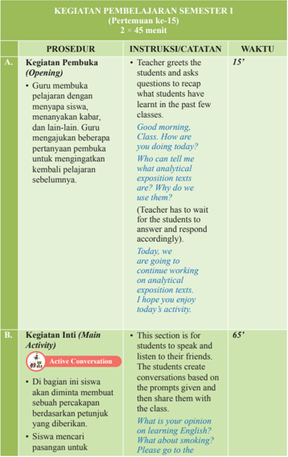

> **Deskripsi Visual:** Gambar ini adalah diagram yang menunjukkan prosedur dan waktu untuk kegiatan pembelajaran semester I (Pertemuan ke-15) yang berlangsung selama 2 x 45 menit. Diagram ini dibagi menjadi dua bagian utama: A. Kegiatan Pembuka (Opening) dan B. Kegiatan Inti (Main Activity). 

Dalam bagian A, guru membuka pelajaran dengan menyapa siswa, menanyakan kabar, dan lain-lain. Guru juga mengajukan beberapa pertanyaan untuk mendapatkan kembali pelajaran sebelumnya. Waktu yang diberikan untuk bagian ini adalah 15 menit.

Bagian B merupakan kegiatan inti yang berlangsung selama 65 menit. Di bagian ini, siswa diajak untuk berbicara dan mendengarkan teman-temannya. Mereka membuat percakapan berdasarkan petunjuk yang diberikan dan mencari pasangan untuk berbicara. Waktu yang diberikan untuk bagian ini adalah 65 menit.

Elemen-elemen utama dalam diagram ini adalah prosedur pembukaan, kegiatan inti, waktu masing-masing, dan instruksi/catatan yang diberikan oleh guru. Label penting yang terlihat adalah "Kegiatan Pembuka" dan "Kegiatan Inti", serta waktu masing-masing kegiatan. Informasi kunci yang dapat diambil pembaca adalah bahwa proses pembelajaran ini melibatkan interaksi aktif antara guru dan siswa, serta penggunaan waktu yang efisien untuk memperkenalkan materi baru dan memperluas pemahaman siswa tentang topik tersebut.

---
**📊 Tabel**

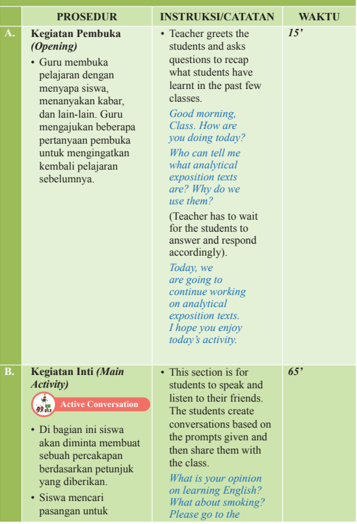

Tabel ini berisi prosedur pembukaan dan aktivitas utama dalam sebuah kegiatan belajar, dengan instruksi dan catatan yang disertakan untuk setiap bagian. Topik utama adalah proses pembukaan kelas dan aktivitas utama yang melibatkan diskusi aktif antara siswa. Kolom "PROSEDUR" memuat dua bagian utama: "Kegiatan Pembuka (Opening)" dan "Kegiatan Inti (Main Activity)". Kolom "INSTRUKSI/CATATAN" menyediakan petunjuk detail tentang apa yang harus dilakukan oleh guru dan siswa, seperti pernyataan awal, pertanyaan yang harus diajukan, dan tujuan acara. Kolom "WAKTU" menunjukkan waktu yang diperlukan untuk setiap bagian, mulai dari 15 menit untuk pembukaan hingga 65 menit untuk aktivitas utama. Data penting lainnya termasuk bahwa guru harus menunggu respons dari siswa sebelum menjawab pertanyaan, dan siswa diharapkan untuk berbicara dan mendengarkan teman mereka dalam aktivitas ini.

 

---
## 📄 Halaman 100

melakukan tugas membuat percakapan yang berisi diskusi tentang rencana memberi penyuluhan kepada masyarakat agar masyarakat menyadari bahaya pemanasan global.

- Guru mempersilakan kepada pasangan yang bersedia maju pertama untuk memeragakan percakapannya.
- Kegiatan Penutup

### (Closing)

- Guru memanfaatkan 10 menit sisa waktu untuk melaksanakan penilaian formatif sebagai exit slip.
'Active Conversation' section of  Chapter 4. You have two topics to choose from.

- Teacher tells the students to get a
- partner .
We will work with partners. Please choose a partner. Done? Good! Let' s start, First complete the conversation, practice it with your partner,  then reenact it in front of the class. Clear? Great! You can follow the conversation pattern provided there or create your own.

- Teacher asks the students to perform .
Have you done your work? Who wants to perform irst? Yes, please start. Good job, everyone! Round of applause!

- Teacher can use the last 10 minutes of class for formative assessment or exit slip.
How did the class run today? Did you do your best? What went wrong? Bye! See you next week!

10'

 

---
## 📄 Halaman 101

### KEGIATAN PEMBELAJARAN SEMESTER I (Pertemuan ke-16) 2 × 45 menit

---
**📊 Tabel**

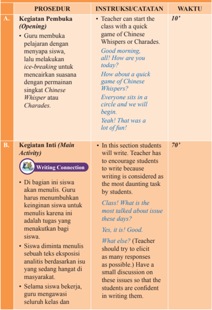

Tabel ini berisi prosedur pembukaan dan aktivitas utama dalam sebuah kegiatan belajar, dengan fokus pada bagaimana guru dapat memulai dan mengarahkan proses belajar siswa. Topik utama adalah "Writing Connection" yang melibatkan siswa menulis tentang subjek yang mereka pilih. Tabel ini mencakup dua bagian utama: Kegiatan Pembuka (Opening) dan Kegiatan Inti (Main Activity). Dalam bagian Pembuka, guru menggunakan permainan seperti Whisper atau Charades untuk membuka kelas dan menciptakan suasana hangat. Sementara itu, dalam bagian Inti, siswa diberikan kesempatan untuk menulis tentang topik yang mereka pilih, dengan instruksi untuk menunjukkan keinginan mereka dan memberikan penjelasan singkat tentang topik tersebut. Guru juga diingatkan untuk memberikan dukungan dan memberikan umpan balik positif kepada siswa.

 

---
## 📄 Halaman 102

C.

memberi feedback dan arahan kepada siswa yang membutuhkan.

- Siswa melakukan edit dan revisi berdasarkan feedback guru.

### Kegiatan Penutup (Closing)

- Guru mengulas kembali apa yang sudah dikerjakan selama awal hingga akhir kegiatan menulis. Guru membuka diskusi untuk melakukan releksi terhadap semua kegiatan yang telah dilakukan.
- Ask the students to choose the most popular issue in the media and write about it.
Choose an issue you think is the most popular in the media. Do a research about this issue. Once the research is done, write an exposition text on it. You can refer to the Building Blocks section for the text pattern and format.

- Teacher observes around the class during the writing process and gives feedback needed. The students edit and revise based on the feedback.
Have you inished? Please submit your work.

- Teacher can end the class by asking the students about the writing process.
How did the writing go? Did you enjoy writing? We will stop here. I will see you next week.Have a nice day! See you!

10'

 

---
## 📄 Halaman 103

### KEGIATAN PEMBELAJARAN SEMESTER I (Pertemuan ke-17&18) 4 × 45 menit

---
**📊 Tabel**

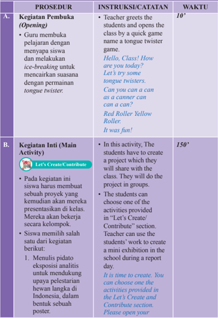

Tabel ini berisi prosedur pembukaan dan kegiatan inti (main activity) dalam sebuah kegiatan belajar mengajar. Topik utama tabel adalah proses pembelajaran, yang melibatkan guru memberikan instruksi kepada siswa tentang bagaimana mereka akan bekerja selama kegiatan tersebut. Kolom A menunjukkan prosedur pembukaan, yang melibatkan guru menyapa siswa dengan menggunakan permainan tongue twister untuk menciptakan suasana hangat sebelum mulai belajar. Kolom B menunjukkan kegiatan inti, di mana siswa harus membuat proyek yang mereka akan presentasikan di kelas. Siswa dapat memilih salah satu dari tiga aktivitas yang disediakan dalam "Let's Create/Contribute" section, seperti membuat poster eksposisi analisis hewan langka di Indonesia. Waktu yang diberikan untuk prosedur pembukaan adalah 10 menit, sedangkan waktu untuk kegiatan inti adalah 150 menit.

 

---
## 📄 Halaman 104

- Membuat ilm atau pamlet untuk mengedukasi masyarakat tentang bahaya rokok dan narkoba
- Guru memberi waktu satu minggu untuk menyelesaikan proyek tersebut.
- Pada pertemuan berikutnya siswa diminta memajang dan mempresentasikan hasil karyanya. Setiap kelompok diberi waktu 10 menit.
book and go to Create/ Contribute section.

- You have to write an analytical exposition speech to support  the conservation of wild life in Indonesia. To support your text, you have to draw posters to depict the plight of animals that are killed or captured by poachers.
- You have to create a movie or pamphlet to educate people on  drug abuse and cigarette smoking. Pamphlet  is like a brochure with information and pictures.
You have to put lots of pictures with the text.

- Teacher gives one week to inish the project. The students will display and present their project to others in the next meeting. Every group has 10 minutes to present.
You have 1 week to inish the project. Once you have inished it, we can have presentations and showcases to other classes as well.

 

---
## 📄 Halaman 105

- C.

### Kegiatan Penutup (Closing)

- Guru mengulas kembali kegiatan yang sudah dikerjakan selama awal pembelajaran sampai akhir pembelajaran.
.

- Teacher can use the class for formative
last 20 minutes of the assessment. Did you enjoy the tongue twisters? They are fun, aren't they? Good job with creating. It is time to end the class now. See you!

Bye!

20'

 

---
## 📄 Halaman 106

### EVALUATION

### Penilaian Pengetahuan

- Latihan soal di bagian Let's Practice

### Penilaian Keterampilan

Unjuk kerja berupa:

- Menulis teks eksposisi analitis
- Membuat proyek terkait teks eksposisi analitis

### Rubrik Penilaian Unjuk Kerja

Rubrik Penilaian Percakapan

---
**📊 Tabel**

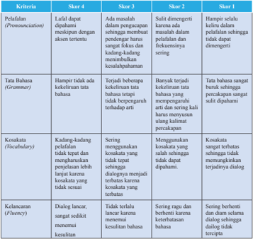

Tabel ini menunjukkan skor untuk empat kriteria utama dalam proses pembelajaran bahasa: Pelifalan (Pronunciation), Tata Bahasa (Grammar), Kosakata (Vocabulary), dan Kelancaran (Fluency). Setiap kriteria dibagi menjadi empat skor berdasarkan tingkat kesulitan yang dihadapi oleh siswa. Topik utama tabel ini adalah evaluasi kemampuan siswa dalam berkomunikasi menggunakan bahasa yang benar dan efektif. Kolom-kolomnya mencakup skor 1 hingga skor 4, yang menunjukkan tingkat kesulitan yang dihadapi oleh siswa dalam menerapkan prinsip-prinsip bahasa. Data penting yang terlihat adalah bahwa skor 1 biasanya diberikan pada siswa yang belum dapat memahami atau menggunakan prinsip-prinsip bahasa dengan benar, sementara skor 4 diberikan pada siswa yang dapat menggunakan prinsip-prinsip bahasa dengan baik dan efektif.

 

---
## 📄 Halaman 107

### Rubrik Penilaian Menulis

---
**📊 Tabel**

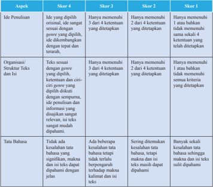

Tabel ini menunjukkan skor untuk penulisan teks berdasarkan standar kualitas penulisan yang ditetapkan. Topik utama tabel adalah penilaian kualitas penulisan teks, dengan kolom-kolom yang mencakup aspek penulisan, skor 4, skor 3, skor 2, dan skor 1. Data penting yang terlihat adalah bahwa skor 4 diberikan jika teks memenuhi semua kriteria yang ditetapkan, sedangkan skor 1 diberikan jika teks tidak memenuhi satu pun kriteria tersebut. Skor 3 diberikan jika teks memenuhi dua atau lebih kriteria, sedangkan skor 2 diberikan jika teks memenuhi satu kriteria. Skor 1 diberikan jika teks tidak memenuhi satu pun kriteria yang ditetapkan.

 

---
## 📄 Halaman 108

---
**📊 Tabel**

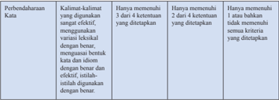

Tabel ini menunjukkan kriteria untuk memeriksa kualitas kalimat dalam bahasa Indonesia. Topik utamanya adalah "Perbendaharaan Kata" yang meliputi ketentuan tentang efektivitas, variasi kata, dan bentuk kata yang digunakan. Kolom-kolomnya mencakup 4 kriteria utama: 1) Memenuhi 3 dari 4 ketentuan, 2) Memenuhi 2 dari 4 ketentuan, 3) Memenuhi 1 atau lebih, dan 4) Tidak memenuhi semuanya. Data penting yang terlihat adalah bahwa kualitas kalimat yang paling tinggi adalah ketika semua 4 kriteria ditempati, sedangkan yang paling rendah adalah ketika tidak memenuhi satu pun dari 4 kriteria tersebut. Ini membantu pembaca untuk memahami bagaimana mereka dapat meningkatkan kualitas kalimat mereka dalam bahasa Indonesia.

### Rubrik Penilaian Proyek

---
**📊 Tabel**

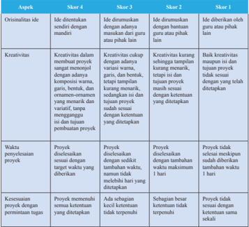

Tabel ini menunjukkan berbagai skor untuk aspek ide, kreativitas, waktu penyelesaian proyek, dan kesesuaian proyek dengan permintaan tugas. Topik utama tabel adalah evaluasi kualitas ide, kreativitas, waktu penyelesaian, dan kesesuaian proyek dalam konteks pembuatan proyek. Kolom-kolomnya mencakup ide, kreativitas, waktu penyelesaian, dan kesesuaian proyek. Data penting yang terlihat adalah bahwa skor 4 memerlukan ide yang disertai dengan mandiri, kreativitas yang tinggi, waktu penyelesaian kurang dari satu hari, dan kesesuaian proyek dengan permintaan tugas. Sementara itu, skor 1 memerlukan ide yang ditampilkan dengan bantuan guru atau pihak lain, kreativitas yang rendah, waktu penyelesaian lebih dari satu hari, dan kesesuaian proyek dengan permintaan tugas.

 

---
## 📄 Halaman 109

### Penilaian Sikap melalui Observasi

Penilaian  sikap  dilakukan  selama  kegiatan  pembelajaran  berlangsung dengan berpedoman pada Kompetensi Dasar KI-2.

### Rubrik Penilaian Sikap

(Lihat Pedoman Penilaian Sikap)

### ENRICHMENT

Berikut ini beberapa alternatif kegiatan pengayaan yang bisa diberikan kepada siswa di bab ini.

- Melakukan kampanye pentingnya kebersihan kepada seluruh warga di sekolah
- Membuat pamlet atau poster untuk menangkal radikalisme

 

---
## 📄 Halaman 110

I am writing to ....

It was kind of ....

I am grateful!

Oh My God! You will never guess ....

I am sorry to tell you ....

I regret to inform you ....

I wonder if you ....

### CHAPTER 5 Letter Writing

### KOMPETENSI DASAR

- 3.6 Membedakan fungsi sosial, struktur teks, dan unsur kebahasaan beberapa teks khusus dalam bentuk surat pribadi dengan memberi dan  menerima  informasi  terkait  kegiatan  diri  sendiri  dan  orang sekitarnya, sesuai dengan konteks penggunaannya
- 4.6 Teks surat pribadi
- 4.6.1   Menangkap makna  secara kontekstual terkait fungsi sosial, struktur  teks,  dan  unsur  kebahasaan  teks  khusus  dalam  bentuk surat pribadi terkait kegiatan diri sendiri dan orang sekitarnya
- 4.6.2 Menyusun  teks khusus dalam bentuk surat pribadi terkait kegiatan diri sendiri dan orang sekitarnya, lisan dan tulis, dengan memperhatikan fungsi sosial, struktur teks, dan unsur kebahasaan, secara benar dan sesuai konteks

### EXPRESSIONS

 

---
## 📄 Halaman 111

### KEGIATAN PEMBELAJARAN SEMESTER II (Pertemuan ke-1) 2 × 45 menit

---
**📊 Tabel**

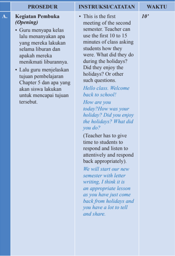

Tabel ini berisi prosedur pembukaan kelas (opening) untuk semester kedua, yang mencakup instruksi dan catatan guru, serta waktu yang diberikan. Topik utama tabel adalah proses pembukaan kelas, yang melibatkan pertanyaan-pertanyaan awal yang dirancang untuk membangkitkan minat siswa dan membuka pembelajaran baru. Kolom "Instruksi/Catatan" menyajikan contoh pertanyaan yang dapat digunakan oleh guru, seperti "What did you do during the holidays?" dan "How was your holiday?". Waktu yang ditentukan untuk prosedur ini adalah 10 menit. Data penting lainnya termasuk bahwa prosedur ini bertujuan untuk memberi kesempatan bagi siswa untuk berbicara tentang pengalaman mereka selama liburan dan membantu mereka merasa lebih terlibat dalam pembelajaran baru.

 

---
## 📄 Halaman 112

B.

### Kegiatan Inti (Main Activity)

### Reading Activities

- Guru memulai pelajaran dengan meminta siswa membaca surat yang ada di buku teks Chapter 5 dan masuk pada bagian Building Block.
- Teacher can start the lesson by asking the students to read the letter in Chapter 5 and then move on to the Building Blocks.
Please open your books and go to Chapter 5. Read the letter .

Are we done? What kind of letter is this?

Teacher should wait for the students to respond, if no one responds, please try to elicit a response.

There are 2 types of letters, formal and informal. Formal letters are used for oficial work. Informal letters, also known as personal letters, are those which we write to our family and friends.

Do you write letters? Have you ever written a letter?

(Teacher should wait for the students to answer.)

Well, today we will learn how to write personal letters. We will focus on writing personal or informal letters.

Please go to the Building Blocks of Chapter 5. Let' s look at the format and linguistic, social features of letter writing.

20'

 

---
## 📄 Halaman 113

### Building Blocks

- Guru dapat menggunakan informasi yang diberikan pada bagian Building Block untuk mengajarkan hal-hal terkait penulisan surat. Guru menjelaskan beberapa tipe surat. Guru menjelaskan ketentuan-ketentuan dalam menulis surat pribadi seperti struktur, ciri-ciri kebahasaan sebuah surat pribadi, dan gaya bahasa yang biasa digunakan dalam surat pribadi.
- Setelah menjelaskan tentang format surat pribadi, guru dapat menunjukkan contoh yang diberikan pada buku siswa.

### Let's Practice

- Setelah mendengarkan penjelasan mengenai ketentuan-ketentuan dalam menulis surat pribadi, siswa diminta mengerjakan latihan pada bagian Let's Practice . Kalau waktunya tidak mencukupi mereka dapat lanjutkan di rumah.
- Teacher can use the information given in the Building Blocks section to teach students the technicalities of letter writing.
- After teaching the format, teacher can show the example given in the book, so students know the structure of the letter.
Personal letters are easy when it comes to the format and language. The language used is personal as if you  are talking to the person. Please take a look at the sample of the personal letter given in the book. It clearly shows the structure of a personal letter.. Is it clear? Are we ready to move on and practice letter writing?

- There are several activities in the Let's Practice section. Teacher can ask the students to do it in class and in case they don't inish, it can be assigned as homework.
Let's do some practice work and see how good we are at letter writing. Are we done? No! It is okay, we can inish it at home.

40'

25'

 

---
## 📄 Halaman 114

- C.

### Kegiatan Penutup (Closing)

- Guru mengulas kembali apa yang sudah dikerjakan selama awal pembelajaran hingga akhir pembelajaran.
- Teacher can use the last few minutes of class to have an informal chit chat with the students.
Bye class! I will see you next week.

5'

 

---
## 📄 Halaman 115

### KEGIATAN PEMBELAJARAN SEMESTER II (Pertemuan ke-2) 2 × 45 menit

---
**📊 Tabel**

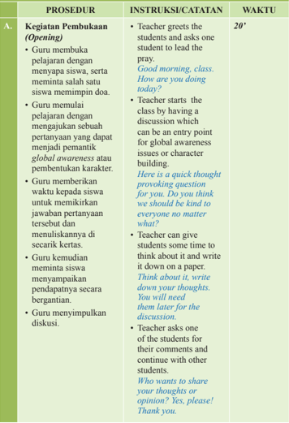

Tabel ini berisi prosedur pembukaan kelas yang dilakukan oleh guru untuk membangun kesadaran global dan karakter siswa. Topik utama tabel adalah "Kegiatan Pembukaan (Opening)" yang melibatkan guru menyapa siswa, meminta mereka untuk berdoa, memulai pembelajaran dengan pertanyaan yang relevan, memberikan waktu untuk pemikiran, dan menuliskan pendapat di kertas. Kolom-kolom yang ada adalah "Instruksi/Catatatan" dan "Waktu". Data penting yang terlihat adalah bahwa prosedur ini memerlukan waktu 20 menit, dan guru seringkali menggunakan bahasa Inggris dalam komunikasi ini.

 

---
## 📄 Halaman 116

### Kegiatan Inti (Main Activity)

- Di bagian ini, siswa akan berdialog secara aktif satu sama lain. Mereka akan bekerja berpasangan. Lalu mereka melengkapi teks dialog sesuai dengan hasil diskusinya. Kemudian siswa tampil membawakan dialog yang sudah dilengkapinya.
- Teacher can conclude the discussion by summarizing the view points of the students and expressing his own opinion.
- In this section students will actively converse with each other. Working in pairs will help them coordinate and listen to what their friends or classmates say. Teacher can assign partners or ask the students to choose their own.
Do you remember what we did last class? Yes! That is correct. We learnt how to write letters.

Please open your books and go to the Active Conversation of Chapter 5. Done! Good!

Choose your partner, Everyone has a partner? Good! With your partner, complete the conversation given in the Active Conversation section.

There are 2 situations, please choose one. Once

60'

 

---
## 📄 Halaman 117

### Kegiatan Penutup

- (Closing)
- Guru mengulas kembali apa yang sudah dikerjakan selama awal sampai akhir pembelajaran. Guru meminta siswa untuk melakukan releksi.
you are done, you will have to act it out in front of the class.

Are you done? Who is done? You have 5 more minutes to inish it. Now it is time to act it out. Let me choose.

Well done, everyone!

- Teacher can ask students to do relection before leaving the class.
Ok, class! Time is up. Relection time.

Please answer the following questions.

- What have you learnt so far?
- What are you good at?
- What dificulties are you facing?
- What can you do to improve them?
Thank you, class! See you next week!

10'

 

---
## 📄 Halaman 118

A.

### KEGIATAN PEMBELAJARAN SEMESTER II (Pertemuan ke-3) 2 × 45 menit

### PROSEDUR

### Kegiatan Pembuka (Opening)

- Guru membuka pelajaran dengan menyapa siswa dan dapat memulai pelajaran dengan sebuah permainan. Ini akan membentuk suasana kelas yang kondusif untuk belajar. Guru dapat melakukan permainan word building atau hang man, dapat juga permainan lain.

### INSTRUKSI/CATATAN

- Teacher greets the students and can start the class by playing a game. It will create a good atmosphere for learning. Teacher can play word building or hang man or any other game.
Hello, everybody. How are you today? I hope everything is okay. I am thinking. How about playing a game today? A word game. Do you agree? OK! Great! Let's begin then. Make a big circle. Is everyone settled? Listen carefully to the rules. I will say a word and then the person next to me has to say a word with the last letter of my word and so on and so forth. If you can't say a word till the count of 5, you are out of the game. Last, the last person standing wins the game.

That was fun! Good job everyone!

WAKTU

20'

 

---
## 📄 Halaman 119

B.

### Kegiatan Inti (Main Activity)

### Writing Connection

- Kegiatan pada bagian ini berfokus pada peningkatan keterampilan menulis siswa. Guru meminta siswa membuat draf pertama, dan guru akan memberikan komentar pada draf pertama tersebut. Siswa diminta menggunakan format penulisan surat pribadi yang telah dipelajari sebelumnya.

### Let's Create/Contribute

- Siswa diminta membuat suatu proyek. Siswa akan memilih salah satu dari beberapa kegiatan yang diberikan pada bagian Lets Create/ Contribute sebagai proyeknya. Siswa menentukan pasangan untuk bekerja. Kemudian mereka memilih proyek yang akan dilakukan. Lalu
- This section focuses on improving the writing skills of the students. Teacher can ask students to write the irst draft and give comments on their work.
Do you remember the letter writing format we learnt in the Building Blocks? Now it is the time to put it into action.

Please open your books and go to the Writing Connection section. There are 2 activities. You can choose one of them. You will work on it alone. This is not pair work.

Please submit your work and I will give feedback.

- This section focuses on projects. Students will choose one of the activities given as their project. Once done, the project will be shared with the class and the best project can be displayed on the board in the class.
Are you ready to start? Please go to the Let's Create/ Contribute section of Chapter 5.

40'

20'

 

---
## 📄 Halaman 120

membuat perencanaan kegiatan proyek yang telah dipilih. Mengatur pembagian tugas dan membuat daftar bahanbahan yang diperlukan.

### Kegiatan Penutup (Closing)

- Guru mengulas kembali apa yang sudah dikerjakan selama awal pembelajaran hingga akhir pembelajaran dan menutup pelajaran dengan doa.
Read the activities given.

Are you done? Did you understand what to do? You can work on one of the activities with a partner.

Please choose your partner, done. Good. Please choose the activity and then create a plan.

You will execute your plan next week. Prepare everything you need based on your plan.

- Teacher reviews the lesson by asking some questions about what the students have done so far and then closes the lesson by praying.
Class, how was the letter writing? I will give a feedback on your work. Please come and see me tomorrow and take your work. See you! Take care! Bye!

10'

 

---
## 📄 Halaman 121

A.

B.

### KEGIATAN PEMBELAJARAN SEMESTER II (Pertemuan ke-4) 2 × 45 menit

### PROSEDUR

### Kegiatan Pembuka (Opening)

- Guru membuka pelajaran dengan menyapa siswa dan meminta salah satu dari mereka untuk memimpin doa. Kemudian guru menerangkan tentang kegiatan yang akan dilakukan.

### Kegiatan Inti (Main Activity)

### Let's Create/Contribute

- Guru mengecek perencanaan yang telah siswa buat untuk membuat proyek yang telah direncanakan pada pertemuan sebelumnya.
- Siswa diminta melaksanakan rencana yang sudah mereka buat.
- Guru berkeliling kelas dan memberikan feedback terhadap kerja siswa.

### INSTRUKSI/CATATAN

- Teacher greets the students and asks one of them to lead the prayer. After that, the teacher will explain what they will do .
Good morning everyone!

How is everyone doing today?

Today, we will start our work on projects. Are you ready? Let' s start.

- Teacher has to check the students'plan and give feedback.
- After receiving the feedback, students can start working on the project they have chosen.
- Teacher should go around the class and give feedback to students.
I will take a look at your plan, while you prepare the material you need for the project.

Good job, Excellent plan! Everybody start on your project, the best one will be put on the display.

### WAKTU

5'

70'

 

---
## 📄 Halaman 122

- C.

### Kegiatan Penutup (Closing)

- Guru mengulas kembali apa yang sudah dikerjakan selama awal pembelajaran sampai akhir.
- Guru membuka diskusi untuk melakukan releksi terhadap semua kegiatan dan meminta siswa mengisi format releksi di bagian akhir bab.
- Teacher reviews all activities throughout the session and asks the students to ill the relection form at the end of the chapter.
Ok, students! Good job! I am so proud of you.

You've done a wonderful job. Please ill in the formative assessment in your book, it will help you see your strengths and weaknesses and you can formulate a plan to improve.

Take care! I will see you next week.

Teacher thanks the student for their good job and cooperation.

15'

 

---
## 📄 Halaman 123

### Penilaian Pengetahuan

- Latihan soal di bagian Let's Practice

### Penilaian Keterampilan

### Unjuk kerja berupa:

- Melakukan percakapan
- Menulis surat pribadi
- Membuat proyek

### Rubrik Penilaian Unjuk Kerja

Rubrik Penilaian Percakapan

---
**📊 Tabel**

Tabel ini menunjukkan skor untuk empat kriteria utama dalam proses pelafalan dan penulisan, yaitu Pelifalan (Pronunciation), Tata Bahasa (Grammar), dan Kosa-kata (Vocabulary). Setiap kriteria dibagi menjadi empat skor berdasarkan tingkat kesulitan yang dihadapi oleh peserta didik. Topik utama tabel ini adalah evaluasi kemampuan bahasa dan penulisan seseorang dalam berbagai aspek. Kolom-kolomnya mencakup skor 1 hingga skor 4 untuk setiap kriteria. Data penting yang terlihat adalah bahwa skor 1 biasanya diberikan pada peserta didik yang dapat melafalkan dengan akurat dan tepat, memiliki tata bahasa yang baik, dan menggunakan kosa-kata yang tepat dan sesuai. Sementara itu, skor 4 diberikan pada peserta didik yang mengalami kesulitan dalam semua aspek tersebut. Pola penting yang terlihat adalah bahwa skor 1 seringkali diberikan pada peserta didik yang memiliki kemampuan bahasa dan penulisan yang baik, sedangkan skor 4 seringkali diberikan pada peserta didik yang mengalami kesulitan dalam semua aspek tersebut.

### EVALUATION

 

---
## 📄 Halaman 124

---
**📊 Tabel**

Tabel ini membandingkan dua aspek utama: fluency (kecerdasan berbicara) dan comprehension (paham). Fluency meliputi kualitas dialog seperti lansuran, kecerdasan, dan keberlanjutan. Data menunjukkan bahwa dialog yang lancar dan berkesinambungan memiliki tingkat fluency yang lebih baik dibandingkan dengan dialog yang tidak lancar atau berhenti. Sementara itu, dalam hal comprehension, data menunjukkan bahwa paham yang baik dapat diperoleh jika percakapan dilakukan secara efektif dan terstruktur, sementara paham yang buruk seringkali disebabkan oleh kesulitan dalam memahami konteks atau informasi yang disampaikan. Ini menunjukkan hubungan antara keterampilan berbicara dan pemahaman dalam komunikasi.

### Rubrik Penilaian Menulis

---
**📊 Tabel**

Tabel ini menunjukkan skor untuk penilaian ide penulisan, organisasi teks, dan tata bahasa dalam sebuah karya tulis. Topik utama tabel adalah penilaian kualitas penulisan. Kolom-kolomnya meliputi Ide Penulisan, Organisasi Teks, dan Tata Bahasa. Data penting yang terlihat adalah bahwa skor 4 memerlukan penulisan yang原创, sesuai dengan genre yang ditulis, dan diterapkan dengan tepat dan terarah. Skor 3 memerlukan penulisan yang原创, sesuai dengan genre yang ditulis, dan diterapkan dengan tepat namun tidak semua ketentuan ditetapkan. Skor 2 hanya memerlukan penulisan原创 dan sesuai dengan genre yang ditulis, tanpa memenuhi semua ketentuan yang ditetapkan. Skor 1 hanya memerlukan penulisan原创 dan sesuai dengan genre yang ditulis, tanpa memenuhi semua ketentuan yang ditetapkan. Tabel ini membantu dalam proses penilaian kualitas penulisan dengan memberikan skor berdasarkan kriteria tertentu.

 

---
## 📄 Halaman 125

---
**📊 Tabel**

Tabel ini menunjukkan kriteria penilaian untuk berbagai tingkat kualitas kalimat dalam bahasa Indonesia. Topik utamanya adalah kualitas kalimat, yang diukur melalui 4 ketentuan: memenuhi 3 dari 4 ketentuan, memenuhi 2 dari 4 ketentuan, memenuhi 1 atau lebih bahasa yang ditetapkan, dan tidak memenuhi sertifikat yang ditetapkan. Dalam setiap baris, ada 3 kolom yang masing-masing menunjukkan tingkat kualitas kalimat tersebut. Data penting yang terlihat adalah bahwa tingkat kualitas kalimat yang paling tinggi adalah "memenuhi 3 dari 4 ketentuan", sedangkan yang paling rendah adalah "tidak memenuhi sertifikat yang ditetapkan". Ini menunjukkan bahwa tingkat kualitas kalimat sangat bervariasi dan perlu diperhatikan dengan hati-hati dalam penulisan.

### Rubrik Penilaian Proyek

---
**📊 Tabel**

Tabel ini menunjukkan skor untuk empat aspek kreativitas proyek, yaitu originalitas ide, kreativitas, waktu penyelesaian proyek, dan kesesuaian proyek dengan permintaan tugas. Topik utama tabel ini adalah evaluasi kreativitas dan keterampilan dalam membuat proyek. Kolom-kolomnya mencakup skor 4, skor 3, skor 2, dan skor 1. Data penting yang terlihat adalah bahwa skor 4 diberikan jika ide memiliki sentuhan mandiri, ide diserukan dengan adanya masukan dari guru atau pihak lain, ide diserukan dengan bantuan guru atau pihak lain, dan ide dibekar oleh guru atau pihak lain. Skor 3 diberikan jika kreativitas dalam membuat proyek sangat mengejutkan dengan adanya variasi warna, garis, bentuk, dan elemen-elemen yang menarik dan variatif, serta menganggur di luar batas pembuatan proyek. Skor 2 diberikan jika kreativitas masih tinggal dengan tema menarik, tetapi tidak tepat dalam kurang menarik, sukar dan singkat, atau proyek masih sesuai sesuai dengan ketentuan yang ditetapkan. Skor 1 diberikan jika proyek tidak sesuai sesuai dengan ketentuan yang ditetapkan.

 

---
## 📄 Halaman 126

### Penilaian Sikap

Penilaian  sikap  dilakukan  selama  kegiatan  pembelajaran  berlangsung dengan berpedoman pada Kompetensi Dasar KI-2. Format penilaian dapat dilihat pada Pedoman Penilaian Buku Guru ini.

### Rubrik Penilaian Sikap

(Lihat Pedoman Penilaian Sikap)

### ENRICHMENT

Berikut ini beberapa alternatif kegiatan pengayaan yang bisa diberikan kepada siswa di bab ini .

Siswa diminta untuk saling berkirim surat dengan teman sekelas. Siswa yang menerima surat berkewajiban untuk memeriksa surat temannya berdasarkan ketentuan yang sudah dipelajarinya.

 

---
## 📄 Halaman 127

### CHAPTER 6 Cause and Efect

### KOMPETENSI DASAR

- 3.7 Menerapkan fungsi sosial, struktur  teks,  dan  unsur  kebahasaan  teks interaksi  transaksional  lisan  dan  tulis  yang  melibatkan  tindakan memberi  dan  meminta  informasi  terkait  hubungan  sebab  akibat, sesuai dengan konteks penggunaannya. (Perhatikan unsur kebahasaan because of ..., due to ..., thanks to ...)
- 4.7 Menyusun teks interaksi transaksional lisan dan tulis yang melibatkan tindakan  memberi  dan  meminta  informasi  terkait  hubungan  sebab akibat, dengan memperhatikan fungsi sosial, struktur teks, dan unsur kebahasaan yang benar dan  sesuai konteks

### EXPRESSIONS

---
**📊 Tabel**

Tabel ini berisi perbandingan antara kata kerja dan ungkapan yang sering digunakan untuk menyatakan alasan atau penyebab suatu hal. Topik utama tabel ini adalah "Alasan atau Penyebab". Kolom pertama berisi kata kerja dan ungkapan yang digunakan untuk menyatakan alasan atau penyebab, sedangkan kolom kedua berisi definisi atau arti dari kata kerja tersebut. Data atau pola penting yang terlihat adalah bahwa setiap kata kerja memiliki satu atau lebih definisi yang mirip dengan ungkapan yang diberikan di kolom kedua. Misalnya, "Because" dan "On account of" memiliki definisi yang sama yaitu "Alasan", "Give rise to" dan "Contribute to" memiliki definisi yang sama yaitu "Membuat", dan sebagainya.

 

---
## 📄 Halaman 128

### KEGIATAN PEMBELAJARAN SEMESTER II (Pertemuan ke-5) 2 × 45 menit

---
**📊 Tabel**

Tabel ini berisi prosedur pembukaan kelas (opening) dalam sebuah kurikulum, yang mencakup instruksi/katatan dan waktu yang diperlukan untuk setiap aktivitas. Topik utama tabel adalah pembelajaran tentang hubungan penyebab dan efek, dengan fokus pada pengajaran tentang hubungan tersebut melalui cerita dan kasus nyata. Kolom "Prosedur" menyajikan tiga aktivitas utama: 1) guru menyapa kelas dan meminta siswa untuk berdoa sebelum mulai belajar; 2) guru menggunakan cerita atau kasus nyata untuk menjelaskan hubungan penyebab dan efek; 3) guru menjelaskan tujuan pembelajaran Chapter 6 dan kegiatan yang akan dilakukan untuk mencapai tujuan tersebut. Kolom "Instruksi/Katatan" memberikan contoh konten yang akan digunakan dalam setiap aktivitas, seperti perintah berdoa, penggunaan cerita, dan pertanyaan untuk mengeksplorasi pemahaman siswa tentang topik. Kolom "Waktu" menunjukkan waktu yang diperlukan untuk setiap aktivitas, yang bervariasi antara 10 menit hingga beberapa menit. Pola penting yang terlihat adalah bahwa setiap aktivitas memiliki tujuan yang jelas dan instruksi yang spesifik, serta waktu yang ditentukan untuk memastikan proses pembelajaran berjalan dengan efektif.

 

---
## 📄 Halaman 129

### Kegiatan Inti (Main Activity)

### Reading Activities

- Guru memulai pelajaran dengan meminta siswa membaca sebuah percakapan yang ada di buku teks Bab 6.
- Setelah selesai membaca, guru mengajukan pertanyaan-pertanyaan seputar isi percakapan. Selanjutnya, guru mengarahkan diskusi untuk membahas cause dan effect.

### All responses should be written on board.)

Today, we are going to start a new chapter. This chapter is about cause and effect relationship. Please open your books and go to Chapter 6.

- Teacher can start the lesson by asking the students to read the short conversation given in Chapter 6.
Class, pair up and read the conversation between Ray and Jane.

Have you done? Good!

- Teacher can have a short discussion with students about smoking and its effects. Teacher can use the questions provided in the book.
Who can tell me what the conversation is about?

Yes, that is right. It is about smoking.

What is your opinion? Do you agree? Does this conversation show us the effects of smoking?

In order the effects to take place, there are causes. Right! Yes!

20'

 

---
## 📄 Halaman 130

- Berdasarkan teks percakapan yang telah dibaca, guru menjelaskan deinisi, kata-kata penanda, struktur kalimat dan contoh-contoh ekspresi untuk mengungkapkan cause dan effect.
No! Good. Let's go to the Building Blocks and take a closer look at cause and effect. Who can tell  me what is cause and effect?

(Teacher should write all the repsonses on the board. It is  important as it provides opportunity for students to look at their answers and answers of their friends).

- Teacher can build on from the conversation and move on to the Building Blocks section to explain the deinition, signal words, sentence structures and examples of cause and and 'effect' expressions.
When we want to know what happened, it is called effect.

When we want to know the reason why it happened, it is called 'cause'.

Whatever happens, there is always a cause and effect.

Who can tell me what happens when someone smokes? (Teacher writes down all the responses on the board and then divides them into causes and effects).

Let' s take a look at the sentence structure. Easy, isn't it?

30'

 

---
## 📄 Halaman 131

### Let's Practice

- Setelah mendengarkan penjelasan guru tentang cause and effect siswa mengerjakan latihan pada bagian Let's Practice untuk lebih memperkuat pemahaman mereka.

### Kegiatan Penutup

- (Closing)
- Guru mengulas kembali apa yang sudah dikerjakan selama awal pembelajaran hingga akhir pembelajaran. Guru memberi kesempatan kepada siswa untuk memberikan feedback.
- Guru menutup pelajaran dengan mengajak siswa berdoa agar materi yang dipelajari dapat bermanfaat.
- After that students can work on the exercises given in the Let's Practice section. This will help build on their knowledge about cause and effect.
Please go to the Let's Practice section and work more on cause and effect.

You can work with a partner or in a group.

Please do all the exercises given. If you need any explanation, please come and see me.

How are you doing? Finished? If you have not inished, please do it at home.

- Teacher reviews the activity they have done. Teacher should listen to all the feedback from students. It is the opportunity for the teacher to know whether the students are on the track or they are facing dificulties.
How is it going so far?

Please give your feedback.

Teacher closes the lesson by praying together.

Ok class, I will see you next week, Bye!

25'

5'

 

---
## 📄 Halaman 132

### KEGIATAN PEMBELAJARAN SEMESTER II (Pertemuan ke-6) 2 × 45 menit

---
**📊 Tabel**

Tabel ini berisi prosedur pembukaan (opening) untuk sebuah kegiatan belajar mengajar, dengan instruksi dan catatan yang diberikan oleh guru. Topik utama tabel adalah prosedur pembukaan kelas, yang melibatkan penghormatan, penerapan etika, dan peran guru sebagai pembimbing. Kolom-kolom yang ada adalah: Prosedur Pembuka (Opening), Instruksi/Catatan, dan Waktu. Data penting yang terlihat adalah bahwa prosedur pembukaan dimulai dengan guru menghormati siswa dengan menyapa mereka secara baik-baik, menggunakan bahasa yang sopan dan mengajak mereka untuk berdoa sebelum mulai belajar. Selanjutnya, guru dapat memainkan permainan atau memberikan cerita tentang cause and effect untuk membantu siswa memahami konsep tersebut. Waktu yang ditentukan untuk prosedur ini adalah 15 menit.

 

---
## 📄 Halaman 133

### Kegiatan Inti (Main Activity)

- Siswa diminta untuk bekerja secara berpasangan. Lalu masing-masing membuat sebuah percakapan sesuai topik yang telah ditentukan. Guru menekankan bahwa percakapan tersebut harus mengandung kalimat-kalimat yang menunjukkan cause dan effect . Kemudian siswa tampil membawakan dialog yang sudah dibuat.

### their cause or effect respectively.

Let's play a game. Please form 2 groups. One group will be called cause and the other will be called effect.

Cause group will get a cause prompt? Effect group will get an effect prompts.

You have to ind your cause and effect group respectively.

Are your ready? Let's begin. Good job! Round of applause, everyone.

- This section focuses on speaking and listening. Students will create conversations with their partners. The conversation should consist cause and effect expressions. After it inished, they present these conversations in front of the class.
Okay, class, it is time to converse actively.

Choose your partner. Everyone has a partner? Good. Now please go to the Active Conversation section of Chapter 6.

You have to think of 2 endangered animals and then write a cause

70'

 

---
## 📄 Halaman 134

C.

### Kegiatan Penutup (Closing)

- Guru mengulas kembali apa yang sudah dikerjakan selama awal pembelajaran hingga akhir pembelajaran. Guru meminta siswa melakukan releksi terhadap semua kegiatan yang telah dilakukan.
and effect conversation about their extinction and how we can prevent it.

Make sure  to use cause and effect signal words in your conversation.

Are you done? Who is done? You have 5 more minutes to inish it.

Now it is time to present your conversations.

Please come forward and act out your conversation. Your friends will listen to the conversation Excellent job! Keep up

the good work!

- Teacher reviews what they have done so far and asks the students to do relection.
Ok, Class! How was today's activity? Did you enjoy it?

Let's do relection on what we have done so far!

Very well! Let' s stop here.

Bye! I will see you next week!

5'

 

---
## 📄 Halaman 135

### KEGIATAN PEMBELAJARAN SEMESTER II (Pertemuan ke-7) 2 × 45 menit

---
**📊 Tabel**

Tabel ini berisi prosedur pembukaan kelas yang dilakukan oleh guru, instruksi yang diberikan kepada siswa, dan waktu yang dibutuhkan untuk setiap prosedur. Topik utama tabel adalah prosedur pembukaan kelas, yang melibatkan guru menyapa siswa, menanyakan keadaan, dan lalu-lan. Dalam prosedur ini, guru memulai kelas dengan sebuah permainan. Permainan tersebut melibatkan kelompok Cause Effect, di mana satu kelompok membuat kalimat yang memuat ungkapan cause, sementara kelompok lainnya membuat kalimat yang memuat ungkapan effect. Permainan dimulai dengan salah satu perwakilan kelompok Cause memberikan kalimat unggapan cause, kemudian kelompok Effect menyelesaikan kalimat unggapan effect dari kalimat tersebut. Waktu untuk menjawab pertanyaan adalah 30 detik. Setelah itu, kelompok Effect akan memberikan kalimat unggapan effect, dan kelompok Cause akan menyelesaikan kalimat unggapan cause dari kalimat tersebut. Proses ini akan berlanjut sampai salah satu kelompok dapat membuat lebih banyak kalimat.

 

---
## 📄 Halaman 136

B.

membuat kalimat cause berdasarkan kalimat effect tersebut. Pemenang permainan ini adalah yang skornya paling besar.

### Kegiatan Inti (Main Activity)

Writing Connection

- Di bab ini, siswa akan membuat sebuah dialog sesuai topik. Siswa dapat bekerja berpasangan/
should play a game. This is what we are going to do.

Please form 2 groups: Cause group and Effect group.

Cause group will write 10 causes about anything.

Effect group will write 10 effects about anything.

Please start. Have you done? Great!

Now let the game begin.

One student from each group comes forward.

Cause group please give the cause to the Effect group.

Effect group, please give the effect to the cause group.

Each of you have 50 seconds to write the answer.

Good job! Did you like the game?

Wonderfully done! Keep up the good work!

- In this chapter, the focus is creating a dialogue based on topics. This activity can be done in pairs or groups. The students choose one of the topics given.
Today, we are going to do some

60'

 

---
## 📄 Halaman 137

berkelompok. Siswa memilih salah satu dari topik yang diberikan.

- Guru mengawasi proses menulis dan memberi bantuan jika dibutuhkan.
- Kegiatan Penutup

### (Closing)

- Guru meminta siswa mengumpulkan tugasnya. Jika ada yang belum selesai, guru memberi kelonggaran waktu sampai sebelum sekolah usai.
writing. You like writing dialogues, right? You are free to work in pairs or groups. Please choose now. Done? Ok! You have 3 topics in the writing connection. Please choose one and work on it.

- Teacher goes around and sees if there is a student who needs help.
If you need any help or explanation, please come and ask me.

- Teacher asks the students to submit their work.
Done? Please submit your work! Those of you who haven't submitted yet, make sure you submit it as soon as possible. I hope you enjoyed writing. Take care and see you next week!

10'

 

---
## 📄 Halaman 138

---
**📊 Tabel**

Tabel ini berisi prosedur pembukaan (opening) untuk kegiatan belajar, dengan instruksi dan catatan yang disertakan oleh guru. Topik utama tabel ini adalah prosedur pembukaan kelas, yang melibatkan berbagai tindakan seperti menyapa siswa, memeriksa kesiapan belajar, mengajak siswa berdoa, mengulas sekilas tentang lalu, dan mengendalikan kelas dengan permainan singkat atau percakapan singkat. Waktu yang ditentukan untuk setiap prosedur adalah 10 menit.

---
**🖼️ Gambar/Diagram**

> **Deskripsi Visual:** Gambar ini adalah diagram yang menunjukkan prosedur pembelajaran semester II (Pertemuan ke-8) dengan waktu 2-45 menit. Diagram ini dibagi menjadi dua bagian utama: A. Kegiatan Pembukaan dan B. Kegiatan Utama.

Dalam bagian A, prosedur pembukaan meliputi:
1. Penghormatan kepada siswa dan memeriksa kesiapan belajar.
2. Membuat salam sebelum berdoa.
3. Mengulang kalimat pelajaran yang baru.
4. Mengundang kelas untuk berdoa atau berbicara singkat.

Bagian B menggambarkan prosedur utama yang melibatkan:
1. Review materi terakhir.
2. Memulai kelas dengan permainan singkat atau percakapan singkat.
3. Melakukan permainan "word building" dalam grup.

Teks, angka, atau label penting yang terlihat termasuk:
- Waktu pembelajaran: 2-45 menit.
- Nama pertemuan: Pertemuan ke-8.
- Judul: KEGIATAN PEMBELAJARAN SEMESTER II.

Informasi kunci yang dapat diambil pembaca adalah bahwa prosedur ini mencakup penghormatan, salam sebelum berdoa, review materi, dan aktivitas interaktif seperti permainan dan percakapan singkat.

 

---
## 📄 Halaman 139

B.

### Kegiatan Inti (Main Activity)

### Let's Create/Contribute

- Siswa diminta memilih salah satu dari 3 kegiatan yang ditentukan pada bagian Let's Create/ Contribute.
- Guru menyampaikan hal-hal apa saja yang akan dinilai oleh guru.
- Guru melakukan observasi selama siswa membuat proyeknya. Siswa diberi waktu 1 minggu untuk menyelesaikan proyek ini. Proyek yang terbaik akan diberi kesempatan untuk dipresentasikan.
- This is the project for this chapter and the inal product can be in the form of a video, comic strip, presentation or blog. If the teacher has any other ideas for the inal product, please feel free to use it.
Today, you will be working on your project. You have to be as creative as possible. Please open your book and go to the Create/ Contribute section of Chapter 6. Choose one of the topics and identify the causes and effects. Write the causes at the bottom of the tree and effects in the branches. Once it is done, then use this information to create your project which can be in the form of a video, comic strip, PPt or a blog. Please choose how you would like to present your project.

You have one week to inish the project. Please submit it next week. The best will be shared with other classes.

75'

 

---
## 📄 Halaman 140

---
**🖼️ Gambar/Diagram**

> **Deskripsi Visual:** Gambar ini adalah diagram yang menunjukkan proses penutupan (Closing) dalam sebuah kegiatan belajar mengajar. Diagram ini terdiri dari dua bagian utama: bagian kiri berisi teks dalam bahasa Indonesia yang menjelaskan tugas guru setelah selesai melakukan penilaian formatif, sementara bagian kanan berisi teks dalam bahasa Inggris yang memberikan informasi serupa.

Elemen utama dalam diagram ini meliputi:
1. Judul "Kegiatan Penutup (Closing)" yang terletak di bagian atas.
2. Sub-judul "Guru menyingatikan siswa target penyelesaian proyekknya dan menutup pelajaran dengan doa" yang berada di bagian kiri.
3. Sub-judul "Once you are done, please go to the formative assessment and fill it." yang berada di bagian kanan.
4. Sub-judul "Thank you all for your awesome projects. I will see you next week." yang juga berada di bagian kanan.

Informasi kunci yang dapat diambil pembaca meliputi:
- Proses penutupan kegiatan belajar mengajar.
- Tugas guru setelah selesai melakukan penilaian formatif.
- Cara mengajukan permintaan untuk penilaian formatif.
- Terima kasih kepada siswa atas proyek mereka.
- Penjelasan bahwa pembelajaran akan dilanjutkan pada minggu depan.

 

---
## 📄 Halaman 141

### Penilaian Pengetahuan

- Latihan soal di bagian Let's Practice

### Penilaian Keterampilan

### Unjuk kerja

- Melakukan percakapan
- Menulis dialog berisi ungkapan cause dan effect
- Membuat proyek

### Rubrik Penilaian Unjuk Kerja

Rubrik Penilaian Percakapan

---
**📊 Tabel**

Tabel ini menunjukkan skor untuk empat kriteria utama dalam pemahaman bahasa: Pelifadalan (Promunciation), Tata Bahasa (Grammar), Kosakata (Vocabulary), dan Kelancaran (Fluency). Setiap kriteria dibagi menjadi empat skor berdasarkan tingkat kesulitan yang dihadapi oleh peserta didik. Topik utama tabel ini adalah evaluasi kemampuan bahasa yang diterima oleh peserta didik dalam berbagai aspek seperti pengucapan kata, struktur kalimat, kosakata, dan kecepatan berbicara. Kolom-kolomnya mencakup skor 1 hingga skor 4, yang menunjukkan tingkat kesulitan yang dihadapi peserta didik dalam menerapkan keterampilan bahasa tersebut. Data penting yang terlihat adalah bahwa skor 1 biasanya diberikan pada peserta didik yang memiliki masalah dalam pengucapan kata, struktur kalimat, kosakata, dan kecepatan berbicara. Sementara itu, skor 4 diberikan pada peserta didik yang dapat dengan baik menguasai semua aspek pemahaman bahasa tersebut.

### EVALUATION

 

---
## 📄 Halaman 142

### Rubrik Penilaian Menulis

---
**📊 Tabel**

Tabel ini menunjukkan skor untuk penulisan teks di tingkat pendidikan dasar, dengan skor 1 hingga 4. Topik utamanya adalah kualitas penulisan teks, termasuk ide penulisan, organisasi teks, dan tata bahasa. Kolom-kolomnya meliputi: Aspek, Skor 4, Skor 3, Skor 2, dan Skor 1. Data penting yang terlihat adalah bahwa skor 4 memerlukan teks yang memiliki ide penulisan yang original dan sesuai dengan konteks, organisasi yang baik, dan tata bahasa yang tepat. Sedangkan skor 1 memerlukan teks yang tidak memenuhi semua kriteria tersebut.

 

---
## 📄 Halaman 143

---
**📊 Tabel**

Tabel ini menunjukkan kriteria untuk memenuhi standar kualitas kalimat dalam bahasa Indonesia. Topik utamanya adalah kualitas kalimat yang digunakan dalam berbagai konteks. Tabel dibagi menjadi tiga kolom, masing-masing menunjukkan tingkat kepatuhan terhadap ketentuan tertentu dalam penggunaan kalimat. Kolom pertama menunjukkan bahwa kalimat harus memenuhi 3 dari 4 ketentuan yang ditetapkan, kolom kedua menunjukkan bahwa kalimat harus memenuhi 2 dari 4 ketentuan yang ditetapkan, dan kolom ketiga menunjukkan bahwa kalimat hanya memenuhi satu atau lebih ketentuan yang ditetapkan namun tidak memenuhi semua ketentuan yang ditetapkan. Data penting yang terlihat adalah bahwa standar kualitas kalimat dalam bahasa Indonesia sangat ketat dan memerlukan perhatian yang mendalam dalam penggunaannya.

### Rubrik Penilaian Proyek

---
**📊 Tabel**

Tabel ini menunjukkan skor untuk empat aspek kritikal dalam proses pembuatan proyek: originalitas ide, kreativitas, waktu penyelesaian proyek, dan kesesuaian proyek dengan permintaan tugas. Topik utama tabel adalah evaluasi kualitas dan efektivitas proses pembuatan proyek. Kolom-kolomnya mencakup Skor 4, Skor 3, Skor 2, dan Skor 1. Data penting yang terlihat adalah bahwa skor 4 (terbaik) diberikan pada aspek aspek aspek aspek aspek aspek aspek aspek aspek aspek aspek aspek aspek aspek aspek aspek aspek aspek aspek aspek aspek aspek aspek aspek aspek aspek aspek aspek aspek aspek aspek aspek aspek aspek aspek aspek aspek aspek aspek aspek aspek aspek aspek aspek aspek aspek aspek aspek aspek aspek aspek aspek aspek aspek aspek aspek aspek aspek aspek aspek aspek aspek aspek aspek aspek aspek aspek aspek aspek aspek aspek aspek aspek aspek aspek aspek aspek aspek aspek aspek aspek aspek aspek aspek aspek aspek aspek aspek aspek aspek aspek aspek aspek aspek aspek aspek aspek aspek aspek aspek aspek aspek aspek aspek aspek aspek aspek aspek aspek aspek aspek aspek aspek aspek aspek aspek aspek aspek aspek aspek aspek aspek aspek aspek aspek aspek aspek aspek aspek aspek aspek aspek aspek aspek aspek aspek aspek aspek aspek aspek aspek aspek aspek aspek aspek aspek aspek aspek aspek aspek aspek aspek aspek aspek aspek aspek aspek aspek aspek aspek aspek aspek aspek aspek aspek aspek aspek aspek aspek aspek aspek aspek aspek aspek aspek aspek aspek aspek aspek aspek aspek aspek aspek aspek aspek aspek aspek as

 

---
## 📄 Halaman 144

### Penilaian Sikap

Penilaian  sikap  dilakukan  selama  kegiatan  pembelajaran  berlangsung dengan berpedoman pada Kompetensi Dasar KI-2. Format penilaian dapat dilihat pada Pedoman Penilaian Buku Guru ini .

### Rubrik Penilaian Sikap

(Lihat Pedoman Penilaian Sikap)

### ENRICHMENT

Alternatif kegiatan pengayaan yang bisa diberikan kepada siswa dalam bab ini:

- Siswa dapat melakukan debat tentang sebab akibat kenakalan remaja.
- Siswa dapat membuat sayembara penulisan naskah tentang sebab akibat kebakaran hutan.

 

---
## 📄 Halaman 145

### CHAPTER 7 Meanings Through Music

### KOMPETENSI DASAR

- 3.9 Menafsirkan fungsi sosial dan unsur kebahasaan lirik lagu terkait kehidupan remaja SMA/MA/SMK/MAK
- 4.9 Menangkap  makna  secara  kontekstual  terkait  fungsi  sosial  dan unsur  kebahasaan  lirik  lagu  terkait  kehidupan  remaja  SMA/MA/ SMK/MAK

 

---
## 📄 Halaman 146

### KEGIATAN PEMBELAJARAN SEMESTER II (Pertemuan ke-9) 2 × 45 menit

---
**📊 Tabel**

Tabel ini berisi prosedur pembukaan kelas dalam sebuah pelajaran bahasa Inggris untuk tingkat remaja. Topik utama tabel adalah "Kegiatan Pembuka (Opening)" yang melibatkan guru menyapa siswa sebelum memulai aktivitas. Kolom pertama berisi instruksi/katatan yang diberikan kepada guru, sementara kolom kedua berisi waktu yang diperlukan untuk menjalankan prosedur tersebut. Data penting yang terlihat adalah bahwa prosedur ini memerlukan 10 menit, dan guru harus memilih lagu populer yang sesuai dengan usia siswa. Selain itu, guru juga harus meminta siswa untuk menyanyikan lagu yang telah mereka belajar sebelumnya.

 

---
## 📄 Halaman 147

What is the message of the song? Use one word /phrase from the song to describe the message.

Teacher should wait for the students to answer the questions before starting the next activity.

- The teacher explains about the goal of the lesson and the activity they will do to reach the goal. This chapter is about songs and poems. The purpose is to familiarise students with some of the best songs and poems. The students have to try to understand the meanings of the songs and poems. The songs and poems given in the textbook are accompanied with discussion questions. Teacher can use these questions to direct students towards both explicit and implicit meanings.
We are starting a new chapter today. Can you guess what it is about? Yes, you are right. It is

Are you excited to a collection of songs and poems.

all about songs. start? This chapter has

 

---
## 📄 Halaman 148

### B. Kegiatan Inti (Main Activity)

### Reading Activities

- Siswa diminta memilih satu lagu/puisi yang ada di buku teks. Siswa diminta membaca syair lagu/puisi yang telah dipilihnya secara berkelompok.
- Guru memberi waktu untuk memahami isi syair lagu/puisi tersebut, sambil mendiskusikan beberapa pertanyaan yang diberikan sesuai dengan syair lagu/puisi yang telah dipilihnya.
- Kemudian tiap-tiap kelompok diminta menyampaikan hasil diskusi masingmasing.
- The students should read the songs and poems. Teacher can either assign them to read them in groups. The purpose is that the students should be able to understand the meanings of the songs and poems.
Do you like songs? Do you like poems? Which is your favourite song or poem?

(Teacher should wait for the students' responses and respond accordingly).

You are going to love this chapter, it is all about songs and poems.

Poems are interesting once you know what kind of techniques are being used.

Please open your book and go to Chapter 7. Let's take a look at the songs and poems given in this chapter..

You can work in groups. Are we ready? Yes, let' s start.

75'

 

---
## 📄 Halaman 149

Please select one poem or song you like from the chapter. Every group will read the poem or song and answer the questions. After that each group will present their understanding of the songs or poems.

- Teacher should give enough time to the students to read and summarize the meaning.
Let's see. The irst group.

What do you think Stand by Me is about?

How about We Shall Overcome or Invictus?

Yes, you are right or lets read and see if your friends agree with you.

Invictus is a latin word which means undefeated or unconquerable.

Read the poems and songs with your friends.

Finish? OK, let's sing the songs. That is great.

 

---
## 📄 Halaman 150

### C.

### Kegiatan Penutup (Closing)

- Guru mengulas kembali kegiatan yang sudah dikerjakan selama awal pembelajaran hingga akhir pembelajaran.
- Guru menutup pelajaran dengan meminta siswa menyimpulkan tentang cara memahami makna sebuah lagu.
- Kelas ditutup dengan doa.
- Teacher reviews what they have done so far by asking some questions.
- Teacher asks the students to conclude on how to igure out the song's meaning.
- Teacher ends the class by praying.
Ok, class! Time is up.

I hope you enjoy the classes. I enjoy it a lot.

Bye! See you next week.

5'

 

---
## 📄 Halaman 151

### KEGIATAN PEMBELAJARAN SEMESTER II (Pertemuan ke-10) 2 × 45 menit

---
**📊 Tabel**

Tabel ini berisi prosedur pembukaan (opening) dalam sebuah kegiatan belajar mengajar, yang melibatkan guru dalam menyapa siswa, menjelaskan tujuan pertemuan, dan memulai aktivitas dengan cara yang interaktif. Topik utama tabel adalah prosedur pembukaan, yang mencakup instruksi/giatatan dan waktu yang diperlukan untuk setiap langkah. Kolom "Prosedur" menyajikan tiga poin utama: guru menyapa siswa, menjelaskan fokus pertemuan, dan memulai kelas dengan lagu. Kolom "Instruksi/Giatatan" memberikan contoh-contoh instruksi yang digunakan oleh guru, seperti "Good morning, class. How are you doing today?" dan "Let's start by explaining the focus of this meeting is active conversations about songs." Kolom "Waktu" menunjukkan waktu yang diperlukan untuk setiap langkah, mulai dari 15 detik hingga beberapa menit. Pola penting yang terlihat adalah bahwa prosedur pembukaan ini dirancang untuk membangun hubungan antara guru dan siswa, serta mempersiapkan siswa untuk aktivitas belajar yang akan datang.

 

---
## 📄 Halaman 152

B.

### Kegiatan Inti (Main Activity)

### Building Blocks

- Guru menjelaskan cara memahami makna sebuah lagu.

### Active Conversation

- Siswa diminta untuk bekerja secara berkelompok. tiap-tiap kelompok menyusun percakapan tentang lagu/puisi kesukaan masing-masing, penyanyi/penyair puisi kesukaan, dan beberapa pertanyaan seperti yang diberikan di buku teks.
- Setiap kelompok mempresentasikan hasil diskusinya di depan kelas.
- Teacher should focus on explaining how to ind out the meaning of a song.
Please open your books and go to the Building Blocks section of Chapter 7.

In this section, there are certain steps by which we can understand the meaning of a song.

Are the steps clear?

Yes. Good!

- Teacher asks the students to discuss each other's favourite songs, poems, singers, and poets.
Let's move on to the Active Conversation section. I think you are going to love this activity. In groups of 5, you have to discuss each other's favourite songs, poems singers and poets. You can use the questions given in the book. What do you think of this activity? Wonderful, isn't it?

Let's start ....

15'

50'

 

---
## 📄 Halaman 153

C.

### Kegiatan Penutup (Closing)

- Guru mengulas kembali kegiatan yang sudah dikerjakan selama awal pembelajaran hingga akhir pembelajaran.
- Guru meminta siswa melakukan releksi terhadap semua kegiatan yang telah dilakukan.
- Pelajaran ditutup dengan menyanyikan bersama sebuah lagu yang telah dipelajari.
Are you done? Please come forward and each group present your favourite songs, poems singers, etc. Good job!

- Teacher reviews what they have done so far by asking some questions.
- Teacher asks the students to ill in the relection form.
- Teacher can end the class  by asking the students to choose their favourite songs and sing them.
Let's take a look at the formative assessment.

Please go to the formative assessment section of the book and ill it in.

Which is your most favourite song? Let's pick a song which everyone knows and then sing together.

Thank you! That was very nice.

I will see you next class. Bye.

10'

 

---
## 📄 Halaman 154

### Penilaian Pengetahuan

- Latihan soal pada bagian Let's Practice

### Penilaian Keterampilan

### Unjuk kerja berupa:

- Melakukan percakapan.
- Mempresentasikan hasil diskusi

### Rubrik Penilaian Unjuk Kerja

Rubrik Penilaian Percakapan

---
**📊 Tabel**

Tabel ini menunjukkan skor untuk empat kriteria utama dalam pemelajaran bahasa: Pemelajaran (Promunciation), Tata Bahasa (Grammar), Kosakata (Vocabulary), dan Kelancaran (Fluency). Setiap kriteria dibagi menjadi empat skor berdasarkan tingkat kemampuan peserta didik dalam menerapkan prinsip-prinsip bahasa. Topik utama tabel ini adalah evaluasi kemampuan peserta didik dalam berkomunikasi menggunakan bahasa Indonesia. Kolom-kolomnya mencakup skor 1 hingga skor 4 untuk setiap kriteria. Data penting yang terlihat adalah bahwa skor 1 biasanya diberikan pada peserta didik yang memiliki kesulitan dalam berkomunikasi dengan baik, sedangkan skor 4 diberikan pada peserta didik yang sangat baik dalam berkomunikasi. Skor 2 dan skor 3 umumnya diberikan pada peserta didik yang memiliki kemampuan yang sedang atau kurang memadai dalam berkomunikasi.

### EVALUATION

 

---
## 📄 Halaman 155

---
**📊 Tabel**

Tabel ini menunjukkan empat kriteria atau standar penilaian dalam konteks pembelajaran, dengan topik utama "Comprehension" (Pengertian). Kolom pertama berisi deskripsi singkat dari setiap kriteria, sedangkan kolom kedua menyajikan data atau pola penting yang terlihat dari tabel tersebut. Topik utama tabel ini adalah tentang bagaimana mengukur pemahaman siswa dalam pembelajaran. Kriteria-kriteria ini mencakup:

1. Apakah pemahaman siswa dapat diuji melalui percakapan yang dimulai dari pernyataan yang sesuai dengan materi pembelajaran.
2. Apakah pemahaman siswa dapat diukur dengan mempertimbangkan beberapa aspek pengulangan.
3. Apakah pemahaman siswa dapat diukur dengan cara yang efektif dan tidak mengganggu proses belajar.
4. Apakah pemahaman siswa dapat diukur dalam bentuk yang langsung dan tidak memerlukan penjelasan lanjutan.

Data atau pola penting yang terlihat dari tabel ini adalah bahwa semua kriteria memiliki tujuan yang sama, yaitu untuk mengukur pemahaman siswa dalam konteks pembelajaran. Setiap kriteria memiliki deskripsi yang spesifik dan harus diimplementasikan secara efektif untuk mendapatkan hasil yang akurat dan relevan.

### Rubrik Penilaian Menulis

---
**📊 Tabel**

Tabel ini menunjukkan skor untuk berbagai aspek penulisan teks, mulai dari ide penulisan yang original dan sesuai dengan genre yang dipilih, hingga kualitas tata bahasa dan perbedaan bahasa. Topik utama tabel ini adalah evaluasi kualitas penulisan teks. Kolom-kolomnya mencakup ide penulisan, organisasi struktur teks dan isi, tata bahasa, dan perbedaan bahasa. Data penting yang terlihat adalah bahwa skor 4 diberikan hanya jika semua ketentuan ditetapkan, sedangkan skor 3 diberikan jika sebagian ketentuan ditetapkan, dan skor 2 diberikan jika tidak memenuhi satu atau lebih ketentuan. Skor 1 diberikan jika tidak memenuhi semua ketentuan.

 

---
## 📄 Halaman 156

### Rubrik Penilaian Proyek

---
**📊 Tabel**

Tabel ini menunjukkan evaluasi kreativitas dan keterampilan dalam membuat proyek seni visual, dengan skor 1 hingga 4 untuk setiap aspek. Topik utama adalah kreativitas dan keterampilan dalam membuat proyek seni visual. Kolom-kolomnya meliputi: Originalitas ide, Kreativitas, Waktu penyelenggaraan proyek, dan Kesesuaian proyek dengan permintaan tugas. Data penting yang terlihat adalah bahwa skor 4 diberikan pada aspek originalitas ide dan kreativitas, sedangkan skor 3 diberikan pada aspek waktu penyelenggaraan proyek dan kesesuaian proyek dengan permintaan tugas. Ini menunjukkan bahwa kreativitas dan keterampilan dalam membuat proyek seni visual sangat penting, tetapi juga perlu mempertimbangkan waktu dan kesesuaian dengan permintaan tugas.

### Penilaian Sikap

Penilaian  sikap  dilakukan  selama  kegiatan  pembelajaran  berlangsung  dengan berpedoman  pada  Kompetensi  Dasar  KI-2.  Format  penilaian  dapat  dilihat  di Pedoman Penilaian Buku Guru ini.

### Rubrik Penilaian Sikap

(Lihat Pedoman Penilaian Sikap)

 

---
## 📄 Halaman 157

### ENRICHMENT

### Berikut ini beberapa alternatif kegiatan pengayaan yang bisa diberikan kepada siswa dalam bab ini.

- Siswa diminta untuk mendengarkan salah satu lagu berbahasa Inggris. Siapkan teks yang sudah dihilangkan beberapa kata-katanya. Siswa diminta melengkapi lirik sesuai lagu yang didengar.
- Membuat musikalisasi puisi. Berikan beberapa contoh puisi, minta siswa memilih dan menciptakan musik untuk puisi tersebut.

 

---
## 📄 Halaman 158

### CHAPTER 8 Explain This!

### KOMPETENSI DASAR

- 3.5 Menerapkan fungsi sosial, struktur teks, dan unsur kebahasaan teks interaksi  transaksional  lisan  dan  tulis  yang  melibatkan  tindakan memberi dan meminta informasi terkait keadaan/tindakan/ kegiatan/kejadian tanpa perlu menyebutkan pelakunya dalam teks ilmiah, sesuai dengan konteks  penggunaannya (Perhatikan unsur kebahasaan Passsive Voice)
- 4.5 Menyusun  teks  interaksi    transaksional    lisan  dan  tulis  yang melibatkan  tindakan    memberi  dan  meminta  informasi  terkait keadaan/tindakan/kegiatan/ kejadian tanpa perlu  menyebutkan pelakunya dalam teks ilmiah, dengan memperhatikan fungsi sosial, struktur teks, dan unsur kebahasaan yang benar dan sesuai konteks
- 3.8 Membedakan  fungsi  sosial,  struktur  teks,  dan  unsur  kebahasaan beberapa  teks  explanation  lisan  dan  tulis  dengan  memberi  dan meminta  informasi  terkait  gejala  alam  atau  sosial  yang  tercakup dalam  mata  pelajaran  lain  di  kelas  XI,  sesuai  dengan  konteks penggunaannya
- 4.8 Menangkap makna secara kontekstual terkait fungsi sosial, struktur teks, dan unsur kebahasaan teks explanation lisan dan tulis, terkait gejala alam atau sosial yang tercakup dalam mata pelajaran lain di kelas XI

 

---
## 📄 Halaman 159

### KEGIATAN PEMBELAJARAN SEMESTER II (Pertemuan ke-11) 2 × 45 menit

---
**📊 Tabel**

Tabel ini berisi prosedur pembukaan kelas (Opening) yang dilakukan oleh guru di awal sesi belajar mengajar. Tabel ini terdiri dari tiga kolom: Prosedur, Instruksi/Catatan, dan Waktu. Topik utama tabel ini adalah bagaimana guru memulai kelas dengan memberikan tujuan pembelajaran dan mengajak siswa untuk berpikir secara kritis. Dalam prosedur pembukaan, guru menyampaikan bahwa ini adalah penutup tahun ini dan akan membahas cara menulis teks penjelasan. Guru juga memberikan pertanyaan untuk mendebat dan mengajak siswa untuk berpikir secara kritis tentang situasi yang dianggap sebagai bencana alam. Waktu yang ditentukan untuk prosedur ini adalah 10 menit.

 

---
## 📄 Halaman 160

B.

### Kegiatan Inti (Main Activity)

### Reading Activities

- Guru meminta siswa membaca text berjudul 'Earthquakes'. Selama membaca, siswa diminta mencatat kata-kata yang belum dimengerti.
- Guru menunggu sampai siswa menyelesaikan tugas tersebut, kemudian menjelaskan hal-hal yang mereka belum mengerti. Guru dapat menggunakan pertanyaan-pertanyaan bahan diskusi untuk memancing respons siswa.
- Teacher asks the students to read the text given in Chapter 8 titled 'Earthquakes'
Please open your books and go to Chapter 8 and read the text given about earthquakes. You know what earthquakes are.

- Teacher should wait for the students to inish, then offer an explanation about the parts they have not understood. Teacher can use discussion questions to create responses from them.
Class, let' s take a look at the dsicussion questions.

Good! Yes, that is what it means.

Yes, exactly you are pointing towards the right direction.

Let's move to the Building Blocks section and see how we can write an explanantion text.

20'

 

---
## 📄 Halaman 161

### Explanation about explanation texts and passive voice

- Guru menjelaskan ciri-ciri explanation text, fungsi sosial, dan struktur bahasa, yang dijelaskan di bagian Building Blocks .Guru memberi kesempatan kepada siswa untuk mengajukan pertanyaan-pertanyaan sepanjang penjelasan disampaikan. Siswa diminta menunjukkan bagian-bagian teks tersebut yang menunjukkan ciri explanation text.
- Guru juga menjelaskan tentang penggunaan passive voice (social function, text structure, and gramatical components). Guru harus memberi contoh kalimatnya dan cara mengubah kalimat aktif menjadi kalimat pasif.
- Teacher should explain to the students what explanation texts are, their types, social function, and linguistic features. All these are clearly shown in the Building Blocks. Teacher gives the students a chance to ask questions. The students are also asked to point out parts of the text which show the characteristics of an explanation text.
Who can tell me what an explanation text is?

Yes, that is correct. Explanation texts are texts that describe a process or sequence of events. There are 2 types of explanation texts: sequential and cause and effect. Both these types use the same features, and teks structure.

- The teacher should also explain to the students how to use passive voice. Teacher should give examples of sentences  and show how to change them from active to passive.
25'

 

---
## 📄 Halaman 162

- C.
- Guru menjelaskan pertanyaan-pertanyaan pada bagian ini.

### Kegiatan Penutup (Closing)

- Guru mengulas kembali secara singkat kegiatan yang sudah dikerjakan selama awal pembelajaran hingga akhir pembelajaran dan menutup pelajaran.
Passive voice is when we focus on the action and object of a sentence rather than the subject. In passive voice the subject doesn't hold much importance.

Look at the table that shows how pronouns change from active to passive voice.

Is the description of explanation text clear? Is the description of passive voice clear? Great! Let's practise them to become perfect.

- Teacher should explain the questions given in this section.
Please do all the exercises in the Let' s Practise section about explanation text and passive voice.

- Teacher reviews what they have done so far and then close the session.
So class, how was it? Did you understand the explanation text? We will stop here. I will see you next week. Bye.

30'

5'

 

---
## 📄 Halaman 163

---
**📊 Tabel**

Tabel ini berisi prosedur pembelajaran semester II yang terdiri dari dua bagian utama: Kegiatan Pembuka (Opening) dan Kegiatan Inti (Main Activity). Dalam bagian Pembuka, guru membuka pelajaran dengan mereview materi sebelumnya melalui pertanyaan atau permainan, yang ditempatkan pada waktu 10 menit. Sementara itu, dalam bagian Inti, guru menjelaskan tujuan kegiatan dan meminta siswa untuk memilih topik yang akan mereka riset, yang ditempatkan pada waktu 70 menit. Tabel ini menunjukkan struktur dan waktu yang ditentukan untuk setiap bagian prosedur pembelajaran tersebut.

 

---
## 📄 Halaman 164

C.

memilih salah satu topik yang telah ditentukan. Kemudian siswa mengumpulkan informasi tentang topik yang dipilih.

- Setelah waktu yang ditetapkan habis, siswa menyampaikan informasi yang diperolehnya kepada teman.

### Kegiatan Penutup (Closing)

- Guru mengulas kembali kegiatan yang sudah dikerjakan selama awal pembelajaran hingga akhir pembelajaran. Guru memberi kesempatan kepada siswa untuk menyampaikan pendapatnya tentang kegiatan tersebut.
- Guru mengajak siswa untuk menyimpulkan materi yang sudah dipelajari.
Ok, class, here is what we are going to do. In the Active Conversation section of Chapter 8 you have to choose one topic and do research on it.

- After they inish, they should explain it to their friends.
Once your research is complete, you have to explain the phenemenon to your friends who in turn will ask you questions, which you should be able to asnwer.

Is it clear? That is good. Ok, then. Let's go to the library to do the research. You have 30 minutes for research. After that you have to go around and present. Please take the rubrics with you so that your friends can score you.

- Teacher reviews what they have done so far, and  asks the students to give opinions about that.
How did it go? Did you have fun presenting to your friends?

- Teacher asks the students to conclude their understanding about the lesson today.
Very well. Please submit your rubrics. Thank you! I will see you next week! Bye!

10'

 

---
## 📄 Halaman 165

A.

### KEGIATAN PEMBELAJARAN SEMESTER II (Pertemuan ke-13) 2 × 45 menit

### PROSEDUR Kegiatan Pembuka

### (Opening)

- Guru membuka pelajaran dengan menyapa siswa dan seperti biasa mengajak siswa untuk berdoa sebelum memulai pelajaran.
- Guru melakukan ice-breaking lewat permainan 'Chinese Whisper' untuk menciptakan suasana belajar yang menyenangkan.

### Kegiatan Inti (Main Activity)

### Writing Connection

- Siswa diminta memilih salah satu topik yang diberikan di bagian Writing Connection. Siswa menulis explanation text sesuai topik yang telah dipilihnya. Sebelum menulis, guru mengingatkan kembali ciri-ciri dan struktur explanation text.

### INSTRUKSI/CATATAN

- Teacher greets the students and asks them to pray together.
- Since this is going to be a writing activity, teacher should play a game with students to create a fun environment.
Hello, everybody, how are you today? (Teacher should wait for the students to respond).

Let's play Chinese Whisper.

Form a circle. Let's start.

Good job, everyone!

- Teacher should ask the students to choose one topic provided in the Writing Connection section. The students will write the explanation text based on the topics they've chosen.
- During the writing process, the teacher should observe how they work and provide help and guidance as needed.
- At the end of the class, teacher should ask  the students to submit their
WAKTU

10'

75'

 

---
## 📄 Halaman 166

- Selama proses menulis guru melakukan observasi. Guru juga membantu siswa yang kesulitan.
- Setelah waktunya habis, guru meminta siswa mengumpulkan tugasnya dan memberi waktu tambahan kepada siswa yang membutuhkan.
work and give extra time to the students who haven't inished writing.

Writing time, everyone. Remember, in the last meeting we did research on topics of our choice in the Active Conversation section.

Yes, the ones you shared with your friends.

Now you have to write an explanation text based on your presentation from the last meeting.

Piece of cake, right? Let's start. Once yours are done, with the irst draft, please hand it in for feedback and then you can move on to the second and inal drafts.

Let's start.

- Let me know if you need any help.
- The class is about to inish, please hand in your work. Those of you who haven't inished, please submit it as soon as possible.

 

---
## 📄 Halaman 167

---
**🖼️ Gambar/Diagram**

> **Deskripsi Visual:** Gambar ini adalah diagram yang menunjukkan struktur penutup (closing) sebuah kelas. Diagram ini terdiri dari dua bagian utama: Kegiatan Penutup (Closing) dan Deskripsi Kegiatan Penutup.

Pertama, elemen utama pertama adalah "Kegiatan Penutup (Closing)", yang mencakup dua subbagian: Guru mengulas kembali kegiatan yang sudah dikerjakan selama awal pembelajaran hingga akhir pembelajaran, dan Pelajaran ditutup dengan doa. Ini menunjukkan bahwa penutup kelas melibatkan pengulangan materi yang telah dipelajari sebelumnya dan ditutup dengan doa sebagai tanda penghormatan.

Elemen kedua adalah "Deskripsi Kegiatan Penutup", yang berisi instruksi tentang apa yang harus dilakukan oleh guru dan siswa. Guru harus mengulas kembali apa yang telah dikerjakan selama pembelajaran, dan siswa harus menyampaikan respons mereka kepada doa yang disampaikan oleh guru. Ini menunjukkan bahwa penutup kelas juga melibatkan interaksi antara guru dan siswa.

Teks, angka, atau label penting yang terlihat dalam diagram ini adalah "5*" yang mungkin merujuk pada skor atau nilai tertentu yang diberikan untuk penutup kelas tersebut. Ini menunjukkan bahwa penutup kelas ini mungkin telah dianalisis atau dikaji oleh guru atau siswa.

Informasi kunci yang dapat diambil pembaca dari gambar ini adalah bahwa penutup kelas harus melibatkan pengulangan materi yang telah dipelajari sebelumnya, ditutup dengan doa, dan interaksi antara guru dan siswa. Ini menunjukkan bahwa penutup kelas harus efektif dan memastikan bahwa semua siswa memahami materi yang telah dipelajari sebelumnya.

 

---
## 📄 Halaman 168

A.

- B.

### KEGIATAN PEMBELAJARAN SEMESTER II (Pertemuan ke-14) 2 × 45 menit

### PROSEDUR

### Kegiatan Pembuka (Opening)

- Guru membuka pelajaran dengan menyapa siswa dan mengajak siswa untuk berdoa bersama sebelum memulai pelajaran.
- Guru menjelaskan bahwa proyek kali ini adalah proyek terakhir di kelas XI. Guru melakukan tanya jawab tentang apa yang sudah mereka capai sepanjang tahun ini.

### Kegiatan Inti (Main Activity)

### Let's Create/Contribute

- Guru menjelaskan bahwa siswa akan memilih salah satu kegiatan yang akan

### INSTRUKSI/CATATAN

- Teacher greets the students and ask to pray together before starting the lesson.
- This is the last project of the year. Teacher can take some time to chat with the students about how much they have achieved during this year and what their plans for next year are.
Hello, class How are you doing today? The year has gone by so fast. I can't believe that it is the last project of the year. How do you feel about it? Don't you think we have achieved a lot this year?

(Teacher should wait for the students to respond and reply appropriately.)

- Teacher explains the activity they will be doing. Students will choose from the activities provided in this section.
So here we are at the end of the semester and this is our last project. In this project, you

### WAKTU

5'

80'

 

---
## 📄 Halaman 169

C.

menjadi proyek yang harus mereka kerjakan.

### Kegiatan Penutup (Closing)

- Guru mereview sejauh mana proyek yang sudah dikerjakan siswa.
- Guru menjelaskan bahwa siswa punya waktu 1 minggu untuk menyelesaikan proyek mereka. Mereka akan mempresentasikan hasil kerja mereka pada pertemuan yang akan datang.
- Guru menutup pelajaran dengan berdoa.
have to educate people in your neighbourhood about how tsunamis or earthquakes are formed. You will have to do research, then create an explanation text. The project should be presented in any one of the following ways:

Video

Poster

Pamphlet

Powerpoint

If you can think of any other way to present it to people, please go ahead.

You can start now. Please take the rubrics with you and give it to the people you  are educating so that they can score you.

- Teacher will review the progress of the activity and asks the students to give comments.
- Teacher explains that they have one week to inish their work. They will present their work in the next meeting.
- Teacher ends the class by praying and saying goodbye.
So class, how much have you done?

That is great! You can inish it before

5'

 

---
## 📄 Halaman 170

your presentation next week. You have a week to inish and submit the project along with the scored rubric.

You guys have done amazing things this year. And I hope you continue to be amazing. All the best! Take care. Bye.

 

---
## 📄 Halaman 171

### KEGIATAN PEMBELAJARAN SEMESTER II (Pertemuan ke-15 2 × 45 menit

---
**📊 Tabel**

Tabel ini memperlihatkan prosedur pembukaan dan kegiatan inti dalam sebuah kegiatan belajar mengajar. Topik utama adalah bagaimana guru mengawali dan menyelesaikan proyek dengan cara yang menyenangkan dan efektif. Dalam prosedur pembukaan (A), guru mengajak siswa untuk berdoa bersama dan memulai pertemuan dengan permainan yang dapat meningkatkan atmosfer kelas. Waktu yang diberikan untuk prosedur ini adalah 15 menit. Setelah itu, dalam kegiatan inti (B), setelah permainan, guru memberikan deadline untuk proyek dan meminta siswa untuk melaksanakan presentasi dalam format kampanye. Waktu yang diberikan untuk kegiatan ini adalah 60 menit. Data penting lainnya adalah bahwa guru harus mendengarkan saran siswa tentang permainan yang akan dimainkan dan kemudian memilih permainan favorit mereka.

 

---
## 📄 Halaman 172

proyek yang sudah mereka buat, kepada orang-orang di luar kelas, baik teman di kelas lain atau orangorang di sekitar. Guru memberi waktu untuk presentasi kepada siswa. Sebelum keluar, siswa diminta membawa fomulir umpan balik yang harus diisi oleh orang yang akan  mereka beri presentasi.

room the class and present their work to people out of their class in the form of a public campaign. They can present to friends from other classes or people in the neighbourhood. Before they leave, teacher gives them a form to be illed by respondents as feedback of the presentation.

Please show me your projects and after that you will go out and present it to your juniors, seniors and teachers. You should present it to at least 3 people. This will be your contribution to the society, creating awareness. Please step forward with your project.

(Teacher should go through all the projects and send the students to present out of the class. Give the students time after which they should be back in class.)

Students, excellent work! I am impressed with what you have done. Now go and create awareness about these issues around you. Good luck! Be back after 40 minutes so that we can discuss how your presentations went.

 

---
## 📄 Halaman 173

- Kegiatan Penutup

### (Closing)

- Saat siswa kembali ke kelas, guru mendiskusikan bagaimana kegiatan presentasi berlangsung dan kesan-kesan yang mereka dapat.
- After the students return to class, teacher should discuss how it went and what the response of the people to their presentations was.
Did you do well? What do yout think didn't work? What steps will you take to improve?

(Teacher should let all the students answer these questions and listen to their answers and respond appropriately.)

Excellent! The year went by pretty fast, I hope you enjoyed the classes as much as I enjoyed teaching you. It was a pleasure knowing you all and I hope you all the best and enjoy your holidays!!

15'

 

---
## 📄 Halaman 174

### Penilaian Pengetahuan

- Latihan soal pada bagian Let's Practice

### Penilaian Keterampilan

Unjuk kerja berupa:

- Melakukan percakapan
- Menulis explanation text
- Membuat proyek.
- Presentasi hasil proyek

### Rubrik Penilaian Unjuk Kerja

### Rubrik Penilaian Percakapan

---
**📊 Tabel**

Tabel ini menunjukkan skor untuk empat kriteria utama dalam proses pembelajaran bahasa: Pelifadalan (Promunciation), Tata Bahasa (Grammar), Kosakata (Vocabulary), dan Kelancaran (Fluency). Setiap kriteria diukur berdasarkan empat skor yang berbeda, dari Skor 1 hingga Skor 4. Topik utama tabel ini adalah evaluasi kualitas pembelajaran bahasa, dengan fokus pada bagaimana peserta didik dapat memahami dan menggunakan bahasa dengan benar dan efektif. Kolom-kolomnya mencakup semua empat kriteria tersebut, dengan data yang menunjukkan tingkat keberhasilan peserta didik dalam mewujudkannya. Pola penting yang terlihat adalah bahwa setiap kriteria memiliki skor yang berbeda-beda, menunjukkan bahwa pembelajaran bahasa tidak hanya tentang memahami kata-kata, tetapi juga tentang menguasai cara berbicara, memahami struktur kalimat, memahami konteks, dan menguasai kemampuan berbicara yang lancar dan efektif.

### EVALUATION

 

---
## 📄 Halaman 175

### Rubrik Penilaian Menulis

---
**📊 Tabel**

Tabel ini menunjukkan skor untuk berbagai aspek penulisan, mulai dari ide penulisan hingga perbedaan bahasa kata. Topik utama tabel adalah evaluasi kualitas penulisan. Kolom-kolomnya mencakup ide penulisan, organisasi struktur teks dan fisi, tata bahasa, dan perbedaan bahasa kata. Data penting yang terlihat adalah bahwa skor 4 memerlukan penulis untuk memiliki ide penulisan yang unik dan relevan, organisasi struktur teks yang jelas, tata bahasa yang baik, dan perbedaan bahasa kata yang efektif. Skor 3 memerlukan penulis untuk memiliki ide penulisan yang jelas, organisasi struktur teks yang baik, tata bahasa yang baik, dan perbedaan bahasa kata yang cukup. Skor 2 memerlukan penulis untuk memiliki ide penulisan yang cukup, organisasi struktur teks yang cukup, tata bahasa yang cukup, dan perbedaan bahasa kata yang sedikit. Skor 1 memerlukan penulis untuk memiliki ide penulisan yang kurang, organisasi struktur teks yang kurang, tata bahasa yang kurang, dan perbedaan bahasa kata yang sangat kurang.

 

---
## 📄 Halaman 176

### Rubrik Penilaian Proyek

---
**📊 Tabel**

Tabel ini menunjukkan skor untuk ide-ide proyek di berbagai tahap penilaian, mulai dari Skor 1 hingga Skor 4. Topik utama tabel adalah evaluasi kreativitas, originalitas, waktu penyelenggaraan, dan kesesuaian proyek dengan permintaan tugas. Kolom-kolomnya mencakup aspek-aspek tersebut, dengan data yang diberikan dalam bentuk skor. Pola penting yang terlihat adalah bahwa skor 4 menunjukkan poin tertinggi untuk setiap aspek, sementara skor 1 menunjukkan poin terendah. Ini menunjukkan bahwa skor 4 adalah standar tertinggi untuk semua aspek penilaian.

### Penilaian Sikap

Penilaian sikap dilakukan selama kegiatan pembelajaran berlangsung dengan berpedoman pada Kompetensi Dasar KI-2.

### Rubrik Penilaian Sikap

(Lihat Pedoman Penilaian Sikap)

 

---
## 📄 Halaman 177

### Teacher's Relection

Keberhasilan apa saja yang sudah dicapai di bab ini?

Apa yang harus menjadi perhatian khusus dalam pelaksanaan pembelajaran bab ini?

Apa yang harus diperbaiki?

Siswa mana yang membutuhkan perhatian khusus?

 

---
## 📄 Halaman 178

### DAFTAR PUSTAKA

- Adler, C.R. (Ed). 2001. Put Reading First: The Research Building Blocks for Teaching Children to Read, pp. 49-54. National Institute for Literacy.
- Anderson, M. (1997). Text Types in English, New York: Macmillan.
- Cohen,  Robert.  (2002). Theatre  Brief  Version  6th  Edition, University  of California.
- Craig Wendy, Fisch Harel, Yossi A. (2009). Cross-National Proile of Bullying And  Victimization  Among  Adolescent  in  40  Countries. International Journal of Public Health Volume 54, Issue 2 Supplement,  pp 216-224.
- Damer, T. Edward. (2008). Attacking Faulty Reasoning: A Practical Guide to Fallacy-free Arguments. Cengage Learning.
- Dowlin, Cornell March. Sidney's Two Deinitions of Poetry, Modern Language Quarterly.    Dec42. Vol. 3 Issue 4.
- Emi,  Emillia.  (2012). Pendekatan  Genre-Based  dalam  Pengajaran  Bahasa Inggris: Petunjuk untuk Guru. Bandung: Rizi Press, Indonesia.
- Safra Jacob. (1998) . Short Story in e.a., The New Encyclopaedia Britannica, 15th Edition. Chicago: Micropaedia Volume 10.
- Farrington,  David  P.    (1993). Understanding  and  Preventing  Bullying.  In  : M. Tonry (ed) Crime and Justice (Volume 17). Chicago: University of Chicago Press.
- Gerald  J. Alred,  et  al.  (2006). Handbook  of  Technical  Writing. Bedford/St. Martin's.
- Gerot, L. & P. Wignell. (1995). Making Sense of Functional Grammar. Sydney: Antepodean Educational Enterprises.
- Halliday, M.A.K. and Matthiessen, C. (2004). An Introduction to Functional Grammar. Third Edition. London: Arnold.
- Houston, Stephen D. (2004). The First Writing: Script Invention as History and Process . Cambridge University Press.
- Knapp, P. & Watkins, M. (1994). Context-Text-Grammar. Text Productions.
- Keller, E. and S.T. Warner. (1988). Conversation Gambits. England: Language Teaching Publications.
- Kelley,  M.  J.  and  Clausen-Grace,  N.  (2010). Guiding  Students  Through Expository Text with Text Feature Walks. The Reading Teacher.
- Kirszner,  Laure  G.  &  Stephan  R.  Mandell.  (2012). Understanding  Poetry/

 

---
## 📄 Halaman 179

- Identify the Origins of Modern Poetry. LIT. Student Edition. Wadsworth: Cengage Learning.
- Lee, Hermione. (2009). Biography: A Very Short Introduction, Oxford: Oxford University Press.
- Mitchell, Larkin. (1999). Earliest Egyptian Glyphs. Archaeology. Archaeological  Institute  of  America:    V olume  52  Number  2,  March/ April.
- North. J. D. (1988). Chaucer's Universe. Oxford: Clarendon.
- Oates  Stephen  B.  (1986). Biography  as  High  Adventure. Massachusetts: University of Massachusetts Press.
- Peter T, Daniels. (1996). The Study of Writing Systems, in The World's Writing Systems. ed Bright and Daniels. Oxford: Oxford University Press
- Reuters.  (2007). Indonesia  Losing  Crops,  Fish  Stocks  to  Global  Warming. Planet Ark.
- Rosinsky M, Natalie. (2008). Write Your Own Biography. Minneapolis, USA: Compass Point Books.
- Richter,  Charles  F.  (1935). An  Instrumental  Earthquake  Magnitude  Scale, Bulletin of Seismological Society of America Vol. 25 No. 1. Retrieved 25 October 2013
- Scarry Ed. Sandra and Scarry John. (2008). The Writer's Workplace. 6th ed. Boston: Thomson Wadsworth.
- Simon & Schuster. (2002). Handbook for Writers. Ed. Lynn Quitman Troyka. NJ: Upper Saddle River, Prentice Hall.
- Bly, Robert. (2004). Webster's New World Letter Writing Handbook. Wiley.
- World Wildlife Fund. (2007). Indonesia At Risk: Climate Change Threatens People And Nature. ScienceDaily.
- Wing  Jan,  L.  Write  Ways.  (1991). Modelling  Writing  Forms. Melbourne: Oxford University Press.
- Zakahi,  Walter.  (1988). Communication  Education. West  Virginia:  Speech Communication Press.

 

---
## 📄 Halaman 180

### Profil Penulis

Nama

: Mahrukh Bashir M.Ed

Telp Kantor/HP :

E-mail

: Mahrukhbasheer@gmail.com

Akun Facebook    :

Alamat Kantor

: #35 Jl Garuda Ujung, Cinere

Bidang Keahlian   : Pendidikan

### Riwayat Pekerjaan/Profesi dalam 10 Tahun Terakhir:

- 2010- till date: Curriculum Advisor/ Language Teacher, Lazuardi GIS, Depok, Indonesia
- 2008 - 2010: Assistant to the Director for Cambridge Programs Unit, IIUM Education Sdn, Bhd. KL, Malaysia.
- 2007 - 2008:  Academic Supervisor/Head of English Language Department, Kibeida International Schools, Khartoum, Malaysia
- 2003 - 2006: Teacher/Counsellor, Department of Languages, IIUM Education, Sdn.Bhd. KL, Malaysia.

### Riwayat Pendidikan Tinggi dan Tahun Belajar:

- S2:  Education/Guidance  &  Counselling/International  Islamic  University, Malaysia (December 2003 - August 2006)
- S1:  Human  Sciences/Mass  Communications  Honors/International  Islamic University, Malaysia (1994 - 1999)
- Judul Penelitian dan Tahun Terbit (10 Tahun Terakhir):
Tidak ada.

### Informasi Lain dari Penulis

Born in Kashmir, India. Married and has one child. Currently stays in Depok. Initiator of Design for Change in Indonesia (Taman Gagasan Anak), TED-Ed Innovative Educator, Google Educator. Has been a speaker at various seminars on Education, Use of Technology in Education and Use TED-Ed Resources in Education.

Nama Lengkap  :  Dra. Nurhasanah

Telp. Kantor/HP  :  021-7534841/0818919667

E-mail

:   penulistematik1dan3@gmail.com

Akun Facebook  :  bukutematikkelas1dan3

Alamat Kantor

:   Jl. Garuda Ujung No.35 Griya Cinere 1, Limo-Depok.

Bidang Keahlian :  Mengajar dan memberikan pelatihan guru

### Riwayat Pekerjaan/Profesi dalam 10 Tahun Terakhir:

- Tahun 2011-sampai dengan buku ini disusun, menjabat sebagai Head of Human Capital Management Department Lazuardi GIS.

 

---
## 📄 Halaman 181

- Tahun 2009-2011 diangkat menjadi Kepala SMPI Lazuardi GIS Jakarta.
- Tahun 2007-2009  Kepala SDI Lazuardi.
- Tahun 2004-2007  Kepala SMP Utama-Depok
- Riwayat Pendidikan Tinggi dan Tahun Belajar:
- S1 IKIP Jakarta, Jurusan Pendidikan Biologi (1985-1990)
- D3. Akademi Bahasa Asing, Jurusan B. Inggris (1995-1998)
- Judul Buku dan Tahun Terbit (10 Tahun Terakhir):
- Buku Tematik Terpadu kelas 3 Kemendikbud, tahun 2015
- Buku Tematik Terpadu kelas 1 Kemendikbud, tahun 2013
- IPA Aktif kelas 1-6 SD (Next Step Series), terbitan ESIS, tahun 2011
- Sains Aktif kelas 1-6 SD, terbitan ESIS, tahun 2005.
- Judul Penelitian dan Tahun Terbit (10 Tahun Terakhir): Tidak ada.

### Profil Penelaah

Nama Lengkap  : Helena Indyah Ratna Agustien

Telp Kantor/HP

: 024.8508010 / 0821 3657 8888

E-mail

: hagustien@yahoo.com /Helena.agustien@gmail.com

Akun Facebook  : helena.agustien

Alamat Kantor

: FBS-Gedung B 8, Kampus Sekaran, Gunung Pati Semarang 50229

Bidang Keahlian : Applied linguistics

- Riwayat Pekerjaan/Profesi dalam 10 Tahun Terakhir:
- Dosen Jurusan Bahasa Inggris, FBS, Unnes, Semarang
- Language Specialist, SEAMEO-RELC, Singapore (2008-2011)

### Riwayat Pendidikan Tinggi dan Tahun Belajar:

- S3, Macquarie University , Applied Linguistics (1994-1997)
- S2, Macquarie University, Applied Linguisics (1991-1993)
- D3, IKIP Jakarta, Pendidikan Bhs. Inggris ( 1974-1976 )
- S1, IKIP Malang, Pendidikan Bhs. Inggris ( 1977-1979)

### Judul Buku yang Pernah Ditelaah (10 Tahun Terakhir):

- 2016, Reviewer Jurnal PAROLE, Universitas Diponegoro, Semarang
- 2015-2016, Penelaahan Buku Ajar Bahasa Inggris SMA Kurikulum 2013
- 2015-sekarang, Anggota Board of Editors Jurnal Internasional AsiaTEFL, Seoul, Korea
- 2014, Penelaahan Buku Ajar Bahasa Inggris SMA Kurikulum 2013
- 2013, Menelaah /Menguji Naskah Desertasi Doktor Naional Australia University
- 2010-2011, Chief Editor Jurnal Internasional RELC, Singapura

 

---
## 📄 Halaman 182

- 2008-sekarang, Reviewer Jurnal Internasional RELC, Singapura
- 2008-sekarang, Reviewer Jurnal Nasional TEFLIN, UM, Malang
- 2007-sekarang, Editor Jurnal Language Circle, Unnes, Semarang
- 2007-2014, Reviewer Jurnal Internasional AsiaTEFL, Seoul, Korea
- 2007-sekarang,  Editor  Kehormatan  Jurnal  CELT,  Universitas  Katolik Soegijapranata, Semarang

### Judul Penelitian dan Tahun Terbit (10 Tahun Terakhir):

Tidak ada.

Nama Lengkap   : Prof. Emi Emilia, M.Ed., Ph.D.

Telp Kantor/HP

: 021 4706287/081321913193

E-mail

: emi.emilia.upi@gmail.com/ emi.emilia@kemdikbud.go.id

Akun Facebook  : -

Alamat Kantor

: Jalan Anyar, Komplek IPSC, Sentul, Bogor.

Bidang Keahlian : Pendidikan Bahasa dan Literasi (Language and Literacy Education)

### Riwayat Pekerjaan/Profesi dalam 10 Tahun Terakhir:

- 1989  - sekarang: Dosen Pendidikan Bahasa Inggris UPI, Bandung.
- 2015 - sekarang: Kepala Pusat Strategi dan Diplomasi Kebahasaan Badan Pengembangan dan Pembinaan Bahasa, Kemendikbud

### Riwayat Pendidikan Tinggi dan Tahun Belajar:

- S2: School of Educaion/Language and Literacy Educaion/Deakin University, Australia  (1995-1996)
- S3: Faculty of Educaion/Language, Literacy, and Arts Educaion Department/Language and Literacy Educaion/Melbourne University (2002- 2005)
- S1: Fakultas Pendidikan Bahasa dan Seni/Pendidikan Bahasa Inggr is Universitas Pendidikan Indonesia  (1985 - 1989)

### Judul Buku yang Pernah Ditelaah (10 Tahun Terakhir):

- 2010-2011:  Wriing 1 (Modul UT)
- 2013: Buku Teks Untuk Pelajaran Bahasa Inggris (When English Rings The Bell, Kelas 7, 8 dan kelas 11). Kemdikbud.
- 2014: Translaion (Modul UT)

### Judul Penelitian dan Tahun Terbit (10 Tahun Terakhir):

- 2015:  Pelaihan  Menulis  Arikel  Jurnal  Internasional  bagi  Dosen. Pengabdian  kepada  Masyarakat  Berbasis  Hasil  Peneliian.    Program Pengembangan Dosen Universitas Pendidikan Indonesia.
- 2015:  Systemic Fucional Liguisic Genre Pedagogy dan Pemberdayaan Guru dan Siswa. Peneliian Unggulan Universitas, Direktorat Jenderal Pendidikan Tinggi. Kemenristek Diki

 

---
## 📄 Halaman 183

- 2013-2014:  Implementasi  dan  Pengembangan  Pengajaran  Berbasis Teks  dan  Peningkatan  Kemampuan  Berpikir  Kriis  dan  Berbahasa Mahasiswa  Pendidikan  Bahasa  Inggris.  Hibah  peneliian  dari  Dirjen Diki melalui Program Desentralisasi UPI.
- 2011:  Pelaihan  Pengajaran  Berbasis  Teks  bagi  Pengawas  Bahasa Inggris. Pengabdian kepada masyarakat berdasarkan hasil peneliian. Program Pengembangan Dosen UPI.
- 2012:  Program  Visiing  Scholar  di  Universiy  of  Technology  Sydney. Dana dari Asosisasi Internasional Linguisik Sistemik Fungsioal.
- 2011:  Kemampuan  Mahasiswa  dalam  Note-taking    dan  Interpreing. Hibah Bersaing,  Dirjen Diki Kementerian Pendidikan Nasional (Anggota).
- 2010:  Implementasi Pendekatan Berbasis Teks dalam Pengaj aran Bahasa Inggris  di  Indonesia.  Peneliian  Kerja  sama  dengan    Sydney   University. Program Pengembangan Dosen Universitas Pendidikan Indonesia,
- 2010:  Lesson  Study  dan  Pemahaman  Guru  Mengenai  Pendekatan Berbasis Genre dalam Pengajaran Bahasa Inggris. Program Lesson Study, Universitas Pendidikan Indonesia.
- 2009-2010:  Analisis  Kemampuan  Mahasiswa  dalam  Menulis  Skripsi Berbahasa Inggris Berbasis Teori Linguisik Sistemik Fungsional.  Hibah Bersaing, Dirjjen DIKTI, Kementerian Pendidikan Nasional.
- 2007:  Language  and  Literacy  Educaion  in  Primary  an  Se condary Schools  in  Australia.  Peneliian  Postdoctoral.  Program  Endeavour. Department of Educaion, Science and Technology, Australia.
- 2009 (Nov)-2010 (Feb): Teaching Wriing: Developing Criical Learners. Program Academic Recharging B. Dirjen DIKTI. Mendiknas.

### Profil Editor

Nama Lengkap   : Drs. Padji Mangunsudarmo, MA

Telp Kantor/HP

: 022-5403518 / 0812-8302-856

E-mail

: mangunsudarmo@gmail.com

Akun Facebook  : padji.mangunsudarmo@facebook.com

Alamat Kantor

:   Jl. Permai 28 No. 100, Margahayu Permai,

bandung

Bidang Keahlian : Bahasa Inggris

### Riwayat Pekerjaan/Profesi dalam 10 Tahun Terakhir:

- 2004 - Sekarang: Editor Penerbit Yrama Widya

### Riwayat Pendidikan Tinggi dan Tahun Belajar:

- S2: English Language Teaching/Thames Valley University, London, UK/19941995
- S1: FKSS-IKIP Yogyakarta/Jurusan Bahasa & Sastra Inggris/1973-1979

 

---
## 📄 Halaman 184

### Judul Buku yang Pernah Diedit (10 Tahun Terakhir):

- Bahasa Inggris untuk SMA/MA Kl.X, Otong Setiawan D., Bandung, Irama Widya 2015.
- Bahasa  Inggris  untuk  SMA  Kl.XI,  Otong  Setiawan  D.,  Bandung,  Irama Widya 2015.
- Bahasa Inggris untuk SMA Kl.XII, Otong Setiawan D., Bandung, Irama Widya 2015.
- Bahasa dan Sastra Inggris untuk SMA/MA Kl.X, Otong Setiawan D,
- Bandung 2015
- Bahasa dan Sastra Inggris untuk SMA/MA Kl.XI, Otong Setiawan D,
- Bandung 2015
- Judul Penelitian dan Tahun Terbit (10 Tahun Terakhir): Tidak ada

### Profil Ilustrator

Nama Lengkap

: Yunika Rotua Lumbantoruan S.Des

Telp. Kantor/HP

: 0812 8675 8427

E-mail

: yunika.rotua@gmail.com

Akun Facebook

: Yunika Rotua Lumbantoruan

Alamat Kantor

: Jl. Cempaka Putih Barat no.12, Jakarta 10520

Bidang Keahlian

: Ilustrasi & Desain Grafis

- Riwayat Pekerjaan/Profesi dalam 10 Tahun Terakhir:
2015 - Sekarang : Desainer Grafis PT. Jurnalindo Aksara Grafika (Bisnis Indonesia)

- Riwayat Pendidikan Tinggi dan Tahun Belajar:
- S1:  Desain  Komunikasi Visual  Sekolah Tinggi  Media  Komunikasi Trisakti  (2009  2013)
- Karya/Pameran/Eksibisi dan Tahun Pelaksanaan (10 tahun terakhir):
-

### Buku yang Pernah dibuat Ilustrasi dan Tahun Pelaksanaan (10 tahun terakhir):

- Buku Siswa Bahasa Inggris untuk SMP/MTs Kelas XI, Kemdikbud (2013)

---

*📊 Statistik: 80 visual berhasil, 5 dilewati, 0 gagal | Durasi: 15m 49s*