# Salinan B Inggris Kelas XI BS press

*Diekstrak: 17 May 2026, 13:45*

---

---
## 📄 Halaman 1

### Bahasa Inggris

STOP BULLYING NOW STAND UP·SPEAKOUT

SMA/MA/ SMK/MAK KELAS

XI

 

---
## 📄 Halaman 2

### Hak Cipta © 2017 pada Kementerian Pendidikan dan Kebudayaan Dilindungi Undang-Undang

Disklaimer:  Buku  ini  merupakan  buku siswa yang  dipersiapkan  Pemerintah  dalam rangka  implementasi  Kurikulum  2013.  Buku siswa ini disusun  dan  ditelaah  oleh berbagai  pihak  di  bawah  koordinasi  Kementerian  Pendidikan  dan  Kebudayaan,  dan dipergunakan  dalam  tahap  awal  penerapan  Kurikulum  2013.  Buku  ini  merupakan 'dokumen  hidup'  yang  senantiasa diperbaiki, diperbaharui,  dan dimutakhirkan sesuai dengan dinamika kebutuhan dan  perubahan  zaman.  Masukan  dari  berbagai  kalangan diharapkan dapat meningkatkan kualitas buku ini.

### Katalog Dalam Terbitan (KDT)

- Indonesia. Kementerian Pendidikan dan Kebudayaan. Bahasa Inggris / Kementerian Pendidikan dan Kebudayaan.-Jakarta : Kementerian Pendidikan dan Kebudayaan, 2017. vi, 170 : ilus. ;  25 cm. Untuk SMA/MA/SMK/MAK  Kelas XI ISBN 978-602-427-106-0 (Jilid Lengkap) ISBN 978-602-427-108-4 (Jilid 2) 1. Bahasa Inggris -- Studi dan Pengajaran I. Judul II. Kementerian Pendidikan dan Kebudayaan 420
Penulis

:  Mahrukh Bashir

Penelaah

:  Emi Emilia dan Helena I.R. Agustien.

Pereview

:  Lina Mulyanti.

Penyelia Penerbitan

:  Pusat Kurikulum dan Perbukuan, Balitbang, Kem en dikbud.

 

---
## 📄 Halaman 3

### KATA PENGANTAR

Pertama-tama saya ingin menyampaikan rasa syukur kepada Allah Swt (Tuhan Yang Maha Esa) karena berkat rahmat dan karunia-Nya lah buku teks pelajaran Bahasa Inggris Kelas XI ini dapat diselesaikan. Sejalan dengan Kurikulum Nasional yang  dirancang  untuk  menyongsong  model  pembelajaran  Abad  ke-21  yang  di dalamnya menekankan pembelajaran akif yang mendorong siswa untu k mencari tahu dari berbagai sumber belajar, bukan sakadar diberi tahu. Buku ini diharapkan dapat menjadi salah satu sumber belajar yang dapat membantu meningkatkan kemampuan  siswa  dalam  berbahasa  Inggris.  Kegiatan-kegiatan  yang  disajikan di  dalamnya  diharapkan  dapat  menginspirasi  guru-guru,  untuk  melaksanakan pembelajaran bahasa Inggris yang akif, kreaif, dan  menyenangk an sesuai dengan tuntutan Kurikulum Nasional.

Perkembangan  dunia  pendidikan  dan  era  teknologi  informasi saat  ini,  semakin meningkatkan  peran  bahasa  Inggris    dalam  pembelajaran,  mengingat  banyak sekali sumber belajar dalam bahasa Inggris dibanding sumber-sumber lainnya. Makin datarnya dunia dengan teknologi informasi dan komunik asi menyebabkan pergaulan  idak  lagi  dapat  dibatasi  oleh  batasan-batasan  negara, dan  hal  ini semakin meningkatkan kebutuhan terhadap penguasaan bahasa Inggris sebagai bahasa pergaulan dunia.

Buku ini menjabarkan usaha minimal yang harus dilakukan siswa untuk mencapai kompetensi  yang  diharapkan.  Sesuai  dengan  tuntutan  Kurikulum  Nasional, siswa  diajak  untuk  berani  bereksplorasi  mencari  sumber-sumber  belajar  yang terbentang  luas  di  sekitarnya,  tanpa  kehilangan  konteks  budaya  di  dalam negerinya  sendiri.  Peran  guru  dalam  meningkatkan  dan  menyesuaikan  daya serap  siswa  dengan  ketersediaan  kegiatan  pada  buku  ini  sanga t  pening.  Guru juga diharapkan dapat memperkayanya dengan kegiatan-kegiatan yang relevan berdasarkan kreaivitas masing-masing.

Semoga keberadaan buku ini memberi manfaat bagi upaya pening katan kualitas pelaksanaan pembelajaran di Indonesia, khususnya pembelajaran bahasa Inggris.  Atas  kekurangan-kekurangan  yang  ada  pada  buku  ini  tentu  penulis menyampaikan  permohonan  maaf  yang  sebesar-besarnya  dan  dengan terbuka menerima  masukan  dari  para  pembaca  dan  pengguna  buku  ini.

Jakarta, Februari 2017

Penulis

 

---
## 📄 Halaman 4

Kata Pengantar

### Datar Isi

2

 

---
## 📄 Halaman 6

-

 

---
## 📄 Halaman 7

### CHAPTER 1 Offers & Suggestions

### KOMPETENSI DASAR

- 3.1    Menerapkan fungsi sosial, struktur teks, dan unsur kebahasaan teks interaksi transaksional lisan dan tulis yang melibatkan Ɵndakan memberi dan meminta informasi terkait saran dan tawaran, sesuai dengan konteks penggunaannya. (PerhaƟkan unsur kebahasaan should, can .)
- 4.1    Menyusun teks interaksi transaksional, lisan dan tulis, pendek dan sederhana, yang melibatkan Ɵndakan memberi dan meminta informasi terkait saran dan tawaran, dengan memperhaƟkan fungsi sosial, struktur teks, dan unsur kebahasaan yang benar dan sesuai dengan konteks

 

---
## 📄 Halaman 8

---
**🖼️ Gambar/Diagram**

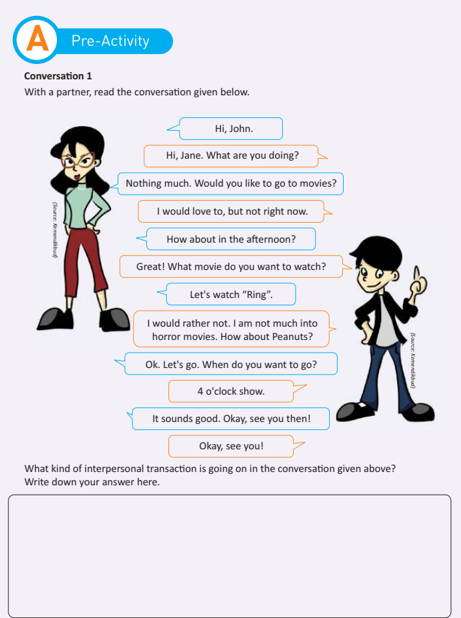

> **Deskripsi Visual:** Gambar ini adalah selembar kertas dengan judul "Pre-Activity Conversation 1". Kertas ini berisi dialog antara dua karakter, John dan Jane, yang bertujuan untuk menentukan waktu dan film yang akan ditonton. Di bagian atas, ada sebuah kotak biru dengan huruf besar "A" dan teks "Pre-Activity". Bawah kotak tersebut, terdapat teks "Conversation 1" dan instruksi untuk membaca dialog tersebut bersama teman.

Dalam bagian utama kertas, terdapat dua karakter animasi: John dan Jane. John didefinisikan sebagai seorang pria berambut hitam pendek, memakai jaket hitam dan celana biru tua. Sementara itu, Jane didefinisikan sebagai seorang wanita berambut panjang, memakai jaket hijau dan celana merah. Kedua karakter tersebut berinteraksi melalui dialog yang ditampilkan dalam bentuk kotak-kotak berwarna biru.

Bawah dialog, terdapat teks yang memberikan penjelasan tentang jenis interaksi yang terjadi dalam dialog tersebut. Teks ini menyatakan bahwa interaksi tersebut adalah interaksi interpersonal, yang melibatkan komunikasi antara dua orang dalam konteks sosial.

Kertas ini juga mencakup bagian bawah dengan teks yang memberikan petunjuk untuk menulis jawaban tentang jenis interaksi tersebut.

Semester 1

 

---
## 📄 Halaman 9

### ConversaƟon �

With a partner, read the conversaƟon given below.

---
**🖼️ Gambar/Diagram**

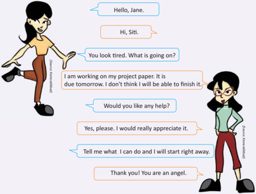

> **Deskripsi Visual:** Gambar ini adalah ilustrasi yang menunjukkan dialog antara dua karakter, Sitt dan Jane. Sitt sedang berjalan dengan tampak lelah, sementara Jane berdiri dengan tangan di pinggangnya. Dialog mereka berlangsung dalam bahasa Inggris. Sitt mengatakan bahwa dia sedang bekerja pada proyeknya dan tidak yakin akan selesai tepat waktu. Dia kemudian meminta bantuan kepada Jane, yang menjawab dengan senang hati bahwa dia siap membantu. Sitt menyarankan untuk memberikan petunjuk apa yang bisa dilakukan, dan Jane mengucapkan terima kasih dan menyebutnya sebagai "angel".

What kind of interpersonal transacƟon is going on in the conversaƟon given above? Write down your answer here.

2

Kelas XI SMA/MA/SMK/MAK

 

---
## 📄 Halaman 10

### SuggesƟng and Offering

Suggest means to give a suggesƟon that is to introduce or propose an idea  or a plan for someone's consideraƟon.

- Social funcƟon: to facilitate interpersonal communicaƟon between different people
SuggesƟons are abstract and can be in form of soluƟons, advice, plan, and idea. It can be accepted or refused.

### For example:

- Let's finish our home work first. - Let's go home.
When making suggesƟons, we o�en use the following expressions.

Let's …

Why don't  we …?

We could …

What about …?

How about …?

I suggest that …

You might want  to change …

I think …

I don't think …

Semester 1

 

---
## 📄 Halaman 11

- Let's go to the library.
- Let's go to movies.
- Why don't you do your homework before going out?
- We could eat at home today.
- What about eaƟng at the new place?
- How about going to Sam's place first?
- I suggest that we call it a day.
- You need to change your sleeping habits.
- I think you should go and meet her.
- I think we should do it this way.

### Let's take a look at the sentence structure to suggest something.

---
**📊 Tabel**

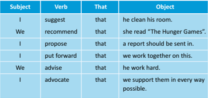

Tabel ini menunjukkan berbagai contoh kalimat subjek, kata kerja, kata "that", dan objek dalam bahasa Inggris. Topik utama tabel adalah penggunaan struktur "subject + verb + that + object" dalam kalimat. Kolom-kolomnya meliputi "Subject" (Subjek), "Verb" (Kata Kerja), "That" (Kata "that"), dan "Object" (Objek). Data penting yang terlihat adalah bahwa semua kalimat menggunakan struktur "subject + verb + that + object", dengan subjek yang berbeda seperti "I", "We", dan "I". Objek dalam kalimat tersebut mencakup aktivitas seperti "clean his room", "read 'The Hunger Games'", "work together on this", dan "support them in every way possible".

Bahasa Inggris

9

 

---
## 📄 Halaman 12

### Responding to SuggesƟons

---
**📊 Tabel**

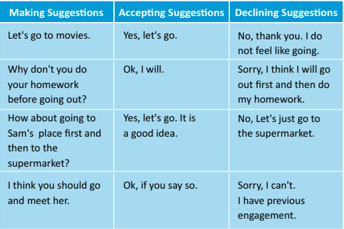

Tabel ini menunjukkan berbagai situasi di mana seseorang membuat saran, menerima saran, atau menolak saran. Topik utamanya adalah interaksi sosial tentang pengambilan keputusan bersama. Kolom-kolomnya mencakup tiga jenis interaksi: "Making Suggestions" (Membuat Saran), "Accepting Suggestions" (Menerima Saran), dan "Declining Suggestions" (Menolak Saran). Data penting yang terlihat adalah bahwa saran dapat diterima dengan setuju, ditolak dengan setuju, atau ditolak dengan tidak setuju. Misalnya, saran untuk pergi ke bioskop dapat diterima dengan setuju, ditolak dengan setuju, atau ditolak dengan tidak setuju. Ini menunjukkan variasi dalam cara orang-orang berinteraksi dan mengambil keputusan bersama dalam situasi sosial.

- Offer means to give something physical or abstract to someone, which can be taken as a gift or a trade.
- Social function: to facilitate interpersonal communication between different people.
- Shall I take you home?
Offer can be given in terms of food,  money,  solutions, friendship or a bargain. It can be taken or refused.

### For example:

- Do you want help with your homework?
When making offers, we o�en use the following expressions.

May I …?

Can I …?

Shall I …?

Would you …?

How about I …?

Semester 1

 

---
## 📄 Halaman 13

- May I give you a hand?
- Can I help you?
- Shall I bring you some tea?
- Would you like another piece of cake?
- How about I help you with this?
- Can I clean the car for you?
- Shall I help you with your homework?
- I will do the washing, if you like.

### Responding to Offers

---
**📊 Tabel**

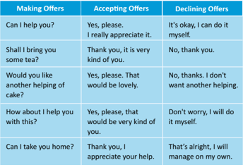

Tabel ini berisi contoh dialog tentang membuat, menerima, dan menolak tawaran. Topik utamanya adalah cara berinteraksi dengan orang lain dalam situasi di mana mereka mungkin ingin memberikan atau menerima bantuan. Kolom-kolomnya mencakup pertanyaan-pertanyaan yang biasanya digunakan untuk membuat tawaran, menerima tawaran, dan menolak tawaran. Data penting yang terlihat adalah bahwa setiap tindakan memiliki beberapa pilihan jawaban yang berbeda, yang menunjukkan variasi dalam cara berbicara dan berinteraksi. Misalnya, "Can I help you?" bisa dijawab dengan "Yes, please." atau "No, thanks." Menjelaskan bagaimana menjawab pertanyaan ini dengan baik dapat membantu meningkatkan keterampilan komunikasi.

### Let's take a look at the sentence structure to offer something.

---
**📊 Tabel**

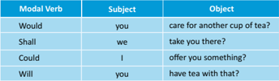

Tabel ini menunjukkan berbagai pernyataan yang menggunakan modal verb seperti "would", "shall", "could", dan "will". Topik utamanya adalah tentang keinginan atau kemampuan seseorang untuk melakukan sesuatu. Kolom "Modal Verb" menunjukkan jenis modal verb yang digunakan, sedangkan kolom "Subject" menunjukkan subjek yang mungkin melakukan tindakan tersebut. Kolom "Object" menunjukkan objek atau hal yang ingin dilakukan oleh subjek tersebut. Dari tabel ini, kita bisa melihat bahwa modal verb sering digunakan untuk menggambarkan keinginan atau kemampuan seseorang untuk melakukan sesuatu, baik itu untuk diri sendiri maupun orang lain.

 

---
## 📄 Halaman 14

### A. Choose the best opƟon for each sentence given below.

1. Hey SiƟ, ____________________ go star-gazing tonight?

- a re you
- shall them
- how about
- would you like to
2. Sam: 'Would you like to go watching a movie this weekend?' Carly: 'I can't, I am low on cash right now. ____________________  stay at home and watch TV instead.'

- How about
- What about
- Let's
- I think
3. What shall we do today?____________________  we go to the library?

- Shall I
- Why don't
- Let's
- Would you
4. ____________________  like a cup of coffee?

- Can I
- Would you
- I'll do
- Should I
5.  ____________________ the washing, if you like.

- Can I
- I'll do
- Would you
- Let's
6. Edo: 'I have a lot of work to finish; I don't know how I will manage.'

Sam:' ____________________  half of it if you want.'

- Would you
- Why don't
- I think
- I will help you with
7. Carly: 'I submiƩed my essay to the teacher a few days ago, but I haven't received any response from her.'

Edo: '____________________  go and ask her?'

- Shall us
- Why don't you
- I'll do
- I propose
Bahasa Inggris

13

 

---
## 📄 Halaman 15

8. ____________________  get you a drink?

- Would you
- Can I
- Why don't you
- I'll do
9. Aisya: 'I am so thirsty.'

Annie: '____________________  get you something to drink?'

- How about
- Why don't
- What about
- Can I
10.   ____________________  like me to clean your car?

- How about
- Would you
- Let's
- I think
B. There are some grammaƟcal errors in the sentences given below. Circle the mistakes in each sentence, then rewrite the sentence. If there aren't any mistakes, put a Ɵck mark next to the sentence.

- Let's to go to the sushi of restaurant for lunch.
____________________________________________________________

- Shall we do have a meeƟng on a�ernoon Saturday?
____________________________________________________________

- Can I do get you a glass juice of?
____________________________________________________________

- Let me take you home.
____________________________________________________________

- If you want, I'll car the wash for you.
____________________________________________________________

14

Kelas XI SMA/MA/SMK/MAK

Semester 1

 

---
## 📄 Halaman 16

- Shall home we go now?
____________________________________________________________

- Would like you another glass of juice?
____________________________________________________________

- You should finish you work today.
____________________________________________________________

- Can I take help you with something?
____________________________________________________________

- Shall I bring your jacket?
____________________________________________________________

C. Respond to the suggesƟons and offers given below.

- Can I help you?
___________________________________________________________

- Why don't you go and get something to eat?
___________________________________________________________

- Why don't you join us for lunch?
___________________________________________________________

- Shall I bring a book to read?
___________________________________________________________

Bahasa Inggris

15

 

---
## 📄 Halaman 17

- Why don't we meet at the bookstore tomorrow at 5 p.m.?
___________________________________________________________

- Let's all eat together.
___________________________________________________________

- Would you like a glass of water?
___________________________________________________________

- Would you like me to do the ironing for you?
___________________________________________________________

- I will wash the car, if you like.
___________________________________________________________

- I think we should go and pick your father up from the airport.
___________________________________________________________

16

Kelas XI SMA/MA/SMK/MAK

 

---
## 📄 Halaman 18

- Complete the transacƟonal conversaƟons based on the suggesƟons and offers given below.  The first one is done for you.

### 1. At the Airport

This is a conversaƟon between an airline counter aƩendant and a customer.

- A: Good morning. Can I have your Ɵcket, please? Do you have any luggage?
- B: Yes, one suitcase.
- A: Please place it here.
Would you like a window or an aisle seat? Ok, sure. Is there anything else I can do for you? You are welcome. Here is your boarding pass. Please be at gate B 30 minutes before boarding. Have a nice flight!

### �. At the Hotel

This conversaƟon is between a concierge at a hotel and a customer:

---
**🖼️ Gambar/Diagram**

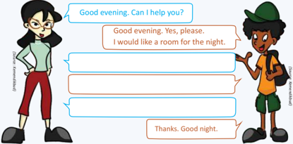

> **Deskripsi Visual:** Gambar ini adalah ilustrasi yang menunjukkan dialog antara dua karakter. Karakter pria berdiri di sebelah kanan dengan topi hijau dan tas besar, sedangkan karakter wanita berdiri di sebelah kiri dengan topi hitam dan tas kecil. Kedua karakter tersebut sedang berbicara dalam bahasa Inggris.

Pertama, karakter wanita mengatakan "Good evening. Can I help you?" (Sore ini. Bisa saya membantu Anda?). Kemudian, karakter pria menjawab dengan "Good evening. Yes, please. I would like a room for the night." (Sore ini. Ya, silakan. Saya ingin kamar untuk malam ini.). Setelah itu, karakter wanita memberikan respons dengan "I will be happy to assist you." (Saya akan sangat senang membantu Anda.). Akhirnya, karakter pria mengucapkan terima kasih dengan "Thanks. Good night." (Terima kasih. Selamat malam.).

Elemen utama dalam gambar ini adalah dua karakter yang sedang berbicara, serta teks yang mereka katakan. Relasi antara kedua karakter adalah interaksi dialog, dimana karakter wanita bertindak sebagai penjaga atau petugas, sedangkan karakter pria bertindak sebagai pelanggan. Informasi kunci yang dapat diambil dari gambar ini adalah bahwa ada pertukaran dialog tentang permintaan kamar malam.

Bahasa Inggris

17

 

---
## 📄 Halaman 19

### 3.  What Movie Should We Watch?

This is a conversaƟon between two friends.

---
**🖼️ Gambar/Diagram**

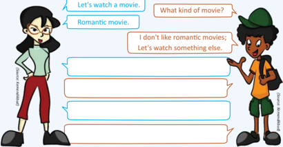

> **Deskripsi Visual:** Gambar ini adalah ilustrasi yang menampilkan dua karakter, seorang wanita dan seorang pria, berbicara tentang film. Wanita mengatakan "Let's watch a movie." dan "Romantic movie." sementara pria menjawab dengan "I don't like romantic movies; Let's watch something else." Ilustrasi ini menunjukkan hubungan antara dua karakter dan kontras antara minat mereka dalam film romantis. Teks pada gambar memberikan informasi tentang perbincangan mereka tentang genre film.

### 4. At a Store

This conversaƟon is between a store aƩendant and a customer.

---
**🖼️ Gambar/Diagram**

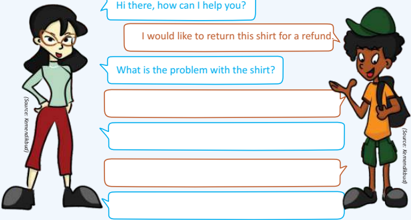

> **Deskripsi Visual:** Gambar ini adalah ilustrasi yang menunjukkan dialog antara dua karakter, seorang pria dan seorang wanita, di sebuah toko pakaian. Pria tersebut sedang berbicara dengan wanita tersebut tentang mengembalikan pakaian. Pria tersebut mengenakan jaket kuning dan celana hijau dengan topi hitam, sedangkan wanita tersebut mengenakan kaos hijau dan celana merah dengan sepatu hitam. Di bawah dialog mereka, terdapat dua kotak kosong yang tampaknya digunakan untuk menuliskan jawaban atau pertanyaan. Informasi kunci yang dapat diambil dari gambar ini adalah bahwa ada konflik antara pria dan wanita dalam hal pengembalian barang, dan mereka sedang berusaha untuk memecahkan masalah tersebut.

Semester 1

18

Kelas XI SMA/MA/SMK/MAK

 

---
## 📄 Halaman 20

Use the thinking technique, 'THINKPAIRSHARE'  to offer and suggest a soluƟon to the problem given below.

You came to know that your friends had a fight. They are not on talking terms for some Ɵme now. Since you are a common friend, it is difficult for you because you want to hang out with both of them but they can't stand each other. You have to find a way to offer and suggest a soluƟon so that the fight is over.

### THINK

About the suggesƟons  and offers you can make to solve the problem.

### PAIR

In pairs, discuss the best suggesƟons and offers. Give at least four.

### SHARE

Then share the outcome of your discussion by acƟng it out in front of your teacher and classmates.

Semester 1

 

---
## 📄 Halaman 21

With a partner, choose a topic of your choice. Write a dialogue using suggesƟons and offers.

 

---
## 📄 Halaman 22

### Choose one of the following acƟviƟes for your project.

- With a partner, come up with ideas and suggesƟons to improve the English environment in your school. Make a poster and put these ideas and suggesƟons on the poster and share them with your teacher and classmates.
- With your partner, come up with offers to improve the English environment school. Make a poster and present it in class.
- With a partner, create a dialogue using suggesƟons and offers on any topic. Act this dialogue in front of the class.
- Assume you and your friend win an all-expense-paid trip to the fisherman's village. Design a postcard about the locaƟon to send to your friends in other classes.

### For creaƟng the postcard, consider the following aspects:

- you can consider the fact that there is an enchanted fish in the waters;
- you can consider suggesƟng them visit the place;
- you can offer them incenƟves if they visit the place.

### Example of poster

Picture 1.6 (Source: lazuardiwritersguild.blogspot.com)

22

### Example of postcard

Semester 1

 

---
## 📄 Halaman 23

### I can do this.

### Complete these statements.

- The most interesƟng thing I learned in this chapter was ___________
- The part I enjoyed most was ___________
- I would like to find more about ___________
- The hardest part in this chapter was ___________
- I need to work harder at ___________
Read the statements below and Ɵck (     ) the opƟon that is most applicable to you.

My plan to overcome the difficulƟes of this chapter

 

---
## 📄 Halaman 24

### CHAPTER 2 Opinions & Thoughts

### KOMPETENSI DASAR

- 3.2    Menerapkan fungsi sosial, struktur teks, dan unsur kebahasaan teks interaksi transaksional lisan dan tulis yang melibatkan Ɵndakan memberi dan meminta informasi terkait pendapat dan pikiran, sesuai dengan konteks penggunaannya. (PerhaƟkan unsur kebahasaan I think, I suppose, in my opinion .)
- 4.2     Menyusun teks interaksi transaksional, lisan dan tulis, pendek dan sederhana, yang melibatkan Ɵndakan memberi dan meminta informasi terkait pendapat dan pikiran, dengan memperhaƟkan fungsi sosial, struktur teks, dan unsur kebahasaan yang benar dan sesuai konteks
Semester 1

 

---
## 📄 Halaman 25

With a partner, read the conversaƟonal text given.

Why are you looking so sad?

I was reading an opinion arƟcle on bullying. It made me extremely sad.

Ah! People like to exaggerate things, bullying as such is no big deal.

No, I don't think so. Bullying is prevalent in our society. It is important that everyone should be made aware of this social evil.

I don't agree with you. LiƩle bit teasing here and there is acceptable.

I am of the opinion that no one has any right to harass or make people feel inferior. No one should have that kind of power.

Hey! Stop! You are ge�ng too serious!

SiƟ

---
**🖼️ Gambar/Diagram**

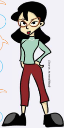

> **Deskripsi Visual:** Gambar ini adalah ilustrasi yang menampilkan seorang karakter perempuan dengan rambut panjang dan keriting, memakai pakaian kasual yang terdiri dari kaos berwarna hijau muda dan celana rok merah. Karakter tersebut tampak senang dan tenang, dengan tangan di samping tubuhnya. Latar belakangnya sederhana, dengan beberapa elemen warna cerah seperti biru dan orange yang tampak seperti bunga atau bintang.

Elemen utama dalam gambar ini adalah karakter perempuan yang menjadi fokus utama. Ia tampak tenang dan senang, dengan posisi tubuh yang menunjukkan kepercayaan diri dan kepuasan. Latar belakang sederhana tidak mengganggu fokus pada karakter utama.

Teks, angka, atau label penting tidak ada dalam gambar ini. Namun, gambar ini mungkin digunakan untuk membantu pembaca memahami konsep atau ide tertentu dalam konteks pembelajaran.

Informasi kunci yang dapat diambil dari gambar ini adalah bahwa karakter tersebut tampak senang dan tenang, yang mungkin merupakan bagian dari konsep pembelajaran tentang emosi atau perilaku manusia. Gambar ini juga mungkin digunakan sebagai contoh atau model untuk anak-anak dalam belajar menggambar atau menggambar karakter.

Yes! You should be serious about it as well. I would like to point out that bullying is everyone's problem and responsibility. If you condone bullying in any way, shape or form it means you are taking part in it whether it is directly or indirectly by being silent.

### Discuss these quesƟons with your partner.

- What is happening between SiƟ and Jane?
- What kind of conversaƟon are they having?
- Whom do you agree with, Jane or SiƟ? Why?
- Have you witnessed bullying? Describe how you felt.
Jane

27

 

---
## 📄 Halaman 26

### Opinions

An opinion is the way you feel or think about something. Our opinion about something or someone is based on our perspecƟve. Whenever we give or express our opinion, it is important to give reasoning or an example to support our opinion.

### Some Opinions:

I like Harry PoƩer movies because the magic seems so real.

I don't agree with you. Harry PoƩer movies are just overrated.

I like playing tag because it is so much fun.

I don't like playing tag because people end up fighƟng.

provide means of sustenance for under privileged people instead of building tall towers. In my opinion, the government should

I agree with what you are saying but have you ever thought that building tall towers provides work for unemployed people?

We can use collocaƟons to express opinions, for example strong argument, strong criƟcism, strong denial, strong opinion, strong resistance, quite strongly.

Semester 1

 

---
## 📄 Halaman 27

### Let's look at the sentence structure to express opinions.

---
**📊 Tabel**

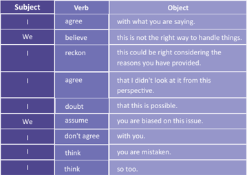

Tabel ini menunjukkan berbagai pernyataan yang menggunakan kata kerja subjek (I), kata kerja (verb), dan objek dalam konteks diskusi atau perdebatan. Topik utama tabel adalah pernyataan yang mengandung perbedaan pendapat atau penilaian antara dua pihak, yaitu saya (I) dan kita (We). Kolom-kolomnya meliputi Subject (Subjek), Verb (Kata Kerja), dan Object (Objek). Data penting yang terlihat adalah bahwa banyak pernyataan tersebut menggunakan kata kerja seperti "agree" (setuju), "believe" (percaya), "reckon" (mengira), "doubt" (menyiksa), "assume" (menyimpulkan), "don't agree" (tidak setuju), dan "think" (pikir). Ini menunjukkan bahwa pernyataan ini sering digunakan untuk menyampaikan pendapat atau perasaan tentang sesuatu yang sedang dibahas.

### Expressions

Opinions can be expressed in the ways given below.

### Personal Point of View

These expressions are used to show personal points of view.

---
**🖼️ Gambar/Diagram**

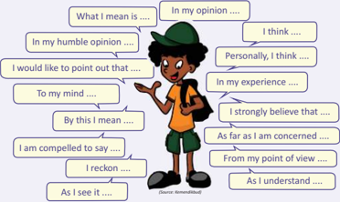

> **Deskripsi Visual:** Gambar ini adalah diagram yang menunjukkan berbagai frasa dan ungkapan yang digunakan untuk menyampaikan pendapat atau opini. Diagram ini terdiri dari dua kolom yang berisi frasa-frasa yang berbeda. Kolom pertama berisi frasa yang biasanya digunakan untuk menyampaikan pendapat atau opini seseorang, seperti "What I mean is...", "In my opinion...", "In my humble opinion...", dan sebagainya. Kolom kedua berisi frasa yang serupa namun dengan penambahan kata-kata tambahan seperti "I think...", "Personally, I think...", "I strongly believe that...", dan sebagainya. Setiap frasa dalam kolom pertama memiliki versi yang lebih lengkap di kolom kedua. Diagram ini membantu pembaca untuk memahami cara-cara yang berbeda untuk menyampaikan pendapat atau opini.

Bahasa Inggris

33

 

---
## 📄 Halaman 28

### General Point of View

These expressions are used to show a general point of view. A general point of view creates a balance in wriƟng and helps avoid absolute statements.

---
**🖼️ Gambar/Diagram**

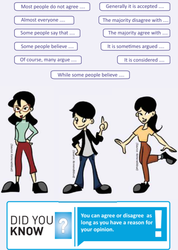

> **Deskripsi Visual:** Gambar ini adalah ilustrasi yang menunjukkan tiga karakter kartun berbicara tentang suatu topik. Karakter pertama, seorang gadis dengan rambut panjang, sedang berdiri dengan tangan di pinggangnya. Karakter kedua, seorang pria dengan rambut pendek, sedang berdiri dengan tangan menggenggam pipinya dan menunjuk ke arah kanan. Karakter ketiga, seorang gadis dengan rambut pendek, sedang berjalan dengan tangan di belakangnya. Di bawah gambar tersebut ada teks yang menyatakan bahwa "DID YOU KNOW" dan "You can agree or disagree as long as you have a reason for your opinion." Ini menunjukkan bahwa pembaca memiliki kemampuan untuk setuju atau tidak setuju, asalkan mereka memiliki alasan untuk pandangan mereka.

34

Kelas XI SMA/MA/SMK/MAK

Semester 1

 

---
## 📄 Halaman 29

### Agreeing with an Opinion

These are some of the expressions used to express agreement with an opinion.

---
**🖼️ Gambar/Diagram**

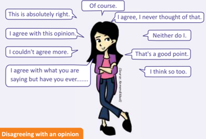

> **Deskripsi Visual:** Gambar ini adalah ilustrasi yang menunjukkan berbagai pernyataan yang sering digunakan dalam percakapan untuk menggambarkan situasi ketika seseorang menolak pendapat orang lain. Gambar tersebut terdiri dari seorang wanita yang sedang berbicara dengan beberapa orang yang tampaknya mendukung pendapatnya. Setiap orang memiliki pernyataan yang berbeda, mulai dari "This is absolutely right" hingga "I think so too." Perhatikan juga bahwa ada pernyataan seperti "Neither do I," yang menunjukkan ketidaksetujuan. Gambar ini membantu pembaca memahami bagaimana cara berbicara dengan orang lain ketika mereka memiliki pendapat yang berbeda.

These are the expressions used to express disagreement with an opinion.

---
**🖼️ Gambar/Diagram**

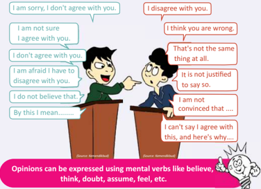

> **Deskripsi Visual:** Gambar ini adalah ilustrasi yang menunjukkan dialog antara dua karakter yang berbicara tentang pendapat mereka. Karakter pertama mengatakan "I am sorry, I don't agree with you." Sementara karakter kedua menjawab dengan "I disagree with you." Kedua karakter tersebut kemudian berbicara tentang berbagai hal yang menunjukkan perbedaan pendapat mereka. Karakter pertama mengatakan "I am not sure," "I agree with you," dan "I am afraid I have to disagree with you." Sementara karakter kedua mengatakan "I think you are wrong," "That's not the same thing at all," "It is not justified to say so," dan "I am not convinced that...." Gambar ini menunjukkan bahwa opini dapat dinyatakan menggunakan kata kerja pikiran seperti percaya, berpikir, bertanya, yakin, dan merasa.

35

Bahasa Inggris

 

---
## 📄 Halaman 30

### Examples of Opinions:

- I reckon he might have been bullied in school.
- To be honest, I never thought that bullying was so prevalent in most schools.
- I believe bullying is totally an unacceptable pracƟce in our school.
- I am not convinced that the majority of the people are not aware of this issue.

### Examples of how to agree and disagree with an opinion

---
**📊 Tabel**

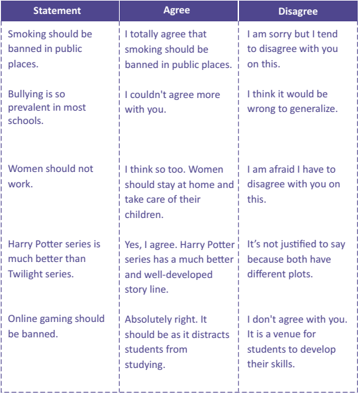

Tabel ini menunjukkan perbedaan pandangan antara dua orang tentang berbagai isu sosial dan budaya. Topik utamanya adalah tentang kebijakan dan norma sosial. Kolom "Agree" menunjukkan pandangan yang sama, sedangkan kolom "Disagree" menunjukkan pandangan yang berbeda. Misalnya, satu orang sepenuhnya setuju bahwa merokok harus diblokir di tempat umum, sementara yang lain tidak setuju dan merasa itu salah untuk mengekalkan generalisasi. Sementara itu, satu orang sangat setuju dengan ide bahwa wanita seharusnya tidak bekerja, sementara yang lain tidak setuju dan merasa itu tidak tepat. Tabel ini menunjukkan bahwa pandangan individu dapat sangat bervariasi tergantung pada subjek yang dibahas.

Kelas XI SMA/MA/SMK/MAK

36

Semester 1

 

---
## 📄 Halaman 31

- Fill in the blanks using the opinion expressions given in the box below.
- I ________________  with you bullying should be banned.
- It is all right if you don't agree with me but I have every right to my ________________.
- As far as I ________________, I will not support bullying in my school.
- I  ________________ that medical care should be free for everyone.
- Some people_________________ eaƟng fish and yogurt at the same Ɵme causes a severe skin disease.
- I feel quite___________________ about this issue.
totally agree, opinion, am concerned, strongly believe, believe that, strongly

- Below are several opinions. Some of them are polite and some impolite. Highlight an opinion with:
red: if it is an impolite way of disagreeing.

blue: if it is a polite way of disagreeing.

green:  if it is a polite way of giving an opinion.

yellow: if it is an impolite way of giving an opinion.

- I am afraid, I don't agree with you on this maƩer.
37

 

---
## 📄 Halaman 32

40

- I agree with you to a certain point but I would appreciate if you look at it from another point of view.
- That's an interesƟng idea but I think our idea is much beƩer.
- Do you really think like that?
- Rubbish! Nonsense! I don't agree with this.
- Actually, as a maƩer of fact, I think we can look at it again and decide.
- This is what I am ge�ng at.
- You want to know what I think? Let me tell you what I think.
- I feel compelled to disagree with you on this maƩer.
- I find it rather silly that you think like this.
- I think we should all work together to rid our society of social evils.
- It occurs to me that you have closed your mind against any right opinion.
- As far as I can say, this club is going to dogs.
- You make a strong case for changing all the rules, but I think you might have overlooked the fact that it is not possible.
- This is the most distasteful book I have ever read.
- To my mind, this is the truth and I believe it.
- The food here is absolutely inedible.
- I understand where you are coming from, but you have to look at it from our perspecƟve as well.
- You have a point, but have you ever thought how poor people on the street feel?
- This opinion is absolutely useless. Please get out of here.
Kelas XI SMA/MA/SMK/MAK

Semester 1

 

---
## 📄 Halaman 33

(Source: Kemendikbud)

---
**🖼️ Gambar/Diagram**

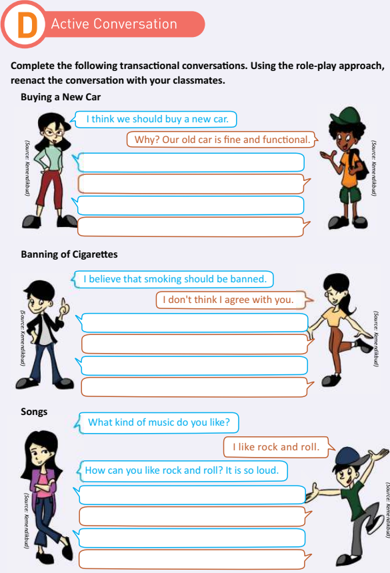

> **Deskripsi Visual:** Gambar ini adalah sebagian dari sebuah buku pelajaran yang berfokus pada aktivitas sosial dan komunikasi. Gambar tersebut terdiri dari tiga konversasi berbeda: beli mobil baru, larangan merokok, dan tentang lagu. Setiap konversasi dilengkapi dengan karakter animasi yang menunjukkan interaksi antara dua orang. Untuk setiap konversasi, ada teks yang memberikan konteks dan pertanyaan awal untuk dialog. Teks tersebut membantu siswa untuk memahami dan menerapkan teknik dialog aktif dalam situasi nyata. Gambar ini menggunakan elemen-elemen seperti karakter animasi, teks, dan warna untuk membuat proses belajar menjadi lebih menarik dan interaktif.

42

Kelas XI SMA/MA/SMK/MAK

 

---
## 📄 Halaman 34

Choose one of the topics given below. Create a dialogue of your opinion about your chosen topic. Follow the opinion giving technique you have learnt in the building blocks.

- Do you think educaƟon is a right or a priviledge? Support your opinion with reasons and examples.
- Do you think conservaƟon of wildlife is important? Support your opinion with reasons and examples.
- Time is more important than money. Support your opinion with reasons and examples.
- ExploitaƟon of natural resources is a major problem in Indonesia. Support your opinion with reasons and examples.
- Do you think gaming affects the life of teenagers? Support your opinion with reasons and examples.
Bahasa Inggris

43

 

---
## 📄 Halaman 35

44

Kelas XI SMA/MA/SMK/MAK

 

---
## 📄 Halaman 36

### Choose one of the acƟviƟes given below.

- The objecƟve of this acƟvity is to gather opinions of people by conducƟng an interview. With a partner, choose a topic, preferably a social issue, for example social media, smoking, corrupƟon, global warming, polluƟon, poverty, drug abuse, etc. Write a series of interview quesƟons of not more than 6 that will help you collect opinions of people on the issue you have chosen. A�er the interview, create a dialogue using the opinions you have collected. You can present your work in the form of a role play, a poster, a movie or a PowerPoint presentaƟon. Make sure you share it in your class.

### Sample quesƟons on the issue of corrupƟon for the interview:

- What is corrupƟon (in your opinion)?
- Do you think that corrupƟon is prevalent in our society?
- How would you define corrupƟon?
- Do you think corrupƟon should be a punishable crime?
- Do you think the government is making enough efforts to eradicate corrupƟon from our society?
- What are you doing to help eradicate corrupƟon?
- With a classmate, write an opinion conversaƟon using the expressions you have learnt in the building blocks. Using the role-play approach, reenact it in front of the class.
- Find an editorial in any English newspaper or magazine. Use the Visible Thinking technique or 'Reporter's Notebook' to idenƟfy and separate facts and opinions from this arƟcle. Work in groups of five.

### Focus on the following points:

- IdenƟfy an issue or dilemma from the arƟcle.
- IdenƟfy facts and opinions.
- See if you understand them or you need more informaƟon.
- A�er the discussion with your group members and teacher, express your opinion based on the informaƟon you have at hand.
- Smoking should be banned in public places. What is your opinion? What is the opinion of other people in your class on this issue? Do you agree or disagree with this opinion? Debate with your classmates on this issue. Work in groups of five or ten.
Bahasa Inggris

45

 

---
## 📄 Halaman 37

### I can do this.

### Complete these statements.

- The most interesƟng thing I learned in this chapter was ___________
- The part I enjoyed most was ___________
- I would like to find more about ___________
- The hardest part in this chapter was ___________
- I need to work harder at ___________
Read the statements below and Ɵck (     ) the opƟon that is most applicable to you.

My plan to overcome the difficulƟes of this chapter

 

---
## 📄 Halaman 38

68

### CHAPTER 3 Party Time

### KOMPETENSI DASAR

- 3.3     Membedakan fungsi sosial, struktur teks, dan unsur kebahasaan beberapa teks khusus dalam bentuk undangan resmi dengan memberi dan meminta informasi  terkait  kegiatan  sekolah/tempat  kerja  sesuai  dengan  konteks penggunaannya
- 4.3 Teks undangan resmi
- 4.3.1  Menangkap makna secara kontekstual terkait fungsi sosial, struktur teks, dan unsur kebahasaan teks khusus dalam bentuk undangan resmi lisan dan tulis, terkait kegiatan sekolah/tempat kerja
- 4.3.2  Menyusun teks khusus dalam bentuk undangan resmi lisan dan tulis, terkait kegiatan sekolah/tempat kerja, dengan memperhaƟkan fungsi sosial, struktur teks, dan unsur kebahasaan, secara benar dan sesuai konteks
32

Kelas XI SMA/MA/SMK/MAK

Kelas XI SMA/MA/SMK/MAK

Semester 1

 

---
## 📄 Halaman 39

Read an excerpt of the play given below.

MONSIEUR LOISEL:

Sweetheart, I have a surprise for you.

MADAME LOISEL   :

Really, what is the surprise?

MONSIEUR LOISEL:

See for yourself.

(He places the invitaƟon on the table.)

Swi�ly, she tears open the envelope and draws out a printed card and reads out

"The Minister and Madame Ramponneau request the pleasure of the

January the eighteenth."

company of Monsieur and Madame Loisel  at the Ministry on the evening of Monday,

MONSIEUR LOISEL: Isn't it wonderful?

MADAME  LOISEL: What do you mean? What can I do with it?

(She tosses the invitaƟon on the table.)

### Discussion

- Why do people write and send invitaƟons?
- Why do you think invitaƟons have become important in our society?
- What kind of invitaƟon do you think is in the excerpt given above? How can you say that?
Write down your thoughts here.

69

 

---
## 📄 Halaman 40

---
**🖼️ Gambar/Diagram**

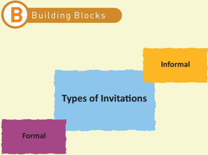

> **Deskripsi Visual:** Gambar ini adalah diagram yang menunjukkan dua jenis undangan: Formal dan Informal. Diagram ini dibagi menjadi dua bagian utama, masing-masing dengan warna yang berbeda. Bagian atas menggambarkan "Informal" dengan warna kuning, sedangkan bagian bawah menggambarkan "Formal" dengan warna ungu. Dua bagian ini terhubung oleh teks "Types of Invitations" yang berwarna biru, yang menunjukkan bahwa kedua jenis ini merupakan variasi dari undangan formal. Gambar ini digunakan untuk membantu pembaca memahami perbedaan antara undangan formal dan informal dalam konteks pembelajaran.

### Formal InvitaƟon

A formal invitaƟon is an invitaƟon which follows a dignified form, tone or style in agreement with the established norms, customs or values (Websters, 2012).

### For example:

- An invitaƟon to the opening of a school
- An invitaƟon to a graduaƟon ceremony
- An invitaƟon to a wedding, etc.

### Common Format of a Formal InvitaƟon

- -The first line is the name(s) of the person(s) who invite(s).
- The second line is the request for parƟcipaƟon.
- The third line is the names of the person(s) invited.
- The fourth line is the occasion for invitaƟon.
- The fi�h line is the Ɵme and date of the occasion.
- The sixth line is the place of the occasion.
- The last line is the request for reply.
Bahasa Inggris

77

 

---
## 📄 Halaman 41

### Social FuncƟon:

InviƟng people to formal and social events

### LinguisƟc CharacterisƟcs:

Simple, precise, and concise words

Detailed informaƟon

The tone should be friendly and sincere. Words should be chosen carefully. The style of wriƟng should be formal.

### Format of Layout:

Addresses of the addresser and the addressee

SalutaƟon

### Body

- State for whom the invitaƟon is and by who it is given.
- Date
- Reasons of invitaƟon
- Time
- R.S.V.P (it is a French word -"repondez s'il vous plait" which means "please reply")
- Place
Signature

The format of the envelope for the invitaƟon is addressed the same way as the envelope of a leƩer (i.e. with the recipient's address in the middle of the envelope and addresser's address on the le� hand corner of the envelope).

### Ways of Organizing InformaƟon:

Reasons for inviƟng others Detailed informaƟon about the party or event Ask friends to come by using a sincere tone

 

---
## 📄 Halaman 42

### Example of a Formal InvitaƟon

---
**🖼️ Gambar/Diagram**

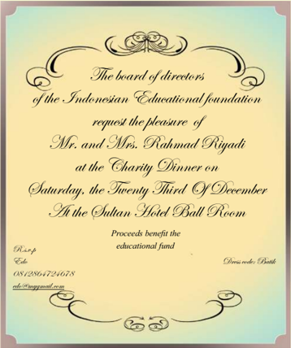

> **Deskripsi Visual:** Gambar ini adalah sebuah undangan resmi untuk acara pesta malam bantuan (Charity Dinner) yang diselenggarakan oleh Board of Directors Indonesian Educational Foundation. Undangan ini diterbitkan oleh Sultan Hotel Ballroom pada tanggal 23 Desember. Untuk acara ini, Mr. dan Mrs. Rahmad Rigadi diundang sebagai tamu kehormatan. Acara tersebut bertujuan untuk mendukung pendanaan untuk program pendidikan. Informasi kontak tambahan dapat ditemukan di bagian bawah undangan, yang mencakup nomor telepon dan email.

Formal invitations are written on cards. The text is written in calligraphic style.

Semester 1

 

---
## 📄 Halaman 43

### InvitaƟon to a wedding

---
**🖼️ Gambar/Diagram**

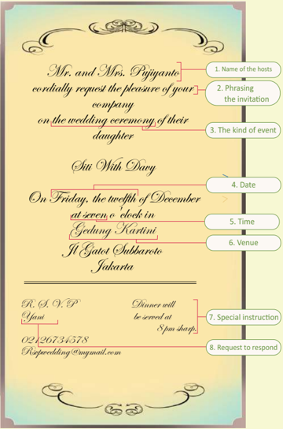

> **Deskripsi Visual:** Gambar ini adalah diagram yang menunjukkan struktur umum undangan pernikahan. Diagram ini terdiri dari beberapa elemen utama yang terorganisir dengan jelas:

1. **Pertama**: Nama-nama pengirim undangan (Mr. and Mrs. Pujiganto).
2. **Kedua**: Pemasangan undangan, yang mencakup permintaan hormat untuk hadir pada acara pernikahan putri mereka.
3. **Tiga**: Jenis acara, yaitu pernikahan.
4. **Keempat**: Tanggal acara, yang ditentukan sebagai tanggal 12 Desember.
5. **Kelima**: Waktu acara, yang ditentukan sebagai pukul 17:00.
6. **Keenam**: Lokasi acara, yang ditentukan sebagai Gedung Kartini Jl. Gatot Subroto Jakarta.
7. **Ketujuh**: Instruksi khusus, yang menyatakan bahwa makan malam akan disajikan pukul 18:00.
8. **Kedelapan**: Permintaan untuk memberikan respons.

Elemen-elemen ini saling terkait dan membentuk struktur umum sebuah undangan pernikahan. Teks, angka, dan label penting seperti nama pengirim, tanggal, waktu, lokasi, dan instruksi khusus semua berfungsi untuk memberikan informasi yang diperlukan bagi tamu tentang acara tersebut.

 

---
## 📄 Halaman 44

### Responding to formal invitaƟons

Formal invitaƟons should be responded to within 3 days.

Replies are wriƩen in third person.

Replies have to be handwriƩen.

Reason should be briefly stated for declining the invitaƟon.

### Example:

### 1. Acceptance

- Mr. and Mrs. Eri Utomo accept with pleasure the kind invitaƟon of Mr. and Mrs. Pujiyanto to the wedding ceremony of their daughter on Friday, the twel�h of December at seven o' clock.
- Mr. and Mrs. Wibowo accept the invitaƟon with pleasure.

### 2. Declining/Regre�ng

- Mr. and Mrs. Situmorang regret that they are unable to accept the kind invitaƟon of Mr. and Mrs. Pujiyanto for Friday, the twel�h of December at seven o' clock due to prior engagement.
- Mr. And Mrs. Wibowo regret to decline the invitaƟon due to health reasons.

### 3. Responding card

The responding card comes with the invitaƟon card. This card should preferably be handwriƩen.

---
**🖼️ Gambar/Diagram**

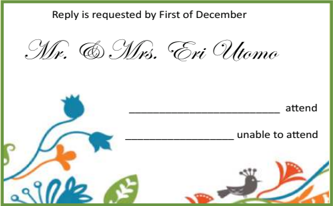

> **Deskripsi Visual:** Gambar ini adalah sebuah kartu undangan resmi dengan desain yang menarik dan estetis. Pada bagian atas, terdapat teks yang menyatakan bahwa permintaan balasan diperlukan oleh tanggal pertama Desember. Nama "Mr. & Mrs. Eri Utomo" ditulis di bagian tengah, menunjukkan bahwa ini adalah undangan untuk pernikahan mereka. Di bawah nama pengirim, terdapat dua kotak kosong yang bertuliskan "attend" dan "unable to attend", masing-masing digunakan untuk menandai apakah penerima undangan akan hadir atau tidak. Desain kartu ini mencakup elemen-elemen seperti bunga biru dan hijau, daun, dan seekor burung, yang memberikan nuansa alami dan ceria pada desainnya. Teks dan elemen-elemen ini saling berinteraksi untuk menciptakan suasana yang hangat dan meriah, sesuai dengan tema pernikahan.

Semester 1

 

---
## 📄 Halaman 45

### A. In the invitaƟon card below, find out what is missing.

---
**🖼️ Gambar/Diagram**

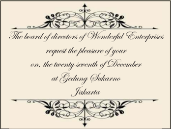

> **Deskripsi Visual:** Gambar ini adalah sebuah kartu undangan formal dengan desain elegan dan minimalis. Dalam gambar tersebut, ada teks yang menyatakan bahwa "The board of directors of Wonderful Enterprises request the pleasure of your presence on the twenty-seventh of December at Gedung Sukarno, Jakarta." Ini menunjukkan bahwa acara tersebut akan diselenggarakan oleh tim direktur sebuah perusahaan bernama Wonderful Enterprises pada tanggal 27 Desember di Gedung Sukarno, Jakarta. Desain kartu menggunakan elemen-elemen seperti garis dan bunga yang mengisi bagian atas dan bawah kartu, menciptakan kesan formal dan profesional. Teks utama yang ditampilkan adalah informasi tentang acara tersebut, termasuk nama perusahaan, tanggal, dan lokasi.

Now rewrite the invitaƟon properly in the space given below.

Bahasa Inggris

83

 

---
## 📄 Halaman 46

### Now respond to the invitaƟon.

With a partner create dialogues to accept and decline invitaƟons. Using the roleplay approach, re-enact the conversaƟon with your classmates. You can model your conversaƟon based on the examples of invitaƟons given below.

### InvitaƟon to dinner

Would you like to come over for dinner tonight?

Thank you! I'd love to. Would you like me to bring something?

No, nothing, just come.

OK. What Ɵme?

At 7 p.m.

OK, see you then.

Joko:

Yeni:

Joko:

Yeni:

Joko:

Yeni:

### InvitaƟon to the grand opening of ABC so�ware company

Mr. Budi, I would like to invite you to the opening of my so�ware company.

When and where?

This Saturday at 10 a.m.

I am afraid I won't be able to come. I have a prior engagement.

Ariyanto  :

Mr. Budi:

Ariyanto  :

Mr. Budi:

Semester 1

 

---
## 📄 Halaman 47

### InvitaƟon to anniversary dinner

rd Mr. Suharto, my husband and I are celebraƟng our 3 wedding anniversary. We would like you to join us.

Oh, thank you! I would be delighted to. When is it?

On Sunday at 8 p.m in the Balai KarƟni.

OK, I will be there.

Thank you.  See you then!

My pleasure. See you then!

YanƟ             :

Mr. Suharto:

YanƟ             :

Mr. Suharto:

YanƟ             :

Mr. Suharto:

### AccepƟng an invitaƟon

---
**🖼️ Gambar/Diagram**

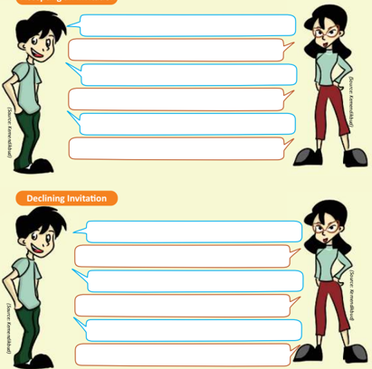

> **Deskripsi Visual:** Gambar ini adalah ilustrasi yang menunjukkan dua situasi dialog antara dua karakter: seorang pria dan seorang wanita. Pada bagian atas, dialog pertama berlangsung dengan pria yang tampak sedang berbicara kepada wanita. Di bawahnya, ada judul "Declining Invitation" yang menunjukkan bahwa dialog kedua berada dalam konteks penolakan undangan. Kedua karakter memiliki tampilan yang serupa, dengan pakaian formal dan posisi tubuh yang menunjukkan sikap percaya diri dan sopan. Warna dominan pada gambar adalah warna hijau dan merah, yang mencerminkan keberagaman dalam konteks dialog tersebut.

85

 

---
## 📄 Halaman 48

Write a formal invitaƟon for your brother's wedding.

86

Kelas XI SMA/MA/SMK/MAK

Semester 1

 

---
## 📄 Halaman 49

### Choose one of the acƟviƟes given below.

- With a partner, create a formal invitaƟon for the head of your school, inviƟng him/her to the graduaƟon ceremony in your school. Use the format you have learnt in the building blocks.
- With a partner, create a formal invitaƟon for the head of your district, inviƟng him/her to the ribbon-cu�ng ceremony to inaugurate the new science laboratory in your school. Use the format you have learnt in the building blocks.
- Design and create a formal invitaƟon card template.
Bahasa Inggris

87

 

---
## 📄 Halaman 50

### I can do this.

### Complete these statements.

- The most interesƟng thing I learned in this chapter was ___________
- The part I enjoyed most was ___________
- I would like to find more about ___________
- The hardest part in this chapter was ___________
- I need to work harder at ___________
Read the statements below and Ɵck (     ) the opƟon that is most applicable to you.

---
**📊 Tabel**

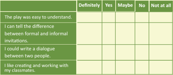

Tabel ini menunjukkan hasil survei tentang keahlian berbahasa Inggris. Topik utamanya adalah kemampuan berkomunikasi dalam bahasa Inggris. Kolom-kolomnya mencakup tingkat kesulitan dalam memahami teks, kemampuan untuk membedakan antara undangan resmi dan tidak resmi, kemampuan untuk membuat dialog antara dua orang, dan kepuasan dalam bekerja sama dengan teman sekolah. Data penting yang terlihat adalah bahwa sebagian besar responden merasa sangat atau cukup memahami teks dalam bahasa Inggris, dapat membedakan antara undangan resmi dan tidak resmi, dan merasa sangat atau cukup puas dalam bekerja sama dengan teman sekolah. Namun, ada beberapa responden yang merasa kurang memahami teks dan kurang puas dalam bekerja sama dengan teman sekolah.

My plan to overcome the difficulƟes of this chapter

Bahasa Inggris

89

 

---
## 📄 Halaman 51

### CHAPTER 4 Natural Disasters-An Exposition

### KOMPETENSI DASAR

- 3.4     Membedakan fungsi sosial, struktur teks, dan unsur kebahasaan beberapa teks eksposisi analiƟs lisan dan tulis dengan memberi dan meminta informasi terkait isu aktual, sesuai dengan konteks penggunaannya
- 4.4 Teks eksposisi analiƟs
- 4.4.1  Menangkap makna secara kontekstual terkait fungsi sosial, struktur teks, dan unsur kebahasaan teks eksposisi analiƟs lisan dan tulis, terkait isu aktual
- 4.4.2  Menyusun teks eksposisi analiƟs tulis, terkait isu aktual, dengan memperhaƟkan fungsi sosial, struktur teks, dan unsur kebahasaan, secara benar dan sesuai konteks
106

Kelas XI SMA/MA/SMK/MAK

 

---
## 📄 Halaman 52

### Read the text below.

### Global Warming

Is it an end to our world?

Global  warming  is  a  phenomenon  used  to  describe  the  gradual  increase  in  the temperature of Earth's atmosphere and oceans. Global warming is not a new problem but lately people are acknowledging that we are facing a serious problem. Climate change is apparent everywhere. Failed crops, economic slowdown, and deforestaƟon are among the several impacts of global warming.

First  of  all,  there  is  irrefutable  evidence  that  human  acƟviƟes  have  changed  the atmosphere of our earth. Since the Ɵme we have been industrializing, we started polluƟng our waters and air, and have been releasing greenhouse gases that contribute to global warming.

Secondly, according to research by the Greenpeace organizaƟon, there is evidence of extensive deforestaƟon being carried out in Indonesia and other tropical countries around the world. These forests are used to grow crops like palm sugar, palm oil and coffee-the

### Discussion

- Is it  a  severe problem? Why?
- What is global warming?
- What kind of text is given above?
108

lifeline  of  Western  society  (Green-peace report, 2007). The impact of climate change is noƟceable throughout Asia-Pacific, either during  hot  days  or  too  much  rain accompanied  by  wind  and  thunderstorm. This  has  started  to  affect  the  economy  as well.

Furthermore, the shi�ing weather paƩerns have  made  it  difficult  for  farmers  to  grow crops. A recent study has shown that due to unpredictable weather paƩerns, there have been lot of failed crops (Reuters, 2007).

In conclusion, global warming is not a new problem nor are we solely responsible for it. But as the ciƟzens of the world, we have to take every possible acƟon to help overcome this issue. It is not only for us but for all the future generaƟons to follow.

Semester 2

 

---
## 📄 Halaman 53

B

An analyƟcal exposiƟon text evaluates a topic criƟcally but focuses only on one side of an argument.

### Social FuncƟon

The purpose of an exposiƟon text is to persuade your audience to look at an issue with your perspecƟve.

---
**🖼️ Gambar/Diagram**

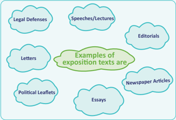

> **Deskripsi Visual:** Gambar ini adalah diagram yang menunjukkan berbagai jenis teks eksposisi. Diagram ini terdiri dari beberapa elemen utama yang terhubung oleh relasi hierarkis. Setiap elemen berada dalam kotak berwarna biru muda dengan tulisan berwarna putih. Di tengah diagram, terdapat sebuah kotak hijau yang berisi teks "Examples of exposition texts are". Dalam kotak hijau tersebut, ada beberapa elemen lain yang juga berada dalam kotak berwarna biru muda, yaitu "Letters", "Speeches/Lectures", "Editorials", "Newspaper Articles", "Essays", dan "Political Leaflets". Setiap elemen ini memiliki hubungan hierarkis dengan elemen lainnya, yang menunjukkan bahwa semua elemen tersebut termasuk dalam kategori teks eksposisi. Teks penting yang terlihat dalam diagram ini adalah "Examples of exposition texts are" yang berada di tengah kotak hijau. Informasi kunci yang dapat diambil pembaca dari gambar ini adalah bahwa teks eksposisi meliputi berbagai jenis seperti pernyataan, pidato, editorial, artikel berita, puisi, dan leaflet politik.

112

Kelas XI SMA/MA/SMK/MAK

Semester 2

### AnalyƟcal ExposiƟon Text

In your life if you have tried to persuade anyone on a certain issue or argued relentlessly about something with someone, then you have used an exposiƟon.

The argument and point of view have to be supported by facts and relevant informaƟon. The thesis statement has to be reiterated in the conclusion.

 

---
## 📄 Halaman 54

### An exposiƟon text needs to:

clearly state the point of view, use valid research findings to support your viewpoint,

defend your viewpoint, support the viewpoint with factual data like graphs, pictures, charts.

---
**🖼️ Gambar/Diagram**

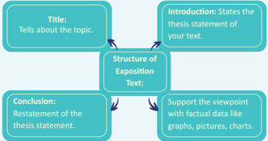

> **Deskripsi Visual:** Gambar ini adalah diagram yang menunjukkan struktur umum dari teks eksposisi. Diagram ini terdiri dari tiga bagian utama: Title, Introduction, dan Conclusion. Title memberikan informasi tentang topik yang akan dibahas. Introduction menyatakan statemen teori dari teks Anda. Struktur Exposition Text berisi informasi yang mendukung pendapat tersebut. Conclusion mengulang statemen teori dengan menggunakan data faktil, grafik, gambar, atau tabel untuk mendukung pendapat. Diagram ini membantu pembaca memahami bagaimana struktur umum dari teks eksposisi dan bagaimana setiap bagian memainkan peran dalam menyampaikan ide utama.

### Title:

- Tells about the topic of the essay.

### IntroducƟon:

- This is the starƟng point of an exposiƟon essay.
- Here you state the topic and establish the point of view (thesis statement).
- Introductory statement should be an emoƟonal statement or a quesƟon that is an aƩenƟon grabber.
- A preview of the points you plan to make to support your thesis (argument).

### Body:

- A series of arguments to convince the audience.
- Each paragraph starts with a new argument.
- Each paragraph has a main point, reason for the main point and evidence to support the main point.
Bahasa Inggris

113

 

---
## 📄 Halaman 55

- Use of emoƟve words, mental verbs, causal conjuncƟons to persuade the audience.
- Each paragraph has to be logically linked to the previous paragraph and to the thesis statement.

### Conclusion:

- Reiterates or restates the thesis statement.
- Summarizes what has been stated.

### Language Features of an ExposiƟon Text:

Use descripƟve persuasive words with emoƟve connotaƟons to emphasize your viewpoint. These words can either be posiƟve or negaƟve. Use thesaurus to find an appropriate word. For example:

- Instead of using 'bad' , USE appalling, unfavorable, ghastly, terrible;
- Instead of using 'good' , USE fantasƟc, incredible, momentous, remarkable;
- Instead of using 'persuading' , USE convincing, urging, enƟcing, realisƟc;
- Instead of using 'persuasive' , USE credible, realisƟc, raƟonal, sane, coherent.
Use the present tense such as lions live; I eat; cheetahs run.

Use mental verbs such as I believe; I prefer; I agree; I doubt; I disagree.

Use saying verbs to support the argument such as people say; it is said; research indicates , etc.

Use connecƟng words to link to arguments so that the flow of the arguments is logical and fluent.

Some examples are:

addiƟonally, furthermore, not only, also, in addiƟon, moreover, likewise, firstly, secondly, etc.

Use causal conjuncƟons to indicate a cause or reason of what is being stated.

### For example:

eventhough, yet, otherwise, etc. because, consequently, despite, due to, for that reason, in that case,

Use words that express the author's a�tude - to qualify or confirm.

For example:

doubtless, characterisƟcally, in all probability, etc. will, frequently, may, must, usually, typically, habitually, commonly,

114

Kelas XI SMA/MA/SMK/MAK

(Emilia, 2012)

 

---
## 📄 Halaman 56

### Use persuasive techniques:

- Use generalizaƟons to support viewpoints or arguments. GeneralizaƟons are common beliefs, general statements.
- Use evidence and facts to back up the generalizaƟons like using research, expert opinions, tesƟmonies or quotes.
- Use exaggeraƟons to make things or issues appear beƩer or worse than they actually are.
(Simon & Schuster, 2002)

### Example of an exposition text

---
**📊 Tabel**

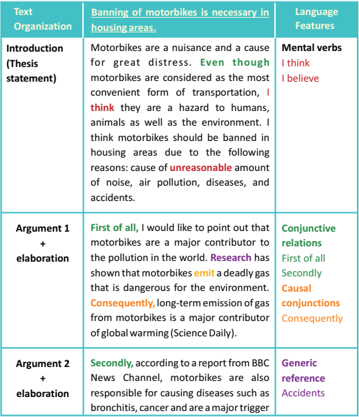

Tabel ini menunjukkan analisis struktur argumentasi dalam sebuah argumen yang membahas tentang kebutuhan untuk melarang motor sepeda di kawasan hunian. Topik utama adalah kebutuhan untuk melarang motor sepeda di kawasan hunian karena dampak negatifnya terhadap lingkungan dan kesehatan. Dalam argumen tersebut, penulis menggunakan berbagai teknik linguistik seperti mental verbs (I think), conjunctive relations (First of all, Secondly), causal conjunctions (Consequently), dan generic reference (Accidents) untuk menyampaikan argumen mereka secara logis dan persuasif.

Bahasa Inggris

115

 

---
## 📄 Halaman 57

---
**🖼️ Gambar/Diagram**

> **Deskripsi Visual:** Gambar ini adalah diagram yang menunjukkan argumen tentang keberadaan motor sepeda motor di daerah hunian. Diagram ini terdiri dari empat argumen utama yang disertai dengan penjelasan dan bukti dari para ahli. Argumen pertama mengatakan bahwa motor sepeda motor dapat menyebabkan tekanan darah tinggi dan asma. Argumen kedua menunjukkan bahwa suara motor sepeda motor yang keras dapat membuat sulit tidur bagi orang tua dengan bayi. Argumen ketiga mengatakan bahwa suara motor sepeda motor yang keras dapat mempengaruhi konsentrasi anak-anak dan dewasa. Argumen keempat mengatakan bahwa motor sepeda motor dapat menjadi penyebab kecelakaan yang berbahaya, termasuk kematian. Setelah semua argumen tersebut, penulis menyimpulkan bahwa mereka sangat percaya bahwa motor sepeda motor harus diblokir dari daerah hunian.

---
**📊 Tabel**

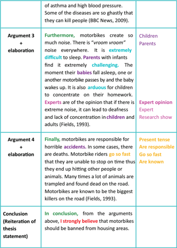

Tabel ini berisi argumen tentang dampak motor sepeda motor pada lingkungan hidup, khususnya di daerah hunian. Topik utama adalah bahwa motor sepeda motor dapat menyebabkan masalah kesehatan seperti asma dan tekanan darah tinggi, serta merugikan anak-anak dan orang tua karena suara yang keras dan berisik. Tabel ini juga menunjukkan bahwa motor sepeda motor dapat menjadi penyebab kecelakaan yang berbahaya, termasuk kematian, dan dapat mematikan hewan atau tumbuhan. Dalam penutupan, penulis menekankan bahwa mereka sangat percaya bahwa motor sepeda motor harus diblokir dari daerah hunian.

Kelas XI SMA/MA/SMK/MAK

116

 

---
## 📄 Halaman 58

### A. The arƟcle given below is incomplete.

Complete it using the format of an exposiƟon text and give it a suitable Ɵtle.

### IntroducƟon (thesis statement)

Television is the most popular form of entertainment in every household in Indonesia. However, I think watching television too much especially soap operas and dramas can have negaƟve impacts on the viewers.

Argument 1 + ElaboraƟon

Argument � + ElaboraƟon

Conclusion (restatement of thesis statement)

Bahasa Inggris

117

 

---
## 📄 Halaman 59

### Choose one of the topics given below.

- Passive smoking is a silent killer.
- Why is learning English important? State your arguments or posiƟon on one of the above given issues and then discuss with your partner. For the arguments, you can use some expressions like
these:

- I would like to remind you ....
- It is important for us to ....
- I believe that ....
- I am convinced that ....
- Let me tell you ....
- Try to remember ....
118

Kelas XI SMA/MA/SMK/MAK

Semester 2

 

---
## 📄 Halaman 60

### A. Passive smoking is a silent killer

You can use this example to start your conversaƟon:

Student A:  Do you know that passive smoking is more dangerous than acƟve smoking?

Student B:   I know, but I think it is not as dangerous as people say it is.

---
**🖼️ Gambar/Diagram**

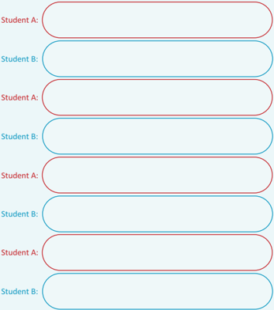

> **Deskripsi Visual:** Gambar ini adalah diagram yang menunjukkan interaksi antara dua orang, masing-masing diberi label "Student A" dan "Student B". Diagram ini terdiri dari beberapa baris, setiap baris menggambarkan interaksi antara kedua siswa tersebut. Setiap baris berisi teks yang mungkin merupakan pernyataan atau pertanyaan yang ditanyakan kepada salah satu siswa, dan jawaban yang diberikan oleh siswa lain. Ini menunjukkan struktur interaksi dialog antara dua siswa dalam konteks pembelajaran.

Bahasa Inggris

119

 

---
## 📄 Halaman 61

### B. Why is learning English important?

State your arguments or posiƟon on this issue and then discuss with your partner. You can use this example to start your conversaƟon:

Student A:

Learning  English is  important  because  it  is  a  means  of communicaƟon with different people around the world.

Student B:  I don't think it is important.

Student A:  I do not agree with you ....

---
**🖼️ Gambar/Diagram**

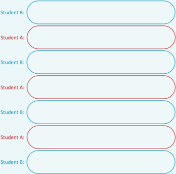

> **Deskripsi Visual:** Gambar ini adalah diagram yang menunjukkan struktur interaksi antara dua siswa, Student A dan Student B, dalam sebuah proses belajar. Diagram ini terdiri dari beberapa baris, setiap baris menggambarkan interaksi antara kedua siswa. Setiap baris berisi dua kotak berbeda warna, merah dan biru, yang masing-masing menunjukkan peran Student A dan Student B dalam proses tersebut. Kotak merah menunjukkan tindakan atau respons Student A, sementara kotak biru menunjukkan tindakan atau respons Student B. Relasi antara kotak-kotak ini menunjukkan hubungan atau interaksi yang terjadi antara kedua siswa dalam proses belajar. Teks, angka, atau label penting tidak terlihat pada gambar ini. Informasi kunci yang dapat diambil pembaca adalah bahwa ada interaksi antara Student A dan Student B dalam proses belajar, dengan setiap interaksi melibatkan tindakan atau respons dari salah satu siswa.

120

Kelas XI SMA/MA/SMK/MAK

 

---
## 📄 Halaman 62

Write an analyƟcal exposiƟon text on any of the recent issues in the media. Give at least two (2) arguments plus an explanaƟon to support your thesis statement. Follow the format of an exposiƟon text given in the building blocks.

When you are done wriƟng your first dra�, consult your teacher to get a feedback on your wriƟng.

Dra� 1:

Bahasa Inggris

121

 

---
## 📄 Halaman 63

Dra� �:

121

 

---
## 📄 Halaman 64

Final Dra�:

Bahasa Inggris

121

 

---
## 📄 Halaman 65

### Choose one of the acƟviƟes given below.

- You have been chosen as the project officer for showcasing an exciƟng wildlife art exhibiƟon on the fauna and flora of Indonesia. The purpose of this wildlife showcase is to raise money to support conservaƟon of nearly exƟnct animals in Indonesia. You have to write an exposiƟon text on conservaƟon of animals and use this exposiƟon text as your speech for the opening of the event. You will also make posters to depict the plight of innocent creatures that are killed or captured by poachers.
- Create a pamphlet or a movie to educate people in your school on 'Dangers of drug abuse and cigareƩe smoking.'
Make sure to put lots of pictures in your pamphlet.

---
**🖼️ Gambar/Diagram**

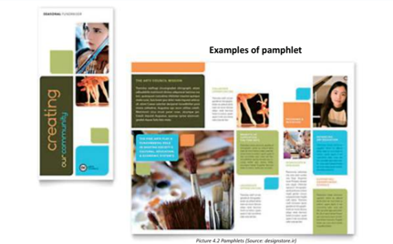

> **Deskripsi Visual:** Gambar ini menunjukkan contoh brosur (pamphlet) dengan judul "Creating". Brosur ini terdiri dari dua halaman, masing-masing dengan desain yang berbeda namun tetap konsisten dengan warna dan layout yang sama. Halaman depan memiliki foto yang menarik, sementara halaman belakang berisi teks informasi.

Elemen-elemen utama yang terlihat adalah foto-foto yang menunjukkan aktivitas atau produk yang akan dibahas dalam brosur tersebut. Teks pada halaman depan memberikan judul dan konten umum tentang brosur tersebut, sementara halaman belakang menyajikan detail lebih lanjut tentang topik-topik yang akan dibahas.

Teks pada halaman depan mencakup informasi seperti "Examples of pamphlet" dan "Picture 4.2 Pamphlets", yang menunjukkan bahwa ini adalah bagian dari sebuah buku pelajaran atau panduan. Angka "4.2" menunjukkan bahwa ini adalah halaman keempat dari bab kedua.

Informasi kunci yang dapat diambil pembaca melalui gambar ini adalah bahwa brosur ini adalah contoh dari jenis brosur tertentu, dan bahwa ada beberapa halaman dalam buku pelajaran yang membahas topik serupa.

122

Kelas XI SMA/MA/SMK/MAK

 

---
## 📄 Halaman 66

### I can do this.

### Complete these statements.

- The most interesƟng thing I learned in this chapter was ........
- The part I enjoyed most was ........
- I would like to find more about ….....
- The hardest part in this chapter was ........
- I need to work harder at ….....
Read the statements below and Ɵck (     ) the opƟon that is most applicable to you.

My plan to overcome the difficulƟes of this chapter

Semester 2

 

---
## 📄 Halaman 67

### CHAPTER 5 Letter Writing

### KOMPETENSI DASAR

- 3.6 Membedakan fungsi sosial, struktur teks, dan unsur kebahasaan beberapa teks khusus dalam bentuk surat pribadi dengan memberi dan menerima informasi terkait kegiatan diri sendiri dan orang sekitarnya, sesuai dengan konteks penggunaannya
- 4.6 Teks surat pribadi
- 4.6.1   Menangkap makna secara kontekstual terkait fungsi sosial, struktur teks, dan unsur kebahasaan teks khusus dalam bentuk surat pribadi terkait kegiatan diri sendiri dan orang sekitarnya
- 4.6.2   Menyusun teks khusus dalam bentuk surat pribadi terkait kegiatan diri sendiri dan orang sekitarnya, lisan dan tulis, dengan memperhaƟkan fungsi social, struktur teks, dan unsur kebahasaan, secara benar dan sesuai konteks
90

Kelas XI SMA/MA/SMK/MAK

 

---
## 📄 Halaman 68

### Read the leƩer given below.

th 12  January 2014 My Dear Lovely SiƟ, Hello!

How are you, sweeƟe? I know you are angry with me because I am wriƟng to you a�er a long Ɵme. I am so sorry, please forgive me. You know we are in Lombok right now. It is so beauƟful beyond imaginaƟon. I am wriƟng to you from this really cute liƩle café on the Senggigi beach. As you know, mum loves shopping, so she goes and will go for hours. I took a rain check from shopping and decided to write to you while I enjoy my cup of coffee.

You know, yesterday we went to Gili Nanggu Island; it is a beach on the southwest of Lombok. The place is awesome. It is so beauƟful I couldn't believe my eyes. There are beauƟful coral reefs everywhere. We went for snorkeling and we saw the most amazing fish ever. I wish you were here; it would have been much more fun.

Mum was making sure that we didn't miss any sight of the whole city, so we had pracƟcally been everywhere.

I have to go, mum is here. I will see you soon.

Lots of love

XOXO

Lana

P.S. I'm bringing you lots of souvenirs and pictures!!

Discuss with your partner, what kind of leƩer is this and how can you say that.

Bahasa Inggris

91

35 Senggigi Raya Lombok 75009 Nusa Tenggara Timur

 

---
## 📄 Halaman 69

---
**🖼️ Gambar/Diagram**

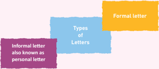

> **Deskripsi Visual:** Gambar ini adalah diagram yang menunjukkan tiga jenis surat: formal letter, informal letter (juga dikenal sebagai personal letter), dan types of letters. Diagram ini dibagi menjadi tiga bagian berbeda warna, masing-masing menunjukkan jenis surat tersebut. Bagian paling besar, berwarna kuning, menunjukkan formal letter, yang merupakan jenis surat yang paling formal dan resmi. Di sebelah kiri, bagian berwarna ungu menunjukkan informal letter, yang lebih ringan dan biasanya digunakan untuk tujuan pribadi atau informasi informal. Antara kedua jenis ini, bagian berwarna biru menunjukkan types of letters, yang mungkin merujuk pada variasi atau kategori lain dari jenis surat. Teks, angka, atau label penting tidak ada dalam gambar ini, namun diagram ini memberikan gambaran jelas tentang tiga jenis surat yang umum digunakan dalam konteks profesional atau pribadi.

### Personal LaƩers

### Social FuncƟon

Personal leƩers are leƩers that are wriƩen to people we know such as friends, parents, siblings, and cousins. LeƩers are not only wriƩen to inform but to strengthen the bond between two people wriƟng to each other.

### LinguisƟc Features

- Accuracy of grammar is important.

### Sentence structure

### Style:

- Complete sentences are expected.
- Slang can be used.
- Use the contracƟons such as 'I'll' , ' I'm' , 'we'll'.
- -Use personal pronouns such as 'I', 'we', 'you'.
- -Use acƟve voice.
- Language use may be personal like first and second person pronouns.
- Be warm.
- Use the person's name you are wriƟng to.
- Vary sentence length.
- Write in a natural, conversaƟonal style.
- Let your personality shine through in your wriƟng.
(Bly, 2004).

Table 5.1 LinguisƟc features of personal leƩer

BB

 

---
## 📄 Halaman 70

98

---
**📊 Tabel**

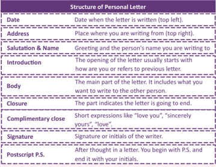

Tabel ini menjelaskan struktur sebuah surat pribadi, yang terdiri dari berbagai bagian penting seperti tanggal, alamat, salam, pengantar, isi, penutup, penutupan, tanda tangan, dan catatan tambahan. Topik utama tabel ini adalah struktur dan komponen umum dari sebuah surat pribadi. Kolom-kolomnya mencakup tanggal, alamat, salam dan nama, pengantar, isi, penutup, penutupan, tanda tangan, dan catatan tambahan. Data penting yang terlihat adalah bahwa setiap bagian memiliki fungsi khusus dalam membuat surat pribadi menjadi lebih lengkap dan profesional.

Table 5.2 Structure of personal leƩer

---
**🖼️ Gambar/Diagram**

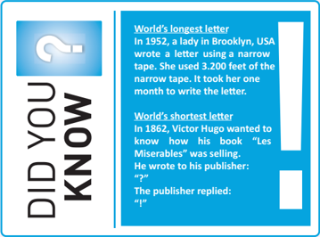

> **Deskripsi Visual:** Gambar ini adalah jenis ilustrasi yang menampilkan dua teks informasi tentang "DID YOU KNOW" tentang dua surat tertua dalam sejarah. Pada sisi kiri, ada sebuah kotak biru dengan tanda bertanya berwarna putih, yang mungkin merujuk pada pertanyaan yang akan dibahas. Sisi kanan mengandung dua paragraf teks yang menjelaskan tentang "World's longest letter" dan "World's shortest letter". Untuk "World's longest letter", ia menyebutkan bahwa pada tahun 1952, seorang wanita di Brooklyn, Amerika Serikat, menulis sebuah surat menggunakan kertas yang sangat tipis. Surat tersebut membutuhkan 3.200 kaki dari kertas tipis tersebut dan memakan waktu satu bulan untuk ditulis. Untuk "World's shortest letter", ia menyebutkan bahwa pada tahun 1862, Victor Hugo ingin mengetahui penjualan bukunya "Les Miserables". Dia menulis ke penerbitnya dengan kata-kata "I'm" dan penerbitnya menjawab dengan "I'm". Ini menunjukkan bahwa surat yang paling pendek dalam sejarah hanya memiliki dua huruf.

Semester 1

 

---
## 📄 Halaman 71

### Some useful expressions for leƩer wriƟng

### GraƟtude

- I'm just wriƟng to thank you for ....
- It was very kind of you to ....
- Thanks very much for ....
- I am very grateful for ....

### Giving advice

- Well, I thought about it and if I were you, I would ....
- Have you thought about ....?
- In your last leƩer you said you weren't sure what course of acƟon  to take, I suggest ....
- I think you shouldn't ....
- In your last leƩer you asked me about ...., I think ....

### Delivering good news

- I'm sure you will be happy to hear that ....
- I am sure that you'll be interested to know that ....
- By the way, did you know that ....?
- OMG!! You'll never guess what happened!
- I am totally ecstaƟc to hear about ....
- I was happy beyond limits to read that ....

### Delivering bad news

- I'm sorry but I have to tell you that ....
- Bad news, I'm afraid, but no way to avoid it, so here it goes ....
- I'm extremely sorry to hear that ....
- It was heart wrenching to read about ....

### Asking for help

- I wonder if you could help me.
- I hope it's not too much to ask but ....
- I wonder if I could ask you a favor. Could you ....?

### Apologizing

- I would like to apologize for ....
- I'm so sorry that ....
- Words are not enough to erase the pain I have given you but I want to say how sorry I am ....
Bahasa Inggris

99

 

---
## 📄 Halaman 72

---
**🖼️ Gambar/Diagram**

> **Deskripsi Visual:** Gambar ini adalah diagram yang menunjukkan contoh ekspresi yang digunakan dalam surat pribadi. Diagram ini terdiri dari empat kolom yang masing-masing berisi contoh ekspresi untuk salutation, closing, starting the letter, dan conclusion dalam surat pribadi. Setiap kolom memiliki judul yang menjelaskan apa yang ditampilkan dalam kolom tersebut. Di dalam setiap kolom, terdapat beberapa contoh ekspresi yang digunakan dalam surat pribadi. Jumlah baris dalam diagram ini sangat beragam, mulai dari satu hingga lebih dari sepuluh baris per kolom. Teks, angka, atau label penting yang terlihat dalam diagram ini meliputi judul kolom, judul baris, dan contoh ekspresi. Informasi kunci yang dapat diambil pembaca meliputi jenis-jenis ekspresi yang digunakan dalam surat pribadi, cara menggunakan ekspresi tersebut, dan contoh-contoh praktis yang dapat digunakan dalam surat pribadi.

---
**📊 Tabel**

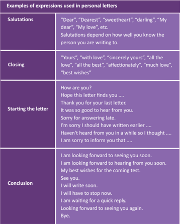

Tabel ini berisi contoh ungkapan yang digunakan dalam surat pribadi, yang mencakup salutation (pembukaan), closing (penutup), bagian awal surat, dan penutup. Topik utama tabel ini adalah cara menulis surat pribadi yang sopan dan efektif. Kolom-kolomnya mencakup jenis salutation, closing, bagian awal surat, dan penutup. Data penting yang terlihat adalah bahwa salutation dan closing sangat bergantung pada keahlian dan hubungan dengan orang yang dituju, sedangkan bagian awal dan penutup biasanya digunakan untuk memberikan informasi atau perasaan.

100

Semester 1

 

---
## 📄 Halaman 73

### Example of a personal leƩer

---
**🖼️ Gambar/Diagram**

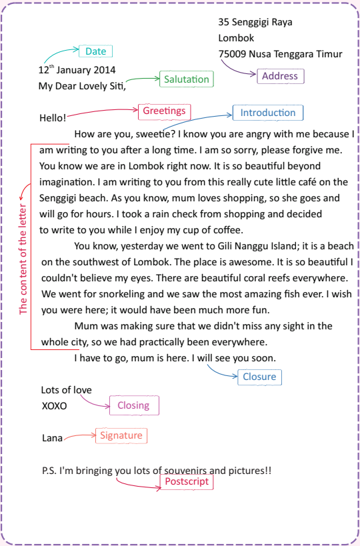

> **Deskripsi Visual:** Gambar ini adalah diagram yang menunjukkan struktur dan isi sebuah surat. Diagram ini terdiri dari berbagai elemen penting seperti salutation, greetings, introduction, body, closure, dan postscript. Salutation meliputi tanggal dan salam awal, greetings mengandung ucapan hangat, introduction menjelaskan lokasi penulis, body berisi informasi tentang perjalanan dan pengalaman penulis, closure menutupi surat dengan ucapan cinta, dan postscript menambahkan informasi tambahan. Teks pada diagram ini mencakup tanggal 12 Januari 2014, lokasi penulis di Nusa Tenggara Timur, dan beberapa detail tentang perjalanan ke Gili Nanggu Island.

 

---
## 📄 Halaman 74

### A. Look at the expressions and match them with the purpose of the leƩer. The first one has been done for you.

---
**📊 Tabel**

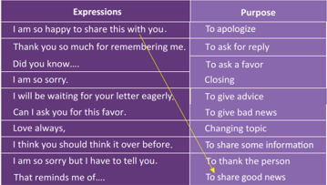

Tabel ini berisi berbagai ekspresi yang sering digunakan dalam percakapan, dengan tujuan yang berbeda. Topik utamanya adalah cara-cara untuk berkomunikasi efektif dan efisien. Kolom pertama berisi ekspresi yang digunakan dalam percakapan, sementara kolom kedua menjelaskan tujuan dari setiap ekspresi tersebut. Data penting yang terlihat adalah bahwa banyak ekspresi ini digunakan untuk berkomunikasi positif seperti mengatakan terima kasih, meminta bantuan, memberikan nasihat, dan berbagi informasi. Sementara itu, beberapa ekspresi digunakan untuk tujuan negatif seperti mengatakan minta maaf atau memberikan kritik. Tabel ini sangat berguna bagi orang-orang yang ingin belajar bagaimana berkomunikasi dengan baik dan efektif dalam berbagai situasi.

- There are several mistakes (grammaƟcal as well as in the format of the leƩer) in the leƩer given below. Highlight the mistakes and then rewrite the leƩer properly in the space provided.
Jl Cinangka Raya

2014

Ciputat - Tangerang Selatan

My dearest Lana,

Hey sweeƟe

I hope all is well with you. It's been a while since you moved to the new city for college. It is so sad that you are not few houses away anymore. I hope your new life is going well. It must be exciƟng living on your own in the hostel college. Everything is fine here. You know nothing much happens here.

Have you already seƩled in? When is your college starƟng? Do you like the place you are living in? How is the neighborhood? I can't believe you live on boarding. I will be starƟng college soon as well but my parents insisted that I live at home.

Bahasa Inggris

103

31 March st

 

---
## 📄 Halaman 75

Anyway, a bunch of us were talking about a reunion in summer holidays. So you beƩer keep your calendar free. Nothing has been decided so suggesƟons are welcome!!!

That reminds me if you need anything let me know. I will gladly help. Have fun and don't stay out late. we miss you so much!!!

P.S. I saw your mother the other day she misses you a lot and wishes that you called more o�en.

Take care and stay safe. Write as soon as you can.

Love always,

Jane

104

Semester 1

Kelas XI SMA/MA/SMK/MAK

 

---
## 📄 Halaman 76

Create a dialogue for one of the situaƟons given below. Using the role-play approach, reenact the conversaƟon with your classmates.

### SituaƟon No. 1

You and your friend have decided to write a leƩer to your parents to describe your recent field trip. Discuss what you want to write about.

### SituaƟon No.�

Your friend is mad at Lucy's cousin, you want to convince her to write to her cousin.

---
**🖼️ Gambar/Diagram**

> **Deskripsi Visual:** Gambar ini adalah diagram yang menunjukkan interaksi antara dua karakter, "You" dan "Lucy", dalam bentuk dialog. Diagram ini terdiri dari beberapa baris, setiap baris menunjukkan perjalanan percakapan antara kedua karakter tersebut. Setiap baris berisi teks yang menunjukkan peran masing-masing karakter, dengan "You" berada di baris yang berwarna biru dan "Lucy" di baris yang berwarna merah. 

Elemen utama dari diagram ini adalah dua baris teks yang berbeda warna, yang menunjukkan bahwa mereka berbicara satu sama lain. Relasi antara kedua karakter ini sangat jelas melalui perubahan warna teks yang menunjukkan peran mereka dalam percakapan.

Teks penting yang terlihat dalam diagram ini adalah peran masing-masing karakter dalam percakapan, yang ditunjukkan oleh warna teks yang berbeda. Informasi kunci yang dapat diambil dari diagram ini adalah bahwa "You" dan "Lucy" berinteraksi secara langsung dalam percakapan ini, dengan "You" berada di baris yang berwarna biru dan "Lucy" di baris yang berwarna merah.

Secara keseluruhan, gambar ini menunjukkan struktur dasar dari dialog dalam sebuah buku pelajaran, dengan penggunaan warna untuk menunjukkan peran masing-masing karakter dalam percakapan.

---
**📊 Tabel**

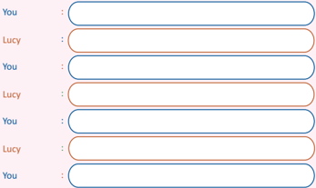

Tabel ini menunjukkan interaksi antara dua orang, dikenal sebagai "You" dan "Lucy", dalam bentuk dialog. Topik utama dari tabel ini adalah komunikasi dan interaksi sosial. Kolom "You" dan "Lucy" masing-masing berisi teks yang mungkin merupakan pernyataan atau komentar dari kedua pihak. Data atau pola penting yang terlihat adalah bahwa interaksi ini terjadi secara berulang-ulang, dengan "You" dan "Lucy" saling berbalas balasan. Ini menunjukkan bahwa mereka sedang berbicara atau berinteraksi satu sama lain dalam sebuah hubungan atau situasi tertentu.

Semester 1

 

---
## 📄 Halaman 77

### Choose one of the following acƟviƟes.

- Write a leƩer to your friend telling her/him all about your adventures during your trip to the Bromo mountain. Use the proper leƩer-wriƟng format you have learnt in the building blocks.
- Write a leƩer to your uncle telling him about the birthday party you organized for your grandmother. Use the proper leƩer-wriƟng format you have learnt in the building blocks.

 

---
## 📄 Halaman 78

### Choose one of the acƟviƟes given below.

- Write a leƩer to your parents, thanking them for everything they have done for you.
- With a partner, create a postage stamp and a leƩer-wriƟng pad. You can frame your postage stamp and display it in your class or, if you want to, you can take it to the local post office and show it to the staff of the post office.

---
**🖼️ Gambar/Diagram**

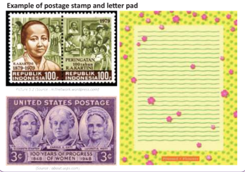

> **Deskripsi Visual:** Gambar ini adalah ilustrasi yang menunjukkan contoh dari sebuah lembar pos dan lembaran kertas untuk menulis. Ilustrasi ini terdiri dari dua bagian utama: lembaran pos dan lembaran kertas untuk menulis.

Lembaran pos berada di bagian atas dan memiliki desain yang menarik dengan gambar perempuan berwarna hitam dan putih di tengahnya. Di sekeliling gambar tersebut terdapat teks yang membahas tentang peringatan tahun 1978 dan 1984 tentang perempuan. Lembaran pos juga memiliki warna latar yang mencolok dengan kombinasi warna hijau dan merah.

Lembaran kertas untuk menulis berada di bagian bawah dan memiliki desain yang lebih sederhana namun tetap menarik. Lembaran kertas ini memiliki garis vertikal dan horizontal yang membantu dalam proses menulis. Lembaran kertas juga memiliki warna latar yang cerah dengan kombinasi warna kuning dan hijau.

Teks pada gambar ini tidak menyebutkan informasi spesifik tentang isi lembaran pos atau lembaran kertas, namun secara umum, gambar ini menunjukkan dua jenis perangko dan lembaran kertas yang sering digunakan dalam aktivitas pos dan komunikasi.

The first postage stamp was invented by a BriƟsh teacher in 1840.

Semester 1

The first two stamps were called Penny Black and Twopence Blue.

 

---
## 📄 Halaman 79

### I can do this.

### Complete these statements.

- The most interesƟng thing I learnt in this chapter was ___________
- The part I enjoyed most was ___________
- I would like to find more about ___________
- The hardest part in this chapter was ___________
- I need to work harder at ___________
Read the statements below and Ɵck (     ) the opƟon that is  most applicable to you.

---
**📊 Tabel**

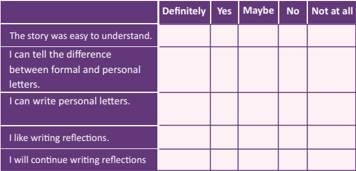

Tabel ini menunjukkan hasil survei tentang kepercayaan seseorang dalam berbagai aspek penulisan surat dan tulisan reflektif. Topik utama adalah kepercayaan dalam berbagai kemampuan penulisan, seperti membedakan antara surat resmi dan pribadi, menulis surat pribadi, dan minat dalam menulis refleksi. Kolom-kolomnya mencakup kategori "Definitely", "Yes", "Maybe", "No", dan "Not at all". Data penting yang terlihat adalah bahwa sebagian besar responden percaya bahwa mereka dapat membedakan antara surat resmi dan pribadi, sedangkan hanya sebagian kecil percaya bahwa mereka dapat menulis surat pribadi dan minat dalam menulis refleksi. Ini menunjukkan variasi dalam kepercayaan dan kemampuan dalam bidang penulisan tersebut.

My plan to overcome the difficulƟes of this chapter

110

Kelas XI SMA/MA/SMK/MAK

 

---
## 📄 Halaman 80

68

### CHAPTER 6 Cause and Effect

### KOMPETENSI DASAR

- 3.7   Menerapkan fungsi sosial, struktur teks, dan unsur kebahasaan teks interaksi transaksional lisan dan tulis yang melibatkan Ɵndakan memberi dan meminta informasi terkait hubungan sebab akibat, sesuai dengan konteks penggunaannya. (PerhaƟkan unsur kebahasaan because of …, due to …, thanks to … )
- 4.7   Menyusun teks interaksi transaksional lisan dan tulis yang melibatkan Ɵndakan memberi dan meminta informasi terkait hubungan sebab akibat, dengan memperhaƟkan fungsi social, struktur teks, dan unsur kebahasaan yang benar dan  sesuai konteks
74

Kelas XI SMA/MA/SMK/MAK

Kelas XI SMA/MA/SMK/MAK

Semester 1

 

---
## 📄 Halaman 81

With a partner, read the conversaƟon given below.

---
**🖼️ Gambar/Diagram**

> **Deskripsi Visual:** Gambar ini adalah ilustrasi yang menampilkan karakter seorang anak perempuan dengan rambut panjang berwarna gelap. Karakter tersebut sedang berdiri dengan posisi tangan di pinggang dan wajah yang menunjukkan ekspresi sedikit marah atau tidak puas. Karakter tersebut mengenakan pakaian yang terdiri dari kaos biru dan celana merah dengan sepatu hitam. Di sebelah kanan karakter, terdapat teks "Hey" yang ditulis dalam huruf besar dan berwarna biru.

Elemen-elemen utama dalam gambar ini adalah karakter anak perempuan dan teks "Hey". Karakter tersebut merupakan subjek utama dan digunakan untuk menggambarkan situasi atau pernyataan tertentu dalam konteks buku pelajaran. Teks "Hey" menunjukkan interaksi atau komunikasi antara karakter tersebut dan pembaca atau karakter lainnya dalam buku pelajaran.

Informasi kunci yang dapat diambil dari gambar ini adalah bahwa karakter tersebut sedang berbicara atau berkomunikasi dengan seseorang yang tidak terlihat dalam gambar. Ini mungkin menunjukkan situasi atau peristiwa tertentu dalam cerita atau pelajaran yang disampaikan dalam buku pelajaran tersebut.

Hi Ray! What are you doing?

Hey Jane! I am reading an arƟcle on smoking.

Smoking! Why?

For presentaƟon in Science class.

### Jane

So tell me what you learnt about smoking.

Did you know that smoking is one of the main causes of sickness in smokers? For example:

- Smoking causes heart aƩacks, strokes, ulcers.
- Smoking weakens the lungs due to which there is a build up of poisonous substances.
Really? It sounds scary.

---
**🖼️ Gambar/Diagram**

> **Deskripsi Visual:** Gambar ini adalah ilustrasi yang menunjukkan seorang anak berdiri dengan posisi tangan di pinggang dan satu jari mengangkat ke atas. Gambar ini tampaknya digunakan untuk menggambarkan konsep atau ide tertentu, mungkin sebagai representasi dari pemahaman atau pengetahuan yang diperoleh oleh anak tersebut.

Elemen utama dalam gambar ini adalah anak yang sedang berdiri. Anak tersebut memiliki rambut hitam pendek, mata besar, dan pakaian yang sederhana. Anak tersebut juga menunjukkan tanda tangan di bawah gambar, yang mungkin menunjukkan bahwa gambar ini dibuat oleh anak tersebut atau penggunaan gambar tersebut dalam konteks belajar.

Teks, angka, atau label penting tidak terlihat dalam gambar ini. Namun, gambar ini mungkin memiliki teks atau label yang tidak terlihat di bagian bawah atau di sekitar gambar tersebut, yang mungkin memberikan informasi tambahan tentang konteks atau makna dari gambar tersebut.

Informasi kunci yang dapat diambil pembaca dari gambar ini adalah bahwa anak tersebut sedang berdiri dengan posisi tangan di pinggang dan satu jari mengangkat ke atas. Ini mungkin menunjukkan bahwa anak tersebut sedang berpikir atau mempertimbangkan sesuatu.

It is! If we do not educate people about the effects of smoking, there will be a lot of people suffering from these diseases.

You are right. We have to do it.

### Discuss with your partner

What do you think is happening in the above conversaƟon? Do you think smoking is dangerous? Do you think it should be banned?

Kelas XI SMA/MA/SMK/MAK

Ray

68

 

---
## 📄 Halaman 82

---
**🖼️ Gambar/Diagram**

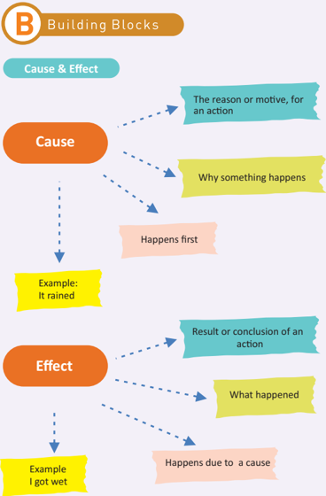

> **Deskripsi Visual:** Gambar ini adalah diagram yang menunjukkan konsep dasar "Building Blocks" dalam pendekatan Cause & Effect. Diagram ini terdiri dari dua blok utama: "Cause" dan "Effect". "Cause" adalah bagian yang menjelaskan alasan atau motivasi untuk melakukan tindakan tertentu, sementara "Effect" adalah hasil atau kesimpulan dari tindakan tersebut. Dalam diagram ini, ada contoh yang diberikan untuk kedua konsep ini. Contoh untuk "Cause" adalah "It rained", sedangkan contoh untuk "Effect" adalah "I got wet". Relasi antara kedua konsep ini ditunjukkan dengan garis yang menghubungkan mereka, menunjukkan bahwa "Cause" adalah yang pertama dan "Effect" adalah yang kedua. Label "B Building Blocks" juga ditampilkan di bagian atas diagram ini, menunjukkan tujuan atau topik yang akan dipelajari dalam konteks ini.

Kelas XI SMA/MA/SMK/MAK

 

---
## 📄 Halaman 83

68

### A Led To B

GLYPH<c=3,font=/GXHJBU+Wingdings-Regular>

- To find an effect, ask, what happened? üGLYPH<c=3,font=/GXHJBU+Wingdings-Regular>

### Cause Led to Effect

- üGLYPH<c=3,font=/GXHJBU+Wingdings-Regular> To find a cause, ask, why did this happen?
- Example: üGLYPH<c=3,font=/GXHJBU+Wingdings-Regular>
It rained, so I got wet.

- Signal words When we talk about cause, we use the following signal words:
- Because
- On account of
- The reason for
- Bring about
- Created by
- Give rise to
- Contributed to
- Due to
- Led to
- For this reason
- Unless
Kelas	XI	SMA/MA/SMK/MAK

- Signal words When we talk about an effect resulƟng from a certain cause, we use the following signal words:
- As a result
- Hence
- Then
- For this reason
- Outcome
- Therefore
- So
- Finally
- Consequently
- Therefore
- in order to
Semester	1

 

---
## 📄 Halaman 84

### Some examples of and relaƟonships Cause Effect

---
**📊 Tabel**

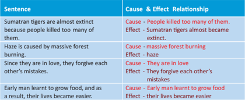

Tabel ini berisi beberapa kalimat dengan kaitan hubungan antara penyebab (cause) dan akibat (effect). Topik utamanya adalah hubungan antara tindakan manusia dan dampaknya terhadap lingkungan dan kehidupan. Kolom "Cause" menyajikan alasan atau faktor yang menyebabkan masalah, sementara kolom "Effect" menunjukkan konsekuensi atau dampak dari tindakan tersebut. Data penting yang terlihat adalah bahwa tindakan manusia seperti pembunuhan harimau Sumatera dan pembakaran hutan dapat menyebabkan ekosistem terganggu, seperti kehilangan habitat dan penyebaran polusi. Selain itu, hubungan antara manusia dan alam juga dapat mempengaruhi perilaku sosial, seperti hubungan cinta dan pengakuan kesalahan.

### Let's take a look at the sentence structure of cause and effect.

- Due to , because of , owing to and thanks to are followed by a noun.
- Because, since, as, for are followed by a verb.

### Examples:

- Owing to her hard work and intelligence, we won the trophy.
- Thanks to SiƟ and John's effecƟve planning, the event went well.
- Because of his hard work, he managed to get the best student award.
- I have a stomachache because I ate too much food.
- There was a lot of homework and tests, as a result most of the students were unhappy and couldn't go anywhere during the weekend.
68

Kelas XI SMA/MA/SMK/MAK

Semester 1

 

---
## 📄 Halaman 85

- Read the following sentences. Decide if the words in bold are the cause or the effect. Write cause or effect on the line. Then, underline the "signal" word or phrase. A.
- Early man used weapons becauce they needed to find food.
- The glaciers began to melt;  therefore, the land bridge between Asia and North America became flooded.
- Because  they  wanted  to  learn  about  different  civilizaƟons  that existed , archaeologists studied arƟfacts.
- Early  man slowly started to grow food ,  and  as  a  result, their lives became easier.
- My  sister  was  very  Ɵred because  she  stayed  up  past  midnight.
- Read the cause, write the effect, then write the complete sentence words.  The first one has been done for you. B. using signal
- Cause: It was very windy.
Effect: All the flights were cancelled.

Sentence: It was very windy; therefore, all the flights were cancelled.

- Cause: She ate too much.
Effect: ...

Sentence: ...

- Cause: I ran out of money.
Effect: ...

Sentence: ...

- Cause: He is afraid to fly.
Effect: ...

Sentence: ...

Semester 1

68

Kelas XI SMA/MA/SMK/MAK

 

---
## 📄 Halaman 86

- 5.
Cause: A�er the car accident

Effect: ...

Sentence: ...

Read the sentences and find the cause and effect. The first one has been done for you. C.

- The milk spilled all over the floor, so Jane got a mop and cleaned it up.
Cause:  milk spilled

Effect:  Jane  mopped

- SiƟ has planned a trip to her uncle's house because she loves her cousins.
Cause: ...

Effect: ...

- The  green  house  gases  trap  the  heat  in  the  air,  so  the  Earth  becomes warmer.
Cause: ...

Effect: ...

- Because the Sumatran Ɵgers were almost exƟnct, the Indonesian government declared them as endangered species.
Cause: ...

Effect   ...

:

- Animals  are  becoming  exƟnct  because  humans  are  moving  into  their habitats.
Cause: ...

Effect: ...

Kelas XI SMA/MA/SMK/MAK

68

Semester 1

 

---
## 📄 Halaman 87

- Complete   the  cause  and  effect transacƟonal  conversaƟon  given  below. Use signal  words like because, due to, so, therefore, the reason for, then, etc. D.
- This  conversaƟon between  two  friends i   s   about  the  effects  of exercise on our body.
SiƟ: Hey! Why are you wearing your sports wear?

Edo: I am going for exercise.

SiƟ: Why? I have never seen you exercising before.

Edo: ...

SiƟ: ...

Edo: ...

SiƟ: ...

- Write a cause and effect conversaƟon on forest fires in Sumatra.
A: ...

B: ...

A: ...

B: ...

A: ...

B: ...

A: ...

B: ...

Kelas XI SMA/MA/SMK/MAK

68

Semester 1

 

---
## 📄 Halaman 88

With a partner, think of 2 endangered animals in Indonesia. Why  are the animals  becoming endangered and how can it  be prevented? Write a role-play of the conversaƟon and effect signal words. a conversaƟon about it and a�er that, do you have created. Remember to use cause

68

Kelas XI SMA/MA/SMK/MAK

Semester 1

 

---
## 📄 Halaman 89

### Choose one of the topics given below and create a dialogue.

- Causes and effects of corrupƟon
- Causes and effects of flooding in Jakarta
- Causes and effects of bullying on teenagers
Kelas XI SMA/MA/SMK/MAK

68

 

---
## 📄 Halaman 90

### Cause and Effect Tree

Choose one of the following topics for your project.

- Effects of smoking
- Extreme weather due to global warming
- Effects of global warming
With your partner, explore the consequences of your topic by wriƟng the cause on the roots of the tree and the effects on the branches.

Once you are done, you can present your work in class using one of the following forms: video, comic strip, PowerPoint presentaƟon, or a blog.

---
**🖼️ Gambar/Diagram**

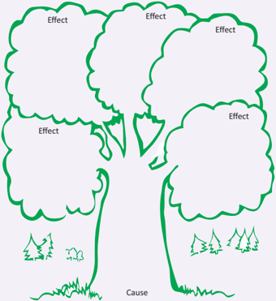

> **Deskripsi Visual:** Gambar ini adalah ilustrasi yang menunjukkan hubungan antara "Cause" (sebab) dan "Effect" (akibat). Ilustrasi ini terdiri dari beberapa elemen utama:

1. **Pertama**: Gambar ini menggambarkan sebuah pohon besar dengan daun lebat, yang mewakili "Effect". Pohon-pohon ini tampak besar dan berdaun lebat, menunjukkan bahwa mereka memiliki banyak akibat atau efek.

2. **Kedua**: Di bawah pohon-pohon tersebut, terdapat tanah hijau yang menunjukkan "Cause" (sebab). Tanah ini tampak lembut dan hijau, menunjukkan bahwa ia adalah sumber atau penyebab dari pohon-pohon tersebut.

3. **Teks dan Label**: Gambar ini memiliki teks dan label yang penting. Ada tiga label besar yang menunjukkan "Effect" di setiap pohon, dan satu label kecil yang menunjukkan "Cause" di bawah tanah hijau. Ini membantu pembaca untuk memahami hubungan antara sebab dan akibat.

4. **Informasi Kunci**: Gambar ini menggambarkan bahwa setiap pohon besar adalah akibat dari tanah hijau yang lembut dan hijau. Ini menunjukkan bahwa setiap akibat memiliki penyebabnya sendiri, dan bahwa tanah hijau adalah penyebab utama dari pohon-pohon besar tersebut.

Dengan demikian, gambar ini menunjukkan hubungan antara sebab dan akibat melalui penggambaran pohon dan tanah hijau, serta menggunakan teks dan label untuk menjelaskan hubungan tersebut.

Semester 1

 

---
## 📄 Halaman 91

I can do this.

Complete these statements.

- The most interesƟng thing I learnt in this chapter was
- The part I enjoyed most was
- I would like to find more about
- The hardest part in this chapter was
- I need to work harder at
Read the statements below and Ɵck ( ) the opƟon that ismost applicable to you.

The chapter was easy to understand.

I know what cause is.

I know what effect is.

I can differenƟate between cause and effect.

My plan to overcome the difficulƟes I faced in this chapter

Yes

Maybe

No

No at

all

68

Kelas XI SMA/MA/SMK/MAK

 

---
## 📄 Halaman 92

### CHAPTER 7 Meaning Through Music

### KOMPETENSI DASAR

- 3.9    Menafsirkan fungsi sosial dan unsur kebahasaan lirik lagu terkait kehidupan remaja SMA/MA/SMK/MAK
- 4.9    Menangkap makna secara kontekstual terkait fungsi sosial dan unsur kebahasaan lirik lagu terkait kehidupan remaja SMA/MA/SMK/MAK
86

80

Kelas XI SMA/MA/SMK/MAK

Kelas XI SMA/MA/SMK/MAK

Semester 2

 

---
## 📄 Halaman 93

82

With a partner, study the lyrics of the following songs. Then, discuss the quesƟons.

### 'Stand By Me' by Ben E King

When the night has come And the land is dark And the moon is the only light we'll see No I won't be afraid Oh, I won't be afraid Just as long as you stand, stand by me

So darling, darling Stand by me, oh stand by me Oh stand, stand by me Stand by me

If the sky that we look upon Should tumble and fall All the mountains should crumble to the sea I won't cry, I won't cry No, I won't shed a tear Just as long as you stand, stand by me

So darling, darling Stand by me, oh stand by me Oh stand, stand by me Stand by me

So darling, darling Stand by me, oh stand by me Oh stand now, stand by me, stand by me Whenever you're in trouble won't you stand by me Oh stand by me, oh won't you stand now, stand Stand by me Stand by me

Kelas XI SMA/MA/SMK/MAK

---
**🖼️ Gambar/Diagram**

> **Deskripsi Visual:** Gambar ini adalah ilustrasi yang menunjukkan notasi musik. Gambar ini menggambarkan beberapa notasi musik yang berbeda, termasuk pentagram, baris, dan garis. Pentagram digunakan untuk menunjukkan nada dasar, sedangkan baris dan garis digunakan untuk menunjukkan nada tambahan dan perubahan nada. Teks "by me" tampak di bawah gambar, mungkin merujuk pada penulis atau pengarang gambar ini. Ini menunjukkan bahwa gambar ini mungkin digunakan sebagai bagian dari materi pelajaran tentang musik atau notasi musik.

 

---
## 📄 Halaman 94

Discussion Questions for Stand by Me

- What do you think the title 'Stand by Me' means?
- �. Do you consider 'Stand by Me' an inspirational song? Why?
- If you had to change the lyrics of 'Stand by Me', which lyrics would you change?
Discussion Notes :

Bahasa Inggris

83

Picture 8.2 (Source: fastangel.com)

 

---
## 📄 Halaman 95

84

### 'We Shall Overcome' by Pete Seeger

We shall overcome, We shall overcome, We shall overcome, some day.

Oh, deep in my heart, I do believe We shall overcome, some day.

We'll walk hand in hand, We'll walk hand in hand, We'll walk hand in hand, some day.

Oh, deep in my heart, I do believe We shall overcome, some day.

We shall live in peace, We shall live in peace, We shall live in peace, some day.

Oh, deep in my heart, I do believe We shall overcome, some day.

We are not afraid, We are not afraid, We are not afraid, TODAY

Oh, deep in my heart, I do believe We shall overcome, some day.

The whole wide world around The whole wide world around The whole wide world around some day

Oh, deep in my heart, I do believe We shall overcome, some day.

Kelas XI SMA/MA/SMK/MAK

 

---
## 📄 Halaman 96

### Discussion Questions for We Shall Overcome

- What do you think is the theme of this song?
- Do you think you can overcome all the obstacles and live in a happy and prosperous world?
- Is this an inspiring song? Does it inspire you?

### Discussions Notes :

Picture 10.3 (Source: blog.citypages.com)

---
**🖼️ Gambar/Diagram**

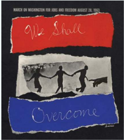

> **Deskripsi Visual:** Gambar ini adalah ilustrasi yang menampilkan tema peringatan March on Washington for Jobs and Freedom pada tanggal 28 Agustus 1963. Gambar ini terdiri dari beberapa elemen utama:

1. Gambar utama: Gambar ini menampilkan tiga orang yang berjalan tangan dengan tangan, mewakili persatuan dan solidaritas. Mereka tampak sedang berjalan di atas sebuah batu besar, yang mungkin merujuk pada tantangan dan perjuangan yang dihadapi.

2. Latar belakang: Latar belakang gambar terdiri dari warna-warna yang mencerminkan warna bendera Amerika Serikat - merah, putih, dan biru. Warna-warna ini juga digunakan untuk membentuk teks "We Shall Overcome" di bagian atas dan bawah gambar.

3. Teks: Teks "We Shall Overcome" terletak di bagian atas dan bawah gambar, membentuk garis horizontal. Ini adalah frasa yang sangat terkenal dalam perjuangan hak asasi manusia dan kemerdekaan.

4. Informasi kunci: Gambar ini menggambarkan peristiwa penting dalam sejarah Amerika Serikat, yaitu March on Washington, yang merupakan salah satu acara penting dalam perjuangan hak asasi manusia. Peristiwa ini menjadi titik balik penting dalam sejarah perjuangan hak asasi manusia di Amerika Serikat.

5. Konteks: Gambar ini menunjukkan bahwa peristiwa ini tidak hanya tentang perjuangan individu, tetapi juga tentang persatuan dan solidaritas antara berbagai kelompok sosial.

Dengan demikian, gambar ini menggambarkan peristiwa yang penting dalam sejarah Amerika Serikat, menunjukkan persatuan dan solidaritas dalam perjuangan hak asasi manusia, serta memperlihatkan bagaimana peristiwa-peristiwa sejarah dapat dikenang dan dipromosikan melalui seni dan ilustrasi.

Bahasa Inggris

85

 

---
## 📄 Halaman 97

86

### 'Hero' by Mariah Carey

If you look inside your heart You don't have to be afraid Of what you are There's an answer If you reach into your soul And the sorrow that you know Will melt away

### [Chorus]

And then a hero comes along With the strength to carry on And you cast your fears aside And you know you can survive So when you feel like hope is gone Look inside you and be strong And you'll finally see the truth That a hero lies in you

It's a long road When you face the world alone No one reaches out a hand For you to hold You can find love If you search within yourself And the empƟness you felt Will disappear

### [Chorus]

And then a hero comes along With the strength to carry on And you cast your fears aside And you know you can survive So when you feel like hope is gone Look inside you and be strong And you'll finally see the truth That a hero lies in you

The Lord knows Dreams are hard to follow But don't let anyone Tear them away Hold on There will be tomorrow In Ɵme You'll find the way

### [Chorus]

And then a hero comes along With the strength to carry on And you cast your fears aside And you know you can survive So when you feel like hope is gone Look inside you and be strong And you'll finally see the truth That a hero lies in you

---
**🖼️ Gambar/Diagram**

> **Deskripsi Visual:** Gambar ini adalah ilustrasi yang menunjukkan notasi musik. Ilustrasi ini menggambarkan beberapa notasi musik yang berbeda, termasuk pentagram, baris, dan garis. Pentagram digunakan untuk menunjukkan nada dasar, sedangkan baris dan garis digunakan untuk menunjukkan nada tambahan dan perubahan nada. Ilustrasi ini juga menunjukkan bagaimana notasi musik dapat digunakan untuk membuat lagu atau komposisi musik. Ini adalah ilustrasi yang sangat berguna untuk membantu pembaca memahami konsep dasar notasi musik.

Kelas XI SMA/MA/SMK/MAK

 

---
## 📄 Halaman 98

### Discussion Questions for Hero

- What is the song 'Hero' about?
- According to the song 'Hero',  what makes a hero?
- Who is your hero? Why?
- How does this song make you feel?

### Discussion Notes :

Bahasa Inggris

87

 

---
## 📄 Halaman 99

### 'Invictus'

by William Ernest Henley

Out of the night that covers me, Black as the pit from pole to pole, I thank whatever gods may be For my unconquerable soul.

In the fell clutch of circumstance I have not winced nor cried aloud. Under the bludgeonings of chance My head is bloody, but unbowed.

Beyond this place of wrath and tears Looms but the horror of the shade, And yet the menace of the years Finds and shall find me unafraid.

It matters not how strait the gate, How charged with punishments the scroll, I am the master of my fate: I am the captain of my soul.

### Discussion Questions for Invictus

- Invictus is a latin word that means unconquered . What does it say about the poem?
- Do you like the poem 'Invictus'?
- Why do you think the poet is not frightened?
- Do you agree with what the poet is saying? Why? Why Not?
- Do you think poems can change people?

 

---
## 📄 Halaman 100

### 'The Road Not Taken'

by Robert Frost

Two roads diverged in a yellow wood, And sorry I could not travel both And be one traveller, long I stood And looked down one as far as I could To where it bent in the undergrowth;

Then took the other, as just as fair, And having perhaps the better claim, Because it was grassy and wanted wear; Though as for that the passing there Had worn them really about the same,

And both that morning equally lay In leaves no step had trodden black. Oh, I kept the first for another day! Yet knowing how way leads to way, I doubted if I should ever come back. I shall be telling this with a sigh Somewhere ages and ages hence: Two roads diverged in a wood, and I I took the one less travelled by, And that has made all the difference.

### Discussion Questions for The Road Not Taken

- What do you think the poem 'The Road Not Taken' is about?
- Did the poet choose between the roads? Which road do you think he chose?
- What might the two roads represent or symbolize? Make a list of possibilities and discuss with your partner.
- Do you think the poet is content with his choice? Give reasons to support your answer.
88

Semester 2

 

---
## 📄 Halaman 101

90

### 'Dreams'

by Langston Hughes

Hold fast to dreams For if dreams die Life is a broken-winged bird That cannot fly. Hold fast to dreams For when dreams go Life is a barren field Frozen with snow.

### Discussion Questions for Dreams

- What do you think the poem 'Dreams' is about?
- Do you agree with Langston when he says that life is like a wingless bird without dreams? Discuss!
- Do you think dreams can be realized?
- How does the poem make you feel?
- What do you think the poet is saying? Do you agree? Give reasons.
Kelas XI SMA/MA/SMK/MAK

 

---
## 📄 Halaman 102

### How to figure out a song's meaning

ArƟsts write songs and poems to express their feelings. Finding the meaning of a song is a demanding task because we do not know what the writer was feeling at the Ɵme of wriƟng the song or poem.  Whenever we are successful in finding the meaning of a song or poem, it brings a great feeling of saƟsfacƟon and appreciaƟon towards the song. These are the steps involved in finding the meaning of a song.

### Step 1:

It is very important to know the lyrics of a song. Step �:

Try to figure out the type of song. Is it classical, country, etc.? Step 3:

Find out what kind of poeƟc devices are used and then re-examine the lyrics. You will be able to find a whole new meaning of words. Step 4:

Listen to the song while reading the lyrics. It can help you to find deeper connecƟon with words. Try to look for the message of the song.

### Step 5:

Keep an open mind and discuss the meaning with other people. You will be surprised how different perspecƟves can open up your mind to new meanings.

(hƩp://www.chaparralpoets.org/)

Bahasa Inggris

95

 

---
## 📄 Halaman 103

In groups of five, discuss each other's favourite songs, poems, singers and poets. You can ask each other quesƟons like these:

- Who are your favourite singers and poets?
- Which is your favourite song? Why do you like it?
- Are lyrics and music equally important to a song or not?
- What do you think is important for a song? Lyrics or music?
- Do you think music can help bring peace?
- Does music make you cheerful?
- Do you like listening to music in Bahasa Indonesia or English?
- If you could be any musician, who would you want to be and why?
- Do you think songs with offensive lyrics should be banned?
- Should songs and poems have moral values?
- Do you think songs and poems play an important role in spreading important messages in our life?
- Do you think songs or poems can change people?

 

---
## 📄 Halaman 104

The poems and songs were easy to understand.

Definitely

Maybe

No

Not at all

Yes

### I can do this.

### Complete these statements:

- The most interesƟng thing I learnt in this chapter was ........
- The part I enjoyed most was ........
- I would like to find more about ….....
- The hardest part in this chapter was ........
- I need to work harder at ….....
Read the statements below and Ɵck (     ) the opƟon that is  most applicable to you.

My plan to overcome difficulƟes of this chapter

Bahasa Inggris

105

 

---
## 📄 Halaman 105

106

### CHAPTER 8 Explain This !!

### KOMPETENSI DASAR

- 3.5 Menerapkan fungsi social, struktur teks, dan unsur kebahasaan teks interaksi  transaksional  lisan  dan  tulis  yang  melibatkan  Ɵndakan memberi  dan  meminta  informasi  terkait  keadaan/Ɵndakan/ kegiatan/kejadian tanpa perlu menyebutkan pelakunya dalam teks ilmiah, sesuai dengan konteks penggunaannya. (PerhaƟkan unsur kebahasaan passive voice .)
- 4.5 Menyusun  teks  interaksi  transaksional  lisan  dan  tulis  yang melibatkan  Ɵndakan    memberi  dan  meminta  informasi  terkait keadaan/Ɵndakan/kegiatan/  kejadian  tanpa  perlu  menyebutkan pelakunya dalam teks ilmiah, dengan memperhaƟkan fungsi sosial, struktur teks, dan unsur kebahasaan yang benar dan sesuai konteks
- 3.8    Membedakan fungsi sosial, struktur teks,  dan  unsur  kebahasaan beberapa  teks edžplanaƟon lisan  dan  tulis  dengan  memberi  dan meminta informasi terkait  gejala  alam  atau  sosial  yang  tercakup dalam  mata  pelajaran  lain  di  kelas  XI,  sesuai  dengan  konteks penggunaannya
- 4.8    Menangkap makna secara kontekstual terkait fungsi sosial, struktur teks, dan unsur kebahasaan teks edžplanaƟon lisan dan tulis, terkait gejala alam atau sosial yang tercakup dalam mata pelajaran lain di kelas XI
Kelas XI SMA/MA/SMK/MAK

Bahasa Inggris

99

Semester 2

 

---
## 📄 Halaman 106

### Read the text given below.

### Earthquakes

Earthquakes - being among the most deadly natural hazards - strike without any prior warning, leaving catastrophe in their wake with terrible loss of human lives as well as economic loss.

Technically,  an  earthquake  (also  known  as  tremor,  quake  or  temblor)  is  a  kind  of vibraƟon  through  the  earth's  crust.  This  vibraƟon  occurs  as  a  result  of  powerful movement of rocks in the earth's crust. These powerful movements trigger a rapid release of energy that creates seismic waves that travel through the earth. Earthquakes are usually brief, but may repeat over a long period of Ɵme. ( Earth Science .  2001)

Earthquakes are classified as large and small. Large earthquakes usually begin with slight tremors but rapidly take form of violent shocks. The vibraƟons from a large earthquake last for a few days known as a�ershocks. Small earthquakes are usually slight tremors and do not cause much damage. Large earthquakes are known to take down buildings

### Discussion

- Have you ever witnessed an earthquake? What effect did it have on you?
- Did you noƟce anything specific about the way this text is wriƩen?
Semester 1

- Why are earthquakes considered as the most deadly natural hazards?
- What kind of text is this?
and  cause  death  and  injury  (Richter, 1935). According to some staƟsƟcs, there may  be  an  average  of  500,000  earthquakes every year but only about 100,000 can be felt and about 100 or so can cause damage each year.

Earthquakes are dreaded by everyone.

112

 

---
## 📄 Halaman 107

---
**🖼️ Gambar/Diagram**

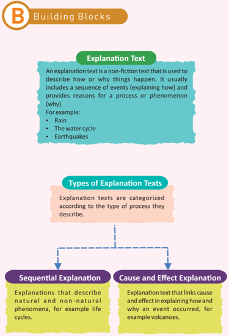

> **Deskripsi Visual:** Gambar ini adalah diagram yang menunjukkan struktur dan jenis-jenis teks penjelasan. Diagram ini terdiri dari dua bagian utama: "Explanations Text" dan "Types of Explanation Text". Bagian pertama menjelaskan apa itu teks penjelasan, yang merupakan jenis non-fiksi yang digunakan untuk menjelaskan bagaimana atau mengapa sesuatu terjadi. Contoh-contoh yang diberikan termasuk hujan, siklus air, dan gempa bumi.

Bagian kedua menggambarkan dua jenis teks penjelasan utama: "Sequential Explanation" dan "Cause and Effect Explanation". "Sequential Explanation" merujuk pada penjelasan tentang fenomena alam dan tidak alam, seperti siklus hidup. Sementara itu, "Cause and Effect Explanation" adalah jenis teks penjelasan yang menghubungkan hubungan antara penyebab dan akibat, seperti letusan gunung berapi.

Dalam diagram ini, teks penjelasan dan jenis-jenisnya disajikan dengan jelas melalui penggunaan warna-warna yang berbeda dan label yang jelas. Ini membantu pembaca memahami konsep dasar tentang teks penjelasan dan bagaimana mereka dapat dibagi menjadi dua jenis utama.

112

Kelas XI SMA/MA/SMK/MAK

 

---
## 📄 Halaman 108

112

### Structure of an ExplanaƟon Text

### Social FuncƟon

An explanaƟon text is used to describe how or why a certain phenomenon happens.

### General Structure

- Ÿ A Ɵtle that idenƟfies the topic to be explained
- Ÿ A clear order of paragraphs that describe how and why
- Ÿ An opening statement that idenƟfies the process to be explained
- Ÿ A concluding paragraph that puts all the informaƟon together
- Ÿ Finally, a visual text (a labeled image)

### LinguisƟc Features

- Ÿ Focuses on general group rather than specific.
- Ÿ Use of acƟon verbs like breaks, erupts.
- Ÿ Use of Linking words like in general, rather, for instance.
- Ÿ Use of present tense like is,  wake, are.
- Ÿ Passive voice may be used.
- Ÿ Reference to people should not be given.
- Ÿ Use of technical terms and language relevant to the subject.
- Ÿ Gives a detailed descripƟon to create a rich meaning.
- Ÿ ConjuncƟons should be used to make connecƟons like and, but.
Semester 1

 

---
## 📄 Halaman 109

---
**🖼️ Gambar/Diagram**

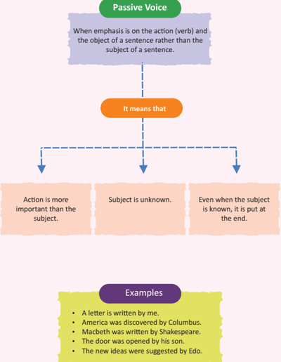

> **Deskripsi Visual:** Gambar ini adalah diagram yang menjelaskan konsep passive voice dalam bahasa Inggris. Diagram ini terdiri dari beberapa elemen utama:

1. Judul: "Passive Voice" berada di bagian atas dengan warna hijau.
2. Penjelasan: "When emphasis is on the action (verb) and the object of a sentence rather than the subject of a sentence." terletak di bagian bawah dengan teks berwarna biru.
3. Teks tambahan: "It means that" berada di tengah dengan warna orange.
4. Konten utama: Dibagi menjadi tiga kolom dengan teks berwarna pink:
   - Kolom pertama: "Action is more important than the subject."
   - Kolom kedua: "Subject is unknown."
   - Kolom ketiga: "Even when the subject is known, it is put at the end."

5. Contoh kalimat: Di bawah konten utama ada contoh kalimat dalam bahasa Inggris yang menggunakan passive voice.

6. Label: "Examples" berada di bawah contoh kalimat dengan warna hijau.

7. Informasi kunci: Gambar ini membantu pembaca memahami bahwa passive voice digunakan ketika fokus pada tindakan (verba) dan objek suatu kalimat, bukan pada subjek kalimat.

112

Kelas XI SMA/MA/SMK/MAK

 

---
## 📄 Halaman 110

### Changes of Pronouns from AcƟve Voice to Passive Voice

---
**📊 Tabel**

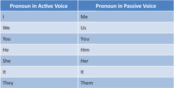

Tabel ini menunjukkan perbedaan antara penggunaan pronomen dalam bentuk aktif dan pasif. Topik utamanya adalah bagaimana pronomen digunakan dalam dua bentuk tersebut. Kolom pertama berisi pronomen dalam bentuk aktif, sedangkan kolom kedua berisi pronomen yang sama tetapi dalam bentuk pasif. Data penting yang terlihat adalah bahwa semua pronomen kecuali "you" dan "us" memiliki pengecualian dalam bentuk pasif, di mana "you" menjadi "you" sendiri dan "us" menjadi "us". Prinsip umumnya, pronomen diri sendiri seperti "I", "we", "he", "she", "it", dan "they" tidak berubah dalam bentuk pasif, sementara pronomen yang tidak diri sendiri seperti "you" dan "us" harus diperlakukan dengan cara yang berbeda.

### Rules for Changing AcƟve Voice to Passive Voice

- Idenify the subject, the verb and the object: SVO.
- Change the object into subject.
- Put the suitable helping verb or auxiliary verb. In case the helping verb is given, use the same verb but note that the helping verb given agrees with the object.
- Change the verb into the past parƟciple form.
- Add the preposiƟon "by".
- Change the subject into object.
Semester 1

 

---
## 📄 Halaman 111

### Example

### Forming Passive Voice

---
**📊 Tabel**

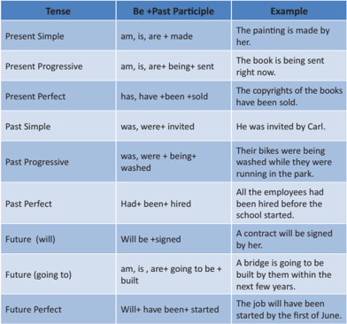

Tabel ini menunjukkan berbagai bentuk penggunaan "be + past participle" dalam bahasa Inggris untuk berbagai tenses. Topik utamanya adalah bagaimana menggunakan bentuk pasif dalam kalimat dengan menggunakan "be + past participle". Kolom pertama menunjukkan tenses (sederhana, bergerak, sempurna, lama, akan, akan, akan), kolom kedua menunjukkan contoh penggunaan "be + past participle", dan kolom ketiga memberikan penjelasan singkat tentang penggunaan tersebut. Pola penting yang terlihat adalah bahwa "be + past participle" digunakan untuk menggambarkan keadaan yang telah terjadi sebelum saat saat ini, baik itu di masa lalu, masa kini, atau masa depan.

Kelas XI SMA/MA/SMK/MAK

112

Semester 1

 

---
## 📄 Halaman 112

### An annotated explanaƟon text

---
**📊 Tabel**

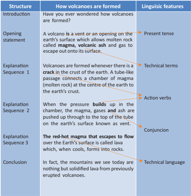

Tabel ini membahas proses pembentukan gunung berapi, yang terdiri dari struktur, bagaimana gunung berapi terbentuk, dan fitur linguistik yang digunakan. Topik utama adalah proses pembentukan gunung berapi. Kolom pertama menunjukkan struktur penjelasan, yang meliputi Introduction, Opening statement, Explanation Sequence 1, Explanation Sequence 2, Explanation Sequence 3, dan Conclusion. Kolom kedua menjelaskan bagaimana gunung berapi terbentuk, sementara kolom ketiga menunjukkan fitur- fitur linguistik yang digunakan dalam penjelasan tersebut. Data penting yang terlihat adalah penggunaan tenses seperti present tense, teknis, dan konjungsi dalam penjelasan tentang pembentukan gunung berapi.

112

Semester 1

 

---
## 📄 Halaman 113

The  opening  statement  of  a  phenomenon  is  given  below.  Use  the  format  of  an explanaƟon text to complete it.

### Opening Statement

Have you ever wondered how rain is formed? Rain is nothing but droplets of water from the air.

Sequence Paragraph 1

Sequence Paragraph 2

Conclusion

Visual Text

112

Kelas XI SMA/MA/SMK/MAK

Semester 1

 

---
## 📄 Halaman 114

Choose one of the topics given below. FormaƟon of rainbows Life cycle of any animal How tsunamis are formed

Do research on any one of the above given topics and explain to a friend or present it in class. Use the explanaƟon text format.

112

Kelas XI SMA/MA/SMK/MAK

Semester 1

 

---
## 📄 Halaman 115

Write an explanaƟon text from any topic given in the acƟve conversaƟon or any topic of your choice. Make sure you follow the structure of explanaƟon text you have learnt in the building blocks. You should also follow the wriƟng process (dra�s, edit, revise and publish).

Dra� 1 (Show this dra� to your teacher for the feedback.)

112

Kelas XI SMA/MA/SMK/MAK

 

---
## 📄 Halaman 116

Dra� �  (Make changes according to the feedback given by your teacher.)

112

Semester 1

 

---
## 📄 Halaman 117

Final Dra� (Revise and publish - share with your teacher, friends, and  on your blog.)

112

Kelas XI SMA/MA/SMK/MAK

 

---
## 📄 Halaman 118

Create a video, PowerPoint presentaƟon, poster or a pamphlet to educate people in your neighbourhood about the formaƟon of tsunamis or earthquakes.

112

Semester 1

 

---
## 📄 Halaman 119

I can do this. Complete these statements.

- The most interesƟng thing I learnt in this chapter was
- The part I enjoyed most was
- I would like to find more about
- The hardest part in this chapter was
- I need to work harder at
Read the statements below and Ɵck ( ) the opion  that is  most applicable to you. ü

---
**📊 Tabel**

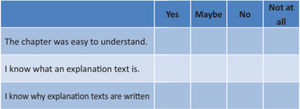

Tabel ini menunjukkan respons responden tentang ketidaksesuaian dengan materi pembelajaran dalam buku pelajaran. Kolom "Yes" menunjukkan bahwa responden merasa materi mudah dipahami, "Maybe" menunjukkan ketidaksesuaian sedang, "No" menunjukkan ketidaksesuaian yang lebih jauh, dan "Not at all" menunjukkan ketidaksesuaian penuh. Topik utama tabel adalah pemahaman dan keakuratan materi pembelajaran dalam buku pelajaran tersebut. Data penting yang terlihat adalah bahwa sebagian besar responden merasa materi mudah dipahami, sementara yang lainnya merasa sedikit atau sangat tidak sesuai dengan materi yang diberikan. Ini menunjukkan perluasan untuk memperbaiki atau memperbarui materi pembelajaran agar lebih sesuai dengan kebutuhan siswa.

My plan to overcome the difficulƟes I faced in this chapter

112

Kelas XI SMA/MA/SMK/MAK

 

---
## 📄 Halaman 120

106

ENRICHMENT

Kelas XI SMA/MA/SMK/MAK

Semester 2

 

---
## 📄 Halaman 121

### 1. Can Greed Ever be Satisfied?

---
**🖼️ Gambar/Diagram**

> **Deskripsi Visual:** Gambar ini adalah ilustrasi yang menampilkan seorang pria tua dengan rambut dan kumis pendek, memegang sebuah batu besar dengan lubang di tengahnya. Pria tersebut sedang berdiri di tepi sungai, di mana air mengalir ke arahnya. Di depannya ada sebuah ikan kunang-kunang yang tampak sangat besar dan berwarna merah cerah. Di latar belakang, terlihat sebuah bangunan berbentuk seperti istana atau kastil, dengan atap berbentuk seperti kerucut dan beberapa menara. Pohon-pohon hijau dan tanaman lainnya juga terlihat di sekitar area tersebut.

 

---
## 📄 Halaman 122

112

### Pre-Reading Activities

### Personal Connection

If you get three wishes from a magical creature, what will you wish for? Write down your wishes in the space given below and share with your teacher and classmates.

### Genre Connection

Folklores  or  tales  are  traditional  stories  that  are  passed  on  from  one generation to another. These stories teach lessons of life. Every culture around the world has a unique way of expressing traditions, beliefs and values through folklores. Folklores are a way of passing on tradition and culture from one generation to another. Folklores can be classified as fairy tales, legends, oral history, tall tales, and fables. The study of folklores is called folkloristic and people who study folklores are known as folklorists. Folklores  usually  have  morals  and  lessons  for  life.  English  antiquarian, William Thoms first coined the word folklore and used it in a letter to the periodical 'The Athenaeum'. (Encyclopedia Britannica)

Famous folklores include: Grimm's fairy tales, The Arabian Nights, Aesop's Fables, Atlantis, etc.

Semester 1

 

---
## 📄 Halaman 123

112

### The Enchanted Fish

There  once  was  a  fisherman  who lived with his wife in a small hut close by the seaside.  The  fisherman  used  to  go  fishing every day.  One day, as he sat in his boat with his rod, looking at the sparkling waves and watching his line, all of a sudden his float was dragged away deep into the water. He quickly started to reel in his line  and managed to pull out a huge fish. 'Wow! This will feed us for days.' Much to his surprise, the fish started to talk and said, 'Pray, let me live! I am not a real fish; I am an enchanted prince. Put me in the water again, and let me

---
**🖼️ Gambar/Diagram**

> **Deskripsi Visual:** Gambar ini adalah ilustrasi yang menampilkan seorang pria tua sedang memotong kayu di depan sebuah istana. Pemandangan ini terdiri dari beberapa elemen utama:

1. **Pemandangan Umum**: Gambar ini menunjukkan seorang pria tua sedang berada di depan sebuah istana, tampaknya sedang memotong kayu dengan alat pemotong kayu. Di sebelah kiri, terdapat air yang mengalir ke sebuah kolam ikan, sementara di sebelah kanan ada sebuah sungai.

2. **Elemen Utama dan Relasinya**: 
   - **Istana**: Terletak di belakang pria tua, tampak seperti sebuah bangunan besar dengan atap berbentuk kerucut.
   - **Kolam Ikan**: Terletak di sebelah kiri pria tua, dengan air yang mengalir ke dalam kolam.
   - **Sungai**: Terletak di sebelah kanan pria tua, dengan air yang mengalir ke arah istana.
   - **Pria Tua**: Berada di tengah-tengah gambar, sedang memotong kayu dengan alat pemotong kayu.

3. **Teks, Angka, atau Label Penting**: Dalam gambar ini, tidak ada teks, angka, atau label yang jelas. Namun, elemen-elemen tersebut memiliki hubungan yang kuat antara satu sama lain, menciptakan suasana yang tenang dan damai.

4. **Informasi Kunci yang Bisa Diambil Pembaca**: Gambar ini mungkin digunakan untuk membantu pembaca memahami konsep tentang pekerjaan tradisional atau kehidupan sehari-hari di masa lalu. Istri pria tua mungkin sedang merawat kolam ikan dan sungai, sementara pria tua sedang bekerja memotong kayu untuk membangun atau memperbaiki istana.

Dengan demikian, gambar ini menunjukkan hubungan antara pekerjaan tradisional, kehidupan sehari-hari, dan keindahan alam semesta.

go! Have mercy o' kind fisherman.' The astonished fisherman quickly threw him back, exclaiming, 'I don't want to hurt a talking fish! Go on! Go where you came from.'

When the fisherman went home to his wife, he told her everything that had happened and how, on hearing it speak, he had let it go again. 'Didn't you ask it for anything?' said the wife. 'No, I didn't, what should I have asked for?' replied the fisherman.

'I am surprised you don't realize what you should have asked for. We live very wretchedly here, in this nasty and dirty hut. We are poor and I am so miserable. You should have asked for a nice cozy cottage. Now go back and ask the fish that we want a snug little cottage', said his wife.

The fisherman wasn't sure about this but he still went to the seashore, sat in his boat, went to the middle of the sea and said:

'O enchanted beautiful fish! Hear my plea! My wife wants not what I want, and she won't give up till she has her own will, so come forth and help me!'

Kelas XI SMA/MA/SMK/MAK

 

---
## 📄 Halaman 124

The fish immediately came swimming to him, and said, 'Well, what is her will? How can I help your wife?' 'Ah!' said the fisherman, 'she says that when I had caught you, I ought to have asked you for something before I let you go. She does not like living in our little hut, and wants a snug little cottage.' 'Go home, then,' said the fish, 'She is already in the cottage!' So the fisherman  went home, and saw his wife standing at the door of a nice trim little cottage. 'Come in, come on in! Look at the beautiful cottage we have.' Everything went fine for a while, and then one day the fisherman's wife said, ' Husband, there is not enough room for us in this cottage, go back to the fish and tell him to make me an emperor.' 'Wife,' said the fisherman, 'I don't want to go to him again. Perhaps he will be angry. We ought to be happy with what the fish has given us and not be greedy.' 'Nonsense!' said the wife; ' The fish will do it very willingly, I know. Go along and try!' With a heavy heart the fisherman went to the middle of the sea and said:

'O enchanted beautiful fish! Hear my plea! My wife wants not what I want, and she won't give up till she has her own will, so come forth and help me!'

'What would she have now?' said the fish. 'Ah!' said the fisherman, 'she wants to be an emperor.' 'Go home,' said the fish; 'She is an emperor already.'

So he went home and he saw his wife sitting on a very lofty throne made of solid gold, with a great crown on her head full two yards high. And on each side of her stood her guards and attendants in a row. The fisherman went up to her and said, 'Wife, are you an emperor?' 'Yes', said she, 'I am an emperor.' 'Ah!' said the man, as he gazed upon her, 'What a fine thing it is to be an emperor!' 'Husband,' said she, 'it is good to be an emperor.' They were happy for a while.

Then a time came when she was not able to sleep all night for she was thinking what she should ask next. At last, as she was about to fall asleep, morning broke, and the sun rose. 'Ha!'' thought she, as she woke up and looked at it through  the  window, 'after  all  I  cannot  prevent  the  sun  from  rising.' At  this thought she was very angry, and wakened her husband, and said, 'Husband, go to the fish and tell him I must be Lord of the sun and the moon.' The fisherman was half asleep, but the thought frightened him so much that he fell out of the bed. ' Alas, wife!' said he, 'cannot you be happy with being such a powerful emperor?'

112

Semester 1

 

---
## 📄 Halaman 125

'No,' said she, 'I am very uneasy as long as the sun and the moon rise without my permission. Go to the fish at once!' 'I don't think this is a good idea,' said the fisherman but his wife wouldn't listen to him. ' Why don't you just go and ask the fish to make me the Lord of everything?' she said.

Then the man went shivering with fear. As he was going down to the shore a dreadful storm arose. The trees and the very rocks shook and the sky became black  with  stormy  clouds.  There  were  great  black  waves,  swelling  up  like mountains  with  crowns  of  white  foam  upon  their  heads.  Unfortunately,  the fisherman did not have any choice, so he got onto his boat and rowed to the middle of the sea and cried out as loud as he could:

'O enchanted beautiful fish!

Hear my plea! My wife wants not what I want, and she won't give up till she has her own will, so come forth and help me!'

'What does she want now?' said the fish. 'I am truly ashamed of my wife's greed but I can't do anything. She wants to be Lord of the sun and the moon. 'Go home,' said the fish, ' to your small hut.' And it is said that they live there to this very day.

112

(Adapted from Grimm Brothers, 1812. 'The fisherman and his wife')

---
**🖼️ Gambar/Diagram**

> **Deskripsi Visual:** Gambar ini adalah ilustrasi yang menunjukkan dua orang dewasa berada di luar rumah mereka yang hanyut dalam banjir. Rumah mereka terlihat rusak dengan atap yang ambruk dan dinding yang terendam air. Di sebelah kiri, ada seorang wanita yang sedang berjalan dengan kaki yang terendam air, sementara di sebelah kanan ada seorang pria yang juga terendam air dan membawa sebuah kubus. Keduanya tampak sangat kebingungan dan memerlukan bantuan untuk keluar dari banjir. Di sekitar mereka, terlihat rumput yang tumbuh liar dan pohon-pohon yang ambruk, menunjukkan dampak langsung dari banjir. Ilustrasi ini menunjukkan situasi darurat dan kebutuhan akan bantuan darurat.

Kelas XI SMA/MA/SMK/MAK

 

---
## 📄 Halaman 126

### Post-Reading Activity

Read the questions carefully. Note down your opinions and reactions to the questions. During the discussion with your teacher and classmates, offer your personal reaction and understanding of the text.

- Did the fisherman like asking the fish for wishes? How did he feel about it? Do you think he could have done something else instead of going back to the fish again and again?
- The story doesn't reveal how the prince was turned into a fish. What do you think might have happened?
- Do you think the prince will stay a fish forever?
- What happened at the end of the story? Please describe.
- Why did the fisherman's wife keep asking her husband to go back to the fish?
- What do you think of the fisherman's wife? Do you feel sorry for her? Or do you feel angry with her? Discuss.
- If you had a chance to rewrite the story, how would the story end? Write your ending of the story.
- Imagine you are the fish in the story. Can you narrate the story from his point of view?
- What lesson did you learn from this story?

### Discussion Notes :

112

Semester 1

---

*📊 Statistik: 60 visual berhasil, 16 dilewati, 0 gagal | Durasi: 11m 32s*